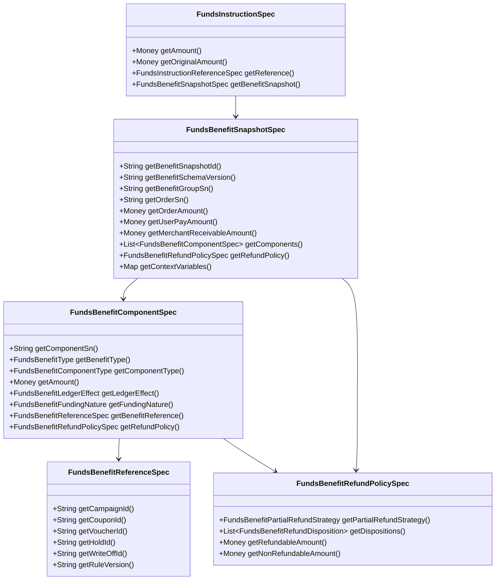

# FundsBenefitSnapshotSpec 完整设计

## 1. 设计定位

`FundsBenefitSnapshotSpec` 是资金指令上的权益结果快照，用于承接优惠券、代金券、平台补贴、商户让利、储值券核销等已经由业务侧或营销权益系统决策完成的结果。

它不替代营销系统，不重新计算券规则，不决定用户是否可用券；它只把“本次交易实际使用了什么权益、金额如何闭合、谁承担、是否入账、退款如何处理、后续如何回放”固化为资金底座可理解的稳定事实。

设计原则：

1. 不修改 `FundsInstructionSpec` 现有字段语义。
2. 只在 `FundsInstructionSpec` 增加一个可选一级字段：`benefitSnapshot`。
3. 权益快照必须可被 route、posting、refund replay、clearing、reconciliation 和 projection 消费。
4. 商户让利等无资金转移权益不能误生成 `LedgerEntry`。
5. 平台补贴、储值代金券等有资金影响权益必须能被拆成独立 route leg 或独立 posting 依据。

## 2. 现有结构对齐

当前 `FundsInstructionSpec` 已经有稳定主字段：

| 字段 | 当前语义 | 本设计是否改变 |
| --- | --- | --- |
| `amount` | 当前资金指令主链路金额。 | 不改变。 |
| `originalAmount` | 当前资金指令原始金额和 FX 快照。 | 不改变，不拿来表达订单原价。 |
| `exchangeRate` | `originalAmount -> amount` 的汇率快照。 | 不改变。 |
| `instrumentRef` | 支付工具引用快照。 | 不改变。 |
| `externalAccountRef` | 外部账户引用快照。 | 不改变。 |
| `reference` | 后续事件引用原资金事实或原快照。 | 不改变。 |
| `contextVariables` | 补充上下文。 | 仍保留，但不承载核心权益语义。 |

建议新增：

```java
@Nullable
default FundsBenefitSnapshotSpec getBenefitSnapshot() {
    return null;
}
```

该字段与 `instrumentRef`、`externalAccountRef`、`reference` 同级，是资金指令可选事实快照，不是临时上下文。

## 3. 包结构建议

保持现有 `spec` / `model` 分层风格：

```text
core/src/main/java/com/wind/integration/funds/spec/transaction/
  FundsBenefitSnapshotSpec.java
  FundsBenefitComponentSpec.java
  FundsBenefitReferenceSpec.java
  FundsBenefitRefundPolicySpec.java

core/src/main/java/com/wind/integration/funds/model/transaction/
  ImmutableFundsBenefitSnapshotSpec.java
  ImmutableFundsBenefitComponentSpec.java
  ImmutableFundsBenefitReferenceSpec.java
  ImmutableFundsBenefitRefundPolicySpec.java

core/src/main/java/com/wind/integration/funds/transaction/enums/
  FundsBenefitType.java
  FundsBenefitComponentType.java
  FundsBenefitLedgerEffect.java
  FundsBenefitFundingNature.java
  FundsBenefitRefundDisposition.java
  FundsBenefitPartialRefundStrategy.java
  FundsBenefitLifecycleAction.java
```

不建议把权益模型放到 `route` 包，因为它先属于资金指令事实；route 只消费它，不拥有它。

## 4. 总体对象关系



## 5. FundsBenefitSnapshotSpec

`FundsBenefitSnapshotSpec` 表达一组权益结果快照。一个资金指令最多携带一个快照；快照内可以包含多个权益组件。

```java
public interface FundsBenefitSnapshotSpec {

    @NonNull
    String getBenefitSnapshotId();

    @NonNull
    default String getBenefitSchemaVersion() {
        return "1.0";
    }

    @NonNull
    String getBenefitGroupSn();

    @Nullable
    default String getOrderSn() {
        return null;
    }

    @Nullable
    default String getPricingSnapshotSn() {
        return null;
    }

    @NonNull
    Money getOrderAmount();

    @NonNull
    Money getUserPayAmount();

    @Nullable
    default Money getMerchantReceivableAmount() {
        return null;
    }

    @NonNull
    List<FundsBenefitComponentSpec> getComponents();

    @Nullable
    default FundsBenefitRefundPolicySpec getRefundPolicy() {
        return null;
    }

    @Nullable
    default String getDecisionSource() {
        return null;
    }

    @Nullable
    default String getDecisionTraceId() {
        return null;
    }

    @NonNull
    default Map<String, Object> getContextVariables() {
        return Map.of();
    }
}
```

字段说明：

| 字段 | 必填 | 说明 |
| --- | --- | --- |
| `benefitSnapshotId` | 是 | 权益快照 ID，用于审计、回放和对账。 |
| `benefitSchemaVersion` | 是 | 快照结构版本，便于后续兼容演进。 |
| `benefitGroupSn` | 是 | 同一订单、支付、补贴、退款、清结算之间的权益关联组号。 |
| `orderSn` | 否 | 订单号或业务订单引用。 |
| `pricingSnapshotSn` | 否 | 订单价格快照或商品行分摊快照引用。 |
| `orderAmount` | 是 | 订单原始金额，不替代 `FundsInstructionSpec.amount`。 |
| `userPayAmount` | 是 | 用户实付或本次应由用户资金承担的金额。 |
| `merchantReceivableAmount` | 否 | 商户应收毛额，清结算可用；未知时由清结算规则计算。 |
| `components` | 是 | 权益组件列表。 |
| `refundPolicy` | 否 | 快照级默认退款策略，组件可覆盖。 |
| `decisionSource` | 否 | 决策来源，例如 `ORDER_PRICING`、`PROMOTION_SYSTEM`。 |
| `decisionTraceId` | 否 | 外部权益决策链路追踪 ID。 |
| `contextVariables` | 是 | 非关键扩展上下文，不承载必填主语义。 |

## 6. FundsBenefitComponentSpec

`FundsBenefitComponentSpec` 是一个权益金额组件。它回答“这笔权益金额是什么、谁承担、是否入账、后续怎么退”。

```java
public interface FundsBenefitComponentSpec {

    @NonNull
    String getComponentSn();

    default int getSequence() {
        return 0;
    }

    @NonNull
    FundsBenefitType getBenefitType();

    @NonNull
    FundsBenefitComponentType getComponentType();

    @NonNull
    Money getAmount();

    @NonNull
    default FundsBenefitLedgerEffect getLedgerEffect() {
        return FundsBenefitLedgerEffect.NO_LEDGER;
    }

    @NonNull
    default FundsBenefitFundingNature getFundingNature() {
        return FundsBenefitFundingNature.NO_FUNDS_TRANSFER;
    }

    @Nullable
    default SubjectRef getBearerSubjectRef() {
        return null;
    }

    @Nullable
    default SubjectRef getBeneficiarySubjectRef() {
        return null;
    }

    @Nullable
    default SubjectRef getFundingSubjectRef() {
        return null;
    }

    @Nullable
    default String getFundingAccountRole() {
        return null;
    }

    @NonNull
    FundsBenefitReferenceSpec getBenefitReference();

    @Nullable
    default FundsBenefitRefundPolicySpec getRefundPolicy() {
        return null;
    }

    @Nullable
    default String getDescription() {
        return null;
    }

    @NonNull
    default Map<String, Object> getContextVariables() {
        return Map.of();
    }
}
```

字段说明：

| 字段 | 必填 | 说明 |
| --- | --- | --- |
| `componentSn` | 是 | 组件唯一标识，便于退款、对账和问题定位。 |
| `sequence` | 否 | 组件顺序，便于稳定序列化和审计展示。 |
| `benefitType` | 是 | 权益类型，例如商户券、平台券、代金券、储值券。 |
| `componentType` | 是 | 金额组件类型，例如商户让利、平台补贴、代金券核销。 |
| `amount` | 是 | 组件金额，必须为正数。 |
| `ledgerEffect` | 是 | 是否影响账本、是否只占用、是否需要退款冲回。 |
| `fundingNature` | 是 | 资金性质，例如无资金转移、平台自有资金、预付负债。 |
| `bearerSubjectRef` | 条件必填 | 承担方，可为商户、平台、合作方或用户权益主体。 |
| `beneficiarySubjectRef` | 条件必填 | 受益方，通常是用户或商户。 |
| `fundingSubjectRef` | 条件必填 | 有资金转移时的资金来源主体。 |
| `fundingAccountRole` | 否 | 平台账户角色或业务账户角色；当前平台账户快照无补贴专用字段时可先记录角色码。 |
| `benefitReference` | 是 | 券、活动、核销、占用、规则版本等外部引用。 |
| `refundPolicy` | 否 | 组件级退款规则；为空时使用快照级默认规则。 |

## 7. FundsBenefitReferenceSpec

`FundsBenefitReferenceSpec` 固化外部权益系统引用，只保存引用和快照信息，不保存完整营销规则。

```java
public interface FundsBenefitReferenceSpec {

    @Nullable
    default String getCampaignId() {
        return null;
    }

    @Nullable
    default String getCouponId() {
        return null;
    }

    @Nullable
    default String getVoucherId() {
        return null;
    }

    @Nullable
    default String getBenefitInstanceId() {
        return null;
    }

    @Nullable
    default String getHoldId() {
        return null;
    }

    @Nullable
    default String getWriteOffId() {
        return null;
    }

    @Nullable
    default String getReleaseId() {
        return null;
    }

    @Nullable
    default String getRuleVersion() {
        return null;
    }

    @Nullable
    default String getExternalDecisionId() {
        return null;
    }

    @NonNull
    default Map<String, Object> getContextVariables() {
        return Map.of();
    }
}
```

字段边界：

1. `couponId`、`voucherId`、`benefitInstanceId` 是外部引用，不是资金底座主键。
2. `holdId` 用于授权占用场景。
3. `writeOffId` 用于已核销场景。
4. `ruleVersion` 必须随原交易保存，退款时不能按当前活动规则重算。
5. 不保存用户券包敏感信息、完整活动规则或营销系统内部配置。

## 8. FundsBenefitRefundPolicySpec

退款规则分为用户侧处置和资金侧处置。一个组件可以同时有多个处置，例如 `NO_REFUND + REVERSE_SUBSIDY`。

```java
public interface FundsBenefitRefundPolicySpec {

    @NonNull
    default FundsBenefitPartialRefundStrategy getPartialRefundStrategy() {
        return FundsBenefitPartialRefundStrategy.ORIGINAL_SNAPSHOT;
    }

    @NonNull
    List<FundsBenefitRefundDisposition> getDispositions();

    @Nullable
    default Money getRefundableAmount() {
        return null;
    }

    @Nullable
    default Money getNonRefundableAmount() {
        return null;
    }

    @Nullable
    default String getRefundRuleVersion() {
        return null;
    }

    @Nullable
    default String getRefundPolicyCode() {
        return null;
    }

    @NonNull
    default Map<String, Object> getContextVariables() {
        return Map.of();
    }
}
```

规则：

1. 组件级 `refundPolicy` 优先于快照级 `refundPolicy`。
2. 不退券和不冲补贴必须分开表达。
3. 部分退款策略必须进入原交易快照。
4. 缺少原权益快照的退款不得按当前规则重算，应失败或进入人工处理。

## 9. 枚举设计

### 9.1 FundsBenefitType

```java
public enum FundsBenefitType implements DescriptiveEnum {
    MERCHANT_COUPON("商户优惠券"),
    PLATFORM_COUPON("平台优惠券"),
    VOUCHER("普通代金券"),
    PREPAID_VOUCHER("预付或储值代金券"),
    GIFT_CARD("礼品卡"),
    PARTNER_SUBSIDY("合作方补贴"),
    MANUAL_BENEFIT("人工权益");
}
```

### 9.2 FundsBenefitComponentType

```java
public enum FundsBenefitComponentType implements DescriptiveEnum {
    MERCHANT_DISCOUNT("商户让利"),
    PLATFORM_SUBSIDY("平台补贴"),
    VOUCHER_REDEEM("代金券核销"),
    PREPAID_REDEEM("预付权益核销"),
    PARTNER_SUBSIDY("合作方补贴"),
    BENEFIT_REFUND("权益退款"),
    SUBSIDY_REVERSAL("补贴冲回"),
    VOUCHER_RESTORE("代金券恢复"),
    NON_REFUNDABLE_BENEFIT("不可退权益");
}
```

### 9.3 FundsBenefitLedgerEffect

```java
public enum FundsBenefitLedgerEffect implements DescriptiveEnum {
    NO_LEDGER("不生成账本分录"),
    POSTING_REQUIRED("需要生成账务路径"),
    HOLD_ONLY("仅占用，不核销"),
    RELEASE_ONLY("仅释放占用"),
    REVERSAL_REQUIRED("需要冲回原权益资金影响"),
    PROJECTION_ONLY("只影响展示或清结算金额项");
}
```

### 9.4 FundsBenefitFundingNature

```java
public enum FundsBenefitFundingNature implements DescriptiveEnum {
    NO_FUNDS_TRANSFER("无资金转移"),
    MERCHANT_BORNE("商户承担"),
    PLATFORM_OWN_FUNDS("平台自有资金承担"),
    PREPAID_LIABILITY("预付或储值负债"),
    PARTNER_FUNDED("合作方承担"),
    USER_BENEFIT_BALANCE("用户权益余额"),
    UNKNOWN_PENDING_CONFIRMATION("待确认资金性质");
}
```

### 9.5 FundsBenefitRefundDisposition

```java
public enum FundsBenefitRefundDisposition implements DescriptiveEnum {
    REISSUE("返还或重发权益"),
    RELEASE_HOLD("释放权益占用"),
    VOID("权益作废"),
    NO_REFUND("用户侧不返还权益"),
    REVERSE_SUBSIDY("冲回补贴"),
    RETAIN_SUBSIDY("保留补贴不冲回"),
    REDUCE_MERCHANT_RECEIVABLE("减少商户应收"),
    RESTORE_PREPAID_LIABILITY("恢复预付负债或权益余额"),
    RELEASE_TO_INCOME_OR_BREAKAGE("释放到收入或沉淀口径");
}
```

### 9.6 FundsBenefitPartialRefundStrategy

```java
public enum FundsBenefitPartialRefundStrategy implements DescriptiveEnum {
    ORIGINAL_SNAPSHOT("使用原快照默认策略"),
    ITEM_LINE_BASED("按商品行分摊"),
    PROPORTIONAL("按比例分摊"),
    CASH_FIRST("用户实付优先"),
    BENEFIT_FIRST("权益优先"),
    NON_REFUNDABLE_BENEFIT_FIRST("不可退权益优先确认"),
    MANUAL_REVIEW("人工处理");
}
```

### 9.7 FundsBenefitLifecycleAction

```java
public enum FundsBenefitLifecycleAction implements DescriptiveEnum {
    DECIDED("已决策"),
    HOLD("占用"),
    WRITE_OFF("核销"),
    RELEASE("释放"),
    REISSUE("返还"),
    VOID("作废"),
    REVERSAL("冲回");
}
```

`FundsBenefitLifecycleAction` 可作为 `FundsBenefitReferenceSpec.contextVariables` 或后续扩展字段使用。第一阶段可不作为组件必填字段，避免生命周期系统被资金底座接管。

## 10. 校验规则

### 10.1 快照级校验

1. `benefitSnapshotId`、`benefitGroupSn` 不能为空。
2. `orderAmount`、`userPayAmount` 必须为正数或明确支持零实付场景。若当前 `Money` 和指令校验不支持零金额，则零实付必须拆为补贴或代金券指令，不提交用户支付指令。
3. `components` 不为空时，每个 `componentSn` 在快照内唯一。
4. 所有组件币种必须与 `orderAmount` 币种一致；跨币种场景必须由业务侧先给已决策 FX 快照，本模型不计算换汇。
5. 权益金额合计不得超过 `orderAmount`，除非业务明确允许并已裁剪为可用金额。
6. `userPayAmount + components.amount` 应能解释 `orderAmount`，但不要求每个组件都入账。

建议校验方法：

```java
default boolean isAmountClosed() {
    Money componentTotal = getComponents().stream()
            .map(FundsBenefitComponentSpec::getAmount)
            .reduce(Money::add)
            .orElse(Money.immutable(0, getOrderAmount().getCurrency()));
    return getUserPayAmount().add(componentTotal).equals(getOrderAmount());
}
```

注意：如果组件里包含手续费、税费或不参与抵扣的清结算项，不应纳入上述闭合公式。因此第一阶段建议 `components` 只放“抵扣或补贴类权益组件”，手续费仍走现有 fee 设计。

### 10.2 组件级校验

| 场景 | 校验 |
| --- | --- |
| `NO_LEDGER` | 不要求 `fundingSubjectRef`，但必须有 `bearerSubjectRef` 或可从订单/商户上下文解释承担方。 |
| `POSTING_REQUIRED` | 必须有 `fundingSubjectRef` 或 `fundingAccountRole`，否则 route 无法生成资金路径。 |
| `HOLD_ONLY` | 必须有 `holdId` 或外部占用引用。 |
| `RELEASE_ONLY` | 必须引用原 `holdId` 或原权益快照。 |
| `PREPAID_LIABILITY` | 必须有 `voucherId`、`benefitInstanceId` 或 `fundingSubjectRef`，并需财务确认负债口径。 |
| `REVERSE_SUBSIDY` | 必须能引用原补贴组件 `componentSn`、原交易或原 route snapshot。 |
| `NO_REFUND` | 必须有 `refundRuleVersion` 或原权益规则版本。 |

## 11. 与 route、posting、replay 的关系

### 11.1 RouteResolver 消费规则

`RouteResolver` 读取 `FundsInstructionSpec.benefitSnapshot` 后按组件决定是否新增 route leg。

| 组件 | route 行为 |
| --- | --- |
| `MERCHANT_DISCOUNT + NO_LEDGER` | 不生成 route leg；进入 route snapshot 的权益快照，供清结算和展示使用。 |
| `PLATFORM_SUBSIDY + POSTING_REQUIRED` | 生成平台补贴资金来源到商户 `CLEARING` 的 route leg，或作为独立伴随指令生成 route。 |
| `VOUCHER_REDEEM + PREPAID_LIABILITY` | 生成预付负债或用户权益余额到商户 `CLEARING` 的 route leg。 |
| `HOLD_ONLY` | 授权阶段只固化权益占用引用，不进入商户 `CLEARING`。 |
| `SUBSIDY_REVERSAL` | 退款阶段沿原补贴组件回放。 |

### 11.2 RouteSnapshot 持久化建议

`RouteSnapshotSpec` 后续建议增加可选字段：

```java
@Nullable
default FundsBenefitSnapshotSpec getBenefitSnapshot() {
    return null;
}
```

如果第一阶段不改 `RouteSnapshotSpec`，则必须把 `benefitSnapshotId` 和组件摘要写入 `RouteSnapshotSpec.contextVariables`，但这只是过渡方案。目标态应让 route snapshot 一并固化权益快照，否则退款回放仍需回查原指令。

### 11.3 PostingAssembler 消费规则

`LedgerPostingAssembler` 不应直接理解营销规则，只消费 route leg 和组件上的账务效果：

1. `NO_LEDGER` 组件不得生成 posting。
2. `POSTING_REQUIRED` 组件必须形成独立 posting plan 或独立 posting phase。
3. 补贴、代金券、手续费、本金不得混成一个净额。
4. `componentSn` 应写入 posting 或 entry 的 `contextVariables`，用于对账和追溯。

### 11.4 Replay 规则

后续事件处理顺序：

1. 读取原资金事实或原 route snapshot。
2. 取得原 `FundsBenefitSnapshotSpec`。
3. 按原组件的 `refundPolicy` 和 `benefitReference` 执行退款、释放、冲回或作废。
4. 不调用当前营销规则重算。
5. 缺原权益快照时，进入失败或人工处理。

## 12. JSON 示例

### 12.1 商户优惠券

```json
{
  "tenantId": 1,
  "instructionType": "DIRECT_TRANSACTION",
  "eventType": "PAY",
  "transactionType": "PAY",
  "businessScene": "MERCHANT_ORDER_PAY",
  "businessSn": "PAY_202605210001",
  "amount": { "currency": "USD", "minorValue": 8000 },
  "originalAmount": { "currency": "USD", "minorValue": 8000 },
  "exchangeRate": "1",
  "benefitSnapshot": {
    "benefitSnapshotId": "bs_202605210001",
    "benefitSchemaVersion": "1.0",
    "benefitGroupSn": "bg_202605210001",
    "orderSn": "order_10001",
    "orderAmount": { "currency": "USD", "minorValue": 10000 },
    "userPayAmount": { "currency": "USD", "minorValue": 8000 },
    "merchantReceivableAmount": { "currency": "USD", "minorValue": 8000 },
    "components": [
      {
        "componentSn": "bc_001",
        "sequence": 1,
        "benefitType": "MERCHANT_COUPON",
        "componentType": "MERCHANT_DISCOUNT",
        "amount": { "currency": "USD", "minorValue": 2000 },
        "ledgerEffect": "NO_LEDGER",
        "fundingNature": "MERCHANT_BORNE",
        "benefitReference": {
          "campaignId": "merchant_campaign_01",
          "couponId": "mc_10001",
          "writeOffId": "wo_90001",
          "ruleVersion": "v3"
        },
        "refundPolicy": {
          "partialRefundStrategy": "ITEM_LINE_BASED",
          "dispositions": ["NO_REFUND", "REDUCE_MERCHANT_RECEIVABLE"]
        }
      }
    ],
    "decisionSource": "ORDER_PRICING",
    "contextVariables": {}
  },
  "contextVariables": {
    "payerAccountId": "fa_user_10001_usd",
    "payeeAccountId": "fa_merchant_20001_usd",
    "payeeLedgerSubjectCode": "CLEARING"
  }
}
```

### 12.2 平台补贴券

```json
{
  "tenantId": 1,
  "instructionType": "DIRECT_TRANSACTION",
  "eventType": "PAY",
  "transactionType": "PAY",
  "businessScene": "MERCHANT_ORDER_PAY",
  "businessSn": "PAY_202605210002",
  "amount": { "currency": "USD", "minorValue": 8000 },
  "originalAmount": { "currency": "USD", "minorValue": 8000 },
  "exchangeRate": "1",
  "benefitSnapshot": {
    "benefitSnapshotId": "bs_202605210002",
    "benefitGroupSn": "bg_202605210002",
    "orderSn": "order_10002",
    "orderAmount": { "currency": "USD", "minorValue": 10000 },
    "userPayAmount": { "currency": "USD", "minorValue": 8000 },
    "merchantReceivableAmount": { "currency": "USD", "minorValue": 10000 },
    "components": [
      {
        "componentSn": "bc_002",
        "benefitType": "PLATFORM_COUPON",
        "componentType": "PLATFORM_SUBSIDY",
        "amount": { "currency": "USD", "minorValue": 2000 },
        "ledgerEffect": "POSTING_REQUIRED",
        "fundingNature": "PLATFORM_OWN_FUNDS",
        "fundingAccountRole": "PLATFORM_COST",
        "benefitReference": {
          "campaignId": "platform_campaign_01",
          "couponId": "pc_20001",
          "writeOffId": "wo_90002",
          "ruleVersion": "v5"
        },
        "refundPolicy": {
          "partialRefundStrategy": "PROPORTIONAL",
          "dispositions": ["NO_REFUND", "REVERSE_SUBSIDY"]
        }
      }
    ]
  },
  "contextVariables": {
    "payerAccountId": "fa_user_10001_usd",
    "payeeAccountId": "fa_merchant_20001_usd",
    "payeeLedgerSubjectCode": "CLEARING"
  }
}
```

说明：主指令 `amount=8000` 仍是用户实付主链路金额；平台补贴组件由 route resolver 决定是否在同一交易内补一条平台补贴 leg，或由业务编排生成独立补贴指令。两种实现都不改变 `amount` 语义。

### 12.3 授权时占券

```json
{
  "tenantId": 1,
  "instructionType": "AUTHORIZATION_TRANSACTION",
  "eventType": "AUTHORIZE",
  "transactionType": "PAY",
  "businessScene": "CARD_ORDER_AUTH",
  "businessSn": "AUTH_202605210001",
  "amount": { "currency": "USD", "minorValue": 8000 },
  "originalAmount": { "currency": "USD", "minorValue": 8000 },
  "exchangeRate": "1",
  "benefitSnapshot": {
    "benefitSnapshotId": "bs_auth_202605210001",
    "benefitGroupSn": "bg_202605210003",
    "orderSn": "order_10003",
    "orderAmount": { "currency": "USD", "minorValue": 10000 },
    "userPayAmount": { "currency": "USD", "minorValue": 8000 },
    "components": [
      {
        "componentSn": "bc_003",
        "benefitType": "PLATFORM_COUPON",
        "componentType": "PLATFORM_SUBSIDY",
        "amount": { "currency": "USD", "minorValue": 2000 },
        "ledgerEffect": "HOLD_ONLY",
        "fundingNature": "PLATFORM_OWN_FUNDS",
        "benefitReference": {
          "campaignId": "platform_campaign_02",
          "couponId": "pc_30001",
          "holdId": "hold_70001",
          "ruleVersion": "v2"
        },
        "refundPolicy": {
          "partialRefundStrategy": "ORIGINAL_SNAPSHOT",
          "dispositions": ["RELEASE_HOLD"]
        }
      }
    ]
  },
  "contextVariables": {
    "authorizationAccountId": "fa_user_10001_usd"
  }
}
```

## 13. 不变量和红线

1. `FundsBenefitSnapshotSpec` 不改变 `FundsInstructionSpec.amount` 语义。
2. `FundsBenefitSnapshotSpec` 不表达完整营销规则，只表达结果快照。
3. `NO_LEDGER` 组件不能生成账本分录。
4. `POSTING_REQUIRED` 组件必须能被 route 或 posting 解释为独立资金影响。
5. 授权拒绝不得生成 route、posting、entry，也不得核销权益。
6. 授权阶段默认只占用权益，完成阶段才核销；授权即核销属于高风险特殊模式。
7. 退款必须基于原权益快照，不按当前活动规则重算。
8. 不退券和不冲补贴是两个不同处置，必须分开表达。
9. 储值、预付、礼品卡型权益必须标记 `PREPAID_LIABILITY` 或待确认资金性质，不能当普通优惠券处理。
10. `contextVariables` 只放非关键扩展信息，不承载核心权益金额、规则版本或退款处置。

## 14. 与现有代码的兼容落点

### 14.1 第一阶段最小代码改动

| 文件 | 改动 |
| --- | --- |
| `FundsInstructionSpec` | 增加 `getBenefitSnapshot()` 默认方法，返回 `null`。 |
| `ImmutableFundsInstructionSpec` | 增加 `@Nullable FundsBenefitSnapshotSpec benefitSnapshot` 字段和 getter。 |
| `spec/transaction` | 新增 4 个 Spec 接口。 |
| `model/transaction` | 新增 4 个 Immutable record。 |
| `transaction/enums` | 新增 6 至 7 个枚举。 |
| DSL 契约测试 | 增加 JSON 反序列化、金额闭合、无权益兼容、商户券 no-ledger、平台补贴 posting-required 用例。 |

第一阶段不强制修改：

1. `RouteSnapshotSpec`。
2. `RouteResolver`。
3. `LedgerPostingAssembler`。
4. 交易持久化表结构。

这些可以先通过快照序列化、context 透传或测试夹具验证设计。

### 14.2 第二阶段 route/posting 消费

| 模块 | 改动 |
| --- | --- |
| `RouteSnapshotSpec` | 增加可选 `getBenefitSnapshot()`，让 replay 不依赖原指令回查。 |
| `TransferFundsInstructionRouteResolver` | 对 `POSTING_REQUIRED` 平台补贴或代金券组件生成额外 leg。 |
| `AuthorizationFundsInstructionRouteResolver` | 授权时识别 `HOLD_ONLY`，完成时识别核销或补贴入账。 |
| `DefaultLedgerPostingAssembler` | 将 `componentSn`、`benefitSnapshotId` 写入 posting context。 |
| `DefaultRouteReplayService` | 退款时读取原权益组件和退款处置。 |

### 14.3 第三阶段清结算与对账

| 模块 | 改动 |
| --- | --- |
| 清分明细 | 增加权益金额项快照。 |
| 清算候选 | 识别平台补贴、商户让利、代金券核销。 |
| 对账差错 | 增加营销核销与资金入账差错类型。 |
| 投影 | 用户、商户、运营展示权益拆分和不退券原因。 |

## 15. TDD 验收建议

新增用例：

| caseId | 场景 | 断言 |
| --- | --- | --- |
| `DSL-BENEFIT-SNAPSHOT-001` | 最小合法权益快照。 | 可构造、字段非空、context 不为 null。 |
| `DSL-BENEFIT-AMOUNT-CLOSURE-001` | 用户实付 + 商户券 = 订单金额。 | `isAmountClosed()` 为真。 |
| `DSL-BENEFIT-MERCHANT-DISCOUNT-001` | 商户券 no-ledger。 | 不生成权益 route leg 或 posting。 |
| `DSL-BENEFIT-PLATFORM-SUBSIDY-001` | 平台补贴 posting-required。 | 组件可被 route resolver 识别为资金影响。 |
| `DSL-BENEFIT-AUTH-HOLD-001` | 授权时占券。 | 生成授权占用，不核销券，不进商户清算。 |
| `DSL-BENEFIT-REFUND-NO-COUPON-001` | 不退券但冲补贴。 | 用户侧 `NO_REFUND`，资金侧 `REVERSE_SUBSIDY` 同时存在。 |
| `DSL-BENEFIT-PREPAID-VOUCHER-001` | 储值券。 | `fundingNature=PREPAID_LIABILITY`，不得当普通券。 |
| `DSL-BENEFIT-MISSING-SNAPSHOT-REPLAY-001` | 退款缺原权益快照。 | 不重算当前规则，失败或人工处理。 |

## 16. 待确认问题

| 编号 | 问题 | 影响 |
| --- | --- | --- |
| C01 | `Money` 是否允许权益快照中 `userPayAmount=0`。 | 零实付订单是否能单指令表达，还是必须拆权益资金指令。 |
| C02 | 平台补贴是否作为同一资金指令的额外 leg，还是作为独立伴随指令。 | 决定 route resolver 改动范围和幂等键设计。 |
| C03 | 是否要新增 `RouteSnapshotSpec.getBenefitSnapshot()`。 | 决定 replay 是否需要回查原指令。 |
| C04 | 平台补贴账户是否应进入 `PlatformAccountsSnapshotSpec`。 | 当前可先用 `fundingSubjectRef` 或 `fundingAccountRole`，目标态可补平台成本账户角色。 |
| C05 | 储值、礼品卡、预付代金券是否属于当前一期。 | 决定是否需要负债账户和财务确认。 |
| C06 | 退款分摊是否必须支持商品行。 | 决定是否需要 `pricingSnapshotSn` 和商品行权益明细。 |
| C07 | 历史无权益快照交易如何处理。 | 决定迁移和人工处理策略。 |

## 17. 推荐结论

推荐采用“一字段、三对象、少枚举”的兼容方案：

1. `FundsInstructionSpec` 只新增 `benefitSnapshot`。
2. `FundsBenefitSnapshotSpec` 承载订单金额闭合、权益组件、默认退款规则和外部决策引用。
3. `FundsBenefitComponentSpec` 承载每个权益组件的金额、账务效果、资金性质、承担方、受益方和退款规则。
4. `FundsBenefitReferenceSpec` 只保存营销权益系统引用，不保存完整规则。
5. `FundsBenefitRefundPolicySpec` 分离“不退券”和“不冲补贴”。

这个方案既能让权益语义成为一等 DSL，又不会破坏现有 `FundsInstructionSpec` 主链路字段。

