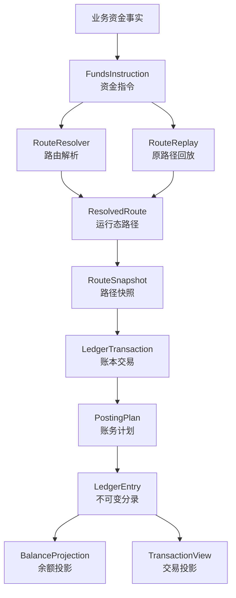

# 支付资金底座 DSL 承载层设计

## 一、文档定位：产品到系分的核心承载层

支付资金底座 DSL 是产品语义到系统分析设计之间的核心承载层。它把产品侧的交易场景、账户语义、资金流、状态约束和验收红线，转译为系统侧可开发、可测试、可审计的资金交易结构和资金链路结构。

它不是 PRD。PRD 负责说明用户、目标、业务流程、运营规则和产品验收。

它也不是实现说明。实现说明负责拆接口、类、表、组件和部署细节。

它承接两端：

| 承接方向 | 承接内容 | 产出给谁 |
| --- | --- | --- |
| 从产品进入 | 业务场景、主体关系、金额口径、状态边界、费用规则、异常路径、运营审计和验收红线。 | 系分设计、开发、测试。 |
| 向系分输出 | 资金指令、资金路径、路径快照、账务计划、账本分录、余额投影、交易投影和契约用例。 | 架构设计、接口设计、测试设计。 |

### 1.1 核心问题

本文件要回答一个问题：

> 一笔产品资金事实进入资金底座后，谁的什么账目，因为哪个原因，沿着哪条资金链路，发生了多少金额变化，并且如何被开发、测试、运营和审计共同验证？

这个问题拆成五个稳定视角：

| 视角 | 需要回答的问题 | DSL 承载方式 |
| --- | --- | --- |
| 产品视角 | 这个场景为什么发生，用户或运营想完成什么？ | `businessScene`、`businessSn`、`eventType`、`operator`、`reference`。 |
| 交易视角 | 这是一笔直接交易、授权交易，还是余额控制？ | `instructionType`、`transactionType`、生命周期事件。 |
| 资金链路视角 | 钱、额度或预算从哪个主体的哪个账目到哪里？ | `ResolvedRoute`、`RouteLeg`、`RouteNode`、`RouteSnapshot`。 |
| 账务视角 | 资金路径如何成为平衡分录？ | `LedgerTransaction`、`PostingPlan`、`LedgerEntry`。 |
| 验证视角 | 如何证明它正确、可回放、可追溯？ | JSON 契约用例、TDD 验收矩阵、禁止清单。 |

### 1.2 第一性原理

| 原理 | 含义 | 设计要求 |
| --- | --- | --- |
| 事实先于流程 | 资金底座只处理已成立的资金事实，不表达页面按钮、审批中、处理中等过程状态。 | DSL 只接收可入账事实；运营流程和外部通道流程不进入账本分录。 |
| 主体先于账户工具 | 能入账的是内部账务主体，不是用户、商户、银行卡、VCC、VA 或外部银行账户。 | 所有入账对象必须解析为 `FUNDING_ACCOUNT`、`CREDIT_ACCOUNT` 或 `BUDGET_GROUP`。 |
| 金额先于余额 | 金额是事实输入，余额是分录派生结果。 | DSL 不直接修改余额，只生成可校验的 `LedgerEntry`。 |
| 路径先于分录 | 先说明资金或控制余额如何流动，再推导借贷方向。 | 业务方不能直接提交 `LedgerEntry`、`EntrySide` 或 `PostingPlan`。 |
| 分录是余额事实源 | 余额、账单、报表和投影都从账本分录派生。 | 余额投影和交易投影不能反向修正账本事实。 |
| 快照保护回放 | 后续退款、撤销、结算、拒付、退费、解冻必须沿用原事实路径。 | 缺原路径快照时不能重新选路兜底。 |
| JSON 服务于验证 | JSON 用来表达 DSL 对象和契约用例，使场景可以被机器解析和 TDD 验收。 | 设计意图、流程说明、禁止清单不用 JSON 包装。 |

### 1.3 资金事实主链路

```text
业务资金事实
  -> FundsInstruction
  -> ResolvedRoute
  -> RouteSnapshot
  -> LedgerTransaction
  -> PostingPlan
  -> LedgerEntry
  -> BalanceProjection / TransactionView
```

这条链路表达三层含义：

| 层次 | 回答的问题 | 输出 |
| --- | --- | --- |
| 指令层 | 这笔资金事实是什么？ | `FundsInstruction` |
| 路由层 | 这笔事实影响哪些主体和账目？ | `ResolvedRoute`、`RouteSnapshot` |
| 账务层 | 这条路径如何成为平衡分录？ | `LedgerTransaction`、`PostingPlan`、`LedgerEntry` |

### 1.4 新增 DSL 场景最小闭环

新增资金场景不要求一开始就写完整实现，但 DSL 契约必须足够让产品、研发、测试和运营对同一件事达成一致。最小闭环如下：

| 闭环项 | 必须说明 | 不满足时的处理 |
| --- | --- | --- |
| 输入事实 | `instructionType`、`eventType`、`transactionType`、金额、币种、业务流水、操作者和引用对象。 | 不进入 DSL 契约，先补产品场景。 |
| 主体和引用 | 哪些是内部可记账主体，哪些只是支付工具、外部账户、业务单或通道引用。 | 不允许生成 `LedgerEntry`。 |
| 路由结果 | route code、参与方、账目、平台角色、工具快照、资金来源决策和账本周期。 | 路由失败且无账务副作用。 |
| 账务结果 | posting plan、entry 主体、entry side、金额、币种、账目和周期。 | 不允许只断言“状态成功”。 |
| 逆向依据 | 是否需要原 route snapshot、原交易、原授权、原冻结或原清结算批次。 | 缺原事实时必须失败或进入人工处理。 |
| 验收红线 | `validation.mustPass` 和 `validation.mustFail` 至少各有一项可测试断言。 | 不进入 TDD 任务。 |

## 二、设计目标与非目标

### 2.1 设计目标

| 目标 | 说明 |
| --- | --- |
| 事实稳定 | 同一事实在同一输入下产生稳定的 route、posting 和 entry，不受后续绑定关系、账户配置或展示规则漂移影响。 |
| 账务平衡 | 每个 `PostingPlan` 必须独立借贷平衡，整笔 `LedgerTransaction` 必须平衡。 |
| 可解释 | 能解释资金从哪来、到哪去、为什么发生、由谁触发、引用了哪个原事实。 |
| 可回放 | 后续退款、撤销、结算、拒付、退费、解冻能基于原路径快照派生。 |
| 可测试 | 字段、枚举、边界、红线和场景可以沉淀为 JSON 契约用例和 TDD 验收。 |
| 可治理 | 大数据量下余额投影、交易投影、归档、重放和差异检查有清晰边界。 |

### 2.2 非目标

| 非目标 | 说明 |
| --- | --- |
| 不表达业务单状态 | 待支付、审核中、处理中、举证中、对账中等属于产品单据或运营流程。 |
| 不表达外部通道协议 | 通道通知、银行回单、processor response、return、NOC 等属于连接层或业务单据。 |
| 不表达展示投影 | 用户账单、商户账单、运营时间线、财务报表是只读投影。 |
| 不替代清结算对象 | 清算批次、结算单、出款单、对账单和差错单有独立产品语义。 |
| 不替代合规和财务制度 | 资质、法域、会计科目、税务和监管口径需要独立确认。 |

## 三、产品到系分的转译模型

产品需求进入资金底座后，不能直接落成接口、表或测试。它必须先转译成稳定的资金事实结构，再进入系分设计。

| 产品输入 | DSL 承载 | 系分输出 | 开发与测试关注点 |
| --- | --- | --- | --- |
| 业务场景 | `businessScene`、`eventType` | 交易能力、状态边界、异常路径。 | 场景命名稳定，成功与失败路径可枚举。 |
| 业务流水 | `businessSn`、幂等键 | 幂等、重放、查询和审计口径。 | 重复提交不重复入账。 |
| 用户、商户、企业、预算组、卡 | `SubjectRef`、`PaymentInstrumentRef` | 主体解析、账户绑定、工具快照。 | 工具和经营主体不得直接入账。 |
| 金额、币种、汇率 | `amount`、`originalAmount`、`exchangeRate` | 金额校验、币种边界、错币种事实记录。 | 金额为正，余额控制不做 FX。 |
| 账本周期 | `periodType`、`periodId`、`periodPolicy` | 账本 bucket、周期余额查询、周期隔离测试。 | 非 `LIFETIME` 周期必须显式确定，不得用清算账期、报表周期或规则窗口替代。 |
| 资金路径 | `ResolvedRoute`、`RouteLeg`、`RouteNode` | 路由解析、平台账户角色、原路径回放。 | 缺快照不重新选路。 |
| 账务影响 | `PostingPlan`、`LedgerEntry` | 分录生成、借贷平衡、余额投影。 | 每个计划独立平衡，余额从分录派生。 |
| 后续事件 | `Reference`、`RouteSnapshot` | 退款、撤销、结算、拒付、退费、解冻。 | 不超过原事实剩余额度或金额。 |
| 验收红线 | `validation.mustPass`、`validation.mustFail` | 契约测试、集成测试、回归测试。 | 正向、反向、边界、幂等、审计均可验证。 |

这张表是产品评审、系分设计、开发实现和测试验收之间的共同语言。产品只要新增一个资金场景，就必须能填满这张表；填不满时，不应进入开发。

## 四、资金交易结构化描述

资金交易不是一个单一金额字段，也不是“某个服务方法”。在本设计中，一笔资金交易由六个结构共同描述：

| 结构 | 说明 | 典型字段或对象 |
| --- | --- | --- |
| 场景结构 | 交易为什么发生，属于哪个产品场景。 | `businessScene`、`businessSn`、`eventType`。 |
| 主体结构 | 谁承担资金、额度或预算变化。 | `SubjectRef`、`RouteParticipant`。 |
| 金额结构 | 账务金额、原始金额、币种和汇率事实。 | `amount`、`originalAmount`、`exchangeRate`。 |
| 链路结构 | 资金、额度或预算从哪里到哪里，属于哪个账本周期 bucket。 | `ResolvedRoute`、`RouteLeg`、`RouteNode`、`periodType`、`periodId`。 |
| 账务结构 | 链路如何转成可平衡、可追溯的分录。 | `LedgerTransaction`、`PostingPlan`、`LedgerEntry`。 |
| 验证结构 | 交易如何证明正确、幂等、可回放。 | JSON 契约、TDD 验收、禁止清单。 |

资金交易按能力分为三类：

| 交易能力 | 业务含义 | DSL 指令 | 典型场景 |
| --- | --- | --- | --- |
| 直接交易 | 已确认发生价值转移、责任变化或资金状态变化。 | `DIRECT_TRANSACTION` | 充值、付款、转账、提现、退款、手续费、清算确认、结算锁定、调账。 |
| 授权交易 | 先占用额度或资金，后续撤销、完成、退款、过期、强制完成或拒付。 | `AUTHORIZATION_TRANSACTION` | 卡授权、共享卡授权、部分撤销、部分完成、授权链退款、争议拒付。 |
| 余额控制 | 不发生跨主体价值转移，只控制同主体余额、额度或预算。 | `BALANCE_CONTROL` | 冻结、解冻、信用调额、预算调额。 |

交易结构必须让开发和测试同时看懂：

- 开发要能从交易结构推导接口入参、路由解析、账务计划和投影更新。
- 测试要能从交易结构推导用例前置、输入、过程断言、余额断言和失败断言。
- 产品和运营要能从交易结构确认资金事实、异常处理和审计口径是否符合预期。

## 五、资金链路结构化描述

资金链路描述的是一笔事实穿过资金底座时的完整路径：从业务事实到资金指令，从资金指令到路径快照，从路径快照到账务分录，再从账务分录派生余额和交易视图。



| 分层 | 核心对象 | 职责 | 边界 |
| --- | --- | --- | --- |
| 来源事实层 | 业务流水、冻结单、清算确认、结算锁定、出款结果、对账差错、争议拒付、费用事实 | 判断事实是否成立、是否允许入账。 | 不直接生成借贷分录。 |
| 指令层 | `FundsInstruction` | 把来源事实转成账本可理解的稳定输入。 | 不表达业务单生命周期。 |
| 路由层 | `ResolvedRoute`、`RouteParticipant`、`RouteLeg`、`RouteNode` | 描述资金、额度或预算如何在主体和账目之间变化。 | 不是会计分录，不表达运营状态。 |
| 快照层 | `RouteSnapshot` | 固化本次路径、参与方、平台账户、工具引用和规则结果。 | 不重新决策路径。 |
| 账务层 | `LedgerTransaction`、`PostingPlan`、`LedgerEntry` | 把路径翻译为平衡分录。 | 不反向修改业务事实。 |
| 投影层 | `BalanceProjection`、`TransactionView` | 查询、展示、重放和差异检查。 | 只能从事实派生，不能反写事实。 |

资金链路的最小验证闭环：

| 步骤 | 必须产出 | 必须断言 |
| --- | --- | --- |
| 业务事实进入 | 资金指令。 | 场景、金额、主体、引用、操作者完整。 |
| 路由解析 | 运行态路径。 | 入账主体合法，工具和外部账户不直接入账。 |
| 路径冻结 | 路径快照。 | 后续 replay 可使用，当前绑定变化不影响历史路径。 |
| 账务计划 | posting plan。 | 单计划独立平衡，借贷方向可解释。 |
| 分录入账 | ledger entry。 | 余额事实源唯一，金额为正，币种明确。 |
| 投影派生 | 余额投影和交易投影。 | 投影只读，不反写交易或账本事实。 |

## 六、术语与边界

### 6.1 可入账主体

本规范只允许以下主体进入账本分录：

| 主体 | 定义 | 典型账目 |
| --- | --- | --- |
| `FUNDING_ACCOUNT` | 承载真实资金余额或平台责任余额的资金账户。 | `AVAILABLE`、`FROZEN`、`AUTHORIZATION`、`CLEARING`、`SETTLEMENT`、`IN_TRANSIT`、`CASH`、`PREPAYMENT`、`FEE`、`ADJUSTMENT` |
| `CREDIT_ACCOUNT` | 承载授信额度、可用额度和授权占用的控制账户。 | `LIMIT`、`AVAILABLE`、`AUTHORIZATION` |
| `BUDGET_GROUP` | 承载预算总量、可用预算和预算授权占用的控制账户。 | `LIMIT`、`AVAILABLE`、`AUTHORIZATION` |

产品账户类型的归属规则：

| 产品对象 | DSL 定性 |
| --- | --- |
| 预付卡、预付 VCC、返利账户 | 如果承载可支配资金，归入 `FUNDING_ACCOUNT`。 |
| 共享卡、信用卡账户 | 如果承载授信额度，归入 `CREDIT_ACCOUNT`；卡本身只是工具引用。 |
| 预算组 | 归入 `BUDGET_GROUP`，只表达预算控制，不表达真实资金沉淀。 |
| 支付工具、VA、银行卡、外部银行账户 | 只能作为引用或快照，不直接入账。 |
| 用户、商户、企业、租户 | 是经营主体或归属主体，不等同于账务主体。 |

### 6.2 账目与余额桶

`LedgerAccount` 在本设计中表示账本内账目或余额桶，不是资金账户主体。

| 账目 | 语义 |
| --- | --- |
| `CASH` | 平台现金、备付或内部镜像资金。 |
| `PREPAYMENT` | 平台对用户或商户的预收、待付责任。 |
| `AVAILABLE` | 可用余额、可用额度或可用预算。 |
| `FROZEN` | 冻结余额，只限制同主体可用性。 |
| `AUTHORIZATION` | 授权占用，后续由撤销、结算、释放、过期或拒付关闭或减少。 |
| `CLEARING` | 商户待清算资金，订单款默认先进该桶。 |
| `SETTLEMENT` | 出款中或结算处理中锁定资金。 |
| `IN_TRANSIT` | 外部已受理但还没有最终成功或失败的在途资金，必须有外部引用、责任方、账龄和到期重查口径。 |
| `LIMIT` | 信用或预算总量，只能由 `LIMIT_ADJUST` 受控调整。 |
| `FEE` | 手续费、服务费或成本扣收归集。 |
| `ADJUSTMENT` | 差错、调账或人工核销的中间口径。 |

本规范不设置 `CONSUMED` 账目。信用账户和预算组已消费金额由交易生命周期、授权完成事实和报表口径计算。

### 6.3 金额与 FX

| 字段 | 语义 |
| --- | --- |
| `amount` | 账务主链路金额，即入账金额。 |
| `originalAmount` | 业务原始金额；无错币种时等于 `amount`。 |
| `exchangeRate` | `originalAmount -> amount` 的汇率快照；无换汇时为 `1`。 |

FX 边界：

- 是否换汇由业务层或外汇域决策。
- 交易层只记录已决策的金额事实。
- 余额控制不承接 FX 逻辑。
- `LedgerEntry` 使用账务主链路币种。

### 6.4 来源事实

来源事实用于回答“这笔 DSL 输入从哪个业务结果来”。它是补充边界，不是 DSL 主链路的起点。

| 来源事实 | 是否直接成为 DSL 主对象 | 说明 |
| --- | --- | --- |
| 付款、充值、提现、转账、退款 | 是 | 形成 `DIRECT_TRANSACTION` 指令。 |
| 授权批准、撤销、结算、拒付 | 是 | 形成 `AUTHORIZATION_TRANSACTION` 指令。 |
| 冻结、解冻、额度调整、预算调整 | 是 | 形成 `BALANCE_CONTROL` 指令。 |
| 清算确认、结算锁定、出款结果 | 是 | 只有确认后的资金结果进入 DSL。 |
| 对账差错调账、核销 | 是 | 必须带差错来源、审批、凭证和审计。 |
| 业务订单、清算批次、对账任务、审批流 | 否 | 属于产品或运营流程。 |

## 七、核心 DSL 对象

### 7.1 FundsInstruction

`FundsInstruction` 是账本可理解的资金事实请求。它不表达页面流程，不直接指定借贷方向，也不是账本分录。

| 字段 | 必填 | 说明 |
| --- | --- | --- |
| `tenantId` | 是 | 租户 ID。 |
| `instructionType` | 是 | 指令大类：直接交易、授权交易、余额控制。 |
| `eventType` | 是 | 稳定资金事件。 |
| `transactionType` | 条件必填 | 交易类事实必填，表达资金业务类别，例如 `TOPUP`、`PAY`、`TRANSFER`、`REFUND`、`WITHDRAW`、`FEE`、`ADJUSTMENT`；不要放入 `FUND_IN`、`SETTLE`、`AUTHORIZE`、`FEE_CHARGE` 等生命周期事件名。 |
| `businessScene` | 是 | 业务场景。 |
| `businessSn` | 是 | 业务流水。 |
| `amount` | 是 | 账务主链路金额。 |
| `originalAmount` | 是 | 业务原始金额。 |
| `exchangeRate` | 是 | 汇率快照。 |
| `eventTime` | 是 | 事实发生时间。 |
| `operator` | 是 | 操作者快照。 |
| `reference` | 条件必填 | 后续事件必须引用原事实或原快照。 |
| `contextVariables` | 是 | 补充上下文，不能隐藏必填主语义。 |

指令类型：

| instructionType | 说明 | 典型事件 |
| --- | --- | --- |
| `DIRECT_TRANSACTION` | 已确认发生价值转移、责任变化或资金状态变化的直接交易。 | 入金、出金、转账、付款、退款、费用、清算确认、结算锁定、调账。 |
| `AUTHORIZATION_TRANSACTION` | 授权占用、撤销、完成、过期、授权链退款和争议拒付等生命周期事实。 | 授权、撤销、完成、过期、授权退款、争议拒付、强制完成模式。 |
| `BALANCE_CONTROL` | 不发生跨主体价值转移，只控制同主体可用性或额度。 | 冻结、解冻、额度调整、预算调整。 |

### 7.2 引用对象

| 对象 | 用途 | 入账边界 |
| --- | --- | --- |
| `SubjectRef` | 指向可入账主体。 | 只有 `FUNDING_ACCOUNT`、`CREDIT_ACCOUNT`、`BUDGET_GROUP` 可进入分录。 |
| `PaymentInstrumentRef` | 记录卡、VA、银行卡、支付工具等工具快照。 | 不直接入账。 |
| `ExternalAccountRef` | 记录外部银行、通道、托管户等外部端点。 | 不直接入账。 |
| `Reference` | 记录退款、撤销、结算、拒付、退费、解冻等后续事件引用的原事实。 | 缺引用时不得回放。 |

`PaymentInstrumentRef` 字段语义：

| 字段 | 语义 | 约束 |
| --- | --- | --- |
| `instrumentSn` | 支付工具在资金底座内的稳定工具号，对应系分表中的 `sn` 或绑定表中的 `instrument_sn`。 | 用于路由快照、绑定历史、回放和审计，不承载完整卡号、完整外部账户或敏感凭证。 |
| `instrumentDisplayNo` | 支付工具的脱敏展示号、别名号或安全 token reference，对应系分表中的 `instrument_no` 语义。 | 只能用于展示、查询辅助和审计辅助；不得作为稳定工具主键或可记账主体。 |
| `externalInstrumentId` | 通道、卡处理器、银行或外部系统的工具引用。 | 只做外部核验、回单、对账和争议证据，不进入 LedgerEntry 主体。 |

若历史代码或旧样例中出现 `instrumentNo`，在 DSL 语义上只能按脱敏展示号理解；新增契约样例统一使用 `instrumentSn` 和 `instrumentDisplayNo`，避免把稳定工具号和展示号混用。

### 7.3 Route DSL

`ResolvedRoute` 是运行态资金路径；`RouteSnapshot` 是冻结后的路径事实。

| 对象 | 说明 |
| --- | --- |
| `ResolvedRoute` | 描述本次事实影响哪些主体、账目、金额和阶段。 |
| `RouteSnapshot` | 固化本次 route 结果，用于后续 replay。 |
| `RouteParticipant` | 路由参与方，例如付款方、收款方、平台费用账户、授权主体。 |
| `RouteNode` | 参与方上的具体账目节点。 |
| `RouteLeg` | 一段资金、额度或预算变化路径。 |
| `RoutingDecision` | 固化本次路径选择原因、命中规则、工具引用、外部账户引用、平台账户和资金来源决策。 |
| `FundingAllocationDecision` | 固化某笔金额来自哪个内部账务主体、账目、优先级和选择原因。 |

路由红线：

- `RouteLeg` 不是会计分录。
- 外部账户、支付工具、平台角色不能直接入账。
- 平台角色必须解析为具体资金账户后进入 route。
- 退款、撤销、授权完成、拒付、退费、解冻必须优先基于原快照。
- 缺原快照不得重新选路兜底。
- 支付工具、绑定关系和资金来源只能帮助解析内部可记账主体；工具状态、方向、绑定、外部账户引用和资金来源选择必须进入 `RoutingDecision` 或 `RouteSnapshot`。

### 7.4 Posting 与 Ledger DSL

| 对象 | 说明 | 约束 |
| --- | --- | --- |
| `LedgerTransaction` | 一组账务计划的业务级账本交易。 | 必须能追溯到资金指令和来源事实。 |
| `PostingPlan` | 一个 route leg 或控制意图对应的一组借贷计划。 | 必须独立平衡。 |
| `LedgerEntry` | 最小不可变账务事实。 | 金额为正，方向由借贷和账目 normal balance 推导。 |

`PostingPlan` 的核心字段：

| 字段 | 说明 |
| --- | --- |
| `routeLegId` | 对应路径段。 |
| `intent` | 入账意图，例如 `TRANSFER`、`FEE`、`REFUND`、`FREEZE`、`LIMIT_ADJUST`。 |
| `postingScope` | 入账范围，例如同主体、跨主体、费用、调账。 |
| `balanceEffectType` | 余额影响类型，例如消耗、增加、冻结、释放、调额。 |
| `phaseCode` | 资金阶段，例如付款、手续费、授权、结算、对账差错。 |
| `entries` | 平衡分录列表。 |

### 7.5 Route Replay DSL

Route Replay 用于后续事件沿用原路径事实。它解决“退款、撤销、结算、拒付、退费、解冻如何回到原 route snapshot”的问题，不负责余额重建、交易投影重放或归档任务续跑。

| 场景 | Replay 要求 |
| --- | --- |
| 原交易退款 | 基于原付款快照反向生成路径，不按当前绑定关系重新选路。 |
| 手续费退回 | 使用独立 `FEE_REFUND`，不得混入普通退款。 |
| 授权撤销 | 释放原授权占用，不新增价值转移。 |
| 授权完成 | 不超过剩余授权金额。 |
| 授权链退款 | 不超过已完成金额。 |
| 争议拒付 | 不超过可追偿金额，且与授权拒绝区分。 |
| 解冻 | 引用原冻结单，只在同主体内释放冻结。 |

Replay 语义边界：

| 名称 | 解决的问题 | 事实来源 | 不做什么 |
| --- | --- | --- | --- |
| Route Replay | 后续资金事件沿原路径回放。 | 原资金事实、原 route snapshot、原费用 leg、原冻结单或原授权/完成事实。 | 不重建余额，不修复交易视图，不推进归档水位。 |
| Transaction Projection Replay | 重建用户账单、商户账单、运营时间线或批次视图。 | 交易事实、route snapshot、账本分录摘要、清结算对象和对账结果。 | 不重新入账，不改变分录，不修改余额投影。 |
| Balance Rebuild | 从检查点和增量分录重建余额投影。 | 账本分录、余额检查点、余额水位、Manifest。 | 不从交易投影、余额日志、报表指标或汇总金额反推余额。 |
| Archive Resume | 归档或重放任务断点续跑。 | 任务范围、checkpoint、Manifest、差异报告和审批记录。 | 不作为资金路径选择依据，不替代账本周期或余额水位。 |

### 7.6 账本周期 DSL

账本周期用于表达“同一主体、同一币种、同一账目下，哪一个生命周期或预算周期的余额 bucket 被影响”。它是账本和余额投影的隔离键，不是清算账期、结算周期、报表周期、归档水位或 spend-rule window。

| 字段 | 语义 | 要求 |
| --- | --- | --- |
| `periodType` | 账本周期类型。 | 默认可为 `LIFETIME`；支持 `DAYS`、`HOURLY`、`WEEKLY`、`MONTHLY`、`QUARTERLY`、`YEARLY`、`CUSTOM_CYCLE` 等稳定枚举。 |
| `periodId` | 账本周期 ID。 | `LIFETIME` 时固定为 `LIFETIME`；非 `LIFETIME` 必须由账户策略、业务请求或路由规则显式确定。 |
| `periodPolicy` | 周期生成规则和时区口径。 | 自定义周期、月度预算、合同周期等必须记录策略和版本，便于回放和审计。 |

周期承载规则：

1. `RouteNode` 和 `RouteLeg` 必须能确定目标账目对应的 `periodType` 和 `periodId`。
2. `LedgerEntry` 必须继承 route 中确定的账本周期，不能在过账阶段重新猜测。
3. `BalanceProjection` 按主体、账目、币种和账本周期派生余额；跨周期汇总只能作为报表聚合，不得作为可用余额。
4. 月度预算、自定义合同周期可以映射为账本周期，但清算账期、结算周期、报表周期、归档水位和 spend-rule window 不能替代账本周期。
5. 非 `LIFETIME` 周期缺少 `periodId` 时，路由或入账必须失败。

### 7.7 SettlementPolicy DSL

结算策略用于表达候选结算日期和结算节奏，不表达结算审批、出款执行或回单核验。

| 表达 | 含义 |
| --- | --- |
| `RT` | 实时结算。 |
| `T+N` | 交易日后第 N 天结算。 |
| `D@HH:mm` | 每日指定时间结算。 |
| `W@DOW` | 每周指定星期结算。 |
| `M@DD` | 每月指定日期结算。 |
| `Q@MM-DD` | 每季度指定月日结算。 |
| `Y@MM-DD` | 每年指定月日结算。 |
| `C@RANGE` | 自定义账期。 |

规则不能把 `RT` 固化为唯一策略；无法识别的策略必须显式失败。

### 7.8 投影 DSL

| 投影 | 来源 | 禁止 |
| --- | --- | --- |
| `BalanceProjection` | `LedgerEntry`、检查点、水位、归档清单。 | 不读交易视图反推余额。 |
| `TransactionView` | 资金交易事实、路径快照、账本分录摘要。 | 不写账，不修正余额。 |
| 报表指标输入 | 指标项、业务问题、建议事实来源和口径引用。 | 只作为报表指标模块输入，不反向污染资金事实，不复用归档水位或重放 checkpoint。 |

### 7.9 扩展与治理 DSL 边界

| 能力 | DSL 承载方式 | 边界 |
| --- | --- | --- |
| Spend Controls / 发卡授权控制扩展 | 作为授权前策略结果写入 `contextVariables`、规则版本和拒绝原因。 | 只决定授权是否可进入 `AUTHORIZE`，不生成 route、posting 或 entry；spend-rule window 不等同于账本周期。 |
| 归档和余额重建 | 通过 `BalanceProjection`、检查点、水位、归档清单和差异报告承接。 | 只校验、重算或重建投影，不改变历史分录。 |
| 交易投影重放 | 通过 `TransactionView`、重放范围、重放模式和差异报告承接。 | 只修复只读视图，不补写交易事实或账本事实。 |
| 报表指标输入 | 只保留指标项、业务问题、口径引用和建议事实来源。 | 指标采集、计算、调度、存储、展示、导出和订阅由报表指标模块实现，不进入资金主链路，不复用归档、重建或重放控制对象。 |

治理类 JSON 契约不是资金指令，不生成 `ResolvedRoute`、`PostingPlan` 或 `LedgerEntry`。它只用于让归档申请、资金归档 Manifest、余额检查点、交易投影重放任务、差异报告和统一治理流程的状态映射可被测试解析。编码时不得把治理任务 JSON 误接到资金交易编排器，也不得用统一治理任务号替代资金归档 Manifest、余额水位或交易投影重放 checkpoint。

## 八、DSL 不变量

| 不变量 | 说明 |
| --- | --- |
| 金额必须为正 | 金额方向由 route、entrySide 和 normal balance 推导。 |
| 币种必须明确 | 账务主链路币种来自 `amount.currency`。 |
| 指令不直接写分录 | `FundsInstruction` 只能驱动路由和回放。 |
| Route 不等于 Ledger | `RouteLeg` 描述资金路径，`LedgerEntry` 描述会计分录。 |
| 每组计划独立平衡 | 一个 route leg 或控制意图生成的 `PostingPlan` 必须独立平衡。 |
| 账本周期必须显式 | 非 `LIFETIME` 周期必须有 `periodId`，周期由 route 传递到 ledger entry 和 balance projection。 |
| 外部账户不入账 | 外部账户和工具只能存在于引用、快照和上下文。 |
| 缺账本直接失败 | 入账路径不自动建账。 |
| 缺快照不回放 | 需要 replay 的后续事件缺原 `RouteSnapshot` 必须失败。 |
| 投影不能反写事实 | 余额投影、交易投影和报表不修改历史分录或交易事实。 |
| 余额控制不做 FX | `BALANCE_CONTROL` 不承接换汇决策。 |
| `LIMIT` 只能受控调整 | 普通授权完成不触碰 `LIMIT`。 |
| 授权拒绝无账务 | 授权拒绝不得生成 route、posting 或 entry。 |
| 规则窗口不是账本周期 | 清算账期、结算周期、报表周期、归档水位、指标水位和 spend-rule window 不能替代 `periodType + periodId`。 |

## 九、产品用例到开发测试承接矩阵

产品用例必须按交易能力分族管理。三类能力的边界如下：

| 用例族 | 能力边界 | 测试主轴 |
| --- | --- | --- |
| 直接交易 | 已确认发生价值转移、责任变化或资金状态变化。 | 余额变化、route leg、posting 平衡、退款/退费上限、幂等。 |
| 授权交易 | 先占用，后撤销、完成、退款、拒付、过期或释放。 | 授权剩余、已完成金额、可退金额、原路径 replay、拒绝无账务。 |
| 余额控制 | 不发生跨主体价值转移，只控制余额、额度或预算。 | 同主体桶间控制、`LIMIT_ADJUST` 红线、冻结/解冻累计上限、无 FX。 |

### 9.1 直接交易用例族

| 用例 | 资金交易结构 | 资金链路重点 | 开发承接 | 测试承接 |
| --- | --- | --- | --- | --- |
| 充值成功 | `DIRECT_TRANSACTION / FUND_IN`。 | 外部入金结果 -> 用户资金账户 `AVAILABLE`。 | 处理外部入金结果、幂等键、外部引用和账户初始化校验。 | 余额增加；重复通知不重复入账；外部账户不入账。 |
| 付款成功 | `DIRECT_TRANSACTION / PAY`。 | 付款方 `AVAILABLE` -> 收款方指定目标账目；商户订单收款才进入商户 `CLEARING`。 | 支持普通支付 route、商户订单收款 route、平台账户角色解析和业务场景识别。 | 付款方减少；普通收款方按产品命令增加指定目标账目；商户订单款进入 `CLEARING`；posting 独立平衡。 |
| 充值成功 + 入金手续费收取 | `FUND_IN` 后接入金费用 `FEE_CHARGE`。 | 入金先进入用户 `AVAILABLE`；手续费再从用户 `AVAILABLE` 到平台 `FEE`。 | 支持入金结果和费用收取拆为两个事实，费用必须有 `FeeSpec` 和原入金引用。 | 入金失败不收手续费；重复入金通知不重复收费；费用不混入充值本金。 |
| 充值成功 + 付款并收手续费 | `FUND_IN` 后接本金 `PAY` + 费用 `FEE_CHARGE`。 | 入金进入用户 `AVAILABLE`；付款本金和手续费拆为独立 leg。 | 支持充值后付款、`FeeSpec` 驱动费用 leg、费用账户快照。 | 入金余额增加；付款本金和费用分别扣减；重复入金不重复记账。 |
| 充值 -> 付款 -> 退款 -> 手续费退回 | `FUND_IN` + `PAY` + `REFUND` + `FEE_REFUND`。 | 退款基于付款原路径，退费基于费用原路径。 | 支持本金退款和费用退回分开引用、分开累计、分开上限。 | 普通退款不默认退费；退款不超过已付本金；退费不超过已收手续费。 |
| A 转给 B | `DIRECT_TRANSACTION / TRANSFER`。 | A `AVAILABLE` -> B `AVAILABLE` 或目标业务桶。 | 支持跨主体内部转账、双方主体解析和幂等。 | A 减少、B 增加；币种一致；双方分录可追溯。 |
| 提现成功 + 手续费收取 | `FREEZE` 后接 `FUND_OUT` + `FEE_CHARGE`。 | 提现申请先冻结提现本金及按规则预留的手续费；外部出款成功后引用并关闭冻结来源，手续费作为独立费用 leg 入平台 `FEE`。 | 支持提现冻结单、出款确认结果、`FeeSpec` 和费用账户快照；手续费来源桶必须由规则明确。 | 申请阶段只冻结不出款；成功后本金和手续费分别入账；手续费不混入提现本金；重复回调不重复转出或收费。 |
| 提现撤销或被拒绝 | `FREEZE` 后接 `UNFREEZE`。 | 提现已冻结但未确认出款；用户撤销、风控拒绝或通道拒绝时释放冻结，本金和费用预留回到用户 `AVAILABLE`。 | 支持引用原提现冻结单、撤销/拒绝原因、解冻幂等和剩余冻结校验；不得生成 `FUND_OUT`。 | 撤销/拒绝不扣本金、不默认收费；重复撤销/拒绝不重复解冻；没有冻结单或超额解冻失败。 |
| A 充值 -> 转给 B -> B 付款 -> B 提现 | `FUND_IN` + `TRANSFER` + `PAY` + `FREEZE` + `FUND_OUT`。 | A 入金后转给 B；B 付款进入商户清算桶；B 提现先冻结资金，外部出款成功后再确认转出并关闭冻结来源。 | 支持多主体组合链路、跨主体转账、付款、提现冻结和出款结果入账。 | 每一步断言 A、B、商户、平台余额桶；提现申请阶段只冻结；出款成功后冻结来源关闭，撤销或拒绝走解冻路径。 |
| 资金账户允许受控透支付款 | `DIRECT_TRANSACTION / PAY`，允许 `AVAILABLE` 受控为负。 | 付款方 `AVAILABLE` 可按 profile 策略短暂为负，必须有来源、上限、账龄和风险状态。 | 支持负余额策略、风险标记、追偿或补足路径。 | 无策略透支失败；有策略透支成功但生成风险治理口径。 |
| 资金账户禁止透支付款 | `DIRECT_TRANSACTION / PAY` 校验失败。 | `AVAILABLE` 不足且无受控负余额策略。 | 余额约束前置校验，失败不生成 route、posting、entry。 | 余额不足失败；失败不改余额；错误原因可解释。 |
| 后置手续费触发受控透支 | `DIRECT_TRANSACTION / FEE_CHARGE`。 | 已确认费用补扣时，用户 `AVAILABLE` 不足可按策略受控为负。 | 支持后置费用、跨境费、拒付费等显式费用事实；无策略不得静默透支。 | 有策略时生成负余额治理口径；无策略时失败或进入人工差错处理，不得继续消费。 |
| 原交易全额退款 | `DIRECT_TRANSACTION / REFUND`。 | 基于原 route snapshot 反向。 | 支持原路径 replay、可退金额校验和幂等。 | 退款不超过原交易；缺快照失败；不按当前绑定重新选路。 |
| 原交易部分退款 | `DIRECT_TRANSACTION / REFUND`。 | 原路径部分反向。 | 记录累计已退金额和剩余可退金额。 | 多次退款累计不超过原交易；每次 posting 平衡。 |
| 手续费退回 | `DIRECT_TRANSACTION / FEE_REFUND`。 | 平台费用账户 -> 原付费方。 | 退费独立事件处理，不混入普通退款。 | 普通退款不默认退费；退费不超过原手续费。 |
| 清算确认 | `DIRECT_TRANSACTION / CLEARING_CONFIRM` 或稳定清算事件。 | `CLEARING -> AVAILABLE`，形成可结算口径。 | 只处理确认后的清算结果。 | 清算批次生成不直接入账；确认结果入账可追溯。 |
| 结算锁定与出款结果 | `SETTLEMENT_LOCK`、`FUND_OUT`、失败回退。 | 从 `AVAILABLE` 锁定到 `SETTLEMENT`；需要账本可见在途时进入 `IN_TRANSIT`；最终按出款结果关闭或回退。 | 支持锁定、外部在途、成功关闭、失败回退四类事实。 | 锁定不等于出款成功；外部受理不等于成功；失败回退恢复原口径。 |
| 对账差错调账 | `DIRECT_TRANSACTION / ADJUST`。 | 差错来源 -> `ADJUSTMENT` 或业务指定口径。 | 必须带差错来源、审批、凭证和审计上下文。 | 无审批调账失败；调账分录平衡；差错可核销。 |
| 错币种直接交易 | `DIRECT_TRANSACTION` 携带 `originalAmount` 与 `amount`。 | 账务主链路使用 `amount.currency`。 | 只记录业务层已决策的 FX 事实，不隐式换汇。 | 汇率快照完整；交易层不调用 FX；余额控制不承接 FX。 |

### 9.2 授权交易用例族

授权交易 DSL 不直接复制外部处理器的事件名，而是把外部通知归一成资金底座能理解的生命周期事实：授权创建、授权完成、授权释放、授权失效、强制完成、授权链退款、拒付和异常补偿。外部事件进入资金底座前，必须先由上层业务或通道适配层完成归一；资金底座只接收已经明确的资金事实，并证明金额、状态、快照和幂等都闭合。退款预处理、退款结束、授权业务取消、事件时间调度和事件顺序编排暂不作为底座默认 DSL 场景。

VCC 交易是授权交易的典型接入场景，但 VCC 卡、卡号、token、持卡人和通道授权号都不是账本主体。DSL 必须把 VCC 信息放在 `instrumentRef`、`merchantInfo` 或 `contextVariables` 中作为工具快照和审计上下文；真正发生账务影响的对象只能是 `FUNDING_ACCOUNT`、`CREDIT_ACCOUNT` 或 `BUDGET_GROUP`。Spend controls、card controls、velocity controls 或协同授权只产生授权前决策结果：拒绝时不生成 route、posting、entry，通过时也只是允许进入资金底座授权校验，不等于已经占用成功。

VCC 授权接入口径：

| VCC 交易信息 | DSL 承接位置 | 资金底座含义 | 红线 |
| --- | --- | --- | --- |
| VCC 卡、卡 token、掩码卡号、卡产品、持卡人 | `instrumentRef` 或 `contextVariables` | 支付工具快照和审计上下文。 | 不得作为 ledger subject 入账，不得保存完整 PAN、CVV 或敏感凭证。 |
| 企业资金账户、信用账户、预算组 | `accountId`、route participant、`linkedFundingAccountId`、`linkedBudgetGroupId` | 授权占用、结算、释放和退款的真实账务主体。 | 必须解析为内部账务主体；不得用卡或外部账户替代。 |
| MCC、商户、国家、POS、PAN entry mode、CVV/AVS、风控结果 | `merchantInfo`、`transactionCountry`、`contextVariables` | 授权判断、拒绝原因和审计上下文。 | 只作为规则输入或审计事实，不直接生成账务分录。 |
| Spend controls / card controls / velocity controls | `contextVariables.authorizationControlDecision`、拒绝原因、规则版本 | 授权前门禁；通过后才能继续资金授权校验，拒绝则只记录失败事实。 | 规则窗口不得替代账本周期；规则通过不得跳过余额、额度、预算和 route 校验。 |
| VCC 清算、forced post、退款、拒付 | `SETTLE`、`SETTLE` 强制完成模式、`AUTH_REFUND`；拒付通过 `AUTH_REFUND` 的原因、凭证和审计上下文承接 | 复用授权生命周期事实和原路径 replay。 | 不新增专用 VCC 账务路径；不按当前绑定重新选路；不要求独立 `chargeback` 服务入口。 |

#### 9.2.1 基础生命周期用例

| 用例 | 覆盖级别 | DSL 语义 | 服务/事件承接 | 测试承接 |
| --- | --- | --- | --- | --- |
| 授权创建 | 必须 | 创建一笔授权消费事实，先占用资金、额度或预算，不表达最终消费。VCC 场景下，卡信息只作为工具快照。 | `AUTHORIZATION_TRANSACTION / AUTHORIZE`，`authorize(approved=true)`。 | 生成授权交易；主体 `AVAILABLE -> AUTHORIZATION`；保存 route snapshot 和工具快照；平台占用镜像或清算准备口径正确。 |
| 授权拒绝 | 必须 | 记录授权未通过的事实和原因，不进入账务路径。VCC 场景下，卡状态、spend controls、风控、余额或预算都可成为拒绝原因。 | `AUTHORIZE`，`authorize(approved=false)`。 | 状态为拒绝；拒绝原因、规则版本和外部授权引用可追溯；无 route、posting、entry；不得写入拒付金额。 |
| 授权完成 | 必须 | 基于已有授权占用完成清算或扣款，把占用转为实际资金结果。 | `AUTHORIZATION_TRANSACTION / SETTLE`，`settle`。 | 可基于原授权完成；授权占用减少；收款方或商户清算口径增加；状态进入完成。 |
| 授权撤销释放 | 必须 | 外部撤销或冲正释放剩余授权占用。 | `AUTHORIZATION_TRANSACTION / REVERSAL`，`reversal`。 | 基于原授权快照释放；释放金额不超过剩余授权；状态进入撤销。 |
| 授权过期释放 | 必须 | 授权有效期到期后由系统释放剩余授权占用。 | `AUTHORIZATION_TRANSACTION / EXPIRE`，`expire`；账务路径可复用授权释放。 | 状态必须是过期而不是撤销；只释放剩余授权；已完成金额不得释放。 |
| 授权查询 | 必须 | 查询授权事实、已完成金额、已释放金额和剩余可处理金额。 | 查询服务，不写账。 | 查询不改变余额；金额口径与完成、撤销、过期、退款一致。 |

#### 9.2.2 完成、强制完成和多次完成用例

| 用例 | 覆盖级别 | DSL 语义 | 服务/事件承接 | 测试承接 |
| --- | --- | --- | --- | --- |
| 授权后全额完成 | 必须 | 授权占用一次性全部转为实际消费或清算结果。 | `SETTLE`，`settle`。 | 授权剩余归零；收款方或清算桶正确增加；不触碰 `LIMIT`。 |
| 授权后部分完成 | 必须 | 只完成部分授权金额，保留剩余可完成或可释放金额。 | `SETTLE`，`settle`。 | 累计完成金额不超过授权金额；剩余授权正确；每次 posting 独立平衡。 |
| 多次完成或拆单完成 | 必须 | 同一授权可被多笔清算或拆单事件逐步完成。 | 多次 `settle`，同一原授权引用。 | 多次完成累计正确；重复通知幂等；完成明细数量正确；不重复创建授权主记录。 |
| 强制完成 | 必须 | 外部没有前置授权，但确认发生了必须入账的消费结果。 | 使用 `settle` 的强制完成模式承接。 | 不伪造授权占用；允许透支必须有策略、原因和审计；不污染授权占用生命周期。 |

#### 9.2.3 授权链退款用例

| 用例 | 覆盖级别 | DSL 语义 | 服务/事件承接 | 测试承接 |
| --- | --- | --- | --- | --- |
| 已完成授权退款 | 必须 | 基于已完成的授权路径做反向退款。 | `AUTHORIZATION_TRANSACTION / AUTH_REFUND`，`settleRefund`。 | 退款入账；关联原授权和原完成明细；累计退款不超过已完成金额；不按当前绑定重新选路。 |
| 无授权直接退款 | 必须 | 外部没有前置授权，但存在原消费、原完成或差错凭证，需要按退款事实回补。 | `AUTHORIZATION_TRANSACTION / AUTH_REFUND`，`settleRefund` 的无授权退款模式。 | 不补造授权占用；必须保留原事实引用、原因、凭证和审计上下文；无原消费或凭证时失败或进入差错。 |
| 多次退款 | 必须 | 同一授权完成后允许多次退款。 | 多次 `settleRefund`。 | 多次退款累计正确；同一授权可多次退款；累计退款不超过已完成金额。 |
| 已完成授权拒付承接 | 必须 | 已完成授权发生外部争议、拒付或扣回时，按授权链逆向资金事实处理。 | `settleRefund` 携带拒付原因、凭证、外部引用和审计上下文。 | 与授权拒绝严格区分；累计拒付/退款不超过已完成金额；不要求落到 `FundsAuthorizationTransactionService#chargeback`；即使底层终态复用退款终态，也必须在 reason、external reference、projection 和 audit 中保留拒付语义。 |

#### 9.2.4 异常与资金红线用例

| 用例 | 覆盖级别 | 风险点 | 测试承接 |
| --- | --- | --- | --- |
| 完成后过期释放 | 必须 | 已完成金额被错误释放。 | 已完成交易不能被过期事实释放；仅处理剩余授权，剩余为 0 时不得生成释放分录。 |
| 完成事件重复到达 | 必须 | 重复通知或多次清算混淆。 | 相同摘要幂等；不同摘要按分次完成累计；累计不得超过授权剩余。 |
| VCC 工具被当作账本主体 | 必须 | 卡、token 或外部卡账户被错误入账。 | 必须失败；VCC 只能作为工具快照，route participant 必须是内部资金账户、信用账户或预算组。 |
| 授权前控制通过后跳过资金校验 | 必须 | spend controls 通过被误当作资金授权成功。 | 必须继续校验余额、额度、预算、账本周期和 route；通过规则不得直接生成 posting。 |
| 拒付被强制落到独立 `chargeback` 服务入口 | 必须 | 误把实现入口当成产品语义。 | 资金底座只要求能承接拒付语义、原因、凭证、审计和原路径 replay；默认通过 `settleRefund` 承接，不以 `chargeback` 方法为目标落地。 |
| 无前置授权的拒绝、过期或撤销 | 建议 | 失败事件孤立到达。 | 可记录外部失败事实或进入差错；不得生成释放分录或负释放。 |
| 无原消费的退款完成 | 建议 | 自动补建原消费会破坏事实链。 | 不建议静默补建；必须关联原消费，否则进入差错或拒绝。 |

#### 9.2.5 授权过期服务能力定性

授权过期的设计目的，是把“外部明确撤销”和“系统到期释放”拆成两个可解释、可审计的资金事实。两者的资金效果都可能是释放剩余 `AUTHORIZATION` 到 `AVAILABLE`，但业务原因、触发方、终态、运营查询和对账解释不同。若只复用撤销语义，后续会无法回答“是商户/网络撤销，还是系统按有效期释放”，也会影响用户账单、运营工单和资金差异定位。

结论：DSL 必须把“授权过期释放”作为独立用例。底层账务路径可以复用授权释放 route，但交易状态、释放原因、审计原因、过期金额和幂等键必须保留 `EXPIRE` 语义。

建议契约形态：

```java
String expire(FundsAuthorizationTransactionExpireRequest request, WindOperator operator);
```

建议请求字段至少包含：`accountId`、`authorizationTransactionSn`、`amount` 或默认剩余授权金额、`businessScene`、`businessSn`、`expiredTime`、`expireReason`、`contextVariables`。验收红线是：只释放剩余授权，不超过剩余授权；状态进入 `EXPIRED`；重复过期幂等；已完成金额不得被过期事件释放。

### 9.3 余额控制用例族

| 用例 | 资金交易结构 | 资金链路重点 | 开发承接 | 测试承接 |
| --- | --- | --- | --- | --- |
| 资金账户冻结 | `BALANCE_CONTROL / FREEZE`。 | 同主体 `AVAILABLE -> FROZEN`。 | 冻结来源是冻结单，不创建资金交易。 | 冻结只控制可用性；无跨主体价值转移。 |
| 一次冻结多次解冻 | `BALANCE_CONTROL / UNFREEZE`。 | 同主体 `FROZEN -> AVAILABLE`，引用原冻结单。 | 维护冻结剩余金额和解冻幂等。 | 多次解冻累计不超过冻结金额；超额失败。 |
| 冻结后提现 | `FREEZE` 后接确认后的 `FUND_OUT`。 | 提现消耗明确来源的冻结或锁定金额。 | 区分解冻和提现；提现只处理出款结果。 | 不是解冻后无来源扣款；提现后冻结剩余正确。 |
| 冻结失败 | `BALANCE_CONTROL / FREEZE` 校验失败。 | 无 route、posting、entry。 | 可用余额不足或主体账目不支持时失败。 | 失败不改余额；错误原因可解释。 |
| 信用账户调增额度 | `BALANCE_CONTROL / LIMIT_ADJUST`。 | 信用账户 `LIMIT` 增加。 | 调额必须带审批、来源和审计。 | 只有 `LIMIT_ADJUST` 触碰 `LIMIT`；余额控制不做 FX。 |
| 信用账户调减额度 | `BALANCE_CONTROL / LIMIT_ADJUST`。 | 信用账户 `LIMIT` 减少。 | 校验已授权、已使用、风险状态和可调下限。 | 调减不得导致无规则透支；失败不改余额。 |
| 预算组调增预算 | `BALANCE_CONTROL / LIMIT_ADJUST`。 | 预算组 `LIMIT` 增加。 | 预算组表达预算控制，不表达真实资金沉淀。 | 预算组 `LIMIT` 增加，可用预算按规则变化。 |
| 预算组调减预算 | `BALANCE_CONTROL / LIMIT_ADJUST`。 | 预算组 `LIMIT` 减少。 | 校验已授权预算和剩余可用预算。 | 调减不破坏授权占用；超限失败。 |
| 资金账户余额调账 | `BALANCE_CONTROL` 不承接跨主体价值转移。 | 如为差错入账，应进入直接交易调账。 | 明确余额控制和资金调账边界。 | 余额控制不得表达跨主体转移或对账差错入账。 |
| 错币种余额控制 | 不支持隐式 FX。 | 控制账户只使用账务主币种。 | 拒绝在余额控制中做换汇决策。 | 余额控制请求带错币种换汇意图时失败。 |

这个矩阵用于指导开发和测试拆分任务：开发按三类能力拆交易服务、路由解析、账务计划和投影更新；测试按三类能力分别补契约测试、业务组合集成测试和余额断言。

### 9.4 支付工具、绑定和资金来源用例族

支付工具 DSL 的核心不是“给工具记余额”，而是证明工具如何参与路径选择、如何固化快照、失败时如何无副作用、逆向交易如何不受当前绑定变化影响。

| 用例 | 资金交易结构 | 资金链路重点 | 开发承接 | 测试承接 |
| --- | --- | --- | --- | --- |
| 支付工具付款成功 | `DIRECT_TRANSACTION / PAY` 或 `AUTHORIZATION_TRANSACTION / AUTHORIZE`。 | 工具只进入 `PaymentInstrumentRef`；route leg 最终落到资金账户、信用账户或预算组。 | 工具状态、方向、绑定、资金来源和账户能力校验通过后生成 `RoutingDecision`。 | `DSL-PAYMENT-INSTRUMENT-ROUTE-001`、`TDD-ROUTE-011`、`TDD-WALLET-010`。 |
| 支付工具准入失败 | 不生成资金路径。 | 工具不可用、方向不匹配、资金来源不唯一、账户能力不足。 | 失败返回可解释原因或授权拒绝；不生成 route、posting、entry。 | `DSL-PAYMENT-INSTRUMENT-FAIL-001`、`TDD-ROUTE-012`、`TDD-RED-035`。 |
| 工具换绑后原路退款 | `DIRECT_TRANSACTION / REFUND` 或授权链退款。 | 使用原 `RouteSnapshot`、原 `PaymentInstrumentRef` 和原 `RoutingDecision`。 | route replay 不读取当前默认绑定或当前资金来源。 | `DSL-PAYMENT-INSTRUMENT-REPLAY-001`、`TDD-ROUTE-013`、`TDD-RED-036`。 |
| 敏感信息治理 | 所有含工具引用的指令和快照。 | 只保存掩码号、别名或安全 token reference。 | 完整 PAN、CVV、密钥、token secret 和银行账户敏感号不得进入快照、日志、导出或报表。 | `TDD-WALLET-011`、`TDD-RED-034`。 |

## 十、场景账务规则矩阵

### 10.1 直接交易

| 场景 | 指令 | 路径 | 账务要求 |
| --- | --- | --- | --- |
| 充值 | `DIRECT_TRANSACTION / FUND_IN` | 外部入金结果 -> 用户资金账户 `AVAILABLE`。 | 余额增加，外部引用可追溯，重复通知幂等。 |
| 付款 | `DIRECT_TRANSACTION / PAY` | 付款方 `AVAILABLE` -> 收款方指定目标账目；商户订单收款才进入商户 `CLEARING`。 | 本金和费用拆 leg，普通支付不默认套商户清算，付款后每步余额可断言。 |
| 转账 | `DIRECT_TRANSACTION / TRANSFER` | A `AVAILABLE` -> B `AVAILABLE` 或目标清算桶。 | 同币种平衡，双方主体明确。 |
| 退款 | `DIRECT_TRANSACTION / REFUND` | 基于原路径反向。 | 不超过可退金额，普通退款不默认退费。 |
| 手续费 | `DIRECT_TRANSACTION / FEE_CHARGE` | 付费方 -> 平台费用资金账户。 | 费用 leg 独立平衡。 |
| 入金手续费 | `FUND_IN` 后接 `FEE_CHARGE` | 用户 `AVAILABLE` -> 平台费用资金账户。 | 入金成功才可收费，失败和重复通知不得重复收费。 |
| 受控透支费用 | `DIRECT_TRANSACTION / FEE_CHARGE` | 用户 `AVAILABLE` 可按策略受控为负。 | 必须有策略、上限、来源和治理状态。 |
| 手续费退回 | `DIRECT_TRANSACTION / FEE_REFUND` | 平台费用账户 -> 原付费方。 | 不超过原手续费。 |

### 10.2 授权交易

| 场景 | 指令 | 路径 | 账务要求 |
| --- | --- | --- | --- |
| 授权批准 | `AUTHORIZATION_TRANSACTION / AUTHORIZE` | 主体 `AVAILABLE` -> `AUTHORIZATION`。 | 只占用授权，不表达消费或清算；保存 route snapshot。VCC 只作为工具快照，不入账。 |
| 授权拒绝 | 无入账指令。 | 无 route、posting、entry。 | 只记录拒绝事实、规则版本和原因；不得写入拒付金额。VCC spend controls 拒绝不生成账务路径。 |
| VCC 授权前控制通过 | `AUTHORIZATION_TRANSACTION / AUTHORIZE` 继续进入资金底座授权校验。 | 仍由内部资金账户、信用账户或预算组占用。 | 规则通过不等于占用成功；还必须通过余额、额度、预算、账本周期和 route 校验。 |
| 授权后全额完成 | `AUTHORIZATION_TRANSACTION / SETTLE` | 原授权 `AUTHORIZATION` -> 收款方或清算桶。 | 授权剩余归零；不触碰 `LIMIT`；按原 route snapshot 入账。 |
| 授权后部分完成 | `AUTHORIZATION_TRANSACTION / SETTLE` | 原授权部分 `AUTHORIZATION` -> 收款方或清算桶。 | 累计完成金额不超过授权金额；剩余可继续完成或释放。 |
| 多次完成或拆单完成 | 多次 `AUTHORIZATION_TRANSACTION / SETTLE`，同一原授权引用。 | 原授权 `AUTHORIZATION` 分次 -> 收款方或清算桶。 | 相同幂等摘要不得重复入账；不同完成明细累计闭合；不重复创建授权主记录。 |
| 授权撤销释放 | `AUTHORIZATION_TRANSACTION / REVERSAL` | 原授权剩余 `AUTHORIZATION` -> `AVAILABLE`。 | 释放金额不超过剩余授权；撤销终态与过期终态区分。 |
| 授权过期释放 | `AUTHORIZATION_TRANSACTION / EXPIRE`。 | 原授权剩余 `AUTHORIZATION` -> `AVAILABLE`。 | 系统过期事实；只释放剩余授权；已完成金额不得被释放。 |
| 无授权强制完成 | `AUTHORIZATION_TRANSACTION / SETTLE` 的强制完成模式。 | 无前置授权；付款主体 `AVAILABLE` 可按策略 -> 收款方或清算桶。 | 必须有策略、上限、原因和审计；不得伪造授权占用；不得污染授权生命周期。 |
| 无授权直接退款 | `AUTHORIZATION_TRANSACTION / AUTH_REFUND` 的无授权退款模式。 | 基于外部原消费、原完成或差错凭证反向回补。 | 必须保留原事实引用、原因、凭证和审计；无原消费或凭证时失败或进入差错；不得补造授权占用。 |
| 已完成授权退款 | `AUTHORIZATION_TRANSACTION / AUTH_REFUND` | 基于原完成路径反向。 | 关联原授权和原完成明细；累计退款不超过已完成金额；不按当前绑定重新选路。 |
| 多次授权退款 | 多次 `AUTHORIZATION_TRANSACTION / AUTH_REFUND`，同一原授权或完成引用。 | 原完成路径分次反向。 | 相同幂等摘要不重复入账；不同退款明细累计闭合；累计退款不超过已完成金额。 |
| 授权拒付承接 | `AUTHORIZATION_TRANSACTION / AUTH_REFUND` 携带拒付原因、凭证和审计上下文 | 基于原完成或追偿路径。 | 与授权拒绝严格区分；必须有争议来源、凭证和审计；不要求独立 `chargeback` 服务入口；查询和投影不得把拒付压缩成不可区分的普通退款。 |
| 完成后过期释放 | 异常事实处理，不生成超额释放账务。 | 已完成金额不得从收款方或清算桶回退。 | 剩余未处理金额为 0 时拒绝、忽略或进入差错；不得释放已完成金额。 |
| 无前置授权的拒绝、过期或撤销 | 失败事实或差错记录。 | 无 route、posting、entry。 | 不得生成负释放或补造授权；可追溯外部失败事实。 |

### 10.3 冻结与余额控制

| 场景 | 指令 | 路径 | 账务要求 |
| --- | --- | --- | --- |
| 冻结 | `BALANCE_CONTROL / FREEZE` | 同主体 `AVAILABLE` -> `FROZEN`。 | 不创建资金交易，不表达消费。 |
| 多次解冻 | `BALANCE_CONTROL / UNFREEZE` | 同主体 `FROZEN` -> `AVAILABLE`。 | 引用原冻结单，不超过剩余冻结。 |
| 提现确认关闭冻结来源 | `DIRECT_TRANSACTION / FUND_OUT` | 已确认出款结果引用并关闭冻结或锁定金额。 | 不是解冻后再无来源扣款；冻结单自身不表达消费。 |
| 信用调额 | `BALANCE_CONTROL / LIMIT_ADJUST` | 信用账户 `LIMIT` 调整。 | 仅调额可触碰 `LIMIT`。 |
| 预算组调额 | `BALANCE_CONTROL / LIMIT_ADJUST` | 预算组 `LIMIT` 调整。 | 预算控制不表达真实资金沉淀。 |

### 10.4 清结算与对账差错

| 场景 | DSL 进入点 | 账务要求 |
| --- | --- | --- |
| 可清分明细识别 | 不进入资金 DSL，只作为清结算域准入结果。 | 不生成 route、posting plan 或 LedgerEntry；来源必须能追溯交易明细和商户 `CLEARING` 分录。 |
| 清分批次确认 | 不进入资金 DSL，只固化明细归类、规则版本和复核结果。 | 不触发 `CLEARING -> AVAILABLE`；不得从余额、报表或人工汇总反推资金事实。 |
| 清算候选生成 | 不进入资金 DSL，只作为清算确认前候选上下文。 | 候选必须来自已确认清分批次，并通过清算账期、风控、退款、争议和对账守卫。 |
| 清分前基础对账 | 不进入资金 DSL，只作为生成可清分明细的准入上下文。 | 对账不改历史分录和余额；差异进入差错对象。 |
| 清算前置对账 | 不进入资金 DSL，只作为清算确认事实的准入上下文。 | 重大差错阻断清算确认；有解释差异只能按放行矩阵有条件放行。 |
| 清算确认 | 确认后的清算结果，事件语义使用 `CLEARING_CONFIRM`。 | 从 `CLEARING` 进入 `AVAILABLE` 可结算口径。 |
| 结算锁定 | 确认后的结算出款候选，事件语义使用 `SETTLEMENT_LOCK`。 | 从 `AVAILABLE` 锁定到 `SETTLEMENT`。 |
| 外部出款受理在途 | 外部已受理但未最终成功或失败。 | 需要账本可见在途时从 `SETTLEMENT` 进入 `IN_TRANSIT`；未启用在途桶时必须保持出款单待确认，禁止展示成功。 |
| 出款成功 | 外部出款结果成立。 | 关闭 `SETTLEMENT` 或 `IN_TRANSIT`，保留外部引用。 |
| 出款失败回退 | 外部出款失败已确认。 | 从 `SETTLEMENT` 或 `IN_TRANSIT` 回退到原口径。 |
| 对账差错调账 | 差错已审批、凭证已确认。 | 进入 `ADJUSTMENT` 或业务指定口径，必须可审计。 |

清结算与对账的 DSL 边界：

1. 可清分明细、清分批次、清算候选、对账任务、对账匹配结果和差错等级是产品/系分对象，不是资金路径，不作为 route leg 或 ledger phase。
2. 清算批次确认、结算锁定、出款结果和经审批的差错调账，才进入资金 DSL。
3. 对账通过不生成账务；对账差异也不直接改账。只有补事实、冲正、调账或追偿等明确资金事实才生成 DSL 指令。
4. 有条件放行只影响清结算流程准入，不表达资金转移；若放行后产生资金事实，仍必须由对应资金指令承接。
5. 当前基线不新增 `SETTLEMENT` 类 `transactionType`。`SETTLEMENT_LOCK` 可临时使用 `DIRECT_TRANSACTION / ADJUSTMENT` 作为兼容载体，但必须通过 `eventType=SETTLEMENT_LOCK`、清结算上下文和结算操作类型区分，不得复用人工调账的审批、权限、报表或差错核销语义。

### 10.5 支付工具、绑定和资金来源

| 场景 | 指令 | 路径 | 账务要求 |
| --- | --- | --- | --- |
| 工具付款成功 | `DIRECT_TRANSACTION / PAY`。 | 工具引用 -> 绑定关系 -> 资金来源关系 -> 内部可记账主体。 | `PaymentInstrumentRef` 和 `ExternalAccountRef` 只进快照；LedgerEntry 主体只能是资金账户、信用账户或预算组。 |
| 工具授权成功 | `AUTHORIZATION_TRANSACTION / AUTHORIZE`。 | VCC、卡或 token 只作为工具快照；内部资金主体 `AVAILABLE -> AUTHORIZATION`。 | spend controls 通过不等于资金占用成功，仍需通过余额、额度、预算、周期和 route 校验。 |
| 工具准入失败 | 无入账指令。 | 无 route、posting、entry。 | 状态、方向、币种、账户能力、资金来源缺失或不唯一时失败；授权场景可记录拒绝事实。 |
| 工具换绑后退款 | `DIRECT_TRANSACTION / REFUND` 或 `AUTHORIZATION_TRANSACTION / AUTH_REFUND`。 | 使用原 route snapshot 反向。 | 不读取当前绑定、当前默认资金来源或当前费率重新选路；累计退款不超过原可退金额。 |
| 敏感信息治理 | 所有含工具引用的 DSL 对象。 | 只保存掩码号、别名、安全 token reference 和审计摘要。 | 完整 PAN、CVV、密钥、token secret、银行账户敏感号不得进入普通快照、日志、导出或报表。 |

## 十一、JSON 契约用例

JSON 用例只表达 DSL 对象和验收预期，不表达 Controller 报文、数据库结构或运营页面。

### 11.1 充值成功、付款并收取手续费

```json
{
  "caseId": "DSL-DIRECT-PAY-FEE-001",
  "scenarioCode": "FUND_IN_THEN_WALLET_PAY_WITH_FEE",
  "preconditionInstruction": {
    "tenantId": 1,
    "instructionType": "DIRECT_TRANSACTION",
    "eventType": "FUND_IN",
    "transactionType": "TOPUP",
    "businessScene": "WALLET_RECHARGE",
    "businessSn": "RECHARGE_202605180001",
    "amount": {
      "currency": "USD",
      "minorValue": 15000
    },
    "originalAmount": {
      "currency": "USD",
      "minorValue": 15000
    },
    "exchangeRate": "1",
    "eventTime": "2026-05-18T09:55:00",
    "operator": {
      "actorType": "SYSTEM",
      "actorId": "payment-channel"
    },
    "contextVariables": {
      "targetAccountId": "fa_user_10001_usd",
      "externalAccountRef": "bank_txn_202605180001"
    }
  },
  "instruction": {
    "tenantId": 1,
    "instructionType": "DIRECT_TRANSACTION",
    "eventType": "PAY",
    "transactionType": "PAY",
    "businessScene": "MERCHANT_ORDER_PAY",
    "businessSn": "PAY_202605180001",
    "amount": {
      "currency": "USD",
      "minorValue": 10000
    },
    "originalAmount": {
      "currency": "USD",
      "minorValue": 10000
    },
    "exchangeRate": "1",
    "eventTime": "2026-05-18T10:01:00",
    "operator": {
      "actorType": "USER",
      "actorId": "user_10001"
    },
    "contextVariables": {
      "payerAccountId": "fa_user_10001_usd",
      "payeeAccountId": "fa_merchant_20001_usd",
      "payeeLedgerSubjectCode": "CLEARING",
      "feeRuleCode": "MERCHANT_STANDARD_001",
      "feeRuleSnapshot": "MERCHANT_STANDARD_001@CONFIRMED"
    }
  },
  "expectedRoute": {
    "routeCode": "DIRECT_PAY_STANDARD",
    "legs": [
      {
        "legId": "PAY",
        "legType": "INTERNAL_TRANSFER",
        "sourceNode": {
          "subjectType": "FUNDING_ACCOUNT",
          "subjectId": "fa_user_10001_usd",
          "ledgerSubjectCode": "AVAILABLE"
        },
        "targetNode": {
          "subjectType": "FUNDING_ACCOUNT",
          "subjectId": "fa_merchant_20001_usd",
          "ledgerSubjectCode": "CLEARING"
        },
        "amount": {
          "currency": "USD",
          "minorValue": 10000
        },
        "balanceEffectType": "CONSUME",
        "phaseCode": "PAYMENT",
        "replayPolicy": "PARTIAL_ALLOWED"
      },
      {
        "legId": "FEE",
        "legType": "INTERNAL_TRANSFER",
        "sourceNode": {
          "subjectType": "FUNDING_ACCOUNT",
          "subjectId": "fa_user_10001_usd",
          "ledgerSubjectCode": "AVAILABLE"
        },
        "targetNode": {
          "subjectType": "FUNDING_ACCOUNT",
          "subjectId": "fa_platform_fee_usd",
          "ledgerSubjectCode": "FEE"
        },
        "amount": {
          "currency": "USD",
          "minorValue": 150
        },
        "balanceEffectType": "CONSUME",
        "phaseCode": "FEE",
        "replayPolicy": "PARTIAL_ALLOWED"
      }
    ]
  },
  "expectedPosting": {
    "postingPlans": [
      {
        "routeLegId": "PAY",
        "intent": "TRANSFER",
        "postingScope": "BETWEEN_SUBJECTS",
        "entries": [
          {
            "subjectId": "fa_user_10001_usd",
            "subjectType": "FUNDING_ACCOUNT",
            "ledgerSubjectCode": "AVAILABLE",
            "entrySide": "DEBIT",
            "amount": {
              "currency": "USD",
              "minorValue": 10000
            }
          },
          {
            "subjectId": "fa_merchant_20001_usd",
            "subjectType": "FUNDING_ACCOUNT",
            "ledgerSubjectCode": "CLEARING",
            "entrySide": "CREDIT",
            "amount": {
              "currency": "USD",
              "minorValue": 10000
            }
          }
        ]
      },
      {
        "routeLegId": "FEE",
        "intent": "FEE",
        "postingScope": "FEE",
        "entries": [
          {
            "subjectId": "fa_user_10001_usd",
            "subjectType": "FUNDING_ACCOUNT",
            "ledgerSubjectCode": "AVAILABLE",
            "entrySide": "DEBIT",
            "amount": {
              "currency": "USD",
              "minorValue": 150
            }
          },
          {
            "subjectId": "fa_platform_fee_usd",
            "subjectType": "FUNDING_ACCOUNT",
            "ledgerSubjectCode": "FEE",
            "entrySide": "CREDIT",
            "amount": {
              "currency": "USD",
              "minorValue": 150
            }
          }
        ]
      }
    ]
  },
  "validation": {
    "mustPass": [
      "充值成功后用户 AVAILABLE 增加",
      "本金和费用使用独立 route leg",
      "费用账户来自平台账户角色快照",
      "每个 posting plan 独立平衡",
      "重复充值通知不重复入账"
    ],
    "mustFail": [
      "费用和本金混入同一金额口径",
      "平台费用账户未初始化",
      "业务侧直接提交 LedgerEntry",
      "重复充值通知生成重复账务"
    ]
  }
}
```

### 11.2 充值成功和入金手续费收取

```json
{
  "caseId": "DSL-DIRECT-FUND-IN-FEE-001",
  "scenarioCode": "FUND_IN_WITH_FEE_CHARGE",
  "fundInInstruction": {
    "tenantId": 1,
    "instructionType": "DIRECT_TRANSACTION",
    "eventType": "FUND_IN",
    "transactionType": "TOPUP",
    "businessScene": "WALLET_RECHARGE",
    "businessSn": "RECHARGE_FEE_202605180001",
    "amount": {
      "currency": "USD",
      "minorValue": 10000
    },
    "originalAmount": {
      "currency": "USD",
      "minorValue": 10000
    },
    "exchangeRate": "1",
    "eventTime": "2026-05-18T09:30:00",
    "operator": {
      "actorType": "SYSTEM",
      "actorId": "payment-channel"
    },
    "contextVariables": {
      "targetAccountId": "fa_user_10001_usd",
      "externalAccountRef": "bank_txn_recharge_fee_001"
    }
  },
  "feeChargeInstruction": {
    "tenantId": 1,
    "instructionType": "DIRECT_TRANSACTION",
    "eventType": "FEE_CHARGE",
    "transactionType": "FEE",
    "businessScene": "WALLET_RECHARGE_FEE",
    "businessSn": "RECHARGE_FEE_CHARGE_202605180001",
    "amount": {
      "currency": "USD",
      "minorValue": 100
    },
    "originalAmount": {
      "currency": "USD",
      "minorValue": 100
    },
    "exchangeRate": "1",
    "reference": {
      "referenceType": "ORIGINAL_TRANSACTION",
      "referenceBusinessSn": "RECHARGE_FEE_202605180001"
    },
    "contextVariables": {
      "payerAccountId": "fa_user_10001_usd",
      "feeAccountId": "fa_platform_fee_usd",
      "feeRuleCode": "RECHARGE_FEE_001"
    }
  },
  "expectedRoute": {
    "fundInLeg": {
      "sourceReference": {
        "referenceType": "EXTERNAL_ACCOUNT_REF",
        "referenceId": "bank_txn_recharge_fee_001",
        "postingAllowed": false
      },
      "targetNode": {
        "subjectType": "FUNDING_ACCOUNT",
        "subjectId": "fa_user_10001_usd",
        "ledgerSubjectCode": "AVAILABLE"
      }
    },
    "feeLeg": {
      "sourceNode": {
        "subjectType": "FUNDING_ACCOUNT",
        "subjectId": "fa_user_10001_usd",
        "ledgerSubjectCode": "AVAILABLE"
      },
      "targetNode": {
        "subjectType": "FUNDING_ACCOUNT",
        "subjectId": "fa_platform_fee_usd",
        "ledgerSubjectCode": "FEE"
      }
    }
  },
  "expectedPosting": {
    "postingPlanRule": "fund_in_and_fee_charge_are_independently_balanced",
    "balanceAssertions": [
      "充值成功后用户 AVAILABLE 增加 10000",
      "手续费收取后用户 AVAILABLE 减少 100",
      "手续费收取后平台 FEE 增加 100"
    ]
  },
  "validation": {
    "mustPass": [
      "入金成功后才允许收取入金手续费",
      "入金本金和手续费使用两个独立事实",
      "费用必须引用原入金事实和费用规则",
      "重复入金通知不重复入账也不重复收费"
    ],
    "mustFail": [
      "入金失败仍收手续费",
      "费用混入充值本金",
      "缺费用账户或费用规则",
      "重复通知导致重复收费"
    ]
  }
}
```

### 11.3 A 充值、转给 B、B 付款后提现

```json
{
  "caseId": "DSL-DIRECT-CHAIN-001",
  "scenarioCode": "A_FUND_IN_TRANSFER_TO_B_PAY_WITHDRAW",
  "instructionSequence": [
    {
      "stepCode": "A_FUND_IN",
      "instructionType": "DIRECT_TRANSACTION",
      "eventType": "FUND_IN",
      "businessScene": "WALLET_RECHARGE",
      "businessSn": "RECHARGE_A_202605180001",
      "amount": {
        "currency": "USD",
        "minorValue": 100000
      },
      "originalAmount": {
        "currency": "USD",
        "minorValue": 100000
      },
      "exchangeRate": "1",
      "contextVariables": {
        "targetAccountId": "fa_user_a_usd",
        "externalAccountRef": "bank_txn_a_202605180001"
      }
    },
    {
      "stepCode": "A_TRANSFER_TO_B",
      "instructionType": "DIRECT_TRANSACTION",
      "eventType": "TRANSFER",
      "businessScene": "INTERNAL_TRANSFER",
      "businessSn": "TRANSFER_A_B_202605180001",
      "amount": {
        "currency": "USD",
        "minorValue": 60000
      },
      "originalAmount": {
        "currency": "USD",
        "minorValue": 60000
      },
      "exchangeRate": "1",
      "contextVariables": {
        "payerAccountId": "fa_user_a_usd",
        "payeeAccountId": "fa_user_b_usd"
      }
    },
    {
      "stepCode": "B_PAY",
      "instructionType": "DIRECT_TRANSACTION",
      "eventType": "PAY",
      "businessScene": "MERCHANT_ORDER_PAY",
      "businessSn": "PAY_B_202605180001",
      "amount": {
        "currency": "USD",
        "minorValue": 40000
      },
      "originalAmount": {
        "currency": "USD",
        "minorValue": 40000
      },
      "exchangeRate": "1",
      "contextVariables": {
        "payerAccountId": "fa_user_b_usd",
        "payeeAccountId": "fa_merchant_20001_usd",
        "payeeLedgerSubjectCode": "CLEARING",
        "feeRuleCode": "SMALL_PAYMENT_FEE_001"
      }
    },
    {
      "stepCode": "B_WITHDRAW",
      "instructionType": "DIRECT_TRANSACTION",
      "eventType": "FUND_OUT",
      "businessScene": "WALLET_WITHDRAW",
      "businessSn": "WITHDRAW_B_202605180001",
      "amount": {
        "currency": "USD",
        "minorValue": 10000
      },
      "originalAmount": {
        "currency": "USD",
        "minorValue": 10000
      },
      "exchangeRate": "1",
      "contextVariables": {
        "sourceAccountId": "fa_user_b_usd",
        "externalAccountRef": "bank_out_b_202605180001"
      }
    }
  ],
  "expectedRoute": {
    "routePattern": [
      "EXTERNAL_TO_FUNDING_ACCOUNT",
      "FUNDING_ACCOUNT_TO_FUNDING_ACCOUNT",
      "FUNDING_ACCOUNT_TO_CLEARING",
      "FUNDING_ACCOUNT_TO_EXTERNAL_RESULT"
    ],
    "feeLegRequiredOnStep": "B_PAY"
  },
  "expectedPosting": {
    "postingPlanRule": "each_step_independently_balanced",
    "balanceAssertions": [
      "A 充值后 AVAILABLE 增加",
      "A 转账后 AVAILABLE 减少，B AVAILABLE 增加",
      "B 付款后 AVAILABLE 减少，商户 CLEARING 增加",
      "确认提现后 B AVAILABLE 或锁定出款来源减少",
      "存在费用 leg 时平台 FEE 增加"
    ]
  },
  "validation": {
    "mustPass": [
      "每一步都断言 A、B、商户、平台费用账户余额变化",
      "付款手续费使用独立 fee leg",
      "提现只处理确认后的外部出款结果",
      "重复业务流水不重复入账"
    ],
    "mustFail": [
      "只断言最终余额",
      "提现处理中直接消耗余额",
      "B 付款手续费混入商户本金",
      "跨主体转账缺少付款方或收款方主体"
    ]
  }
}
```

### 11.4 受控透支和禁止透支边界

```json
{
  "caseId": "DSL-DIRECT-OVERDRAFT-001",
  "scenarioCode": "CONTROLLED_NEGATIVE_AVAILABLE_BOUNDARY",
  "controlledOverdraftCase": {
    "instruction": {
      "instructionType": "DIRECT_TRANSACTION",
      "eventType": "FEE_CHARGE",
      "transactionType": "FEE",
      "businessScene": "POST_CONFIRMED_CROSS_BORDER_FEE",
      "businessSn": "FEE_202605180001",
      "amount": {
        "currency": "USD",
        "minorValue": 300
      },
      "originalAmount": {
        "currency": "USD",
        "minorValue": 300
      },
      "exchangeRate": "1",
      "reference": {
        "referenceType": "ORIGINAL_TRANSACTION",
        "referenceBusinessSn": "PAY_202605180001"
      },
      "contextVariables": {
        "payerAccountId": "fa_user_10001_usd",
        "feeAccountId": "fa_platform_fee_usd",
        "availableBeforeMinorValue": 100,
        "negativeAvailablePolicyCode": "POST_CONFIRMED_FEE_OVERDRAFT"
      }
    },
    "expectedRoute": {
      "legs": [
        {
          "legId": "CONTROLLED_OVERDRAFT_FEE",
          "legType": "INTERNAL_TRANSFER",
          "sourceNode": {
            "subjectType": "FUNDING_ACCOUNT",
            "subjectId": "fa_user_10001_usd",
            "ledgerSubjectCode": "AVAILABLE"
          },
          "targetNode": {
            "subjectType": "FUNDING_ACCOUNT",
            "subjectId": "fa_platform_fee_usd",
            "ledgerSubjectCode": "FEE"
          },
          "amount": {
            "currency": "USD",
            "minorValue": 300
          },
          "balanceEffectType": "CONSUME",
          "phaseCode": "FEE",
          "replayPolicy": "PARTIAL_ALLOWED"
        }
      ]
    },
    "expectedPosting": {
      "postingPlanRule": "fee_leg_independently_balanced",
      "negativeAvailableResult": {
        "subjectId": "fa_user_10001_usd",
        "ledgerSubjectCode": "AVAILABLE",
        "expectedMinorValue": -200,
        "governanceRequired": true
      }
    }
  },
  "rejectedOverdraftCase": {
    "instruction": {
      "instructionType": "DIRECT_TRANSACTION",
      "eventType": "PAY",
      "transactionType": "PAY",
      "businessScene": "MERCHANT_ORDER_PAY",
      "businessSn": "PAY_OVERDRAFT_REJECTED_202605180001",
      "amount": {
        "currency": "USD",
        "minorValue": 5000
      },
      "originalAmount": {
        "currency": "USD",
        "minorValue": 5000
      },
      "exchangeRate": "1",
      "contextVariables": {
        "payerAccountId": "fa_user_no_policy_usd",
        "payeeAccountId": "fa_merchant_20001_usd",
        "availableBeforeMinorValue": 1000
      }
    },
    "expectedRouteCreated": false,
    "expectedPostingCreated": false
  },
  "validation": {
    "mustPass": [
      "后置费用有明确策略时允许受控负 AVAILABLE",
      "受控透支必须记录来源、上限、账龄和治理状态",
      "无策略的普通付款余额不足时失败且不生成 route、posting、entry"
    ],
    "mustFail": [
      "负 AVAILABLE 被当作可继续自由消费余额",
      "无策略静默透支",
      "余额不足失败后仍写入账务"
    ]
  }
}
```

### 11.5 原路径退款与手续费退回

```json
{
  "caseId": "DSL-REVERSE-REFUND-FEE-001",
  "scenarioCode": "REFUND_WITH_OPTIONAL_FEE_REFUND",
  "refundInstruction": {
    "tenantId": 1,
    "instructionType": "DIRECT_TRANSACTION",
    "eventType": "REFUND",
    "transactionType": "REFUND",
    "businessScene": "MERCHANT_ORDER_REFUND",
    "businessSn": "REFUND_202605180001",
    "amount": {
      "currency": "USD",
      "minorValue": 4000
    },
    "originalAmount": {
      "currency": "USD",
      "minorValue": 4000
    },
    "exchangeRate": "1",
    "reference": {
      "referenceType": "ORIGINAL_TRANSACTION",
      "referenceBusinessSn": "PAY_202605180001",
      "referenceRouteSnapshotId": "route_snapshot_pay_001"
    },
    "eventTime": "2026-05-18T11:15:00",
    "operator": {
      "actorType": "USER",
      "actorId": "user_10001"
    }
  },
  "feeRefundInstruction": {
    "tenantId": 1,
    "instructionType": "DIRECT_TRANSACTION",
    "eventType": "FEE_REFUND",
    "transactionType": "FEE",
    "businessScene": "MERCHANT_ORDER_FEE_REFUND",
    "businessSn": "FEE_REFUND_202605180001",
    "amount": {
      "currency": "USD",
      "minorValue": 60
    },
    "originalAmount": {
      "currency": "USD",
      "minorValue": 60
    },
    "exchangeRate": "1",
    "reference": {
      "referenceType": "ORIGINAL_FEE",
      "referenceBusinessSn": "PAY_202605180001",
      "referenceRouteSnapshotId": "route_snapshot_pay_001"
    },
    "eventTime": "2026-05-18T11:16:00",
    "operator": {
      "actorType": "SYSTEM",
      "actorId": "funds-system"
    }
  },
  "validation": {
    "mustPass": [
      "退款基于原路径快照反向",
      "手续费退回使用独立 FEE_REFUND",
      "退款金额不超过原交易可退金额",
      "退费金额不超过原手续费可退金额"
    ],
    "mustFail": [
      "缺原路径快照时重新选路",
      "普通 REFUND 默认退手续费",
      "退费金额超过原手续费"
    ]
  }
}
```

### 11.6 授权生命周期、过期、强制完成与授权链退款

```json
{
  "caseId": "DSL-AUTH-LIFECYCLE-001",
  "scenarioCode": "AUTHORIZATION_LIFECYCLE_ACCOUNTING_CONTRACT",
  "authorizeInstruction": {
    "tenantId": 1,
    "instructionType": "AUTHORIZATION_TRANSACTION",
    "eventType": "AUTHORIZE",
    "transactionType": "PAY",
    "businessScene": "SHARED_CARD_AUTH",
    "businessSn": "AUTH_202605180001",
    "amount": {
      "currency": "USD",
      "minorValue": 20000
    },
    "originalAmount": {
      "currency": "USD",
      "minorValue": 20000
    },
    "exchangeRate": "1",
    "eventTime": "2026-05-18T12:01:00",
    "operator": {
      "actorType": "SYSTEM",
      "actorId": "card-processor"
    },
    "instrumentRef": {
      "instrumentSn": "PI20260518090001",
      "instrumentType": "VCC",
      "instrumentDisplayNo": "****4242",
      "externalInstrumentId": "vcc_90001",
      "ownerId": "holder_10001",
      "ownerType": "CARDHOLDER",
      "currency": "USD",
      "status": "ACTIVE",
      "bindingSnapshot": {
        "fundingAccountId": "fa_company_100_usd",
        "creditAccountId": "ca_company_100_usd",
        "budgetGroupId": "bg_marketing_2026_usd"
      }
    },
    "contextVariables": {
      "fundingAccountId": "fa_company_100_usd",
      "creditAccountId": "ca_company_100_usd",
      "budgetGroupId": "bg_marketing_2026_usd",
      "merchantClearingAccountId": "fa_merchant_200_clearing_usd",
      "authorizationControlDecision": {
        "enabled": true,
        "decision": "APPROVED",
        "ruleSetCode": "VCC_SPEND_RULE_DEFAULT",
        "ruleVersion": "2026-05-18",
        "matchedRuleIds": [
          "mcc_allow_001",
          "monthly_velocity_001"
        ],
        "windowType": "MONTHLY",
        "windowId": "2026-05"
      },
      "cardNetworkAuthorizationId": "card_auth_ext_0001",
      "mcc": "5732",
      "panEntryMode": "ECOMMERCE",
      "avsResult": "MATCHED",
      "cvvResult": "MATCHED"
    }
  },
  "expectedAuthorizeRoute": {
    "legs": [
      {
        "legId": "AUTH_FUNDING",
        "legType": "BALANCE_CONTROL",
        "sourceNode": {
          "subjectType": "FUNDING_ACCOUNT",
          "subjectId": "fa_company_100_usd",
          "ledgerSubjectCode": "AVAILABLE"
        },
        "targetNode": {
          "subjectType": "FUNDING_ACCOUNT",
          "subjectId": "fa_company_100_usd",
          "ledgerSubjectCode": "AUTHORIZATION"
        },
        "amount": {
          "currency": "USD",
          "minorValue": 20000
        },
        "balanceEffectType": "AUTHORIZE",
        "phaseCode": "AUTHORIZATION",
        "replayPolicy": "PARTIAL_ALLOWED"
      }
    ]
  },
  "lifecycleCases": {
    "decline": {
      "instruction": {
        "eventType": "AUTHORIZE",
        "approved": false,
        "declineReason": "INSUFFICIENT_AVAILABLE_BALANCE",
        "businessSn": "AUTH_202605180002"
      },
      "expected": {
        "routeCreated": false,
        "postingCreated": false,
        "ledgerEntryCreated": false,
        "chargebackAmountWritten": false,
        "vccDeclineExamples": [
          "CARD_SUSPENDED",
          "SPEND_RULE_DECLINED",
          "INSUFFICIENT_AVAILABLE_BALANCE"
        ]
      }
    },
    "vccAuthorizationControlApproved": {
      "expected": {
        "authorizationControlOnlyPreDecision": true,
        "fundsAuthorizationValidationStillRequired": true,
        "instrumentRefIsNotLedgerSubject": true,
        "routeParticipantTypes": [
          "FUNDING_ACCOUNT",
          "CREDIT_ACCOUNT",
          "BUDGET_GROUP"
        ]
      }
    },
    "partialSettleAndExpireRemaining": {
      "settleInstruction": {
        "eventType": "SETTLE",
        "transactionType": "PAY",
        "businessScene": "SHARED_CARD_SETTLE",
        "businessSn": "AUTH_SETTLE_202605180001",
        "amount": {
          "currency": "USD",
          "minorValue": 12000
        },
        "reference": {
          "referenceType": "ORIGINAL_AUTHORIZATION",
          "referenceBusinessSn": "AUTH_202605180001",
          "referenceRouteSnapshotId": "route_snapshot_auth_001"
        }
      },
      "expireInstruction": {
        "eventType": "EXPIRE",
        "businessScene": "AUTHORIZATION_EXPIRE",
        "businessSn": "AUTH_EXPIRE_202605180001",
        "amount": {
          "currency": "USD",
          "minorValue": 8000
        },
        "reference": {
          "referenceType": "ORIGINAL_AUTHORIZATION",
          "referenceBusinessSn": "AUTH_202605180001",
          "referenceRouteSnapshotId": "route_snapshot_auth_001"
        }
      },
      "expectedAccounting": {
        "settleRoute": "AUTHORIZATION -> MERCHANT_CLEARING",
        "expireRoute": "AUTHORIZATION -> AVAILABLE",
        "authorizedAmount": 20000,
        "settledAmount": 12000,
        "expiredAmount": 8000,
        "remainingAuthorizationAmount": 0,
        "limitChanged": false
      }
    },
    "multiSettle": {
      "settleInstructions": [
        {
          "eventType": "SETTLE",
          "businessSn": "AUTH_SETTLE_202605180010",
          "amount": {
            "currency": "USD",
            "minorValue": 7000
          },
          "idempotencyDigest": "digest_settle_001"
        },
        {
          "eventType": "SETTLE",
          "businessSn": "AUTH_SETTLE_202605180011",
          "amount": {
            "currency": "USD",
            "minorValue": 5000
          },
          "idempotencyDigest": "digest_settle_002"
        }
      ],
      "expected": {
        "sameDigestRepeated": "IDEMPOTENT_NO_DUPLICATE_POSTING",
        "differentDigestRepeated": "ACCUMULATE_AS_SPLIT_SETTLE",
        "settledAmountMustNotExceedAuthorization": true,
        "authorizationMasterDuplicated": false
      }
    },
    "lateExpireAfterFullSettle": {
      "eventType": "EXPIRE",
      "arriveAfter": "AUTHORIZATION_FULLY_SETTLED",
      "expectedAction": "REJECT_OR_IGNORE_OR_RECONCILIATION_DIFFERENCE",
      "expectedPostingCreated": false,
      "expectedReleasedAmount": 0
    },
    "lateSettleAfterReversal": {
      "eventType": "SETTLE",
      "arriveAfter": "AUTHORIZATION_REVERSED",
      "expectedAction": "REJECT_OR_RECONCILIATION_DIFFERENCE_OR_SETTLE_FORCE_MODE",
      "silentDebitAllowed": false
    },
    "settleForceModeWithoutAuthorization": {
      "instruction": {
        "eventType": "SETTLE",
        "settleMode": "FORCE",
        "businessScene": "AUTHORIZATION_SETTLE_FORCE",
        "businessSn": "AUTH_SETTLE_FORCE_202605180001",
        "amount": {
          "currency": "USD",
          "minorValue": 6000
        },
        "contextVariables": {
          "fundingAccountId": "fa_company_100_usd",
          "merchantClearingAccountId": "fa_merchant_200_clearing_usd",
          "overdraftPolicyCode": "CONTROLLED_NEGATIVE_BALANCE"
        }
      },
      "expected": {
        "authorizationHoldCreated": false,
        "controlledOverdraftPolicyRequired": true,
        "reasonAndAuditRequired": true,
        "authorizationLifecyclePolluted": false
      }
    },
    "authorizationRefunds": {
      "refundWithoutAuthorization": {
        "eventType": "AUTH_REFUND",
        "refundMode": "WITHOUT_AUTHORIZATION",
        "businessScene": "AUTHORIZATION_REFUND_WITHOUT_AUTHORIZATION",
        "businessSn": "AUTH_REFUND_DIRECT_202605180001",
        "amount": {
          "currency": "USD",
          "minorValue": 2500
        },
        "reference": {
          "referenceType": "EXTERNAL_ORIGINAL_CONSUMPTION",
          "referenceBusinessSn": "EXT_CONSUMPTION_202605180001",
          "externalReference": "processor_settle_202605180001"
        },
        "contextVariables": {
          "refundReason": "PROCESSOR_DIRECT_REFUND",
          "evidenceRef": "evidence_202605180001"
        },
        "expected": {
          "authorizationHoldCreated": false,
          "originalFactReferenceRequired": true,
          "reasonAndAuditRequired": true,
          "silentOriginalAuthorizationCreationAllowed": false
        }
      },
      "refundInstructions": [
        {
          "eventType": "AUTH_REFUND",
          "businessSn": "AUTH_REFUND_202605180001",
          "amount": {
            "currency": "USD",
            "minorValue": 3000
          },
          "reference": {
            "referenceType": "ORIGINAL_AUTHORIZATION_SETTLE",
            "referenceBusinessSn": "AUTH_SETTLE_202605180001",
            "referenceRouteSnapshotId": "route_snapshot_auth_001"
          }
        },
        {
          "eventType": "AUTH_REFUND",
          "businessSn": "AUTH_REFUND_202605180002",
          "amount": {
            "currency": "USD",
            "minorValue": 2000
          },
          "reference": {
            "referenceType": "ORIGINAL_AUTHORIZATION_SETTLE",
            "referenceBusinessSn": "AUTH_SETTLE_202605180001",
            "referenceRouteSnapshotId": "route_snapshot_auth_001"
          }
        }
      ],
      "expected": {
        "refundRoute": "ORIGINAL_SETTLE_ROUTE_REVERSED",
        "accumulatedRefundAmount": 5000,
        "refundAmountMustNotExceedSettledAmount": true,
        "currentBindingRouteSelectionAllowed": false
      }
    }
  },
  "validation": {
    "mustPass": [
      "授权创建只进入 AUTHORIZATION，不表达消费",
      "VCC 只作为 instrumentRef 和审计上下文，不能作为账本主体",
      "spend controls 通过后仍必须通过资金、额度、预算和 route 校验",
      "授权拒绝不生成 route、posting、entry",
      "授权完成使用 SETTLE，并按原授权快照入账",
      "授权过期使用独立 EXPIRE 语义，只释放剩余授权",
      "多次完成按幂等摘要区分重复通知和拆单完成",
      "强制完成使用 SETTLE 的 FORCE 模式，不伪造授权占用，必须有受控策略和审计",
      "无授权直接退款使用 AUTH_REFUND 的无授权退款模式，不补造授权占用，必须有原事实引用、原因和审计",
      "授权链退款基于原完成路径反向，累计退款不超过已完成金额"
    ],
    "mustFail": [
      "授权完成触碰 LIMIT",
      "授权拒绝写入 CHARGEBACK",
      "VCC 卡、卡 token 或外部卡账户成为 ledger subject",
      "spend controls 通过后绕过余额、额度、预算或 route 校验",
      "完成后过期释放已完成金额",
      "无原授权时补造授权占用",
      "无原消费或凭证时静默执行无授权退款",
      "缺原授权快照时按当前绑定重新选路",
      "授权退款超过已完成金额"
    ]
  }
}
```

### 11.7 冻结、多次解冻与提现

```json
{
  "caseId": "DSL-BALANCE-FREEZE-WITHDRAW-001",
  "scenarioCode": "FREEZE_MULTI_UNFREEZE_WITHDRAW",
  "freezeInstruction": {
    "tenantId": 1,
    "instructionType": "BALANCE_CONTROL",
    "eventType": "FREEZE",
    "businessScene": "WITHDRAW_RESERVE",
    "businessSn": "FREEZE_202605180001",
    "amount": {
      "currency": "USD",
      "minorValue": 8000
    },
    "originalAmount": {
      "currency": "USD",
      "minorValue": 8000
    },
    "exchangeRate": "1",
    "eventTime": "2026-05-18T13:01:00",
    "operator": {
      "actorType": "USER",
      "actorId": "user_10001"
    },
    "contextVariables": {
      "fundingAccountId": "fa_user_10001_usd",
      "frozenOrderSn": "FO_202605180001"
    }
  },
  "expectedRoute": {
    "legs": [
      {
        "legId": "FREEZE",
        "legType": "BALANCE_CONTROL",
        "sourceNode": {
          "subjectType": "FUNDING_ACCOUNT",
          "subjectId": "fa_user_10001_usd",
          "ledgerSubjectCode": "AVAILABLE"
        },
        "targetNode": {
          "subjectType": "FUNDING_ACCOUNT",
          "subjectId": "fa_user_10001_usd",
          "ledgerSubjectCode": "FROZEN"
        },
        "amount": {
          "currency": "USD",
          "minorValue": 8000
        },
        "balanceEffectType": "FREEZE",
        "phaseCode": "BALANCE_CONTROL",
        "replayPolicy": "PARTIAL_ALLOWED"
      }
    ]
  },
  "unfreezeInstructions": [
    {
      "eventType": "UNFREEZE",
      "amount": {
        "currency": "USD",
        "minorValue": 3000
      },
      "reference": {
        "referenceType": "FROZEN_ORDER",
        "referenceBusinessSn": "FO_202605180001"
      }
    },
    {
      "eventType": "UNFREEZE",
      "amount": {
        "currency": "USD",
        "minorValue": 2000
      },
      "reference": {
        "referenceType": "FROZEN_ORDER",
        "referenceBusinessSn": "FO_202605180001"
      }
    }
  ],
  "withdrawInstruction": {
    "instructionType": "DIRECT_TRANSACTION",
    "eventType": "FUND_OUT",
    "businessSn": "WITHDRAW_202605180001",
    "amount": {
      "currency": "USD",
      "minorValue": 3000
    },
    "reference": {
      "referenceType": "FROZEN_ORDER",
      "referenceBusinessSn": "FO_202605180001"
    }
  },
  "validation": {
    "mustPass": [
      "冻结只做同主体 AVAILABLE 到 FROZEN",
      "多次解冻累计不超过剩余冻结",
      "提现成功引用并关闭明确来源的冻结金额"
    ],
    "mustFail": [
      "冻结表达跨主体资金转移",
      "解冻超过剩余冻结",
      "冻结创建资金交易事实"
    ]
  }
}
```

### 11.8 信用账户和预算组调额

```json
{
  "caseId": "DSL-LIMIT-ADJUST-001",
  "scenarioCode": "CREDIT_AND_BUDGET_LIMIT_ADJUST",
  "creditLimitAdjustInstruction": {
    "tenantId": 1,
    "instructionType": "BALANCE_CONTROL",
    "eventType": "LIMIT_ADJUST",
    "businessScene": "CREDIT_LIMIT_CHANGE",
    "businessSn": "CREDIT_LIMIT_202605180001",
    "amount": {
      "currency": "USD",
      "minorValue": 500000
    },
    "originalAmount": {
      "currency": "USD",
      "minorValue": 500000
    },
    "exchangeRate": "1",
    "contextVariables": {
      "subjectType": "CREDIT_ACCOUNT",
      "subjectId": "ca_company_100_usd",
      "ledgerSubjectCode": "LIMIT",
      "adjustDirection": "INCREASE",
      "approvalSn": "APPROVAL_202605180001"
    }
  },
  "budgetLimitAdjustInstruction": {
    "tenantId": 1,
    "instructionType": "BALANCE_CONTROL",
    "eventType": "LIMIT_ADJUST",
    "businessScene": "BUDGET_LIMIT_CHANGE",
    "businessSn": "BUDGET_LIMIT_202605180001",
    "amount": {
      "currency": "USD",
      "minorValue": 100000
    },
    "originalAmount": {
      "currency": "USD",
      "minorValue": 100000
    },
    "exchangeRate": "1",
    "contextVariables": {
      "subjectType": "BUDGET_GROUP",
      "subjectId": "bg_marketing_2026_usd",
      "ledgerSubjectCode": "LIMIT",
      "adjustDirection": "DECREASE",
      "approvalSn": "APPROVAL_202605180002"
    }
  },
  "validation": {
    "mustPass": [
      "只有 LIMIT_ADJUST 触碰 LIMIT",
      "信用账户和预算组调额均有审批和审计来源",
      "余额控制不承接 FX"
    ],
    "mustFail": [
      "普通授权完成触碰 LIMIT",
      "新增 CONSUMED 账目",
      "预算组调额表达真实资金沉淀"
    ]
  }
}
```

### 11.9 清结算与对账差错入账结果

```json
{
  "caseId": "DSL-SETTLEMENT-RECONCILIATION-001",
  "scenarioCode": "SETTLEMENT_AND_RECONCILIATION_ADJUSTMENT",
  "settlementInstruction": {
    "tenantId": 1,
    "instructionType": "DIRECT_TRANSACTION",
    "eventType": "SETTLEMENT_LOCK",
    "transactionType": "ADJUSTMENT",
    "businessScene": "MERCHANT_SETTLEMENT_LOCK",
    "businessSn": "SETTLEMENT_LOCK_202605180001",
    "amount": {
      "currency": "USD",
      "minorValue": 7000
    },
    "originalAmount": {
      "currency": "USD",
      "minorValue": 7000
    },
    "exchangeRate": "1",
    "contextVariables": {
      "merchantAccountId": "fa_merchant_20001_usd",
      "sourceLedgerSubjectCode": "AVAILABLE",
      "targetLedgerSubjectCode": "SETTLEMENT",
      "settlementOperationType": "SETTLEMENT_LOCK",
      "postingScope": "SETTLEMENT",
      "transactionTypeCompatibilityCarrier": "ADJUSTMENT",
      "semanticBoundary": "SYSTEM_SETTLEMENT_LOCK_NOT_MANUAL_ADJUSTMENT"
    }
  },
  "clearingAndReconciliationContext": {
    "splittableDetailSn": "SD202605180001",
    "splitBatchSn": "SB20260518-M1001-USD-0001",
    "clearingCandidateSn": "CC202605190001",
    "clearingBatchSn": "CB20260519-M1001-USD-0001",
    "preClearingReconciliationSn": "RB202605190001",
    "reconciliationResult": "BALANCED",
    "consistencyTargets": [
      "REAL",
      "BOOK",
      "DOCUMENT",
      "BALANCE"
    ],
    "releaseDecision": "PASS",
    "clearingPeriod": "2026-05-19",
    "ruleVersion": "CLEARING_RULE_V1"
  },
  "reconciliationAdjustmentInstruction": {
    "tenantId": 1,
    "instructionType": "DIRECT_TRANSACTION",
    "eventType": "ADJUST",
    "transactionType": "ADJUSTMENT",
    "businessScene": "RECONCILIATION_DIFFERENCE_WRITE_OFF",
    "businessSn": "RECON_ADJ_202605180001",
    "amount": {
      "currency": "USD",
      "minorValue": 25
    },
    "originalAmount": {
      "currency": "USD",
      "minorValue": 25
    },
    "exchangeRate": "1",
    "contextVariables": {
      "differenceType": "SHORT_AMOUNT",
      "approvalSn": "APPROVAL_202605180003",
      "voucherSn": "VOUCHER_202605180001"
    }
  },
  "validation": {
    "mustPass": [
      "清算和结算只在确认后的资金结果进入 DSL",
      "对账差错调账必须有差错来源、审批、凭证和审计",
      "清结算运营流程不作为 route leg"
    ],
    "mustFail": [
      "可清分明细生成直接入账",
      "清分批次确认直接入账",
      "清算候选生成直接入账",
      "清算批次生成直接入账",
      "清算前置对账未完成或重大差错仍生成清算确认事实",
      "结算审批中写 LedgerEntry",
      "有解释差异未按放行矩阵审批却继续释放资金",
      "无审批的对账差错调账"
    ]
  }
}
```

### 11.10 SettlementPolicy 结算策略契约

```json
{
  "caseId": "DSL-SETTLEMENT-POLICY-001",
  "scenarioCode": "SETTLEMENT_POLICY_PARSE_AND_GUARD",
  "expectedRoute": {
    "shouldCreateRoute": false,
    "reason": "SettlementPolicy 只决定候选结算日期或节奏，不表达资金路径。"
  },
  "expectedPosting": {
    "shouldCreatePosting": false,
    "reason": "SettlementPolicy 解析本身不生成 LedgerEntry。"
  },
  "policySamples": [
    {
      "policy": "RT",
      "expected": {
        "policyType": "REAL_TIME",
        "settlementDelayDays": 0
      }
    },
    {
      "policy": "T+1",
      "expected": {
        "policyType": "T_PLUS_N",
        "settlementDelayDays": 1
      }
    },
    {
      "policy": "D@23:00",
      "expected": {
        "policyType": "DAILY_AT",
        "cutoffTime": "23:00",
        "timezone": "Asia/Shanghai"
      }
    },
    {
      "policy": "W@MON",
      "expected": {
        "policyType": "WEEKLY",
        "settlementDayOfWeek": "MON"
      }
    },
    {
      "policy": "M@15",
      "expected": {
        "policyType": "MONTHLY",
        "settlementDayOfMonth": 15
      }
    },
    {
      "policy": "C@contract-2026-05-16_2026-06-15",
      "expected": {
        "policyType": "CUSTOM_RANGE",
        "rangeId": "contract-2026-05-16_2026-06-15"
      }
    }
  ],
  "validation": {
    "mustPass": [
      "策略表达可以稳定解析为类型、窗口和必要参数",
      "结算策略只决定候选结算日期或结算节奏",
      "清算账期、结算策略和账本周期必须各自独立"
    ],
    "mustFail": [
      "空策略不能静默降级为 RT",
      "UNKNOWN 不能静默降级为 RT",
      "T+X 不能被解析为 T+0",
      "D@25:00 必须失败",
      "C@ 缺少 rangeId 必须失败",
      "用结算策略替代账本周期必须失败"
    ]
  }
}
```

### 11.11 支付工具路由、失败和原路径回放

```json
{
  "caseId": "DSL-PAYMENT-INSTRUMENT-ROUTE-001",
  "scenarioCode": "PAY_WITH_ACTIVE_PAYMENT_INSTRUMENT",
  "instruction": {
    "tenantId": 1,
    "instructionType": "DIRECT_TRANSACTION",
    "eventType": "PAY",
    "transactionType": "PAY",
    "businessScene": "WALLET_PAY_BY_CARD_TOKEN",
    "businessSn": "PAY_PI_202605180001",
    "amount": {
      "currency": "USD",
      "minorValue": 3000
    },
    "originalAmount": {
      "currency": "USD",
      "minorValue": 3000
    },
    "exchangeRate": "1",
    "eventTime": "2026-05-18T13:01:00",
    "operator": {
      "actorType": "USER",
      "actorId": "user_10001"
    },
    "instrumentRef": {
      "instrumentSn": "PI20260518010001",
      "instrumentType": "CARD_TOKEN",
      "instrumentDisplayNo": "****4242",
      "externalInstrumentId": "pi_card_10001",
      "ownerId": "user_10001",
      "ownerType": "USER",
      "tenantId": 1,
      "currency": "USD",
      "status": "ACTIVE",
      "bindingSnapshot": {
        "bindingSn": "PIB202605180001",
        "bindingRole": "PAYMENT_SUBJECT",
        "direction": "PAYMENT",
        "priority": 100,
        "version": 3,
        "effectiveAt": "2026-05-18T00:00:00"
      }
    },
    "contextVariables": {
      "externalAccountRef": {
        "externalAccountId": "ext_card_token_10001",
        "type": "CARD_TOKEN",
        "providerCode": "CARD_PROCESSOR",
        "channelCode": "VCC_GATEWAY",
        "currency": "USD",
        "externalReference": "tok_ref_4242"
      },
      "payeeAccountId": "fa_merchant_20001_usd",
      "payeeLedgerSubjectCode": "CLEARING"
    }
  },
  "expectedRoute": {
    "routeCode": "DIRECT_PAY_BY_INSTRUMENT",
    "routingDecision": {
      "policyCode": "PAYMENT_INSTRUMENT_DEFAULT",
      "matchedRules": [
        "instrument_status_active",
        "direction_payment",
        "funding_relation_primary"
      ],
      "decisionReason": "Active payment instrument resolved to primary funding account.",
      "fundingAllocations": [
        {
          "allocationId": "alloc_primary_funding",
          "subjectRef": {
            "subjectType": "FUNDING_ACCOUNT",
            "subjectId": "fa_user_10001_usd"
          },
          "ledgerSubjectCode": "AVAILABLE",
          "amount": {
            "currency": "USD",
            "minorValue": 3000
          },
          "priority": 100,
          "reason": "PRIMARY_FUNDING"
        }
      ]
    },
    "paymentInstrumentRef": {
      "instrumentSn": "PI20260518010001",
      "instrumentType": "CARD_TOKEN",
      "instrumentDisplayNo": "****4242",
      "externalInstrumentId": "pi_card_10001",
      "status": "ACTIVE"
    },
    "externalAccountRef": {
      "externalAccountId": "ext_card_token_10001",
      "type": "CARD_TOKEN",
      "providerCode": "CARD_PROCESSOR",
      "channelCode": "VCC_GATEWAY"
    },
    "legs": [
      {
        "legId": "PAY_BY_INSTRUMENT",
        "legType": "INTERNAL_TRANSFER",
        "sourceNode": {
          "subjectType": "FUNDING_ACCOUNT",
          "subjectId": "fa_user_10001_usd",
          "ledgerSubjectCode": "AVAILABLE"
        },
        "targetNode": {
          "subjectType": "FUNDING_ACCOUNT",
          "subjectId": "fa_merchant_20001_usd",
          "ledgerSubjectCode": "CLEARING"
        },
        "amount": {
          "currency": "USD",
          "minorValue": 3000
        },
        "balanceEffectType": "CONSUME",
        "phaseCode": "PAYMENT",
        "replayPolicy": "PARTIAL_ALLOWED"
      }
    ]
  },
  "expectedPosting": {
    "postingPlans": [
      {
        "routeLegId": "PAY_BY_INSTRUMENT",
        "intent": "TRANSFER",
        "postingScope": "BETWEEN_SUBJECTS",
        "entries": [
          {
            "subjectId": "fa_user_10001_usd",
            "subjectType": "FUNDING_ACCOUNT",
            "ledgerSubjectCode": "AVAILABLE",
            "entrySide": "DEBIT",
            "amount": {
              "currency": "USD",
              "minorValue": 3000
            }
          },
          {
            "subjectId": "fa_merchant_20001_usd",
            "subjectType": "FUNDING_ACCOUNT",
            "ledgerSubjectCode": "CLEARING",
            "entrySide": "CREDIT",
            "amount": {
              "currency": "USD",
              "minorValue": 3000
            }
          }
        ]
      }
    ]
  },
  "validation": {
    "mustPass": [
      "支付工具只作为 instrumentRef 和 externalAccountRef 快照",
      "routingDecision 保存命中规则、资金来源、优先级和选择原因",
      "route leg 最终只使用内部可记账主体",
      "posting plan 独立平衡"
    ],
    "mustFail": [
      "支付工具 ID 被写成 LedgerEntry 主体",
      "externalAccountRef 被写成 LedgerEntry 主体",
      "资金来源缺失或不唯一仍随机选择",
      "完整 PAN、CVV、密钥或 token secret 进入快照"
    ]
  }
}
```

```json
{
  "caseId": "DSL-PAYMENT-INSTRUMENT-FAIL-001",
  "scenarioCode": "PAYMENT_INSTRUMENT_GUARD_FAILURE",
  "instruction": {
    "tenantId": 1,
    "instructionType": "DIRECT_TRANSACTION",
    "eventType": "PAY",
    "transactionType": "PAY",
    "businessScene": "WALLET_PAY_BY_SUSPENDED_CARD",
    "businessSn": "PAY_PI_202605180002",
    "amount": {
      "currency": "USD",
      "minorValue": 3000
    },
    "originalAmount": {
      "currency": "USD",
      "minorValue": 3000
    },
    "exchangeRate": "1",
    "eventTime": "2026-05-18T13:05:00",
    "operator": {
      "actorType": "USER",
      "actorId": "user_10001"
    },
    "instrumentRef": {
      "instrumentSn": "PI20260518010001",
      "instrumentType": "CARD_TOKEN",
      "instrumentDisplayNo": "****4242",
      "externalInstrumentId": "pi_card_10001",
      "ownerId": "user_10001",
      "ownerType": "USER",
      "tenantId": 1,
      "currency": "USD",
      "status": "SUSPENDED",
      "bindingSnapshot": {
        "bindingSn": "PIB202605180001",
        "bindingRole": "PAYMENT_SUBJECT",
        "direction": "RECEIVE",
        "priority": 100,
        "version": 3
      }
    },
    "contextVariables": {
      "failureCandidates": [
        "INSTRUMENT_STATUS_NOT_ACTIVE",
        "INSTRUMENT_DIRECTION_MISMATCH",
        "FUNDING_RELATION_NOT_UNIQUE",
        "ACCOUNT_CAPABILITY_MISSING"
      ]
    }
  },
  "expectedRoute": {
    "shouldCreateRoute": false,
    "failureReason": "INSTRUMENT_NOT_ALLOWED_FOR_ACTION"
  },
  "expectedPosting": {
    "shouldCreatePosting": false,
    "reason": "支付工具准入失败不生成 PostingPlan 或 LedgerEntry。"
  },
  "validation": {
    "mustPass": [
      "失败原因可查询",
      "授权场景可记录授权拒绝事实",
      "直接交易、提现或退款场景失败无账务副作用"
    ],
    "mustFail": [
      "工具状态 SUSPENDED 仍生成 route",
      "RECEIVE 方向工具用于付款",
      "资金来源不唯一时随机选路",
      "账户缺少 PAY 能力仍继续入账"
    ]
  }
}
```

```json
{
  "caseId": "DSL-PAYMENT-INSTRUMENT-REPLAY-001",
  "scenarioCode": "REFUND_AFTER_PAYMENT_INSTRUMENT_REBINDING",
  "originalRouteSnapshot": {
    "routeSnapshotId": "route_snapshot_pi_pay_001",
    "paymentInstrumentRef": {
      "instrumentSn": "PI20260518010001",
      "instrumentType": "CARD_TOKEN",
      "instrumentDisplayNo": "****4242",
      "externalInstrumentId": "pi_card_10001",
      "status": "ACTIVE",
      "bindingSnapshot": {
        "bindingSn": "PIB202605180001",
        "bindingRole": "PAYMENT_SUBJECT",
        "direction": "PAYMENT",
        "priority": 100,
        "version": 3
      }
    },
    "routingDecision": {
      "policyCode": "PAYMENT_INSTRUMENT_DEFAULT",
      "fundingAllocations": [
        {
          "allocationId": "alloc_primary_funding",
          "subjectRef": {
            "subjectType": "FUNDING_ACCOUNT",
            "subjectId": "fa_user_10001_usd"
          },
          "ledgerSubjectCode": "AVAILABLE",
          "amount": {
            "currency": "USD",
            "minorValue": 3000
          },
          "priority": 100,
          "reason": "PRIMARY_FUNDING"
        }
      ]
    },
    "routeCode": "DIRECT_PAY_BY_INSTRUMENT"
  },
  "currentBindingState": {
    "instrumentSn": "PI20260518010001",
    "externalInstrumentId": "pi_card_10001",
    "bindingSn": "PIB202605190009",
    "defaultFundingAccountId": "fa_user_10001_new_usd",
    "version": 9,
    "status": "ACTIVE"
  },
  "instruction": {
    "tenantId": 1,
    "instructionType": "DIRECT_TRANSACTION",
    "eventType": "REFUND",
    "transactionType": "REFUND",
    "businessScene": "REFUND_BY_ORIGINAL_PAYMENT_INSTRUMENT",
    "businessSn": "REFUND_PI_202605190001",
    "amount": {
      "currency": "USD",
      "minorValue": 1200
    },
    "originalAmount": {
      "currency": "USD",
      "minorValue": 1200
    },
    "exchangeRate": "1",
    "eventTime": "2026-05-19T10:01:00",
    "operator": {
      "actorType": "SYSTEM",
      "actorId": "refund-service"
    },
    "references": [
      {
        "referenceType": "ORIGINAL_ROUTE_SNAPSHOT",
        "referenceSn": "route_snapshot_pi_pay_001"
      },
      {
        "referenceType": "ORIGINAL_TRANSACTION",
        "referenceSn": "PAY_PI_202605180001"
      }
    ]
  },
  "expectedRoute": {
    "routeCode": "DIRECT_PAY_BY_INSTRUMENT_REPLAY",
    "mustUseRouteSnapshotId": "route_snapshot_pi_pay_001",
    "currentBindingRouteSelectionAllowed": false,
    "legs": [
      {
        "legId": "REFUND_BY_ORIGINAL_INSTRUMENT",
        "legType": "INTERNAL_TRANSFER",
        "sourceNode": {
          "subjectType": "FUNDING_ACCOUNT",
          "subjectId": "fa_merchant_20001_usd",
          "ledgerSubjectCode": "CLEARING"
        },
        "targetNode": {
          "subjectType": "FUNDING_ACCOUNT",
          "subjectId": "fa_user_10001_usd",
          "ledgerSubjectCode": "AVAILABLE"
        },
        "amount": {
          "currency": "USD",
          "minorValue": 1200
        },
        "balanceEffectType": "REFUND",
        "phaseCode": "REFUND",
        "replayPolicy": "PARTIAL_ALLOWED"
      }
    ]
  },
  "expectedPosting": {
    "postingPlans": [
      {
        "routeLegId": "REFUND_BY_ORIGINAL_INSTRUMENT",
        "intent": "REFUND",
        "postingScope": "BETWEEN_SUBJECTS",
        "entries": [
          {
            "subjectId": "fa_merchant_20001_usd",
            "subjectType": "FUNDING_ACCOUNT",
            "ledgerSubjectCode": "CLEARING",
            "entrySide": "DEBIT",
            "amount": {
              "currency": "USD",
              "minorValue": 1200
            }
          },
          {
            "subjectId": "fa_user_10001_usd",
            "subjectType": "FUNDING_ACCOUNT",
            "ledgerSubjectCode": "AVAILABLE",
            "entrySide": "CREDIT",
            "amount": {
              "currency": "USD",
              "minorValue": 1200
            }
          }
        ]
      }
    ]
  },
  "validation": {
    "mustPass": [
      "退款使用原 route snapshot 和原 funding allocation",
      "当前绑定和当前默认资金来源不参与重路由",
      "累计退款不得超过原付款可退金额",
      "工具快照仅用于解释历史路径，不作为账本主体"
    ],
    "mustFail": [
      "退款读取当前默认资金来源重新选路",
      "缺原 route snapshot 仍成功退款",
      "工具换绑导致退款入到新资金账户",
      "累计退款超过原交易可退金额"
    ]
  }
}
```

### 11.12 资金数据治理任务边界

```json
{
  "caseId": "DSL-GOVERNANCE-ARCHIVE-MANIFEST-001",
  "scenarioCode": "FUNDS_ARCHIVE_REQUEST_AND_MANIFEST_BOUNDARY",
  "governanceTask": {
    "taskSn": "GOV_TASK_202605180001",
    "taskType": "ARCHIVE",
    "taskStatus": "COMPLETED",
    "operator": {
      "actorType": "OPS",
      "actorId": "ops_10001"
    },
    "approvalRef": {
      "approvalSn": "APPROVAL_202605180010",
      "approvalStatus": "APPROVED",
      "approvedAt": "2026-05-18T22:00:00"
    }
  },
  "archiveRequest": {
    "archiveRequestSn": "FAR202605180001",
    "status": "RUNNING",
    "scope": {
      "tenantId": 1,
      "objectTypes": [
        "FUNDS_TRANSACTION",
        "FUNDS_TRANSACTION_DETAIL",
        "LEDGER_TRANSACTION",
        "LEDGER_ENTRY"
      ],
      "currency": "USD",
      "windowStart": "2025-01-01T00:00:00",
      "windowEnd": "2025-12-31T23:59:59"
    },
    "precheck": {
      "scopeValid": true,
      "checkpointExists": true,
      "watermarkCovered": true,
      "reconciliationClosed": true,
      "approvalRequired": true
    }
  },
  "archiveManifest": {
    "archiveManifestSn": "FAM202605180001",
    "status": "VERIFYING",
    "recordCount": 1250000,
    "debitAmount": {
      "currency": "USD",
      "minorValue": 985000000
    },
    "creditAmount": {
      "currency": "USD",
      "minorValue": 985000000
    },
    "checkpointRef": {
      "checkpointSn": "BCP202512310001",
      "watermarkSn": "BWM202512310001",
      "checkpointTime": "2025-12-31T23:59:59"
    },
    "hotLocation": "ledger_entry_hot_partition_2025",
    "coldLocation": "s3://funds-archive/tenant-1/2025/",
    "digest": "sha256:archive_manifest_digest"
  },
  "expectedRoute": {
    "shouldCreateRoute": false,
    "reason": "治理任务不生成资金路径。"
  },
  "expectedPosting": {
    "shouldCreatePosting": false,
    "reason": "归档申请、Manifest 和统一治理任务状态不表达资金转移。"
  },
  "validation": {
    "mustPass": [
      "统一任务完成不等于资金归档 Manifest 完成",
      "Manifest 完成前不能作为余额重建或交易投影重放的可信边界",
      "归档申请状态和 Manifest 状态分别维护",
      "余额水位、归档 Manifest 和统一任务号互不替代"
    ],
    "mustFail": [
      "用统一治理任务号替代 archiveManifestSn",
      "统一任务 COMPLETED 时直接标记归档成功",
      "缺 checkpoint 或 watermark 仍允许账务归档",
      "归档任务生成 route、posting 或 LedgerEntry"
    ]
  }
}
```

```json
{
  "caseId": "DSL-GOVERNANCE-PROJECTION-REPLAY-001",
  "scenarioCode": "TRANSACTION_PROJECTION_REPLAY_BOUNDARY",
  "projectionReplayTask": {
    "taskSn": "PRT202605180001",
    "viewDomain": "MERCHANT_BILL",
    "mode": "REBUILD_APPLY",
    "scopeType": "TIME_WINDOW",
    "scopeValue": {
      "tenantId": 1,
      "subjectType": "FUNDING_ACCOUNT",
      "subjectId": "fa_merchant_20001_usd",
      "currency": "USD",
      "windowStart": "2025-10-01T00:00:00",
      "windowEnd": "2025-10-31T23:59:59"
    },
    "replayCheckpointRef": {
      "checkpointType": "TRANSACTION_VIEW_CURSOR",
      "checkpointValue": "txn_view_cursor_20251031_0001",
      "processedCount": 300000
    },
    "approvalRef": {
      "approvalSn": "APPROVAL_202605180011",
      "approvalStatus": "APPROVED"
    },
    "differenceReport": {
      "reportSn": "DR202605180001",
      "differenceType": "STATUS_MISMATCH",
      "severity": "MEDIUM",
      "status": "RESOLVED"
    }
  },
  "sourceFacts": {
    "archiveManifestSn": "FAM202605180001",
    "manifestStatus": "COMPLETED",
    "hotAndColdReadable": true,
    "semanticCompatibleFrom": "2025-01-01T00:00:00",
    "factStableUntil": "2025-10-31T23:59:59"
  },
  "expectedRoute": {
    "shouldCreateRoute": false,
    "reason": "交易投影重放只读取事实并修复只读视图。"
  },
  "expectedPosting": {
    "shouldCreatePosting": false,
    "reason": "交易投影重放不得重新入账或修改账本事实。"
  },
  "validation": {
    "mustPass": [
      "REBUILD_APPLY 必须有范围、审批、差异报告和 checkpoint",
      "冷区事实可读且 Manifest 完成后才允许跨冷热重放",
      "重放 checkpoint 只表达交易投影进度",
      "正式覆盖只写只读交易投影"
    ],
    "mustFail": [
      "无范围全量在线重放",
      "冷区不可读或 Manifest 未完成仍覆盖历史投影",
      "重放 checkpoint 复用余额水位或指标水位",
      "交易投影重放生成资金交易、route、posting 或 LedgerEntry"
    ]
  }
}
```

```json
{
  "caseId": "DSL-GOVERNANCE-BALANCE-SNAPSHOT-001",
  "scenarioCode": "LEDGER_BALANCE_SNAPSHOT_VERIFICATION_BOUNDARY",
  "balanceSnapshotVerification": {
    "taskSn": "BSV202605180001",
    "taskCategory": "LEDGER_BALANCE_CHECKPOINT",
    "bucketKey": {
      "tenantId": 1,
      "subjectType": "FUNDING_ACCOUNT",
      "subjectId": "fa_merchant_20001_usd",
      "ledgerBookCode": "DEFAULT",
      "ledgerSubjectCode": "CLEARING",
      "currency": "USD",
      "periodType": "LIFETIME",
      "periodId": "LIFETIME"
    },
    "checkpointRef": {
      "checkpointSn": "BCP202512310001",
      "watermarkSn": "BWM202512310001",
      "checkpointTime": "2025-12-31T23:59:59",
      "lastEntrySn": "LE202512310001"
    },
    "coverageMode": "MIXED",
    "manifestSn": "FAM202605180001",
    "hotLastEntrySn": "LE202605180001",
    "coldLastEntrySn": "LE202512310001",
    "entryCount": 100000,
    "debitAmount": {
      "currency": "USD",
      "minorValue": 985000000
    },
    "creditAmount": {
      "currency": "USD",
      "minorValue": 985000000
    },
    "balanceAmount": {
      "currency": "USD",
      "minorValue": 32000000
    },
    "digest": "sha256:balance_snapshot_digest",
    "verifyStatus": "VERIFYING",
    "differenceReport": {
      "reportSn": "DR202605180002",
      "severity": "LOW",
      "status": "RESOLVED"
    }
  },
  "expectedRoute": {
    "shouldCreateRoute": false,
    "reason": "账本余额快照只校验余额边界，不生成资金路径。"
  },
  "expectedPosting": {
    "shouldCreatePosting": false,
    "reason": "账本余额快照不得重新入账、修改分录或表达资金转移。"
  },
  "validation": {
    "mustPass": [
      "余额快照可以复用广义指标快照任务骨架，但 taskCategory 必须是 LEDGER_BALANCE_CHECKPOINT",
      "HOT_ONLY 覆盖可以没有 manifestSn，但必须校验热区分录、游标和 digest",
      "COLD_MANIFEST 覆盖必须引用已完成 Manifest",
      "MIXED 覆盖必须同时校验冷区 Manifest 和热区游标",
      "只有余额快照 VERIFIED 且差异报告无阻断项，才允许推进余额水位"
    ],
    "mustFail": [
      "用 REPORTING_METRIC_SNAPSHOT 替代 LEDGER_BALANCE_CHECKPOINT",
      "COLD_MANIFEST 或 MIXED 覆盖缺 manifestSn 仍进入 VERIFIED",
      "用指标水位、报表周期、自然日或归档日期替代余额水位",
      "余额快照生成 route、posting 或 LedgerEntry"
    ]
  }
}
```

```json
{
  "caseId": "DSL-GOVERNANCE-METRIC-SNAPSHOT-BOUNDARY-001",
  "scenarioCode": "REPORTING_METRIC_SNAPSHOT_BOUNDARY",
  "metricSnapshot": {
    "taskSn": "RMS202605180001",
    "taskCategory": "REPORTING_METRIC_SNAPSHOT",
    "metricCode": "merchant_clearing_balance_observation",
    "metricVersion": "v2026.05",
    "metricWatermark": "2026-05-18T00:00:00",
    "publishStatus": "PUBLISHED",
    "qualityStatus": "PASSED",
    "sourceRefs": [
      {
        "sourceType": "LEDGER_ENTRY",
        "sourceBoundary": "read-only"
      },
      {
        "sourceType": "FUNDS_ARCHIVE_MANIFEST",
        "sourceBoundary": "read-only-summary"
      }
    ]
  },
  "expectedRoute": {
    "shouldCreateRoute": false,
    "reason": "普通指标快照只属于报表指标发布上下文。"
  },
  "expectedPosting": {
    "shouldCreatePosting": false,
    "reason": "普通指标快照不得表达资金转移、余额证明或账务确认。"
  },
  "validation": {
    "mustPass": [
      "普通指标快照可以只读消费资金事实或治理摘要",
      "普通指标快照的指标水位只属于报表指标模块",
      "普通指标快照成功只表示指标可查询或可发布",
      "指标失败只影响报表发布和指标查询"
    ],
    "mustFail": [
      "用普通指标快照成功状态推进余额水位",
      "用指标水位替代余额水位、归档 Manifest 或交易投影重放 checkpoint",
      "用指标质量报告替代资金差异报告或对账差错单",
      "普通指标快照生成 route、posting 或 LedgerEntry"
    ]
  }
}
```

## 十二、DSL 契约验收

每个 JSON 契约用例至少包含：

- `caseId`
- `scenarioCode`
- `instruction` 或明确的指令组
- `expectedRoute`
- `expectedPosting` 或明确说明不应产生账务
- `validation.mustPass`
- `validation.mustFail`

治理类 JSON 契约可以使用 `governanceTask`、`archiveRequest`、`archiveManifest`、`projectionReplayTask`、`balanceSnapshotVerification`、`metricSnapshot`、`differenceReport` 等对象替代 `instruction`，但必须显式声明 `expectedRoute.shouldCreateRoute=false` 和 `expectedPosting.shouldCreatePosting=false`，证明它不是资金交易指令。

契约验收矩阵：

| 验收目标 | 必须验证 |
| --- | --- |
| JSON 可解析 | 所有 `json` 代码块能被标准 JSON parser 解析。 |
| 指令完整 | 业务标识、金额、原始金额、汇率、事件、操作者、引用对象完整。 |
| 主体合法 | 所有入账主体只能是资金账户、信用账户或预算组。 |
| route 合法 | 工具、外部账户、平台角色不能直接入账。 |
| 支付工具契约 | `PaymentInstrumentRef` 只保存脱敏展示和绑定快照；`RoutingDecision` 保存命中规则、资金来源和原因。 |
| posting 平衡 | 每个 `PostingPlan` 独立平衡，整笔交易平衡。 |
| replay 边界 | 缺原快照失败，不读取当前绑定关系重新选路。 |
| 工具换绑边界 | 退款、撤销、退费或拒付必须按原 route snapshot 和原工具快照回放。 |
| 结算策略 | `SettlementPolicy` 解析失败、空表达式或未知策略必须显式失败，不能降级为实时结算。 |
| 治理任务边界 | 统一治理任务、资金归档 Manifest、余额水位、账本余额快照、普通指标快照和交易投影重放 checkpoint 状态独立，治理任务不生成资金路径或账务分录。 |
| 账本余额快照 | `HOT_ONLY`、`COLD_MANIFEST`、`MIXED` 覆盖模式分别校验；冷区和混合覆盖缺 Manifest 必须失败；普通指标快照不能替代余额快照。 |
| 普通指标快照 | 只属于报表指标模块的发布和质量上下文；指标水位不得推进余额水位、修改归档 Manifest 或替代交易投影重放 checkpoint。 |
| 授权拒绝 | 不生成 route、posting、entry。 |
| 冻结 | 不创建资金交易，只控制同主体余额桶。 |
| LIMIT 红线 | 普通授权完成不触碰 `LIMIT`。 |
| FX 边界 | 交易层记录金额事实，余额控制不做 FX。 |
| 投影边界 | 余额重建不读交易视图，交易视图重放不写账。 |

## 十三、禁止清单

| 禁止项 | 原因 |
| --- | --- |
| 把设计目标、流程说明写成 JSON DSL | 这些是给人读的设计说明，不是 DSL 对象。 |
| 业务方直接传 `LedgerEntry`、`EntrySide` 或 `PostingPlan` | 会绕过 route、profile、余额约束、摘要和审计。 |
| 支付工具、外部账户、用户或商户经营主体直接入账 | 会混淆业务主体、工具、外部端点和内部账务主体。 |
| 授权拒绝写入 `CHARGEBACK` | 授权拒绝不是争议拒付。 |
| 普通授权完成触碰 `LIMIT` | `LIMIT` 只能由 `LIMIT_ADJUST` 受控调整。 |
| 信用账户和预算组新增 `CONSUMED` | 已消费金额由交易生命周期和报表口径计算。 |
| 冻结表达跨主体资金转移 | 冻结只控制同主体可用性。 |
| 清算批次、结算审批、出款处理中、对账处理中作为 route leg 或 ledger phase | 这些是产品或运营流程，不是资金路径。 |
| 用交易视图或报表修正余额 | 余额事实源只能是账本分录及其检查点和归档清单。 |
| 缺 route snapshot 时重新选路 replay | 会导致绑定关系和平台账户变化后资金路径漂移。 |
| 交易层或余额控制层隐式调用 `FxService` | 是否换汇是业务层或外汇域决策。 |

## 十四、评审清单

| 评审视角 | 检查项 |
| --- | --- |
| 产品评审 | 场景是否覆盖充值、付款、转账、退款、费用、授权、冻结、调额、清结算和对账差错。 |
| 资金语义评审 | 主体、账目、金额、FX、route、posting 和投影边界是否清晰。 |
| 系分评审 | `instruction`、`route`、`snapshot`、`posting`、`entry`、`projection` 的职责是否单一。 |
| 测试评审 | 是否有可解析 JSON 契约样例；是否覆盖成功、失败、幂等、余额变化、replay 和 digest。 |
| 运营与审计评审 | 差错、调账、退费、拒付、清结算结果是否具备来源、操作者、凭证和核销路径。 |
