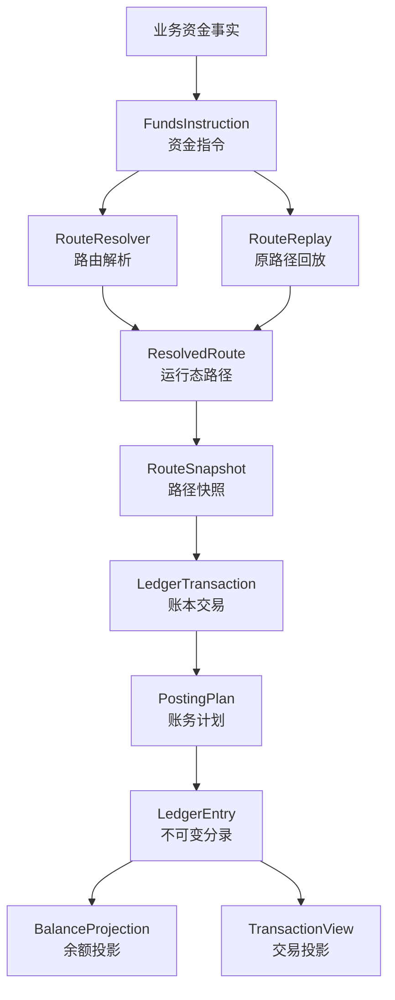
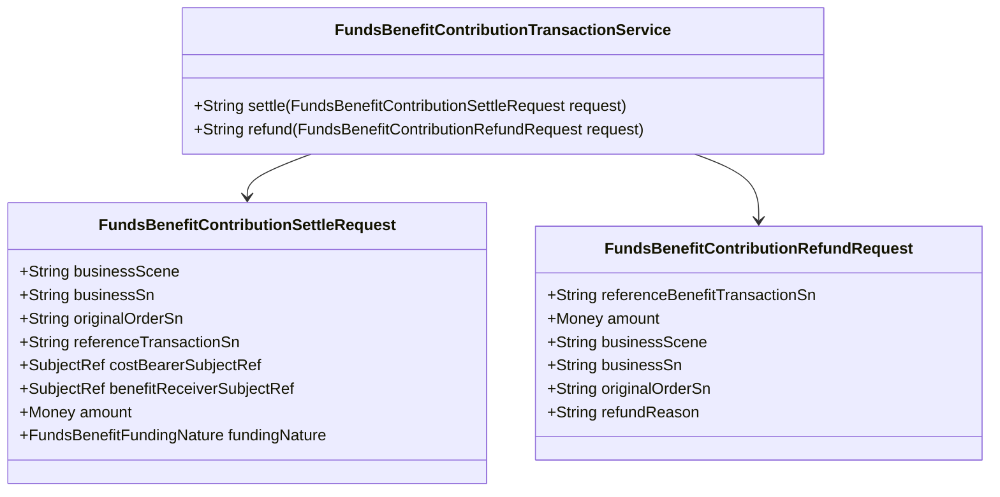

# 支付资金底座 DSL 承载层设计

## 一、文档定位：产品到系分的核心承载层

支付资金底座 DSL 是产品语义到系统分析设计之间的核心承载层。它把产品侧的交易场景、账户语义、资金流、状态约束和验收红线，转译为系统侧可开发、可测试、可审计的资金交易结构和资金链路结构。

它不是 PRD。PRD 负责说明用户、目标、业务流程、运营规则和产品验收。

它也不是实现说明。实现说明负责拆接口、类、表、组件和部署细节。

它承接两端：

| 承接方向 | 承接内容 | 产出给谁 |
| --- | --- | --- |
| 从产品进入 | 业务场景、主体关系、金额口径、状态边界、费用规则、异常路径、运营审计和验收红线。 | 系分设计、开发、测试。 |
| 向系分输出 | 资金指令、资金路径、路径快照、账务计划、账本分录、余额投影、交易投影和契约用例。 | 架构设计、接口设计、测试设计。 |

### 1.1 核心问题

本文件要回答一个问题：

> 一笔产品资金事实进入资金底座后，谁的什么账目，因为哪个原因，沿着哪条资金链路，发生了多少金额变化，并且如何被开发、测试、运营和审计共同验证？

这个问题拆成五个稳定视角：

| 视角 | 需要回答的问题 | DSL 承载方式 |
| --- | --- | --- |
| 产品视角 | 这个场景为什么发生，用户或运营想完成什么？ | `businessScene`、`businessSn`、`eventType`、`operator`、`reference`。 |
| 交易视角 | 这是一笔直接交易、授权交易，还是余额控制？ | `instructionType`、`transactionType`、生命周期事件。 |
| 资金链路视角 | 钱或额度从哪个主体的哪个账目到哪里，预算控制命中了什么规则？ | `ResolvedRoute`、`RouteLeg`、`RouteNode`、`RouteSnapshot`；支出控制范围和 Spend Rule 作为控制证据随快照保留。 |
| 账务视角 | 资金路径如何成为平衡分录？ | `LedgerTransaction`、`PostingPlan`、`LedgerEntry`。 |
| 验证视角 | 如何证明它正确、可回放、可追溯？ | JSON 契约用例、TDD 验收矩阵、禁止清单。 |

### 1.2 第一性原理

| 原理 | 含义 | 设计要求 |
| --- | --- | --- |
| 事实先于流程 | 资金底座只处理已成立的资金事实，不表达页面按钮、审批中、处理中等过程状态。 | DSL 只接收可入账事实；运营流程和外部通道流程不进入账本分录。 |
| 主体先于账户工具 | 能入账的是内部账务主体，不是用户、商户、银行卡、卡号、PAN、token、VA、支出控制范围、Spend Rule 或外部银行账户。 | 所有入账对象必须解析为 `FUNDING_ACCOUNT` 或 `CREDIT_ACCOUNT`；VCC 发卡通过资金子账户或信用子账户承接，不新增 `VCC_ACCOUNT` 主体；平台账户角色必须先解析为平台资金账户，支出控制范围和 Spend Rule 只能进入控制上下文、规则快照和审计证据。 |
| 金额先于余额 | 金额是事实输入，余额是分录派生结果。 | DSL 不直接修改余额，只生成可校验的 `LedgerEntry`。 |
| 路径先于分录 | 先说明资金或控制余额如何流动，再推导借贷方向。 | 业务方不能直接提交 `LedgerEntry`、`EntrySide` 或 `PostingPlan`。 |
| 分录是余额事实源 | 余额、账单、报表和投影都从账本分录派生。 | 余额投影和交易投影不能反向修正账本事实。 |
| 快照保护回放 | 后续退款、撤销、结算、拒付、退费、解冻必须沿用原事实路径。 | 缺原路径快照时不能重新选路兜底。 |
| JSON 服务于验证 | JSON 用来表达 DSL 对象和契约用例，使场景可以被机器解析和 TDD 验收。 | 设计意图、流程说明、禁止清单不用 JSON 包装。 |

### 1.3 能力承载优先级

DSL 的能力优先级按资金底座的产品定位划分，不按文档编号或工程任务编号划分。能力优先级表示生产交付时必须先证明哪些资金不变量。

| 优先级 | DSL 必须优先稳定的能力 | 承载边界 |
| --- | --- | --- |
| P0 资金底座内核 | 钱包账户、账本、账目、余额投影、对账、清分、清算、结算、账本余额快照和资金数据治理证据。 | 必须先证明主体可记账、分录可追溯、余额可重建、运营资金批次可核对、历史事实可留存、可治理和可审计。 |
| P1 交易与读模型扩展 | 直接交易、授权交易、余额控制、交易投影和交易投影重投影。 | 在 P0 主体、账目、余额和治理边界上扩展交易入口、生命周期、路由回放和只读视图，不得反向定义账本语义。 |
| P2 业务模式能力包 | VCC 发卡业务支持、全球账户收付款支持和收单业务支持。 | 只复用资金底座的账户、账本、清结算、对账和归档能力；业务模式、轨道协议、风控、合规和行业规则不得沉入统一资金内核。ACH 或银行转账只作为这些业务可能使用的外部轨道输入，不新增资金底座内建业务 DSL。 |

### 1.4 资金事实执行链路

以下链路表达一次资金事实进入资金底座后的执行顺序，不表达建设优先级。P0 能力必须先能独立解释钱包、账本、余额、对账、清结算和归档；P1 交易入口再复用这条执行链路产生或查询资金事实。

```text
业务资金事实
  -> FundsInstruction
  -> ResolvedRoute
  -> RouteSnapshot
  -> LedgerTransaction
  -> PostingPlan
  -> LedgerEntry
  -> BalanceProjection / TransactionView
```

这条链路表达三层含义：

| 层次 | 回答的问题 | 输出 |
| --- | --- | --- |
| 指令层 | 这笔资金事实是什么？ | `FundsInstruction` |
| 路由层 | 这笔事实影响哪些主体和账目？ | `ResolvedRoute`、`RouteSnapshot` |
| 账务层 | 这条路径如何成为平衡分录？ | `LedgerTransaction`、`PostingPlan`、`LedgerEntry` |

### 1.5 新增 DSL 场景最小闭环

新增资金场景不要求一开始就写完整实现，但 DSL 契约必须足够让产品、研发、测试和运营对同一件事达成一致。最小闭环如下：

| 闭环项 | 必须说明 | 不满足时的处理 |
| --- | --- | --- |
| 输入事实 | `instructionType`、`eventType`、`transactionType`、金额、币种、业务流水、操作者和引用对象。 | 不进入 DSL 契约，先补产品场景。 |
| 主体和引用 | 哪些是内部可记账主体，哪些只是支付工具、外部账户、业务单或通道引用。 | 不允许生成 `LedgerEntry`。 |
| 路由结果 | route code、参与方、账目、平台角色、工具快照、资金责任决策和账本周期。 | 路由失败且无账务副作用。 |
| 账务结果 | posting plan、entry 主体、entry side、金额、币种、账目和周期。 | 不允许只断言“状态成功”。 |
| 逆向依据 | 是否需要原 route snapshot、原交易、原授权、原冻结或原清结算批次。 | 缺原事实时必须失败或进入人工处理。 |
| 金融边界 | 资质、法域、客户资金、备付金、跨境、外汇、敏感数据或外部规则是否有规则来源、版本或发布日期、生效日期、适用主体或适用范围、适用法域、核验日期、确认方、确认状态和证据引用。 | 未确认前只能作为待确认边界或红线进入设计，不能作为默认可执行资金能力。 |
| 验收红线 | `validation.mustPass` 和 `validation.mustFail` 至少各有一项可测试断言。 | 不进入 TDD 任务。 |

### 1.6 DSL 准入口径

DSL 准入只把 PRD 的业务问题转成资金事实和机器契约候选，不写测试资源、不改公共契约、不补生产字段。准入输出必须至少包含 `dslCaseId`、`moneyAction`、`accountingAnchor`、`fixtureLevel`、`contextVariablesBoundary` 和明确不做范围，并能被 TDD 的 `targetAssets` 与 `firstRedCandidateSet` 反查。

DSL 主文档只记录目标契约、字段边界和验收红线。若后续扩展核心资金语义，必须进入一等字段、route snapshot、交易事实快照或等价不可变存储，不能把组件金额、资金责任、退款处置完整内容、营销规则或外部账户敏感原文放回普通上下文。

## 二、设计目标与非目标

### 2.1 设计目标

| 目标 | 说明 |
| --- | --- |
| 事实稳定 | 同一事实在同一输入下产生稳定的 route、posting 和 entry，不受后续绑定关系、账户配置或展示规则漂移影响。 |
| 账务平衡 | 每个 `PostingPlan` 必须独立借贷平衡，整笔 `LedgerTransaction` 必须平衡。 |
| 可解释 | 能解释资金从哪来、到哪去、为什么发生、由谁触发、引用了哪个原事实。 |
| 可回放 | 后续退款、撤销、结算、拒付、退费、解冻能基于原路径快照派生。 |
| 可测试 | 字段、枚举、边界、红线和场景可以沉淀为 JSON 契约用例和 TDD 验收。 |
| 可治理 | 大数据量下余额投影、交易投影、归档、重放和差异检查有清晰边界。 |

### 2.2 非目标

| 非目标 | 说明 |
| --- | --- |
| 不表达业务单状态 | 待支付、审核中、处理中、举证中、对账中等属于产品单据或运营流程。 |
| 不表达外部通道协议 | 通道通知、银行回单、processor response、ACH file、ACH entry、return code、NOC、reversal 等属于连接层或业务单据。 |
| 不表达展示投影 | 用户账单、商户账单、运营时间线、财务核对视图和指标项输入是只读投影。 |
| 不替代清结算对象 | 清算批次、结算单、出款单、对账单和差错单有独立产品语义。 |
| 不替代合规和财务制度 | 资质、法域、会计科目、税务和监管口径需要独立确认。 |

## 三、产品到系分的转译模型

产品需求进入资金底座后，不能直接落成接口、表或测试。它必须先转译成稳定的资金事实结构，再进入系分设计。

| 产品输入 | DSL 承载 | 系分输出 | 开发与测试关注点 |
| --- | --- | --- | --- |
| 业务场景 | `businessScene`、`eventType` | 交易能力、状态边界、异常路径。 | 场景命名稳定，成功与失败路径可枚举。 |
| 业务流水 | `businessSn`、幂等键 | 幂等、重放、查询和审计口径。 | 重复提交不重复入账。 |
| 用户、商户、企业、支出控制范围、卡、Spend Rule | 资金责任主体使用 `SubjectRef`，工具使用 `PaymentInstrumentRef`，支出控制范围和 Spend Rule 使用控制上下文和规则快照。 | 主体解析、账户绑定、工具快照、预算范围和支出规则快照。 | 工具、经营主体、支出控制范围和 Spend Rule 不得直接入账。 |
| 金额、币种、汇率 | `amount`、`originalAmount`、`exchangeRate` | 金额校验、币种边界、错币种事实记录。 | 金额为正，余额控制不做 FX。 |
| 账本周期 | `periodType`、`periodId`、`periodPolicy` | 账本 bucket、周期余额查询、周期隔离测试。 | 非 `LIFETIME` 周期必须显式确定，不得用清算账期、报表周期或规则窗口替代。 |
| 资金路径 | `ResolvedRoute`、`RouteLeg`、`RouteNode` | 路由解析、平台账户角色、原路径回放。 | 缺快照不重新选路。 |
| 账务影响 | `PostingPlan`、`LedgerEntry` | 分录生成、借贷平衡、余额投影。 | 每个计划独立平衡，余额从分录派生。 |
| 后续事件 | `Reference`、`RouteSnapshot` | 退款、撤销、结算、拒付、退费、解冻。 | 不超过原事实剩余额度或金额。 |
| 验收红线 | `validation.mustPass`、`validation.mustFail` | 契约测试、集成测试、回归测试。 | 正向、反向、边界、幂等、审计均可验证。 |

这张表是产品评审、系分设计、开发实现和测试验收之间的共同语言。产品只要新增一个资金场景，就必须能填满这张表；填不满时，不应进入开发。

#### 3.0.1 支付工具入口和账户主体内核转译

支付工具入口不是新的账务主体类型，而是产品输入到 DSL 的转译阶段。卡、VA、外部钱包端点、VCC、共享卡和通道 token 进入 DSL 时，最多形成 `PaymentInstrumentRef`、`ExternalAccountRef`、`RoutingDecision`、`FundingAllocationDecision`、`AccountHierarchySnapshot`、支出控制范围 / Spend Rule 控制快照和审计上下文；VCC 发卡必须先解析到资金子账户或信用子账户，再以 `SubjectRef(FUNDING_ACCOUNT)` 或 `SubjectRef(CREDIT_ACCOUNT)` 入账；内部余额钱包、商户钱包、平台钱包、返利钱包或信用额度入口则先解析为 `SubjectRef`、`BenefitSnapshot` 或等价不可变快照。route leg、posting plan、ledger entry 和余额投影仍只能使用解析后的资金账户、信用账户或平台账户角色解析后的平台资金账户。

产品或应用层可以在请求中传入业务入口参数，但 DSL 内核不把业务入口参数当成账务主体，也不要求所有入口都转成 `PaymentInstrumentRef`。内部余额钱包、平台钱包和商户钱包解析为 `SubjectRef(FundingAccount)`，信用额度解析为 `SubjectRef(CreditAccount)`，返利或权益按资金责任账户或 `BenefitSnapshot` 承接；只有卡、VA、外部银行账户、外部钱包端点、通道 token 等外部工具才形成 `PaymentInstrumentRef` 或 `ExternalAccountRef`。

| 场景 | DSL 输入层 | DSL 内核层 | 必须固化的快照 | 禁止项 |
| --- | --- | --- | --- | --- |
| 直接交易 | 已确认资金账户、信用账户或平台账户角色；业务入口参数可作为选择来源，支付工具可作为引用补充。 | `FundsInstruction`、`SubjectRef`、`ResolvedRoute`。 | 业务事实、原交易引用、业务入口选择来源、外部账户或支付工具脱敏引用。 | 把内部余额钱包、信用额度、返利钱包或商户钱包强行包装成支付工具；按当前工具绑定重算历史退款路径。 |
| 授权交易 | 优先允许从 `PaymentInstrumentRef` 或等价工具引用进入应用准入。 | 批准后必须解析为 `SubjectRef` 和 `FundingAllocationDecision`。 | 工具状态、绑定版本、使用主体、支出控制范围、Spend Rule、资金责任决策、拒绝原因或授权占用路径。 | 支付工具、支出控制范围或 Spend Rule 成为 ledger subject；授权拒绝生成 route 或 entry。 |
| 余额控制 | 账户主体、冻结来源、调整来源或支出控制范围。 | 资金账户余额桶、信用账户额度桶或预算型 Spend Rule 控制视图。 | 审批、凭证、原因、规则版本、控制窗口。 | 用工具号冻结余额，或用余额控制表达跨主体价值转移。 |

直接交易退款的 DSL 引用分层如下：

| 引用字段 | DSL 语义 | 使用边界 |
| --- | --- | --- |
| `referenceTransactionSn` | 内部原资金交易引用，转换为 `FundsInstructionReferenceSpec(ORIGINAL_TRANSACTION)`。 | 用于读取原交易 route snapshot 并按原 leg 回放；缺原事实、缺快照、错币种或累计超额必须失败且无 route、posting、LedgerEntry、余额投影副作用。 |
| `channelTransactionSn` | 外部通道、退款流水或外部账务引用，转换为 `EXTERNAL_TRANSACTION` 或保留为外部引用。 | 只能用于外部事实追溯和对账，不得替代内部原交易引用驱动原路径回放。 |

后续如新增 `authorizeByInstrument` 或其他支付工具型 application facade，DSL 契约必须证明“应用入口先解析、内核按主体”的转换关系：内部入口解析为 `SubjectRef` 或权益让利资金交易事实，外部工具解析为 `PaymentInstrumentRef` 或 `ExternalAccountRef`；工具校验、入口解析或规则决策失败时不生成 route；批准或放行时 `PaymentInstrumentRef`、`FundingAllocationDecision` 或权益资金交易摘要按需进入 route snapshot；后续撤销、完成、退款和拒付只回放原 route snapshot，不读取当前绑定重新选路。

VCC、多级账户或父子账户相关 DSL 字段进入 fixture、Spec 或公共字段变更前，必须由账户层级工程任务确认 `AccountHierarchySnapshot`、`PostingRole`、父账户 / 根账户快照、层级版本、账目 profile、父账户是否允许 `PARENT_CONTROL` 分录、H2/DDL 范围和回放断言。未确认前，DSL 只能把这些对象作为目标态设计和 contract-only 约束，不能声明发卡账务、父账户汇总或父子账户账单已经生产可用。

资金责任目标字段统一使用 `targetSubjectType + targetSubjectId`，资源关系可表达资金账户和信用账户目标主体。若要让 `FundingAllocationDecision` 正式声明平台角色解析后的平台资金账户以及 VCC 关联资金/信用账户责任主体，必须同步 TDD、DSL fixture、摘要、route snapshot、账户层级快照和回放断言。

### 3.1 能力域到 DSL 承载和契约证据矩阵

本矩阵用于逐项检查 PRD 能力地图是否已经落到 DSL。若能力域没有稳定 DSL 对象、契约样例、验收字段或禁止项，不能进入系统设计和编码。

| 优先级 | PRD 能力域 | DSL 承载对象 | 必须表达的事实 | JSON / TDD 证据 | 禁止漂移 |
| --- | --- | --- | --- | --- | --- |
| P0 | 钱包账户 | `SubjectRef`、`PaymentInstrumentRef`、`ExternalAccountRef`、平台账户角色、资金责任决策、预算控制上下文。 | 可入账主体、外部支付工具引用、内部钱包入口解析快照、脱敏展示号、绑定快照、资金责任解析关系、预算范围、Spend Rule 快照、账户能力和币种。 | `DSL-PAYMENT-INSTRUMENT-*`；`TDD-WALLET-*`、`TDD-ROUTE-*`。 | 把卡、VA、外部账户、支付工具、钱包标识、业务经营主体、信用账户、支出控制范围或 Spend Rule 都泛化成 `FundingAccount` 后直接入账；或把内部钱包入口强制包装成 `PaymentInstrument`；或把支出控制范围、Spend Rule 当作 ledger subject。 |
| P0 | 账本账目 | `PostingPlan`、`LedgerTransaction`、`LedgerEntry`、`periodType`、`periodId`、`periodPolicy`。 | posting plan 独立平衡、entry 金额为正、借贷方向、账本周期、来源指令和 route leg。 | `DSL-DIRECT-PAY-FEE-001`、`DSL-BALANCE-CONTROL-LIMIT-BUDGET-001`；`TDD-LEDGER-*`。 | 用负金额表达反向、缺账本自动建账、用清算账期或报表周期替代账本周期。 |
| P0 | 余额投影 | `BalanceProjection`、账本余额快照引用、余额日志只读引用。 | 余额桶、分录来源、账本周期、投影 checkpoint、覆盖模式和只读边界。 | `DSL-GOVERNANCE-BALANCE-SNAPSHOT-001`；`TDD-VIEW-*`、`TDD-ARCH-006*`。 | 余额投影或余额日志反写事实、修正余额或替代账本分录。 |
| P0 | 清结算与对账 | `SettlementPolicySpec`、清结算 DSL 对象、差错和调账引用。 | 清分明细、清算候选、清算批次、结算锁定、出款结果、对账差异、审批和核销。 | `DSL-SETTLEMENT-*`、`DSL-BENEFIT-CLEARING-RECONCILIATION-001`；`TDD-CLS-*`、`TDD-SETTLE-*`、`TDD-RECON-*`。 | 清分候选直接入账、对账差异直接改历史分录、结算锁定当出款成功。 |
| P0 | 资金数据治理 | `governanceTask`、`archiveRequest`、`archiveManifest`、`BalanceSnapshotVerifyRef`、`differenceReport`、`manualResolutionRef`、治理读取或导出快照引用。 | 范围、审批、checkpoint、watermark、Manifest、coverage mode、dry-run/apply、差异报告、阻断原因、影响范围、责任归属、证据引用、人工处理动作、可重跑条件、导出快照、脱敏、digest 和审计边界。 | `DSL-GOVERNANCE-*`；`TDD-GOV-*`、`TDD-ARCH-*`、`TDD-REPLAY-*`。 | 无范围重放、缺 Manifest 仍推进水位、普通指标快照替代账本余额快照、异常人工处理直接修改交易/账目/余额/投影事实，或报表数仓绕过治理边界直接读取冷归档、反写资金事实。 |
| P1 | 交易接入 | `FundsInstruction`、`FundsInstructionReferenceSpec`、`businessScene`、`eventType`、`transactionType`，授权应用入口可携带 `PaymentInstrumentRef` 并在准入后转成 `FundingAllocationDecision`。 | 业务流水、幂等键、金额、币种、操作者、来源事实、后续引用、授权工具快照和解析后的资金责任主体。 | `DSL-DIRECT-*`、`DSL-AUTH-*`、`DSL-BALANCE-CONTROL-*`、`DSL-PAYMENT-INSTRUMENT-*`；`TDD-DIR-*`、`TDD-AUTH-*`、`TDD-CTRL-*`、`TDD-ROUTE-*`。 | 把业务订单状态、通道状态机或运营工单直接当作资金交易；或把支付工具入口误解为 ledger subject。 |
| P1 | 权益语义 | `FundsBenefitContributionTransactionService`、让利出资记账交易请求、营销账户引用、伴随权益指令组、补充权益事实、审计证据包引用、使用者解释视图引用。 | 原让利出资交易、金额闭合、成本承担主体、让利承接账务主体、本次业务决策引用、营销账户 profile、伴随指令原子性、补充事实来源、最终确认状态、视图防误导、证据最小化和外部规则核验状态。 | `DSL-BENEFIT-*`；`TDD-BEN-*`、`TDD-BEN-RED-*`、`TDD-RACE-012`。 | 把核心金额、出资分摊、券、活动、规则来源或退款处置藏进 `contextVariables`，按当前营销规则重算历史权益，把营销账户当支付工具或营销规则系统，或把伴随指令、补充事实、审计证据包、解释视图和外部规则核验当作备注字段处理。 |
| P1 | 资金路由 | `ResolvedRoute`、`RouteSnapshot`、`RouteParticipant`、`RouteNode`、`RouteLeg`、`RoutingDecision`、`FundingAllocationDecision`。 | 参与方、账目、账本周期、平台账户、资金责任、命中规则、失败原因和原路径回放。 | `DSL-PAYMENT-INSTRUMENT-ROUTE-001`、`DSL-PAYMENT-INSTRUMENT-REPLAY-001`、`DSL-REVERSE-REFUND-FEE-001`；`TDD-ROUTE-*`。 | 缺原 route snapshot 时重新选路，或让 route 直接写交易事实和账本事实。 |
| P1 | 交易投影 | `TransactionView`、`projectionReplayTask`、交易投影 checkpoint。 | 交易视图来源、重放范围、差异报告、人工处理引用和只读口径。 | `DSL-GOVERNANCE-PROJECTION-REPLAY-001`；`TDD-VIEW-*`、`TDD-REPLAY-*`。 | 交易投影反写交易事实、账本事实或余额投影。 |
| P2 | VCC、全球账户和收单业务支持 | 业务能力包引用、轨道/外部账户引用、归一资金事实、外部规则核验字段。 | 业务模式边界、外部轨道结果、风险合规确认、资金底座可复用的账户、账本、清结算、对账和归档接口；ACH 或银行转账事件必须已经由上层业务或适配层解释为资金事实。 | 业务专项 PRD、系分补充和 `TDD-RAIL-*`、`TDD-FX-*`、`TDD-OPS-*`。 | 把业务模式、卡组织/银行/PSP/ACH 协议、return code/NOC/reversal 规则解释、风控模型或合规结论沉入统一资金 DSL 内核。 |

### 3.2 P2 业务能力包 DSL 准入卡

06、07、08 分册进入 DSL 时，只能以业务能力包形式提供外部事实引用、场景语义和验证红线，不得把业务产品状态机、外部协议字段全集或合规结论固化为资金底座统一 DSL。任何 P2 业务能力包进入工程落地前，必须同时引用业务分册验收 ID、DSL 承接字段、系分章节、TDD 专项用例和 P0/P1 回归范围。

| 业务能力包 | 可进入 DSL 的事实 | 不进入 DSL 的内容 | 必须回挂的 TDD | 编码准入补充 |
| --- | --- | --- | --- | --- |
| VCC 发卡 | 授权批准、授权拒绝、clearing、reversal、refund、chargeback 的归一资金事实；VCC 关联资金/信用子账户、父账户约束、卡、token、merchant、MCC、授权控制结果、外部授权号、清算文件、费用项、funding statement 和对账来源对象的脱敏引用。 | Program 管理、发卡处理商协议、卡组织原始报文、完整 PAN/CVC、spend controls 规则计算、供应商账单或财务凭证系统、PCI 最终结论。 | `TDD-P2-VCC-*`、`TDD-P2-VCC-RED-*`、`TDD-RAIL-001`、`TDD-AUTH-*`、`TDD-LEDGER-013` 至 `TDD-LEDGER-016`。 | 先确认 `B2-ACCOUNT-HIERARCHY`；证明卡凭证只作为支付工具和归因维度，资金影响必须落到 VCC 关联子账户；拒绝无 route、posting、entry；clearing、refund 和 chargeback 必须引用原授权或原 route；外部证据包和对账来源对象缺失时不得声明生产资金流完成。 |
| 全球账户收付款 | 外部账户引用、VA 或银行流水匹配结果、入金确认、出款前准入、外部受理在途、成功回单、退汇事实、费用和 FX 决策快照。 | 开户、VA 分配、银行协议报文、SWIFT 或本地清算网络原始字段全集、FX 执行、跨境材料采集和合规最终判断。 | `TDD-P2-GA-*`、`TDD-P2-GA-RED-*`、`TDD-RAIL-008`、`TDD-RAIL-009`、`TDD-FX-*`。 | 外部 accepted、message sent 或 processing 不得展示为到账成功；无有效 FX quote 不得静默换汇；银行账户、VA、Nostro/Vostro 只能作为 externalAccountRef。 |
| 收单业务 | payment attempt、authorization、capture、refund、dispute、chargeback、商户 CLEARING、清分批次、清算批次、结算单和出款结果的归一资金事实。 | 商户入网/KYB、收银台展示、PSP/收单行/卡组织协议、通道路由策略、风控模型和 PCI 最终结论。 | `TDD-P2-ACQ-*`、`TDD-P2-ACQ-RED-*`、`TDD-CLS-*`、`TDD-SETTLE-*`、`TDD-RECON-*`。 | capture 成功只进入待清算，不等于可提现；清分确认不释放可结算；refund 与 chargeback 必须防重复损失；完整 PAN/CVC 不进入资金底座。 |
| ACH 或银行转账支撑边界 | ACH/银行转账业务解释后的入金确认、出款结果、在途、退回、追偿、外部流水引用、trace number 摘要、文件摘要、回单引用、对账差错、调账核销事实和外部规则核验状态。 | ACH 产品状态机、ACH 指令、Debit 授权、账户验证、ODFI/RDFI 协议、Nacha 规则、SEC code、文件批次、cut-off、return code、NOC、reversal 规则解释和完整银行账户敏感信息。 | `TDD-RAIL-002` 至 `TDD-RAIL-007`、`TDD-RED-030`、`TDD-RED-034`、`TDD-P2-GA-*`、`TDD-P2-ACQ-*`、`TDD-RECON-*`。 | ACH return 和 NOC 必须先由上层业务或适配层解释；外部 submitted、accepted、processing 或 message sent 不等于到账；资金底座不得解析 ACH 协议，不得把 return 静默映射为普通 refund，不得因 NOC 修改原交易资金事实，不得保存完整银行账户敏感信息，不得在规则未确认时作为自动资金处理依据。 |
| 三类业务共用 | `businessScene`、`reference`、`instrumentRef`、`externalAccountRef`、`originalAmount`、`exchangeRate`、外部规则核验字段、脱敏证据引用、外部适配证据包和归一资金动作。 | 业务产品完整生命周期、外部规则最终解释、风险模型、商户经营策略、银行或卡组织协议实现。 | 第 05 分册 4.2、TDD 13.4.1、`DSL-P2-EXTERNAL-EVIDENCE-PACK-001` 和目标测试资产 P2 专项行。 | 若需要新增公共枚举、Request/DTO、服务入口、表结构或 JSON 夹具，必须在专项工程任务中逐项授权，并列明 P0/P1 回归测试；缺证据包时只能 contract-only 或隔离导入。 |

## 四、资金交易结构化描述

资金交易不是一个单一金额字段，也不是“某个服务方法”。在本设计中，一笔资金交易由六个结构共同描述：

| 结构 | 说明 | 典型字段或对象 |
| --- | --- | --- |
| 场景结构 | 交易为什么发生，属于哪个产品场景。 | `businessScene`、`businessSn`、`eventType`。 |
| 主体结构 | 谁承担资金或额度责任，哪些预算控制上下文参与解释。 | `SubjectRef`、`RouteParticipant`、SpendControlScope 上下文、Spend Rule 快照。 |
| 金额结构 | 账务金额、原始金额、币种和汇率事实。 | `amount`、`originalAmount`、`exchangeRate`。 |
| 链路结构 | 资金或额度从哪里到哪里，属于哪个账本周期 bucket；预算只形成控制证据和规则窗口。 | `ResolvedRoute`、`RouteLeg`、`RouteNode`、`periodType`、`periodId`、Spend Rule 控制证据。 |
| 账务结构 | 链路如何转成可平衡、可追溯的分录。 | `LedgerTransaction`、`PostingPlan`、`LedgerEntry`。 |
| 验证结构 | 交易如何证明正确、幂等、可回放。 | JSON 契约、TDD 验收、禁止清单。 |

资金交易按能力分为三类：

| 交易能力 | 业务含义 | DSL 指令 | 典型场景 |
| --- | --- | --- | --- |
| 直接交易 | 已确认发生价值转移、责任变化或资金状态变化。 | `DIRECT_TRANSACTION` | 充值、付款、转账、提现、退款、手续费、清算确认、结算锁定、调账。 |
| 授权交易 | 先占用额度或资金，后续由可信撤销、完成、退款、强制完成或争议结果关闭或减少。 | `AUTHORIZATION_TRANSACTION` | 卡授权、共享卡授权、部分撤销、部分完成、授权链退款、争议退款。 |
| 余额控制 | 不发生跨主体价值转移，只控制同主体资金账户余额、信用账户额度，或调整支出控制范围下的 Spend Rule 控制额度。 | `BALANCE_CONTROL` | 冻结、解冻、资金账户余额调整、信用账户额度调整、支出控制范围 / Spend Rule 控制额度调整。 |

交易结构必须让开发和测试同时看懂：

- 开发要能从交易结构推导接口入参、路由解析、账务计划和投影更新。
- 测试要能从交易结构推导用例前置、输入、过程断言、余额断言和失败断言。
- 产品和运营要能从交易结构确认资金事实、异常处理和审计口径是否符合预期。

## 五、资金链路结构化描述

资金链路描述的是一笔事实穿过资金底座时的完整路径：从业务事实到资金指令，从资金指令到路径快照，从路径快照到账务分录，再从账务分录派生余额和交易视图。



| 分层 | 核心对象 | 职责 | 边界 |
| --- | --- | --- | --- |
| 来源事实层 | 业务流水、冻结单、清算确认、结算锁定、出款结果、对账差错、争议拒付、费用事实 | 判断事实是否成立、是否允许入账。 | 不直接生成借贷分录。 |
| 指令层 | `FundsInstruction` | 把来源事实转成账本可理解的稳定输入。 | 不表达业务单生命周期。 |
| 路由层 | `ResolvedRoute`、`RouteParticipant`、`RouteLeg`、`RouteNode` | 描述资金、额度或预算如何在主体和账目之间变化。 | 不是会计分录，不表达运营状态。 |
| 快照层 | `RouteSnapshot` | 固化本次路径、参与方、平台账户、工具引用和规则结果。 | 不重新决策路径。 |
| 账务层 | `LedgerTransaction`、`PostingPlan`、`LedgerEntry` | 把路径翻译为平衡分录。 | 不反向修改业务事实。 |
| 投影层 | `BalanceProjection`、`TransactionView` | 查询、展示、重放和差异检查。 | 只能从事实派生，不能反写事实。 |

清结算对象进入 DSL 前必须先被转换为标准资金事实。清分批次、清算候选、结算单草稿、出款受理态和对账差异本身不是 route leg，也不是 ledger entry；只有清算批次确认、结算锁定、出款成功/失败/退回、已审批补事实或调账等事实成立后，才进入路由层和账务层。

资金链路的最小验证闭环：

| 步骤 | 必须产出 | 必须断言 |
| --- | --- | --- |
| 业务事实进入 | 资金指令。 | 场景、金额、主体、引用、操作者完整。 |
| 路由解析 | 运行态路径。 | 入账主体合法，工具和外部账户不直接入账。 |
| 路径冻结 | 路径快照。 | 后续 replay 可使用，当前绑定变化不影响历史路径。 |
| 账务计划 | posting plan。 | 单计划独立平衡，借贷方向可解释。 |
| 分录入账 | ledger entry。 | 余额事实源唯一，金额为正，币种明确。 |
| 投影派生 | 余额投影和交易投影。 | 投影只读，不反写交易或账本事实。 |

### 5.1 资金场景借贷平衡与账务期望表

本表是资金场景进入 `PostingPlan` 和 `LedgerEntry` 前的 DSL 权威期望，用于统一产品、系分和 TDD 对“借贷是否平衡、余额桶如何变化、失败是否无副作用”的判断。PRD 中的账务矩阵只表达产品语义；进入编码、测试或交付结论时，以本表的 DSL 口径和对应系分、TDD 承接为准。

宣讲和评审时建议先按下列分组阅读，再进入完整表逐行核对：

| 分组 | 先看场景 | 解决的问题 |
| --- | --- | --- |
| 入金、出金和转账 | 用户充值成功、用户提现申请或提现锁定、用户提现失败释放、系统内转账。 | 说明可用余额、冻结/锁定、平台现金或外部引用如何被区分。 |
| 商户收款和费用 | 商户订单收款、手续费收取、直接交易退款或授权完成后退款。 | 说明本金、手续费、成本、补贴和退款不能混成一个净额。 |
| 授权生命周期 | 授权批准占用、授权完成或部分完成、可信授权撤销、争议退款或追偿。 | 说明授权占用、完成、释放、争议退款和追偿如何沿原 route snapshot 闭环；授权过期不作为资金交易事实。 |
| 余额控制和调账 | 冻结、解冻或到期释放、资金账户余额调整、信用额度调整或预算控制调整。 | 说明同主体余额桶转换、信用额度控制、预算控制视图和审批调账边界。 |
| 清分、结算和出款 | 清分确认、结算锁定、外部出款受理或在途、出款成功、出款失败或退回。 | 说明待清算、可用、结算锁定、在途和平台现金责任关闭的区别。 |
| 对账差错和运营处理 | 对账误报关闭、对账补事实、冲正、调账或核销。 | 说明误报不入账，真实差错只能通过白名单补事实、冲正或调账闭环。 |
| 权益金额 | 平台补贴、商户让利或展示优惠、储值券或预付权益核销、零实付交易。 | 说明平台补贴、商户让利、储值责任和零实付不能按用户实付金额简单解释。 |
| 收益分润和激励结算 | 用户代理佣金、平台员工二级分润、员工 KPI 激励的清分、清算确认和结算锁定。 | 说明收益应得项只是清分来源，清算确认前不改变余额；收益参与方必须解析到账务主体。 |
| 治理和只读重建 | 归档、重放、余额快照或交易投影重建。 | 说明治理任务只读，不生成新的 route、posting 或 ledger entry。 |

场景到 DSL 事件或指令索引：

| 场景 | DSL 事件或指令 |
| --- | --- |
| 用户充值成功 | `DIRECT_TRANSACTION / TOPUP`。 |
| 用户提现申请或提现锁定 | `BALANCE_CONTROL / FREEZE` 或提现锁定场景。 |
| 用户提现失败释放 | `BALANCE_CONTROL / UNFREEZE`。 |
| 系统内转账 | `DIRECT_TRANSACTION / TRANSFER`。 |
| 商户订单收款 | `DIRECT_TRANSACTION / PAY`。 |
| 手续费收取 | `DIRECT_TRANSACTION / FEE`。 |
| 授权批准占用 | `AUTHORIZATION_TRANSACTION / AUTHORIZE`。 |
| 授权完成或部分完成 | `AUTHORIZATION_TRANSACTION / SETTLE`。 |
| 授权撤销 | `AUTHORIZATION_TRANSACTION / REVERSAL`。 |
| 授权过期不入资金交易 | 不生成 `AUTHORIZATION_TRANSACTION / EXPIRE`；到期、超时或通道未返回只进入提醒、差错候选或运营处理。 |
| 直接交易退款或授权完成后退款 | `DIRECT_TRANSACTION / REFUND` 或授权链退款事件。 |
| 争议拒付或追偿 | 默认通过 `AUTHORIZATION_TRANSACTION / AUTH_REFUND` 携带拒付或争议原因、凭证、外部引用和审计上下文承接；差错追偿事实或独立 `CHARGEBACK` 入口必须由专项设计和工程边界确认。 |
| 冻结 | `BALANCE_CONTROL / FREEZE`。 |
| 解冻或到期释放 | `BALANCE_CONTROL / UNFREEZE`。 |
| 资金账户余额调整 | `BALANCE_CONTROL / ADJUST`。 |
| 外部余额异常纠偏 | `BALANCE_CONTROL / ADJUST`，必须携带外部终局事件、外部余额快照、差错单或审批、凭证和重新对账引用。 |
| 信用额度或预算调整 | `BALANCE_CONTROL / LIMIT_ADJUST`。 |
| 清算批次确认 / 清算确认 | `DIRECT_TRANSACTION / CLEARING_CONFIRM` 或清结算 DSL 对象；清分确认和清算候选只作为清结算对象，不进入 route/posting。 |
| 收益分润清分与清算确认 | 清分确认和收益候选只作为清结算对象；收益清算批次确认使用 `DIRECT_TRANSACTION / CLEARING_CONFIRM` 或经专项设计确认的收益清算确认事件进入 route/posting。 |
| 结算锁定 | `DIRECT_TRANSACTION / SETTLEMENT_LOCK`。 |
| 外部出款受理或在途 | `DIRECT_TRANSACTION / PAYOUT_SUBMITTED` 或出款状态事实。 |
| 出款成功 | `DIRECT_TRANSACTION / PAYOUT_SUCCEEDED`。 |
| 出款失败或退回 | `DIRECT_TRANSACTION / PAYOUT_FAILED` 或退回事实。 |
| 对账误报关闭 | 对账差错处理动作。 |
| 对账补事实、冲正、调账或核销 | `DIRECT_TRANSACTION / ADJUSTMENT` 或白名单运营命令。 |
| 平台补贴 | `DIRECT_TRANSACTION / PAY` 的权益伴随 leg 或独立伴随指令。 |
| 商户让利或展示优惠 | 权益让利资金事实 `NO_LEDGER`，不生成资金分录，只进入解释、清分和对账归因。 |
| 储值券或预付权益核销 | 独立负债、预收待付或用户权益余额能力，不能复用当前优惠让利结算入口生成资金影响。 |
| 零实付交易 | 主支付金额为 0 或由业务拆成伴随权益资金交易；不得通过 `FundsInstruction.benefitSnapshot` 承载完整权益结果。 |
| 归档、重放、余额快照或交易投影重建 | governance DSL 对象。 |

表解释规则：

| 规则 | 口径 |
| --- | --- |
| 借贷方向 | 借方和贷方是 `EntrySide`，不是简单的来源方和目标方；实现侧必须结合账目 `normalBalanceSide` 和资金移动方向推导。 |
| 余额增减 | 对 `normalBalanceSide=DEBIT` 的账目，借方增加、贷方减少；对 `normalBalanceSide=CREDIT` 的账目，贷方增加、借方减少。 |
| 金额表达 | `LedgerEntry.amount` 永远为正；反向、释放、退款、撤销和冲正通过事件、引用、借贷方向和原 route snapshot 表达，不使用负金额。 |
| 平衡单位 | 每个 `PostingPlan` 必须同币种借贷平衡；整笔 `LedgerTransaction` 的借方合计必须等于贷方合计。 |
| 余额桶 | `AVAILABLE`、`FROZEN`、`AUTHORIZATION`、`CLEARING`、`SETTLEMENT`、`IN_TRANSIT` 等是账目或余额桶，不是业务单状态。 |
| 失败边界 | 拒绝、余额不足、缺快照、错币种、规则未确认、权限不足和重复冲突失败时，不得生成 route、posting、ledger entry、外部出款或敏感导出。 |
| 逆向回放 | 退款、可信撤销、拒付/争议结果、出款失败和差错处理优先引用原事实和原 route snapshot；缺少原事实时阻断或转人工，不静默重新选路。 |

账户类型和 normal balance 参考口径：

| 账户类型 | normal balance | 常见账户示例 | 余额影响解释 |
| --- | --- | --- | --- |
| 资产 `ASSET` | `DEBIT` | 平台现金、备付镜像、外部回单现金映射、应收或在途资产。 | 借方增加，贷方减少。 |
| 负债 `LIABILITY` | `CREDIT` | 用户资金责任、商户待清算、结算锁定、出款在途、储值预收待付。 | 贷方增加，借方减少。 |
| 收入 `REVENUE` | `CREDIT` | 平台手续费收入、服务费收入。 | 贷方增加，借方减少。 |
| 成本 `EXPENSE` | `DEBIT` | 平台补贴成本、通道成本、营销成本。 | 借方增加，贷方减少。 |
| 权益 `EQUITY` | `CREDIT` | 平台权益类调整或资本类科目。 | 通常不作为交易主链路默认账户；使用时必须有财务确认。 |

下表中的账户和账户类型是产品到系分的账务示例，用于说明参与方、余额桶和借贷平衡方式，不替代最终会计科目表、财务制度或实现侧 `LedgerProfile`。实现侧以账本配置的 `normalBalanceSide` 为准；表中出现“用户/商户 `AVAILABLE` 为负债类余额桶”时，表达的是平台对用户或商户的资金责任口径。

主场景借贷平衡与账务期望：

| 场景 | 参与方和账户示例 | 账户类型和 normal balance | 借贷如何平衡 | 对余额的影响 | 红线和 TDD 锚点 |
| --- | --- | --- | --- | --- | --- |
| 用户充值成功 | 用户资金账户 `AVAILABLE`；平台现金/备付镜像 `CASH` 或清算在途资产；外部通道流水只做引用。 | `CASH` 为资产/DEBIT；用户 `AVAILABLE` 或预收待付为负债/CREDIT。 | 借：平台 `CASH` 或清算在途资产；贷：用户 `AVAILABLE` 或 `PREPAYMENT`。 | 用户可用余额增加；平台现金或应收资产增加；平台对用户资金责任同步增加。 | 充值确认前不入账；外部账户不得成为 entry 主体。`TDD-DIR-*`、`TDD-LEDGER-*`。 |
| 用户提现申请或提现锁定 | 用户资金账户 `AVAILABLE`、同主体 `FROZEN` 或提现锁定桶。 | 两个余额桶通常为负债/CREDIT。 | 借：用户 `AVAILABLE`；贷：用户 `FROZEN` 或提现锁定桶。 | 可用余额减少，冻结或锁定余额增加；总责任不变。 | 提现申请不是外部到账成功；冻结只控制可用性。`TDD-CTRL-*`、`TDD-DIR-*`。 |
| 用户提现失败释放 | 用户原冻结桶 `FROZEN`，用户 `AVAILABLE`。 | 两个余额桶通常为负债/CREDIT。 | 借：用户 `FROZEN`；贷：用户 `AVAILABLE`。 | 冻结余额减少，可用余额增加；总责任不变。 | 只释放一次；成功和失败不得双终态。`TDD-CTRL-*`、`TDD-DIR-*`。 |
| 系统内转账 | 付款方资金账户 `AVAILABLE`，收款方资金账户 `AVAILABLE`。 | 双方 `AVAILABLE` 通常为负债/CREDIT。 | 借：付款方 `AVAILABLE`；贷：收款方 `AVAILABLE`。 | 付款方可用减少，收款方可用增加；平台总责任不变。 | 双方主体、币种、周期明确；余额不足或错币种失败无副作用。`TDD-DIR-*`、`TDD-LEDGER-*`。 |
| 商户订单收款 | 付款方 `AVAILABLE`；商户 `CLEARING`；平台手续费收入 `FEE`；平台补贴或成本账户按组件拆分。 | 付款方和商户余额桶通常为负债/CREDIT；手续费收入为收入/CREDIT；补贴成本为成本/DEBIT。 | 借：付款方 `AVAILABLE` 按用户实付；贷：商户 `CLEARING` 净应清分金额；贷：平台 `FEE` 等收入；平台补贴另以“借补贴成本，贷商户 `CLEARING`”表达。 | 付款方可用减少；商户待清算增加；平台收入或补贴成本按组件分别变化。 | 商户款不得直入 `AVAILABLE` 或 `SETTLEMENT`；本金、手续费、成本、补贴不得合成一个净额。`TDD-DIR-*`、`TDD-BEN-*`、`TDD-CLS-*`。 |
| 手续费收取 | 费用责任方 `AVAILABLE`、`CLEARING` 或应付账目；平台 `FEE` 或收入账户。 | 责任方余额桶通常为负债/CREDIT；平台收入为 REVENUE/CREDIT。 | 借：费用责任方目标账目；贷：平台 `FEE` 或手续费收入。 | 责任方可用、待清算或应付减少；平台手续费收入增加。 | 必须引用原交易、费用类型、规则版本或审批依据；手续费不得混入本金。`TDD-DIR-*`、`TDD-RECON-*`。 |
| 授权批准占用 | 持卡人或支出主体 `AVAILABLE`；同主体 `AUTHORIZATION`。 | 两个余额桶通常为负债/CREDIT；信用账户按 profile 配置；支出控制范围只做控制视图，不作为账本主体。 | 借：`AVAILABLE` 或可用额度；贷：`AUTHORIZATION`。 | 可用减少，授权占用增加；总责任或额度总量不变。 | 授权成功不是最终消费；拒绝不得生成 route、posting 或 entry。`TDD-AUTH-*`、`TDD-RED-*`。 |
| 授权完成或部分完成 | 原授权主体 `AUTHORIZATION`；商户 `CLEARING`；平台手续费或责任账户。 | `AUTHORIZATION` 和 `CLEARING` 通常为负债/CREDIT；收入账户为 REVENUE/CREDIT。 | 借：原主体 `AUTHORIZATION`；贷：商户 `CLEARING`、平台 `FEE` 或其他目标账目。 | 授权占用减少；商户待清算和平台收入按完成金额增加。 | 累计完成不得超过原授权金额；必须引用原授权和原 route snapshot。`TDD-AUTH-*`、`TDD-DIR-*`。 |
| 授权撤销 | 原授权主体 `AUTHORIZATION`，同主体 `AVAILABLE`。 | 两个余额桶通常为负债/CREDIT。 | 借：`AUTHORIZATION`；贷：`AVAILABLE`。 | 授权占用减少，可用恢复。 | 外部撤销或冲正触发；终态为撤销，不得和过期混用。`TDD-AUTH-*`。 |
| 授权过期不入资金交易 | 无账本参与方。 | 不适用。 | 不生成 posting。 | 不生成 route、posting、LedgerEntry 或余额变化。 | 到期、超时或通道未返回不是可信资金事实；释放占用必须由可信撤销、余额调整或对账差错补事实承接。`TDD-AUTH-*`。 |
| 直接交易退款或授权完成后退款 | 原收款方 `CLEARING`、`AVAILABLE` 或平台责任账户；原付款方 `AVAILABLE`；平台补贴和费用账户按原组件引用。 | 收付款余额桶通常为负债/CREDIT；收入、成本账户按自身 normal balance。 | 沿原 route snapshot 反向：借原收款方、费用收入或补贴责任相关账目；贷付款方或受益方 `AVAILABLE`。 | 原收款方待清算、可用或收入减少；付款方可用增加；补贴/费用按退款处置变化。 | 不按当前绑定关系重新选路；累计退款不得超过可退金额。`TDD-DIR-*`、`TDD-AUTH-*`、`TDD-BEN-*`。 |
| 争议拒付或追偿 | 责任方 `CLEARING`、`AVAILABLE`、`ADJUSTMENT`；受益方 `AVAILABLE` 或争议责任账目。 | 责任方余额桶通常为负债/CREDIT；差错挂账按 profile 配置。 | 借：责任方 `CLEARING`、`AVAILABLE` 或追偿账目；贷：受益方 `AVAILABLE`、争议应付或差错责任账目。 | 责任方可清算或可用减少；受益方或差错责任增加。 | 拒付、追偿和普通退款不得互相吞掉；必须有原事实、证据引用和责任归属。`TDD-AUTH-*`、`TDD-RECON-*`。 |
| 冻结 | 同主体 `AVAILABLE`、`FROZEN`。 | 两个余额桶通常为负债/CREDIT。 | 借：`AVAILABLE`；贷：`FROZEN`。 | 可用减少，冻结增加；总责任不变。 | 冻结不是消费、扣划或授权；不得跨主体、跨币种或跨周期冻结。`TDD-CTRL-*`、`TDD-RED-*`。 |
| 解冻或到期释放 | 同主体原 `FROZEN`、`AVAILABLE`。 | 两个余额桶通常为负债/CREDIT。 | 借：`FROZEN`；贷：`AVAILABLE`。 | 冻结减少，可用增加；总责任不变。 | 不得超额释放；已扣划、已出款或已关闭金额不得再次释放。`TDD-CTRL-*`。 |
| 资金账户余额调整 | 目标资金账户 `AVAILABLE`、`FROZEN` 或 `ADJUSTMENT`；平台调整、挂账或责任账户。 | 目标余额桶多为负债/CREDIT；挂账、成本、收入或资产按调整原因配置。 | 增加目标余额时，贷目标余额桶并借调整来源；减少目标余额时，借目标余额桶并贷调整去向。 | 目标余额按审批方向变化；平台挂账、成本、收入或责任账户同步变化。 | 必须有原因、凭证、审批和审计；不得作为绕过对账差错的人工改余额。`TDD-CTRL-*`、`TDD-RECON-*`。 |
| 外部余额异常纠偏 | 目标资金账户 `AVAILABLE` 或 `ADJUSTMENT`；外部钱包、VCC 发卡行、发卡处理商或第三方余额系统差异责任账户。 | 目标余额桶通常为负债/CREDIT；差异责任、挂账、成本或应收按审批结论和账户 profile 配置。 | 若外部终局事实证明我侧应下调可用：借目标资金账户 `AVAILABLE`；贷差异责任、挂账、平台成本、应收或外部差异账户。若外部终局事实证明我侧少记可用：借差异来源；贷目标资金账户 `AVAILABLE`。 | 可用余额按外部终局事实纠偏，允许进入负可用；差异责任或挂账同步变化，并进入风控、追偿、抵扣或人工处理。 | 只承接已终局或差错单确认的外部余额差异；pending、accepted、processing、人工备注或可疑口径不得入账；不得跨主体转移损失，不得把负余额当作可继续消费额度。`TDD-CTRL-012`、`TDD-CTRL-ERR-007`、`TDD-RECON-016`。 |
| 信用额度或预算规则调整 | 信用账户 `LIMIT`、`AVAILABLE`、`AUTHORIZATION`；支出控制范围下的 Spend Rule 控制额度、窗口和占用证据。 | 信用账户额度桶按 `LedgerProfile` 配置；预算规则不作为 `LedgerEntry` 主体，不等同现金资产。 | 信用增额常见为借 `LIMIT`、贷 `AVAILABLE`；降额按原配置反向；预算规则调整只更新控制视图和规则快照，不生成支出控制范围主体分录。 | 可用额度或预算控制额度增加/减少，不产生现金沉淀。 | 账本周期缺失、规则窗口缺失、超额、越权或重复冲突失败无副作用；支出控制范围和 Spend Rule 不得被当作资金余额主体。`TDD-CTRL-*`。 |
| 清算批次确认 / 清算确认 | 商户 `CLEARING`；商户 `AVAILABLE`；风险准备金、费用扣减或保留款账户。 | 商户余额桶通常为负债/CREDIT；费用收入为 REVENUE/CREDIT；准备金按责任或挂账配置。 | 借：商户 `CLEARING` 总额；贷：商户 `AVAILABLE` 净额、平台费用或风险准备金等目标账目。 | 待清算减少；可用、费用、准备金或扣减账目按清算批次金额项增加。 | 清分确认和清算候选不入账；退款中、争议中、风控冻结、重大差错、候选未锁定或批次未确认不得进入清算确认。`TDD-CLS-*`、`TDD-RECON-*`。 |
| 收益分润清算确认 | 平台分润成本、员工激励成本、合作方分润成本或收益来源账户；用户代理、平台员工或合作方解析后的资金账户或员工应付账户 `AVAILABLE`。 | 成本账户通常为 EXPENSE/DEBIT；收益参与方 `AVAILABLE` 或员工应付账户通常为负债/CREDIT；合作方账户按 profile 配置。 | 平台额外奖励场景：借平台分润成本或员工激励成本；贷收益参与方 `AVAILABLE` 或员工应付账户 `AVAILABLE`。从佣金池分出场景：必须先形成用户代理净佣金和员工二级分润两个金额项，再分别入账，不静默扣减。 | 清算确认后收益参与方可用或员工应付增加；平台成本或约定收益来源同步变化；清分和候选阶段余额不变。 | 最小交付只支持两级归因验收；缺交易利润或 GMV 口径、归因快照、规则版本、审批、专业确认或收益参与方账户解析时不得入账。`TDD-B7-REVSHARE-*`、`TDD-CLS-*`、`TDD-RECON-*`。 |
| 结算锁定 | 商户 `AVAILABLE`、商户 `SETTLEMENT`。 | 两个余额桶通常为负债/CREDIT。 | 借：商户 `AVAILABLE`；贷：商户 `SETTLEMENT`。 | 可用减少，结算锁定增加；总责任不变。 | `SETTLEMENT` 是出款中或结算处理中余额桶，不等于授权链路 `SETTLE` 事件；锁定后不得重复结算。`TDD-SETTLE-*`。 |
| 外部出款受理或在途 | 商户 `SETTLEMENT`；商户或平台 `IN_TRANSIT` 责任桶；外部银行账户只做引用。 | `SETTLEMENT` 和 `IN_TRANSIT` 默认按负债/CREDIT 承接；若未来改为在途资产，必须单独补 DSL 行和 TDD 断言。 | 采用责任在途桶时，借：`SETTLEMENT`；贷：`IN_TRANSIT`。不采用在途桶时不生成新的资金分录，只记录外部非终态引用。 | 采用在途桶：结算锁定减少，在途责任增加；不采用在途桶：余额不变。 | submitted、accepted、message sent 或 processing 不等于到账成功。`TDD-SETTLE-*`、`TDD-RAIL-*`。 |
| 出款成功 | 商户 `SETTLEMENT` 或 `IN_TRANSIT`；平台现金/备付镜像 `CASH` 或外部回单现金映射。 | 商户锁定/在途通常为负债/CREDIT；平台现金为资产/DEBIT。 | 借：商户 `SETTLEMENT` 或 `IN_TRANSIT`；贷：平台 `CASH` 或付款资产镜像。 | 商户结算责任减少；平台现金资产减少；外部付款结果可追溯。 | 不得重复关闭；必须能证明商户结算负债减少和外部付款结果一致。`TDD-SETTLE-*`。 |
| 出款失败或退回 | 商户 `IN_TRANSIT` 或 `SETTLEMENT`；商户 `AVAILABLE`；异常退回可进 `ADJUSTMENT`。 | 商户余额桶通常为负债/CREDIT；差错挂账按 profile 配置。 | 借：`IN_TRANSIT` 或 `SETTLEMENT`；贷：商户 `AVAILABLE`，金额不一致时贷/借 `ADJUSTMENT` 并转差错。 | 在途或结算锁定减少；可用恢复；异常差额进入差错余额。 | 只回退一次；金额不一致或状态不确定进入差错，不直接改历史分录。`TDD-SETTLE-*`、`TDD-RECON-*`。 |
| 对账误报关闭 | 对账差错处理单、审计记录。 | 不涉及账目或账户类型。 | 不生成 posting 或 ledger entry。 | 资金余额、账本分录和投影不变化。 | 差异不能靠日志或人工备注修复余额。`TDD-RECON-*`。 |
| 对账补事实、冲正、调账或核销 | 责任方账户、挂账方账户、平台 `ADJUSTMENT`、目标资金账户。 | 责任、资产、收入、成本或挂账账户按审批结论配置。 | 按审批结论生成一组或多组平衡 plan：借方合计等于贷方合计；冲正优先反向原分录。 | 目标余额、差错挂账、成本、收入或责任余额按审批结果变化。 | 必须在工程白名单内，有审批、凭证、原事实引用、幂等键和失败无副作用测试。`TDD-RECON-*`、`TDD-CTRL-*`。 |
| 平台补贴 | 平台补贴成本或补贴资金账户；商户 `CLEARING` 或订单应收责任账户。 | 平台补贴成本为 EXPENSE/DEBIT；商户 `CLEARING` 通常为负债/CREDIT。 | 借：平台补贴成本、预提或补贴资金来源；贷：商户 `CLEARING` 或目标责任账目。 | 平台补贴成本增加或补贴资金减少；商户待清算增加。 | 平台补贴不得和用户实付合成一个净额；零实付也必须有正金额资金来源。`TDD-BEN-*`、`TDD-BEN-RED-*`。 |
| 商户让利或展示优惠 | 商户折扣组件、订单金额项、清分展示项。 | 通常不涉及独立账目；影响商户应收计算。 | 默认不生成 posting；商户应收净额在订单收款或清分行中体现。 | 用户应付减少，商户应收减少；资金底座余额不因该组件单独变化。 | 不得误生成平台补贴或储值券核销分录。`TDD-BEN-*`。 |
| 储值券或预付权益核销 | 平台或发行方 `PREPAYMENT`；商户 `CLEARING`、订单应收或目标责任账户。 | `PREPAYMENT` 通常为负债/CREDIT；商户 `CLEARING` 通常为负债/CREDIT。 | 借：平台或发行方 `PREPAYMENT`；贷：商户 `CLEARING` 或目标责任账目。 | 预收待付责任减少；商户待清算或应收增加。 | 储值预付口径需专业确认；退款时恢复责任或保留补贴必须由退款处置明确。`TDD-BEN-*`、`TDD-BEN-RED-*`。 |
| 零实付交易 | 用户 `AVAILABLE`；商户 `CLEARING`；平台补贴成本、储值预付或合作方承担账户。 | 用户现金余额桶通常为负债/CREDIT；补贴成本为 EXPENSE/DEBIT；预付责任为 LIABILITY/CREDIT。 | 用户现金 leg 不生成或金额为零且不得落 entry；商户 `CLEARING` 的贷方必须由“借补贴成本”或“借预付责任”等正金额来源平衡。 | 用户现金可用不变；商户待清算增加；补贴成本或预付责任按承担方变化。 | 不生成零金额分录；不得因用户实付为 0 丢失商户应收、补贴责任或审计证据。`TDD-BEN-*`、`TDD-DIR-*`。 |
| 归档、重放、余额快照或交易投影重建 | Manifest、checkpoint、watermark、差异报告、只读投影任务。 | 不涉及可入账主体或账户类型。 | 不生成新的 route、posting 或 ledger entry；只读取原分录和快照。 | 余额事实不变化；只产生只读报告、校验结果或投影重建结果。 | 治理任务不得反写资金事实；普通指标快照不得替代账本余额确认。`TDD-ARCH-*`、`TDD-REPLAY-*`、`TDD-GOV-*`。 |

## 六、术语与边界

### 6.1 可入账主体与控制上下文

本规范默认只允许 `FUNDING_ACCOUNT` 和 `CREDIT_ACCOUNT` 进入账本分录；VCC 发卡场景必须先解析到资金子账户或信用子账户，不新增 `VCC_ACCOUNT` 账本主体；支出控制范围 `SpendControlScope` 与 Spend Rule 只作为预算控制上下文、规则快照和审计证据：

| 对象 | 定义 | 典型账目或控制证据 |
| --- | --- | --- |
| `FUNDING_ACCOUNT` | 承载真实资金余额或平台责任余额的资金账户。 | `AVAILABLE`、`FROZEN`、`AUTHORIZATION`、`CLEARING`、`SETTLEMENT`、`IN_TRANSIT`、`CASH`、`PREPAYMENT`、`FEE`、`ADJUSTMENT` |
| `CREDIT_ACCOUNT` | 承载授信额度、可用额度和授权占用的控制账户。 | `LIMIT`、`AVAILABLE`、`AUTHORIZATION` |
| VCC 关联子账户 | 发卡场景中的资金子账户或信用子账户；外部别名 Card Account / Financial Account / VCC Account 进入 DSL 后统一映射为 `FUNDING_ACCOUNT` 或 `CREDIT_ACCOUNT` 的具体子账户。 | 资金子账户可使用 `AVAILABLE`、`AUTHORIZATION`、`FROZEN`、`CLEARING`、`SETTLEMENT`、`IN_TRANSIT`、`FEE`、`ADJUSTMENT`；信用子账户可使用 `LIMIT`、`AVAILABLE`、`AUTHORIZATION` 及经确认的费用或争议账目。 |
| SpendControlScope 上下文 | 支出控制范围、负责人、展示、规则归属和审计维度；不作为 `LedgerEntry` 主体，也不作为可入账 `FundsSubjectType` 使用。 | 预算型 Spend Rule、控制窗口、规则版本和占用证据 |

`FUNDING_ACCOUNT` 只表示真实资金账户、平台责任资金账户或经明确 profile 标识的资金子账户，不是所有钱包账户的统一父类。需要统一表达核心账务主体时，`SubjectRef` / `FundsSubjectType` / 可入账主体抽象只能承载资金账户、信用账户，以及平台账户角色解析后的平台资金账户；VCC 卡背后的内部对象必须通过 `AccountHierarchySnapshot` 声明子账户、父账户和层级版本。需要表达支出控制范围和支出控制时，使用 SpendControlScope 上下文、Spend Rule 快照和控制证据；需要表达前台支付方式时，内部钱包入口先解析为 `SubjectRef`、`BenefitSnapshot` 或等价不可变快照，卡、PAN、token、VA、外部钱包端点和通道 token 才使用 `PaymentInstrumentRef` 或 `ExternalAccountRef`。不得把信用额度、预算控制、钱包标识或支付工具写成普通 `FUNDING_ACCOUNT` 来绕过主体类型校验，也不得把卡号、PAN、token、支出控制范围、Spend Rule 或 `VCC_ACCOUNT` 写成 `LedgerEntry` 主体。

内部主体能力语义：

| 主体类型 | DSL 能表达什么 | 不能表达什么 | 常见使用场景 |
| --- | --- | --- | --- |
| `FUNDING_ACCOUNT` | 真实资金余额、商户待清算、平台现金、预收待付、手续费、差错责任和受控负余额。 | 信用额度、预算控制、支付工具、卡本体、VA 或外部银行账户。 | 付款、收款、转账、提现、退款、清算、结算、费用、调账。 |
| `CREDIT_ACCOUNT` | 授信额度、可用额度、授权占用和额度调增/调减。 | 真实现金、外部卡、商户待结算或预算周期。 | 企业额度、charge card 额度、授权占用、撤销释放。 |
| VCC 资金/信用子账户 | VCC 发卡账务余额、授权占用、清算、退款、拒付、费用和卡账单解释；通过 `AccountHierarchySnapshot` 引用父账户、根账户和层级版本。 | 卡号、PAN、token、Cardholder、issuer 原始账户状态、发卡处理商协议、独立 `VCC_ACCOUNT` 或卡号账本。 | 预付卡充值、共享卡授权、VCC 清算、退款、拒付、退卡提现、卡账单。 |
| SpendControlScope 上下文 | 预算归属、预算范围、使用人或项目上下文、Spend Rule 归属和控制证据。 | 真实资金池、卡工具本体、信用授信责任、可入账 `FundsSubjectType` 或 `LedgerEntry` 主体。 | 部门预算、项目预算、员工卡预算、共享卡预算约束。 |
| `PaymentInstrumentRef` | 卡、VCC、prepaid virtual card、shared card、VA、外部钱包端点或通道 token 的脱敏工具快照。 | 入账主体、余额主体、内部钱包主体或账本周期主体。 | 授权、付款、提现、入金识别、退款和拒付的工具追溯。 |

VCC、prepaid virtual card 和 shared card 的 DSL 处理顺序是：先用 `PaymentInstrumentRef` 表达卡工具，再用 binding snapshot、`AccountHierarchySnapshot`、SpendControlScope 上下文、Spend Rule 快照和 `FundingAllocationDecision` 解析资金子账户或信用子账户、父账户、责任来源与控制结果，最后把账务影响落到 `FUNDING_ACCOUNT`、`CREDIT_ACCOUNT` 或平台账户角色解析后的平台资金账户。不得反向从卡号、PAN、token 推导主体类型，不得把 SpendControlScope 或 Spend Rule 当成入账主体。

多级账户的 DSL 记录规则：

| DSL 抽象 | 必填或建议字段 | 语义 |
| --- | --- | --- |
| `SubjectRef` | `subjectType`、`subjectId`。 | LedgerEntry 的真实主体，只能是具体资金账户或信用账户节点。 |
| `AccountHierarchySnapshot` | `accountRef`、`parentAccountRef`、`rootAccountRef`、`accountPath`、`accountLevel`、`accountPurpose`。 | 记录交易发生时的账户层级，用于父账户汇总、共享池约束和逆向回放。 |
| `PostingRole` | `DETAIL`、`PARENT_CONTROL`、`TRANSFER_OUT`、`TRANSFER_IN`、`AGGREGATE_VIEW`。 | 区分子账户明细、父级控制、父子真实划拨和只读聚合；`AGGREGATE_VIEW` 不生成 LedgerEntry。 |
| `LedgerEntry` | `subjectRef`、`ledgerSubjectCode`、`currency`、`periodType`、`periodId`、`amount`、`postingRole`、`hierarchySnapshotRef`。 | 不可变分录；父账户是否入账必须由 postingRole 显式表达，不能由投影聚合自动补写。 |
| `LedgerTransaction` | `ledgerTransactionSn`、`postingPlanDigest`、`routeSnapshotId`、`accountHierarchyDigest`、`entryRefs`。 | 一次资金事实或控制事实的完整过账单元，可包含子账户明细分录、父级控制分录或父子划拨分录。 |

多级账户不得把父账户汇总视图与子账户分录直接相加。报表、对账、交易投影必须先选择 `DETAIL`、`PARENT_CONTROL`、`TRANSFER` 或 `AGGREGATE_VIEW` 口径；未选择口径时，不得声明父子账户余额或账单已经生产可用。

产品账户类型的归属规则：

| 产品对象 | DSL 定性 |
| --- | --- |
| VCC 关联子账户 | 发卡场景中的内部资金子账户或信用子账户，归入 `FUNDING_ACCOUNT` 或 `CREDIT_ACCOUNT`；必须有父账户引用、层级版本、账目 profile、币种、状态、资金责任来源和审计引用。 |
| prepaid virtual card | 卡本体归入 `PaymentInstrumentRef`；预付余额归入资金子账户；只有经财务、合同或合规确认的预付资金来源才可解析为 `FUNDING_ACCOUNT`、平台责任账户或 product funding / source account。 |
| 储值券、礼品卡、预付代金券 | 归入权益让利资金事实、预收待付或用户权益余额语义；不因名称包含“卡”自动归入 VCC。 |
| shared card | 卡本体归入 `PaymentInstrumentRef`；授权占用归入卡绑定信用子账户；多卡共享通过同一父账户额度池或资金约束表达。 |
| 信用卡账户 / charge card 额度 | 如果承载授信额度，归入 `CREDIT_ACCOUNT`；卡本身只是工具引用。 |
| 支出控制范围 | 归入预算控制上下文，只表达预算范围、规则归属、展示和审计，不表达真实资金沉淀，也不作为 `LedgerEntry` 主体。 |
| 钱包账户域 | 产品层和服务层的上位能力域，不是 DSL 主体类型；进入 DSL 时必须拆成 `SubjectRef`、`PaymentInstrumentRef`、`FundingAllocationDecision` 或余额查询条件。 |
| 钱包标识 | 需要先分类：内部余额钱包、平台钱包和商户钱包解析为 `SubjectRef`，返利钱包或权益入口解析为 `BenefitSnapshot` 或等价快照，第三方钱包端点或通道 token 才作为 `PaymentInstrumentRef` / `ExternalAccountRef`。 |
| 支付工具、VA、银行卡、外部银行账户 | 只能作为引用或快照，不直接入账。 |
| 用户、商户、企业、租户 | 是经营主体或归属主体，不等同于账务主体。 |

资金账户流动性等级在 DSL 中只作为交易动作命名和准入解释字段，不等同于 `CREDIT_ACCOUNT`。当 DSL fixture、Spec 或公共契约需要区分 `TOPUP`、`WITHDRAW` 和 `TRANSFER` 时，应优先按账户流动性方向判定：

| DSL 交易类型 | 流动性方向 | 命名规则 | 必须说明的证据 |
| --- | --- | --- | --- |
| `TOPUP` | 高流动性账户 -> 低流动性账户。 | 充值、入金或主资金账户向内部余额账户、钱包、VCC 资金子账户划拨。 | 来源账户流动性等级、目标账户流动性等级、同名或同一实控主体校验结果、外部入金终态或内部划拨凭证。 |
| `WITHDRAW` | 低流动性账户 -> 高流动性账户。 | 提现、出款或内部余额退回外部银行 / 支付机构 / 主资金账户。 | 来源账户流动性等级、目标账户流动性等级、同名或同一实控主体校验结果、出款申请、外部终态或失败退回证据。 |
| `TRANSFER` | 同流动性等级账户之间。 | 同层资金账户之间的价值转移。 | 双方账户流动性等级、同名或不同名关系、业务授权、幂等键和审计引用。 |

充值和提现默认要求同名、同主体或同一实控主体；转账可以同名也可以不同名。不同名转账必须有业务关系、权限、风控、合规和审计证据。账户流动性等级或同名关系无法确认时，DSL 只能保留待确认字段或 contract-only 样例，不得声明生产资金流交付完成。

主体归属判定顺序：

1. 先判断对象是否是内部入口：内部余额钱包、平台钱包和商户钱包必须解析为 `SubjectRef`，返利钱包或权益入口必须解析为 `BenefitSnapshot` 或等价不可变快照。
2. 再判断对象是否是外部工具、卡、PAN、token、VA、第三方钱包端点或外部账户；若是，只能进入 `PaymentInstrumentRef` 或 `ExternalAccountRef`。
3. 再判断对象是否是内部可记账主体；真实资金责任、授信额度、VCC 关联资金/信用子账户或平台账户角色解析后的平台资金账户可以进入 `SubjectRef`。
4. 如果对象是 prepaid virtual card，卡本体仍为 `PaymentInstrumentRef`，预付余额必须落到资金子账户，父账户约束必须进入 `AccountHierarchySnapshot`，预付资金来源必须经外部确认后解析为内部责任来源；确认缺失时不得生成 route、posting 或 entry。
5. 如果对象是 shared card，卡本体仍为 `PaymentInstrumentRef`，共享账务主体应是卡绑定信用子账户；共享关系必须通过 binding snapshot、使用人上下文、父账户快照、支出控制范围、Spend Rule 快照和 `FundingAllocationDecision` 表达；后续事件必须沿原 route snapshot 回放。
6. 如果对象是储值券、礼品卡、预付代金券或平台补贴权益，先进入权益让利资金事实、预收待付或补贴责任语义，不因名称包含“卡”自动进入 VCC。
7. 任何无法在上述路径中确定唯一内部可记账主体的对象，都只能形成拒绝、待确认或 contract-only 结果。

### 6.2 账目与余额桶

`LedgerAccount` 在本设计中表示账本内账目或余额桶，不是资金账户主体。

| 账目 | 语义 |
| --- | --- |
| `CASH` | 平台现金、备付或内部镜像资金。 |
| `PREPAYMENT` | 平台对用户或商户的预收、待付责任。 |
| `AVAILABLE` | 可用余额或可用额度；预算可用只作为 Spend Rule 控制视图，不作为账本余额桶。 |
| `FROZEN` | 冻结余额，只限制同主体可用性。 |
| `AUTHORIZATION` | 资金或信用授权占用，后续由可信撤销、结算、授权链退款、争议退款或差错补事实关闭或减少；预算占用只作为规则控制证据。 |
| `CLEARING` | 商户待清算资金，订单款默认先进该桶。 |
| `SETTLEMENT` | 出款中或结算处理中锁定资金。 |
| `IN_TRANSIT` | 外部已受理但还没有最终成功或失败的在途资金，必须有外部引用、责任方、账龄和到期重查口径。 |
| `LIMIT` | 信用额度总量，只能由 `LIMIT_ADJUST` 受控调整；预算总量归 SpendControlScope / Spend Rule 控制视图。 |
| `FEE` | 手续费、服务费或成本扣收归集。 |
| `ADJUSTMENT` | 差错、调账或人工核销的中间口径。 |

本规范不设置 `CONSUMED` 账目。信用账户已消费金额由交易生命周期、授权完成事实和报表口径计算；支出控制范围已使用、剩余和占用由 Spend Rule 控制视图、规则快照和报表口径计算，不从 LedgerEntry 反推支出控制范围余额主体。

### 6.3 金额与 FX

| 字段 | 语义 |
| --- | --- |
| `amount` | 账务主链路金额，即入账金额。 |
| `originalAmount` | 业务原始金额；无错币种时等于 `amount`。 |
| `exchangeRate` | `originalAmount -> amount` 的汇率快照；无换汇时为 `1`。 |

FX 边界：

- 是否换汇由业务层或外汇域决策。
- 交易层只记录已决策的金额事实。
- 余额控制不承接 FX 逻辑。
- `LedgerEntry` 使用账务主链路币种。

### 6.4 来源事实

来源事实用于回答“这笔 DSL 输入从哪个业务结果来”。它是补充边界，不是 DSL 主链路的起点。

| 来源事实 | 是否直接成为 DSL 主对象 | 说明 |
| --- | --- | --- |
| 付款、充值、提现、转账、退款 | 是 | 形成 `DIRECT_TRANSACTION` 指令。 |
| 授权批准、撤销、结算、拒付 | 是 | 形成 `AUTHORIZATION_TRANSACTION` 指令。 |
| 冻结、解冻、资金账户余额调整、信用账户额度调整、支出控制范围 / Spend Rule 控制额度调整 | 是 | 形成 `BALANCE_CONTROL` 指令；预算规则调整不生成支出控制范围主体分录。 |
| 清算确认、结算锁定、出款结果 | 是 | 只有确认后的资金结果进入 DSL。 |
| 对账差错调账、核销 | 是 | 必须带差错来源、审批、凭证和审计。 |
| 业务订单、清算批次、对账任务、审批流 | 否 | 属于产品或运营流程。 |

## 七、核心 DSL 对象

### 7.1 FundsInstruction

`FundsInstruction` 是账本可理解的资金事实请求。它不表达页面流程，不直接指定借贷方向，也不是账本分录。

| 字段 | 必填 | 说明 |
| --- | --- | --- |
| `tenantId` | 是 | 租户 ID。 |
| `instructionType` | 是 | 指令大类：直接交易、授权交易、余额控制。 |
| `eventType` | 是 | 稳定资金事件。 |
| `transactionType` | 条件必填 | 交易类事实必填，表达资金业务类别，例如 `TOPUP`、`PAY`、`TRANSFER`、`REFUND`、`WITHDRAW`、`FEE`、`ADJUSTMENT`；不要放入 `FUND_IN`、`SETTLE`、`AUTHORIZE`、`FEE_CHARGE` 等生命周期事件名。 |
| `businessScene` | 是 | 业务场景。 |
| `businessSn` | 是 | 业务流水。 |
| `amount` | 是 | 账务主链路金额。 |
| `originalAmount` | 是 | 业务原始金额。 |
| `exchangeRate` | 是 | 汇率快照。 |
| `eventTime` | 是 | 事实发生时间。 |
| `operator` | 是 | 操作者快照。 |
| `reference` | 条件必填 | 后续事件必须引用原事实或原快照。 |
| `benefitContributionRef` | 条件必填 | 交易使用优惠券、代金券、平台补贴、商户让利、储值券或其他权益抵扣且需要资金底座记账、退款、业务取消、人工纠错或对账时必填，引用权益让利资金交易或等价不可变事实；无权益交易为空。 |
| `contextVariables` | 是 | 补充上下文，不能隐藏必填主语义。 |
| `riskAndComplianceRef` | 条件必填 | 涉及资质、法域、客户资金、备付金、跨境、外汇、敏感数据、外部规则或高危人工动作时必填，记录规则来源、版本或发布日期、生效日期、适用主体或适用范围、适用法域、核验日期、确认方、确认状态、审批或证据引用；不得保存敏感原文。 |

指令类型：

| instructionType | 说明 | 典型事件 |
| --- | --- | --- |
| `DIRECT_TRANSACTION` | 已确认发生价值转移、责任变化或资金状态变化的直接交易。 | 入金、出金、转账、付款、退款、费用、清算确认、结算锁定、调账。 |
| `AUTHORIZATION_TRANSACTION` | 授权占用、可信撤销、完成、授权链退款和争议退款等生命周期事实；授权过期不作为资金交易事实。 | 授权、撤销、完成、授权退款、争议退款、强制完成模式。 |
| `BALANCE_CONTROL` | 不发生跨主体价值转移，只控制同主体可用性、资金账户余额、信用账户额度或支出控制范围下的 Spend Rule 控制额度。 | 冻结、解冻、资金账户余额调整、信用账户额度调整、支出控制范围 / Spend Rule 控制额度调整。 |

### 7.2 引用对象

| 对象 | 用途 | 入账边界 |
| --- | --- | --- |
| `SubjectRef` | 指向可入账主体。 | 只有 `FUNDING_ACCOUNT` 和 `CREDIT_ACCOUNT` 可进入分录；VCC 场景必须先解析到对应资金/信用子账户；平台账户角色必须先解析成具体 `FUNDING_ACCOUNT`；SpendControlScope、Spend Rule、卡号、PAN、token 和外部账户只能作为控制上下文、工具快照、规则快照或审计证据。 |
| `PaymentInstrumentRef` | 记录卡、VA、银行卡、外部钱包端点、通道 token 或其他外部支付工具快照。 | 不直接入账；内部钱包标识必须先解析为 `SubjectRef`、`BenefitSnapshot` 或等价不可变快照。 |
| `ExternalAccountRef` | 记录外部银行、通道、托管户等外部端点。 | 不直接入账。 |
| `Reference` | 记录退款、撤销、结算、拒付、退费、解冻等后续事件引用的原事实。 | 缺引用时不得回放。 |

`PaymentInstrumentRef` 字段语义：

| 字段 | 语义 | 约束 |
| --- | --- | --- |
| `instrumentSn` | 支付工具在资金底座内的稳定工具号，对应系分表中的 `sn` 或绑定表中的 `instrument_sn`。 | 用于路由快照、绑定历史、回放和审计，不承载完整卡号、完整外部账户或敏感凭证。 |
| `instrumentDisplayNo` | 支付工具的脱敏展示号、别名号或安全 token reference，对应系分表中的 `instrument_no` 语义。 | 只能用于展示、查询辅助和审计辅助；不得作为稳定工具主键或可记账主体。 |
| `externalInstrumentId` | 通道、卡处理器、银行或外部系统的工具引用。 | 只做外部核验、回单、对账和争议证据，不进入 LedgerEntry 主体。 |

DSL 契约统一使用 `instrumentSn` 和 `instrumentDisplayNo`：前者作为稳定工具引用，后者作为脱敏展示号；不得把稳定工具号和展示号混用。

### 7.2.1 让利出资记账交易

让利出资记账交易用于把业务侧、订单侧或营销权益系统已经决策完成的优惠券、代金券、支付立减、平台、商户或合作方让利出资结果，转换成资金底座可理解、可记账、可退款、可业务取消、可人工纠错、可清结算和可对账的标准资金交易。它只回答三个问题：谁承担成本、这笔成本落到哪个可记账承接主体、金额是多少。资金底座不计算券规则、不判断券是否可用、不维护券包生命周期，不保存券、活动或规则来源归因；储值负债释放、返利、佣金、分润和用户余额入账不复用当前结算入口。

对象关系：

| 对象 | 用途 | 边界 |
| --- | --- | --- |
| `FundsBenefitContributionTransactionService` | 当前 Java 公共契约中的让利出资记账交易服务，提供 `settle`、`refund`，返回资金交易流水号。 | 和直接交易服务处于同一抽象层级；不直接写 route、posting、LedgerEntry 或余额投影。 |
| `FundsBenefitContributionSettleRequest` | 表达已决策出资方到让利承接账务主体的一笔入账交易。 | 只承载业务流水、原订单或原交易引用、成本承担主体、让利承接账务主体、金额和资金性质；不承载完整营销规则、券包库存、最优券计算或来源归因列表。 |
| `FundsBenefitContributionRefundRequest` | 表达原让利出资交易的退款、业务取消、人工纠错或反向冲销。 | 必须引用原让利出资交易流水号；不得携带当前重新计算的权益结果作为资金事实来源。 |

职责边界：券能不能退、是否返券、是否作废、是否补贴冲回，仍由业务层、订单层、营销权益系统或运营审批链路决策。资金底座只校验已决策让利出资结果是否具备交易、记账、路由、清结算、对账和回放所需证据。

#### 7.2.1.1 设计目标、字段对齐和包结构

让利出资记账交易的 DSL 设计目标是回答三个问题：

1. 谁给谁让了多少钱。
2. 关联哪笔原始订单、原资金交易或原让利出资交易。
3. 本次出资责任按什么资金性质进入 route、posting、LedgerEntry、清结算、对账和投影。

设计原则：

1. 不改变 `FundsInstructionSpec` 既有主字段语义。
2. 当前交易层入口使用 `FundsBenefitContributionTransactionService`；不得新增 `FundsMarketingTransactionService` 或 `authorizeBenefit/settleBenefit/refundBenefit` 平行生命周期。
3. `settle` 即表示真实入账交易，公共请求不再暴露 `ledgerEffect`。
4. 商户让利、展示优惠等无资金转移解释事实不得进入 `settle` 入口，也不得通过 `contextVariables` 冒充入账事实。
5. 平台补贴、商户承担、合作方补贴等已决策有资金影响的让利出资，按出资方拆成独立 `settle` 交易。
6. 券、活动、规则来源、分摊决策和营销归因由上游保留，本服务不定义 `benefitFundingSources` 或来源引用字段。

现有字段对齐：

| 现有字段 | 当前语义 | 对让利出资记账交易的影响 |
| --- | --- | --- |
| `amount` | 当前资金指令主链路金额。 | 不改变；付款场景通常等于用户实付金额。 |
| `originalAmount` | 当前资金指令原始金额和 FX 快照。 | 不改变；不拿来表达订单原价。 |
| `exchangeRate` | `originalAmount -> amount` 的汇率快照。 | 不改变；权益跨币种必须由业务侧给出已决策 FX 快照。 |
| `instrumentRef` | 支付工具引用快照。 | 不改变；只影响支付工具和资金责任解析。 |
| `externalAccountRef` | 外部账户引用快照。 | 不改变；外部账户仍不得入账。 |
| `reference` | 后续事件引用原资金事实、原 route snapshot 或原冻结/授权事实。 | 不改变；让利逆向事件必须引用原让利出资交易或等价不可变事实。 |
| `contextVariables` | 补充上下文。 | 不改变；但不得承载核心金额、出资分摊、券、活动、规则来源、账务效果或当前营销规则输入。 |

目标包结构：

```text
transaction/transaction-face/src/main/java/com/wind/funds/transaction/application/
  FundsBenefitContributionTransactionService.java

transaction/transaction-face/src/main/java/com/wind/funds/transaction/model/request/
  FundsBenefitContributionSettleRequest.java
  FundsBenefitContributionRefundRequest.java

transaction/transaction-face/src/main/java/com/wind/funds/transaction/enums/
  FundsBenefitFundingNature.java
```

旧重型权益快照 DSL 已从 core 目标契约中移除：不再提供 `FundsInstruction.benefitSnapshot`、`FundsBenefitSnapshotSpec`、组件、引用、退款策略和稳定摘要对象。目标态只保留让利出资记账交易和通用请求摘要；历史 route、投影或对账中已固化的 `benefitSnapshotId`、`stableDigest` 只能作为只读摘要追溯字段，不能恢复为完整旧 DSL。

营销/让利账户字段承接建议：

| 字段或对象 | 营销/让利账户语义 | 边界 |
| --- | --- | --- |
| `costBearerSubjectRef` | 指向已解析的成本承担账务主体，例如平台营销资金账户、商户让利责任账户、合作方补贴账户或等价可入账账户 profile。 | 不能指向支付工具、活动、券实例、营销规则、用户或商户经营主体；单个平台营销账户只适合平台自有补贴，不能合并商户或合作方出资。 |
| `benefitReceiverSubjectRef` | 指向本次让利出资交易的让利承接账务主体，例如商户清结算账户、用户补贴账户或订单维度让利归集账目。 | 是当前资金路径的结算目标主体，不等同于营销系统中的收券用户；不作为营销规则或券包状态。 |
| `fundingNature` | 区分平台自有资金、商户承担、合作方出资等成本性质。 | 与账户引用共同用于 route、posting 和对账解释；不替代账户主体，也不承载活动、券或规则来源。 |

营销/让利账户不替代让利出资记账交易。让利出资记账交易保存“某个已决策出资方，向某个让利承接账务主体，出资多少钱”；营销/让利账户只回答“该出资方的成本责任落到哪个可入账账户”。券、活动、规则、核销流水和分摊来源由上游保留；没有原让利出资交易或等价不可变事实时，后续退款、业务取消、清结算、对账和投影不得只凭营销账户重新构造历史让利。

营销/让利账户服务入口边界：

| 边界 | DSL 裁决 |
| --- | --- |
| 禁止新增权益交易 DSL 服务入口 | 不新增 `FundsMarketingTransactionService`、`authorizeBenefit`、`settleBenefit`、`refundBenefit` 等平行交易入口；权益授权、结算和退款必须落回现有直接交易、授权交易、退款和清结算生命周期。 |
| 让利出资记账交易服务 | 当前 Java 公共契约为 `FundsBenefitContributionTransactionService`，提供 `settle`、`refund`，返回资金交易流水号。 |
| 不设置独立来源归因解析服务 | 请求已经携带成本承担主体、让利承接账务主体和资金性质；券、活动、规则和分摊来源由上游保留，资金底座不新增来源归因解析服务或 `benefitFundingSources`。 |
| 账户解析在进入本服务前完成 | 调用方必须把活动、券、规则或业务主体解析为可记账 `SubjectRef`；缺成本承担主体、缺承接主体或无真实入账影响时，应在 route leg、posting plan 或 LedgerEntry 生成前失败。 |
| 事实进入既有资金链路 | 让利出资影响通过让利出资记账交易、route snapshot、posting context 和交易事实表达；不得新增独立 marketing transaction 指令类型替代原交易生命周期。 |

#### 7.2.1.2 对象关系和接口草图



接口草图用于约束公共契约骨架；字段完整语义、必填条件和默认值以 transaction-face Java 契约为准。

```java
public interface FundsBenefitContributionTransactionService {

    @NonNull String settle(@NonNull FundsBenefitContributionSettleRequest request,
                           @NonNull WindOperator operator);

    @NonNull String refund(@NonNull FundsBenefitContributionRefundRequest request,
                           @NonNull WindOperator operator);
}
```

结算请求核心字段：

| 字段 | 必填 | 说明 |
| --- | --- | --- |
| `tenantId` | 是 | 租户 ID。 |
| `businessScene` | 是 | 业务场景，例如平台补贴、商户让利、合作方补贴。 |
| `businessSn` | 是 | 本次业务流水号，也是让利出资记账交易幂等入口，例如支付、人工补贴或清分调整流水号。 |
| `originalOrderSn` | 是 | 原始业务订单号。 |
| `referenceTransactionSn` | 否 | 关联原主资金交易流水号，可用于伴随支付、退款、业务取消、争议或对账回放。 |
| `costBearerSubjectRef` | 是 | 平台、商户或合作方让利责任承担账务主体。 |
| `benefitReceiverSubjectRef` | 是 | 让利承接账务主体；`settle` 会作为标准直接交易的收款方。 |
| `amount` | 是 | 让利资金金额。 |
| `fundingNature` | 是 | 让利资金性质，例如平台自有资金、商户承担、合作方出资。 |
| `contextVariables` | 否 | 非关键只读上下文，不得承载核心金额、出资分摊、券、活动、规则来源或敏感原文。 |

退款请求核心字段：

| 字段 | 必填 | 说明 |
| --- | --- | --- |
| `businessSn` | 是 | 本次退款、业务取消、人工纠错或反向冲销业务流水号，也是逆向幂等入口。 |
| `referenceBenefitTransactionSn` | 是 | 被退款或被冲回的原让利出资交易流水号。 |
| `referenceTransactionSn` | 否 | 关联原主资金交易流水号。 |
| `amount` | 是 | 本次退款或冲回金额。 |
| `businessScene`、`originalOrderSn` | 是 | 本次逆向业务场景和原始业务订单。 |
| `refundReason` | 否 | 本次退款、业务取消、人工纠错或反向冲销原因。 |

本服务不定义权益来源引用字段。券、活动、规则、分摊来源和营销归因由上游系统保留；资金底座只接收本次出资方、让利承接账务主体、金额和资金性质。`contextVariables` 只能放轻量关联引用或摘要，不能补回 `sourceType`、`sourceId`、`ruleId`、`ruleVersion`、`ledgerEffect` 或 `benefitFundingSources`。

确定性和幂等规则：

| 规则项 | DSL 约束 |
| --- | --- |
| 请求流水 | `businessSn` 是结算和退款型逆向处理的统一幂等入口；同键不同事实摘要必须失败。 |
| 事实摘要 | 摘要由实现侧根据核心字段计算，至少覆盖租户、业务场景、业务流水、原订单、原主交易或原让利出资交易、金额、承担主体、承接主体和资金性质。 |
| 金额上限 | 退款型逆向处理累计不得超过原让利出资交易剩余额度；失败请求无 route、posting、entry、清结算或对账副作用。 |
| 决策来源 | 本次退款、业务取消、人工纠错或反向冲销若不同于原业务默认处置，必须能通过上游业务单据、审计证据或原让利出资交易追溯；资金底座不判断券是否可退，也不在公共请求中承载审批状态。 |
| 多方出资 | 多个出资方共同让利时，按出资方拆成多笔 `settle`，每笔生成独立资金交易流水；退款、业务取消或人工纠错时分别引用原让利出资交易调用 `refund`，不新增批量 API，不按当前营销规则重算分摊。 |

账务规则：

| 资金事实 | DSL 行为 |
| --- | --- |
| 真实让利出资入账 | 调用 `settle`，按标准直接交易、route、posting 和 ledger 链路生成独立资金影响。 |
| 非入账展示优惠或商户折扣解释 | 不进入本服务；只进入清分展示、商户账单、对账解释或订单事实解释。 |
| 预付、储值、礼品卡、返利、佣金或分润 | 不复用本服务；需要独立能力、专业确认和资金侧验收后再进入生产入账。 |
| 已入账让利出资的冲回 | 统一通过 `refund` 引用原让利出资交易，不按当前营销规则重算分摊。 |

目标态落地边界：

1. `FundsBenefitContributionTransactionService` 只表达已决策让利出资记账交易，不承接营销实时规则、券包库存、活动生命周期或来源归因。
2. 交易实现必须委派标准交易路由、交易事实和账本分录链路，不得在 application 层直接写 route、posting、LedgerEntry 或余额投影。
3. 退款、业务取消、可信撤销、拒付/争议结果、清结算重跑和对账差错必须引用原让利出资交易或等价不可变事实，不按当前营销规则重算。
4. 历史只有旧权益摘要但没有让利出资交易的存量事实，可以通过补充事实或迁移任务纳入回放；不得在逆向处理时临时补造。
5. 当前 core DSL 不再接收完整旧权益快照；JSON 契约必须拒绝 `instruction.benefitSnapshot`，同时允许历史 route 摘要通过 `benefitSnapshotId` 和 `stableDigest` 被只读追溯。

能力完成边界：

| 能力范围 | 可声明完成 | 不可声明完成 |
| --- | --- | --- |
| 公共契约 | `FundsBenefitContributionTransactionService` 暴露 `settle/refund`，请求模型能表达成本承担主体、让利承接账务主体、金额、资金性质、原订单或交易引用。 | route、posting、replay、清结算或对账已经完整消费权益让利资金事实；或已具备批量结算 API。 |
| route/posting 消费 | 最小交付已支持 `settle` 结算和退款型逆向处理通过标准直接交易、route、posting、ledger 链路形成独立资金影响；无资金转移解释事实暂 fail-fast 且无资金或账务副作用。 | 补贴、本金、手续费或代金券净额混记；缺资金责任主体仍放行；把 `HOLD_ONLY`、`RELEASE_ONLY`、`REVERSAL_REQUIRED` 或非入账权益解释事实声明为已具备生产资金流可用。 |
| replay/清结算/对账/投影/归档消费 | 原交易事实、route snapshot 或等价不可变事实能取回原权益资金交易流水号、出资方、承接账务主体、金额、资金性质、专业确认状态、审计证据引用和外部规则核验引用。 | 退款、业务取消、可信撤销、清结算重跑、对账差错、投影重放、归档读取或治理重放按当前营销规则重算。 |

Route、Posting 和 Replay 消费顺序：

1. Application service 接收已决策出资记账交易并完成幂等、专业确认、账户主体、金额和资金性质基础校验。
2. `RouteResolver` 按 `fundingNature`、成本承担主体和让利承接账务主体生成标准资金路径；非入账解释事实不得进入 `settle`。
3. `RouteSnapshot` 必须固化权益资金交易引用或等价摘要；兼容期可通过 `contextVariables` 承载引用或摘要，但生产链路不得只依赖原请求回查。
4. `LedgerPostingAssembler` 只消费 route leg 和账务效果，不理解营销规则；非入账解释事实不生成 posting，通过 `settle` 进入的让利出资必须独立平衡。
5. 后续退款、业务取消、可信撤销、拒付/争议结果、清结算重跑和对账差错先读取原资金事实或原 route snapshot，再取得原权益资金交易和本次决策，不调用当前营销规则。

伴随权益指令不是权益专用服务入口，而是含权益资金事实被拆分后的编排关系。选择伴随模式时，DSL 或等价运行态事实必须能表达以下对象口径：

| 对象口径 | 必须字段或语义 | 消费方 | 禁止项 |
| --- | --- | --- | --- |
| 伴随指令组 | `companionGroupSn`、主从角色、主交易引用、伴随指令引用。 | route、posting、幂等、交易投影、清分、对账、归档。 | 主交易和伴随指令各自孤立成功，查询或对账无法聚合。 |
| 原子性模式 | 同事务、同业务组幂等加补偿或 Saga 补偿。 | 编排器、幂等服务、补偿任务、审计。 | 未选模式仍声明生产可用。 |
| 补偿策略 | 主成功伴随失败、伴随成功主失败、重复提交、超时未知和人工接管的处理方式。 | 交易状态机、差错单、清结算阻断、Runbook。 | 部分成功被展示为普通成功或清结算交付完成。 |
| 投影合并键 | `projectionMergeKey` 或等价业务组键。 | 用户账单、商户账单、运营时间线、财务核对视图、指标项输入和归档重放。 | 伴随指令在投影、清分或对账中丢失。 |

历史补充权益事实只用于缺原让利出资记账交易的受控解释，不是补造原始事实。它可以是独立表、治理差异报告中的追加事实，或等价不可变存储，但必须满足：只追加、不覆盖；包含原交易引用、补录来源、审批、复核、digest、版本、适用范围和撤销关系；被撤销、证据缺失、范围不匹配或 digest 冲突时不得参与退款、对账、归档正式执行或治理重放正式执行。

审计证据包必须在最终写入前参与校验。预检时有效的确认状态，在 posting、refund、settlement confirmation、archive 正式执行或 governance replay 正式执行前仍需重新读取确认状态、有效期、适用范围、撤销/变更记录和脱敏证据引用；dry-run 成功不能作为正式执行证据。

使用者解释视图也是 DSL 消费边界的一部分。用户账单、商户账单、运营时间线、财务对账视图和审计导出只能引用事实、快照、投影、证据摘要和外部 reference；不得把授权占用、冻结、待清算、出款受理、补充事实或专业确认状态展示成已完成资金结果。证据包、导出、日志和告警只允许保存最小必要信息；涉及税务、会计、合同、卡组织、银行、通道、KYC/KYB/AML、客户资金、跨境或外汇规则时，DSL 只能承载规则来源、版本或发布日期、生效日期、适用主体或适用范围、适用法域、核验日期、确认方和确认状态，未确认前不得作为自动资金处理依据。

`contextVariables` 只允许作为兼容迁移通道，且只能承载轻量关联引用或稳定摘要，不承载完整资金规则。对于 `FundsBenefitContributionTransactionService`，核心金额、出资分摊、券、活动、规则来源、`ledgerEffect` 和 `benefitFundingSources` 均不得放入上下文。

| 字段类别 | 可否放入 `contextVariables` 过渡 | 说明 |
| --- | --- | --- |
| 让利出资交易流水号、事实摘要、`benefitGroupSn` | 可以 | 用于临时追溯和幂等比对，生产链路应迁移到 route snapshot、交易事实快照或等价不可变存储。 |
| 外部决策流水、审批流水、历史摘要 ID | 可以 | 只能作为轻量关联引用，不得替代金额、出资方、承接主体、退款策略或规则来源的正式事实源。 |
| `ruleVersion`、`sourceType`、`sourceId`、`benefitFundingSources` | 不可以 | 属于券、活动、规则来源和营销归因事实，由上游保留；资金底座不作为公共结算请求字段或上下文旁路保存。 |
| 组件金额、价格闭合、资金性质和退款处置完整内容 | 不可以 | 属于核心资金语义或上游决策事实，必须进入让利出资记账交易、route snapshot、交易事实快照或等价不可变存储。 |
| 当前营销规则、券包状态、券可用性判断 | 不可以 | 资金底座不重新计算或推进营销生命周期。 |

模块落点建议：

| 模块 | 基础承载 | 资金流消费 | 治理和运营消费 |
| --- | --- | --- | --- |
| `FundsBenefitContributionTransactionService` | 承接让利出资记账交易命令。 | 生成标准资金交易并委派 route/posting。 | 作为退款、业务取消、清结算、对账和投影的事实入口。 |
| `RouteSnapshotSpec` | 可先通过摘要或 context 过渡。 | 增加权益资金交易引用或等价不可变摘要。 | 作为退款、业务取消、可信撤销、拒付/争议结果和差错回放来源。 |
| `RouteResolver` | 不强制消费完整权益对象。 | 对让利出资记账交易只消费已解析的成本承担主体、承接主体、金额和资金性质。 | 支持原让利出资交易反向回放和累计上限。 |
| `PostingAssembler` | 只验证不误入账。 | 组件资金影响独立 posting，`componentSn` 进入 context。 | 支持清结算、对账和投影按组件追溯。 |
| 清结算与对账 | 文档和 DSL caseId 定义金额项。 | 可读取权益摘要拆分金额项。 | 差异、重跑、核销和审计闭环。 |

待确认问题：

| 编号 | 问题 | 影响 |
| --- | --- | --- |
| C01 | `Money` 是否允许 `userPayAmount=0`。 | 决定零实付订单是单指令表达，还是拆成补贴或代金券资金事实；未确认前不得声明零实付生产资金流完成。 |
| C02 | 平台补贴作为同一资金指令额外 leg，还是独立伴随指令。 | 决定 route resolver、幂等键、交易投影粒度和逆向生命周期；未确认前只能保留 DSL 目标场景。 |
| C03 | `RouteSnapshotSpec` 是否新增权益资金交易引用或等价摘要。 | 决定 replay 是否需要回查交易事实，以及归档后如何回放；生产链路必须选择 route snapshot、交易事实快照、独立权益事实表或等价不可变存储之一。 |
| C04 | 平台补贴账户是否进入 `PlatformAccountsSnapshotSpec`。 | 可使用 `costBearerSubjectRef` 和账户 profile 表达引用，也可由平台账户快照承接解析结果；生产账务口径必须明确平台成本账户角色，未确认前不得把平台补贴与用户本金净额混记。 |
| C05 | 储值、礼品卡、预付代金券是否纳入当前一期。 | 决定是否需要负债账户、预收待付口径和财务确认；未确认前不得按普通平台券处理。 |
| C06 | 退款分摊是否必须支持商品行。 | 决定是否需要 `quoteSn` 和商品行权益明细；未确认前部分退款只能采用已明确的非商品行策略。 |
| C07 | 历史无权益资金交易或等价不可变事实时如何逆向处理。 | 决定迁移、人工处理和对账差错策略；未确认前默认失败或进入人工处理，不按当前营销规则重算。 |
| C08 | 若选择独立伴随指令，主交易和伴随指令是否同事务、同业务组幂等或采用补偿模式。 | 决定部分成功状态、失败补偿、冲正、投影合并和审计解释；未确认前不得声明平台补贴独立伴随指令生产可用。 |
| C09 | 专业确认在预检通过后、实际入账/退款/清结算/重放前被撤销、过期或范围变更时如何处理。 | 决定 TOCTOU 风险和阻断时机；未确认前必须在最终写入前重新校验确认状态。 |
| C10 | 历史补充权益事实是否允许进入当前工程范围。 | 决定是否新增 supplemental benefit fact 或等价不可变存储、撤销关系、审计和重放校验；未确认前缺原快照只能失败、跳过或人工处理。 |

### 7.3 Route DSL

`ResolvedRoute` 是运行态资金路径；`RouteSnapshot` 是冻结后的路径事实。

| 对象 | 说明 |
| --- | --- |
| `ResolvedRoute` | 描述本次事实影响哪些主体、账目、金额和阶段。 |
| `RouteSnapshot` | 固化本次 route 结果，用于后续 replay。 |
| `RouteParticipant` | 路由参与方，例如付款方、收款方、平台费用账户、授权主体。 |
| `RouteNode` | 参与方上的具体账目节点。 |
| `RouteLeg` | 一段资金或额度变化路径；支出控制范围和 Spend Rule 只形成控制证据，不形成资金路径。 |
| `RoutingDecision` | 固化本次路径选择原因、命中规则、工具引用、外部账户引用、平台账户和资金责任决策。 |
| `FundingAllocationDecision` | 固化某笔金额最终由哪个内部资金或额度主体承担、落到哪个账目、采用什么优先级和选择原因；兼容产品文档中的历史“资金来源关系”说法，但规格语义统一解释为资金责任解析关系，支出控制范围和 Spend Rule 只能作为控制上下文，不能成为分配结果主体。 |

路由红线：

- `RouteLeg` 不是会计分录。
- 外部账户、支付工具、平台角色不能直接入账。
- 平台角色必须解析为具体资金账户后进入 route。
- 退款、撤销、授权完成、拒付、退费、解冻必须优先基于原快照。
- 缺原快照不得重新选路兜底。
- 支付工具、绑定关系和资金责任解析关系只能帮助解析内部可记账主体；工具状态、方向、绑定、外部账户引用和资金责任选择必须进入 `RoutingDecision` 或 `RouteSnapshot`。

### 7.4 Posting 与 Ledger DSL

| 对象 | 说明 | 约束 |
| --- | --- | --- |
| `LedgerTransaction` | 一组账务计划的业务级账本交易。 | 必须能追溯到资金指令和来源事实。 |
| `PostingPlan` | 一个 route leg 或控制意图对应的一组借贷计划。 | 必须独立平衡。 |
| `LedgerEntry` | 最小不可变账务事实。 | 金额为正，方向由借贷和账目 normal balance 推导。 |

Ledger DSL 的职责契约：

| 契约 | DSL 口径 | 反例 |
| --- | --- | --- |
| 事实先决 | `LedgerTransaction` 只能来自已成立的资金事实、控制事实或清结算/对账确认后的追加事实。 | 用账本接口替代业务交易、授权、清算、出款或差错审批流程。 |
| 路径先决 | `PostingPlan` 必须来自已解析 `RouteSnapshot`、控制意图或经授权的补事实，不在 ledger 层重新选路。 | 缺原快照时按当前支付工具绑定或当前资金责任关系重新生成分录。 |
| 主体受限 | `LedgerEntry.subjectRef` 只能是具体资金账户、信用账户或平台角色解析后的具体平台资金账户节点。 | 支付工具、VA、卡、外部账户、支出控制范围、Spend Rule、业务单据或 `VCC_ACCOUNT` 成为 entry 主体。 |
| 分录不可变 | 历史分录不通过 update/delete 修正；错账必须追加冲正、补记、调账、追偿或核销事实。 | 用管理型 CRUD、投影重放、报表汇总或手工备注直接改余额。 |
| 投影只读 | `BalanceProjection`、余额日志、交易投影、指标和报表都从 `LedgerEntry` 派生。 | 余额投影反写 `LedgerEntry`，或交易投影生成新的账本事实。 |

`PostingPlan` 的核心字段：

| 字段 | 说明 |
| --- | --- |
| `routeLegId` | 对应路径段。 |
| `intent` | 入账意图，例如 `TRANSFER`、`FEE`、`REFUND`、`FREEZE`、`LIMIT_ADJUST`。 |
| `postingScope` | 入账范围，例如同主体、跨主体、费用、调账。 |
| `balanceEffectType` | 余额影响类型，例如消耗、增加、冻结、释放、调额。 |
| `phaseCode` | 资金阶段，例如付款、手续费、授权、结算、对账差错。 |
| `entries` | 平衡分录列表。 |

### 7.5 Route Replay DSL

Route Replay 用于后续事件沿用原路径事实。它解决“退款、撤销、结算、拒付、退费、解冻如何回到原 route snapshot”的问题，不负责余额重建、交易投影重放或归档任务续跑。

| 场景 | Replay 要求 |
| --- | --- |
| 原交易退款 | 基于原付款快照反向生成路径，不按当前绑定关系重新选路。 |
| 手续费退回 | 使用独立 `FEE_REFUND`，不得混入普通退款。 |
| 授权撤销 | 释放原授权占用，不新增价值转移。 |
| 授权完成 | 不超过剩余授权金额。 |
| 授权链退款 | 不超过已完成金额。 |
| 争议拒付 | 不超过可追偿金额，且与授权拒绝区分。 |
| 解冻 | 引用原冻结单，只在同主体内释放冻结。 |

Replay 语义边界：

| 名称 | 解决的问题 | 事实来源 | 不做什么 |
| --- | --- | --- | --- |
| Route Replay | 后续资金事件沿原路径回放。 | 原资金事实、原 route snapshot、原费用 leg、原冻结单或原授权/完成事实。 | 不重建余额，不修复交易视图，不推进归档水位。 |
| Transaction Projection Replay | 重建用户账单、商户账单、运营时间线或批次视图。 | 交易事实、route snapshot、账本分录摘要、清结算对象和对账结果。 | 不重新入账，不改变分录，不修改余额投影。 |
| Balance Rebuild | 从检查点和增量分录重建余额投影。 | 账本分录、余额检查点、余额水位、Manifest。 | 不从交易投影、余额日志、报表指标或汇总金额反推余额。 |
| Archive Resume | 归档或重放任务断点续跑。 | 任务范围、checkpoint、Manifest、差异报告和审批记录。 | 不作为资金路径选择依据，不替代账本周期或余额水位。 |

### 7.6 账本周期 DSL

账本周期用于表达“同一可入账主体、同一币种、同一账目下，哪一个生命周期、账期或额度周期的余额 bucket 被影响”。它是账本和余额投影的隔离键，不是清算账期、结算周期、报表周期、归档水位、预算规则窗口或 spend-rule window。

| 字段 | 语义 | 要求 |
| --- | --- | --- |
| `periodType` | 账本周期类型。 | 默认可为 `LIFETIME`；支持 `DAYS`、`HOURLY`、`WEEKLY`、`MONTHLY`、`QUARTERLY`、`YEARLY`、`CUSTOM_CYCLE` 等稳定枚举。 |
| `periodId` | 账本周期 ID。 | `LIFETIME` 时固定为 `LIFETIME`；非 `LIFETIME` 必须由账户策略、业务请求或路由规则显式确定。 |
| `periodPolicy` | 周期生成规则和时区口径。 | 自定义账期、月度信用额度周期、合同周期等必须记录策略和版本，便于回放和审计；预算规则窗口写入 Spend Rule 控制视图，不作为账本周期。 |

周期承载规则：

1. `RouteNode` 和 `RouteLeg` 必须能确定目标账目对应的 `periodType` 和 `periodId`。
2. `LedgerEntry` 必须继承 route 中确定的账本周期，不能在过账阶段重新猜测。
3. `BalanceProjection` 按主体、账目、币种和账本周期派生余额；跨周期汇总只能作为报表聚合，不得作为可用余额。
4. 月度信用额度、自定义合同周期可以映射为账本周期；支出控制范围的预算规则窗口只能进入 Spend Rule 控制视图。清算账期、结算周期、报表周期、归档水位、预算规则窗口和 spend-rule window 不能替代账本周期。
5. 非 `LIFETIME` 周期缺少 `periodId` 时，路由或入账必须失败。

### 7.7 SettlementPolicy DSL

结算策略用于表达候选结算日期和结算节奏，不表达结算审批、出款执行或回单核验。

字符和符号含义：

| 字符 / 符号 | 含义 |
| --- | --- |
| `RT` | Realtime，实时结算。 |
| `T` | Trade day，交易日 / 工作日延迟，`T+N` 跳过节假日，包括周末和交易日历登记的法定节假日。 |
| `D` | Day，自然日或每日固定时间，`D+N` 表示 N 个自然日后，`D@HH:mm` 表示每日固定时间。 |
| `H` | Hour，小时级周期。 |
| `W` | Week，周周期。 |
| `M` | Month，月周期。 |
| `Q` | Quarter，季度周期。 |
| `Y` | Year，年周期。 |
| `C` | Custom cycle / range，自定义账期或外部账期引用。 |
| `+` | 周期间隔或延迟数量，例如 `T+2`、`D+1`、`W+2@1`、`M+2@1`。 |
| `@` | 结算锚点、cutoff 或账期参数，例如 `D@23:00`、`W@MON`、`C@05-04`。 |
| `L` | Last day，所在月、季度或周期的最后一天。 |

| 表达 | 含义 |
| --- | --- |
| `RT` | 实时结算。 |
| `T+N` | 交易后第 N 个交易日 / 工作日结算，跳过节假日。 |
| `D+N` | 交易后第 N 个自然日结算。 |
| `D@HH:mm` | 每日指定时间结算。 |
| `W@DOW` | 每周指定星期结算。 |
| `M@DD` | 每月指定日期结算。 |
| `Q@MM-DD` | 每季度指定月日结算。 |
| `Y@MM-DD` | 每年指定月日结算。 |
| `C@RANGE` | 自定义账期。 |

规则不能把 `RT` 固化为唯一策略；无法识别的策略必须显式失败。法定节假日不写死在 DSL 表达式中，应由清结算或交易日历配置默认日历，或在单次计算时显式传入。

### 7.8 投影 DSL

| 投影 | 来源 | 禁止 |
| --- | --- | --- |
| `BalanceProjection` | `LedgerEntry`、检查点、水位、归档清单。 | 不读交易视图反推余额。 |
| `TransactionView` | 资金交易事实、冻结单、路径快照、`paymentInstrumentRef`、`FundingAllocationDecision`、`SpendRuleDecisionRecord`、`SpendControlMovement`、账本分录摘要、授权拒绝事实、清结算和对账差错。 | 不写账，不修正余额，不把支付工具、支出控制范围或 Spend Rule 提升为资金事实源；授权拒绝只形成拒绝解释，不生成资金事实。 |
| 报表指标输入 | 指标项、业务问题、推荐事实来源和口径引用。 | 只作为报表指标模块输入，不反向污染资金事实，不复用归档水位或重放 checkpoint。 |

`TransactionView` 的多维查询字段只表达视图索引和解释维度：

| 查询维度 | DSL 来源 | 允许的视图 | 禁止 |
| --- | --- | --- | --- |
| 支付工具 | `PaymentInstrumentRef`、binding snapshot、external reference。 | 工具流水、卡账单、VA 入金/出金视图、原路径回放索引。 | 工具作为 `LedgerEntry` 主体或余额主体。 |
| 资金账户 | `SubjectRef=FUNDING_ACCOUNT`、LedgerEntry、BalanceProjection。 | 资金账户流水和余额变更解释。 | 从交易视图反写余额或补分录。 |
| 信用账户 | `SubjectRef=CREDIT_ACCOUNT`、信用账目分录、授权占用事实。 | 授权额度流水、信用账单、负债解释视图。 | 把额度展示成用户自有现金。 |
| 支出控制范围 | SpendControlScope 上下文、预算控制视图、预留和释放证据。 | 预算使用视图、预算维度账单、预算差异报告。 | 支出控制范围作为 route leg、posting plan 或 `LedgerEntry` 主体。 |
| Spend Rule | rule snapshot、规则决策记录、Spend Control Movement。 | 规则命中时间线、拒绝原因、预留/释放解释视图。 | 规则通过等同资金可用，或规则记录直接生成资金交易。 |

Spend Control Movement 是控制事实 DSL，不是资金事实 DSL。它只描述某个业务流水在某个规则版本、预算 scope 和目标账户主体下发生了准入记录、拒绝记录、预算预留、交易成功消耗、预算释放、过期、撤销或退款释放等控制事件。它可以作为 `TransactionView` 的输入，也可以派生预算控制投影；但不能生成 `RouteLeg`、`PostingPlan`、`LedgerEntry`、`LedgerTransaction` 或 `BalanceProjection`。

| 控制事实 DSL 字段 | 含义 | 禁止 |
| --- | --- | --- |
| `movementSn` | 控制额度变动幂等流水。 | 复用资金交易流水替代控制额度变动流水。 |
| `movementType` | `LIMIT_INCREASED`、`LIMIT_DECREASED`、`RESERVED`、`CONSUMED`、`REFUND_COMPENSATED`、`RELEASED` 控制额度变动；`RELEASED` 只承接可信业务释放事实。 | 用控制动作表达真实资金消费、入账、冻结或调账；把交易失败、拒绝或超时写成控制释放。 |
| `targetSubjectRef` | 已解析资金账户、信用账户或平台角色解析后的平台资金账户。 | 支出控制范围、Spend Rule、支付工具、卡号、PAN、token 或外部账户成为目标主体。 |
| `spendControlScopeRef` / `ruleRef` | 预算控制 scope、规则 ID、规则版本和规则决策证据。 | 规则通过直接生成 route、posting、entry 或余额投影。 |
| `transactionRef` / `originalMovementRef` | 交易后控制消费、释放或退款释放时回链原资金交易和原控制额度变动。 | 缺原控制额度变动或原交易时补写控制消费事实，或由控制额度变动反向修改交易事实。 |
| `movementDigest` | 控制额度变动摘要，用于幂等、回放和对账追踪。 | 用摘要替代核心字段校验，或允许同流水不同摘要覆盖旧事实。 |

### 7.9 扩展与治理 DSL 边界

| 能力 | DSL 承载方式 | 边界 |
| --- | --- | --- |
| Spend Controls / 发卡授权控制扩展 | 作为授权前策略结果写入 `contextVariables`、规则版本和拒绝原因。 | 只决定授权是否可进入 `AUTHORIZE`，不生成 route、posting 或 entry；spend-rule window 不等同于账本周期。 |
| 归档和余额重建 | 通过 `BalanceProjection`、检查点、水位、归档清单、差异报告和人工处理引用承接。 | 只校验、重算或重建投影；人工处理只能审批、补证据、缩小范围、重跑或关闭差异，不改变历史分录。 |
| 多维交易投影查询 | 通过 `TransactionView`、`PaymentInstrumentRef`、`SubjectRef`、SpendControlScope 上下文、Spend Rule 快照、规则决策记录和预算控制投影承接。 | 只生成只读账单、控制时间线或差异报告；查询维度不能成为资金事实源、route leg 或 `LedgerEntry` 主体。 |
| 交易投影重放 | 通过 `TransactionView`、重放范围、重放模式、差异报告和人工处理引用承接。 | 只修复只读视图；人工处理不能补写交易事实、账本事实或余额事实。 |
| 报表指标输入 | 只保留指标项、业务问题、口径引用和推荐事实来源。 | 指标采集、计算、调度、存储、展示、导出和订阅由报表指标模块实现，不进入资金主链路，不复用归档、重建或重放控制对象。 |

治理类 JSON 契约不是资金指令，不生成 `ResolvedRoute`、`PostingPlan` 或 `LedgerEntry`。它只用于让归档申请、资金归档 Manifest、余额检查点、交易投影重放任务、差异报告、人工处理引用和统一治理流程的状态映射可被测试解析。编码时不得把治理任务 JSON 误接到资金交易编排器，也不得用统一治理任务号替代资金归档 Manifest、余额水位或交易投影重放 checkpoint。

## 八、DSL 不变量

| 不变量 | 说明 |
| --- | --- |
| 金额必须为正 | 金额方向由 route、entrySide 和 normal balance 推导。 |
| 币种必须明确 | 账务主链路币种来自 `amount.currency`。 |
| 指令不直接写分录 | `FundsInstruction` 只能驱动路由和回放。 |
| Route 不等于 Ledger | `RouteLeg` 描述资金路径，`LedgerEntry` 描述会计分录。 |
| 每组计划独立平衡 | 一个 route leg 或控制意图生成的 `PostingPlan` 必须独立平衡。 |
| 账本周期必须显式 | 非 `LIFETIME` 周期必须有 `periodId`，周期由 route 传递到 ledger entry 和 balance projection。 |
| 外部账户不入账 | 外部账户和工具只能存在于引用、快照和上下文。 |
| 缺账本直接失败 | 入账路径不自动建账。 |
| 缺快照不回放 | 需要 replay 的后续事件缺原 `RouteSnapshot` 必须失败。 |
| 投影不能反写事实 | 余额投影、交易投影和报表不修改历史分录或交易事实。 |
| 余额控制不做 FX | `BALANCE_CONTROL` 不承接换汇决策。 |
| `LIMIT` 只能受控调整 | 普通授权完成不触碰 `LIMIT`。 |
| 授权拒绝无账务 | 授权拒绝不得生成 route、posting 或 entry。 |
| 权益资金事实不改主金额 | 权益让利资金交易不改变 `FundsInstruction.amount`、`originalAmount` 或 `exchangeRate` 的既有语义。 |
| 资金底座不重算券 | 权益让利资金事实只保存已决策结果，不调用当前营销规则重新计算优惠金额。 |
| `NO_LEDGER` 权益不入账 | 商户让利、展示优惠等无资金转移组件不得生成 `PostingPlan` 或 `LedgerEntry`。 |
| 有资金影响权益必须独立解释 | 平台补贴、储值券、合作方补贴等不得和本金、手续费净额混记。 |
| 伴随权益指令必须有组原子性 | 独立伴随指令必须声明业务组、主从角色、原子性模式、补偿策略和投影合并键。 |
| 补充权益事实只追加 | 历史补录只能追加 supplemental benefit fact 或等价补充事实，不覆盖原交易、route snapshot、账本事实或余额投影。 |
| 审计证据最终重校验 | 专业确认和审计证据包在最终写入、退款、清结算确认、归档 apply 或治理重放 apply 前重新校验。 |
| 使用者视图不得误导 | 用户账单、商户账单、运营时间线、财务对账视图和审计导出不得把未完成资金状态展示为完成结果。 |
| 证据最小必要 | 证据包、导出、日志和告警不得携带完整卡号、CVV、密钥、token secret、证件影像、完整银行账户敏感号、无关聊天记录或超范围个人信息。 |
| 外部规则需核验 | 税务、会计、合同、卡组织、银行、通道、KYC/KYB/AML、客户资金、跨境或外汇口径未核验时不得驱动自动资金处理。 |
| 不退券和不冲补贴分开 | 用户侧 `NO_REFUND` 与资金侧 `REVERSE_SUBSIDY`、`RETAIN_SUBSIDY`、`RESTORE_PREPAID_LIABILITY` 等处置必须能同时表达。 |
| 储值券先确认资金性质 | 储值、预付、礼品卡或用户权益余额必须标记资金性质和待确认口径，不能按普通平台券处理。 |
| 规则窗口不是账本周期 | 清算账期、结算周期、报表周期、归档水位、指标水位和 spend-rule window 不能替代 `periodType + periodId`。 |
| 金融规则不默认生效 | 涉及持牌、备付金、跨境、外汇、卡组织、ACH、银行或通道规则的 DSL，只能保存规则来源、版本或发布日期、生效日期、适用主体或适用范围、适用法域、核验日期、确认方、确认状态和证据引用；未确认前不得作为默认生产能力。 |

## 九、产品用例到开发测试承接矩阵

产品用例必须按交易能力分族管理。三类能力的边界如下：

| 用例族 | 能力边界 | 测试主轴 |
| --- | --- | --- |
| 直接交易 | 已确认发生价值转移、责任变化或资金状态变化。 | 余额变化、route leg、posting 平衡、退款/退费上限、幂等。 |
| 授权交易 | 先占用，后可信撤销、完成、退款、争议退款或差错补事实释放。 | 授权剩余、已完成金额、可退金额、原路径 replay、拒绝无账务、过期不入资金交易。 |
| 余额控制 | 不发生跨主体价值转移，只控制同主体资金账户余额、信用额度或预算额度。 | 同主体桶间控制、`BALANCE_ADJUST` / `LIMIT_ADJUST` 红线、冻结/解冻累计上限、无 FX。 |

### 9.1 直接交易用例族

| 用例 | 资金交易结构 | 资金链路重点 | 开发承接 | 测试承接 |
| --- | --- | --- | --- | --- |
| 充值成功 | `DIRECT_TRANSACTION / FUND_IN`。 | 外部入金结果 -> 用户资金账户 `AVAILABLE`。 | 处理外部入金结果、幂等键、外部引用和账户初始化校验。 | 余额增加；重复通知不重复入账；外部账户不入账。 |
| 付款成功 | `DIRECT_TRANSACTION / PAY`。 | 付款方 `AVAILABLE` -> 收款方指定目标账目；商户订单收款才进入商户 `CLEARING`。 | 支持普通支付 route、商户订单收款 route、平台账户角色解析和业务场景识别。 | 付款方减少；普通收款方按产品命令增加指定目标账目；商户订单款进入 `CLEARING`；posting 独立平衡。 |
| 充值成功 + 入金手续费收取 | `FUND_IN` 后接入金费用 `FEE_CHARGE`。 | 入金先进入用户 `AVAILABLE`；手续费再从用户 `AVAILABLE` 到平台 `FEE`。 | 支持入金结果和费用收取拆为两个事实，费用必须有 `FeeSpec` 和原入金引用。 | 入金失败不收手续费；重复入金通知不重复收费；费用不混入充值本金。 |
| 充值成功 + 付款并收手续费 | `FUND_IN` 后接本金 `PAY` + 费用 `FEE_CHARGE`。 | 入金进入用户 `AVAILABLE`；付款本金和手续费拆为独立 leg。 | 支持充值后付款、`FeeSpec` 驱动费用 leg、费用账户快照。 | 入金余额增加；付款本金和费用分别扣减；重复入金不重复记账。 |
| 充值 -> 付款 -> 退款 -> 手续费退回 | `FUND_IN` + `PAY` + `REFUND` + `FEE_REFUND`。 | 退款基于付款原路径，退费基于费用原路径。 | 支持本金退款和费用退回分开引用、分开累计、分开上限。 | 普通退款不默认退费；退款不超过已付本金；退费不超过已收手续费。 |
| A 转给 B | `DIRECT_TRANSACTION / TRANSFER`。 | A `AVAILABLE` -> B `AVAILABLE` 或目标业务桶。 | 支持跨主体内部转账、双方主体解析和幂等。 | A 减少、B 增加；币种一致；双方分录可追溯。 |
| 提现成功 + 手续费收取 | `FREEZE` 后接 `FUND_OUT` + `FEE_CHARGE`。 | 提现申请先冻结提现本金及按规则预留的手续费；外部出款成功后引用并关闭冻结来源，手续费作为独立费用 leg 入平台 `FEE`。 | 支持提现冻结单、出款确认结果、`FeeSpec` 和费用账户快照；手续费来源桶必须由规则明确。 | 申请阶段只冻结不出款；成功后本金和手续费分别入账；手续费不混入提现本金；重复回调不重复转出或收费。 |
| 提现撤销或被拒绝 | `FREEZE` 后接 `UNFREEZE`。 | 提现已冻结但未确认出款；用户撤销、风控拒绝或通道拒绝时释放冻结，本金和费用预留回到用户 `AVAILABLE`。 | 支持引用原提现冻结单、撤销/拒绝原因、解冻幂等和剩余冻结校验；不得生成 `FUND_OUT`。 | 撤销/拒绝不扣本金、不默认收费；重复撤销/拒绝不重复解冻；没有冻结单或超额解冻失败。 |
| A 充值 -> 转给 B -> B 付款 -> B 提现 | `FUND_IN` + `TRANSFER` + `PAY` + `FREEZE` + `FUND_OUT`。 | A 入金后转给 B；B 付款进入商户清算桶；B 提现先冻结资金，外部出款成功后再确认转出并关闭冻结来源。 | 支持多主体组合链路、跨主体转账、付款、提现冻结和出款结果入账。 | 每一步断言 A、B、商户、平台余额桶；提现申请阶段只冻结；出款成功后冻结来源关闭，撤销或拒绝走解冻路径。 |
| 资金账户允许受控透支付款 | `DIRECT_TRANSACTION / PAY`，允许 `AVAILABLE` 受控为负。 | 付款方 `AVAILABLE` 可在账本负余额能力闸门允许、且本次交易携带运行时策略、来源、上限、账龄和风险状态时受控为负。 | 支持运行时负余额策略、风险标记、追偿或补足路径。 | 账本未开放负余额能力或本次缺少运行时策略时失败；有策略透支成功但生成风险治理口径。 |
| 资金账户禁止透支付款 | `DIRECT_TRANSACTION / PAY` 校验失败。 | `AVAILABLE` 不足且账本未开放负余额能力或本次缺少运行时策略事实。 | 余额约束前置校验，失败不生成 route、posting、entry。 | 余额不足失败；失败不改余额；错误原因可解释。 |
| 后置手续费触发受控透支 | `DIRECT_TRANSACTION / FEE_CHARGE`。 | 已确认费用补扣时，用户 `AVAILABLE` 不足可按本次运行时策略事实受控为负。 | 支持后置费用、跨境费、拒付费等显式费用事实；无运行时策略事实不得静默透支。 | 有策略事实时生成负余额治理口径；无策略事实时失败或进入人工差错处理，不得继续消费。 |
| 原交易全额退款 | `DIRECT_TRANSACTION / REFUND`。 | 基于原 route snapshot 反向。 | 支持原路径 replay、可退金额校验和幂等。 | 退款不超过原交易；缺快照失败；不按当前绑定重新选路。 |
| 原交易部分退款 | `DIRECT_TRANSACTION / REFUND`。 | 原路径部分反向。 | 记录累计已退金额和剩余可退金额。 | 多次退款累计不超过原交易；每次 posting 平衡。 |
| 手续费退回 | `DIRECT_TRANSACTION / FEE_REFUND`。 | 平台费用账户 -> 原付费方。 | 退费独立事件处理，不混入普通退款。 | 普通退款不默认退费；退费不超过原手续费。 |
| 清算确认 | `DIRECT_TRANSACTION / CLEARING_CONFIRM` 或稳定清算事件。 | `CLEARING -> AVAILABLE`，形成可结算口径。 | 只处理确认后的清算结果。 | 清算批次生成不直接入账；确认结果入账可追溯。 |
| 结算锁定与出款结果 | `SETTLEMENT_LOCK`、`FUND_OUT`、失败回退。 | 从 `AVAILABLE` 锁定到 `SETTLEMENT`；需要账本可见在途时进入 `IN_TRANSIT`；最终按出款结果关闭或回退。 | 支持锁定、外部在途、成功关闭、失败回退四类事实。 | 锁定不等于出款成功；外部受理不等于成功；失败回退恢复原口径。 |
| 对账差错调账 | `BALANCE_CONTROL / BALANCE_ADJUST` 或批次授权的 `DIRECT_TRANSACTION / ADJUSTMENT`。 | 差错来源 -> 受控余额调整、`ADJUSTMENT` 或业务指定口径。 | 必须带差错来源、审批、凭证、审计和重新对账上下文。 | 无审批调账失败；调整或调账分录平衡；差错可核销。 |
| 错币种直接交易 | `DIRECT_TRANSACTION` 携带 `originalAmount` 与 `amount`。 | 账务主链路使用 `amount.currency`。 | 只记录业务层已决策的 FX 事实，不隐式换汇。 | 汇率快照完整；交易层不调用 FX；余额控制不承接 FX。 |

### 9.1.1 权益金额组件用例族

权益金额组件用例族不替代直接交易、授权交易、清结算或对账主链路；需要真实入账的让利出资通过让利出资记账交易提供资金影响，非入账优惠只作为订单、清分、对账或投影解释输入。工程任务拆分时，应先验证 application 契约，再验证 route/posting/replay 消费，最后验证清结算和对账消费。

| 用例 | 资金交易结构 | 权益 DSL 重点 | 开发承接 | 测试承接 |
| --- | --- | --- | --- | --- |
| 无权益交易目标态 | 任意 `FundsInstruction`。 | `benefitContributionRef` 或等价权益资金事实引用为空。 | 交易、授权、余额控制和退款保持主语义。 | `TDD-BEN-001`。 |
| 商户优惠券支付 | `DIRECT_TRANSACTION / PAY`，`amount=userPayAmount`。 | 非入账商户让利解释事实，不调用让利出资记账交易服务。 | 不生成权益 route leg 或 posting；清结算可展示商户让利。 | `DSL-BENEFIT-MERCHANT-DISCOUNT-001`、`TDD-BEN-DIR-001`。 |
| 平台补贴券补足商户 | `DIRECT_TRANSACTION / PAY` + 平台补贴组件。 | `FundsBenefitContributionTransactionService#settle`，平台资金账户向商户待清算或补贴承接主体出资。 | 生成独立补贴 leg 或明确独立伴随指令；不得和本金净额混记。 | `DSL-BENEFIT-PLATFORM-SUBSIDY-001`、`TDD-BEN-DIR-002`。 |
| 平台券不补足商户 | `DIRECT_TRANSACTION / PAY`。 | 非入账展示或清分解释事实，不调用让利出资记账交易服务。 | 平台券只影响用户实付和商户应收，不形成补贴资金路径；通过订单事实和商户应收口径解释，不误记平台成本。 | `DSL-BENEFIT-PLATFORM-NO-SETTLEMENT-001`、`TDD-BEN-DIR-003`。 |
| 储值或预付代金券 | `DIRECT_TRANSACTION / PAY` + 独立负债或预收核销组件。 | `VOUCHER_REDEEM / PREPAID_LIABILITY`。 | 不复用当前优惠让利结算入口；需要独立负债、预收待付或用户权益余额能力，未确认前不得入主链路。 | `DSL-BENEFIT-PREPAID-VOUCHER-001`、`TDD-BEN-DIR-004`。 |
| 授权时占券 | `AUTHORIZATION_TRANSACTION / AUTHORIZE`。 | 授权占用引用或原权益只读摘要；不调用让利出资记账交易服务。 | 授权阶段只固化占用引用；完成时核销，撤销或过期时释放。 | `DSL-BENEFIT-AUTH-HOLD-001`、`TDD-BEN-AUTH-001`。 |
| 不退券但冲补贴 | `REFUND` 或 `AUTH_REFUND` 引用原权益资金交易。 | `NO_REFUND + REVERSE_SUBSIDY`。 | 用户侧不返券，资金侧按原补贴资金事实冲回。 | `DSL-BENEFIT-REFUND-NO-COUPON-001`、`TDD-BEN-REFUND-001`。 |
| 不退券且不冲补贴 | `REFUND` 或清结算差错处理。 | `NO_REFUND + RETAIN_SUBSIDY`。 | 需要财务、会计或合同确认，保留规则版本和审计。 | `DSL-BENEFIT-REFUND-RETAIN-SUBSIDY-001`、`TDD-BEN-REFUND-002`。 |
| 部分退款分摊权益 | `REFUND` 或 `AUTH_REFUND`。 | `partialRefundStrategy`、`refundRuleVersion`、稳定组件顺序、舍入模式和尾差归属固化原策略。 | 按原快照的商品行、比例、现金优先、权益优先或不可退优先分摊；同一输入重试结果一致，累计不超过组件剩余额度。 | `DSL-BENEFIT-PARTIAL-REFUND-001`、`TDD-BEN-REFUND-003`、`TDD-BEN-REFUND-005`、`TDD-BEN-RACE-001`。 |
| 缺原让利出资事实的逆向事件 | `REFUND`、`REVERSAL`、清结算或对账差错处理。 | 原交易被判断为含权益，但缺原让利出资记账交易或等价不可变事实。 | 失败或进入人工处理，不调用当前营销规则。 | `TDD-BEN-REPLAY-001`。 |

### 9.2 授权交易用例族

授权交易 DSL 不直接复制外部处理器的事件名，而是把外部通知归一成资金底座能理解的生命周期事实：授权创建、授权完成、可信授权释放、强制完成、授权链退款、争议退款和异常补偿。授权过期、超时和通道未返回不是可信资金事实，不提供 `expire` 入口、不生成 `EXPIRE` 事件、不形成 `EXPIRED` 终态；需要释放占用时必须由可信撤销、余额调整或对账差错补事实承接。外部事件进入资金底座前，必须先由上层业务或通道适配层完成归一；资金底座只接收已经明确的资金事实，并证明金额、状态、快照和幂等都闭合。退款预处理、退款结束、授权业务取消、事件时间调度和事件顺序编排暂不作为底座默认 DSL 场景。

VCC 交易是授权交易的典型接入场景，但 VCC 卡、卡号、PAN、token、持卡人、支出控制范围、Spend Rule 和通道授权号都不是账本主体。DSL 必须把 VCC 工具信息放在 `instrumentRef`、`merchantInfo`、SpendControlScope 上下文、Spend Rule 快照或 `contextVariables` 中作为工具、控制和审计上下文；真正发生账务影响的对象只能是 VCC 关联资金子账户、VCC 关联信用子账户、普通资金账户、普通信用账户或平台角色解析后的平台资金账户。Spend controls、card controls、velocity controls 或协同授权只产生授权前决策结果：拒绝时不生成 route、posting、entry，通过时也只是允许进入资金底座授权校验，不等于已经占用成功。

预付卡和共享卡不引入“卡号主体”“共享卡主体”或独立 `VCC_ACCOUNT` 主体。prepaid virtual card 仍通过 `instrumentRef` 表达卡工具，通过 `SubjectRef(FUNDING_ACCOUNT)` 表达预付余额所在资金子账户，通过 `AccountHierarchySnapshot` 表达父账户约束，通过资金责任解析关系、route participant 或外部确认引用表达背后资金来源；shared card 仍通过 `instrumentRef`、binding snapshot、cardholder/department/project 上下文、SpendControlScope 上下文、Spend Rule 快照、`SubjectRef(CREDIT_ACCOUNT)`、`AccountHierarchySnapshot` 和 `FundingAllocationDecision` 表达使用模式。储值券、礼品卡或预付代金券属于权益、负债或预收待付语义，使用权益资金事实或等价不可变事实承接，不自动归入 VCC DSL。

拒付/争议 DSL 口径：dispute / chargeback 是案件过程，不是资金底座默认交易结果。`settleRefund / AUTH_REFUND` 的争议字段、外部引用、凭证、audit、projection 和 idempotency digest 用于承接裁决后的退款结果，并区分普通授权链退款、`NO_AUTH` 退款和授权拒绝；请求侧不恢复 `refundMode`，`DISPUTE` 只作为资金指令内部上下文标签。用户败诉或无需资金处理时，DSL 只允许保留案件引用、审计和投影解释，不生成 route、posting、LedgerEntry 或余额变化。平台、商户或外部机构之间的追偿、准备金抵扣、争议费用或后续结算扣减由清结算、对账或争议专项 DSL 承接，不反向要求授权交易层新增 `chargeback` 主入口。独立 `chargeback` 只能作为历史兼容或内部适配资产，不能反向要求成为目标态主入口；完整争议运营、representment、裁决状态机、外部规则或旧 `chargeback` API 物理移除需要独立工程边界承接。

公共 API 退役已由 2026-06-26 目标态重新裁决覆盖：旧 `chargeback` 独立入口不再保留，`FundsAuthorizationTransactionService#chargeback`、请求模型、独立事件和 replay 分支进入移除；历史退出计划任务卡只保留审计过程，不再作为删除阻断。后续如需读取旧数据或外部争议案件，应由归档、迁移、清结算对账或上层 dispute case 专项承接，不恢复交易内核 `chargeback` 主入口。

VCC 授权接入口径：

| VCC 交易信息 | DSL 承接位置 | 资金底座含义 | 红线 |
| --- | --- | --- | --- |
| VCC 卡、卡 token、掩码卡号、卡产品、持卡人 | `instrumentRef` 或 `contextVariables` | 支付工具快照和审计上下文。 | 不得作为 ledger subject 入账，不得保存完整 PAN、CVV 或敏感凭证。 |
| VCC 关联子账户 | `SubjectRef(FUNDING_ACCOUNT/CREDIT_ACCOUNT)`、`AccountHierarchySnapshot`、route participant、ledger subject、account profile | VCC 卡背后的内部账务主体：预付卡落资金子账户，共享卡落信用子账户；父账户用于约束、汇总或显式控制。 | 不得从卡号临时推导主体；缺子账户、父账户快照、账目 profile、币种、状态或资金来源时不得入账。 |
| 企业资金账户、信用账户、支出控制范围 / Spend Rule | 资金责任引用使用 route participant、`targetSubjectType + targetSubjectId` 或兼容字段；预算控制引用使用 `linkedSpendControlScopeId`、Spend Rule 快照、规则快照和控制证据 | 资金账户、信用账户或平台账户角色解释 VCC 关联子账户背后的资金责任来源；支出控制范围和 Spend Rule 只表达预算范围、规则命中和控制证据。 | 资金影响必须解析为 VCC 关联资金/信用子账户、普通资金账户、普通信用账户或平台资金账户；不得用卡、外部账户、支出控制范围或 Spend Rule 替代。 |
| prepaid virtual card | `instrumentRef` + `SubjectRef(FUNDING_ACCOUNT)` + `AccountHierarchySnapshot` + `FundingAllocationDecision` + 预付资金确认引用 | 卡是支付工具；预付余额落到资金子账户；背后资金来源必须落到经确认的内部责任来源。 | 不得把预付卡当作储值券权益事实，也不得把卡号或 token 当作余额主体。 |
| shared card | `instrumentRef`、binding snapshot、cardholder/department/project 上下文、SpendControlScope 上下文、Spend Rule 快照、`SubjectRef(CREDIT_ACCOUNT)`、`AccountHierarchySnapshot`、`FundingAllocationDecision` | 共享卡是使用和绑定模式；每张卡绑定一个信用子账户，多卡共享通过同一父账户额度池或资金约束表达。每次授权必须解释谁使用、受哪个预算、规则或资金责任约束。 | 不得新增共享卡主体类型；不得把支出控制范围或 Spend Rule 当成入账主体；不得在逆向事件中按当前绑定重选路。 |
| MCC、商户、国家、POS、PAN entry mode、CVV/AVS、风控结果 | `merchantInfo`、`transactionCountry`、`contextVariables` | 授权判断、拒绝原因和审计上下文。 | 只作为规则输入或审计事实，不直接生成账务分录。 |
| Spend controls / card controls / velocity controls | `contextVariables.authorizationControlDecision`、拒绝原因、规则版本 | 授权前门禁；通过后才能继续资金授权校验，拒绝则只记录失败事实。 | 规则窗口不得替代账本周期；规则通过不得跳过余额、额度、预算和 route 校验。 |
| VCC 清算、forced post、退款、争议裁决资金结果 | `SETTLE`、`SETTLE` 强制完成模式、`AUTH_REFUND`；无授权退款通过 `AUTH_REFUND` 的 no-auth 语义、`externalReferenceSn`、退款原因和审计承接；争议或拒付只有在裁决需要退款时才通过 `AUTH_REFUND` 的原因、凭证和审计上下文承接。 | 复用授权生命周期事实和原路径 replay；裁决无资金影响时只进入案件/投影视图；后续追偿或准备金抵扣由清结算、对账或争议专项承接。 | 不新增专用 VCC 账务路径；不按当前绑定重新选路；不要求独立 `chargeback` 服务入口；用户败诉或无需资金处理不得生成资金事实。 |

#### 9.2.1 基础生命周期用例

| 用例 | 覆盖级别 | DSL 语义 | 服务/事件承接 | 测试承接 |
| --- | --- | --- | --- | --- |
| 授权创建 | 必须 | 创建一笔授权消费事实，先占用资金、额度或预算，不表达最终消费。VCC 场景下，卡信息只作为工具快照。 | `AUTHORIZATION_TRANSACTION / AUTHORIZE`，`authorize(approved=true)`。 | 生成授权交易；主体 `AVAILABLE -> AUTHORIZATION`；保存 route snapshot 和工具快照；平台占用镜像或清算准备口径正确。 |
| 授权拒绝 | 必须 | 记录授权未通过的事实和原因，不进入账务路径。VCC 场景下，卡状态、spend controls、风控、余额或预算都可成为拒绝原因。 | `AUTHORIZE`，`authorize(approved=false)`。 | 状态为拒绝；拒绝原因、规则版本和外部授权引用可追溯；无 route、posting、entry；不得写入拒付金额。 |
| 授权完成 | 必须 | 基于已有授权占用完成清算或扣款，把占用转为实际资金结果。 | `AUTHORIZATION_TRANSACTION / SETTLE`，`settle`。 | 可基于原授权完成；授权占用减少；收款方或商户清算口径增加；状态进入完成。 |
| 授权撤销释放 | 必须 | 外部撤销或冲正释放剩余授权占用。 | `AUTHORIZATION_TRANSACTION / REVERSAL`，`reversal`。 | 基于原授权快照释放；释放金额不超过剩余授权；状态进入撤销。 |
| 授权过期不入资金交易 | 必须 | 授权超过业务等待窗口但缺少可信撤销、清算剩余释放或人工差错补事实。 | 不提供 `EXPIRE` 事件、`expire` 服务入口或 `EXPIRED` 终态。 | 不生成 route、posting、LedgerEntry 或余额变化；如需释放剩余占用，必须通过 `reversal`、调账或差错链路承接。 |
| 授权查询 | 必须 | 查询授权事实、已完成金额、已释放金额和剩余可处理金额。 | 查询服务，不写账。 | 查询不改变余额；金额口径与完成、撤销、退款一致。 |

#### 9.2.2 完成、强制完成和多次完成用例

| 用例 | 覆盖级别 | DSL 语义 | 服务/事件承接 | 测试承接 |
| --- | --- | --- | --- | --- |
| 授权后全额完成 | 必须 | 授权占用一次性全部转为实际消费或清算结果。 | `SETTLE`，`settle`。 | 授权剩余归零；收款方或清算桶正确增加；不触碰 `LIMIT`。 |
| 授权后部分完成 | 必须 | 只完成部分授权金额，保留剩余可完成或可释放金额。 | `SETTLE`，`settle`。 | 累计完成金额不超过授权金额；剩余授权正确；每次 posting 独立平衡。 |
| 多次完成或拆单完成 | 必须 | 同一授权可被多笔清算或拆单事件逐步完成。 | 多次 `settle`，同一原授权引用。 | 多次完成累计正确；重复通知幂等；完成明细数量正确；不重复创建授权主记录。 |
| 强制完成 | 必须 | 外部没有前置授权，但确认发生了必须入账的消费结果。 | 使用 `settle` 的强制完成模式承接；初始 FORCE 模式不依赖 `authorizationTransactionSn`，而依赖外部原事实引用和受信策略或审批快照。 | 不伪造授权占用；允许透支必须有受信策略或审批快照、上限、原因、外部原事实引用、凭证和审计；不污染授权占用生命周期。 |

#### 9.2.3 授权链退款用例

| 用例 | 覆盖级别 | DSL 语义 | 服务/事件承接 | 测试承接 |
| --- | --- | --- | --- | --- |
| 已完成授权退款 | 必须 | 基于已完成的授权路径做反向退款。 | `AUTHORIZATION_TRANSACTION / AUTH_REFUND`，`settleRefund`。 | 退款入账；关联原授权和原完成明细；累计退款不超过已完成金额；不按当前绑定重新选路。 |
| 无授权直接退款 | 必须 | 外部没有前置授权，但存在可追溯外部引用，需要按退款事实回补。 | `AUTHORIZATION_TRANSACTION / AUTH_REFUND`，`settleRefund` 的无授权退款模式。 | 不补造授权占用；以空原授权流水进入 no-auth 语义，保留 `externalReferenceSn`、退款原因、操作者和审计上下文；无外部引用、无原因或无审计时失败或进入差错。 |
| 多次退款 | 必须 | 同一授权完成后允许多次退款。 | 多次 `settleRefund`。 | 多次退款累计正确；同一授权可多次退款；累计退款不超过已完成金额。 |
| 已完成授权争议裁决资金结果 | 必须 | 已完成授权发生外部争议或拒付时，先由上层 dispute case 得出裁决；只有用户胜诉或业务决策要求退款时，才按授权链逆向退款事实处理。 | `settleRefund` 携带争议原因、凭证、外部案件引用、裁决结果和审计上下文；用户败诉或无需资金处理时不调用资金交易入口。 | 与授权拒绝严格区分；累计争议退款/退款不超过已完成金额；不要求落到 `FundsAuthorizationTransactionService#chargeback`；即使底层终态复用退款终态，也必须在 reason、external reference、projection 和 audit 中保留争议语义；用户败诉不得生成 route、posting、LedgerEntry 或余额变化。 |

#### 9.2.4 异常与资金红线用例

| 用例 | 覆盖级别 | 风险点 | 测试承接 |
| --- | --- | --- | --- |
| 完成后过期释放 | 必须 | 把不可信到期状态当成释放事实。 | 交易层不支持过期释放；不得生成 `EXPIRE` 事件、释放分录或 `EXPIRED` 终态。 |
| 完成事件重复到达 | 必须 | 重复通知或多次清算混淆。 | 相同摘要幂等；不同摘要按分次完成累计；累计不得超过授权剩余。 |
| VCC 工具或预算控制被当作账本主体 | 必须 | 卡、PAN、token、外部卡凭证、支出控制范围或 Spend Rule 被错误入账。 | 必须失败；VCC 卡只能作为工具快照，支出控制范围和 Spend Rule 只能作为控制上下文，route participant 必须是 VCC 关联资金/信用子账户、普通资金账户、普通信用账户或平台角色解析后的平台资金账户。 |
| 授权前控制通过后跳过资金校验 | 必须 | spend controls 通过被误当作资金授权成功。 | 必须继续校验余额、额度、预算、账本周期和 route；通过规则不得直接生成 posting。 |
| 拒付被强制落到独立 `chargeback` 服务入口 | 必须 | 误把案件过程或历史实现入口当成资金结果。 | 授权交易层只要求能承接裁决后的退款或无资金影响结果；默认通过 `settleRefund` 承接有退款影响的结果，不以 `chargeback` 方法为目标落地。 |
| 无前置授权的拒绝、过期或撤销 | 建议 | 失败事件孤立到达。 | 可记录外部失败事实或进入差错；过期不进入资金交易；不得生成释放分录或负释放。 |
| 无原消费的退款完成 | 建议 | 自动补建原消费会破坏事实链。 | 不建议静默补建；必须关联原消费，否则进入差错或拒绝。 |

#### 9.2.5 授权过期服务能力定性

授权过期是运营、通道等待或调度层看到的时间状态，不是可信资金事实。资金底座不再把“到期”设计为独立授权交易事件，也不提供 `expire` 服务入口、`FundsAuthorizationTransactionExpireRequest` 请求模型、`EXPIRE` eventType 或 `EXPIRED` 聚合终态。

结论：DSL 必须把“授权过期”定性为不入账的错误或待处理状态。只有外部可信撤销/冲正、清算剩余释放、人工差错单或专业确认后的补事实，才允许触发资金释放，并应通过 `reversal`、调账或差错链路表达。系统定时任务可以产生提醒、差错候选、运营任务或对账差异，但不得直接生成 route、posting、LedgerEntry 或余额变化。

### 9.3 余额控制用例族

| 用例 | 资金交易结构 | 资金链路重点 | 开发承接 | 测试承接 |
| --- | --- | --- | --- | --- |
| 资金账户冻结 | `BALANCE_CONTROL / FREEZE`。 | 同主体 `AVAILABLE -> FROZEN`。 | 冻结来源是冻结单，不创建资金交易。 | 冻结只控制可用性；无跨主体价值转移。 |
| 一次冻结多次解冻 | `BALANCE_CONTROL / UNFREEZE`。 | 同主体 `FROZEN -> AVAILABLE`，引用原冻结单。 | 维护冻结剩余金额和解冻幂等。 | 多次解冻累计不超过冻结金额；超额失败。 |
| 冻结后提现 | `FREEZE` 后接确认后的 `FUND_OUT`。 | 提现消耗明确来源的冻结或锁定金额。 | 区分解冻和提现；提现只处理出款结果。 | 不是解冻后无来源扣款；提现后冻结剩余正确。 |
| 冻结失败 | `BALANCE_CONTROL / FREEZE` 校验失败。 | 无 route、posting、entry。 | 可用余额不足或主体账目不支持时失败。 | 失败不改余额；错误原因可解释。 |
| 信用账户调增额度 | `BALANCE_CONTROL / LIMIT_ADJUST`。 | 信用账户 `LIMIT` 增加。 | 调额必须带审批、来源和审计。 | 只有 `LIMIT_ADJUST` 触碰 `LIMIT`；余额控制不做 FX。 |
| 信用账户调减额度 | `BALANCE_CONTROL / LIMIT_ADJUST`。 | 信用账户 `LIMIT` 减少。 | 校验已授权、已使用、风险状态和可调下限。 | 调减不得导致无规则透支；失败不改余额。 |
| 预算规则调增 | `BALANCE_CONTROL / LIMIT_ADJUST`。 | 支出控制范围下的 Spend Rule 控制额度增加。 | 支出控制范围表达预算范围，Spend Rule 表达控制额度，不表达真实资金沉淀。 | 控制额度和可用控制视图按规则变化，不生成支出控制范围主体分录。 |
| 预算规则调减 | `BALANCE_CONTROL / LIMIT_ADJUST`。 | 支出控制范围下的 Spend Rule 控制额度减少。 | 校验已授权控制占用和剩余可用控制额度。 | 调减不破坏授权控制证据；超限失败。 |
| 资金账户余额调整 | `BALANCE_CONTROL / BALANCE_ADJUST`。 | 同主体、同币种、同账本周期内修正目标账目余额。 | 必须携带差错、运营修正或财务调整来源，以及审批、凭证、原因和审计。 | 不得表达跨主体价值转移；不得绕过差错闭环、审批或重新对账直接改余额。 |
| 外部余额异常纠偏 | `BALANCE_CONTROL / BALANCE_ADJUST`。 | 外部钱包、VCC 发卡行、发卡处理商或第三方余额系统的终局余额事实与我侧同主体余额不一致。 | 必须携带外部终局事件、外部余额快照、差错单或审批、凭证、责任方和重新对账引用。 | 非终局外部状态不得调账；纠偏后负可用不可继续作为消费额度。 |
| 错币种余额控制 | 不支持隐式 FX。 | 控制账户只使用账务主币种。 | 拒绝在余额控制中做换汇决策。 | 余额控制请求带错币种换汇意图时失败。 |

这个矩阵用于指导开发和测试拆分任务：开发按三类能力拆交易服务、路由解析、账务计划和投影更新；测试按三类能力分别补契约测试、业务组合集成测试和余额断言。

### 9.4 支付工具、绑定和资金责任用例族

支付工具 DSL 的核心不是“给工具记余额”，而是证明工具如何参与路径选择、如何固化快照、失败时如何无副作用、逆向交易如何不受当前绑定变化影响。

支付工具动作能力在 DSL 层表达为工具准入事实，不表达内部账户能力。`PaymentInstrumentCapability` 或等价字段只回答工具能否承接 RECEIVE、PAY、AUTHORIZE、REFUND、WITHDRAW 等动作；解析出的资金账户、信用账户或平台角色仍需独立校验 `FundsAccountCapability`、余额、额度、账本周期和 route 规则。

| 工具动作能力 | DSL 承接动作 | DSL 失败边界 |
| --- | --- | --- |
| RECEIVE | 入金识别、收款、VA 到账匹配。 | 缺能力时不生成入金 route；外部回单只能停留在待处理或差错上下文。 |
| PAY | 主动付款、钱包支付、外部工具扣款。 | 缺能力时付款失败无 route、posting、entry。 |
| AUTHORIZE | VCC、虚拟卡、共享卡或卡 token 授权。 | 缺能力时只能记录授权拒绝或失败事实，不生成账务路径。 |
| REFUND | 原路退款、撤销、退费、拒付回放。 | 缺原快照或原工具快照时不得按当前绑定重选路；工具准入不按当前 `flowDirection` 把逆向回放强判为付款或收款。 |
| WITHDRAW | 提现、出款、商户结算出款端点。 | 缺能力时出款门禁失败，不生成出款资金事实。 |

| 用例 | 资金交易结构 | 资金链路重点 | 开发承接 | 测试承接 |
| --- | --- | --- | --- | --- |
| 支付工具付款成功 | `DIRECT_TRANSACTION / PAY` 或 `AUTHORIZATION_TRANSACTION / AUTHORIZE`。 | 工具只进入 `PaymentInstrumentRef`；route leg 最终落到 VCC 关联资金/信用子账户、普通资金账户、普通信用账户或平台角色解析后的平台资金账户。 | 工具状态、方向、绑定、账户层级快照、资金责任、预算控制和账户能力校验通过后生成 `RoutingDecision`。 | `DSL-PAYMENT-INSTRUMENT-ROUTE-001`、`TDD-ROUTE-011`、`TDD-WALLET-010`。 |
| 支付工具动作能力匹配 | `DIRECT_TRANSACTION`、`AUTHORIZATION_TRANSACTION` 或出款/入金事实按动作选择能力。 | 工具能力只做准入；账户能力、余额、额度和周期仍由后续链路独立判断。 | application facade 一次性校验工具状态、方向、动作能力、币种、有效期、绑定版本和敏感字段，输出不可变工具准入快照。 | `DSL-PAYMENT-INSTRUMENT-CAPABILITY-001`、`TDD-WALLET-018`、`TDD-ROUTE-012`。 |
| prepaid virtual card 授权 | `AUTHORIZATION_TRANSACTION / AUTHORIZE`。 | 预付卡只进入工具快照；预付余额通过 `SubjectRef(FUNDING_ACCOUNT)` 入账，预付资金来源和父账户约束通过 `FundingAllocationDecision` 与 `AccountHierarchySnapshot` 解析。 | 缺资金子账户、缺父账户快照、缺预付资金来源、缺财务确认引用或资金模式待确认时拒绝或 contract-only。 | `DSL-VCC-HIERARCHY-001`、`DSL-PAYMENT-INSTRUMENT-PREPAID-CARD-001`、`TDD-P2-VCC-004`、`TDD-WALLET-010`。 |
| shared card 授权 | `AUTHORIZATION_TRANSACTION / AUTHORIZE`。 | 共享卡只表达工具和使用模式；支出控制范围和 Spend Rule 只表达控制上下文；route leg 最终落到信用子账户，并保留父账户约束、资金账户、信用账户或平台账户角色来源。 | 固化使用人、绑定版本、信用子账户、父账户快照、支出控制范围、Spend Rule、资金责任解析关系和规则版本；多责任主体不唯一时失败无副作用。 | `DSL-VCC-HIERARCHY-001`、`DSL-PAYMENT-INSTRUMENT-SHARED-CARD-001`、`TDD-P2-VCC-005`、`TDD-AUTH-008`、`TDD-AUTH-009`。 |
| 支付工具准入失败 | 不生成资金路径。 | 工具不可用、资金流向不匹配、动作能力缺失、资金责任不唯一、账户能力不足。 | 失败返回可解释原因或授权拒绝；不生成 route、posting、entry。 | `DSL-PAYMENT-INSTRUMENT-FAIL-001`、`TDD-ROUTE-012`、`TDD-RED-035`。 |
| 工具换绑后原路退款 | `DIRECT_TRANSACTION / REFUND` 或授权链退款。 | 使用原 `RouteSnapshot`、原 `PaymentInstrumentRef` 和原 `RoutingDecision`。 | route replay 不读取当前默认绑定或当前资金责任关系。 | `DSL-PAYMENT-INSTRUMENT-REPLAY-001`、`TDD-ROUTE-013`、`TDD-RED-036`。 |
| 敏感信息治理 | 所有含工具引用的指令和快照。 | 只保存掩码号、别名或安全 token reference。 | 完整 PAN、CVV、密钥、token secret 和银行账户敏感号不得进入快照、日志、导出或报表。 | `TDD-WALLET-011`、`TDD-RED-034`。 |

## 十、场景账务规则矩阵

### 10.1 直接交易

| 场景 | 指令 | 路径 | 账务要求 |
| --- | --- | --- | --- |
| 充值 | `DIRECT_TRANSACTION / FUND_IN` | 外部入金结果 -> 用户资金账户 `AVAILABLE`。 | 余额增加，外部引用可追溯，重复通知幂等。 |
| 付款 | `DIRECT_TRANSACTION / PAY` | 付款方 `AVAILABLE` -> 收款方指定目标账目；商户订单收款才进入商户 `CLEARING`。 | 本金和费用拆 leg，普通支付不默认套商户清算，付款后每步余额可断言。 |
| 转账 | `DIRECT_TRANSACTION / TRANSFER` | A `AVAILABLE` -> B `AVAILABLE` 或目标清算桶。 | 同币种平衡，双方主体明确。 |
| 退款 | `DIRECT_TRANSACTION / REFUND` | 基于原路径反向。 | 不超过可退金额，普通退款不默认退费。 |
| 手续费 | `DIRECT_TRANSACTION / FEE_CHARGE` | 付费方 -> 平台费用资金账户。 | 费用 leg 独立平衡。 |
| 入金手续费 | `FUND_IN` 后接 `FEE_CHARGE` | 用户 `AVAILABLE` -> 平台费用资金账户。 | 入金成功才可收费，失败和重复通知不得重复收费。 |
| 受控透支费用 | `DIRECT_TRANSACTION / FEE_CHARGE` | 用户 `AVAILABLE` 可按策略受控为负。 | 必须有策略、上限、来源和治理状态。 |
| 手续费退回 | `DIRECT_TRANSACTION / FEE_REFUND` | 平台费用账户 -> 原付费方。 | 不超过原手续费。 |

### 10.2 授权交易

| 场景 | 指令 | 路径 | 账务要求 |
| --- | --- | --- | --- |
| 授权批准 | `AUTHORIZATION_TRANSACTION / AUTHORIZE` | 主体 `AVAILABLE` -> `AUTHORIZATION`。 | 只占用授权，不表达消费或清算；保存 route snapshot。VCC 卡凭证只作为工具快照；VCC 场景必须先解析到资金子账户或信用子账户。 |
| 授权拒绝 | 无入账指令。 | 无 route、posting、entry。 | 只记录拒绝事实、规则版本和原因；不得写入拒付金额。VCC spend controls 拒绝不生成账务路径。 |
| VCC 授权前控制通过 | `AUTHORIZATION_TRANSACTION / AUTHORIZE` 继续进入资金底座授权校验。 | 仍由 VCC 关联资金/信用子账户、普通资金账户、信用账户或平台角色解析后的平台资金账户承担账务占用；支出控制范围和 Spend Rule 只留下控制证据。 | 规则通过不等于占用成功；还必须通过子账户、父账户约束、账户状态、余额、额度、预算控制、账本周期和 route 校验。 |
| 授权后全额完成 | `AUTHORIZATION_TRANSACTION / SETTLE` | 原授权 `AUTHORIZATION` -> 收款方或清算桶。 | 授权剩余归零；不触碰 `LIMIT`；按原 route snapshot 入账。 |
| 授权后部分完成 | `AUTHORIZATION_TRANSACTION / SETTLE` | 原授权部分 `AUTHORIZATION` -> 收款方或清算桶。 | 累计完成金额不超过授权金额；剩余可继续完成或释放。 |
| 多次完成或拆单完成 | 多次 `AUTHORIZATION_TRANSACTION / SETTLE`，同一原授权引用。 | 原授权 `AUTHORIZATION` 分次 -> 收款方或清算桶。 | 相同幂等摘要不得重复入账；不同完成明细累计闭合；不重复创建授权主记录。 |
| 授权撤销释放 | `AUTHORIZATION_TRANSACTION / REVERSAL` | 原授权剩余 `AUTHORIZATION` -> `AVAILABLE`。 | 释放金额不超过剩余授权；必须有可信撤销、冲正或等价补事实。 |
| 授权过期不入资金交易 | 无资金指令。 | 无 route、posting、entry。 | 到期、超时或通道未返回只能进入提醒、差错候选或运营处理；不得生成 `EXPIRE` 事件或释放分录。 |
| 无授权强制完成 | `AUTHORIZATION_TRANSACTION / SETTLE` 的强制完成模式。 | 无前置授权；付款主体 `AVAILABLE` 可按受信策略或审批快照 -> 收款方或清算桶。 | 必须有强制完成模式、受信策略或审批快照、上限、原因、外部原事实引用、凭证和审计；不得伪造授权占用；不得把普通完成的原授权流水当作强制完成凭证；不得污染授权生命周期。 |
| 无授权直接退款 | `AUTHORIZATION_TRANSACTION / AUTH_REFUND` 的无授权退款模式。 | 基于上游解析后的账户主体和外部引用反向回补。 | 以空原授权流水进入 no-auth 语义，保留 `externalReferenceSn`、退款原因、操作者和审计；无外部引用、无原因或无审计时失败或进入差错；不得补造授权占用，不得携带或查询内部授权流水。 |
| 已完成授权退款 | `AUTHORIZATION_TRANSACTION / AUTH_REFUND` | 基于原完成路径反向。 | 关联原授权和原完成明细；累计退款不超过已完成金额；不按当前绑定重新选路。 |
| 多次授权退款 | 多次 `AUTHORIZATION_TRANSACTION / AUTH_REFUND`，同一原授权或完成引用。 | 原完成路径分次反向。 | 相同幂等摘要不重复入账；不同退款明细累计闭合；累计退款不超过已完成金额。 |
| 授权拒付承接 | `AUTHORIZATION_TRANSACTION / AUTH_REFUND` 携带拒付原因、凭证和审计上下文 | 基于原完成或追偿路径。 | 与授权拒绝严格区分；必须有争议来源、凭证和审计；不要求独立 `chargeback` 服务入口；查询和投影不得把拒付压缩成不可区分的普通退款。 |
| 完成后过期释放 | 异常事实处理，不生成超额释放账务。 | 已完成金额不得从收款方或清算桶回退。 | 剩余未处理金额为 0 时拒绝、忽略或进入差错；不得释放已完成金额。 |
| 无前置授权的拒绝、过期或撤销 | 失败事实或差错记录。 | 无 route、posting、entry。 | 不得生成负释放或补造授权；可追溯外部失败事实。 |

### 10.3 冻结与余额控制

| 场景 | 指令 | 路径 | 账务要求 |
| --- | --- | --- | --- |
| 冻结 | `BALANCE_CONTROL / FREEZE` | 同主体 `AVAILABLE` -> `FROZEN`。 | 不创建资金交易，不表达消费。 |
| 多次解冻 | `BALANCE_CONTROL / UNFREEZE` | 同主体 `FROZEN` -> `AVAILABLE`。 | 引用原冻结单，不超过剩余冻结。 |
| 提现确认关闭冻结来源 | `DIRECT_TRANSACTION / FUND_OUT` | 已确认出款结果引用并关闭冻结或锁定金额。 | 不是解冻后再无来源扣款；冻结单自身不表达消费。 |
| 资金账户余额调整 | `BALANCE_CONTROL / BALANCE_ADJUST` | 同主体目标账目按受控来源调整。 | 必须有差错、运营修正或财务调整来源、审批、凭证和审计；不得跨主体。 |
| 信用账户额度调整 | `BALANCE_CONTROL / LIMIT_ADJUST` | 信用账户 `LIMIT` 调整。 | 仅调额可触碰 `LIMIT`。 |
| 预算规则额度调整 | `BALANCE_CONTROL / LIMIT_ADJUST` | 支出控制范围下的 Spend Rule 控制额度调整。 | 预算控制不表达真实资金沉淀，不生成支出控制范围主体分录。 |

### 10.4 清结算与对账差错

| 场景 | DSL 进入点 | 账务要求 |
| --- | --- | --- |
| 可清分明细识别 | 不进入资金 DSL，只作为清结算域准入结果。 | 不生成 route、posting plan 或 LedgerEntry；来源必须能追溯交易明细和商户 `CLEARING` 分录。 |
| 清分批次确认 | 不进入资金 DSL，只固化明细归类、规则版本和复核结果。 | 不触发 `CLEARING -> AVAILABLE`；不得从余额、报表或人工汇总反推资金事实。 |
| 清算候选生成 | 不进入资金 DSL，只作为清算确认前候选上下文。 | 候选必须来自已确认清分批次，并通过清算账期、风控、退款、争议和对账守卫。 |
| 清分前基础对账 | 不进入资金 DSL，只作为生成可清分明细的准入上下文。 | 对账不改历史分录和余额；差异进入差错对象。 |
| 清算前置对账 | 不进入资金 DSL，只作为清算确认事实的准入上下文。 | 重大差错阻断清算确认；有解释差异只能按放行矩阵有条件放行。 |
| 清算确认 | 确认后的清算结果，事件语义使用 `CLEARING_CONFIRM`。 | 从 `CLEARING` 进入 `AVAILABLE` 可结算口径。 |
| 结算锁定 | 确认后的结算出款候选，事件语义使用 `SETTLEMENT_LOCK`。 | 从 `AVAILABLE` 锁定到 `SETTLEMENT`。 |
| 出款提交前门禁 | 不进入资金 DSL，只作为出款单提交前的准入守卫。 | 出款账户、收款端点、外部通道、额度、cutoff、名单筛查、外部规则核验、负余额、准备金、对账差错、幂等和审批任一缺失、失败或未知时，不得生成 `FUND_OUT` 或在途事实。 |
| 外部出款受理在途 | 外部已受理但未最终成功或失败。 | 需要账本可见在途时从 `SETTLEMENT` 进入 `IN_TRANSIT`；未启用在途桶时必须保持出款单待确认，禁止展示成功。 |
| 出款成功 | 外部出款结果成立。 | 关闭 `SETTLEMENT` 或 `IN_TRANSIT`，保留外部引用。 |
| 出款失败回退 | 外部出款失败已确认。 | 从 `SETTLEMENT` 或 `IN_TRANSIT` 回退到原口径。 |
| 对账差错调账 | 差错已审批、凭证已确认。 | 进入 `ADJUSTMENT` 或业务指定口径，必须可审计。 |

清结算与对账的 DSL 交付口径是“产品对象与资金事实边界已定义”，不是“清结算和对账已具备实现”。工程落地前必须明确哪些资金事实允许进入 DSL，哪些对象只停留在产品或系分层。特别是可清分明细、清分批次、清算候选、对账任务、对账匹配、放行矩阵、差错等级、工作台动作和报表导出都不是 route leg、posting plan 或 ledger phase。

| B7 DSL 门禁 | 必须明确 |
| --- | --- |
| 允许生成资金事实的动作 | 清算批次确认、结算锁定、出款成功、失败回退、退回、金额不一致差错、调账、冲正、补事实或追偿中哪些动作进入本批。 |
| 禁止生成资金事实的动作 | 未列入白名单的排除、恢复、复核、补证据、导出、备注、人工关闭、报表发布或差异报告。 |
| 白名单字段 | 命令或等价事件、来源单据、审批号、证据引用、幂等键、原事实引用、操作者、原因、可撤销边界和失败无副作用断言。 |
| 夹具级别 | 本批是否新增资金流夹具；若只做设计或 contract-only，不能声明 route、posting、ledger entry、清结算或对账生产可用。 |
| 专业确认状态 | 涉及客户资金、商户待结算资金、平台补贴、储值/预付、税务、会计、合同、银行、通道、卡组织、KYC/KYB/AML、跨境或外汇时，规则未确认不得驱动自动资金处理。 |
| 使用者解释字段 | 事实状态、展示状态、操作状态、不可操作原因、后续处理动作、责任方、到期重查和脱敏证据引用；缺失时不能作为放行依据。 |
| 职责分离字段 | 发起人、复核人、审批人、确认方、租户/主体边界、查看原因、导出水印和审计引用；高危动作不得由单一无复核动作完成。 |

清结算与对账的 DSL 边界：

1. 可清分明细、清分批次、清算候选、对账任务、对账匹配结果和差错等级是产品/系分对象，不是资金路径，不作为 route leg 或 ledger phase。
2. 清算批次确认、结算锁定、出款结果和经审批的差错调账，才进入资金 DSL；出款提交前门禁失败只能阻断出款单，不生成资金事实。
3. 对账通过不生成账务；对账差异也不直接改账。只有补事实、冲正、调账或追偿等明确资金事实才生成 DSL 指令。
4. 有条件放行只影响清结算流程准入，不表达资金转移；若放行后产生资金事实，仍必须由对应资金指令承接。
5. `SETTLEMENT_LOCK` 作为清结算上下文下的资金事件，使用明确的 `eventType=SETTLEMENT_LOCK`、清结算上下文和结算操作类型区分，不得复用人工调账的审批、权限、报表或差错核销语义。
6. 运营补事实命令必须由工程白名单授权。白名单至少写清命令名或等价事件、来源单据、审批号、证据引用、幂等键、原事实引用、操作者、原因和可撤销边界；未列入白名单的差错处理、人工复核、资金数据治理或报表动作只能形成处理单或差异报告，不得生成 `FundsInstruction`。
7. 使用者解释视图、审计导出、告警和 Runbook 信号只能只读引用资金事实、清结算对象、差错对象、审批和脱敏证据引用；不得因解释字段缺失而默认放行，也不得把敏感证据原文作为普通 DSL 字段传播。

### 10.5 支付工具、绑定和资金责任

| 场景 | 指令 | 路径 | 账务要求 |
| --- | --- | --- | --- |
| 工具付款成功 | `DIRECT_TRANSACTION / PAY`。 | 工具引用 -> 绑定关系 -> VCC 关联子账户 / 资金责任解析关系 / Spend Rule 控制 -> 内部可记账主体。 | `PaymentInstrumentRef` 和 `ExternalAccountRef` 只进快照；LedgerEntry 主体只能是资金账户、信用账户或平台角色解析后的平台资金账户。 |
| 工具授权成功 | `AUTHORIZATION_TRANSACTION / AUTHORIZE`。 | VCC、卡或 token 只作为工具快照；VCC 关联信用子账户或内部资金主体 `AVAILABLE -> AUTHORIZATION`。 | spend controls 通过不等于资金占用成功，仍需通过子账户、父账户约束、账户状态、余额、额度、预算、周期和 route 校验。 |
| 工具动作能力匹配 | 按 RECEIVE、PAY、AUTHORIZE、REFUND、WITHDRAW 匹配对应动作。 | 工具准入只产生可审计的准入结果或工具快照，不直接产生账务路径。 | 工具能力通过不代表账户能力通过；账户能力、余额、额度、周期和资金责任仍需独立校验。 |
| 工具准入失败 | 无入账指令。 | 无 route、posting、entry。 | 状态、方向、动作能力、币种、账户能力、资金责任缺失或不唯一时失败；授权场景可记录拒绝事实。 |
| 工具换绑后退款 | `DIRECT_TRANSACTION / REFUND` 或 `AUTHORIZATION_TRANSACTION / AUTH_REFUND`。 | 使用原 route snapshot 反向。 | 不读取当前绑定、当前资金责任关系或当前费率重新选路；累计退款不超过原可退金额。 |
| 敏感信息治理 | 所有含工具引用的 DSL 对象。 | 只保存掩码号、别名、安全 token reference 和审计摘要。 | 完整 PAN、CVV、密钥、token secret、银行账户敏感号不得进入普通快照、日志、导出或报表。 |

## 十一、JSON 契约用例

JSON 用例只表达 DSL 对象和验收预期，不表达 Controller 报文、数据库结构或运营页面。本文默认保留最小骨架和场景矩阵；对资金语义复杂、容易误实现的权益让利场景，补充权益资金交易事实、历史摘要兼容和旧快照拒绝夹具作为后续可执行资产的来源。

### 11.1 最小契约骨架

```json
{
  "caseId": "DSL-DIRECT-PAY-FEE-001",
  "scenarioCode": "FUND_IN_THEN_WALLET_PAY_WITH_FEE",
  "instruction": {
    "tenantId": 1,
    "instructionType": "DIRECT_TRANSACTION",
    "eventType": "PAY",
    "transactionType": "PAY",
    "businessScene": "MERCHANT_ORDER_PAY",
    "businessSn": "PAY_202605180001",
    "amount": { "currency": "USD", "amount": 10000 },
    "originalAmount": { "currency": "USD", "amount": 10000 },
    "exchangeRate": "1",
    "contextVariables": {
      "payerAccountId": "fa_user_10001_usd",
      "payeeAccountId": "fa_merchant_20001_usd",
      "payeeLedgerSubjectCode": "CLEARING",
      "feeRuleCode": "MERCHANT_STANDARD_001"
    }
  },
  "expectedRoute": {
    "routeCode": "DIRECT_PAY_STANDARD",
    "legs": ["PAY", "FEE"]
  },
  "expectedPosting": {
    "postingPlanRule": "each_leg_independently_balanced",
    "balanceAssertions": [
      "payer AVAILABLE decreases by principal and fee",
      "merchant CLEARING increases by principal",
      "platform FEE increases by fee"
    ]
  },
  "validation": {
    "mustPass": ["route snapshot saved", "posting plan balanced", "repeat request idempotent"],
    "mustFail": ["external account as posting subject", "principal and fee mixed", "duplicate posting"]
  }
}
```

### 11.2 契约场景矩阵

| caseId | 场景 | 指令或对象 | route / posting 预期 | 必须失败 |
| --- | --- | --- | --- | --- |
| `DSL-DIRECT-PAY-FEE-001` | 充值后付款并收手续费。 | `FUND_IN` + `PAY`，本金和费用独立 leg。 | 用户 `AVAILABLE` 减少，商户 `CLEARING` 增加，平台 `FEE` 增加；每个 posting plan 独立平衡。 | 本金费用混用、平台费用账户未初始化、重复通知重复入账。 |
| `DSL-DIRECT-FUND-IN-FEE-001` | 入金成功后收取入金手续费。 | `FUND_IN` + `FEE_CHARGE`，费用引用原入金事实。 | 入金增加用户 `AVAILABLE`，费用减少用户 `AVAILABLE` 并增加平台 `FEE`。 | 入金失败仍收费、费用混入充值本金、重复收费。 |
| `DSL-DIRECT-CHAIN-001` | A 入金、转给 B、B 付款后提现。 | `FUND_IN`、`TRANSFER`、`PAY`、`FUND_OUT` 指令组。 | 每一步独立平衡并逐步断言 A、B、商户、平台账户余额变化。 | 只断言最终余额、提现处理中直接消耗余额、跨主体缺主体。 |
| `DSL-DIRECT-OVERDRAFT-001` | 受控透支和禁止透支边界。 | 后置费用可按策略透支；普通付款余额不足失败。 | 有策略时允许受控负 `AVAILABLE` 并记录治理信息；无策略不生成 route/posting。 | 无策略静默透支、余额不足失败仍写账、负余额继续自由消费。 |
| `DSL-REVERSE-REFUND-FEE-001` | 原路径退款与手续费退回。 | `REFUND`、`FEE_REFUND` 引用原交易、原 route snapshot 和原费用 leg。 | 退款和退费沿原路径反向，累计金额不超过原可退金额。 | 工具换绑后按当前关系重选路、累计退款超额、退费无原费用 leg。 |
| `DSL-AUTH-LIFECYCLE-001` | 授权批准、完成、可信撤销、过期不入资金交易和拒绝。 | `AUTHORIZATION_TRANSACTION` 的 `AUTHORIZE/SETTLE/REVERSAL/DECLINE`；不提供 `EXPIRE`。 | 批准占用 `AUTHORIZATION`；完成进入收款方或商户 `CLEARING`；可信撤销释放剩余占用；过期、超时或通道未返回不生成 route/posting/entry；拒绝不生成 route/posting/entry。 | 完成金额超过剩余授权、拒绝写账、过期生成资金事实或释放已完成金额。 |
| `DSL-AUTH-FORCE-CAPTURE-001` | 无授权强制完成。 | `SETTLE` 强制完成模式，必须带受信策略或审批快照、上限、原因、外部原事实引用、凭证和审计；初始 FORCE 模式不得依赖内部原授权流水。 | 不伪造授权占用；按强制完成策略生成明确资金事实；普通完成和 FORCE 完成请求摘要可区分。 | 无策略强制完成、超上限完成、缺外部原事实、缺凭证、缺审计、FORCE 模式回退普通授权完成路径。 |
| `DSL-AUTH-REFUND-001` | 授权链退款、无授权直接退款和争议类退款原因承接。 | 普通授权链退款引用原授权完成事实和完成路径；无授权退款以空原授权流水进入 no-auth 语义，携带 `externalReferenceSn`、退款原因、操作者和审计；争议类退款必须保留拒付/争议原因、外部引用、凭证和审计上下文。 | 已完成金额内退款沿完成 route snapshot 反向；无授权退款不补造授权占用，基于外部引用反向回补；查询、投影、审计和幂等摘要能区分普通退款、无授权退款、争议类退款和授权拒绝。 | 按当前绑定关系退款、退款超过已完成金额、无授权退款缺外部引用/原因/审计仍入账、无授权退款携带内部授权流水，或把争议退款压缩成不可区分的普通退款。 |
| `DSL-AUTHORIZATION-CONTROL-SPEND-RULE-DECLINE-001` | 发卡授权控制扩展的支出规则拒绝。 | `contextVariables.authorizationControlDecision`、拒绝原因、命中规则和规则版本。 | 只记录授权前控制拒绝事实；不生成 route、posting、entry；spend-rule window 不等同于账本周期。 | 规则拒绝后仍入账、缺规则版本或拒绝原因、把支出规则窗口当作账本周期。 |
| `DSL-BALANCE-CONTROL-FREEZE-001` | 冻结、部分解冻、冻结到期释放。 | `BALANCE_CONTROL` 只在同主体 bucket 内移动。 | `AVAILABLE <-> FROZEN`，不表达消费或跨主体价值转移。 | 冻结写成交易消费、跨主体冻结、解冻超过冻结剩余。 |
| `DSL-BALANCE-CONTROL-ADJUST-001` | 资金账户余额调整、信用账户额度调整和预算控制额度 / 窗口调整。 | `BALANCE_CONTROL / BALANCE_ADJUST`、`LIMIT_ADJUST` 或预算控制视图调整，具备调整来源、审批、凭证或规则版本。 | 资金账户目标账目、信用账户 LIMIT/AVAILABLE 或预算控制视图受控变化；不破坏已授权占用；预算不是现金池。 | 无来源直接改余额、跨主体价值转移、缺审批凭证、错币种、预算当现金池、支出控制范围或 Spend Rule 入账。 |
| `DSL-BALANCE-CONTROL-EXTERNAL-DEFICIT-ADJUST-001` | 外部钱包、VCC 发卡行、发卡处理商或第三方余额系统终局事实导致我侧同主体余额纠偏。 | `BALANCE_CONTROL / BALANCE_ADJUST`，携带外部终局事件、外部余额快照、差错原因、审批、凭证、责任方和重新对账引用。 | 同主体目标账目按外部终局事实纠偏，可进入受控负可用；差异责任、挂账、追偿或平台成本账户同步可解释。 | 外部 pending、accepted、processing 或人工备注直接调账，无外部余额快照，跨主体转移损失，纠偏后继续自由消费。 |
| `DSL-BALANCE-CONTROL-LIMIT-BUDGET-001` | 信用账户额度和预算规则额度调整专项。 | 信用账户 `LIMIT`，支出控制范围下 Spend Rule 控制额度、规则窗口和控制证据。 | 调整不破坏已授权占用；预算不是现金池；规则窗口与账本周期隔离。 | 调额覆盖已授权占用、预算当现金池、跨主体或跨周期挪用、把预算规则窗口当作账本周期。 |
| `DSL-SETTLEMENT-RECONCILIATION-001` | 清结算与对账差错入账总入口。 | 清结算对象不是 route leg；只有明确资金事实进入 DSL。 | 子 case 分别承接清算确认、结算锁定、出款提交前门禁、出款结果和差错调账。 | 对账通过直接写账、差错直接改历史分录、结算锁定进入人工调账口径。 |
| `DSL-SETTLEMENT-CLEARING-CONFIRM-001` | 清算批次确认。 | `CLEARING_CONFIRM` 资金事实，引用清算批次和候选摘要。 | 商户 `CLEARING -> AVAILABLE`；批次只能确认一次。 | 清分批次确认直接入账、重复确认重复入账、缺前置对账放行。 |
| `DSL-SETTLEMENT-LOCK-001` | 结算锁定。 | `SETTLEMENT_LOCK` 资金事实，引用结算单和金额项。 | 商户 `AVAILABLE -> SETTLEMENT`；锁定不等于出款成功。 | 锁定复用人工调账口径、出款中金额再次结算、缺审批锁定。 |
| `DSL-SETTLEMENT-PAYOUT-RESULT-001` | 出款成功、失败、退回和金额不一致结果。 | `FUND_OUT`、失败回退事实或金额不一致差错，引用出款单、外部回单、事实状态、展示状态和操作状态。 | 出款提交前门禁通过后才允许生成出款事实；成功关闭 `SETTLEMENT/IN_TRANSIT`；失败只回退一次；金额不一致进入差错或挂账。 | 门禁失败仍提交、外部受理当成功、失败重复回退、金额不一致静默完成、缺操作状态仍展示可操作。 |
| `DSL-SETTLEMENT-RECONCILIATION-ADJUST-001` | 对账差错调账。 | `BALANCE_CONTROL / BALANCE_ADJUST` 或批次授权的 `DIRECT_TRANSACTION / ADJUSTMENT`，引用差错、审批、凭证和重新对账上下文。 | 追加受控调整或平衡调账分录；核销前后可重新对账。 | 无审批调账、差错直接改历史分录、绕过差错闭环直接改余额。 |
| `DSL-SETTLEMENT-POLICY-001` | 结算策略表达和解析失败边界。 | `SettlementPolicySpec` 固化周期、cutoff、时区、节假日和结算对象。 | 策略解析成功才生成候选或结算计划；策略快照可追溯。 | 空表达式、未知策略或解析失败被静默按实时结算处理。 |
| `DSL-P2-EXTERNAL-EVIDENCE-PACK-001` | P2 业务能力包外部适配证据包。 | GatewayInstruction、RouteDecisionSnapshot、ChannelRequest、ChannelResponse、WebhookEvent、ChannelReference、ExternalQueryResult、ExternalFileDigest、ExternalRuleVerification 或等价脱敏摘要。 | 外部动作可被去重、验签、回查、审计、对账和关联 route snapshot；证据包只作为归一资金事实、阻断、等待证据或对账输入。 | 外部 accepted/submitted/processing 直接入账，缺验签/幂等/外部引用/文件摘要/规则核验仍自动推进，保存敏感原文。 |
| `DSL-VCC-RECON-SOURCE-OBJECT-001` | VCC 对账来源对象承接。 | SupplierBill、AuthorizationEvent、ClearingRecord、FeeRecord、FundingStatement、LedgerEntry、AccountingVoucher、ReconciliationCase、MatchResult、DifferenceItem、AdjustmentAction、AuditTrail 的引用、摘要、归属和匹配键。 | 每类来源解释自己的金额、币种、日期、方向、状态和责任口径，并能汇入同一条 VCC 交易链；差异进入对账差错、阻断、调账、挂账、核销或追偿闭环。 | 把供应商账单或财务凭证做成本模块、对账结果直接改 LedgerEntry、净额静默抵消本金/费用/FX/税费差异、缺审计证据关闭差错。 |
| `DSL-PAYMENT-INSTRUMENT-ROUTE-001` | 支付工具参与路由。 | `PaymentInstrumentRef`、`BindingHistory`、`FundingAllocationDecision`。 | 工具只做引用和快照；资金责任解析成内部可记账主体。 | 外部账户或卡号入账、工具状态/资金流向不匹配仍通过。 |
| `DSL-VCC-HIERARCHY-001` | VCC 卡绑定资金/信用子账户并固化父账户约束。 | `SubjectRef(FUNDING_ACCOUNT/CREDIT_ACCOUNT)`、`AccountHierarchySnapshot`、账目 profile、ledger subject、account status、funding source reference。 | VCC 不新增独立主体；卡号、PAN、token 和 Cardholder 仍只做工具或归因维度；父账户汇总默认是投影，不自动写分录。 | 缺子账户仍授权、卡号/PAN/token 入账、缺父账户快照入账、缺账目 profile 入账、状态不可用仍入账。 |
| `DSL-PAYMENT-INSTRUMENT-PREPAID-CARD-001` | prepaid virtual card 授权和清算。 | `PaymentInstrumentRef`、`SubjectRef(FUNDING_ACCOUNT)`、`AccountHierarchySnapshot`、预付资金来源引用、`FundingAllocationDecision`、财务确认引用。 | 预付卡是工具资金模式，余额责任落到资金子账户；储值券、礼品卡和预付代金券仍按权益 DSL 表达。 | 预付卡号直接入账、预付余额写在工具上、缺确认仍生产入账。 |
| `DSL-PAYMENT-INSTRUMENT-SHARED-CARD-001` | shared card 授权、可信撤销、完成和退款；过期不入资金交易。 | `PaymentInstrumentRef`、`SubjectRef(CREDIT_ACCOUNT)`、`AccountHierarchySnapshot`、binding snapshot、cardholder/department/project 上下文、SpendControlScope 上下文、Spend Rule 快照和资金责任决策。 | 共享卡是使用模式；每张卡绑定一个信用子账户，多卡共享通过同一父账户约束，后续事件沿原快照回放，不读取当前绑定重选路。 | 共享卡、卡号或持卡人入账、缺信用子账户、缺父账户快照、缺绑定版本、当前换绑影响历史退款，或过期直接生成资金事实。 |
| `DSL-PAYMENT-INSTRUMENT-FAIL-001` | 支付工具不可用或资金责任不唯一。 | command validation 和 route failure boundary。 | 失败无副作用，不生成 route/posting/entry。 | 自动换路、自动改绑定、失败仍写账。 |
| `DSL-PAYMENT-INSTRUMENT-REPLAY-001` | 工具换绑后退款、撤销、退费或拒付。 | 原 route snapshot、原工具快照和原费用 leg。 | 后续事件沿原路径回放，不读取当前绑定关系重选路。 | 退款入到新绑定账户、缺快照兜底重选路、累计超额。 |
| `DSL-BENEFIT-CONTRIBUTION-SETTLE-001` | 优惠让利出资记账最小契约。 | `FundsBenefitContributionTransactionService#settle` 请求，包含成本承担主体、让利承接账务主体、金额、资金性质和原订单或交易引用。 | JSON 可表达谁承担成本、让利结果落到哪个账务承接主体、让了多少钱；`settle` 即真实入账交易。 | 恢复 `FundsInstruction.benefitSnapshot`、把核心金额和责任塞入 `contextVariables`、补贴与本金净额混记、把用户余额入账或返利分润塞进本服务。 |
| `DSL-BENEFIT-MERCHANT-DISCOUNT-001` | 商户优惠券不入账。 | 非入账商户让利解释事实，由订单、清分、商户账单或对账解释承接。 | 商户让利进入清结算展示、商户账单或投影归因，不调用让利出资记账交易服务，不生成权益 posting。 | 商户让利生成 LedgerEntry、商户应收无法解释。 |
| `DSL-BENEFIT-PLATFORM-SUBSIDY-001` | 平台补贴券补足商户。 | `FundsBenefitContributionTransactionService#settle`，成本承担主体为平台营销资金账户或等价责任账户。 | 补贴形成独立权益资金交易或伴随资金事实；本金和补贴拆分。 | 补贴与本金净额混记、缺平台资金来源、缺规则版本。 |
| `DSL-BENEFIT-PLATFORM-NO-SETTLEMENT-001` | 平台券不补足商户。 | 展示优惠仅用于降低用户实付和商户应收，不生成补贴资金事实。 | 不调用让利出资记账交易服务，不生成平台补贴 leg，不误生成平台补贴成本。 | 展示优惠被误当平台资金支出。 |
| `DSL-BENEFIT-PREPAID-VOUCHER-001` | 储值、预付或礼品卡代金券。 | 独立负债、预收待付或用户权益余额口径，不复用当前优惠让利结算入口。 | 按独立能力处理；专业口径未确认前不进入资金流生产完成口径。 | 储值券按普通优惠券处理、缺负债口径仍通过 `FundsBenefitContributionTransactionService#settle` 入账。 |
| `DSL-BENEFIT-MARKETING-ACCOUNT-001` | 营销/让利账户承接有资金影响的优惠让利出资。 | `costBearerSubjectRef`、`benefitReceiverSubjectRef`、`fundingNature`、账户 profile 和原订单或原交易引用。 | 平台、商户或合作方出资必须先解析到各自可入账主体；`benefitReceiverSubjectRef` 表达让利承接账务主体；非入账解释事实不得解析成分录。 | 把营销账户当支付工具、营销规则系统或券库存；用一个全局平台营销账户合并商户或合作方出资；把展示优惠和无真实入账商户让利默认入账；把用户余额入账或返利分润塞进本服务。 |
| `DSL-BENEFIT-AUTH-HOLD-001` | 授权时占券、完成时核销。 | 授权占用引用或原权益只读摘要。 | 授权阶段只固化权益占用，完成核销，可信撤销或差错补事实释放；过期不作为资金交易释放事实。 | 授权拒绝核销权益、授权阶段进入商户清算、过期直接核销或释放权益资金事实。 |
| `DSL-BENEFIT-REFUND-NO-COUPON-001` | 不退券但冲补贴。 | `NO_REFUND + REVERSE_SUBSIDY`。 | 用户侧不返券，资金侧冲回补贴或减少商户应收。 | 用一个布尔值混淆用户侧和资金侧处置。 |
| `DSL-BENEFIT-REFUND-RETAIN-SUBSIDY-001` | 不退券且不冲补贴。 | `NO_REFUND + RETAIN_SUBSIDY`。 | 保留补贴成本或合同口径，必须有规则版本和专业确认。 | 未确认财务口径仍自动放行。 |
| `DSL-BENEFIT-PARTIAL-REFUND-001` | 部分退款权益分摊。 | `partialRefundStrategy`、组件级 `refundPolicy`、规则版本、稳定组件顺序、舍入模式和尾差归属。 | 多次退款按原策略累计闭合；同一输入重试结果一致；尾差由确定性规则吸收且不超组件剩余额度。 | 按当前活动规则重算、累计超额、尾差静默补平或由当前执行顺序随机分摊。 |
| `DSL-BENEFIT-MISSING-CONTRIBUTION-FACT-REPLAY-001` | 缺原让利出资事实的逆向处理。 | 原交易缺让利出资交易、原 route 摘要或经审批补充事实。 | 失败或人工处理，不调用当前营销规则。 | 当前规则重算、补造历史权益结果。 |
| `DSL-BENEFIT-COMPANION-INSTRUCTION-001` | 独立伴随权益指令原子性。 | 伴随指令组、主从角色、原子性模式、补偿策略、投影合并键。 | 主交易和伴随指令可按同一业务组幂等、补偿、投影和对账；部分成功进入差错或补偿。 | 缺组键、缺补偿策略、部分成功静默成功、伴随指令丢失在投影或清分中。 |
| `DSL-BENEFIT-SUPPLEMENTAL-FACT-001` | 历史补充权益事实。 | 原交易引用、补录来源、审批、复核、digest、版本、适用范围和撤销关系。 | 只追加补充事实，用于退款、差错、对账、归档读取或治理重放解释。 | 覆盖原交易、原 route snapshot、原账本事实；缺证据仍参与 settle 或 refund。 |
| `DSL-BENEFIT-AUDIT-EVIDENCE-001` | 专业确认和审计证据包最终校验。 | 确认方、确认时间、结论版本、适用范围、有效期、脱敏证据引用、撤销或变更处理、审计责任人。 | 最终写入前重校验，失效时阻断、降级或转人工。 | dry-run 替代 settle 证据；过期、撤销、范围不匹配或敏感原文仍放行。 |
| `DSL-BENEFIT-EXPLAINABLE-VIEW-001` | 含权益视图可理解且不误导。 | 视图类型、来源事实、事实状态、展示状态、操作状态、状态含义、不可操作原因、后续处理动作、脱敏证据引用和外部规则核验引用。 | 用户、商户、运营、财务和审计视图只读解释资金状态，敏感证据只展示脱敏摘要或 reference。 | 授权占用、冻结、待清算、出款受理、补充事实或未确认规则被展示为已完成资金结果，或缺操作状态仍展示可操作。 |
| `DSL-BENEFIT-CLEARING-RECONCILIATION-001` | 含权益交易进入清结算和对账。 | 清分候选、金额项、组件引用、营销核销引用和规则版本。 | 只拆分和核对金额项，不直接写资金事实；差异进入差错单。 | 权益差异静默补平、清分候选生成 LedgerEntry、补贴和本金净额混记。 |
| `DSL-GOVERNANCE-ARCHIVE-MANIFEST-001` | 统一治理任务和资金归档 Manifest 状态隔离。 | `governanceTask`、`archiveRequest`、`archiveManifest`。 | 不生成 route/posting；统一任务完成不等于 Manifest 完成。 | 用统一任务号替代 Manifest、缺 checkpoint/watermark 仍归档成功。 |
| `DSL-GOVERNANCE-PROJECTION-REPLAY-001` | 交易投影重放边界。 | `projectionReplayTask`、`differenceReport`、`manualResolutionRef`、`replayCheckpoint`。 | 只读事实并修复交易投影；正式覆盖必须有范围、审批、差异报告、人工处理闭环和 checkpoint。 | 无范围全量在线重放、重放生成资金交易、LedgerEntry 或绕过差异报告直接改投影事实。 |
| `DSL-TRANSACTION-VIEW-MULTI-DIMENSION-001` | 多维交易投影查询。 | `TransactionView`、`PaymentInstrumentRef`、`SubjectRef`、SpendControlScope 上下文、Spend Rule 快照、规则决策记录和预算控制投影。 | 同一资金事实可按支付工具、资金账户、信用账户、支出控制范围和 Spend Rule 生成只读账单、控制时间线或差异报告。 | 查询维度被写成资金事实源、route leg、posting plan 或 LedgerEntry 主体；交易投影反写交易、路由、账本或余额。 |
| `DSL-GOVERNANCE-BALANCE-SNAPSHOT-001` | 账本余额快照确认。 | `BalanceSnapshotVerifyRef`、coverage mode、Manifest 引用。 | 余额快照只证明余额水位和归档门禁；冷区和混合覆盖必须校验 Manifest。 | 普通指标快照替代余额快照、缺 Manifest 进入 `VERIFIED`。 |
| `DSL-GOVERNANCE-METRIC-SNAPSHOT-BOUNDARY-001` | 普通指标快照边界。 | `metricSnapshot` 和指标水位。 | 只属于报表指标发布上下文，不推进余额水位、Manifest 或重放 checkpoint。 | 指标水位替代资金水位、指标质量报告替代资金差异报告。 |
| `DSL-GOVERNANCE-BIG-DATA-ARCHIVE-BOUNDARY-001` | 大数据消费边界；caseId 保留历史 archive 命名。 | 治理读取请求、导出快照引用、Manifest 摘要、脱敏策略、digest、审计引用和报表数仓消费方。 | 报表数仓、离线指标或经营分析只能只读消费治理导出或授权读取结果；资金冷归档仍是事实留存和重放证据，不是在线报表库。 | 报表数仓直接扫资金冷归档、反写交易/账目/余额/清结算/对账/投影事实，或用指标快照推进资金水位、替代余额快照或交易重放 checkpoint。 |

### 11.3 让利出资记账交易夹具场景示例

本节是让利出资记账交易 DSL 场景示例的权威入口。样例只表达目标态交付口径：需要真实入账的让利出资通过 `FundsBenefitContributionTransactionService` 的 `settle`、`refund` 请求进入交易层；非入账优惠不进入本服务，`FundsInstruction.benefitSnapshot`、旧 `FundsBenefitSnapshotSpec` 及其组件、引用、退款策略对象不再作为 core DSL。

#### 11.3.1 平台补贴：独立权益资金交易

```json
{
  "caseId": "DSL-BENEFIT-CONTRIBUTION-SETTLE-001",
  "fixtureLevel": "CONTRACT_ONLY",
  "scenarioCode": "BENEFIT_CONTRIBUTION_PLATFORM_SUBSIDY_SETTLE",
  "targetTestClass": "FundsBenefitContributionTransactionServiceContractTests",
  "acceptanceIds": ["AC-BEN-001"],
  "tddIds": ["TDD-BEN-004"],
  "systemDesignRefs": ["02-交易路由钱包账目与投影系分设计#让利出资记账交易能力落点"],
  "benefitContributionSettleRequest": {
    "tenantId": 1,
    "businessScene": "PLATFORM_SUBSIDY",
    "businessSn": "BEN_SETTLE_202606160001",
    "originalOrderSn": "ORDER_202606160001",
    "referenceTransactionSn": "PAY_202606160001",
    "costBearerSubjectRef": { "subjectType": "FUNDING_ACCOUNT", "subjectId": "fa_platform_marketing_usd" },
    "benefitReceiverSubjectRef": { "subjectType": "FUNDING_ACCOUNT", "subjectId": "fa_merchant_clearing_usd" },
    "amount": { "currency": "USD", "amount": 2000 },
    "fundingNature": "PLATFORM_OWN_FUNDS"
  },
  "validation": {
    "mustPass": ["request can express who bears cost, who receives benefit, amount and funding nature"],
    "mustFail": ["current promotion rules are recalculated", "subsidy and principal are netted into one amount"]
  }
}
```

#### 11.3.2 历史摘要兼容：只读追溯

```json
{
  "caseId": "DSL-BENEFIT-SUMMARY-CONTEXT-001",
  "instruction": {
    "instructionType": "DIRECT_TRANSACTION",
    "eventType": "PAY",
    "transactionType": "PAY",
    "amount": { "currency": "USD", "amount": 8000 },
    "originalAmount": { "currency": "USD", "amount": 8000 },
    "contextVariables": {
      "benefitSnapshotId": "BS-HISTORICAL-SUMMARY-001",
      "stableDigest": "sha256:historical-benefit-digest"
    }
  },
  "validation": {
    "mustPass": ["historical summary can be retained for replay, projection and audit"],
    "mustFail": ["summary is expanded into a full legacy benefit snapshot DSL"]
  }
}
```

#### 11.3.3 旧权益快照字段拒绝

```json
{
  "caseId": "DSL-INVALID-LEGACY-BENEFIT-SNAPSHOT-001",
  "instruction": {
    "instructionType": "DIRECT_TRANSACTION",
    "eventType": "PAY",
    "transactionType": "PAY",
    "amount": { "currency": "USD", "amount": 8000 },
    "originalAmount": { "currency": "USD", "amount": 8000 },
    "benefitSnapshot": {
      "benefitSnapshotId": "bs_legacy_001"
    }
  },
  "validation": {
    "mustFail": ["instruction.benefitSnapshot legacy benefit snapshot DSL has been removed"]
  }
}
```

### 11.4 夹具落地规则

JSON 夹具分为契约夹具和资金流夹具，二者都应放入 `tests/src/test/resources/dsl-contract-cases/`。若某个工程范围尚未触碰测试资源，可以声明“本次不新增夹具”，但不得另起临时目录或只把夹具内容留在正文里。

契约夹具只证明 JSON 可解析、字段语义、枚举、金额闭合和 mustFail 条件，不声明 route、posting、replay、清结算或对账已经生产可用。契约夹具至少包含 `caseId`、`scenarioCode`、`acceptanceIds`、`tddIds`、`systemDesignRefs`、`instruction` 或治理对象，以及 `validation`。

资金流夹具用于会产生或消费资金路径、账务、投影、清结算、对账或归档事实的测试。资金流夹具必须在契约字段之外补齐 `expectedRoute`、`expectedPosting`、`balanceAssertions`、`projectionAssertions` 或对应的治理断言。

落地时必须满足：

1. `caseId` 与 TDD 用例、产品验收和系分服务入口可互相反查。
2. 每个有资金变化或消费既有资金事实的资金流夹具必须声明 `expectedRoute`、`expectedPosting` 和余额断言；契约夹具可显式声明 `fixtureLevel=CONTRACT_ONLY`，并在 `validation` 中说明不覆盖资金路径。
3. 资金流失败场景必须显式声明 `expectedRouteCreated=false` 或 `shouldCreateRoute=false`，并证明无 route、posting、entry 副作用；`CONTRACT_ONLY` 夹具的 `mustFail` 只说明契约失败原因，不要求声明资金路径副作用。
4. 治理类、归档类、指标类对象若进入资金流或治理执行夹具，必须声明不生成资金路径和账务分录；若只作为 `CONTRACT_ONLY` 样例，则只证明对象可解析和 validation 语义。
5. 每个夹具文件名使用 `{caseId}.json`。契约夹具必须包含契约最小字段；资金流夹具必须额外包含 `expectedRoute`、`expectedPosting`、`balanceAssertions` 和必要的投影、对账或治理断言。
6. JSON 只承载契约事实，不夹带 Controller 报文、数据库结构或运营页面字段。

夹具的准入状态必须单独说明：

| 场景 | 准入口径 |
| --- | --- |
| 新增 DSL caseId | 必须新增 `{caseId}.json`，或声明本次只做设计、不进入可执行 DSL 夹具验收。 |
| 契约夹具 | 可以只覆盖契约解析、字段语义、枚举和 validation，不得用于声明资金流、route/posting/replay、清结算、对账、投影、归档、冷热读取或治理重放通过。 |
| 资金流夹具 | 一旦声明覆盖资金变化，必须补 expectedRoute、expectedPosting、balanceAssertions 和失败无副作用断言。 |
| 修改已有 DSL caseId | 必须同步更新对应夹具、TDD 映射和产品验收族；不能只改正文描述。 |
| 复用已有 DSL 样例 | 必须说明复用哪个样例、覆盖哪些 `AC-*` 和 `TDD-*`，以及未覆盖的差异。 |
| 暂不新增夹具 | 只适用于文档评审或非 DSL 执行范围；不得用于声明该 caseId 已通过机器契约验收。 |

## 十二、DSL 契约验收

JSON 契约用例按 `fixtureLevel` 分为契约夹具和资金流夹具。两类夹具的通用最低字段是：

- `caseId`
- `scenarioCode`
- `acceptanceIds`
- `tddIds`
- `systemDesignRefs`
- `instruction`、明确的指令组，或治理对象
- `validation.mustPass`
- `validation.mustFail`

`CONTRACT_ONLY` 夹具必须显式声明 `fixtureLevel=CONTRACT_ONLY`。它只证明 DSL 可解析、字段语义、枚举、金额闭合和 validation 规则，可以不包含 `expectedRoute`、`expectedPosting`、`balanceAssertions` 或投影断言；即使样例中含有权益金额，也不得用于声明 route、posting、replay、清结算或对账已经生产可用。

资金流夹具必须显式声明或按场景等价表明其覆盖资金变化，并至少包含：

- `expectedRoute`
- `expectedPosting` 或明确说明不应产生账务
- `balanceAssertions`
- 需要时补充 `projectionAssertions`、`replayAssertions`、`settlementAssertions`、`reconciliationAssertions` 或治理断言

治理类 JSON 契约可以使用 `governanceTask`、`archiveRequest`、`archiveManifest`、`projectionReplayTask`、`balanceSnapshotVerification`、`metricSnapshot`、`differenceReport` 等对象替代 `instruction`。若治理类夹具进入执行验收，必须显式声明 `expectedRoute.shouldCreateRoute=false` 和 `expectedPosting.shouldCreatePosting=false`，证明它不是资金交易指令；若只作为 `CONTRACT_ONLY` 样例，则必须在 `validation` 中说明不覆盖资金路径和账务副作用。

契约验收矩阵：

| 验收目标 | 必须验证 |
| --- | --- |
| JSON 可解析 | 所有 `json` 代码块能被标准 JSON parser 解析。 |
| 指令完整 | 业务标识、金额、原始金额、汇率、事件、操作者、引用对象完整。 |
| 主体合法 | 所有入账主体只能是资金账户或信用账户；VCC 场景必须先解析到对应资金/信用子账户；平台账户角色必须先解析为平台资金账户；支出控制范围和 Spend Rule 只能作为控制上下文、规则快照和审计证据。 |
| route 合法 | 工具、外部账户、平台角色不能直接入账。 |
| 支付工具契约 | `PaymentInstrumentRef` 只保存脱敏展示和绑定快照；`RoutingDecision` 保存命中规则、资金责任和原因。 |
| 让利出资记账交易契约 | 无权益交易遵循空值语义；有资金影响的优惠让利出资必须通过 `FundsBenefitContributionTransactionService` 或等价不可变事实保存成本承担主体、让利承接账务主体、金额和资金性质。 |
| 权益金额闭合 | 让利出资记账交易和等价事实只能承接业务侧已决策结果；商户应收、逆向处置、只读展示项和平台补贴不得混入同一净额公式。 |
| 权益生产门禁 | `FundsInstruction.benefitSnapshot` 已移除；生产链路必须证明权益资金交易、route snapshot、posting context、清分金额项、对账差错或交易投影中有可追溯摘要。 |
| 营销/让利账户契约 | 有资金影响的优惠让利出资必须能解析到平台营销资金账户、商户让利责任账户、合作方补贴账户等可入账主体，并在 route snapshot、posting context 或等价不可变事实中保留账户引用、资金性质和原交易引用。 |
| posting 平衡 | 每个 `PostingPlan` 独立平衡，整笔交易平衡。 |
| replay 边界 | 缺原 route 快照失败，不读取当前绑定关系重新选路。 |
| 权益 replay 边界 | 缺原权益资金事实、原 route 摘要或经审批补充事实的退款、可信撤销、拒付/争议结果、清结算重跑和对账差错必须失败或人工处理，不按当前营销规则重算；授权过期不作为资金交易 replay 事件。 |
| 工具换绑边界 | 退款、撤销、退费或拒付必须按原 route snapshot 和原工具快照回放。 |
| 结算策略 | `SettlementPolicy` 解析失败、空表达式或未知策略必须显式失败，不能降级为实时结算。 |
| 治理工程边界 | 统一治理任务、资金归档 Manifest、余额水位、账本余额快照、普通指标快照和交易投影重放 checkpoint 状态独立，治理任务不生成资金路径或账务分录。 |
| 账本余额快照 | `HOT_ONLY`、`COLD_MANIFEST`、`MIXED` 覆盖模式分别校验；冷区和混合覆盖缺 Manifest 必须失败；普通指标快照不能替代余额快照。 |
| 普通指标快照 | 只属于报表指标模块的发布和质量上下文；指标水位不得推进余额水位、修改归档 Manifest 或替代交易投影重放 checkpoint。 |
| 授权拒绝 | 不生成 route、posting、entry。 |
| 冻结 | 不创建资金交易，只控制同主体余额桶。 |
| LIMIT 红线 | 普通授权完成不触碰 `LIMIT`。 |
| FX 边界 | 交易层记录金额事实，余额控制不做 FX。 |
| 投影边界 | 余额重建不读交易视图，交易视图重放不写账。 |

## 十三、禁止清单

| 禁止项 | 原因 |
| --- | --- |
| 把设计目标、流程说明写成 JSON DSL | 这些是给人读的设计说明，不是 DSL 对象。 |
| 业务方直接传 `LedgerEntry`、`EntrySide` 或 `PostingPlan` | 会绕过 route、profile、余额约束、摘要和审计。 |
| 支付工具、外部账户、用户或商户经营主体直接入账 | 会混淆业务主体、工具、外部端点和内部账务主体。 |
| 授权拒绝写入 `CHARGEBACK` | 授权拒绝不是争议拒付。 |
| 普通授权完成触碰 `LIMIT` | `LIMIT` 只能由 `LIMIT_ADJUST` 受控调整。 |
| 信用账户随意新增 `CONSUMED`，或支出控制范围新增任何账本余额桶 | 已消费金额由交易生命周期、账本事实、预算控制视图和报表口径计算；支出控制范围不拥有 ledger bucket。 |
| 冻结表达跨主体资金转移 | 冻结只控制同主体可用性。 |
| 清算批次、结算审批、出款处理中、对账处理中作为 route leg 或 ledger phase | 这些是产品或运营流程，不是资金路径。 |
| 用交易视图或报表修正余额 | 余额事实源只能是账本分录及其检查点和归档清单。 |
| 缺 route snapshot 时重新选路 replay | 会导致绑定关系和平台账户变化后资金路径漂移。 |
| 交易层或余额控制层隐式调用 `FxAmountConversionService` | 是否换汇是业务层或外汇域决策；金额换算服务只接受显式业务调用。 |
| 把核心权益语义放进 `contextVariables` | 金额闭合、规则版本、资金性质、退款处置和决策流水必须是一等契约或可追溯摘要。 |
| 恢复请求态 `benefitSnapshot` 或只靠上下文摘要声明生产完成 | 请求态对象和只读摘要都不能证明逆向回放、清结算重跑、对账差错和归档后重放可用。 |
| 按当前营销规则重算历史权益 | 会导致退款、撤销、清结算和对账结果与原交易事实不一致；授权过期不应触发资金层权益重算。 |
| 把所有权益组件默认纳入订单抵扣闭合 | 平台补足商户、储值负债、补贴冲回、不可退权益和展示项有不同闭合公式。 |
| 平台补贴、本金、手续费或代金券净额混记 | 会破坏 posting 独立平衡、清结算拆分、对账核销和成本归集。 |
| 把营销/让利账户当作营销规则、券包库存或支付工具 | 营销/让利账户只承接已决策优惠让利的成本责任，不计算券规则、不保存券生命周期，也不作为支付入口。 |
| 有真实入账影响的让利缺成本承担账户仍进入生产资金流 | 平台补贴、商户承担和合作方补贴必须有可回放的成本承担主体、承接账务主体和原交易引用；缺失时只能 contract-only、阻断或转人工。 |

## 十四、评审清单

| 评审视角 | 检查项 |
| --- | --- |
| 产品评审 | 场景是否覆盖充值、付款、转账、退款、费用、授权、冻结、调额、清结算和对账差错。 |
| 资金语义评审 | 主体、账目、金额、FX、route、posting 和投影边界是否清晰。 |
| 权益语义评审 | 权益让利资金事实是否只承接已决策结果；`fundingNature`、成本承担主体、让利承接账务主体、金额和退款处置引用是否能解释每个资金影响。 |
| 营销/让利账户评审 | 有资金影响的优惠让利出资是否解析到平台营销资金账户、商户让利责任账户或合作方补贴账户；平台、商户、合作方出资是否分开；非入账展示优惠是否没有误入账。 |
| 权益生产评审 | 是否区分契约承载、route/posting 消费和生产链路交付完成；是否证明原权益资金事实或历史摘要能被退款、可信撤销、拒付/争议结果、清结算、对账和交易投影重放取回；是否避免把授权过期当资金事实。 |
| 系分评审 | `instruction`、`route`、`snapshot`、`posting`、`entry`、`projection` 的职责是否单一。 |
| 测试评审 | 是否有可解析 JSON 契约样例；是否覆盖成功、失败、幂等、余额变化、replay、digest、权益资金事实、无权益空值语义和缺原权益事实失败。 |
| 运营与审计评审 | 差错、调账、退费、拒付、清结算结果是否具备来源、操作者、凭证和核销路径。 |
