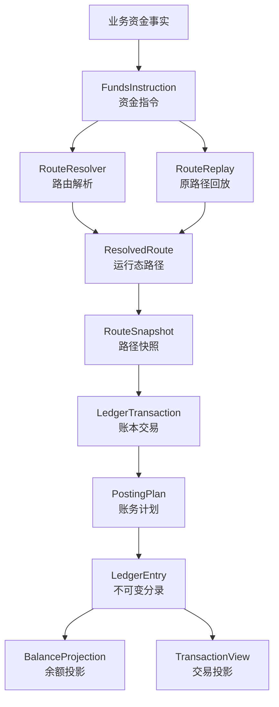
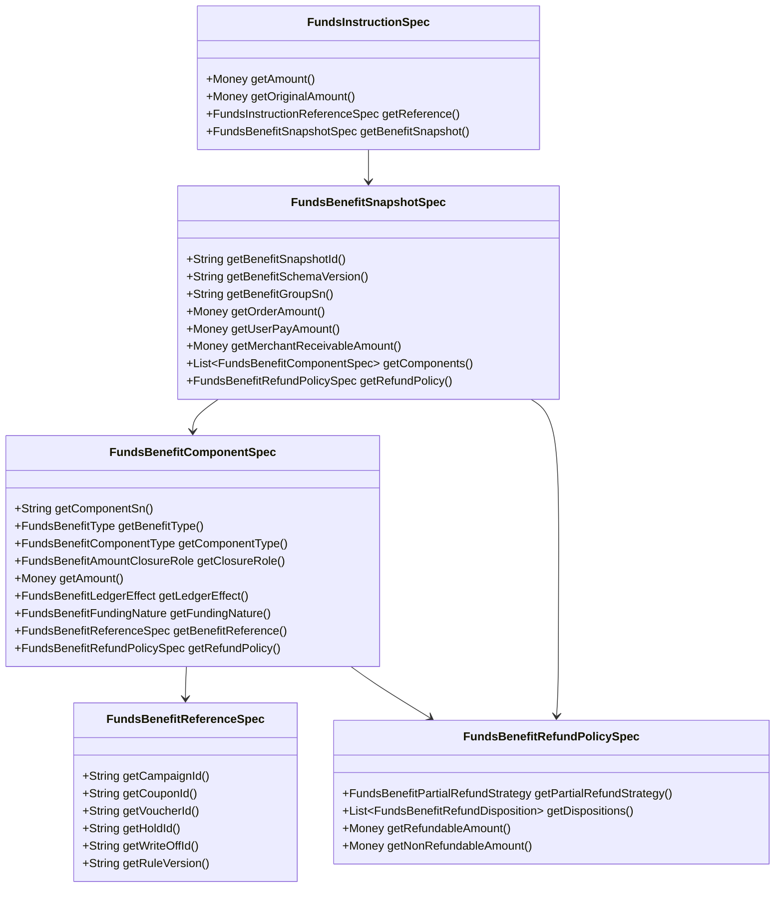

# 支付资金底座 DSL 承载层设计

## 一、文档定位：产品到系分的核心承载层

支付资金底座 DSL 是产品语义到系统分析设计之间的核心承载层。它把产品侧的交易场景、账户语义、资金流、状态约束和验收红线，转译为系统侧可开发、可测试、可审计的资金交易结构和资金链路结构。

它不是 PRD。PRD 负责说明用户、目标、业务流程、运营规则和产品验收。

它也不是实现说明。实现说明负责拆接口、类、表、组件和部署细节。

它承接两端：

| 承接方向 | 承接内容 | 产出给谁 |
| --- | --- | --- |
| 从产品进入 | 业务场景、主体关系、金额口径、状态边界、费用规则、异常路径、运营审计和验收红线。 | 系分设计、开发、测试。 |
| 向系分输出 | 资金指令、资金路径、路径快照、账务计划、账本分录、余额投影、交易投影和契约用例。 | 架构设计、接口设计、测试设计。 |

### 1.1 核心问题

本文件要回答一个问题：

> 一笔产品资金事实进入资金底座后，谁的什么账目，因为哪个原因，沿着哪条资金链路，发生了多少金额变化，并且如何被开发、测试、运营和审计共同验证？

这个问题拆成五个稳定视角：

| 视角 | 需要回答的问题 | DSL 承载方式 |
| --- | --- | --- |
| 产品视角 | 这个场景为什么发生，用户或运营想完成什么？ | `businessScene`、`businessSn`、`eventType`、`operator`、`reference`。 |
| 交易视角 | 这是一笔直接交易、授权交易，还是余额控制？ | `instructionType`、`transactionType`、生命周期事件。 |
| 资金链路视角 | 钱、额度或预算从哪个主体的哪个账目到哪里？ | `ResolvedRoute`、`RouteLeg`、`RouteNode`、`RouteSnapshot`。 |
| 账务视角 | 资金路径如何成为平衡分录？ | `LedgerTransaction`、`PostingPlan`、`LedgerEntry`。 |
| 验证视角 | 如何证明它正确、可回放、可追溯？ | JSON 契约用例、TDD 验收矩阵、禁止清单。 |

### 1.2 第一性原理

| 原理 | 含义 | 设计要求 |
| --- | --- | --- |
| 事实先于流程 | 资金底座只处理已成立的资金事实，不表达页面按钮、审批中、处理中等过程状态。 | DSL 只接收可入账事实；运营流程和外部通道流程不进入账本分录。 |
| 主体先于账户工具 | 能入账的是内部账务主体，不是用户、商户、银行卡、VCC、VA 或外部银行账户。 | 所有入账对象必须解析为 `FUNDING_ACCOUNT`、`CREDIT_ACCOUNT` 或 `BUDGET_GROUP`。 |
| 金额先于余额 | 金额是事实输入，余额是分录派生结果。 | DSL 不直接修改余额，只生成可校验的 `LedgerEntry`。 |
| 路径先于分录 | 先说明资金或控制余额如何流动，再推导借贷方向。 | 业务方不能直接提交 `LedgerEntry`、`EntrySide` 或 `PostingPlan`。 |
| 分录是余额事实源 | 余额、账单、报表和投影都从账本分录派生。 | 余额投影和交易投影不能反向修正账本事实。 |
| 快照保护回放 | 后续退款、撤销、结算、拒付、退费、解冻必须沿用原事实路径。 | 缺原路径快照时不能重新选路兜底。 |
| JSON 服务于验证 | JSON 用来表达 DSL 对象和契约用例，使场景可以被机器解析和 TDD 验收。 | 设计意图、流程说明、禁止清单不用 JSON 包装。 |

### 1.3 能力承载优先级

DSL 的能力优先级按资金底座的产品定位划分，不按文档编号或代码批次编号划分。批次编号只表示工程拆解和 Execution Grant 范围；能力优先级表示生产交付时必须先证明哪些资金不变量。

| 优先级 | DSL 必须优先稳定的能力 | 承载边界 |
| --- | --- | --- |
| P0 资金底座内核 | 钱包账户、账本、账目、余额投影、对账、清分、清算、结算、大数据归档和账本余额快照。 | 必须先证明主体可记账、分录可追溯、余额可重建、运营资金批次可核对、历史事实可归档和可审计。 |
| P1 交易与读模型扩展 | 直接交易、授权交易、余额控制、交易投影和交易投影重投影。 | 在 P0 主体、账目、余额和治理边界上扩展交易入口、生命周期、路由回放和只读视图，不得反向定义账本语义。 |
| P2 业务模式能力包 | VCC 发卡业务支持、全球账户收付款支持和收单业务支持。 | 只复用资金底座的账户、账本、清结算、对账和归档能力；业务模式、轨道协议、风控、合规和行业规则不得沉入统一资金内核。ACH 或银行转账只作为这些业务可能使用的外部轨道输入，不新增资金底座内建业务 DSL。 |

### 1.4 资金事实执行链路

以下链路表达一次资金事实进入资金底座后的执行顺序，不表达建设优先级。P0 能力必须先能独立解释钱包、账本、余额、对账、清结算和归档；P1 交易入口再复用这条执行链路产生或查询资金事实。

```text
业务资金事实
  -> FundsInstruction
  -> ResolvedRoute
  -> RouteSnapshot
  -> LedgerTransaction
  -> PostingPlan
  -> LedgerEntry
  -> BalanceProjection / TransactionView
```

这条链路表达三层含义：

| 层次 | 回答的问题 | 输出 |
| --- | --- | --- |
| 指令层 | 这笔资金事实是什么？ | `FundsInstruction` |
| 路由层 | 这笔事实影响哪些主体和账目？ | `ResolvedRoute`、`RouteSnapshot` |
| 账务层 | 这条路径如何成为平衡分录？ | `LedgerTransaction`、`PostingPlan`、`LedgerEntry` |

### 1.5 新增 DSL 场景最小闭环

新增资金场景不要求一开始就写完整实现，但 DSL 契约必须足够让产品、研发、测试和运营对同一件事达成一致。最小闭环如下：

| 闭环项 | 必须说明 | 不满足时的处理 |
| --- | --- | --- |
| 输入事实 | `instructionType`、`eventType`、`transactionType`、金额、币种、业务流水、操作者和引用对象。 | 不进入 DSL 契约，先补产品场景。 |
| 主体和引用 | 哪些是内部可记账主体，哪些只是支付工具、外部账户、业务单或通道引用。 | 不允许生成 `LedgerEntry`。 |
| 路由结果 | route code、参与方、账目、平台角色、工具快照、资金来源决策和账本周期。 | 路由失败且无账务副作用。 |
| 账务结果 | posting plan、entry 主体、entry side、金额、币种、账目和周期。 | 不允许只断言“状态成功”。 |
| 逆向依据 | 是否需要原 route snapshot、原交易、原授权、原冻结或原清结算批次。 | 缺原事实时必须失败或进入人工处理。 |
| 金融边界 | 资质、法域、客户资金、备付金、跨境、外汇、敏感数据或外部规则是否有规则来源、版本或发布日期、生效日期、适用主体或适用范围、适用法域、核验日期、确认方、确认状态和证据引用。 | 未确认前只能作为待确认边界或红线进入设计，不能作为默认可执行资金能力。 |
| 验收红线 | `validation.mustPass` 和 `validation.mustFail` 至少各有一项可测试断言。 | 不进入 TDD 任务。 |

## 二、设计目标与非目标

### 2.1 设计目标

| 目标 | 说明 |
| --- | --- |
| 事实稳定 | 同一事实在同一输入下产生稳定的 route、posting 和 entry，不受后续绑定关系、账户配置或展示规则漂移影响。 |
| 账务平衡 | 每个 `PostingPlan` 必须独立借贷平衡，整笔 `LedgerTransaction` 必须平衡。 |
| 可解释 | 能解释资金从哪来、到哪去、为什么发生、由谁触发、引用了哪个原事实。 |
| 可回放 | 后续退款、撤销、结算、拒付、退费、解冻能基于原路径快照派生。 |
| 可测试 | 字段、枚举、边界、红线和场景可以沉淀为 JSON 契约用例和 TDD 验收。 |
| 可治理 | 大数据量下余额投影、交易投影、归档、重放和差异检查有清晰边界。 |

### 2.2 非目标

| 非目标 | 说明 |
| --- | --- |
| 不表达业务单状态 | 待支付、审核中、处理中、举证中、对账中等属于产品单据或运营流程。 |
| 不表达外部通道协议 | 通道通知、银行回单、processor response、ACH file、ACH entry、return code、NOC、reversal 等属于连接层或业务单据。 |
| 不表达展示投影 | 用户账单、商户账单、运营时间线、财务核对视图和指标项输入是只读投影。 |
| 不替代清结算对象 | 清算批次、结算单、出款单、对账单和差错单有独立产品语义。 |
| 不替代合规和财务制度 | 资质、法域、会计科目、税务和监管口径需要独立确认。 |

## 三、产品到系分的转译模型

产品需求进入资金底座后，不能直接落成接口、表或测试。它必须先转译成稳定的资金事实结构，再进入系分设计。

| 产品输入 | DSL 承载 | 系分输出 | 开发与测试关注点 |
| --- | --- | --- | --- |
| 业务场景 | `businessScene`、`eventType` | 交易能力、状态边界、异常路径。 | 场景命名稳定，成功与失败路径可枚举。 |
| 业务流水 | `businessSn`、幂等键 | 幂等、重放、查询和审计口径。 | 重复提交不重复入账。 |
| 用户、商户、企业、预算组、卡 | `SubjectRef`、`PaymentInstrumentRef` | 主体解析、账户绑定、工具快照。 | 工具和经营主体不得直接入账。 |
| 金额、币种、汇率 | `amount`、`originalAmount`、`exchangeRate` | 金额校验、币种边界、错币种事实记录。 | 金额为正，余额控制不做 FX。 |
| 账本周期 | `periodType`、`periodId`、`periodPolicy` | 账本 bucket、周期余额查询、周期隔离测试。 | 非 `LIFETIME` 周期必须显式确定，不得用清算账期、报表周期或规则窗口替代。 |
| 资金路径 | `ResolvedRoute`、`RouteLeg`、`RouteNode` | 路由解析、平台账户角色、原路径回放。 | 缺快照不重新选路。 |
| 账务影响 | `PostingPlan`、`LedgerEntry` | 分录生成、借贷平衡、余额投影。 | 每个计划独立平衡，余额从分录派生。 |
| 后续事件 | `Reference`、`RouteSnapshot` | 退款、撤销、结算、拒付、退费、解冻。 | 不超过原事实剩余额度或金额。 |
| 验收红线 | `validation.mustPass`、`validation.mustFail` | 契约测试、集成测试、回归测试。 | 正向、反向、边界、幂等、审计均可验证。 |

这张表是产品评审、系分设计、开发实现和测试验收之间的共同语言。产品只要新增一个资金场景，就必须能填满这张表；填不满时，不应进入开发。

### 3.1 能力域到 DSL 承载和契约证据矩阵

本矩阵用于逐项检查 PRD 能力地图是否已经落到 DSL。若能力域没有稳定 DSL 对象、契约样例、验收字段或禁止项，不能进入系统设计和编码。

| 优先级 | PRD 能力域 | DSL 承载对象 | 必须表达的事实 | JSON / TDD 证据 | 禁止漂移 |
| --- | --- | --- | --- | --- | --- |
| P0 | 钱包账户 | `SubjectRef`、`PaymentInstrumentRef`、`ExternalAccountRef`、平台账户角色、资金来源决策。 | 可入账主体、支付工具引用、钱包标识引用、脱敏展示号、绑定快照、资金来源、账户能力和币种。 | `DSL-PAYMENT-INSTRUMENT-*`；`TDD-WALLET-*`、`TDD-ROUTE-*`。 | 把卡、VA、外部账户、支付工具、钱包标识、业务经营主体、信用账户或预算组都泛化成 `FundingAccount` 后直接入账。 |
| P0 | 账本账目 | `PostingPlan`、`LedgerTransaction`、`LedgerEntry`、`periodType`、`periodId`、`periodPolicy`。 | posting plan 独立平衡、entry 金额为正、借贷方向、账本周期、来源指令和 route leg。 | `DSL-DIRECT-PAY-FEE-001`、`DSL-BALANCE-CONTROL-LIMIT-BUDGET-001`；`TDD-LEDGER-*`。 | 用负金额表达反向、缺账本自动建账、用清算账期或报表周期替代账本周期。 |
| P0 | 余额投影 | `BalanceProjection`、账本余额快照引用、余额日志只读引用。 | 余额桶、分录来源、账本周期、投影 checkpoint、覆盖模式和只读边界。 | `DSL-GOVERNANCE-BALANCE-SNAPSHOT-001`；`TDD-VIEW-*`、`TDD-ARCH-006*`。 | 余额投影或余额日志反写事实、修正余额或替代账本分录。 |
| P0 | 清结算与对账 | `SettlementPolicySpec`、清结算 DSL 对象、差错和调账引用。 | 清分明细、清算候选、清算批次、结算锁定、出款结果、对账差异、审批和核销。 | `DSL-SETTLEMENT-*`、`DSL-BENEFIT-CLEARING-RECONCILIATION-001`；`TDD-CLS-*`、`TDD-SETTLE-*`、`TDD-RECON-*`。 | 清分候选直接入账、对账差异直接改历史分录、结算锁定当出款成功。 |
| P0 | 归档重放与治理 | `governanceTask`、`archiveRequest`、`archiveManifest`、`BalanceSnapshotVerifyRef`、`differenceReport`、`manualResolutionRef`、治理读取或导出快照引用。 | 范围、审批、checkpoint、watermark、Manifest、coverage mode、dry-run/apply、差异报告、阻断原因、影响范围、责任归属、证据引用、人工处理动作、可重跑条件、导出快照、脱敏、digest 和审计边界。 | `DSL-GOVERNANCE-*`；`TDD-GOV-*`、`TDD-ARCH-*`、`TDD-REPLAY-*`。 | 无范围重放、缺 Manifest 仍推进水位、普通指标快照替代账本余额快照、异常人工处理直接修改交易/账目/余额/投影事实，或报表数仓绕过治理边界直接读取冷归档、反写资金事实。 |
| P1 | 交易接入 | `FundsInstruction`、`FundsInstructionReferenceSpec`、`businessScene`、`eventType`、`transactionType`。 | 业务流水、幂等键、金额、币种、操作者、来源事实、后续引用。 | `DSL-DIRECT-*`、`DSL-AUTH-*`、`DSL-BALANCE-CONTROL-*`；`TDD-DIR-*`、`TDD-AUTH-*`、`TDD-CTRL-*`。 | 把业务订单状态、通道状态机或运营工单直接当作资金交易。 |
| P1 | 权益语义 | `FundsBenefitSnapshotSpec`、`FundsBenefitComponentSpec`、`FundsBenefitReferenceSpec`、`FundsBenefitRefundPolicySpec`、伴随权益指令组、补充权益事实、审计证据包引用、使用者解释视图引用。 | 原权益结果、金额闭合、组件角色、承担方、受益方、规则版本、退款处置、本次决策引用、伴随指令原子性、补充事实来源、最终确认状态、视图防误导、证据最小化和外部规则核验状态。 | `DSL-BENEFIT-*`；`TDD-BEN-*`、`TDD-BEN-RED-*`、`TDD-RACE-012`。 | 把核心权益金额、规则版本或退款处置藏进 `contextVariables`，按当前营销规则重算历史权益，或把伴随指令、补充事实、审计证据包、解释视图和外部规则核验当作备注字段处理。 |
| P1 | 资金路由 | `ResolvedRoute`、`RouteSnapshot`、`RouteParticipant`、`RouteNode`、`RouteLeg`、`RoutingDecision`、`FundingAllocationDecision`。 | 参与方、账目、账本周期、平台账户、资金来源、命中规则、失败原因和原路径回放。 | `DSL-PAYMENT-INSTRUMENT-ROUTE-001`、`DSL-PAYMENT-INSTRUMENT-REPLAY-001`、`DSL-REVERSE-REFUND-FEE-001`；`TDD-ROUTE-*`。 | 缺原 route snapshot 时重新选路，或让 route 直接写交易事实和账本事实。 |
| P1 | 交易投影 | `TransactionView`、`projectionReplayTask`、交易投影 checkpoint。 | 交易视图来源、重放范围、差异报告、人工处理引用和只读口径。 | `DSL-GOVERNANCE-PROJECTION-REPLAY-001`；`TDD-VIEW-*`、`TDD-REPLAY-*`。 | 交易投影反写交易事实、账本事实或余额投影。 |
| P2 | VCC、全球账户和收单业务支持 | 业务能力包引用、轨道/外部账户引用、归一资金事实、外部规则核验字段。 | 业务模式边界、外部轨道结果、风险合规确认、资金底座可复用的账户、账本、清结算、对账和归档接口；ACH 或银行转账事件必须已经由上层业务或适配层解释为资金事实。 | 业务专项 PRD、系分补充和 `TDD-RAIL-*`、`TDD-FX-*`、`TDD-OPS-*`。 | 把业务模式、卡组织/银行/PSP/ACH 协议、return code/NOC/reversal 规则解释、风控模型或合规结论沉入统一资金 DSL 内核。 |

### 3.2 P2 业务能力包 DSL 准入卡

06、07、08 分册进入 DSL 时，只能以业务能力包形式提供外部事实引用、场景语义和验证红线，不得把业务产品状态机、外部协议字段全集或合规结论固化为资金底座统一 DSL。任何 P2 业务能力包进入编码前，Execution Grant 必须同时引用业务分册验收 ID、DSL 承接字段、系分章节、TDD 专项用例和 P0/P1 回归范围。

| 业务能力包 | 可进入 DSL 的事实 | 不进入 DSL 的内容 | 必须回挂的 TDD | 编码准入补充 |
| --- | --- | --- | --- | --- |
| VCC 发卡 | 授权批准、授权拒绝、clearing、reversal、refund、chargeback 的归一资金事实；卡、token、merchant、MCC、授权控制结果和外部授权号的脱敏引用。 | Program 管理、发卡处理商协议、卡组织原始报文、完整 PAN/CVC、spend controls 规则计算和 PCI 最终结论。 | `TDD-P2-VCC-*`、`TDD-P2-VCC-RED-*`、`TDD-RAIL-001`、`TDD-AUTH-*`。 | 先证明 VCC 只作为支付工具和授权场景，不作为 ledger subject；拒绝无 route、posting、entry；clearing、refund 和 chargeback 必须引用原授权或原 route。 |
| 全球账户收付款 | 外部账户引用、VA 或银行流水匹配结果、入金确认、出款前准入、外部受理在途、成功回单、退汇事实、费用和 FX 决策快照。 | 开户、VA 分配、银行协议报文、SWIFT 或本地清算网络原始字段全集、FX 执行、跨境材料采集和合规最终判断。 | `TDD-P2-GA-*`、`TDD-P2-GA-RED-*`、`TDD-RAIL-008`、`TDD-RAIL-009`、`TDD-FX-*`。 | 外部 accepted、message sent 或 processing 不得展示为到账成功；无有效 FX quote 不得静默换汇；银行账户、VA、Nostro/Vostro 只能作为 externalAccountRef。 |
| 收单业务 | payment attempt、authorization、capture、refund、dispute、chargeback、商户 CLEARING、清分批次、清算批次、结算单和出款结果的归一资金事实。 | 商户入网/KYB、收银台展示、PSP/收单行/卡组织协议、通道路由策略、风控模型和 PCI 最终结论。 | `TDD-P2-ACQ-*`、`TDD-P2-ACQ-RED-*`、`TDD-CLS-*`、`TDD-SETTLE-*`、`TDD-RECON-*`。 | capture 成功只进入待清算，不等于可提现；清分确认不释放可结算；refund 与 chargeback 必须防重复损失；完整 PAN/CVC 不进入资金底座。 |
| ACH 或银行转账支撑边界 | ACH/银行转账业务解释后的入金确认、出款结果、在途、退回、追偿、外部流水引用、trace number 摘要、文件摘要、回单引用、对账差错、调账核销事实和外部规则核验状态。 | ACH 产品状态机、ACH 指令、Debit 授权、账户验证、ODFI/RDFI 协议、Nacha 规则、SEC code、文件批次、cut-off、return code、NOC、reversal 规则解释和完整银行账户敏感信息。 | `TDD-RAIL-002` 至 `TDD-RAIL-007`、`TDD-RED-030`、`TDD-RED-034`、`TDD-P2-GA-*`、`TDD-P2-ACQ-*`、`TDD-RECON-*`。 | ACH return 和 NOC 必须先由上层业务或适配层解释；外部 submitted、accepted、processing 或 message sent 不等于到账；资金底座不得解析 ACH 协议，不得把 return 静默映射为普通 refund，不得因 NOC 修改原交易资金事实，不得保存完整银行账户敏感信息，不得在规则未确认时作为自动资金处理依据。 |
| 三类业务共用 | `businessScene`、`reference`、`instrumentRef`、`externalAccountRef`、`originalAmount`、`exchangeRate`、外部规则核验字段、脱敏证据引用和归一资金动作。 | 业务产品完整生命周期、外部规则最终解释、风险模型、商户经营策略、银行或卡组织协议实现。 | 第 05 分册 4.2、TDD 13.4.1 和目标测试资产 P2 专项行。 | 若需要新增公共枚举、Request/DTO、服务入口、表结构或 JSON 夹具，必须在专项 Execution Grant 中逐项授权，并列明 P0/P1 回归测试。 |

## 四、资金交易结构化描述

资金交易不是一个单一金额字段，也不是“某个服务方法”。在本设计中，一笔资金交易由六个结构共同描述：

| 结构 | 说明 | 典型字段或对象 |
| --- | --- | --- |
| 场景结构 | 交易为什么发生，属于哪个产品场景。 | `businessScene`、`businessSn`、`eventType`。 |
| 主体结构 | 谁承担资金、额度或预算变化。 | `SubjectRef`、`RouteParticipant`。 |
| 金额结构 | 账务金额、原始金额、币种和汇率事实。 | `amount`、`originalAmount`、`exchangeRate`。 |
| 链路结构 | 资金、额度或预算从哪里到哪里，属于哪个账本周期 bucket。 | `ResolvedRoute`、`RouteLeg`、`RouteNode`、`periodType`、`periodId`。 |
| 账务结构 | 链路如何转成可平衡、可追溯的分录。 | `LedgerTransaction`、`PostingPlan`、`LedgerEntry`。 |
| 验证结构 | 交易如何证明正确、幂等、可回放。 | JSON 契约、TDD 验收、禁止清单。 |

资金交易按能力分为三类：

| 交易能力 | 业务含义 | DSL 指令 | 典型场景 |
| --- | --- | --- | --- |
| 直接交易 | 已确认发生价值转移、责任变化或资金状态变化。 | `DIRECT_TRANSACTION` | 充值、付款、转账、提现、退款、手续费、清算确认、结算锁定、调账。 |
| 授权交易 | 先占用额度或资金，后续撤销、完成、退款、过期、强制完成或拒付。 | `AUTHORIZATION_TRANSACTION` | 卡授权、共享卡授权、部分撤销、部分完成、授权链退款、争议拒付。 |
| 余额控制 | 不发生跨主体价值转移，只控制同主体资金账户余额、信用账户额度或预算组额度。 | `BALANCE_CONTROL` | 冻结、解冻、资金账户余额调整、信用账户额度调整、预算组额度调整。 |

交易结构必须让开发和测试同时看懂：

- 开发要能从交易结构推导接口入参、路由解析、账务计划和投影更新。
- 测试要能从交易结构推导用例前置、输入、过程断言、余额断言和失败断言。
- 产品和运营要能从交易结构确认资金事实、异常处理和审计口径是否符合预期。

## 五、资金链路结构化描述

资金链路描述的是一笔事实穿过资金底座时的完整路径：从业务事实到资金指令，从资金指令到路径快照，从路径快照到账务分录，再从账务分录派生余额和交易视图。



| 分层 | 核心对象 | 职责 | 边界 |
| --- | --- | --- | --- |
| 来源事实层 | 业务流水、冻结单、清算确认、结算锁定、出款结果、对账差错、争议拒付、费用事实 | 判断事实是否成立、是否允许入账。 | 不直接生成借贷分录。 |
| 指令层 | `FundsInstruction` | 把来源事实转成账本可理解的稳定输入。 | 不表达业务单生命周期。 |
| 路由层 | `ResolvedRoute`、`RouteParticipant`、`RouteLeg`、`RouteNode` | 描述资金、额度或预算如何在主体和账目之间变化。 | 不是会计分录，不表达运营状态。 |
| 快照层 | `RouteSnapshot` | 固化本次路径、参与方、平台账户、工具引用和规则结果。 | 不重新决策路径。 |
| 账务层 | `LedgerTransaction`、`PostingPlan`、`LedgerEntry` | 把路径翻译为平衡分录。 | 不反向修改业务事实。 |
| 投影层 | `BalanceProjection`、`TransactionView` | 查询、展示、重放和差异检查。 | 只能从事实派生，不能反写事实。 |

资金链路的最小验证闭环：

| 步骤 | 必须产出 | 必须断言 |
| --- | --- | --- |
| 业务事实进入 | 资金指令。 | 场景、金额、主体、引用、操作者完整。 |
| 路由解析 | 运行态路径。 | 入账主体合法，工具和外部账户不直接入账。 |
| 路径冻结 | 路径快照。 | 后续 replay 可使用，当前绑定变化不影响历史路径。 |
| 账务计划 | posting plan。 | 单计划独立平衡，借贷方向可解释。 |
| 分录入账 | ledger entry。 | 余额事实源唯一，金额为正，币种明确。 |
| 投影派生 | 余额投影和交易投影。 | 投影只读，不反写交易或账本事实。 |

### 5.1 资金场景借贷平衡与账务期望表

本表是资金场景进入 `PostingPlan` 和 `LedgerEntry` 前的 DSL 权威期望，用于统一产品、系分和 TDD 对“借贷是否平衡、余额桶如何变化、失败是否无副作用”的判断。PRD 中的账务矩阵只表达产品语义；进入编码、测试或交付结论时，以本表的 DSL 口径和对应系分、TDD 承接为准。

表解释规则：

| 规则 | 口径 |
| --- | --- |
| 借贷方向 | 借方和贷方是 `EntrySide`，不是简单的来源方和目标方；实现侧必须结合账目 `normalBalanceSide` 和资金移动方向推导。 |
| 余额增减 | 对 `normalBalanceSide=DEBIT` 的账目，借方增加、贷方减少；对 `normalBalanceSide=CREDIT` 的账目，贷方增加、借方减少。 |
| 金额表达 | `LedgerEntry.amount` 永远为正；反向、释放、退款、撤销和冲正通过事件、引用、借贷方向和原 route snapshot 表达，不使用负金额。 |
| 平衡单位 | 每个 `PostingPlan` 必须同币种借贷平衡；整笔 `LedgerTransaction` 的借方合计必须等于贷方合计。 |
| 余额桶 | `AVAILABLE`、`FROZEN`、`AUTHORIZATION`、`CLEARING`、`SETTLEMENT`、`IN_TRANSIT` 等是账目或余额桶，不是业务单状态。 |
| 失败边界 | 拒绝、余额不足、缺快照、错币种、规则未确认、权限不足和重复冲突失败时，不得生成 route、posting、ledger entry、外部出款或敏感导出。 |
| 逆向回放 | 退款、撤销、过期、拒付、出款失败和差错处理优先引用原事实和原 route snapshot；缺少原事实时阻断或转人工，不静默重新选路。 |

主场景借贷平衡与账务期望：

| 场景 | DSL 事件或指令 | 借贷和余额期望 | 平衡与红线 | TDD 锚点 |
| --- | --- | --- | --- | --- |
| 用户充值成功 | `DIRECT_TRANSACTION / TOPUP` | 平台现金、备付或预收待付映射与用户 `AVAILABLE` 形成一组平衡 posting；外部通道流水只做引用。 | 外部账户不得成为 `LedgerEntry` 主体；充值确认前不入账。 | `TDD-DIR-*`、`TDD-LEDGER-*`。 |
| 用户提现申请或提现锁定 | `BALANCE_CONTROL / FREEZE` 或提现锁定场景 | 同主体 `AVAILABLE` 减少，`FROZEN` 或提现锁定桶增加。 | 提现申请不是外部到账成功；冻结只控制可用性，不表达消费。 | `TDD-CTRL-*`、`TDD-DIR-*`。 |
| 用户提现失败释放 | `BALANCE_CONTROL / UNFREEZE` | 同主体原冻结桶减少，`AVAILABLE` 增加，引用原冻结单或原提现锁定事实。 | 只释放一次；成功和失败不得双终态。 | `TDD-CTRL-*`、`TDD-DIR-*`。 |
| 系统内转账 | `DIRECT_TRANSACTION / TRANSFER` | 付款方 `AVAILABLE` 减少，收款方 `AVAILABLE` 增加。 | 双方主体、币种、账本周期和金额必须明确；余额不足或错币种失败无副作用。 | `TDD-DIR-*`、`TDD-LEDGER-*`。 |
| 商户订单收款 | `DIRECT_TRANSACTION / PAY` | 付款方 `AVAILABLE` 减少；商户 `CLEARING` 增加；平台手续费、成本、补贴按独立 leg 或独立 plan 表达。 | 商户款不得直入 `AVAILABLE` 或 `SETTLEMENT`；本金、手续费、成本、补贴不得合成一个净额。 | `TDD-DIR-*`、`TDD-BEN-*`、`TDD-CLS-*`。 |
| 手续费收取 | `DIRECT_TRANSACTION / FEE` | 费用责任方目标账目减少，平台 `FEE`、收入或成本归集账目增加。 | 必须引用原交易、费用类型、规则版本或审批依据；手续费不得混入本金。 | `TDD-DIR-*`、`TDD-RECON-*`。 |
| 授权批准占用 | `AUTHORIZATION_TRANSACTION / AUTHORIZE` | 同主体 `AVAILABLE` 或可用额度减少，`AUTHORIZATION` 增加。 | 授权成功不是最终消费；拒绝不得生成 route、posting 或 entry。 | `TDD-AUTH-*`、`TDD-RED-*`。 |
| 授权完成或部分完成 | `AUTHORIZATION_TRANSACTION / SETTLE` | 原主体 `AUTHORIZATION` 按完成金额减少；商户 `CLEARING`、平台目标账目或责任账目增加。 | 累计完成不得超过原授权金额；必须引用原授权和原 route snapshot。 | `TDD-AUTH-*`、`TDD-DIR-*`。 |
| 授权撤销 | `AUTHORIZATION_TRANSACTION / REVERSAL` | 同主体 `AUTHORIZATION` 减少，`AVAILABLE` 或可用额度增加。 | 外部撤销或冲正触发；终态为撤销，不得和过期混用。 | `TDD-AUTH-*`。 |
| 授权过期释放 | `AUTHORIZATION_TRANSACTION / EXPIRE` | 同主体剩余 `AUTHORIZATION` 减少，`AVAILABLE` 或可用额度增加。 | 系统到期触发，只释放剩余占用；必须保留过期原因和规则版本。 | `TDD-AUTH-*`。 |
| 直接交易退款或授权完成后退款 | `DIRECT_TRANSACTION / REFUND` 或授权链退款事件 | 沿原 route snapshot 反向生成 posting；原收款方、平台补贴方或责任方对应账目减少，付款方或受益方 `AVAILABLE` 增加。 | 不按当前绑定关系重新选路；累计退款不得超过可退金额。 | `TDD-DIR-*`、`TDD-AUTH-*`、`TDD-BEN-*`。 |
| 争议拒付或追偿 | `AUTHORIZATION_TRANSACTION / CHARGEBACK` 或差错追偿事实 | 责任方 `CLEARING`、`AVAILABLE`、`ADJUSTMENT` 或追偿账目减少；受益方或争议责任账目增加。 | 拒付、追偿和普通退款不得互相吞掉；必须有原事实、证据引用和责任归属。 | `TDD-AUTH-*`、`TDD-RECON-*`。 |
| 冻结 | `BALANCE_CONTROL / FREEZE` | 同主体、同币种、同周期 `AVAILABLE` 减少，`FROZEN` 增加。 | 冻结不是消费、扣划或授权；不得跨主体、跨币种或跨周期冻结。 | `TDD-CTRL-*`、`TDD-RED-*`。 |
| 解冻或到期释放 | `BALANCE_CONTROL / UNFREEZE` 或 `EXPIRE` | 同主体原 `FROZEN` 减少，`AVAILABLE` 增加。 | 不得超额释放；已扣划、已出款或已关闭金额不得再次释放。 | `TDD-CTRL-*`。 |
| 资金账户余额调整 | `BALANCE_CONTROL / ADJUST` | 目标资金账户 `AVAILABLE`、`FROZEN` 或 `ADJUSTMENT` 按审批方向变化，并与平台调整、挂账或责任账目平衡。 | 必须有原因、凭证、审批和审计；不得作为绕过对账差错的人工改余额。 | `TDD-CTRL-*`、`TDD-RECON-*`。 |
| 信用额度或预算调整 | `BALANCE_CONTROL / LIMIT_ADJUST` | `LIMIT`、`AVAILABLE` 或 `AUTHORIZATION` 按批准方向变化，使用信用账户或预算组账本周期。 | 不表达现金沉淀；周期缺失、超额、越权或重复冲突失败无副作用。 | `TDD-CTRL-*`。 |
| 清分确认 | `DIRECT_TRANSACTION / CLEARING_CONFIRM` 或清结算 DSL 对象 | 商户 `CLEARING` 按确认金额减少；商户 `AVAILABLE`、风险准备金、费用或扣减账目按规则增加。 | 清分不等于出款；退款中、争议中、风控冻结或重大差错不得进入可清分。 | `TDD-CLS-*`、`TDD-RECON-*`。 |
| 结算锁定 | `DIRECT_TRANSACTION / SETTLEMENT_LOCK` | 商户 `AVAILABLE` 减少，`SETTLEMENT` 增加。 | `SETTLEMENT` 是出款中或结算处理中余额桶，不等于授权链路 `SETTLE` 事件；锁定后不得重复结算。 | `TDD-SETTLE-*`。 |
| 外部出款受理或在途 | `DIRECT_TRANSACTION / PAYOUT_SUBMITTED` 或出款状态事实 | 若采用在途桶，商户 `SETTLEMENT` 减少，`IN_TRANSIT` 增加；否则保持 `SETTLEMENT` 并记录外部非终态引用。 | submitted、accepted、message sent 或 processing 不等于到账成功。 | `TDD-SETTLE-*`、`TDD-RAIL-*`。 |
| 出款成功 | `DIRECT_TRANSACTION / PAYOUT_SUCCEEDED` | 关闭 `SETTLEMENT` 或 `IN_TRANSIT` 中的锁定责任，并锚定平台现金或外部回单引用。 | 不得重复关闭；必须能证明商户结算负债减少和外部付款结果一致。 | `TDD-SETTLE-*`。 |
| 出款失败或退回 | `DIRECT_TRANSACTION / PAYOUT_FAILED` 或退回事实 | `SETTLEMENT` 或 `IN_TRANSIT` 减少，商户 `AVAILABLE` 增加；异常退回可进入差错或 `ADJUSTMENT`。 | 只回退一次；金额不一致或状态不确定进入差错，不直接改历史分录。 | `TDD-SETTLE-*`、`TDD-RECON-*`。 |
| 对账误报关闭 | 对账差错处理动作 | 不生成 posting 或 ledger entry，只关闭差错处理单并保留审计。 | 差异不能靠日志或人工备注修复余额。 | `TDD-RECON-*`。 |
| 对账补事实、冲正、调账或核销 | `DIRECT_TRANSACTION / ADJUSTMENT` 或白名单运营命令 | 责任方、挂账方、平台调整账目、`ADJUSTMENT` 和目标账目按审批结论平衡。 | 必须在 Execution Grant 白名单内，有审批、凭证、原事实引用、幂等键和失败无副作用测试。 | `TDD-RECON-*`、`TDD-CTRL-*`。 |
| 平台补贴 | `DIRECT_TRANSACTION / PAY` 的权益伴随 leg 或独立伴随指令 | 平台补贴责任、成本、预提或补贴资金账目减少；商户 `CLEARING` 或目标责任账目增加。 | 平台补贴不得和用户实付合成一个净额；零实付也必须有正金额资金来源。 | `TDD-BEN-*`、`TDD-BEN-RED-*`。 |
| 商户让利或展示优惠 | 权益快照 `NO_LEDGER` 组件 | 通常不生成独立 posting；只影响订单价格、商户应收、清分展示或对账解释。 | 不得误生成平台补贴或储值券核销分录。 | `TDD-BEN-*`。 |
| 储值券或预付权益核销 | 权益快照 `POSTING_REQUIRED` 组件 | 平台或发行方 `PREPAYMENT` 责任减少；商户 `CLEARING`、订单应收或目标责任账目增加。 | 储值预付口径需专业确认；退款时恢复责任或保留补贴必须由退款处置明确。 | `TDD-BEN-*`、`TDD-BEN-RED-*`。 |
| 零实付交易 | `DIRECT_TRANSACTION / PAY` 携带权益快照 | 用户现金 `AVAILABLE` 不减少；商户 `CLEARING` 由平台补贴、储值权益或其他承担方的正金额 posting 支撑。 | 不生成零金额分录；不得因为用户实付为 0 就丢失商户应收、补贴责任或审计证据。 | `TDD-BEN-*`、`TDD-DIR-*`。 |
| 归档、重放、余额快照或交易投影重建 | governance DSL 对象 | 不生成新的 route、posting 或 ledger entry；只读分录、快照、Manifest、checkpoint、watermark 和差异报告。 | 治理任务不得反写资金事实；普通指标快照不得替代账本余额确认。 | `TDD-ARCH-*`、`TDD-REPLAY-*`、`TDD-GOV-*`。 |

## 六、术语与边界

### 6.1 可入账主体

本规范只允许以下主体进入账本分录：

| 主体 | 定义 | 典型账目 |
| --- | --- | --- |
| `FUNDING_ACCOUNT` | 承载真实资金余额或平台责任余额的资金账户。 | `AVAILABLE`、`FROZEN`、`AUTHORIZATION`、`CLEARING`、`SETTLEMENT`、`IN_TRANSIT`、`CASH`、`PREPAYMENT`、`FEE`、`ADJUSTMENT` |
| `CREDIT_ACCOUNT` | 承载授信额度、可用额度和授权占用的控制账户。 | `LIMIT`、`AVAILABLE`、`AUTHORIZATION` |
| `BUDGET_GROUP` | 承载预算总量、可用预算和预算授权占用的控制账户。 | `LIMIT`、`AVAILABLE`、`AUTHORIZATION` |

`FUNDING_ACCOUNT` 只表示真实资金账户或平台责任资金账户，不是所有钱包账户的统一父类。需要统一表达资金账户、信用账户、预算组和平台账户角色时，使用 `SubjectRef` / `FundsSubjectType` / 可入账主体抽象；需要统一表达前台支付方式、卡、VA、钱包标识和通道 token 时，使用 `PaymentInstrumentRef` 或 `ExternalAccountRef`。不得把信用额度、预算控制、钱包标识或支付工具写成 `FUNDING_ACCOUNT` 来绕过主体类型校验。

产品账户类型的归属规则：

| 产品对象 | DSL 定性 |
| --- | --- |
| 预付卡、预付 VCC、返利账户 | 如果承载可支配资金，归入 `FUNDING_ACCOUNT`。 |
| 共享卡、信用卡账户 | 如果承载授信额度，归入 `CREDIT_ACCOUNT`；卡本身只是工具引用。 |
| 预算组 | 归入 `BUDGET_GROUP`，只表达预算控制，不表达真实资金沉淀。 |
| 钱包账户域 | 产品层和服务层的上位能力域，不是 DSL 主体类型；进入 DSL 时必须拆成 `SubjectRef`、`PaymentInstrumentRef`、`FundingAllocationDecision` 或余额查询条件。 |
| 钱包标识 | 只能作为支付工具引用、外部钱包端点引用或前台支付方式引用；最终必须解析到 `SubjectRef` 才能入账。 |
| 支付工具、VA、银行卡、外部银行账户 | 只能作为引用或快照，不直接入账。 |
| 用户、商户、企业、租户 | 是经营主体或归属主体，不等同于账务主体。 |

### 6.2 账目与余额桶

`LedgerAccount` 在本设计中表示账本内账目或余额桶，不是资金账户主体。

| 账目 | 语义 |
| --- | --- |
| `CASH` | 平台现金、备付或内部镜像资金。 |
| `PREPAYMENT` | 平台对用户或商户的预收、待付责任。 |
| `AVAILABLE` | 可用余额、可用额度或可用预算。 |
| `FROZEN` | 冻结余额，只限制同主体可用性。 |
| `AUTHORIZATION` | 授权占用，后续由撤销、结算、释放、过期或拒付关闭或减少。 |
| `CLEARING` | 商户待清算资金，订单款默认先进该桶。 |
| `SETTLEMENT` | 出款中或结算处理中锁定资金。 |
| `IN_TRANSIT` | 外部已受理但还没有最终成功或失败的在途资金，必须有外部引用、责任方、账龄和到期重查口径。 |
| `LIMIT` | 信用或预算总量，只能由 `LIMIT_ADJUST` 受控调整。 |
| `FEE` | 手续费、服务费或成本扣收归集。 |
| `ADJUSTMENT` | 差错、调账或人工核销的中间口径。 |

本规范不设置 `CONSUMED` 账目。信用账户和预算组已消费金额由交易生命周期、授权完成事实和报表口径计算。

### 6.3 金额与 FX

| 字段 | 语义 |
| --- | --- |
| `amount` | 账务主链路金额，即入账金额。 |
| `originalAmount` | 业务原始金额；无错币种时等于 `amount`。 |
| `exchangeRate` | `originalAmount -> amount` 的汇率快照；无换汇时为 `1`。 |

FX 边界：

- 是否换汇由业务层或外汇域决策。
- 交易层只记录已决策的金额事实。
- 余额控制不承接 FX 逻辑。
- `LedgerEntry` 使用账务主链路币种。

### 6.4 来源事实

来源事实用于回答“这笔 DSL 输入从哪个业务结果来”。它是补充边界，不是 DSL 主链路的起点。

| 来源事实 | 是否直接成为 DSL 主对象 | 说明 |
| --- | --- | --- |
| 付款、充值、提现、转账、退款 | 是 | 形成 `DIRECT_TRANSACTION` 指令。 |
| 授权批准、撤销、结算、拒付 | 是 | 形成 `AUTHORIZATION_TRANSACTION` 指令。 |
| 冻结、解冻、资金账户余额调整、信用账户额度调整、预算组额度调整 | 是 | 形成 `BALANCE_CONTROL` 指令。 |
| 清算确认、结算锁定、出款结果 | 是 | 只有确认后的资金结果进入 DSL。 |
| 对账差错调账、核销 | 是 | 必须带差错来源、审批、凭证和审计。 |
| 业务订单、清算批次、对账任务、审批流 | 否 | 属于产品或运营流程。 |

## 七、核心 DSL 对象

### 7.1 FundsInstruction

`FundsInstruction` 是账本可理解的资金事实请求。它不表达页面流程，不直接指定借贷方向，也不是账本分录。

| 字段 | 必填 | 说明 |
| --- | --- | --- |
| `tenantId` | 是 | 租户 ID。 |
| `instructionType` | 是 | 指令大类：直接交易、授权交易、余额控制。 |
| `eventType` | 是 | 稳定资金事件。 |
| `transactionType` | 条件必填 | 交易类事实必填，表达资金业务类别，例如 `TOPUP`、`PAY`、`TRANSFER`、`REFUND`、`WITHDRAW`、`FEE`、`ADJUSTMENT`；不要放入 `FUND_IN`、`SETTLE`、`AUTHORIZE`、`FEE_CHARGE` 等生命周期事件名。 |
| `businessScene` | 是 | 业务场景。 |
| `businessSn` | 是 | 业务流水。 |
| `amount` | 是 | 账务主链路金额。 |
| `originalAmount` | 是 | 业务原始金额。 |
| `exchangeRate` | 是 | 汇率快照。 |
| `eventTime` | 是 | 事实发生时间。 |
| `operator` | 是 | 操作者快照。 |
| `reference` | 条件必填 | 后续事件必须引用原事实或原快照。 |
| `benefitSnapshot` | 条件必填 | 交易使用优惠券、代金券、平台补贴、商户让利、储值券或其他权益抵扣时必填，承接业务侧已决策的权益结果快照；无权益交易为空。 |
| `contextVariables` | 是 | 补充上下文，不能隐藏必填主语义。 |
| `riskAndComplianceRef` | 条件必填 | 涉及资质、法域、客户资金、备付金、跨境、外汇、敏感数据、外部规则或高危人工动作时必填，记录规则来源、版本或发布日期、生效日期、适用主体或适用范围、适用法域、核验日期、确认方、确认状态、审批或证据引用；不得保存敏感原文。 |

指令类型：

| instructionType | 说明 | 典型事件 |
| --- | --- | --- |
| `DIRECT_TRANSACTION` | 已确认发生价值转移、责任变化或资金状态变化的直接交易。 | 入金、出金、转账、付款、退款、费用、清算确认、结算锁定、调账。 |
| `AUTHORIZATION_TRANSACTION` | 授权占用、撤销、完成、过期、授权链退款和争议拒付等生命周期事实。 | 授权、撤销、完成、过期、授权退款、争议拒付、强制完成模式。 |
| `BALANCE_CONTROL` | 不发生跨主体价值转移，只控制同主体可用性、资金账户余额、信用账户额度或预算组额度。 | 冻结、解冻、资金账户余额调整、信用账户额度调整、预算组额度调整。 |

### 7.2 引用对象

| 对象 | 用途 | 入账边界 |
| --- | --- | --- |
| `SubjectRef` | 指向可入账主体。 | 只有 `FUNDING_ACCOUNT`、`CREDIT_ACCOUNT`、`BUDGET_GROUP` 可进入分录；平台账户角色必须先解析成具体 `FUNDING_ACCOUNT`。 |
| `PaymentInstrumentRef` | 记录卡、VA、银行卡、钱包标识、通道 token 或其他支付工具快照。 | 不直接入账；钱包标识也必须先解析为 `SubjectRef`。 |
| `ExternalAccountRef` | 记录外部银行、通道、托管户等外部端点。 | 不直接入账。 |
| `Reference` | 记录退款、撤销、结算、拒付、退费、解冻等后续事件引用的原事实。 | 缺引用时不得回放。 |

`PaymentInstrumentRef` 字段语义：

| 字段 | 语义 | 约束 |
| --- | --- | --- |
| `instrumentSn` | 支付工具在资金底座内的稳定工具号，对应系分表中的 `sn` 或绑定表中的 `instrument_sn`。 | 用于路由快照、绑定历史、回放和审计，不承载完整卡号、完整外部账户或敏感凭证。 |
| `instrumentDisplayNo` | 支付工具的脱敏展示号、别名号或安全 token reference，对应系分表中的 `instrument_no` 语义。 | 只能用于展示、查询辅助和审计辅助；不得作为稳定工具主键或可记账主体。 |
| `externalInstrumentId` | 通道、卡处理器、银行或外部系统的工具引用。 | 只做外部核验、回单、对账和争议证据，不进入 LedgerEntry 主体。 |

DSL 契约统一使用 `instrumentSn` 和 `instrumentDisplayNo`：前者作为稳定工具引用，后者作为脱敏展示号；不得把稳定工具号和展示号混用。

### 7.2.1 权益结果快照

`FundsBenefitSnapshotSpec` 是资金指令上的权益结果快照。它只表达业务侧、订单侧或营销权益系统已经决策完成的权益结果，不计算券规则、不判断券是否可用、不维护券生命周期。无权益交易不携带该对象。

对象关系：

| 对象 | 用途 | 边界 |
| --- | --- | --- |
| `FundsBenefitSnapshotSpec` | 表达一组权益结果快照，包含订单金额、用户实付、商户应收、权益组件和默认退款规则。 | 不替代 `FundsInstruction.amount`，不保存完整营销规则。 |
| `FundsBenefitComponentSpec` | 表达一个权益金额组件，例如商户让利、平台补贴、代金券核销、储值券抵扣。 | 只表达权益金额、承担方、受益方、账务效果和退款处置，不表达手续费和税费。 |
| `FundsBenefitReferenceSpec` | 保存券、活动、核销、占用、规则版本和外部决策引用。 | 外部引用不是资金底座主键，不作为可入账主体。 |
| `FundsBenefitRefundPolicySpec` | 保存组件级或快照级退款处置。 | 用户侧不返券和资金侧不冲补贴必须分开表达。 |

职责边界：券能不能退是业务层、订单层、营销权益系统或运营审批链路的决策。资金底座不判断券是否可退，不读取当前券包状态，不调用当前营销规则重新计算。DSL 只承接两类事实：原交易权益快照中的默认退款策略，以及本次退款或后续事件由业务层给出的退款决策结果。后续退款、撤销、过期或拒付必须引用原权益快照和本次决策结果，不得在资金底座内补算。

#### 7.2.1.1 设计目标、字段对齐和包结构

权益快照的 DSL 设计目标是把优惠券、代金券、平台补贴、商户让利、储值权益等已经决策完成的权益结果变成资金底座可读、可审计、可回放的稳定事实。它解决四个问题：

1. 让权益金额成为一等 DSL，而不是塞进 `contextVariables` 的临时扩展。
2. 区分“只影响订单价格或展示”的权益和“需要形成资金影响”的权益。
3. 为退款、撤销、授权过期、清结算、对账和交易投影重放保留原始权益事实。
4. 避免后续事件按当前营销规则重算历史权益，导致资金路径、商户应收和补贴成本漂移。

设计原则：

1. 不改变 `FundsInstructionSpec` 既有主字段语义。
2. 只在资金指令上增加一个可选一级字段：`benefitSnapshot`。
3. 权益快照必须可被 route、posting、refund replay、clearing、reconciliation 和 projection 消费。
4. 商户让利、展示优惠等无资金转移权益不能误生成 `LedgerEntry`。
5. 平台补贴、储值代金券、合作方补贴等有资金影响权益必须能被拆成独立 route leg、独立伴随指令或独立 posting 依据。

现有字段对齐：

| 现有字段 | 当前语义 | 权益快照是否改变 |
| --- | --- | --- |
| `amount` | 当前资金指令主链路金额。 | 不改变；付款场景通常等于用户实付金额。 |
| `originalAmount` | 当前资金指令原始金额和 FX 快照。 | 不改变；不拿来表达订单原价。 |
| `exchangeRate` | `originalAmount -> amount` 的汇率快照。 | 不改变；权益跨币种必须由业务侧给出已决策 FX 快照。 |
| `instrumentRef` | 支付工具引用快照。 | 不改变；只影响支付工具和资金来源解析。 |
| `externalAccountRef` | 外部账户引用快照。 | 不改变；外部账户仍不得入账。 |
| `reference` | 后续事件引用原资金事实、原 route snapshot 或原冻结/授权事实。 | 不改变；权益逆向事件还必须引用原权益快照或等价摘要。 |
| `contextVariables` | 补充上下文。 | 不改变；但不得承载核心权益金额、金额闭合、规则版本或退款处置。 |

建议新增到 `FundsInstructionSpec` 的可选字段：

```java
@Nullable
default FundsBenefitSnapshotSpec getBenefitSnapshot() {
    return null;
}
```

该字段与 `instrumentRef`、`externalAccountRef`、`reference` 同级，是资金指令可选事实快照，不是临时上下文。

包结构建议保持现有 `spec` / `model` / `enums` 分层风格：

```text
core/src/main/java/com/wind/integration/funds/spec/transaction/
  FundsBenefitSnapshotSpec.java
  FundsBenefitComponentSpec.java
  FundsBenefitReferenceSpec.java
  FundsBenefitRefundPolicySpec.java

core/src/main/java/com/wind/integration/funds/model/transaction/
  ImmutableFundsBenefitSnapshotSpec.java
  ImmutableFundsBenefitComponentSpec.java
  ImmutableFundsBenefitReferenceSpec.java
  ImmutableFundsBenefitRefundPolicySpec.java

core/src/main/java/com/wind/integration/funds/transaction/enums/
  FundsBenefitType.java
  FundsBenefitComponentType.java
  FundsBenefitAmountClosureRole.java
  FundsBenefitLedgerEffect.java
  FundsBenefitFundingNature.java
  FundsBenefitRefundDisposition.java
  FundsBenefitPartialRefundStrategy.java
  FundsBenefitLifecycleAction.java
```

不建议把权益模型放到 `route` 包。权益快照先属于资金指令事实，route、posting、清结算、对账和投影只消费它，不拥有它。

#### 7.2.1.2 对象关系和接口草图



接口草图用于约束公共契约骨架；字段完整语义、必填条件和默认值以本节字段表和校验规则为准。

```java
public interface FundsBenefitSnapshotSpec {

    @NonNull String getBenefitSnapshotId();

    @NonNull String getBenefitSchemaVersion();

    @NonNull String getBenefitGroupSn();

    @Nullable String getOrderSn();

    @Nullable String getPricingSnapshotSn();

    @NonNull Money getOrderAmount();

    @NonNull Money getUserPayAmount();

    @Nullable Money getMerchantReceivableAmount();

    @NonNull List<FundsBenefitComponentSpec> getComponents();

    @Nullable FundsBenefitRefundPolicySpec getRefundPolicy();

    @Nullable String getDecisionSource();

    @Nullable String getDecisionTraceId();

    @NonNull Map<String, Object> getContextVariables();
}

public interface FundsBenefitComponentSpec {

    @NonNull String getComponentSn();

    int getSequence();

    @NonNull FundsBenefitType getBenefitType();

    @NonNull FundsBenefitComponentType getComponentType();

    @NonNull FundsBenefitAmountClosureRole getClosureRole();

    @NonNull Money getAmount();

    @NonNull FundsBenefitLedgerEffect getLedgerEffect();

    @NonNull FundsBenefitFundingNature getFundingNature();

    @Nullable SubjectRef getBearerSubjectRef();

    @Nullable SubjectRef getBeneficiarySubjectRef();

    @Nullable SubjectRef getFundingSubjectRef();

    @Nullable String getFundingAccountRole();

    @NonNull FundsBenefitReferenceSpec getBenefitReference();

    @Nullable FundsBenefitRefundPolicySpec getRefundPolicy();

    @Nullable String getDescription();

    @NonNull Map<String, Object> getContextVariables();
}

public interface FundsBenefitReferenceSpec {

    @Nullable String getCampaignId();

    @Nullable String getCouponId();

    @Nullable String getVoucherId();

    @Nullable String getBenefitInstanceId();

    @Nullable String getHoldId();

    @Nullable String getWriteOffId();

    @Nullable String getReleaseId();

    @Nullable String getRuleVersion();

    @Nullable String getExternalDecisionId();

    @NonNull Map<String, Object> getContextVariables();
}

public interface FundsBenefitRefundPolicySpec {

    @NonNull FundsBenefitPartialRefundStrategy getPartialRefundStrategy();

    @NonNull List<FundsBenefitRefundDisposition> getDispositions();

    @Nullable Money getRefundableAmount();

    @Nullable Money getNonRefundableAmount();

    @Nullable String getRefundRuleVersion();

    @Nullable String getRefundPolicyCode();

    @Nullable String getRefundDecisionId();

    @Nullable String getDecisionSource();

    @Nullable Instant getDecisionTime();

    @NonNull Map<String, Object> getContextVariables();
}
```

核心字段：

| 字段 | 必填 | 说明 |
| --- | --- | --- |
| `benefitSnapshotId` | 是 | 权益快照 ID，用于审计、回放、清结算和对账。 |
| `benefitSchemaVersion` | 是 | 权益快照结构版本，默认可为 `1.0`。 |
| `benefitGroupSn` | 是 | 同一订单、支付、补贴、退款、清结算之间的权益关联组号。 |
| `orderSn` | 否 | 订单号或业务订单引用。 |
| `pricingSnapshotSn` | 否 | 订单价格或商品行分摊快照引用。 |
| `orderAmount` | 是 | 订单原始金额，不替代资金指令 `amount`。 |
| `userPayAmount` | 是 | 用户实付或本次应由用户资金承担的金额。 |
| `merchantReceivableAmount` | 否 | 商户应收毛额，未知时由清结算规则计算。 |
| `components` | 是 | 权益金额组件列表。 |
| `refundPolicy` | 否 | 快照级默认退款规则，组件级可覆盖。 |
| `decisionSource` | 否 | 外部决策来源，例如订单计价或营销权益系统。 |
| `decisionTraceId` | 否 | 外部权益决策链路追踪 ID。 |

组件字段：

| 字段 | 必填 | 说明 |
| --- | --- | --- |
| `componentSn` | 是 | 组件唯一标识，退款、对账和问题定位使用。 |
| `sequence` | 否 | 组件稳定排序号，便于审计展示、序列化摘要和差错定位；缺省为 0。 |
| `benefitType` | 是 | 权益类型，例如商户券、平台券、代金券、储值券、合作方补贴。 |
| `componentType` | 是 | 金额组件类型，例如商户让利、平台补贴、代金券核销、补贴冲回。 |
| `closureRole` | 是 | 金额闭合角色，用于区分正向订单抵扣、商户应收影响、逆向退款处置和只读展示对账。 |
| `amount` | 是 | 组件金额，币种必须与快照金额一致，跨币种必须由业务侧给出已决策 FX 快照。 |
| `ledgerEffect` | 是 | 账务效果，例如 `NO_LEDGER`、`POSTING_REQUIRED`、`HOLD_ONLY`、`RELEASE_ONLY`、`REVERSAL_REQUIRED`。 |
| `fundingNature` | 是 | 资金性质，例如商户承担、平台自有资金、预付负债、合作方出资。 |
| `bearerSubjectRef` | 条件必填 | 承担方，商户让利等 `NO_LEDGER` 组件至少要能解释承担方。 |
| `beneficiarySubjectRef` | 否 | 受益方，例如用户、商户或平台。 |
| `fundingSubjectRef` 或 `fundingAccountRole` | 条件必填 | 有资金影响的权益组件必须能解析资金来源。 |
| `benefitReference` | 是 | 券、活动、核销、占用、规则版本和外部引用。 |
| `refundPolicy` | 否 | 组件级退款规则；为空时使用快照级规则。 |
| `description` | 否 | 面向运营、客服、财务和审计的问题定位说明。 |
| `contextVariables` | 是 | 非关键扩展上下文，缺省为空 Map；不得承载金额闭合、规则版本、退款处置等核心语义。 |

引用字段：

| 字段 | 必填 | 说明 |
| --- | --- | --- |
| `campaignId` | 否 | 活动、补贴或券批次引用。 |
| `couponId` | 否 | 用户券或优惠券引用，不是资金底座主键。 |
| `voucherId` | 否 | 代金券、储值券、礼品卡或权益余额引用。 |
| `benefitInstanceId` | 否 | 外部权益实例引用。 |
| `holdId` | 条件必填 | 授权占券、释放占用或授权过期时的外部占用引用。 |
| `writeOffId` | 条件必填 | 已核销权益、支付完成或补贴入账场景的外部核销引用。 |
| `releaseId` | 否 | 权益占用释放、撤销或过期释放引用。 |
| `ruleVersion` | 条件必填 | 原交易权益规则版本；退款、释放、冲回和对账不得按当前规则重算。 |
| `externalDecisionId` | 否 | 订单、营销、权益或运营系统的外部决策流水。 |
| `contextVariables` | 是 | 非关键扩展上下文，缺省为空 Map；不得保存完整营销规则、用户券包敏感信息或内部配置。 |

退款策略字段：

| 字段 | 必填 | 说明 |
| --- | --- | --- |
| `partialRefundStrategy` | 是 | 部分退款分摊策略；缺省为 `ORIGINAL_SNAPSHOT`。 |
| `dispositions` | 是 | 退款处置列表，允许同时表达用户侧和资金侧处置，例如 `NO_REFUND + REVERSE_SUBSIDY`。 |
| `refundableAmount` | 否 | 当前组件可返还、可释放或可冲回金额。 |
| `nonRefundableAmount` | 否 | 当前组件不可退、不可返还或不可冲回金额。 |
| `refundRuleVersion` | 条件必填 | 退款规则版本；不退券、保留补贴或释放收入等场景必须保留。 |
| `refundPolicyCode` | 否 | 外部退款策略码，用于客服、运营和财务审计。 |
| `refundDecisionId` | 否 | 本次退款、撤销、过期或争议处理的外部决策流水；用于证明退券决策来自业务层、营销权益系统或运营审批。 |
| `decisionSource` | 否 | 本次退款决策来源，例如订单退款引擎、营销权益系统、客服工单或人工审批。 |
| `decisionTime` | 否 | 本次退款决策时间；用于审计、对账和并发处理。 |
| `contextVariables` | 是 | 非关键扩展上下文，缺省为空 Map。 |

退款分摊确定性规则：

| 规则项 | DSL 约束 |
| --- | --- |
| 规则版本 | `refundRuleVersion` 或等价 `allocationRuleVersion` 必须进入稳定摘要；同一原权益快照、同一退款请求和同一规则版本必须得到相同分摊结果。 |
| 分摊依据 | `partialRefundStrategy` 必须明确商品行、比例、现金优先、权益优先或不可退权益优先；商品行策略缺 `pricingSnapshotSn` 或行级快照时不得降级为比例。 |
| 组件顺序 | 多组件分摊必须按 `componentSn`、`sequence` 或业务侧给定的稳定 `componentSortKey` 排序；不得依赖数据库返回顺序、当前执行顺序、线程调度、随机数或系统时间。 |
| 舍入和精度 | 每个币种按最小货币单位计算；舍入模式和精度必须由规则版本解释，不能在运行时隐式切换。 |
| 尾差归属 | 尾差只能由规则明确的 `remainderOwner`、最后一笔合法退款或最后一个可处理组件吸收；吸收后累计金额仍不得超过原组件剩余额度。 |
| 累计上限 | 现金退款、补贴冲回、代金券恢复、不可退权益和商户应收冲回分别按组件剩余额度控制，不能只校验总退款金额。 |
| 幂等摘要 | 原资金交易、原 route snapshot、原权益快照、`refundDecisionId`、`partialRefundStrategy`、规则版本、组件剩余额度版本和尾差归属必须进入幂等或冲突判定口径。 |
| 并发保护 | 多笔部分退款并发时必须以原交易权益剩余额度版本或等价乐观锁保护；失败请求无 route、posting、entry、清结算或对账副作用。 |

缺少分摊规则版本、分摊依据、尾差归属或组件剩余额度时，部分退款只能失败、进入人工处理或停留在 contract-only 夹具，不得以当前营销规则或临时执行顺序补齐。

枚举取值：

| 枚举 | 取值 |
| --- | --- |
| `FundsBenefitType` | `MERCHANT_COUPON`、`PLATFORM_COUPON`、`VOUCHER`、`PREPAID_VOUCHER`、`GIFT_CARD`、`PARTNER_SUBSIDY`、`MANUAL_BENEFIT` |
| `FundsBenefitComponentType` | `MERCHANT_DISCOUNT`、`PLATFORM_SUBSIDY`、`PLATFORM_DISPLAY_DISCOUNT`、`VOUCHER_REDEEM`、`PREPAID_REDEEM`、`PARTNER_SUBSIDY`、`BENEFIT_REFUND`、`SUBSIDY_REVERSAL`、`VOUCHER_RESTORE`、`NON_REFUNDABLE_BENEFIT` |
| `FundsBenefitLedgerEffect` | `NO_LEDGER`、`POSTING_REQUIRED`、`HOLD_ONLY`、`RELEASE_ONLY`、`REVERSAL_REQUIRED`、`PROJECTION_ONLY` |
| `FundsBenefitFundingNature` | `NO_FUNDS_TRANSFER`、`MERCHANT_BORNE`、`PLATFORM_OWN_FUNDS`、`PREPAID_LIABILITY`、`PARTNER_FUNDED`、`USER_BENEFIT_BALANCE`、`UNKNOWN_PENDING_CONFIRMATION` |
| `FundsBenefitRefundDisposition` | `REISSUE`、`RELEASE_HOLD`、`VOID`、`NO_REFUND`、`REVERSE_SUBSIDY`、`RETAIN_SUBSIDY`、`REDUCE_MERCHANT_RECEIVABLE`、`RESTORE_PREPAID_LIABILITY`、`RELEASE_TO_INCOME_OR_BREAKAGE` |
| `FundsBenefitPartialRefundStrategy` | `ORIGINAL_SNAPSHOT`、`ITEM_LINE_BASED`、`PROPORTIONAL`、`CASH_FIRST`、`BENEFIT_FIRST`、`NON_REFUNDABLE_BENEFIT_FIRST`、`MANUAL_REVIEW` |
| `FundsBenefitLifecycleAction` | `DECIDED`、`HOLD`、`WRITE_OFF`、`RELEASE`、`REISSUE`、`VOID`、`REVERSAL` |
| `FundsBenefitAmountClosureRole` | `ORDER_DISCOUNT_CLOSURE`、`MERCHANT_RECEIVABLE_EFFECT`、`REFUND_DISPOSITION_EFFECT`、`VIEW_RECONCILIATION_ONLY` |

`FundsBenefitLifecycleAction` 第一阶段不作为组件必填字段，避免资金底座接管权益生命周期；可作为 `benefitReference.contextVariables` 或后续扩展字段使用。

金额闭合规则：

```text
orderAmount = userPayAmount + sum(ORDER_DISCOUNT_CLOSURE components)
```

组件金额不再默认全部进入正向订单闭合。平台补足商户、储值权益结算、补贴冲回、代金券恢复、不可退权益和展示项必须通过 `closureRole` 或等价字段进入各自闭合公式，不能参与 `orderAmount` 的正向抵扣闭合。

| 闭合角色 | 说明 | 校验重点 |
| --- | --- | --- |
| `ORDER_DISCOUNT_CLOSURE` | 解释订单原价、用户实付和权益抵扣之间的关系。 | `userPayAmount + sum(role=ORDER_DISCOUNT_CLOSURE) = orderAmount`。 |
| `MERCHANT_RECEIVABLE_EFFECT` | 解释商户应收、补足商户、清结算金额项。 | 必须说明是否补足商户、资金来源、承担方和受益方。 |
| `REFUND_DISPOSITION_EFFECT` | 解释退款、撤销、授权过期、拒付或差错中的冲回、恢复和不可退。 | 必须引用原权益组件、本次退款决策和剩余可处理金额。 |
| `VIEW_RECONCILIATION_ONLY` | 只影响用户、商户、运营、财务展示和对账解释。 | 不得生成 route leg、posting plan 或 ledger entry。 |

第一阶段组件只放抵扣、让利、补贴、代金券核销和补贴冲回等权益金额；手续费、税费、通道成本仍走现有 `FeeSpec` 或清结算金额项，不放入权益组件。

快照级校验：

1. `benefitSnapshotId`、`benefitGroupSn` 不能为空。
2. `orderAmount`、`userPayAmount` 必须为正数或明确支持零实付场景；若当前主资金指令不支持零金额，零实付必须拆为补贴或代金券资金事实，不提交用户支付主指令。
3. `components` 非空时，每个 `componentSn` 在同一快照内唯一。
4. 所有组件币种必须与 `orderAmount` 币种一致；跨币种场景必须由业务侧给出已决策 FX 快照，本模型不计算换汇。
5. 权益金额合计不得超过 `orderAmount`，除非业务侧已裁剪为本次交易可用金额。
6. `userPayAmount + role=ORDER_DISCOUNT_CLOSURE 的 components.amount` 应能解释 `orderAmount`；不参与正向抵扣闭合的费用、税费、通道成本、逆向处置和展示项不得进入该公式。

组件级校验：

| 场景 | 校验 |
| --- | --- |
| `NO_LEDGER` | 不要求 `fundingSubjectRef`，但必须有 `bearerSubjectRef` 或可从订单、商户上下文解释承担方。 |
| `POSTING_REQUIRED` | 必须有 `fundingSubjectRef` 或 `fundingAccountRole`，否则 route 无法生成资金路径。 |
| `HOLD_ONLY` | 必须有 `holdId` 或外部占用引用。 |
| `RELEASE_ONLY` | 必须引用原 `holdId` 或原权益快照。 |
| `PREPAID_LIABILITY` | 必须有 `voucherId`、`benefitInstanceId` 或 `fundingSubjectRef`，并需财务确认负债口径。 |
| `REVERSE_SUBSIDY` | 必须能引用原补贴组件、原交易或原 route snapshot。 |
| `NO_REFUND` | 必须有 `refundRuleVersion` 或原权益规则版本。 |
| 本次退款决策 | 若本次处置不同于原快照默认退款策略，必须有 `refundDecisionId`、`decisionSource` 或等价审计引用；资金底座只校验引用和金额，不判断券是否可退。 |

账务规则：

| 组件 | DSL 行为 |
| --- | --- |
| `MERCHANT_DISCOUNT + NO_LEDGER` | 不生成 route leg 或 posting，只进入权益快照、清结算展示和对账依据。 |
| `PLATFORM_SUBSIDY + POSTING_REQUIRED` | 需要生成平台补贴资金来源到商户或目标主体的独立资金影响，或由业务编排为独立伴随指令。 |
| `VOUCHER_REDEEM + PREPAID_LIABILITY` | 需要按预付负债、预收待付或用户权益余额冲减处理，不得按普通平台券处理。 |
| `HOLD_ONLY` | 授权阶段只记录权益占用引用，不进入商户清算；完成、撤销、过期时沿原快照处理。 |
| `NO_REFUND + REVERSE_SUBSIDY` | 用户侧不返券，但资金侧冲回补贴或减少商户应收。 |
| `NO_REFUND + RETAIN_SUBSIDY` | 用户侧不返券，资金侧不冲补贴；必须有规则版本和财务、会计或合同确认口径。 |

目标态落地：

1. Phase 1 只要求 `FundsInstruction` 可携带 `benefitSnapshot`，无权益交易遵循空值语义。
2. Phase 1 不强制 `RouteSnapshot`、`RouteResolver`、`PostingAssembler` 和表结构立即消费完整权益对象；若进入编码，Execution Grant 必须明确公共契约和枚举授权。
3. 目标态 `RouteSnapshot` 应固化权益快照或等价摘要，否则权益退款、撤销、授权过期、清结算和对账需要回查原指令，不利于长期回放。
4. 历史无权益快照但被判断为含权益的交易，逆向处理必须失败或进入人工处理，不按当前营销规则重算。
5. 本次退款决策可以覆盖原快照默认退款策略，但必须来自业务层或审批链路，并保留决策来源、决策流水、规则版本和审计引用；资金底座不得自行推导“券能不能退”。

Phase 与编码批次不是同一概念。Phase 描述权益能力从 DSL 承载到生产资金流的能力成熟度；B1、B3、B4、B6、B7 等批次描述 Harness/OpenSpec 的编码授权范围。进入任何编码批次前，都必须用 Execution Grant 把 Phase 能力、允许修改的公共契约、禁止修改的模块和测试矩阵绑定起来。

| 能力阶段 | 典型批次映射 | 可编码边界 | 不可越界 |
| --- | --- | --- | --- |
| Phase 1 契约承载 | B1-10 或等价 contract-only 批次。 | `FundsInstructionSpec`、权益 Spec、枚举、JSON 契约、空值兼容和 contract fixture。 | 不宣称 route、posting、清结算、对账和 replay 已消费权益。 |
| Phase 2 route/posting 消费 | B3、B4、B6 中被明确授权的 route、transaction、ledger 批次。 | 选择权益快照不可变事实源；选择零实付表达、平台补贴表达和资金流夹具；生成独立 route leg、伴随指令或 posting；幂等摘要纳入权益稳定摘要；若选择独立伴随指令，必须声明主交易和伴随指令的原子性、幂等组、失败补偿和投影合并策略。 | 未选持久化落点、夹具级别、专业确认状态或伴随指令原子性策略时实现生产资金流；把核心字段长期塞进 `contextVariables`。 |
| Phase 3 replay/清结算/对账/投影/归档消费 | B6、B7、B8 或 replay、清结算、对账、投影、归档、冷热读取、治理重放专项批次。 | 清分金额项、对账差错、归档重放和交易投影按原权益快照追溯；补齐退款分摊、历史无快照处理、补充权益事实模型、专业确认状态、审计证据包、伴随指令原子性消费、使用者解释视图、证据最小化和外部规则核验状态。 | 从当前营销规则、报表汇总、投影或归档结果反推历史权益事实；用 `CONTRACT_ONLY` 夹具声明 replay、清结算、对账、投影、归档、冷热读取或治理重放 Done；视图误导、证据越界或外部规则未核验仍自动放行。 |

生产承接门禁：

| 阶段 | 可声明完成 | 不可声明完成 |
| --- | --- | --- |
| Phase 1 契约承载 | `FundsInstructionSpec` 可选携带 `benefitSnapshot`；无权益交易遵循空值语义；JSON、金额闭合、枚举和反序列化契约可测。 | route、posting、replay、清结算或对账已经完整消费权益快照。 |
| Phase 2 route/posting 消费 | `POSTING_REQUIRED`、`HOLD_ONLY`、`RELEASE_ONLY`、`REVERSAL_REQUIRED` 可生成独立资金路径或明确独立伴随指令；`NO_LEDGER` 不入账。 | 补贴、本金、手续费或代金券净额混记；缺资金来源仍放行。 |
| Phase 3 replay/清结算/对账/投影/归档消费 | 原 route snapshot 或等价不可变事实能取回 `benefitSnapshotId`、`componentSn`、规则版本、退款策略、决策流水、专业确认状态、审计证据引用、解释视图引用和外部规则核验引用；replay、projection、settlement、reconciliation、archive、cold/hot read 或 governance replay 的资金流夹具按范围声明完成。 | 退款、撤销、授权过期、清结算重跑、对账差错、投影重放、归档读取或治理重放按当前营销规则重算，或缺核验规则仍自动放行。 |
| 生产链路 Done | 交易事实、route snapshot、posting context、清分金额项、对账差错、交易投影、归档 Manifest 或治理重放差异报告都能追溯权益组件摘要、伴随指令组、补充事实链、脱敏审计证据引用、使用者解释视图和外部规则核验状态。 | 只有请求态对象或文档样例，没有不可变事实存储、幂等校验、逆向回放证据、伴随指令原子性证据、补充事实审计链、审计证据包、视图防误导、证据最小化或规则核验证据。 |

Route、Posting 和 Replay 消费顺序：

1. `RouteResolver` 先消费 `benefitSnapshot.components`，按 `ledgerEffect` 和 `fundingNature` 判断是否生成额外 leg、独立伴随指令或仅保存摘要。
2. `RouteSnapshot` 必须固化权益快照或等价摘要；第一阶段可通过 `contextVariables` 过渡，但生产链路不得只依赖原请求回查。
3. `LedgerPostingAssembler` 只消费 route leg 和组件账务效果，不理解营销规则；`NO_LEDGER` 不生成 posting，`POSTING_REQUIRED` 必须独立平衡。
4. 后续退款、撤销、授权过期、拒付、清结算重跑和对账差错先读取原资金事实或原 route snapshot，再取得原权益快照和本次决策，不调用当前营销规则。
5. `componentSn`、`benefitSnapshotId`、`ruleVersion`、`refundDecisionId` 和 `externalDecisionId` 应进入 route snapshot、posting context、清分金额项、对账差错和交易投影摘要中的至少一个可追溯位置。

伴随权益指令不是权益专用服务入口，而是含权益资金事实被拆分后的编排关系。选择伴随模式时，DSL 或等价运行态事实必须能表达以下对象口径：

| 对象口径 | 必须字段或语义 | 消费方 | 禁止项 |
| --- | --- | --- | --- |
| 伴随指令组 | `companionGroupSn`、主从角色、主交易引用、伴随指令引用。 | route、posting、幂等、交易投影、清分、对账、归档。 | 主交易和伴随指令各自孤立成功，查询或对账无法聚合。 |
| 原子性模式 | 同事务、同业务组幂等加补偿或 Saga 补偿。 | 编排器、幂等服务、补偿任务、审计。 | 未选模式仍声明生产可用。 |
| 补偿策略 | 主成功伴随失败、伴随成功主失败、重复提交、超时未知和人工接管的处理方式。 | 交易状态机、差错单、清结算阻断、Runbook。 | 部分成功被展示为普通成功或清结算 Done。 |
| 投影合并键 | `projectionMergeKey` 或等价业务组键。 | 用户账单、商户账单、运营时间线、财务核对视图、指标项输入和归档重放。 | 伴随指令在投影、清分或对账中丢失。 |

历史补充权益事实只用于缺原权益快照的受控解释，不是补造原始快照。它可以是独立表、治理差异报告中的追加事实，或等价不可变存储，但必须满足：只追加、不覆盖；包含原交易引用、补录来源、审批、复核、digest、版本、适用范围和撤销关系；被撤销、证据缺失、范围不匹配或 digest 冲突时不得参与退款、对账、归档 apply 或治理重放 apply。

审计证据包必须在最终写入前参与校验。预检时有效的确认状态，在 posting、refund、settlement confirmation、archive apply 或 governance replay apply 前仍需重新读取确认状态、有效期、适用范围、撤销/变更记录和脱敏证据引用；dry-run 成功不能作为 apply 证据。

使用者解释视图也是 DSL 消费边界的一部分。用户账单、商户账单、运营时间线、财务对账视图和审计导出只能引用事实、快照、投影、证据摘要和外部 reference；不得把授权占用、冻结、待清算、出款受理、补充事实或专业确认状态展示成已完成资金结果。证据包、导出、日志和告警只允许保存最小必要信息；涉及税务、会计、合同、卡组织、银行、通道、KYC/KYB/AML、客户资金、跨境或外汇规则时，DSL 只能承载规则来源、版本或发布日期、生效日期、适用主体或适用范围、适用法域、核验日期、确认方和确认状态，未确认前不得作为自动资金处理依据。

`contextVariables` 只允许作为 Phase 1 到 Phase 2 的短期迁移通道，且只能承载可追溯引用或稳定摘要，不承载完整资金规则。

| 字段类别 | 可否放入 `contextVariables` 过渡 | 说明 |
| --- | --- | --- |
| `benefitSnapshotId`、`stableDigest`、`benefitGroupSn` | 可以 | 用于临时追溯和幂等比对，进入 Phase 2 后应迁移到 route snapshot、交易事实快照或等价不可变存储。 |
| `componentSn` 列表、组件数量、组件摘要哈希 | 可以 | 只能作为摘要，不得替代组件金额、资金责任和退款策略的正式事实源。 |
| `ruleVersion`、`refundDecisionId`、`externalDecisionId` | 可以 | 用于串联业务决策、审批流水和审计引用。 |
| 组件金额、价格闭合、`ledgerEffect`、`fundingNature`、退款处置完整内容 | 不可以 | 属于核心权益资金语义，必须进入 `benefitSnapshot`、route snapshot、交易事实快照或等价不可变存储。 |
| 当前营销规则、券包状态、券可用性判断 | 不可以 | 资金底座不重新计算或推进营销生命周期。 |

阶段落点建议：

| 模块 | Phase 1 | Phase 2 | Phase 3 |
| --- | --- | --- | --- |
| `FundsInstructionSpec` | 新增可选 `benefitSnapshot`。 | 保持契约稳定。 | 保持契约稳定，必要时扩展 schema version。 |
| `RouteSnapshotSpec` | 可先通过摘要或 context 过渡。 | 增加可选 `benefitSnapshot` 或等价不可变摘要。 | 作为退款、撤销、过期、拒付和差错回放来源。 |
| `RouteResolver` | 不强制消费完整权益对象。 | 识别 `POSTING_REQUIRED`、`HOLD_ONLY`、`RELEASE_ONLY`、`REVERSAL_REQUIRED`。 | 支持原权益组件反向回放和累计上限。 |
| `PostingAssembler` | 只验证不误入账。 | 组件资金影响独立 posting，`componentSn` 进入 context。 | 支持清结算、对账和投影按组件追溯。 |
| 清结算与对账 | 文档和 DSL caseId 定义金额项。 | 可读取权益摘要拆分金额项。 | 差异、重跑、核销和审计闭环。 |

待确认问题：

| 编号 | 问题 | 影响 |
| --- | --- | --- |
| C01 | `Money` 是否允许 `userPayAmount=0`。 | 决定零实付订单是单指令表达，还是拆成补贴或代金券资金事实；未确认前不得声明零实付生产资金流完成。 |
| C02 | 平台补贴作为同一资金指令额外 leg，还是独立伴随指令。 | 决定 route resolver、幂等键、交易投影粒度和逆向生命周期；未确认前只能保留 DSL 目标场景。 |
| C03 | `RouteSnapshotSpec` 是否新增 `getBenefitSnapshot()`。 | 决定 replay 是否需要回查原指令，以及归档后如何回放；Phase 2 开始前必须选择 route snapshot、交易事实快照、独立权益快照表或等价不可变存储之一。 |
| C04 | 平台补贴账户是否进入 `PlatformAccountsSnapshotSpec`。 | 当前可先用 `fundingSubjectRef` 或 `fundingAccountRole`，目标态需明确平台成本账户角色；未确认前不得把平台补贴与用户本金净额混记。 |
| C05 | 储值、礼品卡、预付代金券是否纳入当前一期。 | 决定是否需要负债账户、预收待付口径和财务确认；未确认前不得按普通平台券处理。 |
| C06 | 退款分摊是否必须支持商品行。 | 决定是否需要 `pricingSnapshotSn` 和商品行权益明细；未确认前部分退款只能采用已明确的非商品行策略。 |
| C07 | 历史无权益快照交易如何逆向处理。 | 决定迁移、人工处理和对账差错策略；未确认前默认失败或进入人工处理，不按当前营销规则重算。 |
| C08 | 若选择独立伴随指令，主交易和伴随指令是否同事务、同业务组幂等或采用补偿模式。 | 决定部分成功状态、失败补偿、冲正、投影合并和审计解释；未确认前不得声明平台补贴独立伴随指令生产可用。 |
| C09 | 专业确认在预检通过后、实际入账/退款/清结算/重放前被撤销、过期或范围变更时如何处理。 | 决定 TOCTOU 风险和阻断时机；未确认前必须在最终写入前重新校验确认状态。 |
| C10 | 历史补充权益事实是否允许进入本阶段。 | 决定是否新增 supplemental benefit fact 或等价不可变存储、撤销关系、审计和重放校验；未确认前缺原快照只能失败、跳过或人工处理。 |

### 7.3 Route DSL

`ResolvedRoute` 是运行态资金路径；`RouteSnapshot` 是冻结后的路径事实。

| 对象 | 说明 |
| --- | --- |
| `ResolvedRoute` | 描述本次事实影响哪些主体、账目、金额和阶段。 |
| `RouteSnapshot` | 固化本次 route 结果，用于后续 replay。 |
| `RouteParticipant` | 路由参与方，例如付款方、收款方、平台费用账户、授权主体。 |
| `RouteNode` | 参与方上的具体账目节点。 |
| `RouteLeg` | 一段资金、额度或预算变化路径。 |
| `RoutingDecision` | 固化本次路径选择原因、命中规则、工具引用、外部账户引用、平台账户和资金来源决策。 |
| `FundingAllocationDecision` | 固化某笔金额来自哪个内部账务主体、账目、优先级和选择原因。 |

路由红线：

- `RouteLeg` 不是会计分录。
- 外部账户、支付工具、平台角色不能直接入账。
- 平台角色必须解析为具体资金账户后进入 route。
- 退款、撤销、授权完成、拒付、退费、解冻必须优先基于原快照。
- 缺原快照不得重新选路兜底。
- 支付工具、绑定关系和资金来源只能帮助解析内部可记账主体；工具状态、方向、绑定、外部账户引用和资金来源选择必须进入 `RoutingDecision` 或 `RouteSnapshot`。

### 7.4 Posting 与 Ledger DSL

| 对象 | 说明 | 约束 |
| --- | --- | --- |
| `LedgerTransaction` | 一组账务计划的业务级账本交易。 | 必须能追溯到资金指令和来源事实。 |
| `PostingPlan` | 一个 route leg 或控制意图对应的一组借贷计划。 | 必须独立平衡。 |
| `LedgerEntry` | 最小不可变账务事实。 | 金额为正，方向由借贷和账目 normal balance 推导。 |

`PostingPlan` 的核心字段：

| 字段 | 说明 |
| --- | --- |
| `routeLegId` | 对应路径段。 |
| `intent` | 入账意图，例如 `TRANSFER`、`FEE`、`REFUND`、`FREEZE`、`LIMIT_ADJUST`。 |
| `postingScope` | 入账范围，例如同主体、跨主体、费用、调账。 |
| `balanceEffectType` | 余额影响类型，例如消耗、增加、冻结、释放、调额。 |
| `phaseCode` | 资金阶段，例如付款、手续费、授权、结算、对账差错。 |
| `entries` | 平衡分录列表。 |

### 7.5 Route Replay DSL

Route Replay 用于后续事件沿用原路径事实。它解决“退款、撤销、结算、拒付、退费、解冻如何回到原 route snapshot”的问题，不负责余额重建、交易投影重放或归档任务续跑。

| 场景 | Replay 要求 |
| --- | --- |
| 原交易退款 | 基于原付款快照反向生成路径，不按当前绑定关系重新选路。 |
| 手续费退回 | 使用独立 `FEE_REFUND`，不得混入普通退款。 |
| 授权撤销 | 释放原授权占用，不新增价值转移。 |
| 授权完成 | 不超过剩余授权金额。 |
| 授权链退款 | 不超过已完成金额。 |
| 争议拒付 | 不超过可追偿金额，且与授权拒绝区分。 |
| 解冻 | 引用原冻结单，只在同主体内释放冻结。 |

Replay 语义边界：

| 名称 | 解决的问题 | 事实来源 | 不做什么 |
| --- | --- | --- | --- |
| Route Replay | 后续资金事件沿原路径回放。 | 原资金事实、原 route snapshot、原费用 leg、原冻结单或原授权/完成事实。 | 不重建余额，不修复交易视图，不推进归档水位。 |
| Transaction Projection Replay | 重建用户账单、商户账单、运营时间线或批次视图。 | 交易事实、route snapshot、账本分录摘要、清结算对象和对账结果。 | 不重新入账，不改变分录，不修改余额投影。 |
| Balance Rebuild | 从检查点和增量分录重建余额投影。 | 账本分录、余额检查点、余额水位、Manifest。 | 不从交易投影、余额日志、报表指标或汇总金额反推余额。 |
| Archive Resume | 归档或重放任务断点续跑。 | 任务范围、checkpoint、Manifest、差异报告和审批记录。 | 不作为资金路径选择依据，不替代账本周期或余额水位。 |

### 7.6 账本周期 DSL

账本周期用于表达“同一主体、同一币种、同一账目下，哪一个生命周期或预算周期的余额 bucket 被影响”。它是账本和余额投影的隔离键，不是清算账期、结算周期、报表周期、归档水位或 spend-rule window。

| 字段 | 语义 | 要求 |
| --- | --- | --- |
| `periodType` | 账本周期类型。 | 默认可为 `LIFETIME`；支持 `DAYS`、`HOURLY`、`WEEKLY`、`MONTHLY`、`QUARTERLY`、`YEARLY`、`CUSTOM_CYCLE` 等稳定枚举。 |
| `periodId` | 账本周期 ID。 | `LIFETIME` 时固定为 `LIFETIME`；非 `LIFETIME` 必须由账户策略、业务请求或路由规则显式确定。 |
| `periodPolicy` | 周期生成规则和时区口径。 | 自定义周期、月度预算、合同周期等必须记录策略和版本，便于回放和审计。 |

周期承载规则：

1. `RouteNode` 和 `RouteLeg` 必须能确定目标账目对应的 `periodType` 和 `periodId`。
2. `LedgerEntry` 必须继承 route 中确定的账本周期，不能在过账阶段重新猜测。
3. `BalanceProjection` 按主体、账目、币种和账本周期派生余额；跨周期汇总只能作为报表聚合，不得作为可用余额。
4. 月度预算、自定义合同周期可以映射为账本周期，但清算账期、结算周期、报表周期、归档水位和 spend-rule window 不能替代账本周期。
5. 非 `LIFETIME` 周期缺少 `periodId` 时，路由或入账必须失败。

### 7.7 SettlementPolicy DSL

结算策略用于表达候选结算日期和结算节奏，不表达结算审批、出款执行或回单核验。

| 表达 | 含义 |
| --- | --- |
| `RT` | 实时结算。 |
| `T+N` | 交易日后第 N 天结算。 |
| `D@HH:mm` | 每日指定时间结算。 |
| `W@DOW` | 每周指定星期结算。 |
| `M@DD` | 每月指定日期结算。 |
| `Q@MM-DD` | 每季度指定月日结算。 |
| `Y@MM-DD` | 每年指定月日结算。 |
| `C@RANGE` | 自定义账期。 |

规则不能把 `RT` 固化为唯一策略；无法识别的策略必须显式失败。

### 7.8 投影 DSL

| 投影 | 来源 | 禁止 |
| --- | --- | --- |
| `BalanceProjection` | `LedgerEntry`、检查点、水位、归档清单。 | 不读交易视图反推余额。 |
| `TransactionView` | 资金交易事实、路径快照、账本分录摘要。 | 不写账，不修正余额。 |
| 报表指标输入 | 指标项、业务问题、建议事实来源和口径引用。 | 只作为报表指标模块输入，不反向污染资金事实，不复用归档水位或重放 checkpoint。 |

### 7.9 扩展与治理 DSL 边界

| 能力 | DSL 承载方式 | 边界 |
| --- | --- | --- |
| Spend Controls / 发卡授权控制扩展 | 作为授权前策略结果写入 `contextVariables`、规则版本和拒绝原因。 | 只决定授权是否可进入 `AUTHORIZE`，不生成 route、posting 或 entry；spend-rule window 不等同于账本周期。 |
| 归档和余额重建 | 通过 `BalanceProjection`、检查点、水位、归档清单、差异报告和人工处理引用承接。 | 只校验、重算或重建投影；人工处理只能审批、补证据、缩小范围、重跑或关闭差异，不改变历史分录。 |
| 交易投影重放 | 通过 `TransactionView`、重放范围、重放模式、差异报告和人工处理引用承接。 | 只修复只读视图；人工处理不能补写交易事实、账本事实或余额事实。 |
| 报表指标输入 | 只保留指标项、业务问题、口径引用和建议事实来源。 | 指标采集、计算、调度、存储、展示、导出和订阅由报表指标模块实现，不进入资金主链路，不复用归档、重建或重放控制对象。 |

治理类 JSON 契约不是资金指令，不生成 `ResolvedRoute`、`PostingPlan` 或 `LedgerEntry`。它只用于让归档申请、资金归档 Manifest、余额检查点、交易投影重放任务、差异报告、人工处理引用和统一治理流程的状态映射可被测试解析。编码时不得把治理任务 JSON 误接到资金交易编排器，也不得用统一治理任务号替代资金归档 Manifest、余额水位或交易投影重放 checkpoint。

## 八、DSL 不变量

| 不变量 | 说明 |
| --- | --- |
| 金额必须为正 | 金额方向由 route、entrySide 和 normal balance 推导。 |
| 币种必须明确 | 账务主链路币种来自 `amount.currency`。 |
| 指令不直接写分录 | `FundsInstruction` 只能驱动路由和回放。 |
| Route 不等于 Ledger | `RouteLeg` 描述资金路径，`LedgerEntry` 描述会计分录。 |
| 每组计划独立平衡 | 一个 route leg 或控制意图生成的 `PostingPlan` 必须独立平衡。 |
| 账本周期必须显式 | 非 `LIFETIME` 周期必须有 `periodId`，周期由 route 传递到 ledger entry 和 balance projection。 |
| 外部账户不入账 | 外部账户和工具只能存在于引用、快照和上下文。 |
| 缺账本直接失败 | 入账路径不自动建账。 |
| 缺快照不回放 | 需要 replay 的后续事件缺原 `RouteSnapshot` 必须失败。 |
| 投影不能反写事实 | 余额投影、交易投影和报表不修改历史分录或交易事实。 |
| 余额控制不做 FX | `BALANCE_CONTROL` 不承接换汇决策。 |
| `LIMIT` 只能受控调整 | 普通授权完成不触碰 `LIMIT`。 |
| 授权拒绝无账务 | 授权拒绝不得生成 route、posting 或 entry。 |
| 权益快照不改主金额 | `FundsBenefitSnapshotSpec` 不改变 `FundsInstruction.amount`、`originalAmount` 或 `exchangeRate` 的既有语义。 |
| 资金底座不重算券 | 权益快照只保存已决策结果，不调用当前营销规则重新计算优惠金额。 |
| `NO_LEDGER` 权益不入账 | 商户让利、展示优惠等无资金转移组件不得生成 `PostingPlan` 或 `LedgerEntry`。 |
| 有资金影响权益必须独立解释 | 平台补贴、储值券、合作方补贴等不得和本金、手续费净额混记。 |
| 伴随权益指令必须有组原子性 | 独立伴随指令必须声明业务组、主从角色、原子性模式、补偿策略和投影合并键。 |
| 补充权益事实只追加 | 历史补录只能追加 supplemental benefit fact 或等价补充事实，不覆盖原交易、route snapshot、账本事实或余额投影。 |
| 审计证据最终重校验 | 专业确认和审计证据包在最终写入、退款、清结算确认、归档 apply 或治理重放 apply 前重新校验。 |
| 使用者视图不得误导 | 用户账单、商户账单、运营时间线、财务对账视图和审计导出不得把未完成资金状态展示为完成结果。 |
| 证据最小必要 | 证据包、导出、日志和告警不得携带完整卡号、CVV、密钥、token secret、证件影像、完整银行账户敏感号、无关聊天记录或超范围个人信息。 |
| 外部规则需核验 | 税务、会计、合同、卡组织、银行、通道、KYC/KYB/AML、客户资金、跨境或外汇口径未核验时不得驱动自动资金处理。 |
| 不退券和不冲补贴分开 | 用户侧 `NO_REFUND` 与资金侧 `REVERSE_SUBSIDY`、`RETAIN_SUBSIDY`、`RESTORE_PREPAID_LIABILITY` 等处置必须能同时表达。 |
| 储值券先确认资金性质 | 储值、预付、礼品卡或用户权益余额必须标记资金性质和待确认口径，不能按普通平台券处理。 |
| 规则窗口不是账本周期 | 清算账期、结算周期、报表周期、归档水位、指标水位和 spend-rule window 不能替代 `periodType + periodId`。 |
| 金融规则不默认生效 | 涉及持牌、备付金、跨境、外汇、卡组织、ACH、银行或通道规则的 DSL，只能保存规则来源、版本或发布日期、生效日期、适用主体或适用范围、适用法域、核验日期、确认方、确认状态和证据引用；未确认前不得作为默认生产能力。 |

## 九、产品用例到开发测试承接矩阵

产品用例必须按交易能力分族管理。三类能力的边界如下：

| 用例族 | 能力边界 | 测试主轴 |
| --- | --- | --- |
| 直接交易 | 已确认发生价值转移、责任变化或资金状态变化。 | 余额变化、route leg、posting 平衡、退款/退费上限、幂等。 |
| 授权交易 | 先占用，后撤销、完成、退款、拒付、过期或释放。 | 授权剩余、已完成金额、可退金额、原路径 replay、拒绝无账务。 |
| 余额控制 | 不发生跨主体价值转移，只控制同主体资金账户余额、信用额度或预算额度。 | 同主体桶间控制、`BALANCE_ADJUST` / `LIMIT_ADJUST` 红线、冻结/解冻累计上限、无 FX。 |

### 9.1 直接交易用例族

| 用例 | 资金交易结构 | 资金链路重点 | 开发承接 | 测试承接 |
| --- | --- | --- | --- | --- |
| 充值成功 | `DIRECT_TRANSACTION / FUND_IN`。 | 外部入金结果 -> 用户资金账户 `AVAILABLE`。 | 处理外部入金结果、幂等键、外部引用和账户初始化校验。 | 余额增加；重复通知不重复入账；外部账户不入账。 |
| 付款成功 | `DIRECT_TRANSACTION / PAY`。 | 付款方 `AVAILABLE` -> 收款方指定目标账目；商户订单收款才进入商户 `CLEARING`。 | 支持普通支付 route、商户订单收款 route、平台账户角色解析和业务场景识别。 | 付款方减少；普通收款方按产品命令增加指定目标账目；商户订单款进入 `CLEARING`；posting 独立平衡。 |
| 充值成功 + 入金手续费收取 | `FUND_IN` 后接入金费用 `FEE_CHARGE`。 | 入金先进入用户 `AVAILABLE`；手续费再从用户 `AVAILABLE` 到平台 `FEE`。 | 支持入金结果和费用收取拆为两个事实，费用必须有 `FeeSpec` 和原入金引用。 | 入金失败不收手续费；重复入金通知不重复收费；费用不混入充值本金。 |
| 充值成功 + 付款并收手续费 | `FUND_IN` 后接本金 `PAY` + 费用 `FEE_CHARGE`。 | 入金进入用户 `AVAILABLE`；付款本金和手续费拆为独立 leg。 | 支持充值后付款、`FeeSpec` 驱动费用 leg、费用账户快照。 | 入金余额增加；付款本金和费用分别扣减；重复入金不重复记账。 |
| 充值 -> 付款 -> 退款 -> 手续费退回 | `FUND_IN` + `PAY` + `REFUND` + `FEE_REFUND`。 | 退款基于付款原路径，退费基于费用原路径。 | 支持本金退款和费用退回分开引用、分开累计、分开上限。 | 普通退款不默认退费；退款不超过已付本金；退费不超过已收手续费。 |
| A 转给 B | `DIRECT_TRANSACTION / TRANSFER`。 | A `AVAILABLE` -> B `AVAILABLE` 或目标业务桶。 | 支持跨主体内部转账、双方主体解析和幂等。 | A 减少、B 增加；币种一致；双方分录可追溯。 |
| 提现成功 + 手续费收取 | `FREEZE` 后接 `FUND_OUT` + `FEE_CHARGE`。 | 提现申请先冻结提现本金及按规则预留的手续费；外部出款成功后引用并关闭冻结来源，手续费作为独立费用 leg 入平台 `FEE`。 | 支持提现冻结单、出款确认结果、`FeeSpec` 和费用账户快照；手续费来源桶必须由规则明确。 | 申请阶段只冻结不出款；成功后本金和手续费分别入账；手续费不混入提现本金；重复回调不重复转出或收费。 |
| 提现撤销或被拒绝 | `FREEZE` 后接 `UNFREEZE`。 | 提现已冻结但未确认出款；用户撤销、风控拒绝或通道拒绝时释放冻结，本金和费用预留回到用户 `AVAILABLE`。 | 支持引用原提现冻结单、撤销/拒绝原因、解冻幂等和剩余冻结校验；不得生成 `FUND_OUT`。 | 撤销/拒绝不扣本金、不默认收费；重复撤销/拒绝不重复解冻；没有冻结单或超额解冻失败。 |
| A 充值 -> 转给 B -> B 付款 -> B 提现 | `FUND_IN` + `TRANSFER` + `PAY` + `FREEZE` + `FUND_OUT`。 | A 入金后转给 B；B 付款进入商户清算桶；B 提现先冻结资金，外部出款成功后再确认转出并关闭冻结来源。 | 支持多主体组合链路、跨主体转账、付款、提现冻结和出款结果入账。 | 每一步断言 A、B、商户、平台余额桶；提现申请阶段只冻结；出款成功后冻结来源关闭，撤销或拒绝走解冻路径。 |
| 资金账户允许受控透支付款 | `DIRECT_TRANSACTION / PAY`，允许 `AVAILABLE` 受控为负。 | 付款方 `AVAILABLE` 可按 profile 策略短暂为负，必须有来源、上限、账龄和风险状态。 | 支持负余额策略、风险标记、追偿或补足路径。 | 无策略透支失败；有策略透支成功但生成风险治理口径。 |
| 资金账户禁止透支付款 | `DIRECT_TRANSACTION / PAY` 校验失败。 | `AVAILABLE` 不足且无受控负余额策略。 | 余额约束前置校验，失败不生成 route、posting、entry。 | 余额不足失败；失败不改余额；错误原因可解释。 |
| 后置手续费触发受控透支 | `DIRECT_TRANSACTION / FEE_CHARGE`。 | 已确认费用补扣时，用户 `AVAILABLE` 不足可按策略受控为负。 | 支持后置费用、跨境费、拒付费等显式费用事实；无策略不得静默透支。 | 有策略时生成负余额治理口径；无策略时失败或进入人工差错处理，不得继续消费。 |
| 原交易全额退款 | `DIRECT_TRANSACTION / REFUND`。 | 基于原 route snapshot 反向。 | 支持原路径 replay、可退金额校验和幂等。 | 退款不超过原交易；缺快照失败；不按当前绑定重新选路。 |
| 原交易部分退款 | `DIRECT_TRANSACTION / REFUND`。 | 原路径部分反向。 | 记录累计已退金额和剩余可退金额。 | 多次退款累计不超过原交易；每次 posting 平衡。 |
| 手续费退回 | `DIRECT_TRANSACTION / FEE_REFUND`。 | 平台费用账户 -> 原付费方。 | 退费独立事件处理，不混入普通退款。 | 普通退款不默认退费；退费不超过原手续费。 |
| 清算确认 | `DIRECT_TRANSACTION / CLEARING_CONFIRM` 或稳定清算事件。 | `CLEARING -> AVAILABLE`，形成可结算口径。 | 只处理确认后的清算结果。 | 清算批次生成不直接入账；确认结果入账可追溯。 |
| 结算锁定与出款结果 | `SETTLEMENT_LOCK`、`FUND_OUT`、失败回退。 | 从 `AVAILABLE` 锁定到 `SETTLEMENT`；需要账本可见在途时进入 `IN_TRANSIT`；最终按出款结果关闭或回退。 | 支持锁定、外部在途、成功关闭、失败回退四类事实。 | 锁定不等于出款成功；外部受理不等于成功；失败回退恢复原口径。 |
| 对账差错调账 | `BALANCE_CONTROL / BALANCE_ADJUST` 或批次授权的 `DIRECT_TRANSACTION / ADJUSTMENT`。 | 差错来源 -> 受控余额调整、`ADJUSTMENT` 或业务指定口径。 | 必须带差错来源、审批、凭证、审计和重新对账上下文。 | 无审批调账失败；调整或调账分录平衡；差错可核销。 |
| 错币种直接交易 | `DIRECT_TRANSACTION` 携带 `originalAmount` 与 `amount`。 | 账务主链路使用 `amount.currency`。 | 只记录业务层已决策的 FX 事实，不隐式换汇。 | 汇率快照完整；交易层不调用 FX；余额控制不承接 FX。 |

### 9.1.1 权益金额组件用例族

权益金额组件用例族不替代直接交易、授权交易、清结算或对账主链路，而是给这些链路提供权益快照输入。编码任务拆分时，应先按 Phase 1 契约承载验证，再按 Phase 2 route/posting/replay 消费验证，最后按清结算和对账拆分验证。

| 用例 | 资金交易结构 | 权益 DSL 重点 | 开发承接 | 测试承接 |
| --- | --- | --- | --- | --- |
| 无权益交易目标态 | 任意 `FundsInstruction`。 | `benefitSnapshot` 为空。 | 交易、授权、余额控制和退款保持主语义。 | `DSL-BENEFIT-SNAPSHOT-001`、`TDD-BEN-001`。 |
| 商户优惠券支付 | `DIRECT_TRANSACTION / PAY`，`amount=userPayAmount`。 | `MERCHANT_COUPON / MERCHANT_DISCOUNT / NO_LEDGER / MERCHANT_BORNE`。 | 不生成权益 route leg 或 posting；清结算可展示商户让利。 | `DSL-BENEFIT-MERCHANT-DISCOUNT-001`、`TDD-BEN-DIR-001`。 |
| 平台补贴券补足商户 | `DIRECT_TRANSACTION / PAY` + 平台补贴组件。 | `PLATFORM_COUPON / PLATFORM_SUBSIDY / POSTING_REQUIRED / PLATFORM_OWN_FUNDS`。 | 生成独立补贴 leg 或明确独立伴随指令；不得和本金净额混记。 | `DSL-BENEFIT-PLATFORM-SUBSIDY-001`、`TDD-BEN-DIR-002`。 |
| 平台券不补足商户 | `DIRECT_TRANSACTION / PAY`。 | `PLATFORM_COUPON / PLATFORM_DISPLAY_DISCOUNT / NO_LEDGER / NO_FUNDS_TRANSFER`。 | 平台券只影响用户实付和商户应收，不形成补贴资金路径；通过权益快照和商户应收口径解释，不误记平台成本。 | `DSL-BENEFIT-PLATFORM-NO-SETTLEMENT-001`、`TDD-BEN-DIR-003`。 |
| 储值或预付代金券 | `DIRECT_TRANSACTION / PAY` + 代金券核销组件。 | `VOUCHER_REDEEM / PREPAID_LIABILITY`。 | 需要负债、预收待付或用户权益余额口径；未确认前不得入主链路。 | `DSL-BENEFIT-PREPAID-VOUCHER-001`、`TDD-BEN-DIR-004`。 |
| 授权时占券 | `AUTHORIZATION_TRANSACTION / AUTHORIZE`。 | `ledgerEffect=HOLD_ONLY`，`benefitReference.holdId` 必填。 | 授权阶段只固化占用引用；完成时核销，撤销或过期时释放。 | `DSL-BENEFIT-AUTH-HOLD-001`、`TDD-BEN-AUTH-001`。 |
| 不退券但冲补贴 | `REFUND` 或 `AUTH_REFUND` 引用原权益快照。 | `NO_REFUND + REVERSE_SUBSIDY`。 | 用户侧不返券，资金侧按原补贴组件冲回。 | `DSL-BENEFIT-REFUND-NO-COUPON-001`、`TDD-BEN-REFUND-001`。 |
| 不退券且不冲补贴 | `REFUND` 或清结算差错处理。 | `NO_REFUND + RETAIN_SUBSIDY`。 | 需要财务、会计或合同确认，保留规则版本和审计。 | `DSL-BENEFIT-REFUND-RETAIN-SUBSIDY-001`、`TDD-BEN-REFUND-002`。 |
| 部分退款分摊权益 | `REFUND` 或 `AUTH_REFUND`。 | `partialRefundStrategy`、`refundRuleVersion`、稳定组件顺序、舍入模式和尾差归属固化原策略。 | 按原快照的商品行、比例、现金优先、权益优先或不可退优先分摊；同一输入重试结果一致，累计不超过组件剩余额度。 | `DSL-BENEFIT-PARTIAL-REFUND-001`、`TDD-BEN-REFUND-003`、`TDD-BEN-REFUND-005`、`TDD-BEN-RACE-001`。 |
| 缺原权益快照的逆向事件 | `REFUND`、`REVERSAL`、`EXPIRE`、清结算或对账差错处理。 | 原交易被判断为含权益，但缺 `benefitSnapshot` 或等价快照。 | 失败或进入人工处理，不调用当前营销规则。 | `DSL-BENEFIT-MISSING-SNAPSHOT-REPLAY-001`、`TDD-BEN-REPLAY-001`。 |

### 9.2 授权交易用例族

授权交易 DSL 不直接复制外部处理器的事件名，而是把外部通知归一成资金底座能理解的生命周期事实：授权创建、授权完成、授权释放、授权失效、强制完成、授权链退款、拒付和异常补偿。外部事件进入资金底座前，必须先由上层业务或通道适配层完成归一；资金底座只接收已经明确的资金事实，并证明金额、状态、快照和幂等都闭合。退款预处理、退款结束、授权业务取消、事件时间调度和事件顺序编排暂不作为底座默认 DSL 场景。

VCC 交易是授权交易的典型接入场景，但 VCC 卡、卡号、token、持卡人和通道授权号都不是账本主体。DSL 必须把 VCC 信息放在 `instrumentRef`、`merchantInfo` 或 `contextVariables` 中作为工具快照和审计上下文；真正发生账务影响的对象只能是 `FUNDING_ACCOUNT`、`CREDIT_ACCOUNT` 或 `BUDGET_GROUP`。Spend controls、card controls、velocity controls 或协同授权只产生授权前决策结果：拒绝时不生成 route、posting、entry，通过时也只是允许进入资金底座授权校验，不等于已经占用成功。

VCC 授权接入口径：

| VCC 交易信息 | DSL 承接位置 | 资金底座含义 | 红线 |
| --- | --- | --- | --- |
| VCC 卡、卡 token、掩码卡号、卡产品、持卡人 | `instrumentRef` 或 `contextVariables` | 支付工具快照和审计上下文。 | 不得作为 ledger subject 入账，不得保存完整 PAN、CVV 或敏感凭证。 |
| 企业资金账户、信用账户、预算组 | `accountId`、route participant、`linkedFundingAccountId`、`linkedBudgetGroupId` | 授权占用、结算、释放和退款的真实账务主体。 | 必须解析为内部账务主体；不得用卡或外部账户替代。 |
| MCC、商户、国家、POS、PAN entry mode、CVV/AVS、风控结果 | `merchantInfo`、`transactionCountry`、`contextVariables` | 授权判断、拒绝原因和审计上下文。 | 只作为规则输入或审计事实，不直接生成账务分录。 |
| Spend controls / card controls / velocity controls | `contextVariables.authorizationControlDecision`、拒绝原因、规则版本 | 授权前门禁；通过后才能继续资金授权校验，拒绝则只记录失败事实。 | 规则窗口不得替代账本周期；规则通过不得跳过余额、额度、预算和 route 校验。 |
| VCC 清算、forced post、退款、拒付 | `SETTLE`、`SETTLE` 强制完成模式、`AUTH_REFUND`；拒付通过 `AUTH_REFUND` 的原因、凭证和审计上下文承接 | 复用授权生命周期事实和原路径 replay。 | 不新增专用 VCC 账务路径；不按当前绑定重新选路；不要求独立 `chargeback` 服务入口。 |

#### 9.2.1 基础生命周期用例

| 用例 | 覆盖级别 | DSL 语义 | 服务/事件承接 | 测试承接 |
| --- | --- | --- | --- | --- |
| 授权创建 | 必须 | 创建一笔授权消费事实，先占用资金、额度或预算，不表达最终消费。VCC 场景下，卡信息只作为工具快照。 | `AUTHORIZATION_TRANSACTION / AUTHORIZE`，`authorize(approved=true)`。 | 生成授权交易；主体 `AVAILABLE -> AUTHORIZATION`；保存 route snapshot 和工具快照；平台占用镜像或清算准备口径正确。 |
| 授权拒绝 | 必须 | 记录授权未通过的事实和原因，不进入账务路径。VCC 场景下，卡状态、spend controls、风控、余额或预算都可成为拒绝原因。 | `AUTHORIZE`，`authorize(approved=false)`。 | 状态为拒绝；拒绝原因、规则版本和外部授权引用可追溯；无 route、posting、entry；不得写入拒付金额。 |
| 授权完成 | 必须 | 基于已有授权占用完成清算或扣款，把占用转为实际资金结果。 | `AUTHORIZATION_TRANSACTION / SETTLE`，`settle`。 | 可基于原授权完成；授权占用减少；收款方或商户清算口径增加；状态进入完成。 |
| 授权撤销释放 | 必须 | 外部撤销或冲正释放剩余授权占用。 | `AUTHORIZATION_TRANSACTION / REVERSAL`，`reversal`。 | 基于原授权快照释放；释放金额不超过剩余授权；状态进入撤销。 |
| 授权过期释放 | 必须 | 授权有效期到期后由系统释放剩余授权占用。 | `AUTHORIZATION_TRANSACTION / EXPIRE`，`expire`；账务路径可复用授权释放。 | 状态必须是过期而不是撤销；只释放剩余授权；已完成金额不得释放。 |
| 授权查询 | 必须 | 查询授权事实、已完成金额、已释放金额和剩余可处理金额。 | 查询服务，不写账。 | 查询不改变余额；金额口径与完成、撤销、过期、退款一致。 |

#### 9.2.2 完成、强制完成和多次完成用例

| 用例 | 覆盖级别 | DSL 语义 | 服务/事件承接 | 测试承接 |
| --- | --- | --- | --- | --- |
| 授权后全额完成 | 必须 | 授权占用一次性全部转为实际消费或清算结果。 | `SETTLE`，`settle`。 | 授权剩余归零；收款方或清算桶正确增加；不触碰 `LIMIT`。 |
| 授权后部分完成 | 必须 | 只完成部分授权金额，保留剩余可完成或可释放金额。 | `SETTLE`，`settle`。 | 累计完成金额不超过授权金额；剩余授权正确；每次 posting 独立平衡。 |
| 多次完成或拆单完成 | 必须 | 同一授权可被多笔清算或拆单事件逐步完成。 | 多次 `settle`，同一原授权引用。 | 多次完成累计正确；重复通知幂等；完成明细数量正确；不重复创建授权主记录。 |
| 强制完成 | 必须 | 外部没有前置授权，但确认发生了必须入账的消费结果。 | 使用 `settle` 的强制完成模式承接。 | 不伪造授权占用；允许透支必须有策略、原因和审计；不污染授权占用生命周期。 |

#### 9.2.3 授权链退款用例

| 用例 | 覆盖级别 | DSL 语义 | 服务/事件承接 | 测试承接 |
| --- | --- | --- | --- | --- |
| 已完成授权退款 | 必须 | 基于已完成的授权路径做反向退款。 | `AUTHORIZATION_TRANSACTION / AUTH_REFUND`，`settleRefund`。 | 退款入账；关联原授权和原完成明细；累计退款不超过已完成金额；不按当前绑定重新选路。 |
| 无授权直接退款 | 必须 | 外部没有前置授权，但存在原消费、原完成或差错凭证，需要按退款事实回补。 | `AUTHORIZATION_TRANSACTION / AUTH_REFUND`，`settleRefund` 的无授权退款模式。 | 不补造授权占用；必须保留原事实引用、原因、凭证和审计上下文；无原消费或凭证时失败或进入差错。 |
| 多次退款 | 必须 | 同一授权完成后允许多次退款。 | 多次 `settleRefund`。 | 多次退款累计正确；同一授权可多次退款；累计退款不超过已完成金额。 |
| 已完成授权拒付承接 | 必须 | 已完成授权发生外部争议、拒付或扣回时，按授权链逆向资金事实处理。 | `settleRefund` 携带拒付原因、凭证、外部引用和审计上下文。 | 与授权拒绝严格区分；累计拒付/退款不超过已完成金额；不要求落到 `FundsAuthorizationTransactionService#chargeback`；即使底层终态复用退款终态，也必须在 reason、external reference、projection 和 audit 中保留拒付语义。 |

#### 9.2.4 异常与资金红线用例

| 用例 | 覆盖级别 | 风险点 | 测试承接 |
| --- | --- | --- | --- |
| 完成后过期释放 | 必须 | 已完成金额被错误释放。 | 已完成交易不能被过期事实释放；仅处理剩余授权，剩余为 0 时不得生成释放分录。 |
| 完成事件重复到达 | 必须 | 重复通知或多次清算混淆。 | 相同摘要幂等；不同摘要按分次完成累计；累计不得超过授权剩余。 |
| VCC 工具被当作账本主体 | 必须 | 卡、token 或外部卡账户被错误入账。 | 必须失败；VCC 只能作为工具快照，route participant 必须是内部资金账户、信用账户或预算组。 |
| 授权前控制通过后跳过资金校验 | 必须 | spend controls 通过被误当作资金授权成功。 | 必须继续校验余额、额度、预算、账本周期和 route；通过规则不得直接生成 posting。 |
| 拒付被强制落到独立 `chargeback` 服务入口 | 必须 | 误把实现入口当成产品语义。 | 资金底座只要求能承接拒付语义、原因、凭证、审计和原路径 replay；默认通过 `settleRefund` 承接，不以 `chargeback` 方法为目标落地。 |
| 无前置授权的拒绝、过期或撤销 | 建议 | 失败事件孤立到达。 | 可记录外部失败事实或进入差错；不得生成释放分录或负释放。 |
| 无原消费的退款完成 | 建议 | 自动补建原消费会破坏事实链。 | 不建议静默补建；必须关联原消费，否则进入差错或拒绝。 |

#### 9.2.5 授权过期服务能力定性

授权过期的设计目的，是把“外部明确撤销”和“系统到期释放”拆成两个可解释、可审计的资金事实。两者的资金效果都可能是释放剩余 `AUTHORIZATION` 到 `AVAILABLE`，但业务原因、触发方、终态、运营查询和对账解释不同。若只复用撤销语义，后续会无法回答“是商户/网络撤销，还是系统按有效期释放”，也会影响用户账单、运营工单和资金差异定位。

结论：DSL 必须把“授权过期释放”作为独立用例。底层账务路径可以复用授权释放 route，但交易状态、释放原因、审计原因、过期金额和幂等键必须保留 `EXPIRE` 语义。

建议契约形态：

```java
String expire(FundsAuthorizationTransactionExpireRequest request, WindOperator operator);
```

建议请求字段至少包含：`accountId`、`authorizationTransactionSn`、`amount` 或默认剩余授权金额、`businessScene`、`businessSn`、`expiredTime`、`expireReason`、`contextVariables`。验收红线是：只释放剩余授权，不超过剩余授权；状态进入 `EXPIRED`；重复过期幂等；已完成金额不得被过期事件释放。

### 9.3 余额控制用例族

| 用例 | 资金交易结构 | 资金链路重点 | 开发承接 | 测试承接 |
| --- | --- | --- | --- | --- |
| 资金账户冻结 | `BALANCE_CONTROL / FREEZE`。 | 同主体 `AVAILABLE -> FROZEN`。 | 冻结来源是冻结单，不创建资金交易。 | 冻结只控制可用性；无跨主体价值转移。 |
| 一次冻结多次解冻 | `BALANCE_CONTROL / UNFREEZE`。 | 同主体 `FROZEN -> AVAILABLE`，引用原冻结单。 | 维护冻结剩余金额和解冻幂等。 | 多次解冻累计不超过冻结金额；超额失败。 |
| 冻结后提现 | `FREEZE` 后接确认后的 `FUND_OUT`。 | 提现消耗明确来源的冻结或锁定金额。 | 区分解冻和提现；提现只处理出款结果。 | 不是解冻后无来源扣款；提现后冻结剩余正确。 |
| 冻结失败 | `BALANCE_CONTROL / FREEZE` 校验失败。 | 无 route、posting、entry。 | 可用余额不足或主体账目不支持时失败。 | 失败不改余额；错误原因可解释。 |
| 信用账户调增额度 | `BALANCE_CONTROL / LIMIT_ADJUST`。 | 信用账户 `LIMIT` 增加。 | 调额必须带审批、来源和审计。 | 只有 `LIMIT_ADJUST` 触碰 `LIMIT`；余额控制不做 FX。 |
| 信用账户调减额度 | `BALANCE_CONTROL / LIMIT_ADJUST`。 | 信用账户 `LIMIT` 减少。 | 校验已授权、已使用、风险状态和可调下限。 | 调减不得导致无规则透支；失败不改余额。 |
| 预算组调增预算 | `BALANCE_CONTROL / LIMIT_ADJUST`。 | 预算组 `LIMIT` 增加。 | 预算组表达预算控制，不表达真实资金沉淀。 | 预算组 `LIMIT` 增加，可用预算按规则变化。 |
| 预算组调减预算 | `BALANCE_CONTROL / LIMIT_ADJUST`。 | 预算组 `LIMIT` 减少。 | 校验已授权预算和剩余可用预算。 | 调减不破坏授权占用；超限失败。 |
| 资金账户余额调整 | `BALANCE_CONTROL / BALANCE_ADJUST`。 | 同主体、同币种、同账本周期内修正目标账目余额。 | 必须携带差错、运营修正或财务调整来源，以及审批、凭证、原因和审计。 | 不得表达跨主体价值转移；不得绕过差错闭环、审批或重新对账直接改余额。 |
| 错币种余额控制 | 不支持隐式 FX。 | 控制账户只使用账务主币种。 | 拒绝在余额控制中做换汇决策。 | 余额控制请求带错币种换汇意图时失败。 |

这个矩阵用于指导开发和测试拆分任务：开发按三类能力拆交易服务、路由解析、账务计划和投影更新；测试按三类能力分别补契约测试、业务组合集成测试和余额断言。

### 9.4 支付工具、绑定和资金来源用例族

支付工具 DSL 的核心不是“给工具记余额”，而是证明工具如何参与路径选择、如何固化快照、失败时如何无副作用、逆向交易如何不受当前绑定变化影响。

| 用例 | 资金交易结构 | 资金链路重点 | 开发承接 | 测试承接 |
| --- | --- | --- | --- | --- |
| 支付工具付款成功 | `DIRECT_TRANSACTION / PAY` 或 `AUTHORIZATION_TRANSACTION / AUTHORIZE`。 | 工具只进入 `PaymentInstrumentRef`；route leg 最终落到资金账户、信用账户或预算组。 | 工具状态、方向、绑定、资金来源和账户能力校验通过后生成 `RoutingDecision`。 | `DSL-PAYMENT-INSTRUMENT-ROUTE-001`、`TDD-ROUTE-011`、`TDD-WALLET-010`。 |
| 支付工具准入失败 | 不生成资金路径。 | 工具不可用、方向不匹配、资金来源不唯一、账户能力不足。 | 失败返回可解释原因或授权拒绝；不生成 route、posting、entry。 | `DSL-PAYMENT-INSTRUMENT-FAIL-001`、`TDD-ROUTE-012`、`TDD-RED-035`。 |
| 工具换绑后原路退款 | `DIRECT_TRANSACTION / REFUND` 或授权链退款。 | 使用原 `RouteSnapshot`、原 `PaymentInstrumentRef` 和原 `RoutingDecision`。 | route replay 不读取当前默认绑定或当前资金来源。 | `DSL-PAYMENT-INSTRUMENT-REPLAY-001`、`TDD-ROUTE-013`、`TDD-RED-036`。 |
| 敏感信息治理 | 所有含工具引用的指令和快照。 | 只保存掩码号、别名或安全 token reference。 | 完整 PAN、CVV、密钥、token secret 和银行账户敏感号不得进入快照、日志、导出或报表。 | `TDD-WALLET-011`、`TDD-RED-034`。 |

## 十、场景账务规则矩阵

### 10.1 直接交易

| 场景 | 指令 | 路径 | 账务要求 |
| --- | --- | --- | --- |
| 充值 | `DIRECT_TRANSACTION / FUND_IN` | 外部入金结果 -> 用户资金账户 `AVAILABLE`。 | 余额增加，外部引用可追溯，重复通知幂等。 |
| 付款 | `DIRECT_TRANSACTION / PAY` | 付款方 `AVAILABLE` -> 收款方指定目标账目；商户订单收款才进入商户 `CLEARING`。 | 本金和费用拆 leg，普通支付不默认套商户清算，付款后每步余额可断言。 |
| 转账 | `DIRECT_TRANSACTION / TRANSFER` | A `AVAILABLE` -> B `AVAILABLE` 或目标清算桶。 | 同币种平衡，双方主体明确。 |
| 退款 | `DIRECT_TRANSACTION / REFUND` | 基于原路径反向。 | 不超过可退金额，普通退款不默认退费。 |
| 手续费 | `DIRECT_TRANSACTION / FEE_CHARGE` | 付费方 -> 平台费用资金账户。 | 费用 leg 独立平衡。 |
| 入金手续费 | `FUND_IN` 后接 `FEE_CHARGE` | 用户 `AVAILABLE` -> 平台费用资金账户。 | 入金成功才可收费，失败和重复通知不得重复收费。 |
| 受控透支费用 | `DIRECT_TRANSACTION / FEE_CHARGE` | 用户 `AVAILABLE` 可按策略受控为负。 | 必须有策略、上限、来源和治理状态。 |
| 手续费退回 | `DIRECT_TRANSACTION / FEE_REFUND` | 平台费用账户 -> 原付费方。 | 不超过原手续费。 |

### 10.2 授权交易

| 场景 | 指令 | 路径 | 账务要求 |
| --- | --- | --- | --- |
| 授权批准 | `AUTHORIZATION_TRANSACTION / AUTHORIZE` | 主体 `AVAILABLE` -> `AUTHORIZATION`。 | 只占用授权，不表达消费或清算；保存 route snapshot。VCC 只作为工具快照，不入账。 |
| 授权拒绝 | 无入账指令。 | 无 route、posting、entry。 | 只记录拒绝事实、规则版本和原因；不得写入拒付金额。VCC spend controls 拒绝不生成账务路径。 |
| VCC 授权前控制通过 | `AUTHORIZATION_TRANSACTION / AUTHORIZE` 继续进入资金底座授权校验。 | 仍由内部资金账户、信用账户或预算组占用。 | 规则通过不等于占用成功；还必须通过余额、额度、预算、账本周期和 route 校验。 |
| 授权后全额完成 | `AUTHORIZATION_TRANSACTION / SETTLE` | 原授权 `AUTHORIZATION` -> 收款方或清算桶。 | 授权剩余归零；不触碰 `LIMIT`；按原 route snapshot 入账。 |
| 授权后部分完成 | `AUTHORIZATION_TRANSACTION / SETTLE` | 原授权部分 `AUTHORIZATION` -> 收款方或清算桶。 | 累计完成金额不超过授权金额；剩余可继续完成或释放。 |
| 多次完成或拆单完成 | 多次 `AUTHORIZATION_TRANSACTION / SETTLE`，同一原授权引用。 | 原授权 `AUTHORIZATION` 分次 -> 收款方或清算桶。 | 相同幂等摘要不得重复入账；不同完成明细累计闭合；不重复创建授权主记录。 |
| 授权撤销释放 | `AUTHORIZATION_TRANSACTION / REVERSAL` | 原授权剩余 `AUTHORIZATION` -> `AVAILABLE`。 | 释放金额不超过剩余授权；撤销终态与过期终态区分。 |
| 授权过期释放 | `AUTHORIZATION_TRANSACTION / EXPIRE`。 | 原授权剩余 `AUTHORIZATION` -> `AVAILABLE`。 | 系统过期事实；只释放剩余授权；已完成金额不得被释放。 |
| 无授权强制完成 | `AUTHORIZATION_TRANSACTION / SETTLE` 的强制完成模式。 | 无前置授权；付款主体 `AVAILABLE` 可按策略 -> 收款方或清算桶。 | 必须有策略、上限、原因和审计；不得伪造授权占用；不得污染授权生命周期。 |
| 无授权直接退款 | `AUTHORIZATION_TRANSACTION / AUTH_REFUND` 的无授权退款模式。 | 基于外部原消费、原完成或差错凭证反向回补。 | 必须保留原事实引用、原因、凭证和审计；无原消费或凭证时失败或进入差错；不得补造授权占用。 |
| 已完成授权退款 | `AUTHORIZATION_TRANSACTION / AUTH_REFUND` | 基于原完成路径反向。 | 关联原授权和原完成明细；累计退款不超过已完成金额；不按当前绑定重新选路。 |
| 多次授权退款 | 多次 `AUTHORIZATION_TRANSACTION / AUTH_REFUND`，同一原授权或完成引用。 | 原完成路径分次反向。 | 相同幂等摘要不重复入账；不同退款明细累计闭合；累计退款不超过已完成金额。 |
| 授权拒付承接 | `AUTHORIZATION_TRANSACTION / AUTH_REFUND` 携带拒付原因、凭证和审计上下文 | 基于原完成或追偿路径。 | 与授权拒绝严格区分；必须有争议来源、凭证和审计；不要求独立 `chargeback` 服务入口；查询和投影不得把拒付压缩成不可区分的普通退款。 |
| 完成后过期释放 | 异常事实处理，不生成超额释放账务。 | 已完成金额不得从收款方或清算桶回退。 | 剩余未处理金额为 0 时拒绝、忽略或进入差错；不得释放已完成金额。 |
| 无前置授权的拒绝、过期或撤销 | 失败事实或差错记录。 | 无 route、posting、entry。 | 不得生成负释放或补造授权；可追溯外部失败事实。 |

### 10.3 冻结与余额控制

| 场景 | 指令 | 路径 | 账务要求 |
| --- | --- | --- | --- |
| 冻结 | `BALANCE_CONTROL / FREEZE` | 同主体 `AVAILABLE` -> `FROZEN`。 | 不创建资金交易，不表达消费。 |
| 多次解冻 | `BALANCE_CONTROL / UNFREEZE` | 同主体 `FROZEN` -> `AVAILABLE`。 | 引用原冻结单，不超过剩余冻结。 |
| 提现确认关闭冻结来源 | `DIRECT_TRANSACTION / FUND_OUT` | 已确认出款结果引用并关闭冻结或锁定金额。 | 不是解冻后再无来源扣款；冻结单自身不表达消费。 |
| 资金账户余额调整 | `BALANCE_CONTROL / BALANCE_ADJUST` | 同主体目标账目按受控来源调整。 | 必须有差错、运营修正或财务调整来源、审批、凭证和审计；不得跨主体。 |
| 信用账户额度调整 | `BALANCE_CONTROL / LIMIT_ADJUST` | 信用账户 `LIMIT` 调整。 | 仅调额可触碰 `LIMIT`。 |
| 预算组额度调整 | `BALANCE_CONTROL / LIMIT_ADJUST` | 预算组 `LIMIT` 调整。 | 预算控制不表达真实资金沉淀。 |

### 10.4 清结算与对账差错

| 场景 | DSL 进入点 | 账务要求 |
| --- | --- | --- |
| 可清分明细识别 | 不进入资金 DSL，只作为清结算域准入结果。 | 不生成 route、posting plan 或 LedgerEntry；来源必须能追溯交易明细和商户 `CLEARING` 分录。 |
| 清分批次确认 | 不进入资金 DSL，只固化明细归类、规则版本和复核结果。 | 不触发 `CLEARING -> AVAILABLE`；不得从余额、报表或人工汇总反推资金事实。 |
| 清算候选生成 | 不进入资金 DSL，只作为清算确认前候选上下文。 | 候选必须来自已确认清分批次，并通过清算账期、风控、退款、争议和对账守卫。 |
| 清分前基础对账 | 不进入资金 DSL，只作为生成可清分明细的准入上下文。 | 对账不改历史分录和余额；差异进入差错对象。 |
| 清算前置对账 | 不进入资金 DSL，只作为清算确认事实的准入上下文。 | 重大差错阻断清算确认；有解释差异只能按放行矩阵有条件放行。 |
| 清算确认 | 确认后的清算结果，事件语义使用 `CLEARING_CONFIRM`。 | 从 `CLEARING` 进入 `AVAILABLE` 可结算口径。 |
| 结算锁定 | 确认后的结算出款候选，事件语义使用 `SETTLEMENT_LOCK`。 | 从 `AVAILABLE` 锁定到 `SETTLEMENT`。 |
| 出款提交前门禁 | 不进入资金 DSL，只作为出款单提交前的准入守卫。 | 出款账户、收款端点、外部通道、额度、cutoff、名单筛查、外部规则核验、负余额、准备金、对账差错、幂等和审批任一缺失、失败或未知时，不得生成 `FUND_OUT` 或在途事实。 |
| 外部出款受理在途 | 外部已受理但未最终成功或失败。 | 需要账本可见在途时从 `SETTLEMENT` 进入 `IN_TRANSIT`；未启用在途桶时必须保持出款单待确认，禁止展示成功。 |
| 出款成功 | 外部出款结果成立。 | 关闭 `SETTLEMENT` 或 `IN_TRANSIT`，保留外部引用。 |
| 出款失败回退 | 外部出款失败已确认。 | 从 `SETTLEMENT` 或 `IN_TRANSIT` 回退到原口径。 |
| 对账差错调账 | 差错已审批、凭证已确认。 | 进入 `ADJUSTMENT` 或业务指定口径，必须可审计。 |

清结算与对账的 DSL 交付口径是“产品对象与资金事实边界已定义”，不是“清结算和对账可编码”。进入编码前必须由独立 Execution Grant 明确哪些资金事实允许进入 DSL，哪些对象只停留在产品或系分层。特别是可清分明细、清分批次、清算候选、对账任务、对账匹配、放行矩阵、差错等级、工作台动作和报表导出都不是 route leg、posting plan 或 ledger phase。

| B7 DSL 门禁 | 必须明确 |
| --- | --- |
| 允许生成资金事实的动作 | 清算批次确认、结算锁定、出款成功、失败回退、退回、金额不一致差错、调账、冲正、补事实或追偿中哪些动作进入本批。 |
| 禁止生成资金事实的动作 | 未列入白名单的排除、恢复、复核、补证据、导出、备注、人工关闭、报表发布或差异报告。 |
| 白名单字段 | 命令或等价事件、来源单据、审批号、证据引用、幂等键、原事实引用、操作者、原因、可撤销边界和失败无副作用断言。 |
| 夹具级别 | 本批是否新增资金流夹具；若只做设计或 contract-only，不能声明 route、posting、ledger entry、清结算或对账生产可用。 |
| 专业确认状态 | 涉及客户资金、商户待结算资金、平台补贴、储值/预付、税务、会计、合同、银行、通道、卡组织、KYC/KYB/AML、跨境或外汇时，规则未确认不得驱动自动资金处理。 |
| 使用者解释字段 | 事实状态、展示状态、操作状态、不可操作原因、下一步动作、责任方、到期重查和脱敏证据引用；缺失时不能作为放行依据。 |
| 职责分离字段 | 发起人、复核人、审批人、确认方、租户/主体边界、查看原因、导出水印和审计引用；高危动作不得由单一无复核动作完成。 |

清结算与对账的 DSL 边界：

1. 可清分明细、清分批次、清算候选、对账任务、对账匹配结果和差错等级是产品/系分对象，不是资金路径，不作为 route leg 或 ledger phase。
2. 清算批次确认、结算锁定、出款结果和经审批的差错调账，才进入资金 DSL；出款提交前门禁失败只能阻断出款单，不生成资金事实。
3. 对账通过不生成账务；对账差异也不直接改账。只有补事实、冲正、调账或追偿等明确资金事实才生成 DSL 指令。
4. 有条件放行只影响清结算流程准入，不表达资金转移；若放行后产生资金事实，仍必须由对应资金指令承接。
5. `SETTLEMENT_LOCK` 作为清结算上下文下的资金事件，使用明确的 `eventType=SETTLEMENT_LOCK`、清结算上下文和结算操作类型区分，不得复用人工调账的审批、权限、报表或差错核销语义。
6. 运营补事实命令必须由 Execution Grant 白名单授权。白名单至少写清命令名或等价事件、来源单据、审批号、证据引用、幂等键、原事实引用、操作者、原因和可撤销边界；未列入白名单的差错处理、人工复核、归档治理或报表动作只能形成处理单或差异报告，不得生成 `FundsInstruction`。
7. 使用者解释视图、审计导出、告警和 Runbook 信号只能只读引用资金事实、清结算对象、差错对象、审批和脱敏证据引用；不得因解释字段缺失而默认放行，也不得把敏感证据原文作为普通 DSL 字段传播。

### 10.5 支付工具、绑定和资金来源

| 场景 | 指令 | 路径 | 账务要求 |
| --- | --- | --- | --- |
| 工具付款成功 | `DIRECT_TRANSACTION / PAY`。 | 工具引用 -> 绑定关系 -> 资金来源关系 -> 内部可记账主体。 | `PaymentInstrumentRef` 和 `ExternalAccountRef` 只进快照；LedgerEntry 主体只能是资金账户、信用账户或预算组。 |
| 工具授权成功 | `AUTHORIZATION_TRANSACTION / AUTHORIZE`。 | VCC、卡或 token 只作为工具快照；内部资金主体 `AVAILABLE -> AUTHORIZATION`。 | spend controls 通过不等于资金占用成功，仍需通过余额、额度、预算、周期和 route 校验。 |
| 工具准入失败 | 无入账指令。 | 无 route、posting、entry。 | 状态、方向、币种、账户能力、资金来源缺失或不唯一时失败；授权场景可记录拒绝事实。 |
| 工具换绑后退款 | `DIRECT_TRANSACTION / REFUND` 或 `AUTHORIZATION_TRANSACTION / AUTH_REFUND`。 | 使用原 route snapshot 反向。 | 不读取当前绑定、当前默认资金来源或当前费率重新选路；累计退款不超过原可退金额。 |
| 敏感信息治理 | 所有含工具引用的 DSL 对象。 | 只保存掩码号、别名、安全 token reference 和审计摘要。 | 完整 PAN、CVV、密钥、token secret、银行账户敏感号不得进入普通快照、日志、导出或报表。 |

## 十一、JSON 契约用例

JSON 用例只表达 DSL 对象和验收预期，不表达 Controller 报文、数据库结构或运营页面。本文默认保留最小骨架和场景矩阵；对资金语义复杂、容易误实现的权益快照场景，补充契约夹具和资金流夹具示例作为后续可执行资产的来源。

### 11.1 最小契约骨架

```json
{
  "caseId": "DSL-DIRECT-PAY-FEE-001",
  "scenarioCode": "FUND_IN_THEN_WALLET_PAY_WITH_FEE",
  "instruction": {
    "tenantId": 1,
    "instructionType": "DIRECT_TRANSACTION",
    "eventType": "PAY",
    "transactionType": "PAY",
    "businessScene": "MERCHANT_ORDER_PAY",
    "businessSn": "PAY_202605180001",
    "amount": { "currency": "USD", "amount": 10000 },
    "originalAmount": { "currency": "USD", "amount": 10000 },
    "exchangeRate": "1",
    "contextVariables": {
      "payerAccountId": "fa_user_10001_usd",
      "payeeAccountId": "fa_merchant_20001_usd",
      "payeeLedgerSubjectCode": "CLEARING",
      "feeRuleCode": "MERCHANT_STANDARD_001"
    }
  },
  "expectedRoute": {
    "routeCode": "DIRECT_PAY_STANDARD",
    "legs": ["PAY", "FEE"]
  },
  "expectedPosting": {
    "postingPlanRule": "each_leg_independently_balanced",
    "balanceAssertions": [
      "payer AVAILABLE decreases by principal and fee",
      "merchant CLEARING increases by principal",
      "platform FEE increases by fee"
    ]
  },
  "validation": {
    "mustPass": ["route snapshot saved", "posting plan balanced", "repeat request idempotent"],
    "mustFail": ["external account as posting subject", "principal and fee mixed", "duplicate posting"]
  }
}
```

### 11.2 契约场景矩阵

| caseId | 场景 | 指令或对象 | route / posting 预期 | 必须失败 |
| --- | --- | --- | --- | --- |
| `DSL-DIRECT-PAY-FEE-001` | 充值后付款并收手续费。 | `FUND_IN` + `PAY`，本金和费用独立 leg。 | 用户 `AVAILABLE` 减少，商户 `CLEARING` 增加，平台 `FEE` 增加；每个 posting plan 独立平衡。 | 本金费用混用、平台费用账户未初始化、重复通知重复入账。 |
| `DSL-DIRECT-FUND-IN-FEE-001` | 入金成功后收取入金手续费。 | `FUND_IN` + `FEE_CHARGE`，费用引用原入金事实。 | 入金增加用户 `AVAILABLE`，费用减少用户 `AVAILABLE` 并增加平台 `FEE`。 | 入金失败仍收费、费用混入充值本金、重复收费。 |
| `DSL-DIRECT-CHAIN-001` | A 入金、转给 B、B 付款后提现。 | `FUND_IN`、`TRANSFER`、`PAY`、`FUND_OUT` 指令组。 | 每一步独立平衡并逐步断言 A、B、商户、平台账户余额变化。 | 只断言最终余额、提现处理中直接消耗余额、跨主体缺主体。 |
| `DSL-DIRECT-OVERDRAFT-001` | 受控透支和禁止透支边界。 | 后置费用可按策略透支；普通付款余额不足失败。 | 有策略时允许受控负 `AVAILABLE` 并记录治理信息；无策略不生成 route/posting。 | 无策略静默透支、余额不足失败仍写账、负余额继续自由消费。 |
| `DSL-REVERSE-REFUND-FEE-001` | 原路径退款与手续费退回。 | `REFUND`、`FEE_REFUND` 引用原交易、原 route snapshot 和原费用 leg。 | 退款和退费沿原路径反向，累计金额不超过原可退金额。 | 工具换绑后按当前关系重选路、累计退款超额、退费无原费用 leg。 |
| `DSL-AUTH-LIFECYCLE-001` | 授权批准、完成、撤销、过期和拒绝。 | `AUTHORIZATION_TRANSACTION` 的 `AUTHORIZE/SETTLE/REVERSAL/EXPIRE/DECLINE`。 | 批准占用 `AUTHORIZATION`；完成进入收款方或商户 `CLEARING`；撤销/过期释放剩余占用；拒绝不生成 route/posting/entry。 | 完成金额超过剩余授权、拒绝写账、过期释放已完成金额。 |
| `DSL-AUTH-FORCE-CAPTURE-001` | 无授权强制完成。 | `SETTLE` 强制完成模式，必须带策略、上限、原因和审计。 | 不伪造授权占用；按强制完成策略生成明确资金事实。 | 无策略强制完成、超上限完成、缺审计。 |
| `DSL-AUTH-REFUND-001` | 授权链退款。 | 退款引用原授权完成事实和完成路径。 | 已完成金额内退款，沿完成 route snapshot 反向。 | 按当前绑定关系退款、退款超过已完成金额。 |
| `DSL-AUTHORIZATION-CONTROL-SPEND-RULE-DECLINE-001` | 发卡授权控制扩展的支出规则拒绝。 | `contextVariables.authorizationControlDecision`、拒绝原因、命中规则和规则版本。 | 只记录授权前控制拒绝事实；不生成 route、posting、entry；spend-rule window 不等同于账本周期。 | 规则拒绝后仍入账、缺规则版本或拒绝原因、把支出规则窗口当作账本周期。 |
| `DSL-BALANCE-CONTROL-FREEZE-001` | 冻结、部分解冻、冻结到期释放。 | `BALANCE_CONTROL` 只在同主体 bucket 内移动。 | `AVAILABLE <-> FROZEN`，不表达消费或跨主体价值转移。 | 冻结写成交易消费、跨主体冻结、解冻超过冻结剩余。 |
| `DSL-BALANCE-CONTROL-ADJUST-001` | 资金账户余额调整、信用账户额度调整和预算组额度调整。 | `BALANCE_CONTROL / BALANCE_ADJUST` 或 `LIMIT_ADJUST`，具备调整来源、审批、凭证或规则版本。 | 同主体目标账目或 LIMIT/AVAILABLE 受控变化；不破坏已授权占用；预算不是现金池。 | 无来源直接改余额、跨主体价值转移、缺审批凭证、错币种、预算当现金池。 |
| `DSL-BALANCE-CONTROL-LIMIT-BUDGET-001` | 信用账户额度和预算组额度调整专项。 | `LIMIT`、预算组或周期 bucket 调整。 | 调整不破坏已授权占用；预算不是现金池；周期内隔离。 | 调额覆盖已授权占用、预算当现金池、跨主体或跨周期挪用。 |
| `DSL-SETTLEMENT-RECONCILIATION-001` | 清结算与对账差错入账总入口。 | 清结算对象不是 route leg；只有明确资金事实进入 DSL。 | 子 case 分别承接清算确认、结算锁定、出款提交前门禁、出款结果和差错调账。 | 对账通过直接写账、差错直接改历史分录、结算锁定进入人工调账口径。 |
| `DSL-SETTLEMENT-CLEARING-CONFIRM-001` | 清算批次确认。 | `CLEARING_CONFIRM` 资金事实，引用清算批次和候选摘要。 | 商户 `CLEARING -> AVAILABLE`；批次只能确认一次。 | 清分批次确认直接入账、重复确认重复入账、缺前置对账放行。 |
| `DSL-SETTLEMENT-LOCK-001` | 结算锁定。 | `SETTLEMENT_LOCK` 资金事实，引用结算单和金额项。 | 商户 `AVAILABLE -> SETTLEMENT`；锁定不等于出款成功。 | 锁定复用人工调账口径、出款中金额再次结算、缺审批锁定。 |
| `DSL-SETTLEMENT-PAYOUT-RESULT-001` | 出款成功、失败、退回和金额不一致结果。 | `FUND_OUT`、失败回退事实或金额不一致差错，引用出款单、外部回单、事实状态、展示状态和操作状态。 | 出款提交前门禁通过后才允许生成出款事实；成功关闭 `SETTLEMENT/IN_TRANSIT`；失败只回退一次；金额不一致进入差错或挂账。 | 门禁失败仍提交、外部受理当成功、失败重复回退、金额不一致静默完成、缺操作状态仍展示可操作。 |
| `DSL-SETTLEMENT-RECONCILIATION-ADJUST-001` | 对账差错调账。 | `BALANCE_CONTROL / BALANCE_ADJUST` 或批次授权的 `DIRECT_TRANSACTION / ADJUSTMENT`，引用差错、审批、凭证和重新对账上下文。 | 追加受控调整或平衡调账分录；核销前后可重新对账。 | 无审批调账、差错直接改历史分录、绕过差错闭环直接改余额。 |
| `DSL-SETTLEMENT-POLICY-001` | 结算策略表达和解析失败边界。 | `SettlementPolicySpec` 固化周期、cutoff、时区、节假日和结算对象。 | 策略解析成功才生成候选或结算计划；策略快照可追溯。 | 空表达式、未知策略或解析失败被静默按实时结算处理。 |
| `DSL-PAYMENT-INSTRUMENT-ROUTE-001` | 支付工具参与路由。 | `PaymentInstrumentRef`、`BindingHistory`、`FundingAllocationDecision`。 | 工具只做引用和快照；资金来源解析成内部可记账主体。 | 外部账户或卡号入账、工具状态/方向不匹配仍通过。 |
| `DSL-PAYMENT-INSTRUMENT-FAIL-001` | 支付工具不可用或资金来源不唯一。 | command validation 和 route failure boundary。 | 失败无副作用，不生成 route/posting/entry。 | 自动换路、自动改绑定、失败仍写账。 |
| `DSL-PAYMENT-INSTRUMENT-REPLAY-001` | 工具换绑后退款、撤销、退费或拒付。 | 原 route snapshot、原工具快照和原费用 leg。 | 后续事件沿原路径回放，不读取当前绑定关系重选路。 | 退款入到新绑定账户、缺快照兜底重选路、累计超额。 |
| `DSL-BENEFIT-SNAPSHOT-001` | 权益快照最小合法契约和无权益空值语义。 | `FundsInstruction.benefitSnapshot` 可为空；有权益时包含快照 ID、关联组号、订单金额、用户实付和组件。 | JSON 可解析；无权益交易保持 DSL 主语义；有权益交易金额闭合。 | 缺必填 ID、组件重复、金额不闭合、核心语义塞入 context。 |
| `DSL-BENEFIT-MERCHANT-DISCOUNT-001` | 商户优惠券不入账。 | `MERCHANT_DISCOUNT / NO_LEDGER / MERCHANT_BORNE`。 | 商户让利进入权益快照和清结算展示，不生成权益 posting。 | 商户让利生成 LedgerEntry、商户应收无法解释。 |
| `DSL-BENEFIT-PLATFORM-SUBSIDY-001` | 平台补贴券补足商户。 | `PLATFORM_SUBSIDY / POSTING_REQUIRED / PLATFORM_OWN_FUNDS`。 | 补贴形成独立资金影响或独立伴随指令；本金和补贴拆分。 | 补贴与本金净额混记、缺平台资金来源、缺规则版本。 |
| `DSL-BENEFIT-PLATFORM-NO-SETTLEMENT-001` | 平台券不补足商户。 | `PLATFORM_DISPLAY_DISCOUNT / NO_LEDGER / NO_FUNDS_TRANSFER`，平台券降低用户实付和商户应收。 | 不生成平台补贴 leg，不误生成平台补贴成本。 | 展示优惠被误当平台资金支出。 |
| `DSL-BENEFIT-PREPAID-VOUCHER-001` | 储值、预付或礼品卡代金券。 | `VOUCHER_REDEEM / PREPAID_LIABILITY`。 | 按负债、预收待付或用户权益余额处理；专业口径未确认前不进入 P1 权益资金流生产 Done。 | 储值券按普通优惠券处理、缺负债口径仍入账。 |
| `DSL-BENEFIT-AUTH-HOLD-001` | 授权时占券、完成时核销。 | `ledgerEffect=HOLD_ONLY`，携带 `holdId`。 | 授权阶段只固化权益占用，完成核销，撤销或过期释放。 | 授权拒绝核销权益、授权阶段进入商户清算。 |
| `DSL-BENEFIT-REFUND-NO-COUPON-001` | 不退券但冲补贴。 | `NO_REFUND + REVERSE_SUBSIDY`。 | 用户侧不返券，资金侧冲回补贴或减少商户应收。 | 用一个布尔值混淆用户侧和资金侧处置。 |
| `DSL-BENEFIT-REFUND-RETAIN-SUBSIDY-001` | 不退券且不冲补贴。 | `NO_REFUND + RETAIN_SUBSIDY`。 | 保留补贴成本或合同口径，必须有规则版本和专业确认。 | 未确认财务口径仍自动放行。 |
| `DSL-BENEFIT-PARTIAL-REFUND-001` | 部分退款权益分摊。 | `partialRefundStrategy`、组件级 `refundPolicy`、规则版本、稳定组件顺序、舍入模式和尾差归属。 | 多次退款按原策略累计闭合；同一输入重试结果一致；尾差由确定性规则吸收且不超组件剩余额度。 | 按当前活动规则重算、累计超额、尾差静默补平或由当前执行顺序随机分摊。 |
| `DSL-BENEFIT-MISSING-SNAPSHOT-REPLAY-001` | 缺原权益快照的逆向处理。 | 原交易缺 `benefitSnapshot` 或等价快照。 | 失败或人工处理，不调用当前营销规则。 | 当前规则重算、补造历史权益结果。 |
| `DSL-BENEFIT-COMPANION-INSTRUCTION-001` | 独立伴随权益指令原子性。 | 伴随指令组、主从角色、原子性模式、补偿策略、投影合并键。 | 主交易和伴随指令可按同一业务组幂等、补偿、投影和对账；部分成功进入差错或补偿。 | 缺组键、缺补偿策略、部分成功静默成功、伴随指令丢失在投影或清分中。 |
| `DSL-BENEFIT-SUPPLEMENTAL-FACT-001` | 历史补充权益事实。 | 原交易引用、补录来源、审批、复核、digest、版本、适用范围和撤销关系。 | 只追加补充事实，用于退款、差错、对账、归档读取或治理重放解释。 | 覆盖原交易、原 route snapshot、原账本事实；缺证据仍参与 apply。 |
| `DSL-BENEFIT-AUDIT-EVIDENCE-001` | 专业确认和审计证据包最终校验。 | 确认方、确认时间、结论版本、适用范围、有效期、脱敏证据引用、撤销或变更处理、审计责任人。 | 最终写入前重校验，失效时阻断、降级或转人工。 | dry-run 替代 apply 证据；过期、撤销、范围不匹配或敏感原文仍放行。 |
| `DSL-BENEFIT-EXPLAINABLE-VIEW-001` | 含权益视图可理解且不误导。 | 视图类型、来源事实、事实状态、展示状态、操作状态、状态含义、不可操作原因、下一步动作、脱敏证据引用和外部规则核验引用。 | 用户、商户、运营、财务和审计视图只读解释资金状态，敏感证据只展示脱敏摘要或 reference。 | 授权占用、冻结、待清算、出款受理、补充事实或未确认规则被展示为已完成资金结果，或缺操作状态仍展示可操作。 |
| `DSL-BENEFIT-CLEARING-RECONCILIATION-001` | 含权益交易进入清结算和对账。 | 清分候选、金额项、组件引用、营销核销引用和规则版本。 | 只拆分和核对金额项，不直接写资金事实；差异进入差错单。 | 权益差异静默补平、清分候选生成 LedgerEntry、补贴和本金净额混记。 |
| `DSL-GOVERNANCE-ARCHIVE-MANIFEST-001` | 统一治理任务和资金归档 Manifest 状态隔离。 | `governanceTask`、`archiveRequest`、`archiveManifest`。 | 不生成 route/posting；统一任务完成不等于 Manifest 完成。 | 用统一任务号替代 Manifest、缺 checkpoint/watermark 仍归档成功。 |
| `DSL-GOVERNANCE-PROJECTION-REPLAY-001` | 交易投影重放边界。 | `projectionReplayTask`、`differenceReport`、`manualResolutionRef`、`replayCheckpoint`。 | 只读事实并修复交易投影；正式覆盖必须有范围、审批、差异报告、人工处理闭环和 checkpoint。 | 无范围全量在线重放、重放生成资金交易、LedgerEntry 或绕过差异报告直接改投影事实。 |
| `DSL-GOVERNANCE-BALANCE-SNAPSHOT-001` | 账本余额快照确认。 | `BalanceSnapshotVerifyRef`、coverage mode、Manifest 引用。 | 余额快照只证明余额水位和归档门禁；冷区和混合覆盖必须校验 Manifest。 | 普通指标快照替代余额快照、缺 Manifest 进入 `VERIFIED`。 |
| `DSL-GOVERNANCE-METRIC-SNAPSHOT-BOUNDARY-001` | 普通指标快照边界。 | `metricSnapshot` 和指标水位。 | 只属于报表指标发布上下文，不推进余额水位、Manifest 或重放 checkpoint。 | 指标水位替代资金水位、指标质量报告替代资金差异报告。 |
| `DSL-GOVERNANCE-BIG-DATA-ARCHIVE-BOUNDARY-001` | 大数据归档承接边界。 | 治理读取请求、导出快照引用、Manifest 摘要、脱敏策略、digest、审计引用和报表数仓消费方。 | 报表数仓、离线指标或经营分析只能只读消费治理导出或授权读取结果；资金冷归档仍是事实留存和重放证据，不是在线报表库。 | 报表数仓直接扫资金冷归档、反写交易/账目/余额/清结算/对账/投影事实，或用指标快照推进资金水位、替代余额快照或交易重放 checkpoint。 |

### 11.3 权益快照夹具场景示例

本节是权益快照 DSL 场景示例的权威入口。以下示例可以按 `{caseId}.json` 迁移到 `tests/src/test/resources/dsl-contract-cases/`；B1/B1-10 可先落契约夹具，B3/B4/B6/B7/B8 涉及资金路径、账务、投影、清结算、对账或归档事实时必须升级为资金流夹具。正文示例只表达 DSL 契约、资金预期和验收预期，不表达 Controller 报文、数据库结构或运营页面字段。

#### 11.3.1 商户优惠券：不生成权益账务

```json
{
  "caseId": "DSL-BENEFIT-MERCHANT-DISCOUNT-001",
  "scenarioCode": "DIRECT_PAY_WITH_MERCHANT_COUPON_NO_LEDGER",
  "acceptanceIds": ["AC-BEN-002", "RED-050", "RED-052"],
  "tddIds": ["TDD-BEN-DIR-001", "TDD-BEN-RED-003"],
  "systemDesignRefs": ["02-交易路由钱包账目与投影系分设计#权益快照分期落点"],
  "instruction": {
    "tenantId": 1,
    "instructionType": "DIRECT_TRANSACTION",
    "eventType": "PAY",
    "transactionType": "PAY",
    "businessScene": "MERCHANT_ORDER_PAY",
    "businessSn": "PAY_BEN_MERCHANT_202605210001",
    "amount": { "currency": "USD", "amount": 8000 },
    "originalAmount": { "currency": "USD", "amount": 8000 },
    "exchangeRate": "1",
    "benefitSnapshot": {
      "benefitSnapshotId": "bs_merchant_202605210001",
      "benefitSchemaVersion": "1.0",
      "benefitGroupSn": "bg_order_202605210001",
      "orderSn": "order_10001",
      "pricingSnapshotSn": "price_10001_v3",
      "orderAmount": { "currency": "USD", "amount": 10000 },
      "userPayAmount": { "currency": "USD", "amount": 8000 },
      "merchantReceivableAmount": { "currency": "USD", "amount": 8000 },
      "components": [
        {
          "componentSn": "bc_merchant_discount_001",
          "sequence": 1,
          "benefitType": "MERCHANT_COUPON",
          "componentType": "MERCHANT_DISCOUNT",
          "amount": { "currency": "USD", "amount": 2000 },
          "ledgerEffect": "NO_LEDGER",
          "fundingNature": "MERCHANT_BORNE",
          "bearerSubjectRef": { "subjectType": "MERCHANT", "subjectId": "merchant_20001" },
          "beneficiarySubjectRef": { "subjectType": "USER", "subjectId": "user_10001" },
          "benefitReference": {
            "campaignId": "merchant_campaign_01",
            "couponId": "merchant_coupon_10001",
            "writeOffId": "writeoff_90001",
            "ruleVersion": "merchant_rule_v3",
            "externalDecisionId": "pricing_decision_10001"
          },
          "refundPolicy": {
            "partialRefundStrategy": "ITEM_LINE_BASED",
            "dispositions": ["NO_REFUND", "REDUCE_MERCHANT_RECEIVABLE"],
            "refundRuleVersion": "merchant_refund_v3",
            "refundPolicyCode": "MERCHANT_COUPON_NO_RETURN"
          },
          "contextVariables": {}
        }
      ],
      "decisionSource": "ORDER_PRICING",
      "decisionTraceId": "trace_price_10001",
      "contextVariables": {}
    },
    "contextVariables": {
      "payerAccountId": "fa_user_10001_usd",
      "payeeAccountId": "fa_merchant_20001_usd",
      "payeeLedgerSubjectCode": "CLEARING"
    }
  },
  "expectedRoute": {
    "routeCode": "DIRECT_PAY_MERCHANT_ORDER",
    "shouldCreateRoute": true,
    "legs": [
      {
        "legType": "PAY",
        "fromAccountId": "fa_user_10001_usd",
        "fromBucket": "AVAILABLE",
        "toAccountId": "fa_merchant_20001_usd",
        "toBucket": "CLEARING",
        "amount": { "currency": "USD", "amount": 8000 }
      }
    ],
    "benefitRouteAssertions": [
      "bc_merchant_discount_001 does not create route leg",
      "benefitSnapshotId is retained for clearing display and reconciliation"
    ]
  },
  "expectedPosting": {
    "shouldCreatePosting": true,
    "postingPlanRule": "pay_leg_only",
    "balanceAssertions": [
      "payer AVAILABLE decreases by 8000",
      "merchant CLEARING increases by 8000"
    ],
    "benefitAssertions": [
      "merchant discount does not create LedgerEntry",
      "merchant discount is visible as benefit amount in clearing projection"
    ]
  },
  "validation": {
    "mustPass": ["amount closure: 8000 + 2000 = 10000", "repeat request idempotent"],
    "mustFail": ["merchant discount creates posting", "funds service recalculates coupon amount", "benefit core fields stored only in contextVariables"]
  }
}
```

#### 11.3.2 平台补贴券：补足商户并独立入账

```json
{
  "caseId": "DSL-BENEFIT-PLATFORM-SUBSIDY-001",
  "scenarioCode": "DIRECT_PAY_WITH_PLATFORM_SUBSIDY_POSTING",
  "acceptanceIds": ["AC-BEN-003", "RED-050", "RED-051"],
  "tddIds": ["TDD-BEN-DIR-002", "TDD-BEN-RED-004", "TDD-BEN-RED-008"],
  "systemDesignRefs": ["02-交易路由钱包账目与投影系分设计#权益路由账务消费"],
  "instruction": {
    "tenantId": 1,
    "instructionType": "DIRECT_TRANSACTION",
    "eventType": "PAY",
    "transactionType": "PAY",
    "businessScene": "MERCHANT_ORDER_PAY",
    "businessSn": "PAY_BEN_PLATFORM_202605210001",
    "amount": { "currency": "USD", "amount": 8000 },
    "originalAmount": { "currency": "USD", "amount": 8000 },
    "exchangeRate": "1",
    "benefitSnapshot": {
      "benefitSnapshotId": "bs_platform_202605210001",
      "benefitSchemaVersion": "1.0",
      "benefitGroupSn": "bg_order_202605210002",
      "orderSn": "order_10002",
      "orderAmount": { "currency": "USD", "amount": 10000 },
      "userPayAmount": { "currency": "USD", "amount": 8000 },
      "merchantReceivableAmount": { "currency": "USD", "amount": 10000 },
      "components": [
        {
          "componentSn": "bc_platform_subsidy_001",
          "sequence": 1,
          "benefitType": "PLATFORM_COUPON",
          "componentType": "PLATFORM_DISPLAY_DISCOUNT",
          "amount": { "currency": "USD", "amount": 2000 },
          "ledgerEffect": "POSTING_REQUIRED",
          "fundingNature": "PLATFORM_OWN_FUNDS",
          "fundingAccountRole": "PLATFORM_SUBSIDY_COST",
          "bearerSubjectRef": { "subjectType": "PLATFORM", "subjectId": "platform_default" },
          "beneficiarySubjectRef": { "subjectType": "MERCHANT", "subjectId": "merchant_20001" },
          "benefitReference": {
            "campaignId": "platform_campaign_01",
            "couponId": "platform_coupon_20001",
            "writeOffId": "writeoff_90002",
            "ruleVersion": "platform_rule_v5",
            "externalDecisionId": "promotion_decision_20001"
          },
          "refundPolicy": {
            "partialRefundStrategy": "PROPORTIONAL",
            "dispositions": ["NO_REFUND", "REVERSE_SUBSIDY"],
            "refundRuleVersion": "platform_refund_v5",
            "refundPolicyCode": "PLATFORM_SUBSIDY_REVERSE_ON_REFUND"
          },
          "contextVariables": {}
        }
      ],
      "decisionSource": "PROMOTION_SYSTEM",
      "decisionTraceId": "trace_promo_20001",
      "contextVariables": {}
    },
    "contextVariables": {
      "payerAccountId": "fa_user_10001_usd",
      "payeeAccountId": "fa_merchant_20001_usd",
      "payeeLedgerSubjectCode": "CLEARING"
    }
  },
  "expectedRoute": {
    "routeCode": "DIRECT_PAY_WITH_PLATFORM_SUBSIDY",
    "shouldCreateRoute": true,
    "legs": [
      {
        "legType": "PAY",
        "fromAccountId": "fa_user_10001_usd",
        "fromBucket": "AVAILABLE",
        "toAccountId": "fa_merchant_20001_usd",
        "toBucket": "CLEARING",
        "amount": { "currency": "USD", "amount": 8000 }
      },
      {
        "legType": "PLATFORM_SUBSIDY",
        "fromAccountRole": "PLATFORM_SUBSIDY_COST",
        "toAccountId": "fa_merchant_20001_usd",
        "toBucket": "CLEARING",
        "amount": { "currency": "USD", "amount": 2000 },
        "benefitComponentSn": "bc_platform_subsidy_001"
      }
    ]
  },
  "expectedPosting": {
    "shouldCreatePosting": true,
    "postingPlanRule": "principal_and_subsidy_separately_balanced",
    "balanceAssertions": [
      "payer AVAILABLE decreases by 8000",
      "platform subsidy cost account decreases by 2000 or records subsidy cost by configured account policy",
      "merchant CLEARING increases by 10000"
    ],
    "benefitAssertions": [
      "componentSn and benefitSnapshotId are retained in posting context",
      "subsidy is not netted into principal or fee"
    ]
  },
  "validation": {
    "mustPass": ["amount closure: 8000 + 2000 = 10000", "merchant receivable is explainable as 10000"],
    "mustFail": ["amount rewritten to 10000", "platform subsidy mixed into fee", "missing fundingAccountRole"]
  }
}
```

#### 11.3.3 储值代金券：按负债或权益余额处理

```json
{
  "caseId": "DSL-BENEFIT-PREPAID-VOUCHER-001",
  "scenarioCode": "DIRECT_PAY_WITH_PREPAID_VOUCHER",
  "acceptanceIds": ["AC-BEN-005", "RED-055"],
  "tddIds": ["TDD-BEN-DIR-004", "TDD-BEN-RED-006"],
  "systemDesignRefs": ["02-交易路由钱包账目与投影系分设计#储值券资金性质"],
  "instruction": {
    "tenantId": 1,
    "instructionType": "DIRECT_TRANSACTION",
    "eventType": "PAY",
    "transactionType": "PAY",
    "businessScene": "MERCHANT_ORDER_PAY",
    "businessSn": "PAY_BEN_PREPAID_202605210001",
    "amount": { "currency": "USD", "amount": 7000 },
    "originalAmount": { "currency": "USD", "amount": 7000 },
    "exchangeRate": "1",
    "benefitSnapshot": {
      "benefitSnapshotId": "bs_prepaid_202605210001",
      "benefitSchemaVersion": "1.0",
      "benefitGroupSn": "bg_order_202605210003",
      "orderSn": "order_10003",
      "orderAmount": { "currency": "USD", "amount": 10000 },
      "userPayAmount": { "currency": "USD", "amount": 7000 },
      "merchantReceivableAmount": { "currency": "USD", "amount": 10000 },
      "components": [
        {
          "componentSn": "bc_prepaid_redeem_001",
          "sequence": 1,
          "benefitType": "PREPAID_VOUCHER",
          "componentType": "PREPAID_REDEEM",
          "amount": { "currency": "USD", "amount": 3000 },
          "ledgerEffect": "POSTING_REQUIRED",
          "fundingNature": "PREPAID_LIABILITY",
          "fundingSubjectRef": { "subjectType": "PREPAID_LIABILITY_ACCOUNT", "subjectId": "liability_gift_card_usd" },
          "beneficiarySubjectRef": { "subjectType": "MERCHANT", "subjectId": "merchant_20001" },
          "benefitReference": {
            "voucherId": "gift_card_30001",
            "benefitInstanceId": "benefit_instance_30001",
            "writeOffId": "writeoff_90003",
            "ruleVersion": "prepaid_rule_v1",
            "externalDecisionId": "prepaid_decision_30001"
          },
          "refundPolicy": {
            "partialRefundStrategy": "PROPORTIONAL",
            "dispositions": ["RESTORE_PREPAID_LIABILITY"],
            "refundRuleVersion": "prepaid_refund_v1",
            "refundPolicyCode": "RESTORE_GIFT_CARD_BALANCE"
          },
          "contextVariables": {
            "financeConfirmationRef": "finance_confirm_prepaid_001"
          }
        }
      ],
      "decisionSource": "PREPAID_VOUCHER_SYSTEM",
      "decisionTraceId": "trace_prepaid_30001",
      "contextVariables": {}
    },
    "contextVariables": {
      "payerAccountId": "fa_user_10001_usd",
      "payeeAccountId": "fa_merchant_20001_usd",
      "payeeLedgerSubjectCode": "CLEARING"
    }
  },
  "expectedRoute": {
    "routeCode": "DIRECT_PAY_WITH_PREPAID_VOUCHER",
    "shouldCreateRoute": true,
    "legs": [
      {
        "legType": "PAY",
        "fromAccountId": "fa_user_10001_usd",
        "fromBucket": "AVAILABLE",
        "toAccountId": "fa_merchant_20001_usd",
        "toBucket": "CLEARING",
        "amount": { "currency": "USD", "amount": 7000 }
      },
      {
        "legType": "PREPAID_REDEEM",
        "fromSubjectRef": { "subjectType": "PREPAID_LIABILITY_ACCOUNT", "subjectId": "liability_gift_card_usd" },
        "toAccountId": "fa_merchant_20001_usd",
        "toBucket": "CLEARING",
        "amount": { "currency": "USD", "amount": 3000 },
        "benefitComponentSn": "bc_prepaid_redeem_001"
      }
    ]
  },
  "expectedPosting": {
    "shouldCreatePosting": true,
    "postingPlanRule": "prepaid_liability_and_cash_separately_balanced",
    "balanceAssertions": [
      "payer AVAILABLE decreases by 7000",
      "prepaid liability or user benefit balance decreases by 3000",
      "merchant CLEARING increases by 10000"
    ],
    "benefitAssertions": [
      "fundingNature is PREPAID_LIABILITY",
      "finance confirmation reference is retained"
    ]
  },
  "validation": {
    "mustPass": ["amount closure: 7000 + 3000 = 10000", "prepaid liability path is explicit"],
    "mustFail": ["prepaid voucher treated as platform coupon", "missing voucherId and funding subject", "missing finance confirmation when policy requires it"]
  }
}
```

#### 11.3.4 授权占券：授权阶段只占用不核销

```json
{
  "caseId": "DSL-BENEFIT-AUTH-HOLD-001",
  "scenarioCode": "AUTHORIZATION_WITH_BENEFIT_HOLD",
  "acceptanceIds": ["AC-BEN-006", "RED-053"],
  "tddIds": ["TDD-BEN-AUTH-001", "TDD-BEN-AUTH-004", "TDD-BEN-RED-005"],
  "systemDesignRefs": ["02-交易路由钱包账目与投影系分设计#授权占券"],
  "instruction": {
    "tenantId": 1,
    "instructionType": "AUTHORIZATION_TRANSACTION",
    "eventType": "AUTHORIZE",
    "transactionType": "PAY",
    "businessScene": "CARD_ORDER_AUTH",
    "businessSn": "AUTH_BEN_HOLD_202605210001",
    "amount": { "currency": "USD", "amount": 8000 },
    "originalAmount": { "currency": "USD", "amount": 8000 },
    "exchangeRate": "1",
    "benefitSnapshot": {
      "benefitSnapshotId": "bs_auth_hold_202605210001",
      "benefitSchemaVersion": "1.0",
      "benefitGroupSn": "bg_auth_202605210001",
      "orderSn": "order_auth_10001",
      "orderAmount": { "currency": "USD", "amount": 10000 },
      "userPayAmount": { "currency": "USD", "amount": 8000 },
      "merchantReceivableAmount": { "currency": "USD", "amount": 10000 },
      "components": [
        {
          "componentSn": "bc_auth_hold_001",
          "sequence": 1,
          "benefitType": "PLATFORM_COUPON",
          "componentType": "PLATFORM_SUBSIDY",
          "amount": { "currency": "USD", "amount": 2000 },
          "ledgerEffect": "HOLD_ONLY",
          "fundingNature": "PLATFORM_OWN_FUNDS",
          "fundingAccountRole": "PLATFORM_SUBSIDY_COST",
          "beneficiarySubjectRef": { "subjectType": "MERCHANT", "subjectId": "merchant_20001" },
          "benefitReference": {
            "campaignId": "platform_campaign_auth_01",
            "couponId": "platform_coupon_auth_10001",
            "holdId": "benefit_hold_70001",
            "ruleVersion": "auth_coupon_rule_v2",
            "externalDecisionId": "promotion_auth_decision_10001"
          },
          "refundPolicy": {
            "partialRefundStrategy": "ORIGINAL_SNAPSHOT",
            "dispositions": ["RELEASE_HOLD"],
            "refundRuleVersion": "auth_coupon_refund_v2",
            "refundPolicyCode": "RELEASE_HOLD_ON_AUTH_REVERSAL_OR_EXPIRE"
          },
          "contextVariables": {
            "benefitLifecycleAction": "HOLD"
          }
        }
      ],
      "decisionSource": "PROMOTION_SYSTEM",
      "decisionTraceId": "trace_auth_promo_10001",
      "contextVariables": {}
    },
    "contextVariables": {
      "authorizationAccountId": "fa_user_10001_usd",
      "merchantAccountId": "fa_merchant_20001_usd",
      "paymentInstrumentSn": "pi_card_10001"
    }
  },
  "expectedRoute": {
    "routeCode": "AUTHORIZATION_WITH_BENEFIT_HOLD",
    "shouldCreateRoute": true,
    "legs": [
      {
        "legType": "AUTHORIZE",
        "fromAccountId": "fa_user_10001_usd",
        "fromBucket": "AVAILABLE",
        "toAccountId": "fa_user_10001_usd",
        "toBucket": "AUTHORIZATION",
        "amount": { "currency": "USD", "amount": 8000 }
      }
    ],
    "benefitRouteAssertions": [
      "benefit hold is retained by holdId",
      "benefit hold does not enter merchant CLEARING during AUTHORIZE"
    ]
  },
  "expectedPosting": {
    "shouldCreatePosting": true,
    "postingPlanRule": "authorization_cash_hold_only",
    "balanceAssertions": [
      "user AVAILABLE decreases by 8000",
      "user AUTHORIZATION increases by 8000",
      "merchant CLEARING unchanged"
    ],
    "benefitAssertions": [
      "coupon is held but not written off",
      "no platform subsidy posting is created during AUTHORIZE"
    ]
  },
  "validation": {
    "mustPass": ["holdId retained", "authorization replay can release hold on reversal or expire"],
    "mustFail": ["authorization decline writes off coupon", "AUTHORIZE creates merchant clearing subsidy", "missing holdId for HOLD_ONLY component"]
  }
}
```

#### 11.3.5 不退券退款：用户侧不返券，资金侧冲回补贴

```json
{
  "caseId": "DSL-BENEFIT-REFUND-NO-COUPON-001",
  "scenarioCode": "REFUND_NO_COUPON_REVERSE_SUBSIDY",
  "acceptanceIds": ["AC-BEN-007", "RED-054", "RED-056"],
  "tddIds": ["TDD-BEN-REFUND-001", "TDD-BEN-RED-007", "TDD-BEN-RED-008"],
  "systemDesignRefs": ["02-交易路由钱包账目与投影系分设计#退款回放"],
  "instruction": {
    "tenantId": 1,
    "instructionType": "DIRECT_TRANSACTION",
    "eventType": "REFUND",
    "transactionType": "REFUND",
    "businessScene": "MERCHANT_ORDER_REFUND",
    "businessSn": "REFUND_BEN_202605210001",
    "amount": { "currency": "USD", "amount": 8000 },
    "originalAmount": { "currency": "USD", "amount": 8000 },
    "exchangeRate": "1",
    "reference": {
      "originalBusinessSn": "PAY_BEN_PLATFORM_202605210001",
      "originalRouteSnapshotSn": "route_snapshot_platform_202605210001",
      "originalBenefitSnapshotId": "bs_platform_202605210001"
    },
    "benefitSnapshot": {
      "benefitSnapshotId": "bs_refund_reverse_202605210001",
      "benefitSchemaVersion": "1.0",
      "benefitGroupSn": "bg_order_202605210002",
      "orderSn": "order_10002",
      "orderAmount": { "currency": "USD", "amount": 10000 },
      "userPayAmount": { "currency": "USD", "amount": 8000 },
      "merchantReceivableAmount": { "currency": "USD", "amount": 10000 },
      "components": [
        {
          "componentSn": "bc_platform_subsidy_001_reversal",
          "sequence": 1,
          "benefitType": "PLATFORM_COUPON",
          "componentType": "SUBSIDY_REVERSAL",
          "amount": { "currency": "USD", "amount": 2000 },
          "ledgerEffect": "REVERSAL_REQUIRED",
          "fundingNature": "PLATFORM_OWN_FUNDS",
          "fundingAccountRole": "PLATFORM_SUBSIDY_COST",
          "benefitReference": {
            "campaignId": "platform_campaign_01",
            "couponId": "platform_coupon_20001",
            "writeOffId": "writeoff_90002",
            "ruleVersion": "platform_rule_v5",
            "externalDecisionId": "promotion_decision_20001"
          },
          "refundPolicy": {
            "partialRefundStrategy": "ORIGINAL_SNAPSHOT",
            "dispositions": ["NO_REFUND", "REVERSE_SUBSIDY"],
            "refundableAmount": { "currency": "USD", "amount": 2000 },
            "nonRefundableAmount": { "currency": "USD", "amount": 0 },
            "refundRuleVersion": "platform_refund_v5",
            "refundPolicyCode": "NO_COUPON_RETURN_REVERSE_SUBSIDY"
          },
          "contextVariables": {
            "originalComponentSn": "bc_platform_subsidy_001"
          }
        }
      ],
      "decisionSource": "ORIGINAL_BENEFIT_SNAPSHOT",
      "decisionTraceId": "trace_refund_10001",
      "contextVariables": {}
    },
    "contextVariables": {
      "refundReason": "ORDER_CANCELLED",
      "payerAccountId": "fa_user_10001_usd",
      "merchantAccountId": "fa_merchant_20001_usd"
    }
  },
  "expectedRoute": {
    "routeCode": "REFUND_REPLAY_ORIGINAL_ROUTE_WITH_SUBSIDY_REVERSAL",
    "shouldCreateRoute": true,
    "legs": [
      {
        "legType": "REFUND",
        "fromAccountId": "fa_merchant_20001_usd",
        "fromBucket": "CLEARING",
        "toAccountId": "fa_user_10001_usd",
        "toBucket": "AVAILABLE",
        "amount": { "currency": "USD", "amount": 8000 }
      },
      {
        "legType": "SUBSIDY_REVERSAL",
        "fromAccountId": "fa_merchant_20001_usd",
        "fromBucket": "CLEARING",
        "toAccountRole": "PLATFORM_SUBSIDY_COST",
        "amount": { "currency": "USD", "amount": 2000 },
        "benefitComponentSn": "bc_platform_subsidy_001_reversal"
      }
    ]
  },
  "expectedPosting": {
    "shouldCreatePosting": true,
    "postingPlanRule": "cash_refund_and_subsidy_reversal_separately_balanced",
    "balanceAssertions": [
      "merchant CLEARING decreases by 10000",
      "user AVAILABLE increases by 8000",
      "platform subsidy cost is reversed by 2000 according to configured account policy"
    ],
    "benefitAssertions": [
      "coupon is not reissued to user",
      "subsidy reversal references original component"
    ]
  },
  "validation": {
    "mustPass": ["NO_REFUND and REVERSE_SUBSIDY are both present", "original route snapshot is used"],
    "mustFail": ["current promotion rule recalculated", "coupon silently reissued", "subsidy retained without policy"]
  }
}
```

#### 11.3.6 缺原权益快照：失败或进入人工处理

```json
{
  "caseId": "DSL-BENEFIT-MISSING-SNAPSHOT-REPLAY-001",
  "scenarioCode": "REFUND_REQUIRES_ORIGINAL_BENEFIT_SNAPSHOT",
  "acceptanceIds": ["AC-BEN-010", "RED-054", "RED-057"],
  "tddIds": ["TDD-BEN-REPLAY-001", "TDD-BEN-RED-002", "TDD-BEN-RED-009"],
  "systemDesignRefs": ["02-交易路由钱包账目与投影系分设计#权益快照目标态风险"],
  "instruction": {
    "tenantId": 1,
    "instructionType": "DIRECT_TRANSACTION",
    "eventType": "REFUND",
    "transactionType": "REFUND",
    "businessScene": "MERCHANT_ORDER_REFUND",
    "businessSn": "REFUND_BEN_MISSING_202605210001",
    "amount": { "currency": "USD", "amount": 8000 },
    "originalAmount": { "currency": "USD", "amount": 8000 },
    "exchangeRate": "1",
    "reference": {
      "originalBusinessSn": "PAY_WITH_BENEFIT_BUT_MISSING_SNAPSHOT",
      "originalRouteSnapshotSn": "route_snapshot_missing_benefit_001",
      "originalBenefitSnapshotRequired": true
    },
    "contextVariables": {
      "refundReason": "CUSTOMER_RETURN",
      "originalTransactionMarkedWithBenefit": true
    }
  },
  "expectedRoute": {
    "shouldCreateRoute": false,
    "failureCode": "ORIGINAL_BENEFIT_SNAPSHOT_REQUIRED",
    "manualReviewRequired": true
  },
  "expectedPosting": {
    "shouldCreatePosting": false,
    "balanceAssertions": [
      "payer balance unchanged",
      "merchant balance unchanged",
      "platform subsidy account unchanged"
    ]
  },
  "validation": {
    "mustPass": ["manual exception is created with original transaction reference", "no route/posting/entry side effect"],
    "mustFail": ["current promotion rule recalculated", "synthetic historical benefitSnapshot created", "refund proceeds with silent amount adjustment"]
  }
}
```

#### 11.3.7 平台券不补足商户：不生成平台补贴资金路径

```json
{
  "caseId": "DSL-BENEFIT-PLATFORM-NO-SETTLEMENT-001",
  "scenarioCode": "DIRECT_PAY_WITH_PLATFORM_COUPON_NO_MERCHANT_SETTLEMENT",
  "acceptanceIds": ["AC-BEN-004", "RED-050", "RED-052"],
  "tddIds": ["TDD-BEN-DIR-003", "TDD-BEN-RED-004"],
  "systemDesignRefs": ["02-交易路由钱包账目与投影系分设计#权益路由账务消费"],
  "instruction": {
    "tenantId": 1,
    "instructionType": "DIRECT_TRANSACTION",
    "eventType": "PAY",
    "transactionType": "PAY",
    "businessScene": "MERCHANT_ORDER_PAY",
    "businessSn": "PAY_BEN_PLATFORM_NO_SETTLEMENT_202605210001",
    "amount": { "currency": "USD", "amount": 8000 },
    "originalAmount": { "currency": "USD", "amount": 8000 },
    "exchangeRate": "1",
    "benefitSnapshot": {
      "benefitSnapshotId": "bs_platform_no_settlement_202605210001",
      "benefitSchemaVersion": "1.0",
      "benefitGroupSn": "bg_order_202605210004",
      "orderSn": "order_10004",
      "orderAmount": { "currency": "USD", "amount": 10000 },
      "userPayAmount": { "currency": "USD", "amount": 8000 },
      "merchantReceivableAmount": { "currency": "USD", "amount": 8000 },
      "components": [
        {
          "componentSn": "bc_platform_display_discount_001",
          "sequence": 1,
          "benefitType": "PLATFORM_COUPON",
          "componentType": "PLATFORM_SUBSIDY",
          "amount": { "currency": "USD", "amount": 2000 },
          "ledgerEffect": "NO_LEDGER",
          "fundingNature": "NO_FUNDS_TRANSFER",
          "bearerSubjectRef": { "subjectType": "PLATFORM", "subjectId": "platform_default" },
          "beneficiarySubjectRef": { "subjectType": "USER", "subjectId": "user_10001" },
          "benefitReference": {
            "campaignId": "platform_campaign_no_settlement_01",
            "couponId": "platform_coupon_no_settlement_10001",
            "writeOffId": "writeoff_90004",
            "ruleVersion": "platform_no_settlement_rule_v1",
            "externalDecisionId": "promotion_decision_40001"
          },
          "refundPolicy": {
            "partialRefundStrategy": "ORIGINAL_SNAPSHOT",
            "dispositions": ["NO_REFUND"],
            "refundRuleVersion": "platform_no_settlement_refund_v1",
            "refundPolicyCode": "DISPLAY_DISCOUNT_NO_MERCHANT_SETTLEMENT"
          },
          "contextVariables": {
            "contractSettlementMode": "DISCOUNTED_MERCHANT_RECEIVABLE"
          }
        }
      ],
      "decisionSource": "PROMOTION_SYSTEM",
      "decisionTraceId": "trace_promo_no_settlement_40001",
      "contextVariables": {}
    },
    "contextVariables": {
      "payerAccountId": "fa_user_10001_usd",
      "payeeAccountId": "fa_merchant_20001_usd",
      "payeeLedgerSubjectCode": "CLEARING"
    }
  },
  "expectedRoute": {
    "routeCode": "DIRECT_PAY_PLATFORM_COUPON_NO_SETTLEMENT",
    "shouldCreateRoute": true,
    "legs": [
      {
        "legType": "PAY",
        "fromAccountId": "fa_user_10001_usd",
        "fromBucket": "AVAILABLE",
        "toAccountId": "fa_merchant_20001_usd",
        "toBucket": "CLEARING",
        "amount": { "currency": "USD", "amount": 8000 }
      }
    ],
    "benefitRouteAssertions": [
      "platform coupon creates no subsidy route leg",
      "merchant receivable is discounted to 8000 by original snapshot"
    ]
  },
  "expectedPosting": {
    "shouldCreatePosting": true,
    "postingPlanRule": "pay_leg_only",
    "balanceAssertions": [
      "payer AVAILABLE decreases by 8000",
      "merchant CLEARING increases by 8000",
      "platform subsidy cost account unchanged"
    ],
    "benefitAssertions": [
      "platform display discount remains projection-only",
      "no platform subsidy LedgerEntry is created"
    ]
  },
  "validation": {
    "mustPass": ["amount closure: 8000 + 2000 = 10000", "merchant receivable follows original discounted snapshot"],
    "mustFail": ["platform subsidy cost leg created", "coupon recalculated from current campaign", "discount silently treated as merchant-borne coupon"]
  }
}
```

#### 11.3.8 不退券且不冲补贴：保留补贴成本

```json
{
  "caseId": "DSL-BENEFIT-REFUND-RETAIN-SUBSIDY-001",
  "scenarioCode": "REFUND_NO_COUPON_RETAIN_SUBSIDY",
  "acceptanceIds": ["AC-BEN-008", "RED-054", "RED-056"],
  "tddIds": ["TDD-BEN-REFUND-002", "TDD-BEN-RED-007"],
  "systemDesignRefs": ["02-交易路由钱包账目与投影系分设计#退款回放"],
  "instruction": {
    "tenantId": 1,
    "instructionType": "DIRECT_TRANSACTION",
    "eventType": "REFUND",
    "transactionType": "REFUND",
    "businessScene": "MERCHANT_ORDER_REFUND",
    "businessSn": "REFUND_BEN_RETAIN_202605210001",
    "amount": { "currency": "USD", "amount": 8000 },
    "originalAmount": { "currency": "USD", "amount": 8000 },
    "exchangeRate": "1",
    "reference": {
      "originalBusinessSn": "PAY_BEN_PLATFORM_202605210001",
      "originalRouteSnapshotSn": "route_snapshot_platform_202605210001",
      "originalBenefitSnapshotId": "bs_platform_202605210001"
    },
    "benefitSnapshot": {
      "benefitSnapshotId": "bs_refund_retain_202605210001",
      "benefitSchemaVersion": "1.0",
      "benefitGroupSn": "bg_order_202605210002",
      "orderSn": "order_10002",
      "orderAmount": { "currency": "USD", "amount": 10000 },
      "userPayAmount": { "currency": "USD", "amount": 8000 },
      "merchantReceivableAmount": { "currency": "USD", "amount": 10000 },
      "components": [
        {
          "componentSn": "bc_platform_subsidy_001_retain",
          "sequence": 1,
          "benefitType": "PLATFORM_COUPON",
          "componentType": "NON_REFUNDABLE_BENEFIT",
          "amount": { "currency": "USD", "amount": 2000 },
          "ledgerEffect": "PROJECTION_ONLY",
          "fundingNature": "PLATFORM_OWN_FUNDS",
          "fundingAccountRole": "PLATFORM_SUBSIDY_COST",
          "benefitReference": {
            "campaignId": "platform_campaign_01",
            "couponId": "platform_coupon_20001",
            "writeOffId": "writeoff_90002",
            "ruleVersion": "platform_rule_v5",
            "externalDecisionId": "promotion_decision_20001"
          },
          "refundPolicy": {
            "partialRefundStrategy": "ORIGINAL_SNAPSHOT",
            "dispositions": ["NO_REFUND", "RETAIN_SUBSIDY"],
            "nonRefundableAmount": { "currency": "USD", "amount": 2000 },
            "refundRuleVersion": "platform_refund_v5",
            "refundPolicyCode": "NO_COUPON_RETURN_RETAIN_SUBSIDY"
          },
          "contextVariables": {
            "financeConfirmationRef": "finance_confirm_retain_subsidy_001",
            "originalComponentSn": "bc_platform_subsidy_001"
          }
        }
      ],
      "decisionSource": "ORIGINAL_BENEFIT_SNAPSHOT",
      "decisionTraceId": "trace_refund_retain_10001",
      "contextVariables": {}
    },
    "contextVariables": {
      "refundReason": "CUSTOMER_RETURN",
      "payerAccountId": "fa_user_10001_usd",
      "merchantAccountId": "fa_merchant_20001_usd"
    }
  },
  "expectedRoute": {
    "routeCode": "REFUND_REPLAY_ORIGINAL_ROUTE_RETAIN_SUBSIDY",
    "shouldCreateRoute": true,
    "legs": [
      {
        "legType": "REFUND",
        "fromAccountId": "fa_merchant_20001_usd",
        "fromBucket": "CLEARING",
        "toAccountId": "fa_user_10001_usd",
        "toBucket": "AVAILABLE",
        "amount": { "currency": "USD", "amount": 8000 }
      }
    ],
    "benefitRouteAssertions": [
      "no subsidy reversal leg is created",
      "retain subsidy policy is auditable"
    ]
  },
  "expectedPosting": {
    "shouldCreatePosting": true,
    "postingPlanRule": "cash_refund_only_retain_subsidy",
    "balanceAssertions": [
      "merchant CLEARING decreases by 8000",
      "user AVAILABLE increases by 8000",
      "platform subsidy cost is not reversed"
    ],
    "benefitAssertions": [
      "coupon is not reissued to user",
      "finance confirmation reference is retained for retained subsidy"
    ]
  },
  "validation": {
    "mustPass": ["NO_REFUND and RETAIN_SUBSIDY are both present", "original benefit snapshot is used"],
    "mustFail": ["subsidy reversal generated without policy", "retain subsidy allowed without confirmation reference", "current promotion rule recalculated"]
  }
}
```

#### 11.3.9 部分退款：按原权益快照分摊

```json
{
  "caseId": "DSL-BENEFIT-PARTIAL-REFUND-001",
  "scenarioCode": "PARTIAL_REFUND_WITH_PROPORTIONAL_BENEFIT_ALLOCATION",
  "acceptanceIds": ["AC-BEN-009", "RED-054", "RED-056"],
  "tddIds": ["TDD-BEN-REFUND-003", "TDD-BEN-RACE-001", "TDD-BEN-RED-008", "TDD-BEN-RED-009"],
  "systemDesignRefs": ["02-交易路由钱包账目与投影系分设计#退款回放"],
  "instruction": {
    "tenantId": 1,
    "instructionType": "DIRECT_TRANSACTION",
    "eventType": "REFUND",
    "transactionType": "REFUND",
    "businessScene": "MERCHANT_ORDER_PARTIAL_REFUND",
    "businessSn": "REFUND_BEN_PARTIAL_202605210001",
    "amount": { "currency": "USD", "amount": 4000 },
    "originalAmount": { "currency": "USD", "amount": 4000 },
    "exchangeRate": "1",
    "reference": {
      "originalBusinessSn": "PAY_BEN_PLATFORM_202605210001",
      "originalRouteSnapshotSn": "route_snapshot_platform_202605210001",
      "originalBenefitSnapshotId": "bs_platform_202605210001"
    },
    "benefitSnapshot": {
      "benefitSnapshotId": "bs_partial_refund_202605210001",
      "benefitSchemaVersion": "1.0",
      "benefitGroupSn": "bg_order_202605210002",
      "orderSn": "order_10002",
      "orderAmount": { "currency": "USD", "amount": 10000 },
      "userPayAmount": { "currency": "USD", "amount": 8000 },
      "merchantReceivableAmount": { "currency": "USD", "amount": 10000 },
      "components": [
        {
          "componentSn": "bc_platform_subsidy_001_partial_reversal",
          "sequence": 1,
          "benefitType": "PLATFORM_COUPON",
          "componentType": "SUBSIDY_REVERSAL",
          "amount": { "currency": "USD", "amount": 1000 },
          "ledgerEffect": "REVERSAL_REQUIRED",
          "fundingNature": "PLATFORM_OWN_FUNDS",
          "fundingAccountRole": "PLATFORM_SUBSIDY_COST",
          "benefitReference": {
            "campaignId": "platform_campaign_01",
            "couponId": "platform_coupon_20001",
            "writeOffId": "writeoff_90002",
            "ruleVersion": "platform_rule_v5",
            "externalDecisionId": "promotion_decision_20001"
          },
          "refundPolicy": {
            "partialRefundStrategy": "PROPORTIONAL",
            "dispositions": ["NO_REFUND", "REVERSE_SUBSIDY"],
            "refundableAmount": { "currency": "USD", "amount": 1000 },
            "refundRuleVersion": "platform_refund_v5",
            "refundPolicyCode": "PROPORTIONAL_SUBSIDY_REVERSAL"
          },
          "contextVariables": {
            "originalComponentSn": "bc_platform_subsidy_001",
            "originalComponentAmountMinor": "2000",
            "refundOrderAmountMinor": "5000",
            "cumulativeReversedAmountAfterMinor": "1000"
          }
        }
      ],
      "decisionSource": "ORIGINAL_BENEFIT_SNAPSHOT",
      "decisionTraceId": "trace_partial_refund_10001",
      "contextVariables": {}
    },
    "contextVariables": {
      "refundReason": "ITEM_RETURN",
      "refundLineIds": ["line_01"],
      "payerAccountId": "fa_user_10001_usd",
      "merchantAccountId": "fa_merchant_20001_usd"
    }
  },
  "expectedRoute": {
    "routeCode": "PARTIAL_REFUND_REPLAY_ORIGINAL_ROUTE",
    "shouldCreateRoute": true,
    "legs": [
      {
        "legType": "REFUND",
        "fromAccountId": "fa_merchant_20001_usd",
        "fromBucket": "CLEARING",
        "toAccountId": "fa_user_10001_usd",
        "toBucket": "AVAILABLE",
        "amount": { "currency": "USD", "amount": 4000 }
      },
      {
        "legType": "SUBSIDY_REVERSAL",
        "fromAccountId": "fa_merchant_20001_usd",
        "fromBucket": "CLEARING",
        "toAccountRole": "PLATFORM_SUBSIDY_COST",
        "amount": { "currency": "USD", "amount": 1000 },
        "benefitComponentSn": "bc_platform_subsidy_001_partial_reversal"
      }
    ]
  },
  "expectedPosting": {
    "shouldCreatePosting": true,
    "postingPlanRule": "partial_cash_refund_and_proportional_subsidy_reversal",
    "balanceAssertions": [
      "merchant CLEARING decreases by 5000",
      "user AVAILABLE increases by 4000",
      "platform subsidy cost is reversed by 1000"
    ],
    "benefitAssertions": [
      "cumulative subsidy reversal does not exceed original 2000",
      "allocation uses original snapshot and refund line context"
    ]
  },
  "validation": {
    "mustPass": ["partial allocation is proportional to original snapshot", "repeat partial refund request is idempotent"],
    "mustFail": ["cumulative subsidy reversal exceeds original component", "tail difference silently adjusted", "current promotion rule recalculated"]
  }
}
```

#### 11.3.10 清结算与对账：权益金额项可拆分核对

```json
{
  "caseId": "DSL-BENEFIT-CLEARING-RECONCILIATION-001",
  "scenarioCode": "CLEARING_AND_RECONCILIATION_WITH_BENEFIT_BREAKDOWN",
  "acceptanceIds": ["AC-BEN-011", "RED-057"],
  "tddIds": ["TDD-BEN-CLS-001", "TDD-BEN-CLS-002", "TDD-BEN-RECON-001", "TDD-BEN-RED-010"],
  "systemDesignRefs": ["03-清结算与对账系分设计#权益金额项"],
  "clearingCandidate": {
    "tenantId": 1,
    "candidateSn": "clr_candidate_benefit_202605210001",
    "sourceBusinessSn": "PAY_BEN_PLATFORM_202605210001",
    "sourceRouteSnapshotSn": "route_snapshot_platform_202605210001",
    "benefitSnapshotId": "bs_platform_202605210001",
    "merchantAccountId": "fa_merchant_20001_usd",
    "amountItems": [
      { "itemType": "ORDER_AMOUNT", "currency": "USD", "amount": 10000 },
      { "itemType": "USER_PAY_AMOUNT", "currency": "USD", "amount": 8000 },
      { "itemType": "PLATFORM_SUBSIDY", "currency": "USD", "amount": 2000, "componentSn": "bc_platform_subsidy_001" },
      { "itemType": "MERCHANT_RECEIVABLE", "currency": "USD", "amount": 10000 },
      { "itemType": "FEE", "currency": "USD", "amount": 300 }
    ],
    "reconciliationRefs": {
      "marketingWriteOffId": "writeoff_90002",
      "orderSn": "order_10002",
      "paymentSn": "PAY_BEN_PLATFORM_202605210001",
      "clearingRuleVersion": "clearing_rule_benefit_v1"
    }
  },
  "expectedRoute": {
    "shouldCreateRoute": false,
    "reason": "clearing candidate is a projection input, not a funds instruction"
  },
  "expectedPosting": {
    "shouldCreatePosting": false,
    "balanceAssertions": [
      "clearing candidate creation does not change ledger balance",
      "settlement confirmation must reference candidate and create a separate settlement instruction if funds move"
    ]
  },
  "expectedClearing": {
    "mustExposeAmountItems": ["ORDER_AMOUNT", "USER_PAY_AMOUNT", "PLATFORM_SUBSIDY", "MERCHANT_RECEIVABLE", "FEE"],
    "mustRetainReferences": ["benefitSnapshotId", "componentSn", "marketingWriteOffId", "clearingRuleVersion"],
    "reconciliationBehavior": "marketing, order, funds, clearing and settlement differences create reconciliation discrepancy records"
  },
  "validation": {
    "mustPass": ["platform subsidy can be reconciled to original component", "merchant receivable and fee are separately visible"],
    "mustFail": ["subsidy and principal are netted into one amount", "marketing mismatch silently adjusts clearing amount", "clearing candidate writes ledger entry"]
  }
}
```

### 11.4 夹具落地规则

JSON 夹具分为契约夹具和资金流夹具，二者都应放入 `tests/src/test/resources/dsl-contract-cases/`。若某个批次尚未触碰测试资源，可以先在 Execution Grant 中声明“本批次不新增夹具”，但不得另起临时目录或只把夹具内容留在正文里。

契约夹具用于 B1/B1-10 这类 DSL 承载批次，只证明 JSON 可解析、字段语义、枚举、金额闭合和 mustFail 条件，不声明 route、posting、replay、清结算或对账已经生产可用。契约夹具至少包含 `caseId`、`scenarioCode`、`acceptanceIds`、`tddIds`、`systemDesignRefs`、`instruction` 或治理对象，以及 `validation`。

资金流夹具用于 B3/B4/B6/B7/B8 等会产生或消费资金路径、账务、投影、清结算、对账或归档事实的批次。资金流夹具必须在契约字段之外补齐 `expectedRoute`、`expectedPosting`、`balanceAssertions`、`projectionAssertions` 或对应的治理断言。

落地时必须满足：

1. `caseId` 与 TDD 用例、产品验收和系分服务入口可互相反查。
2. 每个有资金变化或消费既有资金事实的资金流夹具必须声明 `expectedRoute`、`expectedPosting` 和余额断言；B1 契约夹具可显式声明 `fixtureLevel=CONTRACT_ONLY`，并在 `validation` 中说明不覆盖资金路径。
3. 资金流失败场景必须显式声明 `expectedRouteCreated=false` 或 `shouldCreateRoute=false`，并证明无 route、posting、entry 副作用；`CONTRACT_ONLY` 夹具的 `mustFail` 只说明契约失败原因，不要求声明资金路径副作用。
4. 治理类、归档类、指标类对象若进入资金流或治理执行夹具，必须声明不生成资金路径和账务分录；若只作为 `CONTRACT_ONLY` 样例，则只证明对象可解析和 validation 语义。
5. 每个夹具文件名使用 `{caseId}.json`。契约夹具必须包含契约最小字段；资金流夹具必须额外包含 `expectedRoute`、`expectedPosting`、`balanceAssertions` 和必要的投影、对账或治理断言。
6. JSON 只承载契约事实，不夹带 Controller 报文、数据库结构或运营页面字段。

夹具的准入状态必须单独说明：

| 场景 | 准入口径 |
| --- | --- |
| 新增 DSL caseId | 必须新增 `{caseId}.json`，或在 Execution Grant 中声明本批次只做设计、不进入可执行 DSL 夹具验收。 |
| B1 契约夹具 | 可以只覆盖契约解析、字段语义、枚举和 validation，不得用于声明资金流、route/posting/replay、清结算、对账、投影、归档、冷热读取或治理重放通过。 |
| 资金流夹具 | 一旦声明覆盖资金变化，必须补 expectedRoute、expectedPosting、balanceAssertions 和失败无副作用断言。 |
| 修改已有 DSL caseId | 必须同步更新对应夹具、TDD 映射和产品验收族；不能只改正文描述。 |
| 复用已有 DSL 样例 | 必须说明复用哪个样例、覆盖哪些 `AC-*` 和 `TDD-*`，以及未覆盖的差异。 |
| 暂不新增夹具 | 只适用于文档评审或非 DSL 执行批次；不得用于声明该 caseId 已通过机器契约验收。 |

## 十二、DSL 契约验收

JSON 契约用例按 `fixtureLevel` 分为契约夹具和资金流夹具。两类夹具的通用最低字段是：

- `caseId`
- `scenarioCode`
- `acceptanceIds`
- `tddIds`
- `systemDesignRefs`
- `instruction`、明确的指令组，或治理对象
- `validation.mustPass`
- `validation.mustFail`

`CONTRACT_ONLY` 夹具必须显式声明 `fixtureLevel=CONTRACT_ONLY`。它只证明 DSL 可解析、字段语义、枚举、金额闭合和 validation 规则，可以不包含 `expectedRoute`、`expectedPosting`、`balanceAssertions` 或投影断言；即使样例中含有权益金额，也不得用于声明 route、posting、replay、清结算或对账已经生产可用。

资金流夹具必须显式声明或按场景等价表明其覆盖资金变化，并至少包含：

- `expectedRoute`
- `expectedPosting` 或明确说明不应产生账务
- `balanceAssertions`
- 需要时补充 `projectionAssertions`、`replayAssertions`、`settlementAssertions`、`reconciliationAssertions` 或治理断言

治理类 JSON 契约可以使用 `governanceTask`、`archiveRequest`、`archiveManifest`、`projectionReplayTask`、`balanceSnapshotVerification`、`metricSnapshot`、`differenceReport` 等对象替代 `instruction`。若治理类夹具进入执行验收，必须显式声明 `expectedRoute.shouldCreateRoute=false` 和 `expectedPosting.shouldCreatePosting=false`，证明它不是资金交易指令；若只作为 `CONTRACT_ONLY` 样例，则必须在 `validation` 中说明不覆盖资金路径和账务副作用。

契约验收矩阵：

| 验收目标 | 必须验证 |
| --- | --- |
| JSON 可解析 | 所有 `json` 代码块能被标准 JSON parser 解析。 |
| 指令完整 | 业务标识、金额、原始金额、汇率、事件、操作者、引用对象完整。 |
| 主体合法 | 所有入账主体只能是资金账户、信用账户或预算组。 |
| route 合法 | 工具、外部账户、平台角色不能直接入账。 |
| 支付工具契约 | `PaymentInstrumentRef` 只保存脱敏展示和绑定快照；`RoutingDecision` 保存命中规则、资金来源和原因。 |
| 权益快照契约 | 无权益交易遵循空值语义；有权益交易必须保存快照 ID、关联组号、金额闭合、组件唯一性、规则版本和退款处置。 |
| 权益金额闭合 | `ORDER_DISCOUNT_CLOSURE` 才参与正向订单抵扣闭合；商户应收、逆向处置和只读展示组件不得混入同一公式。 |
| 权益生产门禁 | 请求态 `benefitSnapshot` 只能证明契约承载；生产链路必须证明 route snapshot、posting context、清分金额项、对账差错或交易投影中有可追溯摘要。 |
| posting 平衡 | 每个 `PostingPlan` 独立平衡，整笔交易平衡。 |
| replay 边界 | 缺原快照失败，不读取当前绑定关系重新选路。 |
| 权益 replay 边界 | 缺原权益快照或等价摘要的退款、撤销、授权过期、拒付、清结算重跑和对账差错必须失败或人工处理，不按当前营销规则重算。 |
| 工具换绑边界 | 退款、撤销、退费或拒付必须按原 route snapshot 和原工具快照回放。 |
| 结算策略 | `SettlementPolicy` 解析失败、空表达式或未知策略必须显式失败，不能降级为实时结算。 |
| 治理任务边界 | 统一治理任务、资金归档 Manifest、余额水位、账本余额快照、普通指标快照和交易投影重放 checkpoint 状态独立，治理任务不生成资金路径或账务分录。 |
| 账本余额快照 | `HOT_ONLY`、`COLD_MANIFEST`、`MIXED` 覆盖模式分别校验；冷区和混合覆盖缺 Manifest 必须失败；普通指标快照不能替代余额快照。 |
| 普通指标快照 | 只属于报表指标模块的发布和质量上下文；指标水位不得推进余额水位、修改归档 Manifest 或替代交易投影重放 checkpoint。 |
| 授权拒绝 | 不生成 route、posting、entry。 |
| 冻结 | 不创建资金交易，只控制同主体余额桶。 |
| LIMIT 红线 | 普通授权完成不触碰 `LIMIT`。 |
| FX 边界 | 交易层记录金额事实，余额控制不做 FX。 |
| 投影边界 | 余额重建不读交易视图，交易视图重放不写账。 |

## 十三、禁止清单

| 禁止项 | 原因 |
| --- | --- |
| 把设计目标、流程说明写成 JSON DSL | 这些是给人读的设计说明，不是 DSL 对象。 |
| 业务方直接传 `LedgerEntry`、`EntrySide` 或 `PostingPlan` | 会绕过 route、profile、余额约束、摘要和审计。 |
| 支付工具、外部账户、用户或商户经营主体直接入账 | 会混淆业务主体、工具、外部端点和内部账务主体。 |
| 授权拒绝写入 `CHARGEBACK` | 授权拒绝不是争议拒付。 |
| 普通授权完成触碰 `LIMIT` | `LIMIT` 只能由 `LIMIT_ADJUST` 受控调整。 |
| 信用账户和预算组新增 `CONSUMED` | 已消费金额由交易生命周期和报表口径计算。 |
| 冻结表达跨主体资金转移 | 冻结只控制同主体可用性。 |
| 清算批次、结算审批、出款处理中、对账处理中作为 route leg 或 ledger phase | 这些是产品或运营流程，不是资金路径。 |
| 用交易视图或报表修正余额 | 余额事实源只能是账本分录及其检查点和归档清单。 |
| 缺 route snapshot 时重新选路 replay | 会导致绑定关系和平台账户变化后资金路径漂移。 |
| 交易层或余额控制层隐式调用 `FxService` | 是否换汇是业务层或外汇域决策。 |
| 把核心权益语义放进 `contextVariables` | 金额闭合、规则版本、资金性质、退款处置和决策流水必须是一等契约或可追溯摘要。 |
| 只有请求态 `benefitSnapshot` 就声明生产完成 | 请求态对象不能证明逆向回放、清结算重跑、对账差错和归档后重放可用。 |
| 按当前营销规则重算历史权益 | 会导致退款、撤销、授权过期、清结算和对账结果与原交易事实不一致。 |
| 把所有权益组件默认纳入订单抵扣闭合 | 平台补足商户、储值负债、补贴冲回、不可退权益和展示项有不同闭合公式。 |
| 平台补贴、本金、手续费或代金券净额混记 | 会破坏 posting 独立平衡、清结算拆分、对账核销和成本归集。 |

## 十四、评审清单

| 评审视角 | 检查项 |
| --- | --- |
| 产品评审 | 场景是否覆盖充值、付款、转账、退款、费用、授权、冻结、调额、清结算和对账差错。 |
| 资金语义评审 | 主体、账目、金额、FX、route、posting 和投影边界是否清晰。 |
| 权益语义评审 | `benefitSnapshot` 是否只承接已决策结果；`closureRole`、`ledgerEffect`、`fundingNature`、承担方、受益方、资金来源和退款处置是否能解释每个组件。 |
| 权益生产评审 | 是否区分契约承载、route/posting 消费和生产链路 Done；是否证明原权益快照能被退款、撤销、过期、拒付、清结算、对账和交易投影重放取回。 |
| 系分评审 | `instruction`、`route`、`snapshot`、`posting`、`entry`、`projection` 的职责是否单一。 |
| 测试评审 | 是否有可解析 JSON 契约样例；是否覆盖成功、失败、幂等、余额变化、replay、digest、权益金额闭合、无权益空值语义和缺原权益快照失败。 |
| 运营与审计评审 | 差错、调账、退费、拒付、清结算结果是否具备来源、操作者、凭证和核销路径。 |
