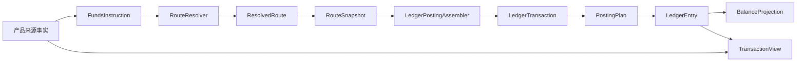

# 支付资金底座 DSL 规范设计

## 0. 文档定位

本文件是 `wind-funds` 支付资金底座的最终 DSL 规范设计，归属为**系分设计中的领域 DSL 契约规范**，不是产品 PRD，也不是某个实现类的详细设计。

它的职责是把产品层已经确认的资金事实，翻译成研发、测试、账务、风控、运营和财务都能共同理解的机器契约。它向上承接 `docs/产品设计` 和 `docs/v5` 的业务目标、主体、账户、资金流、异常路径和验收红线；向下指导 `core`、`transaction`、`wallet`、`ledger`、测试资源和 OpenSpec 的接口、枚举、路由、账务计划、余额投影和契约测试。

```json
{
  "documentType": "SYSTEM_ANALYSIS_DSL_SPEC",
  "documentName": "支付资金底座 DSL 规范设计",
  "owner": "docs/DSL设计",
  "notPrd": true,
  "upstreamInputs": [
    "docs/v5/v5 DSL 规范设计.md",
    "docs/v5/v5 DSL 契约复审矩阵.md",
    "docs/产品设计/01-PRD 总览.md",
    "docs/产品设计/02-交易-路由-钱包-账目-余额投影-交易投影.md",
    "docs/产品设计/03-清分-清算-对账.md",
    "core/src/main/java/com/wind/integration/funds/spec",
    "core/src/test/resources/dsl/transaction-layer"
  ],
  "downstreamOutputs": [
    "系分设计",
    "OpenSpec",
    "JSON 契约样例",
    "TDD 用例",
    "接口与枚举对齐",
    "路由与账务实现",
    "余额投影和交易投影实现"
  ]
}
```

判断标准很简单：PRD 说明“业务为什么需要、使用者如何理解、运营如何验收”；本 DSL 说明“资金事实如何被系统稳定表达、如何路由、如何入账、如何回放、如何测试”。因此它应该放在 `docs/DSL设计`，并作为 `docs/系分设计` 的输入。

## 1. 设计意图和目标

支付资金底座的第一性问题不是页面流程，也不是数据库表，而是每一笔资金事实是否能被稳定解释：

- 这笔事实从哪里来，是否已经被产品流程确认。
- 谁的资金、额度或预算发生变化。
- 金额、币种、原始金额和汇率如何保存。
- 路由当时选择了哪些主体、工具、外部账户和平台账户。
- 账本如何生成平衡的分录。
- 后续退款、撤销、授权结算、拒付、解冻、调账能否基于原路径回放。
- 余额投影、交易投影、对账、报表能否只从事实派生，不反向污染账本。

DSL 的目标如下：

```json
{
  "goals": [
    {
      "code": "G-001",
      "name": "统一资金事实语言",
      "description": "把充值、提现、付款、转账、退款、手续费、冻结、解冻、授权、结算、拒付、调账、调额等场景统一表达为资金底座可处理的 JSON 契约"
    },
    {
      "code": "G-002",
      "name": "稳定路由与回放",
      "description": "一次已入账事实的后续事件必须优先基于原 RouteSnapshot，不因当前账户绑定、平台账户配置或规则变化而漂移"
    },
    {
      "code": "G-003",
      "name": "账务平衡和可审计",
      "description": "每个 PostingPlan 独立平衡，LedgerEntry 可追溯到来源事实、route leg、业务身份、操作者和规则版本"
    },
    {
      "code": "G-004",
      "name": "支持产品和运营解释",
      "description": "运营、财务、风控和客服能解释每一次余额变化的业务原因、资金路径、账目变化和处理结果"
    },
    {
      "code": "G-005",
      "name": "指导系分和编码",
      "description": "DSL 字段、枚举、不变量、场景样例和验收规则可以直接转成接口设计、JSON 契约测试、业务组合测试和实现任务"
    }
  ],
  "nonGoals": [
    "不建模业务订单完整生命周期",
    "不建模通道协议和通道回调状态",
    "不替代清算批次、结算单、对账单、争议单、审批流和运营工单",
    "不把用户账单、商户账单、运营时间线或报表作为事实源",
    "不允许业务方直接提交借贷方向、PostingPlan 或 LedgerEntry"
  ]
}
```

## 2. 产品和业务如何被 DSL 满足

DSL 必须服务产品和业务，而不是为了技术抽象自循环。产品层关心“能不能正确收钱、付钱、冻结、授权、退款、核对和解释”；DSL 负责提供一套稳定、可测、可回放的表达。

| 产品诉求 | DSL 支撑方式 | 验收方式 |
| --- | --- | --- |
| 用户充值后余额增加 | `DIRECT_TRANSACTION / TOPUP` 生成外部入金和目标 `AVAILABLE` 增加路径。 | 断言平台现金或预收路径可解释，目标资金账户余额增加，重复通知幂等。 |
| 付款、转账、退款可追踪 | `FundsInstruction -> RouteSnapshot -> PostingPlan -> LedgerEntry` 串联业务身份和 route leg。 | 每一步断言 route snapshot、posting plan 平衡、余额桶变化和幂等摘要。 |
| 手续费可配置、可退回 | 本金和手续费拆成独立 `RouteLeg` 与 `PostingPlan`，`FEE_REFUND` 只回放费用 leg。 | 普通退款不默认退费，退费不超过原费用剩余金额。 |
| 授权批准、撤销、结算、退款、拒付可控 | `AUTHORIZATION_TRANSACTION` 表达 `AVAILABLE <-> AUTHORIZATION` 与授权链后续 replay。 | 授权拒绝无 route/entry，结算不超过剩余授权，退款和拒付不超已结算。 |
| 冻结只限制可用性 | `BALANCE_CONTROL / FREEZE` 只做同主体 `AVAILABLE -> FROZEN`。 | 冻结不创建 `FundsTransaction`，不表达扣划、消费或跨主体转移。 |
| 信用和预算调额 | `BALANCE_CONTROL / LIMIT_ADJUST` 触碰 `LIMIT`，普通授权结算不得落到 `LIMIT`。 | 额度调整不是现金流，预算和信用不新增 `CONSUMED` 账目。 |
| 错币种交易可记录事实 | 业务层决策是否换汇，DSL 记录 `amount`、`originalAmount`、`exchangeRate`。 | 交易层不隐式调用 `FxService`，余额控制不承接 FX。 |
| 清结算、对账差错可入账 | 清算确认、结算锁定、出款结果、差错核销形成新的资金事实。 | 批次、审批和对账流程不进入 route leg，只把确认后的资金结果入账。 |
| 大数据量后可重建余额和交易视图 | `LedgerEntry` 是余额事实源，交易视图是只读投影。 | 余额重建只读 entry、checkpoint、水位和归档清单；交易视图重放不写账。 |

## 3. 总体流程



JSON 主链路如下：

```json
{
  "dslPipeline": [
    {
      "step": 1,
      "object": "SourceFact",
      "meaning": "产品层已成立或需要控制余额的业务事实"
    },
    {
      "step": 2,
      "object": "FundsInstruction",
      "meaning": "账本可理解的资金事实请求"
    },
    {
      "step": 3,
      "object": "ResolvedRoute",
      "meaning": "运行态已解析资金路径"
    },
    {
      "step": 4,
      "object": "RouteSnapshot",
      "meaning": "固化后的路径事实快照"
    },
    {
      "step": 5,
      "object": "LedgerTransaction",
      "meaning": "账本写入口交易聚合"
    },
    {
      "step": 6,
      "object": "PostingPlan",
      "meaning": "一组独立平衡的账务计划"
    },
    {
      "step": 7,
      "object": "LedgerEntry",
      "meaning": "最小不可变账务事实"
    },
    {
      "step": 8,
      "object": "BalanceProjection",
      "meaning": "由分录派生的余额读模型"
    },
    {
      "step": 9,
      "object": "TransactionView",
      "meaning": "面向用户、商户、运营、财务的交易读模型"
    }
  ],
  "strictDirection": [
    "ProductScenario -> SourceFact",
    "SourceFact -> FundsInstruction",
    "FundsInstruction -> ResolvedRoute",
    "ResolvedRoute -> RouteSnapshot",
    "RouteSnapshot -> LedgerTransaction",
    "LedgerTransaction -> PostingPlan",
    "PostingPlan -> LedgerEntry",
    "LedgerEntry -> BalanceProjection",
    "SourceFact + LedgerReference -> TransactionView"
  ]
}
```

## 4. JSON 通用约定

DSL 的规范结构和场景样例全部使用 JSON。本文档中的 JSON 是契约表达，不等同于某个 Controller 报文，也不等同于数据库结构。

```json
{
  "jsonConventions": {
    "fieldStyle": "lowerCamelCase",
    "enumStyle": "UPPER_SNAKE_CASE",
    "money": {
      "type": "object",
      "requiredFields": [
        "currency",
        "minorValue"
      ],
      "currency": "ISO-4217 currency code",
      "minorValue": "integer minor unit, for example cent"
    },
    "datetime": {
      "format": "ISO-8601 local date time",
      "systemDesignRequirement": "系分阶段必须明确业务时区、存储时区和精度"
    },
    "amountSemantics": {
      "amount": "账务主链路金额，即本账户或账本币种下要入账的金额",
      "originalAmount": "业务原始金额，无错币种时等于 amount",
      "exchangeRate": "originalAmount -> amount 的汇率快照，无换汇时为 1"
    },
    "fxBoundary": [
      "是否换汇由业务层或外汇域决策",
      "交易层 DSL 只记录决策后的金额事实",
      "FundsAuthorizationInstructionConverter 不应隐式调用 FxService",
      "FundsBalanceControlService 不承接 FX，金额必须是目标账户或账本币种"
    ],
    "idempotency": [
      "tenantId",
      "businessScene",
      "businessSn",
      "eventType",
      "amount",
      "currency",
      "originalAmount",
      "originalCurrency",
      "exchangeRate",
      "reference"
    ],
    "digestMustExclude": [
      "databaseId",
      "autoIncrementSn",
      "createdTime",
      "updatedTime",
      "processingStatus",
      "displayText"
    ]
  }
}
```

## 5. 核心语义和对象结构

### 5.1 SourceFact

来源事实是产品层已经确认可以影响资金、余额控制或账务解释的事实。DSL 不判断业务订单是否成立，只承接已经被产品流程确认的资金事实。

```json
{
  "SourceFact": {
    "definition": "产品层已经成立或需要控制余额的业务事实",
    "allowedExamples": [
      "FundsTransaction",
      "FrozenOrder",
      "AuthorizationResult",
      "ClearingConfirmation",
      "SettlementLock",
      "PayoutResult",
      "ReconciliationExceptionAdjustment",
      "DisputeChargeback",
      "FeeFact"
    ],
    "notSourceFact": [
      "页面操作按钮",
      "订单展示状态",
      "通道处理中状态",
      "报表行",
      "交易视图行"
    ]
  }
}
```

### 5.2 FundsInstruction

`FundsInstruction` 是账本可理解的资金事实请求。它不是业务订单、不是资金交易主表、不是账本分录。

代码落点：`core/src/main/java/com/wind/integration/funds/spec/transaction/FundsInstructionSpec.java`。

```json
{
  "FundsInstruction": {
    "requiredFields": {
      "tenantId": "租户 ID；进入 route 前必须确定",
      "instructionType": "DIRECT_TRANSACTION | AUTHORIZATION_TRANSACTION | BALANCE_CONTROL",
      "eventType": "稳定资金事件，当前代码使用 FundsTransactionEventType",
      "transactionType": "当前代码使用 DefaultFundsTransactionType；目标态非交易事实可在系分阶段收敛为可空或独立类型",
      "amount": "账务主链路金额",
      "originalAmount": "业务原始金额",
      "exchangeRate": "原始金额到主链路金额的汇率快照",
      "businessScene": "业务场景",
      "businessSn": "本次业务动作流水",
      "eventTime": "事实发生时间",
      "operator": "操作者快照",
      "contextVariables": "补充上下文，只放辅助事实"
    },
    "conditionalFields": {
      "instrumentRef": "支付工具引用和脱敏快照，不作为入账主体",
      "externalAccountRef": "外部账户或外部端点引用，不作为入账主体",
      "reference": "退款、撤销、授权结算、拒付、费用退回、解冻、对账差错调账等后续事件必填"
    },
    "currentEventMapping": [
      {
        "productMeaning": "外部入金",
        "currentEventType": "TOPUP",
        "targetSemanticName": "FUND_IN"
      },
      {
        "productMeaning": "外部出金",
        "currentEventType": "WITHDRAW",
        "targetSemanticName": "FUND_OUT"
      },
      {
        "productMeaning": "授权撤销",
        "currentEventType": "REVERSAL",
        "targetSemanticName": "AUTH_REVERSAL"
      },
      {
        "productMeaning": "授权结算或商户结算类资金迁移",
        "currentEventType": "SETTLE",
        "targetSemanticName": "AUTH_SETTLEMENT_OR_SETTLEMENT"
      }
    ]
  }
}
```

### 5.3 Reference

`Reference` 表达本次事件引用的原事实。需要 replay 的事件必须能定位到原 route snapshot、原 ledger transaction 或原来源事实。

```json
{
  "FundsInstructionReference": {
    "requiredFor": [
      "REFUND",
      "FEE_REFUND",
      "REVERSAL",
      "SETTLE",
      "AUTH_REFUND",
      "CHARGEBACK",
      "UNFREEZE",
      "BALANCE_ADJUST"
    ],
    "referenceTypes": [
      "ORIGINAL_TRANSACTION",
      "AUTHORIZATION",
      "SETTLEMENT",
      "FREEZE_ORDER",
      "FEE",
      "DISPUTE_CASE",
      "RECONCILIATION_EXCEPTION",
      "EXTERNAL_TRANSACTION"
    ],
    "rules": [
      "需要 route replay 的事件必须带 referenceSnapshotId 或等价原快照引用",
      "找不到原快照时必须失败，不允许读取当前配置重新选路",
      "引用不得形成循环",
      "后续事件必须校验累计金额上限"
    ]
  }
}
```

### 5.4 可入账主体和引用对象

只有资金账户、信用账户和预算组可以进入 `LedgerEntry`。用户、商户、企业、平台角色、支付工具、外部银行账户和通道账户都必须解析成可入账主体或作为引用快照保存。

```json
{
  "ledgerSubjectTypes": [
    {
      "code": "FUNDING_ACCOUNT",
      "meaning": "承载真实资金、平台内部资金责任或资金余额的可入账主体"
    },
    {
      "code": "CREDIT_ACCOUNT",
      "meaning": "承载授信额度、可用额度和授权占用的控制账户"
    },
    {
      "code": "BUDGET_GROUP",
      "meaning": "承载预算总量、可用预算和预算授权占用的控制账户"
    }
  ],
  "nonLedgerObjects": [
    {
      "object": "PaymentInstrument",
      "examples": [
        "VCC",
        "共享卡",
        "VA",
        "银行卡"
      ],
      "usage": "工具引用和绑定快照"
    },
    {
      "object": "ExternalAccount",
      "examples": [
        "银行账户",
        "PSP 账户",
        "通道账户"
      ],
      "usage": "外部端点引用、回单和对账线索"
    },
    {
      "object": "BusinessOwner",
      "examples": [
        "用户",
        "商户",
        "企业",
        "租户"
      ],
      "usage": "业务归属主体，不能直接入账"
    }
  ]
}
```

### 5.5 账目和余额桶

账目是账户内的余额桶，不是账户主体。`AVAILABLE` 在资金账户、信用账户和预算组上都可以按策略受控为负，但含义不同，必须保留来源、规则、上限、账龄、风险状态和治理路径。

```json
{
  "ledgerSubjectCodes": [
    {
      "code": "CASH",
      "meaning": "现金或外部资金池的内部映射"
    },
    {
      "code": "PREPAYMENT",
      "meaning": "平台对用户、商户或业务方的预收待付责任"
    },
    {
      "code": "AVAILABLE",
      "meaning": "可用余额、可用额度或可用预算"
    },
    {
      "code": "FROZEN",
      "meaning": "同一主体暂不可用余额"
    },
    {
      "code": "AUTHORIZATION",
      "meaning": "授权占用中的资金、额度或预算"
    },
    {
      "code": "CLEARING",
      "meaning": "商户订单款已形成但尚未清算可结算的待清算余额"
    },
    {
      "code": "SETTLEMENT",
      "meaning": "已进入结算或出款处理的锁定金额"
    },
    {
      "code": "LIMIT",
      "meaning": "信用额度或预算总量，只允许 LIMIT_ADJUST 触碰"
    },
    {
      "code": "FEE",
      "meaning": "手续费、服务费或成本归集"
    },
    {
      "code": "ADJUSTMENT",
      "meaning": "差错、补记、追偿或人工调账的中间口径"
    },
    {
      "code": "SUSPENSE",
      "meaning": "挂账余额"
    },
    {
      "code": "RISK_RESERVE",
      "meaning": "风险准备金"
    }
  ],
  "notAllowed": [
    "普通授权结算不得落到 LIMIT",
    "信用账户和预算组不新增 CONSUMED 账目",
    "冻结不得表达跨主体价值转移",
    "SETTLEMENT 不得被 AVAILABLE 替代"
  ]
}
```

### 5.6 Route 和 RouteSnapshot

`ResolvedRoute` 是运行态已解析资金路径；`RouteSnapshot` 是固化后的路径事实快照。后续 replay 必须优先基于原快照。

代码落点：

- `core/src/main/java/com/wind/integration/funds/route/spec/ResolvedRouteSpec.java`
- `core/src/main/java/com/wind/integration/funds/route/spec/RouteSnapshotSpec.java`
- `core/src/main/java/com/wind/integration/funds/route/spec/RouteLegSpec.java`

```json
{
  "ResolvedRoute": {
    "requiredFields": [
      "tenantId",
      "routeCode",
      "routeVersion",
      "businessScene",
      "businessSn",
      "instructionType",
      "eventType",
      "transactionType",
      "participants",
      "legs",
      "resolvedAt"
    ],
    "optionalFields": [
      "routingDecision",
      "paymentInstrumentRef",
      "externalAccountRef",
      "platformAccounts",
      "expiresAt",
      "contextVariables"
    ]
  },
  "RouteSnapshot": {
    "requiredFields": [
      "snapshotId",
      "snapshotSchemaVersion",
      "routeCode",
      "routeVersion",
      "businessScene",
      "businessSn",
      "participants",
      "legs",
      "resolvedAt"
    ],
    "rules": [
      "snapshotSchemaVersion 与 routeVersion 含义分离",
      "已用于入账的快照不可修改",
      "后续 replay 不读取当前默认平台账户替换原快照",
      "未知 snapshot schema 必须失败或进入人工处理"
    ]
  },
  "RouteLeg": {
    "fields": {
      "legId": "route 内稳定 leg 标识",
      "sequence": "顺序",
      "legType": "EXTERNAL_IN | EXTERNAL_OUT | INTERNAL_TRANSFER | HOLD | RELEASE | CONSUME | RESTORE | ADJUST",
      "sourceNode": "来源节点",
      "targetNode": "目标节点",
      "amount": "本 leg 的账务主金额",
      "originalAmount": "本 leg 的原始金额",
      "exchangeRate": "本 leg 的汇率快照",
      "balanceEffectType": "余额影响语义",
      "phaseCode": "账务阶段提示",
      "constraintOverrides": "本次余额约束覆盖",
      "replayPolicy": "回放策略",
      "replayRefLegId": "replay leg 指向的原 leg"
    }
  }
}
```

### 5.7 LedgerTransaction、PostingPlan 和 LedgerEntry

账本对象负责最终证明余额变化。`PostingPlan` 必须独立平衡，`LedgerEntry` 是最小不可变账务事实。

代码落点：

- `core/src/main/java/com/wind/integration/funds/spec/ledger/LedgerTransactionSpec.java`
- `core/src/main/java/com/wind/integration/funds/spec/ledger/LedgerPostingPlanSpec.java`
- `core/src/main/java/com/wind/integration/funds/spec/ledger/LedgerEntrySpec.java`

```json
{
  "LedgerTransaction": {
    "requiredFields": [
      "tenantId",
      "sn",
      "instructionType",
      "eventType",
      "status",
      "amount",
      "originalAmount",
      "exchangeRate",
      "businessScene",
      "businessSn",
      "transactionTime",
      "postingPlans",
      "contextVariables"
    ],
    "rules": [
      "整笔账本交易必须平衡",
      "不负责资金路径选择",
      "不表达业务订单生命周期"
    ]
  },
  "PostingPlan": {
    "requiredFields": [
      "planId",
      "ledgerTransactionSn",
      "routeLegId",
      "intent",
      "postingScope",
      "balanceEffectType",
      "postingPhases"
    ],
    "rules": [
      "每个 plan 同币种借贷平衡",
      "routeLegId 追溯来源 route leg",
      "intent 表达为什么记账",
      "phase 表达资金动作阶段",
      "scope 表达账务范围"
    ]
  },
  "LedgerEntry": {
    "requiredFields": [
      "subjectId",
      "subjectType",
      "ledgerSubjectCode",
      "ledgerSubjectCategory",
      "ledgerTransactionSn",
      "entrySide",
      "businessScene",
      "businessSn",
      "amount",
      "originalAmount",
      "exchangeRate",
      "transactionTime",
      "contextVariables"
    ],
    "rules": [
      "amount 必须为正，方向由 entrySide 表达",
      "subjectType 只能是 FUNDING_ACCOUNT、CREDIT_ACCOUNT、BUDGET_GROUP",
      "写入后不得修改，错账只能追加冲正、补记或调账",
      "sha256 摘要不得包含数据库 ID、自增流水、审计时间和易变状态"
    ]
  }
}
```

### 5.8 SettlementPolicy

`SettlementPolicySpec` 只表达结算资格和周期规则，不表达 route leg、ledger phase 或外部清算网络状态。

```json
{
  "SettlementPolicy": {
    "expressions": [
      "RT",
      "T+N",
      "H+N",
      "W+N@D",
      "M+N@D",
      "M+N@L",
      "Q+N",
      "Q+N@L",
      "Y+N@MM-DD",
      "C@DD-DD"
    ],
    "rules": [
      "策略只计算候选时间和周期，不自动入账",
      "结算候选必须经过风控、退款、争议、冻结、准备金、对账差错和商户状态校验",
      "不支持的表达式必须显式失败，不能静默降级为 RT",
      "外部清算网络节假日、cutoff 和 SLA 由清结算产品或通道配置处理"
    ]
  }
}
```

### 5.9 投影和重放

余额投影、交易投影和报表都是派生读模型。余额投影可以由分录、检查点和水位重建；交易投影只能按范围有界重放，不得生成 route、posting plan 或 ledger entry。

```json
{
  "projectionRules": {
    "BalanceProjection": [
      "来源是 LedgerEntry、BalanceCheckpoint、BalanceProjectionWatermark、ArchiveManifest",
      "余额重建公式为 cold(< watermark) + hot([watermark, targetTime))",
      "不得从交易视图、账单或报表反推余额"
    ],
    "TransactionViewReplay": [
      "必须限定租户、视图域、主体、时间窗口、批次或单笔来源",
      "只写交易读模型和差异报告",
      "不得重新入账，不生成 route，不生成 ledger entry"
    ]
  }
}
```

## 6. DSL 不变量

```json
{
  "invariants": [
    {
      "code": "INV-001",
      "rule": "amount、originalAmount、LedgerEntry.amount 均为正数；方向由 route、entrySide、normal balance 和 balanceEffectType 决定"
    },
    {
      "code": "INV-002",
      "rule": "账务主链路使用 amount.currency；错币种场景必须保存 originalAmount、originalCurrency 和 exchangeRate 快照"
    },
    {
      "code": "INV-003",
      "rule": "FundsInstruction 只能驱动 route 和 posting 生成，不允许业务方直接指定 DEBIT、CREDIT 或 LedgerEntry"
    },
    {
      "code": "INV-004",
      "rule": "RouteLeg 描述资金路径，LedgerEntry 描述借贷事实，二者通过 PostingPlan 转换"
    },
    {
      "code": "INV-005",
      "rule": "每个 PostingPlan 必须同币种借贷相等，整笔 LedgerTransaction 也必须平衡"
    },
    {
      "code": "INV-006",
      "rule": "外部账户、支付工具、平台角色、用户和商户经营主体不得直接成为 LedgerEntry.subject"
    },
    {
      "code": "INV-007",
      "rule": "入账路径不得自动创建 ledger，建账必须由主体初始化流程显式完成"
    },
    {
      "code": "INV-008",
      "rule": "需要 replay 的后续事件缺原 RouteSnapshot 必须失败，不允许读取当前绑定关系重新选路"
    },
    {
      "code": "INV-009",
      "rule": "冻结和解冻使用 FrozenOrder 来源事实，可生成账本交易和分录，但不得创建 FundsTransaction"
    },
    {
      "code": "INV-010",
      "rule": "授权拒绝可以记录拒绝原因和展示审计，但不得生成 route、posting、ledger entry，也不得累计 chargebackAmount"
    },
    {
      "code": "INV-011",
      "rule": "普通授权结算不触碰 LIMIT，只有 BALANCE_CONTROL / LIMIT_ADJUST 可以触碰信用或预算 LIMIT"
    },
    {
      "code": "INV-012",
      "rule": "信用账户和预算组不新增 CONSUMED，已消费金额由交易生命周期、授权结算事实和报表口径计算"
    },
    {
      "code": "INV-013",
      "rule": "余额投影、交易视图和报表不得修改历史 LedgerEntry、LedgerTransaction、FundsTransaction 或 route snapshot"
    },
    {
      "code": "INV-014",
      "rule": "业务层决定是否换汇，交易层 DSL 只记录 amount、originalAmount 和 exchangeRate，余额控制服务不承接 FX"
    }
  ]
}
```

## 7. 场景覆盖矩阵

每个场景都必须能从产品流程推导到 TDD 用例。场景矩阵使用 JSON 表达，方便后续转为测试资源或 OpenSpec 输入。

```json
{
  "scenarioCoverage": [
    {
      "scenarioCode": "TOPUP_THEN_PAY_THEN_REFUND",
      "productScenario": "先充值，再付款，再退款",
      "serviceAbilities": [
        "DIRECT_TRANSACTION",
        "REVERSE_TRANSACTION"
      ],
      "dslEvents": [
        "TOPUP",
        "PAY",
        "REFUND"
      ],
      "mustAssert": [
        "充值增加资金账户 AVAILABLE",
        "付款减少付款方 AVAILABLE 并增加收款方目标桶",
        "退款基于原 route snapshot 回放，累计退款不超额"
      ]
    },
    {
      "scenarioCode": "TOPUP_THEN_FREEZE_THEN_WITHDRAW",
      "productScenario": "先充值，再冻结，再提现",
      "serviceAbilities": [
        "DIRECT_TRANSACTION",
        "BALANCE_CONTROL"
      ],
      "dslEvents": [
        "TOPUP",
        "FREEZE",
        "WITHDRAW"
      ],
      "mustAssert": [
        "冻结只做同主体 AVAILABLE -> FROZEN",
        "提现成功消耗 FROZEN 或明确的锁定桶",
        "提现失败通过 UNFREEZE 释放"
      ]
    },
    {
      "scenarioCode": "TRANSFER_CHAIN",
      "productScenario": "A 充值，转给 B，B 付款，再提现",
      "serviceAbilities": [
        "DIRECT_TRANSACTION",
        "BALANCE_CONTROL"
      ],
      "dslEvents": [
        "TOPUP",
        "TRANSFER",
        "PAY",
        "FREEZE",
        "WITHDRAW"
      ],
      "mustAssert": [
        "每一步都断言 A、B、商户和平台账户余额变化",
        "中间任何一步失败不产生部分 posting",
        "幂等重放不重复入账"
      ]
    },
    {
      "scenarioCode": "FEE_COMBINATION",
      "productScenario": "付款、充值、提现或拒付相关手续费组合",
      "serviceAbilities": [
        "DIRECT_TRANSACTION",
        "REVERSE_TRANSACTION"
      ],
      "dslEvents": [
        "FEE_CHARGE",
        "FEE_REFUND"
      ],
      "mustAssert": [
        "手续费由交易层发起，FeeSpec 可由业务请求传入",
        "FeeSpec.feeType 使用字符串，DefaultFeeType 只作为默认枚举支持",
        "普通退款不默认退手续费，FeeRefund 只回放费用 leg"
      ]
    },
    {
      "scenarioCode": "FREEZE_MULTI_UNFREEZE",
      "productScenario": "一次冻结，多次解冻",
      "serviceAbilities": [
        "BALANCE_CONTROL"
      ],
      "dslEvents": [
        "FREEZE",
        "UNFREEZE"
      ],
      "mustAssert": [
        "每次解冻引用冻结单",
        "累计解冻不超过剩余冻结金额",
        "解冻不表达退款或消费"
      ]
    },
    {
      "scenarioCode": "FUNDING_CREDIT_BUDGET_ADJUST",
      "productScenario": "资金账户、信用账户、预算组调额",
      "serviceAbilities": [
        "BALANCE_CONTROL"
      ],
      "dslEvents": [
        "BALANCE_ADJUST",
        "LIMIT_ADJUST"
      ],
      "mustAssert": [
        "资金账户余额调账必须有差错、凭证、审批和复核",
        "信用和预算调额通过 LIMIT_ADJUST",
        "余额控制服务不做 FX"
      ]
    },
    {
      "scenarioCode": "AUTH_QUERY_REVERSAL_SETTLE_REFUND",
      "productScenario": "交易问询，部分撤销，部分结算，部分退款",
      "serviceAbilities": [
        "AUTHORIZATION_TRANSACTION"
      ],
      "dslEvents": [
        "AUTHORIZE",
        "REVERSAL",
        "SETTLE",
        "AUTH_REFUND"
      ],
      "mustAssert": [
        "所有后续动作引用原授权快照",
        "结算不超过剩余授权",
        "退款不超过已结算金额"
      ]
    },
    {
      "scenarioCode": "AUTH_CHARGEBACK",
      "productScenario": "交易问询后授权拒付",
      "serviceAbilities": [
        "AUTHORIZATION_TRANSACTION"
      ],
      "dslEvents": [
        "CHARGEBACK"
      ],
      "mustAssert": [
        "拒付和授权拒绝严格分离",
        "refundedAmount + chargebackAmount <= settledAmount",
        "拒付生成独立资金事实，不修改原分录"
      ]
    },
    {
      "scenarioCode": "AUTH_DIRECT_SETTLEMENT",
      "productScenario": "授权交易直接结算",
      "serviceAbilities": [
        "AUTHORIZATION_TRANSACTION"
      ],
      "dslEvents": [
        "AUTHORIZE",
        "SETTLE"
      ],
      "mustAssert": [
        "授权占用和结算可以在同一业务链路完成，但账务事实仍可追溯",
        "结算走原 route snapshot",
        "普通结算不落到 LIMIT"
      ]
    },
    {
      "scenarioCode": "AUTH_FUNDING_CREDIT_BUDGET",
      "productScenario": "授权交易覆盖资金账户、共享卡、预算组组合",
      "serviceAbilities": [
        "AUTHORIZATION_TRANSACTION"
      ],
      "dslEvents": [
        "AUTHORIZE",
        "REVERSAL",
        "SETTLE"
      ],
      "mustAssert": [
        "资金账户、信用账户、预算组的授权占用整体成功或整体失败",
        "支付工具只作为 instrumentRef，不进入 LedgerEntry",
        "信用和预算不新增 CONSUMED"
      ]
    },
    {
      "scenarioCode": "CLEARING_SETTLEMENT_RECONCILIATION",
      "productScenario": "清算确认、结算锁定、出款成功、对账差错调账",
      "serviceAbilities": [
        "DIRECT_TRANSACTION",
        "BALANCE_CONTROL"
      ],
      "dslEvents": [
        "SETTLE",
        "WITHDRAW",
        "BALANCE_ADJUST"
      ],
      "mustAssert": [
        "清算批次、结算单、对账单是产品对象，不是 DSL 主对象",
        "只有确认后的资金结果进入 DSL",
        "差错调账必须可追溯、可审批、可核销"
      ]
    },
    {
      "scenarioCode": "BALANCE_AND_TRANSACTION_VIEW_REPLAY",
      "productScenario": "余额投影重建和交易投影有界重放",
      "serviceAbilities": [
        "QUERY_AND_REPLAY"
      ],
      "dslEvents": [],
      "mustAssert": [
        "余额重建不读交易视图",
        "交易视图重放不写账",
        "必须有租户、主体、视图域和时间范围"
      ]
    }
  ]
}
```

## 8. 典型 JSON 案例

### 8.1 钱包付款并收取手续费

```json
{
  "caseId": "DSL-DIRECT-WALLET-PAYMENT-WITH-FEE-001",
  "serviceAbility": "DIRECT_TRANSACTION",
  "scenarioCode": "WALLET_PAYMENT_WITH_FEE",
  "description": "钱包付款并收取平台手续费",
  "instruction": {
    "tenantId": 1,
    "instructionType": "DIRECT_TRANSACTION",
    "eventType": "PAY",
    "transactionType": "PAY",
    "businessScene": "MERCHANT_ORDER_PAY",
    "businessSn": "PAY_202605140001",
    "amount": {
      "currency": "USD",
      "minorValue": 10000
    },
    "originalAmount": {
      "currency": "USD",
      "minorValue": 10000
    },
    "exchangeRate": "1",
    "eventTime": "2026-05-14T10:01:00",
    "operator": {
      "actorType": "USER",
      "actorId": "user_10001"
    },
    "contextVariables": {
      "accountId": "fa_user_10001_usd",
      "payeeId": "fa_merchant_20001_usd",
      "payeeLedgerSubjectCode": "CLEARING",
      "feeRuleCode": "MERCHANT_STANDARD_001",
      "feeRuleVersion": "2026-05"
    }
  },
  "expectedRoute": {
    "routeCode": "DIRECT_PAY_STANDARD",
    "routeVersion": "v4",
    "snapshotSchemaVersion": "route.snapshot.v4",
    "platformAccounts": {
      "feeFundingAccount": {
        "subjectType": "FUNDING_ACCOUNT",
        "subjectId": "fa_platform_fee_usd",
        "currency": "USD",
        "ledgerProfileCode": "FUNDING_PLATFORM"
      }
    },
    "legs": [
      {
        "legId": "PAY",
        "legType": "INTERNAL_TRANSFER",
        "sourceNode": {
          "nodeRole": "SOURCE",
          "subjectType": "FUNDING_ACCOUNT",
          "subjectId": "fa_user_10001_usd",
          "ledgerSubjectCode": "AVAILABLE"
        },
        "targetNode": {
          "nodeRole": "TARGET",
          "subjectType": "FUNDING_ACCOUNT",
          "subjectId": "fa_merchant_20001_usd",
          "ledgerSubjectCode": "CLEARING"
        },
        "amount": {
          "currency": "USD",
          "minorValue": 10000
        },
        "balanceEffectType": "CONSUME",
        "phaseCode": "SETTLEMENT",
        "replayPolicy": "PARTIAL_ALLOWED"
      },
      {
        "legId": "FEE",
        "legType": "INTERNAL_TRANSFER",
        "sourceNode": {
          "nodeRole": "SOURCE",
          "subjectType": "FUNDING_ACCOUNT",
          "subjectId": "fa_user_10001_usd",
          "ledgerSubjectCode": "AVAILABLE"
        },
        "targetNode": {
          "nodeRole": "TARGET",
          "subjectType": "FUNDING_ACCOUNT",
          "subjectId": "fa_platform_fee_usd",
          "ledgerSubjectCode": "FEE"
        },
        "amount": {
          "currency": "USD",
          "minorValue": 150
        },
        "balanceEffectType": "CONSUME",
        "phaseCode": "FEE",
        "replayPolicy": "PARTIAL_ALLOWED"
      }
    ]
  },
  "expectedPosting": {
    "postingPlans": [
      {
        "routeLegId": "PAY",
        "intent": "TRANSFER",
        "postingScope": "BETWEEN_SUBJECTS",
        "entries": [
          {
            "subjectId": "fa_user_10001_usd",
            "subjectType": "FUNDING_ACCOUNT",
            "ledgerSubjectCode": "AVAILABLE",
            "entrySide": "DEBIT",
            "amount": {
              "currency": "USD",
              "minorValue": 10000
            }
          },
          {
            "subjectId": "fa_merchant_20001_usd",
            "subjectType": "FUNDING_ACCOUNT",
            "ledgerSubjectCode": "CLEARING",
            "entrySide": "CREDIT",
            "amount": {
              "currency": "USD",
              "minorValue": 10000
            }
          }
        ]
      },
      {
        "routeLegId": "FEE",
        "intent": "FEE",
        "postingScope": "FEE",
        "entries": [
          {
            "subjectId": "fa_user_10001_usd",
            "subjectType": "FUNDING_ACCOUNT",
            "ledgerSubjectCode": "AVAILABLE",
            "entrySide": "DEBIT",
            "amount": {
              "currency": "USD",
              "minorValue": 150
            }
          },
          {
            "subjectId": "fa_platform_fee_usd",
            "subjectType": "FUNDING_ACCOUNT",
            "ledgerSubjectCode": "FEE",
            "entrySide": "CREDIT",
            "amount": {
              "currency": "USD",
              "minorValue": 150
            }
          }
        ]
      }
    ]
  },
  "validation": {
    "mustPass": [
      "本金和费用使用独立 route leg",
      "费用账户来自平台账户角色快照",
      "费用规则版本进入 contextVariables",
      "每个 posting plan 独立平衡"
    ],
    "mustFail": [
      "费用和本金混入同一金额口径",
      "缺 feeRuleVersion",
      "平台费用账户未初始化",
      "业务侧直接提交 LedgerEntry"
    ]
  }
}
```

### 8.2 原交易退款和手续费退回

```json
{
  "caseId": "DSL-REVERSE-REFUND-AND-FEE-001",
  "serviceAbility": "REVERSE_TRANSACTION",
  "scenarioCode": "DIRECT_REFUND_WITH_OPTIONAL_FEE_REFUND",
  "description": "普通退款不默认退手续费，需要退费时发起独立 FEE_REFUND",
  "refundInstruction": {
    "instructionType": "DIRECT_TRANSACTION",
    "eventType": "REFUND",
    "transactionType": "REFUND",
    "businessScene": "DIRECT_REFUND",
    "businessSn": "RF_202605140001",
    "amount": {
      "currency": "USD",
      "minorValue": 5000
    },
    "reference": {
      "referenceType": "ORIGINAL_TRANSACTION",
      "referenceObjectSn": "FT_PAY_202605130001",
      "referenceSnapshotId": "RS_PAY_202605130001"
    }
  },
  "feeRefundInstruction": {
    "instructionType": "DIRECT_TRANSACTION",
    "eventType": "FEE_REFUND",
    "transactionType": "FEE",
    "businessScene": "FEE_REFUND",
    "businessSn": "FEE_RF_202605140001",
    "amount": {
      "currency": "USD",
      "minorValue": 150
    },
    "reference": {
      "referenceType": "FEE",
      "referenceObjectSn": "FT_FEE_202605130001",
      "referenceSnapshotId": "RS_FEE_202605130001"
    }
  },
  "expectedRoute": {
    "refundRouteCode": "DIRECT_REFUND_REPLAY",
    "feeRefundRouteCode": "FEE_REFUND_REPLAY",
    "rules": [
      "退款只回放原本金 leg",
      "退费只回放原费用 leg",
      "两者可以在业务层组合，但 DSL 中是两个可审计资金事实"
    ]
  },
  "validation": {
    "mustPass": [
      "退款和退费都引用原 snapshot",
      "累计退款不超过原交易可退金额",
      "累计退费不超过原费用剩余可退金额"
    ],
    "mustFail": [
      "普通退款默认退手续费",
      "缺 referenceSnapshotId",
      "退费金额超过原手续费"
    ]
  }
}
```

### 8.3 授权批准、部分结算和授权拒绝

```json
{
  "caseId": "DSL-AUTH-LIFECYCLE-001",
  "serviceAbility": "AUTHORIZATION_TRANSACTION",
  "scenarioCode": "AUTH_APPROVE_PARTIAL_SETTLE_DECLINE",
  "authorizeInstruction": {
    "instructionType": "AUTHORIZATION_TRANSACTION",
    "eventType": "AUTHORIZE",
    "transactionType": "PAY",
    "businessScene": "CARD_AUTHORIZATION",
    "businessSn": "AUTH_202605140001",
    "amount": {
      "currency": "USD",
      "minorValue": 12000
    }
  },
  "authorizeRoute": {
    "routeCode": "AUTHORIZATION_STANDARD",
    "legs": [
      {
        "legId": "AUTH_FUNDING",
        "legType": "HOLD",
        "sourceNode": {
          "subjectType": "FUNDING_ACCOUNT",
          "subjectId": "fa_user_10001_usd",
          "ledgerSubjectCode": "AVAILABLE"
        },
        "targetNode": {
          "subjectType": "FUNDING_ACCOUNT",
          "subjectId": "fa_user_10001_usd",
          "ledgerSubjectCode": "AUTHORIZATION"
        },
        "amount": {
          "currency": "USD",
          "minorValue": 4000
        }
      },
      {
        "legId": "AUTH_CREDIT",
        "legType": "HOLD",
        "sourceNode": {
          "subjectType": "CREDIT_ACCOUNT",
          "subjectId": "ca_company_30001_usd",
          "ledgerSubjectCode": "AVAILABLE"
        },
        "targetNode": {
          "subjectType": "CREDIT_ACCOUNT",
          "subjectId": "ca_company_30001_usd",
          "ledgerSubjectCode": "AUTHORIZATION"
        },
        "amount": {
          "currency": "USD",
          "minorValue": 5000
        }
      },
      {
        "legId": "AUTH_BUDGET",
        "legType": "HOLD",
        "sourceNode": {
          "subjectType": "BUDGET_GROUP",
          "subjectId": "bg_team_40001_usd",
          "ledgerSubjectCode": "AVAILABLE"
        },
        "targetNode": {
          "subjectType": "BUDGET_GROUP",
          "subjectId": "bg_team_40001_usd",
          "ledgerSubjectCode": "AUTHORIZATION"
        },
        "amount": {
          "currency": "USD",
          "minorValue": 3000
        }
      }
    ]
  },
  "settleInstruction": {
    "instructionType": "AUTHORIZATION_TRANSACTION",
    "eventType": "SETTLE",
    "transactionType": "PAY",
    "businessScene": "CARD_AUTHORIZATION_SETTLEMENT",
    "businessSn": "AUTH_SETTLE_202605140001",
    "amount": {
      "currency": "USD",
      "minorValue": 10000
    },
    "reference": {
      "referenceType": "AUTHORIZATION",
      "referenceObjectSn": "AUTH_202605140001",
      "referenceSnapshotId": "RS_AUTH_202605140001"
    }
  },
  "declineCase": {
    "instruction": null,
    "expectedRoute": null,
    "expectedPosting": null,
    "declineFact": {
      "declineReasonCode": "INSUFFICIENT_FUNDS",
      "businessSn": "AUTH_DECLINE_202605140001"
    }
  },
  "validation": {
    "mustPass": [
      "多主体授权整体成功或整体失败",
      "授权结算基于原 snapshot",
      "结算金额不超过剩余授权",
      "差额释放回原主体 AVAILABLE",
      "授权拒绝无 route、无 posting、无 entry"
    ],
    "mustFail": [
      "只部分写入授权分录",
      "授权结算写成 AUTHORIZATION -> LIMIT",
      "把授权拒绝映射为 CHARGEBACK",
      "信用或预算新增 CONSUMED"
    ]
  }
}
```

### 8.4 冻结、多次解冻和提现

```json
{
  "caseId": "DSL-CONTROL-FREEZE-UNFREEZE-WITHDRAW-001",
  "serviceAbility": "BALANCE_CONTROL_AND_DIRECT_TRANSACTION",
  "scenarioCode": "FREEZE_MULTI_UNFREEZE_WITHDRAW",
  "freezeInstruction": {
    "instructionType": "BALANCE_CONTROL",
    "eventType": "FREEZE",
    "transactionType": "ADJUSTMENT",
    "businessScene": "RISK_FREEZE",
    "businessSn": "FRZ_202605140001",
    "amount": {
      "currency": "USD",
      "minorValue": 3000
    },
    "reference": {
      "referenceType": "FREEZE_ORDER",
      "referenceSn": "FO_202605140001"
    }
  },
  "freezeRoute": {
    "routeCode": "BALANCE_FREEZE_STANDARD",
    "legs": [
      {
        "legId": "FREEZE",
        "legType": "HOLD",
        "sourceNode": {
          "subjectType": "FUNDING_ACCOUNT",
          "subjectId": "fa_user_10001_usd",
          "ledgerSubjectCode": "AVAILABLE"
        },
        "targetNode": {
          "subjectType": "FUNDING_ACCOUNT",
          "subjectId": "fa_user_10001_usd",
          "ledgerSubjectCode": "FROZEN"
        },
        "amount": {
          "currency": "USD",
          "minorValue": 3000
        }
      }
    ]
  },
  "unfreezeInstructions": [
    {
      "eventType": "UNFREEZE",
      "amount": {
        "currency": "USD",
        "minorValue": 1000
      },
      "reference": {
        "referenceType": "FREEZE_ORDER",
        "referenceSn": "FO_202605140001"
      }
    },
    {
      "eventType": "UNFREEZE",
      "amount": {
        "currency": "USD",
        "minorValue": 500
      },
      "reference": {
        "referenceType": "FREEZE_ORDER",
        "referenceSn": "FO_202605140001"
      }
    }
  ],
  "withdrawInstruction": {
    "instructionType": "DIRECT_TRANSACTION",
    "eventType": "WITHDRAW",
    "transactionType": "WITHDRAW",
    "businessScene": "USER_WITHDRAW",
    "businessSn": "WD_202605140001",
    "amount": {
      "currency": "USD",
      "minorValue": 1500
    },
    "contextVariables": {
      "consumeFrozenOrderSn": "FO_202605140001"
    }
  },
  "validation": {
    "mustPass": [
      "冻结不创建 FundsTransaction",
      "多次解冻累计不超过冻结剩余金额",
      "提现成功消耗明确来源的 FROZEN 或结算锁定金额"
    ],
    "mustFail": [
      "解冻金额超过剩余冻结金额",
      "冻结跨主体转移",
      "余额控制自动换汇"
    ]
  }
}
```

### 8.5 信用账户和预算组 LIMIT_ADJUST

```json
{
  "caseId": "DSL-CONTROL-LIMIT-ADJUST-001",
  "serviceAbility": "BALANCE_CONTROL",
  "scenarioCode": "CREDIT_AND_BUDGET_LIMIT_ADJUST",
  "instruction": {
    "instructionType": "BALANCE_CONTROL",
    "eventType": "LIMIT_ADJUST",
    "transactionType": "ADJUSTMENT",
    "businessScene": "BUDGET_LIMIT_ADJUST",
    "businessSn": "BUDGET_ADJ_202605140001",
    "amount": {
      "currency": "USD",
      "minorValue": 50000
    },
    "originalAmount": {
      "currency": "USD",
      "minorValue": 50000
    },
    "exchangeRate": "1",
    "contextVariables": {
      "adjustDirection": "DECREASE",
      "approvalRef": "APR_BUDGET_202605140001",
      "negativeAvailablePolicy": "BUDGET_CONTROLLED_NEGATIVE"
    }
  },
  "expectedRoute": {
    "routeCode": "LIMIT_ADJUST_STANDARD",
    "legs": [
      {
        "legId": "LIMIT_ADJUST",
        "legType": "ADJUST",
        "sourceNode": {
          "subjectType": "BUDGET_GROUP",
          "subjectId": "bg_team_40001_usd",
          "ledgerSubjectCode": "LIMIT"
        },
        "targetNode": {
          "subjectType": "BUDGET_GROUP",
          "subjectId": "bg_team_40001_usd",
          "ledgerSubjectCode": "AVAILABLE"
        },
        "amount": {
          "currency": "USD",
          "minorValue": 50000
        },
        "constraintOverrides": {
          "balanceConstraintType": "ALLOW_NEGATIVE",
          "negativePolicyCode": "BUDGET_CONTROLLED_NEGATIVE"
        }
      }
    ]
  },
  "validation": {
    "mustPass": [
      "LIMIT 只由 LIMIT_ADJUST 触碰",
      "预算调减可以让 AVAILABLE 受控为负",
      "后续新授权必须重新经过预算策略"
    ],
    "mustFail": [
      "普通授权结算落到 LIMIT",
      "预算调整表达为资金入金",
      "无审批调减预算",
      "余额控制请求携带错币种 FX 决策"
    ]
  }
}
```

### 8.6 清结算和对账差错入账结果

```json
{
  "caseId": "DSL-CLEARING-SETTLEMENT-RECONCILIATION-001",
  "serviceAbility": "DIRECT_TRANSACTION_AND_BALANCE_CONTROL",
  "scenarioCode": "CLEARING_SETTLEMENT_RECONCILIATION_RESULT",
  "clearingInstruction": {
    "instructionType": "DIRECT_TRANSACTION",
    "eventType": "SETTLE",
    "transactionType": "ADJUSTMENT",
    "businessScene": "MERCHANT_CLEARING_COMPLETE",
    "businessSn": "CLR_202605140001",
    "reference": {
      "referenceType": "CLEARING_BATCH",
      "referenceSn": "CB_202605140001"
    }
  },
  "settlementLockRoute": {
    "routeCode": "MERCHANT_SETTLEMENT_LOCK",
    "legs": [
      {
        "legType": "HOLD",
        "sourceNode": {
          "subjectType": "FUNDING_ACCOUNT",
          "subjectId": "fa_merchant_20001_usd",
          "ledgerSubjectCode": "AVAILABLE"
        },
        "targetNode": {
          "subjectType": "FUNDING_ACCOUNT",
          "subjectId": "fa_merchant_20001_usd",
          "ledgerSubjectCode": "SETTLEMENT"
        }
      }
    ]
  },
  "reconciliationAdjustmentInstruction": {
    "instructionType": "BALANCE_CONTROL",
    "eventType": "BALANCE_ADJUST",
    "transactionType": "ADJUSTMENT",
    "businessScene": "RECONCILIATION_EXCEPTION_ADJUSTMENT",
    "businessSn": "REC_ADJ_202605140001",
    "reference": {
      "referenceType": "RECONCILIATION_EXCEPTION",
      "referenceSn": "REX_202605140001"
    }
  },
  "validation": {
    "mustPass": [
      "清算批次、结算单、对账单不作为 DSL 主对象",
      "确认后的清算、结算锁定、出款结果和差错核销可以形成资金事实",
      "对账差错调账必须有差错来源、审批、凭证和审计"
    ],
    "mustFail": [
      "把清算处理中或出款处理中作为 phaseCode",
      "用对账报表直接修改 LedgerEntry",
      "结算中资金仍可重复出款"
    ]
  }
}
```

### 8.7 余额重建和交易投影重放

```json
{
  "caseId": "DSL-PROJECTION-REPLAY-001",
  "serviceAbility": "QUERY_AND_REPLAY",
  "scenarioCode": "BALANCE_REBUILD_AND_TRANSACTION_VIEW_REPLAY",
  "balanceRebuildRequest": {
    "tenantId": 1,
    "subjectRef": {
      "subjectType": "FUNDING_ACCOUNT",
      "subjectId": "fa_user_10001_usd",
      "currency": "USD",
      "ledgerProfileCode": "FUNDING_BASIC"
    },
    "ledgerSubjectCode": "AVAILABLE",
    "targetTime": "2026-05-14T10:08:00",
    "watermark": "2026-05-13T00:00:00",
    "checkpointRef": "BCP_202605130000",
    "hotEntryRange": {
      "fromInclusive": "2026-05-13T00:00:00",
      "toExclusive": "2026-05-14T10:08:00"
    }
  },
  "transactionViewReplayRequest": {
    "tenantId": 1,
    "viewDomain": "USER_TRANSACTION_VIEW",
    "subjectFilter": {
      "subjectType": "FUNDING_ACCOUNT",
      "subjectIds": [
        "fa_user_10001_usd"
      ]
    },
    "timeWindow": {
      "fromInclusive": "2026-05-01T00:00:00",
      "toExclusive": "2026-05-14T00:00:00"
    },
    "writeTarget": "READ_MODEL_ONLY"
  },
  "expectedRoute": null,
  "expectedPosting": null,
  "validation": {
    "mustPass": [
      "余额重建来源是 LedgerEntry、BalanceCheckpoint、Watermark 和 ArchiveManifest",
      "交易视图重放只写读模型和差异报告",
      "两类重放都必须有范围"
    ],
    "mustFail": [
      "从交易视图反推余额",
      "交易视图重放生成 route 或 entry",
      "冷热区间出现 gap 或 overlap"
    ]
  }
}
```

## 9. 系分和编码落点

| DSL 对象 | 系分关注点 | 代码或测试落点 |
| --- | --- | --- |
| `FundsInstruction` | 请求模型、幂等键、金额事实、FX 边界、引用对象。 | `core/spec/transaction/FundsInstructionSpec.java`、`transaction-face/model/request`、converter tests。 |
| `ResolvedRoute` | 主体解析、平台账户、route code、route replay。 | `core/route/spec`、`transaction-impl/route`、route tests。 |
| `RouteSnapshot` | 快照 schema version、原路径回放、快照 JSON 持久化。 | `DefaultRouteSnapshotFactory`、`RouteSnapshotJsonSupport`、replay tests。 |
| `PostingPlan` | route leg 到借贷计划的转换、独立平衡、摘要。 | `DefaultLedgerPostingAssembler`、`CompositeLedgerPostingAssemblerTests`。 |
| `LedgerEntry` | 入账主体、账目、借贷方向、金额、摘要、余额约束。 | `ledger-impl`、`DefaultLedgerTransactionPostingServiceImplTests`、digest tests。 |
| `BalanceProjection` | 水位、检查点、归档清单、冷热拼接。 | `LedgerBalanceProjectionServiceImpl`、balance projection tests。 |
| `TransactionView` | 只读投影、范围重放、差异报告。 | transaction query/view projection tests。 |
| `SettlementPolicy` | 非 RT 策略解析、候选日期、失败边界。 | `SettlementPolicySpecTests`。 |

编码落地规则：

```json
{
  "codingRules": [
    "业务接口不得允许调用方直接提交 LedgerEntry、EntrySide 或 PostingPlan",
    "core 保持领域契约，不依赖 DAL、Web、消息或具体实现",
    "transaction 层负责幂等、生命周期、route snapshot 和编排",
    "wallet 层负责账户、余额桶、profile、平台账户角色和余额查询能力",
    "ledger 层负责账本交易、posting plan、entry、余额投影和 digest",
    "projection 和 report 只读派生，不反写事实",
    "新增字段、枚举或 route code 必须先补 JSON 契约样例和 TDD 断言",
    "涉及历史口径时必须给兼容、迁移、dry-run、回滚和财务复核方案"
  ]
}
```

## 10. TDD 和契约测试

本 DSL 遵循“测试驱动设计”：先用真实使用场景、用户用例、测试用例、边界条件、异常路径和验收标准验证 DSL，再抽象模块、接口和扩展点。

```json
{
  "contractTestRequirements": [
    "所有 json 样例必须能被标准 JSON parser 解析",
    "写能力必须覆盖 DIRECT_TRANSACTION、REVERSE_TRANSACTION、AUTHORIZATION_TRANSACTION、BALANCE_CONTROL",
    "查询和重放能力必须覆盖 QUERY_AND_REPLAY",
    "写能力样例必须校验 instruction、route、posting 和 validation",
    "无入账场景不得携带 expectedRoute 或 expectedPosting",
    "每个 expectedPosting.postingPlans[*] 必须同币种借贷平衡",
    "Route node 进入 posting 前必须是可入账主体",
    "平台账户角色只能出现在平台账户快照或上下文，最终 entry 必须使用具体 FundingAccount",
    "Replay 场景必须引用原事实或原 route snapshot",
    "交易视图重放样例不得包含 expectedRoute 或 expectedPosting"
  ],
  "testClassReferences": [
    "core/src/test/java/com/wind/integration/funds/spec/FundsInstructionSpecContractTests.java",
    "core/src/test/java/com/wind/integration/funds/spec/RouteDslContractTests.java",
    "core/src/test/java/com/wind/integration/funds/spec/SettlementPolicySpecTests.java",
    "core/src/test/java/com/wind/integration/funds/spec/TransactionServiceAbilityDslJsonContractTests.java",
    "tests/src/test/java/com/capte/funds/ledger/DefaultLedgerPostingPlanValidationTests.java",
    "tests/src/test/java/com/capte/funds/ledger/LedgerEntryDigestContractTests.java",
    "tests/src/test/java/com/capte/funds/transaction/application/flow/FundsTransactionBusinessFlowIntegrationTests.java",
    "tests/src/test/java/com/capte/funds/transaction/application/flow/FundsAuthorizationBusinessFlowTests.java",
    "tests/src/test/java/com/capte/funds/transaction/application/flow/FundsBalanceControlBusinessFlowTests.java"
  ]
}
```

验收矩阵：

| 测试目标 | 必须验证 |
| --- | --- |
| Instruction 字段 | 业务标识、金额、原始金额、汇率、事件、操作者和后续事件引用。 |
| RouteSnapshot 字段 | schema version、route version、participants、legs、平台账户和外部引用快照。 |
| PostingPlan 平衡 | 每个 plan 独立平衡，整笔账本交易平衡。 |
| Entry 边界 | 不含外部账户、工具账户、用户、商户经营主体或业务订单状态。 |
| 授权拒绝 | 不生成 route、posting、entry，不累计 `chargebackAmount`。 |
| 冻结 | 创建 `FrozenOrder` 来源事实，生成 `AVAILABLE -> FROZEN`，不创建 `FundsTransaction`。 |
| LIMIT 红线 | 普通授权结算不落到 `LIMIT`，只有 `LIMIT_ADJUST` 触碰 `LIMIT`。 |
| FX 边界 | 交易层记录金额事实，不隐式换汇；余额控制不承接 FX。 |
| 投影边界 | 余额重建不读交易视图，交易视图重放不写账。 |

## 11. 禁止清单

```json
{
  "forbiddenDesigns": [
    {
      "item": "业务方直接传 LedgerEntry、EntrySide 或 PostingPlan",
      "reason": "会绕过 route、profile、余额约束、摘要和审计"
    },
    {
      "item": "支付工具、外部账户、用户或商户经营主体直接入账",
      "reason": "会混淆业务主体、工具、外部端点和内部账务主体"
    },
    {
      "item": "授权拒绝写入 CHARGEBACK",
      "reason": "授权拒绝不是争议拒付"
    },
    {
      "item": "普通授权结算触碰 LIMIT",
      "reason": "LIMIT 只表达额度或预算总量，只能由 LIMIT_ADJUST 受控调整"
    },
    {
      "item": "信用账户和预算组新增 CONSUMED",
      "reason": "已消费金额由交易生命周期和报表口径计算"
    },
    {
      "item": "冻结表达跨主体资金转移",
      "reason": "冻结只控制同主体可用性"
    },
    {
      "item": "清算批次、结算审批、出款处理中、对账处理中作为 route leg 或 ledger phase",
      "reason": "这些是产品或运营流程，不是资金路径"
    },
    {
      "item": "用交易视图或报表修正余额",
      "reason": "余额事实源只能是 LedgerEntry 及其检查点和归档清单"
    },
    {
      "item": "缺 route snapshot 时重新选路 replay",
      "reason": "会导致绑定关系和平台账户变化后资金路径漂移"
    },
    {
      "item": "交易层或余额控制层隐式调用 FxService",
      "reason": "是否换汇是业务层或外汇域决策，交易层只记录事实"
    }
  ]
}
```

## 12. 评审清单

```json
{
  "reviewChecklist": {
    "productReview": [
      "每个 DSL 场景是否能追溯到 PRD 用例和产品验收矩阵",
      "使用者是否能理解资金事实、冻结、授权、清算、结算、对账差错和投影的边界",
      "异常路径是否覆盖拒绝、超额、重复、缺引用、缺快照、缺账本、风险阻断和人工复核"
    ],
    "systemDesignReview": [
      "是否明确 sourceFact、instruction、route、snapshot、posting、entry 和 projection 的模块归属",
      "是否避免业务方直接传 entry、借贷方向、posting plan 或账本余额",
      "是否定义接口、表结构、幂等键、摘要字段、状态机、错误码和兼容迁移",
      "清结算、对账、归档、指标是否作为独立能力继续系分，而不是污染资金主链路 DSL"
    ],
    "testReview": [
      "是否先补 JSON 契约样例",
      "是否覆盖 mustPass 和 mustFail",
      "是否断言 posting plan 平衡、余额桶变化、route snapshot、幂等、replay 和 digest",
      "是否禁止交易视图或报表反写事实"
    ]
  }
}
```

## 13. 资料来源

```json
{
  "sources": [
    "docs/v5/v5 DSL 规范设计.md",
    "docs/v5/v5 DSL 契约复审矩阵.md",
    "docs/v5/产品设计/v5 DSL 与 wind-funds 契约差距清单.md",
    "docs/产品设计/01-PRD 总览.md",
    "docs/产品设计/02-交易-路由-钱包-账目-余额投影-交易投影.md",
    "docs/产品设计/03-清分-清算-对账.md",
    "docs/产品设计/04-归档重放与资金交易指标.md",
    "docs/产品设计/05-产品验收用例矩阵.md",
    "openspec/specs/payment-ledger/spec.md",
    "openspec/specs/transaction-layer/spec.md",
    "openspec/specs/wallets/spec.md",
    "openspec/specs/clearing-reconciliation/spec.md",
    "core/src/main/java/com/wind/integration/funds/spec",
    "core/src/main/java/com/wind/integration/funds/route",
    "core/src/main/java/com/wind/integration/funds/ledger",
    "core/src/test/resources/dsl/transaction-layer"
  ]
}
```
