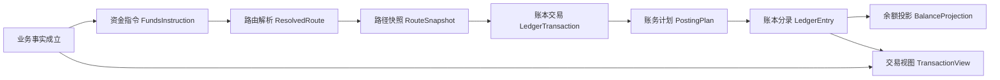

# 支付资金底座 DSL 规范设计

## 0. 这份文档是什么

这份文档写给人看，目标是让产品、研发、测试、账务、运营和风控能用同一套语言理解资金事实。

它不是 PRD。PRD 说明业务为什么需要、使用者如何操作、运营如何验收；本文件说明这些业务事实进入资金底座后，如何被稳定表达为指令、路由、账务计划、账本分录和投影。

它也不是实现方案。它属于**系分设计里的领域 DSL 契约规范**：向上承接产品语义，向下统一接口、枚举、路由、账务、投影和契约验收的共同语言。

最重要的结论：

- 设计目标、背景、流程和评审说明用中文叙述、表格和流程图表达。
- 真正的 DSL 契约对象和场景夹具使用 JSON 表达。
- 文档里的 JSON 是“契约样例”，不是 Controller 报文，也不是数据库结构。
- `SourceFact` 只是来源事实边界，属于补充概念，不是读这份 DSL 的起点。

## 1. 为什么需要 DSL

支付资金底座要解决的核心问题，不是“页面点了什么按钮”，而是“每一笔资金事实能否被稳定解释和验证”。

一次付款、退款、冻结、授权、结算、拒付或调账发生后，系统必须回答这些问题：

| 问题 | DSL 要给出的答案 |
| --- | --- |
| 这笔事实从哪里来？ | 有业务场景、业务流水、引用对象和操作者。 |
| 影响谁的余额、额度或预算？ | 有明确的可入账主体：资金账户、信用账户、预算组。 |
| 金额和币种是什么？ | 有账务主金额、原始金额和汇率快照。 |
| 当时走了哪条路径？ | 有 `ResolvedRoute` 和不可变的 `RouteSnapshot`。 |
| 账本如何入账？ | 有平衡的 `PostingPlan` 和不可变 `LedgerEntry`。 |
| 后续退款、撤销、结算、拒付如何处理？ | 基于原 route snapshot 回放，不重新选路。 |
| 余额和交易视图怎么修复？ | 从事实派生，投影不反写账本。 |

因此，DSL 的目标不是把所有支付业务都塞进一个大模型，而是为资金事实提供一条稳定链路：

```text
业务事实
  -> FundsInstruction
  -> ResolvedRoute
  -> RouteSnapshot
  -> LedgerTransaction
  -> PostingPlan
  -> LedgerEntry
  -> BalanceProjection / TransactionView
```

## 2. 它如何满足产品和业务

| 产品或业务诉求 | DSL 的支撑方式 | 验收重点 |
| --- | --- | --- |
| 用户充值后余额增加 | 充值事实转成直接交易指令，路由到目标资金账户 `AVAILABLE`。 | 余额增加、外部入金路径可解释、重复通知幂等。 |
| 付款、转账、退款可追踪 | 每笔资金动作串联 `instruction -> route -> posting -> entry`。 | 每一步都能追到业务流水、route leg 和账本分录。 |
| 手续费可收取、可退回 | 本金和费用拆成独立 leg；退费使用独立 `FEE_REFUND`。 | 普通退款不默认退费，退费不超过原手续费。 |
| 授权交易可撤销、结算、退款、拒付 | 授权占用进入 `AUTHORIZATION`，后续基于原快照 replay。 | 授权拒绝无账务，结算不超过剩余授权，退款和拒付不超已结算。 |
| 冻结只限制可用余额 | 冻结只做同主体 `AVAILABLE -> FROZEN`。 | 不创建资金交易，不表达消费、扣划或跨主体转移。 |
| 信用和预算可调额 | 只有 `LIMIT_ADJUST` 可以触碰 `LIMIT`。 | 普通授权结算不落到 `LIMIT`，不新增 `CONSUMED`。 |
| 错币种交易可记录事实 | 业务层决定是否换汇，交易层记录金额事实。 | 不在交易转换器里隐式调用 `FxService`；余额控制不承接 FX。 |
| 清结算和对账差错可入账 | 清算确认、结算锁定、出款结果、差错核销形成新的资金事实。 | 产品流程不污染 route leg；只有确认后的资金结果进入账本。 |
| 大数据量后余额可重建 | 余额投影只从 `LedgerEntry`、检查点、水位和归档清单派生。 | 不从交易视图或报表反推余额。 |

## 3. 总体流程



这条链路有三个关键分工：

| 层次 | 解决的问题 | 不做的事 |
| --- | --- | --- |
| 指令层 | 把业务资金事实翻译成账本可理解的输入。 | 不直接指定借贷方向和分录。 |
| 路由层 | 决定本次资金、额度或预算如何从哪个主体的哪个账目到哪个主体的哪个账目。 | 不写账、不表达页面或审批状态。 |
| 账务层 | 把路由翻译成平衡分录，并成为余额事实源。 | 不重新做业务决策，不反向修改交易生命周期。 |

## 4. JSON 在本文中的使用边界

用户要求“DSL 使用 JSON 格式”，这里的含义是：**DSL 契约对象和场景夹具使用 JSON 表达**。

以下内容不使用 JSON：

- 设计目标。
- 设计意图。
- 总体流程说明。
- 产品诉求映射。
- 评审清单和禁止清单。

以下内容必须使用 JSON：

- `FundsInstruction` 样例。
- `ResolvedRoute` / `RouteSnapshot` 样例。
- `PostingPlan` / `LedgerEntry` 样例。
- 场景契约夹具。
- TDD 输入和预期输出样例。

JSON 约定：

| 约定 | 说明 |
| --- | --- |
| 字段风格 | 使用 `lowerCamelCase`。 |
| 枚举风格 | 使用 `UPPER_SNAKE_CASE`。 |
| 金额 | 使用 `{ "currency": "USD", "minorValue": 10000 }`，`minorValue` 表示最小货币单位。 |
| 时间 | 使用 ISO-8601 字符串；业务发生时间必须可追溯，时区和精度由系统契约统一。 |
| 扩展字段 | 使用 `contextVariables`，但不能把必填主语义藏进去。 |
| 摘要字段 | 不包含数据库 ID、自增流水、创建时间、修改时间、展示文案和处理状态。 |

## 5. 核心 DSL 对象

### 5.1 FundsInstruction

`FundsInstruction` 是账本可理解的资金事实请求。它不是业务订单，也不是账本分录。

它回答：“这一次要处理的资金事实是什么？”

```json
{
  "instruction": {
    "tenantId": 1,
    "instructionType": "DIRECT_TRANSACTION",
    "eventType": "PAY",
    "transactionType": "PAY",
    "businessScene": "MERCHANT_ORDER_PAY",
    "businessSn": "PAY_202605140001",
    "amount": {
      "currency": "USD",
      "minorValue": 10000
    },
    "originalAmount": {
      "currency": "USD",
      "minorValue": 10000
    },
    "exchangeRate": "1",
    "eventTime": "2026-05-14T10:01:00",
    "operator": {
      "actorType": "USER",
      "actorId": "user_10001"
    },
    "reference": null,
    "contextVariables": {
      "accountId": "fa_user_10001_usd",
      "payeeId": "fa_merchant_20001_usd"
    }
  }
}
```

关键字段说明：

| 字段 | 说明 |
| --- | --- |
| `instructionType` | 指令大类：直接交易、授权交易、余额控制。 |
| `eventType` | 稳定资金事件，例如 `PAY`、`REFUND`、`AUTHORIZE`、`FREEZE`。 |
| `transactionType` | 资金交易类型，用于表达本次资金事实在交易生命周期中的业务类型。 |
| `amount` | 账务主链路金额，即入账金额。 |
| `originalAmount` | 业务原始金额；无错币种时等于 `amount`。 |
| `exchangeRate` | `originalAmount -> amount` 的汇率快照，无换汇时为 `1`。 |
| `reference` | 后续事件引用原事实或原快照，退款、撤销、结算、拒付、解冻等必须有。 |

### 5.2 ResolvedRoute 和 RouteSnapshot

`ResolvedRoute` 是运行态资金路径，回答：“这笔事实应该影响哪些主体和账目？”

`RouteSnapshot` 是冻结后的路径事实，回答：“后续 replay 应该按当时哪条路径处理？”

```json
{
  "expectedRoute": {
    "routeCode": "DIRECT_PAY_STANDARD",
    "participants": [
      {
        "participantRole": "PAYER",
        "subjectRef": {
          "subjectType": "FUNDING_ACCOUNT",
          "subjectId": "fa_user_10001_usd",
          "currency": "USD",
          "ledgerProfileCode": "FUNDING_BASIC"
        }
      },
      {
        "participantRole": "PAYEE",
        "subjectRef": {
          "subjectType": "FUNDING_ACCOUNT",
          "subjectId": "fa_merchant_20001_usd",
          "currency": "USD",
          "ledgerProfileCode": "FUNDING_MERCHANT"
        }
      }
    ],
    "legs": [
      {
        "legId": "PAY",
        "legType": "INTERNAL_TRANSFER",
        "sourceNode": {
          "nodeRole": "SOURCE",
          "subjectType": "FUNDING_ACCOUNT",
          "subjectId": "fa_user_10001_usd",
          "ledgerSubjectCode": "AVAILABLE"
        },
        "targetNode": {
          "nodeRole": "TARGET",
          "subjectType": "FUNDING_ACCOUNT",
          "subjectId": "fa_merchant_20001_usd",
          "ledgerSubjectCode": "CLEARING"
        },
        "amount": {
          "currency": "USD",
          "minorValue": 10000
        },
        "balanceEffectType": "CONSUME",
        "phaseCode": "SETTLEMENT",
        "replayPolicy": "PARTIAL_ALLOWED"
      }
    ]
  }
}
```

路由红线：

- `RouteLeg` 不是会计分录。
- 外部账户、支付工具、平台角色不能直接入账。
- 路径快照必须固化本次参与方、平台账户、外部引用和规则结果。
- 退款、撤销、授权结算、拒付、退费、解冻必须优先基于原快照。
- 缺原快照不得重新选路兜底。

### 5.3 LedgerTransaction、PostingPlan 和 LedgerEntry

账务层回答：“这笔路径如何变成平衡分录？”

```json
{
  "expectedPosting": {
    "ledgerTransactionKey": "1:MERCHANT_ORDER_PAY:PAY_202605140001:PAY",
    "postingPlans": [
      {
        "planKey": "PAY_LEDGER_TXN_0001_PAY",
        "routeLegId": "PAY",
        "intent": "TRANSFER",
        "postingScope": "BETWEEN_SUBJECTS",
        "balanceEffectType": "CONSUME",
        "phaseCode": "SETTLEMENT",
        "entries": [
          {
            "subjectId": "fa_user_10001_usd",
            "subjectType": "FUNDING_ACCOUNT",
            "ledgerSubjectCode": "AVAILABLE",
            "entrySide": "DEBIT",
            "amount": {
              "currency": "USD",
              "minorValue": 10000
            }
          },
          {
            "subjectId": "fa_merchant_20001_usd",
            "subjectType": "FUNDING_ACCOUNT",
            "ledgerSubjectCode": "CLEARING",
            "entrySide": "CREDIT",
            "amount": {
              "currency": "USD",
              "minorValue": 10000
            }
          }
        ]
      }
    ]
  }
}
```

账务红线：

- 每个 `PostingPlan` 必须独立平衡。
- 整笔 `LedgerTransaction` 必须平衡。
- `LedgerEntry.amount` 必须为正，方向由 `entrySide` 表达。
- `LedgerEntry` 写入后不可修改，错账只能追加冲正、补记或调账。
- 入账主体只能是资金账户、信用账户、预算组。

### 5.4 BalanceProjection 和 TransactionView

投影层回答：“余额和交易展示怎么从事实派生？”

| 投影 | 来源 | 禁止 |
| --- | --- | --- |
| 余额投影 | `LedgerEntry`、检查点、水位、归档清单。 | 从交易视图或报表反推余额。 |
| 交易视图 | 资金交易、冻结单、账本引用、清结算和对账结果。 | 重新入账、生成 route、生成 entry。 |

```json
{
  "transactionViewReplayRequest": {
    "tenantId": 1,
    "viewDomain": "USER_TRANSACTION_VIEW",
    "subjectFilter": {
      "subjectType": "FUNDING_ACCOUNT",
      "subjectIds": [
        "fa_user_10001_usd"
      ]
    },
    "timeWindow": {
      "fromInclusive": "2026-05-01T00:00:00",
      "toExclusive": "2026-05-14T00:00:00"
    },
    "writeTarget": "READ_MODEL_ONLY"
  },
  "expectedRoute": null,
  "expectedPosting": null
}
```

### 5.5 SettlementPolicy

`SettlementPolicy` 只表达结算资格和周期规则，不表达 route leg，也不表达外部清算网络状态。

| 表达式 | 含义 |
| --- | --- |
| `RT` | 实时可结算。 |
| `T+N` | 交易后 N 天可结算。 |
| `H+N` | 每 N 小时结算一次。 |
| `W+N@D` | 每 N 周的周 D 结算。 |
| `M+N@D` | 每 N 月第 D 天结算。 |
| `M+N@L` | 每 N 月最后一天结算。 |
| `Q+N` | 每 N 季度结算。 |
| `Y+N@MM-DD` | 每 N 年指定月日结算。 |
| `C@DD-DD` | 自定义账期。 |

规则不能把 `RT` 固化为唯一策略；不支持的表达式必须显式失败。

## 6. 基础语义

### 6.1 可入账主体

只有三类对象可以成为账本分录主体：

| 主体 | 说明 | 典型账目 |
| --- | --- | --- |
| `FUNDING_ACCOUNT` | 承载真实资金或平台内部资金责任。 | `AVAILABLE`、`FROZEN`、`CLEARING`、`SETTLEMENT`、`FEE`。 |
| `CREDIT_ACCOUNT` | 承载授信额度、可用额度和授权占用。 | `LIMIT`、`AVAILABLE`、`AUTHORIZATION`。 |
| `BUDGET_GROUP` | 承载预算总量、可用预算和预算授权占用。 | `LIMIT`、`AVAILABLE`、`AUTHORIZATION`。 |

这些对象不能直接入账：

- 用户、商户、企业、租户。
- VCC、共享卡、VA、银行卡等支付工具。
- 外部银行账户、PSP 账户、通道账户。
- 平台账户角色。

它们只能作为业务归属、工具引用、外部端点或平台账户快照，最终必须解析为具体可入账主体。

### 6.2 账目和余额桶

| 账目 | 语义 |
| --- | --- |
| `CASH` | 平台现金或外部资金池内部映射。 |
| `PREPAYMENT` | 平台对用户、商户或业务方的预收待付责任。 |
| `AVAILABLE` | 可用余额、可用额度或可用预算。 |
| `FROZEN` | 同一主体暂不可用余额。 |
| `AUTHORIZATION` | 授权占用中的资金、额度或预算。 |
| `CLEARING` | 商户订单款已形成但尚未清算可结算的余额。 |
| `SETTLEMENT` | 已进入结算或出款处理的锁定金额。 |
| `LIMIT` | 信用额度或预算总量。 |
| `FEE` | 手续费、服务费或成本归集。 |
| `ADJUSTMENT` | 差错、补记、追偿或人工调账中间口径。 |
| `SUSPENSE` | 挂账余额。 |
| `RISK_RESERVE` | 风险准备金。 |

几个关键边界：

- `AVAILABLE` 在资金账户、信用账户和预算组上语义不同，允许受控为负时必须有来源、规则、上限、账龄、风险状态和治理路径。
- `LIMIT` 只表达额度或预算总量，只有 `LIMIT_ADJUST` 可以触碰。
- 普通授权结算不能落到 `LIMIT`。
- 信用和预算不新增 `CONSUMED` 账目，已消费金额由交易生命周期和报表口径计算。
- 商户订单款默认先进 `CLEARING`，清算确认后再进入 `AVAILABLE`。

### 6.3 金额和 FX

金额字段必须区分三个事实：

| 字段 | 含义 |
| --- | --- |
| `amount` | 账务主链路金额，即目标账户或账本币种下要入账的金额。 |
| `originalAmount` | 业务原始金额。 |
| `exchangeRate` | `originalAmount -> amount` 的汇率快照。 |

FX 边界：

- 是否换汇是业务层或外汇域决策。
- 交易层只记录已经决策好的金额事实。
- `FundsAuthorizationInstructionConverter` 不应隐式调用 `FxService`。
- `FundsBalanceControlService` 不承接 FX，金额必须是目标账户或账本币种。

### 6.4 来源事实

`SourceFact` 是补充概念，表示产品层已经确认可以影响资金、余额控制或账务解释的事实。

它不应该成为文档开头的核心模型，因为业务和研发首先需要理解的是 `FundsInstruction -> Route -> Posting -> Entry` 主链路。来源事实只用于回答“这笔 DSL 输入从哪个业务结果来”。

常见来源事实：

| 来源事实 | 是否直接成为 DSL 主对象 | 说明 |
| --- | --- | --- |
| 资金交易 | 是，转为 `FundsInstruction`。 | 付款、转账、充值、提现、退款、手续费等。 |
| 冻结单 | 是，转为余额控制指令。 | 冻结和解冻不创建资金交易。 |
| 授权结果 | 条件进入。 | 授权批准入账；授权拒绝不入账。 |
| 清算确认 | 是，转为清算结果资金事实。 | 清算批次本身不是 DSL 主对象。 |
| 结算锁定和出款结果 | 是，转为资金事实。 | 结算单、出款单流程状态不是 DSL 主对象。 |
| 对账差错核销 | 是，转为调账事实。 | 对账批次和差错处理流程不是 route leg。 |
| 争议拒付 | 是，转为 `CHARGEBACK`。 | 授权拒绝不能混成拒付。 |

## 7. 不变量

| 编号 | 不变量 |
| --- | --- |
| INV-001 | 金额必须为正，方向由 route、entrySide、normal balance 和 balanceEffectType 决定。 |
| INV-002 | 指令不能直接写分录，业务方不能传 `DEBIT`、`CREDIT` 或 `LedgerEntry`。 |
| INV-003 | Route 不等于 Ledger，RouteLeg 描述路径，LedgerEntry 描述借贷事实。 |
| INV-004 | 每个 PostingPlan 独立平衡，整笔 LedgerTransaction 平衡。 |
| INV-005 | 外部账户、支付工具、用户、商户经营主体不得直接入账。 |
| INV-006 | 缺账本必须失败，不自动建账。 |
| INV-007 | 需要 replay 的后续事件缺原 RouteSnapshot 必须失败。 |
| INV-008 | 冻结和解冻使用 FrozenOrder 来源事实，不创建 FundsTransaction。 |
| INV-009 | 授权拒绝不生成 route、posting、entry，不累计 `chargebackAmount`。 |
| INV-010 | 普通授权结算不触碰 `LIMIT`，只有 `LIMIT_ADJUST` 可以触碰 `LIMIT`。 |
| INV-011 | 信用账户和预算组不新增 `CONSUMED`。 |
| INV-012 | 投影不反写事实。 |
| INV-013 | 交易层不隐式换汇，余额控制不承接 FX。 |

## 8. 场景覆盖

| 场景 | DSL 能力 | 必须断言 |
| --- | --- | --- |
| 充值 -> 付款 -> 退款 | 直接交易、逆向交易 | 充值增加可用，付款减少可用，退款基于原快照且不超额。 |
| 充值 -> 冻结 -> 提现 | 直接交易、余额控制 | 冻结只做 `AVAILABLE -> FROZEN`，提现成功消耗明确锁定金额。 |
| A 充值 -> 转给 B -> B 付款 -> 提现 | 直接交易、余额控制 | 每一步都断言 A、B、商户和平台账户余额变化。 |
| 手续费组合 | 直接交易、逆向交易 | 本金和费用拆分；普通退款不默认退费；退费只回放费用 leg。 |
| 一次冻结多次解冻 | 余额控制 | 解冻必须引用冻结单，累计解冻不超过剩余冻结金额。 |
| 资金账户、信用账户、预算组调额 | 余额控制 | 信用和预算通过 `LIMIT_ADJUST`，资金余额调账必须有差错、凭证和审批。 |
| 授权问询 -> 部分撤销 -> 部分结算 -> 部分退款 | 授权交易 | 后续动作都引用原授权快照，金额不超过剩余可操作金额。 |
| 授权交易拒付 | 授权交易 | 拒付和授权拒绝分离，退款和拒付总额不超过已结算。 |
| 授权交易直接结算 | 授权交易 | 授权占用和结算可在同一业务链路完成，但账务仍可追溯。 |
| 资金账户、共享卡、预算组组合授权 | 授权交易 | 多主体整体成功或整体失败，支付工具只作为 `instrumentRef`。 |
| 清算、结算、对账差错 | 直接交易、余额控制 | 批次和流程不进入 route leg，确认后的资金结果才入账。 |
| 余额投影和交易投影重放 | 查询与重放 | 余额重建不读交易视图；交易视图重放不写账。 |

## 9. 典型 JSON 场景

### 9.1 钱包付款并收取手续费

```json
{
  "caseId": "DSL-DIRECT-WALLET-PAYMENT-WITH-FEE-001",
  "serviceAbility": "DIRECT_TRANSACTION",
  "scenarioCode": "WALLET_PAYMENT_WITH_FEE",
  "description": "钱包付款并收取平台手续费",
  "instruction": {
    "tenantId": 1,
    "instructionType": "DIRECT_TRANSACTION",
    "eventType": "PAY",
    "transactionType": "PAY",
    "businessScene": "MERCHANT_ORDER_PAY",
    "businessSn": "PAY_202605140001",
    "amount": {
      "currency": "USD",
      "minorValue": 10000
    },
    "originalAmount": {
      "currency": "USD",
      "minorValue": 10000
    },
    "exchangeRate": "1",
    "eventTime": "2026-05-14T10:01:00",
    "operator": {
      "actorType": "USER",
      "actorId": "user_10001"
    },
    "contextVariables": {
      "accountId": "fa_user_10001_usd",
      "payeeId": "fa_merchant_20001_usd",
      "payeeLedgerSubjectCode": "CLEARING",
      "feeRuleCode": "MERCHANT_STANDARD_001",
      "feeRuleSnapshot": "MERCHANT_STANDARD_001@CONFIRMED"
    }
  },
  "expectedRoute": {
    "routeCode": "DIRECT_PAY_STANDARD",
    "platformAccounts": {
      "feeFundingAccount": {
        "subjectType": "FUNDING_ACCOUNT",
        "subjectId": "fa_platform_fee_usd",
        "currency": "USD",
        "ledgerProfileCode": "FUNDING_PLATFORM"
      }
    },
    "legs": [
      {
        "legId": "PAY",
        "legType": "INTERNAL_TRANSFER",
        "sourceNode": {
          "nodeRole": "SOURCE",
          "subjectType": "FUNDING_ACCOUNT",
          "subjectId": "fa_user_10001_usd",
          "ledgerSubjectCode": "AVAILABLE"
        },
        "targetNode": {
          "nodeRole": "TARGET",
          "subjectType": "FUNDING_ACCOUNT",
          "subjectId": "fa_merchant_20001_usd",
          "ledgerSubjectCode": "CLEARING"
        },
        "amount": {
          "currency": "USD",
          "minorValue": 10000
        },
        "balanceEffectType": "CONSUME",
        "phaseCode": "SETTLEMENT",
        "replayPolicy": "PARTIAL_ALLOWED"
      },
      {
        "legId": "FEE",
        "legType": "INTERNAL_TRANSFER",
        "sourceNode": {
          "nodeRole": "SOURCE",
          "subjectType": "FUNDING_ACCOUNT",
          "subjectId": "fa_user_10001_usd",
          "ledgerSubjectCode": "AVAILABLE"
        },
        "targetNode": {
          "nodeRole": "TARGET",
          "subjectType": "FUNDING_ACCOUNT",
          "subjectId": "fa_platform_fee_usd",
          "ledgerSubjectCode": "FEE"
        },
        "amount": {
          "currency": "USD",
          "minorValue": 150
        },
        "balanceEffectType": "CONSUME",
        "phaseCode": "FEE",
        "replayPolicy": "PARTIAL_ALLOWED"
      }
    ]
  },
  "expectedPosting": {
    "postingPlans": [
      {
        "routeLegId": "PAY",
        "intent": "TRANSFER",
        "postingScope": "BETWEEN_SUBJECTS",
        "entries": [
          {
            "subjectId": "fa_user_10001_usd",
            "subjectType": "FUNDING_ACCOUNT",
            "ledgerSubjectCode": "AVAILABLE",
            "entrySide": "DEBIT",
            "amount": {
              "currency": "USD",
              "minorValue": 10000
            }
          },
          {
            "subjectId": "fa_merchant_20001_usd",
            "subjectType": "FUNDING_ACCOUNT",
            "ledgerSubjectCode": "CLEARING",
            "entrySide": "CREDIT",
            "amount": {
              "currency": "USD",
              "minorValue": 10000
            }
          }
        ]
      },
      {
        "routeLegId": "FEE",
        "intent": "FEE",
        "postingScope": "FEE",
        "entries": [
          {
            "subjectId": "fa_user_10001_usd",
            "subjectType": "FUNDING_ACCOUNT",
            "ledgerSubjectCode": "AVAILABLE",
            "entrySide": "DEBIT",
            "amount": {
              "currency": "USD",
              "minorValue": 150
            }
          },
          {
            "subjectId": "fa_platform_fee_usd",
            "subjectType": "FUNDING_ACCOUNT",
            "ledgerSubjectCode": "FEE",
            "entrySide": "CREDIT",
            "amount": {
              "currency": "USD",
              "minorValue": 150
            }
          }
        ]
      }
    ]
  },
  "validation": {
    "mustPass": [
      "本金和费用使用独立 route leg",
      "费用账户来自平台账户角色快照",
      "费用规则快照进入 contextVariables",
      "每个 posting plan 独立平衡"
    ],
    "mustFail": [
      "费用和本金混入同一金额口径",
      "缺 feeRuleSnapshot",
      "平台费用账户未初始化",
      "业务侧直接提交 LedgerEntry"
    ]
  }
}
```

### 9.2 退款和手续费退回

```json
{
  "caseId": "DSL-REVERSE-REFUND-AND-FEE-001",
  "serviceAbility": "REVERSE_TRANSACTION",
  "scenarioCode": "DIRECT_REFUND_WITH_OPTIONAL_FEE_REFUND",
  "description": "普通退款不默认退手续费，需要退费时发起独立 FEE_REFUND",
  "refundInstruction": {
    "instructionType": "DIRECT_TRANSACTION",
    "eventType": "REFUND",
    "transactionType": "REFUND",
    "businessScene": "DIRECT_REFUND",
    "businessSn": "RF_202605140001",
    "amount": {
      "currency": "USD",
      "minorValue": 5000
    },
    "reference": {
      "referenceType": "ORIGINAL_TRANSACTION",
      "referenceObjectSn": "FT_PAY_202605130001",
      "referenceSnapshotId": "RS_PAY_202605130001"
    }
  },
  "feeRefundInstruction": {
    "instructionType": "DIRECT_TRANSACTION",
    "eventType": "FEE_REFUND",
    "transactionType": "FEE",
    "businessScene": "FEE_REFUND",
    "businessSn": "FEE_RF_202605140001",
    "amount": {
      "currency": "USD",
      "minorValue": 150
    },
    "reference": {
      "referenceType": "FEE",
      "referenceObjectSn": "FT_FEE_202605130001",
      "referenceSnapshotId": "RS_FEE_202605130001"
    }
  },
  "expectedRoute": {
    "refundRouteCode": "DIRECT_REFUND_REPLAY",
    "feeRefundRouteCode": "FEE_REFUND_REPLAY",
    "rules": [
      "退款只回放原本金 leg",
      "退费只回放原费用 leg",
      "两者可以在业务层组合，但 DSL 中是两个可审计资金事实"
    ]
  },
  "validation": {
    "mustPass": [
      "退款和退费都引用原 snapshot",
      "累计退款不超过原交易可退金额",
      "累计退费不超过原费用剩余可退金额"
    ],
    "mustFail": [
      "普通退款默认退手续费",
      "缺 referenceSnapshotId",
      "退费金额超过原手续费"
    ]
  }
}
```

### 9.3 授权批准、部分结算和授权拒绝

```json
{
  "caseId": "DSL-AUTH-LIFECYCLE-001",
  "serviceAbility": "AUTHORIZATION_TRANSACTION",
  "scenarioCode": "AUTH_APPROVE_PARTIAL_SETTLE_DECLINE",
  "authorizeInstruction": {
    "instructionType": "AUTHORIZATION_TRANSACTION",
    "eventType": "AUTHORIZE",
    "transactionType": "PAY",
    "businessScene": "CARD_AUTHORIZATION",
    "businessSn": "AUTH_202605140001",
    "amount": {
      "currency": "USD",
      "minorValue": 12000
    }
  },
  "authorizeRoute": {
    "routeCode": "AUTHORIZATION_STANDARD",
    "legs": [
      {
        "legId": "AUTH_FUNDING",
        "legType": "HOLD",
        "sourceNode": {
          "subjectType": "FUNDING_ACCOUNT",
          "subjectId": "fa_user_10001_usd",
          "ledgerSubjectCode": "AVAILABLE"
        },
        "targetNode": {
          "subjectType": "FUNDING_ACCOUNT",
          "subjectId": "fa_user_10001_usd",
          "ledgerSubjectCode": "AUTHORIZATION"
        },
        "amount": {
          "currency": "USD",
          "minorValue": 4000
        }
      },
      {
        "legId": "AUTH_CREDIT",
        "legType": "HOLD",
        "sourceNode": {
          "subjectType": "CREDIT_ACCOUNT",
          "subjectId": "ca_company_30001_usd",
          "ledgerSubjectCode": "AVAILABLE"
        },
        "targetNode": {
          "subjectType": "CREDIT_ACCOUNT",
          "subjectId": "ca_company_30001_usd",
          "ledgerSubjectCode": "AUTHORIZATION"
        },
        "amount": {
          "currency": "USD",
          "minorValue": 5000
        }
      },
      {
        "legId": "AUTH_BUDGET",
        "legType": "HOLD",
        "sourceNode": {
          "subjectType": "BUDGET_GROUP",
          "subjectId": "bg_team_40001_usd",
          "ledgerSubjectCode": "AVAILABLE"
        },
        "targetNode": {
          "subjectType": "BUDGET_GROUP",
          "subjectId": "bg_team_40001_usd",
          "ledgerSubjectCode": "AUTHORIZATION"
        },
        "amount": {
          "currency": "USD",
          "minorValue": 3000
        }
      }
    ]
  },
  "settleInstruction": {
    "instructionType": "AUTHORIZATION_TRANSACTION",
    "eventType": "SETTLE",
    "transactionType": "PAY",
    "businessScene": "CARD_AUTHORIZATION_SETTLEMENT",
    "businessSn": "AUTH_SETTLE_202605140001",
    "amount": {
      "currency": "USD",
      "minorValue": 10000
    },
    "reference": {
      "referenceType": "AUTHORIZATION",
      "referenceObjectSn": "AUTH_202605140001",
      "referenceSnapshotId": "RS_AUTH_202605140001"
    }
  },
  "declineCase": {
    "instruction": null,
    "expectedRoute": null,
    "expectedPosting": null,
    "declineFact": {
      "declineReasonCode": "INSUFFICIENT_FUNDS",
      "businessSn": "AUTH_DECLINE_202605140001"
    }
  },
  "validation": {
    "mustPass": [
      "多主体授权整体成功或整体失败",
      "授权结算基于原 snapshot",
      "结算金额不超过剩余授权",
      "差额释放回原主体 AVAILABLE",
      "授权拒绝无 route、无 posting、无 entry"
    ],
    "mustFail": [
      "只部分写入授权分录",
      "授权结算写成 AUTHORIZATION -> LIMIT",
      "把授权拒绝映射为 CHARGEBACK",
      "信用或预算新增 CONSUMED"
    ]
  }
}
```

### 9.4 冻结、多次解冻和提现

```json
{
  "caseId": "DSL-CONTROL-FREEZE-UNFREEZE-WITHDRAW-001",
  "serviceAbility": "BALANCE_CONTROL_AND_DIRECT_TRANSACTION",
  "scenarioCode": "FREEZE_MULTI_UNFREEZE_WITHDRAW",
  "freezeInstruction": {
    "instructionType": "BALANCE_CONTROL",
    "eventType": "FREEZE",
    "transactionType": "ADJUSTMENT",
    "businessScene": "RISK_FREEZE",
    "businessSn": "FRZ_202605140001",
    "amount": {
      "currency": "USD",
      "minorValue": 3000
    },
    "reference": {
      "referenceType": "FREEZE_ORDER",
      "referenceSn": "FO_202605140001"
    }
  },
  "freezeRoute": {
    "routeCode": "BALANCE_FREEZE_STANDARD",
    "legs": [
      {
        "legId": "FREEZE",
        "legType": "HOLD",
        "sourceNode": {
          "subjectType": "FUNDING_ACCOUNT",
          "subjectId": "fa_user_10001_usd",
          "ledgerSubjectCode": "AVAILABLE"
        },
        "targetNode": {
          "subjectType": "FUNDING_ACCOUNT",
          "subjectId": "fa_user_10001_usd",
          "ledgerSubjectCode": "FROZEN"
        },
        "amount": {
          "currency": "USD",
          "minorValue": 3000
        }
      }
    ]
  },
  "unfreezeInstructions": [
    {
      "eventType": "UNFREEZE",
      "amount": {
        "currency": "USD",
        "minorValue": 1000
      },
      "reference": {
        "referenceType": "FREEZE_ORDER",
        "referenceSn": "FO_202605140001"
      }
    },
    {
      "eventType": "UNFREEZE",
      "amount": {
        "currency": "USD",
        "minorValue": 500
      },
      "reference": {
        "referenceType": "FREEZE_ORDER",
        "referenceSn": "FO_202605140001"
      }
    }
  ],
  "withdrawInstruction": {
    "instructionType": "DIRECT_TRANSACTION",
    "eventType": "WITHDRAW",
    "transactionType": "WITHDRAW",
    "businessScene": "USER_WITHDRAW",
    "businessSn": "WD_202605140001",
    "amount": {
      "currency": "USD",
      "minorValue": 1500
    },
    "contextVariables": {
      "consumeFrozenOrderSn": "FO_202605140001"
    }
  },
  "validation": {
    "mustPass": [
      "冻结不创建 FundsTransaction",
      "多次解冻累计不超过冻结剩余金额",
      "提现成功消耗明确来源的 FROZEN 或结算锁定金额"
    ],
    "mustFail": [
      "解冻金额超过剩余冻结金额",
      "冻结跨主体转移",
      "余额控制自动换汇"
    ]
  }
}
```

### 9.5 信用账户和预算组调额

```json
{
  "caseId": "DSL-CONTROL-LIMIT-ADJUST-001",
  "serviceAbility": "BALANCE_CONTROL",
  "scenarioCode": "CREDIT_AND_BUDGET_LIMIT_ADJUST",
  "instruction": {
    "instructionType": "BALANCE_CONTROL",
    "eventType": "LIMIT_ADJUST",
    "transactionType": "ADJUSTMENT",
    "businessScene": "BUDGET_LIMIT_ADJUST",
    "businessSn": "BUDGET_ADJ_202605140001",
    "amount": {
      "currency": "USD",
      "minorValue": 50000
    },
    "originalAmount": {
      "currency": "USD",
      "minorValue": 50000
    },
    "exchangeRate": "1",
    "contextVariables": {
      "adjustDirection": "DECREASE",
      "approvalRef": "APR_BUDGET_202605140001",
      "negativeAvailablePolicy": "BUDGET_CONTROLLED_NEGATIVE"
    }
  },
  "expectedRoute": {
    "routeCode": "LIMIT_ADJUST_STANDARD",
    "legs": [
      {
        "legId": "LIMIT_ADJUST",
        "legType": "ADJUST",
        "sourceNode": {
          "subjectType": "BUDGET_GROUP",
          "subjectId": "bg_team_40001_usd",
          "ledgerSubjectCode": "LIMIT"
        },
        "targetNode": {
          "subjectType": "BUDGET_GROUP",
          "subjectId": "bg_team_40001_usd",
          "ledgerSubjectCode": "AVAILABLE"
        },
        "amount": {
          "currency": "USD",
          "minorValue": 50000
        },
        "constraintOverrides": {
          "balanceConstraintType": "ALLOW_NEGATIVE",
          "negativePolicyCode": "BUDGET_CONTROLLED_NEGATIVE"
        }
      }
    ]
  },
  "validation": {
    "mustPass": [
      "LIMIT 只由 LIMIT_ADJUST 触碰",
      "预算调减可以让 AVAILABLE 受控为负",
      "后续新授权必须重新经过预算策略"
    ],
    "mustFail": [
      "普通授权结算落到 LIMIT",
      "预算调整表达为资金入金",
      "无审批调减预算",
      "余额控制请求携带错币种 FX 决策"
    ]
  }
}
```

### 9.6 清结算和对账差错入账结果

```json
{
  "caseId": "DSL-CLEARING-SETTLEMENT-RECONCILIATION-001",
  "serviceAbility": "DIRECT_TRANSACTION_AND_BALANCE_CONTROL",
  "scenarioCode": "CLEARING_SETTLEMENT_RECONCILIATION_RESULT",
  "clearingInstruction": {
    "instructionType": "DIRECT_TRANSACTION",
    "eventType": "SETTLE",
    "transactionType": "ADJUSTMENT",
    "businessScene": "MERCHANT_CLEARING_COMPLETE",
    "businessSn": "CLR_202605140001",
    "reference": {
      "referenceType": "CLEARING_BATCH",
      "referenceSn": "CB_202605140001"
    }
  },
  "settlementLockRoute": {
    "routeCode": "MERCHANT_SETTLEMENT_LOCK",
    "legs": [
      {
        "legType": "HOLD",
        "sourceNode": {
          "subjectType": "FUNDING_ACCOUNT",
          "subjectId": "fa_merchant_20001_usd",
          "ledgerSubjectCode": "AVAILABLE"
        },
        "targetNode": {
          "subjectType": "FUNDING_ACCOUNT",
          "subjectId": "fa_merchant_20001_usd",
          "ledgerSubjectCode": "SETTLEMENT"
        }
      }
    ]
  },
  "reconciliationAdjustmentInstruction": {
    "instructionType": "BALANCE_CONTROL",
    "eventType": "BALANCE_ADJUST",
    "transactionType": "ADJUSTMENT",
    "businessScene": "RECONCILIATION_EXCEPTION_ADJUSTMENT",
    "businessSn": "REC_ADJ_202605140001",
    "reference": {
      "referenceType": "RECONCILIATION_EXCEPTION",
      "referenceSn": "REX_202605140001"
    }
  },
  "validation": {
    "mustPass": [
      "清算批次、结算单、对账单不作为 DSL 主对象",
      "确认后的清算、结算锁定、出款结果和差错核销可以形成资金事实",
      "对账差错调账必须有差错来源、审批、凭证和审计"
    ],
    "mustFail": [
      "把清算处理中或出款处理中作为 phaseCode",
      "用对账报表直接修改 LedgerEntry",
      "结算中资金仍可重复出款"
    ]
  }
}
```

## 10. TDD 和契约测试

DSL 设计必须能直接推导测试。每个 JSON 场景至少包含：

- `caseId`
- `serviceAbility`
- `scenarioCode`
- `instruction`
- `expectedRoute`
- `expectedPosting`
- `validation.mustPass`
- `validation.mustFail`

契约测试要求：

| 测试目标 | 必须验证 |
| --- | --- |
| JSON 可解析 | 所有 `json` 代码块能被标准 JSON parser 解析。 |
| 指令完整 | 业务标识、金额、原始金额、汇率、事件、操作者、引用对象完整。 |
| route 合法 | 主体必须可入账，平台角色必须解析成具体资金账户。 |
| posting 平衡 | 每个 `PostingPlan` 独立平衡，整笔交易平衡。 |
| replay 边界 | 缺原快照失败，不读取当前绑定关系重新选路。 |
| 授权拒绝 | 不生成 route、posting、entry。 |
| 冻结 | 不创建 FundsTransaction，只控制同主体余额桶。 |
| LIMIT 红线 | 普通授权结算不触碰 `LIMIT`。 |
| FX 边界 | 交易层记录金额事实，余额控制不做 FX。 |
| 投影边界 | 余额重建不读交易视图，交易视图重放不写账。 |

## 11. 禁止清单

| 禁止项 | 原因 |
| --- | --- |
| 把设计目标、流程说明写成 JSON DSL | 这些是给人读的文档说明，不是 DSL 对象。 |
| 业务方直接传 `LedgerEntry`、`EntrySide` 或 `PostingPlan` | 会绕过 route、profile、余额约束、摘要和审计。 |
| 支付工具、外部账户、用户或商户经营主体直接入账 | 会混淆业务主体、工具、外部端点和内部账务主体。 |
| 授权拒绝写入 `CHARGEBACK` | 授权拒绝不是争议拒付。 |
| 普通授权结算触碰 `LIMIT` | `LIMIT` 只能由 `LIMIT_ADJUST` 受控调整。 |
| 信用账户和预算组新增 `CONSUMED` | 已消费金额由交易生命周期和报表口径计算。 |
| 冻结表达跨主体资金转移 | 冻结只控制同主体可用性。 |
| 清算批次、结算审批、出款处理中、对账处理中作为 route leg 或 ledger phase | 这些是产品或运营流程，不是资金路径。 |
| 用交易视图或报表修正余额 | 余额事实源只能是账本分录及其检查点和归档清单。 |
| 缺 route snapshot 时重新选路 replay | 会导致绑定关系和平台账户变化后资金路径漂移。 |
| 交易层或余额控制层隐式调用 `FxService` | 是否换汇是业务层或外汇域决策。 |

## 12. 评审清单

| 评审视角 | 检查项 |
| --- | --- |
| 产品评审 | 场景是否能追溯到 PRD 用例；使用者能否理解资金事实、冻结、授权、清结算、对账差错和投影边界。 |
| 系分评审 | `instruction`、`route`、`snapshot`、`posting`、`entry`、`projection` 的职责边界是否清楚。 |
| 测试评审 | 是否有 JSON 契约样例；是否覆盖成功、失败、幂等、余额变化、replay 和 digest。 |
| 交付评审 | 是否能由本设计推导接口、测试、运营验收和差错处理；是否没有把技术细节写进领域契约。 |
