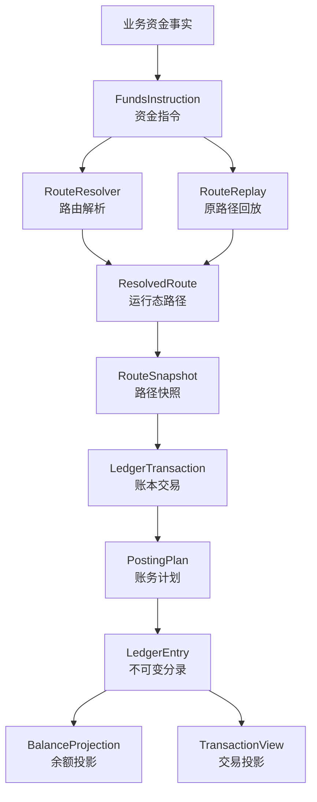

# 支付资金底座 DSL 规范设计

## 一、定位与第一性原理

支付资金底座 DSL 是一套**资金事实表达规范**。它定义一笔已经成立的业务资金事实，如何被表达为资金指令、资金路径、路径快照、账务计划、账本分录、余额投影和交易投影。

DSL 的核心问题只有一个：

> 一笔业务事实进入资金底座后，谁的什么账目，因为哪个原因，按什么路径，发生了多少金额变化，并且如何被追溯、回放和验证？

### 1.1 第一性原理

| 原理 | 含义 | 设计要求 |
| --- | --- | --- |
| 事实先于流程 | 资金底座只处理已成立的资金事实，不表达页面按钮、审批中、处理中等过程状态。 | DSL 只接收可入账事实；运营流程和外部通道流程不进入账本分录。 |
| 主体先于账户工具 | 能入账的是内部账务主体，不是用户、商户、银行卡、VCC、VA 或外部银行账户。 | 所有入账对象必须解析为 `FUNDING_ACCOUNT`、`CREDIT_ACCOUNT` 或 `BUDGET_GROUP`。 |
| 金额先于余额 | 金额是事实输入，余额是分录派生结果。 | DSL 不直接修改余额，只生成可校验的 `LedgerEntry`。 |
| 路径先于分录 | 先说明资金或控制余额如何流动，再推导借贷方向。 | 业务方不能直接提交 `LedgerEntry`、`EntrySide` 或 `PostingPlan`。 |
| 分录是余额事实源 | 余额、账单、报表和投影都从账本分录派生。 | 余额投影和交易投影不能反向修正账本事实。 |
| 快照保护回放 | 后续退款、撤销、结算、拒付、退费、解冻必须沿用原事实路径。 | 缺原路径快照时不能重新选路兜底。 |
| JSON 服务于验证 | JSON 用来表达 DSL 对象和契约用例，使场景可以被机器解析和 TDD 验收。 | 设计意图、流程说明、禁止清单不用 JSON 包装。 |

### 1.2 DSL 主链路

```text
业务资金事实
  -> FundsInstruction
  -> ResolvedRoute
  -> RouteSnapshot
  -> LedgerTransaction
  -> PostingPlan
  -> LedgerEntry
  -> BalanceProjection / TransactionView
```

这条链路表达三层含义：

| 层次 | 回答的问题 | 输出 |
| --- | --- | --- |
| 指令层 | 这笔资金事实是什么？ | `FundsInstruction` |
| 路由层 | 这笔事实影响哪些主体和账目？ | `ResolvedRoute`、`RouteSnapshot` |
| 账务层 | 这条路径如何成为平衡分录？ | `LedgerTransaction`、`PostingPlan`、`LedgerEntry` |

## 二、设计目标与非目标

### 2.1 设计目标

| 目标 | 说明 |
| --- | --- |
| 事实稳定 | 同一事实在同一输入下产生稳定的 route、posting 和 entry，不受后续绑定关系、账户配置或展示规则漂移影响。 |
| 账务平衡 | 每个 `PostingPlan` 必须独立借贷平衡，整笔 `LedgerTransaction` 必须平衡。 |
| 可解释 | 能解释资金从哪来、到哪去、为什么发生、由谁触发、引用了哪个原事实。 |
| 可回放 | 后续退款、撤销、结算、拒付、退费、解冻能基于原路径快照派生。 |
| 可测试 | 字段、枚举、边界、红线和场景可以沉淀为 JSON 契约用例和 TDD 验收。 |
| 可治理 | 大数据量下余额投影、交易投影、归档、重放和差异检查有清晰边界。 |

### 2.2 非目标

| 非目标 | 说明 |
| --- | --- |
| 不表达业务单状态 | 待支付、审核中、处理中、举证中、对账中等属于产品单据或运营流程。 |
| 不表达外部通道协议 | 通道通知、银行回单、processor response、return、NOC 等属于连接层或业务单据。 |
| 不表达展示投影 | 用户账单、商户账单、运营时间线、财务报表是只读投影。 |
| 不替代清结算对象 | 清算批次、结算单、出款单、对账单和差错单有独立产品语义。 |
| 不替代合规和财务制度 | 资质、法域、会计科目、税务和监管口径需要独立确认。 |

## 三、DSL 分层与对象关系



| 分层 | 核心对象 | 职责 | 边界 |
| --- | --- | --- | --- |
| 来源事实层 | 业务流水、冻结单、清算确认、结算锁定、出款结果、对账差错、争议拒付、费用事实 | 判断事实是否成立、是否允许入账。 | 不直接生成借贷分录。 |
| 指令层 | `FundsInstruction` | 把来源事实转成账本可理解的稳定输入。 | 不表达业务单生命周期。 |
| 路由层 | `ResolvedRoute`、`RouteParticipant`、`RouteLeg`、`RouteNode` | 描述资金、额度或预算如何在主体和账目之间变化。 | 不是会计分录，不表达运营状态。 |
| 快照层 | `RouteSnapshot` | 固化本次路径、参与方、平台账户、工具引用和规则结果。 | 不重新决策路径。 |
| 账务层 | `LedgerTransaction`、`PostingPlan`、`LedgerEntry` | 把路径翻译为平衡分录。 | 不反向修改业务事实。 |
| 投影层 | `BalanceProjection`、`TransactionView` | 查询、展示、重放和差异检查。 | 只能从事实派生，不能反写事实。 |

## 四、术语与边界

### 4.1 可入账主体

本规范只允许以下主体进入账本分录：

| 主体 | 定义 | 典型账目 |
| --- | --- | --- |
| `FUNDING_ACCOUNT` | 承载真实资金余额或平台责任余额的资金账户。 | `AVAILABLE`、`FROZEN`、`AUTHORIZATION`、`CLEARING`、`SETTLEMENT`、`CASH`、`PREPAYMENT`、`FEE`、`ADJUSTMENT` |
| `CREDIT_ACCOUNT` | 承载授信额度、可用额度和授权占用的控制账户。 | `LIMIT`、`AVAILABLE`、`AUTHORIZATION` |
| `BUDGET_GROUP` | 承载预算总量、可用预算和预算授权占用的控制账户。 | `LIMIT`、`AVAILABLE`、`AUTHORIZATION` |

产品账户类型的归属规则：

| 产品对象 | DSL 定性 |
| --- | --- |
| 预付卡、预付 VCC、返利账户 | 如果承载可支配资金，归入 `FUNDING_ACCOUNT`。 |
| 共享卡、信用卡账户 | 如果承载授信额度，归入 `CREDIT_ACCOUNT`；卡本身只是工具引用。 |
| 预算组 | 归入 `BUDGET_GROUP`，只表达预算控制，不表达真实资金沉淀。 |
| 支付工具、VA、银行卡、外部银行账户 | 只能作为引用或快照，不直接入账。 |
| 用户、商户、企业、租户 | 是经营主体或归属主体，不等同于账务主体。 |

### 4.2 账目与余额桶

`LedgerAccount` 在本设计中表示账本内账目或余额桶，不是资金账户主体。

| 账目 | 语义 |
| --- | --- |
| `CASH` | 平台现金、备付或内部镜像资金。 |
| `PREPAYMENT` | 平台对用户或商户的预收、待付责任。 |
| `AVAILABLE` | 可用余额、可用额度或可用预算。 |
| `FROZEN` | 冻结余额，只限制同主体可用性。 |
| `AUTHORIZATION` | 授权占用，后续由撤销、结算、释放、过期或拒付关闭或减少。 |
| `CLEARING` | 商户待清算资金，订单款默认先进该桶。 |
| `SETTLEMENT` | 出款中或结算处理中锁定资金。 |
| `LIMIT` | 信用或预算总量，只能由 `LIMIT_ADJUST` 受控调整。 |
| `FEE` | 手续费、服务费或成本扣收归集。 |
| `ADJUSTMENT` | 差错、调账或人工核销的中间口径。 |

本规范不设置 `CONSUMED` 账目。信用账户和预算组已消费金额由交易生命周期、授权结算事实和报表口径计算。

### 4.3 金额与 FX

| 字段 | 语义 |
| --- | --- |
| `amount` | 账务主链路金额，即入账金额。 |
| `originalAmount` | 业务原始金额；无错币种时等于 `amount`。 |
| `exchangeRate` | `originalAmount -> amount` 的汇率快照；无换汇时为 `1`。 |

FX 边界：

- 是否换汇由业务层或外汇域决策。
- 交易层只记录已决策的金额事实。
- 余额控制不承接 FX 逻辑。
- `LedgerEntry` 使用账务主链路币种。

### 4.4 来源事实

来源事实用于回答“这笔 DSL 输入从哪个业务结果来”。它是补充边界，不是 DSL 主链路的起点。

| 来源事实 | 是否直接成为 DSL 主对象 | 说明 |
| --- | --- | --- |
| 付款、充值、提现、转账、退款 | 是 | 形成 `DIRECT_TRANSACTION` 指令。 |
| 授权批准、撤销、结算、拒付 | 是 | 形成 `AUTHORIZATION_TRANSACTION` 指令。 |
| 冻结、解冻、额度调整、预算调整 | 是 | 形成 `BALANCE_CONTROL` 指令。 |
| 清算确认、结算锁定、出款结果 | 是 | 只有确认后的资金结果进入 DSL。 |
| 对账差错调账、核销 | 是 | 必须带差错来源、审批、凭证和审计。 |
| 业务订单、清算批次、对账任务、审批流 | 否 | 属于产品或运营流程。 |

## 五、核心 DSL 对象

### 5.1 FundsInstruction

`FundsInstruction` 是账本可理解的资金事实请求。它不表达页面流程，不直接指定借贷方向，也不是账本分录。

| 字段 | 必填 | 说明 |
| --- | --- | --- |
| `tenantId` | 是 | 租户 ID。 |
| `instructionType` | 是 | 指令大类：直接交易、授权交易、余额控制。 |
| `eventType` | 是 | 稳定资金事件。 |
| `transactionType` | 条件必填 | 交易类事实必填；非交易控制类事实可为空或使用稳定类型。 |
| `businessScene` | 是 | 业务场景。 |
| `businessSn` | 是 | 业务流水。 |
| `amount` | 是 | 账务主链路金额。 |
| `originalAmount` | 是 | 业务原始金额。 |
| `exchangeRate` | 是 | 汇率快照。 |
| `eventTime` | 是 | 事实发生时间。 |
| `operator` | 是 | 操作者快照。 |
| `reference` | 条件必填 | 后续事件必须引用原事实或原快照。 |
| `contextVariables` | 是 | 补充上下文，不能隐藏必填主语义。 |

指令类型：

| instructionType | 说明 | 典型事件 |
| --- | --- | --- |
| `DIRECT_TRANSACTION` | 已确认发生价值转移、责任变化或资金状态变化的直接交易。 | 入金、出金、转账、付款、退款、费用、清算确认、结算锁定、调账。 |
| `AUTHORIZATION_TRANSACTION` | 授权占用、撤销、结算、授权链退款和争议拒付等生命周期事实。 | 授权、撤销、结算、授权退款、争议拒付。 |
| `BALANCE_CONTROL` | 不发生跨主体价值转移，只控制同主体可用性或额度。 | 冻结、解冻、额度调整、预算调整。 |

### 5.2 引用对象

| 对象 | 用途 | 入账边界 |
| --- | --- | --- |
| `SubjectRef` | 指向可入账主体。 | 只有 `FUNDING_ACCOUNT`、`CREDIT_ACCOUNT`、`BUDGET_GROUP` 可进入分录。 |
| `PaymentInstrumentRef` | 记录卡、VA、银行卡、支付工具等工具快照。 | 不直接入账。 |
| `ExternalAccountRef` | 记录外部银行、通道、托管户等外部端点。 | 不直接入账。 |
| `Reference` | 记录退款、撤销、结算、拒付、退费、解冻等后续事件引用的原事实。 | 缺引用时不得回放。 |

### 5.3 Route DSL

`ResolvedRoute` 是运行态资金路径；`RouteSnapshot` 是冻结后的路径事实。

| 对象 | 说明 |
| --- | --- |
| `ResolvedRoute` | 描述本次事实影响哪些主体、账目、金额和阶段。 |
| `RouteSnapshot` | 固化本次 route 结果，用于后续 replay。 |
| `RouteParticipant` | 路由参与方，例如付款方、收款方、平台费用账户、授权主体。 |
| `RouteNode` | 参与方上的具体账目节点。 |
| `RouteLeg` | 一段资金、额度或预算变化路径。 |

路由红线：

- `RouteLeg` 不是会计分录。
- 外部账户、支付工具、平台角色不能直接入账。
- 平台角色必须解析为具体资金账户后进入 route。
- 退款、撤销、授权结算、拒付、退费、解冻必须优先基于原快照。
- 缺原快照不得重新选路兜底。

### 5.4 Posting 与 Ledger DSL

| 对象 | 说明 | 约束 |
| --- | --- | --- |
| `LedgerTransaction` | 一组账务计划的业务级账本交易。 | 必须能追溯到资金指令和来源事实。 |
| `PostingPlan` | 一个 route leg 或控制意图对应的一组借贷计划。 | 必须独立平衡。 |
| `LedgerEntry` | 最小不可变账务事实。 | 金额为正，方向由借贷和账目 normal balance 推导。 |

`PostingPlan` 的核心字段：

| 字段 | 说明 |
| --- | --- |
| `routeLegId` | 对应路径段。 |
| `intent` | 入账意图，例如 `TRANSFER`、`FEE`、`REFUND`、`FREEZE`、`LIMIT_ADJUST`。 |
| `postingScope` | 入账范围，例如同主体、跨主体、费用、调账。 |
| `balanceEffectType` | 余额影响类型，例如消耗、增加、冻结、释放、调额。 |
| `phaseCode` | 资金阶段，例如付款、手续费、授权、结算、对账差错。 |
| `entries` | 平衡分录列表。 |

### 5.5 Replay DSL

Replay 用于后续事件沿用原路径事实。

| 场景 | Replay 要求 |
| --- | --- |
| 原交易退款 | 基于原付款快照反向生成路径，不按当前绑定关系重新选路。 |
| 手续费退回 | 使用独立 `FEE_REFUND`，不得混入普通退款。 |
| 授权撤销 | 释放原授权占用，不新增价值转移。 |
| 授权结算 | 不超过剩余授权金额。 |
| 授权链退款 | 不超过已结算金额。 |
| 争议拒付 | 不超过可追偿金额，且与授权拒绝区分。 |
| 解冻 | 引用原冻结单，只在同主体内释放冻结。 |

### 5.6 SettlementPolicy DSL

结算策略用于表达候选结算日期和结算节奏，不表达结算审批、出款执行或回单核验。

| 表达 | 含义 |
| --- | --- |
| `RT` | 实时结算。 |
| `T+N` | 交易日后第 N 天结算。 |
| `D@HH:mm` | 每日指定时间结算。 |
| `W@DOW` | 每周指定星期结算。 |
| `M@DD` | 每月指定日期结算。 |
| `Q@MM-DD` | 每季度指定月日结算。 |
| `Y@MM-DD` | 每年指定月日结算。 |
| `C@RANGE` | 自定义账期。 |

规则不能把 `RT` 固化为唯一策略；无法识别的策略必须显式失败。

### 5.7 投影 DSL

| 投影 | 来源 | 禁止 |
| --- | --- | --- |
| `BalanceProjection` | `LedgerEntry`、检查点、水位、归档清单。 | 不读交易视图反推余额。 |
| `TransactionView` | 资金交易事实、路径快照、账本分录摘要。 | 不写账，不修正余额。 |
| 报表指标 | 事实投影和统计口径。 | 不反向污染资金事实。 |

## 六、DSL 不变量

| 不变量 | 说明 |
| --- | --- |
| 金额必须为正 | 金额方向由 route、entrySide 和 normal balance 推导。 |
| 币种必须明确 | 账务主链路币种来自 `amount.currency`。 |
| 指令不直接写分录 | `FundsInstruction` 只能驱动路由和回放。 |
| Route 不等于 Ledger | `RouteLeg` 描述资金路径，`LedgerEntry` 描述会计分录。 |
| 每组计划独立平衡 | 一个 route leg 或控制意图生成的 `PostingPlan` 必须独立平衡。 |
| 外部账户不入账 | 外部账户和工具只能存在于引用、快照和上下文。 |
| 缺账本直接失败 | 入账路径不自动建账。 |
| 缺快照不回放 | 需要 replay 的后续事件缺原 `RouteSnapshot` 必须失败。 |
| 投影不能反写事实 | 余额投影、交易投影和报表不修改历史分录或交易事实。 |
| 余额控制不做 FX | `BALANCE_CONTROL` 不承接换汇决策。 |
| `LIMIT` 只能受控调整 | 普通授权结算不触碰 `LIMIT`。 |
| 授权拒绝无账务 | 授权拒绝不得生成 route、posting 或 entry。 |

## 七、场景账务规则矩阵

### 7.1 直接交易

| 场景 | 指令 | 路径 | 账务要求 |
| --- | --- | --- | --- |
| 充值 | `DIRECT_TRANSACTION / FUND_IN` | 外部入金结果 -> 用户资金账户 `AVAILABLE`。 | 余额增加，外部引用可追溯，重复通知幂等。 |
| 付款 | `DIRECT_TRANSACTION / PAY` | 付款方 `AVAILABLE` -> 收款方 `CLEARING`。 | 本金和费用拆 leg，付款后每步余额可断言。 |
| 转账 | `DIRECT_TRANSACTION / TRANSFER` | A `AVAILABLE` -> B `AVAILABLE` 或目标清算桶。 | 同币种平衡，双方主体明确。 |
| 退款 | `DIRECT_TRANSACTION / REFUND` | 基于原路径反向。 | 不超过可退金额，普通退款不默认退费。 |
| 手续费 | `DIRECT_TRANSACTION / FEE_CHARGE` | 付费方 -> 平台费用资金账户。 | 费用 leg 独立平衡。 |
| 手续费退回 | `DIRECT_TRANSACTION / FEE_REFUND` | 平台费用账户 -> 原付费方。 | 不超过原手续费。 |

### 7.2 授权交易

| 场景 | 指令 | 路径 | 账务要求 |
| --- | --- | --- | --- |
| 授权批准 | `AUTHORIZATION_TRANSACTION / AUTHORIZE` | 主体 `AVAILABLE` -> `AUTHORIZATION`。 | 只占用授权，不结算。 |
| 授权拒绝 | 无入账指令 | 无 route、posting、entry。 | 只记录拒绝事实，不写拒付金额。 |
| 部分撤销 | `AUTHORIZATION_TRANSACTION / VOID` | 原授权 `AUTHORIZATION` -> `AVAILABLE`。 | 不超过剩余授权。 |
| 部分结算 | `AUTHORIZATION_TRANSACTION / CAPTURE` | 原授权 `AUTHORIZATION` -> 收款方或清算桶。 | 不超过剩余授权，结算不触碰 `LIMIT`。 |
| 授权退款 | `AUTHORIZATION_TRANSACTION / REFUND` | 基于原结算路径反向。 | 不超过已结算金额。 |
| 授权拒付 | `AUTHORIZATION_TRANSACTION / CHARGEBACK` | 基于原结算或追偿路径。 | 与授权拒绝严格区分。 |

### 7.3 冻结与余额控制

| 场景 | 指令 | 路径 | 账务要求 |
| --- | --- | --- | --- |
| 冻结 | `BALANCE_CONTROL / FREEZE` | 同主体 `AVAILABLE` -> `FROZEN`。 | 不创建资金交易，不表达消费。 |
| 多次解冻 | `BALANCE_CONTROL / UNFREEZE` | 同主体 `FROZEN` -> `AVAILABLE`。 | 引用原冻结单，不超过剩余冻结。 |
| 提现消耗冻结 | `DIRECT_TRANSACTION / FUND_OUT` | 已确认出款结果消耗冻结或锁定金额。 | 不是解冻后再无来源扣款。 |
| 信用调额 | `BALANCE_CONTROL / LIMIT_ADJUST` | 信用账户 `LIMIT` 调整。 | 仅调额可触碰 `LIMIT`。 |
| 预算组调额 | `BALANCE_CONTROL / LIMIT_ADJUST` | 预算组 `LIMIT` 调整。 | 预算控制不表达真实资金沉淀。 |

### 7.4 清结算与对账差错

| 场景 | DSL 进入点 | 账务要求 |
| --- | --- | --- |
| 清算确认 | 确认后的清算结果。 | 从 `CLEARING` 进入可结算或待处理口径。 |
| 结算锁定 | 确认后的结算出款候选。 | 从 `CLEARING` 或 `AVAILABLE` 锁定到 `SETTLEMENT`。 |
| 出款成功 | 外部出款结果成立。 | 释放或消耗 `SETTLEMENT`，保留外部引用。 |
| 出款失败回退 | 外部出款失败已确认。 | 从 `SETTLEMENT` 回退到原口径。 |
| 对账差错调账 | 差错已审批、凭证已确认。 | 进入 `ADJUSTMENT` 或业务指定口径，必须可审计。 |

## 八、JSON 契约用例

JSON 用例只表达 DSL 对象和验收预期，不表达 Controller 报文、数据库结构或运营页面。

### 8.1 钱包付款并收取手续费

```json
{
  "caseId": "DSL-DIRECT-PAY-FEE-001",
  "scenarioCode": "WALLET_PAY_WITH_FEE",
  "instruction": {
    "tenantId": 1,
    "instructionType": "DIRECT_TRANSACTION",
    "eventType": "PAY",
    "transactionType": "PAY",
    "businessScene": "MERCHANT_ORDER_PAY",
    "businessSn": "PAY_202605180001",
    "amount": {
      "currency": "USD",
      "minorValue": 10000
    },
    "originalAmount": {
      "currency": "USD",
      "minorValue": 10000
    },
    "exchangeRate": "1",
    "eventTime": "2026-05-18T10:01:00",
    "operator": {
      "actorType": "USER",
      "actorId": "user_10001"
    },
    "contextVariables": {
      "payerAccountId": "fa_user_10001_usd",
      "payeeAccountId": "fa_merchant_20001_usd",
      "payeeLedgerSubjectCode": "CLEARING",
      "feeRuleCode": "MERCHANT_STANDARD_001",
      "feeRuleSnapshot": "MERCHANT_STANDARD_001@CONFIRMED"
    }
  },
  "expectedRoute": {
    "routeCode": "DIRECT_PAY_STANDARD",
    "legs": [
      {
        "legId": "PAY",
        "legType": "INTERNAL_TRANSFER",
        "sourceNode": {
          "subjectType": "FUNDING_ACCOUNT",
          "subjectId": "fa_user_10001_usd",
          "ledgerSubjectCode": "AVAILABLE"
        },
        "targetNode": {
          "subjectType": "FUNDING_ACCOUNT",
          "subjectId": "fa_merchant_20001_usd",
          "ledgerSubjectCode": "CLEARING"
        },
        "amount": {
          "currency": "USD",
          "minorValue": 10000
        },
        "balanceEffectType": "CONSUME",
        "phaseCode": "SETTLEMENT",
        "replayPolicy": "PARTIAL_ALLOWED"
      },
      {
        "legId": "FEE",
        "legType": "INTERNAL_TRANSFER",
        "sourceNode": {
          "subjectType": "FUNDING_ACCOUNT",
          "subjectId": "fa_user_10001_usd",
          "ledgerSubjectCode": "AVAILABLE"
        },
        "targetNode": {
          "subjectType": "FUNDING_ACCOUNT",
          "subjectId": "fa_platform_fee_usd",
          "ledgerSubjectCode": "FEE"
        },
        "amount": {
          "currency": "USD",
          "minorValue": 150
        },
        "balanceEffectType": "CONSUME",
        "phaseCode": "FEE",
        "replayPolicy": "PARTIAL_ALLOWED"
      }
    ]
  },
  "expectedPosting": {
    "postingPlans": [
      {
        "routeLegId": "PAY",
        "intent": "TRANSFER",
        "postingScope": "BETWEEN_SUBJECTS",
        "entries": [
          {
            "subjectId": "fa_user_10001_usd",
            "subjectType": "FUNDING_ACCOUNT",
            "ledgerSubjectCode": "AVAILABLE",
            "entrySide": "DEBIT",
            "amount": {
              "currency": "USD",
              "minorValue": 10000
            }
          },
          {
            "subjectId": "fa_merchant_20001_usd",
            "subjectType": "FUNDING_ACCOUNT",
            "ledgerSubjectCode": "CLEARING",
            "entrySide": "CREDIT",
            "amount": {
              "currency": "USD",
              "minorValue": 10000
            }
          }
        ]
      },
      {
        "routeLegId": "FEE",
        "intent": "FEE",
        "postingScope": "FEE",
        "entries": [
          {
            "subjectId": "fa_user_10001_usd",
            "subjectType": "FUNDING_ACCOUNT",
            "ledgerSubjectCode": "AVAILABLE",
            "entrySide": "DEBIT",
            "amount": {
              "currency": "USD",
              "minorValue": 150
            }
          },
          {
            "subjectId": "fa_platform_fee_usd",
            "subjectType": "FUNDING_ACCOUNT",
            "ledgerSubjectCode": "FEE",
            "entrySide": "CREDIT",
            "amount": {
              "currency": "USD",
              "minorValue": 150
            }
          }
        ]
      }
    ]
  },
  "validation": {
    "mustPass": [
      "本金和费用使用独立 route leg",
      "费用账户来自平台账户角色快照",
      "每个 posting plan 独立平衡"
    ],
    "mustFail": [
      "费用和本金混入同一金额口径",
      "平台费用账户未初始化",
      "业务侧直接提交 LedgerEntry"
    ]
  }
}
```

### 8.2 原路径退款与手续费退回

```json
{
  "caseId": "DSL-REVERSE-REFUND-FEE-001",
  "scenarioCode": "REFUND_WITH_OPTIONAL_FEE_REFUND",
  "refundInstruction": {
    "tenantId": 1,
    "instructionType": "DIRECT_TRANSACTION",
    "eventType": "REFUND",
    "transactionType": "REFUND",
    "businessScene": "MERCHANT_ORDER_REFUND",
    "businessSn": "REFUND_202605180001",
    "amount": {
      "currency": "USD",
      "minorValue": 4000
    },
    "originalAmount": {
      "currency": "USD",
      "minorValue": 4000
    },
    "exchangeRate": "1",
    "reference": {
      "referenceType": "ORIGINAL_TRANSACTION",
      "referenceBusinessSn": "PAY_202605180001",
      "referenceRouteSnapshotId": "route_snapshot_pay_001"
    },
    "eventTime": "2026-05-18T11:15:00",
    "operator": {
      "actorType": "USER",
      "actorId": "user_10001"
    }
  },
  "feeRefundInstruction": {
    "tenantId": 1,
    "instructionType": "DIRECT_TRANSACTION",
    "eventType": "FEE_REFUND",
    "transactionType": "FEE_REFUND",
    "businessScene": "MERCHANT_ORDER_FEE_REFUND",
    "businessSn": "FEE_REFUND_202605180001",
    "amount": {
      "currency": "USD",
      "minorValue": 60
    },
    "originalAmount": {
      "currency": "USD",
      "minorValue": 60
    },
    "exchangeRate": "1",
    "reference": {
      "referenceType": "ORIGINAL_FEE",
      "referenceBusinessSn": "PAY_202605180001",
      "referenceRouteSnapshotId": "route_snapshot_pay_001"
    },
    "eventTime": "2026-05-18T11:16:00",
    "operator": {
      "actorType": "SYSTEM",
      "actorId": "funds-system"
    }
  },
  "validation": {
    "mustPass": [
      "退款基于原路径快照反向",
      "手续费退回使用独立 FEE_REFUND",
      "退款金额不超过原交易可退金额",
      "退费金额不超过原手续费可退金额"
    ],
    "mustFail": [
      "缺原路径快照时重新选路",
      "普通 REFUND 默认退手续费",
      "退费金额超过原手续费"
    ]
  }
}
```

### 8.3 授权批准、部分撤销、部分结算与授权拒绝

```json
{
  "caseId": "DSL-AUTH-LIFECYCLE-001",
  "scenarioCode": "AUTHORIZATION_PARTIAL_VOID_CAPTURE_DECLINE",
  "authorizeInstruction": {
    "tenantId": 1,
    "instructionType": "AUTHORIZATION_TRANSACTION",
    "eventType": "AUTHORIZE",
    "transactionType": "AUTHORIZE",
    "businessScene": "SHARED_CARD_AUTH",
    "businessSn": "AUTH_202605180001",
    "amount": {
      "currency": "USD",
      "minorValue": 20000
    },
    "originalAmount": {
      "currency": "USD",
      "minorValue": 20000
    },
    "exchangeRate": "1",
    "eventTime": "2026-05-18T12:01:00",
    "operator": {
      "actorType": "SYSTEM",
      "actorId": "card-processor"
    },
    "contextVariables": {
      "fundingAccountId": "fa_company_100_usd",
      "creditAccountId": "ca_company_100_usd",
      "budgetGroupId": "bg_marketing_2026_usd"
    }
  },
  "expectedRoute": {
    "legs": [
      {
        "legId": "AUTH_FUNDING",
        "legType": "BALANCE_CONTROL",
        "sourceNode": {
          "subjectType": "FUNDING_ACCOUNT",
          "subjectId": "fa_company_100_usd",
          "ledgerSubjectCode": "AVAILABLE"
        },
        "targetNode": {
          "subjectType": "FUNDING_ACCOUNT",
          "subjectId": "fa_company_100_usd",
          "ledgerSubjectCode": "AUTHORIZATION"
        },
        "amount": {
          "currency": "USD",
          "minorValue": 20000
        },
        "balanceEffectType": "AUTHORIZE",
        "phaseCode": "AUTHORIZATION",
        "replayPolicy": "PARTIAL_ALLOWED"
      }
    ]
  },
  "voidInstruction": {
    "eventType": "VOID",
    "amount": {
      "currency": "USD",
      "minorValue": 5000
    },
    "reference": {
      "referenceType": "ORIGINAL_AUTHORIZATION",
      "referenceBusinessSn": "AUTH_202605180001",
      "referenceRouteSnapshotId": "route_snapshot_auth_001"
    }
  },
  "captureInstruction": {
    "eventType": "CAPTURE",
    "amount": {
      "currency": "USD",
      "minorValue": 12000
    },
    "reference": {
      "referenceType": "ORIGINAL_AUTHORIZATION",
      "referenceBusinessSn": "AUTH_202605180001",
      "referenceRouteSnapshotId": "route_snapshot_auth_001"
    }
  },
  "declineResult": {
    "eventType": "AUTHORIZE_DECLINED",
    "expectedRouteCreated": false,
    "expectedPostingCreated": false
  },
  "validation": {
    "mustPass": [
      "授权批准进入 AUTHORIZATION",
      "部分撤销不超过剩余授权",
      "部分结算不超过剩余授权",
      "授权拒绝不生成 route、posting、entry"
    ],
    "mustFail": [
      "授权结算触碰 LIMIT",
      "授权拒绝写入 CHARGEBACK",
      "缺授权快照时重新选路"
    ]
  }
}
```

### 8.4 冻结、多次解冻与提现

```json
{
  "caseId": "DSL-BALANCE-FREEZE-WITHDRAW-001",
  "scenarioCode": "FREEZE_MULTI_UNFREEZE_WITHDRAW",
  "freezeInstruction": {
    "tenantId": 1,
    "instructionType": "BALANCE_CONTROL",
    "eventType": "FREEZE",
    "businessScene": "WITHDRAW_RESERVE",
    "businessSn": "FREEZE_202605180001",
    "amount": {
      "currency": "USD",
      "minorValue": 8000
    },
    "originalAmount": {
      "currency": "USD",
      "minorValue": 8000
    },
    "exchangeRate": "1",
    "eventTime": "2026-05-18T13:01:00",
    "operator": {
      "actorType": "USER",
      "actorId": "user_10001"
    },
    "contextVariables": {
      "fundingAccountId": "fa_user_10001_usd",
      "frozenOrderSn": "FO_202605180001"
    }
  },
  "expectedRoute": {
    "legs": [
      {
        "legId": "FREEZE",
        "legType": "BALANCE_CONTROL",
        "sourceNode": {
          "subjectType": "FUNDING_ACCOUNT",
          "subjectId": "fa_user_10001_usd",
          "ledgerSubjectCode": "AVAILABLE"
        },
        "targetNode": {
          "subjectType": "FUNDING_ACCOUNT",
          "subjectId": "fa_user_10001_usd",
          "ledgerSubjectCode": "FROZEN"
        },
        "amount": {
          "currency": "USD",
          "minorValue": 8000
        },
        "balanceEffectType": "FREEZE",
        "phaseCode": "BALANCE_CONTROL",
        "replayPolicy": "PARTIAL_ALLOWED"
      }
    ]
  },
  "unfreezeInstructions": [
    {
      "eventType": "UNFREEZE",
      "amount": {
        "currency": "USD",
        "minorValue": 3000
      },
      "reference": {
        "referenceType": "FROZEN_ORDER",
        "referenceBusinessSn": "FO_202605180001"
      }
    },
    {
      "eventType": "UNFREEZE",
      "amount": {
        "currency": "USD",
        "minorValue": 2000
      },
      "reference": {
        "referenceType": "FROZEN_ORDER",
        "referenceBusinessSn": "FO_202605180001"
      }
    }
  ],
  "withdrawInstruction": {
    "instructionType": "DIRECT_TRANSACTION",
    "eventType": "FUND_OUT",
    "businessSn": "WITHDRAW_202605180001",
    "amount": {
      "currency": "USD",
      "minorValue": 3000
    },
    "reference": {
      "referenceType": "FROZEN_ORDER",
      "referenceBusinessSn": "FO_202605180001"
    }
  },
  "validation": {
    "mustPass": [
      "冻结只做同主体 AVAILABLE 到 FROZEN",
      "多次解冻累计不超过剩余冻结",
      "提现成功消耗明确来源的冻结金额"
    ],
    "mustFail": [
      "冻结表达跨主体资金转移",
      "解冻超过剩余冻结",
      "冻结创建资金交易事实"
    ]
  }
}
```

### 8.5 信用账户和预算组调额

```json
{
  "caseId": "DSL-LIMIT-ADJUST-001",
  "scenarioCode": "CREDIT_AND_BUDGET_LIMIT_ADJUST",
  "creditLimitAdjustInstruction": {
    "tenantId": 1,
    "instructionType": "BALANCE_CONTROL",
    "eventType": "LIMIT_ADJUST",
    "businessScene": "CREDIT_LIMIT_CHANGE",
    "businessSn": "CREDIT_LIMIT_202605180001",
    "amount": {
      "currency": "USD",
      "minorValue": 500000
    },
    "originalAmount": {
      "currency": "USD",
      "minorValue": 500000
    },
    "exchangeRate": "1",
    "contextVariables": {
      "subjectType": "CREDIT_ACCOUNT",
      "subjectId": "ca_company_100_usd",
      "ledgerSubjectCode": "LIMIT",
      "adjustDirection": "INCREASE",
      "approvalSn": "APPROVAL_202605180001"
    }
  },
  "budgetLimitAdjustInstruction": {
    "tenantId": 1,
    "instructionType": "BALANCE_CONTROL",
    "eventType": "LIMIT_ADJUST",
    "businessScene": "BUDGET_LIMIT_CHANGE",
    "businessSn": "BUDGET_LIMIT_202605180001",
    "amount": {
      "currency": "USD",
      "minorValue": 100000
    },
    "originalAmount": {
      "currency": "USD",
      "minorValue": 100000
    },
    "exchangeRate": "1",
    "contextVariables": {
      "subjectType": "BUDGET_GROUP",
      "subjectId": "bg_marketing_2026_usd",
      "ledgerSubjectCode": "LIMIT",
      "adjustDirection": "DECREASE",
      "approvalSn": "APPROVAL_202605180002"
    }
  },
  "validation": {
    "mustPass": [
      "只有 LIMIT_ADJUST 触碰 LIMIT",
      "信用账户和预算组调额均有审批和审计来源",
      "余额控制不承接 FX"
    ],
    "mustFail": [
      "普通授权结算触碰 LIMIT",
      "新增 CONSUMED 账目",
      "预算组调额表达真实资金沉淀"
    ]
  }
}
```

### 8.6 清结算与对账差错入账结果

```json
{
  "caseId": "DSL-SETTLEMENT-RECONCILIATION-001",
  "scenarioCode": "SETTLEMENT_AND_RECONCILIATION_ADJUSTMENT",
  "settlementInstruction": {
    "tenantId": 1,
    "instructionType": "DIRECT_TRANSACTION",
    "eventType": "SETTLEMENT",
    "transactionType": "SETTLEMENT_LOCK",
    "businessScene": "MERCHANT_SETTLEMENT_LOCK",
    "businessSn": "SETTLEMENT_LOCK_202605180001",
    "amount": {
      "currency": "USD",
      "minorValue": 7000
    },
    "originalAmount": {
      "currency": "USD",
      "minorValue": 7000
    },
    "exchangeRate": "1",
    "contextVariables": {
      "merchantAccountId": "fa_merchant_20001_usd",
      "sourceLedgerSubjectCode": "CLEARING",
      "targetLedgerSubjectCode": "SETTLEMENT"
    }
  },
  "reconciliationAdjustmentInstruction": {
    "tenantId": 1,
    "instructionType": "DIRECT_TRANSACTION",
    "eventType": "ADJUST",
    "transactionType": "RECONCILIATION_ADJUSTMENT",
    "businessScene": "RECONCILIATION_DIFFERENCE_WRITE_OFF",
    "businessSn": "RECON_ADJ_202605180001",
    "amount": {
      "currency": "USD",
      "minorValue": 25
    },
    "originalAmount": {
      "currency": "USD",
      "minorValue": 25
    },
    "exchangeRate": "1",
    "contextVariables": {
      "differenceType": "SHORT_AMOUNT",
      "approvalSn": "APPROVAL_202605180003",
      "voucherSn": "VOUCHER_202605180001"
    }
  },
  "validation": {
    "mustPass": [
      "清算和结算只在确认后的资金结果进入 DSL",
      "对账差错调账必须有差错来源、审批、凭证和审计",
      "清结算运营流程不作为 route leg"
    ],
    "mustFail": [
      "清算批次生成直接入账",
      "结算审批中写 LedgerEntry",
      "无审批的对账差错调账"
    ]
  }
}
```

## 九、TDD 与契约验收

每个 JSON 契约用例至少包含：

- `caseId`
- `scenarioCode`
- `instruction` 或明确的指令组
- `expectedRoute`
- `expectedPosting` 或明确说明不应产生账务
- `validation.mustPass`
- `validation.mustFail`

契约验收矩阵：

| 验收目标 | 必须验证 |
| --- | --- |
| JSON 可解析 | 所有 `json` 代码块能被标准 JSON parser 解析。 |
| 指令完整 | 业务标识、金额、原始金额、汇率、事件、操作者、引用对象完整。 |
| 主体合法 | 所有入账主体只能是资金账户、信用账户或预算组。 |
| route 合法 | 工具、外部账户、平台角色不能直接入账。 |
| posting 平衡 | 每个 `PostingPlan` 独立平衡，整笔交易平衡。 |
| replay 边界 | 缺原快照失败，不读取当前绑定关系重新选路。 |
| 授权拒绝 | 不生成 route、posting、entry。 |
| 冻结 | 不创建资金交易，只控制同主体余额桶。 |
| LIMIT 红线 | 普通授权结算不触碰 `LIMIT`。 |
| FX 边界 | 交易层记录金额事实，余额控制不做 FX。 |
| 投影边界 | 余额重建不读交易视图，交易视图重放不写账。 |

## 十、禁止清单

| 禁止项 | 原因 |
| --- | --- |
| 把设计目标、流程说明写成 JSON DSL | 这些是给人读的设计说明，不是 DSL 对象。 |
| 业务方直接传 `LedgerEntry`、`EntrySide` 或 `PostingPlan` | 会绕过 route、profile、余额约束、摘要和审计。 |
| 支付工具、外部账户、用户或商户经营主体直接入账 | 会混淆业务主体、工具、外部端点和内部账务主体。 |
| 授权拒绝写入 `CHARGEBACK` | 授权拒绝不是争议拒付。 |
| 普通授权结算触碰 `LIMIT` | `LIMIT` 只能由 `LIMIT_ADJUST` 受控调整。 |
| 信用账户和预算组新增 `CONSUMED` | 已消费金额由交易生命周期和报表口径计算。 |
| 冻结表达跨主体资金转移 | 冻结只控制同主体可用性。 |
| 清算批次、结算审批、出款处理中、对账处理中作为 route leg 或 ledger phase | 这些是产品或运营流程，不是资金路径。 |
| 用交易视图或报表修正余额 | 余额事实源只能是账本分录及其检查点和归档清单。 |
| 缺 route snapshot 时重新选路 replay | 会导致绑定关系和平台账户变化后资金路径漂移。 |
| 交易层或余额控制层隐式调用 `FxService` | 是否换汇是业务层或外汇域决策。 |

## 十一、评审清单

| 评审视角 | 检查项 |
| --- | --- |
| 产品评审 | 场景是否覆盖充值、付款、转账、退款、费用、授权、冻结、调额、清结算和对账差错。 |
| 资金语义评审 | 主体、账目、金额、FX、route、posting 和投影边界是否清晰。 |
| 系分评审 | `instruction`、`route`、`snapshot`、`posting`、`entry`、`projection` 的职责是否单一。 |
| 测试评审 | 是否有可解析 JSON 契约样例；是否覆盖成功、失败、幂等、余额变化、replay 和 digest。 |
| 运营与审计评审 | 差错、调账、退费、拒付、清结算结果是否具备来源、操作者、凭证和核销路径。 |
