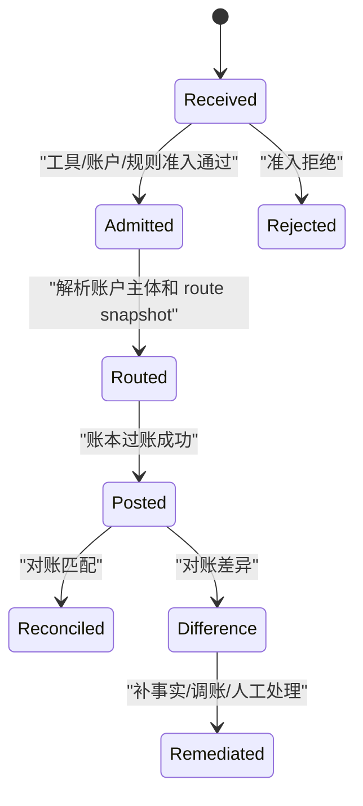

# GSD-2 Wallet 特殊业务能力地图 Execution Grant 确认包

## 1. 文档定位

本文是 `GSD2-WALLET-SPECIAL-BUSINESS-CAPABILITY-MAP-001` 的设计型交接物，用于把 VCC、VA、全球账户付款、ACH 或银行转账等特殊业务入口，重新对齐到 wallet application、transaction canonical service、ledger posting 和清结算对账的能力边界。本文不直接授权编码，只为下一轮服务层接口契约和 TDD Red 提供确认基线。

| 项 | 内容 |
| --- | --- |
| Task ID | `GSD2-WALLET-SPECIAL-BUSINESS-CAPABILITY-MAP-001` |
| 所属阶段 | GSD-2 / LWT capability goal / wallet special business capability map design consumed by instrument lifecycle contracts |
| Owner | 产品架构专家、资深架构师、AI Native 工程流程编排共同合议；编码 Owner 在下一 Grant 再确认。 |
| 写入范围 | 本文、TDD、OpenSpec 任务基线、wallet 支付工具生命周期服务层接口、实现和目标测试。 |
| 写入文件 | `docs/TDD设计/GSD-2-Wallet特殊业务能力地图ExecutionGrant确认包.md`、`docs/TDD设计/支付资金底座测试驱动设计.md`、OpenSpec tasks、`InstrumentTransactionLifecycleApplicationService`、`AuthorizeByPaymentInstrumentRequest`、`ReceiveByInstrumentRequest`、`InstrumentTransactionLifecycleApplicationServiceImpl`、`InstrumentTransactionLifecycleApplicationServiceTests`。 |
| 只读范围 | `wallet/wallet-face` application 契约、`transaction/transaction-face` canonical 交易服务、`ledger/ledger-face` 应用服务、现有 TDD 和 OpenSpec。 |
| 只读参考 | 现有 `wallet.application`、`transaction.application`、`ledger.application`、清结算对账服务、PRD、系分、DSL、TDD 和 OpenSpec。 |
| 禁止范围 | 不改 DDL/H2 schema、Controller、HTTP/RPC、Mapper、Entity、runtime config、交易 canonical 入参或 ledger posting；不新增统一支付工具交易内核。 |
| 验证命令 | Red/Green：沙箱内 `just test-one InstrumentTransactionLifecycleApplicationServiceTests tests` 因嵌入式 Redis 端口绑定限制失败；非沙箱复跑已覆盖授权委派、收款成功、payment-only 拒绝和缺绑定版本拒绝 4 tests 通过；`just compile`、`just pmd`、`git diff --check` 均已通过。 |
| 停止条件 | 需要继续扩展 `receiveByInstrument` 新场景语义、新增 `payOutByRail`、外部资金事件消费、改变交易 canonical 入参、让支付工具/预算组/Spend Rule 入账、或触碰账本分录事实时停止，等待新的独立 Execution Grant。 |
| Execution Grant | `GSD2-WALLET-INSTRUMENT-LIFECYCLE-AUTH-FACADE-001` 已消费为支付工具生命周期授权入口委派切片；`GSD2-WALLET-INSTRUMENT-RECEIVE-SNAPSHOT-001` 已消费为支付工具收款 route snapshot 回链切片；`GSD2-WALLET-INSTRUMENT-RECEIVE-BINDING-VERSION-GUARD-001` 已消费为收款工具绑定版本必填硬化切片；后续能力必须另起单一 Grant。 |
| 工程纪律 | 本轮已执行 TDD Red / Green、Review 边界复核、编译、PMD 和 diff 校验；后续继续编码仍必须按单一 Grant 执行。 |
| Handoff | 下一轮从 `payOutByRail`、外部资金事件消费、VCC / VA 单场景、transaction 兼容债或旧 ledger 公共 CRUD API 治理中重新选择单一切片；若继续扩 `receiveByInstrument` 只能处理新场景，不得重复本轮 route snapshot 回链或绑定版本必填护栏。 |

## 2. 业务目标和非目标

业务目标：

1. 给业务方一个清晰的能力地图：VCC 预付卡、VCC 共享卡、VA 收款、全球账户付款、ACH 或银行转账如何接入资金底座。
2. 给研发一个清晰的系统边界：wallet application 解释业务入口和支付工具上下文，transaction 继续接收已解析账户主体，ledger 只处理账本事实和余额投影。
3. 给测试一个清晰的验收标准：特殊业务入口必须证明准入、外部引用、幂等、失败无副作用、账务平衡、对账可追溯和回放边界。

非目标：

1. 不做卡组织、ACH、SWIFT、本地清算网络、PSP 或银行通道协议实现。
2. 不新增 `InstrumentTransactionService`、`PaymentInstrumentTransaction` 或统一支付工具交易内核。
3. 不把 VCC、VA、电子钱包、预算组或 Spend Rule 设计成账务主体。
4. 不改变直接交易、授权交易、余额控制、权益让利等 canonical 交易服务的账户主体入参。

成功指标：

1. 产品侧能解释每类特殊业务入口的用户价值、业务对象、规则矩阵、主流程和异常流程。
2. 架构侧能解释接口契约、入参、出参、错误码、幂等、兼容、数据方案、事务边界、一致性、补偿和对账。
3. 工程侧能从本文拆出单一、低风险、可 TDD 的服务层切片，不触碰 Controller、HTTP/RPC 和通道协议。

## 3. 能力地图

| 能力域 | 前台能力 | 后台能力 | 数据能力 | 资金底座职责 |
| --- | --- | --- | --- | --- |
| VCC 预付卡 | 卡充值、卡付款、卡退款、卡提现或余额回收。 | 卡与资金子账户绑定、额度和状态查看、充值失败处理。 | 外部充值流水、卡工具快照、资金子账户分录、清算结果和对账差异。 | wallet application 解释卡入口；transaction 执行资金账户入账、授权、退款、提现；ledger 记录资金子账户账目。 |
| VCC 共享卡 | 共享卡付款、授权、退款、调额。 | 持卡人或卡组权限、信用子账户额度、父账户约束、Spend Rule 配置。 | 工具快照、信用子账户占用、父账户约束快照、规则命中和授权事实。 | wallet application 组合支付工具、信用子账户、父账户和 Spend Rule；transaction 执行授权占用和逆向回放。 |
| VA 收款 | 外部打款识别、入金确认、退款或退汇解释。 | VA 与内部资金账户绑定、外部 statement line 匹配、差错处理。 | VA 引用、外部流水、内部资金账户入账、对账差异和审计轨迹。 | wallet application 只做收款识别和账户归因；transaction 执行内部入账；ledger 不给 VA 建账。 |
| 全球账户付款 | 本地或 SWIFT 出款、费用、在途、退汇。 | 收款方维护、quote 引用、出款审核、退汇处理。 | payout 指令、rail 引用、费用事实、在途账目、退汇和对账。 | 业务包归一化 rail 事实；资金底座消费出款、费用、在途、退汇和对账事实。 |
| ACH 或银行转账 | credit/debit、return、reversal 或收单后入扣账。 | 外部事件匹配、退票处理、追偿、调账核销。 | 外部事件引用、内部账户影响、差异单、补事实白名单和审计。 | 资金底座不实现 ACH 文件和银行协议，只消费已确认的归一资金事实。 |

## 4. 业务对象和对象模型

| 业务对象 | 字段口径 | 生命周期或状态 | 不变量 |
| --- | --- | --- | --- |
| `PaymentInstrumentRef` | 工具类型、工具 ID、脱敏展示、绑定版本、方向、能力、有效期。 | 启用、暂停、失效、解绑；交易时固化为快照。 | 只做入口、归因和审计，不做账务主体。 |
| 资金账户/信用账户子账户 | `SubjectRef`、账户类型、父账户、币种、账目 profile、账户能力。 | 开户、启用、冻结、关闭；交易时作为 canonical 主体。 | 账本分录只能落到账户主体；父账户默认约束和汇总，显式划拨才入账。 |
| 预算组 | 预算 scope、周期、控制上限、控制投影。 | 周期开启、占用、释放、过期、关闭。 | 预算组是控制账户或控制视图，不参与实际资金交易记录。 |
| Spend Rule | 规则 ID、版本、触发条件、判断逻辑、优先级、拒绝原因。 | 生效、暂停、过期、版本升级。 | 只产出规则决策、控制活动和审计，不直接记账。 |
| 外部事件引用 | rail、外部流水号、statement line、processor event、业务订单号。 | 待匹配、已匹配、差异、已处理。 | 外部 accepted 不等于内部资金成功；必须有内部事实或对账补事实。 |

## 5. 特殊业务入口地图

| 场景 | 推荐服务层入口 | 入参最小字段 | 出参最小字段 | 委派能力 | 禁止事项 |
| --- | --- | --- | --- | --- | --- |
| VCC 预付卡充值 | `VccPrepaidFundingApplicationService.recharge` | 业务流水、卡工具引用、资金子账户引用或绑定快照、金额、币种、外部入金引用。 | 充值结果、内部交易引用、账本交易引用、工具快照。 | 直接交易入账、ledger posting、对账。 | 不给卡号建账，不把充值写成调额。 |
| VCC 预付卡提现/余额回收 | `VccPrepaidFundingApplicationService.withdraw` | 业务流水、卡工具引用、资金子账户、金额、币种、目标账户或外部出款引用。 | 提现结果、内部交易引用、在途或可用账目影响。 | 提现/出款、清结算、对账。 | 不绕过账户余额控制，不把外部受理当成功。 |
| VCC 共享卡授权 | `InstrumentTransactionLifecycleApplicationService.authorizeByInstrument` | 授权流水、卡工具引用、信用子账户或绑定快照、金额、币种、商户/MCC、Spend Rule 决策证据。 | 授权结果、route snapshot、工具快照、控制活动引用。 | 授权交易、Spend Control admission、账户能力。 | 不替换 `FundsAuthorizationTransactionService.authorize` canonical 入参。 |
| VCC 共享卡调额 | `VccSharedCardTransactionApplicationService.adjustLimit` | 调额流水、卡工具引用、信用子账户、父账户约束、调整金额或新额度、原因。 | 调额结果、额度快照、审计引用。 | 账户能力、额度配置或控制活动。 | 调额不等于资金入账，除非发生真实父子划拨。 |
| VA 收款 | `InstrumentTransactionLifecycleApplicationService.receiveByInstrument` | VA 引用、外部流水、金额、币种、内部资金账户绑定、付款方摘要。 | 入账结果、内部交易引用、对账引用。 | 直接交易入账、对账差异。 | VA 不持有内部余额。 |
| 全球账户付款 | `InstrumentTransactionLifecycleApplicationService.payOutByRail` | payout 流水、账户主体、金额、币种、费用、quote、rail 引用、收款方引用。 | 出款结果、在途事实、费用交易、对账引用。 | 提现/出款、费用、在途、清结算。 | 不在 funds 内实现 SWIFT/local 协议。 |
| ACH/银行事件消费 | `ExternalFundsEventApplicationService.consume` | 外部事件流水、事件类型、账户主体、金额、币种、原交易引用、差异引用。 | 消费结果、内部交易或差异单引用、审计引用。 | 直接交易、退款/撤销、调账、对账。 | 不把银行文件批次当资金内核。 |

接口契约要求：

1. 所有入口必须有业务流水或外部事件流水，用于幂等和重放。
2. 入参必须包含金额、币种、业务场景、支付工具引用或外部 rail 引用，以及可解析的账户主体或绑定快照。
3. 出参必须返回内部交易引用、route snapshot 或账本交易引用；失败时返回错误码和拒绝原因，不生成交易事实和账本分录。
4. 兼容策略是新增 application facade，不修改 canonical 交易服务入参；旧调用方继续以资金账户或信用账户主体调用交易内核。

## 6. 业务流程和状态

主流程：

1. 上层业务包接收 VCC、VA、全球账户或 ACH 事件，先完成通道协议、风控、合规和敏感信息处理。
2. wallet application 根据支付工具引用、绑定版本、账户能力、资金责任和 Spend Rule 决策证据，生成不可变预交易快照。
3. wallet application 将业务语义转换为账户主体型资金动作，委派 transaction canonical service。
4. transaction 生成 route、posting plan 和交易事实，ledger 应用服务落账本交易、账目分录和余额投影。
5. 清结算和对账层消费内部事实与外部证据，形成匹配结果、差异单、补事实白名单或人工处理任务。

异常流程：

1. 工具无效、方向不支持、币种不匹配、绑定过期、账户能力不足或 Spend Rule 拒绝时，必须在 route、posting、LedgerEntry 前失败。
2. 外部 accepted 但内部未成功时，只能形成待匹配、差异或人工处理，不得提前入账。
3. 外部 return、reversal、chargeback 过程事件不直接改资金；只有明确退款、撤销、调账或补事实结果时才进入 transaction。
4. 回放必须使用原 route snapshot、工具快照、绑定快照和账户主体，不按当前绑定重新选路。

状态机口径：



## 7. 规则矩阵

| 触发条件 | 判断逻辑 | 优先级 | 结果 |
| --- | --- | --- | --- |
| 支付工具状态、方向或能力不满足 | 工具准入失败 | P0 | 拒绝，失败无资金副作用。 |
| 账户主体不存在或账户能力不满足 | 账户能力准入失败 | P0 | 拒绝，失败无 route/posting/entry。 |
| Spend Rule 或预算控制拒绝 | 外部或内部规则决策拒绝 | P0 | 拒绝，记录控制活动，不生成资金事实。 |
| 外部事件与内部账户不匹配 | 对账或入金匹配失败 | P0 | 进入差异单或人工处理。 |
| 外部 accepted 但内部 posting 失败 | 内部事实未形成 | P1 | 保留外部证据和失败原因，不得声明资金成功。 |
| 原路退款或撤销 | 必须命中原交易、原 route snapshot 和原工具快照 | P0 | 按原路径生成逆向资金事实。 |

运营后台和报表口径：

1. 运营后台可展示支付工具流水、控制活动、内部资金交易、账本交易、对账差异和人工处理任务，但不允许修改历史账本分录。
2. 指标和报表至少区分业务场景、支付工具、账户主体、规则版本、成功率、拒绝原因、对账差异、人工处理时长和补事实数量。
3. 审计必须保留请求流水、外部引用、工具快照、账户主体、规则版本、内部交易引用、账本交易引用和处理人。

## 8. 系统边界和数据方案

核心决策：

1. wallet application 是特殊业务入口解释层，不是资金事实层。
2. transaction canonical service 是资金动作内核，继续使用资金账户或信用账户等已解析主体。
3. ledger application 是账务事实层，只接收已确认的 posting plan 和账本交易请求。
4. reconciliation/clearing/settlement 是外部证据和内部事实的匹配、差异、锁定、出款和补偿层。

数据方案：

1. 支付工具快照、绑定快照、账户主体、外部引用、规则版本和 route snapshot 必须可以串联查询。
2. 账本事实只记录账户主体、账目、借贷方向、金额、币种、业务引用和交易引用。
3. 控制活动和预算投影可以消费交易结果，但不反写账本事实。
4. 对账差异、补偿、追偿和调账必须通过独立事实追加，不允许 update/delete 历史分录。

事务边界和一致性：

1. 单笔内部资金事实应在 transaction + ledger 的原子边界内完成。
2. 外部通道 accepted 与内部资金成功不是同一事务，必须通过对账和补偿闭合一致性。
3. 幂等键冲突时，摘要一致返回原结果，摘要不一致拒绝。
4. 失败时必须保证无 route、posting、LedgerEntry 或余额投影副作用。

可靠性、安全、权限、审计和告警：

1. 敏感字段只保留脱敏引用，不保存 PAN/CVC 等高敏明文。
2. 调额、人工补事实、调账核销、对账白名单必须有权限控制、审批或双人复核。
3. 告警至少覆盖准入拒绝激增、外部 accepted 内部失败、posting 失败、对账差异积压和人工处理超时。
4. 发布需要灰度、回滚和开关策略；回滚不得删除已生成资金事实，只能关闭新入口或追加修正事实。

## 9. TDD 和验收种子

首批 Red 建议：

1. `authorizeByInstrument` 工具方向不支持时拒绝，并证明无 route、posting、LedgerEntry。
2. VCC 共享卡 Spend Rule 拒绝时只生成控制活动，不生成授权交易和账本分录。
3. VA 收款外部流水重复提交摘要一致返回原入账结果，摘要冲突拒绝。
4. 全球账户付款外部 accepted 但内部 posting 失败时，只形成差异或待处理状态，不声明出款成功。
5. ACH return 必须命中原交易或原外部引用，否则进入差异单，不自动扣账。

验证方案：

1. 文档切片：运行产品、架构、Harness 门禁和 `git diff --check`。
2. 服务层切片：下一 Grant 起按 TDD 先写 Red，再补 application facade 或服务组合实现。
3. 回归：涉及资金变化时运行相关 `just verify-slice`、`just test-transaction`、`just test-ledger`、`just test-business-flow` 或 `just verify-cad`。

验收标准：

1. 产品验收：能解释业务目标、业务对象、主流程、异常流程、规则矩阵、运营后台、指标、数据口径和风险。
2. 架构验收：能解释职责边界、接口契约、事务边界、一致性、补偿、对账、安全、审计、告警、发布和回滚。
3. 工程验收：失败无副作用、幂等可回放、账务平衡、余额投影可信、清结算对账可追溯。

## 10. 风险、待确认和发布边界

| 风险 | 影响范围 | 确认方 | 处理方式 |
| --- | --- | --- | --- |
| 上层业务包希望 funds 实现通道协议 | 模块边界膨胀，资金底座不可维护。 | 产品、架构、业务 Owner | funds 只接收归一资金事实和外部引用。 |
| 直接新增支付工具交易服务替代 canonical 服务 | 交易内核分裂，退款和回放不可控。 | 架构 Owner | 只新增 application facade，不改 canonical 入参。 |
| VCC 预付卡被误解为卡号余额 | 账务主体错误，账本不可对账。 | 产品、财务、架构 | 卡绑定资金子账户，账务落账户。 |
| 共享卡调额被误解为入账 | 额度控制与资金事实混淆。 | 产品、风控、架构 | 调额是额度或控制事实，真实划拨才入账。 |
| 外部 accepted 被误认为内部成功 | 对账和用户余额错误。 | 业务、清结算、架构 | 必须以内部 posting 或对账补事实为准。 |

发布边界：

1. 本轮只新增服务层生命周期授权入口委派，不发布 Controller、HTTP/RPC 或外部调用入口。
2. 下一轮若扩 `receiveByInstrument` 场景硬化、`payOutByRail`、外部事件消费或 VCC/VA 单场景，应先以内部调用方试点接入。
3. 上线前必须补齐回滚策略、人工处理 Runbook、告警指标和最小运营后台查询口径。

## 11. 下一 Grant 候选

本确认包已消费首个授权入口契约：

```text
Execution Grant: GSD2-WALLET-INSTRUMENT-LIFECYCLE-AUTH-FACADE-001
已消费范围：InstrumentTransactionLifecycleApplicationService#authorizeByInstrument 服务层统一授权入口、实现委派和首批 Red / Green。
已完成证据：Red 首次编译失败证明 InstrumentTransactionLifecycleApplicationService 缺少 authorizeByInstrument；Green 后非沙箱复跑 InstrumentTransactionLifecycleApplicationServiceTests 3 tests 通过。
边界：保留 authorizeByPaymentInstrument 兼容入口；不改交易 canonical 入参、不新增统一支付工具交易内核、不写 Controller、HTTP/RPC、ledger posting、DDL/H2 schema。
```

后续若继续推进，只能重新确认新的单一切片：

```text
Execution Grant: GSD2-WALLET-INSTRUMENT-LIFECYCLE-CONTRACT-002
目标：只在 wallet-face / wallet-impl 服务层补支付工具收款入口场景硬化和组合测试。
已消费范围：receiveByInstrument 服务层入口、ReceiveByInstrumentRequest、应用层准入编排、目标服务流测试和任务基线回写。
禁止：不改 Controller、HTTP/RPC、交易 canonical 入参、ledger posting、DDL/H2 schema。
已完成证据：InstrumentTransactionLifecycleApplicationServiceTests 覆盖支付工具收款成功和 payment-only 工具拒绝无资金事实副作用；非沙箱 `just test-one InstrumentTransactionLifecycleApplicationServiceTests tests` 2 tests 通过。
```

```text
Execution Grant: GSD2-WALLET-INSTRUMENT-RECEIVE-SNAPSHOT-001
已消费范围：支付工具收款入口在委派账户主体型 topup 时固化脱敏 PaymentInstrumentRef 到 route snapshot；直接充值请求只新增可选快照承载位，不改变 accountId canonical 入账主体。
已完成证据：Red 先证明 receive route snapshot 的 paymentInstrumentRef 为空；Green 后非沙箱复跑 InstrumentTransactionLifecycleApplicationServiceTests 3 tests 通过。
边界：不改 Controller、HTTP/RPC、交易 canonical 账户主体、ledger posting、DDL/H2 schema、出款、退款、ACH return、全球账户付款、VCC facade 或统一支付工具交易内核。
```

```text
Execution Grant: GSD2-WALLET-INSTRUMENT-RECEIVE-BINDING-VERSION-GUARD-001
已消费范围：ReceiveByInstrumentRequest 和 receiveByInstrument 服务层前置准入强制 expectedBindingVersion，避免收款工具换绑后无版本预期地继续使用默认绑定入账。
已完成证据：Red 先证明缺 expectedBindingVersion 时仍会进入账户主体型 topup 并生成资金事实；Green 后非沙箱复跑 InstrumentTransactionLifecycleApplicationServiceTests 4 tests 通过，缺版本路径拒绝且无资金交易、route、posting、LedgerEntry、账本交易或余额投影副作用。
边界：不改 Controller、HTTP/RPC、交易 canonical 账户主体、ledger posting、DDL/H2 schema、Entity、Mapper、出款、退款、ACH return、全球账户付款、VCC facade 或统一支付工具交易内核。
```

备选切片：

1. `GSD2-VCC-PREPAID-FUNDING-CONTRACT-001`：只做 VCC 预付卡充值/提现服务层契约和 Red。
2. `GSD2-GA-PAYOUT-RAIL-CONTRACT-001`：只做全球账户出款 rail 入口服务层契约和 Red。
3. `GSD2-WALLET-AUTH-ADMISSION-COMPOSE-003`：继续强化授权准入组合链路和失败无副作用测试。

## 12. Handoff

恢复入口：

1. 先读本文。
2. 再读 PRD 的支付工具与 Spend Rule 生产可用性裁决、系分的 P2 场景能力包、DSL 的特殊业务入口边界。
3. 最后确认 OpenSpec 和 LWT Goal 中的当前状态。

残余风险：

1. 本轮只完成支付工具收款入口，不代表 wallet application 已整体生产可用。
2. 特殊业务入口仍需要按场景逐个做服务层契约、TDD Red、实现、回归和验证证据；`receiveByInstrument` 不授权出款、退款、ACH return、全球账户付款或 VCC 专项生命周期。
3. 清结算、对账、人工处理和运营后台仍需独立切片推进。
