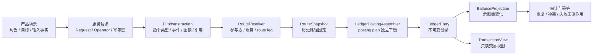
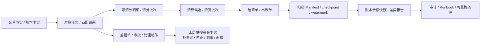

# 支付资金底座测试驱动设计

## 文档状态

| 项目 | 当前值 |
| --- | --- |
| 当前阶段 | `CI-MIG03-ACTION-LEDGER-BALANCE-CLOSURE-001 / MIG03_DOC_ENTRY_CARD_INDEPENDENT_CHECKER_PASS / OWNER_DECISION_PENDING / EXECUTION_GRANT_NO / DOCUMENTATION_ONLY / CODE_FREEZE / plan-r2.206`；下一步只允许 Human Owner 裁决 A/B/C，源码与测试全部 immutable |
| 状态版本 | `plan-r2.206 / 2026-08-22` |
| 权威输入 | [公共能力层产品设计](../产品设计/支付资金公共能力层-产品设计.md)、[公共能力层 DSL 设计](../DSL设计/支付资金公共能力层-DSL设计.md)、[公共能力层系统分析设计](../系分设计/支付资金公共能力层-系分设计.md) |
| 当前授权 | `CI-MIG03-ACTION-LEDGER-BALANCE-CLOSURE-001 / OWNER_DECISION_PENDING / EXECUTION_GRANT_NO`；当前只允许 Human Owner 裁决 A/B/C。源码、测试、脚本、API baseline、Consumer、Git、L4、enable/release/production 均未授权 |

## 一、文档定位

本文是支付资金底座的测试驱动设计入口。TDD 即测试驱动设计：先用可执行或可转化为可执行测试的用例描述业务行为、边界条件和验收红线，再反推接口、模块、数据和实现。

本文承接：

| 输入 | 本文如何使用 |
| --- | --- |
| `docs/产品设计/05-产品验收与TDD用例矩阵.md` | 提炼产品必须被证明的事实、红线和验收样例。 |
| `docs/DSL设计/支付资金底座DSL承载层设计.md` | 把产品用例转成 `FundsInstruction`、`RouteSnapshot`、`PostingPlan`、`LedgerEntry` 和投影断言。 |
| `docs/系分设计/02-交易路由钱包账目与投影系分设计.md` | 映射交易、路由、钱包、账目、余额投影和交易投影的服务入口与执行流程。 |
| `docs/系分设计/03-清结算与对账系分设计.md` | 映射对账、清分、清算、结算、出款、差错和追偿对象的服务入口、状态机和资金红线。 |
| `docs/系分设计/04-归档重放与指标治理系分设计.md` | 映射资金数据治理、账本余额快照、交易投影重放、指标边界和大数据消费承接的治理门禁；文件名保留历史兼容。 |
| `docs/系分设计/05-测试观测安全与金融红线.md` | 继承测试分层、观测、安全、审计和金融红线。 |
| 代码模块与测试资产 | 校准真实服务、真实包名、目标测试支撑和落地入口。 |

本文不替代 PRD、DSL 或系分设计。本文只回答一个问题：

> 每个资金能力要如何通过测试证明：产品语义可靠、DSL 事实正确、系统执行路径真实、账务结果可信、异常和红线可阻断。

测试设计必须先把这个问题拆成账务三问：谁的钱、多少钱、怎么变的。三问缺一项时，不进入资金变化 Green；只能标记为 contract-only、设计待确认、人工处理或阻断。

| 三问 | TDD 最小断言 |
| --- | --- |
| 谁的钱 | 业务主体、可记账主体、账户类型、资金责任、支付工具或外部账户引用边界。 |
| 多少钱 | amount、currency、金额组件、账目 bucket、账本周期、累计处理和失败无余额副作用。 |
| 怎么变的 | 业务事实、状态迁移、route snapshot、posting plan、ledger transaction、ledger entry、projection、幂等和审计。 |

### 1.0 背景、目标、非目标与成功标准

背景：支付资金底座的产品设计、DSL 设计和系统分析设计已经把钱包、账本、账目、交易路由、清结算、对账、资金数据治理、余额快照和业务能力包拆成多层设计。团队需要一份稳定的 TDD 入口，把“设计已覆盖”转成“测试应证明什么、Red 用例先拦什么、哪些范围不能用测试缺口掩盖”。

目标：

1. 建立 PRD、DSL、系分和测试资产之间的追踪关系，确保每个资金能力都有产品验收、契约样例、系统落点、目标测试和红线用例。
2. 固定资金安全测试口径，要求金额、状态、route snapshot、posting plan、ledger entry、余额投影、幂等、审计和失败无副作用同时被证明。
3. 为工程落地提供测试准入证据，区分可 TDD 分析、可编码评估、可生产交付复核和未覆盖范围。

非目标：

1. 不替代生产代码、测试代码、DDL/H2 schema、工程任务边界或验证命令。
2. 不把目标测试资产、设计矩阵或 contract-only 夹具作为生产完成证据。
3. 不替代法务、合规、财务、税务、通道、银行、卡组织、Nacha/ACH 或持牌机构对外部规则的专业确认。

成功标准：

1. 任一能力域进入编码前，能说明对应 PRD 验收 ID、DSL caseId、系分章节、TDD Red、测试层级、验证命令和未覆盖条件。
2. 有资金变化的测试必须覆盖余额桶、账本分录、posting 平衡、投影、幂等、审计和失败无副作用，不允许只断言接口返回或交易状态。
3. 清结算、对账、资金数据治理、指标边界、P2 业务能力包和 ACH/银行转账支撑，必须先声明是否只进入 TDD 分析，以及工程写入范围、外部规则和敏感数据边界。

### 1.0.1 TDD 基线与 Red 裁剪

TDD 主文档只定义目标测试资产、Red 裁剪标准和生产交付断言。局部测试资产可以作为工程计划和交付说明中的回归证据，但不能被外推为后续完整争议运营或清结算追偿 case、授权支付工具应用入口、权益生产资金流、清结算、对账、资金数据治理或 P2 业务专项已完成。

TDD 基线核验阶段不写测试代码，只输出 `redCandidateSet`、`targetAssets`、`schemaNeed`、`minimumAssertions`、验证命令和停止条件。只有独立工程边界明确写入范围后，才把候选 Red 转成实际测试写入；触碰 `contextVariables`、Request/DTO、route snapshot、交易事实快照或上下文导出时，必须回归 `ReadonlyContextVariables`、敏感字段阻断和权益核心字段不得旁路。

### 1.0.2 公共能力重设计目标基线

`W4-01` 的目标语义按“公共能力层产品设计 -> 公共能力层 DSL 设计 -> 公共能力层系统分析设计 -> 本文第二十章”解释。本文前十九章、旧 PRD/DSL/编号系分和现有测试只作为当前实现、回归资产和迁移清册；凡与目标基线冲突的旧服务名、对象、状态或完成断言，不得覆盖目标合同，也不得据此冻结 Public API。

目标 TDD 只验证跨场景稳定复用的资金语义、资金事实和资金不变量。业务计划、Coupon/Benefit 非资金事实、raw issuer/ACH/PSP/payout 状态、source authority/finality、商户责任政策和专业核销规则继续由上游或 adapter 归一；`wind-funds` 只验证规范化资金指令/事实的独立准入、资金效果、账务、余额、累计、原事实、对账和恢复边界。

### 1.1 能力保障和测试优先级

TDD 的测试优先级按资金底座能力保障划分，不按 PRD/系分文档编号划分。生产可靠性判断必须先回到下表。

| 优先级 | 必须优先证明的能力 | 测试保障重点 |
| --- | --- | --- |
| P0 资金底座内核 | 钱包、账本、账目、余额投影、对账、清分、清算、结算、账本余额快照和资金数据治理证据。 | 主体可记账、账务平衡、余额可重建、批次可核对、出款可解释、差错可闭环、治理证据可审计和重跑幂等。 |
| P1 交易与读模型扩展 | 直接交易、授权交易、余额控制、交易投影和交易投影重投影。 | 交易入口、生命周期、路由回放、冻结/解冻、余额控制、交易视图和投影重放必须复用 P0 账务事实，失败无副作用。 |
| P2 业务模式能力包 | VCC 发卡、全球账户收付款和收单业务支持。 | 只验证资金底座可承接归一资金事实和外部规则核验边界；卡组织、银行、PSP、跨境、风控和合规实现必须进入业务专项。 |
| 生产交付场景验证 | VCC、全球账户收付款、收单、代理分佣结算、平台或商家优惠让利，以及作为外部轨道的 ACH。 | 六类场景包分别验证业务事实映射、正向、逆向和异常；并发、幂等、重放和失败无副作用由共享资金能力测试统一证明，关键跨能力链路再由组合流程测试证明；不得为每个场景复制测试内核或新增平行资金内核。 |

## 二、测试驱动设计原则

资金系统的 TDD 不是先写大量 Mock，也不是追求代码行覆盖率。它要先构造可验收的业务用例，再用测试证明真实执行路径没有偏离产品和 DSL。

| 原则 | 要求 |
| --- | --- |
| 场景先于实现 | 先写清角色、前置条件、输入事实、动作、期望状态、余额变化和红线，再决定测试类和断言方式。 |
| 事实先于接口 | 测试证明的是资金事实成立，不是某个方法被调用。 |
| 真实路径优先 | 非外部依赖尽量使用真实 converter、resolver、orchestrator、assembler、posting/projection 逻辑；只替换外部通道、时间、ID 和不可控基础设施。 |
| 每步余额断言 | 组合场景每一步都断言余额变化，不只断言最终余额。 |
| 账务证据闭环 | 有资金变化时必须同时证明 route snapshot、posting plan、ledger transaction、ledger entry 和 balance projection 可互相解释。 |
| 失败无副作用 | 余额不足、错币种、缺快照、超额、幂等冲突、权限不足等失败路径必须断言无账务 route leg、无 posting、无 entry 或余额无变化；拒绝解释用空 route snapshot 不视为账务副作用。 |
| 红线测试常驻 | 外部账户入账、直接改余额、授权拒绝写账、冻结表达消费、投影反写事实等必须有失败测试或明确不适用原因。 |

## 三、测试证据链

每个用例都应尽量形成以下证据链。小的纯单元测试可以只覆盖其中一段，但业务组合测试必须覆盖完整链路。



| 证据 | 最低断言 |
| --- | --- |
| 产品输入 | 业务场景、业务流水、主体、金额、币种、操作者、引用完整。 |
| 指令 | `instructionType`、`eventType`、`transactionType`、`amount/originalAmount/exchangeRate` 正确。 |
| 路由 | 参与方、平台账户、账目、余额桶、route leg 与产品资金链路一致。 |
| 快照 | 后继退款、撤销、结算、争议类退款、退费、解冻优先使用原路径。 |
| 账务计划 | 每个 posting plan 独立平衡，币种一致，entry 金额为正。 |
| 分录 | `LedgerEntry` 可追溯到资金指令、route leg、账本交易和业务引用。 |
| 余额投影 | 相关主体、账户类型、`normalBalanceSide`、账目、币种、账本周期的 delta 正确，并能回挂 DSL 借贷表的余额影响。 |
| 交易投影 | 只从交易事实、route snapshot 和分录摘要派生，不反写事实。 |
| 幂等审计 | 同键同摘要复用结果，同键不同摘要失败；高危动作有原因、凭证、审批或操作者。 |

### 3.1 P0 运营账务与治理证据链

P0 不只包含交易入账链路，还包含对账、清分、清算、结算、归档和账本余额快照的运营账务链路。涉及清结算、对账、归档或治理重放的测试，必须能从来源事实一路证明到批次、差错、出款、Manifest、checkpoint、watermark、差异报告和审计记录。



| P0 证据节点 | 最低断言 |
| --- | --- |
| 来源事实 | 对账、清分、清算和结算必须引用交易事实、route snapshot、账本交易或 ledger entry；不得从报表、投影或外部流水直接补造资金事实。 |
| 对账任务 | 对账范围、来源文件、规则版本、匹配结果、差错类型、阻断标记和重跑幂等可证明。 |
| 可清分明细 | 每条明细能追溯到来源事实、金额拆分、权益组件、手续费或税费口径；重复入批、错币种、错主体和金额不闭合必须失败。 |
| 清算和结算 | 清算候选、清算批次、结算单和出款单状态独立；结算锁定、出款前准入、外部非终态和回单结果都有幂等、审计和失败无副作用断言。 |
| 差错处理 | 误报关闭、补事实、冲正、调账、追偿、核销和重新对账必须有审批、凭证、原事实引用、处理动作号和操作审计。 |
| 受控资金动作 | 由上层业务决定并调用既有资金能力；对账只登记已完成动作引用，不判断上层业务准入，也不生成资金事实。 |
| 资金数据治理 | Manifest、checkpoint、watermark、覆盖范围、冷热摘要、dry-run/apply、续跑和回滚边界可证明；治理任务不得生成 route、posting 或 ledger entry。 |
| 账本余额快照 | 快照覆盖模式、账本 bucket、冷区 Manifest、热区游标、计算摘要、差异阈值和 `VERIFIED` 条件可证明；普通指标快照不得替代余额快照。 |
| 审计与 Runbook | 高危任务必须能定位到操作者、审批号、证据引用、traceId、告警、停止条件、恢复步骤和可重跑条件。 |

#### 3.1.1 B7 收益分润生产可用验收种子

两级代理收益分润用于验证清结算与对账层能否承接复杂收益结算。该种子不要求资金底座实现代理关系、GMV 统计、利润计算、KPI 计算或薪税规则；测试只消费上层业务已经固化的收益应得项、归因快照、规则版本和审批引用。

| TDD ID | 场景 | 最低断言 |
| --- | --- | --- |
| TDD-B7-REVSHARE-001 | 用户代理佣金和平台员工二级分润进入可清分。 | 收益应得项可追溯到交易、账本分录、利润或 GMV 口径、两级归因、规则版本和审批；清分确认不生成 route、posting 或 ledger entry。 |
| TDD-B7-REVSHARE-002 | 收益清算确认。 | 清算前置对账通过后才允许生成标准资金事实；用户代理净佣金、平台员工二级分润和 KPI 激励分别形成金额项和账务影响，余额 delta 与 DSL 借贷表一致。 |
| TDD-B7-REVSHARE-003 | 收益分润阻断和逆向。 | 退款、争议、GMV 阶梯错算、规则版本缺失、员工审批缺失、超两级归因、收益参与方账户未解析或金额不平时不得清算确认；清算后逆向只能走扣减、追偿、冲正、调账或后续结算抵扣。 |

### 3.2 资金变化最小断言集

只要测试触发了资金、额度、预算、冻结、清结算或调账变化，最少必须断言以下内容。缺一项时，应在测试说明中写明不适用原因。

| 断言项 | 最低要求 |
| --- | --- |
| 状态 | 交易、授权、冻结、批次或差错对象进入预期状态，非法状态迁移失败。 |
| 金额 | 金额为正、币种一致、累计处理不超过剩余可处理金额，失败场景无余额变化。 |
| 路由 | route code、参与方、账目、平台角色、支付工具和资金责任决策符合预期。 |
| 快照 | route snapshot、binding snapshot、规则版本和原事实引用可用于后继回放。 |
| 账务 | posting plan 独立平衡，LedgerEntry 主体、账目、方向和金额正确。 |
| 投影 | BalanceProjection delta 正确；TransactionView 只读派生，不反写事实。 |
| 幂等 | 同业务键同摘要不重复入账；同键不同摘要冲突失败。 |
| 审计 | 操作者、原因、凭证、traceId、审批或外部 reference 可追溯。 |
| 红线 | 相关 must-fail 场景证明失败且无 route、posting、entry 或无余额副作用；治理、投影和对账只读任务还必须证明不会生成资金事实。 |

### 3.2.1 支付工具入口到账户主体内核断言

当测试覆盖卡、VCC、VA、外部钱包端点、共享卡、通道 token 或内部钱包入口触发授权时，测试必须把入口断言和内核断言分开，不能只断言授权服务返回成功或失败。

| 断言面 | 授权批准最低断言 | 授权拒绝最低断言 |
| --- | --- | --- |
| 支付工具或业务入口 | 外部工具状态、方向、币种、绑定版本、使用主体、支出控制范围、Spend Rule 和资金责任解析关系均被读取并进入快照；内部钱包入口解析为账户主体、权益资金事实引用或历史摘要。 | 拒绝原因、规则版本、工具、绑定或入口解析失败原因可查询；敏感工具信息不进入普通日志、投影或导出。 |
| 资金责任解析 | 源端必须先解析为资金账户或信用账户；`targetSubjectType + targetSubjectId` 唯一且同样只能是资金账户或信用账户，并由 route participant/leg 显式承载。 | 0 条、多条、错币种、目标账户不可用，或工具、支出控制范围、Spend Rule、使用人、平台角色直接作为关系源端/目标端时失败。 |
| 交易内核 | route leg、posting plan、ledger entry 和余额投影只使用解析后的账户主体；`PaymentInstrumentRef` 只作为 route snapshot 和审计引用。 | 不生成账务 route leg、posting plan、ledger entry 或余额投影副作用；可断言空 route snapshot 仅作为拒绝解释证据。 |
| 回放 | 可信撤销、完成、退款和争议资金结果使用原授权 route snapshot、原工具快照和原资金责任决策；超时或 expired 只作观察，不进入资金回放。 | 当前工具解绑、换绑、暂停，或后来新增其他资金责任关系，都不得改变历史授权路径。 |

若当前工程任务只覆盖账户主体型内核入口，必须在 TDD 说明中标注“支付工具型应用入口未授权实现”，并把对应 Red 放入 B2、B4 或 B6 候选集中；不得用账户主体型测试通过来声明支付工具入口可用。

### 3.2.2 借贷平衡断言承接

每个资金变化测试必须回到 DSL 的 [资金场景借贷平衡与账务期望表](../DSL设计/支付资金底座DSL承载层设计.md#51-资金场景借贷平衡与账务期望表) 选择对应场景，并把表中的参与方账户示例、账户类型、`normalBalanceSide`、借贷平衡公式、余额桶变化、失败红线和 TDD 锚点转成断言。TDD 不复制维护完整借贷表；没有对应行时，应先补 DSL 账务期望，再进入 Red。

| 断言项 | 测试要求 |
| --- | --- |
| 场景映射 | 测试名或说明必须能反查 DSL 表中的场景、DSL 事件或指令。 |
| 参与方和账户类型 | route、posting 或 fixture 中的主体、账目、账户类型和 `normalBalanceSide` 必须能反查 DSL 表的账户示例；外部账户和支付工具不得被断言为 ledger entry 主体。 |
| 借贷平衡 | 同一 `PostingPlan` 的 debit sum 等于 credit sum，币种一致，entry 金额均为正。 |
| normal balance | 余额断言必须按 `EntrySide + normalBalanceSide` 计算 delta，不能把借方或贷方机械等同为增加或减少。 |
| 余额桶变化 | 断言 `AVAILABLE`、`FROZEN`、`AUTHORIZATION`、`CLEARING`、`SETTLEMENT`、`IN_TRANSIT` 等适用桶的前后 delta。 |
| 逆向回放 | 退款、可信撤销、出款失败、争议资金结果和追偿必须证明引用原事实或原 route snapshot；过期只验证无资金回放和无资金副作用。 |
| 禁止事实 | must-fail 场景断言不得生成 route、posting、entry、外部出款、治理反写或敏感导出。 |
| 权益金额 | 平台补贴、商户让利、储值券、零实付和退款分摊分别断言，不得只断言用户实付。 |

### 3.3 测试覆盖证明卡

每个工程任务交付前，测试说明必须能填满下表。无法填写的项不是测试细节缺失，而是准入证据缺失。

| 证明项 | 必须写清 |
| --- | --- |
| 产品验收 | 覆盖哪些 `AC-*`、`RED-*`，哪些明确不在工程任务范围内。 |
| DSL 契约 | 覆盖哪些 `DSL-*` caseId，是否需要新增 JSON 契约样例或只复用既有样例。 |
| 系分落点 | 对应哪份系分分册、服务入口、状态机、表或端口。 |
| 正向用例 | 至少证明一条完整资金事实链路，包含 route、posting、entry、projection 和 audit。 |
| 失败用例 | 证明拒绝、余额不足、缺快照、缺周期、差错阻断、无审批或无范围重放等失败无副作用。 |
| 数据准备 | 账户、平台角色、支付工具、账本 bucket、规则版本、外部引用和幂等键如何准备。 |
| 验证命令 | 实际执行的 `just` 或 Maven 命令；无法执行时说明环境原因。 |

含权益交易范围还必须额外填写权益准入证明。若无法填写，不得声明权益生产资金流可用。

| 证明项 | 必须写清 |
| --- | --- |
| 消费范围对齐 | 工程任务只做 contract-only，还是进入 route/posting/replay，或进入清结算、对账、投影、归档、冷热读取、治理重放消费。 |
| JSON 夹具级别 | `fixtureLevel` 使用 `CONTRACT_ONLY` 还是资金流夹具；`CONTRACT_ONLY` 不得作为 route、posting、replay、清结算或对账完成证据。 |
| 权益资金事实源 | 权益资金交易、`RouteSnapshotSpec` 摘要、交易事实快照、独立权益事实表或等价不可变存储选哪一个；缺失时逆向事件如何失败或进入人工处理。 |
| 零实付表达 | 允许零金额主指令，还是拆伴随权益指令；对应的金额临界值、幂等摘要和余额断言是什么。 |
| 平台补贴表达 | 平台补贴作为额外 route leg、独立伴随指令，还是未确认时阻断；不得和用户本金或手续费净额混记；选择独立伴随指令时必须写清主交易和伴随指令的事务边界、业务组幂等、失败补偿、冲正和投影合并断言。 |
| 独立伴随指令原子性 | 选择同事务、同业务组幂等加补偿、Saga 补偿或不涉及；写清 `companionGroupSn`、主从角色、补偿策略、部分成功处理、投影合并键和清结算阻断口径。 |
| 储值/预付口径 | 是否纳入工程任务范围；若纳入，负债、预收待付、退款和过期沉淀由谁确认。 |
| 退款分摊口径 | 商品行、比例、现金优先、权益优先或不可退权益优先如何选择，尾差由谁吸收，重试是否稳定。 |
| 历史无权益资金事实处理 | 选择失败、人工处理、迁移补录或只读差错；写清触发人或系统、处理依据、补录来源、复核人、影响范围、错误码、审计、运营入口、是否可撤销和重放幂等验收。 |
| 补充权益事实模型 | 是否允许追加补充事实；写清补录载体、补录来源、审批、复核、digest、版本、适用范围、撤销关系、失效处理和最终写入前校验。 |
| 专业确认 | 平台补贴、储值/预付/礼品卡、不返券不冲补贴、负债释放或转损益等场景的确认方、确认时间、确认值、适用范围、有效期、证据引用、撤销或变更处理和未确认处理。 |
| 审计证据包 | 确认证据的脱敏引用、审计责任人、有效期、适用范围、撤销/变更记录和敏感原文禁止项；缺失、过期、撤销、范围不匹配或引用含敏感原文时必须阻断或降级。 |
| 使用者解释视图 | 用户账单、商户账单、运营时间线、财务对账视图或审计导出必须说明金额来源、事实状态、展示状态、操作状态、状态含义、不可操作原因、后续处理动作和脱敏证据引用；不得把未完成资金状态展示为完成结果，也不得在缺少操作状态时展示可操作。 |
| 证据最小化 | 证据包、导出、日志和告警只能使用脱敏摘要、文件编号或外部 reference；完整卡号、CVV、密钥、证件影像、完整银行账户敏感号、无关聊天记录和超范围个人信息必须阻断。 |
| 外部规则核验 | 税务、会计、合同、卡组织、银行、通道、KYC/KYB/AML、客户资金、跨境或外汇口径必须记录规则来源、版本或发布日期、生效日期、适用主体或适用范围、适用法域、核验日期、确认方和确认状态；缺失时不得驱动自动资金处理。 |

### 3.4 TDD 分析到工程落地裁决

本表用于把 PRD、DSL、系分和 TDD 的一致性结论转换为工程落地口径。TDD 设计可以证明测试应当如何写，不能替代失败测试落地、生产代码实现、DDL/H2 对齐或验证命令。

| 能力域 | TDD 分析结论 | 工程落地前必须补齐 | Red 或验证重点 | 不允许的完成声明 |
| --- | --- | --- | --- | --- |
| P0 钱包、账本、账目和余额投影 | 可进入 TDD 分析和工程落地评估。 | 写入范围、公共契约、服务入口、H2 schema、余额断言支撑、边界测试和验证命令。 | 外部账户入账、直接改余额、posting 不平衡、周期缺失、幂等摘要冲突和失败无副作用。 | 只因 DTO/DSL 已定义或目标测试资产已列出就声明生产完成。 |
| P0 清分、清算、结算和对账 | 可进入 TDD 分析；工程落地必须单独声明边界。 | 清结算对象表、状态机、前置对账、出款准入、差错生命周期、运营入口、DDL/H2 范围和外部规则核验。 | `TDD-B7-RED-001` 至 `TDD-B7-RED-009`，以及 `CLS-GATE-*` 对应的服务级和数据库级失败断言。 | 清分候选直接入账、前置对账未知仍出款、重大差错带原因放行、差错直接改历史分录。 |
| P0/P1 资金数据治理、重放、余额快照和指标边界 | 可进入 TDD 分析；工程落地必须单独声明边界。 | 治理物理落点、Manifest/H2、范围锁、checkpoint、watermark、dry-run/apply、冷热读取、指标水位隔离和导出审计。 | `TDD-B8-RED-001` 至 `TDD-B8-RED-005`，以及 `GOV-GATE-*` 对应的只读、差异和脱敏边界断言。 | 无范围 apply、先推水位后计算、用报表或指标反推余额、指标任务反写资金事实。 |
| P1 直接交易、授权交易、余额控制和交易投影 | 可进入 TDD 分析和工程落地评估；必须证明复用 P0 资金事实。 | route snapshot、原路径 replay、授权/冻结/余额控制状态机、交易投影只读边界、并发和幂等断言。 | 授权拒绝无账务 route leg/posting/entry、冻结只表达同主体可用性控制、缺原快照逆向失败、交易投影不反写。 | 只断言交易状态或投影数量，不断言余额桶、posting、ledger transaction 和审计。 |
| P2 VCC、全球账户支持与收单设计 | VCC 和全球账户只作为后置业务专项 TDD 输入，不进入默认工程范围；收单已验证 capture 到商户 `CLEARING`、原路退款，以及 capture 经清分、清算、结算到成功出款的连续资金链。 | 外部规则确认状态、敏感数据边界、P0/P1 回归范围、专项验收 ID 和未覆盖条件；收单额外确认 PCI/商户清结算设计边界。 | `TDD-P2-*`、`TDD-RAIL-*`、`TDD-FX-*`、`TDD-OPS-006` 与对应资金底座红线；宿主运营审计使用 `HOST-OPS-*` 自行验收，收单继续验证退款、争议和外部规则边界。 | 把资金底座测试通过声明为 VCC、全球账户或收单业务系统整体交付完成，或把收单资金映射解释成完整业务实现。 |
| ACH 和银行转账轨道支撑 | 只验证资金底座边界，不验证 ACH 产品或通道实现。 | ACH/银行转账业务或通道适配层职责、外部引用、return/NOC/reversal 影响边界和专业确认字段。 | NOC 不改原资金事实、外部 accepted 不等于到账、return/reversal 只通过归一资金事实和差错/追偿承接。 | 在资金底座测试中声明 ACH 指令、Debit 授权、文件批次、return code 或 Nacha 规则已经实现。 |
| 外部规则、敏感证据和高危操作 | 未确认时只能形成 must-fail 或人工处理用例。 | 规则来源、版本或发布日期、生效日期、适用主体或范围、适用法域、核验日期、确认方、确认状态、审批和脱敏证据。 | 敏感原文阻断、无审批导出阻断、规则缺字段阻断、未确认规则不得驱动自动资金处理。 | 以公开资料、人工口头结论或未脱敏证据替代专业确认和测试证据。 |

## 四、DSL 契约到 TDD 追踪索引

本索引用于证明 DSL JSON 契约、TDD 用例、真实模块和红线测试之间可以互相追溯。新增 DSL 契约样例时，必须同步补充本表或说明不适用原因。

| DSL 契约用例 | 场景 | 主要 TDD 用例 | 主要模块或组件 | 红线承接 |
| --- | --- | --- | --- | --- |
| `DSL-DIRECT-PAY-FEE-001` | 充值成功、付款并收取手续费。 | `TDD-DIR-001`、`TDD-DIR-003`、`TDD-DIR-006`、`TDD-DIR-FLOW-002`。 | direct converter、transfer resolver、fee resolver、posting assembler、ledger projection。 | `TDD-RED-001`、`TDD-RED-004`、`TDD-RED-007`。 |
| `DSL-DIRECT-FUND-IN-FEE-001` | 充值成功和入金手续费收取。 | `TDD-DIR-001`、`TDD-DIR-006`、`TDD-DIR-FLOW-002`。 | direct command service、fee route、platform fee account、ledger projection。 | `TDD-RED-001`、`TDD-RED-004`。 |
| `DSL-DIRECT-CHAIN-001` | A 充值、转给 B、B 付款后提现。 | `TDD-DIR-FLOW-005`、`TDD-DIR-008`、`TDD-CTRL-FLOW-002`。 | direct service、balance control service、withdraw route、balance assertion support。 | `TDD-RED-006`、`TDD-RED-007`。 |
| `DSL-DIRECT-OVERDRAFT-001` | 受控透支和禁止透支边界。 | `TDD-DIR-010`、`TDD-DIR-FLOW-006`、`TDD-CTRL-FLOW-005`。 | direct fee route、negative balance policy、projection service。 | `TDD-RED-012`。 |
| `DSL-REVERSE-REFUND-FEE-001` | 原路径退款与手续费退回。 | `TDD-DIR-005`、`TDD-DIR-007`、`TDD-DIR-FLOW-002`。 | route replay、fee refund route、ledger posting service。 | `TDD-RED-003`、`TDD-RED-004`。 |
| `DSL-AUTH-LIFECYCLE-001` | 授权批准、拒绝、可信撤销、普通完成、过期无资金副作用和生命周期查询。 | `TDD-AUTH-001` 至 `TDD-AUTH-005`、`TDD-AUTH-008` 至 `TDD-AUTH-011`、`TDD-AUTH-013`、`TDD-AUTH-FLOW-001` 至 `TDD-AUTH-FLOW-008`、`TDD-AUTH-FLOW-010`、`TDD-AUTH-ERR-*`。 | authorization service、authorization resolver、route replay、lifecycle saver、posting assembler。 | `TDD-RED-005`、`TDD-RED-008`、`TDD-RED-016`。 |
| `DSL-AUTH-FORCE-CAPTURE-001` | 无授权强制完成。 | `TDD-AUTH-012`、`TDD-AUTH-FLOW-009`、`TDD-ROUTE-009`、`TDD-RED-017`。 | authorization service、force completion policy guard、authorization resolver、posting assembler。 | `TDD-RED-017`、`TDD-RED-033`。 |
| `DSL-AUTH-REFUND-001` | 授权链本金退款、业务确认的无原路由贷记、争议裁决资金结果和额外 credit 资金边界。 | `TDD-AUTH-005` 至 `TDD-AUTH-007`、`TDD-AUTH-FLOW-005`、`TDD-AUTH-FLOW-008`、`TDD-AUTH-FLOW-011` 至 `TDD-AUTH-FLOW-013`、`TDD-ROUTE-005`、`TDD-RED-003`、`TDD-RED-017A`、`TDD-RED-017B`、`B4-CB-RED-001A`、`B4-CB-RED-001B`。 | route replay、authorization refund service、business-confirmed direct refund/transfer boundary、refund reason/audit projector、posting assertion、transaction projection、idempotency digest。 | `TDD-RED-003`、`TDD-RED-017A`、`TDD-RED-017B`、`TDD-RED-036`。 |
| `DSL-AUTHORIZATION-CONTROL-SPEND-RULE-DECLINE-001` | 发卡授权控制扩展的支出规则拒绝。 | `TDD-AUTH-EXT-001` 至 `TDD-AUTH-EXT-004`、`TDD-AUTH-ERR-001`、`TDD-AUTH-ERR-005`。 | authorization control extension boundary、authorization reject saver、audit context、rule version snapshot。 | `TDD-RED-005`、`TDD-RED-015`。 |
| `DSL-BALANCE-CONTROL-FREEZE-001` | 冻结、部分解冻、冻结到期释放和冻结后提现。 | `TDD-CTRL-001` 至 `TDD-CTRL-004`、`TDD-CTRL-011`、`TDD-CTRL-FLOW-001`、`TDD-CTRL-FLOW-002`、`TDD-DIR-008`、`TDD-DIR-009`、`TDD-RACE-004`。 | balance control service、frozen order lifecycle、withdraw route、projection service。 | `TDD-RED-006`、`TDD-RED-003`、`TDD-RED-033`。 |
| `DSL-BALANCE-CONTROL-ADJUST-001` | 资金账户余额调整、信用账户额度调整和预算控制额度 / 窗口调整。 | `TDD-CTRL-005` 至 `TDD-CTRL-010`、`TDD-CTRL-FLOW-003` 至 `TDD-CTRL-FLOW-005`、`TDD-CTRL-ERR-005`、`TDD-LEDGER-008` 至 `TDD-LEDGER-011`。 | balance control resolver、balance control service、credit account service、budget group service、spend rule control view、ledger projection、ledger period resolver。 | 无来源直接改余额、缺审批凭证、跨主体价值转移、错币种、错周期、支出控制范围或 Spend Rule 入账，或无策略负余额。 |
| `DSL-BALANCE-CONTROL-EXTERNAL-DEFICIT-ADJUST-001` | 外部余额终局事实导致我侧同主体余额纠偏。 | `TDD-CTRL-012`、`TDD-CTRL-ERR-007`、`TDD-RECON-016`。 | balance control service、reconciliation difference、runtime negative balance policy fact、external evidence guard、ledger projection。 | 上游未终局、无外部余额快照、无差错单或审批凭证、跨主体转移损失、纠偏后绕过运行时负余额策略继续交易。 |
| `DSL-BALANCE-CONTROL-LIMIT-BUDGET-001` | 信用账户额度和预算规则额度调整专项。 | `TDD-CTRL-005` 至 `TDD-CTRL-008`、`TDD-CTRL-FLOW-003` 至 `TDD-CTRL-FLOW-005`、`TDD-LEDGER-008`、`TDD-WALLET-002`、`TDD-WALLET-003`。 | balance control resolver、credit account service、budget group service、spend rule control view、ledger projection、ledger period resolver。 | `TDD-RED-008`、`TDD-RED-012`、`TDD-RED-015`；预算规则窗口不得替代账本周期。 |
| `DSL-PAYMENT-INSTRUMENT-ROUTE-001` | 支付工具绑定、方向、状态、资金责任和账户能力共同决定 route。 | `TDD-WALLET-005`、`TDD-WALLET-006`、`TDD-WALLET-009`、`TDD-ROUTE-006`、`TDD-ROUTE-011`、`TDD-ROUTE-012`。 | payment instrument service、funding relation service、route resolver、route snapshot。 | `TDD-RED-001`、`TDD-RED-029`、`TDD-RED-034`、`TDD-RED-035`。 |
| `DSL-PAYMENT-INSTRUMENT-FAIL-001` | 支付工具不可用、资金流向不匹配、资金责任不唯一、账户能力不足时失败无副作用。 | `TDD-WALLET-009`、`TDD-WALLET-010`、`TDD-ROUTE-012`、`TDD-RED-034`、`TDD-RED-035`。 | command validation、payment instrument guard、route failure boundary。 | `TDD-RED-034`、`TDD-RED-035`。 |
| `DSL-PAYMENT-INSTRUMENT-REPLAY-001` | 工具换绑后退款、撤销、退费或拒付仍按原 route snapshot 回放。 | `TDD-ROUTE-005`、`TDD-ROUTE-013`、`TDD-RACE-009`、`TDD-RED-003`、`TDD-RED-036`。 | route replay、snapshot schema、lifecycle reference、posting assertion。 | `TDD-RED-003`、`TDD-RED-036`。 |
| `DSL-BENEFIT-CONTRIBUTION-SETTLE-001` | 让利出资记账交易最小契约、无权益空值语义、Phase/Batch 边界和旧 `benefitSnapshot` 拒绝。 | `TDD-BEN-001` 至 `TDD-BEN-009`、`TDD-BEN-ENTRY-005`、`TDD-BEN-ENTRY-006`。 | `FundsBenefitContributionTransactionService`、让利出资记账请求模型、DSL JSON parser、JSON fixture verifier。 | `TDD-BEN-RED-001`、`TDD-BEN-RED-002`、`TDD-BEN-RED-020`、`TDD-BEN-RED-023`。 |
| `DSL-BENEFIT-MERCHANT-DISCOUNT-001` | 商户优惠券不入账。 | `TDD-BEN-DIR-001`、`TDD-BEN-ENTRY-001`。 | direct converter、route resolver、posting assembler、clearing projection。 | `TDD-BEN-RED-003`、`TDD-BEN-RED-011`。 |
| `DSL-BENEFIT-PLATFORM-SUBSIDY-001` | 平台补贴券补足商户。 | `TDD-BEN-DIR-002`、`TDD-BEN-ENTRY-001`。 | route resolver、platform account resolver、posting assembler。 | `TDD-BEN-RED-004`、`TDD-BEN-RED-008`、`TDD-BEN-RED-011`。 |
| `DSL-BENEFIT-PLATFORM-NO-SETTLEMENT-001` | 平台券不补足商户。 | `TDD-BEN-DIR-003`、`TDD-BEN-ENTRY-001`。 | direct route、clearing amount projection。 | `TDD-BEN-RED-004`、`TDD-BEN-RED-011`。 |
| `DSL-BENEFIT-PREPAID-VOUCHER-001` | 储值、预付或礼品卡代金券。 | `TDD-BEN-DIR-004`、`TDD-BEN-ENTRY-001`、`TDD-BEN-RED-006`。 | voucher liability route、platform/prepaid account role、finance confirmation guard。 | `TDD-BEN-RED-006`、`TDD-BEN-RED-011`。 |
| `DSL-BENEFIT-MARKETING-ACCOUNT-001` | 营销/让利账户承接有资金影响的优惠让利出资。 | `TDD-BEN-MKT-001` 至 `TDD-BEN-MKT-006`。 | benefit account profile、route resolver、posting assembler、clearing/reconciliation projection。 | `TDD-BEN-RED-031` 至 `TDD-BEN-RED-033`。 |
| `DSL-BENEFIT-AUTH-HOLD-001` | 授权时占券、完成时核销。 | `TDD-BEN-AUTH-001`、`TDD-BEN-AUTH-002`、`TDD-BEN-AUTH-003`、`TDD-BEN-ENTRY-003`、`TDD-BEN-ENTRY-004`。 | authorization service、authorization route resolver、route replay。 | `TDD-BEN-RED-005`、`TDD-BEN-RED-011`、`TDD-BEN-RED-014`。 |
| `DSL-BENEFIT-REFUND-NO-COUPON-001` | 不退券但冲补贴。 | `TDD-BEN-REFUND-001`、`TDD-BEN-ENTRY-002`、`TDD-BEN-ENTRY-004`。 | route replay、refund policy resolver、posting assembler。 | `TDD-BEN-RED-007`、`TDD-BEN-RED-013`、`TDD-BEN-RED-014`。 |
| `DSL-BENEFIT-REFUND-RETAIN-SUBSIDY-001` | 不退券且不冲补贴。 | `TDD-BEN-REFUND-002`、`TDD-BEN-ENTRY-002`、`TDD-BEN-ENTRY-004`。 | refund policy resolver、audit context、finance confirmation guard。 | `TDD-BEN-RED-007`、`TDD-BEN-RED-013`、`TDD-BEN-RED-014`。 |
| `DSL-BENEFIT-PARTIAL-REFUND-001` | 部分退款权益分摊。 | `TDD-BEN-REFUND-003`、`TDD-BEN-ENTRY-002`、`TDD-BEN-RACE-001`。 | refund amount allocator、route replay、lifecycle saver。 | `TDD-BEN-RED-008`、`TDD-BEN-RED-009`、`TDD-BEN-RED-013`。 |
| `DSL-BENEFIT-MISSING-CONTRIBUTION-FACT-REPLAY-001` | 缺原让利出资事实的逆向处理。 | `TDD-BEN-REPLAY-001`、`TDD-BEN-ENTRY-002`、`TDD-BEN-ENTRY-004`。 | route replay、manual exception boundary。 | `TDD-BEN-RED-002`、`TDD-BEN-RED-009`、`TDD-BEN-RED-013`、`TDD-BEN-RED-014`。 |
| `DSL-BENEFIT-CLEARING-RECONCILIATION-001` | 含权益交易进入清结算和对账拆分。 | `TDD-BEN-CLS-001` 至 `TDD-BEN-CLS-003`、`TDD-BEN-RECON-001`、`TDD-BEN-OPS-001`。 | clearing candidate、settlement item、reconciliation difference、benefit amount item projection。 | `TDD-BEN-RED-010`。 |
| `DSL-BENEFIT-COMPANION-INSTRUCTION-001` | 独立伴随权益指令原子性。 | `TDD-BEN-DIR-007`、`TDD-BEN-RED-024`、`TDD-BEN-RED-025`、`TDD-BEN-RACE-004`。 | companion instruction orchestrator、route/posting orchestration、projection merge、settlement/reconciliation guard。 | 缺 `companionGroupSn`、主从角色、原子性模式、补偿策略或投影合并键，或部分成功被展示为普通成功。 |
| `DSL-BENEFIT-SUPPLEMENTAL-FACT-001` | 历史补充权益事实。 | `TDD-BEN-REPLAY-004`、`TDD-BEN-RED-026`、`TDD-RACE-012`。 | supplemental fact store、replay boundary、audit approval、governance replay。 | 补充事实覆盖原交易、原 route snapshot、原账本事实或余额投影，或缺审批、复核、digest、版本和撤销关系仍参与资金处理。 |
| `DSL-BENEFIT-AUDIT-EVIDENCE-001` | 专业确认和审计证据包最终校验。 | `TDD-BEN-RED-022`、`TDD-BEN-RED-027`、`TDD-RACE-012`。 | approval/audit service、evidence package verifier、final write guard。 | 证据缺失、过期、撤销、范围不匹配或引用含敏感原文仍自动入账、退款、清结算确认、归档正式执行或治理重放正式执行。 |
| `DSL-BENEFIT-EXPLAINABLE-VIEW-001` | 含权益视图可理解且不误导。 | `TDD-BEN-RED-028`、`TDD-BEN-RED-029`、`TDD-BEN-RED-030`、`FundsOperationExplainabilityTests`。 | projection/explainability boundary、operation timeline、audit export、external rule confirmation guard。 | 授权占用、冻结、待清算、出款受理、补充事实或未确认规则被展示为已完成资金结果；缺事实状态、展示状态或操作状态仍展示可操作；敏感证据、未核验外部规则进入自动放行。 |
| `DSL-SETTLEMENT-RECONCILIATION-001` | 清结算与对账差错入账总入口。 | `TDD-CLS-001` 至 `TDD-CLS-007`、`TDD-SETTLE-001` 至 `TDD-SETTLE-005`、`TDD-RECON-001` 至 `TDD-RECON-007`。 | splittable detail、split batch、split result snapshot、clearing candidate、clearing batch、settlement order、payout order、payout preflight guard、payout explainability、reconciliation task、reconciliation difference、ledger posting。 | `TDD-RED-018`、`TDD-RED-020` 至 `TDD-RED-025`、`TDD-RED-031`。 |
| `DSL-SETTLEMENT-CLEARING-CONFIRM-001` | 清算确认入账。 | `TDD-CLS-006`、`TDD-RECON-004`、`TDD-RED-020`、`TDD-RED-033`。 | clearing batch、candidate lock、transaction command、ledger posting。 | 重复确认重复入账、缺前置对账、候选未锁定。 |
| `DSL-SETTLEMENT-LOCK-001` | 结算锁定。 | `TDD-SETTLE-001`、`TDD-SETTLE-006`、`TDD-SETTLE-007`、`TDD-SETTLE-SOURCE-UNIQUE-001`、`TDD-RACE-013`、`TDD-RED-020`。 | settlement order、settlement item、lock command、ledger posting。 | 锁定当出款成功、跨单重复消费来源、模式误锁、取消后未释放来源、复用人工调账口径。 |
| `DSL-SETTLEMENT-PAYOUT-RESULT-001` | 出款成功、失败、退回和金额不一致结果。 | `TDD-SETTLE-002`、`TDD-SETTLE-003`、`TDD-SETTLE-004`、`TDD-SETTLE-005`、`TDD-CLS-FLOW-004`、`TDD-CLS-FLOW-005`、`TDD-RACE-006`。 | payout order、payout preflight guard、external receipt、result command、ledger posting、exception case。 | 门禁失败仍提交、外部受理当成功、失败重复回退、金额不一致静默完成、缺事实状态/展示状态/操作状态仍展示可操作。 |
| `DSL-SETTLEMENT-RECONCILIATION-ADJUST-001` | 对账差错调账。 | `TDD-RECON-001`、`TDD-RECON-002`、`TDD-CTRL-ERR-005`、`HOST-OPS-001`。 | exception case、approval、evidence、adjust command、ledger posting。 | 无审批调账、直接改历史分录、绕过差错闭环直接改余额。 |
| `DSL-SETTLEMENT-POLICY-001` | 结算策略合法表达和非法表达解析边界。 | `TDD-CLS-002`、`TDD-CLS-004`、`TDD-RED-031`。 | `SettlementPolicySpec`、clearing candidate guard、settlement policy boundary。 | `TDD-RED-031`。 |
| `DSL-P2-EXTERNAL-EVIDENCE-PACK-001` | P2 外部适配证据包。 | `TDD-P2-EVIDENCE-001`、`TDD-P2-EVIDENCE-RED-001`、`TDD-RED-030`、`TDD-RED-034`。 | scenario pack evidence verifier、signature/dedupe guard、external reference index、file digest guard、external rule verification guard。 | 缺验签、幂等摘要、外部引用、文件摘要、规则核验或敏感数据策略仍自动推进资金事实。 |
| `DSL-VCC-RECON-SOURCE-OBJECT-001` | VCC 对账来源对象承接。 | `TDD-P2-VCC-013`、`TDD-P2-VCC-014`、`TDD-RECON-001`、`TDD-RECON-004`、`TDD-RECON-016`。 | VCC reconciliation source adapter、match result、difference item、adjustment action、audit trail。 | 供应商账单或清算文件直接改账、对账结果直接改余额、净额静默抵消差异、缺来源对象或审计证据关闭差错。 |
| `DSL-GOVERNANCE-ARCHIVE-MANIFEST-001` | 统一治理任务、归档申请和资金归档 Manifest 状态隔离。 | `TDD-GOV-001` 至 `TDD-GOV-004`、`TDD-ARCH-001`、`TDD-ARCH-005`、`TDD-RED-026`。 | governance task boundary、archive request、archive Manifest、checkpoint/watermark reference、difference report。 | `TDD-RED-018`、`TDD-RED-026`。 |
| `DSL-GOVERNANCE-BALANCE-SNAPSHOT-001` | 账本余额快照确认边界。 | `TDD-GOV-004`、`TDD-ARCH-006` 至 `TDD-ARCH-006C`、`TDD-METRIC-004`、`TDD-RACE-010`。 | `BalanceSnapshotVerifyRef`、`VerifyBalanceSnapshotRequest`、coverage mode、Manifest coverage、balance watermark guard。 | `TDD-RED-014`、`TDD-RED-018`、`TDD-RED-026`。 |
| `DSL-GOVERNANCE-PROJECTION-REPLAY-001` | 交易投影重放范围、模式、checkpoint、差异报告、人工处理引用和只读边界。 | `TDD-GOV-003`、`TDD-GOV-004`、`TDD-ARCH-009`、`TDD-REPLAY-001` 至 `TDD-REPLAY-004`、`TDD-RED-027`、`TDD-RED-028`。 | projection replay service、transaction view port、difference report、manual resolution、cold/hot fact reader。 | `TDD-RED-010`、`TDD-RED-027`、`TDD-RED-028`。 |
| `DSL-TRANSACTION-VIEW-MULTI-DIMENSION-001` | 多维交易投影查询。 | `TDD-VIEW-005`、`TDD-REPLAY-005`、`TDD-RED-010`、`TDD-RED-013`、`TDD-RED-014`。 | transaction view query service、payment instrument view index、subject view index、budget/spend-rule control view、rule decision log。 | 查询维度成为资金事实源、支出控制范围或 Spend Rule 入账、投影重放反写交易/路由/账本/余额。 |
| `DSL-GOVERNANCE-METRIC-SNAPSHOT-BOUNDARY-001` | 普通指标快照只读、指标水位隔离和余额确认不可替代。 | `TDD-GOV-004`、`TDD-METRIC-001` 至 `TDD-METRIC-004`、`TDD-RACE-010`、`TDD-RED-019`。 | `MetricSnapshotRef`、reporting metric module boundary、metric watermark guard、quality report boundary。 | `TDD-RED-014`、`TDD-RED-018`、`TDD-RED-019`。 |
| `DSL-GOVERNANCE-BIG-DATA-ARCHIVE-BOUNDARY-001` | 大数据消费边界；caseId 保留历史 archive 命名。 | `TDD-ARCH-010`、`TDD-METRIC-004`、`TDD-RACE-010`、`TDD-RED-018`、`TDD-RED-019`。 | governance export snapshot、authorized cold fact read、Manifest summary、desensitization policy、digest、export audit。 | 报表数仓绕过治理边界直接扫冷归档、反写资金事实、推进资金水位、替代余额快照或交易重放 checkpoint。 |

### 4.1 产品验收覆盖门禁

编码工程拆解前，必须先用本表确认工程任务覆盖哪些产品验收项、落到哪些 TDD 用例、对应哪份系分分册，以及是否属于目标交付范围。若某个 `AC-*` 或 `RED-*` 未进入交付范围，任务说明必须写明“不适用原因、归属分册或启用条件”。

编号规则：产品设计中的 `RED-*` 是产品红线编号，本文的 `TDD-RED-*` 是工程测试红线编号，两者不按同号自动等价。编码任务只能按本表显式映射判断覆盖关系；例如产品侧归档红线和 TDD 侧支付工具敏感信息红线可能编号相同或相近，但代表不同测试对象。

| 产品验收或红线 | TDD 承接 | 系分落点 | 工程归属 |
| --- | --- | --- | --- |
| `AC-IN-*`、`AC-OUT-*` | `TDD-DIR-001`、`TDD-DIR-008`、`TDD-DIR-009`、`TDD-DIR-ERR-*`、`TDD-CTRL-FLOW-*`。 | 02-交易路由钱包账目与投影系分设计的直接交易、冻结提现、路由和账务投影。 | P1 直接交易入口；涉及外部回单时只验证归一后的资金事实，并必须证明 P0 钱包、账本、账目和余额投影不变量。 |
| `AC-PAY-*`、`AC-MER-*`、`AC-FEE-*` | `TDD-DIR-002` 至 `TDD-DIR-007`、`TDD-DIR-FLOW-001` 至 `TDD-DIR-FLOW-006`、`TDD-ROUTE-002`、`TDD-RED-007`。 | 02-交易路由钱包账目与投影系分设计的付款、商户收款、手续费、退费和普通支付路由。 | P1 直接交易入口；商户待清分、手续费和权益金额必须能进入 P0 清结算与对账拆分。 |
| `AC-BEN-001` 至 `AC-BEN-019`、`RED-050` 至 `RED-066` | `TDD-BEN-*`、`TDD-BEN-ENTRY-*`、`TDD-BEN-RED-*`、`TDD-BEN-RACE-*`，并按资金影响映射到 `TDD-DIR-*`、`TDD-AUTH-*`、`TDD-CLS-*`、`TDD-RECON-*`、`TDD-OPS-006`；宿主操作审计映射到 `HOST-OPS-*`。 | 02-交易路由钱包账目与投影系分设计的让利出资记账交易契约、权益路由账务消费、授权占券、退款回放、消费范围、`fixtureLevel`、零实付表达、不可变事实源、补充权益事实、专业确认状态、审计证据包、使用者解释视图、证据最小化和外部规则核验；03-清结算与对账系分设计的权益金额项和权益差错。 | 权益金额组件专项；只做契约承载时不宣称 route/posting/replay 完整闭合，进入资金流消费后才要求资金影响组件进入完整证据链；含权益生产资金流必须填写权益准入证明，并证明使用者视图不误导、证据不过界、外部规则已核验。 |
| `AC-ROUTE-*`、`RED-043` 至 `RED-045` | `TDD-ROUTE-001` 至 `TDD-ROUTE-014`、`TDD-DIR-ERR-*`、`TDD-RED-001`、`TDD-RED-003`、`TDD-RED-029`。 | 02-交易路由钱包账目与投影系分设计的 RouteResolver、RouteSnapshot 和 RouteReplay。 | P1 路由与回放能力；不得绕过 P0 主体、账目和账本周期边界。 |
| `AC-PI-001` 至 `AC-PI-010`、`RED-046` 至 `RED-049`、`RED-067` | `TDD-WALLET-005`、`TDD-WALLET-006`、`TDD-WALLET-009` 至 `TDD-WALLET-019`、`TDD-ROUTE-006`、`TDD-ROUTE-011` 至 `TDD-ROUTE-013`、`TDD-RACE-009`、`TDD-RED-001`、`TDD-RED-034` 至 `TDD-RED-037`、`TDD-RED-043`，以及业务入口参数和授权支付工具应用入口的准入、解析和失败无副作用用例。 | 02-交易路由钱包账目与投影系分设计的 PaymentInstrumentCapabilityApplicationService、FundingResponsibilityResolutionApplicationService、PaymentInstrumentTransactionApplicationService、PaymentInstrumentService、SpendSubjectFundingRelationService、RouteSnapshot、RouteReplay、FundingAccountService、CreditAccountService、SpendControlScopeService 和 wallet 边界。 | 支付工具、绑定、钱包入口、资金责任解析、业务入口参数和账户语义专项；作为钱包账户与路由能力的一部分，不单独表达余额；内部钱包入口不得强制包装成 `PaymentInstrument`；`FundingAccount` 只表达真实资金账户，不作为信用、支出控制范围、支付工具或业务入口参数的统一父类；`AC-PI-010` 只授权外层应用入口，不改变交易内核账户主体入参。 |
| `RED-020` | `SettlementPolicySpecTests`、`TDD-RED-031`。 | DSL 设计的 `SettlementPolicy DSL` 和 03-清结算与对账系分设计的结算策略边界。 | DSL 契约层；策略解析失败必须显式失败，不得静默按实时结算处理。 |
| `AC-AUTH-000` 至 `AC-AUTH-007`、`AC-AUTH-011`、`AC-AUTH-012`、`AC-RAIL-001`、`AC-RAIL-002` | `TDD-AUTH-001` 至 `TDD-AUTH-013`、`TDD-AUTH-FLOW-*`、`TDD-AUTH-ERR-*`、`TDD-ROUTE-003`、`TDD-ROUTE-005`、`TDD-ROUTE-008`、`TDD-ROUTE-009`、`TDD-RACE-001` 至 `TDD-RACE-003`、`TDD-RAIL-001`、`TDD-RED-003`、`TDD-RED-005`、`TDD-RED-008`、`TDD-RED-016`、`TDD-RED-017`、`TDD-RED-017A`、`TDD-RED-033`、`TDD-RED-036`，以及授权入口分层的应用准入、账户主体内核委派和失败无 route/posting/entry 用例。 | 02-交易路由钱包账目与投影系分设计的授权交易状态机、授权入口分层、共享卡资金责任关系、授权回放、强制完成、无授权退款、拒付承接、VCC 授权归一边界和并发竞争。 | P1 授权交易能力；`AC-AUTH-000` 只证明支付工具型入口和账户主体型内核分层，不授权直接替换 canonical `authorize` 请求；完整支付轨道仍按 P2 轨道专项确认。 |
| `AC-AUTH-008` 至 `AC-AUTH-010`、`RED-025` 至 `RED-027`、`RED-035` | `TDD-AUTH-EXT-001` 至 `TDD-AUTH-EXT-004`、`TDD-AUTH-ERR-001`、`TDD-AUTH-ERR-005`、`TDD-RED-005`、`TDD-RED-015`。 | 02-交易路由钱包账目与投影系分设计的发卡授权控制扩展边界。 | P2 发卡扩展；未启用发卡产品时只做边界测试，不进入 P0/P1 默认交付。 |
| `AC-CTRL-*`、`RED-013` | `TDD-CTRL-*`、`TDD-CTRL-FLOW-*`、`TDD-CTRL-ERR-*`、`TDD-LEDGER-006`、`TDD-LEDGER-008` 至 `TDD-LEDGER-011`、`TDD-WALLET-001` 至 `TDD-WALLET-004`、`TDD-ROUTE-004`、`TDD-RACE-004`、`TDD-RED-006`、`TDD-RED-011`、`TDD-RED-012`、`TDD-RED-015`、`TDD-RED-033`。 | 02-交易路由钱包账目与投影系分设计的余额控制、信用账户、支出控制范围 / Spend Rule 控制、账本周期、主体解析和受控负余额。 | P1 余额控制能力，P0 账本和余额投影必须同步守住；`AC-CTRL-004` 对应资金账户余额调整，必须覆盖 `TDD-CTRL-009` 和 `TDD-CTRL-ERR-005`；`AC-CTRL-009` 至 `AC-CTRL-011` 必须覆盖账本周期隔离、继承和跨周期查询；`AC-CTRL-012` 必须覆盖资金账户、信用账户和平台账户角色解析，业务主体、卡、VA、银行账户、支付工具、业务单据、支出控制范围和 Spend Rule 不得直接入账；资金账户余额调整必须有来源、审批、凭证和审计，不承接跨主体价值转移。 |
| `AC-ADJ-001`、`RED-010` | `TDD-RECON-001`、`TDD-RECON-002`、`TDD-CTRL-ERR-005`、`HOST-OPS-001`。 | 03-清结算与对账系分设计的对账差错、调账、审批、凭证、核销和重新对账。 | 调账专项；资金底座只处理上层已授权的调账事实，审批与操作审计由宿主负责。 |
| `AC-VIEW-*`、`AC-BALLOG-001`、`AC-REPLAY-005`、`RED-012`、`RED-036` | `TDD-LEDGER-007`、`TDD-LEDGER-012`、`TDD-VIEW-001` 至 `TDD-VIEW-006`、`TDD-REPLAY-005`、`TDD-RED-010`、`TDD-RED-013`、`TDD-RED-014`。 | 02-交易路由钱包账目与投影系分设计的余额投影、余额日志、交易投影、多维交易投影查询、支付工具快照解释和预算/规则控制视图。 | P0 余额投影和 P1 交易投影共同承接；任一投影都不得反写事实；支付工具、支出控制范围和 Spend Rule 只能作为查询维度和解释视图，不得成为资金事实源或账本主体。 |
| `AC-CLR-*`、`AC-SET-*`、`AC-SET-006` 至 `AC-SET-009`、`AC-REC-*`、`RED-030` 至 `RED-033`、`RED-037` 至 `RED-039` | `TDD-CLS-*`、`TDD-CLS-FLOW-*`、`TDD-SETTLE-*`、`TDD-SETTLE-004`、`TDD-SETTLE-005`、`TDD-RECON-*`、`TDD-RED-020` 至 `TDD-RED-025`。 | 03-清结算与对账系分设计的可清分明细、清分批次、清分结果快照、清算候选、清算批次、结算单、出款单、出款前准入门禁、出款解释状态、对账批次、差错单和追偿单；当前仓库局部切片已由 `ReconciliationRunResultApplicationServiceTests`、`ReconciliationDifferenceApplicationServiceTests`、`ReconciliationGateApplicationServiceTests`、`ReconciliationDifferenceReportApplicationServiceTests`、`ClearingSplittableDetailApplicationServiceTests`、`ClearingSettlementGateConsumerServiceTests`、`PayoutPreflightServiceTests`、`PayoutOrderApplicationServiceTests`、`RecoveryOrderApplicationServiceTests` 承接正向运行结果、对账差错、只读报告、准入消费、出款事实与最小追偿责任/结果引用。 | P0 清结算与对账能力；不得混入交易入口实现，不得把空差错集合当成对账通过，出款门禁未知、外部非终态和金额不一致都不能展示为完成或自动放行。 |
| `AC-ARCH-*`、`AC-ARCH-008`、`AC-ARCH-009`、`AC-REPLAY-*`、`RED-016` 至 `RED-019`、`RED-034`、`RED-040` 至 `RED-042` | `TDD-GOV-*`、`TDD-ARCH-*`、`TDD-ARCH-009`、`TDD-ARCH-010`、`TDD-REPLAY-*`、`TDD-METRIC-004`、`TDD-RACE-008`、`TDD-RACE-010`、`TDD-RED-018`、`TDD-RED-026` 至 `TDD-RED-028`。 | 04-归档重放与指标治理系分设计（历史文件名）的资金数据治理流程接入、ArchiveManifest、Checkpoint、Watermark、BalanceSnapshotVerifyRef、差异报告、异常人工处理、治理读取或导出快照和交易投影重放任务。 | 资金数据治理专项；余额快照只能从账本事实确认，普通指标快照不能替代余额检查点、Manifest 覆盖校验或余额水位推进；治理或重放异常只能进入差异报告、审批、补证据、缩小范围、重跑或关闭差异，不能直接改交易、账目、余额或投影事实；大数据消费只能通过治理读取、导出快照、Manifest 摘要、脱敏和审计边界承接，不能把资金冷归档当在线报表库或让报表数仓反写事实。 |
| `AC-RPT-*`、`RED-029` | `TDD-METRIC-001` 至 `TDD-METRIC-004`、`TDD-RACE-010`、`TDD-RED-019`。 | 04-归档重放与指标治理系分设计的指标项承接边界、普通指标快照边界和 05-测试观测安全与金融红线。 | 指标模块承接；资金底座只验证来源和只读边界，指标水位不得参与余额水位推进、归档 Manifest 或交易投影重放 checkpoint。 |
| `AC-OPS-*`、`RED-028` | 宿主验收 `HOST-OPS-001` 至 `HOST-OPS-003`；资金边界使用 `TDD-OPS-004` 至 `TDD-OPS-006`、`TDD-RED-024`。 | Web/宿主承接审批、工单、敏感导出和操作审计；资金底座只承接候选状态动作并守住不得直接改账的红线。 | `HOST-OPS-*` 不属于 wind-funds TDD 或准出门禁；资金接口不允许后台直接改账。 |
| `AC-RAIL-*`、`ACH-BOUNDARY-*`、`AC-FX-*`、`RED-014`、`RED-015`、`RED-021` | `TDD-RAIL-001` 至 `TDD-RAIL-009`、`TDD-FX-001` 至 `TDD-FX-003`、`TDD-RED-030`、`TDD-RED-034`。 | 产品设计保留轨道和合规边界；ACH 边界文档只定义外部银行转账轨道资金底座支持；系分默认只承接归一资金事实、外部引用、核验状态和 FX 快照边界。 | P2 支付轨道、跨境和 FX 专项；未完成上层解释、资质、协议、外部规则和轨道系分前不进入 P0/P1 默认交付。 |
| `VCC-AC-*`、`VCC-RED-*` | `TDD-P2-VCC-*`、`TDD-P2-VCC-RED-*`、`TDD-RAIL-001`、`TDD-AUTH-*`、`TDD-RECON-*`、`TDD-OPS-006`；宿主审计使用 `HOST-OPS-*`。 | 06-VCC 场景资金能力边界、02 授权交易和 03 清结算对账系分设计。 | P2 VCC 场景契约；只验证支付工具、账户、资金责任、资金动作和账务边界，不测试或定义 `VccTransaction`、`VccTransactionEvent`、issuer 协议、VCC 应用状态或卡账单。 |
| `GA-AC-*`、`GA-RED-*` | `TDD-P2-GA-*`、`TDD-P2-GA-RED-*`、`TDD-RAIL-008`、`TDD-RAIL-009`、`TDD-FX-*`、`TDD-SETTLE-*`。 | 07-全球账户收付款资金底座 PRD、02 多币种主体边界和 03 出款对账系分设计。 | P2 全球账户专项；只验证外部受理、在途、退汇、FX 引用和外部账户不入账边界，不承诺跨境、银行协议或换汇执行。 |
| `ACQ-AC-*`、`ACQ-RED-*` | `TDD-P2-ACQ-*`、`TDD-P2-ACQ-RED-*`、`TDD-CLS-*`、`TDD-SETTLE-*`、`TDD-RECON-*`、`TDD-OPS-006`；宿主审计使用 `HOST-OPS-*`。 | 08-收单业务资金底座 PRD、03 清分清算结算出款和对账系分设计。 | P2 收单专项；只验证 payment attempt/capture/refund/dispute 归一、商户清结算和敏感数据边界，不承诺商户入网、PSP、收单行或卡组织最终规则。 |

支付工具入口相关 TDD 基线：

1. 授权支付工具入口只验证 `authorizeByInstrument` 或等价 application facade 的准入、解析、拒绝无副作用和委派行为。
2. 账户主体型 `authorize` 内核仍按 `FundsAuthorizationTransactionAuthorizeRequest` 保护，测试必须证明批准后只委派已解析资金账户、信用账户或平台账户角色解析后的资金主体。
3. 不新增统一 `InstrumentDirectTransactionService`、`InstrumentAuthorizationTransactionService`、`InstrumentBalanceControlService` 的测试基线；P2 业务能力包通过场景事实映射复用 P1/P0 测试资产。
4. VCC 预付卡外部充值、系统内余额钱包充值、共享卡调额、VA 收款、全球账户付款和 ACH/银行转账事件必须先证明业务事实、外部引用、状态映射和资金确认时点，再断言是否进入直接交易、授权交易、余额控制、清结算或对账调账。

### 4.2 PRD、DSL、系分和 TDD 四层对齐门禁

凡测试设计触碰可入账主体、支付工具、支出控制范围、Spend Rule 或交易投影，必须先按本门禁确认四层口径一致；不一致时先回到设计文档修正，不用测试替代产品或系分裁决。

| 门禁项 | TDD 必须证明 | 对应设计口径 |
| --- | --- | --- |
| 可入账主体 | 资金变化只落到资金账户、信用账户或平台角色解析后的平台资金账户；支出控制范围、Spend Rule、支付工具、外部账户和业务单据直接入账必须失败且无副作用。 | PRD 的核心记账主体裁决、DSL 的可入账主体、系分的 route/posting/ledger entry 边界。 |
| 支付工具 | 工具只能形成 `PaymentInstrumentRef`、binding snapshot、外部引用和原路径回放索引；换绑后逆向交易不得按当前绑定重路由。 | PRD 的支付工具暴露资金能力口径、DSL 的工具引用口径、系分的 `PaymentInstrumentService` 和 route resolver 边界。 |
| 支出控制范围和 Spend Rule | 支出控制范围创建不初始化 ledger；Spend Rule 拒绝不生成账务 route leg/posting/entry；预算预留、释放和规则命中只更新控制证据或只读视图。 | PRD 的预算控制口径、DSL 的 SpendControlScope 上下文和 Spend Rule 快照、系分的预算控制视图和规则决策日志。 |
| 交易投影 | 多维交易投影可以按工具、账户、支出控制范围和 Spend Rule 查询，但投影重放不得生成资金交易、route、posting、ledger entry 或余额修复事实。 | PRD 的统一只读投影口径、DSL 的 projection replay 边界、系分的 transaction view query 和 view index 边界。 |

## 五、测试分层与工程落点

| 层级 | 目标 | 工程落点 | 适用场景 |
| --- | --- | --- | --- |
| L1 DSL/契约/纯单元 | 锁定枚举、Spec、值对象、转换、摘要和不变量。 | `core/src/test`、`tests/src/test`。 | DSL JSON、金额模型、SettlementPolicy、route/replay 类型、entry digest。 |
| L2 模块服务测试 | 覆盖真实 converter、resolver、assembler、lifecycle 和 command service。 | `tests/src/test/java/com/wind/funds/**`。 | 三类交易服务、路由解析、账务组装、生命周期、冻结单。 |
| L3 业务组合测试 | 串联多步业务动作，每步断言余额、账务和幂等。 | `com.wind.funds.transaction.application.flow`。 | 充值-付款-退款、充值-冻结-提现、A 转 B 后付款提现、授权链组合。 |
| L4 Spring/H2 集成测试 | 验证 Mapper、唯一键、本地事务、测试 schema、投影持久化和失败回滚。 | `tests` 模块，H2 MySQL Mode。 | 幂等唯一约束、ledger transaction 入账、余额投影持久化、查询服务。 |
| L5 宿主 MySQL 兼容专项（可选） | 验证生产 DDL、前向迁移、部署回读、锁等待、唯一键和 `REPEATABLE_READ` 隔离语义。 | `tests` 模块专用测试库与 `just test-mysql-reconciliation`。 | 采用 MySQL 的宿主补充 H2 无法等价证明的 DDL、锁、并发裁决和隔离级别行为；不作为仓库级硬门禁。 |
| L6 架构和红线测试 | 防止模块边界和金融红线被破坏。 | `*LayerBoundaryTests`、契约失败测试。 | `wallet` 不写交易、`route` 不写账、`ledger` 不持有交易生命周期、外部账户不入账。 |

### 5.1 金额临界值通用矩阵

金额不是某个单独模块的细节，而是所有资金指令、route、posting、余额投影、清结算和重放测试的共同前提。除非用例明确是不产生账务的查询、拒绝或观察场景，所有资金变化用例都必须至少选择本矩阵中的相关临界值做补充断言。

| 临界值 | 适用能力 | 期望 | 测试落点 |
| --- | --- | --- | --- |
| `amount = 0` | 交易、授权、冻结、调账、清结算确认。 | 必须失败或被显式声明为无账务观察场景；不得生成 route、posting、entry 或余额 delta。 | DSL 契约、converter、command validation、posting validation。 |
| `amount < 0` | 所有资金变化。 | 必须失败；方向由事件、route 和 entry side 表达，不用负金额表达反向资金流。 | 金额模型、Spec validation、service validation。 |
| 最小货币单位 `amount = 1` | 充值、付款、退款、授权、解冻、调账。 | 可以成功，且不得出现四舍五入或精度丢失。 | 金额模型、posting plan、余额投影。 |
| 超出币种精度 | 多币种和金额输入。 | 必须失败或在明确币种模型支持下显式归一；不得静默截断或四舍五入。 | DSL JSON 契约、金额解析测试。 |
| `amount = availableBalance` | 付款、冻结、提现、授权。 | 可以成功；目标余额桶准确归零。 | 业务 flow 每步余额断言。 |
| `amount = availableBalance + 1` | 付款、冻结、提现、授权。 | 无受控透支策略时失败且无副作用；有策略时必须落受控负余额口径。 | command service、balance projection、负余额红线。 |
| 累计处理金额 = 剩余可处理金额 | 多次完成、多次退款、多次解冻、清算批次确认。 | 最后一笔允许成功，并把剩余金额归零或关闭。 | lifecycle saver、route replay、batch confirmation。 |
| 累计处理金额 > 剩余可处理金额 | 多次完成、多次退款、多次解冻、重复清算。 | 必须失败、幂等返回或进入差错；不得产生超额 entry。 | lifecycle saver、idempotency、posting validation。 |
| 系统金额上限 | 大额付款、批量清算、归档重放汇总。 | 不得溢出；批次汇总和单笔金额都要有上限或安全累加。 | amount accumulator、batch summary、archive/replay report。 |
| 多 leg 金额合计不闭合 | 手续费、退款、清算确认、差错调账。 | 必须失败；不得用尾差静默补平。 | route resolver、posting assembler、reconciliation guard。 |

测试包名按被测能力归属：

| 能力 | 推荐包 |
| --- | --- |
| 交易门面服务 | `com.wind.funds.transaction.application` |
| 交易业务组合 | `com.wind.funds.transaction.application.flow` |
| 交易编排 | `com.wind.funds.transaction.application.orchestration` |
| 请求转换 | `com.wind.funds.transaction.converter` |
| 路由与回放 | `com.wind.funds.route` |
| 账务组装 | `com.wind.funds.ledger.posting` |
| 交易生命周期 | `com.wind.funds.transaction.services.impl` |
| 钱包账户 | `com.wind.funds.wallet`、`com.wind.funds.wallet.services.impl` |
| Ledger | `com.wind.funds.ledger`、`com.wind.funds.ledger.impl` |

## 六、模块与真实执行路径矩阵

| 模块 | 主要服务或组件 | TDD 必须覆盖的真实路径 | 资产准入口径 |
| --- | --- | --- | --- |
| `core` | `FundsInstructionSpec`、route spec、ledger spec、`SettlementPolicySpec` | 指令结构、route snapshot、replay、posting、金额临界值、FX 快照和 JSON 契约可解析。 | 已有 `FundsInstructionDslContractTests`、`FundsAmountBoundaryContractTests`、`RouteDslContractTests`、`PostingLedgerDslContractTests`、`FundsDslJsonContractTests`、`SettlementPolicySpecTests`；新增 caseId 需补契约夹具或资金流夹具，或声明工程任务不做机器夹具验收。 |
| `core/fx-impl` | `FxRateProvider`、`FxRateSnapshot`、`FxAmountConversionService` | `FxRateProvider` 由接入方实现并注入；来源快照以 `snapshotId + observedAt + currency pair + MID/BID/ASK` 表达；换算服务可使用最终 `FxAppliedRate`，或按显式 `FxPriceType` 查询快照并选价，再以 `CurrencyIsoCode.getPrecision()` 为唯一精度来源按目标币种精度舍入一次；应用汇率必须在账本 `DECIMAL(18,8)` 可无损保存范围内。 | `DefaultFxAmountConversionServiceImplTests` 必须覆盖快照与应用汇率构造不变量、provider 调用及 `MID/BID/ASK` 选价、两种模式互斥、快照币种对校验、换算结果到 `TransactionAmount` 的目标金额、原币金额和最终汇率映射、同币种 identity、默认及显式舍入模式、0/2/3 位目标币种精度、应用汇率最多 10 位整数和 8 位小数、`UNKNOWN` 禁入、源/目标金额非正、目标金额舍入为零和溢出拒绝；`FundsAmountBoundaryContractTests` 必须覆盖同币种金额相等且汇率为 1；有关联原支付路径的退款、授权退款和费用退款必须以 `TransactionAmount` 传递本次已确认金额并复用原支付快照汇率；wind-funds 不提供默认 provider 实现，且不承接客户加点、quote、费用、锁汇、历史行情、换汇执行或资金事实。 |
| `transaction-face` | `FundsBenefitContributionTransactionService`、让利出资记账交易请求 | 成本承担主体、让利承接账务主体、金额、资金性质、原订单或原交易引用、结算和退款型逆向入口，以及旧 `benefitSnapshot` DSL 拒绝。 | 必须补 DSL/契约测试；如只落设计不落代码，必须声明未执行机器契约验收。 |
| `transaction-face` | `FundsDirectTransactionService`、`FundsAuthorizationTransactionService`、`FundsBalanceControlService` | 对外服务方法、Request/Query/DTO 契约、业务身份、幂等语义和返回流水。 | 当前以 flow 测试覆盖主链路；command service 级测试属于待补目标资产。 |
| `transaction-impl` | `FundsTransactionCommandServiceImpl` | 请求 -> converter -> `FundsInstructionOrchestrator#execute`，失败前不得入编排。 | 当前以业务 flow 和编排投影测试承接；触碰命令入口时必须补 command validation 或 service 级测试。 |
| `transaction-impl` | Direct/Authorization/BalanceControl converter | Request 到 `FundsInstructionSpec` 的指令、事件、金额、FeeSpec、reference、operator 和 FX 决策快照。 | converter 专项测试属于待补目标资产；触碰 converter 时必须新增对应测试。 |
| `transaction-impl` | route resolver | 充值、付款、转账、提现、退款、手续费、授权、冻结、解冻和调额 route leg。 | 当前已有 `DefaultRouteReplayServiceTests`、`CompositeRouteResolverTests` 和 payment instrument route 契约；新增 resolver 规则时补 resolver 专项或 flow 断言。 |
| `transaction-impl` | `DefaultRoutedFundsInstructionOrchestrator` | resolver 选择、route snapshot、lifecycle、posting、成功/失败归纳。 | 当前已有 `DefaultRoutedFundsInstructionOrchestratorProjectionTests`；触碰 replay、失败归纳或 lifecycle 时补专项。 |
| `ledger-impl` | posting assembler | route leg 到 posting plan 和 entry spec；账本周期、normal balance、平衡和约束。 | 当前由 DSL、assembler 和 flow 覆盖；触碰 posting 规则时必须补 assembler 或 posting service 级测试。 |
| `transaction-impl` | Lifecycle saver / frozen order service | 交易生命周期、引用事实、幂等摘要、手续费汇总、冻结剩余。 | 当前有冻结失败和提现解冻 flow；冻结单生命周期 saver/service 专项属于待补目标资产。 |
| `ledger-face/impl` | `LedgerTransactionPostingService`、`LedgerTransactionService` | posting gateway 承担账本交易创建、幂等入账、posting plan 校验和 entry 落地；query service 只读取账本交易和分录事实。 | 当前有余额投影和 flow 级账务断言；触碰账本写链路必须补 posting service 测试，触碰查询契约必须补 ledger transaction fact query 测试。 |
| `ledger-impl` | `LedgerBalanceProjectionService` | normal balance、受控负数、投影事件、失败不污染事实。 | 当前已有 `LedgerBalanceProjectionServiceImplTests`；新增负数、事件或重放规则时补专项。 |
| `wallet-face/impl` | 资金账户、信用账户、支出控制范围、Spend Rule 控制、平台账户角色、支付工具、余额查询 | 显式账本初始化、平台角色解析为平台资金账户、工具只做引用、预算控制不入账、余额查询不修复事实。 | 当前已有资金 / 信用账户、支付工具、支出主体关系、控制账户初始化、Spend Rule 定义 / 版本 / 挂载 / 决策 / evaluator / 准入、平台账户和 wallet 边界测试；生产 DDL、可信外部决策适配、IAM、操作审计、告警和 Runbook 仍是准入门禁。 |
| `tests/support` | 余额断言支撑类，按 TDD 重新命名和实现。 | 每一步余额快照、delta、posting 平衡和无副作用断言。 | 业务 flow 已使用支撑能力；统一余额断言工具作为测试资产治理目标。 |

## 七、直接交易测试矩阵

### 7.1 单场景验证

| 用例 ID | 场景 | 服务入口 | 真实执行路径 | 核心断言 |
| --- | --- | --- | --- | --- |
| TDD-DIR-001 | 充值成功 | `FundsDirectTransactionService#topup` | request -> direct converter -> transfer resolver -> posting assembler -> ledger/projection。 | 用户 `AVAILABLE` 增加；外部账户只做引用；posting 平衡；重复通知幂等。 |
| TDD-DIR-002 | 付款成功 | `pay` | request -> fee/main leg -> route -> posting。 | 付款方 `AVAILABLE` 减少；收款方目标桶增加；普通支付不默认走商户清算。 |
| TDD-DIR-003 | 商户订单付款 | `pay` | request -> merchant route -> posting。 | 用户 `AVAILABLE` 减少；商户 `CLEARING` 增加；不得直入 `AVAILABLE/SETTLEMENT`。 |
| TDD-DIR-004 | 转账成功 | `transfer` | request -> transfer route -> posting。 | A 减少，B 增加；同主体失败；币种不一致失败。 |
| TDD-DIR-005 | 原交易退款 | `refund` | refund request with `referenceTransactionSn` -> original route replay -> posting。 | 基于原 route snapshot；形成独立退款交易事实；累计退款不超额；不按当前绑定重新选路。 |
| TDD-DIR-006 | 手续费收取 | `fee` 或含 `feeChargeSpec` 的主交易 | request -> fee leg -> platform fee account。 | 本金和费用拆 leg；平台 `FEE` 增加；费用不混入本金；自由 `contextVariables` 不能注入收费规则。 |
| TDD-DIR-007 | 手续费退回 | `refundFee` | fee refund request -> fee leg replay。 | 普通退款不默认退费；退费不超过原手续费；只回放费用路径。 |
| TDD-DIR-008 | 提现成功 + 手续费 | `freeze` 后提现请求携带 `feeChargeSpec` | balance control freeze -> direct fund out -> fee leg。 | 申请阶段只冻结本金；确认出款时本金从 `FROZEN` 扣，手续费从 `AVAILABLE` 扣并独立进入平台 `FEE`；两者原子入账；重复回调不重复扣。 |
| TDD-DIR-009 | 提现撤销或拒绝 | `freeze` 后 `unfreeze` | balance control freeze -> unfreeze。 | 不生成 `FUND_OUT` 或手续费腿；只把已冻结本金释放回 `AVAILABLE`；重复撤销/拒绝不重复解冻。 |
| TDD-DIR-010 | 受控透支费用 | `fee` | fee request -> runtime negative policy fact -> posting。 | 无运行时策略事实失败且无余额变化；有策略事实生成负余额治理口径。 |
| TDD-DIR-011 | 错币种直接交易 | `pay/transfer/topup` | request amount fact -> converter -> route。 | 交易主链只记录业务层已决策 FX 快照，不隐式调用 `FxAmountConversionService`；账务主链路使用 `amount.currency`。 |

### 7.2 组合场景验证

| 用例 ID | 场景 | 步骤断言 |
| --- | --- | --- |
| TDD-DIR-FLOW-001 | 充值 -> 付款 -> 退款 | 充值后 A `AVAILABLE` 增加；付款后 A 减少、收款方增加；退款基于原路径回补；跨币种退款复用原支付快照汇率；重复退款不重复入账。 |
| TDD-DIR-FLOW-002 | 充值 -> 付款含手续费 -> 本金退款 -> 手续费退回 | 手续费收取后平台 `FEE` 增加；普通退款不退费；`refundFee` 才回退费用；退费累计不超额。 |
| TDD-DIR-FLOW-003 | 充值 -> 冻结 -> 提现成功 | 冻结只做 `AVAILABLE -> FROZEN`；提现确认通过独立出款事实关闭对应 `FROZEN`；`AVAILABLE` 不被二次扣减。 |
| TDD-DIR-FLOW-004 | 充值 -> 冻结 -> 提现撤销/拒绝 | 冻结后可用减少；撤销或拒绝只解冻；不得生成提现交易和出款分录。 |
| TDD-DIR-FLOW-005 | A 充值 -> 转给 B -> B 付款 -> B 提现 | 每一步断言 A、B、商户、平台余额桶；B 提现先冻结再确认出款。 |
| TDD-DIR-FLOW-006 | 后置手续费触发受控负余额 | 已成功主交易后补收费用；无策略进入失败或人工处理；有策略记录负余额、上限、账龄和治理状态。 |

### 7.3 边界与异常

| 用例 ID | 场景 | 必须证明 |
| --- | --- | --- |
| TDD-DIR-ERR-001 | 同幂等键不同摘要 | 拒绝；不新增交易、route、entry 或投影。 |
| TDD-DIR-ERR-002 | 缺账本或平台账户 | 路由或账务失败；不自动建账；不展示交易成功。 |
| TDD-DIR-ERR-003 | 外部账户作为入账主体 | 失败；external/tool 只能出现在引用或快照。 |
| TDD-DIR-ERR-004 | 退款超额 | 失败；原交易已退金额不被污染。 |
| TDD-DIR-ERR-005 | 手续费退回超额 | 失败；平台 `FEE` 和原付费方余额不变化。 |
| TDD-DIR-ERR-006 | 提现成功后又撤销 | 失败或进入人工差错；不得把已确认出款再简单解冻。 |
| TDD-DIR-ERR-007 | 直接退款原交易缺失 | 失败；不得生成退款交易、route、posting、LedgerEntry、余额投影或交易投影副作用。 |
| TDD-DIR-ERR-008 | 直接退款累计超原交易可回放金额 | 失败；当前退款请求无资金副作用，原交易累计已退金额保持不变。 |

## 7A、权益金额组件测试矩阵

本章用于证明优惠券、代金券、平台补贴、商户让利和储值券进入资金底座后的 DSL、路由、账务、退款、清结算、对账、投影、归档、冷热读取和治理重放边界。权益测试按三类消费范围组织：契约承载证明可解析和可校验，资金流消费证明有资金影响组件可被 route/posting/replay 消费，治理和运营消费证明清结算、对账、投影、归档、冷热读取和治理重放都按原权益事实或受控补充事实追溯。

### 7A.1 DSL 契约与空值语义

| 用例 ID | 场景 | 核心断言 |
| --- | --- | --- |
| TDD-BEN-001 | 无权益交易空值语义 | 不携带权益资金事实的直接交易、授权和退款 JSON 仍可解析；`FundsInstruction.amount`、`originalAmount`、`exchangeRate` 语义不变；旧 `benefitSnapshot` 字段必须被拒绝。 |
| TDD-BEN-002 | 最小合法让利出资记账事实 | `businessSn`、成本承担主体、让利承接账务主体、让利承接目标账目、金额和 `fundingNature` 可构造；`settle` 即表示本次已决策让利出资需要入账，不再要求调用方传 `ledgerEffect` 或来源归因列表。 |
| TDD-BEN-003 | 权益金额闭合 | 权益资金事实只承接业务侧已决策金额；用户实付、商户应收、平台补贴和商户让利不得被净额混记。 |
| TDD-BEN-004 | 原事实引用完整 | 让利出资记账请求必须保留原订单、原主资金交易或原让利出资交易引用；核销、占用、退款或规则版本等营销侧证据只能作为上游审计事实或只读摘要，不作为本服务的来源归因模型。 |
| TDD-BEN-005 | 零实付边界 | 当前主资金指令 `amount > 0` 时，券覆盖全额不能静默作为用户付款主指令；必须拆为补贴或代金券资金事实，或在工程任务中明确零金额规则。若允许零金额主指令，必须证明 `amount=0` 但权益资金影响非零时仍能形成幂等摘要、route/posting 或明确阻断。 |
| TDD-BEN-006 | 资金效果边界 | 真实入账让利出资、非入账解释事实、授权占用、释放和冲回处理边界必须明确；非入账权益事实不得生成 route、posting 或 LedgerEntry，也不得调用让利出资记账交易服务。 |
| TDD-BEN-007 | 权益资金事实稳定摘要 | 同一业务流水下，成本承担主体、让利承接账务主体、金额、资金性质、原订单或原交易引用变化时，请求摘要必须变化；重复请求摘要冲突必须拒绝。 |
| TDD-BEN-008 | `fixtureLevel` 边界 | `CONTRACT_ONLY` 夹具只能证明解析、字段和 validation；资金流夹具必须额外断言 expectedRoute、expectedPosting、balanceAssertions 或明确无副作用。契约承载证据不得被当作生产消费完成。 |
| TDD-BEN-009 | `contextVariables` 过渡边界 | 只允许历史 `benefitSnapshotId`、`stableDigest`、退款决策流水、历史外部决策流水等轻量只读关联；`ruleVersion`、`sourceType`、`sourceId`、组件金额、资金责任、退款处置完整内容和当前营销规则必须失败。 |

### 7A.1A 权益资金应用入口与请求契约

本节用于把“权益让利由交易级 application service 承接，主交易、授权和退款引用原权益资金事实”的设计结论转成可执行或可转化为可执行的 Red 用例。它不替代 7A.2 至 7A.4 的资金流断言，而是防止编码时把优惠券、代金券或平台补贴误拆成独立 marketing transaction lifecycle。

| 用例 ID | 模拟场景 | 服务入口 | Red 条件 | Green 设计校准 |
| --- | --- | --- | --- | --- |
| TDD-BEN-ENTRY-001 | 含权益直接支付 | `FundsBenefitContributionTransactionService#settle` + `FundsDirectTransactionService#pay` | 新增 benefitPay、couponPay、voucherPay 等直接交易专用服务方法，或把权益核心字段塞入 `contextVariables`。 | 先由权益资金应用服务生成权益资金交易或等价不可变事实；主支付仍使用 `pay`，并通过原交易、route snapshot、posting context 或投影引用权益资金事实。 |
| TDD-BEN-ENTRY-002 | 含权益直接退款 | `FundsBenefitContributionTransactionService#refund` + `FundsDirectTransactionService#refund` | 新增 benefitRefund，让退款请求携带当前重新计算的权益结果作为资金事实来源，或由资金底座自行判断券能不能退。 | 权益逆向走 `FundsBenefitContributionTransactionService#refund` 并引用原让利出资交易；主退款仍使用 `refund` 引用原资金交易和原 route snapshot；缺原权益资金事实失败或进入人工处理。 |
| TDD-BEN-ENTRY-003 | 授权占券 | `FundsAuthorizationTransactionService#authorize` + 原权益资金事实或占用摘要 | 新增 authorizeWithBenefit、couponAuthorize、voucherAuthorize，或授权拒绝仍核销、作废、冲减权益。 | 授权阶段只固化权益占用或资金事实引用；拒绝和准入失败无账务 route leg/posting/entry 和无权益副作用。 |
| TDD-BEN-ENTRY-004 | 授权后继事件权益回放 | `reversal` / `complete` / `refund` + `FundsBenefitContributionTransactionService#refund` | 后继事件接收当前重新计算的权益结果，或为完成、撤销、退款分别新增权益专用方法；超时观察触发权益或资金回放。 | 仍使用授权生命周期入口；退款、业务取消或冲回统一走权益 `refund` 型逆向处理；后继事件读取原授权事实、原 route snapshot 和原让利出资交易；超时或 expired 只作观察，不是资金生命周期入口。 |
| TDD-BEN-ENTRY-005 | 旧权益快照 DSL 移除范围 | core DSL、JSON fixture、route replay 和历史摘要兼容 | 旧 `FundsBenefitSnapshotSpec`、组件、引用、退款策略、稳定摘要对象或 JSON 夹具仍被当前契约消费，或 `FundsInstruction.benefitSnapshot` 仍可解析通过。 | 必须先替换消费点，再删除兼容类和夹具；历史 `benefitSnapshotId + stableDigest` 只作为只读摘要保留。 |
| TDD-BEN-ENTRY-006 | 让利出资记账交易应用服务 | `FundsBenefitContributionTransactionService` + 交易路由 + 账本链路 | 新增 `FundsMarketingTransactionService`，或 application service 直接写 route/posting/LedgerEntry/余额投影，或拥有独立营销交易状态机，或停留在 prepare/decision DTO 不生成资金交易流水号，或要求调用方传入专业确认状态、事实摘要、账务效果或来源归因等过重字段。 | `FundsBenefitContributionTransactionService` 是交易级 application 服务；必须暴露 `settle`、`refund`，请求模型只表达成本承担主体、让利承接账务主体、让利承接目标账目、金额、资金性质、原订单或原交易引用等最小资金事实，返回资金交易流水号；实现层委派标准 route、transaction fact 和 ledger，专业确认和摘要由准入/证据链或实现侧处理。首个实现资产为 `FundsBenefitContributionTransactionServiceFlowTests`，覆盖真实入账结算、退款、业务取消冲回、多方出资分别结算退款、route/ledger 对齐、余额变化和非入账解释事实失败无副作用。 |

### 7A.2 直接交易权益

| 用例 ID | 场景 | 服务入口 | 核心断言 |
| --- | --- | --- | --- |
| TDD-BEN-DIR-001 | 商户优惠券支付 | `pay` | 用户按实付扣款；商户 CLEARING 按优惠后金额或合同口径增加；商户让利 `NO_LEDGER` 不生成权益 posting。 |
| TDD-BEN-DIR-002 | 平台补贴券补足商户 | `pay` | 用户实付和平台补贴分开；平台补贴形成独立 route leg/posting 或独立伴随指令；商户应收可解释。 |
| TDD-BEN-DIR-003 | 平台券不补足商户 | `pay` | 用户少付，商户也按优惠后金额收款；不得生成平台补贴成本或补贴 leg。 |
| TDD-BEN-DIR-004 | 储值、预付或礼品卡代金券 | `pay` | 不复用当前优惠让利结算入口；组件标记 `PREPAID_LIABILITY` 或等价资金性质后，必须按独立负债、预收待付或权益余额能力处理；未确认专业口径时阻断。 |
| TDD-BEN-DIR-005 | 商户券 + 平台券叠加 | `pay` | 叠加结果由业务侧给出；资金侧只承接组件；商户让利不入账，平台补贴独立解释。 |
| TDD-BEN-DIR-006 | 零实付平台补贴或储值权益 | `pay` 或伴随权益指令 | 选择零金额主指令时，主金额为 0 但平台补贴、负债冲减、商户 CLEARING、手续费或成本仍可被断言；选择伴随权益指令时，主交易和伴随指令的幂等、生命周期、投影合并和逆向处理可追溯。未选择时必须阻断。 |
| TDD-BEN-DIR-007 | 独立伴随权益指令原子性 | `pay` + 伴随权益指令 | 伴随指令必须带 `companionGroupSn`、主从角色、原子性模式、幂等组、补偿策略和投影合并键；主成功伴随失败、伴随成功主失败、超时未知和重复提交都必须有失败无副作用、冲正、补偿或人工差错断言。 |

#### 7A.2.1 营销/让利账户资金承接测试

| 用例 ID | 场景 | 核心断言 |
| --- | --- | --- |
| TDD-BEN-MKT-001 | 平台补贴补足商户进入平台营销资金账户。 | 用户实付和平台补贴分开生成 route/posting；`costBearerAccountId` 为平台营销资金账户，`benefitReceiverAccountId` 为商户清结算或等价被补足账户；商户 CLEARING 可解释。 |
| TDD-BEN-MKT-002 | 有真实入账影响的让利缺成本承担账户或承接账户。 | 平台补贴、商户承担或合作方补贴缺成本承担主体、承接账务主体、账户 profile 或原交易引用时失败或人工处理；失败方无 route、posting、entry、清结算或投影副作用。 |
| TDD-BEN-MKT-003 | 商户让利和展示优惠默认不生成让利账户分录。 | 无真实入账影响的商户让利、展示优惠和平台券不补足商户只进入清分展示、商户账单或对账解释，不写让利出资 LedgerEntry。 |
| TDD-BEN-MKT-004 | 平台直接补贴用户。 | 只有补到用户可记账钱包、补贴账户或等价承接主体时才调用 `FundsBenefitContributionTransactionService#settle`；纯订单展示抵扣不进入本服务。 |
| TDD-BEN-MKT-005 | 商户或合作方真实出资。 | 商户让利责任账户、合作方补贴账户分别作为 `costBearerAccountId`；不得用平台全局营销账户合并成本责任。 |
| TDD-BEN-MKT-006 | 退款、撤销或对账差错回放原让利出资账户。 | 补贴冲回沿原权益资金事实、原 route snapshot 和原成本承担账户引用处理，不读取当前营销账户绑定或当前营销规则；多方出资分别引用原交易冲回。 |

### 7A.3 授权权益

| 用例 ID | 场景 | 服务入口 | 核心断言 |
| --- | --- | --- | --- |
| TDD-BEN-AUTH-001 | 授权时占券 | `authorize` | 现金或额度进入 AUTHORIZATION；权益组件为 `HOLD_ONLY`，只保存 `holdId`，不进入商户 CLEARING。 |
| TDD-BEN-AUTH-002 | 授权撤销或到期异常处理 | `reversal` / 权益系统补事实 | 可信撤销释放授权占用和权益 hold；到期只进入权益或运营异常处理，不调用资金过期释放。 |
| TDD-BEN-AUTH-003 | 授权完成核销权益 | `complete` | 只核销完成部分权益；释放未完成部分；完成金额、剩余授权和权益剩余一致。 |
| TDD-BEN-AUTH-004 | 授权拒绝不处理权益 | `authorize(approved=false)` | 无账务 route leg、posting、entry；不核销、不作废、不冲减权益；拒绝原因和权益占用失败原因可审计，空 route snapshot 仅作解释证据。 |

### 7A.4 退款、回放和部分退款

| 用例 ID | 场景 | 服务入口 | 核心断言 |
| --- | --- | --- | --- |
| TDD-BEN-REFUND-001 | 不退券但冲补贴 | `refund` / `refund` | 用户现金按实付退款，用户侧不返券，资金侧冲回平台补贴或减少商户应收。 |
| TDD-BEN-REFUND-002 | 不退券且不冲补贴 | `refund` / `refund` | 用户侧不返券，资金侧保留补贴；必须有规则版本、审计和财务或合同确认引用。 |
| TDD-BEN-REFUND-003 | 部分退款分摊权益 | `refund` / `refund` | 按原权益资金事实或业务层退款决策分摊现金、商户让利、平台补贴或代金券；多次退款累计闭合，尾差可解释。 |
| TDD-BEN-REFUND-004 | 业务层本次退券决策覆盖默认策略 | `refund` / `refund` | 原权益资金事实保存默认处置引用，本次退款请求携带业务层、营销权益系统或运营审批的决策引用；资金底座按决策执行资金侧处置，并校验不超过原来源剩余可处理金额。 |
| TDD-BEN-REFUND-005 | 多组件多次部分退款尾差 | `refund` / `refund` | 商品行或比例分摊产生 1 分尾差时，尾差归属规则稳定；最后一笔合法退款或最后一个可处理组件吸收尾差；重复执行结果一致。 |
| TDD-BEN-REFUND-006 | 权益处置累计上限 | `refund` / `refund` | 现金退款、补贴冲回、代金券恢复、不可退权益和商户应收冲回分别不得超过原组件剩余可处理金额。 |
| TDD-BEN-REPLAY-001 | 缺原权益资金事实的逆向处理 | `refund` / `reversal` / 清结算差错处理 | 原交易被判断为含权益但缺权益资金事实、历史摘要或补充事实时，失败或进入人工处理；不得按当前营销规则重算。 |
| TDD-BEN-REPLAY-002 | 只在请求上有权益信息不足以生产回放 | `refund` / `reversal` | 若 route snapshot、交易事实快照、独立权益事实表或等价不可变存储都无法读取原权益资金事实或历史摘要，逆向事件不得正式处理。 |
| TDD-BEN-REPLAY-003 | 让利出资事实源一致性 | `refund` / `reversal` / 清结算差错处理 | 被设计选定的事实源必须能读取原让利出资交易流水、历史摘要、原订单或原交易引用、退款策略和决策流水；同一交易不能在不同事实源读到冲突摘要。 |
| TDD-BEN-REPLAY-004 | 历史补充权益事实 | `refund` / `reversal` / 清结算差错 / 归档读取 / 治理重放 | 补充事实只能追加，必须记录补录来源、审批、复核、digest、版本、关联原交易和撤销关系；不得覆盖原交易、原 route snapshot 或原账本事实；补充事实缺证据、digest 冲突、范围不匹配或已撤销时必须失败、跳过或转人工。 |

#### 7A.4.1 权益退款分摊确定性 Red 集

部分退款分摊必须先写失败用例再落规则。目标不是“算出一个看起来合理的金额”，而是证明同一输入在重试、并发、尾差和规则版本变化下仍可重复、可审计、可拒绝。

| 用例 ID | 场景 | Red 条件 | Green 设计校准 |
| --- | --- | --- | --- |
| TDD-BEN-REFUND-DET-001 | 缺规则版本 | `partialRefundStrategy` 存在但缺 `refundRuleVersion` 或等价 `allocationRuleVersion`，仍执行部分退款。 | 必须失败或进入人工处理；规则版本进入幂等摘要和审计。 |
| TDD-BEN-REFUND-DET-002 | 商品行策略缺行级依据 | 选择商品行分摊但缺 `quoteSn`、行级金额或行级权益组件，系统静默降级为比例分摊。 | 必须失败；降级策略只能由业务侧新决策和新 `refundDecisionId` 明确给出。 |
| TDD-BEN-REFUND-DET-003 | 尾差随机分摊 | 1 分尾差由数据库返回顺序、线程调度、当前执行顺序、随机数或系统时间决定。 | 尾差只能由规则明确的 `remainderOwner`、最后一笔合法退款或最后一个可处理组件吸收。 |
| TDD-BEN-REFUND-DET-004 | 重试结果漂移 | 同一原交易、原权益资金事实、退款请求、`refundDecisionId` 和规则版本重复执行后，来源分摊结果不同。 | 幂等命中返回同一分摊结果；摘要冲突必须失败。 |
| TDD-BEN-REFUND-DET-005 | 组件累计超额 | 多次退款总额未超订单可退额，但某个补贴冲回、代金券恢复、不可退权益或商户应收冲回组件超过剩余额度。 | 必须按组件剩余额度分别拒绝；失败方无 route、posting、entry、清结算或对账副作用。 |
| TDD-BEN-REFUND-DET-006 | 规则版本变化静默复用 | 同一 `refundDecisionId` 下规则版本变化后仍复用旧幂等结果，或旧请求按新规则重新分摊。 | 规则版本变化必须触发摘要冲突、显式迁移或新的业务决策流水。 |

### 7A.5 清结算、对账和人工处理

| 用例 ID | 场景 | 核心断言 |
| --- | --- | --- |
| TDD-BEN-CLS-001 | 含商户券交易进入清分 | 清分明细展示商户让利；商户应收按优惠后金额或合同口径；不把商户让利记平台补贴。 |
| TDD-BEN-CLS-002 | 含平台补贴交易进入清分 | 用户实付、平台补贴、商户应收和手续费拆分；平台补贴可核对到组件和资金来源。 |
| TDD-BEN-CLS-003 | 清算后退款含权益 | 不回滚已确认清算；按原权益资金事实或历史摘要生成追偿、后继抵扣、负余额或差错处理。 |
| TDD-BEN-RECON-001 | 营销核销与资金入账不一致 | 生成对账差错；不静默补平资金、营销或清结算金额。 |
| TDD-BEN-OPS-001 | 不退券客服争议 | 原快照、规则版本、用户侧处置、资金侧处置和操作审计可查询。 |

### 7A.6 权益并发和累计边界

| 用例 ID | 场景 | 必须证明 |
| --- | --- | --- |
| TDD-BEN-RACE-001 | 同一原交易多笔部分退款并发 | 现金退款、补贴冲回、权益不可退和可返还金额累计不超过原快照；失败方无 route/posting/entry 副作用。 |
| TDD-BEN-RACE-002 | 授权完成和授权到期提示同时到达 | 到期、超时或通道未返回只进入提醒、差错候选或运营处理；权益 hold 不因到期自动释放或核销，可信撤销或完成仍按原事实处理。 |
| TDD-BEN-RACE-003 | 营销核销补偿和资金退款同时处理 | 资金事实不可被营销补偿直接覆盖；差错或人工处理有唯一责任状态和审计记录。 |
| TDD-BEN-RACE-004 | 同一业务流水不同权益资金事实并发提交 | 只有第一个稳定摘要匹配的请求可命中幂等；另一个必须摘要冲突或失败，不得复用原交易结果。 |

### 7A.7 权益红线专项

| 红线 ID | 场景 | 建议落点 |
| --- | --- | --- |
| TDD-BEN-RED-001 | 权益核心金额、规则版本或退款处置塞进 `contextVariables`，而不是一等字段或权益资金事实。 | DSL 契约测试。 |
| TDD-BEN-RED-002 | 资金底座调用当前营销规则重新计算优惠金额。 | route replay、refund service、mock boundary tests。 |
| TDD-BEN-RED-003 | `NO_LEDGER` 权益生成 route leg、posting 或 LedgerEntry。 | route/posting tests。 |
| TDD-BEN-RED-004 | 平台补贴、储值券、合作方补贴和本金或手续费净额混记。 | posting assembler、flow tests。 |
| TDD-BEN-RED-005 | 授权拒绝、工具准入失败、余额不足或预算不足后仍核销、作废或冲减权益。 | authorization flow tests。 |
| TDD-BEN-RED-006 | 储值、预付或礼品卡代金券未确认资金性质仍按普通优惠券入账。 | DSL/route guard tests。 |
| TDD-BEN-RED-007 | 不退券和不冲补贴无法分开表达。 | benefit refund policy contract tests。 |
| TDD-BEN-RED-008 | 补贴冲回、代金券恢复或不可退权益累计超过原权益组件金额。 | refund/replay cumulative tests。 |
| TDD-BEN-RED-009 | 缺原权益资金事实时按当前活动规则重算或补造历史结果。 | route replay and manual exception tests。 |
| TDD-BEN-RED-010 | 营销核销、订单金额、资金入账或清结算差异被静默补平。 | reconciliation difference tests。 |
| TDD-BEN-RED-011 | 为优惠券、代金券或补贴新增直接交易/授权交易权益专用服务方法。 | service contract boundary tests、API surface review。 |
| TDD-BEN-RED-012 | 仅声明权益契约承载，却修改交易服务入口、Request/DTO、route/posting/replay 或主链路实现。 | service contract boundary tests、API surface review。 |
| TDD-BEN-RED-013 | 含权益退款请求携带新的权益计算结果，而不是引用原权益资金事实、历史摘要或 replay 策略。 | refund request contract tests、route replay tests。 |
| TDD-BEN-RED-014 | 授权后继事件使用当前权益结果，未读取原授权权益资金事实或历史摘要。 | authorization replay tests、lifecycle cumulative tests。 |
| TDD-BEN-RED-015 | 资金底座自行判断券是否可退、读取当前券包状态或调用营销规则决定返券。 | refund decision boundary tests、mock boundary tests。 |
| TDD-BEN-RED-016 | 本次退款处置覆盖原默认策略但缺业务决策流水、来源、规则版本或审计引用。 | refund request contract tests、audit tests。 |
| TDD-BEN-RED-017 | 补贴冲回、不可退权益、负债恢复或展示项被算进原订单正向闭合。 | benefit amount closure role tests。 |
| TDD-BEN-RED-018 | 只有请求或上下文携带权益信息，但没有 route snapshot、交易事实快照、独立权益事实表或等价不可变存储，就声明含权益生产链路完成。 | route replay tests、immutable fact source review。 |
| TDD-BEN-RED-019 | 多次部分退款产生尾差时由当前执行顺序随机分摊，导致重试或并发结果不稳定。 | refund allocator deterministic tests、race tests。 |
| TDD-BEN-RED-020 | `CONTRACT_ONLY` JSON 样例被用作资金流完成、route/posting/replay 完成、清结算完成或对账完成证据。 | DSL JSON contract tests、evidence level review。 |
| TDD-BEN-RED-021 | 工程任务未选择零实付表达、平台补贴表达或权益资金事实源，却进入含权益生产资金流实现。 | service readiness review、service flow tests。 |
| TDD-BEN-RED-022 | 平台补贴、储值/预付、礼品卡、不返券不冲补贴或负债释放缺专业确认，仍自动入账或自动退款。 | route guard tests、refund policy tests、approval/audit tests。 |
| TDD-BEN-RED-023 | `contextVariables` 长期承载组件金额、资金责任、退款处置完整内容或当前营销规则。 | DSL contract tests、request converter tests、route snapshot tests。 |
| TDD-BEN-RED-024 | 选择独立伴随权益指令，但缺 `companionGroupSn`、主从角色、原子性模式、补偿策略或投影合并键，仍声明平台补贴、储值或预付权益生产可用。 | route/posting orchestration tests、projection merge tests、service readiness review。 |
| TDD-BEN-RED-025 | 主交易和伴随权益指令部分成功后，系统展示交易成功、清结算完成或归档 apply 成功，却没有冲正、补偿、差错单或人工处理证据。 | business flow tests、settlement/reconciliation tests、archive/governance replay tests。 |
| TDD-BEN-RED-026 | 历史补充权益事实覆盖原交易、原 route snapshot、原账本事实或余额投影，或缺审批、复核、digest、版本和撤销关系仍参与退款、对账或治理重放。 | supplemental fact contract tests、replay tests、audit tests。 |
| TDD-BEN-RED-027 | 审计证据包缺失、过期、撤销、适用范围不匹配或引用含敏感原文，仍自动入账、退款、清结算确认、归档 apply 或治理重放 apply。 | approval/audit tests、TDD-RACE-012、security boundary tests。 |
| TDD-BEN-RED-028 | 含权益交易的用户账单、商户账单、运营时间线、财务对账视图或审计导出把授权占用、冻结、待清算、出款受理、补充事实或专业确认状态展示成已完成资金结果，或缺事实状态、展示状态、操作状态仍展示为可操作。 | projection/explainability tests、FundsOperationExplainabilityTests。 |
| TDD-BEN-RED-029 | 审计证据包、补充材料、导出文件、日志或告警包含完整卡号、CVV、密钥、token secret、证件影像、完整银行账户敏感号、无关聊天记录或超范围个人信息。 | security boundary tests、export masking tests、log assertion tests。 |
| TDD-BEN-RED-030 | 税务、会计、合同、卡组织、银行、通道、KYC/KYB/AML、客户资金、跨境或外汇口径未登记规则来源、版本或发布日期、生效日期、适用主体或适用范围、适用法域、核验日期、确认方或确认状态，仍作为自动入账、退款、清结算、出款、归档或审计放行依据。 | approval/audit tests、external rule confirmation tests。 |
| TDD-BEN-RED-031 | 把营销/让利账户当作支付工具、活动、券实例或营销规则对象，直接进入 route leg、posting 或 LedgerEntry。 | DSL contract tests、route guard tests、posting assembler tests。 |
| TDD-BEN-RED-032 | 有真实入账影响的优惠让利缺成本承担主体、承接账务主体、账户 profile 或原交易引用仍进入生产资金流，或用一个平台全局营销账户合并商户/合作方出资责任。 | route guard tests、posting assembler tests、settlement/reconciliation guard tests。 |
| TDD-BEN-RED-033 | 无真实入账影响的商户让利、展示优惠或平台券不补足商户被误记为平台营销成本、商户让利责任或合作方补贴。 | benefit route tests、clearing projection tests、merchant bill projection tests。 |
| TDD-BEN-RED-034 | 新增 `FundsMarketingTransactionService` 或权益授权/结算/退款平行生命周期，导致原直接交易、授权交易、退款、清结算和对账生命周期被拆分。 | service contract boundary tests、API surface review、lifecycle replay tests。 |
| TDD-BEN-RED-035 | 返利、佣金、分润、储值负债释放或用户余额入账复用 `FundsBenefitContributionTransactionService#settle`。 | `FundsBenefitContributionTransactionServiceFlowTests`、service contract boundary tests。 |

### 7A.7.1 FundsBenefitContributionTransactionService 场景测试 TDD 矩阵

本矩阵使用 `FundsBenefitContributionTransactionService` 作为当前 Java 公共契约名，方便评审“让利出资记账交易服务”的职责边界；不得新增同义服务、空壳转发或平行生命周期。

| 用例 ID | 场景 | 输入组合 | 必须断言 | 当前资产状态 |
| --- | --- | --- | --- | --- |
| TDD-BEN-CONTR-001 | 平台补贴补足商户 | 平台营销资金账户 -> 商户清结算承接主体，`PLATFORM_OWN_FUNDS`，`benefitReceiverLedgerSubjectCode=CLEARING`。 | 独立资金交易；平台 `AVAILABLE` 减少；商户 `CLEARING` 增加；缺失目标账目或传入其他账目时 fail-fast 且无资金副作用。 | 已由 `FundsBenefitContributionTransactionServiceFlowTests#testSettleScenarioMatrixShouldRecordConcreteContributionPairs` 和 `testSettleWithoutSupportedReceiverLedgerSubjectShouldFailWithoutFundsOrLedgerFacts` 覆盖。 |
| TDD-BEN-CONTR-002 | 平台直接补贴用户 | 平台营销资金账户 -> 用户可记账补贴账户，`PLATFORM_OWN_FUNDS`，`benefitReceiverLedgerSubjectCode=SETTLEMENT`。 | `benefitReceiverAccountId` 被解释为让利承接账务账户，不是营销用户；余额和账本事实独立于券来源。 | 已由 `testSettleScenarioMatrixShouldRecordConcreteContributionPairs` 覆盖。 |
| TDD-BEN-CONTR-003 | 商户承担优惠让利 | 商户让利责任账户 -> 用户或订单让利承接账目，`MERCHANT_BORNE`。 | 商户承担让利可以真实入账；不能被误拦截成展示优惠；生成标准交易、route、entry 和余额变化。 | 已由 `testSettleWithMerchantBorneBenefitShouldPostFundingResponsibility` 覆盖。 |
| TDD-BEN-CONTR-004 | 合作方出资 | 合作方资金账户 -> 订单让利归集主体，`PARTNER_FUNDED`，`benefitReceiverLedgerSubjectCode=SETTLEMENT`。 | 合作方作为独立成本承担主体入账；不得和平台补贴、本金或手续费净额混记。 | 已由 `testSettleScenarioMatrixShouldRecordConcreteContributionPairs` 覆盖。 |
| TDD-BEN-CONTR-005 | 同一订单多方出资 | 平台、商户或合作方分别多次调用 `complete`。 | 每个出资方一笔交易；无批量 API；多方出资不合并丢失出资方。 | 已由 `testMultipleContributorsShouldSettleAndRefundByOriginalBenefitTransaction` 覆盖。 |
| TDD-BEN-CONTR-006 | 按原出资交易退款 | 每笔 `refund` 引用各自原让利出资交易流水号，不重新传目标账目。 | 沿原 route 反向；`CLEARING` 和 `SETTLEMENT` 原路径分别回放；更新原交易 `refundedAmount`；不得按当前营销规则重算分摊。 | 已由 `testSettleScenarioMatrixShouldRecordConcreteContributionPairs`、`testSettleAndRefundShouldPostThroughStandardTransactionLedgerChain` 和 `testMultipleContributorsShouldSettleAndRefundByOriginalBenefitTransaction` 覆盖。 |
| TDD-BEN-CONTR-007 | 展示优惠或无资金转移 | `NO_FUNDS_TRANSFER` 被传入 `complete`。 | fail-fast；无 funds transaction、route、posting、ledger entry 或余额变化。 | 已由 `testSettleWithNoFundsTransferNatureShouldFailWithoutFundsOrLedgerFacts` 覆盖。 |
| TDD-BEN-CONTR-008 | 返利、佣金、分润、储值或用户余额入账误用本服务 | `USER_BENEFIT_BALANCE`、`PREPAID_LIABILITY` 或待确认资金性质被传入 `complete`。 | 本服务只处理优惠让利出资记账；不承接返利、分润、储值负债释放或用户余额入账。 | `USER_BENEFIT_BALANCE` 已覆盖；`PREPAID_LIABILITY` 和 `UNKNOWN_PENDING_CONFIRMATION` 可在触碰储值口径时补参数化禁入测试。 |
| TDD-BEN-CONTR-009 | 上下文旁路核心事实 | `contextVariables` 携带 `ledgerEffect`、`rule_id`、来源引用或核心金额字段。 | fail-fast；上下文不能恢复 `benefitFundingSources`、规则来源、分摊或账务效果字段。 | 已由 `testSettleContextShouldRejectCoreBenefitFactsWithoutFundsOrLedgerFacts` 和 `testRefundContextShouldRejectCoreBenefitFactsWithoutFundsOrLedgerFacts` 覆盖。 |
| TDD-BEN-CONTR-010 | 缺原让利出资交易退款 | `refund` 引用不存在或缺 route snapshot 的原交易。 | 必须失败；不得补造历史出资事实；无退款资金、route、posting、entry 或余额变化。 | 已由 `testRefundWithMissingOriginalBenefitTransactionShouldFailWithoutFundsOrLedgerFacts` 覆盖。 |
| TDD-BEN-CONTR-011 | 同业务流水幂等与摘要冲突 | 相同 `businessSn` 重复提交，摘要一致或金额、主体、资金性质变化。 | 摘要一致复用原交易；摘要冲突失败；不得重复入账或污染余额。 | 已由 `testSettleSameBusinessSnWithDifferentRequestShouldRejectAndLeaveNoSideEffects` 覆盖。 |

### 7A.8 覆盖完备性与可靠性保障确认

本表是权益金额组件工程落地前的最终复核入口。结论分两层：设计矩阵已覆盖完整场景；可执行资产只允许按实际测试结果声明完成，不得用目标矩阵替代生产完成证据。

| 覆盖维度 | 已覆盖的场景 | 可靠性保障 | 当前完成口径 |
| --- | --- | --- | --- |
| 契约空值语义 | 无权益空值语义、最小合法权益资金事实、原订单或原交易引用、资金性质和旧 `benefitSnapshot` 拒绝。 | 核心字段一等化；`contextVariables` 只放扩展上下文或历史摘要；同业务键不同权益摘要必须冲突。 | 只能证明契约承载和 JSON 空值语义，不能外推为资金流完成。 |
| 直接交易权益 | 商户优惠券、平台补贴券、平台券不补足商户、储值或预付代金券、商户券和平台券叠加。 | `NO_LEDGER` 不入账；平台补贴、储值券和合作方补贴不得和本金或手续费净额混记；资金性质未确认时阻断。 | 资金流落地必须补 route、posting、余额和失败无副作用测试。 |
| 营销/让利账户 | 平台营销资金账户、商户让利责任账户、合作方补贴账户、平台补贴用户账户和补贴冲回。 | 营销/让利账户是优惠让利成本责任的账户化承接，必须解析到可入账主体；不是营销规则、券库存、支付工具或多方出资汇总池。 | 首个最小交付建议从 `TDD-BEN-MKT-001`、`TDD-BEN-MKT-002` 和 `TDD-BEN-MKT-005` 开始，先证明平台、商户、合作方成本责任不混。 |
| 授权权益 | 授权占券、完成核销、可信撤销释放、到期异常处理、授权拒绝不处理权益。 | 授权阶段只固化 hold 引用、权益资金事实引用或历史摘要；完成和可信撤销读取原授权权益资金事实；到期不形成资金释放事实；拒绝无账务 route leg、posting、entry 和权益副作用。 | 授权资金流落地必须补授权生命周期和并发竞争测试。 |
| 退款和回放 | 不退券但冲补贴、不退券且不冲补贴、部分退款、业务层本次退券决策、缺原权益资金事实。 | 逆向事件引用原资金交易、原 route snapshot、原权益资金事实或历史摘要和本次业务决策；不得按当前营销规则重算。 | 退款和回放落地必须补 replay、累计上限和缺权益事实失败测试。 |
| 清结算和对账 | 含权益清分、平台补贴拆分、清算后退款、营销核销与资金入账不一致、不退券客服争议。 | 权益金额项必须可追溯到组件、核销引用、规则版本和退款处置；差异进入差错单，不静默补平。 | DDL/H2 和服务级测试完成前只能声明设计覆盖。 |
| 累计和并发 | 多笔部分退款并发、授权完成和过期并发、营销补偿和资金退款并发、同业务流水不同权益资金事实并发。 | 幂等键、稳定摘要、来源剩余额度、确定性尾差规则和状态版本必须共同约束；失败方无资金副作用。 | 必须补 race tests，不能只用顺序用例证明安全。 |
| 伴随指令原子性 | 独立伴随权益指令、部分成功、补偿失败、重复提交、超时未知和投影合并。 | `companionGroupSn`、主从角色、原子性模式、幂等组、补偿策略、冲正证据、差错单和投影合并键必须共同约束；部分成功不得静默变成普通成功。 | 任一伴随指令消费场景落地前，必须先补 `TDD-BEN-DIR-007` 和 `TDD-BEN-RED-024`、`TDD-BEN-RED-025`。 |
| 补充事实和审计证据 | 历史缺快照补录、补充事实撤销、专业确认 TOCTOU、证据包过期、范围不匹配或敏感原文。 | 补充事实只追加不覆盖；最终写入前重校验专业确认和审计证据包；dry-run 不替代正式执行证据；失败有人工处理入口。 | 补充事实进入退款、清结算、对账、归档或治理重放前必须补 `TDD-BEN-REPLAY-004`、`TDD-BEN-RED-026`、`TDD-BEN-RED-027` 和 `TDD-RACE-012`。 |
| 视图可理解和证据最小化 | 用户账单、商户账单、运营时间线、财务对账视图、审计导出、证据包和告警。 | 授权占用、冻结、待清算、出款受理、补充事实和专业确认状态必须用明确状态表达；敏感证据只允许脱敏摘要、文件编号或外部 reference。 | 含权益解释视图或导出落地前必须补 `TDD-BEN-RED-028`、`TDD-BEN-RED-029`。 |
| 外部规则核验 | 税务、会计、合同、卡组织、银行、通道、KYC/KYB/AML、客户资金、跨境或外汇口径。 | 自动入账、退款、清结算、出款、归档或审计放行前必须记录规则来源、版本或发布日期、生效日期、适用主体或适用范围、适用法域、核验日期、确认方和确认状态；缺失时降级、阻断或转人工。 | 任何依赖外部规则的实现必须补 `TDD-BEN-RED-030`。 |
| 生产门禁 | 权益资金交易、route snapshot、交易事实快照、独立权益事实表或等价不可变存储、清结算和对账消费。 | 请求态或摘要可承载不等于生产可回放；缺不可变事实来源不得声明含权益生产链路完成；`CONTRACT_ONLY` 夹具不得作为资金流完成证据。 | `RED-058` 是生产完成门禁，契约承载不得越权声明资金流完成；资金流、清结算、对账、投影和治理消费必须填写权益准入证明。 |
| 可解释和运维 | 用户账单、商户账单、运营时间线、财务对账视图、审计和 Runbook。 | 查询输出只读；错误原因、不可操作原因、审批、凭证、traceId、业务键、差异报告和恢复验收可追溯。 | 资金侧查询落地后补对应可解释性测试；操作审计和 Runbook 由 Web/宿主验收，不在资金底座新增专项测试资产。 |

## 八、授权交易测试矩阵

### 8.1 单场景验证

授权交易不设计单独的“支出控制范围授权”。支出控制范围是共享卡场景下的预算范围、归属和审计维度，Spend Rule 承接预算额度、MCC、时间、商户、频控等授权前控制；VCC 场景必须先解析到卡绑定的资金子账户或信用子账户。共享卡模式还必须在 route/posting 中显式加入父 `FundingAccount` 授权占用，防止完成时透支；该分录不得从层级关系自动生成。授权单场景按主体组合覆盖：资金账户、共享卡 + 信用子账户、共享卡 + 支出控制范围 / Spend Rule + 信用子账户。

| 用例 ID | 场景 | 服务入口 | 核心断言 |
| --- | --- | --- | --- |
| TDD-AUTH-001 | 授权批准 | `FundsAuthorizationTransactionService#authorize` | 主体 `AVAILABLE -> AUTHORIZATION`；保存授权 route snapshot；授权不是消费。 |
| TDD-AUTH-002 | 授权拒绝 | `authorize(approved=false)` | 记录拒绝原因；无账务 route leg、posting、entry；可保存空 route snapshot 作为拒绝解释证据；不写 `declinedAmount`，不作为 chargeback 事件。 |
| TDD-AUTH-003 | 全额撤销 | `reversal` | 基于原授权快照释放全部剩余授权；剩余授权归零；再次撤销失败或幂等返回。 |
| TDD-AUTH-004 | 全额完成 | `complete` | 基于原授权快照把全部授权占用转入收款方或清算桶；完成金额不超过剩余授权；不触碰 `LIMIT`。 |
| TDD-AUTH-005 | 授权完成后退款 | `refund` | 基于已完成路径退款；累计退款不超过已完成金额；不按当前绑定重新选路。 |
| TDD-AUTH-006 | 无授权直接退款 | `refund` 无授权退款模式 | 无前置授权但存在可追溯外部引用时可直接退款；不得补造授权占用；以空原授权流水进入 no-auth 语义，保留 `externalReferenceSn`、退款原因、操作者和审计上下文；不得携带或查询内部授权流水。 |
| TDD-AUTH-007 | 争议裁决资金结果 | `refund` 携带争议原因、凭证、外部案件引用、裁决结果和审计上下文 | dispute / chargeback 是案件过程；用户胜诉、部分胜诉或业务决策需要退款时，资金路径按完成后退款校验；用户败诉或无需资金处理时，不生成 route、posting、LedgerEntry、余额变化或新的交易事实；查询、交易投影和审计中必须可区分普通退款、争议裁决退款和授权拒绝。 |
| TDD-AUTH-008 | 共享卡 + 信用子账户授权 | `authorize` | 共享卡只作为支付工具和授权快照引用；卡绑定信用子账户与父 `FundingAccount` 同时执行 `AVAILABLE -> AUTHORIZATION`，并固化直接父账户快照；不经过支出控制范围 / Spend Rule 控制。 |
| TDD-AUTH-009 | 共享卡 + 支出控制范围 / Spend Rule + 信用子账户授权 | `authorize` | 共享卡挂在支出控制范围下；Spend Rule 至少校验并记录预算额度控制证据；信用子账户与父 `FundingAccount` 同步授权占用，背后资金责任来源可追溯；任一约束失败整体失败且无账务副作用。 |
| TDD-AUTH-010 | 资金账户授权 | `authorize` | 无共享卡和支出控制范围时，资金账户 `AVAILABLE -> AUTHORIZATION`；普通结算不触碰 `LIMIT`。 |
| TDD-AUTH-011 | 授权过期不入资金交易 | 无交易入口 | 到期、超时或通道未返回不得生成资金交易、route、posting、LedgerEntry 或余额变化；如需释放剩余占用，必须由可信撤销/冲正、清算剩余释放或人工差错补事实进入 `reversal`、调账或差错链路。 |
| TDD-AUTH-012 | 无授权强制完成 | `complete` 强制完成模式 | 无前置授权也能按受信策略或审批快照入账；必须有 FORCE 模式、上限、外部原事实引用、凭证、原因和审计；不伪造授权占用；不污染授权生命周期。 |
| TDD-AUTH-013 | 授权生命周期查询 | 查询服务 | 查询授权金额、已完成、已释放、已退款和剩余可处理金额；查询不写账；不得要求授权 `close` 服务入口，业务关闭只能作为查询归纳态或运营标签。 |

### 8.2 组合场景验证

8.2 的授权组合场景必须按三种主体模型参数化验证：资金账户、共享卡 + 信用子账户、共享卡 + 支出控制范围 / Spend Rule + 信用子账户。除非某条用例明确写出“不适用”及原因，否则不得只用单一资金账户模型替代组合场景；共享卡模型必须断言信用子账户与父 `FundingAccount` 分别执行 `AVAILABLE -> AUTHORIZATION`、父账户关系快照和显式资金责任路径，不能把父账户占用只理解为层级约束。涉及共享卡时还要断言工具快照，涉及支出控制范围时断言预算范围和 Spend Rule 控制占用 / 释放证据。

| 用例 ID | 场景 | 账户模型覆盖 | 步骤断言 |
| --- | --- | --- | --- |
| TDD-AUTH-FLOW-001 | 授权批准 -> 部分撤销 -> 剩余完成 -> 完成后退款 | 资金账户；共享卡 + 信用子账户；共享卡 + 支出控制范围 / Spend Rule + 信用子账户 | 授权占用、部分撤销释放、剩余完成消费、退款回补逐步断言；累计金额不超过原授权和已完成金额；预算控制证据随原快照回放。 |
| TDD-AUTH-FLOW-002 | 授权批准 -> 部分撤销 -> 剩余授权超时 | 资金账户；共享卡 + 信用子账户；共享卡 + 支出控制范围 / Spend Rule + 信用子账户 | 部分撤销后仅剩余授权继续占用；超时/expired 本身不生成资金释放，余额、`reversedAmount`、posting 和 LedgerEntry 不变；只有后续可信 reversal、void、清算剩余释放或差错补事实可释放剩余占用。 |
| TDD-AUTH-FLOW-003 | 授权批准 -> 全额完成 | 资金账户；共享卡 + 信用子账户；共享卡 + 支出控制范围 / Spend Rule + 信用子账户 | 授权占用后全额完成；授权剩余归零；VCC PREPAID 的 FundingAccount 进入 `SETTLEMENT`，SHARED 的 CreditAccount 进入 `OUTSTANDING`，共享卡父 FundingAccount 只增加一次真实资金责任；支出控制范围不生成 LedgerEntry。 |
| TDD-AUTH-FLOW-004 | 授权 -> 部分完成 -> 剩余撤销 | 资金账户；共享卡 + 信用子账户；共享卡 + 支出控制范围 / Spend Rule + 信用子账户 | 资金账户模型断言 `AVAILABLE/AUTHORIZATION` 变化；VCC 模型额外断言工具快照、信用子账户占用、父账户层级快照和背后责任来源；共享卡 + 预算控制模型额外断言 Spend Rule 控制占用、释放和信用子账户账务占用同步；支出控制范围不是独立授权入口；不生成支出控制范围额度分录。 |
| TDD-AUTH-FLOW-005 | 授权完成后退款 + 争议裁决结果 + 费用处理 | 资金账户；共享卡 + 信用子账户；共享卡 + 支出控制范围 / Spend Rule + 信用子账户 | 普通退款本金通过 `refund` 承接；争议案件只有在裁决需要退款时才进入资金事实，且通过 reason、外部案件引用、裁决结果、投影展示和审计链路区分；用户败诉或无需资金处理时余额和账本事实不变；费用退回走 `refundFee` 或独立退费；退款和退费必须回放原授权模型快照。 |
| TDD-AUTH-FLOW-006 | 授权部分完成 -> 剩余授权超时 | 资金账户；共享卡 + 信用子账户；共享卡 + 支出控制范围 / Spend Rule + 信用子账户 | 已完成金额保持入账；剩余授权在只有超时/expired 证据时继续占用，不释放到 `AVAILABLE`；收到可信释放事实后才同步更新资金占用和 Spend Rule 控制证据。 |
| TDD-AUTH-FLOW-007 | 同一授权多次完成 | 资金账户；共享卡 + 信用子账户；共享卡 + 支出控制范围 / Spend Rule + 信用子账户 | 多次完成累计正确；重复完成幂等；同一授权主记录不重复创建；预算控制模型累计完成不得超过 Spend Rule 控制占用和信用子账户授权占用。 |
| TDD-AUTH-FLOW-008 | 授权完成后多次本金退款 | 资金账户；共享卡 + 信用子账户；共享卡 + 支出控制范围 / Spend Rule + 信用子账户 | 授权 80 全额完成后先退本金 30、再退 50：`refundedAmount` 依次为 30/80，可退本金依次为 50/0；每次退款使用独立 `businessSn`，并沿原绑定、原资金责任、原 RouteSnapshot 和原汇率回放。不断言 VCC 主状态或事件状态。 |
| TDD-AUTH-FLOW-009 | 无前置授权强制完成 | 资金账户；共享卡 + 信用子账户；共享卡 + 支出控制范围 / Spend Rule + 信用子账户 | 通过 `complete` 强制完成模式按受控策略入账；必须记录 FORCE 模式、受信策略或审批快照、上限、外部原事实引用、凭证、原因、操作者和审计；不得补造授权占用；共享卡和预算控制模型只有在强制完成策略显式允许时才可解析到信用子账户、资金账户、信用账户或平台资金账户并入账，否则必须失败且无账务副作用；支出控制范围和 Spend Rule 不入账。 |
| TDD-AUTH-FLOW-010 | 完成后收到过期事件 | 资金账户；共享卡 + 信用子账户；共享卡 + 支出控制范围 / Spend Rule + 信用子账户 | 过期事件不是可信资金事实，不进入授权交易公共入口，不生成释放分录或控制流水；后续只接受可信撤销、清算剩余释放或差错补事实。 |
| TDD-AUTH-FLOW-011 | 退款幂等、冲突与资金无副作用 | 资金账户；原授权资金聚合 | 同一 `businessSn` 同摘要重试复用原结果；同键改金额、币种或原交易引用时冲突失败；重复、超额、摘要冲突和失败请求不得改变 `refundedAmount`、账户余额、posting plan 或 LedgerEntry。 |
| TDD-AUTH-FLOW-012 | 本金退款与额外 credit 隔离 | 原授权资金聚合；商户/平台责任账户 | `refund(110)` 对已清算本金 100 必须超额失败且无资金副作用；正确路径是 `refund(100)` 与经业务确认的独立 credit 10，两个动作各自使用稳定 `businessSn`。`refundedAmount` 只累计本金 100；额外 credit 缺责任方、出资账户、到账账户、账目、审批或上限时必须阻断。 |
| TDD-AUTH-FLOW-013 | 退款 FX 差额资金边界 | 多币种资金交易；FX 快照；责任账户 | 退款本金沿原 RouteSnapshot 和原汇率回放；原清算币种本金与到账币种金额分开断言。FX 差额只作证据；只有经业务确认的非负 FX credit 才由独立资金事实承接。负向差额不在退款链自动扣客户，差额不进入 `refundedAmount`，不覆盖历史汇率。 |

`TDD-AUTH-FLOW-012` 和 `TDD-AUTH-FLOW-013` 只验收 `wind-funds` 已成立资金输入的本金上限、幂等、原路由回放、账务平衡、余额变化和失败无副作用。VCC 事件验真、金额拆分、组件进度、人工复核和主状态由 `fincone` VCC 测试承接；额外 credit 未完成 Owner 门禁时保持 contract-only，不得用新增 `overRefund` API、余额调整或放宽 `refund` 伪造 Green。

### 8.3 边界与异常

| 用例 ID | 场景 | 必须证明 |
| --- | --- | --- |
| TDD-AUTH-ERR-001 | 授权拒绝生成账务路径 | 必须失败；无账务 route leg、posting、entry；空 route snapshot 不可参与 replay。 |
| TDD-AUTH-ERR-002 | 撤销超过剩余授权 | 失败且余额无变化。 |
| TDD-AUTH-ERR-003 | 完成超过剩余授权 | 失败且不生成完成 entry。 |
| TDD-AUTH-ERR-004 | 授权退款超过已完成金额 | 失败；已退累计不变化。 |
| TDD-AUTH-ERR-005 | 授权拒绝被当作拒付 | 失败；拒绝不是 `CHARGEBACK`。 |
| TDD-AUTH-ERR-006 | 授权完成触碰 `LIMIT` | 必须失败或红线测试阻断；只有 `LIMIT_ADJUST` 可触碰 `LIMIT`。 |
| TDD-AUTH-ERR-007 | 过期事件触发授权释放 | 必须阻断或进入差错；不得释放任何已完成或剩余授权金额。 |
| TDD-AUTH-ERR-008 | 完成后过期事件生成释放分录 | 必须阻断或进入差错；不得生成 `AUTHORIZATION -> AVAILABLE`。 |
| TDD-AUTH-ERR-009 | 无前置授权的拒绝、过期或撤销生成账务 | 必须失败或只记录上层外部状态；不得生成释放分录或负释放。 |
| TDD-AUTH-ERR-010 | 无原消费的授权退款或争议类退款 | 必须失败或进入差错；不得静默补造原消费或原授权。 |
| TDD-AUTH-ERR-011 | `complete` 强制完成缺 FORCE 模式、受信策略或审批快照、上限、外部原事实、凭证、原因或审计 | 必须失败；不得生成受控负余额或资金扣款。 |
| TDD-AUTH-ERR-012 | 用户败诉或争议无资金影响仍生成资金事实 | 必须失败；不得生成 route、posting、LedgerEntry、余额变化或新的交易事实，只能更新案件、审计或投影解释。 |
| TDD-AUTH-ERR-013 | 拒付被强制落到独立 `chargeback` 服务入口 | 必须失败或被准入阻断；资金底座只通过 `refund` 承接上层已确认的原本金退款，无资金影响时不调用 wind-funds，不以 `chargeback` 方法为目标落地。 |
| TDD-AUTH-ERR-014 | `complete/reversal/refund` 的 `accountId` 与原授权主主体不一致 | 必须在 route、posting、LedgerTransaction 和 LedgerEntry 前失败；不得静默忽略请求账户，同业务号换账户重试也不得复用原成功结果；幂等摘要必须包含账户 id 和类型。 |

### 8.4 发卡授权控制扩展边界

Spend Controls、card controls、velocity controls 等属于发卡、VCC、企业卡或员工卡产品的可选扩展，不是资金底座核心主链路。TDD 只保留扩展启用时的边界测试，未启用时不得影响普通授权。

| 用例 ID | 场景 | 必须证明 |
| --- | --- | --- |
| TDD-AUTH-EXT-001 | 未启用发卡授权控制扩展 | 普通授权只按资金、额度、预算和风险结果判断；不得要求 spend-rule 配置。 |
| TDD-AUTH-EXT-002 | 扩展规则拒绝授权 | 只记录拒绝事实、规则版本和拒绝原因；不得生成账务 route leg、posting、entry。 |
| TDD-AUTH-EXT-003 | 规则窗口和账本周期隔离 | spend-rule window 只用于规则累计；不得替代 `periodType + periodId`。 |
| TDD-AUTH-EXT-004 | 规则命中审计 | 规则 ID、版本、命中条件、操作者或系统来源可追溯；敏感卡号不落明文。 |

## 九、余额控制测试矩阵

### 9.1 单场景验证

| 用例 ID | 场景 | 服务入口 | 核心断言 |
| --- | --- | --- | --- |
| TDD-CTRL-001 | 资金账户冻结 | `FundsBalanceControlService#freeze` | 同主体 `AVAILABLE -> FROZEN`；冻结单记录原因、期限、操作者；不创建标准资金交易。 |
| TDD-CTRL-002 | 一次冻结多次解冻 | `unfreeze` | 每次 `FROZEN -> AVAILABLE`；累计不超过剩余冻结；重复请求幂等或明确失败。 |
| TDD-CTRL-003 | 冻结后提现 | `freeze` + `withdraw` | 冻结是来源事实；确认出款才引用并关闭冻结来源；不是先解冻再无来源扣款。 |
| TDD-CTRL-004 | 冻结失败 | `freeze` | 可用余额不足、账目不支持或主体缺失时失败；余额无变化。 |
| TDD-CTRL-005 | 信用账户额度调增 | `adjust` | `LIMIT` 和 `AVAILABLE` 按规则变化；必须有审批、来源和审计。 |
| TDD-CTRL-006 | 信用账户额度调减 | `adjust` | 校验已授权、已使用和可调下限；失败不改余额。 |
| TDD-CTRL-007 | 支出控制范围 / Spend Rule 控制额度调增 | `adjust` | 预算控制视图和 Spend Rule 可用控制额度变化；预算不是资金，不入现金流，不生成支出控制范围主体分录。 |
| TDD-CTRL-008 | 支出控制范围 / Spend Rule 控制额度调减 | `adjust` | 不破坏已授权控制证据；超限失败；预算规则窗口不得替代账本周期。 |
| TDD-CTRL-009 | 资金账户余额调整 | `adjust` | 只允许差错、运营修正或财务调整来源下的受控余额调整，必须有审批、凭证和审计；跨主体价值转移应走直接交易或清结算闭环。 |
| TDD-CTRL-010 | 错币种余额控制 | `freeze/unfreeze/adjust` | 余额控制不做 FX；带换汇意图必须失败。 |
| TDD-CTRL-011 | 冻结到期释放 | 到期释放任务或上层归一后的释放事实 | 只释放剩余冻结金额；已被提现、追偿或扣划关闭的冻结来源不得再次释放；重复到期释放幂等或明确冲突。 |
| TDD-CTRL-012 | 外部余额异常纠偏 | `adjust` | 外部钱包、VCC 发卡行、发卡处理商或第三方余额系统已有终局事实时，允许同主体目标账目按差错单受控调整；可进入负可用，但必须保留外部事件、余额快照、审批、凭证、责任方和重新对账引用。 |

### 9.2 组合场景验证

| 用例 ID | 场景 | 步骤断言 |
| --- | --- | --- |
| TDD-CTRL-FLOW-001 | 充值 -> 冻结 -> 多次解冻 | 每次解冻都断言 `AVAILABLE/FROZEN` delta；超额失败无副作用。 |
| TDD-CTRL-FLOW-002 | 冻结 -> 部分解冻 -> 提现剩余冻结 | 已解冻部分回可用；提现只能引用并关闭剩余冻结来源；释放动作和关闭动作都必须有动作明细和幂等键。 |
| TDD-CTRL-FLOW-003 | 信用账户调额 -> 授权 -> 完成 | 调额触碰 `LIMIT`；授权触碰 `AVAILABLE/AUTHORIZATION`，完成只做 `AUTHORIZATION -> OUTSTANDING`，不得恢复可用额度或触碰 `LIMIT`。 |
| TDD-CTRL-FLOW-004 | 预算规则调额 -> 授权控制 -> 撤销 | 预算范围、Spend Rule 规则版本、控制额度、占用证据和释放证据逐步断言；账务分录仍只落资金账户、信用账户或平台资金账户。 |
| TDD-CTRL-FLOW-005 | 资金账户调减触发受控负数 | 无策略失败；有策略保留来源、上限、账龄、审批和治理状态。 |

### 9.3 边界与异常

| 用例 ID | 场景 | 必须证明 |
| --- | --- | --- |
| TDD-CTRL-ERR-001 | 冻结表达消费 | 必须失败；冻结只控制可用性。 |
| TDD-CTRL-ERR-002 | 解冻超过剩余冻结 | 失败且余额无变化。 |
| TDD-CTRL-ERR-003 | 普通授权完成触碰 `LIMIT` | 失败；`LIMIT` 只能由 `LIMIT_ADJUST` 受控调整。 |
| TDD-CTRL-ERR-004 | 余额控制调用 FX | 失败；余额控制不承接 FX。 |
| TDD-CTRL-ERR-005 | 资金账户余额调整缺来源、审批或凭证 | 失败；不生成调整 entry。 |
| TDD-CTRL-ERR-006 | 冻结到期释放已关闭冻结来源 | 失败或幂等返回已关闭结果；不得重复 `FROZEN -> AVAILABLE`，不得让 `FROZEN` 为负。 |
| TDD-CTRL-ERR-007 | 外部余额异常缺终局事实或证据 | 失败；上游 pending、accepted、processing、人工备注、无外部余额快照、无差错单或审批凭证、跨主体转移损失时不得生成调整 entry。 |

## 十、路由与回放测试矩阵

| 用例 ID | 场景 | 组件 | 核心断言 |
| --- | --- | --- | --- |
| TDD-ROUTE-001 | Composite resolver 选择 | `CompositeRouteResolver` | `supports` 正确委派；不在 supports 中做状态变更。 |
| TDD-ROUTE-002 | 直接交易 route | `TransferFundsInstructionRouteResolver` | topup/pay/transfer/refund/withdraw/fee/refundFee 的参与方、账目、平台账户角色和 route leg 正确。 |
| TDD-ROUTE-003 | 授权 route | `AuthorizationFundsInstructionRouteResolver` | authorize/reversal/complete/refund 使用授权语义和原路径；授权过期不生成 route，拒付、扣回或争议只作为完成后退款的 reason 和审计上下文承接。 |
| TDD-ROUTE-004 | 余额控制 route | `BalanceControlFundsInstructionRouteResolver` | freeze/unfreeze/adjust 只表达同主体控制或受控调额。 |
| TDD-ROUTE-005 | route replay | `DefaultRouteReplayService` / resolver replay support | 退款、撤销、结算、争议类退款、退费、解冻缺快照失败；不得重新选当前路径。 |
| TDD-ROUTE-006 | 外部账户和工具引用 | route support | external account、payment instrument 只进 ref/snapshot，不进 ledger node。 |
| TDD-ROUTE-007 | route code 和上下文稳定性 | route support | 稳定 route code、context key、snapshot schema，不依赖字符串散落。 |
| TDD-ROUTE-008 | 授权过期不入 route | 无交易入口 | 到期、超时或通道未返回不得生成 `EXPIRE` 事件、route、posting、LedgerEntry 或余额变化；释放占用必须由可信撤销、余额调整或对账差错补事实承接。 |
| TDD-ROUTE-009 | `complete` 强制完成 route | `complete` 强制完成模式 | 不依赖原授权快照；必须有受信策略或审批快照、外部原事实引用、凭证和审计；不得伪造 `AUTHORIZATION` 占用。 |
| TDD-ROUTE-010 | 账本周期 route | route resolver / route snapshot | `RouteNode` 和 `RouteLeg` 能确定 `periodType/periodId`；replay 继承原周期。 |
| TDD-ROUTE-011 | 支付工具 route snapshot | route support / snapshot factory | route snapshot 保存 payment instrument、external account、binding snapshot、routing decision 和 funding allocation；完整卡号、CVV、密钥和 token secret 不进入快照。 |
| TDD-ROUTE-012 | 支付工具路由准入失败 | route resolver / command guard | 工具状态不可用、资金流向不匹配、动作能力缺失、币种不一致、资金责任关系缺失或不唯一、账户能力不足时失败；不得生成 route、posting 或 entry。 |
| TDD-ROUTE-013 | 工具换绑后的原路径回放 | route replay | 原交易后工具绑定、资金责任关系或账户角色发生变化，退款、撤销、退费、拒付仍使用原 route snapshot；不得按当前绑定重新选路。 |
| TDD-ROUTE-014 | 跨币种退款快照汇率 | `DefaultRouteReplayService` | 有关联原支付路径的退款、授权退款和费用退款使用原支付 route leg 快照汇率；部分退款必须传入小于原支付整笔原币金额的本次对应原币金额，请求汇率与原快照不一致时必须失败。 |
| TDD-ROUTE-015 | 授权部分完成资金分配闭合 | `DefaultRouteReplayService` | 部分完成必须按原 funding allocation 比例使用累计取整缩放并保持金额闭合，单项不得超过原分配；选择部分 RouteLeg 且原决策包含多个 allocation、又没有稳定 leg-allocation 关联时必须 fail-closed，不得把未选主体的分配带入回放。 |

## 十一、账本、余额投影与交易投影测试矩阵

| 用例 ID | 场景 | 服务或组件 | 核心断言 |
| --- | --- | --- | --- |
| TDD-LEDGER-001 | posting plan 平衡 | `DefaultLedgerPostingAssembler` | 每个 plan 独立平衡；整笔 ledger transaction 平衡。 |
| TDD-LEDGER-002 | entry 字段完整 | assembler / posting service | ledger、subject、account、currency、period、route leg、phase、intent、postingRole、digest 可追溯；digest 覆盖分录身份、父交易/计划、资金交易、账本、余额约束和记账角色等稳定事实；账户层级快照通过 `fundsTransactionSn + postingPlan.routeLegId/replayRefLegId` 追溯原 `RouteSnapshot`，不复制到 entry。 |
| TDD-LEDGER-003 | 金额和币种校验 | posting service | 金额为正；币种一致；`new BigDecimal(double)` 类风险不得进入金额模型。 |
| TDD-LEDGER-004 | 缺账本失败 | assembler | 入账路径不自动建账；缺 required ledger 失败。 |
| TDD-LEDGER-005 | ledger transaction 幂等 | `LedgerTransactionPostingService` | 同稳定交易键不重复入账；冲突摘要失败。 |
| TDD-LEDGER-006 | 余额投影更新 | `LedgerBalanceProjectionService` | normal balance 正确；资金账户默认不允许负数；受控负数必须同时满足账本 `allowNegative` 能力闸门和本次 entry 的 `ALLOW_NEGATIVE` 约束。 |
| TDD-LEDGER-007 | 余额变更日志口子 | projection event | 日志或观察事件从分录和投影派生；失败不回滚事实；不得反写余额。 |
| TDD-LEDGER-008 | 账本周期隔离 | ledger/profile/assembler | `LIFETIME`、`MONTHLY`、`CUSTOM_CYCLE` 不串账；非 `LIFETIME` 缺 `periodId` 失败。 |
| TDD-LEDGER-009 | 账本周期继承 | posting assembler / ledger entry | `LedgerEntry` 继承 route 确定的 `periodType/periodId`，过账阶段不得重新猜测周期。 |
| TDD-LEDGER-010 | 跨周期余额查询 | balance query / projection | 可按账本周期查询；跨周期汇总只能是报表聚合，不得作为可用余额。 |
| TDD-LEDGER-011 | 周期语义红线 | route / ledger / balance query | 清算账期、结算周期、报表周期、归档水位、指标水位和 spend-rule window 均不得替代账本周期。 |
| TDD-LEDGER-012 | 余额日志失败补偿 | projection event / compensation | 日志落库、事件发布或下游消费失败不回滚分录和投影；可按分录范围补发观察日志。 |
| TDD-LEDGER-013 | 父子账户明细入账 | posting assembler / posting service | 子账户发生真实余额或额度变化时，LedgerEntry 主体必须是具体资金子账户或信用子账户；子账户由 route participant 的 `subjectRef` 表达，直接父账户证据只以 `relationSn + parentAccountRef` 固化在 route snapshot，不进入 LedgerEntry；当前不得出现 root、账户路径或层级版本。 |
| TDD-LEDGER-014 | 父账户控制分录显式化 | posting plan / ledger entry | 只有 posting plan 明确声明 `PARENT_CONTROL`、`TRANSFER_OUT` 或 `TRANSFER_IN` 时，父账户才生成 LedgerEntry；父账户汇总视图不得自动补造分录。 |
| TDD-LEDGER-015 | 父子账户余额防双算 | balance projection / transaction projection | 报表、对账和交易投影必须区分 `DETAIL`、`PARENT_CONTROL`、`TRANSFER`、`AGGREGATE_VIEW` 口径；父账户汇总结果不得与子账户明细简单相加。 |
| TDD-LEDGER-016 | 工具换绑后原路径回放 | route replay / funds transaction route snapshot | 工具换绑到新子账户后，退款、撤销、拒付和重放必须通过原资金交易读取原 `RouteSnapshot`；账户层级关系不可换绑，原参与方只读取原 `AccountHierarchySnapshot`，`LedgerEntry` 不重复保存层级快照，也不得按当前工具绑定重新选路。 |
| TDD-LEDGER-017 | 统一过账入口护栏 | `LedgerTransactionPostingService` / `LedgerTransactionService` | 生产资金流只允许通过 posting gateway 使用已组装的 `LedgerTransactionSpec` 追加账务事实；查询服务不得暴露写方法；posting 不平衡、缺 ledger bucket、错主体、错币种、重复摘要冲突时不得写 transaction、posting plan、entry 或余额投影。 |
| TDD-LEDGER-018 | 账本交易不可变 | `LedgerTransactionSpec` / `LedgerTransactionPostingService` / `LedgerTransactionService` / schema | `LedgerTransaction` 创建即代表 transaction、posting plan、entry 和余额投影原子过账成功；posting gateway 只追加、查询服务只读，均不暴露生命周期状态更新或删除入口；不保存恒为 true 的 `is_balanced`，借贷控制总额必须分别等于分录借贷合计。 |
| TDD-LEDGER-019 | ledger 不重选路 | posting service / route replay boundary | 缺原 route snapshot、原交易明确依赖父账户路径却缺少必要账户层级快照、支付工具换绑或资金责任关系变化时，ledger 层不得按当前绑定重新生成 `PostingPlan` 或 `LedgerEntry`；顶层账户可无层级快照；失败必须无账务和投影副作用。 |
| TDD-LEDGER-020 | 账务查询只读 | ledger query / balance query | 查询账本、账本交易、分录或余额投影时不得修复状态、补写分录、推进清结算/对账批次、重算余额或生成治理 apply 结果。 |
| TDD-LEDGER-021 | 投影实现唯一选择 | `LedgerTransactionPostingService` / `LedgerBalanceProjectionService` | 每个账务主体必须唯一命中一个投影实现；默认实现统一支持 `FUNDING_ACCOUNT`、`CREDIT_ACCOUNT`，零命中或多命中均失败且无账务和投影副作用。 |
| TDD-LEDGER-022 | 投影 `supports` 无副作用 | projection selection | `supports(...)` 只基于稳定主体类型或显式 provider/version 判断能力，不查询账户、账本、余额或远程服务，不写状态、不发布事件；账户存在性由 `project(...)` 校验。 |
| TDD-LEDGER-023 | VCC 复用默认投影 | posting service / VCC contract tests | 预付卡资金子账户按 `FUNDING_ACCOUNT`、共享卡信用子账户按 `CREDIT_ACCOUNT` 命中默认实现；卡号、PAN、token、支付工具、支出控制范围、Spend Rule 和 `VCC_ACCOUNT` 不参与实现选择。 |
| TDD-LEDGER-024 | 投影选择后校验失败回滚 | posting service / projection service | 主体类型受支持但账户不存在、账本不匹配、状态不可入账、币种或周期错误、余额不足时，同一过账事务整体回滚，不保留 ledger transaction、posting plan、LedgerEntry 或余额变化。 |
| TDD-LEDGER-025 | 多投影 provider/version 准入 | projection selection / replay boundary | 只有实现责任、存储或一致性机制确实不同，且账户 profile 或不可变快照提供明确 provider/version 时才允许新增实现；唯一选择、原路径重放、差异核对和回滚均有测试，禁止通过数据库存在性探测路由。 |
| TDD-LEDGER-026 | 分录对账引用边界 | ledger entry / reconciliation source reference / schema | `LedgerEntry` 保留稳定 `sn`、账本交易、主体、账目、金额、币种、周期和业务引用作为只读对账证据；Entity、DTO、Query 和表结构不保存清算或对账生命周期。批次、匹配、差错和处理状态必须由对账清算模块独立承载，不得反写分录。 |
| TDD-VIEW-001 | 交易投影只读 | transaction view projector/boundary | 交易视图来自交易事实、route snapshot 和 entry 摘要；不写账、不修正余额。 |
| TDD-VIEW-002 | 交易投影重放边界 | replay design/boundary | 重放不重新入账；无范围全量重放失败。 |
| TDD-VIEW-003 | 余额日志不作事实源 | balance log / query boundary | 余额日志可用于展示、通知、风控观察和审计辅助；不得作为余额修复依据。 |
| TDD-VIEW-004 | 交易投影有界重放 | transaction view replay | 有界范围内可重放视图；不得补写交易事实、账本事实或余额投影。 |
| TDD-VIEW-005 | 多维交易投影查询 | transaction view query / view index | 同一资金事实可按支付工具、子账户、父账户、资金账户、信用账户、支出控制范围和 Spend Rule 查询只读账单、控制时间线或差异报告；查询结果引用原交易、route snapshot、LedgerEntry、AccountHierarchySnapshot、SpendControlScope scope、Spend Rule 快照和规则决策日志，但不得把这些查询维度写成资金事实源或 LedgerEntry 主体。 |
| TDD-VIEW-006 | 支付工具快照解释 | transaction projection explain / route snapshot | 支付工具授权、VCC 或外部工具入口生成的资金交易必须能从原 route snapshot 解释 `paymentInstrumentRef`、绑定版本、绑定主体和准入决策；解释结果不得重新读取当前工具绑定，不得输出外部 token、完整 PAN、CVC 或敏感原文，并且查询不生成资金交易、route、posting、LedgerEntry、账本交易或余额投影副作用。 |
| TDD-VIEW-007 | VCC 授权、部分清算与部分退款解释 | payment instrument admission / authorization kernel / projection explain | 真实支付工具准入生成绑定快照和授权事实；授权部分清算后单笔当前解释仍展示剩余授权和后续 capture/release 动作；授权全额清算后部分本金退款时，退款事件解释保持 REFUNDED，但原授权聚合当前解释保持 POSTED / SUCCEEDED 并暴露 refundedAmount；本金全退后原授权当前解释才为 REFUNDED。 |
| TDD-VIEW-008 | 内部余额钱包转账解释 | topup / transfer / projection explain | 充值后同币种 FundingAccount 转账逐步断言双方 AVAILABLE、平台 CASH/PREPAYMENT、交易、账务和投影解释；投影不得成为转账准入或余额来源。 |
| TDD-VIEW-009 | 全球账户收付款资金等价路径 | external topup / freeze / withdraw / projection explain | 已确认外部入金增加账户 AVAILABLE；出款确认前冻结，确认后扣减 FROZEN；解释保留脱敏 external account/rail 引用，不声明银行指令、合规或通道对账完成。 |
| TDD-VIEW-010 | 收单付款退款资金等价路径 | pay / refund / projection explain | 用户付款 capture 进入商户 `CLEARING`，部分退款按原 route snapshot 反向回补；分别解释 PAYMENT 和 REFUND 事实，不声明 payment attempt、连续清分清算、商户出款或 dispute case 完成。 |

## 十二、钱包账户测试矩阵

| 用例 ID | 场景 | 服务 | 核心断言 |
| --- | --- | --- | --- |
| TDD-WALLET-001 | 创建资金账户 | `FundingAccountService` | 账户类型、owner、币种、状态、ledger profile 正确；显式初始化账本。 |
| TDD-WALLET-002 | 创建信用账户 | `CreditAccountService` | 信用账户承载额度，不是真实资金账户；`LIMIT/AVAILABLE/AUTHORIZATION/OUTSTANDING` 账目完整。 |
| TDD-WALLET-003 | 创建支出控制范围 | `SpendControlScopeService` | 支出控制范围表达预算 scope、owner、展示和审计；不初始化 ledger，不生成 LedgerEntry；周期只用于 Spend Rule 控制窗口和预算控制视图。 |
| TDD-WALLET-004 | 平台账户角色解析 | `PlatformFundingAccountService` | 按租户、币种、角色唯一解析；缺失或不唯一失败；不自动创建。 |
| TDD-WALLET-005 | 支付工具绑定 | `PaymentInstrumentService` | 工具只做引用和快照；不表达余额；敏感信息脱敏。 |
| TDD-WALLET-006 | 支出主体资金责任解析关系 | `SpendSubjectFundingRelationService` | 源端和目标端都只允许资金账户或信用账户；`spendSubjectType + spendSubjectId + currency + relationType` 唯一映射到目标账户，目标必须存在、可扣且币种一致；工具、支出控制范围、Spend Rule、使用人或平台角色不能直接建关系。 |
| TDD-WALLET-007 | 主体余额查询 | `FundsSubjectBalanceQueryService` | 只读余额投影；不初始化账本、不修复余额、不承载历史回放。 |
| TDD-WALLET-008 | Wallet 边界 | boundary tests | wallet 不直接创建资金交易、route snapshot 或 ledger entry。 |
| TDD-WALLET-009 | 支付工具资金流向、状态和动作能力准入 | `PaymentInstrumentService` / route guard | 只有 `ACTIVE`、正向动作资金流向匹配且动作能力覆盖当前动作的工具可作为当前动作候选；`REFUND` 走原路径快照，不按当前 `flowDirection` 重选或拦截资金路径；`CREATED`、`REJECTED`、`SUSPENDED`、`EXPIRED`、`UNBOUND`、正向动作资金流向不匹配或缺 RECEIVE/PAY/AUTHORIZE/REFUND/WITHDRAW 对应能力时必须失败或授权拒绝。 |
| TDD-WALLET-010 | 支付工具资金责任决策 | `FundingResponsibilityResolutionApplicationService` / route resolver | 请求只使用租户、源资金/信用账户、币种和关系类型解析责任；0 条或多条关系、目标账户不可用或币种不一致都失败。关系本身没有优先级、默认标识或规则版本；支付工具绑定、平台角色解析和 Spend Rule 裁决必须在进入该服务前完成。 |
| TDD-WALLET-011 | 支付工具敏感数据治理 | `PaymentInstrumentService` / snapshot / log boundary | `instrumentSn` 只能作为稳定工具号，不能承载完整卡号或外部账户敏感号；`instrumentDisplayNo`、binding snapshot、日志、导出和普通快照只能保存掩码号、别名或安全 token reference；不得落完整 PAN、CVV、密钥、token secret 或银行账户敏感号。 |
| TDD-WALLET-012 | 支付工具绑定生命周期与历史证据 | `PaymentInstrumentService` / binding history | 绑定号必须由服务内部生成；当前态存续期间，创建按 `tenantId + instrumentSn + bindingRole + subjectType + subjectId + currency` 联合键幂等，同键内容漂移必须失败，解绑后再次创建视为新绑定；变更按目标态幂等，相同目标不增加版本或历史，调用方负责命令顺序；解绑必须删除当前关系并追加 `UNBIND` 历史，重复解绑不重复写历史；变更和解绑的 `effectiveAt` 不得晚于处理时间；`ACTIVE/SUSPENDED`、完整前后快照、操作者、原因、时间和版本必须可追溯，不依赖外部 `requestSn`；当前阶段不建设绑定专用并发锁或保护表。 |
| TDD-WALLET-013 | 钱包入口支付方式解析 | application facade / route resolver | 内部余额钱包、平台钱包和商户钱包入口必须解析为 `SubjectRef`，返利钱包或权益入口必须解析为 `BenefitSnapshot` 或等价快照；VCC 卡、第三方钱包端点或通道 token 才进入 `PaymentInstrumentRef` / `ExternalAccountRef`。route leg、posting plan 和 LedgerEntry 必须使用解析后的资金账户、信用账户、VCC 资金/信用子账户或平台账户角色解析后的平台资金账户；支出控制范围和 Spend Rule 只能作为控制上下文；缺解析结果时失败无副作用。 |
| TDD-WALLET-014 | `FundingAccount` 语义边界 | wallet boundary tests / architecture tests | `FundingAccount` 只创建真实资金账户；信用账户、支出控制范围、支付工具、钱包标识和外部账户不得被写入 `FundingAccount` 口径；统一入账抽象必须使用 `FundsSubjectType` / `SubjectRef`。 |
| TDD-WALLET-015 | VCC 预付卡不创建卡号资金账户 | wallet boundary tests / VCC contract tests | prepaid virtual card 的卡号/PAN/token 只能创建或引用 `PaymentInstrumentRef`；预付余额必须落到该卡绑定的资金子账户；背后资金责任通过资金责任解析关系解析到已存在或已确认的内部责任来源；不得把卡号写成账本主体或恢复 `VCC_ACCOUNT`。 |
| TDD-WALLET-016 | VCC 共享卡一卡一信用子账户 | wallet boundary tests / VCC contract tests | shared card 只能创建或引用支付工具、信用子账户、父账户、绑定快照、支出控制范围、Spend Rule 快照和资金责任解析关系；不得让多张共享卡绑定同一子账户，不得创建卡号账本；缺子账户、父账户、支出控制范围、规则快照或资金责任来源时授权失败无账务副作用。 |
| TDD-WALLET-017 | 内部主体能力选择 | wallet capability decision tests | 使用者按真实资金、授信额度、预算控制、支付工具四类需求选择 `FundingAccount`、`CreditAccount`、`SpendControlScope` 或 `PaymentInstrument`；`SpendControlScope` 只作为预算控制 scope 和展示维度，任一场景不能用卡产品形态反推账户类型。 |
| TDD-WALLET-018 | 支付工具能力应用服务 | `PaymentInstrumentCapabilityApplicationService` 或等价 facade | 工具状态、方向、RECEIVE/PAY/AUTHORIZE/REFUND/WITHDRAW 动作能力、币种、有效期和敏感字段由应用层一次性校验；请求指定绑定角色时再校验绑定及其版本并输出绑定快照，未指定时绑定字段为空；服务不返回完整敏感凭证，不表达余额，不直接写 route、posting 或 ledger entry；工具能力通过后仍必须独立校验账户能力。 |
| TDD-WALLET-019 | Wallet 准入与迁移前交易入口边界 | `PaymentInstrumentTransactionApplicationService` / `FundsAccountCapabilityApplicationService` / boundary tests | 当前支付工具授权、可信授权完成/撤销与收款仍经位于 `wallet-face` 的迁移前 facade 进入，但该物理位置不代表 Wallet 拥有交易编排；目标 Owner 和 Public 可见性以 20.16 为准。Wallet 继续拥有工具 capability、pre-transaction snapshot、责任解析和账户准入；Transaction 从原授权快照恢复账务主体和控制预留，不重新读取当前绑定。外部确认资金事件一旦消费为交易事实，应通过 Transaction 契约表达；调用方不得绕过 Wallet 准入拼接底层服务，也不得把内部余额钱包、信用额度账户、返利钱包或商户钱包强制包装成 `PaymentInstrument`。 |
| TDD-WALLET-020 | VCC 账户层级服务边界 | `AccountHierarchyRelationService` / VCC contract tests | VCC 不新增 `VCC_ACCOUNT`；每张卡必须绑定一个资金子账户或信用子账户；关系服务只固化不可换绑的直接父账户、币种和操作人，不保存 root、状态或有效期，不推导父账户出资；route participant 固化 `relationSn + parentAccountRef`，不得保存完整 PAN/CVC，不承接卡生命周期或 issuer 原始协议。顺序创建必须拒绝环路；当前版本未引入跨节点锁，同租户并发构建拓扑必须由调用方串行提交，未满足时不得开放并发批量建边。 |
| TDD-WALLET-021 | 支出控制准入快照 | `SpendControlAdmissionApplicationService` | 可信规则或业务决策方先固化 `PASSED` / `REJECTED` 决策记录；wallet 组合支付工具预交易快照、资金责任目标和账户能力，自行解析当前可确定的有效 binding，再按 `decisionSn` 回读并核对 binding、支付工具、动作、金额币种和业务上下文。0 条 binding 必须返回 `NO_APPLICABLE_RULE` 且不写伪决策；1 条必须引用可验真决策；多条、裸 `PASSED + sha256`、缺引用或不一致必须拒绝；任何结果均不得由准入服务写决策记录、控制流水、资金交易、route、posting、LedgerEntry、账本交易或余额投影事实。 |
| TDD-WALLET-022 | Spend Control Movement 记录和查询 | `SpendControlMovementService` | 预算预留、可信释放和产品策略明确授权的退款控制补偿可以记录为控制额度变动；普通资金退款不得自动生成 `REFUND_COMPENSATED`，且所有退款控制补偿必须携带 `reasonCode + operatorId + auditReferenceSn`，任一缺失时拒绝且不写控制流水。补偿不得超过同一控制范围、周期、规则、目标账户和币种下的净消费，补偿后可用控制额度不得超过周期额度，且不得恢复已消费 reservation；首次初始化或后续调减后的有限额度不得低于净消费与剩余占用之和；相同 `movementSn` 的并发重放由 `tenantId + movementSn` 唯一键裁决，失败方 current read 回读胜者事实，不重复累计投影或递增账户版本；不同 `movementSn` 并发写入先写候选流水，再做 after-state 聚合校验和账户 version CAS，校验或冲突失败时删除候选流水；超时不写控制流水；同一 `tenantId + movementSn` 同摘要重放返回既有活动，不同摘要拒绝；所有路径不写资金交易、route、posting、LedgerEntry、账本交易或余额投影事实。 |
| TDD-WALLET-023 | 预算控制投影只读 | `SpendControlMovementService` / budget control projection query | 预算控制投影只能从 Spend Control Movement 聚合 limitAmount、reservedAmount、consumedAmount、releasedAmount、remainingControlAmount、availableControlAmount、lastMovementSn 和 lastMovementAt；必须满足 `consumedAmount = grossConsumedAmount - refundCompensatedAmount`、`remainingControlAmount = reservedAmount - grossConsumedAmount - releasedAmount`，退款不得重新打开控制占用；查询心智模型是 `controlScopeId + periodId`；同一控制范围跨周期查询必须按 periodId 隔离，传入目标资金账户或信用账户时必须只聚合该账户控制活动，不得混入同控制范围、同 Spend Rule 下其他账户、其他卡或其他周期的活动；不得包含或反写 `AVAILABLE`、`FROZEN`、`AUTHORIZATION` 等账本余额桶，不得声明支出控制范围 ledger、预算余额桶或用 ledger period bucket 替代控制周期生产可用。 |
| TDD-WALLET-024 | 交易消费支出控制活动 | `PaymentInstrumentTransactionApplicationService#completeAuthorizationByInstrument/#reverseAuthorizationByInstrument` / `SpendControlTransactionConsumptionApplicationService` | 支付工具可信授权完成/撤销必须由统一 facade 从原授权回读账务主体和 `controlReservationSn`，在同一本地事务内调用 canonical `complete` / `reversal` 并记录 `CONSUMED` / `RELEASED`。授权 60、部分完成 40 时资金聚合保持 `OPEN`，资金 `completedAmount` 与控制消费均为 40；稳定完成键重放不重复消费，控制消费冲突时完成金额、route、posting、LedgerTransaction、LedgerEntry 和余额必须整体回滚；授权后支付工具改绑到另一主体时，完成和撤销的 LedgerEntry 仍只能落到原授权快照主体。累计控制消费/释放分别不得超过资金聚合 `completedAmount` / `reversedAmount`；超时、expired、本地推断和强制完成不是可信控制事实。只有上层产品策略明确要求恢复周期控制额度，且调用方提供 `reasonCode + operatorId + auditReferenceSn` 时，退款或争议退款才可调用补偿入口并记录 `REFUND_COMPENSATED`；缺证据必须失败且保持资金、账本和控制事实无副作用。交易失败或拒绝不是业务释放事实；退款不得被 `consume` 当作普通消费，非退款事实不得进入退款控制补偿；预算控制投影不得混入其他账户、卡或周期。 |
| TDD-WALLET-025 | 支付工具收款入口 | `PaymentInstrumentTransactionApplicationService#receiveByInstrument` | 首次 VA、银行账户或外部钱包端点收款必须完成支付工具状态、方向、币种、调用方期望绑定版本、资金责任和账户能力准入，再委派账户主体型 `FundsDirectTransactionService#topup`。请求必须提供可信适配层归一的 `externalSourceCode + externalFundsFactSn`；`externalRailCode` 表达本次实际 rail，支付工具 `channelCode` 表达稳定接入方，交易 `channel` 只表达渠道大类；ACH、wire 和 local bank 必须归一为 `BANK_TRANSFER`，外部钱包必须归一为 `DIGITAL_WALLET`。route snapshot 的 `ExternalAccountRef.channelCode` 固化实际 rail，`providerCode` 固化工具接入方；工具类型与 rail 不匹配、未知 rail、付款-only 工具、缺绑定、缺 `expectedBindingVersion` 或缺稳定外部资金事实标识时必须在交易内核前友好失败，不得暴露 `valueOf` 细节，也不得生成资金交易、route、posting、LedgerEntry、账本交易或余额投影副作用。已成立 `CLOSED` 外部事实重放必须先于当前绑定准入，核对金额、币种、支付工具号和原 route snapshot 中的绑定版本后返回原交易号，不受当前工具或绑定状态影响；绑定变更、暂停或解绑后的首次延迟事实必须失败且无资金副作用，由上层依据不可变收款分配证据选择账户主体型 `topup`。成功后资金账户 `AVAILABLE` 增加并生成标准 TOPUP 交易、route、posting plan、账本交易和分录；该入口不改变交易 canonical 入参，不给 VA、外部钱包或外部账户建账。 |
| TDD-TRANSACTION-EXT-001 | 外部资金事件消费入口 | `ExternalFundsEventApplicationService#consume` | ACH、银行文件或银行渠道回调进入 funds 前必须先归一为外部事件流水、稳定外部来源、外部资金事实号、事件类型、目标资金账户、金额、币种、原交易引用、对账差异引用和业务流水；`ACH_CREDIT_CONFIRMED`、`BANK_CREDIT_CONFIRMED` 到资金账户时必须支持大小写 / 横线归一，分别映射实际 rail `ACH`、`BANK` 和交易渠道大类 `BANK_TRANSFER`，并委派标准 `topup` 内核，证明目标资金账户 `AVAILABLE` 增加并生成 TOPUP 交易、route snapshot、posting plan、LedgerTransaction 和 LedgerEntry。实际 rail 写入 `ExternalAccountRef.channelCode`；事件没有提供方事实时 `providerCode` 必须为空，不得用 rail 伪造 provider。未授权的泛化外部入金、debit、return、NOC、reversal、外部 accepted/submitted/processing、信用账户目标、缺稳定外部资金事实标识或其他事件类型必须在交易内核前 fail-fast，且不生成资金交易、route、posting、LedgerEntry、账本交易或余额投影副作用；后续工程边界必须分别证明外部钱包、扣账、信用账户还款或调额、return/NOC/reversal、补事实和差异单边界。 |
| TDD-TRANSACTION-EXT-002 | 外部资金事实双层幂等 | `receiveByInstrument` / `consume` / `topup` | `tenantId + businessScene + businessSn` 只标识业务命令；`tenantId + externalSourceCode + externalFundsFactSn + externalFundsEffectType` 标识外部资金事实，`externalSourceCode` 只能由可信上游适配层归一传入。相同外部事实经不同 `externalEventSn`、`channelTransactionSn` 或 `businessSn` 顺序重放且资金载荷摘要一致时，必须返回原交易号且余额、route、posting、LedgerTransaction 和 LedgerEntry 均不重复；目标账户、金额、币种、原金额或适用汇率变化时必须在 route 前按摘要冲突失败且无资金副作用。数据库联合唯一键必须阻止并发首次提交落两笔交易；竞争方只允许复用已 `CLOSED` 的同摘要结果，胜者仍为 `PROCESSING` 时必须返回稳定的领域级处理中失败，待其完成后重放返回原交易号，不得泄漏 `DuplicateKeyException` 或把处理中交易伪装成成功。纯技术异常必须整体回滚且不保留外部事实占用，使同一事实可重试；已经提交为 `FAILED` 的资金交易不得自动重试入账，应进入差错核对。普通未携带外部事实标识的 `topup` 仍只使用业务键幂等。由 `ExternalFundsEventApplicationServiceTests` 和 `PaymentInstrumentTransactionApplicationServiceTests` 覆盖并发首次消费、完成后重放、顺序重放、摘要冲突、缺标识、已成立事实在绑定暂停后重放和首次延迟事实无副作用失败。 |

### 12.1 支付工具能力控制执行计划

支付工具能力控制首批测试只证明工具准入和路由失败边界，不在工程任务未明确前扩展生产枚举、DTO、表结构或交易入口。进入编码前必须由独立工程边界明确写入范围和验证命令。

| 批次 | Red 用例 | Green 目标 | 必跑验证 |
| --- | --- | --- | --- |
| PI-CAP-01 | 工具缺 PAY、AUTHORIZE、RECEIVE、WITHDRAW 或 REFUND 时分别触发当前动作失败。 | application facade 返回可解释失败或授权拒绝，不生成账务 route leg、posting、entry。 | `just test-one PaymentInstrumentServiceImplTests tests` 或等价钱包测试。 |
| PI-CAP-02 | 工具能力通过但解析出的内部账户缺 PAY、RECEIVE 或 WITHDRAW。 | 工具准入可通过，账户能力独立失败；不得用工具能力绕过账户能力。 | `just test-one PaymentInstrumentRouteDslContractTests tests`、`just test-boundary`。 |
| PI-CAP-03 | 工具换绑、能力变化或暂停后发起退款、撤销、退费或拒付。 | 逆向交易按原 route snapshot 和原工具快照回放；缺原快照失败。 | `just test-one FundsAuthorizationTransactionFlowTests tests` 或对应 route replay 测试。 |
| PI-CAP-04 | 调用方绕过 application facade 直接拼资源服务完成工具准入。 | 边界测试证明跨模块调用只能依赖 facade 或 face 契约；资源型服务保留管理能力。 | `just test-boundary`、`just pmd`。 |

### 12.2 支付工具与 Spend Rule 生产可用性准入候选

本节把支付工具和 Spend Rule 的生产可用性拆成最小 Red 集合。现有 `PaymentInstrumentServiceImplTests`、`SpendSubjectFundingRelationServiceImplTests` 和 `PaymentInstrumentRouteDslContractTests` 只能证明资源管理、资金责任关系和 DSL 契约的局部基线；不能证明支付工具交易入口、授权准入、Spend Rule 决策、预算控制投影或生产链路已经可用。

| 准入候选 ID | 目标能力 | 首批 Red | Green 目标 | 不允许声明 |
| --- | --- | --- | --- | --- |
| PI-CAP-001 | 支付工具能力准入 facade | 工具非 ACTIVE、正向动作资金流向不匹配、缺 RECEIVE/PAY/AUTHORIZE/REFUND/WITHDRAW、过期、错币种、敏感原文或绑定版本失效仍被放行；`REFUND` 被当前 `flowDirection` 当成付款或收款拦截。 | application facade 返回可解释失败或授权拒绝，不生成账务 route leg、posting、LedgerEntry。 | 不声明直接交易、授权、提现或收款生产可用。 |
| PI-CAP-002 | 支付工具绑定版本快照 | 工具换绑、解绑、暂停或能力变化后，历史退款、撤销、退费或拒付按当前绑定重选路。 | 原路径回放使用原 route snapshot、原工具快照和原绑定版本；缺快照失败或人工处理。 | 不声明 route replay 全链路完成。 |
| FR-TARGET-001 | 资金责任目标主体 | 缺资金责任、多个责任命中、错币种、缺应有的参与方账户层级快照、支出控制范围或 Spend Rule 被作为最终责任主体时仍生成 route；字段未同步 `targetSubjectType + targetSubjectId` 就进入实现。 | 输出唯一候选主体，route participant/leg 显式承载最终主体、账目和金额；目标主体迁移必须同步 DTO、DDL/H2、摘要、fixture、route snapshot、账户层级快照和回放断言。 | 不恢复旧资金账户镜像字段，不混用资金责任字段策略，不新增重复资金分配对象。 |
| SR-DECISION-001 | Spend Rule 决策日志 | MCC、商户、时间窗、频控、单笔限额、累计限额或规则版本拒绝时仍继续授权或付款。 | 生成可审计规则决策和拒绝原因；拒绝无账务 route leg、posting、LedgerEntry。 | 不声明规则引擎或风控策略生产完备。 |
| SR-EVALUATOR-001 | Spend Rule evaluator 金额和外部规则口径 | evaluator 从外部 requested amount、退款、撤销、credit limit variance、conditional rule、authorization hold configuration、deposit 事件或街道地址原文推导支出控制结论。 | 只使用调用方已归一后的本次评估金额、请求事实、控制流水和控制投影；信用额度浮动、条件规则、授权 hold 配置、外部确认入金、地址原文和异步协同授权延迟由上游或专项边界承接。 | 不复刻 Highnote 延迟模型，不把 credit limit variance、conditional rule、authorization hold configuration、deposit / street address 规则塞进 wallet evaluator。 |
| SR-CONTROL-001 | 预算预留和释放控制活动 | 授权预留、可信撤销释放、部分完成后的剩余释放或策略授权的退款控制补偿缺幂等、并发保护，或错误把超时、失败、拒绝当释放事实写入控制活动。 | 只写 Spend Control Movement 和预算控制投影；不写资金交易、route leg 或 ledger entry。 | 不声明支出控制范围 ledger 或预算余额桶生产可用。 |
| SR-CONTROL-002 | 支出控制准入决策记录 | 普通调用方可用裸结果 / 摘要获得授权能力，准入服务自行写入决策，或 decisionRef 能跨支付工具绑定版本、控制 scope、周期、目标账户复用；控制窗口只提供一半或目标账户不是 Funding/Credit Account 仍被记录。 | 仅可信决策生产方写 `SpendRuleDecisionRecord`；支付工具决策固化绑定版本，控制窗口成对，目标账户可选且限账务账户；wallet 只读解析 binding，并与当前快照和请求逐项验真，缺证据或漂移 fail-closed；无适用规则形成 `NO_APPLICABLE_RULE` 快照且不写记录。 | 不重新实现 Spend Rule 规则引擎，不推断回填旧决策证据，不把准入快照当交易事实或控制额度变动，不在单决策契约下放行多个适用 binding。 |
| SR-CONTROL-003 | 控制活动幂等和摘要冲突 | 同一活动流水重复提交时覆盖旧事实、重复增加预算占用或允许摘要漂移。 | 同一 `tenantId + movementSn` 同摘要返回既有活动，不同摘要 fail-fast；预算控制投影不得重复累计。 | 不声明并发预留释放完整生产闭环，除非后续工程边界覆盖并发测试。 |
| SR-CONTROL-004 | 交易结果消费控制活动 | 交易成功后无法记录预算控制消耗，交易退款无法回链原控制活动，或支付工具可信撤销在资金已撤销后控制释放失败而留下半完成状态。 | 成功交易记录 `CONSUMED`，退款记录策略授权的补偿活动；支付工具可信撤销通过统一 application facade 在同一本地事务内完成 canonical 资金撤销和 `RELEASED`，稳定幂等重放不重复释放，任一侧失败整体回滚；失败、拒绝、超时和 expired 不写释放补偿。 | 不改交易 canonical 入参，不新增平行支付工具交易内核，不做自动事件消费者、跨库一致性或生产迁移。 |
| AUTH-PI-001 | 支付工具授权准入组合 | `authorizeByInstrument` 或等价入口绕过工具准入、Spend Rule、资金责任或账户能力，直接调用授权内核。 | 组合准入通过后构造账户主体型 canonical 授权请求；拒绝只留下授权拒绝和审计，不产生资金事实。 | 不替换 `FundsAuthorizationTransactionAuthorizeRequest.accountId`。 |

准入候选通过只表示可以准备单一工程任务；仍不得在缺少授权时写生产代码、测试代码、DDL/H2 schema 或运行时配置。若工程任务选择支付工具与资金责任方向，则优先处理支付工具能力准入和资金责任解析；若选择授权准入方向，则优先处理授权准入组合；若选择预算控制、交易投影或治理重放方向，则必须单独说明范围。

### 12.3 Highnote Spend Controls 对齐后的角色 Loop 任务

本轮只把 Highnote Spend Rules、Velocity Controls 和 Collaborative Authorization 校准结论落成可验证任务，不新增托管式规则平台、规则引擎、DDL、webhook 或运营后台。

| Loop 任务 | 主责 owner | 交接物 | 必跑验证 | 停止条件 |
| --- | --- | --- | --- | --- |
| SC-LOOP-01 产品口径锁定 | 产品 owner | 产品分册和接入指南明确 Highnote 只是外部校准源，Spend Controls 收敛为 wallet 侧 Spend Rule 能力包。 | `git diff --check`。 | 需要把外部规则写成合规结论、卡组织承诺或平台兼容承诺。 |
| SC-LOOP-02 工程边界守卫 | 架构 owner、Wind 约规 owner | 系分分册明确 `transaction-impl` 只能经 `wallet-face` 消费交易后控制事实适配，不接触 wallet DAL、Mapper、规则事实或 evaluator。 | `just test-boundary`。 | 需要 transaction 执行 Spend Rule、查询预算投影或管理规则定义 / 版本 / 挂载。 |
| SC-LOOP-03 evaluator 回归 | wallet owner、测试 owner | 轻量 evaluator 只读评估单条已发布规则，金额为调用方归一后的本次评估金额，敏感原文和 Highnote 未承接规则不进入 request。 | `just test-one SpendRuleEvaluationApplicationServiceTests tests`。 | 需要 rolling amount、cooldown、强一致频控、复杂多规则裁决、DDL 或 webhook。 |
| SC-LOOP-04 准入和授权组合回归 | transaction owner、测试 owner | 外部 approve / decline 由可信适配方先写决策记录；wallet 解析 binding 并回读验真，0 条显式无规则、1 条严格核对、多条和裸证据拒绝；支付工具绑定版本、控制 scope、周期和可选目标账户必须与当前快照一致；拒绝无账务 route leg、posting、LedgerEntry，通过仍继续支付工具、账户能力、资金责任和余额校验。 | `just verify-slice SpendControlAdmissionApplicationServiceTests,PaymentInstrumentTransactionAuthorizationTests,SpendRuleDecisionRecordServiceTests,WalletSpendControlsAcceptanceFlowTests tests`。 | 需要推断补齐旧决策证据、把规则通过等同于授权成功或资金可用，或需要在现有单决策契约下放行多个适用 binding。 |
| SC-LOOP-05 控制流水和投影回归 | wallet owner、测试 owner | `SpendControlMovement` 承接预留、消耗、可信释放和策略授权的退款控制补偿；`BudgetControlProjection` 按 `controlScopeId + periodId` 只读重建。 | `just verify-slice SpendControlMovementServiceFlowTests,BudgetControlLimitAdjustmentApplicationServiceTests,SpendControlTransactionConsumptionApplicationServiceTests tests`。 | 需要把支出控制范围或 Spend Rule 建账、入账或展示为账本余额桶。 |
| SC-LOOP-05A Velocity 映射回归 | 产品 owner、架构 owner、wallet owner、测试 owner | Highnote velocity windows 只映射为本地本次评估、`periodId` 或 `ROLLING + windowSizeMinutes`；velocity balance 只对应预算控制投影；数量上限和 cooldown 不作为当前 wallet 硬约束。 | 文档切片 `git diff --check`；若进入代码，补 `SpendRuleEvaluationApplicationServiceTests` 和预算控制投影回归。 | 需要兼容 Highnote balance API、执行三规则 / 十控制容量上限、cooldown、rolling amount、强一致频控或新增窗口聚合表。 |
| SC-LOOP-06 生产试点交接 | 产品 owner、架构 owner、测试 owner | 接入指南只声明 `REPOSITORY_*` 仓库证据和不接入范围；P2 VCC / 全球账户 / ACH / 收单 / FX 继续走专项边界。 | `just compile` 或等价版本编译；提交前 `just pmd`。 | 需要声明 `HOST_INTEGRATION_VERIFIED`、`PRODUCTION_VERIFIED`、上线审批、外部规则合规完成或运营后台可用。 |

### 12.4 Highnote Issue Virtual Cards 对齐后的角色 Loop 任务

本轮只把 Highnote Issue Virtual Cards 的发卡路径落成 VCC 资金底座任务，不新增发卡平台、卡生命周期状态机、PAN/CVC/PIN 存储、HSM、token vault、实体卡制卡或数字钱包 provisioning。

| Loop 任务 | 主责 owner | 交接物 | 必跑验证 | 停止条件 |
| --- | --- | --- | --- | --- |
| VCC-LOOP-01 发卡对象边界锁定 | 产品 owner | `approved application / financial account / virtual payment card / card profile / PAR / PAN / PIN` 到本地对象的承接矩阵；明确哪些属于上游发卡域。 | `git diff --check`。 | 需要资金底座承接 account holder onboarding、card profile 全规则、PAR/PAN lineage 或 PIN 设置。 |
| VCC-LOOP-02 账户层级决策 | 架构 owner、wallet owner | `FinancialAccount / Card Account / VCC Account` 统一映射为资金子账户或信用子账户；当前基线已落到 `targetSubjectType + targetSubjectId`、不可换绑的 `AccountHierarchyRelation`、route participant 账户层级快照和 H2 字段。 | `just verify-slice AccountHierarchyRelationContractTests,AccountHierarchyRelationServiceImplTests,RouteParticipantHierarchySnapshotTests,RouteAccountHierarchySnapshotAppenderTests,FundingResponsibilityResolutionApplicationServiceTests,FundsAuthorizationTransactionFlowTests,PaymentInstrumentRouteDslContractTests tests`。 | 仍要求 `funding-account-only` 声明 VCC、信用账户或平台角色生产可用，新增 `VCC_ACCOUNT`，或从层级关系自动推导父账户出资。 |
| VCC-LOOP-03 支付工具准入 | wallet owner、测试 owner | 虚拟卡、实体卡、tokenized card 只进入 `PaymentInstrumentRef`、绑定快照和脱敏展示；卡状态由上游同步为可用性事实。 | `just test-one PaymentInstrumentServiceImplTests tests`、`just test-one PaymentInstrumentRouteDslContractTests tests`。 | 需要保存完整 PAN/CVC、token secret、PIN 或把卡号作为账本主体。 |
| VCC-LOOP-04 授权交易组合 | transaction owner、wallet owner、测试 owner | `authorizeByInstrument` 组合工具准入、绑定版本、资金责任、账户能力、Spend Rule 决策；批准只占用，拒绝无资金事实。 | `just verify-slice PaymentInstrumentTransactionAuthorizationTests,FundsAuthorizationTransactionFlowTests tests`。 | 需要把卡激活等同资金可用，或把规则通过等同授权成功。 |
| VCC-LOOP-05 逆向和 lineage 回放 | transaction owner、测试 owner | reissue、close、换绑、退款、撤销、拒付均按原 route snapshot、原 binding version 和原规则快照回放；当前基线已覆盖 route replay 契约、支付工具换绑原路径声明、route snapshot JSON 账户层级快照、直接退款和授权退款主链路回归。 | `just verify-slice RouteDslContractTests,PaymentInstrumentRouteDslContractTests,RouteSnapshotJsonSupportTests,FundsDirectTransactionFlowTests,FundsAuthorizationTransactionFlowTests tests`。 | 需要按当前卡绑定、当前 PAN lineage 或当前资金责任重算历史路径。 |
| VCC-LOOP-06 敏感数据和生产门禁 | 安全 owner、测试 owner、产品 owner | PAN/CVC/PIN/token secret 不进入 request、contextVariables、日志、投影、导出和测试夹具；当前基线已覆盖敏感上下文校验器、支付工具绑定快照、直接交易、授权交易、冻结单、账务 DTO 和余额观察事件；生产启用前仍保留发卡合作方、合规、财务和安全确认状态。 | `just verify-slice SensitiveContextVariablesValidatorTests,PaymentInstrumentRouteDslContractTests,LedgerDtoContextVariablesContractTests,LedgerBalanceProjectionServiceImplTests,FundsDirectTransactionFlowTests,FundsAuthorizationTransactionFlowTests,FundsFrozenOrderServiceImplTests tests`；提交前 `just pmd`。 | 需要声明 PCI、卡组织、税务、会计、合规或发卡处理商规则已由资金底座完成。 |

### 12.5 生产交付目标驱动的场景推进

当前 Goal 以能力提供者视角持续验证 VCC、全球账户收付款、收单、代理分佣结算、平台或商家优惠让利和 ACH 六类场景，不再把全球账户、收单或 ACH 限定为文档规划。推进时复用同一资金内核，以 `tests` 模块的场景、并发、幂等、重放和失败无副作用证据收敛；FX 仍是跨场景资金事实边界，不扩成 wind-funds 内部换汇产品。

| 顺序 | Loop 任务 | 主责 owner | 交接物 | 验证与停止条件 |
| --- | --- | --- | --- | --- |
| 1 | SC-PILOT-01 受控试点交接收口 | 产品 owner、架构 owner、测试 owner、发布 owner | 接入指南明确试点能力、推荐入口、生产前证据、角色交接和 P2 不接入范围。 | 文档切片 `git diff --check`；进入发版前补 `just compile`，提交前补 `just pmd`；需要完整生产启用、上线审批、外部合规或运营后台时停止。 |
| 2 | SC-EVIDENCE-01 当前证据包归档 | AI Native、测试 owner | 将 SC / VCC 已验证命令、测试簇和未覆盖条件回挂到 TDD 证据入口。 | 文档切片 `git diff --check`；不新增代码、DDL 或运行时配置。 |
| 3 | VCC-PACK-01 授权场景包 | transaction owner、wallet owner、测试 owner | VCC 授权批准、拒绝、支付工具准入、资金责任解析和拒绝无账务副作用的场景包；当前已用等价测试簇验证。 | `just verify-slice PaymentInstrumentTransactionAuthorizationTests,FundsAuthorizationTransactionFlowTests,PaymentInstrumentRouteDslContractTests,FundingResponsibilityResolutionApplicationServiceTests tests`；需要 issuer、processor 或 card lifecycle 能力时停止。 |
| 4 | VCC-PACK-02 清算与逆向资金契约 | transaction owner、ledger owner、测试 owner | 只验证已成立资金输入：clearing、partial clearing、principal refund 和 reversal 按原 RouteSnapshot、binding version、RouteParticipant、参与方账户层级快照和 RouteLeg 回放；覆盖授权 100 -> 清算 40 -> 释放 20 -> 再清算 40，以及授权 80 -> 清算 80 -> 退款 30 -> 退款 50，逐步断言 `completedAmount/reversedAmount/refundedAmount`、余额桶、posting plan、LedgerEntry 和每个独立 `businessSn` 的幂等。不断言 VCC 事件、应用状态或主状态。 | `just verify-slice FundsAuthorizationTransactionFlowTests,FundsTransactionProjectionBusinessScenarioTests,FundsTransactionProjectionExplainApplicationServiceTests,DefaultRoutedFundsInstructionOrchestratorProjectionTests tests`；需要 VCC 事件落库、issuer 模型、组件进度或卡账单时停止并转 `fincone` 发卡业务。 |
| 5 | VCC-PACK-03 争议和敏感边界 | 产品 owner、安全 owner、测试 owner | chargeback outcome 资金准入、敏感数据阻断和资金底座不得承接 PCI / dispute case 管理的边界；当前已用等价测试簇验证。 | `just verify-slice SensitiveContextVariablesValidatorTests,PaymentInstrumentRouteDslContractTests,LedgerDtoContextVariablesContractTests,LedgerBalanceProjectionServiceImplTests,FundsDirectTransactionFlowTests,FundsAuthorizationTransactionFlowTests,FundsTransactionProjectionExplainApplicationServiceTests tests`；需要声明 PCI / 卡组织 / dispute 运营完成时停止。 |
| 6 | P2-BOUNDARY-01 六场景能力边界收敛 | 产品 owner、架构 owner | VCC、全球账户 / ACH、收单、代理分佣和优惠让利只向资金底座提交已归一、可审计的资金事实；外部协议、规则计算和业务状态机留在宿主。 | 文档切片 `git diff --check`；需要 wind-funds 解释 issuer、银行、PSP、佣金或营销规则时停止。 |
| 7 | P2-BOUNDARY-02 全球账户 / ACH 组合验证 | transaction owner、reconciliation owner、测试 owner | confirmed credit 入账、accepted 无副作用、原冻结终态出款、幂等重放、return must-fail 和 FX 不隐式换汇边界已形成组合证据。 | `just verify-slice GlobalAccountAchBusinessFlowTests,ExternalFundsEventApplicationServiceTests,FundsWithdrawalSuccessFlowTests tests`；缺银行协议、法域或资金归属确认时不外推轨道生产可用。 |
| 8 | P2-BOUNDARY-03 收单等价验证 | transaction owner、reconciliation owner、安全 owner、测试 owner | capture 进入商户 `CLEARING`、退款原路回放和敏感边界已验证；收单连续组合测试证明清分不动账、清算进入 `AVAILABLE`、结算锁定进入 `SETTLEMENT`，外部成功回单后才完成出款。 | `just verify-slice AcquiringSettlementBusinessFlowTests,FundsTransactionProjectionBusinessScenarioTests,ClearingSettlementGateConsumerServiceTests,ReconciliationGateApplicationServiceTests,PayoutPreflightServiceTests,SensitiveContextVariablesValidatorTests tests`；缺 PSP / 收单行事实、商户资金归属、清分规则版本、商户入网 / KYB、卡组织规则或 PCI 确认时停止，不外推上层收单产品闭环。 |
| 9 | P2-BOUNDARY-04 ACH / 银行转账边界验证 | wallet owner、transaction owner、reconciliation owner、安全 owner、测试 owner | ACH 已归一资金事实复用全球账户组合链路；accepted、return、NOC、reversal 等非确认资金事实不得自动入账。 | `just verify-slice GlobalAccountAchBusinessFlowTests,ExternalFundsEventApplicationServiceTests,ExternalFundsRailResolverTests,PayoutPreflightServiceTests,ReconciliationGateApplicationServiceTests,SensitiveContextVariablesValidatorTests tests`；Nacha、ODFI/RDFI、Debit 授权和文件批次属于宿主专项。 |
| 10 | AGENT-COMMISSION-PACK-01 代理分佣资金闭环 | transaction owner、reconciliation owner、wallet owner、测试 owner | 上层已批准的两级分配事实分别进入 `ACCOUNT_PAYABLE`，复用付款、清分、清算、结算和出款；缺对账证据时保持在 `CLEARING` 且无新增账务副作用。 | `just test-one AgentCommissionSettlementBusinessFlowTests tests`；阶梯错算、超两级归因、收益应得、代理关系、税务和合同计算属于宿主规则，不作为 wind-funds 待实现项。 |
| 11 | BENEFIT-PACK-01 平台 / 商家优惠让利 | transaction owner、ledger owner、测试 owner | 平台补贴、商户承担和多出资方只承接已确认的让利出资资金事实；退款沿原让利交易回放，展示优惠和用户权益余额不得伪装入账。 | `just verify-slice FundsBenefitContributionTransactionServiceContractTests,FundsBenefitContributionTransactionServiceFlowTests tests`；券选择、叠加、核销和营销归因属于宿主规则。 |

B6/B8 进入交易投影或重放验证时，投影输入必须限定为交易事实、冻结单、route snapshot、`paymentInstrumentRef`、RouteParticipant、参与方 `AccountHierarchySnapshot`、RouteLeg、`SpendRuleDecisionRecord`、`SpendControlMovement`、账本摘要、授权拒绝事实、清结算和对账差错；不得把交易投影通过写成账务事实、余额事实或生产交付完成。

### 12.6 当前证据包归档

`SC-EVIDENCE-01` 只归档当前可复用证据，不声明生产启用、上线审批、外部合规、发卡处理商或卡组织规则已完成。表内不固化易漂移的测试总数；通过标准是验证命令成功，且每个指定测试类都有本次运行产生的 Surefire XML，`failures/errors` 均为 0。

| 证据域 | 当前可复用证据 | 未覆盖 / 下一步 | 验证入口 |
| --- | --- | --- | --- |
| Spend Controls 文档边界 | 产品设计、系分、接入指南和 TDD 已统一 Highnote 只作外部校准；可信决策方写决策记录，wallet 承接 evaluator、binding 解析、decisionRef 回读验真、movement 和 projection，transaction 只消费准入快照；决策已固化支付工具绑定版本、完整控制窗口和可选目标账户，准入与授权入口已证明跨绑定、跨 scope、跨周期、跨目标账户或缺证据均 fail-closed 且无资金副作用。 | 生产仍需用 IAM 限定可信写入者和上下文来源，并补生产 DDL / 历史数据策略及多 binding 证据契约；若要求 wallet 自治派生控制范围，须另立工程边界；发版前补 `just compile` 和 `just pmd`。 | `just verify-slice SpendControlAdmissionApplicationServiceTests,PaymentInstrumentTransactionAuthorizationTests,SpendRuleDecisionRecordServiceTests,WalletSpendControlsAcceptanceFlowTests tests`；文档切片 `git diff --check`；其他代码切片回到 `SC-LOOP-03` / `SC-LOOP-04` / `SC-LOOP-05`。 |
| VCC 授权场景包 | 本轮已验证授权批准、授权拒绝、支付工具准入、资金责任解析、route DSL 和拒绝无账务副作用，覆盖 `VCC-PACK-01` 等价入口。 | 不声明 issuer、processor、card lifecycle 或发卡生产链路完成；后续转入清算与逆向。 | `just verify-slice PaymentInstrumentTransactionAuthorizationTests,FundsAuthorizationTransactionFlowTests,PaymentInstrumentRouteDslContractTests,FundingResponsibilityResolutionApplicationServiceTests tests`。 |
| VCC 清算与逆向资金回放 | 本轮已验证 direct refund、authorization complete / reversal / refund、RouteSnapshot 回放、支付工具原绑定和账户层级快照；覆盖授权 100 -> complete 40 -> reversal 20 -> 再 complete 40，以及授权 80 -> complete 80 -> refund 30 -> refund 50 的 `completedAmount/reversedAmount/refundedAmount`、余额桶、账务事实、投影解释和 OPEN/CLOSED 资金闭合证据，覆盖 `VCC-PACK-02` 等价资金入口。 | `VccTransactionEvent`、事件 `applicationState`、issuer 权威确认、组件进度、VCC 主状态和卡账单由 `fincone` 验收；跨模块 lifecycle facade 仍需双方契约签收。 | `just verify-slice FundsAuthorizationTransactionFlowTests,FundsTransactionProjectionBusinessScenarioTests,FundsTransactionProjectionExplainApplicationServiceTests,DefaultRoutedFundsInstructionOrchestratorProjectionTests tests`。 |
| VCC 账户层级 | 当前基线已覆盖 `targetSubjectType + targetSubjectId`、不可换绑的直接父子关系、资金责任解析、route participant 账户层级快照和原快照重放。 | 不声明 issuer、processor、card lifecycle、自动父账户出资或新增 `VCC_ACCOUNT` 已完成。 | `just verify-slice AccountHierarchyRelationContractTests,AccountHierarchyRelationServiceImplTests,RouteParticipantHierarchySnapshotTests,RouteAccountHierarchySnapshotAppenderTests,FundingResponsibilityResolutionApplicationServiceTests,FundsAuthorizationTransactionFlowTests,PaymentInstrumentRouteDslContractTests tests`。 |
| VCC 逆向回放 | 当前基线已覆盖 route replay 契约、route snapshot JSON 账户层级快照、直接退款和授权退款主链路，并已实测支付工具授权后改绑到另一账务主体时，可信完成、撤销和账户主体型 canonical 退款仍只沿原授权快照记账；资金退款不会自动写 `REFUND_COMPENSATED`。 | 外部 clearing 文件和 partial clearing 差错仍需外部清分事实模型后再补专项；资金退款与可选控制补偿的编排方式仍待 Owner 裁决。 | `just verify-slice PaymentInstrumentTransactionAuthorizationTests,RouteDslContractTests,PaymentInstrumentRouteDslContractTests,RouteSnapshotJsonSupportTests,FundsDirectTransactionFlowTests,FundsAuthorizationTransactionFlowTests tests`。 |
| VCC 争议和敏感边界 | 本轮已验证 dispute / chargeback 资金结果只通过授权退款或无资金影响承接，敏感上下文、支付工具快照、账务 DTO、余额观察事件和投影解释均阻断 PAN / CVC / token secret。 | PCI、卡组织、税务、会计、合规、发卡处理商确认仍是生产启用前外部门禁；不声明 dispute case 管理或争议运营完成。 | `just verify-slice SensitiveContextVariablesValidatorTests,PaymentInstrumentRouteDslContractTests,LedgerDtoContextVariablesContractTests,LedgerBalanceProjectionServiceImplTests,FundsDirectTransactionFlowTests,FundsAuthorizationTransactionFlowTests,FundsTransactionProjectionExplainApplicationServiceTests tests`。 |
| P2 全球账户 / ACH / FX 边界 | 本轮已验证 accepted credit 无入账、confirmed credit 入账与重放、原冻结终态出款与幂等、accepted debit 不消耗冻结、return must-fail、外部账户不作账本主体和 FX 不隐式换汇。 | 不声明 VA 生命周期、银行协议、跨境、换汇执行、ACH return 处置或生产资金归属确认完成。 | `just verify-slice GlobalAccountAchBusinessFlowTests,ExternalFundsEventApplicationServiceTests,FundsWithdrawalSuccessFlowTests tests`。 |
| P2 收单 capture / settlement / dispute 边界 | 本轮已验证直接资金动作、授权清算 / 退款 / 冲正、清算结算 gate、对账 gate、出款前准入、敏感上下文和投影解释边界，覆盖 `P2-BOUNDARY-03` 等价入口。 | 不声明 payment attempt、PSP / 收单行、商户入网 / KYB、卡组织规则、PCI、商户清分规则版本或 dispute case 管理完成。 | `just verify-slice FundsDirectTransactionFlowTests,FundsAuthorizationTransactionFlowTests,ClearingSettlementGateConsumerServiceTests,ReconciliationGateApplicationServiceTests,PayoutPreflightServiceTests,SensitiveContextVariablesValidatorTests,FundsTransactionProjectionExplainApplicationServiceTests tests`。 |
| P2 ACH / 银行转账边界 | 本轮已验证外部 confirmed credit 唯一入账、处理中 fail-closed、完成后重放、accepted 未到账、rail/channel 归一、原冻结终态出款和 return must-fail，覆盖 `P2-BOUNDARY-04`。 | 不声明 Nacha、ODFI/RDFI、Debit 授权、return/NOC/reversal 解释、文件批次、Same Day ACH、IAT 或法域规则完成。 | `just verify-slice GlobalAccountAchBusinessFlowTests,ExternalFundsEventApplicationServiceTests,ExternalFundsRailResolverTests tests`。 |
| 收单清结算场景包 | 本轮已验证商户账户按 `FUNDING_MERCHANT` profile 建账，capture 进入 `CLEARING`，清分阶段无账务副作用，清算、结算锁定和成功出款逐步推进 `CLEARING -> AVAILABLE -> SETTLEMENT -> CASH`，关键动作可重放。 | 退款继续由原路径回放测试覆盖；dispute / chargeback、准备金、负余额和追偿沿既有专项边界处理。PSP、收单行、卡组织、商户入网 / KYB、PCI 和清分规则计算属于宿主或外部专项。 | `just test-one AcquiringSettlementBusinessFlowTests tests`。 |
| 代理分佣结算场景包 | 本轮已验证两级已批准分配事实独立进入 `ACCOUNT_PAYABLE`，完成 `PAY -> CLEARING -> 清分 -> 清算 -> AVAILABLE -> SETTLEMENT -> payout`，关键动作可重放，缺对账结果无新增资金或账本事实。 | 退款和争议复用原交易退款公共能力；未解析账户、金额不闭合由现有 route/posting/批次守卫阻断。阶梯错算、超两级归因、收益应得、税务和合同规则属于宿主业务，不下沉资金底座。 | `just test-one AgentCommissionSettlementBusinessFlowTests tests`。 |
| 平台 / 商家优惠让利场景包 | 本轮已验证平台补贴、商户承担、多出资方真实让利记账、原让利事实退款、幂等冲突、缺原事实和核心事实旁路均失败无副作用。 | 不声明券选择、叠加、核销、用户权益余额或营销归因完成；非入账展示优惠不得进入账本。 | `just verify-slice FundsBenefitContributionTransactionServiceContractTests,FundsBenefitContributionTransactionServiceFlowTests tests`。 |
| 跨场景可靠性门禁 | 并发、幂等、重放和失败无副作用已由交易、外部事件、账本、清结算、对账、出款、追偿和 Spend Control 组合切片验证。 | H2 全量集成、生产 DDL 静态契约和独立 Checker 构成 `REPOSITORY_VERIFIED` 证据；不据此外推任何宿主数据库的 `REPEATABLE-READ` 行为。 | `just test-mysql-reconciliation` 仅供采用 MySQL 的宿主在显式授权的 `wind_funds_reconciliation_test` 专用库执行。 |

### 12.7 P2-BOUNDARY-01 全球账户 / 收单 / FX 验证路径草案

本节只把 P2 业务路径映射到资金底座可验证入口，不声明全球账户、收单、跨境、换汇、银行协议、PSP、卡组织、商户入网或合规生产可用。

| 场景包 | 业务验证路径 | 优先复用证据入口 | 停止条件 |
| --- | --- | --- | --- |
| 全球账户入金 | 外部银行或 VA 事件被上层业务解释为 accepted / posted 入金事实 -> 归一为同币种资金动作 -> 生成 route snapshot、posting、ledger entry、余额投影 -> 进入对账来源。 | `FundsDirectTransactionFlowTests`、`PaymentInstrumentRouteDslContractTests`、`ReconciliationDifferenceApplicationServiceTests`。 | 缺 VA 生命周期、银行流水来源模型、资金归属、法域或外部规则核验。 |
| 全球账户出金和退汇 | 出款申请 -> 出款前准入 -> 冻结 / 扣账或在途事实 -> 银行回单确认 -> 失败 / return / fee 进入逆向或差错。 | `FundsWithdrawalSuccessFlowTests`、`FundsWithdrawalRejectionFlowTests`、`PayoutPreflightServiceTests`、`ReconciliationGateApplicationServiceTests`。 | 缺银行协议、回单状态模型、在途资金归属、退汇原因码或人工接管流程。 |
| FX 引用边界 | 业务层先完成 quote / rate / fee / markup 决策并固化引用 -> 资金底座只消费同币种金额和 FX evidence ref -> 错币种、缺 quote 或隐式换汇必须阻断。 | `FundsBalanceControlFailureFlowTests`、`FundsDirectTransactionFlowTests`、`FundsWithdrawalSuccessFlowTests`、`SettlementPolicySpecTests`。 | 需要资金底座执行换汇、报价、汇损核算、税务或会计确认。 |
| 收单 capture / refund | payment attempt / capture 被收单业务解释为资金动作 -> 商户待清分 -> refund 按原交易或清账结果回放 -> route、posting、entry 和对账可追溯。 | `FundsDirectTransactionFlowTests`、`ClearingSettlementGateConsumerServiceTests`、`ReconciliationGateApplicationServiceTests`。 | 缺 PSP/收单行事实、商户资金归属、清分规则版本或 refund / capture 外部引用。 |
| 收单 settlement / payout / dispute | 清分结果快照 -> 结算单 -> 出款前准入 -> 出款回单；dispute / chargeback 只以争议结果资金影响或无资金影响进入，不承接争议运营。 | `PayoutPreflightServiceTests`、`SensitiveContextVariablesValidatorTests`、`FundsTransactionProjectionExplainApplicationServiceTests`。 | 缺商户入网 / KYB、卡组织 / PSP 规则、PCI 边界、dispute case 模型或证据提交审计。 |

P2 进入工程前必须补齐：法域、主体、资质、合同、资金归属、KYC/KYB/AML、外部规则版本、数据安全、审计留存、灰度回滚和人工接管 owner；缺任一项时只保留 design-only 或 contract-only 验证。

## 十三、清结算、对账、归档与指标 TDD 边界

这些能力是产品全景的一部分。TDD 设计保留进入编码前的验收方向，但不把指标采集、计算、调度、存储、展示、导出和订阅实现纳入资金底座主链路；指标具体实现由报表指标模块承接。

| 域 | TDD 承接口径 | 编码落地测试入口 |
| --- | --- | --- |
| 清分/清算 | 按可清分明细、清分批次、清分结果快照、清算候选、清算批次和确认事实独立验证。 | 可清分识别、清分前基础对账、清分批次、清分结果快照、清算前置对账、候选排除、清算确认、重跑幂等、明细追溯和账务影响测试。 |
| 结算/出款 | 按结算单、出款单、提交前门禁、外部回单和解释状态拆开验证。 | 结算单、锁定、出款前准入门禁、外部回单、出款成功/失败、事实状态、展示状态、操作状态、追偿、审批和审计测试。 |
| 对账/差错 | 按批次、差异、差错单、补事实和重新对账闭环验证。 | 批次、数据源、口径、匹配规则、差异分类、差错单、调账核销和重跑测试。 |
| 归档/余额重建 | 按归档门禁、范围重放、水位和差异报告验证。 | checkpoint、watermark、Manifest、冷热查询、余额重建和差异报告测试。 |
| 交易投影重放 | 按只读边界、范围重放和差异报告验证。 | 单笔、有界批量、dry-run/apply、差异报告和幂等测试。 |
| 报表指标输入 | 资金底座只列产品和业务关心的指标项、业务问题、推荐事实来源和只读边界。 | 资金底座只验证指标不反写事实、不复用归档 Manifest、水位或重放 checkpoint；指标模块另行补指标口径版本、指标水位、质量报告、失败不推进和发布审批测试。 |

### 13.0 能力域 Red 用例集合

清结算与对账、资金数据治理在工程落地前必须先落 Red，用失败用例固定对象边界、准入门禁、只读边界和人工处理边界；只有 Red 能证明错误行为会被阻断时，才允许进入 Green 设计和最小实现。

| 能力域 | Red ID | 场景 | 必须先失败的行为 | 对应设计锚点 |
| --- | --- | --- | --- | --- |
| 清结算与对账 | TDD-B7-RED-001 | 清分候选直接入账 | 可清分明细、清分批次、清分结果快照或清算候选未生成清算批次确认事实，仍创建 route、posting 或 entry。 | `TDD-CLS-001` 至 `TDD-CLS-007`、`TDD-RED-020`。 |
| 清结算与对账 | TDD-B7-RED-002 | 出款前准入未知或失败仍提交 | 出款账户、收款端点、通道额度、cutoff、名单筛查、外部规则核验、负余额、准备金、对账差错、幂等或审批任一缺失/失败/未知时，仍生成外部出款请求、`FUND_OUT`、`IN_TRANSIT` 或成功状态。 | `TDD-SETTLE-004`、`TDD-SETTLE-005`。 |
| 清结算与对账 | TDD-B7-RED-003 | 对账动作越权生成资金事实 | 对账动作登记入口根据 `actionType` 自行生成 FundsInstruction、route、posting 或 ledger entry，或缺上层结果事实仍登记成功。 | 03 分册 4.3.2.1、`TDD-RECON-001`、`TDD-RED-024`。 |
| 清结算与对账 | TDD-B7-RED-004 | 外部非终态被当成功 | 外部 `accepted`、`submitted`、`message sent` 或 `processing` 被展示为到账成功、关闭结算单或关闭 `IN_TRANSIT`。 | `TDD-SETTLE-002`、`TDD-SETTLE-005`。 |
| 清结算与对账 | TDD-B7-RED-005 | 差错未重新对账即关闭 | 差错单缺已持久化的 `ReconciliationRunResult`、凭证或责任确认，仅凭调用方自报 `balanced`、备注、核销动作或审批意见关闭；运行结果不在当前锚点可达的线性血缘末端、已被后继批次替代，或批次与运行结果对象不一致时也必须拒绝。 | `TDD-RECON-001`、`TDD-RECON-002`、`TDD-RED-021`。 |
| 清结算与对账 | TDD-B7-RED-006 | 缺使用者解释仍可放行 | 出款、清算、结算、差错或人工放行结果缺事实状态、展示状态、操作状态、不可操作原因、后续处理动作、责任方、到期重查或脱敏证据引用，仍展示为可自动放行或可商户确认。 | `TDD-SETTLE-005`、`HOST-OPS-001`、`TDD-BEN-RED-028`。 |
| 清结算与对账 | TDD-B7-RED-007 | 单人绕过职责分离或查看敏感原文 | 清算确认、结算锁定、出款提交、人工放行、差错核销或敏感导出缺权限、审批、复核、租户/主体校验、脱敏或审计，仍执行成功。 | 宿主验收 `HOST-OPS-001`，资金红线使用 `TDD-OPS-006`、`TDD-BEN-RED-029`。 |
| 清结算与对账 | TDD-B7-RED-008 | 账单模式误入 SETTLEMENT | 结算策略为账单模式时，仍生成 AVAILABLE -> SETTLEMENT、IN_TRANSIT 或出款完成事实。 | `TDD-SETTLE-006`、`DSL-SETTLEMENT-POLICY-001`。 |
| 清结算与对账 | TDD-B7-RED-009 | 对账数据分段缺失仍关闭差错 | 差错缺交易数据、账务数据、清分清算数据或外部资金数据分段，缺对账类型或来源记录，仍被关闭。 | `TDD-RECON-008`、`TDD-RECON-001`。 |
| 资金数据治理 | TDD-B8-RED-001 | 缺 Manifest 或 checkpoint 仍归档成功 | 归档申请缺范围、检查点、水位、Manifest、对象清单或摘要校验，仍标记成功或推进水位。 | `TDD-ARCH-001`、`TDD-ARCH-005`、`TDD-RED-026`。 |
| 资金数据治理 | TDD-B8-RED-002 | 治理任务反写资金事实 | 归档、余额重建、交易投影重放或差异报告任务尝试创建 route、posting、entry、交易明细、清结算对象或余额修复事实。 | `TDD-GOV-004`、`TDD-RED-010`、`TDD-RED-028`。 |
| 资金数据治理 | TDD-B8-RED-003 | 普通指标快照替代余额确认 | 普通指标快照成功后推进余额水位、归档 Manifest、交易投影 checkpoint，或被当作账本余额正确证据。 | `TDD-METRIC-003`、`TDD-METRIC-004`、`TDD-RED-019`。 |
| 资金数据治理 | TDD-B8-RED-004 | 无范围或无差异报告的正式重放 | 交易投影重放缺范围、模式、checkpoint、Manifest 或差异报告，仍进入 apply 或覆盖正式投影。 | `TDD-REPLAY-001` 至 `TDD-REPLAY-004`、`TDD-RED-027`。 |
| 资金数据治理 | TDD-B8-RED-005 | 大数据消费绕过治理读取 | 报表数仓、离线指标或经营分析直接扫描在线资金冷归档，绕过治理导出快照、脱敏、digest、消费方登记和审计。 | `TDD-ARCH-010`、`TDD-RED-018`、`TDD-RED-019`。 |

#### 13.0.1 清结算与对账 TDD 交付判定

清结算与对账的 PRD、DSL、系分和 TDD 需要共同证明对象边界、Red 顺序、DDL/H2 范围、服务级测试范围、边界测试、外部规则核验和残余风险矩阵。工程落地前必须完成以下判定，并把结论写入对应工程任务。

| 判定项 | 必须证明 | 失败处理 |
| --- | --- | --- |
| 设计基线 | PRD、DSL、系分、TDD、任务基线和代码基线均已引用到同一个交付点。 | 只允许继续文档对齐，不写生产代码或测试代码。 |
| Red 闭环 | `TDD-B7-RED-001` 至 `TDD-B7-RED-009` 先失败，覆盖清分候选直接入账、出款门禁未知放行、对账动作直接生成资金事实、外部非终态当成功、差错未重新对账关闭、解释字段缺失放行、职责分离/证据脱敏缺失、账单模式误入 SETTLEMENT 和对账数据分段缺失仍关闭差错。 | Red 未落地时，不得进入清结算与对账 Green 实现。 |
| 数据闭环 | DDL/H2 schema、Entity、Mapper、DTO、Converter、fixture、状态机和幂等键范围已确认。 | 只能做接口草案或设计评审，不得声明服务级完成。 |
| 服务闭环 | 对账、清分、清算、结算、出款、差错和追偿服务的真实 H2 流程测试、幂等重跑、并发竞争和失败无副作用测试已列入计划；Web/宿主操作审计另行验收。 | 不能用单元测试、候选服务或模块内重复审计实现替代完整生命周期验收。 |
| 受控动作闭环 | 上层补事实、冲正、调账、出款回退、追偿和核销分别有业务决策、资金执行入口、审批、证据、幂等和失败无副作用证明；对账只登记完成结果。 | 缺任一证明时不得登记成功动作或关闭差错。 |
| 专业确认闭环 | 客户资金、商户待结算资金、平台补贴、储值/预付、税务、会计、合同、银行、通道、卡组织、KYC/KYB/AML、跨境或外汇相关规则有确认状态。 | 未确认时，相关用例只能设计为阻断、降级、转人工或 contract-only。 |
| 使用者解释闭环 | 工作台、商户账单、财务对账视图、审计导出和告警输出必须包含事实状态、展示状态、操作状态、不可操作原因、后续处理动作、责任方、到期重查和脱敏证据引用。 | 缺解释字段时，不得展示为完成、可自动放行或可商户确认。 |
| 宿主职责分离 | Web/宿主对清算确认、结算锁定、出款提交、人工放行、差错核销和敏感导出校验权限、审批、复核、租户/主体边界、脱敏和审计。 | 属于宿主接入验收，不作为 wind-funds 编码或准出门禁；资金接口仍须保证调用方不能直接改账。 |
| 残余风险闭环 | 未覆盖的表、服务、外部规则、容量、并发和专业确认项都有责任方、默认处理和不覆盖范围；权限、审计和 Runbook 归宿主。 | 资金侧未覆盖项只能作为 TDD 分析草案；宿主责任不转化为 wind-funds 编码任务。 |

#### 13.0.2 清结算与对账 TDD 输出矩阵

TDD 交付输出分为资金侧工程证据和宿主接入责任。资金侧范围缺失时不能进入对应工程落地；标为宿主验收的条目不纳入 wind-funds H2 或准出门禁。

| 输出项 | 必须产出 | 可进入工程落地的口径 |
| --- | --- | --- |
| AC/RED/TDD 映射 | `AC-CLR-*`、`AC-SET-*`、`AC-REC-*`、`RED-*`、`TDD-CLS-*`、`TDD-SETTLE-*`、`TDD-RECON-*` 的一一映射。 | 每个产品验收和红线都有对应测试层级、目标类或目标资产；无测试入口的场景标为阻断或不覆盖。 |
| Red 顺序 | `TDD-B7-RED-001` 至 `TDD-B7-RED-009` 的资金失败断言和目标验证命令；审批、导出与展示 Red 归 `HOST-OPS-*`。 | 资金 Red 证明错误放行、错误入账和直接改账会失败；宿主 Red 由接入方自行验收。 |
| 数据和 H2 范围 | 当前声明范围包含对账来源/结果/差错、可清分明细、清分批次、清算候选、清算批次、W1 结算单和金额项、W2 出款单和归一回单，以及 W3 追偿责任单和已完成资金结果引用。 | 每个已声明资金对象都有状态机、唯一约束、幂等约束、操作人/证据字段和表结构测试；不新增宿主操作审计表。 |
| 服务级流程测试 | 当前声明范围覆盖对账、清分、内部清算、本金中间户结算锁定、外部端点出款结果，以及追偿责任创建、部分/全部回收登记、超额和重复认领阻断。W3 不执行退款、拒付、催收或其他追偿资金策略。 | 使用真实内部 Spring Bean、Mapper、事务和 H2 表结构；外部通道调用、状态归一、追偿策略编排和操作审计由宿主另行验收。 |
| 资金事实断言 | route snapshot、posting plan、ledger transaction、ledger entry、余额桶、投影、差错引用和上层证据/审计引用的断言矩阵。 | 有资金变化的用例不得只断言状态；必须证明余额、分录、幂等、失败无副作用和可追溯关系。 |
| 结算策略断言 | 当前 W1 验证 settlementMode、settlementDestination、triggerMode、settlementPeriod、cutoff、时区、规则版本、policyApprovalRef 和 settlementApprovalRef 分层；节假日、准备金和复杂金额项仍为未来范围。 | 中间户模式之外失败关闭；周期与策略审批参与策略快照摘要，结算审批在 APPROVED 时固化且不改变创建幂等摘要。 |
| 对账数据分段断言 | 交易数据、账务数据、清分清算数据和外部资金数据的来源记录、匹配结果、差错类型和责任方。 | 差错关闭、对账报告和阻断判断不能只依赖备注或人工说明。 |
| 并发和重跑测试 | 当前范围验证清算候选、退款、对账重跑、差错物化与核销竞争、跨结算单来源竞争，以及同出款单回单重放、跨出款单 externalReference 冲突和并发 externalReceiptRef 竞争。 | 以对象级锁、状态版本、唯一键、幂等键或运行记录证明当前声明范围不会重复入账或覆盖证据。 |
| 宿主权限和安全验收 | Web/宿主覆盖清算确认、结算锁定、出款提交、人工放行、差错核销、敏感证据查看和导出的权限、审批、复核、脱敏、水印和审计。 | 属于 `HOST-OPS-*`，不纳入 wind-funds H2 验收；资金侧只验证自身接口不暴露直接改账能力。 |
| 使用者解释验收 | 资金侧只读查询验证事实状态和不可操作原因；工作台、商户账单、审计导出和告警由宿主验收。 | 外部非终态、差错阻断、规则待确认或解释字段缺失时，宿主不得展示为到账成功、可出款完成或可自动放行。 |
| 宿主外部规则核验 | 上层保存税务、会计、合同、银行、通道、卡组织、KYC/KYB/AML、客户资金、跨境或外汇规则的来源、版本、生效日期、适用法域和确认状态。 | 影响上层业务决策时阻断、降级、转人工或 contract-only；资金底座只处理已归一决策。 |
| NFR 和 Runbook | 资金侧验证容量边界、重跑、并发锁和失败无副作用；宿主负责文件延迟、告警指标、Runbook、灰度回滚和人工兜底。 | 资金侧 H2 用例按声明边界验收；宿主运行项由接入方按自身发布制度验收。 |
| 未覆盖范围和残余风险 | 不进入当前工程范围的对象、表和服务必须明确为未提供能力；外部规则、NFR、页面、报表、导出和专业确认归宿主。 | 未提供能力不得由当前结果外推；宿主责任不反向阻塞已声明资金能力。 |

#### 13.0.3 资金数据治理 TDD 交付判定

资金数据治理的 PRD、DSL、系分和 TDD 需要共同证明测试资产设计、Red 顺序、治理物理落点候选、Manifest/H2 范围、dry-run/apply 边界、指标水位隔离、治理导出和大数据消费边界测试矩阵。工程落地前必须完成以下判定，并把结论写入对应工程任务。

| 判定项 | 必须证明 | 失败处理 |
| --- | --- | --- |
| 设计基线 | PRD、DSL、系分、TDD、任务基线和代码基线均已引用到同一个交付点。 | 只允许继续文档对齐，不写生产代码或测试代码。 |
| Red 闭环 | `TDD-B8-RED-001` 至 `TDD-B8-RED-005` 先失败，覆盖缺 Manifest/checkpoint 仍归档成功、治理任务反写资金事实、普通指标快照替代余额确认、无范围或无差异报告正式重放、大数据消费绕过治理读取。 | Red 未落地时，不得进入资金数据治理 Green 实现。 |
| 物理落点 | 明确复用 `governance-face/governance-impl`、扩展既有包或新增独立模块，并说明依赖方向、公共契约、DTO、Entity、Mapper 和边界测试范围。 | 物理落点未确认时，只允许做 TDD 分析和接口草案。 |
| Manifest 和 H2 范围 | 归档申请、任务运行、Manifest、checkpoint、watermark、对象清单、冷热摘要、余额快照、差异报告和人工处理的表与 H2 schema 范围已确认；操作审计由 Web/宿主承接。 | 不能声明归档、余额重建、重放或快照服务级完成。 |
| dry-run/apply 边界 | dry-run 不推进 checkpoint、watermark、Manifest 或正式投影；apply 必须有范围锁、幂等键、审批、差异报告和失败无副作用。 | 不能进入正式水位推进或投影覆盖实现。 |
| 只读事实边界 | 归档、余额重建、交易投影重放、差异报告、普通指标快照和大数据消费承接不得创建 route、posting、entry、交易明细、清结算对象或余额修复事实。 | 发现反写事实设计时，退回系分和 DSL 修正。 |
| 水位隔离 | 余额水位、归档水位、交易投影 checkpoint、指标水位和大数据导出消费水位必须独立，不能互相替代或联动推进。 | 水位未隔离时，治理域只能保留设计，不得编码。 |
| 使用者解释闭环 | 差异报告、人工处理、治理导出、Runbook 告警和审计导出必须说明范围、模式、状态、阻断原因、影响范围、责任方、后续处理动作、恢复验收和脱敏证据引用。 | 缺解释字段时，不得展示为治理完成、归档成功或可覆盖投影。 |
| 残余风险闭环 | 未覆盖的表、服务、外部规则、容量、并发、权限、审计、大数据消费方、Runbook 和专业确认项都有责任方、默认处理和不覆盖范围。 | 只能作为 TDD 分析草案，不得进入编码准入评审。 |

#### 13.0.4 资金数据治理 TDD 输出矩阵

TDD 交付完成时，必须形成下列输出。缺任一项时，只能继续 TDD 分析，不能进入资金数据治理工程落地。

| 输出项 | 必须产出 | 可进入工程落地的口径 |
| --- | --- | --- |
| AC/RED/TDD 映射 | `AC-ARCH-*`、`RED-*`、`TDD-GOV-*`、`TDD-ARCH-*`、`TDD-REPLAY-*`、`TDD-METRIC-*` 的一一映射。 | 每个产品验收和红线都有对应测试层级、目标类或目标资产；无测试入口的场景标为阻断或不覆盖。 |
| Red 顺序 | `TDD-B8-RED-001` 至 `TDD-B8-RED-005` 的执行顺序、失败断言、预期错误行为和目标验证命令。 | Red 能先证明错误归档、错误水位推进、反写资金事实、错误投影覆盖和敏感绕行会失败。 |
| 物理落点候选 | 复用 `governance-face/governance-impl`、扩展既有包或新增独立模块的取舍、依赖方向、公共契约和边界测试影响。 | 每个候选都有模块边界、数据归属、依赖方向、测试范围和不选择原因。 |
| Manifest 和 H2 范围 | 归档任务、运行记录、Manifest、checkpoint、watermark、冷热对象清单、余额快照、差异报告、人工处理、导出快照和消费方登记的表、唯一键、幂等键和 H2 schema 范围。 | 每个资金治理对象都有状态机、唯一约束、幂等约束、操作人/证据字段和表结构测试计划；不新增宿主操作审计对象。 |
| dry-run/apply 测试 | dry-run、apply、重试、续跑、回滚、失败保留旧水位、范围锁、任务幂等和差异报告测试清单。 | dry-run 绝不推进正式水位；apply 只在范围、审批、Manifest、摘要和差异报告均通过后推进。 |
| 余额快照测试 | `HOT_ONLY`、`COLD_MANIFEST`、`MIXED` 覆盖模式、冷热摘要、last entry cursor、账本周期、normal balance、digest 和 `VERIFIED` 状态测试。 | 余额快照只能从账目明细、检查点、水位和 Manifest 计算；不得从交易投影、余额日志或报表反推余额。 |
| 交易投影重放测试 | 单笔、有界批量、跨冷热重放、清分清算视图重放、dry-run/apply、差异报告和失败不推进 checkpoint。 | 重放只修复只读投影；不得重新入账、重新清分、重新清算、重新结算或改余额事实。 |
| 指标水位隔离测试 | 普通指标快照、指标水位、余额水位、归档 Manifest、交易投影 checkpoint 和大数据消费水位的隔离矩阵。 | 普通指标快照不能替代账本余额快照；指标失败不得推进资金域水位。 |
| 大数据消费边界测试 | 资金侧验证治理读取、导出快照、Manifest 摘要、脱敏、digest 和消费方登记；权限审批、水印和操作审计由宿主验收。 | 报表数仓、离线指标或经营分析不得直接扫描在线资金冷归档，不得反写资金事实或推进资金水位。 |
| 宿主权限和安全验收 | Web/宿主覆盖治理任务申请、审批、正式 apply、人工关闭、敏感导出、治理读取和消费方登记的权限、审批、复核、脱敏、水印和审计。 | 属于宿主发布责任，不纳入 wind-funds H2 验收。 |
| NFR 和 Runbook | 资金侧验证归档容量边界、重放窗口、范围锁、并发任务和失败续跑；宿主负责告警、Runbook、恢复验收和人工兜底。 | 资金侧按 H2 用例验收，宿主运行项由接入方自行验收。 |
| 未覆盖范围和残余风险 | 不进入工程任务范围的对象、表、服务、外部规则、NFR、消费方、报表、导出和专业确认项。 | 未覆盖范围不能影响资金事实、余额确认、敏感数据和治理水位；影响这些边界的项必须阻断。 |

### 13.1 清结算与对账测试入口

| 用例 ID | 场景 | 必须证明 |
| --- | --- | --- |
| TDD-CLS-001 | 交易进入可清分 | 当前只接收状态为 `CLOSED` 的 `DIRECT/PAY` 商户待清分事实；明细和账本事件必须一致为 `PAY`，来源分录必须是 `CLEARING + CLEARING category + CREDIT + INCREASE + DETAIL`，并存在可解析 route snapshot、posting plan、账本交易和清分前对账 gate。FundsTransaction、FundsTransactionDetail、LedgerTransaction、LedgerEntry 的父引用、业务场景和业务流水必须一致。授权 `COMPLETE` 主链进入平台 `SETTLEMENT/COMPLETION`，不属于本清分准入；`OPEN + DIRECT/PAY` 表示生命周期事实不完整。生成 SPLIT_READY 必须冻结上述准入不变量、不可变交易明细、账本交易、posting plan、LedgerEntry、RouteSnapshot 摘要与退款累计，且不改变任何资金或账本事实；来源业务身份或生命周期字段漂移后重放必须拒绝复用旧候选。当前测试证明单笔准入、方向排除、重跑幂等，以及 `OPEN` 直接支付、授权完成、来源业务身份漂移和准入后来源漂移的排除。最终清分命令仍须在自身事务内复核退款累计、RouteSnapshot、批次摘要和 Gate。 |
| TDD-CLS-002 | 可清分准入排除 | 交易未成功、明细未成功、非 `CLEARING` 分录、CLEARING 借方/减少分录、退款或冲正交易、route/posting/ledger 来源不完整、来源不一致或已退款时记录 `EXCLUDED` 和稳定原因；交易、交易明细或账本分录等根引用不存在时快速失败。同一 LedgerEntry 以不同规则或来源摘要重放必须冲突。对账 Gate 阻断只返回无流水号的临时 `EXCLUDED`，不得写入候选表或占用来源分录唯一键；阻断解除后同一请求可生成 `SPLIT_READY`。争议案件本身由上层处理：只有形成退款资金事实后才通过 `refundedAmount` 阻断清分，无资金影响的争议不进入资金底座。当前测试覆盖失败交易、非 `CLEARING`、非正向待清分事实、缺失/非法 route snapshot、缺 posting plan、已退款、对账阻断恢复和规则漂移；策略调度解析仍待后续切片。 |
| TDD-CLS-003 | 清分批次确认 | `ClearingSplitBatchApplicationServiceTests` 证明一个批次只承载一个账务主体、币种、业务线、清分周期和规则版本；跨主体、跨币种或跨业务线失败；同一明细不能同时进入两个有效批次；取消草稿或复核中批次后，同一明细集合可原样重建且历史批次保留。批次确认不得触发 `CLEARING -> AVAILABLE`。 |
| TDD-CLS-007 | 清分结果快照 | `ClearingSplitBatchApplicationServiceTests` 证明确认前在同一事务重新核对批次成员/金额摘要、不可变明细和账本引用、退款累计、RouteSnapshot 摘要和对象级 Gate；确认后按明细固化来源交易、账本分录、标量金额、清分规则版本和对账证据，重复确认不生成重复快照且不入账；候选显式引用快照，并独立接受清算账期和清算规则。 |
| TDD-CLS-004 | 进入可清算候选 | `ClearingSplitBatchApplicationServiceTests` 已证明从不可变清分结果快照显式创建候选、账期未到进入 `WAITING_PERIOD`、账期到达且只读 Gate 放行进入 `READY`、按 `candidateDigest` 重放幂等；候选不直接改变余额。最终清算批次仍须重新执行权威 Gate。 |
| TDD-CLS-005 | 清算候选排除、恢复与锁定释放 | `ClearingSplitBatchApplicationServiceTests` 已证明 `WAITING_PERIOD/BLOCKED/READY` 可显式排除为 `EXCLUDED`，恢复时重新评估并可回到 `READY`；`LOCKED/CLEARED` 不得被普通候选恢复回退；所属清算批次明确撤回且批次号匹配时，候选可 `LOCKED -> READY`，错误批次不能释放，重复释放幂等；未知结果保持 `LOCKED`。排除原因和操作人保留在候选事实中。 |

本轮已落地候选准入、清算批次编排和受控清算资金原语：`ClearingCandidateApplicationService` 承载候选生成与状态管理，`ClearingBatchApplicationService` 原子锁定候选、执行最终复核并编排 `FundsClearingTransactionService` 完成单账户 `CLEARING -> AVAILABLE`。`ClearingBatchApplicationServiceTests` 已覆盖成功、确定性失败和技术异常三类结果，构成 `tests` 模块 H2 功能与本地事务证据；MySQL 交付结论还必须通过 L5 专项。争议/风控权威查询、按原资金分配处理部分退款不在当前能力范围；宿主监控和 Runbook 不属于本仓库 Goal 证据。
| TDD-CLS-006 | 清算批次确认资金原语 | `FundsClearingTransactionFlowTests` 必须使用真实 `FlexTransactionManager`，证明资金原语固定使用 `DIRECT_TRANSACTION / CLEARING_CONFIRM`、`DIRECT` mode、`CLEARING` type、`SETTLEMENT + WITHIN_SUBJECT + RELEASE + NON_REPLAYABLE`，只允许同账户 `CLEARING -> AVAILABLE`；确认前按固定顺序锁定全部来源交易，并在锁内复核状态、币种和未退款。同摘要重放返回原交易，不同摘要拒绝且不追加事实；已退款来源在创建清算事实前拒绝。余额不足属于账本写入前确定性拒绝：保留 `FAILED` 资金事实并写入稳定错误码 `LEDGER_POSTING_REJECTED`，但不生成 ledger transaction、posting、entry 或余额变化；写账后异常不得套用该拒绝类型。 |
| TDD-CLS-008 | 清算批次草稿与提交 | 创建 `DRAFT` 保存候选集合但不锁定；草稿可替换成员并重算摘要。单批候选上限为 1000，超限必须在查询候选前失败。提交时使用真实事务重算成员和金额摘要，全部候选原子 `READY -> LOCKED` 并写入批次号；任一候选状态或归属冲突时，批次和所有候选均保持提交前状态。 |
| TDD-CLS-009 | 清算批次退回与经济范围冻结 | `REVIEWING` 不允许直接修改成员、金额、币种或摘要。证据变化但经济摘要不变时允许原批次重试；退款等导致经济范围变化时，确认没有资金事实后退回 `DRAFT`、释放候选、替换成员并重新提交。无法解释的摘要变化保持 `REVIEWING + LOCKED`。 |
| TDD-CLS-010 | 清算确认三类结果 | 成功时在同一本地事务内形成资金交易、账本事实、批次 `CONFIRMED` 和候选 `CLEARED`；明确失败且无账本事实时形成资金 `FAILED`、批次 `FAILED` 和候选 `BLOCKED`；技术异常或结果未知时整体回滚，保持原 `REVIEWING + LOCKED`。三类用例均使用真实 `FlexTransactionManager`；`CONFIRMED` 是清分批次成功终态，清算拥有独立状态机。 |
| TDD-CLS-011 | 待处理对象可发现 | `ClearingSplitBatchApplicationService`、`ClearingCandidateApplicationService` 和 `ClearingBatchApplicationService` 在原服务上提供可选条件分页查询。宿主可按状态、修改时间、可清算时间、状态变更时间或锁定批次发现待复核、账期到达和长时间锁定对象；查询只读且不构成确认、释放或资金授权。测试必须证明当前租户隔离、状态与时间上界过滤，标准 `test-reconciliation` 门禁必须包含清算批次和真实清算资金流用例。 |
| TDD-CLS-012 | 宿主 MySQL 迁移与回读兼容专项 | `ReconciliationMysqlMigrationIntegrationTests` 和 `just test-mysql-reconciliation` 仅在采用 MySQL 且显式授权的专用 `wind_funds_reconciliation_test` 库执行前向 DDL、部署回读和对账回归。缺少该证据不阻断仓库级结论，但不得声明 MySQL 宿主已经完成部署兼容验证。 |
| TDD-CLS-013 | 初始 pay 与清分事实责任边界 | `PENDING_BUSINESS_PREMISE`。宿主必须先固化不可变 `ClearingItem`、分配或应计事实，再按已冻结的资金政策决定是否调用普通 `FundsDirectTransactionService#pay` 将资金记入受益人 `CLEARING`，并持久化经营事实到 `fundsTransactionSn` 的唯一映射。`reconciliation` 只从已完成资金交易和账本分录生成候选与批次；清算确认独立完成 `CLEARING -> AVAILABLE`，结算锁定再完成 `AVAILABLE -> SETTLEMENT`。`FundsModuleDependencyBoundaryTests#testReconciliationShouldNotUseGenericDirectTransactionCommands` 防止清算模块反向调用通用交易命令。普通 pay 没有“必须消费 Gate”的动作分类；是否在清分事实生成时立即占用资金仍由 Product/Finance Owner 冻结，此前不新增 Gate-aware 公共 API、准入表或 execution-result 契约。 |
| TDD-SETTLE-001 | 结算锁定 | `SettlementOrderApplicationServiceTests` 与 `FundsSettlementTransactionFlowTests` 证明 `AVAILABLE -> SETTLEMENT`、同证据幂等重放、异证据拒绝、Gate 阻断无资金事实，以及成功/明确失败/技术异常三类原子结果；锁定不等于出款成功。 |
| TDD-SETTLE-006 | 结算策略快照与模式 | 结算单创建时固化模式、去向、触发方式、规则版本、周期、时区、cutoff 和可选 policyApprovalRef，并由服务端重算策略快照摘要；settlementApprovalRef 在 REVIEWING -> APPROVED 时一次性写入且不参与创建幂等摘要。当前切片只允许中间户模式，账单模式和冻结模式均不得生成 `AVAILABLE -> SETTLEMENT`。 |
| TDD-SETTLE-007 | 结算退回、取消与失败退场 | REVIEWING 可退回 DRAFT 但继续占用来源；DRAFT/REVIEWING 可取消并释放 active source/order digest；APPROVED 明确账务拒绝进入 FAILED，保留 FAILED 资金事实、无账本事实并释放两类活动占用，同请求可创建新单；LOCKED 不释放。 |
| TDD-SETTLE-SOURCE-UNIQUE-001 | 跨结算单来源唯一 | `SettlementOrderApplicationServiceTests` 已使用 H2 双线程验证同一 `clearingBatchSn` 的跨单并发竞争只有一个成功；数据库 `uk_settlement_item_active_source` 是最终守卫，失败方不生成资金或账本事实。 |
| TDD-SETTLE-002 | 出款成功和失败回退 | `PayoutOrderApplicationServiceTests` 证明 SUBMITTED/ACCEPTED/PROCESSING 不动资金且不展示成功；W2 不启用账本可见 `IN_TRANSIT`，成功执行 `SETTLEMENT -> PREPAYMENT -> CASH`，明确失败只执行一次 `SETTLEMENT -> AVAILABLE`。 |
| TDD-SETTLE-003 | 出款金额与引用不一致 | 金额、币种、通道、当前订单 externalReference、跨订单 externalReference 或回单唯一引用冲突时进入 `MISMATCHED`，不得关闭为成功或按普通失败回退。W2 只保留冲突事实和回单摘要，不伪造正式差错单；后者由宿主来源采集和匹配后物化。 |
| TDD-SETTLE-004 | 出款前准入门禁 | `PayoutPreflightServiceTests` 证明预检只有解释效力；`PayoutOrderApplicationServiceTests` 证明真实 submitOrder 在锁内重验 `LOCKED + EXTERNAL_ENDPOINT` Settlement、PAYOUT Gate 和唯一宿主 `PayoutSubmissionAuthority`，未配置、拒绝、证据非法或过期均失败关闭且无资金事实。账户、端点、通道、额度、cutoff、名单、负余额、准备金和合规事实仍由宿主权威服务负责。 |
| TDD-SETTLE-005 | 出款解释状态防误导 | `PayoutPublicContractTests` 与 `PayoutOrderApplicationServiceTests` 证明服务端统一返回事实、展示、操作三态；SUBMITTED/ACCEPTED/PROCESSING 不显示成功，RETURNED/MISMATCHED 要求复核。预检通过仍固定返回 `PREFLIGHT_PASSED + SUBMISSION_REVALIDATION_REQUIRED`。 |
| TDD-RECON-001 | 对账差错单 | 差错不直接改历史分录或余额；必须生成差错单、审批、凭证、调账或冲正和重新对账；当前首切片由 `ReconciliationDifferenceApplicationServiceTests` 证明差错登记、调账回链和重跑关闭基础语义。 |
| TDD-RECON-002 | 差错核销 | 核销前后差异可追溯；未重新对账不得关闭差错。关闭只接受已持久化的 `ReconciliationRunResult`，并校验完成批次绑定、批次与运行结果对象一致、当前锚点可达的线性血缘末端和对象级范围一致；允许跳过未回写的中间结果绑定最新末端，`rerunCount` 按跨越的重跑血缘边数累计。当前由 `ReconciliationDifferenceApplicationServiceTests` 证明调用方不能自报结论、未回链处理动作不得关闭、串链或旧结果不得关闭、恢复绑定及重复绑定幂等。 |
| TDD-RECON-003 | 清分前基础对账 | 交易、单据、账本分录、余额桶和来源快照一致或可解释；核对失败或缺少明确 `BALANCED` 运行结果则不可清分；当前由 `ClearingSplittableDetailApplicationServiceTests` 覆盖正向证据、缺证据阻断和来源事实红线。 |
| TDD-RECON-004 | 清算前置对账 | 账实、账账、单账和余额一致性满足清算放行要求；重大差错阻断清算候选或清算确认。Gate 只加载当前仍可能阻断的活跃差错，已对平且回链当前血缘的历史差错只计数；通过响应只携带当前运行证据，历史证据通过差错查询追溯。当前由 `ReconciliationGateApplicationServiceTests` 与 `ClearingSettlementGateConsumerServiceTests` 覆盖。 |
| TDD-RECON-005 | 有条件放行 | 文件延迟、手续费尾差、汇率尾差、跨日归属等低风险差异必须有审批、阈值、账龄、风险承接和到期重查。 |
| TDD-RECON-006 | 余额桶一致 | `CLEARING`、`AVAILABLE`、`SETTLEMENT`、`IN_TRANSIT`、`FROZEN` 等桶分别满足期初、本期入出和期末公式。 |
| TDD-RECON-007 | 对账任务生命周期 | 批次以必填 `reconciliationScopeRef` 固化业务范围，Gate 对象必须同时存在或同时为空；批次表达 `CREATED -> DATA_COLLECTING -> DATA_READY -> COMPLETED`，未完成当前头可以进入 `ABORTED`。终止必须固化操作人、时间和原因，不删除历史或自动重试；任何 `COMPLETED` 批次都拒绝终止。完成态来源、解析或匹配证据失效时，`replaceBatch` 必须显式引用原批次并保持范围、Gate 对象、窗口和时区一致，固化修正原因与证据引用。原批次保持 `COMPLETED`，运行结果只表达 `BALANCED / DIFFERENCE_FOUND`，准入决策只表达通过或阻断；`ABORTED` 或替代后尚未完成的新当前头必须失败关闭。当前由 Batch、RunResult 与 Gate 测试覆盖。条件放行、任务等待、解析失败、匹配执行失败和调度仍由上层负责。 |
| TDD-RECON-008 | 对账数据分段 | 来源快照必须以 `sourceType` 区分交易、账本、余额、外部流水和清结算报表；每个来源成员必须携带稳定引用和可信来源适配器基于规范化不可变事实生成的 64 位小写 SHA-256，集合摘要由资金底座生成并在运行前重新聚合校验；同一引用内容改变、非法摘要、成员数漂移或集合摘要漂移均应失败关闭。摘要只证明内容身份和重放一致性，不证明验签、来源授权或原文真实性，生产宿主必须通过适配器 IAM 与接入测试另行证明。差错必须能追溯来源成员和证据，不得只用自由文本解释差异；当前切片不复制或解释来源业务原文。 |
| TDD-RECON-009 | 正向对账证据准入 | 差错表为空不能自动通过；gate 必须读取调用方指定且已绑定准入对象的运行结果，校验租户、准入对象、`BALANCED`、规则和重跑批次。无 Gate 纯对账结果、结果缺失、对象不匹配、任何非 `BALANCED` 结果或未闭环差错均失败关闭。 |
| TDD-RECON-016 | 外部余额异常重新对账 | 外部余额纠偏后必须重新对账，证明外部终局事件、外部余额快照、调整 entry、余额投影、差错单状态和责任处理结果一致；未重新对账不得关闭差错。 |
| TDD-RECON-017 | 冻结来源绑定与完整覆盖 | 每个批次必须冻结 `REFERENCE`、`COMPARISON` 两侧快照；允许一侧为空但两侧不能同时为空。当前只支持一对一匹配，运行结果引用必须全部属于对应快照并完整覆盖两侧来源；少报、越界、摘要漂移、成员数漂移、重复来源对或任一侧引用重复参与多项都必须失败且不写运行结果。当前由 `ReconciliationBatchApplicationServiceTests` 与 `ReconciliationRunResultApplicationServiceTests` 覆盖。 |
| TDD-RECON-018 | 差错多动作事实链 | 同一差错每次处理必须追加 `t_reconciliation_difference_action`，主表只保存最新快照；`tenantId + adjustmentSn` 与 `tenantId + idempotencyKey` 唯一。完全相同当前动作重放幂等，不同动作复用标识失败；新增动作必须按 `BatchLineage -> 当前 Batch -> Difference -> Action` 加锁并先于后继重跑批次创建。未对平重跑必须包含原差错相同 `matchIdentityDigest` 且仍为差异，否则拒绝回链旧差错；另一来源对独立物化。已 `RESOLVED` 历史差错不参与当前批次差异物化数和动作就绪计数；完成态证据替代时，原批次当前锚定差错原子进入 `INVALIDATED`，不得继续追加动作或重跑，不再参与 Gate 阻断和已解决计数。其余动作、重跑和报告约束由 Batch、Difference 与 DifferenceReport 测试覆盖。 |
| TDD-RECON-019 | Gate 单对象线性血缘 | 同一租户与同一 `gateObjectType + gateObjectSn` 只能有一个当前血缘头，根批次冻结 scope；更换 scope 不能创建平行根，重跑只能引用当前头。已关闭差错在后续平衡后继批次仍保持关闭，不能永久阻断。当前由 Batch/Gate 测试覆盖。 |
| TDD-RECON-020 | 对账批次重跑与替代 | 绑定 Gate 的同一租户、范围和准入对象只有一个当前血缘头；正常重跑引用已完成当前头并校验差错物化和处理动作，未完成作业终止后的重新执行引用 `ABORTED` 当前头，完成态证据替代只接受 `COMPLETED` 当前头且不要求先处置错误证据生成的差错。三者都生成新批次、原子推进当前头，保持 `reconciliationScopeRef`、准入对象、窗口和时区一致，允许调整规则版本，不覆盖旧批次、来源和运行结果。替代操作同时固化 `replacementReason/replacementEvidenceRef` 并使旧批次锚定差错进入 `INVALIDATED`；相同替代事实重放幂等，不同事实冲突。同父唯一键禁止分叉；当前头缺失、漂移、为 `ABORTED` 或替代后尚未完成时 Gate 失败关闭。当前由 Batch、Difference 与 Gate 测试覆盖。 |
| TDD-RECON-021 | Gate 权威检查与只读解释 | `checkGate` 必须在最终资金命令事务内对对象血缘头、当前批次和命中的阻断差错执行 `FOR UPDATE` current read，并以 `Propagation.MANDATORY` 拒绝事务外调用，不得自行创建检查后立即释放锁的短事务；`inspectGate` 与其共享判定规则但不加锁，只用于报表和运营时点解释。差错报告和 `ClearingSettlementGateConsumerService#inspectGate` 使用只读事务；消费结果不暴露可被误解为授权的 `operationStatus`，任何 inspect 结果都不得缓存或作为清分、清算、结算、出款授权。当前由 Gate、DifferenceReport 与 ClearingSettlementGateConsumer 的 H2 集成测试覆盖事务准入、锁等待和判定结果；其他数据库专项验证属于接入兼容测试。 |
| TDD-RECON-022 | 对账原子封版容量 | 当前单侧来源快照最多 1000 个成员，来源证据最多 100 项；单次运行结果最多 2000 个逐笔结论。来源稳定引用和逐笔来源引用最长 128 字符，来源证据和逐笔证据引用最长 256 字符；公共请求 Bean Validation 与服务层直调校验必须一致。超限必须在批次查询、加锁、流水号生成和任何写库前失败，来源快照、来源成员、运行结果、逐笔结果和批次状态均不得出现部分变化。当前由 Batch/RunResult H2 容量与字段边界测试完成仓内本地边界验收；分段导入和更大容量属于后续扩展。 |
| TDD-RECON-023 | 纯对账结果回读 | 无 Gate 的运行结果必须可按租户和流水号读取，逐笔匹配结果必须按运行结果稳定分页返回；跨租户、父结果不存在均失败，不得把空页解释为运行不存在。查询只返回不可变事实，不重算规则、不创建差错、不修改批次。当前由 `ReconciliationRunResultApplicationServiceTests` 覆盖。 |
| TDD-RECON-024 | Gate 有界失败关闭 | `checkGate` 与 `inspectGate` 共享判定规则；单次最多遍历 100 层批次血缘并读取 2000 条仍可能阻断的活跃差错。血缘循环、断裂、超深必须失败；活跃差错超过容量必须返回 `BLOCKED`，不得因截断误判通过，已闭环历史不得永久占用此容量。当前由 `ReconciliationGateApplicationServiceTests` 的 H2 用例覆盖循环、断裂、超深、2001 条活跃差错阻断和 2001 条已闭环历史放行；宿主按自身流量负责峰值观测。 |
| TDD-RECON-025 | MySQL DDL 静态契约与宿主兼容验证 | 对账首次建表正向迁移必须覆盖当前表及批次替代证据字段，不得包含 `DROP TABLE` 或 `IF NOT EXISTS` 掩盖结构漂移；每张生产表统一使用 `utf8mb4_bin`。`ReconciliationMysqlDdlContractTests` 比较生产 DDL、测试 schema、验证签名和命令保护，属于仓库门禁；`test-mysql-reconciliation` 只允许连接固定专用库，并作为采用 MySQL 的宿主可选迁移、回读、锁和 RR 并发兼容验证。 |

#### 13.1.1 清结算退款时序组合用例

退款发生在清结算不同阶段时，不能用同一条退款逻辑粗暴处理。TDD 必须证明退款不会绕过可清分、清算候选、结算锁定、出款和追偿对象边界。

| 用例 ID | 场景 | 必须证明 |
| --- | --- | --- |
| TDD-CLS-FLOW-001 | 清分前退款 | 原商户订单付款已成功但尚未生成可清分明细；退款成功后不得生成可清分明细，或扫描时必须进入排除并记录退款原因。 |
| TDD-CLS-FLOW-002 | 清分后、清算前退款 | 清分批次已确认但尚未生成或确认清算批次；退款必须阻断清算候选或把候选排除，清分批次历史不被重写。 |
| TDD-CLS-FLOW-003 | 清算后、结算锁定前退款 | 商户 `CLEARING -> AVAILABLE` 已确认，退款应进入结算净额扣减、商户可结算余额减少或生成明确扣减项；不得回滚清算批次。 |
| TDD-CLS-FLOW-004 | 结算锁定后、出款成功前退款 | 商户金额已 `AVAILABLE -> SETTLEMENT`；退款不得直接自动回退用户资金，必须生成结算差错、重算、解锁或人工处理路径，并保留审批和审计。 |
| TDD-CLS-FLOW-005 | 出款成功后退款或争议 | 外部出款已成功；不得回滚已完成出款，必须进入追偿、准备金、后继抵扣、负余额或人工收款。 |
| TDD-CLS-FLOW-006 | 退款与清算批次重跑 | 同一退款事实在候选扫描、批次确认或重跑时只影响一次；不得重复扣减、重复排除或重复生成差错。 |
| TDD-CLS-FLOW-007 | 退款跨清算账期 | 原交易、退款、清分批次和清算账期跨日或跨周期时，必须按原交易快照、退款事实时间、清算账期策略和对账结论解释归属，不得用账本周期替代清算账期。 |
| TDD-CLS-FLOW-008 | cutoff 临界归属 | 交易时间分别落在 `cutoff-1ms`、`cutoff`、`cutoff+1ms` 时，清算账期归属必须由策略快照解释；边界点不得因当前系统时间或默认实时策略漂移。 |
| TDD-CLS-FLOW-009 | 月末、闰日和节假日顺延 | M+N、W+N 或自定义合同周期遇到月末、2 月 29 日、节假日和工作日顺延时，候选生成、批次确认和到期重查必须保留策略版本和计算依据。 |
| TDD-CLS-FLOW-010 | 非默认时区和 DST 账期 | 清算策略使用非 Asia/Shanghai 时区或存在 DST 切换时，基准时间、时区、cutoff 和节假日规则必须随策略固化；不得用服务器本地时区、自然日或账本周期替代。 |

### 13.2 归档、重放与指标测试入口

| 用例 ID | 场景 | 必须证明 |
| --- | --- | --- |
| TDD-GOV-001 | 统一治理流程骨架 | 治理任务可以复用申请、审批、预检查、试算、差异报告和审计流程；但归档、余额检查点、交易投影重放和指标快照的业务语义、事实来源、水位和 checkpoint 必须独立。 |
| TDD-GOV-002 | 统一任务状态与资金域状态隔离 | 统一任务 `COMPLETED` 不等于资金归档 Manifest 完成，也不等于余额水位推进成功；必须分别校验资金域对象状态。 |
| TDD-GOV-003 | 统一任务失败兜底 | 统一治理任务失败时保留运行记录、差异报告、旧水位和已处理游标；不得删除热区索引、不得推进归档完成、不得覆盖正式投影。 |
| TDD-GOV-004 | 治理对象互不复用 | 指标水位、余额水位、资金归档 Manifest、余额检查点和交易投影重放 checkpoint 不能互相替代；普通指标快照不能复用资金域归档重放控制对象表达进度。 |
| TDD-ARCH-001 | 归档前置门禁 | 缺范围、检查点、水位、Manifest、审批任一项必须失败。 |
| TDD-ARCH-002 | 水位推进顺序 | 先计算、写摘要、生成差异报告并校验通过，再推进水位。 |
| TDD-ARCH-003 | 余额投影重建 | 从检查点和增量分录重建；不得从交易投影、余额日志或报表反推余额。 |
| TDD-ARCH-004 | 冷热查询追溯 | 归档后历史明细、余额、对账追溯可定位到 Manifest 和原始事实。 |
| TDD-ARCH-005 | 对象化归档清单 | 资金交易、交易明细、账目交易、账目明细必须分别生成归档清单、数量金额摘要、冷热位置和 Manifest；不得笼统归档“历史数据”。 |
| TDD-ARCH-006 | 余额快照计算 | 余额检查点只能从账目明细、借贷方向、normal balance、postedAt 区间和账本周期计算；不得使用自然日、归档日期、报表日期或交易投影。 |
| TDD-ARCH-006A | 热区余额快照 | `coverageMode=HOT_ONLY` 时不得强制要求 Manifest；必须校验热区分录、last entry cursor、借贷摘要和 digest。 |
| TDD-ARCH-006B | 冷区余额快照 | `coverageMode=COLD_MANIFEST` 时必须引用已完成 Manifest；缺 Manifest、Manifest 未完成或摘要不一致必须失败。 |
| TDD-ARCH-006C | 混合余额快照 | `coverageMode=MIXED` 时必须同时校验冷区 Manifest 和热区游标；合并后的借贷摘要、余额方向和 digest 一致后才允许 `VERIFIED`。 |
| TDD-ARCH-007 | 交易归档后的重放边界 | 资金交易或交易明细进入冷区后，交易投影重放必须能说明允许重放起点、终点和事实源位置；冷区不可读或 Manifest 不一致时不得覆盖热区起点之前的视图。 |
| TDD-ARCH-008 | 账务归档后的余额边界 | 账目交易或账目明细进入冷区后，当前余额不受影响；未被检查点覆盖或 Manifest 校验失败的账目明细不得归档。 |
| TDD-ARCH-009 | 归档重放异常人工处理 | 缺范围、缺 Manifest、冷热摘要不一致、检查点不连续、重放差异、权限不足或外部规则待确认时，必须输出差异报告、阻断原因、影响范围、责任归属、人工处理入口和可重跑条件；人工处理不得直接修改交易、账目、余额或投影事实。 |
| TDD-ARCH-010 | 大数据消费边界 | 报表数仓、离线指标或经营分析消费资金历史事实时，只能通过治理读取、导出快照、Manifest 摘要、脱敏和审计边界承接；不得直接扫描在线资金冷归档，不得反写交易、账目、余额、清结算、对账或投影事实，不得推进资金水位、替代余额快照或交易重放 checkpoint。 |
| TDD-REPLAY-001 | 交易投影有界重放 | 支持单笔、有界批量、dry-run/apply；不重新入账，不改分录，不改余额事实。 |
| TDD-REPLAY-002 | 重放差异报告 | 差异范围、差异项、处理结果和操作者可追溯；失败不得推进检查点。 |
| TDD-REPLAY-003 | 归档后跨冷热重放 | 交易、交易明细或账务引用跨热区和冷区时，重放必须同时读取冷热事实、校验摘要并生成差异报告；不得用汇总金额补造交易明细。 |
| TDD-REPLAY-004 | 清分清算批次视图重放 | 清分批次、清算批次、结算单或对账差错视图异常时，只重建只读视图；不得触发重新清分、重新清算、重新结算或重新入账。 |
| TDD-REPLAY-005 | 多维交易投影重放 | 按支付工具、资金账户、信用账户、支出控制范围和 Spend Rule 重建只读视图时，只消费原交易、route snapshot、LedgerEntry、PaymentInstrumentRef、SpendControlScope scope、Spend Rule 快照、规则决策日志和预算控制投影；不得生成资金交易、route、posting、LedgerEntry 或余额修复事实。 |

W2 当前回归化 `TDD-REPLAY-001/002` 的热区最小切片：`FundsHostCompositionContractTests` 覆盖单笔/主体/时间窗口扫描所需的稳定高水位、持久任务幂等与积压、限批续跑、三种模式、失败不推进 checkpoint 和资金/账本无副作用；`ReconciliationMysqlDdlContractTests` 覆盖三张治理表与 H2 schema 一致且无删除回滚。批次、跨冷热、多维工具/控制视图和人工处置仍未覆盖；实际数据库兼容验证由宿主承接。

### 13.3 报表指标输入边界测试入口

| 用例 ID | 场景 | 必须证明 |
| --- | --- | --- |
| TDD-METRIC-001 | 指标项来源校验 | 指标项只能声明业务问题、使用者、口径版本和推荐事实来源；来源应来自交易事实、账本分录、清结算对象、对账结果或投影摘要。 |
| TDD-METRIC-002 | 指标实现边界 | 资金底座不承接指标计算、调度、存储、展示、导出和订阅实现；指标异常不得反写交易、账本、余额、清结算或对账状态。 |
| TDD-METRIC-003 | 指标水位隔离 | 指标水位、余额水位、归档 Manifest 和交易投影重放 checkpoint 必须独立；指标失败不得推进余额水位、修改归档 Manifest 或复用重放 checkpoint。 |
| TDD-METRIC-004 | 普通指标快照与账本余额快照并发 | 同一时间窗口内普通指标快照发布、失败或回滚，不能影响账本余额快照校验、余额水位推进、归档 Manifest 或交易投影重放 checkpoint。 |

### 13.4 宿主运营责任与资金、轨道、FX 边界测试入口

运营后台、支付轨道、跨境和 FX 不是 P0/P1 默认交付能力，但它们会影响资金安全边界。`HOST-OPS-*` 仅描述 Web/宿主验收责任，不属于 wind-funds TDD 或准出门禁；`TDD-OPS-004` 至 `TDD-OPS-006` 只验证资金接口的候选状态动作和不得直接改账红线。ACH 或银行转账场景尤其要证明：资金底座不实现 ACH 产品、Nacha/ODFI/RDFI 规则、文件批次、Debit 授权、return code 解释、NOC 主数据规则或 reversal 规则，只消费上层业务或通道适配层给出的资金事实和证据引用。

| 用例 ID | 场景 | 必须证明 |
| --- | --- | --- |
| HOST-OPS-001 | 宿主高危操作审批 | Web/宿主保证冻结、解冻、调账、出款重试、敏感导出等高危动作无审批不得生效；该验收不在 wind-funds 执行。 |
| HOST-OPS-002 | 宿主差错工单流转 | Web/宿主保证对账差异、挂账或出款失败的分派、补证据、退回、核销、升级可追溯；资金底座只保存业务动作事实引用。 |
| HOST-OPS-003 | 宿主敏感资金明细导出 | Web/宿主校验查询和导出的权限、审批、脱敏、水印与范围；wind-funds 不提供敏感导出和操作审计能力。 |
| TDD-OPS-004 | 清分明细人工排除 | 运营可排除或恢复可清分明细，但只能记录原因、操作者和状态变化；不得改交易金额、从余额反推明细或跳过清分策略。 |
| TDD-OPS-005 | 清算候选人工排除 | 运营可排除或恢复清算候选，但不得跳过清算账期、对账前置或风控阻断；候选恢复后仍需重新满足准入。 |
| TDD-OPS-006 | 后台直接改账红线 | 后台不得提供直接修改历史分录、余额投影、交易投影或清结算金额的入口；所有修正必须走差错、审批、调账或补事实。 |
| TDD-RAIL-001 | VCC 授权边界 | VCC 授权批准和拒绝只作为授权事实输入或发卡扩展边界；批准不等于最终消费，拒绝不生成账务路径。 |
| TDD-RAIL-001A | VCC 支付工具定性边界 | VCC 卡、虚拟卡、卡 token、PAN、prepaid virtual card、shared card、支出控制范围和 Spend Rule 都不得作为 ledger subject、余额投影主体或 `FundingAccount`；VCC 不新增独立 `VCC_ACCOUNT`，必须先进入 `PaymentInstrumentRef`、绑定快照、`AccountHierarchySnapshot`、预算控制上下文和资金责任决策，再解析到资金子账户、信用子账户、普通资金账户、普通信用账户或平台账户角色解析后的平台资金账户。 |
| TDD-RAIL-002 | ACH return 边界 | ACH return 不是普通退款，必须先由 ACH 业务或通道适配层解释为资金影响、责任方、原事实引用和处理建议；资金底座只生成 return 处理对象、差错、追偿或调账核销事实，未完成上层解释前不得把 return 静默映射为普通 refund。 |
| TDD-RAIL-003 | ACH NOC 边界 | NOC 只由 ACH 业务或通道适配层解释为后继账户信息维护或运营任务；资金底座不维护 ACH 主数据规则，不改原交易资金事实。 |
| TDD-RAIL-004 | ACH 不内建边界 | 需求只说“支持 ACH”或“接入银行转账”时，只能进入产品边界评审、上层业务归属确认或通道适配层设计；资金底座不得新增 ACH 产品 PRD、ACH 通道模块、ACH 交易主状态机或 `ach-*` 内核模块。 |
| TDD-RAIL-005 | ACH 外部受理未到账边界 | 外部返回 submitted、accepted、processing 或 message sent 时，只能保持 `IN_TRANSIT`、出款单待确认或外部处理中；不得展示为到账成功、提前释放 AVAILABLE 或关闭 `SETTLEMENT/IN_TRANSIT`。 |
| TDD-RAIL-006 | ACH 敏感数据最小化边界 | ACH 或银行转账事件携带银行账户、trace number、文件或回单信息时，资金底座只保存 externalAccountRef、token、摘要、脱敏展示、文件摘要或回单引用；完整银行账户号、密钥、敏感原文和 ACH 文件全集不得进入日志、快照、投影、导出或测试夹具。 |
| TDD-RAIL-007 | ACH 外部规则未确认边界 | Nacha、ODFI/RDFI、银行协议、适用法域、Debit 授权、return、NOC、reversal、Same Day ACH、IAT 或资金可用性规则未确认时，必须阻断、降级为 contract-only、转人工或保留为待确认项，不得作为生产自动处理依据。 |
| TDD-RAIL-008 | 全球付款未到账边界 | 外部返回 message sent 或处理中时，资金进入 `IN_TRANSIT` 或出款单待确认；不得展示为已到账，不得关闭 `SETTLEMENT/IN_TRANSIT`。 |
| TDD-RAIL-009 | 全球付款退汇边界 | 退汇不是普通退款，必须记录外部退汇事实、费用和责任处理；未完成跨境专项系分前，不进入默认退款主链路。 |
| TDD-FX-001 | 错币种到账 | 实际币种与期望币种不一致时进入挂账、驳回或错币种差错；不得自动按期望币种入账。 |
| TDD-FX-002 | 业务 FX 决策快照 | 交易和账本主链只记录上层已决策的原币、目标币、汇率、费用和审批快照；不得隐式调用金额换算服务或声明执行结售汇。 |
| TDD-FX-003 | 来源价格与金额换算 | `FxRateProvider` 由接入方实现并注入，wind-funds 不提供默认实现；`getRateSnapshot` 只返回含必填 `snapshotId`、`observedAt` 和正数 `MID/BID/ASK` 的当前可用来源快照，不提供历史查询。`FxAmountConversionService` 支持互斥的两种跨币种模式：显式 `FxAppliedRate` 模式不查询 provider；显式 `FxPriceType` 模式查询当前快照、校验币种对、选择 `MID/BID/ASK` 并以 `snapshotId` 形成 `FxAppliedRate.rateId`。同币种不得指定来源价格类型，未传应用汇率时生成 `rate=1`；服务默认 `HALF_UP`、允许上层覆盖，以 `CurrencyIsoCode.getPrecision()` 为唯一币种精度来源，只按目标币种精度舍入一次并返回实际应用汇率，结果可直接构造只承载目标金额、原币金额和最终汇率的 `TransactionAmount`。源币种、目标币种和汇率事实均禁止 `UNKNOWN`，源金额、目标金额或目标币种舍入结果非正，以及金额超出系统上限时必须明确失败，不得静默截断、溢出或创建客户加点、quote、费用、锁汇、历史行情、换汇执行、资金交易或账本事实。 |

#### 13.4.1 P2 场景资金专项测试入口

以下用例是 06 VCC 场景资金能力边界以及 07、08 场景分册回挂 TDD 的专项入口。VCC 专项只验证 wind-funds 的支付工具快照、资金责任、授权占用、清算、退款、账本与对账引用；`VccTransaction`、`VccTransactionEvent`、issuer/Webhook 归一、事件 `applicationState`、VCC 主状态和卡账单由 Fincone 发卡业务测试验证。它们不表示 P2 场景已经进入默认工程范围；工程落地前，必须由独立任务指明写入范围、公共契约、外部规则确认状态、敏感数据边界、P0/P1 回归范围和验证命令。

| 用例 ID | 对应分册验收 | 场景 | 必须证明 |
| --- | --- | --- | --- |
| TDD-P2-VCC-001 | `VCC-AC-001`、`VCC-AC-002` | VCC 授权批准和拒绝。 | 批准只进入卡绑定资金子账户或信用子账户授权占用，不等于最终消费；拒绝只记录原因，不生成账务 route leg、posting 或 ledger entry；卡、token、PAN/CVC 不作为账本主体。 |
| TDD-P2-VCC-002 | `VCC-AC-003`、`VCC-AC-004` | 撤销释放授权和 clearing 完成入账。 | reversal 不得超过剩余占用；clearing 必须匹配原授权或进入异常；部分 clearing 的剩余占用可解释。 |
| TDD-P2-VCC-003 | `VCC-AC-005`、`VCC-AC-006` | VCC 本金退款和业务已确认的 dispute / chargeback 资金结果。 | 退款基于原 `RouteSnapshot`；上层已确认需要退回本金时才调用 `refund`，无资金影响时不生成资金事实；资金底座不创建、裁决或推进 dispute / chargeback 案件，但必须依靠原资金引用与幂等摘要防止重复损失。 |
| TDD-P2-VCC-004 | `VCC-AC-007` | prepaid virtual card 授权资金责任解析。 | 预付卡只作为支付工具快照；预付余额必须落到该卡绑定资金子账户；预付资金来源必须解析为内部责任来源；缺资金子账户、缺父账户、缺资金来源、缺财务确认引用或资金模式待确认时失败无账务 route leg、posting、entry。 |
| TDD-P2-VCC-005 | `VCC-AC-008`、`VCC-AC-009` | shared card 授权绑定快照。 | 共享卡只作为工具和使用模式；必须固化使用人、绑定版本、信用子账户、父账户、支出控制范围、资金责任解析关系和规则版本；多责任主体不唯一、缺子账户、缺父账户或缺绑定版本时失败无账务副作用。 |
| TDD-P2-VCC-012 | `VCC-AC-009` | 多张共享卡受同一主账户约束。 | 每张卡绑定一个信用子账户；余额、授权占用、清算、退款和业务已确认的争议资金结果按各自子账户记录；主账户用于额度与资金池约束。资金查询可按 `PaymentInstrumentRef`、绑定版本和子账户过滤事实，但不生成卡账单、预算视图或使用人视图。 |
| TDD-P2-VCC-013 | `VCC-AC-010` | VCC 归一后的外部输入资金证据完整。 | 进入资金底座的请求必须包含稳定业务标识、幂等摘要、金额币种、安全外部引用以及原 `FundsTransaction` / `RouteSnapshot` 引用（适用时）；缺失资金必需契约时快速失败且无 route、posting 或 ledger entry。issuer/Webhook 验签、文件解析、事件归一与业务确认由 Fincone 验证。 |
| TDD-P2-VCC-014 | `VCC-AC-011` | VCC 资金对账来源可解释。 | `FundsTransaction`、`RouteSnapshot`、`LedgerTransaction`、`LedgerEntry`、`ReconciliationCase`、`MatchResult` 和 `DifferenceItem` 能按稳定引用、金额、币种、日期和方向关联；差异不能净额静默抵消，不能直接改历史分录或余额。SupplierBill、issuer report、AccountingVoucher 和卡账单只作为上游证据引用，wind-funds 不管理其业务生命周期。 |
| TDD-P2-VCC-RED-001 | `VCC-RED-001` | 完整 PAN/CVC 进入资金底座。 | 日志、投影、导出、快照和测试夹具中出现完整 PAN/CVC 时必须失败或脱敏阻断。 |

VCC 支付工具临界矩阵：

| 用例 ID | 场景 | 必须断言 |
| --- | --- | --- |
| TDD-P2-VCC-006 | 上层仅传入 prepaid 或 card 文本，未提供规范化支付工具与资金责任。 | wind-funds 不从名称推断 VCC 或资金模式；缺少支付工具快照、绑定版本或唯一资金责任决策时快速失败，不得生成账务 route leg、posting、entry。 |
| TDD-P2-VCC-007 | shared card 绑定版本缺失。 | 授权失败且无账务副作用；不能用当前默认绑定兜底；错误原因能解释缺少绑定版本。 |
| TDD-P2-VCC-008 | shared card 多资金责任主体同时命中。 | 授权失败且无账务副作用；不能随机选择子账户、父账户、资金账户、信用账户、平台资金账户或把支出控制范围 / Spend Rule 当作资金来源；审计记录命中冲突。 |
| TDD-P2-VCC-009 | prepaid virtual card 缺少唯一资金来源或资金责任决策。 | 即使支付工具和某个账户余额看似可用，也必须快速失败且无账务副作用；不得猜测父账户、平台账户或默认资金来源。 |
| TDD-P2-VCC-010 | 工具换绑后 VCC 退款或撤销。 | 必须沿原 route snapshot、原 binding version 和原 Spend Rule 快照；不得读取当前绑定、当前支出控制范围、当前 Spend Rule 或当前资金责任关系重新解释。 |
| TDD-P2-VCC-011 | 完整卡敏感字段进入 contextVariables。 | 请求、日志、快照、投影、导出和测试夹具都不得保留完整 PAN、CVV、token secret 或密钥；出现时 must-fail 或脱敏阻断。 |
| TDD-P2-GA-001 | `GA-AC-001`、`GA-AC-002` | 全球账户入金和外部受理在途。 | VA 或银行流水匹配后才入账；外部 accepted、message sent 或 processing 不增加 AVAILABLE，不展示到账成功。 |
| TDD-P2-GA-002 | `GA-AC-003` 至 `GA-AC-005` | 全球账户出款、回单终态和退汇。 | 出款前置检查通过后才进入在途；无成功回单不得 PAID；上层业务确认外部终态成功后，必须携带原冻结流水调用 canonical `withdraw`，并校验原主体、金额、剩余冻结和幂等；退汇必须关联原出金并处理费用、责任和幂等。 |
| TDD-P2-GA-003 | 全球账户接入准入卡 | 全球账户、跨境收付款或 ACH/银行转账进入资金底座前的证据校验。 | 必须先证明外部状态是否终态、内部账务主体、金额币种、幂等引用、外部规则确认状态、失败或退回 owner；confirmed credit 才能进入 `ExternalFundsEventApplicationService`；终态成功出款由上层业务归一后进入 `FundsDirectTransactionService.withdraw`，资金底座不得解释 provider 状态或在完成阶段读取当前支付工具绑定；accepted、submitted、processing、message sent、退汇、return、NOC、reversal、错币种、FX 未确认或费用不一致只能进入在途、差错或人工复核。 |
| TDD-P2-GA-RED-001 | `GA-RED-001`、`GA-RED-002` | 错币种和外部银行账户入账红线。 | 无有效 FX quote 不得静默换汇；银行账户、VA、Nostro/Vostro 只能做 externalAccountRef，不得成为 ledger entry 主体。 |
| TDD-P2-ACQ-001 | `ACQ-AC-001` 至 `ACQ-AC-003` | 收单 capture、清分和清算确认。 | capture 后商户只进入 CLEARING；清分确认不释放可结算；清算确认才触发 CLEARING 到可结算账目。 |
| TDD-P2-ACQ-002 | `ACQ-AC-004` 至 `ACQ-AC-006` | 收单结算出款、退款和 dispute / chargeback 裁决结果。 | 出款回单成功才展示到账；退款沿原路径；dispute / chargeback 通过案件过程先裁决，用户胜诉或需退款时形成退款资金事实，用户败诉或无资金影响时不改变交易账本；商户追偿、准备金、负余额或后续结算扣减由清结算/争议专项处理，并与 refund 防重复损失。 |
| TDD-P2-ACQ-RED-001 | `ACQ-RED-001`、`ACQ-RED-002` | 收单可提现误展示和 PAN/CVC 越界。 | capture 未清算不得展示可提现；完整 PAN/CVC 不得进入资金底座、日志、投影、导出或测试夹具。 |

### 13.5 并发与竞争临界用例

资金系统不能只证明顺序执行正确，还要证明同一对象在并发事件下不会双写、重复释放、重复入账或覆盖审计。以下用例可按模块归入授权、余额控制、清结算、对账和归档专项中，但红线口径必须保持一致。

| 用例 ID | 竞争场景 | 必须证明 |
| --- | --- | --- |
| TDD-RACE-001 | 同一授权的完成和撤销同时到达。 | 只有一个状态转移可成功；失败方幂等返回、明确冲突或进入差错；授权剩余不为负，账务不重复。 |
| TDD-RACE-002 | 同一授权的完成和过期同时到达。 | 过期输入不进入资金事务、不释放任何授权金额；完成仍按原授权事实和并发守卫处理；金额、账务事实和观察记录可解释。 |
| TDD-RACE-003 | 多次完成和多次退款同时到达。 | 累计完成不超过授权或强制完成上限；累计退款不超过已完成金额；同摘要幂等，不同摘要累计闭合。 |
| TDD-RACE-004 | 冻结解冻和提现确认同时到达。 | 同一冻结来源只能被关闭或释放一次；`FROZEN` 不为负；提现成功关闭后不得再简单解冻；失败方必须通过动作幂等键返回同一结果、明确冲突或进入差错。 |
| TDD-RACE-005 | 清算候选锁定和退款同时到达。 | 清算确认和关联原交易退款必须锁定同一来源资金交易行；退款先完成时清算按最新 `refundedAmount` 拒绝，清算先完成时后续退款按清算后退款规则处理。不得依赖余额更新冲突裁决，也不得重复扣减、重复候选或重复结算。 |
| TDD-RACE-006 | 结算锁定、出款回单和退款同时到达。 | `SETTLEMENT/IN_TRANSIT` 只能成功关闭、失败回退或转差错一次；出款成功后退款进入追偿或后继抵扣，不得回滚已完成出款；重复回单和重复出款请求必须命中同一出款动作或失败。 |
| TDD-RACE-007 | 对账重跑、差错物化和差错核销同时执行。 | Gate 批次的逐笔差异必须全部物化后才能创建直接重跑；写路径遵循 `BatchLineage -> Batch -> Difference` 的固定锁序。血缘头推进后拒绝对旧批次新增差错，已存在的同一匹配差错仍可幂等回读；重跑不得覆盖审批、凭证、核销结果，已关闭差错不得无新证据自动重开。H2 双事务用例已验证锁等待后的迟到物化拒绝并作为仓内本地并发验收；宿主数据库压测和死锁观测属于接入方运行责任。 |
| TDD-RACE-008 | 归档或重放同一范围被重复触发。 | 同一范围的正式 apply 互斥；dry-run 与 apply 边界清晰；checkpoint、watermark 和 Manifest 只能按成功结果推进一次。 |
| TDD-RACE-009 | 支付工具状态、绑定或资金责任关系变更与授权、付款、提现、退款同时发生。 | 正向交易只使用提交时校验通过并固化的工具快照；失败不得半生成 route；逆向交易必须使用原快照，不受当前换绑、暂停、资金责任关系变化影响；审计能说明使用的是原快照还是当前校验结果。 |
| TDD-RACE-010 | 普通指标快照和账本余额快照同时执行。 | 指标状态、指标水位和质量报告只影响报表发布；余额检查点、余额水位和差异报告只由账本余额快照推进；两个任务不得互相覆盖状态、checkpoint、Manifest 或差异报告。 |
| TDD-RACE-011 | 同一原交易权益部分退款并发。 | 现金、补贴、储值券、不可退权益和商户应收冲回累计不超过原权益资金事实或历史摘要可解释范围；失败方不生成 route、posting、entry 或权益状态副作用。 |
| TDD-RACE-012 | 专业确认预检通过后，在实际入账、退款、清结算确认、归档正式执行或治理重放正式执行前被撤销、过期或范围变更。 | 最终写入前重新校验确认状态；确认失效后不得继续 posting、refund、settlement、replay 或 archive 正式执行；已生成 dry-run 不能替代正式执行证据；失败结果有审计和人工处理入口。 |
| TDD-RACE-013 | 同一结算单重复锁定或两个结算单竞争同一清算来源。 | 同一结算单只形成一次 `AVAILABLE -> SETTLEMENT`；同业务键同摘要返回原资金事实，不同摘要冲突。跨单竞争由数据库活动来源唯一键裁决，失败方保持原状态且无资金副作用。 |

## 十四、必须失败红线测试

| 红线 ID | 场景 | 建议落点 |
| --- | --- | --- |
| TDD-RED-001 | 外部账户、VA、银行卡或支付工具被当作 ledger subject。 | route/ledger boundary tests。 |
| TDD-RED-002 | 业务系统、后台、投影或余额日志直接改余额。 | boundary tests、projection tests。 |
| TDD-RED-003 | 缺 route snapshot 的退款、撤销、结算、争议类退款、退费或解冻重新选路。 | replay tests。 |
| TDD-RED-004 | 任一 posting plan 不平衡仍写账。 | ledger posting tests。 |
| TDD-RED-005 | 授权拒绝生成账务 route leg、posting、entry、`declinedAmount` 或 chargeback 事件；空 route snapshot 被用于 replay 也必须失败。 | authorization command/flow tests。 |
| TDD-RED-006 | 冻结单状态被用来表达消费、扣划或付款完成。 | balance control tests。 |
| TDD-RED-007 | 商户订单款直入 `AVAILABLE` 或 `SETTLEMENT`。 | direct pay route/flow tests。 |
| TDD-RED-008 | 普通授权完成触碰 `LIMIT`。 | authorization flow and shared card tests。 |
| TDD-RED-009 | 余额控制承接 FX 或隐式调用 `FxAmountConversionService`。 | converter/balance control tests。 |
| TDD-RED-010 | 投影、交易视图或报表反写资金事实。 | projection boundary tests。 |
| TDD-RED-011 | 非 `LIFETIME` 周期缺 `periodId` 仍入账或查询。 | ledger period tests。 |
| TDD-RED-012 | 受控负余额缺策略、上限、来源或审批仍继续消费。 | direct/balance/authorization tests。 |
| TDD-RED-013 | 余额日志失败导致账本分录或余额投影回滚。 | projection event and compensation tests。 |
| TDD-RED-014 | 余额日志、交易投影或指标结果被当作余额修复依据。 | projection/view/metric boundary tests。 |
| TDD-RED-015 | 账本周期被清算账期、报表周期、归档水位、指标水位或 spend-rule window 替代。 | ledger period and route tests。 |
| TDD-RED-016 | 授权过期被实现成资金交易入口、`EXPIRE` 事件或 `EXPIRED` 终态，或到期自动释放授权占用。 | authorization no-expire-entry tests / reversal tests。 |
| TDD-RED-017 | `complete` 强制完成缺 FORCE 模式、受信策略或审批快照、上限、外部原事实、凭证、原因或审计仍入账，或 FORCE 模式回退普通授权完成路径。 | authorization complete force-mode tests。 |
| TDD-RED-017A | `refund` 无授权退款缺外部引用、退款原因、操作者或审计仍入账，或无授权退款携带内部授权流水、查询原授权账本交易、补造授权占用。 | authorization no-auth refund tests。 |
| TDD-RED-017B | `refund` 争议退款缺拒付/争议原因、外部引用、凭证或审计仍入账，或查询、投影、审计和幂等摘要无法区分普通授权链退款、NO_AUTH 退款、拒付承接和授权拒绝。 | authorization dispute refund tests、transaction projection tests。 |
| TDD-RED-018 | 清结算、对账、归档、指标任务未按独立对象重新完成系分就混入主链路编码。 | 文档/任务审查。 |
| TDD-RED-019 | 指标模块实现细节进入资金底座主链路。 | metric boundary and architecture tests。 |
| TDD-RED-020 | 可清分明细、清分批次、清分结果快照或清算候选直接入账。 | clearing object boundary tests。 |
| TDD-RED-021 | 错主体、错币种、金额不平、重复出款、缺分录或余额公式不成立仍放行。 | reconciliation blocking tests。 |
| TDD-RED-022 | 对账重跑覆盖旧运行记录、差异报告或审批证据，或 Gate 差异尚未全部物化就创建重跑批次。 | reconciliation rerun tests。 |
| TDD-RED-023 | 清算缺前置对账，仍生成清算候选或确认清算批次。 | clearing and reconciliation guard tests。 |
| TDD-RED-024 | 后台直接修改余额、分录、交易投影、清结算金额或对账结果。 | operation permission and audit tests。 |
| TDD-RED-025 | 清分前、清分后、清算后、结算锁定后或出款后退款被同一逻辑处理，导致重复扣减、重复释放或回滚已完成出款。 | clearing refund timing flow tests。 |
| TDD-RED-026 | 缺 Manifest、检查点、归档对象清单或摘要校验仍标记归档成功。 | archive manifest tests。 |
| TDD-RED-027 | 冷区事实不可读或摘要不一致仍正式覆盖热区边界之前的交易投影。 | cold/hot replay boundary tests。 |
| TDD-RED-028 | 用汇总金额、报表结果、交易投影或余额日志补造交易明细、清结算明细或账务引用。 | archive and replay boundary tests。 |
| TDD-RED-029 | 路由规则不唯一、路由失败或普通支付场景识别失败时仍随机选路或自动换路径入账。 | route uniqueness and failure tests。 |
| TDD-RED-030 | 未完成轨道、跨境、FX、持牌或合规专项确认，就把 ACH return、NOC、ACH 文件批次、Debit 授权、全球付款、退汇或换汇执行作为资金底座默认能力，或在资金底座内解释 Nacha/银行规则。 | rail and FX boundary tests。 |
| TDD-RED-031 | `SettlementPolicy` 解析失败、空表达式或未知策略被静默降级为实时结算。 | `SettlementPolicySpecTests`、clearing/settlement policy boundary tests。 |
| TDD-RED-032 | 0 金额、负金额、超币种精度、超系统上限或多 leg 金额不闭合被静默入账。 | amount boundary、converter、posting validation tests。 |
| TDD-RED-033 | 同一资金对象的并发事件导致双写、重复入账、重复释放、负剩余、负冻结或审计覆盖。 | authorization、balance control、clearing、settlement、reconciliation、archive race tests。 |
| TDD-RED-034 | 支付工具、外部账户、VA、卡或通道 token 的敏感原文进入普通快照、日志、导出、报表或测试数据。 | payment instrument service、snapshot、log/export boundary tests。 |
| TDD-RED-035 | 支付工具状态不可用、资金流向不匹配、账户能力不足、资金责任关系缺失或不唯一时仍继续路由并入账。 | payment instrument guard、route uniqueness and failure tests。 |
| TDD-RED-036 | 工具换绑、资金责任关系变化、平台账户角色变化后，退款、撤销、退费或拒付按当前绑定重新选路。 | route replay and payment instrument snapshot tests。 |
| TDD-RED-037 | 支付工具绑定、默认关系、优先级、方向或状态变更覆盖历史证据，或绕过资金责任服务直接覆盖当前关系，导致无法说明原交易采用的绑定和责任结果。 | payment instrument binding history、funding relation service boundary and audit tests。 |
| TDD-RED-038 | 权益资金事实或历史摘要被当作营销规则引擎，资金底座重新计算券可用性、最优券或活动叠加规则。 | benefit contribution transaction contract、refund/replay boundary tests。 |
| TDD-RED-039 | 权益金额组件改变 `FundsInstruction.amount`、`originalAmount` 或 `exchangeRate` 的既有语义。 | funds instruction contract tests。 |
| TDD-RED-040 | 商户让利、展示优惠或 `NO_LEDGER` 权益生成 posting、entry 或余额 delta。 | route/posting boundary tests。 |
| TDD-RED-041 | 不退券和不冲补贴只用一个布尔字段表达，导致退款资金侧不可解释。 | benefit refund policy contract tests。 |
| TDD-RED-042 | 储值、预付或礼品卡代金券缺负债、预收待付、用户权益余额或财务确认口径仍入主链路。 | benefit voucher guard tests。 |
| TDD-RED-043 | `FundingAccount` 被实现为信用账户、支出控制范围、支付工具或钱包标识的统一承载表，导致现金、额度、预算和工具引用混账。 | wallet semantic boundary and architecture tests。 |

## 十五、目标测试资产与落地入口

本表区分已存在可执行测试和目标测试资产。已存在资产可以作为当前证据；待补资产只有在对应工程任务明确纳入、补齐测试并通过验证命令后，才能作为已完成证据。

| 领域 | 已存在测试资产 | 待补目标资产 | 工程准入口径 |
| --- | --- | --- | --- |
| DSL 契约 | `FundsDslJsonContractTests`、`FundsInstructionDslContractTests`、`FundsAmountBoundaryContractTests`、`RouteDslContractTests`、`PaymentInstrumentRouteDslContractTests`、`PostingLedgerDslContractTests`、`SettlementPolicySpecTests`。 | `tests/src/test/resources/dsl-contract-cases/` 契约夹具读取器、资金流夹具读取器；新增或变更 caseId 的 JSON 夹具。 | 新增 DSL caseId 时，必须说明是契约夹具还是资金流夹具。只引用正文样例不得宣称夹具已落地；契约夹具不得宣称 route/posting/replay、清结算、对账、投影、归档、冷热读取或治理重放已通过。 |
| 让利出资记账交易 DSL | `FundsBenefitContributionTransactionServiceContractTests`、`FundsBenefitContributionTransactionServiceFlowTests` 已形成 Java 公共契约和首个真实入账资金流基线；Markdown DSL 样例尚未接入机器夹具，旧 `FundsBenefitSnapshotSpecTests` 与 `DSL-BENEFIT-SNAPSHOT-001.json` 已移出目标资产。 | `DSL-BENEFIT-*` JSON 夹具及读取器、`fixtureLevel` 边界、`contextVariables` 核心事实旁路阻断、零实付平台补贴或储值权益、让利出资事实源一致性、缺原让利出资事实失败、route/posting/replay 消费、独立伴随指令原子性、补充权益事实、审计证据包 TOCTOU、非入账权益事实、授权占券、不退券资金影响、清结算、对账、投影、归档、冷热读取、治理重放、解释视图、证据最小化和外部规则核验拆分专项。 | 契约承载只能声明字段和 JSON 语义；非入账商户券不进入本服务，平台补贴真实入账、授权占券、零实付权益资金影响、伴随指令、补充事实和不退券资金影响必须进入资金流、清结算、对账、投影或治理专项验收。若只改文档，不宣称机器验收已完成。 |
| 直接交易 | `FundsDirectTransactionFlowTests`、`FundsTransactionFeeFlowTests`、`FundsTransferPayWithdrawChainFlowTests`、`FundsWithdrawalSuccessFlowTests`、`FundsWithdrawalRejectionFlowTests`、`FundsWithdrawalAfterPartialUnfreezeFlowTests`、`DefaultRoutedFundsInstructionOrchestratorProjectionTests`。 | command service 级测试、手续费退费专项、受控负余额专项。 | 触碰交易编排、converter、route 或 posting 时，至少补一条正向链路和一条失败无副作用链路。 |
| 授权交易 | `FundsAuthorizationTransactionFlowTests`。 | 授权 command service、共享卡预算授权、授权过期不入资金交易、强制完成、授权链退款、无授权退款、争议裁决退款可区分性、发卡控制边界和授权并发竞争测试；`B4-DISPUTE-SEMANTIC-ALIGNMENT` 初始已把 `B4-CB-RED-001A / TDD-RED-017B` 回归化，`B4-AUTH-RACE` 初始已把 `B4-RACE-RED-001` 回归化。 | 授权拒绝、完成、可信撤销、退款、授权过期不入账或争议裁决资金结果任一语义变化，都必须覆盖三种账户模型、拒绝无账务 route leg/entry、原路径回放和完成/撤销/退款并发红线；争议案件不得强制落独立 `chargeback` 公共入口，用户败诉不得产生资金副作用，用户胜诉退款不得被压缩为不可区分的普通退款；完整争议运营、旧 `chargeback` API 物理移除或更深跨节点并发控制仍需新 工程边界。 |
| 余额控制 | `FundsBalanceControlFailureFlowTests`、`FundsWithdrawalAfterPartialUnfreezeFlowTests`、`ControlAccountLedgerInitializationTests`。 | 冻结单生命周期、部分冻结、部分解冻、冻结到期释放、资金账户余额调整、信用账户额度调整、预算控制额度 / 窗口调整和 `LIMIT` 红线测试。 | 任何冻结、解冻、资金账户余额、信用额度或预算规则变更，都必须证明账务只在资金账户 / 信用账户同主体同周期 bucket 内控制余额，支出控制范围和 Spend Rule 只更新控制视图，不表达消费或跨主体价值转移。 |
| 路由回放 | `DefaultRouteReplayServiceTests`、`CompositeRouteResolverTests`、`PaymentInstrumentRouteDslContractTests`。 | 原交易退款、授权撤销、授权完成、授权退款、争议类退款、退费、跨币种退款快照汇率和支付工具换绑后的全链路 route replay 专项；授权过期不得进入 route replay。 | 逆向、退款、撤销、退费和拒付不得按当前绑定重新选路；有关联原支付路径的退款不得使用当前汇率或与原支付快照不一致的汇率；快照缺失必须失败；支付工具、外部账户、资金责任关系、平台角色和绑定历史不得泄露敏感原文或覆盖历史证据。 |
| 账务与投影 | `LedgerServiceImplTests`、`LedgerTransactionServiceImplTests`、`DefaultLedgerTransactionPostingServiceImplTests`、`LedgerTransactionServiceFactQueryTests`、`LedgerBalanceProjectionServiceImplTests`、`DefaultRoutedFundsInstructionOrchestratorProjectionTests`、`PostingLedgerDslContractTests`、`DefaultLedgerPostingAssemblerTests`。 | 账本周期隔离专项。 | 有资金变化的测试不得只断言交易状态；必须断言 route、posting、entry、projection 和幂等。 |
| 钱包账户 | `FundingAccountServiceImplTests`、`PlatformFundingAccountServiceImplTests`、`PaymentInstrumentServiceImplTests`、`PaymentInstrumentCapabilityApplicationServiceTests`、`PaymentInstrumentPreTransactionSnapshotApplicationServiceTests`、`SpendSubjectFundingRelationServiceImplTests`、`ControlAccountLedgerInitializationTests`、`WalletLayerBoundaryTests`。 | `CreditAccountServiceImplTests`、`SpendControlScopeServiceImplTests`。 | wallet 只能作为产品门面和账户管理层；支付工具生命周期 facade 可作为 `wallet-face` 契约暴露，但实现应由 `transaction-impl` 消费 `wallet-face` 落地，`wallet-impl` 不得直接写交易事实、账本事实或绕过交易编排；`REFUND` 不得通过预交易快照按当前工具绑定、资金责任或账户能力重新选路。 |
| 对账清算 | H2 本地集成验收已覆盖：`ReconciliationBatchApplicationServiceTests`、`ReconciliationRunResultApplicationServiceTests`、`ReconciliationDifferenceApplicationServiceTests`、`ReconciliationGateApplicationServiceTests`、`ClearingSplittableDetailApplicationServiceTests`、`ClearingSplitBatchApplicationServiceTests`、`ClearingBatchApplicationServiceTests`、`FundsClearingTransactionFlowTests`、`SettlementOrderApplicationServiceTests`、`FundsSettlementTransactionFlowTests`、`PayoutPreflightServiceTests`、`PayoutOrderApplicationServiceTests`、`RecoveryOrderApplicationServiceTests`；公共契约和 DDL 漂移另有静态测试。 | 当前未提供且不得外推：对账任务调度、业务匹配规则、退款/争议/风控权威查询、原分配退款、外部通道调用、失败后重试，以及退款、拒付、催收等追偿策略编排和资金执行。可信来源接入、状态归一、观测告警、Runbook、操作审计和数据治理属于宿主责任。 | H2 已证明功能和本地事务语义；20 张核心表、21 张清结算表和 3 张治理表的 MySQL DDL、静态契约和可选联合迁移测试资产已落地。采用 MySQL 的宿主自行执行迁移、回读、锁与 RR 竞争验证；部署和真实运行不属于仓库准出证据。 |
| 资金数据治理 | `FundsProjectionReplayServiceTests`、`FundsHostCompositionContractTests`、`ReconciliationMysqlDdlContractTests`。 | `FundsArchiveManifestServiceTests`、`FundsBalanceCheckpointReplayTests`、`FundsGovernanceManualResolutionTests`。 | W2 已覆盖交易投影持久任务、热区 source/writer、checkpoint、差异摘要、三种模式和 H2/生产 DDL 静态契约；归档、余额快照、跨冷热、人工处理和宿主 IAM/调度/告警仍未完成，实际数据库兼容由宿主验证。 |
| P2 VCC 业务专项 | 现有授权、路由、支付工具和资金责任测试可复用为边界基线；`VCC-PACK-01`、`VCC-PACK-02` 和 `VCC-PACK-03` 已用等价测试簇验证。 | 无新的资金底座专用测试类；后续仅在引入外部 clearing / chargeback 事实模型、发卡处理商适配或 PCI 适配代码时新增专项。 | 只验证 VCC 场景 pack 归一和资金底座边界；未完成卡组织、Issuer、Processor、Program 和 PCI 确认前，不得声明 VCC 生产资金流完成。 |
| P2 全球账户 / ACH 专项 | 现有外部入金、冻结、出款、路由、FX 边界和对账设计可复用为边界基线；`P2-BOUNDARY-02` 和 `P2-BOUNDARY-04` 进入组合场景验证。 | `GlobalAccountAchBusinessFlowTests` 串联入金 accepted 无副作用、confirmed credit 入账与重放、出款 accepted 不消耗冻结、原冻结流水终态出款、出款幂等和 return must-fail；`ExternalFundsEventApplicationServiceTests` 保留并发首次消费、差异和对账证据。 | 只验证上层已归一资金事实的底座承接能力；不解释 ACH 协议、return code、NOC、reversal、银行状态机、跨境、法域或 FX 执行。 |
| P2 收单业务专项 | `FundsTransactionProjectionBusinessScenarioTests` 已证明 capture 进入商户 `CLEARING` 且退款回放原路径；`AcquiringSettlementBusinessFlowTests` 串联 capture、清分、清算、结算和成功出款，并逐步断言资金桶、账务事实与关键动作重放。 | 仅在引入 PSP / 收单行事实模型、商户资金归属模型、外部清分规则计算、PCI 适配或 dispute case 代码时新增外部专项。 | 当前声明资金底座的 capture/refund 映射和清结算出款连续能力证据；未完成 PSP、收单行、卡组织、商户入网/KYB 和 PCI 确认前不得声明上层收单产品生产闭环。 |
| P2 ACH / 银行转账专项 | `GlobalAccountAchBusinessFlowTests` 与外部事件、轨道解析测试共同覆盖 confirmed/accepted、终态出款、重放和 return must-fail。 | 银行文件批次、return/NOC/reversal 解释、Debit 授权或通道适配代码进入仓库时再新增专项。 | 只验证已归一资金事实、外部引用、非终态阻断和出款准入；不得外推 Nacha、银行协议、法域或持牌完成。 |
| P2 代理分佣结算专项 | `AgentCommissionSettlementBusinessFlowTests` 已覆盖两级收益独立分配、`ACCOUNT_PAYABLE` 路由、清分 / 清算 / 结算 / 出款、关键步骤重放和缺对账证据无账务副作用。 | 资金侧退款、争议、未解析账户和金额不平复用公共 route/posting/replay 守卫；仅在共享守卫出现真实缺口时补专项。 | wind-funds 只消费上层已批准的收益分配与证据引用；阶梯错算、超两级归因、收益应得、税务和合同计算不进入本项目。 |
| 指标和运营边界 | 暂无专项资产。 | 资金侧按真实查询能力补 `FundsMetricBoundaryTests`、`FundsOperationExplainabilityTests`、`FundsRailFxBoundaryTests`；操作权限、审计和 Runbook 由 Web/宿主自行验收。 | 指标实现由报表指标模块承接；资金底座只验证自身只读查询、可解释输出和轨道/FX 未启用边界，不重复建设宿主权限、审计或 Runbook 能力。 |
| 架构边界 | 可复用现有 LayerBoundaryTests 或模块依赖静态检查。 | `FundsArchitectureLayerBoundaryTests`、`FundsArchitectureCapabilityBoundaryTests`、`FundsArchitectureFactPortBoundaryTests`、`FundsArchitectureNoFactBackwriteTests`。 | 验证 face 不依赖 impl、core 不依赖基础设施、生产模块不依赖 tests、wallet 不写交易事实、ledger 不持有交易生命周期、投影/指标不反写事实、事实端口层不泄露 Mapper/Entity 细节。 |

补充：清算候选准入与状态管理由 `ClearingCandidateApplicationService` 及 `ClearingSplitBatchApplicationServiceTests` 覆盖；资金原语由 `FundsClearingTransactionFlowTests` 覆盖；批次原子编排与候选 `CLEARED/BLOCKED/LOCKED` 结果由 `ClearingBatchApplicationServiceTests` 覆盖。H2 全量集成测试与 DDL 静态契约构成仓库基线，但不证明任一宿主实际数据库的锁、隔离、性能和迁移行为；争议/风控权威查询和按原分配退款属于未提供能力，不得从现有结果外推。

### 15.1 能力域测试覆盖总控矩阵

本矩阵用于把 PRD 能力地图、DSL 承载、系分模块和测试资产统一到一个覆盖视图。工程任务不能只说“测了某个类”，必须说明覆盖了哪个能力域、哪类证据和哪些红线。

| 能力域 | 最低测试层级 | 必须覆盖的正向证据 | 必须覆盖的失败或临界证据 | 资产状态 | 已存在/目标资产入口 |
| --- | --- | --- | --- | --- | --- |
| 交易接入 | L2 服务测试 + L3 组合测试。 | 请求转换为 `FundsInstruction`，生成 route snapshot、posting plan、ledger entry、balance projection 和交易投影。 | 幂等冲突、余额不足、错币种、缺主体、非法金额、失败无账务 route leg/posting/entry；拒绝解释快照不得当作账务路径。 | 已有局部流程测试；仍需按最终 AC/DSL/RED 复核。 | `FundsDirectTransactionFlowTests`、`FundsAuthorizationTransactionFlowTests`、`FundsBalanceControlFailureFlowTests`，目标补 command service 级测试。 |
| 交易请求上下文契约 | L1 契约测试 + L2 转换器红线。 | 直接交易、授权交易和余额控制 Request 的 `contextVariables` 字段使用 `ReadonlyContextVariables`，空值保持“无额外上下文”，setter 由 Lombok 生成且不恢复 request 专属快照封装。 | 恢复 `WritableContextVariables` 字段、恢复 `FundsRequestContextVariables`、在 Request setter 内补默认 Map、把敏感字段或核心资金事实放入 `contextVariables`。 | 已有契约测试覆盖只读承载和 null 语义；敏感上下文阻断由交易流程测试覆盖局部入口。 | `FundsTransactionRequestContextVariablesContractTests`、`FundsInstructionContextValidator` 相关流程测试；目标补 request 扩展时的摘要和敏感字段回归。 |
| 权益语义 | L1 契约测试起步；进入资金影响后补 L2/L3/L4。 | 无权益空值语义、最小合法让利出资记账事实、原订单或原交易引用、稳定摘要、退款处置表达、伴随指令组、补充权益事实、审计证据包和可理解视图。 | 核心语义藏 context、非入账权益入账、缺原权益事实重算当前规则、请求态或摘要冒充生产完成、伴随指令部分成功静默成功、补充事实覆盖原事实、证据包失效仍自动处理、视图误导使用者、证据越界、外部规则未核验仍放行。 | 已有 Java 公共契约和首个真实入账资金流证据；Markdown DSL 样例未接入机器夹具，非入账权益事实、授权占券、清结算、对账、投影、归档、冷热读取和治理重放仍为未覆盖范围。 | 当前证据为 `FundsBenefitContributionTransactionServiceContractTests`、`FundsBenefitContributionTransactionServiceFlowTests`；目标补 `DSL-BENEFIT-*` 夹具读取器及 route/posting/replay/清结算/对账/投影/归档/冷热读取/治理重放、解释视图、证据最小化和外部规则核验专项。 |
| 钱包账户和支付工具 | L2 服务测试 + L6 架构边界。 | 账户初始化、平台角色解析、支付工具绑定、方向/状态/资金责任准入、预交易快照只读、余额查询只读。 | 工具不可用仍入账、资金责任不唯一、敏感原文泄露、`REFUND` 通过预交易快照按当前路径重选资金责任、wallet 直接写交易或账本。 | 已有服务测试和 wallet 边界测试；信用账户、支出控制范围基础服务专项仍需补齐。 | `FundingAccountServiceImplTests`、`PlatformFundingAccountServiceImplTests`、`PaymentInstrumentServiceImplTests`、`PaymentInstrumentCapabilityApplicationServiceTests`、`PaymentInstrumentPreTransactionSnapshotApplicationServiceTests`、`SpendSubjectFundingRelationServiceImplTests`、`ControlAccountLedgerInitializationTests`、`WalletLayerBoundaryTests`，目标补 `CreditAccountServiceImplTests`、`SpendControlScopeServiceImplTests`。 |
| 资金路由和回放 | L1 DSL 契约 + L2 resolver + L3 逆向组合。 | 正向 route、原路径退款、授权可信撤销/完成/退款、支付工具换绑后回放；授权超时只证明无资金副作用。 | 缺 snapshot 重选路、外部账户入账、平台角色不唯一、route code 漂移。 | 已有 DSL 和局部 replay 测试；完整逆向组合链路仍需补齐。 | `RouteDslContractTests`、`PaymentInstrumentRouteDslContractTests`、`DefaultRouteReplayServiceTests`。 |
| 账本账目和余额投影 | L1 posting 契约 + L2/L4 账务和投影。 | posting plan 独立平衡、ledger transaction、entry digest、余额投影 delta、账本周期隔离。 | 不平衡仍写账、缺账本自动建账、负金额表达方向、投影反写事实。 | 已有 ledger service、ledger transaction、posting、posting assembler 长 ID 追溯和投影测试；账本周期专项仍需补齐。 | `LedgerServiceImplTests`、`LedgerTransactionServiceImplTests`、`DefaultLedgerTransactionPostingServiceImplTests`、`LedgerTransactionServiceFactQueryTests`、`PostingLedgerDslContractTests`、`DefaultLedgerPostingAssemblerTests`、`LedgerBalanceProjectionServiceImplTests`，目标补账本周期专项。 |
| 交易投影和指标输入 | L2 投影服务 + L4 重放/只读测试。 | 交易视图从交易事实、route snapshot 和 entry 摘要生成；指标只保存来源和口径边界。 | 投影失败回滚账本、无范围全量重放、指标水位推进余额水位。 | W2 已有持久热区交易投影恢复基线；正常 publisher、分页查询、批次/跨冷热和指标边界仍需目标测试资产证明。 | `DefaultRoutedFundsInstructionOrchestratorProjectionTests`、`FundsProjectionReplayServiceTests`、`FundsHostCompositionContractTests`、`ReconciliationMysqlDdlContractTests`，目标补正常发布、查询、批次/跨冷热和指标边界测试。 |
| 清结算与对账 | 对账至内部清算、W1 结算锁定、W2 出款与 W3 追偿责任/结果引用均已进入 L2-L4 仓内验收范围，生产 DDL 静态契约由 L5 资产补充。 | 当前已有对账差错、Gate、清分/清算批次、SettlementOrder/Item 与 `AVAILABLE -> SETTLEMENT`，PayoutOrder/Receipt、`SETTLEMENT -> PREPAYMENT -> CASH` 和 `SETTLEMENT -> AVAILABLE`，以及 RecoveryOrder/Result、`CREATED -> PARTIALLY_RECOVERED -> RECOVERED`。W2 不启用 `IN_TRANSIT`，不做失败后重试；W3 不执行追偿资金策略。 | 清分对象直接入账、清算部分成功、来源跨结算单重复占用、Gate 证据覆盖、非终态误作成功、重复回单/外部 reference 造成二次资金动作、RETURNED/MISMATCHED 自动动账、追偿超额或重复认领已完成资金交易、差错直接改历史分录。 | W1/W2/W3 源码、H2、资金红线、44 张表静态契约和可选 MySQL 联合迁移测试资产已落地；实际数据库的迁移、回读、锁和隔离级别运行由接入宿主验证，部署和真实生产运行不在 Goal 证据范围。 | `SettlementOrderApplicationServiceTests`、`FundsSettlementTransactionFlowTests`、`SettlementPublicContractTests`、`PayoutOrderApplicationServiceTests`、`PayoutPublicContractTests`、`RecoveryOrderApplicationServiceTests`、`ReconciliationMysqlDdlContractTests`、`ReconciliationMysqlMigrationIntegrationTests` 和边界测试。 |
| 资金数据治理 | L2 governance 端口 + L4 范围/水位/Manifest。 | archive request、Manifest、checkpoint、watermark、balance snapshot、projection replay、difference report、manual resolution、治理读取或导出快照。 | 无范围重放、缺 Manifest 推进水位、dry-run 推进 checkpoint、普通指标快照替代余额快照、异常人工处理直接改事实、报表数仓绕过治理边界直接扫冷归档或反写资金事实。 | W2 已回归化热区交易投影任务、checkpoint、差异摘要、影子/正式写入和失败无副作用；归档 Manifest、余额快照、跨冷热、人工处理闭环和大数据消费边界仍需目标测试资产证明。 | `FundsProjectionReplayServiceTests`、`FundsHostCompositionContractTests`、`ReconciliationMysqlDdlContractTests`，目标补 archive Manifest、balance snapshot、cold source、manual resolution 和 big-data consumption boundary 测试。 |
| 运营审计和安全 | 宿主专项验收，不纳入 wind-funds TDD。 | Web/宿主保证高危操作有权限、审批、操作者、原因、凭证、traceId、前后值和审计结果。 | 无审批导出、敏感信息泄露、审计失败静默吞掉、后台直接改账。 | `AUDIT` 属于宿主接入责任，不阻塞 wind-funds 准出。 | 由接入方在 Web/宿主测试中覆盖权限、导出脱敏和审计失败，本仓不新增宿主操作审计专项测试。 |
| 使用者可解释性 | 资金侧只读查询测试 + 宿主运行验收。 | 资金侧查询说明金额来源、状态含义和不可操作原因；运营时间线、审计导出、SRE 告警和恢复入口由宿主补充。 | 授权占用展示为最终消费、冻结展示为扣款、出款受理展示为到账成功、重大差错展示为可出款、告警没有负责人/阈值/动作。 | 资金侧已有产品和系分矩阵；`OBS/RUNBOOK` 属于宿主责任。 | 仅在真实资金查询落地时补对应服务/投影可解释性测试；告警和 Runbook 由宿主测试，本仓不新增宿主运行专项测试。 |

## 十六、模块测试场景总表

| 模块或能力 | 单场景验证 | 组合场景验证 | 边界场景验证 | 异常或非预期场景验证 |
| --- | --- | --- | --- | --- |
| DSL 契约 | 指令、route、posting、entry、replay、SettlementPolicy、JSON 样例可解析。 | 产品用例映射到 DSL 场景，组合用例可生成稳定契约样例。 | 金额为正、币种明确、非 `LIFETIME` 周期有 `periodId`、快照版本稳定，金额临界值按 5.1 覆盖。 | 指令类型错用、缺引用、缺快照、策略解析失败、JSON 字段缺失、非法金额必须失败。 |
| 直接交易服务 | topup、pay、transfer、withdraw、refund、fee、refundFee 单独验证；topup、transfer、pay、refund、withdraw 的 `feeChargeSpec` 分别验证扣费账户。 | 充值-付款-退款、充值-付款含手续费-退费、充值-冻结-提现、A 转 B 后付款提现、关联退款新增处理费。 | 同主体转账、错币种、受控负余额、提现本金从 FROZEN 且费用从 AVAILABLE、费用独立 leg；关联退款只接受原 route snapshot，业务确认型退款必须完整给出到账账户、出资账户和出资账目。 | 幂等冲突、余额不足、缺平台账户、退款/退费超额、提现成功后再撤销、关联退款混传新路径、退款只有 CreditAccount 受益却要求扣费、关闭账户承接退款。 |
| 授权交易服务 | authorize、reversal、complete、refund 单独验证；`complete` 同时覆盖普通完成和强制完成模式；`refund` 同时覆盖完成后退款、无授权直接退款和争议类退款原因；授权资金责任覆盖资金账户、共享卡 + 信用子账户、共享卡 + 支出控制范围 / Spend Rule + 信用子账户。 | 授权-撤销、授权-完成-退款、授权-完成-剩余撤销、授权 100 -> 资金 complete 40 -> reversal 20 -> 再 complete 40、完成后退款和费用处理、多次完成、多次退款，均按 8.2 三种账户模型参数化覆盖；交错处理逐步断言派生 `remainingAuthorizedAmount = authorizedAmount - completedAmount - reversedAmount`、独立事件事实和最终 CLOSED；授权过期只验证无资金事实副作用。 | 授权拒绝无账务、普通完成不触碰 `LIMIT`、部分处理保持 OPEN 且不增加部分完成状态、支出控制范围只作为共享卡下的预算范围和 Spend Rule 控制维度、信用子账户承接 VCC 发卡账务，共享卡父 FundingAccount 按原 RouteSnapshot 同步控制授权占用并只承担一次真实资金结算责任，预算和信用额度不表达真实资金、过期不形成资金终态、强制完成不伪造授权占用；普通授权链退款继续引用原完成事实，无授权退款以空原授权流水进入 no-auth 语义，并保留 `externalReferenceSn`、退款原因、操作者和审计。 | 撤销超额、完成超额、授权退款超额、累计完成与释放超授权、授权拒绝误写争议退款、缺原快照、原交易依赖父账户路径却缺必要账户层级快照、到期自动释放授权占用、无原消费退款、无授权退款缺外部引用/原因/审计、无授权退款携带内部授权流水、强制完成缺策略。 |
| 余额控制服务 | freeze、unfreeze、funding balance adjust、limit/budget-rule adjust 单独验证。 | 冻结多次解冻、冻结后提现、资金账户余额调整、信用账户额度调整后授权、预算控制额度 / 窗口调整后授权。 | 冻结只做同主体 `AVAILABLE <-> FROZEN`；资金账户余额调整必须有差错、运营修正或财务调整来源、审批、凭证和审计；信用账户 `LIMIT` 只能调额触碰；预算规则调整只触碰控制视图；余额控制无 FX；跨主体价值转移不属于余额控制。 | 超额解冻、冻结表达消费、adjust 绕过差错闭环或无审批凭证、跨主体价值转移误用 adjust、错币种余额控制、无策略负余额、支出控制范围或 Spend Rule 入账。 |
| 路由与回放 | direct、authorization、balance-control resolver 单独验证。 | 原路径退款、授权撤销/完成/退款、退费、解冻、账本周期 replay 组合；授权过期不参与 route replay。 | `supports` 只判断不改状态，外部账户和工具只进引用，平台角色必须解析为具体账户，route snapshot 固化账本周期。 | 缺 snapshot 重新选路、route code 漂移、resolver 选错、外部账户入账、过期生成 route 或 EXPIRE 语义、`complete` 强制完成伪造授权占用。 |
| 账务与余额投影 | assembler、posting service、projection service 单独验证。 | 交易入账后同步断言 posting、entry、projection 和余额日志观察事件。 | posting plan 独立平衡、entry digest 稳定、账本周期隔离、受控负数策略、余额日志只观察。 | 不平衡仍写账、缺账本自动建账、projection 反写事实、日志失败回滚余额、余额日志被当事实源、周期语义混用。 |
| 权益金额组件 | 权益资金事实契约、商户券、平台补贴、储值券、授权占券、不退券、部分退款、伴随指令原子性、补充权益事实、审计证据包、可解释视图和证据最小化单独验证。 | 含权益直接交易、含权益授权、含权益退款、含权益清结算、营销资金对账差错、交易投影、归档读取和治理重放组合链路。 | 契约承载只证明字段和 JSON 语义；route/posting/replay、清结算、对账、投影、归档、冷热读取和治理重放必须分别具备服务级或治理级证据。 | 资金底座重算券、NO_LEDGER 入账、补贴净额混记、授权拒绝核销权益、储值券误作普通券、缺权益事实重算当前规则、伴随指令部分成功静默成功、补充事实覆盖原事实、证据包失效仍自动处理、使用者视图误导、敏感证据越界、未核验规则放行。 |
| 钱包账户 | funding、credit、budget、platform account、instrument、funding relation、balance query 单独验证。 | 账户初始化后参与交易、授权、冻结、余额查询组合；支付工具参与付款、授权、提现、入金识别和原路径退款。 | 钱包只管理账户、工具、绑定和资金责任解析关系；支付工具不表达余额，平台角色唯一解析，工具资金流向、状态、币种、账户能力和资金责任唯一性可验证。 | wallet 直接写交易或账本、交易路径自动建账、余额查询修复事实、敏感信息未脱敏、工具不可用仍入账、工具换绑导致历史重路由。 |
| 交易投影 | 单笔交易视图生成和查询。 | 资金交易、授权、冻结、退款形成用户、商户、运营视图；有界范围重放交易视图。 | 交易投影只读，来源为交易事实、route snapshot 和 entry 摘要。 | 投影写账、投影修正余额、无范围全量重放、用视图反推余额。 |
| 清结算、对账、归档、指标、运营边界 | 可清分明细、清分批次、清分结果快照、清算候选、批次确认、结算锁定、对账差错、归档门禁、重放差异、指标项来源、运营权限和轨道/FX 边界单独验证。 | 清分前基础对账、清算前置对账、清算确认、结算出款、退款时序、差错调账核销、余额重建、交易投影重放组合链路。 | 清结算对象不膨胀，差错追加事实，重大差错阻断，有条件放行可审计，归档水位和账本周期隔离，指标只读且实现由指标模块承接，运营后台不直接改账，并发锁定和重跑互斥按 13.5 覆盖。 | 未完成独立系分就混入主链路、可清分/清分/快照/候选即入账、重大对账差错仍放行、差错直接改历史分录、先推水位后计算、无 Manifest 重放、指标反写资金事实、并发重复入账或重复推进水位、轨道或 FX 能力误入 P0/P1 默认交付。 |
| 使用者可解释性和 Runbook | 用户账单、商户账单、运营时间线、财务对账视图、审计导出、告警信号单独验证。 | 含交易、授权、冻结、退款、清结算、对账、归档或重放失败的组合场景必须能输出解释摘要和后续处理处理入口。 | 查询输出只读；错误原因、不可操作原因、审批、凭证、traceId、业务键、任务范围和恢复验收可追溯。 | 只返回技术错误码、没有金额来源、没有后续处理动作、告警没有负责人/阈值/Runbook、解释视图反写事实。 |

## 十七、测试用例书写规范

测试用例只写能证明资金事实的内容，避免把产品文档、系分表结构和实现细节重复搬进测试说明。

| 规则 | 要求 |
| --- | --- |
| 名称 | 用业务事实命名，例如“授权拒绝不生成账务 route leg 和 entry”，不要只写“测试授权失败”。 |
| 输入 | 写清主体、账户、账目、币种、周期、金额、幂等键、原交易或快照引用。 |
| 执行 | 优先走真实 service 链路；只有外部通道、不可控环境或明确端口边界才使用替身。 |
| 断言 | 同时断言交易状态、route snapshot、posting plan、ledger entry、余额桶、投影、幂等和审计；无账务变化的拒绝场景要断言拒绝证据、空 route snapshot 和无 posting / entry。 |
| 失败 | 必须证明无副作用：不生成账务 route leg、posting、entry、余额变化或错误投影；空 route snapshot 不得参与 replay。 |
| 使用者可理解 | 涉及查询、投影、差错、失败或人工处理的用例，必须断言用户账单、商户账单、运营时间线、错误原因或审计摘要至少一个可解释输出。 |
| 金融红线 | 涉及外部规则、敏感数据、资质、轨道、FX、客户资金或商户待结算资金时，必须有 must-fail 或待确认不覆盖说明。 |
| 数据 | 测试数据最小化；敏感值使用掩码、token 或虚构 reference。 |

## 十八、验证命令

仅修改产品、系分、TDD、DSL 或说明性文档时，不要求编译；进入代码、表结构、配置或测试资源修改后，按范围执行验证。

| 场景 | 命令 |
| --- | --- |
| 确认 Java runtime | `just mvn-version` |
| 代码或配置改动后最低验证 | `just compile` |
| 单测定位 | `just test-one <TestClass> [module]` |
| 核心契约 | `just test-core` |
| 账本与余额控制 | `just test-ledger`、`just test-balance-control` |
| 交易、路由、业务流 | `just test-transaction`、`just test-business-flow` |
| 架构和红线 | `just test-boundary` |
| 治理投影重放 | `just test-governance` |
| 宿主 MySQL 兼容专项（可选） | `just test-mysql-reconciliation` |
| CAD 快速门禁 | `just verify-fast` |
| CAD 完整门禁 | `just verify-cad` |
| 提交前规约 | `just pmd` |

## 十九、进入编码前检查清单

| 检查项 | 通过口径 |
| --- | --- |
| 产品链路 | 需求能映射到产品验收 ID、DSL 场景、系分模块和 TDD 用例。 |
| 资金语义 | 每个金额变化都有主体、账目、币种、周期、route、posting 和余额断言。 |
| 失败路径 | 拒绝、余额不足、快照缺失、周期缺失、差错阻断和重放无范围都有必须失败用例。 |
| 测试落点 | 明确单元、契约、服务流程、H2 表结构、架构边界和红线测试范围。 |
| 资产状态 | 区分当前已有测试、复用测试、新增测试和目标测试资产；目标资产未落地前不得作为已完成证据。 |
| 基线状态 | PRD、DSL、系分和 TDD 已对齐到同一设计口径；未纳入基线的评审输入不得作为编码基线或生产完成证据。 |
| 能力域准入 | P0/P1/P2 能力必须按工程任务独立声明边界；钱包账本余额、清结算对账、资金数据治理、交易、授权、余额控制和交易投影分别声明写入范围、测试范围和未覆盖条件。 |
| 易用性证据 | 涉及使用者可见能力时，明确账单、时间线、失败原因、人工处理或审计查询的断言入口。 |
| 金融红线证据 | 涉及真实资金、外部规则、敏感数据、轨道或 FX 时，列出 must-fail 用例、待确认方和不覆盖范围。 |
| 数据准备 | 账户、平台账户、支付工具、账本 bucket、规则版本和幂等键由 setup 或用例显式准备。 |
| 工程边界 | 若进入代码实现，任务边界已说明允许触碰的公共契约、服务入口、枚举、Request/Query/DTO、状态机和表结构范围。 |
| 架构边界 | 若触碰模块边界、事实端口、公共契约、依赖方向、投影反写边界或资金数据治理物理落点，任务边界已声明 ADR 影响、治理物理落点、公共契约、DDL/H2、Mapper/Entity 归属、指标水位隔离测试、边界测试范围和 `just test-boundary` 或等效验证命令。 |
| 能力域 Red | 清结算与对账必须覆盖 `TDD-B7-RED-001` 至 `TDD-B7-RED-009`；资金数据治理必须覆盖 `TDD-B8-RED-001` 至 `TDD-B8-RED-005`；Red 未证明错误行为会失败前不得进入对应 Green 实现。 |

## 二十、公共能力重设计 W4-01 场景与 RED 设计

### 20.1 本轮结论与证据口径

本章形成实现前 RED 清单，不创建测试代码。当前测试类均只按仓库源码存在性和既有设计记录计为 `E2 source-level` 资产；本轮没有 fresh 执行，不能宣称通过。目标切片只有在独立 Checker 准出、Entry Card 冻结写入范围并取得 Execution Grant 后，才能把对应候选转成可执行 RED。

RED 分为三类：

| 类型 | 含义 | 当前处置 |
| --- | --- | --- |
| `TARGET_CONTRACT_RED` | 目标稳定合同尚无物理契约或查询入口，测试应在目标签名获准后先失败。 | W5 垂直切片内落测试；W4-01 不预定 Java 名称。 |
| `CURRENT_BEHAVIOR_RED` | 当前实现存在与目标合同相冲突的可执行行为，保护测试应先证明冲突。 | 复用真实 Spring Bean、H2 schema 和当前服务入口；不得用 Mock 替代内部链。 |
| `HOST_EVIDENCE_RED` | 需要真实 adapter/Consumer、联合 schema、Bean/事务和 artifact lineage 才能证明。 | 留到 `W4-02` 与对应 HOST/E4/E5；Provider Fake/Recording 不能把它改成 Green。 |

### 20.2 共享最小断言

所有有资金变化的正常、partial 或逆向用例，至少同时证明：

1. `Intent / Attempt / action identity` 可区分且可重查；同 identity 同摘要复用，异承重语义冲突。
2. `FundsActionFact` 的 `DomainOutcome` 与 `FundsEffect` 分开；full 使用 action Money，partial 只使用 proven Money，proven-zero/unknown 零 Ledger command。
3. 首次动作使用冻结责任与内部唯一 route；后继动作逐原事实绑定 `allocatedMoney + route provenance`，逐项累计不超上限。
4. 正资金效果形成可追溯 `LedgerTransaction / durable posting plan / LedgerEntry`，每个 plan 与整笔交易同币、正金额且借贷平衡。
5. 每个 required `BalanceTarget` 能沿 action identity 与 Ledger facts 重查主投影已提交；当前余额、日志、通知或单条 entry 不单独证明本动作闭合。
6. 失败且权威证明零资金效果时，可保留与零效果一致的 `REJECTED/FAILED ActionFact` 或无 legs 解释证据，但零新增 Ledger command/LedgerTransaction/posting/entry/balance，也不得产生可回放的 positive effect；提交结果未知时保留已知事实，只查原 identity，不补单、不预先逆向。
7. 外部 authority/finality、Wallet 控制、Reconciliation 和资金/账务/余额分别证明自己的维度，不互相倒推。

### 20.3 共享 RED 候选集

| RED ID | 类型 | 必须先失败的错误行为 | 最小目标证据 |
| --- | --- | --- | --- |
| `W4-RED-CORE-001` | `TARGET_CONTRACT_RED` | 继续以宽 `FundsInstruction/contextVariables` 或场景枚举承载业务、rail、责任、原事实和完成语义。 | 目标 JSON 正反例、稳定引用类型和模块依赖检查。 |
| `W4-RED-LEDGER-001` | `TARGET_CONTRACT_RED` | partial 按请求金额记账，zero/unknown 仍产生 Ledger command/LedgerTransaction/posting/entry/balance，或异 posted Money 复用原 action。 | full/partial/zero/unknown Money、摘要冲突、平衡和零账务/余额副作用断言。 |
| `W4-RED-LEDGER-002` | `TARGET_CONTRACT_RED` | 只凭当前余额、通知或 ledger root 声称 action-scoped BalanceTarget 已闭合。 | action -> Ledger facts -> affected BalanceTarget -> committed projection 的可重查证据。 |
| `W4-RED-WALLET-001` | `TARGET_CONTRACT_RED` | Wallet 创建交易/账本事实，或从 Card、角色、当前余额推导账户/资金责任；控制事实 UNKNOWN 后重做资金动作。 | 责任 snapshot、账户能力、控制 movement 与 Transaction 写入边界。 |
| `W4-RED-TXN-001` | `TARGET_CONTRACT_RED` | root SN、最新 detail、同步 String 或记录存在冒充独立动作完成；Intent、Attempt、action identity 混用。 | 独立 ActionFact/query、单一可能生效 Attempt、Q-004 新 Attempt 准入。 |
| `W4-RED-TXN-002` | `TARGET_CONTRACT_RED` | UNKNOWN/partial 后换 identity 或完整重跑；同 identity 异 Money/责任/原事实/normalized fact 被当幂等。 | 原 identity 查询、零新/相反动作、异摘要冲突。 |
| `W4-RED-TXN-003` | `TARGET_CONTRACT_RED` | refund/recovery 合并多个原事实却不逐项分配 Money、route 与累计，或按当前配置重选责任/路径。 | 每个 OriginalFundsFactRef 的分配、原 route provenance 与逐笔剩余上限。 |
| `W4-RED-EXT-001` | `CURRENT_BEHAVIOR_RED` | 当前 `transaction-face` 仍接收 `ACH_CREDIT_CONFIRMED/BANK_CREDIT_CONFIRMED` raw status 字符串，Funds 内 rail allowlist 直接选择 topup 路径；不得继续扩展为 VCC/PSP/payout/NOC/source-priority 通用入口。 | face 只接收一个已归一、已验真的规范化外部资金事实；accepted/processing/NOC 零资金且不进入 Funds 入口。 |
| `W4-RED-RECON-001` | `CURRENT_BEHAVIOR_RED` | 当前 caller 只要提交 `VERIFIED + 两侧 ref + EXACT_MATCH/RULE_MATCH + 无差错字段`，Provider 就可导出 `BALANCED`，却未比对同币 Money/comparison status/scope，也未验证 rule evidence。 | Provider 强制 1:1、同币 Money、rule-scoped comparison status、scope、唯一映射与 coverage；`RULE_MATCH` 不自动 Balanced。 |
| `W4-RED-RECON-002` | `TARGET_CONTRACT_RED` | Difference 由备注/动作直接关闭，旧 run 或 replacement 前事实继续作为 current。 | action evidence + 后继 current Balanced；正式 replacement 才 Invalidated。 |
| `W4-RED-STAGE-001` | `TARGET_CONTRACT_RED` | inspect/旧 Gate/raw receipt 放行 stage；split/candidate/accepted/processing/RETURNED/UNKNOWN 自动产生或反做资金。 | exact object 的全部 current runs、事务内 check、规范化 stage action 和零自动恢复。 |
| `W4-RED-ARCH-001` | `TARGET_CONTRACT_RED` | Entity/Mapper/internal posting spec、raw rail entry、Benefit 场景 facade 或 generic Recovery case 留在 Core/Public face。 | 依赖边界、Public API 清册和 Consumer 迁移清册。 |
| `W4-RED-HOST-001` | `HOST_EVIDENCE_RED` | 用 Recording/Fake、共享 SNAPSHOT 或单仓 H2 宣称真实 Consumer timeout/restart、跨仓事务、external authority/finality 已闭合。 | source -> binary -> resolved/loaded、real Bean、联合 schema/tx、同 identity 重启恢复和 Owner evidence。 |

每个 RED 转为实际测试前，按下表锁定测试层级、当前红灯依据和最小验证入口；未冻结目标物理签名的 `TARGET_CONTRACT_RED` 不通过伪造类名变成可执行测试。

| RED 范围 | 测试层级与真实入口 | 当前红灯依据 | 最小验证命令族 |
| --- | --- | --- | --- |
| `CORE-001 / ARCH-001` | `tests` 中 DSL 契约 + 模块依赖/Public surface 架构测试 | 目标签名未准入；当前宽 `FundsInstruction`、raw rail/Benefit/Recovery public surface 仅作迁移证据 | `just test-core` + `just test-boundary` |
| `LEDGER-001/002 / TXN-001/002/003` | 最小 Spring Bean + 真实内部 resolver/orchestrator/assembler/posting/projection + H2 | 目标 ActionFact/Attempt/effect Money/逐原事实与 action-scoped Balance 契约未实现 | `just test-ledger` + `just test-transaction` + `just test-boundary` |
| `WALLET-001` | Wallet 账户/责任/支付工具准入与 Spend control movement 的真实 Spring Bean + H2 流程 | 目标责任 snapshot、Transaction 写入隔离和 UNKNOWN movement 契约未实现 | `just verify-slice SpendControlAdmissionApplicationServiceTests,SpendControlMovementServiceFlowTests,SpendControlTransactionConsumptionApplicationServiceTests tests` + `just test-balance-control` + `just test-boundary` |
| `EXT-001` | 当前 `ExternalFundsEventApplicationService` Spring/H2 流程 | face 仍暴露 `externalEventType`，`ExternalFundsRailResolver` 仍在 Funds 内按 raw confirmed status allowlist 选择 topup | `just verify-slice ExternalFundsEventApplicationServiceTests tests` |
| `RECON-001/002` | Batch/Run/Difference/Gate 的 Spring/H2 流程 + 依赖边界测试 | `RECON-001` 可在当前入口复现；strict-exact enforcement 和 pure Difference 仍是目标缺口 | `just verify-slice ReconciliationRunResultApplicationServiceTests,ReconciliationDifferenceApplicationServiceTests,ReconciliationGateApplicationServiceTests tests` + `just test-boundary` |
| `STAGE-001` | Clearing/Settlement/Payout/Recovery stage 的真实 Spring/H2 流程 + 依赖边界测试 | normalized stage action、外部终局隔离和 RETURNED/UNKNOWN 零自动恢复仍是目标缺口 | `just test-reconciliation` + `just test-boundary` |
| `HOST-001` | Consumer + Provider 跨仓 L3/L4、联合 schema/tx 与重启恢复 | 当前只有单仓 E2/H2/Recording/SNAPSHOT，无可证明 runtime 的本地 RED | `W4-02` 冻结真实 Consumer 命令后再执行 |

W3 四个模块的最低用例不得靠七场景矩阵隐含推断：

| W3 能力 | W4-01 必须显式保留的边界 | 主要 RED |
| --- | --- | --- |
| Core/Ledger | full/partial/zero/unknown；空 plan spec、零/负金额、跨币、单 plan/整交易不平；耐久 plan/entry/routeLeg 分组与多 plan 不串组；逐原事实逆向；action-scoped BalanceTarget 与 after-commit 观察失败正交。 | `W4-RED-CORE-001`、`W4-RED-LEDGER-001/002` |
| Wallet | Funding/Credit 身份、状态、币种与能力；开户授权/幂等；责任无命中/多命中/过期/跨租户；PaymentInstrument 状态/绑定版本；PREPAID/SHARED 逐卡责任；Spend 决策与 movement UNKNOWN；失败零交易/账务副作用。 | `W4-RED-WALLET-001`、`W4-RED-ARCH-001` |
| Transaction | Intent/Attempt/action identity；六类稳定 action kind 与无原事实 generic adjust 阻断；authorize100 累计；多原事实分配；normalized external fact；route 漂移；Action/Ledger/Balance 本地回滚；root String Consumer 迁移。 | `W4-RED-TXN-001/002/003`、`W4-RED-EXT-001` |
| Reconciliation/stage | batch/source digest 重放冲突；空侧/缺侧/重复引用；Money/currency/comparison status/scope/coverage；多来源必需 pairwise runs；pure Difference；replacement/current lineage；Gate 事务检查；split/candidate 零资金；payout 非终局与 RETURNED/UNKNOWN 零自动恢复。 | `W4-RED-RECON-001/002`、`W4-RED-STAGE-001` |

### 20.4 七场景最小判别矩阵

本矩阵覆盖 W4 输入中的全部 P0/P1 场景 `SIM-01` 至 `SIM-07`。共同 RED 与断言只定义一次，各场景只补自己的业务输入和局部完成门槛；后续新增 P0/P1 场景时必须补同一组六维结果，不能只补正常路径。

| 场景 | 正常 | 边界 | 逆向 | 异常/UNKNOWN | 并发/重复 | 人工停止 |
| --- | --- | --- | --- | --- | --- | --- |
| `SIM-01` 钱包支付 | payer/payee、Money、责任与 route 冻结；complete 后 Action/Ledger/Balance 分别闭合。 | 责任、账户、币种、余额或原授权不匹配时零新增资金事实。 | refund 逐真实 successful complete 追加并守住同币、原 route 和可退上限。 | action/Ledger/Balance 任一未知只查原 identity，不把订单失败当资金零效果。 | 同动作同摘要复用；异摘要冲突；授权累计不超额。 | 宿主收款责任或最终业务声明证据缺失时保持未决。 |
| `SIM-02` Coupon + 钱包组合 | Coupon 只以 BusinessFactRef 参与，钱包腿走公共 Action；全部必需腿分别闭合后父计划才完整。 | 一腿完成、一腿未完成时保留局部事实，不以父状态覆盖。 | 每个成功腿由自身 Owner 沿原事实逆向；Coupon 不伪造资金退款。 | 任一腿 UNKNOWN 时整组零新正向/逆向，只查原腿。 | 父计划重放不得重做已闭合腿；冲突停止。 | 恢复边界、Coupon authority 或宿主策略不可证时人工。 |
| `SIM-03` Benefit | 已冻结 M-A/M-B/M-C；只有资金责任项进入 Funds，非资金折让保留 BusinessFactRef。 | 责任、模式、规则版本、舍入、Money 或承接不完整时 fail-closed。 | R-A 逐资金原 contribution 逆向，非资金项沿宿主事实恢复；不按当前比例重算。 | 任一 required item UNKNOWN 时零新动作；partial 占用本项上限。 | 每项独立 identity/累计；成功项不覆盖、不整组重跑。 | 模式路由、责任 snapshot 或非资金权威缺失时人工。 |
| `SIM-04` VCC | authorize100 -> complete30 -> complete50 -> release20 -> refund20，累计可复算。 | reject 零 legs/posting/entry/balance/declinedAmount；超 complete/release/refund 上限拒绝。 | refund20 分配到真实 complete，逐笔保留原责任和 route；refund 不恢复可完成额度。 | 未归一或 authority/sequence 未闭合的 issuer observation 零资金。 | 每个规范化 delta 最多贡献一次；乱序累计快照由 adapter 先归一。 | overcapture、late clearing、unlinked refund 或 finality 缺规则时人工。 |
| `SIM-05` ACH/GlobalAccount | 上游 confirmed fact 经 Funds 准入后形成一次入站 credit 或出站 withdraw。 | accepted/processing/NOC、direction/scope/责任/原事实不明时零资金。 | return/reversal 追加 recovery，引用原 primary effect 并守住同币累计。 | authority/finality/查询未知时不提交 primary/recovery effect。 | 同 normalized fact 重放一次；异金额/方向/原事实冲突。 | 外部规则或 return 责任未签收时 Difference/manual。 |
| `SIM-06` capture/payout | normalized capture 形成一次待清算 effect；clearing/settlement/payout 逐层独立；到账证据采用 B。 | no-prior-auth 未签收、capture 超限、beneficiary evidence 缺失时不越级声明。 | capture refund、payout RETURNED、fee/FX/loss/recovery 分项，按 B 逐项定责后才动账。 | payout accepted/processing/UNKNOWN 零新 payout effect；RETURNED 不覆盖 SUCCEEDED。 | capture/payout 同 identity 同语义复用，冲突进入 Difference。 | merchant liability、arrival/finality、loss/write-off 未闭合时人工。 |
| `SIM-07` strict-exact 对账 | normalized 1:1、同币 Money/comparison status/scope 相等且 coverage 完整才 Balanced。 | 缺侧、重复引用、跨币、状态/Money/scope 不等均 Difference；复杂关系先由来源 Owner 聚合。 | 处置只追加 action；后继 current Balanced 才 Resolved，正式 replacement 才 Invalidated。 | source/current lineage/coverage/required run 任一未知时 Gate blocked。 | 同 batch/source digest 重放；异 digest 新 run 或冲突，旧 lineage 不放行。 | 无签收 relation/tolerance 或多来源 canonical relation 不可证时人工。 |

### 20.5 现有资产处置与测试层级

| 资产组 | 当前资产 | W4-01 处置 |
| --- | --- | --- |
| Core/DSL | `FundsDslJsonContractTests`、`FundsInstructionDslContractTests`、金额/route/posting 契约测试 | 保留为当前实现回归；目标动作链、引用类型和 raw 场景事实退出另建 RED，不让旧 `FundsInstruction` 成为目标权威。 |
| Ledger/Balance | `LedgerTransactionServiceImplTests`、`DefaultLedgerPostingAssemblerTests`、`LedgerBalanceProjectionServiceImplTests`、余额断言 support | 复用真实 Bean/H2 证明 posting、entry、balance；补 effect Money 与 action-scoped closure RED，不建立第二账本测试内核。 |
| Wallet | 账户能力、责任解析、PaymentInstrument、Spend Rule/Movement 测试 | 复用主数据和控制事实回归；补目标责任 snapshot、Transaction 写入隔离和 UNKNOWN movement RED。 |
| Transaction | `FundsDirectTransactionFlowTests`、`FundsAuthorizationTransactionFlowTests`、失败/退款/冻结链路测试 | 复用金额、route、ledger、balance 回归；root String/detail 只能作 characterization，目标 ActionFact/Attempt/逐原事实合同另建 RED。 |
| 外部/场景 facade | `ExternalFundsEventApplicationServiceTests`、`FundsBenefitContributionTransactionService*` | 仅作当前行为与迁移证据；raw rail allowlist 和 Provider Benefit 场景 facade 不进入目标 Public API。 |
| Reconciliation/stage | Batch/Run/Difference/Gate、Clearing/Settlement/Payout/Recovery 测试 | 复用 current-lineage、Difference、Gate 和本地阶段事实；`RULE_MATCH`、raw payout receipt、generic Recovery case 作为目标冲突 RED。 |
| Host/E4/E5 | Capte/Fincone 设计、Recording tests、SNAPSHOT/JAR 证据 | 不作为内部最终证据；`W4-02` 冻结真实 Consumer、artifact lineage、联合 schema/tx、restart 与 external Owner evidence。 |

内部资金链以真实 Spring Bean、真实 converter/resolver/orchestrator/assembler/posting/projection 和 H2 schema 为最低证据；Mock/Fake 只允许替换明确的外部 adapter、时钟或 ID 端口。组合场景每一步都断言相关余额，不能只断言最终余额或返回值。

`schemaNeed` 只分三档：`CURRENT_BEHAVIOR_RED` 复用当前 H2 schema；`TARGET_CONTRACT_RED` 先冻结语义和 RED，只有获准切片确定最小物理合同后才同步生产 DDL/H2，W4-01 不预建表；`HOST_EVIDENCE_RED` 使用 Consumer 与 Provider 的联合 schema/真实事务配置，归 `W4-02`。任何只靠新增测试表即可变绿、却没有对应生产事实与迁移计划的方案都不准入。

### 20.6 实施前验证顺序与停止线

获准垂直切片按最短顺序执行：先运行该切片的目标契约/架构 RED，再运行最小真实服务流 RED，随后实现 Green，最后执行受影响模块测试、`just test-boundary`、`just pmd` 和阶段性的 `just verify-cad`。不为尚未进入切片的场景预建 facade、registry、兼容层、双写或全量测试套件。

`W4-01` 独立 Checker 已判定 `PASS / 0 P0-P2`；准出只表示场景、断言、资产和 RED 分类足以进入 `W4-02` 跨仓验证计划，不表示任何 RED 已执行、现有测试已通过、目标 API 已冻结、HOST/E4/E5 已关闭或已取得 Execution Grant。任一场景若只能靠 Recording/Fake、当前聚合状态或未签外部规则变绿，必须停止并保留 blocker。

### 20.7 W4-02 跨仓 L3/L4 验证计划

本节中的 `L3/L4` 是跨仓交付成熟度，不复用本文前文“仓内业务组合测试 / Spring-H2 集成测试”的层级名称：跨仓 `L3` 对应本 Change 的 `E4`，证明指定 Consumer 确实加载指定 Provider 二进制并以真实 Bean、联合 schema/事务运行；跨仓 `L4` 对应 `E5`，再证明目标环境、目标数据库、真实启动与重启恢复。`20.7.1` 至 `20.7.4` 保留 `plan-r2.66/r2.67` 的计划与 Entry Card，实际执行结果见 `20.7.4.1`。

#### 20.7.1 Artifact Lineage Card

每次 L3 执行必须生成一张不可拆分的谱系卡；以下任一字段缺失即停止，`SNAPSHOT` 坐标、时间戳、缓存命中或历史 Surefire 结果不能替代：

| 证据段 | 必填证据 | 判定 |
| --- | --- | --- |
| Provider source | repo/path、source revision、dirty fingerprint 与允许差异、JDK/Maven、构建命令和日志引用 | 无法复现同一 source 时 `BLOCKED_LINEAGE` |
| Provider binary | `core`、实际使用的 `*-face`、`*-impl` 坐标、独立版本或隔离仓库位置、每个 JAR SHA-256 | 共享 `SNAPSHOT` 坐标且无内容摘要时不准出 |
| Consumer resolve | Consumer repo/revision/dirty fingerprint、effective POM、dependency tree 与实际解析路径 | resolved 坐标或路径与卡片不一致时停止 |
| Runtime load | 每个实际承重 `core`、`*-face`、`*-impl` 制品各选代表 class，逐项记录 `CodeSource` 实路径、Consumer resolved JAR SHA-256、runtime loaded JAR SHA-256、JDK/classloader、测试进程和时间 | 每个制品的 binary、resolved、loaded hash 必须逐项相等；校验不得因 property 缺失而跳过 |
| Execution result | 宿主测试类/命令、Bean 装配方式、schema/transaction manager、逐用例结果、日志与报告引用 | 只证明本卡所列 Consumer/Provider 组合，不外推发布或生产 |

优先使用一次性版本或隔离 Maven local repository 消除共享 SNAPSHOT 污染；这只是执行约束，不新增制品发布机制。Consumer Host Owner 持有整卡，Provider Owner 只确认 source/binary 段，双方不能各自用半张卡宣称 L3。

#### 20.7.2 真实宿主资格

| Host candidate | 当前一手证据 | W4-02 资格 | 最早恢复条件 |
| --- | --- | --- | --- |
| `CAPTE-BENEFIT` | `capte-domain` 通用模块调用 Benefit settle/refund；集中测试已用唯一 Provider 制品、真实 Spring Bean、联合 H2、单一 DataSource/`FlexTransactionManager` 覆盖 settle、refund、失败、NONE 和跨 JVM context rebuild | `L3_PASS / E4_PASS_LIBRARY_TEST_HOST / FIRST_REAL_CONSUMER_DEFERRED` | 通用模块不提供生产数据库或部署进程；首个真实可部署 Consumer 接入时再验证其 composition root、数据库、`SPECIFIED` 配置、classpath/AOP/tx 与部署恢复；场景 facade 仅作当前迁移证据，不批准为目标 Public API |
| `CAPTE-WALLET` | 生产订单存在钱包 participant，但当前组合测试注入 `RecordingInternalAccountPaymentParticipant` | `BLOCKED_FAKE_INTERNAL_CHAIN` | 用真实 `WalletPaymentParticipant` 和 Provider 服务替换内部 Recording，并证明动作引用持久化与 restart |
| `FINCONE-VCC / ACH` | `fincone` 为 docs-first；`fincone-issuing` 只有骨架 POM，未发现 wind-funds 运行时 Consumer | `BLOCKED_NO_CONSUMER` | 真实 adapter/Consumer、依赖、Bean、schema/tx 与 Owner authority 证据出现后重新盘点 |
| `ACQUIRING / PAYOUT` | 收单 Admission 与真实 rail/Consumer 仍阻断 | `BLOCKED_NO_CONSUMER` | 对应 Admission、Host 与外部规则先关闭；不以 Provider 仓内 payout test 替代 |
| `RECONCILIATION / STAGE` | 当前只有 wind-funds 仓内 Reconciliation/Stage Bean 与 H2 流程 | `NOT_CROSS_REPO / E3_ONLY` | 出现真实外部 Host 后另建宿主卡，不为未来 Consumer 预建 demo |

#### 20.7.3 `CAPTE-BENEFIT` 最小 L3 执行矩阵

以下为 `plan-r2.66` 冻结的执行前矩阵；任何用例改用 Provider direct call、内部 Recording/Fake 或第二套测试内核均不计 L3：

| 检查组 | 必须证明 | Entry Card 冻结时差距 |
| --- | --- | --- |
| `LINEAGE` | Provider source revision/dirty fingerprint 由构建日志绑定到 built JAR；每个实际承重 core/face/impl 的 binary、Consumer resolved、runtime loaded JAR SHA-256 逐项相等；缺 `wind-funds.version` 或等价卡片输入必须失败 | 冻结时测试在 property 缺失时直接跳过 loaded-origin 校验，且只比较三个 impl 的路径 |
| `ASSEMBLY` | Consumer 生产等价扫描/配置能启动真实 Provider Bean；JDK proxy、Mapper scan、唯一 Bean、事务代理均通过 | 冻结时测试依赖大段手工 `@Import`，不能证明生产装配；具体实现注入的 proxy portability 是停止线 |
| `SCHEMA_TX` | Consumer 与八张 Provider aggregate 表使用同一明确 DataSource/transaction manager；提交、回滚和失败零新增事实均可重查 | 冻结时 H2 schema contract 已存在，但 `FlexTransactionManager` 与生产/目标 DB 事务边界尚未证明 |
| `SETTLE` | trusted normalized request 形成唯一 FundsTransaction、平衡 posting/entries、指定余额效果和 Consumer 持久引用 | 冻结时 E2 流程可作起点，不是 fresh L3 |
| `REPLAY_CONFLICT` | 同 identity 同摘要复用；异 Money/account/bucket/responsibility/original ref 冲突且零第二效果 | 需在同一 lineage/Bean/schema 组合 fresh 执行 |
| `REFUND` | refund 只引用真实原 settle，40+60 逐次累计闭合，重复复用，超限/篡改/缺引用 fail-closed | 冻结时测试只有源码意图，仍缺 Consumer 耐久引用与 restart 证据 |
| `FAILURE` | Consumer wrapper 拒绝零 Provider fact；Provider/capability 拒绝的 Transaction/Ledger/Balance 结果按合同分层；tenant/account/route 不匹配零越权效果 | 不得用异常类型或整体 failure 覆盖已知局部事实 |
| `UNKNOWN_CONTEXT_REBUILD` | timeout-after-effect 后关闭并重建 Consumer Spring 集成上下文，复用同一耐久测试数据库，只按原 action identity 查询并恢复同一结果；零新 attempt、零预先逆向 | 冻结时没有可准出的上下文重建恢复证据，是 L3 硬 blocker；它不证明目标部署进程重启 |
| `NONE` | 不适用资金项零 Provider call、零 transaction/ledger/balance | 仅在真实 Consumer 路径证明，不以测试短路替代 |

执行命令已由 Consumer Host Owner 在 Entry Card 中冻结；入口是 Capte `tests` 模块的 `FundsProviderHostSchemaTests` 与 `OrderCouponRedemptionIntegrationTests`，正式命令显式传入本卡唯一 Provider 版本并使 lineage 校验不可跳过。冻结时差距与最终结果分别由本表和 `20.7.4.1` 记录。

#### 20.7.4 `CAPTE-BENEFIT` L3 Entry Card

- **Owner 授权**：用户已允许执行跨仓构建/测试、必要的 Capte 测试/测试配置最小修正和独立会商；不允许联网、Git、生产 API/DDL/生产配置、L4、发布或生产操作。
- **Provider source**：`/Users/wuxp/Workspace/idea/github/wind-funds @ eb12091819152fcec529f9453b48755f3aa2c999`；`tracked_patch=7f81aa2c...bbaf / status=1c914953...7326 / untracked_manifest=294074eb...f125 / combined=c4c0bbd4e688a4bf95db14bf29b96092973f132857cad5ff54991df56f478196`。Consumer source：`/Users/wuxp/Workspace/idea/capte/capte-domain @ 87925eb9429a1b7b3b9b39686ce98ae965b5acb3 / clean combined=d3bd0bc1df79ecdc1e9a9a7d3de14cf7e0320ca9810c60a3eb2545e5f1753165`。指纹在 Provider 构建前后与 Consumer 测试前必须一致。
- **Build identity**：Corretto `21.0.11`、Maven `3.6.3`、唯一非 SNAPSHOT 版本 `1.0.0-l3-w402-20260814-eb120918-c4c0bbd4-r1`；先离线执行全 reactor `clean install`，如本地已有该版本、缺依赖或需联网则停止。
- **Lineage closure**：只包含 `wind-funds-core`、`transaction-face/impl`、`wallet-face/impl`、`ledger-face/impl` 七个实际承重制品；每个制品的 built/resolved/loaded JAR 实路径和 SHA-256 必须逐项相等，`wind-funds.version`或仓库路径缺失必须失败。
- **Consumer commands**：Capte 始终显式使用 Java 21、离线和上述唯一版本；先执行 `mvn compile`和 `dependency:list`，再 fresh 执行 `FundsProviderHostSchemaTests`、`OrderCouponRedemptionIntegrationTests`主矩阵与 `NONE`。`UNKNOWN_CONTEXT_REBUILD` 用唯一 file H2：第一个独立 Maven 测试进程 `schema init=always` 写入已闭合 settle，第二个进程 `schema init=never` 只按 Consumer 耐久引用查询原 Funds fact，并断言 transaction/ledger/balance/reference 计数不变。
- **Assembly/tx 上限**：本轮记录 face Bean 的 Spring proxy/target、同一 DataSource 和 `FlexTransactionManager` 及失败零新增事实；当前大段手工 `@Import` 只能证明本测试宿主对象图，若找不到可对应的生产组装则 `ASSEMBLY=BLOCKED`，不为通过而新增生产配置。
- **Stop/result**：任一指纹变化、SHA 不同、非 JAR 加载、fresh Surefire 无用例、不可证 schema/tx/identity 或需要扩权时立即停止并标记 `L3_BLOCKED`。通过也只能关闭本卡明确证明的 `CAPTE-BENEFIT` L3 缺口，不外推钱包、L4、enable/release/production。

#### 20.7.4.1 `CAPTE-BENEFIT` L3 执行结果

- **结论**：独立 Checker 判定 `PASS / 0 P0-P2`；`CAPTE-BENEFIT L3 = PASS`，`CAPTE-BENEFIT E4 = PASS` 仅限当前唯一 Provider 制品与 Capte 集成测试宿主切片。`LINEAGE / ASSEMBLY / SCHEMA_TX / SETTLE / REPLAY_CONFLICT / REFUND / FAILURE / NONE / UNKNOWN_CONTEXT_REBUILD` 均已关闭。
- **构建输入**：Provider HEAD=`eb12091819152fcec529f9453b48755f3aa2c999`，build-start combined fingerprint=`e6b34737befd996806608453f52e0f25e4d49ba5d21788ff086e79de3ae82e8d`。版本名中的 `c4c0bbd4` 只是授权阶段标签，不是最终构建指纹。离线全 reactor 构建日志 `/private/tmp/w4-02-capte-benefit-r1/provider-flatten-build.log`，SHA-256=`760ea83da0e3e1cf350c489b216aa9ad074f7ec616811b86a1712e8e24385aba`，`21/21 BUILD SUCCESS`。本节 `plan-r2.68` 状态回写发生在构建后，只是结果文档，不属于该已构建 source card。
- **七制品闭包**：built 与 Consumer resolved JAR SHA-256 逐项相等：core=`139c9b7f690b90b856c50790db03108f6a5c3ce09f10e1119a148ed389befaf7`、transaction-face=`5191624c291a04a19b5ccd6cf5435ec0bba15ac4659d4bf81501e2d306f1e38d`、transaction-impl=`d2f201d1591fa303270aaa2d94d4722b0b5441eca941378d8f62b6b131482064`、wallet-face=`a364d17bc0c21fa31bded2fc5091b3a220cf2c47750753a43a39a3a8e36a5519`、wallet-impl=`ea59956be04dc073ef0ae7c3b890dc799a08e73338b5e22c40d1e6d59baf4367`、ledger-face=`e06c24c0ac6a1d8ae2d7ef511485d51a5ba6d29cc382e98eab6544fc48104e68`、ledger-impl=`e134fa27d2d6989f8cb5f66146281db4cac6eab2be0ac2557162d6032496cfd8`。Consumer dependency list=`/private/tmp/w4-02-capte-benefit-r1/capte-funds-dependencies-final.txt`，SHA-256=`3c981143a80e1dfc72ba9a39edcdc64adaecf252945a84831ad7ed086b75c6d3`；运行测试再以各代表 class 的 `CodeSource` 证明 loaded path 等于 resolved path。测试内 SHA 读取不单独冒充三段独立 hash 证明。
- **Consumer 构建**：Capte HEAD=`87925eb9429a1b7b3b9b39686ce98ae965b5acb3`；最终 tracked patch SHA-256=`56e417df55b8628644ebbdf43cca380f6e7e63c7df4c5414c3a8d6c807f8f085`、status SHA-256=`ab5d6689803d08ab6c9befe22a7471b5e89ddeffa012de347b952e9389076298`、untracked manifest 为空。编译日志 `/private/tmp/w4-02-capte-benefit-r1/capte-compile.log`，SHA-256=`1e943f38b8f00ef6b5bc9ac97e7e761e887ce291b6dd26fd8f641bbbaa8a352a`，`45/45 BUILD SUCCESS`。
- **fresh 报告**：schema=`1/0/0/0`、SHA-256=`051921c03b153795b11dacdffb12354c75346f98bd77159ceede4cc40af4f07c`；main matrix=`7/0/0/0`、SHA-256=`442793e32adcc102746566511a8ba1d3f24d3a351e977f5b044849270ce94a78`；seed=`1/0/0/0`、SHA-256=`d1caa045896fa9870a1eed6b1a2eaada88cee26297625306a3bf78655d0bf229`；recovery=`1/0/0/0`、SHA-256=`1e8e83eaf3ffeac8d0181b13dde5d00a88ead1ef6ce24b258f47b9adcf85bc6c`。合计 `10 tests / 0 failures / 0 errors / 0 skipped`，归档于 `/private/tmp/w4-02-capte-benefit-r1/reports/`。seed/recovery 由两个独立 Maven/JVM/Spring context 复用同一 file-H2，分别使用 schema init `always/never`；recovery 只按 Consumer 耐久引用查询原事实，并证明 transaction/detail/ledger/entry/balance 计数不变、零新增 refund。
- **执行修正记录**：首次 seed 命令缺强制 `wind-funds.repository` 参数，后续 fixture 又超过既有 `varchar(10)`；均在最终 fresh 运行前以最小测试配置修正。一次 main matrix 因缺 phase 参数出现 skipped，最终报告已显式传参并达到 `skipped=0`。最终结果只以本节列出的日志、SHA 与 Surefire XML 为准。
- **剩余边界**：Provider impl 仅由 Capte `tests` 以 test scope 和测试 `TestConfig` 装配，符合 `capte-domain` 通用模块不绑定运行实现的职责；本仓无独立生产数据库和部署进程，因此不把 runtime starter、migration/schema 或 production transaction manager 作为本切片缺口。`P-SIM03-01-HOST / P-SIM03-02-HOST / P-SIM03-03`、`VC-002`、`CAPTE-WALLET` 与其他 Consumer 延后到各自真实宿主；真实 Consumer 的装配、数据库、配置、L4/E5、release/production 不受本 PASS 影响。

#### 20.7.5 L4 与停止线

L4 只在真实可部署 Consumer 与目标数据库出现后计划：由该 Consumer 应用真实迁移并回读、加载同一已验二进制、启动生产等价 Spring/proxy/transaction manager，并基于目标数据库完成同 identity 重启恢复和适用场景的真实 adapter/Owner 证据。`capte-domain` 通用模块没有独立部署和生产数据库，当前 L3 测试上下文重建只证明公共接入与持久化恢复合同；L4 不适用于其单独交付，也不能反向省略首个真实 Consumer 的准入。

出现以下任一条件立即停止并保留 HOST/E4/E5 blocker：source/dirty 未冻结；binary/resolved/loaded hash 不一致；lineage 校验可跳过；Consumer 只用 Recording/Fake 或 direct Provider call；没有耐久原事实/动作 identity；UNKNOWN 只能换键重发；外部 authority/finality 规则缺 Owner/version/scope。本轮 fresh 证据已关闭 `CAPTE-BENEFIT` 通用模块集中测试切片 L3/E4；首个真实可部署 Consumer 出现后，其 Bean/Mapper/schema/transaction manager/proxy、数据库与 L4 再按本节停止线独立准入，不把这些部署责任回压给 `capte-domain`。

### 20.8 W5-01 ActionFact Foundation Entry Card

本卡把全局主线从“等待首个可部署 Consumer”纠正回仓内重构。Consumer HOST/L4 仍按 `20.7.5` 延后，但不再阻断 `wind-funds` 自身对公共资金事实的改造。Entry Card、目标 RED 与最终 Green 独立 Checker 均已 `PASS / 0 P0-P2`；Human Owner 已接受 Contract Inquiry、dirty overlap 处置、修订查询签名并授予 Green。当时只做 Green PASS 状态回写；该门现已关闭，当前入口见 `20.9`。

| 项目 | 冻结内容 |
| --- | --- |
| `slice_id / kind / status` | `W5-01-ACTION_FACT-FOUNDATION / public_contract + internal_behavior / W5-01_GREEN_CHECKER_PASS`。Entry Card、Contract Inquiry、overlap Owner 处置、目标 RED、修订签名、Green Grant 与最终 Green Checker 均已关闭；下一 W5 Slice 必须另行形成 Entry Card。 |
| 执行依据 | `Q-004`、`P-SIM01-03`、DSL `W2-02`、系分 `W3-01/W3-03`、TDD `W4-RED-CORE-001 / LEDGER-001/002 / TXN-001/002` 的已接受不变量；不依赖外部 authority/finality、Benefit 产品政策、refund 或 Consumer L4。 |
| 切片目标 | 复用当前 direct `PAY` 的真实 Spring/H2 主链，把当前 `pay` 方法的无费成功、带费成功和准入后确定失败收敛为可按 action identity 查询的 canonical ActionFact；root 与 detail 只承担 Intent 聚合和参与方事实，不再作为动作完成证据。 |
| RED 基线 | Green 前 `FundsDirectTransactionService.pay` 只返回 root `String`，仓库没有 canonical ActionFact query；修订签名 RED 为 `89/9/0/0`，9 项均精准缺 `queryFundsActionFacts`。该基线已由当前 Green 关闭，不再是当前事实。 |
| 复用资产 | `FundsDirectTransactionFlowTests.testDirectPaySameBusinessSnWithDifferentRequestShouldRejectAndLeaveNoSideEffects` 已证明 pay 40 的 route、Ledger、payer/payee Balance、同请求复用与异金额冲突；该事实只作现状基线，不能冒充 ActionFact RED 已通过。 |
| Consumer/Provider 盘点 | 当前仓内唯一生产 `pay(...)` 调用点是 `FundsBenefitContributionTransactionServiceImpl#settle`；`PaymentInstrumentTransactionApplicationServiceImpl` 与 `ExternalFundsEventApplicationServiceImpl` 调用的是同接口/实现的 `topup(...)`，只作为非 PAY 回归边界。Benefit 产品对象与责任政策不进入本切片，但现有 Benefit settle -> PAY 路径必须随行 characterization/regression，不能被排除。对 `/Users/wuxp/Workspace/idea/capte/capte-domain` 的当前源码扫描未发现直接 `FundsDirectTransactionService/FundsTransactionPayRequest` Consumer；公开库仍可能存在仓外 Consumer，不能据此删除或改签现有 `pay`。 |
| Contract Inquiry | `CI-W5-01-ACTIONFACT-001 / ACCEPTED`。接受新增 canonical ActionFact/query、现有 `pay` 签名暂不改、root/detail 角色收窄，以及同一 Attempt 下本金与可选 fee 两条 `primary` ActionFact、成功原子闭合；失败只在本层耐久合取证据证明全部 sibling 确定零效果时共同形成 `proven-zero`，否则保持空查询/UNKNOWN。Human Owner 进一步接受 `queryFundsActionFacts(FundsActionFactQuery) -> List<FundsActionFactDTO>` 与 `findFundsActionFact(FundsActionFactRef) -> Optional<FundsActionFactDTO>`；DTO 只承载本层 ActionFact 维度，不证明 Ledger/Balance/外部终局/对账。 |
| 最小目标合同 | 一个 Intent 只含本次稳定付款经济语义，一个 Attempt 只属该 Intent。无费成功形成一个本金 `primary / proven-full` ActionFact；带费成功在同一 Intent/Attempt 内固定形成本金 `primary` 与手续费 `primary` 两个独立 ActionFact，各自 Money、identity、digest、责任和 route provenance 可查询，且与同一 Ledger/Balance 本地事务原子闭合，不引入通用 action-group 引擎。只有 root/detail 全部 `FAILED`、全部 sibling 错误为本地 `LEDGER_POSTING_REJECTED`、无 ledger ref 且全部资金累计为零时，才共同形成 `FAILED + proven-zero`；任一条件缺失、泛化失败码或 sibling 未知都返回空并继续受 Q-004 约束。`FAILED` 标签本身不能替代本层零效果证据。 |
| 幂等/冲突 | 同 action identity + 同 digest 查询并复用同一 ActionFact；同 identity 但 tenant、Money、payer/payee、责任或承重语义不同必须冲突，且 Action/root/detail/route/Ledger/Balance 均零新增。 |
| 第一轮 RED | 先新增最小 ActionFact 契约测试，再在现有流程测试增加五组 RED：无费成功得到一个本金 ActionFact；带费成功得到本金 + 手续费两条 `primary` ActionFact 且原子闭合；无费余额不足得到耐久零效果合取证据与 terminal `proven-zero`，缺收款账本当前只有泛化失败码而必须 fail-closed 空查询；带费 PAY 任一本金/fee posting 拒绝时，两条 identity 都必须查询为 terminal `FAILED + proven-zero`、零 Ledger/Balance，同摘要重放复用两条原事实、异摘要冲突且零新增；Benefit settle 的现有 PAY 路径得到同一无费 ActionFact。空手续费/舍入零等准入前拒绝继续零 Attempt/ActionFact/资金/账务。RED 必须失败于“缺 ActionFact/query、sibling identity 未闭合或仍以 root/detail 代替”，不能靠 Mock/Fake、测试内旁路持久化或只断言异常制造红灯。 |
| 获准后的写入候选 | 仅 `core` 的稳定资金值语义、`transaction-face` 的窄 action command/query contract、`transaction-impl` 的单一实现与 DAL、`tests` 的契约/流程用例、必要 H2/生产 schema 和 API baseline；实际文件白名单在 RED 执行授权时冻结。 |
| Dirty overlap | 基线 HEAD=`eb12091819152fcec529f9453b48755f3aa2c999`；权威逐文件清单与处置见 OpenSpec `Provider 既有 dirty overlap manifest`。Human Owner 已允许保留 `core/api-baseline/stable-api.txt` 的既有 dirty 内容；本切片契约位于 `transaction-face`，无需修改 core baseline，该文件实际保持不动。两个既有 core 类型与三个 transaction entity 本轮均 `avoid`，不修改、不回退、不格式化。任何命中内容变化都须重算 manifest 并重新复核。 |
| 最小生产变化 | 现有 `pay` 仍是唯一调用入口；`FundsTransactionQueryService` 是唯一 public read boundary。当前复用 terminal PAY root/detail/route snapshot 一致事实组投影 canonical ActionFact，不新增表、Mapper、第二写链、facade 或场景分支；只有全部必需 detail 一致终结且 route 存在时才产出事实，空查询不代表零效果。 |
| 破坏范围/回滚 | 本切片不改现有 `pay` 签名、不删除 current API、不要求 Consumer 同批切换；无费、带费与确定失败都必须以 ActionFact 为唯一动作真相。若最小 Green 无法在单一事务回滚 Action/root/detail/route/Ledger/Balance，或 fee/FAILED 仍需由 root/detail 另行宣告动作结果，则整体回滚本切片并保持当前实现。 |
| 明确排除 | 不新增 facade/registry/factory/兼容重载、通用 action-group 引擎、双写双读或第二交易内核；不处理 refund/多原事实、authorization、partial/unknown 执行、normalized external fact、raw rail、Benefit 产品政策、stage、reconciliation、Consumer HOST/L4。Benefit 仅保留现有 settle -> PAY 的回归证明，不把场景 facade 变成公共内核。 |
| 通过门槛 | contract RED、无费 PAY、带费 PAY、无费/带费准入后失败和 Benefit PAY regression 都能被精确执行且先红；随后最小 Green 必须证明 ActionFact、root/detail 分工、本金 + fee 两条 `primary`、仅在耐久合取证据完整时形成全部 sibling `proven-zero`、其余失败 fail-closed、route、Ledger、Balance、重放和冲突。验证命令候选为 `just verify-slice FundsActionFactContractTests,FundsDirectTransactionFlowTests,FundsTransactionRateFeeFlowTests,FundsBenefitContributionTransactionServiceFlowTests tests`、`just test-transaction`、`just test-boundary`、`just pmd`，阶段收口再运行 `just verify-cad`。 |
| 停止条件 | 若必须先决定多原事实、partial/unknown 执行、外部 authority、Consumer schema/L4，或只能通过新兼容层/双写实现，则本切片 `NOT_ELIGIBLE`；回到切片拆分，不扩大 W5-01。 |
| RED 白名单与下一入口 | 只允许修改本文件、产品/系分/OpenSpec 状态，以及 `FundsActionFactContractTests`、`FundsTransactionFlowTestSupport`、`FundsDirectTransactionFlowTests`、`FundsTransactionRateFeeFlowTests`、`FundsBenefitContributionTransactionServiceFlowTests`。RED 前已执行 Java 21 `just compile` 并通过；落 RED 后只运行聚焦 slice，必须失败于 ActionFact/query 缺失或目标事实语义不成立。RED 执行完成后当时唯一进入 `W5-01_RED_INDEPENDENT_CHECKER`，该门现已通过并关闭。 |

RED fresh 证据（2026-08-14）：原签名候选的最终 RED 为 `89 tests / 9 failures / 0 errors / 0 skipped`。Human Owner 接受 query/ref DTO 签名后，测试先行修订并再次得到 `89/9/0/0`，9 项均明确缺 `queryFundsActionFacts`；证明签名变化没有偷跑 Green。

Green rework 2 fresh 证据（2026-08-14）：上一轮 Checker 判定 `NOT PASS / 0 P0 / 2 P1 / 1 P2`：原成功 PAY 在后继退款后消失；route/participant 未完整校验端点、tenant 与币种；任意 detail hash 被误标为 canonical digest。最小修正后，原 PAY `proven-full` ActionFact 在部分/全额退款后 identity、digest 与 route provenance 保持不变；PAY/FEE leg 必须分别匹配 principal -> payee、principal -> fee receiver，participant 与 route endpoint 必须匹配 tenant、主体和币种；ActionFact 使用自己覆盖字段的 `transaction.action.pay.projection.v1` canonical digest，不再冒充 detail request hash 的编码版本。新增 swapped endpoint、cross-tenant participant、错误 fee target、partial/full refund 与 detail hash encoding 回归后，聚焦 slice 为 `93/0/0/0`，四类分别为 `1/0`、`74/0`、`5/0`、`13/0`；`just test-transaction=150/0/0/0`、Java 21 `just compile=21/21`、Public Contract 约规（`types=322 / models=193 / enums=45`）和 Java 21 `just pmd` 通过。Checker 随后发现持久 RouteSnapshot 缺失 `participant.subjectRef` 时查询会抛 NPE 的唯一 P1，因此本轮并未准出。

Green rework 3 fresh 证据（2026-08-14）：在 `DefaultFundsTransactionQueryService` 的共享 participant/node/Money 匹配边界增加最小 null guard；缺失 `participant.subjectRef` 时，按业务身份列举与按原 ActionFact identity 查询均返回空且不抛异常，恢复原 RouteSnapshot 后仍可读到原 `proven-full` 事实。未新增 DTO、API、DDL、Mapper、写链、facade 或 action kind。fresh 聚焦 slice=`93/0/0/0`、`just test-transaction=150/0/0/0`、Java 21 `just compile=21/21`、Java 21 `just pmd` 与 `git diff --check` 均通过。独立 Checker 最终判定 `PASS / 0 P0 / 0 P1 / 0 P2`。`plan-r2.76` 的 Wallet snapshot `state/status` 边界失败仍是独立基线，未修改。当时唯一入口为 `W5-01_GREEN_CHECKER_PASS_STATE_WRITEBACK`，该回写现已关闭；当前入口见 `20.9`。

### 20.9 W5-01 Direct Primary Recovery ActionFact Entry Card

| 卡片项 | 冻结内容 |
| --- | --- |
| `slice_id / kind / status` | `W5-01-DIRECT-PRIMARY-RECOVERY-ACTIONFACT / public_contract + internal_behavior / ENTRY_CARD_INDEPENDENT_CHECKER_PASS / CONTRACT_INQUIRY_ACCEPTED / RED_EXECUTION_GRANT_YES / RED_REWORK_INDEPENDENT_CHECKER_PASS / GREEN_EXECUTION_GRANT_YES / W5-01_DIRECT_PRIMARY_RECOVERY_GREEN_CHECKER_PASS`。最终 Checker 判定 `PASS / 0 P0 / 0 P1 / 0 P2`；下一切片不得继承本卡授权。 |
| 服务目标 | 让一次“引用原成功 PAY 的直接资金返还”可以被查询为耐久、不可变的 `recovery/adjustment` ActionFact，同时保持原 `primary` ActionFact 不变。物理入口仍是 `FundsDirectTransactionService.refund(...)`，但方法名不决定稳定 action kind；逆向 primary 必须编译为 `recovery/adjustment`，只有逆向 successful complete 才使用 `refund`。 |
| 最小适用谓词 | 请求必须携带一个可查询的 `referenceTransactionSn`；它物理上引用 PAY root，该 root 必须是无费 PAY，并且恰好可投影一条同 tenant、同币种、已证明 `primary / proven-full` 的 principal ActionFact。本次 `feeChargeSpec` 必须为空；请求不得再指定 `accountId / payerId / payerLedgerSubjectCode`。原 PAY 带 fee、投影缺失/多命中或其他条件未同时满足时均不进入本切片；本切片不新增 root -> principal 选择规则。 |
| 真实调用与 Consumer | Provider 内真实调用方 `FundsBenefitContributionTransactionServiceImpl#refund` 总是把 `referenceBenefitTransactionSn` 映射为 `referenceTransactionSn`，因此纳入 characterization/regression；Benefit 的父级恢复政策、非资金责任与宿主 HOST/L4 仍不进入本切片。 |
| 稳定事实合同 | 每个成功恢复动作形成一个新的 `recovery/adjustment / proven-full` ActionFact；它引用一个原 `primary/proven-full` ActionFact，携带本次 allocated Money，并沿该原事实的 responsibility 与 route provenance。原 PAY ActionFact 的 identity、digest、Money、effect 与 provenance 不被恢复累计覆盖或改写。 |
| 累计与幂等 | 对每个原 PAY 事实分别满足 `已确认 recovery 累计 + 本次 allocated Money <= 原事实可恢复上限`；partial 已形成效果占用上限。相同业务/action identity + 相同 semantic digest 重放同一恢复事实；金额、原事实、tenant、币种、责任、route 或承重上下文变化必须冲突，且零新增 ActionFact、route、Ledger、Balance。 |
| 失败与 UNKNOWN | `FAILED/REJECTED` 标签、同步异常或 root/detail 存在均不证明零效果。只有本地耐久事实能合取证明该恢复动作终结且资金、账务、余额效果均为零时，才允许 `proven-zero`；事实缺失、混合、冲突、查询不可用或 timeout-after-effect 均返回空/UNKNOWN，只沿同 action identity 查询，禁止换号、新 Attempt 或相反动作。 |
| 金额种子 | 原 PAY=`100`；恢复 `30` 后原 PAY 仍为 `primary/proven-full 100`，新恢复事实为 `recovery/adjustment 30`，原事实剩余可恢复 `70`；再以另一 action identity 恢复 `20` 后累计 `50`、剩余 `50`。重复 `20` 不新增；再请求 `51`、错币种或错误原引用必须拒绝且零新增事实。 |
| 必须覆盖的 RED 候选 | 1) `pay100 -> recovery30 -> recovery20` 的逐动作事实、逐原累计、原 PAY 不变；2) 同摘要重放 identity/digest/provenance 不变；3) 同 identity 改 Money/原引用/上下文冲突；4) 缺失、错租户、错币种、原 PAY 带 fee、非 PAY 或非 proven-full 原事实 fail-closed；5) 超累计零新增；6) 两个不同 action identity 并发 `recovery60 + recovery60` 竞争同一原 PAY 剩余额度时只能一个成功，胜者形成唯一 recovery ActionFact，原 PAY 不变，败者零新增 ActionFact、route、Ledger、Balance；7) posting 拒绝的 proven-zero/UNKNOWN 分界；8) Benefit refund 真实调用回归。每格必须同时断言 ActionFact、route、LedgerTransaction/Entry、相关余额桶和幂等。 |
| `CI-W5-01-DIRECT-PRIMARY-RECOVERY-001` | `ACCEPTED`。Human Owner 接受：A) 物理 direct `refund` 映射为稳定 `recovery/adjustment`；B) ActionFact 结构化表达 `original fact + allocated Money + route provenance`；C) 无 `referenceTransactionSn` 的业务确认型退款不能冒充 reverse；D) 原 PAY 带 fee 或本次带 `feeChargeSpec` 的关联退款继续硬停止。Green Grant 已接受 `FundsActionFactDTO#getOriginalFundsFactRefs()`、`OriginalFundsFactRef` 与 `FundsRouteProvenance#getOriginalFundsFactRef()` 的最小 Java 形态；不批准 DDL、Mapper 或新写链。 |
| 明确排除 | 无原交易业务确认型退款、原 PAY 带手续费、本次关联退款新增手续费、历史手续费退款、authorization/complete refund、多原事实分配、外部 raw fact、Consumer 改签、Benefit 产品策略、HOST/L4、DDL/Mapper/新写链、通用 recovery engine。未决项不得作为本切片运行时 fallback；Entry Card 阶段未预批 Java/API，后续 Green Grant 只批准上述最小 `transaction-face` DTO 与既有 query/command 实现调整。 |
| 源码与 dirty 边界 | RED 历史白名单为本文件、产品/系分/OpenSpec 状态及 `FundsActionFactContractTests`、`FundsTransactionFlowTestSupport`、`FundsDirectTransactionFlowTests`、`FundsBenefitContributionTransactionServiceFlowTests`；原始 RED 前四个测试文件完整 SHA-256 见下方 manifest。Green 只增加 `FundsActionFactDTO`、`DefaultFundsTransactionQueryService`、`FundsTransactionCommandServiceImpl` 三个生产改动面，未改 DDL、Mapper、API baseline、Consumer 或 Git。 |
| RED 命令与停止条件 | RED 前 Java 21 `just mvn-version` 与 `just compile` 已通过。已执行 `just verify-slice FundsActionFactContractTests,FundsDirectTransactionFlowTests,FundsBenefitContributionTransactionServiceFlowTests tests`，结果必须只精确失败于 recovery ActionFact 合同/投影缺失和原 PAY 带费停止线；若既有非目标测试回归、本次 fee/unreferenced 分支混入，或需要修改生产源码/通用引擎，立即停止并重拆。 |

首轮 Fresh RED 证据（2026-08-15）：Java 21 聚焦 slice 为 `91 tests / 6 failures / 0 errors / 0 skipped`，其余 `85` 个用例通过。首轮 Checker 判定 `NOT PASS / 0 P0 / 3 P1 / 1 P2`：缺 recovery 自身 proven-zero/UNKNOWN、已接受的本次手续费硬停止、recovery-specific 信任边界，以及完整可复算的变更清册。

Fresh RED rework 证据（2026-08-15）：同一 Java 21 聚焦 slice 为 `95 tests / 8 failures / 0 errors / 0 skipped`，类级结果分别为 `FundsActionFactContractTests=2/1/0/0`、`FundsDirectTransactionFlowTests=80/6/0/0`、`FundsBenefitContributionTransactionServiceFlowTests=13/1/0/0`，其余 `87` 个用例通过。八个精准失败分别为：DTO 缺结构化原事实引用；direct 主路径、独立累计、并发胜者、posting 拒绝 proven-zero 与 Benefit refund 缺 recovery ActionFact；原 PAY 带费和本次新增手续费两条已接受停止线尚未拒绝。现有物理事实已实际执行并通过同 identity 改 Money/context/original fact、第二笔累计、wrong tenant/malformed ref、PROCESSING/混合错误的业务查询，以及错币种、non-PAY、非 proven-full、unreferenced 边界；依赖目标 recovery ActionFact 才能取得的 identity/digest/provenance、按 identity UNKNOWN 查询和动作事实重放断言仍编码在目标红灯之后，明确留待 Green fresh 验证，不计入本轮 `87` 个通过。无 Maven、Java、Spring、H2 或旧测试错误。改后 Java 21 `just compile=21/21`、forbidden-scope fingerprint 前后相等且 `git diff --check` 通过。独立 Checker 最终判定 `PASS / 0 P0 / 0 P1 / 0 P2`；该 PASS 只准入 Human Owner 的 Green Grant 决策，本身不授权 Green。

Fresh Green 证据（2026-08-17）：同一 Java 21 聚焦 slice 为 `95 tests / 0 failures / 0 errors / 0 skipped`，类级结果为 `2/0/0/0`、`80/0/0/0`、`13/0/0/0`。`just test-transaction` 为 `156/0/0/0`，`just compile=21/21`，`just pmd` 与 `git diff --check` 通过。原 PAY identity/digest/Money/effect/provenance 在 partial/full recovery 后保持不变；同摘要重放、异摘要冲突、两笔累计、`60+60` 并发、wrong tenant/malformed ref、PROCESSING/混合错误 UNKNOWN、posting 拒绝 proven-zero、Benefit 调用与两条手续费停止线均已实际越过原红灯。扩大门禁如实保留既有独立 blocker：`just test-boundary=200/1/0/0`，唯一失败是 `PaymentInstrument` history 期望 `status` 而当前事实键为 `state`；`just verify-cad` 完成 clean compile 后在对应 `FundsAccount#getStatus -> getState` core API baseline 差异处停止。该阶段当时只进入 Green implementation 独立 Checker；首轮 Checker 的 P1 已由下一段 rework 证据承接，扩大门禁仍不冒充通过。

Green Checker 与 rework 证据（2026-08-17）：首轮 Checker 判定 `NOT PASS / 0 P0 / 1 P1 / 0 P2`，要求 recovery ActionFact 同时证明本次 route 是原 PAY route 的精确反向、allocated Money 为正且同币并不超原本金、原 PAY `refundedAmount` 与同一原 root 下全部已证明成功 recovery 累计一致且不超本金。Maker 先以同一个耐久篡改用例观察 route、amount、cumulative 三类列表查询和 identity 查询泄漏，共 `6` 个精准红灯；随后只修改共享只读投影并让六项均 fail-closed。fresh 聚焦 slice 为 `96/0/0/0`（`2 + 81 + 13`），`just test-transaction=157/0/0/0`、`just compile=21/21`、`just pmd` 与 `git diff --check` 通过。未新增 DDL、Mapper、写链、场景 facade 或 Consumer 改签；最终 Checker 判定 `PASS / 0 P0 / 0 P1 / 0 P2`。

<!-- RED-REWORK-MANIFEST-BEGIN -->
RED rework manifest（SHA-256，全值）：

本表冻结 `plan-r2.85` Checker 输入；`plan-r2.86` 只做 Checker PASS 状态回写，不要求当前文档哈希继续等于本表历史 after 值。

| 实际改动文件 | `plan-r2.84` rework before | `plan-r2.85` rework after |
| --- | --- | --- |
| `docs/产品设计/支付资金公共能力层-产品设计.md` | `aca79318560486e2ccdaf1664894281c656bf9d602034edb83d91f1e51feaecd` | `f41d0d492c95fa32d3310e3f479adc5111df7fcdf90df790f001d012e130b534` |
| `docs/系分设计/支付资金公共能力层-系分设计.md` | `8bf1e06b6b62344353e0ba9089112bb9c9358ee9e6d616f9366043bbb39ca75c` | `bf82d5016b6a3289202cb84e3ea3648599b901058deee60a79db43a4aabea45e` |
| `docs/TDD设计/支付资金底座测试驱动设计.md` | `757d60b1f1778a34210737f5614bec0e0eaaed3e065d8b53c79f91ab4c863610` | `732fea155dc8709f0fb03f09a1e61bc654ea8fbe92462ba6ae57c2a777d9911d` |
| `openspec/changes/funds-public-capability-redesign/spec.md` | `48e975f10a97c3f9270e1cbb489121f160d91e938cd208dcd972aafc191c27b0` | `78edcf4c85d297fe47dfbf996436c834e5e6281ed93cb982bbbb5462a75dcfbb` |
| `tests/.../services/FundsActionFactContractTests.java` | `51467ab0c97594ee2a2f7c6389172ba9e71bbbe135c27833b8616055b0bdd246` | `51467ab0c97594ee2a2f7c6389172ba9e71bbbe135c27833b8616055b0bdd246` |
| `tests/.../flow/FundsTransactionFlowTestSupport.java` | `ff9c6b7d099c0fa67d9b0cc13fe7b7cd1f13d5926f1705f1e1a700772a4bbc91` | `68232b7b5acca0c069ee760508b157a387a7a42558e8decc969b1f817699e61a` |
| `tests/.../flow/FundsDirectTransactionFlowTests.java` | `7dd94152cf9e1f75aa415e656b479595e16713a212a52ed404d0a07ee52ef32e` | `77c926dffe142918812ba0f9e4ef5a7cbba1f26f14565bf13aa2826e22977c5c` |
| `tests/.../flow/FundsBenefitContributionTransactionServiceFlowTests.java` | `c0c1ede82021d091c616e168acd041ebe6e80fc8f628c3641b16805baf31370e` | `c0c1ede82021d091c616e168acd041ebe6e80fc8f628c3641b16805baf31370e` |

TDD 文件 after 值使用 `sed '/^<!-- RED-REWORK-MANIFEST-BEGIN -->$/,/^<!-- RED-REWORK-MANIFEST-END -->$/d' <file> | shasum -a 256` 计算，避免 manifest 自引用；其他七项使用原文件 `shasum -a 256`。原始 RED 前四个测试文件分别为 `a5e58df40c6b305775e14d0d81aec490fd15bb8933237c979d151a8c70fa6139`、`cafe648fab0e4e978542d1b654526aea1096b4a5ecb5458d431f66cde48fa3b6`、`4e88ba34c633ebe8737cd5b94432c78fd47f874992d49a3fcfcdfb60f9d7cbd1`、`2cc3bdde806a4d208f2f369fe9af6c8ebd8de6921fecbb2b0d8c623b509c13ed`。

Forbidden scope 共 `677` 个文件，覆盖 `core/src/main`、core API baseline、各 capability 的 `face/impl src/main` 与测试 schema；规范算法为 `git ls-files --cached --others --exclude-standard -- <scope> | LC_ALL=C sort | xargs shasum -a 256 | shasum -a 256`。rework before/after 均为 `29f224535511d82736ffd5bce6de1adab89433911483d70c1360803768f635ed`；因此本轮未改变生产 Java、Public API、DDL/schema、Mapper 或 API baseline。每个命中路径均为 `avoid / Owner=对应生产模块 Owner`，差异不允许由本 RED 吸收。
<!-- RED-REWORK-MANIFEST-END -->

### 20.10 W5-01 Authorization Root ActionFact Entry Card

| 卡片项 | 冻结内容 |
| --- | --- |
| `slice_id / status` | `W5-01-AUTHORIZATION-ROOT-ACTIONFACT / ENTRY_CARD_INDEPENDENT_CHECKER_PASS / CONTRACT_INQUIRY_ACCEPTED / RED_EXECUTION_GRANT_YES / RED_EXECUTION_COMPLETE / RED_INDEPENDENT_CHECKER_PASS / GREEN_EXECUTION_GRANT_YES / GREEN_IMPLEMENTATION_COMPLETE / W5-01_AUTHORIZATION_ROOT_GREEN_CHECKER_PASS`。Human Owner 在 RED Checker PASS 后明确回复“可以，推进吧”，授权最小 Green；rework 最终经独立 Checker 判定 `PASS / 0 P0-P2`。 |
| 为什么是下一步 | 授权根是 complete/release 的必要原事实；当前 root/detail/RouteSnapshot/Ledger/Balance 已有真实 E2 流程和测试，复用现有 ActionFact 查询即可验证，不需要先新增 Intent/Attempt 表或完整授权生命周期。 |
| 最小适用谓词 | `FundsTransactionMode.AUTHORIZATION + DefaultFundsTransactionType.PAY + AUTHORIZE`。只把原 `AUTHORIZE` details 与原 RouteSnapshot participants 做完整双射；后继 COMPLETE/REVERSAL/AUTH_REFUND details 不参与授权事实投影。root、原 details、participants 与 RouteSnapshot 必须同 tenant、同业务身份、同币 Money、责任一致，route 必须是 `AUTHORIZATION_TRANSACTION / AUTHORIZE / PAY`，稳定 `authorizedAmount` 必须等于 ActionFact Money。force/no-auth、raw external 和其他 mode/type均排除。 |
| 成功合同 | 一次成功授权恰好投影一条 `authorize / succeeded / proven-full` ActionFact；Money 与 proven Money 都等于授权处置金额，原事实引用为空。SHARED 必须恰有一个 Credit 子责任 participant 与一个父 Funding participant，Credit hierarchy parent 精确指向该 Funding participant，二者各与一条同 tenant/同币/同 Money 的 HOLD self-leg 完整双射；同一 RouteSnapshot provenance 与 digest 承重完整关系，不拆 ActionFact、不把 `60 + 60` 误算成 `120`。 |
| 拒绝合同 | 只有 root 与原 details 均 `REJECTED`、route 无 legs、transaction-owned details 无 LedgerFactRef、authorized/completed/reversed/refunded/declined 累计均为零，才投影 `authorize / rejected / proven-zero`；不携带 proven Money。标签或同步异常本身不证明零效果；真实零 posting/entry/balance 由流程 RED 独立证明，不由 ActionFact DTO 或查询冒充。 |
| 耐久与查询 | 成功授权只以稳定 `authorizedAmount`、原 `AUTHORIZE` detail 组、冻结 RouteSnapshot 和该次 LedgerFactRef 证明 outcome/effect/digest；不读取可变 root lifecycle state 或 completed/reversed/refunded 累计。同 identity+digest 重放同一事实，异语义冲突；后继累计的正常变化或篡改均不得改变原授权 ActionFact。PROCESSING、transaction-owned root/detail/route/ledger-reference 事实缺失/混合/冲突、错 tenant 或 malformed ref 时，业务列表和 identity 查询均为空/UNKNOWN；只查原 identity。 |
| 必须覆盖的 RED 候选 | 1) Funding 可用100授权60；2) 同摘要重放与异摘要冲突；3) SHARED 双责任仍为单 ActionFact，并覆盖 hierarchy parent 错配、缺 sibling、交换 participant/leg 的双查询 fail-closed；4) rejected proven-zero 与独立零 Ledger/Balance；5) partial complete/release/refund 及后继累计变化后原 authorization identity/Money/effect/digest/provenance 不变；6) `authorizedAmount`、原 participant/leg、Money、route/LedgerFactRef 篡改、PROCESSING、wrong tenant 与 malformed ref 均双查询 fail-closed。每格分别断言 ActionFact 查询和实际 transaction/detail/route/ledger/balance；不让查询跨 Owner证明账务或余额。 |
| 物理候选 | 已复用 `FundsTransactionQueryService` 的两个现有查询和 `FundsActionFactDTO`，只修改 `DefaultFundsTransactionQueryService` 只读投影并补 `FundsAuthorizationTransactionFlowTests`；contract test 保持不变。不新增方法、DTO、DDL、Mapper、写链或场景 facade。 |
| 当前 SHA-256/disposition | query face `babdda443dc9a170d06ce721fa8ef8d6406de797826ca0b4e5ead073282a1a61=avoid`；DTO `fb70623d58f7612aa5cfe559d74f124af3307fa81c3bf523fbc41ca2a53026ea=avoid`；query impl `b5e6ede0a7d41b834ef546ffc1e4096c4e110cf6d9a1d8a2296b7c83921713d6=eventual candidate`；`tests/src/test/java/com/wind/funds/transaction/services/FundsActionFactContractTests.java=51467ab0c97594ee2a2f7c6389172ba9e71bbbe135c27833b8616055b0bdd246`；authorization flow `af371ee1f5eadf7d420e44010422be98c9faa240ec273c498d1a67fbb507285a`；flow support `68232b7b5acca0c069ee760508b157a387a7a42558e8decc969b1f817699e61a=avoid`。另一个 `FundsTransactionQueryServiceContractTests.java=4740b8ba0d46c64aeee6fb25fa8e62b78d621b913fde520ae358532e10d20a24` 不是本卡 contract-test 候选。RED 前须重算完整 manifest 与 forbidden fingerprint。 |
| RED 白名单与停止线 | 只允许修改本文件、产品/系分/OpenSpec 状态和 `FundsAuthorizationTransactionFlowTests.java`。前置 Java 21 `just mvn-version`、`just compile=21/21` 已通过。聚焦 RED 必须只失败于 authorization ActionFact 投影缺失；Java/API/DDL/Mapper、其他测试、Consumer、Git、HOST/L4、enable/release/production 始终未授权。 |

RED before manifest（`plan-r2.92`）：OpenSpec=`d5e5bfb96e59abee4314036fd10c06a3db7172d68e7b4f26c081c6d029619509`、PRD=`dcd613c8af155d79f88cfde9fd06605ecb2853eaac4e034160e41a47d149b3ae`、系分=`80c352b986f3e8cd1684d9b2e992fc38c03a51a2829c7def30c7925aaa153cf3`、TDD=`20d6ac809e1e2f2d1dbfbcbe48cc857c63b6a12f163f7ce1db88a17ad1b80489`、authorization flow=`af371ee1f5eadf7d420e44010422be98c9faa240ec273c498d1a67fbb507285a`。production/Public API/schema forbidden scope 共 `678` 个文件，规范算法沿用 `20.9`，before fingerprint=`7a99455fc08bd9f033170fd57e4524b436c868db0e8a77cb1fcccb897baf56a7`；全部 `avoid / Owner=对应生产模块 Owner`。

RED fresh evidence（`plan-r2.93`）：Java 21 `just verify-slice FundsActionFactContractTests,FundsAuthorizationTransactionFlowTests tests` 得到 `45/5/0/0`，其中 contract=`2/0/0/0`、authorization flow=`43/5/0/0`。五个新增用例都已先形成真实成功/拒绝/SHARED/生命周期起点/可篡改授权物理事实，再精准停在首次 ActionFact 列表查询 `Expected size: 1 but was: 0`；后置的 replay/conflict、SHARED route/hierarchy/sibling、complete/release/refund 后稳定性与 durable tamper 双查询断言已编码，但 RED 尚未越过首个目标失败，不计入 `40` 个通过用例。Surefire XML SHA-256：authorization=`e0d51a675e2acbe9121f18b4d102ad98ac9a20c6483bcdaba6bdb1a9eac4bf64`、contract=`dd1372edef314cb12be2a259025394b8573723c221e63713905e10b050d18cd1`；authorization flow after=`888de96d927815720539f10c8d68823003f36bb2df0324fa6970b05328026b79`。`just compile=21/21`、`just pmd`、`git diff --check` 通过；forbidden scope 仍为 `678` 个文件、fingerprint=`7a99455fc08bd9f033170fd57e4524b436c868db0e8a77cb1fcccb897baf56a7`，证明本轮未修改生产/Public API/schema。该 fresh RED 当时只进入 RED 独立 Checker；该门已由 `plan-r2.94` Checker PASS 关闭，当前等待 Human Owner Green Grant。

Fresh Green evidence（`plan-r2.95`）：Human Owner 在 RED Checker PASS 后明确授权最小 Green。Maker 只修改 `DefaultFundsTransactionQueryService` 的既有只读投影与 `FundsAuthorizationTransactionFlowTests`，复用既有 face/DTO/terminal facts；没有新增 API、DTO、DDL、Mapper、写链、场景 facade 或 Consumer 改签。Java 21 聚焦 slice=`45/0/0/0`（authorization=`43/0/0/0`、contract=`2/0/0/0`），`just test-transaction=162/0/0/0`、`just compile=21/21`、`just pmd` 与 `git diff --check` 通过。query impl SHA-256=`2f92b06dee1169da0e72b997238f2e00a8055bdcfe2bd202ab36ed583406dffb`，authorization flow=`9247f9731c3fca3064a7a7f8809ddb1a5259b84e75a3c39dd59f640567e855ce`；两份 Surefire XML 分别为 `f62fb19248035bf33d5cad52d6e54d24d96480b8beee5a7532f642c03cb8115b`、`5560ca3fba510afcc88715d67270667a48d79e14e9de361b1107400bcc6b40cb`。query face、DTO 与 contract test SHA 仍分别为 `babdda443dc9a170d06ce721fa8ef8d6406de797826ca0b4e5ead073282a1a61`、`fb70623d58f7612aa5cfe559d74f124af3307fa81c3bf523fbc41ca2a53026ea`、`51467ab0c97594ee2a2f7c6389172ba9e71bbbe135c27833b8616055b0bdd246`。当前只进入独立 Green Checker，不预写 PASS；Git、HOST/VC/L4、enable/release/production 继续禁止。

Green Checker 与 rework evidence（`plan-r2.96 -> plan-r2.97`）：首轮独立 Checker 判定 `NOT PASS / 0 P0 / 2 P1 / 0 P2`：成功投影仍依赖可变 root lifecycle state 与后继累计，Funding/SHARED 责任谓词又允许错误角色、类型或空 currency。Maker 先补生命周期累计篡改仍保持原事实、单 Funding 责任篡改 fail-closed、SHARED parent currency 缺失 fail-closed 三项 RED，fresh 得到 `45/3/0/0`；再只收紧既有只读投影。额外补缺失 `participant.subjectRef` 与 SHARED Funding participant 顶层 currency 缺失的列表/identity 双查询防回归；它们分别复用共享空值 guard、冻结当前 participant 权威币种，未把既有可选 `SubjectRef.currency` 改成必填。最终 Java 21 聚焦 slice=`45/0/0/0`（authorization=`43/0/0/0`、contract=`2/0/0/0`）、`just test-transaction=162/0/0/0`、`just compile=21/21`、`just pmd` 与 `git diff --check` 通过。query impl SHA-256=`17233df4bc02f66e55a4cc4cc3dc8aff5643434f82d885b77bd4b4835f4a5ea5`，authorization flow=`6255309efac1df81b8b1c4f251095ad483fcf130e1a0f1091312f3d87da0b2b1`；两份 Surefire XML 分别为 `8346320f1f2a3fa862b67701a6442422a7227faf25120b38254aa88b6545415a`、`30d2143079f08280adda9af3bd959594c9c3765fdf6cd416826013ac5fc926a4`。最终独立 Checker 判定 `PASS / 0 P0 / 0 P1 / 0 P2`；未新增 API、DTO、DDL、Mapper、写链、场景 facade 或 Consumer 改签，下一切片不继承本卡授权。

### 20.11 W5-01 Authorization Complete ActionFact Entry Card

| 卡片项 | 冻结内容 |
| --- | --- |
| `slice_id / status` | `W5-01-AUTHORIZATION-COMPLETE-ACTIONFACT / ENTRY_CARD_INDEPENDENT_CHECKER_PASS / CONTRACT_INQUIRY_ACCEPTED / RED_EXECUTION_GRANT_YES / RED_EXECUTION_COMPLETE / RED_REWORK_INDEPENDENT_CHECKER_PASS / GREEN_EXECUTION_GRANT_YES / GREEN_IMPLEMENTATION_COMPLETE / W5-01_AUTHORIZATION_COMPLETE_GREEN_CHECKER_PASS`。Human Owner 按建议推进并授权最小 Green；最终独立 Checker判定 `PASS / 0 P0 / 0 P1 / 0 P2`。 |
| 为什么是下一步 | Authorization Root ActionFact 已通过 Green Checker；ordinary complete 是直接引用该根的最小后继动作。现有 sibling details、原 route replay context、原/本次 Ledger 引用和累计守卫可作为 E2 候选，不需要新增 ActionFact 表、写链、查询方法或完整 Intent/Attempt 持久化。 |
| 最小适用谓词 | `FundsInstructionType.AUTHORIZATION_TRANSACTION + FundsTransactionEventType.COMPLETE + DefaultFundsTransactionType.PAY`，非 force，并引用一个同 tenant/同币且可投影 `authorize/proven-full` 的原授权。force/standalone completion、release、refund、外部 raw fact 均排除。 |
| 动作分组与查询 | 同一原 authorization root 下，`businessScene + businessSn + COMPLETE` 的全部 participant details 共同形成一个 complete 动作组。业务查询只返回该组的一条 ActionFact；authorization 业务查询仍只返回 authorization ActionFact。`intentRef` 指向原 root，`attemptRef=<rootSn>:<businessScene>:<businessSn>:COMPLETE`；identity 固定为 `<rootSn>:complete:<businessScene>:<businessSn>`。 |
| 成功合同 | 只有全部 sibling details 都是 `SUCCEEDED`、同 tenant/event/type/Money、责任完整、同一个非空本次 LedgerTransaction ref，并且原 root/ref Ledger/replay provenance 完整一致时，才投影 `complete / succeeded / proven-full`。内部 detail `requestHash` 不是 ActionFact 投影证据，也不进入 projection digest；同键重放与冲突继续由既有写链独立验证。ActionFact Money 与 proven Money 等于本次 complete Money；多 participant 不相加，SHARED complete60 仍是一条 Money60 ActionFact。semantic digest 覆盖原 fact、Money、责任 siblings、route/replay 和 Ledger refs，不吸收可变 root aggregate。 |
| 原事实与 route | 恰有一个 `OriginalFundsFactRef` 指向原 authorization ActionFact，`allocatedMoney` 等于本次 complete Money。完整责任组由原授权 RouteSnapshot 的全部 replayable HOLD legs 推导：每个原责任 participant 恰好一个 source sibling，每个原 leg 恰好一个同额 replay provenance，派生 capture target participant/CONSUME leg 无重无漏；Funding 为“原责任方 + settlement”，SHARED 为“Credit + 父 Funding + settlement”。route provenance 只引用原授权冻结 RouteSnapshot；caller 不选择 route，不新增 successor RouteSnapshot。 |
| 累计与耐久 | 同一 root 下每条成功 complete 独立可复算；全部已证明成功 complete 累计必须等于 root `completedAmount`，并满足 `completed + reversed <= authorized`。新增 complete 只追加事实；后续 release/refund 不改写旧 complete identity/Money/effect/digest/provenance。root 累计或任一成功 sibling/provenance 被篡改时，该 root 的 complete 投影整体为空，不能用余额或聚合状态补推单笔事实。 |
| 失败与 UNKNOWN | 首切不投影 complete `proven-zero`。PROCESSING、FAILED/REJECTED、混合 sibling、账务未知、错 tenant/币种/责任/原事实/route、缺 Ledger ref 和 force/standalone completion 均为空/UNKNOWN，只查询原 identity，不换键重做。失败零效果需要新的耐久合取证据和独立 Entry Card。 |
| 必须覆盖的 RED 候选 | 1) authorize100 后 complete30，得到一条 complete30；2) 同摘要重放 identity 不变、异摘要零新增；3) complete30+50 形成两条事实，累计80，release20/refund20 后两条事实不变；4) SHARED complete60 仍为单 ActionFact；5) 超限与并发竞争只有合法动作形成事实；6) wrong tenant/malformed ref；7) detail state/reference/root cumulative/replay leg identity/amount/Ledger ref 篡改时列表与 identity 查询均空；8) 缺失、重复或交换原责任 sibling、settlement target sibling/replay leg 均双查询空；9) force/standalone、失败/混合状态不投影。request hash 不进入 ActionFact RED；既有同键重放/冲突测试只作为写链回归。每格分别断言 ActionFact 与实际 transaction/detail/route/ledger/balance，查询不跨 Owner 证明账务或余额。 |
| 最小物理候选与 Inquiry | `CI-W5-01-AUTHORIZATION-COMPLETE-001 / ACCEPTED`：复用 `FundsTransactionQueryService#queryFundsActionFacts`、`#findFundsActionFact` 与 `FundsActionFactDTO`；`actionKind=complete`、`factType=funds-action`、`relationRole=consumes-authorized-effect`、`provenanceRole=replayed-original-route`、digest domain/version=`transaction.action.complete.projection(.v1)`。eventual Green 最多修改 `DefaultFundsTransactionQueryService` 只读投影和本测试；允许通过完成 detail 的业务身份定位原 root；不新增方法、DTO、DDL、Mapper、写链、兼容 facade 或 Consumer 改签。内部 request hash 明确不属于公共投影合同。 |
| 当前 SHA-256/disposition | `transaction/face/src/main/java/com/wind/funds/transaction/services/FundsTransactionQueryService.java=babdda443dc9a170d06ce721fa8ef8d6406de797826ca0b4e5ead073282a1a61=unchanged`；`transaction/face/src/main/java/com/wind/funds/transaction/model/dto/FundsActionFactDTO.java=fb70623d58f7612aa5cfe559d74f124af3307fa81c3bf523fbc41ca2a53026ea=unchanged`；`transaction/impl/src/main/java/com/wind/funds/transaction/services/impl/DefaultFundsTransactionQueryService.java=b3e608f1b32d982e7312c137060652d0c594453b7ddfa61253396c336d60a58b=Green implemented`；`tests/src/test/java/com/wind/funds/transaction/services/FundsActionFactContractTests.java=51467ab0c97594ee2a2f7c6389172ba9e71bbbe135c27833b8616055b0bdd246=unchanged`；`tests/src/test/java/com/wind/funds/transaction/application/flow/FundsAuthorizationTransactionFlowTests.java=04fe4763efc87555e7241c1f6dd6858f05373ddc42acd43196484292dd4c8d3e=Green verified`；`tests/src/test/java/com/wind/funds/transaction/application/flow/FundsTransactionFlowTestSupport.java=68232b7b5acca0c069ee760508b157a387a7a42558e8decc969b1f817699e61a=unchanged`。当前 dirty 文件不冒充 clean baseline。 |
| 停止线与下一入口 | 当前 Green Checker 已 PASS；下一 W5 Slice 必须独立 Entry Card，不继承本卡授权。Public API/DTO/DDL/Mapper、新写链、其他生产实现、Consumer、Git、HOST/L4、enable/release/production 均未授权。 |

RED before manifest（`plan-r2.100`）：OpenSpec=`7cea1b6b784f729c5ccc6399d4fc58433e11cd3d102de5dedab14212b129125b`、PRD=`679f478d5174d54864210a057575118aa2d384caa7f70cfdae5f8a897229f627`、系分=`4fd1c48237f103fd797441e3e319dcf06cece91f9bec206a3bdd41e3351bb0cd`、TDD=`1cf55a7cfdc5c597c045df857eb9bb3613b7f7223aadb05a36ad89a02fc636c7`、authorization flow=`6255309efac1df81b8b1c4f251095ad483fcf130e1a0f1091312f3d87da0b2b1`。production/Public API/schema forbidden scope 共 `678` 个文件，按 `20.9` 规范算法计算，before fingerprint=`ff253a5b9158b49ee3272645ae76da0a7188a2034db4bb562e46c68062f1bb63`；全部 `avoid / Owner=对应生产模块 Owner`。

Fresh RED evidence（`plan-r2.101`，首轮基线）：首轮运行出现 `4 failures / 2 fixture errors`，其中账户标识超过测试 schema 长度、force amount 与既有可信策略不一致，均不计 RED 证据；只修正测试夹具后，Java 21 `just verify-slice FundsActionFactContractTests,FundsAuthorizationTransactionFlowTests tests` 得到 `51/5/0/0`，其中 contract=`2/0/0/0`、authorization flow=`49/5/0/0`，其余 `46` 个用例通过。五个失败分别落在 ordinary complete、两次 partial complete 生命周期、SHARED 双责任、并发胜者和耐久篡改入口的首次 complete ActionFact 列表查询 `Expected size: 1 but was: 0`；当时记录的物理前置和后置负例经独立 Checker 复核后确认不完整或不可达，不能作为准出证据，已由下方 `plan-r2.102` rework 取代。authorization flow after=`ab8bcfe6f4c4dbffc083650face56f235b3114da08de4bdeb77370e79c501568`；Surefire XML SHA-256：authorization=`a613b934bb0e0b648e16fae3a34ee602571fe700b7d017d9c9dbaf73ef2bda2f`、contract=`1f1aea22bbc7d65b22a782d9b3b389af9a5fd928a18a042bcaca862bb5bf32d6`。`just compile=21/21`、`just pmd` 与 `git diff --check` 通过；forbidden scope 仍为 `678` 个文件、fingerprint=`ff253a5b9158b49ee3272645ae76da0a7188a2034db4bb562e46c68062f1bb63`，证明该阶段未修改生产 Java、Public API、DDL/schema、Mapper 或 API baseline。该阶段当时进入 RED 独立 Checker，未预写 PASS。

RED Checker 与 rework evidence（`plan-r2.101 -> plan-r2.102`）：首轮独立 Checker 判定 `NOT PASS / 0 P0 / 2 P1 / 2 P2`：五个目标红灯中四个缺完整物理前置，负例被更早目标红灯遮蔽，after manifest 不完整，系分仍把已接受 identity 写成待决定。Maker 只修改既有授权流程 RED 与四份状态文档：五个正向目标在首次 ActionFact 查询前分别证明 transaction/detail/route/posting plan/Ledger/Balance；新增三组可达负例，实际覆盖 detail PROCESSING/FAILED/mixed、Ledger ref、root cumulative、context、SHARED 责任 sibling 重复/缺失、capture target 缺失，以及 replay leg 重复、端点交换、identity 与 Money 篡改。fresh Java 21 slice=`54/5/0/0`，其中 authorization flow=`52/5/0/0`、contract=`2/0/0/0`；`49` 个用例通过，五个失败仍分别精准停在 ordinary、partial lifecycle、SHARED、并发胜者和 durable-tamper 用例的首次 complete ActionFact 列表查询 `Expected size: 1 but was: 0`。目标红灯之后的 identity/digest/后继不变断言仍待 Green fresh 执行，不计入当前通过数。`just compile=21/21`、`just pmd`、`git diff --check` 通过；forbidden scope 仍为 `678` 个文件且 fingerprint 不变。当前只进入 RED rework 独立 Checker，不预写 PASS。

RED rework Checker 结论（`plan-r2.103`）：独立 Checker 最终判定 `PASS / 0 P0 / 0 P1 / 0 P2`，确认首轮 findings 全部关闭、三个负例独立可达、五个目标 RED 的物理前置完整、Surefire 与 after manifest 可复算且停止线未漂移。该 PASS 只准入 Human Owner 的 `GREEN_EXECUTION_GRANT` 决策；当前 `GREEN_EXECUTION_GRANT=NO`，不构成 Green、实现、提交、发布或生产授权。

Green 与 rework evidence（`plan-r2.104`）：Human Owner 按建议推进并授权本卡最小 Green。Maker 只修改 `DefaultFundsTransactionQueryService` 的既有只读投影与 `FundsAuthorizationTransactionFlowTests`；首轮独立 Checker 判定 `NOT PASS / 0 P0 / 3 P1 / 1 P2`，要求去除非权威 `requestHash` 准入、拒绝 replay Money 小数截断、显式排除 FORCE marker，并在 release/refund 前后精确锁定 complete DTO。rework 后 Java 21 focused=`54/0/0/0`（authorization=`52/0/0/0`、contract=`2/0/0/0`）、`just test-transaction=171/0/0/0`、`just compile=21/21`、`just pmd` 与 `git diff --check` 通过；query impl=`b3e608f1b32d982e7312c137060652d0c594453b7ddfa61253396c336d60a58b`、authorization flow=`04fe4763efc87555e7241c1f6dd6858f05373ddc42acd43196484292dd4c8d3e`、authorization XML=`8935eb06d4e7286c8d857ab363ae6d331a08e289534046d37066c59077bbd635`、contract XML=`cad4214882e1bf41b52792f868174b188378bb095997c262c562a95cbc18e35d`。最终独立 Checker 判定 `PASS / 0 P0 / 0 P1 / 0 P2`；未新增 Public API/DTO/DDL/Mapper/写链/Consumer，下一切片不继承本卡授权。

<!-- W5_AUTH_COMPLETE_MANIFEST_START -->
RED rework after manifest（`plan-r2.102`）：OpenSpec=`d911c7495424252cc564405351af09605a511886e820a09c198b116dfc264e27`、PRD=`69f52ff8d48156027b764cd9ee1afb8614a2eba55701a0e37504ae640e004161`、系分=`0bccdb9e4e013860279a8e0f73cdbd06091c3130460b346796181605eb30ff89`、TDD normalized=`1d9dc2beb2b1324269c04ce9fe44527d19597437bb1181e8f23eb49a72191d78`，其算法为 `sed '/^<!-- W5_AUTH_COMPLETE_MANIFEST_START -->$/,/^<!-- W5_AUTH_COMPLETE_MANIFEST_END -->$/d' <file> | shasum -a 256`。authorization flow=`ab03aee564920170d7fb65e132aba7ec972faa1da4b51447d69abb21e5d64411`；Surefire XML：authorization=`e24737efabc074ac3a88aae248f75e923977693014cb9aeafe91047c98a4a96f`、contract=`9cb75f6bf01d6613e84fe1dc0777b55cc3a926031fae4c39acd4e46e529e3250`。未授权改动面保持：query face=`babdda443dc9a170d06ce721fa8ef8d6406de797826ca0b4e5ead073282a1a61`、DTO=`fb70623d58f7612aa5cfe559d74f124af3307fa81c3bf523fbc41ca2a53026ea`、query impl=`17233df4bc02f66e55a4cc4cc3dc8aff5643434f82d885b77bd4b4835f4a5ea5`、contract test=`51467ab0c97594ee2a2f7c6389172ba9e71bbbe135c27833b8616055b0bdd246`、flow support=`68232b7b5acca0c069ee760508b157a387a7a42558e8decc969b1f817699e61a`。production/Public API/schema forbidden scope 按 `git ls-files --cached --others --exclude-standard -- <scope> | LC_ALL=C sort | xargs shasum -a 256 | shasum -a 256` 复算仍为 `678` 个文件、`ff253a5b9158b49ee3272645ae76da0a7188a2034db4bb562e46c68062f1bb63`，与 before 一致；本轮未修改生产 Java、Public API、DDL/schema、Mapper 或 API baseline。
<!-- W5_AUTH_COMPLETE_MANIFEST_END -->

### 20.12 W5 重构迁移文档完整性与剩余测试矩阵

本节承接系分第十一章和 OpenSpec `8.31~8.59`，只冻结剩余迁移的测试目标与编码准入条件。MIG-07、MIG-05A 与 MIG-05B 原 Entry Card 均为已关闭历史；MIG-05B 首轮 RED 在 `plan-r2.169` 被判 `NOT PASS / 0 P0 / 2 P1 / 1 P2`，后续三检查点、ownership、方向、signed adjustment、外部资金腿、非负 Public surface、进度重基线与 MIG-03 Entry Card 均已通过独立 Checker。当前只进入 `plan-r2.206 / CI-MIG03-ACTION-LEDGER-BALANCE-CLOSURE-001 / OWNER_DECISION_PENDING / EXECUTION_GRANT_NO / DOCUMENTATION_ONLY / CODE_FREEZE`。

#### 20.12.1 已完成范围与证据边界

| 范围 | 已完成证据 | 不得外推 |
| --- | --- | --- |
| ActionFact Foundation | `primary` 成功/确定零效果、identity/digest、列表/identity 查询、同摘要重放与冲突。 | 全部 action kind、独立耐久 ActionFact 写入、Consumer 已切换。 |
| Direct Primary Recovery | 无费 direct primary 的关联退款，逐原事实 Money、反向 route、累计、并发和失败/UNKNOWN 边界。 | fee/Benefit/payout recovery、无原事实调整、通用 recovery engine。 |
| Authorization Root | Funding/SHARED 授权成功与拒绝零副作用、冻结责任和原 route。 | balance freeze、settlement lock、issuer authority 或完整 Intent/Attempt 持久化。 |
| Authorization Complete | ordinary partial/multiple complete、SHARED replay、累计和后继不变。 | release、逐 complete refund、force/no-auth complete、失败 proven-zero。 |

这些 Green 证据只证明当前范围的 E2 行为。Human Owner 已接受 root/detail/route/Ledger/Balance 的耐久合取继续作为剩余 ActionFact 的唯一物理承接，且 Acceptance Checker 已 PASS。无法机械证明的 action kind 保持不支持并重开项目级决策，不得预写下一 RED。

#### 20.12.2 剩余 action kind 文档矩阵

| 候选 | 第一批正常种子 | 必须同时覆盖的边界 | 当前准入 |
| --- | --- | --- | --- |
| authorization `release` | `authorize100 -> complete30 -> release20`，形成独立 release20，authorization remaining=50；原 authorize/complete DTO 不变。 | 同摘要重放、异摘要冲突、并发竞争、超剩余范围、错 tenant/币种/原 authorization/责任/route、PROCESSING/FAILED/混合、Ledger/Balance 失败、timeout 同 identity 查询；release 不撤销 completed。 | `DOCUMENT_CARD_CHECKER_PASS / CODE_FREEZE` |
| authorization `refund` | `authorize100 -> complete30 + complete50 -> refund20`；只有上游提供权威逐 complete 分配时，才可声明 refund20 分配到首笔 complete30，否则只保留 root-level 执行。 | `1..n` complete 分配合计、同币/责任/原 route、逐原累计、重复/并发/超限、只引 authorization root、错 complete、后继 refund 不改写原 complete、UNKNOWN 零新动作。 | `DOCUMENT_CARD_CHECKER_PASS / D-MIG-001-R-A_ACCEPTANCE_CHECKER_PASS / CANONICAL_PROJECTION_DEFERRED` |
| normalized external `primary` | 一个上游已验真、已归一且稳定 identity 的 external fact 产生一次 primary effect。 | raw status/rail code、accepted/processing/NOC、authority/finality UNKNOWN、同 fact 异 Money/方向/责任、timeout/restart、return/reversal 独立原事实。 | `HOST_E4_BLOCKED` |
| reconciliation/stage | strict-exact current-lineage 后才允许 stage command；split/candidate 可零资金。 | caller `VERIFIED`、缺 coverage、跨币、旧 lineage、Difference 未闭合、Gate/receipt/finality 互推、RETURNED 自动恢复。 | `NORMALIZED_SOURCE_AND_CONSUMER_REQUIRED` |

force/no-auth complete、失败 proven-zero、fee/Benefit/payout recovery 与新的 external action 不因方法或枚举已存在而自动进入矩阵。只有出现真实跨场景复用证据、稳定原事实和 Consumer，才补独立文档卡；否则保持 `NOT_SCHEDULED`。

#### 20.12.3 模块迁移测试门禁

| MIG | 进入代码前必须冻结的测试资产 | 停止条件 |
| --- | --- | --- |
| Transaction/Wallet Owner 迁移 | 真实调用方清册、模块依赖边界、工具/责任准入与动作编排回归、旧 wallet facade 零调用。 | 仍有未知 Consumer、需要 bridge/双写或 Wallet 继续创建交易事实。 |
| Ledger internalization | posting/plan/entry/Balance 本地事务、逆向 plan provenance、action identity 查询、失败整组回滚、旧 public write 零调用。 | action-ledger-balance 事务未证、Consumer 仍构造 posting spec。 |
| Normalized external fact | Adapter authority/identity/amount semantics E4、同 fact 重放/冲突、Funds raw rail 零解析。 | source/version/scope/Owner 缺失或需要 Funds 内 rail matrix。 |
| Reconciliation/stage | strict-exact Money/status/coverage、pairwise current lineage、Difference 后继 Balanced、Gate 与 stage 同事务、raw payout 上移。 | 仍依赖 caller match label、旧 Gate 或外部 finality 推断。 |
| Consumer cutover/legacy removal | 目标 Consumer 契约与重启恢复、旧 API 零调用、API baseline/依赖边界、删除后完整回归。 | 任何已知 Consumer 未切换，或只能靠 alias/facade/双读维持。 |

#### 20.12.4 文档到编码准入

下一代码切片必须同时满足：

1. `D-MIG-001` 已由 Human Owner 接受并通过接受范围 Checker。
2. 系分 `MIG-02~09` 与本节测试矩阵经独立 Checker 判定 `PASS / 0 P0-P2`。
3. 该切片的真实调用方、稳定原事实、Money/累计、route、Ledger/Balance、UNKNOWN 和删除/回退边界均已冻结。
4. Entry Card 只引用已接受文档，不在 RED/Green 阶段新增产品或架构结论。
5. 发现需要新 action kind、Public API、DTO、DDL、Mapper、第二写链、兼容层或长期双轨时立即停止，回到文档与 Owner Gate。

#### 20.12.5 跨版本事实稳定性测试合同

无论 Owner 最终选择 A 或 B，未来 Entry Card 必须把版本升级和重启列为承重契约测试，而不是只验证同版本查询：

1. 先以 `vN` 事实源/事实 schema 形成一组覆盖 `primary`、`recovery/adjustment`、`authorize`、`complete` 的历史动作，冻结完整 DTO 与 `SemanticDigest(algorithm/value/coveredFieldsVersion)`。
2. 在 `vN+1` 应用上下文或新进程中只读取同一耐久事实，逐字段断言 identity、Money、DomainOutcome、FundsEffect、original fact refs、route provenance 和 digest 完全相同；不得创建新 Attempt、ActionFact、Ledger 或 Balance 效果。
3. 候选 A 必须分别覆盖当前 projector 与保留的旧版本 projector 选择；缺少源格式/动作语义版本、误用当前默认 projector 或发生静默重解释时，列表查询为空/UNKNOWN，并停止升级。
4. 候选 B 若获接受，必须先以 dry-run/backfill 验证全部历史动作的数量与字段等价，再验证单次全局切流和整版本回滚；不得留下“旧动作投影、新动作独立写入”的混合查询。
5. 版本测试同时覆盖同摘要重放、异摘要冲突、timeout-after-effect 重启恢复和 semantic digest 版本不匹配；任一失败均不允许进入 Consumer 切换或旧路径删除。

文档阶段验证只执行 Markdown/状态一致性检查和 `git diff --check`。代码测试、编译、PMD、API baseline 与完整回归留到未来获准切片，不以本轮未运行冒充通过。

### 20.13 `MIG-02B` Authorization Release 文档测试卡

本节只冻结未来独立 Entry Card 的 RED 合同，不创建或修改测试。当前既有 `FundsAuthorizationTransactionFlowTests` 只作为 E2 执行基线，不是 release ActionFact 已实现的证据。

#### 20.13.1 最小正常链

| 场景 | 必须冻结的事实 |
| --- | --- |
| ordinary partial release | `authorize100 -> complete30 -> release20`；唯一 release ActionFact Money=20，原 authorization ref 唯一，route provenance 逐 HOLD leg 对应，最终 `completed30/released20/remaining50`。 |
| multiple release | 在同一授权下分两次 release，逐动作 identity 独立，累计等于 durable `reversedAmount`，每次重放不重复贡献。 |
| SHARED | Credit 与父 Funding 两个责任 sibling、两条原 HOLD leg 及两条 RELEASE replay leg 全覆盖且无重无漏；公共事实 Money 仍是动作 Money，不按 sibling 相加。 |
| lifecycle invariance | release 前后原 authorize/complete DTO 逐字段相等；后续 complete 只能消费剩余范围，refund 不恢复该范围。 |

#### 20.13.2 必须先红的边界

1. 同 identity 同摘要重放复用；改 Money、币种、原 authorization、责任或 route 冲突且零新增事实。
2. 超剩余范围和并发 complete/release 竞争只有合法赢家；失败方零 ActionFact/route/Ledger/Balance 新增，原事实不变。
3. 原 authorization 缺失、拒绝、wrong tenant、错币、release Attempt 不属于声明的 reverse Intent、reverse Intent 与 instruction 的原 authorization ref/allocated Money 不一致、非 authorization root、缺 sibling、重复/交换 replay leg、route subject/Money 篡改时，列表与 identity 查询同时为空。
4. `REVERSAL` group 为 PROCESSING、FAILED 标签但零效果未证明、mixed result、缺 Ledger 引用或 durable 累计与成功 release 组不一致时，不产出 proven-full/proven-zero。
5. expired、timeout、卡关闭、当前 binding 改变或调用方给 route 都不得自动生成 release；UNKNOWN 只按原 identity 查询，不创建新 Attempt。
6. `vN -> vN+1` 或新进程重启后，历史 release 的 identity、release intentRef、Money、outcome/effect、original ref、route provenance 与 digest 逐字段相同；digest 必须固定 release intentRef 与原 authorization ref，版本不可识别时 fail-closed。

#### 20.13.3 未来执行门槛

未来 release Entry Card 必须重新冻结 Contract Inquiry、最小文件白名单、dirty overlap、RED 命令、fresh Surefire、transaction 回归、compile、PMD 与 diff check；本卡不预批 Java 方法、DTO 字段或 digest 字符串。若 RED 需要新 Public API/DTO、DDL/Mapper、第二写链、通用 projector registry 或场景策略，立即停止并重开文档/Owner Gate。

MIG-02B 与 MIG-02C 文档卡最终 Checker 均判定 `PASS / 0 P0-P2`。MIG-02C PASS 后当时只进入 `D-MIG-001-R` 决策包独立 Checker，且未直接授权 release 或 refund RED；当前入口以本文 metadata 为准。

### 20.14 `MIG-02C` Authorization Refund 文档测试卡

本节只冻结目标验收与当前阻断，不创建测试或 RED。当前 authorization refund E2 只证明根级执行，不证明逐 complete 分配。

#### 20.14.1 未来最小正常链

| 场景 | 必须冻结的事实 |
| --- | --- |
| single-complete allocation | `authorize100 -> complete30 -> complete50 -> refund20`，refund20 只分配给 complete30；逐笔剩余 `10/50`，总剩余 `60`，原 authorize/complete DTO 不变。 |
| multi-complete allocation | 一笔 refund40 显式分配为例如 complete30 的10 与 complete50 的30；分配合计等于 action Money，每条原事实有独立 route provenance。 |
| multiple refunds | 同一 complete 下多笔 refund 的已证明分配累计等于耐久累计且不超上限；各 action identity 独立，重放不重复贡献。 |
| SHARED | 每个 complete 的 Credit/父 Funding 责任 sibling 与原 route 全覆盖；ActionFact Money 按退款动作计一次，不按 siblings 相加。 |

#### 20.14.2 必须先红的边界

1. 只引用 authorization root、无 complete refs、分配为空、分配合计不等于 refund Money，列表与 identity 查询都必须为空/UNKNOWN。
2. 原 complete 缺失、非成功、wrong tenant、错币、重复引用、错责任/原 route，以及调用方按 FIFO/LIFO/时间猜分配时 fail-closed。
3. 单 complete 和多 complete 的顺序/并发累计均不得超过逐原可退上限；竞争只能有合法赢家，失败方零新 ActionFact/route/Ledger/Balance。
4. refund group 为 PROCESSING、FAILED 但零效果未证、mixed、partial、缺 Ledger refs 或耐久累计不一致时，不得猜 proven-full/proven-zero；已证明 partial 保留并占上限。
5. 后继 refund 前后原 authorization 与所有 complete ActionFact 逐字段相等；refund 不恢复 authorization 可 complete 额度。
6. 同 identity 同分配重放复用；改 Money、原 complete set、任一 allocated Money、责任或 route 冲突。timeout/UNKNOWN 只查原 identity，不换号、重分配或自动逆向。
7. `vN -> vN+1`/新进程重启后，refund identity、intentRef、Money、effect、complete refs、allocated Money、route provenance 和 digest 不变；历史事实没有分配证据时仍为 unsupported/manual，不得静默猜测。

#### 20.14.3 当前硬停止

当前 request、instruction reference 和 durable group 都无逐 complete allocation，因而无法在不改变耐久证据的情况下形成 canonical refund 正例。单独预写负例不能解除该阻断；本卡不得进入 RED，也不能把现有 root-level refund 测试当作 canonical ActionFact 证据。

独立 Checker PASS 后只能进入 `D-MIG-001 / REFUND_ALLOCATION_DURABILITY_REOPEN_DECISION_PACKAGE`，先由 Human Owner 决定 unsupported/manual 或唯一事实源内的版本化耐久分配方案及历史处置。未决策前不冻结 Java/API/DTO/DDL/Mapper、不建立 Entry Card、不执行测试或 Git。

MIG-02C 文档卡独立 Checker 最终判定 `PASS / 0 P0-P2`。

### 20.15 `D-MIG-001-R` 决策包验收矩阵

本节记录 A/B/C 的同构验收门槛和 Human Owner 对 A 的接受范围，不创建测试。

| 验收维度 | A / defer | B / existing group enrichment | C / full source switch |
| --- | --- | --- | --- |
| 当前 root-level refund | 保持执行回归；缺少上游权威逐 complete 来源时，canonical query 空/UNKNOWN。 | 切换前事实仍空/UNKNOWN，不猜回填。 | 未全量迁移前不切流。 |
| 新事实 | 不新增 canonical refund 正例或持久化。 | 必须覆盖 single/multi allocation、逐原 route/cumulative、并发、UNKNOWN、重启和版本选择。 | 全部已接受 action kind 的历史+新写、回填、等价、切流和整版回滚同时覆盖。 |
| 真实 Consumer | 不要求；出现后重开。 | 必须有至少一个供给显式分配并消费查询的真实 Consumer，且 E4 计划已冻结。 | 必须有跨 action kind/多 Consumer 的项目级证据。 |
| 停止证据 | 任何代码/测试改动即越界。 | 分配不可证、历史边界不明、需要独立 ActionFact 表或单 action 双读即停止。 | 任一已接受 action kind 不能全量等价，或需要长期双读即停止。 |

Checker 已确认三候选只改变耐久承接和时点、不改 refund DSL，最终判定 `PASS / 0 P0-P2`。Human Owner 已接受 A：上游不保证提供权威逐 complete 退款来源时，Funds 不按金额、时间、顺序、根累计、Ledger 或 Balance 猜关联；现有 root-level refund 可继续执行，但 canonical refund ActionFact 保持 unavailable/UNKNOWN。B/C 未选择且不是 fallback；未来只有真实 Consumer 提供完整 authority、分配、版本、恢复与历史处置证据时，才重开项目级决策。A Acceptance Checker 最终判定 `PASS / 0 P0-P2`；该结论已进入 MIG-04 文档卡，本轮不运行编译、测试或 Git。

### 20.16 `MIG-04` Transaction / Wallet ownership 未来验收卡

本节只把 9.7/10.11/11.10 转成未来可执行门槛，不创建或修改测试。

| 迁移组 | 必须先证明 | 未来最小验证 | 硬停止 |
| --- | --- | --- | --- |
| PaymentInstrument 交易 facade 归 Transaction | 真实生产 Consumer 与稳定 Public 需求；否则公开面应删除/内部化。 | `authorize/complete/reversal（投影为 canonical release）/receive` 的 tenant、责任 snapshot、原 route、Funds/Ledger/Balance、重放/冲突/UNKNOWN 前后等价；旧 Wallet facade 零生产引用。 | 需要 Wallet alias、双 Bean、兼容重载或未识别 Consumer。 |
| Spend control 协调器内聚 Transaction | Transaction 只根据已成立交易事实提交 Wallet-owned movement，不推断业务补偿。 | reserve/consume/release/refund-compensated movement 的 identity、Money、周期/责任、重复/冲突；失败时零新增 movement，且不制造第二 FundsTransaction/Ledger effect。 | 需要 Transaction 复制 Spend Rule、直接写 Wallet DAL，或把 FAILED/退款自动当补偿事实。 |
| Ledger wrapper/profile 退出 Wallet | MIG-05 Ledger-owned 方向已通过文档 Checker；当前 `CI-MIG05-TRANSACTION-LEDGER-REFERENCE-001` 先独立裁决原 LedgerTransaction 引用解析，不预设新增 `core` port，profile 另卡。 | 两个承重逆向用例由 Transaction Application/Service 解析引用，converter 只映射结果；Ledger 再校验、Wallet wrapper 零引用；profile/initializer/settlement 仅在后续独立卡验证。 | 未经决策新增端口、把查询/业务判断留在 converter、先加 `transaction-impl -> ledger-face`、继续保留 Wallet bridge，或把 profile/audit 偷并入首切。 |
| Benefit facade 退出 Provider | MIG-08 首个可部署 Capte Consumer E4、版本/装配/schema/tx/restart 和实际调用切换证据；现有集中测试宿主 E4 只作基线。 | Consumer 回归、同 identity 恢复、旧 Provider facade 零调用。 | 仅凭集中测试删除 facade，或把 Benefit 规则泛化进 Funds。 |

共同断言：所有迁移均为同一版本的原子切换；失败回退整个组，不恢复 alias/双读/双写。公共资金事实的 identity、Money、effect、original refs、route provenance、Ledger/Balance 结果和 SemanticDigest 不因包名或 Owner 迁移改变。源码验证最少包含现有 `FundsModuleDependencyBoundaryTests`、PaymentInstrument/Spend control 组合流程、Ledger/profile 调用方回归和 API baseline；精确命令与白名单必须在未来独立 Entry Card 冻结。

MIG-04 独立 Checker 最终判定 `PASS / 0 P0 / 0 P1 / 0 P2`。当时仍不满足代码准入：PaymentInstrument 无真实生产 Consumer，Ledger 契约待 MIG-05，Benefit 待 MIG-08；当前活动状态见 20.17。

### 20.17 `MIG-05` Ledger internalization 未来验收卡

本节只冻结未来可执行的最小验证，不创建测试，不预批 Java/API/DTO/DDL/Mapper。目标是证明 Ledger Owner 内聚后行为等价、边界更窄，而不是证明一个新的 projection 平台。当前 `core` 尚无 action-scoped Ledger read port，当前源码也不能证明必须新增；`CI-MIG05-TRANSACTION-LEDGER-REFERENCE-001` 先比较复用 Transaction 自有 durable detail、增加 core reader 或保留错误 bridge 三种承接。

#### 20.17.1 调用方与迁移矩阵

| 迁移对象 | 未来最小正例 | 必须先红/硬负例 |
| --- | --- | --- |
| direct/authorization 原动作 Ledger 引用 | Transaction 自有 durable details 在同 tenant、目标 event、成功状态下只产生一个 distinct 非空 `ledgerTransactionSn`；Application/Service 用例边界解析同一引用，converter 只映射已解析值，Ledger posting 再验证原 transaction/plan/entry/route，迁移前后 Funds/route/posting/Ledger/Balance 逐项相等。 | 缺失、多命中、wrong tenant、mixed event/state/reference 时 fail-closed；禁止 `limit=1` 取第一条、converter 查库/调 Service/做业务判断、经 Wallet bridge 或改为 `transaction-impl -> ledger-face`。 |
| balance adjustment audit | 真实 Consumer 存在时，ActionFact/transaction evidence 与 LedgerTransaction/Entry 可按稳定引用组合，查询零写入副作用。 | 无 Consumer 时 Public 可见性不得成为保留理由；不得返回 Entity/Mapper/宽 context、不得由 audit completeness 反推动作或余额闭合。 |
| Wallet subject ledger initialization | Wallet 提交已准入内部主体，Ledger 按唯一 profile/version 受控建账；重复调用幂等，账目、normal side、period 与 allowNegative 不变。 | Wallet 不读取 profile DTO、不选择 ledger subject/posting；profile 缺失/版本冲突零半成品 Ledger。 |
| Transaction settlement | 不再预读 profile item；normalized settlement action 进入 Ledger posting/admission 后，由 Ledger 统一校验 required target 并在同一本地事务提交或拒绝。 | Transaction 复制 profile、提前选择账目、posting 拒绝后保留部分 Ledger/Balance，均失败。 |
| Wallet wrapper/profile 删除 | 全部生产/测试装配切换后，`LedgerQueryService`、Wallet Ledger fact DTO、`LedgerProfileService`/DTO 和实现零引用，API baseline 与依赖守卫同步。 | 任何调用方遗漏、alias/bridge/双 Bean/双 DTO/双读、先删后补，整组停止。 |
| Reconciliation/Governance 依赖清理 | Reconciliation 的真实 Ledger face 调用保持行为不变；Governance 当前无 Java Consumer，其 `ledger-face` 空 POM 依赖在原子组中删除。 | 把允许依赖方向冒充真实调用、为 Governance 保留空依赖/新端口，或误删 Reconciliation 的承重读取。 |

#### 20.17.2 交易投影验收

1. 同一 durable action group 与 projector version 在首次查询、同进程重放、重启和升级后返回逐字段相同的 ActionFact；不得新增 action、Ledger 或 Balance 副作用。
2. ActionFact 的 identity、Money、outcome/effect、original refs、route provenance 与 digest 可独立读取；LedgerFact/Balance/reconciliation 缺失不允许改写 ActionFact，只影响对应完成维度。
3. durable evidence 缺失、冲突、版本不可识别或 action kind 未获准时，列表与 identity 查询均空/UNKNOWN；不得调用当前默认规则猜测。
4. timeout-after-effect 只按原 action identity 重查；同摘要重放复用，异摘要冲突，不能因投影暂不可用创建新 Attempt 或重做 posting。
5. 行业参考只验证分层方向，不作为测试 oracle；本项目仍以已接受产品/DSL 和当前唯一 durable fact source 为准。

#### 20.17.3 Ledger 本地事务与逆向

- 对 proven-full/partial 的已证明正效果，posting plan、LedgerTransaction、全部 Entries 与 required BalanceTarget 要么同批闭合，要么整体回滚；proven-zero/UNKNOWN 不提交 posting。
- reverse action 必须逐 OriginalFundsFactRef 加载原 route provenance；原 plan/entries 缺失、allocated Money 超限或 route 不一致时零新 Ledger/Balance，不按当前账户重建。
- 同 action identity 同摘要重放不新增 plan/transaction/entries/balance；异摘要冲突，timeout/restart 查询原事实。
- ActionFact 不因后继 Ledger/Balance 修复被原地改写；修复只允许重建 Ledger-owned projection evidence 或追加已授权的纠正事实，不重做资金动作。

#### 20.17.4 性能与架构升级门槛

当前不测试异步物化视图或独立读库。只有先取得真实基线并同时满足以下条件，才允许提出新决策包：现有 action-scoped 读取的 p95/p99 或数据库负载明确不达标；至少两个真实 Consumer 需要相同读模型；能证明增量更新、全量重建、版本回退、延迟可见性和 source-of-truth 冲突处理。缺任一项继续采用同库按需读取。

#### 20.17.5 `CI-MIG05-TRANSACTION-LEDGER-REFERENCE-001` 未来验收种子

本节只冻结候选可判定性，不创建 RED。Human Owner 已接受 A；Acceptance Checker PASS 后，未来独立 Entry Card 至少覆盖：

| ID | 场景 | 必须证明 |
| --- | --- | --- |
| `MIG05-REF-001` | direct pay 后 referenced refund。 | 原 root/event 固定为 `DIRECT_TRANSACTION/PAY`；按冻结 route 的非 `FEE` replay leg 覆盖 principal participants。无费 PAY 与带费 PAY 都只回放 principal；合法 fee sibling 不参与退款 Money，但完整动作组的 distinct 非空 ledger ref 必须恰为 1，Ledger 再校验原 transaction/plan/entry/route。 |
| `MIG05-REF-002A` | standalone `FEE_CHARGE` 后 fee refund。 | 原 event 固定为 `FEE_CHARGE`，route 恰有一个 `FEE` leg，source participant 与 `FEE_RECEIVER` 完整覆盖且 detail 均 `SUCCEEDED`；筛选后 distinct 非空 ledger ref 恰为 1。 |
| `MIG05-REF-002B` | fee-bearing direct `PAY` 后 fee refund。 | 原 event 固定为 `PAY`，route 恰有一个 `FEE` leg且 target 对应 `FEE_RECEIVER`；source 对应实际费用承担 participant。principal siblings 不参与 fee Money 计算，但完整动作组共用一个 LedgerTransaction；不得按收款主体猜 fee leg。 |
| `MIG05-REF-002C` | 合法多主体、多金额 siblings。 | payer/payee 使用 principal Money、`FEE_RECEIVER` 使用 fee Money时仍可解析；只逐 detail 对齐对应 route participant/leg，不要求 siblings 的 subject/Money 彼此相等。交换角色、错 subject/currency/Money、缺/重 fee leg 或无法覆盖 route participant 时双路径 fail-closed。 |
| `MIG05-REF-003` | authorization complete/release。 | 只从 `AUTHORIZE + SUCCEEDED` siblings 解析唯一引用；complete/release/refund 后继 details 不参与。 |
| `MIG05-REF-004` | wrong tenant、空引用、多个引用、mixed event/state 或 route/participant 不一致。 | fail-closed；零新 reverse action、route、posting、LedgerEntry、Balance，不取第一条。 |
| `MIG05-REF-005` | timeout/restart 与同 identity 重放。 | 只重查原资金交易/attempt identity；不换号、不创建第二动作或 posting。 |
| `MIG05-REF-006` | Wallet wrapper 与 audit 收口。 | 两个承重逆向用例切换后 wrapper 零生产引用，converter 只消费已解析 ref；无真实 Consumer 的 broad audit 不成为保留 Public 查询面的理由。 |

若未来实现需要新增 core/face port、DTO、DDL/Mapper、Ledger 搜索、兼容 bridge，或同时改 profile，立即停止并返回 Human Owner；这说明 A 的零新增前提不成立，不能在 Green 中临时扩卡。

MIG-05 文档卡、原 Ledger 引用决策包与 A Acceptance Checker 最终均判定 `PASS / 0 P0 / 0 P1 / 0 P2`。Human Owner 已选择 A，B/C 未选择且不是 fallback。当前由下方 20.17.6 冻结独立 Entry Card；文档阶段只执行 Markdown/架构交付检查、状态一致性和 `git diff --check`，不运行代码测试、编译或 PMD，不把历史 E2 冒充实现通过。

#### 20.17.6 `W5-MIG05-TRANSACTION-LEDGER-REFERENCE-ENTRY-CARD`

RED 只允许修改以下三个既有测试文件；两个资金流程测试新增目标行为，架构测试阻断 converter 查询、Wallet wrapper 与无 Consumer audit 残留：

| 路径 | RED 操作 | 场景责任 |
| --- | --- | --- |
| `tests/src/test/java/com/wind/funds/transaction/application/flow/FundsDirectTransactionFlowTests.java` | `MODIFY` | `MIG05-REF-001/002A/002B/002C/004/005`：普通、standalone fee、embedded fee、合法 siblings、冲突与重放；带费原 `PAY` 的 ordinary referenced refund 必须只回放 principal，不能因 root fee 整体拒绝或误退 FEE leg，本次新增 `feeChargeSpec` 仍拒绝。 |
| `tests/src/test/java/com/wind/funds/transaction/application/flow/FundsAuthorizationTransactionFlowTests.java` | `MODIFY` | `MIG05-REF-003/004/005`：只取 AUTHORIZE 成功组，排除 successor/force/no-auth 与冲突。 |
| `tests/src/test/java/com/wind/funds/architecture/FundsModuleDependencyBoundaryTests.java` | `MODIFY` | `MIG05-REF-006`：converter 不声明查询 Service，Wallet wrapper/audit 类型和实现必须同批消失。 |

未来 Green 除上述三个测试文件外，只允许机械迁移或删除以下测试 caller；不得改变其既有业务断言：

| 路径 | Green 操作 | 唯一责任 |
| --- | --- | --- |
| `tests/src/test/java/com/wind/funds/transaction/application/flow/FundsTransactionFlowTestSupport.java` | `MODIFY` | 从测试 Spring 配置移除 audit 与 `DefaultLedgerQueryService` Bean。 |
| `tests/src/test/java/com/wind/funds/transaction/application/external/ExternalFundsEventApplicationServiceTests.java` | `MODIFY` | 仅移除 `DefaultLedgerQueryService` 测试装配。 |
| `tests/src/test/java/com/wind/funds/wallet/application/instrument/PaymentInstrumentTransactionAuthorizationTests.java` | `MODIFY` | 仅移除 `DefaultLedgerQueryService` 测试装配，保留授权行为断言。 |
| `tests/src/test/java/com/wind/funds/wallet/application/instrument/PaymentInstrumentTransactionApplicationServiceTests.java` | `MODIFY` | 仅移除 `DefaultLedgerQueryService` 测试装配，保留支付工具行为断言。 |
| `tests/src/test/java/com/wind/funds/transaction/application/flow/FundsBalanceAdjustAuditFlowTests.java` | `DELETE` | 删除只消费待退役 audit Public 面的测试，不迁移为新查询平台。 |

RED 必须形成七个独立可达失败组，不能把后置断言堆在首个红灯之后：①普通 referenced refund，包含无费原 `PAY` 与带费原 `PAY` 只退 principal，后者精准停在当前 root fee 过宽拒绝；② standalone fee refund；③ embedded fee refund；④合法多主体/多 Money 与非法 participant/route 对照；⑤ authorization 原成功组与 successor 排除；⑥ wrong tenant、空/多个 ref、mixed event/state、UNKNOWN/replay 零新动作；⑦ converter/Wallet wrapper/audit 结构退出。每组先断言原 root、route、details 与既有 Ledger/Balance 前置事实真实存在，再停在缺少 Transaction-owned 解析、过宽 fee 准入或旧面仍存在；非目标失败、Spring/H2/编译错误或既有回归均不构成 RED。

RED 前必须用当前 checkout 已证明可进入 Surefire 的 Java 21 与 `skipSurefireReport` 前缀 fresh 运行版本、编译和聚焦基线，冻结实际 Surefire XML count；`skipSurefireReport` 只跳过报告聚合，不跳过测试。当前 checkout 没有可复用的三类 fresh XML，因此本卡只冻结“新增七个失败组、零 error/skip、原有用例全绿”，不伪造绝对测试总数：

```bash
WIND_FUNDS_JAVA_HOME=/Users/wuxp/Library/Java/JavaVirtualMachines/corretto-21.0.11/Contents/Home just mvn-version
WIND_FUNDS_JAVA_HOME=/Users/wuxp/Library/Java/JavaVirtualMachines/corretto-21.0.11/Contents/Home just compile
MAVEN_OPTS=-DskipSurefireReport=true WIND_FUNDS_JAVA_HOME=/Users/wuxp/Library/Java/JavaVirtualMachines/corretto-21.0.11/Contents/Home just verify-slice FundsDirectTransactionFlowTests,FundsAuthorizationTransactionFlowTests,FundsModuleDependencyBoundaryTests tests
```

RED 完成后仍执行同一 prefixed 聚焦命令，只允许新增七个目标 failure group。Green 写入前还必须用同一前缀 fresh 运行 `ExternalFundsEventApplicationServiceTests,PaymentInstrumentTransactionAuthorizationTests,PaymentInstrumentTransactionApplicationServiceTests,FundsBalanceAdjustAuditFlowTests`，冻结三个独立 Spring 装配类与待删除 audit 测试的各自 XML count；若任一不是全绿即停止，不能把装配迁移留给编译兜底。

未来 Green 获独立 Grant 后的精确验证固定为：

```bash
WIND_FUNDS_JAVA_HOME=/Users/wuxp/Library/Java/JavaVirtualMachines/corretto-21.0.11/Contents/Home just clean-compile
MAVEN_OPTS=-DskipSurefireReport=true WIND_FUNDS_JAVA_HOME=/Users/wuxp/Library/Java/JavaVirtualMachines/corretto-21.0.11/Contents/Home just verify-slice FundsDirectTransactionFlowTests,FundsAuthorizationTransactionFlowTests,FundsModuleDependencyBoundaryTests tests
MAVEN_OPTS=-DskipSurefireReport=true WIND_FUNDS_JAVA_HOME=/Users/wuxp/Library/Java/JavaVirtualMachines/corretto-21.0.11/Contents/Home just test-one ExternalFundsEventApplicationServiceTests,PaymentInstrumentTransactionAuthorizationTests,PaymentInstrumentTransactionApplicationServiceTests tests
MAVEN_OPTS=-DskipSurefireReport=true WIND_FUNDS_JAVA_HOME=/Users/wuxp/Library/Java/JavaVirtualMachines/corretto-21.0.11/Contents/Home just test-transaction
just verify-public-contracts
git diff --check
```

`clean-compile` 必须证明九个 DELETE 没有 stale class；三个 Spring 装配类必须在删除 `DefaultLedgerQueryService` 后 fresh 全绿。删除 audit 测试后的总数只按 Green 前该类 fresh count 与新增 RED 用例 count机械计算。`test-boundary` 当前含已登记的 PaymentInstrument status 与 Mockito/ByteBuddy sandbox 独立边界，不作为本卡硬门，也不得冒充通过；本卡的模块边界由聚焦 `FundsModuleDependencyBoundaryTests` 承重。真实 MySQL host、独立 PMD 环境同样不是本公共库切片门禁。

冻结指纹：HEAD=`eb12091819152fcec529f9453b48755f3aa2c999`；两次读取均为 default manifest=`160 / b8958afe976fce5c2b52985a83a01c9c0fff430199e068f378f435cb7e00a035`、`-uall=166 / 96e089d2941406a4118d4eaf4f96f46f29c5398dc9458f9e1a67e7266047c689`，staged empty，`git diff --check` PASS。未来 RED/Green 前必须重新读取并冻结当时 live manifest；任何未解释漂移或白名单外写入立即停止。

RED fresh 证据：RED 前聚焦基线为 `158/0F/0E/0S`；在三个测试文件白名单内形成精准失败后为 direct `85/5F/0E/0S`、authorization `53/1F/0E/0S`、architecture `26/1F/0E/0S`，合计 `164/7F/0E/0S`，其余 `157` 个用例通过。五个 fail-closed 负例均冻结 `BaseException`、可识别错误语义和资金零副作用；独立 Checker 最终判定 `PASS / 0 P0 / 0 P1 / 0 P2`。

该 Green 在 `plan-r2.159` 当时按冻结白名单执行；Green 前四个装配/audit 测试 fresh 为 `12 + 26 + 9 + 4 = 51/0F/0E/0S`。聚焦验证与独立 Checker 发现测试合同边界错误后已经暂停；当前活动状态仅见 20.17.7。

#### 20.17.7 `W5-MIG05-TRANSACTION-LEDGER-REFERENCE-GREEN-CONTRACT-REWORK-ENTRY-CARD`

Green 聚焦验证为 direct `85/3F`、authorization `53/1F`、architecture `26/0F`，合计 `164/4F/0E/0S`。独立 Checker 判定 `NOT PASS / 0 P0 / 2 P1 / 0 P2`：四个失败均为旧测试断言与已接受 A 的事实 Owner 边界冲突，不授权用生产代码迎合旧断言。

未来测试返工的写入白名单严格为：

| 路径 | 操作 | 唯一责任 |
| --- | --- | --- |
| `tests/src/test/java/com/wind/funds/transaction/application/flow/FundsDirectTransactionFlowTests.java` | `MODIFY` | 更正 missing Ledger、额外未引用 Ledger 行和带费 `PAY` principal route 三类断言。 |
| `tests/src/test/java/com/wind/funds/transaction/application/flow/FundsAuthorizationTransactionFlowTests.java` | `MODIFY` | 更正 successor Ledger 引用污染的 Ledger ownership 失败断言。 |

精确合同：

- missing Ledger 与 successor ref 污染都必须由 Ledger assembler fail-closed：Direct 允许保留 `FAILED` reverse root/details 与可读解释 route；Authorization 允许在原 authorization root 下保留 `FAILED` successor details，但不得创建第二 root。两者都不得形成成功 reverse、posting、LedgerEntry、Balance 变化或原交易累计变化；不再绑定旧 Wallet/Transaction 中文文案。
- 额外同 `fundsTransactionSn` Ledger 行未被原 detail 引用时，不得改变 Transaction 已选择的唯一引用；测试应证明原引用继续使用，禁止新增 Ledger 全表查询。
- 带费 `PAY` 的原 route 必须保持 `PAY + FEE` 两腿；普通 referenced refund 只选择唯一 replayable non-FEE leg，并校验 refund 的 `replayRefLegId`。
- 不考虑兼容：禁止改生产来保留旧文案、增加 bridge/facade/V2/双读/fallback、引入 `ledger-face` 或 Ledger search。不得修改其他测试、fixture、架构断言或既有资金行为；发现新文件立即停卡。

测试返工获独立 Human Owner Grant 后，只运行并期望：

```bash
MAVEN_OPTS=-DskipSurefireReport=true WIND_FUNDS_JAVA_HOME=/Users/wuxp/Library/Java/JavaVirtualMachines/corretto-21.0.11/Contents/Home just verify-slice FundsDirectTransactionFlowTests,FundsAuthorizationTransactionFlowTests,FundsModuleDependencyBoundaryTests tests
```

聚焦三类（Direct 85 + Authorization 53 + Architecture 26）已达到 `164/0F/0E/0S`；本轮实际合同返工文件仅两个 flow test，Architecture 保持 `26/0F/0E/0S`。随后单文件修正 `FundsTransactionFeeFlowTests` 对旧 RouteReplay 文案的绑定，保持异常后的余额、LedgerTransaction、posting、entry 和目标 `businessSn` 零副作用断言，fresh FeeFlow=`17/0F/0E/0S`、`test-transaction=176/0F/0E/0S`、compile=`21/21`、Public Contract=`317/188/42`；独立 Checker 判定 `PASS / 0 P0 / 0 P1 / 0 P2`。`plan-r2.162` 只作历史事实，当前入口见 20.17.8。

#### 20.17.8 `CI-MIG05B-LEDGER-PROFILE-OWNERSHIP-001` 未来验收种子

本节只冻结候选共同必须通过的行为，不批准测试文件或执行 RED：

| ID | 场景 | 必须证明 |
| --- | --- | --- |
| `MIG05B-PROFILE-001` | Funding/Credit 账户按 profile 创建。 | Wallet 只提交 subject/account facts；Ledger 创建恰好 required ledgers，profile code/version、subject、currency、period、category、normal side、allowNegative、settlement policy 与 catalog 一致；初始 Balance 为零。 |
| `MIG05B-PROFILE-002` | 同一物理 bucket key 下，同 profile/version/catalog 语义的顺序重放与并发。 | 恰好一个创建者；并发 loser 在 winner 可见后回读并逐 bucket 复验一致，随后 `void` 幂等完成；调用方仅可通过既有 Ledger query 观察相同 durable identities；零重复 ledger、零偶发数据库异常。 |
| `MIG05B-PROFILE-003` | 同一物理 bucket key 下 profile/version/catalog 语义或既有 ledger 快照冲突，或同 bucket 多命中。 | 账户创建与 required-ledger 初始化按本地 REQUIRED 事务整体 fail-closed；零孤儿账户、零半套 ledger、零 Balance 变化。 |
| `MIG05B-PROFILE-004` | settlement release 缺少 required ledger，或 ledger 的 profileCode/version/category/normalSide/allowNegative/period/settlementPolicy/cutoff 任一漂移。 | Transaction 不读取 profile、不自动建账；Ledger 以同一内部 catalog integrity guard 逐 bucket 复验并稳定拒绝，零成功 posting/LedgerEntry/Balance，失败事实只按既有 proven-zero 合同保留。 |
| `MIG05B-PROFILE-005` | 无兼容迁移与调用闭包。 | 仅保留 `LedgerProfileCode`；Wallet profile/initializer 五个 Public 类型、core 两个 profile spec、对应 stable API、两个实现与旧 profile contract test 零引用并删除；Transaction 零 profile/ledger-face 依赖；22 个 wind-funds 直接引用/装配测试源、`RecordingLedgerService`、Funding/Credit callers 与 capte-domain 两个测试宿主一次迁移。 |
| `MIG05B-PROFILE-006` | 同一物理 bucket key 的异 profile/version/catalog bucket 语义并发竞争；以及不同 subject/currency/effective period 的独立 bucket 并发。 | 前者只有一个 winner，loser 回读后稳定业务冲突且命令不成功，loser 本次创建的其他 bucket 全回滚，winner 完整事实不被覆盖；调用方只能另经既有 Ledger query 观察 winner identities。后者各自成功，不得被误判为语义冲突。 |

未来 Entry Card 必须先列出所有直接源码/测试/Consumer caller，冻结 core stable API 删除、Public Contract、账户初始化与并发 winner 回读、catalog integrity、settlement fail-closed、clean breaking compile 和 capte-domain 测试宿主迁移。Human Owner 已接受 A，B/C 未选择且不是 fallback；未来实现只能复用 `LedgerService` 受控初始化，不得另建 admission service。原 Entry Card Checker 已 PASS，首轮 RED 未准出；当前替代入口见 20.17.10。

#### 20.17.9 `W5-MIG05B` RED/Green Entry Card

RED 只允许以下 `ADD=1 / MODIFY=6`，不改生产、旧契约断言以外的测试、build/schema 或 Consumer：

| RED ID | 测试文件 | 精准缺失行为 |
| --- | --- | --- |
| `MIG05B-RED-001` | `ADD tests/src/test/java/com/wind/funds/ledger/LedgerControlledInitializationPublicContractTests.java` | `LedgerService` 恰好新增 `void initializeRequiredLedgers(InitializeSubjectLedgerRequest)`；请求字段/Owner 精确；旧 core/Wallet profile/initializer 类型必须不存在；`LedgerProfileCode` 保留。 |
| `MIG05B-RED-002` | `MODIFY tests/src/test/java/com/wind/funds/ledger/impl/LedgerServiceImplTests.java` | 同一内部 catalog 同时支撑 required-ledger 创建、existing bucket 全字段复验和无 result 的 Public 命令。 |
| `MIG05B-RED-003` | `MODIFY tests/src/test/java/com/wind/funds/wallet/services/impl/ControlAccountLedgerInitializationTests.java` | 同语义顺序/并发重放只形成一套 identities；同 bucket 异语义稳定冲突；不同 bucket 独立成功。 |
| `MIG05B-RED-004` | `MODIFY tests/src/test/java/com/wind/funds/wallet/services/impl/FundingAccountServiceImplTests.java` | Funding/Credit 外层账户事务与 required bucket group 原子；任一 bucket 失败时零孤儿账户、零半套 ledger、零 Balance。 |
| `MIG05B-RED-005` | `MODIFY tests/src/test/java/com/wind/funds/ledger/posting/DefaultLedgerPostingAssemblerTests.java` | missing/multi-match 及 profileCode/version/category/normalSide/allowNegative/period/settlementPolicy/cutoff 任一漂移均在 assembler 返回 posting spec 前拒绝。 |
| `MIG05B-RED-006` | `MODIFY tests/src/test/java/com/wind/funds/transaction/application/flow/FundsSettlementTransactionFlowTests.java` | Transaction 零 profile read/ledger-face 依赖；SETTLEMENT/AVAILABLE/FROZEN 缺失或 catalog drift 由 Ledger Owner 拒绝并保持既有 proven-zero 事实边界。 |
| `MIG05B-RED-007` | `MODIFY tests/src/test/java/com/wind/funds/architecture/FundsModuleDependencyBoundaryTests.java` | 旧九个源码 surface、两个 core stable spec 与两个默认实现零引用；只允许新 Ledger request + 既有 LedgerService，禁止 admission service/兼容层/Transaction ledger-face。 |

RED 首次执行前必须 fresh 运行同一聚焦清单并记录每类 `tests/failures/errors/skipped`；基线任一 failure/error 即停止。RED 后测试总数必须与基线一致或只增加新契约测试的明确数量，且恰好上述七组在目标断言失败、`errors=0`；不得把编译失败、Spring 装配失败、旧类型缺失导致的非目标错误写成 RED。Green 不能删除、跳过或放宽这些断言；只允许在下列已冻结测试文件中机械迁移 import/Bean/call setup。

未来 Green 测试迁移白名单如下，除旧契约 `DELETE` 外均为 `MODIFY`：

```text
tests/src/test/java/com/wind/funds/ledger/DefaultLedgerTransactionPostingServiceImplTests.java
tests/src/test/java/com/wind/funds/ledger/impl/LedgerBalanceProjectionServiceImplTests.java
tests/src/test/java/com/wind/funds/ledger/impl/LedgerServiceImplTests.java
tests/src/test/java/com/wind/funds/ledger/posting/DefaultLedgerPostingAssemblerTests.java
tests/src/test/java/com/wind/funds/ledger/service/LedgerTransactionServiceFactQueryTests.java
tests/src/test/java/com/wind/funds/reconciliation/application/gate/impl/ReconciliationGateRequirementBehaviorTests.java
tests/src/test/java/com/wind/funds/transaction/application/external/ExternalFundsEventApplicationServiceTests.java
tests/src/test/java/com/wind/funds/transaction/application/flow/FundsSettlementTransactionFlowTests.java
tests/src/test/java/com/wind/funds/transaction/application/flow/FundsTransactionFlowTestSupport.java
tests/src/test/java/com/wind/funds/wallet/application/account/FundsAccountCapabilityApplicationServiceTests.java
tests/src/test/java/com/wind/funds/wallet/application/funding/FundingResponsibilityResolutionApplicationServiceTests.java
tests/src/test/java/com/wind/funds/wallet/application/instrument/PaymentInstrumentPreTransactionSnapshotApplicationServiceTests.java
tests/src/test/java/com/wind/funds/wallet/application/instrument/PaymentInstrumentTransactionApplicationServiceTests.java
tests/src/test/java/com/wind/funds/wallet/application/instrument/PaymentInstrumentTransactionAuthorizationTests.java
tests/src/test/java/com/wind/funds/wallet/application/spend/BudgetControlLimitAdjustmentApplicationServiceTests.java
tests/src/test/java/com/wind/funds/wallet/application/spend/SpendControlAdmissionApplicationServiceTests.java
tests/src/test/java/com/wind/funds/wallet/application/spend/SpendControlMovementServiceFlowTests.java
tests/src/test/java/com/wind/funds/wallet/application/spend/SpendControlTransactionConsumptionApplicationServiceTests.java
tests/src/test/java/com/wind/funds/wallet/application/spend/WalletSpendControlsAcceptanceFlowTests.java
tests/src/test/java/com/wind/funds/wallet/services/impl/AccountHierarchyRelationServiceImplTests.java
tests/src/test/java/com/wind/funds/wallet/services/impl/ControlAccountLedgerInitializationTests.java
tests/src/test/java/com/wind/funds/wallet/services/impl/FundingAccountServiceImplTests.java
tests/src/test/java/com/wind/funds/wallet/services/impl/FundsSubjectBalanceQueryServiceImplTests.java
tests/src/test/java/com/wind/funds/wallet/services/impl/PlatformFundingAccountServiceImplTests.java
tests/src/test/java/com/wind/funds/wallet/services/impl/SpendSubjectFundingRelationServiceImplTests.java
tests/src/test/java/com/wind/funds/architecture/FundsModuleDependencyBoundaryTests.java
DELETE tests/src/test/java/com/wind/funds/wallet/services/impl/LedgerProfileContractTests.java
```

其中 21 个文件只删除 `DefaultLedgerProfileServiceImpl/DefaultSubjectLedgerInitializer` 的测试装配；`AccountHierarchyRelationServiceImplTests` 迁移自定义 `SubjectLedgerInitializer` Bean；`DefaultLedgerPostingAssemblerTests` 迁移 `RecordingLedgerService`；其余 RED 文件只做新 API 编译迁移，行为断言不可改。发现任何未列测试 caller 立即停止并重冻，不得用兼容 Bean 解围。

精确验证顺序如下；公共库不要求真实 MySQL host，独立 PMD 环境也不是本卡门禁：

```bash
MAVEN_OPTS=-DskipSurefireReport=true WIND_FUNDS_JAVA_HOME=/Users/wuxp/Library/Java/JavaVirtualMachines/corretto-21.0.11/Contents/Home just verify-core-api
MAVEN_OPTS=-DskipSurefireReport=true WIND_FUNDS_JAVA_HOME=/Users/wuxp/Library/Java/JavaVirtualMachines/corretto-21.0.11/Contents/Home just verify-public-contracts
MAVEN_OPTS=-DskipSurefireReport=true WIND_FUNDS_JAVA_HOME=/Users/wuxp/Library/Java/JavaVirtualMachines/corretto-21.0.11/Contents/Home just verify-slice LedgerControlledInitializationPublicContractTests,LedgerServiceImplTests,ControlAccountLedgerInitializationTests,FundingAccountServiceImplTests,DefaultLedgerPostingAssemblerTests,FundsSettlementTransactionFlowTests,FundsModuleDependencyBoundaryTests,DefaultLedgerTransactionPostingServiceImplTests,LedgerBalanceProjectionServiceImplTests,LedgerTransactionServiceFactQueryTests,ReconciliationGateRequirementBehaviorTests,ExternalFundsEventApplicationServiceTests,FundsAccountCapabilityApplicationServiceTests,FundingResponsibilityResolutionApplicationServiceTests,PaymentInstrumentPreTransactionSnapshotApplicationServiceTests,PaymentInstrumentTransactionApplicationServiceTests,PaymentInstrumentTransactionAuthorizationTests,BudgetControlLimitAdjustmentApplicationServiceTests,SpendControlAdmissionApplicationServiceTests,SpendControlMovementServiceFlowTests,SpendControlTransactionConsumptionApplicationServiceTests,WalletSpendControlsAcceptanceFlowTests,AccountHierarchyRelationServiceImplTests,FundsSubjectBalanceQueryServiceImplTests,PlatformFundingAccountServiceImplTests,SpendSubjectFundingRelationServiceImplTests tests
MAVEN_OPTS=-DskipSurefireReport=true WIND_FUNDS_JAVA_HOME=/Users/wuxp/Library/Java/JavaVirtualMachines/corretto-21.0.11/Contents/Home just test-ledger
MAVEN_OPTS=-DskipSurefireReport=true WIND_FUNDS_JAVA_HOME=/Users/wuxp/Library/Java/JavaVirtualMachines/corretto-21.0.11/Contents/Home just test-transaction
MAVEN_OPTS=-DskipSurefireReport=true WIND_FUNDS_JAVA_HOME=/Users/wuxp/Library/Java/JavaVirtualMachines/corretto-21.0.11/Contents/Home just test-reconciliation
git diff --check
```

`verify-core-api` 已包含 clean compile，禁止再以增量 classpath 证明 breaking DELETE。最终 Green 目标仍是上述聚焦和回归全部 `failures=0/errors=0/skipped=0`、每个目标类有 fresh Surefire XML、旧类在 clean classpath 中不可加载、零白名单外写入。`PaymentInstrumentServiceImplTests` 的既有 state/status 与 Mockito/ByteBuddy sandbox self-attach 仍是独立边界，不得纳入本卡或借机修复。`capte-domain` 两个测试宿主需另获 Consumer migration Grant，完成后才能发布 breaking artifact；当前入口见 20.17.10。

#### 20.17.10 `W5-MIG05B` surface/behavior 三检查点返工卡

首轮 RED 前聚焦基线为 `69/0F/0E/0S`，修改后为 `70/7F/0E/0S`，compile=`21/21`、`errors=0`。独立 Checker 判定 `NOT PASS / 0 P0 / 2 P1 / 1 P2`：RED-002/003 在 request 缺失断言处提前停止；RED-004~006 未闭合 Credit/后序 bucket 回滚、完整 catalog drift 与三种 Settlement bucket；两个目标测试的名称/Javadoc 仍指向旧 Owner。RED-006 的 11 个 SoftAssertions 子失败属于同一 testcase、同一 profile-drift 未 fail-closed 根因，正确保留为一个资金副作用证据组。

后续必须按下列检查点分别取得 Human Owner Grant，前一检查点 Checker PASS 后才可进入下一检查点：

| 检查点 | 允许范围 | 必须证明 | 明确不做 |
| --- | --- | --- | --- |
| `MIG05B-CONTRACT-SURFACE-OWNERSHIP-MOVE` | 复用 11.11.9 已冻结的无兼容生产/caller closure；把现有顺序初始化能力迁到新 request、既有 `LedgerService` 和唯一 internal catalog，删除旧 surface，并把 Transaction 当前三类 required-item 存在性预读等价移入 Ledger assembler。 | clean compile；Public contract 与 architecture 通过；既有 profile/bucket 与 fail-closed 结果不变；旧类型/引用为零；新命令可真实调用。 | 不实现新增并发 winner、跨 bucket 原子回滚或 ledger-row/catalog drift guard；不发布、提交或保留旧新并行。 |
| `MIG05B-BEHAVIORAL-RED` | 只修改本节下表列出的既有测试文件；先对 surface 后代码 fresh 建基线，再拆分场景。 | 每个缺失行为在自己的 testcase/参数行失败，`errors=0/skipped=0`；已满足场景作为 characterization 保持通过，不为了凑 failure 改坏实现。 | 不修改生产、Public contract test、schema、Consumer；不以 Fake catalog、兼容 Bean 或不可达后置断言制造 RED。 |
| `MIG05B-BEHAVIORAL-GREEN` | 只使用 11.11.9 冻结且在 surface 检查点尚未完成行为责任的生产文件，以及已冻结 caller tests。 | 精准 RED 全绿，ledger/transaction/reconciliation 回归通过；零表外文件。 | 不新增 service/SPI/DTO/schema、第二 catalog、Transaction ledger-face 依赖或兼容路径。 |

文件责任不得跨检查点漂移：surface 生产白名单固定为系分 11.11.10 的 `ADD=2 / MODIFY=8 / DELETE=9`；`DefaultLedgerPostingAssembler` 在该步只承接被 Transaction 删除的现有 required-item 存在性检查，不提前实现新的 row/catalog drift 合同。20.17.9 的 26 个测试 caller `MODIFY` 与一个旧 contract test `DELETE` 只做无兼容编译迁移、Spring 装配迁移和既有行为保真。Behavioral RED 只可修改下表 BRED-002~006 的五个测试 Owner，BRED-001 两个测试保持不可修改。Behavioral Green 候选生产白名单固定为 `LedgerServiceImpl`、`DefaultLedgerPostingAssembler`、`FundingAccountServiceImpl`、`CreditAccountServiceImpl`；fresh RED 未命中的文件不得修改，发现其他文件依赖立即停止并重冻。

Behavioral RED 场景由以下唯一矩阵承重；相同字段规则不在多层重复穷举：

| ID | 唯一测试 Owner | 独立场景 |
| --- | --- | --- |
| `MIG05B-BRED-001` | `LedgerControlledInitializationPublicContractTests` + `FundsModuleDependencyBoundaryTests` | 在 surface 检查点转绿并保持不可修改：新 request/void command 精确、旧九类与两个 stable specs/生产引用归零、Transaction 零 ledger-face/profile 依赖。它们不是 behavioral RED。 |
| `MIG05B-BRED-002` | `LedgerServiceImplTests` | 基本 required bucket 创建、顺序 replay 与 existing bucket 完整复验在 surface 后先建立 characterization；新增行为只在确有缺口时形成独立 RED，不再停在类型缺失。方法名/Javadoc 统一为 Ledger controlled initialization。 |
| `MIG05B-BRED-003` | `ControlAccountLedgerInitializationTests` | 三个独立 testcase：同 key 同语义并发只形成一套 identities；同 key 异 profileVersion 一个 winner/一个稳定冲突；不同 effective period 并发各自成功。 |
| `MIG05B-BRED-004` | `FundingAccountServiceImplTests` | Funding 与 Credit 各一个真实服务 testcase；预置后序 required bucket 漂移，证明账户与本次先建 siblings 整体回滚、既有冲突 row 不变、Balance 为零。 |
| `MIG05B-BRED-005` | `DefaultLedgerPostingAssemblerTests` | 通过既有 `RecordingLedgerService` port seam 参数化一次覆盖 missing、multi-match、subjectType、currency、profileCode、profileVersion、category、normalSide、allowNegative、period、settlementPolicy、cutoff；每行在 posting spec 返回前拒绝。 |
| `MIG05B-BRED-006` | `FundsSettlementTransactionFlowTests` | 真实 Spring/H2 流程分别覆盖 AVAILABLE、FROZEN、SETTLEMENT 缺失和代表性 profileVersion drift；共同断言允许的 proven-zero 失败事实边界、零成功 posting/LedgerEntry/Balance。完整字段组合由 BRED-005 承重，不在流程层复制。 |

行为 RED 不预造绝对 failure 总数。Surface Checker PASS 后先 fresh 记录上述每个 testcase/参数行的 `tests/failures/errors/skipped`；只有随后新增或收紧且命中目标断言的缺失行为计为 RED，已绿场景保留为 characterization。最终 Checker 必须能把每个 failure 映射到唯一不变量，不能把同一个缺类/缺方法根因重复计为多个行为 RED。

价值验证固定为可机械观察的结果：Funding/Credit 成功开户 required bucket 数与 catalog 完全一致；同 key 并发 durable identity 集唯一；任一冲突时账户新增数和本次 sibling ledger 新增数为零；posting/settlement 漂移时成功 posting、LedgerEntry 和 Balance delta 为零；旧 profile/initializer Public 类型与生产引用为零。当前不声称生产事故率、人工成本或性能 ROI。

surface ownership move 已完成：clean core API compile=`21/21`、Public Contract=`types 313 / models 186 / enums 42`。Behavioral RED fresh evidence：Ledger=`5/0F/0E/0S`、Control=`14/2F/0E/0S`、Funding=`10/2F/0E/0S`、Assembler=`11/0F/11E/0S`（Mockito/ByteBuddy self-attach 在 Spring context 前阻断）、Settlement=`10/1F/0E/0S`；clean compile=`21/21`、`git diff --check` PASS，独立 Checker=`PASS / 0 P0 / 0 P1 / 1 P2`。其中 Control 并发 winner、Funding/Credit 后序 bucket 回滚、Settlement profile drift 均形成精准 RED；Assembler 行为矩阵因公共库 sandbox 环境未进入 context，保留为验证残余。这是 `plan-r2.173` 当时进入 Green 的历史，当前状态见 20.17.11。

#### 20.17.11 `W5-MIG05B` Behavioral Green 最小返工验收

首轮 Green 候选的独立 Checker 结论为 `NOT PASS / 0 P0 / 3 P1 / 0 P2`。返工不新增 RED 或业务能力，只关闭下列三个已观察缺口：

| 缺口 | 唯一实现/测试证据 | 通过条件 |
| --- | --- | --- |
| 初始化与 posting 重复实现 catalog 比对 | `LedgerProfileCatalog`、`LedgerServiceImplTests`、`DefaultLedgerPostingAssemblerTests` | 两个生产调用方都委托同一个 concrete guard；完整 drift matrix 在 posting spec 返回前拒绝，正常 ledger 通过。 |
| Assembler/Settlement fixture 生成错误 profile 账本 | `DefaultLedgerPostingAssemblerTests`、`FundsTransactionFlowTestSupport`、`FundsBenefitContributionTransactionServiceFlowTests`、`AcquiringSettlementBusinessFlowTests`、`AgentCommissionSettlementBusinessFlowTests`、`ClearingBatchApplicationServiceTests`、`FundsClearingTransactionFlowTests`、`PayoutOrderApplicationServiceTests`、`SettlementOrderApplicationServiceTests`、`FundsSettlementTransactionFlowTests` | 基线 fixture 与 subject type、profile/version、catalog item 一致；Benefit 非法 `CREDIT_ACCOUNT + SETTLEMENT` fixture 改为合法备用冲突事实；六个已知 `FUNDING_BASIC + CLEARING/SETTLEMENT` caller 显式改用 `FUNDING_MERCHANT`；只篡改单一目标字段时双边 fail-closed，既有业务断言不变。 |
| Funding/Credit 回滚依赖命令行临时事务属性 | `ControlAccountLedgerInitializationTests`、`FundingAccountServiceImplTests` | 两类测试在类级显式启用既有 `FlexTransactionManager`；不带额外 CLI 属性仍证明账户与 required-ledger group 整体回滚。 |

未来 Green rework 的精确写白名单只以系分 11.11.11 为准。`LedgerServiceImplTests`、`FundsSettlementTransactionFlowTests`、两个 Public/architecture contract tests 与 `AbstractFundsServiceTest` 都是不可修改证据。共享 helper caller 审计为 24 个直接子类、274 处 `ensureLedger` 调用；静态证据已确认 Benefit 非法 Credit fixture 与六个 `FUNDING_BASIC + CLEARING/SETTLEMENT` caller 必须机械修正，其余直接子类保持不可修改并进入完整 caller closure 验证。严禁共享 helper 隐式改 profile、放宽 catalog guard、修改业务断言、增加兼容层或把事务属性写进共享测试基类。

获得独立 Human Owner Grant 后，按同一 Java 21 与已证明可进入 Surefire 的前缀顺序执行：

```bash
WIND_FUNDS_JAVA_HOME=/Users/wuxp/Library/Java/JavaVirtualMachines/corretto-21.0.11/Contents/Home just compile
MAVEN_OPTS=-DskipSurefireReport=true WIND_FUNDS_JAVA_HOME=/Users/wuxp/Library/Java/JavaVirtualMachines/corretto-21.0.11/Contents/Home just verify-slice LedgerServiceImplTests,ControlAccountLedgerInitializationTests,FundingAccountServiceImplTests,DefaultLedgerPostingAssemblerTests,FundsBenefitContributionTransactionServiceFlowTests,FundsSettlementTransactionFlowTests tests
MAVEN_OPTS=-DskipSurefireReport=true WIND_FUNDS_JAVA_HOME=/Users/wuxp/Library/Java/JavaVirtualMachines/corretto-21.0.11/Contents/Home just verify-slice AcquiringSettlementBusinessFlowTests,AgentCommissionSettlementBusinessFlowTests,ClearingBatchApplicationServiceTests,DefaultRoutedFundsInstructionOrchestratorProjectionTests,FundsAccountCapabilityAdmissionFlowTests,FundsAuthorizationTransactionFlowTests,FundsBalanceControlFailureFlowTests,FundsBenefitContributionTransactionServiceFlowTests,FundsClearingTransactionFlowTests,FundsDirectTransactionFlowTests,FundsHostCompositionContractTests,FundsSettlementTransactionFlowTests,FundsTransactionFeeFlowTests,FundsTransactionProjectionBusinessScenarioTests,FundsTransactionProjectionExplainApplicationServiceTests,FundsTransactionRateFeeFlowTests,FundsTransferPayWithdrawChainFlowTests,FundsWithdrawalAfterPartialUnfreezeFlowTests,FundsWithdrawalRejectionFlowTests,FundsWithdrawalSuccessFlowTests,GlobalAccountAchBusinessFlowTests,PayoutOrderApplicationServiceTests,RecoveryOrderApplicationServiceTests,SettlementOrderApplicationServiceTests tests
MAVEN_OPTS=-DskipSurefireReport=true WIND_FUNDS_JAVA_HOME=/Users/wuxp/Library/Java/JavaVirtualMachines/corretto-21.0.11/Contents/Home just test-ledger
MAVEN_OPTS=-DskipSurefireReport=true WIND_FUNDS_JAVA_HOME=/Users/wuxp/Library/Java/JavaVirtualMachines/corretto-21.0.11/Contents/Home just test-transaction
MAVEN_OPTS=-DskipSurefireReport=true WIND_FUNDS_JAVA_HOME=/Users/wuxp/Library/Java/JavaVirtualMachines/corretto-21.0.11/Contents/Home just test-reconciliation
git diff --check
```

聚焦六类的精确目标为 Ledger=`5`、Control=`14`、Funding=`10`、Assembler=`11`、Benefit=`13`、Settlement=`10`，合计 `63/0F/0E/0S`，并要求各自 fresh Surefire XML。第二条 `verify-slice` 必须为 24 个共享 fixture 直接子类各自产生 fresh XML 且全部 `failures=0/errors=0/skipped=0`；它是 caller closure，不预造跨类总数。真实 MySQL host 与独立 PMD 环境不是公共库当前门禁；发现任何额外非法 caller、白名单外文件、需要新 API/schema/service 或需要弱化测试时立即停止并重冻。Entry Card Checker 已 `PASS / 0 P0 / 0 P1 / 0 P2`；当前未授权上述命令或代码修改。

#### 20.17.12 外部资金腿方向 RED/Green 验收卡

Human Owner 已授权并执行本轮 RED。测试写入仍只发生在系分 11.11.12 的 16 个文件：assembler 新增两个外部方向目标，15 个 signed-CASH caller 只机械迁移方向断言。Fresh 动态证据为 assembler 四个方法 `4/2F/0E/0S`：

1. `testExternalInShouldIncreaseCashAndPrepayment` 精准失败于 `LEG-POSTING-TOPUP` plan 不平衡，证明现实现尚未提供 source/target 同增。
2. `testExternalOutShouldDecreasePrepaymentAndCash` 精准失败于 `LEG-POSTING-WITHDRAW` plan 不平衡，证明现实现尚未提供 source/target 同减。
3. `testAssembleShouldDeriveAccountingFactsOutsideRoute` 保持通过，证明 internal leg 的 source 减少、target 增加没有被 RED 改坏。
4. `testReplayShouldRejectLedgerTransactionOwnedByDifferentFundsTransaction` 保持通过，证明跨交易 original posting 引用继续 fail-closed。

该结果精确为 `2F/2P/0E/0S`，两个 failure 都指向冻结的同一 assembler 根因，不包含 testCompile、Spring、H2、Mockito 或环境错误。assembler 测试源码 SHA-256=`fb1b47f24b88a196cc589750a4fe0dd5713f71ffcb21495a0624177f4a63356b`；Surefire XML SHA-256=`71fdad0f5a033c26fa35a0a86eebefc7fefd3e41cc0b33e3e4c3acb2235b2180`。

15 个 signed-CASH caller 在 RED 阶段的准出只包括：路径完整、旧方向断言机械迁移完成、test compilation 通过、没有白名单外写入。它们依赖同一个尚未修复的 assembler，逐类运行只会在前置 TOPUP/FUND_IN plan 不平衡处重复停止，无法到达 ordinary/reverse、余额、幂等和 provenance 的后置断言；因此 RED 不把这 15 次同根因失败冒充 15 组独立证据。

原 RED Checker 的 `NOT PASS / 0 P0 / 1 P1 / 0 P2` 只指出上述阶段矛盾：原卡同时要求共享根因未修复且 15 个 caller 逐类 fresh 到达后置断言。该裁决不否定方向合同、测试实现或未来单文件 Green；本次返工只修正证据顺序。

Green 只有在本返工卡独立 Checker PASS 且另获 Human Owner Grant 后才能执行。生产只允许修改 `DefaultLedgerPostingAssembler.java`；不能改上述四个 RED 方法或新增第二方向解释器。Green 准出要求：assembler 四个方法全部通过；15 个 signed-CASH caller 逐类 fresh `0F/0E/0S` 并实际到达 ordinary/reverse、余额、posting、LedgerEntry、route provenance 与幂等断言；immutable verification 只能因 assembler 根因修复而转绿；六类现有 focused 必须 fresh `63/0F/0E/0S`；随后执行 clean compile、ledger、transaction、reconciliation、Public Contract 与 `git diff --check`。不冻结未 fresh 复算的全量绝对测试数；真实 MySQL host 和独立 PMD 环境不作为公共库门禁。

任何新增生产文件、Public API/DTO/schema、event-name 特判、compat/V2/bridge/fallback，或需要修改 immutable verification/共享 fixture 才能转绿，都必须停止并重冻。原 Entry Card Checker 已 `PASS / 0 P0 / 0 P1 / 0 P2`；方向 RED 已执行，首轮 RED Checker 为 `NOT PASS / 0 P0 / 1 P1 / 0 P2`，返工卡独立 Checker 最终为 `PASS / 0 P0 / 0 P1 / 0 P2`。当时进入的 Green Grant 已消耗且未准出；当前只见 20.17.13。

#### 20.17.13 外部资金腿 Green 证据返工卡

已授权的单文件 Green 候选使 assembler 四方法由 `4/2F/0E/0S` 转为 `4/0F/0E/0S`；15 类 caller fresh 为 `235/79F/2E/0S`。错误分类必须与一手 XML 一致：`PROFILE_MISSING_SETTLEMENT=57`、`PROFILE_MISSING_CLEARING=1`、`PROFILE_TEST_UNKNOWN=1`、`OLD_NORMAL_SIDE_ASSERTION=19`、`OLD_EXTERNAL_OUT_CASH_ASSERTION=1`、`FUNDING_BALANCE_ADJUST=2`。

本卡只准许系分 11.11.13 列出的 8 个既有测试文件在未来独立 Grant 下 `MODIFY`；不新增测试或 helper。其中 profile 迁移只能调用已有 `ensureFundingAccount(account, LedgerProfileCode.FUNDING_MERCHANT)` 或把自定义周期 Ledger 对齐账户既有 `FUNDING_BASIC/v1`；不得改 `FundsTransactionFlowTestSupport` 默认、`LedgerProfileCatalog` 或生产 guard。Direct 余额断言必须复用既有 `findLedger(...)` 读取 `LedgerDTO.normalBalanceSide`，并按 production 公式计算：entry 为 `DEBIT` 时 raw=`+amount`、`CREDIT` 时 raw=`-amount`，normal side 为 `CREDIT` 时再取反；禁止另写方向映射。

第一阶段准出值固定为 15 类 `235/1F/1E/0S`，只允许以下两个精准业务缺口保留：

1. `FundsBalanceControlFailureFlowTests#testBalanceDecreaseAdjustWithInsufficientAvailableBalanceShouldLeaveNoSideEffects`
2. `AgentCommissionSettlementBusinessFlowTests#testCommissionAdjustmentAfterClearingShouldAppendAuditableFactsWithoutOverwritingAllocation`

第 1 项记录为 `1F`，因为当前先暴露 posting plan 不平衡而未到达预期余额不足语义；第 2 项记录为 `1E`，因为真实 adjust 调用直接抛出同一 posting 不平衡异常。该 `1E` 是可复现的业务缺口，不是环境错误。第二阶段必须先形成独立 `W5-MIG05B-FUNDING-BALANCE-ADJUST-ENTRY-CARD`，以 explicit effect、plan 平衡、余额限制、失败零副作用和幂等为验收；不得修改外部腿分支。该切片独立 Checker PASS 后，才回到本方向 Green 执行完整 15 类 `235/0F/0E/0S`、assembler `4/0F/0E/0S`以及 clean compile、ledger、transaction、reconciliation、Public Contract、`git diff --check`。

测试证据返工已完成，fresh 15 类当时=`235/1F/1E/0S`、其余 `233 PASS`，独立 Checker 最终判定 `PASS / 0 P0 / 0 P1 / 0 P2`。本轮只关闭 profile fixture、normal-side 与 payout CASH 旧断言；两个 `FUNDING_BALANCE_ADJUST` 缺口随后由独立 Entry/RED/Green 关闭，最终 15 类=`235/0F/0E/0S`。该 `plan-r2.182` 入口已由 `plan-r2.183~r2.186` 接替；发现需要新增方向分支或兼容路径时必须停止并重冻。

#### 20.17.14 `FUNDING_BALANCE_ADJUST` signed accounting RED/Green Entry Card

**已接受合同**：Human Owner 选择 signed `ADJUSTMENT` 方案 A。Funding 调增两端都使用 `INCREASE`，形成 `ADJUSTMENT DEBIT / AVAILABLE CREDIT`；Funding 调减两端都使用 `DECREASE`，形成 `AVAILABLE DEBIT / ADJUSTMENT CREDIT`。平台 `ADJUSTMENT` 是 debit-normal 暂挂余额，所以 commission 扣回后的余额变化为 `AVAILABLE -X / ADJUSTMENT -X`。正数扣回量只能由调账事实的方向与 Money 投影，不能反写成另一套 Ledger balance。

**RED 写入与四格目标**：仅允许系分 11.11.14 的三个测试文件 `MODIFY`，生产、Public surface、route、catalog、shared support 与其他测试全部冻结。

`DefaultLedgerPostingAssemblerTests` 的既有通用 event matrix 当前含一条普通 `FUNDING_ACCOUNT/AVAILABLE -> FUNDING_ACCOUNT/AVAILABLE` 的伪 `BALANCE_ADJUST` case；它依赖旧 internal 一减一增方向，不具备真实平台 `ADJUSTMENT` snapshot。RED 必须在同一文件内删除/替换该 case，由下列 001A/001B 完整承接其 phase/effect/intent/scope 断言，并只在该文件内部调整 `RecordingLedgerService`，使其提供 `FUNDING_PLATFORM / ADJUSTMENT / DEBIT-normal` 与目标 `AVAILABLE / CREDIT-normal`。这不增加 RED 文件数，也不允许修改生产 catalog 或 shared fixture。

| RED | 测试方法 | 当前精准缺口 | Green 后必须证明 |
| --- | --- | --- | --- |
| `MIG05B-ADJ-RED-001A` | `DefaultLedgerPostingAssemblerTests#testFundingBalanceAdjustIncreaseShouldApplySameExplicitEffectAndBalance` | 当前 internal 默认方向使两个 credit entry、plan 不平衡 | `ADJUSTMENT DEBIT / AVAILABLE CREDIT`、同币 Money、plan balanced |
| `MIG05B-ADJ-RED-001B` | `DefaultLedgerPostingAssemblerTests#testFundingBalanceAdjustDecreaseShouldApplySameExplicitEffectAndBalance` | 当前 internal 默认方向使两个 debit entry、plan 不平衡 | `AVAILABLE DEBIT / ADJUSTMENT CREDIT`、同币 Money、plan balanced |
| `MIG05B-ADJ-RED-002` | `FundsBalanceControlFailureFlowTests#testBalanceDecreaseAdjustWithInsufficientAvailableBalanceShouldLeaveNoSideEffects` | 当前先报 plan 不平衡，未到达 `AVAILABLE` 非负约束 | 稳定余额不足拒绝；允许 FAILED funds fact/解释 route，零成功 posting/entry/balance |
| `MIG05B-ADJ-RED-003` | `AgentCommissionSettlementBusinessFlowTests#testCommissionAdjustmentAfterClearingShouldAppendAuditableFactsWithoutOverwritingAllocation` | 当前调用抛 plan 不平衡；旧测试把 debit-normal `ADJUSTMENT` 扣回误写为 `+X` | `AVAILABLE -X / ADJUSTMENT -X`；同摘要重放；原佣金、清算、route、posting、entry 全部不变 |

RED 修改必须让四格在 fresh 执行中成为 `4/4F/0E/0S`：两个 flow test 的失败后断言可达，不能以裸 runtime error 充当合同；不能削弱既有审计、幂等、原事实不可变或零副作用断言。通用 matrix 在删除伪 case 后必须保持其余事件通过，两个专用 adjust RED 是唯一失败。建议精确命令：

```bash
MAVEN_OPTS=-DskipSurefireReport=true WIND_FUNDS_JAVA_HOME=/Users/wuxp/Library/Java/JavaVirtualMachines/corretto-21.0.11/Contents/Home just test-one 'DefaultLedgerPostingAssemblerTests#testFundingBalanceAdjustIncreaseShouldApplySameExplicitEffectAndBalance+testFundingBalanceAdjustDecreaseShouldApplySameExplicitEffectAndBalance,FundsBalanceControlFailureFlowTests#testBalanceDecreaseAdjustWithInsufficientAvailableBalanceShouldLeaveNoSideEffects,AgentCommissionSettlementBusinessFlowTests#testCommissionAdjustmentAfterClearingShouldAppendAuditableFactsWithoutOverwritingAllocation' tests
```

**Green 写入**：只允许 `DefaultLedgerPostingAssembler.java` 一个生产文件 `MODIFY`；三个 RED 文件在 Green 中 immutable。实现只能给 `BALANCE_ADJUST` 两端使用既有显式 adjustment effect，并继续复用 normal-side entry 生成、plan balance 与余额约束；禁止改 `LIMIT_ADJUST`、外部腿、reverse replay、route、catalog 或 Public contract。

**Green 验证**：四格先达到 `4/0F/0E/0S`；`FundsAccountCapabilityAdmissionFlowTests#testAuthorizationSuccessorsAndBalanceControlsShouldIgnoreCapabilityDrift` 必须 fresh 通过，证明 capability drift 不阻断既有 funding decrease adjust。随后运行 `just test-balance-control`、`just test-business-flow`，恢复系分 11.11.12 的 15 类 caller 到 `235/0F/0E/0S` 并保持外部腿 assembler 四方法 `4/0F/0E/0S`；再执行 Java 21 compile、ledger、transaction、reconciliation、Public Contract 和 `git diff --check`。不把真实 MySQL host、独立 PMD 环境或 Mockito/ByteBuddy self-attach 当成本公共库合同的伪证明或伪失败。

Green 执行证据：四个目标=`4/0F/0E/0S`；capability=`1/0`、balance-control=`44/0`、business-flow=`204/0`、外部资金腿 15 类=`235/0`、外部腿 assembler=`4/0`、compile=`21/21`、ledger=`61/0`、transaction=`176/0`、reconciliation=`238/0`、Public Contract=`313/186/42`。余额不足断言使用既有确定性 `LedgerPostingRejectedException`，失败后的余额、资金/账务零成功效果及原事实不可变断言未弱化。最终独立 Checker=`PASS / 0 P0 / 0 P1 / 0 P2`。该切片在 `plan-r2.186` 关闭，不向当前 Entry Card 继承实现授权。

#### 20.17.15 余额调账非负 Public surface breaking Entry Card

**现状证据**：`FundsBalanceAdjustRequest`、transaction-face context keys 与 core `FundsContextVariables` 当前共同暴露六个负余额输入；converter、route 和 posting 把它们串成可选择路径，但 route 只证明字段完整，未证明 authority、额度占用、并发累计、到期撤销或恢复。仓内及 `capte-domain` 无生产 Consumer，也无负余额行为测试。Human Owner 选择无兼容删除，不把缺失测试误写成支持证据。

**RED 白名单（`3 MODIFY / 0 ADD / 0 DELETE`）**：

| 文件 | 唯一责任 | Green 状态 |
| --- | --- | --- |
| `tests/src/test/java/com/wind/funds/dsl/FundsTransactionRequestContextVariablesContractTests.java` | 通过字符串定位与一次聚合 reflection 断言冻结 `FundsBalanceAdjustRequest` 六个属性、`FundsInstructionContextKeys` 六个 key 和 `FundsContextVariables.ALLOW_NEGATIVE_BALANCE` 均不存在；不得直接调用待删除 getter/setter，也不得因首个 assertion 失败短路其余 surface 证据 | immutable acceptance evidence |
| `tests/src/test/java/com/wind/funds/dsl/LedgerDtoContextVariablesContractTests.java` | 仅把旧通用审计样例中的 `negativeAvailableSingleLimit` 改为中性 key，避免把删除词汇误当公共示例；不改变行为断言 | Green 前机械清理后 immutable |
| `tests/src/test/java/com/wind/funds/transaction/application/flow/FundsBalanceControlFailureFlowTests.java` | 强化既有余额不足 decrease 用例：通过通用 `contextVariables` 注入完整六项 raw tuple，仍断言 `LedgerPostingRejectedException`、允许的 FAILED funds fact/解释 route 与零成功 posting、LedgerEntry、Balance 效果 | immutable behavioral acceptance evidence |

RED fresh 必须恰有两项 expected failures、`errors=0`：第一项是旧 Public surface 仍存在导致的一项聚合 reflection failure；第二项是完整 raw tuple 仍使旧实现允许余额跌破零导致的行为 failure。`LedgerDtoContextVariablesContractTests` 中性 key 改名和其余既有断言保持通过。具体 tests/pass 总数由 RED Grant 后本轮 XML 冻结，不在文档阶段猜测。任何 testCompile、Spring、私有仓库或环境错误都不是精准 RED。

**Green 白名单（`7 MODIFY / 0 ADD / 0 DELETE`）**：只允许 `FundsBalanceAdjustRequest.java`、`FundsInstructionContextKeys.java`、`FundsContextVariables.java`、`core/api-baseline/stable-api.txt`、`FundsBalanceControlInstructionConverter.java`、`BalanceControlFundsInstructionRouteResolver.java`、`DefaultLedgerPostingAssembler.java` 承担系分 11.11.15 的逐文件责任。三份 RED 文件全部 immutable；不得修改 Ledger internal catalog、profile、`LedgerBalanceConstraintType.ALLOW_NEGATIVE`、schema、POM、Consumer 或其他测试。

**Green 行为矩阵**：

1. ordinary increase/decrease 与 signed `ADJUSTMENT` identity、Money、route、posting、LedgerEntry、Balance、幂等和审计完全不变；decrease 余额充足成功。
2. `BALANCE_ADJUST` 与 `LIMIT_ADJUST` decrease 的资金账户 source entry 固定 `MUST_NOT_BE_NEGATIVE`，导致该账户 normal balance 小于零时稳定确定性拒绝；平台 `ADJUSTMENT` target entry 保持 `PROFILE_DEFAULT`。允许既有 FAILED funds fact/解释 route，禁止成功 posting、LedgerEntry 或 Balance 效果。
3. raw `contextVariables[allowNegativeBalance=true]` 不能绕过非负约束；同名负余额 policy/risk/limit/aging keys 不再被公共常量或 converter 识别。
4. Ledger internal allow-negative profile 与 posting 单元测试继续通过，证明只删除 Consumer 选择路径。

**验证顺序**：先执行 contract RED/Green 与 core API baseline，再 fresh 运行 `FundsBalanceControlFailureFlowTests`、`AgentCommissionSettlementBusinessFlowTests`、`FundsAccountCapabilityAdmissionFlowTests`、`DefaultLedgerPostingAssemblerTests`，随后执行 Java 21 compile、Public Contract、ledger、transaction、balance-control 与 business-flow。`git diff --check` 只在取得 Git 授权后执行。出现真实 Consumer、新 authority/limit/recovery 持久事实、兼容/V2/raw fallback、内部 Ledger 能力删除或白名单外承重文件时停止并重冻。

本卡首轮 Checker 因 raw literal no-bypass 缺少行为 RED 判定 `NOT PASS / 0 P0 / 1 P1 / 0 P2`；返工 Checker最终 `PASS / 0 P0 / 0 P1 / 0 P2`。RED fresh：surface=`6/1F/0E/0S`、Ledger DTO=`5/0F/0E/0S`、flow=`19/1F/0E/0S`，合计 `30/2F/0E/0S`；compile=`21/21`，独立 RED Checker=`PASS / 0 P0 / 0 P1 / 0 P2`。Green 后主三类=`30/0F/0E/0S`、佣金流=`4/0`、capability 精确方法=`1/0`、assembler=`15/0`、balance-control=`44/0`、transaction=`176/0`、business-flow=`204/0`、ledger=`61/0`、compile=`21/21`、Public Contract=`313/186/42`，三份 RED 源码哈希保持冻结值；实现层结论为 `GREEN_IMPLEMENTATION_VERIFIED`。

Green 独立 Checker=`NOT PASS / 0 P0 / 2 P1 / 0 P2`。P1-A：完整 `FundsAccountCapabilityAdmissionFlowTests=12/1F/0E/0S`，唯一失败在 `testPayShouldRequireBothAccountCapabilities` 的前置建账，默认 `FUNDING_BASIC` payee 不包含 `CLEARING`；被本切片直接依赖的 `testAuthorizationSuccessorsAndBalanceControlsShouldIgnoreCapabilityDrift=1/0` 已通过。P1-B：`just verify-core-api` 在历史硬编码 `Expected 107 public top-level core types; found 105` 处停止；按已接受删除两个 core profile spec 展开为 `105 public / 97 stable / 4 experimental / 4 internal` 后，只剩 baseline `FundsAccount#getStatus()` 与源码 `getState()` 一项 remove/add 漂移。两者不否定本切片资金行为，但冻结卡要求完整门禁通过，因此不得登记 `GREEN_INDEPENDENT_CHECKER_PASS`。

**证据分层与后续验证卡**：

| 层级 | 当前结论 | 可证明 | 不可替代 |
| --- | --- | --- | --- |
| 非负切片行为 | `GREEN_IMPLEMENTATION_VERIFIED` | Public surface 删除、raw tuple 不可旁路、decrease 非负、signed adjustment/审计/Ledger internal allow-negative 保持 | 完整 capability suite、core API 仓库门禁、发布 |
| 仓库基线 | `REPOSITORY_BASELINE_BLOCKED` | 两项白名单外失败均已定位且可独立复现 | 不得据此修改本切片七文件或弱化 RED |

`BASELINE-CAPABILITY-PAYEE-PROFILE-FIXTURE-REPAIR-001` 已按 Human Owner Grant 完成：`FundsAccountCapabilityAdmissionFlowTests.java` 仅在 PAY 用例复用既有 `ensureFundingAccount(payee, FUNDING_MERCHANT)` 后再建 `CLEARING`，全部断言、共享 fixture 与生产代码未改。Fresh RED=`12/1F/0E/0S`，唯一 failure 为旧 `FUNDING_BASIC` 缺 `CLEARING`；Green=`12/0F/0E/0S`，PAY 与 capability drift 方法均通过；前后 compile=`21/21`。独立 Checker=`PASS / 0 P0 / 0 P1 / 0 P2`，目标测试文件 SHA=`5c46afafd212ab6199aaac814d2fbeda1306100fa4a956ce74c52a5ce6c5f11c`。

`BASELINE-CORE-API-GOVERNANCE-REBASE-001` 已按 Human Owner Grant 完成：core 长期稳定规格以 `D-CS-006-R` supersede 当前口径为 `105/97/4/4 / 1043 baseline lines / FundsAccount#getState()`，`107/99/1062`、两个旧 profile spec 与 `ALLOW_NEGATIVE_BALANCE` 仅保留为带日期历史；脚本 cardinality/message 校准为 `105/97`，baseline 只将 `FundsAccount#getStatus()` 改为源码既有 `getState()`。Fresh RED=`Expected 107 public top-level core types; found 105`；Green `just verify-core-api` clean compile=`21/21` 且 baseline verified，direct script 与 `bash -n` 均 PASS；`api-policy.tsv`、core Java 和其他 signature 未改。独立 Checker=`PASS / 0 P0 / 0 P1 / 0 P2`。

两张基线卡与最终 Green 复验均已按独立 Human Owner Grant 完成并通过 Checker。最终 fresh 证据为聚焦 non-assembler=`46/0F/0E/0S`、assembler=`15/0F/0E/0S`、balance-control=`44/0F/0E/0S`、transaction=`176/0F/0E/0S`、business-flow=`204/0F/0E/0S`、ledger=`61/0F/0E/0S`、clean compile=`21/21`、core API PASS、Public Contract=`313/186/42`；17 个冻结文件哈希前后不变。最终独立 Checker=`PASS / 0 P0 / 0 P1 / 0 P2`，登记 `GREEN_INDEPENDENT_CHECKER_PASS`；该 Grant 已耗尽，当前不授权 Java、测试、脚本、API baseline、Git、HOST/L4 或发布。

### 20.18 `MIG-07` Reconciliation / Gate 未来验收卡

本节只冻结未来 Contract Inquiry/Entry Card 必须承载的行为，不创建或修改测试。当前 Provider E2 只能作为 caller assertion、run/coverage、Difference 和单 run Gate 的基线；下面任何一项都不能写成已实现。

#### 20.18.1 最小测试数据

共同 scope：tenant `T1`、account `A1`、currency `USD`、window `2026-08-01`、共同 ComparisonRuleRef `R1-v1`。Pair Comparison Rule Owner 已签两侧 source roles/namespaces、Owner-local outcome mapping、scope/effective period；左/右两侧各有 comparison identities `C-1=30/SUCCEEDED/principal/inbound`、`C-2=50/SUCCEEDED/fee/inbound`，其中每项还带相同 claim kind，coverage/member digest 完整；预期 Balanced。测试必须同时观测 snapshot、fact、run、MatchResult、Difference、Gate 与 Stage 的各自事实计数，不能只看最终状态字符串。

#### 20.18.2 SourceSnapshot 与 strict-exact

| ID | 场景 | 必须断言 |
| --- | --- | --- |
| `MIG07-SRC-001` | 同一 source fact 先由 event、后由 report/query 提供等价证据。 | normalized fact identity/semantic digest 不变；只追加 evidence association/evidence bundle digest；零重复 MatchResult。 |
| `MIG07-SRC-002` | 同 source fact identity 改 Money/status/semantic digest。 | conflict；旧 fact 不覆盖，run 不 Balanced。 |
| `MIG07-SRC-003` | carrier、delivery identity 与 source fact/comparison identity 不同。 | 不按 carrier 分支，不把 delivery ID 当 comparison key。 |
| `MIG07-RULE-001` | 两侧 DomainOutcome 按同一有效 ComparisonRuleRef 映射为相同 ComparisonStatus。 | 规则 Owner、source roles/namespaces、scope/effective period 和 rule version 均可验证，才允许进入 strict-exact。 |
| `MIG07-RULE-002` | 一侧缺 mapping、两侧 rule ref/version 不同、规则过期或多命中。 | 不可比较；run 不 Balanced，不能按同名状态降级。 |
| `MIG07-RULE-003` | 两侧不同业务含义被各 Adapter 自行映射为同名 `SUCCEEDED`，但没有共同 ComparisonRuleRef。 | 拒绝；Adapter 自报同名状态不构成共享语义。 |
| `MIG07-SCOPE-001` | coverage 或 watermark 缺失/落后。 | Completed/Unbalanced 或明确 incomplete；零 Balanced、零 Gate PASS。 |
| `MIG07-MATCH-001` | 两侧 `30+50`，同币、同 normalized status、各 identity 唯一。 | 两条 Matched，run Balanced；不按总额 80 代替逐项比较。 |
| `MIG07-MATCH-002` | 某 identity 一侧缺失。 | missing MatchResult；无自动补零。 |
| `MIG07-MATCH-003` | 一侧同 comparison identity 两条。 | conflict；不取 first/latest/closest。 |
| `MIG07-MATCH-004` | amount、currency 或 ComparisonStatus 任一不同。 | mismatch；跨币/容差/FX 未签时 fail-closed。 |
| `MIG07-MATCH-005` | `1:N` 以多个普通 fact 直接提交。 | 拒绝或 Unbalanced；只有来源 Owner 预聚合、member count/digest 完整的单 aggregate fact 可按 `1:1` 比较。 |
| `MIG07-MATCH-006` | comparison identity、Money、status 相同，但 principal 对 fee、tax 对 principal、claim kind 不同或 inbound 对 outbound。 | mismatch/conflict；claim kind、economic component、direction 任一不等都不能 Matched/Balanced。 |
| `MIG07-REPLAY-001` | 同 scope/snapshots/rule/digests 重放。 | 同 run/result identities，零新增。 |
| `MIG07-REPLAY-002` | scope、snapshot、rule、coverage 或 digest 改变。 | 新 run/current lineage；旧 run/result 永久不变。 |

#### 20.18.3 Difference 与人工证据

| ID | 场景 | 必须断言 |
| --- | --- | --- |
| `MIG07-DIFF-001` | mismatch 被发现但无需运营跟踪。 | MatchResult 保留；允许零 Difference Case，run 仍 Unbalanced。 |
| `MIG07-DIFF-002` | 创建需跟踪的 Difference。 | 初始责任中立；创建不产生 FundsTransaction/Ledger/Balance/stage effect。 |
| `MIG07-DIFF-003` | 只添加人工备注或责任审批。 | 旧 MatchResult/run 不变，Difference 不得因备注直接 Resolved。 |
| `MIG07-DIFF-004` | 有权 Owner 形成 correction/aggregation evidence，来源侧提交新 snapshot，新 run Balanced。 | 旧 run/action 只读；受控 action evidence + 后继 current Balanced 后 Difference 才 Resolved。 |
| `MIG07-DIFF-005` | 原来源证据被正式 supersede。 | 只允许以 superseding evidence Invalidated；timeout/Gate/资金成功均不能 Invalidated。 |

#### 20.18.4 多侧 Gate 与 Stage

| ID | 场景 | 必须断言 |
| --- | --- | --- |
| `MIG07-GATE-001` | GateRequirement 要求三个 pair，三个 current runs 都 Balanced 且无 blocker。 | Gate PASS；记录 requirement version、run/lineage 和 decision digest；Gate 本身零资金/账务/stage effect。 |
| `MIG07-GATE-002` | caller 省略一个不利 pair，或任一 required pair 缺失/多命中/非 current/unbalanced。 | Gate 拒绝，不能按 caller 提交集合降级。 |
| `MIG07-GATE-003` | 预检 PASS 后某 source snapshot 更新。 | 旧 PASS 失效；Stage mandatory check 拒绝 stale lineage。 |
| `MIG07-GATE-004` | Stage 在本地事务内完成 mandatory check 后，stage write 或 normalized funds instruction 失败。 | 本次 Stage 本地 mutation 原子回滚；不修改 Gate/run，不自动重做 funds action。 |
| `MIG07-GATE-005` | Stage commit timeout/restart。 | 只按原 stage identity 和 consumed gate evidence 查询恢复；零新 GateRequirement、run、attempt 或 funds action。 |
| `MIG07-GATE-006` | Gate PASS、Ledger/Balance 成功或 bank evidence 到达。 | 各自只关闭本维度；不得互推全局 completion/finality。 |

#### 20.18.5 信任边界、迁移与停止线

必须补负例：unauthorized caller、wrong tenant/environment/account/source type、ComparisonRuleRef 缺失/两侧不同、规则过期/多命中、同名 status 无共享 mapping、raw status、`trusted=true`、caller `EXACT_MATCH/RULE_MATCH`、无证据 manual override，均不得形成权威 normalized fact 或 Balanced run。principal/fee/tax/FX shortfall、不同 claim kind 和不同 direction 必须作为不同 comparison facts 并进入 strict-exact 与 semantic digest；不得静默净额或仅凭同金额同状态配对。

迁移测试必须证明目标实现上线时旧 caller-trusted API/DTO/路径和所有调用方同版本一次切换，旧路径零生产引用；不存在 bridge、alias、双写/双读、V2 并行或按 carrier 分流。无法按目标合同重算的历史 assertion 保持 unsupported/manual，不能自动回填为 strict-exact 事实。

未来 Entry Card 还须覆盖真实 Spring Bean/DataSource/transaction boundary、timeout/restart、schema migration、Consumer E4 与 artifact lineage。本卡 Checker PASS 之前和之后都不授权新增测试；当前仅运行文档检查。首轮 Checker 判定 `NOT PASS / 0 P0 / 2 P1 / 0 P2`，最小返工后独立复核为 `PASS / 0 P0-P2`；本卡关闭状态为 `MIG-07_DOCUMENT_CARD_REWORK_CHECKER_PASS / DOCUMENTATION_ONLY / CODE_FREEZE / plan-r2.124`，全局当前入口见本文顶部与 OpenSpec。

### 20.19 Consumer 角色校准与未来验证分层

本卡不新增测试，只冻结后续证据不能互相冒充：

| ID | 层级 | 未来最小验证 | 不得外推 |
| --- | --- | --- | --- |
| `MIG07-CONSUMER-DOC-001` | Fincone design/simulation | 一个正例、missing、Money mismatch、status/rule mismatch、coverage incomplete 和 stale Gate 场景均能映射到 20.18 合同。 | runtime、Bean、transaction 或 E4。 |
| `MIG07-CONSUMER-CONTRACT-001` | Capte target Contract Consumer | Consumer 编译依赖最小 `reconciliation-face` 契约；不依赖 impl/Entity/Mapper，不传 raw business/rail status。 | Provider 实现或 E4。 |
| `MIG07-CONSUMER-E4-001` | Capte test host | 真实发布制品、Spring Bean、H2 schema/transaction 下运行 Benefit handoff 与 FundsActionFact 的 `1:1 strict-exact`；重复复用，冲突/Difference/Gate fail-closed，restart 按原 identity 恢复；Ledger/Balance 仅作正交资金证据，不混入该 pair。 | 独立部署、L4 或生产。 |
| `MIG07-HOST-L4-001` | future deployable host | 正式 composition root、migration、DataSource/transaction、配置、restart、artifact lineage 与目标部署 smoke。 | rail finality 或业务完成。 |

Benefit 种子金额沿既有已证明责任比例选择一个明确 Money；具体数值只属于 fixture，不进入公共 DSL。两侧 normalized facts 必须共享 ComparisonRuleRef，且 comparison identity、Money/currency、claim kind、economic component、direction、status 全部严格相等；任一必要证据未知时零 Balanced、零 Stage/资金副作用。

角色校准 Checker 已 `PASS / 0 P0-P2`，该阶段当时进入 `plan-r2.128 / CONTRACT_INQUIRY`；当前 A/B/C 候选与状态见 20.20，本阶段仍不得直接编写上述测试。

### 20.20 `CI-MIG07-RECONCILIATION-001` 契约候选验证卡

本卡只验证已接受 A 是否可被测试，不创建或修改测试。Human Owner 已选择由 Provider 计算 strict-exact；B/C 未选择且不是运行时 fallback。

#### 20.20.1 未来 Source/Run 最小矩阵

| ID | 输入 | 必须证明 |
| --- | --- | --- |
| `MIG07-CI-SR-001` | Benefit handoff 与 FundsActionFact 同 comparison identity、`60 CNY`、同 status/semantics/rule，coverage 完整。 | 一个 Provider-computed `MATCHED`、run `BALANCED`；同摘要重放 snapshot/run/match identity 与 digest 不变，零新增。 |
| `MIG07-CI-SR-002` | `60 CNY` 对 `40 CNY`；`60 CNY` 对 `60 USD`。 | 前者 `MONEY_MISMATCH / DIFFERENCE_FOUND`；后者 `CURRENCY_MISMATCH / DIFFERENCE_FOUND` 且不计算差额/较大侧；调用方无法传 `EXACT_MATCH` 覆盖，零 Stage/Funds/Ledger/Balance 副作用。 |
| `MIG07-CI-SR-003` | 一侧缺 fact；一侧 snapshot coverage incomplete。 | 分别 `*_MISSING` 与 run-level coverage blocker；两者均不得 Balanced。 |
| `MIG07-CI-SR-004` | 同侧同 comparison identity 两条异语义 facts；同 source identity 异 digest 重放。 | 前者 `IDENTITY_CONFLICT`，后者请求冲突；禁止 first/latest wins。 |
| `MIG07-CI-SR-005` | Money 相同但 ComparisonStatus、claim kind、economic component、direction 或 ComparisonRuleRef 任一不同。 | 对应 status/semantics/rule mismatch；不能靠 source ref/digest 存在判 exact。 |
| `MIG07-CI-SR-006` | 同一经济事实由 file、API、event 三种 evidence 到达并被 Adapter 归一为同一 fact。 | 只形成一个 normalized fact；evidence 可追加，semantic identity/digest 不变。 |
| `MIG07-CI-SR-007` | Source Owner 以新 evidence 修正旧事实。 | 新 snapshot/batch/run/current lineage；旧 snapshot/run/match/difference 只读，不原地改 outcome。 |
| `MIG07-CI-SR-008` | caller 尝试提交 matchStrength/sourceQuality/differenceType/outcome。 | 目标 face 无这些写入字段；不存在 caller assertion 旁路。 |
| `MIG07-CI-SR-009` | 两侧 ComparisonStatus 都为 UNKNOWN 且其余字段完全相同。 | 双侧 `comparisonProven=false`，结果 `NOT_COMPARABLE`、run 不 Balanced；UNKNOWN 相等不构成事实证明。 |
| `MIG07-CI-SR-010` | 任一侧状态缺映射、多映射、规则过期，或篡改 comparisonProven。 | admission/run fail-closed；comparisonProven 进入 semantic/result digest，同 identity 异值冲突。 |

#### 20.20.2 未来 Gate 最小矩阵

| ID | 输入 | 必须证明 |
| --- | --- | --- |
| `MIG07-CI-GATE-001` | immutable requirement 要求 Benefit pair，current run Balanced。 | PASS 保存 requirement version/digest 与 consumed run head/digest；Gate 零资金/账务/Stage effect。 |
| `MIG07-CI-GATE-002` | requirement 要求 business-funds 与 funds-ledger 两个 pair，caller 只提供前者。 | check request 不接受 caller run list；Provider 自动加载全部 required pairs，缺一个即 BLOCKED。 |
| `MIG07-CI-GATE-003` | required pair 有 stale/non-current/multi-head/Difference/blocker。 | 全部 fail-closed；旧 PASS 不可复用为 token。 |
| `MIG07-CI-GATE-004` | Stage commit timeout/restart。 | 只按原 stage identity + requirement + consumed gate evidence 查询恢复；零新 requirement/run/funds action。 |
| `MIG07-CI-GATE-005` | caller 尝试使用旧的、更窄 requirement；同一 stage identity 存在并行 current heads。 | check 按 stage binding 自动解析；旧 ref 不可输入，并行 head 直接 BLOCKED。 |
| `MIG07-CI-GATE-006` | inspect 后 requirement head 被新版本替代，或 Stage commit timeout/restart 时 head 已变化。 | Stage 本地事务重新锁定 current/effective head、全部 run heads 与 blockers；旧 inspect 失效，零 Stage/资金副作用且不新建 requirement。 |
| `MIG07-CI-GATE-007` | 尝试配置 non-blocking/optional pair 或开放式 blocking policy。 | 首包契约无此字段；观察性 pair 不进入 GateRequirement，全部 required pair 固定合取。 |

#### 20.20.3 未来 RED 与价值验收

首个 RED 必须直接命中当前行为：保留两侧相同 refs 与 `VERIFIED + EXACT_MATCH`，但让 Money/status/semantics 不同；旧实现仍可能 Balanced，目标实现必须 Difference。随后再证明 caller match assertion 字段已从 public write contract 删除。不得以 Mock matcher、测试内预制 MatchResult、直接写表或只断言异常制造 Green。

未来价值验收至少记录：Provider-computed match 占比必须为 `100%`；双侧 UNKNOWN Balanced 数必须为 `0`；同摘要重放零新增；每个 snapshot member 恰好进入一个 MatchResult；任何 not-comparable/mismatch/conflict/coverage blocker 的 Stage 副作用为 `0`；Gate consumed pair 数必须等于 current/effective requirement required pair 数；旧 requirement 误用通过数必须为 `0`；旧 run 与 current lineage 均可独立查询。生产误差率、人工量和关闭时长没有真实运行数据，本轮不伪造 ROI 数值。

surface、behavioral RED 与 behavioral Green 均已完成并通过独立 Checker。A Acceptance Checker、Source/Run Entry Card 与 Contract Acceptance Checker、GateRequirement Entry Card Checker、GateRequirement Contract Acceptance Checker、Entry Card re-freeze Checker、共同 contract RED 独立 Checker及无兼容三检查点文件卡 Checker 均已 PASS，任一切片不得继承另一切片授权。文件级 Green 卡首轮 Checker 的历史 `NOT PASS / 0 P0 / 4 P1 / 1 P2` 已由三检查点方案替代；该 `plan-r2.150` 状态已关闭，当前活动状态见本文顶部。

### 20.21 `W5-MIG07-SOURCE-RUN-STRICT-EXACT-001` Entry Card

| 项目 | 冻结内容 |
| --- | --- |
| `slice_id / status` | `W5-MIG07-SOURCE-RUN-STRICT-EXACT-001 / ENTRY_CARD_INDEPENDENT_CHECKER_PASS / SOURCE_RUN_CONTRACT_ACCEPTED / SOURCE_RUN_CONTRACT_ACCEPTANCE_CHECKER_PASS / RED_EXECUTION_GRANT_NO`。 |
| 首个 RED 目的 | 证明当前 public write contract 允许 caller 提交 MatchResult，Provider 没有可比较 Money/status/semantics；随后以目标 contract 缺失为精准红灯，不用 Mock matcher 或测试直写表。 |
| RED 白名单候选 | 新增一个最小 public contract test；修改既有 `ReconciliationBatchApplicationServiceTests`、`ReconciliationRunResultApplicationServiceTests` 和必要 test support。DDL contract 只在 Contract/DDL 获独立授权后进入；当前不写测试。 |
| Green 白名单候选 | 仅系分 11.15.4 所列 face/impl/schema/tests；Gate/Difference/Stage 文件必须等后续 Gate Entry Card 单独授权。 |
| shared migration barrier | Source/Run Contract 与 GateRequirement Contract 均关闭后才能执行 breaking Green；不允许靠旧字段、兼容 facade 或不可编译中间提交跨越。 |

#### 20.21.1 RED/Green 承重矩阵

| ID | 场景 | RED 必须命中 | Green 必须证明 |
| --- | --- | --- | --- |
| `MIG07-SR-CONTRACT-001` | public contract 检查。 | 当前仍存在 caller `matchResults/sourceQuality/matchStrength/differenceType/severity` 和 carrier-mixed `sourceType`，不存在 normalized fact/execute contract。 | caller assertion 字段与旧方法消失；目标结构化值、execute command 和有限 result kind 存在；无 V2/bridge。 |
| `MIG07-SR-001` | Benefit `60 CNY` 对 FundsActionFact `60 CNY`，同 identity/status/semantics/rule、coverage complete。 | 旧实现只能依据 caller assertion Balanced。 | Provider 计算唯一 `MATCHED`，run `BALANCED`；同摘要重放 snapshot/run/match identity 与 digest 全不变、零新增。 |
| `MIG07-SR-002` | reference `60 CNY` 对 comparison `40 CNY`；`60 CNY` 对 `60 USD`；另逐项改变 status、claim kind、economic component、direction；逐事实 rule ref 分别测试缺失、异 namespace、异 identity、异 version。 | caller 可继续提交 exact 或旧 contract 无字段表达。 | 同币 Money mismatch 必须得到 `absoluteDifferenceMoney=20 CNY + largerSide=REFERENCE`，两字段进入 result digest；反向 `40/60` 的 largerSide 为 `COMPARISON`。异币得到 `CURRENCY_MISMATCH`，差额与较大侧为空且 result digest 稳定；其他 mismatch 不携带差额字段；任一 rule ref 不一致得到 `RULE_MISMATCH`，run `DIFFERENCE_FOUND`，零资金/账务/Stage 副作用。 |
| `MIG07-SR-003` | 一侧缺 fact；coverage incomplete；双方为空。 | 旧 coverage 只看 caller refs，无法证明 normalized coverage。 | missing 与 run-level coverage blocker 分离；双方空拒绝；均不得 Balanced。 |
| `MIG07-SR-004` | 单侧同 comparison identity 多条异语义；同 source fact identity 异 digest/语义重放。 | 旧实现按 caller pair 接收。 | `IDENTITY_CONFLICT` 或请求冲突；不选 first/latest，不覆盖原事实。 |
| `MIG07-SR-005` | 双侧 UNKNOWN 或任一侧缺映射、多映射、规则过期，`comparisonProven=false`。 | 相同 code 可被 caller 标 exact。 | `NOT_COMPARABLE` 纳入 member/result digest 和查询，run `DIFFERENCE_FOUND`；篡改 proven 与同 identity 冲突。 |
| `MIG07-SR-006` | file/API/event/report 为同一事实补充证据。 | carrier/sourceType 混合可能制造多条来源。 | 一个 semantic fact/digest；evidence bundle 可追加且不改变 semantic identity。 |
| `MIG07-SR-007` | persistent tamper 与 timeout/restart。 | 篡改 member count/content digest 或重发可缺少机械恢复。 | source fact/snapshot/run/match 任一承重字段不一致均 fail-closed；只按原 identity 查询恢复，零第二 run。 |
| `MIG07-SR-008` | severity、责任方、manual override、adjustment。 | 旧 MatchResult 允许 caller 写 severity。 | strict-exact public write contract 无这些字段；运营分级/责任不影响 MatchResult truth。 |
| `MIG07-SR-009` | Gate/Difference/Stage 共享迁移。 | 单改 Source/Run 会迫使保留旧 Gate 字段或形成不可编译中间态。 | 在 Gate 卡关闭前禁止 Green；最终一个 breaking release 全量编译、旧 production references 为零。 |

每个非匹配或拒绝格都必须断言：没有自动 Difference action、FundsTransaction、route、posting、LedgerEntry、Balance 或 Stage side effect；已存在的 source/run 历史事实不被覆盖。Ledger/Balance 查询结果不得反证 MatchResult。

#### 20.21.2 验证命令与证据层级

Contract/RED 获准前先冻结 HEAD、完整 dirty manifest、精确文件白名单和 forbidden-scope fingerprint；当前文档卡不把既有 dirty 内容当作本切片修改。

未来最小命令候选；Contract/DDL 授权后，Green 同时更新并校验 `database/mysql/reconciliation/001_create_reconciliation_tables.sql`、`001_verify_reconciliation_tables.sql` 与 `jdbc-schema.sql`，不得只改 H2：

```bash
just mvn-version
just compile
just verify-slice ReconciliationStrictExactPublicContractTests,ReconciliationBatchApplicationServiceTests,ReconciliationRunResultApplicationServiceTests tests
just test-reconciliation
just test-boundary
just pmd
git diff --check
```

RED 必须编译并精准失败于目标 contract/Provider calculation 缺失；若先失败于 fixture、schema、Spring 装配或既有回归，不计 RED。`test-reconciliation` 只有在 Gate 卡协调变更已合入同一 breaking release 后才作为 Green 门禁；不能让旧 Gate 测试迫使保留兼容字段。阶段收口再运行 `just verify-cad`，且不得把已知独立 blocker 冒充本切片通过。

#### 20.21.3 停止、回退和下一入口

需要通用 matcher/rule registry、raw carrier parser、tolerance/FX/netting、manual match、Difference severity policy、资金修复、兼容 facade/V2/双写、或 Gate 卡未闭合时，立即停止。任何 RED 失败不是目标红灯、Green 需要扩大模块、或 existing Consumer 无法一次切换，也必须回到 Entry/Contract Inquiry。

回退只能整切 Source/Run + Gate breaking release；不保留“新 normalized source + 旧 caller assertion run”混合状态。Source/Run Entry Card 与 Contract Acceptance Checker 均已 PASS；该阶段当时唯一入口是 GateRequirement Entry Card，该卡现由 20.22 承接，不直接执行 RED。

### 20.22 `W5-MIG07-GATE-REQUIREMENT-001` Entry Card

| 项目 | 冻结内容 |
| --- | --- |
| `slice_id / status` | `W5-MIG07-GATE-REQUIREMENT-001 / CONTRACT_ACCEPTED / CONTRACT_ACCEPTANCE_CHECKER_PASS / RED_EXECUTION_GRANT_NO / plan-r2.140`。 |
| RED 目的 | 证明当前 public Gate 允许 caller 选择单一 run、没有 versioned Requirement/current head/multi-pair 合取，且 Stage 只保存单一 `reconciliationRunResultSn`；不得用 Mock Gate 或测试直写 pass 结论制造红灯。 |
| 当前 E2 回归 | 保留现有 current-lineage、MANDATORY transaction、inspect read-only、blocking Difference 和 Stage 零副作用断言；这些只证明单-run 骨架，不证明目标 Contract。 |
| shared barrier | Gate Contract 与 Source/Run Contract 均关闭后，才可在同一个 breaking release 执行 RED/Green；旧/new Gate 或 Source/Run contract 不得并存。 |

#### 20.22.1 未来 RED/Green 承重矩阵

| ID | 场景 | RED 必须命中 | Green 必须证明 |
| --- | --- | --- | --- |
| `MIG07-GATE-CONTRACT-001` | public contract 与旧引用清册。 | 仍存在 caller `reconciliationRunResultSn`、`gateObjectType/gateObjectSn`，不存在 Requirement record/current head/multi-pair decision。 | check/inspect 只接 `GateStageRef`；record request 不接受 caller requirement identity；RequiredPair 含 scope+pair+rule；旧 production references 为零，无 V2/bridge。 |
| `MIG07-GATE-001` | 首次发布 Requirement，要求三个 scope+pair；三条 current run 都 Completed/Balanced、coverage complete、rule 一致、零 blocker。 | 当前 Gate 一次只能检查 caller 选择的一条 run。 | Provider 自动解析唯一 head 与三条 current run，整体 PASS；required/consumed scope+pair 数均为 3；Gate 本身零 Funds/Ledger/Balance/Stage 副作用。 |
| `MIG07-GATE-002` | Requirement 同版本重放、异摘要冲突、新版本 CAS。 | 当前无耐久 Requirement。 | tenant+stageRef+version 唯一；semantic 与 evidence-bundle 两个 digest 都相同才复用，任一不同冲突；首次并发一致性回读；expected-current 不匹配零新版本/零 head 变化；成功新版本追加并原子推进唯一 head。 |
| `MIG07-GATE-003` | required scope+pair 缺失；同 pair 存在另一个对象/窗口/币种 scope；run 不是 current、batch 未完成、run 非 Balanced、coverage/rule 不符、并行或缺失 head。 | caller 可选择另一条有利 run，或用同 pair 的错误 scope。 | 任一格整体 BLOCKED；scope 不可互换，不裁剪 Pair、不按 first/latest 选 head，零成功 Stage 及资金副作用。 |
| `MIG07-GATE-004` | optional/non-blocking/阈值/条件放行输入。 | 旧接口没有 Requirement，无法证明禁止策略字段。 | public contract 无这些字段；观察性 Pair 不能进入 Requirement；所有 required Pair 固定合取。 |
| `MIG07-GATE-005` | inspect 得到 PASS 后 Requirement 或任一 Pair current head 前移。 | caller 可能继续携带旧 run 提交 Stage。 | inspect 无锁、零写入且不能作 token；最终 MANDATORY check 自动读取新 head，旧 PASS 不可复用。 |
| `MIG07-GATE-006` | Stage 成功事务。 | 当前 caller 传单 run，Stage 只保存单一 run ref/digest。 | check 锁定 requirement + 排序后的 pair heads/blockers；Stage 状态/规范化资金动作/ConsumedGateEvidence 同事务提交，digest 可重查。 |
| `MIG07-GATE-007A` | Gate BLOCKED，或 Requirement/consumed-evidence 在成功 Stage action 前持久化失败。 | 检查与写入若分离可能留下假 PASS 或局部成功状态。 | 整体回滚；无成功 Stage 状态、Funds/Ledger/Balance 或 consumed evidence；Requirement/Run 历史不变。 |
| `MIG07-GATE-007B` | Gate PASS 后发生可机械证明为零资金效果的确定性 Ledger 拒绝。 | 全量回滚要求会丢失项目既有 FAILED/BLOCKED 审计事实。 | 允许保留 Stage-owned FAILED/BLOCKED 与既有 proven-zero Funds fact；不得写成功 ConsumedGateEvidence/PASS token，零 Ledger/Balance 成功效果。 |
| `MIG07-GATE-007C` | Gate PASS 后资金结果 UNKNOWN 或出现已证明局部效果。 | 自动回滚/释放/重做可能重复资金效果。 | 保留已证明局部事实，Stage fail-closed；不释放来源、不换 identity 重做、不声明成功 Gate consumption。 |
| `MIG07-GATE-008` | timeout/restart、同 Stage identity 重试与异摘要重试。 | 可换 run 或换号形成第二动作。 | 只按原 Stage identity 查已提交 Stage/evidence；同语义复用，异语义冲突；零第二 Stage action/attempt/funds action。 |
| `MIG07-GATE-009` | 某 required scope+pair current lineage 存在 blocker；同 pair 另一 scope 无 blocker；受控 action 后新 run Balanced。 | 当前 Difference 绑定 gate object，可能被 Stage object 或错误 scope 直接覆盖。 | blocker 按 required scope+pair/current lineage 查询；未闭环 BLOCKED；action evidence + 后继 current Balanced 后才放行，Gate 不创建/修改 Difference。 |
| `MIG07-GATE-010` | shared breaking migration。 | 单改 Source/Run 或 Gate 会迫使保留旧字段。 | 所有已知清分/清算/结算/出款 caller 同批编译和回归；生产/H2 schema 同步；旧 Gate object/run 参数与 Stage 单 run evidence 引用为零。 |

BLOCKED/冲突/异常格按结果可证明程度分层断言：`MIG07-GATE-007A` 无成功 Stage、ConsumedGateEvidence 或资金成功效果，Requirement/Run/Difference 历史不覆盖；`MIG07-GATE-007B` 仅允许保留 Stage-owned FAILED/BLOCKED 与 proven-zero Funds fact，禁止成功 ConsumedGateEvidence、posting、LedgerEntry 或 Balance 效果；`MIG07-GATE-007C` 仅保留已证明局部事实，禁止释放来源、换 identity 重做或声明成功 consumption/completion。`PASSED` 只证明 Gate 条件，不能用 Stage 成功、Ledger/Balance 或外部回执反证。

#### 20.22.2 未来白名单与验证命令

Contract/RED 获准前必须冻结 HEAD、完整 dirty manifest、精确白名单和 forbidden-scope fingerprint。未来最小 focused 候选覆盖 public contract、Gate、Requirement 和已知 Stage caller；不得修改测试外的生产文件制造 RED。

```bash
just mvn-version
just compile
just verify-slice ReconciliationGatePublicContractTests,ReconciliationGateApplicationServiceTests tests
just test-reconciliation
just test-boundary
just pmd
git diff --check
```

Green 只有在生产 create/verify SQL、H2 schema、全部 Stage caller 和 Source/Run breaking contract 同批通过时才算完成。若先失败于 fixture、Spring 装配、schema 未同步或既有回归，不算目标 RED/Green。

#### 20.22.3 停止、回退和下一入口

需要 policy engine、optional Pair、future-effective scheduler、可缓存 PASS token、Gate 自动修复、跨库分布式事务、兼容 facade/V2/双写，或任一已知 Stage caller 无法同批切换时，立即停止并整切回退。MIG-07 已在 `plan-r2.150` 关闭；当前活动状态见本文顶部，不得直接延续行为 Green 或实现。

#### 20.22.4 共同 breaking-release RED Entry Card（plan-r2.145 RED Checker PASS）

| 项目 | 冻结内容 |
| --- | --- |
| `slice_id / status` | `W5-MIG07-SOURCE-RUN-GATE-BREAKING-RED-EXECUTION-001 / RED_EXECUTION_GRANT_YES / RED_EXECUTION_COMPLETE / RED_INDEPENDENT_CHECKER_PASS / GREEN_EXECUTION_GRANT_NO / CODE_FREEZE / plan-r2.145`。 |
| Entry 目的 | 把 Source/Run 与 GateRequirement 的已接受公共 Contract 组织成一个可回退的 breaking-release RED 入口；只证明目标测试能精确击中旧 caller assertion、单 run、无 Requirement/current head/multi-pair 的缺口，不执行代码。 |
| 当前证据基线 | `HEAD=eb12091819152fcec529f9453b48755f3aa2c999`；同一稳定 checkout 的默认 porcelain 为 `59` 项、SHA-256=`50fde3d7989e13cfa9446ec51c91f4bcb38de0303221c787d0213b669175dbf4`，`-uall` 展开同一未跟踪目录后为 `60` 项、SHA-256=`bc904d7a6c16a7a35dc448c4d4dddf83445b57ceee3422ce46ba49facef3f1fb`；两次现场复算一致，staged 为空，`git diff --check` PASS。该基线只用于隔离本切片差异，不授权 stage、commit、push 或覆盖既有修改。 |
| 本轮写入范围 | 仅更新既有五份权威文档中的 metadata、Entry Card 证据、同一 Register、history 与 recovery：产品、DSL、系分、TDD 和 OpenSpec；不创建新文档。 |
| 本轮只读范围 / 只读参考 | 当前 `HEAD`、两种 porcelain manifest、staged 状态、既有 Surefire XML、两个目标 setter 与先前 11-setter 修复；生产/测试源码、schema、Mapper、Consumer 只读且不得修改。 |
| 当时 Execution Grant / 历史授权范围 | 在 `plan-r2.145`，Human Owner 曾授予该冻结 Entry Card 的 `RED_EXECUTION_GRANT_YES`；RED 当时已执行并完成独立 Checker，Green 尚未授权。后续 Green 已在 `plan-r2.150` 完成并通过独立 Checker；当前状态以本文件顶部与 `20.22.6` 为准，本历史记录不构成新的执行授权。 |
| 基线修复证据 | reconciliation 11 个 package-private `setStatus(...)` 映射修复 PASS；`FundsTransaction.setStatus(...)` 与 `ClearingSplittableDetail.setReconciliationDecisionStatus(...)` 两个独立后续修复 PASS。独立只读 Checker 判定 `PASS / 0 P0 / 0 P1 / 0 P2`，目标 setter 均仅把数据库列值写入既有领域字段，目标文件与 HEAD 一致，无额外逻辑或范围扩张。 |
| 验证证据 | Java 21 `mvn-version` PASS、`compile=21/21`；fresh 纯契约 RED=`8/7F/0E/1P`；fresh 联合切片=`93/7F/0E`，其中非契约宿主=`85/0F/0E`；fresh `test-reconciliation=236/0F/0E/0S`。无环境前缀的 `just verify-slice` 在测试前受 surefire-report/site/private Maven 环境阻断；随后以已由本地插件元数据支持的 `MAVEN_OPTS=-DskipSurefireReport=true` 和 Java 21 执行同一 `just test-one/verify-slice` reactor 及测试类，已真实进入 Surefire 并生成 fresh XML；跳过的只是报告聚合，不是测试。 |
| 残余边界 | `PaymentInstrument` status 映射仍未修复；`test-boundary` 的 Mockito/ByteBuddy sandbox self-attach 继续独立保留。PMD 未形成 fresh 结果只属于本轮验证缺项，不是公共能力或独立环境 blocker。 |
| 最终 shared breaking release 条件白名单 | 系分 11.15.4 的 Source/Run batch/snapshot/fact/run/match face/impl，与 11.16.6 的 Gate/Requirement/current-lineage、Difference 只读边界及 11.16.5 已列 Stage caller；对应 reconciliation 与已列清分/清算/结算/出款 tests；`tests/src/test/resources/jdbc-schema.sql`；`database/mysql/reconciliation/001_create_reconciliation_tables.sql`、`001_verify_reconciliation_tables.sql` 与条件 README；五份权威设计文档。外部 Consumer、未知 caller、跨模块实现路径或第二事实源不在白名单。该条件白名单不等于当前授权。 |
| RED 写入结果 | Human Owner 授权的 RED 白名单仍限 `ReconciliationStrictExactPublicContractTests`、`ReconciliationGatePublicContractTests`、既有 `ReconciliationBatchApplicationServiceTests`、`ReconciliationRunResultApplicationServiceTests`、`ReconciliationGateApplicationServiceTests` 与 `tests/src/test/java/com/wind/funds/reconciliation/ReconciliationTestFixture.java`。本轮直接复用其中既有精准 RED，未修改这 6 个文件，也未修改其他 test support、生产 Java、DTO、DDL/Mapper、生产/H2 schema 或 Stage caller。 |
| 禁止范围 | 本 Entry Card 的 RED Grant 已消耗并关闭；不授权 Green、Java/DTO/DDL/Mapper、core/wallet/ledger 物理实现、无关 transaction 生产源码、Consumer、HOST/L4、Git、MIG-09、enable/release/production；不保留 V2、bridge、双读双写或兼容 facade。 |
| RED 验证结果 | fresh 纯契约 `8/7F/0E/1P` 的 7 项失败只命中旧 `matchResults`/assertion type/`recordRunResult`、缺 `executeStrictExact`、旧 Gate object/run request、缺 `recordGateRequirement` 与 Requirement 发布入口；唯一通过项只保留 `checkGate/inspectGate` 外形。联合切片与 reconciliation 基线无意外失败；`test-boundary`、PMD 不重复长跑，沿用已登记的 PaymentInstrument 与 Mockito/ByteBuddy 边界；PMD 只登记未形成 fresh 结果，不作为准出阻断。 |
| 目标红灯 | Source/Run 精准失败于旧 public contract 仍接受 caller `matchResults[]` 且 Provider 缺 normalized strict-exact；Gate 精准失败于 caller 仍选择 `reconciliationRunResultSn` 或 `gateObjectType/gateObjectSn`，且缺 versioned Requirement/current head/multi-pair 合取。禁止用 Mock Gate、测试直写 PASS、预制 MatchResult、fixture/schema/Spring 装配错误或宽泛异常断言制造红灯。 |
| 停止与回退 | dirty manifest、公共契约、Stage caller、schema、测试宿主或 shared breaking barrier 任一变化，先回到 Entry Card 重审；失败单位是整个 Source/Run + Gate breaking release，不恢复混合新旧事实源。 |
| 当时下一门 | RED 独立 Checker 已判定 `PASS / 0 P0 / 0 P1 / 0 P2`；当时只进入 Human Owner 的 Green Execution Grant 决策，且 `GREEN_EXECUTION_GRANT_NO`。Human Owner 后续只授权文件卡返工，当前入口见 20.22.5。 |

plan-r2.142 的独立 Checker 曾复算旧 dirty manifest 并确认真实目标缺口；plan-r2.143 以修复后的稳定 live manifest、既有 XML 与 baseline repair Checker PASS 重冻该卡。plan-r2.144 的独立 Checker 最终判定 `PASS / 0 P0 / 0 P1 / 0 P2`，确认五份文档状态、双 porcelain 口径、验证计数、RED 非追认和残余边界一致。plan-r2.145 获得 RED Grant 后复用既有精准契约测试完成 fresh RED；独立 Checker 判定 `PASS / 0 P0 / 0 P1 / 0 P2`。本轮不重解释产品/DSL/系分合同，也不授权 Green。

#### 20.22.5 breaking Green 文件级 Entry Card（plan-r2.146 Checker NOT PASS，历史基线）

本卡只把已接受的 Source/Run strict-exact 与 GateRequirement breaking contract 映射为未来一次 Green 的精确文件集合。它不改变产品、DSL 或系分语义，不形成兼容层，也不授权 Green。独立 Checker 判定 `NOT PASS / 0 P0 / 4 P1 / 1 P2`：contract RED 不证明行为、增量编译不能证明旧 class 删除、缺 Public Contract 约规门禁、当前测试入口不可直接执行，且 Justfile 表数注释会陈旧。本节文件清单继续作为 r2.147 的输入，但其执行顺序和验证命令已由 20.22.6 取代。

七个已观察 RED 失败只在下表各映射一次；后续文件清单引用该 ID，不重复定义失败：

| RED ID | 已观察失败 | 唯一 Green 责任 |
| --- | --- | --- |
| `SR-1` | `RecordReconciliationRunResultRequest` 仍接受 caller `matchResults`。 | request 只保留 `tenantId + reconciliationBatchSn`。 |
| `SR-2` | `ReconciliationMatchResultItem` 仍存在。 | 删除 caller assertion 类型，不提供 alias、V2 或兼容 DTO。 |
| `SR-3` | Run service 仍暴露 `recordRunResult`。 | 以 `executeStrictExact` 破坏式替换，read 方法保持。 |
| `SR-4` | Provider 没有窄化 strict-exact 命令。 | `executeStrictExact(RecordReconciliationRunResultRequest, WindOperator) -> ReconciliationRunResultDTO`。 |
| `GT-1` | Gate check request 仍接受 object/run selection。 | request 只保留 `tenantId + GateStageRef stageRef`。 |
| `GT-2` | Gate service 仍缺唯一 accepted surface。 | service 只保留 `recordGateRequirement/checkGate/inspectGate`。 |
| `GT-3` | 没有 versioned mandatory-pair Requirement 发布入口。 | record request 固定六字段，Provider 生成 identity/digest 并返回 `GateRequirementRef`。 |

##### 20.22.5.1 production ADD/DELETE 白名单

| Operation | 完整路径 | 精确责任 | RED 映射 / 顺序 |
| --- | --- | --- | --- |
| `ADD` | `reconciliation/face/src/main/java/com/wind/funds/reconciliation/model/value/StableIdentity.java` | `ownerNamespace + value` 稳定身份。 | `SR-1,GT-1,GT-3`；先于 request/DTO。 |
| `ADD` | `reconciliation/face/src/main/java/com/wind/funds/reconciliation/model/value/ComparisonRuleRef.java` | 结构化 rule namespace/identity/version；evidence refs 留在 fact/Requirement 外层。 | `SR-1,GT-3`；先于 fact/pair。 |
| `ADD` | `reconciliation/face/src/main/java/com/wind/funds/reconciliation/model/value/SnapshotCoverage.java` | memberCount/watermark/complete 的冻结 coverage；digest 由 Provider 对 snapshot/facts 计算。 | `SR-1,SR-4`。 |
| `ADD` | `reconciliation/face/src/main/java/com/wind/funds/reconciliation/model/value/GateStageRef.java` | `stageKind + StableIdentity` exact Stage action。 | `GT-1,GT-3`。 |
| `ADD` | `reconciliation/face/src/main/java/com/wind/funds/reconciliation/model/value/GateRequirementRef.java` | stage、identity、version、semantic/evidence digest 稳定引用。 | `GT-2,GT-3`。 |
| `ADD` | `reconciliation/face/src/main/java/com/wind/funds/reconciliation/model/value/RequiredPairRef.java` | mandatory `scopeIdentity + pairIdentity + ComparisonRuleRef`。 | `GT-3`。 |
| `ADD` | `reconciliation/face/src/main/java/com/wind/funds/reconciliation/model/request/NormalizedComparisonFactInput.java` | carrier-neutral normalized fact 输入，不接 raw source。 | `SR-1,SR-4`。 |
| `ADD` | `reconciliation/face/src/main/java/com/wind/funds/reconciliation/model/request/RecordReconciliationGateRequirementRequest.java` | 六字段 immutable Requirement 发布请求。 | `GT-2,GT-3`。 |
| `ADD` | `reconciliation/face/src/main/java/com/wind/funds/reconciliation/enums/ReconciliationMatchResultKind.java` | finite strict-exact result kind。 | `SR-1,SR-4`。 |
| `ADD` | `reconciliation/face/src/main/java/com/wind/funds/reconciliation/enums/ReconciliationGateBlockerCode.java` | finite fail-closed Gate blocker code。 | `GT-2,GT-3`。 |
| `ADD` | `reconciliation/face/src/main/java/com/wind/funds/reconciliation/model/dto/ReconciliationGatePairDecisionDTO.java` | 每个 required scope+pair 的 current run 判定。 | `GT-2,GT-3`。 |
| `ADD` | `reconciliation/impl/src/main/java/com/wind/funds/reconciliation/dal/entities/ReconciliationGateRequirement.java` | immutable Requirement header。 | `GT-3`；schema 后可实现。 |
| `ADD` | `reconciliation/impl/src/main/java/com/wind/funds/reconciliation/dal/entities/ReconciliationGateRequirementPair.java` | mandatory scope+pair rows。 | `GT-3`。 |
| `ADD` | `reconciliation/impl/src/main/java/com/wind/funds/reconciliation/dal/entities/ReconciliationGateRequirementHead.java` | tenant+stage 唯一 current head/CAS。 | `GT-3`。 |
| `ADD` | `reconciliation/impl/src/main/java/com/wind/funds/reconciliation/dal/entities/ReconciliationStageGateEvidence.java` | Stage 成功事务的 consumed evidence；不是 PASS token。 | `GT-1,GT-2`。 |
| `ADD` | `reconciliation/impl/src/main/java/com/wind/funds/reconciliation/dal/mapper/ReconciliationGateRequirementMapper.java` | header insert/query。 | `GT-3`。 |
| `ADD` | `reconciliation/impl/src/main/java/com/wind/funds/reconciliation/dal/mapper/ReconciliationGateRequirementPairMapper.java` | required-pair insert/query。 | `GT-3`。 |
| `ADD` | `reconciliation/impl/src/main/java/com/wind/funds/reconciliation/dal/mapper/ReconciliationGateRequirementHeadMapper.java` | unique head read/CAS。 | `GT-3`。 |
| `ADD` | `reconciliation/impl/src/main/java/com/wind/funds/reconciliation/dal/mapper/ReconciliationStageGateEvidenceMapper.java` | consumed evidence insert/query。 | `GT-1,GT-2`。 |
| `DELETE` | `reconciliation/face/src/main/java/com/wind/funds/reconciliation/model/request/ReconciliationMatchResultItem.java` | 删除 caller match assertion。 | `SR-2`。 |
| `DELETE` | `reconciliation/face/src/main/java/com/wind/funds/reconciliation/model/request/ReconciliationSourceItemInput.java` | 删除 carrier/sourceItemRef 输入，改用 normalized fact。 | `SR-1,SR-4`。 |
| `DELETE` | `reconciliation/face/src/main/java/com/wind/funds/reconciliation/enums/ReconciliationSourceType.java` | 删除 carrier 类型进入 Public Contract。 | `SR-1,SR-4`。 |
| `DELETE` | `reconciliation/face/src/main/java/com/wind/funds/reconciliation/enums/ReconciliationSourceQuality.java` | 删除 caller source quality assertion。 | `SR-1,SR-4`。 |
| `DELETE` | `reconciliation/face/src/main/java/com/wind/funds/reconciliation/enums/ReconciliationMatchStrength.java` | 删除 caller match strength assertion。 | `SR-1,SR-4`。 |
| `DELETE` | `reconciliation/face/src/main/java/com/wind/funds/reconciliation/enums/ReconciliationGateObjectType.java` | 删除 object-type Gate identity。 | `GT-1`。 |
| `DELETE` | `reconciliation/face/src/main/java/com/wind/funds/reconciliation/model/request/CheckClearingSettlementGateRequest.java` | 删除旧 object/run wrapper request。 | `GT-1,GT-2`。 |
| `DELETE` | `reconciliation/face/src/main/java/com/wind/funds/reconciliation/model/dto/ClearingSettlementGateResultDTO.java` | 删除 wrapper result。 | `GT-2`。 |
| `DELETE` | `reconciliation/face/src/main/java/com/wind/funds/reconciliation/service/ClearingSettlementGateConsumerService.java` | 删除一行 facade。 | `GT-2`。 |
| `DELETE` | `reconciliation/impl/src/main/java/com/wind/funds/reconciliation/services/impl/ClearingSettlementGateConsumerServiceImpl.java` | 删除 facade 实现；caller 直连 Gate face。 | `GT-1,GT-2`。 |

19 个 `ADD` 的严格必要性审计如下；没有“以后可能用”的职责：

| ADD 路径 | 不可替代的当前 Contract 职责 | 现有类型为何不能复用 |
| --- | --- | --- |
| `reconciliation/face/src/main/java/com/wind/funds/reconciliation/model/value/StableIdentity.java` | normalized fact、scope/pair 和 stage 共用稳定 `ownerNamespace+value`。 | 仅有 transaction-face DTO 的嵌套同名类型；reconciliation-face 不得反向依赖 transaction-face，且该类型属于 ActionFact DTO。 |
| `reconciliation/face/src/main/java/com/wind/funds/reconciliation/model/value/ComparisonRuleRef.java` | fact 与 RequiredPair 必须共享结构化 rule namespace/identity/version。 | 现有 `ruleVersion String` 不能表达 namespace/identity；evidence refs 继续由 fact/Requirement 外层承载。 |
| `reconciliation/face/src/main/java/com/wind/funds/reconciliation/model/value/SnapshotCoverage.java` | 两侧 snapshot 必须携带 memberCount/watermark/complete。 | 现有 snapshot DTO/request 只有 item/evidence，缺稳定 coverage shape；snapshot/fact digest 仍由 Provider 计算。 |
| `reconciliation/face/src/main/java/com/wind/funds/reconciliation/model/value/GateStageRef.java` | `GT-1` 和 contract test 要求 exact stageKind+identity。 | `gateObjectType+gateObjectSn` 正是被删除的错误抽象。 |
| `reconciliation/face/src/main/java/com/wind/funds/reconciliation/model/value/GateRequirementRef.java` | record 返回、expected-current CAS 与 decision/evidence 共用稳定 requirement ref。 | 现有 run/batch SN 不是 Requirement identity/version/digest。 |
| `reconciliation/face/src/main/java/com/wind/funds/reconciliation/model/value/RequiredPairRef.java` | `GT-3` 要求 mandatory scope+pair+rule，contract test 检查 generic type。 | 现有 MatchResult/Difference 都是结果事实，不能冒充输入 Requirement。 |
| `reconciliation/face/src/main/java/com/wind/funds/reconciliation/model/request/NormalizedComparisonFactInput.java` | `SR-1/SR-4` 的 carrier-neutral 事实输入。 | `ReconciliationSourceItemInput` 只承载 sourceItemRef/contentDigest，名称和 shape 都保留旧 carrier 语义。 |
| `reconciliation/face/src/main/java/com/wind/funds/reconciliation/model/request/RecordReconciliationGateRequirementRequest.java` | `GT-3` 六字段发布请求。 | 当前没有 Requirement command；复用 Gate check request 会混合发布和判定。 |
| `reconciliation/face/src/main/java/com/wind/funds/reconciliation/enums/ReconciliationMatchResultKind.java` | Provider strict-exact 的有限结果集合。 | DifferenceType 是后继运营差错分类，MatchStrength 是被删除的 caller assertion；二者均非计算结果。 |
| `reconciliation/face/src/main/java/com/wind/funds/reconciliation/enums/ReconciliationGateBlockerCode.java` | 每个 required pair 的有限 fail-closed 原因。 | GateDecisionResult 只表达整体 PASSED/BLOCKED，DifferenceType 不表达 head/run/coverage/rule 缺口。 |
| `reconciliation/face/src/main/java/com/wind/funds/reconciliation/model/dto/ReconciliationGatePairDecisionDTO.java` | GateDecision 中逐 required pair 返回 current run/lineage/digest/outcome/blockers。 | BlockingDifference DTO 只解释已有 Difference，不能表达成功 pair 或非 Difference blocker。 |
| `reconciliation/impl/src/main/java/com/wind/funds/reconciliation/dal/entities/ReconciliationGateRequirement.java` | accepted immutable Requirement header 表映射。 | 现有 run/batch 是执行事实，不得兼任 Stage policy fact。 |
| `reconciliation/impl/src/main/java/com/wind/funds/reconciliation/dal/entities/ReconciliationGateRequirementPair.java` | accepted mandatory pair rows 表映射。 | JSON/context 会失去 scope+pair 唯一约束，现有 match rows 是运行结果。 |
| `reconciliation/impl/src/main/java/com/wind/funds/reconciliation/dal/entities/ReconciliationGateRequirementHead.java` | accepted tenant+stage 唯一 current head/CAS。 | 在 immutable header 原地写 current 会破坏版本事实；现有 lineage head 属 Source/Run scope。 |
| `reconciliation/impl/src/main/java/com/wind/funds/reconciliation/dal/entities/ReconciliationStageGateEvidence.java` | accepted Stage 成功事务的 consumed evidence record。 | Stage 现有单 run 字段不容纳 requirement+all pairs；GateDecision 不是 durable fact。 |
| `reconciliation/impl/src/main/java/com/wind/funds/reconciliation/dal/mapper/ReconciliationGateRequirementMapper.java` | Requirement header 持久化。 | MyBatis Flex 现行一实体/一表/一 mapper；无同表 mapper 可复用。 |
| `reconciliation/impl/src/main/java/com/wind/funds/reconciliation/dal/mapper/ReconciliationGateRequirementPairMapper.java` | Requirement pair 持久化。 | 同上；pair 有独立表和唯一键。 |
| `reconciliation/impl/src/main/java/com/wind/funds/reconciliation/dal/mapper/ReconciliationGateRequirementHeadMapper.java` | head 查询与 CAS。 | 同上；CAS 是 head 表独占职责。 |
| `reconciliation/impl/src/main/java/com/wind/funds/reconciliation/dal/mapper/ReconciliationStageGateEvidenceMapper.java` | Stage evidence insert/query。 | 同上；Stage services 直接使用该 mapper，不再增加 recorder。 |

审计删除了原候选 `ReconciliationStageGateEvidenceRecorder`：它没有独占事实或事务职责，直接 mapper + 既有 `ReconciliationDigestSupport` 已足够。未来 Checker 若发现其余 ADD 可由现有同 Owner 类型无损承接，也必须继续删减，而不是为保持表格对称保留。

##### 20.22.5.2 production MODIFY 白名单

本表每一行的 operation 均为 `MODIFY`；完整路径是文件级授权 key，不因分组或同一 RED 映射而隐式扩大。

| 完整路径 | 精确责任 | RED 映射 / 保持边界 |
| --- | --- | --- |
| `reconciliation/face/src/main/java/com/wind/funds/reconciliation/application/run/ReconciliationRunResultApplicationService.java` | `recordRunResult -> executeStrictExact`，保留 read。 | `SR-3,SR-4`。 |
| `reconciliation/face/src/main/java/com/wind/funds/reconciliation/application/gate/ReconciliationGateApplicationService.java` | 只暴露 record/check/inspect。 | `GT-2,GT-3`。 |
| `reconciliation/face/src/main/java/com/wind/funds/reconciliation/model/request/CreateReconciliationBatchRequest.java` | 删除 Gate object，冻结 scope/rule/window/lineage。 | `SR-1,GT-1`。 |
| `reconciliation/face/src/main/java/com/wind/funds/reconciliation/model/request/RecordReconciliationSourceSnapshotRequest.java` | normalized facts + coverage + evidence。 | `SR-1,SR-4`。 |
| `reconciliation/face/src/main/java/com/wind/funds/reconciliation/model/request/RecordReconciliationRunResultRequest.java` | 只保留 tenantId/batchSn。 | `SR-1,SR-4`。 |
| `reconciliation/face/src/main/java/com/wind/funds/reconciliation/model/request/CheckReconciliationGateRequest.java` | 只保留 tenantId/stageRef。 | `GT-1`。 |
| `reconciliation/face/src/main/java/com/wind/funds/reconciliation/model/request/IdentifyClearingSplittableDetailRequest.java` | 删除 caller run/digest，Stage 构造 exact ref。 | `GT-1`。 |
| `reconciliation/face/src/main/java/com/wind/funds/reconciliation/model/request/LockSettlementOrderRequest.java` | 删除 caller run/digest。 | `GT-1`。 |
| `reconciliation/face/src/main/java/com/wind/funds/reconciliation/model/request/ReleaseSettlementOrderRequest.java` | 删除 caller run/digest，release 使用独立 stageKind。 | `GT-1`。 |
| `reconciliation/face/src/main/java/com/wind/funds/reconciliation/model/request/CheckPayoutPreflightRequest.java` | 删除 caller run，按 payout/settlement 构造 stageRef。 | `GT-1`。 |
| `reconciliation/face/src/main/java/com/wind/funds/reconciliation/model/request/SubmitPayoutOrderRequest.java` | 删除 caller run，按 payout identity mandatory check。 | `GT-1`。 |
| `reconciliation/face/src/main/java/com/wind/funds/reconciliation/model/request/GetReconciliationDifferenceReportRequest.java` | 删除内嵌 Gate 开关/run，报告只读 Difference。 | `GT-1,GT-2`。 |
| `reconciliation/face/src/main/java/com/wind/funds/reconciliation/model/dto/ReconciliationBatchDTO.java` | scope/rule/coverage/lineage，不返回 Gate object。 | `SR-1,GT-1`。 |
| `reconciliation/face/src/main/java/com/wind/funds/reconciliation/model/dto/ReconciliationSourceSnapshotDTO.java` | normalized facts/coverage/digests。 | `SR-1,SR-4`。 |
| `reconciliation/face/src/main/java/com/wind/funds/reconciliation/model/dto/ReconciliationMatchResultDTO.java` | finite result kind、结构化 identity/rule、可选同币差额；较大侧复用既有 `ReconciliationSourceRole.REFERENCE/COMPARISON`。 | `SR-1,SR-4`。 |
| `reconciliation/face/src/main/java/com/wind/funds/reconciliation/model/dto/ReconciliationRunResultDTO.java` | 删除 Gate object，返回 strict-exact outcome/digest/count。 | `SR-1,SR-4,GT-1`。 |
| `reconciliation/face/src/main/java/com/wind/funds/reconciliation/model/dto/ReconciliationGateDecisionDTO.java` | stage/requirement/pair decisions/digests/blockers；无 token。 | `GT-1,GT-2,GT-3`。 |
| `reconciliation/face/src/main/java/com/wind/funds/reconciliation/model/dto/ReconciliationGateBlockingDifferenceDTO.java` | blocker 以 scope+pair/current lineage 表达，去 Gate object。 | `GT-1,GT-2`。 |
| `reconciliation/face/src/main/java/com/wind/funds/reconciliation/model/dto/ReconciliationDifferenceDTO.java` | Difference 去 source quality/match strength/Gate object，保持追加事实。 | `SR-1,GT-1`。 |
| `reconciliation/face/src/main/java/com/wind/funds/reconciliation/model/dto/ReconciliationDifferenceReportDTO.java` | 删除内嵌 Gate summary，报告只读 Difference。 | `GT-1,GT-2`。 |
| `reconciliation/face/src/main/java/com/wind/funds/reconciliation/model/dto/ClearingSplittableDetailDTO.java` | 单 run evidence 改 Stage evidence ref。 | `GT-1`。 |
| `reconciliation/face/src/main/java/com/wind/funds/reconciliation/model/dto/ClearingSplitResultSnapshotDTO.java` | 单 run evidence 改逐 Stage evidence ref。 | `GT-1`。 |
| `reconciliation/face/src/main/java/com/wind/funds/reconciliation/model/dto/ClearingCandidateDTO.java` | candidate inspect/check 共享 exact stageRef/evidence。 | `GT-1`。 |
| `reconciliation/face/src/main/java/com/wind/funds/reconciliation/model/dto/SettlementOrderDTO.java` | lock/release 分别引用各自 Stage evidence。 | `GT-1`。 |
| `reconciliation/face/src/main/java/com/wind/funds/reconciliation/model/dto/PayoutOrderDTO.java` | payout submit 引用 Stage evidence。 | `GT-1`。 |
| `reconciliation/face/src/main/java/com/wind/funds/reconciliation/model/dto/PayoutPreflightResultDTO.java` | inspect 只解释 stageRef，不返回可消费 run token。 | `GT-1,GT-2`。 |
| `reconciliation/impl/src/main/java/com/wind/funds/reconciliation/application/batch/impl/ReconciliationBatchApplicationServiceImpl.java` | 冻结 normalized source/scope/rule/coverage。 | `SR-1,SR-4`。 |
| `reconciliation/impl/src/main/java/com/wind/funds/reconciliation/application/run/impl/ReconciliationRunResultApplicationServiceImpl.java` | Provider 计算 strict-exact、有限结果、Difference 与 run digest。 | `SR-1,SR-3,SR-4`。 |
| `reconciliation/impl/src/main/java/com/wind/funds/reconciliation/application/gate/impl/ReconciliationGateApplicationServiceImpl.java` | Requirement publish/CAS、current-head multi-pair check/inspect。 | `GT-1,GT-2,GT-3`。 |
| `reconciliation/impl/src/main/java/com/wind/funds/reconciliation/application/clearing/impl/ClearingSplittableDetailApplicationServiceImpl.java` | `CLEARING_SPLITTABLE_IDENTIFY` mandatory check；同事务直接用 Stage evidence mapper 持久化证据。 | `GT-1,GT-2`。 |
| `reconciliation/impl/src/main/java/com/wind/funds/reconciliation/application/clearing/impl/ClearingSplitBatchApplicationServiceImpl.java` | `CLEARING_SPLIT_CONFIRM_ITEM` 逐明细 check；同事务直接写 evidence。 | `GT-1,GT-2`。 |
| `reconciliation/impl/src/main/java/com/wind/funds/reconciliation/application/clearing/impl/ClearingCandidateApplicationServiceImpl.java` | `CLEARING_CONFIRM_ITEM` direct inspect；删除 wrapper。 | `GT-1,GT-2`。 |
| `reconciliation/impl/src/main/java/com/wind/funds/reconciliation/application/clearing/impl/ClearingBatchApplicationServiceImpl.java` | `CLEARING_CONFIRM_ITEM` mandatory check；同事务直接写 evidence。 | `GT-1,GT-2`。 |
| `reconciliation/impl/src/main/java/com/wind/funds/reconciliation/application/settlement/impl/SettlementOrderApplicationServiceImpl.java` | lock/release 两个 exact stage action，同事务直接写各自 evidence。 | `GT-1,GT-2`。 |
| `reconciliation/impl/src/main/java/com/wind/funds/reconciliation/services/impl/PayoutPreflightServiceImpl.java` | payout/settlement 两类 direct inspect，不产生 token。 | `GT-1,GT-2`。 |
| `reconciliation/impl/src/main/java/com/wind/funds/reconciliation/application/payout/impl/PayoutOrderApplicationServiceImpl.java` | `PAYOUT_SUBMIT` mandatory check；同事务直接写 evidence。 | `GT-1,GT-2`。 |
| `reconciliation/impl/src/main/java/com/wind/funds/reconciliation/application/difference/impl/ReconciliationDifferenceApplicationServiceImpl.java` | blocker 改按 scope+pair/current lineage 只读查询。 | `SR-1,GT-1,GT-2`。 |
| `reconciliation/impl/src/main/java/com/wind/funds/reconciliation/application/difference/report/impl/ReconciliationDifferenceReportApplicationServiceImpl.java` | 删除内嵌 Gate inspect。 | `GT-1,GT-2`。 |
| `reconciliation/impl/src/main/java/com/wind/funds/reconciliation/dal/entities/ReconciliationBatch.java` | scope/rule/window/coverage，去 Gate object。 | `SR-1,GT-1`。 |
| `reconciliation/impl/src/main/java/com/wind/funds/reconciliation/dal/entities/ReconciliationBatchLineage.java` | current lineage 与 scope identity。 | `SR-1,GT-3`。 |
| `reconciliation/impl/src/main/java/com/wind/funds/reconciliation/dal/entities/ReconciliationSourceSnapshot.java` | coverage 与 semantic/evidence digest。 | `SR-1,SR-4`。 |
| `reconciliation/impl/src/main/java/com/wind/funds/reconciliation/dal/entities/ReconciliationSourceItem.java` | normalized fact + stable identity/rule。 | `SR-1,SR-4`。 |
| `reconciliation/impl/src/main/java/com/wind/funds/reconciliation/dal/entities/ReconciliationRunResult.java` | strict-exact outcome/digest，不含 Gate object。 | `SR-1,SR-4,GT-1`。 |
| `reconciliation/impl/src/main/java/com/wind/funds/reconciliation/dal/entities/ReconciliationMatchResult.java` | finite result kind/identity/rule/可选差额。 | `SR-1,SR-4`。 |
| `reconciliation/impl/src/main/java/com/wind/funds/reconciliation/dal/entities/ReconciliationDifference.java` | scope+pair/current lineage blocker，去 object/quality/strength。 | `SR-1,GT-1,GT-3`。 |
| `reconciliation/impl/src/main/java/com/wind/funds/reconciliation/dal/entities/ClearingSplittableDetail.java` | Stage evidence ref。 | `GT-1`。 |
| `reconciliation/impl/src/main/java/com/wind/funds/reconciliation/dal/entities/ClearingSplitResultSnapshot.java` | Stage evidence ref。 | `GT-1`。 |
| `reconciliation/impl/src/main/java/com/wind/funds/reconciliation/dal/entities/ClearingCandidate.java` | Stage evidence ref。 | `GT-1`。 |
| `reconciliation/impl/src/main/java/com/wind/funds/reconciliation/dal/entities/SettlementOrder.java` | lock/release 两个 evidence ref。 | `GT-1`。 |
| `reconciliation/impl/src/main/java/com/wind/funds/reconciliation/dal/entities/PayoutOrder.java` | payout evidence ref。 | `GT-1`。 |
| `reconciliation/impl/src/main/java/com/wind/funds/reconciliation/dal/mapper/ReconciliationBatchLineageMapper.java` | scope current-lineage 查询/唯一性。 | `SR-1,GT-3`。 |
| `reconciliation/impl/src/main/java/com/wind/funds/reconciliation/dal/mapper/ReconciliationSourceItemMapper.java` | normalized identity/ordering 查询。 | `SR-1,SR-4`。 |
| `reconciliation/impl/src/main/java/com/wind/funds/reconciliation/dal/mapper/ReconciliationMatchResultMapper.java` | finite result/digest 查询。 | `SR-1,SR-4`。 |
| `reconciliation/impl/src/main/java/com/wind/funds/reconciliation/dal/mapper/ReconciliationDifferenceMapper.java` | scope+pair/current-lineage blocker 查询。 | `GT-1,GT-3`。 |
| `reconciliation/impl/src/main/java/com/wind/funds/reconciliation/mapstruct/ReconciliationRunResultConverter.java` | 目标 run DTO 映射。 | `SR-1,SR-4`。 |
| `reconciliation/impl/src/main/java/com/wind/funds/reconciliation/mapstruct/ReconciliationMatchResultConverter.java` | 目标 match DTO 映射。 | `SR-1,SR-4`。 |
| `reconciliation/impl/src/main/java/com/wind/funds/reconciliation/mapstruct/ClearingSplittableDetailConverter.java` | Stage evidence DTO 映射。 | `GT-1`。 |
| `reconciliation/impl/src/main/java/com/wind/funds/reconciliation/support/ReconciliationDigestSupport.java` | normalized fact/result/requirement/evidence/decision canonical digest。 | `SR-1,SR-4,GT-3`；不建 generic registry。 |

##### 20.22.5.3 生产 direct-caller closure

下表把所有当前 production Gate caller 逐项分类。这里的“new accepted call”只复用已接受的 direct Gate face；没有新 facade、兼容层或业务规则。

| 分类 / 完整路径 | old call | new accepted call | 保持的行为 / RED |
| --- | --- | --- | --- |
| production caller `reconciliation/impl/src/main/java/com/wind/funds/reconciliation/application/clearing/impl/ClearingSplittableDetailApplicationServiceImpl.java` | caller run -> `checkGate`。 | `checkGate(tenantId, CLEARING_SPLITTABLE_IDENTIFY + detail identity)`，成功写 evidence。 | identify 准入、确定性拒绝/UNKNOWN 分层；`GT-1,GT-2`。 |
| production caller `reconciliation/impl/src/main/java/com/wind/funds/reconciliation/application/clearing/impl/ClearingSplitBatchApplicationServiceImpl.java` | detail 单 run -> `checkGate`。 | 每个 detail 的 `CLEARING_SPLIT_CONFIRM_ITEM` direct check。 | 逐明细原子性与失败审计；`GT-1,GT-2`。 |
| production caller `reconciliation/impl/src/main/java/com/wind/funds/reconciliation/application/clearing/impl/ClearingCandidateApplicationServiceImpl.java` | wrapper `inspectGate(object,run)`。 | `inspectGate(CLEARING_CONFIRM_ITEM + candidate identity)`。 | 只读预览零资金/Stage 写；`GT-1,GT-2`。 |
| production caller `reconciliation/impl/src/main/java/com/wind/funds/reconciliation/application/clearing/impl/ClearingBatchApplicationServiceImpl.java` | candidate 单 run -> `checkGate`。 | 同 candidate stageRef 的 mandatory direct check。 | 候选确认与失败零成功消费；`GT-1,GT-2`。 |
| production caller `reconciliation/impl/src/main/java/com/wind/funds/reconciliation/application/settlement/impl/SettlementOrderApplicationServiceImpl.java` | lock/release 各传单 run。 | `SETTLEMENT_LOCK`、`SETTLEMENT_RELEASE` 两个 direct check。 | 原 lock/release 权威、FAILED/BLOCKED 与 UNKNOWN；`GT-1,GT-2`。 |
| production caller `reconciliation/impl/src/main/java/com/wind/funds/reconciliation/services/impl/PayoutPreflightServiceImpl.java` | payout/settlement run -> inspect。 | `PAYOUT_SUBMIT` 或 `PAYOUT_CREATE_PREFLIGHT` direct inspect。 | 预检非授权、零写入；`GT-1,GT-2`。 |
| production caller `reconciliation/impl/src/main/java/com/wind/funds/reconciliation/application/payout/impl/PayoutOrderApplicationServiceImpl.java` | payout run -> check。 | `PAYOUT_SUBMIT + payout identity` direct check，成功写 evidence。 | 外部出款边界与既有资金失败语义；`GT-1,GT-2`。 |
| production caller `reconciliation/impl/src/main/java/com/wind/funds/reconciliation/application/difference/report/impl/ReconciliationDifferenceReportApplicationServiceImpl.java` | 报告可选内嵌 Gate inspect。 | 删除 Gate 调用；报告只读 Difference。 | 报告不成为 Stage action 或授权；`GT-1,GT-2`。 |
| production caller `reconciliation/impl/src/main/java/com/wind/funds/reconciliation/services/impl/ClearingSettlementGateConsumerServiceImpl.java` | object/run 转换 wrapper。 | `DELETE`；唯一 caller 改 direct Gate face。 | 不保留 facade/V2；`GT-1,GT-2`。 |

若未来执行在上述九个 production caller 之外发现新的 Gate direct caller，或 Stage identity 不能由已接受的 11.16.5 机械构造，立即停止；不得用 object/run/context 拼接绕过。

##### 20.22.5.4 schema、DDL 与测试文件白名单

| Operation | 完整路径 | 精确责任 | RED 映射 / 保持行为 |
| --- | --- | --- | --- |
| `MODIFY` | `database/mysql/reconciliation/001_create_reconciliation_tables.sql` | 原表族破坏式 strict-exact 字段；新增 Requirement 三表 + Stage evidence 一表。 | `SR-1~4,GT-1~3`；无 V2/双表族。 |
| `MODIFY` | `database/mysql/reconciliation/001_verify_reconciliation_tables.sql` | 同步 25 张 reconciliation 表/索引/唯一键校验。 | `SR-1~4,GT-1~3`。 |
| `MODIFY` | `database/mysql/reconciliation/README.md` | 同步 25 张 reconciliation 表、迁移顺序与整版回退。 | `SR-1~4,GT-1~3`。 |
| `MODIFY` | `tests/src/test/resources/jdbc-schema.sql` | H2 与 production schema 同形。 | `SR-1~4,GT-1~3`。 |
| immutable | `tests/src/test/java/com/wind/funds/reconciliation/contract/ReconciliationStrictExactPublicContractTests.java` | 永久验收 4 个 Source/Run RED，不得修改。 | `SR-1,SR-2,SR-3,SR-4`。 |
| immutable | `tests/src/test/java/com/wind/funds/reconciliation/contract/ReconciliationGatePublicContractTests.java` | 永久验收 3 个 Gate RED，不得修改。 | `GT-1,GT-2,GT-3`。 |
| `MODIFY / legacy test caller` | `tests/src/test/java/com/wind/funds/reconciliation/ReconciliationTestFixture.java` | caller assertion fixture -> normalized facts + Requirement/pair/head/evidence fixture。 | `SR-1,SR-4,GT-3`；不直写 PASS。 |
| `MODIFY / legacy test caller` | `tests/src/test/java/com/wind/funds/reconciliation/application/batch/impl/ReconciliationBatchApplicationServiceTests.java` | old Batch/Source input -> normalized facts；保持冻结、重放、冲突、coverage 断言。 | `SR-1,SR-4`。 |
| `MODIFY / legacy test caller` | `tests/src/test/java/com/wind/funds/reconciliation/application/run/impl/ReconciliationRunResultApplicationServiceTests.java` | `recordRunResult -> executeStrictExact`；保持 outcome/digest/current-lineage/幂等断言。 | `SR-1,SR-3,SR-4`。 |
| `MODIFY / legacy test caller` | `tests/src/test/java/com/wind/funds/reconciliation/application/gate/impl/ReconciliationGateApplicationServiceTests.java` | old object/run Gate -> Requirement publish + stageRef check/inspect。 | `GT-1,GT-2,GT-3`；保持 replay/conflict/CAS/multi-pair。 |
| `MODIFY / legacy test caller` | `tests/src/test/java/com/wind/funds/reconciliation/application/clearing/impl/ClearingSplittableDetailApplicationServiceTests.java` | old run request -> identify stageRef。 | `GT-1,GT-2`；保持准入/失败/零副作用。 |
| `MODIFY / legacy test caller` | `tests/src/test/java/com/wind/funds/reconciliation/application/clearing/impl/ClearingSplitBatchApplicationServiceTests.java` | old run/wrapper setup -> direct Requirement/Gate。 | `SR-3,GT-1,GT-2,GT-3`；保持逐明细行为。 |
| `MODIFY / legacy test caller` | `tests/src/test/java/com/wind/funds/reconciliation/application/difference/impl/ReconciliationDifferenceApplicationServiceTests.java` | caller result setup -> strict-exact；object blocker -> scope+pair/current lineage。 | `SR-3,GT-1,GT-3`；保持 append-only/后继闭环。 |
| `MODIFY / legacy test caller` | `tests/src/test/java/com/wind/funds/reconciliation/application/difference/report/impl/ReconciliationDifferenceReportApplicationServiceTests.java` | embedded Gate report -> Difference-only report；setup 改 strict-exact。 | `SR-3,GT-1,GT-2`；保持只读报告。 |
| `MODIFY / legacy test caller` | `tests/src/test/java/com/wind/funds/reconciliation/services/impl/ClearingSettlementGateConsumerServiceTests.java` | wrapper call -> direct Gate face。 | `SR-3,GT-1,GT-2,GT-3`；保持 tenant、blocker、resolved rerun、Ledger 零变化及原测试数；文件名仅为 Justfile 入口。 |
| `MODIFY / legacy test caller` | `tests/src/test/java/com/wind/funds/reconciliation/services/impl/PayoutPreflightServiceTests.java` | run inspect -> payout/settlement exact stageRef inspect。 | `SR-3,GT-1,GT-2,GT-3`；保持只读预检。 |
| `MODIFY / legacy test caller` | `tests/src/test/java/com/wind/funds/reconciliation/settlement/SettlementPublicContractTests.java` | release request `reconciliationRunResultSn/resultDigest` -> accepted Stage evidence shape。 | `GT-1`；保持 release authority/public boundary 其余断言。 |
| `MODIFY / legacy test caller` | `tests/src/test/java/com/wind/funds/transaction/application/external/ExternalFundsEventApplicationServiceTests.java` | setup `recordRunResult -> executeStrictExact`。 | `SR-3,SR-4`；保持 external funds event 行为。 |
| `MODIFY / legacy test caller` | `tests/src/test/java/com/wind/funds/transaction/application/flow/AcquiringSettlementBusinessFlowTests.java` | old run/wrapper -> strict-exact + direct accepted Gate。 | `SR-3,GT-1,GT-2,GT-3`；保持收单清结算资金断言。 |
| `MODIFY / legacy test caller` | `tests/src/test/java/com/wind/funds/transaction/application/flow/AgentCommissionSettlementBusinessFlowTests.java` | run parameter/wrapper -> Requirement + Stage evidence/direct Gate。 | `SR-3,GT-1,GT-2,GT-3`；保持佣金结算余额/账本断言。 |
| `MODIFY / legacy test caller` | `tests/src/test/java/com/wind/funds/transaction/application/flow/ClearingBatchApplicationServiceTests.java` | caller run setup -> strict-exact + candidate Requirement。 | `SR-3,GT-1,GT-2,GT-3`；保持清算批次资金断言。 |
| `MODIFY / legacy test caller` | `tests/src/test/java/com/wind/funds/transaction/application/flow/SettlementOrderApplicationServiceTests.java` | lock/release run -> 两个 Stage action。 | `SR-3,GT-1,GT-2,GT-3`；保持 settlement 资金/失败断言。 |
| `MODIFY / legacy test caller` | `tests/src/test/java/com/wind/funds/transaction/application/flow/PayoutOrderApplicationServiceTests.java` | payout run -> direct Gate + consumed evidence。 | `SR-3,GT-1,GT-2,GT-3`；保持 payout 资金/回执断言。 |
| `MODIFY` | `tests/src/test/java/com/wind/funds/reconciliation/schema/ReconciliationMysqlDdlContractTests.java` | 25 张 reconciliation 表、字段/UK/FK/旧列归零。 | `SR-1~4,GT-1~3`。 |
| `MODIFY` | `tests/src/test/java/com/wind/funds/reconciliation/schema/ReconciliationMysqlMigrationIntegrationTests.java` | 同步目标表总数和 Requirement/CAS/evidence 的真实 MySQL 迁移回读；它不是 H2 或仓库级 Green 证据。 | `SR-1~4,GT-1~3`；仅在另获专用 MySQL 破坏式测试授权后执行。 |

上表中的 legacy tests 只允许迁移 setup/call 到 accepted breaking API；必须保留原业务、资金、Ledger、Balance、幂等、失败和只读断言，不得删除测试、减少测试数或放宽期望。两个 PublicContract tests 永久不可修改。未来 Green 若需要修改其他 test/support/build 文件，立即停止。

##### 20.22.5.5 Green 验证、不可写范围与状态

该历史卡当时冻结的 Green 验证为；当前已由 20.22.6 取代：

```bash
just compile
just verify-slice ReconciliationStrictExactPublicContractTests,ReconciliationGatePublicContractTests,ReconciliationBatchApplicationServiceTests,ReconciliationRunResultApplicationServiceTests,ReconciliationGateApplicationServiceTests tests
just test-reconciliation
just verify-slice ExternalFundsEventApplicationServiceTests,AcquiringSettlementBusinessFlowTests,AgentCommissionSettlementBusinessFlowTests tests
# 仅在 Human Owner 另行授权专用 wind_funds_reconciliation_test MySQL 库后执行：
just test-mysql-reconciliation
git diff --check
```

该历史卡当时把仓库级 Green 准出计数固定为 compile `21/21`；PublicContract + old host `93/0F/0E`，其中 PublicContract `8/0F/0E`、old host `85/0F/0E`；`test-reconciliation=236/0F/0E/0S`；额外 direct-caller slice `22/0F/0E/0S`。这些数值继续作为回归基线，但不替代 20.22.6 新增行为测试的 fresh 计数。`wind-funds` 只验证本仓库 MySQL DDL/schema 契约；具体 MySQL 宿主、HOST/L4、release/production 由未来 Consumer 在其部署边界独立授权和验证。

该历史卡当时禁止触碰两个 PublicContract tests、`core`、transaction/wallet/ledger 生产语义、PaymentInstrument、外部 Consumer、HOST/E4/L4、MIG-09、build/plugin/dependency 文件、Git 与发布。当前 20.22.6 只对 `Justfile` 表数注释开放一个 comment-only 例外，recipe/build logic 仍禁止；其他停止线和无兼容约束不变。

该卡当时只完成文件级 Entry Card rework，最终 Checker 为 `NOT PASS / 0 P0 / 4 P1 / 1 P2`，不得进入 Green。当前入口与替代执行卡只见 20.22.6。

#### 20.22.6 无兼容 hard-break surface、行为 RED 与最终 Green Entry Card（plan-r2.147 Checker PASS）

| 项目 | 冻结内容 |
| --- | --- |
| `slice_id / status` | `W5-MIG07-BREAKING-BEHAVIORAL-RED-ENTRY-CARD-REWORK-001 / BEHAVIORAL_RED_ENTRY_CARD_REWORK_INDEPENDENT_CHECKER_PASS / plan-r2.147` 为三检查点文件卡历史状态；contract surface 已于 `plan-r2.149` 完成，behavioral RED 与 behavioral Green 已于 `plan-r2.150` 完成并通过独立 Checker。当前活动状态只见本文顶部的 `plan-r2.206 / CI-MIG03-ACTION-LEDGER-BALANCE-CLOSURE-001 / OWNER_DECISION_PENDING / EXECUTION_GRANT_NO / DOCUMENTATION_ONLY / CODE_FREEZE`。 |
| 目标 | 保留 20.22.5 已审计的最终文件集合，但把一次性 Green 改成三个不可发布检查点：contract surface hard break、行为 RED、行为 Green；最终仍只有一个 breaking release。 |
| 兼容结论 | 不考虑任何兼容问题；旧 class/method/field/caller 同批删除，不允许 alias、V2、bridge、facade、双读、双写、旧新并行或按 caller fallback。 |
| 当时授权 | 在 `plan-r2.147` 只允许五份权威文档重冻与独立 Checker；该授权已经关闭，不构成当前执行权限。 |

##### 20.22.6.1 三个不可发布检查点

1. `CONTRACT_SURFACE_HARD_BREAK`：另获 Human Owner Grant 后，严格按 20.22.5 白名单删除旧 public surface、增加 accepted target surface/schema、迁移全部已知 production/legacy test caller。首个构建必须是 `just clean-compile`，并运行 `just verify-public-contracts` 与两个 immutable PublicContract tests；旧十类、旧方法/字段和 production caller reference 必须为零。尚未实现的 strict-exact 或 Gate 行为只能 fail-closed。该检查点不允许发布、提交或部署。
2. `BEHAVIORAL_RED`：surface 检查点经独立 Checker 后，另获 Human Owner Grant，只新增下列两个测试类，形成 9 个 Source/Run 与 10 个 Gate 行为 RED。两个 immutable contract tests 不改，既有 legacy tests 在本步也不改。测试必须编译、完成 Spring/H2/schema 装配，并只因 accepted 行为缺失而失败；unexpected error 或已有行为失败使 RED 无效。fresh 精确 tests/failures/passes 在执行后记录并重新冻结，不能预先伪造计数。
3. `BEHAVIOR_GREEN`：行为 RED 经独立 Checker 且另获 Human Owner Grant 后，才允许在 20.22.5 已冻结文件集合内实现 accepted strict-exact、Requirement/current head/multi-pair 与 consumed evidence，并完成全部 caller/schema/回归验证。任何新文件或新业务决策都返回 Entry Card；不建立兼容层。

##### 20.22.6.2 两个行为 RED 文件与 19 个承重方法

| Test class / method ID | 对应合同 | 必须形成的 RED |
| --- | --- | --- |
| `ReconciliationStrictExactBehaviorTests / SR-B01` | `MIG07-SR-001` | 同语义 `60 CNY` 唯一 MATCHED/BALANCED、同摘要重放零新增。 |
| `... / SR-B02` | `MIG07-SR-002` | Money、currency、status、claim、component、direction、rule mismatch 均由 Provider 分类，caller 不能覆盖。 |
| `... / SR-B03` | `MIG07-SR-003` | missing、coverage incomplete、双方空均不得 Balanced。 |
| `... / SR-B04` | `MIG07-SR-004` | comparison/source identity 冲突 fail-closed，不选 first/latest。 |
| `... / SR-B05` | `MIG07-SR-005` | UNKNOWN/规则不可证得到 NOT_COMPARABLE，篡改 proven 冲突。 |
| `... / SR-B06` | `MIG07-SR-006` | file/API/event/report 只作为 evidence，归一后只形成一个 semantic fact。 |
| `... / SR-B07` | `MIG07-SR-007` | 持久事实篡改与 timeout/restart 只按原 identity 恢复。 |
| `... / SR-B08` | `MIG07-SR-008` | public write 无 severity、责任、manual override 或 adjustment 旁路。 |
| `... / SR-B09` | `MIG07-SR-009` | Source/Run 与 Gate 共享迁移后旧 production reference 为零。 |
| `ReconciliationGateRequirementBehaviorTests / GT-B01` | `MIG07-GATE-001` | 三个 mandatory scope+pair 自动合取，required/consumed 数相等。 |
| `... / GT-B02` | `MIG07-GATE-002` | 同版本双摘要重放/冲突、首次并发回读与新版本 CAS。 |
| `... / GT-B03` | `MIG07-GATE-003` | 缺 pair、错 scope、非 current、coverage/rule/head 异常整体 BLOCKED。 |
| `... / GT-B04` | `MIG07-GATE-004` | public contract 不存在 optional/non-blocking/阈值/条件放行。 |
| `... / GT-B05` | `MIG07-GATE-005` | inspect 非 token；head 前移后 mandatory check 重新判定。 |
| `... / GT-B06` | `MIG07-GATE-006` | Stage 成功与 consumed evidence 在同一本地事务，digest 可重查。 |
| `... / GT-B07` | `MIG07-GATE-007A/B/C` | 分别证明 Gate/持久化失败全回滚、确定性 proven-zero 审计保留、UNKNOWN/局部效果 fail-closed。 |
| `... / GT-B08` | `MIG07-GATE-008` | timeout/restart 同 identity 恢复，异摘要冲突，零第二动作。 |
| `... / GT-B09` | `MIG07-GATE-009` | blocker 按 required scope+pair/current lineage 关闭，Gate 不修改 Difference。 |
| `... / GT-B10` | `MIG07-GATE-010` | 全 caller/schema 同批切换且旧 object/run/单-run evidence reference 为零。 |

行为 RED 的精确 ADD 白名单只有：

- `tests/src/test/java/com/wind/funds/reconciliation/application/run/impl/ReconciliationStrictExactBehaviorTests.java`；
- `tests/src/test/java/com/wind/funds/reconciliation/application/gate/impl/ReconciliationGateRequirementBehaviorTests.java`。

两个文件各自直接复用现有 Spring/H2 test host 和 `ReconciliationTestFixture`；不得新增 test-only matcher、Fake Provider、Mock Gate、第二 fixture 层或测试直写 PASS。一个方法可以用参数化输入覆盖同一合同项的多个负例，但不能把两个合同 ID 合并成同一断言。

##### 20.22.6.3 可执行命令、Justfile 注释和停止线

surface hard break 的未来授权白名单在 20.22.5 基础上只增加一个 comment-only 路径：`Justfile` 将 schema 注释中的 `21 reconciliation / 44 total` 机械更新为 `25 reconciliation / 48 total`，recipe、依赖和命令不得改变。两个 PublicContract tests 永久 immutable。

未来每个阶段的最小命令固定为：

```bash
# surface hard break
just clean-compile
just verify-public-contracts
MAVEN_OPTS=-DskipSurefireReport=true WIND_FUNDS_JAVA_HOME=/Users/wuxp/Library/Java/JavaVirtualMachines/corretto-21.0.11/Contents/Home just test-one ReconciliationStrictExactPublicContractTests,ReconciliationGatePublicContractTests tests

# behavioral RED（仅在 surface Checker PASS 与独立 Grant 后）
MAVEN_OPTS=-DskipSurefireReport=true WIND_FUNDS_JAVA_HOME=/Users/wuxp/Library/Java/JavaVirtualMachines/corretto-21.0.11/Contents/Home just test-one ReconciliationStrictExactBehaviorTests,ReconciliationGateRequirementBehaviorTests tests

# behavioral Green 最终门禁（仅在 behavioral RED Checker PASS 与独立 Grant 后）
just clean-compile
just verify-public-contracts
MAVEN_OPTS=-DskipSurefireReport=true WIND_FUNDS_JAVA_HOME=/Users/wuxp/Library/Java/JavaVirtualMachines/corretto-21.0.11/Contents/Home just test-one ReconciliationStrictExactPublicContractTests,ReconciliationGatePublicContractTests,ReconciliationStrictExactBehaviorTests,ReconciliationGateRequirementBehaviorTests tests
MAVEN_OPTS=-DskipSurefireReport=true WIND_FUNDS_JAVA_HOME=/Users/wuxp/Library/Java/JavaVirtualMachines/corretto-21.0.11/Contents/Home just test-reconciliation
MAVEN_OPTS=-DskipSurefireReport=true WIND_FUNDS_JAVA_HOME=/Users/wuxp/Library/Java/JavaVirtualMachines/corretto-21.0.11/Contents/Home just test-one ExternalFundsEventApplicationServiceTests,AcquiringSettlementBusinessFlowTests,AgentCommissionSettlementBusinessFlowTests tests
git diff --check
```

`just clean-compile` 必须先清除删除源码遗留的 class，并同时通过 classfile/codegen 检查。上述 `MAVEN_OPTS + WIND_FUNDS_JAVA_HOME + just` 组合已在同一 checkout 真实进入 Surefire，并产出 `93/7F/0E`、`8/7F/0E/1P` 与 `236/0F/0E/0S` 证据；它只跳过 surefire report 聚合插件，不跳过 Surefire 测试。执行时若该精确命令未进入 Surefire，立即停止并重冻 Entry Card，不得临时改参。`test-mysql-reconciliation` 继续是另获专用数据库授权后的 Host Gate，不冒充仓库 Green。

本节独立文档 Checker、contract surface hard break Checker、behavioral RED Checker 与 behavioral Green Checker 均已 `PASS / 0 P0 / 0 P1 / 0 P2`。behavioral Green fresh 证据为 clean compile `21/21`、Public Contract 约规 `types=324 / models=192 / enums=43`、四类 focused `27/0F/0E/0S`、reconciliation `236/0F/0E/0S`、三旧宿主 `20/0F/0E/0S`、`git diff --check` PASS、staged empty；最终工作区双清单稳定为 default `160/b8958afe976fce5c2b52985a83a01c9c0fff430199e068f378f435cb7e00a035`、`-uall 166/96e089d2941406a4118d4eaf4f96f46f29c5398dc9458f9e1a67e7266047c689`。Green 首轮独立 Checker发现首次发布不同 Requirement 版本并发可能把 loser 误作 replay 并留下孤儿事实的 `1 P1`；最小返工改为先竞争唯一 head、按实际 winner 完整复验，新增同 Stage `v1/v2` 并发回归后最终 PASS。该 `plan-r2.150` 入口已关闭；当前入口只见本文顶部，且不授权新行为、Git、HOST/L4 或发布。

### 20.23 重构进度重基线与 `MIG-03` 未来验收入口

本轮没有修改或运行测试，只回读当前源码、既有 fresh XML 与已关闭 Checker 证据。迁移进度以系分 11.2/OpenSpec 8.31 的重基线表为准：Provider 子切片 Green、文档完成、Consumer E4/L4 和未开始删除必须分开，不使用一个百分比掩盖差异。

`MIG-03` 当前 E2 证明物理链存在：流程测试已经能同时断言 ActionFact、LedgerTransaction/Entry 与余额桶；但这些断言依赖内部 test support/JDBC，生产契约没有按 `FundsActionFactRef` 给出 action-scoped 闭合结果。后续文档 Entry Card 在接受任何 RED 文件前，至少要冻结以下行为：

| 场景 | 必须证明 | 禁止误判 |
| --- | --- | --- |
| 已证明正资金效果 | 同 tenant/action identity 唯一定位完整 Ledger facts，entries 与 required BalanceTarget 一致且投影可读。 | root `CLOSED`、存在任意 LedgerTransaction 或当前余额非零不能单独判闭合。 |
| `proven-zero` | Ledger/Balance 明确为不适用，且零成功 posting/entry/balance effect。 | 仅因查不到 Ledger 就推断 proven-zero。 |
| 缺失、多命中或语义冲突 | 返回 UNKNOWN/CONFLICT，保留已知事实且零自动修复。 | 取 first/latest、按当前 route 重算、自动重做 action/posting 或补余额。 |
| timeout/restart 重查 | 只沿原 action identity 读取，重复查询零写入且结果可解释。 | 换 identity 重试、把查询结果当授权 token。 |
| 事实正交性 | Action、Ledger、Balance 分别可查询并组合成闭合证据。 | 修改 `FundsActionFactDTO` 使其直接宣称 Ledger/Balance、外部 finality 或 reconciliation 完成。 |

未来 Entry Card 必须先给出真实 Consumer/Provider 恢复用例、Owner、完整 caller closure、候选模块、精确测试/生产文件白名单和停止条件；当前不猜 Java signature、测试计数或 RED 文件。无 Consumer 或内部恢复用例证明时允许结论为“不新增能力，继续分模块查询”，不得为迁移编号制造实现。

### 20.24 `MIG-03` Closure 文档 Entry Card 验收矩阵

当前 Provider `E2` 首个真实承重场景为 direct PAY 的 merchant CLEARING source admission。现有 `ClearingSplittableDetailApplicationServiceTests` 已覆盖完整 source、Gate、重放、route/posting 缺失、business/tenant/Money/subject/entry 失配和零账务副作用；收单、代理分佣与 Gate behavior 测试是直接 caller closure。它们只能作为未来 RED 基线，当前未修改或运行。

候选 A 获 Human Owner 接受后，未来 Entry Card 至少冻结以下可观察行为：

| ID | 场景 | 必须观察 | 资金红线 |
| --- | --- | --- | --- |
| `MIG03-C01` | Public request contract | caller 只提交 tenant + owner-qualified source action ref + 既有 clearing policy fields；旧 root/detail/entry 字段不存在。 | 无兼容字段、alias、V2、context fallback。 |
| `MIG03-C02` | direct PAY primary proven-full | Transaction 返回 principal、唯一 PAYEE、可选唯一 FEE_RECEIVER 的完整 matched sibling set；角色/Money/detail refs 完整且全组只有一个 distinct recorded LedgerTransaction ref。Reconciliation 唯一解析 PAYEE/CLEARING credit transaction/plan/entry并形成 SPLIT_READY，fee sibling 保留但不误选。 | 查询与准入零新 Funds/Ledger/Balance effect。 |
| `MIG03-C03` | caller 伪造、替换或裁剪 recorded refs | request 无 Ledger ref 可提交；只返回 principal、漏/重 PAYEE 或 fee、角色交换、sibling 指向不同 Ledger ref、wrong tenant、另一 transaction/entry、多命中全部 fail-closed。 | 不取 first/latest，不接受金额相同替代，不由 Reconciliation 重猜 sibling。 |
| `MIG03-C04` | proven-zero、UNKNOWN、unsupported action | clearing admission 拒绝或不适用，不能用“无 Ledger”推断 proven-zero。 | 零清分候选占用、零账务副作用。 |
| `MIG03-C05` | sibling 或 Ledger transaction/plan/entry/Money/主体/digest 缺失、重复或篡改 | principal/PAYEE/可选 fee sibling 与 Ledger facts 必须完整一致；任一缺失、重复、角色交换或 digest 冲突返回 incomplete/conflict，不覆盖 ActionFact 或 Ledger 历史。 | 不自动补账、不重做 action、不改余额。 |
| `MIG03-C06` | posting 后 balance projection 失败 | 同一本地事务整体回滚，不留下 LedgerTransaction、PostingPlan、Entry 或 Balance 半提交。 | 不用补偿写制造 Green。 |
| `MIG03-C07` | closure 后发生后续合法余额动作 | 原 source closure identity/digest 保持稳定；不把当前余额变化误判为历史动作失效。 | 不保存或比较伪历史 current balance。 |
| `MIG03-C08` | 同 action/rule 重放与异规则重放 | 同摘要复用唯一 clearing source；异 source/rule digest 冲突。 | 零重复入池，零重复资金效果。 |

测试层级应为：Transaction recorded-reference 公共契约测试；真实 `DefaultFundsTransactionQueryService` 查询测试；真实 Spring/H2 clearing source 流程测试；Ledger 投影失败回滚流程测试；四个既有 direct caller 回归。内部 Transaction、Ledger、Reconciliation Bean 和 H2 必须真实执行，不用 Mock/Fake closure、测试直写 ActionFact/Ledger PASS 或 Recording 代替内部链路。

首轮 Checker 因 A 未明确完整 matched sibling set 判定 `NOT PASS / 0 P0 / 1 P1 / 0 P2`；C02/C03/C05 补齐 principal/PAYEE/可选 FEE_RECEIVER、唯一 distinct LedgerTransaction 和 fee 不误选约束后，最终 Checker=`PASS / 0 P0 / 0 P1 / 0 P2`。本卡尚未接受 A，因此不冻结测试文件 ADD/MODIFY、方法名、精确计数或验证命令；当前只进入 Human Owner 合同选择，Checker PASS 不构成 RED/Green Grant。
