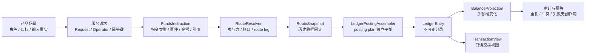
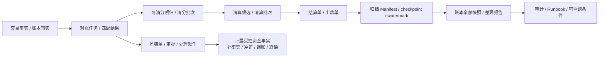

# 支付资金底座测试驱动设计

## 文档状态

| 项目 | 当前值 |
| --- | --- |
| 文档状态 | 稳定测试设计基线 / 评审中 |
| 权威输入 | [公共能力层产品设计](../产品设计/支付资金公共能力层-产品设计.md)、[公共能力层 DSL 设计](../DSL设计/支付资金公共能力层-DSL设计.md)、[公共能力层系统分析设计](../系分设计/支付资金公共能力层-系分设计.md) |
| 执行记录 | 当前任务、验证状态、授权和恢复入口统一见 [重设计执行规格](../../openspec/changes/funds-public-capability-redesign/spec.md)；本文不承载运行态 |

## 一、文档定位

本文是支付资金底座的测试驱动设计入口。TDD 即测试驱动设计：先用可执行或可转化为可执行测试的用例描述业务行为、边界条件和验收红线，再反推接口、模块、数据和实现。

本文承接：

| 输入 | 本文如何使用 |
| --- | --- |
| `docs/产品设计/05-产品验收与TDD用例矩阵.md` | 提炼产品必须被证明的事实、红线和验收样例。 |
| `docs/DSL设计/支付资金底座DSL承载层设计.md` | 把产品用例转成 `FundsInstruction`、`RouteSnapshot`、`PostingPlan`、`LedgerEntry` 和投影断言。 |
| `docs/系分设计/02-交易路由钱包账目与投影系分设计.md` | 映射交易、路由、钱包、账目、余额投影和交易投影的服务入口与执行流程。 |
| `docs/系分设计/03-清结算与对账系分设计.md` | 映射对账、清分、清算、结算、出款、差错和追偿对象的服务入口、状态机和资金红线。 |
| `docs/系分设计/04-归档重放与指标治理系分设计.md` | 映射资金数据治理、账本余额快照、交易投影重放、指标边界和大数据消费承接的治理门禁；文件名保留历史兼容。 |
| `docs/系分设计/05-测试观测安全与金融红线.md` | 继承测试分层、观测、安全、审计和金融红线。 |
| 代码模块与测试资产 | 校准真实服务、真实包名、目标测试支撑和落地入口。 |

本文不替代 PRD、DSL 或系分设计。本文只回答一个问题：

> 每个资金能力要如何通过测试证明：产品语义可靠、DSL 事实正确、系统执行路径真实、账务结果可信、异常和红线可阻断。

测试设计必须先把这个问题拆成账务三问：谁的钱、多少钱、怎么变的。三问缺一项时，不进入资金变化 Green；只能标记为 contract-only、设计待确认、人工处理或阻断。

| 三问 | TDD 最小断言 |
| --- | --- |
| 谁的钱 | 业务主体、可记账主体、账户类型、资金责任、支付工具或外部账户引用边界。 |
| 多少钱 | amount、currency、金额组件、账目 bucket、账本周期、累计处理和失败无余额副作用。 |
| 怎么变的 | 业务事实、状态迁移、route snapshot、posting plan、ledger transaction、ledger entry、projection、幂等和审计。 |

### 1.0 背景、目标、非目标与成功标准

背景：支付资金底座的产品设计、DSL 设计和系统分析设计已经把钱包、账本、账目、交易路由、清结算、对账、资金数据治理、余额快照和业务能力包拆成多层设计。团队需要一份稳定的 TDD 入口，把“设计已覆盖”转成“测试应证明什么、Red 用例先拦什么、哪些范围不能用测试缺口掩盖”。

目标：

1. 建立 PRD、DSL、系分和测试资产之间的追踪关系，确保每个资金能力都有产品验收、契约样例、系统落点、目标测试和红线用例。
2. 固定资金安全测试口径，要求金额、状态、route snapshot、posting plan、ledger entry、余额投影、幂等、审计和失败无副作用同时被证明。
3. 为工程落地提供测试准入证据，区分可 TDD 分析、可编码评估、可生产交付复核和未覆盖范围。

非目标：

1. 不替代生产代码、测试代码、DDL/H2 schema、工程任务边界或验证命令。
2. 不把目标测试资产、设计矩阵或 contract-only 夹具作为生产完成证据。
3. 不替代法务、合规、财务、税务、通道、银行、卡组织、Nacha/ACH 或持牌机构对外部规则的专业确认。

成功标准：

1. 任一能力域进入编码前，能说明对应 PRD 验收 ID、DSL caseId、系分章节、TDD Red、测试层级、验证命令和未覆盖条件。
2. 有资金变化的测试必须覆盖余额桶、账本分录、posting 平衡、投影、幂等、审计和失败无副作用，不允许只断言接口返回或交易状态。
3. 清结算、对账、资金数据治理、指标边界、P2 业务能力包和 ACH/银行转账支撑，必须先声明是否只进入 TDD 分析，以及工程写入范围、外部规则和敏感数据边界。

### 1.0.1 TDD 基线与 Red 裁剪

TDD 主文档只定义目标测试资产、Red 裁剪标准和生产交付断言。局部测试资产可以作为工程计划和交付说明中的回归证据，但不能被外推为后续完整争议运营或清结算追偿 case、授权支付工具应用入口、权益生产资金流、清结算、对账、资金数据治理或 P2 业务专项已完成。

TDD 基线核验阶段不写测试代码，只输出 `redCandidateSet`、`targetAssets`、`schemaNeed`、`minimumAssertions`、验证命令和停止条件。只有独立工程边界明确写入范围后，才把候选 Red 转成实际测试写入；触碰 `contextVariables`、Request/DTO、route snapshot、交易事实快照或上下文导出时，必须回归 `ReadonlyContextVariables`、敏感字段阻断和权益核心字段不得旁路。

### 1.0.2 公共能力重设计目标基线

`W4-01` 的目标语义按“公共能力层产品设计 -> 公共能力层 DSL 设计 -> 公共能力层系统分析设计 -> 本文第二十章”解释。本文前十九章、旧 PRD/DSL/编号系分和现有测试只作为当前实现、回归资产和迁移清册；凡与目标基线冲突的旧服务名、对象、状态或完成断言，不得覆盖目标合同，也不得据此冻结 Public API。

目标 TDD 只验证跨场景稳定复用的资金语义、资金事实和资金不变量。业务计划、Coupon/Benefit 非资金事实、raw issuer/ACH/PSP/payout 状态、source authority/finality、商户责任政策和专业核销规则继续由上游或 adapter 归一；`wind-funds` 只验证规范化资金指令/事实的独立准入、资金效果、账务、余额、累计、原事实、对账和恢复边界。

### 1.1 能力保障和测试优先级

TDD 的测试优先级按资金底座能力保障划分，不按 PRD/系分文档编号划分。生产可靠性判断必须先回到下表。

| 优先级 | 必须优先证明的能力 | 测试保障重点 |
| --- | --- | --- |
| P0 资金底座内核 | 钱包、账本、账目、余额投影、对账、清分、清算、结算、账本余额快照和资金数据治理证据。 | 主体可记账、账务平衡、余额可重建、批次可核对、出款可解释、差错可闭环、治理证据可审计和重跑幂等。 |
| P1 交易与读模型扩展 | 直接交易、授权交易、余额控制、交易投影和交易投影重投影。 | 交易入口、生命周期、路由回放、冻结/解冻、余额控制、交易视图和投影重放必须复用 P0 账务事实，失败无副作用。 |
| P2 业务模式能力包 | VCC 发卡、全球账户收付款和收单业务支持。 | 只验证资金底座可承接归一资金事实和外部规则核验边界；卡组织、银行、PSP、跨境、风控和合规实现必须进入业务专项。 |
| 生产交付场景验证 | VCC、全球账户收付款、收单、代理分佣结算、平台或商家优惠让利，以及作为外部轨道的 ACH。 | 六类场景包分别验证业务事实映射、正向、逆向和异常；并发、幂等、重放和失败无副作用由共享资金能力测试统一证明，关键跨能力链路再由组合流程测试证明；不得为每个场景复制测试内核或新增平行资金内核。 |

## 二、测试驱动设计原则

资金系统的 TDD 不是先写大量 Mock，也不是追求代码行覆盖率。它要先构造可验收的业务用例，再用测试证明真实执行路径没有偏离产品和 DSL。

| 原则 | 要求 |
| --- | --- |
| 场景先于实现 | 先写清角色、前置条件、输入事实、动作、期望状态、余额变化和红线，再决定测试类和断言方式。 |
| 事实先于接口 | 测试证明的是资金事实成立，不是某个方法被调用。 |
| 真实路径优先 | 非外部依赖尽量使用真实 converter、resolver、orchestrator、assembler、posting/projection 逻辑；只替换外部通道、时间、ID 和不可控基础设施。 |
| 每步余额断言 | 组合场景每一步都断言余额变化，不只断言最终余额。 |
| 账务证据闭环 | 有资金变化时必须同时证明 route snapshot、posting plan、ledger transaction、ledger entry 和 balance projection 可互相解释。 |
| 失败无副作用 | 余额不足、错币种、缺快照、超额、幂等冲突、权限不足等失败路径必须断言无账务 route leg、无 posting、无 entry 或余额无变化；拒绝解释用空 route snapshot 不视为账务副作用。 |
| 红线测试常驻 | 外部账户入账、直接改余额、授权拒绝写账、冻结表达消费、投影反写事实等必须有失败测试或明确不适用原因。 |

命名契约也必须可执行验证：领域生命周期字段从数据库、Entity 到 DTO/Request/Query/JSON 统一为 `state`，类型为 `XxxState`；运行、准入和决策结果使用 `outcome`、`result` 或具体业务名；限定的外部/展示/发布状态和数据库 `is_*` 布尔列不被机械改写。架构测试必须阻断 `status/state` 别名、桥接 setter 和同义物理列回流。

稳定契约同样纳入命名门禁：RouteSnapshot `paymentInstrumentRef` 只接受 `instrumentSn/state`，交易投影摘要只输出 `state`，外部规则核验证据只使用 `verificationResult`，账本余额桶只使用 `ledgerSubjectCode`。本轮是无兼容硬切，测试必须证明旧 `instrumentId/status` 不再解析或输出；宿主历史快照和摘要迁移不由兼容代码代替。

## 三、测试证据链

每个用例都应尽量形成以下证据链。小的纯单元测试可以只覆盖其中一段，但业务组合测试必须覆盖完整链路。



| 证据 | 最低断言 |
| --- | --- |
| 产品输入 | 业务场景、业务流水、主体、金额、币种、操作者、引用完整。 |
| 指令 | `instructionType`、`eventType`、`transactionType`、`amount/originalAmount/exchangeRate` 正确。 |
| 路由 | 参与方、平台账户、账目、余额桶、route leg 与产品资金链路一致。 |
| 快照 | 后继退款、撤销、结算、争议类退款、退费、解冻优先使用原路径。 |
| 账务计划 | 每个 posting plan 独立平衡，币种一致，entry 金额为正。 |
| 分录 | `LedgerEntry` 可追溯到资金指令、route leg、账本交易和业务引用。 |
| 余额投影 | 相关主体、账户类型、`normalBalanceSide`、账目、币种、账本周期的 delta 正确，并能回挂 DSL 借贷表的余额影响。 |
| 交易投影 | 只从交易事实、route snapshot 和分录摘要派生，不反写事实。 |
| 幂等审计 | 同键同摘要复用结果，同键不同摘要失败；高危动作有原因、凭证、审批或操作者。 |

### 3.1 P0 运营账务与治理证据链

P0 不只包含交易入账链路，还包含对账、清分、清算、结算、归档和账本余额快照的运营账务链路。涉及清结算、对账、归档或治理重放的测试，必须能从来源事实一路证明到批次、差错、出款、Manifest、checkpoint、watermark、差异报告和审计记录。



| P0 证据节点 | 最低断言 |
| --- | --- |
| 来源事实 | 对账、清分、清算和结算必须引用交易事实、route snapshot、账本交易或 ledger entry；不得从报表、投影或外部流水直接补造资金事实。 |
| 对账任务 | 对账范围、来源文件、规则版本、匹配结果、差错类型、阻断标记和重跑幂等可证明。 |
| 可清分明细 | 每条明细能追溯到来源事实、金额拆分、权益组件、手续费或税费口径；重复入批、错币种、错主体和金额不闭合必须失败。 |
| 清算和结算 | 清算候选、清算批次、结算单和出款单状态独立；结算锁定、出款前准入、外部非终态和回单结果都有幂等、审计和失败无副作用断言。 |
| 差错处理 | 误报关闭、补事实、冲正、调账、追偿、核销和重新对账必须有审批、凭证、原事实引用、处理动作号和操作审计。 |
| 受控资金动作 | 由上层业务决定并调用既有资金能力；对账只登记已完成动作引用，不判断上层业务准入，也不生成资金事实。 |
| 资金数据治理 | Manifest、checkpoint、watermark、覆盖范围、冷热摘要、dry-run/apply、续跑和回滚边界可证明；治理任务不得生成 route、posting 或 ledger entry。 |
| 账本余额快照 | 快照覆盖模式、账本 bucket、冷区 Manifest、热区游标、计算摘要、差异阈值和 `VERIFIED` 条件可证明；普通指标快照不得替代余额快照。 |
| 审计与 Runbook | 高危任务必须能定位到操作者、审批号、证据引用、traceId、告警、停止条件、恢复步骤和可重跑条件。 |

#### 3.1.1 B7 收益分润生产可用验收种子

两级代理收益分润用于验证清结算与对账层能否承接复杂收益结算。该种子不要求资金底座实现代理关系、GMV 统计、利润计算、KPI 计算或薪税规则；测试只消费上层业务已经固化的收益应得项、归因快照、规则版本和审批引用。

| TDD ID | 场景 | 最低断言 |
| --- | --- | --- |
| TDD-B7-REVSHARE-001 | 用户代理佣金和平台员工二级分润进入可清分。 | 收益应得项可追溯到交易、账本分录、利润或 GMV 口径、两级归因、规则版本和审批；清分确认不生成 route、posting 或 ledger entry。 |
| TDD-B7-REVSHARE-002 | 收益清算确认。 | 清算前置对账通过后才允许生成标准资金事实；用户代理净佣金、平台员工二级分润和 KPI 激励分别形成金额项和账务影响，余额 delta 与 DSL 借贷表一致。 |
| TDD-B7-REVSHARE-003 | 收益分润阻断和逆向。 | 退款、争议、GMV 阶梯错算、规则版本缺失、员工审批缺失、超两级归因、收益参与方账户未解析或金额不平时不得清算确认；清算后逆向只能走扣减、追偿、冲正、调账或后续结算抵扣。 |

### 3.2 资金变化最小断言集

只要测试触发了资金、额度、预算、冻结、清结算或调账变化，最少必须断言以下内容。缺一项时，应在测试说明中写明不适用原因。

| 断言项 | 最低要求 |
| --- | --- |
| 状态 | 交易、授权、冻结、批次或差错对象进入预期状态，非法状态迁移失败。 |
| 金额 | 金额为正、币种一致、累计处理不超过剩余可处理金额，失败场景无余额变化。 |
| 路由 | route code、参与方、账目、平台角色、支付工具和资金责任决策符合预期。 |
| 快照 | route snapshot、binding snapshot、规则版本和原事实引用可用于后继回放。 |
| 账务 | posting plan 独立平衡，LedgerEntry 主体、账目、方向和金额正确。 |
| 投影 | BalanceProjection delta 正确；TransactionView 只读派生，不反写事实。 |
| 幂等 | 同业务键同摘要不重复入账；同键不同摘要冲突失败。 |
| 审计 | 操作者、原因、凭证、traceId、审批或外部 reference 可追溯。 |
| 红线 | 相关 must-fail 场景证明失败且无 route、posting、entry 或无余额副作用；治理、投影和对账只读任务还必须证明不会生成资金事实。 |

### 3.2.1 支付工具入口到账户主体内核断言

当测试覆盖卡、VCC、VA、外部钱包端点、共享卡、通道 token 或内部钱包入口触发授权时，测试必须把入口断言和内核断言分开，不能只断言授权服务返回成功或失败。

| 断言面 | 授权批准最低断言 | 授权拒绝最低断言 |
| --- | --- | --- |
| 支付工具或业务入口 | 外部工具状态、方向、币种、绑定版本、使用主体、支出控制范围、Spend Rule 和资金责任解析关系均被读取并进入快照；内部钱包入口解析为账户主体、权益资金事实引用或历史摘要。 | 拒绝原因、规则版本、工具、绑定或入口解析失败原因可查询；敏感工具信息不进入普通日志、投影或导出。 |
| 资金责任解析 | 源端必须先解析为资金账户或信用账户；`targetSubjectType + targetSubjectId` 唯一且同样只能是资金账户或信用账户，并由 route participant/leg 显式承载。 | 0 条、多条、错币种、目标账户不可用，或工具、支出控制范围、Spend Rule、使用人、平台角色直接作为关系源端/目标端时失败。 |
| 交易内核 | route leg、posting plan、ledger entry 和余额投影只使用解析后的账户主体；`PaymentInstrumentRef` 只作为 route snapshot 和审计引用。 | 不生成账务 route leg、posting plan、ledger entry 或余额投影副作用；可断言空 route snapshot 仅作为拒绝解释证据。 |
| 回放 | 可信撤销、完成、退款和争议资金结果使用原授权 route snapshot、原工具快照和原资金责任决策；超时或 expired 只作观察，不进入资金回放。 | 当前工具解绑、换绑、暂停，或后来新增其他资金责任关系，都不得改变历史授权路径。 |

若当前工程任务只覆盖账户主体型内核入口，必须在 TDD 说明中标注“支付工具型应用入口未授权实现”，并把对应 Red 放入 B2、B4 或 B6 候选集中；不得用账户主体型测试通过来声明支付工具入口可用。

### 3.2.2 借贷平衡断言承接

每个资金变化测试必须回到 DSL 的 [资金场景借贷平衡与账务期望表](../DSL设计/支付资金底座DSL承载层设计.md#51-资金场景借贷平衡与账务期望表) 选择对应场景，并把表中的参与方账户示例、账户类型、`normalBalanceSide`、借贷平衡公式、余额桶变化、失败红线和 TDD 锚点转成断言。TDD 不复制维护完整借贷表；没有对应行时，应先补 DSL 账务期望，再进入 Red。

| 断言项 | 测试要求 |
| --- | --- |
| 场景映射 | 测试名或说明必须能反查 DSL 表中的场景、DSL 事件或指令。 |
| 参与方和账户类型 | route、posting 或 fixture 中的主体、账目、账户类型和 `normalBalanceSide` 必须能反查 DSL 表的账户示例；外部账户和支付工具不得被断言为 ledger entry 主体。 |
| 借贷平衡 | 同一 `PostingPlan` 的 debit sum 等于 credit sum，币种一致，entry 金额均为正。 |
| normal balance | 余额断言必须按 `EntrySide + normalBalanceSide` 计算 delta，不能把借方或贷方机械等同为增加或减少。 |
| 余额桶变化 | 断言 `AVAILABLE`、`FROZEN`、`AUTHORIZATION`、`CLEARING`、`SETTLEMENT`、`IN_TRANSIT` 等适用桶的前后 delta。 |
| 逆向回放 | 退款、可信撤销、出款失败、争议资金结果和追偿必须证明引用原事实或原 route snapshot；过期只验证无资金回放和无资金副作用。 |
| 禁止事实 | must-fail 场景断言不得生成 route、posting、entry、外部出款、治理反写或敏感导出。 |
| 权益金额 | 平台补贴、商户让利、储值券、零实付和退款分摊分别断言，不得只断言用户实付。 |

### 3.3 测试覆盖证明卡

每个工程任务交付前，测试说明必须能填满下表。无法填写的项不是测试细节缺失，而是准入证据缺失。

| 证明项 | 必须写清 |
| --- | --- |
| 产品验收 | 覆盖哪些 `AC-*`、`RED-*`，哪些明确不在工程任务范围内。 |
| DSL 契约 | 覆盖哪些 `DSL-*` caseId，是否需要新增 JSON 契约样例或只复用既有样例。 |
| 系分落点 | 对应哪份系分分册、服务入口、状态机、表或端口。 |
| 正向用例 | 至少证明一条完整资金事实链路，包含 route、posting、entry、projection 和 audit。 |
| 失败用例 | 证明拒绝、余额不足、缺快照、缺周期、差错阻断、无审批或无范围重放等失败无副作用。 |
| 数据准备 | 账户、平台角色、支付工具、账本 bucket、规则版本、外部引用和幂等键如何准备。 |
| 验证命令 | 实际执行的 `just` 或 Maven 命令；无法执行时说明环境原因。 |

含权益交易范围还必须额外填写权益准入证明。若无法填写，不得声明权益生产资金流可用。

| 证明项 | 必须写清 |
| --- | --- |
| 消费范围对齐 | 工程任务只做 contract-only，还是进入 route/posting/replay，或进入清结算、对账、投影、归档、冷热读取、治理重放消费。 |
| JSON 夹具级别 | `fixtureLevel` 使用 `CONTRACT_ONLY` 还是资金流夹具；`CONTRACT_ONLY` 不得作为 route、posting、replay、清结算或对账完成证据。 |
| 权益资金事实源 | 权益资金交易、`RouteSnapshotSpec` 摘要、交易事实快照、独立权益事实表或等价不可变存储选哪一个；缺失时逆向事件如何失败或进入人工处理。 |
| 零实付表达 | 允许零金额主指令，还是拆伴随权益指令；对应的金额临界值、幂等摘要和余额断言是什么。 |
| 平台补贴表达 | 平台补贴作为额外 route leg、独立伴随指令，还是未确认时阻断；不得和用户本金或手续费净额混记；选择独立伴随指令时必须写清主交易和伴随指令的事务边界、业务组幂等、失败补偿、冲正和投影合并断言。 |
| 独立伴随指令原子性 | 选择同事务、同业务组幂等加补偿、Saga 补偿或不涉及；写清 `companionGroupSn`、主从角色、补偿策略、部分成功处理、投影合并键和清结算阻断口径。 |
| 储值/预付口径 | 是否纳入工程任务范围；若纳入，负债、预收待付、退款和过期沉淀由谁确认。 |
| 退款分摊口径 | 商品行、比例、现金优先、权益优先或不可退权益优先如何选择，尾差由谁吸收，重试是否稳定。 |
| 历史无权益资金事实处理 | 选择失败、人工处理、迁移补录或只读差错；写清触发人或系统、处理依据、补录来源、复核人、影响范围、错误码、审计、运营入口、是否可撤销和重放幂等验收。 |
| 补充权益事实模型 | 是否允许追加补充事实；写清补录载体、补录来源、审批、复核、digest、版本、适用范围、撤销关系、失效处理和最终写入前校验。 |
| 专业确认 | 平台补贴、储值/预付/礼品卡、不返券不冲补贴、负债释放或转损益等场景的确认方、确认时间、确认值、适用范围、有效期、证据引用、撤销或变更处理和未确认处理。 |
| 审计证据包 | 确认证据的脱敏引用、审计责任人、有效期、适用范围、撤销/变更记录和敏感原文禁止项；缺失、过期、撤销、范围不匹配或引用含敏感原文时必须阻断或降级。 |
| 使用者解释视图 | 用户账单、商户账单、运营时间线、财务对账视图或审计导出必须说明金额来源、事实状态、展示状态、操作状态、状态含义、不可操作原因、后续处理动作和脱敏证据引用；不得把未完成资金状态展示为完成结果，也不得在缺少操作状态时展示可操作。 |
| 证据最小化 | 证据包、导出、日志和告警只能使用脱敏摘要、文件编号或外部 reference；完整卡号、CVV、密钥、证件影像、完整银行账户敏感号、无关聊天记录和超范围个人信息必须阻断。 |
| 外部规则核验 | 税务、会计、合同、卡组织、银行、通道、KYC/KYB/AML、客户资金、跨境或外汇口径必须记录规则来源、版本或发布日期、生效日期、适用主体或适用范围、适用法域、核验日期、确认方和确认状态；缺失时不得驱动自动资金处理。 |

### 3.4 TDD 分析到工程落地裁决

本表用于把 PRD、DSL、系分和 TDD 的一致性结论转换为工程落地口径。TDD 设计可以证明测试应当如何写，不能替代失败测试落地、生产代码实现、DDL/H2 对齐或验证命令。

| 能力域 | TDD 分析结论 | 工程落地前必须补齐 | Red 或验证重点 | 不允许的完成声明 |
| --- | --- | --- | --- | --- |
| P0 钱包、账本、账目和余额投影 | 可进入 TDD 分析和工程落地评估。 | 写入范围、公共契约、服务入口、H2 schema、余额断言支撑、边界测试和验证命令。 | 外部账户入账、直接改余额、posting 不平衡、周期缺失、幂等摘要冲突和失败无副作用。 | 只因 DTO/DSL 已定义或目标测试资产已列出就声明生产完成。 |
| P0 清分、清算、结算和对账 | 可进入 TDD 分析；工程落地必须单独声明边界。 | 清结算对象表、状态机、前置对账、出款准入、差错生命周期、运营入口、DDL/H2 范围和外部规则核验。 | `TDD-B7-RED-001` 至 `TDD-B7-RED-009`，以及 `CLS-GATE-*` 对应的服务级和数据库级失败断言。 | 清分候选直接入账、前置对账未知仍出款、重大差错带原因放行、差错直接改历史分录。 |
| P0/P1 资金数据治理、重放、余额快照和指标边界 | 可进入 TDD 分析；工程落地必须单独声明边界。 | 治理物理落点、Manifest/H2、范围锁、checkpoint、watermark、dry-run/apply、冷热读取、指标水位隔离和导出审计。 | `TDD-B8-RED-001` 至 `TDD-B8-RED-005`，以及 `GOV-GATE-*` 对应的只读、差异和脱敏边界断言。 | 无范围 apply、先推水位后计算、用报表或指标反推余额、指标任务反写资金事实。 |
| P1 直接交易、授权交易、余额控制和交易投影 | 可进入 TDD 分析和工程落地评估；必须证明复用 P0 资金事实。 | route snapshot、原路径 replay、授权/冻结/余额控制状态机、交易投影只读边界、并发和幂等断言。 | 授权拒绝无账务 route leg/posting/entry、冻结只表达同主体可用性控制、缺原快照逆向失败、交易投影不反写。 | 只断言交易状态或投影数量，不断言余额桶、posting、ledger transaction 和审计。 |
| P2 VCC、全球账户支持与收单设计 | VCC 和全球账户只作为后置业务专项 TDD 输入，不进入默认工程范围；收单已验证 capture 到商户 `CLEARING`、原路退款，以及 capture 经清分、清算、结算到成功出款的连续资金链。 | 外部规则确认状态、敏感数据边界、P0/P1 回归范围、专项验收 ID 和未覆盖条件；收单额外确认 PCI/商户清结算设计边界。 | `TDD-P2-*`、`TDD-RAIL-*`、`TDD-FX-*`、`TDD-OPS-006` 与对应资金底座红线；宿主运营审计使用 `HOST-OPS-*` 自行验收，收单继续验证退款、争议和外部规则边界。 | 把资金底座测试通过声明为 VCC、全球账户或收单业务系统整体交付完成，或把收单资金映射解释成完整业务实现。 |
| ACH 和银行转账轨道支撑 | 只验证资金底座边界，不验证 ACH 产品或通道实现。 | ACH/银行转账业务或通道适配层职责、外部引用、return/NOC/reversal 影响边界和专业确认字段。 | NOC 不改原资金事实、外部 accepted 不等于到账、return/reversal 只通过归一资金事实和差错/追偿承接。 | 在资金底座测试中声明 ACH 指令、Debit 授权、文件批次、return code 或 Nacha 规则已经实现。 |
| 外部规则、敏感证据和高危操作 | 未确认时只能形成 must-fail 或人工处理用例。 | 规则来源、版本或发布日期、生效日期、适用主体或范围、适用法域、核验日期、确认方、确认状态、审批和脱敏证据。 | 敏感原文阻断、无审批导出阻断、规则缺字段阻断、未确认规则不得驱动自动资金处理。 | 以公开资料、人工口头结论或未脱敏证据替代专业确认和测试证据。 |

## 四、DSL 契约到 TDD 追踪索引

本索引用于证明 DSL JSON 契约、TDD 用例、真实模块和红线测试之间可以互相追溯。新增 DSL 契约样例时，必须同步补充本表或说明不适用原因。

| DSL 契约用例 | 场景 | 主要 TDD 用例 | 主要模块或组件 | 红线承接 |
| --- | --- | --- | --- | --- |
| `DSL-DIRECT-PAY-FEE-001` | 充值成功、付款并收取手续费。 | `TDD-DIR-001`、`TDD-DIR-003`、`TDD-DIR-006`、`TDD-DIR-FLOW-002`。 | direct converter、transfer resolver、fee resolver、posting assembler、ledger projection。 | `TDD-RED-001`、`TDD-RED-004`、`TDD-RED-007`。 |
| `DSL-DIRECT-FUND-IN-FEE-001` | 充值成功和入金手续费收取。 | `TDD-DIR-001`、`TDD-DIR-006`、`TDD-DIR-FLOW-002`。 | direct command service、fee route、platform fee account、ledger projection。 | `TDD-RED-001`、`TDD-RED-004`。 |
| `DSL-DIRECT-CHAIN-001` | A 充值、转给 B、B 付款后提现。 | `TDD-DIR-FLOW-005`、`TDD-DIR-008`、`TDD-CTRL-FLOW-002`。 | direct service、balance control service、withdraw route、balance assertion support。 | `TDD-RED-006`、`TDD-RED-007`。 |
| `DSL-DIRECT-OVERDRAFT-001` | 受控透支和禁止透支边界。 | `TDD-DIR-010`、`TDD-DIR-FLOW-006`、`TDD-CTRL-FLOW-005`。 | direct fee route、negative balance policy、projection service。 | `TDD-RED-012`。 |
| `DSL-REVERSE-REFUND-FEE-001` | 原路径退款与手续费退回。 | `TDD-DIR-005`、`TDD-DIR-007`、`TDD-DIR-FLOW-002`。 | route replay、fee refund route、ledger posting service。 | `TDD-RED-003`、`TDD-RED-004`。 |
| `DSL-AUTH-LIFECYCLE-001` | 授权批准、拒绝、可信撤销、普通完成、过期无资金副作用和生命周期查询。 | `TDD-AUTH-001` 至 `TDD-AUTH-005`、`TDD-AUTH-008` 至 `TDD-AUTH-011`、`TDD-AUTH-013`、`TDD-AUTH-FLOW-001` 至 `TDD-AUTH-FLOW-008`、`TDD-AUTH-FLOW-010`、`TDD-AUTH-ERR-*`。 | authorization service、authorization resolver、route replay、lifecycle saver、posting assembler。 | `TDD-RED-005`、`TDD-RED-008`、`TDD-RED-016`。 |
| `DSL-AUTH-FORCE-CAPTURE-001` | 无授权强制完成。 | `TDD-AUTH-012`、`TDD-AUTH-FLOW-009`、`TDD-ROUTE-009`、`TDD-RED-017`。 | authorization service、force completion policy guard、authorization resolver、posting assembler。 | `TDD-RED-017`、`TDD-RED-033`。 |
| `DSL-AUTH-REFUND-001` | 授权链本金退款、业务确认的无原路由贷记、争议裁决资金结果和额外 credit 资金边界。 | `TDD-AUTH-005` 至 `TDD-AUTH-007`、`TDD-AUTH-FLOW-005`、`TDD-AUTH-FLOW-008`、`TDD-AUTH-FLOW-011` 至 `TDD-AUTH-FLOW-013`、`TDD-ROUTE-005`、`TDD-RED-003`、`TDD-RED-017A`、`TDD-RED-017B`、`B4-CB-RED-001A`、`B4-CB-RED-001B`。 | route replay、authorization refund service、business-confirmed direct refund/transfer boundary、refund reason/audit projector、posting assertion、transaction projection、idempotency digest。 | `TDD-RED-003`、`TDD-RED-017A`、`TDD-RED-017B`、`TDD-RED-036`。 |
| `DSL-AUTHORIZATION-CONTROL-SPEND-RULE-DECLINE-001` | 发卡授权控制扩展的支出规则拒绝。 | `TDD-AUTH-EXT-001` 至 `TDD-AUTH-EXT-004`、`TDD-AUTH-ERR-001`、`TDD-AUTH-ERR-005`。 | authorization control extension boundary、authorization reject saver、audit context、rule version snapshot。 | `TDD-RED-005`、`TDD-RED-015`。 |
| `DSL-BALANCE-CONTROL-FREEZE-001` | 冻结、部分解冻、冻结到期释放和冻结后提现。 | `TDD-CTRL-001` 至 `TDD-CTRL-004`、`TDD-CTRL-011`、`TDD-CTRL-FLOW-001`、`TDD-CTRL-FLOW-002`、`TDD-DIR-008`、`TDD-DIR-009`、`TDD-RACE-004`。 | balance control service、frozen order lifecycle、withdraw route、projection service。 | `TDD-RED-006`、`TDD-RED-003`、`TDD-RED-033`。 |
| `DSL-BALANCE-CONTROL-ADJUST-001` | 资金账户余额调整、信用账户额度调整和预算控制额度 / 窗口调整。 | `TDD-CTRL-005` 至 `TDD-CTRL-010`、`TDD-CTRL-FLOW-003` 至 `TDD-CTRL-FLOW-005`、`TDD-CTRL-ERR-005`、`TDD-LEDGER-008` 至 `TDD-LEDGER-011`。 | balance control resolver、balance control service、credit account service、budget group service、spend rule control view、ledger projection、ledger period resolver。 | 无来源直接改余额、缺审批凭证、跨主体价值转移、错币种、错周期、支出控制范围或 Spend Rule 入账，或无策略负余额。 |
| `DSL-BALANCE-CONTROL-EXTERNAL-DEFICIT-ADJUST-001` | 外部余额终局事实导致我侧同主体余额纠偏。 | `TDD-CTRL-012`、`TDD-CTRL-ERR-007`、`TDD-RECON-016`。 | balance control service、reconciliation difference、runtime negative balance policy fact、external evidence guard、ledger projection。 | 上游未终局、无外部余额快照、无差错单或审批凭证、跨主体转移损失、纠偏后绕过运行时负余额策略继续交易。 |
| `DSL-BALANCE-CONTROL-LIMIT-BUDGET-001` | 信用账户额度和预算规则额度调整专项。 | `TDD-CTRL-005` 至 `TDD-CTRL-008`、`TDD-CTRL-FLOW-003` 至 `TDD-CTRL-FLOW-005`、`TDD-LEDGER-008`、`TDD-WALLET-002`、`TDD-WALLET-003`。 | balance control resolver、credit account service、budget group service、spend rule control view、ledger projection、ledger period resolver。 | `TDD-RED-008`、`TDD-RED-012`、`TDD-RED-015`；预算规则窗口不得替代账本周期。 |
| `DSL-PAYMENT-INSTRUMENT-ROUTE-001` | 支付工具绑定、方向、状态、资金责任和账户能力共同决定 route。 | `TDD-WALLET-005`、`TDD-WALLET-006`、`TDD-WALLET-009`、`TDD-ROUTE-006`、`TDD-ROUTE-011`、`TDD-ROUTE-012`。 | payment instrument service、funding relation service、route resolver、route snapshot。 | `TDD-RED-001`、`TDD-RED-029`、`TDD-RED-034`、`TDD-RED-035`。 |
| `DSL-PAYMENT-INSTRUMENT-FAIL-001` | 支付工具不可用、资金流向不匹配、资金责任不唯一、账户能力不足时失败无副作用。 | `TDD-WALLET-009`、`TDD-WALLET-010`、`TDD-ROUTE-012`、`TDD-RED-034`、`TDD-RED-035`。 | command validation、payment instrument guard、route failure boundary。 | `TDD-RED-034`、`TDD-RED-035`。 |
| `DSL-PAYMENT-INSTRUMENT-REPLAY-001` | 工具换绑后退款、撤销、退费或拒付仍按原 route snapshot 回放。 | `TDD-ROUTE-005`、`TDD-ROUTE-013`、`TDD-RACE-009`、`TDD-RED-003`、`TDD-RED-036`。 | route replay、snapshot schema、lifecycle reference、posting assertion。 | `TDD-RED-003`、`TDD-RED-036`。 |
| `DSL-BENEFIT-CONTRIBUTION-SETTLE-001` | 让利出资记账最小契约、无权益空值语义、Phase/Batch 边界和旧 `benefitSnapshot` 拒绝。 | `TDD-BEN-001` 至 `TDD-BEN-009`、`TDD-BEN-ENTRY-005`、`TDD-BEN-ENTRY-006`。 | Consumer Benefit adapter、generic direct pay/refund、`FundsActionFact`、DSL JSON parser、JSON fixture verifier。 | `TDD-BEN-RED-001`、`TDD-BEN-RED-002`、`TDD-BEN-RED-020`、`TDD-BEN-RED-023`。 |
| `DSL-BENEFIT-MERCHANT-DISCOUNT-001` | 商户优惠券不入账。 | `TDD-BEN-DIR-001`、`TDD-BEN-ENTRY-001`。 | direct converter、route resolver、posting assembler、clearing projection。 | `TDD-BEN-RED-003`、`TDD-BEN-RED-011`。 |
| `DSL-BENEFIT-PLATFORM-SUBSIDY-001` | 平台补贴券补足商户。 | `TDD-BEN-DIR-002`、`TDD-BEN-ENTRY-001`。 | route resolver、platform account resolver、posting assembler。 | `TDD-BEN-RED-004`、`TDD-BEN-RED-008`、`TDD-BEN-RED-011`。 |
| `DSL-BENEFIT-PLATFORM-NO-SETTLEMENT-001` | 平台券不补足商户。 | `TDD-BEN-DIR-003`、`TDD-BEN-ENTRY-001`。 | direct route、clearing amount projection。 | `TDD-BEN-RED-004`、`TDD-BEN-RED-011`。 |
| `DSL-BENEFIT-PREPAID-VOUCHER-001` | 储值、预付或礼品卡代金券。 | `TDD-BEN-DIR-004`、`TDD-BEN-ENTRY-001`、`TDD-BEN-RED-006`。 | voucher liability route、platform/prepaid account role、finance confirmation guard。 | `TDD-BEN-RED-006`、`TDD-BEN-RED-011`。 |
| `DSL-BENEFIT-MARKETING-ACCOUNT-001` | 营销/让利账户承接有资金影响的优惠让利出资。 | `TDD-BEN-MKT-001` 至 `TDD-BEN-MKT-006`。 | benefit account profile、route resolver、posting assembler、clearing/reconciliation projection。 | `TDD-BEN-RED-031` 至 `TDD-BEN-RED-033`。 |
| `DSL-BENEFIT-AUTH-HOLD-001` | 授权时占券、完成时核销。 | `TDD-BEN-AUTH-001`、`TDD-BEN-AUTH-002`、`TDD-BEN-AUTH-003`、`TDD-BEN-ENTRY-003`、`TDD-BEN-ENTRY-004`。 | authorization service、authorization route resolver、route replay。 | `TDD-BEN-RED-005`、`TDD-BEN-RED-011`、`TDD-BEN-RED-014`。 |
| `DSL-BENEFIT-REFUND-NO-COUPON-001` | 不退券但冲补贴。 | `TDD-BEN-REFUND-001`、`TDD-BEN-ENTRY-002`、`TDD-BEN-ENTRY-004`。 | route replay、refund policy resolver、posting assembler。 | `TDD-BEN-RED-007`、`TDD-BEN-RED-013`、`TDD-BEN-RED-014`。 |
| `DSL-BENEFIT-REFUND-RETAIN-SUBSIDY-001` | 不退券且不冲补贴。 | `TDD-BEN-REFUND-002`、`TDD-BEN-ENTRY-002`、`TDD-BEN-ENTRY-004`。 | refund policy resolver、audit context、finance confirmation guard。 | `TDD-BEN-RED-007`、`TDD-BEN-RED-013`、`TDD-BEN-RED-014`。 |
| `DSL-BENEFIT-PARTIAL-REFUND-001` | 部分退款权益分摊。 | `TDD-BEN-REFUND-003`、`TDD-BEN-ENTRY-002`、`TDD-BEN-RACE-001`。 | refund amount allocator、route replay、lifecycle saver。 | `TDD-BEN-RED-008`、`TDD-BEN-RED-009`、`TDD-BEN-RED-013`。 |
| `DSL-BENEFIT-MISSING-CONTRIBUTION-FACT-REPLAY-001` | 缺原让利出资事实的逆向处理。 | `TDD-BEN-REPLAY-001`、`TDD-BEN-ENTRY-002`、`TDD-BEN-ENTRY-004`。 | route replay、manual exception boundary。 | `TDD-BEN-RED-002`、`TDD-BEN-RED-009`、`TDD-BEN-RED-013`、`TDD-BEN-RED-014`。 |
| `DSL-BENEFIT-CLEARING-RECONCILIATION-001` | 含权益交易进入清结算和对账拆分。 | `TDD-BEN-CLS-001` 至 `TDD-BEN-CLS-003`、`TDD-BEN-RECON-001`、`TDD-BEN-OPS-001`。 | clearing candidate、settlement item、reconciliation difference、benefit amount item projection。 | `TDD-BEN-RED-010`。 |
| `DSL-BENEFIT-COMPANION-INSTRUCTION-001` | 独立伴随权益指令原子性。 | `TDD-BEN-DIR-007`、`TDD-BEN-RED-024`、`TDD-BEN-RED-025`、`TDD-BEN-RACE-004`。 | companion instruction orchestrator、route/posting orchestration、projection merge、settlement/reconciliation guard。 | 缺 `companionGroupSn`、主从角色、原子性模式、补偿策略或投影合并键，或部分成功被展示为普通成功。 |
| `DSL-BENEFIT-SUPPLEMENTAL-FACT-001` | 历史补充权益事实。 | `TDD-BEN-REPLAY-004`、`TDD-BEN-RED-026`、`TDD-RACE-012`。 | supplemental fact store、replay boundary、audit approval、governance replay。 | 补充事实覆盖原交易、原 route snapshot、原账本事实或余额投影，或缺审批、复核、digest、版本和撤销关系仍参与资金处理。 |
| `DSL-BENEFIT-AUDIT-EVIDENCE-001` | 专业确认和审计证据包最终校验。 | `TDD-BEN-RED-022`、`TDD-BEN-RED-027`、`TDD-RACE-012`。 | approval/audit service、evidence package verifier、final write guard。 | 证据缺失、过期、撤销、范围不匹配或引用含敏感原文仍自动入账、退款、清结算确认、归档正式执行或治理重放正式执行。 |
| `DSL-BENEFIT-EXPLAINABLE-VIEW-001` | 含权益视图可理解且不误导。 | `TDD-BEN-RED-028`、`TDD-BEN-RED-029`、`TDD-BEN-RED-030`、`FundsOperationExplainabilityTests`。 | projection/explainability boundary、operation timeline、audit export、external rule confirmation guard。 | 授权占用、冻结、待清算、出款受理、补充事实或未确认规则被展示为已完成资金结果；缺事实状态、展示状态或操作状态仍展示可操作；敏感证据、未核验外部规则进入自动放行。 |
| `DSL-SETTLEMENT-RECONCILIATION-001` | 清结算与对账差错入账总入口。 | `TDD-CLS-001` 至 `TDD-CLS-007`、`TDD-SETTLE-001` 至 `TDD-SETTLE-005`、`TDD-RECON-001` 至 `TDD-RECON-007`。 | splittable detail、split batch、split result snapshot、clearing candidate、clearing batch、settlement order、payout order、payout preflight guard、payout explainability、reconciliation task、reconciliation difference、ledger posting。 | `TDD-RED-018`、`TDD-RED-020` 至 `TDD-RED-025`、`TDD-RED-031`。 |
| `DSL-SETTLEMENT-CLEARING-CONFIRM-001` | 清算确认入账。 | `TDD-CLS-006`、`TDD-RECON-004`、`TDD-RED-020`、`TDD-RED-033`。 | clearing batch、candidate lock、transaction command、ledger posting。 | 重复确认重复入账、缺前置对账、候选未锁定。 |
| `DSL-SETTLEMENT-LOCK-001` | 结算锁定。 | `TDD-SETTLE-001`、`TDD-SETTLE-006`、`TDD-SETTLE-007`、`TDD-SETTLE-SOURCE-UNIQUE-001`、`TDD-RACE-013`、`TDD-RED-020`。 | settlement order、settlement item、lock command、ledger posting。 | 锁定当出款成功、跨单重复消费来源、模式误锁、取消后未释放来源、复用人工调账口径。 |
| `DSL-SETTLEMENT-PAYOUT-RESULT-001` | 出款成功、失败、退回和金额不一致结果。 | `TDD-SETTLE-002`、`TDD-SETTLE-003`、`TDD-SETTLE-004`、`TDD-SETTLE-005`、`TDD-CLS-FLOW-004`、`TDD-CLS-FLOW-005`、`TDD-RACE-006`。 | payout order、payout preflight guard、external receipt、result command、ledger posting、exception case。 | 门禁失败仍提交、外部受理当成功、失败重复回退、金额不一致静默完成、缺事实状态/展示状态/操作状态仍展示可操作。 |
| `DSL-SETTLEMENT-RECONCILIATION-ADJUST-001` | 对账差错调账。 | `TDD-RECON-001`、`TDD-RECON-002`、`TDD-CTRL-ERR-005`、`HOST-OPS-001`。 | exception case、approval、evidence、adjust command、ledger posting。 | 无审批调账、直接改历史分录、绕过差错闭环直接改余额。 |
| `DSL-SETTLEMENT-POLICY-001` | 结算策略合法表达和非法表达解析边界。 | `TDD-CLS-002`、`TDD-CLS-004`、`TDD-RED-031`。 | `SettlementPolicySpec`、clearing candidate guard、settlement policy boundary。 | `TDD-RED-031`。 |
| `DSL-P2-EXTERNAL-EVIDENCE-PACK-001` | P2 外部适配证据包。 | `TDD-P2-EVIDENCE-001`、`TDD-P2-EVIDENCE-RED-001`、`TDD-RED-030`、`TDD-RED-034`。 | scenario pack evidence verifier、signature/dedupe guard、external reference index、file digest guard、external rule verification guard。 | 缺验签、幂等摘要、外部引用、文件摘要、规则核验或敏感数据策略仍自动推进资金事实。 |
| `DSL-VCC-RECON-SOURCE-OBJECT-001` | VCC 对账来源对象承接。 | `TDD-P2-VCC-013`、`TDD-P2-VCC-014`、`TDD-RECON-001`、`TDD-RECON-004`、`TDD-RECON-016`。 | VCC reconciliation source adapter、match result、difference item、adjustment action、audit trail。 | 供应商账单或清算文件直接改账、对账结果直接改余额、净额静默抵消差异、缺来源对象或审计证据关闭差错。 |
| `DSL-GOVERNANCE-ARCHIVE-MANIFEST-001` | 统一治理任务、归档申请和资金归档 Manifest 状态隔离。 | `TDD-GOV-001` 至 `TDD-GOV-004`、`TDD-ARCH-001`、`TDD-ARCH-005`、`TDD-RED-026`。 | governance task boundary、archive request、archive Manifest、checkpoint/watermark reference、difference report。 | `TDD-RED-018`、`TDD-RED-026`。 |
| `DSL-GOVERNANCE-BALANCE-SNAPSHOT-001` | 账本余额快照确认边界。 | `TDD-GOV-004`、`TDD-ARCH-006` 至 `TDD-ARCH-006C`、`TDD-METRIC-004`、`TDD-RACE-010`。 | `BalanceSnapshotVerifyRef`、`VerifyBalanceSnapshotRequest`、coverage mode、Manifest coverage、balance watermark guard。 | `TDD-RED-014`、`TDD-RED-018`、`TDD-RED-026`。 |
| `DSL-GOVERNANCE-PROJECTION-REPLAY-001` | 交易投影重放范围、模式、checkpoint、差异报告、人工处理引用和只读边界。 | `TDD-GOV-003`、`TDD-GOV-004`、`TDD-ARCH-009`、`TDD-REPLAY-001` 至 `TDD-REPLAY-004`、`TDD-RED-027`、`TDD-RED-028`。 | projection replay service、transaction view port、difference report、manual resolution、cold/hot fact reader。 | `TDD-RED-010`、`TDD-RED-027`、`TDD-RED-028`。 |
| `DSL-TRANSACTION-VIEW-MULTI-DIMENSION-001` | 多维交易投影查询。 | `TDD-VIEW-005`、`TDD-REPLAY-005`、`TDD-RED-010`、`TDD-RED-013`、`TDD-RED-014`。 | transaction view query service、payment instrument view index、subject view index、budget/spend-rule control view、rule decision log。 | 查询维度成为资金事实源、支出控制范围或 Spend Rule 入账、投影重放反写交易/路由/账本/余额。 |
| `DSL-GOVERNANCE-METRIC-SNAPSHOT-BOUNDARY-001` | 普通指标快照只读、指标水位隔离和余额确认不可替代。 | `TDD-GOV-004`、`TDD-METRIC-001` 至 `TDD-METRIC-004`、`TDD-RACE-010`、`TDD-RED-019`。 | `MetricSnapshotRef`、reporting metric module boundary、metric watermark guard、quality report boundary。 | `TDD-RED-014`、`TDD-RED-018`、`TDD-RED-019`。 |
| `DSL-GOVERNANCE-BIG-DATA-ARCHIVE-BOUNDARY-001` | 大数据消费边界；caseId 保留历史 archive 命名。 | `TDD-ARCH-010`、`TDD-METRIC-004`、`TDD-RACE-010`、`TDD-RED-018`、`TDD-RED-019`。 | governance export snapshot、authorized cold fact read、Manifest summary、desensitization policy、digest、export audit。 | 报表数仓绕过治理边界直接扫冷归档、反写资金事实、推进资金水位、替代余额快照或交易重放 checkpoint。 |

### 4.1 产品验收覆盖门禁

编码工程拆解前，必须先用本表确认工程任务覆盖哪些产品验收项、落到哪些 TDD 用例、对应哪份系分分册，以及是否属于目标交付范围。若某个 `AC-*` 或 `RED-*` 未进入交付范围，任务说明必须写明“不适用原因、归属分册或启用条件”。

编号规则：产品设计中的 `RED-*` 是产品红线编号，本文的 `TDD-RED-*` 是工程测试红线编号，两者不按同号自动等价。编码任务只能按本表显式映射判断覆盖关系；例如产品侧归档红线和 TDD 侧支付工具敏感信息红线可能编号相同或相近，但代表不同测试对象。

| 产品验收或红线 | TDD 承接 | 系分落点 | 工程归属 |
| --- | --- | --- | --- |
| `AC-IN-*`、`AC-OUT-*` | `TDD-DIR-001`、`TDD-DIR-008`、`TDD-DIR-009`、`TDD-DIR-ERR-*`、`TDD-CTRL-FLOW-*`。 | 02-交易路由钱包账目与投影系分设计的直接交易、冻结提现、路由和账务投影。 | P1 直接交易入口；涉及外部回单时只验证归一后的资金事实，并必须证明 P0 钱包、账本、账目和余额投影不变量。 |
| `AC-PAY-*`、`AC-MER-*`、`AC-FEE-*` | `TDD-DIR-002` 至 `TDD-DIR-007`、`TDD-DIR-FLOW-001` 至 `TDD-DIR-FLOW-006`、`TDD-ROUTE-002`、`TDD-RED-007`。 | 02-交易路由钱包账目与投影系分设计的付款、商户收款、手续费、退费和普通支付路由。 | P1 直接交易入口；商户待清分、手续费和权益金额必须能进入 P0 清结算与对账拆分。 |
| `AC-BEN-001` 至 `AC-BEN-019`、`RED-050` 至 `RED-066` | `TDD-BEN-*`、`TDD-BEN-ENTRY-*`、`TDD-BEN-RED-*`、`TDD-BEN-RACE-*`，并按资金影响映射到 `TDD-DIR-*`、`TDD-AUTH-*`、`TDD-CLS-*`、`TDD-RECON-*`、`TDD-OPS-006`；宿主操作审计映射到 `HOST-OPS-*`。 | 02-交易路由钱包账目与投影系分设计的让利出资记账交易契约、权益路由账务消费、授权占券、退款回放、消费范围、`fixtureLevel`、零实付表达、不可变事实源、补充权益事实、专业确认状态、审计证据包、使用者解释视图、证据最小化和外部规则核验；03-清结算与对账系分设计的权益金额项和权益差错。 | 权益金额组件专项；只做契约承载时不宣称 route/posting/replay 完整闭合，进入资金流消费后才要求资金影响组件进入完整证据链；含权益生产资金流必须填写权益准入证明，并证明使用者视图不误导、证据不过界、外部规则已核验。 |
| `AC-ROUTE-*`、`RED-043` 至 `RED-045` | `TDD-ROUTE-001` 至 `TDD-ROUTE-014`、`TDD-DIR-ERR-*`、`TDD-RED-001`、`TDD-RED-003`、`TDD-RED-029`。 | 02-交易路由钱包账目与投影系分设计的 RouteResolver、RouteSnapshot 和 RouteReplay。 | P1 路由与回放能力；不得绕过 P0 主体、账目和账本周期边界。 |
| `AC-PI-001` 至 `AC-PI-010`、`RED-046` 至 `RED-049`、`RED-067` | `TDD-WALLET-005`、`TDD-WALLET-006`、`TDD-WALLET-009` 至 `TDD-WALLET-019`、`TDD-ROUTE-006`、`TDD-ROUTE-011` 至 `TDD-ROUTE-013`、`TDD-RACE-009`、`TDD-RED-001`、`TDD-RED-034` 至 `TDD-RED-037`、`TDD-RED-043`，以及业务入口参数和授权支付工具应用入口的准入、解析和失败无副作用用例。 | 02-交易路由钱包账目与投影系分设计的 PaymentInstrumentCapabilityApplicationService、FundingResponsibilityResolutionApplicationService、PaymentInstrumentTransactionApplicationService、PaymentInstrumentService、SpendSubjectFundingRelationService、RouteSnapshot、RouteReplay、FundingAccountService、CreditAccountService、SpendControlScopeService 和 wallet 边界。 | 支付工具、绑定、钱包入口、资金责任解析、业务入口参数和账户语义专项；作为钱包账户与路由能力的一部分，不单独表达余额；内部钱包入口不得强制包装成 `PaymentInstrument`；`FundingAccount` 只表达真实资金账户，不作为信用、支出控制范围、支付工具或业务入口参数的统一父类；`AC-PI-010` 只授权外层应用入口，不改变交易内核账户主体入参。 |
| `RED-020` | `SettlementPolicySpecTests`、`TDD-RED-031`。 | DSL 设计的 `SettlementPolicy DSL` 和 03-清结算与对账系分设计的结算策略边界。 | DSL 契约层；策略解析失败必须显式失败，不得静默按实时结算处理。 |
| `AC-AUTH-000` 至 `AC-AUTH-007`、`AC-AUTH-011`、`AC-AUTH-012`、`AC-RAIL-001`、`AC-RAIL-002` | `TDD-AUTH-001` 至 `TDD-AUTH-013`、`TDD-AUTH-FLOW-*`、`TDD-AUTH-ERR-*`、`TDD-ROUTE-003`、`TDD-ROUTE-005`、`TDD-ROUTE-008`、`TDD-ROUTE-009`、`TDD-RACE-001` 至 `TDD-RACE-003`、`TDD-RAIL-001`、`TDD-RED-003`、`TDD-RED-005`、`TDD-RED-008`、`TDD-RED-016`、`TDD-RED-017`、`TDD-RED-017A`、`TDD-RED-033`、`TDD-RED-036`，以及授权入口分层的应用准入、账户主体内核委派和失败无 route/posting/entry 用例。 | 02-交易路由钱包账目与投影系分设计的授权交易状态机、授权入口分层、共享卡资金责任关系、授权回放、强制完成、无授权退款、拒付承接、VCC 授权归一边界和并发竞争。 | P1 授权交易能力；`AC-AUTH-000` 只证明支付工具型入口和账户主体型内核分层，不授权直接替换 canonical `authorize` 请求；完整支付轨道仍按 P2 轨道专项确认。 |
| `AC-AUTH-008` 至 `AC-AUTH-010`、`RED-025` 至 `RED-027`、`RED-035` | `TDD-AUTH-EXT-001` 至 `TDD-AUTH-EXT-004`、`TDD-AUTH-ERR-001`、`TDD-AUTH-ERR-005`、`TDD-RED-005`、`TDD-RED-015`。 | 02-交易路由钱包账目与投影系分设计的发卡授权控制扩展边界。 | P2 发卡扩展；未启用发卡产品时只做边界测试，不进入 P0/P1 默认交付。 |
| `AC-CTRL-*`、`RED-013` | `TDD-CTRL-*`、`TDD-CTRL-FLOW-*`、`TDD-CTRL-ERR-*`、`TDD-LEDGER-006`、`TDD-LEDGER-008` 至 `TDD-LEDGER-011`、`TDD-WALLET-001` 至 `TDD-WALLET-004`、`TDD-ROUTE-004`、`TDD-RACE-004`、`TDD-RED-006`、`TDD-RED-011`、`TDD-RED-012`、`TDD-RED-015`、`TDD-RED-033`。 | 02-交易路由钱包账目与投影系分设计的余额控制、信用账户、支出控制范围 / Spend Rule 控制、账本周期、主体解析和受控负余额。 | P1 余额控制能力，P0 账本和余额投影必须同步守住；`AC-CTRL-004` 对应资金账户余额调整，必须覆盖 `TDD-CTRL-009` 和 `TDD-CTRL-ERR-005`；`AC-CTRL-009` 至 `AC-CTRL-011` 必须覆盖账本周期隔离、继承和跨周期查询；`AC-CTRL-012` 必须覆盖资金账户、信用账户和平台账户角色解析，业务主体、卡、VA、银行账户、支付工具、业务单据、支出控制范围和 Spend Rule 不得直接入账；资金账户余额调整必须有来源、审批、凭证和审计，不承接跨主体价值转移。 |
| `AC-ADJ-001`、`RED-010` | `TDD-RECON-001`、`TDD-RECON-002`、`TDD-CTRL-ERR-005`、`HOST-OPS-001`。 | 03-清结算与对账系分设计的对账差错、调账、审批、凭证、核销和重新对账。 | 调账专项；资金底座只处理上层已授权的调账事实，审批与操作审计由宿主负责。 |
| `AC-VIEW-*`、`AC-BALLOG-001`、`AC-REPLAY-005`、`RED-012`、`RED-036` | `TDD-LEDGER-007`、`TDD-LEDGER-012`、`TDD-VIEW-001` 至 `TDD-VIEW-006`、`TDD-REPLAY-005`、`TDD-RED-010`、`TDD-RED-013`、`TDD-RED-014`。 | 02-交易路由钱包账目与投影系分设计的余额投影、余额日志、交易投影、多维交易投影查询、支付工具快照解释和预算/规则控制视图。 | P0 余额投影和 P1 交易投影共同承接；任一投影都不得反写事实；支付工具、支出控制范围和 Spend Rule 只能作为查询维度和解释视图，不得成为资金事实源或账本主体。 |
| `AC-CLR-*`、`AC-SET-*`、`AC-SET-006` 至 `AC-SET-009`、`AC-REC-*`、`RED-030` 至 `RED-033`、`RED-037` 至 `RED-039` | `TDD-CLS-*`、`TDD-CLS-FLOW-*`、`TDD-SETTLE-*`、`TDD-SETTLE-004`、`TDD-SETTLE-005`、`TDD-RECON-*`、`TDD-RED-020` 至 `TDD-RED-025`。 | 03-清结算与对账系分设计的可清分明细、清分批次、清分结果快照、清算候选、清算批次、结算单、出款单、出款前准入门禁、出款解释状态、对账批次、差错单和追偿单；当前仓库局部切片已由 `ReconciliationRunResultApplicationServiceTests`、`ReconciliationDifferenceApplicationServiceTests`、`ReconciliationGateApplicationServiceTests`、`ReconciliationDifferenceReportApplicationServiceTests`、`ClearingSplittableDetailApplicationServiceTests`、`ClearingSettlementGateConsumerServiceTests`、`PayoutPreflightServiceTests`、`PayoutOrderApplicationServiceTests`、`RecoveryOrderApplicationServiceTests` 承接正向运行结果、对账差错、只读报告、准入消费、出款事实与最小追偿责任/结果引用。 | P0 清结算与对账能力；不得混入交易入口实现，不得把空差错集合当成对账通过，出款门禁未知、外部非终态和金额不一致都不能展示为完成或自动放行。 |
| `AC-ARCH-*`、`AC-ARCH-008`、`AC-ARCH-009`、`AC-REPLAY-*`、`RED-016` 至 `RED-019`、`RED-034`、`RED-040` 至 `RED-042` | `TDD-GOV-*`、`TDD-ARCH-*`、`TDD-ARCH-009`、`TDD-ARCH-010`、`TDD-REPLAY-*`、`TDD-METRIC-004`、`TDD-RACE-008`、`TDD-RACE-010`、`TDD-RED-018`、`TDD-RED-026` 至 `TDD-RED-028`。 | 04-归档重放与指标治理系分设计（历史文件名）的资金数据治理流程接入、ArchiveManifest、Checkpoint、Watermark、BalanceSnapshotVerifyRef、差异报告、异常人工处理、治理读取或导出快照和交易投影重放任务。 | 资金数据治理专项；余额快照只能从账本事实确认，普通指标快照不能替代余额检查点、Manifest 覆盖校验或余额水位推进；治理或重放异常只能进入差异报告、审批、补证据、缩小范围、重跑或关闭差异，不能直接改交易、账目、余额或投影事实；大数据消费只能通过治理读取、导出快照、Manifest 摘要、脱敏和审计边界承接，不能把资金冷归档当在线报表库或让报表数仓反写事实。 |
| `AC-RPT-*`、`RED-029` | `TDD-METRIC-001` 至 `TDD-METRIC-004`、`TDD-RACE-010`、`TDD-RED-019`。 | 04-归档重放与指标治理系分设计的指标项承接边界、普通指标快照边界和 05-测试观测安全与金融红线。 | 指标模块承接；资金底座只验证来源和只读边界，指标水位不得参与余额水位推进、归档 Manifest 或交易投影重放 checkpoint。 |
| `AC-OPS-*`、`RED-028` | 宿主验收 `HOST-OPS-001` 至 `HOST-OPS-003`；资金边界使用 `TDD-OPS-004` 至 `TDD-OPS-006`、`TDD-RED-024`。 | Web/宿主承接审批、工单、敏感导出和操作审计；资金底座只承接候选状态动作并守住不得直接改账的红线。 | `HOST-OPS-*` 不属于 wind-funds TDD 或准出门禁；资金接口不允许后台直接改账。 |
| `AC-RAIL-*`、`ACH-BOUNDARY-*`、`AC-FX-*`、`RED-014`、`RED-015`、`RED-021` | `TDD-RAIL-001` 至 `TDD-RAIL-009`、`TDD-FX-001` 至 `TDD-FX-003`、`TDD-RED-030`、`TDD-RED-034`。 | 产品设计保留轨道和合规边界；ACH 边界文档只定义外部银行转账轨道资金底座支持；系分默认只承接归一资金事实、外部引用、核验状态和 FX 快照边界。 | P2 支付轨道、跨境和 FX 专项；未完成上层解释、资质、协议、外部规则和轨道系分前不进入 P0/P1 默认交付。 |
| `VCC-AC-*`、`VCC-RED-*` | `TDD-P2-VCC-*`、`TDD-P2-VCC-RED-*`、`TDD-RAIL-001`、`TDD-AUTH-*`、`TDD-RECON-*`、`TDD-OPS-006`；宿主审计使用 `HOST-OPS-*`。 | 06-VCC 场景资金能力边界、02 授权交易和 03 清结算对账系分设计。 | P2 VCC 场景契约；只验证支付工具、账户、资金责任、资金动作和账务边界，不测试或定义 `VccTransaction`、`VccTransactionEvent`、issuer 协议、VCC 应用状态或卡账单。 |
| `GA-AC-*`、`GA-RED-*` | `TDD-P2-GA-*`、`TDD-P2-GA-RED-*`、`TDD-RAIL-008`、`TDD-RAIL-009`、`TDD-FX-*`、`TDD-SETTLE-*`。 | 07-全球账户收付款资金底座 PRD、02 多币种主体边界和 03 出款对账系分设计。 | P2 全球账户专项；只验证外部受理、在途、退汇、FX 引用和外部账户不入账边界，不承诺跨境、银行协议或换汇执行。 |
| `ACQ-AC-*`、`ACQ-RED-*` | `TDD-P2-ACQ-*`、`TDD-P2-ACQ-RED-*`、`TDD-CLS-*`、`TDD-SETTLE-*`、`TDD-RECON-*`、`TDD-OPS-006`；宿主审计使用 `HOST-OPS-*`。 | 08-收单业务资金底座 PRD、03 清分清算结算出款和对账系分设计。 | P2 收单专项；只验证 payment attempt/capture/refund/dispute 归一、商户清结算和敏感数据边界，不承诺商户入网、PSP、收单行或卡组织最终规则。 |

支付工具入口相关 TDD 基线：

1. 授权支付工具入口只验证 `authorizeByInstrument` 或等价 application facade 的准入、解析、拒绝无副作用和委派行为。
2. 账户主体型 `authorize` 内核仍按 `FundsAuthorizationTransactionAuthorizeRequest` 保护，测试必须证明批准后只委派已解析资金账户、信用账户或平台账户角色解析后的资金主体。
3. 不新增统一 `InstrumentDirectTransactionService`、`InstrumentAuthorizationTransactionService`、`InstrumentBalanceControlService` 的测试基线；P2 业务能力包通过场景事实映射复用 P1/P0 测试资产。
4. VCC 预付卡外部充值、系统内余额钱包充值、共享卡调额、VA 收款、全球账户付款和 ACH/银行转账事件必须先证明业务事实、外部引用、状态映射和资金确认时点，再断言是否进入直接交易、授权交易、余额控制、清结算或对账调账。

### 4.2 PRD、DSL、系分和 TDD 四层对齐门禁

凡测试设计触碰可入账主体、支付工具、支出控制范围、Spend Rule 或交易投影，必须先按本门禁确认四层口径一致；不一致时先回到设计文档修正，不用测试替代产品或系分裁决。

| 门禁项 | TDD 必须证明 | 对应设计口径 |
| --- | --- | --- |
| 可入账主体 | 资金变化只落到资金账户、信用账户或平台角色解析后的平台资金账户；支出控制范围、Spend Rule、支付工具、外部账户和业务单据直接入账必须失败且无副作用。 | PRD 的核心记账主体裁决、DSL 的可入账主体、系分的 route/posting/ledger entry 边界。 |
| 支付工具 | 工具只能形成 `PaymentInstrumentRef`、binding snapshot、外部引用和原路径回放索引；换绑后逆向交易不得按当前绑定重路由。 | PRD 的支付工具暴露资金能力口径、DSL 的工具引用口径、系分的 `PaymentInstrumentService` 和 route resolver 边界。 |
| 支出控制范围和 Spend Rule | 支出控制范围创建不初始化 ledger；Spend Rule 拒绝不生成账务 route leg/posting/entry；预算预留、释放和规则命中只更新控制证据或只读视图。 | PRD 的预算控制口径、DSL 的 SpendControlScope 上下文和 Spend Rule 快照、系分的预算控制视图和规则决策日志。 |
| 交易投影 | 多维交易投影可以按工具、账户、支出控制范围和 Spend Rule 查询，但投影重放不得生成资金交易、route、posting、ledger entry 或余额修复事实。 | PRD 的统一只读投影口径、DSL 的 projection replay 边界、系分的 transaction view query 和 view index 边界。 |

## 五、测试分层与工程落点

| 层级 | 目标 | 工程落点 | 适用场景 |
| --- | --- | --- | --- |
| L1 DSL/契约/纯单元 | 锁定枚举、Spec、值对象、转换、摘要和不变量。 | `core/src/test`、`tests/src/test`。 | DSL JSON、金额模型、SettlementPolicy、route/replay 类型、entry digest。 |
| L2 模块服务测试 | 覆盖真实 converter、resolver、assembler、lifecycle 和 command service。 | `tests/src/test/java/com/wind/funds/**`。 | 三类交易服务、路由解析、账务组装、生命周期、冻结单。 |
| L3 业务组合测试 | 串联多步业务动作，每步断言余额、账务和幂等。 | `com.wind.funds.transaction.application.flow`。 | 充值-付款-退款、充值-冻结-提现、A 转 B 后付款提现、授权链组合。 |
| L4 Spring/H2 集成测试 | 验证 Mapper、唯一键、本地事务、测试 schema、投影持久化和失败回滚。 | `tests` 模块，H2 MySQL Mode。 | 幂等唯一约束、ledger transaction 入账、余额投影持久化、查询服务。 |
| L5 宿主 MySQL 兼容专项（可选） | 验证生产 DDL、前向迁移、部署回读、锁等待、唯一键和 `REPEATABLE_READ` 隔离语义。 | `tests` 模块专用测试库与 `just test-mysql-reconciliation`。 | 采用 MySQL 的宿主补充 H2 无法等价证明的 DDL、锁、并发裁决和隔离级别行为；不作为仓库级硬门禁。 |
| L6 架构和红线测试 | 防止模块边界和金融红线被破坏。 | `*LayerBoundaryTests`、契约失败测试。 | `wallet` 不写交易、`route` 不写账、`ledger` 不持有交易生命周期、外部账户不入账。 |

### 5.1 金额临界值通用矩阵

金额不是某个单独模块的细节，而是所有资金指令、route、posting、余额投影、清结算和重放测试的共同前提。除非用例明确是不产生账务的查询、拒绝或观察场景，所有资金变化用例都必须至少选择本矩阵中的相关临界值做补充断言。

| 临界值 | 适用能力 | 期望 | 测试落点 |
| --- | --- | --- | --- |
| `amount = 0` | 交易、授权、冻结、调账、清结算确认。 | 必须失败或被显式声明为无账务观察场景；不得生成 route、posting、entry 或余额 delta。 | DSL 契约、converter、command validation、posting validation。 |
| `amount < 0` | 所有资金变化。 | 必须失败；方向由事件、route 和 entry side 表达，不用负金额表达反向资金流。 | 金额模型、Spec validation、service validation。 |
| 最小货币单位 `amount = 1` | 充值、付款、退款、授权、解冻、调账。 | 可以成功，且不得出现四舍五入或精度丢失。 | 金额模型、posting plan、余额投影。 |
| 超出币种精度 | 多币种和金额输入。 | 必须失败或在明确币种模型支持下显式归一；不得静默截断或四舍五入。 | DSL JSON 契约、金额解析测试。 |
| `amount = availableBalance` | 付款、冻结、提现、授权。 | 可以成功；目标余额桶准确归零。 | 业务 flow 每步余额断言。 |
| `amount = availableBalance + 1` | 付款、冻结、提现、授权。 | 无受控透支策略时失败且无副作用；有策略时必须落受控负余额口径。 | command service、balance projection、负余额红线。 |
| 累计处理金额 = 剩余可处理金额 | 多次完成、多次退款、多次解冻、清算批次确认。 | 最后一笔允许成功，并把剩余金额归零或关闭。 | lifecycle saver、route replay、batch confirmation。 |
| 累计处理金额 > 剩余可处理金额 | 多次完成、多次退款、多次解冻、重复清算。 | 必须失败、幂等返回或进入差错；不得产生超额 entry。 | lifecycle saver、idempotency、posting validation。 |
| 系统金额上限 | 大额付款、批量清算、归档重放汇总。 | 不得溢出；批次汇总和单笔金额都要有上限或安全累加。 | amount accumulator、batch summary、archive/replay report。 |
| 多 leg 金额合计不闭合 | 手续费、退款、清算确认、差错调账。 | 必须失败；不得用尾差静默补平。 | route resolver、posting assembler、reconciliation guard。 |

测试包名按被测能力归属：

| 能力 | 推荐包 |
| --- | --- |
| 交易门面服务 | `com.wind.funds.transaction.application` |
| 交易业务组合 | `com.wind.funds.transaction.application.flow` |
| 交易编排 | `com.wind.funds.transaction.application.orchestration` |
| 请求转换 | `com.wind.funds.transaction.converter` |
| 路由与回放 | `com.wind.funds.route` |
| 账务组装 | `com.wind.funds.ledger.posting` |
| 交易生命周期 | `com.wind.funds.transaction.services.impl` |
| 钱包账户 | `com.wind.funds.wallet`、`com.wind.funds.wallet.services.impl` |
| Ledger | `com.wind.funds.ledger`、`com.wind.funds.ledger.impl` |

## 六、模块与真实执行路径矩阵

| 模块 | 主要服务或组件 | TDD 必须覆盖的真实路径 | 资产准入口径 |
| --- | --- | --- | --- |
| `core` | `FundsInstructionSpec`、route spec、ledger spec、`SettlementPolicySpec` | 指令结构、route snapshot、replay、posting、金额临界值、FX 快照和 JSON 契约可解析。 | 已有 `FundsInstructionDslContractTests`、`FundsAmountBoundaryContractTests`、`RouteDslContractTests`、`PostingLedgerDslContractTests`、`FundsDslJsonContractTests`、`SettlementPolicySpecTests`；新增 caseId 需补契约夹具或资金流夹具，或声明工程任务不做机器夹具验收。 |
| `core/fx-impl` | `FxRateProvider`、`FxRateSnapshot`、`FxAmountConversionService` | `FxRateProvider` 由接入方实现并注入；来源快照以 `snapshotId + observedAt + currency pair + MID/BID/ASK` 表达；换算服务可使用最终 `FxAppliedRate`，或按显式 `FxPriceType` 查询快照并选价，再以 `CurrencyIsoCode.getPrecision()` 为唯一精度来源按目标币种精度舍入一次；应用汇率必须在账本 `DECIMAL(18,8)` 可无损保存范围内。 | `DefaultFxAmountConversionServiceImplTests` 必须覆盖快照与应用汇率构造不变量、provider 调用及 `MID/BID/ASK` 选价、两种模式互斥、快照币种对校验、换算结果到 `TransactionAmount` 的目标金额、原币金额和最终汇率映射、同币种 identity、默认及显式舍入模式、0/2/3 位目标币种精度、应用汇率最多 10 位整数和 8 位小数、`UNKNOWN` 禁入、源/目标金额非正、目标金额舍入为零和溢出拒绝；`FundsAmountBoundaryContractTests` 必须覆盖同币种金额相等且汇率为 1；有关联原支付路径的退款、授权退款和费用退款必须以 `TransactionAmount` 传递本次已确认金额并复用原支付快照汇率；wind-funds 不提供默认 provider 实现，且不承接客户加点、quote、费用、锁汇、历史行情、换汇执行或资金事实。 |
| Consumer adapter + `transaction-face` | Capte Benefit adapter、`FundsDirectTransactionService`、`FundsActionFact` | adapter 持有成本承担主体、让利承接账务主体、Capte funding nature、原订单和退款资格；Funds 只接收账户、显式账目、Money、business identity、原交易引用并返回/查询稳定 ActionFact。 | 必须补 Consumer source boundary、ActionFact、generic direct 与 E4；Provider Benefit service/request/enum 只作退役候选，不是目标合同。 |
| `transaction-face` | `FundsDirectTransactionService`、`FundsAuthorizationTransactionService`、`FundsBalanceControlService` | 对外服务方法、Request/Query/DTO 契约、业务身份、幂等语义和返回流水。 | 当前以 flow 测试覆盖主链路；command service 级测试属于待补目标资产。 |
| `transaction-impl` | `FundsTransactionCommandServiceImpl` | 请求 -> converter -> `FundsInstructionOrchestrator#execute`，失败前不得入编排。 | 当前以业务 flow 和编排投影测试承接；触碰命令入口时必须补 command validation 或 service 级测试。 |
| `transaction-impl` | Direct/Authorization/BalanceControl converter | Request 到 `FundsInstructionSpec` 的指令、事件、金额、FeeSpec、reference、operator 和 FX 决策快照。 | converter 专项测试属于待补目标资产；触碰 converter 时必须新增对应测试。 |
| `transaction-impl` | route resolver | 充值、付款、转账、提现、退款、手续费、授权、冻结、解冻和调额 route leg。 | 当前已有 `DefaultRouteReplayServiceTests`、`CompositeRouteResolverTests` 和 payment instrument route 契约；新增 resolver 规则时补 resolver 专项或 flow 断言。 |
| `transaction-impl` | `DefaultRoutedFundsInstructionOrchestrator` | resolver 选择、route snapshot、lifecycle、posting、成功/失败归纳。 | 当前已有 `DefaultRoutedFundsInstructionOrchestratorProjectionTests`；触碰 replay、失败归纳或 lifecycle 时补专项。 |
| `ledger-impl` | posting assembler | route leg 到 posting plan 和 entry spec；账本周期、normal balance、平衡和约束。 | 当前由 DSL、assembler 和 flow 覆盖；触碰 posting 规则时必须补 assembler 或 posting service 级测试。 |
| `transaction-impl` | Lifecycle saver / frozen order service | 交易生命周期、引用事实、幂等摘要、手续费汇总、冻结剩余。 | 当前有冻结失败和提现解冻 flow；冻结单生命周期 saver/service 专项属于待补目标资产。 |
| `ledger-face/impl` | `LedgerTransactionPostingService`、`LedgerTransactionService` | posting gateway 承担账本交易创建、幂等入账、posting plan 校验和 entry 落地；query service 只读取账本交易和分录事实。 | 当前有余额投影和 flow 级账务断言；触碰账本写链路必须补 posting service 测试，触碰查询契约必须补 ledger transaction fact query 测试。 |
| `ledger-impl` | `LedgerBalanceProjectionService` | normal balance、受控负数、投影事件、失败不污染事实。 | 当前已有 `LedgerBalanceProjectionServiceImplTests`；新增负数、事件或重放规则时补专项。 |
| `wallet-face/impl` | 资金账户、信用账户、支出控制范围、Spend Rule 控制、平台账户角色、支付工具、余额查询 | 显式账本初始化、平台角色解析为平台资金账户、工具只做引用、预算控制不入账、余额查询不修复事实。 | 当前已有资金 / 信用账户、支付工具、支出主体关系、控制账户初始化、Spend Rule 定义 / 版本 / 挂载 / 决策 / evaluator / 准入、平台账户和 wallet 边界测试；生产 DDL、可信外部决策适配、IAM、操作审计、告警和 Runbook 仍是准入门禁。 |
| `tests/support` | 余额断言支撑类，按 TDD 重新命名和实现。 | 每一步余额快照、delta、posting 平衡和无副作用断言。 | 业务 flow 已使用支撑能力；统一余额断言工具作为测试资产治理目标。 |

## 七、直接交易测试矩阵

### 7.1 单场景验证

| 用例 ID | 场景 | 服务入口 | 真实执行路径 | 核心断言 |
| --- | --- | --- | --- | --- |
| TDD-DIR-001 | 充值成功 | `FundsDirectTransactionService#topup` | request -> direct converter -> transfer resolver -> posting assembler -> ledger/projection。 | 用户 `AVAILABLE` 增加；外部账户只做引用；posting 平衡；重复通知幂等。 |
| TDD-DIR-002 | 付款成功 | `pay` | request -> fee/main leg -> route -> posting。 | 付款方 `AVAILABLE` 减少；收款方目标桶增加；普通支付不默认走商户清算。 |
| TDD-DIR-003 | 商户订单付款 | `pay` | request -> merchant route -> posting。 | 用户 `AVAILABLE` 减少；商户 `CLEARING` 增加；不得直入 `AVAILABLE/SETTLEMENT`。 |
| TDD-DIR-004 | 转账成功 | `transfer` | request -> transfer route -> posting。 | A 减少，B 增加；同主体失败；币种不一致失败。 |
| TDD-DIR-005 | 原交易退款 | `refund` | refund request with `referenceTransactionSn` -> original route replay -> posting。 | 基于原 route snapshot；形成独立退款交易事实；累计退款不超额；不按当前绑定重新选路。 |
| TDD-DIR-006 | 手续费收取 | `fee` 或含 `feeChargeSpec` 的主交易 | request -> fee leg -> platform fee account。 | 本金和费用拆 leg；平台 `FEE` 增加；费用不混入本金；自由 `contextVariables` 不能注入收费规则。 |
| TDD-DIR-007 | 手续费退回 | `refundFee` | fee refund request -> fee leg replay。 | 普通退款不默认退费；退费不超过原手续费；只回放费用路径。 |
| TDD-DIR-008 | 提现成功 + 手续费 | `freeze` 后提现请求携带 `feeChargeSpec` | balance control freeze -> direct fund out -> fee leg。 | 申请阶段只冻结本金；确认出款时本金从 `FROZEN` 扣，手续费从 `AVAILABLE` 扣并独立进入平台 `FEE`；两者原子入账；重复回调不重复扣。 |
| TDD-DIR-009 | 提现撤销或拒绝 | `freeze` 后 `unfreeze` | balance control freeze -> unfreeze。 | 不生成 `FUND_OUT` 或手续费腿；只把已冻结本金释放回 `AVAILABLE`；重复撤销/拒绝不重复解冻。 |
| TDD-DIR-010 | 受控透支费用 | `fee` | fee request -> runtime negative policy fact -> posting。 | 无运行时策略事实失败且无余额变化；有策略事实生成负余额治理口径。 |
| TDD-DIR-011 | 错币种直接交易 | `pay/transfer/topup` | request amount fact -> converter -> route。 | 交易主链只记录业务层已决策 FX 快照，不隐式调用 `FxAmountConversionService`；账务主链路使用 `amount.currency`。 |

### 7.2 组合场景验证

| 用例 ID | 场景 | 步骤断言 |
| --- | --- | --- |
| TDD-DIR-FLOW-001 | 充值 -> 付款 -> 退款 | 充值后 A `AVAILABLE` 增加；付款后 A 减少、收款方增加；退款基于原路径回补；跨币种退款复用原支付快照汇率；重复退款不重复入账。 |
| TDD-DIR-FLOW-002 | 充值 -> 付款含手续费 -> 本金退款 -> 手续费退回 | 手续费收取后平台 `FEE` 增加；普通退款不退费；`refundFee` 才回退费用；退费累计不超额。 |
| TDD-DIR-FLOW-003 | 充值 -> 冻结 -> 提现成功 | 冻结只做 `AVAILABLE -> FROZEN`；提现确认通过独立出款事实关闭对应 `FROZEN`；`AVAILABLE` 不被二次扣减。 |
| TDD-DIR-FLOW-004 | 充值 -> 冻结 -> 提现撤销/拒绝 | 冻结后可用减少；撤销或拒绝只解冻；不得生成提现交易和出款分录。 |
| TDD-DIR-FLOW-005 | A 充值 -> 转给 B -> B 付款 -> B 提现 | 每一步断言 A、B、商户、平台余额桶；B 提现先冻结再确认出款。 |
| TDD-DIR-FLOW-006 | 后置手续费触发受控负余额 | 已成功主交易后补收费用；无策略进入失败或人工处理；有策略记录负余额、上限、账龄和治理状态。 |

### 7.3 边界与异常

| 用例 ID | 场景 | 必须证明 |
| --- | --- | --- |
| TDD-DIR-ERR-001 | 同幂等键不同摘要 | 拒绝；不新增交易、route、entry 或投影。 |
| TDD-DIR-ERR-002 | 缺账本或平台账户 | 路由或账务失败；不自动建账；不展示交易成功。 |
| TDD-DIR-ERR-003 | 外部账户作为入账主体 | 失败；external/tool 只能出现在引用或快照。 |
| TDD-DIR-ERR-004 | 退款超额 | 失败；原交易已退金额不被污染。 |
| TDD-DIR-ERR-005 | 手续费退回超额 | 失败；平台 `FEE` 和原付费方余额不变化。 |
| TDD-DIR-ERR-006 | 提现成功后又撤销 | 失败或进入人工差错；不得把已确认出款再简单解冻。 |
| TDD-DIR-ERR-007 | 直接退款原交易缺失 | 失败；不得生成退款交易、route、posting、LedgerEntry、余额投影或交易投影副作用。 |
| TDD-DIR-ERR-008 | 直接退款累计超原交易可回放金额 | 失败；当前退款请求无资金副作用，原交易累计已退金额保持不变。 |

## 7A、权益金额组件测试矩阵

本章用于证明优惠券、代金券、平台补贴、商户让利和储值券进入资金底座后的 DSL、路由、账务、退款、清结算、对账、投影、归档、冷热读取和治理重放边界。权益测试按三类消费范围组织：契约承载证明可解析和可校验，资金流消费证明有资金影响组件可被 route/posting/replay 消费，治理和运营消费证明清结算、对账、投影、归档、冷热读取和治理重放都按原权益事实或受控补充事实追溯。

### 7A.1 DSL 契约与空值语义

| 用例 ID | 场景 | 核心断言 |
| --- | --- | --- |
| TDD-BEN-001 | 无权益交易空值语义 | 不携带权益资金事实的直接交易、授权和退款 JSON 仍可解析；`FundsInstruction.amount`、`originalAmount`、`exchangeRate` 语义不变；旧 `benefitSnapshot` 字段必须被拒绝。 |
| TDD-BEN-002 | 最小合法让利出资记账事实 | `businessSn`、成本承担主体、让利承接账务主体、让利承接目标账目、金额和 `fundingNature` 可构造；`settle` 即表示本次已决策让利出资需要入账，不再要求调用方传 `ledgerEffect` 或来源归因列表。 |
| TDD-BEN-003 | 权益金额闭合 | 权益资金事实只承接业务侧已决策金额；用户实付、商户应收、平台补贴和商户让利不得被净额混记。 |
| TDD-BEN-004 | 原事实引用完整 | 让利出资记账请求必须保留原订单、原主资金交易或原让利出资交易引用；核销、占用、退款或规则版本等营销侧证据只能作为上游审计事实或只读摘要，不作为本服务的来源归因模型。 |
| TDD-BEN-005 | 零实付边界 | 当前主资金指令 `amount > 0` 时，券覆盖全额不能静默作为用户付款主指令；必须拆为补贴或代金券资金事实，或在工程任务中明确零金额规则。若允许零金额主指令，必须证明 `amount=0` 但权益资金影响非零时仍能形成幂等摘要、route/posting 或明确阻断。 |
| TDD-BEN-006 | 资金效果边界 | 真实入账让利出资、非入账解释事实、授权占用、释放和冲回处理边界必须明确；非入账权益事实不得生成 route、posting 或 LedgerEntry，也不得调用让利出资记账交易服务。 |
| TDD-BEN-007 | 权益资金事实稳定摘要 | 同一业务流水下，成本承担主体、让利承接账务主体、金额、资金性质、原订单或原交易引用变化时，请求摘要必须变化；重复请求摘要冲突必须拒绝。 |
| TDD-BEN-008 | `fixtureLevel` 边界 | `CONTRACT_ONLY` 夹具只能证明解析、字段和 validation；资金流夹具必须额外断言 expectedRoute、expectedPosting、balanceAssertions 或明确无副作用。契约承载证据不得被当作生产消费完成。 |
| TDD-BEN-009 | `contextVariables` 过渡边界 | 只允许历史 `benefitSnapshotId`、`stableDigest`、退款决策流水、历史外部决策流水等轻量只读关联；`ruleVersion`、`sourceType`、`sourceId`、组件金额、资金责任、退款处置完整内容和当前营销规则必须失败。 |

### 7A.1A 权益资金应用入口与请求契约

本节用于把“权益让利由交易级 application service 承接，主交易、授权和退款引用原权益资金事实”的设计结论转成可执行或可转化为可执行的 Red 用例。它不替代 7A.2 至 7A.4 的资金流断言，而是防止编码时把优惠券、代金券或平台补贴误拆成独立 marketing transaction lifecycle。

| 用例 ID | 模拟场景 | 服务入口 | Red 条件 | Green 设计校准 |
| --- | --- | --- | --- | --- |
| TDD-BEN-ENTRY-001 | 含权益直接支付 | Consumer Benefit adapter + `FundsDirectTransactionService#pay` | 新增 benefitPay、couponPay、voucherPay 等 Provider 场景方法，或把权益核心字段塞入 `contextVariables`。 | adapter 按出资方生成 generic pay，并通过 ActionFact、原交易、route snapshot、posting context 或投影引用权益资金事实。 |
| TDD-BEN-ENTRY-002 | 含权益直接退款 | Consumer Benefit adapter + `FundsDirectTransactionService#refund` | 新增 benefitRefund，让退款请求携带当前重新计算的权益结果作为资金事实来源，或由资金底座自行判断券能不能退。 | adapter 只在业务退款资格成立后引用原成功 ActionFact/交易调用 referenced refund；缺原事实、UNKNOWN 或冲突 fail-closed/manual。 |
| TDD-BEN-ENTRY-003 | 授权占券 | `FundsAuthorizationTransactionService#authorize` + 原权益资金事实或占用摘要 | 新增 authorizeWithBenefit、couponAuthorize、voucherAuthorize，或授权拒绝仍核销、作废、冲减权益。 | 授权阶段只固化权益占用或资金事实引用；拒绝和准入失败无账务 route leg/posting/entry 和无权益副作用。 |
| TDD-BEN-ENTRY-004 | 授权后继事件权益回放 | `reversal` / `complete` / referenced direct refund + Consumer adapter | 后继事件接收当前重新计算的权益结果，或为完成、撤销、退款新增权益专用 Provider 方法；超时观察触发权益或资金回放。 | 仍使用授权/通用退款生命周期入口；Consumer 读取原授权 ActionFact、原 route snapshot 和原让利出资 ActionFact；超时或 expired 只作观察，不是资金生命周期入口。 |
| TDD-BEN-ENTRY-005 | 旧权益快照 DSL 移除范围 | core DSL、JSON fixture、route replay 和历史摘要兼容 | 旧 `FundsBenefitSnapshotSpec`、组件、引用、退款策略、稳定摘要对象或 JSON 夹具仍被当前契约消费，或 `FundsInstruction.benefitSnapshot` 仍可解析通过。 | 必须先替换消费点，再删除兼容类和夹具；历史 `benefitSnapshotId + stableDigest` 只作为只读摘要保留。 |
| TDD-BEN-ENTRY-006 | 让利出资 Consumer adapter | Capte adapter + generic direct action + ActionFact + 交易路由/账本链路 | 新增同义 Benefit/Marketing Provider facade，或 adapter 直接写 route/posting/LedgerEntry/余额投影，或拥有独立资金状态机，或把资金性质/规则来源塞入 Funds context。 | adapter 持有 tenant、场景责任和出资分摊，按出资方调用 generic pay/refund；Funds 以 ActionFact、route、transaction fact、ledger/balance 和幂等承重。测试由 Capte Consumer/E4 与 `FundsDirectTransactionFlowTests` 共同覆盖，不新增测试文件。 |

### 7A.2 直接交易权益

| 用例 ID | 场景 | 服务入口 | 核心断言 |
| --- | --- | --- | --- |
| TDD-BEN-DIR-001 | 商户优惠券支付 | `pay` | 用户按实付扣款；商户 CLEARING 按优惠后金额或合同口径增加；商户让利 `NO_LEDGER` 不生成权益 posting。 |
| TDD-BEN-DIR-002 | 平台补贴券补足商户 | `pay` | 用户实付和平台补贴分开；平台补贴形成独立 route leg/posting 或独立伴随指令；商户应收可解释。 |
| TDD-BEN-DIR-003 | 平台券不补足商户 | `pay` | 用户少付，商户也按优惠后金额收款；不得生成平台补贴成本或补贴 leg。 |
| TDD-BEN-DIR-004 | 储值、预付或礼品卡代金券 | `pay` | 不复用当前优惠让利结算入口；组件标记 `PREPAID_LIABILITY` 或等价资金性质后，必须按独立负债、预收待付或权益余额能力处理；未确认专业口径时阻断。 |
| TDD-BEN-DIR-005 | 商户券 + 平台券叠加 | `pay` | 叠加结果由业务侧给出；资金侧只承接组件；商户让利不入账，平台补贴独立解释。 |
| TDD-BEN-DIR-006 | 零实付平台补贴或储值权益 | `pay` 或伴随权益指令 | 选择零金额主指令时，主金额为 0 但平台补贴、负债冲减、商户 CLEARING、手续费或成本仍可被断言；选择伴随权益指令时，主交易和伴随指令的幂等、生命周期、投影合并和逆向处理可追溯。未选择时必须阻断。 |
| TDD-BEN-DIR-007 | 独立伴随权益指令原子性 | `pay` + 伴随权益指令 | 伴随指令必须带 `companionGroupSn`、主从角色、原子性模式、幂等组、补偿策略和投影合并键；主成功伴随失败、伴随成功主失败、超时未知和重复提交都必须有失败无副作用、冲正、补偿或人工差错断言。 |

#### 7A.2.1 营销/让利账户资金承接测试

| 用例 ID | 场景 | 核心断言 |
| --- | --- | --- |
| TDD-BEN-MKT-001 | 平台补贴补足商户进入平台营销资金账户。 | 用户实付和平台补贴分开生成 route/posting；`costBearerAccountId` 为平台营销资金账户，`benefitReceiverAccountId` 为商户清结算或等价被补足账户；商户 CLEARING 可解释。 |
| TDD-BEN-MKT-002 | 有真实入账影响的让利缺成本承担账户或承接账户。 | 平台补贴、商户承担或合作方补贴缺成本承担主体、承接账务主体、账户 profile 或原交易引用时失败或人工处理；失败方无 route、posting、entry、清结算或投影副作用。 |
| TDD-BEN-MKT-003 | 商户让利和展示优惠默认不生成让利账户分录。 | 无真实入账影响的商户让利、展示优惠和平台券不补足商户只进入清分展示、商户账单或对账解释，不写让利出资 LedgerEntry。 |
| TDD-BEN-MKT-004 | 平台直接补贴用户。 | 只有真实 Consumer 已证明用户可记账钱包、补贴账户或等价承接主体时，adapter 才可调用 generic direct pay；当前 Capte 商户 `CLEARING` 切片不外推该场景，纯订单展示抵扣不进入资金动作。 |
| TDD-BEN-MKT-005 | 商户或合作方真实出资。 | 商户让利责任账户、合作方补贴账户分别作为 `costBearerAccountId`；不得用平台全局营销账户合并成本责任。 |
| TDD-BEN-MKT-006 | 退款、撤销或对账差错回放原让利出资账户。 | 补贴冲回沿原权益资金事实、原 route snapshot 和原成本承担账户引用处理，不读取当前营销账户绑定或当前营销规则；多方出资分别引用原交易冲回。 |

### 7A.3 授权权益

| 用例 ID | 场景 | 服务入口 | 核心断言 |
| --- | --- | --- | --- |
| TDD-BEN-AUTH-001 | 授权时占券 | `authorize` | 现金或额度进入 AUTHORIZATION；权益组件为 `HOLD_ONLY`，只保存 `holdId`，不进入商户 CLEARING。 |
| TDD-BEN-AUTH-002 | 授权撤销或到期异常处理 | `reversal` / 权益系统补事实 | 可信撤销释放授权占用和权益 hold；到期只进入权益或运营异常处理，不调用资金过期释放。 |
| TDD-BEN-AUTH-003 | 授权完成核销权益 | `complete` | 只核销完成部分权益；释放未完成部分；完成金额、剩余授权和权益剩余一致。 |
| TDD-BEN-AUTH-004 | 授权拒绝不处理权益 | `authorize(approved=false)` | 无账务 route leg、posting、entry；不核销、不作废、不冲减权益；拒绝原因和权益占用失败原因可审计，空 route snapshot 仅作解释证据。 |

### 7A.4 退款、回放和部分退款

| 用例 ID | 场景 | 服务入口 | 核心断言 |
| --- | --- | --- | --- |
| TDD-BEN-REFUND-001 | 不退券但冲补贴 | `refund` / `refund` | 用户现金按实付退款，用户侧不返券，资金侧冲回平台补贴或减少商户应收。 |
| TDD-BEN-REFUND-002 | 不退券且不冲补贴 | `refund` / `refund` | 用户侧不返券，资金侧保留补贴；必须有规则版本、审计和财务或合同确认引用。 |
| TDD-BEN-REFUND-003 | 部分退款分摊权益 | `refund` / `refund` | 按原权益资金事实或业务层退款决策分摊现金、商户让利、平台补贴或代金券；多次退款累计闭合，尾差可解释。 |
| TDD-BEN-REFUND-004 | 业务层本次退券决策覆盖默认策略 | `refund` / `refund` | 原权益资金事实保存默认处置引用，本次退款请求携带业务层、营销权益系统或运营审批的决策引用；资金底座按决策执行资金侧处置，并校验不超过原来源剩余可处理金额。 |
| TDD-BEN-REFUND-005 | 多组件多次部分退款尾差 | `refund` / `refund` | 商品行或比例分摊产生 1 分尾差时，尾差归属规则稳定；最后一笔合法退款或最后一个可处理组件吸收尾差；重复执行结果一致。 |
| TDD-BEN-REFUND-006 | 权益处置累计上限 | `refund` / `refund` | 现金退款、补贴冲回、代金券恢复、不可退权益和商户应收冲回分别不得超过原组件剩余可处理金额。 |
| TDD-BEN-REPLAY-001 | 缺原权益资金事实的逆向处理 | `refund` / `reversal` / 清结算差错处理 | 原交易被判断为含权益但缺权益资金事实、历史摘要或补充事实时，失败或进入人工处理；不得按当前营销规则重算。 |
| TDD-BEN-REPLAY-002 | 只在请求上有权益信息不足以生产回放 | `refund` / `reversal` | 若 route snapshot、交易事实快照、独立权益事实表或等价不可变存储都无法读取原权益资金事实或历史摘要，逆向事件不得正式处理。 |
| TDD-BEN-REPLAY-003 | 让利出资事实源一致性 | `refund` / `reversal` / 清结算差错处理 | 被设计选定的事实源必须能读取原让利出资交易流水、历史摘要、原订单或原交易引用、退款策略和决策流水；同一交易不能在不同事实源读到冲突摘要。 |
| TDD-BEN-REPLAY-004 | 历史补充权益事实 | `refund` / `reversal` / 清结算差错 / 归档读取 / 治理重放 | 补充事实只能追加，必须记录补录来源、审批、复核、digest、版本、关联原交易和撤销关系；不得覆盖原交易、原 route snapshot 或原账本事实；补充事实缺证据、digest 冲突、范围不匹配或已撤销时必须失败、跳过或转人工。 |

#### 7A.4.1 权益退款分摊确定性 Red 集

部分退款分摊必须先写失败用例再落规则。目标不是“算出一个看起来合理的金额”，而是证明同一输入在重试、并发、尾差和规则版本变化下仍可重复、可审计、可拒绝。

| 用例 ID | 场景 | Red 条件 | Green 设计校准 |
| --- | --- | --- | --- |
| TDD-BEN-REFUND-DET-001 | 缺规则版本 | `partialRefundStrategy` 存在但缺 `refundRuleVersion` 或等价 `allocationRuleVersion`，仍执行部分退款。 | 必须失败或进入人工处理；规则版本进入幂等摘要和审计。 |
| TDD-BEN-REFUND-DET-002 | 商品行策略缺行级依据 | 选择商品行分摊但缺 `quoteSn`、行级金额或行级权益组件，系统静默降级为比例分摊。 | 必须失败；降级策略只能由业务侧新决策和新 `refundDecisionId` 明确给出。 |
| TDD-BEN-REFUND-DET-003 | 尾差随机分摊 | 1 分尾差由数据库返回顺序、线程调度、当前执行顺序、随机数或系统时间决定。 | 尾差只能由规则明确的 `remainderOwner`、最后一笔合法退款或最后一个可处理组件吸收。 |
| TDD-BEN-REFUND-DET-004 | 重试结果漂移 | 同一原交易、原权益资金事实、退款请求、`refundDecisionId` 和规则版本重复执行后，来源分摊结果不同。 | 幂等命中返回同一分摊结果；摘要冲突必须失败。 |
| TDD-BEN-REFUND-DET-005 | 组件累计超额 | 多次退款总额未超订单可退额，但某个补贴冲回、代金券恢复、不可退权益或商户应收冲回组件超过剩余额度。 | 必须按组件剩余额度分别拒绝；失败方无 route、posting、entry、清结算或对账副作用。 |
| TDD-BEN-REFUND-DET-006 | 规则版本变化静默复用 | 同一 `refundDecisionId` 下规则版本变化后仍复用旧幂等结果，或旧请求按新规则重新分摊。 | 规则版本变化必须触发摘要冲突、显式迁移或新的业务决策流水。 |

### 7A.5 清结算、对账和人工处理

| 用例 ID | 场景 | 核心断言 |
| --- | --- | --- |
| TDD-BEN-CLS-001 | 含商户券交易进入清分 | 清分明细展示商户让利；商户应收按优惠后金额或合同口径；不把商户让利记平台补贴。 |
| TDD-BEN-CLS-002 | 含平台补贴交易进入清分 | 用户实付、平台补贴、商户应收和手续费拆分；平台补贴可核对到组件和资金来源。 |
| TDD-BEN-CLS-003 | 清算后退款含权益 | 不回滚已确认清算；按原权益资金事实或历史摘要生成追偿、后继抵扣、负余额或差错处理。 |
| TDD-BEN-RECON-001 | 营销核销与资金入账不一致 | 生成对账差错；不静默补平资金、营销或清结算金额。 |
| TDD-BEN-OPS-001 | 不退券客服争议 | 原快照、规则版本、用户侧处置、资金侧处置和操作审计可查询。 |

### 7A.6 权益并发和累计边界

| 用例 ID | 场景 | 必须证明 |
| --- | --- | --- |
| TDD-BEN-RACE-001 | 同一原交易多笔部分退款并发 | 现金退款、补贴冲回、权益不可退和可返还金额累计不超过原快照；失败方无 route/posting/entry 副作用。 |
| TDD-BEN-RACE-002 | 授权完成和授权到期提示同时到达 | 到期、超时或通道未返回只进入提醒、差错候选或运营处理；权益 hold 不因到期自动释放或核销，可信撤销或完成仍按原事实处理。 |
| TDD-BEN-RACE-003 | 营销核销补偿和资金退款同时处理 | 资金事实不可被营销补偿直接覆盖；差错或人工处理有唯一责任状态和审计记录。 |
| TDD-BEN-RACE-004 | 同一业务流水不同权益资金事实并发提交 | 只有第一个稳定摘要匹配的请求可命中幂等；另一个必须摘要冲突或失败，不得复用原交易结果。 |

### 7A.7 权益红线专项

| 红线 ID | 场景 | 建议落点 |
| --- | --- | --- |
| TDD-BEN-RED-001 | 权益核心金额、规则版本或退款处置塞进 `contextVariables`，而不是一等字段或权益资金事实。 | DSL 契约测试。 |
| TDD-BEN-RED-002 | 资金底座调用当前营销规则重新计算优惠金额。 | route replay、refund service、mock boundary tests。 |
| TDD-BEN-RED-003 | `NO_LEDGER` 权益生成 route leg、posting 或 LedgerEntry。 | route/posting tests。 |
| TDD-BEN-RED-004 | 平台补贴、储值券、合作方补贴和本金或手续费净额混记。 | posting assembler、flow tests。 |
| TDD-BEN-RED-005 | 授权拒绝、工具准入失败、余额不足或预算不足后仍核销、作废或冲减权益。 | authorization flow tests。 |
| TDD-BEN-RED-006 | 储值、预付或礼品卡代金券未确认资金性质仍按普通优惠券入账。 | DSL/route guard tests。 |
| TDD-BEN-RED-007 | 不退券和不冲补贴无法分开表达。 | benefit refund policy contract tests。 |
| TDD-BEN-RED-008 | 补贴冲回、代金券恢复或不可退权益累计超过原权益组件金额。 | refund/replay cumulative tests。 |
| TDD-BEN-RED-009 | 缺原权益资金事实时按当前活动规则重算或补造历史结果。 | route replay and manual exception tests。 |
| TDD-BEN-RED-010 | 营销核销、订单金额、资金入账或清结算差异被静默补平。 | reconciliation difference tests。 |
| TDD-BEN-RED-011 | 为优惠券、代金券或补贴新增直接交易/授权交易权益专用服务方法。 | service contract boundary tests、API surface review。 |
| TDD-BEN-RED-012 | 仅声明权益契约承载，却修改交易服务入口、Request/DTO、route/posting/replay 或主链路实现。 | service contract boundary tests、API surface review。 |
| TDD-BEN-RED-013 | 含权益退款请求携带新的权益计算结果，而不是引用原权益资金事实、历史摘要或 replay 策略。 | refund request contract tests、route replay tests。 |
| TDD-BEN-RED-014 | 授权后继事件使用当前权益结果，未读取原授权权益资金事实或历史摘要。 | authorization replay tests、lifecycle cumulative tests。 |
| TDD-BEN-RED-015 | 资金底座自行判断券是否可退、读取当前券包状态或调用营销规则决定返券。 | refund decision boundary tests、mock boundary tests。 |
| TDD-BEN-RED-016 | 本次退款处置覆盖原默认策略但缺业务决策流水、来源、规则版本或审计引用。 | refund request contract tests、audit tests。 |
| TDD-BEN-RED-017 | 补贴冲回、不可退权益、负债恢复或展示项被算进原订单正向闭合。 | benefit amount closure role tests。 |
| TDD-BEN-RED-018 | 只有请求或上下文携带权益信息，但没有 route snapshot、交易事实快照、独立权益事实表或等价不可变存储，就声明含权益生产链路完成。 | route replay tests、immutable fact source review。 |
| TDD-BEN-RED-019 | 多次部分退款产生尾差时由当前执行顺序随机分摊，导致重试或并发结果不稳定。 | refund allocator deterministic tests、race tests。 |
| TDD-BEN-RED-020 | `CONTRACT_ONLY` JSON 样例被用作资金流完成、route/posting/replay 完成、清结算完成或对账完成证据。 | DSL JSON contract tests、evidence level review。 |
| TDD-BEN-RED-021 | 工程任务未选择零实付表达、平台补贴表达或权益资金事实源，却进入含权益生产资金流实现。 | service readiness review、service flow tests。 |
| TDD-BEN-RED-022 | 平台补贴、储值/预付、礼品卡、不返券不冲补贴或负债释放缺专业确认，仍自动入账或自动退款。 | route guard tests、refund policy tests、approval/audit tests。 |
| TDD-BEN-RED-023 | `contextVariables` 长期承载组件金额、资金责任、退款处置完整内容或当前营销规则。 | DSL contract tests、request converter tests、route snapshot tests。 |
| TDD-BEN-RED-024 | 选择独立伴随权益指令，但缺 `companionGroupSn`、主从角色、原子性模式、补偿策略或投影合并键，仍声明平台补贴、储值或预付权益生产可用。 | route/posting orchestration tests、projection merge tests、service readiness review。 |
| TDD-BEN-RED-025 | 主交易和伴随权益指令部分成功后，系统展示交易成功、清结算完成或归档 apply 成功，却没有冲正、补偿、差错单或人工处理证据。 | business flow tests、settlement/reconciliation tests、archive/governance replay tests。 |
| TDD-BEN-RED-026 | 历史补充权益事实覆盖原交易、原 route snapshot、原账本事实或余额投影，或缺审批、复核、digest、版本和撤销关系仍参与退款、对账或治理重放。 | supplemental fact contract tests、replay tests、audit tests。 |
| TDD-BEN-RED-027 | 审计证据包缺失、过期、撤销、适用范围不匹配或引用含敏感原文，仍自动入账、退款、清结算确认、归档 apply 或治理重放 apply。 | approval/audit tests、TDD-RACE-012、security boundary tests。 |
| TDD-BEN-RED-028 | 含权益交易的用户账单、商户账单、运营时间线、财务对账视图或审计导出把授权占用、冻结、待清算、出款受理、补充事实或专业确认状态展示成已完成资金结果，或缺事实状态、展示状态、操作状态仍展示为可操作。 | projection/explainability tests、FundsOperationExplainabilityTests。 |
| TDD-BEN-RED-029 | 审计证据包、补充材料、导出文件、日志或告警包含完整卡号、CVV、密钥、token secret、证件影像、完整银行账户敏感号、无关聊天记录或超范围个人信息。 | security boundary tests、export masking tests、log assertion tests。 |
| TDD-BEN-RED-030 | 税务、会计、合同、卡组织、银行、通道、KYC/KYB/AML、客户资金、跨境或外汇口径未登记规则来源、版本或发布日期、生效日期、适用主体或适用范围、适用法域、核验日期、确认方或确认状态，仍作为自动入账、退款、清结算、出款、归档或审计放行依据。 | approval/audit tests、external rule confirmation tests。 |
| TDD-BEN-RED-031 | 把营销/让利账户当作支付工具、活动、券实例或营销规则对象，直接进入 route leg、posting 或 LedgerEntry。 | DSL contract tests、route guard tests、posting assembler tests。 |
| TDD-BEN-RED-032 | 有真实入账影响的优惠让利缺成本承担主体、承接账务主体、账户 profile 或原交易引用仍进入生产资金流，或用一个平台全局营销账户合并商户/合作方出资责任。 | route guard tests、posting assembler tests、settlement/reconciliation guard tests。 |
| TDD-BEN-RED-033 | 无真实入账影响的商户让利、展示优惠或平台券不补足商户被误记为平台营销成本、商户让利责任或合作方补贴。 | benefit route tests、clearing projection tests、merchant bill projection tests。 |
| TDD-BEN-RED-034 | 新增 `FundsMarketingTransactionService` 或权益授权/结算/退款平行生命周期，导致原直接交易、授权交易、退款、清结算和对账生命周期被拆分。 | service contract boundary tests、API surface review、lifecycle replay tests。 |
| TDD-BEN-RED-035 | 返利、佣金、分润、储值负债释放或用户余额入账绕过各自业务准入而复用 Benefit adapter/generic direct pay。 | Consumer source boundary、`CouponFaceContractShapeTests`、`FundsDirectTransactionFlowTests`。 |

### 7A.7.1 Benefit Consumer adapter 场景测试 TDD 矩阵

本矩阵以 Consumer adapter + generic direct action + ActionFact 为当前合同；旧 Provider Benefit service/request/enum 只作待删除 surface 和负向 absence 目标，不得新增同义服务、空壳转发或平行生命周期。

| 用例 ID | 场景 | 输入组合 | 必须断言 | 当前资产状态 |
| --- | --- | --- | --- | --- |
| TDD-BEN-CONTR-001 | 平台补贴补足商户 | 平台营销资金账户 -> 商户清结算承接主体，Capte `PLATFORM_OWN_FUNDS`，adapter 固定 `CLEARING`。 | 独立资金交易；平台 `AVAILABLE` 减少；商户 `CLEARING` 增加；缺 bucket/account/Money 时 fail-fast 且无资金副作用。 | 由 `CouponRedemptionApplicationServiceImplTests`、`OrderCouponRedemptionIntegrationTests` 和 generic direct flow 承接；无真实 Consumer 的 `SETTLEMENT` 场景不保留 Provider 扩展。 |
| TDD-BEN-CONTR-002 | 平台直接补贴用户 | 平台营销资金账户 -> 用户可记账补贴账户，`PLATFORM_OWN_FUNDS`，`benefitReceiverLedgerSubjectCode=SETTLEMENT`。 | `benefitReceiverAccountId` 被解释为让利承接账务账户，不是营销用户；余额和账本事实独立于券来源。 | 已由 `testSettleScenarioMatrixShouldRecordConcreteContributionPairs` 覆盖。 |
| TDD-BEN-CONTR-003 | 商户承担优惠让利 | 商户让利责任账户 -> 用户或订单让利承接账目，`MERCHANT_BORNE`。 | 商户承担让利可以真实入账；不能被误拦截成展示优惠；生成标准交易、route、entry 和余额变化。 | 已由 `testSettleWithMerchantBorneBenefitShouldPostFundingResponsibility` 覆盖。 |
| TDD-BEN-CONTR-004 | 合作方出资 | 合作方资金账户 -> 订单让利归集主体，`PARTNER_FUNDED`，`benefitReceiverLedgerSubjectCode=SETTLEMENT`。 | 合作方作为独立成本承担主体入账；不得和平台补贴、本金或手续费净额混记。 | 已由 `testSettleScenarioMatrixShouldRecordConcreteContributionPairs` 覆盖。 |
| TDD-BEN-CONTR-005 | 同一订单多方出资 | 平台、商户或合作方分别多次调用 `complete`。 | 每个出资方一笔交易；无批量 API；多方出资不合并丢失出资方。 | 已由 `testMultipleContributorsShouldSettleAndRefundByOriginalBenefitTransaction` 覆盖。 |
| TDD-BEN-CONTR-006 | 按原出资交易退款 | 每笔 `refund` 引用各自原让利出资交易流水号，不重新传目标账目。 | 沿原 route 反向；`CLEARING` 和 `SETTLEMENT` 原路径分别回放；更新原交易 `refundedAmount`；不得按当前营销规则重算分摊。 | 已由 `testSettleScenarioMatrixShouldRecordConcreteContributionPairs`、`testSettleAndRefundShouldPostThroughStandardTransactionLedgerChain` 和 `testMultipleContributorsShouldSettleAndRefundByOriginalBenefitTransaction` 覆盖。 |
| TDD-BEN-CONTR-007 | 展示优惠或无资金转移 | `NO_FUNDS_TRANSFER` 被传入 `complete`。 | fail-fast；无 funds transaction、route、posting、ledger entry 或余额变化。 | 已由 `testSettleWithNoFundsTransferNatureShouldFailWithoutFundsOrLedgerFacts` 覆盖。 |
| TDD-BEN-CONTR-008 | 返利、佣金、分润、储值或用户余额入账误用本服务 | `USER_BENEFIT_BALANCE`、`PREPAID_LIABILITY` 或待确认资金性质被传入 `complete`。 | 本服务只处理优惠让利出资记账；不承接返利、分润、储值负债释放或用户余额入账。 | `USER_BENEFIT_BALANCE` 已覆盖；`PREPAID_LIABILITY` 和 `UNKNOWN_PENDING_CONFIRMATION` 可在触碰储值口径时补参数化禁入测试。 |
| TDD-BEN-CONTR-009 | 上下文旁路核心事实 | `contextVariables` 携带 `ledgerEffect`、`rule_id`、来源引用或核心金额字段。 | fail-fast；上下文不能恢复 `benefitFundingSources`、规则来源、分摊或账务效果字段。 | 已由 `testSettleContextShouldRejectCoreBenefitFactsWithoutFundsOrLedgerFacts` 和 `testRefundContextShouldRejectCoreBenefitFactsWithoutFundsOrLedgerFacts` 覆盖。 |
| TDD-BEN-CONTR-010 | 缺原让利出资交易退款 | `refund` 引用不存在或缺 route snapshot 的原交易。 | 必须失败；不得补造历史出资事实；无退款资金、route、posting、entry 或余额变化。 | 已由 `testRefundWithMissingOriginalBenefitTransactionShouldFailWithoutFundsOrLedgerFacts` 覆盖。 |
| TDD-BEN-CONTR-011 | 同业务流水幂等与摘要冲突 | 相同 `businessSn` 重复提交，摘要一致或金额、主体、资金性质变化。 | 摘要一致复用原交易；摘要冲突失败；不得重复入账或污染余额。 | 已由 `testSettleSameBusinessSnWithDifferentRequestShouldRejectAndLeaveNoSideEffects` 覆盖。 |

### 7A.8 覆盖完备性与可靠性保障确认

本表是权益金额组件工程落地前的最终复核入口。结论分两层：设计矩阵已覆盖完整场景；可执行资产只允许按实际测试结果声明完成，不得用目标矩阵替代生产完成证据。

| 覆盖维度 | 已覆盖的场景 | 可靠性保障 | 当前完成口径 |
| --- | --- | --- | --- |
| 契约空值语义 | 无权益空值语义、最小合法权益资金事实、原订单或原交易引用、资金性质和旧 `benefitSnapshot` 拒绝。 | 核心字段一等化；`contextVariables` 只放扩展上下文或历史摘要；同业务键不同权益摘要必须冲突。 | 只能证明契约承载和 JSON 空值语义，不能外推为资金流完成。 |
| 直接交易权益 | 商户优惠券、平台补贴券、平台券不补足商户、储值或预付代金券、商户券和平台券叠加。 | `NO_LEDGER` 不入账；平台补贴、储值券和合作方补贴不得和本金或手续费净额混记；资金性质未确认时阻断。 | 资金流落地必须补 route、posting、余额和失败无副作用测试。 |
| 营销/让利账户 | 平台营销资金账户、商户让利责任账户、合作方补贴账户、平台补贴用户账户和补贴冲回。 | 营销/让利账户是优惠让利成本责任的账户化承接，必须解析到可入账主体；不是营销规则、券库存、支付工具或多方出资汇总池。 | 首个最小交付建议从 `TDD-BEN-MKT-001`、`TDD-BEN-MKT-002` 和 `TDD-BEN-MKT-005` 开始，先证明平台、商户、合作方成本责任不混。 |
| 授权权益 | 授权占券、完成核销、可信撤销释放、到期异常处理、授权拒绝不处理权益。 | 授权阶段只固化 hold 引用、权益资金事实引用或历史摘要；完成和可信撤销读取原授权权益资金事实；到期不形成资金释放事实；拒绝无账务 route leg、posting、entry 和权益副作用。 | 授权资金流落地必须补授权生命周期和并发竞争测试。 |
| 退款和回放 | 不退券但冲补贴、不退券且不冲补贴、部分退款、业务层本次退券决策、缺原权益资金事实。 | 逆向事件引用原资金交易、原 route snapshot、原权益资金事实或历史摘要和本次业务决策；不得按当前营销规则重算。 | 退款和回放落地必须补 replay、累计上限和缺权益事实失败测试。 |
| 清结算和对账 | 含权益清分、平台补贴拆分、清算后退款、营销核销与资金入账不一致、不退券客服争议。 | 权益金额项必须可追溯到组件、核销引用、规则版本和退款处置；差异进入差错单，不静默补平。 | DDL/H2 和服务级测试完成前只能声明设计覆盖。 |
| 累计和并发 | 多笔部分退款并发、授权完成和过期并发、营销补偿和资金退款并发、同业务流水不同权益资金事实并发。 | 幂等键、稳定摘要、来源剩余额度、确定性尾差规则和状态版本必须共同约束；失败方无资金副作用。 | 必须补 race tests，不能只用顺序用例证明安全。 |
| 伴随指令原子性 | 独立伴随权益指令、部分成功、补偿失败、重复提交、超时未知和投影合并。 | `companionGroupSn`、主从角色、原子性模式、幂等组、补偿策略、冲正证据、差错单和投影合并键必须共同约束；部分成功不得静默变成普通成功。 | 任一伴随指令消费场景落地前，必须先补 `TDD-BEN-DIR-007` 和 `TDD-BEN-RED-024`、`TDD-BEN-RED-025`。 |
| 补充事实和审计证据 | 历史缺快照补录、补充事实撤销、专业确认 TOCTOU、证据包过期、范围不匹配或敏感原文。 | 补充事实只追加不覆盖；最终写入前重校验专业确认和审计证据包；dry-run 不替代正式执行证据；失败有人工处理入口。 | 补充事实进入退款、清结算、对账、归档或治理重放前必须补 `TDD-BEN-REPLAY-004`、`TDD-BEN-RED-026`、`TDD-BEN-RED-027` 和 `TDD-RACE-012`。 |
| 视图可理解和证据最小化 | 用户账单、商户账单、运营时间线、财务对账视图、审计导出、证据包和告警。 | 授权占用、冻结、待清算、出款受理、补充事实和专业确认状态必须用明确状态表达；敏感证据只允许脱敏摘要、文件编号或外部 reference。 | 含权益解释视图或导出落地前必须补 `TDD-BEN-RED-028`、`TDD-BEN-RED-029`。 |
| 外部规则核验 | 税务、会计、合同、卡组织、银行、通道、KYC/KYB/AML、客户资金、跨境或外汇口径。 | 自动入账、退款、清结算、出款、归档或审计放行前必须记录规则来源、版本或发布日期、生效日期、适用主体或适用范围、适用法域、核验日期、确认方和确认状态；缺失时降级、阻断或转人工。 | 任何依赖外部规则的实现必须补 `TDD-BEN-RED-030`。 |
| 生产门禁 | 权益资金交易、route snapshot、交易事实快照、独立权益事实表或等价不可变存储、清结算和对账消费。 | 请求态或摘要可承载不等于生产可回放；缺不可变事实来源不得声明含权益生产链路完成；`CONTRACT_ONLY` 夹具不得作为资金流完成证据。 | `RED-058` 是生产完成门禁，契约承载不得越权声明资金流完成；资金流、清结算、对账、投影和治理消费必须填写权益准入证明。 |
| 可解释和运维 | 用户账单、商户账单、运营时间线、财务对账视图、审计和 Runbook。 | 查询输出只读；错误原因、不可操作原因、审批、凭证、traceId、业务键、差异报告和恢复验收可追溯。 | 资金侧查询落地后补对应可解释性测试；操作审计和 Runbook 由 Web/宿主验收，不在资金底座新增专项测试资产。 |

## 八、授权交易测试矩阵

### 8.1 单场景验证

授权交易不设计单独的“支出控制范围授权”。支出控制范围是共享卡场景下的预算范围、归属和审计维度，Spend Rule 承接预算额度、MCC、时间、商户、频控等授权前控制；VCC 场景必须先解析到卡绑定的资金子账户或信用子账户。共享卡模式还必须在 route/posting 中显式加入父 `FundingAccount` 授权占用，防止完成时透支；该分录不得从层级关系自动生成。授权单场景按主体组合覆盖：资金账户、共享卡 + 信用子账户、共享卡 + 支出控制范围 / Spend Rule + 信用子账户。

| 用例 ID | 场景 | 服务入口 | 核心断言 |
| --- | --- | --- | --- |
| TDD-AUTH-001 | 授权批准 | `FundsAuthorizationTransactionService#authorize` | 主体 `AVAILABLE -> AUTHORIZATION`；保存授权 route snapshot；授权不是消费。 |
| TDD-AUTH-002 | 授权拒绝 | `authorize(approved=false)` | 记录拒绝原因；无账务 route leg、posting、entry；可保存空 route snapshot 作为拒绝解释证据；不写 `declinedAmount`，不作为 chargeback 事件。 |
| TDD-AUTH-003 | 全额撤销 | `reversal` | 基于原授权快照释放全部剩余授权；剩余授权归零；再次撤销失败或幂等返回。 |
| TDD-AUTH-004 | 全额完成 | `complete` | 基于原授权快照把全部授权占用转入收款方或清算桶；完成金额不超过剩余授权；不触碰 `LIMIT`。 |
| TDD-AUTH-005 | 授权完成后退款 | `refund` | 基于已完成路径退款；累计退款不超过已完成金额；不按当前绑定重新选路。 |
| TDD-AUTH-006 | 无授权直接退款 | `refund` 无授权退款模式 | 无前置授权但存在可追溯外部引用时可直接退款；不得补造授权占用；以空原授权流水进入 no-auth 语义，保留 `externalReferenceSn`、退款原因、操作者和审计上下文；不得携带或查询内部授权流水。 |
| TDD-AUTH-007 | 争议裁决资金结果 | `refund` 携带争议原因、凭证、外部案件引用、裁决结果和审计上下文 | dispute / chargeback 是案件过程；用户胜诉、部分胜诉或业务决策需要退款时，资金路径按完成后退款校验；用户败诉或无需资金处理时，不生成 route、posting、LedgerEntry、余额变化或新的交易事实；查询、交易投影和审计中必须可区分普通退款、争议裁决退款和授权拒绝。 |
| TDD-AUTH-008 | 共享卡 + 信用子账户授权 | `authorize` | 共享卡只作为支付工具和授权快照引用；卡绑定信用子账户与父 `FundingAccount` 同时执行 `AVAILABLE -> AUTHORIZATION`，并固化直接父账户快照；不经过支出控制范围 / Spend Rule 控制。 |
| TDD-AUTH-009 | 共享卡 + 支出控制范围 / Spend Rule + 信用子账户授权 | `authorize` | 共享卡挂在支出控制范围下；Spend Rule 至少校验并记录预算额度控制证据；信用子账户与父 `FundingAccount` 同步授权占用，背后资金责任来源可追溯；任一约束失败整体失败且无账务副作用。 |
| TDD-AUTH-010 | 资金账户授权 | `authorize` | 无共享卡和支出控制范围时，资金账户 `AVAILABLE -> AUTHORIZATION`；普通结算不触碰 `LIMIT`。 |
| TDD-AUTH-011 | 授权过期不入资金交易 | 无交易入口 | 到期、超时或通道未返回不得生成资金交易、route、posting、LedgerEntry 或余额变化；如需释放剩余占用，必须由可信撤销/冲正、清算剩余释放或人工差错补事实进入 `reversal`、调账或差错链路。 |
| TDD-AUTH-012 | 无授权强制完成 | `complete` 强制完成模式 | 无前置授权也能按受信策略或审批快照入账；必须有 FORCE 模式、上限、外部原事实引用、凭证、原因和审计；不伪造授权占用；不污染授权生命周期。 |
| TDD-AUTH-013 | 授权生命周期查询 | 查询服务 | 查询授权金额、已完成、已释放、已退款和剩余可处理金额；查询不写账；不得要求授权 `close` 服务入口，业务关闭只能作为查询归纳态或运营标签。 |

### 8.2 组合场景验证

8.2 的授权组合场景必须按三种主体模型参数化验证：资金账户、共享卡 + 信用子账户、共享卡 + 支出控制范围 / Spend Rule + 信用子账户。除非某条用例明确写出“不适用”及原因，否则不得只用单一资金账户模型替代组合场景；共享卡模型必须断言信用子账户与父 `FundingAccount` 分别执行 `AVAILABLE -> AUTHORIZATION`、父账户关系快照和显式资金责任路径，不能把父账户占用只理解为层级约束。涉及共享卡时还要断言工具快照，涉及支出控制范围时断言预算范围和 Spend Rule 控制占用 / 释放证据。

| 用例 ID | 场景 | 账户模型覆盖 | 步骤断言 |
| --- | --- | --- | --- |
| TDD-AUTH-FLOW-001 | 授权批准 -> 部分撤销 -> 剩余完成 -> 完成后退款 | 资金账户；共享卡 + 信用子账户；共享卡 + 支出控制范围 / Spend Rule + 信用子账户 | 授权占用、部分撤销释放、剩余完成消费、退款回补逐步断言；累计金额不超过原授权和已完成金额；预算控制证据随原快照回放。 |
| TDD-AUTH-FLOW-002 | 授权批准 -> 部分撤销 -> 剩余授权超时 | 资金账户；共享卡 + 信用子账户；共享卡 + 支出控制范围 / Spend Rule + 信用子账户 | 部分撤销后仅剩余授权继续占用；超时/expired 本身不生成资金释放，余额、`reversedAmount`、posting 和 LedgerEntry 不变；只有后续可信 reversal、void、清算剩余释放或差错补事实可释放剩余占用。 |
| TDD-AUTH-FLOW-003 | 授权批准 -> 全额完成 | 资金账户；共享卡 + 信用子账户；共享卡 + 支出控制范围 / Spend Rule + 信用子账户 | 授权占用后全额完成；授权剩余归零；VCC PREPAID 的 FundingAccount 进入 `SETTLEMENT`，SHARED 的 CreditAccount 进入 `OUTSTANDING`，共享卡父 FundingAccount 只增加一次真实资金责任；支出控制范围不生成 LedgerEntry。 |
| TDD-AUTH-FLOW-004 | 授权 -> 部分完成 -> 剩余撤销 | 资金账户；共享卡 + 信用子账户；共享卡 + 支出控制范围 / Spend Rule + 信用子账户 | 资金账户模型断言 `AVAILABLE/AUTHORIZATION` 变化；VCC 模型额外断言工具快照、信用子账户占用、父账户层级快照和背后责任来源；共享卡 + 预算控制模型额外断言 Spend Rule 控制占用、释放和信用子账户账务占用同步；支出控制范围不是独立授权入口；不生成支出控制范围额度分录。 |
| TDD-AUTH-FLOW-005 | 授权完成后退款 + 争议裁决结果 + 费用处理 | 资金账户；共享卡 + 信用子账户；共享卡 + 支出控制范围 / Spend Rule + 信用子账户 | 普通退款本金通过 `refund` 承接；争议案件只有在裁决需要退款时才进入资金事实，且通过 reason、外部案件引用、裁决结果、投影展示和审计链路区分；用户败诉或无需资金处理时余额和账本事实不变；费用退回走 `refundFee` 或独立退费；退款和退费必须回放原授权模型快照。 |
| TDD-AUTH-FLOW-006 | 授权部分完成 -> 剩余授权超时 | 资金账户；共享卡 + 信用子账户；共享卡 + 支出控制范围 / Spend Rule + 信用子账户 | 已完成金额保持入账；剩余授权在只有超时/expired 证据时继续占用，不释放到 `AVAILABLE`；收到可信释放事实后才同步更新资金占用和 Spend Rule 控制证据。 |
| TDD-AUTH-FLOW-007 | 同一授权多次完成 | 资金账户；共享卡 + 信用子账户；共享卡 + 支出控制范围 / Spend Rule + 信用子账户 | 多次完成累计正确；重复完成幂等；同一授权主记录不重复创建；预算控制模型累计完成不得超过 Spend Rule 控制占用和信用子账户授权占用。 |
| TDD-AUTH-FLOW-008 | 授权完成后多次本金退款 | 资金账户；共享卡 + 信用子账户；共享卡 + 支出控制范围 / Spend Rule + 信用子账户 | 授权 80 全额完成后先退本金 30、再退 50：`refundedAmount` 依次为 30/80，可退本金依次为 50/0；每次退款使用独立 `businessSn`，并沿原绑定、原资金责任、原 RouteSnapshot 和原汇率回放。不断言 VCC 主状态或事件状态。 |
| TDD-AUTH-FLOW-009 | 无前置授权强制完成 | 资金账户；共享卡 + 信用子账户；共享卡 + 支出控制范围 / Spend Rule + 信用子账户 | 通过 `complete` 强制完成模式按受控策略入账；必须记录 FORCE 模式、受信策略或审批快照、上限、外部原事实引用、凭证、原因、操作者和审计；不得补造授权占用；共享卡和预算控制模型只有在强制完成策略显式允许时才可解析到信用子账户、资金账户、信用账户或平台资金账户并入账，否则必须失败且无账务副作用；支出控制范围和 Spend Rule 不入账。 |
| TDD-AUTH-FLOW-010 | 完成后收到过期事件 | 资金账户；共享卡 + 信用子账户；共享卡 + 支出控制范围 / Spend Rule + 信用子账户 | 过期事件不是可信资金事实，不进入授权交易公共入口，不生成释放分录或控制流水；后续只接受可信撤销、清算剩余释放或差错补事实。 |
| TDD-AUTH-FLOW-011 | 退款幂等、冲突与资金无副作用 | 资金账户；原授权资金聚合 | 同一 `businessSn` 同摘要重试复用原结果；同键改金额、币种或原交易引用时冲突失败；重复、超额、摘要冲突和失败请求不得改变 `refundedAmount`、账户余额、posting plan 或 LedgerEntry。 |
| TDD-AUTH-FLOW-012 | 本金退款与额外 credit 隔离 | 原授权资金聚合；商户/平台责任账户 | `refund(110)` 对已清算本金 100 必须超额失败且无资金副作用；正确路径是 `refund(100)` 与经业务确认的独立 credit 10，两个动作各自使用稳定 `businessSn`。`refundedAmount` 只累计本金 100；额外 credit 缺责任方、出资账户、到账账户、账目、审批或上限时必须阻断。 |
| TDD-AUTH-FLOW-013 | 退款 FX 差额资金边界 | 多币种资金交易；FX 快照；责任账户 | 退款本金沿原 RouteSnapshot 和原汇率回放；原清算币种本金与到账币种金额分开断言。FX 差额只作证据；只有经业务确认的非负 FX credit 才由独立资金事实承接。负向差额不在退款链自动扣客户，差额不进入 `refundedAmount`，不覆盖历史汇率。 |

`TDD-AUTH-FLOW-012` 和 `TDD-AUTH-FLOW-013` 只验收 `wind-funds` 已成立资金输入的本金上限、幂等、原路由回放、账务平衡、余额变化和失败无副作用。VCC 事件验真、金额拆分、组件进度、人工复核和主状态由 `fincone` VCC 测试承接；额外 credit 未完成 Owner 门禁时保持 contract-only，不得用新增 `overRefund` API、余额调整或放宽 `refund` 伪造 Green。

### 8.3 边界与异常

| 用例 ID | 场景 | 必须证明 |
| --- | --- | --- |
| TDD-AUTH-ERR-001 | 授权拒绝生成账务路径 | 必须失败；无账务 route leg、posting、entry；空 route snapshot 不可参与 replay。 |
| TDD-AUTH-ERR-002 | 撤销超过剩余授权 | 失败且余额无变化。 |
| TDD-AUTH-ERR-003 | 完成超过剩余授权 | 失败且不生成完成 entry。 |
| TDD-AUTH-ERR-004 | 授权退款超过已完成金额 | 失败；已退累计不变化。 |
| TDD-AUTH-ERR-005 | 授权拒绝被当作拒付 | 失败；拒绝不是 `CHARGEBACK`。 |
| TDD-AUTH-ERR-006 | 授权完成触碰 `LIMIT` | 必须失败或红线测试阻断；只有 `LIMIT_ADJUST` 可触碰 `LIMIT`。 |
| TDD-AUTH-ERR-007 | 过期事件触发授权释放 | 必须阻断或进入差错；不得释放任何已完成或剩余授权金额。 |
| TDD-AUTH-ERR-008 | 完成后过期事件生成释放分录 | 必须阻断或进入差错；不得生成 `AUTHORIZATION -> AVAILABLE`。 |
| TDD-AUTH-ERR-009 | 无前置授权的拒绝、过期或撤销生成账务 | 必须失败或只记录上层外部状态；不得生成释放分录或负释放。 |
| TDD-AUTH-ERR-010 | 无原消费的授权退款或争议类退款 | 必须失败或进入差错；不得静默补造原消费或原授权。 |
| TDD-AUTH-ERR-011 | `complete` 强制完成缺 FORCE 模式、受信策略或审批快照、上限、外部原事实、凭证、原因或审计 | 必须失败；不得生成受控负余额或资金扣款。 |
| TDD-AUTH-ERR-012 | 用户败诉或争议无资金影响仍生成资金事实 | 必须失败；不得生成 route、posting、LedgerEntry、余额变化或新的交易事实，只能更新案件、审计或投影解释。 |
| TDD-AUTH-ERR-013 | 拒付被强制落到独立 `chargeback` 服务入口 | 必须失败或被准入阻断；资金底座只通过 `refund` 承接上层已确认的原本金退款，无资金影响时不调用 wind-funds，不以 `chargeback` 方法为目标落地。 |
| TDD-AUTH-ERR-014 | `complete/reversal/refund` 的 `accountId` 与原授权主主体不一致 | 必须在 route、posting、LedgerTransaction 和 LedgerEntry 前失败；不得静默忽略请求账户，同业务号换账户重试也不得复用原成功结果；幂等摘要必须包含账户 id 和类型。 |

### 8.4 发卡授权控制扩展边界

Spend Controls、card controls、velocity controls 等属于发卡、VCC、企业卡或员工卡产品的可选扩展，不是资金底座核心主链路。TDD 只保留扩展启用时的边界测试，未启用时不得影响普通授权。

| 用例 ID | 场景 | 必须证明 |
| --- | --- | --- |
| TDD-AUTH-EXT-001 | 未启用发卡授权控制扩展 | 普通授权只按资金、额度、预算和风险结果判断；不得要求 spend-rule 配置。 |
| TDD-AUTH-EXT-002 | 扩展规则拒绝授权 | 只记录拒绝事实、规则版本和拒绝原因；不得生成账务 route leg、posting、entry。 |
| TDD-AUTH-EXT-003 | 规则窗口和账本周期隔离 | spend-rule window 只用于规则累计；不得替代 `periodType + periodId`。 |
| TDD-AUTH-EXT-004 | 规则命中审计 | 规则 ID、版本、命中条件、操作者或系统来源可追溯；敏感卡号不落明文。 |

## 九、余额控制测试矩阵

### 9.1 单场景验证

| 用例 ID | 场景 | 服务入口 | 核心断言 |
| --- | --- | --- | --- |
| TDD-CTRL-001 | 资金账户冻结 | `FundsBalanceControlService#freeze` | 同主体 `AVAILABLE -> FROZEN`；冻结单记录原因、期限、操作者；不创建标准资金交易。 |
| TDD-CTRL-002 | 一次冻结多次解冻 | `unfreeze` | 每次 `FROZEN -> AVAILABLE`；累计不超过剩余冻结；重复请求幂等或明确失败。 |
| TDD-CTRL-003 | 冻结后提现 | `freeze` + `withdraw` | 冻结是来源事实；确认出款才引用并关闭冻结来源；不是先解冻再无来源扣款。 |
| TDD-CTRL-004 | 冻结失败 | `freeze` | 可用余额不足、账目不支持或主体缺失时失败；余额无变化。 |
| TDD-CTRL-005 | 信用账户额度调增 | `adjust` | `LIMIT` 和 `AVAILABLE` 按规则变化；必须有审批、来源和审计。 |
| TDD-CTRL-006 | 信用账户额度调减 | `adjust` | 校验已授权、已使用和可调下限；失败不改余额。 |
| TDD-CTRL-007 | 支出控制范围 / Spend Rule 控制额度调增 | `adjust` | 预算控制视图和 Spend Rule 可用控制额度变化；预算不是资金，不入现金流，不生成支出控制范围主体分录。 |
| TDD-CTRL-008 | 支出控制范围 / Spend Rule 控制额度调减 | `adjust` | 不破坏已授权控制证据；超限失败；预算规则窗口不得替代账本周期。 |
| TDD-CTRL-009 | 资金账户余额调整 | `adjust` | 只允许差错、运营修正或财务调整来源下的受控余额调整，必须有审批、凭证和审计；跨主体价值转移应走直接交易或清结算闭环。 |
| TDD-CTRL-010 | 错币种余额控制 | `freeze/unfreeze/adjust` | 余额控制不做 FX；带换汇意图必须失败。 |
| TDD-CTRL-011 | 冻结到期释放 | 到期释放任务或上层归一后的释放事实 | 只释放剩余冻结金额；已被提现、追偿或扣划关闭的冻结来源不得再次释放；重复到期释放幂等或明确冲突。 |
| TDD-CTRL-012 | 外部余额异常纠偏 | `adjust` | 外部钱包、VCC 发卡行、发卡处理商或第三方余额系统已有终局事实时，允许同主体目标账目按差错单受控调整；可进入负可用，但必须保留外部事件、余额快照、审批、凭证、责任方和重新对账引用。 |

### 9.2 组合场景验证

| 用例 ID | 场景 | 步骤断言 |
| --- | --- | --- |
| TDD-CTRL-FLOW-001 | 充值 -> 冻结 -> 多次解冻 | 每次解冻都断言 `AVAILABLE/FROZEN` delta；超额失败无副作用。 |
| TDD-CTRL-FLOW-002 | 冻结 -> 部分解冻 -> 提现剩余冻结 | 已解冻部分回可用；提现只能引用并关闭剩余冻结来源；释放动作和关闭动作都必须有动作明细和幂等键。 |
| TDD-CTRL-FLOW-003 | 信用账户调额 -> 授权 -> 完成 | 调额触碰 `LIMIT`；授权触碰 `AVAILABLE/AUTHORIZATION`，完成只做 `AUTHORIZATION -> OUTSTANDING`，不得恢复可用额度或触碰 `LIMIT`。 |
| TDD-CTRL-FLOW-004 | 预算规则调额 -> 授权控制 -> 撤销 | 预算范围、Spend Rule 规则版本、控制额度、占用证据和释放证据逐步断言；账务分录仍只落资金账户、信用账户或平台资金账户。 |
| TDD-CTRL-FLOW-005 | 资金账户调减触发受控负数 | 无策略失败；有策略保留来源、上限、账龄、审批和治理状态。 |

### 9.3 边界与异常

| 用例 ID | 场景 | 必须证明 |
| --- | --- | --- |
| TDD-CTRL-ERR-001 | 冻结表达消费 | 必须失败；冻结只控制可用性。 |
| TDD-CTRL-ERR-002 | 解冻超过剩余冻结 | 失败且余额无变化。 |
| TDD-CTRL-ERR-003 | 普通授权完成触碰 `LIMIT` | 失败；`LIMIT` 只能由 `LIMIT_ADJUST` 受控调整。 |
| TDD-CTRL-ERR-004 | 余额控制调用 FX | 失败；余额控制不承接 FX。 |
| TDD-CTRL-ERR-005 | 资金账户余额调整缺来源、审批或凭证 | 失败；不生成调整 entry。 |
| TDD-CTRL-ERR-006 | 冻结到期释放已关闭冻结来源 | 失败或幂等返回已关闭结果；不得重复 `FROZEN -> AVAILABLE`，不得让 `FROZEN` 为负。 |
| TDD-CTRL-ERR-007 | 外部余额异常缺终局事实或证据 | 失败；上游 pending、accepted、processing、人工备注、无外部余额快照、无差错单或审批凭证、跨主体转移损失时不得生成调整 entry。 |

## 十、路由与回放测试矩阵

| 用例 ID | 场景 | 组件 | 核心断言 |
| --- | --- | --- | --- |
| TDD-ROUTE-001 | Composite resolver 选择 | `CompositeRouteResolver` | `supports` 正确委派；不在 supports 中做状态变更。 |
| TDD-ROUTE-002 | 直接交易 route | `TransferFundsInstructionRouteResolver` | topup/pay/transfer/refund/withdraw/fee/refundFee 的参与方、账目、平台账户角色和 route leg 正确。 |
| TDD-ROUTE-003 | 授权 route | `AuthorizationFundsInstructionRouteResolver` | authorize/reversal/complete/refund 使用授权语义和原路径；授权过期不生成 route，拒付、扣回或争议只作为完成后退款的 reason 和审计上下文承接。 |
| TDD-ROUTE-004 | 余额控制 route | `BalanceControlFundsInstructionRouteResolver` | freeze/unfreeze/adjust 只表达同主体控制或受控调额。 |
| TDD-ROUTE-005 | route replay | `DefaultRouteReplayService` / resolver replay support | 退款、撤销、结算、争议类退款、退费、解冻缺快照失败；不得重新选当前路径。 |
| TDD-ROUTE-006 | 外部账户和工具引用 | route support | external account、payment instrument 只进 ref/snapshot，不进 ledger node。 |
| TDD-ROUTE-007 | route code 和上下文稳定性 | route support | 稳定 route code、context key、snapshot schema，不依赖字符串散落。 |
| TDD-ROUTE-008 | 授权过期不入 route | 无交易入口 | 到期、超时或通道未返回不得生成 `EXPIRE` 事件、route、posting、LedgerEntry 或余额变化；释放占用必须由可信撤销、余额调整或对账差错补事实承接。 |
| TDD-ROUTE-009 | `complete` 强制完成 route | `complete` 强制完成模式 | 不依赖原授权快照；必须有受信策略或审批快照、外部原事实引用、凭证和审计；不得伪造 `AUTHORIZATION` 占用。 |
| TDD-ROUTE-010 | 账本周期 route | route resolver / route snapshot | `RouteNode` 和 `RouteLeg` 能确定 `periodType/periodId`；replay 继承原周期。 |
| TDD-ROUTE-011 | 支付工具 route snapshot | route support / snapshot factory | route snapshot 保存 payment instrument、external account、binding snapshot、routing decision 和 funding allocation；完整卡号、CVV、密钥和 token secret 不进入快照。 |
| TDD-ROUTE-012 | 支付工具路由准入失败 | route resolver / command guard | 工具状态不可用、资金流向不匹配、动作能力缺失、币种不一致、资金责任关系缺失或不唯一、账户能力不足时失败；不得生成 route、posting 或 entry。 |
| TDD-ROUTE-013 | 工具换绑后的原路径回放 | route replay | 原交易后工具绑定、资金责任关系或账户角色发生变化，退款、撤销、退费、拒付仍使用原 route snapshot；不得按当前绑定重新选路。 |
| TDD-ROUTE-014 | 跨币种退款快照汇率 | `DefaultRouteReplayService` | 有关联原支付路径的退款、授权退款和费用退款使用原支付 route leg 快照汇率；部分退款必须传入小于原支付整笔原币金额的本次对应原币金额，请求汇率与原快照不一致时必须失败。 |
| TDD-ROUTE-015 | 授权部分完成资金分配闭合 | `DefaultRouteReplayService` | 部分完成必须按原 funding allocation 比例使用累计取整缩放并保持金额闭合，单项不得超过原分配；选择部分 RouteLeg 且原决策包含多个 allocation、又没有稳定 leg-allocation 关联时必须 fail-closed，不得把未选主体的分配带入回放。 |

## 十一、账本、余额投影与交易投影测试矩阵

| 用例 ID | 场景 | 服务或组件 | 核心断言 |
| --- | --- | --- | --- |
| TDD-LEDGER-001 | posting plan 平衡 | `DefaultLedgerPostingAssembler` | 每个 plan 独立平衡；整笔 ledger transaction 平衡。 |
| TDD-LEDGER-002 | entry 字段完整 | assembler / posting service | ledger、subject、account、currency、period、route leg、phase、intent、postingRole、digest 可追溯；digest 覆盖分录身份、父交易/计划、资金交易、账本、余额约束和记账角色等稳定事实；账户层级快照通过 `fundsTransactionSn + postingPlan.routeLegId/replayRefLegId` 追溯原 `RouteSnapshot`，不复制到 entry。 |
| TDD-LEDGER-003 | 金额和币种校验 | posting service | 金额为正；币种一致；`new BigDecimal(double)` 类风险不得进入金额模型。 |
| TDD-LEDGER-004 | 缺账本失败 | assembler | 入账路径不自动建账；缺 required ledger 失败。 |
| TDD-LEDGER-005 | ledger transaction 幂等 | `LedgerTransactionPostingService` | 同稳定交易键不重复入账；冲突摘要失败。 |
| TDD-LEDGER-006 | 余额投影更新 | `LedgerBalanceProjectionService` | normal balance 正确；资金账户默认不允许负数；受控负数必须同时满足账本 `allowNegative` 能力闸门和本次 entry 的 `ALLOW_NEGATIVE` 约束。 |
| TDD-LEDGER-007 | 余额变更日志口子 | projection event | 日志或观察事件从分录和投影派生；失败不回滚事实；不得反写余额。 |
| TDD-LEDGER-008 | 账本周期隔离 | ledger/profile/assembler | `LIFETIME`、`MONTHLY`、`CUSTOM_CYCLE` 不串账；非 `LIFETIME` 缺 `periodId` 失败。 |
| TDD-LEDGER-009 | 账本周期继承 | posting assembler / ledger entry | `LedgerEntry` 继承 route 确定的 `periodType/periodId`，过账阶段不得重新猜测周期。 |
| TDD-LEDGER-010 | 跨周期余额查询 | balance query / projection | 可按账本周期查询；跨周期汇总只能是报表聚合，不得作为可用余额。 |
| TDD-LEDGER-011 | 周期语义红线 | route / ledger / balance query | 清算账期、结算周期、报表周期、归档水位、指标水位和 spend-rule window 均不得替代账本周期。 |
| TDD-LEDGER-012 | 余额日志失败补偿 | projection event / compensation | 日志落库、事件发布或下游消费失败不回滚分录和投影；可按分录范围补发观察日志。 |
| TDD-LEDGER-013 | 父子账户明细入账 | posting assembler / posting service | 子账户发生真实余额或额度变化时，LedgerEntry 主体必须是具体资金子账户或信用子账户；子账户由 route participant 的 `subjectRef` 表达，直接父账户证据只以 `relationSn + parentAccountRef` 固化在 route snapshot，不进入 LedgerEntry；当前不得出现 root、账户路径或层级版本。 |
| TDD-LEDGER-014 | 父账户控制分录显式化 | posting plan / ledger entry | 只有 posting plan 明确声明 `PARENT_CONTROL`、`TRANSFER_OUT` 或 `TRANSFER_IN` 时，父账户才生成 LedgerEntry；父账户汇总视图不得自动补造分录。 |
| TDD-LEDGER-015 | 父子账户余额防双算 | balance projection / transaction projection | 报表、对账和交易投影必须区分 `DETAIL`、`PARENT_CONTROL`、`TRANSFER`、`AGGREGATE_VIEW` 口径；父账户汇总结果不得与子账户明细简单相加。 |
| TDD-LEDGER-016 | 工具换绑后原路径回放 | route replay / funds transaction route snapshot | 工具换绑到新子账户后，退款、撤销、拒付和重放必须通过原资金交易读取原 `RouteSnapshot`；账户层级关系不可换绑，原参与方只读取原 `AccountHierarchySnapshot`，`LedgerEntry` 不重复保存层级快照，也不得按当前工具绑定重新选路。 |
| TDD-LEDGER-017 | 统一过账入口护栏 | `LedgerTransactionPostingService` / `LedgerTransactionService` | 生产资金流只允许通过 posting gateway 使用已组装的 `LedgerTransactionSpec` 追加账务事实；查询服务不得暴露写方法；posting 不平衡、缺 ledger bucket、错主体、错币种、重复摘要冲突时不得写 transaction、posting plan、entry 或余额投影。 |
| TDD-LEDGER-018 | 账本交易不可变 | `LedgerTransactionSpec` / `LedgerTransactionPostingService` / `LedgerTransactionService` / schema | `LedgerTransaction` 创建即代表 transaction、posting plan、entry 和余额投影原子过账成功；posting gateway 只追加、查询服务只读，均不暴露生命周期状态更新或删除入口；不保存恒为 true 的 `is_balanced`，借贷控制总额必须分别等于分录借贷合计。 |
| TDD-LEDGER-019 | ledger 不重选路 | posting service / route replay boundary | 缺原 route snapshot、原交易明确依赖父账户路径却缺少必要账户层级快照、支付工具换绑或资金责任关系变化时，ledger 层不得按当前绑定重新生成 `PostingPlan` 或 `LedgerEntry`；顶层账户可无层级快照；失败必须无账务和投影副作用。 |
| TDD-LEDGER-020 | 账务查询只读 | ledger query / balance query | 查询账本、账本交易、分录或余额投影时不得修复状态、补写分录、推进清结算/对账批次、重算余额或生成治理 apply 结果。 |
| TDD-LEDGER-021 | 投影实现唯一选择 | `LedgerTransactionPostingService` / `LedgerBalanceProjectionService` | 每个账务主体必须唯一命中一个投影实现；默认实现统一支持 `FUNDING_ACCOUNT`、`CREDIT_ACCOUNT`，零命中或多命中均失败且无账务和投影副作用。 |
| TDD-LEDGER-022 | 投影 `supports` 无副作用 | projection selection | `supports(...)` 只基于稳定主体类型或显式 provider/version 判断能力，不查询账户、账本、余额或远程服务，不写状态、不发布事件；账户存在性由 `project(...)` 校验。 |
| TDD-LEDGER-023 | VCC 复用默认投影 | posting service / VCC contract tests | 预付卡资金子账户按 `FUNDING_ACCOUNT`、共享卡信用子账户按 `CREDIT_ACCOUNT` 命中默认实现；卡号、PAN、token、支付工具、支出控制范围、Spend Rule 和 `VCC_ACCOUNT` 不参与实现选择。 |
| TDD-LEDGER-024 | 投影选择后校验失败回滚 | posting service / projection service | 主体类型受支持但账户不存在、账本不匹配、状态不可入账、币种或周期错误、余额不足时，同一过账事务整体回滚，不保留 ledger transaction、posting plan、LedgerEntry 或余额变化。 |
| TDD-LEDGER-025 | 多投影 provider/version 准入 | projection selection / replay boundary | 只有实现责任、存储或一致性机制确实不同，且账户 profile 或不可变快照提供明确 provider/version 时才允许新增实现；唯一选择、原路径重放、差异核对和回滚均有测试，禁止通过数据库存在性探测路由。 |
| TDD-LEDGER-026 | 分录对账引用边界 | ledger entry / reconciliation source reference / schema | `LedgerEntry` 保留稳定 `sn`、账本交易、主体、账目、金额、币种、周期和业务引用作为只读对账证据；Entity、DTO、Query 和表结构不保存清算或对账生命周期。批次、匹配、差错和处理状态必须由对账清算模块独立承载，不得反写分录。 |
| TDD-VIEW-001 | 交易投影只读 | transaction view projector/boundary | 交易视图来自交易事实、route snapshot 和 entry 摘要；不写账、不修正余额。 |
| TDD-VIEW-002 | 交易投影重放边界 | replay design/boundary | 重放不重新入账；无范围全量重放失败。 |
| TDD-VIEW-003 | 余额日志不作事实源 | balance log / query boundary | 余额日志可用于展示、通知、风控观察和审计辅助；不得作为余额修复依据。 |
| TDD-VIEW-004 | 交易投影有界重放 | transaction view replay | 有界范围内可重放视图；不得补写交易事实、账本事实或余额投影。 |
| TDD-VIEW-005 | 多维交易投影查询 | transaction view query / view index | 同一资金事实可按支付工具、子账户、父账户、资金账户、信用账户、支出控制范围和 Spend Rule 查询只读账单、控制时间线或差异报告；查询结果引用原交易、route snapshot、LedgerEntry、AccountHierarchySnapshot、SpendControlScope scope、Spend Rule 快照和规则决策日志，但不得把这些查询维度写成资金事实源或 LedgerEntry 主体。 |
| TDD-VIEW-006 | 支付工具快照解释 | transaction projection explain / route snapshot | 支付工具授权、VCC 或外部工具入口生成的资金交易必须能从原 route snapshot 解释 `paymentInstrumentRef`、绑定版本、绑定主体和准入决策；解释结果不得重新读取当前工具绑定，不得输出外部 token、完整 PAN、CVC 或敏感原文，并且查询不生成资金交易、route、posting、LedgerEntry、账本交易或余额投影副作用。 |
| TDD-VIEW-007 | VCC 授权、部分清算与部分退款解释 | payment instrument admission / authorization kernel / projection explain | 真实支付工具准入生成绑定快照和授权事实；授权部分清算后单笔当前解释仍展示剩余授权和后续 capture/release 动作；授权全额清算后部分本金退款时，退款事件解释保持 REFUNDED，但原授权聚合当前解释保持 POSTED / SUCCEEDED 并暴露 refundedAmount；本金全退后原授权当前解释才为 REFUNDED。 |
| TDD-VIEW-008 | 内部余额钱包转账解释 | topup / transfer / projection explain | 充值后同币种 FundingAccount 转账逐步断言双方 AVAILABLE、平台 CASH/PREPAYMENT、交易、账务和投影解释；投影不得成为转账准入或余额来源。 |
| TDD-VIEW-009 | 全球账户收付款资金等价路径 | external topup / freeze / withdraw / projection explain | 已确认外部入金增加账户 AVAILABLE；出款确认前冻结，确认后扣减 FROZEN；解释保留脱敏 external account/rail 引用，不声明银行指令、合规或通道对账完成。 |
| TDD-VIEW-010 | 收单付款退款资金等价路径 | pay / refund / projection explain | 用户付款 capture 进入商户 `CLEARING`，部分退款按原 route snapshot 反向回补；分别解释 PAYMENT 和 REFUND 事实，不声明 payment attempt、连续清分清算、商户出款或 dispute case 完成。 |

## 十二、钱包账户测试矩阵

| 用例 ID | 场景 | 服务 | 核心断言 |
| --- | --- | --- | --- |
| TDD-WALLET-001 | 创建资金账户 | `FundingAccountService` | 账户类型、owner、币种、状态、ledger profile 正确；显式初始化账本。 |
| TDD-WALLET-002 | 创建信用账户 | `CreditAccountService` | 信用账户承载额度，不是真实资金账户；`LIMIT/AVAILABLE/AUTHORIZATION/OUTSTANDING` 账目完整。 |
| TDD-WALLET-003 | 创建支出控制范围 | `SpendControlScopeService` | 支出控制范围表达预算 scope、owner、展示和审计；不初始化 ledger，不生成 LedgerEntry；周期只用于 Spend Rule 控制窗口和预算控制视图。 |
| TDD-WALLET-004 | 平台账户角色解析 | `PlatformFundingAccountService` | 按租户、币种、角色唯一解析；缺失或不唯一失败；不自动创建。 |
| TDD-WALLET-005 | 支付工具绑定 | `PaymentInstrumentService` | 工具只做引用和快照；不表达余额；敏感信息脱敏。 |
| TDD-WALLET-006 | 支出主体资金责任解析关系 | `SpendSubjectFundingRelationService` | 源端和目标端都只允许资金账户或信用账户；`spendSubjectType + spendSubjectId + currency + relationType` 唯一映射到目标账户，目标必须存在、可扣且币种一致；工具、支出控制范围、Spend Rule、使用人或平台角色不能直接建关系。 |
| TDD-WALLET-007 | 主体余额查询 | `FundsSubjectBalanceQueryService` | 只读余额投影；不初始化账本、不修复余额、不承载历史回放。 |
| TDD-WALLET-008 | Wallet 边界 | boundary tests | wallet 不直接创建资金交易、route snapshot 或 ledger entry。 |
| TDD-WALLET-009 | 支付工具资金流向、状态和动作能力准入 | `PaymentInstrumentService` / route guard | 只有 `ACTIVE`、正向动作资金流向匹配且动作能力覆盖当前动作的工具可作为当前动作候选；`REFUND` 走原路径快照，不按当前 `flowDirection` 重选或拦截资金路径；`CREATED`、`REJECTED`、`SUSPENDED`、`EXPIRED`、`UNBOUND`、正向动作资金流向不匹配或缺 RECEIVE/PAY/AUTHORIZE/REFUND/WITHDRAW 对应能力时必须失败或授权拒绝。 |
| TDD-WALLET-010 | 支付工具资金责任决策 | `FundingResponsibilityResolutionApplicationService` / route resolver | 请求只使用租户、源资金/信用账户、币种和关系类型解析责任；0 条或多条关系、目标账户不可用或币种不一致都失败。关系本身没有优先级、默认标识或规则版本；支付工具绑定、平台角色解析和 Spend Rule 裁决必须在进入该服务前完成。 |
| TDD-WALLET-011 | 支付工具敏感数据治理 | `PaymentInstrumentService` / snapshot / log boundary | `instrumentSn` 只能作为稳定工具号，不能承载完整卡号或外部账户敏感号；`instrumentDisplayNo`、binding snapshot、日志、导出和普通快照只能保存掩码号、别名或安全 token reference；不得落完整 PAN、CVV、密钥、token secret 或银行账户敏感号。 |
| TDD-WALLET-012 | 支付工具绑定生命周期与历史证据 | `PaymentInstrumentService` / binding history | 绑定号必须由服务内部生成；当前态存续期间，创建按 `tenantId + instrumentSn + bindingRole + subjectType + subjectId + currency` 联合键幂等，同键内容漂移必须失败，解绑后再次创建视为新绑定；变更按目标态幂等，相同目标不增加版本或历史，调用方负责命令顺序；解绑必须删除当前关系并追加 `UNBIND` 历史，重复解绑不重复写历史；变更和解绑的 `effectiveAt` 不得晚于处理时间；`ACTIVE/SUSPENDED`、完整前后快照、操作者、原因、时间和版本必须可追溯，不依赖外部 `requestSn`；当前阶段不建设绑定专用并发锁或保护表。 |
| TDD-WALLET-013 | 钱包入口支付方式解析 | application facade / route resolver | 内部余额钱包、平台钱包和商户钱包入口必须解析为 `SubjectRef`，返利钱包或权益入口必须解析为 `BenefitSnapshot` 或等价快照；VCC 卡、第三方钱包端点或通道 token 才进入 `PaymentInstrumentRef` / `ExternalAccountRef`。route leg、posting plan 和 LedgerEntry 必须使用解析后的资金账户、信用账户、VCC 资金/信用子账户或平台账户角色解析后的平台资金账户；支出控制范围和 Spend Rule 只能作为控制上下文；缺解析结果时失败无副作用。 |
| TDD-WALLET-014 | `FundingAccount` 语义边界 | wallet boundary tests / architecture tests | `FundingAccount` 只创建真实资金账户；信用账户、支出控制范围、支付工具、钱包标识和外部账户不得被写入 `FundingAccount` 口径；统一入账抽象必须使用 `FundsSubjectType` / `SubjectRef`。 |
| TDD-WALLET-015 | VCC 预付卡不创建卡号资金账户 | wallet boundary tests / VCC contract tests | prepaid virtual card 的卡号/PAN/token 只能创建或引用 `PaymentInstrumentRef`；预付余额必须落到该卡绑定的资金子账户；背后资金责任通过资金责任解析关系解析到已存在或已确认的内部责任来源；不得把卡号写成账本主体或恢复 `VCC_ACCOUNT`。 |
| TDD-WALLET-016 | VCC 共享卡一卡一信用子账户 | wallet boundary tests / VCC contract tests | shared card 只能创建或引用支付工具、信用子账户、父账户、绑定快照、支出控制范围、Spend Rule 快照和资金责任解析关系；不得让多张共享卡绑定同一子账户，不得创建卡号账本；缺子账户、父账户、支出控制范围、规则快照或资金责任来源时授权失败无账务副作用。 |
| TDD-WALLET-017 | 内部主体能力选择 | wallet capability decision tests | 使用者按真实资金、授信额度、预算控制、支付工具四类需求选择 `FundingAccount`、`CreditAccount`、`SpendControlScope` 或 `PaymentInstrument`；`SpendControlScope` 只作为预算控制 scope 和展示维度，任一场景不能用卡产品形态反推账户类型。 |
| TDD-WALLET-018 | 支付工具能力应用服务 | `PaymentInstrumentCapabilityApplicationService` 或等价 facade | 工具状态、方向、RECEIVE/PAY/AUTHORIZE/REFUND/WITHDRAW 动作能力、币种、有效期和敏感字段由应用层一次性校验；请求指定绑定角色时再校验绑定及其版本并输出绑定快照，未指定时绑定字段为空；服务不返回完整敏感凭证，不表达余额，不直接写 route、posting 或 ledger entry；工具能力通过后仍必须独立校验账户能力。 |
| TDD-WALLET-019 | Wallet 准入与迁移前交易入口边界 | `PaymentInstrumentTransactionApplicationService` / `FundsAccountCapabilityApplicationService` / boundary tests | 当前支付工具授权、可信授权完成/撤销与收款仍经位于 `wallet-face` 的迁移前 facade 进入，但该物理位置不代表 Wallet 拥有交易编排；目标 Owner 和 Public 可见性以 20.16 为准。Wallet 继续拥有工具 capability、pre-transaction snapshot、责任解析和账户准入；Transaction 从原授权快照恢复账务主体和控制预留，不重新读取当前绑定。外部确认资金事件一旦消费为交易事实，应通过 Transaction 契约表达；调用方不得绕过 Wallet 准入拼接底层服务，也不得把内部余额钱包、信用额度账户、返利钱包或商户钱包强制包装成 `PaymentInstrument`。 |
| TDD-WALLET-020 | VCC 账户层级服务边界 | `AccountHierarchyRelationService` / VCC contract tests | VCC 不新增 `VCC_ACCOUNT`；每张卡必须绑定一个资金子账户或信用子账户；关系服务只固化不可换绑的直接父账户、币种和操作人，不保存 root、状态或有效期，不推导父账户出资；route participant 固化 `relationSn + parentAccountRef`，不得保存完整 PAN/CVC，不承接卡生命周期或 issuer 原始协议。顺序创建必须拒绝环路；当前版本未引入跨节点锁，同租户并发构建拓扑必须由调用方串行提交，未满足时不得开放并发批量建边。 |
| TDD-WALLET-021 | 支出控制准入快照 | `SpendControlAdmissionApplicationService` | 可信规则或业务决策方先固化 `PASSED` / `REJECTED` 决策记录；wallet 组合支付工具预交易快照、资金责任目标和账户能力，自行解析当前可确定的有效 binding，再按 `decisionSn` 回读并核对 binding、支付工具、动作、金额币种和业务上下文。0 条 binding 必须返回 `NO_APPLICABLE_RULE` 且不写伪决策；1 条必须引用可验真决策；多条、裸 `PASSED + sha256`、缺引用或不一致必须拒绝；任何结果均不得由准入服务写决策记录、控制流水、资金交易、route、posting、LedgerEntry、账本交易或余额投影事实。 |
| TDD-WALLET-022 | Spend Control Movement 记录和查询 | `SpendControlMovementService` | 预算预留、可信释放和产品策略明确授权的退款控制补偿可以记录为控制额度变动；普通资金退款不得自动生成 `REFUND_COMPENSATED`，且所有退款控制补偿必须携带 `reasonCode + operatorId + auditReferenceSn`，任一缺失时拒绝且不写控制流水。补偿不得超过同一控制范围、周期、规则、目标账户和币种下的净消费，补偿后可用控制额度不得超过周期额度，且不得恢复已消费 reservation；首次初始化或后续调减后的有限额度不得低于净消费与剩余占用之和；相同 `movementSn` 的并发重放由 `tenantId + movementSn` 唯一键裁决，失败方 current read 回读胜者事实，不重复累计投影或递增账户版本；不同 `movementSn` 并发写入先写候选流水，再做 after-state 聚合校验和账户 version CAS，校验或冲突失败时删除候选流水；超时不写控制流水；同一 `tenantId + movementSn` 同摘要重放返回既有活动，不同摘要拒绝；所有路径不写资金交易、route、posting、LedgerEntry、账本交易或余额投影事实。 |
| TDD-WALLET-023 | 预算控制投影只读 | `SpendControlMovementService` / budget control projection query | 预算控制投影只能从 Spend Control Movement 聚合 limitAmount、reservedAmount、consumedAmount、releasedAmount、remainingControlAmount、availableControlAmount、lastMovementSn 和 lastMovementAt；必须满足 `consumedAmount = grossConsumedAmount - refundCompensatedAmount`、`remainingControlAmount = reservedAmount - grossConsumedAmount - releasedAmount`，退款不得重新打开控制占用；查询心智模型是 `controlScopeId + periodId`；同一控制范围跨周期查询必须按 periodId 隔离，传入目标资金账户或信用账户时必须只聚合该账户控制活动，不得混入同控制范围、同 Spend Rule 下其他账户、其他卡或其他周期的活动；不得包含或反写 `AVAILABLE`、`FROZEN`、`AUTHORIZATION` 等账本余额桶，不得声明支出控制范围 ledger、预算余额桶或用 ledger period bucket 替代控制周期生产可用。 |
| TDD-WALLET-024 | 交易消费支出控制活动 | `PaymentInstrumentTransactionApplicationService#completeAuthorizationByInstrument/#reverseAuthorizationByInstrument` / `SpendControlTransactionConsumptionApplicationService` | 支付工具可信授权完成/撤销必须由统一 facade 从原授权回读账务主体和 `controlReservationSn`，在同一本地事务内调用 canonical `complete` / `reversal` 并记录 `CONSUMED` / `RELEASED`。授权 60、部分完成 40 时资金聚合保持 `OPEN`，资金 `completedAmount` 与控制消费均为 40；稳定完成键重放不重复消费，控制消费冲突时完成金额、route、posting、LedgerTransaction、LedgerEntry 和余额必须整体回滚；授权后支付工具改绑到另一主体时，完成和撤销的 LedgerEntry 仍只能落到原授权快照主体。累计控制消费/释放分别不得超过资金聚合 `completedAmount` / `reversedAmount`；超时、expired、本地推断和强制完成不是可信控制事实。只有上层产品策略明确要求恢复周期控制额度，且调用方提供 `reasonCode + operatorId + auditReferenceSn` 时，退款或争议退款才可调用补偿入口并记录 `REFUND_COMPENSATED`；缺证据必须失败且保持资金、账本和控制事实无副作用。交易失败或拒绝不是业务释放事实；退款不得被 `consume` 当作普通消费，非退款事实不得进入退款控制补偿；预算控制投影不得混入其他账户、卡或周期。 |
| TDD-WALLET-025 | 支付工具收款入口 | `PaymentInstrumentTransactionApplicationService#receiveByInstrument` | 首次 VA、银行账户或外部钱包端点收款必须完成支付工具状态、方向、币种、调用方期望绑定版本、资金责任和账户能力准入，再委派账户主体型 `FundsDirectTransactionService#topup`。请求必须提供可信适配层归一的 `externalSourceCode + externalFundsFactSn`；`externalRailCode` 表达本次实际 rail，支付工具 `channelCode` 表达稳定接入方，交易 `channel` 只表达渠道大类；ACH、wire 和 local bank 必须归一为 `BANK_TRANSFER`，外部钱包必须归一为 `DIGITAL_WALLET`。route snapshot 的 `ExternalAccountRef.channelCode` 固化实际 rail，`providerCode` 固化工具接入方；工具类型与 rail 不匹配、未知 rail、付款-only 工具、缺绑定、缺 `expectedBindingVersion` 或缺稳定外部资金事实标识时必须在交易内核前友好失败，不得暴露 `valueOf` 细节，也不得生成资金交易、route、posting、LedgerEntry、账本交易或余额投影副作用。已成立 `CLOSED` 外部事实重放必须先于当前绑定准入，核对金额、币种、支付工具号和原 route snapshot 中的绑定版本后返回原交易号，不受当前工具或绑定状态影响；绑定变更、暂停或解绑后的首次延迟事实必须失败且无资金副作用，由上层依据不可变收款分配证据选择账户主体型 `topup`。成功后资金账户 `AVAILABLE` 增加并生成标准 TOPUP 交易、route、posting plan、账本交易和分录；该入口不改变交易 canonical 入参，不给 VA、外部钱包或外部账户建账。 |
| TDD-TRANSACTION-EXT-001 | 外部资金事件消费入口 | `ExternalFundsEventApplicationService#consume` | ACH、银行文件或银行渠道回调进入 funds 前必须先归一为外部事件流水、稳定外部来源、外部资金事实号、事件类型、目标资金账户、金额、币种、原交易引用、对账差异引用和业务流水；`ACH_CREDIT_CONFIRMED`、`BANK_CREDIT_CONFIRMED` 到资金账户时必须支持大小写 / 横线归一，分别映射实际 rail `ACH`、`BANK` 和交易渠道大类 `BANK_TRANSFER`，并委派标准 `topup` 内核，证明目标资金账户 `AVAILABLE` 增加并生成 TOPUP 交易、route snapshot、posting plan、LedgerTransaction 和 LedgerEntry。实际 rail 写入 `ExternalAccountRef.channelCode`；事件没有提供方事实时 `providerCode` 必须为空，不得用 rail 伪造 provider。未授权的泛化外部入金、debit、return、NOC、reversal、外部 accepted/submitted/processing、信用账户目标、缺稳定外部资金事实标识或其他事件类型必须在交易内核前 fail-fast，且不生成资金交易、route、posting、LedgerEntry、账本交易或余额投影副作用；后续工程边界必须分别证明外部钱包、扣账、信用账户还款或调额、return/NOC/reversal、补事实和差异单边界。 |
| TDD-TRANSACTION-EXT-002 | 外部资金事实双层幂等 | `receiveByInstrument` / `consume` / `topup` | `tenantId + businessScene + businessSn` 只标识业务命令；`tenantId + externalSourceCode + externalFundsFactSn + externalFundsEffectType` 标识外部资金事实，`externalSourceCode` 只能由可信上游适配层归一传入。相同外部事实经不同 `externalEventSn`、`channelTransactionSn` 或 `businessSn` 顺序重放且资金载荷摘要一致时，必须返回原交易号且余额、route、posting、LedgerTransaction 和 LedgerEntry 均不重复；目标账户、金额、币种、原金额或适用汇率变化时必须在 route 前按摘要冲突失败且无资金副作用。数据库联合唯一键必须阻止并发首次提交落两笔交易；竞争方只允许复用已 `CLOSED` 的同摘要结果，胜者仍为 `PROCESSING` 时必须返回稳定的领域级处理中失败，待其完成后重放返回原交易号，不得泄漏 `DuplicateKeyException` 或把处理中交易伪装成成功。纯技术异常必须整体回滚且不保留外部事实占用，使同一事实可重试；已经提交为 `FAILED` 的资金交易不得自动重试入账，应进入差错核对。普通未携带外部事实标识的 `topup` 仍只使用业务键幂等。由 `ExternalFundsEventApplicationServiceTests` 和 `PaymentInstrumentTransactionApplicationServiceTests` 覆盖并发首次消费、完成后重放、顺序重放、摘要冲突、缺标识、已成立事实在绑定暂停后重放和首次延迟事实无副作用失败。 |

### 12.1 支付工具能力控制执行计划

支付工具能力控制首批测试只证明工具准入和路由失败边界，不在工程任务未明确前扩展生产枚举、DTO、表结构或交易入口。进入编码前必须由独立工程边界明确写入范围和验证命令。

| 批次 | Red 用例 | Green 目标 | 必跑验证 |
| --- | --- | --- | --- |
| PI-CAP-01 | 工具缺 PAY、AUTHORIZE、RECEIVE、WITHDRAW 或 REFUND 时分别触发当前动作失败。 | application facade 返回可解释失败或授权拒绝，不生成账务 route leg、posting、entry。 | `just test-one PaymentInstrumentServiceImplTests tests` 或等价钱包测试。 |
| PI-CAP-02 | 工具能力通过但解析出的内部账户缺 PAY、RECEIVE 或 WITHDRAW。 | 工具准入可通过，账户能力独立失败；不得用工具能力绕过账户能力。 | `just test-one PaymentInstrumentRouteDslContractTests tests`、`just test-boundary`。 |
| PI-CAP-03 | 工具换绑、能力变化或暂停后发起退款、撤销、退费或拒付。 | 逆向交易按原 route snapshot 和原工具快照回放；缺原快照失败。 | `just test-one FundsAuthorizationTransactionFlowTests tests` 或对应 route replay 测试。 |
| PI-CAP-04 | 调用方绕过 application facade 直接拼资源服务完成工具准入。 | 边界测试证明跨模块调用只能依赖 facade 或 face 契约；资源型服务保留管理能力。 | `just test-boundary`、`just pmd`。 |

### 12.2 支付工具与 Spend Rule 生产可用性准入候选

本节把支付工具和 Spend Rule 的生产可用性拆成最小 Red 集合。现有 `PaymentInstrumentServiceImplTests`、`SpendSubjectFundingRelationServiceImplTests` 和 `PaymentInstrumentRouteDslContractTests` 只能证明资源管理、资金责任关系和 DSL 契约的局部基线；不能证明支付工具交易入口、授权准入、Spend Rule 决策、预算控制投影或生产链路已经可用。

| 准入候选 ID | 目标能力 | 首批 Red | Green 目标 | 不允许声明 |
| --- | --- | --- | --- | --- |
| PI-CAP-001 | 支付工具能力准入 facade | 工具非 ACTIVE、正向动作资金流向不匹配、缺 RECEIVE/PAY/AUTHORIZE/REFUND/WITHDRAW、过期、错币种、敏感原文或绑定版本失效仍被放行；`REFUND` 被当前 `flowDirection` 当成付款或收款拦截。 | application facade 返回可解释失败或授权拒绝，不生成账务 route leg、posting、LedgerEntry。 | 不声明直接交易、授权、提现或收款生产可用。 |
| PI-CAP-002 | 支付工具绑定版本快照 | 工具换绑、解绑、暂停或能力变化后，历史退款、撤销、退费或拒付按当前绑定重选路。 | 原路径回放使用原 route snapshot、原工具快照和原绑定版本；缺快照失败或人工处理。 | 不声明 route replay 全链路完成。 |
| FR-TARGET-001 | 资金责任目标主体 | 缺资金责任、多个责任命中、错币种、缺应有的参与方账户层级快照、支出控制范围或 Spend Rule 被作为最终责任主体时仍生成 route；字段未同步 `targetSubjectType + targetSubjectId` 就进入实现。 | 输出唯一候选主体，route participant/leg 显式承载最终主体、账目和金额；目标主体迁移必须同步 DTO、DDL/H2、摘要、fixture、route snapshot、账户层级快照和回放断言。 | 不恢复旧资金账户镜像字段，不混用资金责任字段策略，不新增重复资金分配对象。 |
| SR-DECISION-001 | Spend Rule 决策日志 | MCC、商户、时间窗、频控、单笔限额、累计限额或规则版本拒绝时仍继续授权或付款。 | 生成可审计规则决策和拒绝原因；拒绝无账务 route leg、posting、LedgerEntry。 | 不声明规则引擎或风控策略生产完备。 |
| SR-EVALUATOR-001 | Spend Rule evaluator 金额和外部规则口径 | evaluator 从外部 requested amount、退款、撤销、credit limit variance、conditional rule、authorization hold configuration、deposit 事件或街道地址原文推导支出控制结论。 | 只使用调用方已归一后的本次评估金额、请求事实、控制流水和控制投影；信用额度浮动、条件规则、授权 hold 配置、外部确认入金、地址原文和异步协同授权延迟由上游或专项边界承接。 | 不复刻 Highnote 延迟模型，不把 credit limit variance、conditional rule、authorization hold configuration、deposit / street address 规则塞进 wallet evaluator。 |
| SR-CONTROL-001 | 预算预留和释放控制活动 | 授权预留、可信撤销释放、部分完成后的剩余释放或策略授权的退款控制补偿缺幂等、并发保护，或错误把超时、失败、拒绝当释放事实写入控制活动。 | 只写 Spend Control Movement 和预算控制投影；不写资金交易、route leg 或 ledger entry。 | 不声明支出控制范围 ledger 或预算余额桶生产可用。 |
| SR-CONTROL-002 | 支出控制准入决策记录 | 普通调用方可用裸结果 / 摘要获得授权能力，准入服务自行写入决策，或 decisionRef 能跨支付工具绑定版本、控制 scope、周期、目标账户复用；控制窗口只提供一半或目标账户不是 Funding/Credit Account 仍被记录。 | 仅可信决策生产方写 `SpendRuleDecisionRecord`；支付工具决策固化绑定版本，控制窗口成对，目标账户可选且限账务账户；wallet 只读解析 binding，并与当前快照和请求逐项验真，缺证据或漂移 fail-closed；无适用规则形成 `NO_APPLICABLE_RULE` 快照且不写记录。 | 不重新实现 Spend Rule 规则引擎，不推断回填旧决策证据，不把准入快照当交易事实或控制额度变动，不在单决策契约下放行多个适用 binding。 |
| SR-CONTROL-003 | 控制活动幂等和摘要冲突 | 同一活动流水重复提交时覆盖旧事实、重复增加预算占用或允许摘要漂移。 | 同一 `tenantId + movementSn` 同摘要返回既有活动，不同摘要 fail-fast；预算控制投影不得重复累计。 | 不声明并发预留释放完整生产闭环，除非后续工程边界覆盖并发测试。 |
| SR-CONTROL-004 | 交易结果消费控制活动 | 交易成功后无法记录预算控制消耗，交易退款无法回链原控制活动，或支付工具可信撤销在资金已撤销后控制释放失败而留下半完成状态。 | 成功交易记录 `CONSUMED`，退款记录策略授权的补偿活动；支付工具可信撤销通过统一 application facade 在同一本地事务内完成 canonical 资金撤销和 `RELEASED`，稳定幂等重放不重复释放，任一侧失败整体回滚；失败、拒绝、超时和 expired 不写释放补偿。 | 不改交易 canonical 入参，不新增平行支付工具交易内核，不做自动事件消费者、跨库一致性或生产迁移。 |
| AUTH-PI-001 | 支付工具授权准入组合 | `authorizeByInstrument` 或等价入口绕过工具准入、Spend Rule、资金责任或账户能力，直接调用授权内核。 | 组合准入通过后构造账户主体型 canonical 授权请求；拒绝只留下授权拒绝和审计，不产生资金事实。 | 不替换 `FundsAuthorizationTransactionAuthorizeRequest.accountId`。 |

准入候选通过只表示可以准备单一工程任务；仍不得在缺少授权时写生产代码、测试代码、DDL/H2 schema 或运行时配置。若工程任务选择支付工具与资金责任方向，则优先处理支付工具能力准入和资金责任解析；若选择授权准入方向，则优先处理授权准入组合；若选择预算控制、交易投影或治理重放方向，则必须单独说明范围。

### 12.3 Highnote Spend Controls 对齐后的角色 Loop 任务

本轮只把 Highnote Spend Rules、Velocity Controls 和 Collaborative Authorization 校准结论落成可验证任务，不新增托管式规则平台、规则引擎、DDL、webhook 或运营后台。

| Loop 任务 | 主责 owner | 交接物 | 必跑验证 | 停止条件 |
| --- | --- | --- | --- | --- |
| SC-LOOP-01 产品口径锁定 | 产品 owner | 产品分册和接入指南明确 Highnote 只是外部校准源，Spend Controls 收敛为 wallet 侧 Spend Rule 能力包。 | `git diff --check`。 | 需要把外部规则写成合规结论、卡组织承诺或平台兼容承诺。 |
| SC-LOOP-02 工程边界守卫 | 架构 owner、Wind 约规 owner | 系分分册明确 `transaction-impl` 只能经 `wallet-face` 消费交易后控制事实适配，不接触 wallet DAL、Mapper、规则事实或 evaluator。 | `just test-boundary`。 | 需要 transaction 执行 Spend Rule、查询预算投影或管理规则定义 / 版本 / 挂载。 |
| SC-LOOP-03 evaluator 回归 | wallet owner、测试 owner | 轻量 evaluator 只读评估单条已发布规则，金额为调用方归一后的本次评估金额，敏感原文和 Highnote 未承接规则不进入 request。 | `just test-one SpendRuleEvaluationApplicationServiceTests tests`。 | 需要 rolling amount、cooldown、强一致频控、复杂多规则裁决、DDL 或 webhook。 |
| SC-LOOP-04 准入和授权组合回归 | transaction owner、测试 owner | 外部 approve / decline 由可信适配方先写决策记录；wallet 解析 binding 并回读验真，0 条显式无规则、1 条严格核对、多条和裸证据拒绝；支付工具绑定版本、控制 scope、周期和可选目标账户必须与当前快照一致；拒绝无账务 route leg、posting、LedgerEntry，通过仍继续支付工具、账户能力、资金责任和余额校验。 | `just verify-slice SpendControlAdmissionApplicationServiceTests,PaymentInstrumentTransactionAuthorizationTests,SpendRuleDecisionRecordServiceTests,WalletSpendControlsAcceptanceFlowTests tests`。 | 需要推断补齐旧决策证据、把规则通过等同于授权成功或资金可用，或需要在现有单决策契约下放行多个适用 binding。 |
| SC-LOOP-05 控制流水和投影回归 | wallet owner、测试 owner | `SpendControlMovement` 承接预留、消耗、可信释放和策略授权的退款控制补偿；`BudgetControlProjection` 按 `controlScopeId + periodId` 只读重建。 | `just verify-slice SpendControlMovementServiceFlowTests,BudgetControlLimitAdjustmentApplicationServiceTests,SpendControlTransactionConsumptionApplicationServiceTests tests`。 | 需要把支出控制范围或 Spend Rule 建账、入账或展示为账本余额桶。 |
| SC-LOOP-05A Velocity 映射回归 | 产品 owner、架构 owner、wallet owner、测试 owner | Highnote velocity windows 只映射为本地本次评估、`periodId` 或 `ROLLING + windowSizeMinutes`；velocity balance 只对应预算控制投影；数量上限和 cooldown 不作为当前 wallet 硬约束。 | 文档切片 `git diff --check`；若进入代码，补 `SpendRuleEvaluationApplicationServiceTests` 和预算控制投影回归。 | 需要兼容 Highnote balance API、执行三规则 / 十控制容量上限、cooldown、rolling amount、强一致频控或新增窗口聚合表。 |
| SC-LOOP-06 生产试点交接 | 产品 owner、架构 owner、测试 owner | 接入指南只声明 `REPOSITORY_*` 仓库证据和不接入范围；P2 VCC / 全球账户 / ACH / 收单 / FX 继续走专项边界。 | `just compile` 或等价版本编译；提交前 `just pmd`。 | 需要声明 `HOST_INTEGRATION_VERIFIED`、`PRODUCTION_VERIFIED`、上线审批、外部规则合规完成或运营后台可用。 |

### 12.4 Highnote Issue Virtual Cards 对齐后的角色 Loop 任务

本轮只把 Highnote Issue Virtual Cards 的发卡路径落成 VCC 资金底座任务，不新增发卡平台、卡生命周期状态机、PAN/CVC/PIN 存储、HSM、token vault、实体卡制卡或数字钱包 provisioning。

| Loop 任务 | 主责 owner | 交接物 | 必跑验证 | 停止条件 |
| --- | --- | --- | --- | --- |
| VCC-LOOP-01 发卡对象边界锁定 | 产品 owner | `approved application / financial account / virtual payment card / card profile / PAR / PAN / PIN` 到本地对象的承接矩阵；明确哪些属于上游发卡域。 | `git diff --check`。 | 需要资金底座承接 account holder onboarding、card profile 全规则、PAR/PAN lineage 或 PIN 设置。 |
| VCC-LOOP-02 账户层级决策 | 架构 owner、wallet owner | `FinancialAccount / Card Account / VCC Account` 统一映射为资金子账户或信用子账户；当前基线已落到 `targetSubjectType + targetSubjectId`、不可换绑的 `AccountHierarchyRelation`、route participant 账户层级快照和 H2 字段。 | `just verify-slice AccountHierarchyRelationContractTests,AccountHierarchyRelationServiceImplTests,RouteParticipantHierarchySnapshotTests,RouteAccountHierarchySnapshotAppenderTests,FundingResponsibilityResolutionApplicationServiceTests,FundsAuthorizationTransactionFlowTests,PaymentInstrumentRouteDslContractTests tests`。 | 仍要求 `funding-account-only` 声明 VCC、信用账户或平台角色生产可用，新增 `VCC_ACCOUNT`，或从层级关系自动推导父账户出资。 |
| VCC-LOOP-03 支付工具准入 | wallet owner、测试 owner | 虚拟卡、实体卡、tokenized card 只进入 `PaymentInstrumentRef`、绑定快照和脱敏展示；卡状态由上游同步为可用性事实。 | `just test-one PaymentInstrumentServiceImplTests tests`、`just test-one PaymentInstrumentRouteDslContractTests tests`。 | 需要保存完整 PAN/CVC、token secret、PIN 或把卡号作为账本主体。 |
| VCC-LOOP-04 授权交易组合 | transaction owner、wallet owner、测试 owner | `authorizeByInstrument` 组合工具准入、绑定版本、资金责任、账户能力、Spend Rule 决策；批准只占用，拒绝无资金事实。 | `just verify-slice PaymentInstrumentTransactionAuthorizationTests,FundsAuthorizationTransactionFlowTests tests`。 | 需要把卡激活等同资金可用，或把规则通过等同授权成功。 |
| VCC-LOOP-05 逆向和 lineage 回放 | transaction owner、测试 owner | reissue、close、换绑、退款、撤销、拒付均按原 route snapshot、原 binding version 和原规则快照回放；当前基线已覆盖 route replay 契约、支付工具换绑原路径声明、route snapshot JSON 账户层级快照、直接退款和授权退款主链路回归。 | `just verify-slice RouteDslContractTests,PaymentInstrumentRouteDslContractTests,RouteSnapshotJsonSupportTests,FundsDirectTransactionFlowTests,FundsAuthorizationTransactionFlowTests tests`。 | 需要按当前卡绑定、当前 PAN lineage 或当前资金责任重算历史路径。 |
| VCC-LOOP-06 敏感数据和生产门禁 | 安全 owner、测试 owner、产品 owner | PAN/CVC/PIN/token secret 不进入 request、contextVariables、日志、投影、导出和测试夹具；当前基线已覆盖敏感上下文校验器、支付工具绑定快照、直接交易、授权交易、余额控制、账务 DTO 和余额观察事件；生产启用前仍保留发卡合作方、合规、财务和安全确认状态。 | `just verify-slice SensitiveContextVariablesValidatorTests,PaymentInstrumentRouteDslContractTests,LedgerDtoContextVariablesContractTests,LedgerBalanceProjectionServiceImplTests,FundsDirectTransactionFlowTests,FundsAuthorizationTransactionFlowTests,FundsBalanceControlFailureFlowTests tests`；提交前 `just pmd`。 | 需要声明 PCI、卡组织、税务、会计、合规或发卡处理商规则已由资金底座完成。 |

### 12.5 生产交付目标驱动的场景推进

当前 Goal 以能力提供者视角持续验证 VCC、全球账户收付款、收单、代理分佣结算、平台或商家优惠让利和 ACH 六类场景，不再把全球账户、收单或 ACH 限定为文档规划。推进时复用同一资金内核，以 `tests` 模块的场景、并发、幂等、重放和失败无副作用证据收敛；FX 仍是跨场景资金事实边界，不扩成 wind-funds 内部换汇产品。

| 顺序 | Loop 任务 | 主责 owner | 交接物 | 验证与停止条件 |
| --- | --- | --- | --- | --- |
| 1 | SC-PILOT-01 受控试点交接收口 | 产品 owner、架构 owner、测试 owner、发布 owner | 接入指南明确试点能力、推荐入口、生产前证据、角色交接和 P2 不接入范围。 | 文档切片 `git diff --check`；进入发版前补 `just compile`，提交前补 `just pmd`；需要完整生产启用、上线审批、外部合规或运营后台时停止。 |
| 2 | SC-EVIDENCE-01 当前证据包归档 | AI Native、测试 owner | 将 SC / VCC 已验证命令、测试簇和未覆盖条件回挂到 TDD 证据入口。 | 文档切片 `git diff --check`；不新增代码、DDL 或运行时配置。 |
| 3 | VCC-PACK-01 授权场景包 | transaction owner、wallet owner、测试 owner | VCC 授权批准、拒绝、支付工具准入、资金责任解析和拒绝无账务副作用的场景包；当前已用等价测试簇验证。 | `just verify-slice PaymentInstrumentTransactionAuthorizationTests,FundsAuthorizationTransactionFlowTests,PaymentInstrumentRouteDslContractTests,FundingResponsibilityResolutionApplicationServiceTests tests`；需要 issuer、processor 或 card lifecycle 能力时停止。 |
| 4 | VCC-PACK-02 清算与逆向资金契约 | transaction owner、ledger owner、测试 owner | 只验证已成立资金输入：clearing、partial clearing、principal refund 和 reversal 按原 RouteSnapshot、binding version、RouteParticipant、参与方账户层级快照和 RouteLeg 回放；覆盖授权 100 -> 清算 40 -> 释放 20 -> 再清算 40，以及授权 80 -> 清算 80 -> 退款 30 -> 退款 50，逐步断言 `completedAmount/reversedAmount/refundedAmount`、余额桶、posting plan、LedgerEntry 和每个独立 `businessSn` 的幂等。不断言 VCC 事件、应用状态或主状态。 | `just verify-slice FundsAuthorizationTransactionFlowTests,FundsTransactionProjectionBusinessScenarioTests,FundsTransactionProjectionExplainApplicationServiceTests,DefaultRoutedFundsInstructionOrchestratorProjectionTests tests`；需要 VCC 事件落库、issuer 模型、组件进度或卡账单时停止并转 `fincone` 发卡业务。 |
| 5 | VCC-PACK-03 争议和敏感边界 | 产品 owner、安全 owner、测试 owner | chargeback outcome 资金准入、敏感数据阻断和资金底座不得承接 PCI / dispute case 管理的边界；当前已用等价测试簇验证。 | `just verify-slice SensitiveContextVariablesValidatorTests,PaymentInstrumentRouteDslContractTests,LedgerDtoContextVariablesContractTests,LedgerBalanceProjectionServiceImplTests,FundsDirectTransactionFlowTests,FundsAuthorizationTransactionFlowTests,FundsTransactionProjectionExplainApplicationServiceTests tests`；需要声明 PCI / 卡组织 / dispute 运营完成时停止。 |
| 6 | P2-BOUNDARY-01 六场景能力边界收敛 | 产品 owner、架构 owner | VCC、全球账户 / ACH、收单、代理分佣和优惠让利只向资金底座提交已归一、可审计的资金事实；外部协议、规则计算和业务状态机留在宿主。 | 文档切片 `git diff --check`；需要 wind-funds 解释 issuer、银行、PSP、佣金或营销规则时停止。 |
| 7 | P2-BOUNDARY-02 全球账户 / ACH 组合验证 | transaction owner、reconciliation owner、测试 owner | confirmed credit 入账、accepted 无副作用、原冻结终态出款、幂等重放、return must-fail 和 FX 不隐式换汇边界已形成组合证据。 | `just verify-slice GlobalAccountAchBusinessFlowTests,ExternalFundsEventApplicationServiceTests,FundsWithdrawalSuccessFlowTests tests`；缺银行协议、法域或资金归属确认时不外推轨道生产可用。 |
| 8 | P2-BOUNDARY-03 收单等价验证 | transaction owner、reconciliation owner、安全 owner、测试 owner | capture 进入商户 `CLEARING`、退款原路回放和敏感边界已验证；收单连续组合测试证明清分不动账、清算进入 `AVAILABLE`、结算锁定进入 `SETTLEMENT`，外部成功回单后才完成出款。 | `just verify-slice AcquiringSettlementBusinessFlowTests,FundsTransactionProjectionBusinessScenarioTests,ClearingSettlementGateConsumerServiceTests,ReconciliationGateApplicationServiceTests,PayoutPreflightServiceTests,SensitiveContextVariablesValidatorTests tests`；缺 PSP / 收单行事实、商户资金归属、清分规则版本、商户入网 / KYB、卡组织规则或 PCI 确认时停止，不外推上层收单产品闭环。 |
| 9 | P2-BOUNDARY-04 ACH / 银行转账边界验证 | wallet owner、transaction owner、reconciliation owner、安全 owner、测试 owner | ACH 已归一资金事实复用全球账户组合链路；accepted、return、NOC、reversal 等非确认资金事实不得自动入账。 | `just verify-slice GlobalAccountAchBusinessFlowTests,ExternalFundsEventApplicationServiceTests,ExternalFundsRailResolverTests,PayoutPreflightServiceTests,ReconciliationGateApplicationServiceTests,SensitiveContextVariablesValidatorTests tests`；Nacha、ODFI/RDFI、Debit 授权和文件批次属于宿主专项。 |
| 10 | AGENT-COMMISSION-PACK-01 代理分佣资金闭环 | transaction owner、reconciliation owner、wallet owner、测试 owner | 上层已批准的两级分配事实分别进入 `ACCOUNT_PAYABLE`，复用付款、清分、清算、结算和出款；缺对账证据时保持在 `CLEARING` 且无新增账务副作用。 | `just test-one AgentCommissionSettlementBusinessFlowTests tests`；阶梯错算、超两级归因、收益应得、代理关系、税务和合同计算属于宿主规则，不作为 wind-funds 待实现项。 |
| 11 | BENEFIT-PACK-01 平台 / 商家优惠让利 | Capte Consumer owner、transaction/ledger owner、测试 owner | 平台补贴、商户承担和多出资方只承接已确认的让利出资资金事实；退款沿原 ActionFact/route 回放，展示优惠和用户权益余额不得伪装入账。 | Capte application/boundary/integration + `FundsDirectTransactionFlowTests`；券选择、叠加、核销和营销归因属于宿主规则。 |

B6/B8 进入交易投影或重放验证时，投影输入必须限定为交易事实、冻结单、route snapshot、`paymentInstrumentRef`、RouteParticipant、参与方 `AccountHierarchySnapshot`、RouteLeg、`SpendRuleDecisionRecord`、`SpendControlMovement`、账本摘要、授权拒绝事实、清结算和对账差错；不得把交易投影通过写成账务事实、余额事实或生产交付完成。

### 12.6 当前证据包归档

`SC-EVIDENCE-01` 只归档当前可复用证据，不声明生产启用、上线审批、外部合规、发卡处理商或卡组织规则已完成。表内不固化易漂移的测试总数；通过标准是验证命令成功，且每个指定测试类都有本次运行产生的 Surefire XML，`failures/errors` 均为 0。

| 证据域 | 当前可复用证据 | 未覆盖 / 下一步 | 验证入口 |
| --- | --- | --- | --- |
| Spend Controls 文档边界 | 产品设计、系分、接入指南和 TDD 已统一 Highnote 只作外部校准；可信决策方写决策记录，wallet 承接 evaluator、binding 解析、decisionRef 回读验真、movement 和 projection，transaction 只消费准入快照；决策已固化支付工具绑定版本、完整控制窗口和可选目标账户，准入与授权入口已证明跨绑定、跨 scope、跨周期、跨目标账户或缺证据均 fail-closed 且无资金副作用。 | 生产仍需用 IAM 限定可信写入者和上下文来源，并补生产 DDL / 历史数据策略及多 binding 证据契约；若要求 wallet 自治派生控制范围，须另立工程边界；发版前补 `just compile` 和 `just pmd`。 | `just verify-slice SpendControlAdmissionApplicationServiceTests,PaymentInstrumentTransactionAuthorizationTests,SpendRuleDecisionRecordServiceTests,WalletSpendControlsAcceptanceFlowTests tests`；文档切片 `git diff --check`；其他代码切片回到 `SC-LOOP-03` / `SC-LOOP-04` / `SC-LOOP-05`。 |
| VCC 授权场景包 | 本轮已验证授权批准、授权拒绝、支付工具准入、资金责任解析、route DSL 和拒绝无账务副作用，覆盖 `VCC-PACK-01` 等价入口。 | 不声明 issuer、processor、card lifecycle 或发卡生产链路完成；后续转入清算与逆向。 | `just verify-slice PaymentInstrumentTransactionAuthorizationTests,FundsAuthorizationTransactionFlowTests,PaymentInstrumentRouteDslContractTests,FundingResponsibilityResolutionApplicationServiceTests tests`。 |
| VCC 清算与逆向资金回放 | 本轮已验证 direct refund、authorization complete / reversal / refund、RouteSnapshot 回放、支付工具原绑定和账户层级快照；覆盖授权 100 -> complete 40 -> reversal 20 -> 再 complete 40，以及授权 80 -> complete 80 -> refund 30 -> refund 50 的 `completedAmount/reversedAmount/refundedAmount`、余额桶、账务事实、投影解释和 OPEN/CLOSED 资金闭合证据，覆盖 `VCC-PACK-02` 等价资金入口。 | `VccTransactionEvent`、事件 `applicationState`、issuer 权威确认、组件进度、VCC 主状态和卡账单由 `fincone` 验收；跨模块 lifecycle facade 仍需双方契约签收。 | `just verify-slice FundsAuthorizationTransactionFlowTests,FundsTransactionProjectionBusinessScenarioTests,FundsTransactionProjectionExplainApplicationServiceTests,DefaultRoutedFundsInstructionOrchestratorProjectionTests tests`。 |
| VCC 账户层级 | 当前基线已覆盖 `targetSubjectType + targetSubjectId`、不可换绑的直接父子关系、资金责任解析、route participant 账户层级快照和原快照重放。 | 不声明 issuer、processor、card lifecycle、自动父账户出资或新增 `VCC_ACCOUNT` 已完成。 | `just verify-slice AccountHierarchyRelationContractTests,AccountHierarchyRelationServiceImplTests,RouteParticipantHierarchySnapshotTests,RouteAccountHierarchySnapshotAppenderTests,FundingResponsibilityResolutionApplicationServiceTests,FundsAuthorizationTransactionFlowTests,PaymentInstrumentRouteDslContractTests tests`。 |
| VCC 逆向回放 | 当前基线已覆盖 route replay 契约、route snapshot JSON 账户层级快照、直接退款和授权退款主链路，并已实测支付工具授权后改绑到另一账务主体时，可信完成、撤销和账户主体型 canonical 退款仍只沿原授权快照记账；资金退款不会自动写 `REFUND_COMPENSATED`。 | 外部 clearing 文件和 partial clearing 差错仍需外部清分事实模型后再补专项；资金退款与可选控制补偿的编排方式仍待 Owner 裁决。 | `just verify-slice PaymentInstrumentTransactionAuthorizationTests,RouteDslContractTests,PaymentInstrumentRouteDslContractTests,RouteSnapshotJsonSupportTests,FundsDirectTransactionFlowTests,FundsAuthorizationTransactionFlowTests tests`。 |
| VCC 争议和敏感边界 | 本轮已验证 dispute / chargeback 资金结果只通过授权退款或无资金影响承接，敏感上下文、支付工具快照、账务 DTO、余额观察事件和投影解释均阻断 PAN / CVC / token secret。 | PCI、卡组织、税务、会计、合规、发卡处理商确认仍是生产启用前外部门禁；不声明 dispute case 管理或争议运营完成。 | `just verify-slice SensitiveContextVariablesValidatorTests,PaymentInstrumentRouteDslContractTests,LedgerDtoContextVariablesContractTests,LedgerBalanceProjectionServiceImplTests,FundsDirectTransactionFlowTests,FundsAuthorizationTransactionFlowTests,FundsTransactionProjectionExplainApplicationServiceTests tests`。 |
| P2 全球账户 / ACH / FX 边界 | 本轮已验证 accepted credit 无入账、confirmed credit 入账与重放、原冻结终态出款与幂等、accepted debit 不消耗冻结、return must-fail、外部账户不作账本主体和 FX 不隐式换汇。 | 不声明 VA 生命周期、银行协议、跨境、换汇执行、ACH return 处置或生产资金归属确认完成。 | `just verify-slice GlobalAccountAchBusinessFlowTests,ExternalFundsEventApplicationServiceTests,FundsWithdrawalSuccessFlowTests tests`。 |
| P2 收单 capture / settlement / dispute 边界 | 本轮已验证直接资金动作、授权清算 / 退款 / 冲正、清算结算 gate、对账 gate、出款前准入、敏感上下文和投影解释边界，覆盖 `P2-BOUNDARY-03` 等价入口。 | 不声明 payment attempt、PSP / 收单行、商户入网 / KYB、卡组织规则、PCI、商户清分规则版本或 dispute case 管理完成。 | `just verify-slice FundsDirectTransactionFlowTests,FundsAuthorizationTransactionFlowTests,ClearingSettlementGateConsumerServiceTests,ReconciliationGateApplicationServiceTests,PayoutPreflightServiceTests,SensitiveContextVariablesValidatorTests,FundsTransactionProjectionExplainApplicationServiceTests tests`。 |
| P2 ACH / 银行转账边界 | 本轮已验证外部 confirmed credit 唯一入账、处理中 fail-closed、完成后重放、accepted 未到账、rail/channel 归一、原冻结终态出款和 return must-fail，覆盖 `P2-BOUNDARY-04`。 | 不声明 Nacha、ODFI/RDFI、Debit 授权、return/NOC/reversal 解释、文件批次、Same Day ACH、IAT 或法域规则完成。 | `just verify-slice GlobalAccountAchBusinessFlowTests,ExternalFundsEventApplicationServiceTests,ExternalFundsRailResolverTests tests`。 |
| 收单清结算场景包 | 本轮已验证商户账户按 `FUNDING_MERCHANT` profile 建账，capture 进入 `CLEARING`，清分阶段无账务副作用，清算、结算锁定和成功出款逐步推进 `CLEARING -> AVAILABLE -> SETTLEMENT -> CASH`，关键动作可重放。 | 退款继续由原路径回放测试覆盖；dispute / chargeback、准备金、负余额和追偿沿既有专项边界处理。PSP、收单行、卡组织、商户入网 / KYB、PCI 和清分规则计算属于宿主或外部专项。 | `just test-one AcquiringSettlementBusinessFlowTests tests`。 |
| 代理分佣结算场景包 | 本轮已验证两级已批准分配事实独立进入 `ACCOUNT_PAYABLE`，完成 `PAY -> CLEARING -> 清分 -> 清算 -> AVAILABLE -> SETTLEMENT -> payout`，关键动作可重放，缺对账结果无新增资金或账本事实。 | 退款和争议复用原交易退款公共能力；未解析账户、金额不闭合由现有 route/posting/批次守卫阻断。阶梯错算、超两级归因、收益应得、税务和合同规则属于宿主业务，不下沉资金底座。 | `just test-one AgentCommissionSettlementBusinessFlowTests tests`。 |
| 平台 / 商家优惠让利场景包 | Capte Consumer/E4 已验证平台补贴、商户承担、多出资方真实让利记账、原 ActionFact 退款、幂等冲突、缺原事实和完成判断恢复；generic direct 保留 route/ledger/balance 与无副作用。 | 不声明券选择、叠加、核销、用户权益余额或营销归因进入 Funds；非入账展示优惠不得进入账本。 | Capte focused/main/seed/recover + `FundsDirectTransactionFlowTests`；旧 facade flow 只作退役基线。 |
| 跨场景可靠性门禁 | 并发、幂等、重放和失败无副作用已由交易、外部事件、账本、清结算、对账、出款、追偿和 Spend Control 组合切片验证。 | H2 全量集成、生产 DDL 静态契约和独立复核共同承重；不据此外推任何宿主数据库的 `REPEATABLE-READ` 行为。 | `just test-mysql-reconciliation` 仅供采用 MySQL 的宿主在显式授权的 `wind_funds_reconciliation_test` 专用库执行。 |

### 12.7 P2-BOUNDARY-01 全球账户 / 收单 / FX 验证路径草案

本节只把 P2 业务路径映射到资金底座可验证入口，不声明全球账户、收单、跨境、换汇、银行协议、PSP、卡组织、商户入网或合规生产可用。

| 场景包 | 业务验证路径 | 优先复用证据入口 | 停止条件 |
| --- | --- | --- | --- |
| 全球账户入金 | 外部银行或 VA 事件被上层业务解释为 accepted / posted 入金事实 -> 归一为同币种资金动作 -> 生成 route snapshot、posting、ledger entry、余额投影 -> 进入对账来源。 | `FundsDirectTransactionFlowTests`、`PaymentInstrumentRouteDslContractTests`、`ReconciliationDifferenceApplicationServiceTests`。 | 缺 VA 生命周期、银行流水来源模型、资金归属、法域或外部规则核验。 |
| 全球账户出金和退汇 | 出款申请 -> 出款前准入 -> 冻结 / 扣账或在途事实 -> 银行回单确认 -> 失败 / return / fee 进入逆向或差错。 | `FundsWithdrawalSuccessFlowTests`、`FundsWithdrawalRejectionFlowTests`、`PayoutPreflightServiceTests`、`ReconciliationGateApplicationServiceTests`。 | 缺银行协议、回单状态模型、在途资金归属、退汇原因码或人工接管流程。 |
| FX 引用边界 | 业务层先完成 quote / rate / fee / markup 决策并固化引用 -> 资金底座只消费同币种金额和 FX evidence ref -> 错币种、缺 quote 或隐式换汇必须阻断。 | `FundsBalanceControlFailureFlowTests`、`FundsDirectTransactionFlowTests`、`FundsWithdrawalSuccessFlowTests`、`SettlementPolicySpecTests`。 | 需要资金底座执行换汇、报价、汇损核算、税务或会计确认。 |
| 收单 capture / refund | payment attempt / capture 被收单业务解释为资金动作 -> 商户待清分 -> refund 按原交易或清账结果回放 -> route、posting、entry 和对账可追溯。 | `FundsDirectTransactionFlowTests`、`ClearingSettlementGateConsumerServiceTests`、`ReconciliationGateApplicationServiceTests`。 | 缺 PSP/收单行事实、商户资金归属、清分规则版本或 refund / capture 外部引用。 |
| 收单 settlement / payout / dispute | 清分结果快照 -> 结算单 -> 出款前准入 -> 出款回单；dispute / chargeback 只以争议结果资金影响或无资金影响进入，不承接争议运营。 | `PayoutPreflightServiceTests`、`SensitiveContextVariablesValidatorTests`、`FundsTransactionProjectionExplainApplicationServiceTests`。 | 缺商户入网 / KYB、卡组织 / PSP 规则、PCI 边界、dispute case 模型或证据提交审计。 |

P2 进入工程前必须补齐：法域、主体、资质、合同、资金归属、KYC/KYB/AML、外部规则版本、数据安全、审计留存、灰度回滚和人工接管 owner；缺任一项时只保留 design-only 或 contract-only 验证。

## 十三、清结算、对账、归档与指标 TDD 边界

这些能力是产品全景的一部分。TDD 设计保留进入编码前的验收方向，但不把指标采集、计算、调度、存储、展示、导出和订阅实现纳入资金底座主链路；指标具体实现由报表指标模块承接。

| 域 | TDD 承接口径 | 编码落地测试入口 |
| --- | --- | --- |
| 清分/清算 | 按可清分明细、清分批次、清分结果快照、清算候选、清算批次和确认事实独立验证。 | 可清分识别、清分前基础对账、清分批次、清分结果快照、清算前置对账、候选排除、清算确认、重跑幂等、明细追溯和账务影响测试。 |
| 结算/出款 | 按结算单、出款单、提交前门禁、外部回单和解释状态拆开验证。 | 结算单、锁定、出款前准入门禁、外部回单、出款成功/失败、事实状态、展示状态、操作状态、追偿、审批和审计测试。 |
| 对账/差错 | 按批次、差异、差错单、补事实和重新对账闭环验证。 | 批次、数据源、口径、匹配规则、差异分类、差错单、调账核销和重跑测试。 |
| 归档/余额重建 | 按归档门禁、范围重放、水位和差异报告验证。 | checkpoint、watermark、Manifest、冷热查询、余额重建和差异报告测试。 |
| 交易投影重放 | 按只读边界、范围重放和差异报告验证。 | 单笔、有界批量、dry-run/apply、差异报告和幂等测试。 |
| 报表指标输入 | 资金底座只列产品和业务关心的指标项、业务问题、推荐事实来源和只读边界。 | 资金底座只验证指标不反写事实、不复用归档 Manifest、水位或重放 checkpoint；指标模块另行补指标口径版本、指标水位、质量报告、失败不推进和发布审批测试。 |

### 13.0 能力域 Red 用例集合

清结算与对账、资金数据治理在工程落地前必须先落 Red，用失败用例固定对象边界、准入门禁、只读边界和人工处理边界；只有 Red 能证明错误行为会被阻断时，才允许进入 Green 设计和最小实现。

| 能力域 | Red ID | 场景 | 必须先失败的行为 | 对应设计锚点 |
| --- | --- | --- | --- | --- |
| 清结算与对账 | TDD-B7-RED-001 | 清分候选直接入账 | 可清分明细、清分批次、清分结果快照或清算候选未生成清算批次确认事实，仍创建 route、posting 或 entry。 | `TDD-CLS-001` 至 `TDD-CLS-007`、`TDD-RED-020`。 |
| 清结算与对账 | TDD-B7-RED-002 | 出款前准入未知或失败仍提交 | 出款账户、收款端点、通道额度、cutoff、名单筛查、外部规则核验、负余额、准备金、对账差错、幂等或审批任一缺失/失败/未知时，仍生成外部出款请求、`FUND_OUT`、`IN_TRANSIT` 或成功状态。 | `TDD-SETTLE-004`、`TDD-SETTLE-005`。 |
| 清结算与对账 | TDD-B7-RED-003 | 对账动作越权生成资金事实 | 对账动作登记入口根据 `actionType` 自行生成 FundsInstruction、route、posting 或 ledger entry，或缺上层结果事实仍登记成功。 | 03 分册 4.3.2.1、`TDD-RECON-001`、`TDD-RED-024`。 |
| 清结算与对账 | TDD-B7-RED-004 | 外部非终态被当成功 | 外部 `accepted`、`submitted`、`message sent` 或 `processing` 被展示为到账成功、关闭结算单或关闭 `IN_TRANSIT`。 | `TDD-SETTLE-002`、`TDD-SETTLE-005`。 |
| 清结算与对账 | TDD-B7-RED-005 | 差错未重新对账即关闭 | 差错单缺已持久化的 `ReconciliationRunResult`、凭证或责任确认，仅凭调用方自报 `balanced`、备注、核销动作或审批意见关闭；运行结果不在当前锚点可达的线性血缘末端、已被后继批次替代，或批次与运行结果对象不一致时也必须拒绝。 | `TDD-RECON-001`、`TDD-RECON-002`、`TDD-RED-021`。 |
| 清结算与对账 | TDD-B7-RED-006 | 缺使用者解释仍可放行 | 出款、清算、结算、差错或人工放行结果缺事实状态、展示状态、操作状态、不可操作原因、后续处理动作、责任方、到期重查或脱敏证据引用，仍展示为可自动放行或可商户确认。 | `TDD-SETTLE-005`、`HOST-OPS-001`、`TDD-BEN-RED-028`。 |
| 清结算与对账 | TDD-B7-RED-007 | 单人绕过职责分离或查看敏感原文 | 清算确认、结算锁定、出款提交、人工放行、差错核销或敏感导出缺权限、审批、复核、租户/主体校验、脱敏或审计，仍执行成功。 | 宿主验收 `HOST-OPS-001`，资金红线使用 `TDD-OPS-006`、`TDD-BEN-RED-029`。 |
| 清结算与对账 | TDD-B7-RED-008 | 账单模式误入 SETTLEMENT | 结算策略为账单模式时，仍生成 AVAILABLE -> SETTLEMENT、IN_TRANSIT 或出款完成事实。 | `TDD-SETTLE-006`、`DSL-SETTLEMENT-POLICY-001`。 |
| 清结算与对账 | TDD-B7-RED-009 | 对账数据分段缺失仍关闭差错 | 差错缺交易数据、账务数据、清分清算数据或外部资金数据分段，缺对账类型或来源记录，仍被关闭。 | `TDD-RECON-008`、`TDD-RECON-001`。 |
| 资金数据治理 | TDD-B8-RED-001 | 缺 Manifest 或 checkpoint 仍归档成功 | 归档申请缺范围、检查点、水位、Manifest、对象清单或摘要校验，仍标记成功或推进水位。 | `TDD-ARCH-001`、`TDD-ARCH-005`、`TDD-RED-026`。 |
| 资金数据治理 | TDD-B8-RED-002 | 治理任务反写资金事实 | 归档、余额重建、交易投影重放或差异报告任务尝试创建 route、posting、entry、交易明细、清结算对象或余额修复事实。 | `TDD-GOV-004`、`TDD-RED-010`、`TDD-RED-028`。 |
| 资金数据治理 | TDD-B8-RED-003 | 普通指标快照替代余额确认 | 普通指标快照成功后推进余额水位、归档 Manifest、交易投影 checkpoint，或被当作账本余额正确证据。 | `TDD-METRIC-003`、`TDD-METRIC-004`、`TDD-RED-019`。 |
| 资金数据治理 | TDD-B8-RED-004 | 无范围或无差异报告的正式重放 | 交易投影重放缺范围、模式、checkpoint、Manifest 或差异报告，仍进入 apply 或覆盖正式投影。 | `TDD-REPLAY-001` 至 `TDD-REPLAY-004`、`TDD-RED-027`。 |
| 资金数据治理 | TDD-B8-RED-005 | 大数据消费绕过治理读取 | 报表数仓、离线指标或经营分析直接扫描在线资金冷归档，绕过治理导出快照、脱敏、digest、消费方登记和审计。 | `TDD-ARCH-010`、`TDD-RED-018`、`TDD-RED-019`。 |

#### 13.0.1 清结算与对账 TDD 交付判定

清结算与对账的 PRD、DSL、系分和 TDD 需要共同证明对象边界、Red 顺序、DDL/H2 范围、服务级测试范围、边界测试、外部规则核验和残余风险矩阵。工程落地前必须完成以下判定，并把结论写入对应工程任务。

| 判定项 | 必须证明 | 失败处理 |
| --- | --- | --- |
| 设计基线 | PRD、DSL、系分、TDD、任务基线和代码基线均已引用到同一个交付点。 | 只允许继续文档对齐，不写生产代码或测试代码。 |
| Red 闭环 | `TDD-B7-RED-001` 至 `TDD-B7-RED-009` 先失败，覆盖清分候选直接入账、出款门禁未知放行、对账动作直接生成资金事实、外部非终态当成功、差错未重新对账关闭、解释字段缺失放行、职责分离/证据脱敏缺失、账单模式误入 SETTLEMENT 和对账数据分段缺失仍关闭差错。 | Red 未落地时，不得进入清结算与对账 Green 实现。 |
| 数据闭环 | DDL/H2 schema、Entity、Mapper、DTO、Converter、fixture、状态机和幂等键范围已确认。 | 只能做接口草案或设计评审，不得声明服务级完成。 |
| 服务闭环 | 对账、清分、清算、结算、出款、差错和追偿服务的真实 H2 流程测试、幂等重跑、并发竞争和失败无副作用测试已列入计划；Web/宿主操作审计另行验收。 | 不能用单元测试、候选服务或模块内重复审计实现替代完整生命周期验收。 |
| 受控动作闭环 | 上层补事实、冲正、调账、出款回退、追偿和核销分别有业务决策、资金执行入口、审批、证据、幂等和失败无副作用证明；对账只登记完成结果。 | 缺任一证明时不得登记成功动作或关闭差错。 |
| 专业确认闭环 | 客户资金、商户待结算资金、平台补贴、储值/预付、税务、会计、合同、银行、通道、卡组织、KYC/KYB/AML、跨境或外汇相关规则有确认状态。 | 未确认时，相关用例只能设计为阻断、降级、转人工或 contract-only。 |
| 使用者解释闭环 | 工作台、商户账单、财务对账视图、审计导出和告警输出必须包含事实状态、展示状态、操作状态、不可操作原因、后续处理动作、责任方、到期重查和脱敏证据引用。 | 缺解释字段时，不得展示为完成、可自动放行或可商户确认。 |
| 宿主职责分离 | Web/宿主对清算确认、结算锁定、出款提交、人工放行、差错核销和敏感导出校验权限、审批、复核、租户/主体边界、脱敏和审计。 | 属于宿主接入验收，不作为 wind-funds 编码或准出门禁；资金接口仍须保证调用方不能直接改账。 |
| 残余风险闭环 | 未覆盖的表、服务、外部规则、容量、并发和专业确认项都有责任方、默认处理和不覆盖范围；权限、审计和 Runbook 归宿主。 | 资金侧未覆盖项只能作为 TDD 分析草案；宿主责任不转化为 wind-funds 编码任务。 |

#### 13.0.2 清结算与对账 TDD 输出矩阵

TDD 交付输出分为资金侧工程证据和宿主接入责任。资金侧范围缺失时不能进入对应工程落地；标为宿主验收的条目不纳入 wind-funds H2 或准出门禁。

| 输出项 | 必须产出 | 可进入工程落地的口径 |
| --- | --- | --- |
| AC/RED/TDD 映射 | `AC-CLR-*`、`AC-SET-*`、`AC-REC-*`、`RED-*`、`TDD-CLS-*`、`TDD-SETTLE-*`、`TDD-RECON-*` 的一一映射。 | 每个产品验收和红线都有对应测试层级、目标类或目标资产；无测试入口的场景标为阻断或不覆盖。 |
| Red 顺序 | `TDD-B7-RED-001` 至 `TDD-B7-RED-009` 的资金失败断言和目标验证命令；审批、导出与展示 Red 归 `HOST-OPS-*`。 | 资金 Red 证明错误放行、错误入账和直接改账会失败；宿主 Red 由接入方自行验收。 |
| 数据和 H2 范围 | 当前声明范围包含对账来源/结果/差错、可清分明细、清分批次、清算候选、清算批次、W1 结算单和金额项、W2 出款单和归一回单，以及 W3 追偿责任单和已完成资金结果引用。 | 每个已声明资金对象都有状态机、唯一约束、幂等约束、操作人/证据字段和表结构测试；不新增宿主操作审计表。 |
| 服务级流程测试 | 当前声明范围覆盖对账、清分、内部清算、本金中间户结算锁定、外部端点出款结果，以及追偿责任创建、部分/全部回收登记、超额和重复认领阻断。W3 不执行退款、拒付、催收或其他追偿资金策略。 | 使用真实内部 Spring Bean、Mapper、事务和 H2 表结构；外部通道调用、状态归一、追偿策略编排和操作审计由宿主另行验收。 |
| 资金事实断言 | route snapshot、posting plan、ledger transaction、ledger entry、余额桶、投影、差错引用和上层证据/审计引用的断言矩阵。 | 有资金变化的用例不得只断言状态；必须证明余额、分录、幂等、失败无副作用和可追溯关系。 |
| 结算策略断言 | 当前 W1 验证 settlementMode、settlementDestination、triggerMode、settlementPeriod、cutoff、时区、规则版本、policyApprovalRef 和 settlementApprovalRef 分层；节假日、准备金和复杂金额项仍为未来范围。 | 中间户模式之外失败关闭；周期与策略审批参与策略快照摘要，结算审批在 APPROVED 时固化且不改变创建幂等摘要。 |
| 对账数据分段断言 | 交易数据、账务数据、清分清算数据和外部资金数据的来源记录、匹配结果、差错类型和责任方。 | 差错关闭、对账报告和阻断判断不能只依赖备注或人工说明。 |
| 并发和重跑测试 | 当前范围验证清算候选、退款、对账重跑、差错物化与核销竞争、跨结算单来源竞争，以及同出款单回单重放、跨出款单 externalReference 冲突和并发 externalReceiptRef 竞争。 | 以对象级锁、状态版本、唯一键、幂等键或运行记录证明当前声明范围不会重复入账或覆盖证据。 |
| 宿主权限和安全验收 | Web/宿主覆盖清算确认、结算锁定、出款提交、人工放行、差错核销、敏感证据查看和导出的权限、审批、复核、脱敏、水印和审计。 | 属于 `HOST-OPS-*`，不纳入 wind-funds H2 验收；资金侧只验证自身接口不暴露直接改账能力。 |
| 使用者解释验收 | 资金侧只读查询验证事实状态和不可操作原因；工作台、商户账单、审计导出和告警由宿主验收。 | 外部非终态、差错阻断、规则待确认或解释字段缺失时，宿主不得展示为到账成功、可出款完成或可自动放行。 |
| 宿主外部规则核验 | 上层保存税务、会计、合同、银行、通道、卡组织、KYC/KYB/AML、客户资金、跨境或外汇规则的来源、版本、生效日期、适用法域和确认状态。 | 影响上层业务决策时阻断、降级、转人工或 contract-only；资金底座只处理已归一决策。 |
| NFR 和 Runbook | 资金侧验证容量边界、重跑、并发锁和失败无副作用；宿主负责文件延迟、告警指标、Runbook、灰度回滚和人工兜底。 | 资金侧 H2 用例按声明边界验收；宿主运行项由接入方按自身发布制度验收。 |
| 未覆盖范围和残余风险 | 不进入当前工程范围的对象、表和服务必须明确为未提供能力；外部规则、NFR、页面、报表、导出和专业确认归宿主。 | 未提供能力不得由当前结果外推；宿主责任不反向阻塞已声明资金能力。 |

#### 13.0.3 资金数据治理 TDD 交付判定

资金数据治理的 PRD、DSL、系分和 TDD 需要共同证明测试资产设计、Red 顺序、治理物理落点候选、Manifest/H2 范围、dry-run/apply 边界、指标水位隔离、治理导出和大数据消费边界测试矩阵。工程落地前必须完成以下判定，并把结论写入对应工程任务。

| 判定项 | 必须证明 | 失败处理 |
| --- | --- | --- |
| 设计基线 | PRD、DSL、系分、TDD、任务基线和代码基线均已引用到同一个交付点。 | 只允许继续文档对齐，不写生产代码或测试代码。 |
| Red 闭环 | `TDD-B8-RED-001` 至 `TDD-B8-RED-005` 先失败，覆盖缺 Manifest/checkpoint 仍归档成功、治理任务反写资金事实、普通指标快照替代余额确认、无范围或无差异报告正式重放、大数据消费绕过治理读取。 | Red 未落地时，不得进入资金数据治理 Green 实现。 |
| 物理落点 | 明确复用 `governance-face/governance-impl`、扩展既有包或新增独立模块，并说明依赖方向、公共契约、DTO、Entity、Mapper 和边界测试范围。 | 物理落点未确认时，只允许做 TDD 分析和接口草案。 |
| Manifest 和 H2 范围 | 归档申请、任务运行、Manifest、checkpoint、watermark、对象清单、冷热摘要、余额快照、差异报告和人工处理的表与 H2 schema 范围已确认；操作审计由 Web/宿主承接。 | 不能声明归档、余额重建、重放或快照服务级完成。 |
| dry-run/apply 边界 | dry-run 不推进 checkpoint、watermark、Manifest 或正式投影；apply 必须有范围锁、幂等键、审批、差异报告和失败无副作用。 | 不能进入正式水位推进或投影覆盖实现。 |
| 只读事实边界 | 归档、余额重建、交易投影重放、差异报告、普通指标快照和大数据消费承接不得创建 route、posting、entry、交易明细、清结算对象或余额修复事实。 | 发现反写事实设计时，退回系分和 DSL 修正。 |
| 水位隔离 | 余额水位、归档水位、交易投影 checkpoint、指标水位和大数据导出消费水位必须独立，不能互相替代或联动推进。 | 水位未隔离时，治理域只能保留设计，不得编码。 |
| 使用者解释闭环 | 差异报告、人工处理、治理导出、Runbook 告警和审计导出必须说明范围、模式、状态、阻断原因、影响范围、责任方、后续处理动作、恢复验收和脱敏证据引用。 | 缺解释字段时，不得展示为治理完成、归档成功或可覆盖投影。 |
| 残余风险闭环 | 未覆盖的表、服务、外部规则、容量、并发、权限、审计、大数据消费方、Runbook 和专业确认项都有责任方、默认处理和不覆盖范围。 | 只能作为 TDD 分析草案，不得进入编码准入评审。 |

#### 13.0.4 资金数据治理 TDD 输出矩阵

TDD 交付完成时，必须形成下列输出。缺任一项时，只能继续 TDD 分析，不能进入资金数据治理工程落地。

| 输出项 | 必须产出 | 可进入工程落地的口径 |
| --- | --- | --- |
| AC/RED/TDD 映射 | `AC-ARCH-*`、`RED-*`、`TDD-GOV-*`、`TDD-ARCH-*`、`TDD-REPLAY-*`、`TDD-METRIC-*` 的一一映射。 | 每个产品验收和红线都有对应测试层级、目标类或目标资产；无测试入口的场景标为阻断或不覆盖。 |
| Red 顺序 | `TDD-B8-RED-001` 至 `TDD-B8-RED-005` 的执行顺序、失败断言、预期错误行为和目标验证命令。 | Red 能先证明错误归档、错误水位推进、反写资金事实、错误投影覆盖和敏感绕行会失败。 |
| 物理落点候选 | 复用 `governance-face/governance-impl`、扩展既有包或新增独立模块的取舍、依赖方向、公共契约和边界测试影响。 | 每个候选都有模块边界、数据归属、依赖方向、测试范围和不选择原因。 |
| Manifest 和 H2 范围 | 归档任务、运行记录、Manifest、checkpoint、watermark、冷热对象清单、余额快照、差异报告、人工处理、导出快照和消费方登记的表、唯一键、幂等键和 H2 schema 范围。 | 每个资金治理对象都有状态机、唯一约束、幂等约束、操作人/证据字段和表结构测试计划；不新增宿主操作审计对象。 |
| dry-run/apply 测试 | dry-run、apply、重试、续跑、回滚、失败保留旧水位、范围锁、任务幂等和差异报告测试清单。 | dry-run 绝不推进正式水位；apply 只在范围、审批、Manifest、摘要和差异报告均通过后推进。 |
| 余额快照测试 | `HOT_ONLY`、`COLD_MANIFEST`、`MIXED` 覆盖模式、冷热摘要、last entry cursor、账本周期、normal balance、digest 和 `VERIFIED` 状态测试。 | 余额快照只能从账目明细、检查点、水位和 Manifest 计算；不得从交易投影、余额日志或报表反推余额。 |
| 交易投影重放测试 | 单笔、有界批量、跨冷热重放、清分清算视图重放、dry-run/apply、差异报告和失败不推进 checkpoint。 | 重放只修复只读投影；不得重新入账、重新清分、重新清算、重新结算或改余额事实。 |
| 指标水位隔离测试 | 普通指标快照、指标水位、余额水位、归档 Manifest、交易投影 checkpoint 和大数据消费水位的隔离矩阵。 | 普通指标快照不能替代账本余额快照；指标失败不得推进资金域水位。 |
| 大数据消费边界测试 | 资金侧验证治理读取、导出快照、Manifest 摘要、脱敏、digest 和消费方登记；权限审批、水印和操作审计由宿主验收。 | 报表数仓、离线指标或经营分析不得直接扫描在线资金冷归档，不得反写资金事实或推进资金水位。 |
| 宿主权限和安全验收 | Web/宿主覆盖治理任务申请、审批、正式 apply、人工关闭、敏感导出、治理读取和消费方登记的权限、审批、复核、脱敏、水印和审计。 | 属于宿主发布责任，不纳入 wind-funds H2 验收。 |
| NFR 和 Runbook | 资金侧验证归档容量边界、重放窗口、范围锁、并发任务和失败续跑；宿主负责告警、Runbook、恢复验收和人工兜底。 | 资金侧按 H2 用例验收，宿主运行项由接入方自行验收。 |
| 未覆盖范围和残余风险 | 不进入工程任务范围的对象、表、服务、外部规则、NFR、消费方、报表、导出和专业确认项。 | 未覆盖范围不能影响资金事实、余额确认、敏感数据和治理水位；影响这些边界的项必须阻断。 |

### 13.1 清结算与对账测试入口

| 用例 ID | 场景 | 必须证明 |
| --- | --- | --- |
| TDD-CLS-001 | 交易进入可清分 | 当前只接收状态为 `CLOSED` 的 `DIRECT/PAY` 商户待清分事实；明细和账本事件必须一致为 `PAY`，来源分录必须是 `CLEARING + CLEARING category + CREDIT + INCREASE + DETAIL`，并存在可解析 route snapshot、posting plan、账本交易和清分前对账 gate。FundsTransaction、FundsTransactionDetail、LedgerTransaction、LedgerEntry 的父引用、业务场景和业务流水必须一致。授权 `COMPLETE` 主链进入平台 `SETTLEMENT/COMPLETION`，不属于本清分准入；`OPEN + DIRECT/PAY` 表示生命周期事实不完整。生成 SPLIT_READY 必须冻结上述准入不变量、不可变交易明细、账本交易、posting plan、LedgerEntry、RouteSnapshot 摘要与退款累计，且不改变任何资金或账本事实；来源业务身份或生命周期字段漂移后重放必须拒绝复用旧候选。当前测试证明单笔准入、方向排除、重跑幂等，以及 `OPEN` 直接支付、授权完成、来源业务身份漂移和准入后来源漂移的排除。最终清分命令仍须在自身事务内复核退款累计、RouteSnapshot、批次摘要和 Gate。 |
| TDD-CLS-002 | 可清分准入排除 | 交易未成功、明细未成功、非 `CLEARING` 分录、CLEARING 借方/减少分录、退款或冲正交易、route/posting/ledger 来源不完整、来源不一致或已退款时记录 `EXCLUDED` 和稳定原因；交易、交易明细或账本分录等根引用不存在时快速失败。同一 LedgerEntry 以不同规则或来源摘要重放必须冲突。对账 Gate 阻断只返回无流水号的临时 `EXCLUDED`，不得写入候选表或占用来源分录唯一键；阻断解除后同一请求可生成 `SPLIT_READY`。争议案件本身由上层处理：只有形成退款资金事实后才通过 `refundedAmount` 阻断清分，无资金影响的争议不进入资金底座。当前测试覆盖失败交易、非 `CLEARING`、非正向待清分事实、缺失/非法 route snapshot、缺 posting plan、已退款、对账阻断恢复和规则漂移；策略调度解析仍待后续切片。 |
| TDD-CLS-003 | 清分批次确认 | `ClearingSplitBatchApplicationServiceTests` 证明一个批次只承载一个账务主体、币种、业务线、清分周期和规则版本；跨主体、跨币种或跨业务线失败；同一明细不能同时进入两个有效批次；取消草稿或复核中批次后，同一明细集合可原样重建且历史批次保留。批次确认不得触发 `CLEARING -> AVAILABLE`。 |
| TDD-CLS-007 | 清分结果快照 | `ClearingSplitBatchApplicationServiceTests` 证明确认前在同一事务重新核对批次成员/金额摘要、不可变明细和账本引用、退款累计、RouteSnapshot 摘要和对象级 Gate；确认后按明细固化来源交易、账本分录、标量金额、清分规则版本和对账证据，重复确认不生成重复快照且不入账；候选显式引用快照，并独立接受清算账期和清算规则。 |
| TDD-CLS-004 | 进入可清算候选 | `ClearingSplitBatchApplicationServiceTests` 已证明从不可变清分结果快照显式创建候选、账期未到进入 `WAITING_PERIOD`、账期到达且只读 Gate 放行进入 `READY`、按 `candidateDigest` 重放幂等；候选不直接改变余额。最终清算批次仍须重新执行权威 Gate。 |
| TDD-CLS-005 | 清算候选排除、恢复与锁定释放 | `ClearingSplitBatchApplicationServiceTests` 已证明 `WAITING_PERIOD/BLOCKED/READY` 可显式排除为 `EXCLUDED`，恢复时重新评估并可回到 `READY`；`LOCKED/CLEARED` 不得被普通候选恢复回退；所属清算批次明确撤回且批次号匹配时，候选可 `LOCKED -> READY`，错误批次不能释放，重复释放幂等；未知结果保持 `LOCKED`。排除原因和操作人保留在候选事实中。 |

本轮已落地候选准入、清算批次编排和受控清算资金原语：`ClearingCandidateApplicationService` 承载候选生成与状态管理，`ClearingBatchApplicationService` 原子锁定候选、执行最终复核并编排 `FundsClearingTransactionService` 完成单账户 `CLEARING -> AVAILABLE`。`ClearingBatchApplicationServiceTests` 已覆盖成功、确定性失败和技术异常三类结果，构成 `tests` 模块 H2 功能与本地事务证据；MySQL 交付结论还必须通过 L5 专项。争议/风控权威查询、按原资金分配处理部分退款不在当前能力范围；宿主监控和 Runbook 不属于本仓库 Goal 证据。
| TDD-CLS-006 | 清算批次确认资金原语 | `FundsClearingTransactionFlowTests` 必须使用真实 `FlexTransactionManager`，证明资金原语固定使用 `DIRECT_TRANSACTION / CLEARING_CONFIRM`、`DIRECT` mode、`CLEARING` type、`SETTLEMENT + WITHIN_SUBJECT + RELEASE + NON_REPLAYABLE`，只允许同账户 `CLEARING -> AVAILABLE`；确认前按固定顺序锁定全部来源交易，并在锁内复核状态、币种和未退款。同摘要重放返回原交易，不同摘要拒绝且不追加事实；已退款来源在创建清算事实前拒绝。余额不足属于账本写入前确定性拒绝：保留 `FAILED` 资金事实并写入稳定错误码 `LEDGER_POSTING_REJECTED`，但不生成 ledger transaction、posting、entry 或余额变化；写账后异常不得套用该拒绝类型。 |
| TDD-CLS-008 | 清算批次草稿与提交 | 创建 `DRAFT` 保存候选集合但不锁定；草稿可替换成员并重算摘要。单批候选上限为 1000，超限必须在查询候选前失败。提交时使用真实事务重算成员和金额摘要，全部候选原子 `READY -> LOCKED` 并写入批次号；任一候选状态或归属冲突时，批次和所有候选均保持提交前状态。 |
| TDD-CLS-009 | 清算批次退回与经济范围冻结 | `REVIEWING` 不允许直接修改成员、金额、币种或摘要。证据变化但经济摘要不变时允许原批次重试；退款等导致经济范围变化时，确认没有资金事实后退回 `DRAFT`、释放候选、替换成员并重新提交。无法解释的摘要变化保持 `REVIEWING + LOCKED`。 |
| TDD-CLS-010 | 清算确认三类结果 | 成功时在同一本地事务内形成资金交易、账本事实、批次 `CONFIRMED` 和候选 `CLEARED`；明确失败且无账本事实时形成资金 `FAILED`、批次 `FAILED` 和候选 `BLOCKED`；技术异常或结果未知时整体回滚，保持原 `REVIEWING + LOCKED`。三类用例均使用真实 `FlexTransactionManager`；`CONFIRMED` 是清分批次成功终态，清算拥有独立状态机。 |
| TDD-CLS-011 | 待处理对象可发现 | `ClearingSplitBatchApplicationService`、`ClearingCandidateApplicationService` 和 `ClearingBatchApplicationService` 在原服务上提供可选条件分页查询。宿主可按状态、修改时间、可清算时间、状态变更时间或锁定批次发现待复核、账期到达和长时间锁定对象；查询只读且不构成确认、释放或资金授权。测试必须证明当前租户隔离、状态与时间上界过滤，标准 `test-reconciliation` 门禁必须包含清算批次和真实清算资金流用例。 |
| TDD-CLS-012 | 宿主 MySQL 迁移与回读兼容专项 | `ReconciliationMysqlMigrationIntegrationTests` 和 `just test-mysql-reconciliation` 仅在采用 MySQL 且显式授权的专用 `wind_funds_reconciliation_test` 库执行前向 DDL、部署回读和对账回归。缺少该证据不阻断仓库级结论，但不得声明 MySQL 宿主已经完成部署兼容验证。 |
| TDD-CLS-013 | 初始 pay 与清分事实责任边界 | `PENDING_BUSINESS_PREMISE`。宿主必须先固化不可变 `ClearingItem`、分配或应计事实，再按已冻结的资金政策决定是否调用普通 `FundsDirectTransactionService#pay` 将资金记入受益人 `CLEARING`，并持久化经营事实到 `fundsTransactionSn` 的唯一映射。`reconciliation` 只从已完成资金交易和账本分录生成候选与批次；清算确认独立完成 `CLEARING -> AVAILABLE`，结算锁定再完成 `AVAILABLE -> SETTLEMENT`。`FundsModuleDependencyBoundaryTests#testReconciliationShouldNotUseGenericDirectTransactionCommands` 防止清算模块反向调用通用交易命令。普通 pay 没有“必须消费 Gate”的动作分类；是否在清分事实生成时立即占用资金仍由 Product/Finance Owner 冻结，此前不新增 Gate-aware 公共 API、准入表或 execution-result 契约。 |
| TDD-SETTLE-001 | 结算锁定 | `SettlementOrderApplicationServiceTests` 与 `FundsSettlementTransactionFlowTests` 证明 `AVAILABLE -> SETTLEMENT`、同证据幂等重放、异证据拒绝、Gate 阻断无资金事实，以及成功/明确失败/技术异常三类原子结果；锁定不等于出款成功。 |
| TDD-SETTLE-006 | 结算策略快照与模式 | 结算单创建时固化模式、去向、触发方式、规则版本、周期、时区、cutoff 和可选 policyApprovalRef，并由服务端重算策略快照摘要；settlementApprovalRef 在 REVIEWING -> APPROVED 时一次性写入且不参与创建幂等摘要。当前切片只允许中间户模式，账单模式和冻结模式均不得生成 `AVAILABLE -> SETTLEMENT`。 |
| TDD-SETTLE-007 | 结算退回、取消与失败退场 | REVIEWING 可退回 DRAFT 但继续占用来源；DRAFT/REVIEWING 可取消并释放 active source/order digest；APPROVED 明确账务拒绝进入 FAILED，保留 FAILED 资金事实、无账本事实并释放两类活动占用，同请求可创建新单；LOCKED 不释放。 |
| TDD-SETTLE-SOURCE-UNIQUE-001 | 跨结算单来源唯一 | `SettlementOrderApplicationServiceTests` 已使用 H2 双线程验证同一 `clearingBatchSn` 的跨单并发竞争只有一个成功；数据库 `uk_settlement_item_active_source` 是最终守卫，失败方不生成资金或账本事实。 |
| TDD-SETTLE-002 | executor 出款结果和失败回退 | `PayoutOrderApplicationServiceTests` 证明 SUBMITTED/ACCEPTED/PROCESSING 不动资金且不展示成功；W2 不启用账本可见 `IN_TRANSIT`，executor 终态成功且内部资金闭合时执行 `SETTLEMENT -> PREPAYMENT -> CASH`，仅形成内部 payout effect，不单独证明 beneficiary arrival 或 rail finality；明确失败只执行一次 `SETTLEMENT -> AVAILABLE`。 |
| TDD-SETTLE-003 | 出款金额与引用不一致 | 金额、币种、通道、当前订单 externalReference、跨订单 externalReference 或回单唯一引用冲突时进入 `MISMATCHED`，不得关闭为成功或按普通失败回退。W2 只保留冲突事实和回单摘要，不伪造正式差错单；后者由宿主来源采集和匹配后物化。 |
| TDD-SETTLE-004 | 出款前准入门禁 | `PayoutPreflightServiceTests` 证明预检只有解释效力；`PayoutOrderApplicationServiceTests` 证明真实 submitOrder 在锁内重验 `LOCKED + EXTERNAL_ENDPOINT` Settlement、PAYOUT Gate 和唯一宿主 `PayoutSubmissionAuthority`，未配置、拒绝、证据非法或过期均失败关闭且无资金事实。账户、端点、通道、额度、cutoff、名单、负余额、准备金和合规事实仍由宿主权威服务负责。 |
| TDD-SETTLE-005 | 出款解释状态防误导 | `PayoutPublicContractTests` 与 `PayoutOrderApplicationServiceTests` 证明服务端统一返回事实、展示、操作三态；SUBMITTED/ACCEPTED/PROCESSING 不显示成功，executor `SUCCEEDED` 也不单独显示 beneficiary arrival 或 rail finality，RETURNED/MISMATCHED 要求复核。预检通过仍固定返回 `PREFLIGHT_PASSED + SUBMISSION_REVALIDATION_REQUIRED`。 |
| TDD-RECON-001 | 对账差错单 | 差错不直接改历史分录或余额；必须生成差错单、审批、凭证、调账或冲正和重新对账；当前首切片由 `ReconciliationDifferenceApplicationServiceTests` 证明差错登记、调账回链和重跑关闭基础语义。 |
| TDD-RECON-002 | 差错核销 | 核销前后差异可追溯；未重新对账不得关闭差错。关闭只接受已持久化的 `ReconciliationRunResult`，并校验完成批次绑定、批次与运行结果对象一致、当前锚点可达的线性血缘末端和对象级范围一致；允许跳过未回写的中间结果绑定最新末端，`rerunCount` 按跨越的重跑血缘边数累计。当前由 `ReconciliationDifferenceApplicationServiceTests` 证明调用方不能自报结论、未回链处理动作不得关闭、串链或旧结果不得关闭、恢复绑定及重复绑定幂等。 |
| TDD-RECON-003 | 清分前基础对账 | 交易、单据、账本分录、余额桶和来源快照一致或可解释；核对失败或缺少明确 `BALANCED` 运行结果则不可清分；当前由 `ClearingSplittableDetailApplicationServiceTests` 覆盖正向证据、缺证据阻断和来源事实红线。 |
| TDD-RECON-004 | 清算前置对账 | 账实、账账、单账和余额一致性满足清算放行要求；重大差错阻断清算候选或清算确认。Gate 只加载当前仍可能阻断的活跃差错，已对平且回链当前血缘的历史差错只计数；通过响应只携带当前运行证据，历史证据通过差错查询追溯。当前由 `ReconciliationGateApplicationServiceTests` 与 `ClearingSettlementGateConsumerServiceTests` 覆盖。 |
| TDD-RECON-005 | 有条件放行 | 文件延迟、手续费尾差、汇率尾差、跨日归属等低风险差异必须有审批、阈值、账龄、风险承接和到期重查。 |
| TDD-RECON-006 | 余额桶一致 | `CLEARING`、`AVAILABLE`、`SETTLEMENT`、`IN_TRANSIT`、`FROZEN` 等桶分别满足期初、本期入出和期末公式。 |
| TDD-RECON-007 | 对账任务生命周期 | 批次以必填 `reconciliationScopeRef` 固化业务范围，Gate 对象必须同时存在或同时为空；批次表达 `CREATED -> DATA_COLLECTING -> DATA_READY -> COMPLETED`，未完成当前头可以进入 `ABORTED`。终止必须固化操作人、时间和原因，不删除历史或自动重试；任何 `COMPLETED` 批次都拒绝终止。完成态来源、解析或匹配证据失效时，`replaceBatch` 必须显式引用原批次并保持范围、Gate 对象、窗口和时区一致，固化修正原因与证据引用。原批次保持 `COMPLETED`，运行结果只表达 `BALANCED / DIFFERENCE_FOUND`，准入决策只表达通过或阻断；`ABORTED` 或替代后尚未完成的新当前头必须失败关闭。当前由 Batch、RunResult 与 Gate 测试覆盖。条件放行、任务等待、解析失败、匹配执行失败和调度仍由上层负责。 |
| TDD-RECON-008 | 对账数据分段 | 来源快照必须以 `sourceType` 区分交易、账本、余额、外部流水和清结算报表；每个来源成员必须携带稳定引用和可信来源适配器基于规范化不可变事实生成的 64 位小写 SHA-256，集合摘要由资金底座生成并在运行前重新聚合校验；同一引用内容改变、非法摘要、成员数漂移或集合摘要漂移均应失败关闭。摘要只证明内容身份和重放一致性，不证明验签、来源授权或原文真实性，生产宿主必须通过适配器 IAM 与接入测试另行证明。差错必须能追溯来源成员和证据，不得只用自由文本解释差异；当前切片不复制或解释来源业务原文。 |
| TDD-RECON-009 | 正向对账证据准入 | 差错表为空不能自动通过；gate 必须读取调用方指定且已绑定准入对象的运行结果，校验租户、准入对象、`BALANCED`、规则和重跑批次。无 Gate 纯对账结果、结果缺失、对象不匹配、任何非 `BALANCED` 结果或未闭环差错均失败关闭。 |
| TDD-RECON-016 | 外部余额异常重新对账 | 外部余额纠偏后必须重新对账，证明外部终局事件、外部余额快照、调整 entry、余额投影、差错单状态和责任处理结果一致；未重新对账不得关闭差错。 |
| TDD-RECON-017 | 冻结来源绑定与完整覆盖 | 每个批次必须冻结 `REFERENCE`、`COMPARISON` 两侧快照；允许一侧为空但两侧不能同时为空。当前只支持一对一匹配，运行结果引用必须全部属于对应快照并完整覆盖两侧来源；少报、越界、摘要漂移、成员数漂移、重复来源对或任一侧引用重复参与多项都必须失败且不写运行结果。当前由 `ReconciliationBatchApplicationServiceTests` 与 `ReconciliationRunResultApplicationServiceTests` 覆盖。 |
| TDD-RECON-018 | 差错多动作事实链 | 同一差错每次处理必须追加 `t_reconciliation_difference_action`，主表只保存最新快照；`tenantId + adjustmentSn` 与 `tenantId + idempotencyKey` 唯一。完全相同当前动作重放幂等，不同动作复用标识失败；新增动作必须按 `BatchLineage -> 当前 Batch -> Difference -> Action` 加锁并先于后继重跑批次创建。未对平重跑必须包含原差错相同 `matchIdentityDigest` 且仍为差异，否则拒绝回链旧差错；另一来源对独立物化。已 `RESOLVED` 历史差错不参与当前批次差异物化数和动作就绪计数；完成态证据替代时，原批次当前锚定差错原子进入 `INVALIDATED`，不得继续追加动作或重跑，不再参与 Gate 阻断和已解决计数。其余动作、重跑和报告约束由 Batch、Difference 与 DifferenceReport 测试覆盖。 |
| TDD-RECON-019 | Gate 单对象线性血缘 | 同一租户与同一 `gateObjectType + gateObjectSn` 只能有一个当前血缘头，根批次冻结 scope；更换 scope 不能创建平行根，重跑只能引用当前头。已关闭差错在后续平衡后继批次仍保持关闭，不能永久阻断。当前由 Batch/Gate 测试覆盖。 |
| TDD-RECON-020 | 对账批次重跑与替代 | 绑定 Gate 的同一租户、范围和准入对象只有一个当前血缘头；正常重跑引用已完成当前头并校验差错物化和处理动作，未完成作业终止后的重新执行引用 `ABORTED` 当前头，完成态证据替代只接受 `COMPLETED` 当前头且不要求先处置错误证据生成的差错。三者都生成新批次、原子推进当前头，保持 `reconciliationScopeRef`、准入对象、窗口和时区一致，允许调整规则版本，不覆盖旧批次、来源和运行结果。替代操作同时固化 `replacementReason/replacementEvidenceRef` 并使旧批次锚定差错进入 `INVALIDATED`；相同替代事实重放幂等，不同事实冲突。同父唯一键禁止分叉；当前头缺失、漂移、为 `ABORTED` 或替代后尚未完成时 Gate 失败关闭。当前由 Batch、Difference 与 Gate 测试覆盖。 |
| TDD-RECON-021 | Gate 权威检查与只读解释 | `checkGate` 必须在最终资金命令事务内对对象血缘头、当前批次和命中的阻断差错执行 `FOR UPDATE` current read，并以 `Propagation.MANDATORY` 拒绝事务外调用，不得自行创建检查后立即释放锁的短事务；`inspectGate` 与其共享判定规则但不加锁，只用于报表和运营时点解释。差错报告和 `ClearingSettlementGateConsumerService#inspectGate` 使用只读事务；消费结果不暴露可被误解为授权的 `operationStatus`，任何 inspect 结果都不得缓存或作为清分、清算、结算、出款授权。当前由 Gate、DifferenceReport 与 ClearingSettlementGateConsumer 的 H2 集成测试覆盖事务准入、锁等待和判定结果；其他数据库专项验证属于接入兼容测试。 |
| TDD-RECON-022 | 对账原子封版容量 | 当前单侧来源快照最多 1000 个成员，来源证据最多 100 项；单次运行结果最多 2000 个逐笔结论。来源稳定引用和逐笔来源引用最长 128 字符，来源证据和逐笔证据引用最长 256 字符；公共请求 Bean Validation 与服务层直调校验必须一致。超限必须在批次查询、加锁、流水号生成和任何写库前失败，来源快照、来源成员、运行结果、逐笔结果和批次状态均不得出现部分变化。当前由 Batch/RunResult H2 容量与字段边界测试完成仓内本地边界验收；分段导入和更大容量属于后续扩展。 |
| TDD-RECON-023 | 纯对账结果回读 | 无 Gate 的运行结果必须可按租户和流水号读取，逐笔匹配结果必须按运行结果稳定分页返回；跨租户、父结果不存在均失败，不得把空页解释为运行不存在。查询只返回不可变事实，不重算规则、不创建差错、不修改批次。当前由 `ReconciliationRunResultApplicationServiceTests` 覆盖。 |
| TDD-RECON-024 | Gate 有界失败关闭 | `checkGate` 与 `inspectGate` 共享判定规则；单次最多遍历 100 层批次血缘并读取 2000 条仍可能阻断的活跃差错。血缘循环、断裂、超深必须失败；活跃差错超过容量必须返回 `BLOCKED`，不得因截断误判通过，已闭环历史不得永久占用此容量。当前由 `ReconciliationGateApplicationServiceTests` 的 H2 用例覆盖循环、断裂、超深、2001 条活跃差错阻断和 2001 条已闭环历史放行；宿主按自身流量负责峰值观测。 |
| TDD-RECON-025 | MySQL DDL 静态契约与宿主兼容验证 | 对账首次建表正向迁移必须覆盖当前表及批次替代证据字段，不得包含 `DROP TABLE` 或 `IF NOT EXISTS` 掩盖结构漂移；每张生产表统一使用 `utf8mb4_bin`。`ReconciliationMysqlDdlContractTests` 比较生产 DDL、测试 schema、验证签名和命令保护，属于仓库门禁；`test-mysql-reconciliation` 只允许连接固定专用库，并作为采用 MySQL 的宿主可选迁移、回读、锁和 RR 并发兼容验证。 |

#### 13.1.1 清结算退款时序组合用例

退款发生在清结算不同阶段时，不能用同一条退款逻辑粗暴处理。TDD 必须证明退款不会绕过可清分、清算候选、结算锁定、出款和追偿对象边界。

| 用例 ID | 场景 | 必须证明 |
| --- | --- | --- |
| TDD-CLS-FLOW-001 | 清分前退款 | 原商户订单付款已成功但尚未生成可清分明细；退款成功后不得生成可清分明细，或扫描时必须进入排除并记录退款原因。 |
| TDD-CLS-FLOW-002 | 清分后、清算前退款 | 清分批次已确认但尚未生成或确认清算批次；退款必须阻断清算候选或把候选排除，清分批次历史不被重写。 |
| TDD-CLS-FLOW-003 | 清算后、结算锁定前退款 | 商户 `CLEARING -> AVAILABLE` 已确认，退款应进入结算净额扣减、商户可结算余额减少或生成明确扣减项；不得回滚清算批次。 |
| TDD-CLS-FLOW-004 | 结算锁定后、出款成功前退款 | 商户金额已 `AVAILABLE -> SETTLEMENT`；退款不得直接自动回退用户资金，必须生成结算差错、重算、解锁或人工处理路径，并保留审批和审计。 |
| TDD-CLS-FLOW-005 | 出款成功后退款或争议 | 外部出款已成功；不得回滚已完成出款，必须进入追偿、准备金、后继抵扣、负余额或人工收款。 |
| TDD-CLS-FLOW-006 | 退款与清算批次重跑 | 同一退款事实在候选扫描、批次确认或重跑时只影响一次；不得重复扣减、重复排除或重复生成差错。 |
| TDD-CLS-FLOW-007 | 退款跨清算账期 | 原交易、退款、清分批次和清算账期跨日或跨周期时，必须按原交易快照、退款事实时间、清算账期策略和对账结论解释归属，不得用账本周期替代清算账期。 |
| TDD-CLS-FLOW-008 | cutoff 临界归属 | 交易时间分别落在 `cutoff-1ms`、`cutoff`、`cutoff+1ms` 时，清算账期归属必须由策略快照解释；边界点不得因当前系统时间或默认实时策略漂移。 |
| TDD-CLS-FLOW-009 | 月末、闰日和节假日顺延 | M+N、W+N 或自定义合同周期遇到月末、2 月 29 日、节假日和工作日顺延时，候选生成、批次确认和到期重查必须保留策略版本和计算依据。 |
| TDD-CLS-FLOW-010 | 非默认时区和 DST 账期 | 清算策略使用非 Asia/Shanghai 时区或存在 DST 切换时，基准时间、时区、cutoff 和节假日规则必须随策略固化；不得用服务器本地时区、自然日或账本周期替代。 |

### 13.2 归档、重放与指标测试入口

| 用例 ID | 场景 | 必须证明 |
| --- | --- | --- |
| TDD-GOV-001 | 统一治理流程骨架 | 治理任务可以复用申请、审批、预检查、试算、差异报告和审计流程；但归档、余额检查点、交易投影重放和指标快照的业务语义、事实来源、水位和 checkpoint 必须独立。 |
| TDD-GOV-002 | 统一任务状态与资金域状态隔离 | 统一任务 `COMPLETED` 不等于资金归档 Manifest 完成，也不等于余额水位推进成功；必须分别校验资金域对象状态。 |
| TDD-GOV-003 | 统一任务失败兜底 | 统一治理任务失败时保留运行记录、差异报告、旧水位和已处理游标；不得删除热区索引、不得推进归档完成、不得覆盖正式投影。 |
| TDD-GOV-004 | 治理对象互不复用 | 指标水位、余额水位、资金归档 Manifest、余额检查点和交易投影重放 checkpoint 不能互相替代；普通指标快照不能复用资金域归档重放控制对象表达进度。 |
| TDD-ARCH-001 | 归档前置门禁 | 缺范围、检查点、水位、Manifest、审批任一项必须失败。 |
| TDD-ARCH-002 | 水位推进顺序 | 先计算、写摘要、生成差异报告并校验通过，再推进水位。 |
| TDD-ARCH-003 | 余额投影重建 | 从检查点和增量分录重建；不得从交易投影、余额日志或报表反推余额。 |
| TDD-ARCH-004 | 冷热查询追溯 | 归档后历史明细、余额、对账追溯可定位到 Manifest 和原始事实。 |
| TDD-ARCH-005 | 对象化归档清单 | 资金交易、交易明细、账目交易、账目明细必须分别生成归档清单、数量金额摘要、冷热位置和 Manifest；不得笼统归档“历史数据”。 |
| TDD-ARCH-006 | 余额快照计算 | 余额检查点只能从账目明细、借贷方向、normal balance、postedAt 区间和账本周期计算；不得使用自然日、归档日期、报表日期或交易投影。 |
| TDD-ARCH-006A | 热区余额快照 | `coverageMode=HOT_ONLY` 时不得强制要求 Manifest；必须校验热区分录、last entry cursor、借贷摘要和 digest。 |
| TDD-ARCH-006B | 冷区余额快照 | `coverageMode=COLD_MANIFEST` 时必须引用已完成 Manifest；缺 Manifest、Manifest 未完成或摘要不一致必须失败。 |
| TDD-ARCH-006C | 混合余额快照 | `coverageMode=MIXED` 时必须同时校验冷区 Manifest 和热区游标；合并后的借贷摘要、余额方向和 digest 一致后才允许 `VERIFIED`。 |
| TDD-ARCH-007 | 交易归档后的重放边界 | 资金交易或交易明细进入冷区后，交易投影重放必须能说明允许重放起点、终点和事实源位置；冷区不可读或 Manifest 不一致时不得覆盖热区起点之前的视图。 |
| TDD-ARCH-008 | 账务归档后的余额边界 | 账目交易或账目明细进入冷区后，当前余额不受影响；未被检查点覆盖或 Manifest 校验失败的账目明细不得归档。 |
| TDD-ARCH-009 | 归档重放异常人工处理 | 缺范围、缺 Manifest、冷热摘要不一致、检查点不连续、重放差异、权限不足或外部规则待确认时，必须输出差异报告、阻断原因、影响范围、责任归属、人工处理入口和可重跑条件；人工处理不得直接修改交易、账目、余额或投影事实。 |
| TDD-ARCH-010 | 大数据消费边界 | 报表数仓、离线指标或经营分析消费资金历史事实时，只能通过治理读取、导出快照、Manifest 摘要、脱敏和审计边界承接；不得直接扫描在线资金冷归档，不得反写交易、账目、余额、清结算、对账或投影事实，不得推进资金水位、替代余额快照或交易重放 checkpoint。 |
| TDD-REPLAY-001 | 交易投影有界重放 | 支持单笔、有界批量、dry-run/apply；不重新入账，不改分录，不改余额事实。 |
| TDD-REPLAY-002 | 重放差异报告 | 差异范围、差异项、处理结果和操作者可追溯；失败不得推进检查点。 |
| TDD-REPLAY-003 | 归档后跨冷热重放 | 交易、交易明细或账务引用跨热区和冷区时，重放必须同时读取冷热事实、校验摘要并生成差异报告；不得用汇总金额补造交易明细。 |
| TDD-REPLAY-004 | 清分清算批次视图重放 | 清分批次、清算批次、结算单或对账差错视图异常时，只重建只读视图；不得触发重新清分、重新清算、重新结算或重新入账。 |
| TDD-REPLAY-005 | 多维交易投影重放 | 按支付工具、资金账户、信用账户、支出控制范围和 Spend Rule 重建只读视图时，只消费原交易、route snapshot、LedgerEntry、PaymentInstrumentRef、SpendControlScope scope、Spend Rule 快照、规则决策日志和预算控制投影；不得生成资金交易、route、posting、LedgerEntry 或余额修复事实。 |

W2 当前回归化 `TDD-REPLAY-001/002` 的热区最小切片：`FundsHostCompositionContractTests` 覆盖单笔/主体/时间窗口扫描所需的稳定高水位、持久任务幂等与积压、限批续跑、三种模式、失败不推进 checkpoint 和资金/账本无副作用；`ReconciliationMysqlDdlContractTests` 覆盖三张治理表与 H2 schema 一致且无删除回滚。批次、跨冷热、多维工具/控制视图和人工处置仍未覆盖；实际数据库兼容验证由宿主承接。

### 13.3 报表指标输入边界测试入口

| 用例 ID | 场景 | 必须证明 |
| --- | --- | --- |
| TDD-METRIC-001 | 指标项来源校验 | 指标项只能声明业务问题、使用者、口径版本和推荐事实来源；来源应来自交易事实、账本分录、清结算对象、对账结果或投影摘要。 |
| TDD-METRIC-002 | 指标实现边界 | 资金底座不承接指标计算、调度、存储、展示、导出和订阅实现；指标异常不得反写交易、账本、余额、清结算或对账状态。 |
| TDD-METRIC-003 | 指标水位隔离 | 指标水位、余额水位、归档 Manifest 和交易投影重放 checkpoint 必须独立；指标失败不得推进余额水位、修改归档 Manifest 或复用重放 checkpoint。 |
| TDD-METRIC-004 | 普通指标快照与账本余额快照并发 | 同一时间窗口内普通指标快照发布、失败或回滚，不能影响账本余额快照校验、余额水位推进、归档 Manifest 或交易投影重放 checkpoint。 |

### 13.4 宿主运营责任与资金、轨道、FX 边界测试入口

运营后台、支付轨道、跨境和 FX 不是 P0/P1 默认交付能力，但它们会影响资金安全边界。`HOST-OPS-*` 仅描述 Web/宿主验收责任，不属于 wind-funds TDD 或准出门禁；`TDD-OPS-004` 至 `TDD-OPS-006` 只验证资金接口的候选状态动作和不得直接改账红线。ACH 或银行转账场景尤其要证明：资金底座不实现 ACH 产品、Nacha/ODFI/RDFI 规则、文件批次、Debit 授权、return code 解释、NOC 主数据规则或 reversal 规则，只消费上层业务或通道适配层给出的资金事实和证据引用。

| 用例 ID | 场景 | 必须证明 |
| --- | --- | --- |
| HOST-OPS-001 | 宿主高危操作审批 | Web/宿主保证冻结、解冻、调账、出款重试、敏感导出等高危动作无审批不得生效；该验收不在 wind-funds 执行。 |
| HOST-OPS-002 | 宿主差错工单流转 | Web/宿主保证对账差异、挂账或出款失败的分派、补证据、退回、核销、升级可追溯；资金底座只保存业务动作事实引用。 |
| HOST-OPS-003 | 宿主敏感资金明细导出 | Web/宿主校验查询和导出的权限、审批、脱敏、水印与范围；wind-funds 不提供敏感导出和操作审计能力。 |
| TDD-OPS-004 | 清分明细人工排除 | 运营可排除或恢复可清分明细，但只能记录原因、操作者和状态变化；不得改交易金额、从余额反推明细或跳过清分策略。 |
| TDD-OPS-005 | 清算候选人工排除 | 运营可排除或恢复清算候选，但不得跳过清算账期、对账前置或风控阻断；候选恢复后仍需重新满足准入。 |
| TDD-OPS-006 | 后台直接改账红线 | 后台不得提供直接修改历史分录、余额投影、交易投影或清结算金额的入口；所有修正必须走差错、审批、调账或补事实。 |
| TDD-RAIL-001 | VCC 授权边界 | VCC 授权批准和拒绝只作为授权事实输入或发卡扩展边界；批准不等于最终消费，拒绝不生成账务路径。 |
| TDD-RAIL-001A | VCC 支付工具定性边界 | VCC 卡、虚拟卡、卡 token、PAN、prepaid virtual card、shared card、支出控制范围和 Spend Rule 都不得作为 ledger subject、余额投影主体或 `FundingAccount`；VCC 不新增独立 `VCC_ACCOUNT`，必须先进入 `PaymentInstrumentRef`、绑定快照、`AccountHierarchySnapshot`、预算控制上下文和资金责任决策，再解析到资金子账户、信用子账户、普通资金账户、普通信用账户或平台账户角色解析后的平台资金账户。 |
| TDD-RAIL-002 | ACH return 边界 | ACH return 不是普通退款，必须先由 ACH 业务或通道适配层解释为资金影响、责任方、原事实引用和处理建议；资金底座只生成 return 处理对象、差错、追偿或调账核销事实，未完成上层解释前不得把 return 静默映射为普通 refund。 |
| TDD-RAIL-003 | ACH NOC 边界 | NOC 只由 ACH 业务或通道适配层解释为后继账户信息维护或运营任务；资金底座不维护 ACH 主数据规则，不改原交易资金事实。 |
| TDD-RAIL-004 | ACH 不内建边界 | 需求只说“支持 ACH”或“接入银行转账”时，只能进入产品边界评审、上层业务归属确认或通道适配层设计；资金底座不得新增 ACH 产品 PRD、ACH 通道模块、ACH 交易主状态机或 `ach-*` 内核模块。 |
| TDD-RAIL-005 | ACH 外部受理未到账边界 | 外部返回 submitted、accepted、processing 或 message sent 时，只能保持 `IN_TRANSIT`、出款单待确认或外部处理中；不得展示为到账成功、提前释放 AVAILABLE 或关闭 `SETTLEMENT/IN_TRANSIT`。 |
| TDD-RAIL-006 | ACH 敏感数据最小化边界 | ACH 或银行转账事件携带银行账户、trace number、文件或回单信息时，资金底座只保存 externalAccountRef、token、摘要、脱敏展示、文件摘要或回单引用；完整银行账户号、密钥、敏感原文和 ACH 文件全集不得进入日志、快照、投影、导出或测试夹具。 |
| TDD-RAIL-007 | ACH 外部规则未确认边界 | Nacha、ODFI/RDFI、银行协议、适用法域、Debit 授权、return、NOC、reversal、Same Day ACH、IAT 或资金可用性规则未确认时，必须阻断、降级为 contract-only、转人工或保留为待确认项，不得作为生产自动处理依据。 |
| TDD-RAIL-008 | 全球付款未到账边界 | 外部返回 message sent 或处理中时，资金进入 `IN_TRANSIT` 或出款单待确认；不得展示为已到账，不得关闭 `SETTLEMENT/IN_TRANSIT`。 |
| TDD-RAIL-009 | 全球付款退汇边界 | 退汇不是普通退款，必须记录外部退汇事实、费用和责任处理；未完成跨境专项系分前，不进入默认退款主链路。 |
| TDD-FX-001 | 错币种到账 | 实际币种与期望币种不一致时进入挂账、驳回或错币种差错；不得自动按期望币种入账。 |
| TDD-FX-002 | 业务 FX 决策快照 | 交易和账本主链只记录上层已决策的原币、目标币、汇率、费用和审批快照；不得隐式调用金额换算服务或声明执行结售汇。 |
| TDD-FX-003 | 来源价格与金额换算 | `FxRateProvider` 由接入方实现并注入，wind-funds 不提供默认实现；`getRateSnapshot` 只返回含必填 `snapshotId`、`observedAt` 和正数 `MID/BID/ASK` 的当前可用来源快照，不提供历史查询。`FxAmountConversionService` 支持互斥的两种跨币种模式：显式 `FxAppliedRate` 模式不查询 provider；显式 `FxPriceType` 模式查询当前快照、校验币种对、选择 `MID/BID/ASK` 并以 `snapshotId` 形成 `FxAppliedRate.rateId`。同币种不得指定来源价格类型，未传应用汇率时生成 `rate=1`；服务默认 `HALF_UP`、允许上层覆盖，以 `CurrencyIsoCode.getPrecision()` 为唯一币种精度来源，只按目标币种精度舍入一次并返回实际应用汇率，结果可直接构造只承载目标金额、原币金额和最终汇率的 `TransactionAmount`。源币种、目标币种和汇率事实均禁止 `UNKNOWN`，源金额、目标金额或目标币种舍入结果非正，以及金额超出系统上限时必须明确失败，不得静默截断、溢出或创建客户加点、quote、费用、锁汇、历史行情、换汇执行、资金交易或账本事实。 |

#### 13.4.1 P2 场景资金专项测试入口

以下用例是 06 VCC 场景资金能力边界以及 07、08 场景分册回挂 TDD 的专项入口。VCC 专项只验证 wind-funds 的支付工具快照、资金责任、授权占用、清算、退款、账本与对账引用；`VccTransaction`、`VccTransactionEvent`、issuer/Webhook 归一、事件 `applicationState`、VCC 主状态和卡账单由 Fincone 发卡业务测试验证。它们不表示 P2 场景已经进入默认工程范围；工程落地前，必须由独立任务指明写入范围、公共契约、外部规则确认状态、敏感数据边界、P0/P1 回归范围和验证命令。

| 用例 ID | 对应分册验收 | 场景 | 必须证明 |
| --- | --- | --- | --- |
| TDD-P2-VCC-001 | `VCC-AC-001`、`VCC-AC-002` | VCC 授权批准和拒绝。 | 批准只进入卡绑定资金子账户或信用子账户授权占用，不等于最终消费；拒绝只记录原因，不生成账务 route leg、posting 或 ledger entry；卡、token、PAN/CVC 不作为账本主体。 |
| TDD-P2-VCC-002 | `VCC-AC-003`、`VCC-AC-004` | 撤销释放授权和 clearing 完成入账。 | reversal 不得超过剩余占用；clearing 必须匹配原授权或进入异常；部分 clearing 的剩余占用可解释。 |
| TDD-P2-VCC-003 | `VCC-AC-005`、`VCC-AC-006` | VCC 本金退款和业务已确认的 dispute / chargeback 资金结果。 | 退款基于原 `RouteSnapshot`；上层已确认需要退回本金时才调用 `refund`，无资金影响时不生成资金事实；资金底座不创建、裁决或推进 dispute / chargeback 案件，但必须依靠原资金引用与幂等摘要防止重复损失。 |
| TDD-P2-VCC-004 | `VCC-AC-007` | prepaid virtual card 授权资金责任解析。 | 预付卡只作为支付工具快照；预付余额必须落到该卡绑定资金子账户；预付资金来源必须解析为内部责任来源；缺资金子账户、缺父账户、缺资金来源、缺财务确认引用或资金模式待确认时失败无账务 route leg、posting、entry。 |
| TDD-P2-VCC-005 | `VCC-AC-008`、`VCC-AC-009` | shared card 授权绑定快照。 | 共享卡只作为工具和使用模式；必须固化使用人、绑定版本、信用子账户、父账户、支出控制范围、资金责任解析关系和规则版本；多责任主体不唯一、缺子账户、缺父账户或缺绑定版本时失败无账务副作用。 |
| TDD-P2-VCC-012 | `VCC-AC-009` | 多张共享卡受同一主账户约束。 | 每张卡绑定一个信用子账户；余额、授权占用、清算、退款和业务已确认的争议资金结果按各自子账户记录；主账户用于额度与资金池约束。资金查询可按 `PaymentInstrumentRef`、绑定版本和子账户过滤事实，但不生成卡账单、预算视图或使用人视图。 |
| TDD-P2-VCC-013 | `VCC-AC-010` | VCC 归一后的外部输入资金证据完整。 | 进入资金底座的请求必须包含稳定业务标识、幂等摘要、金额币种、安全外部引用以及原 `FundsTransaction` / `RouteSnapshot` 引用（适用时）；缺失资金必需契约时快速失败且无 route、posting 或 ledger entry。issuer/Webhook 验签、文件解析、事件归一与业务确认由 Fincone 验证。 |
| TDD-P2-VCC-014 | `VCC-AC-011` | VCC 资金对账来源可解释。 | `FundsTransaction`、`RouteSnapshot`、`LedgerTransaction`、`LedgerEntry`、`ReconciliationCase`、`MatchResult` 和 `DifferenceItem` 能按稳定引用、金额、币种、日期和方向关联；差异不能净额静默抵消，不能直接改历史分录或余额。SupplierBill、issuer report、AccountingVoucher 和卡账单只作为上游证据引用，wind-funds 不管理其业务生命周期。 |
| TDD-P2-VCC-RED-001 | `VCC-RED-001` | 完整 PAN/CVC 进入资金底座。 | 日志、投影、导出、快照和测试夹具中出现完整 PAN/CVC 时必须失败或脱敏阻断。 |

VCC 支付工具临界矩阵：

| 用例 ID | 场景 | 必须断言 |
| --- | --- | --- |
| TDD-P2-VCC-006 | 上层仅传入 prepaid 或 card 文本，未提供规范化支付工具与资金责任。 | wind-funds 不从名称推断 VCC 或资金模式；缺少支付工具快照、绑定版本或唯一资金责任决策时快速失败，不得生成账务 route leg、posting、entry。 |
| TDD-P2-VCC-007 | shared card 绑定版本缺失。 | 授权失败且无账务副作用；不能用当前默认绑定兜底；错误原因能解释缺少绑定版本。 |
| TDD-P2-VCC-008 | shared card 多资金责任主体同时命中。 | 授权失败且无账务副作用；不能随机选择子账户、父账户、资金账户、信用账户、平台资金账户或把支出控制范围 / Spend Rule 当作资金来源；审计记录命中冲突。 |
| TDD-P2-VCC-009 | prepaid virtual card 缺少唯一资金来源或资金责任决策。 | 即使支付工具和某个账户余额看似可用，也必须快速失败且无账务副作用；不得猜测父账户、平台账户或默认资金来源。 |
| TDD-P2-VCC-010 | 工具换绑后 VCC 退款或撤销。 | 必须沿原 route snapshot、原 binding version 和原 Spend Rule 快照；不得读取当前绑定、当前支出控制范围、当前 Spend Rule 或当前资金责任关系重新解释。 |
| TDD-P2-VCC-011 | 完整卡敏感字段进入 contextVariables。 | 请求、日志、快照、投影、导出和测试夹具都不得保留完整 PAN、CVV、token secret 或密钥；出现时 must-fail 或脱敏阻断。 |
| TDD-P2-GA-001 | `GA-AC-001`、`GA-AC-002` | 全球账户入金和外部受理在途。 | VA 或银行流水匹配后才入账；外部 accepted、message sent 或 processing 不增加 AVAILABLE，不展示到账成功。 |
| TDD-P2-GA-002 | `GA-AC-003` 至 `GA-AC-005` | 全球账户出款、回单终态和退汇。 | 出款前置检查通过后才进入在途；executor 终态成功且内部资金闭合后，只形成内部 payout effect；无独立 beneficiary arrival 证据不得声明 PAID；上层业务确认外部终态成功后，必须携带原冻结流水调用 canonical `withdraw`，并校验原主体、金额、剩余冻结和幂等；退汇必须关联原出金并处理费用、责任和幂等，rail finality 另由外部 Owner 按版本化规则确认。 |
| TDD-P2-GA-003 | 全球账户接入准入卡 | 全球账户、跨境收付款或 ACH/银行转账进入资金底座前的证据校验。 | 必须先证明外部状态是否终态、内部账务主体、金额币种、幂等引用、外部规则确认状态、失败或退回 owner；confirmed credit 才能进入 `ExternalFundsEventApplicationService`；终态成功出款由上层业务归一为 executor 结果后进入 `FundsDirectTransactionService.withdraw`，资金底座不得解释 provider 状态或在完成阶段读取当前支付工具绑定；beneficiary arrival 和 rail finality 必须由独立证据与外部 Owner 确认；accepted、submitted、processing、message sent、退汇、return、NOC、reversal、错币种、FX 未确认或费用不一致只能进入在途、差错或人工复核。 |
| TDD-P2-GA-RED-001 | `GA-RED-001`、`GA-RED-002` | 错币种和外部银行账户入账红线。 | 无有效 FX quote 不得静默换汇；银行账户、VA、Nostro/Vostro 只能做 externalAccountRef，不得成为 ledger entry 主体。 |
| TDD-P2-ACQ-001 | `ACQ-AC-001` 至 `ACQ-AC-003` | 收单 capture、清分和清算确认。 | capture 后商户只进入 CLEARING；清分确认不释放可结算；清算确认才触发 CLEARING 到可结算账目。 |
| TDD-P2-ACQ-002 | `ACQ-AC-004` 至 `ACQ-AC-006` | 收单结算出款、退款和 dispute / chargeback 裁决结果。 | executor 终态成功只表示内部 payout effect；只有独立 beneficiary arrival 证据才能展示到账，rail finality 另行确认；退款沿原路径；dispute / chargeback 通过案件过程先裁决，用户胜诉或需退款时形成退款资金事实，用户败诉或无资金影响时不改变交易账本；商户追偿、准备金、负余额或后续结算扣减由清结算/争议专项处理，并与 refund 防重复损失。 |
| TDD-P2-ACQ-RED-001 | `ACQ-RED-001`、`ACQ-RED-002` | 收单可提现误展示和 PAN/CVC 越界。 | capture 未清算不得展示可提现；完整 PAN/CVC 不得进入资金底座、日志、投影、导出或测试夹具。 |

### 13.5 并发与竞争临界用例

资金系统不能只证明顺序执行正确，还要证明同一对象在并发事件下不会双写、重复释放、重复入账或覆盖审计。以下用例可按模块归入授权、余额控制、清结算、对账和归档专项中，但红线口径必须保持一致。

| 用例 ID | 竞争场景 | 必须证明 |
| --- | --- | --- |
| TDD-RACE-001 | 同一授权的完成和撤销同时到达。 | 只有一个状态转移可成功；失败方幂等返回、明确冲突或进入差错；授权剩余不为负，账务不重复。 |
| TDD-RACE-002 | 同一授权的完成和过期同时到达。 | 过期输入不进入资金事务、不释放任何授权金额；完成仍按原授权事实和并发守卫处理；金额、账务事实和观察记录可解释。 |
| TDD-RACE-003 | 多次完成和多次退款同时到达。 | 累计完成不超过授权或强制完成上限；累计退款不超过已完成金额；同摘要幂等，不同摘要累计闭合。 |
| TDD-RACE-004 | 冻结解冻和提现确认同时到达。 | 同一冻结来源只能被关闭或释放一次；`FROZEN` 不为负；提现成功关闭后不得再简单解冻；失败方必须通过动作幂等键返回同一结果、明确冲突或进入差错。 |
| TDD-RACE-005 | 清算候选锁定和退款同时到达。 | 清算确认和关联原交易退款必须锁定同一来源资金交易行；退款先完成时清算按最新 `refundedAmount` 拒绝，清算先完成时后续退款按清算后退款规则处理。不得依赖余额更新冲突裁决，也不得重复扣减、重复候选或重复结算。 |
| TDD-RACE-006 | 结算锁定、出款回单和退款同时到达。 | `SETTLEMENT/IN_TRANSIT` 只能按 executor 结果成功关闭、失败回退或转差错一次；executor 成功后的退款进入追偿或后继抵扣，不得回滚已完成内部 payout effect；beneficiary arrival 与 rail finality 迟到、冲突或重复证据不得覆盖原 executor 事实；重复回单和重复出款请求必须命中同一出款动作或失败。 |
| TDD-RACE-007 | 对账重跑、差错物化和差错核销同时执行。 | Gate 批次的逐笔差异必须全部物化后才能创建直接重跑；写路径遵循 `BatchLineage -> Batch -> Difference` 的固定锁序。血缘头推进后拒绝对旧批次新增差错，已存在的同一匹配差错仍可幂等回读；重跑不得覆盖审批、凭证、核销结果，已关闭差错不得无新证据自动重开。H2 双事务用例已验证锁等待后的迟到物化拒绝并作为仓内本地并发验收；宿主数据库压测和死锁观测属于接入方运行责任。 |
| TDD-RACE-008 | 归档或重放同一范围被重复触发。 | 同一范围的正式 apply 互斥；dry-run 与 apply 边界清晰；checkpoint、watermark 和 Manifest 只能按成功结果推进一次。 |
| TDD-RACE-009 | 支付工具状态、绑定或资金责任关系变更与授权、付款、提现、退款同时发生。 | 正向交易只使用提交时校验通过并固化的工具快照；失败不得半生成 route；逆向交易必须使用原快照，不受当前换绑、暂停、资金责任关系变化影响；审计能说明使用的是原快照还是当前校验结果。 |
| TDD-RACE-010 | 普通指标快照和账本余额快照同时执行。 | 指标状态、指标水位和质量报告只影响报表发布；余额检查点、余额水位和差异报告只由账本余额快照推进；两个任务不得互相覆盖状态、checkpoint、Manifest 或差异报告。 |
| TDD-RACE-011 | 同一原交易权益部分退款并发。 | 现金、补贴、储值券、不可退权益和商户应收冲回累计不超过原权益资金事实或历史摘要可解释范围；失败方不生成 route、posting、entry 或权益状态副作用。 |
| TDD-RACE-012 | 专业确认预检通过后，在实际入账、退款、清结算确认、归档正式执行或治理重放正式执行前被撤销、过期或范围变更。 | 最终写入前重新校验确认状态；确认失效后不得继续 posting、refund、settlement、replay 或 archive 正式执行；已生成 dry-run 不能替代正式执行证据；失败结果有审计和人工处理入口。 |
| TDD-RACE-013 | 同一结算单重复锁定或两个结算单竞争同一清算来源。 | 同一结算单只形成一次 `AVAILABLE -> SETTLEMENT`；同业务键同摘要返回原资金事实，不同摘要冲突。跨单竞争由数据库活动来源唯一键裁决，失败方保持原状态且无资金副作用。 |

## 十四、必须失败红线测试

| 红线 ID | 场景 | 建议落点 |
| --- | --- | --- |
| TDD-RED-001 | 外部账户、VA、银行卡或支付工具被当作 ledger subject。 | route/ledger boundary tests。 |
| TDD-RED-002 | 业务系统、后台、投影或余额日志直接改余额。 | boundary tests、projection tests。 |
| TDD-RED-003 | 缺 route snapshot 的退款、撤销、结算、争议类退款、退费或解冻重新选路。 | replay tests。 |
| TDD-RED-004 | 任一 posting plan 不平衡仍写账。 | ledger posting tests。 |
| TDD-RED-005 | 授权拒绝生成账务 route leg、posting、entry、`declinedAmount` 或 chargeback 事件；空 route snapshot 被用于 replay 也必须失败。 | authorization command/flow tests。 |
| TDD-RED-006 | 冻结单状态被用来表达消费、扣划或付款完成。 | balance control tests。 |
| TDD-RED-007 | 商户订单款直入 `AVAILABLE` 或 `SETTLEMENT`。 | direct pay route/flow tests。 |
| TDD-RED-008 | 普通授权完成触碰 `LIMIT`。 | authorization flow and shared card tests。 |
| TDD-RED-009 | 余额控制承接 FX 或隐式调用 `FxAmountConversionService`。 | converter/balance control tests。 |
| TDD-RED-010 | 投影、交易视图或报表反写资金事实。 | projection boundary tests。 |
| TDD-RED-011 | 非 `LIFETIME` 周期缺 `periodId` 仍入账或查询。 | ledger period tests。 |
| TDD-RED-012 | 受控负余额缺策略、上限、来源或审批仍继续消费。 | direct/balance/authorization tests。 |
| TDD-RED-013 | 余额日志失败导致账本分录或余额投影回滚。 | projection event and compensation tests。 |
| TDD-RED-014 | 余额日志、交易投影或指标结果被当作余额修复依据。 | projection/view/metric boundary tests。 |
| TDD-RED-015 | 账本周期被清算账期、报表周期、归档水位、指标水位或 spend-rule window 替代。 | ledger period and route tests。 |
| TDD-RED-016 | 授权过期被实现成资金交易入口、`EXPIRE` 事件或 `EXPIRED` 终态，或到期自动释放授权占用。 | authorization no-expire-entry tests / reversal tests。 |
| TDD-RED-017 | `complete` 强制完成缺 FORCE 模式、受信策略或审批快照、上限、外部原事实、凭证、原因或审计仍入账，或 FORCE 模式回退普通授权完成路径。 | authorization complete force-mode tests。 |
| TDD-RED-017A | `refund` 无授权退款缺外部引用、退款原因、操作者或审计仍入账，或无授权退款携带内部授权流水、查询原授权账本交易、补造授权占用。 | authorization no-auth refund tests。 |
| TDD-RED-017B | `refund` 争议退款缺拒付/争议原因、外部引用、凭证或审计仍入账，或查询、投影、审计和幂等摘要无法区分普通授权链退款、NO_AUTH 退款、拒付承接和授权拒绝。 | authorization dispute refund tests、transaction projection tests。 |
| TDD-RED-018 | 清结算、对账、归档、指标任务未按独立对象重新完成系分就混入主链路编码。 | 文档/任务审查。 |
| TDD-RED-019 | 指标模块实现细节进入资金底座主链路。 | metric boundary and architecture tests。 |
| TDD-RED-020 | 可清分明细、清分批次、清分结果快照或清算候选直接入账。 | clearing object boundary tests。 |
| TDD-RED-021 | 错主体、错币种、金额不平、重复出款、缺分录或余额公式不成立仍放行。 | reconciliation blocking tests。 |
| TDD-RED-022 | 对账重跑覆盖旧运行记录、差异报告或审批证据，或 Gate 差异尚未全部物化就创建重跑批次。 | reconciliation rerun tests。 |
| TDD-RED-023 | 清算缺前置对账，仍生成清算候选或确认清算批次。 | clearing and reconciliation guard tests。 |
| TDD-RED-024 | 后台直接修改余额、分录、交易投影、清结算金额或对账结果。 | operation permission and audit tests。 |
| TDD-RED-025 | 清分前、清分后、清算后、结算锁定后或出款后退款被同一逻辑处理，导致重复扣减、重复释放或回滚已完成出款。 | clearing refund timing flow tests。 |
| TDD-RED-026 | 缺 Manifest、检查点、归档对象清单或摘要校验仍标记归档成功。 | archive manifest tests。 |
| TDD-RED-027 | 冷区事实不可读或摘要不一致仍正式覆盖热区边界之前的交易投影。 | cold/hot replay boundary tests。 |
| TDD-RED-028 | 用汇总金额、报表结果、交易投影或余额日志补造交易明细、清结算明细或账务引用。 | archive and replay boundary tests。 |
| TDD-RED-029 | 路由规则不唯一、路由失败或普通支付场景识别失败时仍随机选路或自动换路径入账。 | route uniqueness and failure tests。 |
| TDD-RED-030 | 未完成轨道、跨境、FX、持牌或合规专项确认，就把 ACH return、NOC、ACH 文件批次、Debit 授权、全球付款、退汇或换汇执行作为资金底座默认能力，或在资金底座内解释 Nacha/银行规则。 | rail and FX boundary tests。 |
| TDD-RED-031 | `SettlementPolicy` 解析失败、空表达式或未知策略被静默降级为实时结算。 | `SettlementPolicySpecTests`、clearing/settlement policy boundary tests。 |
| TDD-RED-032 | 0 金额、负金额、超币种精度、超系统上限或多 leg 金额不闭合被静默入账。 | amount boundary、converter、posting validation tests。 |
| TDD-RED-033 | 同一资金对象的并发事件导致双写、重复入账、重复释放、负剩余、负冻结或审计覆盖。 | authorization、balance control、clearing、settlement、reconciliation、archive race tests。 |
| TDD-RED-034 | 支付工具、外部账户、VA、卡或通道 token 的敏感原文进入普通快照、日志、导出、报表或测试数据。 | payment instrument service、snapshot、log/export boundary tests。 |
| TDD-RED-035 | 支付工具状态不可用、资金流向不匹配、账户能力不足、资金责任关系缺失或不唯一时仍继续路由并入账。 | payment instrument guard、route uniqueness and failure tests。 |
| TDD-RED-036 | 工具换绑、资金责任关系变化、平台账户角色变化后，退款、撤销、退费或拒付按当前绑定重新选路。 | route replay and payment instrument snapshot tests。 |
| TDD-RED-037 | 支付工具绑定、默认关系、优先级、方向或状态变更覆盖历史证据，或绕过资金责任服务直接覆盖当前关系，导致无法说明原交易采用的绑定和责任结果。 | payment instrument binding history、funding relation service boundary and audit tests。 |
| TDD-RED-038 | 权益资金事实或历史摘要被当作营销规则引擎，资金底座重新计算券可用性、最优券或活动叠加规则。 | benefit contribution transaction contract、refund/replay boundary tests。 |
| TDD-RED-039 | 权益金额组件改变 `FundsInstruction.amount`、`originalAmount` 或 `exchangeRate` 的既有语义。 | funds instruction contract tests。 |
| TDD-RED-040 | 商户让利、展示优惠或 `NO_LEDGER` 权益生成 posting、entry 或余额 delta。 | route/posting boundary tests。 |
| TDD-RED-041 | 不退券和不冲补贴只用一个布尔字段表达，导致退款资金侧不可解释。 | benefit refund policy contract tests。 |
| TDD-RED-042 | 储值、预付或礼品卡代金券缺负债、预收待付、用户权益余额或财务确认口径仍入主链路。 | benefit voucher guard tests。 |
| TDD-RED-043 | `FundingAccount` 被实现为信用账户、支出控制范围、支付工具或钱包标识的统一承载表，导致现金、额度、预算和工具引用混账。 | wallet semantic boundary and architecture tests。 |

## 十五、目标测试资产与落地入口

本表区分已存在可执行测试和目标测试资产。已存在资产可以作为当前证据；待补资产只有在对应工程任务明确纳入、补齐测试并通过验证命令后，才能作为已完成证据。

| 领域 | 已存在测试资产 | 待补目标资产 | 工程准入口径 |
| --- | --- | --- | --- |
| DSL 契约 | `FundsDslJsonContractTests`、`FundsInstructionDslContractTests`、`FundsAmountBoundaryContractTests`、`RouteDslContractTests`、`PaymentInstrumentRouteDslContractTests`、`PostingLedgerDslContractTests`、`SettlementPolicySpecTests`。 | `tests/src/test/resources/dsl-contract-cases/` 契约夹具读取器、资金流夹具读取器；新增或变更 caseId 的 JSON 夹具。 | 新增 DSL caseId 时，必须说明是契约夹具还是资金流夹具。只引用正文样例不得宣称夹具已落地；契约夹具不得宣称 route/posting/replay、清结算、对账、投影、归档、冷热读取或治理重放已通过。 |
| 让利出资记账 DSL | Capte Consumer/E4、`FundsDirectTransactionFlowTests` 与 `FundsActionFact` 已形成真实入账、原事实逆向和恢复基线；旧 Benefit facade contract/flow 只作退役资产，Markdown DSL 样例尚未接入机器夹具。 | `DSL-BENEFIT-*` JSON 夹具及读取器、`fixtureLevel` 边界、adapter 无 context 旁路、零实付平台补贴或储值权益、让利事实一致性、缺原事实失败、route/posting/replay、清结算、对账、投影、归档、冷热读取和治理重放。 | 契约承载只能声明资金语义；非入账商户券不进入 generic direct action，平台补贴真实入账与其他场景必须按真实 Consumer 证据分层验收。若只改文档，不宣称机器验收已完成。 |
| 直接交易 | `FundsDirectTransactionFlowTests`、`FundsTransactionFeeFlowTests`、`FundsTransferPayWithdrawChainFlowTests`、`FundsWithdrawalSuccessFlowTests`、`FundsWithdrawalRejectionFlowTests`、`FundsWithdrawalAfterPartialUnfreezeFlowTests`、`DefaultRoutedFundsInstructionOrchestratorProjectionTests`。 | command service 级测试、手续费退费专项、受控负余额专项。 | 触碰交易编排、converter、route 或 posting 时，至少补一条正向链路和一条失败无副作用链路。 |
| 授权交易 | `FundsAuthorizationTransactionFlowTests`。 | 授权 command service、共享卡预算授权、授权过期不入资金交易、强制完成、授权链退款、无授权退款、争议裁决退款可区分性、发卡控制边界和授权并发竞争测试；`B4-DISPUTE-SEMANTIC-ALIGNMENT` 初始已把 `B4-CB-RED-001A / TDD-RED-017B` 回归化，`B4-AUTH-RACE` 初始已把 `B4-RACE-RED-001` 回归化。 | 授权拒绝、完成、可信撤销、退款、授权过期不入账或争议裁决资金结果任一语义变化，都必须覆盖三种账户模型、拒绝无账务 route leg/entry、原路径回放和完成/撤销/退款并发红线；争议案件不得强制落独立 `chargeback` 公共入口，用户败诉不得产生资金副作用，用户胜诉退款不得被压缩为不可区分的普通退款；完整争议运营、旧 `chargeback` API 物理移除或更深跨节点并发控制仍需新 工程边界。 |
| 余额控制 | `FundsBalanceControlFailureFlowTests`、`FundsWithdrawalAfterPartialUnfreezeFlowTests`、`ControlAccountLedgerInitializationTests`。 | 冻结单生命周期、部分冻结、部分解冻、冻结到期释放、资金账户余额调整、信用账户额度调整、预算控制额度 / 窗口调整和 `LIMIT` 红线测试。 | 任何冻结、解冻、资金账户余额、信用额度或预算规则变更，都必须证明账务只在资金账户 / 信用账户同主体同周期 bucket 内控制余额，支出控制范围和 Spend Rule 只更新控制视图，不表达消费或跨主体价值转移。 |
| 路由回放 | `DefaultRouteReplayServiceTests`、`CompositeRouteResolverTests`、`PaymentInstrumentRouteDslContractTests`。 | 原交易退款、授权撤销、授权完成、授权退款、争议类退款、退费、跨币种退款快照汇率和支付工具换绑后的全链路 route replay 专项；授权过期不得进入 route replay。 | 逆向、退款、撤销、退费和拒付不得按当前绑定重新选路；有关联原支付路径的退款不得使用当前汇率或与原支付快照不一致的汇率；快照缺失必须失败；支付工具、外部账户、资金责任关系、平台角色和绑定历史不得泄露敏感原文或覆盖历史证据。 |
| 账务与投影 | `LedgerServiceImplTests`、`LedgerTransactionServiceImplTests`、`DefaultLedgerTransactionPostingServiceImplTests`、`LedgerTransactionServiceFactQueryTests`、`LedgerBalanceProjectionServiceImplTests`、`DefaultRoutedFundsInstructionOrchestratorProjectionTests`、`PostingLedgerDslContractTests`、`DefaultLedgerPostingAssemblerTests`。 | 账本周期隔离专项。 | 有资金变化的测试不得只断言交易状态；必须断言 route、posting、entry、projection 和幂等。 |
| 钱包账户 | `FundingAccountServiceImplTests`、`PlatformFundingAccountServiceImplTests`、`PaymentInstrumentServiceImplTests`、`PaymentInstrumentCapabilityApplicationServiceTests`、`PaymentInstrumentPreTransactionSnapshotApplicationServiceTests`、`SpendSubjectFundingRelationServiceImplTests`、`ControlAccountLedgerInitializationTests`、`WalletLayerBoundaryTests`。 | `CreditAccountServiceImplTests`、`SpendControlScopeServiceImplTests`。 | wallet 只能作为产品门面和账户管理层；支付工具生命周期 facade 可作为 `wallet-face` 契约暴露，但实现应由 `transaction-impl` 消费 `wallet-face` 落地，`wallet-impl` 不得直接写交易事实、账本事实或绕过交易编排；`REFUND` 不得通过预交易快照按当前工具绑定、资金责任或账户能力重新选路。 |
| 对账清算 | H2 本地集成验收已覆盖：`ReconciliationBatchApplicationServiceTests`、`ReconciliationRunResultApplicationServiceTests`、`ReconciliationDifferenceApplicationServiceTests`、`ReconciliationGateApplicationServiceTests`、`ClearingSplittableDetailApplicationServiceTests`、`ClearingSplitBatchApplicationServiceTests`、`ClearingBatchApplicationServiceTests`、`FundsClearingTransactionFlowTests`、`SettlementOrderApplicationServiceTests`、`FundsSettlementTransactionFlowTests`、`PayoutPreflightServiceTests`、`PayoutOrderApplicationServiceTests`、`RecoveryOrderApplicationServiceTests`；公共契约和 DDL 漂移另有静态测试。 | 当前未提供且不得外推：对账任务调度、业务匹配规则、退款/争议/风控权威查询、原分配退款、外部通道调用、失败后重试，以及退款、拒付、催收等追偿策略编排和资金执行。可信来源接入、状态归一、观测告警、Runbook、操作审计和数据治理属于宿主责任。 | H2 已证明功能和本地事务语义；20 张核心表、21 张清结算表和 3 张治理表的 MySQL DDL、静态契约和可选联合迁移测试资产已落地。采用 MySQL 的宿主自行执行迁移、回读、锁与 RR 竞争验证；部署和真实运行不属于仓库准出证据。 |
| 资金数据治理 | `FundsProjectionReplayServiceTests`、`FundsHostCompositionContractTests`、`ReconciliationMysqlDdlContractTests`。 | `FundsArchiveManifestServiceTests`、`FundsBalanceCheckpointReplayTests`、`FundsGovernanceManualResolutionTests`。 | W2 已覆盖交易投影持久任务、热区 source/writer、checkpoint、差异摘要、三种模式和 H2/生产 DDL 静态契约；归档、余额快照、跨冷热、人工处理和宿主 IAM/调度/告警仍未完成，实际数据库兼容由宿主验证。 |
| P2 VCC 业务专项 | 现有授权、路由、支付工具和资金责任测试可复用为边界基线；`VCC-PACK-01`、`VCC-PACK-02` 和 `VCC-PACK-03` 已用等价测试簇验证。 | 无新的资金底座专用测试类；后续仅在引入外部 clearing / chargeback 事实模型、发卡处理商适配或 PCI 适配代码时新增专项。 | 只验证 VCC 场景 pack 归一和资金底座边界；未完成卡组织、Issuer、Processor、Program 和 PCI 确认前，不得声明 VCC 生产资金流完成。 |
| P2 全球账户 / ACH 专项 | 现有外部入金、冻结、出款、路由、FX 边界和对账设计可复用为边界基线；`P2-BOUNDARY-02` 和 `P2-BOUNDARY-04` 进入组合场景验证。 | `GlobalAccountAchBusinessFlowTests` 串联入金 accepted 无副作用、confirmed credit 入账与重放、出款 accepted 不消耗冻结、原冻结流水终态出款、出款幂等和 return must-fail；`ExternalFundsEventApplicationServiceTests` 保留并发首次消费、差异和对账证据。 | 只验证上层已归一资金事实的底座承接能力；不解释 ACH 协议、return code、NOC、reversal、银行状态机、跨境、法域或 FX 执行。 |
| P2 收单业务专项 | `FundsTransactionProjectionBusinessScenarioTests` 已证明 capture 进入商户 `CLEARING` 且退款回放原路径；`AcquiringSettlementBusinessFlowTests` 串联 capture、清分、清算、结算和成功出款，并逐步断言资金桶、账务事实与关键动作重放。 | 仅在引入 PSP / 收单行事实模型、商户资金归属模型、外部清分规则计算、PCI 适配或 dispute case 代码时新增外部专项。 | 当前声明资金底座的 capture/refund 映射和清结算出款连续能力证据；未完成 PSP、收单行、卡组织、商户入网/KYB 和 PCI 确认前不得声明上层收单产品生产闭环。 |
| P2 ACH / 银行转账专项 | `GlobalAccountAchBusinessFlowTests` 与外部事件、轨道解析测试共同覆盖 confirmed/accepted、终态出款、重放和 return must-fail。 | 银行文件批次、return/NOC/reversal 解释、Debit 授权或通道适配代码进入仓库时再新增专项。 | 只验证已归一资金事实、外部引用、非终态阻断和出款准入；不得外推 Nacha、银行协议、法域或持牌完成。 |
| P2 代理分佣结算专项 | `AgentCommissionSettlementBusinessFlowTests` 已覆盖两级收益独立分配、`ACCOUNT_PAYABLE` 路由、清分 / 清算 / 结算 / 出款、关键步骤重放和缺对账证据无账务副作用。 | 资金侧退款、争议、未解析账户和金额不平复用公共 route/posting/replay 守卫；仅在共享守卫出现真实缺口时补专项。 | wind-funds 只消费上层已批准的收益分配与证据引用；阶梯错算、超两级归因、收益应得、税务和合同计算不进入本项目。 |
| 指标和运营边界 | 暂无专项资产。 | 资金侧按真实查询能力补 `FundsMetricBoundaryTests`、`FundsOperationExplainabilityTests`、`FundsRailFxBoundaryTests`；操作权限、审计和 Runbook 由 Web/宿主自行验收。 | 指标实现由报表指标模块承接；资金底座只验证自身只读查询、可解释输出和轨道/FX 未启用边界，不重复建设宿主权限、审计或 Runbook 能力。 |
| 架构边界 | 可复用现有 LayerBoundaryTests 或模块依赖静态检查。 | `FundsArchitectureLayerBoundaryTests`、`FundsArchitectureCapabilityBoundaryTests`、`FundsArchitectureFactPortBoundaryTests`、`FundsArchitectureNoFactBackwriteTests`。 | 验证 face 不依赖 impl、core 不依赖基础设施、生产模块不依赖 tests、wallet 不写交易事实、ledger 不持有交易生命周期、投影/指标不反写事实、事实端口层不泄露 Mapper/Entity 细节。 |

补充：清算候选准入与状态管理由 `ClearingCandidateApplicationService` 及 `ClearingSplitBatchApplicationServiceTests` 覆盖；资金原语由 `FundsClearingTransactionFlowTests` 覆盖；批次原子编排与候选 `CLEARED/BLOCKED/LOCKED` 结果由 `ClearingBatchApplicationServiceTests` 覆盖。H2 全量集成测试与 DDL 静态契约构成仓库基线，但不证明任一宿主实际数据库的锁、隔离、性能和迁移行为；争议/风控权威查询和按原分配退款属于未提供能力，不得从现有结果外推。

### 15.1 能力域测试覆盖总控矩阵

本矩阵用于把 PRD 能力地图、DSL 承载、系分模块和测试资产统一到一个覆盖视图。工程任务不能只说“测了某个类”，必须说明覆盖了哪个能力域、哪类证据和哪些红线。

| 能力域 | 最低测试层级 | 必须覆盖的正向证据 | 必须覆盖的失败或临界证据 | 资产状态 | 已存在/目标资产入口 |
| --- | --- | --- | --- | --- | --- |
| 交易接入 | L2 服务测试 + L3 组合测试。 | 请求转换为 `FundsInstruction`，生成 route snapshot、posting plan、ledger entry、balance projection 和交易投影。 | 幂等冲突、余额不足、错币种、缺主体、非法金额、失败无账务 route leg/posting/entry；拒绝解释快照不得当作账务路径。 | 已有局部流程测试；仍需按最终 AC/DSL/RED 复核。 | `FundsDirectTransactionFlowTests`、`FundsAuthorizationTransactionFlowTests`、`FundsBalanceControlFailureFlowTests`，目标补 command service 级测试。 |
| 交易请求上下文契约 | L1 契约测试 + L2 转换器红线。 | 直接交易、授权交易和余额控制 Request 的 `contextVariables` 字段使用 `ReadonlyContextVariables`，空值保持“无额外上下文”，setter 由 Lombok 生成且不恢复 request 专属快照封装。 | 恢复 `WritableContextVariables` 字段、恢复 `FundsRequestContextVariables`、在 Request setter 内补默认 Map、把敏感字段或核心资金事实放入 `contextVariables`。 | 已有契约测试覆盖只读承载和 null 语义；敏感上下文阻断由交易流程测试覆盖局部入口。 | `FundsTransactionRequestContextVariablesContractTests`、`FundsInstructionContextValidator` 相关流程测试；目标补 request 扩展时的摘要和敏感字段回归。 |
| 权益语义 | Consumer boundary + generic direct L3 + library test host E4；未来部署宿主 L4 独立。 | 无权益空值语义、最小合法让利出资 ActionFact、原订单或原交易引用、稳定摘要、退款处置表达、伴随指令组、补充权益事实、审计证据包和可理解视图。 | 核心语义藏 context、非入账权益入账、缺原 ActionFact 重算当前规则、请求态或摘要冒充完成、伴随指令部分成功静默成功、补充事实覆盖原事实、视图误导或证据越界。 | Capte application/boundary/main/seed/recover 与 Direct flow 已承重当前商户 CLEARING 场景；其他场景、清结算、归档和部署宿主按各自证据等待。 | 当前证据为 Capte Consumer/E4、`CouponFaceContractShapeTests`、`FundsDirectTransactionFlowTests` 与 ActionFact 契约；旧 facade tests 转为 absence/退役证据。 |
| 钱包账户和支付工具 | L2 服务测试 + L6 架构边界。 | 账户初始化、平台角色解析、支付工具绑定、方向/状态/资金责任准入、预交易快照只读、余额查询只读。 | 工具不可用仍入账、资金责任不唯一、敏感原文泄露、`REFUND` 通过预交易快照按当前路径重选资金责任、wallet 直接写交易或账本。 | 已有服务测试和 wallet 边界测试；信用账户、支出控制范围基础服务专项仍需补齐。 | `FundingAccountServiceImplTests`、`PlatformFundingAccountServiceImplTests`、`PaymentInstrumentServiceImplTests`、`PaymentInstrumentCapabilityApplicationServiceTests`、`PaymentInstrumentPreTransactionSnapshotApplicationServiceTests`、`SpendSubjectFundingRelationServiceImplTests`、`ControlAccountLedgerInitializationTests`、`WalletLayerBoundaryTests`，目标补 `CreditAccountServiceImplTests`、`SpendControlScopeServiceImplTests`。 |
| 资金路由和回放 | L1 DSL 契约 + L2 resolver + L3 逆向组合。 | 正向 route、原路径退款、授权可信撤销/完成/退款、支付工具换绑后回放；授权超时只证明无资金副作用。 | 缺 snapshot 重选路、外部账户入账、平台角色不唯一、route code 漂移。 | 已有 DSL 和局部 replay 测试；完整逆向组合链路仍需补齐。 | `RouteDslContractTests`、`PaymentInstrumentRouteDslContractTests`、`DefaultRouteReplayServiceTests`。 |
| 账本账目和余额投影 | L1 posting 契约 + L2/L4 账务和投影。 | posting plan 独立平衡、ledger transaction、entry digest、余额投影 delta、账本周期隔离。 | 不平衡仍写账、缺账本自动建账、负金额表达方向、投影反写事实。 | 已有 ledger service、ledger transaction、posting、posting assembler 长 ID 追溯和投影测试；账本周期专项仍需补齐。 | `LedgerServiceImplTests`、`LedgerTransactionServiceImplTests`、`DefaultLedgerTransactionPostingServiceImplTests`、`LedgerTransactionServiceFactQueryTests`、`PostingLedgerDslContractTests`、`DefaultLedgerPostingAssemblerTests`、`LedgerBalanceProjectionServiceImplTests`，目标补账本周期专项。 |
| 交易投影和指标输入 | L2 投影服务 + L4 重放/只读测试。 | 交易视图从交易事实、route snapshot 和 entry 摘要生成；指标只保存来源和口径边界。 | 投影失败回滚账本、无范围全量重放、指标水位推进余额水位。 | W2 已有持久热区交易投影恢复基线；正常 publisher、分页查询、批次/跨冷热和指标边界仍需目标测试资产证明。 | `DefaultRoutedFundsInstructionOrchestratorProjectionTests`、`FundsProjectionReplayServiceTests`、`FundsHostCompositionContractTests`、`ReconciliationMysqlDdlContractTests`，目标补正常发布、查询、批次/跨冷热和指标边界测试。 |
| 清结算与对账 | 对账至内部清算、W1 结算锁定、W2 出款与 W3 追偿责任/结果引用均已进入 L2-L4 仓内验收范围，生产 DDL 静态契约由 L5 资产补充。 | 当前已有对账差错、Gate、清分/清算批次、SettlementOrder/Item 与 `AVAILABLE -> SETTLEMENT`，PayoutOrder/Receipt、`SETTLEMENT -> PREPAYMENT -> CASH` 和 `SETTLEMENT -> AVAILABLE`，以及 RecoveryOrder/Result、`CREATED -> PARTIALLY_RECOVERED -> RECOVERED`。W2 不启用 `IN_TRANSIT`，不做失败后重试；W3 不执行追偿资金策略。 | 清分对象直接入账、清算部分成功、来源跨结算单重复占用、Gate 证据覆盖、非终态误作成功、重复回单/外部 reference 造成二次资金动作、RETURNED/MISMATCHED 自动动账、追偿超额或重复认领已完成资金交易、差错直接改历史分录。 | W1/W2/W3 源码、H2、资金红线、44 张表静态契约和可选 MySQL 联合迁移测试资产已落地；实际数据库的迁移、回读、锁和隔离级别运行由接入宿主验证，部署和真实生产运行不在 Goal 证据范围。 | `SettlementOrderApplicationServiceTests`、`FundsSettlementTransactionFlowTests`、`SettlementPublicContractTests`、`PayoutOrderApplicationServiceTests`、`PayoutPublicContractTests`、`RecoveryOrderApplicationServiceTests`、`ReconciliationMysqlDdlContractTests`、`ReconciliationMysqlMigrationIntegrationTests` 和边界测试。 |
| 资金数据治理 | L2 governance 端口 + L4 范围/水位/Manifest。 | archive request、Manifest、checkpoint、watermark、balance snapshot、projection replay、difference report、manual resolution、治理读取或导出快照。 | 无范围重放、缺 Manifest 推进水位、dry-run 推进 checkpoint、普通指标快照替代余额快照、异常人工处理直接改事实、报表数仓绕过治理边界直接扫冷归档或反写资金事实。 | W2 已回归化热区交易投影任务、checkpoint、差异摘要、影子/正式写入和失败无副作用；归档 Manifest、余额快照、跨冷热、人工处理闭环和大数据消费边界仍需目标测试资产证明。 | `FundsProjectionReplayServiceTests`、`FundsHostCompositionContractTests`、`ReconciliationMysqlDdlContractTests`，目标补 archive Manifest、balance snapshot、cold source、manual resolution 和 big-data consumption boundary 测试。 |
| 运营审计和安全 | 宿主专项验收，不纳入 wind-funds TDD。 | Web/宿主保证高危操作有权限、审批、操作者、原因、凭证、traceId、前后值和审计结果。 | 无审批导出、敏感信息泄露、审计失败静默吞掉、后台直接改账。 | `AUDIT` 属于宿主接入责任，不阻塞 wind-funds 准出。 | 由接入方在 Web/宿主测试中覆盖权限、导出脱敏和审计失败，本仓不新增宿主操作审计专项测试。 |
| 使用者可解释性 | 资金侧只读查询测试 + 宿主运行验收。 | 资金侧查询说明金额来源、状态含义和不可操作原因；运营时间线、审计导出、SRE 告警和恢复入口由宿主补充。 | 授权占用展示为最终消费、冻结展示为扣款、出款受理展示为到账成功、重大差错展示为可出款、告警没有负责人/阈值/动作。 | 资金侧已有产品和系分矩阵；`OBS/RUNBOOK` 属于宿主责任。 | 仅在真实资金查询落地时补对应服务/投影可解释性测试；告警和 Runbook 由宿主测试，本仓不新增宿主运行专项测试。 |

## 十六、模块测试场景总表

| 模块或能力 | 单场景验证 | 组合场景验证 | 边界场景验证 | 异常或非预期场景验证 |
| --- | --- | --- | --- | --- |
| DSL 契约 | 指令、route、posting、entry、replay、SettlementPolicy、JSON 样例可解析。 | 产品用例映射到 DSL 场景，组合用例可生成稳定契约样例。 | 金额为正、币种明确、非 `LIFETIME` 周期有 `periodId`、快照版本稳定，金额临界值按 5.1 覆盖。 | 指令类型错用、缺引用、缺快照、策略解析失败、JSON 字段缺失、非法金额必须失败。 |
| 直接交易服务 | topup、pay、transfer、withdraw、refund、fee、refundFee 单独验证；topup、transfer、pay、refund、withdraw 的 `feeChargeSpec` 分别验证扣费账户。 | 充值-付款-退款、充值-付款含手续费-退费、充值-冻结-提现、A 转 B 后付款提现、关联退款新增处理费。 | 同主体转账、错币种、受控负余额、提现本金从 FROZEN 且费用从 AVAILABLE、费用独立 leg；关联退款只接受原 route snapshot，业务确认型退款必须完整给出到账账户、出资账户和出资账目。 | 幂等冲突、余额不足、缺平台账户、退款/退费超额、提现成功后再撤销、关联退款混传新路径、退款只有 CreditAccount 受益却要求扣费、关闭账户承接退款。 |
| 授权交易服务 | authorize、reversal、complete、refund 单独验证；`complete` 同时覆盖普通完成和强制完成模式；`refund` 同时覆盖完成后退款、无授权直接退款和争议类退款原因；授权资金责任覆盖资金账户、共享卡 + 信用子账户、共享卡 + 支出控制范围 / Spend Rule + 信用子账户。 | 授权-撤销、授权-完成-退款、授权-完成-剩余撤销、授权 100 -> 资金 complete 40 -> reversal 20 -> 再 complete 40、完成后退款和费用处理、多次完成、多次退款，均按 8.2 三种账户模型参数化覆盖；交错处理逐步断言派生 `remainingAuthorizedAmount = authorizedAmount - completedAmount - reversedAmount`、独立事件事实和最终 CLOSED；授权过期只验证无资金事实副作用。 | 授权拒绝无账务、普通完成不触碰 `LIMIT`、部分处理保持 OPEN 且不增加部分完成状态、支出控制范围只作为共享卡下的预算范围和 Spend Rule 控制维度、信用子账户承接 VCC 发卡账务，共享卡父 FundingAccount 按原 RouteSnapshot 同步控制授权占用并只承担一次真实资金结算责任，预算和信用额度不表达真实资金、过期不形成资金终态、强制完成不伪造授权占用；普通授权链退款继续引用原完成事实，无授权退款以空原授权流水进入 no-auth 语义，并保留 `externalReferenceSn`、退款原因、操作者和审计。 | 撤销超额、完成超额、授权退款超额、累计完成与释放超授权、授权拒绝误写争议退款、缺原快照、原交易依赖父账户路径却缺必要账户层级快照、到期自动释放授权占用、无原消费退款、无授权退款缺外部引用/原因/审计、无授权退款携带内部授权流水、强制完成缺策略。 |
| 余额控制服务 | freeze、unfreeze、funding balance adjust、limit/budget-rule adjust 单独验证。 | 冻结多次解冻、冻结后提现、资金账户余额调整、信用账户额度调整后授权、预算控制额度 / 窗口调整后授权。 | 冻结只做同主体 `AVAILABLE <-> FROZEN`；资金账户余额调整必须有差错、运营修正或财务调整来源、审批、凭证和审计；信用账户 `LIMIT` 只能调额触碰；预算规则调整只触碰控制视图；余额控制无 FX；跨主体价值转移不属于余额控制。 | 超额解冻、冻结表达消费、adjust 绕过差错闭环或无审批凭证、跨主体价值转移误用 adjust、错币种余额控制、无策略负余额、支出控制范围或 Spend Rule 入账。 |
| 路由与回放 | direct、authorization、balance-control resolver 单独验证。 | 原路径退款、授权撤销/完成/退款、退费、解冻、账本周期 replay 组合；授权过期不参与 route replay。 | `supports` 只判断不改状态，外部账户和工具只进引用，平台角色必须解析为具体账户，route snapshot 固化账本周期。 | 缺 snapshot 重新选路、route code 漂移、resolver 选错、外部账户入账、过期生成 route 或 EXPIRE 语义、`complete` 强制完成伪造授权占用。 |
| 账务与余额投影 | assembler、posting service、projection service 单独验证。 | 交易入账后同步断言 posting、entry、projection 和余额日志观察事件。 | posting plan 独立平衡、entry digest 稳定、账本周期隔离、受控负数策略、余额日志只观察。 | 不平衡仍写账、缺账本自动建账、projection 反写事实、日志失败回滚余额、余额日志被当事实源、周期语义混用。 |
| 权益金额组件 | 权益资金事实契约、商户券、平台补贴、储值券、授权占券、不退券、部分退款、伴随指令原子性、补充权益事实、审计证据包、可解释视图和证据最小化单独验证。 | 含权益直接交易、含权益授权、含权益退款、含权益清结算、营销资金对账差错、交易投影、归档读取和治理重放组合链路。 | 契约承载只证明字段和 JSON 语义；route/posting/replay、清结算、对账、投影、归档、冷热读取和治理重放必须分别具备服务级或治理级证据。 | 资金底座重算券、NO_LEDGER 入账、补贴净额混记、授权拒绝核销权益、储值券误作普通券、缺权益事实重算当前规则、伴随指令部分成功静默成功、补充事实覆盖原事实、证据包失效仍自动处理、使用者视图误导、敏感证据越界、未核验规则放行。 |
| 钱包账户 | funding、credit、budget、platform account、instrument、funding relation、balance query 单独验证。 | 账户初始化后参与交易、授权、冻结、余额查询组合；支付工具参与付款、授权、提现、入金识别和原路径退款。 | 钱包只管理账户、工具、绑定和资金责任解析关系；支付工具不表达余额，平台角色唯一解析，工具资金流向、状态、币种、账户能力和资金责任唯一性可验证。 | wallet 直接写交易或账本、交易路径自动建账、余额查询修复事实、敏感信息未脱敏、工具不可用仍入账、工具换绑导致历史重路由。 |
| 交易投影 | 单笔交易视图生成和查询。 | 资金交易、授权、冻结、退款形成用户、商户、运营视图；有界范围重放交易视图。 | 交易投影只读，来源为交易事实、route snapshot 和 entry 摘要。 | 投影写账、投影修正余额、无范围全量重放、用视图反推余额。 |
| 清结算、对账、归档、指标、运营边界 | 可清分明细、清分批次、清分结果快照、清算候选、批次确认、结算锁定、对账差错、归档门禁、重放差异、指标项来源、运营权限和轨道/FX 边界单独验证。 | 清分前基础对账、清算前置对账、清算确认、结算出款、退款时序、差错调账核销、余额重建、交易投影重放组合链路。 | 清结算对象不膨胀，差错追加事实，重大差错阻断，有条件放行可审计，归档水位和账本周期隔离，指标只读且实现由指标模块承接，运营后台不直接改账，并发锁定和重跑互斥按 13.5 覆盖。 | 未完成独立系分就混入主链路、可清分/清分/快照/候选即入账、重大对账差错仍放行、差错直接改历史分录、先推水位后计算、无 Manifest 重放、指标反写资金事实、并发重复入账或重复推进水位、轨道或 FX 能力误入 P0/P1 默认交付。 |
| 使用者可解释性和 Runbook | 用户账单、商户账单、运营时间线、财务对账视图、审计导出、告警信号单独验证。 | 含交易、授权、冻结、退款、清结算、对账、归档或重放失败的组合场景必须能输出解释摘要和后续处理处理入口。 | 查询输出只读；错误原因、不可操作原因、审批、凭证、traceId、业务键、任务范围和恢复验收可追溯。 | 只返回技术错误码、没有金额来源、没有后续处理动作、告警没有负责人/阈值/Runbook、解释视图反写事实。 |

## 十七、测试用例书写规范

测试用例只写能证明资金事实的内容，避免把产品文档、系分表结构和实现细节重复搬进测试说明。

| 规则 | 要求 |
| --- | --- |
| 名称 | 用业务事实命名，例如“授权拒绝不生成账务 route leg 和 entry”，不要只写“测试授权失败”。 |
| 输入 | 写清主体、账户、账目、币种、周期、金额、幂等键、原交易或快照引用。 |
| 执行 | 优先走真实 service 链路；只有外部通道、不可控环境或明确端口边界才使用替身。 |
| 断言 | 同时断言交易状态、route snapshot、posting plan、ledger entry、余额桶、投影、幂等和审计；无账务变化的拒绝场景要断言拒绝证据、空 route snapshot 和无 posting / entry。 |
| 失败 | 必须证明无副作用：不生成账务 route leg、posting、entry、余额变化或错误投影；空 route snapshot 不得参与 replay。 |
| 使用者可理解 | 涉及查询、投影、差错、失败或人工处理的用例，必须断言用户账单、商户账单、运营时间线、错误原因或审计摘要至少一个可解释输出。 |
| 金融红线 | 涉及外部规则、敏感数据、资质、轨道、FX、客户资金或商户待结算资金时，必须有 must-fail 或待确认不覆盖说明。 |
| 数据 | 测试数据最小化；敏感值使用掩码、token 或虚构 reference。 |

## 十八、验证命令

仅修改产品、系分、TDD、DSL 或说明性文档时，不要求编译；进入代码、表结构、配置或测试资源修改后，按范围执行验证。

| 场景 | 命令 |
| --- | --- |
| 确认 Java runtime | `just mvn-version` |
| 代码或配置改动后最低验证 | `just compile` |
| 单测定位 | `just test-one <TestClass> [module]` |
| 核心契约 | `just test-core` |
| 账本与余额控制 | `just test-ledger`、`just test-balance-control` |
| 交易、路由、业务流 | `just test-transaction`、`just test-business-flow` |
| 架构和红线 | `just test-boundary` |
| 治理投影重放 | `just test-governance` |
| 宿主 MySQL 兼容专项（可选） | `just test-mysql-reconciliation` |
| CAD 快速门禁 | `just verify-fast` |
| CAD 完整门禁 | `just verify-cad` |
| 提交前规约 | `just pmd` |

## 十九、进入编码前检查清单

| 检查项 | 通过口径 |
| --- | --- |
| 产品链路 | 需求能映射到产品验收 ID、DSL 场景、系分模块和 TDD 用例。 |
| 资金语义 | 每个金额变化都有主体、账目、币种、周期、route、posting 和余额断言。 |
| 失败路径 | 拒绝、余额不足、快照缺失、周期缺失、差错阻断和重放无范围都有必须失败用例。 |
| 测试落点 | 明确单元、契约、服务流程、H2 表结构、架构边界和红线测试范围。 |
| 资产状态 | 区分当前已有测试、复用测试、新增测试和目标测试资产；目标资产未落地前不得作为已完成证据。 |
| 基线状态 | PRD、DSL、系分和 TDD 已对齐到同一设计口径；未纳入基线的评审输入不得作为编码基线或生产完成证据。 |
| 能力域准入 | P0/P1/P2 能力必须按工程任务独立声明边界；钱包账本余额、清结算对账、资金数据治理、交易、授权、余额控制和交易投影分别声明写入范围、测试范围和未覆盖条件。 |
| 易用性证据 | 涉及使用者可见能力时，明确账单、时间线、失败原因、人工处理或审计查询的断言入口。 |
| 金融红线证据 | 涉及真实资金、外部规则、敏感数据、轨道或 FX 时，列出 must-fail 用例、待确认方和不覆盖范围。 |
| 数据准备 | 账户、平台账户、支付工具、账本 bucket、规则版本和幂等键由 setup 或用例显式准备。 |
| 工程边界 | 若进入代码实现，任务边界已说明允许触碰的公共契约、服务入口、枚举、Request/Query/DTO、状态机和表结构范围。 |
| 架构边界 | 若触碰模块边界、事实端口、公共契约、依赖方向、投影反写边界或资金数据治理物理落点，任务边界已声明 ADR 影响、治理物理落点、公共契约、DDL/H2、Mapper/Entity 归属、指标水位隔离测试、边界测试范围和 `just test-boundary` 或等效验证命令。 |
| 能力域 Red | 清结算与对账必须覆盖 `TDD-B7-RED-001` 至 `TDD-B7-RED-009`；资金数据治理必须覆盖 `TDD-B8-RED-001` 至 `TDD-B8-RED-005`；Red 未证明错误行为会失败前不得进入对应 Green 实现。 |

## 二十、公共能力重设计验证合同

### 20.1 证据分类

| 证据 | 可以证明 | 不能证明 |
| --- | --- | --- |
| 纯契约/反射测试 | 类型、字段、注解、旧方法缺失、无兼容 overload。 | 资金行为、数据库事务或 Consumer 可运行。 |
| 真实 Spring Bean + H2 | 当前 Provider 用例、事务回滚、持久化、幂等和失败零副作用。 | 真实 MySQL、目标部署宿主或生产容量。 |
| 业务组合测试 | 多步 Action、route、posting、entry、余额和逆向链。 | 外部 authority/finality、法律/会计责任或 rail 规则。 |
| Consumer library host | 真实调用源码、Bean/schema/tx、跨进程恢复与 artifact lineage。 | 独立部署、HOST/L4、远端发布或生产。 |
| 静态/架构门禁 | 模块依赖、Public surface、命名、敏感上下文和 API baseline。 | 运行时业务正确性。 |

目标测试类存在不等于已经执行；执行结果、计数、报告指纹和当前准入状态统一见 OpenSpec。测试设计只冻结可观察行为与失败合同。

### 20.2 共享资金断言

所有产生 full/partial 资金效果的测试至少同时证明：

1. Intent、Attempt 与 action identity 可区分并可重查；同 identity 同摘要复用，异语义冲突。
2. `DomainOutcome` 与 `FundsEffect` 分开；full 使用 action Money，partial 使用 proven Money，zero/unknown 不创建 Ledger command。
3. 首次动作使用冻结责任与唯一 route；后继动作逐原事实绑定 `allocatedMoney + route provenance`，累计不超上限。
4. 每个 posting plan 和整笔 LedgerTransaction 同币、正金额且借贷平衡；entries 可按 posting plan 与 route leg 追溯。
5. required BalanceTarget 能沿 action identity 与 Ledger facts 重查；当前余额、日志、通知或单条 entry 不单独证明动作闭合。
6. 拒绝或 proven-zero 可保留零效果 ActionFact/解释证据，但不得产生可执行 legs、posting、LedgerEntry 或 Balance 变化。
7. UNKNOWN 只查询原 identity，不换号补单、不预先逆向、不创建相反动作。
8. Funds、Ledger、Balance、Wallet control、Reconciliation 和 external finality 分别证明自己的维度。

### 20.3 ActionFact 与 Transaction

| 测试资产 | 必须证明 | 必须失败 |
| --- | --- | --- |
| `FundsActionFactContractTests` | ActionFact/ref、Money、outcome/effect、original refs、route provenance 与 digest 的稳定契约。 | root/detail/同步字符串冒充动作事实；同 identity 异语义。 |
| `FundsDirectTransactionFlowTests` | direct primary、recovery/adjustment、fee 与 referenced refund 的原事实、route、累计、Ledger/Balance 和重放。 | 缺原事实、错误 fee leg、跨 tenant、proven-zero 或 sibling/digest 损坏仍可查询。 |
| `FundsAuthorizationTransactionFlowTests` | authorize/complete/release 的独立 action identity、累计、Funding/SHARED 责任、原 HOLD replay 与原/本次 Ledger。 | timeout 自动释放、退款恢复 complete 额度、当前 binding 重路由、跨 root/sibling 混用。 |
| transaction Public contract tests | stable action command/query 可见，内部 root/detail/route/replay primitive 不成为 Consumer surface。 | 旧 Wallet facade、Benefit 场景 face、无 tenant query 或兼容入口重新出现。 |

普通 authorization refund 只有逐 complete `OriginalFundsFactRef + allocatedMoney + route provenance` 可证明时才形成 canonical ActionFact；当前只有 root-level 来源时，查询必须 empty/UNKNOWN，不按时间、金额或顺序猜分配。

### 20.4 Ledger、余额与完整性

| 测试资产 | 必须证明 |
| --- | --- |
| `DefaultLedgerTransactionPostingServiceImplTests` | 高阶 posting command 复验 instruction/route 六字段，tenant/root 非空，同 action identity 定位同一 Ledger SN，异 aggregate 冲突。 |
| `DefaultLedgerPostingAssemblerTests` | `EXTERNAL_IN` 双增、`EXTERNAL_OUT` 双减、内部 transfer 与 reverse replay 方向正确；每 plan/整交易平衡。 |
| `LedgerControlledInitializationPublicContractTests`、`ControlAccountLedgerInitializationTests` | Public 只保留 profile code/version；required ledgers 完整、并发唯一、异语义冲突、任一 bucket 失败整组回滚。 |
| `LedgerTransactionServiceImplTests`、`LedgerTransactionServiceFactQueryTests` | transaction/plan/entry persisted v1 可重建；时间与 Decimal canonical；所有 exact read 对 tamper、缺 child、父引用/数量/digest 漂移 fail-closed。 |
| `LedgerObjectTenantIsolationTests`（目标） | Ledger raw-id 读取、分页、分录查询、状态更新与余额投影必须由调用方显式 tenant 约束；foreign tenant 统一不存在/空页，混合 ID 批量读取 fail-closed，缺 tenant 在首次持久化访问前拒绝，foreign projection 在首次 read/update 前拒绝，且零跨租户状态、余额、posting 或 entry 副作用。现有 `LedgerTransactionService` stable-SN exact-read 已收窄不能外推为 `LedgerService` 对象授权已完成。 |
| `FundsBalanceControlFailureFlowTests` | balance adjust signed effect、目标非负、raw context 不能绕过；拒绝零成功 posting/entry/balance。 |

Ledger 完整性先于 Clearing 分类：无效 aggregate 在 Ledger boundary 拒绝；只有同一 persisted v1 可重建的 `VerifiedLedgerAggregate` 才继续判断 business identity、subject、entry side、balance effect 和 phase eligibility。

### 20.5 Reconciliation 与 Stage Gate

| 测试资产 | 必须证明 |
| --- | --- |
| `ReconciliationStrictExactPublicContractTests` | caller 不提交 matchResults；Source/Scope/Rule/Fact 是结构化 contract，唯一执行入口为 strict-exact command。 |
| `ReconciliationStrictExactBehaviorTests` | Provider 从冻结 snapshots 计算 1:1 strict exact；Money、currency、comparison status、claim semantics、rule、coverage 任一不等即非 Balanced。 |
| `ReconciliationGatePublicContractTests` | Gate surface 只保留 requirement publication、check 与 inspect；无单 run/caller-selected Gate。 |
| `ReconciliationGateRequirementBehaviorTests` | versioned requirement、唯一 current head、全部 required pair mandatory、并发重放/CAS、旧 head/漏 pair/并行 head阻断。 |
| `ReconciliationDifferenceApplicationServiceTests` | pure 与 Gate-bound Difference 均追加事实；关闭需要受控 action evidence + 后继 current Balanced。 |
| `ClearingSplittableDetailApplicationServiceTests` | 只消费可信 Action/Ledger 与 current Gate；账本完整但业务不适用时排除，账本损坏时在 Ledger 层拒绝。 |

Stage command 必须在自己的本地事务重检 requirement head、全部 current run heads 和 blockers；Gate blocked 或 stage 写失败时零新增 Stage Action/Ledger/Balance，历史对账事实不回滚。

### 20.6 Tenant 与对象授权

| 测试资产 | 授权不变量 |
| --- | --- |
| `FundsAccountQueryTenantIsolationTests` | Core account/profile/balance/supports 显式 tenant；foreign 强查询不存在，supports=false。 |
| `FundingAccountServiceTenantIsolationTests` | Funding 只允许 tenant+accountSn/query；无 raw-id 或 FundsAccountId Public getter。 |
| `CreditAccountServiceTenantIsolationTests` | Credit 只允许 tenant+accountSn/query；缺 tenant 在首次读取前拒绝。 |
| `PaymentInstrumentTenantIsolationTests` | Instrument、binding、history 查询显式 tenant；无 instrument/binding/history raw-id getter或无 tenant instrument SN getter，缺 tenant 在首次读取前拒绝。 |
| `FundsTransactionQueryTenantIsolationTests` | transaction/detail/route snapshot/replay-leg 查询全部显式 tenant，跨租户不泄露存在性。 |
| `FundsInstructionLifecycleTenantIsolationTests` | instruction tenant 是 saver 唯一授权来源；transaction/detail/frozen 及 sibling read/update 全部 tenant-scoped。 |
| `PlatformHierarchyTenantSurfaceTests`（目标） | Platform role、SubjectRef 与 snapshot 显式使用调用者 tenant；旧 implicit overload 和 hierarchy 宽分页/Query 类型不存在，foreign tenant 不泄露平台账户或父子关系。 |

跨租户失败同时断言 Transaction、Detail、FrozenOrder、LedgerTransaction、PostingPlan、Entry 和 Balance 零变化；SN、数据库 ID、FundsAccountId、route/result/context 都不能替代授权。

### 20.7 Consumer 与 Artifact Lineage

真实 Consumer 切换必须证明：

1. Consumer 生产源码只调用目标 contract，旧 facade/getter/无 tenant override 为零。
2. Provider source fingerprint 生成唯一非 Snapshot 验证版本；built、resolved 与 runtime loaded JAR 指纹一致。
3. `CodeSource` 证明测试实际加载目标制品，不从旧 target class 或主 Maven local 假通过。
4. 真实 Bean、联合 H2 schema/事务、主流程和跨进程 seed/recover 使用同一 identity，恢复时零重复 Funds/Ledger/Balance 事实。
5. `capte-domain` 是 library Consumer；其通过只准出 library host，不外推真实 MySQL、独立部署或生产。

### 20.8 架构、敏感上下文与 Public surface

| 测试资产 | 守卫 |
| --- | --- |
| `FundsModuleDependencyBoundaryTests` | core/face/impl 依赖方向、内部 posting port caller allowlist、Entity/Mapper 不外露。 |
| Public contract convention tests | 旧类型/方法/alias 缺失；DTO/Query/Request 命名、state/outcome/result 与模型归位正确。 |
| `SensitiveContextVariablesValidatorTests` | tenant、Money、主体、账户、原事实、route、负余额策略及敏感支付信息不能经 `contextVariables` 偷运。 |
| `PayoutPublicContractTests`、`SettlementPublicContractTests` | Stage contract 不接 raw rail/display/finality，内部 result 不冒充 beneficiary arrival。 |

删除旧 Public surface 的 RED 应以反射/编译和真实调用方 closure 证明缺口；Green 不得通过兼容 overload、V2、bridge、双 Bean、双读、双写或弱化测试获得。

### 20.9 验证顺序与停止条件

1. 文档变更执行结构、链接、测试资产存在性、过程词和 `git diff --check`。
2. 代码/测试变更先 `just mvn-version`、`just compile`，再运行最小 focused slice。
3. 按影响扩大到 ledger、balance-control、transaction、business-flow、reconciliation、boundary、Public Contract、Core API、PMD 与 CAD。
4. Consumer 另做 clean test compilation、focused application/integration、artifact lineage 和跨进程恢复；不得使用未 clean target 或可变 Snapshot。
5. 资金行为只以 fresh Surefire XML 的 tests/failures/errors/skipped 与失败类别裁决，不以 Maven 末行或空 PMD 报告替代。

出现未列 Public contract、第二写链、兼容需求、缺 tenant/责任/原事实来源、无法精准形成目标 RED、需要弱化既有资金断言、非目标 error/skip、artifact 不一致或真实宿主责任未闭合时立即停止。执行状态、精确计数、文件白名单和恢复入口统一见 [重设计执行规格](../../openspec/changes/funds-public-capability-redesign/spec.md)。

### 20.10 Platform/Hierarchy tenant surface Entry Card

RED 只新增 `tests/src/test/java/com/wind/funds/wallet/services/impl/PlatformHierarchyTenantSurfaceTests.java`，保持真实 Spring/H2、公开契约和 Green 后测试源码 immutable。固定 `3 @Test / 3 invocations`，旧实现目标为 `3/3F/0E/0S`：

1. Public contract 聚合：`PlatformFundingAccountService` 的无 tenant overload 必须不存在，显式 tenant overload 必须保留；`PlatformAccountRouteSupport` 的 `requireAccount`、`createSubjectRef`、`createExternalFundMovementSnapshot`、`createSettlementSnapshot`、`createFeeSnapshot`、`createPrepaymentSnapshot`、`createAdjustmentSnapshot` 七个入口均要求显式 tenant 签名存在、旧无 tenant 签名不存在；`AccountHierarchyRelationService#queryAccountHierarchyRelations` 与 `AccountHierarchyRelationQuery` 必须不存在。通过 public reflection、类名字符串和 SoftAssertions 只形成 1F，不直接引用未来删除类型。
2. Platform tenant authority：两个租户分别存在同币种同 role 的唯一 ACTIVE 平台账户；线程 tenant 故意与调用 tenant 不同。adaptive public invocation 在新签名存在时传调用 tenant，否则调用旧签名；旧实现会返回线程 tenant 的账户并把错误 tenant 写入 `SubjectRef/PlatformAccountsSnapshotSpec`，形成 1F。Green 必须返回调用 tenant 的账户与快照，不能从返回对象或 snapshot 反推 tenant。
3. Hierarchy surface：两个租户各有真实账户与直接父子关系。旧分页 surface 存在时，以缺 tenant query 读取会暴露 foreign 关系，形成 1F；Green 后该方法和 Query 类型都不存在，同时保留的 `findAccountHierarchyRelation(tenantId, FundsAccountId)` 对同租户正向、foreign 空结果保持正确。

每个行为在 setup 后冻结 `t_funding_account`、`t_credit_account`、`t_account_hierarchy_relation`、FundsTransaction/Detail、LedgerTransaction/PostingPlan/Entry 和 Balance 快照，执行后必须零 delta；异常和结果不得泄露 foreign platform account SN、role、state、currency、account/parent/operator 或 tenant。测试不得调用私有 helper、Mapper interaction、QueryWrapper 或内部调用次数，不通过手工 mock 平台账户 Service 绕过真实 H2 查询。

实际 RED 在首次独立 Checker PASS 后经规范 CR 发现 contract 只保护了三个 route 入口，Human Owner 授权同文件返工后补齐上述七入口的新旧签名矩阵，测试方法数、fixture、行为断言和失败数均未改变。最终源码 SHA=`e6b1d2b5ff20c8e87b7b2156ac28e8f70889c7854daae0939bf9af59a85971c1`，fresh XML SHA=`7999eb29b0aa3879662a173551fc122307d3c18dfa2ae9bd423f5223ef114634`，结果=`3/3F/0E/0S`；三个失败内部精确为 `17 contract + 5 thread-tenant pollution + 1 hierarchy leakage`，无 compile、Spring、H2、schema 或 reflection error。全体 Surefire=`125 XML / 1222/3F/0E/1S`，唯一 skip 仍为无真实 MySQL host 的 migration test；Java 21 compile、范围化 Wind guard 和独立 RED Checker=`PASS / P0=0 / P1=0 / P2=0`。该测试自此 immutable，Green 仍需独立 Human Grant。

Green 精确迁移为：

- production `MODIFY=11 / DELETE=1`：Platform face/impl、`PlatformAccountRouteSupport`、Authorization/BalanceControl/Payout/Transfer/Fee caller、直接交易 converter、Hierarchy face/impl，并删除 `AccountHierarchyRelationQuery`；无第 13 个 production。
- existing test `MODIFY=4`：Platform Service 正向改显式 tenant；Authorization/Composite 两个匿名实现删除旧 overload；Hierarchy 查询用例改为 retained tenant-scoped find 的正向/foreign 断言。断言意图和 fixture 不弱化，无第 5 个 existing test。
- `ADD=1` 仅为 immutable RED；无其他新增/删除测试。当前基线为 `124 XML / 1219/0F/0E/1S`，RED 阶段预计 `125 XML / 1222/3F/0E/1S`，Green 后目标 `125 XML / 1222/0F/0E/1S`；唯一 skip 仍只能是无真实 MySQL host 的 migration test。

验证顺序固定为 `just mvn-version`、`just compile`、单类 RED/Green、Platform+Hierarchy+Authorization/Composite focused、route/ledger、balance-control、transaction、business-flow、reconciliation、boundary、Public Contract、Core API、PMD、classfile/codegen 与 `just verify-cad`。删除一个 face Query 类型后 Public Contract 预计从 `299/175/42` 变为 `298/174/42`；Core stable baseline 的名义目标保持 `94/4/4`，Green 同片仅更新 `core/api-baseline/stable-api.txt` 的两条 `LedgerEntrySpec` ABI 记录。

Core API 前置诊断已关闭：`api-policy.tsv` 原本就包含 `ResolvedRouteSpec#getExpiresAt`、`RouteSnapshotSpec#getExpiresAt`。未设置项目 Java 21 环境的直接脚本调用使用本机旧 `javap`，会因缺少 interface `default` 标记误报 stale exclusion；`WIND_FUNDS_JAVA_HOME` 指向 Corretto 21.0.11 后 fresh verifier=`94/4/4 PASS`。结论为 `no_change`，不得修改 policy、Core、route contract、脚本或 stable baseline。若实际计数、caller 或文件范围不同，停止并重新冻结，不用刷新无关 baseline 或兼容代码换取通过。

Green 实际结果：immutable RED 源码 SHA 保持 `e6b1d2b5ff20c8e87b7b2156ac28e8f70889c7854daae0939bf9af59a85971c1`，Green XML SHA=`bf1d0c460c26ac8f07138e1328975cca32bad0446069819e6bc736ded268d086`，结果=`3/0F/0E/0S`。Platform+Hierarchy+Authorization/Composite focused=`21/0`；Ledger=`77/0`、balance-control=`44/0`、transaction=`186/0`、business-flow=`200/0`、reconciliation=`247/0`、boundary=`211/0`。clean compile=`21/21`，Public Contract=`298/174/42`，Core API=`94/4/4`，PMD=`13 XML / 0 finding`，完整 CAD=`125 XML / 1222/0F/0E/1S`。第一次 Core API clean compile 因同时发生的 target clean 导致刚生成 class 被删除而失败；确认无 Java/Maven 进程后未修改源码原样重跑 PASS，最终 CAD 再次从 clean compile 全绿，因此该次只记环境制品竞争，不记源码回归。独立 Green Checker=`PASS / P0=0 / P1=0 / P2=0`，确认范围严格为冻结的 `11 MODIFY + 1 DELETE production + 4 existing test MODIFY`，无兼容、tenant fallback、schema/build/Mapper/Entity/Core 或其他 MIG-09 扩面。

### 20.11 Ledger entrySide 统一 Entry Card

本卡仅做文档冻结，不授权 Java/测试。目标是把 `LedgerEntrySpec`、ledger-face DTO/Query、MapStruct 和 Ledger 实现中的遗留 `entryType` 一次性统一为 `entrySide`；数据库现有 `entry_side` 不变，借贷、金额、normal balance、posting、Balance、phase 和账务断言不变，不保留兼容 alias/V2/bridge。

**RED 执行收口（plan-r2.368）**：已在现有 `tests/src/test/java/com/wind/funds/dsl/PostingLedgerDslContractTests.java` 增加公开契约方法 `testLedgerEntryPublicContractShouldUseEntrySide`，通过 public reflection + SoftAssertions 检查 `LedgerEntrySpec#getEntrySide` 为抽象方法、`getEntryType` 不存在，以及 `LedgerEntryDTO`/`LedgerEntryQuery` 只暴露 `entrySide`。源码 SHA=`6516bd9269d386ebeabfc85cc321a3ee118d5a5ff78e1479afa892803cc873fd`，fresh XML SHA=`2cb62241b51d1ef170cb0a5960cf878ac9e085c277cf1ba6d508f9c4ce972561`，结果=`10/1F/0E/0S`；唯一失败严格命中旧公开契约，独立 Checker=`PASS / P0=0 / P1=0 / P2=0`，该方法已 immutable。该 RED 只保护跨 Core/face/JSON/query 的稳定命名，不改变 EntrySide 业务含义、金额、平衡、投影或 source digest 内部 `entryType` key。

**Green 白名单**：production 仅允许 10 个 MODIFY：`core/src/main/java/com/wind/funds/ledger/spec/LedgerEntrySpec.java`、`core/src/main/java/com/wind/funds/ledger/spec/LedgerPostingPlanSpec.java`、`ledger/face/src/main/java/com/wind/funds/ledger/dto/LedgerEntryDTO.java`、`ledger/face/src/main/java/com/wind/funds/ledger/query/LedgerEntryQuery.java`、`ledger/impl/src/main/java/com/wind/funds/ledger/mapstruct/LedgerConverter.java`、`ledger/impl/src/main/java/com/wind/funds/ledger/impl/LedgerTransactionServiceImpl.java`、`ledger/impl/src/main/java/com/wind/funds/ledger/DefaultLedgerTransactionPostingServiceImpl.java`、`ledger/impl/src/main/java/com/wind/funds/ledger/impl/LedgerBalanceProjectionServiceImpl.java`、`ledger/impl/src/main/java/com/wind/funds/ledger/posting/DefaultLedgerPostingAssembler.java`、`reconciliation/impl/src/main/java/com/wind/funds/reconciliation/application/clearing/impl/ClearingSplittableDetailApplicationServiceImpl.java`；该 Reconciliation caller 只把 `getEntryType()` 改为 `getEntrySide()`，source digest facts key `entryType` 保留为稳定摘要字段。另有唯一治理文件 MODIFY：`core/api-baseline/stable-api.txt`，只同步 `LedgerEntrySpec` 两条 ABI 记录并保持 `94/4/4`。existing-test 仅允许 7 个 MODIFY：`tests/src/test/java/com/wind/funds/dsl/PostingLedgerDslContractTests.java`、`tests/src/test/java/com/wind/funds/ledger/DefaultLedgerTransactionPostingServiceImplTests.java`、`tests/src/test/java/com/wind/funds/ledger/LedgerObjectTenantIsolationTests.java`、`tests/src/test/java/com/wind/funds/ledger/impl/LedgerBalanceProjectionServiceImplTests.java`、`tests/src/test/java/com/wind/funds/ledger/impl/LedgerTransactionServiceImplTests.java`、`tests/src/test/java/com/wind/funds/ledger/posting/DefaultLedgerPostingAssemblerTests.java`、`tests/src/test/java/com/wind/funds/support/LedgerProjectionTestFixture.java`。无 ADD/DELETE、无 schema/Entity/Consumer 变更。
production 输入有序 manifest=`762c38758b3962abbe5418e6c1c0bc5a8182c8007851266b40ee001287116b5c`；治理 baseline 当前 SHA=`fbc2d6c9d1185af7a3ec39004d29ee0e869925543a85d3d0a21ff0f6ea13aefa`。

**验证门**：RED focused=`10/1F/0E/0S`；Green 后上述 focused 测试全部通过，full Surefire 预计在当前 `1222/0F/0E/1S` 基线上增加 1 个契约方法为 `1223/0F/0E/1S`，唯一允许 skip 仍为无真实 MySQL host 的 migration test。必须执行 `just mvn-version`、Java 21 `just compile`、focused、Ledger、transaction、reconciliation、boundary、Public Contract、Core API、PMD、classfile/codegen 与 CAD，并由独立 Checker 复核。

**Green 执行收口（plan-r2.369）**：按同一 Entry Card 完成冻结的 10 个 production、唯一 baseline 两条 ABI 记录和 7 个 existing-test 迁移；immutable RED 方法保持不变。`LedgerEntrySpec` 仅保留 abstract `getEntrySide()`，DTO/Query、MapStruct、Ledger query/posting/projection、Reconciliation caller 全部使用 `entrySide`，`sourceDigest` 的 `entryType` 字符串键保持。验证为 `Posting=10/0F/0E/0S`、`Ledger=77/0F/0E/0S`、`Reconciliation=247/0F/0E/0S`、`Transaction=186/0F/0E/0S`、`BalanceControl=44/0F/0E/0S`、`BusinessFlow=200/0F/0E/0S`、`Boundary=212/0F/0E/0S`、完整 `125 XML / 1223/0F/0E/1S`；`Public Contract=298/174/42`、`Core API=94/4/4`、`PMD=13 XML / 0 finding`、classfile/codegen 和 `git diff --check` 均通过，独立 Green Checker=`PASS / P0=0 / P1=0 / P2=0`。本轮不证明真实 MySQL、仓外 Consumer、发布或生产 D5。

**停止线**：发现第 11 个 production、第 8 个 existing-test、digest key 改名、JSON/DB 之外的新数据语义、金额/平衡变化、Projection/Context/tenant/raw-id/PaymentInstrument 混入、兼容层或新 Consumer 时立即停止并重新取得 Owner 决策。当前=`C4_ENTRY_SIDE_GREEN_INDEPENDENT_CHECKER_PASS / CURRENT_SCOPE_COMPLETE / CODE_FREEZE`；本卡已完成，仍不授权其他切片。

### 20.12 Transaction Projection ownership Entry Card

本卡冻结“face 只留稳定端口与数据合同、默认解释规则归 transaction-impl”的 breaking ownership 迁移，不改变 Projection Explanation 字段、payload、状态归纳、金额、owner、支付工具/外部账户解释、after-commit 发布或治理重放。`externalRuleVerificationStatus` 删除继续是独立后续决策，不与本卡混合。

**RED（未来单独授权）**：只修改 `tests/src/test/java/com/wind/funds/architecture/FundsModuleDependencyBoundaryTests.java`，增加 `testTransactionFaceShouldNotOwnProjectionExplanationRules`。测试使用现有 workspace source-boundary 模式聚合断言：face Source 路径不存在；impl Source 路径存在且不是 `public`；`FundsTransactionProjectionPublishContext` 不含 Source 引用、`explanation()` 或私有 ledger SN 解析 helper；Publisher、PublishContext 与 Explanation 稳定 face 文件继续存在。当前该类 `32` 个测试，旧实现 fresh 目标=`33/1F/0E/0S`，唯一失败只能来自上述归属缺口，不得是编译、路径或 Harness error；RED 方法随后 immutable。

**RED 执行结果**：唯一修改后的测试源码 SHA=`c98246dd7cede16f4d30e3e86d7e5d6fb1decab7b33855cc6021eaa0426c6ef0`，fresh XML SHA=`b2e1f642952b14b66eff4c6068e92c442220af7eee09f31456bc2cb002038c44`，source/class/XML=`15:52:05/15:52:31/15:55:13`，结果=`33/1F/0E/0S`。唯一 testcase 聚合 5 个目标 label，ADD path 先 guard 后读取，无编译/路径/Harness error；生产三输入 SHA 未漂移、ADD 仍 absent，RED immutable。独立 Checker 技术裁决=`PASS / P0=0 / P1=0 / P2=1`：首次 `just compile` 意外联网下载少量 SNAPSHOT metadata 后被立即中断，后续只使用 `mvn -o`；首次 testCompile 与三个 Wallet 测试并发写入竞争，双读稳定后原样重跑成功排除噪声。closeout 必须保留该过程边界，不能宣称全程离线。

**Green production 白名单（ADD=1 / MODIFY=2 / DELETE=1）**：`DELETE transaction/face/src/main/java/com/wind/funds/transaction/projection/FundsTransactionProjectionExplanationSource.java`；`MODIFY transaction/face/src/main/java/com/wind/funds/transaction/projection/FundsTransactionProjectionPublishContext.java`；`ADD transaction/impl/src/main/java/com/wind/funds/transaction/projection/impl/FundsTransactionProjectionExplanationSource.java`；`MODIFY transaction/impl/src/main/java/com/wind/funds/transaction/projection/impl/DefaultFundsTransactionProjectionExplainApplicationService.java`。内部 Source 保持当前 724 行规则与 builder 行为，只把 public face 类型变为 package-private impl 类型；不新增接口、factory、registry 或配置。

**Green existing-test 白名单（MODIFY=1）**：`tests/src/test/java/com/wind/funds/transaction/application/flow/DefaultRoutedFundsInstructionOrchestratorProjectionTests.java` 只移除 4 处 `context.explanation()` 及对应解释断言，保留 6 个测试、after-commit、context 四组件、生命周期、余额、交易和账务断言。RED 文件不得在 Green 修改。输入 test manifest=`02832cf8107d8e18e4f72d08e22c38ee878496431f1e6b7470cb6ae0d4b8630b`。

**verification-only / non-write**：`FundsTransactionProjectionExplainApplicationServiceTests`、`FundsTransactionProjectionBusinessScenarioTests`、`FundsProjectionReplayServiceTests`、`FundsHostCompositionContractTests`、`PaymentInstrumentTransactionAuthorizationTests`、`FundsTransactionProjectionPublisher`、`DefaultRoutedFundsInstructionOrchestrator`、`FundsTransactionProjectionExplanation`、`FundsProjectionReplayService`，有序 manifest=`9996038dd4f699d201ea39d9fe7b32e9b86dc9b53fcc3a7092cfa9ab60b4764b`。这些资产继续证明解释结果、敏感字段、发布失败隔离和 replay payload 未变。

**验证目标**：RED 类=`33/1F/0E/0S`；Green 后 RED 类=`33/0F/0E/0S`、orchestrator projection=`6/0F/0E/0S`、boundary=`213/0F/0E/0S`、完整 Surefire=`125 XML / 1224/0F/0E/1S`。Public Contract 因删除一个 face public type 预计为 `297/174/42`，Core API 保持 `94/4/4`。未来必须执行 Java 21 `mvn-version/compile`、聚焦 projection、transaction、business-flow、governance、boundary、Public Contract、Core API、PMD、classfile/codegen、完整 CAD 与独立 Checker。

**Green 执行收口（plan-r2.374）**：唯一 immutable RED 保持 SHA=`c98246dd...`，Green existing-test 仍为 6 个测试，仅移除 4 处 `context.explanation()` 及对应解释断言，after-commit、四组件 context、lifecycle、余额、交易和账本断言保留。fresh 结果：ownership=`33/0F/0E/0S`、orchestrator=`6/0F/0E/0S`、focused=`100/0F/0E/0S`、Transaction=`186/0F/0E/0S`、BusinessFlow=`200/0F/0E/0S`、Governance=`24/0F/0E/0S`、Boundary=`215/0F/0E/0S`、完整=`125 XML / 1226/0F/0E/1S`，唯一 skip 为无真实 MySQL host 的 migration test。`213→215` 与 `1224→1226` 只来自已暂停并发 Wallet tenant 切片的两个既有类测试；本卡文件数未增加。Public Contract=`297/174/42`、Core API=`94/4/4`、PMD=`13 XML / 0 finding`、classfile/codegen 通过；独立 Green Checker=`PASS / P0=0 / P1=0 / P2=0`。

**停止线**：任何额外 production/test、解释结果或 payload 变化、`externalRuleVerificationStatus` 变化、publisher/orchestrator/Explanation/replay 写入、compatibility、schema、Consumer 或新抽象均停止并重新冻结。当前=`C4_PROJECTION_OWNERSHIP_GREEN_INDEPENDENT_CHECKER_PASS / CURRENT_SCOPE_COMPLETE / CODE_FREEZE`；本卡已关闭，当时的 Context Owner 决策门现由 20.13 的 A 决策接替。

### 20.13 Context policy Owner 决策与未来测试边界

`C4-CONTEXT-001-A` 已接受：跨模块 Core 只承载“自由上下文不得偷运 canonical 资金字段”的稳定不变量；transaction request reserved key、支付工具敏感字段、外部账户敏感字段和 Route/Wallet 入口组合校验继续由各自 impl/adapter 持有。目标采用无兼容 hard break，把 Core contract 统一到 `com.wind.funds.context.FundsContextVariables` 与 `FundsContextVariablesValidator`，删除旧 transaction.support 公共类型；当前不授权 RED 或 Green。

未来 Entry Card 至少必须冻结以下可执行证据：

1. Public/Core contract RED：新中性类型和目标方法必须存在，旧 `com.wind.funds.transaction.support.FundsInstructionContextValidator`、旧 package `FundsContextVariables` 和 transaction-impl 同名 validator 必须不存在；不得通过 alias、deprecated、bridge 或双类型变绿。
2. 行为等价：Map、Collection、数组递归不可变复制、空白/非文本 key 拒绝、Money `{amount,currency}` value object 例外、嵌套 reserved key、字段名大小写/空格/短横线归一化、malformed JSON 兜底均保持；ownership Green 不得放宽现有 deny-list。
3. 跨模块入口：FundsInstruction/Reference、FundsTransactionParticipant、Route context、LedgerTransaction/LedgerEntry DTO、LedgerBalanceChangedEvent、Ledger transaction/projection 和 Wallet/PaymentInstrument 字符串上下文都必须继续 fail-closed；测试观察公开构造、setter、服务结果和零资金副作用，不窥探私有调用顺序。
4. 责任分层：transaction converter 继续拒绝 `feeChargeSpec` 和 transaction sensitive context；Wallet/Route 继续拒绝 PAN、CVV、token secret、IBAN、bank account/routing number 等敏感原文。Core validator 通过不替代这些 domain checks。
5. 架构与 ABI：Core stable API baseline 必须一次性删除旧类型签名并加入新中性类型签名，Core `94/4/4` 分类不得漂移；face 不得依赖 impl，不新增策略引擎、registry、配置路由、schema、Mapper 或 Consumer 修改。

未来 RED/Green 的精确文件数、测试类、预期 failure 和完整验证计数只能由独立 Entry Card 基于 live caller closure 冻结。独立 Decision Checker=`PASS / P0=0 / P1=0 / P2=0`，确认未来证据矩阵覆盖公开构造/setter/service、旧 ABI absence、domain-sensitive checks 和零资金副作用，且不窥探私有调用顺序。该决策后的 Entry Card Grant 已由 20.14 消费；当前活动状态只见 20.14。

### 20.14 Context policy Entry Card

本卡只冻结 11.11 的 ownership hard break 测试边界，当前不修改测试。当前 fresh 基线为 `125 XML / 1226/0F/0E/1S`，唯一 skip 是无真实 MySQL host 的 `ReconciliationMysqlMigrationIntegrationTests`；`FundsModuleDependencyBoundaryTests=33/0F/0E/0S`。

**RED 唯一写入（MODIFY=1）**：

`tests/src/test/java/com/wind/funds/architecture/FundsModuleDependencyBoundaryTests.java`，当前 SHA=`c98246dd7cede16f4d30e3e86d7e5d6fb1decab7b33855cc6021eaa0426c6ef0`。只增加 `testContextVariablesPolicyShouldUseNeutralCoreOwnership`，已有 33 个测试及 Projection immutable 方法不得修改。新方法使用 source boundary、字符串类名和 public reflection 的 guarded SoftAssertions，聚合证明：

1. 两个旧 core transaction.support 路径和旧 transaction-impl 同名路径不存在，三个新路径存在。
2. 新 Core validator 只暴露 `validateAndCopy(Map,String)` 与 `validate(String,String)`；旧类、旧方法和兼容类型不存在。
3. 新 `FundsContextVariables` 不含 `INCREASE`；Core `FundsInstructionFieldKeys.INCREASE` 与 face `FundsInstructionContextKeys.INCREASE` 均为 `increase`，Ledger assembler 只引用 Core key。
4. production 源码不再 import/reference 两个旧 core 类型或旧 local validator；Ledger production 不得 import/reference transaction-face `FundsInstructionContextKeys`；Core baseline 不再包含旧 6 行并包含新 6 行。

旧实现 fresh 目标严格为该类 `34/1F/0E/0S`；唯一 failure 是上述 ownership/ABI 聚合缺口，不得出现编译、反射、路径或 Harness error。RED 完成后该新增方法和全部断言 immutable。

**Green existing-test 白名单（MODIFY=3）**：

| path | current SHA | only allowed migration |
| --- | --- | --- |
| `tests/src/test/java/com/wind/funds/dsl/FundsContextVariablesContractTests.java` | `a6f1d2166ccbb05086552798f4c73d725a3afc9ac4f0dd46033c51db95d4b8d1` | 只迁中性 package import；2 个 key/深复制行为测试不变。 |
| `tests/src/test/java/com/wind/funds/dsl/FundsTransactionRequestContextVariablesContractTests.java` | `cdb5c6180711d16b9356c9f4c943b8003c481e71b48dac80508a7e0161c8031e` | 只迁中性 package import，并保持 6 个 request/context/负余额字段 absence 断言。 |
| `tests/src/test/java/com/wind/funds/dsl/FundsDslJsonContractVerifier.java` | `3d966db2e6c3639f9515771ff34ab66006e2c28fb78dc9778bf39244ca4bc78a` | 只迁 validator import/call；JSON 校验路径、错误和 fixture 不变。 |

RED + Green 三文件有序输入 manifest=`5108615d9aca1ad653c352be0374d87674d59983422478e5b4423dde8e150b6e`。发现第 4 个 Green test 必须停止并重冻；不得通过修改 RED 方法、减少断言或保留旧类型获得 Green。

**immutable verification-only**：`FundsInstructionDslContractTests`、`FundsDslJsonContractTests`、`RouteDslContractTests`、`FundsTransactionParticipantContractTests`、`LedgerDtoContextVariablesContractTests`、`LedgerBalanceChangedEventContractTests`、`SensitiveContextVariablesValidatorTests`、`PaymentInstrumentRouteDslContractTests`、`PostingLedgerDslContractTests`、`DefaultLedgerPostingAssemblerTests`、`LedgerTransactionServiceImplTests`、`LedgerBalanceProjectionServiceImplTests`、`PaymentInstrumentServiceImplTests`、`FundingAccountServiceImplTests`、`FundsDirectTransactionFlowTests`、`FundsAuthorizationTransactionFlowTests`、`FundsBalanceControlFailureFlowTests`、`FundsTransactionFeeFlowTests`、`FundsWithdrawalSuccessFlowTests`。19 文件有序 manifest=`3efcbf8e461b21110ba2f308f77b4d3d366f5f3852a0ecd6ae11df3f3212f351`。这些测试继续保护递归复制、Money 例外、malformed JSON、nested reserved、Route/Wallet sensitive checks、`INCREASE` 调账方向及资金失败零副作用，未来 Green 不得修改。

**目标计数与验证顺序**：

1. RED：architecture=`34/1F/0E/0S`，boundary=`216/1F/0E/0S`，完整=`125 XML / 1227/1F/0E/1S`；唯一 failure 必须是 ownership hard break 未实现。
2. Green：architecture=`34/0F/0E/0S`；上述 17 类聚焦矩阵=`221/0F/0E/0S`；boundary=`216/0F/0E/0S`；完整=`125 XML / 1227/0F/0E/1S`。
3. Green 必须使用 Java 21 offline 执行 `mvn-version`、clean compile、聚焦 17 类、`test-ledger`、`test-transaction`、`test-boundary`、完整 tests module、Public Contract=`297/174/42`、Core API=`94/4/4`、PMD=`13 XML / 0 finding`、classfile/codegen 和完整 CAD；以 fresh Surefire XML 裁决，不以 Maven 末行代替。
4. classfile 必须证明旧 core/local 类型为零、新 Core 两类型 public、新 local validator package-private，且 `FundsContextVariables` 无 `INCREASE`；source scan 必须证明旧 import/reference 为零。

**停止线**：第 27 个 production、第 4 个 Green test、Core baseline 6 条目标外变化、reserved-key/regex/Money/malformed JSON/error message/sensitive check/`INCREASE` 行为变化、需要修改 immutable tests、compatibility、schema、Consumer、build/POM 或非目标 failure/error，均停止并返回 Human Owner。独立 Entry Card Checker recheck=`PASS / P0=0 / P1=0 / P2=0`；卡片冻结状态=`C4_CONTEXT_ENTRY_CARD_INDEPENDENT_CHECKER_PASS / RED_EXECUTION_GRANT_NO / GREEN_EXECUTION_GRANT_NO / CODE_FREEZE`，当时下一 Human Gate 为 `W5-MIG09-C4-CONTEXT-POLICY-RED-EXECUTION-GRANT`。

**RED 执行收口（plan-r2.379）**：唯一修改后的测试源码 SHA=`7b9e21f5f902958e19be14c6ebb72575d430c298a55c44783a87e77dd43ea5ea`，classfile SHA=`37d24658a59e4847d82904e198636193b976167387e26b8ded7ffdb74927645f`，fresh XML SHA=`77c101e1a8973608c1f70fa8f19874d800efeadff97430c745e5ed3d61e2d5a0`，source/class/XML=`18:05:43/18:06:02/18:10:47`。删除新增方法及尾随空行后源码精确回到 pre SHA=`c98246dd7cede16f4d30e3e86d7e5d6fb1decab7b33855cc6021eaa0426c6ef0`，已有 33 个测试未改；单类=`34/1F/0E/0S`、boundary=`216/1F/0E/0S`、完整=`125 XML / 1227/1F/0E/1S`，唯一 failure 精确聚合旧三类型仍存在、新三类型/neutral ABI/Core `INCREASE` owner/face alias/Ledger Core key/baseline `6→6` 尚未完成，无编译、路径、反射或 Harness error。首次完整运行的一次 Reconciliation Gate 时序失败在独立复跑 `10/0F/0E/0S` 和第二次 fresh 全量中消失，不属于本卡失败。独立 RED Checker=`PASS / P0=0 / P1=0 / P2=0`；新增方法及断言自此 immutable。RED 收口状态=`C4_CONTEXT_RED_EXECUTION_COMPLETE / C4_CONTEXT_RED_INDEPENDENT_CHECKER_PASS / RED_TEST_IMMUTABLE / GREEN_EXECUTION_GRANT_NO / CODE_FREEZE`；当时下一 Human Gate 为 `W5-MIG09-C4-CONTEXT-POLICY-GREEN-EXECUTION-GRANT`。

**Green 执行收口（plan-r2.380）**：Green 严格修改冻结的 `26` 个 production、`1` 个 Core baseline 与 `3` 个 existing-test；RED SHA 仍=`7b9e21f5f902958e19be14c6ebb72575d430c298a55c44783a87e77dd43ea5ea`，最终 architecture XML SHA=`c48d5fbd5aac57a2f9d36b85e4289de96a1da6ac967c2022788ae5647614bbad`。冻结 focused 子集=`17 类 / 221/0F/0E/0S`；19 个 immutable source assets 与两个 existing-test 合计为 `21` 个可执行测试类，扩大 fresh=`389/0F/0E/0S`，`FundsDslJsonContractVerifier` 只作第 22 个 source asset/helper 编译迁移。其余门禁：clean compile=`21/21`、Ledger=`77/0F/0E/0S`、Transaction=`186/0F/0E/0S`、Boundary=`216/0F/0E/0S`、完整=`125 XML / 1227/0F/0E/1S`、Public Contract=`297/174/42`、Core API=`94/4/4`、PMD=`13 XML / 0 finding`、classfile/codegen PASS。旧 core/local 三类型源码/classfile=0，新 Core 两类型 Public ABI 精确，新 local validator package-private，`FundsContextVariables` 无 `INCREASE`。独立 Green Checker=`PASS / P0=0 / P1=0 / P2=0`；当前=`C4_CONTEXT_GREEN_EXECUTION_COMPLETE / C4_CONTEXT_GREEN_INDEPENDENT_CHECKER_PASS / CURRENT_SCOPE_COMPLETE / RED_TEST_IMMUTABLE / MIG09_EXECUTION_GRANT_NO / CODE_FREEZE`。真实 MySQL、仓外 Consumer、HOST/L4、Git、联网、发布和生产未验证或未授权；下一 MIG-09 必须重新形成 Entry Card 和 Human Grant。

### 20.15 SpendSubjectFundingRelation raw-id surface Entry Card

本卡只把 11.12 的无 tenant raw-id 旁路转成一个精准 RED；当前不修改测试或生产源码。

**RED 唯一写入（MODIFY=1）**：`tests/src/test/java/com/wind/funds/wallet/services/impl/SpendSubjectFundingRelationServiceImplTests.java`，input SHA=`73ae8d295711f8693180a6866d3ae309d807a70c78d75e46697465dcbaf60167`。只新增 `testPublicContractShouldNotExposeRawIdGetter`：使用 public reflection 断言 `SpendSubjectFundingRelationService` 不再暴露任何 `getSpendSubjectFundingRelationById`，并断言 `SpendSubjectFundingRelationQuery.tenantId` 保持 Jakarta `@NotNull`。已有 9 个真实 Spring/H2 用例及其关系创建、tenant 缺失拒绝、64 字符主体、Funding/Credit 目标准入、重复关系和零 Ledger/Balance 副作用断言 immutable。旧实现 fresh 必须严格=`10/1F/0E/0S`，唯一 failure 为 raw-id getter 仍存在；不得出现编译、Spring、H2、反射或 fixture error。

**Green 精确范围（MODIFY=2 / ADD=0 / DELETE=0）**：只修改 `SpendSubjectFundingRelationService.java` 与 `SpendSubjectFundingRelationServiceImpl.java`，分别删除接口声明/Javadoc和 `selectOneById` 实现。RED 方法自 Green 起 immutable；没有 existing-test Green migration。`SpendSubjectFundingRelationQuery.java`、`FundingResponsibilityResolutionApplicationService.java`、`FundingResponsibilityResolutionApplicationServiceImpl.java`、DTO/Request/Entity/Mapper/Converter/schema/POM/build 和 PaymentInstrument 全部 verification-only/non-write。

**验证矩阵**：

1. RED target=`10/1F/0E/0S`；Green target=`10/0F/0E/0S`。
2. Boundary 当前=`216/0F/0E/0S`，新增 RED 后=`217/1F/0E/0S`，Green=`217/0F/0E/0S`。
3. BusinessFlow 保持=`200/0F/0E/0S`；完整当前=`125 XML / 1227/0F/0E/1S`，新增测试后 Green=`125 XML / 1228/0F/0E/1S`。
4. Java 21 offline compile=`21/21`、Public Contract=`297/174/42`、Core API=`94/4/4`、PMD=`13 XML / 0 finding`、classfile/codegen 与 CAD 组成门禁均须通过。

**停止线**：出现 raw-id caller、需要修改第三个 production 或第二个 test、保留 tenant+id 兼容 overload、删除 create/query、内收整个 relation resource、修改关系唯一性/目标准入/币种/Route/Transaction/Ledger/Balance、处理 create/DTO id，或触碰 Entity/Mapper/schema/build/Consumer，均停止并重新成卡。独立 Entry Card Checker=`PASS / P0=0 / P1=0 / P2=0`；当前=`SPEND_REL_RAW_ID_ENTRY_CARD_INDEPENDENT_CHECKER_PASS / RED_EXECUTION_GRANT_NO / GREEN_EXECUTION_GRANT_NO / CODE_FREEZE`，下一 Human Gate 仅为 `W5-MIG09-SPEND-SUBJECT-FUNDING-RELATION-RAW-ID-SURFACE-RED-EXECUTION-GRANT`。

**RED 执行收口（plan-r2.383）**：唯一修改后的测试 source/class/XML SHA=`2a6558b808aeb869e33f7d6f5d26d808f0adac1a0c0c9684919e1f07673884d1 / aa706b9124958e1bf8a68b8c13993b4512880efdcf93ed53af6e7be3ef6871c7 / 3d92ba8d9960a9766d19b2b172adc8064235062f36e9b7dd4f7b1bb55e29de87`，mtime=`19:50:19 < 19:50:41 < 19:51:45`。删除新增方法和 4 个 imports 后精确回到 pre SHA=`73ae8d295711f8693180a6866d3ae309d807a70c78d75e46697465dcbaf60167`，旧 9 个测试 immutable。首次 testCompile 的 checked-exception Harness 问题只在同一方法内把 tenant annotation 解析移到 lambda 前，最终 target=`10/1F/0E/0S`、Boundary=`217/1F/0E/0S`；唯一 failure 为 `getSpendSubjectFundingRelationById` 仍存在，tenant `@NotNull` 已通过，无 error。独立 RED Checker=`PASS / P0=0 / P1=0 / P2=0`，新增方法自此 immutable。当前=`SPEND_REL_RAW_ID_RED_EXECUTION_COMPLETE / SPEND_REL_RAW_ID_RED_INDEPENDENT_CHECKER_PASS / RED_TEST_IMMUTABLE / GREEN_EXECUTION_GRANT_NO / CODE_FREEZE`；下一 Human Gate 仅为 `W5-MIG09-SPEND-SUBJECT-FUNDING-RELATION-RAW-ID-SURFACE-GREEN-EXECUTION-GRANT`。

**Green 执行收口（plan-r2.384）**：只删除 face/impl 两处 raw-id getter，最终 source SHA=`f21fc22c1e8486964c6009d9e150928c42a73a974671312bf40c24cef2d024db / 30c4dd274ade2a13c68c5fdcf9105ae271db94a8d0dff81ade3e3d9bb3501a57`；immutable RED=`2a6558b808aeb869e33f7d6f5d26d808f0adac1a0c0c9684919e1f07673884d1`，Green XML=`d42a4183653906fc2d0668c4e4fe9f1a909dfefddd6e65d8c1872248cb0294d4`。target=`10/0F/0E/0S`、Boundary=`217/0F/0E/0S`、BusinessFlow=`200/0F/0E/0S`、完整=`125 XML / 1228/0F/0E/1S`，Public Contract=`297/174/42`、Core API=`94/4/4`、PMD=`13 XML / 0 finding`、compile/classfile/codegen PASS。source/classfile 均不再包含 raw-id getter，existing 9 H2 行为与 tenant `@NotNull` 保持。独立 Green Checker=`PASS / P0=0 / P1=0 / P2=0`；当前=`SPEND_REL_RAW_ID_GREEN_EXECUTION_COMPLETE / SPEND_REL_RAW_ID_GREEN_INDEPENDENT_CHECKER_PASS / CURRENT_SCOPE_COMPLETE / RED_TEST_IMMUTABLE / MIG09_EXECUTION_GRANT_NO / CODE_FREEZE`。整组 internalization、create/DTO id、其他 Wallet raw-id、真实 MySQL、Consumer、Git、发布和生产不在本轮。

### 20.16 SpendRuleDecisionRecord raw-id surface Entry Card

本卡只把 11.13 的无 tenant raw-id 读取旁路转成一个精准 RED 和一个最小 Green；当前不修改测试或生产源码。当前 fresh 基线=`125 XML / 1228/0F/0E/1S`，目标类 `SpendRuleDecisionRecordServiceTests=10/0F/0E/0S`。

**RED 唯一写入（MODIFY=1）**：`tests/src/test/java/com/wind/funds/wallet/services/impl/SpendRuleDecisionRecordServiceTests.java`，input SHA=`d55d6b2e40c096662a30aa1a34233e242cdaaac18a1216119d78d594830861d2`。只新增 `testPublicContractShouldNotExposeRawIdGetter`，通过 public reflection 枚举 `SpendRuleDecisionRecordService` 方法名并断言不包含 `getDecisionRecordById`；已有 10 个真实 Spring/H2 测试全部 immutable，其中 `testDecisionRecordQueryShouldRequireTenantId` 已独立保护 query tenant `@NotNull`，不得重复造测试。旧实现 fresh 必须严格=`11/1F/0E/0S`，唯一 failure 为 raw-id getter 尚存在；不得出现编译、Spring、H2、反射或 fixture error。

**Green 精确范围（production MODIFY=2 / existing-test MODIFY=1 / ADD=0 / DELETE=0）**：

1. `SpendRuleDecisionRecordService.java` 删除 raw-id getter 及 Javadoc，不增加 tenant+id 兼容签名。
2. `SpendRuleDecisionRecordServiceImpl.java` 删除对应 `selectOneById` 实现；private insert helper 不再返回 id，写后只以 request 已持有的 `tenantId + decisionSn` 调用现有 stable find，回读空值保持 fail-closed。并发唯一键冲突仍走现有同键幂等核对。
3. `SpendRuleDecisionRecordServiceTests.java` 中新增 RED 方法及断言 immutable；只允许将部分持久化目标证据用例的一处 `getDecisionRecordById(recorded.id)` 改为 `findDecisionRecord(TENANT_ID, DECISION_SN)` 并同步方法名，SQL 篡改、异常信息和 fail-closed 断言不变。

**verification-only / non-write**：`SpendRuleDecisionRecordQuery.java` 保持 tenant Jakarta `@NotNull`；`SpendControlAdmissionApplicationServiceImpl.java` 继续以 request tenant + spendDecisionSn 回读；`SpendRuleEvaluationApplicationServiceTests`、`SpendRuleDefinitionServiceFlowTests`、`SpendControlAdmissionApplicationServiceTests`、`WalletSpendControlsAcceptanceFlowTests` 继续保护规则评估、写入、准入和端到端零资金副作用。DTO/Request/Entity/Mapper、`jdbc-schema.sql`、build/POM、Definition/Version/Binding service 与 Consumer 均不得修改。

**验证矩阵**：

1. RED target=`11/1F/0E/0S`；Green target=`11/0F/0E/0S`。
2. Green focused `SpendRuleDecisionRecordServiceTests,SpendRuleEvaluationApplicationServiceTests,SpendRuleDefinitionServiceFlowTests,SpendControlAdmissionApplicationServiceTests,WalletSpendControlsAcceptanceFlowTests`=`78/0F/0E/0S`。
3. Boundary 保持=`217/0F/0E/0S`，BusinessFlow 保持=`200/0F/0E/0S`；完整=`125 XML / 1229/0F/0E/1S`，唯一 skip 仍可为无真实 MySQL host 的 `ReconciliationMysqlMigrationIntegrationTests`。
4. Java 21 offline `mvn-version/compile`、Public Contract=`297/174/42`、Core API=`94/4/4`、PMD=`13 XML / 0 finding`、source/classfile raw getter absence、codegen 和 CAD 均须通过；以 fresh Surefire XML 裁决，不以 Maven 末行替代。

**停止线**：出现仓外 caller、第 3 个 production、第 2 个 test、需要修改 stable find/query、compatibility、DTO/Entity/Mapper/schema/build、Definition/Version/Binding、规则计算、幂等、金额、准入、Route/Transaction/Ledger/Balance 或非目标 failure/error，均停止并重新成卡。独立 Entry Card Checker=`PASS / P0=0 / P1=0 / P2=0`；当前=`SPEND_DECISION_RAW_ID_ENTRY_CARD_INDEPENDENT_CHECKER_PASS / RED_EXECUTION_GRANT_NO / GREEN_EXECUTION_GRANT_NO / CODE_FREEZE`，下一 Human Gate 仅为 `W5-MIG09-SPEND-RULE-DECISION-RECORD-RAW-ID-SURFACE-RED-EXECUTION-GRANT`。

**RED 执行收口（plan-r2.387）**：唯一修改 `SpendRuleDecisionRecordServiceTests.java`，source/class/XML SHA=`9dbd01de3e23b27c5c3ee58da08130311d599a0a9288080d02583c44b1a3bc94 / 06524edccb7f65aae69a700c98986d839100c39d83a0260b86c01fed2009554c / 31d8401401ee4fbedbc0f58c0a3ee0ab7a3d61ac922488aad0ce19b4fb5cad3`，mtime=`10:24:43 < 10:24:59 < 10:25:01`。fresh=`11/1F/0E/0S`，唯一 failure 精确为 raw-id getter 仍存在，10 个既有 Spring/H2/MyBatis 业务测试通过；删除新增方法及 `Method` import 可恢复 pre SHA=`d55d6b2e40c096662a30aa1a34233e242cdaaac18a1216119d78d594830861d2`。独立 RED Checker=`PASS / P0=0 / P1=0 / P2=0`，新增方法和断言 immutable。当前=`SPEND_DECISION_RAW_ID_RED_EXECUTION_COMPLETE / SPEND_DECISION_RAW_ID_RED_INDEPENDENT_CHECKER_PASS / RED_TEST_IMMUTABLE / GREEN_EXECUTION_GRANT_NO / CODE_FREEZE`；下一 Human Gate 仅为 `W5-MIG09-SPEND-RULE-DECISION-RECORD-RAW-ID-SURFACE-GREEN-EXECUTION-GRANT`。

**Green 执行收口（plan-r2.388）**：严格完成冻结的 2 个 production 文件和同一 existing test，`ADD=0 / DELETE=0`。face 删除 raw-id getter；impl 删除 `selectOneById` getter，private insert helper 不再返回 id，`recordDecision` 插入后按 request 的 `tenantId + decisionSn` stable find 回读并 fail-closed；唯一键冲突、幂等、转换、规则、金额和资金事实不变。测试 RED 方法 immutable，仅把部分持久化目标证据用例改为 `findDecisionRecord(TENANT_ID, DECISION_SN)`，SQL 篡改和异常断言不变。source/class/XML SHA=`d7e14282d0aaf132ef8a53fa51140012cafdad0fcf5d3d694e99732fa0792fb9 / aec8b30ab4f00f9fe5864c12ee90bab1fa898d1a8f5f1daf1cde044f896b2a39 / 1fe0f6f8bd06a3854b51a5b867fdbe122d2e4c32ea12232437257875cbcb821f / 75ab3b7f2a93fb6870bcd37c18cdd00e7656befd756863bdb45864c88234d002 / dca98b8c5028d35bfd6b52024cd2d6c7a5531b125615bed008ad4facc2cabd91`。验证=`compile 21/21`、focused=`78/0F/0E/0S`、target=`11/0F/0E/0S`、完整=`125 XML / 1229/0F/0E/1S`、Public=`297/174/42`、Core=`94/4/4`、PMD=`13 XML / 0 finding`、classfile/codegen PASS；唯一 skip 为无真实 MySQL host 的 migration test。独立 Green Checker=`PASS / P0=0 / P1=0 / P2=0`，当前=`SPEND_DECISION_RAW_ID_GREEN_EXECUTION_COMPLETE / SPEND_DECISION_RAW_ID_GREEN_INDEPENDENT_CHECKER_PASS / CURRENT_SCOPE_COMPLETE / RED_TEST_IMMUTABLE / MIG09_EXECUTION_GRANT_NO / CODE_FREEZE`；下一 MIG-09 必须重新成卡。

### 20.17 SpendRuleVersion raw-id surface Entry Card

本卡只把 11.14 的无 tenant raw-id 读取旁路转成一个精准 RED 和一个最小 Green；当前不修改测试或生产源码。当前 fresh 基线=`125 XML / 1229/0F/0E/1S`，`SpendRuleDefinitionServiceTests=6/0F/0E/0S`。

**RED 唯一写入（MODIFY=1）**：`tests/src/test/java/com/wind/funds/wallet/services/impl/SpendRuleDefinitionServiceTests.java`，input SHA=`f2a25b3adfcb2e47f7f519b9fab621f2cebb62ee30a085c2cae2671deeeb8a84`。只新增 `testPublicContractShouldNotExposeVersionRawIdGetter`，通过 public reflection 枚举 `SpendRuleVersionService` 方法名并断言不包含 `getVersionById`；已有 6 个规则定义/版本/挂载/零资金副作用测试 immutable。旧实现 fresh 必须严格=`7/1F/0E/0S`，唯一 failure 为 raw-id getter 尚存在，不得出现编译、Spring、H2、反射或 fixture error。

**Green 精确范围（production MODIFY=3 / existing-test MODIFY=0 / ADD=0 / DELETE=0）**：

1. `wallet/face/src/main/java/com/wind/funds/wallet/service/SpendRuleVersionService.java` 删除 raw-id getter 及 Javadoc。
2. `wallet/impl/src/main/java/com/wind/funds/wallet/services/impl/SpendRuleVersionServiceImpl.java` 删除 `selectOneById` getter，保留 create、tenant+ruleId+ruleVersion 查询和 PUBLISHED 校验。
3. `wallet/impl/src/main/java/com/wind/funds/wallet/services/impl/SpendRuleDefinitionServiceImpl.java` 的 `publishVersion` 创建后不再使用 Long id，改按 request 的 `tenantId + ruleId + ruleVersion` 调用现有 `findVersion`，回读为空时 fail-closed；既有摘要、唯一键冲突和幂等行为不变。

RED 测试文件在 Green 阶段 immutable，不再增加测试迁移；`SpendRuleDefinitionServiceFlowTests`、`SpendRuleEvaluationApplicationServiceTests`、`SpendControlAdmissionApplicationServiceTests`、`WalletSpendControlsAcceptanceFlowTests`、`SpendRuleDecisionRecordServiceTests` 只作 verification-only，保护发布、规则评估、准入和资金零副作用。Entity/NameRefs/Mapper、DTO/Request、schema/build、Definition raw-id、Binding raw-id、create Long/DTO id 和 Consumer 均不得修改。

**验证矩阵**：

1. RED target=`7/1F/0E/0S`，Green target=`7/0F/0E/0S`。
2. Green focused 六类=`85/0F/0E/0S`；Boundary=`217/0F/0E/0S`，BusinessFlow=`200/0F/0E/0S`，完整=`125 XML / 1230/0F/0E/1S`。
3. Java 21 offline `mvn-version/compile`、Public Contract=`297/174/42`、Core API=`94/4/4`、PMD=`13 XML / 0 finding`、source/classfile raw getter absence、codegen 和 CAD 均须通过；以 fresh Surefire XML 裁决。

**停止线**：出现第 4 个 production、第 2 个 test、仓外 caller、需要修改 `findVersion/getPublishedVersion`、兼容 overload、Definition/Binding/DTO id、schema/build、规则版本状态/摘要/幂等/资金行为变化或非目标 failure/error，均停止并重新成卡。独立 Entry Card Checker=`PASS / P0=0 / P1=0 / P2=0`；当前=`SPEND_VERSION_RAW_ID_ENTRY_CARD_INDEPENDENT_CHECKER_PASS / RED_EXECUTION_GRANT_NO / GREEN_EXECUTION_GRANT_NO / CODE_FREEZE`，下一 Human Gate 仅为 `W5-MIG09-SPEND-RULE-VERSION-RAW-ID-SURFACE-RED-EXECUTION-GRANT`。

**RED 执行收口（plan-r2.391）**：唯一修改 `SpendRuleDefinitionServiceTests.java`，source/class/XML SHA=`6b454d60a2234d511fd6f27dfd3a11effe2b9cd6cfd6145590bab42b614c8374 / 873084e764121b9c15fd974f0c080962c1cef34c396f693604369b6072b2abfd / 4912bdce95d31d9662e2f4e03b124762bcb7e76783bf3c27e89d9dab50f03f5b`，mtime=`12:45:19 < 12:45:41 < 12:45:43`。fresh=`7/1F/0E/0S`，唯一 failure 精确为 Version public raw-id getter 仍存在，6 个既有 Spring/H2 测试通过；移除新增方法与 `Method` import 可恢复 pre SHA=`f2a25b3adfcb2e47f7f519b9fab621f2cebb62ee30a085c2cae2671deeeb8a84`。独立 RED Checker=`PASS / P0=0 / P1=0 / P2=0`，新增方法和断言 immutable。当前=`SPEND_VERSION_RAW_ID_RED_EXECUTION_COMPLETE / SPEND_VERSION_RAW_ID_RED_INDEPENDENT_CHECKER_PASS / RED_TEST_IMMUTABLE / GREEN_EXECUTION_GRANT_NO / CODE_FREEZE`；下一 Human Gate 仅为 `W5-MIG09-SPEND-RULE-VERSION-RAW-ID-SURFACE-GREEN-EXECUTION-GRANT`。

**Green 执行收口（plan-r2.392）**：严格修改冻结的 3 个 production 文件，immutable RED source/class=`6b454d60... / 873084e7...` 未漂移。Version face/impl 删除 raw getter/`selectOneById`，Definition `publishVersion` 写后改用 request 三元 stable find 并 fail-closed；create Long、DTO/schema 和规则/资金行为不变。production source/class SHA=`1161738c1a60dffa787c2f14ac9959d902f3956a7a0b369a790863138c26d8bf / e4f7215c31e05ac19f3a07759e50931449159d9ed2564303b516695f6f1881b7 / 63729ccaab981f5cd1193b50789f915661227ba59831a53cce1c5693dc622ede / 95161187ba283106c803ac0278781c5f8d78702e959c844a73c3551b4688499d / b6ee6bb4e7c89c18287ac53f8ad5c8c13642a8aacc7065e99f0a34ed7da9a9eb / e9a2c804f318d9809b76d538f318828b2a735f24595adaf7755a4d73608d798f`；Green XML=`203732b50798935e86796da7092e02725ea1c9c7f1bd1020a85931d9d2eaaa55`。验证=`compile 21/21`、target `7/0`、focused `85/0`、Boundary `217/0`、BusinessFlow `200/0`、第二次 full `125 XML / 1230/0F/0E/1S`、Public `297/174/42`、Core `94/4/4`、PMD `13/0`、classfile/codegen PASS。首次 full 的未改 Gate 并发 `1F` 经独立类 `10/0` 和第二次 full 通过确认为一次性非目标观察。独立 Green Review=`PASS / P0=0 / P1=0 / P2=0`；当前=`SPEND_VERSION_RAW_ID_GREEN_EXECUTION_COMPLETE / SPEND_VERSION_RAW_ID_GREEN_INDEPENDENT_CHECKER_PASS / CURRENT_SCOPE_COMPLETE / RED_TEST_IMMUTABLE / MIG09_EXECUTION_GRANT_NO / CODE_FREEZE`，下一 MIG-09 必须重新成卡。

### 20.18 SpendRuleDefinition raw-id surface Entry Card

当前只冻结 11.15 的 RED/Green 测试边界，不修改 Java 或测试。fresh 基线=`125 XML / 1230/0F/0E/1S`，`SpendRuleDefinitionServiceTests=7/0F/0E/0S`。

**RED 唯一写入**：`SpendRuleDefinitionServiceTests.java`，input SHA=`6b454d60a2234d511fd6f27dfd3a11effe2b9cd6cfd6145590bab42b614c8374`。只新增 `testPublicContractShouldNotExposeDefinitionRawIdGetter`，复用既有 `Method` import，以 public reflection 断言 `SpendRuleDefinitionService` 方法名不含 `getDefinitionById`；既有 Version RED 方法和 7 个业务测试 immutable。旧实现必须=`8/1F/0E/0S`，唯一 failure 为 Definition raw getter，不能出现编译、Spring、H2 或反射 error。

**Green 精确范围**：production `MODIFY=2`，删除 Definition face/impl raw getter；existing-test `MODIFY=2`，仅机械迁移上述两处 create+raw-getter 调用到 create 后 `findDefinition(TENANT_ID, RULE_ID)` 并断言非空。两个 public-contract RED 方法均 immutable；`ADD=0 / DELETE=0`。不修改 create Long、DTO id、Entity/Mapper/schema/build、Version/Binding 或 Consumer。

**验证矩阵**：RED target=`8/1F/0E/0S`；Green target=`8/0F/0E/0S`、六类 focused=`86/0F/0E/0S`、Boundary=`217/0F/0E/0S`、BusinessFlow=`200/0F/0E/0S`、full=`125 XML / 1231/0F/0E/1S`、Public=`297/174/42`、Core=`94/4/4`、PMD=`13/0`、classfile/codegen PASS。唯一 skip 仍可为无真实 MySQL host migration。

**停止线**：第 3 个 production、第 3 个 test、仓外 caller、stable find/query、compatibility、create/DTO id、Binding 生命周期、schema/build 或规则/资金行为变化均停止并重新成卡。独立 Entry Card Checker=`PASS / P0=0 / P1=0 / P2=0`；当前=`SPEND_DEFINITION_RAW_ID_ENTRY_CARD_INDEPENDENT_CHECKER_PASS / RED_EXECUTION_GRANT_NO / GREEN_EXECUTION_GRANT_NO / CODE_FREEZE`，下一 Human Gate 仅为 `W5-MIG09-SPEND-RULE-DEFINITION-RAW-ID-SURFACE-RED-EXECUTION-GRANT`。

**RED 执行收口（plan-r2.395）**：唯一修改 `SpendRuleDefinitionServiceTests.java`，source/class/XML SHA=`cd6f6a12fbc38a0915013f613386e0847a09bfea26d14da64bedaf90fb8df427 / 488a6e0bcf20cc6cb28b7031e8ad2d05fec84e044088906ae0a37c1c0aaf15ea / bb0e3a2ad117729dfacd3d9ca37ba325f07ec08bbc448ef2d01b9dbb6e091667`，mtime=`14:52:44 < 14:53:06 < 14:53:09`。fresh=`8/1F/0E/0S`，唯一 failure 为 Definition raw getter，Version RED 与 7 个业务测试通过；移除新增方法可恢复 pre=`6b454d60...`。独立 RED Checker=`PASS / P0=0 / P1=0 / P2=0`，新方法 immutable。当前=`SPEND_DEFINITION_RAW_ID_RED_EXECUTION_COMPLETE / SPEND_DEFINITION_RAW_ID_RED_INDEPENDENT_CHECKER_PASS / RED_TEST_IMMUTABLE / GREEN_EXECUTION_GRANT_NO / CODE_FREEZE`；下一 Human Gate 仅为 `W5-MIG09-SPEND-RULE-DEFINITION-RAW-ID-SURFACE-GREEN-EXECUTION-GRANT`。

**Green 执行收口（plan-r2.396）**：冻结的 2 个 production 与 2 个 existing-test 文件完成无兼容切换，`ADD=0 / DELETE=0`。Definition face/impl 不再暴露或实现 raw-id getter；两个 existing test 只改为 create 后使用 `findDefinition(TENANT_ID, RULE_ID)`，两个 public-contract RED 方法及业务断言不变。source SHA=`9996e1ef80f3c638091c834d1d6151de097061273581ef74f3f079afde256fb6 / 05e5eaabac889d3c49d42c9da8e0c5f8807c9439a0b3fc6fc12c091177c82a3e / 81bd2dcfa1121a5b1b431ab881c03108dbe3370ee252cf0ff25a2255c4d76757 / 89049cc9ee87fa0e6eb607a11e8cc77b253bd8a74c66cf5eec75d3c99318d626`，target XML SHA=`62677af72a6653e6cbae9cedd072e5d637e1770f38af37dbdc94135d2b42d4a0`。fresh 验证=`8/0F/0E/0S`、focused=`86/0F/0E/0S`、Boundary=`217/0F/0E/0S`、BusinessFlow=`200/0F/0E/0S`、full=`125 XML / 1231/0F/0E/1S`、Public=`297/174/42`、Core=`94/4/4`、PMD=`13/0`、compile/classfile/codegen PASS；唯一 skip 为无真实 MySQL host migration。独立 Green Checker=`PASS / P0=0 / P1=0 / P2=0`。当前=`SPEND_DEFINITION_RAW_ID_GREEN_EXECUTION_COMPLETE / SPEND_DEFINITION_RAW_ID_GREEN_INDEPENDENT_CHECKER_PASS / CURRENT_SCOPE_COMPLETE / RED_TEST_IMMUTABLE / MIG09_EXECUTION_GRANT_NO / CODE_FREEZE`。

### 20.19 SpendRuleBinding 稳定创建契约 Entry Card

本卡只把 11.16 的方案 A 转成可执行 TDD 边界，不修改 Java 或测试。当前 fresh 基线：`SpendRuleBindingServiceTests=3/0F/0E/0S`、七类 Spend Rule focused=`89/0F/0E/0S`、full=`125 XML / 1231/0F/0E/1S`。

**RED 唯一写入（MODIFY=1）**：`tests/src/test/java/com/wind/funds/wallet/services/impl/SpendRuleBindingServiceTests.java`，input SHA=`eb4c59917c7cc312c95acd01a9dbd79e860a739d6c5c287204fc3492ce4c717f`。只新增 `testPublicContractShouldUseStableCreationResultWithoutRawIdGetter`，通过 public reflection 取得 `createSpendRuleBinding(CreateSpendRuleBindingRequest)`，用一个 SoftAssertions 聚合断言其返回类型为 `SpendRuleBindingDTO`，并断言 Public 方法名不含 `getSpendRuleBindingById`。旧实现必须严格=`4/1F/0E/0S`；唯一失败只能来自上述两个旧契约缺口，原 3 个 Spring/H2 生命周期测试全部通过，不能出现编译、反射、Spring 或 H2 error。该新增方法及其断言从 RED Checker PASS 起 immutable。

**Green 精确范围**：production `MODIFY=3`，按 11.16 将 Binding create 改为 DTO、删除 face/impl raw getter，并让 Definition impl 直接消费创建 DTO；Binding impl 的 create 必须在本地事务内按 request tenant + generated sn 回读持久化 DTO并 fail-closed，不能直接转换插入 Entity。existing-test `MODIFY=1`，只在同一测试文件把 3 个既有用例从 id 回读迁移到 create DTO + tenant/sn find。允许增加一个仅服务本文件的 private `getBindingBySn` helper，内部调用 `findSpendRuleBinding(TENANT_ID, sn)` 并断言非空；首个正向用例必须断言 created DTO 的 `id/sn/gmtCreate/gmtModified` 非空且 `state=ACTIVE`，其余状态迁移、异常消息、审计引用、描述、Transaction/Ledger 零副作用断言不变。`ADD=0 / DELETE=0`。

**事务 RED 返工（同一 existing-test MODIFY=1）**：新增 `testInsertConflictShouldRemainReadableForOuterIdempotentRecovery`。测试注入真实 `PlatformTransactionManager`，使用 `TransactionTemplate` 开启外层事务；先在事务外通过真实 Binding Service 预置同业务 UK winner，再在 callback 内再次调用 proxied create 并要求抛出 `DataIntegrityViolationException`，随后按 tenant+winner sn 回读同 id/sn。`TransactionTemplate` 整体必须 `doesNotThrowAnyException`，最终 Binding 仅一行，Transaction/Ledger 事实不变。当前 partial Green 应严格=`5/1F/0E/0S`，唯一 failure 必须由 `UnexpectedRollbackException` 导致；不能使用双线程、barrier、Mock、Mapper/Repository 交互或私有方法。该方法在事务 RED Checker PASS 后 immutable。

**事务 Green 返工（production MODIFY=1）**：只允许 `SpendRuleBindingServiceImpl.java` 增加 `DataIntegrityViolationException` import，并把 create 注解改为 `@Transactional(rollbackFor = Exception.class, noRollbackFor = DataIntegrityViolationException.class)`。保留本地事务、insert、id 校验、tenant/sn persisted read 和 fail-closed；不得修改方法正文、Definition catch、face、stable query 或其他测试。非业务 UK 冲突因外层回读为空重新抛出，仍由外层事务回滚。

**最终 Green 验证矩阵**：target=`5/0F/0E/0S`；focused=`SpendRuleBindingServiceTests,SpendRuleDefinitionServiceTests,SpendRuleDefinitionServiceFlowTests,SpendRuleEvaluationApplicationServiceTests,SpendControlAdmissionApplicationServiceTests,WalletSpendControlsAcceptanceFlowTests,SpendRuleDecisionRecordServiceTests=91/0F/0E/0S`；Boundary=`217/0F/0E/0S`；BusinessFlow=`200/0F/0E/0S`；full=`125 XML / 1233/0F/0E/1S`；Public=`297/174/42`；Core=`94/4/4`；PMD=`13/0`；source/classfile 不含 raw getter，create descriptor 返回 DTO，classfile/codegen PASS。唯一 skip 仍可为无真实 MySQL host migration。

**停止线**：发现第 4 个 production、第 2 个 test、仓外 caller、需要修改 tenant+sn find/query、生命周期状态机、业务唯一键/并发幂等、DTO id、Entity/NameRefs/Mapper/schema/build、其他 create Long、Service internalization、兼容入口或规则/金额/Route/Transaction/Ledger/Balance 行为，均停止并重新成卡。独立 Checker 首轮因 inserted Entity 缺数据库默认时间字段和写后读原子性冻结不足判 `1 P1`；最小返工后最终=`PASS / P0=0 / P1=0 / P2=0`。当前=`SPEND_BINDING_STABLE_CREATION_ENTRY_CARD_INDEPENDENT_CHECKER_PASS / RED_EXECUTION_GRANT_NO / GREEN_EXECUTION_GRANT_NO / CODE_FREEZE`；下一 Human Gate 仅为 `W5-MIG09-SPEND-RULE-BINDING-STABLE-CREATION-RED-EXECUTION-GRANT`。

**RED 执行收口（plan-r2.399）**：唯一修改 `SpendRuleBindingServiceTests.java`，source/class/XML SHA=`ce1847bdf33bf13ad74168fc242e65dde3aedb13ada7b19bd3bcae412ea72c87 / cdce9397725b4d8c49d9b1561a3004e22857232f6f01375550f06190a71f7c54 / 76beb1f6b8ea633ef85e69932e9569e899be96e2594a20b7d7131b1051b2244c`，mtime=`15:51:16 < 15:51:41 < 15:51:44`。fresh=`4/1F/0E/0S`，唯一 failure 方法内两项分别命中旧 create 返回 Long 与 raw getter 存在，无 error；原 3 个生命周期测试均通过且源码未改。独立 RED Checker=`PASS / P0=0 / P1=0 / P2=0`，该方法与断言 immutable。当前=`SPEND_BINDING_STABLE_CREATION_RED_EXECUTION_COMPLETE / SPEND_BINDING_STABLE_CREATION_RED_INDEPENDENT_CHECKER_PASS / RED_TEST_IMMUTABLE / GREEN_EXECUTION_GRANT_NO / CODE_FREEZE`；下一 Human Gate 仅为 `W5-MIG09-SPEND-RULE-BINDING-STABLE-CREATION-GREEN-EXECUTION-GRANT`。

**Green partial 与事务测试重冻（plan-r2.401）**：原 Green 四文件已转普通 Green，source SHA=`1765f092262e09264b72979264759c0778caf822611b1df5aa04005dee6023d9 / b2d83b6cd419897d81e27d87449f0e8c9c157969361e9976c15c63540f9fbf10 / 69f334bed000025aac27f2ba6f44404326110f53ef106199a577226969674cae / 60e79a4ad003569b72366a68c82213726025f67a6558edd590a26cf1397e656d`；但独立 Green Checker=`NOT PASS / P0=0 / P1=1 / P2=0`，现有 4 个测试未触发共享事务 rollback-only 分支。Checker 已确认同一文件的确定性 TransactionTemplate 测试足以替代双线程 barrier；结合既有 Definition 幂等测试可证明 winner 回读与单行事实。三文档返工最终 recheck=`PASS / P0=0 / P1=0 / P2=0`。当前=`TRANSACTION_RED_REWORK_ENTRY_CARD_INDEPENDENT_CHECKER_PASS / TRANSACTION_RED_REWORK_EXECUTION_GRANT_NO / GREEN_REWORK_EXECUTION_GRANT_NO / CODE_FREEZE`；下一 Human Gate 仅为 `W5-MIG09-SPEND-RULE-BINDING-STABLE-CREATION-TRANSACTION-RED-REWORK-EXECUTION-GRANT`。

**事务 RED 返工收口（plan-r2.402）**：同一测试文件新增第五个方法；首轮 source=`0a8f9ff3...` 精准失败但后置资金断言未执行，独立 Checker=`NOT PASS / 1 P1`。最终改为先捕获模板异常、执行单行与资金零副作用、最后断言异常为 null；source/class/XML=`2dc23e8478bec4608df11c98a33d3c2f09973d7f19c3a2bc66d605742eec968f / ced0dc57aef3b8d0a706989e53611e168577abd13c5f2e891c52f30660f6e633 / 6a9d9fe4f50dcc45d945364812ac63d4cd82a681bfdea07eea39ef7ef57ae1b5`，mtime=`16:32:02 < 16:32:30 < 16:32:32`。fresh=`5/1F/0E/0S`，唯一 failure 为捕获的 `UnexpectedRollbackException`，其余 4 个方法及全部后置事实断言通过。独立 RED recheck=`PASS / P0=0 / P1=0 / P2=0`，事务方法 immutable。当前=`TRANSACTION_RED_REWORK_EXECUTION_COMPLETE / TRANSACTION_RED_REWORK_INDEPENDENT_CHECKER_PASS / TRANSACTION_RED_TEST_IMMUTABLE / GREEN_REWORK_EXECUTION_GRANT_NO / CODE_FREEZE`。

**Green 返工执行收口（plan-r2.403）**：唯一生产修改是 Binding impl 的 DIVE import 与 create `noRollbackFor`；immutable 测试 source/class 保持 `2dc23e8478bec4608df11c98a33d3c2f09973d7f19c3a2bc66d605742eec968f / ced0dc57aef3b8d0a706989e53611e168577abd13c5f2e891c52f30660f6e633`，生产 source/class=`11a13ed0f0db345bde70f7ec4699670d34a7714423d0c7a7ce3b49f8c8564c4e / 42c8776f8d2a175fb71e7c2f9209a75014d0ea0dd0c6a4f1fed9e16f336ddf1a`，Green XML=`9e40dda14e9f48d12c6525edc24ff3bb57253e28c0d2f05d8988e38c2091fc27`。fresh target=`5/0F/0E/0S`、focused=`91/0F/0E/0S`、Boundary=`217/0F/0E/0S`、BusinessFlow=`200/0F/0E/0S`、full=`125 XML / 1233/0F/0E/1S`，compile/Public/Core/PMD/classfile/codegen 均通过。独立 Green Checker=`PASS / P0=0 / P1=0 / P2=0`，并确认默认 REQUIRED、非预期冲突重抛回滚、DTO/stable identity/lifecycle/资金零副作用均保持。当前=`SPEND_BINDING_STABLE_CREATION_GREEN_EXECUTION_COMPLETE / SPEND_BINDING_STABLE_CREATION_GREEN_INDEPENDENT_CHECKER_PASS / CURRENT_SCOPE_COMPLETE / TRANSACTION_RED_TEST_IMMUTABLE / MIG09_EXECUTION_GRANT_NO / CODE_FREEZE`。

### 20.20 PaymentInstrument binding/history 内部服务面收口 Entry Card

当前只冻结 11.17 的未来 RED/Green，不修改 Java 或测试。fresh 基线=`125 XML / 1233/0F/0E/1S`，`PaymentInstrumentTenantIsolationTests=4/0F/0E/0S`；两个基础 Service 在四仓均无 Wallet 外 production caller，唯一生产调用方是 `PaymentInstrumentServiceImpl`。

**RED 唯一写入**：`tests/src/test/java/com/wind/funds/wallet/services/impl/PaymentInstrumentTenantIsolationTests.java`，input SHA=`fc7901754ce73bef7458b56a771955f261abbde6d53cf0c679659d62f1f33729`。只新增 `testPaymentInstrumentPublicContractShouldHideInternalBindingServices`：以完整字符串检查 `com.wind.funds.wallet.service.PaymentInstrumentBindingService`、`PaymentInstrumentBindingHistoryService`、`com.wind.funds.wallet.model.request.UpdatePaymentInstrumentBindingRequest`、`RecordPaymentInstrumentBindingHistoryRequest` 均不可加载，并通过 public reflection 确认 `PaymentInstrumentService` 的 create/change/unbind/binding query/history query 未消失。旧实现必须严格=`5/1F/0E/0S`，唯一 testcase failure 为四个 internal face type 仍存在；不能出现编译、class loading、Spring 或 H2 error，既有 4 个 tenant 测试在 RED 阶段不得修改。

**Green production**：`DELETE=4 / ADD=2 / MODIFY=3`，精确路径与职责见系分 11.17。两个 ADD 是必要的一对一内部命令迁移：Update Request 保留 selective-null 与 expected/next version，Record Request 保留 immutable snapshot/audit 字段；二者为同包 package-private，不带 Swagger/Jakarta 公共契约。两个基础实现保留现有类名和 Spring Bean 仅为避免无价值的 fixture/类名迁移，但删除 face interface 并将操作方法 package-private；`PaymentInstrumentServiceImpl` 直接依赖 concrete Bean。不得用 DTO 兼任写命令，不新增单实现接口或兼容 facade。

**Green existing-test**：`MODIFY=2`。`PaymentInstrumentTenantIsolationTests` 保持新增 RED 方法 immutable，只移除已退役 interface import/base-service 注入、两个旧 raw-id 反射断言及两个 internal overlap 直调；public query 正向、missing tenant、foreign empty、不泄露和零副作用断言全部保留。`FundsModuleDependencyBoundaryTests` input SHA=`7b9e21f5f902958e19be14c6ebb72575d430c298a55c44783a87e77dd43ea5ea`，只从 payment instrument resource-service bypass tokens 删除两个退役 face Service，继续只允许 `PaymentInstrumentService`。其余直接 import impl class 的 Spring fixture 只做 verification-only/non-write。

**Green 不变量矩阵**：

| 场景 | 必须保持 |
| --- | --- |
| create/replay | tenant + instrument + role + subject + currency 业务键幂等；同键漂移拒绝；当前态和 CREATE history 同事务。 |
| change | stable bindingSn、expected/next version、选择性字段、有效期和重叠规则不变；无变化不增版本/历史，有变化和 UPDATE history 同事务。 |
| unbind | tenant + bindingSn + expected version 删除当前态并追加 UNBIND history；重复解绑不重复历史。 |
| query/history | 三组 Query tenant `@NotNull`、首次 read guard、foreign empty/fail-closed、异常不泄露不变。 |
| 资金副作用 | 不创建或修改 Route、FundsTransaction、LedgerTransaction、PostingPlan、LedgerEntry 或 Balance。 |

**验证矩阵**：RED target=`5/1F/0E/0S`；Green target=`5/0F/0E/0S`，`PaymentInstrumentTenantIsolationTests,PaymentInstrumentServiceImplTests,PaymentInstrumentCapabilityApplicationServiceTests,PaymentInstrumentPreTransactionSnapshotApplicationServiceTests,PaymentInstrumentTransactionApplicationServiceTests,PaymentInstrumentTransactionAuthorizationTests=85/0F/0E/0S`，Boundary=`217/0F/0E/0S`，BusinessFlow=`200/0F/0E/0S`，full=`125 XML / 1234/0F/0E/1S`，Public=`293/172/42`，Core=`94/4/4`，PMD=`13/0`，Java 21 offline compile/classfile/codegen/CAD PASS。唯一 skip 仍可为无真实 MySQL host migration。

**停止线**：第 10 个 production、第 3 个 existing-test、仓外/非 Wallet production caller、public `PaymentInstrumentService` 或稳定 DTO/Query 变化、Entity/Mapper/schema/build、identity/UK/tenant/version/effective-window/overlap/snapshot/transaction/history 语义变化、任何资金事实变化、兼容层、新接口或类重命名均停止。独立 Entry Card Checker=`PASS / P0=0 / P1=0 / P2=0`，已复核 RED、两个 ADD 必要性、Spring concrete Bean、测试闭包与计数。当前=`PAYMENT_INSTRUMENT_BINDING_INTERNAL_SERVICE_ENTRY_CARD_INDEPENDENT_CHECKER_PASS / RED_EXECUTION_GRANT_NO / GREEN_EXECUTION_GRANT_NO / CODE_FREEZE`；下一 Human Gate 仅为 `W5-MIG09-PAYMENT-INSTRUMENT-BINDING-INTERNAL-SERVICE-SURFACE-RED-EXECUTION-GRANT`。

**RED 执行收口（plan-r2.406）**：唯一修改 `PaymentInstrumentTenantIsolationTests.java`，source/class/XML=`13d05a9c7ecea0b58d8f47a775a209b08f80e0a3dbbd3dcdf8be1154f12a4bcb / 984a975675cf1205e7ba204fb29d32e50c9823fd5b55954e64a109e9c2d2566d / 537de3336eded0ae48a427f7037a72cddde752ebe0cfac0417dc27b74f6c2814`，fresh=`5/1F/0E/0S`。唯一 failure 为四个 internal face 类型仍存在；五个稳定 Public 方法和既有四个 tenant 行为测试通过，无 compile、class loading、Spring、H2 或 fixture error。独立 RED Checker=`PASS / P0=0 / P1=0 / P2=0`，确认新增方法只用字符串类型探测和 public reflection，既有测试未漂移，RED 自此 immutable。当前=`PAYMENT_INSTRUMENT_BINDING_INTERNAL_SERVICE_RED_EXECUTION_COMPLETE / PAYMENT_INSTRUMENT_BINDING_INTERNAL_SERVICE_RED_INDEPENDENT_CHECKER_PASS / RED_TEST_IMMUTABLE / GREEN_EXECUTION_GRANT_NO / CODE_FREEZE`；下一 Human Gate 仅为 `W5-MIG09-PAYMENT-INSTRUMENT-BINDING-INTERNAL-SERVICE-SURFACE-GREEN-EXECUTION-GRANT`。

**Green 执行收口（plan-r2.407）**：严格执行 production `DELETE=4 / ADD=2 / MODIFY=3` 与 existing-test `MODIFY=2`；四个 face source/class absent，两个 internal Request 与两基础实现的 classfile 均证明类型/操作面为 package-private，`PaymentInstrumentService` 7 个稳定方法保持。tenant test 最终 source/class/XML=`8f9d694902f0412e574e6fd7083a2f8db220ef0dd572e6513b23a809f426cdee / c890f1c483ecf9c13c1701f4d2291f5b4f210a1ec7c0f30e584af45d181eb251 / 2f7290a531a9dfa331d838bcb187394326a36a52d8cf4d92cf13c539c85d845c`；target=`5/0F/0E/0S`、focused=`85/0F/0E/0S`、Boundary=`217/0F/0E/0S`、BusinessFlow=`200/0F/0E/0S`、full=`125 XML / 1234/0F/0E/1S`、Public=`293/172/42`、Core=`94/4/4`、PMD=`13/0`、compile/classfile/codegen/CAD PASS，唯一 skip 仍是无真实 MySQL host migration。普通增量 compile 的旧 face classfile 残留曾使目标保持 `1F`，clean compile 后不改源码即转 `5/0`；独立 Checker 首轮的唯一代码 P2 是一处闭合行缩进，单行恢复并离线 fresh target 后最终=`PASS / P0=0 / P1=0 / P2=0`。`verify-cad` 的非 offline PMD 子步骤访问 Maven metadata，按过程 P2 如实保留，不能写成全程离线；未修改仓库源码。当前=`PAYMENT_INSTRUMENT_BINDING_INTERNAL_SERVICE_GREEN_EXECUTION_COMPLETE / PAYMENT_INSTRUMENT_BINDING_INTERNAL_SERVICE_GREEN_INDEPENDENT_CHECKER_PASS / CURRENT_SCOPE_COMPLETE / RED_TEST_IMMUTABLE / MIG09_EXECUTION_GRANT_NO / CODE_FREEZE`。

### 20.21 Spend Control tenant read surface 收窄 Entry Card

本卡只冻结 11.18 的未来 RED/Green，不修改 Java 或测试。当前 baseline=`125 XML / 1234/0F/0E/1S`；`SpendControlMovementServiceFlowTests=13/0F/0E/0S`、`ControlAccountLedgerInitializationTests=15/0F/0E/0S`。两个 raw-id getter 无外部 production Consumer；生产 12 个 movement query 与 3 个 projection query 均已设置 tenant。

**RED 唯一写入**：`tests/src/test/java/com/wind/funds/wallet/application/spend/SpendControlMovementServiceFlowTests.java`，input SHA=`7872376e2d89831226d6409db06af4f16885de9b6b653806b35dd337e27f8ed9`。只新增 `testSpendControlReadSurfaceShouldRequireTenantAndHideRawIdMethods`，复用该类真实 Spring/H2、movement fixture 和资金零副作用快照：记录本租户 movement 后，以 `catchThrowable` 完整执行 `findSpendControlMovement(null, movementSn)`、direct `querySpendControlMovements`、`queryMovements`、`getBudgetControlProjection` 四条缺 tenant 调用；public reflection 检查 `getSpendControlMovementById(Long)`、`getSpendControlScopeById(Long)` absent，同时确认 `findSpendControlMovement(Long,String)`、`getSpendControlScope(Long,String,String)` present；foreign tenant movement 返回 empty，查询前后 Transaction/Ledger 事实不变。全部断言最后统一 soft assert，确保旧实现严格=`14/1F/0E/0S` 而不是首个断言中断后漏验。

**Green production=`MODIFY 4`**：精确路径和职责见系分 11.18。实现只删除两个 raw-id 方法，在 movement exact find 调用 `findMovementEntity` 前、direct pagination 构造 QueryWrapper 前与 projection validation 首次读取前增加现有 `AssertUtils.notNull(tenantId, "租户 ID 不能为空")`，并把 record 成功后的 raw-id 回读改为现有 tenant + movementSn 稳定查询；list 复用 pagination guard。不得新增 helper、接口、兼容 overload 或依赖，也不得修改 query model、Mapper、Entity、schema、create 返回值和资金算法。

**Green existing-test=`MODIFY 2`**：RED 文件保持新增方法 immutable，只删除 `testRecordMovementShouldRejectSameDigestWithDifferentSemanticFieldsWithoutFundsSideEffect` 中 missing-tenant list 正向变量/断言，以及 `testBudgetControlProjectionShouldAggregateReservedAndReleasedWithoutLedgerBalance` 中 missing-tenant projection 正向变量/断言；其他幂等、金额和零资金副作用断言不变。`ControlAccountLedgerInitializationTests` input SHA=`402b3a9961d567df29c4bc35cfb6e9008797a88d03528bc50b79981d8a57f66e`，只把三处 raw-id 读取迁移到 tenant + controlScopeId + scopeType；保留 id、period/state、敏感上下文和 Ledger 不变量。

**验收矩阵**：

| 场景 | 必须保持 |
| --- | --- |
| raw-id absence | 两个 face/source/classfile `getXxxById(Long)` 为 0；无 tenant overload、alias、deprecated 或 V2。 |
| missing tenant | exact find、pagination、list、projection 均在 Mapper 前抛出“租户 ID 不能为空”，零新 movement、Transaction、Ledger、Posting、Entry、Balance。 |
| stable read | 本租户 movement 与 scope 可按稳定键读取，foreign tenant empty/not-found且不泄露金额、币种、业务/交易/工具、规则、owner、period 或状态。 |
| valid callers | 12 个 movement query 与 3 个 projection query 的既有 tenant 来源不变，预算、授权、退款补偿、消费/释放结果不变。 |
| record replay | create/replay、UK 冲突、摘要/语义冲突、锁、版本和日志不变；新写入只按 tenant + movementSn 回读。 |

验证固定为 RED target=`14/1F/0E/0S`，Green target=`14/0F/0E/0S`；六类 focused=`SpendControlMovementServiceFlowTests(14) + BudgetControlLimitAdjustmentApplicationServiceTests(7) + SpendRuleEvaluationApplicationServiceTests(32) + SpendControlTransactionConsumptionApplicationServiceTests(25) + PaymentInstrumentTransactionAuthorizationTests(26) + ControlAccountLedgerInitializationTests(15) = 119/0F/0E/0S`；Boundary=`217/0F/0E/0S`、BusinessFlow=`200/0F/0E/0S`、full=`125 XML / 1235/0F/0E/1S`，唯一 skip 仍可为无真实 MySQL host migration；Public=`293/172/42`、Core=`94/4/4`、PMD=`13/0`，并执行 Java 21 compile、classfile/codegen 与 CAD。任何非目标 failure/error、额外文件或必须弱化金额/资金断言均停止。

`SpendControlMovementQuery`、`BudgetControlProjectionQuery`、DTO、Request、Entity、Mapper、schema/build、Consumer、Spend Rule/额度算法、create/DTO id、其他 MIG-09 均 immutable/non-write。独立 Entry Card Checker 首轮=`NOT PASS / P0=0 / P1=1 / P2=1`，最小返工只补 exact find missing-tenant RED/guard 与六类 focused 名单；recheck=`PASS / P0=0 / P1=0 / P2=0`。当前=`SPEND_CONTROL_TENANT_READ_SURFACE_ENTRY_CARD_INDEPENDENT_CHECKER_PASS / RED_EXECUTION_GRANT_NO / GREEN_EXECUTION_GRANT_NO / CODE_FREEZE`；下一 Human Gate=`W5-MIG09-SPEND-CONTROL-TENANT-READ-SURFACE-RED-EXECUTION-GRANT`。

**RED 执行收口（plan-r2.410）**：唯一修改 `SpendControlMovementServiceFlowTests.java`，source/class/XML=`0bd53e0c004e1e8f3e195bb0bd122f2f72c5f84736c0f5cb0f5fa7ef95573235 / 43d9957e6ae92c41b3ba815965b18fad6a0b6e26f4c3f2e59dd3e9837f377f31 / 1c4ae0da123931d3e864d91f357db33157e79ce25cc46a5b549827166c69c655`，fresh=`14/1F/0E/0S`。XML 内部 10 条 SoftAssertions 明细仅来自四条 missing-tenant 各两条及两个 raw-id present；foreign empty、两个 stable method、五组 Transaction/Ledger 零事实和 Ledger snapshot 均通过。写前 Java 21 offline compile=`21/21`，无 compile/reflection/Spring/H2/fixture error；独立 Checker 只读逆向移除四个 import、测试块和插入空行后可精确恢复 pre SHA=`7872376e2d89831226d6409db06af4f16885de9b6b653806b35dd337e27f8ed9`，结论=`PASS / P0=0 / P1=0 / P2=0`。RED 自此 immutable，当前=`SPEND_CONTROL_TENANT_READ_SURFACE_RED_EXECUTION_COMPLETE / SPEND_CONTROL_TENANT_READ_SURFACE_RED_INDEPENDENT_CHECKER_PASS / RED_TEST_IMMUTABLE / GREEN_EXECUTION_GRANT_NO / CODE_FREEZE`；下一 Human Gate=`W5-MIG09-SPEND-CONTROL-TENANT-READ-SURFACE-GREEN-EXECUTION-GRANT`。

**Green 执行收口（plan-r2.411）**：4 production + 2 existing-test 精确完成；并发同授权 writer 的 6 文件 SHA 经主 Owner 双读接管，重复 patch 整体失败且没有二次写入。immutable RED 方法和 4 个 import 未改；Movement test 只删除两个 legacy missing-tenant 正向变量/断言，Control test 三处 raw-id 只迁 tenant + stable scope 并保留 id/period/state/Ledger 断言。两个 raw-id source/classfile 为 0，四条 missing tenant 均在 Mapper 前拒绝。target XML SHA=`2564d32722fb94ffd4dbd6c25da81dc801f5fbec4f90786ed220fabcb390b2f9`；Java 21 offline 验证=`target 14/0 / focused 119/0 / Transaction 186/0 / Boundary 217/0 / BusinessFlow 200/0 / full 125 XML,1235/0F/0E/1S / Public 293/172/42 / Core 94/4/4 / PMD 13/0 / classfile+codegen PASS`，唯一 skip 为无真实 MySQL host。非 offline `just verify-cad` 未运行，但其固定组成门禁均已逐项 offline 通过。独立 Green Checker=`PASS / P0=0 / P1=0 / P2=0`。当前=`SPEND_CONTROL_TENANT_READ_SURFACE_GREEN_EXECUTION_COMPLETE / SPEND_CONTROL_TENANT_READ_SURFACE_GREEN_INDEPENDENT_CHECKER_PASS / CURRENT_SCOPE_COMPLETE / RED_TEST_IMMUTABLE / MIG09_EXECUTION_GRANT_NO / CODE_FREEZE`。

### 20.22 AccountHierarchy 稳定创建身份决策包

本轮只验证 11.19 的 A/B/C 可执行性和实际价值，不建立 RED。当前 source-backed baseline=`125 XML / 1235/0F/0E/1S`；AccountHierarchy service/Platform/Route appender/contract 分别=`5/0 / 3/0 / 4/0 / 2/0`。create production caller=0，find 的生产 Consumer 只有 `RouteAccountHierarchySnapshotAppender`；DTO id production read=0。

**A 推荐验收种子，Owner 接受后才允许重冻 Entry Card**：

| 场景 | 未来 RED/Green 必须证明 |
| --- | --- |
| public contract | create 返回 `AccountHierarchyRelationDTO`，不再返回 Long；DTO public JavaBean/JSON 不含 `id`，保留 `sn/tenant/child/parent/currency/operator/time`；无 compatibility overload/V2。 |
| first create | 真实 Spring/H2 创建后返回 persisted DTO；`sn` 非空，tenant/child/parent/type/currency/operator 与权威账户事实一致，`gmtCreate/gmtModified` 为持久化产生的非空时间；数据库单行。 |
| replay/concurrency | retry/并发 loser 使用不同 Operator；同 tenant+child+same parent 重放或 UK 冲突回读返回同一 `sn` 和关系事实，并保持 winner 原始 `operatorId + gmtCreate/gmtModified`，不得把 loser 请求字段拼进返回 DTO；different parent 继续冲突，不能因去 id 放松单父不变量。 |
| relation guards | self、currency mismatch、CLOSED、cycle、foreign tenant 均按现有语义拒绝/empty；FROZEN/SUSPENDED 现有允许边界不变。 |
| route behavior | `RouteAccountHierarchySnapshotAppender` 继续只消费 stable find 的 `relationSn + parent SubjectRef`；RouteSnapshot、FundsTransaction、Ledger、Posting、Entry、Balance 行为不变。 |
| no funds side effect | 创建/重放/冲突只写 hierarchy relation 和审计 operator，不创建或修改任何资金/账务事实。 |

**候选测试闭包**：A 的 RED 可在既有 `AccountHierarchyRelationContractTests` 修改第一条合同测试，旧实现精准形成一个 testcase failure：create return 仍为 Long、DTO 仍含 id；Green 后该测试 immutable。`AccountHierarchyRelationServiceImplTests` 只迁 Long idempotency/non-null 断言到 stable DTO persisted-fact 断言：首次 create 检查非空 persisted time；retry 与可复现的 UK winner-readback 使用不同 Operator，并断言两次返回的 `sn/operatorId/gmtCreate/gmtModified` 均等于首次 winner，保留其余 4 个业务测试。`PlatformHierarchyTenantSurfaceTests`、`FundsTransactionFlowTestSupport` 的 create 返回值未使用，不需要迁移；`RouteAccountHierarchySnapshotAppenderTests` 现有 fixture 本就不设置 id；`AccountHierarchyRelationContractTests` 第二条 schema/context 测试不改。最终 RED/Green 文件、计数和命令必须由 A 接受后的 Entry Card 从 live checkout 重新冻结，本文预估不构成授权。

B 若被选择，RED 改为 create 返回 String 且 DTO id absent，业务/route 验收不变，但必须额外证明调用方不需要 command response 中的父关系事实。C 若被选择，必须先列完整 provisioning 替代入口和所有测试 fixture 迁移，不得用 Mapper/SQL 测试造数据冒充生产能力。

**决策准出标准**：A/B/C 只改变稳定创建结果和 public persistence-id 暴露，不改变层级对象、单父、环路、tenant、币种、状态、operator 或 route snapshot；实际生产 Host/Consumer 缺失使本轮最高只到 design decision，不外推运行 E4/D5。独立 Checker 首轮仅发现 winner persisted operator/time 验收 P1；最小返工后 recheck=`PASS / P0=0 / P1=0 / P2=0`，未扩大候选闭包。当前=`ACCOUNT_HIERARCHY_STABLE_CREATION_IDENTITY_DECISION_PACKAGE_INDEPENDENT_CHECKER_PASS / OWNER_DECISION_REQUIRED / RED_EXECUTION_GRANT_NO / GREEN_EXECUTION_GRANT_NO / CODE_FREEZE`；下一 Human Gate 只允许选择 A/B/C。

### 20.23 AccountHierarchy 稳定创建身份 A 方案 Entry Card

Human Owner 已选择 20.22 的 A：create 返回既有 `AccountHierarchyRelationDTO`，DTO 删除 `id`，无兼容。当前只冻结测试顺序、精确文件和准出计数，不授权 RED/Green。

**RED 唯一写入**：`tests/src/test/java/com/wind/funds/wallet/services/impl/AccountHierarchyRelationContractTests.java`，input SHA=`b4fab411e2ac663cf013cb651a042302431289a064b06df7c30ae5981fdf9ff4`。只改既有 `testCreateRelationContractShouldOnlyAcceptBusinessRelationFacts`：保留 Request 字段断言，改为反射 `AccountHierarchyRelationService#createAccountHierarchyRelation(CreateAccountHierarchyRelationRequest, WindOperator)`，以 SoftAssertions 断言返回类型为 DTO，并以 public JavaBean/property 反射断言 DTO 不存在 `id`。不得直接调用未来方法、窥探 impl 私有方法或修改第二条 schema/context 测试。旧实现必须精准 `2/1F/0E/0S`，无 compile/reflection/Spring/H2 error；RED 后该方法全部断言 immutable。

**Green 生产与测试闭包**：production 只允许 11.20 的 `3 MODIFY`；existing-test 只允许 `AccountHierarchyRelationContractTests` 承接 immutable RED，以及 `AccountHierarchyRelationServiceImplTests` 迁移既有返回值断言并在同一文件强化零资金副作用快照，`ADD=0 / DELETE=0`。

| testcase | Green 必须证明 |
| --- | --- |
| create contract | public create 返回 DTO，Long 签名/overload 为 0；DTO source/classfile/JavaBean/JSON `id` 为 0。 |
| first create | 返回值来自 insert 后的 stable re-read；`sn` 非空，tenant/child/parent/type/currency/operator 正确，`gmtCreate/gmtModified` 非空；数据库只有一条 relation。 |
| same-parent replay | 首次用 system Operator，retry 用 `WindOperatorFactory.create` 的不同 Operator；两次返回 `sn/operatorId/gmtCreate/gmtModified` 完全相等，证明 loser 不覆盖 winner。 |
| UK winner branch | source/classfile review 证明 `DuplicateKeyException` 分支复用同一 stable find + parent 校验 + persisted DTO 返回，不新增线程、锁、事务传播或兼容入口；真实 Host 并发留待 D5。 |
| existing guards | different parent、self、CLOSED、currency mismatch、cycle、foreign tenant、FROZEN/SUSPENDED 行为不变。 |
| no funds side effect | service test 在 create/replay/different-parent 相关路径前后复用 `LedgerFactSnapshot` 比较全部 Ledger/Balance/posting/entry，并显式比较 `t_funds_transaction`、`t_funds_transaction_detail` 行数；Route appender 继续冻结 relationSn + parent，不读 id。 |

**固定验证**：RED=`AccountHierarchyRelationContractTests 2/1F/0E/0S`；Green=`contract 2/0 + service 5/0 + Platform 3/0 + Route appender 4/0 = 14/0F/0E/0S`。随后执行 Java 21 offline compile、Wallet 相关 focused、Transaction=`186/0`、Boundary=`217/0`、BusinessFlow=`200/0`、full=`125 XML / 1235/0F/0E/1S`、Public=`293/172/42`、Core=`94/4/4`、PMD=`13/0`、source/classfile/JavaBean/JSON/codegen/CAD。唯一允许的 skip 仍是无真实 MySQL host migration；该缺口不阻断 current checkout D4，但不得表述为正式数据库或生产 D5 已验证。

Request、converter、Entity、Mapper、schema/build、Core、Route、Platform/flow-support/Route tests 均 verification-only/non-write。任何额外 caller、文件、DTO 字段调整、关系语义、资金责任、RouteSnapshot、锁/事务、兼容或非目标 failure/error 均立即停止。独立 Entry Card Checker 经唯一恢复入口、同文件零资金快照责任和 MIG-09 汇总三项最小返工后=`PASS / P0=0 / P1=0 / P2=0`。当前=`ACCOUNT_HIERARCHY_STABLE_CREATION_IDENTITY_A_ACCEPTED / ACCOUNT_HIERARCHY_STABLE_CREATION_IDENTITY_ENTRY_CARD_INDEPENDENT_CHECKER_PASS / RED_EXECUTION_GRANT_NO / GREEN_EXECUTION_GRANT_NO / CODE_FREEZE`；下一 Human Gate 仅为 `W5-MIG09-ACCOUNT-HIERARCHY-STABLE-CREATION-IDENTITY-RED-EXECUTION-GRANT`。

**RED 执行记录（plan-r2.416）**：唯一测试 source/class/XML=`36a738e6b75499aa98c00e97d9cb728a2ef0d5bcf07e76b6e7b0be65b6702db5 / d63a4f0de7ab8f8845eec12d3f2ba26744afaa578f481d2e20a03d7caace16b9 / 220094ee278a351b1373abe46416dfebfaf239bdd20ba2270655131256da6957`，时间顺序=`10:53:02 < 10:53:20 < 10:53:21`；fresh=`2/1F/0E/0S`。唯一 testcase 同时捕获 create 返回 Long 和 DTO Bean `id`，Request 与第二条测试通过；测试不引用未来方法、不窥 impl/private。首次 testCompile 的 checked reflection Harness 错误已由同一文件最小修正与 final fresh XML 闭合。独立 Checker 判技术 RED 可 immutable，但把首次非离线 Maven metadata 访问记为过程 P2；后续 compile/test 均由临时 `mvn -o` wrapper 通过 Just 入口执行。authority recheck=`PASS / P0=0 / P1=0 / P2=0`，历史过程 P2 保留。当前=`RED_EXECUTION_COMPLETE / RED_TEST_IMMUTABLE / RED_AUTHORITY_ALIGNMENT_COMPLETE / RED_INDEPENDENT_CHECKER_PASS / GREEN_EXECUTION_GRANT_NO / CODE_FREEZE`；下一 Human Gate 仅为 `W5-MIG09-ACCOUNT-HIERARCHY-STABLE-CREATION-IDENTITY-GREEN-EXECUTION-GRANT`。

**Green 执行收口（plan-r2.418）**：3 production + 1 existing-test 精确完成，immutable RED source/class 均未改。contract/service/Platform/Route appender=`2+5+3+4=14/0F/0E/0S`；首建、不同 Operator 同父 retry 和 UK winner 分支均返回 persisted winner DTO，Long 返回和 DTO `id` 的 source/classfile/JavaBean/JSON surface 为 0。service test 锁定 winner `sn/operatorId/gmtCreate/gmtModified`，并对 create/replay/different-parent 比较 LedgerFactSnapshot 与 transaction/detail 全量 before/after，资金副作用为 0；既有 self/CLOSED/currency/cycle/foreign/FROZEN/SUSPENDED 断言保持。

最终离线门禁=`compile 21/21 / Transaction 186/0 / full 125 XML,1235/0F/0E/1S / Public 293/172/42 / Core 94/4/4 / PMD 13/0 / classfile+codegen+CAD PASS`，Boundary 与 BusinessFlow 命令通过；唯一 skip 为无真实 MySQL host migration。首次非 clean target 的旧生成类/旧测试类 `8E` 在同一源码 clean compile 后完全消失，后续 breaking release 仍须执行 clean build。独立 Green Checker=`PASS / P0=0 / P1=0 / P2=0`；本轮只准出 current checkout D4，不外推真实数据库竞争或生产 D5。当前=`ACCOUNT_HIERARCHY_STABLE_CREATION_IDENTITY_GREEN_EXECUTION_COMPLETE / ACCOUNT_HIERARCHY_STABLE_CREATION_IDENTITY_GREEN_INDEPENDENT_CHECKER_PASS / CURRENT_SCOPE_COMPLETE / RED_TEST_IMMUTABLE / MIG09_EXECUTION_GRANT_NO / CODE_FREEZE`。

### 20.24 Governance Projection 旧执行面收口 Entry Card

本卡只把交易投影重放从旧 direct/no-tenant 测试入口收敛到持久、tenant-aware 的 ApplicationService；保留全部投影重放业务能力和 20 个既有行为意图，不授权 RED/Green。

**RED 唯一写入**：`tests/src/test/java/com/wind/funds/governance/projection/FundsProjectionReplayServiceTests.java`，input SHA=`53c0e3028c545f72c56939a1a91f63dc10b7cbf35df710c327ecf7ca686c7645`。只新增 `testPublicContractShouldExposeOnlyPersistentTenantAwareReplay` 及必要 reflection/SoftAssertions helper；不得修改既有 20 个测试。断言：`FundsTransactionProjectionReplayRequest` 不可加载；`FundsProjectionReplayService` 无 public 双参构造和 `replay`；Source 只声明 tenant-aware initialize/load batch；Writer 只声明 tenant-aware compare/shadow/official，且这些方法不是 default。旧实现 fresh 必须精准=`21/1F/0E/0S`，无 compile/reflection/Harness error；唯一 failure 必须来自上述旧 surface，RED 方法随后 immutable。

**Green 测试迁移**：只允许 11.21 的 6 production 和同一测试文件。既有 20 个测试不得删除、合并或弱化：

| 现有测试族 | Green 迁移责任 |
| --- | --- |
| bounded range 3 项 | 通过持久 `createTask` 拒绝空范围、半截 owner、倒置时间窗，任务表零写入。 |
| checkpoint 2 项 + enum 1 项 | test-only tenant-aware Source 返回空流水/空类型 checkpoint，Service 在持久 task 前 fail-closed；checkpoint 类型仍只含 transaction projection。 |
| tenant fallback 1 项 | 由 immutable RED 的方法形态断言和编译强制替代旧 default-throw 降级测试，但原测试方法保留并断言 tenant-aware port contract。 |
| verify/shadow/apply 3 项 | 全部走 create/run/get task；VERIFY_ONLY 零投影写，shadow 只写 SHADOW，apply 缺 approval/validated shadow 时任务零创建且正式投影零写。 |
| malformed difference 4 项 | 用真实 task/difference Mapper/H2 与 test-only tenant-aware Writer 注入 null/blank 差异，保持 fail-closed 和 checkpoint 不推进。 |
| malformed/out-of-scope fact 6 项 | 用真实 task Mapper/H2 与 test-only tenant-aware Source 注入错误 view/source、空 source/payload/解释字段，保持 fail-closed、任务/checkpoint/投影/资金事实不推进。 |

test-only port fixture 只模拟已明确的 Source/Writer 端口异常；持久 task/difference Mapper、事务和 H2 必须真实，不能继续用双参构造或旧 direct request。`FundsHostCompositionContractTests` source SHA=`08d622eb6773856526fff50aa55f9709e8d5b7aaa5bdb2a1cc388324dc99fd3d` 且 verification-only，继续证明真实默认 Source/Writer 的 scan、resume、verify/shadow/apply、checkpoint rollback 和 Ledger/Balance 零副作用。

**固定计数与停止线**：current=`20/0 + host 4/0 + full 1235/0/0/1`；RED=`21/1F + combined 25/1F + full 1236/1F/0E/1S`；Green=`21/0 + combined 25/0 + full 1236/0F/0E/1S`，Public Contract=`292/172/42`、Core=`94/4/4`、PMD=`13/0`。未来执行必须使用 Java 21 offline clean compile，并跑 Governance、Transaction、BusinessFlow、Boundary、classfile/codegen/CAD。任何测试减少、错误转为 Harness、Host test 修改、第二个测试文件、额外生产文件、SPI internalization、`externalRuleVerificationStatus`、payload/schema/build/资金事实变化都停止。独立 Entry Card Checker 确认 `3+2+1+1+3+4+6=20` 迁移闭包、真实 Mapper/H2 + tenant-aware test port、RED=`21/1F` 和 6 production + 1 test 范围均可执行，最终=`PASS / P0=0 / P1=0 / P2=0`。当前=`GOVERNANCE_PROJECTION_LEGACY_SURFACE_ENTRY_CARD_INDEPENDENT_CHECKER_PASS / RED_EXECUTION_GRANT_NO / GREEN_EXECUTION_GRANT_NO / CODE_FREEZE`；下一 Human Gate 仅为 `W5-MIG09-GOVERNANCE-PROJECTION-LEGACY-SURFACE-RED-EXECUTION-GRANT`。

**RED 执行收口（plan-r2.421）**：唯一修改文件 source/class/XML SHA=`8d914efca4510f5af63161d6b50a4661ef8a2100a175d9194b4a7999286ff5a5 / 2b0759cd3b79c99c1347cacde1c6c0bb0c3bc7dc27cec49c62c453aebf85fc4b / 3128e25057246c9f6e617e41862a1054e5dda36f0226852acc64857bb68661f0`。新增 public reflection + SoftAssertions 方法不直接引用未来删除 Request，不窥 private；8 组断言同时锁定旧类、构造器、方法、tenantless ports 和 default fallback。单类=`21/1F/0E/0S`、Host=`4/0`、combined=`25/1F`、full=`125 XML / 1236/1F/0E/1S`，唯一 failure 为新增方法，原 20 测试与 Host 4 测试全部通过。独立 Checker=`PASS / P0=0 / P1=0 / P2=0`，该方法及全部断言自此 immutable。当前=`GOVERNANCE_PROJECTION_LEGACY_SURFACE_RED_EXECUTION_COMPLETE / GOVERNANCE_PROJECTION_LEGACY_SURFACE_RED_INDEPENDENT_CHECKER_PASS / RED_TEST_IMMUTABLE / GREEN_EXECUTION_GRANT_NO / CODE_FREEZE`；下一 Human Gate 仅为 `W5-MIG09-GOVERNANCE-PROJECTION-LEGACY-SURFACE-GREEN-EXECUTION-GRANT`。

**Green 执行收口（plan-r2.422）**：Request 删除，5 个 production MODIFY 和同一 existing test 迁移完成；immutable RED 方法未改。原 20 个测试仍为 20 个方法：range 3 项走 createTask；checkpoint 2 项由 Source 返回非法 checkpoint 并证明 task 零创建；enum/tenant port 2 项保留；verify/shadow/apply 3 项走持久任务；difference 4 项和 fact 6 项使用 test-only tenant-aware port，真实 Spring Service/H2/Mapper/事务验证失败后 task state/checkpoint/count 不推进。每测前的 `REQUIRES_NEW` 只清理治理投影测试表，修复 Service 事务独立提交导致的跨测污染，不参与业务调用。

最终 source/class/XML：test=`15e2af1b81d69e9ac8661df33d2c56c98980fc23998d1e52761242dee6b43a1e / 654255d69e72f6cd2677875e27ab5745ada4b48f7e45e8b0c97b5e566a714d5e / 15431b05cfdab4cdd619d18fffb8e51a3272396bfc523e9feb815fa255df253c`，Host source 未变、fresh XML=`f9309789bef1c10a009553a18fd39a57b386430866aa8d54d582a7ab6473f669`。验证=`target21/0 / Governance25/0 / Transaction186/0 / Business200/0 / Boundary217/0 / full1236/0/0/1 / Public292/172/42 / Core94/4/4 / PMD13/0 / clean compile+classfile+codegen+CAD PASS`。首次 `15F/2E`、第二次 `12F/1E`、PMD unused import 和 Checker Javadoc P2 均按根因最小闭合；最终 Checker=`PASS / P0=0 / P1=0 / P2=0`。当前=`GOVERNANCE_PROJECTION_LEGACY_SURFACE_GREEN_EXECUTION_COMPLETE / GOVERNANCE_PROJECTION_LEGACY_SURFACE_GREEN_INDEPENDENT_CHECKER_PASS / CURRENT_SCOPE_COMPLETE / RED_TEST_IMMUTABLE / MIG09_EXECUTION_GRANT_NO / CODE_FREEZE`。

### 20.25 Governance Projection SPI ownership Entry Card

本卡验证“治理实现内部端口不属于公共 face”，不验证新投影算法。Source/Writer/Fact/FactBatch/Row 的字段、方法、tenant、checkpoint、重建与写入行为必须保持，只允许包归属 hard cut；当前只完成文档设计，不授权执行。

**RED 唯一写入**：`tests/src/test/java/com/wind/funds/governance/projection/FundsProjectionReplayServiceTests.java`，input SHA=`15e2af1b81d69e9ac8661df33d2c56c98980fc23998d1e52761242dee6b43a1e`。只新增 `testProjectionReplaySpiShouldBelongToGovernanceImplementation` 和必要纯反射 helper/import；既有 21 个 `@Test`、fixture、断言和数据准备不得修改。新增测试用完整类名字符串逐一断言旧 face 五类不可加载、新 internal 五类可加载，并遍历 `FundsProjectionReplayApplicationService` public method 参数/返回类型，断言不出现 `.projection.internal.`。不得在 RED 编译期引用未来类，不检查 private 字段或默认实现。

current=`21/0F/0E/0S`；旧实现 fresh RED 必须严格=`22/1F/0E/0S`。唯一 failure testcase 必须同时表现为旧 face 五类仍可加载和 internal 五类缺失，ApplicationService 暴露检查应通过；不得出现 compile、ClassNotFoundException error、Spring/H2、fixture 或环境 error。RED Checker PASS 后新增方法、断言、类名清单与 helper immutable；Green 仅允许 imports 机械重绑到 internal 类型，不能弱化 ownership 断言。

**Green existing-test 迁移**：

| path | allowed change | preserved evidence |
| --- | --- | --- |
| `tests/src/test/java/com/wind/funds/governance/projection/FundsProjectionReplayServiceTests.java` | 既有 Source/Writer/Fact/FactBatch/Row imports 改到 internal 包；新增 RED 方法内容不改。 | 21 个既有持久任务、checkpoint、difference、malformed fact、shadow/apply、失败不推进和真实 Spring/H2 断言全部保留；加 ownership 后共 22 个测试。 |
| `tests/src/test/java/com/wind/funds/architecture/FundsCurrencyContractTests.java` | Fact/Row imports 改到 internal 包；可把首个方法名从 `testPublicCurrencyContractsShouldUseCurrencyIsoCode` 机械改为 `testCurrencyContractsShouldUseCurrencyIsoCode`。 | 既有 3 个测试与 `CurrencyIsoCode` 字段/类型断言全部保留，不把 internal 类型重新定义为 Public API。 |

`FundsHostCompositionContractTests`=`4/0` 为 verification-only/non-write；它继续通过默认 Source/Writer 的 Spring 装配证明 transaction scan、resume、verify/shadow/apply、checkpoint rollback 和 Ledger/Balance 零副作用。Public ApplicationService 及其 Request/DTO、Entity/Mapper/schema/build 均 verification-only/non-write。

**Green 精确源码闭包**：删除 face 五类；在 `governance/impl/src/main/java/com/wind/funds/governance/projection/internal/` 新增同名五类和 `package-info.java`；只修改 face `package-info.java`、`FundsProjectionReplayService.java`、`DefaultFundsTransactionProjectionReplaySource.java`、`DefaultFundsTransactionProjectionWriter.java` 四个 production 文件。五类实现只允许 package/import/Javadoc ownership 变化，字段、builder、constructor compact validation、List immutable copy、接口方法签名和 JSpecify 不变。`internal` 类型可为 impl 内跨包使用保持 Java `public`，但不得从 ApplicationService 或 face 类型签名泄漏。

**固定计数与守卫**：current=`service 21/0 + Host 4/0 + Currency 3/0 + full 125 XML,1236/0F/0E/1S`；RED=`22/1F + combined 29/1F + full 1237/1F/0E/1S`；Green=`22/0 + combined 29/0 + full 1237/0F/0E/1S`。Public Contract 预期 `292 -> 287 types`，models/enums 保持 `172/42`；Core=`94/4/4`、PMD=`13 XML/0 finding`。执行时必须 Java 21 offline clean compile，并跑 target、Host/Currency combined、Governance、Transaction=`186/0`、BusinessFlow=`200/0`、Boundary=`217/0`、Public/Core、source/classfile/codegen/CAD；最终 XML 必须晚于源码。唯一 skip 仍是无真实 MySQL host migration。

任何旧 face 类型仍存在、compatibility/alias/V2、新插件机制、字段或 JSON 变化、ApplicationService 签名变化、test 数减少、Host test 写入、第三个测试文件、第五个 production MODIFY、第七个 ADD、schema/build/payload/`externalRuleVerificationStatus`/资金事实变化，均立即停止。独立 Checker 在唯一恢复入口 P1 完成最小返工后 recheck=`PASS / P0=0 / P1=0 / P2=0`，确认 RED 能在旧实现形成 `22/1F/0E/0S` 且不产生 ClassNotFound error，Green 可保持 ownership RED immutable。当前=`GOVERNANCE_PROJECTION_SPI_OWNERSHIP_ENTRY_CARD_INDEPENDENT_CHECKER_PASS / RED_EXECUTION_GRANT_NO / GREEN_EXECUTION_GRANT_NO / CODE_FREEZE`；下一 Human Gate 仅为 `W5-MIG09-GOVERNANCE-PROJECTION-SPI-OWNERSHIP-RED-EXECUTION-GRANT`。

**RED 执行收口（plan-r2.425）**：唯一测试 source/class/XML=`c187210b8249fd4d7148427dc8227e000832a869ef953b1eed9462c1aa732cb7 / 002a814be8cc1714315e4f1960d5ffbb3edcdc21973c2d0361bc705f97cb737b / e4ba4f3b74f5ea168274ff72efec8c892dfa09d8e15600fc0e8f7cab6374edc8`，时间顺序=`14:09:25 < 14:09:42 < 14:10:55`。fresh=`22/1F/0E/0S`，combined=`29/1F/0E/0S`，full=`125 XML / 1237/1F/0E/1S`；唯一失败为新增 ownership 方法的十项目标断言，原 21 个测试、Host 4 和 Currency 3 均通过。独立 Checker=`PASS / P0=0 / P1=0 / P2=0`，该方法、完整类名清单、ApplicationService public signature 断言和 `isClassPresent` 行为自此 immutable。当前=`GOVERNANCE_PROJECTION_SPI_OWNERSHIP_RED_EXECUTION_COMPLETE / GOVERNANCE_PROJECTION_SPI_OWNERSHIP_RED_INDEPENDENT_CHECKER_PASS / RED_TEST_IMMUTABLE / GREEN_EXECUTION_GRANT_NO / CODE_FREEZE`；下一 Human Gate 仅为 `W5-MIG09-GOVERNANCE-PROJECTION-SPI-OWNERSHIP-GREEN-EXECUTION-GRANT`。

**Green 执行收口（plan-r2.426）**：ownership RED 在 clean classpath 下=`22/0`，Host=`4/0`，Currency=`3/0`，combined=`29/0F/0E/0S`。immutable RED 方法的十个完整类名、face absent/internal present 和 ApplicationService 不泄漏断言未改；原 21 个 replay 行为测试和 Host 真实 Spring/H2 资金主链测试全部保留。首次普通 compile 后 `29/1F` 仅由删除源码后旧 face class 尚留在 target 造成；clean compile 删除旧 class 后变绿，证明 breaking release 必须 clean build，未通过放宽测试处理。

最终全量=`125 XML / 1237/0F/0E/1S`，唯一 skip 仍为无真实 MySQL host migration；Transaction=`186/0`、BusinessFlow=`200/0`、Boundary=`217/0`、Public=`287/172/42`、Core=`94/4/4`、PMD=`13/0`，verify-cad/classfile/codegen PASS。独立 Checker 的唯一 Javadoc P2 已通过五类 `@author/@since`、Fact 10/Batch 3/Row 11 个组件 `@param` 最小闭合，recheck=`PASS / P0=0 / P1=0 / P2=0`。当前=`GOVERNANCE_PROJECTION_SPI_OWNERSHIP_GREEN_EXECUTION_COMPLETE / GOVERNANCE_PROJECTION_SPI_OWNERSHIP_GREEN_INDEPENDENT_CHECKER_PASS / CURRENT_SCOPE_COMPLETE / RED_TEST_IMMUTABLE / MIG09_EXECUTION_GRANT_NO / CODE_FREEZE`。

### 20.26 `FundsInstructionSpec` Core 边界决策包

本轮是 design evidence gate，不是 TDD 执行卡。它需要先证明现有指令的真实承重面、变体和非法状态来源，再由 Human Owner 选择 A/B/C；选择前不冻结 RED/Green 文件和计数。

**已复算事实**：

| 证据项 | 当前事实 | 对决策的含义 |
| --- | --- | --- |
| Core 表面 | `FundsInstructionSpec` 30 getter，14 个 default-null，`tenantId` nullable，另有 `contextVariables` Map | 现有类可表达大量部分有效状态，必填性主要由下游运行时补验 |
| 构造入口 | 6 converter / 18 builder，18 个全部写入 tenant | tenant 应为稳定非空授权输入，不应继续作为 optional |
| 生产闭包 | Core 4 + Transaction 34 + Ledger 3 = 41 文件；仓外 Java Consumer=0 | 只能作一次纵向 hard cut，但不应为了“公共”制造外部未使用的类型族 |
| 已有不变量 | 分类三元组、Money/汇率、账期成对、外部事实四字段完整性、敏感 context 拒绝 | 结构调整必须保留当前可证明的资金不变量 |
| load-bearing Map | approved/completion/refund/increase/fee 直接被 Route、Lifecycle、Replay、Query 或 Posting 读取 | 这五类是优先 typed 化的最小业务证据，不能继续定性为可选扩展上下文 |
| 目标 DSL | `FundsIntent -> FundsAttempt -> FundsActionInstruction -> FundsActionFact` | 语义链已确认，但没有现成 Intent/Attempt Java 输入、持久权威源或 Consumer，不构成立即造类的测试证据 |

**业务带入验收**：后续 Acceptance/Entry Card 必须用真实既有流程证明下列结构价值，不能只做 reflection 更名。

1. 授权拒绝：typed approval/outcome 缺失必须在入口 fail-closed，拒绝仍为零 RouteLeg/posting/LedgerEntry/Balance delta。
2. 余额调整：typed direction 必须唯一决定借贷方向，不能同时存在 typed 值与 context `increase` 两个权威源；金额和平衡断言不变。
3. 嵌入费用：typed fee terms 必须继续只在已准入动作上生成额外 leg，费用缺失/不合法时不可部分入账。
4. 退款与强制完成：typed mode 必须保留原事实引用、重放耗用、幂等与生命周期归纳，不得因移除 Map key 改变行为。
5. 外部资金事实：归一化 fact 必须以单一 typed value 保证 source/factSn/effect/digest 全有或全无，不得继续暴露四个可独立为空的公共 getter。
6. 租户授权：所有 Route、Transaction、Ledger sibling path 必须只使用指令显式非空 tenant，外租户失败且不泄漏存在性，不得从 context/ThreadLocal/返回事实 fallback。

**方案判定标准**：

| 维度 | A：单动作命令 + typed facets | B：sealed 场景类型 | C：分层命令 |
| --- | --- | --- | --- |
| 消除非法中间态 | 高；可用 facet 构造器与变体校验闭合 | 高，但类型数量随场景扩张 | 中；每次映射都可再次引入不一致 |
| 公共语义稳定性 | 高；只暴露资金动作和已证明变体 | 低；绑定当前 converter/业务族 | 中；绑定当前实现分层 |
| 生产闭包成本 | 中；一条 hard cut | 高；多类型与分支 | 高；多命令和多次映射 |
| 新抽象证据 | 充分；五类 load-bearing key 和 14 default-null 已证明 | 不充分；无仓外场景类型 Consumer | 不充分；无独立分层演进 Consumer |
| 结论 | **推荐** | 拒绝 | 暂不采用 |

**后续测试准出顺序（非当前授权）**：Owner 选择 -> documentation-only Acceptance/Entry Card -> public/Core reflection RED + 真实 Spring/H2 行为 RED -> 一次 hard-cut Green -> focused Route/Transaction/Ledger/Balance -> full/public/Core API/PMD/CAD。Entry Card 必须将契约 RED 与上述六类资金行为验收分开；仅“旧 getter 不存在”不足以 Green。任何生产文件或测试文件在下一卡冻结前都是候选而非授权白名单。独立 Checker 复算全部计数、五个 load-bearing key、A/B/C 价值和非实施边界；唯一状态命名 P2 完成单 token 返工后 recheck=`PASS / P0=0 / P1=0 / P2=0`。当前=`CORE_FUNDS_INSTRUCTION_SPEC_BOUNDARY_DECISION_PACKAGE_INDEPENDENT_CHECKER_PASS / OWNER_DECISION_REQUIRED / RED_EXECUTION_GRANT_NO / GREEN_EXECUTION_GRANT_NO / CODE_FREEZE`。

### 20.27 单一资金动作指令 + typed facets Entry Card

本卡承接 Owner 已选 A，只冻结测试闭包、子卡顺序和首个 tenant RED；当前不授权修改测试或生产源码。

#### 20.27.1 宏测试 closure

当前 Java 宏闭包=`20 executable test classes + 1 helper / manifest de835b464c19c8df203bac156ddbc72ff52e19b854ebcfbb79603725be05f4fb`；这 21 个文件只是 K1~K5 的完整候选集，单个子卡不得借此全部写入。

```text
tests/src/test/java/com/wind/funds/architecture/FundsModuleDependencyBoundaryTests.java
tests/src/test/java/com/wind/funds/architecture/FundsOperatorDependencyBoundaryTests.java
tests/src/test/java/com/wind/funds/dsl/FundsAmountBoundaryContractTests.java
tests/src/test/java/com/wind/funds/dsl/FundsDslJsonContractTests.java
tests/src/test/java/com/wind/funds/dsl/FundsDslJsonContractVerifier.java
tests/src/test/java/com/wind/funds/dsl/FundsInstructionDslContractTests.java
tests/src/test/java/com/wind/funds/ledger/DefaultLedgerTransactionPostingServiceImplTests.java
tests/src/test/java/com/wind/funds/ledger/posting/DefaultLedgerPostingAssemblerTests.java
tests/src/test/java/com/wind/funds/ledger/service/LedgerTransactionServiceFactQueryTests.java
tests/src/test/java/com/wind/funds/route/AuthorizationFundsInstructionRouteResolverTests.java
tests/src/test/java/com/wind/funds/route/CompositeRouteResolverTests.java
tests/src/test/java/com/wind/funds/route/DefaultRouteReplayServiceTests.java
tests/src/test/java/com/wind/funds/route/RouteAccountHierarchySnapshotAppenderTests.java
tests/src/test/java/com/wind/funds/transaction/application/flow/AgentCommissionSettlementBusinessFlowTests.java
tests/src/test/java/com/wind/funds/transaction/application/flow/FundsAuthorizationTransactionFlowTests.java
tests/src/test/java/com/wind/funds/transaction/application/flow/FundsInstructionLifecycleTenantIsolationTests.java
tests/src/test/java/com/wind/funds/transaction/application/flow/FundsSettlementTransactionFlowTests.java
tests/src/test/java/com/wind/funds/transaction/application/flow/FundsTransactionProjectionExplainApplicationServiceTests.java
tests/src/test/java/com/wind/funds/transaction/services/impl/DefaultFundsFrozenOrderLifecycleSaverTests.java
tests/src/test/java/com/wind/funds/transaction/services/impl/RouteSnapshotJsonSupportTests.java
tests/src/test/java/com/wind/funds/transaction/support/ExternalFundsFactDigestSupportTests.java
```

`FundsDslJsonContractVerifier.java` 是 0 `@Test` 的 helper，其真实执行 caller 是当前 `32/0F/0E/0S` 的 `FundsDslJsonContractTests.java`。当前另冻结 7 个 transaction-layer JSON fixture，manifest=`06ac74d97768d9718cb38b8b3f9e4d46603e0ba30520ccb87ded5ae4ef0d811c`：

```text
core/src/test/resources/dsl/transaction-layer/authorization-approve-multi-subject.json
core/src/test/resources/dsl/transaction-layer/authorization-decline-no-posting.json
core/src/test/resources/dsl/transaction-layer/balance-freeze-order.json
core/src/test/resources/dsl/transaction-layer/direct-platform-transfer.json
core/src/test/resources/dsl/transaction-layer/direct-wallet-payment-with-fee.json
core/src/test/resources/dsl/transaction-layer/reverse-refund-original-route.json
core/src/test/resources/dsl/transaction-layer/transaction-view-replay-range.json
```

`tests/src/test/resources/dsl-contract-cases` 当前为 0 文件，verification-only/non-write；子卡执行前若出现新资源必须重冻，不得以本卡自动扩围。K1 与 K2 对上述 7 JSON non-write；K3/K4 允许以目标 parties/posting/terms 形状机械迁移，不得保留 flat/context typed 兼容形状；K5 仅 Java 类名 cutover，JSON non-write。

测试责任分组：

| group | files | preserved evidence |
| --- | --- | --- |
| Core/public contract | 2 architecture + 3 executable DSL + 1 JSON helper + 7 JSON fixtures | 单一 action type、Core/impl 依赖方向、WindOperator 边界、Money/汇率、facet/JSON 字段与 context 禁区 |
| Route/replay | 4 route tests（含 `CompositeRouteResolverTests`） | 授权拒绝零 legs、退款/完成/争议回放、benefit snapshot、account hierarchy、fee leg 和幂等 |
| Ledger/posting | 3 ledger tests | posting plan 平衡、entry side/科目/账期、原事实回放、tenant-scoped fact query |
| Transaction/lifecycle | 7 transaction/lifecycle tests | 租户隔离、授权主链、结算、冻结事实、投影解释和 persisted stable keys |
| External fact | `ExternalFundsFactDigestSupportTests` | normalized fact 摘要、币种、目标账户和重放冲突 |

各子卡 Green 只能机械迁移其直接编译 caller 与已冻结行为断言；不得删除/合并测试、改业务期望、mock 内部步骤或用 fixture 硬凑 Green。

#### 20.27.2 宏不变量与逐卡验收

1. **Kernel**：tenant 显式非空；三元分类、Money、原币/汇率、business identity、event time 和 operator 行为不变。
2. **External fact**：空 facet 表示无已归一外部事实；非空时 source/factSn/effect/digest 全有，外部事实幂等和 digest 冲突行为不变。
3. **Parties/posting**：19 组 canonical event 必须保留当前必填主体、账户、工具、科目和账期规则；RouteSnapshot、posting plan、LedgerTransaction/Entry 和 Balance bucket 完全一致。
4. **Action terms**：`approved/direction/mode/fee` 不再从 action context 读取；缺失或变体不完整在 route/posting 之前 fail-closed。
5. **Persistence projection**：saver 从 typed facets 投影原 `approved/completionMode/refundMode/increase/...` 稳定 key，query/projection/replay 只读已持久证据；不允许 caller context 覆盖。
6. **Final cutover**：旧 `FundsInstructionSpec/ImmutableFundsInstructionSpec/FundsInstructionFieldKeys/FundsInstructionContextReader` source/class/ABI 为 0，无 alias/default/deprecated/bridge/V2；`FundsIntent/FundsAttempt` Java 类为 0。

每一张子卡必须在当时 live checkout 重冻精确 source/test SHA、RED 方法、fresh XML 和计数；宏卡的 `48 production Java / 21 test Java / 7 JSON / 9 ADD types` 不是一次 Green 授权。

Core API 门禁按子卡冻结：`K1=102 public/94 stable/4 experimental/4 internal`，`K2=103/95/4/4`，`K3=105/97/4/4`，`K4=108/100/4/4`，`K5=108/100/4/4`。K2~K5 每卡必须同步修改 `core/api-baseline/stable-api.txt` 和 `scripts/verify-core-api-baseline.sh`；K1 两文件 non-write，`api-policy.tsv` 全程 non-write。

#### 20.27.3 首个 tenant kernel RED/Green 候选

Task ID 候选=`W5-CORE-FUNDS-ACTION-INSTRUCTION-TENANT-KERNEL-RED-EXECUTION-001`。当前 input SHA：

- `core/src/main/java/com/wind/funds/transaction/spec/FundsInstructionSpec.java`=`893cd54116817f1366982bb0800a1e6fd03db33bff614f18f217daf9a53d8c65`
- `transaction/impl/src/main/java/com/wind/funds/transaction/instruction/ImmutableFundsInstructionSpec.java`=`4a7c33ed7405d429261c6744248b097a00af49b3be488eae4a8cc4983c861146`
- `tests/src/test/java/com/wind/funds/dsl/FundsInstructionDslContractTests.java`=`0f89f8f5aa6c108c911ca4b971fdf232746c472bc0534e7da06eb35c2e78e46f`
- `core/api-baseline/stable-api.txt`=`28f0159789a91ab33d0ee9c9f8760acc75a63c83cbf107dc46b6edfeb1237663`，verification-only/non-write
- `scripts/verify-core-api-baseline.sh`=`3ad2aab43a898270bd58add64b9b3c4927bdca05abb0f15332cfdab063abefcb`，verification-only/non-write
- `core/api-baseline/api-policy.tsv`=`fcc2203125df966192d36da45661daac1ea54d1067496586fa11cb74b0af8dd5`，verification-only/non-write

RED 只允许 MODIFY 上述测试文件，新增 `testFundsInstructionShouldRequireExplicitTenant`：通过 public builder 构造其他 kernel 完整但 `tenantId=null` 的指令，断言在构造边界抛出包含 `fundsInstruction.tenantId must not be null` 的异常。不检查 private 方法、builder 内部步骤或 Mapper 交互。

当前 fresh XML=`FundsInstructionDslContractTests 18/0F/0E/0S`，full=`125 XML / 1237/0F/0E/1S`。旧实现 RED 必须精准=`19/1F/0E/0S`，full=`125 XML / 1238/1F/0E/1S`；唯一 failure 是 null tenant 未被构造边界拒绝。Green 只允许 MODIFY 两个 production 文件，immutable RED 不改，目标=`19/0F/0E/0S`、full=`1238/0F/0E/1S`、Public Contract=`287/172/42`、Core API=`102/94/4/4`。全部 18 个 production builder 必须保持显式 tenant 且不修改。

未来执行必须用 Java 21 / Maven 3.6.3 / offline，先 `just mvn-version` 与 clean compile，再运行单类、Core/DSL、Ledger、Transaction、BalanceControl、BusinessFlow、Reconciliation、Boundary、Public Contract、Core API、PMD、classfile/codegen/CAD；fresh XML 必须晚于源码。唯一可接受 skip 仍是无真实 MySQL host migration，不得因该公共项引入 MySQL/PMD 环境假需求。

#### 20.27.4 Ponytail A/B 准入

当前 `ENTRY_CARD_PASS_BUT_EXECUTION_PENDING`：Entry Card 已经独立 Checker `PASS / P0=0 / P1=0 / P2=0`，但 tenant RED/Green 尚无 Human Owner 执行授权，因此不启动 A/B。只有 Owner 再授权 tenant RED/Green 与独立 `GIT_WORKTREE_GRANT`，且两 arm 使用同一 source revision + source-set digest/prompt/model/reasoning/测试门禁、独立 worktree/CODEX_HOME、禁用 memory/全局 Skill/插件/Hook 污染时，才可以 default-off 作 baseline、显式 `@ponytail` 作 candidate。任一 arm 扩大三文件边界、读取未声明来源、缺少同一测试或改变资金/租户不变量，整组数据作废。tenant RED/Green Grant 不隐含 Git 或 worktree 权限。

独立 Checker 复算字段所有权、48 production、20 executable + 1 helper、7 JSON、9 ADD、K1~K5 Core API 计数、K3/K4 可编译顺序、tenant RED 和 Ponytail 权限，最终=`PASS / P0=0 / P1=0 / P2=0`。当前=`CORE_FUNDS_ACTION_INSTRUCTION_A_ENTRY_CARD_INDEPENDENT_CHECKER_PASS / TENANT_RED_EXECUTION_GRANT_NO / GREEN_EXECUTION_GRANT_NO / PONYTAIL_AB_NO / GIT_WORKTREE_GRANT_NO / CODE_FREEZE`。

**K1 RED/Green 与 caller 迁移收口（plan-r2.431）**：immutable RED 唯一新增 `testFundsInstructionShouldRequireExplicitTenant`，旧实现 fresh=`19/1F/0E/0S`，唯一 failure 为 public builder 接受 null tenant；Green 后=`19/0F/0E/0S`。实现只修改 `FundsInstructionSpec.java` 与 `ImmutableFundsInstructionSpec.java`；为避免 Lombok builder setter 抢先抛非领域 NPE，immutable record component 不标 `@NonNull`，但 Core accessor、impl getter 和 compact constructor 共同保证静态契约与统一运行时拒绝。

首轮完整 CAD=`125 XML / 1238/0F/1E/1S`，唯一 error 是原卡未列出的 Ledger missing-tenant 测试旧 fixture 无法再构造非法 immutable instruction；不属于生产回归。单文件授权迁移后，`DefaultLedgerTransactionPostingServiceImplTests=30/0F/0E/0S`，该用例使用合法 delegate + JDK Proxy 仅返回 null tenant，保留真实 posting 边界拒绝和全量 LedgerFactSnapshot 零变化断言。最终 Java 21/Maven 3.6.3 offline 证据=`compile 21/21 / Core 108/0 / Ledger posting 30/0 / full 125 XML,1238/0F/0E/1S / Public 287/172/42 / Core API 102/94/4/4 / PMD 13 XML,0 finding / verify-cad+classfile+codegen PASS`；唯一 skip 仍为无真实 MySQL host migration。独立 Green Checker=`PASS / P0=0 / P1=0 / P2=0`。

K1 Green 与三文档 closeout 均已独立 Checker `PASS / P0=0 / P1=0 / P2=0`，不再写 Java/测试。K2 `EXTERNAL_FACT` 只达到宏顺序 eligible，尚未冻结独立 production/test/JSON/baseline 白名单与 RED，因此 `K2_EXECUTION_ADMISSION_NO`。当前=`TENANT_KERNEL_GREEN_EXECUTION_COMPLETE / TENANT_KERNEL_GREEN_INDEPENDENT_CHECKER_PASS / GREEN_CLOSEOUT_INDEPENDENT_CHECKER_PASS / CURRENT_SCOPE_COMPLETE / K2_ENTRY_CARD_GRANT_NO / K2_EXECUTION_ADMISSION_NO / K2_RED_NO / K2_GREEN_NO / CODE_FREEZE`。

### 20.28 K2 EXTERNAL_FACT typed facet Entry Card

注：上方 K1 收口段落中的 `当前=` 是 `plan-r2.432` 的历史状态；本节状态和 OpenSpec `plan-r2.433` 才是 K2 当前权威。

Task ID=`W5-CORE-FUNDS-ACTION-INSTRUCTION-EXTERNAL-FACT-ENTRY-CARD-001`。本轮是 documentation-only 设计与准入卡，保持 `CODE_FREEZE`；不修改 Java、测试、API baseline、schema/build、JSON 或 Consumer，不执行 Maven、Git、worktree、Ponytail A/B、联网、发布或生产。K1 tenant kernel 已完成，K2 只把已存在的四个外部事实字段收敛为一个 typed facet。

#### 20.28.1 可测契约与资金价值

目标 accessor 为 `FundsInstructionSpec#getNormalizedExternalFact()`，返回 `@Nullable NormalizedExternalFundsFactSpec`；旧 `getExternalSourceCode/getExternalFundsFactSn/getExternalFundsEffectType/getExternalFundsFactDigest` 同卡删除，不保留 alias/default/deprecated/bridge/V2。`NormalizedExternalFundsFactSpec` 是最小事实身份 facet，不冒充 DSL 完整 `NormalizedExternalFundsFact`：外部 authority、认证、规则版本、finality、证据包和 raw rail 状态仍由 Adapter/Consumer 负责。

| 断言维度 | Green 必须证明 | 不在本卡内 |
| --- | --- | --- |
| 基数 | 普通内部动作 `null`；外部事实恰好一个 facet。 | 多个外部事实、`FundsIntent/FundsAttempt` Java 类型。 |
| 完整性 | facet 四字段 `externalSourceCode/externalFundsFactSn/externalFundsEffectType/externalFundsFactDigest` 全有且有效；部分字段不能构造。 | 外部协议字段全集、raw payload、finality 判断。 |
| 身份 | `tenantId + source + factSn + effectType` 仍是外部事实幂等键；`businessScene + businessSn` 仍是业务命令幂等键。 | 改联合 UK、增加进程锁或第二幂等层。 |
| 摘要 | digest 仍覆盖目标账户、金额/币种、原金额/币种、汇率；不覆盖 business/event/channel/provider/rail/time。 | 改 digest 算法、历史摘要或重放语义。 |
| 资金行为 | 成功入金、同事实重放、摘要冲突、缺 source/fact 无副作用和状态/账务断言保持现状。 | 金额、借贷、posting、余额、账本事实或交易状态重新定义。 |

这张卡的实际价值是把已有资金防重不变量从四个可独立为空的接口槽位提升为单一可构造、可审查、可测试的事实单元，阻止只迁 source 或只迁 digest 的半迁移；同时保留请求业务键、外部事实键和摘要各自职责，不把通道受理或通知事件当作资金事实。

#### 20.28.2 生产/测试闭包与白名单

**Production：`ADD=1 / MODIFY=7 / DELETE=0`**。完整路径、old/new、唯一责任与 RED 映射如下：

| 操作 | 路径 | old -> new | RED 映射 |
| --- | --- | --- | --- |
| ADD | `core/src/main/java/com/wind/funds/transaction/spec/NormalizedExternalFundsFactSpec.java` | 无 -> 四字段 public record/value object | facet 类型、构造全有/全无。 |
| MODIFY | `core/src/main/java/com/wind/funds/transaction/spec/FundsInstructionSpec.java` | 四个 default getter -> 一个 `getNormalizedExternalFact()` | 公共接口无独立 nullable getter。 |
| MODIFY | `transaction/impl/src/main/java/com/wind/funds/transaction/instruction/ImmutableFundsInstructionSpec.java` | 四个 component/getter -> 一个 facet component/getter | immutable 构造边界完整性。 |
| MODIFY | `transaction/impl/src/main/java/com/wind/funds/transaction/converter/FundsDirectTransactionInstructionConverter.java` | request 四字段分别写 builder -> 构造 facet 后一次写入 | 归一化与 `DIRECT`/digest 生成。 |
| MODIFY | `transaction/impl/src/main/java/com/wind/funds/transaction/mapstruct/FundsTransactionConverter.java` | 四个 instruction getter mapping -> facet 单向投影四持久列 | 只保留 output projection。 |
| MODIFY | `transaction/impl/src/main/java/com/wind/funds/transaction/support/ExternalFundsFactDigestSupport.java` | helper 读取四 getter -> 读取 facet | digest 算法及已知版本不变。 |
| MODIFY | `transaction/impl/src/main/java/com/wind/funds/transaction/application/impl/FundsTransactionCommandServiceImpl.java` | 幂等查找/日志四 getter -> facet component | 同键查找、冲突、CLOSED/FAILED 语义不变。 |
| MODIFY | `transaction/impl/src/main/java/com/wind/funds/transaction/services/impl/DefaultFundsInstructionLifecycleSaver.java` | replay/identity/for-update 四 getter -> facet component | 并发重放和持久化生命周期不变。 |

**Existing test：`MODIFY=2`**：

1. `tests/src/test/java/com/wind/funds/dsl/FundsInstructionDslContractTests.java`：只增加一个 public reflection RED 方法，检查新类型/accessor 存在、旧四 getter 不存在；该方法在 RED 后 immutable。当前 SHA=`1e4c62c01ae2714632b1085fdc9616a35323fa7e8225840ca4daaab0e6647bec`。
2. `tests/src/test/java/com/wind/funds/transaction/support/ExternalFundsFactDigestSupportTests.java`：Green 时把 fixture 的四个 builder setter 机械迁移为 facet 构造，保留 canonical/legacy/unknown digest 断言。当前 SHA=`88dfffde3663d23888f9c89b528089ba58ac2d4345ac7baf8e2215ec92e2ae70`。

#### 20.28.3 Verification-only 与不可写边界

以下路径不得在 K2 修改：

- 输入边界：`transaction/face/src/main/java/com/wind/funds/transaction/model/request/FundsTransactionTopupRequest.java`、`transaction/face/src/main/java/com/wind/funds/transaction/model/request/ConsumeExternalFundsEventRequest.java`、`transaction/impl/src/main/java/com/wind/funds/transaction/application/instrument/ReceiveByInstrumentRequest.java`。它们仍是适配层请求字段，不是 Core facet accessor。
- 外部事件与工具编排：`ExternalFundsEventApplicationServiceImpl.java`、`PaymentInstrumentTransactionApplicationServiceImpl.java`。它们继续负责验证、rail/工具准入和把请求交给 topup，不在本卡内迁移产品/协议策略。
- 持久化与查询：`FundsTransaction.java`、`FundsTransactionMapper.java`、`FundsTransactionQueryService.java`、`DefaultFundsTransactionQueryService.java`。四个数据库列、联合查询和显式 tenant query 是已成立 persistence/read protocol，K2 只改 instruction input 映射。
- 行为测试与 fakes：`ExternalFundsEventApplicationServiceTests.java`、`PaymentInstrumentTransactionApplicationServiceTests.java`、`RecoveryOrderApplicationServiceTests.java`、`DefaultRouteReplayServiceTests.java`、`FundsTransactionQueryServiceContractTests.java`、`FundsModuleDependencyBoundaryTests.java`。这些保留成功/重放/冲突/零副作用和查询边界；fake 的 query method 不承接 facet。
- 资源与其他模块：`tests/src/test/resources/jdbc-schema.sql`、`jdbc-data.sql`、`tests/src/test/resources` 当前 0 个 DSL JSON；route、ledger、reconciliation、governance 对四个 instruction accessor 的直接生产引用均为 0。7 个宏 JSON 候选保持 non-write，不能因本卡新增 JSON 兼容形状。

#### 20.28.4 Core API 与验证矩阵

治理白名单只有 `core/api-baseline/stable-api.txt` 与 `scripts/verify-core-api-baseline.sh`；`core/api-baseline/api-policy.tsv` non-write。baseline 删除四个旧 default member，加入 `getNormalizedExternalFact()` 与新 record 的真实 public signatures；计数固定为 `K2=103 public / 95 stable / 4 experimental / 4 internal`，不能出现第 2 个新 type 或额外 baseline 行。当前输入 SHA：baseline=`28f0159789a91ab33d0ee9c9f8760acc75a63c83cbf107dc46b6edfeb1237663`、verifier=`3ad2aab43a898270bd58add64b9b3c4927bdca05abb0f15332cfdab063abefcb`。

验证矩阵冻结如下：

| 阶段 | 命令 | 目标结果 |
| --- | --- | --- |
| RED | `just test-one FundsInstructionDslContractTests tests` | `20/1F/0E/0S`，唯一 failure 是旧公共契约。 |
| Green | `just test-one FundsInstructionDslContractTests,ExternalFundsFactDigestSupportTests tests` | `21/0F/0E/0S`。 |
| 编译/API | `just mvn-version`、`just compile`、`just test-core`、`scripts/verify-core-api-baseline.sh` | Java 21/Maven 3.6.3 offline；Core `103/95/4/4`。 |
| 资金回归 | `just test-transaction`、`just test-business-flow`、`just test-reconciliation`、`just test-boundary` | 无非目标 failure/error；成功、重放、摘要冲突和零副作用成立。 |
| 完整门禁 | `just verify-cad`、PMD、classfile/codegen、Public Contract、fresh Surefire XML | full 目标 `125 XML / 1239/0F/0E/1S`；仅既有无 MySQL host migration skip。 |

若 RED 出现编译/Harness error、超过 1 个 failure、修改需要进入 route/ledger、或 Green 需要改变金额/借贷/余额/账本/摘要，均停止。未来 Green 不得改 RED 方法、弱化已有行为断言或新增未列文件；新发现的直接 caller 必须退回 Entry Card rework。

#### 20.28.5 当前状态与下一 Gate

当前 K2 状态=`K2_EXTERNAL_FACT_GREEN_EXECUTION_COMPLETE / K2_EXTERNAL_FACT_GREEN_INDEPENDENT_CHECKER_PASS / K2_EXTERNAL_FACT_GREEN_CLOSEOUT_INDEPENDENT_CHECKER_PASS / CURRENT_SCOPE_COMPLETE / K3_ENTRY_CARD_GRANT_NO / K3_EXECUTION_ADMISSION_NO / K3_RED_NO / K3_GREEN_NO / CODE_FREEZE`。下一 Human Gate=`W5-CORE-FUNDS-ACTION-INSTRUCTION-PARTIES-POSTING-ENTRY-CARD-GRANT`。K3 执行、RED/Green、Ponytail A/B、Git、发布和生产仍未授权。

#### 20.28.6 K2 Green closeout（plan-r2.434）

K2 Green 已通过真实编译与测试闭环：目标测试 `21/0F/0E/0S`，Core `109/0F/0E/0S`，Transaction `186/0F/0E/0S`，完整 Surefire `125 XML / 1239/0F/0E/1S`，Public Contract `287/172/42`，Core API `103/95/4/4`，PMD `13 XML / 0 finding`，`verify-cad`、classfile 和 codegen 均通过；唯一 skip 为无真实 MySQL host migration。

测试覆盖 facet 全空/四字段完整、缺字段 fail-fast、外部事实幂等键、digest canonical/legacy/unknown、成功入账、重放、摘要冲突和零副作用边界。K2 不改变金额、借贷、posting、余额、交易状态、审计或重放；外部 authority/finality 仍由 Adapter/Consumer 承担。默认 Just recipe 的 metadata 访问曾被中止，正式证据全部来自 offline wrapper。

K2 closeout 独立 Checker=`PASS / P0=0 / P1=0 / P2=0`。当前=`K2_EXTERNAL_FACT_GREEN_EXECUTION_COMPLETE / K2_EXTERNAL_FACT_GREEN_INDEPENDENT_CHECKER_PASS / K2_EXTERNAL_FACT_GREEN_CLOSEOUT_INDEPENDENT_CHECKER_PASS / CURRENT_SCOPE_COMPLETE / K3_ENTRY_CARD_GRANT_NO / K3_EXECUTION_ADMISSION_NO / K3_RED_NO / K3_GREEN_NO / CODE_FREEZE`。下一步只允许建立 K3 `PARTIES_POSTING` documentation-only Entry Card，不自动进入代码或测试执行。

### 20.29 K3 PARTIES_POSTING typed facets Entry Card（plan-r2.435）

Task ID=`W5-CORE-FUNDS-ACTION-INSTRUCTION-PARTIES-POSTING-ENTRY-CARD-GRANT`。Human Owner 已授权本轮 documentation-only 设计；本卡不授权 Java、测试、API baseline、schema/build、JSON、Consumer、Maven、Git、worktree、Ponytail、联网、发布或生产。

#### 20.29.1 可测契约与字段 owner

K3 在当前 `FundsInstructionSpec` 上硬切，不提前执行 K5 类名替换。Core 新增且仅新增两个 public record：

```text
core/src/main/java/com/wind/funds/transaction/spec/FundsActionPartiesSpec.java
core/src/main/java/com/wind/funds/transaction/spec/FundsActionPostingTermsSpec.java
```

`FundsActionPartiesSpec` 固定 `accountId/payerAccountId/payeeAccountId/payerId/payeeId/linkedFundingAccountId/instrumentRef/externalAccountRef` 八个 nullable component；`FundsActionPostingTermsSpec` 固定 `payerLedgerSubjectCode/payeeLedgerSubjectCode/ledgerPeriodType/ledgerPeriodId` 四个 nullable component。`FundsInstructionSpec` 只新增 `getParties()`、`getPostingTerms()` 两个 facet accessor，并删除上述 12 个 flat getter；immutable builder 同步接受两个 facet，不增加 facet 的平行 immutable 类型。

验收必须区分“输入”与“派生”：账户/参与方/工具是上游已归一的动作输入；账本科目/账期是仅在当前事件需要时由上游明确给出的 posting terms；`RouteParticipant/SubjectRef`、最终 `LedgerEntry`、余额桶、posting plan、Profile、状态和 RouteSnapshot 结果仍由 Route/Ledger/Transaction 产生，不回填 Core action。`tenantId` 仍由 K1 kernel 唯一提供，facet 不复制 tenant。

行为断言保持既有事实：transfer payer/payee 同时存在且不同；pay/refund/withdraw 的角色和内部/外部账户边界不变；authorize 的 linked funding 仅是显式责任输入；引用型退款清空业务确认型 parties 并只回放原 route；周期类型/标识成对且 `LIFETIME` 规范化；缺失必填主体或半成 posting terms 在 route/posting 前 fail-closed，无 route、posting、LedgerEntry、余额或状态副作用。

#### 20.29.2 生产与测试白名单

Green production 为 `ADD=2 / MODIFY=21 / DELETE=0`。21 个 MODIFY 的完整 path 与责任如下：

```text
core/src/main/java/com/wind/funds/transaction/spec/FundsInstructionSpec.java
transaction/impl/src/main/java/com/wind/funds/transaction/instruction/ImmutableFundsInstructionSpec.java
transaction/impl/src/main/java/com/wind/funds/transaction/support/FundsInstructionContextReader.java
transaction/impl/src/main/java/com/wind/funds/transaction/support/ExternalFundsFactDigestSupport.java
transaction/impl/src/main/java/com/wind/funds/transaction/DefaultRoutedFundsInstructionOrchestrator.java
transaction/impl/src/main/java/com/wind/funds/transaction/services/impl/DefaultFundsInstructionLifecycleSaver.java
transaction/impl/src/main/java/com/wind/funds/transaction/services/impl/DefaultFundsFrozenOrderLifecycleSaver.java
transaction/impl/src/main/java/com/wind/funds/route/AuthorizationFundsInstructionRouteResolver.java
transaction/impl/src/main/java/com/wind/funds/route/BalanceControlFundsInstructionRouteResolver.java
transaction/impl/src/main/java/com/wind/funds/route/ClearingFundsInstructionRouteResolver.java
transaction/impl/src/main/java/com/wind/funds/route/DefaultRouteReplayService.java
transaction/impl/src/main/java/com/wind/funds/route/PayoutFundsInstructionRouteResolver.java
transaction/impl/src/main/java/com/wind/funds/route/SettlementFundsInstructionRouteResolver.java
transaction/impl/src/main/java/com/wind/funds/route/TransferFundsInstructionRouteResolver.java
transaction/impl/src/main/java/com/wind/funds/transaction/converter/FundsAuthorizationInstructionConverter.java
transaction/impl/src/main/java/com/wind/funds/transaction/converter/FundsBalanceControlInstructionConverter.java
transaction/impl/src/main/java/com/wind/funds/transaction/converter/FundsClearingInstructionConverter.java
transaction/impl/src/main/java/com/wind/funds/transaction/converter/FundsDirectTransactionInstructionConverter.java
transaction/impl/src/main/java/com/wind/funds/transaction/converter/FundsPayoutInstructionConverter.java
transaction/impl/src/main/java/com/wind/funds/transaction/converter/FundsSettlementInstructionConverter.java
ledger/impl/src/main/java/com/wind/funds/ledger/posting/DefaultLedgerPostingAssembler.java
```

其中 18 个 builder 依次为 Authorization 4、BalanceControl 3、Clearing 1、Direct 7、Payout 1、Settlement 2；不得出现第 22 个 production 或第三个 ADD。Route/Replay/Orchestrator 只改读取来源，saver/digest 只改 facet 解包，posting 只改 terms 解包；金额、借贷、平衡、幂等、重放、持久化和摘要保持不变。

Green existing-test `MODIFY=10`：

```text
tests/src/test/java/com/wind/funds/dsl/FundsInstructionDslContractTests.java
tests/src/test/java/com/wind/funds/ledger/DefaultLedgerTransactionPostingServiceImplTests.java
tests/src/test/java/com/wind/funds/ledger/posting/DefaultLedgerPostingAssemblerTests.java
tests/src/test/java/com/wind/funds/ledger/service/LedgerTransactionServiceFactQueryTests.java
tests/src/test/java/com/wind/funds/route/AuthorizationFundsInstructionRouteResolverTests.java
tests/src/test/java/com/wind/funds/route/DefaultRouteReplayServiceTests.java
tests/src/test/java/com/wind/funds/transaction/application/flow/FundsInstructionLifecycleTenantIsolationTests.java
tests/src/test/java/com/wind/funds/transaction/services/impl/DefaultFundsFrozenOrderLifecycleSaverTests.java
tests/src/test/java/com/wind/funds/transaction/services/impl/RouteSnapshotJsonSupportTests.java
tests/src/test/java/com/wind/funds/transaction/support/ExternalFundsFactDigestSupportTests.java
```

只允许机械迁移 builder/accessor 和既有 fixture 断言，不能删除、合并或放宽行为。候选 test manifest=`ab46c5c67fb0a878ce5875c8e9e192fc74c362cea7cab4f21f1fd11028c697c2`。

#### 20.29.3 RED/Green 门禁与回归矩阵

RED 只在 `FundsInstructionDslContractTests` 新增 `testFundsInstructionShouldExposePartiesAndPostingFacets`，采用 public reflection + SoftAssertions，断言两个 facet 类型、两个新 accessor、旧 12 getter 与 flat builder setter 不存在；不直接调用未来不存在的方法，不窥 private/impl。当前 DSL 类为 20 tests，RED 预期=`21/1F/0E/0S`；与 `ExternalFundsFactDigestSupportTests` 合并预期=`22/1F/0E/0S`；full 预期=`125 XML / 1240/1F/0E/1S`。唯一 failure 必须来自旧 flat contract，任何 compile、Spring/H2、fixture、reflection Harness error 或额外 failure/error 都停止；RED Checker PASS 后测试 immutable。

Green 目标=`DSL 21/0F/0E/0S`、`combined 22/0F/0E/0S`、`full 125 XML / 1240/0F/0E/1S`。必须保留 K2 Green 的 Core=`109/0F/0E/0S`、Transaction=`186/0F/0E/0S`、BalanceControl=`44/0F/0E/0S`、BusinessFlow=`200/0F/0E/0S`、Reconciliation=`247/0F/0E/0S` 及既有 route/ledger 回归；测试总数不得下降。Public Contract 预期=`287/172/42`（Core record 不在该脚本扫描范围），Core API=`105/97/4/4`；治理 MODIFY 仅 `core/api-baseline/stable-api.txt` 与 `scripts/verify-core-api-baseline.sh`，`api-policy.tsv` non-write。

验收矩阵：Java 21/Maven 3.6.3 offline `mvn-version`、clean compile、RED/Green 单类、Route/replay、Ledger posting、transaction、balance-control、business-flow、reconciliation、boundary、Public Contract、Core API、PMD、classfile/codegen、`verify-cad`、fresh Surefire XML。XML 必须晚于 source/classfile；唯一可接受 skip 仍为无真实 MySQL host migration。当前 K2 API baseline SHA=`84a5fde58c3e929033884bf3e87bdb86e1dc7c277d7a84bcccb15ca71ec585ba`，verifier=`6143b0aa6fc6e1a2ed173e1eb035eb900db9718fececfb6ea893cbf73e6d7ef0`，未来 Green 前必须重新冻结。

#### 20.29.4 non-write、价值与停止线

non-write 测试为 `FundsModuleDependencyBoundaryTests`、`FundsOperatorDependencyBoundaryTests`、`FundsAmountBoundaryContractTests`、`FundsDslJsonContractTests`、`FundsDslJsonContractVerifier`、`CompositeRouteResolverTests`、`RouteAccountHierarchySnapshotAppenderTests`、`AgentCommissionSettlementBusinessFlowTests`、`FundsAuthorizationTransactionFlowTests`、`FundsSettlementTransactionFlowTests`、`FundsTransactionProjectionExplainApplicationServiceTests`；7 个 transaction-layer JSON、`tests/src/test/resources/dsl-contract-cases`（当前 0 文件）、所有 Request/DTO/Entity/Mapper/schema/build、Consumer、Projection、Reconciliation、Governance、`FundsInstructionFieldKeys`、`FundsContextVariablesValidator` 和 `FundsInstructionContextKeys` 均 non-write。`FundsInstructionContextReader` 只去掉 parties/posting typed 分支，不能保留 flat/context fallback；K4 再处理 action terms，K5 再删除旧类名。

K3 的实际价值是把跨场景稳定的资金参与方输入、外部/工具引用和显式 posting 约束按唯一 owner 组织，阻止宽 `Map` 或十余个 nullable getter 形成半迁移；同时明确 Route/Ledger 派生事实的责任，避免把账本科目、账期、分录或余额结果永久固化到 Core。该卡不新增资金能力，不处理 K2 external fact、K4 action terms、K5 action name、分类三元组、金额/FX、审计/重放或 FundsIntent/FundsAttempt。

任一额外 caller/file/type、需要修改 JSON/Request/DTO/Entity/Mapper/schema/build/Consumer、需要兼容 alias/default/deprecated/bridge/V2、需要从 RouteSnapshot/当前 binding 反推 parties、需要改变 posting/ledger/余额/状态/幂等/重放或出现非目标 failure/error，立即停止并回到 Entry Card rework。当前=`K3_PARTIES_POSTING_RED_EXECUTION_COMPLETE / K3_PARTIES_POSTING_RED_INDEPENDENT_CHECKER_PASS / RED_TEST_IMMUTABLE / K3_GREEN_EXECUTION_GRANT_NO / K3_GREEN_NO / CODE_FREEZE`；独立 RED Checker=`PASS / P0=0 / P1=0 / P2=0`；下一 Human Gate=`W5-CORE-FUNDS-ACTION-INSTRUCTION-PARTIES-POSTING-GREEN-EXECUTION-GRANT`。

### 20.30 K3 RED execution closeout（plan-r2.436）

本轮唯一修改 `tests/src/test/java/com/wind/funds/dsl/FundsInstructionDslContractTests.java`，source SHA=`f6aacd80558e3bab4e3f17220742711776605436b13c790d888bb95f49e5f8ad`，fresh XML SHA=`7747edebaecca9164c5a2988408264df20b8299bbdbfe0a662e34aea094f8257`，mtime=`11:35:54 < 11:36:34`。显式 Java 21/Maven 3.6.3 offline 结果=`21/1F/0E/0S`，唯一失败为新增 `testFundsInstructionShouldExposePartiesAndPostingFacets`；其 SoftAssertions 仅证明两个 facet/新 accessor 缺失及旧 12 个 flat getter/builder setter 仍存在。首次 Java 8 fork 的 `UnsupportedClassVersionError` 是环境 Harness 失败，已废弃，不计入 RED。

该 RED 不直接调用未来方法、不窥 private/impl，既有 20 个测试保持通过；测试已冻结为 immutable。RED 独立 Checker=`PASS / P0=0 / P1=0 / P2=0`。下一步只允许 Human Owner 授权 `W5-CORE-FUNDS-ACTION-INSTRUCTION-PARTIES-POSTING-GREEN-EXECUTION-GRANT`；Green、生产 Java、其他测试、API baseline、schema/build、Git、worktree、Ponytail、联网、发布和生产仍为 NO。

### 20.31 K3 PARTIES_POSTING Green closeout（plan-r2.437）

Green 严格按 Entry Card 完成：`FundsActionPartiesSpec` 与 `FundsActionPostingTermsSpec` 两个 Core ADD，21 个 production MODIFY，10 个 existing-test MODIFY，Core API baseline/verifier 各 1 个治理 MODIFY；RED 方法和断言保持 immutable。所有 parties/posting 读取改为显式 facet，context reader 不再为已迁字段提供 fallback；Route/Ledger 派生结果不回填 facet。

门禁结果为 K3 focused=`100/0F/0E/0S`、full=`125 XML / 1240/0F/0E/1S`、Public Contract=`287/172/42`、Core API=`105/97/4/4`、PMD=`13 XML / 0 finding`、classfile/codegen PASS，离线 reactor compile/package=`21/21`。摘要稳定键、金额、借贷、posting、余额、状态、幂等和重放断言均保持；唯一 skip 仍为无真实 MySQL host 的 migration test。未设置项目 Java 21 造成的 `javap` stale exclusion 已以 Corretto 21 复跑确认是 Harness 误报，未修改 `api-policy.tsv`。

独立 Green Checker 与 documentation closeout Checker 均=`PASS / P0=0 / P1=0 / P2=0`。本轮不证明真实 MySQL、仓外 Consumer 或生产 D5；K4/K5、FundsIntent/FundsAttempt、分类三元组、Git、发布、Ponytail 和兼容层继续 NO。当前=`K3_PARTIES_POSTING_GREEN_EXECUTION_COMPLETE / K3_PARTIES_POSTING_GREEN_INDEPENDENT_CHECKER_PASS / K3_PARTIES_POSTING_GREEN_CLOSEOUT_INDEPENDENT_CHECKER_PASS / CURRENT_SCOPE_COMPLETE / K4_ENTRY_CARD_GRANT_NO / K4_EXECUTION_ADMISSION_NO / RED_TEST_IMMUTABLE / CODE_FREEZE`；下一 Human Gate 仅为 K4 `ACTION_TERMS` documentation-only Entry Card。

### 20.32 K4 ACTION_TERMS typed facets Entry Card（plan-r2.438）

Task ID=`W5-CORE-FUNDS-ACTION-INSTRUCTION-ACTION-TERMS-ENTRY-CARD-GRANT`。本轮为 documentation-only；只冻结 action terms 的可观察契约、完整 caller/test closure、RED/Green 计数和停止线，不修改 Java、测试、API baseline、schema/build、JSON、Consumer 或其他文档，不执行 Maven、Git、联网、发布或生产。

#### 20.32.1 测试对象与资金不变量

K4 覆盖四类真正影响资金行为的输入：授权 `approved` 决定拒绝是否生成 RouteLeg/posting/LedgerEntry/Balance；完成模式决定原授权回放或 FORCE policy；退款模式决定 referenced/business-confirmed/no-auth/dispute 分支及责任证据；余额/额度调整 direction 决定借贷方向并绑定审批、来源、责任和对账证据。`FeeSpec` 复用已有费用计算和币种约束，费用 leg 仍由 RouteFeeChargeAppender 追加。

目标 typed terms 必须满足：整体 nullable，但对应 event 的 terms 必须存在；模式/方向互斥；外部、责任和凭证引用按场景 fail-closed；不能由 `contextVariables`、RouteSnapshot、当前余额或 projection 结果反推。原持久化 context key 只可由 saver 从 typed input 单向投影，查询/解释/审计继续读取既有 output protocol。

#### 20.32.2 生产与治理白名单

未来 Green 精确为 `ADD=4 / DELETE=2 / production MODIFY=15 / governance MODIFY=2`。四个 ADD：

```text
core/src/main/java/com/wind/funds/transaction/spec/FundsAuthorizationTermsSpec.java
core/src/main/java/com/wind/funds/transaction/spec/FundsCompletionTermsSpec.java
core/src/main/java/com/wind/funds/transaction/spec/FundsRefundTermsSpec.java
core/src/main/java/com/wind/funds/transaction/spec/FundsBalanceAdjustmentTermsSpec.java
```

两个 DELETE：`core/src/main/java/com/wind/funds/transaction/spec/FundsInstructionFieldKeys.java`、`transaction/impl/src/main/java/com/wind/funds/transaction/support/FundsInstructionContextReader.java`。

15 个 production MODIFY：

```text
core/src/main/java/com/wind/funds/context/FundsContextVariablesValidator.java
core/src/main/java/com/wind/funds/transaction/spec/FundsInstructionSpec.java
transaction/face/src/main/java/com/wind/funds/transaction/constant/FundsInstructionContextKeys.java
transaction/impl/src/main/java/com/wind/funds/transaction/converter/FundsAuthorizationInstructionConverter.java
transaction/impl/src/main/java/com/wind/funds/transaction/converter/FundsBalanceControlInstructionConverter.java
transaction/impl/src/main/java/com/wind/funds/transaction/converter/FundsDirectTransactionInstructionConverter.java
transaction/impl/src/main/java/com/wind/funds/transaction/converter/FundsTransactionRequestContextValidator.java
transaction/impl/src/main/java/com/wind/funds/transaction/instruction/ImmutableFundsInstructionSpec.java
transaction/impl/src/main/java/com/wind/funds/route/AuthorizationFundsInstructionRouteResolver.java
transaction/impl/src/main/java/com/wind/funds/route/BalanceControlFundsInstructionRouteResolver.java
transaction/impl/src/main/java/com/wind/funds/route/DefaultRouteReplayService.java
transaction/impl/src/main/java/com/wind/funds/route/RouteFeeChargeAppender.java
transaction/impl/src/main/java/com/wind/funds/transaction/services/impl/DefaultFundsFrozenOrderLifecycleSaver.java
transaction/impl/src/main/java/com/wind/funds/transaction/services/impl/DefaultFundsInstructionLifecycleSaver.java
ledger/impl/src/main/java/com/wind/funds/ledger/posting/DefaultLedgerPostingAssembler.java
```

治理只允许 `core/api-baseline/stable-api.txt` 和 `scripts/verify-core-api-baseline.sh`，目标 Core API=`108/100/4/4`；`api-policy.tsv` immutable。projection/query/PaymentInstrument 读取的是已持久 output context，列为 verification-only，不得改成兼容输入。

#### 20.32.3 Test closure 与 RED/Green

existing-test MODIFY 只冻结：

```text
tests/src/test/java/com/wind/funds/dsl/FundsInstructionDslContractTests.java
tests/src/test/java/com/wind/funds/architecture/FundsModuleDependencyBoundaryTests.java
tests/src/test/java/com/wind/funds/dsl/FundsTransactionRequestContextVariablesContractTests.java
tests/src/test/java/com/wind/funds/ledger/posting/DefaultLedgerPostingAssemblerTests.java
tests/src/test/java/com/wind/funds/route/AuthorizationFundsInstructionRouteResolverTests.java
tests/src/test/java/com/wind/funds/route/DefaultRouteReplayServiceTests.java
```

RED 只在 `FundsInstructionDslContractTests` 新增一个 public reflection + SoftAssertions 方法；旧实现预期该类=`22/1F/0E/0S`、全量=`125 XML / 1241/1F/0E/1S`，唯一 failure 必须指向四个 terms、`getFeeSpec()` 和旧 context reader/field-key 输入契约，不得出现 compile/Spring/fixture/Harness error。该方法通过独立 Checker 后 immutable。

Green 只允许 5 个 legacy test caller 做机械 builder/context 迁移，保留原拒绝、Route、Ledger posting、费用 leg、审计、摘要、幂等和重放断言；目标 DSL=`22/0F/0E/0S`、full=`125 XML / 1241/0F/0E/1S`、Public Contract=`287/172/42`、Core API=`108/100/4/4`、PMD/classfile/codegen/CAD PASS。`FundsAuthorizationTransactionFlowTests`、`FundsDirectTransactionFlowTests`、`FundsBalanceControlFailureFlowTests`、`AgentCommissionSettlementBusinessFlowTests`、`FundsTransactionProjectionExplainApplicationServiceTests`、`DefaultFundsFrozenOrderLifecycleSaverTests` 和 7 个 JSON fixture 只作 verification-only，必须证明 output key 形状与历史资金事实未变。

任何第 5 个 ADD、第 3 个 DELETE、第 16 个 production MODIFY、第 7 个 existing-test，任何 Request/DTO/Entity/Mapper/schema/JSON/Consumer 修改，任何 Intent/Attempt、外部 authority/finality、兼容 alias/default/deprecated/bridge/V2、双读写、context fallback、金额/借贷/平衡/余额/状态/幂等/重放或稳定 key 变化，立即停止并重新成卡。当前=`K4_ACTION_TERMS_ENTRY_CARD_MAKER_COMPLETE / INDEPENDENT_CHECKER_PENDING / K4_EXECUTION_ADMISSION_NO / K4_RED_EXECUTION_GRANT_NO / K4_GREEN_EXECUTION_GRANT_NO / K3_CURRENT_SCOPE_COMPLETE / CODE_FREEZE`；下一 Human Gate 为 K4 Entry Card 独立 Checker，随后才可申请 RED。

### 20.33 K4 ACTION_TERMS Entry Card rework（plan-r2.439）

独立 Checker 对 plan-r2.438 判定 `NOT PASS / P0=0 / P1=2 / P2=0`，原因是 public facet 引用了 API policy 中的 `INTERNAL MerchantInfoSpec`，且四个 record 的组件类型/空值契约未冻结完整。本轮仅修正文档，不改变生产/测试白名单。

RED 前必须先由 Owner 确认：

1. `MerchantInfoSpec` 是否提升为 stable Core value（推荐，不新建同义类型）；若不提升，则从 public `FundsAuthorizationTermsSpec` 移为 output-only evidence。
2. `FundsCompletionTermsSpec.forceCompletionLimitAmount` 采用 `@Nullable Money`（推荐，Converter 以 instruction amount 的 `CurrencyIsoCode` 归一），不继续把 request 层的 `Long` 直接暴露为 Core action component。

四个 terms 的完整组件签名冻结为：

```text
FundsAuthorizationTermsSpec(@NonNull Boolean approved,
    @Nullable String declineReason,
    @Nullable MerchantInfoSpec merchantInfo,
    @Nullable InternationalRegionCode transactionCountry)
FundsCompletionTermsSpec(@NonNull Mode mode,
    @Nullable String forceCompletionPolicyCode,
    @Nullable Money forceCompletionLimitAmount,
    @Nullable String forceCompletionReason,
    @Nullable String externalOriginalFactRef,
    @Nullable String forceCompletionVoucherRef)
FundsRefundTermsSpec(@NonNull Mode mode,
    @Nullable String externalReferenceSn,
    @Nullable String refundReason,
    @Nullable String disputeMode,
    @Nullable String disputeReason,
    @Nullable String disputeVoucherRef,
    @Nullable String externalDisputeRef)
FundsBalanceAdjustmentTermsSpec(@NonNull Direction direction,
    @NonNull String adjustReason,
    @NonNull String adjustEvidenceRef,
    @Nullable SourceObjectType sourceType,
    @Nullable String sourceSn,
    @Nullable String reasonCode,
    @Nullable String externalInstitutionRef,
    @Nullable String externalAccountRef,
    @Nullable String externalFinalEventRef,
    @Nullable String externalBalanceSnapshotRef,
    @Nullable String responsibilityRef,
    @NonNull String approvalRef,
    @Nullable String reconciliationExceptionRef,
    @Nullable String reconciliationRerunRef)
```

`Mode`/`Direction` 为嵌套 enum，分别固定 `REFERENCED|FORCE`、`REFERENCED|BUSINESS_CONFIRMED|NO_AUTH|DISPUTE`、`INCREASE|DECREASE`。terms 按 event 互斥，`FundsInstructionSpec` 另外提供 `@Nullable getFeeSpec()`；不增加顶层 enum、Intent/Attempt 或第二命令。

当前=`K4_ACTION_TERMS_ENTRY_CARD_REWORK_MAKER_COMPLETE / K4_ACTION_TERMS_ENTRY_CARD_REWORK_INDEPENDENT_CHECKER_PASS / K4_MERCHANT_INFO_POLICY_DECISION_REQUIRED / K4_COMPONENT_SIGNATURE_DECISION_REQUIRED / K4_EXECUTION_ADMISSION_NO / K4_RED_EXECUTION_GRANT_NO / K4_GREEN_EXECUTION_GRANT_NO / K3_CURRENT_SCOPE_COMPLETE / CODE_FREEZE`。确认两项前不得 RED；确认后才可申请 K4 RED。

### 20.34 K4 ACTION_TERMS Owner decision closeout（plan-r2.440）

Owner 已确认：`MerchantInfoSpec` 不进入 public `FundsAuthorizationTermsSpec`，继续由 transaction-face request 和 saver output context 承载；`forceCompletionLimitAmount` 在 Core terms 中采用 `@Nullable Money`，Converter 负责按交易币种归一。这样保持 Core 只承载跨场景稳定的资金动作约束，不把收单/卡授权展示证据提升为公共资金模型。

最终授权 terms 签名为：`FundsAuthorizationTermsSpec(@NonNull Boolean approved, @Nullable String declineReason, @Nullable InternationalRegionCode transactionCountry)`；`FundsCompletionTermsSpec` 的 force limit 为 `@Nullable Money`，其余字段、`FundsRefundTermsSpec`、`FundsBalanceAdjustmentTermsSpec`、Mode/Direction 和互斥校验按 plan-r2.439 冻结。MerchantInfoSpec 仍为 `INTERNAL`，不调整 `api-policy.tsv`；K4 Core API 目标保持 `108/100/4/4`。

当前=`K4_ACTION_TERMS_ENTRY_CARD_REWORK_MAKER_COMPLETE / K4_ACTION_TERMS_ENTRY_CARD_REWORK_INDEPENDENT_CHECKER_PASS / K4_ENTRY_CARD_INDEPENDENT_CHECKER_PASS / K4_MERCHANT_INFO_POLICY_DECISION_ACCEPTED / K4_COMPONENT_SIGNATURE_DECISION_ACCEPTED / K4_ENGINEERING_READY / K4_EXECUTION_ADMISSION_NO / K4_RED_EXECUTION_GRANT_NO / K4_GREEN_EXECUTION_GRANT_NO / K3_CURRENT_SCOPE_COMPLETE / CODE_FREEZE`。下一 Human Gate=`W5-CORE-FUNDS-ACTION-INSTRUCTION-ACTION-TERMS-RED-EXECUTION-GRANT`；RED/Green 仍未授权。

### 20.35 K4 ACTION_TERMS RED execution closeout（plan-r2.441）

RED 仅新增 `FundsInstructionDslContractTests.testFundsInstructionShouldExposeActionTermsFacets`，source SHA=`634b7e21503b1643d18066053c2a4159df5e41f06c2167b62105b05d5dbc178c`，fresh XML SHA=`f4cedffbc97fa335ae2a8ff790a6c1b0ef20ef9a64a9ae4237cec9d7d2dacacc`，结果=`22/1F/0E/0S`。唯一 failure 的 11 条 SoftAssertions 只指向四个 terms 类型、五个 accessor 和两个旧 context 入口尚未完成；无其他 failure/error，既有 21 个测试保持通过。

RED 方法使用 `Class.forName`、`getMethod` 和 `SoftAssertions`，不调用未来 API、不窥私有实现；独立 Checker=`PASS / P0=0 / P1=0 / P2=0`，该测试自此 immutable。其价值是把 K4 的 breaking contract 变成可复算 RED，避免只改一部分字段或保留第二套 Map 输入。当前=`K4_ACTION_TERMS_RED_EXECUTION_COMPLETE / K4_ACTION_TERMS_RED_INDEPENDENT_CHECKER_PASS / RED_TEST_IMMUTABLE / K4_GREEN_EXECUTION_GRANT_NO / K4_GREEN_NO / K4_ENTRY_CARD_INDEPENDENT_CHECKER_PASS / K4_ENGINEERING_READY / CODE_FREEZE`。下一 Human Gate=`W5-CORE-FUNDS-ACTION-INSTRUCTION-ACTION-TERMS-GREEN-EXECUTION-GRANT`；Green 仍未授权。

### 20.36 K4 ACTION_TERMS Green Entry Card rework（plan-r2.442）

K4 Green 的当前实现已证明 typed terms 的构造必填与 mode/event fail-closed 是必要合同，但全量 fresh 测试发现原 Entry Card 漏列两个直接 caller。本轮只更新测试闭包和执行门禁，不放宽 Core 构造不变量，不恢复 context fallback，不新增兼容路径。

**新增两个 existing-test MODIFY**：

| 完整路径 | 旧构造 | 新构造 | 保留断言 | 归属 |
| --- | --- | --- | --- | --- |
| `tests/src/test/java/com/wind/funds/ledger/DefaultLedgerTransactionPostingServiceImplTests.java` | `commandInstruction(..., COMPLETE, ...)` 没有 `completionTerms` 与授权引用 | 增加 `FundsCompletionTermsSpec(REFERENCED, ...)` 与有效 authorization reference | 同 root 下两个 action 生成不同 Ledger SN；各自 replay 复用；posting plan/entry 数量和余额不变 | Ledger posting 测试 caller |
| `tests/src/test/java/com/wind/funds/route/RouteAccountHierarchySnapshotAppenderTests.java` | `replayInstruction()` 为 `DIRECT_TRANSACTION + REFUND`，只有 `ORIGINAL_TRANSACTION reference` | 增加 `FundsRefundTermsSpec(REFERENCED, ...)` | replay 直接复用既有 route participant 层级快照，绝不查询当前 relation | Route replay 测试 caller |

这两项只迁移 setup，不删除、弱化或改写既有业务断言。existing-test MODIFY 总数从 6 调整为 8；`FundsInstructionDslContractTests` 中新增的 RED 方法仍 immutable，其他 6 个原 whitelist 文件保持原职责。两项此前标为 verification-only 的测试不再列为 K4 non-write，其余 verification-only 测试与 JSON fixture 继续只验证稳定 output context 和历史资金事实。

**执行验收**：当前 fresh 全量 `125 XML / 1244/0F/2E/1S`，唯一两项 error 为上述构造器在 `ImmutableFundsInstructionSpec` 的 mandatory terms 校验处失败；Green 后必须是 `1244/0F/0E/1S`，类级别分别 `DefaultLedgerTransactionPostingServiceImplTests=30/0F/0E/0S`、`RouteAccountHierarchySnapshotAppenderTests=4/0F/0E/0S`，其余 K4 focused=`49/0F/0E/0S` 保持。继续执行 Java 21/offline compile、DSL/Route/Ledger/Transaction/Balance/Business/Reconciliation/Boundary、Public Contract、Core API、PMD、classfile/codegen、verify-cad 和 fresh XML；真实 MySQL host 缺失仍只允许既有 migration skip。

该 rework 的实际价值是把公共动作指令的“事件 -> 唯一 terms -> 可观察 Route/Ledger 行为”链路完整冻结，避免测试因构造器提前失败而漏掉 posting/replay/层级快照语义，也避免为了追求测试通过而削弱 Core fail-closed 边界。金额、借贷、posting、余额、状态、幂等、重放和稳定 key 不变。

停止线：第 9 个 existing-test、额外 production/type/file、Request/DTO/Entity/Mapper/schema/JSON/Consumer、兼容 alias/default/deprecated/bridge/V2、context fallback 或任何资金事实变化都必须停止并重新成卡。当前=`K4_ACTION_TERMS_GREEN_ENTRY_CARD_REWORK_MAKER_COMPLETE / K4_ACTION_TERMS_GREEN_ENTRY_CARD_REWORK_INDEPENDENT_CHECKER_PENDING / K4_GREEN_EXECUTION_GRANT_NO / K4_GREEN_NO / K4_ENTRY_CARD_INDEPENDENT_CHECKER_PASS / RED_TEST_IMMUTABLE / K3_CURRENT_SCOPE_COMPLETE / CODE_FREEZE`；下一 Human Gate 为 Entry Card 独立 Checker，新增两测试 Green 尚未授权。

### 20.37 K4 ACTION_TERMS Green Entry Card rework Checker closeout（plan-r2.443）

plan-r2.442 文档重工已获独立 Checker=`PASS / P0=0 / P1=0 / P2=0`。8 个 existing-test 路径、两个新增 caller 的机械迁移边界、`1244/0F/2E/1S -> 1244/0F/0E/1S` 验收、RED immutable 和第 9 个测试停止线均已核对；生产与治理白名单未扩围。

本次只做文档状态收口，不改变测试目标或实现范围。当前=`K4_ACTION_TERMS_GREEN_ENTRY_CARD_REWORK_MAKER_COMPLETE / K4_ACTION_TERMS_GREEN_ENTRY_CARD_REWORK_INDEPENDENT_CHECKER_PASS / K4_GREEN_EXECUTION_GRANT_NO / K4_GREEN_NO / K4_ENTRY_CARD_INDEPENDENT_CHECKER_PASS / RED_TEST_IMMUTABLE / K3_CURRENT_SCOPE_COMPLETE / CODE_FREEZE`。下一 Human Gate 仅申请两个新增测试文件的 Green execution grant，Green 执行、其他测试改动和生产发布仍为 NO。

### 20.38 模块 ApplicationService / Service API 设计评审门禁候选（plan-r2.444）

本节与系分 11.35 配套，只定义后续接口评审和测试选择，不修改接口或测试。当前 K4 Green 尚未完整收口，因此本节不得被理解为新的 Java Execution Grant。

服务接口先按四类测试对象分层：

| 接口类别 | 必测事实 | 不应测的内容 |
| --- | --- | --- |
| canonical command | 输入校验、tenant 来源、状态迁移、资金/账务事实、幂等冲突、失败零副作用、审计引用 | 私有方法、Mapper 调用次数、内部调用顺序 |
| fact query | tenant + stable identity、存在/不存在语义、空结果、只读、副作用为零、跨租户不泄露 | 通过数据库主键猜测业务权限、缓存命中次数 |
| capability / authority / provider SPI | 决策输入完整性、证据来源、fail-closed、决策与资金执行分离；宿主 SPI 未配置或不唯一必须失败关闭 | 把 `supports/authorize` 当成资金交易成功，或用测试实现冒充生产 Consumer |
| lifecycle / governance control | 状态机、checkpoint、重启/重放、审计、并发和人工接管 | 把治理结果当成交易/账本事实，或覆盖历史事实 |

首轮接口评审矩阵按以下顺序建立：`core`（FundsInstructionSpec、FundsAccountQueryService、RouteResolver、LedgerTransactionPostingService、FxAmountConversionService）-> `transaction` canonical commands/query -> `wallet` capability/account/balance -> `ledger` provisioning/fact query/posting -> `reconciliation` batch/clearing/settlement/payout/difference/gate -> `governance` replay control。每个接口必须对应至少一个真实 Consumer 或明确标记为 `internal port`；没有 Consumer 的接口只做职责评审，不进入公共 API 冻结。

接口 Entry Card 的最小验收字段为：

```text
service / method / capability owner / consumer
tenant source / input nullability / output fact
state transition / transaction boundary / idempotency and conflict
failure and zero-side-effect / permission and audit
query absence semantics / serialization boundary / test evidence
public-host, cross-module-port, or impl-internal classification
```

首轮价值验证只关注三条主线：`capte-domain -> transaction` 的真实资金命令调用；`transaction/route -> wallet/ledger` 的内部能力调用；`reconciliation/governance` 的事实查询和运营控制调用。`PayoutSubmissionAuthority`、`SettlementReleaseAuthority` 属宿主 provider SPI，必须验证未配置/多实现 fail-closed；governance Source/Writer 属 impl-internal I0。对于未被仓外 Consumer 承重的 wallet/reconciliation/governance 接口，验收只证明当前仓内边界，不宣称宿主可用或生产稳定。

当前设计准入：接口责任矩阵可以继续完善；代码改造、签名变更、Public API 冻结和新的 Green 执行必须分别建立 Entry Card 并取得 Human Owner 授权。当前状态继续=`K4_ACTION_TERMS_GREEN_ENTRY_CARD_REWORK_INDEPENDENT_CHECKER_PASS / K4_GREEN_EXECUTION_GRANT_NO / K4_GREEN_NO / CODE_FREEZE`。

### 20.39 模块 Service API 责任矩阵 Checker closeout（plan-r2.445）

独立 Checker 首轮=`NOT PASS / P0=0 / P1=2 / P2=4`，最小返工完成 authority SPI、governance internal ports、Scope 方法、Capability Consumer、zero-production-caller 和 Credit tenant query 六项事实校准；recheck=`PASS / P0=0 / P1=0 / P2=0`。

该 PASS 只冻结后续接口评审方法：canonical command、fact query、capability/authority/provider SPI、lifecycle/governance control 四类分别验证；不新增 RED，不修改现有测试，也不批准任何签名变更。每个具体模块仍需从 live caller、Consumer、测试和当前 OpenSpec 单独建立 Entry Card。当时下一执行 Gate 仍为 K4 两个测试 caller Green，接口代码继续 `NO / CODE_FREEZE`。

### 20.40 K4 ACTION_TERMS Green 技术收口（plan-r2.446）

两个新增 caller 已按 plan-r2.443 冻结合同完成：Ledger `COMPLETE` fixture 同时提供 `REFERENCED completionTerms` 和与 posting root 相同的 authorization reference；Route replay `REFUND` fixture 提供 `REFERENCED refundTerms`。测试只迁移 setup，未修改既有测试方法名、业务断言、金额、借贷、posting、余额、幂等、重放或账户层级快照行为。

最终证据：`DefaultLedgerTransactionPostingServiceImplTests=30/0F/0E/0S`、`RouteAccountHierarchySnapshotAppenderTests=4/0F/0E/0S`、full=`125 XML / 1253/0F/0E/1S`，唯一 skip 为无真实 MySQL host migration；source/class/XML SHA 见系分 11.37。Java 21/offline compile、Public Contract、PMD、classfile/codegen 均通过。共享 target 的并发 Maven 覆盖曾产生一次既有 concurrent-same-command 波动，该结果不作为最终证据；串行目标与 full 重新执行后复制 125 XML 独立复核。

独立 Checker=`PASS / P0=0 / P1=0 / P2=0`，因此 K4 技术行为关闭。剩余门禁不是测试返工：Core API 被非 K4 Route `getExpiresAt` stale exclusions 阻断；外部 Git writer 在验证中曾暂存 169 文件，最终已释放为 staged empty，本任务没有 Git 写入。documentation Checker 双读 live manifest=`default 186/77de5af35cd73bc1ddf29a64e1157bf507cf7e8421e3045b52a8de0601af3608 / -uall 192/e8361e8c28773c6ff78aba53d6d450f42796e39e220d6a5ef0b302d0aade7bcb`，工作树仍大范围 dirty。当前仅=`K4_ACTION_TERMS_GREEN_IMPLEMENTATION_VERIFIED / K4_ACTION_TERMS_GREEN_INDEPENDENT_CHECKER_PASS / K4_TECHNICAL_SCOPE_COMPLETE / DELIVERY_NOT_READY / CODE_FREEZE`；完整 CAD、Git delivery、真实 MySQL、发布、生产和 K5 准入均未成立。

### 20.41 K4 Core API 验证归因与交付门禁（plan-r2.447）

Core API 残项已用项目规定运行时复核：系统默认 `javap=1.8.0_412` 会遗漏 interface default 标记并把两条有效 exclusion 误报为 stale；显式 Corretto `21.0.11` 运行同一 verifier 为 `108/100/4/4` PASS。该结果与 `api-policy.tsv` 的两条 `public default ... getExpiresAt()` 记录一致，不需要修改 source、policy、baseline 或 verifier；plan-r2.446 的未通过结果只保留为无效环境证据，不再作为代码阻断。

测试门禁据此分层：K4 behavior、compile、Public Contract、PMD、classfile/codegen 和 Core API 均已有 PASS 证据；未单独运行完整 `verify-cad` recipe，不把组成项通过包装成该命令已通过。工程交付仍因 `default=186 / -uall=192` 的大范围 dirty worktree 而未准入，staged empty。下一轮只读交付对账必须把每个路径归入已完成切片、用户保留改动或待处理项，并为任何 Git delivery 形成精确白名单；在此之前继续 `GIT_DELIVERY_NO / K5_ENTRY_CARD_GRANT_NO / CODE_FREEZE`。

### 20.42 工作树残项责任归位测试合同（plan-r2.449）

本卡不新增或修改测试，只冻结现有四类可观察证据及未来 integrated delivery validation。测试必须验证责任边界，不得把 full green、Mapper 反射或 H2 行为单独当作生产准出。

| 责任 | 当前测试与 fresh 证据 | 必须保持的断言 |
| --- | --- | --- |
| Payout tenant claim | `PayoutOrderApplicationServiceTests=12/0F/0E/0S`，XML SHA=`8f19858117bd113ef21d8179c5b11aa1cc400efdec817390d4753ee7f8bccefb` | foreign tenant + foreign id 更新数为 0，external reference 仍空，Ledger 全事实快照不变；源码/classfile 旧双参 Mapper=0。 |
| Credit length | `CreditAccountServiceTenantIsolationTests=8/0F/0E/0S`，XML SHA=`58cae587a1e72631cde052b274bb6dd0458601d815a2ab3487bfee6316f37757` | 当前只证明 5 个超限字段被 Service 在 insert 前拒绝，account/Ledger/Transaction/posting/entry/Balance 全事实不变；`@Size.max` 目前只是 source/DDL review evidence，尚无可执行断言。 |
| Funding length | `FundingAccountServiceImplTests=14/0F/0E/0S`，XML SHA=`2fcf18b218471725b36aa1030dadb42ed438e6e111964caa61f0694dceb54306` | 当前只证明 4 个超限字段被 Service 在 insert 前拒绝，Funding account 与 Ledger 数量为 0、全部 Ledger 事实不变；`@Size.max` 目前只是 source/DDL review evidence，尚无可执行断言。 |
| State migration inverse | `ReconciliationMysqlDdlContractTests=9/0F/0E/0S`，XML SHA=`c9e05c84261356535815e0af0b80c368446f9577c6773335f7088159c16a39a0` | forward/rollback 各 47 项、27 column、20 index，映射精确互逆且 canonical DDL 使用 forward target。 |

上述 XML 来自 16:55 的独立快照，四组 source mtime 均早于 XML；同一 snapshot 的 full=`125 XML / 1253/0F/0E/1S`，唯一 skip 为无真实 MySQL host migration。该事实只证明当前组合相容，不替代本卡 Checker，也不证明真实 MySQL。

下一最小 coverage closure 只允许修改两个既有测试：

```text
tests/src/test/java/com/wind/funds/wallet/services/impl/CreditAccountServiceTenantIsolationTests.java
tests/src/test/java/com/wind/funds/wallet/services/impl/FundingAccountServiceImplTests.java
```

每个文件只新增一个 public annotation contract test，通过 Java reflection 读取对应 Request 字段的 Jakarta `@Size.max`：Credit 必须为 `sn=64 / ownerId=30 / accountType=50 / periodId=30 / description=512`，Funding 必须为 `sn=64 / ownerId=30 / accountType=50 / description=512`。不得修改当前参数化 Service/零副作用测试、生产源码、DDL、fixture 或依赖；当前实现已先于测试存在，因此本卡如实定义为 post-implementation coverage closure，不通过临时破坏生产代码制造形式 RED。fresh 目标为 Credit=`9/0F/0E/0S`、Funding=`15/0F/0E/0S`、combined=`24/0F/0E/0S`，full 预期=`125 XML / 1255/0F/0E/1S`。

coverage closure 经独立 Checker PASS 后，未来 integrated delivery validation 才可在单独 Human Grant 下执行：显式 Java 21/Maven 3.6.3 offline `mvn-version -> compile -> 四类 target -> Ledger/Wallet/Transaction/Reconciliation/Boundary/BusinessFlow -> Public Contract -> Core API -> PMD -> classfile/codegen -> verify-cad -> fresh XML`。届时目标为 Payout/DDL=`12/9`、Credit/Funding=`9/15` 全绿、full=`125/1255/0/0/1`、Public=`287/172/42`、Core=`108/100/4/4`、PMD=`13/0`；若代码或测试 SHA 漂移，必须按新内容重新冻结计数，不能复用当前 XML。

plan-r2.450 独立 recheck=`PASS / P0=0 / P1=0 / P2=0`。当前=`WORKTREE_RESIDUAL_ATTRIBUTION_ENTRY_CARD_REWORK_INDEPENDENT_CHECKER_PASS / WALLET_LENGTH_FACE_CONTRACT_TEST_CLOSURE_GRANT_NO / DELIVERY_VALIDATION_GRANT_NO / GIT_DELIVERY_NO / K5_ENTRY_CARD_GRANT_NO / CODE_FREEZE`。下一 Human Gate 仅为 `W5-WORKTREE-WALLET-LENGTH-FACE-CONTRACT-TEST-CLOSURE-GRANT`，该 Gate 只允许上述两个 existing-test 文件，不包含生产或 Git 写入。

plan-r2.451 coverage closure 已完成并经独立 Checker=`PASS / P0=0 / P1=0 / P2=0`。两个 existing-test 各新增一个 public annotation contract test，实际读取 Request 字段 `@Size.max`；Credit=`9/0F/0E/0S`、Funding=`15/0F/0E/0S`、combined=`24/0F/0E/0S`，source < test-class < XML。当前不宣称完整 CAD；下一步进入 integrated delivery validation 前置申请。

### 20.43 工作树集成交付验证测试收口（plan-r2.453）

按 Java 21/Maven 3.6.3 offline reactor 执行 clean compile、全量 tests、Public Contract、Core API、PMD、classfile 和 codegen。结果为 compile=`21/21`，full=`125 XML / 1255/0F/0E/1S`；Payout=`12/0F/0E/0S`、DDL=`9/0F/0E/0S`、Credit=`9/0F/0E/0S`、Funding=`15/0F/0E/0S`；Public=`287/172/42`、Core=`108/100/4/4`、PMD=`13 XML / 0 violation / 0 error`，classfile/codegen PASS。

唯一 skip 为无真实 MySQL host 的 migration integration。Surefire XML 共 125 份，均来自 clean 后运行；目标测试 source/class/XML 时间顺序成立，SHA 由 OpenSpec 12.2.66 记录。默认 Justfile report goal 的私有 site descriptor 访问未作为测试证据，offline wrapper 明确使用 `-o` 并跳过 report goal。

独立 Checker=`PASS / P0=0 / P1=0 / P2=0`。本轮可将技术状态标记为 `WORKTREE_INTEGRATED_DELIVERY_VALIDATION_COMPLETE`，但不能把它解释为 Git commit、真实 MySQL、发布或生产 D5。下一门禁是只读 Git 白名单分解；在此之前保持 `GIT_DELIVERY_GRANT_NO / K5_ENTRY_CARD_GRANT_NO / CODE_FREEZE`。

### 20.44 工作树交付归属补充卡（plan-r2.454）

独立 Checker 对最终 Git 白名单复核发现 5 个现有技术 hunk 需要逐文件测试/依赖归属。它们是已完成切片的交付闭包，不是新的 RED/Green 候选；本卡只记录可观察契约与验证边界，保持 `GIT_DELIVERY_GRANT_NO / K5_ENTRY_CARD_GRANT_NO / CODE_FREEZE`。

1. `wallet/face/src/main/java/com/wind/funds/wallet/model/query/PaymentInstrumentBindingHistoryQuery.java`：MODIFY，在 `tenantId` 上补 `@NotNull`；测试以真实 tenant-scoped binding/history 查询与跨租户 fail-closed 作为行为证据。
2. `wallet/face/src/main/java/com/wind/funds/wallet/model/query/PaymentInstrumentBindingQuery.java`：MODIFY，在 `tenantId` 上补 `@NotNull`；保持 binding 查询的稳定流水号和租户谓词。
3. `wallet/face/src/main/java/com/wind/funds/wallet/model/query/PaymentInstrumentQuery.java`：MODIFY，在 `tenantId` 上补 `@NotNull`；保持工具元数据查询的租户边界与既有隔离断言。
4. `wallet/face/src/main/java/com/wind/funds/wallet/service/PaymentInstrumentService.java`：MODIFY，删除 `getPaymentInstrumentById(Long)` 与无 tenant 的 `getPaymentInstrumentBySn(String)`；对应 impl 删除已存在，测试验证 raw-id/unscoped surface 不再公开。该文件不能从保留 impl 的候选中单独排除，否则会破坏编译闭包。
5. `wallet/face/src/main/java/com/wind/funds/wallet/model/query/SpendControlScopeQuery.java`：MODIFY，在 `tenantId` 上补 `@NotNull`；Scope Service 的 tenant guard、stable `scopeSn` 查询和跨租户拒绝是当前行为证据。若未来要求单独 annotation contract test，应单独建卡，不在本轮补测。

上述 5 项的测试目标是租户隔离、raw-id surface 收缩和输入非空边界；不改变金额、posting、余额、状态、幂等、重放或外部协议。集成交付候选仍按 `technical=176 + docs=16` 重新冻结，排除任何不在新 manifest 中的路径；`PaymentInstrumentTenantIsolationTests`、Spend Control 现有隔离测试及全量 `125 XML / 1255/0F/0E/1S` 仅作为已有证据，不能替代新的 Git Grant。若发现新 caller、不同语义或需要改变测试预期，必须停止并回到 Owner 决策。

plan-r2.454 独立 Checker=`PASS / P0=0 / P1=0 / P2=0`，确认 5 个路径均有可观察契约、既有测试/依赖闭包和停止条件；本卡不产生新的 RED/Green 或 Git 授权。下一步只读重算完整 manifest 后申请单独 Git delivery Grant。

### 20.45 最终 Git 交付候选重冻结（plan-r2.456）

当前候选经两次只读 manifest 复核保持一致：技术 `176` 项（`137 MODIFY / 17 DELETE / 22 ADD`），文档 `16 MODIFY`，总计 `192`。技术内容 manifest=`fa4e7e3aa599197c86dcd261c43ac5d02ad378f63c1eea8164abd8dd18575b60`，文档 path/status manifest=`03d83358f78e4d7cfff5ebd091dbf9d1beba754f3376ea395dbd726697ab9d9b`，合并 path/status manifest=`5cd16eb3d934a958036d4c667ec22293ddc1779c89cca0af42d5e496b711e1d4`。两次复核均确认 `HEAD=098f241412a5748f44edcfdce90435bcc42fe9af`、staged empty、`git diff --check` PASS。

本卡只冻结交付候选及重算方法，不宣称 Git commit、远端同步、发布、真实 MySQL 或生产 D5。后续 Git Grant 必须按 manifest 精确暂存，若出现第 193 个路径、内容/SHA 漂移、非目标测试失败或 staged 非空，立即停止并回到 Owner。

plan-r2.456 独立 Checker=`PASS / P0=0 / P1=0 / P2=0`。Checker 确认 `176 + 16 = 192`、操作计数、三个 manifest、HEAD、staged empty 和 `git diff --check` 均一致；当前仍为候选准出，不构成 stage/commit/push 授权。

**Git delivery fresh gate（plan-r2.458）**：Java 21/offline clean compile=`21/21`；full=`1255/1F/0E/1S`，唯一失败为 `DefaultLedgerTransactionPostingServiceImplTests#testPostShouldPostOnceForConcurrentSameCommand`。失败不是线程超时或测试 Harness：两个相同命令中一个成功，另一个由生产 `LedgerTransactionServiceImpl` 抛出 transaction aggregate digest mismatch。随后目标方法连续 `5/5`、完整测试类连续 `5/5` 通过，按并发资金红线仍定性为低概率真实竞态，而非允许忽略的 flaky test。

下一 Entry Card 候选只允许冻结 `ledger/impl/src/main/java/com/wind/funds/ledger/impl/LedgerTransactionServiceImpl.java` 与 `tests/src/test/java/com/wind/funds/ledger/DefaultLedgerTransactionPostingServiceImplTests.java`。RED 必须让 winner 占键与完整 aggregate 可验证之间的窗口可重复，并同时证明相同命令两次成功同 SN、单 transaction/plan/entry、单 balance，以及不同摘要仍立即冲突且零副作用。Green 前必须先判断 loser 当前事务能否可靠观察 winner 完整提交；禁止 sleep、无界重试、吞异常、放宽摘要或拆开账本事实与余额投影事务。当前只登记候选，未授权测试或生产代码。

### 20.46 Ledger 并发幂等 winner 可见性 TDD Entry Card（plan-r2.459）

#### 20.46.1 RED 设计

唯一 RED 写入文件为 `tests/src/test/java/com/wind/funds/ledger/DefaultLedgerTransactionPostingServiceImplTests.java`。既有 `testPostShouldPostOnceForConcurrentSameCommand` 保留方法名和业务断言，但把随机同时放行强化为确定性事务顺序：

1. test-only H2 `BEFORE INSERT` trigger 只阻塞第一次 `t_ledger_transaction` insert，并用 latch 通知 loser 已完成首次无锁查询、到达 insert；不修改持久 schema。
2. loser 由真实 `TransactionTemplate` 以 `REPEATABLE_READ` 调用 public `postingService.post`，先建立 winner 提交前快照。
3. winner 在另一线程通过同一真实 posting service 完整提交 transaction/plan/entry/Balance；测试等待 winner Future 完成后才释放 loser，不使用 `Thread.sleep`。
4. 旧实现的 loser 使用普通快照读取，必须形成唯一目标 failure；断言保持“两调用成功同 SN、单 aggregate、单次余额投影”。
5. 同一文件新增 `testConcurrentDifferentCommandFactsShouldRejectAfterStableWinnerRead`，复用相同 barrier：winner 成功，异金额 loser 必须严格摘要冲突；transaction/plan/entry 和两个 Ledger balance 只体现 winner 一次。

当前类为 `30/0F/0E/0S`。RED 新增一个测试、强化一个既有测试，目标严格为 class=`31/1F/0E/0S`：唯一失败只能是同事实 loser 未成功复用 winner；异事实 guard 和其余 29 项通过。编译错误、trigger/latch timeout、Spring/H2/fixture error、第二 failure 或偶发全绿均为 Entry Card 不可执行，必须停止返工，不能进入 Green。RED source/XML/mtime 和两个输入 SHA 必须冻结，RED Checker PASS 前不授权 Green。

#### 20.46.2 Green 合同

Green 唯一允许修改 `ledger/impl/src/main/java/com/wind/funds/ledger/impl/LedgerTransactionServiceImpl.java`；RED test immutable。普通首次 replay 继续无锁，DuplicateKey recovery 的 transaction、posting plan、entry 查询全部使用 `QueryWrapper.forUpdate()` current read，随后复用现有完整 aggregate/digest 校验。目标为：

- class=`31/0F/0E/0S`；`test-ledger=78/0F/0E/0S`；
- full=`125 XML / 1256/0F/0E/1S`，唯一 skip 仍为无真实 MySQL host 的 `ReconciliationMysqlMigrationIntegrationTests`；
- Public Contract=`287/172/42`、Core API=`108/100/4/4`、PMD=`13 XML / 0 finding`；
- Java 21/Maven 3.6.3 offline clean compile、Boundary、Transaction、Balance Control、Business Flow、Reconciliation、classfile/codegen 和完整 CAD 组成门禁全部通过。

Green 还必须逐项证明：同事实 winner/loser 返回同一 persisted SN；transaction/plan/entry 数量只增加一套；source/target balance 只变化一次；异事实 loser 返回稳定 digest conflict；tenant、金额、借贷、平衡、posting 与 persisted digest 内容不变；普通无冲突路径不增加 locking read。任何 rollback-only、UnexpectedRollback、锁超时、死锁、额外文件、真实摘要被误复用或非目标 failure/error 都停止。

#### 20.46.3 权限与证据边界

本卡只冻结未来 RED/Green，不执行 Java/Maven/Git。当前 XML 已被 blocker 后的绿色聚焦复跑覆盖为 `1255/0F/0E/1S`，只作为当前运行事实；plan-r2.458 的 `1255/1F/0E/1S` 仍是先前 fresh Git gate 的观察证据，不混写为当前 XML。下一步仅申请 RED Execution Grant，不自动进入 Green、Git、K5、联网、发布或生产。

plan-r2.459 独立 Checker=`PASS / P0=0 / P1=0 / P2=0`。Checker 复算 class=`30`、test-ledger=`77`、full=`1255`，确认强化一个 existing test 并新增一个 guard 后分别为 `31/78/1256`；下一 Gate 只允许测试 RED，Green 与 Git 未授权。

### 20.47 Ledger 并发幂等 RED evidence rework（plan-r2.461）

#### 20.47.1 失败证据冻结

RED source/class/XML SHA=`13891fa52ce14fbae0172eb4cb044f0f781afaa1e4179219d467ca971bbbc250 / 8860ec80918e54d98a1f52db76bc8c64b8c93f8742409e9db5579b7612d9b930 / 404efb4b07423588fb562f7868fda92065b2edc779c59b5815b0a1645f09dec9`，mtime 顺序为 `12:17:47 < 12:18:19 < 12:18:21`，fresh=`31/0F/1E/0S`。唯一 error 为 `testConcurrentDifferentCommandFactsShouldRejectAfterStableWinnerRead` 的 `UnexpectedRollbackException`；`testPostShouldPostOnceForConcurrentSameCommand` 通过并记录 winner/loser 并发幂等复用。独立 Checker=`NOT PASS / P0=0 / P1=2 / P2=0`，当前测试不得 immutable，Green 不得授权。

#### 20.47.2 evidence rework 两检查点

未来唯一写入仍为 `tests/src/test/java/com/wind/funds/ledger/DefaultLedgerTransactionPostingServiceImplTests.java`，不新增文件。

**E1 Harness transaction boundary**：移除异事实 loser 外层 callback 内吞异常的形态。winner 正常提交；loser 可在独立 public `postingService.post` 事务结束后由 Future/caller 边界捕获 digest exception。验收为 class=`31/0F/0E/0S`：异事实 guard 返回稳定摘要冲突，transaction/plan/entry 与 source/target balance 只体现 winner 一次，无 `UnexpectedRollback`。E1 只修测试，不证明生产缺口。

**E2 winner-first visibility probe**：替换失效的 loser-first BEFORE trigger。test-only `AFTER INSERT` trigger 在 winner root insert 后暂停，另一个 `BEFORE INSERT` signal/latch 证明 loser 已到第二次 insert；所有调用仍经过 public posting service，异常在事务边界外捕获，不使用 sleep。测试通过完成事件记录 loser 是否在 release winner 前已经返回：

- 若 loser 在 winner release 前返回 persisted aggregate digest failure，释放 winner 后最终只有一套 aggregate/一次余额，形成可接受业务 RED=`31/1F/0E/0S`；
- 若 loser 直到 winner commit 后才返回并成功复用，则 class 保持 `31/0F/0E/0S`，H1 在当前 H2 不能复现，必须停止，不得把 all-green 当 Green；
- trigger/latch timeout、lock timeout、deadlock、`UnexpectedRollback`、第二 failure/error 均为 Harness NOT PASS。

E2 不断言私有方法、SQL 文本或 Mapper 调用次数；barrier 只控制真实数据库事务顺序，最终断言仍为返回 SN、transaction/plan/entry 数量和 Ledger balance。不得使用循环压测、概率阈值、`Thread.sleep`、READ_UNCOMMITTED、Mock Mapper 或临时生产 hook 冒充确定性 RED。

#### 20.47.3 准入与计数

当前 class=`31/0F/1E/0S`。evidence rework 先要求 E1=`31/0F/0E/0S`；只有 E2 精确得到 `31/1F/0E/0S` 才可冻结新的 RED 并申请 Green Entry Card。若 E2 all-green，则回到只读根因调查，不新增测试数量；若需要第 2 个测试文件或任何 production 变更，停止并重新授权。原 Green 目标 `test-ledger=78 / full=1256` 暂停使用，待可接受 RED 和最终 production owner 明确后重算。

本轮只做 documentation rework，不运行 Maven/Git，不修改当前失败测试。下一 Gate 仅为 `W5-LEDGER-CONCURRENT-IDEMPOTENT-WINNER-VISIBILITY-RED-EVIDENCE-REWORK-EXECUTION-GRANT`，只允许现有测试文件；production、Green、Git、K5、联网、发布和生产继续 NO。

plan-r2.461 独立 Checker=`PASS / P0=0 / P1=0 / P2=0`。Checker 确认 E1 只修 Harness rollback-only 捕获边界，E2 只接受 release winner 前的真实 public-post digest failure；all-green、timeout、deadlock 或 error 都停止，不冒充 RED。下一 Gate 仍只写当前测试文件。

### 20.48 H1 closeout、H3 Inquiry 与测试处置（plan-r2.463）

#### 20.48.1 当前 evidence

E1 与 E2 最终 source/class/XML=`37f4f0c81e2776e310ef607f466f605e9b7d9f5067fa5a6de4a52401b6d28c6c / 6f9acc7d82ce1c8e524ab58f3ea8220ef61e5e295007a803ae0a056c41c46b07 / 7553b6b0fd0d36fd27d9a04b398b88f658088fad0c061ae11463a2c36ad6ed01`，mtime=`12:59:06 < 12:59:25 < 12:59:28`，fresh=`31/0F/0E/0S`。E1 证明异事实 digest conflict 在 public transaction 边界外可正常观察；E2 证明当前 H2 winner-first root pause 下 loser 等待 winner commit 后复用，未产生目标 RED。独立 evidence Checker=`PASS / P0=0 / P1=0 / P2=0`，其含义是按卡执行和 H1 未复现，不是 RED/Green PASS。

#### 20.48.2 测试资产处置卡

当前 `DefaultLedgerTransactionPostingServiceImplTests.java` SHA=`37f4f0c81e2776e310ef607f466f605e9b7d9f5067fa5a6de4a52401b6d28c6c` 继续 `TEST_MUTABLE`。当前 two-trigger barrier 排除了原随机对称调度，不能作为交付后的唯一并发回归；建议未来唯一写入仍为该文件，机械移除：

- `BeforeLedgerTransactionInsertTrigger`、`AfterLedgerTransactionInsertTrigger` 与共享 barrier；
- trigger DDL、latch completion probe、相应常量/import/helper；
- 新增并发异事实 guard；顺序异事实 strict-digest 测试继续保留；
- 恢复既有 `testPostShouldPostOnceForConcurrentSameCommand` 的双线程同时放行形态。

目标 post SHA 必须等于 plan-r2.460 写前 test SHA=`9394d764f6aa3ef6f14465064fc81b089cc3510a9b5d6f193ef08a61d6abd778`，不得覆盖该 SHA 已包含的 tenant/K3/entrySide 等既有迁移。若无法机械等值恢复，停止，不凭手工近似宣称回退。

#### 20.48.3 正式验证与判定

恢复后先 target=`30/0F/0E/0S`，再运行 Java 21/Maven 3.6.3 offline clean full，显式 `-DskipSurefireReport=true`，目标=`125 XML / 1255/0F/0E/1S`，唯一 skip 仍为无真实 MySQL host migration；同步运行 classfile/codegen、Public=`287/172/42`、Core=`108/100/4/4`、PMD=`13/0`。任何 concurrency failure 必须保留 fresh XML 并重新建根因卡；全绿只表示当前正式 Harness 未复现，不能自动恢复 Git delivery。

本轮仅完成 Inquiry 文档，不执行测试回退或 Maven/Git。下一候选为 test revert + clean full validation，生产、Green、Git、K5 继续 NO。

plan-r2.463 独立 Checker=`PASS / P0=0 / P1=0 / P2=0`。下一 Gate 只允许把当前 test 从 `37f4...` 精确恢复为 `9394d764...`，执行 target=`30/0` 与 offline clean full=`1255/0F/0E/1S`；全绿仍需独立 Checker 和 Human Owner 残余风险裁决，不能自动恢复 Git。

### 20.49 Ledger clean-full 上下文根因取证测试卡（plan-r2.465）

#### 20.49.1 当前正式失败基线

official test 已精确恢复为 SHA=`9394d764f6aa3ef6f14465064fc81b089cc3510a9b5d6abd778`，临时 Trigger/barrier/额外并发 guard 为 0。Java21/offline target class=`30/0F/0E/0S`；随后 `clean full` 使用同一源码并显式 `-DskipSurefireReport=true`，fresh=`125 XML / 1255/1F/0E/1S`，唯一 skip 为既有无真实 MySQL host migration，唯一 failure 为 official `testPostShouldPostOnceForConcurrentSameCommand`。XML 路径=`tests/target/surefire-reports/TEST-com.wind.funds.ledger.DefaultLedgerTransactionPostingServiceImplTests.xml`、SHA=`eeed51de0ee3b70bebd54dae83bcb5d3f164ebb473d6224e051a0bdb27914c62`，source/class/XML=`13:17:11 < 13:18:35 < 13:18:51`；一条 attempt 成功，另一条同 SN 返回 persisted transaction digest mismatch。

该 XML 在上一 validation turn 已由独立 Checker 复核，本卡首次结构检查时仍存在；P1 返工后第二次回读发现 `tests/target` 已缺失，而本 Maker 未运行 Maven、三个源码 SHA 未漂移。当前只把 `eeed...` 作为已独立核验的历史 fresh evidence，状态=`GENERATED_ARTIFACT_REMOVED_AFTER_FREEZE / LIVE_XML_ABSENT / CAUSE_UNPROVEN`；E0 下一次执行必须重新生成并冻结新 XML，不能复用缺失路径作 live 证明。

本次结果是交付 RED，不是稳定 TDD RED：target green 不能覆盖 full red，但 full 中再次出现也不能替代可重复反馈环。后续不得用复跑转绿、成功率阈值、删除/忽略测试或放宽“两调用都成功”断言准出。

#### 20.49.2 取证矩阵

| 阶段 | 写入 | 真实链路 | 必须记录 | PASS / 停止条件 |
| --- | --- | --- | --- | --- |
| E0 baseline freeze | 无 | 现有 Java21/offline clean full | source/class/XML SHA、mtime、125/1255/1/0/1、唯一失败文本与 SN | 历史 fresh 已独立核验但 live XML 后续缺失；下一 evidence execution 先重建新 fresh XML，再做任何覆盖运行 |
| E1 context minimization | 无源码写入 | 同一 Surefire JVM 模式、Spring/H2 配置和正式测试 | 目标 XML 前置 class 顺序、fixed-prefix class-set、target/full 参数差异、每组 fresh XML | 固定 class-set 能重复区分 green/red 才进入 E2；仅偶发或依赖重复次数则停止 |
| E2 official-test diagnostic | 未来仅 existing test MODIFY，当前未授权 | public `postingService.post`、真实 assembler、transaction service、Mapper/H2 与事务代理全部保留；nested Config 注册 test-only MyBatis 只读 observer，不改变 SQL/result | 两 attempt assembled canonical facts；loser 同一时点原始 root/plan/entry entities、visible count、SN order、逐字段 canonical facts、stored/recomputed layer digest；winner 写前与最终 DB 三层 facts | 同时区分 persisted root round-trip 与 child read-set；不改变返回/异常/资金断言；无法在 test-only 范围取得同一时点事实则停止重卡，不窥私有方法、不 mock Mapper |
| E3 deterministic RED admission | 无额外文件 | E1 固定前置 + E2 单次受控调度 | 唯一具体差异与因果检查点 | official class=`30/1F/0E/0S` 且仅目标 failure、0 error/timeout/deadlock，才冻结 RED；否则 Green=NO |

E1 允许未来 evidence grant 运行 bounded fixed class-set，不允许用“循环直到失败”作为验收。E2 若获单独授权，唯一候选源码路径为 `tests/src/test/java/com/wind/funds/ledger/DefaultLedgerTransactionPostingServiceImplTests.java`，`ADD=0 / DELETE=0`；修改必须是 temporary evidence、可机械删除，不能改变原 30 个测试数量和业务断言。observer 只记录目标 SN 的真实 Mapper query 返回，不能改 SQL、参数、返回对象、事务或排序。生产 outer/inner、其他测试和全部 API/data/build 文件 non-write。

#### 20.49.3 资金断言与未来 Green 准入

每个 evidence 运行仍必须同时断言：同事实最终只有一个 ledger transaction、一个 posting plan、两条 entry；source/target Ledger balance 分别只减少/增加一次；两个调用必须返回同一 persisted SN；顺序同 identity/异 Money/route 继续 strict digest conflict 且零新增。诊断字段只能解释失败，不能成为最终交付测试对私有实现的永久耦合。

只有稳定 RED 同时指出具体 digest 差异后，才按证据选择 Green Owner：若是 inner read-set/visibility，仅候选 `LedgerTransactionServiceImpl.java`；若是 persisted root round-trip/规范化，先定位 materialization/Mapper/column owner 并重新冻结，不能默认归 inner query；若是 outer transaction/assembly，共同候选才可包含 `DefaultLedgerTransactionPostingServiceImpl.java`；若是 sequence/order owner，则必须另行评估依赖边界，不能直接在 Ledger 内补排序特例。Green 文件、机制、计数和命令届时重新冻结，当前旧 `forUpdate()` 卡不恢复。

当前 documentation-only 验证只运行结构/Harness/格式检查，不运行 Maven。当前=`CLEAN_FULL_CONTEXT_ROOT_CAUSE_ENTRY_CARD_MAKER_COMPLETE / INDEPENDENT_CHECKER_PENDING / ROOT_CAUSE_EVIDENCE_EXECUTION_GRANT_NO / RED_NOT_ESTABLISHED / GREEN_EXECUTION_GRANT_NO / GIT_DELIVERY_BLOCKED / CODE_FREEZE`；下一 Gate 先是本卡独立 Checker，不是 evidence execution。

plan-r2.465 独立 Checker 初审因 root-row round-trip 缺失判 `P1=1`；最小返工后 live SHA recheck=`PASS / P0=0 / P1=0 / P2=0`。Checker 确认 nested Config + test-only MyBatis observer 可在唯一 existing test 内完成 E2，不需要 production seam；但当前 `tests/target` 缺失，下一执行必须先 E0 生成并冻结新 fresh XML，再做 E1 fixed-prefix，不能直接写 E2。当前=`CLEAN_FULL_CONTEXT_ROOT_CAUSE_ENTRY_CARD_INDEPENDENT_CHECKER_PASS / E0_E1_EVIDENCE_EXECUTION_GRANT_NO / E2_DIAGNOSTIC_GRANT_NO / RED_NOT_ESTABLISHED / GREEN_EXECUTION_GRANT_NO / GIT_DELIVERY_BLOCKED / CODE_FREEZE`；下一 Human Gate=`W5-LEDGER-CONCURRENT-IDEMPOTENT-CLEAN-FULL-CONTEXT-ROOT-CAUSE-E0-E1-EVIDENCE-EXECUTION-GRANT`，仅运行证据命令、无源码写入。

### 20.50 E0/E1 证据收口与 E2 diagnostic TDD Entry Card（plan-r2.467）

#### 20.50.1 E0/E1 fresh 证据矩阵

| Run | 选择形态 | classes/tests | F/E/S | 目标 XML SHA | 判定 |
| --- | --- | --- | --- | --- | --- |
| E0 | Java21/offline clean full，无 `-Dtest` | `125/1255` | `1/0/1` | `cd34c6ab30d0297c32c63249447e450a2ab73c65e0bc628953b1d4850a6d0581` | 唯一 official same-command loser digest failure |
| E1-PREFIX | E0 order `1-61` | `61/656` | `0/0/1` | `7c2f86cf049a7091bdfb25deed3ee46ae6713e6586666c8f612bd73d3c27feec` | 前置执行集合全绿 |
| E1-ALL | explicit E0 order `1-125` | `125/1255` | `1/0/1` | `5d4f31b67fc65e3b13d06565c20a95b4a54e08b112f02a6f57bb153d16334a72` | 再次同一唯一 failure |
| E1-A | `1-61 + 62-93` | `93/964` | `0/0/1` | `ed66a563722b743ed15c53f87d3bf9df4cb4646f60c0a956249836dbc74929c4` | suffix A 单独全绿 |
| E1-B | `1-61 + 94-125` | `93/947` | `0/0/1` | `f63f63bc84ae49b8cd8abadd66b6c1cbb77b835a8cd1d22a3ed8b2cad13cdf99` | suffix B 单独全绿；当前 live XML 是此 run |

E0 ordered/unordered class-name digest=`8d5595d3ec92cd5dab32c40ab3d578ea5d6c79b6dea90c42a00b6a499236f1c1 / 778d06ff6cbd9b683078afbc711c9171b4dc0e065133e3ca9c9109b27313c6cb`；target index=`61`。首次错误 82-class run=`846/0F/0E/1S`，因使用 copy 后 mtime 而废弃，状态=`INVALID_HARNESS_EVIDENCE`。独立 Checker 已确认 corrected 各 run 的 booter、集合、计数、SHA、失败分类和源码无漂移，结论=`PASS / P0=0 / P1=0 / P2=0`。

当前只能接受 `FULL_DISCOVERY_SET_COMBINATION_OR_SCALE_CONTEXT`；两个 suffix half 各自全绿，不允许继续二分后把组合/规模调度效应错误归因给单类。E0 与 E1-ALL 两次 RED 是可重复观察，不是 controlled deterministic RED；继续 `RED_NOT_ESTABLISHED`。

#### 20.50.2 E2 test-only observer 合同

未来唯一源码写入：

```text
MODIFY tests/src/test/java/com/wind/funds/ledger/DefaultLedgerTransactionPostingServiceImplTests.java
pre SHA-256 9394d764f6aa3ef6f14465064fc81b089cc3510a9b5d6f193ef08a61d6abd778
```

不新增或删除测试方法，class 继续 30 tests。nested `Config` 通过 MyBatis-Flex `ConfigurationCustomizer` 注册 test-only interceptor；拦截真实 `Executor.update/query`，按目标 tenant/root SN 过滤，并在 `invocation.proceed()` 前后立即把 Entity/Result 转为 test-local immutable `DiagnosticEvent`。事件至少含 event index、thread、layer、operation、SN/parent、stored digest 与 persisted-v1 canonical field map；不得保存 mutable Entity、SQL、参数对象、description、context、Operator 或敏感字段。duplicate root insert 必须在异常原样抛出前记录；query 必须先取得真实 result、只读复制后原样返回。

目标测试对两个 Future 的现有结果和最终 Ledger facts 断言保持不变，只把 compact comparison 附着到原 same-command `allMatch` assertion description。comparison 至少给出 winner insert vs winner verification、winner insert vs loser recovery、loser recovery vs final DB 三组 root/plan/entry diff；无差异明确输出 `NO_OBSERVED_DIFF`，不得为形成结论虚构字段或窥探 private 方法。

#### 20.50.3 E2 执行矩阵与停止条件

1. 写前 `just mvn-version` 与 Java21/offline compile，冻结 test/outer/inner、三文档和当前 class order facts。
2. 唯一 test 修改后先跑 target-only，必须=`30/0F/0E/0S`；observer event 可为空或记录正常 winner，但不得制造 failure。
3. 再运行 Java21/offline clean full、无 `-Dtest`，必须 fresh=`125 classes / 1255/1F/0E/1S`、唯一 skip 为无真实 MySQL host migration、唯一 failure 仍是 official same-command loser；ordered class-name digest 必须=`8d5595d3...`。
4. 把 source/class/XML、125 XML 聚合、observer compact diff、最终 transaction/plan/entry 数量和 source/target balance 一并冻结；独立 Checker 前不得覆盖 XML。

accepted diagnostic 只能是 `ROOT_ROUND_TRIP_DIFF / CHILD_READ_SET_DIFF / ORDER_BINDING_DIFF / NO_OBSERVED_DIFF` 之一或有证据的组合。target-only 红、all125 绿、class order 漂移、observer 自身异常/缺事件、第二 failure/error、timeout/deadlock、SQL/result/transaction 改写或资金副作用均停止；不允许 sleep、循环到失败、概率阈值、Mock Mapper、production hook、`forUpdate()`、`REQUIRES_NEW`、retry、sequence/digest 变更或 Green。

E2 是 temporary evidence：即使捕获具体差异，也只进入独立 Checker 与 documentation closeout；observer 不成为永久测试基建，必须在 Green/交付前机械恢复 test SHA=`9394d764...`。当前=`E0_E1_EVIDENCE_EXECUTION_COMPLETE / E0_E1_INDEPENDENT_CHECKER_PASS / E2_ENTRY_CARD_REWORK_MAKER_COMPLETE / INDEPENDENT_CHECKER_PENDING / E2_DIAGNOSTIC_EXECUTION_GRANT_NO / RED_NOT_ESTABLISHED / GREEN_EXECUTION_GRANT_NO / GIT_DELIVERY_BLOCKED / CODE_FREEZE`。

plan-r2.467 独立 Checker=`PASS / P0=0 / P1=0 / P2=0`。Checker 确认 E0/E1 计数、五份目标 XML、ordered/unordered class digest、target index 和 invalid run 分级准确；MyBatis-Flex auto-config 可组合多个 `ConfigurationCustomizer`，因此唯一 test 的 nested Config 足以注册 observer，捕获 update 参数、成功后的 id 回填、duplicate 异常和 query result，并由既有 `JdbcTemplate` 完成 final DB 取证。当前=`E2_ENTRY_CARD_REWORK_INDEPENDENT_CHECKER_PASS / E2_DIAGNOSTIC_EXECUTION_GRANT_NO / RED_NOT_ESTABLISHED / GREEN_EXECUTION_GRANT_NO / GIT_DELIVERY_BLOCKED / CODE_FREEZE`；下一 Human Gate=`W5-LEDGER-CONCURRENT-IDEMPOTENT-E2-DIAGNOSTIC-EXECUTION-GRANT`，只允许该 existing test。

### 20.51 E2 NOT PASS 与 observer 精确恢复测试卡（plan-r2.469）

#### 20.51.1 E2 证据矩阵

| 阶段 | 结果 | 证据定性 |
| --- | --- | --- |
| 写前 | Java21/Maven3.6.3 offline compile=`21/21`，classfile PASS | 输入门禁通过 |
| observer 初版 target | `30/0F/1E/0S`，唯一为 `java.sql.Timestamp` 不被 canonical helper 接受 | Harness error；最小归一后重跑 |
| observer 修正 target | `30/0F/0E/0S` | observer 不直接制造 target failure |
| duplicate-observer full | 存在自动发现 + customizer 双注册，XML 后续被覆盖 | `INVALID_DIAGNOSTIC_HINT / NOT_USED` |
| final single-observer target | `30/0F/0E/0S` | final source 可运行 |
| final single-observer clean full | `125 XML / 1255/0F/0E/1S`，ordered class digest=`8d5595d3...` | `OBSERVER_HEISENBERG`；不形成诊断 PASS |

final source/class/XML SHA=`2bb6eeecf680f6d5f3e577e4d613e5fb61975ba1b49f9a719a799c18dab9beca / 34227f4345ad410cdafc3a607ed9afdfbb9282f46f7c41cfe187df6c4e3b8245 / c2c671ba2ea4fdf85423b1c4382cd3ace1b89aedd19f6f2df75cdf71a598934e`，mtime=`14:55:04 < 14:56:26 < 14:56:43`；fresh 目录=`/private/tmp/wind-funds-e2-heisenberg-SScBxc`。outer/inner 与三文档未漂移。独立 Checker=`PASS / P0=0 / P1=0 / P2=0` 只证明写入范围、observer 单次 proceed、资金断言和停止纪律；结果=`E2_DIAGNOSTIC_NOT_PASS / ROOT_CAUSE_UNPROVEN`。

#### 20.51.2 唯一机械恢复合同

```text
MODIFY tests/src/test/java/com/wind/funds/ledger/DefaultLedgerTransactionPostingServiceImplTests.java
2bb6eeecf680f6d5f3e577e4d613e5fb61975ba1b49f9a719a799c18dab9beca
-> 9394d764f6aa3ef6f14465064fc81b089cc3510a9b5d6f193ef08a61d6abd778
```

不逐行重新设计测试，只执行 exact pre-image 恢复：observer 相关 imports、field、reset/start/finish、final DB query、assertion description、diagnostic nested types 与 Config Beans 全部撤回；原 30 tests、方法名、Javadoc、fixture、public post 和全部业务断言必须与 `9394d764...` 字节一致。`ADD=0 / DELETE=0 / production=0 / other-test=0`。

#### 20.51.3 恢复验证矩阵

1. 写前双读 source/docs/outer/inner，Java21/offline compile；若 temporary SHA 不等于 `2bb6...` 停止。
2. apply 后立即验证 source SHA 精确=`9394d764...`，observer token/import/Bean=0。
3. target-only 必须=`30/0F/0E/0S`，source < test-class < XML。
4. 只运行一次 Java21/offline clean full；必须 `125 classes / 1255 tests / 0E / 1S` 且 ordered class digest=`8d5595d3...`。唯一目标 `1F` 可登记原失败重现，`0F` 只登记本轮未重现；不得循环取期望结果。其他 failure/error 一律停止。
5. 冻结 source/class/XML、125 XML 聚合、范围与 SHA，交独立 Checker；不运行 Green、Git、PMD 或无关套件。

恢复通过只证明临时 observer 被清除和 official 黑盒测试恢复，不证明并发根因或生产安全。当时=`E2_DIAGNOSTIC_NOT_PASS / OBSERVER_HEISENBERG / ROOT_CAUSE_UNPROVEN / OBSERVER_REVERT_ENTRY_CARD_MAKER_COMPLETE / INDEPENDENT_CHECKER_PENDING / OBSERVER_REVERT_EXECUTION_GRANT_NO / GREEN_EXECUTION_GRANT_NO / GIT_DELIVERY_BLOCKED / CODE_FREEZE`。

plan-r2.469 独立 Checker=`PASS / P0=0 / P1=0 / P2=0`。Checker 确认 E2 final evidence、invalid 中间运行分级、Heisenberg 定性和 target/full 双分支门禁准确；独立 `9394d764...` pre 快照与 current 的全量 diff 只包含 E2 observer hunk，机械反向恢复可精确完成且不弱化任何既有资金断言。当时=`OBSERVER_REVERT_ENTRY_CARD_INDEPENDENT_CHECKER_PASS / OBSERVER_REVERT_EXECUTION_GRANT_NO / E2_DIAGNOSTIC_NOT_PASS / ROOT_CAUSE_UNPROVEN / GREEN_EXECUTION_GRANT_NO / GIT_DELIVERY_BLOCKED / CODE_FREEZE`；当时下一 Human Gate=`W5-LEDGER-CONCURRENT-IDEMPOTENT-E2-OBSERVER-MECHANICAL-REVERT-EXECUTION-GRANT`。

#### 20.51.4 observer 恢复完成与 current-run 证据（plan-r2.471）

Task ID=`W5-LEDGER-CONCURRENT-IDEMPOTENT-OBSERVER-REVERT-CLOSEOUT-AND-CURRENT-RUN-NOT-REPRODUCED-001`。恢复范围严格为一个 existing test；本 closeout 只修改主系分、主 TDD 与 OpenSpec。

| 验证项 | fresh 结果 | 证据定性 |
| --- | --- | --- |
| byte-exact restore | `2bb6eeec... -> 9394d764...`，与 pre snapshot `cmp=0`，observer token=`0` | `MECHANICAL_REVERT_PASS` |
| 写前门禁 | Java21/Maven3.6.3 offline compile=`21/21`，classfile PASS | 恢复输入可编译 |
| focused official class | source/class/XML=`9394d764... / f8ab933d... / 57b2af84...`，`30/0F/0E/0S` | official 30-test 黑盒合同恢复 |
| 唯一 clean full | `125 XML / 1255/0F/0E/1S`，target=`30/0`，target XML=`d53eeee4...` | `CURRENT_RUN_NOT_REPRODUCED`，不是修复证明 |
| discovery/order | XML manifest=`f3cf6195...`，class-order=`8d5595d3...`，target index=`61` | 与 E0/E2 正式发现顺序一致 |
| scope/protection | outer/inner=`fd47b136... / 970a7af8...`，非 target 源码/文档未写 | production unchanged |
| independent Checker | `PASS / P0=0 / P1=0 / P2=0` | 只准出机械恢复和证据分级 |

full 的唯一 skip 仍是无真实 MySQL host 的 `ReconciliationMysqlMigrationIntegrationTests`。本次 `0F` 不能覆盖 E0/E1 的两次 official `1F`，因此继续 `RED_NOT_ESTABLISHED / ROOT_CAUSE_UNPROVEN / GREEN_EXECUTION_GRANT_NO / GIT_DELIVERY_BLOCKED`。禁止再用 MyBatis observer、重复运行直到失败、放宽 digest/断言，或未经新卡直接加入锁、retry、`REQUIRES_NEW`、`forUpdate()`、事务拆分与 production seam。

closeout 独立 Checker=`PASS / P0=0 / P1=0 / P2=0`。当时=`OBSERVER_REVERT_EXECUTION_COMPLETE / OBSERVER_REVERT_INDEPENDENT_CHECKER_PASS / OBSERVER_REVERT_CLOSEOUT_INDEPENDENT_CHECKER_PASS / CURRENT_RUN_NOT_REPRODUCED / ROOT_CAUSE_UNPROVEN / ROOT_CAUSE_NEXT_EVIDENCE_INQUIRY_GRANT_NO / GREEN_EXECUTION_GRANT_NO / GIT_DELIVERY_BLOCKED / CODE_FREEZE`。当时下一 Human Gate 仅为 documentation-only `W5-LEDGER-CONCURRENT-IDEMPOTENT-ROOT-CAUSE-NEXT-EVIDENCE-INQUIRY-GRANT`；测试、production、Green、Git 和 K5 均未授权。

### 20.52 Ledger post-join public round-trip evidence Entry Card（plan-r2.472）

#### 20.52.1 RED 位置与 evidence 目标

E0/E1-ALL 两次 official failure 都是同一个 concurrent same-command testcase，异常文本为 `持久化 transaction 摘要不一致`。源码锚点是 `LedgerTransactionServiceImpl#verifiedLedgerAggregate` 的 persisted root aggregate self-check，发生在请求 replay aggregate materialization 之前。普通顺序 replay、时间/decimal canonical round-trip 和稳定 SN 查询均已有 Green 保护，因此下一 evidence 只回答：recovery failure 结束后，fresh public read 是否能验证最终完整 aggregate；不再复制 persisted-v1 digest helper，也不观察 Mapper 内部事件。

#### 20.52.2 future temporary diff 与 immutable 行为

未来唯一 MODIFY=`tests/src/test/java/com/wind/funds/ledger/DefaultLedgerTransactionPostingServiceImplTests.java`，official pre/post SHA=`9394d764...`，不新增或删除测试方法，focused Surefire testcase 继续为 `30`。允许增加一个 face `LedgerTransactionService` 注入和一个 post-join helper；helper 只能在 `first.get()/second.get()`、现有 `ledgerFactSnapshot(after)` 之后、原 `allMatch(succeeded)` 之前运行。helper 接收 results、before/after 和既有 CommandLedgerPair，先通过 snapshot 与 `ledgerService.getLedgerById` 验证 `+1 transaction / +1 plan / +2 entries`、source/target balance=`200/100`，再判断唯一 winner/loser并按需调用一次 `getLedgerTransactionBySn(TENANT_ID, winnerSn)`。原两个 public post、相同 instruction/route、同一 start gate、`allMatch(succeeded)` predicate、同 SN、后续 count/balance 断言全部 immutable且继续原样保留。

两类有效 token 的共同准入条件是：唯一 winner、唯一 failure 且 message 含 `持久化 transaction 摘要不一致`、`+1/+1/+2` 和 `200/100` 全部成立。compact evidence 只允许下列 token：

- `POST_JOIN_FINAL_AGGREGATE_VALID_AFTER_RECOVERY_DIGEST_FAILURE`：唯一失败为 transaction persisted digest mismatch、唯一 winner SN 存在、fresh public get 成功；
- `POST_JOIN_FINAL_AGGREGATE_INVALID`：fresh public get 仍抛完整性异常，记录 exception type 与最小 message，不输出 DTO/Entity/context；
- `POST_JOIN_EVIDENCE_INCONCLUSIVE`：没有唯一 winner/预期 loser、任一 transaction/plan/entry delta 或余额不变量不成立，或 public read 无法形成有效分类；只附最小 expected/actual count 与 balance，不输出原始行、DTO/Entity/context。

#### 20.52.3 future execution/restore 矩阵

1. 写前双读 plan-r2.472、official test=`9394d764...`、primary non-write SHA，运行 Java21/Maven3.6.3 offline compile/classfile。
2. 写 temporary probe 后先运行 focused class；必须=`30/0F/0E/0S`，否则判 `POST_JOIN_PROBE_PERTURBATION_NOT_PASS` 并立即恢复。
3. 随后只运行一次 Java21/offline clean full、无 `-Dtest`；class discovery 必须=`125`、tests=`1255`、errors=`0`、skip=`1`、ordered class digest=`8d5595d3...`、target index=`61`。
4. 若 full=`1F` 且仍为 official same-command failure，XML 必须包含上述三类 token 之一；只有共同资金准入条件全部成立时，final valid 才准出 recovery-time view hypothesis、final invalid 才准出 persisted round-trip hypothesis；inconclusive 不准出后续 mechanism。
5. helper 虽只在 join 后执行，但 source/class shape 仍可能改变 JIT/调度；若 full=`0F`，只登记 `CURRENT_RUN_NOT_REPRODUCED`，不得重跑或主张修复。任何其他 failure/error/order 漂移均为 evidence NOT PASS。
6. 冻结 temporary source/class/focused XML、full 125 XML、target XML、manifest/class-order/mtime 后，byte-exact 恢复 source=`9394d764...`；probe/import/field/helper token=`0`，再运行一次 focused official class=`30/0F/0E/0S`。不得在恢复后再跑 full。
7. 独立 Checker 复核 temporary frozen evidence、live restored source、单文件范围和结论分级；无 Checker PASS 不得申请根因专属 RED/Green。

禁止新增第二测试、raw SQL、Mapper/Entity、nested Config、observer/interceptor、JFR/trace、日志、sleep/latch/循环、隔离级别覆盖、锁/retry/new transaction 或 production hook。face、outer/inner、assembler/factory、snapshot helper、test infra/H2 schema/properties 和现有 round-trip/query tests 全部 verification-only/non-write。

#### 20.52.4 准出价值

该 evidence 不直接修复资金能力，而是为公共幂等 Provider 选择正确责任层：final aggregate valid 说明最终账务事实、余额和公开读取闭合，下一步只研究 recovery-time 可见性；final aggregate invalid 才进入 materialization/持久化 round-trip。两者都继续要求同事实复用、异事实冲突、单 aggregate/单余额影响，不能以失败重试或摘要放宽替代。

Entry Card 独立 Checker 首轮因 token 未前置校验最终 transaction/plan/entry 与 balance 不变量判 `P1=1`；最小返工后 recheck=`PASS / P0=0 / P1=0 / P2=0`。当时=`ROOT_CAUSE_NEXT_EVIDENCE_INQUIRY_INDEPENDENT_CHECKER_PASS / POST_JOIN_PUBLIC_ROUND_TRIP_EVIDENCE_ENTRY_CARD_INDEPENDENT_CHECKER_PASS / POST_JOIN_PUBLIC_ROUND_TRIP_EVIDENCE_EXECUTION_GRANT_NO / ROOT_CAUSE_UNPROVEN / RED_NOT_ESTABLISHED / GREEN_EXECUTION_GRANT_NO / GIT_DELIVERY_BLOCKED / CODE_FREEZE`。当时不运行 Maven/Git；当时下一 Human Gate 仅为 `W5-LEDGER-CONCURRENT-IDEMPOTENT-POST-JOIN-PUBLIC-ROUND-TRIP-EVIDENCE-EXECUTION-GRANT`。

#### 20.52.5 environment-blocked execution evidence（plan-r2.473）

| 阶段 | 实际结果 | 证据定性 |
| --- | --- | --- |
| 写前门禁 | Java21/Maven3.6.3 offline compile=`21/21`，classfile PASS；plan/test/non-write SHA稳定 | preflight PASS，不等于 test runner ready |
| temporary source | single-file SHA=`f08fd19e...`；只含 face注入、allMatch description、post-join helper | `TEMPORARY_UNCOMPILED_EVIDENCE` |
| focused command | Maven model resolution 因缺 `wind-security-dependencies:pom:1.0.1-SNAPSHOT` 停止 | `ENVIRONMENT_BLOCKED_BEFORE_TEST`；未进入 testCompile/Surefire |
| XML freshness | temporary=`16:49:51`，live target XML=`15:31:05` | 没有新 focused XML/test count/RED/token |
| full | 未运行 | 不产生 full、class-order 或根因证据 |
| restore | live source=`9394d764...`，cmp official pre=`0`，probe token=`0` | `OFFICIAL_SOURCE_RESTORED` |
| independent Checker | 阻断识别/恢复纪律=`PASS / P0=0 / P1=0 / P2=0` | 技术执行仍 NOT PASS |

本轮没有 `POST_JOIN_FINAL_AGGREGATE_VALID_AFTER_RECOVERY_DIGEST_FAILURE`、`POST_JOIN_FINAL_AGGREGATE_INVALID` 或 `POST_JOIN_EVIDENCE_INCONCLUSIVE`；任何旧 target XML、旧 class 或未编译 `f08...` 均不得冒充本次 evidence。不得通过 direct Surefire、stale class、改依赖版本、非 offline Maven、联网或安装绕过同 runner 门禁。

环境恢复准入条件：exact `com.wind.security:wind-security-dependencies:pom:1.0.1-SNAPSHOT` 必须由环境依赖缓存 Owner 通过另行授权、可追溯方式进入同一本地 Maven repository；Java/Maven、项目 source/docs/non-write SHA 与依赖版本保持不变。环境 ready 后仍需新的 retry execution grant，重新从 official source 生成 temporary probe，先 focused=`30/0`，再按原卡只运行一次 full 并同 Grant 恢复；旧 `f08...` 只作范围证据，不直接恢复执行。

blocked closeout 独立 Checker=`PASS / P0=0 / P1=0 / P2=0`。当时=`POST_JOIN_PUBLIC_ROUND_TRIP_EVIDENCE_EXECUTION_NOT_PASS / ENVIRONMENT_BLOCKED_BEFORE_TEST / NO_NEW_ROOT_CAUSE_EVIDENCE / OFFICIAL_SOURCE_RESTORED / ENVIRONMENT_BLOCKED_CLOSEOUT_INDEPENDENT_CHECKER_PASS / ENVIRONMENT_READY_NO / EVIDENCE_RETRY_EXECUTION_GRANT_NO / ROOT_CAUSE_UNPROVEN / RED_NOT_ESTABLISHED / GREEN_EXECUTION_GRANT_NO / GIT_DELIVERY_BLOCKED / CODE_FREEZE`。当时下一动作属于环境 Owner，不是 Java/Test/Green/Git。

#### 20.52.6 current-checkout environment readiness（plan-r2.474）

| readiness 层 | 命令/输入 | 结果 | 证据边界 |
| --- | --- | --- | --- |
| runtime | Java21 / Maven3.6.3 / offline | 固定 | 未联网、未安装 |
| model + test scope | `-pl tests -am test-compile -DskipTests=true` | 20/20 PASS | test-scope model/compile 可进入；0 testcase |
| focused runner shape | focused 同 `test` goal、模块、`-Dtest`，仅 `skipTests=true` | 20/20 PASS；Surefire 3.5.6=`Tests are skipped` | plugin/runner 可进入；不形成 focused 30 |
| exact missing coordinate | `wind-security-dependencies:1.0.1-SNAPSHOT` | 仍 absent | 当前有效模型不再需要；不得写成已下载 |
| effective cached POM | integration/security dependencies 4.0=`a8d2125... / 41a9e32e...` | 双读稳定 | retry 前重读 |
| scoped cache | security dependencies=`63 / 81e2f3df...` | 当前时点稳定 | 全局 cache provenance 未证明 |
| live test evidence | official source=`9394d764...`，target XML=`15:31:05` | 无新 XML/RED/token | readiness 不是业务测试 |

首次 `testCompile` 拼写错误只证明 Maven 拒绝未知 lifecycle phase，不计 PASS/FAIL 矩阵。`~/.m2/repository/com/wind` 同期 `330` 个文件更新来源未知，故不能把 readiness 写成环境永久稳定、依赖恢复动作完成或 cache owner 已确认。

retry preflight 固定为：双读 settings=`7c1bd285...`、active profiles、4.0 POM SHA、scoped cache manifest、plan/source/non-write；确认无 Maven/cache writer；再执行两条 0-test offline readiness。全部稳定后才允许从 official source 重建 temporary probe。任何漂移、模型错误或 test runner 未明确 skipped 均停止，不写 test、不跑 full。

readiness closeout 独立 Checker=`PASS / P0=0 / P1=0 / P2=0`。当时=`ENVIRONMENT_READINESS_PASS_CURRENT_CHECKOUT / OFFLINE_MODEL_AND_SUREFIRE_READY / TESTS_NOT_EXECUTED / NO_NEW_ROOT_CAUSE_EVIDENCE / NO_EXACT_POM_FETCH_NEEDED_CURRENT_CHECKOUT / CACHE_PROVENANCE_UNPROVEN / ENVIRONMENT_READINESS_CLOSEOUT_INDEPENDENT_CHECKER_PASS / EVIDENCE_RETRY_EXECUTION_GRANT_NO / ROOT_CAUSE_UNPROVEN / RED_NOT_ESTABLISHED / GREEN_EXECUTION_GRANT_NO / GIT_DELIVERY_BLOCKED / CODE_FREEZE`。当时下一 Human Gate 仅为 `W5-LEDGER-CONCURRENT-IDEMPOTENT-POST-JOIN-PUBLIC-ROUND-TRIP-EVIDENCE-RETRY-EXECUTION-GRANT`。

#### 20.52.7 evidence retry 未复现与 official restore（plan-r2.475）

Task ID=`W5-LEDGER-CONCURRENT-IDEMPOTENT-POST-JOIN-RETRY-CURRENT-RUN-NOT-REPRODUCED-CLOSEOUT-001`。本轮只把已由独立 execution Checker 复核的 retry 事实回写到三份 authority；不再运行测试，不修改 Java、测试、build、schema、API baseline 或 Consumer，不执行 Git、联网、安装或发布。

| 阶段 | fresh/冻结证据 | 准出与排除 |
| --- | --- | --- |
| retry readiness | offline test-compile=`20/20 PASS`；focused 同 goal/module/`-Dtest` + `skipTests=true`=`20/20 PASS`，Surefire 3.5.6 已加载 | 只证明当前 runner 可进入；0 testcase，不是资金证据 |
| temporary focused | source/class/XML=`f08fd19e... / c3f4b0f1... / 40ab422f...`，mtime=`17:55:56 < 17:56:55 < 17:56:58` | `30/0F/0E/0S`；probe 可编译、可运行且未破坏 focused 合同 |
| 唯一 temporary clean full | `125 classes / 1255/0F/0E/1S`；target=`30/0`；target XML=`2436a035...`；manifest=`1ca0120b...`；order=`8d5595d3...`、index=`61` | 没有旧 failure 和任何 post-join token，只准出 `CURRENT_RUN_NOT_REPRODUCED` |
| 首次 restore focused | class/XML=`c3f4b0f1... / 1bc35f88...` | `INVALID_STALE_CLASS_EVIDENCE`；javap 仍含 temporary field/helper，必须排除 |
| 有效 official restore focused | source/class/XML=`9394d764... / f8ab933d... / 744b146...`；source/class/XML mtime 闭合 | `30/0F/0E/0S`；source 与 pre `cmp=0`，probe/import/helper/classfile token=`0` |
| restore 后 full | 未运行 | 遵守 no-second-full；不得从 live mixed Surefire 目录拼接 official full |
| execution Checker | `PASS / P0=0 / P1=0 / P2=0` | 只准出执行纪律、负结果分级与 official restore |

本次全量未出现 `POST_JOIN_FINAL_AGGREGATE_VALID_AFTER_RECOVERY_DIGEST_FAILURE`、`POST_JOIN_FINAL_AGGREGATE_INVALID` 或 `POST_JOIN_EVIDENCE_INCONCLUSIVE`，原因不是 token 漏写，而是目标 concurrent same-command failure 未出现，原 `allMatch` 没有失败描述输出。因此本轮既没有证明最终 aggregate 完整，也没有证明它损坏；E0/E1 的两次 official `1F` 仍有效，`ROOT_CAUSE_UNPROVEN / RED_NOT_ESTABLISHED / GREEN_EXECUTION_GRANT_NO / GIT_DELIVERY_BLOCKED` 不变。

禁止再次运行同一 temporary full 追求失败，也不得把 readiness 0-test、环境阻断旧 XML、首次 stale-class restore、temporary full 全绿或当前 mixed live reports 冒充新的 official full。下一 Inquiry 若提出 H2 事务微测试、其他公开行为证据或残余风险接受，必须重新冻结可证伪问题、单次预算、写入范围和停止条件；不得直接进入锁、retry、事务传播修改、摘要降级或生产 seam。

实际业务价值是维持并发幂等的双向保护：webhook/MQ/客户端重试的同事实 loser 必须复用 winner 且不重复改变余额；同键不同 posting facts 必须冲突，不能为消除假失败而放宽摘要。closeout 独立 Checker=`PASS / P0=0 / P1=0 / P2=0`；当时状态=`POST_JOIN_EVIDENCE_RETRY_EXECUTION_COMPLETE / CURRENT_RUN_NOT_REPRODUCED / NO_NEW_ROOT_CAUSE_EVIDENCE / OFFICIAL_SOURCE_RESTORED / POST_JOIN_RETRY_CURRENT_RUN_NOT_REPRODUCED_CLOSEOUT_INDEPENDENT_CHECKER_PASS / ROOT_CAUSE_UNPROVEN / RED_NOT_ESTABLISHED / GREEN_EXECUTION_GRANT_NO / GIT_DELIVERY_BLOCKED / CODE_FREEZE`。当时下一 Human Gate 仅为 documentation-only `W5-LEDGER-CONCURRENT-IDEMPOTENT-ROOT-CAUSE-RESIDUAL-RISK-NEXT-EVIDENCE-INQUIRY-GRANT`。

### 20.53 Ledger 并发幂等下一证据 TDD Inquiry（plan-r2.476）

#### 20.53.1 当前反馈环与证据债

当前没有 deterministic RED。已确认的反馈环是：official all125 两次精准 `1F`；positions 1-61、prefix+suffixA、prefix+suffixB 均 Green；H1 winner-first 受控顺序 Green；SQL observer 和 post-join helper 均使 full Green；official restore/retry 也 Green。唯一稳定结论是 full discovery combination/scale 与 source/class shape 对失败概率敏感，不能从单次结果推断 H2、root/child、entry order 或 production root cause。

未来测试必须继续同时保护：两个同事实 public post 都成功并返回同 SN；transaction/plan/entry=`+1/+1/+2`；source/target balance=`200/100`；同键异事实严格冲突。余额正确不能单独证明 aggregate 完整，target failure 必须仍是 persisted transaction self-digest mismatch，不能用 timeout、deadlock、error 或其他测试 failure 代替。

#### 20.53.2 A/B/C 测试价值矩阵

| 方案 | 未来测试形态 | 准入输出 | 不证明什么 |
| --- | --- | --- | --- |
| A（推荐） | official source 0 write；exact all125 单次准入，随后最多四个唯一 109-class discovery arm，最多一次 Red arm confirmation | confirmed discovery interaction candidate、预算内无 reduced arm 复现、baseline not reproduced 或 non-target failure | 不证明业务实现根因、full-set scale、H2/MySQL 等价或 Green |
| B | 独立 H2 mechanism test，使用真实 `TransactionTemplate/DataSourceTransactionManager` 与 root/child UK，可控两个事务 | H2 unique-conflict 后 root/child read visibility 机制 | 不证明 public posting flow 或 production database |
| C | 不再新增测试 | 保留 blocker 和历史证据 | 不产生新根因或 Git 准出 |

#### 20.53.3 未来 A Entry Card 必须冻结的矩阵

沿 frozen class order=`8d5595d3...` 定义：`P=1..61`、`A=62..93`、`B=94..125`；再分 `A1=62..77`、`A2=78..93`、`B1=94..109`、`B2=110..125`。历史证据为 `P=Green / P+A=Green / P+B=Green / P+A+B=Red`。未来候选矩阵如下，但只有另行 documentation-only Entry Card 展开完整类名、命令与精确计数并获 Checker PASS 后才可执行：

```text
E3-0  P+A+B       exact all125 baseline，最多一次
E3-1  P+A+B1      109 classes
E3-2  P+A+B2      109 classes
E3-3  P+A1+B      109 classes
E3-4  P+A2+B      109 classes
E3-5  smallest exact-Red arm confirmation，最多一次且仅在 E3-1~4 精准 Red 时
```

E3-0 若 Green，立即 `DISCOVERY_SET_BASELINE_NOT_REPRODUCED`，不得运行 E3-1~5。E3-0 若出现非目标 failure/error/skip/order 漂移，立即 `NON_TARGET_FAILURE`。只有 E3-0 精准为 target `1F/0E` 才可运行 E3-1~4；若至少一个 arm 精准 Red，选择类数相同情况下编号最小的 Red arm做 E3-5 固定确认。E3-1~4 全 Green 只登记 `NO_REDUCED_ARM_REPRODUCED_WITHIN_BUDGET`，不得推断 full-set-only scale、四块共同作用或排除随机调度；E3-5 再次精准 Red 才登记 `DISCOVERY_SET_INTERACTION_CANDIDATE_FOUND`，否则登记 `INTERACTION_CONFIRMATION_NOT_REPRODUCED` 并停止。任一分类都不准直接进入 production Green。

每个 arm 必须冻结 source/class/XML SHA、完整测试类名清单、预期 tests/errors/skips、ordered class digest、target index、mtime 与独立报告目录；禁止从 live mixed Surefire 拼接。执行预算最大 6 次 Maven，且不存在相同 all125 重跑或动态追加 arm。A 的未来写入应为 repository source `0`，只产生 Maven target 与 `/private/tmp` evidence；若 Maven 要求修改 POM、test、Justfile 或 runner，立即停止并重卡。

#### 20.53.4 RED/Green 与残余风险边界

本 Inquiry 只选择下一 evidence 方法，不建立 immutable RED。A 即使找到 interaction candidate，也必须先回到只读源码审计或更小 evidence Entry Card；B 即使证明 H2 机制，也必须与 public flow 建立同一失败链后才能讨论根因专属 RED。禁止直接增加锁、retry、事务传播、`forUpdate()`、摘要 fallback、child 校验跳过或 source code instrumentation。无真实 MySQL host 是当前已知边界，不把 migration skip 或 H2 mechanism 当生产 D5。

独立 Checker=`PASS / P0=0 / P1=0 / P2=0`。当时=`ROOT_CAUSE_RESIDUAL_RISK_NEXT_EVIDENCE_INQUIRY_INDEPENDENT_CHECKER_PASS / OWNER_DECISION_REQUIRED / DISCOVERY_SET_DIFFERENTIAL_ENTRY_CARD_GRANT_NO / NEXT_EVIDENCE_EXECUTION_GRANT_NO / ROOT_CAUSE_UNPROVEN / RED_NOT_ESTABLISHED / GREEN_EXECUTION_GRANT_NO / GIT_DELIVERY_BLOCKED / CODE_FREEZE`。当时下一 Human Gate 仅为 `W5-LEDGER-CONCURRENT-IDEMPOTENT-ROOT-CAUSE-RESIDUAL-RISK-NEXT-EVIDENCE-OWNER-DECISION`。

#### 20.53.5 A acceptance 与 Entry Card 边界（plan-r2.477）

Human Owner 已选择 A=`BOUNDED_NO_SOURCE_DISCOVERY_SET_DIFFERENTIAL`。该选择接受的是测试方法，不是测试执行：未来仍须另行 documentation-only Entry Card，把 frozen `class-order.txt / 8d5595d3...` 的 125 个类逐项展开为 E3-0~E3-5 精确清单，复算每个 arm 的 tests/errors/skips、ordered digest、target index、命令、报告目录、SHA/mtime、分类和停止条件；本轮不运行 Maven，也不生成新 XML。

选择 A 后 immutable 行为不变：official target test source=`9394d764...`，outer/inner=`fd47b136... / 970a7af8...`；repository source write=`0`。两个同事实 public post 都成功并返回同 SN、`+1 transaction / +1 plan / +2 entries`、source/target balance=`200/100` 与异事实 strict conflict 继续作为资金断言。未来 differential 只改变 Surefire discovery class set，不得改变这些断言、test source/class、Spring/H2 配置、POM、Justfile 或 production。

A 被接受的价值标准是信息增益而不是得到 Red：E3-0 Green 即 `DISCOVERY_SET_BASELINE_NOT_REPRODUCED` 并停止；四 arm 全 Green 只记 `NO_REDUCED_ARM_REPRODUCED_WITHIN_BUDGET`；arm 首次 Red 但 confirmation Green 只记 `INTERACTION_CONFIRMATION_NOT_REPRODUCED`；只有同一 arm 两次精准 Red 才形成 `DISCOVERY_SET_INTERACTION_CANDIDATE_FOUND`。任何结果都不自动成为 root cause、immutable RED、Green 或 Git 准出。

独立 Checker=`PASS / P0=0 / P1=0 / P2=0`。当时=`ROOT_CAUSE_RESIDUAL_RISK_NEXT_EVIDENCE_A_ACCEPTED / ROOT_CAUSE_RESIDUAL_RISK_NEXT_EVIDENCE_A_ACCEPTANCE_INDEPENDENT_CHECKER_PASS / DISCOVERY_SET_DIFFERENTIAL_ENTRY_CARD_GRANT_NO / NEXT_EVIDENCE_EXECUTION_GRANT_NO / ROOT_CAUSE_UNPROVEN / RED_NOT_ESTABLISHED / GREEN_EXECUTION_GRANT_NO / GIT_DELIVERY_BLOCKED / CODE_FREEZE`。当时下一 Human Gate 仅为 documentation-only `W5-LEDGER-CONCURRENT-IDEMPOTENT-DISCOVERY-SET-DIFFERENTIAL-ENTRY-CARD-GRANT`；不授权 Maven 或任何 source 写入。

### 20.54 Ledger discovery-set differential TDD Entry Card（plan-r2.478）

#### 20.54.1 frozen authority 与 no-source 合同

Task ID=`W5-LEDGER-CONCURRENT-IDEMPOTENT-DISCOVERY-SET-DIFFERENTIAL-ENTRY-CARD-001`。本卡只冻结未来 evidence Harness；repository source `ADD=0 / MODIFY=0 / DELETE=0`。input authority=plan-r2.477，official target/outer/inner=`9394d764... / fd47b136... / 970a7af8...`，target compiled class comparison SHA=`f8ab933d...`，全源 manifest=`844 / 3961e509...`，scoped Maven cache=`63 / e6ceff6c...`。未来运行前后必须字节一致。

DISCOVERY_SET_DIFFERENTIAL_AUTHORITY_FINGERPRINT=16af9fd4ae863191647e3d3fbb3f7cdb605ee3d48d26c22c6b733ba19a98f990

#### 20.54.2 canonical 125-class array

下列数组是唯一 class-set authority；顺序 SHA=`8d5595d3...`、无序 SHA=`778d06ff...`。不得从 live directory、文件名排序或新 discovery 重新生成候选集合。

```zsh
typeset -a E3_CLASSES
E3_CLASSES=(
  com.wind.funds.reconciliation.contract.ReconciliationGatePublicContractTests
  com.wind.funds.reconciliation.contract.ReconciliationStrictExactPublicContractTests
  com.wind.funds.reconciliation.contract.FundsActionLedgerClosurePublicContractTests
  com.wind.funds.reconciliation.settlement.SettlementPublicContractTests
  com.wind.funds.reconciliation.schema.ReconciliationMysqlDdlContractTests
  com.wind.funds.reconciliation.schema.ReconciliationMysqlMigrationIntegrationTests
  com.wind.funds.reconciliation.application.difference.impl.ReconciliationDifferenceApplicationServiceTests
  com.wind.funds.reconciliation.application.difference.report.impl.ReconciliationDifferenceReportApplicationServiceTests
  com.wind.funds.reconciliation.application.batch.impl.ReconciliationBatchApplicationServiceTests
  com.wind.funds.reconciliation.application.gate.impl.ReconciliationGateApplicationServiceTests
  com.wind.funds.reconciliation.application.gate.impl.ReconciliationGateRequirementBehaviorTests
  com.wind.funds.reconciliation.application.clearing.impl.ClearingSplitBatchApplicationServiceTests
  com.wind.funds.reconciliation.application.clearing.impl.ClearingSplittableDetailApplicationServiceTests
  com.wind.funds.reconciliation.application.run.impl.ReconciliationStrictExactBehaviorTests
  com.wind.funds.reconciliation.application.run.impl.ReconciliationRunResultApplicationServiceTests
  com.wind.funds.reconciliation.payout.PayoutPublicContractTests
  com.wind.funds.reconciliation.services.impl.ClearingSettlementGateConsumerServiceTests
  com.wind.funds.reconciliation.services.impl.PayoutPreflightServiceTests
  com.wind.funds.transaction.spec.FeeSpecTests
  com.wind.funds.transaction.support.FundsStableHashSupportTests
  com.wind.funds.transaction.support.ExternalFundsFactDigestSupportTests
  com.wind.funds.transaction.application.FundsBenefitContributionTransactionServiceContractTests
  com.wind.funds.transaction.application.support.ExternalFundsRailResolverTests
  com.wind.funds.transaction.application.external.ExternalFundsEventApplicationServiceTests
  com.wind.funds.transaction.application.flow.AcquiringSettlementBusinessFlowTests
  com.wind.funds.transaction.application.flow.FundsClearingTransactionFlowTests
  com.wind.funds.transaction.application.flow.FundsAccountCapabilityAdmissionFlowTests
  com.wind.funds.transaction.application.flow.FundsTransferPayWithdrawChainFlowTests
  com.wind.funds.transaction.application.flow.FundsBalanceControlFailureFlowTests
  com.wind.funds.transaction.application.flow.ClearingBatchApplicationServiceTests
  com.wind.funds.transaction.application.flow.FundsTransactionRateFeeFlowTests
  com.wind.funds.transaction.application.flow.FundsSettlementTransactionFlowTests
  com.wind.funds.transaction.application.flow.PayoutOrderApplicationServiceTests
  com.wind.funds.transaction.application.flow.DefaultRoutedFundsInstructionOrchestratorProjectionTests
  com.wind.funds.transaction.application.flow.FundsDirectTransactionFlowTests
  com.wind.funds.transaction.application.flow.GlobalAccountAchBusinessFlowTests
  com.wind.funds.transaction.application.flow.FundsWithdrawalAfterPartialUnfreezeFlowTests
  com.wind.funds.transaction.application.flow.FundsAuthorizationTransactionFlowTests
  com.wind.funds.transaction.application.flow.RecoveryOrderApplicationServiceTests
  com.wind.funds.transaction.application.flow.FundsWithdrawalRejectionFlowTests
  com.wind.funds.transaction.application.flow.FundsTransactionProjectionBusinessScenarioTests
  com.wind.funds.transaction.application.flow.FundsTransactionFeeFlowTests
  com.wind.funds.transaction.application.flow.SettlementOrderApplicationServiceTests
  com.wind.funds.transaction.application.flow.FundsInstructionLifecycleTenantIsolationTests
  com.wind.funds.transaction.application.flow.FundsWithdrawalSuccessFlowTests
  com.wind.funds.transaction.application.flow.FundsTransactionProjectionExplainApplicationServiceTests
  com.wind.funds.transaction.application.flow.AgentCommissionSettlementBusinessFlowTests
  com.wind.funds.transaction.application.flow.FundsTransactionQueryTenantIsolationTests
  com.wind.funds.transaction.application.flow.FundsHostCompositionContractTests
  com.wind.funds.transaction.services.impl.FundsFrozenOrderServiceImplTests
  com.wind.funds.transaction.services.impl.DefaultFundsFrozenOrderLifecycleSaverTests
  com.wind.funds.transaction.services.impl.RouteSnapshotJsonSupportTests
  com.wind.funds.transaction.services.FundsActionFactContractTests
  com.wind.funds.transaction.services.FundsTransactionQueryServiceContractTests
  com.wind.funds.ledger.impl.LedgerServiceImplTests
  com.wind.funds.ledger.impl.LedgerTransactionServiceImplTests
  com.wind.funds.ledger.impl.LedgerBalanceProjectionServiceImplTests
  com.wind.funds.ledger.LedgerControlledInitializationPublicContractTests
  com.wind.funds.ledger.LedgerObjectTenantIsolationTests
  com.wind.funds.ledger.LedgerPostingJdkProxyContextTests
  com.wind.funds.ledger.DefaultLedgerTransactionPostingServiceImplTests
  com.wind.funds.ledger.service.LedgerTransactionServiceFactQueryTests
  com.wind.funds.ledger.posting.DefaultLedgerPostingAssemblerTests
  com.wind.funds.route.AuthorizationFundsInstructionRouteResolverTests
  com.wind.funds.route.RouteResolverFactBoundaryTests
  com.wind.funds.route.DefaultRouteReplayServiceTests
  com.wind.funds.route.CompositeRouteResolverTests
  com.wind.funds.route.RouteAccountHierarchySnapshotAppenderTests
  com.wind.funds.fx.DefaultFxAmountConversionServiceImplTests
  com.wind.funds.architecture.FundsOperatorDependencyBoundaryTests
  com.wind.funds.architecture.FundsModuleDependencyBoundaryTests
  com.wind.funds.architecture.FundsCurrencyContractTests
  com.wind.funds.architecture.DomainStateNamingContractTests
  com.wind.funds.MybatisFlexQueryBehaviorTests
  com.wind.funds.support.FundsBalanceAssertionSupportTests
  com.wind.funds.wallet.enums.SpendControlMovementTypeContractTests
  com.wind.funds.wallet.support.SpendRuleDigestValidatorTests
  com.wind.funds.wallet.application.instrument.PaymentInstrumentTransactionAuthorizationTests
  com.wind.funds.wallet.application.instrument.PaymentInstrumentTransactionApplicationServiceTests
  com.wind.funds.wallet.application.instrument.PaymentInstrumentPreTransactionSnapshotApplicationServiceTests
  com.wind.funds.wallet.application.instrument.PaymentInstrumentCapabilityApplicationServiceTests
  com.wind.funds.wallet.application.spend.SpendRuleDefinitionServiceFlowTests
  com.wind.funds.wallet.application.spend.SpendControlTransactionConsumptionApplicationServiceTests
  com.wind.funds.wallet.application.spend.SpendControlAdmissionApplicationServiceTests
  com.wind.funds.wallet.application.spend.SpendRuleEvaluationApplicationServiceTests
  com.wind.funds.wallet.application.spend.WalletSpendControlsAcceptanceFlowTests
  com.wind.funds.wallet.application.spend.SpendControlMovementServiceFlowTests
  com.wind.funds.wallet.application.spend.BudgetControlLimitAdjustmentApplicationServiceTests
  com.wind.funds.wallet.application.account.FundsAccountCapabilityApplicationServiceTests
  com.wind.funds.wallet.application.funding.FundingResponsibilityResolutionApplicationServiceTests
  com.wind.funds.wallet.WalletLayerBoundaryTests
  com.wind.funds.wallet.services.impl.SpendRuleBindingServiceTests
  com.wind.funds.wallet.services.impl.PlatformFundingAccountServiceImplTests
  com.wind.funds.wallet.services.impl.AccountHierarchyRelationContractTests
  com.wind.funds.wallet.services.impl.PaymentInstrumentTenantIsolationTests
  com.wind.funds.wallet.services.impl.FundsSubjectBalanceQueryServiceImplTests
  com.wind.funds.wallet.services.impl.CreditAccountServiceTenantIsolationTests
  com.wind.funds.wallet.services.impl.SpendRuleDefinitionServiceTests
  com.wind.funds.wallet.services.impl.FundingAccountServiceTenantIsolationTests
  com.wind.funds.wallet.services.impl.FundsAccountQueryTenantIsolationTests
  com.wind.funds.wallet.services.impl.FundingAccountServiceImplTests
  com.wind.funds.wallet.services.impl.PlatformHierarchyTenantSurfaceTests
  com.wind.funds.wallet.services.impl.ControlAccountLedgerInitializationTests
  com.wind.funds.wallet.services.impl.PaymentInstrumentServiceImplTests
  com.wind.funds.wallet.services.impl.SpendRuleDecisionRecordServiceTests
  com.wind.funds.wallet.services.impl.PaymentInstrumentBindingContractTests
  com.wind.funds.wallet.services.impl.SpendSubjectFundingRelationServiceImplTests
  com.wind.funds.wallet.services.impl.AccountHierarchyRelationServiceImplTests
  com.wind.funds.wallet.FundsAccountBalanceContractTests
  com.wind.funds.governance.projection.FundsProjectionReplayServiceTests
  com.wind.funds.dsl.PaymentInstrumentRouteDslContractTests
  com.wind.funds.dsl.FundsTransactionParticipantContractTests
  com.wind.funds.dsl.SensitiveContextVariablesValidatorTests
  com.wind.funds.dsl.FundsAmountBoundaryContractTests
  com.wind.funds.dsl.FundsInstructionDslContractTests
  com.wind.funds.dsl.SettlementPolicySpecTests
  com.wind.funds.dsl.RouteParticipantHierarchySnapshotTests
  com.wind.funds.dsl.FundsContextVariablesContractTests
  com.wind.funds.dsl.PostingLedgerDslContractTests
  com.wind.funds.dsl.LedgerDtoContextVariablesContractTests
  com.wind.funds.dsl.FundsSubjectTypeContractTests
  com.wind.funds.dsl.LedgerBalanceChangedEventContractTests
  com.wind.funds.dsl.FundsDslJsonContractTests
  com.wind.funds.dsl.RouteDslContractTests
  com.wind.funds.dsl.FundsTransactionRequestContextVariablesContractTests
)
```

#### 20.54.3 arm 构造与冻结计数

```zsh
typeset -a E3_0 E3_1 E3_2 E3_3 E3_4 SELECTED
E3_0=("${(@)E3_CLASSES[1,125]}")
E3_1=("${(@)E3_CLASSES[1,109]}")
E3_2=("${(@)E3_CLASSES[1,93]}" "${(@)E3_CLASSES[110,125]}")
E3_3=("${(@)E3_CLASSES[1,77]}" "${(@)E3_CLASSES[94,125]}")
E3_4=("${(@)E3_CLASSES[1,61]}" "${(@)E3_CLASSES[78,125]}")

typeset -A EXPECTED_CLASSES EXPECTED_TESTS EXPECTED_ORDERED EXPECTED_UNORDERED
EXPECTED_CLASSES=(E3-0 125 E3-1 109 E3-2 109 E3-3 109 E3-4 109)
EXPECTED_TESTS=(E3-0 1255 E3-1 1104 E3-2 1115 E3-3 1077 E3-4 1125)
EXPECTED_ORDERED=(
  E3-0 8d5595d3ec92cd5dab32c40ab3d578ea5d6c79b6dea90c42a00b6a499236f1c1
  E3-1 b2fce45e0c131bc1b57bc00db6fbcffb31780da5d87efe9ff519f5d0cf9f8fda
  E3-2 59fe99c051969bf0b575233d0141e1e0bae100703b63cb60f76f9f7663395471
  E3-3 6a85d94afbbcb33902275be6bf93d5d1e73ffce9b287a4e056f843e1c52f882d
  E3-4 8436058587ede15ec839721b98974260b9910de45fe7011f6064b0d4a69d8a06
)
EXPECTED_UNORDERED=(
  E3-0 778d06ff6cbd9b683078afbc711c9171b4dc0e065133e3ca9c9109b27313c6cb
  E3-1 df414fe7018ac2cb55a1cdbf242a70cd7894191ad7699c13eba85eb71c73f2c0
  E3-2 eb9c4eb023b3b968f8f1cf7dbb76974b783846db270519baa8edca1ea4fe083a
  E3-3 b9cf0f6f4adc0c6760ccfda46504cb73125988d862d4866444a6303afa33b1f3
  E3-4 9681818da470ad89b159270c53a563de0b330d5e4ca6659bbea7450985f6c7fd
)
```

历史 frozen XML 用于预计算计数，不能冒充未来 fresh evidence。每组未来 XML 数必须等于 class 数，tests 必须等于 `EXPECTED_TESTS`，errors=`0`、skipped=`1`、target index=`61`、target tests=`30`。E3-0 只有唯一 target failure 才准入；E3-1~4 可 Green 或唯一 target failure。E3-5 原样继承编号最小 Red arm 的全部数组、count 与 digest。

#### 20.54.4 future exact runner template

未来 Execution Grant 只能使用项目 Java21、Maven3.6.3、offline 和 `skipSurefireReport=true`。两条 readiness 仍为 0-test；`WIND_FUNDS_TEST_DATASOURCE_URL` 与 `WIND_FUNDS_TEST_MYSQL_DESTRUCTIVE` 必须未设置，保持默认 shared H2 和唯一 MySQL skip。future executor 必须先在同一 zsh session 原样执行 20.54.2 与 20.54.3 的数组定义。每个 run 都使用下列同一模板，只按决策树替换 `LABEL` 与 `SELECTED`，不得改 Maven 参数：

```zsh
set -euo pipefail
export JAVA_HOME=/Users/wuxp/Library/Java/JavaVirtualMachines/corretto-21.0.11/Contents/Home
export PATH="$JAVA_HOME/bin:$PATH"

source_manifest() {
  {
    printf '%s\n' Justfile pom.xml
    find core fx ledger wallet transaction reconciliation governance tests \
      -type f -not -path '*/target/*' -print
  } | LC_ALL=C sort | while IFS= read -r file; do
    sha=$(shasum -a 256 "$file" | awk '{print $1}')
    printf '%s\t%s\n' "$file" "$sha"
  done
}

SECURITY_CACHE_ROOT=/Users/wuxp/.m2/repository/com/wind/security/wind-security-dependencies
cache_manifest() {
  (
    cd "$SECURITY_CACHE_ROOT"
    find . -type f -print0 | LC_ALL=C sort -z | xargs -0 shasum -a 256
  )
}

typeset -a AUTHORITY_FILES
AUTHORITY_FILES=(
  docs/系分设计/支付资金公共能力层-系分设计.md
  docs/TDD设计/支付资金底座测试驱动设计.md
  openspec/changes/funds-public-capability-redesign/spec.md
)
authority_manifest() {
  local file expected actual
  for file in "${(@)AUTHORITY_FILES}"; do
    expected=$(sed -n 's/^DISCOVERY_SET_DIFFERENTIAL_AUTHORITY_FINGERPRINT=//p' "$file")
    [[ -n "$expected" && "$expected" != PENDING_CHECKER_CLOSEOUT ]]
    actual=$(sed '/^DISCOVERY_SET_DIFFERENTIAL_AUTHORITY_FINGERPRINT=/d' "$file" | shasum -a 256 | awk '{print $1}')
    [[ "$actual" == "$expected" ]]
    printf '%s\t%s\n' "$file" "$actual"
  done
}

typeset -a TEST_ENV_NAMES
TEST_ENV_NAMES=(
  WIND_FUNDS_TEST_DATASOURCE_URL
  WIND_FUNDS_TEST_DATASOURCE_USERNAME
  WIND_FUNDS_TEST_DATASOURCE_PASSWORD
  WIND_FUNDS_TEST_DATASOURCE_DRIVER
  WIND_FUNDS_TEST_SQL_INIT_MODE
  WIND_FUNDS_TEST_MYSQL_EXPECTED_VERSION_PREFIX
  WIND_FUNDS_TEST_MYSQL_DESTRUCTIVE
)
environment_manifest() {
  local name state file sha
  for file in \
    /Users/wuxp/.m2/settings.xml \
    /Users/wuxp/.m2/repository/com/wind/integration/wind-integration/4.0.0-SNAPSHOT/wind-integration-4.0.0-SNAPSHOT.pom \
    /Users/wuxp/.m2/repository/com/wind/security/wind-security-dependencies/4.0.0-SNAPSHOT/wind-security-dependencies-4.0.0-SNAPSHOT.pom; do
    sha=$(shasum -a 256 "$file" | awk '{print $1}')
    printf '%s\t%s\n' "$file" "$sha"
  done
  for name in "${(@)TEST_ENV_NAMES}"; do
    if (( ${+parameters[$name]} )); then
      state=SET
    else
      state=UNSET
    fi
    printf '%s\t%s\n' "$name" "$state"
  done
}

session_preflight_once() {
local name
for name in "${(@)TEST_ENV_NAMES}"; do
  (( ${+parameters[$name]} == 0 ))
done
[[ "$(source_manifest | wc -l | tr -d ' ')" == 844 ]]
[[ "$(source_manifest | shasum -a 256 | awk '{print $1}')" == \
   3961e50913af6019d6370a362772454a2a0a03cc92e2c97c3d400d4d4b65c309 ]]
[[ "$(shasum -a 256 /Users/wuxp/.m2/settings.xml | awk '{print $1}')" == \
   7c1bd285457eeaa1028ea3da406869a228841503876182193a6db92447c1b32c ]]
[[ "$(shasum -a 256 /Users/wuxp/.m2/repository/com/wind/integration/wind-integration/4.0.0-SNAPSHOT/wind-integration-4.0.0-SNAPSHOT.pom | awk '{print $1}')" == \
   a8d2125bbd3068709d580eb1be251596f45d7f9ccfb440f6b1cd9c058e5508ce ]]
[[ "$(shasum -a 256 /Users/wuxp/.m2/repository/com/wind/security/wind-security-dependencies/4.0.0-SNAPSHOT/wind-security-dependencies-4.0.0-SNAPSHOT.pom | awk '{print $1}')" == \
   41a9e32e656e721970eaf326c609d96758f154da693f2559bbd5b2f73319b770 ]]
[[ "$(cache_manifest | wc -l | tr -d ' ')" == 63 ]]
[[ "$(cache_manifest | shasum -a 256 | awk '{print $1}')" == \
   e6ceff6c042b862618abda80bb48358ba73a230e0cfe536eeaace68847299d7c ]]

[[ -z "${EVIDENCE_ROOT:-}" ]]
typeset -gr EVIDENCE_ROOT=$(mktemp -d /private/tmp/wind-funds-discovery-set-differential.XXXXXX)
[[ ! -L "$EVIDENCE_ROOT" ]]
[[ "$(realpath "$EVIDENCE_ROOT")" == /private/tmp/wind-funds-discovery-set-differential.* ]]
mkdir -p "$EVIDENCE_ROOT/preflight" "$EVIDENCE_ROOT/readiness"
source_manifest > "$EVIDENCE_ROOT/preflight/input-source-manifest.txt"
cache_manifest > "$EVIDENCE_ROOT/preflight/input-cache-manifest.txt"
authority_manifest > "$EVIDENCE_ROOT/preflight/input-authority-manifest.txt"
environment_manifest > "$EVIDENCE_ROOT/preflight/input-environment-manifest.txt"
shasum -a 256 /Users/wuxp/.m2/settings.xml \
  /Users/wuxp/.m2/repository/com/wind/integration/wind-integration/4.0.0-SNAPSHOT/wind-integration-4.0.0-SNAPSHOT.pom \
  /Users/wuxp/.m2/repository/com/wind/security/wind-security-dependencies/4.0.0-SNAPSHOT/wind-security-dependencies-4.0.0-SNAPSHOT.pom \
  > "$EVIDENCE_ROOT/preflight/settings-pom-sha256.txt"
"$JAVA_HOME/bin/jps" -lv > "$EVIDENCE_ROOT/preflight/jps-before-readiness.txt"
! rg -q 'org\.codehaus\.plexus\.classworlds\.launcher\.Launcher|MavenCli' \
  "$EVIDENCE_ROOT/preflight/jps-before-readiness.txt"

READINESS_MARKER=$(mktemp /private/tmp/wind-funds-readiness-marker.XXXXXX)
touch "$READINESS_MARKER"
set +e
mvn -o -DskipSurefireReport=true \
  -Dmaven.compiler.useIncrementalCompilation=false \
  -Dmaven.compiler.fork=true \
  -Dmaven.compiler.executable="$JAVA_HOME/bin/javac" \
  -pl tests -am test-compile \
  -Dmaven.test.skip=false -DskipTests=true -Dsurefire.skip=false -DskipITs=false \
  > "$EVIDENCE_ROOT/readiness/test-compile.log" 2>&1
READINESS_COMPILE_STATUS=$?
mvn -o -DskipSurefireReport=true \
  -Dmaven.compiler.useIncrementalCompilation=false \
  -Dmaven.compiler.fork=true \
  -Dmaven.compiler.executable="$JAVA_HOME/bin/javac" \
  -pl tests -am test \
  -Dtest=DefaultLedgerTransactionPostingServiceImplTests \
  -Dmaven.test.skip=false -DskipTests=true -Dsurefire.skip=false \
  -DskipITs=false -Dsurefire.failIfNoSpecifiedTests=false \
  > "$EVIDENCE_ROOT/readiness/focused-skipped.log" 2>&1
READINESS_FOCUSED_STATUS=$?
set -e
sed -E $'s/\033\\[[0-9;]*[mK]//g' "$EVIDENCE_ROOT/readiness/test-compile.log" \
  > "$EVIDENCE_ROOT/readiness/test-compile.plain.log"
sed -E $'s/\033\\[[0-9;]*[mK]//g' "$EVIDENCE_ROOT/readiness/focused-skipped.log" \
  > "$EVIDENCE_ROOT/readiness/focused-skipped.plain.log"
printf 'test_compile=%s\nfocused_skipped=%s\n' \
  "$READINESS_COMPILE_STATUS" "$READINESS_FOCUSED_STATUS" \
  > "$EVIDENCE_ROOT/readiness/status.txt"
find tests/target/surefire-reports -name 'TEST-*.xml' -newer "$READINESS_MARKER" -print \
  | LC_ALL=C sort > "$EVIDENCE_ROOT/readiness/fresh-xml-paths.txt"
source_manifest > "$EVIDENCE_ROOT/readiness/output-source-manifest.txt"
cache_manifest > "$EVIDENCE_ROOT/readiness/output-cache-manifest.txt"
authority_manifest > "$EVIDENCE_ROOT/readiness/output-authority-manifest.txt"
environment_manifest > "$EVIDENCE_ROOT/readiness/output-environment-manifest.txt"
[[ "$READINESS_COMPILE_STATUS" == 0 ]]
[[ "$READINESS_FOCUSED_STATUS" == 0 ]]
[[ "$(rg -c ' SUCCESS \[' "$EVIDENCE_ROOT/readiness/test-compile.plain.log")" == 20 ]]
[[ "$(rg -c ' SUCCESS \[' "$EVIDENCE_ROOT/readiness/focused-skipped.plain.log")" == 20 ]]
rg -q 'Tests are skipped' "$EVIDENCE_ROOT/readiness/focused-skipped.plain.log"
[[ ! -s "$EVIDENCE_ROOT/readiness/fresh-xml-paths.txt" ]]
cmp "$EVIDENCE_ROOT/preflight/input-source-manifest.txt" \
  "$EVIDENCE_ROOT/readiness/output-source-manifest.txt"
cmp "$EVIDENCE_ROOT/preflight/input-cache-manifest.txt" \
  "$EVIDENCE_ROOT/readiness/output-cache-manifest.txt"
cmp "$EVIDENCE_ROOT/preflight/input-authority-manifest.txt" \
  "$EVIDENCE_ROOT/readiness/output-authority-manifest.txt"
cmp "$EVIDENCE_ROOT/preflight/input-environment-manifest.txt" \
  "$EVIDENCE_ROOT/readiness/output-environment-manifest.txt"
rm -f "$READINESS_MARKER"
"$JAVA_HOME/bin/jps" -lv > "$EVIDENCE_ROOT/preflight/jps-after-readiness.txt"
! rg -q 'org\.codehaus\.plexus\.classworlds\.launcher\.Launcher|MavenCli' \
  "$EVIDENCE_ROOT/preflight/jps-after-readiness.txt"
typeset -gr SESSION_PREFLIGHT_COMPLETE=1
}

arm_is_valid() {
  local label="$1"
  [[ -f "$EVIDENCE_ROOT/$label/final-check-status.txt" ]] &&
    [[ "$(<"$EVIDENCE_ROOT/$label/final-check-status.txt")" == 0 ]]
}

arm_is_precise_red() {
  local label="$1"
  arm_is_valid "$label" &&
    [[ "$(awk -F= '$1 == "failures" {print $2}' "$EVIDENCE_ROOT/$label/xml-summary.txt")" == 1 ]] &&
    [[ "$(<"$EVIDENCE_ROOT/$label/maven-status.txt")" == 1 ]] &&
    [[ "$(<"$EVIDENCE_ROOT/$label/xml-check-status.txt")" == 0 ]]
}

# 每次只按决策树设置一组；E3-0 必须第一组。
run_arm() {
local LABEL="$1"
local ARRAY_NAME="$2"
local -a SELECTED
[[ "${SESSION_PREFLIGHT_COMPLETE:-}" == 1 ]]
[[ "$(realpath "$EVIDENCE_ROOT")" == /private/tmp/wind-funds-discovery-set-differential.* ]]
SELECTED=("${(@P)ARRAY_NAME}")
RUN_DIR="$EVIDENCE_ROOT/$LABEL"
case "$LABEL" in
  E3-0|E3-1|E3-2|E3-3|E3-4|E3-5) ;;
  *) return 1 ;;
esac
[[ ! -e "$RUN_DIR" ]]
local RUN_LEDGER="$EVIDENCE_ROOT/run-ledger.txt"
local RUN_COUNT=0
[[ -f "$RUN_LEDGER" ]] && RUN_COUNT=$(wc -l < "$RUN_LEDGER" | tr -d ' ')
(( RUN_COUNT < 6 ))
! rg -qx "$LABEL" "$RUN_LEDGER" 2>/dev/null
case "$LABEL" in
  E3-0) (( RUN_COUNT == 0 )) ;;
  E3-1) (( RUN_COUNT == 1 )) && arm_is_precise_red E3-0 ;;
  E3-2) (( RUN_COUNT == 2 )) && arm_is_valid E3-1 ;;
  E3-3) (( RUN_COUNT == 3 )) && arm_is_valid E3-2 ;;
  E3-4) (( RUN_COUNT == 4 )) && arm_is_valid E3-3 ;;
  E3-5) (( RUN_COUNT == 5 )) && [[ "${CONFIRM_ARM_READY:-}" == 1 ]] &&
    [[ -f "$EVIDENCE_ROOT/confirm-from.txt" ]] &&
    arm_is_precise_red "$(<"$EVIDENCE_ROOT/confirm-from.txt")" ;;
esac
mkdir "$RUN_DIR"
printf '%s\n' "$LABEL" >> "$RUN_LEDGER"
"$JAVA_HOME/bin/jps" -lv > "$RUN_DIR/jps-before-run.txt"
if rg -q 'org\.codehaus\.plexus\.classworlds\.launcher\.Launcher|MavenCli' \
  "$RUN_DIR/jps-before-run.txt"; then
  printf '%s\n' 1 > "$RUN_DIR/pre-run-writer-guard-status.txt"
  return 1
fi
printf '%s\n' 0 > "$RUN_DIR/pre-run-writer-guard-status.txt"
print -l -- "${(@)SELECTED}" > "$RUN_DIR/expected-class-order.txt"
source_manifest > "$RUN_DIR/input-source-manifest.txt"
cache_manifest > "$RUN_DIR/input-cache-manifest.txt"
authority_manifest > "$RUN_DIR/input-authority-manifest.txt"
environment_manifest > "$RUN_DIR/input-environment-manifest.txt"
EXPECTED_LIST_SHA=$(shasum -a 256 "$RUN_DIR/expected-class-order.txt" | awk '{print $1}')
[[ "$#SELECTED" == "${EXPECTED_CLASSES[$LABEL]}" ]]
[[ "$EXPECTED_LIST_SHA" == "${EXPECTED_ORDERED[$LABEL]}" ]]
MARKER=$(mktemp /private/tmp/wind-funds-e3-marker.XXXXXX)
touch "$MARKER"
DTEST="${(j:,:)SELECTED}"

set +e
mvn -o -DskipSurefireReport=true \
  -Dmaven.compiler.useIncrementalCompilation=false \
  -Dmaven.compiler.fork=true \
  -Dmaven.compiler.executable="$JAVA_HOME/bin/javac" \
  -pl tests -am clean test \
  -Dtest="$DTEST" \
  -Dmaven.test.skip=false -DskipTests=false -Dsurefire.skip=false \
  -DskipITs=false -Dsurefire.failIfNoSpecifiedTests=false \
  > "$RUN_DIR/maven.log" 2>&1
MAVEN_STATUS=$?
set -e

set +e
find tests/target/surefire-reports -name 'TEST-*.xml' -newer "$MARKER" -print \
  | LC_ALL=C sort > "$RUN_DIR/fresh-xml-paths.txt"
FRESH_LIST_STATUS=$?
[[ "$(wc -l < "$RUN_DIR/fresh-xml-paths.txt" | tr -d ' ')" == "${EXPECTED_CLASSES[$LABEL]}" ]]
FRESH_COUNT_STATUS=$?
LC_ALL=C ls -1rt tests/target/surefire-reports/TEST-*.xml \
  | sed -E 's#.*/TEST-(.*)\.xml#\1#' > "$RUN_DIR/actual-class-order.txt"
ORDER_BUILD_STATUS=$?
[[ "$(shasum -a 256 "$RUN_DIR/actual-class-order.txt" | awk '{print $1}')" == \
   "${EXPECTED_ORDERED[$LABEL]}" ]]
ORDERED_STATUS=$?
[[ "$(LC_ALL=C sort "$RUN_DIR/actual-class-order.txt" | shasum -a 256 | awk '{print $1}')" == \
   "${EXPECTED_UNORDERED[$LABEL]}" ]]
UNORDERED_STATUS=$?
(cd tests/target/surefire-reports && LC_ALL=C shasum -a 256 TEST-*.xml) \
  > "$RUN_DIR/xml-sha-manifest.txt"
XML_MANIFEST_BUILD_STATUS=$?
shasum -a 256 "$RUN_DIR/xml-sha-manifest.txt" > "$RUN_DIR/xml-manifest.sha256"
XML_MANIFEST_SHA_STATUS=$?
ruby -r rexml/document - "$RUN_DIR/xml-summary.txt" \
  "${EXPECTED_CLASSES[$LABEL]}" "${EXPECTED_TESTS[$LABEL]}" <<'RUBY'
output_path = ARGV.fetch(0)
expected_classes = Integer(ARGV.fetch(1))
expected_tests = Integer(ARGV.fetch(2))
report_paths = Dir["tests/target/surefire-reports/TEST-*.xml"].sort
abort "unexpected XML class count" unless report_paths.size == expected_classes

totals = Hash.new(0)
roots = {}
report_paths.each do |path|
  root = REXML::Document.new(File.read(path)).root
  roots[root.attributes["name"]] = root
  %w[tests failures errors skipped].each do |attribute|
    totals[attribute] += Integer(root.attributes[attribute] || 0)
  end
end
abort "unexpected total tests" unless totals["tests"] == expected_tests
abort "unexpected total errors" unless totals["errors"].zero?
abort "unexpected total skipped" unless totals["skipped"] == 1
abort "unexpected total failures" unless [0, 1].include?(totals["failures"])
skipped_suites = roots.select { |_name, root| Integer(root.attributes["skipped"] || 0) > 0 }
expected_skip_owner = "com.wind.funds.reconciliation.schema.ReconciliationMysqlMigrationIntegrationTests"
abort "unexpected skip owner" unless skipped_suites.keys == [expected_skip_owner]
abort "unexpected skip count" unless Integer(skipped_suites.fetch(expected_skip_owner).attributes["skipped"]) == 1

target_name = "com.wind.funds.ledger.DefaultLedgerTransactionPostingServiceImplTests"
target = roots.fetch(target_name)
abort "unexpected target tests" unless Integer(target.attributes["tests"]) == 30
abort "unexpected target errors" unless Integer(target.attributes["errors"]).zero?
abort "unexpected target skipped" unless Integer(target.attributes["skipped"]).zero?
target_failures = Integer(target.attributes["failures"])
abort "unexpected target failures" unless [0, 1].include?(target_failures)
abort "non-target failure" unless totals["failures"] == target_failures

if target_failures == 1
  failed_cases = REXML::XPath.match(target, "testcase[failure]")
  abort "unexpected failed testcase count" unless failed_cases.size == 1
  failed_case = failed_cases.first
  abort "unexpected failed testcase" unless
    failed_case.attributes["name"] == "testPostShouldPostOnceForConcurrentSameCommand"
  failure = REXML::XPath.first(failed_case, "failure")
  failure_text = [failure.attributes["message"], failure.text].compact.join(" ")
  abort "unexpected failure family" unless failure_text.include?("持久化 transaction 摘要不一致")
end

File.write(output_path, totals.sort.map { |key, value| "#{key}=#{value}" }.join("\n") + "\n")
RUBY
XML_CHECK_STATUS=$?
cp -pR tests/target/surefire-reports "$RUN_DIR/surefire-reports"
REPORT_FREEZE_STATUS=$?
cp -p tests/target/test-classes/com/wind/funds/ledger/DefaultLedgerTransactionPostingServiceImplTests.class \
  "$RUN_DIR/target.class"
TARGET_CLASS_FREEZE_STATUS=$?
cp -p tests/target/surefire-reports/TEST-com.wind.funds.ledger.DefaultLedgerTransactionPostingServiceImplTests.xml \
  "$RUN_DIR/target.xml"
TARGET_XML_FREEZE_STATUS=$?
source_manifest > "$RUN_DIR/output-source-manifest.txt"
SOURCE_OUTPUT_STATUS=$?
cache_manifest > "$RUN_DIR/output-cache-manifest.txt"
CACHE_OUTPUT_STATUS=$?
authority_manifest > "$RUN_DIR/output-authority-manifest.txt"
AUTHORITY_OUTPUT_STATUS=$?
environment_manifest > "$RUN_DIR/output-environment-manifest.txt"
ENVIRONMENT_OUTPUT_STATUS=$?
cmp "$RUN_DIR/input-source-manifest.txt" "$RUN_DIR/output-source-manifest.txt"
SOURCE_COMPARE_STATUS=$?
cmp "$RUN_DIR/input-cache-manifest.txt" "$RUN_DIR/output-cache-manifest.txt"
CACHE_COMPARE_STATUS=$?
cmp "$RUN_DIR/input-authority-manifest.txt" "$RUN_DIR/output-authority-manifest.txt"
AUTHORITY_COMPARE_STATUS=$?
cmp "$RUN_DIR/input-environment-manifest.txt" "$RUN_DIR/output-environment-manifest.txt"
ENVIRONMENT_COMPARE_STATUS=$?
shasum -a 256 "$RUN_DIR/target.class" "$RUN_DIR/target.xml" \
  > "$RUN_DIR/target-artifact-sha256.txt"
TARGET_ARTIFACT_SHA_STATUS=$?
[[ "$(shasum -a 256 "$RUN_DIR/target.class" | awk '{print $1}')" == \
   f8ab933d97eb03f5a557c7627a1ad557400a01938b95483a8a056d28daf319f1 ]]
TARGET_CLASS_SHA_STATUS=$?
stat -f '%m %Sm %N' \
  tests/src/test/java/com/wind/funds/ledger/DefaultLedgerTransactionPostingServiceImplTests.java \
  tests/target/test-classes/com/wind/funds/ledger/DefaultLedgerTransactionPostingServiceImplTests.class \
  tests/target/surefire-reports/TEST-com.wind.funds.ledger.DefaultLedgerTransactionPostingServiceImplTests.xml \
  > "$RUN_DIR/target-mtime.txt"
TARGET_MTIME_STATUS=$?
WIND_FUNDS_JAVA_HOME="$JAVA_HOME" just verify-classfiles > "$RUN_DIR/classfile-check.log" 2>&1
CLASSFILE_STATUS=$?
"$JAVA_HOME/bin/jps" -lv > "$RUN_DIR/jps-after-run.txt"
JPS_STATUS=$?
! rg -q 'org\.codehaus\.plexus\.classworlds\.launcher\.Launcher|MavenCli' \
  "$RUN_DIR/jps-after-run.txt"
MAVEN_WRITER_GUARD_STATUS=$?
[[ "$MAVEN_STATUS" == 0 || "$MAVEN_STATUS" == 1 ]]
MAVEN_STATUS_SHAPE=$?
XML_FAILURES=$(awk -F= '$1 == "failures" {print $2}' "$RUN_DIR/xml-summary.txt")
XML_FAILURES_READ_STATUS=$?
MAVEN_XML_RELATION_STATUS=1
if [[ "$XML_CHECK_STATUS" == 0 && "$XML_FAILURES_READ_STATUS" == 0 ]]; then
  if [[ ("$XML_FAILURES" == 0 && "$MAVEN_STATUS" == 0) ||
        ("$XML_FAILURES" == 1 && "$MAVEN_STATUS" == 1) ]]; then
    MAVEN_XML_RELATION_STATUS=0
  fi
fi
rm -f "$MARKER"
MARKER_CLEANUP_STATUS=$?
printf '%s\n' "$MAVEN_STATUS" > "$RUN_DIR/maven-status.txt"
printf '%s\n' "$XML_CHECK_STATUS" > "$RUN_DIR/xml-check-status.txt"
printf '%s\n' \
  "fresh_list=$FRESH_LIST_STATUS" \
  "fresh_count=$FRESH_COUNT_STATUS" \
  "order_build=$ORDER_BUILD_STATUS" \
  "ordered=$ORDERED_STATUS" \
  "unordered=$UNORDERED_STATUS" \
  "xml_manifest_build=$XML_MANIFEST_BUILD_STATUS" \
  "xml_manifest_sha=$XML_MANIFEST_SHA_STATUS" \
  "xml_check=$XML_CHECK_STATUS" \
  "report_freeze=$REPORT_FREEZE_STATUS" \
  "target_class_freeze=$TARGET_CLASS_FREEZE_STATUS" \
  "target_xml_freeze=$TARGET_XML_FREEZE_STATUS" \
  "source_output=$SOURCE_OUTPUT_STATUS" \
  "cache_output=$CACHE_OUTPUT_STATUS" \
  "authority_output=$AUTHORITY_OUTPUT_STATUS" \
  "environment_output=$ENVIRONMENT_OUTPUT_STATUS" \
  "source_compare=$SOURCE_COMPARE_STATUS" \
  "cache_compare=$CACHE_COMPARE_STATUS" \
  "authority_compare=$AUTHORITY_COMPARE_STATUS" \
  "environment_compare=$ENVIRONMENT_COMPARE_STATUS" \
  "target_artifact_sha=$TARGET_ARTIFACT_SHA_STATUS" \
  "target_class_sha=$TARGET_CLASS_SHA_STATUS" \
  "target_mtime=$TARGET_MTIME_STATUS" \
  "classfile=$CLASSFILE_STATUS" \
  "jps=$JPS_STATUS" \
  "maven_writer_guard=$MAVEN_WRITER_GUARD_STATUS" \
  "maven_status_shape=$MAVEN_STATUS_SHAPE" \
  "xml_failures_read=$XML_FAILURES_READ_STATUS" \
  "maven_xml_relation=$MAVEN_XML_RELATION_STATUS" \
  "marker_cleanup=$MARKER_CLEANUP_STATUS" \
  > "$RUN_DIR/check-status.txt"
FINAL_CHECK_STATUS=0
for check_value in \
  $FRESH_LIST_STATUS $FRESH_COUNT_STATUS $ORDER_BUILD_STATUS $ORDERED_STATUS $UNORDERED_STATUS \
  $XML_MANIFEST_BUILD_STATUS $XML_MANIFEST_SHA_STATUS $XML_CHECK_STATUS $REPORT_FREEZE_STATUS \
  $TARGET_CLASS_FREEZE_STATUS $TARGET_XML_FREEZE_STATUS $SOURCE_OUTPUT_STATUS $CACHE_OUTPUT_STATUS \
  $AUTHORITY_OUTPUT_STATUS $ENVIRONMENT_OUTPUT_STATUS \
  $SOURCE_COMPARE_STATUS $CACHE_COMPARE_STATUS $AUTHORITY_COMPARE_STATUS $ENVIRONMENT_COMPARE_STATUS \
  $TARGET_ARTIFACT_SHA_STATUS $TARGET_CLASS_SHA_STATUS \
  $TARGET_MTIME_STATUS $CLASSFILE_STATUS $JPS_STATUS $MAVEN_WRITER_GUARD_STATUS $MAVEN_STATUS_SHAPE; do
  (( check_value == 0 )) || FINAL_CHECK_STATUS=1
done
for check_value in $XML_FAILURES_READ_STATUS $MAVEN_XML_RELATION_STATUS $MARKER_CLEANUP_STATUS; do
  (( check_value == 0 )) || FINAL_CHECK_STATUS=1
done
printf '%s\n' "$FINAL_CHECK_STATUS" > "$RUN_DIR/final-check-status.txt"
set -e
(( FINAL_CHECK_STATUS == 0 )) || return 1
return 0
}

# 只执行一次 session preflight；E3-0 必须是第一个 arm。
session_preflight_once
run_arm E3-0 E3_0
```

只有 E3-0 精准 Red 时，才按顺序各执行一次下列调用：

```zsh
run_arm E3-1 E3_1
run_arm E3-2 E3_2
run_arm E3-3 E3_3
run_arm E3-4 E3_4
```

只有至少一个 arm 首次精准 Red 时才定义并执行 E3-5；`prepare_confirm_arm` 从四个冻结结果中自动选择编号最小的精准 Red arm，不接收人工参数：

```zsh
prepare_confirm_arm() {
  local CONFIRM_FROM=
  local ARRAY_NAME candidate
  local ACTUAL_MIN_RED=
  for candidate in E3-1 E3-2 E3-3 E3-4; do
    arm_is_valid "$candidate" || return 1
    if [[ -z "$ACTUAL_MIN_RED" ]] && arm_is_precise_red "$candidate"; then
      ACTUAL_MIN_RED="$candidate"
    fi
  done
  [[ -n "$ACTUAL_MIN_RED" ]]
  CONFIRM_FROM="$ACTUAL_MIN_RED"
  case "$CONFIRM_FROM" in
    E3-1) ARRAY_NAME=E3_1 ;;
    E3-2) ARRAY_NAME=E3_2 ;;
    E3-3) ARRAY_NAME=E3_3 ;;
    E3-4) ARRAY_NAME=E3_4 ;;
    *) return 1 ;;
  esac
  typeset -ga E3_5
  E3_5=("${(@P)ARRAY_NAME}")
  EXPECTED_CLASSES[E3-5]="${EXPECTED_CLASSES[$CONFIRM_FROM]}"
  EXPECTED_TESTS[E3-5]="${EXPECTED_TESTS[$CONFIRM_FROM]}"
  EXPECTED_ORDERED[E3-5]="${EXPECTED_ORDERED[$CONFIRM_FROM]}"
  EXPECTED_UNORDERED[E3-5]="${EXPECTED_UNORDERED[$CONFIRM_FROM]}"
  printf '%s\n' "$CONFIRM_FROM" > "$EVIDENCE_ROOT/confirm-from.txt"
  typeset -gr CONFIRM_ARM_READY=1
}

prepare_confirm_arm
run_arm E3-5 E3_5
```

readiness 两条命令已内嵌于 `session_preflight_once`，必须先完成并冻结日志、状态、fresh-XML 空集、20-module summary、Surefire skipped、source/cache/authority pre/post 与 Maven JVM guard；`run_arm` 不会重复 readiness。

#### 20.54.5 XML 分类与串行决策树

每次 run 完成后用结构化 XML 汇总核验 tests/failures/errors/skipped，不以 Maven exit code 或 console summary单独裁决。唯一允许 Red 的 XML 为 target；failure testcase 必须是 `testPostShouldPostOnceForConcurrentSameCommand`，message 必须含 `持久化 transaction 摘要不一致`。target 之外任何非零 failure/error、target timeout/deadlock、target class SHA 不等于 `f8ab933d...`、source manifest/order/count/skip 漂移均立即 `NON_TARGET_FAILURE`。

执行决策树：

1. E3-0 Green -> `DISCOVERY_SET_BASELINE_NOT_REPRODUCED`，停止；不得运行 E3-1~5。
2. E3-0 非目标 -> `NON_TARGET_FAILURE`，停止。
3. E3-0 精准 Red -> 严格各一次执行 E3-1、E3-2、E3-3、E3-4。
4. 四 arm 均 Green -> `NO_REDUCED_ARM_REPRODUCED_WITHIN_BUDGET`，停止。
5. 存在精准 Red arm -> 选择编号最小者作为 E3-5，只确认一次。
6. E3-5 精准 Red -> `DISCOVERY_SET_INTERACTION_CANDIDATE_FOUND`；E3-5 Green -> `INTERACTION_CONFIRMATION_NOT_REPRODUCED`；随后均停止。

不允许把 E3-1~4 某次 Green 当作排除该类集，不允许把全 Green 解释成 full-set scale，也不允许用 E3-5 之外的重复提高置信度。future execution 必须由独立 Checker 复算每个 run 的 expected/actual list、XML、failure family、source manifest 和预算。

#### 20.54.6 当前状态与价值

本卡的实际价值是让不稳定并发证据可审计、可停、不可“调参直到正确”：完整类清单和摘要防选样漂移，结构化 XML 防 Maven/console 假绿，source manifest 防并发源码漂移，固定预算防无界诊断。它不新增测试能力、Public API 或生产行为，也不把 H2 证据外推真实 MySQL。

独立 Checker=`PASS / P0=0 / P1=0 / P2=0`。当时=`DISCOVERY_SET_DIFFERENTIAL_ENTRY_CARD_INDEPENDENT_CHECKER_PASS / DISCOVERY_SET_DIFFERENTIAL_EVIDENCE_EXECUTION_GRANT_NO / REPOSITORY_SOURCE_WRITE_NO / MAVEN_NO / ROOT_CAUSE_UNPROVEN / RED_NOT_ESTABLISHED / GREEN_EXECUTION_GRANT_NO / GIT_DELIVERY_BLOCKED / CODE_FREEZE`。当时下一 Human Gate 仅为 `W5-LEDGER-CONCURRENT-IDEMPOTENT-DISCOVERY-SET-DIFFERENTIAL-EVIDENCE-EXECUTION-GRANT`；本卡不授权执行。

### 20.55 E3-0 baseline 未复现与控制性停止（plan-r2.479）

Task ID=`W5-LEDGER-CONCURRENT-IDEMPOTENT-DISCOVERY-SET-BASELINE-NOT-REPRODUCED-CLOSEOUT-001`。本轮只回写已通过独立 Checker 的 E3-0 结果；不再运行 Maven，不修改 Java、测试、POM、Justfile、schema、配置或 Git。

| 证据 | 结果 | 定性 |
| --- | --- | --- |
| evidence root | `/private/tmp/wind-funds-discovery-set-differential.IyCUtA/E3-0`，run-ledger 仅 `E3-0` | 没有 arm 越界 |
| full XML | `125 files / 1255/0F/0E/1S` | 唯一 skip=`ReconciliationMysqlMigrationIntegrationTests`，无真实 MySQL host |
| target | `30/0F/0E/0S`，class SHA=`f8ab933d...`，XML SHA=`ec5c0340...` | 目标并发用例本次未失败 |
| discovery | actual/expected 均 125 行，ordered SHA=`8d5595d3...`，target index=`61` | class-set 可比 |
| integrity | source=`844/3961e509...`，cache=`63/e6ceff6c...`，authority/environment/source/cache pre/post 相等，jps 仅 Jps | 没有输入漂移 |
| runner return | outer `rc=1` | `EXPECTED_DECISION_GUARD_STOP`，不是测试失败 |

E3-0 Green 后按决策树停止，E3-1~E3-5 全部未执行；唯一合法分类为 `DISCOVERY_SET_BASELINE_NOT_REPRODUCED`。这不是 RED、根因、修复、Green 或 Git 准出，也不能抵消 E0/E1 历史 `1F`。不得把本次全绿解释为 scale、类组交互、H2/MySQL 机制或生产安全。

实际业务价值是把“未复现”作为正式证据而不是噪声：停止无界重跑，继续保护同事实同 SN、单 aggregate/单余额影响和异事实冲突，避免为消除 loser 假失败而放宽摘要或引入未经证明的锁/retry/事务拆分。它降低诊断和错误改造风险，但不提供生产 D5 结论。

独立 execution 与 closeout Checker=`PASS / P0=0 / P1=0 / P2=0`；当前=`DISCOVERY_SET_DIFFERENTIAL_EVIDENCE_EXECUTION_COMPLETE / DISCOVERY_SET_BASELINE_NOT_REPRODUCED / EXPECTED_DECISION_GUARD_STOP / DISCOVERY_SET_BASELINE_NOT_REPRODUCED_CLOSEOUT_INDEPENDENT_CHECKER_PASS / ROOT_CAUSE_UNPROVEN / RED_NOT_ESTABLISHED / GREEN_EXECUTION_GRANT_NO / GIT_DELIVERY_BLOCKED / CODE_FREEZE`。下一 Human Gate 仅为 documentation-only `W5-LEDGER-CONCURRENT-IDEMPOTENT-ROOT-CAUSE-RESIDUAL-RISK-NEXT-EVIDENCE-INQUIRY-GRANT`。
