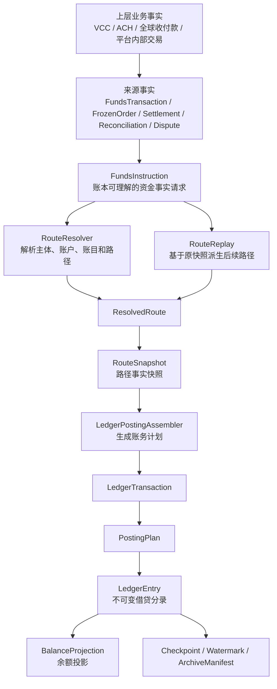

# 支付资金底座 DSL 规范设计

## 文档信息

| 项目 | 内容 |
| --- | --- |
| 文档名称 | 支付资金底座 DSL 规范设计 |
| 日期 | 2026-05-13 |
| 设计口径 | 支付产品与资金系统专家、资深架构师 |
| 上游输入 | `v5 支付底座完整产品 PRD.md`、`v5 核心概念与行为定性审查.md`、`v5 产品层 TDD 验收矩阵.md`、`v2/v3/v4` DSL 与账务设计 |
| 适用范围 | `wind-funds` 资金指令、资金路由、路由快照、账务计划、账本分录、回放、结算策略、余额投影治理契约 |
| 设计立场 | 目标态设计。历史版本只作为经验输入，不保留兼容别名、历史字段或迁移包袱。 |

## 一、结论先行

本轮 DSL 设计的核心结论：

1. DSL 的主目标是把已被产品层接受的资金事实，稳定翻译为资金路径、账务计划和不可变分录。
2. DSL 不建模业务订单、通道处理、清算批次、结算单、对账单、争议单、证据包、审批流、交易视图或报表。
3. `LedgerEntry` 是余额事实源，余额投影、交易视图和报表都不能反向驱动账务事实。
4. 后续生命周期事件必须基于原 `RouteSnapshot` 或来源事实快照派生，不允许在缺快照时重新选路兜底。
5. 冻结和解冻不是资金交易，不创建 `FundsTransaction`；但可以通过余额控制类指令生成平衡账本交易和余额投影。
6. 信用账户和预算组不新增账务 `CONSUMED`，已消费金额由交易生命周期和报表口径计算。
7. `AVAILABLE` 在资金账户、信用账户和预算组上可以按策略受控为负，但三者语义不同，必须有来源、规则、上限、账龄、风险标记和追偿、额度或预算治理路径。

DSL 目标结构：

```text
来源事实
  -> FundsInstruction
  -> RouteResolver / RouteReplay
  -> ResolvedRoute
  -> RouteSnapshot
  -> LedgerPostingAssembler
  -> LedgerTransaction
  -> PostingPlan
  -> LedgerEntry
  -> BalanceProjection
```

其中来源事实可以是资金交易、冻结订单、清算确认、结算锁定、出款结果、对账差错调账、争议拒付入账或费用事实。来源事实决定产品生命周期，DSL 只决定可入账事实如何被路由和记账。

## 二、设计目标与非目标

### 2.1 设计目标

| 目标 | 说明 |
| --- | --- |
| 事实稳定 | 同一业务事实在同一输入下生成稳定 route、posting 和 entry，不被后续绑定关系、账户配置或展示规则漂移影响。 |
| 账务平衡 | 每组 `PostingPlan` 必须独立平衡，整笔 `LedgerTransaction` 必须平衡。 |
| 可审计 | route、posting、entry、摘要、来源事实和操作者能解释资金从哪来、到哪去、为什么发生。 |
| 可回放 | 退款、撤销、授权结算、拒付、费用退回、解冻等后续事件能基于原快照派生。 |
| 可测试 | DSL 字段、枚举、边界、红线和场景映射可以沉淀为契约测试和 TDD 用例。 |
| 可治理 | 归档、余额重建和交易视图重放有清晰边界，避免数据量增长后破坏余额正确性。 |

### 2.2 非目标

| 非目标 | 说明 |
| --- | --- |
| 不表达业务单状态 | 订单待支付、出款审核中、争议举证中、对账处理中等状态属于产品单据。 |
| 不表达外部通道协议 | 通道通知、补拉、NOC、return、processor response、银行回单属于连接层或业务单据。 |
| 不表达展示投影 | 用户账单、商户账单、运营时间线、财务报表是只读投影。 |
| 不表达清结算运营流程 | 清算候选、结算批次、出款审批、失败重试、回单核验属于清结算产品对象。 |
| 不承担兼容历史版本 | 本设计以目标态为准；历史字段、旧枚举、旧 route code 不作为设计约束。 |

## 三、DSL 分层与对象关系



| 层 | 核心对象 | 职责 | 边界 |
| --- | --- | --- | --- |
| 来源事实层 | `FundsTransaction`、`FrozenOrder`、清结算单据、对账差错、争议单 | 判断事实是否成立、生命周期是否合法、是否允许入账。 | 不直接生成借贷分录。 |
| 指令层 | `FundsInstruction` | 把来源事实转成账本可理解的稳定输入。 | 不是业务订单，不保存为余额事实。 |
| 路由层 | `ResolvedRoute`、`RouteParticipant`、`RouteLeg`、`RouteNode` | 描述资金或控制余额如何在主体和账目之间移动。 | 不是会计分录，不表达运营流程。 |
| 快照层 | `RouteSnapshot` | 固化本次路径、工具、外部账户、平台账户和路由决策。 | 不重新决策路径。 |
| 账务计划层 | `LedgerTransaction`、`PostingPlan`、`PostingPhase` | 将 route 翻译成可执行且可校验的账务计划。 | 不替代来源事实生命周期。 |
| 分录层 | `LedgerEntry` | 最小不可变账务事实。 | 不直接面向用户展示，不被交易视图反写。 |
| 投影治理层 | `BalanceProjection`、`BalanceCheckpoint`、`BalanceProjectionWatermark`、`ArchiveManifest` | 余额查询、重建、归档和一致性校验。 | 不能用交易视图或报表反推余额。 |

## 四、术语与主体边界

### 4.1 可入账主体

目标态只允许以下主体进入 `LedgerEntry`：

| 主体 | 说明 | 典型账目 |
| --- | --- | --- |
| `FUNDING_ACCOUNT` | 承载真实资金余额的资金账户。 | `AVAILABLE`、`FROZEN`、`AUTHORIZATION`、`CLEARING`、`SETTLEMENT`、`CASH`、`PREPAYMENT`、`FEE`、`ADJUSTMENT` |
| `CREDIT_ACCOUNT` | 承载授信额度、可用额度和授权占用的控制账户；调额通过 `BALANCE_CONTROL / LIMIT_ADJUST` 受控表达。 | `LIMIT`、`AVAILABLE`、`AUTHORIZATION` |
| `BUDGET_GROUP` | 承载预算总量、可用预算和预算授权占用的控制账户；调额通过 `BALANCE_CONTROL / LIMIT_ADJUST` 受控表达。 | `LIMIT`、`AVAILABLE`、`AUTHORIZATION` |

以下对象不是可入账主体：

| 对象 | 正确定位 |
| --- | --- |
| 支付工具、VCC、共享卡、VA | 工具引用和绑定快照，不保存余额。 |
| 外部银行账户、PSP 账户、通道账户 | 外部端点引用，不进入内部 `LedgerEntry`。 |
| 平台账户角色 | 路由语义，必须解析为具体 `FUNDING_ACCOUNT` 后入账。 |
| 用户、商户、企业、租户 | 业务经营主体或归属主体，不等同于账务主体。 |

### 4.2 账目与余额桶

`LedgerAccount` 在本设计中表示账本内账目或余额桶，不是资金账户主体。

| 账目 | 目标语义 |
| --- | --- |
| `CASH` | 平台现金、备付或内部镜像资金。 |
| `PREPAYMENT` | 平台对用户或商户的预收、待付责任。 |
| `AVAILABLE` | 可用余额、可用额度或可用预算；资金账户、信用账户和预算组均允许按策略受控为负，但风险语义不同。 |
| `FROZEN` | 冻结余额，只限制同一主体可用性，不表达价值转移。 |
| `AUTHORIZATION` | 授权占用，结算、撤销、释放或过期后关闭或减少。 |
| `CLEARING` | 商户待清算资金，订单款默认先进该桶。 |
| `SETTLEMENT` | 出款中或结算处理中锁定资金，不是 `AVAILABLE` 的别名。 |
| `LIMIT` | 信用或预算总量，不作为普通资金迁移桶。 |
| `FEE` | 手续费或服务费归集。 |
| `ADJUSTMENT` | 调账或差错处理的中间口径。 |

目标态不设置 `CONSUMED` 账目。信用和预算已消费金额来自交易生命周期、授权结算事实和报表口径。

### 4.3 Profile 与 normal balance

账本 Profile 决定以下规则：

1. 某类主体允许哪些账目。
2. 每个账目的 normal balance。
3. 是否允许负余额。
4. 允许负余额时的场景、上限、审批和风控规则。
5. 周期余额的 `periodType` 与 `periodId` 规则。

业务代码、route code 和测试用例不得硬编码 normal balance。借贷方向由 `RouteNode + LedgerProfileItem.normalBalance + balanceEffectType` 推导。

## 五、DSL 不变量

| 不变量 | 说明 |
| --- | --- |
| 金额必须为正 | `amount`、`originalAmount`、`LedgerEntry.amount` 均为正数；方向由 route 和借贷推导。 |
| 币种必须明确 | 账务主链路使用 `amount.currency`；原始币种、汇率和外部币种保存在快照中。 |
| 指令不直接写分录 | `FundsInstruction` 只能驱动路由和回放，不允许业务方直接指定借贷分录。 |
| Route 不等于 Ledger | `RouteLeg` 描述资金路径，`LedgerEntry` 描述会计分录。 |
| 每组计划独立平衡 | 一个 route leg 或一个控制意图生成的 `PostingPlan` 必须独立借贷平衡。 |
| 外部账户不入账 | 外部账户和工具只能存在于引用、快照和上下文。 |
| 缺账本直接失败 | 入账路径不自动创建 ledger，建账必须由主体初始化流程显式完成。 |
| 缺快照不回放 | 需要 replay 的后续事件缺原 `RouteSnapshot` 必须失败。 |
| 快照结构有版本 | `snapshotSchemaVersion` 与 `routeVersion` 必须分离。 |
| 摘要不含易变流水 | sha256 不包含自增 ID、持久化流水、审计时间和易变状态。 |
| 投影不能反写事实 | 余额投影、交易视图和报表不修改历史 entry、transaction 或 detail。 |

## 六、FundsInstruction DSL

### 6.1 定位

`FundsInstruction` 是账本可理解的资金事实请求。它不是业务订单，不是 `FundsTransaction`，也不是账本分录。

当前执行链路中，`FundsInstruction` 必须明确业务身份和后续引用，不在指令里伪造来源事实身份：

| 字段 | 必填 | 说明 |
| --- | --- | --- |
| `tenantId` | 是 | 租户 ID。系统可从上下文补齐，但进入 route 前必须确定。 |
| `instructionType` | 是 | 指令大类。 |
| `eventType` | 是 | 资金事件。 |
| `transactionType` | 条件必填 | 资金交易类事实必填；冻结、清算、对账差错等非交易事实可为空或使用领域内稳定类型。 |
| `amount` | 是 | 账务主链路金额。 |
| `originalAmount` | 是 | 原始金额；无错币种或业务层显式 FX 决策时等于 `amount`。 |
| `exchangeRate` | 是 | `originalAmount -> amount` 的汇率快照；无换汇时为 1；错币种时必须来自业务层或外汇域已确认的 FX 决策，不由交易层隐式调用换汇服务生成。 |
| `businessScene` | 是 | 业务场景，例如 `MERCHANT_ORDER_COLLECTION`、`VCC_AUTHORIZATION`。 |
| `businessSn` | 是 | 业务流水。 |
| `reference` | 条件必填 | 退款、撤销、结算、拒付、费用退回、解冻等后续事件必须引用原事实或原快照。 |
| `eventTime` | 是 | 事实发生时间。 |
| `operator` | 是 | 操作者快照。系统自动事件使用系统操作者。 |
| `instrumentRef` | 否 | 支付或收款工具快照。 |
| `externalAccountRef` | 否 | 外部账户或外部端点引用。 |
| `description` | 否 | 业务可读说明。 |
| `contextVariables` | 是 | 扩展上下文，只放补充事实，不放必填业务状态。 |

### 6.2 指令类型

目标态指令类型：

| instructionType | 说明 | 典型事件 |
| --- | --- | --- |
| `DIRECT_TRANSACTION` | 已确认发生价值转移、责任变化或资金状态最终变化的直接交易。 | 入金、出金、转账、支付、退款、费用、清算确认、结算锁定、出款成功、调账。 |
| `AUTHORIZATION_TRANSACTION` | 授权占用、撤销、结算、授权链退款、争议拒付等授权生命周期事实。 | 授权、撤销、结算、授权退款、争议拒付。 |
| `BALANCE_CONTROL` | 不发生价值转移，只控制同一主体可用性的余额控制行为。 | 冻结、解冻、额度调整、预算调整。 |

说明：

1. “直接交易”不是狭义转账，不能命名为只表达转账的 `TRANSFER`。
2. 冻结属于 `BALANCE_CONTROL`，来源事实是 `FrozenOrder`，不是 `FundsTransaction`。
3. 清算确认和结算锁定可以触发账务变化，但清算单、结算单、出款单生命周期不进入 DSL。

### 6.3 事件类型

目标态事件以稳定资金语义命名：

| eventType | 说明 | 不表达 |
| --- | --- | --- |
| `FUND_IN` | 外部资金进入系统责任范围。 | 通道通知成功、补拉中。 |
| `FUND_OUT` | 内部责任减少并发生外部出金结果。 | 出款申请、审核中。 |
| `TRANSFER` | 系统内主体之间资金转移。 | 页面转账流程状态。 |
| `PAY` | 支付或商户订单收款。 | 订单履约状态。 |
| `REFUND` | 原交易退款或手工直接退款入账结果。 | 退款申请审批中。 |
| `FEE_CHARGE` | 手续费、服务费或成本扣收。 | 费率配置状态。 |
| `FEE_REFUND` | 手续费退回。 | 普通退款默认退费。 |
| `SETTLEMENT` | 清算确认、结算锁定、结算失败回退等内部资金状态迁移。 | 清算批次生成、结算审批中、出款处理中。 |
| `AUTHORIZE` | 授权批准后的占用。 | 授权拒绝的账务事实。 |
| `AUTH_REVERSAL` | 授权撤销、释放或过期释放。 | 争议拒付。 |
| `AUTH_SETTLEMENT` | 授权结算。 | 普通 capture 术语泄漏。 |
| `AUTH_REFUND` | 授权链结算后退款。 | 授权拒绝。 |
| `CHARGEBACK` | 争议拒付、强制扣回或等价扣减。 | 授权拒绝。 |
| `FREEZE` | 冻结余额。 | 交易消费。 |
| `UNFREEZE` | 解冻余额。 | 退款或授权释放。 |
| `BALANCE_ADJUST` | 资金余额调账。 | 订单状态修正。 |
| `LIMIT_ADJUST` | 信用额度或预算额度调整。 | 资金入金。 |

授权拒绝不生成 route leg 和 `LedgerEntry`，不得累计到 `chargebackAmount`。

### 6.4 幂等与请求摘要

DSL 侧的幂等不依赖持久化流水或自增 ID。

目标态幂等键应至少包含：

```text
tenantId
businessScene
businessSn
eventType
amount
currency
originalAmount
originalCurrency
exchangeRate
reference
```

请求摘要用于识别同一业务幂等键下的重复请求是否完全一致。摘要不得包含：

```text
数据库 ID
持久化流水 sn
创建时间
修改时间
处理状态
操作者展示名
上下文中非稳定展示字段
```

## 七、引用对象 DSL

### 7.1 SubjectRef

`SubjectRef` 是 route 和 ledger 的统一主体身份引用。

| 字段 | 必填 | 说明 |
| --- | --- | --- |
| `tenantId` | 是 | 租户 ID。 |
| `subjectId` | 是 | 账务主体 ID。 |
| `subjectType` | 是 | `FUNDING_ACCOUNT`、`CREDIT_ACCOUNT`、`BUDGET_GROUP`。 |
| `currency` | 是 | 主体账本币种。 |
| `ledgerProfileCode` | 是 | 本次 route 使用的 profile 快照。 |
| `subjectName` | 否 | 展示快照，只用于审计和后台排查。 |

### 7.2 PaymentInstrumentRef

支付工具引用只表达工具快照和绑定关系，不表达余额。

| 字段 | 说明 |
| --- | --- |
| `instrumentId` | 工具 ID。 |
| `instrumentType` | VCC、共享卡、VA、银行账户引用等。 |
| `instrumentNoMasked` | 脱敏工具号。 |
| `ownerId` / `ownerType` | 工具归属方。 |
| `bindingSnapshot` | 绑定到资金账户、信用账户、预算组或商户主体的快照。 |

### 7.3 ExternalAccountRef

外部账户引用只表达外部端点：

| 字段 | 说明 |
| --- | --- |
| `externalAccountId` | 外部账户或端点 ID。 |
| `externalAccountType` | 银行账户、PSP 账户、VA、通道账户等。 |
| `externalAccountNoMasked` | 脱敏外部账号。 |
| `providerCode` | 服务方或机构。 |
| `channelCode` | 通道编码。 |
| `currency` | 外部账户币种。 |
| `countryCode` | 国家或地区。 |
| `externalTransactionId` | 外部交易流水。 |

外部账户不得携带内部 `ledgerSubjectCode`。内部镜像账户由 route 和平台账户快照表达。

### 7.4 Reference

`FundsInstructionReference` 表达本次事件引用的原事实。

| referenceType | 用途 |
| --- | --- |
| `ORIGINAL_TRANSACTION` | 原直接交易。 |
| `AUTHORIZATION` | 原授权链。 |
| `SETTLEMENT` | 原授权结算或结算事实。 |
| `FREEZE_ORDER` | 原冻结单。 |
| `FEE` | 原费用事实。 |
| `DISPUTE_CASE` | 原争议单或拒付事实。 |
| `EXTERNAL_TRANSACTION` | 外部交易流水。 |

引用必须能定位到原 route snapshot、原 ledger transaction 或原来源事实。需要 replay 的事件定位不到原快照时必须失败。

## 八、Route DSL

### 8.1 ResolvedRoute

`ResolvedRoute` 是运行态已解析路径，目标字段：

| 字段 | 必填 | 说明 |
| --- | --- | --- |
| `routeCode` | 是 | 路由模板编码。 |
| `routeVersion` | 是 | 路由模板版本。 |
| `tenantId` | 是 | 租户 ID。 |
| `businessScene` / `businessSn` | 是 | 业务场景和业务流水。 |
| `instructionType` / `eventType` | 是 | 指令和事件。 |
| `participants` | 是 | 本次涉及主体。 |
| `legs` | 是 | 路由步骤。授权拒绝等无入账事件不得进入 posting。 |
| `routingDecision` | 否 | 命中规则、平台账户、通道选择等审计快照。 |
| `paymentInstrumentRef` | 否 | 工具快照。 |
| `externalAccountRef` | 否 | 外部端点快照。 |
| `platformAccounts` | 条件必填 | 使用平台现金、预收、手续费、准备金、挂账等账户时必填。 |
| `resolvedAt` | 是 | 解析时间。 |

### 8.2 RouteSnapshot

`RouteSnapshot` 固化已解析路径，用于审计和后续 replay。

快照必须满足：

1. 包含 `snapshotSchemaVersion`，例如 `route.snapshot.target`。
2. 同时保存 `routeVersion`，不得把路由模板版本和快照结构版本混用。
3. 保存 route participants、legs、平台账户解析结果、工具快照、外部账户快照和路由决策。
4. 保存 `businessScene/businessSn`、reference、route 决策、平台账户和外部引用快照；后续若引入 `sourceFactRef`，必须来自已成立资金事实流水。
5. 已用于入账的快照不可修改；错误只能生成新的更正事实。

### 8.3 PlatformAccountsSnapshot

`PlatformAccountsSnapshot` 的用途是固化本次 route 用到的具体平台资金主体，不是产品账户概念。

可包含：

| 字段 | 说明 |
| --- | --- |
| `cashFundingAccount` | 平台现金或备付镜像账户。 |
| `prepaymentFundingAccount` | 平台预收、待付或内部负债账户。 |
| `feeFundingAccount` | 手续费收入或成本归集账户。 |
| `clearingFundingAccount` | 平台清算过渡账户。 |
| `settlementFundingAccount` | 平台结算或应付结算账户。 |
| `adjustmentFundingAccount` | 平台挂账和调账账户。 |

后续 replay 必须使用原快照中的平台账户，不读取当前默认配置替换。

### 8.4 RouteParticipant

`RouteParticipant` 是交易级参与方快照。

| 字段 | 必填 | 说明 |
| --- | --- | --- |
| `participantRole` | 是 | 付款方、收款方、商户、平台、费用方、控制主体等稳定角色。 |
| `subjectRef` | 是 | 可入账主体。 |
| `ledgerProfileCode` | 是 | 本次路由使用的 profile。 |
| `currency` | 是 | 主体账本币种。 |
| `amount` | 否 | 参与方金额。 |
| `contextVariables` | 是 | 补充上下文。 |

### 8.5 RouteNode

`RouteNode` 表示一个资金路径节点。

| 字段 | 必填 | 说明 |
| --- | --- | --- |
| `subjectRef` | 是 | 可入账主体。 |
| `ledgerSubjectCode` | 是 | 账目或余额桶。 |
| `nodeRole` | 是 | `SOURCE` 或 `TARGET`。 |

### 8.6 RouteLeg

`RouteLeg` 是 route 的原子资金或控制余额步骤，不是会计分录。

| 字段 | 必填 | 说明 |
| --- | --- | --- |
| `legId` | 是 | 路由步骤 ID，快照内唯一。 |
| `sequence` | 是 | 顺序。 |
| `legType` | 是 | 资金移动模板。 |
| `sourceNode` | 是 | 来源节点。 |
| `targetNode` | 是 | 目标节点。 |
| `amount` | 是 | 账务主金额。 |
| `originalAmount` | 是 | 原始金额。 |
| `exchangeRate` | 是 | 汇率快照。 |
| `balanceEffectType` | 是 | 增加、减少、占用、释放、消耗、回补。 |
| `phaseCode` | 是 | 账务阶段提示。 |
| `periodType` / `periodId` | 条件必填 | 周期余额场景必填；非周期默认 lifetime。 |
| `constraintOverrides` | 是 | 本次余额约束覆盖。 |
| `replayPolicy` | 是 | 回放策略。 |
| `replayRefLegId` | 条件必填 | replay leg 必须指向原 leg。 |

目标态 `legType`：

| legType | 说明 |
| --- | --- |
| `EXTERNAL_IN` | 外部资金进入系统内部镜像路径。 |
| `EXTERNAL_OUT` | 系统内部责任减少并形成外部出金路径。 |
| `INTERNAL_TRANSFER` | 内部主体之间或同主体账目之间转移。 |
| `HOLD` | 可用转占用，例如授权、冻结、结算锁定。 |
| `RELEASE` | 占用释放回可用。 |
| `CONSUME` | 占用被最终消耗或关闭。 |
| `RESTORE` | 退款、回补、争议胜诉回补等。 |
| `ADJUST` | 调账、差错核销、额度调整。 |

## 九、RouteCode 规范

RouteCode 应表达稳定资金路径，不表达页面流程或历史实现名。

命名规则：

```text
{SCENE}_{ACTION}_{MODE}
```

示例：

| routeCode | 说明 |
| --- | --- |
| `FUND_IN_STANDARD` | 标准外部入金。 |
| `FUND_OUT_STANDARD` | 标准外部出金。 |
| `INTERNAL_TRANSFER_STANDARD` | 系统内转账。 |
| `DIRECT_PAY_STANDARD` | 普通支付。 |
| `MERCHANT_ORDER_COLLECTION_STANDARD` | 商户订单收款，付款方进入商户 `CLEARING`。 |
| `MERCHANT_CLEARING_COMPLETE` | 商户清算确认，`CLEARING -> AVAILABLE`。 |
| `MERCHANT_SETTLEMENT_LOCK` | 商户结算锁定，`AVAILABLE -> SETTLEMENT`。 |
| `MERCHANT_PAYOUT_SUCCESS` | 商户出款成功，消耗 `SETTLEMENT` 并完成平台对外资金路径。 |
| `MERCHANT_PAYOUT_FAIL_RESTORE` | 商户出款失败回退，`SETTLEMENT -> AVAILABLE`。 |
| `PLATFORM_INTERNAL_PAYMENT_STANDARD` | 平台内部付款，平台责任账户或调整账户到收款方目标账目。 |
| `PLATFORM_INTERNAL_TRANSFER_STANDARD` | 平台内部主体、平台账户角色或普通资金账户之间转账。 |
| `DIRECT_REFUND_REPLAY` | 原直接交易退款回放。 |
| `FEE_CHARGE_STANDARD` | 手续费、服务费或成本补扣。 |
| `FEE_REFUND_REPLAY` | 手续费退回回放。 |
| `AUTHORIZATION_STANDARD` | 授权占用。 |
| `AUTHORIZATION_REVERSAL_REPLAY` | 授权撤销回放。 |
| `AUTHORIZATION_SETTLEMENT_REPLAY` | 授权结算回放。 |
| `AUTHORIZATION_REFUND_REPLAY` | 授权链退款回放。 |
| `CHARGEBACK_REPLAY` | 争议拒付回放。 |
| `BALANCE_FREEZE_STANDARD` | 冻结。 |
| `BALANCE_UNFREEZE_REPLAY` | 解冻回放。 |
| `FUNDING_BALANCE_ADJUST_STANDARD` | 资金余额调账。 |
| `LIMIT_ADJUST_STANDARD` | 信用或预算额度调整；`LIMIT` 只在该受控调额路径中表达额度或预算总量调整，不开放给普通交易迁移。 |

不允许出现：

```text
WITHDRAW_APPLY
WITHDRAW_CONFIRM
CARD_AUTH_PAGE
DISPUTE_EVIDENCE_SUBMITTED
RECONCILIATION_PROCESSING
REPORT_REPLAY
```

## 十、Posting 与 Ledger DSL

### 10.1 LedgerTransaction

`LedgerTransaction` 是账本写入口的交易级对象。

| 字段 | 必填 | 说明 |
| --- | --- | --- |
| `tenantId` | 是 | 租户 ID。 |
| `ledgerTransactionKey` | 是 | 目标态稳定交易键，不依赖数据库流水。 |
| `instructionType` / `eventType` | 是 | 指令与事件。 |
| `amount` / `originalAmount` / `exchangeRate` | 是 | 交易金额事实，表达主口径金额、业务原币金额和汇率。 |
| `businessScene` / `businessSn` | 是 | 业务标识。 |
| `referenceLedgerTransactionKey` | 条件必填 | 冲正、退款、回放等后续事件必填。 |
| `transactionTime` | 是 | 交易时间。 |
| `postingPlans` | 是 | 一组或多组账务计划。 |
| `contextVariables` | 是 | 审计上下文。 |

### 10.2 PostingPlan

`PostingPlan` 是一组可独立校验的账务计划。

| 字段 | 必填 | 说明 |
| --- | --- | --- |
| `planKey` | 是 | 计划稳定键。 |
| `routeLegId` | 是 | 来源 route leg。 |
| `intent` | 是 | 账务意图。 |
| `postingScope` | 是 | 同主体迁移、跨主体转移、控制占用、费用、调账等范围。 |
| `balanceEffectType` | 是 | 余额影响语义。 |
| `postingPhases` | 是 | 一个或多个账务阶段。 |
| `entries` | 是 | 所有阶段展开后的分录。 |

每个 `PostingPlan` 必须满足：

```text
sum(debit.amount) == sum(credit.amount)
同一 plan 内币种一致
entry 金额均为正
entry 均绑定已存在 ledger
```

### 10.3 LedgerEntry

`LedgerEntry` 是不可变账务事实。

| 字段 | 必填 | 说明 |
| --- | --- | --- |
| `subjectId` / `subjectType` | 是 | 可入账主体。 |
| `ledgerId` | 是 | 已初始化账本 ID。 |
| `ledgerSubjectCode` | 是 | 账目。 |
| `ledgerSubjectCategory` | 是 | 账目类别。 |
| `entrySide` | 是 | `DEBIT` 或 `CREDIT`，由系统推导。 |
| `amount` / `currency` | 是 | 账务主金额。 |
| `originalAmount` / `exchangeRate` | 是 | 原始金额和汇率。 |
| `phaseCode` | 是 | 稳定账务阶段。 |
| `intent` | 是 | 账务意图。 |
| `postingScope` | 是 | 影响范围。 |
| `balanceConstraintType` | 是 | 本次余额约束。 |
| `transactionTime` | 是 | 交易时间。 |
| `sha256` | 是 | 稳定摘要。 |

`LedgerEntry` 摘要必须包含稳定业务和账务字段，排除持久化流水：

| 应包含 | 不应包含 |
| --- | --- |
| 租户、业务场景、业务流水、引用、事件、主体、账目、借贷方向、金额、币种、原始金额、汇率、phase、intent、period、routeLegId | entry sn、数据库 ID、ledgerTransactionSn、postingPlanSn、创建时间、修改时间、状态、操作者展示名 |

### 10.4 Phase 与 Intent

`LedgerPhaseCode` 表达资金动作阶段，不表达业务流程状态。

目标态 phase：

```text
FUND_IN
FUND_OUT
TRANSFER
SETTLEMENT
FEE
FREEZE
UNFREEZE
AUTHORIZATION
REVERSAL
REFUND
CHARGEBACK
ADJUSTMENT
```

`LedgerPostingIntentType` 表达账务为什么发生：

```text
FUND_IN
FUND_OUT
TRANSFER
PAY
AUTHORIZATION
AUTHORIZATION_REVERSAL
AUTHORIZATION_SETTLEMENT
REFUND
CHARGEBACK
FEE
FEE_REFUND
SETTLEMENT
ADJUSTMENT
LIMIT_ADJUST
```

不允许把 `WITHDRAW_APPLY`、`DISPUTE_CREATED`、`EVIDENCE_SUBMITTED`、`RECONCILING` 等业务状态加入 phase 或 intent。

## 十一、Replay DSL

### 11.1 Replay 定位

Replay 用于基于原 `RouteSnapshot` 生成后续事件路径。它不是重新路由，也不是交易视图重放。

目标态 replay 类型：

| replayType | 说明 |
| --- | --- |
| `AUTHORIZATION_REVERSAL` | 授权撤销、过期或释放。 |
| `AUTHORIZATION_SETTLEMENT` | 授权结算。 |
| `REFUND` | 原直接交易退款。 |
| `AUTHORIZATION_REFUND` | 授权链退款。 |
| `CHARGEBACK` | 争议拒付或强制扣回。 |
| `FEE_REFUND` | 费用退回，只回放费用 leg。 |
| `UNFREEZE` | 解冻，引用冻结单路径。 |

### 11.2 Replay 请求字段

| 字段 | 必填 | 说明 |
| --- | --- | --- |
| `replayType` | 是 | 回放类型。 |
| `referenceSnapshotId` | 是 | 原 route snapshot。 |
| `businessScene` / `businessSn` | 是 | 本次业务标识。 |
| `amount` | 条件必填 | 部分退款、部分结算、部分解冻必填。 |
| `replayLegIds` | 条件必填 | 只回放部分 leg 时必填。 |
| `eventTime` | 是 | 本次事件时间。 |
| `operator` | 是 | 操作者。 |

### 11.3 Replay 红线

| 红线 | 要求 |
| --- | --- |
| 缺 snapshot | 必须失败，不能 fallback 到当前 RouteResolver。 |
| 未知 snapshot schema | 必须失败。 |
| reference loop | 必须失败。 |
| `NON_REPLAYABLE` leg | 不允许回放。 |
| `REPLAY_ONCE` leg | 只能被成功消费一次。 |
| 部分回放 | 只能回放 `PARTIAL_ALLOWED` 或明确支持部分回放的 leg。 |
| 绑定关系变化 | 不影响 replay，仍以原快照主体和平台账户为准。 |
| 汇率重估 | replay 不重新询价，除非来源事实本身是新的差错或调账事实。 |

商户订单退款可以根据当前持仓桶从 `CLEARING` 或 `AVAILABLE` 冲减，但这不是重新选路。当前持仓桶必须来自原交易生命周期、清算事实和冻结/结算状态，不得读取新的商户绑定关系替换原主体。

## 十二、余额约束 DSL

余额约束由 Profile 默认规则和 route leg 覆盖共同决定。

目标态约束：

| 约束 | 说明 |
| --- | --- |
| `PROFILE_DEFAULT` | 使用 profile 默认负余额策略。 |
| `MUST_NOT_BE_NEGATIVE` | 本次过账后余额不得为负。 |
| `ALLOW_NEGATIVE` | 本次允许按 profile 或场景策略形成负余额。 |

`ALLOW_NEGATIVE` 只能用于明确场景：

1. 资金账户顶格消费后汇率差。
2. 清算金额差。
3. 后置手续费或争议费用。
4. 商户责任追偿、准备金不足或后续抵扣。
5. 信用账户额度调减、授信策略追认或后置确认差异。
6. 预算组预算调减、追认消费或预算治理差异。
7. 经审批的调账。

负 `AVAILABLE` 不能被当作可继续消费、授权、冻结或出款余额。后续支付、冻结、授权或出款必须重新经过策略校验。

## 十三、场景账务规则矩阵

### 13.1 直接交易

| 场景 | 来源事实 | 指令 | 典型 route | 账务结果 |
| --- | --- | --- | --- | --- |
| 外部入金 | 充值单、VA 入账匹配、入金确认 | `DIRECT_TRANSACTION / FUND_IN` | `EXTERNAL_IN + INTERNAL_TRANSFER` | 平台现金或预收路径可解释，目标资金账户 `AVAILABLE` 增加。 |
| 外部出金 | 提现确认、出款成功 | `DIRECT_TRANSACTION / FUND_OUT` | `CONSUME + EXTERNAL_OUT` | 消耗 `FROZEN` 或 `SETTLEMENT`，平台现金映射减少。 |
| 系统内转账 | 转账交易 | `DIRECT_TRANSACTION / TRANSFER` | `INTERNAL_TRANSFER` | 付款方 `AVAILABLE` 减少，收款方 `AVAILABLE` 增加。 |
| 普通支付 | 支付交易 | `DIRECT_TRANSACTION / PAY` | `INTERNAL_TRANSFER` | 付款方 `AVAILABLE` 减少，收款方目标桶增加。 |
| 商户订单收款 | 商户订单资金事实 | `DIRECT_TRANSACTION / PAY` | `MERCHANT_ORDER_COLLECTION_STANDARD` | 用户 `AVAILABLE` 减少，商户 `CLEARING` 增加。 |
| 原交易退款 | 退款单 | `DIRECT_TRANSACTION / REFUND` | `REFUND` replay | 原责任主体冲减，用户或付款方 `AVAILABLE` 回补。 |
| 手续费收取 | 费用事实 | `DIRECT_TRANSACTION / FEE_CHARGE` | `FEE` | 费用方减少，平台 `FEE` 增加。 |

### 13.2 授权交易

| 场景 | 指令 | route | 账务结果 |
| --- | --- | --- | --- |
| 授权批准 | `AUTHORIZATION_TRANSACTION / AUTHORIZE` | `HOLD` | 一个或多个主体 `AVAILABLE -> AUTHORIZATION`。 |
| 授权拒绝 | 授权结果记录 | 无 route | 不生成 `LedgerEntry`，不累计 `chargebackAmount`。 |
| 授权撤销 | `AUTHORIZATION_TRANSACTION / AUTH_REVERSAL` | replay `RELEASE` | `AUTHORIZATION -> AVAILABLE`。 |
| 授权结算 | `AUTHORIZATION_TRANSACTION / AUTH_SETTLEMENT` | replay `CONSUME` | 授权占用关闭或减少，真实资金进入结算或消费路径。 |
| 授权链退款 | `AUTHORIZATION_TRANSACTION / AUTH_REFUND` | replay `RESTORE` | 按原结算责任回补。 |
| 争议拒付 | `AUTHORIZATION_TRANSACTION / CHARGEBACK` | replay `RESTORE` 或责任扣减 | `refundedAmount + chargebackAmount <= settledAmount`。 |

### 13.3 冻结与余额控制

| 场景 | 来源事实 | 指令 | 账务结果 |
| --- | --- | --- | --- |
| 冻结 | `FrozenOrder` | `BALANCE_CONTROL / FREEZE` | 同一主体 `AVAILABLE -> FROZEN`。 |
| 解冻 | `FrozenOrder` 释放记录 | `BALANCE_CONTROL / UNFREEZE` | 同一主体 `FROZEN -> AVAILABLE`。 |
| 资金余额调账 | 调账单、差错核销 | `BALANCE_CONTROL / BALANCE_ADJUST` | 生成平衡调账分录，记录原因、凭证和审批。 |
| 信用额度调整 | 授信调整单 | `BALANCE_CONTROL / LIMIT_ADJUST` | 通过交易层余额控制入口更新 `LIMIT` 和 `AVAILABLE`，不作为现金流。 |
| 预算额度调整 | 预算调整单 | `BALANCE_CONTROL / LIMIT_ADJUST` | 通过交易层余额控制入口更新预算 `LIMIT` 和 `AVAILABLE`，不新增 `CONSUMED`；调减受控负数必须有预算治理上下文。 |

冻结不是交易。扣划、追偿、退款或调账必须创建独立来源事实，并引用冻结单。

## 十四、交易层服务能力 JSON 验证结构

本章用于把 PRD 中的交易层服务能力落成可评审、可测试的 DSL JSON 样例。样例不是接口报文，也不是数据库结构；它是契约测试夹具的目标结构，用来验证 DSL 是否能稳定表达每类服务能力的输入事实、路由、账务计划、分录摘要和失败红线。

统一结构：

```json
{
  "caseId": "DSL-DIRECT-PLATFORM-PAYMENT-001",
  "serviceAbility": "DIRECT_TRANSACTION",
  "scenarioCode": "PLATFORM_INTERNAL_PAYMENT",
  "description": "平台内部付款",
  "instruction": {},
  "expectedRoute": {},
  "expectedPosting": {},
  "validation": {
    "mustPass": [],
    "mustFail": []
  }
}
```

字段约束：

| 字段 | 说明 |
| --- | --- |
| `caseId` | 契约测试用例 ID，稳定、可追踪。 |
| `serviceAbility` | 对应交易层服务能力：`DIRECT_TRANSACTION`、`REVERSE_TRANSACTION`、`AUTHORIZATION_TRANSACTION`、`BALANCE_CONTROL`、`QUERY_AND_REPLAY`。 |
| `scenarioCode` | 产品场景编码，不等同于 route code；用于组织测试和评审。 |
| `instruction` | `FundsInstruction` 目标态输入结构。查询与交易视图重放不是入账指令时可为空。 |
| `expectedRoute` | 期望 route、participant、leg 和 snapshot 结构。授权拒绝、只读查询可为空。 |
| `expectedPosting` | 期望 ledger transaction、posting plan 和 entry 结构。只读能力、授权拒绝可为空。 |
| `validation` | 可测试断言：必须成功、必须失败、摘要稳定、余额影响、回放边界。 |

### 14.1 直接交易服务 JSON

平台内部付款：

```json
{
  "caseId": "DSL-DIRECT-PLATFORM-PAYMENT-001",
  "serviceAbility": "DIRECT_TRANSACTION",
  "scenarioCode": "PLATFORM_INTERNAL_PAYMENT",
  "description": "平台基于补偿或服务规则向用户付款",
  "instruction": {
    "tenantId": "tenant_capte",
    "instructionType": "DIRECT_TRANSACTION",
    "eventType": "TRANSFER",
    "transactionType": "PLATFORM_INTERNAL_PAYMENT",
    "businessScene": "PLATFORM_COMPENSATION",
    "businessSn": "COMP_202605140001",
    "amount": {
      "currency": "USD",
      "value": "25.00"
    },
    "originalAmount": {
      "currency": "USD",
      "value": "25.00"
    },
    "exchangeRate": {
      "rate": "1",
      "rateTime": "2026-05-14T10:00:00"
    },
    "eventTime": "2026-05-14T10:00:01",
    "operator": {
      "actorType": "SYSTEM",
      "actorId": "platform-rule-engine"
    },
    "reference": null,
    "contextVariables": {
      "reasonCode": "SERVICE_COMPENSATION",
      "approvalRef": "APR_202605140001"
    }
  },
  "expectedRoute": {
    "routeCode": "PLATFORM_INTERNAL_PAYMENT_STANDARD",
    "routeVersion": "1.0",
    "participants": [
      {
        "participantRole": "PLATFORM_PAYER",
        "subjectRef": {
          "subjectType": "FUNDING_ACCOUNT",
          "subjectId": "fa_platform_adjust_usd",
          "currency": "USD",
          "ledgerProfileCode": "FUNDING_PLATFORM"
        }
      },
      {
        "participantRole": "PAYEE",
        "subjectRef": {
          "subjectType": "FUNDING_ACCOUNT",
          "subjectId": "fa_user_10001_usd",
          "currency": "USD",
          "ledgerProfileCode": "FUNDING_BASIC"
        }
      }
    ],
    "platformAccounts": {
      "adjustmentFundingAccount": "fa_platform_adjust_usd"
    },
    "legs": [
      {
        "legId": "leg_platform_pay_1",
        "legType": "INTERNAL_TRANSFER",
        "sourceNode": {
          "subjectId": "fa_platform_adjust_usd",
          "subjectType": "FUNDING_ACCOUNT",
          "ledgerSubjectCode": "ADJUSTMENT"
        },
        "targetNode": {
          "subjectId": "fa_user_10001_usd",
          "subjectType": "FUNDING_ACCOUNT",
          "ledgerSubjectCode": "AVAILABLE"
        },
        "amount": {
          "currency": "USD",
          "value": "25.00"
        },
        "balanceEffectType": "TRANSFER",
        "phaseCode": "TRANSFER",
        "replayPolicy": "REPLAYABLE"
      }
    ],
    "snapshotSchemaVersion": "route.snapshot.target"
  },
  "expectedPosting": {
    "ledgerTransactionKey": "tenant_capte:FT_PLATFORM_PAY_202605140001",
    "postingPlans": [
      {
        "planKey": "plan_platform_pay_1",
        "routeLegId": "leg_platform_pay_1",
        "intent": "TRANSFER",
        "postingScope": "CROSS_SUBJECT_TRANSFER",
        "entries": [
          {
            "subjectId": "fa_platform_adjust_usd",
            "ledgerSubjectCode": "ADJUSTMENT",
            "entrySide": "DEBIT",
            "amount": {
              "currency": "USD",
              "value": "25.00"
            }
          },
          {
            "subjectId": "fa_user_10001_usd",
            "ledgerSubjectCode": "AVAILABLE",
            "entrySide": "CREDIT",
            "amount": {
              "currency": "USD",
              "value": "25.00"
            }
          }
        ]
      }
    ]
  },
  "validation": {
    "mustPass": [
      "平台账户角色已解析为具体 FundingAccount",
      "route snapshot 固化平台账户、规则版本和审批引用",
      "posting plan 同币种平衡",
      "收款方 AVAILABLE 增加"
    ],
    "mustFail": [
      "平台账户角色未配置",
      "付款方和收款方币种不一致",
      "业务侧直接指定 LedgerEntry"
    ]
  }
}
```

手续费收取：

```json
{
  "caseId": "DSL-DIRECT-FEE-CHARGE-001",
  "serviceAbility": "DIRECT_TRANSACTION",
  "scenarioCode": "FEE_CHARGE",
  "description": "从商户可用余额收取手续费",
  "instruction": {
    "tenantId": "tenant_capte",
    "instructionType": "DIRECT_TRANSACTION",
    "eventType": "FEE_CHARGE",
    "transactionType": "FEE_CHARGE",
    "businessScene": "MERCHANT_SERVICE_FEE",
    "businessSn": "FEE_BIZ_202605140001",
    "amount": {
      "currency": "USD",
      "value": "1.50"
    },
    "originalAmount": {
      "currency": "USD",
      "value": "1.50"
    },
    "exchangeRate": {
      "rate": "1"
    },
    "eventTime": "2026-05-14T10:01:00",
    "operator": {
      "actorType": "SYSTEM",
      "actorId": "fee-engine"
    },
    "contextVariables": {
      "feeRuleCode": "MERCHANT_STANDARD_001",
      "feeRuleVersion": "2026-05"
    }
  },
  "expectedRoute": {
    "routeCode": "FEE_CHARGE_STANDARD",
    "routeVersion": "1.0",
    "participants": [
      {
        "participantRole": "FEE_PAYER",
        "subjectRef": {
          "subjectType": "FUNDING_ACCOUNT",
          "subjectId": "fa_merchant_20001_usd",
          "currency": "USD",
          "ledgerProfileCode": "FUNDING_MERCHANT"
        }
      },
      {
        "participantRole": "FEE_RECEIVER",
        "subjectRef": {
          "subjectType": "FUNDING_ACCOUNT",
          "subjectId": "fa_platform_fee_usd",
          "currency": "USD",
          "ledgerProfileCode": "FUNDING_PLATFORM"
        }
      }
    ],
    "platformAccounts": {
      "feeFundingAccount": "fa_platform_fee_usd"
    },
    "legs": [
      {
        "legId": "leg_fee_charge_1",
        "legType": "INTERNAL_TRANSFER",
        "sourceNode": {
          "subjectId": "fa_merchant_20001_usd",
          "subjectType": "FUNDING_ACCOUNT",
          "ledgerSubjectCode": "AVAILABLE"
        },
        "targetNode": {
          "subjectId": "fa_platform_fee_usd",
          "subjectType": "FUNDING_ACCOUNT",
          "ledgerSubjectCode": "FEE"
        },
        "amount": {
          "currency": "USD",
          "value": "1.50"
        },
        "balanceEffectType": "TRANSFER",
        "phaseCode": "FEE",
        "constraintOverrides": {
          "balanceConstraintType": "PROFILE_DEFAULT"
        },
        "replayPolicy": "PARTIAL_ALLOWED"
      }
    ],
    "snapshotSchemaVersion": "route.snapshot.target"
  },
  "expectedPosting": {
    "postingPlans": [
      {
        "planKey": "plan_fee_charge_1",
        "routeLegId": "leg_fee_charge_1",
        "intent": "FEE",
        "postingScope": "FEE",
        "entries": [
          {
            "subjectId": "fa_merchant_20001_usd",
            "ledgerSubjectCode": "AVAILABLE",
            "entrySide": "DEBIT",
            "amount": {
              "currency": "USD",
              "value": "1.50"
            }
          },
          {
            "subjectId": "fa_platform_fee_usd",
            "ledgerSubjectCode": "FEE",
            "entrySide": "CREDIT",
            "amount": {
              "currency": "USD",
              "value": "1.50"
            }
          }
        ]
      }
    ]
  },
  "validation": {
    "mustPass": [
      "本金和费用使用独立 route leg",
      "费用账户来自平台账户角色快照",
      "费用规则版本进入 contextVariables",
      "entry 摘要不包含持久化流水"
    ],
    "mustFail": [
      "费用和本金混入同一金额口径",
      "缺 feeRuleVersion",
      "平台费用账户未初始化"
    ]
  }
}
```

### 14.2 逆向交易服务 JSON

直接交易退款：

```json
{
  "caseId": "DSL-REVERSE-REFUND-001",
  "serviceAbility": "REVERSE_TRANSACTION",
  "scenarioCode": "DIRECT_REFUND",
  "description": "基于原平台内部付款或普通支付发起部分退款",
  "instruction": {
    "tenantId": "tenant_capte",
    "instructionType": "DIRECT_TRANSACTION",
    "eventType": "REFUND",
    "transactionType": "REFUND",
    "businessScene": "DIRECT_REFUND",
    "businessSn": "RF_202605140001",
    "amount": {
      "currency": "USD",
      "value": "10.00"
    },
    "originalAmount": {
      "currency": "USD",
      "value": "10.00"
    },
    "exchangeRate": {
      "rate": "1"
    },
    "eventTime": "2026-05-14T10:02:00",
    "operator": {
      "actorType": "SYSTEM",
      "actorId": "refund-engine"
    },
    "reference": {
      "referenceType": "ORIGINAL_TRANSACTION",
      "referenceObjectSn": "FT_PAY_202605130001",
      "referenceSnapshotId": "RS_PAY_202605130001"
    },
    "contextVariables": {
      "refundReasonCode": "CUSTOMER_REQUEST"
    }
  },
  "expectedRoute": {
    "routeCode": "DIRECT_REFUND_REPLAY",
    "routeVersion": "1.0",
    "replayType": "REFUND",
    "referenceSnapshotId": "RS_PAY_202605130001",
    "legs": [
      {
        "legId": "leg_refund_1",
        "legType": "RESTORE",
        "replayRefLegId": "leg_pay_1",
        "sourceNode": {
          "subjectId": "fa_merchant_20001_usd",
          "subjectType": "FUNDING_ACCOUNT",
          "ledgerSubjectCode": "CLEARING"
        },
        "targetNode": {
          "subjectId": "fa_user_10001_usd",
          "subjectType": "FUNDING_ACCOUNT",
          "ledgerSubjectCode": "AVAILABLE"
        },
        "amount": {
          "currency": "USD",
          "value": "10.00"
        },
        "phaseCode": "REFUND",
        "replayPolicy": "PARTIAL_ALLOWED"
      }
    ],
    "snapshotSchemaVersion": "route.snapshot.target"
  },
  "expectedPosting": {
    "referenceLedgerTransactionKey": "tenant_capte:FT_PAY_202605130001",
    "postingPlans": [
      {
        "planKey": "plan_refund_1",
        "routeLegId": "leg_refund_1",
        "intent": "REFUND",
        "postingScope": "REPLAY",
        "entries": [
          {
            "subjectId": "fa_merchant_20001_usd",
            "ledgerSubjectCode": "CLEARING",
            "entrySide": "DEBIT",
            "amount": {
              "currency": "USD",
              "value": "10.00"
            }
          },
          {
            "subjectId": "fa_user_10001_usd",
            "ledgerSubjectCode": "AVAILABLE",
            "entrySide": "CREDIT",
            "amount": {
              "currency": "USD",
              "value": "10.00"
            }
          }
        ]
      }
    ]
  },
  "validation": {
    "mustPass": [
      "引用原 route snapshot",
      "退款金额不超过原交易可退余额",
      "不读取当前账户绑定替换原主体",
      "新增反向账本交易，不修改原分录"
    ],
    "mustFail": [
      "缺 referenceSnapshotId",
      "累计退款超过可退金额",
      "将授权拒绝当成退款"
    ]
  }
}
```

手续费退回：

```json
{
  "caseId": "DSL-REVERSE-FEE-REFUND-001",
  "serviceAbility": "REVERSE_TRANSACTION",
  "scenarioCode": "FEE_REFUND",
  "description": "基于原手续费事实退回费用",
  "instruction": {
    "tenantId": "tenant_capte",
    "instructionType": "DIRECT_TRANSACTION",
    "eventType": "FEE_REFUND",
    "transactionType": "FEE_REFUND",
    "businessScene": "MERCHANT_SERVICE_FEE_REFUND",
    "businessSn": "FEE_RF_202605140001",
    "amount": {
      "currency": "USD",
      "value": "0.50"
    },
    "originalAmount": {
      "currency": "USD",
      "value": "0.50"
    },
    "exchangeRate": {
      "rate": "1"
    },
    "eventTime": "2026-05-14T10:03:00",
    "operator": {
      "actorType": "SYSTEM",
      "actorId": "fee-engine"
    },
    "reference": {
      "referenceType": "FEE",
      "referenceObjectSn": "FT_FEE_202605140001",
      "referenceSnapshotId": "RS_FEE_202605140001"
    }
  },
  "expectedRoute": {
    "routeCode": "FEE_REFUND_REPLAY",
    "routeVersion": "1.0",
    "replayType": "FEE_REFUND",
    "legs": [
      {
        "legId": "leg_fee_refund_1",
        "legType": "RESTORE",
        "replayRefLegId": "leg_fee_charge_1",
        "sourceNode": {
          "subjectId": "fa_platform_fee_usd",
          "subjectType": "FUNDING_ACCOUNT",
          "ledgerSubjectCode": "FEE"
        },
        "targetNode": {
          "subjectId": "fa_merchant_20001_usd",
          "subjectType": "FUNDING_ACCOUNT",
          "ledgerSubjectCode": "AVAILABLE"
        },
        "amount": {
          "currency": "USD",
          "value": "0.50"
        },
        "phaseCode": "REFUND",
        "replayPolicy": "PARTIAL_ALLOWED"
      }
    ],
    "platformAccounts": {
      "feeFundingAccount": "fa_platform_fee_usd"
    },
    "snapshotSchemaVersion": "route.snapshot.target"
  },
  "expectedPosting": {
    "postingPlans": [
      {
        "planKey": "plan_fee_refund_1",
        "routeLegId": "leg_fee_refund_1",
        "intent": "FEE_REFUND",
        "postingScope": "REPLAY",
        "entries": [
          {
            "subjectId": "fa_platform_fee_usd",
            "ledgerSubjectCode": "FEE",
            "entrySide": "DEBIT",
            "amount": {
              "currency": "USD",
              "value": "0.50"
            }
          },
          {
            "subjectId": "fa_merchant_20001_usd",
            "ledgerSubjectCode": "AVAILABLE",
            "entrySide": "CREDIT",
            "amount": {
              "currency": "USD",
              "value": "0.50"
            }
          }
        ]
      }
    ]
  },
  "validation": {
    "mustPass": [
      "只回放原费用 leg",
      "退费不超过原收费剩余可退金额",
      "平台 FEE 减少，原费用责任方回补"
    ],
    "mustFail": [
      "普通退款默认退手续费",
      "缺原费用快照",
      "退费金额超过原手续费"
    ]
  }
}
```

### 14.3 授权交易服务 JSON

授权批准：

```json
{
  "caseId": "DSL-AUTH-AUTHORIZE-001",
  "serviceAbility": "AUTHORIZATION_TRANSACTION",
  "scenarioCode": "VCC_AUTHORIZATION_APPROVED",
  "description": "共享卡使用资金账户、信用账户和预算组组合授权",
  "instruction": {
    "tenantId": "tenant_capte",
    "instructionType": "AUTHORIZATION_TRANSACTION",
    "eventType": "AUTHORIZE",
    "transactionType": "AUTHORIZATION_APPROVED",
    "businessScene": "VCC_AUTHORIZATION",
    "businessSn": "AUTH_202605140001",
    "amount": {
      "currency": "USD",
      "value": "120.00"
    },
    "originalAmount": {
      "currency": "USD",
      "value": "120.00"
    },
    "exchangeRate": {
      "rate": "1"
    },
    "eventTime": "2026-05-14T10:04:00",
    "operator": {
      "actorType": "SYSTEM",
      "actorId": "card-auth-engine"
    },
    "instrumentRef": {
      "instrumentType": "VCC",
      "instrumentId": "vcc_90001",
      "instrumentNoMasked": "411111******1111"
    },
    "contextVariables": {
      "merchantName": "Example Merchant",
      "authorizationCode": "AUTHCODE001"
    }
  },
  "expectedRoute": {
    "routeCode": "AUTHORIZATION_STANDARD",
    "routeVersion": "1.0",
    "participants": [
      {
        "participantRole": "FUNDING_HOLDER",
        "subjectRef": {
          "subjectType": "FUNDING_ACCOUNT",
          "subjectId": "fa_user_10001_usd",
          "currency": "USD",
          "ledgerProfileCode": "FUNDING_BASIC"
        },
        "amount": {
          "currency": "USD",
          "value": "120.00"
        }
      },
      {
        "participantRole": "CREDIT_CONTROL",
        "subjectRef": {
          "subjectType": "CREDIT_ACCOUNT",
          "subjectId": "ca_company_30001_usd",
          "currency": "USD",
          "ledgerProfileCode": "CREDIT_BASIC"
        },
        "amount": {
          "currency": "USD",
          "value": "120.00"
        }
      },
      {
        "participantRole": "BUDGET_CONTROL",
        "subjectRef": {
          "subjectType": "BUDGET_GROUP",
          "subjectId": "bg_team_40001_usd",
          "currency": "USD",
          "ledgerProfileCode": "BUDGET_BASIC"
        },
        "amount": {
          "currency": "USD",
          "value": "120.00"
        }
      }
    ],
    "legs": [
      {
        "legId": "leg_auth_funding_1",
        "legType": "HOLD",
        "sourceNode": {
          "subjectId": "fa_user_10001_usd",
          "subjectType": "FUNDING_ACCOUNT",
          "ledgerSubjectCode": "AVAILABLE"
        },
        "targetNode": {
          "subjectId": "fa_user_10001_usd",
          "subjectType": "FUNDING_ACCOUNT",
          "ledgerSubjectCode": "AUTHORIZATION"
        },
        "amount": {
          "currency": "USD",
          "value": "120.00"
        },
        "phaseCode": "AUTHORIZATION",
        "constraintOverrides": {
          "balanceConstraintType": "MUST_NOT_BE_NEGATIVE"
        },
        "replayPolicy": "REPLAY_ONCE"
      },
      {
        "legId": "leg_auth_credit_1",
        "legType": "HOLD",
        "sourceNode": {
          "subjectId": "ca_company_30001_usd",
          "subjectType": "CREDIT_ACCOUNT",
          "ledgerSubjectCode": "AVAILABLE"
        },
        "targetNode": {
          "subjectId": "ca_company_30001_usd",
          "subjectType": "CREDIT_ACCOUNT",
          "ledgerSubjectCode": "AUTHORIZATION"
        },
        "amount": {
          "currency": "USD",
          "value": "120.00"
        },
        "phaseCode": "AUTHORIZATION",
        "replayPolicy": "REPLAY_ONCE"
      },
      {
        "legId": "leg_auth_budget_1",
        "legType": "HOLD",
        "sourceNode": {
          "subjectId": "bg_team_40001_usd",
          "subjectType": "BUDGET_GROUP",
          "ledgerSubjectCode": "AVAILABLE"
        },
        "targetNode": {
          "subjectId": "bg_team_40001_usd",
          "subjectType": "BUDGET_GROUP",
          "ledgerSubjectCode": "AUTHORIZATION"
        },
        "amount": {
          "currency": "USD",
          "value": "120.00"
        },
        "phaseCode": "AUTHORIZATION",
        "replayPolicy": "REPLAY_ONCE"
      }
    ],
    "snapshotSchemaVersion": "route.snapshot.target"
  },
  "expectedPosting": {
    "postingPlans": [
      {
        "planKey": "plan_auth_funding_1",
        "routeLegId": "leg_auth_funding_1",
        "intent": "AUTHORIZATION",
        "postingScope": "CONTROL_HOLD",
        "entries": [
          {
            "subjectId": "fa_user_10001_usd",
            "ledgerSubjectCode": "AVAILABLE",
            "entrySide": "DEBIT",
            "amount": {
              "currency": "USD",
              "value": "120.00"
            }
          },
          {
            "subjectId": "fa_user_10001_usd",
            "ledgerSubjectCode": "AUTHORIZATION",
            "entrySide": "CREDIT",
            "amount": {
              "currency": "USD",
              "value": "120.00"
            }
          }
        ]
      }
    ]
  },
  "validation": {
    "mustPass": [
      "资金账户、信用账户、预算组三类占用要么全部成功，要么全部失败",
      "授权成功只进入 AUTHORIZATION，不进入商户 CLEARING",
      "instrumentRef 只作为工具快照，不进入 LedgerEntry"
    ],
    "mustFail": [
      "任一控制主体余额不足且无显式策略",
      "部分主体成功部分主体失败",
      "授权拒绝生成 route leg 或 LedgerEntry"
    ]
  }
}
```

授权结算：

```json
{
  "caseId": "DSL-AUTH-SETTLEMENT-001",
  "serviceAbility": "AUTHORIZATION_TRANSACTION",
  "scenarioCode": "VCC_AUTHORIZATION_SETTLEMENT",
  "description": "授权结算小于原授权，差额释放",
  "instruction": {
    "tenantId": "tenant_capte",
    "instructionType": "AUTHORIZATION_TRANSACTION",
    "eventType": "AUTH_SETTLEMENT",
    "transactionType": "AUTHORIZATION_SETTLEMENT",
    "businessScene": "VCC_AUTHORIZATION_SETTLEMENT",
    "businessSn": "AUTH_SETTLE_202605140001",
    "amount": {
      "currency": "USD",
      "value": "100.00"
    },
    "originalAmount": {
      "currency": "USD",
      "value": "100.00"
    },
    "exchangeRate": {
      "rate": "1"
    },
    "reference": {
      "referenceType": "AUTHORIZATION",
      "referenceObjectSn": "FT_AUTH_202605140001",
      "referenceSnapshotId": "RS_AUTH_202605140001"
    },
    "eventTime": "2026-05-14T10:05:00",
    "operator": {
      "actorType": "SYSTEM",
      "actorId": "card-clearing-engine"
    }
  },
  "expectedRoute": {
    "routeCode": "AUTHORIZATION_SETTLEMENT_REPLAY",
    "routeVersion": "1.0",
    "replayType": "AUTHORIZATION_SETTLEMENT",
    "legs": [
      {
        "legId": "leg_auth_capture_funding_1",
        "legType": "CONSUME",
        "replayRefLegId": "leg_auth_funding_1",
        "sourceNode": {
          "subjectId": "fa_user_10001_usd",
          "subjectType": "FUNDING_ACCOUNT",
          "ledgerSubjectCode": "AUTHORIZATION"
        },
        "targetNode": {
          "subjectId": "fa_merchant_20001_usd",
          "subjectType": "FUNDING_ACCOUNT",
          "ledgerSubjectCode": "CLEARING"
        },
        "amount": {
          "currency": "USD",
          "value": "100.00"
        },
        "phaseCode": "SETTLEMENT",
        "replayPolicy": "REPLAY_ONCE"
      },
      {
        "legId": "leg_auth_release_funding_1",
        "legType": "RELEASE",
        "replayRefLegId": "leg_auth_funding_1",
        "sourceNode": {
          "subjectId": "fa_user_10001_usd",
          "subjectType": "FUNDING_ACCOUNT",
          "ledgerSubjectCode": "AUTHORIZATION"
        },
        "targetNode": {
          "subjectId": "fa_user_10001_usd",
          "subjectType": "FUNDING_ACCOUNT",
          "ledgerSubjectCode": "AVAILABLE"
        },
        "amount": {
          "currency": "USD",
          "value": "20.00"
        },
        "phaseCode": "REVERSAL",
        "replayPolicy": "REPLAY_ONCE"
      }
    ],
    "snapshotSchemaVersion": "route.snapshot.target"
  },
  "expectedPosting": {
    "postingPlans": [
      {
        "planKey": "plan_auth_capture_1",
        "routeLegId": "leg_auth_capture_funding_1",
        "intent": "AUTHORIZATION_SETTLEMENT",
        "postingScope": "REPLAY",
        "entries": [
          {
            "subjectId": "fa_user_10001_usd",
            "ledgerSubjectCode": "AUTHORIZATION",
            "entrySide": "DEBIT",
            "amount": {
              "currency": "USD",
              "value": "100.00"
            }
          },
          {
            "subjectId": "fa_merchant_20001_usd",
            "ledgerSubjectCode": "CLEARING",
            "entrySide": "CREDIT",
            "amount": {
              "currency": "USD",
              "value": "100.00"
            }
          }
        ]
      }
    ]
  },
  "validation": {
    "mustPass": [
      "结算金额不超过剩余授权",
      "差额按原授权快照释放",
      "信用和预算主体关闭或减少 AUTHORIZATION，不新增 CONSUMED",
      "商户收款进入 CLEARING，不直入 AVAILABLE"
    ],
    "mustFail": [
      "结算金额超过剩余授权且无差错事实",
      "缺原授权快照",
      "授权结算写成 AUTHORIZATION -> LIMIT"
    ]
  }
}
```

授权拒绝结构：

```json
{
  "caseId": "DSL-AUTH-DECLINE-001",
  "serviceAbility": "AUTHORIZATION_TRANSACTION",
  "scenarioCode": "VCC_AUTHORIZATION_DECLINED",
  "description": "授权拒绝只记录拒绝事实，不进入 DSL 路由和账务计划",
  "instruction": null,
  "expectedRoute": null,
  "expectedPosting": null,
  "validation": {
    "mustPass": [
      "记录 stable declineCode 用于判断和国际化",
      "不生成 route leg",
      "不生成 LedgerEntry",
      "不累计 chargebackAmount"
    ],
    "mustFail": [
      "把授权拒绝映射为 CHARGEBACK",
      "把 declinedAmount 当成退款或争议扣回",
      "生成资金路径或余额影响"
    ]
  }
}
```

### 14.4 余额控制服务 JSON

冻结：

```json
{
  "caseId": "DSL-CONTROL-FREEZE-001",
  "serviceAbility": "BALANCE_CONTROL",
  "scenarioCode": "RISK_FREEZE",
  "description": "风控冻结用户资金",
  "instruction": {
    "tenantId": "tenant_capte",
    "instructionType": "BALANCE_CONTROL",
    "eventType": "FREEZE",
    "transactionType": null,
    "businessScene": "RISK_FREEZE",
    "businessSn": "RISK_CASE_202605140001",
    "amount": {
      "currency": "USD",
      "value": "30.00"
    },
    "originalAmount": {
      "currency": "USD",
      "value": "30.00"
    },
    "exchangeRate": {
      "rate": "1"
    },
    "eventTime": "2026-05-14T10:06:00",
    "operator": {
      "actorType": "OPERATOR",
      "actorId": "ops_10001"
    },
    "contextVariables": {
      "freezeReasonCode": "RISK_REVIEW",
      "approvalRef": "APR_RISK_202605140001"
    }
  },
  "expectedRoute": {
    "routeCode": "BALANCE_FREEZE_STANDARD",
    "routeVersion": "1.0",
    "participants": [
      {
        "participantRole": "FREEZE_SUBJECT",
        "subjectRef": {
          "subjectType": "FUNDING_ACCOUNT",
          "subjectId": "fa_user_10001_usd",
          "currency": "USD",
          "ledgerProfileCode": "FUNDING_BASIC"
        }
      }
    ],
    "legs": [
      {
        "legId": "leg_freeze_1",
        "legType": "HOLD",
        "sourceNode": {
          "subjectId": "fa_user_10001_usd",
          "subjectType": "FUNDING_ACCOUNT",
          "ledgerSubjectCode": "AVAILABLE"
        },
        "targetNode": {
          "subjectId": "fa_user_10001_usd",
          "subjectType": "FUNDING_ACCOUNT",
          "ledgerSubjectCode": "FROZEN"
        },
        "amount": {
          "currency": "USD",
          "value": "30.00"
        },
        "phaseCode": "FREEZE",
        "constraintOverrides": {
          "balanceConstraintType": "MUST_NOT_BE_NEGATIVE"
        },
        "replayPolicy": "REPLAYABLE"
      }
    ],
    "snapshotSchemaVersion": "route.snapshot.target"
  },
  "expectedPosting": {
    "postingPlans": [
      {
        "planKey": "plan_freeze_1",
        "routeLegId": "leg_freeze_1",
        "intent": "ADJUSTMENT",
        "postingScope": "CONTROL_HOLD",
        "entries": [
          {
            "subjectId": "fa_user_10001_usd",
            "ledgerSubjectCode": "AVAILABLE",
            "entrySide": "DEBIT",
            "amount": {
              "currency": "USD",
              "value": "30.00"
            }
          },
          {
            "subjectId": "fa_user_10001_usd",
            "ledgerSubjectCode": "FROZEN",
            "entrySide": "CREDIT",
            "amount": {
              "currency": "USD",
              "value": "30.00"
            }
          }
        ]
      }
    ]
  },
  "validation": {
    "mustPass": [
      "来源事实为 FrozenOrder",
      "不创建 FundsTransaction 和 FundsTransactionDetail",
      "同一主体 AVAILABLE -> FROZEN",
      "冻结金额不超过可冻结余额"
    ],
    "mustFail": [
      "冻结跨主体转移资金",
      "冻结导致 FROZEN 为负",
      "无原因、期限或审批引用的高风险冻结"
    ]
  }
}
```

额度或预算调整：

```json
{
  "caseId": "DSL-CONTROL-LIMIT-ADJUST-001",
  "serviceAbility": "BALANCE_CONTROL",
  "scenarioCode": "BUDGET_LIMIT_REDUCE",
  "description": "预算调减导致预算 AVAILABLE 受控为负",
  "instruction": {
    "tenantId": "tenant_capte",
    "instructionType": "BALANCE_CONTROL",
    "eventType": "LIMIT_ADJUST",
    "transactionType": null,
    "businessScene": "BUDGET_LIMIT_ADJUST",
    "businessSn": "BUDGET_ADJ_202605140001",
    "amount": {
      "currency": "USD",
      "value": "500.00"
    },
    "originalAmount": {
      "currency": "USD",
      "value": "500.00"
    },
    "exchangeRate": {
      "rate": "1"
    },
    "eventTime": "2026-05-14T10:07:00",
    "operator": {
      "actorType": "OPERATOR",
      "actorId": "budget_admin_10001"
    },
    "contextVariables": {
      "adjustDirection": "DECREASE",
      "approvalRef": "APR_BUDGET_202605140001",
      "negativeAvailablePolicy": "BUDGET_CONTROLLED_NEGATIVE"
    }
  },
  "expectedRoute": {
    "routeCode": "LIMIT_ADJUST_STANDARD",
    "routeVersion": "1.0",
    "participants": [
      {
        "participantRole": "BUDGET_CONTROL",
        "subjectRef": {
          "subjectType": "BUDGET_GROUP",
          "subjectId": "bg_team_40001_usd",
          "currency": "USD",
          "ledgerProfileCode": "BUDGET_BASIC"
        }
      }
    ],
    "legs": [
      {
        "legId": "leg_budget_limit_reduce_1",
        "legType": "ADJUST",
        "sourceNode": {
          "subjectId": "bg_team_40001_usd",
          "subjectType": "BUDGET_GROUP",
          "ledgerSubjectCode": "LIMIT"
        },
        "targetNode": {
          "subjectId": "bg_team_40001_usd",
          "subjectType": "BUDGET_GROUP",
          "ledgerSubjectCode": "AVAILABLE"
        },
        "amount": {
          "currency": "USD",
          "value": "500.00"
        },
        "phaseCode": "ADJUSTMENT",
        "constraintOverrides": {
          "balanceConstraintType": "ALLOW_NEGATIVE",
          "negativePolicyCode": "BUDGET_CONTROLLED_NEGATIVE"
        },
        "replayPolicy": "NON_REPLAYABLE"
      }
    ],
    "snapshotSchemaVersion": "route.snapshot.target"
  },
  "expectedPosting": {
    "postingPlans": [
      {
        "planKey": "plan_budget_limit_reduce_1",
        "routeLegId": "leg_budget_limit_reduce_1",
        "intent": "LIMIT_ADJUST",
        "postingScope": "CONTROL_ADJUST",
        "entries": [
          {
            "subjectId": "bg_team_40001_usd",
            "ledgerSubjectCode": "LIMIT",
            "entrySide": "CREDIT",
            "amount": {
              "currency": "USD",
              "value": "500.00"
            }
          },
          {
            "subjectId": "bg_team_40001_usd",
            "ledgerSubjectCode": "AVAILABLE",
            "entrySide": "DEBIT",
            "amount": {
              "currency": "USD",
              "value": "500.00"
            }
          }
        ]
      }
    ]
  },
  "validation": {
    "mustPass": [
      "预算不是现金账户",
      "允许预算 AVAILABLE 按策略受控为负",
      "不新增 CONSUMED 账目",
      "后续新授权必须重新经过预算策略"
    ],
    "mustFail": [
      "无审批调减预算",
      "将预算调整表达为资金入金",
      "用 AUTHORIZATION -> LIMIT 表达消费"
    ]
  }
}
```

### 14.5 查询与重放服务 JSON

交易视图有界重放：

```json
{
  "caseId": "DSL-QUERY-VIEW-REPLAY-001",
  "serviceAbility": "QUERY_AND_REPLAY",
  "scenarioCode": "TRANSACTION_VIEW_REPLAY",
  "description": "按账户类型和时间窗口重建交易投影视图",
  "instruction": null,
  "expectedRoute": null,
  "expectedPosting": null,
  "viewReplayRequest": {
    "tenantId": "tenant_capte",
    "viewDomain": "USER_TRANSACTION_VIEW",
    "subjectFilter": {
      "subjectType": "FUNDING_ACCOUNT",
      "subjectIds": [
        "fa_user_10001_usd"
      ],
      "accountTypeShard": "FUNDING_BASIC"
    },
    "timeWindow": {
      "fromInclusive": "2026-05-01T00:00:00",
      "toExclusive": "2026-05-14T00:00:00"
    },
    "sourceTypes": [
      "FUNDS_TRANSACTION",
      "FROZEN_ORDER",
      "CLEARING",
      "RECONCILIATION"
    ],
    "idempotencyKey": "VIEW_REPLAY:tenant_capte:USER_TRANSACTION_VIEW:20260501_20260514:fa_user_10001_usd",
    "operator": {
      "actorType": "OPERATOR",
      "actorId": "ops_10001"
    }
  },
  "validation": {
    "mustPass": [
      "必须指定租户、视图域、主体或账户类型分片和时间窗口",
      "只读读取 FundsTransaction、Detail、FrozenOrder、Ledger 和运营事实",
      "只写 TransactionView 或差异报告",
      "不重新入账、不生成 route leg、不生成 LedgerEntry"
    ],
    "mustFail": [
      "无时间窗口全量在线重放",
      "视图重放写入 Ledger",
      "把 viewReplayRequest 当作 RouteReplay"
    ]
  }
}
```

余额重建不是交易视图重放：

```json
{
  "caseId": "DSL-QUERY-BALANCE-REBUILD-001",
  "serviceAbility": "QUERY_AND_REPLAY",
  "scenarioCode": "BALANCE_REBUILD",
  "description": "使用水位前检查点加水位后增量分录重建余额",
  "instruction": null,
  "expectedRoute": null,
  "expectedPosting": null,
  "balanceRebuildRequest": {
    "tenantId": "tenant_capte",
    "subjectRef": {
      "subjectType": "FUNDING_ACCOUNT",
      "subjectId": "fa_user_10001_usd",
      "currency": "USD",
      "ledgerProfileCode": "FUNDING_BASIC"
    },
    "ledgerSubjectCode": "AVAILABLE",
    "targetTime": "2026-05-14T10:08:00",
    "watermark": "2026-05-13T00:00:00",
    "checkpointRef": "BCP_202605130000",
    "hotEntryRange": {
      "fromInclusive": "2026-05-13T00:00:00",
      "toExclusive": "2026-05-14T10:08:00"
    }
  },
  "validation": {
    "mustPass": [
      "余额覆盖 (-∞, watermark) + [watermark, targetTime)",
      "冷热边界使用 watermark，不使用 180 天",
      "重建来源是 LedgerEntry、BalanceCheckpoint 和 ArchiveManifest"
    ],
    "mustFail": [
      "从交易视图或报表反推余额",
      "冷热区间出现 gap 或 overlap",
      "先推进 watermark 再计算"
    ]
  }
}
```

### 14.6 JSON 样例验收规则

这些 JSON 样例必须满足以下可测试规则：

1. 每个 `instruction` 都能被序列化为稳定 request hash；hash 不包含数据库 ID、持久化流水、创建时间、修改时间、展示文案或处理状态。
2. 每个 `expectedRoute.legs` 都必须能生成一个或多个同币种平衡的 `PostingPlan`；只读能力、授权拒绝和失败红线不得生成 route 或 posting。
3. 每个 `sourceNode`、`targetNode` 的 `subjectType` 只能是 `FUNDING_ACCOUNT`、`CREDIT_ACCOUNT`、`BUDGET_GROUP`；平台角色必须出现在 `platformAccounts` 或 `contextVariables` 的快照中，并解析为具体 `FundingAccount` 后入账。
4. Replay 类样例必须包含 `reference.referenceSnapshotId`、`replayRefLegId` 或等价原快照引用；缺快照必须失败。
5. `QUERY_AND_REPLAY` 中交易视图重放和余额重建必须分开：前者只重建只读交易投影，后者只基于账本分录、检查点、水位和归档清单重建余额。
6. 授权拒绝只记录拒绝事实，不进入 `FundsInstruction` 入账链路，不生成 route、posting 或 entry。
7. 预算、信用和资金账户的 `AVAILABLE` 都可以受控为负，但样例必须显式给出 `negativePolicyCode`、来源和治理路径；负余额不得被当作可继续消费或授权余额。

### 14.7 清结算、对账和争议

| 场景 | 是否进入 DSL | 进入方式 |
| --- | --- | --- |
| 清算批次生成 | 否 | 产品单据，不入账。 |
| 清算确认 | 是 | 确认后触发 `CLEARING -> AVAILABLE`。 |
| 结算单生成 | 否 | 产品单据，不入账。 |
| 结算锁定 | 是 | 审核通过后触发 `AVAILABLE -> SETTLEMENT`。 |
| 出款处理中 | 否 | 出款单状态，不作为 phase。 |
| 出款成功 | 是 | 消耗 `SETTLEMENT` 或 `FROZEN`，形成平台外部出金路径。 |
| 出款失败回退 | 是 | `SETTLEMENT -> AVAILABLE` 或 `FROZEN -> AVAILABLE`。 |
| 对账批次 | 否 | 对账产品对象。 |
| 差错核销调账 | 是 | 核销动作形成新的 `BALANCE_ADJUST` 事实。 |
| 争议单创建 | 否 | 争议产品对象。 |
| 拒付入账 | 是 | `CHARGEBACK` 资金事实。 |

## 十五、SettlementPolicy DSL

`SettlementPolicySpec` 只表达结算资格和周期规则，不表达 route leg、ledger phase 或外部清算网络状态。

目标态表达式：

| 表达式 | 说明 |
| --- | --- |
| `RT` | 实时可结算。 |
| `T+N` | 交易后 N 天可结算。 |
| `H+N` | 每 N 小时结算一次。 |
| `W+N@D` | 每 N 周的周 D 结算，D 为 1-7。 |
| `M+N@D` | 每 N 月的第 D 天结算。 |
| `M+N@L` | 每 N 月最后一天结算。 |
| `Q+N` | 每 N 季度结算。 |
| `Q+N@L` | 每 N 季度最后一天结算。 |
| `Y+N@MM-DD` | 每 N 年指定月日结算。 |
| `C@DD-DD` | 自定义账期，例如 5 号到次月 4 号。 |

规则：

1. 结算策略只计算候选时间和周期，不自动入账。
2. 结算候选必须经过风控、退款、争议、冻结、准备金、对账差错和商户状态校验。
3. 真实清算网络节假日、cutoff、外部 SLA 由清结算产品或通道配置处理。
4. 策略表达式必须可解析、可序列化、可测试。
5. 代码实现不得把 `RT` 固化为唯一策略；不支持的表达式必须显式失败，不能静默降级成实时结算。

## 十六、归档、快照与重放治理契约

余额重建和交易视图重放是两类不同能力。

| 能力 | 来源 | 规则 | 禁止 |
| --- | --- | --- | --- |
| 余额重建 | `LedgerEntry`、`BalanceCheckpoint`、`BalanceProjectionWatermark`、`ArchiveManifest` | 水位前检查点或冷汇总 + 水位后增量分录。 | 从交易视图、账单或报表反推余额。 |
| 交易视图重放 | `FundsTransaction`、`FundsTransactionDetail`、`FrozenOrder`、清结算、对账、争议事实 | 必须指定租户、视图域、时间窗口、主体、批次或单笔来源。 | 无范围全量在线重放；重放时重新入账。 |

### 16.1 BalanceProjectionWatermark

余额冷热拼接必须使用处理水位：

```text
余额 = cold(< watermark) + hot([watermark, targetTime))
```

规则：

1. 180 天只表示热数据保留和归档资格，不是冷热计算边界。
2. 批处理必须先计算、写入、校验，再推进水位。
3. 失败时水位停留在旧值，下一次从旧水位重跑。
4. 水位推进必须记录操作者、批次、范围、摘要和校验结果。

### 16.2 ArchiveManifest

手动归档必须产出归档清单：

| 字段 | 说明 |
| --- | --- |
| `archiveScope` | 租户、账本、账目、币种、时间和游标范围。 |
| `cutoffTime` | 归档截止时间，必须不晚于热保留边界且不晚于 watermark。 |
| `entryCount` | 归档分录数。 |
| `debitTotal` / `creditTotal` | 借贷汇总。 |
| `lastEntryCursor` | 最后分录游标。 |
| `checkpointRef` | 对应余额检查点。 |
| `watermark` | 归档使用的处理水位。 |
| `digest` | 清单摘要。 |
| `operator` / `approvalRef` | 操作者和审批引用。 |

归档只改变存储冷热位置，不改变 `LedgerEntry` 事实身份。

## 十七、DSL 契约测试要求

### 17.1 结构契约测试

| 测试目标 | 必须验证 |
| --- | --- |
| Instruction 字段 | 必须有业务标识、金额、原始金额、汇率、事件、操作者和后续事件引用。 |
| Snapshot 字段 | 必须有 schema version、route version、participants、legs、平台账户和外部引用快照。 |
| Entry 字段 | 不含外部账户、工具账户或业务订单状态。 |
| 枚举稳定性 | phase、intent、event 不包含页面状态、审批状态或通道状态。 |

### 17.2 场景契约测试

| 测试目标 | 必须验证 |
| --- | --- |
| 商户订单收款 | 用户 `AVAILABLE ->` 商户 `CLEARING`，不得直入 `AVAILABLE/SETTLEMENT`。 |
| 授权批准 | 多主体授权任一失败整体失败，不产生部分占用。 |
| 授权拒绝 | 不生成 route leg，不生成 entry，不累计 `chargebackAmount`。 |
| 冻结 | 创建 `FrozenOrder` 来源事实，生成 `AVAILABLE -> FROZEN`，不创建 `FundsTransaction`。 |
| 退款 | 有原快照，累计退款不超过可退金额。 |
| 拒付 | `refundedAmount + chargebackAmount <= settledAmount`，不得与授权拒绝混用。 |
| 负余额 | 只有显式策略允许资金账户、信用账户或预算组 `AVAILABLE` 为负，后续支付、冻结、授权或出款必须按主体类型重新校验。 |

### 17.3 Replay 契约测试

| 测试目标 | 必须验证 |
| --- | --- |
| 缺快照失败 | 不 fallback 到当前路由。 |
| 绑定变化不影响 replay | 使用原主体、原平台账户和原汇率快照。 |
| `REPLAY_ONCE` | 成功 replay 后不能再次消费。 |
| 部分 replay | 只允许指定可部分回放的 leg。 |
| 手续费退款 | 只回放费用 leg，普通退款不默认退费。 |

### 17.4 Posting 与余额契约测试

| 测试目标 | 必须验证 |
| --- | --- |
| 计划平衡 | 每个 `PostingPlan` 独立平衡。 |
| 币种一致 | 同一 plan 内币种一致。 |
| 缺账本失败 | 不自动建账。 |
| 摘要稳定 | 摘要不包含持久化流水和审计时间。 |
| 水位拼接 | `(-∞, watermark) + [watermark, targetTime)` 无 gap、无 overlap。 |
| 归档预检查 | cutoff 不晚于热保留边界且不晚于 watermark。 |

测试方法上的中文注释应说明：场景、输入、输出、预期和红线。

## 十八、禁止清单

以下设计不得进入 DSL：

| 禁止项 | 原因 |
| --- | --- |
| `ProductAccount` | 已有 FundingAccount、CreditAccount、BudgetGroup，不新增模糊账户概念。 |
| `CONSUMED` 账目 | 与控制账户 ADR 不一致，已消费进入报表口径。 |
| `detailSn` 作为核心查询字段 | 交易明细可通过主交易、业务身份或引用查询，detail 可能多条。 |
| 授权拒绝写入 `CHARGEBACK` | 授权拒绝不是争议拒付。 |
| 商户订单款直入 `AVAILABLE/SETTLEMENT` | 绕过清算、风控和出款锁定。 |
| 用 `AVAILABLE` 替代 `SETTLEMENT` | 出款中防重、失败回退和退款边界失控。 |
| 清算批次、结算审批、争议举证作为 `RouteLegType` | 这是运营流程，不是资金路径。 |
| 交易视图重放作为 `ReplayRequest` | replay 是资金路径回放，交易视图重放是只读投影修复。 |
| 180 天作为余额冷热计算边界 | 会造成时间缝隙或重复统计。 |
| 外部账户进入 `LedgerEntry` | 内外部账户边界混乱，导致账实不可解释。 |

## 十九、后续落地顺序

1. 以本文配套维护 `v5 DSL 契约复审矩阵.md`，将其作为目标态验收矩阵。
2. 对照 `wind-funds` 现有 Spec 和枚举生成代码差距清单。
3. 先补结构契约测试，再调整公共契约和 route/posting 测试。
4. 再进入 funds 侧交易层、冻结订单、清结算、对账差错和交易视图的系分设计。
5. 最后按产品层 TDD 做端到端场景测试。

## 二十、本轮结论

支付资金底座 DSL 已形成目标态规范基线。目标态 DSL 保留历史版本中已经验证有效的分层和不变量：`Instruction -> Route -> Snapshot -> Posting -> Entry -> Projection`，但不保留历史命名、兼容字段和阶段性折中。

这套 DSL 的中心不是“表达所有支付业务”，而是稳定表达资金事实如何入账、如何平衡、如何回放、如何审计，以及在数据归档后如何保证余额仍然正确。
