# 支付资金底座完整产品设计文档

# 背景

Capte 后续业务会持续围绕 VCC 发卡与收单、全球收付款、ACH、本地平台内部交易以及未来可能的收单能力展开。无论上层业务形态如何变化，底层都需要一套稳定的支付资金底座，统一处理账户、账本、余额、交易事实、资金路由、清结算、对账、报表和审计。

过去如果每个业务各自处理余额、流水、退款、费用、冻结、授权、结算和对账，系统会很快出现资金语义分裂：同一笔钱在业务单、资金交易、账本分录、钱包余额、商户账单、对账文件和财务报表中无法互相解释。支付资金底座的价值，是把这些能力收敛为可复用、可核对、可重建的公共产品能力。

本产品设计聚焦 `Ledger` 和 `Wallets` 两个核心层：`Ledger` 负责不可变账务事实和余额投影，`Wallets` 负责资金账户、信用账户、预算组、平台资金账户角色和余额桶约束。交易层不是独立产品中心，而是上层业务安全使用 `Ledger` 和 `Wallets` 的统一入口。

本文用于确认支付资金底座的产品边界、核心能力、账户账本模型、交易事实处理、对账清结算能力和验收红线，并作为后续系分设计、接口设计、表结构设计、事件契约设计、批处理设计、权限设计和测试计划的输入。合规、牌照、税务、会计准则、跨境和外部通道规则作为上线前置条件，由专业团队另行确认。

# 一、产品定位

支付资金底座不是 VCC 发卡产品、ACH 产品、全球付款产品、全球账户产品或收单产品本身。

它的核心产品目标是建设两层基础能力：

1. `Ledger`：不可变账本事实层，负责账本、账目、账本交易、分录、平衡校验、余额投影、审计和可重建。
2. `Wallets`：业务钱包和账户能力层，负责资金账户、信用账户、预算组、平台资金账户角色、余额桶、冻结、授权占用、出款锁定和查询视图。

交易层不是第三个产品中心。交易层的定位是让上层业务更容易、安全地使用 `Ledger` 和 `Wallets`：它接收业务交易事实，做幂等、快照、生命周期和路由回放，再把事实翻译为钱包操作和账本过账。面向业务侧的交易、授权交易、余额控制编排入口属于交易层服务能力；交易层不替代业务订单，不直接承载外部通道协议，也不绕过账本修改余额。

因此，支付资金底座的核心职责是：

1. 提供不可变、可平衡、可重建的 Ledger 能力。
2. 提供清晰、可控、可查询的 Wallets 和账户余额能力。
3. 将业务层交易事实翻译为稳定、幂等、可追溯的资金交易和账务计划。
4. 写入账本交易、账目分录和账本余额投影。
5. 支撑冻结、授权占用、释放、结算锁定、调账、退款、冲正和追偿。
6. 支撑交易对账、资金到账对账、账务一致性核对、清结算和报表。

VCC 发卡、全球账户、ACH、全球收付款、平台内部交易、未来收单等业务，都是这个底座的接入方或消费方。它们可以定义自己的业务单、通道状态、风控规则和用户体验，但不能绕过底座直接改余额、直接写分录或直接声明账务成功。本 PRD 只设计底座能力；业务产品细节进入独立业务 PRD 或接入模板。

本设计适当借鉴 Formance 的 `Wallets + Ledger + Reconciliation + Connectivity + Flows` 分层，以及 Highnote 对金融账户多 ledger、授权生命周期、资金事件和运营报表的设计方式，但不照搬其对象模型。本文以支付资金底座目标为唯一评审口径，已确认有效的设计结论直接落入对象、规则、流程、验收和红线。

核心概念、行为定性、事实载体选择和禁止混用边界，以 [核心概念与行为定性审查](产品设计/v5%20核心概念与行为定性审查.md) 为共同语义基线。本文其他章节如出现概念冲突，应优先回到该审查文档确认，再调整产品用例、DSL、系分和测试口径。

## 1.1 核心分层图

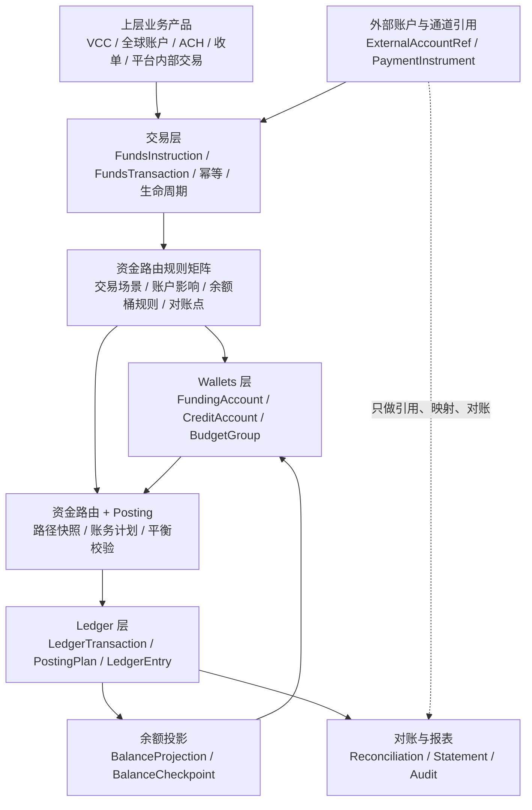

评审原则：

1. `Ledger` 是事实源，任何余额变化必须能由分录解释。
2. `Wallets` 是业务账户产品层，面向使用者表达余额、冻结、授权、结算和账单。
3. 交易接入层是上层业务使用 `Ledger` 和 `Wallets` 的便利入口，不反向污染账本和钱包模型。
4. 外部账户和支付工具只做引用、映射、触发或对账，不作为内部 ledger subject。

## 1.2 审查后确认的核心概念

本节是主文档的产品语义基线。DSL、系分、表结构、接口和测试必须按本节口径展开；[核心概念与行为定性审查](产品设计/v5%20核心概念与行为定性审查.md) 作为详细评审记录和红线清单。

| 概念 | 产品定性 | 关键边界 |
| --- | --- | --- |
| `Ledger` | 账务事实源，承载某个主体、币种、Profile 下的账务事实。 | 不是钱包、资金账户、交易主表或展示账单；缺账本不得自动入账。 |
| `LedgerAccount` | 账本内的账目、科目或余额桶，例如 `AVAILABLE`、`FROZEN`、`AUTHORIZATION`、`CLEARING`。 | 不是用户、商户或平台资金账户；normal balance、负数策略和用途由 Profile 决定。 |
| `LedgerTransaction` | 一次可审计、可平衡、不可变的账务执行事实。 | 不是业务订单，也不是 `FundsTransaction`；过账后不得修改，错账用冲正、补记或调账。 |
| `LedgerEntry` | 不可变借贷分录，是余额投影和账务重建的事实来源。 | 不是用户账单行或商户账单行；不直接面向终端用户展示。 |
| `BalanceProjection` | 由分录投影出的当前余额、历史余额或检查点结果。 | 不是事实源，不得反向修改分录；必须可重建、可巡检、可对账。 |
| 业务余额变更日志 | 面向账单、运营、风控和业务系统的余额变化观察记录。 | 只能由 `LedgerEntry` 和 `BalanceProjection` 派生；不是事实源，不得反向修改余额或分录。 |
| `FundingAccount` | 承载真实资金余额的账户主体。 | 不是外部银行账户、卡或 VA；按 Profile 拥有 `AVAILABLE/FROZEN/AUTHORIZATION/CLEARING/SETTLEMENT` 等账目；`AVAILABLE` 在明确策略下可受控为负。 |
| `CreditAccount` | 承载授信额度、可用额度和授权占用的控制账户。 | 不是现金账户；不代表平台真实垫资已经发生；`LIMIT` 只允许在受控调额路径中表达额度总量调整。 |
| `BudgetGroup` | 承载预算总量、可用预算和预算授权占用的控制账户。 | 不是资金池，也不承载真实现金；`AVAILABLE` 可按预算策略受控为负；不新增账务 `CONSUMED`，已消费进入交易视图和报表口径。 |
| 平台资金账户角色 | 平台内部资金账户的用途角色，例如现金映射、预收待付、费用、清结算过渡。 | 不是独立账务主体，必须解析到具体 `FundingAccount` 后才能入账。 |
| `ExternalAccount` | 银行账户、通道账户、合作方账户等外部资金位置引用。 | 不是内部 ledger subject，只做引用、映射、回单和对账。 |
| `PaymentInstrument` | 卡、VA、token、收款地址等支付或识别工具。 | 不是账户主体，不入账，不承载余额，只能脱敏保存和展示。 |
| `FundsTransaction` | 资金侧交易事实聚合，保存生命周期、金额聚合、route snapshot 和账本引用。 | 只记录直接交易、授权链、退款、争议、费用、调账等资金交易事实；不记录冻结/解冻。 |
| `FundsTransactionDetail` | 一笔资金交易下的主体、角色、金额、效果和账本引用明细。 | 不是用户账单，不是外部定位入口；明细按 `transactionSn` 查询，`detailSn` 不作为核心查询字段。 |
| `FrozenOrder` | 冻结、解冻、部分释放、到期释放的控制事实。 | 冻结不是价值转移，不创建 `FundsTransaction` 或 `FundsTransactionDetail`；但会触发账本交易和余额投影。 |
| `TransactionView` | 面向用户、商户、运营、财务的只读交易投影。 | 不是账务事实、资金交易事实或余额事实；只能读取事实，不能反向修改事实。 |

## 1.3 核心对象分层

| 层级 | 典型对象 | 定性 | 是否事实源 |
| --- | --- | --- | --- |
| 业务产品层 | 业务订单、卡授权、提现申请、商户结算申请、争议单 | 业务事实或业务流程单据。 | 视业务系统而定，不直接作为账务事实源。 |
| 交易接入层 | `FundsInstruction` | 上层业务提交资金事实的请求对象。 | 否。 |
| 交易事实层 | `FundsTransaction`、`FundsTransactionDetail` | 资金交易事实和多主体影响明细。 | 是，作为账务计划和交易投影的重要来源。 |
| 余额控制层 | `FrozenOrder` | 冻结、解冻和释放控制事实。 | 是，作为冻结类账务计划和冻结视图来源。 |
| 账户产品层 | `FundingAccount`、`CreditAccount`、`BudgetGroup` | 可入账账户主体。 | 是，但余额仍必须由账本分录解释。 |
| 账务事实层 | `LedgerTransaction`、`PostingPlan`、`LedgerEntry` | 不可变账务事实。 | 是，属于账务最终事实源。 |
| 余额投影层 | `BalanceProjection`、`BalanceCheckpoint` | 分录投影结果。 | 否，可重建。 |
| 余额观察层 | 业务余额变更日志、余额变更通知 | 面向业务侧的余额变化观察。 | 否，只能从账本事实和余额投影派生。 |
| 读模型层 | `TransactionView`、账单、报表 | 产品展示或分析读模型。 | 否。 |
| 外部引用层 | 银行账户、卡、VA、通道账户、支付工具 | 外部工具或外部账户引用。 | 否，只做映射、触发和对账。 |

## 1.4 交易行为、授权行为和冻结行为定性

直接交易、授权交易和冻结是三类不同产品行为，不能用同一个事实载体或同一组状态强行表达。

| 行为类型 | 产品定性 | 是否价值转移 | 是否改变资金归属 | 事实载体 | 账务影响 |
| --- | --- | --- | --- | --- | --- |
| 直接交易 | 已确认的资金事实，例如入金、支付、转账、退款、出金成功、调账。 | 是，或至少改变平台责任、商户待清算、费用或追偿口径。 | 通常改变。 | `FundsTransaction`。 | 必须生成平衡账本交易和分录。 |
| 授权交易 | 最终交易前的资金、额度或预算占用链路。 | 授权成功阶段不是价值转移；授权结算才形成消费或待清算。 | 授权成功阶段不改变；结算后改变。 | `FundsTransaction`，事件语义为授权、释放、结算等。 | 授权成功 `AVAILABLE -> AUTHORIZATION`；授权拒绝无分录；授权结算关闭或减少占用。 |
| 冻结行为 | 对同一资金主体可用余额的限制。 | 否。 | 否。 | `FrozenOrder`。 | `AVAILABLE -> FROZEN`；解冻为 `FROZEN -> AVAILABLE`。 |

| 高频行为 | 产品定性 | 必守规则 |
| --- | --- | --- |
| 外部入金到账 | 直接交易。 | 外部账户只做引用；内部资金账户增加可用或待清算余额。 |
| 钱包支付 / 转账 | 直接交易。 | 付款方可用减少，收款方目标桶增加；必须保存 route snapshot。 |
| 商户订单收款 | 直接交易。 | 用户 `AVAILABLE ->` 商户 `CLEARING`；订单款不得直入商户 `AVAILABLE/SETTLEMENT`。 |
| 授权拒绝 | 授权结果事实。 | 不生成 route leg 和 `LedgerEntry`；不得累计到 `chargebackAmount`。 |
| 授权结算 | 授权链后续交易。 | 结算金额不得超过剩余授权；信用和预算已消费进入报表口径，不新增账务 `CONSUMED`。 |
| 冻结 / 解冻 | 余额控制行为。 | 不创建 `FundsTransaction`；扣划、追偿、退款、调账必须创建独立后续资金事实并引用冻结单。 |
| 清算确认 | 清结算处理行为。 | 商户 `CLEARING -> AVAILABLE`，不改变商户资金归属，只改变可结算状态。 |
| 结算锁定 | 出款前锁定行为。 | 商户 `AVAILABLE -> SETTLEMENT`；`SETTLEMENT` 不是 `AVAILABLE` 的别名。 |
| 争议拒付 / 强制扣回 | 逆向或追偿交易。 | 争议拒付不是授权拒绝；按责任方、准备金、负余额或追偿路径处理。 |

## 1.5 事实载体选择规则和概念红线

| 判断问题 | 应选择的事实载体 |
| --- | --- |
| 是否已经发生资金归属、平台责任、商户待清算、费用或追偿变化？ | `FundsTransaction`。 |
| 是否只是授权阶段占用资金、额度或预算？ | `FundsTransaction`，事件语义为授权。 |
| 是否只是授权未通过？ | 授权结果或交易失败记录；不生成 route leg 和 `LedgerEntry`。 |
| 是否只是限制同一资金主体可用性？ | `FrozenOrder`。 |
| 是否是清算批次、结算单、出款单状态变化？ | 清结算或出款产品单据；不得写成 `FundsTransaction` 状态。 |
| 是否是用户、商户、运营、财务要看的账单或时间线？ | `TransactionView` 或报表投影。 |
| 是否是外部银行、通道、卡、VA 或支付工具？ | 外部引用或工具快照。 |

| 红线 | 风险 |
| --- | --- |
| 把 `LedgerAccount` 当成资金账户。 | 账目和账户主体混淆，导致表、接口和余额查询错位。 |
| 把 `FundsTransaction` 当成 `LedgerTransaction`。 | 交易事实和账务事实混淆，导致重放、对账和审计断裂。 |
| 把冻结写入 `FundsTransaction`。 | 冻结被误认为价值转移，污染交易流水和退款、清结算口径。 |
| 用冻结替代授权。 | 授权生命周期、剩余授权、结算上限和撤销规则失真。 |
| 用 `AVAILABLE` 替代商户出款 `SETTLEMENT`。 | 重复出款、失败回退和出款中退款边界失控。 |
| 把信用账户或预算组当作真实资金账户。 | 额度、预算和现金混淆，造成资损或财务报表失真。 |
| 把外部账户或支付工具建成内部账本主体。 | 外部资金位置和内部责任混淆，无法对账。 |
| 把 `TransactionView` 当事实源。 | 读模型污染事实层，重放和审计失真。 |
| 把授权拒绝当争议拒付。 | `authorizationDeclinedAmount`、`chargebackAmount`、退款上限和争议追偿混乱。 |
| 把 `LIMIT`、`CONSUMED` 当普通资金迁移桶。 | 控制账户账务不平衡，违背预算和信用口径。 |
| 把受控负 `AVAILABLE` 当成可继续消费余额。 | 负余额主体继续支付、冻结、授权或出款，导致垫资、资损和追偿失控。 |

# 二、目标与非目标

## 2.1 产品目标

| 目标 | 说明 |
| --- | --- |
| Ledger 事实可信 | 不同业务接入后，都能沉淀为账本交易、账务计划、不可变分录和余额投影。 |
| Wallets 账户清楚 | 钱包、资金账户、信用账户、预算组、平台资金账户、外部账户和支付工具不混用。 |
| 交易接入轻量 | 交易层只做业务事实、幂等、快照、生命周期和回放辅助，不成为业务产品主模型。 |
| 账目可平衡 | 每个账务计划必须借贷平衡；余额变化必须能由分录重建。 |
| 交易可回放 | 退款、撤销、争议拒付、外部退回、退汇、调账等逆向事件优先基于原交易快照处理。 |
| 余额可解释 | 可用、冻结、授权占用、待清算、出款中、信用额度、预算占用等余额桶口径明确。 |
| 对账可闭环 | 平台交易、外部文件、银行流水、账本分录、余额投影、结算出款之间能核对和处理差错。 |
| 清结算可追踪 | 清算批次、结算单、出款单、准备金、负余额、失败回退和追偿都能追溯到明细。 |
| 高危操作可审计 | 出款、冻结、解冻、调账、手工退款、余额修复、对账核销必须有权限、审批、原因、凭证和审计。 |

## 2.2 非目标

1. 不在本 PRD 设计完整 VCC 发卡、ACH、全球付款、全球账户或收单业务。
2. 不直接定义卡组织、ACH 网络、银行、PSP、通道或外部合作方协议细节。
3. 不替代法务、合规、财务、税务、审计、银行或持牌机构确认。
4. 不把平台内部清分、合同结算写成持牌清算业务。
5. 不承诺具备支付牌照、客户备付金管理、跨境支付或外汇能力。
6. 不直接定义数据库表、Java 接口或代码实现细节；这些进入系分设计。

# 三、产品范围

## 3.1 P0 范围

| 编号 | 能力域 | 必须完成的产品能力 |
| --- | --- | --- |
| S-P0-001 | 账本与账目 | 账本、账目、账本交易、账务计划、账目分录、账目平衡、账本余额投影。 |
| S-P0-002 | Wallets 与账户 | 钱包展示账户、资金账户、信用账户、预算组、平台资金账户角色、余额桶和主体初始化。 |
| S-P0-003 | 账户余额控制 | 可用、冻结、授权占用、释放、出款锁定、准备金、负余额和调账。 |
| S-P0-004 | 过账与余额 | 资金交易到 PostingPlan，再到账本交易、分录和余额投影。 |
| S-P0-005 | 交易事实接入 | 业务交易事实、资金指令、交易生命周期、幂等、请求摘要、路由快照和交易明细。 |
| S-P0-006 | 逆向交易 | 退款、撤销、冲正、争议拒付、外部退回、退汇和追偿的底座表达。 |
| S-P0-007 | 清结算 | 清算候选、清算批次、结算单、出款单、失败回退和已出款后追偿。 |
| S-P0-008 | 对账差错 | 交易对账、资金到账对账、账务一致性核对、结算对账、差错单、挂账和核销。 |
| S-P0-009 | 视图与报表 | 交易视图、余额查询、账单、账户流水、账本报表、对账报表、结算报表和审计报表。 |
| S-P0-010 | 权限审计 | 高危操作权限、审批、凭证、操作日志、敏感字段控制和审计追踪。 |

## 3.2 P1 范围

| 编号 | 能力域 | 产品能力 |
| --- | --- | --- |
| S-P1-001 | 多币种记录 | 记录原始币种、原始金额、汇率、账本/账户币种和记账金额；底座主链路不承接换汇过程。 |
| S-P1-002 | 归档与重放 | 历史分录归档、余额检查点、归档清单、余额投影重建、交易视图有界重放、账本一致性巡检。 |
| S-P1-003 | 业务接入增强 | 面向上层业务的接入模板、状态映射、事件规范和验收样例。 |
| S-P1-004 | 对账自动化 | 自动匹配、自动核销、差错 SLA、重大差错阻断结算和出款。 |
| S-P1-005 | 报表数据面 | 异步报表、口径版本、重算任务、下载审计和字段 schema 管理。 |

## 3.3 不纳入本 PRD 的内容

| 编号 | 内容 | 处理方式 |
| --- | --- | --- |
| OUT-001 | 完整业务产品设计 | VCC 发卡、ACH 运营、全球账户、全球收付款、未来收单等业务产品另行设计。 |
| OUT-002 | 外部网络和合作方协议 | 卡组织、ACH 网络、银行、PSP、通道文件规则和 SLA 另行确认。 |

# 四、核心评审用例

本 PRD 评审应从底座能力用例进入，而不是从 VCC、ACH 或全球付款业务进入。

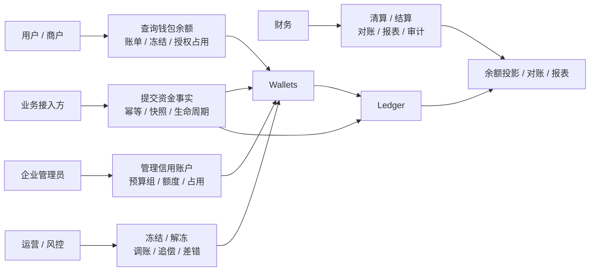

| 用例 ID | 用例 | 谁发起 | 做了什么 | 系统产出 | 异常和红线 |
| --- | --- | --- | --- | --- | --- |
| UC-BASE-001 | 主体开户和建账 | 业务系统、运营 | 为用户、商户、平台、信用主体或预算组初始化账户和账本。 | 资金账户/信用账户/预算组、账本、账目和余额桶。 | 未建账主体不得自动入账；0 余额和未建账必须区分。 |
| UC-BASE-002 | 入金到账 | 外部通道、业务系统 | 外部确认入金后，业务层提交入金事实。 | 资金交易、路由快照、账本交易、分录、目标账户 `AVAILABLE` 增加。 | 外部账户只做引用；必须核对平台资金账户、目标资金账户的账目余额和账本余额变化。 |
| UC-BASE-003 | 钱包支付给商户 | 用户、业务系统 | 用户用钱包向商户订单付款。 | 用户 `AVAILABLE` 减少，商户 `CLEARING` 增加，可拆出平台费用。 | 商户订单款不得直入 `AVAILABLE` 或 `SETTLEMENT`；必须核对用户、商户、平台费用账户的账目余额和账本余额。 |
| UC-BASE-004 | 平台内部付款 | 平台业务系统、运营 | 平台因服务、补偿、奖励或内部业务向用户、商户或平台主体付款。 | 平台责任账户减少，收款方目标资金账户增加，生成直接交易和账本分录。 | 平台付款必须有业务来源、审批或规则版本；不得直接改收款方余额；必须核对付款方和收款方账本余额。 |
| UC-BASE-005 | 平台内部转账 | 平台业务系统、运营 | 在用户资金账户、商户资金账户、平台资金账户或内部主体之间转移资金。 | 付款方目标桶减少，收款方目标桶增加，保存 route snapshot。 | 同主体无意义转账、币种不一致或账户未建账必须失败；必须核对双方账目余额和总账平衡。 |
| UC-BASE-006 | 手续费收取和退回 | 业务系统、财务 | 对支付、出入金、授权结算、争议或服务费收取手续费，必要时退回费用。 | 费用方余额减少，平台 `FEE` 增加；退费基于原费用事实回补。 | 本金和费用必须拆分；费用退回不得伪装成普通退款；必须核对费用账户、责任方账户和收入报表口径。 |
| UC-BASE-007 | 授权占用 | 授权型业务系统 | 业务发起授权，请求占用真实资金、信用额度或预算额度。 | `AUTHORIZATION` 占用、交易事实和分录。 | 授权成功不是最终入账；授权拒绝不生成账务路径；必须核对 `AVAILABLE/AUTHORIZATION` 账目余额。 |
| UC-BASE-008 | 授权结算或释放 | 授权型业务、清算任务 | 原授权被清算、撤销、过期或部分释放。 | 授权占用减少，实际消费或释放事实形成。 | 逆向和清算必须引用原交易快照；必须核对剩余授权、已结算、已释放和相关账本余额。 |
| UC-BASE-009 | 信用账户调额 | 运营、风控、财务 | 通过交易层余额控制入口调整信用账户额度。 | `BALANCE_CONTROL / LIMIT_ADJUST` 调额事实、`LIMIT`/`AVAILABLE` 账目变化和审批审计。 | 信用额度不是现金余额；不得与资金账户混用；`LIMIT` 只允许在受控调额路径出现，普通交易不得把它当 source/target。 |
| UC-BASE-010 | 预算组控制 | 企业管理员、业务系统 | 分配预算、调整预算、授权占用预算、结算确认预算消耗。 | 预算组 `LIMIT`、`AVAILABLE`、`AUTHORIZATION` 变化；已消费进入产品报表口径。 | 预算不是钱；预算调整通过交易层余额控制入口表达；预算消耗不得被当作外部资金流，也不新增账务 `CONSUMED`。 |
| UC-BASE-011 | 出金和出款锁定 | 用户、商户、财务 | 发起提现、商户出款或平台付款。 | 出款锁定、出款单、外部回单、成功消耗或失败回退。 | 受理成功不等于资金到账；不得重复出款；必须核对 `FROZEN/SETTLEMENT` 消耗或回退后的账本余额。 |
| UC-BASE-012 | 平台内部退款和冲正 | 业务系统、运营 | 对平台内部付款、转账、支付或费用发起部分或全额退款、撤销或冲正。 | 基于原快照的逆向交易、账本交易和余额回补。 | 缺原交易快照不得重新选路兜底；退款上限必须核对原交易已结算、已退款和争议扣回金额。 |
| UC-BASE-013 | 争议扣回、外部退回或退汇 | 外部机构、业务系统、运营 | 外部发生强制扣回、外部退回、退汇或争议结果。 | 逆向事实、费用、责任方、准备金扣减、负余额或追偿。 | 授权拒绝、外部退回、退款、争议拒付不得混用；必须核对责任方余额、准备金和追偿余额。 |
| UC-BASE-014 | 对账发现差异 | 财务、运营、批处理 | 内外部明细、银行流水或账本余额不一致。 | 对账批次、差错单、挂账、补记、调账或核销。 | 差异不得直接修改历史分录或余额；处理结果必须重新核对账本余额和差错余额。 |
| UC-BASE-015 | 商户清结算 | 批处理、财务 | 从交易明细生成清算批次、结算单和出款单。 | 清算明细、结算金额、出款锁定、成功或失败回退。 | 已出款后逆向事件只能追偿、准备金扣减或后续抵扣；必须核对 `CLEARING/AVAILABLE/SETTLEMENT` 账目余额。 |
| UC-BASE-016 | 余额查询和重建 | 用户、商户、运营、财务 | 查询当前余额、历史余额或账本余额构成。 | 余额桶快照、账目分录明细、检查点和重建结果。 | 余额不得来自不可解释的手工汇总；重建结果必须与账本分录和检查点一致。 |
| UC-BASE-017 | 幂等和重放 | 业务系统、批处理 | 同一业务事实重复提交或需要重放视图。 | 相同请求返回原结果；不同摘要拒绝；视图可重放。 | 幂等不能导致重复入账，视图重放不能改账；重放后必须核对投影视图与事实来源一致。 |

资金转移类用例必须同时验收业务事实、资金交易、账本分录和账本余额。验收时至少核对：

1. 交易前后相关账户主体的目标账目余额变化是否符合场景规则。
2. 本次 `LedgerTransaction` 下所有 `PostingPlan` 是否同币种平衡。
3. 余额投影是否与新增 `LedgerEntry` 增量一致。
4. 资金交易、交易明细、route snapshot、账本交易和交易视图是否能通过来源事实互相追溯。
5. 退款、冲正、手续费退回、争议扣回等逆向事件是否基于原快照和原账本事实，不重新选择当前绑定账户。

# 五、产品架构与使用者视角

## 5.1 产品架构图

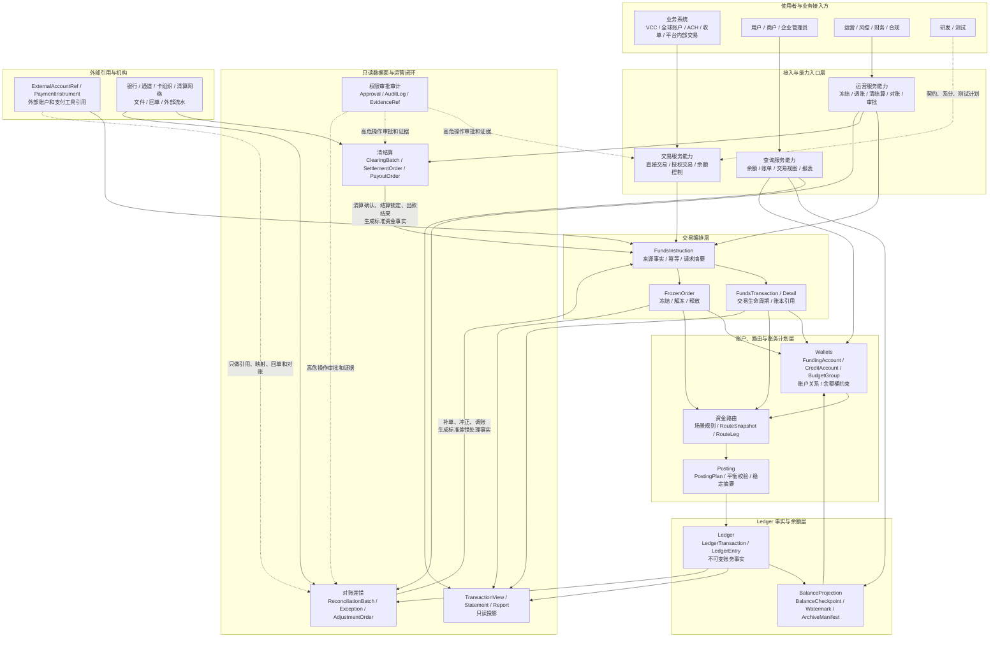

产品架构约束：

1. 业务接入方只通过交易层服务能力提交资金事实、授权交易或余额控制请求，不直接写 Wallets、Ledger、分录或余额。
2. Wallets 是账户和余额能力层，向交易层、查询层和运营后台提供账户关系、余额桶和约束能力，不作为业务交易入口。
3. Ledger 是账务事实源，任何余额变化最终都必须能由账本交易和分录解释。
4. 清结算和对账可以触发新的清结算资金事实、差错处理事实、补记、冲正或调账，但必须回到交易接入和主写入链路，不直接写 LedgerEntry、BalanceProjection 或历史资金交易。
5. 视图和报表只消费交易、Wallets、Ledger、清结算和对账事实或投影，不反向修改历史事实。
6. 外部账户、支付工具、银行、通道和清算网络只做引用、映射、触发、回单和对账，不作为内部 ledger subject。

## 5.2 功能模块关系依赖图

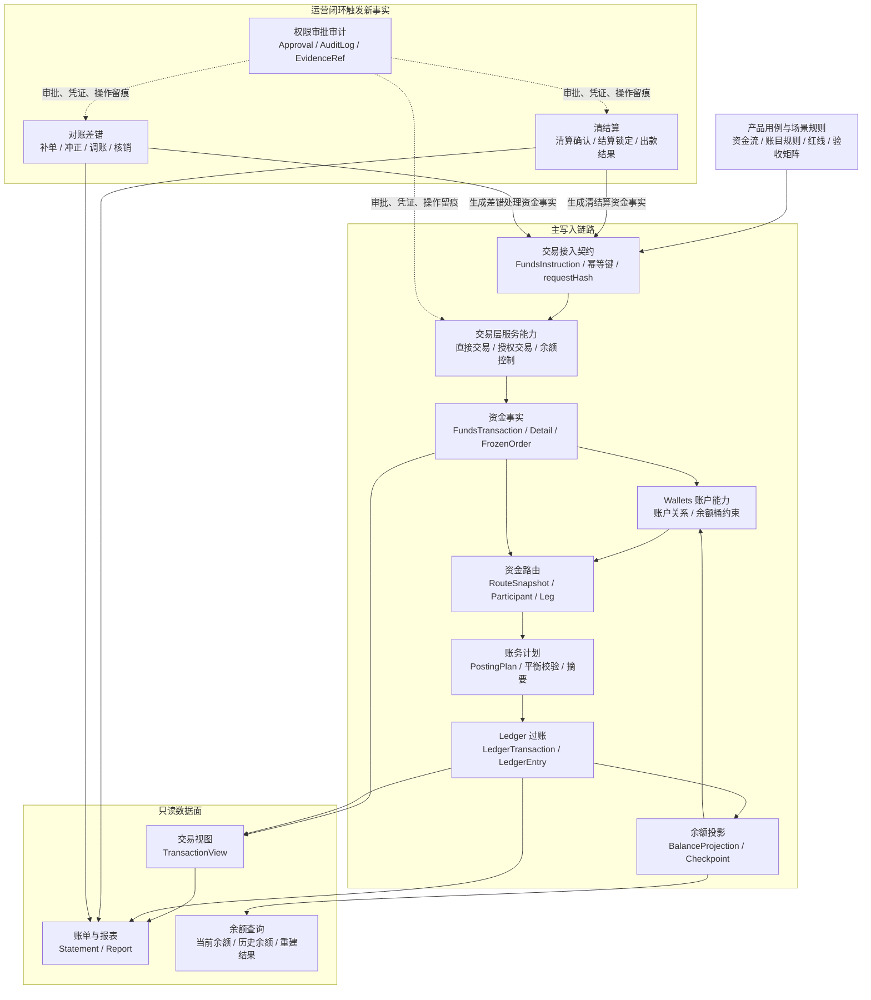

依赖规则：

1. `交易接入契约 -> 交易层服务能力 -> 资金交易事实 -> 资金路由 -> 账务计划 -> Ledger` 是主写入链路。
2. `Wallets` 参与账户解析、余额桶约束和展示口径，但不能绕过交易层与 Ledger 直接完成业务资金变化。
3. `清结算`、`对账差错` 是运营闭环能力：可以触发新的补记、冲正、调账、清结算或追偿事实，但必须通过交易接入契约回到主写入链路。
4. `视图报表` 是只读数据面，只能消费事实和投影，不得触发入账或覆盖历史数据。
5. `权限审批审计` 横切高危写操作，尤其覆盖出款、冻结、解冻、调账、核销、阈值放行和敏感数据导出。
6. 产品用例、场景账务规则、DSL 契约、系分设计和测试计划必须能回溯到本依赖图的模块边界。

## 5.3 模块职责

| 模块 | 模块定位 | 核心对象 | 优先级 |
| --- | --- | --- | --- |
| Ledger 账本核心 | 写入账本交易、账目分录、余额投影和摘要，是资金事实源。 | `Ledger`、`LedgerAccount`、`LedgerTransaction`、`LedgerEntry`、`BalanceProjection` | P0 核心 |
| Wallets 与账户核心 | 管理钱包展示口径、资金账户、信用账户、预算组、平台资金账户角色和余额桶。 | `FundingAccount`、`CreditAccount`、`BudgetGroup`、`LedgerProfile` | P0 核心 |
| Wallets 余额约束能力 | 提供可用、冻结、授权、待清算、出款中、准备金和负余额等账户约束检查与领域能力。 | `AuthorizationHold`、`ReservePolicy`、余额桶投影 | P0 核心 |
| 资金路由与账务计划 | 解析参与主体、账户、账目和资金路径，将不同交易场景翻译成平衡 posting plans。 | `RouteSnapshot`、`RouteParticipant`、`RouteLeg`、`PostingPlan` | P0 支撑 |
| 交易层 / 资金交易 | 对业务侧提供统一交易、授权交易和余额控制编排入口，保存交易生命周期、请求摘要、交易明细和处理结果。 | `FundsInstruction`、`FundsTransaction`、`FundsTransactionDetail`、`FrozenOrder`、`IdempotencyKey` | P0 支撑 |
| 清结算层 | 生成清算候选、清算批次、结算单、出款单和追偿单。 | `ClearingBatch`、`SettlementOrder`、`PayoutOrder`、`RecoveryOrder` | P0 |
| 对账差错层 | 管理对账批次、匹配结果、差错单、挂账、调账和核销。 | `ReconciliationBatch`、`ReconciliationException`、`AdjustmentOrder` | P0 |
| 视图与报表层 | 面向用户、商户、运营、财务、风控提供只读数据面。 | `TransactionView`、`Statement`、`ReportTask` | P0/P1 |
| 权限审批审计 | 管理高危操作权限、审批、凭证、日志和敏感字段访问。 | `ApprovalTask`、`AuditLog`、`EvidenceRef` | P0 |

`FrozenOrder` 是冻结/解冻的事实载体，产品归属在交易层余额控制服务能力下；Wallets 层只提供可冻结余额、剩余冻结金额、余额桶约束和展示口径。系分设计需要明确 `FrozenOrder` 的表、聚合、服务接口和实现模块归属，避免交易层服务能力与 Wallets 领域能力重复建模。

## 5.4 使用者与角色

| 角色 | 关注点 | 可执行操作 |
| --- | --- | --- |
| 业务接入方 | 如何把授权、入金、出金、收款、退款、争议、调账等业务事实提交到底座。 | 提交资金指令、查询资金交易、接收处理结果、订阅事件。 |
| 用户 / 商户 | 自己的余额、账单、冻结、授权占用、退款、出款和结算状态。 | 查询余额和账单、发起提现、查看结算单、提交问题。 |
| 企业管理员 | 信用账户、预算组、钱包资金、授权占用和预算消耗。 | 管理预算、查看额度、冻结工具、查看交易明细。 |
| 平台运营 | 异常入账、挂账、冻结、解冻、手工退款、差错和追偿。 | 处理差错、挂账认领、冻结解冻、发起调账、查看时间线。 |
| 财务 | 账本平衡、账实一致、清结算、对账差错、收入成本和损益。 | 复核结算、审批调账、核销差错、导出账本和结算报表。 |
| 风控 | 授权占用、冻结、限额、准备金、负余额、退款和争议风险。 | 拦截、冻结、释放、调整风险等级、暂停结算。 |
| 合规 / 安全 | 资金归属、权限审计、敏感字段、证据引用和上线前置。 | 审计导出、复核高危操作、确认前置条件。 |
| 研发 / 测试 | 账户模型、账本模型、交易事实、状态机、幂等和测试验收。 | 设计接口、表、测试计划、契约测试和回归用例。 |

# 六、Ledger 产品设计

Ledger 是资金底座的事实层。它不关心页面展示，也不替业务订单建模；它只回答一笔资金事实如何以账本交易、账务计划、分录和余额投影被可靠记录、校验、审计和重建。

## 6.1 Ledger 核心概念

| 概念 | 产品定义 | 关键规则 |
| --- | --- | --- |
| 账本 `Ledger` | 某个主体、某个币种、某类账本配置下的资金事实容器。 | 账本必须显式初始化；缺账本不能自动入账。 |
| 账目 `LedgerAccount` | 账本内的余额桶或账务科目，例如 `AVAILABLE`、`FROZEN`、`AUTHORIZATION`、`CLEARING`。 | 每个账目有正常余额方向、用途和是否允许透支规则。 |
| 账本交易 `LedgerTransaction` | 一次可审计、可幂等、可平衡的账务执行事实。 | 由资金交易、清结算、对账差错、调账等事实触发，不由页面直接创建。 |
| 账务计划 `PostingPlan` | 入账前的可执行计划，描述哪些账目借记、哪些账目贷记。 | 每组 plan 必须同币种借贷平衡，过账后不可改写。 |
| 分录 `LedgerEntry` | 不可变借贷明细。 | 不允许直接修改历史分录；错账通过冲正、补记或调账处理。 |
| 余额投影 `BalanceProjection` | 根据分录投影出来的当前余额或历史余额快照。 | 可重建、可校验，不替代分录事实。 |
| 余额检查点 `BalanceCheckpoint` | 大数据量和归档场景下的历史余额基线。 | 用于余额重建、查询和校验，不用于绕过分录或替代审计事实。 |
| 稳定摘要 `PostingDigest` | 对交易事实、账务计划和分录稳定字段生成的摘要。 | 不包含持久化流水、自增 ID、审计时间和易变状态。 |

## 6.2 Ledger 核心能力

| 能力 | 解决什么问题 | 产品产出 | 必守规则 |
| --- | --- | --- | --- |
| 建账 | 明确哪些主体、币种、账本 Profile 可入账。 | 账本、账目、初始化状态。 | 交易路径禁止自动建账；未建账和 0 余额必须可区分。 |
| 过账 | 把资金事实写成可审计账务事实。 | 账本交易、账务计划、分录。 | 同币种借贷平衡后才能过账。 |
| 余额投影 | 给 Wallets、报表和对账提供余额视图。 | 当前余额、历史余额、余额检查点。 | 余额由分录投影，不能绕过分录直接改。 |
| 冲正和调账 | 处理错账、差错、人工调整和补记。 | 新的平衡账本交易。 | 不修改历史分录；必须有关联来源、原因、凭证和审批。 |
| 一致性巡检 | 发现账本交易、分录、投影之间的不一致。 | 巡检结果、告警、修复任务。 | 不能用汇总数掩盖明细差异。 |
| 审计和重建 | 支撑财务、审计、对账和事故排查。 | 分录链路、摘要、重建结果。 | 每一笔余额变化都要能追溯到原始事实。 |

## 6.3 Ledger 设计不变量

| 不变量 | 约束 |
| --- | --- |
| 事实不可变 | `LedgerEntry` 和已过账 `LedgerTransaction` 不允许被直接修改或删除。 |
| 计划必须平衡 | 每组 `PostingPlan` 在同币种内借贷金额必须相等。 |
| 余额可重建 | 任意余额投影必须能由分录和检查点重建。 |
| 归档不破坏重建 | 分录进入冷归档前必须存在已校验的余额检查点、水位和归档清单；归档后重建余额使用水位前检查点或冷汇总加水位后增量分录，不允许在线全量扫描历史归档。 |
| 方向由 Profile 决定 | 正常余额方向、负数策略和可用账目来自 `LedgerProfile`，不得在业务代码中硬编码。 |
| 外部账户不入账 | 银行账户、通道账户、卡、VA 和支付工具只做引用、映射、触发或对账。 |
| 逆向不重新选路 | 退款、撤销、争议、退汇和外部退回优先回放原交易快照。 |

# 七、Wallets 产品设计

Wallets 是账户和余额能力层。它负责表达“谁有哪些账户、哪些余额能用、哪些余额被占用、哪些余额待清算或出款中”，并为交易层提供账户关系、余额桶、冻结、授权、准备金和负余额等约束能力，但不作为业务侧交易服务入口。上层业务不应直接调用 Wallets 原子能力完成支付、授权、退款、冻结或调账；这些编排入口应收敛到交易层。所有 Wallets 展示口径最终必须落到 Ledger 账目或报表投影。

## 7.1 Wallets 核心概念

| 对象 | 是否真实有钱 | 是否可入账 | 说明 |
| --- | --- | --- | --- |
| 资金账户 `FundingAccount` | 是 | 是 | 真正承载资金余额，例如用户钱包资金、商户资金、平台资金。 |
| 信用账户 `CreditAccount` | 否 | 是 | 承载额度，不是现金；用于授信、信用额度、共享额度控制。 |
| 预算组 `BudgetGroup` | 否 | 是 | 承载预算控制，不是现金；用于部门、项目、卡组预算控制。 |
| 平台资金账户 `FundingAccount + PlatformFundingAccountRole` | 取决于用途 | 是 | 平台现金、预收待付、费用、成本、调整、清结算等内部账户；平台角色不是独立账务主体，必须解析成具体 `FundingAccount`。 |
| 外部账户 `ExternalAccount` | 平台外部 | 否 | 银行账户、合作方账户、卡、VA、通道账户等只做引用、映射和对账。 |
| 支付工具 `PaymentInstrument` | 否 | 否 | 卡、VA、银行账号 token、收款地址等工具，不作为 ledger subject。 |

## 7.2 Wallets 核心能力

| 能力 | 解决什么问题 | 产品产出 | 必守规则 |
| --- | --- | --- | --- |
| 钱包展示口径 | 给用户、商户或企业展示可理解的钱包、额度、预算和结算余额。 | 余额视图、账户关系视图。 | 展示口径不直接入账，余额来自资金账户、信用账户、预算组和账本投影。 |
| 资金账户管理 | 承载真实资金余额和资金占用状态。 | `FundingAccount`、`FUNDING_BASIC`、`FUNDING_MERCHANT`、`FUNDING_PLATFORM`。 | 真实资金、商户待结算、平台资金角色必须分开表达。 |
| 信用账户管理 | 承载授信额度、可用额度和授权占用。 | `CreditAccount`、`LIMIT`、`AVAILABLE`、`AUTHORIZATION`。 | 信用额度不是现金，调额通过交易层余额控制入口发起；`LIMIT` 不开放给普通交易迁移。 |
| 预算组管理 | 承载预算总量、可用预算和预算授权占用。 | `BudgetGroup`、`LIMIT`、`AVAILABLE`、`AUTHORIZATION`。 | 预算不是钱，调额通过交易层余额控制入口发起；已消费进入报表口径，不新增账务 `CONSUMED`。 |
| 余额查询 | 面向用户、商户、运营、财务提供余额视图。 | 可用、冻结、授权、待清算、出款中、额度和预算口径。 | 区分未建账、0 余额、冻结、授权和待清算。 |
| 冻结和解冻 | 风控、运营、争议、提现申请等占用真实资金。 | `FrozenOrder`、解冻记录、账本交易和分录。 | 冻结和解冻不是价值转移，不创建 `FundsTransaction`；不得超过可冻结或剩余冻结金额。 |
| 授权占用和释放约束 | 为交易层授权交易提供信用额度、预算和资金占用能力。 | 授权占用、释放、过期、结算约束。 | 授权成功不是最终消费，授权拒绝不生成账务路径；业务侧通过交易层授权服务能力发起。 |
| 出款锁定约束 | 防止结算或提现重复出款。 | 商户 `SETTLEMENT` 锁定、用户提现冻结单、出款单、失败回退。 | 普通资金账户提现申请优先用冻结单；商户结算出款使用 `SETTLEMENT`；外部受理不等于到账。 |

## 7.3 账户主体、账本 Profile 和余额桶规则

### 7.3.1 账户主体余额约定总览

每个可入账主体必须绑定明确的 LedgerProfile。Profile 决定可用哪些账目、正常余额方向、是否允许负数，以及该主体是否承载真实资金。账本 Profile 和账目 normal balance 由账本类型与资金路由规则矩阵共同确认，属于已确认的账务规则，不作为待运行时临时决策。

| 账户主体 | 账本 Profile | 是否承载真实资金 | 余额桶约定 |
| --- | --- | --- | --- |
| 普通资金账户 `FundingAccount` | `FUNDING_BASIC` | 是 | `AVAILABLE` 可用资金、`FROZEN` 冻结资金、`AUTHORIZATION` 授权占用。 |
| 商户资金账户 `FundingAccount` | `FUNDING_MERCHANT` | 是 | `CLEARING` 待清算、`AVAILABLE` 可结算、`SETTLEMENT` 出款中、`FROZEN` 冻结、`ADJUSTMENT` 调整过渡。 |
| 平台资金账户角色 `FundingAccount + PlatformFundingAccountRole` | `FUNDING_PLATFORM` | 取决于角色 | `CASH`、`PREPAYMENT`、`CLEARING`、`SETTLEMENT`、`FEE`、`ADJUSTMENT` 分别表达平台现金映射、预收待付、清结算过渡、应付结算、费用和挂账调整。 |
| 信用账户 `CreditAccount` | `CREDIT_BASIC` | 否 | `LIMIT` 额度总量视图、`AVAILABLE` 可授权额度、`AUTHORIZATION` 授权占用。 |
| 预算组 `BudgetGroup` | `BUDGET_BASIC` | 否 | `LIMIT` 预算总量视图、`AVAILABLE` 可授权预算、`AUTHORIZATION` 预算授权占用。 |

### 7.3.2 账目类型（余额桶）说明

账目类型是 Ledger 内的余额桶或科目，不是资金账户、信用账户、预算组或平台账户角色。不同 Profile 可以复用同一个账目名称，但产品语义必须结合主体类型和 Profile 理解。

| 账目类型 | 适用主体 | 产品语义 | 关键约束 |
| --- | --- | --- | --- |
| `AVAILABLE` | 资金账户、信用账户、预算组 | 可用资金、可授权额度或可用预算。 | 可受控为负，但含义不同：资金账户表示真实资金缺口或追偿风险；信用和预算表示控制额度超用或管理性负额。 |
| `FROZEN` | 资金账户、商户资金账户 | 同一资金主体内被风控、提现、争议或运营限制的余额。 | 不改变资金归属，默认不得为负；冻结和解冻必须引用冻结事实。 |
| `AUTHORIZATION` | 资金账户、信用账户、预算组 | 授权成功后的占用。 | 授权拒绝不进入该账目；结算、撤销、释放或过期后减少或关闭。 |
| `CLEARING` | 商户资金账户、平台资金账户 | 待清算、清算过渡或长短款处理口径。 | 商户订单款默认先进商户 `CLEARING`；平台 `CLEARING` 可用于清算差异治理。 |
| `SETTLEMENT` | 商户资金账户、平台资金账户 | 结算、出款或内部结转处理中锁定资金。 | 不是 `AVAILABLE` 的别名；用于防止重复出款和支持失败回退。 |
| `LIMIT` | 信用账户、预算组 | 额度或预算总量视图。 | 不作为普通 RouteLeg 的来源或目标；只允许在 `BALANCE_CONTROL / LIMIT_ADJUST` 受控调额路径中表达信用额度或预算总量调整。 |
| `CASH` | 平台资金账户 | 平台现金、备付或外部现金池的内部镜像口径。 | 不是外部银行账户本身；外部账户仍只做引用和对账。 |
| `PREPAYMENT` | 平台资金账户 | 平台对用户、商户或业务方的预收、待付或内部负债口径。 | 不得在未确认主体资质前表述为客户备付金。 |
| `FEE` | 平台资金账户 | 手续费、服务费、成本补扣或收入归集口径。 | 本金和费用必须拆分；退费必须关联原费用事实。 |
| `ADJUSTMENT` | 商户资金账户、平台资金账户 | 差错、挂账、调账、长短款核销的过渡口径。 | 必须有来源、责任方、审批、凭证和核销路径。 |

### 7.3.3 LedgerProfile 账目清单

| Profile | 主体类型 | 必建账目 / 余额桶 | 产品用途 |
| --- | --- | --- | --- |
| `FUNDING_BASIC` | `FUNDING_ACCOUNT` | `AVAILABLE`、`FROZEN`、`AUTHORIZATION` | 用户或普通资金账户。 |
| `FUNDING_MERCHANT` | `FUNDING_ACCOUNT` | `CLEARING`、`AVAILABLE`、`SETTLEMENT`、`FROZEN`、`ADJUSTMENT` | 商户经营资金账户，承载待清算、可结算、出款中、冻结和调整。 |
| `FUNDING_PLATFORM` | `FUNDING_ACCOUNT` | `CASH`、`PREPAYMENT`、`CLEARING`、`SETTLEMENT`、`FEE`、`ADJUSTMENT` | 平台资金账户，承载平台现金、预收待付、清结算过渡、费用和挂账调整。 |
| `CREDIT_BASIC` | `CREDIT_ACCOUNT` | `LIMIT`、`AVAILABLE`、`AUTHORIZATION` | 信用额度账户，承载额度总量、可用额度和授权占用。 |
| `BUDGET_BASIC` | `BUDGET_GROUP` | `LIMIT`、`AVAILABLE`、`AUTHORIZATION` | 预算控制组，承载预算总量、可用预算和授权占用。 |

### 7.3.4 账目余额计算约定

| Profile | 账目 | 正常余额方向 | 是否默认允许负数 | 用途和约束 |
| --- | --- | --- | --- | --- |
| `FUNDING_BASIC` | `AVAILABLE` | `CREDIT` | 是，受控 | 可支付、可冻结、可出金的真实资金余额；顶格消费后的汇率差、清算金额差、后置手续费、争议费或补扣可形成受控负余额。 |
| `FUNDING_BASIC` | `FROZEN` | `CREDIT` | 否 | 风控、提现、调账、争议等原因冻结的真实资金。 |
| `FUNDING_BASIC` | `AUTHORIZATION` | `CREDIT` | 否 | 授权占用，未清算或未释放前不可重复使用。 |
| `FUNDING_MERCHANT` | `CLEARING` | `CREDIT` | 否 | 商户订单收款后的待清算资金，不能直接出款。 |
| `FUNDING_MERCHANT` | `AVAILABLE` | `CREDIT` | 是，受控 | 清算确认后的商户可结算余额；退款、争议、费用、出款后追偿或清结算差异可形成受控负余额。 |
| `FUNDING_MERCHANT` | `SETTLEMENT` | `CREDIT` | 否 | 结算或出款中锁定金额。 |
| `FUNDING_MERCHANT` | `FROZEN` | `CREDIT` | 否 | 风控、争议、差错等导致的商户资金冻结。 |
| `FUNDING_MERCHANT` | `ADJUSTMENT` | `CREDIT` | 否 | 商户侧调整过渡账目；使用需有原因、凭证和审批。 |
| `FUNDING_PLATFORM` | `CASH` | `DEBIT` | 否 | 平台现金类或外部现金映射类账户，具体合规口径另行确认。 |
| `FUNDING_PLATFORM` | `PREPAYMENT` | `CREDIT` | 否 | 平台预收、待付或中间归集性质账户，不等同于客户备付金。 |
| `FUNDING_PLATFORM` | `CLEARING` | `DEBIT` | 是，受控 | 平台清算过渡和长短款处理，可受控为负以承载差异。 |
| `FUNDING_PLATFORM` | `SETTLEMENT` | `CREDIT` | 否 | 平台结算归集或应付结算资金。 |
| `FUNDING_PLATFORM` | `FEE` | `CREDIT` | 否 | 平台手续费收入或费用归集口径。 |
| `FUNDING_PLATFORM` | `ADJUSTMENT` | `DEBIT` | 是，受控 | 挂账、差错、调账过渡口径，必须可核销和审计。 |
| `CREDIT_BASIC` | `LIMIT` | `DEBIT` | 否 | 信用额度总量视图，只在 `LIMIT_ADJUST` 受控调额路径中使用，不作为普通 RouteLeg source/target。 |
| `CREDIT_BASIC` | `AVAILABLE` | `CREDIT` | 是，受控 | 可授权额度；调减导致负数时必须有策略、上限、审批和审计。 |
| `CREDIT_BASIC` | `AUTHORIZATION` | `CREDIT` | 否 | 信用授权占用。 |
| `BUDGET_BASIC` | `LIMIT` | `DEBIT` | 否 | 预算总量视图，只在 `LIMIT_ADJUST` 受控调额路径中使用，不作为普通 RouteLeg source/target。 |
| `BUDGET_BASIC` | `AVAILABLE` | `CREDIT` | 是，受控 | 可授权预算；预算调减、追认消费或管理规则可导致受控为负，但不代表真实资金缺口。 |
| `BUDGET_BASIC` | `AUTHORIZATION` | `CREDIT` | 否 | 预算授权占用。 |

### 7.3.5 账户主体账目规则矩阵

每类账户主体必须在开户或主体初始化时显式建账。交易、冻结、授权、结算、对账和调账链路只能查账、验账和入账，禁止在交易路径自动创建账本或自动补平台资金账户角色。

| 账户主体类型 | 具体主体 | Profile | 初始化账目 | 角色主要作用账目 | 默认余额关系 | 关键约束 |
| --- | --- | --- | --- | --- | --- | --- |
| 普通资金账户 | 用户钱包资金、普通企业资金、平台内部普通资金 | `FUNDING_BASIC` | `AVAILABLE`、`FROZEN`、`AUTHORIZATION` | 全部初始化账目 | `AVAILABLE` 是可用真实资金；`FROZEN` 和 `AUTHORIZATION` 是从可用资金转出的占用态。 | `AVAILABLE` 通常非负，但可按受控负余额策略为负；`FROZEN/AUTHORIZATION` 默认非负；主动支付、冻结、授权不得无策略扣成负数；外部账户不入账。 |
| 商户资金账户 | 商户收款账户、服务提供方待结算账户 | `FUNDING_MERCHANT` | `CLEARING`、`AVAILABLE`、`SETTLEMENT`、`FROZEN`、`ADJUSTMENT` | `CLEARING`、`AVAILABLE`、`SETTLEMENT` | 商户收款先入 `CLEARING`，清算确认后入 `AVAILABLE`，结算或出款中转入 `SETTLEMENT`。 | 订单款不得直入 `AVAILABLE/SETTLEMENT`；`AVAILABLE` 可因退款、争议、费用或追偿受控为负；`SETTLEMENT` 阶段退款或争议优先进入追偿、准备金或负余额处理。 |
| 平台现金映射账户 | 平台银行资金池、现金类内部映射 | `FUNDING_PLATFORM` | `CASH`、`PREPAYMENT`、`CLEARING`、`SETTLEMENT`、`FEE`、`ADJUSTMENT` | `CASH`，必要时配合 `CLEARING/ADJUSTMENT` | `CASH` 表示平台侧现金或外部现金池映射。 | 不是外部银行账户本身；外部账户仍只做引用和对账。 |
| 平台预收待付账户 | 平台预收款、待付池、中间归集 | `FUNDING_PLATFORM` | `CASH`、`PREPAYMENT`、`CLEARING`、`SETTLEMENT`、`FEE`、`ADJUSTMENT` | `PREPAYMENT`，必要时配合 `SETTLEMENT/ADJUSTMENT` | `PREPAYMENT` 表示平台对用户、商户或业务方的待付责任口径。 | 不得在未确认主体资质前表述为客户备付金；不得与平台收入混用。 |
| 平台费用账户 | 平台手续费、服务费、成本补扣归集 | `FUNDING_PLATFORM` | `CASH`、`PREPAYMENT`、`CLEARING`、`SETTLEMENT`、`FEE`、`ADJUSTMENT` | `FEE`，必要时配合 `ADJUSTMENT` | `FEE` 表示费用或收入归集口径。 | 费用收取、退费、补扣必须可关联原交易或费用规则版本。 |
| 平台清结算过渡账户 | 长短款、清算差额、结算过渡、挂账调整 | `FUNDING_PLATFORM` | `CASH`、`PREPAYMENT`、`CLEARING`、`SETTLEMENT`、`FEE`、`ADJUSTMENT` | `CLEARING`、`SETTLEMENT`、`ADJUSTMENT` | `CLEARING/ADJUSTMENT` 可受控为负，用来承载待核销差异；`SETTLEMENT` 表示应付或结算归集。 | 受控负数必须有原因、责任方、限额、账龄、审批和核销路径；不得用来掩盖资损。 |
| 信用账户 | 企业信用账户、共享额度账户、授信额度池 | `CREDIT_BASIC` | `LIMIT`、`AVAILABLE`、`AUTHORIZATION` | 全部初始化账目 | `LIMIT` 是额度总量视图；`AVAILABLE` 是可授权额度；`AUTHORIZATION` 是占用额度。 | `LIMIT` 只允许在受控调额路径中表达额度总量调整；授权结算只减少或关闭 `AUTHORIZATION`；`AVAILABLE` 可因管理调额受控为负，但新授权不得继续超额。 |
| 预算组 | 部门预算、项目预算、卡组预算、团队预算池 | `BUDGET_BASIC` | `LIMIT`、`AVAILABLE`、`AUTHORIZATION` | 全部初始化账目 | `LIMIT` 是预算总量视图；`AVAILABLE` 是可授权预算；`AUTHORIZATION` 是预算占用。 | 预算不是钱；`AVAILABLE` 可按预算策略受控为负，但新授权不得绕过预算超用规则；授权结算只减少或关闭 `AUTHORIZATION`，已消费进入报表口径。 |

### 7.3.6 平台账户角色使用规则

平台账户角色是平台侧 `FundingAccount` 的用途标签，用来帮助资金路由在不同业务场景下选择正确的平台账户和账目。它不是新的账务主体，也不是外部银行账户、通道账户或支付工具；每个角色必须在交易前解析到具体 `FundingAccount + LedgerProfile + 账目类型 + 币种`，并固化到 route snapshot。

| 平台账户角色 | 主要使用场景 | 主要作用账目 | 资金或责任含义 | 必守规则 |
| --- | --- | --- | --- | --- |
| 现金映射角色 | 外部入金到账、外部出金成功、平台资金池对账、银行流水核对。 | `CASH`，必要时配合 `CLEARING/ADJUSTMENT`。 | 平台侧现金或外部现金池的内部镜像口径。 | 不是外部银行账户本身；必须能和银行流水、通道回单或资金池报表核对；不得直接替代用户或商户账户。 |
| 预收待付角色 | 用户充值后待付、商户待付、平台代收代付、内部待付责任归集。 | `PREPAYMENT`，必要时配合 `SETTLEMENT/ADJUSTMENT`。 | 平台对用户、商户或业务方的待付责任口径。 | 不得与平台收入混用；不得在主体资质未确认前表述为客户备付金；释放或消耗必须有业务事实。 |
| 清算过渡角色 | 通道清算文件、卡组织或 ACH 清算差额、跨日清算、长短款暂挂。 | `CLEARING`。 | 平台清算过程中的过渡和差额治理口径。 | 必须按批次、币种、外部 reference 和水位对账；不得长期沉淀无责任方差异。 |
| 结算应付角色 | 商户结算锁定、平台内部结转、出款提交前后、失败回退。 | `SETTLEMENT`。 | 已进入结算或出款处理的应付或锁定口径。 | 必须防止重复出款；出款失败必须回退或进入差错处理；不得把未清算资金提前结算。 |
| 费用归集角色 | 手续费收取、手续费退回、服务费、后置补扣、通道成本归集。 | `FEE`，必要时配合 `ADJUSTMENT`。 | 平台费用、收入或成本补扣口径。 | 本金和费用必须拆分；费率版本、费用责任方和原交易必须可追溯；退费不得伪装成普通退款。 |
| 调整挂账角色 | 对账差错、长短款、人工调账、追偿、核销、历史修复。 | `ADJUSTMENT`，必要时配合 `CLEARING/FEE`。 | 需要进一步核销、追偿或审批的挂账和调整口径。 | 必须有差错单、调账单、审批、凭证、账龄和核销路径；不得用来静默补平或掩盖资损。 |

平台角色使用总规则：

1. 平台角色必须按租户、业务线、币种和用途预先配置并显式建账；交易路径只能查账、验账和入账，不能自动创建平台账户角色。
2. 资金路由必须在 route snapshot 中记录平台角色、实际 `FundingAccount`、账目类型、币种、规则版本和外部引用，后续退款、撤销、争议、退汇、清结算和对账必须优先回放原快照。
3. 同一笔交易中本金、费用、清算差额、平台补贴、追偿和调账必须拆分角色和账目，不得混入同一金额口径。
4. 平台 `CASH/PREPAYMENT/FEE/ADJUSTMENT` 代表不同资金或责任口径，不能因为都属于平台账户就互相替代。
5. 涉及用户资金、商户待结算资金、跨境、外汇、持牌合作或客户备付金语境时，平台角色命名和展示必须经财务、法务、合规确认。

典型场景中的平台角色选择：

| 场景 | 推荐平台角色 | 典型 route leg | 核对重点 |
| --- | --- | --- | --- |
| 外部入金到账 | 现金映射角色、预收待付角色 | `CASH -> PREPAYMENT -> 用户/商户 AVAILABLE`，或按业务规则直接形成待付责任。 | 外部到账流水、通道 reference、平台现金映射、用户或商户余额。 |
| 外部出金成功 | 现金映射角色、结算应付角色 | 用户冻结或商户 `SETTLEMENT -> CASH`，失败时按原路径回退。 | 出款单、银行回单、锁定余额、失败回退。 |
| 平台内部付款 | 现金映射角色、预收待付角色、调整挂账角色 | 平台责任或调整目标 `-> 收款方 AVAILABLE`。 | 业务来源、审批、付款方平台角色、收款方余额。 |
| 平台内部转账 | 按场景选择付款和收款角色 | 付款角色目标账目 `->` 收款角色或业务主体目标账目。 | 双方账户、币种、用途、route snapshot 和账本平衡。 |
| 手续费收取 | 费用归集角色 | 责任方目标桶 `-> FEE`。 | 原交易、费率版本、费用责任方、费用报表。 |
| 手续费退回 | 费用归集角色 | `FEE -> 原费用责任方目标桶`。 | 原费用事实、退费原因、累计退费上限。 |
| 清算长短款 | 清算过渡角色、调整挂账角色 | `CLEARING -> ADJUSTMENT` 或 `ADJUSTMENT -> 明确责任目标`。 | 清算文件、差错单、责任方、核销 SLA。 |
| 争议、追偿或差错核销 | 调整挂账角色、费用归集角色 | 责任方目标桶 `-> ADJUSTMENT/FEE`，或 `ADJUSTMENT -> 追偿回补目标`。 | 争议单、追偿单、审批、凭证和报表口径。 |

### 7.3.7 余额桶关系与允许动作

| 主体 / Profile | 允许动作 | 余额桶关系 | 账务含义 | 禁止或待定动作 |
| --- | --- | --- | --- | --- |
| `FUNDING_BASIC` | 入金到账 | 平台资金角色 `-> AVAILABLE` | 真实资金账户可用余额增加。 | 外部账户直接作为 ledger subject。 |
| `FUNDING_BASIC` | 支付 / 转账 | `AVAILABLE -> 收款方目标桶` | 可用资金减少，收款方对应余额增加。 | 主动支付无策略把付款方 `AVAILABLE` 扣成负数。 |
| `FUNDING_BASIC` | 后置补扣 / 汇率差 / 手续费 | `AVAILABLE -> 平台 FEE/ADJUSTMENT` 或差额责任目标 | 顶格消费后的汇率波动、清算金额差、后置手续费、争议费或补扣可形成受控负余额。 | 无原因、无上限、无账龄、无追偿或补足路径时直接扣成负数。 |
| `FUNDING_BASIC` | 冻结 | `AVAILABLE -> FROZEN` | 可用资金转为冻结资金。 | 超过可冻结金额冻结。 |
| `FUNDING_BASIC` | 解冻 | `FROZEN -> AVAILABLE` | 冻结释放回可用。 | 超过剩余冻结金额解冻。 |
| `FUNDING_BASIC` | 授权占用 | `AVAILABLE -> AUTHORIZATION` | 可用资金转为授权占用。 | 授权成功被当作最终入账。 |
| `FUNDING_BASIC` | 授权释放 | `AUTHORIZATION -> AVAILABLE` | 未清算授权释放。 | 缺原授权快照重新选路。 |
| `FUNDING_BASIC` | 授权结算 | `AUTHORIZATION -> 商户 CLEARING` 或平台结算目标 | 授权占用变成已确认消费或待清算收款。 | 将授权结算写成 `AUTHORIZATION -> LIMIT`。 |
| `FUNDING_MERCHANT` | 订单收款 | 付款方 `AVAILABLE -> CLEARING` | 商户待清算余额增加。 | 订单款直入 `AVAILABLE/SETTLEMENT`。 |
| `FUNDING_MERCHANT` | 清算确认 | `CLEARING -> AVAILABLE` | 待清算变成可结算。 | 有重大差错、冻结或风控标记仍清算。 |
| `FUNDING_MERCHANT` | 结算锁定 | `AVAILABLE -> SETTLEMENT` | 可结算余额转为出款中。 | 未锁定余额直接出款。 |
| `FUNDING_MERCHANT` | 出款失败回退 | `SETTLEMENT -> AVAILABLE` | 出款失败释放锁定。 | 回退金额超过原锁定金额。 |
| `FUNDING_MERCHANT` | 退款 / 争议扣回 | 当前持有桶 `-> 原付款方或责任处理目标` | 从 `CLEARING/AVAILABLE` 自动回退；`SETTLEMENT` 后进入追偿。 | 已出款后机械回滚出款。 |
| `FUNDING_MERCHANT` | 后置费用 / 争议费 / 追偿扣减 | `AVAILABLE -> FEE/ADJUSTMENT/责任目标` | 商户可用不足时可形成受控负余额，用于后续结算抵扣、准备金扣减或外部追偿。 | 静默制造负余额且不进入追偿、准备金、风控或报表。 |
| `FUNDING_PLATFORM` | 入金镜像 | `CASH -> PREPAYMENT` | 外部资金进入平台侧内部镜像，再形成对用户或商户的待付责任。 | 把外部银行账户直接建成内部分录主体。 |
| `FUNDING_PLATFORM` | 出金镜像 | `PREPAYMENT -> CASH` | 平台待付责任减少，现金映射减少。 | 外部受理成功即视为到账。 |
| `FUNDING_PLATFORM` | 手续费收取 | 付款方或商户桶 `-> FEE` | 平台费用归集。 | 手续费与本金混在同一金额口径。 |
| `FUNDING_PLATFORM` | 差错挂账 / 调账 | 明确来源 `-> ADJUSTMENT` 或 `ADJUSTMENT -> 明确目标` | 对账差异、长短款、人工调账的过渡和核销。 | 用 `ADJUSTMENT` 自动补平衡且无差错单。 |
| `CREDIT_BASIC` | 额度调增 | 增加 `LIMIT` 总量并同步增加 `AVAILABLE` | 管理动作，不是普通资金迁移。 | 把 `LIMIT -> AVAILABLE` 开放为普通交易 RouteLeg。 |
| `CREDIT_BASIC` | 额度调减 | 减少 `LIMIT` 总量并同步减少 `AVAILABLE` | 管理动作，可导致 `AVAILABLE` 受控为负。 | 无审批、无上限调成负数。 |
| `CREDIT_BASIC` | 授权占用 | `AVAILABLE -> AUTHORIZATION` | 可用额度被占用。 | 额度不足仍授权通过，除非有显式授信策略。 |
| `CREDIT_BASIC` | 授权撤销 | `AUTHORIZATION -> AVAILABLE` | 未消费额度恢复。 | 重新解析当前绑定关系。 |
| `CREDIT_BASIC` | 授权结算 | 减少或关闭 `AUTHORIZATION` | 已消费进入交易视图和报表。 | `AUTHORIZATION -> LIMIT` 或新增未确认的 `CONSUMED`。 |
| `CREDIT_BASIC` | 退款 / 争议回补 | 按产品规则恢复 `AVAILABLE` 或更新报表 | 已消费减少或回补。 | 从 `LIMIT` 普通迁移到 `AVAILABLE`。 |
| `BUDGET_BASIC` | 预算调增 | 增加 `LIMIT` 总量并同步增加 `AVAILABLE` | 管理动作，不是真实资金流入。 | 把预算当资金入账。 |
| `BUDGET_BASIC` | 预算调减 | 减少 `LIMIT` 总量并同步减少 `AVAILABLE` | 管理动作，可导致预算 `AVAILABLE` 受控为负。 | 无审批、无上限、无报表标记地放大预算超用。 |
| `BUDGET_BASIC` | 授权占用 | `AVAILABLE -> AUTHORIZATION` | 预算被占用。 | 预算不足仍授权通过。 |
| `BUDGET_BASIC` | 授权撤销 | `AUTHORIZATION -> AVAILABLE` | 未消费预算恢复。 | 重新解析当前绑定关系。 |
| `BUDGET_BASIC` | 授权结算 | 减少或关闭 `AUTHORIZATION` | 已消费进入预算报表口径。 | `AUTHORIZATION -> LIMIT` 或账务 `CONSUMED`。 |

### 7.3.8 `AVAILABLE` 受控负余额规则

`AVAILABLE` 表示当前可用、可结算、可授权额度或可授权预算，但它不是绝对不得为负的技术字段。资金账户、信用账户和预算组的 `AVAILABLE` 都可以按策略受控为负，只是业务含义和风险级别不同。

受控负余额必须满足以下规则：

1. 资金账户 `AVAILABLE` 受控为负，表示真实资金缺口、垫付、追偿、汇率差、清算差、后置费用、争议费或补扣风险，必须进入风控、对账、追偿、结算抵扣或人工处理。
2. 信用账户 `AVAILABLE` 受控为负，表示授信额度超用、额度调减后的管理性负额或后置确认差异，不代表现金余额；新授权必须按授信策略判断是否继续允许。
3. 预算组 `AVAILABLE` 受控为负，表示预算超用、预算调减后的管理性负额或追认消费，不代表现金余额；新授权必须按预算策略判断是否继续允许。
4. `FROZEN`、`AUTHORIZATION`、`SETTLEMENT` 默认不得为负；如需处理差错，不得直接制造负占用，应通过释放、冲正、调账或差错处理事实修正。
5. 负余额必须有明确来源：原交易、清算文件、费用规则、汇率快照、争议单、额度或预算调整单、调账单或审批单。
6. 负余额必须有策略约束：允许场景、币种、主体类型、单笔上限、累计上限、账龄、风控等级和是否需要审批。
7. 负余额主体不得因为仍有 `AVAILABLE` 字段就继续新支付、冻结、授权或出款；新交易必须先按策略判断是否允许。
8. 负余额必须进入报表、对账、追偿、后续入金抵扣、结算抵扣、额度或预算治理、人工处理流程，不得只停留在余额字段里。
9. 涉及客户资金、商户待结算资金、跨境或持牌合作模式时，负余额策略必须经财务、风控、法务和合规确认。

### 7.3.9 Wallets 到 Ledger 的映射规则

Wallets 层不直接保存不可解释余额。所有展示余额必须能映射到账本账目或报表投影。

| Wallets 展示口径 | 来源 | 说明 |
| --- | --- | --- |
| 可用余额 | `FundingAccount/FUNDING_BASIC/AVAILABLE` 或商户 `FUNDING_MERCHANT/AVAILABLE` | 可支付、可提现或可结算，具体权限由账户类型决定。 |
| 冻结余额 | `FROZEN` | 风控、提现、争议、人工冻结等占用。 |
| 授权占用 | `AUTHORIZATION` | 授权成功后未清算或未释放的占用。 |
| 待清算余额 | 商户 `CLEARING` | 商户收款后还不能结算或出款的余额。 |
| 出款中余额 | `SETTLEMENT` | 已进入结算或出款流程的锁定金额。 |
| 信用额度总量 | 信用 `LIMIT` | 额度总量视图，不是可迁移资金桶。 |
| 信用可用额度 | 信用 `AVAILABLE` | 可授权额度，可因调额受控为负。 |
| 预算总量 | 预算 `LIMIT` | 预算总量视图，不是真实资金。 |
| 预算可用 | 预算 `AVAILABLE` | 可授权预算，可因预算调减、追认消费或管理规则受控为负。 |
| 已消费金额 | 交易生命周期、授权结算事实、交易视图和报表投影 | 不使用账务 `CONSUMED`。 |

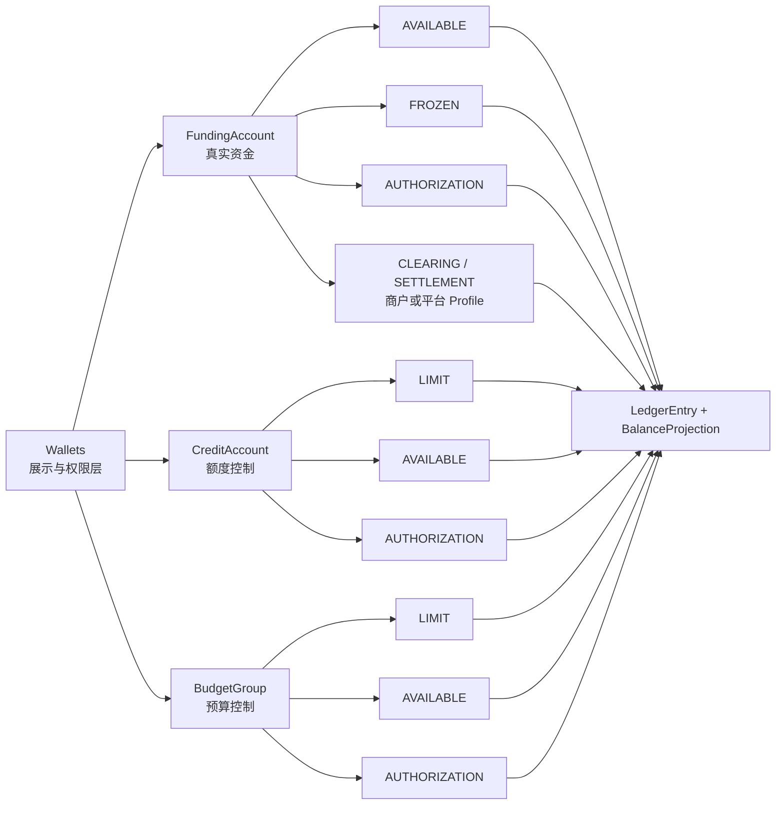

余额计算规则：

```text
DEBIT 正常余额 = debitAmount - creditAmount
CREDIT 正常余额 = creditAmount - debitAmount
```

借贷方向由账目的正常余额方向和余额增减语义推导：

| 余额语义 | 账目正常余额方向 | 分录方向 |
| --- | --- | --- |
| 增加 | `DEBIT` | `DEBIT` |
| 减少 | `DEBIT` | `CREDIT` |
| 增加 | `CREDIT` | `CREDIT` |
| 减少 | `CREDIT` | `DEBIT` |

信用账户和预算组不是现金账户。账务模型不新增 `CONSUMED` 账目，授权结算后控制主体只关闭或减少 `AUTHORIZATION` 占用；已消费金额由交易生命周期、授权结算事实、交易视图和报表投影计算。不得通过 `AUTHORIZATION -> LIMIT` 表达消费，也不得用 `CONSUMED` 作为临时账务补丁。

# 八、资金路由产品设计

资金路由层是交易层到 Ledger 之间的翻译层。它不决定业务是否成立，也不直接修改余额；它负责把一个已确认可处理的资金事实解析成参与方、账户、账目、资金路径和可执行账务计划，并把这些结果固化为后续退款、撤销、争议、退汇、清结算和对账可回放的快照。

如果系分或代码中出现 `RouteScenario`，它只应作为资金路由规则矩阵的稳定匹配键，用来选择规则、生成快照、组织测试和做指标归类。它不是新的产品主对象，也不能替代 `FundsTransaction`、`FrozenOrder`、清结算单据、对账差错或争议单等来源事实。若某个场景只在一处使用，且不能沉淀稳定账目规则、对账点或回放语义，就不应为了抽象而新增 `RouteScenario`。

## 8.1 资金路由核心概念

| 概念 | 产品定义 | 关键规则 |
| --- | --- | --- |
| 路由规则场景 | 资金路由规则矩阵中的稳定场景分类，例如入金、出金、支付、授权、结算、退款、争议、调账。 | 只是规则匹配和验收分类，不是新的产品主对象；来源事实仍是资金交易、冻结单、清结算单、对账差错或争议单。 |
| 路由参与方 `RouteParticipant` | 本次路径中的付款方、收款方、平台角色、控制账户或责任方。 | 必须解析到明确主体类型和账户引用。 |
| 路由节点 `RouteNode` | 一个可参与路径的账户或账目定位，例如某资金账户的 `AVAILABLE`。 | 外部账户和支付工具不能成为 ledger node。 |
| 路由边 `RouteLeg` | 描述金额从哪个节点流向哪个节点。 | 每条 leg 必须有金额、币种、来源、目标、用途和规则版本。 |
| 路由快照 `RouteSnapshot` | 本次交易实际使用的参与方、账户、账目、规则版本和路径。 | 一旦用于入账，不受后续账户绑定或规则配置变化影响。 |
| 账务计划 `PostingPlan` | 将 route legs 翻译成借贷分录前的可执行计划。 | 每组 plan 必须同币种平衡。 |
| 路由回放 `RouteReplay` | 退款、撤销、授权结算、拒付、解冻等后续资金事件复用原 route 快照。 | 缺快照不得静默重新选路；交易视图重放是只读投影修复，不属于 RouteReplay。 |

## 8.2 资金路由核心能力

| 能力 | 解决什么问题 | 产品产出 | 必守规则 |
| --- | --- | --- | --- |
| 场景识别 | 判断来源事实适用哪套资金路径。 | 规则场景编码、规则版本。 | 场景不明确时进入失败或人工复核，不兜底入账；不得把规则场景当成新的业务单据。 |
| 参与方解析 | 将业务主体、平台角色和账户引用解析为可入账主体。 | 付款方、收款方、平台资金账户、控制账户。 | 平台角色必须解析为具体 `FundingAccount`。 |
| 账户和账目定位 | 定位每个参与方使用哪个账户、哪个余额桶。 | route nodes。 | 不允许将支付工具、外部银行账户直接定位为账本主体。 |
| 路径生成 | 生成资金从来源到账目目标的 route legs。 | route legs、金额拆分。 | 每条路径都要能解释资金归属、责任方和后续逆向路径。 |
| 快照固化 | 保存本次实际使用的账户、规则和路径。 | route snapshot。 | 用于退款、撤销、争议、清结算和对账回放。 |
| 账务计划翻译 | 将路径转为借贷平衡的 posting plans。 | posting plans、稳定摘要。 | 不平衡、不支持的账目方向或币种不一致必须失败。 |
| 回放和修复 | 支撑逆向交易和异常修复。 | replay result、人工修复入口。 | 回放只使用原快照；人工修复必须有审批和审计。 |

## 8.3 资金路由职责边界

| 边界 | 属于资金路由 | 不属于资金路由 |
| --- | --- | --- |
| 业务判断 | 使用已传入的交易场景和业务事实做路径解析。 | 判断订单、授权、发卡、ACH、收单业务本身是否成立。 |
| 账户选择 | 按账户映射、平台角色和规则版本定位内部账户和账目。 | 创建新主体、自动开户、自动补平台资金账户。 |
| 余额校验 | 调用 Wallets / Ledger 校验可用、冻结、授权、结算锁定等余额约束。 | 绕过账本直接扣减余额。 |
| 规则使用 | 使用资金路由规则矩阵生成 route legs 和 posting plans。 | 在路由层临时拼业务特例或硬编码借贷方向。 |
| 逆向处理 | 基于原 route snapshot 回放退款、撤销、争议、退汇和外部退回。 | 原快照缺失时重新选一条“看起来合理”的路径。 |
| 对账支持 | 提供账户、账目、金额、规则版本和外部引用给对账。 | 代替对账差错系统做核销、调账审批和责任认定。 |

## 8.4 路由到分录的转换原则

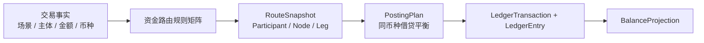

| 原则 | 说明 |
| --- | --- |
| 先定场景，再定路径 | 同样是金额减少，支付、出款、退款、争议和调账的责任方、可回放路径和对账点不同。 |
| 先定账户主体，再定账目 | 必须先确认是资金账户、信用账户、预算组还是平台资金账户，再确认使用哪个余额桶。 |
| 先校验余额桶约束，再生成分录 | 可用、冻结、授权、待清算、出款中等余额桶的约束失败时不得生成账本交易。 |
| route leg 不等于 ledger entry | route leg 表达产品资金路径，ledger entry 表达借贷分录；二者需要稳定映射但不能混为一谈。 |
| 摘要只包含稳定事实 | 摘要用于幂等和重放校验，不包含持久化流水、审计时间、操作人展示名或易变状态。 |

# 九、交易层产品设计

交易层是上层业务使用支付资金底座的入口。它不替代业务订单、卡交易、ACH 指令或收单支付单；它只沉淀资金侧事实，保证事实被幂等接收、校验、快照、路由、过账、查询、重放和审计。

## 9.1 交易层核心概念

| 概念 | 产品定义 | 关键规则 |
| --- | --- | --- |
| 资金指令 `FundsInstruction` | 上层业务提交到底座的标准资金事实请求。 | 必须有业务类型、事件类型、主体、金额、币种、幂等键和业务引用。 |
| 资金交易 `FundsTransaction` | 底座资金侧交易聚合，记录生命周期、结果、route 快照和账本引用。 | 不等于业务订单，也不等于账本交易。 |
| 交易明细 `FundsTransactionDetail` | 面向多主体、多账户视角的交易参与明细。 | 一笔资金交易可有多条明细，不需要用 `detailSn` 作为外部定位入口。 |
| 冻结订单 `FrozenOrder` | 冻结、解冻和冻结占用生命周期的业务单据。 | 不属于 `FundsTransaction`；冻结不是价值转移，但必须有账本交易和审计。 |
| 业务快照 `BusinessSnapshot` | 交易说明、商户信息、用户 UID、租户、外部引用、拒付/失败原因等展示和回放信息。 | 只保存资金处理需要的稳定上下文和必要展示信息。 |
| 请求摘要 `RequestHash` | 对资金指令稳定字段计算的幂等摘要。 | 同业务键同摘要返回原结果，不同摘要拒绝。 |
| 生命周期 `TransactionLifecycle` | 资金交易从接收、校验、路由、过账到成功、失败、复核的状态轨迹。 | 每次状态变化必须可审计。 |

## 9.2 交易层核心能力

| 能力 | 解决什么问题 | 产品产出 | 必守规则 |
| --- | --- | --- | --- |
| 标准接入 | 让不同业务用统一方式提交资金事实。 | 资金指令、接入模板。 | 业务系统不得直接写账本、分录或余额；冻结/解冻走冻结订单能力。 |
| 交易服务能力 | 给业务侧提供充值/入金、转账、支付、退款、提现、费用、授权、撤销、结算、争议拒付、冻结、解冻和调账等统一入口。 | 直接交易、逆向交易、授权交易、余额控制、查询与重放等服务能力。 | 交易层只负责编排和转换资金指令；账户、余额桶、路由、过账由 Wallets、路由层和 Ledger 协作完成。 |
| 幂等防重 | 防止重复请求重复入账。 | 幂等键、请求摘要、原结果返回。 | 同键不同摘要必须拒绝。 |
| 参数和主体校验 | 确保交易事实可被路由和入账。 | 校验结果、失败原因。 | 缺主体、金额、币种、业务引用、账户约束时必须失败。 |
| 快照保存 | 支撑退款、撤销、争议、清结算、对账和展示。 | 业务快照、route snapshot、规则版本。 | 快照不完整时不得进入依赖快照的逆向路径。 |
| 生命周期编排 | 跟踪交易从创建到终态的处理轨迹。 | 状态、失败原因、审计日志。 | 账本过账成功后才可标记资金交易成功。 |
| 交易查询 | 给业务、运营、客服、财务提供资金侧事实查询。 | 资金交易、交易明细、账本引用、处理结果。 | 查询不触发补账或修改状态。 |
| 交易重放 | 支撑视图重建、对账校验和回放分析。 | 重放结果、差异报告。 | 重放默认不重新入账，且必须按时间窗口、视图域、主体或批次有界执行。 |

## 9.3 交易层服务能力

交易层服务能力是业务侧使用资金底座的产品入口，不等同于具体代码接口名称。代码接口命名、模块归属和现有接口映射进入系分设计；PRD 层只定义服务能力、输入事实、输出结果和职责边界。

| 服务能力 | 面向业务动作 | 输入事实 | 核心输出 | 必守边界 |
| --- | --- | --- | --- | --- |
| 直接交易服务 | 入金、出金成功、付款、转账、商户收款、平台内部付款、平台内部转账、手续费收取、调账。 | 已确认的资金事实、主体、金额、币种、业务引用、外部引用。 | `FundsTransaction`、交易明细、route snapshot、账本交易、交易视图。 | 只处理已经成立或可入账的资金事实；不替代业务订单、出款单审批或外部通道状态机。 |
| 逆向交易服务 | 退款、撤销、冲正、手续费退回、外部退回、退汇、争议扣回、追偿。 | 原交易引用、本次逆向事实、金额、原因、费用和责任方。 | 基于原快照的逆向资金交易、账本交易和差异报告。 | 缺原快照不得重新选路；授权拒绝不得混入争议拒付。 |
| 授权交易服务 | 授权批准、授权撤销、过期释放、授权结算、授权链退款、授权链争议。 | 授权事实、资金账户、信用账户、预算组、金额、币种和授权规则。 | 授权占用、释放、结算或回补的资金事实和账本交易。 | 授权成功不是最终消费；多主体授权必须整体成功或整体失败。 |
| 余额控制服务 | 冻结、解冻、部分释放、到期释放、余额调账、额度或预算调整。 | 冻结单、释放事实、调账单、额度或预算调整单。 | `FrozenOrder`、调账事实、账本交易和余额投影。 | 冻结不是资金交易；冻结和解冻不创建 `FundsTransaction`。 |
| 查询与重放服务 | 交易查询、交易明细查询、处理结果查询、交易视图重放、差异校验。 | 业务键、资金交易号、来源事实、视图域、时间窗口或主体范围。 | 交易事实、账本引用、投影重放结果和差异报告。 | 查询和投影重放不得补账、不得改历史事实、不得无界扫描。 |

### 9.3.1 直接交易服务流程

直接交易服务处理已经成立或可入账的资金事实，例如入金到账、付款、转账、商户收款、平台内部付款、手续费收取和调账。它的关键验收点是：先落资金事实和快照，再通过 Wallets 与路由层生成可平衡账务计划，最后由 Ledger 在本地事务内完成过账和余额投影。

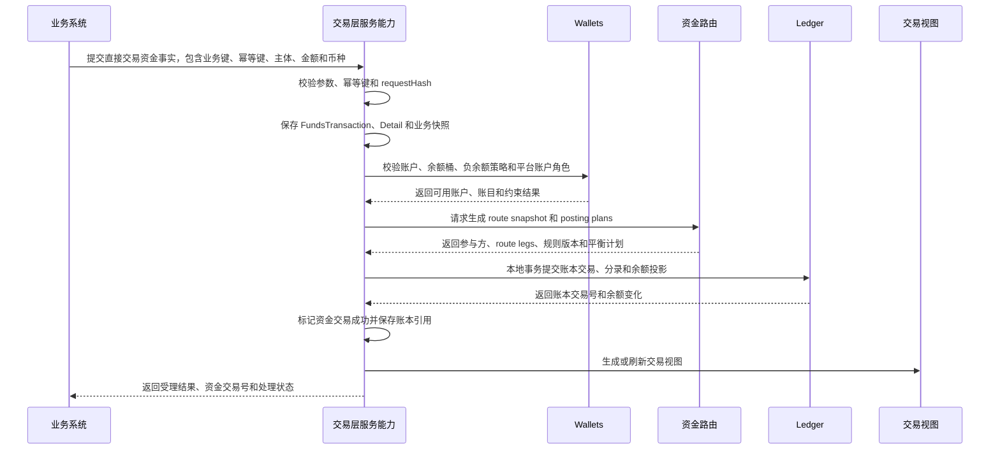

### 9.3.2 逆向交易服务流程

逆向交易服务处理退款、撤销、冲正、手续费退回、外部退回、退汇、争议扣回和追偿。它必须基于原交易快照回放原路径，不允许因为当前账户绑定或规则变化而重新选路；授权拒绝不属于逆向交易，更不能混入争议拒付口径。

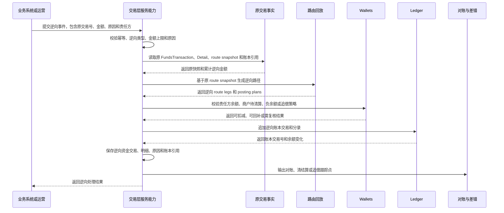

### 9.3.3 授权交易服务流程

授权交易服务处理授权批准、授权撤销、过期释放、授权结算、授权链退款和授权链争议。授权成功只表示资金、额度或预算被占用，不等于最终消费；授权结算才会把占用转为已确认消费、商户待清算或平台结算目标。

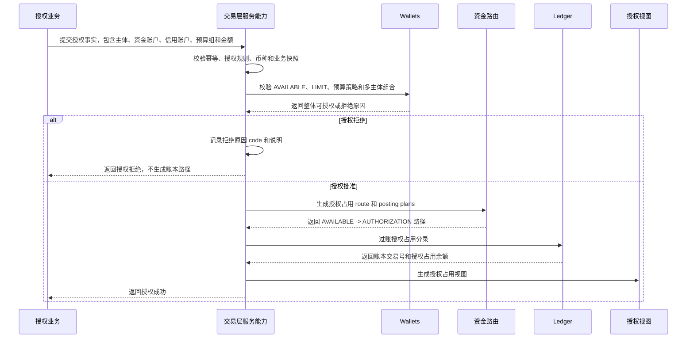

授权结算和释放必须沿用原授权快照：

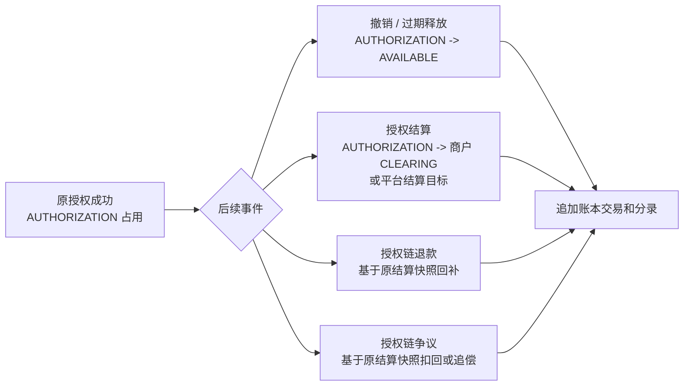

### 9.3.4 余额控制服务流程

余额控制服务处理冻结、解冻、部分释放、到期释放、余额调账、额度调整和预算调整。冻结和解冻不是价值转移，不创建 `FundsTransaction`；它们以 `FrozenOrder` 为事实载体，并通过 Ledger 分录影响 `AVAILABLE/FROZEN` 等余额桶。

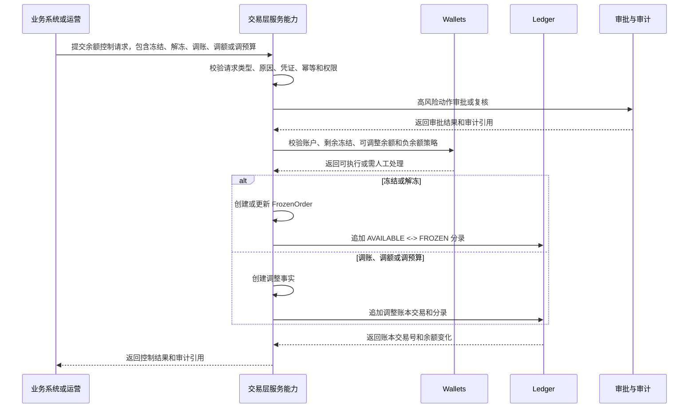

### 9.3.5 查询与重放服务流程

查询与重放服务只读消费资金交易、交易明细、冻结单、账本交易、余额投影、清结算和对账事实，用于处理结果查询、账单展示、交易投影修复和差异校验。它不得补账、不得改历史事实，也不得无界扫描；交易投影重放必须按时间窗口、主体、账户类型、视图域或批次有界执行。

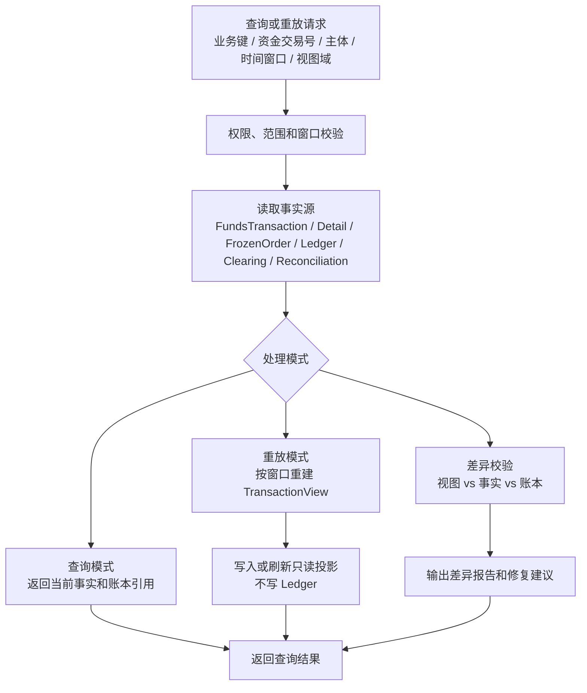

## 9.4 交易事实、明细和投影边界

`FundsTransaction` 只记录发生价值转移、授权链路或影响清结算/对账的资金交易事实。冻结、解冻是余额控制和风险运营动作，不记录为资金交易主表，不生成 `FundsTransactionDetail`；它们应记录 `FrozenOrder`，并通过账本分录影响 `FROZEN/AVAILABLE` 余额桶。

| 对象 | 记录什么 | 不记录什么 | 下游用途 |
| --- | --- | --- | --- |
| `FundsTransaction` | 直接交易、授权占用、授权释放、授权结算、退款、争议拒付、费用、出入金、调账等资金事实聚合。 | 冻结单生命周期、出款单状态、清算批次状态、对账差错处理状态。 | 幂等、route snapshot、账本引用、逆向回放、对账和交易投影。 |
| `FundsTransactionDetail` | 主交易下的多主体、多角色、多金额影响明细。 | 用户账单展示行、商户账单展示行、冻结明细、清结算明细。 | 投影输入、运营查询、参与方追踪和主体视角解释。 |
| `FrozenOrder` | 冻结、部分解冻、完全解冻、到期释放、冻结原因、期限、审批和冻结账本交易引用。 | 资金交易聚合金额、授权链累计金额、商户清算候选。 | 风控/运营处理、钱包冻结余额展示、审计和解冻约束。 |
| `TransactionView` | 面向用户、商户、运营、财务的只读展示和账单行。 | 账务事实、资金事实、余额事实。 | 查询、账单、运营时间线、报表和重放校验。 |

投影层可以同时读取 `FundsTransaction/Detail`、`FrozenOrder`、账本交易、清结算单、对账差错和争议单，但只能写自己的读模型。冻结类视图行的来源引用应指向 `FROZEN_ORDER`，不伪造 `FundsTransaction`。

## 9.5 交易层职责边界

| 边界 | 属于交易层 | 不属于交易层 |
| --- | --- | --- |
| 业务接入 | 接收标准资金事实、校验幂等、保存快照。 | 定义完整 VCC、ACH、全球账户、收单等业务产品流程。 |
| 交易服务入口 | 由交易层对业务侧暴露交易、授权交易、冻结/解冻/调账等编排能力。 | 将这些入口放在 Wallets 层，让业务侧绕过交易事实、幂等、快照和路由。 |
| 生命周期 | 管理资金交易状态和失败原因。 | 替代外部通道状态机或业务订单状态机。 |
| 路由协作 | 调用资金路由生成 route snapshot 和 posting plan。 | 在交易层手写分录或硬编码账户借贷方向。 |
| 账本协作 | 提交账务计划到账本并保存账本交易引用。 | 直接修改 LedgerEntry 或 BalanceProjection。 |
| 展示辅助 | 提供交易说明、用户、商户、租户、拒绝或争议原因等资金视图字段。 | 承载完整 CRM、商户管理、用户画像或营销信息。 |
| 冻结协作 | 编排冻结、解冻和调账入口，创建 `FrozenOrder` 或调账事实，并通过 Wallets 约束和 Ledger 过账完成余额桶变化。 | 将冻结、解冻写成 `FundsTransaction`，或让业务侧直接调用 Wallets 原子能力绕过交易层服务入口。 |
| 异常处理 | 保存失败、复核、重试、撤销和冲正入口。 | 绕过对账差错或审批流程直接改历史事实。 |

# 十、资金路由规则矩阵

资金路由规则矩阵是资金路由层的核心规则资产，不是独立产品模块。它回答每类交易场景涉及哪些账户、资金如何流动、账目如何平衡、Wallets 余额桶如何变化、以及对账要核对什么。DSL、系分、测试计划和产品 TDD 都应能回到本章逐项验收。

## 10.1 资金路由规则总览

| 场景 | 主要账户 | 资金流向 / route leg | 账目平衡要求 | 余额桶影响 | 对账点 |
| --- | --- | --- | --- | --- | --- |
| 外部入金到账 | 平台资金账户、用户或商户资金账户、外部账户引用 | 平台现金映射或预收待付 `->` 资金账户 `AVAILABLE`；外部账户只做引用。 | 平台侧账目减少或责任增加，与用户/商户资金账户增加形成平衡计划。 | 资金账户 `AVAILABLE` 增加；平台 `CASH/PREPAYMENT` 按角色变化。 | 外部到账流水、通道 reference、内部资金交易、账本交易、余额投影。 |
| 外部出金申请 | 用户或商户资金账户、平台资金账户、外部账户引用 | 用户提现申请使用冻结单 `AVAILABLE -> FROZEN`；商户结算出款使用 `AVAILABLE -> SETTLEMENT`；出款成功后平台现金映射消耗。 | 用户冻结、商户锁定、成功、失败回退分别形成独立平衡计划。 | 用户 `AVAILABLE/FROZEN` 变化；商户 `AVAILABLE/SETTLEMENT` 变化；成功后锁定或冻结金额消耗，失败回退。 | 冻结单、出款单、外部受理、到账回单、失败原因、银行流水。 |
| 钱包支付给商户 | 用户资金账户、商户资金账户、平台费用账户 | 用户 `AVAILABLE ->` 商户 `CLEARING`；手续费部分进入平台 `FEE`。 | 用户减少金额 = 商户待清算金额 + 平台费用 + 其他扣减。 | 用户 `AVAILABLE` 减少；商户 `CLEARING` 增加；平台 `FEE` 增加。 | 业务订单、资金交易、商户清算候选、费用规则版本、账本分录。 |
| 平台内部付款 | 平台资金账户、用户或商户资金账户 | 平台 `CASH/PREPAYMENT/ADJUSTMENT ->` 收款方 `AVAILABLE` 或指定目标桶。 | 平台责任减少或调整口径增加，与收款方余额增加形成平衡计划。 | 平台对应账目减少或调整，收款方 `AVAILABLE` 增加。 | 业务来源、审批或规则版本、资金交易、账本交易、收款方账单。 |
| 平台内部转账 | 付款资金账户、收款资金账户、必要的平台过渡账户 | 付款方 `AVAILABLE ->` 收款方 `AVAILABLE`，或按场景进入商户 `CLEARING`、平台 `PREPAYMENT/ADJUSTMENT`。 | 付款方减少金额 = 收款方增加金额 + 费用或差额处理金额。 | 双方目标账目按 route 变化；不得产生无法解释的挂账。 | 转账业务单、route snapshot、账本交易、双方余额投影。 |
| 平台内部退款 / 冲正 | 原付款方、原收款方、平台费用账户 | 基于原 route snapshot 反向回补；费用按原费用规则单独退或不退。 | 不删除原分录，新增反向平衡计划；累计退款不得超过可退金额。 | 原付款方回补，原收款方或责任方扣减，费用账户按规则变化。 | 原交易、退款单、冲正原因、账本交易、余额投影。 |
| 手续费收取 / 退回 | 责任方资金账户、平台费用账户 | 费用方目标桶 `->` 平台 `FEE`；费用退回按原费用事实反向回补。 | 手续费与本金分开平衡；退费不得超过原收费余额。 | 费用方余额减少或回补，平台 `FEE` 增加或减少。 | 原交易或费用规则版本、费用明细、财务收入报表、账本分录。 |
| 商户清算确认 | 商户资金账户 | 商户 `CLEARING -> AVAILABLE`。 | 同一商户资金账户内待清算减少、可结算增加。 | `CLEARING` 减少，`AVAILABLE` 增加。 | 清算批次、清算明细、退款/争议/风控扣减、账本交易。 |
| 商户结算锁定 | 商户资金账户 | 商户 `AVAILABLE -> SETTLEMENT`。 | 可结算余额减少与出款中余额增加平衡。 | `AVAILABLE` 减少，`SETTLEMENT` 增加。 | 结算单、出款单、准备金、负余额、差错扣减。 |
| 授权占用资金 | 资金账户、可选商户或业务目标 | 资金账户 `AVAILABLE -> AUTHORIZATION`。 | 可用减少与授权占用增加平衡。 | `AVAILABLE` 减少，`AUTHORIZATION` 增加。 | 授权请求、授权结果、授权剩余、过期或释放任务。 |
| 授权占用信用 | 信用账户 | 信用 `AVAILABLE -> AUTHORIZATION`。 | 可授权额度减少与授权占用增加平衡。 | 信用 `AVAILABLE` 减少，`AUTHORIZATION` 增加；现金余额不变。 | 授信规则、额度快照、授权结果、结算或释放事实。 |
| 授权占用预算 | 预算组 | 预算 `AVAILABLE -> AUTHORIZATION`。 | 可授权预算减少与预算占用增加平衡。 | 预算 `AVAILABLE` 减少，`AUTHORIZATION` 增加；真实资金不变。 | 预算规则、部门/项目归属、授权结果、预算报表。 |
| 授权释放 | 资金账户、信用账户或预算组 | `AUTHORIZATION -> AVAILABLE`。 | 释放金额不得超过剩余授权。 | `AUTHORIZATION` 减少，`AVAILABLE` 增加。 | 原授权快照、释放原因、过期任务、剩余授权。 |
| 授权结算 | 资金账户、商户资金账户、信用账户、预算组 | 资金授权转商户 `CLEARING`；信用/预算关闭或减少 `AUTHORIZATION`。 | 资金消费和控制账户占用关闭分别形成可解释计划。 | 资金 `AUTHORIZATION` 减少；商户 `CLEARING` 增加；信用/预算 `AUTHORIZATION` 减少，已消费进报表。 | 原授权、清算记录、结算金额、差额释放、已消费报表。 |
| 退款 | 原付款方、原收款方、平台费用账户 | 基于原 route snapshot 反向回补，优先从商户 `CLEARING/AVAILABLE` 退回。 | 可退款金额 = 已清算金额 - 已退款 - 争议扣回。 | 原付款方目标桶增加；商户对应桶减少；费用按规则退或不退。 | 原交易、退款单、退款金额、通道退款流水、账本交易。 |
| 撤销 / 冲正 | 原交易涉及账户 | 基于原 route snapshot 追加反向账本交易。 | 不删除原分录，反向计划必须平衡。 | 按原影响反向恢复。 | 原交易、撤销原因、审批、冲正账本交易。 |
| 争议拒付 / 强制扣回 | 原收款方、平台准备金或追偿账户、原付款方 | 从责任方持有桶扣回；已出款后进入准备金、负余额或追偿。 | 争议金额、费用、责任方和追偿路径必须独立可解释。 | 商户 `CLEARING/AVAILABLE/FROZEN/SETTLEMENT` 或追偿口径变化；不表达授权拒绝。 | 争议单、外部扣回文件、证据、费用、追偿状态。 |
| 外部退回 / 退汇 | 原出入金账户、平台资金账户、外部账户引用 | 按原出入金路径回退，费用单独表达。 | 原金额和费用分开平衡。 | 原目标账户余额回退或挂账；平台 `ADJUSTMENT` 可承载待处理差额。 | 外部退回流水、退汇原因、原出入金交易、费用明细。 |
| 冻结 / 解冻 | 资金账户 | `AVAILABLE -> FROZEN`；解冻为 `FROZEN -> AVAILABLE`。 | 冻结和解冻分别平衡，解冻不得超过剩余冻结。 | `AVAILABLE/FROZEN` 相互转换。 | 冻结单、原因、期限、审批、释放记录。 |
| 调账 / 补记 | 明确责任账户、平台调整账户 | 明确来源 `-> ADJUSTMENT` 或 `ADJUSTMENT ->` 明确目标。 | 必须有差错或审批来源，计划平衡。 | 按调整目标影响对应余额桶。 | 差错单、审批、凭证、调账账本交易、核销状态。 |

## 10.2 直接交易、授权交易和冻结的产品差异

直接交易、授权交易和冻结都会让 Wallets 余额桶、Ledger 分录和余额投影发生变化，但三者的产品含义不同，不能因为都“占用或减少可用余额”就混成同一类流程。直接交易表达最终资金事实，授权交易表达可结算前的占用事实，冻结表达风控、运营或流程控制下的可用性限制。

### 10.2.1 共同不变量

| 不变量 | 说明 |
| --- | --- |
| 必须先有账户和账本 | 交易路径只查账、验账和入账，不自动创建资金账户、信用账户、预算组或平台资金账户角色。 |
| 必须生成平衡账务计划 | 每个流程都必须生成同币种平衡的 `PostingPlan`，再写入 `LedgerTransaction`、`LedgerEntry` 和余额投影。 |
| 必须保存可回放快照 | 成功入账的流程必须保存 route snapshot；退款、撤销、释放、争议和调账优先基于原快照回放。 |
| 必须校验余额桶约束 | `AVAILABLE`、`AUTHORIZATION`、`FROZEN`、`CLEARING`、`SETTLEMENT` 等余额桶不足时不得生成分录。 |
| 外部账户仍不入账 | 银行账户、卡、VA、通道账户和外部支付工具只做引用、映射、触发或对账，不作为 ledger subject。 |
| 事实载体必须匹配语义 | 直接交易和授权交易进入 `FundsTransaction`；冻结和解冻进入 `FrozenOrder`；二者都可以产生账本交易和余额投影。 |

### 10.2.2 产品语义差异

| 维度 | 直接交易 | 授权交易 | 冻结 |
| --- | --- | --- | --- |
| 产品目的 | 完成一笔最终资金事实，例如入金到账、钱包支付、转账、费用扣收、已确认出金或退款。 | 在最终结算前预占资金、信用额度或预算，支持后续结算、释放、过期和差额处理。 | 因风控、运营、争议、提现前置、人工审批等原因限制资金可用性。 |
| 是否改变资金归属 | 通常会改变资金归属、平台责任或商户待清算金额。 | 授权阶段不改变收款方归属；结算阶段才形成最终消费或待清算收款。 | 不改变资金归属，只改变同一资金主体内的可用状态。 |
| 是否资金交易事实 | 是，记录 `FundsTransaction` 和参与方明细。 | 是，授权链记录 `FundsTransaction`，授权拒绝不生成账务路径。 | 否，记录 `FrozenOrder`，不记录资金交易主表和交易明细。 |
| 是否最终交易事实 | 是。成功后通常只能退款、冲正、撤销或调账追加修正事实。 | 否。授权成功只是占用事实，必须等待结算、撤销、过期或释放。 | 否。冻结本身不是消费、退款、结算或扣划。 |
| 典型账户主体 | 资金账户、商户资金账户、平台资金账户。 | 资金账户、信用账户、预算组，或三者组合。 | 资金账户，必要时包括商户资金账户；信用账户和预算组默认不使用冻结表达额度控制。 |
| 用户或商户视图 | 展示为付款、收款、入金、出金、退款、费用等交易明细。 | 展示为授权占用、待结算或已释放，不应展示为已完成付款。 | 展示为冻结金额、冻结原因、期限和释放状态。 |
| 后续动作 | 退款、撤销、冲正、争议、调账、对账和清结算。 | 授权结算、部分结算、释放、过期、授权链退款、争议拒付。 | 解冻；若需扣划或追偿，必须生成独立后续资金事实并引用冻结单。 |
| 关键红线 | 不得绕过清算把商户订单款直入 `AVAILABLE/SETTLEMENT`。 | 授权拒绝不生成账务路径；授权结算不得写成 `AUTHORIZATION -> LIMIT` 或账务 `CONSUMED`。 | 冻结不得替代授权；冻结单不得直接改状态来表达消费或扣划。 |

### 10.2.3 资金流和账目规则

| 流程 | 资金流 / route leg | 账目规则 | 余额影响 | 后续处理 |
| --- | --- | --- | --- | --- |
| 直接交易：钱包支付、平台付款或账户间转账 | 付款方 `AVAILABLE/CASH/PREPAYMENT/ADJUSTMENT ->` 收款方目标桶；商户收款目标桶必须先是 `CLEARING`，平台费用进入 `FEE`。 | 付款方减少金额必须等于收款方、费用方和其他扣减项之和；同币种计划平衡。 | 付款方目标账目减少；收款方 `CLEARING/AVAILABLE` 或平台 `FEE` 增加。 | 退款、冲正、争议或调账基于原 route snapshot 处理。 |
| 直接交易：外部入金到账 | 平台现金映射或预收待付 `->` 用户或商户资金账户 `AVAILABLE`；外部账户只做 reference。 | 外部确认事实、内部资金交易和账本交易必须可核对；平台资金角色必须显式配置。 | 用户或商户 `AVAILABLE` 增加；平台 `CASH/PREPAYMENT` 按角色变化。 | 外部退回或差错进入退汇、挂账或调账流程。 |
| 直接交易：已确认出金、费用扣收或费用退回 | 出金成功消耗已锁定的 `SETTLEMENT`；费用从责任方目标桶进入平台 `FEE`；退费按原费用事实反向回补。 | 出金申请的锁定和出金成功是不同账务事实；费用和本金必须分开表达；退费不得超过原收费。 | `SETTLEMENT` 或责任方余额减少；平台现金映射或 `FEE` 按事实变化。 | 出金失败只能回退原锁定；已成功后逆向走追偿、退回或调账；费用退回基于原费用快照。 |
| 授权交易：授权占用 | 资金账户 `AVAILABLE -> AUTHORIZATION`；信用账户或预算组 `AVAILABLE -> AUTHORIZATION`；组合授权必须显式列出每个主体。 | 多主体授权要么全部成功，要么不生成部分账务事实；授权金额不得超过可授权余额，除非有显式授信策略。 | 相关主体 `AVAILABLE` 减少，`AUTHORIZATION` 增加；信用和预算不改变真实现金余额。 | 等待结算、释放、过期或撤销；保存授权快照。 |
| 授权交易：授权释放或过期 | 原主体 `AUTHORIZATION -> AVAILABLE`。 | 必须引用原授权快照或授权占用事实；释放金额不得超过剩余授权。 | `AUTHORIZATION` 减少，`AVAILABLE` 增加。 | 授权链终止或继续保留剩余授权。 |
| 授权交易：授权结算 | 真实资金主体 `AUTHORIZATION ->` 商户 `CLEARING` 或平台结算目标；信用和预算主体减少或关闭 `AUTHORIZATION`。 | 结算金额不得超过剩余授权；部分结算差额按规则释放；信用和预算已消费进入交易视图和报表口径。 | 资金 `AUTHORIZATION` 减少，商户 `CLEARING` 或平台目标增加；信用和预算 `AUTHORIZATION` 减少。 | 授权结算后退款、争议拒付和费用按授权链快照处理。 |
| 冻结：冻结资金 | 同一资金主体 `AVAILABLE -> FROZEN`。 | 冻结必须有原因、期限、责任方、权限或审批引用；冻结金额不得超过可冻结金额。 | `AVAILABLE` 减少，`FROZEN` 增加；资金归属不变。 | 等待解冻、到期释放或后续独立扣划、追偿、调账事实。 |
| 冻结：解冻资金 | 同一资金主体 `FROZEN -> AVAILABLE`。 | 优先引用原冻结单；解冻金额不得超过剩余冻结。 | `FROZEN` 减少，`AVAILABLE` 增加。 | 冻结单进入部分释放、完全释放或过期状态。 |

### 10.2.4 产品判断原则

| 判断问题 | 应选择的流程 |
| --- | --- |
| 业务事实已经确认，资金归属、平台责任或待清算金额需要立即改变。 | 直接交易。 |
| 业务还处于“可成交但未最终清算”的阶段，需要先锁定资金、额度或预算。 | 授权交易。 |
| 因风险、审批、争议、提现前置或运营控制，需要临时限制资金可用性。 | 冻结。 |
| 需要把已冻结金额最终扣给责任方或退给其他主体。 | 不修改冻结事实；新建扣划、追偿、退款或调账资金事实，并引用冻结单。 |
| 授权被拒绝、风控拒绝或余额不足。 | 记录失败或拒绝事实，不生成 route leg 和 LedgerEntry。 |

## 10.3 余额桶影响规则

| 账户类型 | 可增加的余额桶 | 可减少的余额桶 | 关键限制 |
| --- | --- | --- | --- |
| 普通资金账户 | `AVAILABLE`、`FROZEN`、`AUTHORIZATION` | `AVAILABLE`、`FROZEN`、`AUTHORIZATION` | `AVAILABLE` 可按策略受控为负；`FROZEN/AUTHORIZATION` 默认非负；授权、冻结、出金必须先占用或锁定。 |
| 商户资金账户 | `CLEARING`、`AVAILABLE`、`SETTLEMENT`、`FROZEN`、`ADJUSTMENT` | `CLEARING`、`AVAILABLE`、`SETTLEMENT`、`FROZEN`、`ADJUSTMENT` | 订单款先入 `CLEARING`；`AVAILABLE` 可因退款、争议、费用或追偿受控为负；结算前必须经过清算确认；已出款后逆向进入追偿。 |
| 平台资金账户 | `CASH`、`PREPAYMENT`、`CLEARING`、`SETTLEMENT`、`FEE`、`ADJUSTMENT` | `CASH`、`PREPAYMENT`、`CLEARING`、`SETTLEMENT`、`FEE`、`ADJUSTMENT` | 平台角色必须映射具体资金账户；`AVAILABLE` 类可用口径、`CLEARING` 和 `ADJUSTMENT` 的受控负数只能用于清结算差异、费用补扣和调账。 |
| 信用账户 | `LIMIT`、`AVAILABLE`、`AUTHORIZATION` | `LIMIT`、`AVAILABLE`、`AUTHORIZATION` | `LIMIT` 是额度总量视图；授权结算只关闭或减少 `AUTHORIZATION`，已消费进报表。 |
| 预算组 | `LIMIT`、`AVAILABLE`、`AUTHORIZATION` | `LIMIT`、`AVAILABLE`、`AUTHORIZATION` | 预算不是钱；`AVAILABLE` 可按预算策略受控为负；不新增账务 `CONSUMED`。 |

## 10.4 场景规则验收

| 验收点 | 说明 |
| --- | --- |
| 账户完整 | 每个场景必须列明资金账户、信用账户、预算组、平台资金账户和外部账户引用的角色。 |
| 流程语义清晰 | 直接交易、授权交易和冻结必须分别验证最终资金事实、授权占用事实和冻结占用事实，不得相互替代。 |
| 路径可回放 | 入账成功的交易必须保存 route snapshot；逆向事件必须能基于原快照处理。 |
| 分录平衡 | 每个场景生成的 posting plans 必须同币种借贷平衡。 |
| 余额可解释 | Wallets 展示余额必须能解释到账本账目或报表投影。 |
| 对账点明确 | 每个场景必须有内部单据、外部 reference、账本交易和余额投影的核对关系。 |
| 红线失败 | 外部账户入账、直接改余额、商户订单款直入可结算、授权拒绝生成账务路径等必须失败。 |

# 十一、清结算产品设计

清结算层负责把已入账的交易明细转换为可清算、可结算、可出款、可追偿的资金处理结果。这里的“清算”是平台内部资金明细确认和结算候选计算口径，不表达持牌清算业务；对外资金划拨、银行或通道清算仍以外部机构协议和合规确认结果为准。

## 11.1 清结算分层

| 层次 | 产品含义 | 主要产出 | 账务影响 |
| --- | --- | --- | --- |
| 清算候选 | 判断哪些交易明细进入本期可清算范围。 | 清算候选明细、排除原因。 | 不直接入账。 |
| 清算确认 | 将待清算余额确认为可结算余额。 | 清算批次、清算明细。 | 商户 `CLEARING -> AVAILABLE`。 |
| 结算计算 | 按周期、币种、主体、费用、准备金、负余额、差错扣减计算净额。 | 结算单、金额构成。 | 不直接出款，必要时生成费用或调整分录。 |
| 结算锁定 | 将可结算余额锁定为出款中。 | 出款前锁定、出款单。 | 商户 `AVAILABLE -> SETTLEMENT`。 |
| 出款处理 | 提交外部出款并根据回单确认成功、失败或退回。 | 出款单、外部回单、失败回退。 | 成功消耗 `SETTLEMENT`；失败 `SETTLEMENT -> AVAILABLE`。 |
| 追偿处理 | 已出款后发生退款、争议、差错或退回。 | 追偿单、准备金扣减、负余额、后续抵扣。 | 不回滚已完成出款。 |

## 11.2 清结算主流程

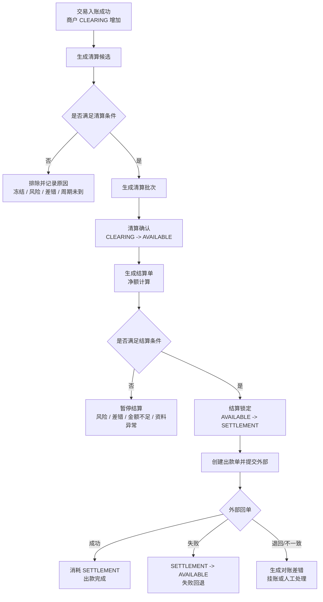

## 11.3 清算候选规则

| 规则 | 要求 |
| --- | --- |
| 交易成功 | 资金交易必须成功，且已关联账本交易和分录。 |
| 路径完整 | 必须存在 route snapshot，能定位商户账户、账目、费用和逆向路径。 |
| 明细可追溯 | 清算候选必须能追溯到原交易、交易明细、账本交易和业务引用。 |
| 余额在待清算桶 | 商户收款必须位于 `CLEARING`，不得从 `AVAILABLE` 反推候选。 |
| 异常排除 | 退款中、争议中、风控冻结、重大对账差错、商户资料异常、KYC/KYB 未通过时排除。 |
| 周期满足 | 达到清算周期、结算周期、延迟结算规则或业务约定的可清算时间。 |
| 币种一致 | 同一清算批次按主体、币种、周期和规则版本分组。 |

## 11.4 结算策略规则

清结算策略用于回答“什么时候可以清算、什么时候生成结算单、什么时候允许出款”。底层策略表达可参考 `SettlementPolicySpec`，但产品规则不能只保存一个表达式，还必须保存适用主体、账期口径、阻断条件、版本和重跑边界。

| 策略表达 | 产品含义 | 典型适用场景 | 关键约束 |
| --- | --- | --- | --- |
| `RT` | 实时清算或实时结算。 | 内部账户转账、低风险自营即时确认。 | 仍需满足余额、风控、对账和审批前置；实时不等于免审计。 |
| `T+N` | 交易日后 N 天进入清算或结算。 | 商户订单收款、退款窗口、通道清算延迟。 | 必须明确 T 是交易日、账务日还是外部清算日。 |
| `H+N` | 小时级批次。 | 高频小额业务、准实时商户清算候选。 | 需控制批次幂等、并发锁和重复入批。 |
| `W+N@weekday` | 每 N 周的指定星期结算。 | 周结商户、合作方账期。 | 需明确时区、节假日和顺延规则。 |
| `M+N@day/L` | 每 N 月的指定日期或月末结算。 | 月结商户、平台自营收入确认。 | 日期不存在时按月末处理；账单版本必须留痕。 |
| `Q+N` / `Q+N@L` | 季度结算。 | 大客户、合作方或财务周期结算。 | 不适合承载日常出款锁定；金额必须可追溯到明细。 |
| `Y+N` / `Y+N@MM-dd` | 年度结算或年度确认。 | 年费、长期合同或年度返佣。 | 通常需要合同、发票和财务复核。 |
| `C@dd-dd` | 自定义账单周期。 | VCC billing cycle、跨月账期、企业账单。 | 必须定义起止日、账单日、还款或结算日、跨月和月末规则。 |

结算策略产品对象至少应包含：

| 字段 | 说明 |
| --- | --- |
| `policyCode` | 结算策略编码，用于商户、结算主体或业务场景绑定。 |
| `policyExpression` | `SettlementPolicySpec` 表达式，例如 `T+1`、`W+1@5`、`M+1@L`、`C@05-04`。 |
| `policyVersion` | 规则版本，清算候选、结算单和报表必须保存使用时版本。 |
| `settlementSubjectType / settlementSubjectId` | 策略适用的结算主体，可为外部商户、平台自营主体或合作方。 |
| `currency` | 策略适用币种；多币种不得混批。 |
| `timeZone` | 账期计算时区，跨境和全球收付款必须显式配置。 |
| `basisTimeType` | 以交易发生时间、账务成功时间、清算确认时间、外部文件时间或合同账期为基准。 |
| `holidayRule` | 非工作日顺延、提前或照常处理规则。 |
| `minimumSettlementAmount` | 起结金额。 |
| `reservePolicyCode` | 准备金、风险暂扣或滚动保证金规则引用。 |
| `blockRules` | 风险、冻结、重大对账差错、资料异常、审批未通过等阻断规则。 |

策略执行规则：

1. 清算候选、清算批次、结算单、出款单必须保存 `policyCode + policyVersion + policyExpression`。
2. 修改策略只影响新批次，不反向修改已生成批次；历史批次如需修正，走重跑版本、反向调整或新批次补差。
3. 策略只决定周期和准入，不替代余额校验、风控、对账、审批、出款回单和资金账户规则。
4. 同一主体、币种、账期和策略版本下的候选生成必须幂等。
5. `RT` 只是策略表达式之一，不是实现兜底；不支持或无法解析的表达式必须失败、阻断配置发布或进入人工复核，不得静默按实时结算处理。
6. 节假日、cutoff、起结金额、准备金、风控阻断和审批规则属于 `SettlementPolicy` 产品对象，不属于 `SettlementPolicySpec` 表达式本身。

## 11.5 结算净额规则

| 金额项 | 口径 | 是否必须追溯明细 |
| --- | --- | --- |
| 本期清算收款 | 已清算确认的商户收款金额。 | 是 |
| 退款扣减 | 本期或历史交易产生、需从本期抵扣的退款金额。 | 是 |
| 争议扣回 | 争议拒付、强制扣回或等价扣减金额。 | 是 |
| 平台手续费 | 平台按费用规则收取的服务费。 | 是 |
| 通道成本或代扣项 | 外部通道成本、银行费用或合同约定扣项。 | 是 |
| 准备金 | 风险、争议或合同要求的暂扣金额。 | 是 |
| 负余额抵扣 | 历史追偿、垫付或出款后逆向形成的负余额。 | 是 |
| 风控扣留 | 风险策略要求本期暂不结算的金额。 | 是 |
| 未处理差错扣减 | 重大对账差错或未核销挂账要求扣减的金额。 | 是 |
| 调整金额 | 经审批的补记、调账、优惠或修正。 | 是 |

```text
本期可结算金额
= 本期清算收款
- 退款扣减
- 争议扣回
- 平台手续费
- 通道成本或代扣项
- 准备金
- 负余额抵扣
- 风控扣留
- 未处理差错扣减
+ 调整金额
```

## 11.6 清结算阻断规则

| 阻断点 | 处理规则 |
| --- | --- |
| 商户状态异常 | 暂停生成结算单或暂停出款，保留清算明细。 |
| 重大对账差错 | 阻断相关主体、币种和周期的结算或出款。 |
| 余额不足 | 不允许生成超过 `AVAILABLE` 的结算锁定。 |
| 外部账户未验证 | 不允许创建出款单。 |
| 准备金或负余额规则未执行 | 不允许进入出款。 |
| 审批未通过 | 不允许结算锁定或提交外部出款。 |
| 回单金额或币种不匹配 | 生成对账差错，不确认出款成功。 |

## 11.7 清结算批次重跑和撤回规则

批次重跑和撤回应按“未产生资金事实可撤，已产生资金事实只做反向或新批次修正”的原则设计。系分只能细化状态、权限和表结构，不得改成删除历史批次、覆盖历史金额或直接回滚已入账事实。

| 批次阶段 | 是否允许重跑 | 是否允许撤回 | 产品规则 |
| --- | --- | --- | --- |
| 清算候选生成前 | 允许 | 允许 | 只是候选计算，可按相同主体、币种、周期和规则版本重新生成。 |
| 清算候选已生成未确认 | 允许 | 允许 | 重跑应生成新版本候选，保留旧版本；撤回只关闭候选，不产生账务影响。 |
| 清算批次已确认 | 受限允许 | 不直接撤回 | 已发生 `CLEARING -> AVAILABLE` 的账务事实，不删除批次；若规则错误，应生成反向调整或新批次修正。 |
| 结算单已生成未审批 | 允许 | 允许 | 可重算结算单版本，撤回不影响账务；需保留版本和操作审计。 |
| 结算单已审批未锁定 | 受限允许 | 允许 | 撤回需审批；重跑需先取消原审批结果并保留审计。 |
| 结算已锁定未出款 | 不建议重跑 | 受限允许 | 已发生 `AVAILABLE -> SETTLEMENT`，撤回应走失败回退或取消锁定分录，不直接删除锁定事实。 |
| 出款已提交外部 | 不允许重跑 | 不允许撤回 | 等待外部回单；失败走回退，成功后发生逆向只能追偿、准备金扣减或后续抵扣。 |
| 出款已成功 | 不允许重跑 | 不允许撤回 | 已完成资金离开；后续退款、争议、差错走追偿或调账。 |

重跑和撤回还必须满足以下约束：

1. 每次重跑必须生成新的批次版本或计算版本，保留原版本、操作者、原因、时间、规则版本和差异摘要。
2. 已确认清算、已锁定结算、已提交出款和已成功出款不得物理删除，不得覆盖原金额、原明细和原账务引用。
3. 重跑的幂等键至少包含主体、币种、账期、策略版本、重跑版本和数据源版本；同一版本重复执行必须返回同一结果。
4. 撤回只能关闭未产生资金事实的候选、草稿或未审批单据；已经产生账务事实的撤回必须追加反向账务、取消锁定账务或新批次补差。
5. 涉及已审批结算、已锁定金额、出款失败回退、已出款后追偿的重跑或撤回，必须经过财务复核和运营审批，并记录原因、凭证和审计日志。
6. 重跑前必须重新检查退款、争议、冻结、负余额、准备金、重大对账差错和商户状态，避免把过期候选重复纳入新批次。

## 11.8 清结算账务规则

| 动作 | 账户和余额桶影响 | 关键约束 |
| --- | --- | --- |
| 商户收款入待清算 | 用户或付款方 `AVAILABLE` 减少，商户 `CLEARING` 增加。 | 订单款不得直入 `AVAILABLE`。 |
| 清算确认 | 商户 `CLEARING` 减少，商户 `AVAILABLE` 增加。 | 清算批次可重跑但不得重复清算。 |
| 费用收取 | 商户对应桶或结算金额减少，平台 `FEE` 增加。 | 本金和费用必须拆分。 |
| 准备金暂扣 | 商户可结算金额减少，准备金或冻结口径增加。 | 必须有规则版本、释放条件和责任方。 |
| 结算锁定 | 商户 `AVAILABLE` 减少，商户 `SETTLEMENT` 增加。 | 出款前必须锁定。 |
| 出款成功 | 商户 `SETTLEMENT` 消耗，平台现金映射按出款事实变化。 | 外部回单确认后才能成功。 |
| 出款失败 | 商户 `SETTLEMENT` 减少，商户 `AVAILABLE` 增加。 | 只能回退原锁定金额。 |
| 已出款后逆向 | 进入追偿、准备金扣减、负余额或后续抵扣。 | 不回滚已完成出款。 |

## 11.9 `SETTLEMENT` 账目的必要性

`SETTLEMENT` 不是 `AVAILABLE` 的别名。它表达“已经从可用余额中排他锁定，正在结算、出款或内部结转处理中”的资金状态。

| 场景 | 是否保留 `SETTLEMENT` | 原因 |
| --- | --- | --- |
| 外部商户结算出款 | 必须保留 | 防止同一笔可出款余额重复出款；支持出款中、失败回退、回单核验和已出款后追偿。 |
| 用户提现申请前置占用 | 不建议使用商户 `SETTLEMENT` 语义 | 用户资金账户优先使用 `FrozenOrder` 和 `FROZEN` 表达提现前置锁定，提现成功再生成出金资金事实。 |
| 平台自营简单收入确认 | 可以不强制使用 | 若没有出款、内部结算单、退款窗口或跨主体结转，可由 `CLEARING -> AVAILABLE` 后进入收入确认投影。 |
| 平台自营复杂结转 | 建议保留 | 有账期、发票、税费、成本分摊、退款窗口或跨主体内部划拨时，`SETTLEMENT` 可表达处理中锁定。 |

因此，外部商户和需要出款防重的结算链路不能用 `AVAILABLE` 替代 `SETTLEMENT`；只有不需要锁定、不需要回单、不需要出款中状态的自营或报表确认场景，才可以不建或不使用 `SETTLEMENT`。

# 十二、对账产品设计

对账层负责核对业务事实、资金交易、账本分录、余额投影、外部通道文件、银行流水、清结算批次和出款回单是否能互相解释。对账发现差异后，只能生成差错、补单、冲正、调账或核销流程，不能直接修改历史分录或余额投影。

## 12.1 对账类型

| 对账类型 | 核对对象 | 目标 |
| --- | --- | --- |
| 交易对账 | 业务单、资金交易、route snapshot、账本交易。 | 确认业务事实和资金侧处理结果一致。 |
| 外部资金对账 | 通道文件、银行流水、外部账户引用、内部资金交易。 | 确认外部收付结果和内部入账一致。 |
| 账务一致性核对 | 账本交易、posting plan、ledger entry、balance projection。 | 确认账本自身平衡、投影可重建。 |
| 清结算对账 | 清算批次、结算单、出款单、回单、商户账单。 | 确认清算、结算、出款和商户账单一致。 |
| 报表口径核对 | 交易视图、账单、财务报表、运营报表。 | 确认只读数据面来自明细，不反向改事实。 |

## 12.2 对账主流程

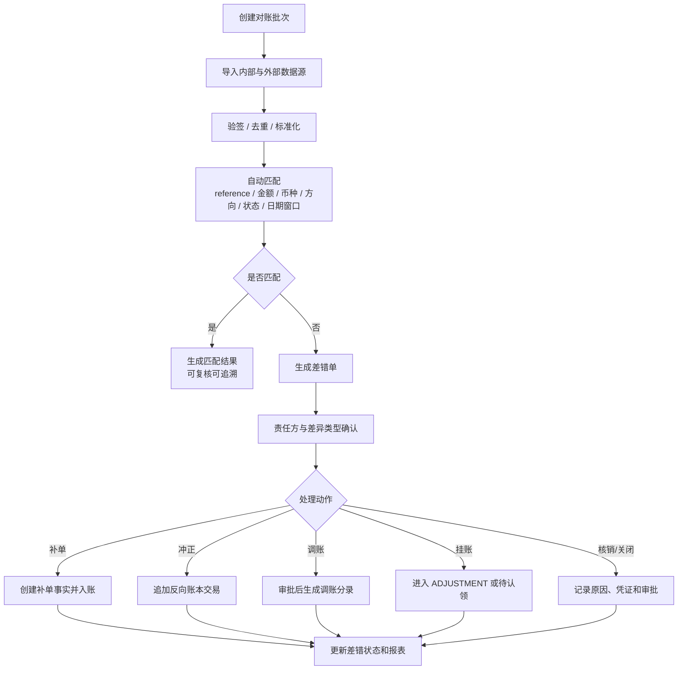

## 12.3 匹配规则

| 匹配维度 | 规则 |
| --- | --- |
| 业务引用 | 优先使用业务单号、资金交易号、外部 reference、route snapshot 中的外部引用。 |
| 金额 | 金额必须一致；涉及费用、汇率或错币种时必须拆分本金、费用和汇损益。 |
| 币种 | 交易币种、记账币种、外部回单币种必须按规则匹配；错币种生成差错。 |
| 方向 | 入金、出金、退款、退汇、争议扣回、费用方向必须一致。 |
| 状态 | 内部成功、失败、处理中和外部成功、失败、退回状态需要状态映射表。 |
| 时间窗口 | 按交易日、账务日、清算日、结算日、外部文件日分别配置窗口。 |
| 主体 | 用户、商户、平台账户、外部账户引用和责任方必须可追溯。 |
| 唯一性 | 同一 reference 多次成功必须进入重复差错，不得自动合并。 |

## 12.4 差错类型与处理规则

| 差错类型 | 示例 | 默认处理 | 是否可自动处理 |
| --- | --- | --- | --- |
| 平台单边 | 平台成功，外部无记录。 | 外部回查，必要时冲正或人工确认。 | 谨慎自动化 |
| 外部单边 | 外部成功，平台无记录。 | 补单、挂账或人工认领。 | 可在低风险规则下自动补单 |
| 金额差 | 平台 100，外部 99。 | 生成金额差错，确认费用、短款、汇率差或人工调账。 | 否 |
| 币种差 | 内部 USD，外部 EUR。 | 生成错币种差错，进入挂账或业务换汇处理。 | 否 |
| 状态差 | 平台成功，外部失败。 | 状态回查，按可信来源冲正或补记。 | 谨慎自动化 |
| 重复记录 | 同一 reference 多次成功。 | 去重、人工确认，防止重复入账或重复出款。 | 否 |
| 账务差 | 分录、计划、投影不一致。 | 巡检告警，冻结相关操作，生成修复任务。 | 否 |
| 清结算差 | 结算单、出款单和回单不一致。 | 阻断出款或生成追偿、回退、调账。 | 否 |

## 12.5 对账红线和阻断规则

| 规则 | 说明 |
| --- | --- |
| 差异不改历史 | 任何差错不得直接修改历史分录、余额投影或已确认回单。 |
| 重大差错阻断 | 超过阈值、涉及出款、涉及客户资金或账务不平的差错应阻断清算、结算或出款。 |
| 处理动作可审计 | 补单、冲正、调账、挂账、核销、关闭都必须有责任方、原因、凭证和审批。 |
| 核销不等于消失 | 核销只表示差错处理完成，原始差异、证据和处理链路必须保留。 |
| 报表不反写事实 | 报表重算只能更新只读结果，不能反向修改资金交易或账本事实。 |

## 12.6 对账差错阻断阈值规则

对账差错阻断采用“红线默认阻断 + 金额和 SLA 可配置”的产品规则。阈值配置只决定是否自动阻断、告警、转人工或允许继续处理；不得覆盖账务不平、重复出款、客户资金异常等红线。

| 阻断级别 | 触发条件 | 默认动作 | 释放条件 |
| --- | --- | --- | --- |
| 强制阻断 | 账务不平、账本交易缺失、分录重复、余额投影不可重建。 | 阻断相关主体、币种和账期的清算、结算、出款和调账自动化。 | 修复任务完成，账务巡检通过，财务复核确认。 |
| 强制阻断 | 出款回单金额或币种不匹配、同一外部 reference 重复成功、出款状态不明且超过回查窗口。 | 阻断该出款单、关联结算单和同批次后续出款。 | 外部回单确认、失败回退、追偿或调账完成。 |
| 强制阻断 | 涉及客户资金、商户待结算资金、准备金、负余额或跨境外汇资金的未核销差错。 | 阻断相关资金继续出款或结算释放。 | 差错核销、审批完成，并形成可追溯凭证。 |
| 阈值阻断 | 单笔差错金额超过主体、币种和业务场景配置阈值。 | 阻断相关主体和币种的结算或出款，生成高优先级告警。 | 人工复核、调账、补单、冲正或核销完成。 |
| 阈值阻断 | 同一主体、币种、账期内未核销差错累计金额或笔数超过阈值。 | 暂停本期结算生成或提交出款。 | 累计差错降至阈值内，或经财务、风控、运营联合审批放行。 |
| SLA 阻断 | 差错超过处理 SLA 未关闭，或多次回查仍状态不明。 | 升级告警，暂停风险相关清算、结算或出款。 | 明确责任方和处理路径，或进入挂账、追偿、调账流程。 |
| 告警不阻断 | 小额费用差、可解释汇差、文件延迟等低风险差错，且未触碰红线。 | 记录差错和告警，可继续非风险相关处理。 | 在配置 SLA 内核销或归档。 |

阈值配置必须至少包含主体类型、主体 ID 或主体分组、币种、业务场景、差错类型、单笔金额阈值、累计金额阈值、笔数阈值、SLA、阻断范围、审批放行规则和规则版本。阈值变更只影响新判断，不反向改变已生成差错和已触发阻断。

# 十三、功能清单

## 13.1 Ledger 账本执行与余额投影

Ledger 是事实源。所有余额变化都必须落到平衡的账本交易、账务计划和不可变分录，再投影成余额。

| 功能 ID | 功能 | 输入 | 输出 | 规则 |
| --- | --- | --- | --- | --- |
| FR-LED-001 | 初始化账本 | 主体、账本类型、币种、账目配置 | 账本和账目 | 显式建账；查询时区分未建账和 0 余额。 |
| FR-LED-002 | 执行入账 | `PostingPlan` | `LedgerTransaction`、`LedgerEntry` | 同事务写入账本交易、计划、分录和余额投影。 |
| FR-LED-003 | 更新余额投影 | 分录 | 当前余额 | 余额由分录投影，失败整体回滚。 |
| FR-LED-004 | 查询当前余额 | 主体、账本类型、币种、账目 | 余额桶 | 返回空集合或 initialized=false，不返回伪余额。 |
| FR-LED-005 | 查询历史余额 | 主体、时间点、检查点 | 历史余额 | 可基于分录和检查点重建。 |
| FR-LED-006 | 账本一致性巡检 | 交易、分录、余额投影 | 巡检结果 | 检出缺分录、重复分录、投影不平和余额不平。 |
| FR-LED-007 | 冲正和调账 | 原交易或差错、原因、凭证、审批 | 新账本交易 | 不改历史分录，只追加修正事实。 |

## 13.2 Wallets、资金账户、信用账户和预算组

Wallets 层面向用户、商户、企业管理员、运营和交易层表达账户能力。它不直接改余额，所有写操作最终仍由 Ledger 分录解释。业务侧的支付、授权、退款、提现、冻结、解冻和调账不直接调用 Wallets 层原子能力，应通过交易层服务能力进入。

| 功能 ID | 功能 | 输入 | 输出 | 规则 |
| --- | --- | --- | --- | --- |
| FR-ACC-001 | 创建资金账户 | 主体、资金账户类型、币种、账本 profile | `FundingAccount` | 承载真实资金余额。 |
| FR-ACC-002 | 创建信用账户 | 主体、额度类型、币种、额度规则 | `CreditAccount` | 承载额度，不承载现金。 |
| FR-ACC-003 | 创建预算组 | 企业、部门、项目、币种、预算规则 | `BudgetGroup` | 承载预算控制，不承载现金。 |
| FR-ACC-004 | 维护账户关系 | 资金账户、信用账户、预算组、平台资金账户角色 | 账户关系视图 | 用于钱包展示、权限和交易路由，不作为独立入账主体。 |
| FR-ACC-005 | 维护平台账户角色 | 租户、业务线、币种、角色用途、实际资金账户、启停状态 | 平台账户角色配置 | 角色必须解析到具体 `FundingAccount` 和账目；不得在交易路径自动创建。 |
| FR-ACC-006 | 额度和预算调整 | 调整金额、原因、凭证、审批 | 调整事实和分录 | 调整必须可审计；不得直接改余额。 |

## 13.3 账户余额控制

| 功能 ID | 功能 | 输入 | 输出 | 规则 |
| --- | --- | --- | --- | --- |
| FR-CTRL-001 | 冻结资金 | 主体、金额、币种、原因、期限、凭证 | `FrozenOrder`、账本交易和分录 | 冻结不得超过可冻结余额；不创建 `FundsTransaction`。 |
| FR-CTRL-002 | 解冻资金 | 冻结单、金额、原因 | 解冻记录、账本交易和分录 | 解冻不得超过剩余冻结金额；不创建 `FundsTransaction`。 |
| FR-CTRL-003 | 授权占用 | 授权业务事实、金额、主体、账户 | 授权占用和分录 | 授权占用不等于最终消费。 |
| FR-CTRL-004 | 授权释放 | 原授权、金额、原因 | 释放事实和分录 | 只能释放剩余未结算授权。 |
| FR-CTRL-005 | 授权结算 | 原授权、结算金额、费用 | 消费事实和分录 | 结算金额可小于授权，差额释放；超额需规则或差错。 |
| FR-CTRL-006 | 出款锁定 | 出款申请、金额、外部账户引用 | 用户 `FrozenOrder` 或商户 `SETTLEMENT` 锁定 | 用户提现申请优先冻结；商户结算出款必须锁定后出款。 |
| FR-CTRL-007 | 准备金和负余额 | 商户、风险规则、争议或追偿 | 准备金、负余额或追偿 | 不得用不可解释扣减隐藏资损。 |
| FR-CTRL-008 | 信用账户额度调整 | 信用账户、调整金额、方向、原因、凭证、审批和可选负数策略 | `LIMIT_ADJUST` 调额事实、账本交易和余额投影 | 仅通过 `FundsBalanceControlService#adjust` 进入；调增同步增加可用额度，调减默认要求 `AVAILABLE` 非负，受控负数必须有策略、上限、审批和审计。 |
| FR-CTRL-009 | 预算组额度调整 | 预算组、调整金额、方向、预算周期、原因、凭证、审批和可选治理策略 | `LIMIT_ADJUST` 预算调整事实、账本交易和余额投影 | 仅通过 `FundsBalanceControlService#adjust` 进入；预算不是真实资金，调减默认不允许静默负数，受控负数必须有预算周期、治理路径和报表标记。 |

余额控制能力不承接 FX。`FundsBalanceControlService` 的冻结、解冻、余额调账和额度/预算调整金额必须已经是目标账户或账本币种；币种不一致时直接失败，不挂账、不换汇、不接收 FX 决策快照。同币种余额控制链路固定 `originalAmount = amount`、`exchangeRate = 1`。

## 13.4 Route 快照与账务计划

Route 和 Posting 是交易接入到 Ledger 之间的翻译层：Route 描述钱怎么流，Posting 将资金路径翻译成可平衡的账务计划。

| 功能 ID | 功能 | 输入 | 输出 | 规则 |
| --- | --- | --- | --- | --- |
| FR-ROUTE-001 | 解析参与方 | 付款方、收款方、控制账户、平台侧资金账户角色 | route participants | 参与主体必须明确账户类型和账本类型。 |
| FR-ROUTE-002 | 生成路由快照 | 交易事实、业务规则、账户映射 | `RouteSnapshot` | 快照一旦用于入账，不可被后续配置漂移影响。 |
| FR-ROUTE-003 | 回放原快照 | 原交易、逆向事件 | 回放路径 | 退款、撤销、争议、外部退回、退汇优先回放原路径。 |
| FR-POST-001 | 翻译账务计划 | route legs、账本配置、账目规则 | `PostingPlan` | 每组 plan 必须平衡。 |
| FR-POST-002 | 多主体计划拆分 | 多个主体或账本 | 多组 PostingPlan | 资金账户、信用账户、预算组可以形成多组独立平衡计划。 |
| FR-POST-003 | 校验账目方向 | 账目、借贷方向、金额 | 校验结果 | 不得因为正常余额方向不同生成同边不平衡分录。 |
| FR-POST-004 | 生成稳定摘要 | 交易事实、计划、分录稳定字段 | sha256 | 摘要不包含持久化流水、自增 ID、审计时间和易变状态。 |

## 13.5 交易接入契约

业务层包括授权型业务、入金业务、出金业务、商户收款、平台内部交易等。它们接入底座时只提交标准资金事实，不直接写账本、分录或余额。

| 功能 ID | 功能 | 输入 | 输出 | 规则 |
| --- | --- | --- | --- | --- |
| FR-INT-001 | 提交资金指令 | 业务类型、事件类型、主体、金额、币种、参与方、外部引用、幂等键 | 资金交易受理结果 | 缺幂等键、主体、金额、币种或业务引用必须失败。 |
| FR-INT-002 | 校验请求摘要 | 请求稳定字段 | `requestHash` | 同一业务键同摘要返回原结果，不同摘要拒绝。 |
| FR-INT-003 | 保存业务快照 | 业务上下文、外部引用、交易说明 | 业务快照 | 快照用于回放、展示、对账和审计。 |
| FR-INT-004 | 查询处理结果 | 业务键、资金交易号 | 资金交易状态和账本引用 | 查询不触发补账或改账。 |
| FR-INT-005 | 接入模板 | 授权型、入金、出金、商户收款、平台内部交易等接入样例 | 模板和验收用例 | 业务模板不改变底座账务规则。 |
| FR-INT-006 | 直接交易服务能力 | 入金、转账、支付、退款、提现、费用请求 | 标准资金指令和资金交易受理结果 | 产品归属为交易层；具体接口命名进入系分设计。 |
| FR-INT-007 | 授权交易服务能力 | 授权、撤销、结算、授权退款、争议拒付请求 | 授权链资金指令和处理结果 | 产品归属为交易层授权交易能力；授权拒绝不得进入争议拒付口径。 |
| FR-INT-008 | 余额控制服务能力 | 冻结、解冻、调账请求 | `FrozenOrder`、调账事实和账本引用 | 产品归属为交易层余额控制能力；冻结/解冻事实载体仍是 `FrozenOrder`，不创建 `FundsTransaction`。 |

业务接入开关和前置条件只作为接入契约的一部分：用于说明某类业务是否允许调用某类资金指令、支持哪些币种、是否需要前置审批、是否启用外部事件映射。它不能替代账户、账本、交易事实和过账设计。

## 13.6 交易事实层

| 功能 ID | 功能 | 输入 | 输出 | 规则 |
| --- | --- | --- | --- | --- |
| FR-TXN-001 | 创建资金交易 | 标准资金指令 | `FundsTransaction` | 资金交易是业务事实的资金侧聚合，不等于账本交易。 |
| FR-TXN-002 | 创建交易明细 | 参与主体、方向、账户、金额、说明 | `FundsTransactionDetail` | 多主体视角可有多条明细。 |
| FR-TXN-003 | 生命周期推进 | CREATED、VALIDATED、POSTING、SUCCEEDED、FAILED、PENDING_REVIEW | 状态变更 | 状态推进可审计，失败保留原因。 |
| FR-TXN-004 | 关联账本交易 | 资金交易、账本交易 | 引用关系 | 账本成功后回写引用，不反向改分录。 |
| FR-TXN-005 | 交易事实查询 | 交易号、业务键、主体 | 交易事实 | 只读，不在线拼装账本事实。 |
| FR-TXN-006 | 交易事实重放 | 原交易、快照版本、目标投影 | 重放结果 | 重放只生成视图或校验结果，不重新入账。 |
| FR-TXN-007 | 排除非交易事实 | 冻结、解冻、清算批次、结算单、出款单、对账差错状态 | 不创建资金交易 | 冻结/解冻使用 `FrozenOrder`；清结算、出款和对账使用各自产品单据。 |

## 13.7 逆向交易

| 功能 ID | 功能 | 输入 | 输出 | 规则 |
| --- | --- | --- | --- | --- |
| FR-REV-001 | 退款 | 原交易、退款金额、原因 | 退款交易和分录 | 可退款金额不得超过已清算金额扣除已退款和争议扣回金额。 |
| FR-REV-002 | 撤销 / 冲正 | 原交易、撤销原因、审批 | 反向交易和分录 | 不删除原交易，追加冲正事实。 |
| FR-REV-003 | 争议拒付 | 原交易、争议或强制扣回金额、原因、费用 | 争议资金事实 | 争议拒付不是授权拒绝；具体字段命名不在本 PRD 处理。 |
| FR-REV-004 | 外部退回 / 退汇 | 原出入金、外部原因、费用 | 外部退回或退汇事实 | 外部退回、退汇、退款按语义分离。 |
| FR-REV-005 | 已出款后追偿 | 原交易、退款/争议/差错 | 负余额、准备金扣减或追偿单 | 不回滚已完成出款。 |

## 13.8 清结算

| 功能 ID | 功能 | 输入 | 输出 | 规则 |
| --- | --- | --- | --- | --- |
| FR-SET-001 | 生成清算候选 | 交易明细、退款、争议、费用、风控状态 | 清算候选 | 有冻结、重大差错或风险标记时排除。 |
| FR-SET-002 | 生成清算批次 | 主体、周期、币种、规则版本 | `ClearingBatch` | 批次可重跑但不可重复清算。 |
| FR-SET-003 | 清算确认 | 批次、审批、规则版本 | `CLEARING -> AVAILABLE` | 确认后才可进入结算。 |
| FR-SET-004 | 生成结算单 | 可出款明细、费用、准备金、负余额 | `SettlementOrder` | 金额组成必须可追溯到明细。 |
| FR-SET-005 | 创建出款单 | 结算单、外部账户引用、通道引用 | `PayoutOrder` | 出款必须幂等、防重、锁定余额。 |
| FR-SET-006 | 出款成功 | 回单、金额、币种、外部流水 | 出款完成 | 回单金额和币种必须匹配。 |
| FR-SET-007 | 出款失败回退 | 失败原因、通道流水 | 回退结果 | 只能回退原锁定金额。 |
| FR-SET-008 | 维护结算策略 | 结算主体、策略表达式、币种、时区、阻断规则、版本 | `SettlementPolicy` | 表达式参考 `SettlementPolicySpec`；不支持表达式不得静默降级为 `RT`，策略修改只影响新批次。 |

结算净额公式：

```text
本期可清算收款
- 退款
- 争议扣回
- 平台手续费
- 通道成本或代扣项
- 准备金
- 负余额抵扣
- 风控扣留
- 未处理差错扣减
+ 调整金额
= 本期可结算金额
```

## 13.9 对账差错

| 功能 ID | 功能 | 输入 | 输出 | 规则 |
| --- | --- | --- | --- | --- |
| FR-REC-001 | 创建对账批次 | 对账类型、日期、数据源、文件 | `ReconciliationBatch` | 批次号唯一，支持重跑和版本记录。 |
| FR-REC-002 | 文件解析与验签 | 文件、签名、格式 | 标准化明细 | 文件未通过验签不得进入对账。 |
| FR-REC-003 | 自动匹配 | 内部明细、外部明细、匹配规则 | 匹配结果 | 金额、币种、reference、状态和日期窗口必须参与校验。 |
| FR-REC-004 | 生成差错单 | 匹配结果、差异类型 | `ReconciliationException` | 差异不得直接改账。 |
| FR-REC-005 | 差错处理 | 差错、处理动作、审批 | 补记、冲正、调账、核销或关闭 | 处理动作必须引用原差错。 |
| FR-REC-006 | 账务一致性核对 | 资金交易、账本交易、分录、余额投影 | 巡检差错 | 不靠汇总数掩盖明细差异。 |
| FR-REC-007 | 重大差错阻断 | 差错状态、金额、SLA、主体、币种、阻断范围 | 告警和阻断策略 | 红线差错强制阻断；金额、笔数和 SLA 阈值按规则版本配置。 |

差异类型：

| 差异类型 | 示例 | 默认处理 |
| --- | --- | --- |
| 平台单边 | 平台成功，外部无记录。 | 外部回查，必要时冲正或人工。 |
| 外部单边 | 外部成功，平台无记录。 | 补单、挂账或人工认领。 |
| 金额差 | 平台 100，外部 99。 | 金额差错，确认费用、短款或汇率差。 |
| 状态差 | 平台成功，外部失败。 | 状态回查，按可信来源处理。 |
| 币种差 | 平台 USD，外部 EUR。 | 生成错币种差错。 |
| 账务差 | 分录和余额投影不一致。 | 巡检告警，禁止直接改余额。 |
| 重复记录 | 同一 reference 多次成功。 | 去重、人工确认，防止重复入账。 |

## 13.10 视图与报表

| 视图 / 报表 | 使用者 | 来源 | 规则 |
| --- | --- | --- | --- |
| 用户账单 | 用户、客服 | 交易事实、账本引用、业务快照 | 不在线拼装分录，不回写交易事实。 |
| 商户账单 | 商户、运营 | 商户交易、清算批次、结算单、出款单 | 可追溯到明细和批次。 |
| 余额查询 | 用户、商户、财务 | 余额投影、分录、检查点 | 区分 0 余额和未建账。 |
| 账本报表 | 财务、审计 | 账本交易、分录、余额投影 | 可按主体、币种、账目、期间查询。 |
| 对账报表 | 财务、运营 | 对账批次、匹配结果、差错单 | 差错状态、责任方和 SLA 清楚。 |
| 结算报表 | 商户、财务 | 清算批次、结算单、出款单 | 金额公式和扣减项可解释。 |
| 运营时间线 | 运营、研发 | 业务事实、资金交易、账本交易、外部事件、审批 | 用于排查，不反向改账。 |
| 审计报表 | 风控、合规 | 操作日志、审批、凭证、敏感字段访问 | 高危操作可追责。 |

交易视图落库需要考虑数据量增长。同一笔交易可能同时生成用户、商户、资金账户、信用账户、预算组、平台自营结算主体等多条视图记录，因此产品上允许并建议按账户主体类型分表或分域存储。分表只影响读模型存储和查询性能，不改变资金事实、账务事实、余额事实和投影幂等口径。

| 分表维度 | 建议表域 | 典型视图主体 | 设计要求 |
| --- | --- | --- | --- |
| 资金账户视图 | `transaction_view_funding` | 用户资金账户、商户资金账户、平台资金账户。 | 适合用户账单、商户账单、出入金、退款、清结算和争议查询。 |
| 信用账户视图 | `transaction_view_credit` | 企业信用账户、授信主体。 | 重点保留授权占用、撤销、结算、额度调整和已消费报表口径。 |
| 预算组视图 | `transaction_view_budget` | 企业预算组、部门预算。 | 重点保留预算占用、释放、结算确认和预算报表维度；不新增账务 `CONSUMED`。 |
| 平台与运营视图 | `transaction_view_platform` 或按 `projectionCode` 分表 | 平台自营结算主体、运营时间线、财务报表。 | 面向运营、财务、对账和排障；可按租户、时间和视图域继续分片。 |

分表后仍必须满足统一投影契约：

1. 每张视图表都必须保留 `tenantId`、`projectionCode`、`viewSubjectType`、`viewSubjectId`、`accountSubjectType`、`accountSubjectId`、`transactionSn`、来源引用、`viewLineCode` 和幂等键。来源引用可以由当前事实类型和流水组成；若后续引入 `sourceFactRef`，应使用同一值对象表达。
2. 路由规则必须能由 `accountSubjectType` 或明确的 `projectionShardKey` 唯一定位目标表；不得靠自由文本、展示文案或业务页面判断写哪张表。
3. 同一来源事实在同一视图域和同一主体下只能 upsert 同一条视图记录；跨表重复写入必须有差异校验和告警。
4. 查询聚合可以跨表读，但不得跨表反推余额，也不得把任一交易视图表作为账务事实源。
5. 交易视图重放必须带上账户主体类型、视图域或明确分片范围，避免无界扫描所有分表。

## 13.11 指标与运营风控数据源

指标用于运营、风控、财务和业务分析，不作为账务事实源。指标可以从资金交易、交易明细、账本交易、余额投影、交易视图、清结算和对账事实中计算，但不得反向修改交易、账本、余额或清结算状态。

| 指标域 | 典型指标 | 主要来源 | 使用场景 | 关键规则 |
| --- | --- | --- | --- | --- |
| 钱包资金指标 | 累计入金、累计出金、当前可用、当前冻结、当前授权占用、净流入。 | `FundsTransaction`、`LedgerEntry`、`BalanceProjection`。 | 运营看板、用户资金分析、余额异常监控。 | 金额必须按主体、币种、账本 Profile 和时间窗口统计。 |
| 交易消费指标 | 累计付款、累计转账、累计消费、授权成功率、授权拒绝金额和次数。 | 资金交易、授权事实、交易视图。 | 业务运营、风控规则评估、客户用量分析。 | 授权拒绝只做统计，不进入账务金额或争议拒付口径。 |
| 退款和争议指标 | 累计退款、退款率、争议扣回金额、争议费用、追偿余额。 | 退款交易、争议事实、清结算扣减、对账差错。 | 风险监控、商户管理、准备金和追偿策略。 | 退款、争议扣回、授权拒绝必须分开统计。 |
| 手续费指标 | 累计手续费收入、手续费退回、通道成本、净手续费、费率版本效果。 | 费用交易、费用规则版本、平台 `FEE` 账目、财务报表。 | 收入成本分析、费率运营、财务复核。 | 本金和费用必须拆分统计；退费必须关联原费用事实。 |
| 清结算指标 | 待清算金额、可结算金额、出款中金额、已出款金额、失败回退金额。 | 商户 `CLEARING/AVAILABLE/SETTLEMENT`、清算批次、结算单、出款单。 | 商户运营、财务出款、资金头寸管理。 | 结算指标必须能追溯到清算明细和账本分录。 |
| 风控指标 | 负余额主体数、负余额金额、冻结金额、冻结释放率、异常差错金额。 | 余额投影、冻结单、对账差错、争议和调账事实。 | 风控监控、异常预警、人工处理队列。 | 资金账户、信用账户、预算组的负 `AVAILABLE` 应分主体类型统计和解释。 |

指标计算规则：

1. 指标默认按租户、主体类型、主体 ID、币种、账本 Profile、交易类型、事件类型和时间窗口分组。
2. 金额指标必须明确是交易币种、原始币种还是账本币种；涉及换汇时保存汇率快照和汇损益口径。
3. 累计指标应基于明细或已校验汇总生成，不能从页面展示文案或交易视图展示金额反推账务口径。
4. 实时指标可以读取热数据和余额投影；历史大范围指标应使用水位、检查点或离线汇总，避免在线全量扫描分录和交易投影。
5. 指标异常只能触发告警、人工复核、风控策略、对账差错或调账流程，不得直接改余额或账本事实。

## 13.12 归档、快照与重放

账本分录、资金交易、交易明细和交易投影都会持续增长。产品上需要把“余额投影重建”和“交易视图重放”拆成两类策略处理：

| 类型 | 目标 | 事实来源 | 默认策略 | 禁止事项 |
| --- | --- | --- | --- | --- |
| 余额投影重建 | 恢复或校验某个账本、账目、币种、时点的余额。 | `LedgerEntry`、已校验 `BalanceCheckpoint`、`BalanceProjectionWatermark`、归档清单。 | 使用水位之前的已校验检查点或冷汇总，加上水位之后到目标时点的增量分录。 | 用 180 天归档边界当计算边界；归档后在线全量扫描历史分录；用交易视图或报表反推余额。 |
| 交易视图重放 | 修复用户账单、商户账单、运营时间线、财务报表等读模型。 | `FundsTransaction`、`FundsTransactionDetail`、`FrozenOrder`、清结算、对账、争议和业务快照。 | 必须指定视图域、租户、时间范围，并按主体、批次或游标分片。 | 无时间范围全量在线重放；重放时重新入账或补写资金交易明细。 |

余额检查点和水位规则：

1. 检查点必须按账本、账目、币种、主体和检查点时间生成，记录余额、累计借贷额、最后分录游标、分录数量和稳定摘要。
2. 冷热计算边界必须使用 `BalanceProjectionWatermark`，不能使用 180 天、自然日或归档日期直接拼接。
3. 余额计算口径为 `冷余额或检查点（< watermark） + 增量分录（>= watermark 且 < targetTime）`，必须覆盖 `(-∞, watermark) + [watermark, targetTime)`。
4. 水位推进顺序必须是先计算和校验，再推进水位；禁止先更新水位再计算。
5. 分录归档前必须完成检查点生成、水位覆盖、归档清单生成、摘要校验和抽样或全量一致性校验。
6. 归档只改变存储冷热位置，不改变 `LedgerEntry` 的事实身份、审计链路和可追溯性；180 天只作为热数据保留和归档资格边界。
7. 归档后发生余额投影重建时，优先读取水位之前最近已校验检查点和水位之后增量分录；目标区间缺检查点、缺水位或增量分录缺失时，任务失败并进入离线修复或人工复核。
8. 余额投影重建结果必须与账务一致性巡检联动，差异不得直接改余额，只能生成修复任务、补记、冲正或调账流程。

运维手动归档默认规则：

1. 初期采用手动归档，热数据默认保留 180 天，可每周或每天在低峰期执行。
2. 运维创建归档申请时必须指定租户、账本范围、账目范围、币种、计划归档截止时间和原因。
3. 系统预检查必须确认计划归档截止时间不晚于 `now - 180 天`，且不晚于 `BalanceProjectionWatermark`。
4. 归档候选清单必须统计记录数、借贷金额、最后分录游标、摘要、检查点和水位。
5. 归档完成前必须保留 `ArchiveManifest`、审批、操作者、执行时间、冷热位置和校验结果。

交易视图重放规则：

1. 重放请求必须包含 `tenantId`、`projectionCode`、时间范围、原因、发起人和幂等键；生产在线任务还应限制最大时间窗口和最大记录数。
2. 大范围历史修复必须拆成多个批次，支持断点续跑、影子重放、差异报告和灰度应用。
3. 交易投影重放不得依赖余额检查点恢复交易语义；余额检查点只能服务余额重建，不表达交易说明、商户快照、拒付原因、清结算状态或用户账单语义。
4. 已冷归档的交易事实需要通过归档索引、离线任务或历史查询服务参与重放；在线服务不得为了修复视图跨多年扫全量交易和分录。
5. 重放只能写投影视图、重放任务和差异报告，不得写回 `LedgerEntry`、`LedgerTransaction`、`FundsTransaction` 或 `FundsTransactionDetail`。

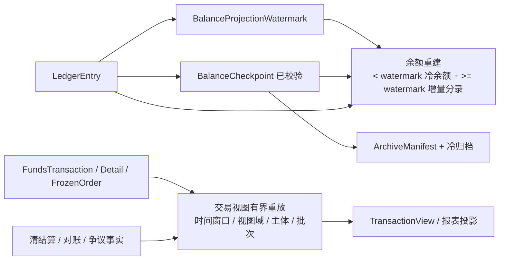

# 十四、端到端流程

## 14.1 业务事实到入账

```text
业务层提交资金事实
  -> 校验幂等键和请求摘要
  -> 创建资金交易和交易明细
  -> 解析参与主体、账户、账本和账目
  -> 固化 RouteSnapshot
  -> 生成 PostingPlan
  -> 校验账目方向和借贷平衡
  -> 写入 LedgerTransaction、PostingPlan、LedgerEntry
  -> 更新余额投影
  -> 发布资金交易和余额变更事件
  -> 生成交易视图或报表明细
```

评审点：

1. 业务层只提交事实，不直接写账本。
2. route 快照固化后，逆向事件不能受新配置漂移影响。
3. 资金交易、route snapshot、posting plan、账本交易、分录和余额投影在同一个本地数据库事务内完成；任一步失败，整体回滚，不能留下半成功余额。
4. 冻结和解冻不走本流程的 `FundsTransaction` 创建；它们走冻结订单流程，但同样必须生成平衡账本交易和余额投影。

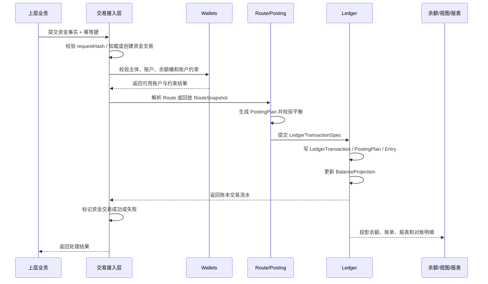

### 14.1.1 冻结订单到入账

```text
风控、运营或业务流程提交冻结申请
  -> 校验主体、权限、原因、期限、金额和可冻结余额
  -> 创建 FrozenOrder
  -> 生成 AVAILABLE -> FROZEN PostingPlan
  -> 写入 LedgerTransaction、PostingPlan、LedgerEntry
  -> 更新余额投影
  -> 回写冻结账本交易引用
  -> 发布冻结事件并生成冻结视图
```

评审点：

1. 冻结不是资金交易，不创建 `FundsTransaction` 或 `FundsTransactionDetail`。
2. 冻结单是业务事实载体，账本交易是余额变化事实载体。
3. 解冻必须引用冻结单，且解冻金额不得超过剩余冻结金额。
4. 如冻结资金后续需要扣划、追偿、退款或调账，必须创建独立资金交易并引用冻结单，不能直接修改冻结单表达价值转移。

## 14.2 钱包支付给商户

```text
用户支付订单
  -> 业务层提交 PAY 资金事实
  -> 用户 FundingAccount AVAILABLE 减少
  -> 商户 FundingAccount CLEARING 增加
  -> 生成资金交易、账本交易、分录和余额投影
  -> 商户清算批次确认后 CLEARING -> AVAILABLE
  -> 结算单审核后 AVAILABLE -> SETTLEMENT
  -> 出款成功后消耗 SETTLEMENT
```

评审点：

1. 商户订单款不得直入 `AVAILABLE` 或 `SETTLEMENT`。
2. 清算、结算、出款是三个阶段。
3. 已出款后的退款和争议进入追偿，不回滚出款。

## 14.3 授权占用和结算

```text
业务层提交 AUTHORIZATION
  -> 真实资金账户 / 信用账户 / 预算组分别生成授权占用
  -> 业务层后续提交清算确认、结算确认、撤销或释放事实
  -> 授权占用减少
  -> 真实资金形成消费或商户待清算
  -> 信用账户和预算组减少或关闭 AUTHORIZATION 占用
  -> 已消费金额进入产品报表口径
  -> 差额释放或进入差错
```

评审点：

1. 授权成功不代表最终入账。
2. 信用和预算不是现金，但它们也需要账目平衡和占用释放。
3. 授权拒绝只记录拒绝事实，不生成账务路径。

## 14.4 出金和出款失败回退

```text
用户或商户发起出金
  -> 底座校验可用余额、冻结、准备金、负余额和差错
  -> 用户提现申请：AVAILABLE -> FROZEN
  -> 商户结算出款：AVAILABLE -> SETTLEMENT
  -> 创建出款单并提交外部处理
  -> 成功：消耗 FROZEN 或 SETTLEMENT
  -> 失败：FROZEN -> AVAILABLE 或 SETTLEMENT -> AVAILABLE 回退
  -> 回单不一致：生成对账差错
```

评审点：

1. 外部受理不等于出款成功。
2. 出款必须防重、锁定、回单核验。
3. 失败回退只能回退原锁定金额。

## 14.5 对账差错到调账

```text
导入外部文件或内部账务快照
  -> 验签、去重、标准化
  -> 自动匹配内部交易、账本交易、外部 reference 和银行流水
  -> 生成匹配结果
  -> 差异生成差错单
  -> 运营或财务选择补单、挂账、冲正、调账、核销或关闭
  -> 调账生成新的平衡账本交易
  -> 差错核销和报表更新
```

评审点：

1. 对账差异不能直接改历史分录。
2. 差错处理必须有责任方、原因、凭证和审批。
3. 重大差错应阻断后续结算或出款。

# 十五、状态机汇总

| 对象 | 状态 | 终态 | 关键规则 |
| --- | --- | --- | --- |
| `FundsTransaction` | CREATED、VALIDATED、POSTING、SUCCEEDED、FAILED、PENDING_REVIEW、REVERSED | SUCCEEDED、FAILED、REVERSED | `SUCCEEDED` 必须有关联账本事实。 |
| `PostingPlan` | CREATED、VALIDATED、POSTED、FAILED、CANCELLED | POSTED、FAILED、CANCELLED | POSTED 前必须平衡。 |
| `LedgerTransaction` | CREATED、POSTED、REVERSED | POSTED、REVERSED | POSTED 后不可修改，只能冲正。 |
| `FrozenOrder` | CREATED、FROZEN、PARTIALLY_RELEASED、RELEASED、EXPIRED | RELEASED、EXPIRED | 解冻不得超过剩余冻结金额。 |
| `AuthorizationHold` | REQUESTED、HELD、PARTIALLY_CLEARED、CLEARED、RELEASED、EXPIRED、DECLINED | CLEARED、RELEASED、EXPIRED、DECLINED | DECLINED 不生成账务路径。 |
| `ClearingBatch` | CREATED、CALCULATED、REVIEWING、CONFIRMED、CANCELLED | CONFIRMED、CANCELLED | 已进入结算的批次不得直接撤回。 |
| `SettlementOrder` | CREATED、REVIEWING、APPROVED、PAYOUTING、PAID、FAILED、CANCELLED | PAID、FAILED、CANCELLED | 出款中不得重复结算。 |
| `PayoutOrder` | CREATED、SUBMITTED、ACCEPTED、PAID、FAILED、RETURNED | PAID、FAILED、RETURNED | ACCEPTED 不等于 PAID。 |
| `ReconciliationException` | CREATED、ASSIGNED、PROCESSING、ADJUSTING、RESOLVED、CLOSED | RESOLVED、CLOSED | 不得直接改历史分录。 |
| `AdjustmentOrder` | CREATED、APPROVING、POSTED、REJECTED、CANCELLED | POSTED、REJECTED、CANCELLED | POSTED 必须生成平衡账本交易。 |

# 十六、金额与余额规则

## 16.1 通用金额

以下是产品金额口径，不是数据库字段或 API 字段清单。字段命名在系分阶段再确认。

| 字段 | 说明 |
| --- | --- |
| `businessAmount` | 业务事实金额。 |
| `transactionAmount` | 本次资金交易金额。 |
| `ledgerAmount` | 记账金额。 |
| `originalAmount` | 原始币种金额。 |
| `originalCurrency` | 原始交易币种。 |
| `ledgerCurrency` | 账本/账户记账币种。 |
| `exchangeRate` | 原始币种到记账币种的汇率快照。 |
| `authorizedAmount` | 授权占用金额。 |
| `clearedAmount` | 已清算或已结算确认金额。 |
| `settledAmount` | 已结算或已出款金额。 |
| `refundedAmount` | 已退款金额。 |
| `disputeDebitAmount` | 争议拒付、强制扣回或等价扣减金额；不表达授权拒绝。 |
| `feeAmount` | 手续费或成本。 |
| `reserveAmount` | 准备金或风险预留。 |
| `adjustmentAmount` | 调账金额。 |
| `fxGainLossAmount` | 业务换汇差额或汇损益。 |

## 16.1.1 错币种与 FX 决策快照

错币种交易不是自动换汇。支付资金底座和交易层只保存业务已确认的币种、金额和 FX 决策快照，不替业务层或外汇域决定是否换汇，也不在交易转换过程中自动调用 `FxService`。

产品规则：

1. 请求币种、实际外部币种、账户币种或账本币种不一致时，必须先按业务规则识别为错币种、挂账、驳回或进入差错处理。
2. 需要换汇时，由业务层、外汇域或合规确认后的外部机构流程形成 FX 决策，再携带快照进入资金底座；资金底座只按快照记录和入账。
3. 没有显式 FX 决策快照的错币种请求不得静默入目标币种余额，不得由交易层自行拉取汇率并折算。
4. FX 决策快照至少保留 `originalAmount/originalCurrency`、`ledgerAmount/ledgerCurrency`、`exchangeRate`、`currencyPair`、`fxQuoteId/rateId/provider`、`approvalRef`、`fxDecisionTime`、`feeAmount` 和 `fxGainLossAmount`。
5. `FundsBalanceControlService` 不承接 FX。冻结、解冻、余额调账和额度/预算调整金额必须已经是对应账户或账本币种；币种不一致时直接失败，不挂账、不换汇、不接收 FX 决策快照。
6. 业务换汇、汇损益或错币种差错核销应走直接交易、授权交易或后续独立业务事实，不通过余额控制服务表达。

## 16.2 余额公式

| 口径 | 计算 |
| --- | --- |
| 资金账户可用 | `AVAILABLE` 账目余额，可为受控负数；展示和新交易校验必须同时返回负余额原因、来源、策略、账龄和是否允许继续交易。 |
| 可冻结金额 | `AVAILABLE - 已发起但未完成锁定`，具体按并发锁策略确认。 |
| 授权剩余 | `authorizedAmount - clearedAmount - releasedAmount - expiredReleasedAmount`。 |
| 可退款金额 | `clearedAmount - refundedAmount - disputeDebitAmount`。 |
| 商户可结算 | `AVAILABLE - FROZEN - settlementProcessingAmount - reserveAmount - negativeBalanceOffset - unresolvedExceptionDeduction`。 |
| 结算净额 | `grossAmount - refundAmount - disputeDebitAmount - feeAmount - reserveAmount - negativeBalanceOffset + adjustmentAmount`。 |
| 控制账户可授权额度 | 以信用账户或预算组 `AVAILABLE` 当前账目和授权、撤销、退款回补、额度或预算调整规则为准；`AVAILABLE` 可受控为负，但新授权必须按策略判断是否允许。 |
| 控制账户展示剩余额度 | 配置式报表口径，默认可按 `额度总量 - 当前授权占用 - 已确认消费 + 退款/冲正/争议回补 + 调整` 展示；具体统计周期、结转方式和包含事件由报表口径配置决定，不是 LedgerEntry 公式。 |
| 信用账户额度调整 | 通过 `FundsBalanceControlService#adjust` 形成 `LIMIT_ADJUST` 调额事实。调增增加额度总量和 `AVAILABLE`，调减减少额度总量和 `AVAILABLE`；调减导致负可用时必须有授信策略、上限、审批、原因和审计。 |
| 预算组额度调整 | 通过 `FundsBalanceControlService#adjust` 形成 `LIMIT_ADJUST` 预算调整事实。调增增加预算总量和 `AVAILABLE`，调减减少预算总量和 `AVAILABLE`；调减导致负可用时必须有预算周期、治理策略、审批、原因、上限、账龄和报表标记。 |

## 16.3 授权拒绝与争议拒付口径

| 概念 | 产品语义 | 是否生成账务路径 | 金额和统计口径 |
| --- | --- | --- | --- |
| 授权拒绝 | 授权阶段未通过，可能因为余额、额度、预算、风控、规则或工具状态不满足。 | 否，只保存拒绝事实、原因和展示统计。 | 可统计拒绝金额和次数，但不进入退款、可回退、争议扣回或结算扣减上限。 |
| 争议拒付 / 强制扣回 | 已结算或已确认交易后，由外部机构、争议流程或等价强制扣回事件触发的资金逆向。 | 是，必须关联原交易、责任方、费用、证据和追偿路径。 | 进入可退款、可回退和结算扣减口径；与退款共同受已结算金额上限约束。 |

授权拒绝如需展示金额或次数，应作为授权结果统计口径处理，不得复用争议拒付或强制扣回金额口径。

# 十七、业务接入样例

业务接入样例只用于验证底座能力，不是本 PRD 的业务产品设计主体。

| 接入样例 | 接入底座时提交什么 | 底座处理什么 | 不在本 PRD 设计什么 |
| --- | --- | --- | --- |
| VCC 授权交易 | 共享卡、预算组、资金账户组合下的授权、授权拒绝、撤销、结算确认、退款、争议扣回、费用等资金事实。 | 资金账户、信用账户、预算组的授权占用、释放、结算、退款、争议扣回、费用和对账。 | 发卡、卡生命周期、外部授权网络和业务风控细节。 |
| 平台内部交易 | 充值、提现、转账、支付、冻结、调账。 | 资金交易、账本交易、余额投影、对账和报表。 | 具体业务页面、营销规则和非资金业务流程。 |
| 外部入金业务 | 外部到账、匹配结果、退汇、错币种、费用和对账事实。 | 资金账户余额增加、挂账、错币种差错、退汇回补。 | 外部账户开户、银行或合作方协议、具体文件格式。 |
| 外部出金业务 | 出款申请、出款锁定、外部受理、到账、失败、退回和费用事实。 | 用户提现使用 `AVAILABLE -> FROZEN`；商户出款使用 `AVAILABLE -> SETTLEMENT`；成功消耗、失败回退、退回或挂账。 | 外部清算网络、银行处理规则和合作方 SLA。 |
| 商户订单收款 | 订单收款、退款、争议、费用和结算请求。 | 商户 `CLEARING -> AVAILABLE -> SETTLEMENT`、出款和追偿。 | 完整收单产品、商户入网、支付尝试和费率运营。 |

# 十八、后台与数据面

## 18.1 运营后台

| 页面 | 展示 | 操作 |
| --- | --- | --- |
| 资金交易时间线 | 业务事实、资金交易、route 快照、账本交易、分录、外部引用、审批。 | 回查、补充凭证、查看审计、发起差错。 |
| 账户与余额 | 资金账户、信用账户、预算组、账本、账目余额和钱包展示口径。 | 初始化、冻结、解冻、查看分录、导出明细。 |
| 挂账与差错 | 外部单边、错币种、金额差、状态差、账务差。 | 认领、补单、冲正、调账、核销。 |
| 出款处理 | 结算单、出款单、锁定金额、外部状态、回单。 | 重试、失败回退、人工关闭。 |
| 调账中心 | 差错引用、金额、原因、凭证、审批状态、账本交易。 | 发起、审批、驳回、查看分录。 |

## 18.2 财务后台

| 页面 | 展示 | 操作 |
| --- | --- | --- |
| 账本报表 | 主体、账本类型、账目、借贷、余额、期间。 | 查询、导出、核对。 |
| 资金头寸 | 用户余额、商户待清算、可结算、出款中、挂账、长短款。 | 导出、对账、查看构成。 |
| 清结算 | 清算批次、结算单、出款单、准备金、负余额。 | 复核、审批、暂停结算。 |
| 对账差错 | 差错类型、金额、责任方、SLA、处理状态。 | 分派、核销、调账审批。 |
| 收入成本 | 平台手续费、通道成本、争议费用、汇损益。 | 导出、复核、确认损益。 |

# 十九、事件与通知

资金交易事件应参考并约束 `FundsTransactionEventType`。该枚举表达账务层稳定业务资金事件，不表达业务侧细碎流程节点，也不替代 `FundsTransactionStatus`、清结算单状态、出款单状态或对账差错状态。

## 19.1 资金事件主轴

| `FundsTransactionEventType` | 当前事件名 | 产品语义 | 主要消费者 | 改进建议 |
| --- | --- | --- | --- | --- |
| `TOPUP` | `funds.transaction.topup` | 外部资金进入系统后形成内部资金账户可用余额。 | 业务接入方、钱包余额、账单、对账。 | 产品文案可显示为“入金/充值”，底层事件保持 `TOPUP`。 |
| `TRANSFER` | `funds.transaction.transfer` | 内部资金账户之间转账。 | 业务接入方、账单、运营时间线。 | 保持稳定。 |
| `PAY` | `funds.transaction.pay` | 支付或商户收款，通常付款方可用余额减少、收款方待清算或目标桶增加。 | 业务接入方、商户账单、清算候选。 | 明确商户收款进入 `CLEARING`，不新增商户收款事件枚举。 |
| `REFUND` | `funds.transaction.refund` | 普通退款，基于原交易 route snapshot 反向回补。 | 业务接入方、账单、对账、清结算。 | 保持与 `AUTH_REFUND` 区分。 |
| `WITHDRAW` | `funds.transaction.withdraw` | 出金或提现资金事件。 | 出款处理、业务接入方、对账。 | 提现申请、受理、成功、失败属于出款单或业务单状态，不进入该枚举。 |
| `FEE_CHARGE` | `funds.transaction.fee.charge` | 手续费、服务费或成本扣收。 | 财务报表、商户账单、对账。 | 本金和费用必须拆分事件或拆分明细。 |
| `FEE_REFUND` | `funds.transaction.fee.refund` | 手续费退回。 | 财务报表、商户账单、对账。 | 关联原费用规则和原收费交易。 |
| `AUTHORIZE` | `funds.authorization.authorize` | 授权占用资金、额度或预算。 | 授权业务、风控、钱包视图。 | 授权成功不是最终消费；授权拒绝不生成账务路径。 |
| `REVERSAL` | `funds.authorization.reversal` | 授权撤销、冲正或未清算授权释放。 | 授权业务、钱包视图、对账。 | 需在事件载荷中区分撤销、冲正、过期释放等原因。 |
| `SETTLE` | `funds.authorization.settle` | 授权链路结算确认或占用消耗。 | 授权业务、商户清算、报表。 | 结算金额可小于授权，差额释放或进入差错。 |
| `AUTH_REFUND` | `funds.authorization.refund` | 授权链交易退款。 | 授权业务、账单、对账。 | 与普通 `REFUND` 区分，必须关联原授权链路。 |
| `CHARGEBACK` | `funds.authorization.chargeback` | 争议拒付、强制扣回或等价扣减。 | 争议运营、风控、财务、对账。 | 文案应明确为“争议拒付/强制扣回”，不得表达授权拒绝。 |
| `FREEZE` | `funds.balance.freeze` | 资金冻结余额变化事件。 | 风控、运营、钱包视图。 | 事实载体是 `FrozenOrder`，不是 `FundsTransaction`；需要原因、期限、责任方和审批引用。 |
| `UNFREEZE` | `funds.balance.unfreeze` | 冻结释放余额变化事件。 | 风控、运营、钱包视图。 | 事实载体是 `FrozenOrder`，不是 `FundsTransaction`；不得超过剩余冻结金额。 |
| `BALANCE_ADJUST` | `funds.balance.adjust` | 资金余额调账或差错调整。 | 财务、运营、审计、对账。 | 必须关联差错、审批、凭证和调账原因。 |
| `LIMIT_ADJUST` | `funds.limit.adjust` | 信用额度或预算额度调整。 | 企业管理、风控、报表。 | 调整额度不是现金流；不得当作入金。 |

## 19.2 事件与状态边界

| 类型 | 表达什么 | 不表达什么 |
| --- | --- | --- |
| `FundsTransactionEventType` | 稳定资金事件类型，例如支付、退款、授权、结算、争议、冻结、调账；其中冻结类事件用于事件通知和余额变化语义。 | 创建、处理中、成功、失败、审批中等流程状态；不要求所有事件都必须有 `FundsTransaction` 主表记录。 |
| `FundsTransactionStatus` | 资金交易聚合状态，例如 `PROCESSING`、`OPEN`、`CLOSED`、`FAILED`、`REJECTED`。 | 资金事件语义和账务路径。 |
| `FrozenOrderStatus` | 冻结订单状态，例如已冻结、部分释放、已释放、已过期。 | 资金交易聚合状态。 |
| 清结算/出款/对账单状态 | 清算批次、结算单、出款单、对账差错自己的流程状态。 | 不新增到 `FundsTransactionEventType`。 |
| 事件通知 topic | 对外或内部订阅的消息通道。 | 不应创造脱离资金事件枚举的业务资金事件。 |

## 19.3 派生通知

以下通知可由资金事件、状态变化或批处理结果派生，用于投影、报表、运营和财务协作；它们不是 `FundsTransactionEventType` 的新增枚举值。

| 通知 | 触发 | 消费方 | 边界 |
| --- | --- | --- | --- |
| `ledger.transaction.posted` | 账本交易过账成功。 | 余额投影、账本报表、审计。 | 表达账本事实，不替代资金事件。 |
| `ledger.balance.changed` | 余额投影更新。 | 用户账单、商户账单、风控、业务余额变更日志。 | 由余额投影提交后派生，必须可追溯到 `ledgerTransaction` 和 `ledgerEntry`，不是事实源。 |
| `funds.transaction.status.changed` | 资金交易状态变化。 | 业务接入方、运营时间线、告警。 | 载荷包含 `eventType` 和 `status`，不新增 `created/succeeded/failed` 事件枚举。 |
| `clearing.batch.confirmed` | 清算批次确认。 | 结算、商户账单、财务。 | 清结算单据通知，不属于资金交易事件枚举。 |
| `settlement.order.approved` | 结算单通过。 | 出款、财务、商户账单。 | 结算流程通知，不代表出款成功。 |
| `payout.order.failed` | 出款失败。 | 运营、财务、业务接入方。 | 出款单状态通知，失败回退需生成对应账务事实。 |
| `reconciliation.exception.created` | 生成对账差错。 | 财务、运营、风控。 | 差错通知，不直接改账。 |

事件要求：

1. 每个事件有唯一事件号、幂等键、业务引用、租户、主体、金额、币种和发生时间；涉及已成立资金域事实时必须携带来源引用。
2. 资金交易类事件必须携带 `fundsTransactionSn`；冻结、解冻等非 `FundsTransaction` 主表事件可以不携带 `fundsTransactionSn`，但必须携带指向冻结单的来源引用，例如 `factType=FROZEN_ORDER`、`factSn=FO_xxx`。后续若统一引入 `sourceFactRef`，事件载荷使用该值对象，不恢复 `sourceObjectType/sourceObjectSn` 两个散字段。
3. 资金事件通知必须携带 `FundsTransactionEventType`，状态变化通知必须同时携带对应来源对象状态；资金交易状态变化携带 `FundsTransactionStatus`，冻结订单状态变化携带 `FrozenOrderStatus`。
4. 事件描述事实，不携带密码、token、完整银行卡、完整证件号、密钥或无关隐私明文。
5. 事件失败可重投，消费者必须幂等处理，不得造成重复入账、重复出款或重复调账。
6. 对外事件字段应稳定，展示文案和国际化在消费端运行时处理，不依赖入库文案。
7. `ledger.balance.changed` 可作为业务记录余额变更日志的切入口；日志载荷至少保留主体、账本、账目、币种、变更前余额、变更后余额、变更额、`ledgerTransactionSn`、`ledgerEntrySn` 和业务引用。日志写入失败不得回滚已提交账本事实，补偿或重放必须从 `LedgerEntry` 派生。

# 二十、合规前置与安全

合规不是本 PRD 的主业务流程，但底座必须提供闸门、证据引用和审计能力。

| 前置项 | 产品处理 |
| --- | --- |
| 主体资质和法域 | 未确认前，不对外声明持牌支付、清算、备付金、跨境或外汇能力。 |
| 资金归属 | 用户资金、商户待结算、平台自有资金、保证金、手续费、通道成本隔离表达。 |
| 外部账户 | 外部银行账户、通道账户、备付金账户只做引用、映射、对账和审计，不作为内部账本主体。 |
| KYC/KYB/AML | 作为开户、交易、出款、高风险操作的前置状态和证据引用。 |
| 数据安全 | 个人信息、金融数据、证据包和跨境传输必须最小必要、脱敏和审计。 |
| 高危操作 | 出款、冻结、解冻、调账、手工退款、敏感数据导出需要权限、审批和审计。 |

# 二十一、产品验收

## 21.1 P0 验收矩阵

| 验收 ID | 场景 | 输入 | 预期 |
| --- | --- | --- | --- |
| AT-BASE-001 | 主体未建账直接入账 | 未初始化账本的主体提交资金交易 | 失败；不自动建账，不生成分录。 |
| AT-BASE-002 | 0 余额和未建账查询 | 一个主体已建账余额为 0，另一个主体未建账 | 分别返回 initialized=true 和 initialized=false。 |
| AT-BASE-003 | 钱包入金成功 | 外部确认入金，资金账户存在 | 生成资金交易、route 快照、账本交易、分录和余额投影。 |
| AT-BASE-004 | 幂等重复请求 | 同业务键、同 request hash 重复提交 | 返回原结果，不重复入账。 |
| AT-BASE-005 | 幂等摘要冲突 | 同业务键、不同 request hash 提交 | 拒绝，不修改账本。 |
| AT-BASE-006 | 商户订单收款 | 用户向商户付款 | 用户 `AVAILABLE` 减少，商户 `CLEARING` 增加。 |
| AT-BASE-007 | 平台内部付款 | 平台向用户、商户或平台主体付款 | 平台责任账户减少，收款方目标账户增加；账本交易平衡，双方账本余额正确。 |
| AT-BASE-008 | 平台内部转账 | 两个内部资金账户之间转账 | 付款方目标账目减少，收款方目标账目增加；同主体无意义转账、币种不一致或未建账失败。 |
| AT-BASE-009 | 手续费收取 | 从用户、商户或平台责任方收取手续费 | 本金和费用分开入账；责任方余额减少，平台 `FEE` 增加，收入报表可追溯。 |
| AT-BASE-010 | 手续费退回 | 对原手续费事实退费 | 基于原费用快照回补，平台 `FEE` 减少，责任方余额增加；不得超过原收费。 |
| AT-BASE-011 | 授权成功 | 授权业务占用资金或额度 | 只生成 `AUTHORIZATION` 占用，不生成最终消费。 |
| AT-BASE-012 | 授权拒绝 | 规则不通过或额度不足 | 记录拒绝事实，不生成账务路径。 |
| AT-BASE-013 | 授权结算小于授权 | 授权 100，结算 80 | 消费 80，释放 20。 |
| AT-BASE-014 | 信用账户消费 | 信用授权后结算 | `AUTHORIZATION` 减少或关闭，已消费进入产品报表口径，不新增账务 `CONSUMED`。 |
| AT-BASE-015 | 预算组消费 | 预算授权后结算 | 预算占用减少或关闭，已消费进入产品报表口径，不影响真实资金余额。 |
| AT-BASE-016 | 退款回放原路径 | 原交易存在 route 快照 | 基于原快照生成逆向交易。 |
| AT-BASE-017 | 缺快照退款 | 原交易缺 route 快照 | 失败或进入人工修复，不重新选路兜底。 |
| AT-BASE-018 | 出款失败回退 | 出款已锁定但外部失败 | 原锁定金额回退，不重复出款。 |
| AT-BASE-019 | 对账金额差 | 内外部金额不一致 | 生成差错单，不直接改历史分录。 |
| AT-BASE-020 | 调账过账 | 财务审批调账 | 生成新的平衡账本交易和分录。 |
| AT-BASE-021 | 账务一致性核对 | 分录和余额投影不一致 | 生成巡检告警或修复任务，不靠汇总数掩盖。 |
| AT-BASE-022 | 报表重跑 | 报表口径重算 | 只更新报表结果，不修改资金事实。 |
| AT-BASE-023 | 直接交易、授权交易和冻结区分 | 同一金额分别走支付、授权和风控冻结 | 支付改变资金归属或待清算金额；授权只进入 `AUTHORIZATION`；冻结只进入 `FROZEN`，三者不得相互替代。 |
| AT-BASE-024 | 冻结订单事实 | 风控冻结用户资金 | 创建 `FrozenOrder`、账本交易和余额投影，不创建 `FundsTransaction` 或交易明细。 |
| AT-BASE-025 | 结算策略版本留痕 | 商户使用 `T+1` 结算策略生成批次后策略改为 `T+2` | 已生成批次保留原策略编码、版本和表达式；新策略只影响新批次。 |
| AT-BASE-026 | `AVAILABLE` 受控负余额 | 资金账户因汇率差、清算差、后置费用、争议或追偿扣减不足；信用账户或预算组因调额、追认消费等导致 `AVAILABLE` 不足 | 允许 `AVAILABLE` 按主体类型和策略受控为负；必须有来源、上限、账龄、风控标记和追偿、补足、额度或预算治理路径。 |
| AT-BASE-027 | 负余额后继续交易 | 资金账户、信用账户或预算组 `AVAILABLE` 已为负，继续发起支付、冻结、授权或出款 | 无显式策略时失败或进入审批；不得把负 `AVAILABLE` 当成可继续消费、授权或出款余额。 |
| AT-BASE-028 | 清结算批次重跑 | 清算候选已生成后发现规则或数据源版本错误 | 生成新版本候选或新批次版本，保留旧版本、差异摘要和审计；不得重复清算或覆盖已入账事实。 |
| AT-BASE-029 | 已出款批次撤回 | 出款已成功后尝试撤回原结算或清算批次 | 失败；只能走追偿、准备金扣减、负余额、后续抵扣或调账。 |
| AT-BASE-030 | 对账红线差错阻断 | 账务不平、出款回单币种不匹配、重复成功或客户资金异常 | 阻断相关主体、币种和账期的清算、结算或出款，直到差错处理和复核完成。 |
| AT-BASE-031 | 对账阈值差错阻断 | 同一主体、币种、账期累计未核销差错超过配置阈值 | 暂停本期结算或出款；经财务、风控、运营审批后才可放行。 |
| AT-BASE-032 | 余额水位冷热拼接 | 冷汇总覆盖 `< watermark`，热分录读取 `>= watermark` | 余额覆盖 `(-∞, watermark) + [watermark, targetTime)`，不得出现时间缝隙或重复统计。 |
| AT-BASE-033 | 余额水位推进失败 | 批处理计算 `[T1, T2)` 分录时写入或校验失败 | `BalanceProjectionWatermark` 保持在 T1；下一次从 T1 重跑，不跳过未处理区间。 |
| AT-BASE-034 | 手动归档预检查 | 运维申请归档 180 天前数据，但归档截止时间晚于余额水位 | 归档申请失败；只有归档截止时间不晚于热保留边界且不晚于水位时才允许执行。 |
| AT-BASE-035 | 交易视图有界重放 | 修复用户账单、商户账单或运营时间线 | 必须指定租户、视图域、时间窗口/主体/批次/单笔来源和幂等键；不得重新入账或补写交易明细。 |
| AT-BASE-036 | 余额变更日志观察 | 任一成功过账导致余额投影变化 | 可发布或记录余额变更观察；记录包含变更前余额、变更后余额、变更额、`ledgerTransactionSn`、`ledgerEntrySn` 和业务引用；日志失败不改账，可从分录重放。 |
| AT-BASE-037 | 错币种缺显式 FX 决策 | 请求币种、外部实际币种、账户币种或账本币种不一致，且没有业务 FX 决策快照 | 请求失败、挂账或进入错币种差错；交易层不得自动调用 `FxService` 或静默换汇。 |
| AT-BASE-038 | 非 RT 结算策略 | 商户配置 `T+N`、`W+N@weekday`、`M+N@day/L` 或 `C@dd-dd` 策略 | 按表达式生成候选日期和批次版本；不支持表达式必须失败或进入人工复核，不得降级为 `RT`。 |
| AT-BASE-039 | 余额控制无 FX | 冻结、解冻、余额调账或额度/预算调整请求金额币种与账户或账本币种不一致 | 请求失败；不调用 `FxService`、不读取 FX 快照、不挂账、不生成 route/entry；同币种时 `originalAmount=amount`、`exchangeRate=1`。 |
| AT-BASE-040 | 受控额度/预算调整 | 信用账户或预算组通过 `FundsBalanceControlService#adjust` 调增或调减额度/预算 | 生成 `BALANCE_CONTROL / LIMIT_ADJUST` 事实；调增同步增加 `AVAILABLE`，调减同步减少 `AVAILABLE`；不引入真实资金账户，不创建现金流。 |
| AT-BASE-041 | 预算调减治理 | 预算组调减导致 `AVAILABLE` 可能为负 | 缺预算周期、审批、原因、上限、账龄、治理路径或报表标记时失败；只有显式预算策略允许时才可形成受控负 `AVAILABLE`。 |

## 21.2 必须失败红线

| 红线 | 必须失败原因 |
| --- | --- |
| 业务层直接改余额 | 绕过账本事实和审计。 |
| 外部账户作为内部 ledger subject | 混淆外部资金和内部资金事实。 |
| 授权成功直接最终入账 | 授权不是清算或消费确认。 |
| 商户订单款直入 `AVAILABLE` 或 `SETTLEMENT` | 绕过清算、风控和结算。 |
| 对账差异直接改历史分录 | 审计断裂，账本不可追溯。 |
| 调账无审批、无原因、无凭证 | 内部资金操作风险。 |
| 缺 route 快照仍自动退款或争议扣回 | 路径漂移和资损风险。 |
| 账务计划不平衡仍过账 | 账本失真。 |
| 信用额度或预算当作真实资金 | 资金属性混淆。 |
| 出款未锁定或重复提交 | 重复出款资损。 |
| 报表反向修改资金事实 | 数据面污染事实面。 |
| 180 天归档边界被当作余额冷热计算边界 | 造成时间缝隙或重复统计。 |
| 先推进余额水位再计算 | 批处理中断会跳过未处理区间，导致余额漏算。 |
| 交易视图无范围全量在线重放 | 造成线上稳定性风险，并可能批量覆盖错误投影。 |
| 用交易视图、账单或报表反推余额 | 余额事实来源被污染。 |
| 余额变更日志反向改账 | 观察日志不是事实源，反向改余额会破坏不可变分录链。 |
| 错币种由交易层自动换汇 | 交易层替业务决定换汇会导致汇率、审批、责任和合规链路缺失。 |
| 余额控制自动换汇 | 冻结、解冻和调账是同主体、同账本币种控制，自动换汇会污染余额控制语义。 |
| 结算策略不支持时降级为 `RT` | 会绕过账期、风控、退款窗口和审批约束，造成提前结算或资损。 |
| 普通交易把 `LIMIT` 当 source/target | `LIMIT` 只允许在受控 `LIMIT_ADJUST` 调额路径中表达额度或预算总量调整，普通交易使用会混淆资金和控制账户语义。 |
| 预算调减缺治理上下文仍允许负数 | 预算超用必须有预算周期、审批、上限、账龄、报表标记和治理路径，不能静默形成负预算。 |

# 二十二、实施前细化项

以下事项不阻塞本文作为产品设计稿使用，但进入系分、测试计划和生产运营前必须细化为配置项、状态机、权限、审批、报表和验收用例。

| 事项 | 细化方向 | 建议确认方 |
| --- | --- | --- |
| 清结算批次重跑和撤回实现 | 按 11.7 的产品规则细化批次版本、幂等键、审批流、反向账务、取消锁定和审计字段。 | 产品、财务、运营、研发、测试 |
| 对账差错阻断阈值配置 | 按 12.6 的产品规则细化主体、币种、场景、差错类型、金额、笔数、SLA、阻断范围和审批放行。 | 财务、风控、运营、研发、测试 |
| 事件契约和投递一致性 | 细化事件 payload、outbox、本地事务边界、重试、顺序、幂等和消费者 SLA。 | 研发、测试、运营 |
| 权限审批矩阵 | 细化出款、冻结、解冻、调账、核销、阈值放行、敏感数据导出的权限、审批和审计。 | 产品、运营、财务、风控、合规 |
| 培训材料 | 基于本文拆分核心概念、账户账本、交易路由、清结算对账、验收红线五个培训模块。 | 产品、运营、研发、测试 |

# 二十三、设计交付物清单

本文尽量包含最终交付所需的主干内容；细节较多、适合独立维护的内容作为附件引用。同步到语雀时建议使用“主文档 + 附件专题 + 过程材料归档”的结构。

## 23.1 最终交付文档

| 文档 | 用途 | 语雀同步建议 |
| --- | --- | --- |
| 本文：支付资金底座完整产品设计文档 | 主文档，承载产品定位、核心模型、规则、流程、验收和红线。 | 作为语雀主页面。 |
| [DSL 契约复审矩阵](v5%20DSL%20契约复审矩阵.md) | 校验 DSL 是否能承载产品规则、路由、账务计划、余额投影和事件契约。 | 作为研发、测试评审附件。 |
| [DSL 规范设计](v5%20DSL%20规范设计.md) | 固化资金指令、路由快照、账务计划、分录、回放、结算策略和归档治理的目标态 DSL 规范。 | 作为研发系分和契约测试附件。 |
| [DSL 与 wind-funds 契约差距清单](产品设计/v5%20DSL%20与%20wind-funds%20契约差距清单.md) | 对照目标态 DSL 与现有 `wind-funds` Spec、枚举和契约测试，拆出代码落地差距。 | 作为研发拆分和契约测试任务输入。 |
| [核心概念与行为定性审查](产品设计/v5%20核心概念与行为定性审查.md) | 统一账本、账目、资金账户、信用账户、预算组、冻结、交易事实等概念边界。 | 作为术语和概念附件。 |
| [产品用例全景矩阵](产品设计/v5%20产品用例全景矩阵.md) | 把角色、场景、业务流、资金流、账户/账务流、异常路径串成用例索引。 | 作为产品、测试附件。 |
| [产品层 TDD 验收矩阵](产品设计/v5%20产品层%20TDD%20验收矩阵.md) | 将产品用例转成可验收、可测试、可回归的场景。 | 作为测试计划输入。 |
| [红线与上线前置条件](产品设计/v5%20红线与上线前置条件.md) | 固化不可上线条件、资损红线、合规前置、安全审计要求。 | 作为上线评审附件。 |
| [业务范围与支付轨道产品设计](产品设计/v5%20业务范围与支付轨道产品设计.md) | 说明 VCC、ACH、全球收付款、平台内部交易、未来收单和错币种交易的底座接入边界。 | 作为业务接入附件。 |
| [商户清结算产品设计](产品设计/v5%20商户清结算产品设计.md) | 细化商户订单收款、清算、结算、出款、准备金、负余额和追偿。 | 作为清结算专题附件。 |
| [对账差错产品设计](产品设计/v5%20对账差错产品设计.md) | 细化交易对账、通道对账、资金到账对账、账务一致性核对、差错闭环。 | 作为对账专题附件。 |
| [争议拒付产品设计](产品设计/v5%20争议拒付产品设计.md) | 细化争议单、拒付入账、证据包、原因码、争议费用和商户责任。 | 作为风控/运营专题附件。 |
| [交易视图投影产品设计](产品设计/v5%20交易视图投影产品设计.md) | 细化用户账单、商户账单、运营时间线、财务报表和有界重放。 | 作为视图和报表专题附件。 |
| [归档快照与重放产品设计](产品设计/v5%20归档快照与重放产品设计.md) | 细化余额水位、检查点、归档清单、手动归档流程、余额重建和投影重放边界。 | 作为账务数据治理专题附件。 |
| [结算对账报表产品设计](产品设计/v5%20结算对账报表产品设计.md) | 统一用户/商户结算、上下游对账、平台/用户/商户报表口径。 | 作为报表专题附件。 |
| [非银支付机构与跨境外汇专题设计](产品设计/v5%20非银支付机构与跨境外汇专题设计.md) | 说明非银行支付机构、跨境、外汇、持牌合作模式下的前置要求和边界。 | 作为合规前置附件，需合规团队复核。 |
| [控制账户模型 ADR](产品设计/v5%20控制账户模型%20ADR.md) | 决策信用账户、预算组、`LIMIT/AVAILABLE/AUTHORIZATION/CONSUMED` 的产品和账务边界。 | 作为架构决策附件。 |

## 23.2 过程材料归档

| 文档 | 归档原因 | 使用建议 |
| --- | --- | --- |
| [产品总纲：主体资质、支付架构与监管边界](产品设计/v5%20产品总纲：主体资质、支付架构与监管边界.md) | 入口性内容已被本文吸收；继续作为独立入口会造成主文档重复。 | 保留为内部过程材料，语雀以本文作为唯一主入口。 |
| [第一阶段：设计复审与产品 TDD 评估](产品设计/v5%20第一阶段：v4%20设计复审与产品%20TDD%20评估.md) | 属于设计启动和复审过程材料，不是最终对外产品说明。 | 保留在内部归档，不建议同步到语雀主目录。 |

## 23.3 系分与测试输入

实施前需要把本文和最终交付附件进一步转为以下工程交付物：

1. `账本与账目`、`账户与钱包`、`交易事实接入`、`过账与余额`、`对账清结算` 的系分设计。
2. 接口契约、表结构、事件契约、批处理、权限审批、审计字段和配置项设计。
3. 按 `VCC 授权交易 -> 平台内部交易 -> 外部入金/外部出金` 优先级整理接入样例和验收样例。
4. 产品层 TDD、DSL 契约测试、应用服务测试、账务一致性测试、对账/清结算集成测试和红线失败用例。
