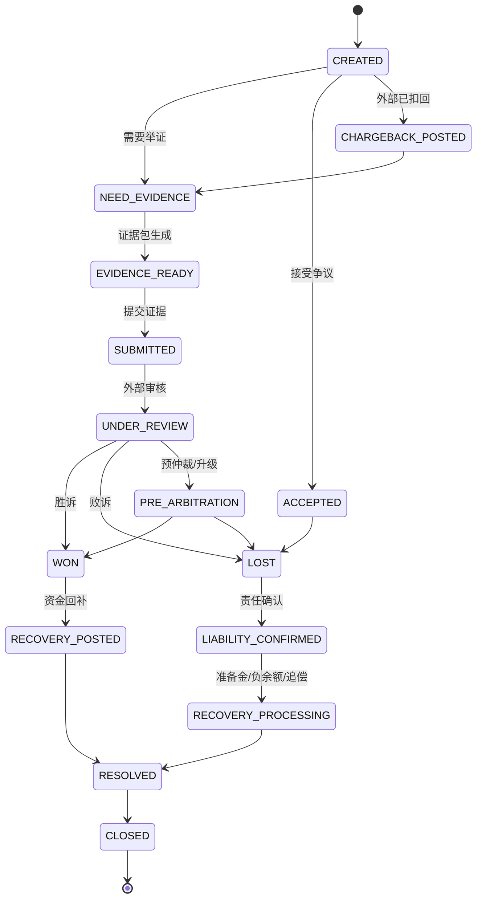

# v5 争议拒付产品设计

## 文档信息

| 项目 | 内容 |
| --- | --- |
| 文档名称 | v5 争议拒付产品设计 |
| 版本 | v5-dispute-1 |
| 日期 | 2026-05-13 |
| 设计口径 | 支付产品与资金系统专家、资深架构师 |
| 上游输入 | `v5 产品用例全景矩阵.md`、`v5 DSL 契约复审矩阵.md`、`v5 产品层 TDD 验收矩阵.md`、`v5 红线与上线前置条件.md`、`v5 商户清结算产品设计.md`、`v5 对账差错产品设计.md` |
| 文档定位 | 设计争议单、拒付入账、证据包、原因码、处理时限、争议费用、商户责任、准备金、负余额和追偿闭环 |

## 一、核心结论

争议拒付不是退款，也不是授权拒付。

v5 必须把以下对象分开：

| 对象 | 触发方 | 资金语义 | 是否一定入账 |
| --- | --- | --- | --- |
| 授权拒付 | 平台、风控、余额、通道或发卡侧拒绝授权。 | 交易未获批准，不产生结算后资金回退。 | 否。 |
| 退款 | 商户、平台或用户售后流程主动退回。 | 主动逆向交易，受可退金额和当前持仓桶约束。 | 通常是。 |
| 撤销 / 冲正 | 授权或未最终清算阶段取消。 | 释放占用或撤销未完成资金动作。 | 视阶段而定。 |
| 争议 | 用户、银行、发卡机构、通道或卡组织提出异议。 | 先形成运营 case，不一定马上产生资金扣回。 | 不一定。 |
| 拒付 / 争议扣回 | 外部网络或通道确认资金扣回或强制退回。 | 已结算交易发生强制回退。 | 是。 |
| 争议胜诉回补 | 争议反驳成功后资金返还。 | 之前扣回的资金被恢复。 | 是。 |
| 争议费用 | 通道、银行、卡组织或网络收取的 dispute/chargeback 相关费用。 | 费用，不是本金。 | 是或待文件确认。 |

账务层已支持的 `CHARGEBACK` 只表示“结算后拒付/争议扣回的资金结果”，不表示争议运营全过程。

## 二、边界与外部规则

本文不写死卡组织、ACH、银行、钱包或本地支付网络的具体原因码、时限和费用。

原因：

1. 不同支付轨道的 dispute、chargeback、return、reversal、representment 规则不同。
2. 外部规则会按机构、法域、卡组织、通道合同和生效日期变化。
3. 证据包字段、提交窗口、材料大小、语言和费用必须按最新外部规则确认。

产品设计只固化内部能力：

```text
外部争议事件
  -> 争议单
  -> 证据收集和提交
  -> 资金扣回 / 资金回补 / 费用入账
  -> 商户责任、准备金、负余额和追偿
  -> 风控、对账和报表反哺
```

上线前必须由法务、合规、风控、通道运营和财务确认外部规则。

## 三、业务对象

### 3.1 DisputeCase

争议单是运营主对象，负责承载争议全生命周期。

关键字段：

| 字段 | 说明 |
| --- | --- |
| `disputeSn` | 争议单号。 |
| `tenantId` | 租户。 |
| `paymentRail` | 支付轨道：卡、ACH/银行转账、钱包、本地支付方式、内部账户等。 |
| `disputeType` | 争议类型：dispute、chargeback、return、reversal、bank investigation 等。 |
| `reasonCode` | 外部原因码，按支付轨道保存原始值。 |
| `reasonCategory` | 内部归类：欺诈、未授权、未收到商品、服务未履约、重复扣款、金额错误、信用未处理等。 |
| `externalCaseId` | 通道、银行、卡组织或网络 case id。 |
| `originalBusinessRef` | 原业务单。 |
| `originalFundsTransactionSn` | 原资金交易。 |
| `originalAuthorizationSn` | 原授权交易，可为空。 |
| `originalSettlementSn` | 原结算或清算引用，可为空。 |
| `merchantId` | 商户或平台自营结算主体。 |
| `userId` | 用户或付款方。 |
| `currency` | 币种。 |
| `disputeAmount` | 争议本金金额。 |
| `chargebackAmount` | 已实际扣回本金金额。 |
| `feeAmount` | 争议费用。 |
| `status` | 争议状态。 |
| `liabilityParty` | 责任方：商户、平台、用户、通道、银行、未知。 |
| `externalDeadline` | 外部提交截止时间。 |
| `internalDeadline` | 内部处理截止时间。 |
| `evidencePackageSn` | 证据包引用。 |
| `operator` | 当前处理人。 |
| `riskDecisionRef` | 风控处置引用。 |
| `reconciliationExceptionSn` | 对账差错引用，可为空。 |

### 3.2 EvidenceActivityLog

证据行为日志用于保存可信证据事件，不是普通埋点。

建议覆盖：

| 证据类型 | 示例 |
| --- | --- |
| 账户与身份 | 注册、登录、MFA、KYC/KYB、资料变更。 |
| 交易授权 | 订单、支付尝试、授权结果、3DS/强认证、AVS/CVV 或等价校验。 |
| 用户确认 | 协议确认、价格确认、退款政策确认、订阅授权。 |
| 履约证据 | 发货、签收、电子交付、服务开通、服务使用记录。 |
| 沟通证据 | 客服记录、退款申请、取消申请、投诉处理。 |
| 风控证据 | 风险评分、规则命中、人工审核、黑名单、异常行为。 |
| 对账证据 | 通道文件、银行流水、回单、对账差错和核销记录。 |

原则：

1. 服务端可信事件优先。
2. 前端行为只能辅助，不能作为唯一授权或履约证据。
3. 日志追加写入，不覆盖历史。
4. 证据采集和提交遵循最小必要、脱敏、权限隔离和访问审计。

### 3.3 EvidencePackage

证据包是按支付轨道、原因码和通道模板裁剪出来的材料集合。

关键字段：

| 字段 | 说明 |
| --- | --- |
| `evidencePackageSn` | 证据包号。 |
| `disputeSn` | 争议单号。 |
| `packageType` | 卡争议、ACH/银行调查、钱包争议、本地支付方式争议等。 |
| `templateVersion` | 通道或内部模板版本。 |
| `sourceActivityLogRefs` | 使用的证据日志引用。 |
| `attachmentRefs` | 附件引用。 |
| `redactionPolicy` | 脱敏策略。 |
| `generatedBy` | 生成人。 |
| `submittedBy` | 提交人。 |
| `submittedTime` | 提交时间。 |
| `recipient` | 接收方：通道、银行、卡组织、内部法务等。 |
| `exportAuditSn` | 导出审计。 |

禁止直接把全量行为日志提交给外部机构。

### 3.4 MerchantLiability / RecoveryCase

商户责任和追偿对象用于处理商户已出款、余额不足、准备金不足或争议败诉后的责任闭环。

典型字段：

| 字段 | 说明 |
| --- | --- |
| `liabilitySn` | 商户责任单号。 |
| `disputeSn` | 争议单号。 |
| `merchantId` | 商户。 |
| `liabilityAmount` | 商户责任金额。 |
| `recoveredAmount` | 已追偿金额。 |
| `fundingSource` | 商户 `AVAILABLE`、准备金、后续结算抵扣、外部追款、损益。 |
| `status` | 追偿状态。 |
| `riskAction` | 风控动作：暂停结算、提高准备金、限额、关闭商户等。 |

## 四、状态机



状态说明：

| 状态 | 含义 | 是否一定入账 |
| --- | --- | --- |
| `CREATED` | 争议单创建。 | 否 |
| `NEED_EVIDENCE` | 需要收集证据。 | 否 |
| `EVIDENCE_READY` | 证据包已生成，待提交。 | 否 |
| `SUBMITTED` | 证据已提交。 | 否 |
| `UNDER_REVIEW` | 外部审核中。 | 否 |
| `CHARGEBACK_POSTED` | 拒付或争议扣回已发生。 | 是 |
| `WON` | 胜诉或争议反驳成功。 | 可能 |
| `LOST` | 败诉或接受争议。 | 可能 |
| `LIABILITY_CONFIRMED` | 商户、平台或其他责任方确认。 | 否 |
| `RECOVERY_PROCESSING` | 准备金扣减、负余额或追偿处理中。 | 可能 |
| `RECOVERY_POSTED` | 回补资金已入账。 | 是 |
| `RESOLVED` | 资金和责任处理完成。 | 否 |
| `CLOSED` | 争议关闭。 | 否 |

## 五、资金处理规则

### 5.1 授权拒付

授权拒付不是争议拒付。

规则：

1. 不生成 `CHARGEBACK`。
2. 不累计 `chargebackAmount`，也不写入历史兼容字段 `declinedAmount`。
3. 不占用 `settledAmount - refundedAmount - chargebackAmount` 的可回退额度。
4. 只保存授权失败事实、拒绝原因和风控/通道响应；如需展示失败金额，只进入 `authorizationDeclinedAmount`。

### 5.2 拒付入账

当外部确认已结算交易发生拒付或等价强制扣回时：

```text
eventType = CHARGEBACK
phaseCode = CHARGEBACK
routeCode = CHARGEBACK_REPLAY
```

金额上限：

```text
remainingSettledReversible
  = settledAmount
  - refundedAmount
  - chargebackAmount
```

兼容说明：

```text
v4 字段 declinedAmount
  在 v5 产品语义中等价于 chargebackAmount
  只表示结算后拒付/争议扣回累计
```

### 5.3 商户当前持仓桶

争议或拒付处理应优先识别资金当前持仓：

| 当前状态 | 处理方式 | 说明 |
| --- | --- | --- |
| 商户 `CLEARING` | 冲减 `CLEARING`。 | 尚未清算，优先从待清算扣回。 |
| 商户 `AVAILABLE` | 冲减 `AVAILABLE`。 | 已可出款，扣减可出款余额。 |
| 商户 `SETTLEMENT` | 暂停出款或进入出款中争议。 | 不自动 `SETTLEMENT -> 用户 AVAILABLE`。 |
| 已出款成功 | 进入商户责任、准备金、负余额或追偿。 | 钱已离开平台或通道资金控制范围。 |
| 平台自营已收入确认 | 进入收入冲减、损益或内部责任归集。 | 不是向外部商户追偿。 |

### 5.4 争议费用

争议费用不是本金，不应混入 `chargebackAmount`。

费用类型可包括：

1. 拒付费。
2. 争议处理费。
3. 仲裁或升级费用。
4. 通道调查费用。
5. 汇兑损益或跨币种费用。

费用责任应由合同、外部规则和争议结果决定。

## 六、商户责任与追偿

### 6.1 责任优先级

外部商户争议败诉或拒付成立后，商户责任处理建议按以下顺序：

```text
1. 冲减商户 CLEARING
2. 冲减商户 AVAILABLE
3. 扣减商户准备金 / RISK_RESERVE
4. 暂停 SETTLEMENT 出款
5. 形成商户负余额
6. 后续结算抵扣
7. 外部追偿或合同处理
8. 平台损失确认
```

### 6.2 准备金

准备金用于覆盖退款、拒付、争议、欺诈和履约风险。

准备金规则至少包含：

| 字段 | 说明 |
| --- | --- |
| `reserveRate` | 准备金比例。 |
| `reserveAmount` | 当前准备金余额。 |
| `reserveReason` | 准备金原因。 |
| `holdPeriod` | 保留周期。 |
| `releaseRule` | 释放规则。 |
| `riskLevel` | 商户风险等级。 |
| `applicableDisputeTypes` | 适用争议类型。 |

准备金不是平台收入，也不是可随意挪用资金。

### 6.3 负余额

商户余额不足时可以形成受控负余额，但必须显式设计：

1. 允许负余额的条件。
2. 负余额上限。
3. 后续结算抵扣规则。
4. 关闭商户时的追偿规则。
5. 财务损失确认规则。
6. 风控和运营告警。

不能通过普通 `RouteLeg` 偷偷制造负余额；需要明确的产品对象、审批和账务约束。

## 七、与对账差错的关系

争议拒付与对账差错不是同一层。

| 场景 | 主对象 | 关系 |
| --- | --- | --- |
| 外部文件出现 chargeback 记录 | 对账差错或通道事件先发现 | 自动或人工创建争议单。 |
| 争议扣回金额与内部记录不一致 | 差错单 | 关联争议单，处理金额差。 |
| 争议费用和通道文件不一致 | 差错单 | 进入费用差异处理。 |
| 出款后发生拒付且商户无余额 | 争议单 + 追偿单 | 可生成财务差错或追偿任务。 |
| 争议胜诉回补未到账 | 资金到账对账差错 | 进入资金在途或短款处理。 |

对账负责发现和核对，争议单负责运营和责任，账务负责记录资金事实。

## 八、与风控和商户运营的关系

争议结果必须反哺风控：

| 指标 | 用途 |
| --- | --- |
| 拒付率 | 商户风险评级、结算延迟、准备金比例。 |
| 退款率 | 商户履约质量、售后风险。 |
| 争议原因分布 | 商品、服务、欺诈、描述不符、未授权等归因。 |
| 败诉率 | 证据质量、商户履约问题、风控策略复盘。 |
| 负余额金额 | 商户资金风险和追偿风险。 |
| 证据提交超时率 | 运营 SLA 和人员配置。 |

风控动作：

1. 暂停清算。
2. 暂停结算。
3. 提高准备金。
4. 降低限额。
5. 冻结余额。
6. 要求补充资料。
7. 关闭商户。

## 九、权限、审计与数据安全

争议运营涉及敏感信息和外部提交，必须做权限隔离。

| 操作 | 要求 |
| --- | --- |
| 查看争议单 | 按角色、商户、租户和数据范围授权。 |
| 查看证据 | 敏感字段脱敏，附件访问留痕。 |
| 生成证据包 | 记录模板版本、字段选择和脱敏策略。 |
| 导出证据包 | 必须审批或至少强审计。 |
| 对外提交 | 记录接收方、提交人、提交时间、材料版本。 |
| 接受争议 | 可能导致资损，需权限和审批。 |
| 扣准备金 / 形成负余额 | 需财务或风控审批。 |
| 手工关闭 | 必须填写原因和凭证。 |

敏感数据红线：

1. 不提交完整 PAN、CVC/CVV、敏感认证数据。
2. 不提交无关证件影像、聊天记录或行为日志。
3. 不把前端点击日志作为唯一授权证据。
4. 不把争议证据用于无关营销或画像。
5. 证据包必须最小必要、脱敏、版本留痕。

## 十、对 DSL 的影响

已有 DSL 能表达拒付资金结果：

| 能力 | v4/v5 口径 |
| --- | --- |
| 拒付事件 | `FundsTransactionEventType.CHARGEBACK` |
| 拒付 phase | `LedgerPhaseCode.CHARGEBACK` |
| 路由 | `CHARGEBACK_REPLAY` |
| 金额上限 | `settledAmount - refundedAmount - chargebackAmount` |

不应新增到 DSL 的运营枚举：

```text
LedgerPhaseCode.DISPUTE_CREATED
LedgerPhaseCode.EVIDENCE_SUBMITTED
LedgerPhaseCode.REPRESENTMENT
RouteLegType.DISPUTE
```

后续可能需要产品或应用层新增：

```text
DisputeCase
EvidenceActivityLog
EvidencePackage
MerchantLiability
RecoveryCase
MerchantReserveHold
DisputeFee
```

如果争议胜诉产生资金回补，需单独设计资金事实：

1. 可作为 `CHARGEBACK_REVERSAL` 新事件进入 v5 后续 DSL 决策。
2. 或先用受控 `BALANCE_ADJUST` / 补记路径表达，但必须明确原因、凭证和原争议引用。

第一阶段不急于改 DSL，先确认产品对象和验收口径。

## 十一、红线

| 红线 | 说明 |
| --- | --- |
| 不得把授权拒付当作争议拒付 | 授权拒付不生成账务路径，不累计 `chargebackAmount` 或历史兼容字段 `declinedAmount`。 |
| 不得把退款、return、reversal、chargeback 混成一个失败状态 | 每种对象责任方、资金动作和时限不同。 |
| 不得缺快照时重新选路处理拒付 | 必须基于原结算路径或进入人工处理。 |
| 不得让退款和拒付共同超过已结算金额 | 必须校验共同上限。 |
| 不得在 `SETTLEMENT` 或已出款后自动反向退款 | 必须进入争议、追偿、准备金或人工流程。 |
| 不得把争议费用混入本金 | 费用、通道成本、拒付本金分开核算。 |
| 不得提交全量行为日志或敏感数据 | 证据包必须最小必要、脱敏和审计。 |
| 不得让高风险商户继续自动清算出款 | 争议结果必须反哺结算暂停、准备金和限额。 |

## 十二、落地顺序

| 顺序 | 能力 | 目标 |
| --- | --- | --- |
| 1 | 争议单和状态机 | 先让争议有主对象和闭环状态。 |
| 2 | 拒付入账和共同上限 | 固化 `CHARGEBACK` 与退款共享已结算可回退金额。 |
| 3 | 证据行为日志和证据包 | 支撑举证、脱敏、提交和审计。 |
| 4 | 商户责任、准备金、负余额和追偿 | 解决出款后风险资金回收。 |
| 5 | 争议费用和费用差异 | 区分本金、费用、通道成本和损益。 |
| 6 | 风控反哺和商户运营 | 调整商户风险、结算周期、准备金和限额。 |
| 7 | 交易视图和报表 | 用户、商户、运营、财务看到可解释状态。 |

## 十三、本轮结论

v5 的拒付账务主路径已经具备基础，但生产产品能力还缺争议运营闭环。

第一阶段最小可用范围：

1. 争议单。
2. 拒付入账。
3. 证据包。
4. 商户责任。
5. 准备金、负余额和追偿。
6. 争议费用。
7. 风控与对账反哺。

下一步建议把争议拒付产品规则回灌到 `v5 支付底座完整产品 PRD.md`、交易视图投影、对账差错和产品层 TDD 中，继续补齐争议单状态、原因码、证据包、费用、追偿和商户责任的验收用例。
