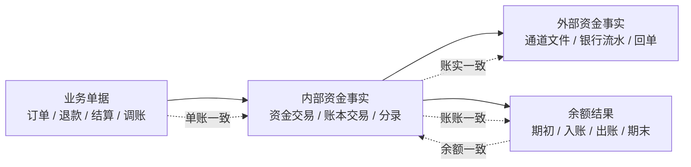
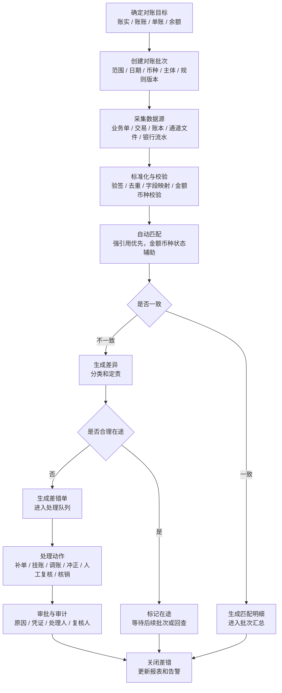
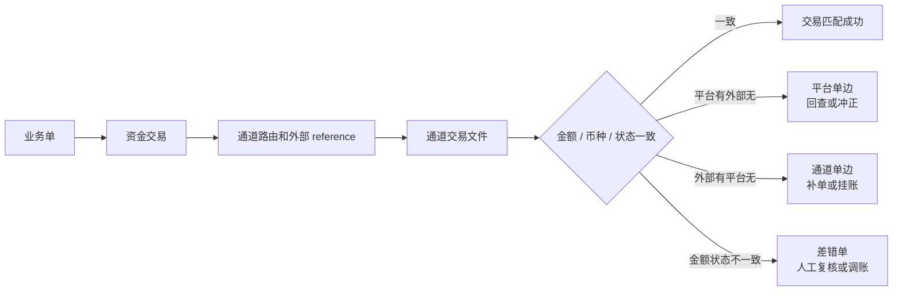
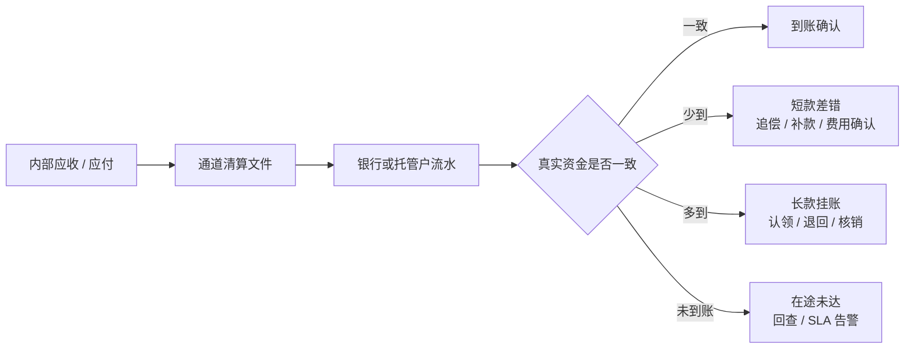
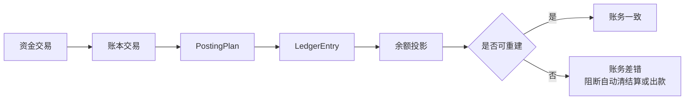
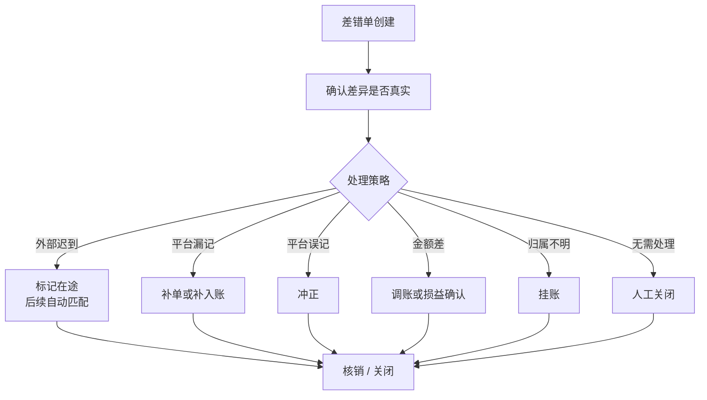
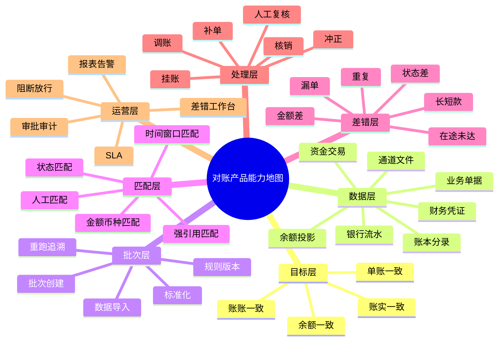
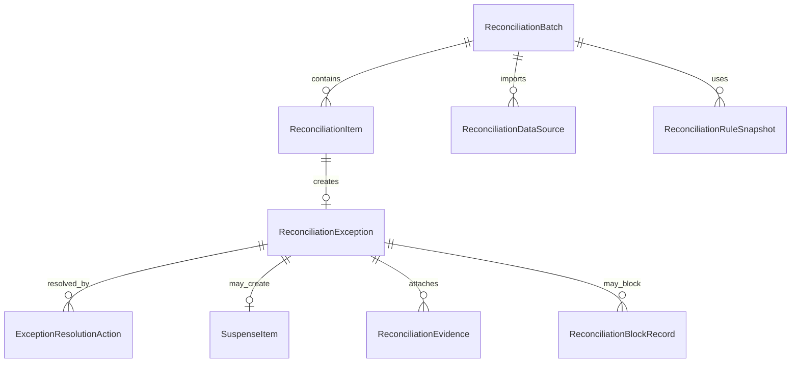
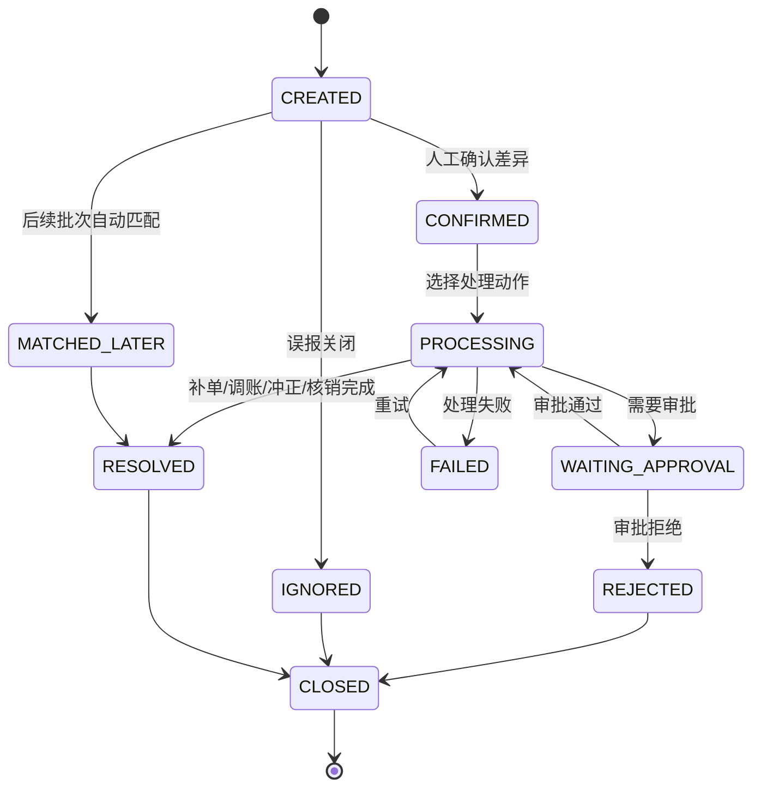

# v5 对账差错产品设计

## 文档信息

| 项目 | 内容 |
| --- | --- |
| 文档名称 | v5 对账差错产品设计 |
| 版本 | v5-reconciliation-3 |
| 日期 | 2026-05-18 |
| 设计口径 | 产品架构专家、资深架构师 |
| 上游输入 | `v5 产品用例全景矩阵.md`、`v5 DSL 契约复审矩阵.md`、`v5 产品层 TDD 验收矩阵.md`、`v5 红线与上线前置条件.md`、`v5 商户清结算产品设计.md` |
| 文档定位 | 设计交易对账、通道对账、资金到账对账、账务一致性核对、差错单、挂账、补单、调账、冲正和核销闭环 |

## 一、核心结论

对账不是报表，也不是给交易表加一个 `reconcileStatus`。对账是一套产品运营能力：把业务单据、内部账本、外部资金流水和余额结果放在同一张事实网里，发现差异、解释差异、处理差异，并留下可审计的处理链路。

从第一性原理看，对账只回答四个朴素问题：

1. 平台认为发生的事，外部世界是否也发生了。
2. 平台内部不同账之间，是否讲的是同一件事。
3. 每张业务单据，是否都能找到对应账务流水。
4. 每个账户余额，是否能由期初、入账、出账推导出来。

v5 对账差错能力必须形成独立产品域：

```text
对账批次
  -> 对账明细
  -> 差错单
  -> 处理动作
  -> 账务或产品事实
  -> 核销闭环
```

账务 DSL 只负责提供可核对的资金事实、路由快照、账本交易、分录和余额投影，不直接表达对账流程。

面向使用者的产品价值：

| 使用者 | 关心的问题 | 对账产品提供的答案 |
| --- | --- | --- |
| 财务 | 钱是否真的到账、扣款、退回，账是否平。 | 账实一致、账账一致、余额一致、长短款和挂账闭环。 |
| 运营 | 哪些订单、退款、提现、结算存在异常，谁处理。 | 对账批次、差错单、责任方、处理状态、SLA 和处理动作。 |
| 风控 | 哪些差异会带来资损、重复出款、客户资金异常。 | 阻断规则、告警级别、人工复核、审批和放行记录。 |
| 客服 / 商户运营 | 用户或商户问款项去向时能否解释。 | 单据、资金交易、通道流水、银行流水和处理记录的追溯链。 |
| 产品 / 管理者 | 哪类差异最高频、影响金额多大、流程哪里薄弱。 | 差异分类、批次报表、趋势指标、责任分布和核销效率。 |

核心原则：

1. 先生成差错对象，不直接改账。
2. 错账通过补记、冲正、反向分录、调账或核销处理，不修改历史分录。
3. 对账要覆盖账实一致、账账一致、单账一致和余额一致，并在运营语言上落成单平、账平、钱平、批平、责平。
4. 每个差异都必须有来源、责任方、处理状态、处理动作、审批和审计。
5. 对账结果要能反向影响清结算、退款、出款、争议、调账和报表。

## 二、对账目标

对账核心围绕“单、账、钱、余额、状态”做核对，先保证差异可识别，再保证差异可处理、可追溯、可核销。

目标可以理解为四层保护网：



| 核心目标 | 对齐对象 | 对账口径 | 产品验收标准 | 失败后处理 |
| --- | --- | --- | --- | --- |
| 账实一致 | 内部账本记录与真实资金流水。 | 银行流水、支付通道清算文件、托管户流水、出款回单、手续费文件。 | 外部真实资金动作都能找到内部资金事实和账本分录；金额、币种、方向、账户、状态一致。 | 生成外部单边、平台单边、长款、短款、手续费差、在途未达等差错，进入补单、挂账、调账、冲正或核销。 |
| 账账一致 | 业务账、支付账、账户账、商户账、总账、明细账。 | 交易日、账务日、清算日、结算日、入账日、会计期间。 | 同一口径下金额一致、方向一致、明细可汇总，账务分录可重建余额投影。 | 生成账务一致性差错；严重差异阻断相关主体、币种或账期的自动清结算和出款。 |
| 单账一致 | 业务单、支付单、退款单、结算单、调账单与资金交易、账本交易、分录。 | 业务单号、资金交易号、账本交易号、外部 reference、状态映射。 | 每个业务单据都能追溯到资金事实和账务流水；单据状态与账务状态不冲突。 | 漏单、漏账、重复、状态错配进入补单、补入账、冲正、人工复核或关闭。 |
| 余额一致 | 账户余额桶、期初余额、本期入账、本期出账、期末余额。 | 可用、冻结、在途、待清算、待结算、已结算等余额口径。 | 满足“期初余额 + 本期入账 - 本期出账 = 期末余额”，余额桶变化能由分录解释。 | 生成余额投影差错或巡检修复任务；未确认前不得直接改余额或释放风险资金。 |

产品运营侧可以继续使用“单平、账平、钱平、批平、责平”描述日常目标，但它们必须映射到上面的四个核心一致性目标。

| 产品表达 | 覆盖的核心目标 | 说明 |
| --- | --- | --- |
| 单平 | 单账一致、账实一致。 | 业务单、资金交易、通道单、清算单、结算单之间可解释。 |
| 账平 | 账账一致、余额一致。 | 资金交易、账本交易、分录和余额投影之间可解释。 |
| 钱平 | 账实一致。 | 内部应收应付与外部通道、银行、存管或现金账户流水可解释。 |
| 批平 | 账账一致、账实一致、余额一致。 | 同一日切、清算日、结算日、通道批次的汇总等于明细加总。 |
| 责平 | 全部目标。 | 每个差异都有责任方、处理人、处理动作和终态。 |

目标边界：

1. 对账不决定业务是否成立，只核对业务、资金和账务事实是否一致。
2. 对账不直接改历史账本，只产生差错、处理动作和新的补偿事实。
3. 对账不替代清算、结算、报表，但可以阻断不可信的清算、结算、出款和报表发布。
4. 对账不替代法务、合规、财务确认；涉及客户资金、备付金、跨境、税务或会计处理时，只输出待确认项和证据链。

## 三、核心概念、总流程与设计要素

### 3.1 核心概念

| 概念 | 易懂解释 | 产品边界 |
| --- | --- | --- |
| 对账批次 | 一次有明确范围的核对任务，例如“2026-05-18 某通道入金文件与平台入账记录核对”。 | 批次决定数据范围、口径、规则版本、执行时间和重跑关系。 |
| 对账明细 | 批次中每一条被核对的记录或匹配结果。 | 明细记录匹配成功、匹配失败、部分匹配或待人工确认。 |
| 数据源 | 参与核对的数据来源。 | 必须标明来自业务系统、交易系统、账务系统、通道文件、银行流水还是财务凭证。 |
| 对账口径 | 本次按什么日期、金额和状态标准判断一致。 | 同一批次必须固定口径，不能一会儿按交易日、一会儿按入账日。 |
| 匹配规则 | 用什么线索确认两条记录说的是同一件事。 | 强引用优先，金额、币种、账户、状态和时间窗口只能辅助判断。 |
| 差异 | 核对后发现无法解释的不一致。 | 差异必须分类，不能只写“异常”。 |
| 差错单 | 对差异进行处理、审批、追踪和关闭的产品对象。 | 差错单不是账务分录，不能代替补单、调账、冲正或核销。 |
| 挂账 | 真实资金或外部记录存在，但暂时不知道归属。 | 挂账资金不能直接进入用户或商户可用余额。 |
| 核销 | 差异已经被解释、补偿、追偿、调账、损益确认或审批关闭。 | 核销不是删除差异，证据和处理链路必须保留。 |
| 重跑 | 用同一批数据或同一规则重新执行对账。 | 重跑必须可追溯，不能覆盖原始批次证据，也不能重复生成不可区分的差错。 |

### 3.2 总体流程



这个流程有三条红线：

1. **先识别，后处理**：不能一发现差异就改账或改余额。
2. **先留证，后核销**：没有来源、凭证和审批的差错不能关闭。
3. **先判断风险，后放行**：涉及客户资金、重复出款、账务不平或金额超阈值时，应阻断相关自动流程。

### 3.3 分场景流程

#### 3.3.1 平台交易对账



使用者视角：运营每天看到的是“哪些交易已经匹配、哪些交易还在等通道文件、哪些交易必须人工处理”。

#### 3.3.2 资金到账对账



使用者视角：财务关注的不是“系统有没有成功”，而是“钱有没有真的进来或出去，差额怎么解释”。

#### 3.3.3 账务一致性核对



使用者视角：这是资金底座的健康检查，确认每一笔资金事实都能被分录解释，每一个余额都能由分录推导。

#### 3.3.4 差错处理闭环



使用者视角：差错单是运营和财务的工作台对象，必须看得见责任方、处理动作、审批状态、SLA 和最终结论。

### 3.4 对账数据源

| 数据源 | 示例 | 用途 | 风险 |
| --- | --- | --- | --- |
| 业务数据 | 订单、退款单、提现单、结算单、出款单、争议单。 | 判断业务事实、状态和责任。 | 业务状态成功但资金未入账。 |
| 支付/交易数据 | `t_funds_transaction`、交易明细、路由快照、外部 reference。 | 判断资金域事实和幂等。 | 重复交易、漏交易、状态漂移。 |
| 账务数据 | 账本交易、posting plan、ledger entry、余额投影。 | 判断账平和余额正确性。 | 缺分录、重复分录、不平衡、投影漏算。 |
| 外部数据 | 通道文件、银行流水、回单、清算文件、手续费文件、备付金银行流水、跨境外汇文件、报送回执、VCC 授权/清算/争议文件、ACH 文件/return/NOC、全球收付款合作方文件、错币种和业务换汇依据。 | 判断真实资金、客户备付金、跨境外汇、卡轨道、ACH、全球收付款和外部处理结果。 | 通道单边、银行单边、长短款、手续费差、备付金差、汇率差、报送失败、卡清算差、ACH return 未处理、全球付款在途、错币种静默入账。 |

### 3.5 对账口径

| 口径 | 说明 | 典型使用场景 |
| --- | --- | --- |
| 交易日 | 业务交易发生日期。 | 业务单、支付单、退款单与资金交易核对。 |
| 账务日 | 账本分录确认日期。 | 资金交易、账本交易、分录、余额投影核对。 |
| 清算日 | 通道、卡组织、ACH、合作方形成清算文件或清算结果的日期。 | 通道文件、清算批次和手续费核对。 |
| 结算日 | 平台对商户、用户或合作方生成结算单和出款计划的日期。 | 结算单、出款单、商户账单核对。 |
| 入账日 | 银行、托管户、备付金账户或现金账户真实入账日期。 | 银行流水、托管户流水、长短款和在途未达核对。 |

金额口径必须显式区分订单金额、实付金额、退款金额、手续费、分账金额、清算金额、结算金额、出款金额、汇率折算金额和账本记账金额；不得用一个 `amount` 混合所有口径。

### 3.6 匹配规则

| 匹配层级 | 规则 | 失败表现 |
| --- | --- | --- |
| 强引用匹配 | 优先使用业务单号、资金交易号、账本交易号、通道单号、银行流水号、外部 reference。 | 引用缺失或一对多时生成漏单、重复或待人工匹配。 |
| 金额与币种匹配 | 金额、币种、方向必须一致；手续费、汇率、汇损益应拆分核对。 | 金额差、币种差、手续费差、汇率差。 |
| 主体与账户匹配 | 用户、商户、平台账户、外部账户、托管户和责任方必须能追溯。 | 主体错配、账户错配、未知入金。 |
| 时间窗口匹配 | 按交易日、账务日、清算日、结算日、入账日配置窗口。 | 跨日、跨批次、延迟文件和在途未达。 |
| 类型与状态匹配 | 交易类型、退款、冲正、争议、退汇、return、reversal、状态映射必须一致。 | 状态差、退款/冲正错配、争议错配。 |

### 3.7 差异分类

| 差异类型 | 定义 | 典型风险 |
| --- | --- | --- |
| 漏单 | 一侧存在成功事实，另一侧没有对应记录。 | 未入账、未出款、业务已成功但资金未达。 |
| 重复 | 同一 reference、同一资金事实或同一账务事实重复出现。 | 重复入账、重复出款、重复结算。 |
| 金额不一致 | 同一口径金额不一致。 | 长款、短款、手续费误扣、汇率差未确认。 |
| 状态不一致 | 内外部或单账状态映射冲突。 | 平台成功外部失败、外部成功平台失败、处理中超时。 |
| 手续费差异 | 通道、平台、商户或用户侧手续费拆分不一致。 | 成本误记、本金被侵蚀、商户账单错误。 |
| 退款/冲正错配 | 原交易、退款、撤销、冲正、争议或退汇关联错误。 | 退款超限、重复返还、追偿失败。 |
| 长款/短款 | 实际资金大于或小于内部应收应付。 | 未知入金、垫资、损益确认错误。 |
| 在途未达 | 时间窗口内无法完成闭环但存在合理延迟。 | 批次延迟、文件迟到、银行到账延迟。 |

### 3.8 差错处理

| 处理动作 | 适用场景 | 产品约束 |
| --- | --- | --- |
| 补单 | 外部成功但内部缺业务单或资金事实。 | 必须幂等，关联原始外部凭证和审批。 |
| 挂账 | 未知入金、长款、错币种、责任未明。 | 不得进入用户或商户可用余额，认领或退回需审批。 |
| 调账 | 金额差、手续费差、损益确认、人工修正。 | 只追加调账事实和分录，不改历史分录。 |
| 冲正 | 已入账事实被确认错误或外部失败。 | 追加反向账本交易，保留原始链路。 |
| 人工复核 | 状态、责任方、凭证或资金去向不明确。 | 需要处理人、复核人、原因、附件和审计。 |
| 核销 | 差异已被解释、追偿、补偿、损益确认或审批关闭。 | 核销不删除差异，必须保留证据链和终态。 |

### 3.9 批次与任务策略

| 要素 | 设计要求 |
| --- | --- |
| 批次号 | 每次对账生成唯一 `reconcileBatchNo`，批次需记录数据范围、口径和来源。 |
| 数据版本 | 外部文件、内部快照、规则版本和导入版本必须可追溯；同一版本重跑结果应幂等。 |
| 执行时间 | 记录计划执行、实际开始、实际结束、耗时和调度来源。 |
| 重跑机制 | 支持按原批次、原数据版本、原规则版本重跑；重跑不能重复生成不可区分的差错。 |
| 处理人 | 自动处理、人工处理、审批和核销必须记录操作者或系统任务标识。 |
| 处理状态 | 批次、明细、差错单和处理动作都要有独立状态机，不能用一个状态覆盖全部层级。 |
| 报表告警 | 提供批次汇总、差异分布、未处理 SLA、阻断范围和高风险告警。 |

### 3.10 产品能力地图



### 3.11 运营后台视角

对账最终要服务日常运营和财务处理，因此后台不应只展示批处理结果，而要围绕“发现、解释、处理、复盘”组织能力。

| 后台能力 | 使用者 | 关键问题 | 必备信息 |
| --- | --- | --- | --- |
| 对账批次列表 | 运营、财务 | 今天哪些批次完成了，哪些失败了，哪些需要重跑。 | 批次号、对账类型、数据范围、状态、差异笔数、差异金额、规则版本、执行时间。 |
| 对账明细查询 | 运营、客服、财务 | 某一笔订单、退款、提现或银行流水为什么没对上。 | 业务单号、资金交易号、账本交易号、外部 reference、金额、币种、状态、匹配结果。 |
| 差错工作台 | 运营、财务、风控 | 哪些差错需要处理，谁负责，什么时候超时。 | 差错类型、责任方、处理人、SLA、阻断范围、处理动作、审批状态。 |
| 挂账认领 | 财务、运营 | 这笔未知资金应该归谁，能否退回或核销。 | 外部流水、到账账户、金额、币种、来源文件、认领证据、审批记录。 |
| 阻断与放行 | 风控、财务、运营负责人 | 差错是否影响清算、结算、出款或报表发布。 | 阻断原因、影响主体、影响金额、放行条件、审批人、放行时间。 |
| 报表与告警 | 管理者、财务、风控 | 差异趋势、责任分布和处理效率如何。 | 差错金额、差错笔数、核销时长、未处理 SLA、长短款余额、重复出款风险。 |

### 3.12 模块边界

对账模块是“发现差异并驱动处理”的产品域，不是交易系统、账本系统、清结算系统或报表系统的附属字段。

| 边界 | 对账模块负责 | 对账模块不负责 |
| --- | --- | --- |
| 与交易模块 | 读取业务单、资金交易、路由快照、外部 reference，判断单据和交易事实是否一致。 | 不直接创建普通交易，不替代交易状态机，不绕过交易幂等。 |
| 与账本模块 | 读取账本交易、posting plan、ledger entry、余额投影，判断账务是否平衡和可重建。 | 不直接修改历史分录，不把对账状态塞进账务 DSL 主结构。 |
| 与清结算模块 | 使用清算批次、结算单、出款单和回单进行核对；向清结算输出阻断、放行和差错状态。 | 不直接生成结算单，不直接出款，不替代清结算审批。 |
| 与外部通道 / 银行 | 导入、验签、去重和标准化外部文件、流水、回单。 | 不代表通道或银行作最终资金确认；外部规则、回单可信等级需由合作方和合规确认。 |
| 与财务报表 | 输出匹配结果、差错余额、长短款、挂账、核销和 SLA 数据。 | 不用报表反向改事实，不用汇总数掩盖明细差异。 |
| 与运营工作台 | 提供批次、明细、差错、挂账、审批、告警、核销等处理对象。 | 不把人工备注当成资金事实，不允许无凭证关闭高风险差错。 |

### 3.13 角色与权限

| 角色 | 主要诉求 | 可执行动作 | 权限红线 |
| --- | --- | --- | --- |
| 对账运营 | 日常跑批、查看差异、分派处理。 | 创建批次、查看明细、发起回查、分派差错、补充凭证。 | 不得直接调账、冲正、核销高风险差错。 |
| 财务 | 确认长短款、挂账、损益、核销和账务影响。 | 审批调账、确认挂账认领、核销小额差异、导出报表。 | 不得绕过来源凭证和复核直接关闭差错。 |
| 风控 | 判断差异是否带来资损、重复出款、客户资金异常。 | 设置阻断、要求人工复核、放行低风险差错。 | 不得单独放行账务不平、重复出款或客户资金异常红线。 |
| 研发 / 运维 | 处理导入失败、规则异常、任务重跑和系统故障。 | 触发重跑、查看任务日志、修复数据导入问题。 | 不得通过 SQL 直接修改历史分录、余额或差错终态。 |
| 客服 / 商户运营 | 解释用户或商户款项去向。 | 查询对账链路、查看脱敏凭证、创建协查工单。 | 不得查看超范围金融数据，不得执行资金处理动作。 |
| 审计 / 管理者 | 复盘差异、审批留痕、风险趋势。 | 查看审计日志、导出汇总报表、抽查处理链路。 | 不得修改批次结果、差错记录或凭证。 |

高危动作必须四眼复核：调账、冲正、挂账认领、未知入金退回、高金额核销、阻断放行、批次结果作废、规则版本变更。

### 3.14 业务对象关系



对象关系口径：

| 对象 | 一句话定义 | 生命周期关键点 |
| --- | --- | --- |
| `ReconciliationBatch` | 一次对账任务。 | 创建、导入、匹配、汇总、完成、失败、重跑、作废。 |
| `ReconciliationDataSource` | 本次批次使用的数据来源。 | 文件上传、接口拉取、内部快照、验签、去重、标准化。 |
| `ReconciliationRuleSnapshot` | 本次批次使用的匹配和差异规则版本快照。 | 规则发布后批次引用快照；历史批次不受新规则反向影响。 |
| `ReconciliationItem` | 批次内的一条匹配明细。 | 待匹配、已匹配、部分匹配、在途、差异、忽略。 |
| `ReconciliationException` | 对账差异的处理对象。 | 创建、确认、处理、审批、解决、关闭。 |
| `ExceptionResolutionAction` | 差错的一次处理动作。 | 回查、补单、补入账、调账、冲正、挂账、认领、退回、核销、关闭。 |
| `SuspenseItem` | 归属未明或暂不可入账的资金/外部记录。 | 挂起、认领中、已认领、退回中、已退回、核销、关闭。 |
| `ReconciliationEvidence` | 支持判断和处理的凭证。 | 文件、流水、回单、审批、截图、人工说明，必须可追溯来源。 |
| `ReconciliationBlockRecord` | 差错对清算、结算、出款、报表发布等流程的阻断记录。 | 阻断、待放行、已放行、已解除、审批拒绝。 |

### 3.15 状态模型总览

| 状态机 | 起点 | 关键中间态 | 终态 | 设计目的 |
| --- | --- | --- | --- | --- |
| 对账批次状态 | `CREATED` | `IMPORTING`、`MATCHING`、`SUMMARIZING`、`WAITING_REVIEW`、`RERUNNING` | `COMPLETED`、`FAILED`、`CANCELLED` | 让一次对账任务可追踪、可重跑、可作废。 |
| 对账明细状态 | `PENDING` | `MATCHED`、`PARTIALLY_MATCHED`、`IN_TRANSIT`、`DIFFERENT` | `CONFIRMED`、`IGNORED` | 区分匹配结果，不把所有异常都变成差错单。 |
| 差错单状态 | `CREATED` | `CONFIRMED`、`PROCESSING`、`WAITING_APPROVAL`、`FAILED` | `RESOLVED`、`CLOSED` | 让差异有处理责任、处理动作和终态。 |
| 挂账状态 | `SUSPENDED` | `CLAIMING`、`RETURNING`、`WRITING_OFF` | `CLAIMED`、`RETURNED`、`WRITTEN_OFF`、`CLOSED` | 保护未知资金不误入可用余额。 |
| 阻断状态 | `BLOCKED` | `WAITING_RELEASE_APPROVAL` | `RELEASED`、`REJECTED`、`AUTO_RELEASED` | 控制差错对清算、结算、出款和报表发布的影响。 |

## 四、三类在途

| 在途类型 | 定义 | 典型场景 | 处理策略 |
| --- | --- | --- | --- |
| 客户在途 | 业务记录与客户/商户账务入账之间的差异。 | 通道成功但内部入账失败、订单成功但账本缺分录。 | 补入账、挂账、人工确认、状态回查。 |
| 支付在途 | 平台交易与通道/清算机构文件之间的差异。 | 平台成功但通道无记录、通道成功但平台无记录、金额状态不一致。 | 补单、状态修正、通道回查、差错单。 |
| 资金在途 | 通道处理结果与银行/存管/现金账户实际到账之间的差异。 | 银行未到账、短款、长款、手续费扣减、退票。 | 挂账、长短款核销、资金调账、追偿或补款。 |
| 备付金在途 | 支付账户余额、客户备付金账户和内部账本之间的暂态差异。 | 备付金银行文件延迟、内部补入账延迟、银行流水缺失。 | 备付金差错、合规复核、禁止直接改余额。 |
| 跨境外汇在途 | 跨境订单、换汇、合作银行、外汇文件和内部账务之间的差异。 | 换汇处理中、退汇未达、汇率差、手续费差。 | 跨境差错、外汇差错、汇损益确认或人工核验。 |
| 卡清算在途 | VCC 授权、清算、退款、争议和费用文件之间的差异。 | 授权已成功但未清算、清算迟到、清算金额差、争议结果延迟。 | 卡清算差错、授权释放、费用差错或争议差错。 |
| ACH 在途 | ACH 文件提交、settlement、return、NOC、reversal 和内部账务之间的差异。 | 文件已提交未 settlement、return 未处理、NOC 未更新、reversal 未核销。 | ACH 差错、return 处理、主数据更正或人工复核。 |
| 全球收付款在途 | 全球付款指令、合作方状态、报文、银行到账和内部账务之间的差异。 | 报文成功但资金未达、长时间处理中、退汇未到账。 | 全球付款差错、在途监控、退汇处理或长短款核销。 |
| 错币种在途 | 期望币种、实际到账币种、账户币种和业务换汇调整之间的差异。 | 实际到账币种不符、汇率缺失、审批缺失、汇损益不明。 | 错币种差错、挂账、业务换汇调整或驳回。 |

## 五、对账类型

### 5.1 平台交易对账

核对对象：

```text
业务单 / 支付单 / 资金交易 / 通道交易文件
```

主要差异：

| 差异类型 | 说明 | 示例处理 |
| --- | --- | --- |
| 平台单边 | 平台有成功交易，通道文件无对应记录。 | 通道回查；确认失败则冲正或转人工。 |
| 通道单边 | 通道有成功记录，平台无交易或无成功事实。 | 补单、补入账或挂账。 |
| 金额差 | 平台金额与通道金额不同。 | 生成金额差错，确认手续费、优惠、汇率或通道短款。 |
| 状态差 | 平台成功，通道失败或退回；平台失败，通道成功。 | 状态回查，必要时补偿或冲正。 |
| 重复记录 | 同一外部 reference 出现多条成功记录。 | 去重、人工确认，防止重复入账。 |
| 延迟记录 | 跨日或跨批次出现外部记录。 | 进入在途，后续批次自动核销。 |

### 5.2 账务一致性核对

核对对象：

```text
资金交易
  -> RouteSnapshot
  -> LedgerTransaction
  -> LedgerPostingPlan
  -> LedgerEntry
  -> LedgerBalanceProjection
```

核对规则：

| 规则 | 验收 |
| --- | --- |
| 每笔成功资金交易必须有账本交易引用。 | 缺失则生成账务差错或阻断提交。 |
| 每个 posting plan 必须借贷平衡。 | 不平衡必须失败，不允许入账。 |
| 每个 entry 必须能定位唯一 ledger。 | 缺账本或多账本必须失败。 |
| 余额投影必须可由 entry 重算。 | 投影差异生成巡检差错。 |
| 后续交易必须引用原快照。 | 缺快照的退款、撤销、拒付、手续费退回必须失败或人工处理。 |
| 摘要必须覆盖稳定事实字段。 | 摘要不应包含持久化流水、审计时间和本次生成 ID。 |

### 5.3 资金到账对账

核对对象：

```text
内部应收 / 应付
通道清算文件
银行流水 / 存管流水 / 现金账户流水
```

主要差异：

| 差异类型 | 说明 | 示例处理 |
| --- | --- | --- |
| 未达账 | 通道已清算，银行暂未到账。 | 资金在途，超时告警。 |
| 短款 | 银行到账少于内部应收。 | 查手续费、扣款、通道差错，生成短款差错。 |
| 长款 | 银行到账多于内部应收。 | 挂账、认领、退回或核销。 |
| 手续费扣减 | 通道在资金到账时扣除成本。 | 通道成本入账或费用差异处理。 |
| 退票 / 退汇 | 出款后资金退回。 | 出款失败回退、用户/商户余额恢复或差错处理。 |
| 账户错配 | 到账账户、币种或主体与预期不一致。 | 挂账、人工确认、风险告警。 |

### 5.4 清结算批次核对

核对对象：

```text
清算批次
结算单
出款单
账务事实
通道 / 银行回单
```

核对规则：

1. 清算批次金额必须等于交易明细加总减退款、拒付、手续费、准备金和调整。
2. 结算单金额必须能追溯到清算批次和商户可出款余额。
3. 出款单金额必须等于结算单可出款金额或其合法拆分。
4. 出款成功必须有外部回单或可信确认来源。
5. 出款失败必须能回退 `SETTLEMENT -> AVAILABLE` 或进入人工处理。

## 六、差错单模型

### 6.1 差错单职责

差错单是对账差异的处理对象，不是账务分录。

职责：

1. 承载差异来源、差异金额、差异类型和责任方。
2. 记录处理状态、处理动作、审批、凭证和审计。
3. 驱动补单、补入账、冲正、调账、挂账、核销或人工确认。
4. 关联原业务单、资金交易、账务流水、通道流水、银行流水和批次。

### 6.2 关键字段

| 字段 | 说明 |
| --- | --- |
| `exceptionSn` | 差错单号。 |
| `tenantId` | 租户。 |
| `reconciliationBatchSn` | 对账批次号。 |
| `exceptionType` | 差错类型。 |
| `exceptionSource` | 平台、通道、银行、账务、清算、结算、人工。 |
| `responsibleParty` | 责任方：平台、商户、用户、通道、银行、未知。 |
| `businessRef` | 业务单引用。 |
| `fundsTransactionSn` | 资金交易引用。 |
| `ledgerTransactionSn` | 账本交易引用。 |
| `externalReference` | 通道、银行或文件 reference。 |
| `currency` | 币种。 |
| `expectedAmount` | 内部预期金额。 |
| `actualAmount` | 外部实际金额。 |
| `differenceAmount` | 差异金额。 |
| `status` | 差错状态。 |
| `actionType` | 处理动作。 |
| `reasonCode` | 原因码。 |
| `evidenceRef` | 凭证、文件、回单、审批引用。 |
| `operator` | 操作人。 |
| `approvalRef` | 审批引用。 |
| `resolvedTime` | 核销或关闭时间。 |

### 6.3 差错类型

| 类型 | 说明 | 典型处理 |
| --- | --- | --- |
| `PLATFORM_ONLY` | 平台有，外部无。 | 回查、冲正、人工确认。 |
| `EXTERNAL_ONLY` | 外部有，平台无。 | 补单、挂账、补入账。 |
| `AMOUNT_MISMATCH` | 金额不一致。 | 调账、补款、核销、费用差异处理。 |
| `STATUS_MISMATCH` | 状态不一致。 | 状态回查、补偿、人工确认。 |
| `DUPLICATE_EXTERNAL` | 外部重复。 | 去重、拒绝重复入账。 |
| `LEDGER_MISSING` | 交易成功但账务缺失。 | 补入账或阻断提交。 |
| `LEDGER_IMBALANCED` | 分录不平衡。 | 阻断、修复、不得保存部分结果。 |
| `BALANCE_PROJECTION_MISMATCH` | 余额投影与 entry 重算不一致。 | 重算投影、巡检修复、审计。 |
| `CASH_SHORTAGE` | 资金短款。 | 追偿、补款、损益确认。 |
| `CASH_OVERAGE` | 资金长款。 | 挂账、认领、退回、核销。 |
| `FEE_MISMATCH` | 手续费差异。 | 通道成本入账、费用调账。 |
| `UNKNOWN_INBOUND` | 未知入金。 | 挂账、认领、退回。 |
| `PAYOUT_RETURN` | 出款退回。 | 出款失败回退、补发或人工处理。 |

### 6.4 差错状态机



状态说明：

| 状态 | 含义 |
| --- | --- |
| `CREATED` | 对账发现差异，待处理。 |
| `MATCHED_LATER` | 后续批次自动匹配，准备核销。 |
| `CONFIRMED` | 人工确认差异真实存在。 |
| `PROCESSING` | 正在执行补单、补入账、调账、冲正或挂账。 |
| `WAITING_APPROVAL` | 处理动作需要审批。 |
| `REJECTED` | 审批拒绝。 |
| `FAILED` | 处理动作失败，可重试或转人工。 |
| `RESOLVED` | 差错已处理完成。 |
| `IGNORED` | 明确为误报或无需处理。 |
| `CLOSED` | 差错关闭，不再处理。 |

## 七、处理动作

| 处理动作 | 适用场景 | 是否入账 | 审批要求 |
| --- | --- | --- | --- |
| `REQUERY_EXTERNAL` | 状态不明、通道单边、平台单边。 | 否 | 可自动，超阈值转人工。 |
| `SUPPLEMENT_ORDER` | 外部有成功记录，平台缺交易单。 | 可能 | 需幂等和人工确认。 |
| `SUPPLEMENT_POSTING` | 交易已成功但账务缺失。 | 是 | 高风险，必须审批。 |
| `REVERSE_TRANSACTION` | 平台误记成功或需要冲正。 | 是 | 必须审批。 |
| `BALANCE_ADJUST` | 金额差、长短款、费用差异。 | 是 | 必须审批、凭证和原因。 |
| `SUSPENSE` | 未知入金、未知长款。 | 可能 | 挂账入待处理科目，需人工。 |
| `CLAIM` | 挂账认领。 | 是 | 需证明材料和审批。 |
| `RETURN_FUNDS` | 未知入金退回或退汇。 | 是 / 外部动作 | 必须审批和回单核验。 |
| `WRITE_OFF` | 小额差异或长期无法处理差异核销。 | 是 / 财务动作 | 必须财务审批。 |
| `MANUAL_CLOSE` | 误报或无需处理。 | 否 | 需原因和操作日志。 |

## 八、规则矩阵

### 8.1 匹配规则矩阵

| 规则层级 | 规则 | 自动化建议 | 人工兜底 |
| --- | --- | --- | --- |
| 强引用一对一 | 业务单号、资金交易号、外部 reference、银行流水号唯一对应，金额币种方向一致。 | 自动匹配。 | 无需人工。 |
| 强引用一对多 | 一个内部 reference 对应多条外部记录，或多条内部记录对应一条外部记录。 | 不自动合并，生成待确认明细。 | 人工确认拆分、合并或重复。 |
| 金额完全一致 | 引用弱但金额、币种、方向、主体、时间窗口一致。 | 可进入候选匹配。 | 人工确认后匹配。 |
| 金额不一致 | 本金、手续费、汇率、优惠、分账拆分后仍不一致。 | 生成金额差异。 | 财务确认费用、长短款、损益或调账。 |
| 状态不一致 | 平台成功外部失败、外部成功平台失败、内部处理中外部成功。 | 先回查，超过窗口生成差错。 | 运营确认补单、冲正或关闭。 |
| 跨日 / 跨批次 | 外部记录在后续日期或后续文件出现。 | 标记在途，到期后转差错。 | 人工延长窗口或确认差错。 |
| 重复 reference | 同一 reference 出现多次成功或多次入账。 | 强制生成重复差错。 | 人工确认重复来源，阻断重复入账/出款。 |

### 8.2 差异处理规则矩阵

| 差异类型 | 默认处理 | 是否阻断 | 是否可核销 | 必备凭证 |
| --- | --- | --- | --- | --- |
| 平台单边 | 外部回查，确认失败后冲正或人工关闭。 | 视金额和状态阻断。 | 可核销。 | 平台交易、回查结果、审批记录。 |
| 外部单边 | 补单、补入账或挂账。 | 涉及真实资金默认阻断相关出款。 | 可核销。 | 外部文件、银行流水、补单审批。 |
| 金额差 | 拆分本金、费用、汇率和优惠；必要时调账。 | 超阈值阻断。 | 可核销。 | 差异计算、费用依据、调账审批。 |
| 状态差 | 回查可信来源，确认后补偿或冲正。 | 状态不明超 SLA 阻断。 | 可核销。 | 外部状态证明、处理说明。 |
| 手续费差 | 确认通道成本、平台收费、商户收费归属。 | 通常告警，超阈值阻断。 | 可核销。 | 费率配置、通道文件、财务审批。 |
| 退款 / 冲正错配 | 关联原交易，检查退款上限、冲正幂等和原路规则。 | 默认阻断相关结算。 | 处理完成后核销。 | 原交易、逆向单、账务流水。 |
| 长款 | 挂账，等待认领、退回或核销。 | 不阻断原交易，可阻断资金释放。 | 可核销。 | 银行流水、认领证据、财务审批。 |
| 短款 | 追偿、补款、费用确认或损益处理。 | 默认阻断相关主体出款。 | 可核销。 | 应收依据、实收流水、追偿记录。 |
| 账务不平 | 停止相关自动处理，发起修复任务。 | 强制阻断。 | 修复后核销。 | 巡检报告、修复审批、复核结果。 |
| 余额不一致 | 冻结风险动作，重算投影或人工复核。 | 强制阻断相关余额释放。 | 修复后核销。 | 期初、入账、出账、期末明细。 |

### 8.3 阻断与放行规则矩阵

| 触发条件 | 阻断范围 | 默认放行条件 | 审批角色 |
| --- | --- | --- | --- |
| 账务不平、分录重复、余额不可重建。 | 相关主体、币种、账期的清算、结算、出款和自动调账。 | 账务修复完成，复核通过。 | 财务 + 研发负责人。 |
| 出款回单金额、币种或收款账户不一致。 | 出款单、结算单、同批次后续出款。 | 回单确认、失败回退、补发或追偿完成。 | 财务 + 风控 + 运营负责人。 |
| 同一外部 reference 多次成功。 | 关联交易、账户入账、结算和出款。 | 重复来源确认，重复资金处理完成。 | 财务 + 风控。 |
| 客户资金、待结算资金、备付金或跨境资金差异。 | 相关资金释放、结算、出款和报表发布。 | 差错核销，法务/合规/财务待确认项关闭。 | 财务 + 合规/法务 + 风控。 |
| 单笔或累计差异超过阈值。 | 对应主体、币种、场景的结算或出款。 | 调账、补单、冲正、追偿或审批放行。 | 财务 + 运营负责人。 |
| 差错超过 SLA 未处理。 | 风险相关自动流程。 | 明确责任方和处理计划，必要时进入挂账或人工复核。 | 运营负责人 + 风控。 |

### 8.4 批次重跑与版本规则

| 场景 | 规则 | 验收 |
| --- | --- | --- |
| 同数据同规则重跑 | 使用原数据版本和原规则快照。 | 结果应幂等，不重复生成不可区分的差错。 |
| 同数据新规则重跑 | 新建重跑批次，记录 `rerunOfBatchNo` 和新规则版本。 | 原批次保留，新批次结果可对比。 |
| 补文件重跑 | 新文件形成新数据版本。 | 补文件批次能自动核销在途或迟到记录。 |
| 错文件作废 | 批次可作废，但不能删除导入记录和审计。 | 作废原因、操作人、审批和影响范围完整。 |
| 部分重跑 | 按主体、币种、日期、通道、批次分片重跑。 | 不影响其他已确认明细和已关闭差错。 |

## 九、挂账模型

挂账用于表达“真实资金或外部记录存在，但内部归属暂不明确”。

典型场景：

1. 未知 VA 入金。
2. 银行长款。
3. 通道单边成功但平台找不到业务单。
4. 出款退回但无法匹配原出款单。
5. 手续费或税费扣减来源不明。

挂账要求：

| 要求 | 说明 |
| --- | --- |
| 不进入用户或商户 `AVAILABLE` | 未确认归属前不能增加可用余额。 |
| 必须有挂账原因和来源文件 | 关联外部流水、文件批次或回单。 |
| 必须可认领、退回、核销 | 每个挂账都要有终态。 |
| 必须有超时告警 | 长期挂账需要财务和运营介入。 |
| 必须区分长款和短款 | 长款不等于收入，短款不等于损失，均需确认。 |

## 十、对清结算的影响

对账差错必须能影响商户清结算：

| 差错 | 对清算影响 | 对结算影响 |
| --- | --- | --- |
| 订单通道状态不明 | 暂停进入清算批次。 | 不可结算。 |
| 退款通道状态不明 | 预留退款金额或暂停相关订单清算。 | 可能扣减可结算金额。 |
| 拒付或争议未处理 | 进入争议预留或冻结。 | 暂停结算或扣准备金。 |
| 出款失败 | 不影响原清算，但影响结算单和出款单。 | `SETTLEMENT -> AVAILABLE` 或人工处理。 |
| 长短款 | 需要财务确认。 | 可影响结算差额、准备金或调账。 |
| 账务不一致 | 阻断清算或出款。 | 不允许基于不可信余额出款。 |

阻断采用“红线默认阻断 + 金额和 SLA 可配置”的规则：

| 阻断类型 | 触发条件 | 默认处理 |
| --- | --- | --- |
| 红线阻断 | 账务不平、账本交易缺失、分录重复、余额投影不可重建。 | 阻断相关主体、币种和账期的清算、结算、出款和自动调账。 |
| 红线阻断 | 出款回单金额或币种不匹配、同一外部 reference 重复成功、客户资金异常。 | 阻断关联出款单、结算单和后续出款，直到差错处理和复核完成。 |
| 阈值阻断 | 单笔差错、累计差错金额、笔数或 SLA 超过配置阈值。 | 暂停对应主体、币种和账期的结算或出款；经财务、风控、运营审批后才可放行。 |
| 告警不阻断 | 小额费用差、可解释汇差、文件延迟等低风险差错，且未触碰红线。 | 记录差错和告警，在配置 SLA 内核销或归档。 |

## 十一、对 DSL 的影响

v5 不建议把对账状态放入 DSL 主结构。

职责边界：

| 能力 | 归属 | 说明 |
| --- | --- | --- |
| 资金事实、Route、Snapshot、Posting、Entry | DSL / 账务层 | 提供可核对事实。 |
| 对账批次、差异匹配、差错状态 | 对账产品层 | 不污染 DSL。 |
| 补单、补入账、调账、冲正 | 应用服务 + 账务 DSL | 由差错单驱动新的资金事实或账务事实。 |
| 核销、挂账、认领、退回 | 对账 / 财务产品层 | 可触发账务动作，但不是 RouteLeg 类型。 |
| 用户账单、商户账单、财务报表 | 视图投影层 | 引用对账结果，但不反向改账。 |

可新增的产品对象：

```text
ReconciliationBatch
ReconciliationItem
ReconciliationException
SuspenseItem
ExceptionResolutionAction
```

不建议新增的 DSL 枚举：

```text
LedgerPhaseCode.RECONCILIATION
LedgerPhaseCode.SUSPENSE
RouteLegType.RECONCILE
```

如果挂账需要入账，应通过明确的资金主体和 `BALANCE_ADJUST` / 补记路径表达，不通过“对账 phase”表达。

## 十二、产品 TDD 验收

| 验收 ID | 场景 | 输入 | 输出 | 预期 |
| --- | --- | --- | --- | --- |
| REC-001 | 平台交易与通道文件完全匹配 | 平台成功交易和通道成功记录金额、币种、状态一致。 | 对账明细 matched。 | 不生成差错单。 |
| REC-002 | 平台单边成功 | 平台成功，通道文件无记录。 | 生成 `PLATFORM_ONLY` 差错。 | 不直接冲正，先回查或人工确认。 |
| REC-003 | 通道单边成功 | 通道成功，平台无交易。 | 生成 `EXTERNAL_ONLY` 差错。 | 可补单、挂账或补入账，必须幂等。 |
| REC-004 | 金额差 | 平台金额与通道金额不同。 | 生成 `AMOUNT_MISMATCH` 差错。 | 不直接改账；处理动作需审批。 |
| REC-005 | 账务缺失 | 资金交易成功但账本交易缺失。 | 生成 `LEDGER_MISSING` 差错或阻断提交。 | 补入账必须关联原交易和审批。 |
| REC-006 | 分录不平衡 | PostingPlan 借贷不平。 | 入账失败。 | 不保存部分账务结果。 |
| REC-007 | 投影不一致 | entry 重算余额与余额投影不同。 | 生成 `BALANCE_PROJECTION_MISMATCH` 差错。 | 可重算投影，但必须审计。 |
| REC-008 | 银行短款 | 内部应收大于银行到账。 | 生成 `CASH_SHORTAGE` 差错。 | 追偿、补款、费用确认或损益处理。 |
| REC-009 | 银行长款 | 银行到账大于内部应收。 | 生成 `CASH_OVERAGE` 或挂账。 | 未认领前不进入用户/商户可用余额。 |
| REC-010 | 未知 VA 入金 | 外部 VA 到账但找不到绑定对象。 | 生成 `UNKNOWN_INBOUND` 和挂账。 | 不自动入账，认领或退回需审批。 |
| REC-011 | 出款退回 | 银行或通道返回出款失败或退回。 | 生成 `PAYOUT_RETURN` 差错。 | 商户 `SETTLEMENT -> AVAILABLE` 或人工处理，仅一次。 |
| REC-012 | 对账差异直接改历史分录 | 处理人试图修改历史 entry。 | 操作失败。 | 必须通过补记、冲正、调账或核销处理。 |
| REC-013 | 单账不一致 | 退款单、结算单或调账单存在，但找不到对应资金交易或账本交易。 | 生成单账一致性差错。 | 必须补单、补入账、冲正、关闭或人工复核，不能只修改单据状态。 |
| REC-014 | 账账不一致 | 同一账务日业务账、账户账、商户账、总账汇总不一致。 | 生成账账一致性差错和批次汇总差异。 | 严重差异阻断相关账期、主体或币种的自动清结算和出款。 |
| REC-015 | 余额不一致 | 期初余额 + 本期入账 - 本期出账不等于期末余额。 | 生成 `BALANCE_RECONCILIATION_MISMATCH` 差错。 | 未复核前不得直接改余额或释放风险资金。 |
| REC-016 | 批次重跑 | 使用同一数据版本和规则版本重跑已完成对账批次。 | 生成可追溯重跑结果。 | 不重复生成不可区分的差错，不覆盖原批次证据链。 |
| REC-017 | 补文件自动核销在途 | 前一批次平台单边，后一批次通道文件迟到。 | 原在途明细匹配成功，关联差错进入待核销。 | 不重复生成新差错，保留两个批次关系。 |
| REC-018 | 重复外部流水 | 同一外部 reference 在文件中多次成功。 | 生成 `DUPLICATE_EXTERNAL` 差错并阻断重复入账。 | 不能自动合并或静默忽略。 |
| REC-019 | 挂账认领 | 未知入金已挂账，运营提交认领材料。 | 挂账进入 `CLAIMING`，审批后归属到正确主体。 | 未审批前不得进入用户或商户可用余额。 |
| REC-020 | 高风险差错放行 | 出款回单金额不一致但运营尝试放行结算。 | 放行被拦截或进入审批。 | 账务不平、重复出款、客户资金异常不得单人放行。 |
| REC-021 | 规则版本变更 | 修改金额容差或时间窗口后重跑历史批次。 | 生成新重跑批次。 | 原批次结果不被覆盖，规则版本可追溯。 |
| REC-022 | 客服查询款项去向 | 用户或商户询问某笔款项状态。 | 展示业务单、资金交易、外部流水、差错和处理时间线。 | 权限内脱敏展示，不暴露无关金融数据。 |

## 十三、运营指标

对账指标只反映差异发现和处理效率，不替代财务报表、总账报表或监管报送。

| 指标 | 口径 | 用途 |
| --- | --- | --- |
| 批次成功率 | 成功完成批次数 / 总批次数。 | 衡量对账任务稳定性。 |
| 自动匹配率 | 自动匹配明细数 / 总明细数。 | 衡量规则质量和数据质量。 |
| 差错率 | 差错明细数 / 总明细数。 | 观察业务、通道、账务异常趋势。 |
| 差错金额 | 按差错类型、主体、币种汇总差异金额。 | 衡量资金风险敞口。 |
| 未处理 SLA 超时率 | 超过 SLA 未关闭差错数 / 未关闭差错数。 | 运营处理效率和风险升级。 |
| 长款余额 | 未认领、未退回、未核销长款余额。 | 财务挂账管理。 |
| 短款余额 | 未追偿、未补款、未核销短款余额。 | 资损和追偿管理。 |
| 阻断次数和金额 | 按阻断范围统计。 | 观察对清结算、出款和报表发布的影响。 |
| 重跑次数 | 按批次、数据版本、规则版本统计。 | 观察数据质量和规则稳定性。 |
| 核销平均时长 | 差错创建到关闭的平均时长。 | 衡量运营闭环效率。 |

## 十四、红线

| 红线 | 说明 |
| --- | --- |
| 不得用对账报表代替差错单 | 报表只能看见问题，差错单才能闭环处理。 |
| 不得发现差异后直接改历史分录或余额 | 必须补记、冲正、调账或核销。 |
| 不得把未知入金直接入用户或商户可用余额 | 必须先挂账、认领或退回。 |
| 不得用一个 `reconcileStatus` 覆盖交易、资金、账务、清结算所有差异 | 对账类型、差异类型和处理动作必须分层。 |
| 不得在账务不一致时继续自动清算或出款 | 余额不可信时出款会扩大资损。 |
| 不得把通道手续费差异混入用户本金或商户本金 | 通道成本、平台手续费、用户本金必须分开。 |
| 不得让差错单无终态长期悬挂 | 必须有超时、责任方、升级和核销策略。 |
| 不得用人工备注替代凭证 | 高风险处理必须有外部流水、回单、审批或可审计证据。 |
| 不得用新规则覆盖历史批次 | 规则变更只能影响新批次或新重跑批次，不能反向篡改历史结果。 |

## 十五、落地顺序

| 顺序 | 能力 | 目标 |
| --- | --- | --- |
| 1 | 对账批次和对账明细 | 先让差异可被发现和追踪。 |
| 2 | 差错单和状态机 | 让差异有处理对象和终态。 |
| 3 | 账务一致性核对 | 保护资金交易、账本交易、分录和余额投影。 |
| 4 | 挂账和未知入金处理 | 保护未知资金不误入用户或商户余额。 |
| 5 | 处理动作和审批 | 补单、补入账、调账、冲正、核销可审计。 |
| 6 | 清结算联动 | 有未处理差错时暂停清算、结算或出款。 |
| 7 | 报表和告警 | 支撑财务、运营和风险监控。 |

## 十六、本轮结论

v5 对账差错设计应作为独立产品域，不应压进 DSL；目标上必须同时覆盖账实一致、账账一致、单账一致和余额一致。本版本已补齐模块边界、角色权限、业务对象、状态模型、规则矩阵、阻断放行、重跑版本、运营指标和产品验收，可作为下一轮系分设计和 TDD 计划的产品输入。

第一阶段最小可用范围：

1. 对账批次、对账明细、差错单。
2. 平台交易对账、账务一致性核对、资金到账对账。
3. 差错状态机和处理动作。
4. 挂账、未知入金、长短款和出款退回。
5. 对清算、结算、出款的阻断和释放规则。

下一步建议进入 `v5 争议拒付产品设计.md`，因为拒付是对账、商户责任、证据、准备金和追偿的交汇点。
