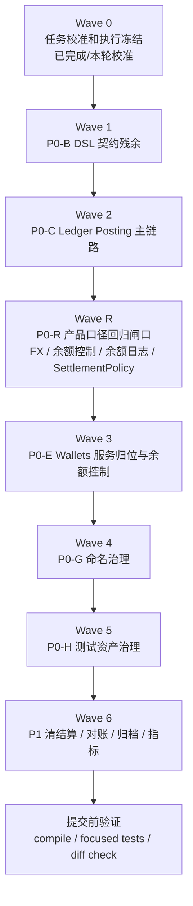

# 支付资金底座 AI 编码协作执行计划

## 文档修正历史

| 版本 | 日期 | 作者 | 说明 |
| --- | --- | --- | --- |
| 1.0 | 2026-05-14 | Codex | 首版，基于资深架构师 AI 编码协作模型，承接 PRD、DSL、OpenSpec、系分设计和 P0 编码任务拆分。 |
| 1.1 | 2026-05-14 | Codex | Wave 0 再校准：同步 v4 CR 已闭合代码状态，重排下一批 AI code 工作包。 |
| 1.2 | 2026-05-14 | Codex | 同步 P0-B 局部落地：RouteReplay 拆分、Fx 汇率方向和 rateId 契约已有测试保护。 |
| 1.3 | 2026-05-15 | Codex | 同步二次 CR：明确 wallet 服务归位、命名治理、测试资产治理和 PMD 非阻塞门禁。 |
| 1.4 | 2026-05-16 | Codex | 校准余额变更日志、SettlementPolicySpec 和 FxService 边界：余额日志作为业务观察口子；非 RT 结算策略进入 P0 校验；交易层撤回 converter 自动换汇目标态。 |
| 1.5 | 2026-05-16 | Codex | 重新对齐任务规划：新增 P0-R 产品口径回归闸口，下一轮先闭合产品口径红线，再回到 wallet/命名/测试治理。 |
| 1.6 | 2026-05-16 | Codex | 补充余额控制无 FX 边界：`FundsBalanceControlService` 不调用 `FxService`，错币种直接失败。 |
| 1.7 | 2026-05-16 | Codex | 补充交易请求金额契约：`TransactionAmount` 字段命名为 `transactionAmount`，并明确各交易入口改造范围。 |
| 1.8 | 2026-05-16 | Codex | 落地 P0-R 交易金额和 FX 边界：converter 不再调用 `FxService`，交易金额统一使用 `TransactionAmount`，余额控制错币种直接失败。 |
| 1.9 | 2026-05-16 | Codex | 落地 P0-R 余额变更日志观察口子：扩展 `LedgerBalanceChangedEvent` 字段，按分录发布观察事件，事件失败不回滚余额投影。 |
| 1.10 | 2026-05-16 | Codex | 落地 P0-R 非 RT `SettlementPolicySpec` 红线：修正非预定义 `C@DD-DD` 解析，补不支持表达式不得降级 `RT` 测试。 |

# 一、定位

本文是支付资金底座进入代码落地前的 AI 编码协作执行层文档。

它不替代以下文档：

1. `../v5 支付底座完整产品 PRD.md`
2. `../v5 DSL 规范设计.md`
3. `../../../openspec/project.md`
4. `协作工作台.md`
5. `API 契约测试与编码实施计划.md`
6. `P0 编码任务拆分.md`

本文解决的是“如何把既有设计交给 AI 或研发小步实现”的问题：

1. 哪些任务已经具备编码条件。
2. 哪些任务还需要先补契约或人工确认。
3. 每个工作包的写入范围、只读范围、禁止事项和验证命令是什么。
4. 多个 AI Agent 或多人协作时如何避免写入冲突和边界漂移。

# 二、三层作业模型

本项目采用 `OpenSpec 定标准，Superpowers 保纪律，Harness 管团队` 的三层作业模型。

| 层级 | 在本项目中的作用 | 当前产物 | 编码前检查 |
| --- | --- | --- | --- |
| OpenSpec | 定义能力规格、变更范围和验收要求。 | `openspec/project.md`、`openspec/specs/*`、`openspec/changes/v5-system-design-kickoff/*` | 变更是否能追溯到 capability spec 和 change tasks。 |
| Superpowers | 约束 TDD、Review、Refactor 和最小修改。 | `协作工作台.md`、本文、P0 任务拆分 | 是否先有用例、测试或验收场景，再实现。 |
| Harness | 管理任务分工、写入范围、验证命令和交接。 | `Harness 验证门禁设计.md`、本文的工作包卡片 | 是否明确 owner、write scope、依赖、禁止事项和验证命令。 |

AI 不能直接把“产品描述”当成可编码规格。进入实现前必须先落到以下最小输入：

```text
目标
范围
非目标
验收场景
写入范围
禁止事项
验证命令
交接说明
```

# 三、当前代码校准

本节用于修正部分文档与代码之间的时间差。后续任务应以本节校准后的状态为执行基线。

| 事项 | 文档原判断 | 当前代码观察 | 执行结论 |
| --- | --- | --- | --- |
| 来源事实 `sourceObjectType/sourceObjectSn` | P0 差距，曾计划贯穿 instruction、route、snapshot、ledger transaction。 | 当前代码已从执行链路移除该字段，避免把 `businessSn` 伪装成资金域事实流水。 | 当前执行链路以 `businessScene/businessSn/reference` 为基线；后续独立事实生命周期稳定后，再引入明确的 `sourceFactRef`。 |
| 资金指令类型命名 | 目标态为直接交易、授权交易、余额控制。 | 当前仍为 `TRANSFER/AUTHORIZATION/BALANCE_CONTROL`。 | 仍是 P0 契约收敛任务，改动公共枚举前需单独确认兼容策略。 |
| Route replay 类型 | 目标态需要授权撤销、授权结算、授权退款、费用退款、拒付、解冻等更明确语义。 | 已把授权结算回放从 `CAPTURE` 收敛为 `AUTHORIZATION_SETTLEMENT`，并补齐 `AUTHORIZATION_REFUND`、`FEE_REFUND` 独立 replay 类型；编排器、回放服务和契约测试已同步。 | P0-B replay 命名主体已闭合；后续新增 replay 语义必须先补契约测试。 |
| Entry 和交易摘要 | 文档要求排除持久化流水、审计时间、展示文案，同时覆盖账务稳定语义。 | `LedgerTransaction` 摘要已纳入 `referenceLedgerTransactionSn`；`LedgerPostingPlan` 摘要已纳入 `postingScope/balanceEffectType`；`LedgerEntry` 摘要已纳入账目类别、intent、scope、effect、phase；route leg 信息已进入快照、posting plan 一等 `routeLegId` 和上下文。 | 摘要字段清单主体已闭合；`PostingPlan.ledgerTransactionSn` 暂等独立稳定 transaction key 后再纳入。 |
| 钱包交易服务归属 | 目标态归 transaction layer。 | 当前已在 `transaction-face/application` 提供 `FundsDirectTransactionService`、`FundsAuthorizationTransactionService`、`FundsBalanceControlService`，统一实现为 `FundsTransactionCommandServiceImpl`；`FundsBalanceControlTransactionService` 仅作废弃兼容别名；wallet 层边界测试已存在。 | P0-D 主体已闭合，后续只做回归保护。 |
| 冻结事实载体 | 冻结和解冻应使用 `FrozenOrder`，不创建 `FundsTransaction`。 | 已有 `FundsFrozenOrderService`、`FREEZE_ORDER` 引用和边界测试；冻结消费状态和字段已标记兼容废弃，冻结创建拒绝消费状态，解冻剩余金额只看 `releasedAmount`。 | P0-E 冻结事实红线已闭合；余额控制链路如需提现出款确认、追偿、退款或调账，必须创建独立后续资金事实并通过 `reference=FREEZE_ORDER` 引用冻结单。 |
| 平台账户角色 | 目标态需要现金映射、预收待付、清算过渡、结算应付、费用归集、调整挂账。 | 当前已使用 `CASH_MAPPING/PREPAYMENT/CLEARING/SETTLEMENT/FEE/ADJUSTMENT` 六类角色，`PlatformAccountRouteSupport` 已按场景拆分快照入口，余额调账 route 已使用平台 `ADJUSTMENT`。 | P0-E 角色命名和账目映射已闭合；后续完整清结算批处理只复用该角色契约，不再恢复 `RESERVE_FUND` 语义。 |
| Fx 主链路 | 目标态要求保留原币、账本币、汇率和错币种红线，且是否换汇应由业务层或外汇域显式决策。 | 交易转换器已撤回对 `FxService` 的隐式调用；pay/transfer/authorize/topup/withdraw/settle 通过 `TransactionAmount` 接收显式金额事实，错币种且缺显式 FX 决策时直接失败；`DefaultFxServiceImpl` 继续作为业务层或外汇域工具能力保留。 | P0-R 主链路已闭合；完整外汇报价、锁价、审批、费用和汇损益运营对象进入 P1。 |
| 余额变更日志 | 余额投影事件需要支持业务记录余额变更日志。 | 已扩展 `LedgerBalanceChangedEvent`，余额投影按分录发布观察事件，包含变更前后余额、变更额、账本交易、分录追溯、业务引用和上下文；事件发布失败只记录警告，不回滚余额投影。 | P0-R 观察口子已闭合；Ledger 保持 `LedgerEntry` 事实源，余额变更日志是业务观察记录，不在 Ledger 中强制业务日志表。 |
| SettlementPolicySpec 对齐 | `SettlementPolicySpec` 已支持 `RT/T+N/H+N/W/M/Q/Y/C` 等表达式，产品层 `SettlementPolicy` 还应包含策略编码、版本、主体、币种、时区、基准时间、阻断规则等。 | 已修正非预定义 `C@DD-DD` 自定义账期解析顺序，并补充不支持表达式显式失败测试；当前契约不再只停留在 `RT`。 | P0-R 表达式红线已闭合；清结算代码落地时不得把 `RT` 固化为唯一策略，候选、批次、结算单、出款单必须保存 `policyCode + policyVersion + policyExpression`。 |
| 余额断言和业务组合测试 | 文档要求所有资金变化断言余额桶。 | 已新增 `FundsBalanceAssertionSupport`、`FundsTransactionLedgerBalanceAssertionsTests`、`FundsTransactionBusinessFlowIntegrationTests`，并覆盖三条业务组合链路。 | P0-A 已闭合，后续作为回归保护。 |
| Route/helper 设计 | v4 CR 要求移除低价值长参数 helper。 | `RouteBuildSupport`、`RouteReferenceFactory`、`FundsInstructionBuildSupport`、`RouteLegFactory` 已移除；`PlatformAccountRouteSupport` 已拆为 4 个场景入口。 | P0-F helper 主体已闭合，后续新增公共构建能力必须承载业务不变量。 |
| 资金主体类型枚举 | v4 CR 发现 `FundsSubjectType` 在 transaction 和 core 重复。 | transaction-face 重复枚举已删除，生产和测试统一使用 `com.wind.integration.funds.route.enums.FundsSubjectType`。 | 已闭合，后续不再新增 transaction-local 资金主体类型枚举。 |
| wallet 物理模块 | 目标态需要 wallet 承担账户与余额能力。 | `wallet-face` 已承载余额查询、账本配置、账户主体、平台账户角色、支付工具和支出主体资金关系等契约；`wallet-impl` 仍未承载对应实现或 adapter。 | P0-E face 契约归位已闭合；下一步需确认实现迁入 `wallet-impl`，还是先用 adapter 过渡以避免 DAL/Mapper 所有权一次性大迁移。 |
| 命名体系 | CR 要求审查模块名、包名、类名、方法名。 | 存在 transaction 承载 wallet 能力、`Saver` 语义偏弱、`LedgerTransactionCreateResult` 与幂等入账结果不完全匹配、账户类型枚举混合多个语义轴等问题。 | 新增 P0-G 命名治理工作包，按模块小批次收敛，不和业务逻辑大改混在一起。 |
| 测试资产 | 资深架构师要求测试驱动设计，资金测试应能解释场景和余额变化。 | 已有余额断言和组合测试，但仍有测试命名不统一、巨型测试类、关键资金用例说明不足的问题。 | 新增 P0-H 测试资产治理工作包，统一测试命名、场景说明、余额断言和测试类职责。 |
| P0-H 首轮治理 | 测试方法命名需统一为 `test...`，关键资金用例需说明场景和红线。 | `tests/src/test/java/com/capte/funds` 下 `@Test` 方法命名已统一为 `test...` 前缀，账务、路由、交易生命周期、冻结和账户能力测试已补关键语义说明。 | 首轮已闭合；后续继续做巨型测试类拆分和余额断言覆盖复核，不把测试资产治理整体误判为完全完成。 |
| P0-C 首轮治理 | Ledger Posting 主链路需要写前红线、稳定追溯、幂等和余额投影缺省语义。 | 账本入账已覆盖金额为正、账目允许、route leg 追溯、重复入账不重复投影和缺账本失败；余额投影已补缺账本失败、缺余额桶失败；展示查询保留未初始化状态。 | 首轮行为已闭合；`LedgerTransactionCreateResult` 是否重命名为更准确的幂等入账结果，留给 P0-G/P0-C 后续命名治理。 |
| PMD 门禁 | 提交前通常需要 `mvn pmd:check`。 | 当前仍可能被 Aliyun snapshot 依赖解析缓存问题阻塞。 | 当前 CAD/Harness 轮次暂不把 PMD 作为阻塞门禁；保留 compile、聚焦测试和 diff 检查。 |

# 四、执行总路线

## 4.1 推荐顺序



## 4.2 下一批建议范围

当前 P0-A、P0-D、P0-C 首轮以及 P0-F 的 helper/route 收敛主体已经闭合；Fx 自动换汇边界按 2026-05-16 校准需撤回为显式决策快照。下一批建议只执行：

1. Wave 1：P0-B 剩余 DSL 契约测试和最小契约修正，重点转向来源事实、指令/事件命名、JSON 样例和摘要契约。
2. Wave 2：P0-C Ledger Posting 主链路的显式追溯和摘要契约。
3. Wave R：P0-R 产品口径回归闸口，先闭合 FX 决策外置、余额控制无 FX、余额变更日志观察口子和非 RT `SettlementPolicySpec` 红线。
4. Wave 3：P0-E Wallets 账户服务归位、冻结事实和受控负余额边界。
5. Wave 4：P0-G 命名治理，优先处理服务归属、混合枚举、生命周期记录器和入账结果命名。
6. Wave 5：P0-H 测试资产治理，统一测试命名、场景说明、余额断言和巨型测试类拆分。

暂不建议下一批直接进入清结算批处理、归档落表或真实 Harness pipeline；这些依赖核心交易、账本和账户主链路稳定。

# 五、Harness 工作包卡片

## 5.1 Wave 0：任务校准和执行冻结

| 项 | 内容 |
| --- | --- |
| 目标 | 把当前设计和代码状态对齐，冻结第一批可执行范围。 |
| 写入范围 | `docs/v5/系分设计/`，必要时更新 `openspec/changes/v5-system-design-kickoff/tasks.md`。 |
| 只读范围 | PRD、DSL、OpenSpec、已有系分、P0 任务拆分、核心代码和测试。 |
| 禁止事项 | 不修改 Java 代码、POM、DDL、CI/CD、真实 Harness pipeline。 |
| 验收 | 待办中已落地项不再作为字段新增任务；下一批 P0-R 闸口、后续 P0-E/P0-G/P0-H 任务清楚。 |
| 验证命令 | 文档变更可不跑编译；交付时说明未运行编译原因。 |

## 5.2 已完成：P0-A 测试保护和余额断言

| 项 | 内容 |
| --- | --- |
| 当前状态 | 已完成，作为回归保护工作包保留。 |
| 目标 | 维护资金变化用例的余额桶断言能力，持续发现资损类回归。 |
| 写入范围 | `tests/src/test/java/com/capte/funds/**`。 |
| 只读范围 | `ledger-impl`、`transaction-impl`、`wallet-impl` 生产代码和 `tests/src/test/resources/jdbc-schema.sql`。 |
| 禁止事项 | 不改生产代码；不放宽现有断言；不删除边界测试；不引入真实外部服务。 |
| 已落地测试 | `FundsBalanceAssertionSupport`、`FundsTransactionLedgerBalanceAssertionsTests`、`FundsTransactionBusinessFlowIntegrationTests`。 |
| 验收 | 充值、付款、退款、冻结、提现、转账等 P0 场景能断言主体、账目、币种、period、金额、initialized 和 posting 平衡。 |
| 验证命令 | `mvn -pl tests -am test -Dtest=FundsTransactionLedgerBalanceAssertionsTests,FundsTransactionBusinessFlowIntegrationTests`；`mvn -pl tests -am test -Dtest=FundsTransactionCommandServiceImplTests,FundsTransactionOrchestrationFlowTests`。 |

## 5.3 Wave 1：P0-B 剩余 DSL 契约

| 项 | 内容 |
| --- | --- |
| 目标 | 用契约测试锁定目标态 DSL，避免后续改枚举、replay、摘要、Fx 时语义漂移。 |
| 写入范围 | 优先 `core/src/test/java/**`、`tests/src/test/resources/**`；确认后再改 `core/src/main/java/**`。 |
| 只读范围 | `docs/v5/v5 DSL 规范设计.md`、`docs/v5/v5 DSL 契约复审矩阵.md`、`openspec/specs/*`。 |
| 禁止事项 | 未确认前不改公共枚举；不做历史兼容大改；不把交易视图重放塞进 route replay。 |
| 建议任务 | `TransactionServiceAbilityDslJsonContractTests`、`LedgerEntryDigestContractTests`、来源事实引用契约、指令/事件命名契约。 |
| 验收 | JSON 样例可解析；`DIRECT_TRANSACTION/REVERSE_TRANSACTION/AUTHORIZATION_TRANSACTION/BALANCE_CONTROL/QUERY_AND_REPLAY` 目标语义有测试；entry digest 稳定字段有契约；已落地的 RouteReplay 和 Fx 契约持续回归。 |
| 验证命令 | `mvn -pl core -am test -Dtest=FundsInstructionSpecContractTests,RouteDslContractTests`；`mvn -pl core -am test -Dtest=TransactionServiceAbilityDslJsonContractTests,LedgerEntryDigestContractTests`。 |

## 5.4 Wave 2：P0-C Ledger Posting 主链路

| 项 | 内容 |
| --- | --- |
| 目标 | 补齐 posting、entry、projection 的 P0 入账红线。 |
| 写入范围 | `ledger/ledger-impl/**`、`transaction/transaction-impl/src/main/java/com/capte/funds/transaction/ledger/**`、相关测试。 |
| 只读范围 | `ledger-face`、`core` DSL、H2 schema。 |
| 禁止事项 | 不让 ledger 层重新 route；不让业务侧传 entry；不自动建账；不直接修改历史分录。 |
| 建议任务 | 已完成金额为正、profile 账目允许、route leg 追溯、重复入账保护、写流程缺账本和缺余额桶策略；剩余幂等结果命名治理。 |
| 验收 | plan 和整笔交易同币种平衡；缺账本失败；摘要稳定；余额投影按 normal balance 正确更新；展示查询可表达未初始化余额桶。 |
| 验证命令 | `mvn -pl tests -am test -Dtest=DefaultLedgerPostingAssemblerTests,DefaultLedgerTransactionPostingServiceImplTests`；`mvn -pl tests -am test -Dtest=LedgerBalanceProjectionServiceImplTests,DefaultFundsAccountQueryServiceImplTests`。 |

## 5.5 已完成：P0-D Transaction Layer 服务门面

| 项 | 内容 |
| --- | --- |
| 当前状态 | 已完成主体迁移，作为回归保护工作包保留。 |
| 目标 | 维护 transaction layer 应用服务门面，防止 wallet 层重新承载交易事实编排。 |
| 写入范围 | `transaction/transaction-face/**`、`transaction/transaction-impl/**`、`wallet/**` 适配层和相关测试。 |
| 只读范围 | API 设计规范、交易层服务能力系分、wallet 现有请求和服务。 |
| 禁止事项 | 不让 wallet 直接写交易事实或账本事实；不把冻结来源事实和资金交易主表重新混在一起。 |
| 已落地内容 | `FundsDirectTransactionService`、`FundsAuthorizationTransactionService`、`FundsBalanceControlService` 位于 `transaction-face/application`，实现为 `FundsTransactionCommandServiceImpl`；`FundsBalanceControlTransactionService` 保留为兼容别名。 |
| 验收 | 业务侧入口不再以 wallet 历史命名表达交易编排；wallet 边界测试持续通过。 |
| 验证命令 | `mvn -pl tests -am test -Dtest=FundsTransactionServiceApiContractTests,DefaultRoutedFundsInstructionOrchestratorTests`；`mvn -pl tests -am test -Dtest=DefaultFundsInstructionLifecycleSaverTests,WalletLayerBoundaryTests`。 |

## 5.6 Wave 3：P0-E Wallets 账户与余额控制

| 项 | 内容 |
| --- | --- |
| 目标 | 让 wallet 从空模块变成账户能力层，并补齐账户 profile、平台账户角色、冻结订单和受控负余额策略。 |
| 写入范围 | `wallet/wallet-face/**`、`wallet/wallet-impl/**`、`transaction/transaction-face/**` 账户契约迁移点、`transaction/transaction-impl/**` 账户实现迁移点、相关测试。 |
| 只读范围 | Wallets 系分、控制账户 ADR、H2 schema。 |
| 禁止事项 | 不把付款、退款、提现、转账等交易命令迁回 wallet；不让 wallet 直接写 `FundsTransaction` 或 `LedgerTransaction`；不把信用账户和预算组当真实资金；不新增账务 `CONSUMED`；不让负 `AVAILABLE` 静默产生。 |
| 建议任务 | wallet 实现或 adapter 归位；`FUNDING_MERCHANT`、平台 `ADJUSTMENT` 角色、`RESERVE_FUND` 命名收敛、FrozenOrder 生命周期和负余额策略模型已有回归保护，后续以迁移和清结算批处理复用为主。 |
| 验收 | `wallet-face` 已承载账户能力契约；`wallet-impl` 有明确实现或 adapter 策略；账户主体账目集合符合 PRD；平台角色可解析到具体 funding account；冻结订单生命周期可审计；transaction 通过 wallet-face 使用账户能力。 |
| 验证命令 | `mvn -pl tests -am test -Dtest=FundsFrozenOrderServiceImplTests,BalanceControlFundsInstructionRouteResolverTests`；`mvn -pl tests -am test -Dtest=DefaultLedgerProfileServiceImplTests,PlatformFundingAccountServiceImplTests,WalletLayerBoundaryTests`。 |

## 5.7 Wave 4：P0-G 命名治理

| 项 | 内容 |
| --- | --- |
| 目标 | 对模块名、包名、类名、方法名做分批收敛，让代码名称和资金语义一致。 |
| 写入范围 | 按子任务限定；优先文档、契约测试和单一模块内重命名，避免跨模块一锅端。 |
| 只读范围 | API 设计规范、P0 编码任务拆分、现有模块树和测试类。 |
| 禁止事项 | 不在同一轮同时改业务逻辑和大规模包名；不为了统一名称破坏已验证行为；不引入低价值抽象。 |
| 建议任务 | `DefaultFundsAccountType` 语义拆分、`FundsBalanceControlService` 主契约落地、`FundsInstructionLifecycleSaver` 记录器命名、组合生命周期分发器命名、`LedgerTransactionCreateResult` 入账结果命名。 |
| 验收 | 命名变更有测试保护；模块职责、类名和方法名能说明业务语义；没有混入无关格式化。 |
| 验证命令 | `mvn compile`；`mvn -pl tests -am test -Dtest=WalletLayerBoundaryTests,FundsTransactionServiceApiContractTests`。 |

## 5.8 Wave 5：P0-H 测试资产治理

| 项 | 内容 |
| --- | --- |
| 目标 | 让测试资产符合测试驱动设计：先说明用例和红线，再用断言证明资金变化正确。 |
| 写入范围 | `tests/src/test/java/**`、`core/src/test/java/**`、必要测试资源。 |
| 只读范围 | 生产代码、API 设计规范、P0-A 余额断言与组合测试。 |
| 禁止事项 | 不为了拆测试改生产行为；不放宽余额断言；不删除失败路径测试；不启动真实外部依赖。 |
| 建议任务 | 测试方法统一 `test` 前缀、关键资金用例补“场景/输入/输出/预期/红线”、巨型测试类按能力拆分、业务组合测试逐步断言。 |
| 验收 | 有资金变化的测试能解释余额桶、账本余额、posting 平衡和幂等语义；测试类职责聚焦。 |
| 验证命令 | `mvn -pl tests -am test -Dtest=FundsTransactionBusinessFlowIntegrationTests,FundsTransactionLedgerBalanceAssertionsTests`；`mvn -pl tests -am test -Dtest=DefaultFundsInstructionLifecycleSaverTests,DefaultFundsFrozenOrderLifecycleSaverTests`。 |

## 5.9 已完成：P0-F Route/helper/Fx 收敛

| 项 | 内容 |
| --- | --- |
| 当前状态 | helper、RouteResolver 和交易层 FX 边界主体已完成，后续作为回归保护。 |
| 目标 | 维护 route/helper 简洁边界，防止 Fx 字段命名和汇率方向回退，同时把是否换汇的业务决策从交易 converter 中移出。 |
| 写入范围 | `transaction/transaction-impl/src/main/java/com/capte/funds/route/**`、`wallet/wallet-impl/**`、`transaction/transaction-impl/src/main/java/com/capte/funds/fx/**`、相关测试。 |
| 只读范围 | v4 CR 遗留待办、DSL 契约矩阵、Fx 契约。 |
| 禁止事项 | 不为减少一两行代码机械抽象；不引入无主依赖；不静默处理错币种交易。 |
| 已落地内容 | 低价值 helper/factory 已移除；route 协议常量已收敛主路径；`PlatformAccountRouteSupport` 已按场景拆分快照入口；交易 converter 已撤回对 `FxService` 的隐式调用；`DefaultFxServiceImpl` 汇率方向和 provider `rateId` 已有测试。 |
| 后续残余 | 完整外汇运营对象、报价锁价、审批、费用和汇损益进入 P1；P0 只保留错币种红线和显式金额事实回归保护。 |
| 验收 | 公共 helper 不再是低价值长参数转发；错币种交易缺显式 FX 决策时失败、挂账或进入差错流程；有 FX 决策时保留原币、目标币、汇率、来源、审批和外部依据。 |
| 验证命令 | `mvn -pl tests -am test -Dtest=RouteLayerBoundaryTests,DefaultFxServiceImplTests`；`mvn -pl core -am test -Dtest=FundsInstructionSpecContractTests,RouteDslContractTests`。 |

## 5.10 已完成：P0-R 产品口径回归闸口

| 项 | 内容 |
| --- | --- |
| 当前状态 | PRD、产品 TDD、业务轨道、商户清结算、红线和交易视图投影已对齐产品口径；FX 决策外置、余额控制无 FX、余额变更日志观察口子和非 RT 结算策略红线已完成主体落地。 |
| 目标 | 防止交易层继续承担业务换汇决策，防止余额控制承接 FX，防止余额变更日志污染账本事实，防止非 RT 结算策略被静默降级为实时结算。 |
| 写入范围 | `core` 中 FX/SettlementPolicy 契约与测试、`transaction/transaction-face` 请求金额契约和 `transactionAmount` 字段命名、`transaction/transaction-impl` converter 和相关测试、`ledger/ledger-impl` 余额投影事件或扩展点与相关测试。 |
| 只读范围 | 主 PRD、产品 TDD、业务范围与支付轨道、商户清结算、红线与上线前置条件、P0 编码任务拆分。 |
| 禁止事项 | 不实现完整外汇报价/锁价/审批运营对象；不让 `FundsBalanceControlService` 调用 `FxService` 或接收 FX 快照；不实现完整清结算批处理；不把业务余额变更日志表强制塞进 ledger 事实层；不恢复 `sourceObjectType/sourceObjectSn`。 |
| 已落地任务 | P0-R-001 撤回 converter 自动调用 `FxService`；P0-R-002 补余额变更日志观察口子；P0-R-003 补非 RT `SettlementPolicySpec` 契约和静默降级失败测试；P0-R-004 固化余额控制无 FX 边界；P0-R-005 收敛交易请求金额契约。 |
| 验收 | `PTDD-RAIL-FX-003`、`PTDD-CTRL-006`、`PTDD-LEDGER-001`、`AT-BASE-038`、`AT-BASE-039`、`RED-014A`、`RED-014B`、`RED-019`、`RED-020` 有测试或明确测试计划；错币种缺 FX 决策失败或进入差错；`TransactionAmount` 请求字段统一命名为 `transactionAmount`，类内部主金额字段保留 `amount` 且不泄露 ledger 命名；余额控制错币种直接失败且不挂账；日志失败不改账；策略不支持不降级 `RT`。 |
| 验证命令 | `mvn -pl core -am test -Dtest=SettlementPolicySpecTests,FundsInstructionSpecContractTests`；`mvn -pl tests -am test -Dtest=FundsInstructionFxContractTests,FundsDirectTransactionInstructionConverterTests,FundsAuthorizationInstructionConverterTests,FundsBalanceControlInstructionConverterTests,LedgerBalanceProjectionServiceImplTests`。 |

## 5.11 下一轮优先：P0-CTRL 控制账户调额

| 项 | 内容 |
| --- | --- |
| 当前状态 | PRD、控制账户 ADR、DSL 和 API 计划已确认 `FundsBalanceControlService#adjust` 支持资金余额调账、信用额度调整和预算组预算调整；P0-R 已闭合，下一轮进入测试先行实现。 |
| OpenSpec 输入 | `wallets` 规格承接信用账户、预算组、受控负余额和 `LIMIT` 语义；`transaction-layer` 规格承接余额控制服务入口和 `BALANCE_CONTROL / LIMIT_ADJUST` 路由。 |
| 目标 | 让信用额度调增/调减、预算调增/调减和受控负 `AVAILABLE` 通过余额控制入口有测试、有校验、有审计上下文，并守住 `LIMIT` 不作为普通交易 source/target 的红线。 |
| 写入范围 | `transaction/transaction-face` 余额控制请求模型、`transaction/transaction-impl` converter/resolver/context 校验、相关 tests；如发现规格缺口，先补最小 OpenSpec spec delta。 |
| 只读范围 | 主 PRD、控制账户 ADR、DSL 规范、DSL 契约复审矩阵、Wallets 系分、交易层系分。 |
| 禁止事项 | 不新增公共 `ControlAdjustmentSpec`；不新增账务 `CONSUMED`；不把信用账户或预算组当真实资金；不让普通支付、授权结算、退款、争议拒付、手续费或直接交易把 `LIMIT` 当 source/target。 |
| 建议任务 | P0-CTRL-001 文档一致性复核；P0-CTRL-002 信用额度调额服务门面测试；P0-CTRL-003 预算组调额服务门面测试；P0-CTRL-004 `LIMIT` 红线测试；P0-CTRL-005 最小实现收口。 |
| 验收 | `PTDD-CTRL-003`、`AT-BASE-040`、`AT-BASE-041` 对应测试落地；受控负数必须有策略、上限、审批、原因和审计；预算调减还必须有预算周期、治理策略、账龄和报表标记。 |
| 验证命令 | `just test-one FundsTransactionCommandServiceImplTests tests`；`just test-one BalanceControlFundsInstructionRouteResolverTests tests`；涉及生产代码时执行 `just compile`，可用时执行 `just pmd`。 |

# 六、多 Agent 协作边界

如果后续使用多个 AI Agent 或多人并行，按以下边界拆分，避免写入冲突。

| 角色 | 适合任务 | 写入范围 | 交接要求 |
| --- | --- | --- | --- |
| Contract Agent | DSL、枚举、JSON 样例、契约测试。 | `core/src/test`、`core/src/main`、测试资源。 | 列出公共契约变更、兼容风险和测试命令。 |
| Test Agent | 余额断言、业务组合、红线失败测试。 | `tests/src/test`、`tests/src/test/resources`。 | 列出新增测试场景、失败前提和数据依赖。 |
| Ledger Agent | posting、entry、projection、摘要。 | `ledger/**`、`transaction/**/ledger/**`。 | 列出账务不变量、平衡校验和余额投影验证。 |
| Transaction Agent | transaction-face 门面、orchestrator、lifecycle。 | `transaction/**`、必要 wallet 适配。 | 列出事实载体、事务边界、幂等和失败策略。 |
| Wallet Agent | 账户、profile、冻结、平台角色。 | `transaction/**/services/**`、`wallet/**` 适配。 | 列出账户主体、余额桶、负余额和冻结红线。 |
| Review Agent | 只读 Review 和验证结果审查。 | 默认只读。 | 按 P0/P1/P2 给发现、风险和阻断建议。 |

并行规则：

1. 不允许两个 Agent 同时修改同一个生产模块的同一职责范围。
2. 公共枚举、DTO、Request、Query、数据库脚本只能由一个 Owner 修改。
3. 测试 Agent 可以先行，但不能为了让测试通过放宽现有生产行为断言。
4. 每个 Agent 交接必须包含修改文件、验证命令、是否通过、残余风险。

# 七、编码前检查清单

每个具体代码任务开始前必须确认：

1. 是否能追溯到 PRD、DSL、OpenSpec 和系分章节。
2. 是否明确事实载体：`FundsTransaction`、`FrozenOrder`、清结算单据、对账差错，还是只读投影。
3. 是否明确账户主体和余额桶：`FUNDING_ACCOUNT`、`CREDIT_ACCOUNT`、`BUDGET_GROUP`；`AVAILABLE/FROZEN/AUTHORIZATION/CLEARING/SETTLEMENT/LIMIT`。
4. 是否明确幂等键、请求摘要和重复请求语义。
5. 是否明确事务边界和失败事实保留策略。
6. 是否明确权限、租户和审计字段。
7. 是否有先行测试或至少有验收测试计划。
8. 是否有本地验证命令。
9. 是否符合测试资产治理要求：测试方法以 `test` 开头，关键资金用例说明场景、输入、输出、预期和红线。
10. 是否涉及公共契约、数据库字段、生产行为或不可逆操作；若涉及，必须先人工确认。

# 八、提交前完成定义

一轮代码实现可以进入提交准备，必须满足：

1. 修改范围符合本工作包写入范围。
2. 没有混入无关格式化、命名、依赖、构建或 CI/CD 修改。
3. 资金变化路径有余额桶断言或明确说明尚未覆盖的残余风险。
4. 相关编译、聚焦测试和基础 diff 检查已经执行，或说明环境限制。
5. 高风险契约变更有迁移说明、兼容策略或人工确认记录。
6. 最终交付说明包含修改文件、验证命令、验证结果和未完成项。

当前阶段 `mvn pmd:check` 因 Aliyun snapshot 依赖解析缓存问题暂不作为阻塞门禁。PMD 恢复后再纳入提交前规约检查。

# 九、当前结论

支付资金底座已经具备进入 AI 编码协作的规格和系分基础，但第一批不宜直接做服务门面和枚举大改。

当前 P0-A、P0-D、P0-C 首轮以及 P0-F 的 helper/route 主体验收已完成；Fx 自动换汇撤回、余额控制无 FX、余额变更日志观察口子和非 RT 结算策略红线作为下一轮 P0-R 回归闸口。下一步建议从以下最小闭环继续：

1. 执行 P0-R：撤回 converter 自动换汇，交易层改为显式 FX 决策快照校验。
2. 执行 P0-R：固化余额控制无 FX 边界，`FundsBalanceControlService` 错币种直接失败。
3. 执行 P0-R：收敛交易请求金额契约，统一 `transactionAmount` 命名和改造范围。
4. 执行 P0-R：补余额变更日志观察口子，确保日志失败不改账且可从 `LedgerEntry` 重放。
5. 执行 P0-R：补非 RT `SettlementPolicySpec` 契约和不支持表达式失败测试。
6. 执行 P0-E：Wallets 服务归位、账户 profile、冻结事实边界和受控负余额策略剩余项。
7. 执行 P0-G/P0-H：模块命名治理、测试命名、资金用例说明、余额断言和巨型测试类拆分。
