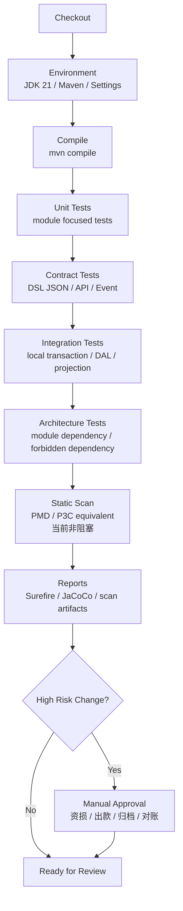

# Harness 验证门禁设计

# 一、定位

本文定义支付资金底座后续接入 Harness 时建议采用的验证门禁。当前阶段只做门禁设计，不创建真实 Harness pipeline，不配置凭据，不触发远程构建。

# 二、门禁目标

1. 保证代码至少通过 Java 21 Maven 编译。
2. 保证核心资金规则有单元测试、契约测试和集成测试保护。
3. 保证 face / impl 依赖方向、API 契约、DSL JSON 样例和账务平衡规则可自动检查。
4. 对涉及资损、出款、清结算、对账差错、归档重放的变更设置人工审批或加强门禁。
5. 将本地验证命令和 CI 验证结果统一到提交前审查口径。

# 三、推荐 Pipeline 阶段

# 四、本地命令到 Harness Stage 映射

| Stage | 本地命令建议 | 说明 |
| --- | --- | --- |
| Environment | `mvn -version` | 确认 JDK 21 和 Maven runtime。 |
| Compile | `mvn compile` | 全量编译。 |
| Module Unit Tests | `mvn -pl <module> -am test -Dtest=<TestClass>` | 按变更模块执行聚焦测试。 |
| Contract Tests | `mvn -pl core -am test -Dtest=*ContractTests` | DSL、JSON、枚举、路由和账务计划契约。 |
| Integration Tests | `mvn -pl tests -am test -Dtest=<IntegrationTest>` | 跨模块、本地事务、投影重建和对账流程。 |
| Static Scan | `mvn pmd:check` | p3c 未配置时使用团队认可的等价规约检查；当前受依赖解析缓存问题影响，暂不作为阻塞门禁。 |
| Coverage | `mvn test` | 需要覆盖率报告时执行，按团队环境决定是否全量。 |

实际命令以系分阶段确认的模块和测试类为准，不在本文硬编码最终模块清单。

# 五、高风险变更审批规则

以下变更建议触发 Harness 人工审批：

1. LedgerEntry、PostingPlan、LedgerTransaction、BalanceProjection 的行为变更。
2. 资金账户、信用账户、预算组的余额桶规则变更。
3. 授权结算、退款、争议拒付、追偿、手续费、出款锁定、出款成功或失败回退。
4. 清算批次、结算单、出款单、对账差错阻断规则。
5. 余额 checkpoint、watermark、归档、重放和历史数据修复。
6. 权限、租户、审计、敏感数据和操作凭证相关变更。

审批材料必须包含：

1. 变更范围和风险。
2. PRD、DSL、OpenSpec 和系分引用。
3. 测试结果和未覆盖风险。
4. 回滚方式或补偿方案。
5. 上线后监控指标和告警口径。

# 六、契约测试门禁

| 契约 | 必测内容 |
| --- | --- |
| DSL JSON | 所有 JSON 样例可解析，serviceAbility 覆盖完整，posting plan 平衡。 |
| Route | 外部账户和支付工具不进入 ledger subject，平台账户角色已解析。 |
| Posting | 金额为正、币种一致、借贷平衡、账目允许、normal balance 推导正确。 |
| Transaction API | 幂等键、重复请求、摘要冲突、状态冲突、缺快照失败。 |
| Authorization | 授权拒绝无分录，争议拒付有独立逆向或追偿事实。 |
| Freeze | 冻结/解冻使用控制事实，不创建 `FundsTransaction`。 |
| Projection | 余额重建使用 checkpoint + watermark，交易投影有界重放。 |

# 七、报告与追溯

Harness 应归档：

1. Maven 编译日志。
2. Surefire / Failsafe 测试报告。
3. 覆盖率报告。
4. 静态扫描报告。
5. 契约测试输入样例和失败明细。
6. 人工审批记录。

报告命名应包含 branch、commit、module、stage 和时间，方便问题回溯。

# 八、P1 高风险变更审批包模板

清结算、对账、出款、差错调账、归档、余额重建、完整 FX operations、DDL、数据迁移和真实外部资金路径进入实现前，必须在对应 OpenSpec change 或实施方案中补齐以下审批包。

| 材料 | 必填内容 | 验收口径 |
| --- | --- | --- |
| 变更范围 | 模块、对象、表、状态机、入账动作、出款或外部资金影响，以及明确不做事项。 | 能判断是否触发 DDL、资金、出款、归档、重建、外汇或真实外部调用。 |
| 规格追溯 | PRD、DSL、OpenSpec、系分设计、API 契约测试计划和任务编号。 | 每个核心行为都有上游来源，不在代码里隐式新增资金规则。 |
| 资金影响 | 主体、余额桶、账本、账目、币种、金额公式、借贷方向、幂等键和重复请求语义。 | 能证明不重复清算、不重复出款、不静默改账、不混同客户/商户/平台资金。 |
| 数据影响 | DDL、索引、迁移、回填、冷热位置、归档范围、数据修复和回滚策略。 | 有 dry-run、影响范围、失败处理和恢复路径。 |
| 权限与审计 | 操作者、审批人、原因、凭证、证据、脱敏、访问控制和留存期限。 | 高危操作可追责，可复核，不泄露敏感信息。 |
| 验证证据 | 失败用例、聚焦测试、编译、静态检查、契约测试和未覆盖风险。 | 验证结果能支撑提交；未执行项必须说明环境或依赖限制。 |
| 回滚与补偿 | 可撤销范围、反向账务、补差批次、重跑策略、人工兜底和监控告警。 | 生产异常时有可执行处理路径，不以“最终一致”掩盖缺口。 |
| 合规待确认 | 法域、资质、客户资金、备付金、外汇、跨境、数据跨境、外部机构规则和确认方。 | 不把产品或系统设计写成法务、合规、财务最终结论。 |

审批结果必须归档到 Harness 或等价审计材料中。未形成审批包的 P1 高风险任务只能停留在设计、测试计划或只读审查阶段，不进入自动代码实现。

# 九、当前 PMD 门禁状态

当前阶段 `mvn pmd:check` 可能被 Aliyun snapshot 依赖解析缓存问题阻断。处理规则：

1. 当前 CAD/Harness 轮次暂不把 PMD 作为阻塞门禁。
2. 交付说明必须区分“PMD 规则失败”和“依赖解析失败”。
3. 依赖解析失败不能冒充规约通过；只记录为环境问题。
4. 待依赖解析问题恢复后，再把 PMD 重新纳入提交前静态扫描门禁。

# 十、暂不接入内容

当前阶段不接入：

1. 真实 Harness org/project/pipeline 标识。
2. 真实私有 Maven 凭据。
3. 真实部署环境、Kubernetes、Helm、数据库迁移或生产配置。
4. 自动发布、自动回滚或生产数据操作。

这些内容应在系分、环境和发布方案确认后单独设计。

# 十一、外部参考

1. [Harness CI pipeline creation overview](https://developer.harness.io/docs/continuous-integration/use-ci/prep-ci-pipeline-components/)。
2. [Harness CI key concepts](https://developer.harness.io/docs/continuous-integration/get-started/key-concepts/)。
3. [Harness manual approval stages](https://developer.harness.io/docs/platform/approvals/adding-harness-approval-stages)。
