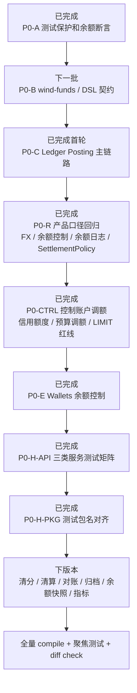

# 支付资金底座 P0 编码任务拆分

# 一、定位

本文把 PRD、DSL、OpenSpec、系分设计和 v4 代码 CR 遗留问题拆成 P0 编码任务。目标是让下一步代码实现可以按小步、可验证、可回滚的方式推进。

本文仍属于编码前设计和任务拆分，不修改 Java 代码。

执行前需同步阅读 `AI 编码协作执行计划.md`。其中的当前代码校准已调整：当前执行链路不再保留 `sourceObjectType/sourceObjectSn`，以 `businessScene/businessSn/reference` 作为基线；后续若需要来源事实身份，应引入明确的 `sourceFactRef`，不能复用业务流水。

2026-05-14 再校准结论：P0-A、P0-D 和 P0-F helper/route 主体已经落地；P0-B 已继续关闭 RouteReplay 拆分、Fx 汇率方向、JSON 样例、摘要契约和指令类型命名契约，剩余项集中在来源事实边界；当时建议下一批优先进入 P0-C、P0-E，并保留 P0-B 来源事实契约回归保护。该顺序已被 2026-05-16 P0-R 产品口径回归闸口再校准覆盖。

2026-05-15 CR 再校准结论：`businessScene/businessSn` 只表达本次业务动作身份，`reference` 表达本次动作引用的既有资金事实，`sourceFactRef` 延后到清结算、争议、对账差错等独立事实成熟后再作为值对象引入；资金余额调账必须使用平台 `ADJUSTMENT`，不得污染 `PREPAYMENT`；生命周期保存器目标态应增加 `supports` 并由组合代理分发；`LedgerTransactionCreateResult` 的幂等结果语义保留，后续可重命名；冻结只表达 `AVAILABLE <-> FROZEN` 控制，不表达消费或扣划；提现出款确认、追偿、退款或调账必须作为独立后续资金事实引用冻结单，消费一词仅用于授权链路 `AUTHORIZATION` 结算或产品报表口径。

2026-05-15 二次 CR 再校准结论：`wallet` 物理模块为空是边界设计债，但处理方式不是把历史钱包交易门面迁回 wallet，而是把账户、余额查询、账本配置、平台账户角色和支付工具等账户能力从 `transaction` 归位到 `wallet`；交易命令、冻结事实生命周期、路由和入账编排继续留在 `transaction`。本阶段还需要单独安排命名治理和测试资产治理；PMD 受 Aliyun snapshot 依赖解析缓存问题影响，暂不作为当前 CAD/Harness 阻塞门禁。

2026-05-15 CAD 落地状态：`wallet-face` 已接收余额查询、账本配置、主体开户初始化、平台资金账户、FundingAccount、CreditAccount、BudgetGroup、PaymentInstrument、SpendSubjectFundingRelation 等账户能力契约；平台账户角色、支付工具方向、支付工具绑定角色和支出主体资金关系类型已迁入 core wallet enums。账户能力实现、DAL、Mapper 和 Converter 已归位到 `wallet-impl`，并由 `WalletLayerBoundaryTests#testWalletImplShouldOwnAccountCapabilityImplementationsAndDal` 防止回流到 `transaction-impl`；`transaction-impl` 继续只承载交易事实、冻结事实生命周期、路由和入账编排。

2026-05-15 CAD 测试资产治理首轮状态：P0-H 已完成测试方法命名与关键资金语义说明首轮收口；`tests/src/test/java/com/capte/funds` 下 `@Test` 方法已统一为 `test...` 前缀，关键账务、路由、交易生命周期、冻结、账户能力测试已补“场景、输入、输出、预期、红线”说明。剩余 P0-H 工作集中在巨型测试类拆分和余额断言覆盖复核，不把 P0-H 整体误判为完全闭合。

2026-05-17 CAD 测试资产治理二轮状态：已先拆分账本入账巨型测试类，抽出 `LedgerTransactionPostingTestSupport`，并将入账前置校验用例迁入 `DefaultLedgerTransactionPostingValidationTests`；原 `DefaultLedgerTransactionPostingServiceImplTests` 聚焦成功入账、幂等、投影服务路由和 posting plan 币种/平衡校验；账本分录金额、账本绑定、profile 和主体类型红线已迁入 `DefaultLedgerEntryValidationTests`。P0-H 仍保留打开状态，后续继续复核余额断言覆盖和其他超大测试类职责拆分。

2026-05-17 CAD 测试资产治理三轮状态：继续拆分账务组装器巨型测试类，抽出 `DefaultLedgerPostingAssemblerTestSupport`，并将账期默认值和 period key 命中用例迁入 `DefaultLedgerPostingAssemblerPeriodTests`；原 `DefaultLedgerPostingAssemblerTests` 聚焦基础 posting plan、posting scope、余额约束覆盖、缺账本/币种红线、共享卡多主体授权和费用退款意图。P0-H 仍保留打开状态，后续继续复核余额断言覆盖和其他超大测试类职责拆分。

2026-05-17 CAD 测试资产治理四轮状态：继续拆分交易编排器巨型测试类，抽出 `DefaultRoutedFundsInstructionOrchestratorTestSupport`，并将退款、授权退款、费用退款、拒付、解冻和 `REPLAY_ONCE` 等 route snapshot 回放用例迁入 `DefaultRoutedFundsInstructionOrchestratorReplayTests`；原 `DefaultRoutedFundsInstructionOrchestratorTests` 聚焦普通路由编排、幂等短路、无账务路径、失败标记、无引用退款和 supports 能力匹配。P0-H 仍保留打开状态，后续继续复核余额断言覆盖和其他超大测试类职责拆分。

2026-05-17 CAD 测试资产治理五轮状态：继续拆分交易命令服务巨型测试类，抽出 `FundsTransactionCommandServiceImplTestSupport`，并将授权交易命令用例迁入 `FundsAuthorizationTransactionCommandServiceImplTests`，余额控制命令用例迁入 `FundsBalanceControlCommandServiceImplTests`；原 `FundsTransactionCommandServiceImplTests` 聚焦充值、支付、提现、转账、退款和手续费等直接交易命令。P0-H 仍保留打开状态，后续继续复核余额断言覆盖和其他超大测试类职责拆分。

2026-05-17 CAD 测试资产治理六轮状态：继续拆分账本交易服务巨型测试类，抽出 `LedgerTransactionServiceImplTestSupport`，并将 transaction、posting plan、entry 稳定摘要契约迁入 `LedgerTransactionDigestContractTests`；原 `LedgerTransactionServiceImplTests` 聚焦账本交易幂等入账、摘要冲突拒绝和 posting plan / entry 持久化元数据。P0-H 仍保留打开状态，后续继续复核余额断言覆盖和其他超大测试类职责拆分。

2026-05-17 CAD 测试资产治理六轮补充：继续拆分摘要契约测试，将 posting plan 稳定字段、`routeLegId`、`postingScope/balanceEffectType` 摘要用例迁入 `LedgerPostingPlanDigestContractTests`；`LedgerTransactionDigestContractTests` 聚焦交易级摘要和 entry 摘要回归断言。P0-H 仍保留打开状态，后续继续复核余额断言覆盖和其他超大测试类职责拆分。

2026-05-17 CAD 测试资产治理七轮状态：继续拆分钱包账户查询服务巨型测试类，抽出 `DefaultFundsAccountQueryServiceImplTestSupport`，并将批量余额展示查询迁入 `DefaultFundsSubjectBalanceQueryTests`，强一致 required balance 查询迁入 `DefaultFundsRequiredBalanceQueryTests`；原 `DefaultFundsAccountQueryServiceImplTests` 聚焦账户解析、supports fallback 和 getBalance 视图。P0-H 仍保留打开状态，后续继续复核余额断言覆盖和其他超大测试类职责拆分。

2026-05-17 CAD 测试资产治理八轮状态：继续拆分账本余额投影巨型测试类，抽出 `LedgerBalanceProjectionServiceImplTestSupport`，并将余额变更观察事件迁入 `LedgerBalanceProjectionEventTests`，负余额约束迁入 `LedgerBalanceProjectionNegativeConstraintTests`，写前账本一致性校验迁入 `LedgerBalanceProjectionValidationTests`；原 `LedgerBalanceProjectionServiceImplTests` 聚焦借贷方向基础投影。P0-H 仍保留打开状态，后续继续复核余额断言覆盖和其他超大测试类职责拆分。

2026-05-17 CAD 测试资产治理九轮状态：继续拆分资金交易查询服务测试，抽出 `DefaultFundsTransactionQueryServiceTestSupport`，并将 route snapshot 查询与冻结单快照回放迁入 `DefaultFundsTransactionRouteSnapshotQueryTests`；原 `DefaultFundsTransactionQueryServiceTests` 聚焦标准交易事实和明细查询。P0-H 仍保留打开状态，后续继续复核余额断言覆盖和其他超大测试类职责拆分。

2026-05-17 CAD 测试资产治理十轮状态：继续拆分钱包层边界测试，抽出 `WalletLayerBoundaryTestSupport`，并将 wallet-face 合约归属迁入 `WalletFaceContractBoundaryTests`，支付工具与支出主体资金关系契约迁入 `WalletInstrumentContractBoundaryTests`，wallet-impl 账户能力实现与 DAL 归属迁入 `WalletImplAccountCapabilityBoundaryTests`；原 `WalletLayerBoundaryTests` 聚焦 wallet 不直接写交易事实或账本事实的架构红线。P0-H 仍保留打开状态，后续继续复核余额断言覆盖和其他超大测试类职责拆分。

2026-05-17 CAD 测试资产治理十一轮状态：继续拆分资金指令生命周期保存器测试，将 beforePosting 建交易事实、明细和幂等键用例迁入 `DefaultFundsInstructionLifecycleBeforePostingTests`，将 markSucceeded 明细状态、授权汇总、费用汇总和提现冻结引用红线迁入 `DefaultFundsInstructionLifecycleSuccessSummaryTests`；原 `DefaultFundsInstructionLifecycleSaverTests` 聚焦 supports 能力判断。P0-H 仍保留打开状态，后续继续复核余额断言覆盖和其他超大测试类职责拆分。

2026-05-17 CAD 测试资产治理十二轮状态：继续拆分 Route Replay 服务测试，抽出 `DefaultRouteReplayServiceTestSupport`，并将授权结算/退款/拒付回放迁入 `DefaultRouteReplayAuthorizationTests`，直接交易退款和费用退款迁入 `DefaultRouteReplayDirectRefundTests`，回放策略、金额/币种校验和 FX 快照复用红线迁入 `DefaultRouteReplayPolicyTests`；原 `DefaultRouteReplayServiceTests` 聚焦授权释放回放基础语义。P0-H 仍保留打开状态，后续继续复核余额断言覆盖和其他超大测试类职责拆分。

2026-05-17 CAD 测试资产治理十三轮状态：继续拆分业务组合集成测试，抽出 `FundsTransactionBusinessFlowTestSupport`，并将手续费组合和费用退款累计上限用例迁入 `FundsTransactionFeeBusinessFlowTests`；当轮 `FundsTransactionBusinessFlowIntegrationTests` 暂时保留充值-付款-退款、冻结/解冻/提现、转账提现、资金/信用/预算调额和授权组合链路。P0-H 仍保留打开状态，后续继续复核余额断言覆盖和其他超大测试类职责拆分。

2026-05-17 CAD 测试资产治理十四轮状态：继续拆分交易编排流测试，抽出 `FundsTransactionOrchestrationFlowTestSupport`，并将授权撤销、授权结算、拒付和解冻等 route replay 编排场景迁入 `FundsTransactionOrchestrationReplayFlowTests`；原 `FundsTransactionOrchestrationFlowTests` 聚焦授权拒绝和充值、提现、退款、转账、手续费、付款等普通 route resolver -> orchestrator -> ledger posting 链路。P0-H 仍保留打开状态，后续继续复核余额断言覆盖和其他超大测试类职责拆分。

2026-05-17 CAD 测试资产治理十五轮状态：继续拆分业务组合集成测试，将授权部分撤销/结算/退款、授权直接结算、授权拒绝和共享卡授权组合迁入 `FundsAuthorizationBusinessFlowTests`；`FundsTransactionBusinessFlowIntegrationTests` 聚焦充值-付款-退款、冻结/解冻/提现、转账提现和资金/信用/预算调额组合。P0-H 仍保留打开状态，后续继续复核余额断言覆盖和其他超大测试类职责拆分。

2026-05-17 CAD 测试资产治理十六轮状态：继续拆分交易命令服务测试，将支付附带 `FeeSpec`、独立手续费、手续费退回和信用账户自定义手续费类型迁入 `FundsTransactionFeeCommandServiceImplTests`；`FundsTransactionCommandServiceImplTests` 聚焦充值、付款、提现、转账和退款主链路命令。P0-H 仍保留打开状态，后续继续复核余额断言覆盖和其他超大测试类职责拆分。

2026-05-17 CAD 测试资产治理十七轮状态：继续拆分钱包 ledger profile 测试，将 `getRequiredItem`、可控负余额策略元数据和缺失账目错误路径迁入 `DefaultLedgerProfileRequiredItemTests`；`DefaultLedgerProfileServiceImplTests` 聚焦账户 profile 的账目集合、主体类型和账目分类展示。P0-H 仍保留打开状态，后续继续复核余额断言覆盖和其他超大测试类职责拆分。

2026-05-17 CAD 测试资产治理十八轮状态：继续拆分钱包主体账本初始化测试，抽出 `DefaultSubjectLedgerInitializerTestSupport`，并将 profile 主体类型不匹配和既有账本 profile 漂移校验迁入 `DefaultSubjectLedgerInitializerValidationTests`；`DefaultSubjectLedgerInitializerTests` 聚焦必需账本创建和重复初始化幂等复用。P0-H 仍保留打开状态，后续继续复核余额断言覆盖和其他超大测试类职责拆分。

2026-05-17 CAD 测试资产治理十九轮状态：继续拆分冻结单生命周期保存器测试，抽出 `DefaultFundsFrozenOrderLifecycleSaverTestSupport`，并将解冻缺少冻结单引用校验迁入 `DefaultFundsFrozenOrderLifecycleValidationTests`；`DefaultFundsFrozenOrderLifecycleSaverTests` 聚焦 supports、冻结创建、解冻释放和释放余额计算。P0-H 仍保留打开状态，后续继续复核余额断言覆盖和其他超大测试类职责拆分。

2026-05-17 CAD 测试资产治理二十轮状态：继续拆分资金指令生命周期成功汇总测试，将直接交易手续费汇总和独立收费汇总迁入 `DefaultFundsInstructionLifecycleFeeSummaryTests`；`DefaultFundsInstructionLifecycleSuccessSummaryTests` 聚焦授权成功/拒绝、共享卡授权汇总和提现冻结单引用红线。P0-H 仍保留打开状态，后续继续复核余额断言覆盖和其他超大测试类职责拆分。

2026-05-17 CAD 测试资产治理二十一轮状态：继续拆分资金指令生命周期幂等测试，将授权引用复用原主交易和冻结单引用不复用主交易的边界迁入 `DefaultFundsInstructionLifecycleReferenceTransactionTests`；`DefaultFundsInstructionLifecycleSaverIdempotencyTests` 聚焦重复 beforePosting、路由语义变化和 route snapshot 临时元数据不参与 requestHash 的幂等红线。P0-H 仍保留打开状态，后续继续复核余额断言覆盖和其他超大测试类职责拆分。

2026-05-17 CAD 测试资产治理二十二轮状态：继续拆分组合生命周期记录器测试，将 `CompositeFundsInstructionLifecycleSaver` 废弃兼容别名校验迁入 `DelegatingFundsInstructionLifecycleRecorderCompatibilityTests`；`DelegatingFundsInstructionLifecycleRecorderTests` 聚焦唯一支持者分发、无支持者拒绝和多支持者拒绝的运行时红线。P0-H 仍保留打开状态，后续继续复核余额断言覆盖和其他超大测试类职责拆分。

2026-05-17 CAD 测试资产治理二十三轮状态：继续拆分账本分录校验测试，将外部账户、缺少主体类型和未知主体类型等主体入账边界迁入 `DefaultLedgerEntrySubjectValidationTests`；`DefaultLedgerEntryValidationTests` 聚焦金额、ledgerId/主体绑定和 profile 余额约束。P0-H 仍保留打开状态，后续继续复核余额断言覆盖和其他超大测试类职责拆分。

2026-05-17 CAD 测试资产治理二十四轮状态：继续拆分指标边界扫描测试，抽出 `MetricBoundaryTestSupport` 统一生产源码扫描工具，并将指标异常不得修改资金事实的红线迁入 `MetricFactMutationBoundaryTests`；`MetricWatermarkBoundaryTests` 聚焦指标水位不得复用余额归档边界、且必须在计算、快照写入和校验后推进。P0-H 仍保留打开状态，后续继续复核余额断言覆盖和其他超大测试类职责拆分。

2026-05-17 CAD 测试资产治理二十五轮状态：继续收敛账本摘要契约测试职责，将 `LedgerTransactionDigestContractTests` 中重复覆盖的 entry 级摘要用例移除，entry 稳定字段、账务语义和汇率摘要红线统一由 `LedgerEntryDigestContractTests` 承接；`LedgerTransactionDigestContractTests` 聚焦交易级稳定字段和引用账本交易号摘要红线。P0-H 仍保留打开状态，后续继续复核余额断言覆盖和其他超大测试类职责拆分。

2026-05-17 CAD 测试资产治理二十六轮状态：继续拆分直接交易 route resolver 测试，抽出 `TransferFundsInstructionRouteResolverTestSupport` 统一租户上下文、converter 和 route leg 断言，并将转账附带手续费、信用账户付款附带手续费和独立收费 route 场景迁入 `TransferFundsInstructionFeeRouteResolverTests`；`TransferFundsInstructionRouteResolverTests` 聚焦充值、提现、付款和转账主路径。P0-H 仍保留打开状态，后续继续复核余额断言覆盖和其他超大测试类职责拆分。

2026-05-17 CAD 测试资产治理二十七轮状态：继续拆分余额控制 route resolver 测试，将资金账户余额调增、余额调减、受控负余额和治理证据缺失场景迁入 `BalanceControlFundingAdjustRouteResolverTests`；`BalanceControlFundsInstructionRouteResolverTests` 聚焦冻结、解冻和冻结事实边界，信用账户/预算组 `LIMIT_ADJUST` 仍由 `BalanceControlLimitAdjustRouteResolverTests` 承接。P0-H 仍保留打开状态，后续继续复核余额断言覆盖和其他超大测试类职责拆分。

2026-05-17 CAD 测试资产治理二十八轮状态：继续拆分授权 route resolver 测试，抽出 `AuthorizationFundsInstructionRouteResolverTestSupport` 统一租户上下文、授权 converter、共享卡指令构造和余额约束断言，并将共享卡授权成功、共享卡授权结算场景迁入 `AuthorizationSharedCardFundsInstructionRouteResolverTests`；`AuthorizationFundsInstructionRouteResolverTests` 聚焦授权拒绝和单主体授权结算基础路径。P0-H 仍保留打开状态，后续继续复核余额断言覆盖和其他超大测试类职责拆分。

2026-05-17 CAD 测试资产治理二十九轮状态：继续拆分交易编排回放测试，将费用退款回放和手续费退回累计超额拒绝场景迁入 `DefaultRoutedFundsInstructionOrchestratorFeeReplayTests`；`DefaultRoutedFundsInstructionOrchestratorReplayTests` 聚焦普通逆向、授权退款、拒付、`REPLAY_ONCE` 和解冻回放编排路径。P0-H 仍保留打开状态，后续继续复核余额断言覆盖和其他超大测试类职责拆分。

2026-05-17 CAD 测试资产治理三十轮状态：继续拆分直接交易命令服务测试，将充值资金来源、提现收款方和转账同主体等进入 orchestrator 前的入参拒绝场景迁入 `FundsTransactionCommandValidationTests`；`FundsTransactionCommandServiceImplTests` 聚焦充值、付款、提现、转账和退款主链路命令。P0-H 仍保留打开状态，后续继续复核余额断言覆盖和其他超大测试类职责拆分。

2026-05-17 CAD 测试资产治理三十一轮状态：继续拆分钱包余额展示查询测试，将跨租户、错币种和重复主体引用等查询校验场景迁入 `DefaultFundsSubjectBalanceQueryValidationTests`；`DefaultFundsSubjectBalanceQueryTests` 聚焦展示查询顺序、账本桶过滤、周期余额和未初始化展示语义。P0-H 仍保留打开状态，后续继续复核余额断言覆盖和其他超大测试类职责拆分。

2026-05-17 CAD 测试资产治理三十二轮状态：继续拆分账本 posting plan 前置校验测试，将 plan 内空分录、分录交易流水为空和分录交易流水不一致等 entry 绑定校验迁入 `DefaultLedgerPostingPlanEntryValidationTests`；`DefaultLedgerPostingPlanValidationTests` 聚焦 posting plan 自身结构、planId、所属交易流水和 entries 集合约束。P0-H 仍保留打开状态，后续继续复核余额断言覆盖和其他超大测试类职责拆分。

2026-05-17 CAD 测试资产治理三十三轮状态：继续拆分钱包余额展示查询测试，将未建账、真实 0 余额和局部余额桶缺失等初始化展示语义迁入 `DefaultFundsSubjectBalanceQueryInitializationTests`；`DefaultFundsSubjectBalanceQueryTests` 聚焦批量展示顺序、账本桶过滤和周期余额查询。P0-H 仍保留打开状态，后续继续复核余额断言覆盖和其他超大测试类职责拆分。

2026-05-17 CAD 测试资产治理三十四轮状态：继续拆分账本交易服务测试，将同流水同摘要幂等重放和同流水不同摘要冲突拒绝场景迁入 `LedgerTransactionServiceIdempotencyTests`；`LedgerTransactionServiceImplTests` 聚焦账本交易、posting plan 和 entry 持久化元数据。P0-H 仍保留打开状态，后续继续复核余额断言覆盖和其他超大测试类职责拆分。

2026-05-17 CAD 测试资产治理三十五轮状态：继续拆分账本分录摘要契约测试，抽出 `LedgerEntryDigestContractTestSupport` 统一账本分录构造和摘要重算，汇率摘要红线迁入 `LedgerEntryExchangeRateDigestContractTests`；`LedgerEntryDigestContractTests` 聚焦稳定字段排除和核心账务语义摘要。P0-H 仍保留打开状态，后续继续复核余额断言覆盖和其他超大测试类职责拆分。

2026-05-17 CAD 测试资产治理三十六轮状态：继续拆分资金交易幂等摘要契约测试，抽出 `FundsIdempotencyDigestContractTestSupport` 统一 route、snapshot 和 mapper fixture，核心资金事实变化拒绝复用场景迁入 `FundsIdempotencyCoreFundsDigestContractTests`；`FundsIdempotencyDigestContractTests` 聚焦持久化流水、审计时间、展示文案和 traceId 等易变字段排除。P0-H 仍保留打开状态，后续继续复核余额断言覆盖和其他超大测试类职责拆分。

2026-05-17 CAD 测试资产治理三十七轮状态：继续拆分冻结单服务测试，将冻结入账流水非必填、冻结单历史消费兼容字段废弃和 H2 schema 允许待生成冻结账本流水迁入 `FundsFrozenOrderCompatibilityContractTests`；`FundsFrozenOrderServiceImplTests` 聚焦冻结单创建、状态初始化、账本流水后置生成和创建前业务校验。P0-H 仍保留打开状态，后续继续复核余额断言覆盖和其他超大测试类职责拆分。

2026-05-17 CAD 测试资产治理三十八轮状态：继续治理资金指令生命周期 beforePosting 测试资产，抽出 `BeforePostingFixture` 与 `beforePostingSaver()` 统一主交易和明细插入捕获；`DefaultFundsInstructionLifecycleBeforePostingTests` 保留建交易事实、业务幂等键、回放 leg 记录和共享卡主交易金额红线断言。P0-H 仍保留打开状态，后续继续复核余额断言覆盖和其他超大测试类职责拆分。

2026-05-17 CAD 测试资产治理三十九轮状态：继续治理组合生命周期记录器测试资产，抽出 `DelegatingFundsInstructionLifecycleRecorderTestSupport` 统一 instruction、route、snapshot 和 recording recorder fixture；`DelegatingFundsInstructionLifecycleRecorderTests` 聚焦唯一支持者委派、无支持者拒绝和多支持者拒绝三条运行时红线。P0-H 仍保留打开状态，后续继续复核余额断言覆盖和其他超大测试类职责拆分。

2026-05-17 CAD 测试资产治理四十轮状态：继续拆分账本入账前置校验测试，将交易金额、原始金额和汇率必须大于 0 的金额快照红线迁入 `DefaultLedgerTransactionPostingAmountValidationTests`；`DefaultLedgerTransactionPostingValidationTests` 聚焦空交易、空流水号、缺金额和非 POSTED 状态等入口前置校验。P0-H 仍保留打开状态，后续继续复核余额断言覆盖和其他超大测试类职责拆分。

2026-05-17 CAD 测试资产治理四十一轮状态：继续拆分交易编排组合流测试，将充值和提现等外部入金/出金两段式编排场景迁入 `FundsFundingOrchestrationFlowTests`；`FundsTransactionOrchestrationFlowTests` 聚焦授权拒绝、退款、转账、手续费和付款等 direct route 编排路径。P0-H 仍保留打开状态，后续继续复核余额断言覆盖和其他超大测试类职责拆分。

2026-05-17 CAD 测试资产治理四十二轮状态：继续拆分授权交易命令服务测试，将授权撤销、授权结算、授权退款和授权拒付等 route replay 命令场景迁入 `FundsAuthorizationReplayCommandServiceImplTests`；`FundsAuthorizationTransactionCommandServiceImplTests` 聚焦授权问询 approve/decline 两条入口命令路径。P0-H 仍保留打开状态，后续继续复核余额断言覆盖和其他超大测试类职责拆分。

2026-05-17 CAD 测试资产治理四十三轮状态：继续拆分账务组装器测试，将缺账本和账本币种不一致等写前校验红线迁入 `DefaultLedgerPostingAssemblerValidationTests`；`DefaultLedgerPostingAssemblerTests` 聚焦 route leg 到 posting plan 的正常组装、posting scope、constraint override、多主体授权和费用退款 intent。P0-H 仍保留打开状态，后续继续复核余额断言覆盖和其他超大测试类职责拆分。

2026-05-17 CAD 测试资产治理四十四轮状态：继续治理资金指令生命周期幂等测试资产，将 beforePosting 首次建事实与重放复用 saver 的重复夹具收敛到 `FundsInstructionLifecycleSaverTestSupport.BeforePostingReplayFixture`；`DefaultFundsInstructionLifecycleSaverIdempotencyTests` 聚焦已完成明细复用、路由语义变化拒绝和 route snapshot 临时元数据不参与 requestHash 三条幂等红线。P0-H 仍保留打开状态，后续继续复核余额断言覆盖和其他超大测试类职责拆分。

2026-05-17 CAD 测试资产治理四十五轮状态：继续拆分钱包 ledger profile 测试，将资金账户和平台资金账户 profile 场景迁入 `DefaultLedgerProfileFundingAccountTests`，预算组 profile 场景迁入 `DefaultLedgerProfileBudgetGroupTests`；`DefaultLedgerProfileRequiredItemTests` 继续承接受控负余额策略和缺账目错误路径。P0-H 仍保留打开状态，后续继续复核余额断言覆盖和其他超大测试类职责拆分。

2026-05-17 CAD 测试资产治理四十六轮状态：继续拆分授权业务组合测试，将共享卡多主体授权场景迁入 `FundsSharedCardAuthorizationBusinessFlowTests`；`FundsAuthorizationBusinessFlowTests` 聚焦授权问询、部分撤销、部分结算、部分退款、授权拒绝和授权直接结算。P0-H 仍保留打开状态，后续继续复核余额断言覆盖和其他超大测试类职责拆分。

2026-05-17 CAD 测试资产治理四十七轮状态：继续拆分直接交易指令 converter 测试，将独立手续费和手续费退回指令转换场景迁入 `FundsDirectTransactionFeeInstructionConverterTests`；`FundsDirectTransactionInstructionConverterTests` 聚焦 topup、transfer、pay、withdraw、refund 主链路和错币种红线。P0-H 仍保留打开状态，后续继续复核余额断言覆盖和其他超大测试类职责拆分。

2026-05-17 CR 再校准结论：当前版本剩余任务重新收敛为交易、钱包和 ledger 层测试与实现闭环，优先补齐 `FundsDirectTransactionService`、`FundsAuthorizationTransactionService`、`FundsBalanceControlService` 的服务门面单元测试、业务组合集成测试和测试包名对齐；上述 P0-H-006/P0-H-007 已完成。清分、清算、对账、账本账目归档、余额快照、完整 FX 运营对象和相关运营工作台统一排入下一个版本；当前 CAD 自动提交批次不再推进这些任务。

2026-05-15 CAD Ledger Posting 主链路首轮状态：P0-C 已完成写前红线和投影缺省语义首轮收口；账本入账已覆盖金额为正、账目允许、route leg 追溯、重复入账不重复投影、缺账本失败；余额投影已覆盖缺账本失败、缺余额桶失败和展示查询可返回未初始化状态。`LedgerTransactionCreateResult` 已通过兼容桥接收敛为 `LedgerTransactionPostResult` 主契约，旧结果对象保留为废弃兼容别名。

2026-05-15 CAD 命名治理首轮状态：P0-G 已完成低风险兼容命名收敛：账本入账结果以 `LedgerTransactionPostResult` 表达幂等入账结果；生命周期写侧端口以 `FundsInstructionLifecycleRecorder` 作为主契约，`FundsInstructionLifecycleSaver` 保留为废弃兼容别名；组合分发实现以 `DelegatingFundsInstructionLifecycleRecorder` 作为主类，`CompositeFundsInstructionLifecycleSaver` 保留为废弃兼容别名。剩余 P0-G 工作集中在账户类型枚举、余额控制服务命名等后续独立轮次。

2026-05-17 CAD 命名治理二次状态：P0-G 已完成账户类型语义轴回写。`DefaultFundsAccountType` 继续作为迁移期兼容枚举，`ExternalFundsAccountType`、`FundingAccountType`、`UserWalletFundsAccountType`、`CreditFundsAccountType`、`FundsSubjectType`、`PlatformFundingAccountRole` 分别承接外部账户、资金账户产品、用户钱包、共享/信用卡、账务主体和平台账户角色语义。返利账户定性为平台对用户的返利负债型资金账户，预付卡账户定性为资金账户，只有共享卡和信用卡进入信用账户轴；`DefaultFundsAccountTypeTests` 与 `PlatformFundingAccountRoleTests` 保护兼容判断、角色命名和边界。包名统一属于独立重构轮次，不在当前 P0-G 中夹带大迁移。

2026-05-16 CAD 设计校准结论：余额投影事件需要补业务可切入的余额变更日志口子，但日志只是由 `LedgerEntry` 派生的观察记录，不替代账本事实；`SettlementPolicySpec` 已具备 `RT/T+N/H+N/W/M/Q/Y/C` 表达式解析能力，清结算实现不能只按 `RT` 默认策略长期固化，候选、批次、结算单必须留存产品层 `SettlementPolicy` 的编码、版本、表达式和时区等字段；交易层不应在 converter 中直接调用 `FxService` 自动换汇，是否换汇由业务层或外汇域先决策，交易层只接收并校验显式 FX 结果快照，错币种且缺少 FX 决策时必须失败、挂账或进入差错流程；`FundsBalanceControlService` 进一步排除在 FX 支持范围外，冻结、解冻、余额调账和额度/预算调整金额必须已经是账户或账本币种。

2026-05-16 产品与 PRD 对齐后任务规划再校准：主 PRD、产品 TDD、业务轨道、商户清结算、红线和交易视图投影已同步上述口径。下一轮代码前置不再直接跳到 P0-E 或清结算批处理，而是先执行 P0-R 产品口径回归闸口：撤回交易 converter 自动换汇、固化余额控制无 FX 边界、补余额变更日志观察口子、补非 RT `SettlementPolicySpec` 契约和静默降级红线。P0-R 通过后，再继续 P0-E、P0-G/P0-H 的剩余治理。

# 二、拆分原则

1. 先补能发现资金错误的测试，再调整结构。
2. 先保护账本主链路，再迁移交易门面。
3. 先让字段和契约显式，再收敛 helper 和字面量。
4. 每个任务必须有验收测试和本地验证命令。
5. 不把完整清结算批处理、归档落表和完整 Fx 运营对象混入第一批 P0 代码；但错币种红线、余额控制无 FX、余额变更观察口子和结算策略表达式契约必须作为 P0 回归闸口先闭合。

# 三、P0 工作包状态

| 工作包 | 范围 | 目标 |
| --- | --- | --- |
| P0-A | 测试保护和余额断言 | 已完成。资金变化用例已有余额断言和业务组合集成测试，后续作为回归保护。 |
| P0-B | wind-funds / DSL 契约 | 当前版本已完成。route leg 稳定引用、RouteReplay 命名、JSON 样例、摘要边界和指令类型命名已可测试；Fx 字段命名、汇率方向、交易层不自动调用 `FxService` 和 `TransactionAmount` 金额契约已有测试保护；来源事实边界已用回归测试锁住，`sourceFactRef` 保留到后续独立事实模型任务。 |
| P0-C | Ledger Posting 主链路 | 已完成首轮。posting plan、entry、balance projection 的写前红线、追溯、幂等和缺省语义已收口；幂等入账结果主契约已收敛为 `LedgerTransactionPostResult`。 |
| P0-D | Transaction Layer 服务门面 | 已完成主体迁移。直接交易、授权交易、余额控制归属 transaction application 层，后续作为边界回归保护。 |
| P0-E | Wallets 账户与余额控制 | 已完成主体收口。wallet 服务归位、账户 profile、平台角色、冻结事实边界、控制账户账目红线和受控负余额策略已有测试保护。 |
| P0-F | Route/helper/Fx 收敛 | helper 和 RouteResolver 稳定字面量已闭合；Fx 汇率方向、字段命名、converter 不直接调用 `FxService` 和错币种失败边界已有测试保护；完整外汇运营对象进入 P1。 |
| P0-R | 产品口径回归闸口 | 已完成。FX 决策外置、余额控制无 FX、余额变更日志观察和非 RT 结算策略契约已有红线测试保护。 |
| P0-G | 命名治理 | 已完成主体收口。账本入账结果、生命周期写侧端口、余额控制服务命名和账户类型语义轴已完成兼容命名收敛；包名统一保留为独立重构轮次。 |
| P0-H | 测试资产治理 | 当前版本重点已完成。三类服务测试矩阵、业务组合集成测试补齐和测试包名对齐已闭合；后续只保留余额断言审查、超大测试类继续拆分和小型测试资产维护。 |

# 四、任务明细

## 4.1 P0-A：测试保护和余额断言

当前状态：已完成主体实现。已落地 `FundsBalanceAssertionSupport`、`FundsTransactionLedgerBalanceAssertionsTests`、`FundsTransactionBusinessFlowIntegrationTests`，并覆盖核心业务组合链路；本节后续作为回归保护清单。

| 编号 | 任务 | 修改方向 | 验收 |
| --- | --- | --- | --- |
| P0-A-001 | 建立资金余额断言测试工具。 | 已落地 `tests/src/test/java/com/capte/funds/support/FundsBalanceAssertionSupport.java`。 | 能断言主体、账目、币种、period、金额和 initialized 状态。 |
| P0-A-002 | 补所有资金变化核心测试的余额断言。 | 已通过交易命令、route/orchestration 和组合链路测试覆盖核心资金变化。 | 每个资金变化用例至少断言交易前后相关主体余额桶、posting 平衡和幂等结果。 |
| P0-A-003 | 增加业务组合集成测试：充值 -> 付款 -> 退款。 | 已落地 `FundsTransactionBusinessFlowIntegrationTests`。 | A 充值后余额增加；付款后 A 减少、商户或 B 增加；退款后按原路径回补。 |
| P0-A-004 | 增加业务组合集成测试：充值 -> 冻结 -> 提现。 | 已落地 `FundsTransactionBusinessFlowIntegrationTests`。 | 冻结只做 `AVAILABLE -> FROZEN`；提现消耗 `FROZEN`；外部出金路径和平台账户变化可解释。 |
| P0-A-005 | 增加业务组合集成测试：A 充值 -> 转给 B -> B 付款 -> B 提现。 | 已落地 `FundsTransactionBusinessFlowIntegrationTests`。 | A、B、收款方、平台账户最终余额均正确；重复请求不重复入账。 |

详细实施约束见 `P0-A 余额断言与业务组合测试实施设计.md`。第一批优先延续现有纯 JUnit + fake/recording collaborator 测试风格；只有需要验证 mapper、H2 schema 或本地事务时再启动 Spring/H2 集成测试。

建议测试类：

1. `FundsBalanceAssertionSupport`
2. `FundsTransactionBusinessFlowIntegrationTests`
3. `FundsTransactionLedgerBalanceAssertionsTests`

建议验证命令：

```bash
mvn -pl tests -am test -Dtest=FundsTransactionLedgerBalanceAssertionsTests,FundsTransactionBusinessFlowIntegrationTests
mvn -pl tests -am test -Dtest=FundsTransactionCommandServiceImplTests,FundsTransactionOrchestrationFlowTests
```

## 4.2 P0-B：wind-funds / DSL 契约

| 编号 | 任务 | 修改方向 | 验收 |
| --- | --- | --- | --- |
| P0-B-001 | 来源事实引用模型收敛。 | 当前 `FundsInstructionSpec`、`ResolvedRouteSpec`、`RouteSnapshotSpec`、`LedgerTransactionSpec` 不再承载 `sourceObjectType/sourceObjectSn`；先以 `businessScene/businessSn/reference` 覆盖执行链路，后续独立事实成熟后再设计 `sourceFactRef`。 | 资金交易、冻结、清算单据、对账差错和争议单不会把业务流水伪装成资金事实流水；新增来源事实引用前有契约测试。 |
| P0-B-002 | 补 Fx 契约边界。 | 目标态调整为交易层不直接调用 `FxService`。业务层或外汇域先完成是否换汇、汇率来源、审批和外部结果决策，再把 `originalAmount`、`amount`、`exchangeRate`、`fxQuoteId/rateId/provider/currencyPair/approvalRef` 等快照传给交易层；当前 converter 自动调用 `FxService` 只能视为待撤回实现。 | 同币种 `rate=1`；错币种且无显式 FX 决策必须失败、挂账或进入差错流程；有 FX 决策时保留原币、目标币、汇率和依据；交易层不得静默换币入账。 |
| P0-B-003 | 补 route leg 稳定引用。 | 已在 `LedgerPostingPlanSpec#getRouteLegId` 和 assembler 映射层补显式 route leg 引用，并同步上下文变量。 | posting plan 和 entry 能追溯到原 route leg，replay 可定位。 |
| P0-B-004 | 补摘要字段契约。 | 已补齐 ledger transaction、posting plan、entry 的稳定摘要字段：排除持久化流水、审计时间、展示文案，纳入引用交易流水、账务 scope/effect、账目类别、intent 和 phase。PostingPlan 暂不纳入 `ledgerTransactionSn`，等待独立稳定 transaction key。 | 同一业务事实重建摘要一致；关键账务语义变化会导致摘要变化。 |
| P0-B-005 | 补 JSON 契约样例。 | 已在 `core/src/test/resources/dsl/transaction-layer/` 落地 `direct-platform-transfer.json`、`direct-wallet-payment-with-fee.json`、`reverse-refund-original-route.json`、`authorization-approve-multi-subject.json`、`authorization-decline-no-posting.json`、`balance-freeze-order.json`、`transaction-view-replay-range.json`，并由 `TransactionServiceAbilityDslJsonContractTests` 校验。 | 样例可解析；服务能力覆盖直接交易、逆向交易、授权交易、余额控制、查询与重放；posting plan 同币种借贷平衡；授权拒绝和交易视图重放不生成 route/entry。 |
| P0-B-006 | RouteReplay 命名契约收敛。 | 已把 `RouteReplayType.CAPTURE` 收敛为 `AUTHORIZATION_SETTLEMENT`，并补齐 `AUTHORIZATION_REFUND`、`FEE_REFUND` 独立 replay 类型；编排器、回放服务和契约测试已同步。 | 授权结算语义不再依赖 `CAPTURE`；授权退款、普通退款、费用退款 replay 语义分离，费用退款只回放费用 leg。 |
| P0-B-007 | 指令类型命名契约收敛。 | 已把 `FundsInstructionType.TRANSFER/AUTHORIZATION` 收敛为 `DIRECT_TRANSACTION/AUTHORIZATION_TRANSACTION`；逆向交易仍通过 `serviceAbility=REVERSE_TRANSACTION` 和原交易引用表达，指令路由继续复用直接交易指令类型。 | 代码、DSL JSON 和契约测试均不再使用旧指令类型；交易事件、账务 intent、phase 仍保留 `TRANSFER/AUTHORIZATION` 等业务语义。 |

建议测试类：

1. `FundsInstructionSpecContractTests`
2. `RouteDslContractTests`
3. `TransactionServiceAbilityDslJsonContractTests`
4. `LedgerEntryDigestContractTests`

建议验证命令：

```bash
mvn -pl core -am test -Dtest=FundsInstructionSpecContractTests,RouteDslContractTests
mvn -pl core -am test -Dtest=TransactionServiceAbilityDslJsonContractTests,LedgerEntryDigestContractTests
```

## 4.3 P0-C：Ledger Posting 主链路

| 编号 | 任务 | 修改方向 | 验收 |
| --- | --- | --- | --- |
| P0-C-001 | PostingPlan 平衡校验固化。 | `DefaultLedgerPostingAssembler`、`DefaultLedgerTransactionPostingServiceImpl`。 | 单 plan 和整笔 ledger transaction 均同币种借贷平衡。 |
| P0-C-002 | Entry 摘要稳定字段落地。 | `LedgerEntry` 摘要已纳入 `ledgerSubjectCategory`、`intent`、`postingScope`、`balanceEffectType`、`phaseCode` 等稳定账务语义字段。 | 摘要不包含 entry sn、数据库 id、持久化时间；账目类别、intent、scope、effect、phase 变化会改变摘要。 |
| P0-C-003 | 余额桶断言能力。 | 已通过 `LedgerBalanceProjectionServiceImplTests` 与 `DefaultFundsAccountQueryServiceImplTests` 覆盖写流程余额桶和展示查询余额桶语义。 | 资金账户、信用账户、预算组各账目余额可查询、可断言。 |
| P0-C-004 | 缺账本策略收敛。 | 已区分写流程和展示查询：`LedgerBalanceProjectionServiceImpl` 写流程缺账本或缺余额桶失败；`DefaultFundsAccountQueryServiceImpl` 展示查询可返回未初始化状态。 | 写流程缺账本失败；展示查询可返回未初始化状态。 |
| P0-C-005 | 账本交易幂等结果命名收敛。 | 已新增 `LedgerTransactionPostResult` 作为主契约，`LedgerTransactionCreateResult` 保留为废弃兼容别名；`LedgerTransactionService#postLedgerTransaction` 作为新入口，旧 `createLedgerTransaction` 作为默认兼容桥。 | 重复 ledger posting 不重复投影余额，不把 UK 冲突映射成资金交易失败；命名能表达幂等入账结果而非单纯创建 DTO。 |

建议测试类：

1. `DefaultLedgerPostingAssemblerTests`
2. `DefaultLedgerTransactionPostingServiceImplTests`
3. `LedgerBalanceProjectionServiceImplTests`
4. `DefaultFundsAccountQueryServiceImplTests`

建议验证命令：

```bash
mvn -pl tests -am test -Dtest=DefaultLedgerPostingAssemblerTests,DefaultLedgerTransactionPostingServiceImplTests
mvn -pl tests -am test -Dtest=LedgerBalanceProjectionServiceImplTests,DefaultFundsAccountQueryServiceImplTests
```

## 4.4 P0-D：Transaction Layer 服务门面

当前状态：主体已完成。`transaction-face/application` 已提供 `FundsDirectTransactionService`、`FundsAuthorizationTransactionService`、`FundsBalanceControlService`，实现类为 `FundsTransactionCommandServiceImpl`；`FundsBalanceControlTransactionService` 保留为废弃兼容别名。本节后续作为回归保护清单，避免 wallet 层重新承载交易事实编排。

| 编号 | 任务 | 修改方向 | 验收 |
| --- | --- | --- | --- |
| P0-D-001 | 新增或调整 transaction-face 交易门面。 | 已落地 application 包下三类交易门面。 | 业务侧入口不再以 wallet 历史命名表达交易编排。 |
| P0-D-002 | wallet 服务降级为适配或迁移。 | wallet 边界测试已保护不直接写交易事实或账本事实。 | wallet 层不承载交易层事实编排语义；如保留适配器，应只委托 transaction layer。 |
| P0-D-003 | 来源事实生命周期调整。 | 当前执行链路不写 `sourceObjectType/sourceObjectSn`；保留 `businessScene/businessSn/reference`。 | 当前链路不写伪来源事实；若未来事实先行，则 route snapshot 固化真实 `sourceFactRef`。 |
| P0-D-004 | 授权拒绝和争议拒付拆分。 | 代码和测试已有授权拒绝、争议拒付不同事件口径；后续继续回归保护。 | 授权拒绝无 route/entry；争议拒付进入独立逆向或追偿事实。 |
| P0-D-005 | 失败事实保留策略。 | 后续仍可作为异常路径专项优化。 | 事务失败回滚资金影响；如需保留失败事实，使用独立失败事务或失败事件。 |
| P0-D-006 | 生命周期 saver 组合分发。 | 为 `FundsInstructionLifecycleSaver` 增加 `supports`，新增组合代理分发到标准交易 saver 或冻结订单 saver。 | 每个指令必须且只能命中一个 saver；冻结/解冻不创建 `FundsTransaction`；直接/授权/逆向交易不进入冻结 saver。 |

建议测试类：

1. `FundsTransactionServiceApiContractTests`
2. `DefaultRoutedFundsInstructionOrchestratorTests`
3. `DefaultFundsInstructionLifecycleSaverTests`
4. `WalletLayerBoundaryTests`

建议验证命令：

```bash
mvn -pl tests -am test -Dtest=FundsTransactionServiceApiContractTests,DefaultRoutedFundsInstructionOrchestratorTests
mvn -pl tests -am test -Dtest=DefaultFundsInstructionLifecycleSaverTests,WalletLayerBoundaryTests
```

## 4.5 P0-E：Wallets 账户与余额控制

| 编号 | 任务 | 修改方向 | 验收 |
| --- | --- | --- | --- |
| P0-E-001 | wallet 服务边界归位。 | face 契约、账户能力实现、DAL、Mapper 和 Converter 已归位到 `wallet-face` / `wallet-impl`；`transaction-impl` 不再拥有账户能力实现和账户配置 DAL。 | `wallet-face` 不再为空；`wallet-impl` 拥有账户、账本配置、平台账户、支付工具和支出主体资金关系能力；wallet 不直接写 `FundsTransaction` 或 `LedgerTransaction`；`WalletLayerBoundaryTests` 保护职责边界。 |
| P0-E-002 | 冻结订单事实闭环。 | `FundsFrozenOrderService`、冻结请求、冻结 route。 | 冻结/解冻不创建 `FundsTransaction`；但生成平衡 ledger transaction。 |
| P0-E-003 | 受控负 `AVAILABLE` 策略。 | 资金账户、信用账户、预算组余额策略。 | 负数有策略、上限、原因、审批、账龄；后续交易必须重新校验。 |
| P0-E-004 | 账户 profile 补齐。 | `LedgerProfileCode`、`DefaultLedgerProfileServiceImpl`。 | 商户资金账户、普通资金账户、信用账户、预算组账目集合符合 PRD；`ControlAccountLedgerRulesTests` 保护信用账户和预算组只暴露 `LIMIT/AVAILABLE/AUTHORIZATION` 控制账目，不新增账务 `CONSUMED`。 |
| P0-E-005 | 平台账户角色收敛。 | 已落地 `PlatformFundingAccountRole` 目标态角色：`CASH_MAPPING/PREPAYMENT/CLEARING/SETTLEMENT/FEE/ADJUSTMENT`；`PlatformAccountRouteSupport` 已提供按场景创建平台账户快照的方法；余额调账 route 使用平台 `ADJUSTMENT` 承接，不落入 `PREPAYMENT`。 | 已覆盖 `PlatformFundingAccountRoleTests`、`DefaultLedgerProfileFundingAccountTests`、`BalanceControlFundsInstructionRouteResolverTests`；现金映射、预收待付、清算过渡、结算应付、费用归集、调整挂账命名和账目映射清楚。 |
| P0-E-006 | 冻结后扣划/核销独立事实建模。 | 已将 `PARTIALLY_CONSUMED/CONSUMED` 和 `consumedAmount/consumeTime` 标记为兼容废弃；冻结创建拒绝消费状态；冻结服务公开 API 不提供 consume/settle/deduct；解冻剩余金额只按 `releasedAmount` 计算，不受兼容 `consumedAmount` 影响。提现出款确认、追偿、退款或调账等后续价值转移必须作为独立资金事实通过 `reference=FREEZE_ORDER` 引用冻结单。 | 已覆盖 `FundsFrozenOrderServiceImplTests`、`DefaultFundsFrozenOrderLifecycleSaverTests`、`FundsFrozenOrderBoundaryTests`；冻结单只承担冻结、解冻、释放和审计，后续价值转移不得靠冻结单状态表达，也不得替代授权链路 `AUTHORIZATION`。 |

建议测试类：

1. `FundsFrozenOrderServiceImplTests`
2. `BalanceControlFundsInstructionRouteResolverTests`
3. `DefaultLedgerProfileFundingAccountTests`
4. `DefaultLedgerProfileBudgetGroupTests`
5. `DefaultLedgerProfileRequiredItemTests`
6. `PlatformFundingAccountServiceImplTests`
7. `WalletLayerBoundaryTests`
8. `ControlAccountLedgerRulesTests`

建议验证命令：

```bash
mvn -pl tests -am test -Dtest=FundsFrozenOrderServiceImplTests,BalanceControlFundsInstructionRouteResolverTests
mvn -pl tests -am test -Dtest=DefaultLedgerProfileFundingAccountTests,DefaultLedgerProfileBudgetGroupTests,DefaultLedgerProfileRequiredItemTests,PlatformFundingAccountServiceImplTests
```

## 4.6 P0-F：Route/helper/Fx 收敛

当前状态：helper 和 RouteResolver 收敛主体已完成。四个低价值 helper/factory 已移除，RouteResolver 主路径协议字面量已常量化，`PlatformAccountRouteSupport` 已按 4 个场景拆分快照入口；Fx 汇率方向、`rateId` 命名、交易 converter 不自动调用 `FxService`、错币种失败边界和 `TransactionAmount` 金额契约已有测试保护。

| 编号 | 任务 | 修改方向 | 验收 |
| --- | --- | --- | --- |
| P0-F-001 | 收敛长参数 helper。 | 已移除 `RouteBuildSupport`、`RouteLegFactory`、`FundsInstructionBuildSupport`、`RouteReferenceFactory`。 | 公共方法不再是低价值长参数转发；复杂构建使用语义明确的 command/spec/context。 |
| P0-F-002 | RouteResolver 稳定字面量收敛。 | route leg id、snapshot schema version、context key、external transaction key 主路径已收敛。 | 稳定协议字段使用常量或枚举；错误消息和测试业务流水可直写。 |
| P0-F-003 | 撤回 converter 自动调用 FxService。 | 已把 `FundsDirectTransactionInstructionConverter`、`FundsAuthorizationInstructionConverter`、`FundsBalanceControlInstructionConverter` 从直接调用 `FxService` 调整为读取请求金额事实并校验账户币种；错币种缺显式 FX 决策时拒绝继续生成指令。 | 交易层只校验和传递 FX 金额事实，不发起自动换汇；错币种无汇率、无审批、无外部依据时不得生成 route/entry。 |
| P0-F-004 | 复核 `DefaultFxServiceImpl` 算法和命名。 | `FxResult#reteId` 已更正为 `rateId`；`DefaultFxServiceImpl` 已按 `target/source` 汇率方向计算，保留 `currencyPair` 和 provider `rateId`。该能力可作为业务层或外汇域显式决策的工具，但不能由交易 converter 隐式调用。 | 汇率方向有测试，字段命名准确；完整报价、锁价、审批等外汇运营对象进入 P1；交易层 API 能接收已决策 FX 快照。 |

建议测试类：

1. `RouteResolverProtocolConstantsTests`
2. `FundsInstructionFxContractTests`
3. `DefaultFxServiceImplTests`
4. `RouteLayerBoundaryTests`

建议验证命令：

```bash
mvn -pl tests -am test -Dtest=RouteLayerBoundaryTests,DefaultFxServiceImplTests
mvn -pl core -am test -Dtest=FundsInstructionSpecContractTests,RouteDslContractTests
```

## 4.6A P0-R：产品口径回归闸口

P0-R 是进入下一轮代码前的最小回归闸口，承接主 PRD、产品 TDD 和本轮设计校准。它不实现完整清结算批处理，不建设完整外汇运营对象，也不把业务日志表强塞进 ledger；目标是先把会造成资损、账期漂移或职责下沉的红线锁住。

| 编号 | 任务 | 修改方向 | 验收 |
| --- | --- | --- | --- |
| P0-R-001 | 撤回交易 converter 自动调用 `FxService`。 | 已调整 `FundsDirectTransactionInstructionConverter`、`FundsAuthorizationInstructionConverter` 等交易转换器，交易层读取请求中的显式金额事实；错币种且缺 FX 决策时拒绝生成资金指令、route 或 entry。`DefaultFxServiceImpl` 可保留为业务层或外汇域显式决策工具。 | 已覆盖 `PTDD-RAIL-FX-003`、`RED-014A`、`AT-BASE-037`；交易层不发起自动换汇；有显式金额事实时保留原币、目标币和汇率，完整来源/审批/费用对象进入 P1。 |
| P0-R-002 | 补余额变更日志观察口子。 | 已扩展 `LedgerBalanceChangedEvent` 并在余额投影提交后按分录发布观察事件；载荷包含主体、账本、账目、币种、变更前余额、变更后余额、变更额、`ledgerTransactionSn`、`ledgerEntrySn`、分录摘要和业务引用；不要求 ledger 强制落业务日志表。 | 已覆盖 `PTDD-LEDGER-001`、`AT-BASE-036`、`RED-019`；事件发布失败不回滚已提交账本投影；补偿和重放只能从 `LedgerEntry` 派生。 |
| P0-R-003 | 补非 RT `SettlementPolicySpec` 契约和红线。 | 已修正 `C@DD-DD` 自定义账期解析顺序，非预定义 `C@10-09` 可按表达式计算候选日期；`SettlementPolicySpecTests` 已覆盖 `T+N/H+N/W/M/Q/Y/C` 解析、候选日期和不支持表达式失败。清结算产品对象的 `policyCode/policyVersion/policyExpression/timeZone/basisTimeType/blockRules` 作为后续 P1 模型字段，不在 P0 直接做完整批处理。 | 已覆盖 `AT-BASE-038`、`RED-020`、`RL-LEDGER-011`；不支持表达式不得静默降级为 `RT`。 |
| P0-R-004 | 固化余额控制无 FX 边界。 | 已移除 `FundsBalanceControlInstructionConverter` 对 `FxService` 的依赖；冻结、解冻、余额调账和额度/预算调整金额必须为账户或账本币种，不接收 FX 决策快照。 | 已覆盖 `PTDD-CTRL-006`、`RED-014B`、`AT-BASE-039`；错币种直接失败，不挂账、不生成 route/entry；同币种固定 `originalAmount=amount`、`exchangeRate=1`。 |
| P0-R-005 | 收敛交易请求金额契约。 | 已将 `TransactionAmountSnapshot` 重命名为 `TransactionAmount`，请求字段命名为 `transactionAmount`，避免 `Snapshot` 被误解为归档或投影快照；`FundsTransactionPayRequest`、`FundsTransactionTransferRequest`、`FundsAuthorizationTransactionAuthorizeRequest` 使用该命名，并进一步把 `FundsTransactionTopupRequest`、`FundsTransactionWithdrawRequest`、`FundsAuthorizationTransactionSettleRequest` 纳入 `TransactionAmount`；`FundsTransactionFeeRequest`、`FundsAuthorizationTransactionReversalRequest`、`FundsAuthorizationTransactionRefundRequest`、`FundsAuthorizationTransactionChargebackRequest` 暂保留 `Money amount`；`FundsTransactionRefundRequest` 待原交易引用和退款语义收敛后再决定。 | converter 只读取 `transactionAmount.amount/originalAmount/exchangeRate`，不调用 `FxService`；`transactionAmount.amount.currency` 必须与目标账户或账本币种一致；类内部主金额字段保留 `amount`，不得改成 `ledgerAmount` 以免交易层 request 泄露账本实现语义；同币种使用 `TransactionAmount.sameCurrency(...)`；相关测试和调用点不再出现对交易金额字段的 `setAmount(Money)` 误用。 |
| P0-R-006 | 固化余额调账审批凭证红线。 | `FundsBalanceAdjustRequest` 已显式增加 `adjustReason/adjustEvidenceRef/approvalRef/reconciliationExceptionRef`；`FundsBalanceControlInstructionConverter` 在生成资金指令前校验原因、凭证和审批，并把调账审计字段写入 instruction context；差错引用作为对账差错调账来源口子保留。 | 已覆盖 `PTDD-CTRL-002`、`RED-008`；缺原因、凭证或审批的余额调账在交易编排前失败；普通余额调账继续通过平台 `ADJUSTMENT` 账户平衡，完整对账差错状态机进入 P1。 |

建议测试类：

1. `FundsInstructionFxContractTests`
2. `FundsAuthorizationInstructionConverterTests`
3. `FundsDirectTransactionInstructionConverterTests`
4. `FundsDirectTransactionFeeInstructionConverterTests`
5. `FundsBalanceControlInstructionConverterTests`
6. `LedgerBalanceChangedEventTests` 或 `LedgerBalanceProjectionServiceImplTests`
7. `SettlementPolicySpecTests`

建议验证命令：

```bash
mvn -pl core -am test -Dtest=SettlementPolicySpecTests,FundsInstructionSpecContractTests
mvn -pl tests -am test -Dtest=FundsInstructionFxContractTests,FundsDirectTransactionInstructionConverterTests,FundsDirectTransactionFeeInstructionConverterTests,FundsAuthorizationInstructionConverterTests,FundsBalanceControlInstructionConverterTests,LedgerBalanceProjectionServiceImplTests
```

## 4.7 P0-G：命名治理

命名治理只做分批、可验证的收敛，不与业务逻辑变更混在同一轮。第一轮只落映射和边界测试，后续再按模块执行。

| 编号 | 任务 | 修改方向 | 验收 |
| --- | --- | --- | --- |
| P0-G-001 | 模块职责命名审查。 | 保留 `wallet` 模块名，但明确其语义为 Wallets/account capability；`transaction` 只表达交易编排和事实生命周期。 | 文档、OpenSpec、测试命名不再把 wallet 作为交易门面。 |
| P0-G-002 | 包名收敛策略。 | 迁移期允许 `com.wind.integration.funds.*` 与 `com.capte.funds.*` 共存；如进入包名统一，必须单独开重构轮次。 | 不在业务逻辑变更中夹带包名大迁移。 |
| P0-G-003 | 账户类型枚举拆分。 | 已通过 `ExternalFundsAccountType`、`FundingAccountType`、`UserWalletFundsAccountType`、`CreditFundsAccountType`、`FundsSubjectType`、`PlatformFundingAccountRole` 拆分外部账户、资金账户产品、用户钱包、共享/信用卡、账务主体和平台账户角色语义；`DefaultFundsAccountType` 仅作为迁移期兼容枚举保留。`PREPAID_CARD` 与 `REBATE_ACCOUNT` 归入资金账户产品轴，`SHARED_CARD` 与 `CREDIT_CARD` 归入信用账户轴。 | `DefaultFundsAccountTypeTests` 和 `PlatformFundingAccountRoleTests` 保护语义轴拆分、旧判断入口兼容和平台角色边界。 |
| P0-G-004 | 交易服务命名收敛。 | 已新增 `FundsBalanceControlService` 作为主契约，`FundsBalanceControlTransactionService` 保留为废弃兼容别名；统一实现类同时满足新旧注入类型。 | 名称表达余额控制不是标准资金交易主事实；旧调用方仍可编译。 |
| P0-G-005 | 生命周期记录器命名收敛。 | 已新增 `FundsInstructionLifecycleRecorder` 作为主契约，`FundsInstructionLifecycleSaver` 保留为废弃兼容别名；组合分发实现以 `DelegatingFundsInstructionLifecycleRecorder` 为主类，`CompositeFundsInstructionLifecycleSaver` 保留为废弃兼容别名；编排器依赖新契约。 | 类名和新接口表达“记录生命周期事实”，旧调用方仍可编译；ledger、route、wallet 边界测试禁止直接依赖生命周期记录器。 |
| P0-G-006 | 账本入账结果命名收敛。 | 已新增 `LedgerTransactionPostResult` 作为主契约，旧 `LedgerTransactionCreateResult` 保留为废弃兼容别名。 | 名称表达幂等入账结果，不误导为单纯创建 DTO。 |

建议验证命令：

```bash
mvn compile
mvn -pl tests -am test -Dtest=WalletLayerBoundaryTests,FundsTransactionServiceApiContractTests,DefaultFundsAccountTypeTests,PlatformFundingAccountRoleTests
```

## 4.8 P0-H：测试资产治理

测试资产治理不以“补覆盖率”为目标，而是让资金行为能被用例、断言和失败红线解释。

| 编号 | 任务 | 修改方向 | 验收 |
| --- | --- | --- | --- |
| P0-H-001 | 测试命名统一。 | 按项目约规，新增和重构测试方法统一以 `test` 开头，并采用 `test<UseCase>Should<Expected>` 风格。 | 新增测试符合 AGENTS 约规；既有不一致命名分批收敛。 |
| P0-H-002 | 资金用例说明补齐。 | 关键资金用例补充“场景、输入、输出、预期、红线”说明。 | Review 时能先读懂用例意图，再读断言细节。 |
| P0-H-003 | 余额断言标准化。 | 有资金变化的测试使用 `FundsBalanceAssertionSupport` 或等价领域断言。 | 不只断言状态成功；必须能证明余额桶和账本余额正确。 |
| P0-H-004 | 业务组合测试逐步断言。 | 充值、付款、退款、冻结、提现、转账、手续费等组合链路按步骤断言。 | 每一步资金变化可解释，不只看最终余额。 |
| P0-H-005 | 巨型测试类拆分。 | 已先拆分账本入账测试：共享 fixture 迁入 `LedgerTransactionPostingTestSupport`，入账前置交易级校验迁入 `DefaultLedgerTransactionPostingValidationTests`，posting plan 结构校验迁入 `DefaultLedgerPostingPlanValidationTests`，ledger entry 金额、主体、账本绑定和 profile 红线迁入 `DefaultLedgerEntryValidationTests`，主体入账边界迁入 `DefaultLedgerEntrySubjectValidationTests`；已继续拆分账务组装器测试：共享 route/ledger fixture 迁入 `DefaultLedgerPostingAssemblerTestSupport`，账期查找用例迁入 `DefaultLedgerPostingAssemblerPeriodTests`；已继续拆分交易编排器测试：共享 orchestrator fixture 迁入 `DefaultRoutedFundsInstructionOrchestratorTestSupport`，route replay 用例迁入 `DefaultRoutedFundsInstructionOrchestratorReplayTests`；已继续拆分交易命令服务测试：共享 command service fixture 迁入 `FundsTransactionCommandServiceImplTestSupport`，授权交易命令迁入 `FundsAuthorizationTransactionCommandServiceImplTests`，余额控制命令迁入 `FundsBalanceControlCommandServiceImplTests`，手续费命令迁入 `FundsTransactionFeeCommandServiceImplTests`；已继续拆分账本交易服务测试：共享 ledger transaction fixture 迁入 `LedgerTransactionServiceImplTestSupport`，稳定摘要契约迁入 `LedgerTransactionDigestContractTests`，posting plan 摘要契约迁入 `LedgerPostingPlanDigestContractTests`，entry 级摘要统一收敛到 `LedgerEntryDigestContractTests`；已继续拆分钱包账户查询服务测试：共享 account query fixture 迁入 `DefaultFundsAccountQueryServiceImplTestSupport`，批量余额展示查询迁入 `DefaultFundsSubjectBalanceQueryTests`，required balance 查询迁入 `DefaultFundsRequiredBalanceQueryTests`；已继续拆分钱包 ledger profile 测试：required item、可控负余额策略和缺失账目错误路径迁入 `DefaultLedgerProfileRequiredItemTests`，资金账户/平台资金账户 profile 迁入 `DefaultLedgerProfileFundingAccountTests`，预算组 profile 迁入 `DefaultLedgerProfileBudgetGroupTests`；已继续拆分钱包主体账本初始化测试：共享初始化 fixture 迁入 `DefaultSubjectLedgerInitializerTestSupport`，profile 主体类型不匹配和既有账本 profile 漂移校验迁入 `DefaultSubjectLedgerInitializerValidationTests`；已继续拆分冻结单生命周期保存器测试：共享冻结单 lifecycle fixture 迁入 `DefaultFundsFrozenOrderLifecycleSaverTestSupport`，解冻缺少冻结单引用校验迁入 `DefaultFundsFrozenOrderLifecycleValidationTests`；已继续拆分账本余额投影测试：共享 projection fixture 迁入 `LedgerBalanceProjectionServiceImplTestSupport`，余额变更事件迁入 `LedgerBalanceProjectionEventTests`，负余额约束迁入 `LedgerBalanceProjectionNegativeConstraintTests`，写前校验迁入 `LedgerBalanceProjectionValidationTests`；已继续拆分资金交易查询服务测试：共享 transaction query fixture 迁入 `DefaultFundsTransactionQueryServiceTestSupport`，route snapshot 查询迁入 `DefaultFundsTransactionRouteSnapshotQueryTests`；已继续拆分钱包层边界测试：共享 boundary fixture 迁入 `WalletLayerBoundaryTestSupport`，wallet-face 合约、支付工具/资金关系契约、wallet-impl 账户能力归属分别迁入独立测试类；已继续拆分生命周期保存器测试：beforePosting 建事实迁入 `DefaultFundsInstructionLifecycleBeforePostingTests`，markSucceeded 汇总迁入 `DefaultFundsInstructionLifecycleSuccessSummaryTests`，手续费汇总迁入 `DefaultFundsInstructionLifecycleFeeSummaryTests`，referenceType 主交易复用边界迁入 `DefaultFundsInstructionLifecycleReferenceTransactionTests`；已继续拆分组合生命周期记录器测试：兼容别名校验迁入 `DelegatingFundsInstructionLifecycleRecorderCompatibilityTests`；已继续拆分 Route Replay 服务测试：授权回放、直接退款回放和策略校验迁入独立测试类；已继续拆分业务组合集成测试：共享业务链路 fixture 迁入 `FundsTransactionBusinessFlowTestSupport`，手续费组合和手续费退回上限迁入 `FundsTransactionFeeBusinessFlowTests`，授权部分撤销/结算/退款、授权直接结算和授权拒绝迁入 `FundsAuthorizationBusinessFlowTests`，共享卡多主体授权组合迁入 `FundsSharedCardAuthorizationBusinessFlowTests`；已继续拆分交易编排流测试：共享 orchestration fixture 迁入 `FundsTransactionOrchestrationFlowTestSupport`，replay 编排场景迁入 `FundsTransactionOrchestrationReplayFlowTests`；已继续拆分余额控制 route 测试：共享上下文和断言迁入 `BalanceControlFundsInstructionRouteResolverTestSupport`，资金账户余额调账和受控负余额治理迁入 `BalanceControlFundingAdjustRouteResolverTests`，信用账户和预算组 `LIMIT_ADJUST` 场景迁入 `BalanceControlLimitAdjustRouteResolverTests`；已继续拆分授权 route 测试：共享授权 fixture 迁入 `AuthorizationFundsInstructionRouteResolverTestSupport`，共享卡授权和结算场景迁入 `AuthorizationSharedCardFundsInstructionRouteResolverTests`；已继续拆分指标边界扫描测试：共享源码扫描工具迁入 `MetricBoundaryTestSupport`，指标异常不得修改资金事实红线迁入 `MetricFactMutationBoundaryTests`；已继续拆分直接交易 route resolver 测试：共享上下文和 route leg 断言迁入 `TransferFundsInstructionRouteResolverTestSupport`，手续费 route 场景迁入 `TransferFundsInstructionFeeRouteResolverTests`；后续继续处理其他超大测试类。 | 单个测试类聚焦一个能力，setup 不再承载过多隐式状态。 |
| P0-H-006 | 三类交易服务测试矩阵补齐。 | 已补齐 `FundsDirectTransactionService`、`FundsAuthorizationTransactionService`、`FundsBalanceControlService` 的服务门面单元测试和业务组合集成测试。 | 已覆盖充值-付款-退款、充值-冻结-提现、A 转 B 后 B 付款提现、手续费组合、一次冻结多次解冻、资金/信用/预算调额、授权问询-部分撤销-部分结算-部分退款、授权拒付、授权直接结算和资金账户/共享卡/预算组组合授权。 |
| P0-H-007 | 测试包名对齐。 | 已按能力归属迁移到 `com.capte.funds.transaction.application`、`com.capte.funds.transaction.application.flow`、`com.capte.funds.transaction.converter`、`com.capte.funds.transaction.contract`、`com.capte.funds.transaction.boundary`、`com.capte.funds.transaction.accounting`、`com.capte.funds.transaction.ledger`、`com.capte.funds.route`、`com.capte.funds.wallet`、`com.capte.funds.ledger` 和 `com.capte.funds.support` 等包。 | 交易测试根包已清空；包名迁移均按小批次提交，没有夹带业务逻辑。 |

P0-H-005 追加记录：交易编排回放测试已继续拆分，手续费回放编排场景迁入 `DefaultRoutedFundsInstructionOrchestratorFeeReplayTests`，`DefaultRoutedFundsInstructionOrchestratorReplayTests` 聚焦非手续费的 route replay 编排路径。

P0-H-005 追加记录：直接交易命令服务测试已继续拆分，入参拒绝场景迁入 `FundsTransactionCommandValidationTests`，主测试类聚焦直接交易命令的成功路径和 route 语义。

P0-H-005 追加记录：钱包余额展示查询测试已继续拆分，查询校验场景迁入 `DefaultFundsSubjectBalanceQueryValidationTests`，主测试类聚焦展示查询和未初始化余额语义。

P0-H-005 追加记录：账本 posting plan 前置校验测试已继续拆分，plan 内 ledger entry 绑定校验迁入 `DefaultLedgerPostingPlanEntryValidationTests`，主测试类聚焦 posting plan 自身结构约束。

P0-H-005 追加记录：钱包余额展示查询测试已继续拆分，未初始化展示语义迁入 `DefaultFundsSubjectBalanceQueryInitializationTests`，主测试类聚焦批量与周期展示查询。

P0-H-005 追加记录：账本交易服务测试已继续拆分，幂等重放和摘要冲突场景迁入 `LedgerTransactionServiceIdempotencyTests`，主测试类聚焦持久化元数据落库。

P0-H-005 追加记录：账本分录摘要契约测试已继续拆分，共享 fixture 迁入 `LedgerEntryDigestContractTestSupport`，汇率摘要红线迁入 `LedgerEntryExchangeRateDigestContractTests`，主测试类聚焦稳定字段和账务语义。

P0-H-005 追加记录：资金交易幂等摘要契约测试已继续拆分，共享 route/snapshot fixture 迁入 `FundsIdempotencyDigestContractTestSupport`，核心资金事实变化拒绝复用场景迁入 `FundsIdempotencyCoreFundsDigestContractTests`。

P0-H-005 追加记录：冻结单服务测试已继续拆分，冻结入账流水非必填、兼容字段废弃和 schema 待生成冻结账本流水契约迁入 `FundsFrozenOrderCompatibilityContractTests`，主测试类聚焦冻结单服务创建与业务校验。

P0-H-005 追加记录：资金指令生命周期 beforePosting 测试资产已继续收敛，共享主交易和明细插入捕获 fixture 迁入 `FundsInstructionLifecycleSaverTestSupport`，主测试类聚焦 beforePosting 业务事实断言。

P0-H-005 追加记录：组合生命周期记录器测试资产已继续收敛，共享 instruction/route/snapshot 构造和 recording recorder 迁入 `DelegatingFundsInstructionLifecycleRecorderTestSupport`，主测试类聚焦唯一支持者委派和无/多支持者拒绝红线。

P0-H-005 追加记录：账本入账前置校验测试已继续拆分，金额、原始金额和汇率正数校验迁入 `DefaultLedgerTransactionPostingAmountValidationTests`，主 validation 测试类聚焦入口对象、流水号、缺金额和状态红线。

P0-H-005 追加记录：交易编排组合流测试已继续拆分，充值和提现外部资金流迁入 `FundsFundingOrchestrationFlowTests`，主 orchestration flow 测试类聚焦授权拒绝和 direct route 编排路径。

P0-H-005 追加记录：授权交易命令服务测试已继续拆分，授权撤销、结算、退款和拒付等 replay 命令场景迁入 `FundsAuthorizationReplayCommandServiceImplTests`，主授权命令测试类聚焦 authorize approve/decline 路径。

P0-H-005 追加记录：账务组装器测试已继续拆分，缺账本和账本币种不一致等写前校验红线迁入 `DefaultLedgerPostingAssemblerValidationTests`，主组装器测试类聚焦正常 posting plan 组装语义。

P0-H-005 追加记录：资金指令生命周期幂等测试资产已继续收敛，beforePosting 首次建事实与重放复用 saver 夹具迁入 `FundsInstructionLifecycleSaverTestSupport.BeforePostingReplayFixture`，主幂等测试类聚焦三条 requestHash/重放红线。

P0-H-005 追加记录：钱包 ledger profile 测试已继续按主体语义轴拆分，资金账户/平台资金账户 profile 迁入 `DefaultLedgerProfileFundingAccountTests`，预算组 profile 迁入 `DefaultLedgerProfileBudgetGroupTests`，受控负余额策略和缺账目错误路径继续由 `DefaultLedgerProfileRequiredItemTests` 承接。

P0-H-005 追加记录：授权业务组合测试已继续按产品语义轴拆分，共享卡多主体授权迁入 `FundsSharedCardAuthorizationBusinessFlowTests`，`FundsAuthorizationBusinessFlowTests` 聚焦普通授权生命周期、授权拒绝和授权直接结算。

P0-H-005 追加记录：直接交易指令 converter 测试已继续按本金/费用语义拆分，独立手续费和手续费退回转换迁入 `FundsDirectTransactionFeeInstructionConverterTests`，主 converter 测试类聚焦直接交易主链路和错币种边界。

建议验证命令：

```bash
mvn -pl tests -am test -Dtest=FundsTransactionBusinessFlowIntegrationTests,FundsTransactionFeeBusinessFlowTests,FundsTransactionLedgerBalanceAssertionsTests
mvn -pl tests -am test -Dtest=DefaultFundsInstructionLifecycleSaverTests,DefaultFundsFrozenOrderLifecycleSaverTests
```

# 五、建议执行顺序



P0-A 已完成，P0-B 已关闭 RouteReplay、Fx 汇率方向和来源事实边界残余，P0-C 已完成首轮入账红线，P0-R 已闭合 FX 决策外置、余额控制无 FX、余额变更日志观察和非 RT 结算策略红线，P0-CTRL 已把信用额度调增/调减、预算调增/调减、受控负 `AVAILABLE` 和 `LIMIT` 红线锁住，P0-E 已补齐 Wallets 账户边界、冻结事实边界、平台账户角色、profile 和控制账户账目红线，P0-G 已完成主体命名治理和账户类型语义轴回写，P0-H-API/P0-H-PKG 已完成当前版本测试矩阵和包名治理。当前剩余风险集中在测试资产可维护性和下版本清结算/对账/归档/余额快照对象落地。

# 六、P0 不纳入范围

| 不纳入项 | 原因 | 后续阶段 |
| --- | --- | --- |
| 清分、清算、结算和出款批处理实现 | 依赖核心交易、账本、账户、对账和运营策略稳定。 | 下版本 |
| 完整对账差错工作台 | 需要清结算对象和外部数据源设计。 | P1 |
| 账本账目归档、归档落表和冷数据迁移 | 涉及 DDL、运维流程、数据回滚和余额重建边界。 | P1 |
| 余额快照产品能力 | 需要明确快照来源、重建策略、审计、冷热边界和读取一致性。 | 下版本 |
| 真实 Harness pipeline | 当前先固化本地命令和测试资产。 | P1 |
| 完整外汇运营对象 | P0 只保证交易层接收显式 FX 决策快照并守住错币种红线；报价、审批、合作银行结果后续专题落地。 | P1 |

# 七、全量验收命令

进入提交准备前，至少执行：

```bash
mvn -version
mvn compile
mvn -pl core -am test -Dtest=FundsInstructionSpecContractTests,RouteDslContractTests
mvn -pl tests -am test -Dtest=FundsTransactionBusinessFlowIntegrationTests
mvn -pl tests -am test -Dtest=DefaultLedgerPostingAssemblerTests,DefaultRoutedFundsInstructionOrchestratorTests
```

当前阶段暂不把 `mvn pmd:check` 作为阻塞门禁。PMD 受 Aliyun snapshot 依赖解析缓存问题影响时先记录为环境问题，待依赖解析恢复后再恢复为提交前规约检查。

如果环境缺少私有 Maven 仓库权限或 JDK 21，交付时必须明确说明失败原因、失败模块和与本次变更的关系。

# 八、当前结论

P0 代码已完成“测试保护、Transaction 门面、helper/route 主链路收敛、Ledger Posting 首轮红线、P0-R 产品口径回归、P0-CTRL 控制账户调额、P0-E 钱包账户归位、P0-G 命名治理”等主体任务。

P0-H-006 和 P0-H-007 已完成：三类服务测试矩阵和业务组合集成测试已补齐，测试包名已按能力归属小批次对齐。清分、清算、对账、账本账目归档、余额快照、完整 FX 运营对象和相关运营工作台全部排入下版本。
