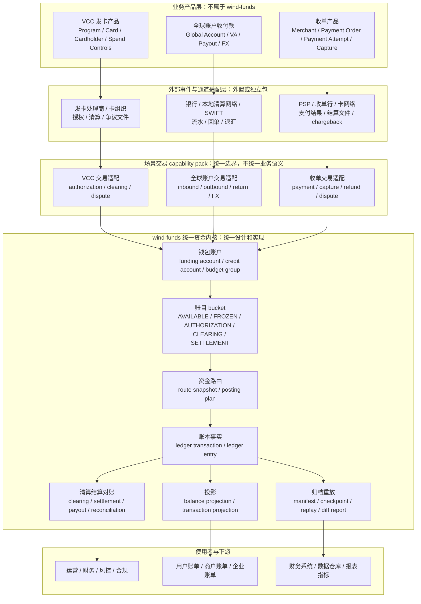
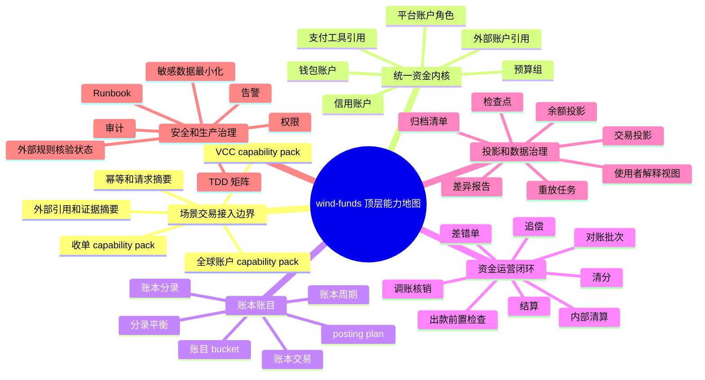

# wind-funds 三类业务顶层产品架构与系统设计指导

## 1. 文档定位

### 1.1 背景

`wind-funds` 当前已经围绕支付资金底座沉淀了 PRD、DSL、系分、TDD、OpenSpec 和测试基线。后续上层业务会同时面向 VCC 发卡业务、全球账户收付款和收单业务。三类业务都依赖账户、钱包、账本、账目、清算、结算、对账、投影、归档和审计，但它们的交易对象、外部事件、状态机、风险路径和合规边界并不相同。

因此，顶层设计需要先回答两个问题：

1. `wind-funds` 本身是什么，能做什么，不能做什么。
2. 三类业务如何在不污染资金内核的前提下，共用钱包、账本、账目、清算、结算、对账和数据治理能力。

### 1.2 目标

| 目标 | 说明 |
| --- | --- |
| 明确产品定位 | 定义 `wind-funds` 是统一资金内核和资金运营底座，不是完整发卡、全球账户或收单产品系统。 |
| 明确能力边界 | 区分统一实现、统一契约、场景适配、外部系统负责和专业确认五类边界。 |
| 明确产品架构 | 给出三类业务接入 `wind-funds` 的产品能力分层、业务对象和用户价值。 |
| 明确系统设计方向 | 给出模块职责、接口契约、数据事实、一致性、可靠性、安全和验证方向。 |
| 明确概念口径 | 逐项细化交易层、钱包、账本、账目、清算、结算、对账、投影和归档等核心概念。 |
| 明确演进路线 | 给出未来 capability pack、统一资金内核、清结算对账、治理能力和生产准入的建设顺序。 |

### 1.3 非目标

1. 本文不是 VCC 发卡 PRD、全球账户 PRD 或收单 PRD。
2. 本文不替代既有 `docs/产品设计`、`docs/DSL设计`、`docs/系分设计`、`docs/TDD设计` 的详细设计。
3. 本文不授权修改代码、数据库、公共 API、枚举、状态机或 OpenSpec。
4. 本文不把 `wind-funds` 定义为发卡处理商、银行核心、支付网关、收单系统、商户入网系统、通道网关、PCI 敏感数据系统、跨境外汇执行系统或持牌清算系统。
5. 本文不替代法务、合规、财务、税务、审计、银行、卡组织、PSP、清算网络或持牌机构的最终确认。

### 1.4 成功标准

| 成功标准 | 验收方式 |
| --- | --- |
| 定位清晰 | 任一业务需求都能判断应落在业务产品层、场景交易适配层、统一资金内核、外部系统或专业确认流程。 |
| 能力可复用 | 三类业务不重复建设钱包、账本、账目、清算、结算、对账、投影和归档重放。 |
| 交易不混用 | VCC 授权、全球账户入出金、收单 payment attempt/capture/refund/dispute 保留各自交易语义。 |
| 资金可解释 | 任一余额变化都能追溯到场景事实、资金动作、route snapshot、posting plan、ledger transaction、ledger entry 和投影。 |
| 对账可闭环 | 外部文件、银行流水、卡组织或 PSP 结果与内部资金事实差异能形成差错、处理、审批、核销和重跑证据。 |
| 生产可验证 | 每项新增能力都有 PRD 验收、DSL 契约、系分边界、TDD 矩阵、审计字段和发布回滚要求。 |

## 2. 顶层结论

### 2.1 wind-funds 是什么

`wind-funds` 是面向多业务线的统一资金内核和资金运营底座。它负责把已经被上层业务解释清楚的资金动作，转换为可约束的钱包账户变化、可审计的账本分录、可核对的清结算对象、可解释的投影视图和可重放的数据治理证据。

一句话定义：

```text
wind-funds 是资金语义、钱包账户、账本账目、清结算对账、投影归档和资金安全红线的统一底座。
```

### 2.2 wind-funds 能做什么

| 能力 | 说明 |
| --- | --- |
| 资金动作承接 | 承接场景交易适配后的入金、出金、转账、支付、退款、授权、撤销、清算入账、拒付、费用、冻结、解冻和调账等资金动作。 |
| 钱包和账户 | 统一管理资金账户、信用账户、预算组、平台账户角色、支付工具引用和外部账户引用。 |
| 账本和账目 | 统一表达账本交易、账本分录、账目 bucket、账本周期、余额方向、分录平衡和账务审计。 |
| 资金路由 | 根据资金动作、主体、账户、账目、币种、业务上下文和 route snapshot 生成可回放的 posting plan。 |
| 清算和结算 | 统一表达内部清分、内部清算、结算单、出款前置检查、出款状态、回单、追偿和结算审计。 |
| 对账和差错 | 统一表达对账批次、数据源、匹配规则、差错单、处理动作、审批、核销和重跑。 |
| 投影和解释视图 | 统一生成余额投影、交易投影、用户账单、商户账单、运营时间线和财务解释视图。 |
| 归档和重放 | 统一治理 archive manifest、watermark、checkpoint、projection replay、差异报告和重建证据。 |
| 资金红线 | 统一守住幂等、错币种、缺快照、无审批调账、重复入账、余额不足、敏感数据越界和审计缺失等红线。 |

### 2.3 wind-funds 不能做什么

| 非能力 | 边界说明 |
| --- | --- |
| 不做完整发卡处理 | Program、Card、Cardholder、PAN/CVC、HSM、token vault、卡号展示、发卡处理商协议和卡组织原始报文不进入统一资金内核。 |
| 不做完整全球账户产品 | VA 生命周期、银行账户开户、本地清算网络接入、SWIFT/代理行协议、FX 执行、跨境合规材料收集不由资金内核承担。 |
| 不做完整收单产品 | 商户入网、收银台、支付网关、payment method 展示、通道协议、tokenization、PCI 敏感数据和 PSP 原始协议不由资金内核承担。 |
| 不做外部持牌清算 | 文档中的清算默认指平台内部清分和内部清算口径，不表达持牌清算机构业务。 |
| 不做合规最终判断 | KYC/KYB/AML、PCI、卡组织、ACH、本地清算网络、外汇、税务和会计结论必须由专业方确认。 |
| 不直接消费未解释原始事件 | 外部授权报文、银行流水、PSP 通知、卡组织文件和争议文件必须先由外部适配层或 capability pack 解释为场景事实。 |

### 2.4 总体架构判断

推荐采用以下分层：

```text
业务产品层
  -> 外部事件与通道适配层
  -> 场景交易 capability pack
  -> wind-funds 统一资金内核
  -> 钱包、账本、账目、清算、结算、对账、投影、归档
  -> 财务、数据仓库、风控、合规、运营工作台
```

核心取舍：

| 取舍 | 结论 | 理由 |
| --- | --- | --- |
| 交易层是否完全通用 | 不完全通用 | VCC、全球账户和收单的交易对象、状态机、外部事件和异常路径差异明显。 |
| 钱包是否统一 | 统一设计、统一实现 | 资金账户、信用账户、预算组、余额桶、支付工具引用和主体余额查询可共享。 |
| 账本账目是否统一 | 统一设计、统一实现 | 账本交易、分录、账目 bucket、账本周期和余额投影是资金事实核心。 |
| 清算结算对账是否统一 | 统一框架、统一实现、规则可扩展 | 清分、清算、结算、出款、对账、差错、核销和重跑应使用同一套运营闭环。 |
| 外部通道是否统一 | 统一引用和证据，不统一协议 | 银行、卡组织、PSP、本地清算网络协议差异应留在外部适配层。 |

## 3. 产品架构

### 3.1 产品架构图



### 3.2 角色和主体

| 角色或主体 | 主要诉求 | `wind-funds` 的承接方式 |
| --- | --- | --- |
| 业务接入方 | 发起 VCC、全球账户或收单业务动作，获得明确资金结果。 | 通过 capability pack 提交适配后的资金动作，不直接写余额或分录。 |
| 用户、企业、商户 | 理解余额、授权占用、待结算、在途、费用、退款、拒付和出款状态。 | 提供钱包余额、交易投影、账单解释视图和状态来源引用。 |
| 运营 | 查询单笔链路，处理异常、差错、调账、冻结、结算失败和重跑。 | 提供统一运营对象、人工兜底、审批、审计和处理结果回写路径。 |
| 财务 | 核对账务、清账、结算、资金到账、费用、长短款和财务报表。 | 提供账本分录、清结算批次、对账批次、差错单和导出证据。 |
| 风控 | 阻断高风险授权、出款、商户结算、负余额、争议和异常资金动作。 | 提供风险冻结、出款前置检查、结算阻断、审计和追偿引用。 |
| 合规、安全 | 确认法域、主体、敏感数据、外部规则、授权和审计边界。 | 只保存必要引用、摘要、核验状态和审计证据；不保存越界敏感数据。 |
| 研发、测试 | 基于稳定 DSL、契约和 TDD 矩阵扩展能力。 | 提供 core spec、face 契约、场景准入、红线用例和验证命令基线。 |

### 3.3 能力地图



### 3.4 能力边界分类

| 分类 | 能力 | 设计结论 |
| --- | --- | --- |
| 统一设计、统一实现 | 钱包、资金账户、信用账户、预算组、账目 bucket、账本、余额投影、交易投影、清算、结算、对账、归档重放。 | 作为 `wind-funds` 核心能力，三类业务共享。 |
| 统一边界、场景实现 | VCC 授权交易、全球账户入出金、收单支付交易、退款、退汇、争议、外部状态映射。 | 由 capability pack 保留业务语义，再适配为底座资金动作。 |
| 统一引用、外部负责 | 卡、VA、银行账户、PSP 通道单、卡组织 ARN、银行回单、外部清算文件、FX quote。 | `wind-funds` 保存引用、摘要、核验状态和资金影响，不保存完整外部协议对象。 |
| 外部系统负责 | 发卡处理、商户入网、收银台、支付网关、银行开户、通道协议、PCI token vault、KYC/KYB/AML 系统。 | 不进入资金内核；只通过明确结果、证据或状态引用进入资金链路。 |
| 专业确认负责 | 牌照、税务、会计、外汇、卡组织规则、PCI、ACH/本地清算网络、银行协议和监管报送。 | 文档只保留待确认项、确认方、核验日期和规则版本字段。 |

## 4. 职责分层

### 4.1 产品职责分层

| 层级 | 职责 | 主要对象 | 是否属于 wind-funds |
| --- | --- | --- | --- |
| 业务产品层 | 定义发卡、全球账户、收单的用户、业务单、页面、业务规则和运营入口。 | Program、Card、Global Account、VA、Merchant、Payment Order。 | 否。 |
| 外部事件与通道适配层 | 处理外部协议、回调、文件、签名、加密、原始报文、敏感数据隔离和状态映射。 | Authorization Message、Bank Statement、PSP Notification、Scheme File。 | 主要否，可独立包化。 |
| 场景交易 capability pack | 保留各业务交易语义，完成幂等、状态机、外部引用、资金动作适配和异常原因解释。 | VCC Authorization、Global Payout、Acquiring Capture、Dispute Case。 | 可作为 wind-funds 周边能力，但不进入统一资金内核。 |
| 统一资金内核 | 处理钱包账户约束、资金路由、账本分录、余额投影和交易投影。 | Funds Action、Account、Account Code、Route Snapshot、Ledger Entry。 | 是。 |
| 资金运营闭环 | 处理清分、内部清算、结算、出款、对账、差错、调账、核销和追偿。 | Clearing Batch、Settlement Order、Payout Order、Recon Batch、Exception Case。 | 是。 |
| 数据治理和审计 | 处理归档、水位、检查点、重放、差异报告、指标输入、审计和证据留存。 | Archive Manifest、Checkpoint、Replay Task、Audit Log。 | 是。 |

### 4.2 系统职责分层

| 模块或能力 | 职责 | 禁止事项 |
| --- | --- | --- |
| `core` | 承载资金 DSL、值对象、枚举、端口、资金不变量和通用规则。 | 不依赖 DAL、Web、消息、具体业务实现或外部 SDK。 |
| `transaction-face` | 暴露资金动作、授权动作、余额控制动作和场景适配后的资金契约。 | 不暴露 Entity、Mapper、内部状态机和外部通道协议。 |
| `transaction-impl` | 执行资金指令转换、幂等、生命周期、路由编排、快照和交易事实保存。 | 不承接完整 VCC/全球账户/收单业务产品状态机。 |
| `wallet-face` | 暴露账户、支付工具、外部账户引用、余额查询和钱包产品门面契约。 | 不直接写账本分录，不绕过交易层改余额。 |
| `wallet-impl` | 维护资金账户、信用账户、预算组、平台账户角色、工具绑定和查询编排。 | 不表达外部银行账户开户、卡生命周期或商户入网。 |
| `ledger-face` | 暴露账本、账本交易、分录、余额投影和账务查询契约。 | 不承接业务交易状态，不反向修改交易事实。 |
| `ledger-impl` | 执行账本过账、分录平衡、余额投影、账务查询和账务审计。 | 不直接消费外部原始事件，不绕过 route snapshot 重新选路。 |
| 清结算对账能力 | 承载清分、内部清算、结算、出款、对账、差错、调账核销和追偿。 | 不表达持牌清算业务，不直接改历史分录或余额投影。 |
| governance 能力 | 承载归档、检查点、重放、差异报告和只读指标输入边界。 | 不作为新的事实源，不用报表反写主链路。 |

### 4.3 责任边界矩阵

| 问题 | 业务产品层 | 场景交易 pack | wind-funds 统一资金内核 | 外部系统或专业方 |
| --- | --- | --- | --- | --- |
| 用户为什么可以发起这笔业务 | 负责 | 参与 | 不负责 | 视规则确认 |
| 外部事件是否真实有效 | 参与 | 负责解释和校验摘要 | 只消费核验状态 | 通道、银行、卡组织负责确认 |
| 资金主体和账务主体如何映射 | 参与提供主体上下文 | 负责适配 | 负责最终可记账主体解析 | 合规、财务确认特殊主体 |
| 钱包余额如何变化 | 不直接处理 | 提交资金动作 | 负责 | 不负责 |
| 账本分录如何生成 | 不负责 | 提供上下文 | 负责 | 财务确认会计口径 |
| 结算对象如何计算 | 提供业务规则和合同 | 提供场景归因 | 负责内部清分、结算对象和状态 | 财务、法务、通道确认外部规则 |
| 对账差异如何处理 | 参与业务归因 | 参与场景归因 | 负责差错、调账、核销和重跑 | 外部文件来源方确认事实 |
| 敏感数据如何保护 | 负责业务端最小化 | 负责适配层最小化 | 只保留引用和摘要 | 安全、合规、PCI 方确认 |

## 5. 三类业务支撑方式

### 5.1 VCC 发卡业务

| 维度 | 设计结论 |
| --- | --- |
| 业务定性 | VCC 是授权控制驱动的卡支付和企业支出管理业务，不是普通钱包支付。 |
| wind-funds 适合承接 | 资金账户、信用账户、预算组、授权占用、授权撤销、授权完成、退款、拒付资金影响、账本、账目、投影、对账和归档。 |
| 场景 pack 负责 | VCC authorization、reversal、clearing、refund、chargeback、late presentment、partial settlement、forced post 等交易语义和状态机。 |
| 外部系统负责 | Program、Card、Cardholder、PAN/CVC、HSM、token vault、发卡处理商协议、卡组织原始报文、PCI 敏感数据。 |
| 关键红线 | 授权成功不等于入账；卡不是账本主体；拒绝授权不得生成 route、posting 或 ledger entry；清算、退款、拒付必须回指原授权或外部原交易引用。 |
| 未来方向 | 先建设 VCC 授权资金链 capability pack，再扩展 spend controls、授权过期、部分完成、争议证据、卡账单和卡组织对账适配。 |

### 5.2 全球账户收付款

| 维度 | 设计结论 |
| --- | --- |
| 业务定性 | 全球账户是多法域、多币种、多银行轨道下的账户型收付和资金归集业务。 |
| wind-funds 适合承接 | 内部资金账户、多币种账本、入金入账、出金扣减、在途、费用、汇率引用、结算、对账、投影和归档。 |
| 场景 pack 负责 | inbound credit、outbound payout、return、reject、compliance hold、FX quote 引用、银行状态、退汇和长时间未达。 |
| 外部系统负责 | VA 生命周期、银行开户、银行协议、SWIFT/本地清算网络、代理行、FX 执行、跨境合规材料和银行原始流水适配。 |
| 关键红线 | 外部受理不等于到账；银行账户不是内部账本主体；不能隐式换汇；缺银行流水、回单或合规证据不得把资金确认为可用。 |
| 未来方向 | 先建设内部账户入出金和出款前置检查，再扩展全球账户在途、退汇、FX 生命周期、多币种对账和客户账单解释视图。 |

### 5.3 收单业务

| 维度 | 设计结论 |
| --- | --- |
| 业务定性 | 收单是商户收款、清分、清算、结算、出款和争议处理业务，不只是支付订单成功。 |
| wind-funds 适合承接 | 商户待清算、商户可结算、平台手续费、通道成本引用、准备金、退款资金影响、拒付资金影响、结算出款、对账和归档。 |
| 场景 pack 负责 | payment attempt、authorization、capture、refund、void、dispute、chargeback、merchant settlement trigger 和通道状态语义。 |
| 外部系统负责 | 商户入网、收银台、支付网关、支付方式展示、PSP 协议、tokenization、PCI 数据、通道商户号和外部结算文件适配。 |
| 关键红线 | 支付成功不等于商户可结算；清算完成不等于出款到账；退款和拒付不能混用；结算只认清账结果，不能直接用通道到账反推商户应结。 |
| 未来方向 | 先建设收单清分清算结算资金链 capability pack，再扩展准备金、商户风险结算阻断、争议追偿、商户账单和通道资金对账。 |

### 5.4 三类业务接入主流程


## 6. 核心概念细化

### 6.1 概念边界

| 概念 | 顶层定义 | 设计边界 |
| --- | --- | --- |
| 业务交易 | 上层业务产品中的交易事实，如卡授权、全球入金、全球出金、收单 payment attempt。 | 不等于资金交易；由业务产品层或场景 pack 管理状态机。 |
| 场景交易适配 | 把业务交易事实翻译成 `wind-funds` 可处理的资金动作，并保留外部引用、幂等键、状态原因和审计摘要。 | 统一边界，不统一业务语义；三类业务各自建 capability pack。 |
| 资金动作 | 进入资金内核的最小可记账动作，如入金、出金、转账、授权占用、授权释放、清算入账、退款、费用、调账。 | 必须可幂等、可路由、可生成账务计划、可审计。 |
| 钱包 | 面向用户、商户、企业和运营表达资金可用性、额度、预算、冻结和在途的产品层能力。 | 钱包不是账本；余额来自账本分录和投影。 |
| 资金账户 | 表达真实资金余额的可记账主体。 | 外部银行账户、VA、卡、通道账户不能直接作为内部资金账户。 |
| 信用账户 | 表达授信额度、可用额度和授权占用的控制账户。 | 额度不是现金；不能与资金账户混用。 |
| 预算组 | 表达项目、团队或业务预算的控制账户。 | 预算不是资金池；不能表达真实现金沉淀。 |
| 账目 | 账本里的余额 bucket 或科目，如 AVAILABLE、FROZEN、AUTHORIZATION、CLEARING、SETTLEMENT、RESERVE。 | 账目不是账户主体；它表达账户内部状态。 |
| 账本 | 不可变账务事实容器。 | 不承载业务页面状态，不直接消费外部原始报文。 |
| 清分 | 按规则把明细归集到候选、责任方、金额项和应收应付口径。 | 不直接出款，不替代账本。 |
| 内部清算 | 平台内部确认待清算金额可进入可结算或下一资金状态。 | 不表达持牌清算业务。 |
| 结算 | 基于清账结果形成结算单、出款请求、回单和追偿。 | 结算输入应来自清账结果，不应用银行到账总额反推。 |
| 对账 | 比较内部事实、业务事实、外部文件、银行流水、投影和报表是否一致。 | 对账结果必须形成差错对象和处理闭环，不只是报表。 |
| 投影 | 从事实派生出的余额、账单、运营时间线、报表输入和解释视图。 | 只读、可重建，不反写事实。 |
| 归档重放 | 对历史事实、投影和治理对象进行水位化归档、检查点重建、重放和差异报告。 | 不产生新的业务事实，不绕过账本修复余额。 |

### 6.2 账目 bucket 初始建议

| 账目 bucket | 含义 | 适用业务 |
| --- | --- | --- |
| AVAILABLE | 当前可用余额、额度或预算。 | 三类业务通用。 |
| FROZEN | 风控、运营、提现、争议或合规原因导致的不可用余额。 | 三类业务通用。 |
| AUTHORIZATION | 授权占用，常见于 VCC、预授权或收单授权。 | VCC、收单。 |
| CLEARING | 已进入清分或内部清算过程，但尚未可结算。 | 收单、VCC clearing、全球账户入金确认。 |
| SETTLEMENT | 已形成结算口径，等待出款或最终确认。 | 收单、全球账户出金、平台内部结算。 |
| IN_TRANSIT | 外部受理或处理中，尚未到账或终态。 | 全球账户、出款、跨境场景。 |
| RESERVE | 准备金、保证金或风险留存。 | 收单、商户风险、争议追偿。 |
| FEE | 平台手续费、通道成本或费用归集。 | 三类业务通用，费用类型需进一步细化。 |
| EXCEPTION | 长短款、挂账、差错待处理金额。 | 对账和运营闭环。 |

### 6.3 关键不变量

| 不变量 | 说明 |
| --- | --- |
| 外部工具不入账 | 卡、VA、银行账户、PSP 通道单、卡组织 ARN 只能作为引用，不能作为内部账本主体。 |
| 授权和入账分离 | 授权成功只是占用，不等于清算入账、商户可结算或真实资金到账。 |
| 余额来自账本 | 任何可展示余额都必须由 ledger entry 和 balance projection 解释，不能直接写余额字段。 |
| 投影只读 | 交易投影、余额投影、报表输入和解释视图不能反向修改交易事实或账务事实。 |
| 清账先于结算 | 结算单和出款必须基于清账结果，不能只依赖外部到账总额。 |
| 差错不改历史 | 对账差异通过补事实、冲正、调账、追偿或核销处理，不直接改原分录。 |
| 幂等先于重试 | 外部回调、文件重跑、出款重试、对账重跑和投影重放必须有幂等键、请求摘要和审计。 |
| 专业规则不内嵌结论 | 外部规则、法域、牌照、税务、会计和通道约束必须保留核验状态和确认方。 |

## 7. 接口契约和数据一致性方向

### 7.1 接口契约原则

| 契约 | 设计要求 |
| --- | --- |
| 场景交易适配契约 | 入参必须包含业务场景、业务单号、外部引用、幂等键、金额、币种、主体、风险上下文、规则版本和证据摘要。 |
| 资金动作契约 | 入参必须能表达动作类型、账户主体、账目、金额组件、币种、route hint、origin reference、request digest 和 audit context。 |
| 钱包查询契约 | 出参必须区分账户主体、账目 bucket、币种、period、当前余额、冻结/授权/在途、来源水位和可解释引用。 |
| 账本查询契约 | 出参必须包含 ledger transaction、ledger entry、posting plan、route snapshot、业务引用和审计字段。 |
| 清结算契约 | 入参和出参必须区分清分候选、清算批次、结算单、出款单、回单、追偿和差错。 |
| 对账契约 | 必须包含数据源、匹配规则、批次号、差异类型、处理动作、核销状态、重跑版本和审计上下文。 |

### 7.2 数据方案

| 数据类型 | 事实源 | 一致性要求 |
| --- | --- | --- |
| 业务交易事实 | 业务产品层或场景 pack。 | 保留原业务状态和外部引用；资金内核只消费适配后的资金动作。 |
| 资金交易事实 | transaction 模块。 | 幂等写入、生命周期可追踪、失败无账务副作用。 |
| 钱包账户事实 | wallet 模块。 | 账户、工具、外部账户引用和主体绑定可审计。 |
| 账务事实 | ledger 模块。 | 分录不可变、借贷或增减方向平衡、账目和周期明确。 |
| 运营事实 | 清结算对账模块。 | 批次、差错、审批、结算、出款和核销独立建模。 |
| 投影视图 | ledger、transaction、governance 派生。 | 可重建、可校验、带来源水位，不作为事实源。 |
| 归档证据 | governance 模块。 | manifest、checkpoint、watermark 和 diff report 可追溯。 |

### 7.3 事务边界和补偿

| 场景 | 事务边界 | 补偿方式 |
| --- | --- | --- |
| 资金动作写入 | 资金交易、route snapshot、posting plan、ledger transaction 和 ledger entry 应在可证明的一致性边界内完成。 | 失败必须无账务副作用；可通过幂等重试或失败状态重放。 |
| 外部事件接入 | 外部原始事件落在适配层，资金内核只接收已解释资金动作。 | 适配失败不应产生 ledger entry；重复事件按幂等键去重。 |
| 清结算批次 | 批次生成、明细归集和结算候选需要明确批次号、规则版本和日切口径。 | 批次可重跑；差异通过新批次、补事实或核销处理。 |
| 出款和回单 | 出款请求和外部回单不能与内部结算单混为一个事务。 | 超时、失败、退票和部分成功进入 payout 状态机和对账差错。 |
| 投影重放 | 重放只重建读模型，不改写事实。 | 差异报告驱动人工确认或后续补事实。 |

## 8. 可靠性、安全、运营和验收

### 8.1 可靠性和安全要求

| 维度 | 要求 |
| --- | --- |
| 幂等 | 所有外部事件、资金动作、批次任务、出款请求、对账重跑和投影重放必须有幂等键和请求摘要。 |
| 乱序容忍 | 外部回调、清算文件、银行流水和争议事件可能乱序到达，场景 pack 必须按业务状态机处理。 |
| 审计 | 资金动作、账户绑定、规则变更、人工处理、对账核销、证据导出和敏感数据查看必须留审计。 |
| 权限 | 资金查询、调账、冻结、结算、出款、对账核销和归档重放必须有角色权限和职责分离。 |
| 敏感数据 | `wind-funds` 只保留外部对象引用、脱敏信息、摘要和核验状态，不保存完整 PAN、CVC、密钥或无关个人信息。 |
| 告警 | 余额不平、分录不平、重复入账、错币种、缺快照、出款失败、对账差异积压、重放差异必须告警。 |
| Runbook | 每类红线和异常都要有止血、排查、人工审批、回滚或前滚修复路径。 |

### 8.2 运营后台和数据口径

| 运营能力 | 查询维度 | 处理动作 | 审计要求 |
| --- | --- | --- | --- |
| 单笔资金链路查询 | 业务单号、资金交易号、外部引用、账户、币种、批次。 | 查看 route、posting、ledger、projection 和对账状态。 | 查询人、时间、对象和脱敏策略。 |
| 钱包余额解释 | 主体、账户、账目、period、币种、水位。 | 查看余额构成、冻结、授权、待清算、在途和可结算。 | 查询原因和导出审计。 |
| 清结算批次 | 业务、主体、币种、日切、规则版本、状态。 | 重跑、锁定、提交审批、生成结算单。 | 操作前后值和审批链路。 |
| 对账差错 | 数据源、差异类型、金额、状态、责任方。 | 补单、冲正、调账、挂账、核销、重新对账。 | 差错处理证据和核销原因。 |
| 出款和回单 | 结算单、出款单、通道引用、银行回单、失败原因。 | 重试、暂停、人工复核、追偿。 | 出款审批、回单摘要和失败处理日志。 |
| 归档重放 | manifest、水位、checkpoint、投影类型、差异报告。 | 重放、比对、导出差异、人工确认。 | 操作者、参数、结果和影响范围。 |

### 8.3 验收矩阵

| 能力 | 产品验收 | 系统验收 | TDD 验收 |
| --- | --- | --- | --- |
| 场景交易适配 | 能解释业务交易为何进入或拒绝进入资金链路。 | 状态机、幂等、外部引用和失败无副作用明确。 | 重复事件、乱序事件、缺引用、错币种、拒绝路径。 |
| 钱包账户 | 用户能理解可用、冻结、授权、待清算、在途和准备金。 | 账户主体、账目、period、余额投影和权限边界明确。 | 余额变化逐步断言、冻结不改变归属、授权占用可释放。 |
| 账本账目 | 每次余额变化都能被分录解释。 | posting plan、ledger transaction、ledger entry 和分录平衡明确。 | 分录平衡、幂等不重复入账、缺账本失败、投影可重建。 |
| 清算结算 | 清账结果能驱动结算和出款，异常可阻断。 | 批次、规则版本、结算单、出款单和回单状态明确。 | 清分重跑、结算阻断、出款失败、回单冲突、追偿。 |
| 对账差错 | 差异能分类、处理、审批、核销和复盘。 | 数据源、匹配规则、差错状态、处理动作和审计明确。 | 平台单边、外部单边、金额差、状态差、重复记录、跨日差异。 |
| 投影归档 | 账单和报表能解释来源，投影可重放。 | 水位、checkpoint、manifest、diff report 和只读边界明确。 | 投影重放、归档后查询、差异报告、只读不反写。 |

### 8.4 验证方案和回归要求

| 验证类型 | 验证方案 | 通过标准 |
| --- | --- | --- |
| 设计结构验证 | 新增或调整顶层设计时，运行产品架构交付检查、架构交付检查和外部规则字段完整性检查。 | 产品目标、能力地图、边界、职责、接口契约、数据一致性、风险、待确认和验收项齐全。 |
| PRD/DSL/系分/TDD 对齐验证 | 进入后续细化时，逐项回归 PRD、DSL、系分、TDD 是否同步表达统一资金内核和场景交易 pack 边界。 | 不出现交易层完全通用、外部账户直接入账、清算结算对账混用或投影反写事实的口径。 |
| TDD 测试验证 | 每个 capability pack 和统一资金内核能力都要补正向、逆向、重复、乱序、失败、错币种、缺引用、余额不足和审计测试。 | 资金变化场景同时断言状态、金额、账目、账本、投影、幂等和审计。 |
| 静态检查和架构边界验证 | 编码后按项目 Justfile 执行编译、相关测试、架构边界测试和静态检查。 | public contract、module dependency、Entity/Mapper 暴露、空值契约和资金红线不破坏。 |
| 回归验证 | 每次新增 VCC、全球账户或收单资金能力时，回归统一资金内核、清结算对账、投影重放和既有业务测试。 | 新 capability pack 不破坏既有钱包、账本、账目、清算、结算、对账和归档能力。 |

## 9. 风险、待确认和外部规则核验

### 9.1 主要风险

| 风险 | 影响 | 处理原则 |
| --- | --- | --- |
| 把交易层过度通用化 | 三类业务状态机被压扁，VCC、全球账户、收单异常路径失真。 | 交易层只统一边界和资金动作，业务语义留给 capability pack。 |
| 把外部账户当内部账本主体 | 余额归属错误，账务无法审计。 | 外部账户、卡、VA、PSP 单号只做引用。 |
| 把清算、结算、对账混用 | 商户应结、外部到账和差错处理混乱。 | 先清账，再结算；先对清账，再对结算。 |
| 把投影当事实源 | 报表或账单反写资金链路，破坏可重建能力。 | 投影只读，差异通过补事实或核销闭环处理。 |
| 忽略合规和敏感数据边界 | PCI、个人信息、金融数据或跨境规则越界。 | 只保留引用、摘要和核验状态；专业规则必须确认。 |
| 一次性建设大而全平台 | 延迟编码、概念膨胀、责任边界失控。 | 先统一资金内核，再按 capability pack 分阶段扩展。 |

### 9.2 待确认项

| 待确认项 | 影响范围 | 专业确认方 |
| --- | --- | --- |
| VCC 资金模式是 debit、credit、prepaid、charge card 还是混合模式。 | 授权占用、额度、预算、现金余额、清算和账务矩阵。 | 业务、财务、法务、发卡合作方、卡组织或处理商。 |
| 全球账户是否涉及跨境收付汇、代理行、Nostro/Vostro 或本地清算网络。 | 多币种、FX、在途、对账、合规材料和外部规则。 | 法务、合规、财务、银行或持牌机构。 |
| 收单是否由平台自营、PSP 合作、收单行合作或 marketplace 模式承接。 | 商户资金归属、结算主体、准备金、拒付责任和对账来源。 | 业务、法务、合规、财务、PSP 或收单行。 |
| 清算、结算用语在各业务语境下的对外表述。 | 避免把内部清算误写成持牌清算业务。 | 法务、合规、财务。 |
| 外部规则、争议时限、数据留存和证据提交口径。 | 争议、对账、审计、数据安全和用户告知。 | 法务、合规、安全、通道、银行、卡组织。 |

### 9.3 外部规则核验状态

本文不引用任何外部规则作为可上线依据，只保留后续正式 PRD、系分和 OpenSpec 必须补齐的核验字段。

| 规则来源 | 版本或发布日期 | 适用法域或适用范围 | 核验日期 | 确认方 | 当前状态 |
| --- | --- | --- | --- | --- | --- |
| 法律法规、监管解释、卡组织规则、PCI、银行协议、PSP 协议、本地清算网络规则。 | 待确认。 | 待确认，按 VCC、全球账户、收单和具体法域拆分。 | 2026-05-24，仅完成本地文档完整性核验。 | 待法务、合规、财务、安全、通道、银行、卡组织或持牌机构确认。 | 未完成外部规则时效核验，不作为上线依据。 |

## 10. 演进路线

### 10.1 阶段划分

| 阶段 | 建设目标 | 交付物 |
| --- | --- | --- |
| Phase 0：顶层定位冻结 | 明确 `wind-funds` 定位、能力边界、职责分层、统一能力和非目标。 | 本文档、三类业务能力地图、评审结论。 |
| Phase 1：统一资金内核加固 | 钱包、账本、账目、路由、余额投影、交易投影和红线 TDD 矩阵稳定。 | PRD/DSL/系分/TDD 对齐、OpenSpec 批次、核心测试资产。 |
| Phase 2：清结算对账统一实现 | 清分、内部清算、结算、出款、对账、差错、调账核销和追偿形成统一实现。 | 清结算对账 PRD/系分/TDD、批次模型、差错状态机。 |
| Phase 3：VCC capability pack | 支撑 VCC 授权资金链、授权释放、清算入账、退款、拒付和卡账单解释。 | VCC 交易适配契约、授权状态机、卡组织事件映射和红线测试。 |
| Phase 4：全球账户 capability pack | 支撑入金、出金、在途、退汇、费用、FX 引用、多币种对账和客户账单解释。 | 全球账户交易适配契约、出款生命周期、在途和退汇测试矩阵。 |
| Phase 5：收单 capability pack | 支撑 payment/capture/refund/dispute 到清分、结算、出款和商户账单。 | 收单交易适配契约、商户结算矩阵、争议追偿和通道对账矩阵。 |
| Phase 6：数据治理和运营增强 | 统一归档、重放、差异报告、报表输入、运营后台、告警和 Runbook。 | governance 设计、投影重放测试、生产准入和监控看板。 |

### 10.2 发展方向

| 方向 | 说明 |
| --- | --- |
| 从资金底座走向资金能力平台 | 不做大而全业务平台，而是提供可组合的资金内核、清结算对账、投影归档和 capability pack 接入规范。 |
| 从交易接口走向资金动作 DSL | 交易语义留在场景 pack，资金内核聚焦资金动作、账户、账目、路由、账本和运营闭环。 |
| 从报表导出走向可解释数据面 | 用户账单、商户账单、运营时间线、财务视图和指标输入都必须能回溯事实源。 |
| 从人工对账走向差错生命周期 | 对账不只是发现差异，还要驱动补单、冲正、调账、挂账、核销、重跑和审计。 |
| 从单业务实现走向多业务资金治理 | VCC、全球账户和收单共享资金内核，但各自保留交易语义和风险路径。 |

## 11. 设计准入和后续细化顺序

### 11.1 进入详细 PRD 或系分前的准入问题

| 问题 | 必须回答 |
| --- | --- |
| 这是什么业务场景 | VCC、全球账户、收单，还是三者之外的资金动作。 |
| 谁的钱 | 用户、商户、企业、平台、自有资金、待结算资金、保证金、额度、预算或补贴。 |
| 什么事实触发 | 授权、清算、入金、出金、capture、refund、dispute、return、调账或对账差错。 |
| 谁是可记账主体 | 资金账户、信用账户、预算组或平台账户角色，不能是卡、VA、银行账户或通道单。 |
| 影响哪些账目 | AVAILABLE、FROZEN、AUTHORIZATION、CLEARING、SETTLEMENT、IN_TRANSIT、RESERVE 等。 |
| 是否经过清账 | 结算和出款必须说明清分、内部清算、结算输入和对账来源。 |
| 外部规则是否核验 | 规则来源、版本或发布日期、适用法域、核验日期和确认方必须明确。 |
| 如何测试 | 正向、逆向、重复、乱序、失败、错币种、缺引用、余额不足、差错重跑和审计。 |

### 11.2 后续细化优先级

1. 先把 `wind-funds` 统一资金内核和三类业务 capability pack 边界写入 PRD 总览、DSL、系分总览和 TDD 总览。
2. 再细化统一清算、统一结算、统一对账、差错单、调账核销、出款前置检查和归档重放的对象与状态。
3. 再按 VCC、全球账户、收单分别设计场景交易适配契约和红线测试矩阵。
4. 最后进入编码批次，按 OpenSpec 和 Execution Grant 明确允许触碰的 public contracts、enums、request models、state machines 和 tables。

### 11.3 本文与既有文档的关系

| 文档 | 关系 |
| --- | --- |
| `docs/产品设计/01-PRD总览.md` | 本文提供更高层的三类业务支撑定位，后续应把稳定结论回填到 PRD 总览。 |
| `docs/产品设计/02-交易路由钱包账目与投影.md` | 本文校准交易层不完全通用、钱包账本账目统一实现的边界。 |
| `docs/产品设计/03-清结算与对账.md` | 本文确认清算、结算、对账应统一设计和统一实现，但仅表达内部资金运营闭环。 |
| `docs/DSL设计/支付资金底座DSL承载层设计.md` | 本文为场景交易适配契约和资金动作 DSL 的分层提供顶层口径。 |
| `docs/系分设计/01-系分设计总览.md` | 本文为模块职责、系统边界、数据边界和安全边界提供顶层约束。 |
| `docs/TDD设计/支付资金底座测试驱动设计.md` | 本文为三类业务 capability pack 和统一资金内核测试矩阵提供设计准入。 |
| `docs/资金底座支撑VCC全球账户收付款与收单业务评估.md` | 本文上收该评估中的定位结论，作为顶层指导层。 |
| `docs/三类业务支撑能力地图与现状对比.md` | 本文上收该能力地图中的分层结论，后续可作为任务基线。 |
