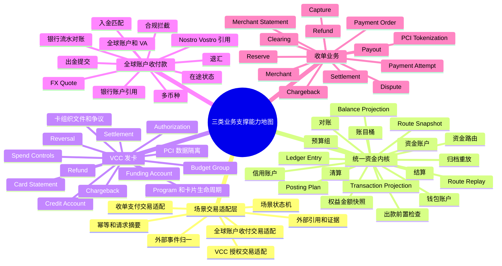

# VCC、全球账户收付款与收单业务支撑能力地图与现状对比

## 1. 背景、目标和口径

### 1.1 背景

`wind-funds` 作为支付资金底座，未来需要对上支撑 VCC 发卡业务、全球账户收付款和收单业务。前序评估已经确认：`wind-funds` 适合沉淀为共享资金底座，不适合扩成完整发卡处理商、银行核心、支付网关、收单系统、商户入网系统或 PCI 敏感数据系统。

本文进一步回答一个更落地的问题：支撑这三类业务需要哪些能力，现在已经具备哪些，哪些只是设计具备，哪些还需要补齐。

### 1.2 目标

| 目标 | 说明 |
| --- | --- |
| 能力地图 | 从产品能力和系统能力两层拆出三类业务所需能力。 |
| 现状对比 | 对照当前 PRD、DSL、系分、TDD 和代码基线，标注能力成熟度。 |
| 任务基线 | 为后续 capability pack、OpenSpec、TDD 和编码批次提供准入参考。 |
| 风险识别 | 避免把目标态设计、文档规划或外部系统职责误判为 `wind-funds` 已经具备的能力。 |

### 1.3 业务目标、用户价值和成功指标

业务目标是让 VCC、全球账户收付款和收单业务在进入资金层后，共用同一套可解释、可核对、可重放的钱包、账本、账目、路由快照、清算、结算、对账、投影和审计证据。

用户价值是让业务接入方不用重复建设钱包余额、账本分录、账目桶、清算、结算和对账能力；同时允许 VCC、全球账户和收单在交易层保留各自的业务语义、状态机和外部事件适配。运营、财务、风控和合规能用统一资金链路解释一笔钱为什么发生、当前属于谁、何时可用、能否出款、差异如何处理。

成功指标：

| 指标 | 成功标准 |
| --- | --- |
| 能力可识别 | 三类业务所需能力都能落到统一资金内核、场景交易适配层、业务 capability pack 或外部系统职责。 |
| 现状可判断 | 每项能力都能区分代码已具备、设计已具备待编码、部分具备、待补齐或外部系统负责。 |
| 任务可拆分 | 后续可直接按 VCC、全球账户或收单 capability pack 拆 OpenSpec、TDD 和编码批次。 |
| 风险可阻断 | 合规、PCI、外部规则、错币种、重复入账、缺引用和对账差异不会被误判为已完成能力。 |

### 1.4 业务流程和状态机视角

三类业务进入 `wind-funds` 的底层资金流程应保持一致：上层产品系统或通道适配层先完成业务事件归一，场景交易适配层再把业务语义翻译为底座可处理的资金动作，统一资金内核完成钱包账户约束、账目变化、资金路由、账本分录、投影、清算、结算、对账和归档重放。

交易层不宜被定义为完全通用实现。VCC 的授权/清算/争议、全球账户的入金/出金/退汇、收单的 payment attempt/capture/refund/dispute 在交易语义、外部状态和异常路径上差异很大，应通过 capability pack 做场景适配；适配后的钱包、账本、账目、对账、清算和结算能力再进入统一实现。

异常流程包括外部事件缺引用、重复通知、错币种、金额差、授权迟到、退汇、拒付、出款失败、对账差异和专业确认状态过期。异常不能直接改余额或历史分录，必须通过差错单、补事实、冲正、调账、追偿或人工兜底进入资金闭环。

状态机拆分原则：

| 业务 | 状态机主线 | 人工兜底入口 |
| --- | --- | --- |
| VCC | 授权 -> 撤销/过期/完成 -> 退款/拒付。 | 缺原授权、迟到 clearing、争议证据不足、外部规则未核验。 |
| 全球账户收付款 | 外部受理 -> 在途 -> 到账/付款成功/失败/退汇 -> 对账完成。 | 银行流水未匹配、合规补资料、长时间未达、FX 或费用差异。 |
| 收单 | 支付成功 -> 清分 -> 清算 -> 结算 -> 出款 -> 到账/退回/追偿。 | 清账差异、争议阻断、准备金不足、出款回单冲突。 |

### 1.5 范围和非目标

| 范围 | 说明 |
| --- | --- |
| 覆盖业务 | VCC 发卡业务、全球账户收付款、收单业务。 |
| 覆盖层级 | 产品能力、资金 DSL、场景交易适配、钱包、账本、账目、路由、清算、结算、对账、归档重放、运营和生产治理。 |
| 非目标 | 不修改既有 PRD/DSL/系分/TDD/OpenSpec，不授权编码，不替代三类业务完整 PRD。 |
| 非目标 | 不对法务、合规、税务、会计、银行、卡组织、PSP 或清算机构规则给最终结论。 |

### 1.6 成熟度口径

| 状态 | 含义 |
| --- | --- |
| 代码已具备 | 仓库中已有 face/core/impl/test 等工程资产，能作为后续能力复用基础；是否生产可用仍需按批次验证。 |
| 设计已具备待编码 | PRD、DSL、系分或 TDD 已定义目标态、边界和验收口径，但未看到完整工程实现。 |
| 部分具备 | 已有通用能力或局部能力，但缺三类业务的专属对象、状态、规则、测试或运营闭环。 |
| 待补齐 | 当前设计或代码都不足以支撑该能力进入编码或生产。 |
| 外部系统负责 | 不应由 `wind-funds` 承担，只能消费外部结果、引用、摘要或核验状态。 |

## 2. 总体能力地图

## 3. 总体能力现状摘要

### 3.1 分层结论

| 层级 | 是否应统一设计 | 是否应统一实现 | 说明 |
| --- | --- | --- | --- |
| 场景交易适配层 | 统一边界和最低契约，不统一业务语义 | 不建议完全统一 | VCC、全球账户和收单的交易对象、状态、外部事件和异常路径差异明显，应由 capability pack 适配到底座资金动作。 |
| 钱包 | 统一 | 统一 | 资金账户、信用账户、预算组、支付工具绑定、余额桶和主体余额查询可作为三类业务共享能力。 |
| 账本 | 统一 | 统一 | 账本交易、posting plan、ledger entry、余额投影和分录平衡应作为底座核心事实。 |
| 账目 | 统一 | 统一 | AVAILABLE、FROZEN、AUTHORIZATION、CLEARING、SETTLEMENT 等账目桶需要统一口径，避免业务线自造余额含义。 |
| 清算 | 统一框架，规则可配置 | 统一 | 清分、可清算候选、清算批次和清算确认应统一对象与生命周期，按业务配置规则。 |
| 结算 | 统一框架，规则可配置 | 统一 | 结算单、出款前置检查、出款状态、回单和追偿应统一实现，按主体、币种和业务规则扩展。 |
| 对账 | 统一框架，数据源可扩展 | 统一 | 对账批次、匹配规则、差错单、挂账、核销和重跑应统一，外部文件适配外置。 |
| 投影和归档重放 | 统一 | 统一 | 余额投影、交易投影、账单解释视图、归档水位和重放任务应统一治理，业务视图可扩展。 |

### 3.2 共性底座成熟度

| 能力域 | 现状 | 证据和说明 | 对三类业务的意义 |
| --- | --- | --- | --- |
| 场景交易适配 | 部分具备 | 已有 `FundsDirectTransactionService`、`FundsAuthorizationTransactionService`、`FundsBalanceControlService`、`FundsInstructionSpec`，但它们是底座资金动作入口，不等价于三类业务完整交易层。 | 三类业务需要先由 capability pack 把业务事件适配为资金动作，不能假设交易层完全通用。 |
| 授权生命周期资金动作 | 部分具备 | 已有 authorize、reversal、settle、settleRefund、chargeback；测试覆盖授权拒绝、撤销、完成、退款、幂等等。未看到过期释放服务入口。 | 支撑 VCC 和收单预授权的资金占用主线，但 VCC/收单各自交易语义仍需场景适配。 |
| 直接资金动作 | 代码已具备 | 已有 topup、transfer、pay、refund、withdraw、fee、refundFee。 | 可作为全球账户入出金、收单结算出款、费用和退款的底层动作，不代表全球账户或收单交易层已统一。 |
| 冻结、解冻、余额调整 | 代码已具备 | 已有 freeze、unfreeze、adjust，文档明确冻结不表达消费或扣划。 | 支撑风险冻结、争议暂扣、准备金和人工调整的底层动作。 |
| 钱包账户、信用账户、预算组 | 代码已具备 | 已有 FundingAccount、CreditAccount、BudgetGroup 服务和 ledger 初始化。 | 这是三类业务最适合统一设计、统一实现的核心层。 |
| 支付工具和外部账户引用 | 部分具备 | 已有 `PaymentInstrumentRefSpec`、`ExternalAccountRefSpec`、PaymentInstrument 服务和绑定历史。 | 能承接卡、VA、银行账户、支付方式引用；但缺三类业务专用引用模型和敏感数据边界矩阵。 |
| 路由和 route snapshot | 代码已具备 | 已有 RouteResolver、RouteSnapshotFactory、RouteReplayService、支付工具/外部账户 replay 测试。 | 支撑退款、撤销、拒付、退汇沿原路径 replay。 |
| 账本、账目和余额投影 | 代码已具备 | 已有 LedgerTransactionService、LedgerPosting、LedgerBalanceProjectionService、ledger entry settlement/reconcile 字段。 | 这是三类业务必须统一实现的资金事实层。 |
| 交易投影和解释视图 | 部分具备 | 已有 projection publisher 契约、projection explanation、governance replay 相关接口和测试；业务化查询视图仍不足。 | 支撑账单、运营时间线和解释视图，但 VCC/全球账户/收单的专属视图待补。 |
| 权益金额快照 | 代码已具备 | 已有 FundsBenefitSnapshotSpec、组件闭合、退款策略、稳定摘要和 DSL 测试。 | 对含优惠、代金券、补贴的收单或账户交易有帮助；非三类业务核心但可复用。 |
| 清算、结算和对账 | 设计已具备待编码 | PRD/系分已有清分、清算、结算、出款和对账闭环；代码侧主要看到 ledger entry 状态字段、SettlementPolicySpec、PayoutPreflight。 | 这是应统一设计、统一实现的核心能力，当前目标态清楚但工程实现不完整。 |
| 出款前置检查 | 部分具备 | 已有 reconciliation 模块的 PayoutPreflight 相关 DTO、枚举、服务和测试。 | 可作为全球出金和收单出款前门禁基础，但还不是完整 payout 生命周期。 |
| 归档和重放 | 部分具备 | 已有 governance projection replay 接口和服务；文档有归档重放目标态。 | 支撑投影重放起点，但完整交易归档、余额快照、清结算归档和报表归档待补。 |
| 多币种和 FX | 部分具备 | 已有 FxService、FxRate、FxRequest、FxResult 和资金指令汇率字段。 | 全球账户、跨境 VCC、跨境收单需要此基础，但缺 FX Quote 生命周期、锁汇、汇兑损益和多币种对账。 |
| 外部规则核验 | 部分具备 | 设计中有外部规则核验状态；PayoutPreflight 已有 ExternalRuleVerificationEvidenceDTO。 | 可支撑出款、合规、卡组织和跨境规则门禁；仍需按业务包扩展。 |

### 3.3 三类业务 readiness 总览

| 业务 | 统一资金内核复用度 | 交易层适配复杂度 | 当前可落地程度 | 结论 |
| --- | --- | --- | --- | --- |
| VCC 发卡业务 | 高 | 高 | 可先做授权资金链 capability pack。 | 钱包、账本、账目、授权占用和投影复用度高；交易层必须保留 VCC 授权、清算、争议语义。 |
| 全球账户收付款 | 中高 | 高 | 可先做内部账户入出金和出款前置检查；完整全球账户待确认。 | 钱包、账本、对账、结算可统一；交易层要适配入金、出金、退汇、FX 和银行状态。 |
| 收单业务 | 中高 | 高 | 可先做收单清结算资金链 capability pack。 | 清算、结算、对账最适合统一实现；交易层要适配 payment attempt、capture、refund、dispute。 |

## 4. VCC 发卡业务能力地图和现状对比

### 4.1 VCC 所需能力地图

| 能力域 | 子能力 | 需要程度 | 当前状态 | 说明 |
| --- | --- | --- | --- | --- |
| 发卡项目和主体 | Program、企业客户、持卡人、发卡合作机构、资金责任主体。 | 必须 | 外部系统负责 | `wind-funds` 不应管理完整 Program 和持卡人生命周期，只消费主体、账户和引用。 |
| 卡片生命周期 | 创建、激活、冻结、注销、过期、重发、轮换、卡号展示权限。 | 必须 | 外部系统负责 | 可在 PaymentInstrument 中保存工具元数据和绑定，但完整卡生命周期、PAN/CVC 展示和 PCI 不进入底座。 |
| 资金账户 | 企业真实资金账户、平台资金账户、预收/预付/清算账户。 | 必须 | 代码已具备 | FundingAccount、PlatformFundingAccountRole、PlatformAccountsSnapshot 可复用。 |
| 信用账户 | Credit line、可用额度、授权占用、额度调整。 | 视模式必须 | 代码已具备 | CreditAccount 和 CREDIT_BASIC ledger 初始化可复用。 |
| 预算组 | 项目预算、团队预算、预算占用、预算释放。 | 视模式必须 | 代码已具备 | BudgetGroup 和 BUDGET_BASIC ledger 初始化可复用。 |
| 支付工具绑定 | 卡、token、掩码卡号和资金主体/预算主体绑定。 | 必须 | 部分具备 | PaymentInstrument 和 binding 已有；VCC 卡专属字段、敏感数据策略、token 生命周期待补。 |
| Spend Controls | 金额、MCC、商户、国家、币种、时间窗、次数、审批。 | 必须 | 设计已具备待编码 | DSL/PRD 有授权前控制口径；未看到独立规则服务和测试矩阵。 |
| 实时授权 | 授权请求、批准、拒绝、拒绝原因、授权占用。 | 必须 | 代码已具备 | authorize 覆盖授权批准和拒绝，拒绝不生成账务路径。 |
| 授权撤销 | reversal、void、剩余授权释放。 | 必须 | 代码已具备 | reversal 和 route replay 已具备。 |
| 授权过期 | 到期释放剩余授权。 | 必须 | 待补齐 | 文档有目标态；当前未看到 expire 服务入口。 |
| 授权完成 | clearing/presentment 后将授权占用转为实际资金结果。 | 必须 | 代码已具备 | settle 已具备，但卡组织 clearing 文件匹配待外部或业务包补齐。 |
| 部分完成和增量授权 | partial capture、incremental authorization、超额容差。 | 高 | 部分具备 | settle 和累计完成金额可作为基础；专用状态、规则和测试待补。 |
| 退款 | 已完成授权链退款。 | 必须 | 代码已具备 | settleRefund 已具备，且有超额退款、幂等测试。 |
| 拒付和争议 | chargeback、representment、证据链、争议费用。 | 高 | 部分具备 | chargeback 入口存在；完整 dispute case、证据包、卡组织时限和报表待补。 |
| 卡账单和报表 | 卡片、持卡人、企业、授权、清算、费用、争议报表。 | 高 | 部分具备 | 通用交易投影可支撑；VCC 专属账单视图待补。 |
| 卡组织文件和对账 | 授权、clearing、settlement、费用、争议文件匹配。 | 必须 | 外部系统负责/待补齐 | 原始文件适配外置；底座需补归一后事件和对账批次承接。 |
| PCI 和敏感数据 | PAN、CVV、HSM、token vault、展示审计。 | 必须 | 外部系统负责 | 底座只能保留脱敏引用和审计上下文。 |

### 4.2 VCC 当前能力结论

VCC 的资金内核能力已经有较好基础，尤其是资金账户、信用账户、预算组、支付工具绑定、授权批准/拒绝、授权撤销、授权完成、授权退款、拒付入口、route replay 和账本投影。

主要缺口不在资金账本，而在发卡业务包：

1. Program、Card、Cardholder 生命周期和权限。
2. Spend Controls 规则服务和规则版本。
3. 授权过期、增量授权、部分 capture、迟到 clearing 和 forced post 的完整状态机。
4. 卡组织 clearing/settlement/dispute 文件归一和对账。
5. PCI、PAN/CVV、HSM、token vault 和卡号展示安全边界。
6. VCC 卡账单、争议证据、客服解释视图和运营后台。

## 5. 全球账户收付款能力地图和现状对比

### 5.1 全球账户收付款所需能力地图

| 能力域 | 子能力 | 需要程度 | 当前状态 | 说明 |
| --- | --- | --- | --- | --- |
| 客户和账户产品 | 全球账户、币种账户、VA、本地账户、收付款权限。 | 必须 | 外部系统负责/部分具备 | FundingAccount 可承接内部账户；VA 和全球账户产品生命周期外置。 |
| 外部账户引用 | 银行账户、VA、provider、channel、country、currency。 | 必须 | 代码已具备 | ExternalAccountRefSpec 已具备基础字段；专属校验和脱敏策略待补。 |
| 入金接收 | 银行流水、VA 匹配、付款人识别、到账确认。 | 必须 | 部分具备 | topup 可表达内部入金；银行流水匹配、VA 分配、合规状态和到账证据待补。 |
| 出金提交 | 付款请求、收款账户、外部提交、处理中、成功、失败、退汇。 | 必须 | 部分具备 | withdraw 和 PayoutPreflight 可作为基础；完整 payout order 生命周期待补。 |
| 在途资金 | external accepted、in transit、received、posted、returned。 | 必须 | 设计已具备待编码 | PRD/评估文档有口径；代码缺专属在途对象和状态机。 |
| 多币种账户 | 按主体和币种隔离余额、分录、投影和对账。 | 必须 | 部分具备 | Money/币种、账本主体和 period 已有；多币种产品规则和错币种红线待补。 |
| FX | Quote、锁汇、执行、清算汇率、记账汇率、汇兑差。 | 高 | 部分具备 | FxService 和汇率字段已有；FX Quote 生命周期、汇兑损益和对账待补。 |
| 费用拆分 | OUR/SHA/BEN、中间行费用、平台费、银行费。 | 高 | 部分具备 | fee/refundFee 和 FeeSpec 可支撑；全球付款费用结构待补。 |
| 退汇和失败 | return、reject、compliance hold、资料补充、长时间未达。 | 必须 | 待补齐 | 缺全球付款专属异常状态、补证据流程和回补路径。 |
| 合规拦截 | KYC/KYB、AML、制裁、资料补充、外部规则核验。 | 必须 | 部分具备 | 外部规则核验和 preflight 有基础；全球账户合规材料和状态待外部系统承接。 |
| 银行流水对账 | 平台账本、银行流水、通道文件、清算网络状态核对。 | 必须 | 设计已具备待编码 | 账本 reconcile 字段和文档目标态已有；完整对账批次/差错单服务待补。 |
| Nostro/Vostro 和清算账户 | 代理行账户、清算账户、头寸、轧差。 | 视模式必须 | 外部系统负责/待补齐 | 底座可保留引用和内部账务影响，不应做银行核心。 |
| 客户账单和报表 | 入金、出金、费用、汇率、退汇、在途、可用余额。 | 高 | 部分具备 | 交易投影基础已有；全球账户专属解释视图待补。 |

### 5.2 全球账户当前能力结论

全球账户收付款的统一资金内核能力具备一部分，特别是内部账户、钱包余额、账本分录、外部账户引用、费用、FX 基础、出款前置检查和对账目标态。交易层不能直接复用普通 topup/withdraw 语义，需要有全球账户入金、出金、退汇、合规和银行状态的场景适配。

主要缺口集中在全球账户业务包和外部银行网络：

1. 全球账户和 VA 产品生命周期。
2. 入金银行流水匹配、付款人识别、合规状态和到账确认。
3. 出金 payout order 完整生命周期、退汇、失败、长时间未达和补证据流程。
4. FX Quote、锁汇、执行结果、汇兑损益和多币种对账。
5. Nostro/Vostro、代理行、本地清算网络和银行文件适配。
6. 全球账户客户可理解账单、在途解释、费用解释和报表。

## 6. 收单业务能力地图和现状对比

### 6.1 收单业务所需能力地图

| 能力域 | 子能力 | 需要程度 | 当前状态 | 说明 |
| --- | --- | --- | --- | --- |
| 商户和入网 | Merchant、门店、MCC、KYB、结算资料、费率合同。 | 必须 | 外部系统负责 | `wind-funds` 不应做完整商户入网，只消费商户主体、费率和风控结果引用。 |
| 支付订单 | Payment Order、Payment Attempt、支付方式、收银台、通道请求。 | 必须 | 外部系统负责/待补齐 | 底座只接收支付结果资金事实，不做收银台和网关。 |
| 授权和 capture | authorization、capture、partial capture、void。 | 视支付方式必须 | 部分具备 | 授权服务可复用；payment attempt/capture 专属对象和 PSP 状态映射待补。 |
| 收款入账 | 支付成功后形成商户待清算或平台清算中余额。 | 必须 | 部分具备 | pay/topup/settle 可表达资金动作；收单专属入账模板和测试待补。 |
| 退款 | 全额退款、部分退款、退款失败、退款超额。 | 必须 | 代码已具备/部分具备 | direct refund 和 auth settleRefund 可复用；收单退款与 PSP 状态映射待补。 |
| 清分 | 按商户、币种、周期、规则版本归集可清分明细。 | 必须 | 设计已具备待编码 | PRD 有完整清分设计；代码侧缺清分批次服务。 |
| 清算 | 确认待清算进入可结算，支持阻断、重跑、审计。 | 必须 | 设计已具备待编码 | 文档和 ledger settlement 字段已有；清算批次服务待补。 |
| 结算单 | 商户应结净额、扣费、退款、争议、准备金、税费。 | 必须 | 设计已具备待编码 | SettlementPolicySpec 和 PayoutPreflight 可支撑；结算单对象待补。 |
| 出款 | 提交代付、处理中、成功、失败、退回、回单。 | 必须 | 部分具备 | withdraw 和 preflight 有基础；完整出款单和外部回单生命周期待补。 |
| 准备金和风险暂扣 | rolling reserve、delayed settlement、暂停结算。 | 高 | 部分具备 | 冻结/解冻/余额调整可复用；商户准备金规则和状态待补。 |
| 拒付和争议 | dispute、chargeback、representment、追偿、负余额。 | 高 | 部分具备 | chargeback 和资金调整基础存在；收单争议 case 和证据运营待补。 |
| 对账 | PSP 文件、卡组织文件、银行到账、商户账单、账本分录核对。 | 必须 | 设计已具备待编码 | 设计目标态完整；代码缺对账批次、差错单、挂账和核销服务。 |
| 商户账单和报表 | 交易、手续费、退款、拒付、准备金、结算、出款。 | 高 | 部分具备 | 通用交易投影可支撑；商户 statement 待补。 |
| PCI/tokenization | PAN/token、3DS、AVS/CVV、敏感数据隔离。 | 必须 | 外部系统负责 | 底座不得接触完整卡敏感数据。 |

### 6.2 收单当前能力结论

收单业务最适合从“收单清结算资金链”切入，而不是从支付网关或商户入网切入。

当前具备的统一资金内核能力包括钱包账户、支付工具引用、退款底层动作、拒付资金入口、冻结/解冻、账本分录、清算结算目标态、出款前置检查和投影重放基础。收单交易层不能直接等同于普通 direct/auth 交易，需要保留 payment order、payment attempt、capture、refund、dispute 和 PSP 状态适配。

主要缺口：

1. Merchant、Payment Order、Payment Attempt 和 PSP 事件归一不在底座内，需要外部系统或业务包。
2. 清分批次、清算批次、结算单、出款单、对账批次、差错单和追偿单未形成完整工程实现。
3. 费率、MDR、通道成本、interchange/scheme fee、准备金和争议费用的结构化金额拆分待补。
4. 商户 statement、结算明细、拒付证据、风险暂扣和运营后台待补。
5. PCI、tokenization、3DS、卡组织/PSP 协议适配必须外置。

## 7. 三类业务共用能力差距矩阵

| 能力 | VCC | 全球账户收付款 | 收单 | 当前状态 | 优先级 | 建议动作 |
| --- | --- | --- | --- | --- | --- | --- |
| 场景交易适配层 | 必须 | 必须 | 必须 | 部分具备 | P0 | 不强行统一交易层实现；按 VCC、全球账户、收单分别把业务事件适配为底座资金动作。 |
| 外部事件归一契约 | 必须 | 必须 | 必须 | 待补齐 | P0 | 新增 `ExternalEventRef` 或等价契约设计，明确原始事件外置。 |
| 支付工具引用 | 必须 | 中 | 必须 | 部分具备 | P0 | 扩展敏感数据边界、token/VA/卡引用规则和测试。 |
| 外部账户引用 | 中 | 必须 | 高 | 代码已具备/部分具备 | P0 | 补银行账户、VA、PSP 账户引用字段口径和脱敏策略。 |
| route snapshot 和 replay | 必须 | 必须 | 必须 | 代码已具备 | P0 | 保持现有能力，新增三类业务 replay 红线测试。 |
| 授权资金动作 | 必须 | 低 | 高 | 部分具备 | P0 | 作为底座动作复用；VCC/收单交易语义分别补 expire、incremental、partial capture 和 delayed clearing。 |
| 钱包/资金账户/信用账户/预算组 | 必须 | 中 | 中 | 代码已具备 | P0 | 统一设计、统一实现，VCC、全球账户和收单都复用同一账户和余额桶口径。 |
| 账本/账目/余额投影 | 必须 | 必须 | 必须 | 代码已具备 | P0 | 统一设计、统一实现，所有资金变化必须落到账本分录和账目桶。 |
| 多币种和 FX | 高 | 必须 | 高 | 部分具备 | P1 | 补 FX Quote、锁汇、汇兑差、错币种红线和对账。 |
| 清分批次 | 中 | 中 | 必须 | 设计已具备待编码 | P0 | 统一对象和生命周期，规则按业务配置；收单优先实现最小闭环。 |
| 清算批次 | 高 | 中 | 必须 | 设计已具备待编码 | P0 | 统一实现清算候选、批次锁定、确认和审计，按主体、币种、周期、规则版本和幂等扩展。 |
| 结算单 | 中 | 高 | 必须 | 设计已具备待编码 | P0 | 统一实现结算单，不写成收单专用，按 VCC、全球账户、收单配置结算对象和扣减项。 |
| 出款单和回单 | 中 | 必须 | 必须 | 部分具备 | P0 | 在 preflight 基础上补 payout lifecycle。 |
| 对账批次和差错单 | 必须 | 必须 | 必须 | 设计已具备待编码 | P0 | 统一实现对账批次、匹配结果、差错单、挂账、核销和重跑，外部文件适配按业务扩展。 |
| 准备金/风险暂扣 | 中 | 中 | 必须 | 部分具备 | P1 | 基于冻结/余额调整补商户准备金和争议暂扣规则。 |
| 争议/拒付运营 | 必须 | 低 | 必须 | 部分具备 | P1 | chargeback 资金影响已有起点，争议 case 和证据包待补。 |
| 交易投影解释视图 | 必须 | 必须 | 必须 | 部分具备 | P1 | 分别补 VCC、全球账户、收单账单视图。 |
| 归档重放 | 必须 | 必须 | 必须 | 部分具备 | P1 | 先补 projection replay 范围，后续补交易、清结算、对账归档。 |
| 外部规则核验 | 必须 | 必须 | 必须 | 部分具备 | P0 | 复用 ExternalRuleVerificationEvidenceDTO，扩展到业务包门禁。 |
| 敏感数据和 PCI | 必须 | 中 | 必须 | 外部系统负责 | P0 | 明确底座只保存脱敏引用、摘要和审计上下文。 |
| 商户/客户/持卡人产品域 | 必须 | 必须 | 必须 | 外部系统负责 | P0 | 保持外置，底座只消费主体和资金账户解析结果。 |

## 8. 推荐补齐路线

### 8.1 第一批：共性资金接入和安全边界

| 任务 | 目标 | 产出 |
| --- | --- | --- |
| 场景交易适配契约 | 定义 VCC、全球账户、收单如何把业务交易事件适配为底座资金动作。 | PRD/DSL/系分/TDD/OpenSpec 同步；外部事件引用模型；交易层不完全通用的边界说明。 |
| 外部引用和证据最小化 | 明确 `InstrumentRef`、`ExternalAccountRef`、`ExternalEventRef`、`RiskDecisionRef`、`RuleSnapshot`。 | DSL 契约、脱敏规则、审计字段和红线测试。 |
| 统一资金内核 TDD 矩阵 | 把钱包、账本、账目、清算、结算、对账能力地图转成 RED 测试清单。 | 统一内核测试矩阵，加三类业务适配测试矩阵。 |

### 8.2 第二批：VCC 授权资金链 capability pack

| 任务 | 目标 | 产出 |
| --- | --- | --- |
| 授权过期 | 补授权到期释放剩余占用。 | expire 契约、服务、测试。 |
| 增量授权和部分 capture | 支撑酒店、租车、跨境卡等高频场景。 | 状态机、金额上限、route replay 测试。 |
| VCC 解释视图 | 企业、持卡人、财务可解释授权、清算、退款、拒付。 | 投影字段、查询契约和运营视图。 |

### 8.3 第三批：收单清结算 capability pack

| 任务 | 目标 | 产出 |
| --- | --- | --- |
| 清分批次 | 识别可清分明细并归类。 | 清分批次对象、明细、幂等和测试。 |
| 清算批次 | 将待清算确认到可结算。 | 清算批次对象、阻断规则、账务影响和测试。 |
| 结算单和出款单 | 从可结算金额到外部出款。 | 结算单、出款单、preflight、回单状态和测试。 |
| 对账差错 | 对 PSP/银行/账本差异闭环。 | 对账批次、差错单、挂账、核销和重跑。 |

### 8.4 第四批：全球账户收付款 capability pack

| 任务 | 目标 | 产出 |
| --- | --- | --- |
| 入金匹配 | VA/银行流水进入内部资金账户。 | 入金匹配对象、合规状态、到账证据和测试。 |
| 出金生命周期 | 请求、preflight、提交、处理中、成功、失败、退汇。 | payout order、外部回单、退汇补偿和测试。 |
| 多币种和 FX | 显式表达报价、汇率、记账和差异。 | FX Quote、汇兑损益、错币种红线和对账测试。 |

## 9. 编码准入建议

当前不建议一次性进入“三类业务全量编码”。建议下一轮先选择一个最小 capability pack。

| 候选批次 | 准入成熟度 | 原因 |
| --- | --- | --- |
| VCC 授权资金链 | 高 | 现有授权交易、信用账户、预算组、route replay 和测试基础最好。 |
| 收单清结算资金链 | 中高 | 产品设计完整，且能复用清结算目标态、ledger entry 状态和 PayoutPreflight。 |
| 全球账户收付款 | 中 | 底座基础有，但业务模式、外部银行网络、FX 和合规依赖最多。 |

编码前必须补齐：

1. 本轮 capability pack 的 PRD/DSL/系分/TDD/OpenSpec 同步。
2. Execution Grant 明确是否允许改公共契约、枚举、请求模型、状态机、表结构和测试基类。
3. RED 测试清单明确金额、状态、账务、投影、幂等、对账和异常路径。
4. 外部规则核验状态、确认方和待确认项明确。
5. 验证命令明确，至少包括目标测试、边界测试和静态检查；完整基线使用 `just verify-cad`。
