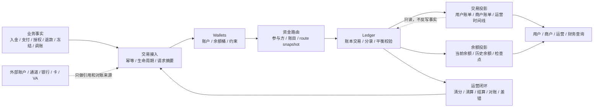
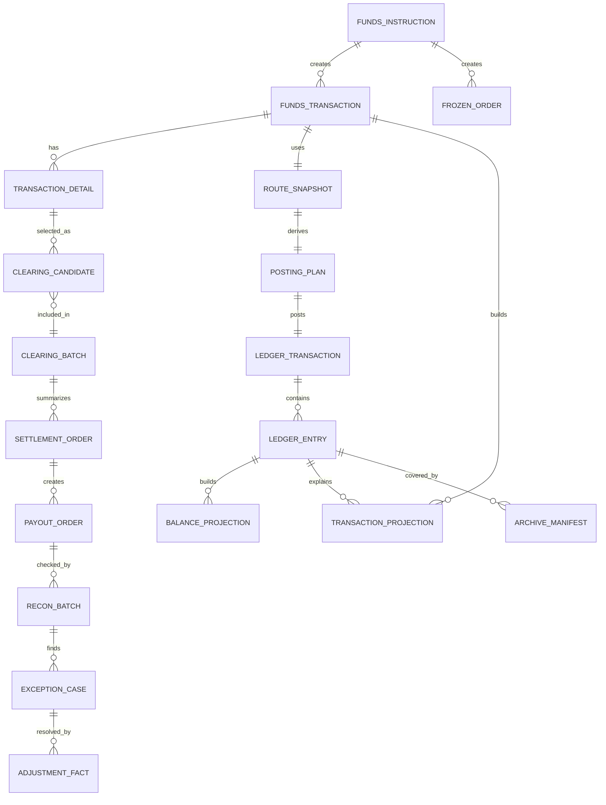
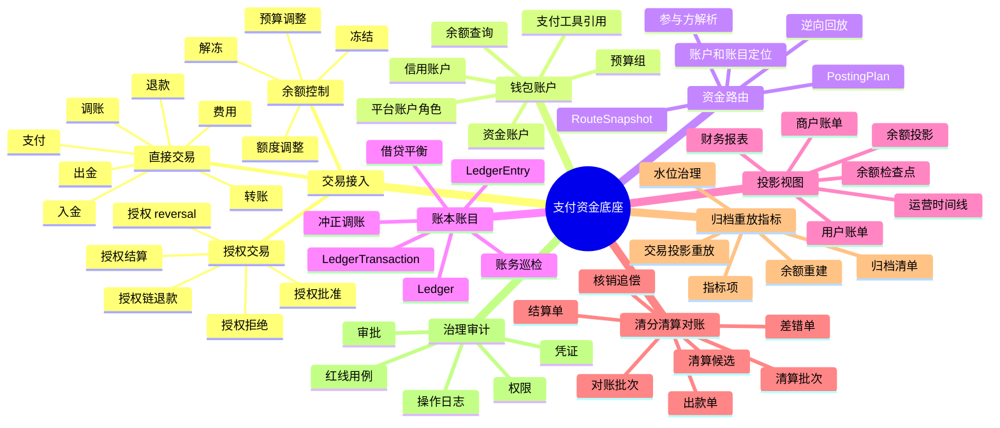
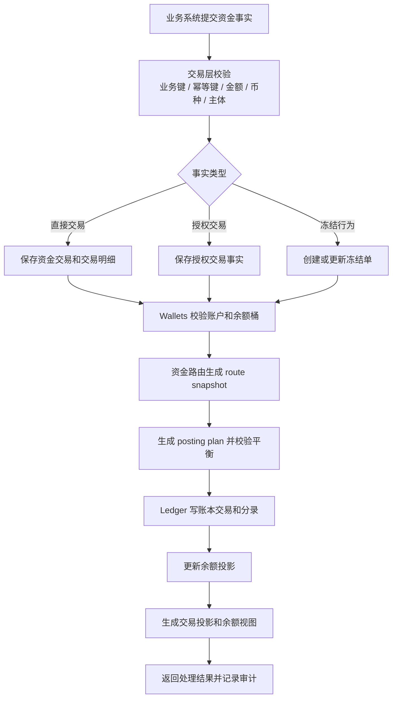
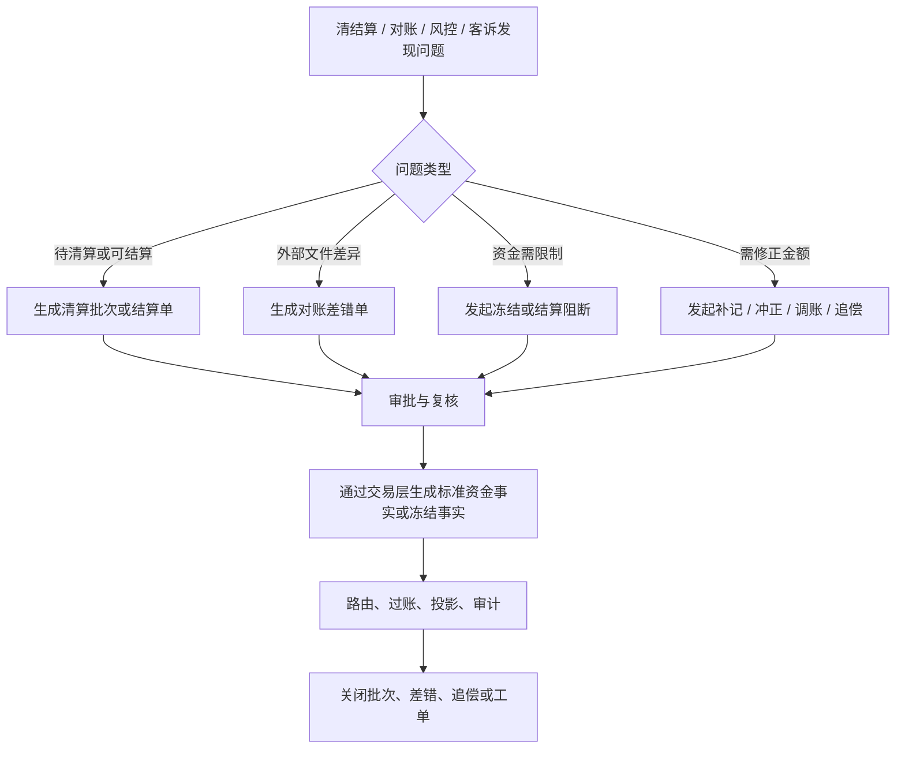
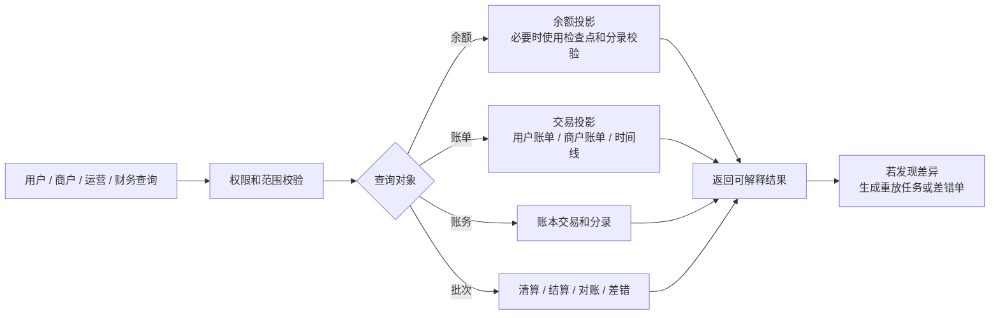
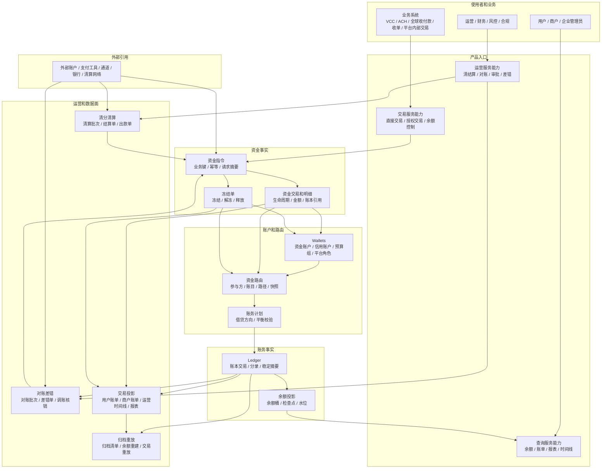
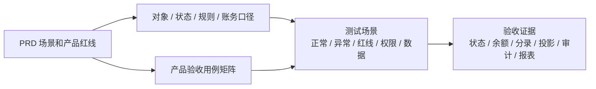

# 支付资金底座 PRD 总览

## 1. 一页摘要

支付资金底座的产品目标是把支付、钱包、账户、账本、清结算、对账、投影和归档收敛为一套可复用、可核对、可重建的资金底座。

从使用者角度看，它要解决的不是“写一套账务代码”，而是让用户、商户、运营、财务、风控和业务系统都能回答同一个问题：一笔钱从哪里来，经过哪些状态，当前属于谁，为什么能用或不能用，出现退款、拒付、出款失败或对账差异时该如何处理，最后能否被账本和报表证明。

本 PRD 的核心交付：

| 维度 | 产品结论 |
| --- | --- |
| 产品定位 | 支付资金底座，不是单一 VCC、ACH、收单、全球付款或钱包产品。 |
| 核心用户 | 业务接入方、用户、商户、企业管理员、运营、财务、风控、合规、安全、研发和测试。 |
| 核心能力 | 交易接入、资金路由、钱包账户、账目和账本、余额投影、交易投影、清结算、对账差错、归档重放、指标报表。 |
| 事实原则 | 交易事实、冻结事实、账务事实、余额投影和交易视图分层表达，不能互相替代。 |
| 资金原则 | 余额变化必须能被账本分录解释；外部账户和支付工具只做引用，不作为内部账本主体。 |
| 验收原则 | 每个资金场景必须同时验证状态、金额、账目、账本、投影、幂等、审计和异常路径。 |

### 1.1 一图读懂资金底座

这张图只表达一个核心判断：资金底座的写入链路必须从业务事实进入交易接入，再经过账户约束、路由和账本；查询、报表、运营处理和重放都只能消费或追加事实，不能绕过账本改余额。

## 2. 背景

Capte 后续业务会持续覆盖 VCC 发卡、ACH、全球收付款、平台内部交易、商户收款、结算出款、退款争议、费用和报表。若每个业务线各自处理余额、流水、退款、冻结、授权、结算和对账，资金语义会很快分裂：

1. 用户看到的余额和账本分录无法解释。
2. 商户订单款、待清算、可结算、出款中和已出款状态混用。
3. 授权拒绝、争议拒付、退款、退汇、return 等逆向动作无法区分。
4. 财务对账只能靠报表汇总，不能追溯到单笔事实。
5. 清结算、归档和重放会因为缺少稳定事实源而变成高风险人工修复。

支付资金底座的第一性原理很简单：钱的系统必须让每一笔金额都能被解释、被核对、被重建。产品设计必须围绕“事实、归属、状态、规则、审计、验收”展开，而不是围绕页面、接口或数据库表展开。

## 3. 目标与非目标

### 3.1 产品目标

| 目标 | 说明 | 验证方式 |
| --- | --- | --- |
| 资金语义统一 | 交易、钱包、账本、清结算、对账和报表使用同一套概念。 | 概念边界评审、用例矩阵、红线用例。 |
| 账务事实可信 | 每次余额变化都能追溯到账本交易、账务计划和分录。 | 分录平衡测试、余额投影测试、账务巡检。 |
| 钱包余额可解释 | 可用、冻结、授权、待清算、出款中、额度、预算等余额桶口径清楚。 | 余额查询、账单和运营视图核对。 |
| 交易接入稳定 | 上层业务通过统一资金事实入口接入，不直接写余额或分录。 | 幂等、请求摘要、route snapshot 和交易生命周期验收。 |
| 清结算可追踪 | 清算候选、清算批次、结算单、出款单和追偿单可追溯到明细。 | 清结算用例和批次重跑验收。 |
| 对账差错可闭环 | 差错能被发现、分类、阻断、处理、核销和审计。 | 对账批次、差错单、调账核销验收。 |
| 归档重放可治理 | 大数据量下仍能重建余额、重放交易视图、输出差异报告。 | 水位、检查点、归档清单和重放任务验收。 |
| 产品验收可 TDD | PRD 场景能直接转换为测试清单。 | 产品验收用例矩阵。 |

### 3.2 成功指标

成功指标用于判断产品设计是否真正解决了资金底座问题。它不是经营承诺，而是产品验收、运营复盘和风险治理的共同观察口径。

| 指标域 | 成功标准 | 验收或观察方式 |
| --- | --- | --- |
| 资金可解释 | 任一余额变化都能追溯到资金事实、route snapshot、账本交易、分录和投影。 | 单笔链路查询、账本分录核对、余额投影校验。 |
| 资金可核对 | 业务单、资金交易、账本、清结算批次、外部流水和报表之间能按规则对平。 | 对账批次、差错单、重新对账结果。 |
| 资金可重建 | 余额投影、交易投影和报表投影出现差异时，可按边界重建或重放。 | 检查点、水位、归档清单、差异报告。 |
| 运营可闭环 | 异常、差错、冻结、调账、追偿和出款失败有处理单、审批、凭证和终态。 | 运营工作台、差错生命周期、审计日志。 |
| 风险可阻断 | 授权拒绝、余额不足、错币种、缺快照、无审批调账、无界重放等红线必须失败。 | 产品红线用例和失败验收。 |
| 数据可追溯 | 用户账单、商户账单、运营时间线、财务报表和指标都能回溯到事实源。 | 投影来源引用、报表口径版本、导出审计。 |

### 3.3 非目标

1. 不在本 PRD 中设计完整 VCC、ACH、全球付款、收单或跨境外汇产品。
2. 不替代卡组织、ACH、银行、PSP、清算网络或合作机构协议。
3. 不替代法务、税务、会计、合规、审计或持牌机构最终确认。
4. 不把普通平台内部清分、合同结算写成持牌清算业务。
5. 不承诺支付牌照、客户备付金管理、跨境支付、外汇执行或监管报送能力。
6. 不展开代码接口、表结构、类设计和事务实现细节；这些由后续工程设计承接。

## 4. 核心概念

### 4.1 概念分层

| 层级 | 核心对象 | 产品解释 | 是否事实源 |
| --- | --- | --- | --- |
| 业务产品层 | 业务订单、卡授权、ACH 指令、提现申请、商户结算申请、争议单 | 业务系统自己的单据和状态。 | 由业务系统决定 |
| 交易接入层 | 资金指令、资金交易、交易明细 | 底座接收业务资金事实的统一入口。 | 是，记录资金侧事实 |
| 余额控制层 | 冻结单 | 表达冻结、解冻、部分释放、到期释放。 | 是，记录控制事实 |
| 钱包账户层 | 资金账户、信用账户、预算组、平台资金账户角色、支付工具引用 | 表达主体、账户、余额桶和展示口径。 | 账户是事实，余额来自账本 |
| 资金路由层 | 参与方、路径、route snapshot、账务计划 | 把资金事实翻译成可入账路径。 | route snapshot 是回放事实 |
| 账务事实层 | 账本、账目、账本交易、分录 | 不可变账务事实和审计依据。 | 是，账务最终事实源 |
| 余额投影层 | 余额投影、余额检查点、水位 | 从分录派生的当前和历史余额。 | 否，可重建 |
| 交易投影层 | 用户账单、商户账单、运营时间线、财务报表 | 面向使用者的只读视图。 | 否，只读投影 |
| 运营闭环层 | 清算批次、结算单、出款单、对账批次、差错单、调账单 | 对账、清结算、异常和人工处理。 | 处理单据是事实，不能直接改账 |

### 4.2 关键概念边界

| 概念 | 易懂定义 | 能力边界 |
| --- | --- | --- |
| 资金交易 | 一笔已经进入资金处理链路的事实，例如入金、支付、转账、退款、授权、结算、费用、调账。 | 不等于业务订单，也不等于账本交易；冻结不放进资金交易主表。 |
| 冻结单 | 同一个资金主体内部把可用余额暂时转为冻结余额。 | 冻结不是消费、扣划、授权或退款；若后续要扣划，必须创建新的资金事实。 |
| 资金路由 | 把交易事实解析为付款方、收款方、平台角色、余额桶和账务路径。 | 不判断业务订单是否成立，不直接改余额，不在缺快照时重新选路。 |
| 钱包 | 面向用户、商户、企业和运营展示资金、额度、预算和余额状态的产品层。 | 不替代账本，不允许业务侧绕过交易层直接改余额。 |
| 资金账户 | 承载真实资金余额的账户主体。 | 可以有可用、冻结、授权、待清算、出款中等余额桶；外部银行账户不是内部资金账户。 |
| 信用账户 | 承载授信额度和授权占用的控制账户。 | 不是现金账户；额度不是钱；已消费进入交易视图和报表，不新增账务 `CONSUMED`。 |
| 预算组 | 承载预算总量、可用预算和预算占用的控制账户。 | 不是资金池；预算超用和预算调减要进入报表或治理流程。 |
| Spend Controls / 发卡授权控制扩展 | 发卡、VCC、企业卡或员工卡场景中，授权发生前用于判断某次支出是否允许的可选扩展能力，例如单笔金额、MCC、商户、国家、入卡方式、CVV/AVS、次数和周期窗口。 | 它决定“能不能进入授权占用”，不是资金底座核心主链路、不是账本、不是路由、不是清结算；未启用发卡授权控制时，普通资金交易和授权交易不依赖该能力。 |
| 账本 | 某主体、币种和账本 Profile 下的账务事实容器。 | 缺账本不得自动入账；账本不是钱包、业务订单或报表。 |
| 账本周期 | 同一主体、币种、账目下按生命周期、天、小时、周、月、季、年或自定义周期切分的账本 bucket。 | 不是清结算账期、报表周期或归档水位；非 `LIFETIME` 周期必须有明确 `periodId` 和周期策略，不能跨周期串账。 |
| 账目 | 账本里的余额桶或科目，例如 `AVAILABLE`、`FROZEN`、`AUTHORIZATION`。 | 账目不是账户主体；它表达账户内某类余额状态。 |
| 余额投影 | 根据账本分录算出来的当前或历史余额。 | 可以重建和校验，不能反向修改分录。 |
| 交易投影 | 面向用户、商户、运营、财务展示的账单和时间线。 | 只能从事实派生，不得写回交易事实、账本事实或余额事实。 |
| 清分 | 按规则把交易明细归集到可处理候选、责任方和金额项。 | 不直接出款，不替代账本，不表达持牌清算业务。 |
| 清算 | 平台内部确认待清算金额可以进入可结算口径。 | 默认表达内部资金明细确认和账务转换；外部清算规则另行确认。 |
| 对账 | 比较业务、交易、账本、外部文件、银行流水、余额投影和报表是否一致。 | 发现差异后不能直接改历史账，要进入差错、补记、冲正、调账或核销流程。 |

### 4.3 三类行为不能混用

| 行为 | 产品含义 | 是否改变资金归属 | 事实载体 | 典型账目变化 |
| --- | --- | --- | --- | --- |
| 直接交易 | 已确认的资金事实，如入金、支付、转账、退款、费用、调账。 | 通常改变 | 资金交易 | 付款方目标桶减少，收款方目标桶增加。 |
| 授权交易 | 最终交易前的资金、额度或预算占用。 | 授权成功阶段不改变，结算后改变 | 资金交易 | `AVAILABLE -> AUTHORIZATION`；结算时关闭或减少占用。 |
| 冻结行为 | 风控、运营、提现或争议下的可用性限制。 | 不改变 | 冻结单 | `AVAILABLE <-> FROZEN`。 |

### 4.4 核心对象关系

对象关系的核心判断：

1. 资金指令只是入口，真正的事实分为资金交易和冻结单。
2. 资金交易、route snapshot、posting plan、账本交易和分录构成写入证据链。
3. 余额投影和交易投影都从事实派生，只读可重建。
4. 清算候选、清算批次、结算单、出款单、对账批次和差错单是不同运营对象，不能合并成一个状态机。
5. 归档清单覆盖事实范围，不能改变事实身份。

## 5. 角色与使用者

| 角色 | 关注问题 | 核心能力 |
| --- | --- | --- |
| 业务接入方 | 如何把业务事实安全接入资金底座。 | 提交资金指令、查询交易结果、订阅状态。 |
| 用户 | 我的余额、冻结、授权、提现、退款是否正确。 | 查询余额、账单、交易状态和失败原因。 |
| 商户 | 订单收款何时可清算、可结算、可出款，退款和拒付如何扣回。 | 查询待清算、可结算、出款中、结算单和账单。 |
| 企业管理员 | 企业信用额度、预算、员工卡或团队支出如何被控制。 | 管理额度、预算、授权占用和消费报表。 |
| 运营 | 异常入账、冻结、解冻、挂账、退款、调账、追偿如何处理。 | 工单、审批、差错处理、时间线和操作审计。 |
| 财务 | 账是否平，钱是否对得上，结算和报表是否可追溯。 | 账本查询、清结算、对账、差错核销和报表导出。 |
| 风控 | 高风险商户、负余额、争议、冻结、出款阻断是否受控。 | 风险阻断、冻结、准备金、追偿和放行审批。 |
| 合规 / 安全 | 资金归属、权限、隐私、审计、证据和正式启用前置是否充分。 | 敏感数据控制、审计、证据引用、合规待确认清单。 |
| 研发 / 测试 | 如何理解产品对象、状态、账务影响、验收断言和失败红线。 | 产品验收矩阵、测试场景、回归验证和设计评审。 |

## 6. 产品能力地图

## 7. 总体流程

### 7.0 核心场景总表

| 场景域 | 触发方 | 产品目标 | 关键输出 | 验收入口 |
| --- | --- | --- | --- | --- |
| 入金和充值 | 外部通道、业务系统、运营补入账 | 把外部成功资金事实转成内部可解释余额。 | 资金交易、route snapshot、账本分录、余额投影。 | `AC-IN-*` |
| 支付和转账 | 用户、商户、业务系统 | 完成主体间资金转移并保留完整账务证据。 | 交易明细、账本交易、用户/商户账单。 | `AC-PAY-*`、`AC-MER-*` |
| 授权和 reversal | 发卡、额度、预算或风控场景 | 先占用资金、额度或预算，再由后续事件结算或释放。 | 授权快照、占用账目、拒绝原因。 | `AC-AUTH-*` |
| 冻结和解冻 | 风控、运营、提现、争议 | 限制同一主体可用性，不改变资金归属。 | 冻结单、释放记录、审批审计。 | `AC-CTRL-*` |
| 退款和拒付 | 用户、商户、外部机构、运营 | 基于原路径处理逆向资金。 | 原 route snapshot 回放、退款或追偿事实。 | `AC-AUTH-006`、`AC-REC-*` |
| 清分清算 | 运营、财务、系统批处理 | 把商户待清算款确认到可结算口径。 | 清算候选、清算批次、清算账务动作。 | `AC-CLR-*` |
| 结算出款 | 财务、出纳、外部付款通道 | 计算净额、锁定出款金额并跟踪外部结果。 | 结算单、出款单、外部回单。 | `AC-SET-*` |
| 对账差错 | 财务、运营、外部文件、巡检 | 发现并闭环单据、账务、资金和报表差异。 | 对账批次、差错单、调账/核销结果。 | `AC-REC-*` |
| 归档重放 | 产品、数据、财务、研发 | 大数据量下仍能证明余额和视图正确。 | 检查点、水位、Manifest、差异报告。 | `AC-ARCH-*`、`AC-REPLAY-*` |
| 报表指标 | 产品、运营、财务、风控 | 提供只读经营、资金和风险观察口径。 | 指标项、口径版本、指标水位。 | `AC-RPT-*` |

### 7.1 主写入流程

### 7.2 运营闭环流程

### 7.3 查询和重放流程

## 8. 产品架构图

## 9. 产品范围

本 PRD 的产品范围按能力域说明，聚焦能力边界、业务规则和验收标准。

| 能力域 | 产品能力 | 能力边界 |
| --- | --- | --- |
| 交易接入 | 直接交易、授权交易、余额控制、幂等、请求摘要、交易生命周期。 | 交易层记录资金侧事实，不替代业务订单、外部通道状态机或运营工单。 |
| 资金路由 | 参与方解析、平台账户角色解析、route snapshot、posting plan、逆向回放。 | 路由只解析资金路径，不直接写交易事实、账本分录或余额。 |
| 钱包账户 | 资金账户、信用账户、预算组、平台资金账户角色、支付工具引用、余额查询。 | 钱包表达账户能力和查询入口，不承载交易命令，不绕过账本改余额。 |
| 账本账目 | 账本、账目、账本周期、账本交易、分录、借贷平衡、余额投影、账务巡检。 | 账本分录是不可变事实，余额投影可重建，不反向修改历史分录。 |
| 交易投影 | 用户账单、商户账单、运营时间线、财务报表基础视图。 | 交易投影是只读读模型，不写交易、路由、账本或余额事实。 |
| 清分清算 | 清算候选、清算批次、结算单、出款单、失败回退、追偿入口。 | 清算候选不入账，清算批次、结算单和出款单必须分对象表达。 |
| 对账差错 | 交易对账、资金到账对账、账务一致性核对、差错单、调账核销。 | 对账差异不能直接改历史分录或余额，必须通过差错、审批、凭证和追加事实闭环。 |
| 归档重放 | 余额检查点、水位、归档清单、余额重建、交易投影有界重放。 | 归档只改变冷热位置，余额重建只从账本事实恢复，交易投影重放只修复读模型。 |
| 报表数据面 | 指标项、口径版本、指标快照、指标水位、导出审计和数据质量校验。 | 指标只读消费事实和投影，不反写资金事实。 |
| 发卡授权控制扩展 | Spend controls、card controls、velocity controls、collaborative authorization、账户/卡暂停和发卡运营审计。 | 只属于发卡、VCC、企业卡或员工卡场景的授权前控制扩展，不进入默认资金底座核心能力。 |

## 10. 产品红线

1. 外部银行账户、卡、VA、通道账户和支付工具不得作为内部账本主体。
2. 业务系统不得直接修改余额、账本分录或余额投影。
3. 商户订单款不得直接进入 `AVAILABLE` 或 `SETTLEMENT`，默认先进入 `CLEARING`。
4. 授权拒绝不得生成 route leg、账本分录或争议拒付金额。
5. 冻结不得表达消费、扣划、退款或授权结算。
6. 退款、reversal、拒付、退汇、手续费退回应基于原 route snapshot；缺快照不得静默重新选路。
7. 对账发现差异后不得直接修改历史分录或余额。
8. 交易投影、报表和余额变更日志不得反向污染事实层。
9. 归档不能破坏余额重建和审计追溯。
10. 涉及客户资金、备付金、跨境、外汇、持牌能力、个人信息和金融数据时，必须保留法务、财务、合规、安全和持牌机构待确认项。

## 11. 验收总原则

| 验收口径 | 必须回答的问题 |
| --- | --- |
| 单平 | 业务单、资金交易、通道单、冻结单、争议单、出款单能否互相解释。 |
| 账平 | 账本交易、账务计划、分录、余额投影是否平衡且可重建。 |
| 钱平 | 内部应收应付、外部流水、通道文件、清算文件是否能核对。 |
| 批平 | 清算批次、结算批次、对账批次、报表批次是否可追溯。 |
| 责平 | 用户、商户、平台、通道、银行、合作方责任是否清楚。 |
| 权限平 | 高危操作是否有权限、审批、原因、凭证、操作者和审计。 |
| 风险平 | 负余额、争议、退款、出款失败、跨境和持牌能力是否有阻断或确认机制。 |

## 12. 运营后台能力边界

运营后台不是“万能改账工具”，而是把差错处理、审批、冻结、调账、追偿、清结算和对账处理纳入可审计流程的工作台。它面向运营、财务、风控、合规和客服，让他们能看清处理状态、责任方、证据和下一步动作。

| 能力 | 使用者目标 | 允许动作 | 能力边界 |
| --- | --- | --- | --- |
| 统一查询 | 按用户、商户、业务单、交易、账本、批次、外部 reference 定位资金链路。 | 查询、筛选、查看来源和状态。 | 查询结果只读，不直接改事实。 |
| 差错处理 | 推进挂账、补文件、调账、核销和追偿。 | 创建处理单、提交审批、补充凭证、核销差错。 | 调账必须追加事实和分录，不修改历史分录。 |
| 风险控制 | 处理冻结、解冻、负余额、争议和出款阻断。 | 冻结、解冻、设置阻断、提交复核。 | 冻结只表达可用性控制，不表达消费或扣划。 |
| 清结算处理 | 查看清算候选、结算单、出款单和失败回退。 | 复核、驳回、退回补资料、发起出款。 | 不绕过清算批次、结算策略和对账阻断。 |
| 审计和导出 | 支持财务、风控、合规追溯高危操作。 | 权限内导出、查看审批链和前后值。 | 敏感数据导出必须审批、脱敏和留痕。 |

所有运营动作都必须落到明确的处理单、审批单、差错单、冻结单、调账单、批次或审计记录，不能以“后台修正”的形式绕开交易、路由、账本和投影边界。

## 13. 务虚与务实评估

本节借用东方思维中的几个朴素框架来审视产品设计：先分清“体”和“用”，再看“道、法、术、器”是否连贯；先立长期之本，再检查短期落地之末；在稳定原则和场景变化之间保留“经权”空间。这里不是引入玄学概念，而是把复杂资金产品拆成更容易判断的产品问题。

### 13.1 务虚：战略设计和产品发展路径

| 视角 | 需要回答的问题 | 当前 PRD 的状态 | 可用性与可靠性结论 |
| --- | --- | --- | --- |
| 体用 | 产品的根本是什么，能力只是服务什么目标。 | 已把根本收敛为“每一笔金额都能被解释、被核对、被重建”，能力围绕交易、钱包、账本、投影、清结算、对账和归档展开。 | 可用。设计没有停留在功能清单，而是围绕资金可信这个本体展开。 |
| 道法术器 | 长期原则、规则体系、执行方法和工具载体是否一致。 | 道是资金事实可信；法是概念边界、产品红线和验收原则；术是主流程、逆向流程、运营闭环和 TDD 用例；器是交易层、Wallets、Ledger、投影、清结算、对账和报表模块。 | 基本可靠。产品原则、业务流程、运营动作和验收标准能够相互支撑。 |
| 本末 | 是否先守住资金归属、账务可信和审计追溯，再谈场景扩张。 | 基础资金事实、账务可信、清结算、对账和审计治理构成底座；多币种、归档、自动化、报表和发卡扩展建立在底座之上。 | 可用。发展顺序符合“先立底座，再扩场景”的产品节奏。 |
| 阴阳 | 稳定事实和灵活业务之间是否平衡。 | 事实层保持稳定；业务订单、卡、ACH、VCC、全球收付款等作为上层场景接入；外部账户和通道只做引用。 | 可靠。既没有把业务变化写死到账本，也没有让业务绕过资金事实。 |
| 经权 | 不变红线和可变策略是否分清。 | 红线约束余额、账本、冻结、授权拒绝、对账差异和归档；清算策略、风控策略、结算周期、指标口径可按规则配置和审批治理。 | 可用。稳定事实与可配置策略分层清楚。 |
| 相生相克 | 能力之间是否能互相支撑、互相制衡。 | 交易生路由，路由生账本，账本生投影，投影支撑查询和报表；对账反向发现差异，运营闭环追加事实，审计约束高危操作。 | 可靠。能力闭环已经成型。 |

务虚层面的总体判断：当前 PRD 可以作为支付资金底座的最终版产品蓝图。它的核心不是功能堆叠，而是围绕“资金可信、可核对、可重建”建立一套稳定的产品结构和治理边界。

### 13.2 务实：战术执行和产品落地执行

| 执行维度 | 当前可用内容 | 还要落成什么 | 落地判断 |
| --- | --- | --- | --- |
| 场景执行 | 已覆盖直接交易、授权、冻结、退款、清算、结算、出款、对账、归档和重放。 | 每个场景都有触发条件、期望结果、异常分支和验收入口。 | 可用。 |
| 资金执行 | 已定义交易事实、route snapshot、posting plan、账本分录、余额投影和交易投影边界。 | 每个资金动作都能说明来源、去向、账目、周期和审计要求。 | 可靠。 |
| 运营执行 | 已定义差错、冻结、审批、调账、追偿、清结算处理和审计边界。 | 运营动作必须落到处理单、审批、凭证、状态和审计。 | 可用。 |
| 财务执行 | 已定义单平、账平、钱平、批平、责平和权限平。 | 财务可按明细、批次、账本、外部流水和报表口径核对。 | 可用。 |
| 风控执行 | 已定义冻结、出款阻断、争议、负余额和合规待确认项。 | 风险动作需要有来源、规则、审批、阻断和放行依据。 | 可靠。 |
| 验收执行 | 已有产品验收用例矩阵和 TDD 转化路径。 | 验收覆盖正常路径、异常路径、红线失败、权限审计和数据质量。 | 具备落地条件。 |

务实层面的总体判断：PRD 已经能支撑产品评审、运营评审、财务风控评审以及研发和测试理解产品边界。它不承担代码设计职责，但已经把后续设计和验证所需的产品输入表达清楚。

## 14. 产品验收与落地边界

产品设计不替代后续工程设计，但必须给后续工作提供稳定的产品输入。本 PRD 的落地边界是：说明“什么结果算对、什么行为必须禁止、哪些风险必须可审计”，不展开工程细节。

### 14.1 产品输入完整性

| 要素 | PRD 已给出的产品输入 | 后续设计必须保持的边界 |
| --- | --- | --- |
| 问题和目标 | 背景、目标、非目标、产品红线。 | 不偏离“资金可信、可核对、可重建”的核心目标。 |
| 使用者和角色 | 业务接入方、用户、商户、运营、财务、风控、合规、研发测试。 | 权限、审批、导出、审计必须按角色区分。 |
| 领域对象 | 交易、冻结、账户、路由、账本、投影、清算、结算、出款、对账、归档、指标。 | 事实对象、处理单据、只读投影和外部引用不能混用。 |
| 业务流程 | 主写入、运营闭环、查询重放、清结算和对账流程。 | 正常、逆向、异常、人工处理都必须可解释。 |
| 状态机 | 授权、冻结、清结算、对账、归档、重放等状态方向。 | 状态变化必须有触发动作、终态、失败原因和审计。 |
| 账务规则 | 账本最终事实源、posting plan 平衡、投影只读、周期隔离。 | 每个资金变化都必须能说明来源、去向、账目、周期和余额影响。 |
| 数据治理 | 事实源、投影、归档、重放、指标和报表边界。 | 归档、重建、重放和指标计算都不能反写资金事实。 |
| 外部规则 | 卡、ACH、银行、PSP、跨境、外汇和持牌能力的参考入口和待确认边界。 | 公开资料只作参考，正式启用前必须按实际法域、协议和合作方规则确认。 |

### 14.2 产品验收链路

产品验收的关键是：每个场景都能说明输入事实、期望状态、账务影响、投影结果、异常分支、权限审计和必须失败的红线。

### 14.3 风险校准和控制口径

| 风险 | 产品判断 | 必须固化的控制口径 | 验收入口 |
| --- | --- | --- | --- |
| PRD 范围过大 | 当前 PRD 是完整产品蓝图，不是一个单一交付对象。交易、清结算、归档、指标和发卡扩展的对象、使用者和风险不同。 | 每个能力都必须能独立说明对象、状态、规则、账务影响和验收边界。 | 产品范围、能力地图、用例矩阵。 |
| 账本周期被误用 | 账本周期只服务账本 bucket 隔离和余额证明；清结算账期、结算周期、报表周期、归档水位、spend-rule window 都不是账本周期。 | 必须保持周期语义矩阵，明确每类周期的归属、用途、是否入账和失败红线。 | `RED-022`、`RED-023`、`RED-024`、`RED-027`。 |
| 余额日志被当事实源 | 余额变更日志是从分录和余额投影派生的观察记录，不是余额修复依据，也不是新的余额事实源。 | 日志失败不回滚账本过账和余额投影，日志补偿只能重建观察结果。 | `AC-BALLOG-001`、`RED-036`。 |
| 清结算对象再次膨胀 | 清分、清算、结算、出款、对账、差错、追偿是不同产品对象。 | 每个对象必须有定位、状态、责任、账务影响、阻断规则和重跑边界。 | `AC-CLR-*`、`AC-SET-*`、`AC-REC-*`、`RED-031`、`RED-032`、`RED-033`。 |
| 差错处理绕过追加事实 | 对账差异和调账不是“修数据”，而是追加事实、审批、凭证、核销和重新对账的闭环。 | 差错处理不得直接改历史分录、余额或投影；必须保留差错单、责任方、处理动作、审批、账务引用和重新对账结果。 | `AC-REC-006`、`AC-OPS-002`、`RED-010`、`RED-011`、`RED-028`。 |
| 归档重放生产事故 | 归档只改变冷热位置，重放只修复读模型；水位、检查点、Manifest、差异报告是产品安全边界。 | 无范围重放、先推水位再计算、缺检查点或缺 Manifest、指标水位复用余额水位都必须失败。 | `AC-ARCH-*`、`AC-REPLAY-*`、`AC-RPT-003`、`RED-016`、`RED-018`、`RED-019`、`RED-029`、`RED-034`。 |
| 发卡扩展污染核心 | Spend Controls 只属于发卡、VCC、企业卡或员工卡扩展，不是资金底座默认核心能力。 | 保持 `ISSUING_SPEND_CONTROLS` 扩展标识；未启用发卡产品时，只保留产品边界和验收红线。 | `AC-AUTH-007`、`AC-AUTH-008`、`AC-AUTH-009`、`RED-025`、`RED-026`、`RED-027`、`RED-035`。 |
| 外部规则时效性 | Highnote、Stripe、Visa、Mastercard、Nacha、Adyen、Marqeta、Lithic 等公开资料只能作为产品设计参考，不能替代正式协议、规则文本或正式启用结论。 | 正式启用相关能力前必须补规则版本、适用法域、生效日期、核验日期、确认方和确认结论；无法确认最新规则时只能作为待确认项。 | `AC-RAIL-*`、`AC-FX-*`、`RED-021`、第 15 节外部参考。 |

## 15. 外部参考和适用边界

外部资料只作为产品设计参照，不作为支付资金底座的正式业务规则，也不替代合作方协议、监管规则、卡组织规则、银行规则、法务、税务、会计或合规结论。涉及真实启用地区、通道和产品形态时，必须以最新协议、正式规则文本和合规评审为准。

本表的“核验口径”只表示本 PRD 编写时已经确认该资料可作为公开参考入口，不表示其规则版本、适用法域、合同优先级或生效日期已经完成正式启用核准。正式启用相关能力前，必须补齐“核验日期、规则版本或发布日期、适用法域、生效日期、确认方、确认结论”。

| 参考来源 | 参考内容 | 本 PRD 吸收方式 | 核验口径 | 适用边界 |
| --- | --- | --- | --- | --- |
| [Formance Ledger Introduction](https://docs.formance.com/modules/ledger/introduction) | 产品账本、不可变日志、多分录交易、幂等、多账本和审计追溯。 | 强化 Ledger 作为资金事实和余额派生源的设计。 | 公开产品文档入口，PRD 阶段按设计参考使用。 | 不照搬 Numscript 或部署模型；仅参考产品账本思想。 |
| [Formance Wallets Introduction](https://docs.formance.com/modules/wallets/introduction) | Wallets 作为上层钱包能力，支持多币种余额和 hold，底层依赖 Ledger。 | 支持本 PRD 中 Wallets 是产品层、Ledger 是账务事实层的分层。 | 公开产品文档入口，PRD 阶段按设计参考使用。 | 不把 Formance Wallets 的能力集等同于本产品范围。 |
| [Formance Reconciliation Introduction](https://docs.formance.com/modules/reconciliation/introduction) | Ledger 与外部现金池、银行或 PSP 余额核对，发现差异并形成报告。 | 支撑“钱平、批平、差错闭环、外部账户只做对账来源”的口径。 | 公开产品文档入口，PRD 阶段按设计参考使用。 | 不直接采用其 reconciliation policy 模型；本产品按业务批次、账本事实和差错闭环重新定义。 |
| [Highnote Transaction Lifecycle](https://docs.highnote.com/docs/issuing/transactions/transaction-lifecycle) | 卡交易中的授权、清算、结算、reversal、退款、forced post 和 pending funds。 | 校准授权、清算、结算、reversal、退款和授权占用的概念边界。 | 公开产品文档入口，PRD 阶段按卡交易参考使用。 | 只作为卡交易参考；ACH、钱包内转、平台清结算需另行建模。 |
| [Highnote Using Ledgers](https://docs.highnote.com/docs/issuing/accounts/funding/using-ledgers) | 金融事件、ledger entry、account balance、授权账本和可用现金账本。 | 支撑“活动和余额分层、pending 和 available 分开解释”的钱包账目口径。 | 公开产品文档入口，PRD 阶段按钱包和账本参考使用。 | 不代表本产品必须采用 Highnote 的 ledger name 或 GraphQL API。 |
| Highnote Spend Controls 目录：[Spend Rules](https://docs.highnote.com/docs/issuing/spend-controls/spend-rules)、[Velocity Controls](https://docs.highnote.com/docs/issuing/spend-controls/velocity-controls)、[Suspend an Account](https://docs.highnote.com/docs/issuing/spend-controls/suspend-account)、[Collaborative Authorization](https://docs.highnote.com/docs/issuing/spend-controls/collaborative-authorization)、[Collaborative Authorization Fleet Data](https://docs.highnote.com/docs/issuing/spend-controls/collaborative-authorization-fleet)、[Simulate Collaborative Authorization](https://docs.highnote.com/docs/issuing/spend-controls/sim-collaborative-authorization) | 发卡授权前的支出规则、MCC/MID/国家/POS/PAN/CVV/AVS、单笔金额、次数、时间窗口、账户暂停、协同授权和模拟授权。 | 支撑本 PRD 将 spend-controls 定位为“发卡授权控制扩展”，只在发卡、VCC、企业卡或员工卡场景下作为授权前决策能力，不放入资金底座核心能力。 | 公开产品文档入口，2026-05-18 按 Highnote spend-controls 目录核验。 | 不照搬 Highnote 的 GraphQL、规则数量限制、Fleet 形态或 UTC 窗口；正式启用时需要按自身产品确认作用域、优先级、规则版本、窗口口径、生效延迟、协同授权超时和审计。 |
| [Stripe Issuing Spending Controls](https://docs.stripe.com/issuing/controls/spending-controls) 与 [Real-time Authorizations](https://docs.stripe.com/issuing/controls/real-time-authorizations) | 对发卡卡片或持卡人设置 spending controls，并可通过实时授权扩展外部决策。 | 支撑“规则控制”和“外部授权决策”分层：spend controls 是授权前门禁，实时授权是外部决策接入，不替代资金路由和账本。 | Stripe 官方公开文档，2026-05-18 核验。 | Stripe 的卡产品对象、API 和风控结果不等同于本产品 DSL；只吸收产品分层。 |
| [Marqeta Velocity Controls](https://www.marqeta.com/docs/core-api/velocity-controls) | 基于金额、次数、商户、MCC、时间窗口等条件限制授权交易。 | 支撑 velocity control 作为独立累计窗口，不和账本周期、清算账期或报表周期混用。 | Marqeta 官方公开文档，2026-05-18 核验。 | 不照搬 Marqeta 资源模型、字段名或窗口限制；仅作为发卡授权控制参考。 |
| [Lithic Authorization Rules v2](https://docs.lithic.com/docs/authorization-rules-v2) | 支持基于规则、速度限制、商户和交易属性的授权决策。 | 支撑“规则条件、动作、拒绝原因和版本审计”作为发卡授权控制扩展的产品口径。 | Lithic 官方公开文档，2026-05-18 核验。 | 不采用 Lithic API 结构；仅作为行业规则模型参考。 |
| [Adyen Issuing Transaction Rules](https://docs.adyen.com/issuing/transaction-rules/) | 通过交易规则定义发卡交易的允许、拒绝、暂停或审批动作。 | 支撑 spend-controls 可扩展到交易规则、审批和运营动作，但仍属于发卡授权控制扩展。 | Adyen 官方公开文档，2026-05-18 核验。 | Adyen 规则动作和平台对象需按实际 Issuer/Processor/Program 协议重新确认。 |
| [Nacha Operating Rules](https://www.nacha.org/rules/operating-rules) | ACH 规则变更、风险管理、return、IAT、资金可用性等规则入口。 | 提醒 ACH 场景必须保留 return、风险监控、IAT 和资金可用性待确认项。 | 公开规则入口；正式启用 ACH 能力前必须二次核验规则、适用法域和合作银行要求。 | 本 PRD 不定义 ACH 合规结论；正式启用必须按 Nacha 规则和合作银行要求确认。 |
| [Visa Rules and Policy](https://usa.visa.com/support/consumer/visa-rules.html) 与 [Visa Core Rules Public PDF](https://usa.visa.com/dam/VCOM/download/about-visa/visa-rules-public.pdf) | Visa 网络规则、区域规则、争议、责任和网络参与方约束。 | 作为 VCC、授权、清算、争议拒付和证据留存的外部规则入口。 | 公开规则入口；正式启用 Visa 相关能力前必须核验规则版本、区域、BIN、Issuer/Program Manager 责任。 | 具体卡产品必须按签约区域、BIN、Issuer/Program Manager 规则确认。 |
| [Mastercard Rules](https://www.mastercard.com/us/en/business/support/rules.html) | Mastercard 公开规则入口，说明公开站点与官方规则之间的优先级关系。 | 作为 Mastercard 场景的争议、清算、责任和证据口径入口。 | 公开规则入口；正式启用 Mastercard 相关能力前必须核验规则版本、区域和合作方协议。 | 不能用公开网页替代正式规则、合作方协议或卡组织通知。 |
| [Stripe Respond to Disputes](https://docs.stripe.com/disputes/responding) | 争议通知、响应期限、证据组织、接受或抗辩争议。 | 支撑争议处理必须有差错单、证据、期限、状态和审计。 | 公开 PSP 文档入口，PRD 阶段按争议运营参考使用。 | Stripe 争议流程只是 PSP 示例，不等同于卡组织或银行最终规则。 |
| [Stripe Radar Documentation](https://docs.stripe.com/radar) 与 [Risk Evaluation](https://docs.stripe.com/radar/risk-evaluation) | 实时风险评估、风险分、规则、人工 review、风险结果。 | 支撑风控信号、出款阻断、人工复核和误伤处理的产品方向。 | 公开 PSP 文档入口，PRD 阶段按风控产品参考使用。 | 不采用 Stripe 风险模型；本产品只吸收“信号、规则、动作、复核”的产品框架。 |
| [Adyen Manage Disputes](https://docs.adyen.com/risk-management/manage-disputes) 与 [Risk Management](https://docs.adyen.com/risk-management) | 争议接受、抗辩、自动抗辩、证据要求、风险规则和 case management。 | 支撑运营后台中争议处理、风险 case、证据材料和权限角色设计。 | 公开 PSP 文档入口，PRD 阶段按争议和风控运营参考使用。 | 不等同于本产品争议流程；需要按实际 PSP、卡组织和地区规则裁剪。 |
| [Martin Fowler: Event Sourcing](https://www.martinfowler.com/eaaDev/EventSourcing.html) | 用事件序列保存状态变化，并可通过重放重建状态。 | 支撑事实不可变、投影可重建、归档重放和差异报告的产品原则。 | 公开工程文章，PRD 阶段按设计思想参考使用。 | 本产品不是纯 Event Sourcing 架构；只吸收事实日志和可重建原则。 |

## 16. 未尽事宜与未来方向

### 16.1 未尽事宜

| 类别 | 未尽事宜 | 为什么不能在 PRD 里直接定死 | 产品边界 |
| --- | --- | --- | --- |
| 合规和持牌 | 客户资金、备付金、跨境、外汇、IAT、金融数据、隐私和监管报送。 | 依赖地区、牌照、合作机构、产品形态和正式规则。 | PRD 只保留待确认项和风险边界，不给合规最终结论。 |
| 卡产品 | VCC、授权协作、清算文件、拒付证据、网络费用和 BIN/Program 规则。 | 依赖卡组织、Issuer、Processor 和 Program Manager。 | 仅保留发卡扩展定位、对象边界和验收红线。 |
| 发卡授权控制扩展 / Spend Controls | Spend rules、velocity controls、card controls、账户或卡暂停、协同授权、商户/MCC/地区、CVV/AVS、入卡方式、金额和次数窗口。 | 本 PRD 只确认扩展定位和能力边界；规则模型、作用域、优先级、版本、生效延迟、窗口累计、协同授权超时和审计需要结合具体发卡产品确认。 | 未启用发卡产品时，不进入资金底座默认核心能力。 |
| ACH 和银行转账 | ACH return、NOC、IAT、Same Day ACH、资金可用性、退汇和银行流水。 | 依赖银行、ODFI/RDFI、Nacha 正式规则和地区法规。 | PRD 只定义 return、NOC、退汇和外部流水的概念边界。 |
| 清结算对象 | 清分、清算、结算、出款、失败回退、追偿和差错核销的对象关系。 | 不同业务形态的清算规则、结算周期、出款轨道和责任方不同。 | PRD 固化对象、状态、账务影响和禁止混用边界。 |
| 账务矩阵 | 每个场景的账目、账本周期、借贷方向、余额桶和冲正规则。 | 需要结合真实场景逐项确认，尤其是 `LIFETIME`、月度预算、自定义合同账期和清结算账期之间的边界。 | PRD 给出产品语义和红线，不展开表结构或实现类。 |
| 运营后台 | 菜单、权限、审批流、导出、SLA、凭证模板和敏感数据脱敏。 | 需要产品、运营、财务、风控共同确认。 | PRD 只定义工作台能力、允许动作、禁止动作和审计要求。 |
| 非功能 | SLO、容量、性能、并发、锁、监控、告警、容灾和数据保留。 | 依赖业务规模、交易峰值、部署拓扑和数据保留要求。 | PRD 只保留产品风险、审计、追溯和生产安全边界。 |
| 数据和报表 | 指标口径、报表维度、日切、月结、关账、导出和数据质量。 | 报表能力落地依赖数据平台、任务调度和财务口径确认。 | 本 PRD 只列指标项、口径治理原则、数据源和指标水位边界。 |

### 16.2 未来方向

| 方向 | 目标 | 关键能力 |
| --- | --- | --- |
| 资金主链路稳态 | 让每一笔资金事实都能稳定入账、可查、可追溯。 | 交易接入、route snapshot、posting plan、ledger entry、余额投影、交易投影。 |
| 清结算和对账闭环 | 让商户、平台、通道和外部资金文件可以按批次核对和处理。 | 清算候选、结算单、出款单、对账批次、差错单、追偿和调账。 |
| 归档重放和数据治理 | 在大数据量下仍能证明余额和交易视图的正确性。 | 检查点、水位、归档清单、formal rebuild、formal replay、差异报告。 |
| 业务轨道专业化 | 支撑 VCC、ACH、全球收付款、收单和平台内部交易的差异化规则。 | 轨道模板、外部状态映射、费用模型、争议/return/退汇处理。 |
| 运营智能化和风险治理 | 降低人工处理成本，提高风控、财务和运营响应质量。 | 风险信号、自动阻断、人工复核、证据包、SLA、异常趋势和自动核销建议。 |
| 业财一体化 | 把产品账本、财务报表、关账和审计证据连接起来。 | 报表口径版本、凭证映射、日切月结、关账检查、导出审计。 |

## 17. 专题文档

1. 交易、路由、钱包、账目和投影详见 [02-交易路由钱包账目与投影.md](02-交易路由钱包账目与投影.md)。
2. 清分、清算、结算、出款和对账详见 [03-清结算与对账.md](03-清结算与对账.md)。
3. 归档、重放和资金交易指标治理详见 [04-归档重放与指标治理.md](04-归档重放与指标治理.md)。
4. 产品验收和 TDD 用例详见 [05-产品验收与TDD用例矩阵.md](05-产品验收与TDD用例矩阵.md)。
