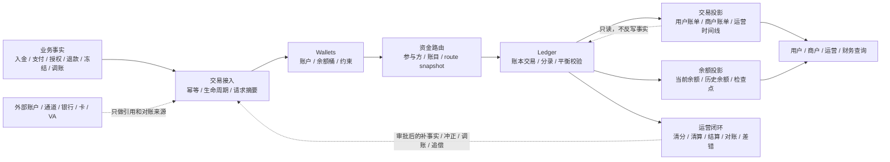
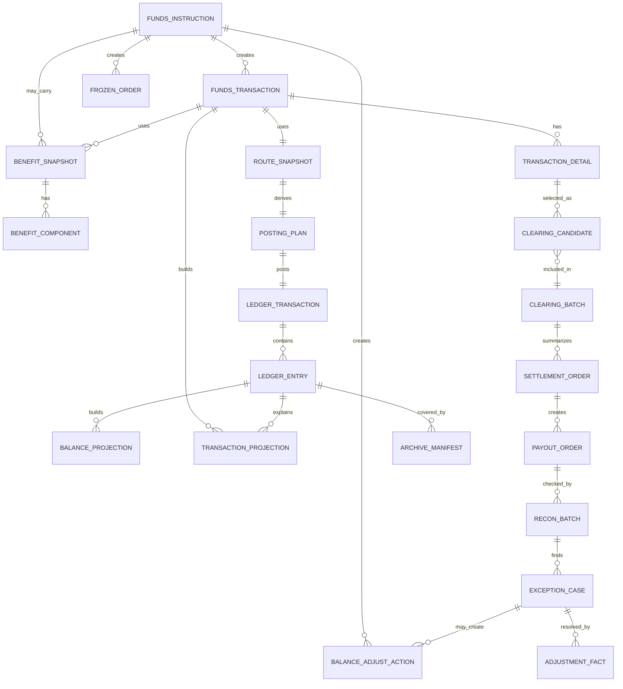
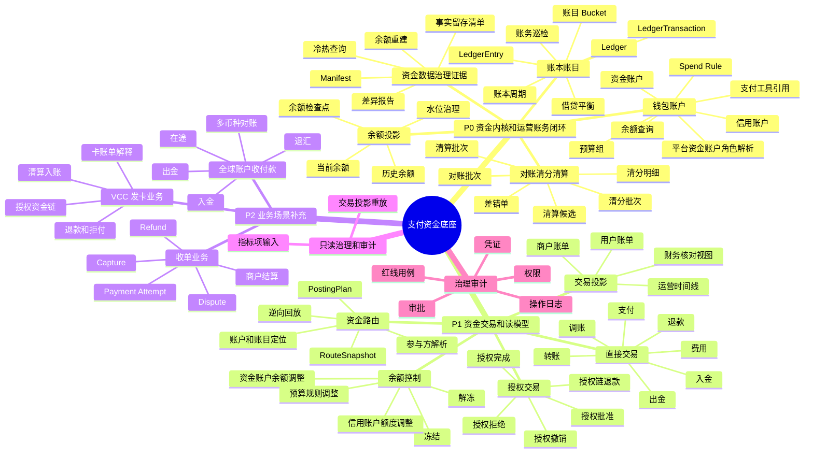
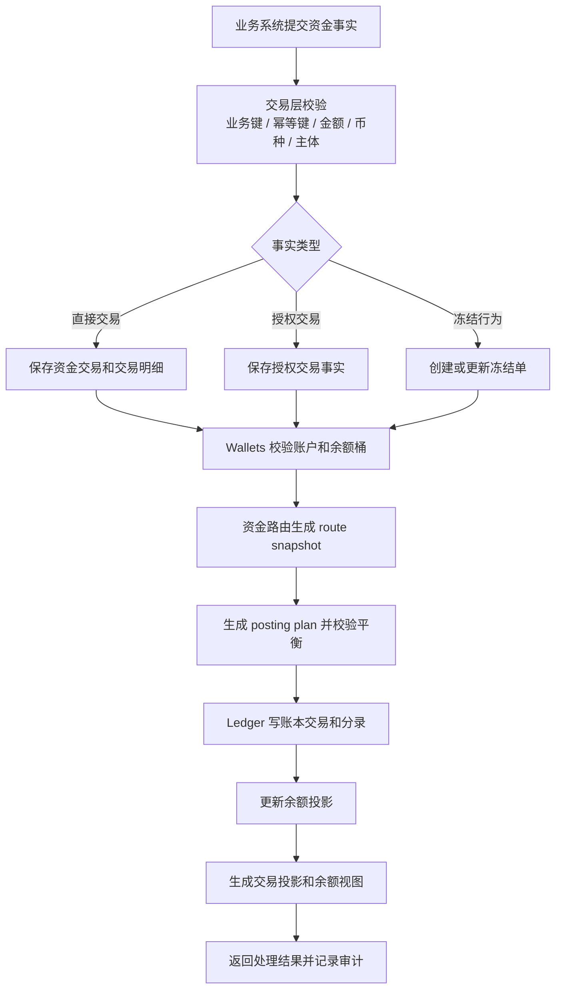
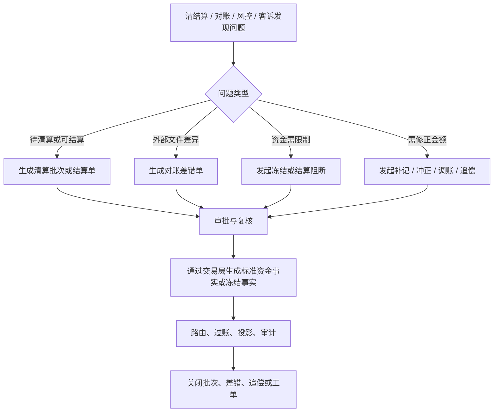
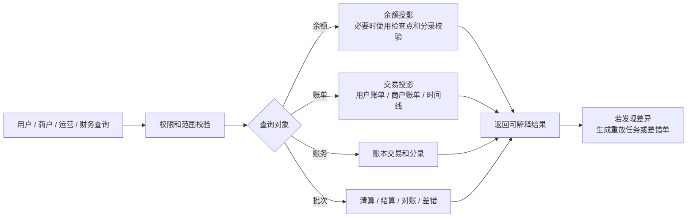
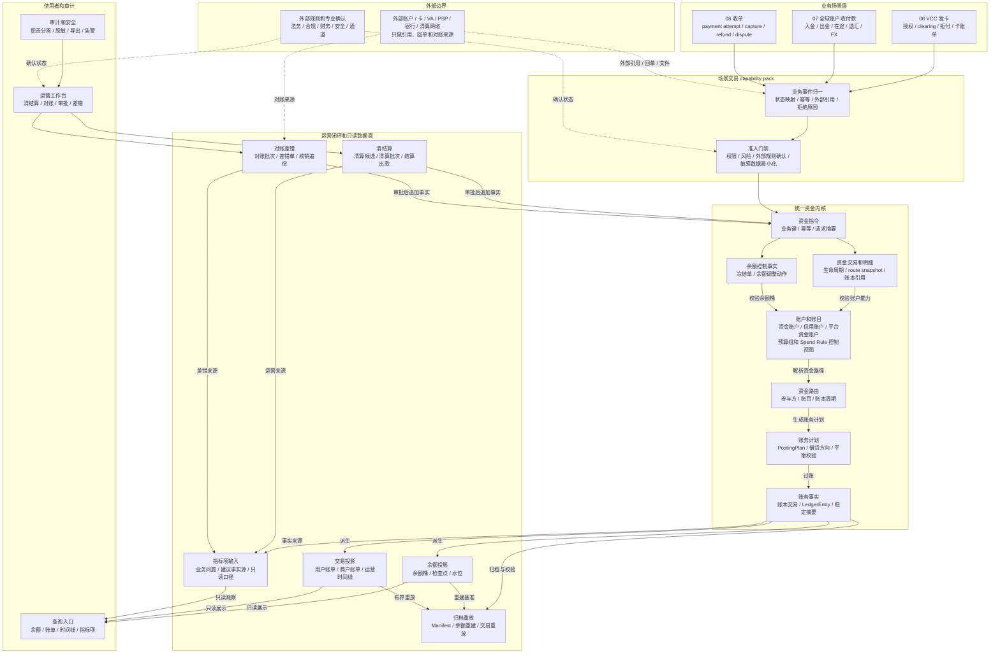
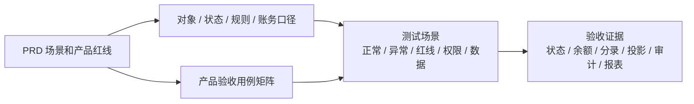
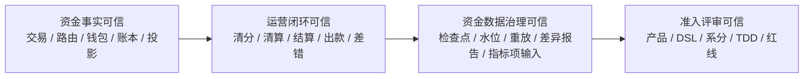

# 支付资金底座 PRD 总览

## 1. 一页摘要

支付资金底座的产品目标是把支付、钱包、账户、账本、清结算、对账、投影、事实留存和治理证据收敛为一套可复用、可核对、可重建的资金底座。

从使用者角度看，它要解决的不是“写一套账务代码”，而是让用户、商户、运营、财务、风控和业务系统都能回答同一个问题：一笔钱从哪里来，经过哪些状态，当前属于谁，为什么能用或不能用，出现退款、拒付、出款失败或对账差异时该如何处理，最后能否被账本和报表证明。

本 PRD 的核心交付：

| 维度 | 产品结论 |
| --- | --- |
| 产品定位 | 支付资金底座，不是单一 VCC、ACH、收单、全球付款或钱包产品；ACH 只能作为上层业务或外部银行转账轨道输入，由资金底座承接归一后的资金事实。 |
| 核心用户 | 业务接入方、用户、商户、企业管理员、运营、财务、风控、合规、安全、研发和测试。 |
| 核心能力 | 优先保障钱包账户、账本账目、余额投影、对账、清分、清算、结算、账本余额快照和资金数据治理证据；其次保障直接交易、授权交易、余额控制和交易投影；再次保障 VCC、全球账户收付款和收单业务补充接入。 |
| 事实原则 | 交易事实、冻结事实、账务事实、余额投影和交易视图分层表达，不能互相替代。 |
| 资金原则 | 余额变化必须能被账本分录解释；外部账户、卡号、PAN、token、VA 和支付工具只做引用，不作为内部账本主体。VCC 场景不新增 `VCC_ACCOUNT`；卡必须先绑定资金子账户或信用子账户，余额变化仍落在资金账户或信用账户。 |
| 验收原则 | 每个资金场景必须同时验证状态、金额、账目、账本、投影、幂等、审计和异常路径。 |

### 1.1 一图读懂资金底座

这张图只表达一个核心判断：资金底座的写入链路必须从业务事实进入交易接入，再经过账户约束、路由和账本；查询、报表、运营处理和重放都只能消费或追加事实，不能绕过账本改余额。运营闭环需要影响资金结果时，只能通过审批后的补事实、冲正、调账或追偿重新进入交易层，不能直接改原交易状态、原分录、余额投影或交易投影。

运营闭环进入交易层也不是开放通用改账入口。工程落地必须列出“运营补事实命令白名单”，至少说明允许的清算确认、结算锁定、出款结果、差错调账、冲正、追偿或等价命令，以及来源单据、审批号、证据引用、幂等键、原事实引用、操作者、原因和可撤销边界。未列入白名单的运营动作只能停留在处理单、差异报告或人工复核记录，不能生成资金事实。

含权益退款不是简单按比例拆金额。只要部分退款可能影响现金、商户让利、平台补贴、储值代金券、不可退权益或商户应收，工程落地就必须明确退款分摊确定性规则：规则版本、分摊依据、稳定组件顺序、舍入模式、尾差归属、组件剩余额度版本、幂等摘要字段和并发保护。缺少这些规则时，含权益部分退款只能失败、转人工或停留在契约验证，不能声明生产资金流完成。

### 1.2 能力保障优先级

支付资金底座的产品落地顺序不以业务入口数量为先，而以资金事实是否可解释、可核对、可重建为先。任务拆解、系分落地、TDD 矩阵和工程落地均按下列优先级判断。

| 优先级 | 能力域 | 必须优先保障的原因 | 不做稳的风险 |
| --- | --- | --- | --- |
| P0 | 钱包、账本、账目、余额投影、对账、清分、清算、结算、账本余额快照和资金数据治理证据。 | 这些能力决定资金归属、余额来源、账务事实、运营清账和历史可证明性，是所有业务共用的资金底座。 | 余额不可解释，账务不可核对，清结算只能人工修正，历史事实留存后无法证明。 |
| P1 | 直接交易、授权交易、余额控制、交易投影。 | 这些能力是资金动作进入底座、形成用户账单和运营时间线的标准入口，但必须建立在 P0 的账户、账本和账务事实之上。 | 业务入口可用但账务不可证明，授权、冻结、调账和账单展示互相污染。 |
| P2 | VCC 发卡业务、全球账户收付款、收单业务支持。 | 三类业务是场景交易 capability pack 和业务补充分册，复用 P0/P1 能力，不改变统一资金内核的实现边界。 | 过早按业务定制会把交易状态机、外部协议和账务内核耦合，导致后续难以复用。 |

资金路由是 P0 和 P1 之间的承接能力：它服务账本账目和资金动作转换，必须随钱包、账本和账目一起保持稳定，但不单独作为业务优先级排序依据。

优先级不等于编码范围。P0 表示资金底座必须优先保护的产品不变量，不表示可以一次性实现全部钱包、清结算、对账、事实留存治理和余额快照。进入工程任务前，必须把目标能力拆成单一 MVP 场景，并明确产品验收 ID、写入范围、不做范围、外部规则状态、TDD Red 和验证命令。

| 成熟度层级 | 判断口径 | 当前设计承接 |
| --- | --- | --- |
| P0/P1/P2 优先级 | 产品依赖和资金安全顺序。 | 本 PRD 定义能力保障顺序和风险边界。 |
| 工程准入 | 单一场景、资金事实、服务入口、数据落点、失败红线和测试入口闭合。 | 02 主链路优先进入工程准入复核；03 和 B8 资金数据治理先进入独立任务的 TDD 和系统落点复核；04 仅作拆分索引。 |
| 生产完成 | 代码、DDL/H2、服务级测试、观测、Runbook、权限审计和外部规则确认齐备。 | 本 PRD 不声明生产完成。 |

工程准入补充口径：

PRD 只定义目标产品能力、验收边界和资金红线。局部代码、测试资产或任务记录只能作为任务计划和交付说明中的证据，不得外推为含权益 route/posting/replay、清结算、对账、归档、治理重放或 P2 生产资金流已完成。

后续每个 MVP 开工前，PRD 必须先给出 `productGoal`、`businessQuestion`、`mvpScenario`、资金事实、使用者可见结果、成功/失败终态、验收 ID 和明确不做范围，再交给 DSL、系分和 TDD 裁剪。

### 1.2.1 支付底层语义映射

支付业务表面上表现为付款、收款、授权、退款、结算和出款，底层本质是多套账本之间通过信息流、账务流和真实资金流进行协作。wind-funds 的定位不是修改银行、通道、卡组织或清算网络的外部账本，而是在内部资金账本中记录可解释、可核对、可重建的资金归属变化。

| 底层语义 | 产品解释 | wind-funds 承接 | 不承接 |
| --- | --- | --- | --- |
| 多账本 | 用户、商户、平台、银行、通道、卡组织、发卡账户和清算网络各有自己的账本或账务记录。 | 内部资金账户、信用账户、平台角色解析后的平台资金账户、VCC 关联资金/信用子账户、账本交易和分录；预算组和 Spend Rule 只作为控制视图、规则窗口和审计证据。 | 直接修改外部银行账本、通道账本、清算网络账本或卡组织账本，或把预算组、Spend Rule、卡号、PAN、token、VA 或支付工具当作账本主体。 |
| 两个动作 | 一笔支付最终要解释付款方减少、收款方增加，或授权占用、冻结、释放等受控变化。 | route snapshot、posting plan、ledger entry 和余额投影证明内部账务变化。 | 只凭业务订单成功、外部 accepted 或展示状态声明资金已经完成。 |
| 双层结构 | 机构间清算和使用者侧结算/到账是两层语义，可以同步、异步、先垫资或被阻断。 | 清分、内部清算、结算单、出款单、对账差错和追偿闭环。 | 把内部清算写成持牌清算业务，或把出款受理写成外部到账成功。 |
| 虚实结合 | 外部实体资金户、托管户或备付金户是外部真实资金证据；内部账户记录主体权益、责任和余额桶。 | ExternalAccountRef、外部流水、回单、对账文件、FundingAccount 和平台责任账户之间的证据映射。 | 把外部实体账户作为 LedgerEntry 主体，或把内部待结算口径直接称为客户备付金。 |

这套映射用于宣讲和评审时统一口径：支付不是“调用一个通道接口后钱就动了”，而是信息流触发内部账务事实，外部资金证据再通过对账验证内部事实。只要外部证据未终局、对账未通过或规则未确认，资金结果就不能被展示成已经完成。

### 1.2.2 三流对照和验证关系

资金底座需要同时解释业务事实、内部账务事实和外部真实资金证据。任何能力进入生产资金流前，都必须说明三类流之间如何关联、谁是事实源、谁能触发阻断。

| 流 | 典型对象 | 作用 | 验证关系 |
| --- | --- | --- | --- |
| 信息流 | 业务订单、资金指令、支付尝试、外部受理、通道回调、银行回单、卡组织文件、ACH 或银行转账文件引用。 | 说明发生了什么、谁发起、外部系统给了什么状态或证据。 | 信息流只能触发资金处理或对账，不单独证明余额归属完成。 |
| 账务流 | 资金交易、route snapshot、posting plan、账本交易、ledger entry、余额投影、交易投影。 | 记录 wind-funds 内部可证明的资金归属、账目变化和使用者解释视图。 | 账务流必须平衡、幂等、可回放，并能被对账和归档重建。 |
| 真实资金流 | 银行流水、托管户流水、通道清算文件、外部出款回单、外部入金回单、清算网络文件。 | 验证外部实体资金是否按预期发生、失败、退回或仍在途。 | 真实资金流通过对账批次、差错单、调账核销和追偿闭环校验账务流。 |

验收时不能只证明其中一类流。仅有信息流成功时，只能说明外部或业务已受理；仅有账务流成功时，只能说明内部账本已记录；仅有真实资金流证据时，还需要匹配到内部主体、账目、币种、金额和时间窗口。三者无法对齐时，必须进入对账差错、阻断、人工复核或追偿。

### 1.2.3 四流到资金底座输入的评审映射

支付产品评审仍按业务流、支付信息流、账户/账务流和真实资金流识别事实来源；进入 wind-funds 后，必须收敛为“业务事实输入、内部账务事实、外部资金证据”三类可验证对象。四流不是四套内核，也不是四类都能直接入账。

| 支付四流 | 进入资金底座前必须说明 | wind-funds 承接口径 | 可写事实或证据 | 红线 |
| --- | --- | --- | --- | --- |
| 业务流 | 业务单据、交易背景、卡/VA/收单等产品对象、用户/商户/平台责任和业务幂等键。 | 作为业务事实输入，由业务系统或场景 capability pack 归一为资金动作、主体引用、金额组件和验收语义。 | businessScene、businessSn、requestDigest、业务引用摘要、产品对象脱敏快照和验收场景引用。 | 不承接完整业务订单生命周期，不因业务状态成功直接加余额或生成 LedgerEntry。 |
| 支付信息流 | 网关、处理商、银行、PSP、卡组织或适配层给出的受理、回调、查询、文件和外部 reference。 | 作为外部事件和状态映射输入，只能驱动资金处理、阻断、等待证据或对账任务。 | ExternalEventRef、PaymentInstrumentRef、RouteSnapshot、外部引用摘要、验签结果、状态映射和接收时间。 | 外部 accepted、submitted、processing 不等于可用余额、到账成功或可结算。 |
| 账户/账务流 | 内部资金主体、账目、账本周期、route leg、posting plan 和账本交易。 | 作为 wind-funds 自有事实源，记录内部资金归属、责任、余额桶和可重放账务链。 | FundsTransaction、LedgerTransaction、LedgerEntry、余额投影、交易投影和审计引用。 | 不跳过 route/posting/ledger 直接修余额，不让支付工具、预算组、VA、外部账户或规则对象入账。 |
| 真实资金流 | 银行流水、托管户或备付金户流水、通道清算文件、外部出款回单、发卡 funding statement。 | 作为对账和差错证据，用于验证内部账务事实是否被外部真实资金结果支持。 | ExternalEvidenceRef、ReconciliationBatch、MatchResult、DifferenceItem、AdjustmentAction 和回单摘要。 | 不写外部机构账，不把外部文件导入当成内部账务完成，不绕过对账关闭差异。 |

评审时必须先回答“哪条流先发生、哪条流是事实源、哪条流只是证据”。进入编码或 OpenSpec 前，业务流必须被归一为资金动作，支付信息流必须形成可验签、可去重、可回查的证据，账户/账务流必须可平衡，真实资金流必须能进入对账差错闭环。

### 1.3 PRD 合并与分册策略

产品设计目录采用“主线 PRD + 业务补充分册”的结构，而不是把所有业务细节都并入 01-05。原因是三类业务的交易层语义并不完全通用：VCC 有授权、clearing、chargeback 过程和卡账单语义；全球账户有外部受理、在途、退汇、FX 引用和多币种对账语义；收单有 payment attempt、capture、refund、dispute、准备金和商户结算语义。这些业务语义应通过场景交易 capability pack 接入资金底座，不应反向改变钱包、账本、账目、清结算、对账和归档的统一内核。

| 文档组 | 设计定位 | 合并口径 |
| --- | --- | --- |
| 01-05 主线 PRD | 支付资金底座的权威产品主线。 | 承载产品定位、统一能力地图、职责边界、交易/钱包/账本/投影、清结算、对账、归档、验收和生产门禁。 |
| 06 VCC 发卡业务分册 | VCC 场景资金语义补充。 | 保留 Program、Card、Cardholder、授权控制、卡组织清算和争议案件语义；把授权不等于入账、卡不入账、敏感数据最小化和原路径回放抽象回 01-05。 |
| 07 全球账户收付款分册 | 全球账户场景资金语义补充。 | 保留 VA、外部银行流水、在途、退汇、FX 引用和跨境材料语义；把外部受理不等于到账、外部账户不入账、错币种阻断和费用拆分抽象回 01-05。 |
| 08 收单业务分册 | 收单场景资金语义补充。 | 保留 payment attempt、capture、refund、dispute、准备金和商户结算语义；把支付成功不等于可结算、先清账再结算、refund 与 chargeback 分离和 PCI 边界抽象回 01-05。 |

合并原则：能服务三类业务的能力进入 01-05；只属于某类业务的状态机、外部引用、规则待确认项和验收样例保留在 06-08。06-08 作为业务补充分册参与评审。

### 1.4 ACH 和银行转账支撑边界

ACH 不作为 06-08 同级的第四个内建业务分册，也不进入 wind-funds 成为 ACH 产品或 ACH 通道能力。ACH、银行转账、ODFI/RDFI、Nacha 规则、SEC code、文件批次、cut-off、return code、NOC、reversal 和 Debit 授权证据属于上层 ACH 业务、银行转账产品、通道适配层或专业确认方。

wind-funds 只承接 ACH 业务或银行转账轨道已经解释清楚的资金事实和证据引用，例如入金确认、出款结果、在途、失败退回、追偿、外部流水引用、trace number 摘要、对账差错、调账核销和审计证据。缺少上层解释、外部规则核验或合作银行确认时，ACH 相关事件只能停留在待确认边界、差错处理或人工复核，不得被静默映射成普通退款、普通入金或普通出款。

ACH 和银行转账的详细职责分层、可支持场景、对象映射、验收红线和编码准入约束见 [ACH与银行转账资金底座支持边界.md](ACH与银行转账资金底座支持边界.md)。该文档只定义外部轨道如何被资金底座支持，不新增 ACH 业务分册或 ACH 内核。

## 2. 背景

Capte 业务会覆盖 VCC 发卡、全球收付款、收单、平台内部交易、商户收款、结算出款、退款争议、费用和报表，并可能通过 ACH 或银行转账等外部轨道完成收付款。若每个业务线各自处理余额、流水、退款、冻结、授权、结算和对账，资金语义会很快分裂：

1. 用户看到的余额和账本分录无法解释。
2. 商户订单款、待清算、可结算、出款中和已出款状态混用。
3. 授权拒绝、争议拒付、退款、退汇、return 等逆向动作无法区分。
4. 财务对账只能靠报表汇总，不能追溯到单笔事实。
5. 清结算、归档和重放会因为缺少稳定事实源而变成高风险人工修复。

支付资金底座的第一性原理很简单：钱的系统必须让每一笔金额都能被解释、被核对、被重建。产品设计必须围绕“事实、归属、状态、规则、审计、验收”展开，而不是围绕页面、接口或数据库表展开。

## 3. 目标与非目标

### 3.1 产品目标

| 目标 | 说明 | 验证方式 |
| --- | --- | --- |
| 资金语义统一 | 交易、钱包、权益金额组件、账本、清结算、对账和报表使用同一套概念。 | 概念边界评审、用例矩阵、红线用例。 |
| 账务事实可信 | 每次余额变化都能追溯到账本交易、账务计划和分录。 | 分录平衡测试、余额投影测试、账务巡检。 |
| 钱包余额可解释 | 可用、冻结、授权、待清算、出款中、额度、预算等余额桶口径清楚。 | 余额查询、账单和运营视图核对。 |
| 交易接入稳定 | 上层业务通过统一资金事实入口接入，不直接写余额或分录。 | 幂等、请求摘要、route snapshot 和交易生命周期验收。 |
| 清结算可追踪 | 清算候选、清算批次、结算单、出款单和追偿单可追溯到明细。 | 清结算用例和批次重跑验收。 |
| 对账差错可闭环 | 差错能被发现、分类、阻断、处理、核销和审计。 | 对账批次、差错单、调账核销验收。 |
| 归档重放可治理 | 大数据量下仍能重建余额、重放交易视图、输出差异报告。 | 水位、检查点、归档清单和重放任务验收。 |
| 产品验收可 TDD | PRD 场景能直接转换为测试清单。 | 产品验收用例矩阵。 |

### 3.2 成功指标

成功指标用于判断产品设计是否真正解决了资金底座问题。它不是经营承诺，而是产品验收、运营复盘和风险治理的共同观察口径。

| 指标域 | 成功标准 | 验收或观察方式 |
| --- | --- | --- |
| 资金可解释 | 任一余额变化都能追溯到资金事实、route snapshot、账本交易、分录和投影。 | 单笔链路查询、账本分录核对、余额投影校验。 |
| 资金可核对 | 业务单、资金交易、账本、清结算批次、外部流水、财务核对视图和指标项输入能按规则对平。 | 对账批次、差错单、重新对账结果。 |
| 资金可重建 | 余额投影、交易投影、财务核对视图和指标项输入出现差异时，可按边界重建或重放。 | 检查点、水位、归档清单、差异报告。 |
| 运营可闭环 | 异常、差错、冻结、调账、追偿和出款失败有处理单、审批、凭证和终态。 | 运营工作台、差错生命周期、审计日志。 |
| 风险可阻断 | 授权拒绝、余额不足、错币种、缺快照、无审批调账、无界重放等红线必须失败。 | 产品红线用例和失败验收。 |
| 数据可追溯 | 用户账单、商户账单、运营时间线、财务核对视图和指标项输入都能回溯到事实源。 | 投影来源引用、报表口径版本、导出审计。 |

### 3.3 非目标

1. 不在本 PRD 中设计完整 VCC、全球付款、收单、ACH、银行转账或跨境外汇产品。
2. 不替代卡组织、ACH、银行、ODFI/RDFI、PSP、清算网络或合作机构协议。
3. 不替代法务、税务、会计、合规、审计或持牌机构最终确认。
4. 不把普通平台内部清分、合同结算写成持牌清算业务。
5. 不承诺支付牌照、客户备付金管理、跨境支付、外汇执行或监管报送能力。
6. 不展开代码接口、表结构、类设计和事务实现细节；这些由系统分析设计承接。

## 4. 核心概念

### 4.1 概念分层

| 层级 | 核心对象 | 产品解释 | 是否事实源 |
| --- | --- | --- | --- |
| 业务产品层 | 业务订单、卡授权、ACH 或银行转账指令、提现申请、商户结算申请、争议单 | 业务系统自己的单据和状态；ACH 指令、Debit 授权、文件批次和通道状态不属于资金底座事实源。 | 由业务系统决定 |
| 交易接入层 | 资金指令、资金交易、交易明细 | 底座接收业务资金事实的统一入口。 | 是，记录资金侧事实 |
| 权益语义层 | 让利出资记账交易、权益金额组件、原事实引用、退款、业务取消和人工纠错处置 | 承接订单、交易业务系统或营销权益系统已经决策完成的优惠券、代金券、平台补贴、商户让利和储值权益结果；真实入账让利出资才进入 `FundsBenefitFundingApplicationService`。 | 让利出资交易和等价不可变事实是回放事实 |
| 权益资金承接层 | 营销账户、营销成本账户、营销负债账户、合作方补贴账户、营销留置账户 | 把已决策权益中有真实资金、负债、成本或清结算影响的组件落到可记账责任账户；不计算券规则，不维护券包生命周期。 | 账户配置和账务事实是事实，余额来自账本 |
| 余额控制层 | 冻结单、冻结动作、余额调整动作、预算控制动作 | 表达冻结、解冻、部分释放、到期释放，以及同主体资金账户余额调整、信用账户额度调整和预算/支出规则调整。 | 是，记录控制事实 |
| 钱包账户层 | 钱包账户域、资金账户、信用账户、预算组、Spend Rule、平台资金账户角色解析、支付工具引用 | 表达主体、账户、余额桶、额度、预算范围、支出规则、绑定关系和展示口径。 | 账户和规则配置是事实，余额来自账本 |
| 资金路由层 | 参与方、路径、route snapshot、账务计划 | 把资金事实翻译成可入账路径。 | route snapshot 是回放事实 |
| 账务事实层 | 账本、账目、账本交易、分录 | 不可变账务事实和审计依据。 | 是，账务最终事实源 |
| 余额投影层 | 余额投影、余额检查点、水位 | 从分录派生的当前和历史余额。 | 否，可重建 |
| 交易投影层 | 用户账单、商户账单、运营时间线、财务核对视图、指标项输入 | 面向使用者和下游报表指标模块的只读视图。 | 否，只读投影 |
| 运营闭环层 | 清算批次、结算单、出款单、对账批次、差错单、调账单 | 对账、清结算、异常和人工处理。 | 处理单据是事实，不能直接改账 |

### 4.2 关键概念边界

| 概念 | 易懂定义 | 能力边界 |
| --- | --- | --- |
| 资金交易 | 一笔已经进入资金处理链路的事实，例如入金、支付、转账、退款、授权、结算、费用、调账。 | 不等于业务订单，也不等于账本交易；冻结不放进资金交易主表。 |
| 冻结单 | 同一个资金主体内部把可用余额暂时转为冻结余额。 | 冻结不是消费、扣划、授权或退款；若后续要扣划，必须创建新的资金事实。 |
| 让利出资记账交易 | 一笔已决策让利出资对资金、成本、商户应收或对账解释产生真实入账影响的交易，例如平台补贴、商户或合作方出资补足、补贴冲回。 | 只接收业务侧已决策出资结果，回答成本由谁承担、落到哪个可记账承接主体、金额是多少；不重新计算券规则、不维护券包生命周期、不保存券或活动来源归因；后续退款、业务取消、清结算、对账和投影必须基于原让利出资交易或等价不可变事实回放。 |
| 权益金额组件 | 已决策权益结果中的金额拆分，例如商户让利、平台补贴、平台券不补足商户、代金券核销、储值权益、补贴冲回和不可退权益。 | 必须说明谁承担、谁受益、是否入账、是否影响商户应收和退款如何处理；不得与本金、手续费、通道成本混成净额；非入账展示或清分解释不进入让利出资记账交易服务。 |
| 储值 / 预付代金券 | 用户预先支付或平台形成待履约责任的权益。 | 应按负债、预收待付或用户权益余额处理；财务、会计、税务、合同或合规口径未确认前，不得当普通优惠券入账。 |
| 营销账户 / Marketing Account | 资金底座内用于承接已决策权益资金影响的内部责任账户，例如平台营销成本、商户让利归因、代金券或储值负债、合作方补贴和待确认留置。 | MVP 先作为资金账户、平台责任资金账户或等价账户 profile 承接，不新增支付工具主体，不接管营销规则、券包库存、活动生命周期或最优券计算。只有真实入账的让利出资、释放、冲回等有资金影响的组件才能解析到营销账户；非入账解释事实不得生成营销账户分录。 |
| 营销账户类型 | 平台营销成本账户、商户营销让利账户、权益负债账户、合作方补贴账户和营销留置账户。 | 平台补贴补足商户、储值/预付负债释放、合作方补贴和补贴冲回可进入账务路径；商户让利和展示优惠默认只影响商户应收、清分展示和对账解释，不默认生成平台营销账户分录。 |
| 余额调整动作 | 余额控制服务内的受控调整，覆盖资金账户余额调整、信用账户额度调整和预算/支出规则额度调整。 | 资金账户和信用账户调整只允许同主体、同币种、同周期、明确来源的目标账目调整；预算调整只改变支出控制额度或规则配置，不承接真实资金流。对账差错若只修正同主体资金余额，可引用差错单生成余额调整动作；跨主体补偿必须走批次授权直接交易调账事实。 |
| 资金路由 | 把交易事实解析为付款方、收款方、平台角色、余额桶和账务路径。 | 不判断业务订单是否成立，不直接改余额，不在缺快照时重新选路。 |
| 钱包 | 面向用户、商户、企业和运营展示资金、额度、预算、支出规则和余额状态的产品层。 | 不替代账本，不允许业务侧绕过交易层直接改余额；钱包余额可以作为前台支付方式展示，但资金域内必须解析为资金账户或信用账户后才能入账，预算组和 Spend Rule 只作为支出控制证据。 |
| 钱包账户域 | 钱包产品层的上位账户能力域，统一管理真实资金账户、信用账户、预算组、Spend Rule、平台资金账户角色解析、支付工具绑定、资金责任解析关系和余额查询。 | 这是产品域和服务域的聚合边界，不是单一账户表；不能用 `FundingAccount` 代替信用账户、预算组、Spend Rule 或支付工具。 |
| 业务主体 | 用户、商户、企业、部门、平台角色或外部机构等业务上的权利义务归属方。 | 业务主体不一定能直接记账；进入账本前必须解析成资金账户（含平台角色解析后的平台资金账户和 VCC 资金子账户）或信用账户（含 VCC 信用子账户）；预算组和 Spend Rule 只提供支出控制上下文。 |
| 资金账务主体 / 核心记账主体 | 账务层可以作为分录主体、余额投影主体和账本 bucket 归属方的对象。 | 本 PRD 默认核心资金账务主体是资金账户（含平台角色解析后的平台资金账户）和信用账户；VCC 发卡专项中，VCC 关联子账户作为资金账户或信用账户的子账户承接发卡账务。业务订单、用户、商户经营主体、部门、预算组、卡号、PAN、token、VA、银行账户、支付工具和通道账户不能直接入账。 |
| 资金账户 / FundingAccount | wind-funds 内部可记账资金账户或平台责任资金账户，也是最常见的账务主体。 | 可以承载现金、商户待清算、平台待付、手续费、在途或预收待付等内部责任余额；外部银行账户、托管户、备付金户、通道账户和卡组织账户不是 `FundingAccount`，只能作为外部账户引用、流水、回单和对账证据；`FundingAccount` 不是所有钱包账户的统一父类。 |
| 信用账户 | 承载授信额度和授权占用的控制账户，也是可记账主体。 | 不是现金账户；额度不是钱；可记录 LIMIT、AVAILABLE、AUTHORIZATION 等额度账目，已消费进入交易视图和报表，不新增账务 CONSUMED。 |
| VCC 关联子账户 / 外部 Card Account | 发卡业务中用于解释卡余额、授权占用、清算、退款、拒付和卡账单的内部子账户映射。 | `wind-funds` 不新增 VCC Account / Card Account 独立账务主体；外部文档、发卡合作方或行业资料若称 Card Account / Financial Account / VCC Account，进入资金底座后一律映射为 `FundingAccount` 子账户或 `CreditAccount` 子账户。每张 VCC 卡绑定一个子账户；多卡共享时共享同一主账户额度或资金约束，不绑定同一子账户。 |
| 预算组 | 部门、项目、卡组、成本中心或共享卡场景下的预算归属范围和支出控制对象。 | 不是资金池，也不是核心资金账务主体；预算总额、可用预算、预留和释放应作为 Spend Rule 的预算型规则、控制视图和审计证据表达，不参与真实资金流、清结算和现金账务闭环。 |
| Spend Rule / Spend Controls | 发卡、VCC、企业卡、员工卡或预算支出场景中，授权发生前用于判断某次支出是否允许的规则能力，例如预算额度、单笔金额、MCC、商户、国家、入卡方式、CVV/AVS、次数和周期窗口。 | 它决定“能不能进入授权占用”，不是资金底座核心主链路、不是账本、不是路由、不是清结算；预算组是规则作用域或管理对象，不能替代 Spend Rule；未启用发卡或预算支出控制时，普通资金交易和授权交易不依赖该能力。 |
| VCC 卡 / 虚拟卡 / 卡 token | 发卡业务中的支付工具、访问凭证和路由输入。 | 只进入支付工具引用、绑定快照、授权上下文和 route snapshot；真正入账主体是该卡绑定的资金子账户或信用子账户。卡号、PAN、token 和卡片凭证不得作为 LedgerEntry 主体。 |
| 预付卡 | 如果属于卡组织或发卡体系下的 prepaid virtual card，则是 VCC 资金子账户模式和卡产品形态。 | 预付余额应落在该卡绑定的资金子账户上；卡本体仍是支付工具。若是储值券、礼品卡或预付代金券，则按权益和预收待付语义处理，不默认归入 VCC。 |
| 共享卡 | VCC、企业卡或员工卡中的使用和绑定模式。 | 每张共享卡绑定一个信用子账户；多张共享卡共享时共享的是同一个主账户额度或资金约束，不是同一个子账户。单卡账单、使用人账单和预算视图通过 `PaymentInstrumentRef`、绑定版本、子账户、预算组和 Spend Rule 投影生成。 |
| 账本 | 某主体、币种和账本 Profile 下的账务事实容器。 | 缺账本不得自动入账；账本不是钱包、业务订单或报表。 |
| 账本周期 | 同一主体、币种、账目下按生命周期、天、小时、周、月、季、年或自定义周期切分的账本 bucket。 | 不是清结算账期、报表周期或归档水位；非 LIFETIME 周期必须有明确 periodId 和周期策略，不能跨周期串账。 |
| 账目 | 账本里的余额桶或科目，例如 AVAILABLE、FROZEN、AUTHORIZATION。 | 账目不是账户主体；它表达账户内某类余额状态。 |
| 余额投影 | 根据账本分录算出来的当前或历史余额。 | 可以重建和校验，不能反向修改分录。 |
| 交易投影 | 面向用户、商户、运营和财务核对的账单、时间线和指标项输入。 | 只能从事实派生，不得写回交易事实、账本事实或余额事实；正式报表计算、看板、监管报送和会计确认由外部报表、财务或合规系统承接。 |
| 清分 | 按规则把交易明细归集到可处理候选、责任方和金额项。 | 不直接出款，不替代账本，不表达持牌清算业务。 |
| 清算 | 平台内部确认待清算金额可以进入可结算口径。 | 默认表达内部资金明细确认和账务转换；外部清算规则另行确认。 |
| 对账 | 比较业务、交易、账本、外部文件、银行流水、余额投影和报表是否一致。 | 发现差异后不能直接改历史账，要进入差错、补记、冲正、调账或核销流程。 |

### 4.2.1 资金账户流动性等级与交易动作命名

资金账户的“信用等级”在本 PRD 中指资金账户所承载资金的流动性等级、可使用范围和外部结算确定性，不等同于 `CreditAccount`。`CreditAccount` 是授信额度账户；资金账户流动性等级是 FundingAccount 或平台资金账户角色的产品解释维度，用于帮助产品、运营、财务和研发判断一笔资金动作应命名为充值、提现还是转账。

从可使用范围看，通常可以把资金账户流动性按下列方向理解：央行账户或央行货币层级 > 商业银行账户 > 支付机构账户 > 金融科技公司内部账户。等级越高，通常可使用范围越广、外部结算确定性越强；等级越低，通常越偏内部记账、平台内余额或特定产品余额。该排序只作为产品建模和交易动作命名参考，不替代法务、合规、财务、会计、银行、支付机构或清算网络对具体账户性质的最终确认。

| 概念 | 产品解释 | 典型例子 | 不能替代 |
| --- | --- | --- | --- |
| 资金账户流动性等级 | 资金可被使用、清算、转出或被外部承认的范围。 | 央行账户、商业银行账户、支付机构备付或支付账户、平台内部余额账户。 | 授信额度、用户信用评分、风控等级或 `CreditAccount`。 |
| 高流动性到账低流动性 | 从更广泛可用的账户体系进入更受限的内部账户体系。 | 银行账户入金到平台钱包，平台主资金账户划拨到预付卡资金子账户。 | 普通付款或内部同级转账。 |
| 低流动性到高流动性 | 从内部或受限余额体系转回更广泛可用的账户体系。 | 平台钱包出款到银行账户，预付卡资金子账户退回主资金账户或外部银行账户。 | 商户结算成功、授权完成或普通退款。 |
| 同等级账户之间流动 | 流动性等级相同或产品上被视为同一资金层级的账户之间移动。 | 用户钱包到用户钱包、商户资金账户到平台同层责任账户、同一机构内账户划转。 | 充值、提现或清结算批次状态推进。 |

直接交易命名按资金流动性方向优先判定：

| 资金方向 | 默认交易动作 | 产品含义 | 同名要求 |
| --- | --- | --- | --- |
| 高流动性账户 -> 低流动性账户 | 充值 / topup | 把外部更广泛可用的资金转入平台、钱包、卡资金子账户或其他内部余额体系。 | 默认要求同名或同一实控主体；例外必须有业务、通道、合规和风控确认。 |
| 低流动性账户 -> 高流动性账户 | 提现 / withdraw | 把平台、钱包、卡资金子账户或内部余额转回银行、支付机构或其他更广泛可用账户。 | 默认要求同名或同一实控主体；例外必须有业务、通道、合规和风控确认。 |
| 同流动性等级账户之间 | 转账 / transfer | 同层资金账户之间发生价值转移。 | 可以同名，也可以不同名；不同名时必须说明业务关系、权限、风控、合规和审计证据。 |

上述命名只解决资金底座的交易语义，不自动证明外部入金已到账、外部出款已成功、清结算已完成或合规已经通过。涉及 ACH、银行转账、卡组织、PSP、跨境、FX、客户资金或商户待结算资金时，还必须回到外部规则、对账结果和专业确认。

### 4.3 四类行为不能混用

| 行为 | 产品含义 | 是否改变资金归属 | 事实载体 | 典型账目变化 |
| --- | --- | --- | --- | --- |
| 直接交易 | 已确认的资金事实，如入金、支付、转账、退款、费用、跨主体补偿或批次授权调账。 | 通常改变 | 资金交易 | 付款方目标桶减少，收款方目标桶增加。 |
| 授权交易 | 最终交易前的资金或额度占用；预算和 Spend Rule 只做授权前准入与控制证据。 | 授权成功阶段不改变，结算后改变 | 资金交易 | 资金账户或信用账户 AVAILABLE -> AUTHORIZATION；结算时关闭或减少占用；预算规则记录命中、占用或释放证据。 |
| 冻结行为 | 风控、运营、提现或争议下的可用性限制。 | 不改变 | 冻结单 | AVAILABLE <-> FROZEN。 |
| 余额调整行为 | 余额控制服务内的同主体受控调整，如资金账户目标账目修正、信用账户额度调整、预算型 Spend Rule 调整。 | 不改变跨主体资金归属 | 余额调整动作或预算控制动作 | 资金账户目标桶按审批增减；信用账户 LIMIT、AVAILABLE 按规则变化；预算组只调整预算规则和控制视图。 |

### 4.4 核心对象关系

对象关系的核心判断：

1. 资金指令只是入口，真正的事实分为资金交易、冻结单和余额调整动作。
2. 权益资金事实只承接已决策结果；商户让利、平台补贴、代金券核销、储值权益和退款处置必须通过原订单、原资金交易、原权益资金交易或历史摘要解释。
3. 资金交易、route snapshot、posting plan、账本交易和分录构成写入证据链。
4. 余额调整动作只表达同主体资金余额、信用额度或预算规则控制；跨主体价值转移仍由资金交易和调账事实证据承接。
5. 余额投影和交易投影都从事实派生，只读可重建。
6. 清算候选、清算批次、结算单、出款单、对账批次和差错单是不同运营对象，不能合并成一个状态机。
7. 归档清单覆盖事实范围，不能改变事实身份。

## 5. 角色与使用者

| 角色 | 关注问题 | 核心能力 |
| --- | --- | --- |
| 业务接入方 | 如何把业务事实安全接入资金底座。 | 提交资金指令、查询交易结果、订阅状态。 |
| 用户 | 我的余额、冻结、授权、提现、退款是否正确。 | 查询余额、账单、交易状态和失败原因。 |
| 商户 | 订单收款何时可清算、可结算、可出款，退款和拒付如何扣回。 | 查询待清算、可结算、出款中、结算单和账单。 |
| 企业管理员 | 企业信用额度、预算、员工卡或团队支出如何被控制。 | 管理额度、预算、授权占用和消费报表。 |
| 运营 | 异常入账、冻结、解冻、挂账、退款、调账、追偿如何处理。 | 工单、审批、差错处理、时间线和操作审计。 |
| 财务 | 账是否平，钱是否对得上，结算和报表是否可追溯。 | 账本查询、清结算、对账、差错核销和报表导出。 |
| 风控 | 高风险商户、负余额、争议、冻结、出款阻断是否受控。 | 风险阻断、冻结、准备金、追偿和放行审批。 |
| 合规 / 安全 | 资金归属、权限、隐私、审计、证据和正式启用前置是否充分。 | 敏感数据控制、审计、证据引用、合规待确认清单。 |
| 研发 / 测试 | 如何理解产品对象、状态、账务影响、验收断言和失败红线。 | 产品验收矩阵、测试场景、回归验证和设计评审。 |

### 5.1 角色验收口径

每个角色看到的界面和动作可以不同，但验收口径必须一致。资金底座不以“某个角色操作成功”为最终正确标准，而以“事实、账本、余额、投影、审计和外部证据能互相解释”为最终标准。

| 角色 | 最少应能看到或拿到 | 不能被授予的能力 |
| --- | --- | --- |
| 用户 | 自己的余额、冻结、授权、交易状态、失败原因和退款进度。 | 直接修改余额、删除交易、跳过风控或清结算。 |
| 商户 | 订单收款、待清算、可结算、出款中、退款扣回、拒付和追偿状态。 | 把待清算款直接改为可结算或已出款。 |
| 运营 | 处理单、差错单、冻结单、审批状态、时间线和可解释失败原因。 | 直接修改历史分录、余额投影、交易投影或清结算金额。 |
| 财务 | 账本分录、批次明细、对账结果、差异报告、调账凭证和核销记录。 | 绕过差错、审批和重新对账直接核销。 |
| 风控 | 阻断原因、冻结依据、风险事件、负余额、准备金和追偿进度。 | 用风控备注替代账务事实或清结算准入规则。 |
| 合规 / 安全 | 权限、脱敏、导出、审计、外部规则版本和证据引用。 | 用公开资料替代正式协议、监管确认或持牌机构结论。 |

## 6. 产品能力地图

### 6.1 能力地图到架构和验收总控矩阵

能力地图只说明“有哪些能力”，不能单独证明设计完整。每个能力域进入开发前，必须同时能落到产品架构位置、系统承接模块、职责边界、验收 ID 和 TDD 证据。

| 优先级 | 能力域 | 产品架构位置 | 系统架构承接 | 职责边界 | 验收和测试入口 |
| --- | --- | --- | --- | --- | --- |
| P0 | 钱包账户 | 账户、余额桶、信用、预算范围、Spend Rule、平台资金账户角色解析和支付工具引用。 | `wallet-face`、`wallet-impl`、`ledger-face` 查询、`core` 主体和值对象。 | 管理账户能力、工具绑定、显式建账、支出控制配置和余额查询；平台角色必须先解析为平台资金账户；不直接写交易事实、账本事实或绕过交易编排。 | `AC-PI-*`、`AC-CTRL-*`、`RED-046` 至 `RED-049`；`TDD-WALLET-*`、`TDD-ROUTE-011` 至 `TDD-ROUTE-013`。 |
| P0 | 账本账目 | 账本交易、posting plan、ledger entry、账本周期和余额事实源。 | `ledger-face`、`ledger-impl`、posting assembler、balance projection。 | 账本分录是不可变事实，posting plan 必须独立平衡；余额投影可重建，不反写历史分录。 | `AC-VIEW-*`、`AC-CTRL-009` 至 `AC-CTRL-012`、`RED-012`、`RED-022` 至 `RED-024`；`TDD-LEDGER-*`。 |
| P0 | 余额投影 | 钱包余额、历史余额、余额检查点和余额水位的读模型。 | `ledger-impl` balance projection、checkpoint、watermark。 | 只从 ledger entry 派生；可以重建和校验，不能替代账本事实。 | `AC-VIEW-*`、`AC-BALLOG-001`、`AC-ARCH-*`；`TDD-LEDGER-*`、`TDD-GOV-*`。 |
| P0 | 清分、清算与对账 | 运营闭环中的对账、清分、内部清算、差错、核销和追偿。 | `reconciliation-face`、`reconciliation-impl` 或确认后的等价对账清算模块；通过 transaction 和 ledger 引用资金事实。 | 清分明细和清算候选不入账；差错不直接改历史分录或余额；对账是清分、清算、结算和出款的基础准入。 | `AC-CLR-*`、`AC-SET-*`、`AC-REC-*`、`RED-030` 至 `RED-039`；`CLS-GATE-*`、`TDD-CLS-*`、`TDD-SETTLE-*`、`TDD-RECON-*`。 |
| P0 | 资金数据治理证据 | Manifest、checkpoint、watermark、余额重建、冷热查询和差异报告。 | `governance-face`、`governance-impl` 或确认后的等价治理模块；余额检查点和水位归属账本模块协作。 | 冷热位置变化不改变事实身份；余额重建只从账本事实恢复；资金冷事实不是在线报表库。 | `AC-ARCH-*`、`AC-ARCH-009`、`RED-016` 至 `RED-019`、`RED-029`；`GOV-GATE-*`、`TDD-GOV-*`、`TDD-ARCH-*`、`TDD-ARCH-010`。 |
| P1 | 交易接入 | 交易入口和资金事实链起点，承接直接交易、授权交易、余额控制和幂等。 | `transaction-face`、`transaction-impl`、`core` 指令和枚举。 | 记录资金侧事实、生命周期和请求摘要；不替代业务订单、外部通道状态机或运营工单。 | `AC-IN-*`、`AC-OUT-*`、`AC-PAY-*`、`AC-AUTH-*`、`AC-CTRL-*`；`TDD-DIR-*`、`TDD-AUTH-*`、`TDD-CTRL-*`。 |
| P1 | 权益语义 | 交易入口上的已决策权益结果，解释谁给谁让了多少钱、订单金额、用户实付、商户应收、零实付准入、退款处置、使用者解释视图和证据边界。 | `FundsBenefitFundingApplicationService`、让利出资记账交易请求、交易事实、route snapshot、posting context；历史 `benefitSnapshotId` 和 `stableDigest` 仅作为只读摘要追溯字段。 | 只承接订单、业务系统或营销权益系统已决策结果；真实入账让利出资才进入该服务；不计算券规则、不维护券包生命周期、不保存券或活动来源归因、不用当前规则重算历史权益；不恢复 `FundsInstruction.benefitSnapshot` 或旧权益快照 DSL；含权益生产批次必须先完成权益准入证明、使用者解释视图、证据最小化和外部规则核验状态。 | `AC-BEN-*`、`RED-050` 至 `RED-066`；`DSL-BENEFIT-*`；`TDD-BEN-*`、`TDD-BEN-RED-*`。 |
| P1 | 权益营销账户 | 已决策权益中有资金、负债、成本或清结算影响的金额组件的账户化承接。 | 资金账户或平台责任资金账户 profile、`costBearerSubjectRef`、`benefitReceiverSubjectRef`、原订单或原交易引用和 posting context。 | 非入账组件可做账户化归因和统计但不生成分录；真实入账让利出资、释放或冲回才可进入 route/posting；不承接营销规则计算或券包生命周期；进入编码前必须确认账户 profile、专业确认状态、事实源和退款回放策略。 | `DSL-BENEFIT-MARKETING-ACCOUNT-001`；`TDD-BEN-MKT-*`、`TDD-BEN-RED-031` 至 `TDD-BEN-RED-033`。 |
| P1 | 资金路由 | 资金事实到参与方、账目、账本周期和 route snapshot 的转译层。 | `RouteResolver`、`RouteSnapshot`、`FundingAllocationDecision`。 | 只解析路径和固化决策；不写交易事实、不写账本分录、不在缺快照时重新选路。 | `AC-ROUTE-*`、`RED-043` 至 `RED-045`；`TDD-ROUTE-*`、`TDD-RED-003`。 |
| P1 | 交易投影 | 用户账单、商户账单、运营时间线、财务核对视图和指标项输入。 | transaction projection、reporting metric input boundary。 | 只读派生和可重放；不能写交易、路由、账本、余额事实、清结算对象、正式财务报表或监管报送。 | `AC-VIEW-*`、`AC-RPT-*`；`TDD-VIEW-*`、`TDD-METRIC-*`。 |
| P1 | 指标项输入 | 指标项、业务问题、使用者、推荐事实来源和只读边界。 | reporting metric input boundary；报表指标模块另行承接。 | 指标只读观察，不推进余额水位或替代 Manifest，不反写资金事实。 | `AC-RPT-*`、`TDD-METRIC-*`。 |
| P2 | 三类业务补充 | VCC 发卡、全球账户收付款和收单业务的场景语义补充。 | 场景交易 capability pack、业务 PRD 06/07/08 和对应业务专项验收。 | 复用 P0/P1 能力，不改变钱包、账本、账目、清结算、对账和归档统一实现边界。 | 06/07/08 的业务验收、对应 TDD 扩展用例和外部规则待确认项。 |
| 横切 | 运营审计和安全 | 差错处理、审批、导出、敏感查询、外部规则确认和金融红线。 | 审计端口、权限控制、操作记录、观测告警、TDD 红线。 | 后台只能追加处理事实、审批和凭证；不能作为万能改账入口；外部公开资料不能替代正式规则。 | `AC-OPS-*`、`AC-RAIL-*`、`AC-FX-*`、`RED-014`、`RED-015`、`RED-021`、`RED-028`；`TDD-OPS-*`、`TDD-RAIL-*`、`TDD-FX-*`。 |

### 6.1.1 产品概念到系统承接对齐矩阵

本矩阵用于检查每个产品概念在系统中是否有准确落点。产品概念可以比代码对象更上位，但不能把能力域、事实对象、引用对象和只读投影混成同一个系统实体。

| 产品概念 | 产品定性 | 系统承接 | 是否可直接作为账本主体 | 核心边界 |
| --- | --- | --- | --- | --- |
| 钱包账户域 | 账户、工具、资金责任解析和余额查询的上位能力域。 | `wallet-face`、`wallet-impl`、`FundingAccountService`、`CreditAccountService`、`BudgetGroupService`、`PaymentInstrumentService`、`SpendSubjectFundingRelationService`、`FundsSubjectBalanceQueryService`。 | 否。 | 能力域不是单表；不能被 `FundingAccount` 替代。 |
| 资金账户 / FundingAccount | 真实资金或平台责任余额账户。 | `FundingAccount`、`FundingAccountService`、`FundingAccountType`、`PlatformFundingAccountRole`。 | 是。 | 只表达真实资金账户；不得承载信用、预算、支付工具或钱包标识。 |
| 信用账户 | 额度、可用额度和授权占用控制账户。 | `CreditAccount`、`CreditAccountService`。 | 是。 | 额度不是现金；不得压入 `FundingAccount`。 |
| VCC 关联子账户 | 发卡业务中承接单卡余额、授权占用、清算、退款、拒付和卡账单解释的资金子账户或信用子账户。 | `SubjectRef(FUNDING_ACCOUNT)` / `SubjectRef(CREDIT_ACCOUNT)`、账户层级能力、VCC capability pack、支付工具绑定和资金责任解析；新增或调整父子账户字段、表和服务契约必须进入独立工程任务。 | 是，作为资金账户或信用账户的子账户。 | 不新增 `VCC_ACCOUNT`；每张 VCC 卡绑定一个子账户，卡号、PAN、token、持卡人和卡片凭证仍是支付工具或访问凭证，不得入账。 |
| 预算组 | 预算归属范围、支出控制对象和预算视图。 | `BudgetGroup`、`BudgetGroupService`；预算型 Spend Rule。 | 否。 | 预算不是资金池，也不是核心资金账务主体；不得压入 `FundingAccount` 或作为 LedgerEntry 主体。 |
| 支付工具 | 支付、收款或识别入口中的外部工具、外部端点、卡、VA、外部钱包端点或通道 token。 | `PaymentInstrument`、`PaymentInstrumentBinding`、`PaymentInstrumentRefSpec`。 | 否。 | 只做路由输入、绑定和快照；不得作为 LedgerEntry 主体；内部余额钱包、信用额度账户、返利钱包和商户账户本身不强制包装成支付工具。 |
| Spend Rule / Spend Controls | 授权前支出控制规则，覆盖预算额度、MCC、商户、国家、金额、次数和窗口。 | 发卡授权控制扩展、预算型规则、规则版本和审计。 | 否。 | 只决定是否允许继续授权，不直接写 route、posting、LedgerEntry 或清结算。 |
| VCC 卡 / 预付卡 / 共享卡 | VCC 业务中的支付工具、资金模式或使用模式组合。 | `PaymentInstrument`、`PaymentInstrumentBinding`、`PaymentInstrumentRefSpec`、`FundingAllocationDecision`、VCC capability pack、卡绑定子账户和主账户约束。 | 条件是。 | 卡/PAN/token 不可入账；资金子账户或信用子账户可以入账。预付和共享只是账户 profile、资金模式或绑定模式，不能把卡片凭证升级为账本主体。 |
| 核心资金账务主体 | 可进入 route leg、posting plan、LedgerEntry 和余额投影的主体。 | `SubjectRef`、`FundsSubjectType`。 | 是。 | 默认允许资金账户、信用账户和解析后的平台资金账户；VCC 场景允许资金子账户或信用子账户。预算组、支付工具、业务主体、VA 和外部账户不得直接入账。 |
| 营销账户 | 已决策权益资金影响的账户 profile，可承接平台营销成本、权益负债、合作方补贴、营销留置和商户让利归因。 | MVP 按 `FundingAccount`、平台资金账户角色或等价账户 profile 承接；若提升为独立 subject type，必须进入独立工程任务。 | 是，前提是已经解析为资金账户或平台责任资金账户。 | 不是支付工具，不是营销规则或券包库存，不因存在优惠字段自动入账；非入账解释事实不得生成营销账户分录。 |
| 账本 / 账目 | 账务事实容器和余额 bucket。 | `Ledger`、`LedgerTransaction`、`LedgerPostingPlan`、`LedgerEntry`、`LedgerSubjectCode`。 | 不适用。 | 账本不是钱包或报表；账目不是账户主体。 |
| 余额投影 | 由分录派生的余额读模型。 | `LedgerBalanceProjectionService`、`LedgerBalanceView`、`FundsSubjectBalanceQueryService`。 | 否。 | 可重建，不反写分录。 |
| 交易投影 | 面向用户、商户、运营、财务核对和指标项输入的只读视图。 | transaction projection、`FundsTransactionProjectionPublisher`、reporting metric input boundary。 | 否。 | 不承接正式报表计算、会计确认、监管报送或事实修复。 |
| 对账清算域 | 对账、清分、内部清算、结算、出款和差错运营闭环。 | `reconciliation-face`、`reconciliation-impl` 或后续确认模块。 | 否。 | 运营对象独立建模；不得直接写分录或改余额。 |
| 资金治理域 | 归档、Manifest、checkpoint、watermark、重放和差异报告。 | `governance-face`、`governance-impl` 或后续确认模块。 | 否。 | 只治理事实和只读投影，不改变事实身份，不实现指标计算。 |

### 6.1.2 产品能力交付边界矩阵

本矩阵只表达最终产品能力边界、验收入口和禁止越界项。工程实现时可据此拆任务，但本 PRD 不记录过程管理信息。

| 产品能力域 | 产品优先级 | 产品验收入口 | 设计回挂 | 交付边界 | 禁止越界 |
| --- | --- | --- | --- | --- | --- |
| 钱包账户、支付工具、资金账户、信用账户、预算组、Spend Rule 和账本账目 | P0 | `AC-PI-*`、`AC-CTRL-*`、`AC-BALLOG-*`、`RED-043` 至 `RED-049`、`RED-067` | DSL 主体、支付工具、资金责任解析、账本周期、支出规则；02 系分；`TDD-WALLET-*`、`TDD-LEDGER-*`、`TDD-ROUTE-*`。 | 资金主体、工具绑定、账本初始化、支出控制配置、余额断言和模块边界必须可解释、可测试、可审计。 | 不得把 `FundingAccount` 扩大为信用账户、预算组、Spend Rule、支付工具或钱包标识的统一父类；不得让外部账户、工具、预算组或规则对象入账。 |
| 直接交易、授权交易、余额控制、资金路由和交易投影 | P1 | `AC-IN-*`、`AC-PAY-*`、`AC-MER-*`、`AC-AUTH-*`、`AC-CTRL-*`、`AC-ROUTE-*`、`AC-VIEW-*` | `DSL-DIRECT-*`、`DSL-AUTH-*`、`DSL-BALANCE-CONTROL-*`、route replay；02 系分；`TDD-DIR-*`、`TDD-AUTH-*`、`TDD-CTRL-*`、`TDD-REPLAY-*`。 | 交易入口、状态机、route snapshot、posting plan、幂等、原路径回放、并发和失败无副作用必须闭合。 | 不得抢跑 P0 主体和账本不变量；不得在缺 route snapshot 时重新选路；不得让投影或报表反写事实。 |
| 权益金额组件 | P1 | `AC-BEN-001` 至 `AC-BEN-019`、`RED-050` 至 `RED-066` | `FundsBenefitFundingApplicationService`、权益让利资金交易请求、原事实引用、02/03 系分；`TDD-BEN-*`、`TDD-BEN-RED-*`。 | 权益准入证明、原权益资金交易事实源、闭合角色、伴随指令、补充事实、审计证据包、解释视图和外部规则核验状态必须可追溯。 | 不得在资金底座重算券、重算当前营销规则、静默补平权益差异，或用请求样例替代生产可回放事实。 |
| 清分、清算、结算、出款和对账 | P0 | `AC-CLR-*`、`AC-SET-*`、`AC-REC-*`、`AC-ADJ-*`、`RED-030` 至 `RED-039` | `DSL-SETTLEMENT-*`、03 系分；`TDD-CLS-*`、`TDD-SETTLE-*`、`TDD-RECON-*`、`TDD-B7-RED-*`。 | 对账任务、匹配结果、差错单、清分明细、清算批次、结算单、出款单、追偿单、审批审计和职责分离必须成体系。 | 不得把清分候选直接入账；不得把外部 accepted/submitted/processing 展示为到账；不得直接改历史分录或绕过重新对账关闭差错。 |
| 资金数据治理、余额快照、交易重放和指标边界 | P0/P1 | `AC-ARCH-*`、`AC-REPLAY-*`、`AC-RPT-*`、`RED-016` 至 `RED-019`、`RED-034`、`RED-040` 至 `RED-042` | `DSL-GOVERNANCE-*`、04 系分；`TDD-GOV-*`、`TDD-ARCH-*`、`TDD-REPLAY-*`、`TDD-METRIC-*`、`TDD-B8-RED-*`。 | Manifest、checkpoint、watermark、coverage mode、differenceReport、manualResolutionRef、冷热读取、脱敏和审计必须可验证。 | 不得缺 Manifest 推进水位；不得用普通指标快照替代余额确认；不得让治理任务反写资金事实或让数仓绕过治理读取冷事实。 |
| VCC、全球账户和收单业务能力包 | P2 | `VCC-AC-*`、`GA-AC-*`、`ACQ-AC-*` 及对应 `*-RED-*` | 06/07/08 分册、P2 业务能力包 DSL 准入卡、业务系分补充；`TDD-P2-*` 和 P0/P1 回归。 | 业务分册、场景 pack、归一资金动作、外部引用脱敏字段、P0/P1 回归范围、外部规则核验状态和业务专项验收必须完整。 | 不得新增平行钱包、平行账本、平行清结算、平行对账或平行归档链路；不得把卡、VA、PSP、银行账户或通道对象当账本主体。 |
| ACH 和银行转账支撑边界 | P2 | `ACH-BOUNDARY-001` 至 `ACH-BOUNDARY-006`、`AC-RAIL-002A` 至 `AC-RAIL-007` | ACH 边界文档、DSL P2 业务能力包准入卡、TDD `TDD-RAIL-002` 至 `TDD-RAIL-007`、`TDD-RED-030`、`TDD-RED-034`。 | 上层业务归属、上层解释后的归一资金事实、return/NOC/reversal 责任方、submitted/accepted/processing 展示隔离、externalAccountRef/token/摘要白名单、外部规则核验状态和敏感数据最小化必须明确。 | 不得新增 ACH 内核模块、ACH 产品 PRD、ACH 通道能力、ACH 交易主状态机；不得解释 Nacha/ODFI/RDFI 规则、Debit 授权或 return code；不得保存完整银行账户敏感信息。 |

### 6.1.3 支付业务评审速查

本速查卡用于产品、运营、财务、风控和研发在进入 PRD、系分、OpenSpec 或编码准入前统一判断业务事实是否可交付。任一问题无法回答时，只能进入待确认、contract-only 或人工复核，不得进入生产资金流。

| 评审问题 | 必须得到的答案 | 未满足时处理 |
| --- | --- | --- |
| 谁的钱、额度、权益或责任发生变化。 | 明确资金主体、信用主体、平台责任账户、营销账户或仅归因维度。 | 不入账，只保留业务事实或控制事实。 |
| 业务单据、外部事件、内部账务和真实资金证据分别由谁负责。 | 业务 owner、适配层 owner、资金底座 owner、财务/对账 owner 分清。 | 补 owner 和证据来源，禁止单方闭环。 |
| 哪个事实能触发 route、posting 或 LedgerEntry。 | 只有已归一的资金动作、授权/清算/退款等资金事实能触发。 | 外部受理、页面成功或业务口头确认不能入账。 |
| 用户、商户或运营看到的状态是什么。 | 区分受理、处理中、授权成功、清算成功、到账成功、可结算和已出款。 | 状态未拆清前不得展示为终局成功。 |
| 授权、冻结、清算、结算、出款是否被混写。 | 每个阶段有独立对象、状态、证据和回滚/补偿路径。 | 拆对象和状态机，禁止一个字段表达全流程。 |
| 失败、超时、重复、乱序、退款或争议如何处理。 | 有幂等键、requestDigest、原路径回放、差错工单和人工兜底。 | 补异常流程和 TDD 种子后再准入。 |
| 外部 reference、规则版本和证据是否足够追查。 | 有外部流水号、批次号、文件摘要、规则版本、验签结果和审计引用。 | 缺证据时只能等待、隔离或人工复核。 |
| 是否触碰敏感数据或专业确认。 | 明确脱敏策略、PCI/银行账户/个人信息边界、合规/财务/税务确认方。 | 未确认不得保存敏感原文或进入生产。 |
| 是否可被对账、差错、调账、追偿闭环。 | 能匹配主体、金额、币种、方向、时间窗口、外部引用和状态终局性。 | 补对账来源或阻断清结算。 |
| 是否已有 AC、TDD 和停止条件。 | 验收样例、红线用例、验证命令、失败停止条件和 owner 完整。 | 进入任务计划补齐，不进入编码。 |

### 6.2 三类业务共性能力吸收矩阵

06-08 的业务补充分册不是孤立附录。每个业务分册都要把可复用能力沉淀回资金底座主线，把业务专属语义留在分册内，避免既重复建设，又把外部协议细节塞进资金内核。

| 业务分册 | 可吸收到 01-05 的共性能力 | 保留在业务分册的专属能力 | 不能下沉到资金内核的内容 |
| --- | --- | --- | --- |
| VCC 发卡 | 授权不等于入账、拒绝无账务副作用、卡号/PAN/token 不作为账本主体、卡绑定资金/信用子账户、原路径回放、敏感数据最小化、clearing 和 dispute 可对账。 | Program、Card、Cardholder、账户层级/父子账户配置、授权控制规则、卡组织 clearing、forced post、chargeback 证据和企业卡账单解释。 | PAN/CVC、HSM、token vault、卡组织原始报文、发卡处理商协议、完整企业卡产品生命周期。 |
| 全球账户收付款 | 外部受理不等于到账、外部账户不入账、在途和可用分离、错币种阻断、费用拆分、出款回单终态确认。 | VA 匹配、银行流水、出金前置检查、退汇、FX quote、跨境材料和多币种客户账单解释。 | 银行核心、开户系统、SWIFT/本地清算网络原始协议、FX 执行、跨境合规最终判断。 |
| 收单业务 | 支付成功不等于可结算、先清账再结算、refund 与 chargeback 分离、出款受理不等于到账、PCI 数据不入资金底座。 | Payment Attempt、Capture、Void、Dispute、准备金、商户结算单、拒付追偿和收单商户账单解释。 | 商户入网、收银台、支付方式展示、PSP 原始协议、通道路由策略、tokenization 服务。 |

### 6.3 职责边界总表

职责边界用于回答“谁能做什么，谁不能做什么”。后续 DSL、系分、TDD 和编码任务必须按此边界拆分，不得因为某个业务场景需要更快接入就绕过资金事实链。

| 层级 | 负责什么 | 不负责什么 | 主要产物 |
| --- | --- | --- | --- |
| 业务产品层 | 业务订单、卡、VA、支付尝试、商户、客户、外部业务状态和用户交互。 | 不直接写余额、账本分录、清结算批次和资金投影。 | 业务单据、场景事件、外部引用、业务状态。 |
| 场景交易 capability pack | 把 VCC、全球账户、收单等业务事件转成资金底座可理解的资金动作、约束、拒绝原因和外部引用。 | 不替代钱包、账本、清结算和对账；不保存外部协议敏感原文。 | 场景资金动作、幂等摘要、状态映射、业务验收用例。 |
| 交易和余额控制层 | 接收直接交易、授权交易、冻结、解冻和受控余额调整，记录资金事实和请求摘要。 | 不判断完整业务产品生命周期，不直接修改账本分录。 | 资金指令、资金交易、冻结单、余额调整动作。 |
| 钱包账户层 | 管理资金账户、信用账户、预算组、Spend Rule、支付工具引用和余额查询展示。 | 不承载交易命令，不绕过账本修余额。 | 账户、账目、余额桶、支付工具绑定快照、支出规则版本。 |
| 路由和账务层 | 解析参与方、账户、账目、账本周期，生成 route snapshot、posting plan、ledger entry。 | 不重新计算业务规则，不把外部账户、卡号、PAN、token、VA 或支付工具当账本主体；VCC 场景必须解析到明确的资金子账户或信用子账户进入，而不是从卡凭证临时推导。 | 路由快照、账务计划、账本交易、账本分录。 |
| 清结算和对账层 | 处理清分、内部清算、结算、出款准入、对账差错、调账核销和追偿。 | 不直接改历史分录、余额投影或交易投影；不把待确认外部规则当放行依据。 | 清分批次、清算批次、结算单、出款单、对账批次、差错单。 |
| 归档重放和指标输入层 | 归档事实、管理水位和检查点、重放只读投影、提供指标项输入。 | 不反写资金事实，不替代报表指标模块或监管报送系统。 | Manifest、checkpoint、watermark、差异报告、指标项输入。 |
| 运营审计和安全层 | 查询、审批、导出、证据、职责分离、脱敏、告警和 Runbook。 | 不作为万能改账入口，不绕过权限和审计链。 | 操作记录、审批链、证据引用、审计日志、告警。 |

## 7. 总体流程

### 7.0 核心场景总表

| 场景域 | 触发方 | 产品目标 | 关键输出 | 验收入口 |
| --- | --- | --- | --- | --- |
| 入金和充值 | 外部通道、业务系统、运营补入账 | 把外部成功资金事实转成内部可解释余额。 | 资金交易、route snapshot、账本分录、余额投影。 | AC-IN-* |
| 支付和转账 | 用户、商户、业务系统 | 完成主体间资金转移并保留完整账务证据。 | 交易明细、账本交易、用户/商户账单。 | AC-PAY-*、AC-MER-* |
| 授权和撤销 | 发卡、额度、预算或风控场景 | 先由 Spend Rule 和风控完成授权前准入，再占用资金或额度，由后续事件结算或释放。 | 授权快照、占用账目、规则命中、拒绝原因。 | AC-AUTH-* |
| 冻结和解冻 | 风控、运营、提现、争议 | 限制同一主体可用性，不改变资金归属。 | 冻结单、释放记录、审批审计。 | AC-CTRL-* |
| 退款和拒付 | 用户、商户、外部机构、运营 | 基于原路径处理逆向资金。 | 原 route snapshot 回放、退款或追偿事实。 | AC-AUTH-006、AC-REC-* |
| 清分清算 | 运营、财务、系统批处理 | 把商户待清算款确认到可结算口径。 | 清算候选、清算批次、清算账务动作。 | AC-CLR-* |
| 结算出款 | 财务、出纳、外部付款通道 | 计算净额、锁定出款金额并跟踪外部结果。 | 结算单、出款单、外部回单。 | AC-SET-* |
| 对账差错 | 财务、运营、外部文件、巡检 | 发现并闭环单据、账务、资金和报表差异。 | 对账批次、差错单、调账/核销结果。 | AC-REC-* |
| 归档重放 | 产品、数据、财务、研发 | 大数据量下仍能证明余额和视图正确。 | 检查点、水位、Manifest、差异报告。 | AC-ARCH-*、AC-REPLAY-* |
| 报表指标 | 产品、运营、财务、风控 | 提供只读经营、资金和风险观察口径。 | 指标项、业务问题、使用者、推荐事实来源。 | AC-RPT-* |

### 7.1 主写入流程

### 7.2 运营闭环流程

### 7.3 查询和重放流程

## 8. 产品架构图

新的产品架构采用“业务场景在上、资金内核在中、运营治理在旁、外部规则在外”的结构。三类业务通过场景交易 capability pack 接入，不直接进入账本和清结算；统一内核只处理资金动作、账户约束、路由账务、投影、清结算、对账和归档。可维护 SVG 见 [wind-funds-product-architecture.svg](产品架构图/wind-funds-product-architecture.svg)。

读图方式：实线表示产品主链路或运营处理闭环，虚线表示外部引用和对账来源；余额投影、交易投影和指标项输入只能只读消费事实，不反写资金事实。

## 9. 产品范围

本 PRD 的产品范围按能力域说明，聚焦能力边界、业务规则和验收标准。

| 优先级 | 能力域 | 产品能力 | 能力边界 |
| --- | --- | --- | --- |
| P0 | 钱包账户 | 资金账户、信用账户、预算组、Spend Rule、平台资金账户角色解析、支付工具引用、余额查询。 | 钱包表达账户能力、支出控制配置和查询入口，不承载交易命令，不绕过账本改余额；预算组和 Spend Rule 不作为核心资金账务主体。 |
| P0 | 账本账目 | 账本、账目、账本周期、账本交易、分录、借贷平衡、账务巡检。 | 账本分录是不可变事实，余额投影可重建，不反向修改历史分录。 |
| P0 | 余额投影 | 当前余额、历史余额、余额桶公式、余额检查点和水位。 | 余额投影只从账本分录派生，可以重建和校验，不能替代账本事实。 |
| P0 | 对账差错 | 交易对账、资金到账对账、账务一致性核对、差错单、调账核销。 | 对账差异不能直接改历史分录或余额，必须通过差错、审批、凭证和追加事实闭环。 |
| P0 | 清分清算 | 可清分明细、清分批次、清算候选、清算批次、失败阻断、追偿入口。 | 清分确认不入账，清算候选不入账，清算批次确认才触发内部资金状态转换。 |
| P0 | 资金数据治理证据 | Manifest、余额检查点、水位、事实留存清单、余额重建、冷热查询和差异报告。 | 冷热位置变化不改变事实身份，余额重建只从账本事实恢复，报表数仓不得绕过治理读取或反写资金事实。 |
| P1 | 直接交易 | 入金、出金、支付、转账、退款、费用、批次授权调账。 | 直接交易记录已确认资金事实，不替代业务订单、外部通道状态机或运营工单。 |
| P1 | 授权交易 | 授权批准、授权拒绝、可信授权撤销、授权完成、强制完成、授权链退款、无授权直接退款和争议/拒付裁决资金结果承接；授权过期不作为资金交易事实。 | 授权成功不等于最终消费；授权拒绝不得生成 route、posting 或 ledger entry；到期、超时或通道未返回只能进入提醒、差错候选或运营处理，不能自动释放资金；无授权强制完成必须显式 FORCE 模式并带受信策略、外部原事实、凭证、原因、操作者和审计；无授权退款以空原授权流水进入 no-auth 语义，并携带 `externalReferenceSn`、原因、操作者和审计，不得补造授权占用或携带内部授权流水。 |
| P1 | 余额控制 | 冻结、解冻、资金账户余额调整、信用账户额度调整、预算规则调整。 | 冻结只表达同主体可用性控制；余额调整只做同主体受控修正；预算规则调整只改支出控制额度、窗口和审计，不承接跨主体价值转移。 |
| P1 | 资金路由 | 参与方解析、平台账户角色解析、route snapshot、posting plan、逆向回放。 | 路由只解析资金路径，不直接写交易事实、账本分录或余额。 |
| P1 | 交易投影 | 用户账单、商户账单、运营时间线、财务核对视图、指标项输入和有界重放。 | 交易投影是只读读模型，不写交易、路由、账本或余额事实，不承接正式报表计算和会计确认。 |
| P1 | 报表数据面 | 指标项、业务问题、使用者、推荐事实来源和只读边界。 | 指标只读消费事实和投影，不反写资金事实；具体实现由报表指标模块承接。 |
| P2 | VCC 发卡业务支持 | 资金/信用子账户、授权资金链、清算入账、退款、拒付、卡账单解释和发卡授权控制扩展。 | 只作为业务补充分册和场景 pack，Program、Card、PAN/CVC、HSM 和处理商协议不进入资金内核；卡凭证不入账，VCC 发卡账务落到该卡绑定的资金子账户或信用子账户。 |
| P2 | 全球账户收付款支持 | 入金、出金、在途、退汇、费用、FX 引用和多币种对账。 | 只承接适配后的资金动作；VA、银行账户、SWIFT、本地清算网络和 FX 执行由外部系统负责。 |
| P2 | 收单业务支持 | payment attempt、capture、refund、dispute、商户清结算、准备金和商户账单。 | 只承接适配后的资金动作和商户资金运营闭环；商户入网、收银台、PSP 协议和 PCI token vault 不进入资金内核。 |

## 10. 产品红线

1. 外部银行账户、卡号、PAN、token、VA、通道账户和支付工具不得作为内部账本主体；VCC 不新增 `VCC_ACCOUNT`，卡必须解析到资金子账户或信用子账户后才能入账。
2. 业务系统不得直接修改余额、账本分录或余额投影。
3. 商户订单款不得直接进入 AVAILABLE 或 SETTLEMENT，默认先进入 CLEARING。
4. 授权拒绝不得生成 route leg、账本分录或争议拒付金额。
5. 冻结不得表达消费、扣划、退款或授权完成。
6. 退款、撤销、拒付、退汇、手续费退回应基于原 route snapshot；缺快照不得静默重新选路。
7. 对账发现差异后不得直接修改历史分录或余额。
8. 交易投影、报表和余额变更日志不得反向污染事实层。
9. 归档不能破坏余额重建和审计追溯。
10. 涉及客户资金、备付金、跨境、外汇、持牌能力、个人信息和金融数据时，必须保留法务、财务、合规、安全和持牌机构待确认项。
11. 客户资金、商户待结算资金、平台自有资金、保证金、补贴资金和手续费收入必须分账解释；未确认资质、合同和资金归属前，不得把平台内部待结算口径称为客户备付金。

## 11. 验收总原则

| 验收口径 | 必须回答的问题 |
| --- | --- |
| 单平 | 业务单、资金交易、通道单、冻结单、争议单、出款单能否互相解释。 |
| 账平 | 账本交易、账务计划、分录、余额投影是否平衡且可重建。 |
| 钱平 | 内部应收应付、外部流水、通道文件、清算文件是否能核对。 |
| 批平 | 清算批次、结算批次、对账批次、报表批次是否可追溯。 |
| 责平 | 用户、商户、平台、通道、银行、合作方责任是否清楚。 |
| 权限平 | 高危操作是否有权限、审批、原因、凭证、操作者和审计。 |
| 风险平 | 负余额、争议、退款、出款失败、跨境和持牌能力是否有阻断或确认机制。 |

## 12. 运营后台能力边界

运营后台不是“万能改账工具”，而是把差错处理、审批、冻结、调账、追偿、清结算和对账处理纳入可审计流程的工作台。它面向运营、财务、风控、合规和客服，让他们能看清处理状态、责任方、证据和下一步动作。

| 能力 | 使用者目标 | 允许动作 | 能力边界 |
| --- | --- | --- | --- |
| 统一查询 | 按用户、商户、业务单、交易、账本、批次、外部 reference 定位资金链路。 | 查询、筛选、查看来源和状态。 | 查询结果只读，不直接改事实。 |
| 差错处理 | 推进挂账、补文件、调账、核销和追偿。 | 创建处理单、提交审批、补充凭证、核销差错。 | 调账必须追加事实和分录，不修改历史分录。 |
| 风险控制 | 处理冻结、解冻、负余额、争议和出款阻断。 | 冻结、解冻、设置阻断、提交复核。 | 冻结只表达可用性控制，不表达消费或扣划。 |
| 清结算处理 | 查看清算候选、结算单、出款单和失败回退。 | 复核、驳回、退回补资料、发起出款。 | 不绕过清算批次、结算策略和对账阻断。 |
| 审计和导出 | 支持财务、风控、合规追溯高危操作。 | 权限内导出、查看审批链和前后值。 | 敏感数据导出必须审批、脱敏和留痕。 |

所有运营动作都必须落到明确的处理单、审批单、差错单、冻结单、调账单、批次或审计记录，不能以“后台修正”的形式绕开交易、路由、账本和投影边界。

## 13. 产品能力分层与交付边界

资金底座的产品能力按依赖关系和风险闭环分层，不按业务线拆出平行实现。任何业务接入都必须复用 P0/P1 能力，并且不能绕过统一账户、账本、清结算、对账和归档边界。

| 能力层 | 产品目标 | 必须稳定的能力 | 可支撑的业务形态 | 交付判定 |
| --- | --- | --- | --- | --- |
| 基础可信 | 每一笔余额变化都能被账本、投影和审计解释。 | 钱包账户、账本账目、余额投影、资金路由、直接交易、授权交易、余额控制、幂等和审计。 | 平台内部交易、钱包余额查询、直接交易和授权交易基础场景。 | 状态、金额、账户类型、`normalBalanceSide`、route、posting、ledger entry、余额投影、借贷平衡、余额影响、幂等和失败无副作用均有验收证据。 |
| 运营闭环 | 每一笔待清算、可结算、出款和对账差错都能按批次处理。 | 清分、清算、结算、出款前准入、对账、差错、调账、核销、追偿和使用者解释视图。 | 商户待清算、结算出款、对账差错、运营补事实和财务复核。 | 清账、结算、对账三段门禁闭合；高危动作职责分离；外部规则待确认项不被自动放行。 |
| 数据治理 | 大数据量下仍能重建余额、重放交易视图并解释指标来源。 | 归档 Manifest、checkpoint、watermark、余额重建、交易投影重放、差异报告和指标项输入。 | 历史查询、冷热数据、财务核对投影、经营指标输入。 | 归档不破坏事实身份，重放不反写资金事实，指标只读边界可审计。 |
| 业务支撑 | VCC、全球账户收付款和收单通过业务分册和场景 pack 接入。 | 场景事件归一、业务状态映射、外部引用、规则确认、敏感数据最小化和分册验收。 | VCC 发卡、全球账户收付款、收单支付和商户结算。 | 每个业务 pack 都有外部规则确认台账、业务验收矩阵、P0/P1 回归范围和生产回滚方案。 |
| 规模治理 | 多业务、多币种、多主体、多批次下保持可观测、可回滚和可审计。 | 容量水位、批处理监控、告警、Runbook、灰度开关、数据质量和安全审计。 | 多区域、多支付轨道、多商户、多账户和长期归档场景。 | SLO、容量、回滚、应急、审计和专业确认责任人齐备。 |

### 13.1 生产落地执行口径

| 执行维度 | 设计已提供内容 | 落地需要保持的内容 | 落地判断 |
| --- | --- | --- | --- |
| 场景执行 | 目标态已覆盖直接交易、授权、冻结、退款、清算、结算、出款前准入、出款、对账、归档和重放。 | 每个场景都有触发条件、期望结果、异常分支和验收入口，出款必须先过准入门禁。 | 产品口径完整，待工程证明。 |
| 资金执行 | 已定义交易事实、route snapshot、posting plan、账本分录、余额投影和交易投影边界。 | 每个资金动作都能说明来源、去向、账目、周期和审计要求。 | 产品口径完整，待账务与测试证明。 |
| 运营执行 | 已定义差错、冻结、审批、调账、追偿、清结算处理和审计边界。 | 运营动作必须落到处理单、审批、凭证、状态和审计。 | 产品口径完整，待后台、权限和审计证明。 |
| 财务执行 | 已定义单平、账平、钱平、批平、责平和权限平。 | 财务可按明细、批次、账本、外部流水和报表口径核对。 | 产品口径完整，待财务与对账证明。 |
| 风控执行 | 已定义冻结、出款阻断、争议、负余额和合规待确认项。 | 风险动作需要有来源、规则、审批、阻断和放行依据。 | 产品口径完整，待规则和专业确认。 |
| 验收执行 | 已有产品验收用例矩阵和 TDD 转化路径。 | 验收覆盖正常路径、异常路径、红线失败、权限审计和数据质量；清结算、对账、归档和重放必须具备服务级测试证据。 | 具备产品交付评审输入条件，不等同于生产上线结论。 |

总体判断：PRD 已经能支撑产品评审、运营评审、财务风控评审以及研发和测试理解产品边界。它不承担代码设计职责，也不替代 DDL、H2 schema、服务契约、测试资产、验证命令和合规规则核验；这些证据需要在系分、DSL 和 TDD 中继续闭环。

### 13.2 团队宣讲口径

面向产品、研发、测试、运营、财务和风控宣讲时，统一使用下列口径，避免不同团队把资金底座理解成“钱包产品”“交易系统”“报表平台”或“清算机构”。

| 听众 | 需要带走的结论 | 容易误读的点 | 宣讲时必须补一句 |
| --- | --- | --- | --- |
| 产品和业务 | wind-funds 是资金底座，解决金额可解释、可核对、可重建。 | 以为接入一个业务就要把完整 VCC、全球账户、ACH 或收单产品做进来。 | 业务专项只通过场景 pack 接入，不新增平行资金内核。 |
| 研发和架构 | 设计按 P0/P1/P2 保护资金不变量，编码按 MVP 证据包授权。 | 以为 P0 代表可以一次性写全部清结算、对账、归档和治理表。 | P0 是优先级，不是编码授权；每轮只做一个可验证闭环。 |
| 测试 | 每个资金场景必须验证状态、金额、账目、账本、投影、幂等、审计和失败路径。 | 只测交易状态或接口不报错。 | 有资金变化就必须断言余额桶、posting、ledger entry 和失败无副作用。 |
| 运营和客服 | 能看懂资金状态、失败原因、处理入口和下一步动作。 | 把后台处理理解成可以直接改账。 | 运营动作只能追加处理事实或审批后的补事实，不能改历史分录或余额。 |
| 财务和风控 | 对账、差错、清分、清算、结算、出款、追偿和归档都有证据链。 | 把内部清算口径理解成持牌清算或外部到账成功。 | 内部清算、结算锁定、出款受理和外部到账必须分开表达。 |
| 合规和安全 | 外部规则、敏感数据、导出、证据包和高危操作都有待确认或审批口径。 | 把公开规则或设计假设当上线结论。 | 未专业确认前只能阻断、降级、转人工或保留待确认。 |

## 14. 产品验收与落地边界

产品设计不替代系统分析设计和工程设计，但必须提供稳定的产品输入。本 PRD 的落地边界是：说明“什么结果算对、什么行为必须禁止、哪些风险必须可审计”，不展开工程细节。

### 14.1 产品输入完整性

| 要素 | PRD 已给出的产品输入 | 设计承接必须保持的边界 |
| --- | --- | --- |
| 问题和目标 | 背景、目标、非目标、产品红线。 | 不偏离“资金可信、可核对、可重建”的核心目标。 |
| 使用者和角色 | 业务接入方、用户、商户、运营、财务、风控、合规、研发测试。 | 权限、审批、导出、审计必须按角色区分。 |
| 领域对象 | 交易、冻结、账户、路由、账本、投影、清算、结算、出款、对账、归档、指标。 | 事实对象、处理单据、只读投影和外部引用不能混用。 |
| 业务流程 | 主写入、运营闭环、查询重放、清结算和对账流程。 | 正常、逆向、异常、人工处理都必须可解释。 |
| 状态机 | 授权、冻结、清结算、对账、归档、重放等状态方向。 | 状态变化必须有触发动作、终态、失败原因和审计。 |
| 账务规则 | 账本最终事实源、posting plan 平衡、投影只读、周期隔离。 | 每个资金变化都必须能说明来源、去向、账目、周期和余额影响。 |
| 数据治理 | 事实源、投影、归档、重放、指标项输入和报表边界。 | 归档、重建、重放不能反写资金事实；指标计算和报表实现由报表指标模块承接，也不能反写资金事实。 |
| 外部规则 | 卡、ACH、银行、PSP、跨境、外汇和持牌能力的参考入口和待确认边界。 | 公开资料只作参考，正式启用前必须按实际法域、协议和合作方规则确认。 |

### 14.2 产品验收链路

产品验收的关键是：每个场景都能说明输入事实、期望状态、账务影响、投影结果、异常分支、权限审计和必须失败的红线。

### 14.3 资金安全控制矩阵

资金安全要从“入口、路径、账务、运营、生产任务、外部规则”六个面同时控制。任何一个面说不清楚，都不应进入编码或上线。

| 控制面 | 产品问题 | 设计控制 | 验收证据 |
| --- | --- | --- | --- |
| 入口控制 | 这个资金事实是否真实、唯一、可追溯。 | 业务流水、幂等键、请求摘要、金额币种、操作者和引用对象必填。 | 交易事实、失败原因、幂等记录和审计日志。 |
| 主体控制 | 谁的钱、谁的额度、哪组预算规则发生变化。 | 业务主体必须解析为资金账户（含平台角色解析后的平台资金账户）或信用账户；预算组和 Spend Rule 只能作为支出控制上下文和审计证据。 | route snapshot、LedgerEntry 主体和余额投影主体一致；规则快照能解释预算拒绝、预算预留或预算释放证据。 |
| 路径控制 | 钱或额度为什么从这里到那里，预算规则为什么允许或拒绝。 | 路由规则、支付工具快照、平台资金账户角色解析结果、资金责任决策、Spend Rule 快照和原路径回放固化。 | RoutingDecision、FundingAllocationDecision、RuleVersionSnapshot、Route Replay 用例。 |
| 账务控制 | 余额变化是否能被账本解释。 | posting plan 独立平衡，分录不可变，投影只读可重建。 | LedgerTransaction、LedgerEntry、BalanceProjection 和账务巡检。 |
| 运营控制 | 异常、差错和人工处理是否可追责。 | 差错单、审批、凭证、调账/冲正/补事实、核销和重新对账闭环。 | 处理单据、审批链、凭证引用、重新对账结果。 |
| 生产任务控制 | 批处理、归档、重放和出款是否可控。 | 范围、状态机、幂等键、检查点、水位、Manifest、差异报告和告警。 | 批次摘要、任务日志、差异报告、告警记录和人工兜底。 |
| 外部规则控制 | 卡组织、银行、PSP、ACH、跨境和 FX 是否具备正式依据。 | 公开资料只作参考；正式启用前补规则来源、版本或发布日期、生效日期、适用主体或适用范围、适用法域、核验日期、确认方和确认状态。 | 外部规则确认记录、协议引用、合规/法务/财务确认。 |

### 14.4 易混概念速查

| 容易混用的说法 | 正确理解 | 错误后果 |
| --- | --- | --- |
| 支付工具就是资金账户 | 支付工具只是路由输入和快照引用；VCC 场景要区分卡凭证、子账户和父账户，只有资金子账户或信用子账户才可能成为账务主体。 | 卡号、PAN、VA、外部账户或 token 被写成 LedgerEntry 主体。 |
| 预算控制可以入账 | 预算组是预算归属范围和支出控制对象；Spend Rule 是授权前控制规则；核心资金账务主体仍是资金账户、信用账户、平台角色解析后的平台资金账户、资金子账户或信用子账户。 | 预算被当作现金池，进入清结算或 LedgerEntry 主体，导致资金、额度和规则混账。 |
| Spend Rule 可以替代账户 | Spend Rule 只决定授权前是否允许继续，不能表达真实资金来源、授信责任或账本余额。 | 规则通过被误认为资金可用，或规则拒绝后仍生成 route 和分录。 |
| 冻结就是扣款 | 冻结只做同主体 AVAILABLE <-> FROZEN，不改变资金归属。 | 后续提现、消费、解冻和对账无法解释。 |
| 授权完成就是商户结算 | 授权完成是授权占用转实际消费；商户结算是清结算链路的出款前处理。 | 授权生命周期和清结算状态机混用。 |
| 清分确认就是清算入账 | 清分确认只固化归类和规则快照；清算批次确认才触发 CLEARING -> AVAILABLE。 | 候选入池或批次确认过早释放资金。 |
| 对账差异就是直接修余额 | 对账差异进入差错、审批、补事实、冲正、调账、核销和重新对账。 | 历史分录被破坏，审计断链。 |
| 交易投影可以修交易 | 交易投影是只读视图，只能从事实重放。 | 视图和事实互相污染，无法证明真实余额。 |
| 指标异常可以回写资金 | 指标只读观察，由报表指标模块实现。 | 报表结果反向污染资金事实。 |
| 外部文档等于正式规则 | 外部公开资料只是参考入口，正式启用必须按协议、法域和合作方确认。 | 合规、卡组织、银行或通道规则误用。 |

### 14.5 风险校准和控制口径

| 风险 | 产品判断 | 必须固化的控制口径 | 验收入口 |
| --- | --- | --- | --- |
| PRD 范围过大 | 本 PRD 是完整产品蓝图，不是一个单一交付对象。交易、清结算、归档、指标和发卡扩展的对象、使用者和风险不同。 | 每个能力都必须能独立说明对象、状态、规则、账务影响和验收边界。 | 产品范围、能力地图、用例矩阵。 |
| 账本周期被误用 | 账本周期只服务账本 bucket 隔离和余额证明；清结算账期、结算周期、报表周期、归档水位、spend-rule window 都不是账本周期。 | 必须保持周期语义矩阵，明确每类周期的归属、用途、是否入账和失败红线。 | RED-022、RED-023、RED-024、RED-027。 |
| 预算组和 Spend Rule 重复建模 | 预算组是预算归属范围、管理对象和展示视图；Spend Rule 是授权前判断规则。二者是 scope 与 rule 的关系，不应平行表达同一额度能力。 | 预算额度、窗口累计、拒绝原因和账务主体混用，导致共享卡、预算授权和退款回放不可解释。 | AC-AUTH-008、AC-AUTH-009、AC-AUTH-010、RED-025、RED-026、RED-027、RED-067。 |
| 余额日志被当事实源 | 余额变更日志是从分录和余额投影派生的观察记录，不是余额修复依据，也不是新的余额事实源。 | 日志失败不回滚账本过账和余额投影，日志补偿只能重建观察结果。 | AC-BALLOG-001、RED-036。 |
| 清结算对象再次膨胀 | 清分、清算、结算、出款、对账、差错、追偿是不同产品对象。 | 每个对象必须有定位、状态、责任、账务影响、阻断规则和重跑边界。 | AC-CLR-*、AC-SET-*、AC-REC-*、RED-031、RED-032、RED-033。 |
| 差错处理绕过追加事实 | 对账差异和调账不是“修数据”，而是追加事实、审批、凭证、核销和重新对账的闭环。 | 差错处理不得直接改历史分录、余额或投影；必须保留差错单、责任方、处理动作、审批、账务引用和重新对账结果。 | AC-REC-006、AC-OPS-002、RED-010、RED-011、RED-028。 |
| 归档重放生产事故 | 归档只改变冷热位置，重放只修复读模型；水位、检查点、Manifest、差异报告是产品安全边界。 | 无范围重放、先推水位再计算、缺检查点或缺 Manifest、指标结果反写资金事实都必须失败。 | AC-ARCH-*、AC-REPLAY-*、AC-RPT-*、RED-016、RED-018、RED-019、RED-029、RED-034。 |
| 发卡扩展污染核心 | Spend Controls 只属于发卡、VCC、企业卡或员工卡扩展，不是资金底座默认核心能力；VCC 关联子账户仍是资金账户或信用账户的子账户，不反向扩大普通支付工具或预算对象的入账资格。 | 保持 ISSUING_SPEND_CONTROLS 扩展标识，并禁止新增 `VCC_ACCOUNT` 主体；未启用发卡产品时，只保留产品边界和验收红线。 | AC-AUTH-008、AC-AUTH-009、AC-AUTH-010、RED-025、RED-026、RED-027、RED-035、VCC-AC-009。 |
| 外部规则时效性 | Highnote、Stripe、Visa、Mastercard、Nacha、Adyen、Marqeta、Lithic 等公开资料只能作为产品设计参考，不能替代正式协议、规则文本或正式启用结论。 | 正式启用相关能力前必须补规则来源、版本或发布日期、生效日期、适用主体或适用范围、适用法域、核验日期、确认方和确认状态；无法确认最新规则时只能作为待确认项。 | AC-RAIL-*、AC-FX-*、RED-021、第 15 节外部参考。 |

## 15. 外部参考和适用边界

外部资料只作为产品设计参照，不作为支付资金底座的正式业务规则，也不替代合作方协议、监管规则、卡组织规则、银行规则、法务、税务、会计或合规结论。涉及真实启用地区、通道和产品形态时，必须以最新协议、正式规则文本和合规评审为准。

本表的“核验口径”只表示本 PRD 编写时已经确认该资料可作为公开参考入口，不表示其规则来源、版本或发布日期、生效日期、适用主体或适用范围、适用法域、核验日期、确认方和确认状态已经完成正式启用核准。正式启用相关能力前，必须补齐这些字段。

| 参考来源 | 参考内容 | 本 PRD 吸收方式 | 核验口径 | 适用边界 |
| --- | --- | --- | --- | --- |
| [Formance Ledger Introduction](https://docs.formance.com/modules/ledger/introduction) | 产品账本、不可变日志、多分录交易、幂等、多账本和审计追溯。 | 强化 Ledger 作为资金事实和余额派生源的设计。 | 公开产品文档入口，PRD 阶段按设计参考使用。 | 不照搬 Numscript 或部署模型；仅参考产品账本思想。 |
| [Formance Wallets Introduction](https://docs.formance.com/modules/wallets/introduction) | Wallets 作为上层钱包能力，支持多币种余额和 hold，底层依赖 Ledger。 | 支持本 PRD 中 Wallets 是产品层、Ledger 是账务事实层的分层。 | 公开产品文档入口，PRD 阶段按设计参考使用。 | 不把 Formance Wallets 的能力集等同于本产品范围。 |
| [Formance Reconciliation Introduction](https://docs.formance.com/modules/reconciliation/introduction) | Ledger 与外部现金池、银行或 PSP 余额核对，发现差异并形成报告。 | 支撑“钱平、批平、差错闭环、外部账户只做对账来源”的口径。 | 公开产品文档入口，PRD 阶段按设计参考使用。 | 不直接采用其 reconciliation policy 模型；本产品按业务批次、账本事实和差错闭环重新定义。 |
| [Highnote Transaction Lifecycle](https://docs.highnote.com/docs/issuing/transactions/transaction-lifecycle) | 卡交易中的授权、清算、结算、reversal、退款、forced post 和 pending funds。 | 校准授权、清算、结算、reversal、退款和授权占用的概念边界。 | 公开产品文档入口，PRD 阶段按卡交易参考使用。 | 只作为卡交易参考；ACH、钱包内转、平台清结算需另行建模。 |
| [Highnote Using Ledgers](https://docs.highnote.com/docs/issuing/accounts/funding/using-ledgers) | 金融事件、ledger entry、account balance、授权账本和可用现金账本。 | 支撑“活动和余额分层、pending 和 available 分开解释”的钱包账目口径。 | 公开产品文档入口，PRD 阶段按钱包和账本参考使用。 | 不代表本产品必须采用 Highnote 的 ledger name 或 GraphQL API。 |
| [Highnote Build a Transaction Feed](https://docs.highnote.com/docs/issuing/transactions/transaction-feed) 与 [Onboard Authorized Users](https://docs.highnote.com/docs/issuing/accounts/onboarding/authorized-users) | financial account 下的活动流、同账户多卡交易展示、authorized user 访问主账户或独立账户。 | 支撑共享卡和多卡共享账户的“子账户入账、父账户约束、卡工具归因、交易投影过滤”口径。 | 公开产品文档入口，2026-06-02 按 Highnote 页面复核。 | 不照搬 Highnote 的账户、用户或 GraphQL 模型；只作为分层参考。每张共享卡绑定一个子账户；多卡共享时共享同一主账户约束，不能多卡绑定同一子账户，而不是把卡凭证作为账本主体。 |
| Highnote Spend Controls 目录：[Spend Rules](https://docs.highnote.com/docs/issuing/spend-controls/spend-rules)、[Velocity Controls](https://docs.highnote.com/docs/issuing/spend-controls/velocity-controls)、[Suspend an Account](https://docs.highnote.com/docs/issuing/spend-controls/suspend-account)、[Collaborative Authorization](https://docs.highnote.com/docs/issuing/spend-controls/collaborative-authorization)、[Collaborative Authorization Fleet Data](https://docs.highnote.com/docs/issuing/spend-controls/collaborative-authorization-fleet)、[Simulate Collaborative Authorization](https://docs.highnote.com/docs/issuing/spend-controls/sim-collaborative-authorization) | 发卡授权前的支出规则、MCC/MID/国家/POS/PAN/CVV/AVS、单笔金额、次数、时间窗口、账户暂停、协同授权和模拟授权。 | 支撑本 PRD 将 spend-controls 定位为“发卡授权控制扩展”，只在发卡、VCC、企业卡或员工卡场景下作为授权前决策能力，不放入资金底座核心能力。 | 公开产品文档入口，2026-05-18 按 Highnote spend-controls 目录核验。 | 不照搬 Highnote 的 GraphQL、规则数量限制、Fleet 形态或 UTC 窗口；正式启用时需要按自身产品确认作用域、优先级、规则版本、窗口口径、生效延迟、协同授权超时和审计。 |
| [Stripe Issuing Spending Controls](https://docs.stripe.com/issuing/controls/spending-controls) 与 [Real-time Authorizations](https://docs.stripe.com/issuing/controls/real-time-authorizations) | 对发卡卡片或持卡人设置 spending controls，并可通过实时授权扩展外部决策。 | 支撑“规则控制”和“外部授权决策”分层：spend controls 是授权前门禁，实时授权是外部决策接入，不替代资金路由和账本。 | Stripe 官方公开文档，2026-05-18 核验。 | Stripe 的卡产品对象、API 和风控结果不等同于本产品 DSL；只吸收产品分层。 |
| [Marqeta Velocity Controls](https://www.marqeta.com/docs/core-api/velocity-controls) | 基于金额、次数、商户、MCC、时间窗口等条件限制授权交易。 | 支撑 velocity control 作为独立累计窗口，不和账本周期、清算账期或报表周期混用。 | Marqeta 官方公开文档，2026-05-18 核验。 | 不照搬 Marqeta 资源模型、字段名或窗口限制；仅作为发卡授权控制参考。 |
| [Lithic Authorization Rules](https://docs.lithic.com/docs/authorization-rules-v2) | 支持基于规则、速度限制、商户和交易属性的授权决策。 | 支撑“规则条件、动作、拒绝原因和版本审计”作为发卡授权控制扩展的产品口径。 | Lithic 官方公开文档，2026-05-18 核验。 | 不采用 Lithic API 结构；仅作为行业规则模型参考。 |
| [Adyen Issuing Transaction Rules](https://docs.adyen.com/issuing/transaction-rules/) | 通过交易规则定义发卡交易的允许、拒绝、暂停或审批动作。 | 支撑 spend-controls 覆盖交易规则、审批和运营动作，但仍属于发卡授权控制能力。 | Adyen 官方公开文档，2026-05-18 核验。 | Adyen 规则动作和平台对象需按实际 Issuer/Processor/Program 协议重新确认。 |
| [Nacha Operating Rules](https://www.nacha.org/rules/operating-rules) | ACH 规则变更、风险管理、return、IAT、资金可用性等规则入口。 | 提醒 ACH 业务和银行转账轨道必须保留 return、风险监控、IAT 和资金可用性待确认项；资金底座只消费归一后的资金事实和证据引用。 | 公开规则入口；正式启用 ACH 业务或轨道能力前必须二次核验规则、适用法域和合作银行要求。 | 本 PRD 不定义 ACH 合规结论，不内建 ACH 通道或 Nacha 规则实现；正式启用必须按 Nacha 规则和合作银行要求确认。 |
| [Visa Rules and Policy](https://usa.visa.com/support/consumer/visa-rules.html) 与 [Visa Core Rules Public PDF](https://usa.visa.com/dam/VCOM/download/about-visa/visa-rules-public.pdf) | Visa 网络规则、区域规则、争议、责任和网络参与方约束。 | 作为 VCC、授权、清算、争议拒付和证据留存的外部规则入口。 | 公开规则入口；正式启用 Visa 相关能力前必须核验规则版本、区域、BIN、Issuer/Program Manager 责任。 | 具体卡产品必须按签约区域、BIN、Issuer/Program Manager 规则确认。 |
| [Mastercard Rules](https://www.mastercard.com/us/en/business/support/rules.html) | Mastercard 公开规则入口，说明公开站点与官方规则之间的优先级关系。 | 作为 Mastercard 场景的争议、清算、责任和证据口径入口。 | 公开规则入口；正式启用 Mastercard 相关能力前必须核验规则版本、区域和合作方协议。 | 不能用公开网页替代正式规则、合作方协议或卡组织通知。 |
| [Stripe Respond to Disputes](https://docs.stripe.com/disputes/responding) | 争议通知、响应期限、证据组织、接受或抗辩争议。 | 支撑争议处理必须有差错单、证据、期限、状态和审计。 | 公开 PSP 文档入口，PRD 阶段按争议运营参考使用。 | Stripe 争议流程只是 PSP 示例，不等同于卡组织或银行最终规则。 |
| [Stripe Radar Documentation](https://docs.stripe.com/radar) 与 [Risk Evaluation](https://docs.stripe.com/radar/risk-evaluation) | 实时风险评估、风险分、规则、人工 review、风险结果。 | 支撑风控信号、出款阻断、人工复核和误伤处理的产品方向。 | 公开 PSP 文档入口，PRD 阶段按风控产品参考使用。 | 不采用 Stripe 风险模型；本产品只吸收“信号、规则、动作、复核”的产品框架。 |
| [Adyen Manage Disputes](https://docs.adyen.com/risk-management/manage-disputes) 与 [Risk Management](https://docs.adyen.com/risk-management) | 争议接受、抗辩、自动抗辩、证据要求、风险规则和 case management。 | 支撑运营后台中争议处理、风险 case、证据材料和权限角色设计。 | 公开 PSP 文档入口，PRD 阶段按争议和风控运营参考使用。 | 不等同于本产品争议流程；需要按实际 PSP、卡组织和地区规则裁剪。 |
| [Martin Fowler: Event Sourcing](https://www.martinfowler.com/eaaDev/EventSourcing.html) | 用事件序列保存状态变化，并可通过重放重建状态。 | 支撑事实不可变、投影可重建、归档重放和差异报告的产品原则。 | 公开工程文章，PRD 阶段按设计思想参考使用。 | 本产品不是纯 Event Sourcing 架构；只吸收事实日志和可重建原则。 |

## 16. 交付确认项

### 16.1 待确认项

| 类别 | 待确认项 | 确认依据 | 产品边界 |
| --- | --- | --- | --- |
| 合规和持牌 | 客户资金、备付金、跨境、外汇、IAT、金融数据、隐私和监管报送。 | 依赖地区、牌照、合作机构、产品形态和正式规则。 | PRD 只保留待确认项和风险边界，不给合规最终结论。 |
| 卡产品 | VCC、授权协作、清算文件、拒付证据、网络费用和 BIN/Program 规则。 | 依赖卡组织、Issuer、Processor 和 Program Manager。 | 仅保留发卡扩展定位、对象边界和验收红线。 |
| 发卡授权控制扩展 / Spend Controls | Spend rules、velocity controls、card controls、账户或卡暂停、协同授权、商户/MCC/地区、CVV/AVS、入卡方式、金额、次数窗口和预算型规则。 | 本 PRD 确认预算组与 Spend Rule 的关系：预算组是作用域、归属范围和展示视图，Spend Rule 是授权前判断规则；规则模型、作用域、优先级、版本、生效延迟、窗口累计、协同授权超时和审计需要结合具体发卡产品确认。 | 未启用发卡产品或预算支出控制时，不进入资金底座默认核心能力；启用时也不得把预算组或规则对象作为核心资金账务主体。 |
| ACH 和银行转账 | ACH return、NOC、IAT、Same Day ACH、资金可用性、退汇和银行流水。 | 依赖银行、ODFI/RDFI、Nacha 正式规则和地区法规。 | PRD 只定义资金底座可承接的归一资金事实、外部引用、对账差错和审计边界；ACH 指令、授权、文件、批次、return code、NOC、reversal 和规则解释由上层业务或通道适配负责。 |
| 清结算对象 | 清分、清算、结算、出款、失败回退、追偿和差错核销的对象关系。 | 不同业务形态的清算规则、结算周期、出款轨道和责任方不同。 | PRD 固化对象、状态、账务影响和禁止混用边界。 |
| 账务矩阵 | 每个场景的账目、账本周期、借贷方向、余额桶和冲正规则。 | 需要结合真实场景逐项确认，尤其是 LIFETIME、月度预算、自定义合同账期和清结算账期之间的边界。 | PRD 给出产品语义和红线，不展开表结构或实现类。 |
| 运营后台 | 菜单、权限、审批流、导出、SLA、凭证模板和敏感数据脱敏。 | 需要产品、运营、财务、风控共同确认。 | PRD 只定义工作台能力、允许动作、禁止动作和审计要求。 |
| 非功能 | SLO、容量、性能、并发、锁、监控、告警、容灾和数据保留。 | 依赖业务规模、交易峰值、部署拓扑和数据保留要求。 | PRD 只保留产品风险、审计、追溯和生产安全边界。 |
| 数据和报表 | 指标口径、报表维度、日切、月结、关账、导出和数据质量。 | 报表能力落地依赖数据平台、任务调度和财务口径确认。 | 本 PRD 只列指标项、业务问题、使用者、推荐事实来源和只读边界。 |

### 16.1.1 外部规则确认责任矩阵

下列事项未确认前，只能作为产品边界和测试红线进入设计，不得作为默认生产能力或上线结论。

| 待确认域 | 确认方 | 必须确认 | 未确认前不得做 |
| --- | --- | --- | --- |
| 客户资金、备付金和持牌边界 | 法务、合规、财务、持牌主体负责人 | 资金归属、账户性质、资金隔离、监管报送和合同责任。 | 把平台内部账目称为客户备付金，或把内部清结算写成持牌清算能力。 |
| 卡产品和 VCC | 卡组织、Issuer、Processor、Program Manager、风控、合规 | BIN/Program 规则、授权协作、spend controls、争议证据、网络费用和拒付责任。 | 把发卡授权控制作为默认主链路，或用公开文档替代正式规则。 |
| ACH、银行转账和全球付款 | 合作银行、ODFI/RDFI、通道负责人、合规、财务 | return、NOC、IAT、退汇、资金可用性、外部受理和到账状态；哪些事件已经被上层业务解释成资金底座可处理事实。 | 把外部受理展示为到账成功，把退汇或 ACH return 当普通退款处理，或在资金底座内实现 Nacha/银行规则解释。 |
| 跨境、外汇和多币种 | 合规、财务、税务、通道负责人 | 适用法域、牌照、汇率来源、费用、税务、会计入账和报送。 | 静默换汇，或让余额控制、清结算、报表周期替代 FX 专项设计。 |
| 税务、会计和关账 | 财务、税务、会计、审计 | 收入确认、费用、准备金、坏账核销、日切月结、凭证映射和关账检查。 | 用资金交易状态替代会计结论，或用报表口径反推账本事实。 |
| 敏感数据和导出 | 安全、合规、数据治理、业务负责人 | PAN、CVV、银行账户、证件、手机号、邮箱、密钥、token secret 的存储、展示、导出和留存边界。 | 在普通日志、快照、导出、报表或测试数据中保存明文敏感信息。 |

生产交付前，每个命中外部规则的能力域必须补齐确认台账。台账不要求在 PRD 阶段完成最终结论，但必须让评审方知道“谁确认、确认什么、到期如何复核、阻塞哪个能力域”。

| 台账字段 | 要求 |
| --- | --- |
| 规则域 | ACH、卡组织、银行转账、跨境、FX、税务会计、敏感数据、导出、持牌边界等。 |
| 适用范围 | 标明影响的能力域、业务场景、AC/DSL/TDD/RED 编号。 |
| owner | 业务 owner、法务/合规/财务/安全/通道确认人。 |
| 规则来源 | 正式协议、官方规则、合作机构文档或内部制度链接；公开资料只能作为参考入口。 |
| 版本、生效日期和适用范围 | 规则版本或发布日期、生效日期、适用主体或适用范围和适用法域；未知时写待确认。 |
| 核验日期和复核日期 | 本次核验日期、下次复核日期或触发复核条件。 |
| 确认状态 | 可上线、带条件上线、阻断、仅设计参考；带条件时必须写清不覆盖范围。 |
| 证据位置 | 评审纪要、合同条款、审批单、风险接受记录或测试证据。 |

### 16.2 最终交付边界

| 交付域 | 目标 | 关键能力 |
| --- | --- | --- |
| 资金主链路稳态 | 让每一笔资金事实都能稳定入账、可查、可追溯。 | 交易接入、route snapshot、posting plan、ledger entry、余额投影、交易投影。 |
| 清结算和对账闭环 | 让商户、平台、通道和外部资金文件可以按批次核对和处理。 | 清算候选、结算单、出款单、对账批次、差错单、追偿和调账。 |
| 资金数据治理 | 在大数据量下仍能证明余额和交易视图的正确性，并向报表指标模块提供可信输入。 | 检查点、水位、Manifest、formal rebuild、formal replay、差异报告、指标项来源边界。 |
| 支付轨道边界 | VCC、全球收付款、收单和平台内部交易只在规则、外部状态和责任方确认后进入具体场景；ACH 或银行转账只作为上层业务或外部轨道的归一资金事实输入。 | 轨道模板、外部状态映射、费用模型、争议/return/退汇处理和待确认规则清单；资金底座只保存外部引用、摘要、核验状态和资金影响。 |
| 运营、风控与业财边界 | 运营动作、风险信号、财务核对视图、关账和审计证据必须能回到资金事实和审批证据链。 | 风险信号、人工复核、证据包、SLA、报表口径版本、凭证映射、日切月结、关账检查和导出审计。 |

## 17. 专题文档

1. 交易、路由、钱包、账目和投影详见 [02-交易路由钱包账目与投影.md](02-交易路由钱包账目与投影.md)。
2. 清分、清算、结算、出款和对账详见 [03-清结算与对账.md](03-清结算与对账.md)。
3. 资金数据治理已拆入专题文档：余额检查点和交易投影重放见 [02-交易路由钱包账目与投影.md](02-交易路由钱包账目与投影.md)，批次视图重放和差异报告见 [03-清结算与对账.md](03-清结算与对账.md)，工程门禁和指标边界见 [05-产品验收与TDD用例矩阵.md](05-产品验收与TDD用例矩阵.md)；[04-归档重放与指标治理.md](04-归档重放与指标治理.md) 仅保留兼容索引。
4. 产品验收和 TDD 用例详见 [05-产品验收与TDD用例矩阵.md](05-产品验收与TDD用例矩阵.md)。
5. ACH 和银行转账作为外部轨道时的资金底座支持边界详见 [ACH与银行转账资金底座支持边界.md](ACH与银行转账资金底座支持边界.md)。
