# 交易、路由、钱包、账目与投影产品设计

## 1. 背景和目标

支付资金底座的主链路要回答六个问题：

1. 业务系统提交的是什么资金事实。
2. 这笔事实影响哪些用户、商户、平台账户、信用账户或预算组。
3. 资金应该从哪个余额桶流向哪个余额桶。
4. 账本如何证明这次余额变化是平衡的。
5. 使用者看到的余额和账单如何从事实派生。
6. 后续退款、撤销、拒付、清结算或对账差错如何基于原路径处理。

本文件从产品和运营视角说明交易、路由、钱包、账目、余额投影和交易投影的能力边界。研发和测试可据此理解产品验收边界并编写 TDD 用例。

## 2. 主链路纲要

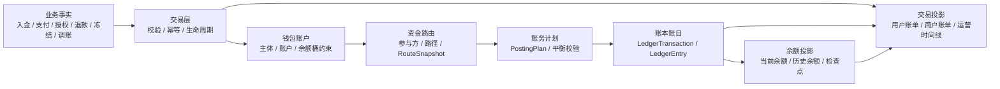
```mermaid
flowchart LR
    A["业务事实\n入金 / 支付 / 授权 / 退款 / 冻结 / 调账"] --> B["交易层\n校验 / 幂等 / 生命周期"]
    B --> C["钱包账户\n主体 / 账户 / 余额桶约束"]
    C --> D["资金路由\n参与方 / 路径 / RouteSnapshot"]
    D --> E["账务计划\nPostingPlan / 平衡校验"]
    E --> F["账本账目\nLedgerTransaction / LedgerEntry"]
    F --> G["余额投影\n当前余额 / 历史余额 / 检查点"]
    B --> H["交易投影\n用户账单 / 商户账单 / 运营时间线"]
    F --> H
    G --> H
```

一句话理解：交易层接收事实，钱包判断账户和余额能不能动，路由决定钱从哪里到哪里，账本负责不可变记录，投影负责给人和报表看。

### 2.1 专题范围和读者

| 维度 | 内容 |
| --- | --- |
| 本文覆盖 | 资金指令、资金交易、授权交易、冻结单、钱包账户、资金路由、账目、账本周期、余额投影、交易投影。 |
| 本文不覆盖 | 清算批次、结算单、出款单、对账差错、归档水位、指标报表的完整治理细节。 |
| 主要读者 | 产品、运营、财务、风控、研发、测试。 |
| 核心验收 | 每个资金动作都能说明输入事实、主体、余额桶、route snapshot、posting plan、账本分录、投影结果和异常红线。 |

### 2.2 角色、对象和场景入口

| 入口 | 产品问题 | 关键对象 | 典型场景 |
| --- | --- | --- | --- |
| 交易接入 | 业务事实如何进入资金底座并保持幂等。 | 资金指令、资金交易、交易明细、请求摘要。 | 入金、出金、支付、转账、退款、费用、调账。 |
| 授权控制 | 资金、额度或预算如何先占用后结算或释放。 | 授权交易、授权快照、授权占用账目。 | 授权批准、拒绝、撤销、过期、部分结算、结算后退款。 |
| 冻结控制 | 同一主体内部如何限制可用性。 | 冻结单、释放记录、审批凭证。 | 风控冻结、提现锁定、争议冻结、部分解冻、到期释放。 |
| 钱包账户 | 使用者如何理解余额、额度和预算。 | 资金账户、信用账户、预算组、余额桶。 | 余额查询、额度查询、预算查询、负余额观察。 |
| 支付工具 | 卡、VA、外部账户、虚拟卡或钱包标识如何作为付款、收款、提现或授权入口。 | 支付工具、绑定关系、工具方向、资金来源关系、工具快照。 | 绑卡付款、VCC 授权、提现银行卡、VA 入金、工具换绑后的原路退款。 |
| 资金路由 | 一笔事实如何翻译成账务路径。 | 参与方、平台账户角色、route snapshot、posting plan。 | 商户收款、手续费、原路退款、追偿、平台调整。 |
| 账目账本 | 余额变化如何被不可变事实证明。 | 账本、账目、账本周期、账本交易、分录。 | 过账、冲正、补记、调账、周期隔离。 |
| 投影视图 | 使用者如何查询余额和账单。 | 余额投影、余额日志、交易投影。 | 用户账单、商户账单、运营时间线、余额重建。 |

### 2.3 总体能力地图

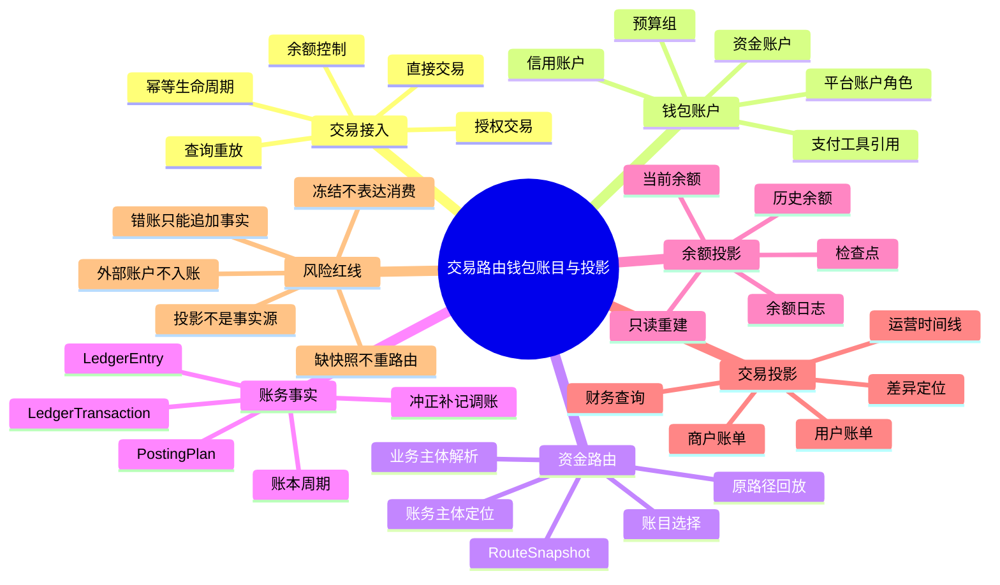
```mermaid
mindmap
  root((交易路由钱包账目与投影))
    交易接入
      直接交易
      授权交易
      余额控制
      幂等生命周期
      查询重放
    钱包账户
      资金账户
      信用账户
      预算组
      平台账户角色
      支付工具引用
    资金路由
      业务主体解析
      账务主体定位
      账目选择
      RouteSnapshot
      原路径回放
    账务事实
      PostingPlan
      LedgerTransaction
      LedgerEntry
      账本周期
      冲正补记调账
    余额投影
      当前余额
      历史余额
      余额日志
      检查点
      只读重建
    交易投影
      用户账单
      商户账单
      运营时间线
      财务查询
      差异定位
    风险红线
      外部账户不入账
      投影不是事实源
      冻结不表达消费
      缺快照不重路由
      错账只能追加事实
```

## 3. 核心概念和能力边界

| 概念 | 使用者视角解释 | 能力边界 |
| --- | --- | --- |
| 资金指令 | 业务系统告诉底座“发生了一件需要处理资金的事”。 | 必须包含业务引用、主体、金额、币种和幂等信息；不能直接指定历史分录。 |
| 资金交易 | 底座记录的一笔资金侧事实。 | 表达直接交易和授权交易；冻结不进入资金交易主表。 |
| 资金交易明细 | 同一笔资金交易对不同主体的影响明细。 | 用于查询、对账和投影，不是账单展示行本身。 |
| 冻结单 | 风控、提现、争议或运营动作对同一主体可用余额的限制。 | 只表达 `AVAILABLE <-> FROZEN`；不表达消费、扣划或授权。 |
| 钱包 | 面向使用者的账户和余额能力集合。 | 不替代账本；业务不能绕过交易层直接改钱包余额。 |
| 支付工具 | 发起、接收或识别支付动作的工具，例如银行卡、虚拟卡、VA、外部银行账户、通道 token、钱包标识。 | 只作为路由输入、绑定关系、外部引用和快照；不表达内部余额，不是可记账主体。 |
| 支付工具引用快照 | 本次交易实际使用的支付工具脱敏快照。 | 保存工具 ID、类型、展示号、归属方、币种、状态、绑定快照和审计上下文；不得保存完整卡号、CVV、密钥或明文敏感凭证。 |
| 外部账户引用快照 | 银行账户、通道账户、VA、PSP 账户或托管户等外部端点的引用。 | 只用于入金、出金、对账、外部回单和审计；不得作为内部账本主体。 |
| 业务主体 | 用户、商户、企业、部门、平台角色等业务归属方。 | 业务主体不直接入账，必须先解析到账务主体。 |
| 账务主体 / 可记账主体 | 能出现在 route leg、posting plan、LedgerEntry 和余额投影里的主体。 | 默认只包括资金账户、信用账户、预算组和明确配置的平台账户角色；用户、商户经营主体、业务订单、卡、VA、外部账户和支付工具不能直接入账。 |
| 资金账户 | 承载真实资金的账户主体，也是可记账主体。 | 可以有可用、冻结、授权、待清算、出款中等余额桶。 |
| 信用账户 | 承载授信额度和授权占用的控制账户，也是可记账主体。 | 不是现金账户；额度消费进入交易视图和报表；普通消费不新增 `CONSUMED` 账目。 |
| 预算组 | 承载预算总量、可用预算和预算占用的控制账户，也是可记账主体。 | 不是资金池；预算不是钱；预算消费进入报表和治理口径。 |
| 资金路由 | 把资金事实翻译成账户、账目和路径。 | 不决定业务订单是否成立；不直接写余额。 |
| route snapshot | 本次实际使用的参与方、账户、账目、规则版本和路径。 | 后续退款、撤销、争议、清结算和对账优先回放它。 |
| 账目 | 一个账户内的余额桶，例如可用、冻结、授权、待清算。 | 账目不是账户主体，不能用账目替代用户或商户。 |
| 账本分录 | 不可变的借贷记录。 | 余额变化的最终证明；错账只能追加冲正、补记或调账。 |
| 余额投影 | 从分录计算出来的余额视图。 | 可重建，不是事实源。 |
| 交易投影 | 面向用户、商户、运营、财务的只读账单和时间线。 | 不能反向修改资金交易、分录或余额。 |

## 4. 交易层产品设计

### 4.1 能力定位

交易层是业务系统使用资金底座的入口，不是业务订单系统。它负责接收资金事实、保证幂等、防止重复入账、保存快照、编排路由和过账，并把结果交给查询和投影。

| 能力 | 解决的问题 | 产品输出 | 红线 |
| --- | --- | --- | --- |
| 直接交易 | 入金、出金成功、支付、转账、退款、费用、调账等已确认资金事实。 | 资金交易、交易明细、route snapshot、账本交易。 | 不替代业务订单和外部通道状态机。 |
| 授权交易 | 最终交易前先占用资金、额度或预算。 | 授权占用、释放、结算、拒绝原因。 | 授权成功不是最终消费；授权拒绝不生成账务路径。 |
| 余额控制 | 冻结、解冻、额度调整、预算调整。 | 冻结单、调整事实、账本交易、审计引用。 | 冻结不创建资金交易；资金调账应作为直接交易或对账差错调账事实进入。 |
| 查询与重放 | 查询资金处理结果，修复或校验只读投影。 | 查询结果、差异报告、重放任务。 | 查询和重放不能补账或改历史事实。 |

### 4.2 直接交易流程

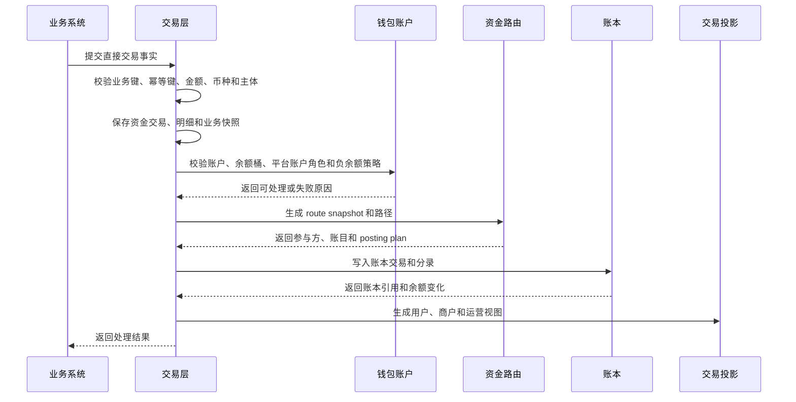
```mermaid
sequenceDiagram
    participant Biz as 业务系统
    participant Tx as 交易层
    participant Wallet as 钱包账户
    participant Route as 资金路由
    participant Ledger as 账本
    participant View as 交易投影

    Biz->>Tx: 提交直接交易事实
    Tx->>Tx: 校验业务键、幂等键、金额、币种和主体
    Tx->>Tx: 保存资金交易、明细和业务快照
    Tx->>Wallet: 校验账户、余额桶、平台账户角色和负余额策略
    Wallet-->>Tx: 返回可处理或失败原因
    Tx->>Route: 生成 route snapshot 和路径
    Route-->>Tx: 返回参与方、账目和 posting plan
    Tx->>Ledger: 写入账本交易和分录
    Ledger-->>Tx: 返回账本引用和余额变化
    Tx->>View: 生成用户、商户和运营视图
    Tx-->>Biz: 返回处理结果
```

直接交易必须做到：

1. 同一业务键和相同请求摘要重复提交，只返回原结果，不重复入账。
2. 同一业务键但请求摘要不同，必须拒绝。
3. 交易成功前必须完成账本过账；不能先展示成功再补账。
4. 本金、费用、成本、补贴、追偿和调账金额必须拆开表达。
5. 外部账户、支付工具和通道流水只能做引用，不成为内部账本主体。

### 4.3 授权交易流程

授权交易先回答“这笔请求是否能进入授权占用”，再回答“允许后占用哪一个余额桶”。资金底座核心主链路只要求余额、额度、预算、风控或外部授权结果能清楚表达批准或拒绝；更细的 spend controls 属于发卡、VCC、企业卡或员工卡产品的可选扩展。

#### 4.3.1 授权交易产品服务契约

授权交易的产品契约不是 Java API 清单，而是业务系统、运营、风控、财务和测试共同理解的一组可调用能力。每个能力都必须能说明输入事实、处理结果、状态变化、余额影响和审计证据。

| 服务能力 | 使用场景 | 必要输入 | 产品输出 | 余额和账务影响 | 验收边界 |
| --- | --- | --- | --- | --- | --- |
| 授权申请 | 用户刷卡、VCC 授权、共享卡支出、企业预算支出等先占用后完成的场景。 | 业务场景、业务流水、授权主体、金额、币种、资金账户或额度/预算来源、支付工具快照、外部授权引用、风控或授权前控制结论。 | 授权批准或授权拒绝；批准时返回授权交易号、授权占用快照和剩余可处理金额；拒绝时返回拒绝原因和规则版本。 | 批准时 `AVAILABLE -> AUTHORIZATION`；拒绝时无 route、posting、entry。 | 授权批准不是消费完成；授权拒绝不得生成账务路径，不得写入争议或拒付口径。 |
| 授权撤销 | 商户、通道、发卡侧或业务系统撤销未完成授权。 | 原授权交易号、撤销金额、撤销原因、外部撤销引用、操作者或系统来源。 | 撤销结果、释放金额、授权剩余金额、审计记录。 | 基于原授权快照 `AUTHORIZATION -> AVAILABLE`。 | 只能释放剩余授权；不得释放已完成金额；不得按当前账户绑定重新选路。 |
| 授权过期 | 授权到期、未完成消费、系统按规则释放剩余占用。 | 原授权交易号、过期时间、过期规则、系统任务引用。 | 过期结果、释放金额、终态和审计记录。 | 仅释放剩余 `AUTHORIZATION`。 | 过期和撤销是不同终态；已完成金额不得被过期释放。 |
| 授权完成 | 商户清算、通道完成、卡组织清算或业务确认消费成立。 | 原授权交易号、完成金额、完成时间、外部完成引用、费用或商户信息、规则版本。 | 完成交易、完成金额累计、授权剩余金额和后续可退款金额。 | 基于原授权快照从 `AUTHORIZATION` 转入收款方、商户 `CLEARING` 或平台目标账目。 | 完成金额不得超过剩余授权；普通完成不得触碰 `LIMIT`；商户订单款不得直入 `AVAILABLE` 或 `SETTLEMENT`。 |
| 强制完成 | 外部没有前置授权，但确认消费已经发生或通道直接完成。 | 业务流水、金额、币种、责任主体、强制完成策略、原因、凭证、操作者。 | 强制完成交易、原因、策略版本和审计记录。 | 按受控策略入账，可触发受控负余额或差错处理。 | 不补造授权占用；缺策略、上限、原因或审计时不得入账。 |
| 授权链退款 | 授权完成后发生退款、争议类退款或扣回。 | 原完成交易号、退款金额、退款原因、外部退款或争议引用、凭证。 | 退款交易、累计已退金额、可退剩余金额、投影视图区分普通退款和争议类退款。 | 基于已完成路径回补，不按当前绑定重新选路。 | 累计退款不得超过已完成金额；无原消费或凭证时不得静默退款。 |
| 授权生命周期查询 | 用户、商户、运营、财务或风控查询授权处理过程。 | 授权交易号、业务流水、主体、时间范围或外部引用。 | 授权金额、已完成、已撤销、已过期、已退款、剩余可处理金额、拒绝原因和审计时间线。 | 查询不写账，不修正余额。 | 查询结果必须能追溯到原授权快照、后续事件和账本事实。 |

#### 4.3.2 授权交易生命周期流程

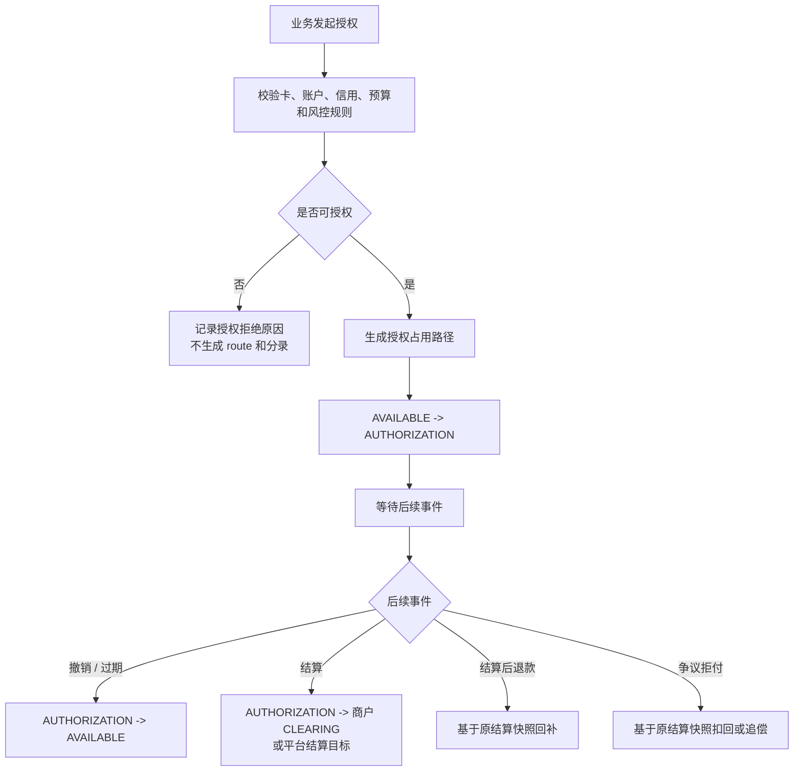
```mermaid
flowchart TD
    A["业务发起授权"] --> B["校验卡、账户、信用、预算和风控规则"]
    B --> C{"是否可授权"}
    C -- "否" --> D["记录授权拒绝原因\n不生成 route 和分录"]
    C -- "是" --> E["生成授权占用路径"]
    E --> F["AVAILABLE -> AUTHORIZATION"]
    F --> G["等待后续事件"]
    G --> H{"后续事件"}
    H -- "撤销 / 过期" --> I["AUTHORIZATION -> AVAILABLE"]
    H -- "结算" --> J["AUTHORIZATION -> 商户 CLEARING\n或平台结算目标"]
    H -- "结算后退款" --> K["基于原结算快照回补"]
    H -- "争议拒付" --> L["基于原结算快照扣回或追偿"]
```

授权生命周期状态图：

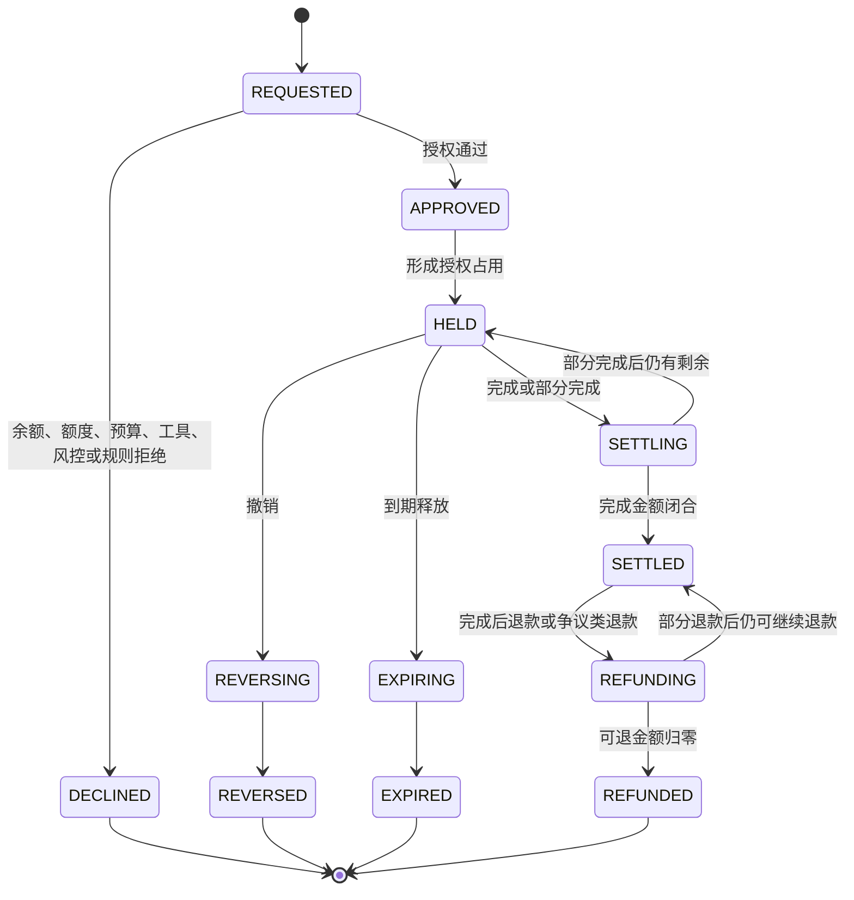
```mermaid
stateDiagram
    [*] --> REQUESTED
    REQUESTED --> DECLINED: 余额、额度、预算、工具、风控或规则拒绝
    REQUESTED --> APPROVED: 授权通过
    APPROVED --> HELD: 形成授权占用
    HELD --> SETTLING: 完成或部分完成
    HELD --> REVERSING: 撤销
    HELD --> EXPIRING: 到期释放
    SETTLING --> HELD: 部分完成后仍有剩余
    SETTLING --> SETTLED: 完成金额闭合
    SETTLED --> REFUNDING: 完成后退款或争议类退款
    REFUNDING --> SETTLED: 部分退款后仍可继续退款
    REFUNDING --> REFUNDED: 可退金额归零
    REVERSING --> REVERSED
    EXPIRING --> EXPIRED
    DECLINED --> [*]
    REVERSED --> [*]
    EXPIRED --> [*]
    REFUNDED --> [*]
```

授权交易的使用者可见口径：

| 角色 | 关注点 | 可见结果 | 不应看到 |
| --- | --- | --- | --- |
| 用户或持卡人 | 授权是否通过、占用了多少、何时释放或完成。 | 授权中、已完成、已撤销、已过期、已退款。 | 被误展示为已出款、已清算或已拒付。 |
| 商户或合作方 | 授权是否可完成、完成金额和可退款金额。 | 可完成金额、已完成金额、可退款金额和外部引用。 | 直接看到内部 route 或账本分录。 |
| 运营/风控 | 拒绝原因、规则命中、异常补偿和人工处理。 | 规则版本、风险原因、审批、凭证和审计。 | 直接改授权余额或历史分录。 |
| 财务/对账 | 授权占用、完成、退款和争议类退款是否可追溯。 | 原授权、完成、退款、外部引用和账本事实的追踪链。 | 用授权拒绝替代争议拒付。 |

授权交易的产品边界：

| 场景 | 正确口径 | 禁止口径 |
| --- | --- | --- |
| 授权批准 | 占用资金、信用额度或预算。 | 展示为已完成消费。 |
| 授权拒绝 | 记录拒绝原因，不生成账务路径。 | 记入争议拒付或 `chargebackAmount`。 |
| 授权撤销 | 基于原授权快照释放占用。 | 按当前账户绑定重新选路。 |
| 授权结算 | 占用变为已确认消费或商户待清算。 | 写成 `AUTHORIZATION -> LIMIT` 或新增账务 `CONSUMED`。 |
| 无授权强制完成 | 外部无前置授权但确认消费已发生时，使用 `settle` 的强制完成模式承接，并记录策略、上限、原因和审计。 | 补造授权占用、污染授权生命周期或绕过受控负余额策略。 |
| 无授权直接退款 | 外部无前置授权但存在原消费、原完成或差错凭证时，使用 `settleRefund` 的无授权退款模式承接。 | 无原事实或凭证时静默退款，或为了退款补造原授权。 |

授权 `CLOSED` 收口规则：

1. 资金底座默认不提供授权 close 服务入口，也不把 close 作为外部授权生命周期事件。
2. 已完成授权在退款或争议类退款后，可退金额归零时使用 `REFUNDED` 表达资金处理终态。
3. 如果运营查询需要展示“业务已关闭”，只能作为查询归纳态或运营标签，不能驱动账务、释放、退款或回放。
4. 编码和 TDD 阶段不以 `close` 作为授权交易目标 API；授权默认服务入口保持 `authorize`、`reversal`、`expire`、`settle`、`settleRefund`。

授权交易验收要点：

1. 授权批准必须生成授权快照和占用余额，授权拒绝必须只保存拒绝事实和原因。
2. 撤销、过期、完成和退款都必须引用原授权或原完成事实，不能按当前绑定关系重新解释历史。
3. 多次完成、多次撤销、多次退款必须以剩余可处理金额为上限，重复事件必须幂等。
4. 强制完成、无授权直接退款和争议类退款必须有策略、原因、凭证和审计。
5. 授权交易不能替代清算、结算、出款或对账差错流程；它只证明授权生命周期和资金占用/释放/完成事实。

### 4.4 Spend Controls 发卡授权控制扩展

Highnote 的 spend-controls 目录以及 Stripe、Marqeta、Lithic、Adyen 等行业实现，都把这类能力放在发卡授权控制、交易规则或 velocity limit 层。它的本质是“授权前控制策略”：在资金路由和账本占用发生前，根据卡、账户、预算、商户、MCC、地区、入卡方式、金额、次数、时间窗口、账户状态、外部协同授权和风控信号判断本次支出是否允许。

结论：Spend Controls 是发卡、VCC、企业卡或员工卡产品的可选扩展能力，不是支付资金底座的核心主链路能力。本 PRD 只保留产品边界、验收红线和 DSL 扩展点；只有当发卡产品明确启用时，才作为独立的发卡授权控制产品能力展开。

它解决的问题：

1. 授权前拦截：在 route、posting 和 ledger entry 生成前拦截不符合策略的支出，避免先入账再冲正。
2. 企业支出治理：让企业管理员按员工、卡、预算组、MCC、商户、国家、时间窗口和金额控制支出。
3. 风险和合规辅助：把高风险商户、地区、入卡方式、CVV/AVS 结果、卡片状态和风控结果转成可审计的拒绝原因。
4. 周期控制协同：把日限额、月预算、自定义合同周期等规则和账本周期、预算组、信用账户配合起来，但不由规则本身直接改余额。

外部参考带来的产品判断：

| 参考来源 | 可吸收能力 | 产品边界 |
| --- | --- | --- |
| Highnote Spend Rules / Velocity Controls / Suspend an Account / Collaborative Authorization | 请求属性规则、金额和次数窗口、账户暂停、外部协同授权和模拟授权。 | 只作为发卡授权控制扩展，不进入资金路由、账本或清结算核心。 |
| Stripe Issuing Spending Controls / Real-time Authorizations | 卡片或持卡人 spending controls，以及外部实时授权决策。 | 规则门禁和外部决策要分层；通过规则不等于授权占用成功。 |
| Marqeta Velocity Controls | 金额、次数、商户、MCC 和时间窗口限制。 | velocity window 是规则累计窗口，不是账本周期、清算账期或报表周期。 |
| Lithic Authorization Rules | 规则条件、速度限制、动作和拒绝原因。 | 可参考规则对象和审计模型，不照搬 API 结构。 |
| Adyen Issuing Transaction Rules | 发卡交易的允许、拒绝、暂停或审批动作。 | 可扩展到运营动作和审批，但必须保持授权前决策与账务事实隔离。 |

能力边界：

| 能力 | 正确归属 | 不应该归属 |
| --- | --- | --- |
| 判断 MCC、商户、国家、POS、PAN entry mode、CVV/AVS、单笔金额是否允许 | 授权控制策略 | 账本、清结算、对账 |
| 统计日、周、月或自定义窗口内的授权次数和金额 | 授权控制策略 + 周期累计视图 | 账本周期本身 |
| 授权通过后占用资金、信用额度或预算 | 资金路由 + 账本过账 | 支出规则直接写账 |
| 授权拒绝后保存拒绝原因、命中规则和规则版本 | 交易事实 / 授权拒绝记录 | LedgerEntry、chargeback、清算批次 |
| 预算或额度的真实余额隔离 | 账本周期 + 账目 bucket | Spend Rules 临时过滤 |

支出规则的生效顺序：

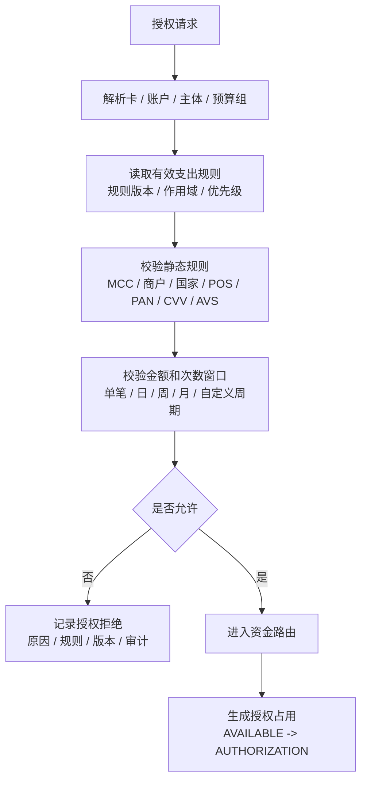
```mermaid
flowchart TD
    A["授权请求"] --> B["解析卡 / 账户 / 主体 / 预算组"]
    B --> C["读取有效支出规则\n规则版本 / 作用域 / 优先级"]
    C --> D["校验静态规则\nMCC / 商户 / 国家 / POS / PAN / CVV / AVS"]
    D --> E["校验金额和次数窗口\n单笔 / 日 / 周 / 月 / 自定义周期"]
    E --> F{"是否允许"}
    F -- "否" --> G["记录授权拒绝\n原因 / 规则 / 版本 / 审计"]
    F -- "是" --> H["进入资金路由"]
    H --> I["生成授权占用\nAVAILABLE -> AUTHORIZATION"]
```

产品规则：

1. 支出规则只决定授权请求是否继续，不直接生成 route、posting plan 或 ledger entry。
2. 授权拒绝必须保留命中规则、拒绝原因、规则版本、请求摘要和审计信息；不得生成账务路径。
3. 静态规则和周期规则要分开表达：MCC、商户、国家、POS、CVV/AVS 属于请求属性判断；日限额、月预算、自定义周期属于累计窗口判断。
4. 周期窗口可以引用账本周期或独立累计视图，但不能把清算账期、报表周期或归档水位当作可用余额判断。
5. 多条规则命中时必须有确定的优先级、合并方式和拒绝原因选择规则；缺失优先级时不得进入生产启用。
6. 规则变更必须有生效时间、版本、操作人、审批、灰度和回滚口径；历史授权按当时命中的规则版本解释。
7. 支出规则不是完整风控引擎；可接收风控结论或风险信号，但不替代名单筛查、欺诈模型、合规规则和人工复核。

产品定位判断：

| 位置 | 产品口径 | 理由 |
| --- | --- | --- |
| 资金底座默认能力 | 保留授权通过、授权拒绝、授权占用、授权释放、授权结算和审计边界。 | 资金底座必须能解释授权结果，但不默认承载所有发卡规则。 |
| 发卡授权控制扩展 | 在 VCC、企业卡、员工卡或发卡产品中启用 spend controls、card controls、velocity controls 和协同授权。 | 它依赖卡、持卡人、预算组、信用账户、账本周期和拒绝记录，属于授权前决策能力。 |
| 卡产品能力 | 围绕 spend controls、card controls、merchant controls、velocity controls、协同授权、风控和运营后台形成完整功能面。 | 卡产品需要独立管理规则、作用域、优先级、生效时间、窗口累计、拒绝原因和审计。 |

### 4.5 冻结和解冻流程

余额控制解决的是“同一账务主体内部，某个余额桶是否可用、可释放或可调整”的问题。它不表达跨主体价值转移，也不替代直接交易、授权交易、清结算或对账差错调账。

#### 4.5.1 余额控制产品服务契约

| 服务能力 | 使用场景 | 必要输入 | 产品输出 | 余额和账务影响 | 验收边界 |
| --- | --- | --- | --- | --- | --- |
| 资金账户冻结 | 风控冻结、提现申请锁定、争议冻结、运营临时冻结。 | 账务主体、账目、金额、币种、冻结原因、期限、业务流水、操作者、凭证。 | 冻结单、冻结金额、剩余可用、到期时间和审计记录。 | 同主体 `AVAILABLE -> FROZEN`。 | 冻结不是消费、扣划或授权；冻结不创建标准资金交易。 |
| 资金账户解冻 | 风控解除、提现撤销、争议解除、到期释放、部分释放。 | 原冻结单、解冻金额、解冻原因、操作者或系统任务、凭证。 | 解冻结果、冻结剩余金额、释放记录和审计记录。 | 同主体 `FROZEN -> AVAILABLE`。 | 累计解冻不得超过剩余冻结；重复解冻必须幂等或明确失败。 |
| 冻结后出款确认 | 提现或出款已冻结，外部确认成功后引用并关闭冻结来源。 | 原冻结单、出款结果、外部回单、金额、币种、费用信息。 | 出款成功事实、冻结来源关闭或减少、外部回单引用。 | 通过独立出款资金事实引用冻结单并关闭对应冻结金额。 | 不是先解冻再无来源扣款；冻结单自身不表达消费；外部受理不等于出款成功。 |
| 信用额度调整 | 授信额度增加、减少、恢复或风控压降。 | 信用账户、调整方向、金额、原因、审批、规则版本、操作者。 | 额度调整记录、`LIMIT`、`AVAILABLE` 变化和审计。 | 信用账户 `LIMIT` 和可用额度按规则变化。 | 只有额度调整能触碰 `LIMIT`；普通授权完成不得触碰 `LIMIT`。 |
| 预算额度调整 | 部门、项目、员工卡或预算组额度变更。 | 预算组、预算周期、调整方向、金额、原因、审批、规则版本。 | 预算调整记录、预算总量、可用预算、审计和报表口径。 | 预算组 `LIMIT` 和 `AVAILABLE` 按规则变化。 | 预算不是资金池；预算调整不产生真实资金流。 |
| 资金余额调账边界 | 对账差错、运营修正、财务调整需要影响真实资金账户。 | 差错单、审批、凭证、责任主体、金额、币种、原因。 | 标准调账资金事实或差错处理记录。 | 应进入直接交易调账或差错调账事实。 | 余额控制不承接跨主体价值转移；不得直接改历史分录或投影。 |
| 余额控制查询 | 用户、运营、风控或财务查看冻结、释放、额度和预算变化。 | 主体、账目、币种、冻结单、调整单或时间范围。 | 当前冻结、冻结历史、额度/预算变化、审计和来源引用。 | 查询不写账。 | 查询不能修复余额或重新计算事实。 |

#### 4.5.2 冻结与解冻主流程

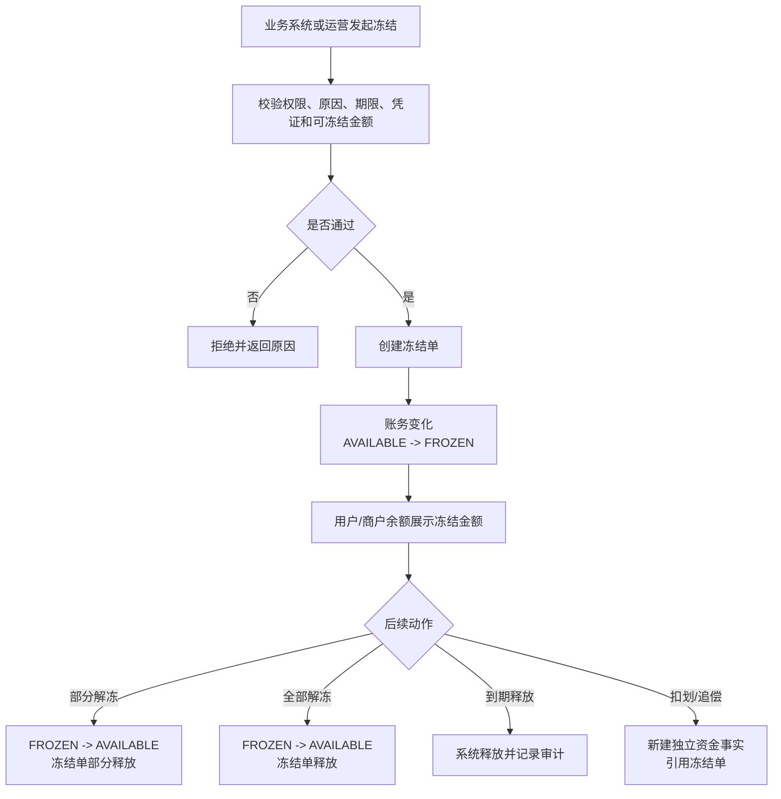
```mermaid
flowchart TD
    A["业务系统或运营发起冻结"] --> B["校验权限、原因、期限、凭证和可冻结金额"]
    B --> C{"是否通过"}
    C -- "否" --> D["拒绝并返回原因"]
    C -- "是" --> E["创建冻结单"]
    E --> F["账务变化\nAVAILABLE -> FROZEN"]
    F --> G["用户/商户余额展示冻结金额"]
    G --> H{"后续动作"}
    H -- "部分解冻" --> I["FROZEN -> AVAILABLE\n冻结单部分释放"]
    H -- "全部解冻" --> J["FROZEN -> AVAILABLE\n冻结单释放"]
    H -- "到期释放" --> K["系统释放并记录审计"]
    H -- "扣划/追偿" --> L["新建独立资金事实\n引用冻结单"]
```

#### 4.5.3 额度和预算调整流程

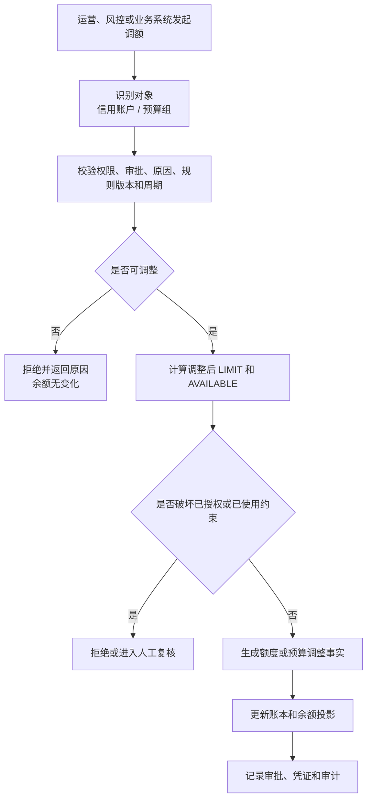
```mermaid
flowchart TD
    A["运营、风控或业务系统发起调额"] --> B["识别对象\n信用账户 / 预算组"]
    B --> C["校验权限、审批、原因、规则版本和周期"]
    C --> D{"是否可调整"}
    D -- "否" --> E["拒绝并返回原因\n余额无变化"]
    D -- "是" --> F["计算调整后 LIMIT 和 AVAILABLE"]
    F --> G{"是否破坏已授权或已使用约束"}
    G -- "是" --> H["拒绝或进入人工复核"]
    G -- "否" --> I["生成额度或预算调整事实"]
    I --> J["更新账本和余额投影"]
    J --> K["记录审批、凭证和审计"]
```

#### 4.5.4 冻结、授权和调账的差异

| 能力 | 解决的问题 | 余额变化 | 是否跨主体 | 是否表达最终消费 | 典型验收 |
| --- | --- | --- | --- | --- | --- |
| 冻结 | 暂时限制同一主体的可用余额。 | `AVAILABLE <-> FROZEN`。 | 否。 | 否。 | 冻结和解冻累计不超过原冻结金额。 |
| 授权 | 最终消费前先占用资金、额度或预算。 | `AVAILABLE -> AUTHORIZATION`，后续完成或释放。 | 授权完成时可能进入收款方或商户待清算。 | 授权批准不是最终消费。 | 授权完成、撤销、过期和退款必须引用原授权。 |
| 额度/预算调整 | 改变信用或预算的控制上限。 | `LIMIT` 和 `AVAILABLE` 按规则变化。 | 否。 | 否。 | 必须有审批、规则版本和审计，不破坏已授权占用。 |
| 资金调账 | 基于差错、审批和凭证修正真实资金事实。 | 按调账事实影响指定账目。 | 可能。 | 取决于调账场景。 | 必须走直接交易调账或差错闭环，不能直接改余额。 |

冻结不是价值转移。冻结单不能直接表达“消费了”“扣掉了”“已支付”。如果冻结后需要扣划、追偿或退款，必须创建新的资金交易或调账事实，并引用冻结单作为来源。

余额控制验收要点：

1. 冻结失败、解冻超额、错币种、主体缺失、账目不支持、审批缺失时必须失败且余额无变化。
2. 冻结和解冻必须保存冻结单、释放记录、剩余冻结金额、原因、操作者、凭证和审计。
3. 资金账户冻结只控制真实资金账户可用性；信用账户和预算组调额只控制额度或预算，不表达现金沉淀。
4. 余额控制不做 FX，不隐式换汇，不承接外部通道成功或失败状态机。
5. 余额控制不能绕过交易层、账本层和差错闭环直接修改历史余额。

## 5. 资金路由产品设计

### 5.1 路由要做什么

资金路由把“这是一笔什么交易”变成“哪些账户的哪些账目需要怎么变化”。它是产品规则矩阵，不是通道路由，也不是知识路由。

| 路由步骤 | 问题 | 示例 |
| --- | --- | --- |
| 场景识别 | 这是入金、支付、转账、授权、退款、争议还是调账。 | 商户订单收款不能走普通转账口径。 |
| 参与方解析 | 谁付款、谁收款、平台扮演什么角色。 | 用户、商户、平台费用账户。 |
| 账户定位 | 每个参与方使用哪个资金账户、信用账户或预算组。 | 商户资金账户、平台费用归集账户。 |
| 账目定位 | 每个账户影响哪个余额桶。 | 用户 `AVAILABLE`，商户 `CLEARING`，平台 `FEE`。 |
| 路径生成 | 金额从哪个节点流向哪个节点。 | 用户可用减少，商户待清算增加，平台费用增加。 |
| 快照固化 | 保存本次规则和路径。 | 后续退款按原路径回放。 |
| 账务计划 | 把路径转成借贷平衡的计划。 | 同币种借贷平衡。 |

### 5.2 路由规则图

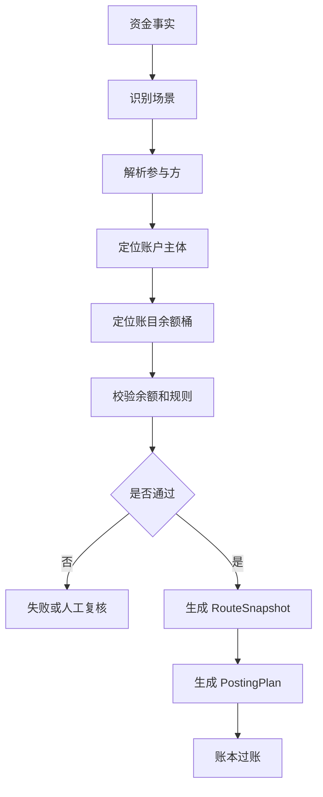
```mermaid
flowchart TD
    A["资金事实"] --> B["识别场景"]
    B --> C["解析参与方"]
    C --> D["定位账户主体"]
    D --> E["定位账目余额桶"]
    E --> F["校验余额和规则"]
    F --> G{"是否通过"}
    G -- "否" --> H["失败或人工复核"]
    G -- "是" --> I["生成 RouteSnapshot"]
    I --> J["生成 PostingPlan"]
    J --> K["账本过账"]
```

### 5.3 典型路由规则

| 场景 | 路由口径 | 关键边界 |
| --- | --- | --- |
| 用户充值成功 | 平台现金或预收待付角色到用户 `AVAILABLE`。 | 外部银行账户只做引用。 |
| 用户提现申请 | 用户 `AVAILABLE -> FROZEN`。 | 申请阶段不等于外部到账。 |
| 用户提现成功 | 消耗已冻结或已锁定金额，并关联外部回单。 | 成功和失败不能双终态。 |
| 系统内转账 | 付款方 `AVAILABLE ->` 收款方 `AVAILABLE`。 | 同主体、币种不一致、缺账户必须失败。 |
| 商户订单收款 | 用户 `AVAILABLE ->` 商户 `CLEARING`，费用拆入平台 `FEE`。 | 订单款不得直入 `AVAILABLE` 或 `SETTLEMENT`。 |
| 清算确认 | 商户 `CLEARING -> AVAILABLE`。 | 有重大差错、冻结或风险阻断时不得清算。 |
| 结算锁定 | 商户 `AVAILABLE -> SETTLEMENT`。 | 未锁定不得出款；出款失败必须回退。 |
| 原交易退款 | 基于原 route snapshot 回补。 | 缺快照不得重新选路；累计退款不得超额。 |
| 争议拒付 | 从责任方、准备金、负余额或追偿路径扣回。 | 授权拒绝不是争议拒付。 |
| 手续费退回 | 只回放原费用 leg。 | 不自动随普通退款退费。 |
| 调账补记 | 明确来源到平台 `ADJUSTMENT` 或从 `ADJUSTMENT` 到明确目标。 | 必须有差错单、审批和凭证。 |

### 5.4 路由实际用例场景

路由层最容易被误解成“配置一条技术规则”。产品上更准确的理解是：每来一笔资金事实，路由要把它翻译成可入账、可追溯、可回放的资金路径。它不判断业务订单是否成立，也不替代外部通道状态；它只回答“这笔事实影响哪些可记账主体、哪些账目、哪个周期，以及后续逆向动作如何回到原路径”。

| 用例场景 | 使用者能理解的话 | 路由要回答的问题 | 路由输出 | 关键边界 |
| --- | --- | --- | --- | --- |
| 用户充值成功 | 外部已经确认到账，用户余额应该增加。 | 外部资金映射到哪个平台账户角色，用户使用哪个资金账户和 `AVAILABLE` 账目。 | 平台现金或预收待付引用到用户 `AVAILABLE` 的 route snapshot。 | 银行账户、VA、通道账户只做外部引用；用户账户缺失时不得自动增加余额。 |
| 用户提现申请 | 用户申请提现，先把可用金额锁住。 | 用户哪个资金账户从 `AVAILABLE` 转入 `FROZEN` 或提现锁定口径。 | 同主体 `AVAILABLE -> FROZEN` 的冻结或锁定路径。 | 提现申请不等于外部到账；不能展示为出款成功。 |
| 用户提现成功 | 外部确认出款成功，内部锁定金额应被消耗。 | 哪个冻结或锁定来源被外部回单消耗，外部 reference 如何关联。 | 消耗原锁定金额并保留出款回单引用。 | 成功通知必须幂等；成功和失败不能双终态。 |
| 用户提现失败 | 外部明确失败，锁定金额应回到可用。 | 原提现锁定是否存在、剩余可释放金额是多少。 | 同主体 `FROZEN -> AVAILABLE`。 | 只释放一次；不能因为失败回调重复而多加余额。 |
| 系统内转账 | 一个内部账户给另一个内部账户转钱。 | 付款方和收款方是不是明确的可记账主体，币种和周期是否一致。 | 付款方 `AVAILABLE ->` 收款方 `AVAILABLE`。 | 同主体、错币种、账户缺失、周期缺失或余额不足必须失败。 |
| 普通支付 | 付款方支付给普通收款方。 | 这是普通收款还是商户订单收款，收款方目标桶是什么。 | 付款方 `AVAILABLE ->` 收款方指定目标账目。 | 不默认套用商户 `CLEARING`；只有商户订单收款才进入待清算。 |
| 商户订单收款 | 用户支付订单，商户先看到待清算款。 | 用户扣多少，本金给哪个商户 `CLEARING`，手续费给哪个平台 `FEE`。 | 用户 `AVAILABLE ->` 商户 `CLEARING`，可拆平台 `FEE`。 | 商户订单款不得直入 `AVAILABLE` 或 `SETTLEMENT`；本金、手续费、补贴、成本要拆开。 |
| 原交易退款 | 用户退款时，要按原交易路径回补。 | 原交易 route snapshot 是否存在，剩余可退金额是多少，商户款当前处在哪个阶段。 | 基于原 route snapshot 的逆向路径。 | 缺原快照不得按当前绑定重新选路；累计退款不得超额。 |
| 手续费退回 | 只退回原来收过的手续费。 | 原费用 leg 是否存在，退费责任方是谁，退多少。 | 平台 `FEE ->` 原责任方或指定退费目标。 | 普通退款不自动退手续费；退费不能超过原收费。 |
| 授权占用 | 先占用用户资金、信用额度或预算。 | 哪个主体、哪个账本周期、哪个 `AVAILABLE` 被占用。 | 同主体 `AVAILABLE -> AUTHORIZATION`。 | 授权成功不是最终消费；授权拒绝不生成 route。 |
| 授权结算 | 已占用金额变成真实消费或商户待清算。 | 使用哪笔授权快照，结算金额是否超过剩余占用。 | `AUTHORIZATION ->` 商户 `CLEARING` 或平台目标账目。 | 不新增 `CONSUMED` 账目，不触碰 `LIMIT`。 |
| 授权撤销或过期 | 外部撤销或系统到期释放剩余占用。 | 原授权剩余可释放金额是多少，释放到哪个周期的 `AVAILABLE`。 | 同主体 `AUTHORIZATION -> AVAILABLE`。 | 撤销和过期终态要区分；已结算金额不得被释放。 |
| 冻结和解冻 | 风控或运营限制同一主体可用余额。 | 冻结哪个主体、哪个账目、哪个周期的可用余额。 | 同主体 `AVAILABLE <-> FROZEN`。 | 冻结不是消费、扣划或授权；扣划必须另建资金事实。 |
| 清算确认 | 商户待清算款通过清算前置条件。 | 哪个清分批次或清算候选可从待清算进入可结算。 | 商户 `CLEARING -> AVAILABLE`。 | 清分候选或清算候选不能直接入账；重大对账差错阻断清算。 |
| 结算锁定和出款 | 商户可结算金额进入出款处理。 | 哪个结算单锁定哪个商户 `AVAILABLE`。 | 商户 `AVAILABLE -> SETTLEMENT`，出款成功后完成或失败回退。 | 结算单不等于出款成功；出款失败必须回退。 |
| 差错调账 | 财务或运营基于差错单调整资金。 | 责任方、目标方、调整账目、审批和凭证是否明确。 | `ADJUSTMENT` 到明确目标，或明确来源到 `ADJUSTMENT`。 | 不得直接修改历史分录或余额投影。 |

### 5.5 商户订单收款路由用例

商户订单收款是最容易误解的路由场景。用户看到的是“付款成功”，商户看到的是“待清算”，平台还可能同时收手续费。路由层要把这三个视角拆清楚。

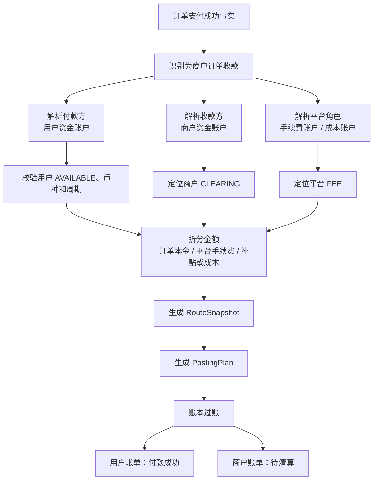
```mermaid
flowchart TD
    A["订单支付成功事实"] --> B["识别为商户订单收款"]
    B --> C["解析付款方\n用户资金账户"]
    B --> D["解析收款方\n商户资金账户"]
    B --> E["解析平台角色\n手续费账户 / 成本账户"]
    C --> F["校验用户 AVAILABLE、币种和周期"]
    D --> G["定位商户 CLEARING"]
    E --> H["定位平台 FEE"]
    F --> I["拆分金额\n订单本金 / 平台手续费 / 补贴或成本"]
    G --> I
    H --> I
    I --> J["生成 RouteSnapshot"]
    J --> K["生成 PostingPlan"]
    K --> L["账本过账"]
    L --> M["用户账单：付款成功"]
    L --> N["商户账单：待清算"]
```

商户订单收款的产品断言：

1. 用户侧看到付款成功，不代表商户已可结算。
2. 商户订单款默认进入 `CLEARING`，清算确认后才进入 `AVAILABLE`。
3. 平台手续费、补贴、通道成本和商户本金必须拆分，不能只记录一个净额。
4. route snapshot 必须保存用户账户、商户账户、平台账户角色、账目、规则版本、费用拆分和业务引用。
5. 后续退款、清算、争议、手续费退回和对账差错优先引用本次 route snapshot。

### 5.6 原交易退款路由用例

退款不是“重新打一笔钱给用户”，而是基于原交易快照做逆向处理。原路径、剩余可退金额、费用规则和当前清结算阶段共同决定退款如何表达。

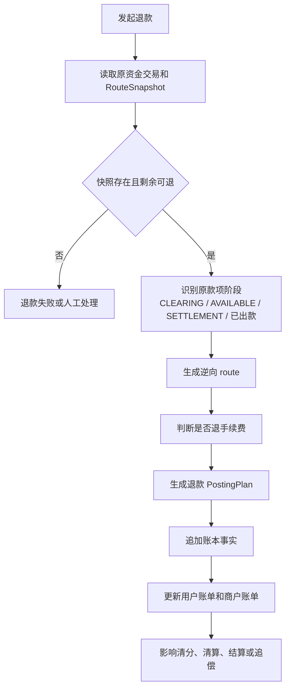
```mermaid
flowchart TD
    A["发起退款"] --> B["读取原资金交易和 RouteSnapshot"]
    B --> C{"快照存在且剩余可退"}
    C -- "否" --> D["退款失败或人工处理"]
    C -- "是" --> E["识别原款项阶段\nCLEARING / AVAILABLE / SETTLEMENT / 已出款"]
    E --> F["生成逆向 route"]
    F --> G["判断是否退手续费"]
    G --> H["生成退款 PostingPlan"]
    H --> I["追加账本事实"]
    I --> J["更新用户账单和商户账单"]
    J --> K["影响清分、清算、结算或追偿"]
```

退款路由的产品断言：

1. 有原 route snapshot 时必须回放原路径，不能按当前账户绑定、当前费率或当前商户配置重新选路。
2. 原交易仍在 `CLEARING` 时，退款通常冲减待清算口径。
3. 原交易已清算进入 `AVAILABLE` 后，退款需要从商户可用、后续清算抵扣、准备金或追偿路径解释。
4. 原交易已结算或出款后发生退款，不能让出款单倒退成未出款；应进入退款、追偿、后续结算抵扣或差错处理。
5. 手续费是否退回由费用规则决定，且只回放原费用 leg；普通退款不自动退手续费。

### 5.7 路由失败和人工处理用例

路由失败不是“换个路径试试”，而是资金事实当前无法被安全翻译成可入账路径。失败要可解释、可审计、可人工处理。

| 失败场景 | 失败原因 | 产品结果 | 禁止做法 |
| --- | --- | --- | --- |
| 账户不存在 | 业务主体没有可记账资金账户、信用账户或预算组。 | 交易失败、挂起或进入补建账流程。 | 自动创建账本并入账。 |
| 平台账户角色缺失 | 平台手续费、预收待付、现金映射等角色没有唯一账户。 | 路由失败并提示缺配置。 | 把“平台”抽象主体直接入账。 |
| 外部账户被当作内部账户 | 银行账户、VA、卡或通道账户被传成入账主体。 | 路由拒绝，保留外部引用。 | 创建外部账户余额或 LedgerEntry 主体。 |
| 币种不一致 | 付款方、收款方、费用或账户币种不匹配。 | 路由失败或进入待确认换汇/差错流程。 | 静默换汇或按单方币种入账。 |
| 余额不足 | `AVAILABLE`、额度或预算不足。 | 失败或进入审批策略。 | 继续生成账本分录。 |
| 非生命周期周期缺失 | 预算、信用或自定义周期缺 `periodId`。 | 路由失败。 | 用当前月份、清算账期或报表周期静默补齐。 |
| 路由规则不唯一 | 多个账户、账目或平台角色同时命中。 | 路由失败或进入人工复核。 | 随机选一个账户入账。 |
| 原快照缺失 | 退款、撤销、拒付或退费找不到原 route snapshot。 | 逆向交易失败或人工处理。 | 按当前账户关系重新选路。 |

## 6. 钱包账户产品设计

### 6.1 钱包不是账本

钱包负责让使用者理解和操作账户能力，账本负责证明余额变化。钱包可以展示余额、冻结、授权、待清算、出款中、额度和预算，但这些数字必须能映射到分录和余额投影。

### 6.2 账户类型

| 账户类型 | 是否真实有钱 | 典型用户 | 余额桶 | 关键边界 |
| --- | --- | --- | --- | --- |
| 普通资金账户 | 是 | 用户、普通资金主体 | `AVAILABLE`、`FROZEN`、`AUTHORIZATION` | 承载真实资金；可用不足时主动支付、冻结、授权默认失败。 |
| 商户资金账户 | 是 | 商户、服务提供方 | `CLEARING`、`AVAILABLE`、`SETTLEMENT`、`IN_TRANSIT`、`FROZEN`、`ADJUSTMENT` | 收款先待清算，再可结算，再出款中或外部在途。 |
| 平台资金账户 | 取决于角色 | 平台内部 | `CASH`、`PREPAYMENT`、`CLEARING`、`SETTLEMENT`、`IN_TRANSIT`、`FEE`、`ADJUSTMENT` | 平台角色必须解析到具体账户；不得混同平台收入和待付责任。 |
| 信用账户 | 否 | 企业、额度主体 | `LIMIT`、`AVAILABLE`、`AUTHORIZATION` | 额度不是现金；授权结算只关闭占用。 |
| 预算组 | 否 | 部门、项目、卡组 | `LIMIT`、`AVAILABLE`、`AUTHORIZATION` | 预算不是资金池；预算消费进报表。 |
| 外部账户 | 平台外部 | 银行、通道、卡、VA | 无内部余额桶 | 只做引用、映射、触发和对账。 |

### 6.3 账务主体定性

账务主体是账本能真正记账的对象。用户、商户、企业和部门是业务上的归属方；资金账户、信用账户、预算组才是账务层可落分录、可形成余额投影、可参与账本周期隔离的主体。产品上要先回答“这笔钱或额度属于哪个业务主体”，再由钱包账户和路由规则解析为“应记到哪个可记账主体”。

| 主体类型 | 是否可记账 | 产品定性 | 典型入账能力 | 禁止口径 |
| --- | --- | --- | --- | --- |
| 资金账户 | 是 | 承载真实资金、商户待清算、平台现金或费用责任。 | 支付、转账、提现、退款、清算、结算、费用、调账。 | 把外部银行账户或通道账户当作内部资金账户。 |
| 信用账户 | 是 | 承载授信额度、可用额度和授权占用。 | 额度调增/调减、授权占用、授权释放、额度治理。 | 把信用额度当作现金；普通交易结算直接写 `LIMIT`。 |
| 预算组 | 是 | 承载预算总量、可用预算和预算占用。 | 预算调增/调减、预算授权、预算释放、周期预算控制。 | 把预算组当作资金池；把预算消费写成现金流。 |
| 平台账户角色 | 解析后可记账 | 平台在交易中的现金、待付、手续费、清算或结算责任。 | 平台费用归集、待付责任、现金映射、清算准备。 | 不解析角色，直接把“平台”这个抽象主体入账。 |
| 用户、商户、企业、部门 | 否 | 业务归属方、合同方或展示对象。 | 通过其名下资金账户、信用账户或预算组入账。 | 直接把用户 ID、商户 ID、部门 ID 写入 LedgerEntry 作为账务主体。 |
| 卡、VA、外部银行账户、支付工具 | 否 | 支付工具、外部端点或对账引用。 | 保存为支付工具引用、外部账户引用、route snapshot、routing decision 或对账线索。 | 作为 ledger subject、余额投影主体或账本周期归属方。 |

账务主体的产品红线：

1. 所有可入账路径必须落到明确的资金账户、信用账户、预算组或解析后的平台账户角色。
2. 账务主体必须有账户类型、归属方、币种、支持账目、账本 Profile、账本周期策略和状态。
3. route snapshot 和 posting plan 中保存的是可记账主体，不是业务主体的自然语言描述。
4. 余额投影查询按账务主体、账目、币种和账本周期查询，再向上汇总成用户、商户、企业或部门视图。
5. 外部账户、卡、VA、通道流水、业务订单和报表指标只能做引用或投影来源，不能成为 LedgerEntry 主体。

### 6.4 余额桶口径

| 余额桶 | 用户能理解的话 | 典型使用场景 |
| --- | --- | --- |
| `AVAILABLE` | 当前可使用、可支付、可提现或可结算的金额。 | 支付、转账、提现、商户结算。 |
| `FROZEN` | 暂时不能用的金额。 | 风控冻结、提现处理中、争议冻结。 |
| `AUTHORIZATION` | 已被预占但还没有最终消费的金额或额度。 | 卡授权、预算占用、信用授权。 |
| `CLEARING` | 商户已收到但还不能结算的订单款。 | 商户订单收款后的待清算。 |
| `SETTLEMENT` | 已进入结算或出款处理的锁定金额。 | 商户出款中、结算应付。 |
| `IN_TRANSIT` | 外部已受理但还没有最终成功或失败的在途金额。 | 全球付款、银行转账、代付处理中、外部回单未决。 |
| `LIMIT` | 额度或预算总量。 | 信用额度、预算总额。 |
| `CASH` | 平台现金或外部资金池的内部映射。 | 银行流水、现金池对账。 |
| `PREPAYMENT` | 平台对用户、商户或业务方的待付责任。 | 预收待付、平台中间归集。 |
| `FEE` | 平台手续费、服务费或成本归集。 | 手续费收取、退费、费用报表。 |
| `ADJUSTMENT` | 差错、挂账、调账的过渡口径。 | 对账差异、追偿、人工调账。 |

### 6.5 余额桶状态图


```mermaid
stateDiagram
    [*] --> AVAILABLE
    AVAILABLE --> FROZEN: 冻结
    FROZEN --> AVAILABLE: 解冻
    AVAILABLE --> AUTHORIZATION: 授权占用
    AUTHORIZATION --> AVAILABLE: 外部撤销释放
    AUTHORIZATION --> AVAILABLE: 系统过期释放
    AUTHORIZATION --> CLEARING: 资金授权结算为商户待清算
    CLEARING --> AVAILABLE: 清算确认
    AVAILABLE --> SETTLEMENT: 结算锁定
    SETTLEMENT --> AVAILABLE: 出款失败回退
    SETTLEMENT --> [*]: 出款成功或外部完成
```

不同账户类型可用的余额桶不同；上图只表达常见资金流转关系，不代表所有账户都支持所有状态。信用账户和预算组的授权结算只关闭占用或形成责任消耗，不应被理解为现金进入商户 `CLEARING`。

### 6.6 受控负余额

`AVAILABLE` 可以在少数受控场景为负，例如后置手续费、清算差额、争议费、追偿、额度调减、预算调减。负数不是“还可以继续花”的意思，而是一个需要治理的风险状态。

受控负余额必须满足：

1. 有来源：原交易、争议、费用规则、汇率快照、差错单、调额单或审批单。
2. 有策略：主体类型、币种、上限、账龄、审批和风控等级。
3. 有去向：追偿、后续入金抵扣、结算抵扣、额度治理、预算治理或人工处理。
4. 有展示：运营、财务和风控能看到原因、责任方、账龄和处理状态。
5. 有阻断：负余额主体继续支付、冻结、授权或出款时必须按策略判断。

### 6.7 支付工具产品设计

支付工具是“使用什么工具发起或接收支付”的入口，不是“钱在哪里”的答案。钱在哪里，要由支付工具绑定关系、资金来源关系、钱包账户和路由规则继续解析到资金账户、信用账户、预算组或平台账户角色。

从使用者视角看，支付工具解决四个问题：

1. 入口识别：用户、商户或企业使用哪张卡、哪个 VA、哪个外部账户、哪个钱包标识或哪个通道 token 发起动作。
2. 绑定关系：这个工具归属于谁、能代表谁付款或收款、是否关联信用账户、预算组或真实资金账户。
3. 方向和状态：工具是否允许付款、收款或双向使用，是否处于可用、暂停、解绑、过期、未验证或风控阻断状态。
4. 快照留痕：交易发生时工具的归属、状态、绑定、币种、规则版本和脱敏展示信息必须固化，后续退款、撤销、拒付、对账和审计不能依赖当前绑定重新解释历史。

#### 6.7.1 支付工具对象边界

| 对象 | 使用者能理解的话 | 必须保存 | 产品边界 |
| --- | --- | --- | --- |
| 支付工具 | 一张卡、一个 VA、一个外部银行账户、一个虚拟卡或一个钱包/通道标识。 | 工具 ID、工具类型、脱敏展示号、归属方、方向、状态、币种、服务方或通道引用。 | 不保存完整 PAN、CVV、密钥、token secret；不表达内部余额。 |
| 支付工具绑定 | 工具和内部业务主体、资金账户、信用账户、预算组或收款主体之间的关系。 | 绑定角色、方向、优先级、默认标识、生效时间、失效时间、版本、操作人和审计。 | 绑定关系只提供路由候选，不直接入账。 |
| 支付工具引用快照 | 某次交易实际使用工具的冻结快照。 | 工具 ID、类型、展示号、归属方、租户、币种、状态、绑定快照和上下文。 | 后续逆向交易优先读取原快照；不按当前绑定关系重新解释。 |
| 外部账户引用 | 工具背后的外部端点，如银行账户、PSP 账户、通道账户或托管户。 | 外部账户 ID、类型、服务方、通道、币种、国家或地区、外部 reference。 | 只做外部核验、回单、对账和审计，不作为内部账本主体。 |
| 资金来源关系 | 某个支出主体在付款、授权、结算或兜底时使用哪个内部资金来源。 | 关系类型、资金账户、信用账户、预算组、优先级、额度或预算规则、失败兜底策略。 | 不执行扣款；真正扣款由交易、路由和账本完成。 |

支付工具绑定采用“当前有效关系 + 历史审计证据”的产品口径：当前有效关系用于新交易候选选择；历史审计证据用于解释过去交易、退款、撤销、退费、拒付、对账、客服查询和争议举证。绑定、默认标识、方向、优先级、资金来源关系或状态发生变化时，可以更新当前态，但必须追加保留前后值、操作者、原因、时间和版本；不得用覆盖更新抹掉历史证据。

#### 6.7.2 支付工具类型和典型场景

| 工具类型 | 典型场景 | 路由关注点 | 禁止口径 |
| --- | --- | --- | --- |
| 银行卡 / 外部银行卡 | 用户充值、提现、付款或授权。 | 工具状态、方向、归属方、外部账户引用、通道 reference。 | 把银行卡当成内部资金账户记余额。 |
| 虚拟卡 / VCC / 卡 token | 企业卡、员工卡、共享卡、一次性卡授权。 | 卡与资金账户、信用账户、预算组和 spend controls 的关系。 | 授权通过后直接记成消费完成；保存完整卡号或 CVV。 |
| VA / 虚拟账户 | 入金识别、对账匹配。 | VA 归属、外部到账 reference、匹配到的内部资金账户。 | VA 自身形成内部余额桶。 |
| 外部银行账户 | 提现、出款、商户结算、退款回补。 | 外部账户校验、回单、失败原因和对账引用。 | 外部账户直接出现在 LedgerEntry 主体中。 |
| 钱包标识 / 通道 token | 聚合支付、平台钱包、第三方账户。 | token 和内部主体、资金账户或外部端点的映射快照。 | 用 token 替代可记账主体。 |

#### 6.7.3 绑定角色、使用方向和资金来源

支付工具绑定要回答“这个工具代表谁、能做什么、最终使用哪类内部资金来源”。产品上至少区分三类信息：绑定角色、使用方向、资金来源关系。

| 维度 | 典型取值 | 产品解释 | 验收重点 |
| --- | --- | --- | --- |
| 绑定角色 | 真实资金主体、信用控制主体、预算控制主体、付款主体、收款主体。 | 工具可以绑定到真实资金来源，也可以绑定到信用或预算控制维度。 | 授权和付款时必须解析到最终可记账主体；不能停留在工具或业务主体。 |
| 使用方向 | 付款、收款、双向。 | 工具是否允许发起付款、接收入金、承接提现或双向使用。 | 付款工具不能被误用于收款；收款工具不能被误用于扣款。 |
| 资金来源关系 | 出资资金账户、结算目标账户、兜底出资账户。 | 工具触发交易后，路由可以按优先级选择真实资金账户、信用账户或预算组。 | 多个来源同时命中时必须有优先级和选择原因；缺失或不唯一必须失败。 |
| 账户能力 | 收款、付款、提现。 | 内部资金账户是否具备当前动作能力。 | 账户无对应能力时不得继续路由和入账。 |

#### 6.7.4 支付工具参与路由流程

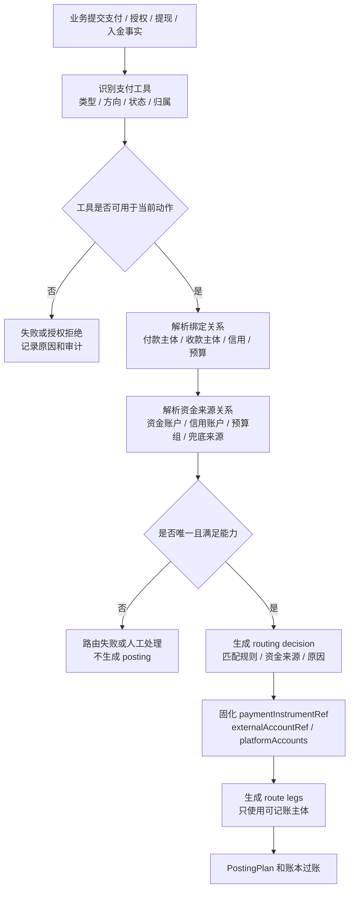
```mermaid
flowchart TD
    A["业务提交支付 / 授权 / 提现 / 入金事实"] --> B["识别支付工具\n类型 / 方向 / 状态 / 归属"]
    B --> C{"工具是否可用于当前动作"}
    C -- "否" --> D["失败或授权拒绝\n记录原因和审计"]
    C -- "是" --> E["解析绑定关系\n付款主体 / 收款主体 / 信用 / 预算"]
    E --> F["解析资金来源关系\n资金账户 / 信用账户 / 预算组 / 兜底来源"]
    F --> G{"是否唯一且满足能力"}
    G -- "否" --> H["路由失败或人工处理\n不生成 posting"]
    G -- "是" --> I["生成 routing decision\n匹配规则 / 资金来源 / 原因"]
    I --> J["固化 paymentInstrumentRef\nexternalAccountRef / platformAccounts"]
    J --> K["生成 route legs\n只使用可记账主体"]
    K --> L["PostingPlan 和账本过账"]
```

产品断言：

1. 支付工具校验失败时，如果是授权请求，可记录授权拒绝；如果是直接交易、提现或退款，应返回可解释失败或进入人工处理。失败不得生成 route、posting plan 或 LedgerEntry。
2. 付款、授权、提现、收款等动作必须校验工具方向和工具状态。
3. 支付工具只能帮助选择内部可记账主体；route leg 和 posting plan 最终必须落到资金账户、信用账户、预算组或解析后的平台账户角色。
4. 工具绑定关系发生变化后，历史交易的退款、撤销、退费、拒付和对账仍按原 route snapshot 和工具快照解释。
5. 多个资金来源同时可用时，必须保存选择结果、优先级、匹配规则和原因；不得随机选择。
6. 支付工具、外部账户和通道 reference 必须进入快照和审计，便于外部回单、通道对账、客服查询和争议证据。
7. 支付工具绑定和资金来源关系变更必须同时能回答“当前新交易应该用什么”和“过去某笔交易当时为什么这样选路”；前者看当前有效关系，后者看 route snapshot 和历史审计证据。

#### 6.7.5 与承载层抽象的产品语义对齐

下表只用于保证 PRD、DSL、系分和后续编码使用同一组概念，不要求业务方理解内部类或接口名称。

| 产品概念 | 产品 DSL / core 承载抽象 | 产品语义 | 缺失会导致的问题 |
| --- | --- | --- | --- |
| 可记账主体 | `SubjectRef` / `FundsSubjectType` | 只能是资金账户、信用账户或预算组。 | 用户、商户、工具或外部账户被误写成分录主体。 |
| 支付工具引用 | `PaymentInstrumentRef` / `PaymentInstrumentRefSpec` | 工具的脱敏快照和绑定快照。 | 工具换绑后无法解释历史交易，或敏感信息进入日志。 |
| 外部账户引用 | `ExternalAccountRef` / `ExternalAccountRefSpec` | 银行、通道、PSP、VA 等外部端点引用。 | 外部回单、对账和退款追溯缺依据。 |
| 路由决策说明 | `RoutingDecision` / `RoutingDecisionSpec` | 记录命中规则、选择的平台账户、资金来源和决策原因。 | 多规则命中或兜底选择不可解释。 |
| 资金来源决策 | `FundingAllocationDecision` / `FundingAllocationDecisionSpec` | 说明某笔金额最终来自哪个内部主体和账目。 | 多资金来源授权、共享卡、预算组和兜底资金无法验收。 |
| 平台账户快照 | `PlatformAccountsSnapshot` / `PlatformAccountsSnapshotSpec` | 固化手续费、现金、预收待付、清算、结算、调整等平台角色账户。 | 平台角色后续变更导致退款、退费或对账路径漂移。 |
| 路由参与方和路径 | `RouteParticipant`、`RouteNode`、`RouteLeg` / `RouteParticipantSpec`、`RouteNodeSpec`、`RouteLegSpec` | 描述参与方、节点、金额、账目、周期和回放策略。 | 只有交易状态，没有可验证的资金路径。 |
| 路由快照 | `RouteSnapshot` / `RouteSnapshotSpec` | 固化本次交易的路径、工具、外部账户、平台角色和规则版本。 | 逆向交易重新选路，导致资金路径漂移。 |

#### 6.7.6 支付工具状态和安全红线

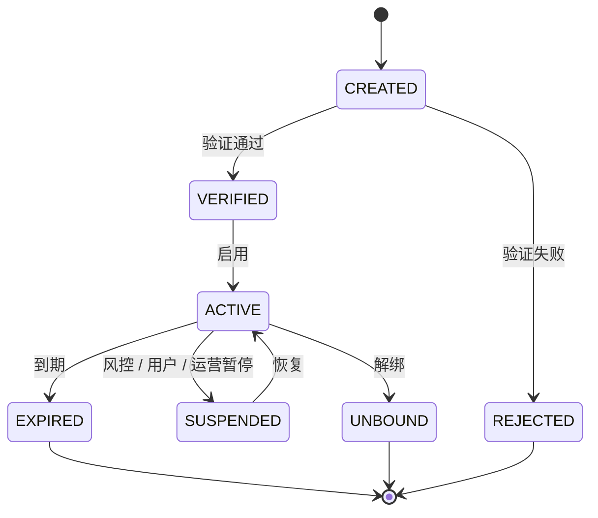
```mermaid
stateDiagram
    [*] --> CREATED
    CREATED --> VERIFIED: 验证通过
    CREATED --> REJECTED: 验证失败
    VERIFIED --> ACTIVE: 启用
    ACTIVE --> SUSPENDED: 风控 / 用户 / 运营暂停
    SUSPENDED --> ACTIVE: 恢复
    ACTIVE --> EXPIRED: 到期
    ACTIVE --> UNBOUND: 解绑
    EXPIRED --> [*]
    UNBOUND --> [*]
    REJECTED --> [*]
```

安全和产品红线：

1. 完整卡号、CVV、密钥、token secret、银行账户敏感号和身份凭证不得进入 PRD 定义的可展示字段、日志、导出和普通快照。
2. 支付工具展示号必须是脱敏号、别名、token reference 或外部系统安全引用。
3. 工具状态、绑定关系、方向、优先级和资金来源关系变更必须有操作者、时间、原因和审计。
4. 支付工具被暂停、解绑、过期、未验证或方向不匹配时，不得继续生成资金路径。
5. 工具可以参与风控、授权控制和对账，但不能绕过账户能力、余额、额度、预算、账本周期和 route 规则。

## 7. 账目与账本产品设计

### 7.1 账目不是账户

账户回答“这笔钱属于谁”，账目回答“这笔钱处在什么状态”。例如商户资金账户是账户主体，`CLEARING` 和 `AVAILABLE` 是该主体内部的余额状态。

### 7.2 账本不变量

| 不变量 | 产品要求 |
| --- | --- |
| 分录不可变 | 过账后的分录不能直接修改或删除。 |
| 计划必须平衡 | 每组账务计划必须同币种借贷平衡。 |
| 余额可重建 | 当前余额和历史余额能由分录、检查点和水位重建。 |
| 缺账本失败 | 未初始化账户和账本不得自动入账。 |
| 外部账户不入账 | 银行账户、通道账户、卡、VA 只做引用。 |
| 错账用新事实修正 | 冲正、补记、调账必须追加新账本交易。 |

### 7.3 账本周期扩展点

账本周期是账本 bucket 的扩展维度，用来回答“这笔余额属于哪个可独立累计、查询、控制和重建的周期”。它不是清结算账期，也不是报表统计周期，更不是归档水位。

设计账本周期的目的，是让“长期余额”和“周期额度/预算/控制余额”在同一套账本模型里表达，但彼此不会串账。普通钱包余额需要跨月、跨年长期累计；企业卡预算、月度信用额度、日限额或合同账单周期则需要按周期隔离、重置、关闭或治理。如果没有账本周期，只能在业务层或报表层临时过滤，最终会导致一个问题：余额看似分周期，真实账本却没有隔离，授权、冻结、调账、结算和余额查询都会把不同周期的金额混在一起。

它解决的核心问题有四个：

1. 周期隔离：同一主体、币种、账目下，不同周期的余额不能互相消费、冻结、授权、释放或出款。
2. 周期控制：预算、额度、限额和合同账单周期可以按周期独立累计、查询、关闭和重置。
3. 可解释查询：用户、企业管理员、运营和财务查询余额时，能明确看到“这是生命周期余额、2026-05 月预算，还是某个合同周期余额”。
4. 可验证落地：路由、账务计划、余额投影、对账和 TDD 都能用 `periodType + periodId` 证明没有跨周期串账。

它的作用不是替代清结算和报表，而是给账本事实增加一个稳定隔离键。清算账期可以决定哪些交易进入某个清算批次，报表周期可以决定指标如何展示，但真正的余额 bucket 是否隔离，必须由账本周期决定。

产品上可以把账本周期理解为同一主体、同一币种、同一账目下的进一步隔离层：

```text
主体 + 币种 + 账目 + 账本周期 = 一个可独立累计和查询的账本 bucket
```

| 周期类型 | 使用者能理解的话 | 典型场景 | 产品边界 |
| --- | --- | --- | --- |
| `LIFETIME` | 生命周期累计账本，不按自然周期切分。 | 普通资金账户余额、商户资金余额、平台现金或手续费账户。 | 默认周期，`periodId` 固定为 `LIFETIME`；不能因为请求未传 `periodId` 而错配其他周期。 |
| `DAYS` | 按天切分的账本 bucket。 | 日额度、日预算、日内风控控制。 | 必须明确时区和日切规则。 |
| `HOURLY` | 按小时切分的账本 bucket。 | 高频限额、实时风控窗口。 | 当前更适合作为扩展能力，不建议默认用于资金余额。 |
| `WEEKLY` | 按周切分的账本 bucket。 | 周预算、周授权额度。 | 必须明确周起始日和跨年周归属。 |
| `MONTHLY` | 按月切分的账本 bucket。 | 月预算、月度信用额度、企业卡月度控制。 | 预算组默认可使用月周期；不得和商户结算账期混用。 |
| `QUARTERLY` | 按季度切分的账本 bucket。 | 季度预算、季度额度治理。 | 必须明确季度归属和调整规则。 |
| `YEARLY` | 按年切分的账本 bucket。 | 年度预算、年度额度。 | 必须明确自然年或合同年。 |
| `CUSTOM_CYCLE` | 按合同或业务规则定义的自定义周期。 | 企业账单周期、合作方合同周期、特殊预算周期。 | 必须有 `periodPolicy`、起止规则、时区、日切、重开和关账规则。 |

账本周期与其他“周期”概念的关系：

| 概念 | 解决的问题 | 是否能替代账本周期 |
| --- | --- | --- |
| 账本周期 | 控制同一主体、账目、币种下余额 bucket 的隔离和累计。 | 本概念本身。 |
| 清算账期 | 确定哪些交易明细进入某次清算候选和清算批次。 | 不能。清算账期可以引用账本事实，但不能决定账本 bucket。 |
| 结算周期 | 确定商户、合作方或企业何时生成结算单和出款。 | 不能。结算周期是运营策略，账本周期是余额隔离键。 |
| 报表周期 | 确定指标按日、周、月、季度或自定义口径展示。 | 不能。报表周期只读派生，不反向切账。 |
| 归档水位 | 确定冷热数据拼接和余额重建边界。 | 不能。水位不是自然日期，也不是账本周期。 |

账本周期的生效机制：

| 环节 | 如何生效 | 产品要求 |
| --- | --- | --- |
| 账户或账本初始化 | 钱包账户、信用账户、预算组或平台账户创建时，根据账本 Profile、账户类型和业务规则确定默认 `periodType`，并创建对应账本 bucket。 | 普通资金账户默认 `LIFETIME`；预算组、信用账户或额度类产品可以按月、周、年或自定义周期建账。 |
| 周期 ID 生成 | `LIFETIME` 固定为 `LIFETIME`；自然周期按明确时区和日切规则生成；自定义周期由 `periodPolicy` 或业务合同规则给出。 | 非 `LIFETIME` 周期必须有明确 `periodId`，不能由入账流程随手取当前时间静默生成。 |
| 路由和过账 | RouteLeg 或账务计划携带目标 `periodType/periodId`；账本装配时按主体、币种、账目、周期精确命中 ledger bucket。 | 找不到唯一账本 bucket 必须失败，不得自动落到其他周期。 |
| 余额查询和投影 | 查询当前余额、历史余额、预算可用或信用可用时，必须带上周期维度。 | 不带周期汇总全部月份、全部合同周期或全部日限额的查询，只能作为明确的报表聚合，不得当作可用余额。 |
| 周期变更和关闭 | 周期重置、结转、关闭、重开和跨周期调整由独立运营规则处理。 | 账本不自动猜测是否结转，不自动把上期剩余额度带入新周期。 |

产品规则：

1. `periodType=LIFETIME` 时，`periodId` 固定为 `LIFETIME`。
2. `periodType` 不为 `LIFETIME` 时，`periodId` 必须明确，不能由当前时间静默推断后写账。
3. 同主体、同币种、同账目、不同周期的余额必须隔离，不能互相消费、冻结、授权或出款。
4. 资金路由和账务计划必须携带或解析出目标账本周期；缺失周期导致无法唯一命中账本时必须失败。
5. 预算组、信用账户和额度类产品可以使用周期账本；普通资金余额默认使用 `LIFETIME`。
6. 周期切换、周期关闭、周期重开、跨周期结转或额度重置属于明确的运营规则，不由账本自动猜测。
7. 历史余额查询、余额投影和账务巡检必须带上周期维度，否则可能把不同周期 bucket 混在一起。

典型例子：

| 场景 | 正确口径 | 错误口径 |
| --- | --- | --- |
| 普通用户钱包余额 | 用户 USD `AVAILABLE / LIFETIME / LIFETIME`。 | 按自然月切用户现金余额，导致跨月余额不可用。 |
| 企业卡月度预算 | 预算组 USD `AVAILABLE / MONTHLY / 2026-05`。 | 把 2026-04 剩余预算自动给 2026-05 使用。 |
| 月度信用额度 | 信用账户 USD `LIMIT / MONTHLY / 2026-05` 和 `AVAILABLE / MONTHLY / 2026-05`。 | 把信用账户所有月份共用一个 `AVAILABLE`。 |
| 商户订单款 | 商户资金账户 `CLEARING / LIFETIME / LIFETIME`，清算候选再按清算账期归集。 | 用清算账期切商户 `CLEARING` 账本，导致退款和争议跨账期不可解释。 |
| 自定义合同周期 | 企业预算组 `AVAILABLE / CUSTOM_CYCLE / contract-2026-05-16_2026-06-15`。 | 只写 `CUSTOM_CYCLE` 但缺少周期 ID 和规则版本。 |

### 7.4 账本过账流程

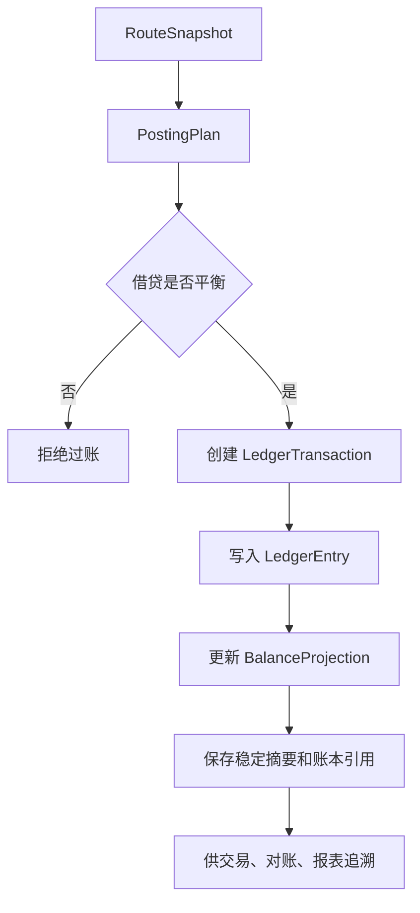
```mermaid
flowchart TD
    A["RouteSnapshot"] --> B["PostingPlan"]
    B --> C{"借贷是否平衡"}
    C -- "否" --> D["拒绝过账"]
    C -- "是" --> E["创建 LedgerTransaction"]
    E --> F["写入 LedgerEntry"]
    F --> G["更新 BalanceProjection"]
    G --> H["保存稳定摘要和账本引用"]
    H --> I["供交易、对账、报表追溯"]
```

## 8. 余额投影产品设计

### 8.1 余额投影解决什么问题

余额投影让钱包、运营、财务和报表可以快速查询余额，但它不是余额事实源。真正的事实源是不可变分录。

| 能力 | 使用者价值 | 产品边界 |
| --- | --- | --- |
| 当前余额 | 用户、商户和运营快速看到可用、冻结、授权、待清算和出款中金额。 | 必须能追溯到分录。 |
| 历史余额 | 财务、对账和审计按时间点核对余额。 | 使用分录、检查点和水位重建。 |
| 余额检查点 | 大数据量场景下减少历史扫描。 | 只能由分录生成，不能由当前余额反推。 |
| 余额变更观察 | 给业务、报表、风控看到余额变化事件。 | 观察日志不能反向改余额。 |

### 8.2 余额投影关系图

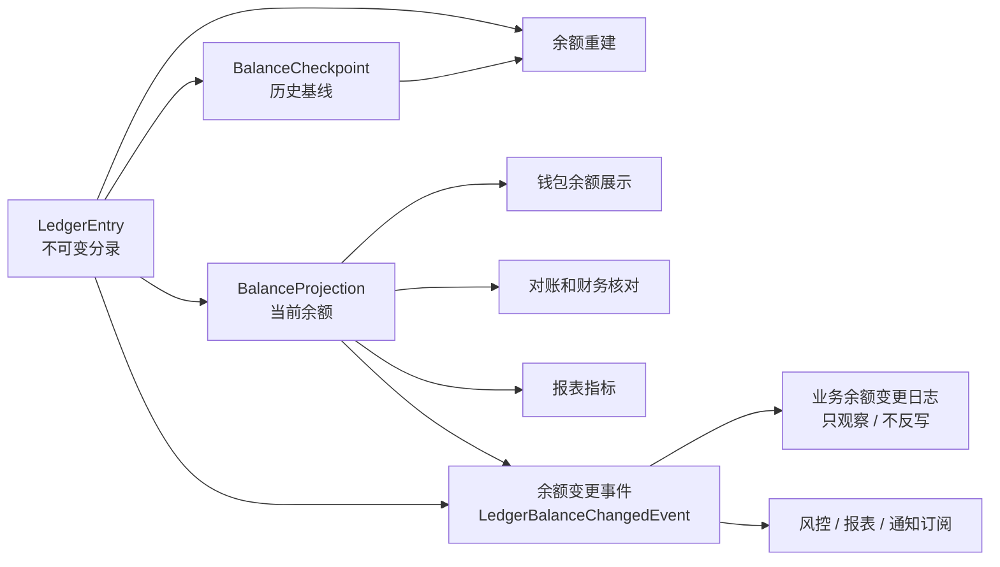
```mermaid
flowchart LR
    Entry["LedgerEntry\n不可变分录"] --> Projection["BalanceProjection\n当前余额"]
    Entry --> Checkpoint["BalanceCheckpoint\n历史基线"]
    Checkpoint --> Rebuild["余额重建"]
    Entry --> Rebuild
    Projection --> Wallet["钱包余额展示"]
    Projection --> Recon["对账和财务核对"]
    Projection --> Report["报表指标"]
    Entry --> ChangeEvent["余额变更事件\nLedgerBalanceChangedEvent"]
    Projection --> ChangeEvent
    ChangeEvent --> ChangeLog["业务余额变更日志\n只观察 / 不反写"]
    ChangeEvent --> Subscriber["风控 / 报表 / 通知订阅"]
```

### 8.3 余额查询口径

| 查询对象 | 来源 | 返回给使用者的信息 |
| --- | --- | --- |
| 用户可用余额 | 资金账户 `AVAILABLE` 投影 | 可支付、可提现或可转账金额。 |
| 用户冻结余额 | `FROZEN` 投影和冻结单 | 冻结金额、原因、期限和释放状态。 |
| 商户待清算 | 商户 `CLEARING` 投影 | 已收款但未清算金额。 |
| 商户可结算 | 商户 `AVAILABLE` 投影 | 可进入结算单的金额。 |
| 商户出款中 | 商户 `SETTLEMENT` 投影 | 已锁定且正在出款的金额。 |
| 信用可用额度 | 信用账户 `AVAILABLE` 投影 | 可继续授权的额度。 |
| 预算可用 | 预算组 `AVAILABLE` 投影 | 可继续占用的预算。 |

周期型余额查询还必须带上 `periodType` 和 `periodId`。例如查询 2026-05 月度预算可用余额时，应查询预算组 `AVAILABLE / MONTHLY / 2026-05`，不能只按主体和账目汇总全部月份。

### 8.4 余额变更日志和观察事件

余额变更日志是面向用户账单、商户账单、运营、风控、通知和报表的观察记录，不是余额事实源。它回答“余额为什么变化、由哪笔分录导致、变化前后分别是多少”，但不能用来修正余额、补写分录或反推账本事实。

| 能力对象 | 产品定义 | 必须包含 | 能力边界 |
| --- | --- | --- | --- |
| 余额变更事件 | 余额投影成功后，对余额变化输出的观察事件，可对应 `LedgerBalanceChangedEvent` 或等价事件。 | 主体、账本、账目、币种、账本周期、变更前余额、变更后余额、变更额、ledger transaction 引用、ledger entry 引用、业务引用和发生时间。 | 事件发布失败不得回滚已完成的账本过账和余额投影。 |
| 业务余额变更日志 | 业务侧或运营侧消费余额变更事件形成的查询日志。 | 事件标识、来源分录、来源投影、展示摘要、消费状态和重试结果。 | 只能展示、订阅、检索和审计，不得反向修改余额投影或历史分录。 |
| 余额变更订阅 | 风控、报表、通知、用户账单、商户账单等下游订阅余额变化。 | 订阅方、订阅范围、投递状态、失败原因和重试策略。 | 下游处理失败只能进入补偿、重试或告警，不影响账本事实。 |
| 余额日志补偿 | 当事件投递、日志落库或下游消费失败时，按分录范围补发或重放观察日志。 | 分录范围、主体范围、时间窗口、补偿原因、差异摘要和处理结果。 | 补偿只能重建观察结果，不能重新入账或改变余额。 |

产品规则：

1. 余额变更日志必须从 `LedgerEntry` 和 `BalanceProjection` 派生，不能由用户账单、商户账单、报表或人工备注生成事实。
2. 每条余额变化必须能追溯到明确的 ledger entry；不能只记录聚合后的余额总数。
3. 日志必须同时保留变更前余额、变更后余额和变更额，避免只看到结果看不到原因。
4. 余额日志失败属于观察链路失败，不属于账本失败；需要告警、补偿和重试，但不能回滚过账和投影。
5. 余额日志可用于展示、通知、风控观察、报表取数和审计辅助；最终余额核验仍以分录、余额投影、检查点和水位为准。
6. 余额重建、归档重放或交易投影重放时，可以按范围重建余额变更观察结果，但必须保留重放任务和差异报告。
7. 后台不得提供“修改余额日志以修正余额”的入口；如发现差错，必须通过补事实、冲正、调账、核销或重新对账闭环。

## 9. 交易投影产品设计

### 9.1 为什么需要交易投影

账本分录适合审计和计算余额，但不适合直接给用户、商户和运营看。交易投影把资金事实、账本事实、清结算事实、对账事实和争议事实组合成可理解的账单和时间线。

| 投影视图 | 面向谁 | 说明 |
| --- | --- | --- |
| 用户账单 | 用户、客服 | 展示付款、收款、退款、提现、冻结、授权等用户视角事件。 |
| 商户账单 | 商户、商户运营 | 展示订单收款、待清算、清算确认、退款、争议、结算和出款。 |
| 运营时间线 | 运营、风控、客服 | 展示交易、冻结、对账、争议、审批和人工处理轨迹。 |
| 财务报表投影 | 财务、数据 | 汇总收入、费用、待结算、差错、追偿和账务核对数据。 |

### 9.2 投影生成流程

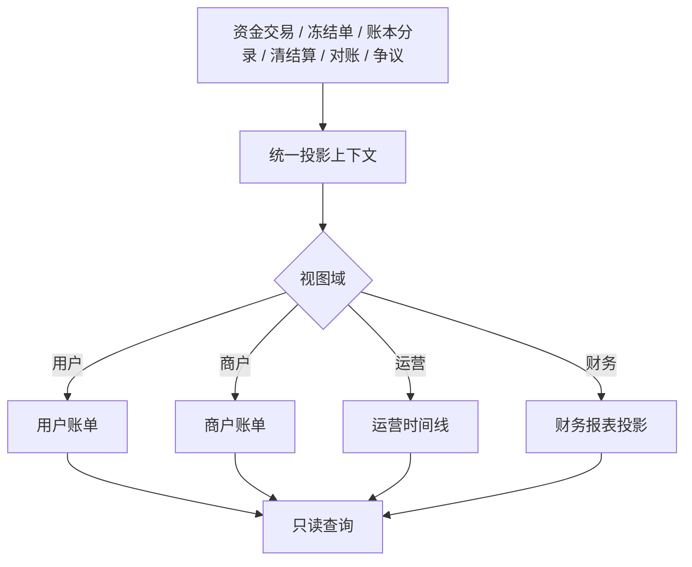
```mermaid
flowchart TD
    A["资金交易 / 冻结单 / 账本分录 / 清结算 / 对账 / 争议"] --> B["统一投影上下文"]
    B --> C{"视图域"}
    C -->|用户| D["用户账单"]
    C -->|商户| E["商户账单"]
    C -->|运营| F["运营时间线"]
    C -->|财务| G["财务报表投影"]
    D --> H["只读查询"]
    E --> H
    F --> H
    G --> H
```

### 9.3 投影红线

1. 交易投影不是资金事实源。
2. 交易投影不得补写资金交易明细。
3. 交易投影不得修改账本分录或余额投影。
4. 投影重放必须有范围：单笔、主体、时间窗口、视图域或批次。
5. 冻结类视图必须引用冻结单，不伪造成资金交易。
6. 授权拒绝、争议拒付、退款、退汇、ACH return 等必须保留不同展示语义。

## 10. 场景流程图

### 10.1 商户订单收款

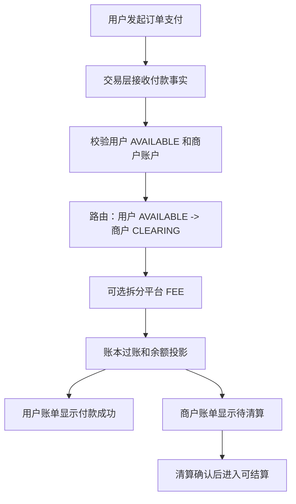
```mermaid
flowchart TD
    A["用户发起订单支付"] --> B["交易层接收付款事实"]
    B --> C["校验用户 AVAILABLE 和商户账户"]
    C --> D["路由：用户 AVAILABLE -> 商户 CLEARING"]
    D --> E["可选拆分平台 FEE"]
    E --> F["账本过账和余额投影"]
    F --> G["用户账单显示付款成功"]
    F --> H["商户账单显示待清算"]
    H --> I["清算确认后进入可结算"]
```

### 10.2 原交易退款

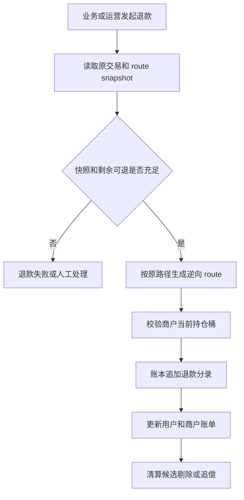
```mermaid
flowchart TD
    A["业务或运营发起退款"] --> B["读取原交易和 route snapshot"]
    B --> C{"快照和剩余可退是否充足"}
    C -- "否" --> D["退款失败或人工处理"]
    C -- "是" --> E["按原路径生成逆向 route"]
    E --> F["校验商户当前持仓桶"]
    F --> G["账本追加退款分录"]
    G --> H["更新用户和商户账单"]
    H --> I["清算候选剔除或追偿"]
```

### 10.3 冻结后追偿

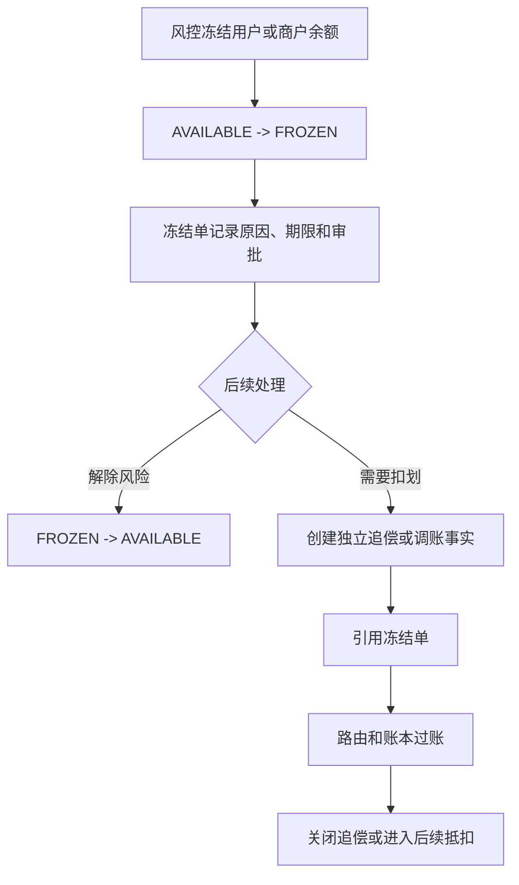
```mermaid
flowchart TD
    A["风控冻结用户或商户余额"] --> B["AVAILABLE -> FROZEN"]
    B --> C["冻结单记录原因、期限和审批"]
    C --> D{"后续处理"}
    D -- "解除风险" --> E["FROZEN -> AVAILABLE"]
    D -- "需要扣划" --> F["创建独立追偿或调账事实"]
    F --> G["引用冻结单"]
    G --> H["路由和账本过账"]
    H --> I["关闭追偿或进入后续抵扣"]
```

## 11. 产品验收要点

产品验收必须按场景证明“事实、路径、账本、投影、审计”同时成立。只证明交易状态成功，不能算通过。

| 验收点 | 断言 |
| --- | --- |
| 交易幂等 | 重复请求不重复生成资金交易、route snapshot、账本交易和投影。 |
| 路由快照 | 成功入账的交易必须保存可回放快照。 |
| 分录平衡 | 每个 posting plan 同币种借贷平衡。 |
| 钱包展示 | 展示余额来自账本投影，不来自手工汇总。 |
| 授权边界 | 授权拒绝不生成账务路径；授权成功不展示为最终消费。 |
| 冻结边界 | 冻结不创建资金交易，不表达消费。 |
| 商户收款 | 商户订单收款默认进入 `CLEARING`。 |
| 逆向交易 | 退款、撤销、拒付和退费基于原快照。 |
| 余额变更日志 | 从分录和余额投影派生，包含变更前后余额、变更额、ledger transaction、ledger entry 和业务引用；日志失败不回滚入账和余额投影。 |
| 投影只读 | 用户账单、商户账单和运营时间线不得写回事实层。 |

### 11.1 场景到验收映射

| 场景 | 使用者关心的结果 | 必须证明 |
| --- | --- | --- |
| 用户充值 | 用户余额增加且外部到账可解释。 | 外部 reference 只做引用，内部余额来自 route 和 ledger。 |
| 商户收款 | 商户知道订单款是否待清算。 | 商户款进入 `CLEARING`，手续费和本金拆开。 |
| 普通转账 | 付款方和收款方余额变化清楚。 | 同币种、不同主体、分录平衡、投影一致。 |
| 授权批准 | 用户或企业看到资金、额度或预算被占用。 | `AVAILABLE -> AUTHORIZATION`，保存授权快照。 |
| 授权拒绝 | 业务方知道拒绝原因。 | 不生成 route、posting plan、LedgerEntry 或 chargeback。 |
| 冻结 | 运营或风控能限制可用余额。 | 只发生 `AVAILABLE <-> FROZEN`，不表达消费。 |
| 原路退款 | 用户、商户和平台能解释资金回补路径。 | 基于原 route snapshot，不静默重新选路。 |
| 余额查询 | 用户、商户、运营看到一致余额。 | 查询结果来自余额投影，可由分录重建。 |
| 账单查询 | 用户和商户看见可解释账单。 | 交易投影只读，来源事实和账本引用可追溯。 |

## 12. 状态机、账务矩阵和周期语义

本节把交易、路由、钱包、账目、余额投影和交易投影的状态、账务和周期口径集中说明，作为产品验收、DSL、系分和 TDD 的稳定输入。

### 12.1 交易和投影状态机

| 对象 | 状态方向 | 成功终态 | 失败或人工终态 | 必须记录 |
| --- | --- | --- | --- | --- |
| 资金交易 | `RECEIVED -> VALIDATING -> ROUTING -> POSTING -> PROJECTING -> COMPLETED` | `COMPLETED` | `REJECTED`、`FAILED`、`PENDING_REVIEW`、`CANCELLED` | 幂等键、请求摘要、业务引用、失败原因、route snapshot、账本引用。 |
| 授权交易 | `REQUESTED -> APPROVED -> HELD -> SETTLING/REVERSING/EXPIRING`，完成后退款可进入 `REFUNDING -> REFUNDED` | `SETTLED`、`REVERSED`、`EXPIRED`、`REFUNDED` | `DECLINED`、`FAILED`、`PENDING_REVIEW` | 授权快照、占用金额、剩余可结算金额、剩余可退金额、拒绝原因、外部授权引用。 |
| 冻结单 | `REQUESTED -> FROZEN -> PARTIALLY_RELEASED -> RELEASED/CLOSED` | `RELEASED`、`CLOSED` | `REJECTED`、`EXPIRED`、`PENDING_APPROVAL` | 冻结原因、期限、审批、剩余冻结金额、释放引用。 |
| 余额投影任务 | `WAITING -> CALCULATING -> VERIFYING -> APPLIED` | `APPLIED` | `FAILED`、`NEEDS_REBUILD` | 分录范围、前后余额、校验摘要、水位引用。 |
| 余额变更观察事件 | `GENERATED -> PUBLISHING -> PUBLISHED` | `PUBLISHED` | `FAILED_RETRYING`、`FAILED_NOTIFIED` | 来源分录、来源投影、变更前后余额、变更额、业务引用、投递结果。 |
| 交易投影任务 | `WAITING -> BUILDING -> VERIFYING -> PUBLISHED` | `PUBLISHED` | `FAILED`、`NEEDS_REPLAY` | 来源事实、视图域、差异摘要、重放范围。 |

状态机产品规则：

1. 状态迁移必须由明确业务动作触发，不能由查询动作隐式改变。
2. 成功终态必须能追溯到资金交易、route snapshot、ledger transaction 和投影结果。
3. 失败终态必须保留失败阶段、失败原因、是否可重试和是否需要人工处理。
4. 人工处理不能直接修改历史状态，必须通过补事实、冲正、调账、释放、核销或重放进入新动作。
5. 同一幂等键重复触发时只能返回原状态或进入可解释的重试路径，不得重复过账。

### 12.2 主链路账务矩阵输入

| 场景 | 来源主体和账目 | 目标主体和账目 | 账本周期 | 产品断言 |
| --- | --- | --- | --- | --- |
| 用户充值成功 | 平台现金映射或预收待付引用 | 用户 `AVAILABLE` | 默认 `LIFETIME`，除非业务明确传入周期 | 外部账户不作为内部账本主体；通道流水只做引用。 |
| 用户提现申请 | 用户 `AVAILABLE` | 用户 `FROZEN` 或提现锁定桶 | 默认 `LIFETIME` | 提现申请不是外部成功，不展示为已到账。 |
| 用户提现失败 | 用户 `FROZEN` | 用户 `AVAILABLE` | 与原冻结一致 | 失败只释放一次，成功失败不能双终态。 |
| 普通系统内转账 | 付款方 `AVAILABLE` | 收款方 `AVAILABLE` | 两侧周期必须明确且可匹配 | 同主体、错币种、余额不足必须失败。 |
| 商户订单收款 | 用户 `AVAILABLE` | 商户 `CLEARING`，可拆平台 `FEE` | 商户清算周期不等于账本周期，账本周期仍需独立明确 | 商户款不得直入 `AVAILABLE` 或 `SETTLEMENT`。 |
| 手续费收取 | 费用责任方目标账目 | 平台 `FEE` | 跟随原交易或费用规则指定周期 | 本金、手续费、通道成本和补贴必须拆开。 |
| 授权占用 | 资金账户、信用账户或预算组 `AVAILABLE` | 同主体 `AUTHORIZATION` | 预算或合同周期必须明确 `periodId` | 授权成功不是最终消费。 |
| 授权撤销释放 | 同主体 `AUTHORIZATION` | 同主体 `AVAILABLE` | 与原授权一致 | 外部撤销或冲正触发；必须基于原授权快照，不重新选路；终态为 `REVERSED`。 |
| 授权过期释放 | 同主体 `AUTHORIZATION` | 同主体 `AVAILABLE` | 与原授权一致 | 系统到期触发；只释放剩余授权；终态为 `EXPIRED`，不能和撤销混用。 |
| 授权结算 | 同主体 `AUTHORIZATION` | 商户 `CLEARING` 或平台目标账目 | 与原授权和结算规则一致 | 不新增 `CONSUMED` 账目。 |
| 冻结 | 同主体 `AVAILABLE` | 同主体 `FROZEN` | 与被冻结余额桶一致 | 冻结不表达消费或扣划。 |
| 解冻 | 同主体 `FROZEN` | 同主体 `AVAILABLE` | 与原冻结一致 | 超额解冻失败。 |
| 调账 | 责任方、挂账或平台调整账目 | 目标责任方或调整账目 | 调账原因决定周期，缺周期不得入账 | 必须有关联原因、凭证、审批和审计。 |

账务矩阵产品规则：

1. 每一行都必须能转成 posting plan 和余额断言。
2. `periodType` 不是 `LIFETIME` 时必须有 `periodId`，不能用清算账期、报表周期或归档水位替代账本周期。
3. 逆向交易优先回放原 route snapshot；缺快照时进入失败或人工处理，不静默重新选路。
4. 账务矩阵只描述产品语义，不指定数据库表、类名或 Mapper。

### 12.3 周期语义矩阵

周期语义矩阵用于防止账本周期、运营周期和规则窗口互相污染。任何涉及周期的场景都必须先落到本矩阵，再决定是否进入账本 bucket、规则累计、批次分组或报表口径。

| 周期类型 | 归属 | 解决的问题 | 是否参与入账隔离 | 是否可用于余额重建 | 禁止替代 |
| --- | --- | --- | --- | --- | --- |
| 账本周期 `periodType/periodId` | 账本账目 | 隔离同主体、同币种、同账目下不同生命周期、月份、合同周期或自定义周期的余额事实。 | 是 | 是 | 不得被清算账期、结算周期、报表周期、归档水位、spend-rule window 替代。 |
| 清算账期 | 清分清算 | 判断哪些交易明细可以进入清算候选或清算批次。 | 否 | 否 | 不得作为账本 bucket 的 `periodId`。 |
| 结算周期 | 结算出款 | 判断结算单生成和出款节奏。 | 否 | 否 | 不得替代账本周期或授权预算周期。 |
| 报表周期 | 报表指标模块 | 按日、周、月、季度或自定义窗口观察和展示指标。 | 否 | 否 | 不得反推余额、不得替代账本周期、不得复用归档水位、归档清单或交易投影重放范围。 |
| 归档水位 | 归档重放 | 表示冷热拼接和检查点覆盖边界。 | 否 | 只用于重建边界 | 不得作为业务周期、账本周期或报表周期。 |
| Spend-rule window | 发卡授权控制扩展 | 判断授权请求在日、周、月或自定义窗口内是否超限。 | 否 | 否 | 不得替代账本周期，也不得由账本周期反向推导。 |
| 合同周期 / 预算周期 | 业务产品或预算组 | 表达合同、预算或额度控制的业务边界。 | 只有映射到账本周期时才参与 | 只有映射到账本周期时才参与 | 不得隐式套用到普通资金账户。 |

周期风险红线：

1. 入账、冻结、授权、释放、结算或重建只认账本周期，不认清算账期、报表周期或规则窗口。
2. 规则累计窗口可以读账本或投影结果作为输入，但不能直接写账本 bucket。
3. 报表观察窗口和归档水位必须语义隔离，不能共享同一个处理边界。
4. 缺少 `periodId` 的非 `LIFETIME` 入账必须失败。
