# 交易、路由、钱包、账目与投影产品设计

## 1. 背景和目标

支付资金底座的交易、路由、钱包、账目与投影分册要回答七个问题：

1. 业务系统提交的是什么资金事实。
2. 这笔事实影响哪些用户、商户、平台账户、信用账户或预算组。
3. 资金应该从哪个余额桶流向哪个余额桶。
4. 优惠券、代金券、平台补贴、商户让利、手续费和成本如何拆成可解释金额组件。
5. 账本如何证明这次余额变化是平衡的。
6. 使用者看到的余额和账单如何从事实派生。
7. 后续退款、撤销、拒付、清结算或对账差错如何基于原路径处理。

本文件从产品和运营视角说明钱包、账本、账目、余额投影、交易入口、路由和交易投影的能力边界。研发和测试可据此理解产品验收边界并编写 TDD 用例。

业务目标和用户价值：

| 项 | 说明 |
| --- | --- |
| 业务目标 | 让业务系统接入资金底座时，每一笔入金、支付、授权、冻结、退款、费用、调账和权益金额都能被产品、运营、财务、研发和测试用同一套资金语义解释。 |
| 用户价值 | 用户、商户、运营和财务能清楚看到余额为什么变化、资金现在处于哪个余额桶、失败后下一步如何处理，以及后续退款、撤销、清结算和对账差错为什么沿原路径处理。 |
| 成功指标 | 任一资金动作都能反查输入事实、主体、余额桶、route snapshot、posting plan、账本分录、余额投影、交易投影、幂等结果和审计引用。 |
| 非目标 | 不替代清结算、对账、归档、报表指标、外部通道协议、风控模型、合规或会计最终确认。 |

本分册的能力保障顺序与 PRD 总览保持一致：P0 优先稳定钱包账户、账本账目、余额投影和账本周期；P1 再落直接交易、授权交易、余额控制、资金路由和交易投影；清分、清算和对账由 03 分册承接，余额检查点、水位、交易投影重放和事实留存治理拆入本分册与 05 验收矩阵，原 04 仅保留拆分索引，不再作为独立产品能力分册。

## 2. 主链路纲要

本节的链路图表达一次资金事实进入系统后的流程顺序，不表达产品建设优先级。建设优先级仍按 P0 资金内核、P1 交易入口、P2 业务场景补充判断。

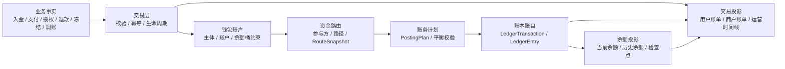
```mermaid
flowchart LR
    A["业务事实\n入金 / 支付 / 授权 / 退款 / 冻结 / 调账"] --> B["交易层\n校验 / 幂等 / 生命周期"]
    B --> C["钱包账户\n主体 / 账户 / 余额桶约束"]
    C --> D["资金路由\n参与方 / 路径 / RouteSnapshot"]
    D --> E["账务计划\nPostingPlan / 平衡校验"]
    E --> F["账本账目\nLedgerTransaction / LedgerEntry"]
    F --> G["余额投影\n当前余额 / 历史余额 / 检查点"]
    B --> H["交易投影\n用户账单 / 商户账单 / 运营时间线"]
    F --> H
    G --> H
```

一句话理解：交易层接收事实，钱包判断账户和余额能不能动，路由决定钱从哪里到哪里，账本负责不可变记录，投影负责给人和报表看。

### 2.1 专题范围和读者

| 维度 | 内容 |
| --- | --- |
| 本文覆盖 | 资金指令、资金交易、授权交易、冻结单、权益金额组件、钱包账户、资金路由、账目、账本周期、余额投影、交易投影。 |
| 本文不覆盖 | 清算批次、结算单、出款单、对账差错、正式报表指标模块和生产治理模块的完整实现细节。 |
| 主要读者 | 产品、运营、财务、风控、研发、测试。 |
| 核心验收 | 每个资金动作都能说明输入事实、主体、余额桶、route snapshot、posting plan、账本分录、投影结果和异常红线。 |

### 2.2 角色、对象和场景入口

| 入口 | 产品问题 | 关键对象 | 典型场景 |
| --- | --- | --- | --- |
| 钱包账户 | 使用者如何理解余额、额度和预算。 | 资金账户、信用账户、预算组、Spend Rule、余额桶和控制视图。 | 余额查询、额度查询、预算查询、支出规则查询、负余额观察。 |
| 账目账本 | 余额变化如何被不可变事实证明。 | 账本、账目、账本周期、账本交易、分录。 | 过账、冲正、补记、调账、周期隔离。 |
| 余额投影 | 钱包、运营、财务和审计如何快速查询并重建余额。 | 当前余额、历史余额、余额检查点、余额日志。 | 当前余额查询、历史余额查询、余额重建、账务巡检。 |
| 交易接入 | 业务事实如何进入资金底座并保持幂等。 | 资金指令、资金交易、交易明细、请求摘要。 | 入金、出金、支付、转账、退款、费用、调账。 |
| 授权控制 | 资金、额度或预算如何先占用后结算或释放。 | 授权交易、授权快照、授权占用账目。 | 授权批准、拒绝、撤销、过期、部分结算、结算后退款。 |
| 冻结控制 | 同一主体内部如何限制可用性。 | 冻结单、释放记录、审批凭证。 | 风控冻结、提现锁定、争议冻结、部分解冻、到期释放。 |
| 支付工具 | 卡、VA、外部账户、虚拟卡、外部钱包端点或通道 token 如何作为付款、收款、提现或授权入口。 | 支付工具、绑定关系、工具方向、资金责任解析关系、工具快照。 | 绑卡付款、VCC 授权、提现银行卡、VA 入金、工具换绑后的原路退款。 |
| 权益金额组件 | 优惠券、代金券、平台补贴、商户让利和储值权益如何进入资金语义。 | 权益快照、权益金额组件、承担方、受益方、退款处置。 | 商户券、平台补贴券、平台券不补足商户、储值券、部分退款、不退券。 |
| 资金路由 | 一笔事实如何翻译成账务路径。 | 参与方、平台资金账户角色解析、route snapshot、posting plan。 | 商户收款、手续费、原路退款、追偿、平台调整。 |
| 投影视图 | 使用者如何查询余额和账单。 | 余额投影、余额日志、交易投影。 | 用户账单、商户账单、运营时间线、余额重建。 |

### 2.3 总体能力地图

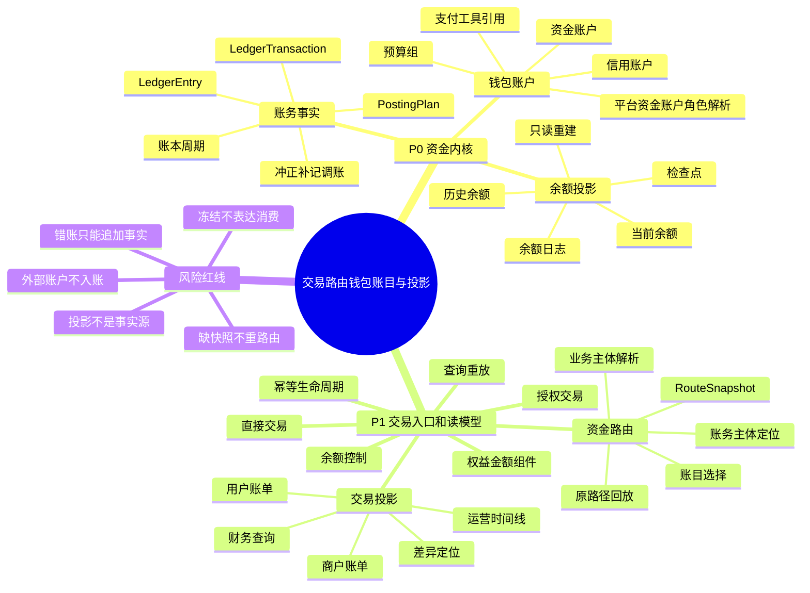
```mermaid
mindmap
  root((交易路由钱包账目与投影))
    P0 资金内核
      钱包账户
        资金账户
        信用账户
        预算组
        平台资金账户角色解析
        支付工具引用
      账务事实
        PostingPlan
        LedgerTransaction
        LedgerEntry
        账本周期
        冲正补记调账
      余额投影
        当前余额
        历史余额
        余额日志
        检查点
        只读重建
    P1 交易入口和读模型
      直接交易
      授权交易
      余额控制
      权益金额组件
      幂等生命周期
      查询重放
      资金路由
        业务主体解析
        账务主体定位
        账目选择
        RouteSnapshot
        原路径回放
      交易投影
        用户账单
        商户账单
        运营时间线
        财务查询
        差异定位
    风险红线
      外部账户不入账
      投影不是事实源
      冻结不表达消费
      缺快照不重路由
      错账只能追加事实
```

### 2.4 准入评估使用方式

本文件用于产品和开发团队做“能否进入编码设计和 TDD 拆解”的准入评估，不等同于上线批准、合规结论、财务处理结论或外部机构规则确认。涉及真实资金、客户资金、支付资质、备付金、反洗钱、个人信息、卡组织、银行、清算网络或跨境规则时，必须由法务、合规、财务、风控或通道负责人给出最终确认。

建议评审顺序：

| 评审角色 | 主要看什么 | 建议入口 | 准入输出 |
| --- | --- | --- | --- |
| 产品 / 运营 | 场景是否完整，使用者是否能理解余额、账单、授权、冻结和退款。 | 第 2、4、5、6、9、11 节 | 场景范围、非目标、用户可见口径和人工处理入口。 |
| 研发 / 架构 | 主体、账户、账目、route snapshot、posting plan、分录和投影是否能落到模块与契约。 | 第 3、5、6、7、8、12 节 | 模块边界、接口契约、状态机、账务矩阵和幂等策略。 |
| 测试 | 每个场景是否能提取正向、异常、边界、幂等、重放和投影一致性用例。 | 第 4、5、10、11、12 节 | TDD 场景清单、断言矩阵和阻断用例。 |
| 风控 / 合规 / 安全 | 是否触碰客户资金、商户待结算资金、敏感支付信息、风控拒绝、争议证据或审计留存。 | 第 2、4、5、6、9、11 节 | 红线确认、待确认项、敏感信息边界和审计要求。 |
| 财务 / 对账 | 本金、手续费、补贴、成本、待清算、可结算、退款、调账和差错是否可追溯。 | 第 5、7、8、9、11、12 节 | 账务核对口径、清结算影响、差错处理和报表来源。 |

准入结论只允许三种：

| 结论 | 含义 | 后续动作 |
| --- | --- | --- |
| 通过 | 场景、资金路径、账务边界、投影和验收已经足够支撑编码设计。 | 进入系分、DSL/TDD 拆解和工程任务评审。 |
| 带条件通过 | 主链路可开发，但存在不影响核心不变量的待确认项。 | 明确通过条件、责任方和关闭条件；不得覆盖到未确认范围。 |
| 阻断 | 存在资金安全、金融红线、主体不清、路径不可追溯、验收不可测或合规未确认的关键缺口。 | 暂停编码，先补产品/系分/合规/财务确认。 |

准入优先级补充：

| 优先级 | 本分册准入判断 | 阻断信号 |
| --- | --- | --- |
| P0 | 钱包账户、账本账目、账本周期和余额投影必须先能独立解释主体、账户类型、`normalBalanceSide`、账目、币种、周期、分录平衡、借贷平衡、余额影响和余额重建。 | 交易状态可用但余额桶、账本周期、分录平衡、借贷平衡、余额影响或投影重建不可证明。 |
| P1 | 直接交易、授权交易、余额控制、路由和交易投影必须建立在 P0 可证明事实上。 | 交易入口为了快速接入而自动建账、直接改余额、跳过 route snapshot 或跳过账本分录。 |
| P2 | VCC、全球账户和收单只作为业务场景补充，引用 06、07、08 的业务 PRD。 | 为单一业务新增平行钱包、平行账本、平行投影或平行清结算口径。 |

## 3. 核心概念和能力边界

| 概念 | 使用者视角解释 | 能力边界 |
| --- | --- | --- |
| 资金指令 | 业务系统告诉底座“发生了一件需要处理资金的事”。 | 必须包含业务引用、主体、金额、币种和幂等信息；不能直接指定历史分录。 |
| 资金交易 | 底座记录的一笔资金侧事实。 | 表达直接交易和授权交易；冻结不进入资金交易主表。 |
| 资金交易明细 | 同一笔资金交易对不同主体的影响明细。 | 用于查询、对账和投影，不是账单展示行本身。 |
| 冻结单 | 风控、提现、争议或运营动作对同一主体可用余额的限制。 | 只表达 AVAILABLE <-> FROZEN；不表达消费、扣划或授权。 |
| 钱包 | 面向使用者的账户和余额能力集合。 | 不替代账本；业务不能绕过交易层直接改钱包余额。 |
| 支付工具 | 发起、接收或识别支付动作的外部工具或外部端点，例如银行卡、虚拟卡、VA、外部银行账户、外部钱包端点或通道 token。 | 只作为路由输入、绑定关系、外部引用和快照；不表达内部余额，不是可记账主体。 |
| 支付工具引用快照 | 本次交易实际使用的支付工具脱敏快照。 | 保存工具 ID、类型、展示号、归属方、币种、状态、绑定快照和审计上下文；不得保存完整卡号、CVV、密钥或明文敏感凭证。 |
| VCC 卡 / 虚拟卡 / 卡 token | 发卡业务里的支付工具形态。 | 与其他支付工具一样只进入 `PaymentInstrumentRef`、绑定快照和 route snapshot；卡、token、持卡人和外部卡账户都不能直接入账。 |
| 预付卡 | VCC 卡产品的一种资金模式，前提是它属于 prepaid virtual card。 | 支付工具本体不表达余额；预付资金责任必须解析到资金账户、平台责任账户、预收待付或用户权益余额等经确认的内部主体。储值券、礼品卡和预付代金券不默认归入 VCC。 |
| 共享卡 | VCC、企业卡或员工卡的使用和绑定模式。 | 共享卡可绑定多个使用人、部门、项目、预算组、Spend Rule 或资金责任解析关系；授权时必须固化工具、使用人、绑定版本、预算组、Spend Rule、资金责任决策和规则版本。 |
| 外部账户引用快照 | 银行账户、通道账户、VA、PSP 账户或托管户等外部端点的引用。 | 只用于入金、出金、对账、外部回单和审计；不得作为内部账本主体。 |
| 权益决策结果 | 订单、交易业务系统或营销权益系统已经完成的用券、补贴、核销、占用和退款决策。 | 资金底座只承接结果，不重新计算券规则、不选最优券、不维护券包生命周期。 |
| 权益快照 | 本次交易实际使用权益的稳定结果快照。 | 保存权益引用、规则版本、金额组件、承担方、受益方、退款处置和审计引用；后续退款、撤销、清结算和对账基于它回放。 |
| 权益金额组件 | 优惠券、代金券、平台补贴、商户让利、储值券核销等形成的金额组成。 | 决定是否入账、谁承担、谁受益、是否影响商户应收和退款如何处理；不得与本金、手续费、成本混成净额。 |
| 商户优惠券 | 商户承担的让利，用户少付，商户应收通常降低。 | 通常不产生独立资金分录，但必须进入权益快照、商户展示、清分和对账口径。 |
| 平台补贴券 | 平台承担的补贴，用户少付，是否补足商户由合同和业务规则决定。 | 补足商户时应形成平台补贴资金路径或独立伴随指令；不补足商户时不得误记平台成本。 |
| 普通代金券 | 平台、商户或合作方发放的抵扣权益，不一定代表用户预付资金。 | 先按承担方和资金性质归类；不能默认等同储值、预付或礼品卡。 |
| 储值 / 预付代金券 | 用户预先支付或平台形成待履约责任的权益。 | 应按负债、预收待付或用户权益余额处理；未确认财务、合同和合规口径前不得当普通优惠券入账。 |
| 权益退款处置 | 退款、撤销、授权取消时每个权益组件如何返券、作废、冲补贴、保留补贴或恢复负债。 | 用户侧处置和资金侧处置必须分离，不能用一个“是否退券”布尔值推导。 |
| 业务主体 | 用户、商户、企业、部门、平台角色等业务归属方。 | 业务主体不直接入账，必须先解析到核心资金账务主体。 |
| 核心资金账务主体 | 能出现在 route leg、posting plan、LedgerEntry 和余额投影里的主体。 | 默认只包括资金账户（含平台角色解析后的平台资金账户）和信用账户；用户、商户经营主体、业务订单、卡、VA、外部账户、支付工具、预算组和 Spend Rule 不能直接入账。 |
| 资金账户 | 承载真实资金的账户主体，也是可记账主体。 | 可以有可用、冻结、授权、待清算、出款中等余额桶。 |
| 信用账户 | 承载授信额度和授权占用的控制账户，也是可记账主体。 | 不是现金账户；额度消费进入交易视图和报表；普通消费不新增 CONSUMED 账目。 |
| 预算组 | 承载预算归属范围、支出控制 scope 和预算展示维度。 | 不是资金池、信用账户或核心资金账务主体；预算可用、预留和释放通过预算型 Spend Rule 的控制视图和审计证据解释。 |
| Spend Rule | 授权前判断支出是否允许的规则对象。 | 可表达预算、MCC、商户、国家、金额、次数、时间窗口、规则版本和拒绝原因；不直接扣款、不生成 route、不作为 LedgerEntry 主体。 |
| 资金路由 | 把资金事实翻译成账户、账目和路径。 | 不决定业务订单是否成立；不直接写余额。 |
| route snapshot | 本次实际使用的参与方、账户、账目、规则版本和路径。 | 后续退款、撤销、争议、清结算和对账优先回放它。 |
| 账目 | 一个账户内的余额桶，例如可用、冻结、授权、待清算。 | 账目不是账户主体，不能用账目替代用户或商户。 |
| 账本分录 | 不可变的借贷记录。 | 余额变化的最终证明；错账只能追加冲正、补记或调账。 |
| 余额投影 | 从分录计算出来的余额视图。 | 可重建，不是事实源。 |
| 交易投影 | 面向用户、商户、运营、财务的只读账单和时间线。 | 不能反向修改资金交易、分录或余额。 |

## 4. 交易层产品设计

### 4.1 能力定位

交易层是业务系统使用资金底座的入口，不是业务订单系统。它负责接收资金事实、保证幂等、防止重复入账、保存快照、编排路由和过账，并把结果交给查询和投影。

| 能力 | 解决的问题 | 产品输出 | 红线 |
| --- | --- | --- | --- |
| 直接交易 | 入金、出金成功、支付、转账、退款、费用、调账等已确认资金事实。 | 资金交易、交易明细、route snapshot、账本交易。 | 不替代业务订单和外部通道状态机。 |
| 授权交易 | 最终交易前先占用资金或信用额度，并固化预算组、Spend Rule 等授权前控制证据。 | 授权占用、释放、结算、拒绝原因和规则快照。 | 授权成功不是最终消费；授权拒绝不生成账务路径。 |
| 余额控制 | 冻结、解冻、资金账户余额调整、信用账户额度调整、预算规则调整。 | 冻结单、调整事实、账本交易、规则版本和审计引用。 | 冻结不创建资金交易；adjust 不得绕过差错单、审批、凭证、审计和重新对账，也不得表达跨主体价值转移；预算规则调整不生成 LedgerEntry 主体。 |
| 查询与重放 | 查询资金处理结果，修复或校验只读投影。 | 查询结果、差异报告、重放任务。 | 查询和重放不能补账或改历史事实。 |

#### 4.1.1 交易入口分层裁决

交易层对外可提供业务用例入口，但资金事实内核必须只处理已解析的核心资金账务主体。支付工具、外部账户、外部钱包端点、业务支付方式标识、预算组和 Spend Rule 可以触发、识别或控制资金动作，不能直接成为 route leg、posting plan、LedgerEntry 或余额投影主体。

| 交易能力 | 对外业务入口建议 | 内核执行入口 | 裁决理由 |
| --- | --- | --- | --- |
| 直接交易 | 优先接收已确认的资金账户、信用账户或平台账户角色解析结果；支付工具只作为外部引用或 route snapshot 补充。 | 资金账户、信用账户或平台账户角色解析后的平台资金账户。 | 直接交易承接已成立资金事实，退款、退费和调账必须基于稳定主体和原路径回放；不应让当前工具绑定改变历史事实。 |
| 授权交易 | 面向 VCC、卡、VA、外部钱包端点、通道 token 或共享卡等工具入口时，优先支持 `PaymentInstrumentRef` 或等价支付工具引用；内部余额、信用额度或权益入口必须先解析为主体或快照。 | 授权准入后解析出的资金账户、信用账户或平台账户角色解析结果。 | 授权发生在工具或业务入口边界，必须先校验工具状态、绑定、使用人、预算组、Spend Rule、资金责任和账户能力，并在批准或拒绝时固化工具、入口来源和规则快照。 |
| 余额控制 | 只面向已知账户或受控对象；工具入口只能作为上层用例先解析账户后再调用。 | 资金账户余额桶、信用账户额度桶，或预算型 Spend Rule 控制视图。 | 冻结、解冻和调账控制的是同一主体的余额或额度，不是工具本身；工具不能绕过账户能力和审批审计。 |

因此，“资金账户、信用账户可以直接对外暴露”只表示它们可以作为受权限保护的资金能力和查询/命令 DTO 暴露给可信业务系统或运营后台，不表示支付工具入口失效，也不表示外部调用方可以自由指定账本分录。支付工具型入口必须在应用层解析、校验和固化快照后，再委派给账户主体型交易内核。

### 4.2 直接交易流程

#### 4.2.1 直接交易产品服务契约

直接交易的产品契约不是 Java API 清单，而是业务系统、运营、财务、风控和测试共同理解的一组可调用能力。每个能力都必须能说明输入事实、交易结果、余额影响、账本追踪和幂等边界。

| 服务能力 | 使用场景 | 必要输入 | 产品输出 | 余额和账务影响 | 验收边界 |
| --- | --- | --- | --- | --- | --- |
| 直接交易提交 | 入金、出金成功、支付、收款、已确认费用、补贴、成本或追偿等已成立资金事实。 | 业务场景、业务流水、交易类型、付款方、收款方、金额、币种、金额组件、幂等键、业务快照、外部账户或通道引用。 | 资金交易、交易明细、route snapshot、posting plan、账本交易、分录引用和交易投影视图。 | 按 route snapshot 完成多主体、多账目的借贷变化。 | 只承接已确认资金事实；不得替代业务订单、外部支付尝试或通道状态机。 |
| 资金转账 | 用户到商户、商户到平台、平台内部、钱包账户之间的明确价值转移。 | 转出主体、转入主体、金额、币种、转账场景、业务流水、费用承担方、来源凭证。 | 转账交易、转账明细、双方余额变化、账本交易和审计记录。 | 转出方和转入方按路由规则形成平衡分录。 | 必须明确价值转移双方；不能用冻结、授权或预算调整冒充转账。 |
| 原交易退款 | 支付、收款、转账或费用类交易发生退款、撤销类回补或业务退回。 | 原资金交易、退款金额、退款原因、退款流水、外部退款引用、凭证、操作者或系统来源。 | 退款交易、累计已退金额、可退剩余金额、原交易关联和投影视图。 | 基于原交易快照回补，不按当前账户绑定重新选路。 | 累计退款不得超过原交易可退金额；无原事实或凭证时不得静默退款。 |
| 费用、补贴和成本拆分 | 一笔业务同时包含本金、平台手续费、通道成本、营销补贴、税费或追偿金额。 | 金额组件、组件归属主体、组件规则版本、费率或补贴依据、业务流水和凭证。 | 拆分后的交易明细、组件级账本引用、财务和运营可核对视图。 | 各组件分别进入对应账目，合计必须与交易总额一致。 | 不得把本金、费用、成本、补贴和追偿混成一个不可解释金额。 |
| 差错调账协同 | 对账差错、运营修正、财务审批或历史事实修正需要影响真实资金账户。 | 差错单、责任主体、调整对象、调账方向、金额、币种、审批、凭证、原因和规则版本。 | 受控余额调整记录，或批次授权的调账资金事实、审计记录、账本交易和差错闭环引用。 | 资金账户余额调整由余额控制 adjust 承接；跨主体价值转移或直接交易调账按批次授权生成新的资金事实。 | 必须有审批和凭证；不得绕过差错闭环直接改余额或投影。 |
| 直接交易查询 | 用户、商户、运营、财务或风控查询直接交易处理结果。 | 资金交易号、业务流水、主体、时间范围、外部引用或场景条件。 | 交易状态、金额组件、route snapshot、账本引用、余额变化、审计时间线。 | 查询不写账，不修正余额。 | 查询结果必须能追溯到交易事实、路由快照和账本分录。 |

#### 4.2.2 直接交易主流程

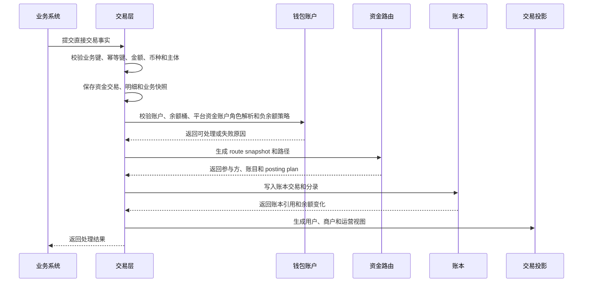
```mermaid
sequenceDiagram
    participant Biz as 业务系统
    participant Tx as 交易层
    participant Wallet as 钱包账户
    participant Route as 资金路由
    participant Ledger as 账本
    participant View as 交易投影

    Biz->>Tx: 提交直接交易事实
    Tx->>Tx: 校验业务键、幂等键、金额、币种和主体
    Tx->>Tx: 保存资金交易、明细和业务快照
    Tx->>Wallet: 校验账户、余额桶、平台资金账户角色解析和负余额策略
    Wallet-->>Tx: 返回可处理或失败原因
    Tx->>Route: 生成 route snapshot 和路径
    Route-->>Tx: 返回参与方、账目和 posting plan
    Tx->>Ledger: 写入账本交易和分录
    Ledger-->>Tx: 返回账本引用和余额变化
    Tx->>View: 生成用户、商户和运营视图
    Tx-->>Biz: 返回处理结果
```

#### 4.2.3 直接交易验收要点

直接交易必须做到：

1. 同一业务键和相同请求摘要重复提交，只返回原结果，不重复入账。
2. 同一业务键但请求摘要不同，必须拒绝。
3. 交易成功前必须完成账本过账；不能先展示成功再补账。
4. 本金、费用、成本、补贴、追偿和调账金额必须拆开表达。
5. 外部账户、支付工具和通道流水只能做引用，不成为内部账本主体。

### 4.3 授权交易流程

授权交易先回答“这笔请求是否能进入授权占用”，再回答“允许后占用哪一个余额桶”。资金底座核心主链路只要求余额、额度、预算、风控或外部授权结果能清楚表达批准或拒绝；更细的 spend controls 属于发卡、VCC、企业卡或员工卡产品的可选扩展。

#### 4.3.1 授权交易产品服务契约

授权交易的产品契约不是 Java API 清单，而是业务系统、运营、风控、财务和测试共同理解的一组可调用能力。每个能力都必须能说明输入事实、处理结果、状态变化、余额影响和审计证据。

| 服务能力 | 使用场景 | 必要输入 | 产品输出 | 余额和账务影响 | 验收边界 |
| --- | --- | --- | --- | --- | --- |
| 授权申请 | 用户刷卡、VCC 授权、共享卡支出、企业预算支出等先占用后完成的场景。 | 业务场景、业务流水、支付工具引用或已解析授权主体、金额、币种、资金账户或信用额度来源、预算组 / Spend Rule 控制上下文、支付工具快照、外部授权引用、风控或授权前控制结论。 | 授权批准或授权拒绝；批准时返回授权交易号、授权占用快照、预算控制证据和剩余可处理金额；拒绝时返回拒绝原因和规则版本。 | 批准时 AVAILABLE -> AUTHORIZATION；拒绝时无 route、posting、entry。 | 授权业务入口可从支付工具开始，但批准入账前必须解析到资金账户、信用账户或平台账户角色；授权批准不是消费完成；授权拒绝不得生成账务路径，不得写入争议或拒付口径。 |
| 授权撤销 | 商户、通道、发卡侧或业务系统撤销未完成授权。 | 原授权交易号、撤销金额、撤销原因、外部撤销引用、操作者或系统来源。 | 撤销结果、释放金额、授权剩余金额、审计记录。 | 基于原授权快照 AUTHORIZATION -> AVAILABLE。 | 只能释放剩余授权；不得释放已完成金额；不得按当前账户绑定重新选路。 |
| 授权过期 | 授权到期、未完成消费、系统按规则释放剩余占用。 | 原授权交易号、过期时间、过期规则、系统任务引用。 | 过期结果、释放金额、终态和审计记录。 | 仅释放剩余 AUTHORIZATION。 | 过期和撤销是不同终态；已完成金额不得被过期释放。 |
| 授权完成 | 商户清算、通道完成、卡组织清算或业务确认消费成立。 | 原授权交易号、完成金额、完成时间、外部完成引用、费用或商户信息、规则版本。 | 完成交易、完成金额累计、授权剩余金额和后续可退款金额。 | 基于原授权快照从 AUTHORIZATION 转入收款方、商户 CLEARING 或平台目标账目。 | 完成金额不得超过剩余授权；普通完成不得触碰 LIMIT；商户订单款不得直入 AVAILABLE 或 SETTLEMENT。 |
| 强制完成 | 外部没有前置授权，但确认消费已经发生或通道直接完成。 | 业务流水、金额、币种、责任主体、强制完成策略、原因、凭证、操作者。 | 强制完成交易、原因、策略版本和审计记录。 | 按受控策略入账，可触发受控负余额或差错处理。 | 不补造授权占用；缺策略、上限、原因或审计时不得入账。 |
| 授权链退款 | 授权完成后发生退款、争议类退款或扣回。 | 原完成交易号、退款金额、退款原因、外部退款或争议引用、凭证。 | 退款交易、累计已退金额、可退剩余金额、投影视图区分普通退款和争议类退款。 | 基于已完成路径回补，不按当前绑定重新选路。 | 累计退款不得超过已完成金额；无原消费或凭证时不得静默退款。 |
| 授权生命周期查询 | 用户、商户、运营、财务或风控查询授权处理过程。 | 授权交易号、业务流水、主体、时间范围或外部引用。 | 授权金额、已完成、已撤销、已过期、已退款、剩余可处理金额、拒绝原因和审计时间线。 | 查询不写账，不修正余额。 | 查询结果必须能追溯到原授权快照、后续事件和账本事实。 |

#### 4.3.2 授权交易生命周期流程

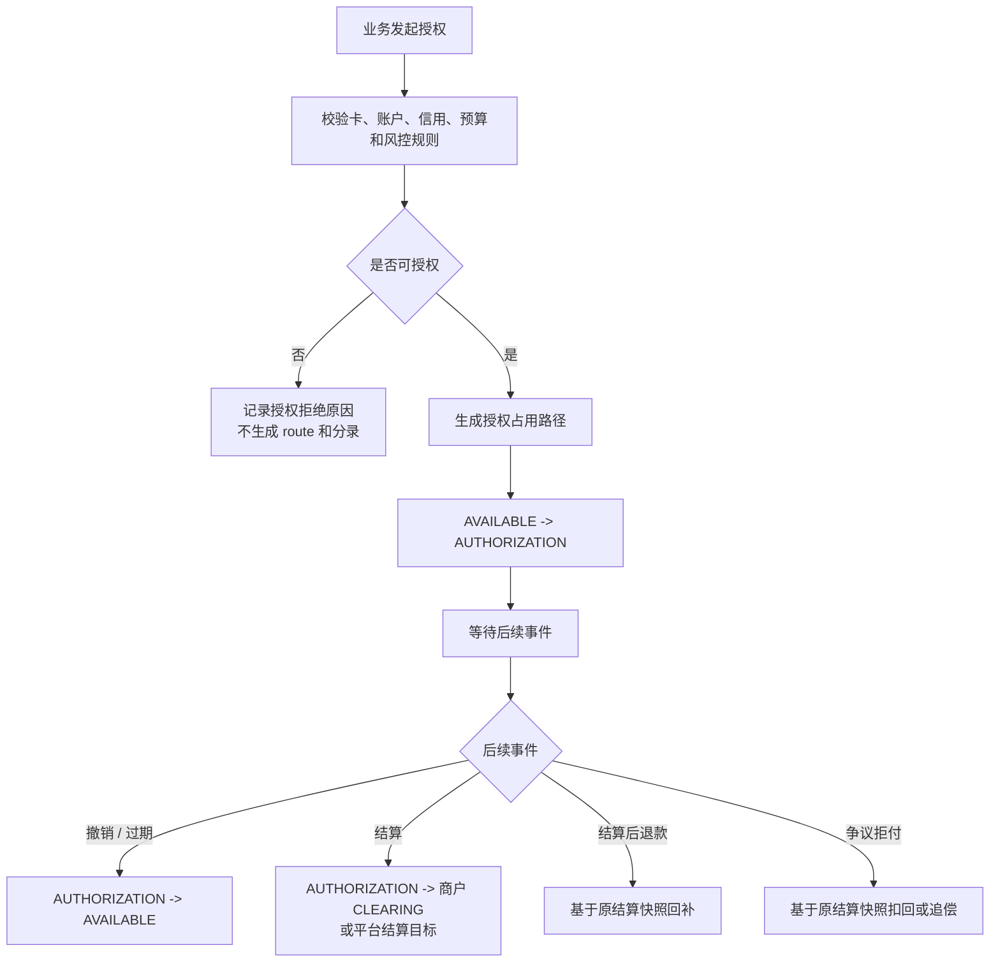
```mermaid
flowchart TD
    A["业务发起授权"] --> B["校验卡、账户、信用、预算和风控规则"]
    B --> C{"是否可授权"}
    C -- "否" --> D["记录授权拒绝原因\n不生成 route 和分录"]
    C -- "是" --> E["生成授权占用路径"]
    E --> F["AVAILABLE -> AUTHORIZATION"]
    F --> G["等待后续事件"]
    G --> H{"后续事件"}
    H -- "撤销 / 过期" --> I["AUTHORIZATION -> AVAILABLE"]
    H -- "结算" --> J["AUTHORIZATION -> 商户 CLEARING\n或平台结算目标"]
    H -- "结算后退款" --> K["基于原结算快照回补"]
    H -- "争议拒付" --> L["基于原结算快照扣回或追偿"]
```

授权生命周期状态图：

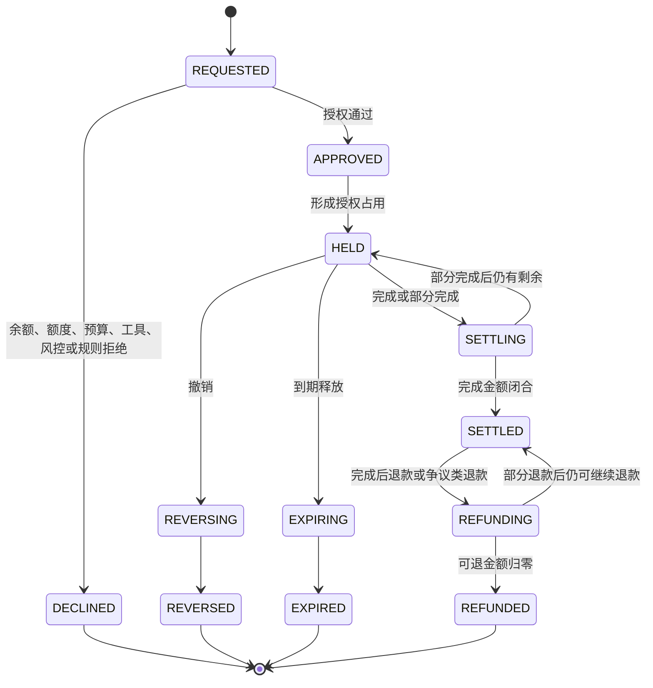
```mermaid
stateDiagram
    [*] --> REQUESTED
    REQUESTED --> DECLINED: 余额、额度、预算、工具、风控或规则拒绝
    REQUESTED --> APPROVED: 授权通过
    APPROVED --> HELD: 形成授权占用
    HELD --> SETTLING: 完成或部分完成
    HELD --> REVERSING: 撤销
    HELD --> EXPIRING: 到期释放
    SETTLING --> HELD: 部分完成后仍有剩余
    SETTLING --> SETTLED: 完成金额闭合
    SETTLED --> REFUNDING: 完成后退款或争议类退款
    REFUNDING --> SETTLED: 部分退款后仍可继续退款
    REFUNDING --> REFUNDED: 可退金额归零
    REVERSING --> REVERSED
    EXPIRING --> EXPIRED
    DECLINED --> [*]
    REVERSED --> [*]
    EXPIRED --> [*]
    REFUNDED --> [*]
```

授权交易的使用者可见口径：

| 角色 | 关注点 | 可见结果 | 不应看到 |
| --- | --- | --- | --- |
| 用户或持卡人 | 授权是否通过、占用了多少、何时释放或完成。 | 授权中、已完成、已撤销、已过期、已退款。 | 被误展示为已出款、已清算或已拒付。 |
| 商户或合作方 | 授权是否可完成、完成金额和可退款金额。 | 可完成金额、已完成金额、可退款金额和外部引用。 | 直接看到内部 route 或账本分录。 |
| 运营/风控 | 拒绝原因、规则命中、异常补偿和人工处理。 | 规则版本、风险原因、审批、凭证和审计。 | 直接改授权余额或历史分录。 |
| 财务/对账 | 授权占用、完成、退款和争议类退款是否可追溯。 | 原授权、完成、退款、外部引用和账本事实的追踪链。 | 用授权拒绝替代争议拒付。 |

授权交易的产品边界：

| 场景 | 正确口径 | 禁止口径 |
| --- | --- | --- |
| 授权批准 | 先通过 Spend Rule、风控和账户能力校验，再占用资金账户或信用账户；预算只作为支出控制证据。 | 展示为已完成消费，或把预算规则通过当成资金占用成功。 |
| 授权拒绝 | 记录拒绝原因，不生成账务路径。 | 记入争议拒付、chargeback 事件或 declinedAmount。 |
| 授权撤销 | 基于原授权快照释放占用。 | 按当前账户绑定重新选路。 |
| 授权完成 | 占用变为已确认消费或商户待清算。 | 写成 AUTHORIZATION -> LIMIT 或新增账务 CONSUMED。 |
| 无授权强制完成 | 外部无前置授权但确认消费已发生时，使用 settle 的强制完成模式承接，并记录策略、上限、原因和审计。 | 补造授权占用、污染授权生命周期或绕过受控负余额策略。 |
| 无授权直接退款 | 外部无前置授权但存在原消费、原完成或差错凭证时，使用 settleRefund 的无授权退款模式承接。 | 无原事实或凭证时静默退款，或为了退款补造原授权。 |

授权 CLOSED 收口规则：

1. 资金底座默认不提供授权 close 服务入口，也不把 close 作为外部授权生命周期事件。
2. 已完成授权在退款或争议类退款后，可退金额归零时使用 REFUNDED 表达资金处理终态。
3. 如果运营查询需要展示“业务已关闭”，只能作为查询归纳态或运营标签，不能驱动账务、释放、退款或回放。
4. 编码和 TDD 阶段不以 close 作为授权交易目标 API；授权默认服务入口保持 authorize、reversal、expire、settle、settleRefund。

授权交易验收要点：

1. 授权批准必须生成授权快照和占用余额，授权拒绝必须只保存拒绝事实和原因。
2. 撤销、过期、完成和退款都必须引用原授权或原完成事实，不能按当前绑定关系重新解释历史。
3. 多次完成、多次撤销、多次退款必须以剩余可处理金额为上限，重复事件必须幂等。
4. 强制完成、无授权直接退款和争议类退款必须有策略、原因、凭证和审计。
5. 授权交易不能替代清算、结算、出款或对账差错流程；它只证明授权生命周期和资金占用/释放/完成事实。

### 4.4 余额控制流程

余额控制解决的是“同一账务主体内部，某个余额桶是否可用、可释放或可调整”的问题。它不表达跨主体价值转移，也不替代直接交易、授权交易、清结算或对账差错闭环。

#### 4.4.1 余额控制产品服务契约

| 服务能力 | 使用场景 | 必要输入 | 产品输出 | 余额和账务影响 | 验收边界 |
| --- | --- | --- | --- | --- | --- |
| 资金账户冻结 | 风控冻结、提现申请锁定、争议冻结、运营临时冻结。 | 账务主体、账目、金额、币种、冻结原因、期限、业务流水、操作者、凭证。 | 冻结单、冻结金额、剩余可用、到期时间和审计记录。 | 同主体 AVAILABLE -> FROZEN。 | 冻结不是消费、扣划或授权；冻结不创建标准资金交易。 |
| 资金账户解冻 | 风控解除、提现撤销、争议解除、到期释放、部分释放。 | 原冻结单、解冻金额、解冻原因、操作者或系统任务、凭证。 | 解冻结果、冻结剩余金额、释放记录和审计记录。 | 同主体 FROZEN -> AVAILABLE。 | 累计解冻不得超过剩余冻结；重复解冻必须幂等或明确失败。 |
| 冻结后出款确认 | 提现或出款已冻结，外部确认成功后引用并关闭冻结来源。 | 原冻结单、出款结果、外部回单、金额、币种、费用信息。 | 出款成功事实、冻结来源关闭或减少、外部回单引用。 | 通过独立出款资金事实引用冻结单并关闭对应冻结金额。 | 不是先解冻再无来源扣款；冻结单自身不表达消费；外部受理不等于出款成功。 |
| 资金账户余额调整 | 对账差错、运营修正、财务调整需要修正同主体真实资金账户指定余额桶。 | 账务主体、账目、金额、币种、调整方向、差错单或调整来源、审批、凭证、原因、操作者。 | 调整记录、调整后余额摘要、账本交易、审计记录和差错/凭证引用。 | 同主体、同币种、同账本周期内按受控规则调整目标账目。 | 不承接跨主体价值转移；不得无来源直接改余额；差错类调整必须可重新对账。 |
| 信用账户额度调整 | 授信额度增加、减少、恢复或风控压降。 | 信用账户、调整方向、金额、原因、审批、规则版本、操作者。 | 额度调整记录、LIMIT、AVAILABLE 变化和审计。 | 信用账户 LIMIT 和可用额度按规则变化。 | 只有额度调整能触碰 LIMIT；普通授权完成不得触碰 LIMIT。 |
| 预算规则调整 | 部门、项目、员工卡、预算组或共享卡的预算额度、窗口或规则变更。 | 预算组、Spend Rule、预算规则窗口、调整方向、金额、原因、审批、规则版本。 | 预算规则调整记录、预算控制视图、可用预算口径、审计和报表口径。 | 不直接改变资金账务主体；只改变预算型规则、累计窗口或控制视图。 | 预算不是资金池；预算调整不产生真实资金流，也不能作为 LedgerEntry 主体。 |
| 余额控制查询 | 用户、运营、风控或财务查看冻结、释放、信用额度和预算控制变化。 | 主体、账目、币种、冻结单、调整单、预算控制对象或时间范围。 | 当前冻结、冻结历史、信用额度变化、预算控制视图变化、审计和来源引用。 | 查询不写账。 | 查询不能修复余额或重新计算事实。 |

#### 4.4.2 冻结与解冻主流程

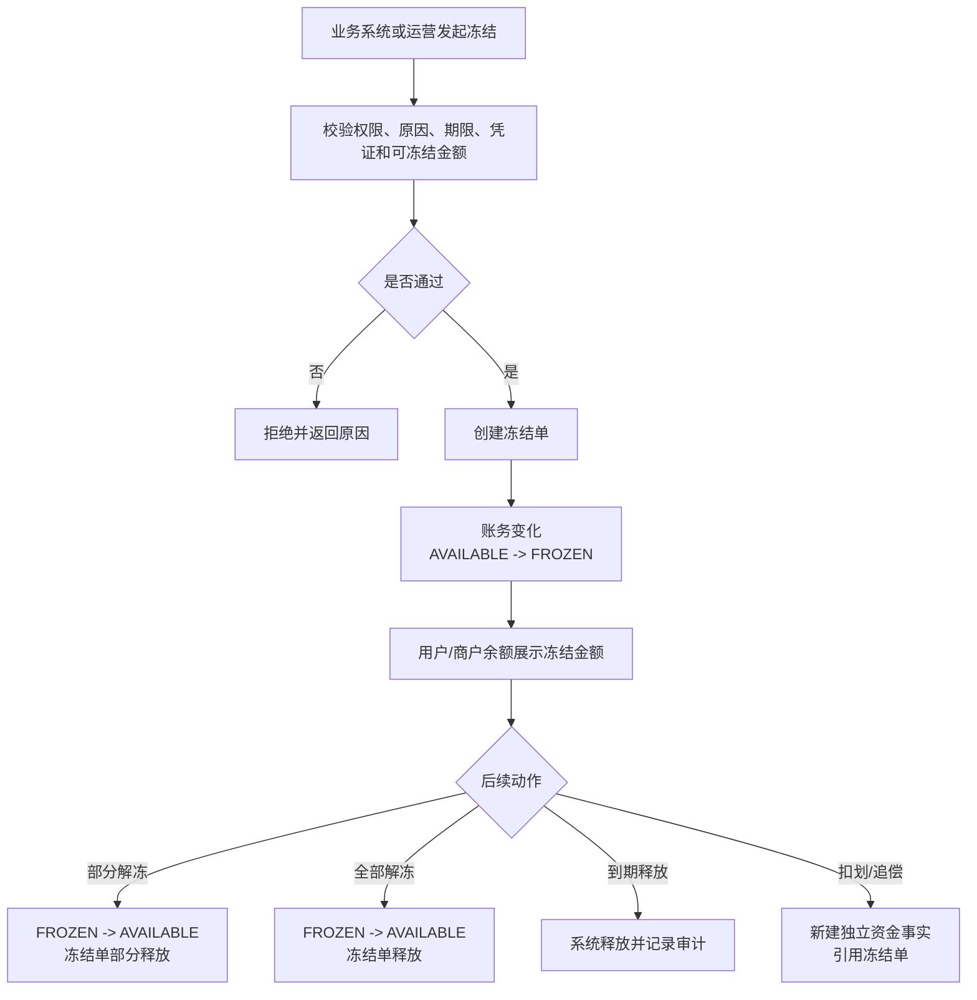
```mermaid
flowchart TD
    A["业务系统或运营发起冻结"] --> B["校验权限、原因、期限、凭证和可冻结金额"]
    B --> C{"是否通过"}
    C -- "否" --> D["拒绝并返回原因"]
    C -- "是" --> E["创建冻结单"]
    E --> F["账务变化\nAVAILABLE -> FROZEN"]
    F --> G["用户/商户余额展示冻结金额"]
    G --> H{"后续动作"}
    H -- "部分解冻" --> I["FROZEN -> AVAILABLE\n冻结单部分释放"]
    H -- "全部解冻" --> J["FROZEN -> AVAILABLE\n冻结单释放"]
    H -- "到期释放" --> K["系统释放并记录审计"]
    H -- "扣划/追偿" --> L["新建独立资金事实\n引用冻结单"]
```

#### 4.4.3 余额、额度和预算控制调整流程

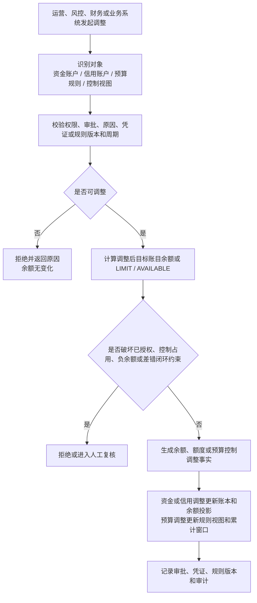
```mermaid
flowchart TD
    A["运营、风控、财务或业务系统发起调整"] --> B["识别对象\n资金账户 / 信用账户 / 预算规则 / 控制视图"]
    B --> C["校验权限、审批、原因、凭证或规则版本和周期"]
    C --> D{"是否可调整"}
    D -- "否" --> E["拒绝并返回原因\n余额无变化"]
    D -- "是" --> F["计算调整后目标账目余额或 LIMIT / AVAILABLE"]
    F --> G{"是否破坏已授权、控制占用、负余额或差错闭环约束"}
    G -- "是" --> H["拒绝或进入人工复核"]
    G -- "否" --> I["生成余额、额度或预算控制调整事实"]
    I --> J["资金或信用调整更新账本和余额投影\n预算调整更新规则视图和累计窗口"]
    J --> K["记录审批、凭证、规则版本和审计"]
```

#### 4.4.4 冻结、授权和调账的差异

| 能力 | 解决的问题 | 余额变化 | 是否跨主体 | 是否表达最终消费 | 典型验收 |
| --- | --- | --- | --- | --- | --- |
| 冻结 | 暂时限制同一主体的可用余额。 | AVAILABLE <-> FROZEN。 | 否。 | 否。 | 冻结和解冻累计不超过原冻结金额。 |
| 授权 | 最终消费前先占用资金、额度或预算。 | AVAILABLE -> AUTHORIZATION，后续完成或释放。 | 授权完成时可能进入收款方或商户待清算。 | 授权批准不是最终消费。 | 授权完成、撤销、过期和退款必须引用原授权。 |
| 余额/额度/预算控制调整 | 修正资金账户指定余额桶，改变信用额度，或改变预算型 Spend Rule。 | 资金账户目标账目或信用 LIMIT/AVAILABLE 按规则变化；预算规则调整只改变控制视图和规则版本。 | 否。 | 否。 | 必须有调整来源、审批、凭证或规则版本和审计，不破坏已授权占用、控制占用或已命中规则快照。 |
| 差错闭环调账 | 基于差错、审批和凭证修正同主体余额或跨主体责任、价值路径。 | 同主体余额修正由受控余额调整承接；跨主体价值路径由批次授权直接交易事实承接。 | 可能。 | 取决于调账场景。 | 必须先进入差错闭环，不得无来源直接改余额。 |

冻结不是价值转移。冻结单不能直接表达“消费了”“扣掉了”“已支付”。如果冻结后需要扣划、追偿或退款，必须创建新的资金交易或调账事实，并引用冻结单作为来源。

余额控制验收要点：

1. 冻结失败、解冻超额、错币种、主体缺失、账目不支持、审批缺失时必须失败且余额无变化。
2. 冻结和解冻必须保存冻结单、释放记录、剩余冻结金额、原因、操作者、凭证和审计。
3. 资金账户冻结只控制真实资金账户可用性；信用账户调额控制授信额度；预算组和 Spend Rule 调整只控制预算规则、窗口和展示视图，不表达现金沉淀。
4. 资金账户余额调整、信用账户额度调整、预算规则调整都必须有来源、审批或规则、凭证或规则版本和审计；差错类资金余额调整必须可重新对账。
5. 余额控制不做 FX，不隐式换汇，不承接外部通道成功或失败状态机。
6. 余额控制不能绕过交易层、账本层和差错闭环直接修改历史余额。

### 4.5 Spend Controls 发卡授权控制扩展

Highnote 的 spend-controls 目录以及 Stripe、Marqeta、Lithic、Adyen 等行业实现，都把这类能力放在发卡授权控制、交易规则或 velocity limit 层。它的本质是“授权前控制策略”：在资金路由和账本占用发生前，根据卡、账户、预算、商户、MCC、地区、入卡方式、金额、次数、时间窗口、账户状态、外部协同授权和风控信号判断本次支出是否允许。

结论：Spend Controls 是发卡、VCC、企业卡或员工卡产品的可选能力，不是支付资金底座的核心主链路能力。本 PRD 只保留产品边界、验收红线和 DSL 承载边界；发卡产品启用时，必须作为独立的发卡授权控制产品能力评审。

它解决的问题：

1. 授权前拦截：在 route、posting 和 ledger entry 生成前拦截不符合策略的支出，避免先入账再冲正。
2. 企业支出治理：让企业管理员按员工、卡、预算组、MCC、商户、国家、时间窗口和金额控制支出。
3. 风险和合规辅助：把高风险商户、地区、入卡方式、CVV/AVS 结果、卡片状态和风控结果转成可审计的拒绝原因。
4. 周期控制协同：把日限额、月预算、自定义合同周期等规则和账本周期、预算组、信用账户配合起来，但不由规则本身直接改资金余额。

外部参考带来的产品判断：

| 参考来源 | 可吸收能力 | 产品边界 |
| --- | --- | --- |
| Highnote Spend Rules / Velocity Controls / Suspend an Account / Collaborative Authorization | 请求属性规则、金额和次数窗口、账户暂停、外部协同授权和模拟授权。 | 只作为发卡授权控制扩展，不进入资金路由、账本或清结算核心。 |
| Stripe Issuing Spending Controls / Real-time Authorizations | 卡片或持卡人 spending controls，以及外部实时授权决策。 | 规则门禁和外部决策要分层；通过规则不等于授权占用成功。 |
| Marqeta Velocity Controls | 金额、次数、商户、MCC 和时间窗口限制。 | velocity window 是规则累计窗口，不是账本周期、清算账期或报表周期。 |
| Lithic Authorization Rules | 规则条件、速度限制、动作和拒绝原因。 | 可参考规则对象和审计模型，不照搬 API 结构。 |
| Adyen Issuing Transaction Rules | 发卡交易的允许、拒绝、暂停或审批动作。 | 可覆盖运营动作和审批，但必须保持授权前决策与账务事实隔离。 |

能力边界：

| 能力 | 正确归属 | 不应该归属 |
| --- | --- | --- |
| 判断 MCC、商户、国家、POS、PAN entry mode、CVV/AVS、单笔金额是否允许 | 授权控制策略 | 账本、清结算、对账 |
| 统计日、周、月或自定义窗口内的授权次数和金额 | 授权控制策略 + 周期累计视图 | 账本周期本身 |
| 授权通过后占用资金或信用额度，并固化预算控制证据 | 资金路由 + 账本过账 + 规则快照 | 支出规则直接写账 |
| 授权拒绝后保存拒绝原因、命中规则和规则版本 | 交易事实 / 授权拒绝记录 | LedgerEntry、chargeback、清算批次 |
| 信用额度真实余额隔离、预算规则窗口隔离 | 信用账户账本周期 + 账目 bucket；预算型 Spend Rule 窗口和控制视图 | Spend Rules 临时过滤真实资金余额 |

预算组与 Spend Rule 的产品关系：

| 对象 | 回答的问题 | 正确职责 | 不应承担 |
| --- | --- | --- | --- |
| 预算组 | 哪个部门、项目、员工卡组、成本中心或共享卡归属于同一个预算范围。 | 作为 Spend Rule 的 scope、target、owner 和展示维度，承载预算名称、归属方、周期策略、状态、规则版本和审计。 | 作为 LedgerEntry 主体、资金账户、信用账户、清结算主体或现金池。 |
| 预算型 Spend Rule | 这笔支出在当前预算规则下能不能发生。 | 表达预算总额、可用预算、已占用、释放、单笔上限、累计窗口、优先级、版本、生效时间和拒绝原因。 | 直接扣款、直接生成 route、直接改变资金账户或信用账户余额。 |
| 资金账户 | 真实资金或平台责任余额在哪里。 | 授权通过后承担真实资金占用、支付、清结算或退款路径。 | 承载预算组织结构、MCC、商户、国家或次数规则。 |
| 信用账户 | 授信额度和额度占用在哪里。 | 授权通过后承担授信额度占用、释放和完成后的责任闭合。 | 承载预算归属关系或支付工具本身。 |

因此，预算组和 Spend Rule 不是重复对象。预算组回答“这组预算归谁管、覆盖哪些人/卡/项目”，Spend Rule 回答“这笔支出在这组预算和其他规则下能不能继续”。当预算能力需要金额累计、占用和释放时，应表现为预算型 Spend Rule 的控制视图和审计记录，而不是把预算组提升为核心资金账务主体。

支出规则的生效顺序：

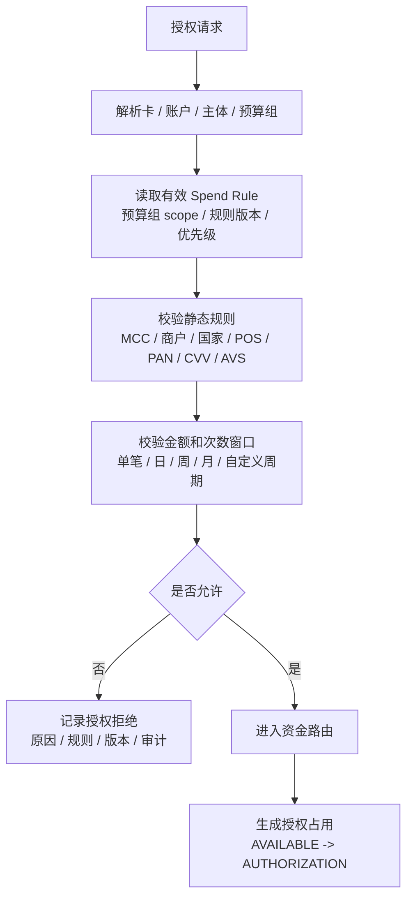
```mermaid
flowchart TD
    A["授权请求"] --> B["解析卡 / 账户 / 主体 / 预算组"]
    B --> C["读取有效 Spend Rule\n预算组 scope / 规则版本 / 优先级"]
    C --> D["校验静态规则\nMCC / 商户 / 国家 / POS / PAN / CVV / AVS"]
    D --> E["校验金额和次数窗口\n单笔 / 日 / 周 / 月 / 自定义周期"]
    E --> F{"是否允许"}
    F -- "否" --> G["记录授权拒绝\n原因 / 规则 / 版本 / 审计"]
    F -- "是" --> H["进入资金路由"]
    H --> I["生成授权占用\nAVAILABLE -> AUTHORIZATION"]
```

产品规则：

1. 支出规则只决定授权请求是否继续，不直接生成 route、posting plan 或 ledger entry。
2. 授权拒绝必须保留命中规则、拒绝原因、规则版本、请求摘要和审计信息；不得生成账务路径。
3. 静态规则、预算规则和周期规则要分开表达：MCC、商户、国家、POS、CVV/AVS 属于请求属性判断；预算组属于规则作用域；日限额、月预算、自定义周期属于累计窗口判断。
4. 周期窗口可以引用账本周期或独立累计视图，但不能把清算账期、报表周期或归档水位当作可用余额判断。
5. 多条规则命中时必须有确定的优先级、合并方式和拒绝原因选择规则；缺失优先级时不得进入生产启用。
6. 规则变更必须有生效时间、版本、操作人、审批、影响范围和审计口径；历史授权按当时命中的规则版本解释。
7. 支出规则不是完整风控引擎；可接收风控结论或风险信号，但不替代名单筛查、欺诈模型、合规规则和人工复核。
8. 预算组不得作为 LedgerEntry、route leg 或清结算主体；授权通过后，真实资金或额度占用仍必须落到资金账户（含平台角色解析后的平台资金账户）或信用账户。

产品定位判断：

| 位置 | 产品口径 | 理由 |
| --- | --- | --- |
| 资金底座默认能力 | 保留授权通过、授权拒绝、授权占用、授权释放、授权完成和审计边界。 | 资金底座必须能解释授权结果，但不默认承载所有发卡规则。 |
| 发卡授权控制扩展 | 在 VCC、企业卡、员工卡或发卡产品中启用 spend controls、card controls、velocity controls、预算型规则和协同授权。 | 它依赖卡、持卡人、预算组、信用账户、账本周期和拒绝记录，属于授权前决策能力。 |
| 卡产品能力 | 围绕 spend controls、card controls、merchant controls、velocity controls、协同授权、风控和运营后台形成完整功能面。 | 卡产品需要独立管理规则、作用域、优先级、生效时间、窗口累计、拒绝原因和审计。 |

### 4.6 权益金额组件产品设计

权益金额组件用于把优惠券、代金券、平台补贴、商户让利和储值权益从“营销规则结果”转换成资金底座可识别、可快照、可入账、可退款、可清结算和可对账的稳定语义。

一句话结论：资金底座不做优惠券规则引擎，只接收业务侧已经确认的权益结果快照，并负责把权益结果转成稳定的资金语义。

#### 4.6.1 设计目标、解决的问题和能力边界

| 维度 | 产品口径 |
| --- | --- |
| 设计目标 | 让订单原始金额、用户实付、商户让利、平台补贴、代金券核销、手续费和成本可拆分、可追溯、可退款、可清结算、可对账。 |
| 解决的问题 | 避免优惠金额被合入本金，导致退款超额、商户清算失真、平台补贴成本不可解释、储值券负债被误当营销折扣。 |
| 能力边界 | 资金底座只承接已经决策完成的权益结果快照，不计算券可用性、不判断最优券、不处理叠加规则、不维护券包和活动生命周期。 |
| 事实来源 | 订单系统、交易业务系统、营销权益系统或运营审批链路输出的权益决策、核销、占用、退券和退款分摊结果。 |
| 专业确认 | 补贴成本、商户收入、平台收入、储值负债、沉淀收益、税务和合规口径由财务、会计、税务、法务或合规确认。 |

生产准入结论：

1. `FundsInstruction` 可以携带权益快照只代表 DSL 契约可承载，不代表含权益交易已经具备生产放行条件。
2. 含权益交易进入生产主链路前，必须能在 route snapshot、交易事实快照或等价不可变存储中固化 `benefitSnapshotId`、组件摘要、规则版本、退款处置和稳定摘要。
3. 幂等摘要必须纳入权益快照稳定摘要；同一业务流水、不同权益结果不能复用同一资金交易结果。
4. 零实付订单必须先明确选型：要么主指令支持零金额且只表达非用户现金资金影响，要么拆成补贴、代金券或储值权益伴随资金事实。
5. 退款、撤销、授权过期、拒付和清结算差错只能引用原权益快照和本次业务决策结果，不接收当前重新计算的权益结果。

职责边界：

| 领域 | 负责什么 | 不负责什么 |
| --- | --- | --- |
| 营销 / 权益系统 | 发券、领券、库存、适用条件、叠加规则、权益占用、核销、释放、退券、作废、活动预算规则。 | 不直接写资金账本，不生成商户清算分录，不决定资金账户入账路径。 |
| 订单 / 交易业务系统 | 计算订单原价、优惠后价格、用户实付、商品行分摊、用户选择权益、支付意图和业务快照。 | 不绕过资金底座直接改余额，不直接生成 ledger entry。 |
| 支付资金底座 | 接收金额组件和权益快照，生成 route snapshot、posting plan、ledger entry、退款重放、清结算金额项和投影口径。 | 不重新计算券规则，不判断券是否可用，不维护券完整生命周期。 |
| 财务 / 会计 / 合规 | 确认补贴成本、销售收入、负债释放、不退券沉淀、税务和合规口径。 | 不由资金底座自行决定专业分类。 |

#### 4.6.2 金额模型和组件分类

交易付款场景的产品金额应满足：

```text
orderAmount = userPayAmount
            + merchantDiscountAmount
            + platformSubsidyAmount
            + voucherRedeemAmount
            + otherBenefitAmount
```

商户可清算金额不一定等于订单原始金额，需要按业务合同和权益承担规则计算：

```text
merchantReceivableAmount = orderAmount
                         - merchantDiscountAmount
                         + platformSubsidyToMerchantAmount
                         + voucherSettlementAmount
                         - merchantFeeAmount
                         - merchantDeductionAmount
```

用户可退金额不一定等于订单原始金额，应按原快照和退款处置规则计算：

```text
userRefundCashAmount <= userPayAmount - alreadyRefundedCashAmount
benefitRefundAmount 由每个权益组件的 refundDisposition 决定
```

| 组件类型 | 谁承担 | 谁受益 | 是否产生资金分录 | 典型账务影响 |
| --- | --- | --- | --- | --- |
| PRINCIPAL | 用户或付款方 | 商户或收款方 | 是 | 用户 AVAILABLE 减少，商户 CLEARING 增加。 |
| MERCHANT_DISCOUNT | 商户 | 用户 | 通常否 | 降低商户应收，不单独转移资金。 |
| PLATFORM_SUBSIDY | 平台 | 用户或商户 | 是 | 平台补贴账户、成本账户或独立伴随指令补足商户 CLEARING。 |
| PLATFORM_COUPON_NO_SETTLEMENT | 平台或业务合同定义方 | 用户 | 视规则而定 | 用户少付，商户也按优惠后金额成交；平台不补足商户。 |
| VOUCHER_REDEEM | 用户历史权益、平台负债或业务权益池 | 用户或商户 | 视代金券属性而定 | 预付型通常需要冲减负债并增加商户 CLEARING。 |
| FEE | 商户、用户或平台 | 平台 | 是 | 平台 FEE 增加。 |
| CHANNEL_COST | 平台或商户 | 通道或成本主体 | 是或清结算项 | 成本需和本金、补贴分开。 |

每个权益金额组件至少需要固化：

| 口径 | 说明 |
| --- | --- |
| componentType | 组件类型，例如商户让利、平台补贴、代金券核销。 |
| componentAmount | 组件金额、币种和精度。 |
| bearer | 承担方，例如商户、平台、用户历史权益、第三方合作方。 |
| beneficiary | 受益方，例如用户、商户、平台。 |
| settlementEffect | 是否影响商户应收、是否补足商户、是否仅影响展示。 |
| ledgerEffect | 是否产生账本分录，若产生，应进入哪类资金路径。 |
| closureRole | 参与正向订单闭合、逆向冲回闭合、展示扣减闭合或不参与资金闭合。 |
| fundingNature | 自有资金、商户让利、平台成本、用户历史权益、预付负债、合作方资金或不涉及资金。 |
| benefitRef | 券、活动、规则、核销或占用引用。 |
| ruleVersion | 权益计算和退款规则版本。 |
| refundDisposition | 退款处置，例如返券、作废、不退、冲补贴、不冲补贴。 |
| partialRefundStrategy | 部分退款策略，例如按商品行、按比例、用户实付优先、权益优先。 |
| companionGroupSn | 仅独立伴随权益指令场景使用，标识主交易与伴随指令的业务组、主从角色和合并投影键。 |
| evidenceRef | 专业确认、审批、补录或运营决策的脱敏证据引用；不得保存敏感原文。 |
| stableDigest | 参与幂等、重放、补录校验和审计追溯的稳定摘要。 |

组件金额必须先标明闭合角色，不能把所有权益组件都放进同一个订单金额公式：

| 闭合角色 | 进入哪个公式 | 典型组件 | 设计要求 |
| --- | --- | --- | --- |
| 正向抵扣闭合 | `orderAmount = userPayAmount + sum(正向抵扣组件)` | 商户让利、平台展示优惠、平台补贴券、普通代金券、储值权益核销。 | 只用于解释订单原价、用户实付和权益抵扣之间的关系。 |
| 商户应收补足 | `merchantReceivableAmount` 或清结算金额项。 | 平台补贴补足商户、储值券结算给商户、合作方补贴。 | 不得和用户本金净额混记；必须能解释资金来源、承担方和商户应收。 |
| 逆向处置闭合 | 原组件剩余可处理金额与本次退款决策闭合。 | 补贴冲回、代金券恢复、不可退权益、负债恢复。 | 不参与原订单正向闭合；必须引用原组件和本次退款决策。 |
| 展示或对账解释 | 用户、商户、运营、财务核对视图、指标项输入或对账差错。 | 展示优惠、人工说明项、差异说明项。 | 不生成资金影响，不得反写交易事实或账本事实，不生成正式财务报表。 |

价格闭合只回答“订单原价、用户实付、权益抵扣如何解释”，不回答“谁承担资金、是否入账、是否释放负债、是否补足商户”。任何进入正向抵扣闭合的组件，还必须继续按 `ledgerEffect`、`fundingNature`、`settlementEffect` 判断资金责任：商户让利可以只影响商户应收和展示；平台补贴补足商户必须有平台成本或补贴资金来源；储值、预付、礼品卡型权益必须有负债、预收待付或用户权益余额口径。不得因为某组件已经进入价格闭合，就默认它无账务影响。

部分退款和多次退款必须采用确定性分摊算法。商品行分摊、比例分摊、现金优先、权益优先或不可退权益优先都必须明确尾差处理规则；建议由最后一笔合法退款或最后一个可处理组件吸收最小货币单位尾差，并在退款决策快照中保留分摊结果。

#### 4.6.3 直接交易中的权益资金流

| 场景 | 示例 | 资金语义 | 关键验收 |
| --- | --- | --- | --- |
| 商户优惠券 | 订单 100，商户券 20，用户实付 80，平台手续费 2。 | 用户 AVAILABLE -80；商户 CLEARING +78；平台 FEE +2；商户让利 20 不独立入账。 | 商户应收按优惠后金额或合同口径计算；商户让利可展示、可清分、可对账。 |
| 平台补贴券，补足商户 | 订单 100，平台券 20，用户实付 80，平台手续费 2，商户按 100 收。 | 用户 AVAILABLE -80；平台补贴资金或成本组件承担 20；商户 CLEARING +98；平台 FEE +2。 | 平台补贴可独立核对，不与本金、手续费或通道成本混记。 |
| 平台券，不补足商户 | 订单 100，平台券 20，用户实付 80，商户按 80 收。 | 用户 AVAILABLE -80；商户 CLEARING 按 80 减费入账；平台不生成补贴资金路径。 | 合同口径明确；不得把展示优惠误记平台补贴成本。 |
| 储值 / 预付 / 礼品卡型代金券 | 订单 100，储值券 20，现金支付 80，手续费 2。 | 用户现金 AVAILABLE -80；用户预付权益、礼品卡余额或平台负债 -20；商户 CLEARING +98；平台 FEE +2。 | 必须确认是否为用户预付资金、是否可退、是否允许过期沉淀和是否涉及负债释放。 |

零实付订单不是“无资金影响”订单。若订单 100 全部由平台补贴或储值权益覆盖，用户现金不扣减，但平台补贴、负债冲减、商户 CLEARING、手续费或成本仍可能发生资金影响。当前 DSL 或实现若不支持零金额主指令，应拆成补贴或代金券伴随指令，不能因为 `userPayAmount=0` 静默丢弃权益资金事实。

零实付生产决策必须在进入编码前二选一固化：

| 方案 | 产品含义 | 资金底座影响 | 准入条件 |
| --- | --- | --- | --- |
| 零金额主指令 | 主交易允许 `userPayAmount=0`，权益资金组件仍可驱动账务、清结算和投影。 | `amount` 的正数约束、幂等摘要、余额断言、交易投影和 JSON 契约都要接受零主金额但非零权益影响。 | 工程任务必须明确金额语义调整，并补齐零实付 TDD 用例。 |
| 伴随权益指令 | 用户现金主指令缺省或为 0，平台补贴、储值或代金券资金事实拆成伴随指令。 | route、posting、交易投影和对账按主交易与伴随指令关联追溯。 | 工程任务必须明确伴随指令幂等键、生命周期、投影合并和逆向处理。 |

未选择前，含零实付权益交易只能作为 PRD/DSL 目标场景，不得声明具备生产资金流能力。

伴随权益指令一旦进入生产设计，必须把主交易和伴随指令视为同一业务组下的资金事实组合，而不是两个互不相关的交易。产品侧至少要声明：

| 口径 | 产品要求 |
| --- | --- |
| companionGroupSn | 主交易和伴随权益指令共享的业务组号，用于幂等、查询、投影合并、对账和人工处理。 |
| companionRole | 主交易为 `PRIMARY`，权益补贴、储值冲减或合作方补贴为 `COMPANION`。 |
| atomicityMode | 必须在同事务、同业务组幂等加补偿、Saga 补偿三种模式中选择；未选择时不得上线。 |
| compensationPolicy | 明确主成功伴随失败、伴随成功主失败、重复提交、超时未知和人工接管时的冲正、重试或差错策略。 |
| projectionMergeKey | 用户账单、商户账单、运营时间线、清分明细、对账差错和归档重放按该键合并解释，不得把伴随指令遗失为孤立交易。 |

伴随指令部分成功是资金安全事件，不能被前端或运营台展示为普通成功。系统必须能说明主交易、伴随指令、补偿动作、差错单、审计证据和最终人工处理结果之间的关系。

#### 4.6.4 授权交易中的权益处理

授权交易的推荐模式是“授权时占用权益，完成时核销权益”。

| 阶段 | 用户资金 | 优惠券 / 代金券 | 资金底座结果 |
| --- | --- | --- | --- |
| authorize | 用户现金、额度或预算进入 AUTHORIZATION 占用。 | 营销系统返回 benefitHoldId，权益进入占用。 | 保存授权快照和权益占用快照，不核销券。 |
| reversal | 释放 AUTHORIZATION。 | 释放权益占用。 | 不产生最终消费，不生成商户 CLEARING。 |
| expire | 释放剩余 AUTHORIZATION。 | 释放剩余权益占用或按过期规则处理。 | 状态为 EXPIRED，不等同撤销。 |
| settle | AUTHORIZATION 转入商户 CLEARING。 | 权益核销或转资金组件。 | 生成完成金额组件和账本分录。 |
| settleRefund | 基于 settle 快照退款。 | 按 settle 时权益快照处理退券、作废、冲补贴。 | 不重新计算权益。 |

授权成功即核销不可退权益属于高风险特殊模式，只有业务明确要求时才能启用。此时必须固化授权成功时权益是否核销、撤销或过期时是否释放、用户是否已提前看到不退规则，以及业务、客服、财务、法务或合规确认。

授权拒绝红线：

| 场景 | 产品要求 |
| --- | --- |
| 余额不足拒绝 | 不生成 route、posting plan、ledger entry；不得核销券。 |
| 风控拒绝 | 不生成账务路径；券占用必须释放或从未占用。 |
| 权益不可用 | 授权拒绝或退回业务侧重新选券；不得生成资金账。 |
| 部分权益占用失败 | 整体授权失败或进入业务重试，不得只占资金不占券。 |

#### 4.6.5 退款、撤销和不退券处置

券能不能退、退多少、退给谁、是否需要人工审批，是业务层、订单层、营销权益系统或运营审批链路的决策。支付资金底座不判断券是否可退，不调用当前券规则重新计算，也不维护用户券包生命周期。

支付资金底座支持的方式是接收并固化业务层的退款决策结果：

| 决策内容 | 决策方 | 资金底座承接方式 |
| --- | --- | --- |
| 本次退款是否返券、作废、不退或恢复权益 | 业务层、订单层、营销权益系统或运营审批 | 作为本次退款决策快照输入，引用原权益快照、原组件和外部决策流水。 |
| 本次退款的现金、补贴、商户应收、代金券负债如何分摊 | 业务层或财务确认后的退款策略 | 资金底座只校验不超过原组件剩余可处理金额，并按决策生成资金路径、账务计划、清结算和对账口径。 |
| 当前券规则、券可用性、活动状态、用户券包状态 | 营销权益系统 | 不进入资金底座计算逻辑；只保留规则版本、决策来源、决策 ID 和审计引用。 |
| 不退券但是否冲补贴、保留补贴、减少商户应收或恢复负债 | 业务层、财务、合同或运营审批 | 作为用户侧处置和资金侧处置的组合结果进入快照；资金底座不得用一个布尔值推导。 |

“优惠券不退”至少包含两个问题：用户侧是否返还券或恢复权益，资金侧是否冲回补贴、冲减商户应收、释放负债或进入损益。这两个问题不能用一个布尔字段表达。

| 用户侧处置 | 资金侧处置 | 说明 |
| --- | --- | --- |
| 返券 | 冲回补贴 | 常见于全额退款且券仍有效。 |
| 返券 | 不冲回补贴 | 需要业务和财务明确，可能造成重复补贴风险。 |
| 不返券 | 冲回补贴 | 用户不拿回券，但平台从商户清算或补贴成本中冲回。 |
| 不返券 | 不冲回补贴 | 平台承担损失或按活动成本确认，必须财务确认。 |
| 作废 | 释放负债 | 适用于部分预付或未履约权益，需确认负债口径。 |
| 不返券 | 释放或转损益 | 适用于储值、礼品卡、过期权益等特殊场景，需专业确认。 |

专业确认门禁：

| 场景 | 最低确认方 | 必须确认的决策值 | 未确认时处理 |
| --- | --- | --- | --- |
| 平台补贴补足商户 | 业务、财务或会计 | 补贴承担主体、成本账户或补贴账户、商户应收是否补足、退款时是否冲补贴。 | 不进入默认资金主链路，只能作为展示或待确认场景。 |
| 储值、预付、礼品卡型代金券 | 业务、财务、会计、法务或合规 | 是否属于用户预付、负债或预收待付，是否可退，过期沉淀和收益归属。 | 不进入默认资金主链路，不得按普通平台券处理。 |
| 授权成功即核销不可退权益 | 业务、客服、财务、法务或合规 | 授权时是否核销，撤销或过期是否释放，用户是否已看到不退规则。 | 使用“授权时占用、完成时核销”默认模式。 |
| 不返券且不冲回补贴 | 业务、财务或合同负责人 | 平台承担损失、活动成本确认、商户应收是否保持不变。 | 不允许由资金底座自行推导，只能失败或进入人工审批。 |
| 不返券且释放或转损益 | 业务、财务、会计、法务或合规 | 负债释放、转损益、用户告知、审计留存和报表口径。 | 不进入自动化退款链路。 |

专业确认必须形成审计证据包，而不是只在设计或工单备注中写“已确认”。证据包至少包含确认方、确认时间、结论版本、适用范围、有效期、脱敏证据引用、撤销或变更处理、审计责任人和敏感原文禁止项。入账、退款、清结算确认、归档 apply 或治理重放 apply 之前都要重新校验证据包仍有效；预检通过不等于最终写入可以继续执行。

部分退款策略：

| 策略 | 产品含义 | 风险点 |
| --- | --- | --- |
| ITEM_LINE_BASED | 按商品行归属退款，退哪件商品就处理该商品分摊权益。 | 需要订单侧提供商品行分摊快照。 |
| PROPORTIONAL | 按退款金额占原订单金额比例分摊实付和权益。 | 小数尾差和多次退款累计需要明确。 |
| CASH_FIRST | 优先退用户实付现金，权益保持不变或最后处理。 | 可能导致平台或商户承担超预期。 |
| BENEFIT_FIRST | 优先消耗权益退款空间，现金退款靠后。 | 用户体验可能较差，需要前台说明。 |
| NON_REFUNDABLE_BENEFIT_FIRST | 不退权益先确认不可退部分，再计算现金可退。 | 需要明确展示，避免用户误解。 |

退款策略必须进入原交易快照或本次退款决策快照。后续退款不能根据当前活动规则重新判断。

#### 4.6.6 权益投影和展示口径

| 视角 | 必须能解释 |
| --- | --- |
| 用户账单 | 订单金额、优惠抵扣、实付金额、现金退款金额、权益退回状态、已返券、已作废、不退、占用释放中和不退说明。 |
| 商户账单 | 订单原价、商户优惠、平台补贴、代金券结算、商户应收、手续费和扣减、待清算 / 可结算、退款和补贴冲回。 |
| 运营和财务 | 权益组件、规则版本、权益引用、核销或占用凭证、退款时每个组件的可退、已退、不可退、冲回和保留金额。 |

投影只展示和核对权益语义，不能反向修改原交易、权益快照、route snapshot、LedgerEntry 或余额投影。

权益视图还必须防止使用者误解资金状态。用户、商户、运营、财务和审计看到的是不同解释视图，但都只能来自同一组事实、快照、投影和审计引用。

| 视图 | 必须说清 | 必须脱敏或隐藏 | 禁止表达 |
| --- | --- | --- | --- |
| 用户账单 | 实付、优惠抵扣、授权占用、冻结、现金退款、权益退回、不可退原因和预计下一步。 | 权益内部规则、商户成本账户、完整证件、完整卡号、密钥、原始审批材料。 | 把授权占用说成最终消费，把冻结说成扣款成功，把待处理退款说成已到账。 |
| 商户账单 | 商户让利、平台补贴、待清算、可结算、退款冲回、争议、追偿和不可出款原因。 | 用户敏感信息、平台内部成本账户敏感细节、证据原文。 | 把待清算展示为可提现，把出款受理展示为到账成功，把重大差错候选展示为可出款。 |
| 运营时间线 | 失败阶段、阻断原因、责任方、审批、凭证、差错单、补偿动作和下一步处理入口。 | 敏感证据原文、完整支付工具、密钥、token secret、超范围个人信息。 | 只展示技术错误码，不展示可处理动作；允许后台绕过审批直接改资金事实。 |
| 财务和审计 | 组件闭合角色、规则版本、专业确认状态、证据引用、适用范围、有效期、撤销/变更记录和最终重校验结果。 | 完整凭证影像、完整银行卡或账户敏感号、证件影像、无关聊天记录和超范围附件。 | 用工单备注替代证据包；证据过期、撤销或范围不匹配仍放行。 |

#### 4.6.7 场景矩阵

| 场景组 | 必须覆盖 |
| --- | --- |
| 正向支付 | 无优惠、商户券、平台补贴券补足商户、平台券不补足商户、普通代金券、储值券、商户券 + 平台券叠加、零实付、优惠金额超订单、多币种已决策快照。 |
| 授权 | 授权时占券完成时核销、授权撤销释放券、授权过期释放券、授权部分完成、授权即核销不退券、授权拒绝不扣券、无授权强制完成含权益。 |
| 退款和撤销 | 无优惠退款、商户券全额退款、平台补贴券返券并冲补贴、不退券但冲补贴、不退券且不冲补贴、储值券退款返还余额、部分退款按商品行、按比例、现金优先、权益优先、退款超额。 |
| 清结算和对账 | 含商户券交易清分、含平台补贴交易清分、含储值券交易清分、清分前退款、清分后清算前退款、清算后退款、出款后退款、营销核销和资金入账不一致、活动预算不足但资金已补贴。 |
| 异常和人工处理 | 原交易缺权益快照、权益系统超时、资金成功但权益核销失败、权益核销成功但资金失败、重复退款、累计超额、规则版本下线、人工改券、税费和优惠顺序争议、第三方合作方补贴。 |

历史无权益快照的交易默认失败或进入人工处理。若业务、财务或合规确认允许补录，只能追加补充权益事实，不得覆盖原交易、原 route snapshot、原账本分录或原清结算事实。

| 补充事实口径 | 产品要求 |
| --- | --- |
| 触发范围 | 只允许用于历史缺快照的退款、差错、对账、归档读取或治理重放解释，不作为新交易营销计算入口。 |
| 必填证据 | 原交易引用、补录来源、审批单、复核人、规则版本、组件摘要、digest、补录版本、适用范围和撤销关系。 |
| 处理边界 | 补充事实只追加、只解释、可撤销；不得反写原资金交易、原路由快照、原账本事实或余额投影。 |
| 验收口径 | 重放或对账必须能区分原始事实和补充事实；补充事实缺证据、digest 冲突、范围不匹配或被撤销时必须失败、跳过或转人工。 |

#### 4.6.8 行业参考对齐

行业实现给本设计的启发是“优惠或储值不是一个净额字段”，而是一组可分配、可引用、可退款、可核对的组件。

| 公开参考 | 可吸收做法 | 本 PRD 的取舍 | 来源 |
| --- | --- | --- | --- |
| Stripe Credit Notes / Discounts | 信用、折扣和退款应尽量落到发票行或明确的 credit note 口径，付费后可选择退回原支付方式、记入客户余额或站外退款。 | 支持商品行或比例分摊；退款去向和权益恢复由原快照和本次退款决策表达。 | [Stripe discounts](https://docs.stripe.com/payments/checkout/discounts), [Stripe credit notes](https://docs.stripe.com/api/credit_notes/create) |
| Shopify DiscountApplication / DiscountAllocation | 折扣来源意图和实际行级分摊金额分开表达，行级分摊关联折扣来源。 | 权益快照保留规则来源、组件和分摊依据；资金底座只承接结果，不重算营销规则。 | [DiscountApplication](https://shopify.dev/docs/api/admin-graphql/latest/interfaces/DiscountApplication), [DiscountAllocation](https://shopify.dev/docs/api/admin-graphql/latest/objects/DiscountAllocation) |
| Square Gift Cards / Refunds | 礼品卡有活动记录、余额和退款目的地，跨方式退到礼品卡仍受礼品卡活动和限额约束。 | 储值、预付或礼品卡型代金券按余额、负债或权益账户语义处理，不当普通优惠券。 | [Square refunds](https://developer.squareup.com/docs/payments-api/refund-payments), [Square gift cards](https://developer.squareup.com/docs/gift-cards/using-gift-cards-api) |
| Adyen Stored Value / Gift Card Refunds | Stored Value API 管理储值卡余额，支付、取消和退款属于支付交易链路；礼品卡退款可区分有原交易引用和无原交易引用。 | 代金券余额管理和支付资金事实分层；有原交易时按原快照回放，无原引用时必须走受控人工或独立资金事实。 | [Adyen gift cards](https://docs.adyen.com/payment-methods/gift-cards), [Adyen refund to gift card](https://docs.adyen.com/point-of-sale/alternative-payment-methods/gift-cards-terminal-api/refund-gift-cards) |
| Formance Ledger | 复杂资金事件用多 posting、schema、metadata 和不可变交易表达，业务意图与账本动作保持可读、可验证。 | 平台补贴、储值券核销、手续费和本金拆成可解释 route leg 或伴随指令，不能净额混写。 | [Formance transactions](https://docs.formance.com/modules/ledger/accounting-model/transactions), [Formance metadata](https://docs.formance.com/modules/numscript/reference/metadata) |

外部参考只用于设计取舍，不替代本项目的财务、会计、税务、法务、合规或通道规则确认。

## 5. 资金路由产品设计

### 5.1 路由要做什么

资金路由把“这是一笔什么交易”变成“哪些账户的哪些账目需要怎么变化”。它是产品规则矩阵，不是通道路由，也不是知识路由。

| 路由步骤 | 问题 | 示例 |
| --- | --- | --- |
| 场景识别 | 这是入金、支付、转账、授权、退款、争议还是调账。 | 商户订单收款不能走普通转账口径。 |
| 参与方解析 | 谁付款、谁收款、平台扮演什么角色。 | 用户、商户、平台费用账户。 |
| 账户定位 | 每个参与方使用哪个资金账户、信用账户或平台角色解析后的平台资金账户，并读取哪些预算组和 Spend Rule 控制上下文。 | 商户资金账户、平台费用归集账户、共享卡预算规则快照。 |
| 账目定位 | 每个账户影响哪个余额桶。 | 用户 AVAILABLE，商户 CLEARING，平台 FEE。 |
| 路径生成 | 金额从哪个节点流向哪个节点。 | 用户可用减少，商户待清算增加，平台费用增加。 |
| 快照固化 | 保存本次规则和路径。 | 后续退款按原路径回放。 |
| 账务计划 | 把路径转成借贷平衡的计划。 | 同币种借贷平衡。 |

### 5.2 路由规则图

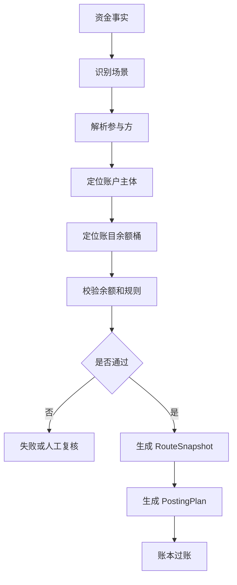
```mermaid
flowchart TD
    A["资金事实"] --> B["识别场景"]
    B --> C["解析参与方"]
    C --> D["定位账户主体"]
    D --> E["定位账目余额桶"]
    E --> F["校验余额和规则"]
    F --> G{"是否通过"}
    G -- "否" --> H["失败或人工复核"]
    G -- "是" --> I["生成 RouteSnapshot"]
    I --> J["生成 PostingPlan"]
    J --> K["账本过账"]
```

### 5.3 典型路由规则

| 场景 | 路由口径 | 关键边界 |
| --- | --- | --- |
| 用户充值成功 | 平台现金或预收待付角色到用户 AVAILABLE。 | 外部银行账户只做引用。 |
| 用户提现申请 | 用户 AVAILABLE -> FROZEN。 | 申请阶段不等于外部到账。 |
| 用户提现成功 | 消耗已冻结或已锁定金额，并关联外部回单。 | 成功和失败不能双终态。 |
| 系统内转账 | 付款方 AVAILABLE -> 收款方 AVAILABLE。 | 同主体、币种不一致、缺账户必须失败。 |
| 商户订单收款 | 用户 AVAILABLE -> 商户 CLEARING，费用拆入平台 FEE。 | 订单款不得直入 AVAILABLE 或 SETTLEMENT。 |
| 清算确认 | 商户 CLEARING -> AVAILABLE。 | 有重大差错、冻结或风险阻断时不得清算。 |
| 结算锁定 | 商户 AVAILABLE -> SETTLEMENT。 | 未锁定不得出款；出款失败必须回退。 |
| 原交易退款 | 基于原 route snapshot 回补。 | 缺快照不得重新选路；累计退款不得超额。 |
| 争议拒付 | 从责任方、准备金、负余额或追偿路径扣回。 | 授权拒绝不是争议拒付。 |
| 手续费退回 | 只回放原费用 leg。 | 不自动随普通退款退费。 |
| 同主体余额调整 | 对账差错、运营修正或财务调整需要修正同主体资金账户目标账目。 | 走 BALANCE_CONTROL / BALANCE_ADJUST，必须有来源、审批、凭证和审计，不得跨主体。 |
| 跨主体调账补记 | 责任方、挂账或平台调整账目发生跨主体价值路径变化。 | 批次授权后走 DIRECT_TRANSACTION / ADJUSTMENT，必须有差错单、审批、凭证和重新对账。 |

### 5.4 路由实际用例场景

路由层最容易被误解成“配置一条技术规则”。产品上更准确的理解是：每来一笔资金事实，路由要把它翻译成可入账、可追溯、可回放的资金路径。它不判断业务订单是否成立，也不替代外部通道状态；它只回答“这笔事实影响哪些核心资金账务主体、哪些账目、哪个周期，以及后续逆向动作如何回到原路径”。

| 用例场景 | 使用者能理解的话 | 路由要回答的问题 | 路由输出 | 关键边界 |
| --- | --- | --- | --- | --- |
| 用户充值成功 | 外部已经确认到账，用户余额应该增加。 | 外部资金映射到哪个平台账户角色，用户使用哪个资金账户和 AVAILABLE 账目。 | 平台现金或预收待付引用到用户 AVAILABLE 的 route snapshot。 | 银行账户、VA、通道账户只做外部引用；用户账户缺失时不得自动增加余额。 |
| 用户提现申请 | 用户申请提现，先把可用金额锁住。 | 用户哪个资金账户从 AVAILABLE 转入 FROZEN 或提现锁定口径。 | 同主体 AVAILABLE -> FROZEN 的冻结或锁定路径。 | 提现申请不等于外部到账；不能展示为出款成功。 |
| 用户提现成功 | 外部确认出款成功，内部锁定金额应被消耗。 | 哪个冻结或锁定来源被外部回单消耗，外部 reference 如何关联。 | 消耗原锁定金额并保留出款回单引用。 | 成功通知必须幂等；成功和失败不能双终态。 |
| 用户提现失败 | 外部明确失败，锁定金额应回到可用。 | 原提现锁定是否存在、剩余可释放金额是多少。 | 同主体 FROZEN -> AVAILABLE。 | 只释放一次；不能因为失败回调重复而多加余额。 |
| 系统内转账 | 一个内部账户给另一个内部账户转钱。 | 付款方和收款方是不是明确的核心资金账务主体，币种和周期是否一致。 | 付款方 AVAILABLE -> 收款方 AVAILABLE。 | 同主体、错币种、账户缺失、周期缺失或余额不足必须失败。 |
| 普通支付 | 付款方支付给普通收款方。 | 这是普通收款还是商户订单收款，收款方目标桶是什么。 | 付款方 AVAILABLE -> 收款方指定目标账目。 | 不默认套用商户 CLEARING；只有商户订单收款才进入待清算。 |
| 商户订单收款 | 用户支付订单，商户先看到待清算款。 | 用户扣多少，本金给哪个商户 CLEARING，手续费给哪个平台 FEE。 | 用户 AVAILABLE -> 商户 CLEARING，可拆平台 FEE。 | 商户订单款不得直入 AVAILABLE 或 SETTLEMENT；本金、手续费、补贴、成本要拆开。 |
| 原交易退款 | 用户退款时，要按原交易路径回补。 | 原交易 route snapshot 是否存在，剩余可退金额是多少，商户款当前处在哪个阶段。 | 基于原 route snapshot 的逆向路径。 | 缺原快照不得按当前绑定重新选路；累计退款不得超额。 |
| 手续费退回 | 只退回原来收过的手续费。 | 原费用 leg 是否存在，退费责任方是谁，退多少。 | 平台 FEE -> 原责任方或指定退费目标。 | 普通退款不自动退手续费；退费不能超过原收费。 |
| 授权占用 | 先占用用户资金或信用额度，并固化预算组和 Spend Rule 的控制证据。 | 哪个资金或信用主体、哪个账本周期、哪个 AVAILABLE 被占用，以及命中哪个规则版本。 | 同主体 AVAILABLE -> AUTHORIZATION，附预算控制快照。 | 授权成功不是最终消费；授权拒绝不生成 route；预算组和 Spend Rule 不作为占用主体。 |
| 授权完成 | 已占用金额变成真实消费或商户待清算。 | 使用哪笔授权快照，完成金额是否超过剩余占用。 | AUTHORIZATION -> 商户 CLEARING 或平台目标账目。 | 不新增 CONSUMED 账目，不触碰 LIMIT。 |
| 授权撤销或过期 | 外部撤销或系统到期释放剩余占用。 | 原授权剩余可释放金额是多少，释放到哪个周期的 AVAILABLE。 | 同主体 AUTHORIZATION -> AVAILABLE。 | 撤销和过期终态要区分；已结算金额不得被释放。 |
| 冻结和解冻 | 风控或运营限制同一主体可用余额。 | 冻结哪个主体、哪个账目、哪个周期的可用余额。 | 同主体 AVAILABLE <-> FROZEN。 | 冻结不是消费、扣划或授权；扣划必须另建资金事实。 |
| 清算确认 | 商户待清算款通过清算前置条件。 | 哪个清分批次或清算候选可从待清算进入可结算。 | 商户 CLEARING -> AVAILABLE。 | 清分候选或清算候选不能直接入账；重大对账差错阻断清算。 |
| 结算锁定和出款 | 商户可结算金额进入出款处理。 | 哪个结算单锁定哪个商户 AVAILABLE。 | 商户 AVAILABLE -> SETTLEMENT，出款成功后完成或失败回退。 | 结算单不等于出款成功；出款失败必须回退。 |
| 同主体资金账户余额调整 | 财务或运营基于差错单、运营修正或财务调整修正同主体目标账目。 | 调整对象、目标账目、来源、审批、凭证和周期是否明确。 | BALANCE_CONTROL / BALANCE_ADJUST，同主体目标账目受控调整。 | 不得跨主体，不得绕过差错闭环、审批、凭证或重新对账。 |
| 跨主体差错调账 | 差错责任或价值路径需要跨主体补偿、挂账或平台调整。 | 责任方、目标方、调整账目、审批和凭证是否明确。 | 批次授权 DIRECT_TRANSACTION / ADJUSTMENT，或清结算差错闭环触发的明确资金事实。 | 不得直接修改历史分录或余额投影。 |

### 5.5 商户订单收款路由用例

商户订单收款是最容易误解的路由场景。用户看到的是“付款成功”，商户看到的是“待清算”，平台还可能同时收手续费。路由层要把这三个视角拆清楚。

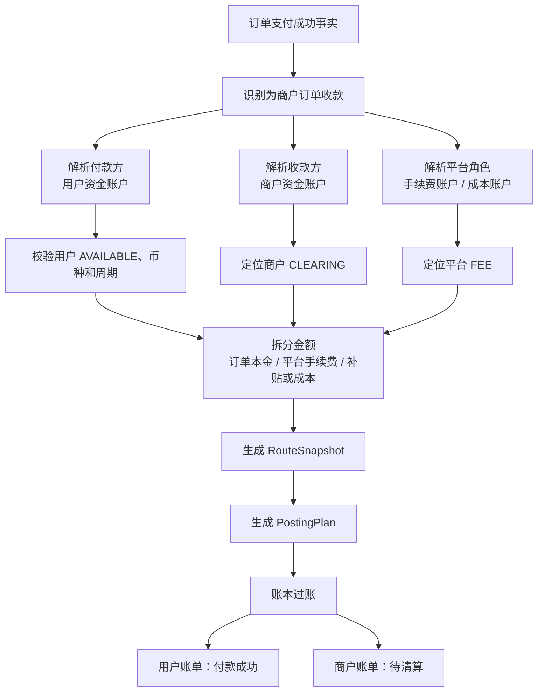
```mermaid
flowchart TD
    A["订单支付成功事实"] --> B["识别为商户订单收款"]
    B --> C["解析付款方\n用户资金账户"]
    B --> D["解析收款方\n商户资金账户"]
    B --> E["解析平台角色\n手续费账户 / 成本账户"]
    C --> F["校验用户 AVAILABLE、币种和周期"]
    D --> G["定位商户 CLEARING"]
    E --> H["定位平台 FEE"]
    F --> I["拆分金额\n订单本金 / 平台手续费 / 补贴或成本"]
    G --> I
    H --> I
    I --> J["生成 RouteSnapshot"]
    J --> K["生成 PostingPlan"]
    K --> L["账本过账"]
    L --> M["用户账单：付款成功"]
    L --> N["商户账单：待清算"]
```

商户订单收款的产品断言：

1. 用户侧看到付款成功，不代表商户已可结算。
2. 商户订单款默认进入 CLEARING，清算确认后才进入 AVAILABLE。
3. 平台手续费、补贴、通道成本和商户本金必须拆分，不能只记录一个净额。
4. route snapshot 必须保存用户账户、商户账户、平台资金账户角色解析结果、账目、规则版本、费用拆分和业务引用。
5. 后续退款、清算、争议、手续费退回和对账差错优先引用本次 route snapshot。

### 5.6 原交易退款路由用例

退款不是“重新打一笔钱给用户”，而是基于原交易快照做逆向处理。原路径、剩余可退金额、费用规则和当前清结算阶段共同决定退款如何表达。

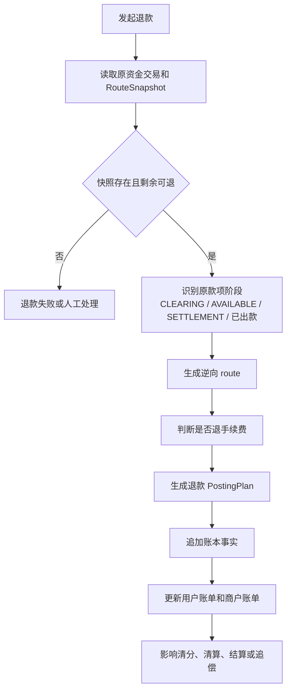
```mermaid
flowchart TD
    A["发起退款"] --> B["读取原资金交易和 RouteSnapshot"]
    B --> C{"快照存在且剩余可退"}
    C -- "否" --> D["退款失败或人工处理"]
    C -- "是" --> E["识别原款项阶段\nCLEARING / AVAILABLE / SETTLEMENT / 已出款"]
    E --> F["生成逆向 route"]
    F --> G["判断是否退手续费"]
    G --> H["生成退款 PostingPlan"]
    H --> I["追加账本事实"]
    I --> J["更新用户账单和商户账单"]
    J --> K["影响清分、清算、结算或追偿"]
```

退款路由的产品断言：

1. 有原 route snapshot 时必须回放原路径，不能按当前账户绑定、当前费率或当前商户配置重新选路。
2. 原交易仍在 CLEARING 时，退款通常冲减待清算口径。
3. 原交易已清算进入 AVAILABLE 后，退款需要从商户可用、后续清算抵扣、准备金或追偿路径解释。
4. 原交易已结算或出款后发生退款，不能让出款单倒退成未出款；应进入退款、追偿、后续结算抵扣或差错处理。
5. 手续费是否退回由费用规则决定，且只回放原费用 leg；普通退款不自动退手续费。

### 5.7 授权交易路由用例

授权交易不是“马上扣款”，而是在真实消费、清算或完成之前，先把资金或信用额度占用起来，并固化预算组和 Spend Rule 的规则命中、预算预留或释放证据。路由层要把授权前控制、授权占用、部分完成、释放和退款串成同一条可追溯路径。

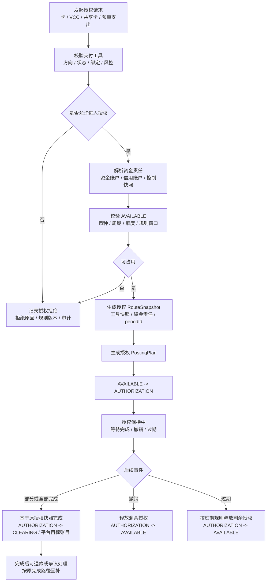
```mermaid
flowchart TD
    A["发起授权请求\n卡 / VCC / 共享卡 / 预算支出"] --> B["校验支付工具\n方向 / 状态 / 绑定 / 风控"]
    B --> C{"是否允许进入授权"}
    C -- "否" --> D["记录授权拒绝\n拒绝原因 / 规则版本 / 审计"]
    C -- "是" --> E["解析资金责任\n资金账户 / 信用账户 / 控制快照"]
    E --> F["校验 AVAILABLE\n币种 / 周期 / 额度 / 规则窗口"]
    F --> G{"可占用"}
    G -- "否" --> D
    G -- "是" --> H["生成授权 RouteSnapshot\n工具快照 / 资金责任 / periodId"]
    H --> I["生成授权 PostingPlan"]
    I --> J["AVAILABLE -> AUTHORIZATION"]
    J --> K["授权保持中\n等待完成 / 撤销 / 过期"]
    K --> L{"后续事件"}
    L -- "部分或全部完成" --> M["基于原授权快照完成\nAUTHORIZATION -> CLEARING / 平台目标账目"]
    L -- "撤销" --> N["释放剩余授权\nAUTHORIZATION -> AVAILABLE"]
    L -- "过期" --> O["按过期规则释放剩余授权\nAUTHORIZATION -> AVAILABLE"]
    M --> P["完成后可退款或争议处理\n按原完成路径回补"]
```

授权交易典型场景：

| 场景 | 使用者能理解的话 | 路由和账务输出 | 关键边界 |
| --- | --- | --- | --- |
| 授权拒绝 | 卡、账户、额度、预算、风控或支出规则不允许本次授权。 | 不生成 route snapshot、posting plan 或 LedgerEntry，只回传拒绝原因、规则引用和审计摘要。 | 授权拒绝不是争议拒付，不写 declinedAmount，也不能作为 chargeback 事件或用冲正分录补救。 |
| 共享卡预算授权 | 员工或共享卡使用部门、项目或卡组先命中预算型 Spend Rule。 | 固化预算组、Spend Rule、规则版本、预算预留或释放证据和资金/信用账户授权快照；真实占用仍落到资金账户或信用账户。 | 预算不是现金池；预算规则通过不代表商户已收款，也不直接写商户 CLEARING 或 LedgerEntry。 |
| 授权部分完成 | 商户只完成部分授权金额，剩余金额仍待处理。 | 部分金额从 AUTHORIZATION -> 商户 CLEARING 或平台目标账目，剩余仍在 AUTHORIZATION。 | 不因部分完成自动释放全部剩余；释放必须由撤销、过期或明确规则触发。 |
| 无授权强制完成 | 外部没有前置授权，但已确认消费发生。 | 基于受控策略生成完成路径，可进入商户 CLEARING、平台目标账目或差错处理路径。 | 不补造授权占用；缺策略、限额、原因、凭证或审计时不得入账。 |
| 授权链退款 | 已结算授权后发生退款或争议类退款。 | 基于原完成路径回补，必要时区分普通退款、争议类退款和手续费退回。 | 不按当前绑定重新选路；累计退款不得超过已完成金额；争议语义不能被普通退款吞掉。 |

授权交易的产品断言：

1. 授权拒绝发生在 route 和账本分录之前，只保留拒绝原因、命中规则、规则版本和审计摘要。
2. 共享卡、企业卡或预算支出必须固化卡、预算组、Spend Rule、信用账户、资金账户、账本周期和规则窗口快照；后续完成、撤销、过期和退款不按当前绑定或当前规则重新解释。
3. 授权占用只表达同主体 AVAILABLE -> AUTHORIZATION，不代表商户已收款、用户已最终消费或平台已清算。
4. 授权可以部分完成；未完成剩余占用必须继续保留，直到撤销、过期或明确释放事件发生。
5. 无授权强制完成必须走受控策略，有责任主体、上限、原因、凭证和审计；不得为了完成补造一笔授权占用。
6. 授权完成后的退款或争议类退款必须引用原完成事实和 route snapshot，不能被普通退款口径吞掉争议语义。

### 5.8 余额控制路由用例

余额控制解决的是“同一资金账务主体内部，某个余额桶是否可用、可释放或可调整”的问题。它不表达跨主体价值转移，不替代授权、消费、清算、结算或对账差错闭环；路由层只负责把冻结、解冻、资金账户余额调整和信用账户额度调整落到明确主体、账目和周期。预算组和 Spend Rule 的调整属于支出控制配置和预算视图治理，不作为资金账务主体入账。

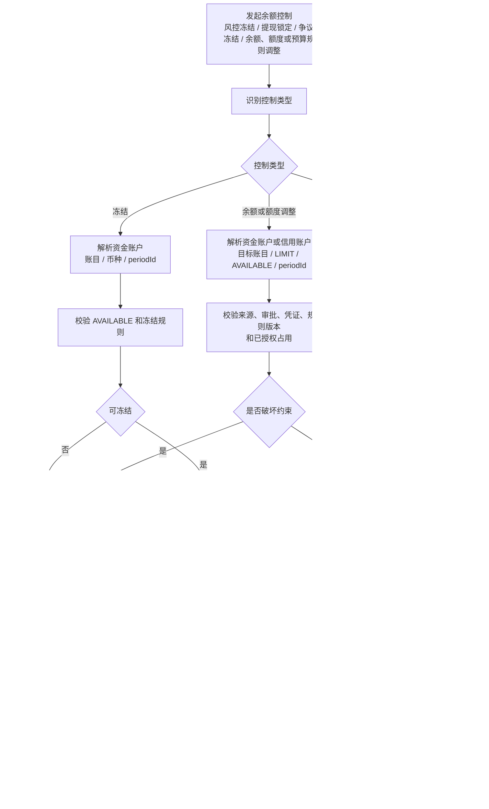
```mermaid
flowchart TD
    A["发起余额控制\n风控冻结 / 提现锁定 / 争议冻结 / 余额、额度或预算规则调整"] --> B["识别控制类型"]
    B --> C{"控制类型"}
    C -- "冻结" --> D["解析资金账户\n账目 / 币种 / periodId"]
    D --> E["校验 AVAILABLE 和冻结规则"]
    E --> F{"可冻结"}
    F -- "否" --> G["控制失败或人工复核\n不生成分录"]
    F -- "是" --> H["生成冻结单和 RouteSnapshot"]
    H --> I["AVAILABLE -> FROZEN"]
    I --> J["冻结保持中\n等待解冻 / 到期 / 扣划事实"]
    J --> K{"后续事件"}
    K -- "部分或全部解冻" --> L["FROZEN -> AVAILABLE\n更新冻结剩余金额"]
    K -- "到期释放" --> M["按规则释放剩余冻结\nFROZEN -> AVAILABLE"]
    K -- "扣划或消费成立" --> N["另建资金事实\n不把冻结本身当消费"]
    C -- "余额或额度调整" --> O["解析资金账户或信用账户\n目标账目 / LIMIT / AVAILABLE / periodId"]
    O --> P["校验来源、审批、凭证、规则版本\n和已授权占用"]
    P --> Q{"是否破坏约束"}
    Q -- "是" --> G
    Q -- "否" --> R["调整目标账目余额或 LIMIT / AVAILABLE\n保留凭证和审计"]
    C -- "预算规则调整" --> S["解析预算组和 Spend Rule\nscope / window / limit / version"]
    S --> T["更新预算控制视图\n不生成 LedgerEntry"]
```

余额控制典型场景：

| 场景 | 使用者能理解的话 | 路由和账务输出 | 关键边界 |
| --- | --- | --- | --- |
| 部分冻结 | 风控、争议、提现或运营只锁定可用余额的一部分。 | 同主体、同周期 AVAILABLE -> FROZEN，生成可追踪冻结单。 | 不能跨主体、跨币种或跨周期冻结；冻结失败不得生成半截分录。 |
| 部分解冻 | 风控释放、提现失败或运营复核后只释放部分冻结金额。 | 同主体、同周期 FROZEN -> AVAILABLE，更新冻结剩余金额。 | 不能释放不存在的冻结；不能把已扣划、已出款或已关闭部分再次释放。 |
| 冻结到期释放 | 临时冻结到期后系统自动释放剩余冻结。 | 同主体、同周期 FROZEN -> AVAILABLE，保留系统任务和规则版本。 | 到期释放只处理剩余冻结；有风险续冻、人工复核或司法冻结时不得自动释放。 |
| 资金账户余额调整 | 对账差错、运营修正或财务调整需要修正同主体目标账目余额。 | 目标资金账户余额按受控来源调整，并保留审批、凭证和审计。 | 不表达跨主体价值转移；不得无来源直接改余额；差错类调整必须可重新对账。 |
| 信用账户额度调整 | 风控、授信审批或运营调高、调低、恢复信用额度。 | 信用账户 LIMIT 与可用额度按规则调整，并保留审批和规则版本。 | 普通授权完成不得触碰 LIMIT；额度下调不能破坏已授权占用。 |
| 预算规则调整 | 部门、项目、卡组或共享卡预算调增、调减、重置或关闭。 | 预算型 Spend Rule、预算可用视图、累计窗口或周期状态按规则变化，保留审批和审计。 | 预算不是资金账户；预算调整不能生成 LedgerEntry，不能跨周期挪用，也不能冲掉已发生消费。 |

余额控制的产品断言：

1. 冻结和解冻只在同主体、同币种、同账本周期内做 AVAILABLE <-> FROZEN，不能跨主体、跨币种或跨周期移动价值。
2. 部分冻结、部分解冻和到期释放都必须引用原冻结单，更新剩余冻结金额，并保证幂等。
3. 冻结不是消费、扣划或授权；如果后续真的发生扣划、赔付、提现成功或争议处理，必须另建资金事实。
4. 资金账户余额调整必须有差错、运营修正或财务调整来源，以及审批、凭证和审计；差错类调整必须保留重新对账依据。
5. 信用账户额度调整可以影响 LIMIT 和 AVAILABLE，但普通授权完成不得触碰 LIMIT。
6. 预算规则调整只能治理预算规则窗口内的控制额度、窗口和展示视图，不能把预算组当资金池、账本主体或清结算主体，也不能跨规则窗口挪用或冲掉已发生消费。
7. 额度或预算规则下调必须先检查已授权占用、已使用金额和受控负余额策略，不能把历史事实或历史规则快照改没。

### 5.9 路由失败和人工处理用例

路由失败不是“换个路径试试”，而是资金事实当前无法被安全翻译成可入账路径。失败要可解释、可审计、可人工处理。

| 失败场景 | 失败原因 | 产品结果 | 禁止做法 |
| --- | --- | --- | --- |
| 账户不存在 | 业务主体没有可记账资金账户、信用账户，或平台角色无法解析到平台资金账户；预算规则场景缺预算组或 Spend Rule。 | 交易失败、挂起或进入补建账/补规则流程。 | 自动创建账本并入账，或用预算组代替资金账务主体。 |
| 平台账户角色缺失 | 平台手续费、预收待付、现金映射等角色没有唯一账户。 | 路由失败并提示缺配置。 | 把“平台”抽象主体直接入账。 |
| 外部账户被当作内部账户 | 银行账户、VA、卡或通道账户被传成入账主体。 | 路由拒绝，保留外部引用。 | 创建外部账户余额或 LedgerEntry 主体。 |
| 币种不一致 | 付款方、收款方、费用或账户币种不匹配。 | 路由失败或进入待确认换汇/差错流程。 | 静默换汇或按单方币种入账。 |
| 余额不足 | AVAILABLE、额度不足，或 Spend Rule 判定预算不足。 | 失败或进入审批策略。 | 继续生成账本分录。 |
| 非生命周期周期缺失 | 信用、自定义账本周期或预算规则窗口缺 periodId / windowId。 | 路由失败或规则拒绝。 | 用当前月份、清算账期或报表周期静默补齐。 |
| 路由规则不唯一 | 多个账户、账目或平台角色同时命中。 | 路由失败或进入人工复核。 | 随机选一个账户入账。 |
| 原快照缺失 | 退款、撤销、拒付或退费找不到原 route snapshot。 | 逆向交易失败或人工处理。 | 按当前账户关系重新选路。 |

## 6. 钱包账户产品设计

### 6.1 钱包不是账本

钱包负责让使用者理解和操作账户能力，账本负责证明余额变化。钱包可以展示余额、冻结、授权、待清算、出款中、额度、预算和支出规则，但资金和额度数字必须能映射到分录和余额投影；预算数字必须能映射到 Spend Rule、预算组 scope、累计窗口、规则版本和审计证据。

### 6.2 钱包账户域定性

钱包账户域是产品层和服务层的上位能力域，不是单一账户表。它统一管理资金账户、信用账户、预算组、Spend Rule、平台资金账户角色解析、支付工具绑定、资金责任解析关系和余额查询，让使用者能理解“我有哪些钱、额度、预算、规则和绑定工具”，也让路由能解析“这次资金动作最终落到哪个核心资金账务主体、哪些支出控制规则和哪组审计快照”。

`FundingAccount` 在本设计中只表示真实资金账户，不能作为所有钱包账户的统一父类。信用账户表达额度控制，预算组表达预算归属范围，Spend Rule 表达授权前支出控制规则，支付工具表达路由输入和审计快照；这些对象都不能被压扁成 `FundingAccount`。需要统一抽象时，应使用钱包账户域和明确的资金账务主体/支出控制对象分类，而不是扩大 `FundingAccount` 的语义。

从 DDD 角度看，钱包账户域对外暴露的主入口应是应用用例服务，而不是让调用方直接拼装多个资源服务。资金账户、信用账户、预算组、支付工具、绑定关系和资金责任解析关系可以保留为管理型或领域能力，但跨模块调用应优先依赖应用层语义，例如：

| 应用服务能力 | 对外回答的问题 | 内部协作对象 | 不应承担 |
| --- | --- | --- | --- |
| 钱包账户应用服务 | 某个使用者有哪些资金账户、信用账户、预算 scope 和可见余额能力。 | FundingAccount、CreditAccount、BudgetGroup、FundsSubjectBalanceQuery。 | 不生成交易事实，不直接改账本分录。 |
| 支付工具能力应用服务 | 某个卡、VA、外部钱包端点或通道 token 当前是否可用于指定动作。 | PaymentInstrument、Binding、BindingHistory、动作能力、有效期和敏感字段校验。 | 不表达内部余额，不替代账户能力。 |
| 资金责任解析应用服务 | 本次支付工具、使用主体、预算组和 Spend Rule 最终应落到哪个内部资金或额度责任主体。 | SpendSubjectFundingRelation、PlatformFundingAccountRole、FundingAllocationDecision、规则快照。 | 不执行扣款，不写 route、posting 或 ledger entry。 |
| 授权准入应用服务 | 一笔授权请求按支付工具入口能否批准或应拒绝。 | 支付工具能力应用服务、资金责任解析应用服务、账户能力、Spend Rule 控制和风控结果。 | 不把支付工具本身作为账本主体，不绕过授权交易内核。 |

工程命名上可采用 `PaymentInstrumentCapabilityApplicationService`、`FundingResponsibilityResolutionApplicationService` 和 `WalletAccountApplicationService` 等用例级接口；`authorizeByInstrument` 只表示授权场景的外层应用入口方法，直接交易若后续需要支付工具型业务入口，应由独立 Execution Grant 再确认命名、契约和测试资产，不改变直接交易、授权交易和余额控制内核以账户主体为 canonical 入参的约束。

支付工具入口设计：

1. 直接交易、授权交易和余额控制内核以资金账户、信用账户或平台账户角色解析后的资金主体为 canonical 入参。
2. 支付工具只进入准入快照、路由快照、审计证据和投影查询维度，不作为交易内核主体或账本主体。
3. 授权场景可通过 `authorizeByInstrument` 或等价外层 application/use-case facade 承接支付工具引用和业务上下文；该入口先解析支付工具、绑定、预算控制、资金责任和账户能力，再委派账户主体型授权内核。
4. 资金底座不建设统一的“支付工具交易服务”替代 P1 交易入口。VCC、VA、全球账户、ACH 和收单等场景先在 P2 业务能力包解释业务事实，再映射为 P1 已有资金动作。

| 场景 | 场景入口事实 | 底座承接方式 | 红线 |
| --- | --- | --- | --- |
| VCC 预付卡外部充值 | 业务 pack 接收到外部入金、充值确认或清算确认。 | 解析预付资金责任主体后生成直接交易充值或外部入金资金事实；VCC 卡、卡 token 和预付模式只作为工具、资金模式和快照证据。 | 不给卡创建余额账本；不把 prepaid virtual card 当资金账户或账本主体。 |
| VCC 预付卡通过系统内余额钱包充值 | 用户或企业余额钱包向预付责任主体补充资金。 | 资金账户之间的系统内转账；如涉及授权前控制，先记录绑定、Spend Rule 和资金责任快照。 | 不把该动作抽象成“工具充值”；不绕过余额钱包账户能力和幂等。 |
| VCC 共享卡调额 | 卡组、成员、预算或 Spend Rule 的控制参数变化。 | 多数落在绑定关系、资金责任关系或 Spend Rule 控制窗口调整；只有真实资金转移时才生成直接交易。 | 调额不默认生成 LedgerEntry；不把共享卡额度当信用账户额度。 |
| VA 收款 | 银行或 PSP 流水、入金通知、statement line。 | VA 只作为收款识别工具和外部账户引用；流水匹配和到账确认后入解析后的资金账户。 | 外部 accepted、submitted 或 processing 不等于到账成功；VA 不成为账本主体。 |
| 全球账户付款 | 用户发起出款，业务 pack 选择 SWIFT、local rail 或其他外部轨道。 | 出款指令进入直接交易提现/出款链路，并保留 external account、rail、费用、FX quote、在途和退汇引用。 | 外部受理不等于结算成功；无 FX quote 不静默换汇；不在资金底座实现轨道协议。 |
| ACH 或银行转账 | 上层业务或通道适配层解释后的 debit、credit、return、NOC、reversal 或收单清算事件。 | 资金底座只承接归一资金事实、外部引用、对账差错、追偿、调账核销和审计。 | 不新增 ACH 内核模块；不解释 Nacha/ODFI/RDFI 规则；不保存完整银行账户敏感信息。 |

| 统一视角 | 下位对象 | 资金语义 | 可否用 `FundingAccount` 表达 |
| --- | --- | --- | --- |
| 钱包账户域 | 资金账户 / FundingAccount | 承载真实资金、平台责任或商户待清算余额。 | 是，且只用于真实资金账户。 |
| 钱包账户域 | 信用账户 / CreditAccount | 承载授信额度、可用额度和授权占用。 | 否，额度不是现金。 |
| 钱包账户域 | 预算组 / BudgetGroup | 承载预算归属范围、支出控制 scope 和预算展示维度。 | 否，预算不是资金池，也不是账本主体。 |
| 钱包账户域 | Spend Rule / Spend Controls | 承载预算额度、MCC、商户、国家、金额、次数和窗口等授权前规则。 | 否，规则不表达资金余额。 |
| 钱包账户域 | 平台账户角色 | 平台现金、待付、费用或清算责任的角色。 | 角色必须解析到具体资金账户后才能入账。 |
| 钱包账户域 | 支付工具 / PaymentInstrument | 卡、VA、外部钱包端点、通道 token 或外部账户引用；内部余额钱包、返利钱包和商户钱包只是业务入口或内部主体解析来源。 | 否，只做路由输入、绑定和快照。 |

### 6.3 账户类型

| 账户类型 | 是否真实有钱 | 典型用户 | 余额桶 | 关键边界 |
| --- | --- | --- | --- | --- |
| 普通资金账户 / FundingAccount | 是 | 用户、普通资金主体 | AVAILABLE、FROZEN、AUTHORIZATION | 承载真实资金；可用不足时主动支付、冻结、授权默认失败。 |
| 商户资金账户 / FundingAccount | 是 | 商户、服务提供方 | CLEARING、AVAILABLE、SETTLEMENT、IN_TRANSIT、FROZEN、ADJUSTMENT | 收款先待清算，再可结算，再出款中或外部在途。 |
| 平台资金账户 / FundingAccount | 取决于角色 | 平台内部 | CASH、PREPAYMENT、CLEARING、SETTLEMENT、IN_TRANSIT、FEE、ADJUSTMENT | 平台角色必须解析到具体账户；不得混同平台收入和待付责任。 |
| 信用账户 | 否 | 企业、额度主体 | LIMIT、AVAILABLE、AUTHORIZATION | 额度不是现金；授权完成只关闭占用。 |
| 预算组 | 否 | 部门、项目、卡组 | 预算 scope、规则版本、控制视图 | 预算不是资金池，也不是核心资金账务主体；预算消费进报表和审计。 |
| Spend Rule | 否 | 企业管理员、发卡产品、风控 | 规则条件、预算额度、累计窗口、拒绝原因 | 只做授权前控制；规则通过不等于资金或额度占用成功。 |
| 外部账户 | 平台外部 | 银行、通道、卡、VA | 无内部余额桶 | 只做引用、映射、触发和对账。 |

### 6.4 资金账务主体和支出控制对象定性

资金账务主体是账本能真正记账的对象。用户、商户、企业和部门是业务上的归属方；资金账户（含平台角色解析后的平台资金账户）和信用账户才是账务层可落分录、可形成余额投影、可参与账本周期隔离的主体。预算组和 Spend Rule 是支出控制对象，负责说明“这笔支出是否允许、归属哪组预算、按哪个规则版本解释”，不作为 LedgerEntry、清结算或现金账务主体。

| 主体类型 | 是否核心资金记账 | 产品定性 | 典型能力 | 禁止口径 |
| --- | --- | --- | --- | --- |
| 资金账户 / FundingAccount | 是 | 承载真实资金、商户待清算、平台现金或费用责任。 | 支付、转账、提现、退款、清算、结算、费用、调账。 | 把外部银行账户、通道账户、信用账户、预算组或支付工具当作 FundingAccount。 |
| 信用账户 | 是 | 承载授信额度、可用额度和授权占用。 | 额度调增/调减、授权占用、授权释放、额度治理。 | 把信用额度当作现金；普通交易结算直接写 LIMIT。 |
| 预算组 | 否 | 承载预算归属范围、预算视图和支出控制 scope。 | 预算规则配置、预算预留视图、预算释放视图、规则窗口控制和报表审计。 | 把预算组当作资金池、LedgerEntry 主体、清结算主体或现金流。 |
| Spend Rule / Spend Controls | 否 | 承载授权前支出控制规则。 | 预算额度、单笔限额、MCC、商户、国家、金额次数窗口、拒绝原因和规则版本。 | 把规则通过当作资金入账；规则拒绝后仍生成 route、posting 或 LedgerEntry。 |
| 平台账户角色 | 否，角色本身不可记账 | 平台在交易中的现金、待付、手续费、清算或结算责任解析规则。 | 平台费用归集、待付责任、现金映射、清算准备；解析后的平台资金账户可记账。 | 不解析到具体资金账户，直接把“平台”这个抽象主体入账。 |
| 用户、商户、企业、部门 | 否 | 业务归属方、合同方或展示对象。 | 通过其名下资金账户、信用账户或预算规则参与路由和展示。 | 直接把用户 ID、商户 ID、部门 ID 写入 LedgerEntry 作为账务主体。 |
| 卡、VA、外部银行账户、支付工具 | 否 | 支付工具、外部端点或对账引用。 | 保存为支付工具引用、外部账户引用、route snapshot、routing decision 或对账线索。 | 作为 ledger subject、余额投影主体或账本周期归属方。 |

资金账务主体和支出控制对象的产品红线：

1. 所有可入账路径必须落到明确的资金账户（含平台角色解析后的平台资金账户）或信用账户。
2. 核心资金账务主体必须有账户类型、归属方、币种、支持账目、账本 Profile、账本周期策略和状态。
3. route snapshot 和 posting plan 中保存的是核心资金账务主体，不是业务主体、预算组或支付工具的自然语言描述。
4. 余额投影查询按资金账务主体、账目、币种和账本周期查询，再向上汇总成用户、商户、企业或部门视图；预算可用查询按预算组、Spend Rule、规则窗口和审计快照查询。
5. 预算组、Spend Rule、外部账户、卡、VA、通道流水、业务订单和报表指标只能做控制、引用或投影来源，不能成为 LedgerEntry 主体。

### 6.4.1 资金账户、信用账户、预算组和 Spend Rule 能力定性

VCC 卡、prepaid virtual card 和 shared card 都属于支付工具层后，资金账户、信用账户、预算组和 Spend Rule 的产品定位需要回到各自职责：资金账户回答“谁承担真实资金或平台责任”，信用账户回答“谁承担授信额度”，预算组回答“这组预算归谁管、覆盖哪些人/卡/项目”，Spend Rule 回答“这笔支出能不能继续”。使用者接入 wind-funds 时，应先创建或选择内部资金/额度责任主体，再把卡、VA、外部钱包端点、通道 token 或外部账户绑定到这些主体和支出控制规则上；内部钱包入口只作为主体或权益快照解析来源。

| 能力 | 产品定性 | 解决的问题 | 典型使用者 | 典型场景 | 不适合承接 |
| --- | --- | --- | --- | --- | --- |
| 资金账户 / FundingAccount | 真实资金、商户待清算、平台现金、预收待付、手续费或差错责任的内部账户。 | 记录谁的钱、谁的待付责任、谁的待结算余额，以及资金在 AVAILABLE、FROZEN、AUTHORIZATION、CLEARING、SETTLEMENT、IN_TRANSIT 等余额桶中的状态。 | 钱包业务、收付款业务、清结算、财务、运营、对账。 | 用户余额、商户待清算、商户可结算、平台现金映射、费用归集、预收待付、提现锁定、调账核销。 | 信用额度、预算控制、卡产品、共享卡、VA、外部银行账户、钱包标识。 |
| 信用账户 / CreditAccount | 授信额度和额度占用账户，不是真实资金账户。 | 记录授信总额、可用额度和授权占用，证明额度是否可继续使用。 | 企业信用产品、VCC/企业卡额度产品、风控、财务。 | 企业卡授信额度、charge card 额度、授权占用、撤销释放、额度调增/调减。 | 现金余额、商户待结算、出款、清算、平台现金或卡工具本身。 |
| 预算组 / BudgetGroup | 预算归属范围和支出控制对象，不是真实资金池。 | 记录部门、项目、卡组或成本中心的预算归属、规则 scope、状态、规则版本和预算视图，帮助解释能不能花。 | 企业管理、费用控制、VCC/员工卡产品、运营。 | 部门月度预算、项目预算、卡组预算、共享卡预算控制、预算授权前准入和报表。 | 真实资金沉淀、外部支付工具、信用额度本身、商户结算、出款或 LedgerEntry 主体。 |
| Spend Rule / Spend Controls | 授权前支出控制规则。 | 记录预算额度、可用预算视图、占用/释放证据、MCC、商户、国家、金额、次数、窗口、优先级和拒绝原因。 | 企业管理员、发卡产品、风控、运营。 | 预算型规则、velocity control、MCC 黑白名单、商户限制、单笔金额限制、协同授权。 | 真实资金来源、授信责任、账本分录、清结算对象或外部支付工具本身。 |

四者的关系是“资金/额度责任主体 + 支出控制 scope + 支出规则 + 资金责任解析关系”，不是继承关系。一个 VCC 授权可以只命中资金账户，也可以先命中预算组和 Spend Rule，再通过资金责任解析关系解析到信用账户、资金账户或平台责任账户；但卡本体始终只是支付工具快照，预算组和 Spend Rule 始终只是控制快照。

使用者接入判定表：

| 使用者问题 | 应使用的 wind-funds 能力 | 接入输入 | 预期输出 | 失败或待确认处理 |
| --- | --- | --- | --- | --- |
| 我要让用户或商户有可支付、可提现或可结算余额。 | 资金账户。 | owner、币种、账户能力、账本 profile、初始账目。 | 资金账户、账本 bucket、余额投影。 | 缺资金归属、账户能力或专业确认时不得入账。 |
| 我要给企业或主体一笔额度，让授权先占额度后结算。 | 信用账户。 | 授信主体、币种、额度周期、LIMIT、AVAILABLE、规则版本。 | 信用账户额度、授权占用、释放和调额记录。 | 额度不是现金；缺授信责任或规则版本时不得授权。 |
| 我要限制部门、项目、员工卡或共享卡一段时间内能花多少。 | 预算组 + 预算型 Spend Rule。 | 预算 owner、scope、规则窗口、币种、limit、规则版本、优先级和审计。 | 预算可用视图、预算预留证据、预算释放证据和规则版本快照。 | 预算不是资金池；缺规则窗口或预算规则时不得兜底扣款，也不得生成 LedgerEntry。 |
| 我要发一张 VCC、预付卡或共享卡。 | 支付工具 + 绑定 + Spend Rule + 资金责任解析关系。 | 卡工具引用、脱敏展示、使用人、绑定版本、预算组、Spend Rule、信用账户或资金账户责任关系。 | `PaymentInstrumentRef`、binding snapshot、rule snapshot、`FundingAllocationDecision`、route snapshot。 | 卡本体不得创建为资金账户、信用账户或预算组；预付/共享边界不清时 contract-only。 |
| 我要从卡交易回放退款、撤销、过期或拒付。 | 原 route snapshot + 原支付工具快照 + 原责任主体。 | 原交易引用、原工具快照、原资金责任决策、外部事件。 | 沿原路径生成逆向资金动作或异常处理。 | 缺原快照时不得按当前绑定重选路。 |

### 6.5 余额桶口径

| 余额桶 | 用户能理解的话 | 典型使用场景 |
| --- | --- | --- |
| AVAILABLE | 当前可使用、可支付、可提现或可结算的金额。 | 支付、转账、提现、商户结算。 |
| FROZEN | 暂时不能用的金额。 | 风控冻结、提现处理中、争议冻结。 |
| AUTHORIZATION | 已被预占但还没有最终消费的资金或额度。 | 卡授权、信用授权；预算场景仅保存控制证据。 |
| CLEARING | 商户已收到但还不能结算的订单款。 | 商户订单收款后的待清算。 |
| SETTLEMENT | 已进入结算或出款处理的锁定金额。 | 商户出款中、结算应付。 |
| IN_TRANSIT | 外部已受理但还没有最终成功或失败的在途金额。 | 全球付款、银行转账、代付处理中、外部回单未决。 |
| LIMIT | 额度或预算总量。 | 信用额度、预算总额。 |
| CASH | 平台现金或外部资金池的内部映射。 | 银行流水、现金池对账。 |
| PREPAYMENT | 平台对用户、商户或业务方的待付责任。 | 预收待付、平台中间归集。 |
| FEE | 平台手续费、服务费或成本归集。 | 手续费收取、退费、费用报表。 |
| ADJUSTMENT | 差错、挂账、调账的过渡口径。 | 对账差异、追偿、人工调账。 |

### 6.6 余额桶状态图

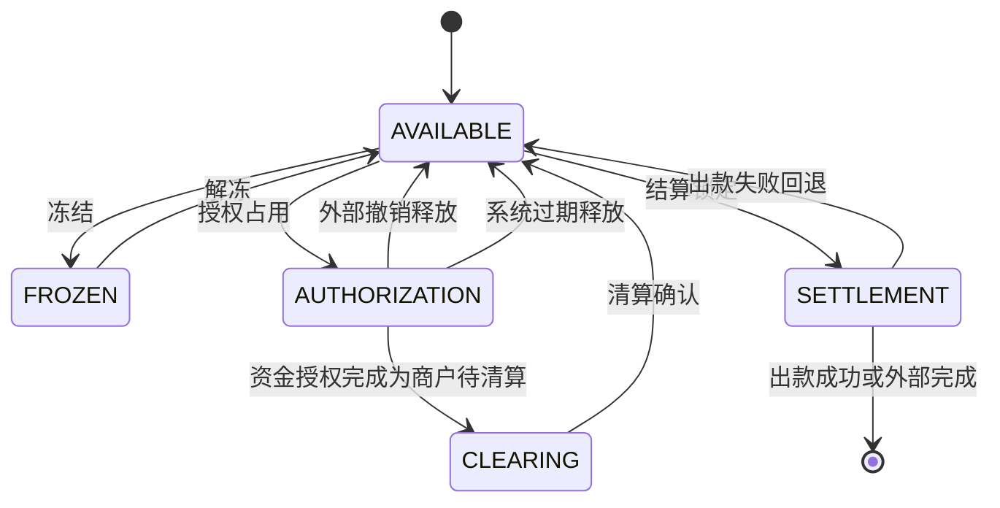
```mermaid
stateDiagram
    [*] --> AVAILABLE
    AVAILABLE --> FROZEN: 冻结
    FROZEN --> AVAILABLE: 解冻
    AVAILABLE --> AUTHORIZATION: 授权占用
    AUTHORIZATION --> AVAILABLE: 外部撤销释放
    AUTHORIZATION --> AVAILABLE: 系统过期释放
    AUTHORIZATION --> CLEARING: 资金授权完成为商户待清算
    CLEARING --> AVAILABLE: 清算确认
    AVAILABLE --> SETTLEMENT: 结算锁定
    SETTLEMENT --> AVAILABLE: 出款失败回退
    SETTLEMENT --> [*]: 出款成功或外部完成
```

不同账户类型可用的余额桶不同；上图只表达常见资金流转关系，不代表所有账户都支持所有状态。信用账户的授权完成只关闭占用或形成责任消耗，不应被理解为现金进入商户 CLEARING；预算组和 Spend Rule 只记录控制证据、规则窗口和责任解释，不形成资金余额桶。

### 6.7 受控负余额

AVAILABLE 可以在少数受控场景为负，例如后置手续费、清算差额、争议费、追偿或信用额度调减。负数不是“还可以继续花”的意思，而是一个需要治理的风险状态；预算规则调减只影响控制视图，不产生资金账户 AVAILABLE 负余额。

受控负余额必须满足：

1. 有来源：原交易、争议、费用规则、汇率快照、差错单、调额单或审批单。
2. 有策略：主体类型、币种、上限、账龄、审批和风控等级。
3. 有去向：追偿、后续入金抵扣、结算抵扣、额度治理、预算治理或人工处理。
4. 有展示：运营、财务和风控能看到原因、责任方、账龄和处理状态。
5. 有阻断：负余额主体继续支付、冻结、授权或出款时必须按策略判断。

### 6.8 支付工具产品设计

支付工具是“使用什么工具发起或接收支付”的入口，不是“钱在哪里”的答案。钱在哪里，要由支付工具绑定关系、资金责任解析关系、钱包账户和路由规则继续解析到资金账户（含平台角色解析后的平台资金账户）或信用账户；预算组和 Spend Rule 只说明本次支出是否允许以及使用哪个规则版本。

业务支付方式标识可以作为前台选择来源出现，但必须先分类：内部余额钱包、平台钱包、商户钱包等标识先解析为内部资金账户（含平台角色解析后的平台资金账户）或信用账户；返利钱包或权益入口先解析为权益快照或等价不可变快照；第三方钱包端点、通道 token 等外部可交互端点才进入 `PaymentInstrumentRef` 或 `ExternalAccountRef`。进入 route、posting 和 ledger entry 前必须已经得到核心资金账务主体；不得用钱包标识、支付工具号、预算组或 token 替代核心资金账务主体。

业务入口可以展示或传入内部余额钱包、信用额度、返利钱包、商户钱包、银行卡、VA、外部账户或通道 token 等选择信息，但这只是应用层请求参数和业务上下文，不在当前阶段沉淀为独立产品对象。内部余额钱包、信用额度账户、返利钱包和商户账户本身仍应按资金账户、信用账户、权益快照或商户资金账户建模；只有卡、VA、外部银行账户、通道 token、外部钱包端点等外部工具或外部可交互端点才进入 `PaymentInstrument`。进入资金内核前，应用层必须把业务入口解析为 `SubjectRef`、`PaymentInstrumentRef`、`BenefitSnapshot`、`FundingAllocationDecision` 或等价不可变快照。

从使用者视角看，支付工具解决四个问题：

1. 入口识别：用户、商户或企业使用哪张卡、哪个 VA、哪个外部账户、哪个外部钱包端点、哪类内部支付方式选择或哪个通道 token 发起动作。
2. 绑定关系：这个工具归属于谁、能代表谁付款或收款、是否关联信用账户、预算组、Spend Rule 或真实资金账户。
3. 方向、状态和动作能力：工具是否允许付款、收款或双向使用，是否具备 RECEIVE、PAY、AUTHORIZE、REFUND、WITHDRAW 对应动作能力，是否处于可用、暂停、解绑、过期、未验证或风控阻断状态。
4. 快照留痕：交易发生时工具的归属、状态、绑定、币种、规则版本和脱敏展示信息必须固化，后续退款、撤销、拒付、对账和审计不能依赖当前绑定重新解释历史。

#### 6.8.1 支付工具对象边界

| 对象 | 使用者能理解的话 | 必须保存 | 产品边界 |
| --- | --- | --- | --- |
| 支付工具 | 一张卡、一个 VA、一个外部银行账户、一个虚拟卡、一个外部钱包端点或一个通道 token。 | 工具 ID、工具类型、脱敏展示号、归属方、方向、状态、动作能力、币种、有效期、服务方或通道引用。 | 不保存完整 PAN、CVV、密钥、token secret；不表达内部余额。 |
| 支付工具绑定 | 工具和内部业务主体、资金账户、信用账户、预算组、Spend Rule 或收款主体之间的关系。 | 绑定角色、方向、优先级、默认标识、生效时间、失效时间、版本、操作人和审计。 | 绑定关系只提供路由候选和控制上下文，不直接入账。 |
| 支付工具引用快照 | 某次交易实际使用工具的冻结快照。 | 工具 ID、类型、展示号、归属方、租户、币种、状态、绑定快照和上下文。 | 后续逆向交易优先读取原快照；不按当前绑定关系重新解释。 |
| 外部账户引用 | 工具背后的外部端点，如银行账户、PSP 账户、通道账户或托管户。 | 外部账户 ID、类型、服务方、通道、币种、国家或地区、外部 reference。 | 只做外部核验、回单、对账和审计，不作为内部账本主体。 |
| 资金责任解析关系 | 某个支出主体在付款、授权、结算或兜底时最终由哪个内部资金或额度主体承担责任；兼容历史文档和服务名时也称“资金来源关系”。 | 关系类型、资金账户、信用账户、平台账户角色、优先级、失败兜底策略；可附带预算组、Spend Rule 和规则版本作为控制上下文。 | 不执行扣款；真正扣款由交易、路由和账本完成；预算组和 Spend Rule 只提供准入、解释和审计，不能被解释为资金来源或资金池。 |

支付工具绑定采用“当前有效关系 + 历史审计证据”的产品口径：当前有效关系用于新交易候选选择；历史审计证据用于解释过去交易、退款、撤销、退费、拒付、对账、客服查询和争议举证。绑定、默认标识、方向、优先级、资金责任解析关系或状态发生变化时，可以更新当前态，但必须追加保留前后值、操作者、原因、时间和版本；不得用覆盖更新抹掉历史证据。

业务入口和支付工具的判定表：

| 入口类型 | 是否应建成 PaymentInstrument | 资金内核承接 | 说明 |
| --- | --- | --- | --- |
| 内部余额钱包 | 否，除非它同时代表外部钱包端点或通道 token。 | `FundingAccount` 或平台角色解析后的平台资金账户。 | 前台可展示为“钱包余额支付”，但入账主体必须是资金账户。 |
| 信用额度账户 | 否。 | `CreditAccount`。 | 额度不是支付工具；授权占用和额度调整按信用账户处理。 |
| 返利钱包 / 权益余额 | 通常否。 | 现金等价或预收待付责任走资金账户或平台责任账户；优惠权益走 `BenefitSnapshot`。 | 需区分返利是否补足商户、是否可提现、是否属于预付责任；不能默认当工具或现金。 |
| 商户账户 / 商户钱包 | 否。 | 商户 `FundingAccount` 的 CLEARING、AVAILABLE、SETTLEMENT、IN_TRANSIT 等余额桶。 | 商户结算银行卡或外部收款端点才是工具或外部账户引用。 |
| 银行卡、VA、外部银行账户、卡 token、通道 token | 是。 | `PaymentInstrumentRef`、`ExternalAccountRef` 和后续资金责任决策。 | 只表达外部工具、外部端点和脱敏快照，不表达内部余额。 |
| 对外业务账户号或外部钱包端点 | 可以。 | `PaymentInstrumentRef` 链接内部资金账户或信用账户。 | 当它对外可被支付网络、通道或业务系统识别时，可作为工具；余额仍在内部账户。 |

#### 6.8.1.1 支付工具能力控制

支付工具能力控制回答“这个工具本身是否允许承接当前业务动作”。它位于工具状态、方向和有效期校验之后，绑定、资金责任解析和内部账户能力校验之前。它不是账户能力，不代表内部余额、额度、预算或账本可入账能力；即使工具具备动作能力，最终内部资金账户或信用账户仍必须独立通过账户能力、余额、额度、账本周期和路由规则校验。

| 工具能力 | 可承接业务动作 | 典型工具 | 明确不代表 |
| --- | --- | --- | --- |
| RECEIVE | 入金识别、收款、VA 到账匹配、外部回单匹配。 | VA、收款账户、钱包收款标识、通道收款 token。 | 不代表解析后的内部账户具备 RECEIVE，也不代表外部入金已入账。 |
| PAY | 主动付款、消费支付、钱包余额支付、外部工具扣款。 | 银行卡、钱包支付标识、卡 token、通道付款 token。 | 不代表内部账户有可用余额，也不代表预算或 Spend Rule 通过。 |
| AUTHORIZE | 卡授权、VCC 授权、共享卡授权、预授权。 | VCC、虚拟卡、共享卡、卡 token。 | 不代表授权会批准；仍需额度、余额、预算、规则和风控准入。 |
| REFUND | 原路退款、撤销、退费、拒付回补或争议相关逆向动作。 | 原支付工具快照、原外部账户引用、原通道 token。 | 不代表可按当前绑定重选路；必须优先读取原 route snapshot。 |
| WITHDRAW | 提现、出款、商户结算出款或外部银行账户收款端点。 | 外部银行账户、商户结算账户、出款 token。 | 不代表内部账户可提现，也不代表外部出款通道已放行。 |

业务系统使用方式：

| 业务动作 | 业务侧传入 | 工具准入必须满足 | 通过后进入 |
| --- | --- | --- | --- |
| 入金识别 / 收款 | 工具引用、外部回单、币种、金额和业务单号。 | 工具 ACTIVE、方向支持收款、具备 RECEIVE、币种一致、外部引用可追溯。 | 绑定解析、入金目标账户解析、route 和入账。 |
| 主动付款 | 工具引用、付款主体、收款主体、金额、币种和幂等键。 | 工具 ACTIVE、方向支持付款、具备 PAY、绑定版本有效、敏感字段脱敏。 | 资金责任解析、账户能力、余额和 posting。 |
| 授权 | 卡或 token 引用、使用主体、预算上下文、金额、币种和规则上下文。 | 工具 ACTIVE、方向支持付款或授权、具备 AUTHORIZE、绑定和规则版本有效。 | 授权准入、资金责任解析、Spend Rule、额度或余额占用。 |
| 原路退款 / 撤销 / 拒付回放 | 原交易引用、原工具快照、原 route snapshot 和逆向原因。 | 原快照可追溯；若需要当前工具参与，只能用于合规和外部通道准入，不得重选资金路径。 | 原路径回放、金额闭合和差错处理。 |
| 提现 / 出款 | 外部收款端点、内部出款主体、金额、币种和出款单。 | 工具 ACTIVE、方向和能力允许出款端点使用、具备 WITHDRAW、外部账户引用可追溯。 | 出款门禁、账户提现能力、锁定、提交和回单处理。 |

失败语义：

| 失败类型 | 产品处理 | 资金红线 |
| --- | --- | --- |
| 工具缺动作能力 | 直接交易、提现或退款返回可解释失败或进入人工处理；授权场景可记录拒绝事实。 | 不生成 route、posting plan 或 LedgerEntry。 |
| 工具方向和动作能力冲突 | 以方向和能力同时不满足处理，原因必须可审计。 | 不得只看方向或只看能力放行。 |
| 工具能力通过但账户能力不足 | 工具准入通过，后续账户能力或余额校验失败。 | 不得用支付工具能力绕过账户能力。 |
| 逆向动作缺原快照 | 进入异常或人工处理。 | 不得按当前绑定、当前能力或当前默认资金责任重新选路。 |

#### 6.8.2 支付工具类型和典型场景

| 工具类型 | 典型场景 | 路由关注点 | 禁止口径 |
| --- | --- | --- | --- |
| 银行卡 / 外部银行卡 | 用户充值、提现、付款或授权。 | 工具状态、方向、归属方、外部账户引用、通道 reference。 | 把银行卡当成内部资金账户记余额。 |
| 虚拟卡 / VCC / 卡 token | 企业卡、员工卡、共享卡、一次性卡授权。 | 卡与资金账户、信用账户、预算组、Spend Rule 和 spend controls 的关系。 | 授权通过后直接记成消费完成；保存完整卡号或 CVV。 |
| 预付虚拟卡 | prepaid virtual card 授权、清算、退款和拒付。 | 卡作为工具，预付资金责任另行解析到经确认的内部责任主体。 | 把预付卡直接当成余额账户，或把储值券、礼品卡、预付代金券误归到 VCC。 |
| 共享卡 | 员工、部门、项目、系统代理共享同一卡工具。 | 工具绑定、使用人、预算组、Spend Rule、资金责任解析关系和规则版本。 | 把共享卡、卡组、预算组或持卡人创建为资金账户或账本主体。 |
| VA / 虚拟账户 | 入金识别、对账匹配。 | VA 归属、外部到账 reference、匹配到的内部资金账户。 | VA 自身形成内部余额桶。 |
| 外部银行账户 | 提现、出款、商户结算、退款回补。 | 外部账户校验、回单、失败原因和对账引用。 | 外部账户直接出现在 LedgerEntry 主体中。 |
| 内部钱包标识 / 外部钱包端点 / 通道 token | 内部余额钱包、平台钱包、商户钱包、返利钱包、聚合支付、第三方钱包或通道账户。 | 内部标识到 `SubjectRef`、`BenefitSnapshot` 或资金责任决策的解析快照；外部端点或 token 到 `PaymentInstrumentRef` / `ExternalAccountRef` 的映射快照。 | 用标识、端点或 token 替代可记账主体。 |

#### 6.8.3 绑定角色、使用方向和资金责任

支付工具绑定要回答“这个工具代表谁、能做什么、最终由哪个内部资金或额度主体承担责任”。产品上至少区分三类信息：绑定角色、使用方向、资金责任解析关系。

| 维度 | 典型取值 | 产品解释 | 验收重点 |
| --- | --- | --- | --- |
| 绑定角色 | 真实资金主体、信用控制主体、预算控制 scope、付款主体、收款主体。 | 工具可以绑定到真实资金主体，也可以绑定到信用或预算控制维度。 | 授权和付款时必须解析到最终核心资金账务主体；不能停留在工具、预算组或业务主体。 |
| 使用方向 | 付款、收款、双向。 | 工具是否允许发起付款、接收入金、承接提现或双向使用。 | 付款工具不能被误用于收款；收款工具不能被误用于扣款。 |
| 资金责任解析关系 | 出资资金账户、信用额度账户、结算目标账户、兜底出资账户或平台角色解析结果。 | 工具触发交易后，路由可以按优先级选择真实资金账户、信用账户或平台角色解析后的平台资金账户；预算组和 Spend Rule 只提供控制条件、规则版本和审计解释。 | 多个责任主体同时命中时必须有优先级和选择原因；缺失或不唯一必须失败；预算组和 Spend Rule 命中不能替代最终责任主体。 |
| 账户能力 | 收款、付款、提现。 | 内部资金账户是否具备当前动作能力。 | 账户无对应能力时不得继续路由和入账。 |

#### 6.8.4 支付工具参与路由流程

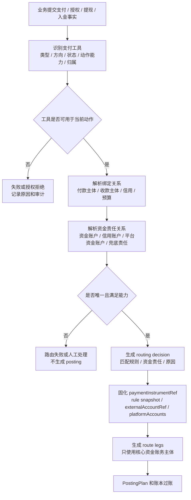
```mermaid
flowchart TD
    A["业务提交支付 / 授权 / 提现 / 入金事实"] --> B["识别支付工具\n类型 / 方向 / 状态 / 动作能力 / 归属"]
    B --> C{"工具是否可用于当前动作"}
    C -- "否" --> D["失败或授权拒绝\n记录原因和审计"]
    C -- "是" --> E["解析绑定关系\n付款主体 / 收款主体 / 信用 / 预算"]
    E --> F["解析资金责任关系\n资金账户 / 信用账户 / 平台资金账户 / 兜底责任"]
    F --> G{"是否唯一且满足能力"}
    G -- "否" --> H["路由失败或人工处理\n不生成 posting"]
    G -- "是" --> I["生成 routing decision\n匹配规则 / 资金责任 / 原因"]
    I --> J["固化 paymentInstrumentRef\nrule snapshot / externalAccountRef / platformAccounts"]
    J --> K["生成 route legs\n只使用核心资金账务主体"]
    K --> L["PostingPlan 和账本过账"]
```

产品断言：

1. 支付工具校验失败时，如果是授权请求，可记录授权拒绝；如果是直接交易、提现或退款，应返回可解释失败或进入人工处理。失败不得生成 route、posting plan 或 LedgerEntry。
2. 付款、授权、提现、收款等动作必须校验工具状态、方向和动作能力；动作能力缺失时不得只靠绑定关系或账户能力继续放行。
3. 支付工具只能帮助选择内部核心资金账务主体和支出控制规则；route leg 和 posting plan 最终必须落到资金账户（含平台角色解析后的平台资金账户）或信用账户。
4. 工具绑定关系发生变化后，历史交易的退款、撤销、退费、拒付和对账仍按原 route snapshot 和工具快照解释。
5. 多个资金或额度责任主体同时可用时，必须保存选择结果、优先级、匹配规则和原因；不得随机选择。
6. 支付工具、外部账户和通道 reference 必须进入快照和审计，便于外部回单、通道对账、客服查询和争议证据。
7. 支付工具绑定和资金责任解析关系变更必须同时能回答“当前新交易应该用什么”和“过去某笔交易当时为什么这样选路”；前者看当前有效关系，后者看 route snapshot 和历史审计证据。

#### 6.8.5 与承载层抽象的产品语义对齐

下表只用于保证 PRD、DSL、系分和编码实现使用同一组概念，不要求业务方理解内部类或接口名称。

| 产品概念 | 产品 DSL / core 承载抽象 | 产品语义 | 缺失会导致的问题 |
| --- | --- | --- | --- |
| 核心资金账务主体 | SubjectRef / FundsSubjectType | 只能是资金账户（含平台角色解析后的平台资金账户）或信用账户。 | 用户、商户、预算组、工具或外部账户被误写成分录主体。 |
| 支付工具引用 | PaymentInstrumentRef / PaymentInstrumentRefSpec | 工具的脱敏快照和绑定快照。 | 工具换绑后无法解释历史交易，或敏感信息进入日志。 |
| 外部账户引用 | ExternalAccountRef / ExternalAccountRefSpec | 银行、通道、PSP、VA 等外部端点引用。 | 外部回单、对账和退款追溯缺依据。 |
| 路由决策说明 | RoutingDecision / RoutingDecisionSpec | 记录命中规则、选择的平台账户、资金责任和决策原因。 | 多规则命中或兜底选择不可解释。 |
| Spend Rule 快照 | RoutingDecision / rule snapshot | 记录预算组 scope、规则版本、命中结果、拒绝原因和审计摘要。 | 共享卡、预算控制和发卡拒绝无法解释。 |
| 资金责任决策 | FundingAllocationDecision / FundingAllocationDecisionSpec | 说明某笔金额最终由哪个内部资金或额度主体承担并落到哪个账目。 | 多责任主体授权、共享卡、预算规则和兜底责任无法验收。 |
| 平台账户快照 | PlatformAccountsSnapshot / PlatformAccountsSnapshotSpec | 固化手续费、现金、预收待付、清算、结算、调整等平台角色账户。 | 平台角色后续变更导致退款、退费或对账路径漂移。 |
| 路由参与方和路径 | RouteParticipant、RouteNode、RouteLeg / RouteParticipantSpec、RouteNodeSpec、RouteLegSpec | 描述参与方、节点、金额、账目、周期和回放策略。 | 只有交易状态，没有可验证的资金路径。 |
| 路由快照 | RouteSnapshot / RouteSnapshotSpec | 固化本次交易的路径、工具、外部账户、平台角色和规则版本。 | 逆向交易重新选路，导致资金路径漂移。 |

#### 6.8.6 支付工具状态和安全红线

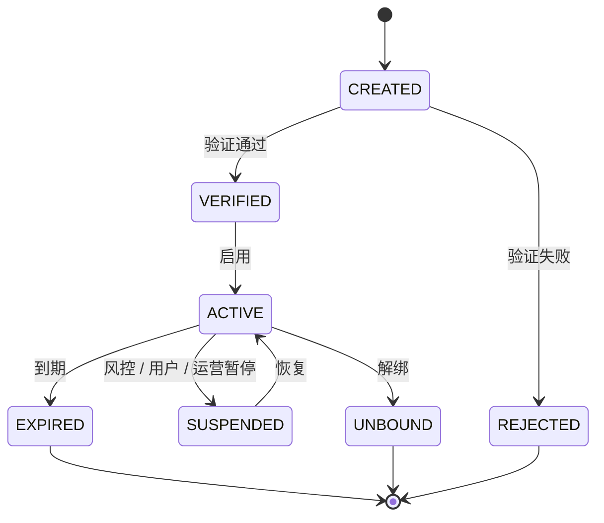
```mermaid
stateDiagram
    [*] --> CREATED
    CREATED --> VERIFIED: 验证通过
    CREATED --> REJECTED: 验证失败
    VERIFIED --> ACTIVE: 启用
    ACTIVE --> SUSPENDED: 风控 / 用户 / 运营暂停
    SUSPENDED --> ACTIVE: 恢复
    ACTIVE --> EXPIRED: 到期
    ACTIVE --> UNBOUND: 解绑
    EXPIRED --> [*]
    UNBOUND --> [*]
    REJECTED --> [*]
```

安全和产品红线：

1. 完整卡号、CVV、密钥、token secret、银行账户敏感号和身份凭证不得进入 PRD 定义的可展示字段、日志、导出和普通快照。
2. 支付工具展示号必须是脱敏号、别名、token reference 或外部系统安全引用。
3. 工具状态、绑定关系、方向、优先级和资金责任解析关系变更必须有操作者、时间、原因和审计。
4. 支付工具被暂停、解绑、过期、未验证或方向不匹配时，不得继续生成资金路径。
5. 工具可以参与风控、授权控制和对账，但不能绕过账户能力、余额、额度、预算、账本周期和 route 规则。

#### 6.8.7 支付工具能力控制落地计划

本计划只冻结产品和工程执行边界，不直接授权代码变更。进入编码前必须由 B2 或 B4 Execution Grant 明确写入范围、枚举和契约是否新增、是否允许 DDL/H2 调整、测试清单和验证命令。

| 阶段 | 目标 | 文档和规格落点 | 编码进入条件 | 验收证据 |
| --- | --- | --- | --- | --- |
| D0 设计冻结 | 明确支付工具能力与账户能力的边界，固定 RECEIVE、PAY、AUTHORIZE、REFUND、WITHDRAW 五类动作能力。 | PRD、DSL、系分、TDD、OpenSpec。 | 不进入编码。 | 文档一致性、AC/TDD/GAP 映射完整。 |
| D1 契约 Red | 先补工具能力缺失、方向冲突、账户能力不足、逆向缺快照的失败用例。 | TDD-WALLET-018、TDD-ROUTE-012、AC-PI-003、AC-PI-006。 | Execution Grant 允许测试代码和必要 contract fixture。 | Red 证明当前能力缺口或准入链路缺口。 |
| D2 最小 Green | 在 application facade 中完成工具状态、方向、动作能力、币种、有效期、绑定版本和敏感字段一次性准入。 | PaymentInstrumentCapabilityApplicationService 或等价 facade。 | Execution Grant 明确接口命名、Request/DTO、依赖方向和枚举承载层。 | 工具准入失败无 route/posting/entry；通过后输出不可变快照。 |
| D3 路由集成 | 将工具能力准入结果接入资金责任解析、账户能力和 route snapshot。 | RouteResolver、RouteSnapshot、FundingAllocationDecision。 | Execution Grant 允许交易或路由链路写入。 | route snapshot 可追溯工具能力、绑定版本和责任主体；LedgerEntry 主体仍只用内部可记账主体。 |
| D4 逆向回放 | 退款、撤销、退费、拒付按原快照处理，不因当前能力或绑定变化重新选路。 | RouteReplay、逆向交易用例。 | Execution Grant 允许补逆向链路测试。 | 原路径回放、金额闭合、敏感信息不外泄。 |

#### 6.8.8 支付工具与 Spend Rule 生产可用性裁决

本节只记录当前设计、代码观察和交付准入的产品裁决，不等同于上线批准。支付工具和 Spend Rule 的生产可用性必须同时满足应用层准入、规则决策、控制活动、只读投影、失败无副作用和测试证据闭合；只具备资源管理服务或 DSL 契约，不得声明交易场景已经生产可用。

| 能力面 | 设计完备度 | 当前可用性 | 生产可用阻断 | 下一步 |
| --- | --- | --- | --- | --- |
| 支付工具资源管理 | 已覆盖工具元数据、状态、方向、币种、有效期、绑定、绑定历史和敏感字段边界。 | 局部可用，可作为支付工具管理基线。 | 资源管理不等于交易准入；不能单独证明付款、授权、收款或提现可放行。 | B2 Round 0 继续保留资源服务，新增应用层准入裁决。 |
| 支付工具交易准入 | 已明确工具能力、账户能力、资金责任和 route snapshot 的分层。 | 设计可用，生产链路未闭合。 | 缺 `PaymentInstrumentCapabilityApplicationService`、授权准入 facade、route 集成和失败无副作用证据。 | B2 或 B4 单独 Execution Grant。 |
| Spend Rule 产品语义 | 已覆盖预算 scope、MCC、商户、时间、频控、规则版本、拒绝原因、预留释放和规则时间线。 | 设计可用，生产实现未闭合。 | 缺规则定义、版本、决策日志、Spend Control Activity、预算控制投影和并发预留释放。 | B2/B5 Round 0 先落规则控制事实和 Red。 |
| 资金责任解析 | 已明确工具、主体、预算、规则和平台角色最终要解析到可入账主体。 | 局部可用，当前关系仍偏资金账户目标。 | 仅 `fundingAccountId` 不能完整表达信用账户、平台账户角色或等价责任主体。 | B2 决定 `targetSubjectType + targetSubjectId` 或 funding-account-only。 |
| 交易投影与控制视图 | 已明确支付工具、预算组和 Spend Rule 都只是只读查询维度或控制视图来源。 | 设计可用，生产投影未闭合。 | 缺支付工具流水、预算控制视图、规则命中时间线和重放范围门禁的完整证据。 | B6/B8 独立授权。 |

已覆盖的实际场景：

1. VCC 普通授权、共享卡授权和预付卡模式：卡或 token 是支付工具；共享关系、预算组和 Spend Rule 是控制上下文；最终仍必须解析到资金账户、信用账户或平台角色解析后的平台资金账户。
2. VA 收款：VA 是收款识别工具和外部引用；外部到账必须匹配内部资金账户后才能入账；VA 本身不形成内部余额。
3. 内部钱包、外部钱包端点和通道 token：内部余额钱包先解析为资金账户或平台账户角色；第三方钱包端点和通道 token 才作为支付工具或外部账户引用。
4. 全球账户付款、ACH 或银行转账：这些是 P2 业务能力包或外部轨道输入，资金底座只承接归一资金事实、外部引用、对账差错、追偿、调账核销和审计，不实现轨道协议。
5. 预算和 Spend Rule：支持预算周期、MCC、商户、时间窗、频控、单笔限额、累计限额、预留、释放和拒绝解释的目标态设计；预算组和 Spend Rule 不拥有资金交易记录，只拥有控制记录和只读投影视图。

不得声明为已具备生产能力的内容：

1. 不声明已内建卡组织、ACH、SWIFT、本地清算网络、PSP 或银行通道规则。
2. 不声明已满足 PCI、KYC、KYB、AML、跨境、税务、会计或监管最终口径。
3. 不声明已具备完整 spend-control 规则引擎、预算并发预留释放和预算控制投影。
4. 不声明已具备 `payByInstrument`、`authorizeByInstrument`、`receiveByInstrument`、`withdrawByInstrument` 的完整生产链路。
5. 不声明预算组、Spend Rule、支付工具或外部账户可以成为资金来源、资金池、route leg 主体、posting 主体、LedgerEntry 主体或余额投影主体。

## 7. 账目与账本产品设计

### 7.1 账目不是账户

账户回答“这笔钱属于谁”，账目回答“这笔钱处在什么状态”。例如商户资金账户是账户主体，CLEARING 和 AVAILABLE 是该主体内部的余额状态。

### 7.2 账本不变量

| 不变量 | 产品要求 |
| --- | --- |
| 分录不可变 | 过账后的分录不能直接修改或删除。 |
| 计划必须平衡 | 每组账务计划必须同币种借贷平衡。 |
| 余额可重建 | 当前余额和历史余额能由分录、检查点和水位重建。 |
| 缺账本失败 | 未初始化账户和账本不得自动入账。 |
| 外部账户不入账 | 银行账户、通道账户、卡、VA 只做引用。 |
| 错账用新事实修正 | 冲正、补记、调账必须追加新账本交易。 |

### 7.3 账本周期口径

账本周期是账本 bucket 的周期维度，用来回答“这笔余额属于哪个可独立累计、查询、控制和重建的周期”。它不是清结算账期，也不是报表统计周期，更不是归档水位。

设计账本周期的目的，是让“长期余额”和“周期额度/控制余额”在同一套账本模型里表达，但彼此不会串账。普通钱包余额需要跨月、跨年长期累计；月度信用额度、日限额或合同账单周期可以按周期隔离、重置、关闭或治理；企业卡预算则通过 Spend Rule 规则窗口和预算控制视图隔离，不直接成为账本 bucket。如果没有账本周期，只能在业务层或报表层临时过滤，最终会导致一个问题：余额看似分周期，真实账本却没有隔离，授权、冻结、调账、结算和余额查询都会把不同周期的金额混在一起。

它解决的核心问题有四个：

1. 周期隔离：同一主体、币种、账目下，不同周期的余额不能互相消费、冻结、授权、释放或出款。
2. 周期控制：额度、限额和合同账单周期可以按周期独立累计、查询、关闭和重置；预算控制使用 Spend Rule 规则窗口独立治理。
3. 可解释查询：用户、企业管理员、运营和财务查询余额时，能明确看到“这是生命周期余额、2026-05 信用额度周期，还是某个合同周期余额”；查询预算时看到的是预算控制视图和规则窗口，不是账本余额 bucket。
4. 可验证落地：路由、账务计划、余额投影、对账和 TDD 都能用 periodType + periodId 证明没有跨周期串账。

它的作用不是替代清结算和报表，而是给账本事实增加一个稳定隔离键。清算账期可以决定哪些交易进入某个清算批次，报表周期可以决定指标如何展示，但真正的余额 bucket 是否隔离，必须由账本周期决定。

产品上可以把账本周期理解为同一主体、同一币种、同一账目下的进一步隔离层：

```text
主体 + 币种 + 账目 + 账本周期 = 一个可独立累计和查询的账本 bucket
```

| 周期类型 | 使用者能理解的话 | 典型场景 | 产品边界 |
| --- | --- | --- | --- |
| LIFETIME | 生命周期累计账本，不按自然周期切分。 | 普通资金账户余额、商户资金余额、平台现金或手续费账户。 | 默认周期，periodId 固定为 LIFETIME；不能因为请求未传 periodId 而错配其他周期。 |
| DAYS | 按天切分的账本 bucket。 | 日额度、日预算、日内风控控制。 | 必须明确时区和日切规则。 |
| HOURLY | 按小时切分的账本 bucket。 | 高频限额、实时风控窗口。 | 当前更适合作为扩展能力，不建议默认用于资金余额。 |
| WEEKLY | 按周切分的账本 bucket。 | 周预算、周授权额度。 | 必须明确周起始日和跨年周归属。 |
| MONTHLY | 按月切分的账本 bucket。 | 月预算、月度信用额度、企业卡月度控制。 | 预算组默认可使用月周期；不得和商户结算账期混用。 |
| QUARTERLY | 按季度切分的账本 bucket。 | 季度预算、季度额度治理。 | 必须明确季度归属和调整规则。 |
| YEARLY | 按年切分的账本 bucket。 | 年度预算、年度额度。 | 必须明确自然年或合同年。 |
| CUSTOM_CYCLE | 按合同或业务规则定义的自定义账本周期。 | 企业账单周期、合作方合同周期。 | 必须有 periodPolicy、起止规则、时区、日切、重开和关账规则；预算控制使用 Spend-rule window，不直接替代账本周期。 |

账本周期与其他“周期”概念的关系：

| 概念 | 解决的问题 | 是否能替代账本周期 |
| --- | --- | --- |
| 账本周期 | 控制同一主体、账目、币种下余额 bucket 的隔离和累计。 | 本概念本身。 |
| 清算账期 | 确定哪些交易明细进入某次清算候选和清算批次。 | 不能。清算账期可以引用账本事实，但不能决定账本 bucket。 |
| 结算周期 | 确定商户、合作方或企业何时生成结算单和出款。 | 不能。结算周期是运营策略，账本周期是余额隔离键。 |
| 报表周期 | 确定指标按日、周、月、季度或自定义口径展示。 | 不能。报表周期只读派生，不反向切账。 |
| 归档水位 | 确定冷热数据拼接和余额重建边界。 | 不能。水位不是自然日期，也不是账本周期。 |

账本周期的生效机制：

| 环节 | 如何生效 | 产品要求 |
| --- | --- | --- |
| 账户或账本初始化 | 资金账户（含平台角色解析后的平台资金账户）或信用账户创建时，根据账本 Profile、账户类型和业务规则确定默认 periodType，并创建对应账本 bucket；预算组只初始化预算 scope、规则窗口和控制视图。 | 普通资金账户默认 LIFETIME；信用账户或额度类产品可以按月、周、年或自定义周期建账；预算组不得初始化为 LedgerEntry 主体。 |
| 周期 ID 生成 | LIFETIME 固定为 LIFETIME；自然周期按明确时区和日切规则生成；自定义周期由 periodPolicy 或业务合同规则给出。 | 非 LIFETIME 周期必须有明确 periodId，不能由入账流程随手取当前时间静默生成。 |
| 路由和过账 | RouteLeg 或账务计划携带目标 periodType/periodId；账本装配时按主体、币种、账目、周期精确命中 ledger bucket。 | 找不到唯一账本 bucket 必须失败，不得自动落到其他周期。 |
| 余额查询和投影 | 查询当前余额、历史余额或信用可用时，必须带上账本周期；查询预算可用时必须带上预算组 scope、Spend Rule 版本和规则窗口。 | 不带周期汇总全部月份、全部合同周期或全部日限额的查询，只能作为明确的报表聚合，不得当作可用余额或预算可用口径。 |
| 周期变更和关闭 | 周期重置、结转、关闭、重开和跨周期调整由独立运营规则处理。 | 账本不自动猜测是否结转，不自动把上期剩余额度带入新周期。 |

产品规则：

1. periodType=LIFETIME 时，periodId 固定为 LIFETIME。
2. periodType 不为 LIFETIME 时，periodId 必须明确，不能由当前时间静默推断后写账。
3. 同主体、同币种、同账目、不同周期的余额必须隔离，不能互相消费、冻结、授权或出款。
4. 资金路由和账务计划必须携带或解析出目标账本周期；缺失周期导致无法唯一命中账本时必须失败。
5. 信用账户和额度类产品可以使用周期账本；预算组使用预算型 Spend Rule 的周期窗口和控制视图，不能作为 LedgerEntry 主体；普通资金余额默认使用 LIFETIME。
6. 周期切换、周期关闭、周期重开、跨周期结转或额度重置属于明确的运营规则，不由账本自动猜测。
7. 历史余额查询、余额投影和账务巡检必须带上周期维度，否则可能把不同周期 bucket 混在一起。

典型例子：

| 场景 | 正确口径 | 错误口径 |
| --- | --- | --- |
| 普通用户钱包余额 | 用户 USD AVAILABLE / LIFETIME / LIFETIME。 | 按自然月切用户现金余额，导致跨月余额不可用。 |
| 企业卡月度预算 | 预算组 scope + 预算型 Spend Rule 窗口 / USD / MONTHLY / 2026-05。 | 把 2026-04 剩余预算自动给 2026-05 使用，或把预算组建成 LedgerEntry 主体。 |
| 月度信用额度 | 信用账户 USD LIMIT / MONTHLY / 2026-05 和 AVAILABLE / MONTHLY / 2026-05。 | 把信用账户所有月份共用一个 AVAILABLE。 |
| 商户订单款 | 商户资金账户 CLEARING / LIFETIME / LIFETIME，清算候选再按清算账期归集。 | 用清算账期切商户 CLEARING 账本，导致退款和争议跨账期不可解释。 |
| 自定义合同周期 | 企业预算组 scope + 预算型 Spend Rule 窗口 / CUSTOM_CYCLE / contract-2026-05-16_2026-06-15。 | 只写 CUSTOM_CYCLE 但缺少周期 ID、规则版本和预算 scope。 |

### 7.4 账本过账流程

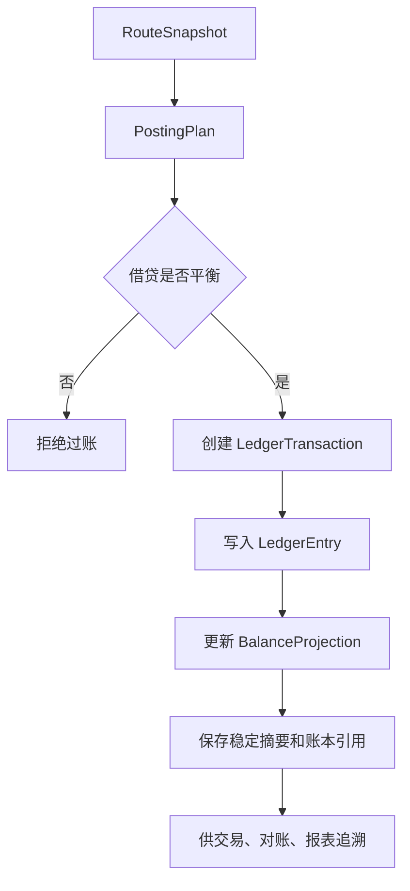
```mermaid
flowchart TD
    A["RouteSnapshot"] --> B["PostingPlan"]
    B --> C{"借贷是否平衡"}
    C -- "否" --> D["拒绝过账"]
    C -- "是" --> E["创建 LedgerTransaction"]
    E --> F["写入 LedgerEntry"]
    F --> G["更新 BalanceProjection"]
    G --> H["保存稳定摘要和账本引用"]
    H --> I["供交易、对账、报表追溯"]
```

## 8. 余额投影产品设计

### 8.1 余额投影解决什么问题

余额投影让钱包、运营、财务和报表可以快速查询余额，但它不是余额事实源。真正的事实源是不可变分录。

| 能力 | 使用者价值 | 产品边界 |
| --- | --- | --- |
| 当前余额 | 用户、商户和运营快速看到可用、冻结、授权、待清算和出款中金额。 | 必须能追溯到分录。 |
| 历史余额 | 财务、对账和审计按时间点核对余额。 | 使用分录、检查点和水位重建。 |
| 余额检查点 | 大数据量场景下减少历史扫描。 | 只能由分录生成，不能由当前余额反推。 |
| 余额变更观察 | 给业务、报表、风控看到余额变化事件。 | 观察日志不能反向改余额。 |

### 8.2 余额投影关系图

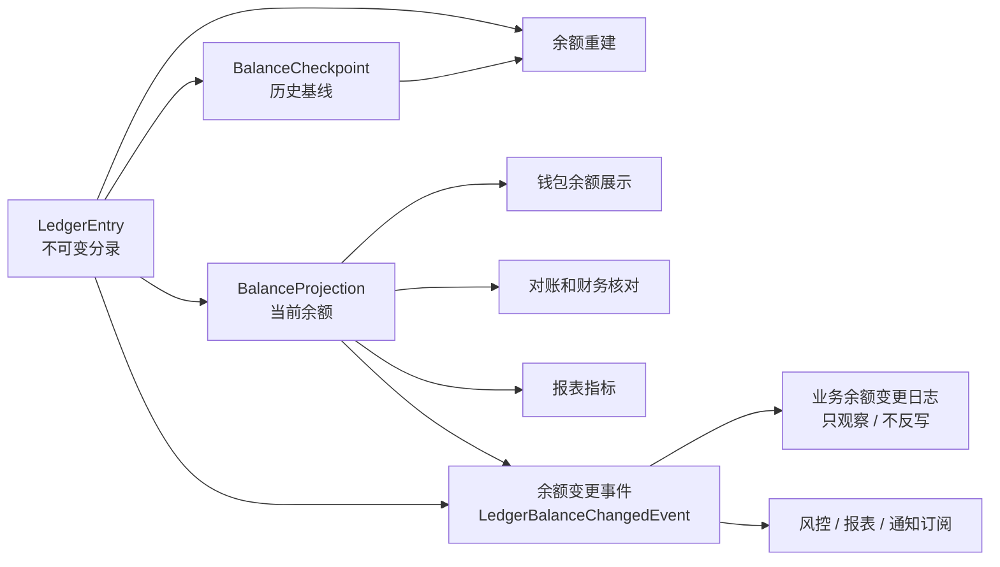
```mermaid
flowchart LR
    Entry["LedgerEntry\n不可变分录"] --> Projection["BalanceProjection\n当前余额"]
    Entry --> Checkpoint["BalanceCheckpoint\n历史基线"]
    Checkpoint --> Rebuild["余额重建"]
    Entry --> Rebuild
    Projection --> Wallet["钱包余额展示"]
    Projection --> Recon["对账和财务核对"]
    Projection --> Report["报表指标"]
    Entry --> ChangeEvent["余额变更事件\nLedgerBalanceChangedEvent"]
    Projection --> ChangeEvent
    ChangeEvent --> ChangeLog["业务余额变更日志\n只观察 / 不反写"]
    ChangeEvent --> Subscriber["风控 / 报表 / 通知订阅"]
```

### 8.3 余额查询口径

| 查询对象 | 来源 | 返回给使用者的信息 |
| --- | --- | --- |
| 用户可用余额 | 资金账户 AVAILABLE 投影 | 可支付、可提现或可转账金额。 |
| 用户冻结余额 | FROZEN 投影和冻结单 | 冻结金额、原因、期限和释放状态。 |
| 商户待清算 | 商户 CLEARING 投影 | 已收款但未清算金额。 |
| 商户可结算 | 商户 AVAILABLE 投影 | 可进入结算单的金额。 |
| 商户出款中 | 商户 SETTLEMENT 投影 | 已锁定且正在出款的金额。 |
| 信用可用额度 | 信用账户 AVAILABLE 投影 | 可继续授权的额度。 |
| 预算可用 | 预算组 scope + 预算型 Spend Rule 控制视图 | 可继续通过授权前预算控制的额度。 |

周期型余额查询还必须带上 periodType 和 periodId。例如查询 2026-05 月度预算可用口径时，应查询预算组 scope + 预算型 Spend Rule 控制视图 / MONTHLY / 2026-05，不能只按预算组汇总全部月份，更不能把预算组当作 LedgerEntry 主体。

### 8.4 余额变更日志和观察事件

余额变更日志是面向用户账单、商户账单、运营、风控、通知和报表的观察记录，不是余额事实源。它回答“余额为什么变化、由哪笔分录导致、变化前后分别是多少”，但不能用来修正余额、补写分录或反推账本事实。

| 能力对象 | 产品定义 | 必须包含 | 能力边界 |
| --- | --- | --- | --- |
| 余额变更事件 | 余额投影成功后，对余额变化输出的观察事件，可对应 LedgerBalanceChangedEvent 或等价事件。 | 主体、账本、账目、币种、账本周期、变更前余额、变更后余额、变更额、ledger transaction 引用、ledger entry 引用、业务引用和发生时间。 | 事件发布失败不得回滚已完成的账本过账和余额投影。 |
| 业务余额变更日志 | 业务侧或运营侧消费余额变更事件形成的查询日志。 | 事件标识、来源分录、来源投影、展示摘要、消费状态和重试结果。 | 只能展示、订阅、检索和审计，不得反向修改余额投影或历史分录。 |
| 余额变更订阅 | 风控、报表、通知、用户账单、商户账单等下游订阅余额变化。 | 订阅方、订阅范围、投递状态、失败原因和重试策略。 | 下游处理失败只能进入补偿、重试或告警，不影响账本事实。 |
| 余额日志补偿 | 当事件投递、日志落库或下游消费失败时，按分录范围补发或重放观察日志。 | 分录范围、主体范围、时间窗口、补偿原因、差异摘要和处理结果。 | 补偿只能重建观察结果，不能重新入账或改变余额。 |

产品规则：

1. 余额变更日志必须从 LedgerEntry 和 BalanceProjection 派生，不能由用户账单、商户账单、报表或人工备注生成事实。
2. 每条余额变化必须能追溯到明确的 ledger entry；不能只记录聚合后的余额总数。
3. 日志必须同时保留变更前余额、变更后余额和变更额，避免只看到结果看不到原因。
4. 余额日志失败属于观察链路失败，不属于账本失败；需要告警、补偿和重试，但不能回滚过账和投影。
5. 余额日志可用于展示、通知、风控观察、报表取数和审计辅助；最终余额核验仍以分录、余额投影、检查点和水位为准。
6. 余额重建、归档重放或交易投影重放时，可以按范围重建余额变更观察结果，但必须保留重放任务和差异报告。
7. 后台不得提供“修改余额日志以修正余额”的入口；如发现差错，必须通过补事实、冲正、调账、核销或重新对账闭环。

### 8.5 余额治理拆入项（原 04）

余额相关的归档语义不再作为独立产品能力表达，统一拆入余额投影的治理约束。产品层只保留“事实可以被冷存、余额可以被重建、证据可以被审计”的目标，不把归档任务包装成新的业务入口。

| 拆入项 | 承接位置 | 产品口径 | 验收入口 |
| --- | --- | --- | --- |
| 余额检查点 | 余额投影和账本事实。 | 用于减少历史分录扫描，只能由账本分录生成。 | `AC-ARCH-002`、`AC-ARCH-005`。 |
| 余额水位 | 余额重建边界。 | 表示检查点覆盖到哪个分录游标或时间边界，不是账本周期、清算账期或报表周期。 | `AC-ARCH-003`、`RED-018`。 |
| 冷热事实引用 | LedgerEntry、LedgerTransaction 和 Manifest 摘要。 | 冷热位置变化不得改变事实身份；余额重建必须能找到原始分录或可信摘要。 | `AC-ARCH-005B`、`AC-ARCH-005C`。 |
| 余额差异报告 | 余额重建、对账和人工处理。 | 差异只能阻断、解释、补证据或重跑，不能直接改余额。 | `AC-ARCH-008`、`GOV-GATE-008`。 |

产品红线：

1. 检查点和水位只能证明余额重建边界，不能成为新的余额事实源。
2. 余额重建只能读取账本事实、检查点和已校验 Manifest 摘要，不能读取用户账单、商户账单或普通指标快照来反推余额。
3. 冷热分层、数据留存和导出策略属于治理实现选择；产品验收只关心事实身份、摘要、范围、权限、差异和可重跑条件是否成立。
4. 涉及数仓、离线指标或经营分析消费时，只能暴露脱敏摘要、导出快照或只读查询边界，不允许下游推进资金水位或反写资金事实。

## 9. 交易投影产品设计

### 9.1 为什么需要交易投影

账本分录适合审计和计算余额，但不适合直接给用户、商户和运营看。交易投影把资金事实、账本事实、清结算事实、对账事实和争议事实组合成可理解的账单和时间线。

本 PRD 将交易投影定义为统一只读读模型能力，而不是支付工具子模块表。支付工具是最常用且最靠近用户的查询维度；同一笔资金事实可以投影成支付工具流水、账户流水、预算控制视图、规则命中时间线和财务核对视图。

| 投影视图 | 面向谁 | 说明 |
| --- | --- | --- |
| 用户账单 | 用户、客服 | 展示付款、收款、退款、提现、冻结、授权等用户视角事件。 |
| 商户账单 | 商户、商户运营 | 展示订单收款、待清算、清算确认、退款、争议、结算和出款。 |
| 运营时间线 | 运营、风控、客服 | 展示交易、冻结、对账、争议、审批和人工处理轨迹。 |
| 财务核对投影 | 财务、数据 | 汇总收入、费用、待结算、差错、追偿和账务核对输入；正式报表指标计算、看板、导出和口径版本由独立报表指标模块承接。 |

### 9.2 交易投影归属模型

交易投影的归属不落在支付工具上，而落在资金事实、账本事实和控制事实的统一投影能力上。支付工具提供 `PaymentInstrumentRef`、绑定快照、外部引用和 route snapshot 索引；资金账户和信用账户继续以账本交易、账本分录、账目桶和余额投影为权威来源；预算组和 Spend Rule 记录控制活动、规则决策和预算控制投影，不成为资金事实源。

| 对象或视角 | 权威事实来源 | 交易投影中的角色 | 不得表达 |
| --- | --- | --- | --- |
| 支付工具 | 支付工具引用、绑定快照、route snapshot、外部 reference。 | 生成卡账单、VA 入金/出金视图、钱包流水、原路径回放索引。 | 支付工具拥有资金、余额或账本分录。 |
| 资金账户 | LedgerTransaction、LedgerEntry、余额桶、余额投影、余额日志。 | 生成账户流水、余额变更解释、资金可用性视图。 | 由交易投影反写余额、补分录或修正账目。 |
| 信用账户 | 信用账本交易、信用账目分录、额度桶、账期和还款事实。 | 生成授权额度流水、信用账单、负债解释视图。 | 把平台借用额度展示成用户自有资金，或绕过信用账目形成现金余额。 |
| 预算组 | 预算范围、预算版本、预算控制投影、预留和释放证据。 | 生成预算使用视图、预算维度账单、预算差异报告。 | 预算组作为 LedgerEntry 主体，或把预算额度当作资金池。 |
| Spend Rule | 规则版本、规则决策日志、Spend Control Activity、拒绝或放行原因。 | 生成规则命中时间线、拒绝原因、预授权/释放解释视图。 | 规则通过等同于资金可用，或由规则记录直接生成资金交易。 |

预算组和 Spend Rule 不需要拥有“资金交易记录”；它们需要拥有可审计的控制记录。交易投影可以消费这些控制记录生成预算和规则视角的只读流水，但不得因此生成资金交易明细、route leg、账本交易或账本分录。只有真实资金变化、冻结控制、授权完成、清结算、对账差错或调账事实，才能进入资金事实和账本事实链路。

### 9.3 投影生成流程

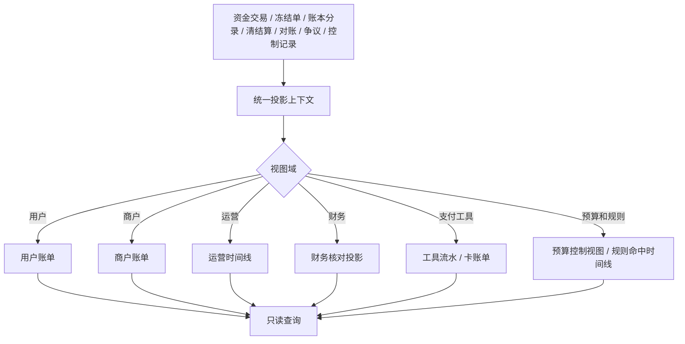
```mermaid
flowchart TD
    A["资金交易 / 冻结单 / 账本分录 / 清结算 / 对账 / 争议 / 控制记录"] --> B["统一投影上下文"]
    B --> C{"视图域"}
    C -->|用户| D["用户账单"]
    C -->|商户| E["商户账单"]
    C -->|运营| F["运营时间线"]
    C -->|财务| G["财务核对投影"]
    C -->|支付工具| I["工具流水 / 卡账单"]
    C -->|预算和规则| J["预算控制视图 / 规则命中时间线"]
    D --> H["只读查询"]
    E --> H
    F --> H
    G --> H
    I --> H
    J --> H
```

### 9.4 投影红线

1. 交易投影不是资金事实源。
2. 交易投影不得补写资金交易明细。
3. 交易投影不得修改账本分录或余额投影。
4. 投影重放必须有范围：单笔、主体、时间窗口、视图域或批次。
5. 冻结类视图必须引用冻结单，不伪造成资金交易。
6. 授权拒绝、争议拒付、退款、退汇、ACH return 等必须保留不同展示语义。
7. 交易投影可以按 `PaymentInstrumentRef`、资金账户、信用账户、预算组或 Spend Rule 查询，但不得把支付工具、预算组或 Spend Rule 写成资金事实归属方或 LedgerEntry 主体。
8. 预算和规则视图只能来自 Spend Control Activity、规则决策日志、预算控制投影和底层资金事实，不得由预算组或 Spend Rule 直接生成资金交易、route leg、账本交易或账本分录。

### 9.5 交易投影重放拆入项（原 04）

交易投影重放属于统一投影能力的恢复和校验机制，不再独立放在归档分册。支付工具流水、账户流水、预算控制视图、规则命中时间线和运营时间线都可以使用同一套重放语义生成，但生成结果仍然只是只读投影。

| 重放范围 | 来源事实 | 输出 | 不得发生 |
| --- | --- | --- | --- |
| 单笔重放 | 资金交易、route snapshot、账本交易、账本分录、控制记录。 | 用户账单、商户账单、支付工具流水或运营时间线。 | 重新入账、重建 route、补写交易明细。 |
| 主体或工具维度重放 | 主体、支付工具快照、绑定历史、账本引用和控制记录。 | 按支付工具、资金账户、信用账户、预算组或 Spend Rule 查询的只读视图。 | 把查询维度升级为资金主体或 LedgerEntry 主体。 |
| 批量重放 | 明确租户、视图域、时间窗口、批次或主体范围。 | 重放任务、差异报告和可覆盖投影候选。 | 无范围全量在线重放，或缺审批直接覆盖正式投影。 |
| 跨冷热重放 | 热区事实、冷区 Manifest 摘要和允许重放起点。 | 跨冷热一致的交易视图或阻断差异。 | 用汇总金额补造交易明细，或在摘要不一致时覆盖热区视图。 |

产品红线：

1. 重放修复的是账单、流水、时间线和差异报告，不修复账本事实。
2. 重放必须先 dry-run，输出范围、差异、影响视图和覆盖建议；进入 apply 前需要独立工程授权、权限、审批、范围锁和回滚/续跑策略。
3. 预算组和 Spend Rule 的重放结果只能来自控制活动和底层资金事实，不能因此生成资金交易记录。
4. 清分、清算、结算和对账批次的投影视图重放由 03 分册承接，本分册只定义交易视图的通用重放边界。

## 10. 场景流程图

### 10.1 商户订单收款

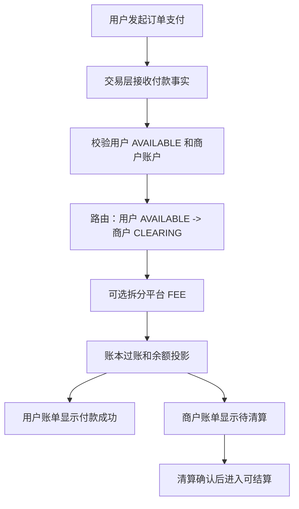
```mermaid
flowchart TD
    A["用户发起订单支付"] --> B["交易层接收付款事实"]
    B --> C["校验用户 AVAILABLE 和商户账户"]
    C --> D["路由：用户 AVAILABLE -> 商户 CLEARING"]
    D --> E["可选拆分平台 FEE"]
    E --> F["账本过账和余额投影"]
    F --> G["用户账单显示付款成功"]
    F --> H["商户账单显示待清算"]
    H --> I["清算确认后进入可结算"]
```

### 10.2 原交易退款

```mermaid
flowchart TD
    A["业务或运营发起退款"] --> B["读取原交易和 route snapshot"]
    B --> C{"快照和剩余可退是否充足"}
    C -- "否" --> D["退款失败或人工处理"]
    C -- "是" --> E["按原路径生成逆向 route"]
    E --> F["校验商户当前持仓桶"]
    F --> G["账本追加退款分录"]
    G --> H["更新用户和商户账单"]
    H --> I["清算候选剔除或追偿"]
```

### 10.3 冻结后追偿

```mermaid
flowchart TD
    A["风控冻结用户或商户余额"] --> B["AVAILABLE -> FROZEN"]
    B --> C["冻结单记录原因、期限和审批"]
    C --> D{"后续处理"}
    D -- "解除风险" --> E["FROZEN -> AVAILABLE"]
    D -- "需要扣划" --> F["创建独立追偿或调账事实"]
    F --> G["引用冻结单"]
    G --> H["路由和账本过账"]
    H --> I["关闭追偿或进入后续抵扣"]
```

## 11. 产品验收要点

产品验收只问一件事：每个资金动作是否同时说清事实、路径、账本、投影和审计。只证明交易状态成功，不能算通过。

本节的验收标准用于转化为 TDD 测试场景；涉及资金变化时，正向路径、异常路径、边界路径、幂等重试和人工兜底都必须能反查到对应资金事实、账务计划和审计证据。

### 11.1 准入评估矩阵

| 维度 | 通过标准 | 阻断信号 |
| --- | --- | --- |
| 可用性 | 每个场景都能说明输入事实、route snapshot、posting plan、ledger entry、投影结果和异常处理。 | 只能解释“交易成功/失败”，解释不了钱从哪里到哪里、后续退款如何回放。 |
| 资金安全 | 不绕过交易、路由、账本和余额投影；失败、拒绝、余额不足不写分录。 | 人工改余额、拒绝写账、缺快照逆向、失败仍生成 entry。 |
| 金融红线 | 文档只给产品和系统设计口径；资质、客户资金、KYC/KYB/AML、敏感信息、外部规则、税务、会计和合同口径保留规则来源、版本或发布日期、生效日期、适用主体或适用范围、适用法域、核验日期、确认方和确认状态。 | 把内部清结算写成持牌清算结论，保存完整卡号、CVV、密钥、明文敏感凭证，或把未核验外部规则写成上线依据。 |
| 易用性 | 用户侧区分可用、冻结、授权、退款；商户侧区分待清算、可结算、结算中、争议；运营侧可追溯原因、规则版本、审批和下一步动作。 | 授权展示成最终消费，冻结展示成扣款，商户待清算款展示成可提现，出款受理展示成到账成功。 |
| 可理解性 | 对用户、商户、运营、财务和审计使用各自能理解的状态、原因和证据引用；敏感证据只展示脱敏摘要或外部 reference。 | 只返回技术错误码、内部枚举或无解释金额；让使用者从多个页面自行拼接事实链。 |
| 可开发/可测 | 能映射到模块、契约、状态机、幂等、余额桶、账本周期、分录平衡、投影来源和审计断言。 | 只断言交易状态或 entry 数量，不断言余额桶、posting plan 平衡和幂等。 |

### 11.2 必须保留的验收断言

| 验收点 | 断言 |
| --- | --- |
| route snapshot | 成功入账必须保存可回放快照；逆向交易优先引用原快照。 |
| posting plan | 每组 plan 独立平衡，本金、手续费、成本、补贴、结算和调账不能混记。 |
| ledger entry | 分录不可变；错账只能追加补记、冲正、调账或核销事实。 |
| 余额桶和周期 | 每次余额变化必须命中主体、账目、币种和账本周期；非 LIFETIME 缺 periodId 必须失败。 |
| 授权边界 | 授权拒绝不生成账务路径；授权成功不展示为最终消费；完成、撤销、过期和退款引用原授权快照。 |
| 冻结边界 | 冻结不创建资金交易，不表达消费；扣划、赔付、提现成功或争议处理必须另建资金事实。 |
| 投影只读 | 用户账单、商户账单和运营时间线不得写回事实层。 |
| 审计追溯 | 授权拒绝、冻结、解冻、调账、退款、争议、人工处理和重放必须记录原因、来源、规则版本和时间。 |

### 11.3 场景准入口径

| 场景 | 必须证明 | 准入级别 |
| --- | --- | --- |
| 商户订单收款 | 用户扣减、商户 CLEARING、平台费用、route snapshot、posting plan 平衡、幂等。 | 必做。 |
| 原交易退款 | 引用原 route snapshot，费用退还或保留口径清楚，退款后余额和投影一致。 | 必做。 |
| 授权生命周期 | 批准占用、拒绝无账、部分完成、撤销、过期释放和授权链退款。 | 必做。 |
| 冻结与余额控制 | 冻结、部分解冻、到期释放、扣划与消费语义隔离。 | 必做。 |
| 支付工具路由 | 工具状态、绑定关系、方向、资金责任解析和原路径回放。 | 必做。 |
| 投影与重放 | 只读生成、范围重放、差异报告和不反写事实。 | 必做。 |
| 清结算、归档、指标 | 在对应专题文档完成批次、差错、水位、Manifest 和指标边界验收。 | 专题准入。 |

### 11.4 阻断项和带条件准入项

| 类型 | 条件 |
| --- | --- |
| 阻断 | 外部账户或支付工具直接入 ledger entry、授权拒绝写账、冻结跨主体、清算账期替代账本周期、投影反写事实、无范围重放、权益视图误导使用者、证据包含敏感原文、未核验外部规则被作为生产启用依据。 |
| 带条件准入 | 外部通道规则、KYC/KYB/AML、税务会计、跨境外汇、卡组织/银行网络细则只能作为待确认项进入工程边界，不得驱动自动资金处理；必须写清责任方、关闭条件和不覆盖范围。 |

## 12. 状态机、账务矩阵和周期语义

本节把交易、路由、钱包、账目、余额投影和交易投影的状态、账务和周期口径集中说明，作为产品验收、DSL、系分和 TDD 的稳定输入。

### 12.1 交易和投影状态机

| 对象 | 状态方向 | 成功终态 | 失败或人工终态 | 必须记录 |
| --- | --- | --- | --- | --- |
| 资金交易 | RECEIVED -> VALIDATING -> ROUTING -> POSTING -> PROJECTING -> COMPLETED | COMPLETED | REJECTED、FAILED、PENDING_REVIEW、CANCELLED | 幂等键、请求摘要、业务引用、失败原因、route snapshot、账本引用。 |
| 授权交易 | REQUESTED -> APPROVED -> HELD -> SETTLING/REVERSING/EXPIRING，完成后退款可进入 REFUNDING -> REFUNDED | SETTLED、REVERSED、EXPIRED、REFUNDED | DECLINED、FAILED、PENDING_REVIEW | 授权快照、占用金额、剩余可结算金额、剩余可退金额、拒绝原因、外部授权引用。 |
| 冻结单 | REQUESTED -> FROZEN -> PARTIALLY_RELEASED -> RELEASED/CLOSED | RELEASED、CLOSED | REJECTED、EXPIRED、PENDING_APPROVAL | 冻结原因、期限、审批、剩余冻结金额、释放引用。 |
| 余额投影任务 | WAITING -> CALCULATING -> VERIFYING -> APPLIED | APPLIED | FAILED、NEEDS_REBUILD | 分录范围、前后余额、校验摘要、水位引用。 |
| 余额变更观察事件 | GENERATED -> PUBLISHING -> PUBLISHED | PUBLISHED | FAILED_RETRYING、FAILED_NOTIFIED | 来源分录、来源投影、变更前后余额、变更额、业务引用、投递结果。 |
| 交易投影任务 | WAITING -> BUILDING -> VERIFYING -> PUBLISHED | PUBLISHED | FAILED、NEEDS_REPLAY | 来源事实、视图域、差异摘要、重放范围。 |

状态机产品规则：

1. 状态迁移必须由明确业务动作触发，不能由查询动作隐式改变。
2. 成功终态必须能追溯到资金交易、route snapshot、ledger transaction 和投影结果。
3. 失败终态必须保留失败阶段、失败原因、是否可重试和是否需要人工处理。
4. 人工处理不能直接修改历史状态，必须通过补事实、冲正、调账、释放、核销或重放进入新动作。
5. 同一幂等键重复触发时只能返回原状态或进入可解释的重试路径，不得重复过账。

### 12.2 主链路资金影响产品摘要

本节只保留产品侧资金影响摘要，用于帮助产品、运营、财务和测试理解“谁受影响、余额展示如何变化、业务上必须提供哪些事实”。完整借贷平衡表不在 PRD 维护；进入 DSL、系分、TDD 或编码准入时，参与方账户示例、账户类型、`normalBalanceSide`、借贷平衡公式、`PostingPlan`、`LedgerEntry`、余额投影和失败无副作用断言以 [../DSL设计/支付资金底座DSL承载层设计.md#51-资金场景借贷平衡与账务期望表](../DSL设计/支付资金底座DSL承载层设计.md#51-资金场景借贷平衡与账务期望表) 为唯一权威。

| 场景 | 产品参与方 | 产品资金影响 | 必须提供给 DSL 的事实 | 产品断言 |
| --- | --- | --- | --- | --- |
| 用户充值成功 | 用户、平台、外部通道。 | 用户可用余额增加；平台获得可追溯的外部确认或现金镜像。 | 充值业务流水、用户主体、金额币种、外部确认引用、操作者和审计上下文。 | 外部账户不作为内部账本主体；充值确认前不展示为已到账。 |
| 用户提现申请 | 用户、平台、外部通道。 | 用户可用余额被锁定或冻结；尚未表达外部出款成功。 | 提现申请流水、用户主体、锁定金额、冻结原因、期限和外部出款准备引用。 | 提现申请不是外部成功，不展示为已到账。 |
| 用户提现失败 | 用户、平台、外部通道。 | 原冻结或锁定释放，用户可用恢复。 | 原冻结或提现锁定引用、失败原因、外部结果引用和幂等键。 | 失败只释放一次，成功失败不能双终态。 |
| 普通系统内转账 | 付款方、收款方。 | 付款方可用减少，收款方可用增加。 | 双方主体、金额币种、业务流水、账本周期和幂等摘要。 | 同主体、错币种、余额不足或周期缺失必须失败。 |
| 商户订单收款 | 用户、商户、平台。 | 用户实付减少；商户待清算增加；平台费用、成本、补贴按组件拆分。 | 订单金额、用户实付、商户应收、手续费、补贴、权益快照和规则版本。 | 商户款不得直入可提现余额；本金、手续费、通道成本和补贴必须拆开。 |
| 手续费收取 | 费用责任方、平台。 | 责任方余额或应收应付减少；平台费用收入或成本归集增加。 | 原交易引用、费用类型、规则版本、费用责任方和审批依据。 | 手续费不得混入本金。 |
| 授权占用 | 支出主体、商户或外部受理方。 | 可用余额、额度或预算减少；授权占用增加；不代表最终消费。 | 授权业务流水、支出主体、金额币种、授权有效期、外部授权引用和规则版本。 | 授权成功不是最终消费；授权拒绝不得产生资金副作用。 |
| 授权撤销释放 | 支出主体、外部受理方。 | 原授权占用减少，可用余额、额度或预算恢复。 | 原授权引用、撤销原因、外部撤销或冲正引用。 | 必须基于原授权快照，不重新选路；终态为 `REVERSED`。 |
| 授权过期释放 | 支出主体。 | 剩余授权占用减少，可用余额、额度或预算恢复。 | 原授权引用、过期规则、过期时间和系统触发记录。 | 只释放剩余授权；终态为 `EXPIRED`，不能和撤销混用。 |
| 授权完成 | 支出主体、商户、平台。 | 授权占用关闭或减少；商户待清算和平台费用按完成金额增加。 | 原授权引用、完成金额、剩余可完成金额、商户主体和费用/补贴组件。 | 不新增 `CONSUMED` 账目；累计完成不得超过原授权金额。 |
| 冻结 | 被冻结主体、运营或业务系统。 | 同主体可用减少，冻结余额增加；总余额责任不变。 | 冻结业务流水、主体、金额币种、原因、期限、审批和账本周期。 | 冻结不表达消费、扣划或授权。 |
| 解冻 | 被冻结主体、运营或业务系统。 | 原冻结减少，可用恢复。 | 原冻结引用、释放金额、释放原因、操作者和幂等键。 | 不得超额解冻。 |
| 调账 | 责任方、目标方、平台或运营。 | 目标余额、挂账、成本、收入或责任余额按审批结论变化。 | 差错来源、调整方向、责任归属、凭证、审批、原因和审计上下文。 | 调账不能绕过对账差错闭环或直接改余额。 |

产品摘要使用规则：

1. 本节只回答产品语义和接入方要提供什么事实，不定义借贷方向、账户类型、数据库表、类名或 Mapper。
2. 每一行进入落地前都必须能映射到 DSL 权威表的一行或多行；没有映射时先补 DSL，再进入系分和 TDD。
3. `periodType` 不是 `LIFETIME` 时必须有 `periodId`，不能用清算账期、报表周期或归档水位替代账本周期。
4. 逆向交易优先回放原 route snapshot；缺快照时进入失败或人工处理，不静默重新选路。
5. 冻结、解冻和授权占用必须区分：冻结是同主体可用性控制，授权是可用额度占用，二者都不是消费；授权完成、直接支付、清算确认、结算锁定和出款结果才进入对应价值转移或责任关闭语义。

### 12.3 周期语义矩阵

周期语义矩阵用于防止账本周期、运营周期和规则窗口互相污染。任何涉及周期的场景都必须先落到本矩阵，再决定是否进入账本 bucket、规则累计、批次分组或报表口径。

| 周期类型 | 归属 | 解决的问题 | 是否参与入账隔离 | 是否可用于余额重建 | 禁止替代 |
| --- | --- | --- | --- | --- | --- |
| 账本周期 periodType/periodId | 账本账目 | 隔离同主体、同币种、同账目下不同生命周期、月份、合同周期或自定义周期的余额事实。 | 是 | 是 | 不得被清算账期、结算周期、报表周期、归档水位、spend-rule window 替代。 |
| 清算账期 | 清分清算 | 判断哪些交易明细可以进入清算候选或清算批次。 | 否 | 否 | 不得作为账本 bucket 的 periodId。 |
| 结算周期 | 结算出款 | 判断结算单生成和出款节奏。 | 否 | 否 | 不得替代账本周期或授权规则窗口。 |
| 报表周期 | 报表指标模块 | 按日、周、月、季度或自定义窗口观察和展示指标。 | 否 | 否 | 不得反推余额、不得替代账本周期、不得复用归档水位、归档清单或交易投影重放范围。 |
| 归档水位 | 归档重放 | 表示冷热拼接和检查点覆盖边界。 | 否 | 只用于重建边界 | 不得作为业务周期、账本周期或报表周期。 |
| Spend-rule window | 发卡授权控制扩展 | 判断授权请求在日、周、月或自定义窗口内是否超限。 | 否 | 否 | 不得替代账本周期，也不得由账本周期反向推导。 |
| 合同周期 / 预算规则窗口 | 业务产品或预算组 | 表达合同、预算或额度控制的业务边界。 | 合同周期只有映射到账本周期时才参与；预算规则窗口不参与入账隔离 | 合同周期只有映射到账本周期时才参与；预算规则窗口只用于控制视图 | 不得隐式套用到普通资金账户，也不得把预算规则窗口当作账本 bucket。 |

周期风险红线：

1. 入账、冻结、授权、释放、结算或重建只认账本周期，不认清算账期、报表周期或规则窗口。
2. 规则累计窗口可以读账本或投影结果作为输入，但不能直接写账本 bucket。
3. 报表观察窗口和归档水位必须语义隔离，不能共享同一个处理边界。
4. 缺少 periodId 的非 LIFETIME 入账必须失败。
