# 清分、清算、结算、出款与对账产品设计

## 文档状态与版本信息

- 当前版本：v1.0
- 文档状态：Review
- owner：清结算产品 owner、运营 owner、财务 owner、风控 owner、测试 owner、架构 owner
- 发布日期：2026-07-17
- 评审结论摘要：本文是清分、内部清算、结算、出款、对账和差错闭环的产品架构分册，不声明持牌清算网络或外部机构能力已经完成。
- 目标读者：产品、运营、财务、风控、合规、测试、架构师和研发。
- 需要决策：确认清结算对象、状态、阻断规则、差错人工闭环和生产准入范围。
- 当前可信度：内部产品口径和目标态流程已确认；外部网络规则、资金归属、会计税务与生产运营能力仍待专业确认和工程验证。

## 产品架构模板追踪索引

| 模板项 | 本文落点 | 裁剪说明 |
| --- | --- | --- |
| 背景、问题、目标和范围 | 1、2 | 区分内部产品口径与外部机构规则。 |
| 名相、角色和对象 | 1.1、3、5、12 | 清分、清算、结算、出款和差错对象分别定义。 |
| 能力、流程、状态和规则 | 4、6-10 | 覆盖主流程、逆向、异常和人工处理。 |
| 数据、运营、风险和专业确认 | 8、9、12 | 对账证据、运营工作台和资金安全门禁统一承接。 |
| 验收与架构交接 | 11 | 工程落地必须继续消费 DSL、系分和 TDD。 |

## 1. 背景和目标

交易成功不等于资金工作结束。商户订单款需要清分、清算、结算和出款；外部通道、银行流水、卡组织文件、ACH 文件、账本分录和内部交易也需要持续对账。只要其中任一环节缺少批次、明细、规则版本、差错处理和审计，财务和运营就无法证明“钱对得上”。

本文件说明支付资金底座中的清分、清算、结算、出款、对账和差错闭环。这里的“清算”默认是平台内部明细确认和账务处理口径，不表达持牌清算业务；涉及真实清算网络、支付机构、银行、跨境、外汇或备付金时，必须另行由法务、财务、合规和合作机构确认。

本分册属于 P0 资金内核和运营账务闭环能力。对账、清分、内部清算和差错闭环不是交易成功后的可选后台能力，而是结算、出款、追偿、归档和财务证明的前置门禁。任何直接交易、授权交易、VCC、全球账户或收单业务要进入生产资金流，都必须能说明本分册能力如何消费交易事实和账本事实、如何阻断差错、如何追加资金事实、如何保留审计。

分层定位：本分册只描述清分、清算、结算、出款、对账和差错闭环的产品对象、状态、规则、使用者解释和验收口径；涉及 `CLEARING -> AVAILABLE`、`AVAILABLE -> SETTLEMENT`、`SETTLEMENT/IN_TRANSIT -> CASH`、差错补事实、冲正、调账或权益金额项入账时，以 [../DSL设计/支付资金底座DSL承载层设计.md#51-资金场景借贷平衡与账务期望表](../DSL设计/支付资金底座DSL承载层设计.md#51-资金场景借贷平衡与账务期望表) 为账务权威。系分只承接实现，TDD 只承接断言，不在本分册复制完整借贷表。

### 1.1 行业口径和本系统口径对照

清分、清算、结算和出款在支付行业、银行合作、卡组织、ACH、商户运营和内部账务中经常被混用。本分册采用资金底座内部口径，必须和外部行业口径保持可映射但不等同。

| 口径 | 行业或业务常见含义 | wind-funds 产品口径 | 红线 |
| --- | --- | --- | --- |
| 机构间清算 | 银行、清算网络、卡组织、PSP 或通道之间确认应收应付、净额或文件。 | 只作为外部规则和对账来源，必要时以外部文件、回单或流水引用进入对账。 | 不把外部清算网络能力写成本系统默认能力。 |
| 内部清算 | 平台内部确认某些待清算明细可以转为可结算口径。 | 清算候选通过前置对账和阻断规则后，清算批次确认并触发内部账务变化。 | 清分候选不能直接释放为可结算；重大差错未处理不得清算。 |
| 商户结算 | 给商户生成应付或应收净额，并进入出款准备。 | 结算单计算、审批、锁定和扣减项解释，不代表外部付款成功。 | 结算单已审批不得替代对账结论或出款回单。 |
| 外部出款 | 银行、通道、钱包或内部付款链路提交并最终成功、失败或退回。 | 出款单跟踪提交、受理、成功、失败、退回、在途和回单冲突。 | 外部 accepted、processing 或 submitted 不得展示成到账成功。 |
| 提前可用 / 秒结 / 预结算 | 清算或外部资金未终局前，先让商户、用户或业务方看到可用或可结算金额。 | 只能作为带风险责任方、额度、准备金、追偿和审批的专项能力；未授权时不得默认启用。 | 不得在外部资金未终局、对账未通过或责任方未确认时静默增加 AVAILABLE。 |

因此，本分册的“清算”优先理解为内部资金明细确认和账务转换；外部机构间清算、真实资金划拨和监管意义上的清算能力，都必须通过外部规则确认、对账证据和专业确认项承接。

### 1.2 与路由层的关系

清分、清算、结算和出款是运营单据与批次控制面，路由层是资金路径解析和快照层。二者的协作方式是：本分册对象先判断“这件事是否允许成为资金事实”，再把已确认的清算确认、结算锁定、出款结果、差错调账等标准资金事实交给交易层和路由层；路由层只回答“这笔已确认事实应影响哪些账户、账目和周期”。

| 阶段 | 本分册负责 | 路由层负责 | 红线 |
| --- | --- | --- | --- |
| 清分 | 识别可清分明细、归类批次、固化规则版本和排除原因。 | 只提供原交易 route snapshot 和可追溯路径摘要。 | 清分确认不触发 `CLEARING -> AVAILABLE`，不得请求路由入账。 |
| 清算候选 | 基于清分结果快照、账期、退款、争议、风控和对账结果生成可清算候选。 | 不参与候选生成和阻断判断。 | 清算候选只是准入对象，不是资金事实。 |
| 清算批次确认 | 锁定候选、完成复核审批并生成清算确认资金事实。 | 对已确认 `CLEARING_CONFIRM` 事实生成 `CLEARING -> AVAILABLE` 路径。 | 未确认批次、重大差错、重复入批或候选未锁定不得入账。 |
| 结算单锁定 | 计算净额、扣减项、准备金、追偿项并完成审批锁定。 | 对已确认 `SETTLEMENT_LOCK` 事实生成 `AVAILABLE -> SETTLEMENT` 路径。 | 结算单计算或审批不等于外部出款成功。 |
| 出款结果 | 跟踪外部提交、受理、成功、失败、退回和回单冲突。 | 对已确认出款成功、失败、退回或差额事实生成对应资金路径或回退路径。 | `accepted`、`processing`、`submitted` 不得当作到账成功。 |
| 对账差错 | 生成差错单、责任、审批、核销、挂账、追偿和重新对账。 | 仅处理已审批补事实、冲正、调账或追偿事实的路径。 | 差异不能直接改历史分录、余额投影或交易投影。 |

### 1.3 全球多币种账务吸收口径

多币种账户、全球日切、客户资金和备付金隔离属于全球账户、跨境收付款或持牌支付机构场景的生产准入输入。本分册只吸收可迁移的资金底座口径，不把外部文章、行业经验或未确认规则写成上线依据。

| 外部方法论要点 | 本分册吸收方式 | 不做什么 |
| --- | --- | --- |
| 业务层只产生业务单据，账务受理层再校验并生成账务事实。 | 清分、清算、结算和出款必须先形成运营单据、审批、规则版本和对账准入，再交给交易、路由和账本生成标准资金事实。 | 不允许业务单据、外部回单或运营确认直接改账。 |
| 客户账和机构财务账并行但隔离。 | 内部资金账户、平台责任账户和外部资金证据必须分层表达；客户侧余额、商户待结算和平台备付/清算户引用通过对账关联。 | 不把托管户、备付金户、银行账户或通道账户变成 ledger subject。 |
| 多币种账户需要按币种、主体和余额桶独立核算。 | 清分批次、清算候选、结算单和对账批次必须按主体、币种、账目、周期和规则版本隔离。 | 不跨币种混批，不用 FX 后净额掩盖原币种事实。 |
| 全球日切按法主体、时区和节假日日历执行。 | 结算策略必须固化基准时间、时区、cutoff、节假日和版本；全球账户场景还需补账套/法主体日切确认。 | 不默认实时清算，不把系统时间当会计日期。 |
| 账实一致需要把客户余额汇总映射到真实资金账户。 | 对账必须证明内部账本账户、账目、余额桶和外部流水、托管户/备付金户、回单或文件之间的映射。 | 不用报表汇总、日志或人工说明替代账实对账。 |

## 2. 范围、角色和场景入口

### 2.1 业务目标、用户价值和非目标

业务目标是把交易成功后的清分、清算、结算、出款、对账和差错处理收敛为可追溯、可阻断、可重跑、可审计的资金运营闭环，避免结算单、出款单、外部受理状态和账本事实互相替代。

用户价值是让商户知道哪些资金可结算、为什么被扣减或阻断；让财务和出纳证明出款前门禁、外部回单和账务影响一致；让运营、风控和合规能在不直接改账的前提下处理异常。

成功指标包括批次与明细可追溯、结算净额可解释、出款前门禁可审计、外部非终态不误展示为到账成功、重大差错不放行、差错核销后可重新对账。

非目标是不在本分册实现正式报表指标模块、持牌清算业务、外部通道协议细节、税务会计最终规则和跨法域合规结论。

| 维度 | 内容 |
| --- | --- |
| 本文覆盖 | 可清分识别、清分批次、清分结果快照、清算候选、清算批次、结算单、出款单、对账批次、差错单、调账核销、追偿和运营工作台。 |
| 本文不覆盖 | 交易接入、资金路由、账本分录生成、生产治理模块实现和指标计算实现。 |
| 主要使用者 | 商户、运营、财务、风控、出纳、合规、安全和业务接入方。 |
| 核心验收 | 每个批次、单据和差错都能追溯来源明细、规则版本、责任方、账务影响、审批、凭证和终态。 |

| 优先级 | 本分册能力 | 产品准入判断 |
| --- | --- | --- |
| P0 | 对账、清分、内部清算、结算前门禁、差错闭环和追偿。 | 先证明来源事实完整、对账可阻断、批次可重跑、差错可核销、资金影响可追加事实。 |
| P1 | 直接交易、授权交易、余额控制和交易投影对本分册的输入。 | 只作为来源事实、可清分明细、退款/拒付/调账引用和只读展示来源，不反向主导批次对象。 |
| P2 | VCC、全球账户和收单业务的结算/对账扩展。 | 通过业务 PRD 补充外部引用、通道文件、币种、争议和商户结算口径，不改变统一清分、清算和对账对象。 |

| 场景 | 触发条件 | 产品目标 | 关键对象 |
| --- | --- | --- | --- |
| 可清分交易识别 | 支付成功或授权完成、已过账且形成正向待清分入账。 | 判断一笔交易明细是否可以参与清分。 | 交易明细、route snapshot、`CLEARING + CREDIT + INCREASE + DETAIL` 分录、准入结果。 |
| 含权益交易清分 | 交易包含商户让利、平台补贴、代金券核销、储值权益或补贴冲回。 | 把用户实付、商户让利、平台补贴、代金券核销和退款处置拆开，避免净额失真。 | 权益资金事实、权益组件、清分金额项、营销核销引用。 |
| 收益分润与激励清分 | 用户代理、平台员工或合作方的收益结果已由业务侧按交易利润、GMV 阶梯、归因关系或 KPI 审批生成。 | 验证清结算层能把交易派生收益作为可清分收益项处理，并能解释谁应得、为什么应得、何时可结算。 | 收益应得项、收益参与方、归因快照、规则快照、审批引用。 |
| 清分批次确认 | 可清分明细达到清分周期、规则和分组条件。 | 把可清分明细按主体、币种、周期和规则归类，形成可复核结果。 | 清分批次、清分明细、规则版本、排除原因。 |
| 可清算候选确认 | 清分结果快照已固化，且无退款、争议、风控或重大差错阻断。 | 判断哪些清分结果可以进入清算确认。 | 清分结果快照、清算候选、阻断原因、清算账期。 |
| 清算批次确认 | 可清算候选被锁定并完成复核。 | 将商户待清算款确认到可结算口径。 | 清算批次、批次明细、账务引用。 |
| 结算单生成 | 可结算余额和扣减项完整。 | 形成可复核的应付或应收净额。 | 结算单、净额明细、规则快照。 |
| 出款处理 | 结算单复核并锁定。 | 跟踪外部或内部付款结果。 | 出款单、外部回单、失败回退。 |
| 对账处理 | 内部事实和外部文件、银行流水或报表不一致。 | 发现差异并推动闭环。 | 对账批次、差错单、挂账、调账。 |
| 已出款后逆向 | 出款后发生退款、拒付、费用或差错。 | 不回滚历史出款，进入追偿或后续抵扣。 | 追偿单、准备金、负余额、后续结算抵扣。 |

### 2.2 业务流程和状态机入口

主流程是交易成功并过账后识别可清分明细，确认清分批次，固化清分结果快照，生成可清算候选，确认清算批次，生成并锁定结算单，出款前准入门禁通过后提交出款，最终按外部成功、失败、退回、金额不一致或在途状态处理。

异常流程包括交易来源不完整、退款或争议未闭环、清算前置对账失败、结算净额不平、外部账户或通道不可用、名单筛查失败、外部规则未核验、负余额或准备金不足、幂等冲突和外部回单冲突。

人工兜底只能处理排除、恢复、复核、审批、补证据、挂账、核销和回单引用，不提供直接修改交易事实、历史分录、余额投影或交易投影的入口。对象状态机入口见第 6、7、8、10、12 章；运营后台入口见第 11 章。

## 3. 概念总览

| 概念 | 易懂定义 | 能力边界 |
| --- | --- | --- |
| 清分 | 把已成功的交易明细按主体、币种、清分周期、规则和责任方归集出来。 | 不直接出款，不直接改账。 |
| 可清分明细 | 成功、已过账、命中商户或合作方待清算账目的交易明细。 | 只是可以参与清分，不代表已清分、可清算或可结算。 |
| 权益金额项 | 商户让利、平台补贴、平台券不补足商户、代金券核销、储值权益、补贴冲回和不可退权益等金额拆分。 | 只来自原权益资金事实、退款决策引用、历史摘要或审批事实，不从当前营销规则重算。 |
| 收益参与方 | 可以参与收益结算的用户代理、平台员工、合作方或平台内部主体。 | 必须先解析到资金账户、员工应付账户、合作方账户或平台角色账户；自然人、员工档案、邀请关系本身不能直接成为账本分录主体。 |
| 收益应得项 | 业务侧已经计算出的佣金、分润、KPI 激励或扣减结果。 | 只是清分和清算候选来源，未清算确认前不等于可用余额、工资、佣金已发放或外部付款成功。 |
| 收益规则快照 | 收益计算使用的规则编码、版本、GMV 阶梯、归因链、审批和风控结论。 | 资金底座只固化快照和校验完整性，不承接代理关系、KPI 或营销规则引擎。 |
| 清分批次 | 对可清分明细按主体、币种、清分周期、规则版本归类和确认的批次。 | 清分确认只固化分类结果和候选来源，不触发 CLEARING -> AVAILABLE。 |
| 清分结果快照 | 清分批次确认后，对参与方、金额项、来源事实、规则版本和对账准入结论形成的不可变证据。 | 作为清算候选生成和对账解释输入，不是清算候选、资金交易或账本分录。 |
| 清算候选 / 可清算候选 | 清分确认后，可能进入清算批次的明细集合。 | 需经过清算账期、风控、对账、退款、争议和重复入批校验。 |
| 清算批次 | 一组可确认从待清算进入可结算的明细。 | 清算确认会触发账务变化；批次必须可重跑且幂等。 |
| 结算单 | 面向商户、用户、合作方或平台内部主体的应付或应收计算单。 | 结算单计算净额，不等于外部出款已成功。 |
| 出款单 | 对外或内部执行付款的处理单据。 | 外部受理不等于到账；成功、失败、退回必须分开。 |
| 对账批次 | 按时间、主体、文件、轨道或账本范围进行核对的批次。 | 对账发现差异不能直接改历史账。 |
| 差错单 | 记录金额、状态、流水、时序、账务或文件不一致。 | 差错处理必须有责任、动作、审批、核销和审计。 |
| 挂账 | 暂时无法归属或等待处理的差异金额。 | 必须有账龄、责任方、SLA 和核销路径。 |
| 调账 | 对已确认差错进行补记、冲正或调整。 | 不修改历史分录，必须追加新事实。 |

## 4. 总体能力地图

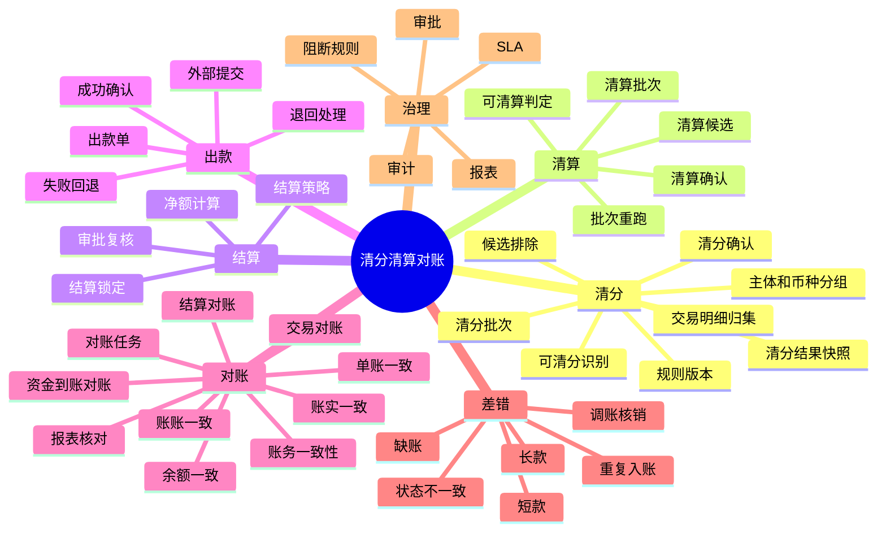

## 5. 角色和使用者

| 角色 | 关注点 | 典型操作 |
| --- | --- | --- |
| 商户 | 哪些订单可结算，哪些被退款、争议、扣费或暂扣。 | 查看清算明细、结算单、出款状态和扣减原因。 |
| 财务 | 批次是否平，出款是否对得上，差错是否闭环。 | 复核清分批次和清算批次、审批结算单、核销差错、导出报表。 |
| 运营 | 异常订单、挂账、手工退款、出款失败如何处理。 | 发起处理单、补资料、冻结、调账、追偿。 |
| 风控 | 高风险商户、争议、负余额、准备金和出款阻断。 | 暂停清算、阻断出款、设置准备金或追偿。 |
| 业务系统 | 需要知道订单、退款、出款和差错状态。 | 查询批次结果、接收状态回调或事件。 |
| 合规 / 安全 | 高危资金操作是否有权限、凭证和审计。 | 审计审批、导出、敏感信息访问和证据。 |

## 6. 清分与清算设计

### 6.1 清分到清算总流程

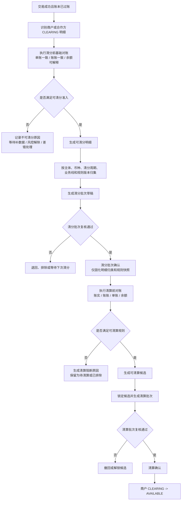

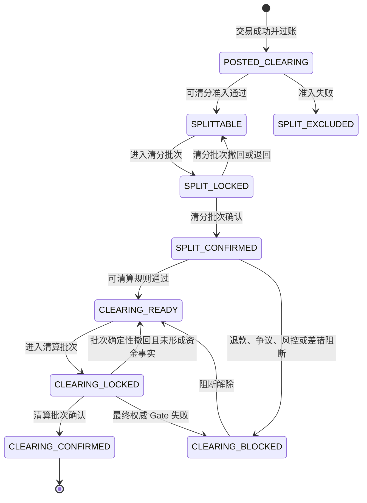

清算锁定后的结果必须按事实处理：只有清算批次明确撤回且确认没有形成清算资金事实时，候选才能回到 `CLEARING_READY`；超时、网络断开、外部受理结果未知或提交结果无法证明时，候选继续保持 `CLEARING_LOCKED`，进入待核验，不得按超时自动释放。最终权威 Gate 明确失败时进入 `CLEARING_BLOCKED`，由后续重新评估恢复。

### 6.2 场景用例：一笔交易如何进入清分

本场景回答运营和财务最常问的问题：一笔付款成功的订单，为什么可以进入清分，清分批次号从哪里来，清分完成后如果退款如何处理。

| 项目 | 示例 |
| --- | --- |
| 交易背景 | 用户向商户支付 100.00 USD。 |
| 账务结果 | 商户待清算本金为 98.00 USD，平台手续费为 2.00 USD。 |
| 清分目标 | 识别出“商户 98.00 USD 待清分明细”，归入可复核的清分批次。 |
| 用户视角 | 商户看到订单已支付，但不等于可出款；财务看到这笔交易进入清分池。 |
| 产品边界 | 清分只确认“这笔钱属于哪个主体、哪个币种、哪个周期和哪个规则”，不释放资金。 |

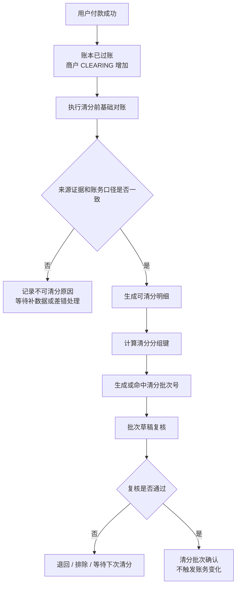

清分批次号不是人工随意填写，也不是只按日期生成。产品上把它定义为“清分范围的可追溯编号”。

| 批次号要素 | 产品口径 |
| --- | --- |
| 业务前缀 | 表示这是清分批次，例如 SB。 |
| 主体范围 | 租户、商户或合作方账务主体。 |
| 资金范围 | 币种、业务线、清分周期。 |
| 规则范围 | 清分策略编码和规则版本。 |
| 明细范围 | 本批次包含的可清分明细集合摘要。 |
| 展示示例 | SB20260518-M1001-USD-0001，仅作示例，实际格式由系分统一。 |

批次号的产品规则：

1. 同一主体、币种、清分周期、业务线、规则版本和明细集合重复生成时，应命中原批次或拒绝重复入批。
2. 批次号一旦确认，不允许人工改号、删除后重建成另一个口径。
3. 清分批次号必须能反查批次范围、规则版本、明细集合、操作者和确认时间。
4. 清分批次只用于归类和复核，不代表资金已经可结算。

清分过程中的退款处理：

| 退款时点 | 产品处理 | 资金安全要求 |
| --- | --- | --- |
| 清分前已退款 | 不生成可清分明细，或将可清分明细标记为已排除。 | 不能把已退款金额放入清分批次。 |
| 清分批次草稿或复核中退款 | 从批次草稿中排除该明细，重新计算批次摘要。 | 批次确认前必须重新校验退款状态。 |
| 清分批次已确认、清算前退款 | 保留清分结果作为审计，阻断对应清算候选；部分退款时仅剩余金额可继续参与清算。 | 不回滚已确认清分批次，不让已退款金额进入 CLEARING -> AVAILABLE。 |
| 清分后发现错分 | 不删除已确认批次；通过排除、补差、冲正、调账或差错单处理。 | 保留原批次证据，避免审计断链。 |

### 6.3 场景用例：一笔清分后的交易如何进入清算

本场景回答第二个关键问题：清分完成后，什么时候可以清算，清算账期如何确定，清算批次如何确认，清算后发生退款怎么处理。

| 项目 | 示例 |
| --- | --- |
| 清分结果 | SB20260518-M1001-USD-0001 已确认，包含商户 98.00 USD 待清算明细。 |
| 清算策略 | 商户按账务成功日 T+1 清算，时区为 Asia/Shanghai，日切为 23:00，节假日顺延。 |
| 清算账期 | 若交易在 2026-05-18 14:30 过账，则清算账期为 2026-05-19；遇非工作日按策略顺延。 |
| 清算目标 | 把符合条件的商户待清算款从 CLEARING 确认到 AVAILABLE。 |
| 产品边界 | 清算候选仍不入账；只有清算批次确认才触发账务变化。 |

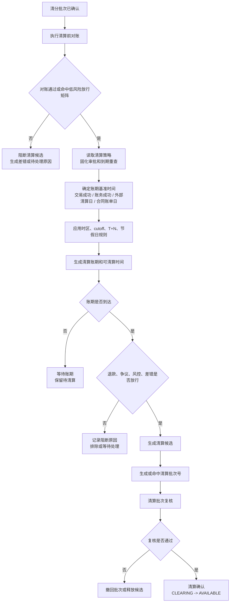

清算账期由清算策略确认，不由运营临时选择。

| 账期要素 | 产品口径 |
| --- | --- |
| 基准时间 | 交易成功时间、账务成功时间、外部清算日或合同账单日，必须在策略中明确。 |
| 账期类型 | 实时、T+N、H+N、W+N、M+N 或自定义合同周期。 |
| 时区和日切 | 用于判断交易归属哪一天或哪个周期，缺失时不得默认实时。 |
| 节假日规则 | 非工作日是否顺延、提前或保持原日，必须随策略版本固化。 |
| 规则版本 | 同一笔交易使用哪个版本算出的账期必须可追溯。 |
| 能力边界 | 清算账期不是账本周期，也不是报表周期或结算周期。 |

清算批次号是“清算确认范围的可追溯编号”。

| 批次号要素 | 产品口径 |
| --- | --- |
| 业务前缀 | 表示这是清算批次，例如 CB。 |
| 主体范围 | 租户、商户或合作方账务主体。 |
| 资金范围 | 币种、业务线、清算账期。 |
| 规则范围 | 清算策略编码和规则版本。 |
| 候选范围 | 本批次锁定的清算候选集合摘要。 |
| 展示示例 | CB20260519-M1001-USD-0001，仅作示例，实际格式由系分统一。 |

清算后的退款处理：

| 退款时点 | 产品处理 | 资金安全要求 |
| --- | --- | --- |
| 清算批次确认前退款 | 阻断清算候选；部分退款时只有未退款金额可继续进入清算批次。 | 不让已退款金额从 CLEARING 释放到 AVAILABLE。 |
| 清算已确认、结算未锁定 | 不回滚清算批次；追加退款事实，从商户 AVAILABLE 或约定责任账户扣减，并进入结算扣减项。 | 商户可结算净额必须减少，避免平台垫付。 |
| 结算已锁定、出款未成功 | 不能绕过结算锁定直接退款；需要释放或重算结算锁定，或生成结算差错。 | 防止同一资金同时用于退款和出款。 |
| 出款已成功 | 不回滚历史出款；进入追偿、准备金抵扣、后续结算抵扣、负余额或人工收款。 | 平台不能无来源承担商户责任退款。 |

### 6.4 资金安全和资损防控

清分清算的产品目标不是“尽快把钱放出去”，而是在可解释、可复核、可追偿的前提下，把应释放的资金释放给正确主体。

| 风险 | 产品控制 | 运营和财务可见证据 |
| --- | --- | --- |
| 重复清分或重复清算 | 按主体、币种、周期、规则版本和明细集合去重；候选入批前锁定。 | 原批次号、重复拦截原因、明细集合摘要。 |
| 已退款金额仍被清算 | 退款状态在清分、候选、清算复核前多次校验；退款中或已退款可阻断。 | 退款引用、阻断原因、剩余可清算金额。 |
| 清分被误认为入账 | 明确清分批次确认不触发账务变化。 | 清分批次无 CLEARING -> AVAILABLE 账务引用。 |
| 账期算错导致提前清算 | 清算策略必须固化基准时间、时区、cutoff、节假日和版本；缺失时进入人工复核。 | 账期解释、策略版本、计算依据、复核记录。 |
| 出款前发生退款或差错 | 结算锁定和出款前必须重新检查退款、争议、差错、负余额和风险状态。 | 结算扣减项、差错单、风控阻断记录。 |
| 出款后发生退款或拒付 | 不回滚历史出款，进入追偿、准备金、负余额或后续抵扣。 | 追偿单、抵扣明细、通知和关闭原因。 |
| 人工绕过规则 | 后台只允许排除、恢复、复核、审批和处理单流转，不允许直接改余额或分录。 | 审批链、操作日志、前后状态和凭证。 |
| 外部文件或银行流水不一致 | 对账差异进入差错单，重大差错可阻断清算、结算、出款或报表发布。 | 对账批次、差错单、挂账、调账和重新对账结果。 |

资金安全验收口径：

1. 每笔进入批次的明细都能追溯到成功交易、账本分录、规则版本和批次号。
2. 每个批次都有金额摘要、明细集合、复核记录和不可重复入批控制。
3. 每次资金释放前都必须重新检查退款、争议、风控、差错和重复处理风险。
4. 清算确认后发生退款，必须有扣减、追偿、准备金、负余额或人工收款路径，不能让平台无凭证承担损失。
5. 任何人工处理都不能直接修改历史交易、账本分录、余额投影或外部流水。

### 6.5 一笔交易进入可清分状态的规则

| 规则 | 产品要求 |
| --- | --- |
| 交易事实有效 | 交易必须是成功或最终确认状态，拒绝、撤销、过期、未完成授权或失败交易不得进入清分。 |
| 账本已过账 | 必须能关联账本交易和分录，且分录已落到商户或合作方 CLEARING 账目。 |
| 来源明细完整 | 必须能追溯业务单、资金交易、交易明细、route snapshot、posting plan、账本交易和分录。 |
| 账务主体明确 | 可清分对象必须是已解析的资金账户（含平台角色解析后的平台资金账户）或信用账户；支出控制范围和 Spend Rule 只能作为控制快照、规则版本和审计证据。用户、商户经营主体、订单、卡、VA 和外部账户不能直接入批。 |
| 金额来源明确 | 一条可清分明细只承接一条正向 `CLEARING` 分录的金额。手续费、补贴、分润、准备金等若需要独立承接，必须先由上层形成各自可追溯的资金事实和 `CLEARING` 分录，不能在清分阶段从批次总额反推。 |
| 权益资金事实可解释 | 含权益交易必须能追溯权益资金事实、组件、承担方、受益方、规则版本、核销或占用引用和退款处置。 |
| 币种一致 | 明细币种、账目币种和批次币种必须一致；错币种进入差错或经审批的换汇处理，不静默入批。 |
| 未被硬阻断 | 已退款、退款中、争议中、风控冻结、重大对账差错、商户资料高危异常或重复入批风险不得进入可清分。对账 Gate 阻断是可恢复的时点结论，只返回临时排除且不占用可清分明细唯一键；阻断解除后允许重新识别。 |
| 策略可解析 | 清分策略必须包含清分周期、cutoff、时区、业务线、主体维度、规则编码和版本；策略缺失或解析失败不得默认实时清分。 |
| 幂等唯一 | 同一交易明细、同一账本分录、同一清分周期和规则版本只能生成一条可清分明细。 |

### 6.6 清分批次确认规则

清分批次的目标是确认“哪些交易明细按什么规则归到哪个主体、币种和周期”。它是后续清算的输入，不是账务动作。

| 项目 | 要求 |
| --- | --- |
| 批次维度 | 租户、唯一账务主体、币种、业务线、清分周期、清分策略编码和规则版本。一个批次不能混入多个账务主体。 |
| 批次来源 | 只能来自可清分明细；不得从余额、报表、商户账单或人工汇总反推。 |
| 批次状态 | 草稿、待复核、已确认、已取消、已关闭。已确认和已关闭批次不可取消。 |
| 批次明细 | 每条明细保留原交易、交易明细、账本分录、金额、来源摘要、规则版本和排除原因。 |
| 批次摘要 | 记录明细数量、金额合计、币种、成员事实摘要和批次事实摘要；不记录无意义的主体数量。 |
| 复核口径 | 复核人关注明细来源、金额摘要、排除原因、规则版本、清分周期和异常样本；不能手工改交易金额。 |
| 确认结果 | 确认后按可清分明细生成不可变清分结果快照，作为可清算判定输入；不改写来源明细状态，不触发 CLEARING -> AVAILABLE。 |
| 撤回规则 | 未确认批次可撤回或重建；已确认批次若发现错分，必须追加补差、排除、冲正或差错处理，不删除历史批次。 |
| 幂等规则 | 同一批次范围、同一明细集合摘要、同一规则版本重复生成，必须命中原批次或拒绝重复入批。 |
| 审计要求 | 记录生成时间、清分策略、规则版本、操作者、复核人、确认时间、摘要、样本和撤回原因。 |

一笔业务交易需要向多个参与方分配金额时，先形成各参与方账务账户级的可清分明细，再分别进入多个单主体清分批次。跨主体汇总只属于账单或报表视图，不能成为可记账清分批次。

#### 6.6.1 清分结果快照

清分结果快照是清分确认后的交付证据，用来回答“这条明细为什么属于这个主体、这个周期、这个金额和这个规则版本”。它让清算候选、对账差异、商户账单和运营解释都能引用同一份稳定证据，避免从清分批次、交易明细、账本分录和规则系统临时拼装。

| 快照内容 | 产品要求 |
| --- | --- |
| 账务主体 | 租户下唯一账务主体必须已解析为资金账户或信用账户引用；商户、合作方等业务身份不能替代账务主体。 |
| 金额 | 保存来源正向 `CLEARING` 分录的最小货币单位金额；业务用途通过原交易、交易明细、route 和分录引用解释，不在快照内再造金额项 Map。 |
| 来源事实 | 必须引用原资金交易、交易明细、账本交易、账本分录、route snapshot 或等价摘要。 |
| 规则快照 | 必须固化清分规则编码、规则版本、清分周期、业务线、时区、cutoff 和金额摘要。 |
| 对账准入 | 必须记录清分前基础对账结论、是否允许进入后续清算判定，以及不可进入时的阻断原因。 |
| 幂等摘要 | 账务主体、来源事实、金额、规则快照和对账准入结论共同生成摘要，重复确认不得生成不同快照。 |

清分结果快照的边界：

1. 快照不生成资金交易、route、posting、账本交易、账本分录或余额变化。
2. 清算候选必须从清分结果快照和清算账期判定生成，不能从 AVAILABLE、报表余额或人工汇总反推。
3. 快照发现错分或漏项时，不覆盖原快照；通过新快照、补差、差错单或清算候选排除承接。

### 6.7 交易进入可清算状态的规则

可清算状态表示“清分结果已经确认，且这批待清算款可以进入清算批次复核”。它仍不代表已经清算入账。

| 规则 | 产品要求 |
| --- | --- |
| 清分已确认 | 交易明细必须来自已确认清分批次；未清分、清分草稿、清分退回或清分撤回不得进入清算。 |
| 账期满足 | 达到清算策略定义的 T+N、H+N、W+N、M+N、实时或合同自定义账期；必须说明基准时间、cutoff、时区和节假日顺延。 |
| 风险可放行 | 商户、订单、资金、争议、退款、负余额、准备金、资料、风控和合规状态没有阻断。 |
| 对账可接受 | 当前必须取得绑定本对象且处于当前血缘头的 `BALANCED` 结果；任一未闭环差错均阻断。外部文件延迟和条件放行属于目标态，当前不得据此释放资金。 |
| 金额仍在待清算 | 对应金额仍位于商户或合作方 CLEARING，不得从 AVAILABLE、SETTLEMENT 或报表余额反推。 |
| 扣减项已归集 | 退款扣减、补贴冲回、不可退权益、争议扣回、手续费、成本、准备金、调账、追偿和风险扣留已经形成明确来源。 |
| 不重复清算 | 同一候选可以被草稿预选，但不得同时被多个待复核清算批次锁定；已清算明细不得再次进入可清算候选。 |
| 币种和主体隔离 | 多币种、多主体、多清算策略、多规则版本不得混批。 |

### 6.8 清算批次确认规则

清算批次的目标是确认“哪些已清分明细从待清算进入可结算口径”。只有清算批次确认才触发账务动作。

| 项目 | 要求 |
| --- | --- |
| 批次维度 | 租户、商户、合作方或收益参与方账务主体、币种、业务线、清算账期、清算策略编码和规则版本。 |
| 批次来源 | 只能来自可清算候选；不得绕过已确认清分批次。 |
| 批次状态 | `DRAFT`、`REVIEWING`、`CONFIRMED`、`CANCELLED`、`FAILED`。`CONFIRMED` 是成功终态，不再增加 `CLOSED`；确认必须保持批次级原子性，不提供部分成功状态。 |
| 批次明细 | 保存候选成员及提交时的来源引用、金额和币种快照；明细没有独立状态。草稿可替换成员，提交复核后成员和经济摘要不可变。 |
| 候选锁定 | 创建草稿只保存候选选择，不锁定候选；提交复核时必须在同一事务内将全部候选 `READY -> LOCKED` 并写入批次号，任一候选锁定失败则整个提交回滚。 |
| 清算确认 | 复核通过后触发商户或合作方 CLEARING -> AVAILABLE，并保存清算确认资金交易、账本交易和分录引用。 |
| 失败处理 | 最终 Gate、退款或金额校验失败时保持 `REVIEWING + LOCKED` 且不调用资金服务；资金服务形成明确 `FAILED` 且可证明没有账本事实时，批次进入 `FAILED`、候选进入 `BLOCKED`；技术异常或结果未知时仍保持 `REVIEWING + LOCKED`，不得释放。 |
| 调整规则 | `REVIEWING` 的成员、金额、币种和摘要不可直接修改。证据修正但经济摘要未变化可原批次重试；退款等经济范围变化时，确认没有资金事实后退回 `DRAFT`、释放候选、替换成员并重新提交。 |
| 重跑规则 | 已确认批次不能重跑生成重复清算事实；明确失败后重试必须创建新批次。退回草稿的原批次可复用批次号，但下一次提交必须重新计算摘要并形成新的复核证据。 |
| 审计要求 | 记录清算策略、规则版本、审批链、确认人、确认时间、账务引用、候选集合摘要和差异样本。 |

当前交付已闭环“可清分明细 -> 清分批次 -> 不可变清分结果快照 -> 清算候选 -> 清算批次 -> `CLEARING_CONFIRM` -> 候选 `CLEARED`”。清算批次提交会原子锁定候选，确认命令会复核当前交易、退款累计、route snapshot 摘要和对象级对账 Gate；成功、确定性失败和技术异常分别落入上述三类结果。现有应用服务已提供按状态和时间上界分页发现清分批次、清算候选与清算批次的只读入口，供宿主任务和运营台使用；查询结果不构成确认、释放或资金授权。上述已声明能力以 `tests` 模块 H2 全量集成测试作为项目生产验收，当前准出为 `GO`。争议/风控权威查询、按原资金分配处理部分退款不在当前能力范围；宿主监控和 Runbook 属于接入方运行责任，不作为 wind-funds 准出阻塞项。

退款必须沿原交易及原资金分配事实处理。当前尚未实现按原分配快照拆解清算前部分退款；在该能力落地前，涉及退款的候选不能由现有 `READY` 直接放行，必须由上层阻断或人工处置。

### 6.9 清分和清算明细金额口径

| 明细项 | 清分阶段口径 | 清算阶段口径 |
| --- | --- | --- |
| 订单实付本金 | 识别来源交易和商户待清算本金。 | 可从 CLEARING 确认到 AVAILABLE 的主金额。 |
| 平台手续费 | 归集手续费来源、费率、规则版本和平台资金账户角色解析结果。 | 可作为扣减项、收入项或结算净额来源。 |
| 用户代理佣金 | 归集被邀请用户消费产生的可分润利润、GMV 阶梯、代理规则版本和归因快照。 | 可按规则拆成用户代理净佣金和上级平台员工分润；未清算确认前不得进入代理可用余额。 |
| 平台员工二级分润 | 归集平台员工邀请用户代理后，对该用户代理佣金池的分润配置、比例、上限和审批状态。 | 可作为员工应付或内部激励金额项；缺归因、缺审批、超两级或规则未确认时不得清算。 |
| 员工 KPI 激励 | 归集内部员工额外 KPI 奖励、审批单、考核周期和预算责任。 | 可进入结算单解释和应付账户确认；不得由资金底座自行计算 KPI 或替代薪税、劳动合规确认。 |
| 通道成本 | 归集通道、轨道、费率和外部文件引用。 | 用于净额、成本报表或后续对账，不得和本金混写。 |
| 退款扣减 | 标记退款中、已退款和部分退款金额。 | 未完成退款可阻断，已确认退款可扣减。 |
| 商户让利 | 展示商户承担的优惠金额和分摊依据。 | 通常不触发清算账务动作，但必须影响商户应收和对账展示。 |
| 平台补贴 | 归集平台补足商户的补贴金额、补贴账户或伴随指令引用。 | 可作为清算加项、补贴冲回或财务成本核对来源。 |
| 平台券不补足商户 | 展示用户侧优惠和商户按优惠后成交的应收口径。 | 不得生成平台补贴清算加项。 |
| 代金券 / 储值权益核销 | 归集普通代金券、预付、储值或礼品卡型权益的核销金额。 | 储值型需和负债、预收待付或用户权益余额核对，未确认口径不得默认放行。 |
| 补贴冲回 / 不可退权益 | 标记退款时补贴是否冲回、权益是否不退、是否恢复负债或转损益。 | 影响清算扣减、结算净额、差错和财务确认。 |
| 争议和拒付 | 标记争议金额、证据状态和责任方。 | 未解决争议可阻断或进入准备金、追偿、扣减。 |
| 准备金和风险扣留 | 标记准备金规则、比例、释放条件。 | 可作为结算扣减项，不改变原交易明细事实。 |
| 调账和差错 | 只记录来源和影响范围。 | 经审批后作为加项、减项、冲正或补差进入清算或结算。 |

清分和清算的共同红线：

1. 清分批次确认不入账，清算批次确认才触发 CLEARING -> AVAILABLE。
2. 任何批次都不能从余额、报表、人工汇总反推明细，必须来自可追溯交易和账本分录。
3. 已确认批次不得物理删除；错误必须通过补差、冲正、调账、撤回记录或差错闭环处理。
4. 清分周期、清算账期、结算周期、报表周期和账本周期必须在口径上分开。
5. 手工排除、恢复、锁定、确认、撤回必须保留操作者、原因、凭证、前后状态和规则版本。

## 7. 结算与出款设计

### 7.1 结算总流程

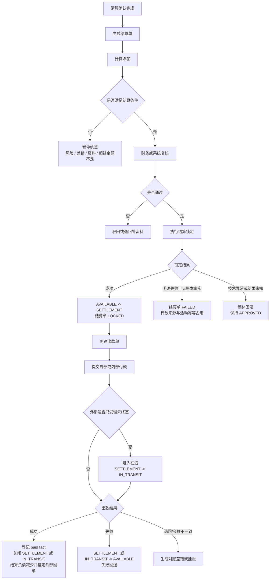

### 7.2 结算净额口径

```text
本期可结算金额
= 本期清算收款
+ 经审批调整加项
+ 经确认会补足商户的补贴、返利或代金券负债释放
+ 追偿回补
+ 汇差调增
+ 其他经审批加项
- 退款扣减
- 补贴冲回
- 争议扣回
- 平台手续费
- 通道成本或代扣项
- 不可退权益扣减或待确认留置
- 准备金
- 负余额抵扣
- 风控扣留
- 未处理差错扣减
- 汇差调减
- 其他经审批扣项
```

所有金额项必须追溯到明细、规则版本或审批单，不能只保留汇总数。含权益交易还必须能追溯到权益资金事实、组件、承担方、受益方、核销或占用引用和退款处置。调整金额、汇差修正、补贴冲回、不可退权益和储值负债处置必须拆成有方向的金额项，不能用一个无方向字段混合表达。

权益金额进入结算公式前必须先判定资金影响：

| 权益或补贴类型 | 是否可作为结算加项 | 产品规则 |
| --- | --- | --- |
| 平台补贴券补足商户 | 可以。 | 必须有补贴承担方、受益方、规则版本、核销引用和资金来源；优先以独立伴随权益指令或等价补贴事实承接。 |
| 合作方补贴或返利补足商户 | 可以。 | 必须有合作方责任、审批或合同口径、规则版本和可对账来源；缺确认时进入待确认或留置。 |
| 代金券、储值或预付权益负债释放 | 可以，但不能按普通营销优惠处理。 | 必须明确负债、预收待付或用户权益余额语义，并能和权益余额、负债台账或专业确认口径核对。 |
| 平台券不补足商户 | 不可以。 | 只表达用户侧优惠和商户按优惠后成交的应收口径，不得生成平台补贴清算加项。 |
| 商户让利 | 不可以。 | 影响商户应收、清分展示和对账解释，不生成平台补贴或额外出款。 |
| 展示优惠、运营标签或非资金权益 | 不可以。 | 只能作为展示和解释项，不得进入结算净额和账务事实。 |

结算净额中任何“补贴、返利、权益”字段都必须拆分为补足商户、商户让利、平台券不补足商户、储值或预付负债释放、补贴冲回、不可退权益和待确认留置等有方向金额项。不能用一个泛化字段把展示优惠、商户承担优惠和平台真实补足混在一起。

营销账户进入清结算前必须先完成账户化承接判断：

| 清结算金额项 | 营销账户要求 | 对账要求 | 未满足时处理 |
| --- | --- | --- | --- |
| 平台补贴补足商户 | 必须能追溯到平台营销成本账户、平台补贴资金账户角色或等价资金责任账户。 | 核对权益资金事实、补贴组件、核销引用、规则版本、订单金额、用户实付、商户应收和账本分录。 | 不进入结算加项，进入待确认或差错。 |
| 合作方补贴补足商户 | 必须能追溯到合作方补贴账户、合同或审批确认责任。 | 核对合作方对账来源、补贴组件、合同/审批引用和商户应收。 | 缺确认或缺对账来源时留置。 |
| 储值、预付或礼品卡负债释放 | 必须能追溯到权益负债账户、预收待付或用户权益余额账户。 | 核对外部权益余额、负债台账、核销引用、退款处置和专业确认状态。 | 专业口径未确认时不得作为普通优惠结算。 |
| 商户让利 | 默认不生成营销账户分录，但必须能追溯承担让利责任的资金账户、商户营销让利账户 profile 或等价归因主体。 | 核对订单价格、商户承担金额、账户化归因主体、规则版本和商户应收。 | 不生成平台补贴加项；需要独立入账时必须单独确认商户营销让利账户 profile。 |
| 营销留置 | 仅用于确认未完成、证据过期或范围不匹配的金额暂挂。 | 核对留置原因、责任方、到期重查和人工处理单。 | 不得展示为已结算、已补贴或已完成成本归集。 |

### 7.2.1 业务目标验收用例：两级代理收益分润

本用例用于验证 B7 清结算与对账设计是否能支撑代理分销分佣类场景。它不是代理系统、营销规则引擎、员工绩效系统或税务薪酬系统；这些系统必须在资金底座之前产出可审计的收益应得项、归因快照、规则版本和审批引用。

验收场景：

1. 平台员工邀请用户成为用户代理。
2. 用户代理邀请或服务的被邀请用户在平台消费，交易已成功、已过账并进入可清分识别。
3. 上层业务按利润、GMV 阶梯、代理关系和规则版本计算用户代理佣金。
4. 平台允许配置平台员工对用户代理佣金池的二级分润，或配置独立 KPI 激励。
5. 上层先把收益应得项转换成各受益账务主体的独立资金分配事实和 `CLEARING` 入账；清结算层只消费这些已过账事实，生成清分明细、清算候选和对账证据。

最小交付限定：

| 维度 | 验收口径 |
| --- | --- |
| 层级 | 只支持“平台员工 -> 用户代理 -> 被邀请用户消费”两级归因验收，不支持无限级、多层代理链或拉人头式返佣。 |
| 收益来源 | 只能来自已成功、已过账、可追溯的交易利润、手续费收入、合同确认收益或已审批激励预算；不得从报表汇总或人工 Excel 反推。 |
| 收益拆分 | 佣金池可拆成用户代理净佣金和平台员工二级分润；每个结果必须先形成独立资金分配事实。若配置为平台额外奖励，则必须作为独立员工激励成本项，不得静默扣减用户代理应得。 |
| 账户承接 | 用户代理、平台员工和合作方必须先解析到资金账户、员工应付账户、合作方账户或平台角色账户；邀请关系、员工档案和代理身份不能直接入账。 |
| 清算前状态 | 收益应得项本身不改变余额；资金分配事实先把金额记入受益账户 `CLEARING`，清分明细和清算候选不再改账。只有清算批次确认后，才允许 `CLEARING -> AVAILABLE`。 |
| 逆向处理 | 清算前发生退款、拒付、争议、风控冻结或规则撤销时，收益候选必须排除或重算；清算或结算后发生逆向，进入扣减、追偿、冲正或后续结算抵扣，不修改历史分录。 |
| 专业确认 | 税务、会计、劳动关系、合同、反不正当竞争、反洗钱和营销合规口径必须由专业方确认；未确认时只能作为设计验收或阻断原因。 |

最低验收断言：

| 断言 | 要求 |
| --- | --- |
| 来源可追溯 | 每条收益应得项能追溯到交易、账本分录、利润或 GMV 口径、归因链、规则版本、审批和操作者。 |
| 金额可解释 | 用户代理净佣金、平台员工二级分润、KPI 激励、扣减、留置和追偿必须拆成独立金额项，不得只保留一笔分佣总额。 |
| 对账可阻断 | 交易退款、争议、GMV 阶梯错算、规则版本缺失、二级关系缺失、员工审批缺失或收益合计不平时，必须生成差错或阻断清算。 |
| 账务不越界 | 清分批次确认不入账；收益清算确认才允许把平台成本、收益应付或参与方可用余额写成标准账务事实。 |
| 审计可复跑 | 同一交易、同一收益规则版本和同一归因链重复入批必须幂等；规则重跑不能覆盖旧批次、旧审批或旧差异报告。 |

### 7.3 结算策略

| 策略 | 产品含义 | 典型场景 | 注意点 |
| --- | --- | --- | --- |
| 实时 | 满足条件后立即结算或清算。 | 平台内部低风险业务。 | 实时不等于免风控、免对账、免审批。 |
| T+N | 交易日或账务成功日后 N 天。 | 商户订单收款、通道清算延迟。 | 必须说明 T 的定义。 |
| H+N | 小时级批次。 | 准实时业务或高频小额业务。 | 注意并发和重复入批。 |
| W+N | 周期性周结。 | 周结商户或合作方。 | 明确时区、节假日和顺延。 |
| M+N | 月结或月末结算。 | 月结商户、平台自营收入确认。 | 月末规则和账单版本必须留痕。 |
| 自定义账期 | 按合同账单周期计算。 | 企业卡账单、跨月合作结算。 | 必须明确起止日、账单日、结算日。 |

结算策略必须作为独立产品对象或规则快照被管理，不能只保留表达式字符串。每次可清分识别、清分批次、可清算判定、清算批次、结算单和报表输出都应固化策略编码、版本、表达式、时区、基准时间、cutoff、节假日处理、起结金额、准备金、阻断规则和策略审批引用 `policyApprovalRef`。策略解析失败、未支持表达式、缺时区或缺基准时间时必须失败或进入人工复核，不得静默按实时策略处理。

结算策略还必须声明结算模式、结算去向和触发方式：

| 维度 | 可选口径 | 产品含义 |
| --- | --- | --- |
| 结算模式 | 中间户模式、冻结模式、账单模式。 | 决定结算单是否需要形成 SETTLEMENT 锁定、是否只出账单、是否需要从冻结或留置金额释放。 |
| 结算去向 | 结算到账户、结算到卡、结算到外部端点。 | 决定出款前准入需要检查内部账户、银行卡、VA、外部钱包端点或通道能力。 |
| 触发方式 | 自动结算、自助结算、人工结算。 | 决定触发条件、审批要求、cutoff、幂等键和是否允许用户或商户主动发起。 |

不允许默认把所有结算都做成中间户模式。账单模式只生成结算单和出款依据，不代表账本已经进入 SETTLEMENT；冻结模式必须说明冻结来源、释放条件和失败回退；中间户模式必须说明 SETTLEMENT 余额桶、出款单和回单如何核对。

当前 `W1-SETTLEMENT-LOCK-001` 只准入中间户模式的清算本金结算：来源必须是同租户、同资金主体、同币种且已确认的清算批次，每个来源生成一个 `PRINCIPAL / ADD` 不可变金额项。结算单创建时固化结算模式、结算去向、触发方式、策略编码与版本、周期、时区、cutoff 和可选的 `policyApprovalRef`；复核通过时再一次性写入宿主结算审批引用 `settlementApprovalRef`。锁定前由资金底座重算来源集合、金额与策略快照摘要。账单模式和冻结模式在本切片失败关闭，不允许隐式退化为中间户模式。

同一清算批次在任一有效结算单中只能被占用一次。请求幂等摘要用于识别同一结算请求，数据库活动来源占用用于阻止不同结算单重复消费；两者不可互相替代。只有未审批、未锁定结算单取消时可以原子释放来源，已审批或已锁定来源不得释放或再次结算。

### 7.4 出款前准入门禁

出款不是结算单的自然完成态，而是把已锁定可结算金额提交给内部付款、外部通道或银行账户的高风险动作。出款提交前必须完成准入门禁，任一门禁缺失、失败或状态未知时默认阻断，不能用人工备注、运营确认或后补材料替代系统门禁。

| 门禁 | 产品要求 | 不通过处理 |
| --- | --- | --- |
| 结算锁定 | 结算单已复核通过，AVAILABLE -> SETTLEMENT 已完成，同一结算单未存在有效出款单。 | 不创建或不提交出款单，记录阻断原因。 |
| 出款账户和收款端点 | 出款账户、收款账户、VA、银行卡或外部端点状态有效，主体归属、币种、国家或地区、通道能力与结算单一致。 | 阻断出款，补齐账户资料或重新复核端点，不允许人工越权放行。 |
| 外部通道可用性 | 出款通道可用，通道额度、余额、限额、cutoff、节假日、路由版本和失败降级策略可核验。 | 延迟出款或按审批后的备用路由重建出款请求，不允许重复提交原请求。 |
| 风控与合规 | KYB/KYC、AML、名单筛查、制裁名单、商户风险、收款方风险和外部规则核验状态均未阻断。 | 进入风控、合规或人工复核；规则未核验或状态未知时按阻断处理。 |
| 对账与差错 | 清算前置对账、资金流水和结算净额一致，且不存在任何未闭环的 S0/S1/S2 差错。 | 阻断出款或进入差错处理，不得以结算单已审批替代对账结论。 |
| 负余额与准备金 | 扣除准备金、风险暂扣、负余额抵扣、追偿和最小出款金额后仍满足出款条件。 | 暂停、调整净额或生成抵扣/追偿动作。 |
| 幂等与重复出款 | 结算单号、出款组、出款请求号、外部 reference 和幂等键唯一，未命中重复提交风险。 | 拒绝重复请求，保留原出款单状态和审计证据。 |
| 审批与证据 | 高风险、超限、人工改路由、备用出款或敏感账户变更已完成审批，证据最小化且可审计。 | 不提交出款，进入审批或补证据流程。 |

外部规则核验字段必须至少包含规则来源、版本或发布日期、生效日期、适用主体或适用范围、适用法域、核验日期、确认方和确认状态。未完成核验或确认状态未知时，只能作为待确认项或阻断原因，不得作为自动出款、清算、结算或对账放行依据。

### 7.5 出款规则

| 场景 | 处理规则 |
| --- | --- |
| 出款提交前 | 必须完成出款前准入门禁，默认一张结算单只生成一张出款单，防止重复出款；若后续要支持拆分出款，必须先补拆分规则、出款明细和幂等边界。 |
| 外部受理成功 | 只表示外部已受理，不等于资金到账；需要账本可见在途时进入 IN_TRANSIT，否则保持出款单待确认。 |
| 出款成功 | 形成 paid fact，关闭 SETTLEMENT 或 IN_TRANSIT，记录外部回单、到账证明、外部 reference、出款账户或平台现金映射，并能证明商户结算负债减少和外部付款结果一致。 |
| 出款失败 | 按原锁定或在途金额 SETTLEMENT/IN_TRANSIT -> AVAILABLE，只回退一次。 |
| 出款退回 | 生成退回或对账差错，按责任和费用规则处理。 |
| 出款金额不一致 | 出款单进入金额不一致或差错处理状态，生成差错单或挂账。不得展示为出款成功，也不得按普通失败重复回退。 |
| 出款解释状态 | 商户账单、出款处理台和审计导出必须使用服务端生成的事实状态、展示状态和操作状态；状态缺失时只允许内部排障，不允许自动放行、审计导出或展示为完成。 |
| 已出款后退款或拒付 | 不回滚历史出款，进入追偿、准备金、负余额或后续抵扣。 |

## 8. 对账设计

### 8.1 对账核心目标

对账的产品目标不是“跑一个差异报表”，而是证明交易、账务、余额和真实资金都能互相解释。只有对账结果可解释，清分、清算、结算和出款才有可靠依据。

| 目标 | 易懂定义 | 典型核对对象 | 通过标准 |
| --- | --- | --- | --- |
| 账实一致 | 内部账本记录能对应真实资金流水。 | 账本分录、银行流水、支付通道清算文件、托管户流水、外部回单。 | 金额、币种、方向、主体、时间窗口和外部 reference 可匹配；差异有差错单。 |
| 账账一致 | 不同内部账之间口径一致。 | 业务账、支付账、账户账、商户账、总账、明细账、交易投影、余额投影。 | 同一业务事实在各账的状态、金额、方向和主体一致；汇总等于明细。 |
| 单账一致 | 每张业务单据都能对应到账务流水。 | 业务单、支付单、退款单、清分批次、清算批次、结算单、出款单、调账单。 | 单据金额、状态和账务分录可互相追溯；无单无账、有单无账、有账无单都进入差错。 |
| 余额一致 | 余额变化能被本期入账和出账解释。 | 资金账户（含平台角色解析后的平台资金账户）、信用账户、商户资金账户；支出控制范围按 Spend Rule 窗口和控制视图核对。 | 期初余额 + 本期入账 - 本期出账 = 期末余额，且可用、冻结、在途、待清算、可结算、已结算等余额桶分别成立；预算控制视图不得冒充资金余额。 |

对账准入和清分清算的关系：

| 环节 | 对账要求 | 产品解释 |
| --- | --- | --- |
| 清分前 | 需要完成基础一致性校验，至少证明交易成功、账本已过账、单据与账务可追溯、余额位置可解释。 | 清分是内部归类动作，可以不等待所有外部资金文件最终到齐，但不能在内部单据或账务不一致时入批。 |
| 清分确认 | 需要证明清分明细来自已通过基础校验的来源事实。 | 清分批次确认不入账，但会成为清算输入，因此必须保留校验结果和排除原因。 |
| 清算前 | 必须完成或满足策略允许的前置对账，且清分已确认。 | 清算会触发 CLEARING -> AVAILABLE，因此对账要求高于清分；重大差错、重复入账、金额不一致、退款/争议阻断不得放行。 |
| 结算/出款前 | 必须重新检查清算结果、结算净额、出款账户、外部回单、负余额、风险和差错。 | 出款是真实资金风险最高的阶段，不能只依赖历史清算结果。 |

### 8.2 对账分类

| 对账类型 | 核对对象 | 目标 |
| --- | --- | --- |
| 交易对账 | 业务单、资金交易、通道交易、外部流水。 | 单据状态、金额、币种、reference 一致。 |
| 权益对账 | 订单、营销权益系统、资金交易、账本、清结算和财务核对输入。 | 证明用券、核销、补贴、商户让利、代金券、退款处置和商户应收一致。 |
| 资金到账对账 | 平台现金映射、银行流水、通道回单、出款单。 | 证明外部钱是否真的到或出。 |
| 账务一致性核对 | 资金交易、账本交易、分录、余额投影。 | 证明账务平衡且投影正确。 |
| 清结算对账 | 清分批次、清算批次、结算单、出款单、商户账单。 | 证明批次、净额、出款和报表一致。 |
| 报表核对 | 交易视图、财务核对投影、报表指标模块输出、账本明细。 | 证明报表和指标输出来自可追溯事实。 |
| 外部文件对账 | 卡组织、ACH、银行、PSP、合作机构文件。 | 识别 return、refund、chargeback、费用和状态差异。 |

对账分类必须同时标明数据分段，便于运营、财务和研发判断差异来源：

| 数据分段 | 数据来源 | 主要用途 | 不允许 |
| --- | --- | --- | --- |
| 交易数据 | 订单、支付单、资金交易、退款、授权和调账事实。 | 证明业务状态、金额、币种和 reference 是否一致。 | 用交易状态替代账本分录或外部到账。 |
| 账务数据 | 账本交易、posting plan、LedgerEntry、余额投影和余额快照。 | 证明账务平衡、余额桶和账本周期是否成立。 | 用投影反写资金事实。 |
| 清分清算数据 | 可清分明细、清分批次、清分结果快照、清算候选、清算批次、结算单和出款单。 | 证明应收应付、净额、扣减项和出款依据可解释。 | 把清分确认、清分结果快照或结算单审批展示为外部到账成功。 |
| 外部资金数据 | 通道文件、银行流水、托管户流水、卡组织文件、ACH 文件和外部回单。 | 证明真实资金、外部状态和通道账是否匹配。 | 未验签、未解析或缺主体映射时自动对平。 |

### 8.3 对账规则矩阵

| 规则 | 适用目标 | 核对口径 | 不通过时的产品动作 |
| --- | --- | --- | --- |
| 主体一致 | 账实、账账、单账、余额 | 用户、商户、平台角色和外部账户引用必须能映射到正确资金账户、信用账户或平台角色解析后的平台资金账户；支出控制范围和 Spend Rule 必须映射到控制快照、规则版本和审计证据。 | 生成主体或控制快照不一致差错，阻断清分、清算或出款。 |
| 金额一致 | 账实、账账、单账、余额 | 金额使用同一币种和最小货币单位；本金、手续费、平台补贴、商户让利、代金券核销、通道成本、退款、调账、准备金不得混为一个总额。 | 生成金额差异；差额进入挂账、调账、补差或追偿。 |
| 权益金额一致 | 账账、单账、清结算、报表 | 订单原始金额、用户实付、商户让利、平台补贴、代金券核销、补贴冲回、不可退权益和商户应收必须能由原权益资金事实、历史摘要或补充事实解释。 | 生成权益差错；阻断清算、结算或报表，直到补事实、冲正、调账或人工确认。 |
| 方向一致 | 账账、单账、余额 | 入账、出账、冻结、解冻、待清算、可结算、已结算的方向必须一致。 | 生成方向不一致差错，禁止继续释放资金。 |
| 状态一致 | 账实、账账、单账 | 业务单、支付单、退款单、资金交易、账本交易、外部文件状态必须能解释。 | 生成状态差异，进入复核或补事实。 |
| 币种一致 | 账实、账账、余额 | 交易币种、清算币种、结算币种和账本币种不能静默混用。 | 生成错币种差错，按换汇或挂账流程处理。 |
| 时间窗口一致 | 账实、账账、余额 | 交易日、账务日、清算日、结算日、报表日和账本周期必须口径清楚。 | 进入跨日差异、延期文件或账期复核。 |
| 单据引用一致 | 单账 | 单据必须能追溯到资金交易、账本交易、分录和外部 reference。 | 有单无账、有账无单、重复单据均生成差错。 |
| 余额公式一致 | 余额 | 按账户和余额桶分别验证期初、本期入、本期出、期末。 | 投影不平时阻断报表和清结算，进入余额投影重建或差错。 |
| 明细汇总一致 | 账账、余额 | 批次汇总必须等于明细合计，商户汇总必须等于商户明细合计。 | 阻断批次确认，要求重算或差错处理。 |
| 外部 reference 唯一 | 账实、单账 | 同一外部 reference 不得重复入账或重复出款。 | 生成重复入账或重复出款风险，进入冲正或人工复核。 |

### 8.3.1 外部来源标准化和证据最小化

对账不能直接消费外部文件原文、银行流水原文或通道报文原文。外部来源必须先标准化为“来源记录 + 标准化明细 + 质量结论”，再进入匹配和差错判断；来源本身只提供证据，不直接生成账务事实或资金事实。

| 对象 | 产品口径 | 必须固化的信息 | 不允许 |
| --- | --- | --- | --- |
| 原始来源记录 | 表示一次外部文件、流水、回单、卡组织清算文件、银行账单或合作机构对账输入。 | 来源类型、提供方、文件或批次引用、接收时间、业务账期、摘要 digest、校验和、验签状态、解析版本、敏感字段处理状态和原文留存位置引用。 | 把原始外部文件内容写入普通查询、商户视图、告警或导出；未验签或未解析成功即参与自动对平。 |
| 标准化来源明细 | 表示可用于账实匹配的最小外部证据项。 | 外部 reference、外部账户引用、主体映射引用、金额、币种、方向、状态、交易日、入账日、清算日、幂等键、重复识别键和来源记录引用。 | 用自由文本备注解释金额、方向或状态；缺主体映射时直接入账或放行。 |
| 来源质量结论 | 表示该来源是否可进入自动匹配、候选匹配或人工处理。 | `VERIFIED`、`PARTIAL`、`WAITING_DATA`、`FAILED`、`DUPLICATED` 等结论、失败原因、责任方、到期重查时间和处理建议。 | 把 `WAITING_DATA`、`FAILED` 或 `DUPLICATED` 来源当作对账通过。 |

产品红线：

1. 外部来源标准化只形成证据和匹配输入，不替代资金交易、账本交易、余额投影或交易投影。
2. 敏感原文只能通过受控证据引用查看，普通工作台、商户账单、告警和导出只允许展示脱敏字段、摘要、reference 和处理结论。
3. 来源未验签、解析失败、重复、缺账期、缺幂等键或缺主体映射时，最多进入 `WAITING_DATA`、`FAILED`、`DUPLICATED` 或人工候选，不得自动对平或释放资金。

含权益交易还需要增加营销权益系统、订单系统、资金交易、账本和清结算之间的核对：

| 对账对象 | 核对内容 | 不通过时 |
| --- | --- | --- |
| 订单系统 | 订单原始金额、优惠后金额、商品行分摊、退款商品行和用户实付。 | 生成订单金额差错；不得按资金侧或营销侧任一方静默覆盖。 |
| 营销 / 权益系统 | 权益占用、核销、退券、作废、活动预算扣减和规则版本。 | 生成权益核销差错；授权拒绝后核销必须由营销释放或补偿，资金底座不得补造交易。 |
| 资金交易 | 用户实付、平台补贴、代金券核销、退款、撤销和 route snapshot。 | 生成资金金额或路径差错；缺权益资金事实或历史摘要时进入人工处理。 |
| 账本系统 | 用户、商户、平台、负债账户的分录和平衡。 | 生成账务差错；商户让利不得误入账，储值券不得误当普通券。 |
| 清结算系统 | 商户应收、待清算、可结算、补贴冲回、扣减项和不可退权益金额。 | 阻断清算、结算或出款，直到差错闭环。 |
| 财务核对输入 | 补贴成本、手续费收入、负债释放、沉淀收益和差错挂账。 | 标记财务待确认；不得由资金底座自行确认会计口径或生成正式财务报表。 |

### 8.4 对账任务执行流程

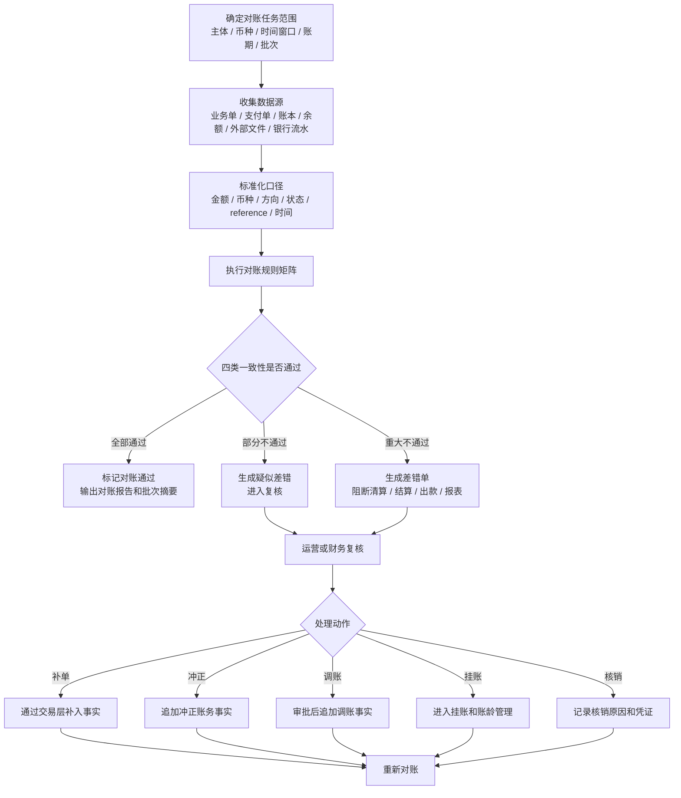

对账任务不是只按定时任务运行，也可以由业务动作触发。

| 任务类型 | 触发条件 | 目标 | 是否影响清结算 |
| --- | --- | --- | --- |
| 清分前基础对账 | 交易成功后进入可清分识别前。 | 证明单据、资金交易、账本分录和余额桶可解释。 | 不通过则不可清分。 |
| 清算前置对账 | 清分结果快照固化后，生成清算候选前。 | 证明账实、账账、单账、余额满足清算放行要求。 | 当前不通过即不可清算；低风险条件放行仅作为目标态保留。 |
| 批次对账 | 清分批次、清算批次、结算单、出款单生成或确认后。 | 证明批次汇总等于明细，批次状态和金额一致。 | 重大差异阻断后续节点。 |
| 外部文件对账 | 收到银行、通道、卡组织、ACH、托管户或合作机构文件后。 | 证明内部事实与外部文件一致。 | 差异可阻断清算、结算、出款或报表。 |
| 余额日切对账 | 日切、月结、账本周期结束或财务关账前。 | 验证期初、本期入出、期末和余额桶。 | 不通过则阻断报表发布和关账。 |
| 差错重跑对账 | 差错补单、冲正、调账、挂账、核销后。 | 证明差错处理后已经对平。 | 不通过不得关闭差错。 |

对账批次纠错必须区分“未完成作业停止”和“完成态证据失效”：未完成批次不再继续执行时可以终止；批次一旦形成 `COMPLETED` 运行事实就不能再终止或改写。后续确认来源、解析或匹配证据无效时，必须创建显式引用原批次的替代批次，原批次继续保留 `COMPLETED` 供审计追溯，依赖原证据的差错进入 `INVALIDATED`，不再阻断准入，也不能继续追加处理动作或重跑结果。替代批次必须重新冻结来源并完成对账后，才能形成新的当前准入证据。

#### 正向对账运行结果证据

“没有登记差错”只能说明当前差错表中没有记录，不能证明收数、标准化和匹配已经成功执行。清分、清算、结算和出款准入必须引用一次明确的对账运行结果，禁止通过空差错集合推断对账通过。

| 结果要素 | 产品含义 | 约束 |
| --- | --- | --- |
| `reconciliationBatchSn` | 标识本次运行所属的对账批次；重跑使用新的批次流水号。 | 不得覆盖旧运行结果。 |
| `reconciliationScopeRef` | 标识账户、外部资金事实、清算批次、结算单或出款单等稳定对账范围。 | 必填并参与批次摘要；不得用规则版本或时间窗口代替业务范围。 |
| `gateObjectType + gateObjectSn` | 可选标识该结果能被哪个清分、结算或出款对象消费；纯对账时两者同时为空。 | 必须同时存在或同时为空；无绑定结果不得用于 Gate，已绑定结果不得跨对象、跨类型复用。 |
| `status` | 完成态结果只包含 `BALANCED` 或 `DIFFERENCE_FOUND`；`WAITING_DATA`、`FAILED` 属于对账任务生命周期。 | 完成态状态由逐笔匹配结果派生，调用方不能自报；只有 `BALANCED` 是正向准入证据。 |
| `ruleVersion + referenceSourceDigest + comparisonSourceDigest + sourceDigest` | 证明本次运行使用的规则、基准侧事实集合和核对侧事实集合版本；`sourceDigest` 由两侧摘要组合生成。 | `REFERENCE/COMPARISON` 表示本次核对角色，不等同于内部/外部；规则或任一来源变化必须形成新批次，不得修改旧结果。 |
| `matchResults + matchIdentityDigest + matchDigest` | 保存每一项的基准侧/核对侧稳定引用、来源质量、匹配强度、差错字段和证据引用；来源对身份与完整结果摘要分离。 | 当前版本只支持一对一匹配：任一侧稳定引用最多参与一个结果；`EXACT_MATCH`、`RULE_MATCH` 必须两侧引用齐全且来源已验证；`REFERENCE_MISSING` 或 `COMPARISON_MISSING` 只允许对应一侧为空。未来一对多或多对一必须引入显式聚合匹配模型，不得靠重复引用隐式表达。 |
| 单次原子封版容量 | 当前一侧来源快照最多包含 1000 个来源成员，一次运行结果最多包含 2000 个逐笔匹配结论；来源稳定引用和逐笔来源引用最长 128 字符，来源证据最多 100 项且每项最长 256 字符，逐笔证据引用最长 256 字符。 | 数量或字段长度超限必须在查询或锁定批次、分配事实流水号和写库前快速失败；该上限是当前同步原子接口的保护边界，不是生产吞吐承诺。更大文件必须先由上层分区，或在后续引入可校验的分段导入、完成后原子封版能力，不能由调用方拆成多个同角色快照绕过。 |
| Gate 检查容量 | 单次 Gate 最多遍历 100 层批次血缘、读取 2000 条对象级差错。 | 血缘超限、循环或断裂直接失败；差错超过单次检查容量时返回 `BLOCKED`，不得截断后误判通过。该限制由 H2 边界与失败关闭用例验收；宿主按自身流量做容量评估。 |
| `totalCount + matchedCount + differenceCount` | 说明本次运行的处理范围和匹配摘要。 | 三个计数由逐笔匹配结果生成；`BALANCED` 必须全部自动匹配且差错数为 0。 |
| `resultDigest + evidenceRefs` | 由资金底座根据来源摘要、排序后的逐笔摘要和批次事实生成稳定结果摘要，并保存来源文件或报告引用。 | 准入对象必须保存结果流水号和摘要，以支持审计和重放；证据只保存受控引用，不保存原始敏感文件。 |

当前准入顺序固定为：读取指定运行结果 -> 校验结果已绑定准入对象 -> 校验租户和准入对象 -> 校验当前批次血缘头 -> 校验 `BALANCED` -> 检查对象级差错 -> 输出通过或阻断。最终资金命令使用权威 `checkGate`，在调用方事务内对血缘头、当前批次和阻断差错执行锁定当前读；报表和运营解释使用不加锁的 `inspectGate`，其结果不是授权。无 Gate 的纯对账结果可以按流水号读取运行摘要，并分页读取逐笔匹配结果，用于财务证明和上层运营处理；reconciliation 当前仍不为其物化差错单。历史差错完成处理且经当前批次重新对平后按普通通过返回，并单独给出已闭环历史差错数量；带审批、阈值、风险承接和到期重查的条件放行仍是目标能力，当前未实现。

当前工程切片已落地 `ReconciliationBatch`、两侧不可变 `ReconciliationSourceSnapshot` / 来源成员、不可变 `ReconciliationRunResult` 和 `ReconciliationMatchResult`。批次先冻结 `reconciliationScopeRef`、可选准入对象、规则版本、时间窗口和时区，再分别冻结 `REFERENCE`、`COMPARISON` 来源集合。每个来源成员包含稳定引用和由可信来源适配器基于规范化不可变业务事实生成的 `contentDigest`；摘要只证明内容身份和重放一致性，不证明验签、来源授权或原文真实性，这三项必须由宿主适配器和 IAM 保证。对账模块不解释业务原文，但会把引用与内容摘要一起冻结并聚合为来源摘要。运行服务只接受批次流水号和逐笔匹配结论，范围引用、来源摘要、来源证据、可选准入对象和规则版本均从冻结事实读取。运行前必须证明逐笔结果完整覆盖两侧来源且没有越界引用；允许一侧为空以表达缺失差错，但两侧不能同时为空。因此调用方不能通过少报来源、自报集合摘要、改写同一引用背后的内容或更换证据把局部结果伪装成 `BALANCED`。

当前来源冻结和运行结果写入都是单事务原子封版，不是流式文件导入接口。1000/2000 的上限用于阻止无界集合在持有批次锁时排序、校验和逐条写入；它只证明超限安全失败，不证明边界值已经满足任何具体商户、银行、卡组织或全球账户的生产容量。接入方必须按真实日峰值、文件大小、事务时长和重跑窗口完成容量验收；超过当前边界时应停止接入并设计分段导入协议，而不是调高常量或静默截断。

绑定 Gate 的差异必须沿 `ReconciliationMatchResult -> ReconciliationRunResult -> ReconciliationBatch` 事实链生成差错对象。调用方只选择已持久化的逐笔匹配结果并补充责任方和说明，不能自行填写差错号、金额、规则、证据或阻断对象；一个逐笔匹配结果只能物化一个差错。金额差异保留币种和实际差额，状态、主体、重复或来源质量等非金额差异不伪造币种和零金额。无 Gate 的纯对账差异继续由上层运营任务承接，不被伪装成清分、结算或出款阻断对象。

同一差错可以经历多轮补事实、冲正、调账、挂账、追偿或核销。每个已由上层业务确认并完成的处理动作都追加一条不可变动作事实，差错主表只保存最新动作快照和最后重跑结论；动作流水号与幂等键在租户内唯一。处理动作必须先回链，再创建以当前批次为父的后继重跑批次；已有后继批次时不得补挂动作，避免复用动作发生前形成的旧结果关闭差错。差错的当前批次由 `lastRerunBatchSn` 表达，尚未经历重跑时回退到初始 `reconciliationBatchSn`；后继重跑准入按该当前锚点核对差错和动作，不为每轮重跑重复创建差错。`ADJUSTING` 必须先重跑，未对平进入 `RECONCILING` 后才允许追加下一动作；只有后继线性批次重新对平才能关闭差错，不能用更新主表覆盖历史动作。

批次状态、运行结论和准入决策必须分层表达：批次只使用 `CREATED -> DATA_COLLECTING -> DATA_READY -> COMPLETED` 描述工程进度；运行结果只使用 `BALANCED / DIFFERENCE_FOUND` 表达核对结论；当前准入决策只使用 `PASSED / BLOCKED`。文件等待、解析失败、匹配执行失败等任务态由上层任务编排记录，不得塞入完成态批次或运行结果。同一租户和同一 Gate 对象只有一条批次血缘及一个当前头，根批次同时冻结其对账范围；调用方不能通过更换 `reconciliationScopeRef` 为同一对象创建平行血缘。重跑必须创建新批次并通过 `previousBatchSn` 引用当前头，且对账范围、准入对象和窗口保持不变，规则版本可以按运营决策升级。绑定 Gate 的上一运行存在差异时，所有差异必须先物化进入运营处置链，才允许推进当前头。旧批次、来源和结果继续可追溯，但当前头一经推进，旧运行结果立即失去准入资格；新批次未形成可信结论时必须保持阻断，不得回退信任旧结论。

本切片不负责定时调度、外部文件下载与解析、业务来源归一化、匹配规则执行、差错自动创建或运营后台；这些由上层对账任务和适配层负责。资金底座提供清分/清算待处理对象的分页发现入口，但不按查询结果自动确认、释放或改账。可信适配器调用权限、来源验签与证据访问控制、统一 Web 审计、容量、观测、Runbook 和外部规则核验属于宿主接入责任；它们不属于 wind-funds 代码交付或生产验收证据。

对账匹配结果必须区分匹配强度，避免“看起来像同一笔”被误当成自动对平。

| 匹配强度 | 产品含义 | 是否允许自动对平 | 处理要求 |
| --- | --- | --- | --- |
| `EXACT_MATCH` | 内部事实、外部 reference、主体、金额、币种、方向、状态和关键时间窗口完全一致。 | 允许。 | 记录规则版本、匹配摘要和来源证据引用。 |
| `RULE_MATCH` | 命中已发布规则，例如手续费尾差、汇率尾差、跨日 cutoff 或外部状态映射，且在阈值内。 | 允许，但必须带规则版本。 | 固化阈值、规则版本、责任方和可审计解释。 |
| `CANDIDATE_MATCH` | 参考字段相似，但仍缺关键证据或存在多候选。 | 不允许。 | 进入人工复核或补证据，不得释放资金。 |
| `MANUAL_CONFIRMED` | 人工基于审批、凭证和责任判断确认可解释。 | 默认不允许自动对平。 | 只能按放行矩阵、审批和到期重查处理；需要资金影响时由上层业务调用受控资金能力并重新对账。 |
| `UNMATCHED` | 未找到可解释的内部事实或外部证据。 | 不允许。 | 生成差错、阻断相关节点或进入等待数据。 |

对账任务本身也必须有生命周期，避免“任务失败但批次继续走”“文件延迟被误判为通过”“人工关闭绕过重新对账”。以下任务态是宿主对账编排的目标产品状态；当前 wind-funds 只固化批次进度和完成态结论，不承接任务等待、失败、过期、SLA 或调度。

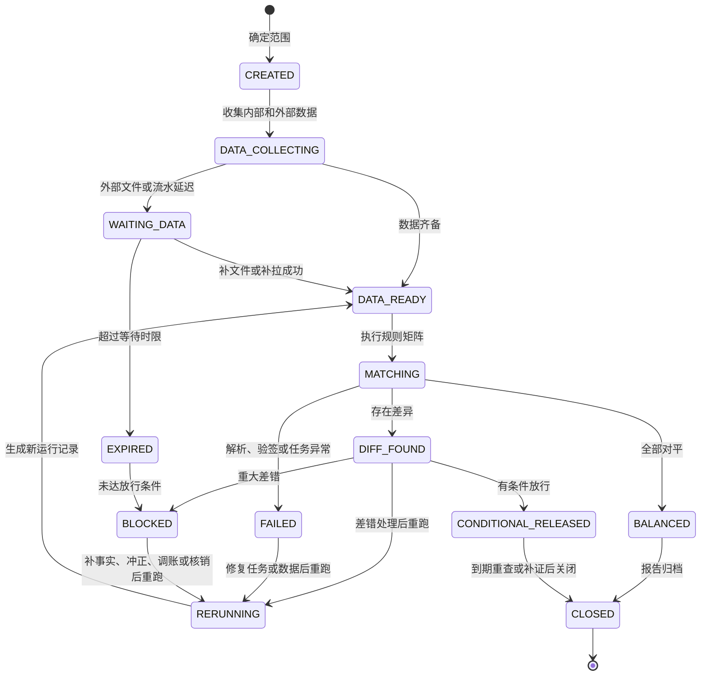

| 状态 | 产品含义 | 允许动作 | 禁止动作 |
| --- | --- | --- | --- |
| CREATED | 对账范围已经确定。 | 固化主体、币种、时间窗口、批次和规则版本。 | 后续随意扩大范围。 |
| DATA_COLLECTING / WAITING_DATA | 内部事实、外部文件或银行流水尚未齐备。 | 补拉、补文件、验签、去重和记录等待原因。 | 把缺文件当作对账通过。 |
| DATA_READY / MATCHING | 数据已准备并进入规则比对。 | 执行规则矩阵，输出匹配明细和差异。 | 人工跳过关键规则。 |
| BALANCED | 对账目标全部满足。 | 输出对账报告，允许进入下一节点。 | 修改已对平范围和摘要。 |
| DIFF_FOUND | 存在差异但尚未定级。 | 生成疑似差错，分派复核。 | 直接改账或直接关闭。 |
| CONDITIONAL_RELEASED | 差异可解释且满足放行矩阵。 | 记录审批、阈值、到期重查和风险准备。 | 对重大差错带原因放行。 |
| BLOCKED | 存在阻断级差错。 | 阻断相关清分、清算、结算、出款或报表。 | 继续释放资金。 |
| FAILED / EXPIRED | 任务异常或等待超时。 | 修复任务、补数据或升级人工处理。 | 静默重试且不留审计。 |
| RERUNNING | 差错处理后重新执行。 | 生成新的运行记录和差异报告。 | 覆盖旧运行记录。 |
| CLOSED | 任务已经归档。 | 查询报告、证据和审批链。 | 关闭后追加修改结果。 |

### 8.4.1 对账任务账龄和升级规则（目标态宿主能力）

对账任务和差错不能长期停留在“有解释差异”“等待文件”或“挂账处理中”。每个未对平状态都必须有账龄、到期动作和升级责任。当前 reconciliation 表和服务尚未实现 `dueAt`、账龄桶、自动升级与告警，生产宿主未补齐前不得宣称 SLA 闭环。

| 场景 | 账龄起算点 | 到期前允许动作 | 到期动作 |
| --- | --- | --- | --- |
| `WAITING_DATA` | 进入等待外部文件、流水或回单的时间。 | 补拉、补文件、重新验签、补主体映射和记录责任方。 | 自动转 `EXPIRED` 或 `BLOCKED`，阻断相关清算、结算、出款或报表。 |
| `CANDIDATE_MATCH` | 产生候选匹配结果的时间。 | 人工复核、补证据、排除候选或升级为差错。 | 自动升级为疑似差错，不得继续保留候选放行。 |
| `CONDITIONAL_RELEASED` | 审批放行时间。 | 到期重查、准备金或冻结承接、补证据和复核。 | 未对平时自动升级为 `BLOCKED` 或人工复核，不得无期限续放。 |
| `SUSPENSE` / 挂账 | 挂账动作生效时间。 | 追偿、调账、补事实、冲正、核销或重新对账。 | 超 SLA 自动升级财务和运营负责人，并阻断同范围后续放行。 |
| `RECOVERING` | 差错处理动作提交时间。 | 等待补事实结果、冲正结果、调账审批或重新对账。 | 处理失败或超时必须保留失败原因并回到差错状态，不得关闭。 |

账龄维度至少包含 `0-1D`、`2-3D`、`4-7D`、`8-30D`、`30D+` 或等价配置。具体 SLA 可按资金产品、通道、币种、法域和外部规则配置，但产品默认值必须保守：影响金额、主体、币种、方向、余额公式或重复出款的差错不得因账龄变长而自动放行。

### 8.4.2 清结算批次治理和视图重放拆入项（原 04）

清结算与对账相关的归档语义不再作为独立产品能力表达，统一拆入批次关闭、差异报告和只读视图重放。这里的“归档”只表示报告、证据、摘要和审批链进入不可篡改留存状态，不表示生成新的资金事实。

| 拆入项 | 承接对象 | 产品口径 | 验收入口 |
| --- | --- | --- | --- |
| 批次报告留存 | 清分批次、清算批次、结算单、出款单和对账任务。 | 关闭后的报告、摘要、证据和审批链只读可查。 | `AC-REC-015`、`CLS-GATE-007`。 |
| 批次视图重放 | 清分、清算、结算、出款和对账差错投影视图。 | 只重建批次展示和差异视图，不重新清分、重新清算或重新入账。 | `AC-REPLAY-004`。 |
| 差异报告留存 | 对账差异、放行审批、阻断原因和人工处理记录。 | 每次运行保留独立报告；重跑产生新运行记录，不覆盖历史。 | `AC-REC-014`、`AC-ARCH-008`。 |
| 指标输入边界 | 财务核对投影、对账汇总、批次状态和差错分类。 | 只向报表指标模块提供只读输入，不在清结算域计算正式经营指标。 | `AC-RPT-*`。 |

产品红线：

1. 批次报告留存不能成为补账、改账或关闭差错的捷径；资金事实仍必须通过交易、账本、清结算和对账差错闭环追加。
2. 批次视图重放只能修复展示、导出或报表输入视图，不得触发资金释放、重新出款或外部提交。
3. 对账任务关闭后发现差错，应创建新的差错处理或重跑记录，不允许修改已关闭报告。
4. 报表指标模块可以消费批次和差异摘要，但不得反向推进清结算水位、出款状态或资金事实。

### 8.5 对账通过、放行和阻断规则

当前实现口径只有“通过”与“阻断”：任一未闭环的 S0/S1/S2 差错均阻断。下表中的有解释差异、放行矩阵、账龄和到期重查是目标态产品设计，未形成当前 API、状态或资金放行能力。

| 结果 | 产品含义 | 后续动作 |
| --- | --- | --- |
| 对账通过 | 四类一致性目标均满足，且不存在影响资金、账本、单据或余额的差异。 | 可进入清分、清算、结算、出款或报表的后续处理。 |
| 有解释差异 | 存在跨日、文件延迟、手续费差、汇率差、外部处理中等可解释差异。 | 只能按放行矩阵暂缓、人工复核或有条件放行；必须保留差异说明、审批和到期重查。 |
| 疑似差错 | 规则不通过但未确认责任和金额影响。 | 进入复核，不得直接改账。 |
| 重大差错 | 金额不平、重复入账、缺分录、错主体、错币种、外部失败内部成功、余额公式不成立。 | 阻断清算、结算、出款或报表发布，生成差错单。 |
| 已核销差异 | 差错已通过补事实、冲正、调账、挂账、追偿或凭证确认关闭。 | 重新对账通过后才能关闭，不得只改差错状态。 |

对清分和清算的准入描述应按以下口径表达：

1. “清分的准入前提是对账通过”需要限定为基础对账通过：交易、单据、账本分录、余额桶和来源快照必须一致或可解释。
2. “清算的准入前提是已经对账、清分过了”更准确：清算必须来自已确认清分批次，并完成清算前置对账；当前外部文件延迟导致无法对平时必须阻断。
3. 对账未通过时，当前实现一律阻断资金释放；低风险差异带原因放行是尚未实现的目标态能力。

### 8.6 对账差异放行矩阵

本节是目标态设计，当前代码不执行该矩阵。未来放行也不是“忽略差异”，而是在已知原因、已定责任、已设阈值、已留准备、已到期重查的前提下，允许低风险流程继续推进。默认规则是：影响主体、币种、金额、方向、余额公式、重复入账、重复出款、缺分录和外部失败内部成功的差异必须阻断。

| 差异类型 | 默认处理 | 是否可放行 | 放行条件 | 影响范围 |
| --- | --- | --- | --- | --- |
| 错主体、错账务主体 | 必须阻断。 | 否。 | 修正主体、补事实或冲正后重新对账。 | 阻断清分、清算、结算、出款和报表发布。 |
| 错币种或静默换汇 | 必须阻断。 | 否。 | 进入换汇、挂账或差错审批；重新对账通过。 | 阻断相关资金释放。 |
| 金额不平、余额公式不成立 | 必须阻断。 | 否。 | 补事实、冲正、调账、重建投影或核销后重新对账。 | 阻断清算、结算、出款和关账。 |
| 重复入账、重复出款、重复外部 reference | 必须阻断。 | 否。 | 确认唯一事实，冲正重复事实或拒绝重复出款。 | 阻断出款和相关批次确认。 |
| 缺账本分录、有单无账、有账无单 | 必须阻断。 | 否。 | 通过交易层补入事实或差错闭环后重跑。 | 阻断对应清分、清算或报表。 |
| 外部失败内部成功、状态不可解释 | 必须阻断。 | 否。 | 外部回查、补通知、冲正或补偿后重新对账。 | 阻断资金释放和状态展示。 |
| 文件延迟、银行未达账、通道处理中 | 暂缓或进入在途。 | 有条件。 | 有外部处理状态、账龄阈值、责任方、到期重查和在途余额口径。 | 可暂缓清算或带原因进入低风险节点。 |
| 手续费尾差、汇率尾差、舍入差 | 复核差额。 | 有条件。 | 在容差阈值内，有规则版本、财务确认、费用调整或挂账路径。 | 不得影响本金释放；差额进入费用或挂账。 |
| 跨日归属差异 | 复核交易日、账务日或清算账期。 | 有条件。 | 有明确时区、cutoff、外部文件日期和账务日解释。 | 可调整归属周期，不得直接改历史事实。 |
| 报表展示差异、非资金字段差异 | 进入报表修复。 | 有条件。 | 不影响资金、账本、余额和单据一致性。 | 只阻断报表发布或导出。 |

有条件放行必须同时满足：

1. 差异类型、金额、主体、币种、责任方、账龄、影响范围和处理 SLA 已记录。
2. 规则版本、阈值、审批人、复核人、凭证和放行原因已固化。
3. 涉及资金释放时，必须有准备金、冻结、挂账、在途或后续抵扣等风险承接方式。
4. 到期仍未对平时必须自动升级为阻断或人工复核，不得长期停留在“有解释差异”。
5. 放行只对本范围有效，不得扩展到其他主体、币种、批次或周期。

### 8.7 账实映射和余额桶校验

账实一致不是简单把外部流水和内部总额相加，而是要说明内部账务主体、账目和余额桶分别对应哪些外部证据。没有映射关系的余额，不得作为清算、结算、出款或关账依据。

| 内部口径 | 外部或业务证据 | 对账目标 | 不通过时 |
| --- | --- | --- | --- |
| CLEARING 待清算 | 支付成功事实、通道或卡组织清算文件、退款文件、商户待清算明细。 | 证明商户待清算金额来自成功交易且未被退款、争议或差错占用。 | 阻断清分或清算候选。 |
| AVAILABLE 可结算 | 已确认清算批次、商户可结算明细、风险扣留和准备金规则。 | 证明可结算余额来自已清算金额扣除冻结、退款、费用和追偿。 | 阻断结算单生成或锁定。 |
| SETTLEMENT 出款中 | 结算单、出款单、代付通道提交记录、银行回单。 | 证明出款锁定金额未被重复结算或重复提交。 | 阻断重复出款，进入出款差错。 |
| IN_TRANSIT 在途 | 外部受理、银行未达账、通道处理中、托管户未清分。 | 证明外部处理中金额有来源、责任方和到期重查。 | 进入在途账龄和差错管理。 |
| AUTHORIZATION 授权占用 | 授权交易、VCC 授权、预算控制快照、授权完成/撤销/过期事件。 | 证明授权占用、完成、释放和退款都引用原授权快照；预算控制只作为规则证据，不被当作冻结或最终消费。 | 阻断授权完成、释放、退款或报表发布。 |
| FROZEN 冻结 | 风控冻结、争议冻结、结算准备金、运营审批单。 | 证明冻结只控制同主体可用性，不表达真实资金转移，也不承接授权占用。 | 阻断解冻、出款或报表发布。 |
| 平台费用和成本账户 | 费率规则、通道账单、发票、成本文件、财务凭证。 | 证明费用收入、通道成本、税费和补贴不与商户本金混写。 | 进入费用差错或财务复核。 |

余额一致需要按余额桶分别成立，而不是只看账户总余额。

| 余额桶 | 校验公式 | 关键约束 |
| --- | --- | --- |
| CLEARING | 期初待清算 + 本期成功入账 - 本期退款/冲正/清算确认/扣减 = 期末待清算。 | 不得从报表反推；清算确认才允许减少。 |
| AVAILABLE | 期初可用 + 本期清算确认/释放 - 本期结算锁定/退款/费用/调账 = 期末可用。 | 负余额、冻结和风险阻断必须可解释。 |
| SETTLEMENT | 期初出款中 + 本期结算锁定 - 本期出款成功/失败回退/退回差错 = 期末出款中。 | 外部受理不等于出款成功。 |
| IN_TRANSIT | 期初在途 + 本期外部提交或外部处理中 - 本期成功确认/失败/退回/核销 = 期末在途。 | 必须有账龄、责任方和到期处理。 |
| FROZEN | 期初冻结 + 本期冻结 - 本期解冻/释放/后续资金事实关闭 = 期末冻结。 | 冻结和解冻只改变同主体可用性；关闭必须引用后续资金事实，总额守恒。 |
| 费用、成本、挂账 | 期初余额 + 本期确认 - 本期核销/结转/调账 = 期末余额。 | 必须有关联规则、凭证或差错单。 |

### 8.8 差错严重等级

当前公共枚举只包含 `S0_CRITICAL`、`S1_MAJOR`、`S2_MINOR`，且所有未闭环等级都阻断 Gate。下表 S2 条件处理和 S3 非资金差异是目标分类，不代表当前代码已支持条件放行或 S3。

| 等级 | 判断口径 | 默认动作 | 示例 |
| --- | --- | --- | --- |
| S0 资金红线 | 可能造成重复出款、错主体入账、错币种入账、余额不平、客户或商户资金损失。 | 立即阻断相关资金释放和报表发布，升级财务、风控和负责人复核。 | 重复出款、缺分录仍清算、余额公式不成立。 |
| S1 重大差错 | 影响清分、清算、结算、出款或关账，但已有可追踪责任和处理路径。 | 阻断相关批次，生成差错单和 SLA。 | 外部失败内部成功、金额差超阈值、清算批次汇总不等于明细。 |
| S2 可解释差异 | 金额或状态存在差异，但在策略阈值内且有明确原因。 | 暂缓、挂账或有条件放行，到期重查。 | 手续费尾差、跨日归属、文件延迟。 |
| S3 非资金差异 | 不影响资金、账本、余额和单据一致性。 | 阻断报表或展示，不阻断资金流程。 | 展示字段、运营标签、报表维度缺失。 |

差错等级、金额阈值、账龄阈值和审批层级必须按主体、币种、业务线、风险等级和外部轨道配置；不得只写死一套全局金额阈值。

### 8.9 差错类型

| 差错类型 | 典型表现 | 处理方向 |
| --- | --- | --- |
| 内部有、外部无 | 内部成功，外部文件或银行流水缺失。 | 等待补文件、补拉、挂账或冲正。 |
| 外部有、内部无 | 银行或通道到账，内部无交易。 | 生成挂账或补入账任务。 |
| 金额不一致 | 内外部金额、手续费、汇率或扣款不一致。 | 差额挂账、调账、费用修正或人工核验。 |
| 币种不一致 | 同一业务事实两侧币种不同，不能通过金额相等或汇率说明直接视为对平。 | 阻断自动对平，核验原始币种、换汇事实和报价快照。 |
| 方向不一致 | 同一业务事实在两侧被记为相反收支方向。 | 阻断资金释放，核验借贷方向、资金主体和来源映射。 |
| 状态不一致 | 内部成功，外部失败或退回。 | 状态修正、回退、追偿或差错处理。 |
| 重复入账 | 同一外部 reference 生成多笔内部交易。 | 冲正重复分录，保留审计。 |
| 缺分录 | 有资金交易但无账本分录。 | 阻断成功状态，生成修复任务。 |
| 投影不平 | 分录正确但余额或交易视图错误。 | 重建余额投影或交易投影。 |
| 结算差异 | 结算单、出款单、外部回单不一致。 | 暂停出款、挂账、追偿或回退。 |
| 权益金额差异 | 订单优惠、营销核销、资金入账、商户应收或补贴冲回不一致。 | 生成权益差错，阻断清算、结算、报表或进入人工确认。 |
| 权益资金事实缺失 | 原交易被判断为含权益，但退款、清算或对账找不到权益资金事实、历史摘要或受控补充事实。 | 失败或人工处理，不按当前营销规则重算。 |
| 权益分类错误 | 商户让利误记平台补贴，或储值代金券误当普通优惠券。 | 冲正或补记，储值、负债或成本口径需财务确认。 |

### 8.10 差错状态机

以下是未来运营工单目标状态机，依赖工单分派、误报确认、条件放行和到期重查；当前 wind-funds 未实现，不得作为现有 API 或表状态使用。

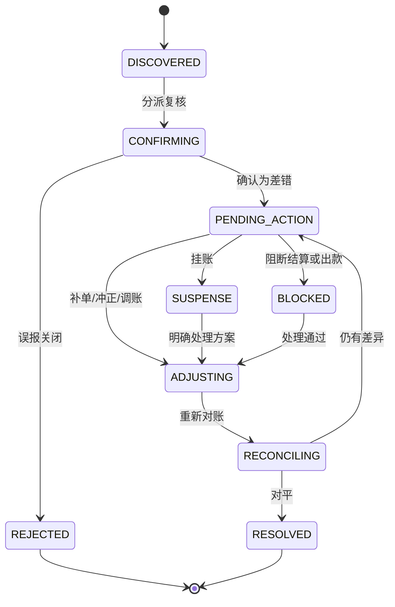

当前已实现的是对象级 Gate 差错闭环：创建即 `BLOCKED`；上层处理结果回链并形成动作事实后进入 `ADJUSTING`；原批次全部差错完成动作后才允许创建后继重跑，避免重跑开始后旧差错既不能补动作又不能关闭；重跑仍有差异时进入或保持 `RECONCILING`；真实后继批次对平后从 `ADJUSTING/RECONCILING` 直接进入 `RESOLVED`。若差错依赖的完成态批次证据被显式替代，则进入 `INVALIDATED`，表示该差错不再是可处置或可阻断的有效差异，不等同于已经对平。当前不提供误报关闭、条件放行或人工备注改状态。

## 9. 阻断和人工处理规则

| 阻断对象 | 阻断条件 | 放行条件 |
| --- | --- | --- |
| 可清分明细 | 交易未成功、未过账、非 CLEARING 分录、来源不完整、策略解析失败或重复入批。 | 交易和分录补齐、策略修正、重复风险解除或进入差错处理。 |
| 清算候选 | 交易退款中、争议中、风控冻结、重大对账差错。 | 风险解除、差错对平或责任方确认。 |
| 结算单 | 商户资料异常、负余额超阈值、差错未处理、审批未通过。 | 资料补齐、抵扣完成、差错核销、审批通过。 |
| 出款单 | 外部账户异常、收款端点不可用、通道额度或 cutoff 不满足、金额超限、重复出款风险、名单筛查未通过、外部规则未核验、合规或风控阻断。 | 账户确认、通道可用性确认、规则核验通过、差错处理、风险解除或人工审批通过。 |
| 报表发布 | 指标口径版本未确认、源批次未关闭、数据质量异常。 | 口径确认、批次关闭、质量校验通过。 |

人工处理必须保留原因、操作者、复核人、审批记录、前后值、凭证、外部 reference 和处理时间。

### 9.1 运营工作台入口

| 工作台能力 | 使用者目标 | 允许动作 | 禁止动作 |
| --- | --- | --- | --- |
| 清分明细池 | 运营识别哪些交易可清分、不可清分或待补资料。 | 查询、排除、恢复、提交清分批次。 | 手工改交易金额、从余额反推明细或跳过清分策略。 |
| 清算候选池 | 运营识别哪些清分结果可清算、被排除或待补资料。 | 查询、标记复核、补充资料、提交审批。 | 手工改交易金额或跳过清算账期规则。 |
| 结算单工作台 | 财务确认结算净额、扣减项和出款前锁定金额。 | 复核、驳回、退回补资料、触发出款。 | 删除已入批明细或绕过审批直接出款。 |
| 对账差错工作台 | 财务和运营定位差异、推进核销和调账。 | 分派、补文件、挂账、调账申请、核销。 | 直接修改历史分录、余额投影或外部流水。 |
| 出款处理台 | 出纳或运营跟踪出款状态和失败回退。 | 重试、退回、补凭证、登记或复核外部回单引用。 | 把外部“已提交”展示为“已到账”，或无可核验证据手工改成成功。 |
| 审计查询 | 风控、合规和管理者追踪高危操作。 | 查询操作链路、审批链路、前后值和证据。 | 无权限导出敏感资金明细。 |

运营工作台的产品边界是“让处理过程可见、可审、可追责”，不是给运营提供绕过交易层、路由层或账本层的快捷改账入口。

运营工作台展示必须同时给出事实状态、展示状态和操作状态。事实状态来自批次、结算单、出款单、差错单、账本事实或外部回单；展示状态是给使用者看的业务标签；操作状态说明当前是否可复核、可补证据、可提交、可重试或必须等待。外部 accepted、submitted、processing、message sent、IN_TRANSIT、前置对账未完成、外部规则待确认、差错到期重查中，都不得展示为到账成功、可出款、可结算完成或可自动放行。

### 9.2 使用者解释和资金安全操作门禁

清结算、对账和出款工作台必须让使用者一眼看懂“当前是什么事实、为什么不能动钱、后续处理该找谁处理”。任何高危动作在界面、API 和审计上都要同时满足资金安全、金融红线和可理解性要求。

| 场景 | 必须展示 | 允许动作 | 禁止动作 |
| --- | --- | --- | --- |
| 出款门禁失败 | 事实状态、展示状态、操作状态、阻断原因、失败门禁、责任方、后续处理动作、证据引用、到期重查时间。 | 补资料、重新预检、提交审批、转人工。 | 隐藏阻断原因、继续提交外部出款、生成 `FUND_OUT` 或 `IN_TRANSIT`。 |
| 外部受理或处理中 | 外部状态原文映射、内部解释状态、预计下一次查询或对账时间、不可操作原因。 | 等待回单、补拉状态、发起重查。 | 展示为到账成功、关闭结算单、允许重复出款。 |
| 差错阻断 | 差错类型、金额、主体、币种、责任方、账龄、阻断范围、处理动作、审批要求。 | 分派、补文件、挂账、调账申请、重新对账。 | 直接改历史分录、直接改余额投影、无审批核销。 |
| 敏感证据查看或导出 | 脱敏摘要、证据编号、查看原因、审批单、下载水印、留存期限。 | 按权限查看、审批后导出、审计复核。 | 展示完整敏感原文、无审批批量导出、用证据包做营销或画像。 |
| 人工放行 | 放行类型、放行阈值、风险承接人、到期重查时间、不可放行红线。 | 低风险差异条件放行，保留复核计划。 | 错主体、错币种、金额不平、重复出款、余额公式不成立仍放行。 |
| 专业确认待定 | 规则来源、版本或发布日期、生效日期、适用法域、核验日期、确认方、确认状态。 | 阻断、降级、转人工或保留为设计验证。 | 把待确认规则作为自动入账、自动退款、自动清算或自动出款依据。 |

产品可用性要求：

1. 操作台必须把“不可操作原因”和“后续处理动作”作为一等字段，而不是只返回技术错误码。
2. 高危动作必须有二次确认和职责分离：发起人、复核人、审批人或确认方不能被同一角色静默合并。
3. 所有金额展示必须同时给出金额类型、币种、主体、账目口径和来源对象；不能只给一个净额。
4. 列表筛选必须支持阻断等级、责任方、账龄、到期重查、外部规则核验状态和操作状态，避免运营靠备注定位风险。
5. 商户或外部使用者可见视图只能展示脱敏解释，不暴露内部风控规则、完整外部文件、敏感凭证或其他主体信息。
6. 出款预检必须区分平台内部确认处理角色和外部差错责任方；只有存在需要平台运营处理的阻断原因时才标记人工复核，系统可自动补齐的配置缺失不能一律进入人工队列。

## 10. 场景流程

### 10.1 商户订单收款到出款

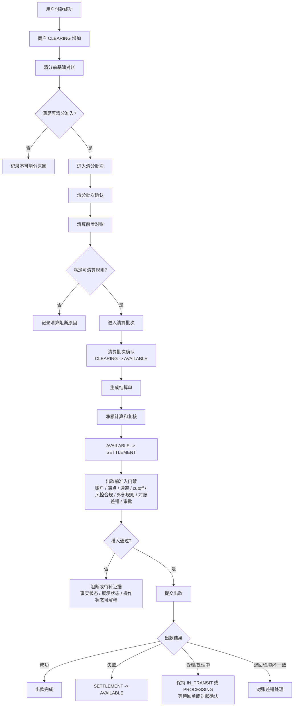

### 10.2 对账差错到调账核销

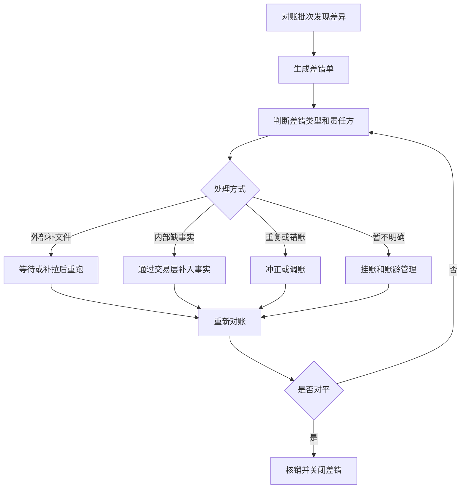

## 11. 产品验收要点

本章验收标准用于转化为 TDD 测试场景。清分、清算、结算、出款、对账和差错闭环必须同时覆盖正向路径、异常路径、边界路径、幂等重跑、并发竞争和人工兜底；只证明单据状态变化，不能算通过。

| 验收点 | 断言 |
| --- | --- |
| 可清分准入 | 只来自支付成功或授权完成事实、已过账的 `CLEARING + CREDIT + INCREASE + DETAIL` 正向分录和完整来源快照，异常原因可见；退款、冲正和 CLEARING 减少分录不得进入。 |
| 清分前基础对账 | 交易、单据、账本分录、余额桶和来源快照一致或可解释。 |
| 清分确认 | 清分批次只固化明细归类、规则版本和金额摘要，不触发账务变化。 |
| 清算前置对账 | 账实一致、账账一致、单账一致和余额一致均满足清算放行要求。 |
| 可清算判定 | 清分已确认、清算账期满足、风险和对账可放行后，才可进入清算批次。 |
| 清算确认 | 清算批次确认后商户 CLEARING -> AVAILABLE，批次重跑不重复清算。 |
| 结算锁定 | 商户 AVAILABLE -> SETTLEMENT，出款中金额不可再次结算。 |
| 出款前准入 | 账户、端点、通道、cutoff、风控合规、外部规则、对账差错、审批和幂等均通过后才可提交出款；状态未知默认阻断。 |
| 出款失败 | 只回退一次，失败原因、回单和审计可查。 |
| 出款金额不一致 | 出款单进入金额不一致或差错闭环，差额有挂账、调账、费用修正或人工核验路径；不得关闭为成功。 |
| 出款非终态展示 | 外部受理、处理中、待回单、阻断和待补证据不得展示为出款成功，商户账单、处理台和审计导出必须解释不可操作原因。 |
| 出款成功后逆向 | 不回滚历史出款，进入追偿、准备金、负余额或后续抵扣。 |
| 账实一致 | 内部账本能对应银行流水、支付通道清算文件、托管户流水或外部回单。 |
| 账账一致 | 业务账、支付账、账户账、商户账、总账、明细账口径一致，汇总等于明细。 |
| 单账一致 | 业务单、支付单、退款单、清分批次、清算批次、结算单、调账单均能对应账务流水。 |
| 余额一致 | 账户余额满足期初、本期入账、本期出账和期末公式，且各余额桶分别成立。 |
| 对账放行 | 有解释差异必须命中放行矩阵，保留阈值、审批、责任方、风险承接和到期重查。 |
| 重大阻断 | 错主体、错币种、金额不平、重复出款、缺分录、余额公式不成立不得放行。 |
| 对账任务生命周期（目标态） | 宿主对账任务创建、收数、等待、匹配、差异、阻断、重跑、关闭均有状态和报告；当前资金底座只承接批次与完成态结果。 |
| 外部来源标准化 | 外部来源必须形成来源记录、标准化明细和质量结论；未验签、解析失败、重复或缺主体映射不得自动对平。 |
| 匹配强度 | `EXACT_MATCH` 和命中规则版本的 `RULE_MATCH` 才能自动对平；候选、人工确认和未匹配必须进入复核、放行矩阵或差错闭环。 |
| 账龄升级（目标态） | 等待数据、有条件放行、候选匹配、挂账和恢复处理中必须有 SLA、账龄桶、到期动作和升级责任；当前仓内未实现。 |
| 对账差错 | 差异不得直接改历史分录或余额。 |
| 调账核销 | 必须有关联差错、审批、凭证、账本交易和核销状态。 |
| 报表口径 | 报表能追溯到明细、批次和规则版本。 |
| 合规边界 | 普通平台内部清算不写成持牌清算业务。 |
| 操作可理解 | 工作台、账单、审计导出和告警必须同时解释事实状态、展示状态、操作状态、不可操作原因和后续处理动作。 |
| 证据最小化 | 证据查看、导出、告警和对外提交只使用脱敏摘要或 reference，敏感原文不得进入普通查询和商户视图。 |
| 职责分离 | 清算确认、结算锁定、出款提交、人工放行、差错核销和敏感导出必须有权限、审批、复核和审计链。 |

### 11.1 系分交付与工程落地边界

本分册从产品视角已具备进入系分交付状态：清分、清算、结算、出款、对账、差错、调账和追偿的对象、状态、资金影响、阻断规则、运营工作台、验收口径和 TDD 锚点已经闭合，可作为系分设计、DSL、TDD 和工程任务评审输入。

该结论不等于工程写入许可，也不等于清结算、对账或出款生命周期生产完成。进入编码前必须另起独立工程边界，把写入范围、禁止范围、Red、表结构、服务级测试、外部规则核验和上层受控资金动作写清楚。

| 门禁 | 准入结论 | 产品口径 |
| --- | --- | --- |
| 系分交付 | 通过 | 本分册可作为 `03-清结算与对账系分设计` 的产品输入。 |
| DSL/TDD 对齐 | 通过 | `DSL-SETTLEMENT-*`、`TDD-CLS-*`、`TDD-SETTLE-*`、`TDD-RECON-*` 已有锚点。 |
| 工程边界 | 待工程边界确认 | 必须单独确认写入范围、停止条件和验证命令。 |
| 生产完成 | 未声明 | 出款前准入设计只能作为差距复核输入，不能替代完整生命周期。 |

### 11.2 最小交付首切片建议

清结算与对账的目标态包含对账、清分、清算、结算、出款、差错、调账和追偿，但首个工程切片不应一次性承接全部对象。产品侧建议先交付“对账差错闭环”最小闭环，先证明差异能被发现、阻断、解释、处理和重新对账，再推进清分、清算、结算和出款。

| 首切片对象 | 最小交付必须包含 | 最小交付明确不做 |
| --- | --- | --- |
| 对账批次 | 批次范围、来源记录引用、来源质量结论、规则版本、状态、重跑和审计。 | 不接外部出款提交，不生成清算批次或结算单。 |
| 外部来源标准化 | 来源类型、提供方、文件或批次引用、digest、验签状态、解析版本、重复识别键、标准化金额币种方向状态和脱敏证据引用。 | 不实现银行、卡组织、通道、ACH、SWIFT 或全球账户外部协议解析器。 |
| 匹配结果 | 内部事实、外部证据、匹配强度、匹配状态、差异类型、差异指纹和阻断级别。 | 不通过匹配结果直接改余额、分录或交易状态；候选匹配不得自动对平。 |
| 差错单 | 当前包含差错状态、责任方、阻断对象、处理动作、审批/证据引用和重新对账结果；账龄桶与 SLA 是目标态宿主能力。 | 不覆盖纯对账差错物化、账龄调度、全量调账、核销、追偿和财务报表流程。 |
| 受控资金动作引用 | 资金动作由上层业务决定并调用既有资金能力；对账只登记动作类型、审批号、原事实引用、证据引用、幂等键、操作者和结果流水。 | 对账模块不判断上层业务准入、不开放泛化补账，也不直接生成资金事实。 |
| 操作审计 | Web/宿主统一记录操作者、审批号、处理原因、证据引用、脱敏查看、导出和告警。 | reconciliation 服务不重复建设审计表或审计服务。 |

该首切片通过后，后续再按“可清分明细 -> 清分批次 -> 清分结果快照 -> 清算候选 -> 清算批次 -> 结算单 -> 出款单 -> 追偿资金事实”的顺序扩展，每一步都必须重新确认幂等、唯一键、账务影响和失败无副作用。当前对账、清分、内部清算、W1 结算锁定和 W2 最小出款资金事实已落地；W3 只补充已确认追偿责任与已完成资金结果引用，不承接追偿策略、资金执行、来源采集匹配或运营流程。

### 11.3 工程准入清单

结合清账、结算、对账三段门禁和四类数据分段，清结算与对账进入工程实现前必须先补齐以下稳定输入；未补齐时只能继续设计、TDD 分析或实现差距复核，不得进入代码、DDL/H2 或运行时配置写入。

| 准入项 | 必须说明 | 验收口径 |
| --- | --- | --- |
| 清分结果快照 | 参与方、金额项、规则快照、来源事实和对账准入结论。 | 清分确认不入账，清算候选不入账，清算确认才可能生成资金事实。 |
| 结算策略快照 | 结算模式、结算去向、触发方式和出款前准入策略。 | 中间户、冻结、账单三种模式边界清楚，账单模式不误入 `SETTLEMENT`。 |
| 对账数据分段 | 交易数据、账务数据、清分清算数据、外部资金数据和三类在途解释。 | 对账差错能标明来源分段、对账类型、责任方、账龄和是否阻断。 |
| 出款生命周期 | 受理、处理中、在途、成功、失败、退回和金额不一致的状态与证据。 | 外部受理不展示为到账成功，金额不一致进入差错而不是自动完成。 |

工程任务必须明确 owner、写入范围、只读范围、禁止事项、依赖顺序、AC/TDD 映射、验证命令和停止条件；单个任务通过不等于清结算与对账整体生产准出。

编码前必须补齐以下准入项：

1. 确认 PRD、DSL、系分、TDD 和任务基线，并在工程任务中引用基线范围或明确任务附件。
2. 落地 `TDD-B7-RED-001` 至 `TDD-B7-RED-009` Red，再进入任何 Green 实现。
3. 明确是否复用 `reconciliation-face`、`reconciliation-impl`，以及表命名、状态机、接口、DTO、Entity、Mapper、DDL/H2 schema 和测试资源写入范围。
4. 明确外部来源标准化对象、来源质量状态、匹配强度、差异账龄、到期升级动作和脱敏证据边界。
5. 明确上层业务允许执行的受控资金动作及其来源单据、审批号、证据引用、幂等键、原事实引用、操作者、原因和可撤销边界；reconciliation 只登记已完成动作引用，不承担业务决策。
6. 明确 NFR 假设、批处理容量、重跑窗口、幂等键、并发锁、观测告警、Runbook 信号和失败无副作用验收。
7. 涉及税务、会计、合同、银行、通道、卡组织、KYC/KYB/AML、客户资金、跨境或外汇口径时，登记规则来源、版本或发布日期、生效日期、适用法域、核验日期、确认方和确认状态；未确认前只能阻断、降级或转人工。

## 12. 清结算对象边界和运营后台输入

清结算与对账的重点不是“把批处理补齐”，而是把对象、状态、阻断、账务影响和运营责任分清。

### 12.1 清结算对象关系

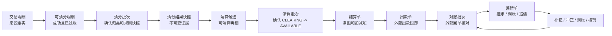

| 对象 | 产品定位 | 关键状态 | 账务影响 |
| --- | --- | --- | --- |
| 可清分明细 | 成功交易中命中待清算账目的来源明细。 | SPLITTABLE、SPLIT_EXCLUDED、SPLIT_LOCKED | 不直接入账，只表达可参与清分。 |
| 清分批次 | 按主体、币种、清分周期和规则版本确认明细归类。 | DRAFT、REVIEWING、CONFIRMED、CANCELLED | 不直接入账，只形成清分结果快照输入；CONFIRMED 是成功终态。 |
| 清分结果快照 | 固化已确认清分结果的参与方、金额项、来源事实、规则版本和对账准入结论。 | ACTIVE、SUPERSEDED | 不直接入账，只形成清算候选、对账和审计输入；快照内容不可变，发现错分时追加新快照或差错。 |
| 清算候选 | 已确认清分结果中经过账期和准入守卫评估、可能进入清算确认的明细。 | WAITING_PERIOD、BLOCKED、READY、LOCKED、CLEARED、EXCLUDED | 不直接入账；只有清算批次确认并形成资金事实后才进入 CLEARED。 |
| 清算批次 | 批量确认商户待清算款可进入可结算口径。 | DRAFT、REVIEWING、CONFIRMED、CANCELLED、FAILED | 原子确认时触发 CLEARING -> AVAILABLE；任一明细失败不得形成部分成功。 |
| 结算单 | 汇总可结算余额、费用、扣减、准备金和净额。 | DRAFT、REVIEWING、APPROVED、LOCKED、FAILED、CANCELLED | 锁定成功触发 AVAILABLE -> SETTLEMENT；明确账务拒绝记录 FAILED 且不形成账本事实。 |
| 出款单 | 跟踪已提交外部或内部出款的过程和结果。 | CREATED、SUBMITTED、ACCEPTED、PROCESSING、SUCCEEDED、FAILED、RETURNED、MISMATCHED | 默认与结算单一对一；外部 accepted、submitted、message sent 或 processing 不等于到账成功；成功关闭 SETTLEMENT 或 IN_TRANSIT；失败回到 AVAILABLE；退回或金额不一致进入差错。 |
| 对账批次 | 冻结对账范围、可选准入对象、规则、窗口和两侧来源，并绑定一次不可变运行结果。 | CREATED、DATA_COLLECTING、DATA_READY、COMPLETED | 不直接改账；无准入对象时只形成对账证据，不得用于 Gate。 |
| 差错单 | 当前承载绑定明确 Gate 对象的金额、状态、引用或来源质量差异；复杂运营工单为目标态。 | 当前：BLOCKED、ADJUSTING、RECONCILING、RESOLVED、INVALIDATED | 上层完成补事实、冲正、调账、挂账、追偿或核销后，对账追加结果引用并通过后继批次重跑关闭；完成态批次证据被替代时，原差错失效但不删除。 |
| 追偿单 | 上层已确认退款、拒付、费用或差错责任后，由资金底座记录应追与已追事实。 | CREATED、PARTIALLY_RECOVERED、RECOVERED | 创建不动账；结果只追加引用 `businessScene=RECOVERY` 的已关闭资金交易，并校验责任主体、币种、金额、幂等与不超额。准备金抵扣、后续结算抵扣、负余额或人工收款由宿主选择并执行。 |

### 12.2 清结算关键问题

| 问题 | 必须回答 |
| --- | --- |
| 可清分准入 | 一笔交易明细如何从成功交易和账本分录进入可清分状态，哪些原因会被排除。 |
| 清分批次边界 | 清分批次按主体、币种、清分周期、业务线和规则版本如何分组。 |
| 清分结果快照 | 清分确认后固化哪些参与方、金额项、来源事实、规则版本和对账准入结论，如何证明重复确认幂等。 |
| 可清算判定 | 哪些已确认清分结果可以进入清算候选，哪些因退款、争议、冻结、差错或风控被排除。 |
| 清算批次边界 | 清算批次和结算单按主体、币种、清算账期、规则版本如何分组。 |
| 净额口径 | 本金、手续费、退款、拒付、准备金、追偿、差错挂账如何进入结算净额。 |
| 阻断规则 | 哪些差错、资料、风控、负余额、准备金、审批、外部账户异常、通道额度、名单筛查或外部规则核验异常会阻断清算、结算或出款。 |
| 重跑幂等 | 可清分识别、清分批次确认、可清算候选生成、清算批次确认、结算单生成、出款回单、对账任务重复执行如何避免重复入账。 |
| 人工处理 | 哪些动作可由运营发起，哪些必须财务复核，哪些需要风控或合规确认。 |
| 审计追溯 | 每个批次、单据、差错、调账、核销、导出必须保留哪些操作者、原因、凭证和前后值。 |

### 12.3 对象边界校准

| 易混对象 | 必须分开的原因 | 合并后的风险 | 控制口径 |
| --- | --- | --- | --- |
| 可清分明细 vs 清分批次 | 可清分明细是单笔准入结果，清分批次是一次归类确认。 | 单笔可清分被误认为已经完成批次复核。 | 可清分不入账，清分批次确认也不入账。 |
| 清分批次 vs 清分结果快照 | 清分批次是复核动作和集合范围，清分结果快照是后续消费的不可变证据。 | 后续清算和对账临时拼装来源，重跑时解释漂移。 | 清分批次确认后固化快照，后续引用快照而不是重算清分结果。 |
| 清分结果快照 vs 清算候选 | 快照只说明清分结果成立，候选才表达可进入清算复核。 | 清分确认后直接释放待清算款。 | 快照不入账；候选仍需账期、退款、争议、风控和对账校验。 |
| 清算候选 vs 清算批次 | 候选只是可处理明细，批次才表达一次清算确认动作。 | 候选入池即被误认为已清算。 | 候选不入账，清算批次确认才触发 CLEARING -> AVAILABLE。 |
| 清算批次 vs 结算单 | 清算确认待清算款可结算，结算单确认净额和出款前锁定。 | 商户款绕过复核直接出款。 | 清算批次和结算单必须各有状态、审批和金额摘要。 |
| 结算单 vs 出款单 | 结算单是内部锁定和净额确认，出款单跟踪外部付款结果。 | 外部“已提交”被展示为“已到账”。 | 出款成功、失败、退回必须由出款单和外部回单证明。 |
| 对账批次 vs 差错单 | 对账批次发现差异，差错单承载责任和处理闭环。 | 差异被批次状态覆盖，无法追责。 | 差错必须有类型、责任方、处理动作、核销和重新对账。 |
| 差错单 vs 调账单 | 差错说明问题，调账是经审批后的账务动作。 | 差错处理直接改账，审计断链。 | 调账必须引用差错、审批、凭证和账本交易。 |
| 追偿单 vs 负余额 | 追偿单说明应追回原因和处理进度，负余额只是账户结果。 | 负余额无法说明责任和回收路径。 | 追偿单必须跟踪抵扣、人工收款、关闭原因和通知记录。 |

### 12.4 差错调账闭环校准

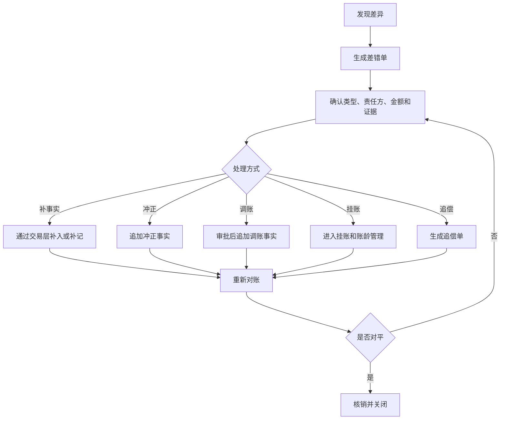

差错调账红线：

1. 差错处理不能直接修改历史分录、余额投影、交易投影或外部流水。
2. 补事实、冲正、调账、挂账、追偿都必须有差错引用、责任方、审批或处理依据。
3. 调账必须追加账本事实，不能只改差错单状态。
4. 差错核销必须以重新对账结果、凭证或责任确认作为关闭依据。
5. 未完成核销的重大差错必须能阻断清算、结算、出款或报表发布。

### 12.5 运营后台产品输入

| 工作台 | 核心用户 | 必备查询条件 | 允许动作 | 审计要求 |
| --- | --- | --- | --- | --- |
| 清分明细池 | 运营、财务 | 商户、交易、币种、可清分状态、排除原因、清分周期、规则版本。 | 查询、排除、恢复、提交清分批次。 | 记录操作者、原因、前后状态、来源明细、摘要和规则版本。 |
| 清分批次台 | 财务、运营 | 批次号、商户、币种、状态、金额摘要、明细数量、清分周期。 | 创建、复核、确认、撤回、关闭。 | 批次摘要、规则版本、审批链、确认人、确认时间和样本。 |
| 清算候选池 | 运营、财务 | 商户、交易、币种、候选状态、排除原因、清算账期、规则版本。 | 标记复核、排除、恢复候选、提交清算批次。 | 记录操作者、原因、前后状态、明细范围和规则版本。 |
| 清算批次台 | 财务、运营 | 批次号、商户、币种、状态、金额摘要、明细数量。 | 创建草稿、替换草稿成员、提交复核、退回草稿、确认、取消。 | 批次摘要、审批链、确认人、确认时间和账务引用。 |
| 结算单工作台 | 财务、出纳 | 商户、结算单号、净额、扣减项、准备金、状态。 | 复核、驳回、锁定、触发出款、取消。 | 每个金额项的来源、审批、锁定时间和出款引用。 |
| 出款处理台 | 出纳、运营 | 出款单号、外部 reference、事实状态、展示状态、操作状态、金额、账户、失败原因、外部规则核验状态。 | 重试、退回、补凭证、确认回单、生成差错。 | 外部回单、重试次数、操作者、时间、结果和解释状态来源。 |
| 对账差错台 | 财务、运营、风控 | 差错类型、责任方、账龄、金额、批次、外部文件。 | 分派、确认、挂账、调账申请、核销、升级。 | 差错生命周期、证据、审批、调账引用和重新对账结果。 |
| 追偿工作台 | 财务、风控、运营 | 商户、责任方、追偿金额、账龄、抵扣状态。 | 发起抵扣、转负余额、人工收款、关闭。 | 追偿来源、抵扣明细、通知记录、关闭原因。 |
| 审计和导出 | 财务、合规、安全 | 操作人、对象、时间、动作、导出范围、审批单。 | 查看、导出、审计复核。 | 脱敏、水印、审批、下载人、下载时间和用途。 |

运营后台红线：

1. 后台不能提供“直接改余额”“直接改分录”“直接改投影”的入口。
2. 任何影响资金结果的动作都必须落到交易、冻结、清算、结算、对账差错、调账或追偿事实。
3. 敏感导出必须有权限、审批、脱敏、水印和下载审计。
4. 人工复核通过不等于账务完成，仍需经过标准交易层、路由和账本过账。
