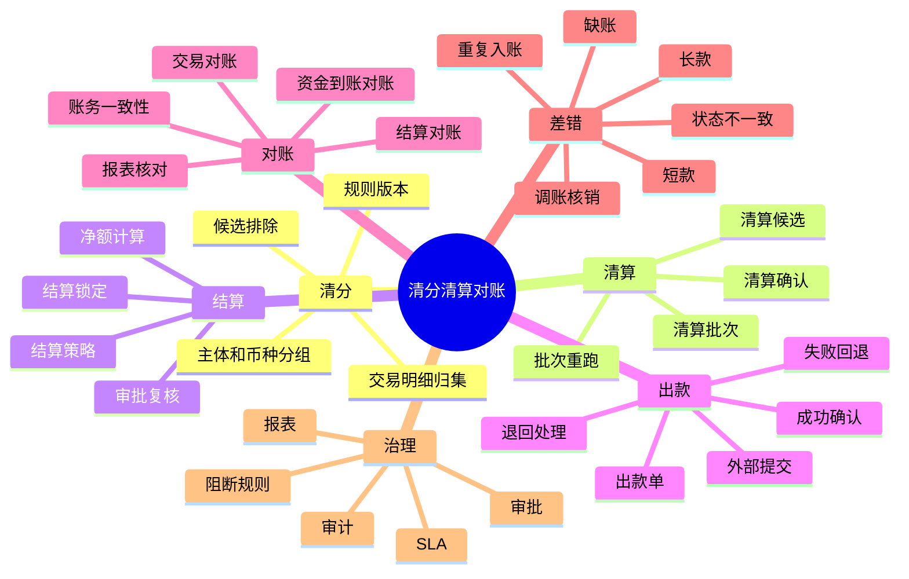
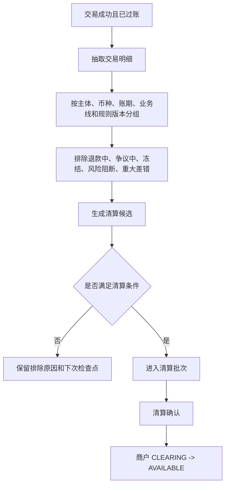
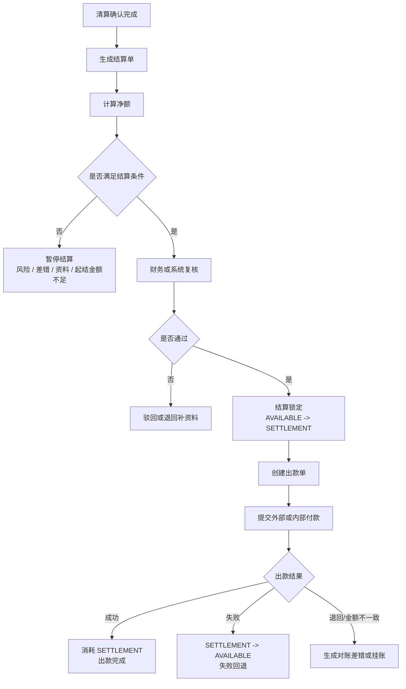
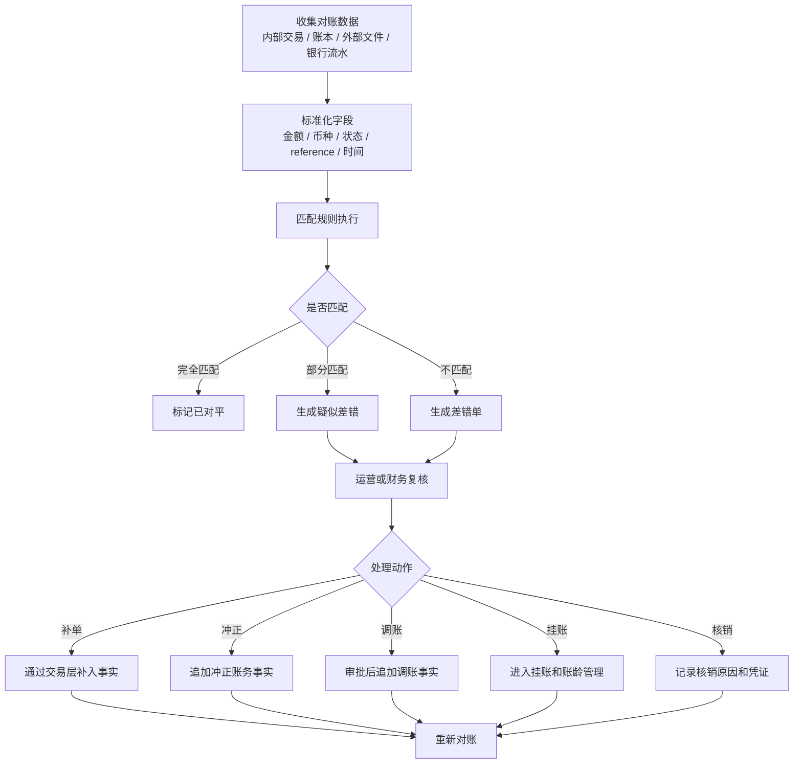
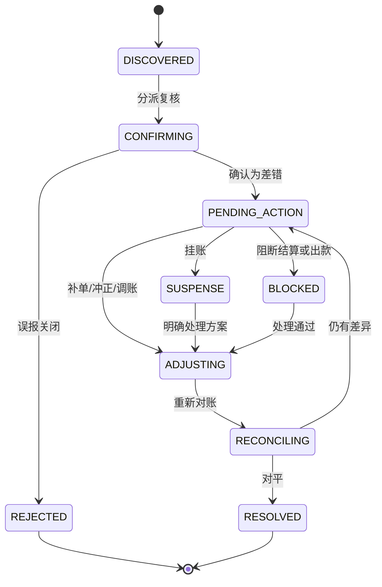
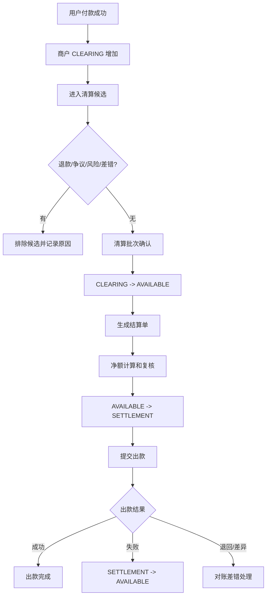
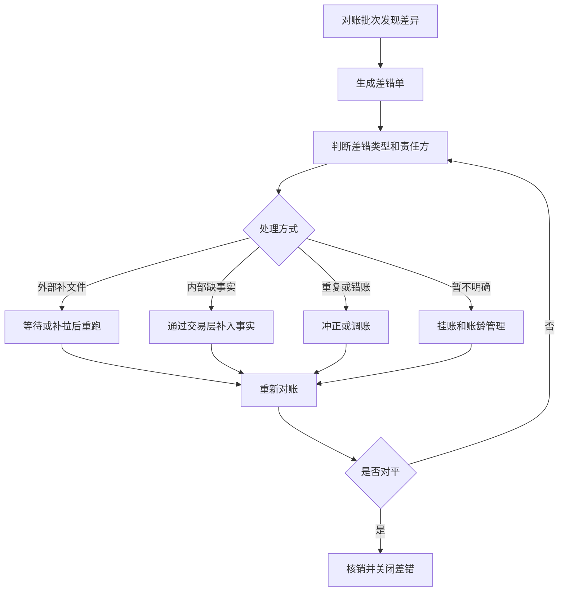
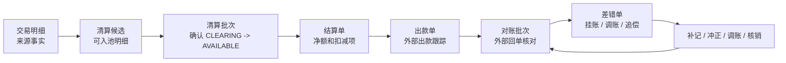
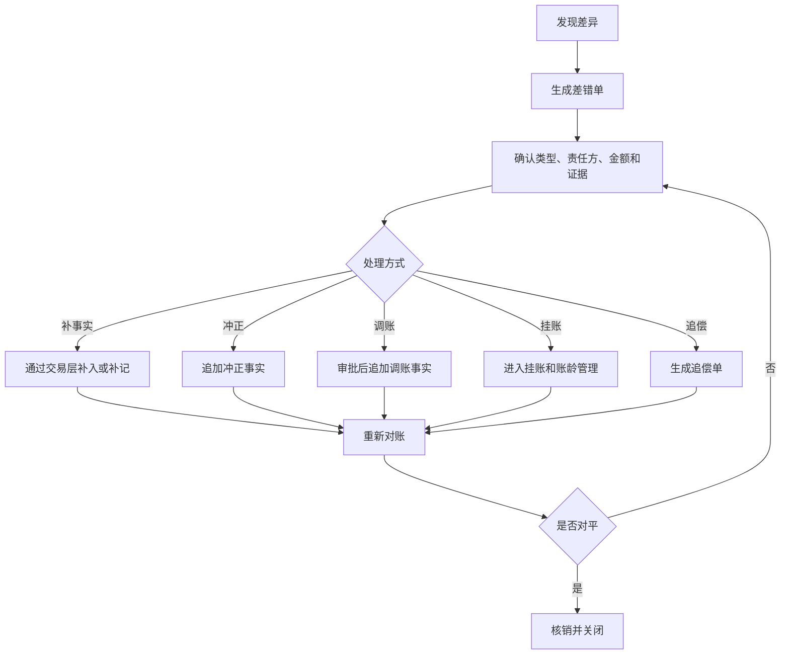

# 清分、清算、结算、出款与对账产品设计

## 1. 背景和目标

交易成功不等于资金工作结束。商户订单款需要清分、清算、结算和出款；外部通道、银行流水、卡组织文件、ACH 文件、账本分录和内部交易也需要持续对账。只要其中任一环节缺少批次、明细、规则版本、差错处理和审计，财务和运营就无法证明“钱对得上”。

本文件说明支付资金底座中的清分、清算、结算、出款、对账和差错闭环。这里的“清算”默认是平台内部明细确认和账务处理口径，不表达持牌清算业务；涉及真实清算网络、支付机构、银行、跨境、外汇或备付金时，必须另行由法务、财务、合规和合作机构确认。

## 2. 范围、角色和场景入口

| 维度 | 内容 |
| --- | --- |
| 本文覆盖 | 清分、清算候选、清算批次、结算单、出款单、对账批次、差错单、调账核销、追偿和运营工作台。 |
| 本文不覆盖 | 交易接入、资金路由、账本分录生成、归档重放和指标计算实现。 |
| 主要使用者 | 商户、运营、财务、风控、出纳、合规、安全和业务接入方。 |
| 核心验收 | 每个批次、单据和差错都能追溯来源明细、规则版本、责任方、账务影响、审批、凭证和终态。 |

| 场景 | 触发条件 | 产品目标 | 关键对象 |
| --- | --- | --- | --- |
| 清算候选生成 | 交易成功且已过账。 | 识别哪些明细可能进入清算。 | 交易明细、清算候选、排除原因。 |
| 清算批次确认 | 候选满足账期、风控和对账条件。 | 将商户待清算款确认到可结算口径。 | 清算批次、批次明细、账务引用。 |
| 结算单生成 | 可结算余额和扣减项完整。 | 形成可复核的应付或应收净额。 | 结算单、净额明细、规则快照。 |
| 出款处理 | 结算单复核并锁定。 | 跟踪外部或内部付款结果。 | 出款单、外部回单、失败回退。 |
| 对账处理 | 内部事实和外部文件、银行流水或报表不一致。 | 发现差异并推动闭环。 | 对账批次、差错单、挂账、调账。 |
| 已出款后逆向 | 出款后发生退款、拒付、费用或差错。 | 不回滚历史出款，进入追偿或后续抵扣。 | 追偿单、准备金、负余额、后续结算抵扣。 |

## 3. 概念总览

| 概念 | 易懂定义 | 能力边界 |
| --- | --- | --- |
| 清分 | 把已成功的交易明细按主体、币种、账期、规则和责任方归集出来。 | 不直接出款，不直接改账。 |
| 清算候选 | 满足进入清算判断前的明细集合。 | 只是候选，需经过风控、对账、退款、争议和规则过滤。 |
| 清算批次 | 一组可确认从待清算进入可结算的明细。 | 清算确认会触发账务变化；批次必须可重跑且幂等。 |
| 结算单 | 面向商户、用户、合作方或平台内部主体的应付或应收计算单。 | 结算单计算净额，不等于外部出款已成功。 |
| 出款单 | 对外或内部执行付款的处理单据。 | 外部受理不等于到账；成功、失败、退回必须分开。 |
| 对账批次 | 按时间、主体、文件、轨道或账本范围进行核对的批次。 | 对账发现差异不能直接改历史账。 |
| 差错单 | 记录金额、状态、流水、时序、账务或文件不一致。 | 差错处理必须有责任、动作、审批、核销和审计。 |
| 挂账 | 暂时无法归属或等待处理的差异金额。 | 必须有账龄、责任方、SLA 和核销路径。 |
| 调账 | 对已确认差错进行补记、冲正或调整。 | 不修改历史分录，必须追加新事实。 |

## 4. 总体能力地图



## 5. 角色和使用者

| 角色 | 关注点 | 典型操作 |
| --- | --- | --- |
| 商户 | 哪些订单可结算，哪些被退款、争议、扣费或暂扣。 | 查看清算明细、结算单、出款状态和扣减原因。 |
| 财务 | 批次是否平，出款是否对得上，差错是否闭环。 | 复核清算批次、审批结算单、核销差错、导出报表。 |
| 运营 | 异常订单、挂账、手工退款、出款失败如何处理。 | 发起处理单、补资料、冻结、调账、追偿。 |
| 风控 | 高风险商户、争议、负余额、准备金和出款阻断。 | 暂停清算、阻断出款、设置准备金或追偿。 |
| 业务系统 | 需要知道订单、退款、出款和差错状态。 | 查询批次结果、接收状态回调或事件。 |
| 合规 / 安全 | 高危资金操作是否有权限、凭证和审计。 | 审计审批、导出、敏感信息访问和证据。 |

## 6. 清分与清算设计

### 6.1 清分主流程



### 6.2 清算候选规则

| 规则 | 产品要求 |
| --- | --- |
| 交易成功 | 交易必须成功，且关联账本交易和分录。 |
| 明细完整 | 必须能追溯业务单、资金交易、交易明细、route snapshot 和账本引用。 |
| 余额位置正确 | 商户订单款必须在 `CLEARING`，不得从 `AVAILABLE` 反推候选。 |
| 风险可放行 | 商户、订单、资金、争议、退款和对账状态没有阻断。 |
| 账期满足 | 达到结算策略定义的清算周期、延迟规则或合同账期。 |
| 幂等可重跑 | 同一主体、币种、账期和规则版本下重复生成不会重复清算。 |
| 币种隔离 | 多币种不得混批；错币种进入差错或业务换汇处理。 |

### 6.3 清算批次规则

| 项目 | 要求 |
| --- | --- |
| 批次维度 | 租户、商户、币种、业务线、账期、规则版本。 |
| 批次状态 | 草稿、待复核、已确认、部分失败、已撤回、已关闭。 |
| 批次明细 | 每条明细保留原交易、交易明细、金额、费用、退款、争议和排除原因。 |
| 清算确认 | 触发商户 `CLEARING -> AVAILABLE`。 |
| 重跑规则 | 只能对未确认或明确撤回的批次重跑；已确认批次修正走补差或冲正。 |
| 审计要求 | 记录生成时间、规则版本、操作者、复核人、摘要和差异样本。 |

## 7. 结算与出款设计

### 7.1 结算总流程



### 7.2 结算净额口径

```text
本期可结算金额
= 本期清算收款
+ 经审批调整加项
+ 返利或补贴
+ 追偿回补
+ 汇差调增
+ 其他经审批加项
- 退款扣减
- 争议扣回
- 平台手续费
- 通道成本或代扣项
- 准备金
- 负余额抵扣
- 风控扣留
- 未处理差错扣减
- 汇差调减
- 其他经审批扣项
```

所有金额项必须追溯到明细、规则版本或审批单，不能只保留汇总数。调整金额和汇差修正必须拆成调增、调减两个方向，不能用一个无方向字段混合表达。

### 7.3 结算策略

| 策略 | 产品含义 | 典型场景 | 注意点 |
| --- | --- | --- | --- |
| 实时 | 满足条件后立即结算或清算。 | 平台内部低风险业务。 | 实时不等于免风控、免对账、免审批。 |
| T+N | 交易日或账务成功日后 N 天。 | 商户订单收款、通道清算延迟。 | 必须说明 T 的定义。 |
| H+N | 小时级批次。 | 准实时业务或高频小额业务。 | 注意并发和重复入批。 |
| W+N | 周期性周结。 | 周结商户或合作方。 | 明确时区、节假日和顺延。 |
| M+N | 月结或月末结算。 | 月结商户、平台自营收入确认。 | 月末规则和账单版本必须留痕。 |
| 自定义账期 | 按合同账单周期计算。 | 企业卡账单、跨月合作结算。 | 必须明确起止日、账单日、结算日。 |

结算策略必须作为独立产品对象或规则快照被管理，不能只保留表达式字符串。每次候选生成、清算批次、结算单和报表输出都应固化策略编码、版本、表达式、时区、基准时间、cutoff、节假日处理、起结金额、准备金、阻断规则和审批引用。策略解析失败、未支持表达式、缺时区或缺基准时间时必须失败或进入人工复核，不得静默按实时策略处理。

### 7.4 出款规则

| 场景 | 处理规则 |
| --- | --- |
| 出款提交前 | 必须完成结算锁定，防止重复出款。 |
| 外部受理成功 | 只表示外部已受理，不等于资金到账。 |
| 出款成功 | 消耗 `SETTLEMENT`，记录外部回单和到账证明。 |
| 出款失败 | 按原锁定金额 `SETTLEMENT -> AVAILABLE`，只回退一次。 |
| 出款退回 | 生成退回或对账差错，按责任和费用规则处理。 |
| 已出款后退款或拒付 | 不回滚历史出款，进入追偿、准备金、负余额或后续抵扣。 |

## 8. 对账设计

### 8.1 对账分类

| 对账类型 | 核对对象 | 目标 |
| --- | --- | --- |
| 交易对账 | 业务单、资金交易、通道交易、外部流水。 | 单据状态、金额、币种、reference 一致。 |
| 资金到账对账 | 平台现金映射、银行流水、通道回单、出款单。 | 证明外部钱是否真的到或出。 |
| 账务一致性核对 | 资金交易、账本交易、分录、余额投影。 | 证明账务平衡且投影正确。 |
| 清结算对账 | 清算批次、结算单、出款单、商户账单。 | 证明批次、净额、出款和报表一致。 |
| 报表核对 | 交易视图、财务报表、指标报表、账本明细。 | 证明报表来自可追溯事实。 |
| 外部文件对账 | 卡组织、ACH、银行、PSP、合作机构文件。 | 识别 return、refund、chargeback、费用和状态差异。 |

### 8.2 对账主流程



### 8.3 差错类型

| 差错类型 | 典型表现 | 处理方向 |
| --- | --- | --- |
| 内部有、外部无 | 内部成功，外部文件或银行流水缺失。 | 等待补文件、补拉、挂账或冲正。 |
| 外部有、内部无 | 银行或通道到账，内部无交易。 | 生成挂账或补入账任务。 |
| 金额不一致 | 内外部金额、手续费、汇率或扣款不一致。 | 差额挂账、调账、费用修正或人工核验。 |
| 状态不一致 | 内部成功，外部失败或退回。 | 状态修正、回退、追偿或差错处理。 |
| 重复入账 | 同一外部 reference 生成多笔内部交易。 | 冲正重复分录，保留审计。 |
| 缺分录 | 有资金交易但无账本分录。 | 阻断成功状态，生成修复任务。 |
| 投影不平 | 分录正确但余额或交易视图错误。 | 重建余额投影或交易投影。 |
| 结算差异 | 结算单、出款单、外部回单不一致。 | 暂停出款、挂账、追偿或回退。 |

### 8.4 差错状态机



## 9. 阻断和人工处理规则

| 阻断对象 | 阻断条件 | 放行条件 |
| --- | --- | --- |
| 清算候选 | 交易退款中、争议中、风控冻结、重大对账差错。 | 风险解除、差错对平或责任方确认。 |
| 结算单 | 商户资料异常、负余额超阈值、差错未处理、审批未通过。 | 资料补齐、抵扣完成、差错核销、审批通过。 |
| 出款单 | 外部账户异常、金额超限、重复出款风险、合规或风控阻断。 | 复核通过、账户确认、差错处理或人工审批。 |
| 报表发布 | 指标口径版本未确认、源批次未关闭、数据质量异常。 | 口径确认、批次关闭、质量校验通过。 |

人工处理必须保留原因、操作者、复核人、审批记录、前后值、凭证、外部 reference 和处理时间。

### 9.1 运营工作台入口

| 工作台能力 | 使用者目标 | 允许动作 | 禁止动作 |
| --- | --- | --- | --- |
| 清算候选池 | 运营识别哪些明细可清算、被排除或待补资料。 | 查询、标记复核、补充资料、提交审批。 | 手工改交易金额或跳过账期规则。 |
| 结算单工作台 | 财务确认结算净额、扣减项和出款前锁定金额。 | 复核、驳回、退回补资料、触发出款。 | 删除已入批明细或绕过审批直接出款。 |
| 对账差错工作台 | 财务和运营定位差异、推进核销和调账。 | 分派、补文件、挂账、调账申请、核销。 | 直接修改历史分录、余额投影或外部流水。 |
| 出款处理台 | 出纳或运营跟踪出款状态和失败回退。 | 重试、退回、补凭证、人工确认外部回单。 | 把外部“已提交”展示为“已到账”。 |
| 审计查询 | 风控、合规和管理者追踪高危操作。 | 查询操作链路、审批链路、前后值和证据。 | 无权限导出敏感资金明细。 |

运营工作台的产品边界是“让处理过程可见、可审、可追责”，不是给运营提供绕过交易层、路由层或账本层的快捷改账入口。

## 10. 场景流程

### 10.1 商户订单收款到出款



### 10.2 对账差错到调账核销



## 11. 产品验收要点

| 验收点 | 断言 |
| --- | --- |
| 清算候选 | 只来自成功交易和可追溯明细，异常原因可见。 |
| 清算确认 | 商户 `CLEARING -> AVAILABLE`，批次重跑不重复清算。 |
| 结算锁定 | 商户 `AVAILABLE -> SETTLEMENT`，出款中金额不可再次结算。 |
| 出款失败 | 只回退一次，失败原因、回单和审计可查。 |
| 出款成功后逆向 | 不回滚历史出款，进入追偿、准备金、负余额或后续抵扣。 |
| 对账差错 | 差异不得直接改历史分录或余额。 |
| 调账核销 | 必须有关联差错、审批、凭证、账本交易和核销状态。 |
| 报表口径 | 报表能追溯到明细、批次和规则版本。 |
| 合规边界 | 普通平台内部清算不写成持牌清算业务。 |

## 12. 清结算对象边界和运营后台输入

清结算与对账的重点不是“把批处理补齐”，而是把对象、状态、阻断、账务影响和运营责任分清。

### 12.1 清结算对象关系



| 对象 | 产品定位 | 关键状态 | 账务影响 |
| --- | --- | --- | --- |
| 清算候选 | 成功交易中可能进入清算确认的明细。 | `CANDIDATE`、`EXCLUDED`、`READY`、`LOCKED` | 不直接入账，只形成批次输入。 |
| 清算批次 | 批量确认商户待清算款可进入可结算口径。 | `DRAFT`、`REVIEWING`、`CONFIRMED`、`PARTIAL_FAILED`、`CLOSED` | 确认时触发 `CLEARING -> AVAILABLE`。 |
| 结算单 | 汇总可结算余额、费用、扣减、准备金和净额。 | `DRAFT`、`REVIEWING`、`APPROVED`、`LOCKED`、`CANCELLED` | 锁定时触发 `AVAILABLE -> SETTLEMENT`。 |
| 出款单 | 跟踪已提交外部或内部出款的过程和结果。 | `SUBMITTED`、`PROCESSING`、`SUCCEEDED`、`FAILED`、`RETURNED` | 成功消耗 `SETTLEMENT`；失败回到 `AVAILABLE`；退回进入差错。 |
| 对账批次 | 按范围核对内部事实、账本、外部文件和银行流水。 | `COLLECTING`、`MATCHING`、`DIFF_FOUND`、`BALANCED`、`CLOSED` | 不直接改账，差异进入差错单。 |
| 差错单 | 承载金额、状态、文件、流水或账务差异。 | `DISCOVERED`、`CONFIRMING`、`PENDING_ACTION`、`ADJUSTING`、`RECONCILING`、`RESOLVED` | 通过补事实、冲正、调账、挂账或核销追加账务动作。 |
| 追偿单 | 商户已出款后发生退款、拒付、费用或差错需追回。 | `CREATED`、`OFFSETTING`、`COLLECTING`、`PARTIAL_RECOVERED`、`CLOSED` | 可进入准备金抵扣、后续结算抵扣、负余额或人工收款。 |

### 12.2 清结算关键问题

| 问题 | 必须回答 |
| --- | --- |
| 候选来源 | 哪些交易明细可进入清算候选，哪些因退款、争议、冻结、差错或风控被排除。 |
| 批次边界 | 清算批次和结算单按主体、币种、周期、规则版本如何分组。 |
| 净额口径 | 本金、手续费、退款、拒付、准备金、追偿、差错挂账如何进入结算净额。 |
| 阻断规则 | 哪些差错、资料、风控、负余额、审批或外部账户异常会阻断清算、结算或出款。 |
| 重跑幂等 | 候选生成、批次确认、结算单生成、出款回单、对账任务重复执行如何避免重复入账。 |
| 人工处理 | 哪些动作可由运营发起，哪些必须财务复核，哪些需要风控或合规确认。 |
| 审计追溯 | 每个批次、单据、差错、调账、核销、导出必须保留哪些操作者、原因、凭证和前后值。 |

### 12.3 对象边界校准

| 易混对象 | 必须分开的原因 | 合并后的风险 | 控制口径 |
| --- | --- | --- | --- |
| 清算候选 vs 清算批次 | 候选只是可处理明细，批次才表达一次确认动作。 | 候选入池即被误认为已清算。 | 候选不入账，批次确认才触发 `CLEARING -> AVAILABLE`。 |
| 清算批次 vs 结算单 | 清算确认待清算款可结算，结算单确认净额和出款前锁定。 | 商户款绕过复核直接出款。 | 清算批次和结算单必须各有状态、审批和金额摘要。 |
| 结算单 vs 出款单 | 结算单是内部锁定和净额确认，出款单跟踪外部付款结果。 | 外部“已提交”被展示为“已到账”。 | 出款成功、失败、退回必须由出款单和外部回单证明。 |
| 对账批次 vs 差错单 | 对账批次发现差异，差错单承载责任和处理闭环。 | 差异被批次状态覆盖，无法追责。 | 差错必须有类型、责任方、处理动作、核销和重新对账。 |
| 差错单 vs 调账单 | 差错说明问题，调账是经审批后的账务动作。 | 差错处理直接改账，审计断链。 | 调账必须引用差错、审批、凭证和账本交易。 |
| 追偿单 vs 负余额 | 追偿单说明应追回原因和处理进度，负余额只是账户结果。 | 负余额无法说明责任和回收路径。 | 追偿单必须跟踪抵扣、人工收款、关闭原因和通知记录。 |

### 12.4 差错调账闭环校准



差错调账红线：

1. 差错处理不能直接修改历史分录、余额投影、交易投影或外部流水。
2. 补事实、冲正、调账、挂账、追偿都必须有差错引用、责任方、审批或处理依据。
3. 调账必须追加账本事实，不能只改差错单状态。
4. 差错核销必须以重新对账结果、凭证或责任确认作为关闭依据。
5. 未完成核销的重大差错必须能阻断清算、结算、出款或报表发布。

### 12.5 运营后台产品输入

| 工作台 | 核心用户 | 必备查询条件 | 允许动作 | 审计要求 |
| --- | --- | --- | --- | --- |
| 清算候选池 | 运营、财务 | 商户、交易、币种、候选状态、排除原因、账期、规则版本。 | 标记复核、排除、恢复候选、提交清算批次。 | 记录操作者、原因、前后状态、明细范围和规则版本。 |
| 清算批次台 | 财务、运营 | 批次号、商户、币种、状态、金额摘要、明细数量。 | 创建、复核、确认、撤回、关闭。 | 批次摘要、审批链、确认人、确认时间和账务引用。 |
| 结算单工作台 | 财务、出纳 | 商户、结算单号、净额、扣减项、准备金、状态。 | 复核、驳回、锁定、触发出款、取消。 | 每个金额项的来源、审批、锁定时间和出款引用。 |
| 出款处理台 | 出纳、运营 | 出款单号、外部 reference、状态、金额、账户、失败原因。 | 重试、退回、补凭证、确认回单、生成差错。 | 外部回单、重试次数、操作者、时间和结果。 |
| 对账差错台 | 财务、运营、风控 | 差错类型、责任方、账龄、金额、批次、外部文件。 | 分派、确认、挂账、调账申请、核销、升级。 | 差错生命周期、证据、审批、调账引用和重新对账结果。 |
| 追偿工作台 | 财务、风控、运营 | 商户、责任方、追偿金额、账龄、抵扣状态。 | 发起抵扣、转负余额、人工收款、关闭。 | 追偿来源、抵扣明细、通知记录、关闭原因。 |
| 审计和导出 | 财务、合规、安全 | 操作人、对象、时间、动作、导出范围、审批单。 | 查看、导出、审计复核。 | 脱敏、水印、审批、下载人、下载时间和用途。 |

运营后台红线：

1. 后台不能提供“直接改余额”“直接改分录”“直接改投影”的入口。
2. 任何影响资金结果的动作都必须落到交易、冻结、清算、结算、对账差错、调账或追偿事实。
3. 敏感导出必须有权限、审批、脱敏、水印和下载审计。
4. 人工复核通过不等于账务完成，仍需经过标准交易层、路由和账本过账。
