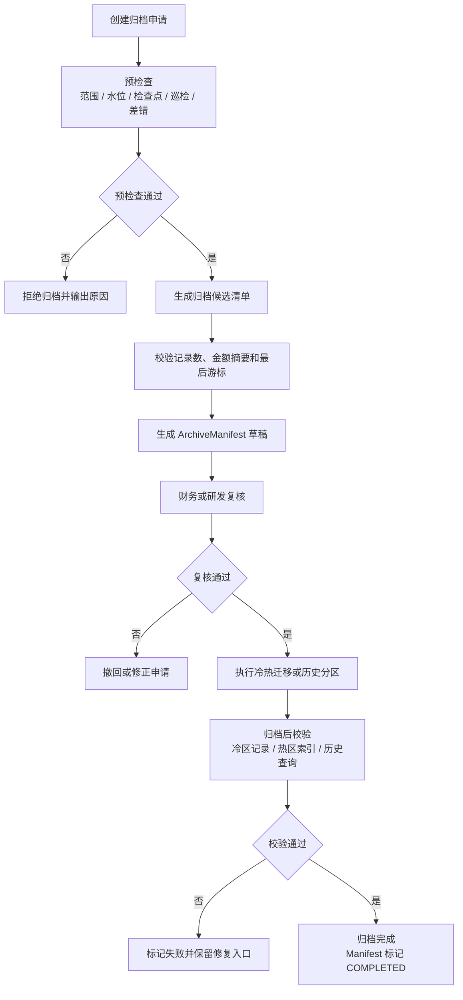
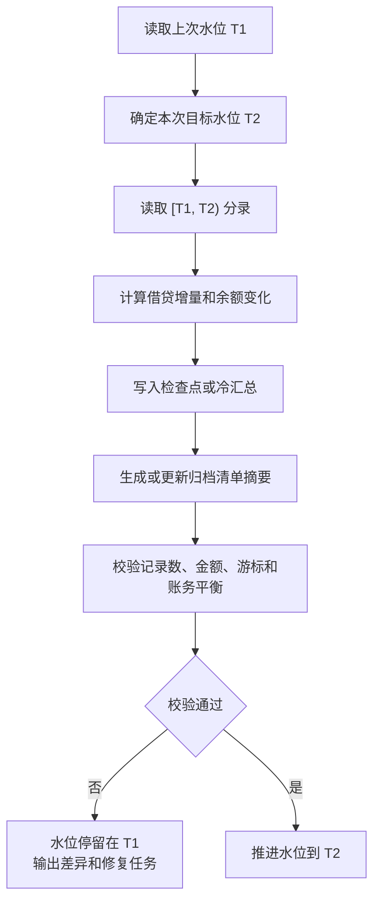
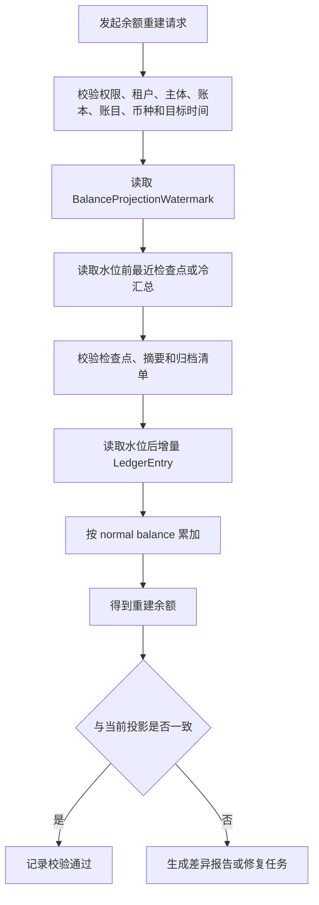
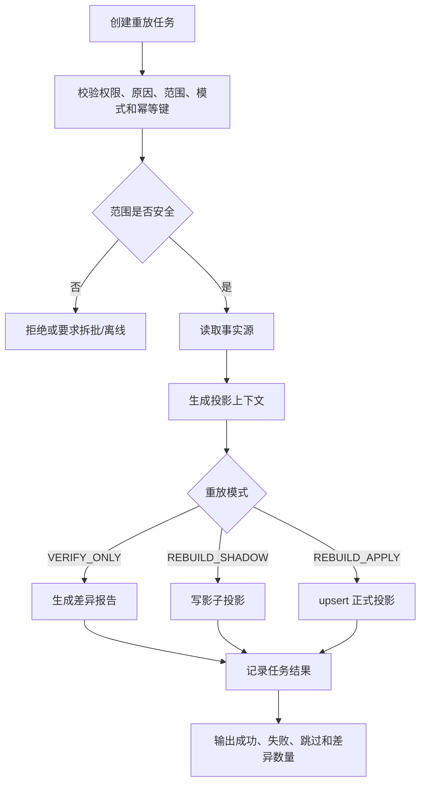

# 归档、重放与资金交易指标项产品设计

## 1. 背景和目标

支付资金底座运行一段时间后，会积累大量账本交易、分录、余额投影、资金交易、交易明细、冻结单、清结算批次、对账差错、争议记录和交易视图。数据量变大后，产品上会遇到三个问题：

1. 历史账本分录归档后，当前余额和历史余额还能不能被证明。
2. 用户账单、商户账单、运营时间线或报表投影出错后，能不能有边界地重放修复。
3. 资金交易指标要服务产品、运营、财务和风控，但不能把指标报表反写到资金事实。

本文件只定义产品策略、能力边界、流程和指标项。指标的采集、计算、存储、调度和展示由报表指标模块实现。

## 2. 范围、角色和场景入口

| 维度 | 内容 |
| --- | --- |
| 本文覆盖 | 账本归档、余额检查点、余额水位、归档清单、余额重建、交易投影重放、资金交易指标项清单和只读边界。 |
| 本文不覆盖 | 交易、路由、钱包、清结算、对账差错的完整产品设计；报表指标模块内部实现。 |
| 主要使用者 | 产品、数据、财务、运营、风控、研发、测试和安全审计。 |
| 核心验收 | 归档不破坏事实和审计，重放不重新入账，指标不反写事实，水位推进必须先算后推。 |

| 场景 | 触发条件 | 产品目标 | 关键对象 |
| --- | --- | --- | --- |
| 账本归档 | 历史分录达到归档策略且检查点已校验。 | 降低热数据压力，同时保留可查询、可核对、可审计能力。 | 归档申请、检查点、归档清单、Manifest。 |
| 当前余额校验 | 当前余额查询或巡检需要证明余额正确。 | 用余额投影、检查点和增量分录解释当前余额。 | 余额投影、余额水位、LedgerEntry。 |
| 历史余额重建 | 用户、商户、财务或审计查询历史余额。 | 从检查点和增量分录重建目标时点余额。 | 检查点、冷汇总、增量分录、差异报告。 |
| 交易投影修复 | 用户账单、商户账单、运营时间线或报表视图出现差异。 | 有界重放只读投影，不触碰资金事实。 | 重放任务、投影视图、差异报告。 |
| 报表指标输入 | 产品、运营、财务或风控需要指标观察。 | 明确业务可能关心的指标项、使用者、关注问题和只读边界。 | 指标项、业务口径说明、建议事实来源、承接边界。 |

## 3. 核心结论

| 主题 | 产品结论 |
| --- | --- |
| 余额重建 | 余额只能从账本分录、余额检查点、冷汇总和水位后的增量分录重建。 |
| 交易重放 | 交易投影重放只修复用户账单、商户账单、运营时间线和报表投影，不重新入账。 |
| 归档边界 | 归档只改变冷热存储位置，不改变事实身份、审计链路和查询能力。 |
| 水位边界 | 冷热拼接使用 `BalanceProjectionWatermark`，不是自然日、归档日期或 180 天。 |
| 报表指标 | 指标只读消费事实和投影，不反向修改交易、账本、余额或清结算状态。 |
| 在线安全 | 生产重放必须有范围、原因、权限、幂等和审计；不得无界全量重放。 |

## 4. 概念和能力边界

| 概念 | 易懂定义 | 能力边界 |
| --- | --- | --- |
| 余额检查点 | 某个账本、账目、主体、币种在某个时间点的余额基线。 | 由分录生成，不能由当前余额或报表反推。 |
| 余额水位 | 已经被检查点、冷汇总或归档处理覆盖到的时间边界。 | 冷热拼接必须按水位，水位先算后推。 |
| 归档清单 | 一次归档的对象、范围、数量、金额摘要、冷热位置和校验凭证。 | 没有清单不得归档；归档后仍需可查询和审计。 |
| 余额重建 | 用检查点或冷汇总加增量分录重新计算余额。 | 不读取用户账单、商户账单或报表汇总。 |
| 交易投影重放 | 重新生成只读交易视图、账单、时间线或报表投影。 | 不补写资金交易，不修改分录，不更新余额事实。 |
| 重放任务 | 控制一次重放或校验的范围、模式、权限和状态。 | 必须可断点续跑、可审计、可输出差异。 |
| 指标项 | 用于观察交易、余额、清结算、对账、风险和运营表现的业务关注项。 | 本文只列业务可能关心的项和理解口径，不设计指标模型、任务、表、快照、水位或报表实现。 |

## 5. 账本归档流程

### 5.1 归档前置条件

| 条件 | 验收要求 |
| --- | --- |
| 范围明确 | 归档必须指定租户、账本、账目、主体、币种、时间范围和原因。 |
| 水位覆盖 | 归档截止时间必须小于等于已处理水位。 |
| 检查点存在 | 归档范围末端必须有已校验余额检查点或冷汇总。 |
| 巡检通过 | 账本交易、分录、余额投影、检查点摘要一致。 |
| 差错处理 | 归档范围内不存在未处理高风险账务差异。 |
| 清单生成 | 归档前生成记录数、借贷金额、最后游标和摘要。 |
| 审批通过 | 财务或研发按风险等级复核。 |

### 5.2 归档流程



### 5.3 归档后查询

| 查询类型 | 产品策略 |
| --- | --- |
| 当前余额 | 读取当前余额投影，必要时用检查点和热区增量分录校验。 |
| 历史余额 | 找到目标时点前的检查点或冷汇总，加目标区间增量分录重算。 |
| 审计明细 | 通过归档索引读取冷数据，仍能按流水、主体、账目、时间和业务引用定位。 |
| 对账追溯 | 通过批次、外部 reference、账本交易或分录游标定位归档范围。 |
| 报表重算 | 优先按已确认事实和投影重放，不直接扫全量冷归档。 |

## 6. 余额投影重放和重建

本文所说的“余额投影重放”，产品语义是从账本事实、检查点和水位增量重新计算余额投影。它可以表现为校验、重算、重建或差异报告，但不能从用户账单、商户账单、运营时间线或报表反推余额。

### 6.1 水位模型

余额冷热拼接必须按已处理水位，避免漏算或重复计算。

```text
cold balance = watermark 之前的已校验检查点或冷汇总
hot delta    = create_time >= watermark 且 create_time < targetTime 的增量 LedgerEntry

balance = cold balance + hot delta
覆盖区间 = (-∞, watermark) + [watermark, targetTime)
```

180 天只表示热数据保留或归档资格，不是余额计算边界。

### 6.2 水位推进流程



禁止先推进水位再计算。如果先推进水位，任务失败时会出现时间缝隙或重复统计。

### 6.3 余额重建流程



### 6.4 余额重建红线

1. 不从用户账单、商户账单、交易投影或报表汇总反推余额。
2. 不用归档日期、自然日或 180 天作为冷热拼接边界。
3. 不在缺检查点、缺水位、缺清单或摘要不一致时强行返回成功。
4. 不为了修复余额直接改历史分录。
5. 不允许无权限、无范围、无原因的生产余额重建。

## 7. 交易投影重放

### 7.1 重放对象

| 重放对象 | 用途 | 事实来源 |
| --- | --- | --- |
| 用户账单 | 修复用户视角交易、退款、冻结、授权和提现展示。 | 资金交易、冻结单、账本、清结算、争议。 |
| 商户账单 | 修复商户收款、待清算、退款、结算、争议和出款展示。 | 交易明细、清算批次、结算单、出款单、对账差错。 |
| 运营时间线 | 修复运营查询和客诉处理轨迹。 | 交易、冻结、对账、争议、审批、审计日志。 |
| 财务报表投影 | 修复财务经营报表和清结算报表投影。 | 账本、清结算、对账、费用、调账和核销。 |

### 7.2 重放范围

| 范围 | 适用场景 | 必填约束 |
| --- | --- | --- |
| 单笔 | 修复单笔交易或冻结单视图。 | 来源对象流水。 |
| 时间窗口 | 修复一段时间内投影。 | 开始时间、结束时间、最大窗口限制。 |
| 主体范围 | 修复某用户、商户、账户主体。 | 主体类型、主体 ID。 |
| 视图域 | 修复用户账单、商户账单、运营时间线或报表。 | 投影编码。 |
| 批次范围 | 修复清算、结算、对账或报表批次。 | 批次号和批次类型。 |

### 7.3 重放模式

| 模式 | 产品含义 | 是否写正式视图 |
| --- | --- | --- |
| `VERIFY_ONLY` | 只比对事实源和当前投影差异。 | 否 |
| `REBUILD_SHADOW` | 重建到影子视图，用于灰度核对。 | 否 |
| `REBUILD_APPLY` | 重建并 upsert 正式只读视图。 | 是 |

### 7.4 交易投影重放流程



### 7.5 交易重放红线

1. 交易投影重放不得重新入账。
2. 不得补写资金交易或交易明细。
3. 不得修改账本交易、分录或余额投影。
4. 生产在线不得无范围全量重放。
5. 超过最大窗口或记录数必须拆批、离线或先跑影子重放。
6. 重放失败必须能断点续跑，并输出失败样本。

## 8. 大数据量治理

| 问题 | 产品策略 |
| --- | --- |
| 历史明细太多 | 热数据保留加冷归档，保留归档索引和审计查询入口。 |
| 当前余额查询慢 | 使用余额投影，必要时用水位和增量分录校验。 |
| 历史余额查询慢 | 使用检查点加增量分录，不在线扫描全部冷数据。 |
| 投影重放太大 | 按单笔、主体、视图域、时间窗口或批次拆分。 |
| 报表计算太慢 | 由报表指标模块承接，不反向污染事实层。 |
| 数据差异难定位 | 每个批次保留摘要、数量、金额、游标、来源范围和差异报告。 |

## 9. 资金交易指标项

本节只列出产品和业务上可能关心的指标项，不设计实现。指标采集、计算、存储、调度、展示、导出、质量校验和口径版本管理，由报表指标模块独立承接。

本设计对指标的唯一要求是：指标只能只读消费交易、账本、余额投影、清结算、对账、归档和重放等事实或读模型，不能反写资金事实，也不能作为余额修复、账务调整或清结算状态变更的依据。

### 9.1 交易规模指标

| 指标项 | 口径说明 |
| --- | --- |
| 交易笔数 | 按交易类型、业务线、主体、币种、状态统计。 |
| 交易金额 | 按原始金额、账户金额、费用、净额维度统计。 |
| 成功交易笔数 | 进入成功终态且账本过账成功的交易数。 |
| 失败交易笔数 | 校验失败、路由失败、账务失败、外部失败等交易数。 |
| 授权批准金额 | 授权成功占用金额。 |
| 授权拒绝金额 | 授权被拒绝的金额，不计入争议拒付。 |
| 退款金额 | 已完成退款金额，按原交易和退款原因分类。 |
| 争议拒付金额 | 外部争议或拒付导致的扣回金额。 |
| 手续费金额 | 平台手续费、手续费退回、通道成本等。 |

### 9.2 余额和账户指标

| 指标项 | 口径说明 |
| --- | --- |
| 用户可用余额 | 用户资金账户 `AVAILABLE` 当前余额。 |
| 用户冻结余额 | 用户资金账户 `FROZEN` 当前余额。 |
| 授权占用余额 | `AUTHORIZATION` 当前余额，按资金、信用、预算主体拆分。 |
| 商户待清算余额 | 商户 `CLEARING` 当前余额。 |
| 商户可结算余额 | 商户 `AVAILABLE` 当前余额。 |
| 商户出款中余额 | 商户 `SETTLEMENT` 当前余额。 |
| 平台现金映射余额 | 平台 `CASH` 口径余额。 |
| 平台预收待付余额 | 平台 `PREPAYMENT` 口径余额。 |
| 平台费用余额 | 平台 `FEE` 口径余额。 |
| 调整挂账余额 | 平台或责任方 `ADJUSTMENT/SUSPENSE` 口径余额。 |
| 负余额主体数 | `AVAILABLE < 0` 的资金账户、信用账户或预算组数量。 |
| 负余额金额 | 负余额绝对值合计，按责任方、账龄、原因分类。 |

### 9.3 清结算指标

| 指标项 | 口径说明 |
| --- | --- |
| 清算候选笔数 | 满足进入候选池的交易明细数。 |
| 清算确认金额 | `CLEARING -> AVAILABLE` 的确认金额。 |
| 结算单笔数 | 指定周期内生成的结算单数量。 |
| 结算净额 | 结算单净额合计。 |
| 出款提交金额 | 已提交外部或内部付款的出款金额。 |
| 出款成功金额 | 外部确认成功的出款金额。 |
| 出款失败金额 | 明确失败并回退的出款金额。 |
| 出款退回金额 | 已成功或已受理后退回的金额。 |
| 暂停结算金额 | 因风险、差错、资料或审批暂停的金额。 |
| 准备金金额 | 风险暂扣或滚动准备金金额。 |

### 9.4 对账和差错指标

| 指标项 | 口径说明 |
| --- | --- |
| 对账批次数 | 按对账类型、外部文件、主体和周期统计。 |
| 对平笔数 | 完全匹配的明细数。 |
| 差错笔数 | 生成差错单的明细数。 |
| 差错金额 | 差错金额合计，按长款、短款、状态不一致分类。 |
| 挂账金额 | 未明确责任或未核销差异金额。 |
| 已核销差错金额 | 完成核销的差错金额。 |
| 平均处理时长 | 差错从发现到关闭的耗时。 |
| 超 SLA 差错数 | 超过处理时限仍未关闭的差错数量。 |
| 账务巡检异常数 | 分录、投影、摘要或水位异常数量。 |

### 9.5 风控和运营指标

| 指标项 | 口径说明 |
| --- | --- |
| 冻结金额 | 当前冻结余额或周期内新增冻结金额。 |
| 解冻金额 | 周期内释放冻结金额。 |
| 冻结单数量 | 按原因、主体、状态、账龄统计。 |
| 风控阻断交易数 | 因风控、名单、资料、额度或预算阻断的交易数。 |
| 人工审批笔数 | 调账、出款、解冻、核销、跨境资料等审批数量。 |
| 审批通过率 | 审批通过数量除以审批总量。 |
| 争议案件数 | 争议或拒付案件数量。 |
| 争议胜诉率 | 胜诉案件数除以有结果案件数。 |
| 追偿金额 | 因退款、拒付、差错或负余额产生的追偿金额。 |
| 追偿回收金额 | 已追回或抵扣的追偿金额。 |

### 9.6 归档和重放指标

| 指标项 | 口径说明 |
| --- | --- |
| 归档批次数 | 已发起、成功、失败、部分失败的归档批次数。 |
| 归档记录数 | 归档账本交易、账务计划、分录记录数量。 |
| 归档金额摘要 | 归档范围借贷金额摘要。 |
| 水位推进延迟 | 当前水位与目标处理时间之间的延迟。 |
| 余额重建任务数 | 按任务状态、主体、账本和账目统计。 |
| 余额重建差异数 | 重建结果与当前投影不一致的数量。 |
| 交易投影重放任务数 | 按视图域、模式、状态统计。 |
| 重放成功率 | 成功处理记录数除以总处理记录数。 |
| 重放差异数 | 重放前后发现的视图差异数量。 |

## 10. 指标边界原则

1. 本文只定义“业务为什么关心、如何理解、建议看哪些事实来源”，不定义报表指标模块内部实现。
2. 指标不能替代账本、交易、清结算或对账事实。
3. 指标报表不得反向修改资金事实、余额投影、交易投影、清结算状态或对账状态。
4. 报表指标模块可以独立设计口径版本、维度、权限、脱敏、审计和质量校验，但不得把这些对象塞回资金主链路。
5. 涉及监管、合规、外汇、备付金或持牌机构报送的指标，必须另行确认规则来源、版本、生效日期和确认方。

## 11. 产品验收要点

| 验收点 | 断言 |
| --- | --- |
| 归档前置 | 缺检查点、缺水位、缺清单或巡检失败时不得归档。 |
| 归档后查询 | 历史明细、余额和对账追溯仍可定位。 |
| 水位推进 | 必须先计算、写入、校验，再推进水位。 |
| 余额重建 | 不从交易投影或报表反推余额。 |
| 交易重放 | 不重新入账，不改分录，不改余额事实。 |
| 重放范围 | 生产重放必须有单笔、主体、时间窗口、视图域或批次范围。 |
| 指标只读 | 指标项只读消费事实和投影，不写回资金事实。 |
| 指标边界 | 指标只作为报表指标模块输入，不在本设计中落表、计算或推进水位。 |
| 审计 | 归档、重建和重放都有操作者、原因、审批和结果；指标导出审计由报表指标模块承接。 |

## 12. 报表指标模块产品输入

资金交易指标由报表指标模块承接，不进入交易、路由、钱包、账目、余额投影、交易投影、清结算或对账的事实能力。产品侧只提供业务输入，避免把指标实现细节提前耦合到资金底座。

| 产品输入 | 说明 |
| --- | --- |
| 指标项名称 | 业务希望观察什么，例如交易金额、商户待清算余额、差错金额、重放成功率。 |
| 业务问题 | 这个指标用于回答什么问题，例如增长、风险、运营效率、资金安全或异常定位。 |
| 使用者 | 产品、运营、财务、风控、客服、审计或管理层。 |
| 理解口径 | 用自然语言说明指标含义、纳入范围、排除范围和常见误用。 |
| 建议维度 | 租户、主体、业务线、交易类型、币种、状态、时间、通道、批次等。 |
| 建议事实来源 | 交易、账本分录、余额投影、清结算批次、对账结果、差错单、归档任务、重放任务等。 |
| 敏感等级 | 是否涉及资金明细、客户信息、商户经营信息、风控敏感信息或监管口径。 |
| 待确认项 | 涉及合规、监管、外汇、备付金、持牌机构报送或正式经营分析的口径，需要另行确认。 |

## 13. 风险校准：归档、重放和水位门禁

归档和重放风险的根源不是数据量大，而是边界不清：归档只改变存储位置，余额重建只从账本事实恢复余额，交易投影重放只修复读模型，指标项只作为报表指标模块输入。四者不能互相替代。

| 风险点 | 必须满足的生产门禁 | 必须失败的情况 |
| --- | --- | --- |
| 归档范围 | 指定租户、账本、账目、主体、币种、时间范围、原因和审批。 | 范围为空、范围过大且无审批、缺主体或缺账目。 |
| 检查点 | 归档范围末端存在已校验检查点或冷汇总。 | 缺检查点、检查点摘要不一致、分录巡检失败。 |
| Manifest | 归档前后都有 Manifest，包含数量、金额摘要、游标、冷热位置和校验凭证。 | 缺 Manifest、Manifest 与实际冷区记录不一致。 |
| 水位推进 | 先计算、写检查点、校验摘要，再推进余额水位。 | 先推进水位再计算；失败后水位仍前进。 |
| 余额重建 | 使用检查点或冷汇总加水位后增量分录。 | 从交易投影、商户账单、用户账单或报表反推余额。 |
| 交易投影重放 | 指定单笔、主体、时间窗口、视图域或批次范围，并输出差异报告。 | 无范围全量在线重放；重放生成 route、posting plan 或 ledger entry。 |
| 指标边界 | 指标只读消费事实和投影，具体实现由报表指标模块承接。 | 指标结果反写交易、账本、余额、清结算或对账状态。 |
| 差异报告 | 重建和重放都输出成功数、失败数、差异样本和重跑范围。 | 失败只打日志、不产出可处理差异报告。 |

生产重放控制原则：

1. 重放任务必须先影子运行或校验模式产出差异报告，再决定是否覆盖读模型。
2. 交易投影重放不得写入资金交易、route snapshot、posting plan 或 ledger entry。
3. 余额重建不得依赖报表指标或交易视图。
4. 指标实现不得推进余额水位，也不得修改归档 Manifest。
