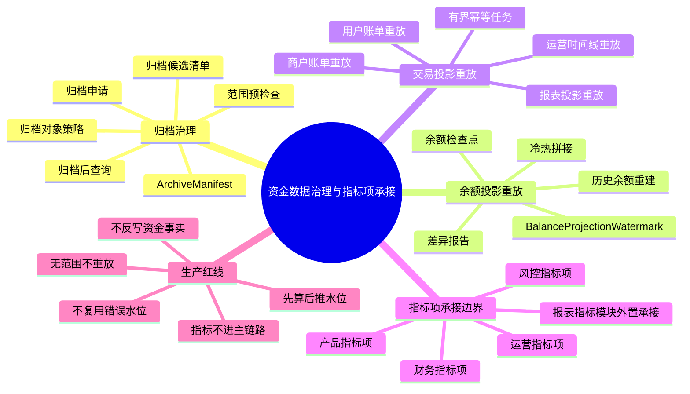
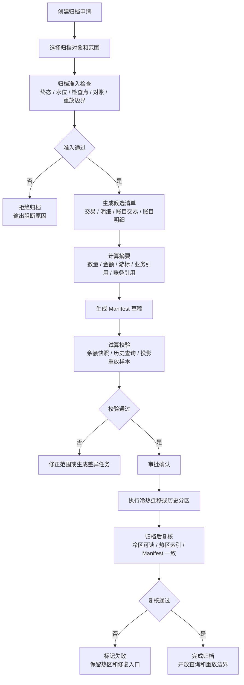
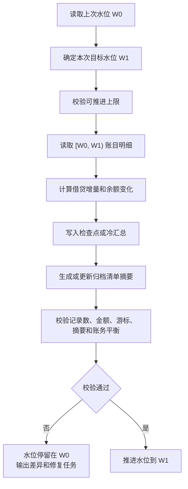
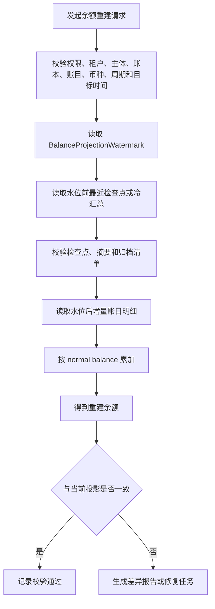
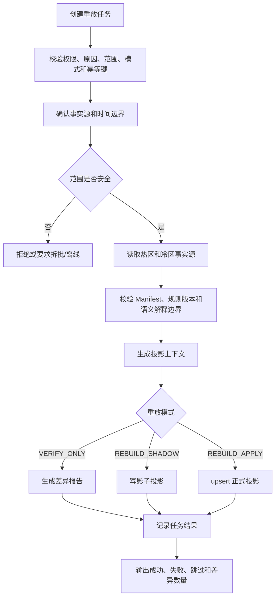

# 资金数据治理与指标项承接产品设计

## 1. 背景和目标

支付资金底座运行一段时间后，会积累大量资金交易、交易明细、账目交易、账目明细、余额投影、冻结单、清结算批次、对账差错、争议记录和交易视图。数据量变大后，产品上会遇到三个问题：

1. 历史交易和账务事实归档后，当前余额、历史余额、用户账单和商户账单还能不能被证明。
2. 用户账单、商户账单、运营时间线、清结算视图或报表投影出错后，能不能在明确时间边界内重放修复。
3. 资金交易指标要服务产品、运营、财务和风控，但不能把指标报表能力耦合进资金主链路，也不能把指标结果反写到资金事实。

本文件定位为资金数据治理产品设计。它回答 wind-funds 内部应该承担哪些归档、重建、重放、证明和可信输入能力；同时明确指标和报表只在这里保留业务口径和事实来源边界，采集、计算、存储、调度、展示、导出和订阅由独立报表指标模块承接。

定位结论：

1. 放在 wind-funds 内：资金事实归档、余额检查点、余额水位、余额重建、交易投影重放、归档 Manifest、差异报告、生产门禁和审计证据。
2. 放在报表指标模块内：指标模型、指标计算、报表看板、导出订阅、OLAP 宽表、指标质量和正式口径版本治理。
3. 本文件只定义两者之间的边界：资金底座提供可信事实、投影和指标项输入；报表指标模块只读消费，不反写资金事实。

## 2. 范围、角色和场景入口

### 2.1 专题范围和读者

| 维度 | 内容 |
| --- | --- |
| 本文覆盖 | 资金交易归档、交易明细归档、账目交易归档、账目明细归档、余额检查点、余额水位、归档清单、余额重建、交易投影重放、资金交易指标项清单、建议事实来源和只读承接边界。 |
| 本文不覆盖 | 交易、路由、钱包、清结算、对账差错的完整产品设计；指标模型、指标计算、报表看板、导出订阅、OLAP 宽表、指标质量和报表指标模块内部实现。 |
| 主要使用者 | 产品、数据、财务、运营、风控、研发、测试和安全审计。 |
| 核心验收 | 归档不破坏事实和审计，重放不重新入账，指标不反写事实，水位推进必须先算后推。 |

### 2.2 角色、对象和场景入口

| 场景 | 触发条件 | 产品目标 | 关键对象 |
| --- | --- | --- | --- |
| 数据归档 | 历史交易、交易明细、账目交易或账目明细达到归档策略。 | 降低热数据压力，同时保留可查询、可核对、可审计、可重放能力。 | 归档申请、归档对象、检查点、归档清单、Manifest。 |
| 当前余额校验 | 当前余额查询或巡检需要证明余额正确。 | 用余额投影、检查点和增量账目明细解释当前余额。 | 余额投影、余额水位、账目明细。 |
| 历史余额重建 | 用户、商户、财务或审计查询历史余额。 | 从检查点和增量账目明细重建目标时点余额。 | 检查点、冷汇总、增量账目明细、差异报告。 |
| 交易投影修复 | 用户账单、商户账单、运营时间线或报表视图出现差异。 | 有界重放只读投影，不触碰资金事实。 | 重放任务、投影视图、差异报告。 |
| 指标项承接 | 产品、运营、财务或风控需要指标观察。 | 明确业务可能关心的指标项、使用者、关注问题、建议事实来源和只读边界。 | 指标项、业务口径说明、建议事实来源、承接边界。 |

### 2.3 总体能力地图



## 3. 核心结论

| 主题 | 产品结论 |
| --- | --- |
| 余额重建 | 余额只能从账目明细、余额检查点、冷汇总和水位后的增量账目明细重建。 |
| 交易重放 | 交易投影重放只修复用户账单、商户账单、运营时间线和报表投影，不重新入账。 |
| 归档边界 | 归档只改变冷热存储位置，不改变事实身份、审计链路和查询能力。 |
| 水位边界 | 冷热拼接使用 BalanceProjectionWatermark，不是自然日、归档日期或 180 天。 |
| 指标项承接 | 资金底座只提供指标项、业务问题、建议事实来源和可信输入边界；指标计算、报表和导出由报表指标模块承接。 |
| 在线安全 | 生产重放必须有范围、原因、权限、幂等和审计；不得无界全量重放。 |

## 4. 概念和能力边界

| 概念 | 易懂定义 | 能力边界 |
| --- | --- | --- |
| 余额检查点 | 某个账本、账目、主体、币种在某个时间点的余额基线。 | 由账目明细生成，不能由当前余额、交易投影或报表反推。 |
| 余额水位 | 已经被检查点、冷汇总或归档处理覆盖到的时间边界。 | 冷热拼接必须按水位，水位先算后推。 |
| 归档清单 | 一次归档的对象、范围、数量、金额摘要、冷热位置和校验凭证。 | 没有清单不得归档；归档后仍需可查询和审计。 |
| 余额重建 | 用检查点或冷汇总加增量账目明细重新计算余额。 | 不读取用户账单、商户账单或报表汇总。 |
| 交易投影重放 | 重新生成只读交易视图、账单、时间线或报表投影。 | 不补写资金交易，不修改账目明细，不更新余额事实。 |
| 重放任务 | 控制一次重放或校验的范围、模式、权限和状态。 | 必须可断点续跑、可审计、可输出差异。 |
| 指标项 | 用于观察交易、余额、清结算、对账、风险和运营表现的业务关注项。 | 本文只列业务可能关心的项、理解口径和建议事实来源，不设计指标模型、任务、表、快照、水位、报表、看板、导出或订阅实现。 |

## 5. 数据归档治理流程

归档的产品语义是“事实换位置、证据不断链”，不是删除事实、合并事实或修正事实。资金交易、交易明细、账目交易和账目明细可以采用不同归档节奏，但必须通过归档清单和交叉引用保持可查询、可核对、可审计、可重放。

### 5.1 归档对象和策略

| 归档对象 | 产品定位 | 可归档前提 | 归档后必须保留 | 对余额或重放的影响 |
| --- | --- | --- | --- | --- |
| 资金交易 | 交易生命周期事实，说明一笔资金交易为什么发生、处于什么状态。 | 交易进入终态，关联退款、撤销、争议、清结算、对账阻断已处理或有明确挂起原因。 | 交易流水、交易类型、状态、金额、币种、参与主体、外部引用、route snapshot 引用、账务引用、规则版本。 | 是用户账单、运营时间线和交易投影重放的重要来源；归档后必须能被冷热统一事实源读取。 |
| 交易明细 | 交易参与方、金额项、费用、商户侧展示和清结算归属事实。 | 所属资金交易可归档，清分、清算、退款、争议和对账状态可解释。 | 明细流水、参与方、金额项、费用项、商户或账户主体、清结算引用、账务引用。 | 是商户账单、清结算视图和分摊明细重放的关键来源；缺失会导致投影无法精确重建。 |
| 账目交易/账本交易 | 一组账务分录的业务批次事实，说明一次入账动作的来源和凭证。 | 关联账目明细已被检查点或水位覆盖，对账、关账或巡检结果通过。 | 账务交易流水、业务引用、posting plan 摘要、分录范围、借贷摘要、摘要校验值。 | 是账务审计和余额重建的索引入口；归档不改变分录身份和借贷关系。 |
| 账目明细/账本分录 | 不可变账务事实，是余额和审计的根。 | 目标区间已有已校验检查点或冷汇总，归档 Manifest 可证明数量、金额和游标一致。 | 分录流水、账本、账目、主体、币种、借贷方向、金额、过账时间、账本周期、业务引用、摘要校验值。 | 是余额快照、余额重建和账务核对的唯一事实来源；冷区必须可按水位和游标读取。 |
| 余额投影 | 当前查询和巡检用的派生读模型。 | 可由账目明细、检查点和水位重建。 | 当前投影、检查点和差异报告；投影行本身不作为事实源。 | 可重建，不可反向修复账目明细。 |
| 交易投影 | 用户账单、商户账单、运营时间线和报表视图。 | 可由资金交易、交易明细、账务引用、清结算和对账事实重建。 | 投影版本、来源范围、来源摘要、重放任务和差异报告。 | 可重放，不可反写资金交易、交易明细或账目事实。 |

策略结论：

1. 资金交易和交易明细按交易生命周期、客服追溯、商户查询、清结算和对账闭环决定归档时间。
2. 账目交易和账目明细按账务过账时间、账本周期、余额检查点、余额水位和对账结果决定归档时间。
3. 两类归档可以不在同一批次完成，但必须共享业务引用、账务引用和 Manifest；任一侧归档后，另一侧仍要能通过引用定位。
4. 当前余额不依赖交易投影；交易投影重放不依赖余额投影反推。两者都依赖可验证的事实源。

### 5.2 归档前置条件

| 条件 | 验收要求 |
| --- | --- |
| 范围明确 | 归档必须指定租户、对象类型、账本、账目、主体、币种、时间范围、业务范围、原因和审批人。 |
| 事实终态 | 资金交易、交易明细必须达到可解释状态；账目交易、账目明细必须已过账且不可变。 |
| 水位覆盖 | 账目明细归档截止时间必须小于等于已处理水位；资金交易和交易明细归档不得早于对应事实可追溯边界。 |
| 检查点存在 | 账务归档范围末端必须有已校验余额检查点或冷汇总。 |
| 巡检通过 | 账目交易、账目明细、余额投影、检查点摘要和 Manifest 候选清单一致。 |
| 对账处理 | 归档范围内不存在未处理高风险账务差异；低风险解释差异必须有关联差错单和审批。 |
| 重放边界明确 | 归档后仍能确定交易投影可重放的最早时间、最晚时间、事实源位置和语义解释范围。 |
| 清单生成 | 归档前生成记录数、金额摘要、最后游标、冷热位置、来源摘要和交叉引用。 |
| 审批通过 | 财务、运营、研发或数据治理责任人按风险等级复核。 |

### 5.3 归档详情流程



| 步骤 | 产品动作 | 通过条件 | 失败处理 |
| --- | --- | --- | --- |
| 1. 创建申请 | 说明归档目的、对象、范围、操作者和审批责任人。 | 范围可解释，风险等级可判断。 | 缺范围或缺原因直接驳回。 |
| 2. 选择对象 | 明确是交易归档、账务归档，还是两者联动归档。 | 对象类型和业务引用清楚。 | 不允许用“历史数据”这种笼统范围发起生产归档。 |
| 3. 准入检查 | 校验终态、水位、检查点、对账差错、关账或巡检结果。 | 阻断项为零，低风险差异有审批和到期复查。 | 输出阻断清单，不移动数据。 |
| 4. 候选清单 | 生成候选记录集合和交叉引用。 | 每条记录都能定位业务流水、账务流水和原始时间。 | 缺引用的记录从本批次剔除并进入治理清单。 |
| 5. 摘要试算 | 计算数量、金额、借贷合计、游标、摘要校验值。 | 热区候选、冷区写入计划和 Manifest 摘要一致。 | 生成差异报告，水位不推进。 |
| 6. 样本验证 | 试算余额快照、历史查询和交易投影重放样本。 | 样本能跨冷热读取且结果一致。 | 不进入审批；先补齐冷源读取或语义映射规则。 |
| 7. 审批确认 | 财务、运营、研发或治理责任人确认。 | 审批记录含范围、风险、回退方式和生效时间。 | 审批拒绝则撤回。 |
| 8. 冷热迁移 | 将候选事实迁移到冷区或历史分区，热区保留索引或引用。 | 冷区记录可读，热区引用可定位。 | 任务失败不得删除热区记录。 |
| 9. 归档复核 | 校验冷区数量、金额摘要、游标、查询入口和 Manifest。 | 复核全部通过。 | 标记失败或部分失败，输出修复任务。 |
| 10. 完成开放 | Manifest 标记完成，开放历史查询和重放边界。 | 查询、余额重建、投影重放和审计入口可用。 | 未完成不得对外宣称归档成功。 |

### 5.4 归档后查询和影响

| 查询或任务 | 产品策略 |
| --- | --- |
| 当前余额 | 读取当前余额投影，必要时用检查点和热区增量账目明细校验。 |
| 历史余额 | 找到目标时点前的检查点或冷汇总，加目标区间增量账目明细重算。 |
| 用户账单 | 通过资金交易、授权、冻结、退款、账务引用和交易投影重放恢复展示。 |
| 商户账单 | 通过交易明细、清分批次、清算批次、结算单、出款单和对账差错恢复展示。 |
| 审计明细 | 通过归档索引读取冷数据，仍能按流水、主体、账目、时间和业务引用定位。 |
| 对账追溯 | 通过批次、外部 reference、账目交易或账目明细游标定位归档范围。 |
| 报表重算 | 由报表指标模块只读消费事实和投影，不直接扫全量冷归档，不反写事实。 |

## 6. 余额投影重放和重建

本文所说的“余额投影重放”，产品语义是从账目事实、检查点和水位增量重新计算余额投影。它可以表现为校验、重算、重建或差异报告，但不能从用户账单、商户账单、运营时间线或报表反推余额。

### 6.1 余额投影快照计算

余额投影快照是一段账目明细被完整计算、校验后的余额基线。它回答的是：“到某个时间点为止，这个主体在这个账本、账目、币种和账本周期下的余额是多少，是否可被分录证明。”

```text
snapshotKey = tenantId + ledgerBook + ledgerSubject + accountCode + currency + periodType + periodId
interval    = [lastCheckpointTime, targetCheckpointTime)

debitDelta  = sum(debitAmount of 账目明细 where postedAt in interval)
creditDelta = sum(creditAmount of 账目明细 where postedAt in interval)

if normalBalance = DEBIT:
  endingBalance = openingBalance + debitDelta - creditDelta

if normalBalance = CREDIT:
  endingBalance = openingBalance + creditDelta - debitDelta
```

其中 postedAt 指账目明细的账务过账时间，不是业务创建时间、自然日、归档日期或报表日期。账本周期用于隔离同一主体、同一账目在不同业务周期下的余额，不得被清算账期、报表周期或归档水位替代。

| 快照内容 | 说明 |
| --- | --- |
| 期初余额 | 上一个已校验快照或冷汇总的余额。 |
| 本期借方发生额 | 本次区间内借方金额合计。 |
| 本期贷方发生额 | 本次区间内贷方金额合计。 |
| 净变化额 | 按账目借贷属性计算出的余额变化。 |
| 期末余额 | 本次快照的可证明余额。 |
| 记录数量和游标 | 本次覆盖的账目明细数量、第一游标和最后游标。 |
| 摘要校验值 | 用于证明热区、冷区、Manifest 和快照一致。 |
| 来源引用 | 归档清单、账目交易范围、操作者、审批记录和生成时间。 |

### 6.2 余额投影快照水位公式

余额水位表示“截至这个时间边界，账目明细已经被快照、冷汇总或归档处理安全覆盖”。水位只能在快照计算和校验通过后推进。

```text
W0 = 上一次已校验水位
W1 = 本次目标水位
Δ[W0, W1) = postedAt >= W0 且 postedAt < W1 的账目明细增量

Checkpoint(W1) = Checkpoint(W0) + Δ[W0, W1)

if verify(Checkpoint(W1), Manifest(W0, W1), digest) = true:
  watermark = W1
else:
  watermark = W0

balanceAt(T) = Checkpoint(Wk) + Δ[Wk, T)
```

水位可推进上限取以下边界中的最小值：账务过账稳定边界、对账安全边界、归档 Manifest 校验边界，以及人工冻结或关账要求形成的边界。换句话说，水位不是“想推到哪里就到哪里”，而是只能推进到事实已经稳定、检查点已经证明、风险已经闭环的位置。

180 天只表示热数据保留或归档资格，不是余额计算边界。

### 6.3 水位推进流程



禁止先推进水位再计算。如果先推进水位，任务失败时会出现时间缝隙、重复统计或历史余额无法解释。

### 6.4 余额重建流程



### 6.5 余额重建红线

1. 不从用户账单、商户账单、交易投影或报表汇总反推余额。
2. 不用归档日期、自然日或 180 天作为冷热拼接边界。
3. 不在缺检查点、缺水位、缺清单或摘要不一致时强行返回成功。
4. 不为了修复余额直接改历史账目明细。
5. 不允许无权限、无范围、无原因的生产余额重建。

## 7. 交易投影重放

交易投影重放用于修复只读视图，不用于生成资金事实。它要回答三个问题：重放什么视图、从哪些事实重放、在什么时间边界内可以安全重放。

### 7.1 重放对象

| 重放对象 | 用途 | 事实来源 |
| --- | --- | --- |
| 用户账单 | 修复用户视角交易、退款、冻结、授权、余额调整和提现展示。 | 资金交易、交易明细、余额控制事实、账目引用、清结算、争议。 |
| 商户账单 | 修复商户收款、待清算、退款、结算、争议和出款展示。 | 交易明细、清分批次、清算批次、结算单、出款单、对账差错。 |
| 运营时间线 | 修复运营查询和客诉处理轨迹。 | 交易、交易明细、余额控制事实、对账、争议、审批、审计日志。 |
| 财务报表投影 | 修复财务经营报表和清结算报表投影。 | 账目交易、账目明细、清结算、对账、费用、调账和核销。 |

### 7.2 重放事实源和时间边界

资金交易和交易明细归档后，交易投影是否还能重放，取决于冷区事实是否能被重放任务读取，而不是取决于记录是否仍在热表。

| 边界 | 含义 | 产品规则 |
| --- | --- | --- |
| 热区事实起点 | 在线热区中最早可读取的资金交易、交易明细和账务引用时间。 | 如果没有冷区统一读取能力，在线重放不得早于这个时间。 |
| 冷区可查起点 | 冷区中最早可通过 Manifest、归档索引和权限读取的事实时间。 | 只有 Manifest 完成、冷区可读、摘要一致时才能纳入重放。 |
| 事实可用起点 | 热区事实和冷区事实合并后，能完整读取来源事实的最早时间。 | 有冷热统一事实源时取可证明的最早事实时间；没有时取热区事实起点。 |
| 规则解释起点 | 投影规则能够正确解释来源事实的最早时间。 | 字段缺失、规则版本无法解释或证据不完整时，不得直接正式覆盖。 |
| 允许重放起点 | 可以发起正式重放的最早时间。 | max(事实可用起点, 规则解释起点)。 |
| 允许重放终点 | 可以发起正式重放的最晚时间。 | 不得超过事实稳定边界；未终态、未过账、未对账可解释的事实只能校验或等待。 |

归档对交易投影重放的影响：

1. 资金交易或交易明细已归档，但冷区统一事实源可读且 Manifest 完整，交易投影可以跨冷热边界重放。
2. 资金交易或交易明细已归档，但冷区不可读或摘要不一致，在线交易投影只能从热区事实起点之后重放；更早范围只能先恢复冷源、修复 Manifest 或走离线治理流程。
3. 账目交易或账目明细已归档，不影响交易投影展示本身，但会影响账务引用、金额证明、清结算追溯和财务投影核对；重放任务必须能定位冷区账务引用。
4. 交易明细缺失时，商户账单、清结算视图和分摊明细不能精确重放；不得用汇总金额补造明细。

### 7.3 重放范围

| 范围 | 适用场景 | 必填约束 |
| --- | --- | --- |
| 单笔 | 修复单笔交易、冻结单、退款或争议视图。 | 来源对象流水。 |
| 时间窗口 | 修复一段时间内投影。 | 开始时间、结束时间、最大窗口限制。 |
| 主体范围 | 修复某用户、商户、账户主体。 | 主体类型、主体 ID。 |
| 视图域 | 修复用户账单、商户账单、运营时间线或报表。 | 投影编码。 |
| 批次范围 | 修复清分、清算、结算、对账或报表批次。 | 批次号和批次类型。 |

### 7.4 重放模式

| 模式 | 产品含义 | 是否写正式视图 |
| --- | --- | --- |
| VERIFY_ONLY | 只比对事实源和当前投影差异。 | 否 |
| REBUILD_SHADOW | 重建到影子视图，用于旁路核对。 | 否 |
| REBUILD_APPLY | 重建并 upsert 正式只读视图。 | 是 |

### 7.5 交易投影详细用例

| 用例 | 触发场景 | 重放范围 | 来源事实 | 期望结果 | 验收重点 |
| --- | --- | --- | --- | --- | --- |
| 用户账单单笔重放 | 用户账单展示状态、金额或文案与事实不一致。 | 单笔资金交易或退款。 | 资金交易、交易明细、账目引用、冻结或退款事实。 | 生成正确账单行或差异报告。 | 不新增资金交易，不改账目明细；账单能追溯来源事实。 |
| 商户账单窗口重放 | 商户某天收款、退款、待清算或已结算展示异常。 | 商户主体加时间窗口。 | 交易明细、清分批次、清算批次、结算单、出款单。 | 重建商户账单视图。 | CLEARING/AVAILABLE/SETTLEMENT 口径清楚，分摊明细不丢失。 |
| 授权和退款链路时间线重放 | 客服或运营查询不到授权、完成、撤销、过期、退款等事件顺序。 | 单笔交易链路。 | 授权事实、结算事实、退款事实、冻结释放、审计事件。 | 重建运营时间线。 | 时间线只展示事实，不改变交易状态。 |
| 清分清算批次视图重放 | 清分批次或清算批次展示明细缺失、重复或状态错误。 | 批次号和视图域。 | 可清分明细、清分批次、清算候选、清算批次、结算单。 | 重建批次投影视图。 | 不触发重新清分或重新清算；差异进入报告。 |
| 对账差错处理后重放 | 差错核销、调账或重新对账后，运营视图未同步。 | 差错单、对账批次或主体窗口。 | 对账任务、差错单、调账凭证、核销结果、账目引用。 | 重建差错和账务追溯视图。 | 差错处理有审批和凭证；不修改历史账目明细。 |
| 归档后跨冷热重放 | 历史交易已归档，用户或商户查询需要重建历史视图。 | 历史时间窗口或单笔。 | 热区事实、冷区事实、Manifest、归档索引。 | 跨冷热读取并生成投影或差异报告。 | 重放起点不早于允许重放起点；冷区摘要必须一致。 |
| 校验模式重放 | 准备正式覆盖前，需要确认投影差异。 | 任意有界范围。 | 指定范围内事实源。 | 输出差异报告，不写正式视图。 | VERIFY_ONLY 不产生正式投影变化。 |
| 影子后正式覆盖 | 影子投影与事实核对通过，需要修复正式视图。 | 已审批范围。 | 影子投影、来源事实、审批记录。 | upsert 正式只读视图。 | 覆盖动作有审批、幂等键、差异报告和回溯入口。 |

### 7.6 交易投影重放流程



### 7.7 交易重放红线

1. 交易投影重放不得重新入账。
2. 不得补写资金交易或交易明细。
3. 不得修改账目交易、账目明细或余额投影。
4. 生产在线不得无范围全量重放。
5. 超过最大窗口或记录数必须拆批、离线或先跑影子重放。
6. 重放失败必须能断点续跑，并输出失败样本。
7. 不得在允许重放起点之前正式覆盖投影；更早范围必须先补齐冷源读取、语义迁移或离线治理方案。

## 8. 大数据量治理

| 问题 | 产品策略 |
| --- | --- |
| 历史明细太多 | 热数据保留加冷归档，保留归档索引和审计查询入口。 |
| 当前余额查询慢 | 使用余额投影，必要时用水位和增量账目明细校验。 |
| 历史余额查询慢 | 使用检查点加增量账目明细，不在线扫描全部冷数据。 |
| 投影重放太大 | 按单笔、主体、视图域、时间窗口或批次拆分。 |
| 报表计算太慢 | 由报表指标模块承接；资金底座只提供可信事实、投影和指标项输入。 |
| 数据差异难定位 | 每个批次保留摘要、数量、金额、游标、来源范围和差异报告。 |

### 8.1 交易归档和账务归档的组合影响

| 组合状态 | 余额影响 | 交易投影影响 | 产品要求 |
| --- | --- | --- | --- |
| 交易热区，账务热区 | 当前查询和重放都走热区事实。 | 可在线重放。 | 仍需通过范围、权限和模式控制。 |
| 交易热区，账务冷区 | 当前余额依赖检查点和水位，历史账务引用走冷区。 | 用户或商户视图可重放，但账务证明需读取冷区账目事实。 | 冷区账目引用必须可读，Manifest 摘要必须一致。 |
| 交易冷区，账务热区 | 当前余额不受影响。 | 历史交易视图需要读取冷区交易和热区账务引用。 | 交易明细冷源不可读时，不得精确重放商户账单。 |
| 交易冷区，账务冷区 | 当前余额依赖检查点，历史查询依赖冷热统一事实源。 | 只能在允许重放时间边界内跨冷热重放。 | 必须有 Manifest、归档索引、摘要校验和权限控制。 |
| 投影冷区或缺失 | 不影响余额事实。 | 可由事实源重建。 | 投影不是事实源，不能用投影补造交易或账目明细。 |

### 8.2 归档策略边界

1. 账目明细是余额和审计的根，归档必须最保守；没有检查点、水位、Manifest 和对账闭环时不得归档。
2. 资金交易和交易明细是交易视图和运营追溯的根，归档必须保证冷热统一事实源可读；不能因为热区减负而牺牲客服、商户查询和重放能力。
3. 账目交易和账目明细归档后，余额投影可以继续服务当前查询，但历史余额必须能通过检查点和增量账目明细解释。
4. 交易投影、报表投影和指标结果都是派生结果，可以归档或重建，但不能成为资金事实、账务事实或余额修复依据。

## 9. 资金交易指标项承接边界

本节只列出产品和业务上可能关心的指标项，不设计实现。指标采集、计算、存储、调度、展示、导出、订阅、质量校验和口径版本管理，由报表指标模块独立承接。

本设计对指标的唯一要求是：指标只能只读消费交易、账本、余额投影、清结算、对账、归档和重放等事实或读模型，不能反写资金事实，也不能作为余额修复、账务调整或清结算状态变更的依据。

### 9.1 交易规模指标

| 指标项 | 口径说明 |
| --- | --- |
| 交易笔数 | 按交易类型、业务线、主体、币种、状态统计。 |
| 交易金额 | 按原始金额、账户金额、费用、净额维度统计。 |
| 成功交易笔数 | 进入成功终态且账本过账成功的交易数。 |
| 失败交易笔数 | 校验失败、路由失败、账务失败、外部失败等交易数。 |
| 授权批准金额 | 授权成功占用金额。 |
| 授权拒绝金额 | 授权被拒绝的金额，不计入争议拒付。 |
| 退款金额 | 已完成退款金额，按原交易和退款原因分类。 |
| 争议拒付金额 | 外部争议或拒付导致的扣回金额。 |
| 手续费金额 | 平台手续费、手续费退回、通道成本等。 |

### 9.2 余额和账户指标

| 指标项 | 口径说明 |
| --- | --- |
| 用户可用余额 | 用户资金账户 AVAILABLE 当前余额。 |
| 用户冻结余额 | 用户资金账户 FROZEN 当前余额。 |
| 授权占用余额 | AUTHORIZATION 当前余额，按资金、信用、预算主体拆分。 |
| 商户待清算余额 | 商户 CLEARING 当前余额。 |
| 商户可结算余额 | 商户 AVAILABLE 当前余额。 |
| 商户出款中余额 | 商户 SETTLEMENT 当前余额。 |
| 平台现金映射余额 | 平台 CASH 口径余额。 |
| 平台预收待付余额 | 平台 PREPAYMENT 口径余额。 |
| 平台费用余额 | 平台 FEE 口径余额。 |
| 调整挂账余额 | 平台或责任方 ADJUSTMENT/SUSPENSE 口径余额。 |
| 负余额主体数 | AVAILABLE < 0 的资金账户、信用账户或预算组数量。 |
| 负余额金额 | 负余额绝对值合计，按责任方、账龄、原因分类。 |

### 9.3 清结算指标

| 指标项 | 口径说明 |
| --- | --- |
| 清算候选笔数 | 满足进入候选池的交易明细数。 |
| 清算确认金额 | CLEARING -> AVAILABLE 的确认金额。 |
| 结算单笔数 | 指定周期内生成的结算单数量。 |
| 结算净额 | 结算单净额合计。 |
| 出款提交金额 | 已提交外部或内部付款的出款金额。 |
| 出款成功金额 | 外部确认成功的出款金额。 |
| 出款失败金额 | 明确失败并回退的出款金额。 |
| 出款退回金额 | 已成功或已受理后退回的金额。 |
| 暂停结算金额 | 因风险、差错、资料或审批暂停的金额。 |
| 准备金金额 | 风险暂扣或滚动准备金金额。 |

### 9.4 对账和差错指标

| 指标项 | 口径说明 |
| --- | --- |
| 对账批次数 | 按对账类型、外部文件、主体和周期统计。 |
| 对平笔数 | 完全匹配的明细数。 |
| 差错笔数 | 生成差错单的明细数。 |
| 差错金额 | 差错金额合计，按长款、短款、状态不一致分类。 |
| 挂账金额 | 未明确责任或未核销差异金额。 |
| 已核销差错金额 | 完成核销的差错金额。 |
| 平均处理时长 | 差错从发现到关闭的耗时。 |
| 超 SLA 差错数 | 超过处理时限仍未关闭的差错数量。 |
| 账务巡检异常数 | 账目明细、投影、摘要或水位异常数量。 |

### 9.5 风控和运营指标

| 指标项 | 口径说明 |
| --- | --- |
| 冻结金额 | 当前冻结余额或周期内新增冻结金额。 |
| 解冻金额 | 周期内释放冻结金额。 |
| 冻结单数量 | 按原因、主体、状态、账龄统计。 |
| 风控阻断交易数 | 因风控、名单、资料、额度或预算阻断的交易数。 |
| 人工审批笔数 | 调账、出款、解冻、核销、跨境资料等审批数量。 |
| 审批通过率 | 审批通过数量除以审批总量。 |
| 争议案件数 | 争议或拒付案件数量。 |
| 争议胜诉率 | 胜诉案件数除以有结果案件数。 |
| 追偿金额 | 因退款、拒付、差错或负余额产生的追偿金额。 |
| 追偿回收金额 | 已追回或抵扣的追偿金额。 |

### 9.6 归档和重放指标

| 指标项 | 口径说明 |
| --- | --- |
| 归档批次数 | 已发起、成功、失败、部分失败的归档批次数。 |
| 归档记录数 | 归档资金交易、交易明细、账目交易和账目明细记录数量。 |
| 归档金额摘要 | 归档范围借贷金额摘要。 |
| 水位推进延迟 | 当前水位与目标处理时间之间的延迟。 |
| 余额重建任务数 | 按任务状态、主体、账本和账目统计。 |
| 余额重建差异数 | 重建结果与当前投影不一致的数量。 |
| 交易投影重放任务数 | 按视图域、模式、状态统计。 |
| 重放成功率 | 成功处理记录数除以总处理记录数。 |
| 重放差异数 | 重放前后发现的视图差异数量。 |

## 10. 指标边界原则

1. 本文只定义“业务为什么关心、如何理解、建议看哪些事实来源”，不定义报表指标模块内部实现。
2. 指标不能替代账本、交易、清结算或对账事实。
3. 指标报表不得反向修改资金事实、余额投影、交易投影、清结算状态或对账状态。
4. 报表指标模块可以独立设计口径版本、维度、权限、脱敏、审计和质量校验，但不得把这些对象塞回资金主链路。
5. 涉及监管、合规、外汇、备付金或持牌机构报送的指标，必须另行确认规则来源、版本、生效日期和确认方。

## 11. 产品验收要点

| 验收点 | 断言 |
| --- | --- |
| 归档对象 | 资金交易、交易明细、账目交易、账目明细分别说明可归档前提、必留引用和影响范围。 |
| 归档前置 | 缺检查点、缺水位、缺清单、缺重放边界或巡检失败时不得归档。 |
| 归档后查询 | 历史明细、余额和对账追溯仍可定位。 |
| 快照计算 | 余额快照按账目明细 postedAt 区间和借贷方向计算。 |
| 水位推进 | 必须先计算、写入、校验，再推进水位；失败时水位停留在上一次已校验位置。 |
| 余额重建 | 不从交易投影或报表反推余额。 |
| 交易重放 | 不重新入账，不改交易事实、账目事实或余额事实。 |
| 重放范围 | 生产重放必须有单笔、主体、时间窗口、视图域或批次范围。 |
| 重放边界 | 资金交易和交易明细归档后，必须先确认冷区事实可读、Manifest 一致和规则解释起点。 |
| 指标只读 | 指标项只读消费事实和投影，不写回资金事实。 |
| 指标边界 | 指标只作为报表指标模块输入，不在本设计中落表、计算或推进水位。 |
| 审计 | 归档、重建和重放都有操作者、原因、审批和结果；指标导出审计由报表指标模块承接。 |

## 12. 报表指标模块产品输入边界

资金交易指标由报表指标模块承接，不进入交易、路由、钱包、账目、余额投影、交易投影、清结算或对账的事实能力。产品侧只提供业务输入和可信事实来源边界，避免把指标实现细节提前耦合到资金底座。

| 产品输入 | 说明 |
| --- | --- |
| 指标项名称 | 业务希望观察什么，例如交易金额、商户待清算余额、差错金额、重放成功率。 |
| 业务问题 | 这个指标用于回答什么问题，例如增长、风险、运营效率、资金安全或异常定位。 |
| 使用者 | 产品、运营、财务、风控、客服、审计或管理层。 |
| 理解口径 | 用自然语言说明指标含义、纳入范围、排除范围和常见误用。 |
| 建议维度 | 租户、主体、业务线、交易类型、币种、状态、时间、通道、批次等。 |
| 建议事实来源 | 资金交易、交易明细、账目交易、账目明细、余额投影、清结算批次、对账结果、差错单、归档任务、重放任务等。 |
| 敏感等级 | 是否涉及资金明细、客户信息、商户经营信息、风控敏感信息或监管口径。 |
| 待确认项 | 涉及合规、监管、外汇、备付金、持牌机构报送或正式经营分析的口径，需要另行确认。 |

## 13. 风险校准：归档、重放和水位门禁

归档和重放风险的根源不是数据量大，而是边界不清：归档只改变存储位置，余额重建只从账本事实恢复余额，交易投影重放只修复读模型，指标项只作为报表指标模块输入。四者不能互相替代。

| 风险点 | 必须满足的生产门禁 | 必须失败的情况 |
| --- | --- | --- |
| 归档范围 | 指定租户、对象类型、账本、账目、主体、币种、时间范围、业务范围、原因和审批。 | 范围为空、范围过大且无审批、对象类型不清、缺主体或缺账目。 |
| 对象策略 | 资金交易、交易明细、账目交易、账目明细分别满足可归档前提，并保留交叉引用。 | 用一个笼统“历史数据归档”范围迁移事实；归档后无法定位业务流水或账务流水。 |
| 检查点 | 账务归档范围末端存在已校验检查点或冷汇总。 | 缺检查点、检查点摘要不一致、账目明细巡检失败。 |
| Manifest | 归档前后都有 Manifest，包含数量、金额摘要、游标、冷热位置和校验凭证。 | 缺 Manifest、Manifest 与实际冷区记录不一致。 |
| 快照计算 | 使用账目明细 postedAt 区间、借贷方向、normal balance 和账本周期计算。 | 使用自然日、归档日期、报表日期、交易投影或汇总报表计算余额快照。 |
| 水位推进 | 先计算、写检查点、校验摘要，再推进余额水位。 | 先推进水位再计算；失败后水位仍前进；超过事实稳定边界推进。 |
| 余额重建 | 使用检查点或冷汇总加水位后增量账目明细。 | 从交易投影、商户账单、用户账单或报表反推余额。 |
| 交易投影重放 | 指定单笔、主体、时间窗口、视图域或批次范围，并输出差异报告。 | 无范围全量在线重放；重放生成 route、posting plan、资金交易或账目明细。 |
| 重放时间边界 | 明确事实可用起点、规则解释起点、允许重放起点和允许重放终点。 | 冷区不可读、摘要不一致或规则无法解释来源事实时仍正式覆盖历史投影。 |
| 指标项承接边界 | 资金底座只提供指标项、业务问题、建议事实来源和可信输入；具体实现由报表指标模块承接。 | 指标结果反写交易、账本、余额、清结算或对账状态；指标任务复用归档 Manifest、水位或重放 checkpoint。 |
| 差异报告 | 重建和重放都输出成功数、失败数、差异样本和重跑范围。 | 失败只打日志、不产出可处理差异报告。 |

生产重放控制原则：

1. 重放任务必须先影子运行或校验模式产出差异报告，再决定是否覆盖读模型。
2. 交易投影重放不得写入资金交易、交易明细、route snapshot、posting plan 或账目明细。
3. 余额重建不得依赖报表指标或交易视图。
4. 指标实现不得推进余额水位，也不得修改归档 Manifest，不得复用归档、重建或重放的控制对象表达报表任务进度。
5. 交易明细缺失时，不得用汇总金额、报表结果或投影结果补造明细。
