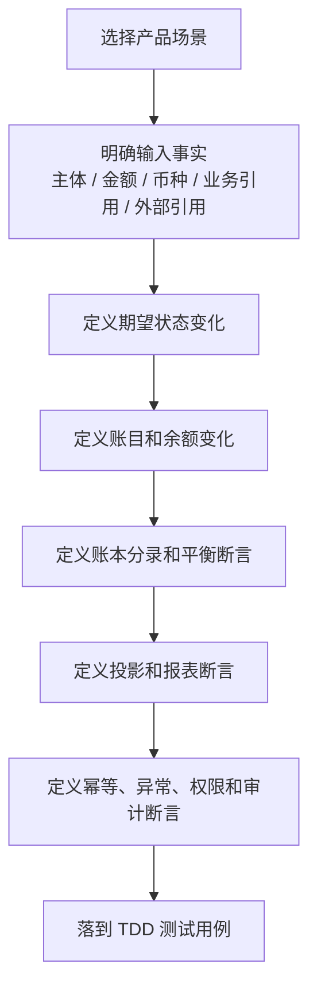

# 产品验收与 TDD 用例矩阵

## 1. 文档定位

本矩阵用于把产品 PRD 转换为 TDD 流程的输入。它先从产品、运营、财务、风控和使用者视角定义“必须被证明的事实”，再由研发和测试落到接口测试、服务测试、契约测试、集成测试和回归测试。

产品验收不只看“接口不报错”，还要看状态、金额、账目、账本、投影、幂等、审计和异常路径是否完整。

### 1.0 目标、范围与非目标

目标：

1. 建立 PRD 到 DSL、系分和 TDD 的统一验收索引，确保每个资金能力都能说明业务目标、对象状态、账务影响、投影输出、审计证据和必须失败边界。
2. 为编码批次提供可执行的准入判断，区分设计覆盖、契约承载、服务级落地、数据库级落地和生产 Done 证据。
3. 让产品、研发、测试、运营、财务、风控和合规在同一张矩阵里识别交付范围、残余风险和人工确认点。

范围：

1. 覆盖支付资金底座的交易接入、权益语义、钱包账户、支付工具、资金路由、账本账目、余额投影、交易投影、清结算、对账、归档重放、指标输入、运营审计、权限和外部规则核验。
2. 覆盖产品验收 ID、红线 ID、DSL caseId、系分分册、TDD 用例和目标测试资产之间的追踪关系。
3. 覆盖真实资金、权益金额、清结算出款、对账差错、治理重放和使用者解释视图的最低验收口径。

非目标：

1. 本矩阵不替代 PRD 正文、DSL 设计、系分详细设计、OpenSpec Execution Grant 或测试代码。
2. 本矩阵不把目标测试资产视为已完成测试证据；生产交付仍以代码、DDL/H2、服务级测试、验证命令和审批记录为准。
3. 本矩阵不替代法务、合规、财务、税务、通道、银行、卡组织或持牌机构对外部规则和资金口径的最终确认。

## 1.1 准入评估结论口径

本矩阵是产品、开发和测试做准入评估时的共同证据表。评审结论必须回到 [../README.md#设计准入评估总控](../README.md#设计准入评估总控) 的三类口径：通过、带条件通过、阻断。

| 结论 | 本矩阵中的最低证据 | 不允许的误判 |
| --- | --- | --- |
| 通过 | 本次范围内的 AC-*、RED-*、DSL 契约、系分落点和 TDD 用例都能互相追溯，且没有未关闭的资金安全或金融红线阻断项。 | 只因为主流程能跑通就判定通过。 |
| 带条件通过 | 本批 P0/P1/P2 范围内的 AC-* 有 TDD 承接，待确认项不影响资金不变量，并写清负责人、补齐时点和不覆盖范围。 | 把外部规则、合规确认、争议证据、调账审批或敏感数据边界当成普通建议项。 |
| 阻断 | 存在未覆盖红线、资金路径不可追溯、账务主体不清、投影反写、缺快照逆向、周期混用、敏感信息泄露或外部规则未确认等关键问题。 | 用人工处理、后台改数、报表修正或测试暂缓来替代设计闭环。 |

### 1.2 能力保障优先级和验收顺序

验收顺序按资金底座能力优先级判断，不按 PRD 分册编号或 TDD 批次编号判断。批次编号用于工程授权和验证命令拆解；产品验收必须先证明 P0 资金内核，再证明 P1 交易与读模型，最后按业务模式启用 P2 能力包。

| 优先级 | 产品能力 | 验收重点 |
| --- | --- | --- |
| P0 资金底座内核 | 钱包、账本、账目、余额投影、对账、清分、清算、结算、大数据归档和账本余额快照。 | 资金主体清晰、账务平衡、余额可重建、清结算可核对、对账差错可闭环、归档和快照可审计。 |
| P1 交易与读模型扩展 | 直接交易、授权交易、余额控制、交易投影和交易投影重投影。 | 交易入口、生命周期、路由、冻结/解冻、授权、交易视图和重投影必须复用 P0 资金事实，不得反写账本或余额。 |
| P2 业务模式能力包 | VCC 发卡、全球账户收付款和收单业务支持。 | 业务模式只通过归一资金事实接入资金底座；轨道协议、风控、合规、商户经营和产品体验保留在业务专项。 |
| 外部银行转账轨道支撑 | ACH 或银行转账业务的资金底座支撑。 | ACH 业务、银行转账产品或通道适配层负责指令、授权、文件、批次、return、NOC、reversal 和外部规则解释；资金底座只承接归一资金事实、外部引用、对账差错、追偿和审计。 |

ACH 和银行转账不作为独立 P2 业务分册参与验收；相关验收只用于证明资金底座支持外部轨道输入时不越界。完整边界见 [ACH与银行转账资金底座支持边界.md](ACH与银行转账资金底座支持边界.md)。

### 1.3 验收到 TDD 分析和编码授权裁决

本表用于把产品验收结论转换为 TDD 分析、编码准入和生产交付口径。评审时必须明确交付结论落在哪一列，不能用“矩阵已覆盖”替代真实测试、DDL/H2、服务实现、验证命令或专业确认。

| 能力域 | 准入裁决 | 可进入的工作 | 必须具备的证据 | 不能声明 |
| --- | --- | --- | --- | --- |
| P0 钱包、账本、账目和余额投影 | 可进入 TDD 分析和编码准入复核；是否写代码以 Execution Grant 为准。 | 批次化 Red/Green 设计、服务级测试设计、H2 schema 对齐、余额断言和边界测试设计。 | PRD 验收 ID、DSL caseId、02 系分落点、TDD Red、账本余额桶、posting 平衡、幂等、审计和验证命令。 | 只凭接口成功、投影有数据或目标测试资产就声明生产 Done。 |
| P0 清分、清算、结算和对账 | 可进入 TDD 分析；整体编码准入未自动打开。 | 首批 Red 排序、清结算对象边界、差错生命周期、前置对账、出款准入、DDL/H2 范围和服务级测试范围分析。 | `CLS-GATE-*`、`TDD-B7-RED-*`、03 系分对象和状态机、外部规则核验字段、出款解释状态和运营处理台入口。 | 把清分候选、清算批次、结算单、出款单或对账差错混成单一状态；把外部受理展示为到账成功。 |
| P0 归档、重放、大数据归档、余额快照和指标治理 | 可进入 TDD 分析；整体编码准入未自动打开。 | 治理物理落点候选、Manifest/H2 范围、dry-run/apply 边界、冷热读取、指标水位隔离、治理导出和大数据归档边界测试分析。 | `GOV-GATE-*`、`TDD-B8-RED-*`、04 系分治理对象、范围锁、checkpoint、watermark、差异报告、审批和脱敏审计。 | 无范围重放、先推水位后计算、用报表或指标反推余额、让大数据消费绕过治理读取。 |
| P1 直接交易、授权交易、余额控制和交易投影 | 可进入 TDD 分析和批次化编码准入复核；必须证明复用 P0 资金事实。 | 指令转换、路由解析、授权生命周期、冻结/解冻、余额控制、交易投影和重投影 Red/Green 设计。 | P0 钱包/账本/余额断言、route snapshot、原路径回放、失败无副作用、交易投影只读边界和 TDD 覆盖证明卡。 | 绕过账本写余额、用当前关系解释历史交易、让交易投影反写资金事实。 |
| P2 VCC、全球账户和收单业务支持 | 只作为业务补充分册和专项准入输入；不进入默认编码范围。 | 业务专项 PRD、轨道/外部规则确认清单、P0/P1 回归范围、敏感数据边界和专项 TDD 入口分析。 | 三类业务验收 ID、外部规则来源和确认状态、资金底座归一事实、支付工具脱敏、P0/P1 回归清单和 Not Done 条件。 | 声明资金底座已经实现卡组织、银行、PSP、跨境、商户经营、风控模型或业务系统完整能力。 |
| ACH 和银行转账轨道支撑 | 只做资金底座边界验收，不作为内建 ACH 业务。 | 归一资金事实、外部引用、return/NOC/reversal 影响边界、追偿和对账差错承接分析。 | ACH/银行转账边界章节、外部轨道确认方、业务或通道适配层职责、资金底座只读/写入边界和 must-fail 用例。 | 在资金底座内实现 ACH 指令、Debit 授权、文件批次、return code、NOC、reversal 或 Nacha/ODFI/RDFI 规则解释。 |
| 外部规则、敏感证据和高危操作 | 带条件通过或阻断，取决于确认状态和资金不变量影响。 | 专业确认、证据最小化、权限审批、导出脱敏、审计字段和红线失败测试设计。 | 规则来源、版本或发布日期、生效日期、适用主体或适用范围、适用法域、核验日期、确认方、确认状态和脱敏证据引用。 | 把公开资料、经验判断、未脱敏证据或未审批高危操作当作生产准入依据。 |

## 2. 验收分层

| 层级 | 验收目标 | 典型测试方式 |
| --- | --- | --- |
| 产品场景 | 用户、商户、运营、财务能否解释每个结果。 | 场景用例、验收样例、流程测试。 |
| 交易契约 | 幂等、请求摘要、生命周期、失败原因和快照是否正确。 | 交易服务契约测试。 |
| 路由契约 | 参与方、账户、账目、路径和 route snapshot 是否正确。 | 路由和 DSL 契约测试。 |
| 账务一致性 | posting plan、分录、余额投影是否平衡。 | Ledger 测试、余额断言、巡检测试。 |
| 投影视图 | 用户账单、商户账单、运营时间线和报表是否来自事实。 | 投影测试、重放测试。 |
| 运营闭环 | 清结算、对账、差错、调账、追偿是否闭环。 | 批次、差错和运营流程测试。 |
| 风险红线 | 不允许发生的资金语义混用必须失败。 | 红线失败测试。 |

## 3. 验收总流程



## 4. 验收对象和证据链

产品验收要证明的是资金结果可信，而不是证明某个接口被调用过。每条用例至少应能落到下列证据链的一项或多项。

| 验收对象 | 需要证明什么 | 证据类型 |
| --- | --- | --- |
| 输入事实 | 谁发起、金额币种是什么、业务引用和外部引用是什么。 | 资金指令、请求摘要、幂等键、外部 reference。 |
| 生命周期 | 状态如何从初始进入成功、失败、取消、人工处理或终态。 | 资金交易状态、授权状态、冻结单状态、批次状态、差错状态。 |
| 账务影响 | 哪些主体、账目、账本周期发生余额变化。 | route snapshot、posting plan、账本交易、LedgerEntry。 |
| 投影结果 | 使用者看到的余额、账单、时间线和报表是否来自事实。 | 余额投影、交易投影、余额日志、报表指标查询结果。 |
| 运营闭环 | 异常是否有责任方、处理动作、审批、凭证和关闭依据。 | 差错单、调账单、追偿单、审批记录、重新对账结果。 |
| 风险红线 | 不允许发生的路径是否被拒绝。 | 失败原因、红线用例、审计日志、阻断记录。 |
| 外部规则 | 卡、ACH、银行、PSP、跨境或持牌能力是否保留确认边界。 | 规则来源、版本或发布日期、生效日期、适用主体或适用范围、适用法域、核验日期、确认方和确认状态。 |

### 4.1 能力域验收到 DSL / 系分 / TDD 追踪矩阵

本矩阵是产品验收的横向总控入口。新增或调整任一能力域时，必须同步检查 PRD、DSL、系分和 TDD 四类文档是否都能回答同一个问题：这个能力的正确结果如何被证明。

| 优先级 | 能力域 | 产品验收对象 | DSL 承载 | 系分落点 | TDD 证据 | 阻断信号 |
| --- | --- | --- | --- | --- | --- | --- |
| P0 | 钱包账户和支付工具 | 资金账户、信用账户、预算组、平台账户角色、支付工具状态、绑定和资金来源。 | `SubjectRef`、`PaymentInstrumentRef`、`FundingAllocationDecision`。 | 02 分册钱包账户、支付工具、资金来源关系和 route 准入。 | `TDD-WALLET-*`、`TDD-ROUTE-006`、`TDD-ROUTE-011` 至 `TDD-ROUTE-013`。 | 支付工具、外部账户、卡或 VA 被设计成 ledger subject，或工具换绑导致历史回放漂移。 |
| P0 | 账本账目和余额投影 | posting plan 平衡、ledger entry、账本周期、余额投影和余额日志。 | `PostingPlan`、`LedgerEntry`、`periodType`、`BalanceProjection`。 | 02 分册账务计划、账本写入、余额投影。 | `TDD-LEDGER-*`、`TDD-VIEW-*`、`TDD-RACE-*`。 | 余额从投影或日志修复，周期语义混用，posting 不平衡仍写账。 |
| P0 | 清结算与对账 | 清分、清算、结算、出款前准入、外部非终态、出款解释状态、对账差错、调账核销和追偿闭环。 | `SettlementPolicySpec`、`DSL-SETTLEMENT-*`、出款准入、出款结果、差错和调账引用。 | 03 分册可清分明细、批次、候选、结算单、出款单、对账批次、差错单和出款处理台。 | `TDD-CLS-*`、`TDD-SETTLE-*`、`TDD-SETTLE-004`、`TDD-SETTLE-005`、`TDD-RECON-*`、`TDD-OPS-*`。 | 清分候选直接入账、缺前置对账仍清算、出款准入未知仍放行、外部受理展示为成功、差错直接改历史分录。 |
| P0 | 归档重放与大数据治理 | Manifest、checkpoint、watermark、余额快照、指标项承接、异常流程、人工处理、大数据归档承接和只读边界。 | `archiveManifest`、`BalanceSnapshotVerifyRef`、治理读取或导出快照引用、指标项输入引用。 | 04 分册归档重放、余额快照、指标项边界、差异报告、大数据归档承接和人工处理入口。 | `TDD-GOV-*`、`TDD-ARCH-*`、`TDD-METRIC-*`。 | 无范围重放、先推水位后计算、缺差异报告或人工处理闭环、普通指标快照替代账本余额快照，或大数据消费绕过治理读取和脱敏审计。 |
| P1 | 交易接入 | 入金、出金、支付、转账、退款、费用、授权、余额控制的状态、金额、幂等和审计。 | `FundsInstruction`、`eventType`、`transactionType`、`reference`、JSON caseId。 | 02 分册交易编排、授权状态机、余额控制流程。 | `TDD-DIR-*`、`TDD-AUTH-*`、`TDD-CTRL-*`。 | 只验证接口返回成功，不验证 route、posting、entry、projection 和失败无副作用。 |
| P1 | 权益语义 | 权益快照、组件金额、闭合角色、承担方、受益方、零实付准入、退款处置和原快照回放。 | `FundsBenefitSnapshotSpec`、`closureRole`、`ledgerEffect`、`fundingNature`、`refundPolicy`、`fixtureLevel` 和权益准入证明。 | 02 分册权益快照分期落点、编码准入决策卡；03 分册权益清结算和对账拆分。 | `TDD-BEN-*`、`TDD-BEN-RED-*`、`TDD-BEN-CLS-*`、`TDD-BEN-RECON-*`。 | 请求态可携带权益快照、`CONTRACT_ONLY` 夹具或 `contextVariables` 过渡字段被用来宣称生产 Done，或退款/清结算按当前营销规则重算。 |
| P1 | 资金路由和回放 | route snapshot、原路径退款、撤销、退费、拒付和解冻。 | `ResolvedRoute`、`RouteSnapshot`、`RoutingDecision`、`Reference`。 | 02 分册 RouteResolver、RouteSnapshot 和 RouteReplay。 | `TDD-ROUTE-*`、`TDD-RED-003`、`TDD-RED-036`。 | 缺原快照重新选路，或 route 层直接写账、改状态。 |
| P1 | 交易投影和重投影 | 交易投影、交易投影重放、差异报告和只读查询。 | `TransactionView`、`projectionReplayTask`、交易投影 checkpoint。 | 02 分册交易投影；04 分册交易投影重放和差异处理。 | `TDD-VIEW-*`、`TDD-REPLAY-*`、`TDD-GOV-*`。 | 交易投影反写事实、重投影绕过范围锁或差异报告。 |
| P2 | VCC、全球账户和收单业务支持 | 三类业务模式的资金事实归一、外部规则核验、轨道结果和业务专项边界。 | 业务能力包引用、轨道/外部账户引用、归一资金事实、外部规则核验字段。 | 三类业务补充 PRD 和专项系分；资金底座只承接统一钱包、账本、清结算、对账和归档接口。 | `TDD-RAIL-*`、`TDD-FX-*`、`TDD-OPS-*` 和第 4.2 节业务专项测试入口。 | 把卡组织、银行、PSP、跨境、商户经营、风控模型或合规结论沉入统一资金内核。 |
| 横切 | 运营审计、权限和外部规则 | 高危操作、敏感查询、导出、外部规则确认、合规待确认项。 | `operatorRef`、`auditRef`、`validation.mustFail`、外部规则核验字段。 | 05 分册测试观测安全与金融红线；03/04 分册运营对象。 | `TDD-OPS-*`、`TDD-RAIL-*`、`TDD-FX-*`、`TDD-RED-*`。 | 后台直接改账、敏感原文进入日志/导出、公开资料被当成正式规则。 |

### 4.2 三类业务补充分册验收追踪矩阵

本矩阵把 06、07、08 分册的业务验收 ID 回挂到产品验收总入口。它只说明业务分册的验收样例如何承接到资金底座，不改变全局 P0/P1/P2 优先级：三类业务仍属于全局 P2，进入编码前必须独立获得 Execution Grant，并先证明复用 P0 钱包、账本、账目、清结算、对账和归档能力。

| 分册 | 分册验收 ID | 产品语义 | DSL / 系分承接 | TDD 证据入口 | 编码准入要求 |
| --- | --- | --- | --- | --- | --- |
| 06 VCC | `VCC-AC-001`、`VCC-AC-002` | 授权批准只表达占用，授权拒绝无账务副作用。 | 授权交易 DSL、支付工具引用、route snapshot；02 系分授权状态机和 VCC 工具边界。 | `TDD-P2-VCC-001`、`TDD-RAIL-001`、`TDD-AUTH-*`。 | 必须先证明卡、token、PAN/CVC 不作为账本主体，且拒绝不生成 route、posting 或 ledger entry。 |
| 06 VCC | `VCC-AC-003` 至 `VCC-AC-006` | 撤销、clearing、退款和 chargeback 都基于原授权或原 route 回放。 | `SETTLE`、`AUTH_REFUND`、原路径 replay、争议证据引用；02/03 系分授权回放和对账差错。 | `TDD-P2-VCC-002`、`TDD-P2-VCC-003`、`TDD-RECON-*`。 | clearing、forced post、chargeback 和证据时限未专业确认前，只能作为待确认设计或 contract-only 验证。 |
| 06 VCC | `VCC-RED-001` | 完整 PAN/CVC 不得进入资金底座。 | 支付工具脱敏快照、审计引用和敏感导出边界；05 系分安全红线。 | `TDD-P2-VCC-RED-001`、`TDD-OPS-003`、`TDD-OPS-006`。 | 任何日志、投影、导出或测试夹具出现完整 PAN/CVC 都必须阻断。 |
| 07 全球账户 | `GA-AC-001`、`GA-AC-002` | 银行流水或 VA 匹配后才入账；外部 accepted 保持在途。 | 外部账户引用、入金资金动作、`IN_TRANSIT` 展示状态；02/03 系分入金、对账和在途处理。 | `TDD-P2-GA-001`、`TDD-RAIL-008`。 | 银行协议、VA 字段和到账口径未确认前，不得把外部受理展示为到账成功。 |
| 07 全球账户 | `GA-AC-003` 至 `GA-AC-005` | 出款前置检查、回单终态确认和退汇回补分层处理。 | 出款前准入、外部回单、退汇事实、费用引用；03 系分出款和对账差错。 | `TDD-P2-GA-002`、`TDD-RAIL-009`、`TDD-SETTLE-*`。 | 法域、合作银行、跨境材料和资金归属未确认前，只能阻断、降级、转人工或保留在途。 |
| 07 全球账户 | `GA-RED-001`、`GA-RED-002` | 错币种无 quote 阻断；外部银行账户不入账。 | FX 决策快照、externalAccountRef、账务主体解析；02 系分主体和币种边界。 | `TDD-P2-GA-RED-001`、`TDD-FX-001`、`TDD-FX-002`。 | 不得静默换汇，不得让银行账户、VA 或 Nostro/Vostro 出现在 ledger entry 主体中。 |
| 08 收单 | `ACQ-AC-001` 至 `ACQ-AC-003` | capture 成功进入待清算，清分确认不释放可结算，清算确认才进入可结算。 | 收单场景 pack、商户 CLEARING、清分批次、清算批次；03 系分清分清算对象。 | `TDD-P2-ACQ-001`、`TDD-CLS-*`。 | 先清账再结算，清分候选、清算候选和清算批次不得混成一个状态。 |
| 08 收单 | `ACQ-AC-004` 至 `ACQ-AC-006` | 结算出款、退款和 chargeback 追偿必须分离。 | 出款单、原路径退款、dispute case、准备金、负余额或追偿；03 系分出款、差错和追偿。 | `TDD-P2-ACQ-002`、`TDD-SETTLE-*`、`TDD-RECON-*`。 | refund 与 chargeback 碰撞必须防重复损失；出款回单缺失或金额不一致不得关闭为成功。 |
| 08 收单 | `ACQ-RED-001`、`ACQ-RED-002` | 支付成功不得展示可提现；完整 PAN/CVC 不进入资金底座。 | 商户账单展示状态、PCI/tokenization 边界、敏感导出审计；08 分册和 05 安全红线。 | `TDD-P2-ACQ-RED-001`、`TDD-OPS-*`。 | PSP、收单行、卡组织、PCI 和商户结算规则未确认前，不得作为生产放行依据。 |

## 5. 产品验收用例矩阵

### 5.1 入金、出金与幂等

| 验收 ID | 场景 | 输入 | 期望输出 | 阻断信号 |
| --- | --- | --- | --- | --- |
| AC-IN-001 | 用户充值成功 | 外部通道确认成功，用户账户和平台账户存在。 | 用户 AVAILABLE 增加，平台现金或预收待付路径可解释。 | 资金交易、route snapshot、账本交易、分录、余额投影全部生成；外部账户不入账。 |
| AC-IN-002 | 充值通知重复 | 同一业务键、相同请求摘要重复到达。 | 返回原处理结果。 | 不重复生成资金交易、分录和投影。 |
| AC-IN-003 | 外部到账但内部不可入账 | VA 未匹配、账户缺失或主体未建账。 | 生成挂账或补入账任务。 | 用户余额不自动增加，异常可追踪。 |
| AC-OUT-001 | 用户提现申请 | 用户 AVAILABLE 充足，外部账户和风控通过。 | 创建冻结或锁定，用户可用减少。 | 提现申请不等于外部到账；冻结单含原因、期限、审批和审计。 |
| AC-OUT-002 | 用户提现成功 | 提现冻结存在，外部成功回单金额一致。 | 冻结金额被消耗，出款完成。 | 重复成功通知幂等，账本和外部回单可核对。 |
| AC-OUT-003 | 用户提现失败回退 | 外部明确失败。 | FROZEN -> AVAILABLE。 | 只回退一次，成功和失败不能双终态。 |

### 5.2 支付、转账与商户收款

| 验收 ID | 场景 | 输入 | 期望输出 | 核心断言 |
| --- | --- | --- | --- | --- |
| AC-PAY-001 | 系统内转账成功 | 付款方、收款方账户存在且同币种，付款方余额充足。 | 付款方 AVAILABLE 减少，收款方 AVAILABLE 增加。 | 同主体失败，币种不一致失败，外部账户不入账。 |
| AC-PAY-002 | 普通支付成功 | 付款方余额充足，收款方为普通资金账户。 | 按产品命令进入收款方指定目标桶。 | 不默认套用商户清算路径。 |
| AC-MER-001 | 商户订单收款 | 用户基于订单向商户付款。 | 用户 AVAILABLE 减少，商户 CLEARING 增加。 | 商户订单款不得直入 AVAILABLE 或 SETTLEMENT。 |
| AC-FEE-001 | 手续费收取 | 原交易含手续费规则。 | 本金和手续费分别入账，平台 FEE 增加。 | 本金、手续费、通道成本和补贴金额拆开。 |
| AC-FEE-002 | 手续费退回 | 原费用事实存在且符合退费规则。 | 平台 FEE 减少，原责任方余额回补。 | 普通退款不自动退手续费；退费不超过原收费。 |
| AC-ROUTE-001 | 商户收款路由快照 | 用户订单付款，存在用户资金账户、商户资金账户和平台费用账户角色。 | 生成包含用户、商户、平台角色、账目、费用拆分和规则版本的 route snapshot。 | 用户扣 AVAILABLE，商户入 CLEARING，平台费用入 FEE；本金、手续费、补贴和成本不可混成一个净额。 |
| AC-ROUTE-002 | 普通支付不套商户清算 | 付款方支付给普通资金账户，不属于商户订单收款。 | 收款方进入产品命令指定目标账目。 | 不默认进入商户 CLEARING；路由必须先识别业务场景。 |
| AC-ROUTE-003 | 原交易退款回放路径 | 原交易存在 route snapshot 且剩余可退金额充足。 | 生成基于原快照的逆向 route。 | 不按当前账户绑定、当前费率或当前商户配置重新选路；累计退款不得超额。 |
| AC-ROUTE-004 | 平台角色解析 | 交易需要平台手续费、预收待付、现金映射或调整账户。 | 解析为唯一平台账户角色。 | 缺失或命中多个平台角色时路由失败；不得把“平台”抽象主体直接入账。 |
| AC-ROUTE-005 | 路由失败不写账 | 账户不存在、币种不一致、余额不足、周期缺失、规则不唯一或外部账户被当作内部主体。 | 返回明确失败原因或进入人工处理。 | 不生成 posting plan、LedgerEntry 或余额投影；不得自动换路径试入账。 |
| AC-ROUTE-006 | 授权路由周期隔离 | 授权占用资金、信用额度或预算。 | route snapshot 保存主体、账目、账本周期和授权快照。 | 预算或信用的非 LIFETIME 周期必须有 periodId；释放和结算必须回到原周期。 |

### 5.2.1 权益金额组件

权益金额组件用于承接优惠券、代金券、平台补贴、商户让利和储值券核销等已经由订单、交易业务系统或营销权益系统决策完成的结果。资金底座不计算券可用性、不做最优券选择、不维护券包生命周期，只把权益结果固化为可审计、可回放、可清结算和可对账的资金语义。

| 验收 ID | 场景 | 输入 | 期望输出 | 核心断言 |
| --- | --- | --- | --- | --- |
| AC-BEN-001 | 无权益交易目标态 | 交易指令不携带权益快照。 | 直接交易、授权、退款、route、posting 和投影行为保持主语义。 | `FundsInstruction.amount` 仍表达资金主链路金额；缺 `benefitSnapshot` 不影响主流程。 |
| AC-BEN-002 | 商户优惠券支付 | 订单原价、用户实付、商户券金额和商户承担方快照完整。 | 用户按实付扣款，商户按优惠后金额或合同口径进入 CLEARING。 | 商户让利不生成独立 LedgerEntry；商户应收和清分展示能解释让利金额。 |
| AC-BEN-003 | 平台补贴券补足商户 | 用户实付小于订单原价，平台补贴由平台承担并补足商户。 | 用户实付形成主付款路径，平台补贴形成独立资金影响或明确的伴随指令。 | 本金、手续费、平台补贴不得净额混记；补贴承担方、受益方、规则版本和核销引用可追溯。 |
| AC-BEN-004 | 平台券不补足商户 | 平台券仅降低用户实付，商户也按优惠后金额结算。 | 交易不生成平台补贴资金路径。 | 合同或业务快照明确商户应收口径；不得把展示优惠误记为平台成本。 |
| AC-BEN-005 | 储值、预付或礼品卡代金券 | 用户使用储值券、预付券或礼品卡抵扣订单。 | 按负债、预收待付或用户权益余额语义处理。 | 必须标记资金性质和专业确认口径；不得当作普通营销优惠券。 |
| AC-BEN-006 | 授权时占券，完成时核销 | 授权请求携带权益占用引用和权益快照。 | 授权阶段只占用或冻结权益引用，完成阶段核销或入账。 | 授权拒绝、撤销和过期不得核销权益；授权完成不按当前券规则重算。 |
| AC-BEN-007 | 不退券但冲补贴 | 原交易权益规则为用户侧不返券、资金侧冲回补贴。 | 用户现金按原实付退款，补贴按原组件冲回或减少商户应收。 | `NO_REFUND` 和 `REVERSE_SUBSIDY` 可同时表达；用户侧处置和资金侧处置不混成一个布尔值。 |
| AC-BEN-008 | 不退券且不冲补贴 | 原交易权益规则为用户侧不返券、资金侧保留补贴。 | 现金退款和补贴保留按原规则处理。 | 必须有规则版本、用户提示或客服解释依据，以及财务、会计或合同确认口径。 |
| AC-BEN-009 | 部分退款分摊权益 | 原交易含权益，发起部分退款。 | 按原快照中的商品行、比例、现金优先、权益优先或不可退优先策略分摊。 | 多次退款累计不得超过原实付、原权益金额或原可冲回金额；尾差和分摊依据可追溯。 |
| AC-BEN-010 | 缺原权益快照的逆向处理 | 原交易被标记为含权益，但退款、清结算或对账时找不到权益快照。 | 失败或进入人工处理。 | 不调用当前营销规则重算，不用当前活动状态补造历史权益结果。 |
| AC-BEN-011 | 含权益交易进入清结算和对账 | 商户券、平台补贴、储值券、手续费和退款冲回同时存在。 | 清分、清算、结算、对账明细能拆分各金额项。 | 营销核销金额、订单金额、资金入账、商户应收和补贴冲回可核对；差异进入差错单。 |
| AC-BEN-012 | 含权益生产链路准入 | 交易请求携带权益快照。 | 权益快照进入 route snapshot、交易事实快照、独立权益快照表或等价不可变存储。 | 只在指令上可承载权益快照不能声明生产 Done；逆向事件、清结算、对账和投影重放必须能读取原快照。 |
| AC-BEN-013 | 权益金额闭合角色 | 原交易同时包含正向抵扣、商户应收影响、退款逆向处置或展示项。 | 各组件按闭合角色进入对应公式。 | 只有 `ORDER_DISCOUNT_CLOSURE` 参与订单正向闭合；逆向处置、负债恢复和展示项不得混入原订单公式。 |
| AC-BEN-014 | 零实付权益交易准入 | 订单全部由平台补贴、储值或预付权益覆盖，用户现金实付为 0。 | 编码前明确选择零金额主指令或伴随权益指令。 | 未选择前不得进入生产资金流；选择后必须证明幂等、route/posting、投影合并、逆向处理和清结算对账可追溯。 |
| AC-BEN-015 | 权益契约夹具准入 | JSON 样例声明 `fixtureLevel=CONTRACT_ONLY` 或资金流夹具。 | `CONTRACT_ONLY` 只证明字段、枚举、金额闭合和 validation；资金流夹具额外证明 route/posting/balance。 | 不得用 contract-only 样例声明 route、posting、replay、清结算或对账生产 Done。 |
| AC-BEN-016 | 独立伴随权益指令原子性 | 平台补贴、储值或预付权益被设计为主交易之外的伴随资金事实。 | 主交易和伴随指令必须绑定业务组、幂等组、原子性模式、失败补偿、冲正策略和投影合并键。 | 未声明同事务、同业务组幂等加补偿或 Saga 补偿模式前不得声明生产可用；部分成功不得展示为交易成功或清结算 Done。 |
| AC-BEN-017 | 历史补充权益事实 | 历史交易缺权益快照，但经审批允许补充用于退款、差错、对账或归档重放解释。 | 只追加补充权益事实或等价补充事实，不覆盖原交易、原 route snapshot 或原账本事实。 | 必须记录补录来源、审批、复核、digest、版本、关联原交易、撤销关系和重放校验；缺任一项只能失败、跳过或转人工。 |
| AC-BEN-018 | 专业确认与审计证据包最终校验 | 预检时专业确认有效，但实际入账、退款、清结算确认、归档 apply 或治理重放 apply 前确认状态可能变化。 | 最终写入前重新校验确认状态和审计证据包。 | 证据缺失、过期、撤销、范围不匹配或引用含敏感原文时必须阻断或降级，dry-run 不能替代 apply 证据。 |
| AC-BEN-019 | 权益视图可理解且不误导 | 含权益交易进入用户账单、商户账单、运营时间线、财务对账视图或审计导出。 | 视图必须说明金额来源、状态含义、不可操作原因、下一步动作和脱敏证据引用。 | 不得把授权占用展示为最终消费、冻结展示为扣款、待清算展示为可提现、出款受理展示为到账成功；敏感证据只能展示脱敏摘要或外部 reference。 |

权益退款分摊补充验收口径：

1. `AC-BEN-009` 必须同时验收规则版本、分摊依据、稳定组件顺序、舍入模式、尾差归属、组件剩余额度和幂等摘要；不能只验收最终退款总额。
2. 同一原交易、同一原权益快照、同一退款请求、同一 `refundDecisionId` 和同一规则版本，重复提交、重试或并发冲突后的可重试结果必须一致。
3. 尾差不得由数据库返回顺序、当前执行顺序、线程调度、随机数或系统时间决定；缺确定性规则时，部分退款只能失败、进入人工处理或停留在 contract-only 验证。

### 5.2.2 支付工具、绑定和资金来源

| 验收 ID | 场景 | 输入 | 期望输出 | 核心断言 |
| --- | --- | --- | --- | --- |
| AC-PI-001 | 支付工具引用快照 | 付款、授权、提现、入金或退款使用卡、VA、外部账户、虚拟卡或通道 token。 | route snapshot 保存支付工具引用、外部账户引用和脱敏展示信息。 | 支付工具和外部账户只做引用，不作为 LedgerEntry 主体；完整卡号、CVV、密钥或 token secret 不得入快照、日志或导出。 |
| AC-PI-002 | 支付工具绑定解析 | 工具绑定到付款主体、收款主体、信用账户、预算组或真实资金账户。 | 路由解析出最终可记账主体。 | 绑定关系只提供候选；最终 route leg 必须落到资金账户、信用账户、预算组或解析后的平台账户角色。 |
| AC-PI-003 | 工具方向和状态校验 | 工具方向为收款、付款或双向，状态为未验证、暂停、解绑、过期或可用。 | 不符合当前动作时失败或授权拒绝。 | 失败不得生成 route、posting plan 或 LedgerEntry；原因和审计可查询。 |
| AC-PI-004 | 资金来源决策 | 同一支付工具可关联真实资金账户、信用账户、预算组或兜底资金来源。 | routing decision 保存资金来源、优先级、命中规则和原因。 | 多来源命中必须有确定优先级；缺失或不唯一时路由失败，不得随机选路。 |
| AC-PI-005 | 工具换绑后的原路退款 | 原交易后支付工具绑定关系或默认资金来源发生变化。 | 退款、撤销、退费或拒付按原 route snapshot 和原工具快照解释。 | 不按当前绑定重新选路；累计金额和原路径仍可核对。 |
| AC-PI-006 | 账户能力和工具动作匹配 | 工具解析出的资金账户缺少收款、付款或提现能力。 | 路由失败或进入人工处理。 | 账户无对应能力时不得继续入账；不能用支付工具能力绕过账户能力。 |
| AC-PI-007 | 绑定历史和审计留痕 | 工具绑定、默认标识、优先级、方向、状态或资金来源关系发生变更。 | 系统保留当前有效绑定、历史变更记录、前后值、操作者、原因、时间和版本。 | 当前态用于新交易候选；历史审计用于争议、对账、回放和客服证明；不得用覆盖更新抹掉历史证据。 |
| AC-PI-008 | 钱包标识作为支付方式引用 | 前台选择钱包余额、平台钱包或第三方钱包作为支付方式。 | route snapshot 可保存钱包标识或工具快照，但 posting 和 LedgerEntry 主体必须是解析后的资金账户、信用账户、预算组或平台账户角色。 | 钱包标识不等于钱包账户域，也不等于 `FundingAccount`；缺解析结果时失败，不得用钱包标识、工具号或 token 入账。 |
| AC-PI-009 | `FundingAccount` 语义不泛化 | 信用账户、预算组、支付工具或平台账户角色进入路由、授权、余额查询或清结算。 | 信用账户、预算组保持独立主体类型；平台账户角色先解析到真实资金账户；支付工具只做引用。 | `FundingAccount` 只表示真实资金账户；不得把信用额度、预算控制或支付工具塞进 `FundingAccount` 统一处理。 |

### 5.3 授权、撤销与结算

AC-AUTH-008 至 AC-AUTH-010 是发卡授权控制扩展用例，只在 VCC、企业卡、员工卡或发卡产品启用 spend-controls 时纳入验收；资金底座默认授权能力要求 AC-AUTH-001 至 AC-AUTH-007，并通过 AC-AUTH-011、AC-AUTH-012 覆盖外部无前置授权但需要入账或退款的授权链异常事实。

| 验收 ID | 场景 | 输入 | 期望输出 | 核心断言 |
| --- | --- | --- | --- | --- |
| AC-AUTH-001 | 授权成功 | 资金账户、信用账户或预算组可用余额充足。 | AVAILABLE -> AUTHORIZATION。 | 授权成功不是最终消费；保存授权快照。 |
| AC-AUTH-002 | 多主体授权 | 资金、信用、预算多个主体共同参与。 | 全部成功或全部失败。 | 不允许部分主体入账成功、部分失败。 |
| AC-AUTH-003 | 授权拒绝 | 风控、额度或余额不足。 | 记录拒绝原因，不生成账务路径。 | 不生成 route leg 和 LedgerEntry，不计入争议拒付。 |
| AC-AUTH-004 | 授权撤销释放 | 原授权存在且剩余可释放，外部明确撤销或冲正。 | AUTHORIZATION -> AVAILABLE。 | 基于原快照，超剩余释放失败；撤销终态和过期终态可区分。 |
| AC-AUTH-005 | 授权过期释放 | 原授权到期且存在剩余授权金额。 | AUTHORIZATION -> AVAILABLE，状态为 EXPIRED。 | 只释放剩余授权；不得释放已完成金额。 |
| AC-AUTH-006 | 授权部分结算 | 原授权存在，结算金额小于剩余授权。 | 占用减少，商户或平台目标增加，剩余授权可释放。 | 不写 AUTHORIZATION -> LIMIT，不新增账务 CONSUMED。 |
| AC-AUTH-007 | 授权结算后退款 | 原结算交易存在。 | 基于原结算快照回补。 | 累计退款和争议不得超过已结算金额；退款不得按当前绑定重新选路。 |
| AC-AUTH-011 | 无授权强制完成 | 外部没有前置授权，但确认发生了必须入账的消费结果。 | 使用 settle 的强制完成模式入账。 | 不伪造授权占用；必须有策略、上限、原因和审计；不得污染授权生命周期。 |
| AC-AUTH-012 | 无授权直接退款 | 无前置授权，但存在外部原消费、原完成或差错凭证。 | 使用 settleRefund 的无授权退款模式回补。 | 不补造原授权；必须保留原事实引用、原因、凭证和审计；无原消费或凭证不得静默退款。 |
| AC-AUTH-008 | 发卡扩展：支出规则命中拒绝 | 授权请求命中禁用 MCC、商户、国家、POS、PAN entry mode、CVV/AVS 或金额规则。 | 授权拒绝，返回可解释原因。 | 记录命中规则、规则版本和审计信息；不生成 route、LedgerEntry 或 chargeback。 |
| AC-AUTH-009 | 发卡扩展：周期限额命中拒绝 | 授权请求超过日、周、月或自定义周期内的金额或次数窗口。 | 授权拒绝，累计窗口不被错误推进。 | 周期窗口口径明确；不得用清算账期、报表周期或归档水位替代支出窗口。 |
| AC-AUTH-010 | 发卡扩展：支出规则通过后授权占用 | 卡状态、支出规则、风控、预算和余额均通过。 | 进入资金路由并生成 AVAILABLE -> AUTHORIZATION。 | 支出规则只做前置决策，账务变化仍由 route 和 ledger 负责。 |

### 5.4 冻结、解冻、余额调整、额度调整、调账与负余额

| 验收 ID | 场景 | 输入 | 期望输出 | 核心断言 |
| --- | --- | --- | --- | --- |
| AC-CTRL-001 | 冻结成功 | 主体可用余额充足，原因、期限和权限合法。 | 创建冻结单，AVAILABLE -> FROZEN。 | 冻结不创建资金交易，不改变资金归属。 |
| AC-CTRL-002 | 解冻成功 | 原冻结单存在，剩余冻结金额充足。 | FROZEN -> AVAILABLE。 | 超额解冻失败，释放记录可审计。 |
| AC-CTRL-003 | 冻结后扣划 | 原冻结单存在，需要追偿或调账。 | 创建独立资金事实并引用冻结单。 | 不得通过修改冻结状态表达消费。 |
| AC-CTRL-004 | 资金账户余额调整 | 对账差错、运营修正或财务调整来源明确，审批、凭证、原因和操作者齐备。 | 生成余额调整动作，目标资金账户同主体、同币种、同周期目标账目受控变化。 | 不承接跨主体价值转移；无来源、无审批、无凭证、错币种或破坏负余额策略失败。 |
| AC-ADJ-001 | 资金调账 | 财务或运营提交原因、凭证、审批和差错引用。 | 作为受控余额调整或批次授权直接交易调账事实，生成调整记录、审计引用和平衡账务影响。 | 不修改历史分录；不得通过余额控制表达跨主体价值转移；无来源、无审批或无凭证失败。 |
| AC-CTRL-005 | 信用账户额度调整 | 管理员调增或调减信用额度。 | LIMIT 和 AVAILABLE 按规则变化。 | LIMIT 不作为普通交易 source/target。 |
| AC-CTRL-006 | 预算组额度调整 | 管理员调增或调减预算组额度。 | 预算组 LIMIT 和 AVAILABLE 变化。 | 预算不是资金，不入现金流。 |
| AC-CTRL-007 | 受控负余额 | 后置费用、争议费、清算差额、追偿或调额导致 AVAILABLE 为负。 | 负余额进入报表、风控、抵扣或追偿。 | 必须有来源、策略、上限、账龄和处理路径。 |
| AC-CTRL-008 | 负余额后继续交易 | 主体 AVAILABLE 已为负仍继续支付、冻结、授权或出款。 | 失败或进入策略审批。 | 不得把负余额当作可继续消费余额。 |
| AC-CTRL-009 | 月度预算周期隔离 | 预算组存在 MONTHLY/2026-04 和 MONTHLY/2026-05 两个账本 bucket。 | 2026-05 的授权、冻结或调整只影响 2026-05。 | 不得消费、释放或抵扣 2026-04 的余额。 |
| AC-CTRL-010 | 默认生命周期账本 | 普通资金账户未显式传周期。 | 使用 LIFETIME/LIFETIME 账本 bucket。 | 不得因缺 periodId 错配到天、月或自定义周期 bucket。 |
| AC-CTRL-011 | 自定义周期预算 | 企业预算按合同周期 CUSTOM_CYCLE 管理。 | 周期 ID、起止规则、时区、日切和规则版本可查询。 | 缺周期 ID 或规则版本不得入账。 |
| AC-CTRL-012 | 业务主体解析为账务主体 | 请求中包含用户、商户、平台角色、信用账户、预算组、卡或外部账户引用。 | route snapshot 和 LedgerEntry 只能使用资金账户、信用账户、预算组或解析后的平台账户角色作为账务主体。 | 用户 ID、商户 ID、业务订单、卡、VA、银行账户、支付工具和通道账户不得直接作为可记账主体。 |

#### 5.4.1 余额调整与差错调账判定表

| 判定场景 | 产品验收 | DSL / 系分承接 | TDD 承接 | 必须失败的边界 |
| --- | --- | --- | --- | --- |
| 同主体资金账户目标账目修正，来源为对账差错、运营修正或财务调整，审批、凭证、原因和操作者齐备。 | AC-CTRL-004 | BALANCE_CONTROL / BALANCE_ADJUST；系分 02 的 t_funds_balance_adjust_action。 | TDD-CTRL-009、TDD-CTRL-ERR-005。 | 跨主体、错币种、错周期、无来源、无审批、无凭证或破坏负余额策略。 |
| 信用账户额度或预算组额度调整，不表达现金流和跨主体资金转移。 | AC-CTRL-005、AC-CTRL-006 | BALANCE_CONTROL / LIMIT_ADJUST；余额控制服务 adjust。 | TDD-CTRL-005 至 TDD-CTRL-008。 | 把 LIMIT 当作普通交易 source/target，或把预算组当作资金池。 |
| 对账差错闭环内需要修正同主体资金账户余额。 | AC-ADJ-001、AC-CTRL-004 | 差错单引用 BALANCE_CONTROL / BALANCE_ADJUST；ApplyExceptionActionRequest.adjustActionSn；重新对账闭环。 | TDD-RECON-001、TDD-RECON-002、TDD-CTRL-009、TDD-CTRL-ERR-005。 | 绕过差错单、审批、凭证、账本交易或重新对账依据直接改余额。 |
| 对账差错闭环内需要跨主体补偿、价值转移或明确的资金调账交易。 | AC-ADJ-001 | 批次授权 DIRECT_TRANSACTION / ADJUSTMENT；DSL-SETTLEMENT-RECONCILIATION-ADJUST-001；差错调账账务规则。 | TDD-RECON-001、TDD-RECON-002、TDD-OPS-001。 | 通过余额控制 adjust 表达跨主体价值转移，或直接修改历史分录和投影。 |

### 5.5 清分、清算、结算与出款

| 验收 ID | 场景 | 输入 | 期望输出 | 核心断言 |
| --- | --- | --- | --- | --- |
| AC-CLR-001 | 交易进入可清分 | 商户订单收款成功、已过账、命中商户 CLEARING，明细和快照完整。 | 生成可清分明细。 | 可追溯到交易、明细、route snapshot、posting plan、账本交易和分录。 |
| AC-CLR-002 | 可清分准入排除 | 交易未成功、未过账、非 CLEARING 分录、来源不完整、策略解析失败或重复入批。 | 不生成可清分明细，并记录不可清分原因。 | 不进入清分批次，不从余额或报表反推明细。 |
| AC-CLR-003 | 清分批次确认 | 可清分明细满足主体、币种、清分周期、业务线和规则版本分组。 | 清分批次确认，固化明细归类和规则快照。 | 不触发 CLEARING -> AVAILABLE，批次摘要、明细集合和规则版本可审计。 |
| AC-CLR-004 | 进入可清算候选 | 清分批次已确认，清算账期满足，退款、争议、风控、对账差错均可放行。 | 生成可清算候选。 | 候选来自已确认清分批次，不重复进入未关闭清算批次。 |
| AC-CLR-005 | 清算候选排除 | 清分结果存在退款中、争议中、冻结、重大差错或风控阻断。 | 候选被排除并记录原因。 | 不进入清算批次。 |
| AC-CLR-006 | 清算批次确认 | 可清算候选被锁定，清算批次复核通过。 | 商户 CLEARING -> AVAILABLE。 | 批次重跑不重复清算，清算确认可追溯到候选、批次和账本。 |
| AC-SET-001 | 结算单生成 | 商户可结算余额、费用、扣减项和规则版本完整。 | 生成结算净额。 | 每个金额项可追溯到明细或审批。 |
| AC-SET-002 | 结算锁定 | 结算单复核通过。 | 商户 AVAILABLE -> SETTLEMENT。 | 出款中金额不可再次结算；默认一张结算单只能生成一张出款单。 |
| AC-SET-003 | 出款成功 | 外部成功回单金额一致。 | 登记 paid fact 后关闭 SETTLEMENT 或 IN_TRANSIT，并进入出款完成态。 | 外部 reference、外部回单、出款账户或平台现金映射、账本和结算单可核对；必须证明商户结算负债减少和外部付款结果一致。 |
| AC-SET-004 | 出款失败 | 外部明确失败。 | SETTLEMENT/IN_TRANSIT -> AVAILABLE。 | 只回退一次，失败原因可审计。 |
| AC-SET-005 | 已出款后退款或拒付 | 商户资金已出款完成。 | 进入追偿、准备金、负余额或后继抵扣。 | 不回滚已完成出款。 |
| AC-SET-006 | 出款前准入门禁 | 结算单已锁定，准备创建或提交出款。 | 完成出款账户、收款端点、外部通道可用性、通道额度、cutoff、风控合规、名单筛查、外部规则核验、负余额、准备金、对账差错、幂等和审批校验。 | 任一门禁失败、缺失或状态未知不得提交外部出款；外部规则未核验默认阻断。 |
| AC-SET-007 | 外部受理不等于到账 | 外部返回 accepted、submitted、message sent 或 processing 等非终态。 | 出款单进入 ACCEPTED、PROCESSING、IN_TRANSIT 或待确认展示。 | 不关闭 SETTLEMENT/IN_TRANSIT，不展示为已到账，必须等待成功回单、到账证明或对账确认。 |
| AC-SET-008 | 出款金额不一致 | 外部回单金额、币种、手续费或到账主体与出款单不一致。 | 生成出款差错或挂账，保持待处理。 | 不按普通失败重复回退，不展示成功，差额有责任方和处理路径。 |
| AC-SET-009 | 出款解释状态防误导 | 出款处于门禁待补、外部受理、处理中、在途、金额不一致、规则待确认或待人工处理。 | 商户账单、出款处理台和审计导出同时展示事实状态、展示状态和操作状态。 | 任一状态缺失时不得作为商户账单、运营台、审计导出或自动放行依据；非终态不得展示为到账成功、可出款完成或可自动放行。 |

AC-SET-006 至 AC-SET-009 是目标态产品验收口径。出款前准入候选能力只能作为编码输入和差距复核起点；在未补齐出款单生命周期、回单处理、金额不一致、数据库级服务闭环和目标测试资产前，不得声明清结算、对账或出款生命周期生产 Done。

### 5.6 对账、差错与核销

| 验收 ID | 场景 | 输入 | 期望输出 | 核心断言 |
| --- | --- | --- | --- | --- |
| AC-REC-001 | 交易对账完全匹配 | 内部交易和外部文件金额、状态、reference 一致。 | 标记已对平。 | 批次、明细和摘要可查询。 |
| AC-REC-002 | 外部有内部无 | 银行或通道到账，内部无交易。 | 生成挂账或补入账任务。 | 不自动入用户余额。 |
| AC-REC-003 | 内部有外部无 | 内部成功，外部文件缺失。 | 生成差错单或等待补文件。 | 不直接改交易成功状态。 |
| AC-REC-004 | 金额不一致 | 内外部金额、费用或汇率差异。 | 生成差错单。 | 差额需挂账、调账、费用修正或人工核验。 |
| AC-REC-005 | 账务一致性异常 | 资金交易、分录、余额投影不一致。 | 巡检告警或修复任务。 | 不靠报表汇总掩盖明细差异。 |
| AC-REC-006 | 调账核销 | 差错已确认，审批和凭证齐全。 | 追加调账事实并重新对账。 | 不修改历史分录；核销有状态和审计。 |
| AC-REC-007 | 清分前基础对账 | 交易准备进入可清分识别。 | 完成单据、资金交易、账本分录、余额桶和来源快照核对。 | 核对失败则不可清分；缺文件、缺分录、错主体、错币种均需可见原因。 |
| AC-REC-008 | 清算前置对账 | 清分批次已确认，准备生成清算候选。 | 完成账实、账账、单账和余额一致性检查。 | 重大差错阻断清算；有条件放行必须有关联审批、阈值、账龄和到期重查。 |
| AC-REC-009 | 账实一致验收 | 内部账本需要对应外部现金、文件或回单。 | 生成账实匹配结果。 | 内部账务主体、账目和余额桶必须能映射到银行流水、通道文件、托管户流水或外部回单。 |
| AC-REC-010 | 账账一致验收 | 业务账、支付账、账户账、商户账、总账、明细账需要核对。 | 生成账账匹配结果。 | 同一业务事实在各账的金额、方向、主体、状态一致，汇总等于明细。 |
| AC-REC-011 | 单账一致验收 | 业务单、支付单、退款单、清分批次、清算批次、结算单、调账单需要核对。 | 生成单账匹配结果。 | 有单无账、有账无单、重复单据均进入差错，不得人工忽略。 |
| AC-REC-012 | 余额一致验收 | 资金账户、信用账户、预算组、平台账户角色需要按余额桶核对。 | 输出余额桶公式校验结果。 | CLEARING、AVAILABLE、SETTLEMENT、IN_TRANSIT、FROZEN 等桶分别满足期初、本期入出和期末公式。 |
| AC-REC-013 | 有解释差异放行 | 文件延迟、手续费尾差、汇率尾差、跨日归属等低风险差异。 | 进入有条件放行或暂缓。 | 必须有差异类型、金额、主体、币种、责任方、审批、阈值、账龄、风险承接和到期重查。 |
| AC-REC-014 | 重大差错阻断 | 错主体、错币种、金额不平、余额公式不成立、重复出款、缺分录或外部失败内部成功。 | 阻断清分、清算、结算、出款或报表发布。 | 不允许带原因放行；必须补事实、冲正、调账、挂账、追偿或核销后重新对账。 |
| AC-REC-015 | 对账任务生命周期 | 对账任务创建、收数、匹配、差异、阻断、重跑、关闭。 | 每次运行有状态和报告。 | 任务失败、文件延迟、等待超时、重跑和人工关闭都必须保留审计；重跑不得覆盖旧运行记录。 |

### 5.6.1 清结算与对账编码准入验收门禁

以下门禁用于把“清结算与对账已可进入系分交付”转换为“可以开始编码”的前置检查。它不替代 `AC-CLR-*`、`AC-SET-*`、`AC-REC-*`，也不能用出款前准入候选能力替代完整清结算、对账或出款生命周期验收。

| 门禁 ID | 场景 | 必须满足 | 不满足时结论 |
| --- | --- | --- | --- |
| CLS-GATE-001 | Execution Grant 准入 | 独立 OpenSpec change 或 Execution Grant 已确认设计基线范围、写入范围、禁止范围、验证命令、人工确认点和停止条件。 | 只能继续设计或契约草案，不得改生产代码、测试代码、DDL/H2 schema 或运行配置。 |
| CLS-GATE-002 | 首批 Red 准入 | `TDD-B7-RED-001` 至 `TDD-B7-RED-007` 必须先于任何 Green 实现落地，并能证明错误路径会失败。 | 不得进入清分、清算、结算、出款、差错或追偿 Green 实现。 |
| CLS-GATE-003 | 数据与服务闭环 | 对账批次、可清分明细、清分批次、清算候选、清算批次、结算单、出款单、差错单、追偿单和审计对象的表、状态机、幂等键、DTO、Entity、Mapper、服务和 H2 测试范围已确认。 | 不得声明数据库级或服务级 Done。 |
| CLS-GATE-004 | 运营补事实白名单 | 清结算、对账、出款、差错、补事实、冲正、调账或追偿若要追加资金事实，必须列出白名单命令、来源单据、审批号、证据引用、幂等键、原事实引用、操作者、原因和可撤销边界。 | 未列入白名单的运营动作只能生成处理单、差异报告或审计记录。 |
| CLS-GATE-005 | NFR 与可观测性 | 批处理容量、重跑窗口、对账文件延迟、并发竞争、外部回单乱序、告警指标、Runbook 信号、审计导出和失败无副作用验收已确认。 | 不得进入生产准入或 CAD 自动推进。 |
| CLS-GATE-006 | 专业确认状态 | 税务、会计、合同、银行、通道、卡组织、KYC/KYB/AML、客户资金、跨境或外汇口径有规则来源、版本或发布日期、生效日期、适用法域、核验日期、确认方和确认状态。 | 未确认时只能阻断、降级、转人工或保留为设计验证。 |
| CLS-GATE-007 | 使用者解释和安全操作 | 工作台、商户账单、财务对账视图、审计导出和告警必须同时展示事实状态、展示状态、操作状态、不可操作原因、下一步动作、责任方、到期重查和脱敏证据引用。 | 缺任一解释字段时不得作为自动放行、商户可见完成态或生产准入证据。 |
| CLS-GATE-008 | 职责分离和证据最小化 | 清算确认、结算锁定、出款提交、人工放行、差错核销和敏感导出必须校验权限、审批、复核、租户/主体边界、脱敏和审计留痕。 | 不得由单一运营动作静默完成高危资金处理；不得向无关角色展示敏感原文。 |

### 5.6.2 归档重放与指标治理编码准入验收门禁

以下门禁用于把“归档重放与指标治理已可进入 TDD 分析”转换为“可以开始编码”的前置检查。它不替代 `AC-ARCH-*`、`AC-REPLAY-*`、`AC-RPT-*`，也不能用交易投影重放局部基线替代归档 Manifest、账本余额快照、差异报告、人工处理、指标水位隔离或大数据归档承接边界验收。

| 门禁 ID | 场景 | 必须满足 | 不满足时结论 |
| --- | --- | --- | --- |
| GOV-GATE-001 | Execution Grant 准入 | 独立 OpenSpec change 或 Execution Grant 已确认设计基线范围、写入范围、禁止范围、验证命令、人工确认点和停止条件。 | 只能继续设计、契约草案或 dry-run，不得改生产代码、测试代码、DDL/H2 schema 或运行配置。 |
| GOV-GATE-002 | 首批 Red 准入 | `TDD-B8-RED-001` 至 `TDD-B8-RED-005` 必须先于任何 Green 实现落地，并能证明错误归档、错误水位推进、反写事实、错误投影覆盖和敏感绕行会失败。 | 不得进入归档、余额快照、投影重放、指标边界或大数据归档承接 Green 实现。 |
| GOV-GATE-003 | 治理物理落点 | 已确认复用 `governance-face/governance-impl`、扩展既有包或新增独立模块，并说明依赖方向、公共契约、DTO、Entity、Mapper 和边界测试范围。 | 不得创建空壳治理模块，不得让 governance 依赖其他模块 impl，不得在治理模块实现指标计算。 |
| GOV-GATE-004 | Manifest 与 H2 范围 | 归档任务、运行记录、Manifest、checkpoint、watermark、冷热对象清单、余额快照、差异报告、人工处理、导出快照、消费方登记和审计对象的表、状态机、幂等键和 H2 测试范围已确认。 | 不得声明归档、余额快照、交易投影重放、差异报告或大数据归档边界数据库级 Done。 |
| GOV-GATE-005 | dry-run/apply 边界 | dry-run 不推进 checkpoint、watermark、Manifest 或正式投影；apply 必须有范围锁、幂等键、审批、差异报告、失败无副作用和回滚/续跑策略。 | 不得进入正式水位推进、正式投影覆盖或生产修复控制面。 |
| GOV-GATE-006 | 只读事实边界 | 归档、余额重建、交易投影重放、差异报告、普通指标快照和大数据归档承接不得创建 route、posting、entry、交易明细、清结算对象或余额修复事实。 | 发现反写事实设计时退回系分和 DSL 修正。 |
| GOV-GATE-007 | 水位隔离和指标边界 | 余额水位、归档水位、交易投影 checkpoint、指标水位和大数据导出消费水位独立；普通指标快照不能替代账本余额快照。 | 不得声明治理域水位、余额确认或指标边界生产可用。 |
| GOV-GATE-008 | 使用者解释、导出和 Runbook | 差异报告、人工处理、治理导出、Runbook 告警和审计导出必须包含范围、模式、状态、阻断原因、影响范围、责任方、下一步动作、恢复验收和脱敏证据引用。 | 缺任一解释字段时不得展示为治理完成、归档成功或可覆盖投影。 |
| GOV-GATE-009 | 大数据归档承接 | 报表数仓、离线指标或经营分析只能通过治理读取、导出快照、Manifest 摘要、脱敏、digest、消费方登记和审计承接。 | 不得直接扫描在线资金冷归档，不得反写资金事实，不得推进资金水位或替代余额快照。 |

### 5.6.3 清结算与治理模块落点准入门禁

清结算与对账、归档重放与资金数据治理都属于 P0 能力，但 P0 不等于可以直接创建模块或进入编码。进入对应能力编码前，必须把模块物理落点、公共契约和测试边界写入独立 Execution Grant；否则只能继续做产品、DSL、系分或 TDD 草案。

| 门禁 ID | 能力域 | 必须明确 | 不满足时结论 |
| --- | --- | --- | --- |
| MODULE-GATE-REC-001 | 清结算与对账 | 复用既有包、新增 `reconciliation-face` / `reconciliation-impl`，还是暂不新增物理模块。 | 不得创建空壳模块，不得把清分、清算、结算、出款、对账、差错对象散落进 transaction 或 ledger。 |
| MODULE-GATE-REC-002 | 清结算与对账 | 公共契约、Request/Query/DTO、状态枚举、DDL/H2 schema、Mapper/Entity 归属、幂等键、批次互斥和服务级测试范围。 | 不得声明数据库级、服务级或生产 Done。 |
| MODULE-GATE-GOV-001 | 归档重放与治理 | 复用既有治理能力、扩展现有包，还是新增 `governance-face` / `governance-impl`；同时说明依赖方向和跨模块端口。 | 不得创建空壳治理模块，不得让 governance 依赖其他模块 impl，不得在治理模块实现指标计算。 |
| MODULE-GATE-GOV-002 | 归档重放与治理 | Manifest、checkpoint、watermark、差异报告、manual resolution、治理读取或导出快照、指标水位隔离测试和边界测试范围。 | 不得声明归档、余额快照、交易投影重放、差异报告或大数据归档边界数据库级 Done。 |

### 5.7 投影、归档与重放

| 验收 ID | 场景 | 输入 | 期望输出 | 核心断言 |
| --- | --- | --- | --- | --- |
| AC-VIEW-001 | 用户账单生成 | 成功交易、冻结、退款或授权事件。 | 用户视角账单行。 | 来源事实和账本引用可追溯。 |
| AC-VIEW-002 | 商户账单生成 | 商户收款、清算、退款、结算或出款事件。 | 商户视角账单行。 | 区分 CLEARING/AVAILABLE/SETTLEMENT。 |
| AC-VIEW-003 | 运营时间线 | 交易、冻结、对账、争议、审批事件。 | 统一时间线。 | 时间线不写回事实层。 |
| AC-BALLOG-001 | 余额变更日志生成 | 账本分录完成且余额投影已更新。 | 生成余额变更观察事件或业务余额日志。 | 包含主体、账本、账目、币种、账本周期、变更前余额、变更后余额、变更额、ledger transaction、ledger entry 和业务引用；日志失败不回滚余额投影。 |
| AC-ARCH-001 | 归档前检查 | 计划归档历史交易、交易明细、账目交易或账目明细。 | 预检查结果。 | 缺检查点、缺水位、缺对象策略、缺重放边界或巡检失败不得归档。 |
| AC-ARCH-002 | 归档后余额重建 | 历史账目明细已冷归档，检查点和水位存在。 | 重建目标时点余额。 | 使用水位前检查点加水位后增量账目明细，不读交易投影。 |
| AC-ARCH-003 | 水位推进 | 本次处理区间为 [W0, W1)。 | 校验通过后水位推进到 W1。 | 失败时水位停留在 W0。 |
| AC-ARCH-004 | 归档对象策略 | 准备归档资金交易、交易明细、账目交易或账目明细。 | 生成对象化归档清单。 | 每类对象都有可归档前提、必留引用、冷热位置、数量金额摘要和 Manifest，不允许笼统归档“历史数据”。 |
| AC-ARCH-005 | 余额快照计算 | 指定主体、账本、账目、币种、账本周期和目标水位。 | 生成余额检查点或冷汇总。 | 使用账目明细 postedAt 区间和借贷方向计算，不能使用自然日、归档日期、报表日期或交易投影。 |
| AC-ARCH-005A | 热区余额快照 | 目标边界内分录仍在热区。 | 余额快照可校验通过。 | 不强制要求 Manifest；必须校验热区分录、last entry cursor、借贷摘要和 digest。 |
| AC-ARCH-005B | 冷区余额快照 | 目标边界内分录已进入冷区。 | 余额快照可校验通过或输出阻断差异。 | 必须引用已完成 Manifest；缺 Manifest、Manifest 未完成或摘要不一致时不得进入 VERIFIED。 |
| AC-ARCH-005C | 混合余额快照 | 目标边界横跨热区和冷区。 | 余额快照可校验通过或输出阻断差异。 | 冷区按 Manifest 校验，热区按游标校验，合并摘要一致后才可推进余额水位。 |
| AC-ARCH-006 | 交易归档后的重放边界 | 资金交易或交易明细已进入冷区。 | 输出允许重放起点、终点和事实源位置。 | 冷区不可读或 Manifest 不一致时，不得正式覆盖热区起点之前的交易投影。 |
| AC-ARCH-007 | 账务归档后的余额边界 | 账目交易或账目明细已进入冷区。 | 历史余额仍可重建，当前余额不受影响。 | 冷区账目明细可按水位、游标和 Manifest 读取；未被检查点覆盖的账目明细不得归档。 |
| AC-ARCH-008 | 归档重放异常人工处理 | 缺范围、缺 Manifest、冷热摘要不一致、检查点不连续、重放差异、权限不足或外部规则待确认。 | 输出差异报告、阻断原因、影响范围、责任归属、人工处理入口和可重跑条件。 | 人工处理只能审批、补证据、调整范围、重跑或关闭差异，不得直接修改交易、账目、余额或投影事实。 |
| AC-ARCH-009 | 大数据归档边界 | 报表数仓、离线指标或经营分析需要消费资金历史事实。 | 通过治理读取、导出快照、Manifest 摘要、脱敏和审计边界承接。 | 资金冷归档不是在线报表库；报表数仓不得反写资金事实、推进资金水位、替代余额快照或交易重放 checkpoint。 |
| AC-REPLAY-001 | 单笔交易投影重放 | 指定单笔来源对象。 | 重建账单或时间线。 | 不重新入账，不修改分录。 |
| AC-REPLAY-002 | 有界批量重放 | 指定租户、视图域、时间窗口或主体范围。 | 重放任务和差异报告。 | 无范围全量在线重放必须失败。 |
| AC-REPLAY-003 | 归档后跨冷热重放 | 历史交易、交易明细或账目引用跨热区和冷区。 | 重放任务可读取冷热事实并生成投影或差异报告。 | 重放范围不早于允许重放起点，冷区摘要一致，不用汇总金额补造交易明细。 |
| AC-REPLAY-004 | 清分清算批次视图重放 | 清分批次、清算批次、结算单或对账差错视图异常。 | 重建批次投影视图。 | 只修复只读视图，不触发重新清分、重新清算或重新入账。 |

### 5.8 支付轨道和跨境边界

| 验收 ID | 场景 | 输入 | 期望输出 | 核心断言 |
| --- | --- | --- | --- | --- |
| AC-RAIL-001 | VCC 授权批准 | 卡状态、spend control、额度和币种规则通过。 | 授权占用成功。 | 授权批准不等于最终入账。 |
| AC-RAIL-002 | VCC 授权拒绝 | 卡状态、风控或额度未达准入。 | 记录拒绝事实。 | 不生成账务路径，不计入争议拒付。 |
| AC-RAIL-002A | ACH 不作为内建业务 | 需求提出“支持 ACH”或“接入银行转账”。 | 评审结论定位为外部轨道资金底座支持，要求先归属上层业务或通道适配层。 | 不新增 ACH 产品 PRD、ACH 通道模块、ACH 交易主状态机或 `ach-*` 资金内核模块。 |
| AC-RAIL-003 | ACH return 边界 | ACH 业务或通道适配层已把 return code 解释为资金影响、责任方、原事实引用和处理建议。 | 资金底座生成 return 处理对象、差错、追偿或调账核销事实。 | 资金底座不解析 return code，不把 return 当普通退款，不在缺上层解释时自动入账。 |
| AC-RAIL-004 | ACH NOC 边界 | ACH 业务或通道适配层收到 NOC 并完成主数据影响判断。 | 更新后继使用信息的任务引用或生成运营任务。 | NOC 不改原交易资金事实，资金底座不维护 ACH 主数据规则。 |
| AC-RAIL-005 | ACH 外部受理但未到账 | ACH 或银行转账外部返回 submitted、accepted、processing 或 message sent。 | 进入 IN_TRANSIT、出款单待确认或外部处理中展示。 | 不展示为到账成功，不提前释放 AVAILABLE，不关闭 SETTLEMENT/IN_TRANSIT。 |
| AC-RAIL-006 | ACH 敏感数据最小化 | ACH 业务或银行转账产品传入银行账户、trace number、文件或回单信息。 | 资金底座只保存 externalAccountRef、token、摘要、脱敏展示、文件摘要或回单引用。 | 完整银行账户号、密钥、敏感原文、ACH 文件全集不得进入日志、快照、投影、导出或测试夹具。 |
| AC-RAIL-007 | ACH 外部规则未确认 | Nacha、ODFI/RDFI、银行协议、适用法域、Debit 授权、return、NOC、reversal、Same Day ACH、IAT 或资金可用性规则未确认。 | 阻断、降级为 contract-only、进入人工复核或保留为待确认项。 | 不作为生产自动入账、自动退款、自动出款、自动追偿、自动调账或自动放行依据。 |
| AC-RAIL-008 | 全球付款报文成功但未到账 | 合作方返回 message sent。 | 进入 IN_TRANSIT 或出款单待确认状态。 | 不展示为已到账，不关闭 SETTLEMENT/IN_TRANSIT。 |
| AC-RAIL-009 | 全球付款退汇 | 原付款被退回。 | 生成退汇事实、费用和责任处理。 | 退汇不是退款。 |
| AC-FX-001 | 错币种到账 | 期望 USD，实际 EUR。 | 挂账、驳回或生成错币种差错。 | 不自动按 USD 入账。 |
| AC-FX-002 | 业务换汇调整 | 有外部或业务 FX 决策快照。 | 记录原币、目标币、汇率、费用和审批。 | 底座不声明执行结售汇。 |

### 5.9 运营后台、权限和报表指标

| 用例 ID | 场景 | 前置条件 | 期望结果 | 必须证明 |
| --- | --- | --- | --- | --- |
| AC-OPS-001 | 高危操作审批 | 运营发起冻结、解冻、调账、出款重试或敏感导出。 | 生成审批链和审计记录。 | 未审批不得生效；审批通过后动作可追溯到处理单和操作者。 |
| AC-OPS-002 | 差错工单流转 | 对账差异、挂账或出款失败已生成处理单。 | 工单可分派、补证据、退回、核销或升级。 | 每次状态变化都有原因、前后值、责任方和时间。 |
| AC-OPS-003 | 敏感资金明细导出 | 用户、商户、交易或对账明细涉及敏感数据。 | 通过权限、审批、脱敏和水印后导出。 | 无权限或无审批导出失败，导出留痕可审计。 |
| AC-OPS-004 | 清分明细人工排除 | 运营发现可清分明细来源不完整、策略异常、重复入批或需要补资料。 | 明细被排除并记录原因。 | 不直接修改交易金额，不从余额或报表反推明细，不跳过清分策略。 |
| AC-OPS-005 | 清算候选池人工排除 | 运营发现候选涉及退款、争议、冻结、差错或资料异常。 | 候选被排除并记录原因。 | 不直接修改交易金额，不跳过清算账期规则。 |
| AC-RPT-001 | 资金交易指标输入承接 | 已有交易事实、账本事实、清结算和对账结果。 | 资金指标输入可被报表指标模块只读承接并追溯来源事实。 | 指标只读且可回溯来源事实，不反写资金事实；本验收不要求资金底座实现报表查询服务。 |
| AC-RPT-002 | 指标口径版本变更 | 报表口径需要调整。 | 新口径按版本生效，历史口径可解释。 | 同一报表能说明口径版本、生效时间和数据来源。 |
| AC-RPT-003 | 指标边界承接 | 报表指标模块承接资金交易指标项。 | 指标能说明业务问题、使用者、建议事实来源和只读边界。 | 指标实现不得进入资金主链路，不得复用归档、重建或重放对象。 |
| AC-RPT-004 | 指标异常不反写 | 报表指标结果缺失、重复、异常或来源不一致。 | 报表侧处理异常，资金事实保持不变。 | 不得反写交易、账本、余额、清结算或对账状态。 |
| AC-RPT-005 | 普通指标快照与余额快照隔离 | 同一时间窗口内普通指标快照发布、失败或回滚，同时存在账本余额快照校验。 | 指标侧和资金域各自保留独立状态。 | 普通指标快照不能证明余额正确；指标水位不能推进余额水位、修改归档 Manifest 或替代交易投影重放 checkpoint。 |
| AC-OPS-006 | 敏感导出审批 | 财务导出用户、商户、交易、对账或差错明细。 | 通过权限、审批、脱敏、水印后导出。 | 无审批或超范围导出失败，导出记录可审计。 |

## 6. 必须失败的红线用例

本章红线 ID 是产品验收口径，表示业务和资金安全上“什么必须失败”。TDD 文档中的 TDD-RED-* 是工程测试口径，编号不要求与本章 RED-* 同号匹配；跨文档追踪以第 8 章映射表和 TDD 文档的产品验收覆盖门禁为准，避免把同一编号误认为同一风险。进入编码任务拆分时，只能按显式映射判断覆盖关系；例如产品侧 RED-038 与工程侧 TDD-RED-038 不构成自动等价。

| 红线 ID | 场景 | 必须失败的条件 |
| --- | --- | --- |
| RED-001 | 外部账户入账 | 银行账户、VA、卡、PSP 账户被创建为内部账本主体。 |
| RED-002 | 直接改余额 | 业务系统绕过交易层、路由和账本直接修改余额投影。 |
| RED-003 | 缺快照逆向 | 退款、撤销、拒付、退费缺原 route snapshot 却重新选路。 |
| RED-004 | 退款超额 | 累计退款超过剩余可退金额。 |
| RED-005 | 授权拒绝混入拒付 | 授权拒绝被计入争议拒付或生成账务路径。 |
| RED-006 | 冻结表达消费 | 冻结单状态被用来表达扣划、消费或付款完成。 |
| RED-007 | 商户款直入可结算 | 商户订单收款直接进入 AVAILABLE 或 SETTLEMENT。 |
| RED-008 | 出款中自动退款 | 商户资金在 SETTLEMENT 阶段被自动回退给用户。 |
| RED-009 | 不平衡分录 | 任一 posting plan 借贷不平仍写账。 |
| RED-010 | 无审批调账 | 调账缺原因、凭证、审批或差错引用。 |
| RED-011 | 对账差异直接改账 | 对账发现差异后直接修改历史分录或余额。 |
| RED-012 | 投影污染事实 | 用户账单、商户账单、运营时间线写回资金交易或账本。 |
| RED-013 | 负余额继续消费 | AVAILABLE < 0 时无策略继续支付、授权、冻结或出款。 |
| RED-014 | 错币种静默入账 | 实际币种与期望币种不一致，却无汇率、审批和差错记录直接入账。 |
| RED-015 | 交易层自动换汇 | 底座自动调用 FX 并生成目标币种入账。 |
| RED-016 | 无范围全量重放 | 生产交易投影重放没有单笔、主体、窗口、视图域或批次范围。 |
| RED-017 | 余额重建依赖交易投影 | 通过用户账单、商户账单或报表反推余额。 |
| RED-018 | 归档日期当水位 | 使用自然日、归档日期或 180 天作为余额冷热计算边界。 |
| RED-019 | 先推进水位再计算 | 批处理先更新水位，再计算区间分录。 |
| RED-020 | 结算策略解析失败静默实时 | 策略表达式解析失败却按实时结算处理。 |
| RED-021 | 未确认资质开放持牌能力 | 未确认许可证、经营地域、合作机构责任就启用支付账户、备付金、跨境或外汇能力。 |
| RED-022 | 周期账本串账 | 同主体、同币种、同账目下，MONTHLY/2026-05 的交易命中 2026-04 或其他周期 bucket。 |
| RED-023 | 非生命周期周期缺 periodId | periodType 不是 LIFETIME 却没有明确 periodId，仍然继续入账或查询。 |
| RED-024 | 用清结算账期替代账本周期 | 把清算账期、结算周期、报表周期或归档水位当作账本 bucket 的 periodId。 |
| RED-025 | 发卡扩展支出规则拒绝仍入账 | 授权已被 spend rule 拒绝，却继续生成 route、posting plan 或 LedgerEntry。 |
| RED-026 | 发卡扩展支出规则无版本审计 | 授权拒绝只返回失败，不记录命中规则、规则版本、原因和请求摘要。 |
| RED-027 | 发卡扩展支出窗口和账本周期混用 | 把 spend rule 的日/月/自定义累计窗口直接当作账本事实隔离，或反过来用账本周期替代规则累计口径。 |
| RED-028 | 后台直接改账 | 运营后台提供直接修改余额、分录或投影的入口。 |
| RED-029 | 指标异常反写事实 | 指标结果缺失、重复、异常或来源不一致后，反向修改交易、账本、余额、清结算或对账状态。 |
| RED-030 | 清结算对象混用 | 未区分可清分明细、清分批次、清算候选、清算批次、结算单、出款单、对账批次、差错单和追偿单，就用一个对象或一个状态机表达。 |
| RED-031 | 清分或候选即入账 | 可清分明细、清分批次或清算候选未经过清算批次确认就触发 CLEARING -> AVAILABLE。 |
| RED-032 | 结算单等同出款单 | 结算单锁定、出款提交、外部 submitted/accepted/message sent/processing 或待确认状态被展示为已到账或出款成功，或提前关闭 SETTLEMENT/IN_TRANSIT。 |
| RED-033 | 差错核销未重新对账 | 差错单被人工关闭，但没有补事实、冲正、调账、挂账、追偿或重新对账结果。 |
| RED-034 | Manifest 缺失仍归档成功 | 归档任务缺少 Manifest、检查点或校验摘要仍标记完成。 |
| RED-035 | 发卡扩展进入默认核心能力 | 未确认 VCC、企业卡、员工卡或发卡产品启用，就把 ISSUING_SPEND_CONTROLS 作为资金底座默认核心能力。 |
| RED-036 | 余额日志反写余额 | 业务余额变更日志、订阅事件或通知被当作余额事实源，反向修改分录或余额投影。 |
| RED-037 | 重大对账差错仍放行 | 错主体、错币种、金额不平、重复出款、缺分录、余额公式不成立、出款门禁失败、外部账户或通道不可用、名单筛查未通过或外部失败内部成功仍进入资金释放。 |
| RED-038 | 清算缺前置对账 | 清分批次确认后未完成清算前置对账，就生成清算候选或确认清算批次。 |
| RED-039 | 对账重跑覆盖旧结果 | 差错处理后重跑对账覆盖原运行记录、差异报告或审批证据。 |
| RED-040 | 账目明细未覆盖即归档 | 账目明细没有被检查点、水位、Manifest 和对账闭环覆盖，就从热区迁移或删除。 |
| RED-041 | 冷源不可读仍历史重放 | 资金交易或交易明细已归档但冷区不可读、摘要不一致，仍正式覆盖热区起点之前的交易投影。 |
| RED-042 | 汇总补造交易明细 | 交易明细缺失后，用汇总金额、报表结果或投影结果补造商户明细、清结算明细或账务引用。 |
| RED-043 | 路由规则不唯一仍入账 | 多个账户、账目、平台角色或规则同时命中时，系统随机选择一个路径并继续入账。 |
| RED-044 | 路由失败自动换路径 | 账户缺失、余额不足、币种不一致、周期缺失或外部账户误用时，系统自动改走其他路径入账。 |
| RED-045 | 普通支付误入商户清算 | 非商户订单收款场景被默认路由到商户 CLEARING。 |
| RED-046 | 支付工具直接入账 | 卡、VA、外部账户、通道 token、钱包标识或支付工具 ID 被写成 LedgerEntry 主体或余额投影主体。 |
| RED-047 | 支付工具敏感信息泄露 | 完整卡号、CVV、密钥、token secret、银行账户敏感号或身份凭证进入普通快照、日志、导出或报表。 |
| RED-048 | 工具换绑导致历史重路由 | 退款、撤销、退费或拒付按当前工具绑定、当前默认资金来源或当前费率重新选路。 |
| RED-049 | 绑定历史被覆盖 | 支付工具绑定、资金来源关系、默认关系或优先级变更只覆盖当前记录，缺少历史版本、前后值、操作者、原因和审计证据。 |
| RED-050 | 资金底座重算优惠券 | 资金底座根据当前活动规则、券状态、库存或用户券包重新计算优惠金额。 |
| RED-051 | 权益改写主链路金额 | 优惠券、代金券或补贴改变 `FundsInstruction.amount` 的既有语义，导致主链路金额无法解释。 |
| RED-052 | 无资金影响权益入账 | 商户让利、展示优惠或 `NO_LEDGER` 权益组件生成 LedgerEntry、posting plan 或余额 delta。 |
| RED-053 | 授权拒绝核销权益 | 授权拒绝、支付工具准入失败、风控拒绝、余额不足或预算不足后仍核销、作废或冲减权益。 |
| RED-054 | 权益退款按当前规则重算 | 退款、撤销、授权过期、拒付或清结算差错处理时，不读取原权益快照，而按当前营销规则重新判断。 |
| RED-055 | 储值券误作普通优惠券 | 储值、预付、礼品卡或用户权益余额未确认负债、预收待付或资金归属口径，就作为普通平台券处理。 |
| RED-056 | 不退券和不冲补贴混用 | 只用一个字段表达“不退券”，无法区分用户侧不返券、资金侧冲补贴或保留补贴。 |
| RED-057 | 权益差异静默补平 | 营销核销、订单金额、资金入账、清结算金额不一致时，系统静默改金额、补贴或清算项，不生成差错和审计。 |
| RED-058 | 权益快照只在请求态却声明生产 Done | 没有 route snapshot、交易事实快照、独立权益快照表或等价不可变存储，就声明含权益生产链路可回放。 |
| RED-059 | 权益闭合角色混用 | 补贴冲回、不可退权益、负债恢复或展示项被算入原订单正向闭合，导致退款、清结算或对账金额失真。 |
| RED-060 | 权益准入决策缺失仍进入生产资金流 | 未选择 Phase 能力边界、JSON 夹具级别、权益快照事实源、零实付表达、平台补贴表达、独立伴随指令原子性、储值预付口径、退款分摊、历史无快照处理策略、补充权益事实模型、专业确认状态、审计证据包、使用者解释视图、证据最小化或外部规则核验状态，就实现含权益 route/posting/replay、清结算、对账、投影、归档、冷热读取或治理重放消费。 |
| RED-061 | `CONTRACT_ONLY` 夹具误作资金流证据 | 只解析契约样例，没有 expectedRoute、expectedPosting、balanceAssertions 或失败无副作用断言，却声明资金流、清结算或对账 Done。 |
| RED-062 | 专业确认缺失仍自动入账 | 平台补贴、储值/预付、礼品卡、不返券不冲补贴、负债释放或转损益缺财务、会计、税务、法务、合规或业务确认，或确认已过期、被撤销、适用范围不匹配、证据引用含敏感原文时，仍自动入账、退款或结算。 |
| RED-063 | `contextVariables` 承载核心权益事实 | 组件金额、资金责任、退款处置完整内容或当前营销规则被长期放入 `contextVariables`，而不是进入权益快照、route snapshot、交易事实快照或等价不可变存储。 |
| RED-064 | 含权益视图误导使用者 | 用户账单、商户账单、运营时间线、财务对账视图或审计导出把授权占用、冻结、待清算、出款受理、补充事实、证据包状态或专业确认状态展示成已完成资金结果。 |
| RED-065 | 证据包或导出越过最小必要边界 | 审计证据包、补充材料、导出文件、日志或告警包含完整卡号、CVV、密钥、token secret、证件影像、完整银行账户敏感号、无关聊天记录或超范围个人信息。 |
| RED-066 | 未核验外部规则被写成生产依据 | 税务、会计、合同、卡组织、银行、通道、KYC/KYB/AML、客户资金、跨境或外汇口径缺规则来源、版本或发布日期、生效日期、适用主体或适用范围、适用法域、核验日期、确认方或确认状态，仍作为自动入账、退款、清结算、出款、归档或审计放行依据。 |
| RED-067 | `FundingAccount` 被泛化成万能账户 | 信用账户、预算组、支付工具、钱包标识或外部账户被写入 `FundingAccount` 口径，导致额度、预算、工具引用和真实资金混账。 |

## 7. TDD 用例书写模板

测试方法建议按以下信息书写注释和断言。

```text
场景：用户基于订单向商户付款，形成商户待清算资金。
角色：用户、商户、平台。
前置条件：用户资金账户已建账且 AVAILABLE 充足；商户资金账户已建账；平台费用账户已配置。
输入：订单金额 100.00，手续费 2.00，币种 USD，幂等键固定。
动作：业务系统提交商户订单收款资金事实。
输出：用户 AVAILABLE 减少 100.00；商户 CLEARING 增加 98.00；平台 FEE 增加 2.00。
断言：
1. 生成一笔资金交易和交易明细。
2. 保存 route snapshot。
3. posting plan 同币种借贷平衡。
4. 余额投影与分录增量一致。
5. 用户账单显示付款成功，商户账单显示待清算。
6. 重复请求不重复入账。
红线：商户余额不得直接进入 AVAILABLE 或 SETTLEMENT。
```

## 8. PRD 用例到 DSL 场景映射

本表只做产品验收到 DSL 场景的入口映射，不展开接口、测试类或工程细节。路由类用例用于把 PRD 的资金路径口径映射到 DSL 的 expectedRoute、RouteSnapshot 和 PostingPlan；发卡授权控制类用例属于扩展映射，不代表资金底座默认必须启用。

| 产品验收 ID | DSL 场景 | 产品关注点 |
| --- | --- | --- |
| AC-ROUTE-001 | DIRECT_TRANSACTION / PAY、DSL-DIRECT-PAY-FEE-001、expectedRoute.routeCode=DIRECT_PAY_STANDARD | 商户收款必须固化用户、商户、平台费用角色和规则版本；本金入商户 CLEARING，平台费用入 FEE，不得净额混记。 |
| AC-ROUTE-002 | DIRECT_TRANSACTION / PAY 普通支付路由变体 | 非商户订单收款不默认进入商户 CLEARING；收款方账目以产品命令和业务场景明确指定。 |
| AC-ROUTE-003 | DIRECT_TRANSACTION / REFUND、DSL-REVERSE-REFUND-FEE-001、referenceRouteSnapshotId | 退款按原 route snapshot 反向回放，不按当前账户绑定、当前费率或当前配置重新选路；累计退款不得超额。 |
| AC-ROUTE-004 | RouteSnapshot 平台角色、expectedRoute.legs | 平台费用、预收待付、现金映射和调整账户必须解析到唯一平台账户角色；缺失或多命中时不入账。 |
| AC-ROUTE-005 | expectedRouteCreated=false、expectedPostingCreated=false | 账户缺失、币种不一致、余额不足、周期缺失、规则不唯一或外部账户误用时，失败不生成 route、posting、entry。 |
| AC-ROUTE-006 | AUTHORIZATION_TRANSACTION / AUTHORIZE、DSL-AUTH-LIFECYCLE-001 | 授权占用保存主体、账目、账本周期和授权快照；释放和结算必须回到原周期。 |
| AC-PI-001 至 AC-PI-009 | PaymentInstrumentRefSpec、ExternalAccountRefSpec、RoutingDecisionSpec、FundingAllocationDecisionSpec、RouteSnapshotSpec、BindingHistory | 支付工具只做路由输入和快照引用；工具绑定、方向、状态、资金来源决策、账户能力、钱包标识解析和绑定历史审计必须可解释；逆向交易按原快照回放；`FundingAccount` 只表示真实资金账户。 |
| AC-AUTH-011 | AUTHORIZATION_TRANSACTION / SETTLE 强制完成模式、DSL-AUTH-FORCE-CAPTURE-001 | 无前置授权的外部消费结果通过 settle 承接，不伪造授权占用；策略、上限、原因和审计必填。 |
| AC-AUTH-012 | AUTHORIZATION_TRANSACTION / AUTH_REFUND 无授权退款模式、DSL-AUTH-REFUND-001 | 无前置授权但有外部原消费、原完成或差错凭证时通过 settleRefund 承接；不得补造授权占用或静默退款。 |
| RED-043 | expectedRouteCreated=false | 多个账户、账目、平台角色或规则同时命中时，不能随机选择路径继续入账。 |
| RED-044 | expectedRouteCreated=false、expectedPostingCreated=false | 路由失败不能自动换路径试入账，也不能写账本事实或余额投影。 |
| RED-045 | DIRECT_TRANSACTION / PAY 普通支付路由变体 | 非商户订单收款不得被默认套入商户清算链路。 |
| AC-AUTH-008 | AUTHORIZATION_CONTROL_DECLINE / DSL-AUTHORIZATION-CONTROL-SPEND-RULE-DECLINE-001 | 支出规则命中拒绝、拒绝原因、规则版本、请求摘要和审计。 |
| AC-AUTH-009 | AUTHORIZATION_CONTROL_VELOCITY_DECLINE | 日、周、月或自定义周期的金额/次数窗口，不能和账本周期混用。 |
| AC-AUTH-010 | AUTHORIZATION_CONTROL_APPROVE_THEN_AUTHORIZE | 授权控制通过后才进入资金路由；通过不等于授权占用成功。 |
| RED-025 | AUTHORIZATION_CONTROL_DECLINE | 支出规则拒绝后不得生成 route、posting plan 或 LedgerEntry。 |
| RED-026 | AUTHORIZATION_CONTROL_DECLINE | 拒绝必须保留规则版本、原因和请求摘要。 |
| RED-027 | AUTHORIZATION_CONTROL_VELOCITY_DECLINE | 支出窗口和账本周期双向隔离。 |
| AC-BEN-001 至 AC-BEN-019 | FundsBenefitSnapshotSpec、DSL-BENEFIT-SNAPSHOT-001、DSL-BENEFIT-MERCHANT-DISCOUNT-001、DSL-BENEFIT-PLATFORM-SUBSIDY-001、DSL-BENEFIT-PLATFORM-NO-SETTLEMENT-001、DSL-BENEFIT-AUTH-HOLD-001、DSL-BENEFIT-REFUND-NO-COUPON-001、DSL-BENEFIT-REFUND-RETAIN-SUBSIDY-001、DSL-BENEFIT-PREPAID-VOUCHER-001、DSL-BENEFIT-PARTIAL-REFUND-001、DSL-BENEFIT-MISSING-SNAPSHOT-REPLAY-001、DSL-BENEFIT-CLEARING-RECONCILIATION-001、伴随权益指令组、补充权益事实、审计证据包、使用者解释视图 | 权益快照只承接已决策结果；商户券、平台补贴、平台展示优惠、储值券、不退券、授权占券、部分退款、零实付权益、伴随指令、补充事实和清结算拆分都必须能解释资金影响；生产链路必须具备原快照或补充事实长期回放来源，使用者视图不能误导，且 `CONTRACT_ONLY` 夹具不得声明生产资金流 Done。 |
| RED-050 至 RED-066 | expectedBenefitSnapshot、expectedRoute、expectedPosting、expectedReplay、closureRole、fixtureLevel、权益准入证明、companionInstructionGroup、supplementalBenefitFact、auditEvidencePackage、explainableProjection | 资金底座不得重算券；不得改写主金额语义；无资金影响权益不得入账；授权拒绝不得核销权益；逆向事件不得按当前规则重算；储值券不得误作普通券；权益差异不得静默补平；不得把契约承载误判为生产 Done；不得混用权益闭合角色；不得缺准入决策进入资金流；不得把 `CONTRACT_ONLY`、请求态快照或 `contextVariables` 当作生产事实证据；专业确认缺失、审计证据包失效、伴随指令部分成功未处理、补充事实覆盖原事实、视图误导、证据越界或外部规则未核验时不得自动入账。 |

### 8.1 用例族级追踪索引

本表用于从产品验收反查 DSL 契约族和 TDD 测试族。它不替代第 5 节逐条验收矩阵，也不要求每个产品用例都具备独立 JSON 样例；当一个用例族已有代表性 DSL 样例和 TDD 场景时，实现时按族补齐测试覆盖。

| 产品验收族 | DSL 承接 | TDD 承接 | 追踪重点 |
| --- | --- | --- | --- |
| AC-IN-*、AC-PAY-*、AC-MER-*、AC-FEE-* | DIRECT_TRANSACTION、DSL-DIRECT-PAY-FEE-001、DSL-DIRECT-FUND-IN-FEE-001、DSL-DIRECT-CHAIN-001、DSL-REVERSE-REFUND-FEE-001 | TDD-DIR-*、TDD-DIR-FLOW-*、TDD-DIR-ERR-* | 入金、付款、商户收款、转账、提现、退款、手续费和退费都能说明 route、posting、余额桶、幂等和原路径回放。 |
| AC-BEN-*、RED-050 至 RED-066 | FundsBenefitSnapshotSpec、DSL-BENEFIT-*、expectedBenefitSnapshot、benefit components、refund dispositions、closureRole、fixtureLevel、权益准入证明、伴随权益指令组、补充权益事实、审计证据包、explainableProjection | TDD-BEN-*、TDD-BEN-RED-*、TDD-DIR-*、TDD-AUTH-*、TDD-CLS-*、TDD-RECON-*、TDD-RACE-012、FundsOperationExplainabilityTests、FundsOperationPermissionBoundaryTests | 权益金额组件只承接业务侧已决策结果；商户让利、平台补贴、储值券、不退券、授权占券、部分退款、零实付权益、伴随指令、补充事实、清结算拆分和营销资金差异都可追踪；无资金影响权益不入账，有资金影响权益不得和本金或手续费净额混记；含权益生产链路必须能长期回放原权益快照或受控补充事实，闭合角色、夹具级别、准入决策、审计证据包、解释视图和外部规则确认不能混用。 |
| AC-ROUTE-*、AC-PI-*、RED-043 至 RED-049、RED-067 | RouteSnapshotSpec、RouteLegSpec、PaymentInstrumentRefSpec、ExternalAccountRefSpec、RoutingDecisionSpec、FundingAllocationDecisionSpec、Route Replay DSL、BindingHistory、DSL-PAYMENT-INSTRUMENT-ROUTE-001、DSL-PAYMENT-INSTRUMENT-FAIL-001、DSL-PAYMENT-INSTRUMENT-REPLAY-001、expectedRouteCreated=false | TDD-ROUTE-*、TDD-WALLET-*、TDD-RACE-009、TDD-RED-001、TDD-RED-003、TDD-RED-029、TDD-RED-034 至 TDD-RED-037、TDD-RED-043 | 路由只解析路径，不写账；支付工具、钱包标识和外部账户只做引用；绑定、方向、状态、资金来源、账户能力、`FundingAccount` 语义边界和历史审计可解释；失败不自动换路；普通支付不误入商户清算；工具换绑不改变历史回放路径。 |
| AC-AUTH-*、AC-RAIL-001、AC-RAIL-002 | AUTHORIZATION_TRANSACTION、DSL-AUTH-LIFECYCLE-001、DSL-AUTH-FORCE-CAPTURE-001、DSL-AUTH-REFUND-001 | TDD-AUTH-*、TDD-AUTH-FLOW-*、TDD-AUTH-ERR-*、TDD-AUTH-EXT-*、TDD-ROUTE-005、TDD-ROUTE-009、TDD-RACE-001 至 TDD-RACE-003、TDD-RAIL-001、TDD-RED-003、TDD-RED-005、TDD-RED-008、TDD-RED-016、TDD-RED-017、TDD-RED-033、TDD-RED-036 | 授权批准、拒绝、撤销、过期、普通完成、强制完成、完成后退款、无授权退款、拒付原因承接、原路径回放和 VCC 授权归一边界一致；完整支付轨道仍按 AC-RAIL-* 专项确认。 |
| AC-RAIL-002A 至 AC-RAIL-007、ACH-BOUNDARY-001 至 ACH-BOUNDARY-006 | P2 业务能力包外部轨道边界、ExternalAccountRefSpec、外部规则核验字段、对账差错和调账引用；不新增 ACH DSL 内核对象。 | TDD-RAIL-002 至 TDD-RAIL-007、TDD-RED-030、TDD-RED-034、TDD-P2-GA-*、TDD-P2-ACQ-*、TDD-RECON-*、TDD-OPS-* | ACH 或银行转账必须先由上层业务或通道适配层解释为资金事实；资金底座只承接外部引用、核验状态、在途、return 处理对象、差错、追偿、调账核销、投影和审计；不得实现 ACH 协议、Nacha/ODFI/RDFI 规则、Debit 授权、return code/NOC/reversal 解释或保存完整银行账户敏感信息。 |
| AC-CTRL-*、RED-013 | BALANCE_CONTROL、DSL-BALANCE-CONTROL-FREEZE-001、DSL-BALANCE-CONTROL-ADJUST-001、DSL-BALANCE-CONTROL-LIMIT-BUDGET-001、DSL-DIRECT-OVERDRAFT-001、账本周期 DSL、SubjectRef / RouteNode 主体解析 | TDD-CTRL-*、TDD-CTRL-FLOW-*、TDD-CTRL-ERR-*、TDD-LEDGER-008 至 TDD-LEDGER-011、TDD-WALLET-001 至 TDD-WALLET-004、TDD-ROUTE-004、TDD-RACE-004、TDD-RED-006、TDD-RED-011、TDD-RED-012、TDD-RED-015、TDD-RED-033 | 冻结、解冻、资金账户余额调整、信用账户额度调整、预算组额度调整和受控负余额不混用；AC-CTRL-009 至 AC-CTRL-011 必须证明账本周期隔离和继承；AC-CTRL-012 必须证明用户、商户、卡、VA、银行账户、支付工具和业务单据不能直接作为可记账主体；冻结单状态不得表达消费、扣划或付款完成；LIMIT 只能由调额触碰；余额控制不承接跨主体价值转移。 |
| AC-ADJ-001、RED-010 | BALANCE_CONTROL / BALANCE_ADJUST、批次授权 DIRECT_TRANSACTION / ADJUSTMENT、DSL-SETTLEMENT-RECONCILIATION-ADJUST-001、差错调账账务规则 | TDD-RECON-001、TDD-RECON-002、TDD-CTRL-ERR-005、TDD-OPS-001 | 调账必须有差错或调整来源、审批、凭证、账本交易和重新对账依据；不得绕过差错闭环直接改余额，不得直接修改历史分录或投影。 |
| AC-CLR-*、AC-SET-*、AC-SET-006 至 AC-SET-009、AC-REC-* | DSL-SETTLEMENT-RECONCILIATION-001、DSL-SETTLEMENT-CLEARING-CONFIRM-001、DSL-SETTLEMENT-LOCK-001、DSL-SETTLEMENT-PAYOUT-RESULT-001、DSL-SETTLEMENT-RECONCILIATION-ADJUST-001、DSL-SETTLEMENT-POLICY-001 | TDD-CLS-*、TDD-CLS-FLOW-*、TDD-SETTLE-*、TDD-SETTLE-004、TDD-SETTLE-005、TDD-RECON-*、TDD-RED-020 至 TDD-RED-025、TDD-RED-031、TDD-OPS-* | 清分、清算、结算、出款和对账对象独立；出款前准入、外部非终态、金额不一致和出款解释状态不误导；清分前基础对账、清算前置对账、差错追加事实、账期临界、退款时序和重跑审计闭环可验证。 |
| AC-VIEW-*、AC-BALLOG-* | Projection DSL、余额日志和交易投影只读边界 | TDD-LEDGER-*、TDD-VIEW-*、TDD-RED-010、TDD-RED-013、TDD-RED-014 | 余额投影、余额日志和交易投影都从事实派生；日志失败不回滚事实；投影和日志不得修复余额。 |
| AC-ARCH-*、AC-ARCH-008、AC-ARCH-009、AC-REPLAY-* | Replay DSL 中的投影重放边界、归档 Manifest、Checkpoint、Watermark、differenceReport、manualResolutionRef、DSL-GOVERNANCE-ARCHIVE-MANIFEST-001、DSL-GOVERNANCE-BALANCE-SNAPSHOT-001、DSL-GOVERNANCE-PROJECTION-REPLAY-001、DSL-GOVERNANCE-BIG-DATA-ARCHIVE-BOUNDARY-001 | TDD-GOV-*、TDD-ARCH-*、TDD-ARCH-009、TDD-ARCH-010、TDD-REPLAY-*、TDD-METRIC-004、TDD-RACE-008、TDD-RACE-010、TDD-RED-018、TDD-RED-026 至 TDD-RED-028 | 归档只改变冷热位置；统一治理任务不替代资金归档 Manifest、余额水位或交易投影 checkpoint；余额快照按 HOT_ONLY、COLD_MANIFEST、MIXED 覆盖模式校验，只能从账本事实确认；余额重建只从检查点和增量分录出发；交易投影重放有范围、dry-run/apply、异常流程、人工处理和差异报告；大数据归档只能经治理读取、导出快照、Manifest 摘要、脱敏和审计边界承接。 |
| AC-RPT-* | 指标项来源、口径版本、只读边界、DSL-GOVERNANCE-METRIC-SNAPSHOT-BOUNDARY-001 | TDD-METRIC-*、TDD-RACE-010、TDD-RED-019 | 资金底座只列产品和业务关心的指标项；指标实现由报表指标模块承接，不反写资金事实；普通指标快照不能替代账本余额快照确认，指标水位不能参与余额水位推进、归档 Manifest 或交易投影重放 checkpoint。 |
| AC-OPS-*、RED-010、RED-011、RED-028 | 审计上下文、差错单、调账事实、运营处理引用 | TDD-RECON-*、TDD-RED-*、系分安全与审计测试 | 后台只推进处理单、审批、凭证和审计，不直接修改历史分录、余额或投影。 |

## 9. 交付检查清单

| 检查项 | 要求 |
| --- | --- |
| 场景覆盖 | 每个新增或修改场景在本矩阵中有验收行，或说明不适用原因。 |
| 金额断言 | 有资金变化的测试必须断言相关主体余额桶变化。 |
| 账务断言 | 必须断言 posting plan 平衡、账本交易和分录可追溯。 |
| 幂等断言 | 写操作必须覆盖重复请求和同键不同摘要。 |
| 异常断言 | 覆盖余额不足、账户缺失、币种不一致、缺快照、超额、权限不足等失败路径。 |
| 投影断言 | 用户、商户、运营、财务核对视图或指标项输入必须来自事实，不反向写事实，不生成正式财务报表。 |
| 审计断言 | 高危操作必须有原因、凭证、审批、操作者和时间。 |
| 红线断言 | 本文第 6 节红线必须有失败测试或明确不适用原因。 |
| 可解释性断言 | 用户、商户、运营、财务、合规和审计视图必须能说明金额来源、状态含义、失败原因、处理入口和不可操作原因。 |
| 生产 Done 断言 | 设计覆盖、候选实现或局部基线不得自动提升为生产 Done；必须同时具备代码、DDL/H2、服务级测试、验证命令、审计证据和外部规则核验结论。 |

## 10. 产品完整性验收入口

本表用于检查产品设计是否覆盖关键对象、规则、边界和验收入口。

| 补强项 | 产品验收入口 | 通过标准 |
| --- | --- | --- |
| 状态机 | AC-AUTH-*、AC-CTRL-*、AC-CLR-*、AC-SET-*、AC-REC-*、AC-ARCH-*、AC-REPLAY-* | 每类对象都有状态方向、成功终态、失败终态、人工处理和审计要求。 |
| 账务矩阵 | AC-IN-*、AC-OUT-*、AC-PAY-*、AC-MER-*、AC-FEE-*、AC-ROUTE-*、AC-AUTH-*、AC-CTRL-* | 每个资金变化都能说明来源账目、目标账目、周期口径、route snapshot 和余额断言。 |
| 权益金额组件 | AC-BEN-*、RED-050 至 RED-066 | 优惠券、代金券、商户让利、平台补贴、储值券和零实付权益只作为已决策权益快照进入资金底座；金额闭合、退款处置、独立伴随指令原子性、补充权益事实、审计证据包、TOCTOU 重校验、使用者解释视图、证据最小化、外部规则核验、清结算拆分、对账差异、生产快照留存、闭合角色、夹具级别、准入决策和人工处理都有验收入口。 |
| 支付工具 | AC-PI-*、RED-001、RED-046、RED-047、RED-048、RED-049 | 支付工具、外部账户和通道 token 只做引用和快照；绑定关系、方向、状态、资金来源决策、账户能力和绑定历史审计可验收；敏感信息不进入普通快照、日志、导出或报表。 |
| 路由契约 | AC-ROUTE-*、AC-PI-*、RED-003、RED-043 至 RED-049 | route snapshot、平台角色、支付工具引用、外部账户引用、资金来源决策、绑定历史审计、原路径回放、路由失败不写账和普通支付不误入商户清算可验收。 |
| 运营后台 | AC-OPS-*、RED-010、RED-011、RED-028 | 后台只推进处理单和审批，不直接修改历史分录、余额或投影。 |
| 清结算对象 | AC-CLR-*、AC-SET-*、AC-REC-*、RED-020、RED-030、RED-031、RED-032、RED-033、RED-037 | 可清分明细、清分批次、清算候选、清算批次、结算单、出款单、对账批次、差错单、追偿单对象关系清楚；出款前准入、外部非终态、金额不一致和解释状态都有验收入口。 |
| 外部规则核验 | AC-RAIL-*、AC-FX-*、RED-021、RED-066 | 涉及卡组织、ACH、银行、PSP、跨境、外汇和持牌能力时，保留规则来源、版本或发布日期、生效日期、适用主体或适用范围、适用法域、核验日期、确认方和确认状态；ACH 相关规则解释必须由上层业务、通道适配或专业方完成，资金底座只能消费归一结果。缺失时不得作为自动资金处理或生产放行依据。 |
| 归档重放门禁 | AC-ARCH-*、AC-ARCH-008、AC-ARCH-009、AC-REPLAY-*、RED-016、RED-017、RED-018、RED-019、RED-034、RED-040、RED-041、RED-042 | 归档、余额重建、交易投影重放和大数据归档承接都有范围、检查点、Manifest、水位、冷热事实源边界、治理读取或导出快照、差异报告、异常流程和人工处理入口。 |
| 报表指标模块 | AC-RPT-*、RED-029 | 指标只读、来源可解释、异常不反写资金事实；资金底座不承接指标计算、报表看板、导出订阅和指标任务水位。 |
| 余额变更观察 | AC-BALLOG-*、RED-036 | 余额日志只从分录和余额投影派生，可观察、可补偿、可审计，但不得反写事实层。 |
| 发卡授权控制扩展 | AC-AUTH-008、AC-AUTH-009、AC-AUTH-010、RED-025、RED-026、RED-027、RED-035 | ISSUING_SPEND_CONTROLS 只在发卡产品启用后纳入验收，不作为资金底座默认核心能力。 |

## 11. 使用者可解释性验收矩阵

本表用于避免设计只在资金模型上正确，却在使用者、运营和财务视角不可理解。所有视图都只能读取事实、快照、批次、差错和投影结果，不得提供直接修改资金事实的入口。

解释视图必须把三类状态分开表达：

1. 事实状态：资金事实、账本事实、批次、差错或外部回单当前处于什么生命周期状态。
2. 展示状态：用户、商户、运营、财务或审计看到的业务文案和状态标签，不得把中间态、受理态、待确认态展示成完成态。
3. 操作状态：当前是否可操作、为什么不可操作、下一步动作是什么、由谁处理、需要什么审批或证据。

任一视图缺少事实状态、展示状态或操作状态时，只能作为内部排障线索，不得作为用户账单、商户账单、运营台、审计导出或自动放行依据。

| 使用者 | 必须看懂的问题 | 必须提供的证据 | 禁止或阻断 |
| --- | --- | --- | --- |
| 用户或客户服务 | 这笔钱为什么扣了、冻结了、退了或还没释放。 | 交易状态、金额、币种、余额桶变化、原交易引用、授权或冻结引用、失败原因、预计下一步。 | 不得把授权占用说成最终消费；不得把冻结说成扣款成功；不得展示无法追溯来源的余额变化。 |
| 商户或合作方运营 | 商户应收、清分、清算、结算、出款和追偿为什么是当前金额。 | 原订单、route snapshot、清分明细、清算候选、结算单、费用、补贴、退款、争议、差错和规则版本。 | 未完成前置对账、存在重大差错或被冻结的候选不得展示为可出款；不得把商户让利误列为平台成本。 |
| 资金运营 | 失败、差错、人工排除、调账、重跑和补偿应该走哪个处理单。 | 差错单、审批、凭证、外部引用、处理动作、审计上下文、前后状态和可重试性。 | 后台不得直接改交易事实、账本分录、余额投影或历史投影；无审批、无凭证、无来源的动作必须失败。 |
| 财务和对账 | 金额是否账实、账账、单账和余额一致，差异责任方是谁。 | 对账批次、匹配结果、余额桶公式、差异类型、差异金额、责任方、账龄、阈值、调账或追偿依据。 | 重大差错不得有条件放行；差错核销后必须重新对账，不得覆盖旧运行记录。 |
| 审计和合规 | 高危操作、导出、归档、重放和规则变更是否可追溯。 | 操作者、审批链、导出范围、脱敏水印、Manifest、checkpoint、watermark、规则来源、版本或发布日期、生效日期、适用主体或适用范围、适用法域、核验日期、确认方和确认状态。 | 无范围归档或重放、无审批敏感导出、无 Manifest 标记归档成功、未确认外部规则直接生产启用均必须阻断。 |
| 技术支持和 SRE | 生产异常在哪里、影响范围多大、能否重试或回滚。 | traceId、业务键、幂等键、稳定摘要、错误码、告警、runbook、补偿动作、dry-run/apply 差异报告。 | 不得用全量无范围重放修复局部投影；不得把 dry-run 结果推进生产 checkpoint、水位或 Manifest。 |
