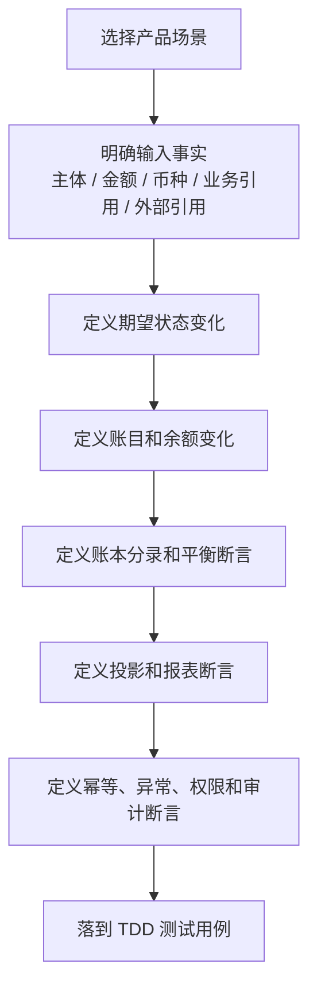

# 产品验收与 TDD 用例矩阵

## 1. 文档定位

本矩阵用于把产品 PRD 转换为 TDD 流程的输入。它先从产品、运营、财务、风控和使用者视角定义“必须被证明的事实”，再由研发和测试落到接口测试、服务测试、契约测试、集成测试和回归测试。

产品验收不只看“接口不报错”，还要看状态、金额、账目、账本、投影、幂等、审计和异常路径是否完整。

## 2. 验收分层

| 层级 | 验收目标 | 典型测试方式 |
| --- | --- | --- |
| 产品场景 | 用户、商户、运营、财务能否解释每个结果。 | 场景用例、验收样例、流程测试。 |
| 交易契约 | 幂等、请求摘要、生命周期、失败原因和快照是否正确。 | 交易服务契约测试。 |
| 路由契约 | 参与方、账户、账目、路径和 route snapshot 是否正确。 | 路由和 DSL 契约测试。 |
| 账务一致性 | posting plan、分录、余额投影是否平衡。 | Ledger 测试、余额断言、巡检测试。 |
| 投影视图 | 用户账单、商户账单、运营时间线和报表是否来自事实。 | 投影测试、重放测试。 |
| 运营闭环 | 清结算、对账、差错、调账、追偿是否闭环。 | 批次、差错和运营流程测试。 |
| 风险红线 | 不允许发生的资金语义混用必须失败。 | 红线失败测试。 |

## 3. 验收总流程



## 4. 验收对象和证据链

产品验收要证明的是资金结果可信，而不是证明某个接口被调用过。每条用例至少应能落到下列证据链的一项或多项。

| 验收对象 | 需要证明什么 | 证据类型 |
| --- | --- | --- |
| 输入事实 | 谁发起、金额币种是什么、业务引用和外部引用是什么。 | 资金指令、请求摘要、幂等键、外部 reference。 |
| 生命周期 | 状态如何从初始进入成功、失败、取消、人工处理或终态。 | 资金交易状态、授权状态、冻结单状态、批次状态、差错状态。 |
| 账务影响 | 哪些主体、账目、账本周期发生余额变化。 | route snapshot、posting plan、账本交易、LedgerEntry。 |
| 投影结果 | 使用者看到的余额、账单、时间线和报表是否来自事实。 | 余额投影、交易投影、余额日志、指标快照。 |
| 运营闭环 | 异常是否有责任方、处理动作、审批、凭证和关闭依据。 | 差错单、调账单、追偿单、审批记录、重新对账结果。 |
| 风险红线 | 不允许发生的路径是否被拒绝。 | 失败原因、红线用例、审计日志、阻断记录。 |
| 外部规则 | 卡、ACH、银行、PSP、跨境或持牌能力是否保留确认边界。 | 规则来源、版本或发布日期、适用法域、确认方和确认结论。 |

## 5. 产品验收用例矩阵

### 5.1 入金、出金与幂等

| 验收 ID | 场景 | 输入 | 期望输出 | 核心断言 |
| --- | --- | --- | --- | --- |
| AC-IN-001 | 用户充值成功 | 外部通道确认成功，用户账户和平台账户存在。 | 用户 `AVAILABLE` 增加，平台现金或预收待付路径可解释。 | 资金交易、route snapshot、账本交易、分录、余额投影全部生成；外部账户不入账。 |
| AC-IN-002 | 充值通知重复 | 同一业务键、相同请求摘要重复到达。 | 返回原处理结果。 | 不重复生成资金交易、分录和投影。 |
| AC-IN-003 | 外部到账但内部不可入账 | VA 未匹配、账户缺失或主体未建账。 | 生成挂账或补入账任务。 | 用户余额不自动增加，异常可追踪。 |
| AC-OUT-001 | 用户提现申请 | 用户 `AVAILABLE` 充足，外部账户和风控通过。 | 创建冻结或锁定，用户可用减少。 | 提现申请不等于外部到账；冻结单含原因、期限、审批和审计。 |
| AC-OUT-002 | 用户提现成功 | 提现冻结存在，外部成功回单金额一致。 | 冻结金额被消耗，出款完成。 | 重复成功通知幂等，账本和外部回单可核对。 |
| AC-OUT-003 | 用户提现失败回退 | 外部明确失败。 | `FROZEN -> AVAILABLE`。 | 只回退一次，成功和失败不能双终态。 |

### 5.2 支付、转账与商户收款

| 验收 ID | 场景 | 输入 | 期望输出 | 核心断言 |
| --- | --- | --- | --- | --- |
| AC-PAY-001 | 系统内转账成功 | 付款方、收款方账户存在且同币种，付款方余额充足。 | 付款方 `AVAILABLE` 减少，收款方 `AVAILABLE` 增加。 | 同主体失败，币种不一致失败，外部账户不入账。 |
| AC-PAY-002 | 普通支付成功 | 付款方余额充足，收款方为普通资金账户。 | 按产品命令进入收款方指定目标桶。 | 不默认套用商户清算路径。 |
| AC-MER-001 | 商户订单收款 | 用户基于订单向商户付款。 | 用户 `AVAILABLE` 减少，商户 `CLEARING` 增加。 | 商户订单款不得直入 `AVAILABLE` 或 `SETTLEMENT`。 |
| AC-FEE-001 | 手续费收取 | 原交易含手续费规则。 | 本金和手续费分别入账，平台 `FEE` 增加。 | 本金、手续费、通道成本和补贴金额拆开。 |
| AC-FEE-002 | 手续费退回 | 原费用事实存在且符合退费规则。 | 平台 `FEE` 减少，原责任方余额回补。 | 普通退款不自动退手续费；退费不超过原收费。 |

### 5.3 授权、reversal 与结算

`AC-AUTH-007` 至 `AC-AUTH-009` 是发卡授权控制扩展用例，只在 VCC、企业卡、员工卡或发卡产品启用 spend-controls 时纳入验收；资金底座默认授权能力只要求 `AC-AUTH-001` 至 `AC-AUTH-006`。

| 验收 ID | 场景 | 输入 | 期望输出 | 核心断言 |
| --- | --- | --- | --- | --- |
| AC-AUTH-001 | 授权成功 | 资金账户、信用账户或预算组可用余额充足。 | `AVAILABLE -> AUTHORIZATION`。 | 授权成功不是最终消费；保存授权快照。 |
| AC-AUTH-002 | 多主体授权 | 资金、信用、预算多个主体共同参与。 | 全部成功或全部失败。 | 不允许部分主体入账成功、部分失败。 |
| AC-AUTH-003 | 授权拒绝 | 风控、额度或余额不足。 | 记录拒绝原因，不生成账务路径。 | 不生成 route leg 和 LedgerEntry，不计入争议拒付。 |
| AC-AUTH-004 | 授权 reversal 或过期释放 | 原授权存在且剩余可释放。 | `AUTHORIZATION -> AVAILABLE`。 | 基于原快照，超剩余释放失败。 |
| AC-AUTH-005 | 授权部分结算 | 原授权存在，结算金额小于剩余授权。 | 占用减少，商户或平台目标增加，剩余授权可释放。 | 不写 `AUTHORIZATION -> LIMIT`，不新增账务 `CONSUMED`。 |
| AC-AUTH-006 | 授权结算后退款 | 原结算交易存在。 | 基于原结算快照回补。 | 累计退款和争议不得超过已结算金额。 |
| AC-AUTH-007 | 发卡扩展：支出规则命中拒绝 | 授权请求命中禁用 MCC、商户、国家、POS、PAN entry mode、CVV/AVS 或金额规则。 | 授权拒绝，返回可解释原因。 | 记录命中规则、规则版本和审计信息；不生成 route、LedgerEntry 或 chargeback。 |
| AC-AUTH-008 | 发卡扩展：周期限额命中拒绝 | 授权请求超过日、周、月或自定义周期内的金额或次数窗口。 | 授权拒绝，累计窗口不被错误推进。 | 周期窗口口径明确；不得用清算账期、报表周期或归档水位替代支出窗口。 |
| AC-AUTH-009 | 发卡扩展：支出规则通过后授权占用 | 卡状态、支出规则、风控、预算和余额均通过。 | 进入资金路由并生成 `AVAILABLE -> AUTHORIZATION`。 | 支出规则只做前置决策，账务变化仍由 route 和 ledger 负责。 |

### 5.4 冻结、解冻、调额、调账与负余额

| 验收 ID | 场景 | 输入 | 期望输出 | 核心断言 |
| --- | --- | --- | --- | --- |
| AC-CTRL-001 | 冻结成功 | 主体可用余额充足，原因、期限和权限合法。 | 创建冻结单，`AVAILABLE -> FROZEN`。 | 冻结不创建资金交易，不改变资金归属。 |
| AC-CTRL-002 | 解冻成功 | 原冻结单存在，剩余冻结金额充足。 | `FROZEN -> AVAILABLE`。 | 超额解冻失败，释放记录可审计。 |
| AC-CTRL-003 | 冻结后扣划 | 原冻结单存在，后续需追偿或调账。 | 创建独立资金事实并引用冻结单。 | 不通过修改冻结状态表达消费。 |
| AC-ADJ-001 | 资金调账 | 财务或运营提交原因、凭证、审批和差错引用。 | 作为直接交易调账或对账差错调账事实，生成平衡调账分录。 | 不修改历史分录；不通过余额控制表达跨主体价值转移；无审批失败。 |
| AC-CTRL-005 | 信用额度调整 | 管理员调增或调减信用额度。 | `LIMIT` 和 `AVAILABLE` 按规则变化。 | `LIMIT` 不作为普通交易 source/target。 |
| AC-CTRL-006 | 预算调整 | 管理员调增或调减预算。 | 预算 `LIMIT` 和 `AVAILABLE` 变化。 | 预算不是资金，不入现金流。 |
| AC-CTRL-007 | 受控负余额 | 后置费用、争议费、清算差额、追偿或调额导致 `AVAILABLE` 为负。 | 负余额进入报表、风控、抵扣或追偿。 | 必须有来源、策略、上限、账龄和处理路径。 |
| AC-CTRL-008 | 负余额后继续交易 | 主体 `AVAILABLE` 已为负仍继续支付、冻结、授权或出款。 | 失败或进入策略审批。 | 不得把负余额当作可继续消费余额。 |
| AC-CTRL-009 | 月度预算周期隔离 | 预算组存在 `MONTHLY/2026-04` 和 `MONTHLY/2026-05` 两个账本 bucket。 | 2026-05 的授权、冻结或调整只影响 2026-05。 | 不得消费、释放或抵扣 2026-04 的余额。 |
| AC-CTRL-010 | 默认生命周期账本 | 普通资金账户未显式传周期。 | 使用 `LIFETIME/LIFETIME` 账本 bucket。 | 不得因缺 `periodId` 错配到天、月或自定义周期 bucket。 |
| AC-CTRL-011 | 自定义周期预算 | 企业预算按合同周期 `CUSTOM_CYCLE` 管理。 | 周期 ID、起止规则、时区、日切和规则版本可查询。 | 缺周期 ID 或规则版本不得入账。 |

### 5.5 清分、清算、结算与出款

| 验收 ID | 场景 | 输入 | 期望输出 | 核心断言 |
| --- | --- | --- | --- | --- |
| AC-CLR-001 | 生成清算候选 | 商户订单收款成功，明细完整，未退款未争议。 | 候选明细入池。 | 候选可追溯到交易、明细、route snapshot 和账本。 |
| AC-CLR-002 | 清算候选排除 | 交易退款中、争议中、冻结或重大差错。 | 候选被排除并记录原因。 | 不进入清算批次。 |
| AC-CLR-003 | 清算确认 | 候选满足账期和风险规则。 | 商户 `CLEARING -> AVAILABLE`。 | 批次重跑不重复清算。 |
| AC-SET-001 | 结算单生成 | 商户可结算余额、费用、扣减项和规则版本完整。 | 生成结算净额。 | 每个金额项可追溯到明细或审批。 |
| AC-SET-002 | 结算锁定 | 结算单复核通过。 | 商户 `AVAILABLE -> SETTLEMENT`。 | 出款中金额不可再次结算。 |
| AC-SET-003 | 出款成功 | 外部成功回单金额一致。 | 消耗 `SETTLEMENT`，出款完成。 | 外部 reference、账本、结算单可核对。 |
| AC-SET-004 | 出款失败 | 外部明确失败。 | `SETTLEMENT -> AVAILABLE`。 | 只回退一次，失败原因可审计。 |
| AC-SET-005 | 已出款后退款或拒付 | 商户资金已出款完成。 | 进入追偿、准备金、负余额或后续抵扣。 | 不回滚已完成出款。 |

### 5.6 对账、差错与核销

| 验收 ID | 场景 | 输入 | 期望输出 | 核心断言 |
| --- | --- | --- | --- | --- |
| AC-REC-001 | 交易对账完全匹配 | 内部交易和外部文件金额、状态、reference 一致。 | 标记已对平。 | 批次、明细和摘要可查询。 |
| AC-REC-002 | 外部有内部无 | 银行或通道到账，内部无交易。 | 生成挂账或补入账任务。 | 不自动入用户余额。 |
| AC-REC-003 | 内部有外部无 | 内部成功，外部文件缺失。 | 生成差错单或等待补文件。 | 不直接改交易成功状态。 |
| AC-REC-004 | 金额不一致 | 内外部金额、费用或汇率差异。 | 生成差错单。 | 差额需挂账、调账、费用修正或人工核验。 |
| AC-REC-005 | 账务一致性异常 | 资金交易、分录、余额投影不一致。 | 巡检告警或修复任务。 | 不靠报表汇总掩盖明细差异。 |
| AC-REC-006 | 调账核销 | 差错已确认，审批和凭证齐全。 | 追加调账事实并重新对账。 | 不修改历史分录；核销有状态和审计。 |

### 5.7 投影、归档与重放

| 验收 ID | 场景 | 输入 | 期望输出 | 核心断言 |
| --- | --- | --- | --- | --- |
| AC-VIEW-001 | 用户账单生成 | 成功交易、冻结、退款或授权事件。 | 用户视角账单行。 | 来源事实和账本引用可追溯。 |
| AC-VIEW-002 | 商户账单生成 | 商户收款、清算、退款、结算或出款事件。 | 商户视角账单行。 | 区分 `CLEARING/AVAILABLE/SETTLEMENT`。 |
| AC-VIEW-003 | 运营时间线 | 交易、冻结、对账、争议、审批事件。 | 统一时间线。 | 时间线不写回事实层。 |
| AC-BALLOG-001 | 余额变更日志生成 | 账本分录完成且余额投影已更新。 | 生成余额变更观察事件或业务余额日志。 | 包含主体、账本、账目、币种、账本周期、变更前余额、变更后余额、变更额、ledger transaction、ledger entry 和业务引用；日志失败不回滚余额投影。 |
| AC-ARCH-001 | 归档前检查 | 计划归档历史分录。 | 预检查结果。 | 缺检查点、缺水位、巡检失败不得归档。 |
| AC-ARCH-002 | 归档后余额重建 | 历史分录已冷归档，检查点和水位存在。 | 重建目标时点余额。 | 使用水位前检查点加水位后增量分录，不读交易投影。 |
| AC-ARCH-003 | 水位推进 | 本次处理区间为 `[T1, T2)`。 | 校验通过后水位推进到 T2。 | 失败时水位停留在 T1。 |
| AC-REPLAY-001 | 单笔交易投影重放 | 指定单笔来源对象。 | 重建账单或时间线。 | 不重新入账，不修改分录。 |
| AC-REPLAY-002 | 有界批量重放 | 指定租户、视图域、时间窗口或主体范围。 | 重放任务和差异报告。 | 无范围全量在线重放必须失败。 |

### 5.8 支付轨道和跨境边界

| 验收 ID | 场景 | 输入 | 期望输出 | 核心断言 |
| --- | --- | --- | --- | --- |
| AC-RAIL-001 | VCC 授权批准 | 卡状态、spend control、额度和币种规则通过。 | 授权占用成功。 | 授权批准不等于最终入账。 |
| AC-RAIL-002 | VCC 授权拒绝 | 卡状态、风控或额度不通过。 | 记录拒绝事实。 | 不生成账务路径，不计入争议拒付。 |
| AC-RAIL-003 | ACH return | ACH 已提交后收到 return code。 | 生成 return 处理对象和资金处理事实。 | return 不是普通退款。 |
| AC-RAIL-004 | ACH NOC | 收到 NOC 通知。 | 更新后续使用信息或生成运营任务。 | NOC 不改原交易资金事实。 |
| AC-RAIL-005 | 全球付款报文成功但未到账 | 合作方返回 message sent。 | 保持资金在途或待确认。 | 不展示为已到账。 |
| AC-RAIL-006 | 全球付款退汇 | 原付款被退回。 | 生成退汇事实、费用和责任处理。 | 退汇不是退款。 |
| AC-FX-001 | 错币种到账 | 期望 USD，实际 EUR。 | 挂账、驳回或生成错币种差错。 | 不自动按 USD 入账。 |
| AC-FX-002 | 业务换汇调整 | 有外部或业务 FX 决策快照。 | 记录原币、目标币、汇率、费用和审批。 | 底座不声明执行结售汇。 |

### 5.9 运营后台、权限和报表指标

| 用例 ID | 场景 | 前置条件 | 期望结果 | 必须证明 |
| --- | --- | --- | --- | --- |
| AC-OPS-001 | 高危操作审批 | 运营发起冻结、解冻、调账、出款重试或敏感导出。 | 生成审批链和审计记录。 | 未审批不得生效；审批通过后动作可追溯到处理单和操作者。 |
| AC-OPS-002 | 差错工单流转 | 对账差异、挂账或出款失败已生成处理单。 | 工单可分派、补证据、退回、核销或升级。 | 每次状态变化都有原因、前后值、责任方和时间。 |
| AC-OPS-003 | 敏感资金明细导出 | 用户、商户、交易或对账明细涉及敏感数据。 | 通过权限、审批、脱敏和水印后导出。 | 无权限或无审批导出失败，导出留痕可审计。 |
| AC-RPT-001 | 资金交易指标生成 | 已有交易事实、账本事实、清结算和对账结果。 | 报表指标可查询。 | 指标只读且可回溯来源事实，不反写资金事实。 |
| AC-RPT-002 | 指标口径版本变更 | 报表口径需要调整。 | 新口径按版本生效，历史口径可解释。 | 同一报表能说明口径版本、生效时间和数据来源。 |
| AC-RPT-003 | 指标水位独立推进 | 指标任务按窗口计算完成。 | 先写指标快照和质量报告，再推进指标水位。 | 指标水位不得复用余额水位、归档清单或交易投影重放水位。 |
| AC-RPT-004 | 指标质量校验失败 | 指标计算出现缺失、重复、金额异常或来源差异。 | 报表发布被阻断，输出差异样本。 | 失败时不得推进指标水位，不得反写资金事实。 |
| AC-OPS-004 | 清算候选池人工排除 | 运营发现候选涉及退款、争议、冻结、差错或资料异常。 | 候选被排除并记录原因。 | 不直接修改交易金额，不跳过账期规则。 |
| AC-OPS-005 | 敏感导出审批 | 财务导出用户、商户、交易、对账或差错明细。 | 通过权限、审批、脱敏、水印后导出。 | 无审批或超范围导出失败，导出记录可审计。 |

## 6. 必须失败的红线用例

| 红线 ID | 场景 | 必须失败的条件 |
| --- | --- | --- |
| RED-001 | 外部账户入账 | 银行账户、VA、卡、PSP 账户被创建为内部账本主体。 |
| RED-002 | 直接改余额 | 业务系统绕过交易层、路由和账本直接修改余额投影。 |
| RED-003 | 缺快照逆向 | 退款、reversal、拒付、退费缺原 route snapshot 却重新选路。 |
| RED-004 | 退款超额 | 累计退款超过剩余可退金额。 |
| RED-005 | 授权拒绝混入拒付 | 授权拒绝被计入争议拒付或生成账务路径。 |
| RED-006 | 冻结表达消费 | 冻结单状态被用来表达扣划、消费或付款完成。 |
| RED-007 | 商户款直入可结算 | 商户订单收款直接进入 `AVAILABLE` 或 `SETTLEMENT`。 |
| RED-008 | 出款中自动退款 | 商户资金在 `SETTLEMENT` 阶段被自动回退给用户。 |
| RED-009 | 不平衡分录 | 任一 posting plan 借贷不平仍写账。 |
| RED-010 | 无审批调账 | 调账缺原因、凭证、审批或差错引用。 |
| RED-011 | 对账差异直接改账 | 对账发现差异后直接修改历史分录或余额。 |
| RED-012 | 投影污染事实 | 用户账单、商户账单、运营时间线写回资金交易或账本。 |
| RED-013 | 负余额继续消费 | `AVAILABLE < 0` 时无策略继续支付、授权、冻结或出款。 |
| RED-014 | 错币种静默入账 | 实际币种与期望币种不一致，却无汇率、审批和差错记录直接入账。 |
| RED-015 | 交易层自动换汇 | 底座自动调用 FX 并生成目标币种入账。 |
| RED-016 | 无范围全量重放 | 生产交易投影重放没有单笔、主体、窗口、视图域或批次范围。 |
| RED-017 | 余额重建依赖交易投影 | 通过用户账单、商户账单或报表反推余额。 |
| RED-018 | 归档日期当水位 | 使用自然日、归档日期或 180 天作为余额冷热计算边界。 |
| RED-019 | 先推进水位再计算 | 批处理先更新水位，再计算区间分录。 |
| RED-020 | 结算策略解析失败静默实时 | 策略表达式解析失败却按实时结算处理。 |
| RED-021 | 未确认资质开放持牌能力 | 未确认许可证、经营地域、合作机构责任就启用支付账户、备付金、跨境或外汇能力。 |
| RED-022 | 周期账本串账 | 同主体、同币种、同账目下，`MONTHLY/2026-05` 的交易命中 `2026-04` 或其他周期 bucket。 |
| RED-023 | 非生命周期周期缺 periodId | `periodType` 不是 `LIFETIME` 却没有明确 `periodId`，仍然继续入账或查询。 |
| RED-024 | 用清结算账期替代账本周期 | 把清算账期、结算周期、报表周期或归档水位当作账本 bucket 的 `periodId`。 |
| RED-025 | 发卡扩展支出规则拒绝仍入账 | 授权已被 spend rule 拒绝，却继续生成 route、posting plan 或 LedgerEntry。 |
| RED-026 | 发卡扩展支出规则无版本审计 | 授权拒绝只返回失败，不记录命中规则、规则版本、原因和请求摘要。 |
| RED-027 | 发卡扩展支出窗口和账本周期混用 | 把 spend rule 的日/月/自定义累计窗口直接当作账本事实隔离，或反过来用账本周期替代规则累计口径。 |
| RED-028 | 后台直接改账 | 运营后台提供直接修改余额、分录或投影的入口。 |
| RED-029 | 指标失败仍推进水位 | 指标计算或质量校验失败，但指标水位仍被推进。 |
| RED-030 | 清结算对象混用 | 未区分清算候选、清算批次、结算单、出款单、对账批次、差错单和追偿单，就用一个对象或一个状态机表达。 |
| RED-031 | 清算候选即入账 | 清算候选进入候选池后未经过清算批次确认就触发 `CLEARING -> AVAILABLE`。 |
| RED-032 | 结算单等同出款单 | 结算单锁定后未等外部回单就展示为出款成功。 |
| RED-033 | 差错核销未重新对账 | 差错单被人工关闭，但没有补事实、冲正、调账、挂账、追偿或重新对账结果。 |
| RED-034 | Manifest 缺失仍归档成功 | 归档任务缺少 Manifest、检查点或校验摘要仍标记完成。 |
| RED-035 | 发卡扩展进入默认核心能力 | 未确认 VCC、企业卡、员工卡或发卡产品启用，就把 `ISSUING_SPEND_CONTROLS` 作为资金底座默认核心能力。 |
| RED-036 | 余额日志反写余额 | 业务余额变更日志、订阅事件或通知被当作余额事实源，反向修改分录或余额投影。 |

## 7. TDD 用例书写模板

后续测试方法建议按以下信息补齐注释和断言。

```text
场景：用户基于订单向商户付款，形成商户待清算资金。
角色：用户、商户、平台。
前置条件：用户资金账户已建账且 AVAILABLE 充足；商户资金账户已建账；平台费用账户已配置。
输入：订单金额 100.00，手续费 2.00，币种 USD，幂等键固定。
动作：业务系统提交商户订单收款资金事实。
输出：用户 AVAILABLE 减少 100.00；商户 CLEARING 增加 98.00；平台 FEE 增加 2.00。
断言：
1. 生成一笔资金交易和交易明细。
2. 保存 route snapshot。
3. posting plan 同币种借贷平衡。
4. 余额投影与分录增量一致。
5. 用户账单显示付款成功，商户账单显示待清算。
6. 重复请求不重复入账。
红线：商户余额不得直接进入 AVAILABLE 或 SETTLEMENT。
```

## 8. PRD 用例到 DSL 场景映射

本表只做产品验收到 DSL 场景的入口映射，不展开接口、测试类或工程细节。下列表项属于发卡授权控制扩展映射，不代表资金底座默认必须启用。

| 产品验收 ID | DSL 场景 | 产品关注点 |
| --- | --- | --- |
| `AC-AUTH-007` | `AUTHORIZATION_CONTROL_DECLINE` / `DSL-AUTHORIZATION-CONTROL-SPEND-RULE-DECLINE-001` | 支出规则命中拒绝、拒绝原因、规则版本、请求摘要和审计。 |
| `AC-AUTH-008` | `AUTHORIZATION_CONTROL_VELOCITY_DECLINE` | 日、周、月或自定义周期的金额/次数窗口，不能和账本周期混用。 |
| `AC-AUTH-009` | `AUTHORIZATION_CONTROL_APPROVE_THEN_AUTHORIZE` | 授权控制通过后才进入资金路由；通过不等于授权占用成功。 |
| `RED-025` | `AUTHORIZATION_CONTROL_DECLINE` | 支出规则拒绝后不得生成 route、posting plan 或 LedgerEntry。 |
| `RED-026` | `AUTHORIZATION_CONTROL_DECLINE` | 拒绝必须保留规则版本、原因和请求摘要。 |
| `RED-027` | `AUTHORIZATION_CONTROL_VELOCITY_DECLINE` | 支出窗口和账本周期双向隔离。 |

## 9. 交付检查清单

| 检查项 | 要求 |
| --- | --- |
| 场景覆盖 | 每个新增或修改场景在本矩阵中有验收行，或说明不适用原因。 |
| 金额断言 | 有资金变化的测试必须断言相关主体余额桶变化。 |
| 账务断言 | 必须断言 posting plan 平衡、账本交易和分录可追溯。 |
| 幂等断言 | 写操作必须覆盖重复请求和同键不同摘要。 |
| 异常断言 | 覆盖余额不足、账户缺失、币种不一致、缺快照、超额、权限不足等失败路径。 |
| 投影断言 | 用户、商户、运营或财务视图必须来自事实，不反向写事实。 |
| 审计断言 | 高危操作必须有原因、凭证、审批、操作者和时间。 |
| 红线断言 | 本文第 6 节红线必须有失败测试或明确不适用原因。 |

## 10. 产品完整性验收入口

本表用于检查产品设计是否覆盖关键对象、规则、边界和验收入口。

| 补强项 | 产品验收入口 | 通过标准 |
| --- | --- | --- |
| 状态机 | `AC-AUTH-*`、`AC-CTRL-*`、`AC-CLR-*`、`AC-SET-*`、`AC-REC-*`、`AC-ARCH-*`、`AC-REPLAY-*` | 每类对象都有状态方向、成功终态、失败终态、人工处理和审计要求。 |
| 账务矩阵 | `AC-IN-*`、`AC-OUT-*`、`AC-PAY-*`、`AC-MER-*`、`AC-FEE-*`、`AC-AUTH-*`、`AC-CTRL-*` | 每个资金变化都能说明来源账目、目标账目、周期口径和余额断言。 |
| 运营后台 | `AC-OPS-*`、`RED-010`、`RED-011`、`RED-028` | 后台只推进处理单和审批，不直接修改历史分录、余额或投影。 |
| 清结算对象 | `AC-CLR-*`、`AC-SET-*`、`AC-REC-*`、`RED-020`、`RED-030`、`RED-031`、`RED-032`、`RED-033` | 清算候选、清算批次、结算单、出款单、对账批次、差错单、追偿单对象关系清楚。 |
| 外部规则核验 | `AC-RAIL-*`、`AC-FX-*`、`RED-021` | 涉及卡组织、ACH、银行、PSP、跨境、外汇和持牌能力时，保留规则来源和待确认方。 |
| 归档重放门禁 | `AC-ARCH-*`、`AC-REPLAY-*`、`RED-016`、`RED-017`、`RED-018`、`RED-019`、`RED-034` | 归档、余额重建、交易投影重放都有范围、检查点、Manifest、水位和差异报告。 |
| 报表指标模块 | `AC-RPT-*`、`RED-029` | 指标只读、口径版本可解释、指标水位独立、失败不推进水位。 |
| 余额变更观察 | `AC-BALLOG-*`、`RED-036` | 余额日志只从分录和余额投影派生，可观察、可补偿、可审计，但不得反写事实层。 |
| 发卡授权控制扩展 | `AC-AUTH-007`、`AC-AUTH-008`、`AC-AUTH-009`、`RED-025`、`RED-026`、`RED-027`、`RED-035` | `ISSUING_SPEND_CONTROLS` 只在发卡产品启用后纳入验收，不作为资金底座默认核心能力。 |
