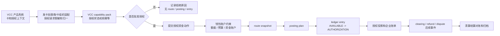

# VCC 发卡业务资金底座 PRD

## 1. 文档定位

### 1.1 一页摘要

本文是支付资金底座产品设计的 VCC 发卡业务补充分册，用于说明 VCC 发卡业务如何通过场景交易 capability pack 接入 `wind-funds`，并复用统一资金内核的钱包、账本、账目、路由、投影、清算、结算、对账和归档能力。

本文不把 `wind-funds` 定义为发卡处理商、卡组织接入系统、PCI 敏感数据系统或完整企业卡产品系统。VCC 的 Program、Card、Cardholder、PAN/CVC、HSM、卡组织原始报文和发卡处理商协议由外部业务系统、发卡处理商或专门适配层承担；`wind-funds` 只承接适配后的资金动作和可审计资金结果。

| 项目 | 内容 |
| --- | --- |
| 产品名称 | VCC 发卡业务资金底座能力 |
| 文档定位 | 业务补充分册 |
| 目标读者 | 产品、发卡业务、运营、财务、风控、合规、安全、研发、测试 |
| 主线关系 | 补充 01-05 的业务场景，不替代资金底座通用 PRD |
| 合并口径 | 授权、清算、退款、拒付、卡账单和 PCI 边界保留在本分册；钱包、账本、账目、路由、清结算、对账、归档和验收门禁回到 01-05。 |

### 1.2 背景和问题

VCC 发卡业务的核心不是“发一张虚拟卡”，而是企业、团队、员工或系统代理在受控规则下使用卡支付，并在授权、撤销、清算、退款、争议、费用和账单阶段持续解释资金、额度、预算和风险责任。

如果 VCC 直接复用普通支付交易语义，会出现以下问题：

| 问题 | 影响对象 | 风险说明 | 影响程度 | 证据来源 |
| --- | --- | --- | --- | --- |
| 授权成功被误当最终入账 | 用户、财务、账本、投影 | 授权占用、清算入账、剩余释放和争议无法解释 | 高 | 顶层指导、02 交易分层、卡支付参考 |
| 卡、持卡人或外部卡号被误当账本主体 | 账本、合规、安全 | 账务主体错误，PCI 和敏感数据边界扩大 | 高 | 01 PRD 账务主体红线、监管安全基线 |
| VCC 交易状态机压扁到通用交易状态 | 研发、测试、运营 | late clearing、partial settlement、forced post、chargeback 无法闭环 | 高 | VCC 参考、卡组织参考 |
| 授权控制和资金内核耦合 | 风控、研发、测试 | Spend Controls、卡规则、资金余额和预算规则互相污染 | 中 | 顶层指导职责分层 |

### 1.3 目标与非目标

| 类型 | 内容 | 验证方式 |
| --- | --- | --- |
| 业务目标 | 让 VCC 授权、撤销、清算、退款、拒付和费用能落到统一资金内核，并可解释、可核对、可重放。 | 资金链路查询、账本分录、对账批次和验收矩阵。 |
| 用户目标 | 企业管理员、持卡人、运营和财务能理解卡交易为何批准、拒绝、占用、入账、释放或争议。 | 用户账单、企业账单、运营时间线和拒绝原因。 |
| 运营目标 | 支持授权异常、迟到清算、部分完成、争议、费用、卡账单和对账差错处理。 | 运营后台、差错单、证据链和审计日志。 |
| 数据目标 | VCC 事件、资金动作、账本、投影、对账和归档之间可追溯。 | route snapshot、posting plan、ledger entry、projection、archive manifest。 |
| 非目标 | 不设计完整 Program、Card、Cardholder、PAN/CVC 展示、HSM、token vault、卡组织原始报文和发卡处理商接入。 | 由业务产品层、发卡处理商、卡组织适配层和安全合规系统承接。 |

## 2. 用户、主体和角色

### 2.1 用户与主体

| 类型 | 名称 | 说明 | 权益/责任 | 是否直接使用 wind-funds |
| --- | --- | --- | --- | --- |
| 企业客户 | Account Holder / Company | VCC 使用和资金责任主体。 | 提供资金、额度或预算来源，承担授权和消费责任。 | 否，通过业务产品层使用。 |
| 持卡人 | Cardholder | 员工、采购员、系统代理或被授权使用卡的人。 | 在授权范围内使用卡，看到交易结果和失败原因。 | 否。 |
| 发卡项目 | Program | 发卡合作、产品参数、币种、费用、地区和规则边界。 | 定义卡产品和合作边界。 | 否。 |
| 可记账主体 | 资金账户、信用账户、预算组 | `wind-funds` 内部可入账主体。 | 承载现金、额度、预算和授权占用。 | 是。 |
| 外部机构 | 发卡银行、处理商、卡组织 | 授权、清算、争议、文件和网络规则来源。 | 提供外部事件和规则确认。 | 否，只保留引用和摘要。 |

### 2.2 角色与权限概览

| 角色 | 使用场景 | 可见数据 | 可执行动作 | 权限边界 | 审计要求 |
| --- | --- | --- | --- | --- | --- |
| 企业管理员 | 查看企业卡交易、额度、预算和账单。 | 脱敏卡、授权、清算、预算、费用、争议。 | 查询、导出、申请调整、处理内部审批。 | 不可查看完整 PAN/CVC，不可直接改账。 | 查询、导出、审批留痕。 |
| 持卡人 | 查看自己的授权、消费和拒绝原因。 | 自己的脱敏卡、交易状态和失败原因。 | 查询、提交争议或补充材料。 | 仅限本人范围。 | 争议提交和资料上传留痕。 |
| 运营 | 处理授权异常、迟到 clearing、争议和卡账单问题。 | 全链路时间线、外部引用、账本和差错状态。 | 复核、补证据、发起差错、触发人工处理。 | 不可绕过资金事实直接改余额。 | 操作前后值、原因和审批。 |
| 财务 | 核对授权、清算、退款、费用和账单。 | 账本、分录、费用、对账批次和报表来源。 | 复核、核销、导出。 | 财务动作需审批和职责分离。 | 导出、核销和调账审计。 |
| 风控/合规/安全 | 检查授权控制、敏感数据、外部规则和审计。 | 规则版本、风险原因、脱敏引用、核验状态。 | 阻断、复核、标记待确认。 | 不得把未确认外部规则写成放行依据。 | 规则变更、证据查看和确认留痕。 |

## 3. 范围与边界

### 3.1 能力范围

本表中的 P0/P1 只表示 VCC 分册内部建设顺序，不改变 01 总览中“VCC 属于全局 P2 业务补充分册”的定位。任何 VCC 能力进入编码前，都必须先证明复用统一钱包、账本、账目、清结算、对账和归档能力，并获得独立 Execution Grant。

| 能力 | 说明 | 分册内优先级 | 交付形态 | 验收标准 |
| --- | --- | --- | --- | --- |
| VCC 授权资金链 | 授权批准、拒绝、占用、撤销、过期释放、部分完成和清算入账的资金语义。 | P0 | 场景交易 pack + 资金动作契约 | 授权不等于入账，拒绝无账务副作用，清算能回指原授权。 |
| VCC 钱包账户 | 企业资金账户、信用账户、预算组、授权占用和可用余额展示。 | P0 | 钱包和账目复用 | AVAILABLE、AUTHORIZATION、FROZEN、CLEARING 等账目可解释。 |
| VCC 账本和投影 | 卡交易从授权到清算、退款、拒付的账本和解释视图。 | P0 | 账本分录、余额投影、交易投影 | 每个金额变化能追溯到 route snapshot 和 ledger entry。 |
| VCC 对账和争议 | 授权、清算、退款、拒付、费用和外部文件差异处理。 | P1 | 对账批次、差错单、证据引用 | 差异可分类、处理、核销和重跑。 |
| VCC 运营后台 | 单卡、持卡人、企业、授权、清算、争议和账本链路查询。 | P1 | 查询与处理台能力 | 运营能解释失败原因、状态和资金影响。 |

### 3.2 不做范围

| 不做项 | 原因 | 处理归属 |
| --- | --- | --- |
| Program、Card、Cardholder 生命周期 | 属于发卡产品域，不是资金底座核心。 | 由 VCC 业务产品或发卡系统承接。 |
| PAN/CVC 展示、HSM、token vault | 属于 PCI 和安全高敏边界。 | 由合规系统、发卡处理商或专门安全组件承接。 |
| 发卡处理商和卡组织原始报文协议 | 外部协议复杂且变化频繁。 | 由外部适配层转换为场景事件。 |
| Spend Controls 完整规则引擎 | 规则属于 VCC 产品和风控域。 | 本文只定义资金准入关系和资金影响。 |
| 卡组织、税务、会计和监管最终规则 | 需要专业确认。 | 列入待确认项。 |

### 3.3 上下游边界

| 上下游 | 交互内容 | 责任边界 | 失败处理 | 核验/一致性校验方式 |
| --- | --- | --- | --- | --- |
| VCC 产品系统 | Program、Card、Cardholder、授权上下文、业务单据。 | 负责业务对象和卡生命周期。 | 业务状态不完整时不得进入资金内核。 | 业务单、卡状态、权限和规则版本。 |
| 发卡处理商/卡组织适配层 | authorization、reversal、clearing、refund、chargeback 文件或事件。 | 负责协议解析、敏感数据隔离和外部引用。 | 适配失败进入隔离，不生成 ledger entry。 | 外部引用、文件摘要、事件幂等键。 |
| wind-funds | 资金动作、钱包、账本、投影、清结算对账。 | 负责统一资金内核和运营资金闭环。 | 失败无账务副作用，支持幂等重试。 | route snapshot、posting plan、ledger entry、对账批次。 |
| 财务/合规/安全 | 外部规则、资金模式、敏感数据、会计口径。 | 负责专业确认。 | 未确认时不进入生产启用范围。 | 规则来源、版本、适用范围、核验日期和确认方。 |

## 4. 能力地图

```mermaid
mindmap
  root((VCC 发卡业务资金底座 PRD))
    场景交易适配
      授权请求
      授权拒绝
      授权撤销
      授权过期
      清算入账
      部分完成
      强制入账
      退款
      拒付
    钱包账户
      资金账户
      信用账户
      预算组
      AVAILABLE
      AUTHORIZATION
      FROZEN
      CLEARING
    账本投影
      Route Snapshot
      Posting Plan
      Ledger Entry
      Balance Projection
      企业账单
      持卡人账单
      运营时间线
    对账争议
      授权对账
      Clearing 文件对账
      费用对账
      Chargeback
      Evidence
      差错核销
    风险合规
      PCI 边界
      敏感数据最小化
      外部规则核验
      权限审计
      风控阻断
```

## 5. 核心对象、字段口径和状态

### 5.1 核心对象

| 对象 | 字段口径 | 生命周期 | 不变量 |
| --- | --- | --- | --- |
| VCC Authorization | authorizationId、cardRef、cardholderRef、merchant、amount、currency、decision、declineReason、externalRef。 | REQUESTED、APPROVED、DECLINED、REVERSED、EXPIRED、SETTLED、PARTIALLY_SETTLED、DISPUTED。 | 授权批准只占用 AUTHORIZATION，不代表入账。 |
| VCC Clearing Event | originalAuthorizationRef、presentmentRef、amount、currency、fee、businessDate、networkRef。 | RECEIVED、MATCHED、POSTING_READY、POSTED、EXCEPTION。 | 必须回指原授权或说明 forced post。 |
| VCC Dispute Case | originalTransactionRef、reasonCode、evidenceRef、amount、deadline、result。 | OPEN、EVIDENCE_REQUIRED、SUBMITTED、WON、LOST、CLOSED。 | 不得混同 refund 和 chargeback。 |
| VCC Funds Account | fundingAccountId、creditAccountId、budgetGroupId、currency、period。 | ACTIVE、FROZEN、CLOSED。 | 卡、持卡人、外部卡号不是账本主体。 |
| VCC Statement Projection | company、cardholder、cardRef、authorization、clearing、fee、refund、dispute、ledgerRefs。 | 可重建只读视图。 | 投影不反写交易事实或账本事实。 |

### 5.2 状态机

| 原状态 | 事件 | 守卫条件 | 动作 | 下一状态 | 非法流转/回滚 |
| --- | --- | --- | --- | --- | --- |
| REQUESTED | 授权批准 | 卡状态、额度、预算、风控和幂等通过。 | 生成授权资金动作，AVAILABLE -> AUTHORIZATION。 | APPROVED | 不允许绕过卡/主体检查直接占用。 |
| REQUESTED | 授权拒绝 | 余额不足、规则拒绝、风险拒绝、外部拒绝。 | 记录拒绝原因，不生成 route、posting、entry。 | DECLINED | 拒绝后不得补写授权分录。 |
| APPROVED | 撤销 | 外部 reversal 或业务取消。 | 释放全部或部分 AUTHORIZATION。 | REVERSED | 撤销金额不得超过剩余占用。 |
| APPROVED | 过期 | 授权到期且无 clearing。 | 释放剩余 AUTHORIZATION。 | EXPIRED | 已清算金额不得被过期释放。 |
| APPROVED | 清算入账 | clearing 匹配原授权。 | 核销占用并生成实际入账或费用分录。 | SETTLED / PARTIALLY_SETTLED | clearing 缺原授权需进入 forced post 审批或异常。 |
| SETTLED | 退款 | 原交易可退且外部引用完整。 | 基于原 route snapshot 生成退款。 | REFUNDED | 不得按当前卡绑定重新选路。 |
| SETTLED | 拒付 | 外部 chargeback 或 dispute 结果。 | 生成拒付扣回、费用、追偿或准备金动作。 | DISPUTED | 不得与普通退款合并处理。 |

## 6. 业务流程

### 6.1 主流程



### 6.2 逆向流程和异常流程

| 场景 | 触发条件 | 处理逻辑 | 人工处理 | 审计和验收 |
| --- | --- | --- | --- | --- |
| 授权撤销 | 外部 reversal 或业务取消。 | 释放剩余 AUTHORIZATION。 | 金额不一致时进入异常复核。 | 证明释放不改变跨主体资金归属。 |
| 授权过期 | 到期无 clearing。 | 自动释放剩余 AUTHORIZATION。 | 大额或异常商户可人工复核。 | 证明已清算部分不被释放。 |
| 部分清算 | clearing 金额小于授权剩余。 | 核销部分占用，剩余继续占用或释放。 | 规则待确认时人工处理。 | 分录和投影可解释剩余占用。 |
| 迟到 clearing | 授权已过期或已释放后收到 clearing。 | 匹配原授权并进入异常或 forced post 审批。 | 需要运营、财务和合规复核。 | 不允许静默入账。 |
| 拒付 | 外部 chargeback。 | 独立 dispute case，生成扣回、费用或追偿。 | 证据包、时限和责任方人工处理。 | 不与 refund 混用，不重复扣回。 |
| 外部引用缺失 | clearing 或 dispute 缺 original authorization。 | 隔离，不进入资金内核。 | 补引用或挂账。 | 缺引用不得生成 ledger entry。 |

## 7. 业务规则矩阵

| 规则编号 | 规则名称 | 适用对象 | 触发条件 | 判断逻辑 | 动作 | 优先级 | 规则治理 | 验收样例 |
| --- | --- | --- | --- | --- | --- | --- | --- | --- |
| VCC-R001 | 授权拒绝无账务副作用 | Authorization | 授权被拒绝。 | decision=DECLINED。 | 只记录拒绝事实和原因。 | P0 | 随 VCC 场景规则确认。 | 拒绝后查不到 route、posting、ledger entry。 |
| VCC-R002 | 授权占用和清算入账分离 | Authorization / Clearing | 授权批准后收到 clearing。 | clearing 匹配原授权。 | 先核销 AUTHORIZATION，再生成实际入账影响。 | P0 | 随 VCC 场景规则确认。 | 授权成功账单显示占用，清算后显示入账。 |
| VCC-R003 | 卡不作为账本主体 | Card / Ledger | 生成资金动作。 | cardRef 只能作为 instrumentRef。 | 解析到资金账户、信用账户或预算组。 | P0 | 随 VCC 场景规则确认。 | ledger entry 主体不出现 cardRef。 |
| VCC-R004 | 原路径回放 | Refund / Reversal / Chargeback | 逆向事件发生。 | 必须存在原 route snapshot。 | 基于原快照处理。 | P0 | 随 VCC 场景规则确认。 | 卡换绑后退款仍按原路径。 |
| VCC-R005 | 敏感数据最小化 | Card Data | 接收外部卡事件。 | PAN/CVC 不进入 wind-funds。 | 仅保存脱敏引用和摘要。 | P0 | 随 VCC 场景规则确认。 | 日志、导出和投影无完整 PAN/CVC。 |

## 8. 运营后台、数据、报表和审计

| 能力 | 查询条件 | 结果字段 | 可执行动作 | 审计要求 |
| --- | --- | --- | --- | --- |
| 授权链路查询 | company、cardRef、authorizationId、externalRef、amount、time。 | 决策、拒绝原因、占用金额、route、ledger、投影。 | 查看、导出脱敏摘要、发起异常处理。 | 查询人、用途、脱敏策略。 |
| Clearing 匹配台 | presentmentRef、ARN、原授权、金额、币种、业务日期。 | 匹配结果、金额差、入账状态、异常原因。 | 复核、隔离、补引用、提交入账。 | 操作前后值和审批链。 |
| 争议证据台 | disputeId、reasonCode、deadline、cardRef、merchant。 | 证据清单、提交状态、资金影响、责任方。 | 补证据、提交、关闭、追偿。 | 证据查看、导出、提交审计。 |
| 企业账单 | company、cardholder、cardRef、period、currency。 | 授权、清算、退款、争议、费用、余额变化。 | 查询、导出、重放校验。 | 导出权限和水印。 |

数据指标和报表口径：

| 指标 | 口径 | 数据源 | 负责人 |
| --- | --- | --- | --- |
| 授权通过率 | 批准授权数 / 授权请求数。 | VCC pack、授权投影。 | 发卡业务、风控。 |
| 拒绝原因分布 | 按余额不足、规则拒绝、风险拒绝、外部拒绝分类。 | 授权拒绝事实。 | 运营、风控。 |
| 清算匹配率 | 已匹配 clearing / 收到 clearing。 | clearing 匹配台、对账批次。 | 财务、运营。 |
| 争议损失率 | 败诉和损失确认金额 / 清算金额。 | dispute case、ledger entry。 | 风控、财务。 |

## 9. 风险、依赖和待确认项

### 9.1 风险清单

| 风险 | 影响 | 处理原则 |
| --- | --- | --- |
| VCC 资金模式未确认 | credit、debit、prepaid、charge card 对账务影响不同。 | 进入编码前必须确认资金模式和责任主体。 |
| PCI 边界不清 | 敏感卡数据泄露或合规越界。 | wind-funds 不保存完整 PAN/CVC，只保留引用和摘要。 |
| 授权和清算混用 | 用户余额、账本和账单失真。 | 授权、清算、结算、退款、拒付分层表达。 |
| 争议与退款混用 | 重复扣回或重复退款。 | dispute case 独立建模，并与原交易链路关联。 |
| 外部规则时效未核验 | 卡组织时限、费用、证据要求可能变化。 | 正式启用前必须专业确认。 |

### 9.2 外部规则核验状态

| 规则来源 | 版本或发布日期 | 适用法域或适用范围 | 核验日期 | 确认方 | 确认状态 |
| --- | --- | --- | --- | --- | --- |
| 卡组织规则、发卡处理商协议、PCI DSS、银行合作协议、当地监管要求。 | 待确认。 | VCC 发卡、企业卡、虚拟卡、目标发行地区和币种。 | 2026-05-24，仅完成本地文档字段完整性核验。 | 待法务、合规、安全、财务、发卡合作方、卡组织或处理商确认。 | 未完成外部规则时效核验，不作为上线依据。 |

### 9.3 待确认项

| 待确认项 | 影响章节 | 风险等级 | 确认方 | 未确认前默认处理 |
| --- | --- | --- | --- | --- |
| VCC 实际资金模式和资金责任主体。 | 3、5、7、8 | 高 | 业务、财务、法务、发卡合作方 | 不进入具体账务编码。 |
| 卡组织 clearing、chargeback、费用和证据时限。 | 6、7、8、9 | 高 | 通道、法务、合规 | 仅按待确认设计，不承诺 SLA。 |
| PAN/CVC、token、脱敏展示和日志边界。 | 2、3、8、9 | 高 | 安全、合规、PCI 负责人 | 不保存敏感明文。 |
| Spend Controls 是否纳入本期。 | 3、4、7 | 中 | 发卡产品、风控 | 只保留资金准入引用。 |

## 10. 验收标准和测试场景

| 场景编号 | 场景名称 | 输入 | 预期结果 | 边界路径 | 异常路径 |
| --- | --- | --- | --- | --- | --- |
| VCC-AC-001 | 授权批准生成占用 | 授权请求、主体、金额、币种、卡引用。 | AVAILABLE -> AUTHORIZATION，生成 route、posting、ledger entry。 | 多币种、预算组、信用账户。 | 幂等重复返回原结果。 |
| VCC-AC-002 | 授权拒绝无账务副作用 | 授权请求被规则或余额拒绝。 | 记录拒绝原因，不生成账务路径。 | 风控拒绝、余额不足。 | 同业务键摘要不同拒绝。 |
| VCC-AC-003 | 撤销释放授权 | 原授权批准，收到 reversal。 | AUTHORIZATION 释放，账单显示撤销。 | 部分撤销。 | 撤销超过剩余占用失败。 |
| VCC-AC-004 | clearing 完成入账 | clearing 匹配原授权。 | 授权占用核销，生成实际账务影响。 | 部分清算、金额容差待确认。 | 找不到原授权进入异常。 |
| VCC-AC-005 | 退款沿原路径 | 已清算交易退款。 | 基于原 route snapshot 回放。 | 部分退款。 | 累计退款超额失败。 |
| VCC-AC-006 | chargeback 独立处理 | 已清算交易发生拒付。 | 生成 dispute case、扣回或追偿资金动作。 | 争议费、部分拒付。 | 与退款碰撞时防重复损失。 |
| VCC-RED-001 | 完整 PAN/CVC 不得入库或日志 | 外部卡事件含敏感字段。 | 拒绝或脱敏，只保留引用摘要。 | 导出、投影、审计。 | 明文出现即阻断。 |

## 11. 与资金底座主线的关系

本分册作为 VCC 发卡业务的业务补充分册保留，不并入 01-05 的主线正文。这样可以避免 VCC 的 Program、Card、Cardholder、授权控制、卡组织清算和拒付语义反向污染资金底座通用内核。01-05 只吸收本分册抽象出的共性要求：授权不等于入账、外部卡不入账、敏感数据最小化、原路径回放、清算和对账必须可追溯。

| 原文档 | 补充方式 |
| --- | --- |
| 01-PRD总览 | 补充 VCC 是独立业务场景，不改变资金底座“统一资金内核”的定位。 |
| 02-交易路由钱包账目与投影 | 补充 VCC 授权交易适配，强调授权和清算分离、卡不入账、原路径回放。 |
| 03-清结算与对账 | 补充 VCC clearing、费用、chargeback、卡组织文件对账和争议证据。 |
| 04-归档重放与指标治理 | 补充 VCC 授权、清算、争议和企业账单投影重放。 |
| 05-产品验收与TDD用例矩阵 | 补充 VCC-AC 和 VCC-RED 用例矩阵。 |
