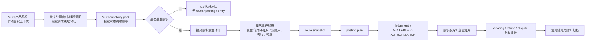
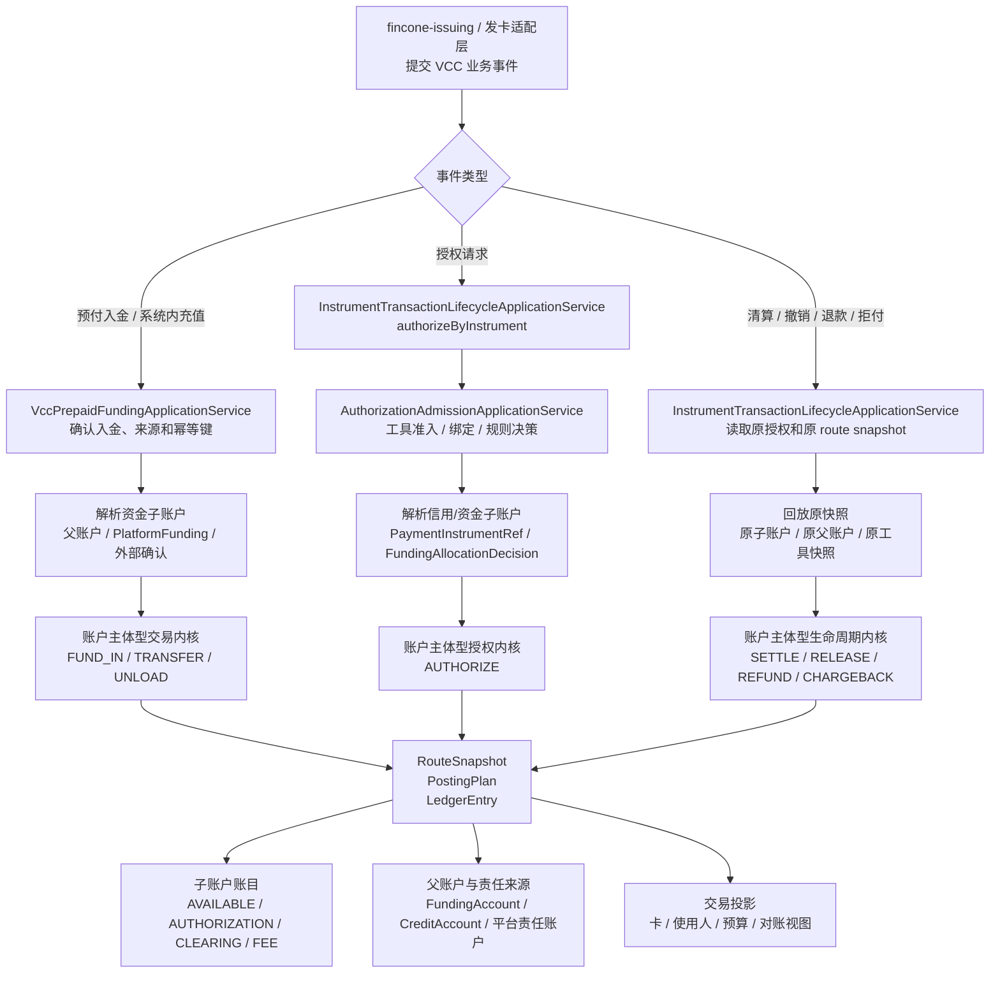
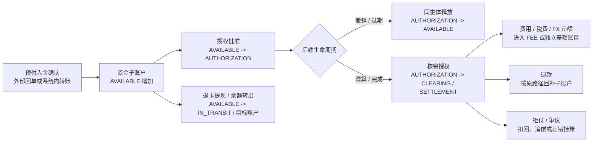

# VCC 发卡业务资金底座 PRD

## 1. 文档定位

### 1.1 一页摘要

本文是支付资金底座产品设计的 VCC 发卡业务补充分册，用于说明 VCC 发卡业务如何通过场景交易 capability pack 接入 `wind-funds`，并复用统一资金内核的钱包、账本、账目、路由、投影、清算、结算、对账和归档能力。

本文不把 `wind-funds` 定义为发卡处理商、卡组织接入系统、PCI 敏感数据系统或完整企业卡产品系统。VCC 的 Program、Card、Cardholder、PAN/CVC、HSM、卡组织原始报文和发卡处理商协议由外部业务系统、发卡处理商或专门适配层承担；`wind-funds` 只承接适配后的资金动作和可审计资金结果。

| 项目 | 内容 |
| --- | --- |
| 产品名称 | VCC 发卡业务资金底座能力 |
| 文档定位 | 业务补充分册 |
| 目标读者 | 产品、发卡业务、运营、财务、风控、合规、安全、研发、测试 |
| 主线关系 | 补充 01-05 的业务场景，不替代资金底座通用 PRD |
| 合并口径 | 授权、清算、退款、拒付、卡账单和 PCI 边界保留在本分册；钱包、账本、账目、路由、清结算、对账、归档和验收门禁回到 01-05。 |

### 1.2 背景和问题

VCC 发卡业务的核心不是“发一张虚拟卡”，而是企业、团队、员工或系统代理在受控规则下使用卡支付，并在授权、撤销、清算、退款、争议、费用和账单阶段持续解释资金、额度、预算和风险责任。

如果 VCC 直接复用普通支付交易语义，会出现以下问题：

| 问题 | 影响对象 | 风险说明 | 影响程度 | 证据来源 |
| --- | --- | --- | --- | --- |
| 授权成功被误当最终入账 | 用户、财务、账本、投影 | 授权占用、清算入账、剩余释放和争议无法解释 | 高 | 顶层指导、02 交易分层、卡支付参考 |
| 卡号、PAN、token、持卡人或卡片凭证被误当账本主体 | 账本、合规、安全 | 账务主体错误，PCI 和敏感数据边界扩大 | 高 | 01 PRD 账务主体红线、监管安全基线 |
| VCC 交易状态机压扁到通用交易状态 | 研发、测试、运营 | late clearing、partial settlement、forced post、chargeback 无法闭环 | 高 | VCC 参考、卡组织参考 |
| 授权控制和资金内核耦合 | 风控、研发、测试 | Spend Controls、卡规则、资金余额和预算规则互相污染 | 中 | 顶层指导职责分层 |

### 1.3 目标与非目标

| 类型 | 内容 | 验证方式 |
| --- | --- | --- |
| 业务目标 | 让 VCC 授权、撤销、清算、退款、拒付和费用能落到统一资金内核，并可解释、可核对、可重放。 | 资金链路查询、账本分录、对账批次和验收矩阵。 |
| 用户目标 | 企业管理员、持卡人、运营和财务能理解卡交易为何批准、拒绝、占用、入账、释放或争议。 | 用户账单、企业账单、运营时间线和拒绝原因。 |
| 运营目标 | 支持授权异常、迟到清算、部分完成、争议、费用、卡账单和对账差错处理。 | 运营后台、差错单、证据链和审计日志。 |
| 数据目标 | VCC 事件、资金动作、账本、投影、对账和归档之间可追溯。 | route snapshot、posting plan、ledger entry、projection、archive manifest。 |
| 非目标 | 不设计完整 Program、Card、Cardholder、PAN/CVC 展示、HSM、token vault、卡组织原始报文和发卡处理商接入。 | 由业务产品层、发卡处理商、卡组织适配层和安全合规系统承接。 |

## 2. 用户、主体和角色

### 2.1 用户与主体

| 类型 | 名称 | 说明 | 权益/责任 | 是否直接使用 wind-funds |
| --- | --- | --- | --- | --- |
| 企业客户 | Account Holder / Company | VCC 使用和资金责任主体。 | 提供资金来源、信用额度来源或预算控制上下文，承担授权和消费责任。 | 否，通过业务产品层使用。 |
| 持卡人 | Cardholder | 员工、采购员、系统代理或被授权使用卡的人。 | 在授权范围内使用卡，看到交易结果和失败原因。 | 否。 |
| 发卡项目 | Program | 发卡合作、产品参数、币种、费用、地区和规则边界。 | 定义卡产品和合作边界。 | 否。 |
| 核心资金账务主体 | 资金账户、信用账户及其父子账户 | `wind-funds` 内部可入账主体；平台角色必须先解析到具体平台资金账户。VCC 场景不新增 `VCC_ACCOUNT`，而是把每张 VCC 卡绑定到一个资金子账户或信用子账户。 | 资金账户承载真实资金和平台责任余额，信用账户承载授信额度和授权占用；VCC 预付卡绑定资金子账户，VCC 共享卡绑定信用子账户；预算组和 Spend Rule 只承接支出控制证据。 | 是。 |
| 外部机构 | 发卡银行、处理商、卡组织 | 授权、清算、争议、文件和网络规则来源。 | 提供外部事件和规则确认。 | 否，只保留引用和摘要。 |

### 2.2 角色与权限概览

| 角色 | 使用场景 | 可见数据 | 可执行动作 | 权限边界 | 审计要求 |
| --- | --- | --- | --- | --- | --- |
| 企业管理员 | 查看企业卡交易、额度、预算和账单。 | 脱敏卡、授权、清算、预算、费用、争议。 | 查询、导出、申请调整、处理内部审批。 | 不可查看完整 PAN/CVC，不可直接改账。 | 查询、导出、审批留痕。 |
| 持卡人 | 查看自己的授权、消费和拒绝原因。 | 自己的脱敏卡、交易状态和失败原因。 | 查询、提交争议或补充材料。 | 仅限本人范围。 | 争议提交和资料上传留痕。 |
| 运营 | 处理授权异常、迟到 clearing、争议和卡账单问题。 | 全链路时间线、外部引用、账本和差错状态。 | 复核、补证据、发起差错、触发人工处理。 | 不可绕过资金事实直接改余额。 | 操作前后值、原因和审批。 |
| 财务 | 核对授权、清算、退款、费用和账单。 | 账本、分录、费用、对账批次和报表来源。 | 复核、核销、导出。 | 财务动作需审批和职责分离。 | 导出、核销和调账审计。 |
| 风控/合规/安全 | 检查授权控制、敏感数据、外部规则和审计。 | 规则版本、风险原因、脱敏引用、核验状态。 | 阻断、复核、标记待确认。 | 不得把未确认外部规则写成放行依据。 | 规则变更、证据查看和确认留痕。 |

## 3. 范围与边界

### 3.1 能力范围

本表中的 P0/P1 只表示 VCC 分册内部能力优先级，不改变 01 总览中“VCC 属于全局 P2 业务补充分册”的定位。任何 VCC 能力进入工程落地前，都必须先证明复用统一钱包、账本、账目、清结算、对账和归档能力，并声明独立任务边界。

| 能力 | 说明 | 分册内优先级 | 交付形态 | 验收标准 |
| --- | --- | --- | --- | --- |
| VCC 授权资金链 | 授权批准、拒绝、占用、可信撤销、部分完成、清算入账和过期异常处理的资金语义。 | P0 | 场景交易 pack + 资金动作契约 | 授权不等于入账，拒绝无账务副作用，清算能回指原授权；过期只是业务或运营状态，资金释放必须来自可信 reversal、清算剩余释放、差错单或人工补事实。 |
| VCC 钱包账户 | VCC 关联子账户、企业主账户、预算组、Spend Rule、授权占用和可用余额展示。 | P0 | 钱包、账目和支出控制视图复用 | 资金子账户和信用子账户的 AVAILABLE、AUTHORIZATION、FROZEN、CLEARING 等账目可解释；多张共享卡通过各自子账户受同一主账户约束；预算组和 Spend Rule 的控制视图可解释但不入账。 |
| VCC 账本和投影 | 卡交易从授权到清算、退款、拒付的账本和解释视图。 | P0 | 账本分录、余额投影、交易投影 | 每个金额变化能追溯到 route snapshot 和 ledger entry。 |
| VCC 对账和争议 | 授权、清算、退款、拒付、费用和外部文件差异处理。 | P1 | 对账批次、差错单、证据引用 | 差异可分类、处理、核销和重跑。 |
| VCC 运营后台 | 单卡、持卡人、企业、授权、清算、争议和账本链路查询。 | P1 | 查询与处理台能力 | 运营能解释失败原因、状态和资金影响。 |

### 3.2 不做范围

| 不做项 | 原因 | 处理归属 |
| --- | --- | --- |
| Program、Card、Cardholder 生命周期 | 属于发卡产品域，不是资金底座核心。 | 由 VCC 业务产品或发卡系统承接。 |
| PAN/CVC 展示、HSM、token vault | 属于 PCI 和安全高敏边界。 | 由合规系统、发卡处理商或专门安全组件承接。 |
| 发卡处理商和卡组织原始报文协议 | 外部协议复杂且变化频繁。 | 由外部适配层转换为场景事件。 |
| Spend Controls 完整规则引擎 | 规则属于 VCC 产品和风控域。 | 本文只定义资金准入关系和资金影响。 |
| 卡组织、税务、会计和监管最终规则 | 需要专业确认。 | 列入待确认项。 |

### 3.3 上下游边界

| 上下游 | 交互内容 | 责任边界 | 失败处理 | 核验/一致性校验方式 |
| --- | --- | --- | --- | --- |
| VCC 产品系统 | Program、Card、Cardholder、授权上下文、业务单据。 | 负责业务对象和卡生命周期。 | 业务状态不完整时不得进入资金内核。 | 业务单、卡状态、权限和规则版本。 |
| 发卡处理商/卡组织适配层 | authorization、reversal、clearing、refund、chargeback 文件或事件。 | 负责协议解析、敏感数据隔离和外部引用。 | 适配失败进入隔离，不生成 ledger entry。 | 外部引用、文件摘要、事件幂等键。 |
| wind-funds | 资金动作、钱包、账本、投影、清结算对账。 | 负责统一资金内核和运营资金闭环。 | 失败无账务副作用，支持幂等重试。 | route snapshot、posting plan、ledger entry、对账批次。 |
| 财务/合规/安全 | 外部规则、资金模式、敏感数据、会计口径。 | 负责专业确认。 | 未确认时不进入生产启用范围。 | 规则来源、版本、适用范围、核验日期和确认方。 |

### 3.4 VCC 卡、预付卡和共享卡定性

VCC 设计必须同时区分支付工具、账户层级、资金责任来源和使用控制。Highnote 的 financial account、payment card、source funding account 和 ledgers 分层可作为参考：卡是访问与授权入口，账户承载资金或额度活动，source funding account、product funding 或主账户解释钱和额度从哪里来。

`wind-funds` 的最终口径是：

1. VCC Card、PAN、token、卡片凭证和持卡人是支付工具、访问凭证或归因维度，不是账本主体。
2. 不再单独设计 `VCC_ACCOUNT`。外部文档、发卡合作方或行业资料若称 Card Account / Financial Account / VCC Account，进入资金底座后一律映射为 VCC 关联子账户，并落到 `FundingAccount` 或 `CreditAccount`。
3. 资金账户和信用账户支持父子结构、多级账户和主账户约束。VCC 预付卡绑定资金子账户；VCC 共享卡绑定信用子账户；每张 VCC 卡只绑定一个子账户。
4. 多张共享卡共享账户能力时，不是多卡绑定同一子账户，而是每张卡各自绑定子账户，多个子账户受同一个企业主账户、资金主账户或信用主账户约束；卡维度账单由交易投影按 `PaymentInstrumentRef`、绑定版本和子账户生成。
5. 预算组和 Spend Rule 只提供使用范围、规则决策、预算控制和审计证据，不成为资金池或 LedgerEntry 主体。

| 对象或模式 | 产品定性 | wind-funds 承接方式 | 不能做什么 |
| --- | --- | --- | --- |
| VCC 发卡业务 | 发卡业务能力包，覆盖授权、撤销、清算、退款、拒付、费用和卡账单解释。 | 通过 VCC capability pack 把外部卡事件归一为资金动作、拒绝事实、外部引用和审计上下文。 | 不把发卡处理商、卡组织协议、PAN/CVC、HSM 或完整企业卡生命周期放进资金内核。 |
| VCC 关联子账户 | VCC 卡背后的内部账务主体，仍属于资金账户或信用账户。 | 以 `SubjectRef(FUNDING_ACCOUNT)` 或 `SubjectRef(CREDIT_ACCOUNT)` 承接 AVAILABLE、AUTHORIZATION、FROZEN、CLEARING、SETTLEMENT、IN_TRANSIT、FEE 等账目；通过 parentAccountRef/rootAccountRef 受主账户约束，并通过 accountPurpose、工具绑定快照和资金责任决策表达 VCC 场景。 | 不保存完整 PAN/CVC，不替代发卡处理商账户状态，不新增 `VCC_ACCOUNT` 主体类型，不把卡凭证、预算组或 Spend Rule 当作账户。 |
| VCC 卡 / 虚拟卡 / 卡 token | 支付工具、访问凭证和路由输入。 | 进入 `PaymentInstrumentRef`、工具快照、绑定快照、授权上下文和 route snapshot；每张卡绑定一个资金子账户或信用子账户。 | 不作为 `LedgerEntry` 主体、余额投影主体或资金账户本体；不得用卡号表达余额。 |
| 预付卡 | VCC 卡产品的资金模式，前提是它属于卡组织或发卡体系下的 prepaid virtual card。 | 卡绑定资金子账户；预付入金、充值、退回和提现落到该资金子账户及其父账户/资金来源之间的资金事实。 | 不等同储值券、礼品卡或预付代金券；不得把卡号或 token 当作余额主体，也不得绕过财务、合同和合规确认直接入账。 |
| 共享卡 | VCC 卡产品的一种使用和绑定模式。 | 卡绑定信用子账户；多个共享卡子账户可以受同一个主信用账户、企业额度或资金主账户约束；授权时固化工具、使用人、绑定版本、父子账户、预算组、Spend Rule、资金责任关系和规则版本。 | 不把共享卡、卡组、持卡人、预算组或 Spend Rule 当账本主体；多卡共享不得表达为多张卡绑定同一个子账户。 |

产品维度矩阵：

| 维度 | 示例 | 资金责任来源 | 核心资金账务主体 | 快照要求 |
| --- | --- | --- | --- | --- |
| 信用卡 / charge card | 企业信用额度或账期后还款。 | 企业、授信账户、平台或发卡合作方确认的责任来源。 | 信用子账户；父级信用账户作为共享额度和账期责任来源。 | credit line、账期、授权占用、还款或账单引用。 |
| debit card | 直接使用已有现金余额。 | 企业或用户的真实资金账户。 | 资金子账户；父级资金账户作为现金池或托管资金来源。 | 工具、绑定、资金子账户、父账户和授权金额快照。 |
| prepaid virtual card | 先预存或预付再授权使用。 | 预付资金账户、预收待付责任、product funding 或经财务确认的资金来源。 | 资金子账户；必要时同时引用平台责任资金账户。 | 预付资金来源、父账户、规则版本、余额责任和退款处置快照。 |
| shared card | 员工、部门、预算或项目共享主账户约束下的卡额度。 | 交易当时解析出的使用人、部门、预算组、Spend Rule 控制上下文，以及同一主账户下的信用子账户。 | 信用子账户，受同一主账户约束。 | 使用人、卡工具、绑定版本、父子账户、预算组、Spend Rule、资金责任解析结果和授权规则快照。 |

卡产品接入判定卡：

| 判定问题 | 是 | 否或不确定 | wind-funds 处理 |
| --- | --- | --- | --- |
| 是否来自发卡业务、发卡处理商、卡组织或企业卡产品体系。 | 可进入 VCC capability pack。 | 不能按 VCC 入账。 | 只保留支付工具、外部引用或权益边界评审，不进入 VCC 生产资金流。 |
| 是否只是卡号、虚拟卡、token、外部钱包端点或外部工具引用。 | 归入支付工具。 | 继续判断是否为内部可记账主体或权益入口。 | 外部工具进入 `PaymentInstrumentRef`、绑定快照和 route snapshot；卡片凭证不成为账本主体。 |
| 是否是外部 Card Account / Financial Account / VCC Account，且需要解释卡账户余额、授权、清算、退款、拒付或卡账单。 | 映射为 VCC 关联子账户。 | 继续判断是否只是工具或外部账户引用。 | 必须落到资金子账户或信用子账户，并声明父账户、资金责任来源和账目 profile。 |
| 是否承载真实资金余额、预付责任、平台责任或授信额度。 | 必须解析到资金责任来源。 | 不得入账。 | 由 FundingAccount、CreditAccount、平台责任账户或 product funding / source account 承接；预算组和 Spend Rule 只承接支出控制。 |
| 是否是 prepaid virtual card。 | 先确认预付资金来源、退款处置、账目 profile 和财务口径。 | 不能因名称“预付卡”直接入 VCC。 | 未确认前只能 contract-only；确认后预付余额落到该卡绑定的资金子账户，卡仍是工具。 |
| 是否是 shared card。 | 先确认每张卡绑定的信用子账户、共同父账户、预算范围和资金责任来源。 | 不允许共享卡生产自动授权。 | 多卡共享通过同一主账户和交易投影区分；逆向事件沿原 route snapshot，不读取当前绑定。 |
| 是否需要保存完整 PAN、CVV、HSM 密钥、卡组织原始报文或外部协议全集。 | 不进入 wind-funds。 | 可继续评估脱敏引用。 | 只保存 token reference、掩码号、摘要、外部引用和审计引用。 |

接入结论必须落到“支付工具引用、资金子账户、信用子账户、父账户约束、内部资金责任来源、资金责任解析关系、权益/预收待付语义、外部规则待确认或不接入”之一。无法落到上述任一结论时，不进入编码准入。

VCC 场景下的内部能力使用口径：

| VCC 业务问题 | 先使用什么 | 再解析到什么 | 使用说明 |
| --- | --- | --- | --- |
| 卡本体、虚拟卡、卡 token、一次性卡、共享卡。 | 支付工具。 | 绑定快照、VCC 关联子账户和 route snapshot。 | 表达“用什么工具发起授权”和“归因到哪张卡”，不直接表达账本余额。 |
| 卡账户余额、授权占用、清算、退款、拒付和费用。 | VCC 关联子账户。 | `SubjectRef(FUNDING_ACCOUNT)` 或 `SubjectRef(CREDIT_ACCOUNT)`、账目 profile、父账户和资金责任来源。 | 子账户是资金账户或信用账户，不是 `VCC_ACCOUNT`；卡号/PAN/token 仍不入账。 |
| 预付卡的预付资金责任。 | 资金子账户 + 资金责任解析关系。 | 父级 FundingAccount、平台责任账户、product funding / source account 或经确认的责任主体。 | prepaid virtual card 不自动等于权益；预付余额落资金子账户，背后来源另行解析。 |
| 企业卡或 charge card 的授信额度。 | 信用子账户 + 父级 CreditAccount 来源。 | `LIMIT`、`AVAILABLE`、`AUTHORIZATION`。 | 信用账户承载额度责任；卡账户账单通过子账户账务和交易投影解释。 |
| 员工、部门、项目或卡组的消费控制。 | 预算组 + 预算型 Spend Rule。 | 预算 scope、规则窗口、预算可用控制视图、预算预留证据和释放证据。 | 预算组控制归属范围，Spend Rule 控制能不能花，二者都不表达真实资金沉淀。 |
| 卡交易最终扣谁的钱。 | `FundingAllocationDecision`。 | VCC 关联子账户及其父级 FundingAccount、CreditAccount、平台责任账户或 product funding / source account。 | 由工具绑定、父子账户、资金责任解析关系、账户能力、规则版本和外部确认共同决定。 |

## 4. 能力地图

```mermaid
mindmap
  root((VCC 发卡业务资金底座 PRD))
    场景交易适配
      授权请求
      授权拒绝
      授权撤销
      授权过期
      清算入账
      部分完成
      强制入账
      退款
      拒付
    钱包账户
      资金账户
      信用账户
      预算组
      AVAILABLE
      AUTHORIZATION
      FROZEN
      CLEARING
    账本投影
      Route Snapshot
      Posting Plan
      Ledger Entry
      Balance Projection
      企业账单
      持卡人账单
      运营时间线
    对账争议
      授权对账
      Clearing 文件对账
      费用对账
      Chargeback
      Evidence
      差错核销
    风险合规
      PCI 边界
      敏感数据最小化
      外部规则核验
      权限审计
      风控阻断
```

## 5. 核心对象、字段口径和状态

### 5.1 核心对象

| 对象 | 字段口径 | 生命周期 | 不变量 |
| --- | --- | --- | --- |
| VCC Authorization | authorizationId、cardRef、cardholderRef、merchant、amount、currency、decision、declineReason、externalRef。 | REQUESTED、APPROVED、DECLINED、REVERSED、EXPIRED、SETTLED、PARTIALLY_SETTLED、DISPUTED。 | 授权批准只占用 AUTHORIZATION，不代表入账；EXPIRED 是 VCC 业务侧等待超时或运营展示状态，不等同资金层释放事件。 |
| VCC Clearing Event | originalAuthorizationRef、presentmentRef、amount、currency、fee、businessDate、networkRef。 | RECEIVED、MATCHED、POSTING_READY、POSTED、EXCEPTION。 | 必须回指原授权或说明 forced post。 |
| VCC Dispute Case | originalTransactionRef、reasonCode、evidenceRef、amount、deadline、result。 | OPEN、EVIDENCE_REQUIRED、SUBMITTED、WON、LOST、CLOSED。 | 不得混同 refund 和 chargeback。 |
| VCC 关联子账户 | childAccountRef、parentAccountRef、rootAccountRef、accountHolderRef、accountType、accountPurpose、currency、ledgerProfile、fundingSourceRef、creditSourceRef、productFundingRef、status、openedAt、closedAt。 | PENDING、ACTIVE、SUSPENDED、CLOSED。 | 是资金账户或信用账户的子账户；预付卡绑定资金子账户，共享卡绑定信用子账户；卡号、PAN、token 和持卡人不是主体。 |
| VCC Funding Relation | childAccountRef、parentAccountRef、paymentInstrumentRef、targetSubjectType、targetSubjectId、budgetGroupRef、spendRuleRef、cardholderRef、bindingVersion、fundingDecisionRef、currency、period。 | ACTIVE、SUSPENDED、CLOSED。 | 解释某张卡在某次交易中如何归因到 VCC 关联子账户，并解析到父账户、资金或额度责任来源；预算组和 Spend Rule 只作为控制上下文和审计快照。 |
| VCC Statement Projection | company、cardholder、cardRef、authorization、clearing、fee、refund、dispute、ledgerRefs。 | 可重建只读视图。 | 投影不反写交易事实或账本事实。 |

### 5.2 状态机

| 原状态 | 事件 | 守卫条件 | 动作 | 下一状态 | 非法流转/回滚 |
| --- | --- | --- | --- | --- | --- |
| REQUESTED | 授权批准 | 卡状态、额度、预算、风控和幂等通过。 | 生成授权资金动作，AVAILABLE -> AUTHORIZATION。 | APPROVED | 不允许绕过卡/主体检查直接占用。 |
| REQUESTED | 授权拒绝 | 余额不足、规则拒绝、风险拒绝、外部拒绝。 | 记录拒绝原因，不生成 route、posting、entry。 | DECLINED | 拒绝后不得补写授权分录。 |
| APPROVED | 撤销 | 外部 reversal 或业务取消。 | 释放全部或部分 AUTHORIZATION。 | REVERSED | 撤销金额不得超过剩余占用。 |
| APPROVED | 过期 | 授权到期且无 clearing。 | 进入过期异常、提醒、对账差错候选或人工处理；资金层不因到期自动释放。 | EXPIRED | 已清算金额不得被过期释放；如需释放剩余占用，必须由可信 reversal、清算剩余释放或差错补事实触发。 |
| APPROVED | 清算入账 | clearing 匹配原授权。 | 核销占用并生成实际入账或费用分录。 | SETTLED / PARTIALLY_SETTLED | clearing 缺原授权需进入 forced post 审批或异常。 |
| SETTLED | 退款 | 原交易可退且外部引用完整。 | 基于原 route snapshot 生成退款。 | REFUNDED | 不得按当前卡绑定重新选路。 |
| SETTLED | 拒付 | 外部 chargeback 或 dispute 结果。 | 生成拒付扣回、费用、追偿或准备金动作。 | DISPUTED | 不得与普通退款合并处理。 |

## 6. 业务流程

### 6.1 主流程



### 6.2 逆向流程和异常流程

| 场景 | 触发条件 | 处理逻辑 | 人工处理 | 审计和验收 |
| --- | --- | --- | --- | --- |
| 授权撤销 | 外部 reversal 或业务取消。 | 释放剩余 AUTHORIZATION。 | 金额不一致时进入异常复核。 | 证明释放不改变跨主体资金归属。 |
| 授权过期 | 到期无 clearing。 | 不自动释放资金；进入提醒、异常复核、对账差错候选或等待可信 reversal / 清算结果。 | 大额或异常商户必须人工复核。 | 证明过期本身不生成 route、posting、LedgerEntry 或余额变化。 |
| 部分清算 | clearing 金额小于授权剩余。 | 核销部分占用，剩余继续占用或释放。 | 规则待确认时人工处理。 | 分录和投影可解释剩余占用。 |
| 迟到 clearing | 授权已过期或已释放后收到 clearing。 | 匹配原授权并进入异常或 forced post 审批。 | 需要运营、财务和合规复核。 | 不允许静默入账。 |
| 拒付 | 外部 chargeback。 | 独立 dispute case，生成扣回、费用或追偿。 | 证据包、时限和责任方人工处理。 | 不与 refund 混用，不重复扣回。 |
| 外部引用缺失 | clearing 或 dispute 缺 original authorization。 | 隔离，不进入资金内核。 | 补引用或挂账。 | 缺引用不得生成 ledger entry。 |

## 7. 业务规则矩阵

| 规则编号 | 规则名称 | 适用对象 | 触发条件 | 判断逻辑 | 动作 | 优先级 | 规则治理 | 验收样例 |
| --- | --- | --- | --- | --- | --- | --- | --- | --- |
| VCC-R001 | 授权拒绝无账务副作用 | Authorization | 授权被拒绝。 | decision=DECLINED。 | 只记录拒绝事实和原因。 | P0 | 随 VCC 场景规则确认。 | 拒绝后查不到 route、posting、ledger entry。 |
| VCC-R002 | 授权占用和清算入账分离 | Authorization / Clearing | 授权批准后收到 clearing。 | clearing 匹配原授权。 | 先核销 AUTHORIZATION，再生成实际入账影响。 | P0 | 随 VCC 场景规则确认。 | 授权成功账单显示占用，清算后显示入账。 |
| VCC-R003 | 卡凭证不作为账本主体 | Card / Ledger | 生成资金动作。 | cardRef 只能作为 instrumentRef；VCC 资金影响必须解析到资金子账户或信用子账户。 | 解析到 VCC 关联子账户；背后资金责任再解析到父级 FundingAccount、父级 CreditAccount、平台责任账户或 product funding / source account；预算组和 Spend Rule 只进控制快照。 | P0 | 随 VCC 场景规则确认。 | ledger entry 主体不出现 cardRef、PAN、token、预算组或 Spend Rule；也不出现 `VCC_ACCOUNT`。 |
| VCC-R004 | 原路径回放 | Refund / Reversal / Chargeback | 逆向事件发生。 | 必须存在原 route snapshot。 | 基于原快照处理。 | P0 | 随 VCC 场景规则确认。 | 卡换绑后退款仍按原路径。 |
| VCC-R005 | 敏感数据最小化 | Card Data | 接收外部卡事件。 | PAN/CVC 不进入 wind-funds。 | 仅保存脱敏引用和摘要。 | P0 | 随 VCC 场景规则确认。 | 日志、导出和投影无完整 PAN/CVC。 |
| VCC-R006 | 预付卡资金模式隔离 | Prepaid Card | prepaid virtual card 发起授权、清算、退款或拒付。 | 卡本体仍是支付工具，预付余额落到该卡绑定的资金子账户，背后资金责任必须解析到经确认的资金来源。 | 固化资金子账户、父账户、预付资金来源、规则版本和退款处置。 | P0 | 财务、合同和合规确认后启用。 | 预付卡不会被当作储值券或普通优惠券；卡号不会被写成账本主体。 |
| VCC-R007 | 共享卡绑定快照 | Shared Card | 多使用人、部门、项目或预算使用共享卡，或多张卡共享同一主账户额度/资金约束。 | 每张卡必须绑定一个信用子账户；多张卡共享时共享的是同一个主账户约束，不是同一个子账户。 | 固化使用人、绑定版本、预算组、子账户、父账户、资金责任解析关系和规则版本。 | P0 | 随 VCC 场景规则确认。 | 共享卡换绑后，退款、撤销、过期和拒付仍按原快照解释；多卡通过父账户约束和交易投影区分。 |
| VCC-R008 | VCC 关联子账户准入 | 资金子账户 / 信用子账户 | 开户、充值、授权、清算、退款、拒付、提现或退卡。 | 只有资金账户或信用账户可作为 VCC 场景账务主体；必须有账目 profile、币种、状态、父账户、根账户、层级版本、资金责任来源和审计引用。 | 创建或使用 `SubjectRef(FUNDING_ACCOUNT)` / `SubjectRef(CREDIT_ACCOUNT)`，并在 route snapshot 中固化工具、父账户、根账户、层级版本和责任来源快照。 | P0 | 进入代码前必须由账户层级工程任务明确字段、DDL/H2、兼容策略、fixture 和回放断言。 | 缺子账户、缺父账户、缺层级版本、缺资金来源或状态不可用时失败无账务副作用；父账户汇总不得自动写分录。 |

## 8. 运营后台、数据、报表和审计

| 能力 | 查询条件 | 结果字段 | 可执行动作 | 审计要求 |
| --- | --- | --- | --- | --- |
| 授权链路查询 | company、cardRef、authorizationId、externalRef、amount、time。 | 决策、拒绝原因、占用金额、route、ledger、投影。 | 查看、导出脱敏摘要、发起异常处理。 | 查询人、用途、脱敏策略。 |
| Clearing 匹配台 | presentmentRef、ARN、原授权、金额、币种、业务日期。 | 匹配结果、金额差、入账状态、异常原因。 | 复核、隔离、补引用、提交入账。 | 操作前后值和审批链。 |
| 争议证据台 | disputeId、reasonCode、deadline、cardRef、merchant。 | 证据清单、提交状态、资金影响、责任方。 | 补证据、提交、关闭、追偿。 | 证据查看、导出、提交审计。 |
| 企业账单 | company、cardholder、cardRef、period、currency。 | 授权、清算、退款、争议、费用、余额变化。 | 查询、导出、重放校验。 | 导出权限和水印。 |

数据指标和报表口径：

| 指标 | 口径 | 数据源 | 负责人 |
| --- | --- | --- | --- |
| 授权通过率 | 批准授权数 / 授权请求数。 | VCC pack、授权投影。 | 发卡业务、风控。 |
| 拒绝原因分布 | 按余额不足、规则拒绝、风险拒绝、外部拒绝分类。 | 授权拒绝事实。 | 运营、风控。 |
| 清算匹配率 | 已匹配 clearing / 收到 clearing。 | clearing 匹配台、对账批次。 | 财务、运营。 |
| 争议损失率 | 败诉和损失确认金额 / 清算金额。 | dispute case、ledger entry。 | 风控、财务。 |

## 9. 风险、依赖和待确认项

### 9.1 风险清单

| 风险 | 影响 | 处理原则 |
| --- | --- | --- |
| VCC 资金模式未确认 | credit、debit、prepaid、charge card 对账务影响不同。 | 进入编码前必须确认资金模式、责任主体、预付资金来源和退款处置。 |
| 预付卡和储值权益混用 | 卡产品资金模式、储值券、礼品卡或预付代金券被混成一种对象。 | 预付卡只在卡组织或发卡体系下作为 VCC 资金模式；储值、礼品卡和预付代金券仍走权益或预收待付资金语义。 |
| 共享卡被误建为卡账本或共用同一子账户 | 卡组、部门、持卡人、预算组、Spend Rule、PAN、token 被写成账本主体，或多张卡绕过子账户直接共用同一个子账户。 | 共享卡只表达工具使用和绑定模式；每张卡绑定一个信用子账户，多张卡通过同一父账户共享额度/资金约束，预算组和 Spend Rule 只保留控制快照。 |
| PCI 边界不清 | 敏感卡数据泄露或合规越界。 | wind-funds 不保存完整 PAN/CVC，只保留引用和摘要。 |
| 授权和清算混用 | 用户余额、账本和账单失真。 | 授权、清算、结算、退款、拒付分层表达。 |
| 争议与退款混用 | 重复扣回或重复退款。 | dispute case 独立建模，并与原交易链路关联。 |
| 外部规则时效未核验 | 卡组织时限、费用、证据要求可能变化。 | 正式启用前必须专业确认。 |

### 9.2 外部规则核验状态

| 规则来源 | 版本或发布日期 | 适用法域或适用范围 | 核验日期 | 确认方 | 确认状态 |
| --- | --- | --- | --- | --- | --- |
| 卡组织规则、发卡处理商协议、PCI DSS、银行合作协议、当地监管要求。 | 待确认。 | VCC 发卡、企业卡、虚拟卡、目标发行地区和币种。 | 2026-05-24，仅完成本地文档字段完整性核验。 | 待法务、合规、安全、财务、发卡合作方、卡组织或处理商确认。 | 未完成外部规则时效核验，不作为上线依据。 |

### 9.3 待确认项

| 待确认项 | 影响章节 | 风险等级 | 确认方 | 未确认前默认处理 |
| --- | --- | --- | --- | --- |
| VCC 实际资金模式、子账户 profile、父账户约束和资金责任来源。 | 3、5、7、8 | 高 | 业务、财务、法务、发卡合作方 | 不进入具体账务编码。 |
| 预付卡是否属于 VCC prepaid virtual card，还是储值、礼品卡或预付代金券。 | 3、5、7、10 | 高 | 业务、财务、法务、合规、发卡合作方 | 未确认前不把预付余额入账到资金子账户。 |
| 共享卡的使用人、部门、预算组、信用子账户、父账户、资金责任解析关系和规则版本如何绑定。 | 3、5、7、10 | 中 | 发卡产品、企业管理、风控、财务 | 只保留设计边界，不开放生产自动授权。 |
| 卡组织 clearing、chargeback、费用和证据时限。 | 6、7、8、9 | 高 | 通道、法务、合规 | 仅按待确认设计，不承诺 SLA。 |
| PAN/CVC、token、脱敏展示和日志边界。 | 2、3、8、9 | 高 | 安全、合规、PCI 负责人 | 不保存敏感明文。 |
| Spend Controls 是否纳入本期。 | 3、4、7 | 中 | 发卡产品、风控 | 只保留资金准入引用。 |

## 10. 验收标准和测试场景

| 场景编号 | 场景名称 | 输入 | 预期结果 | 边界路径 | 异常路径 |
| --- | --- | --- | --- | --- | --- |
| VCC-AC-001 | 授权批准生成占用 | 授权请求、VCC 关联子账户、金额、币种、卡引用。 | 资金子账户或信用子账户 AVAILABLE -> AUTHORIZATION，生成 route、posting、ledger entry；父账户、背后资金责任、预算组和 Spend Rule 只保存快照。 | 多币种、预算组、Spend Rule、父级信用账户或资金账户来源。 | 幂等重复返回原结果。 |
| VCC-AC-002 | 授权拒绝无账务副作用 | 授权请求被规则或余额拒绝。 | 记录拒绝原因，不生成账务路径。 | 风控拒绝、余额不足。 | 同业务键摘要不同拒绝。 |
| VCC-AC-003 | 撤销释放授权 | 原授权批准，收到 reversal。 | AUTHORIZATION 释放，账单显示撤销。 | 部分撤销。 | 撤销超过剩余占用失败。 |
| VCC-AC-004 | clearing 完成入账 | clearing 匹配原授权。 | 授权占用核销，生成实际账务影响。 | 部分清算、金额容差待确认。 | 找不到原授权进入异常。 |
| VCC-AC-005 | 退款沿原路径 | 已清算交易退款。 | 基于原 route snapshot 回放。 | 部分退款。 | 累计退款超额失败。 |
| VCC-AC-006 | chargeback 独立处理 | 已清算交易发生拒付。 | 生成 dispute case、扣回或追偿资金动作。 | 争议费、部分拒付。 | 与退款碰撞时防重复损失。 |
| VCC-AC-007 | 预付卡授权资金责任 | prepaid virtual card 授权请求。 | 卡作为支付工具，预付余额所在资金子账户 `AVAILABLE -> AUTHORIZATION`。 | 预付资金来源缺失、财务口径待确认。 | 不得把预付卡当储值券、卡号账本主体或 `VCC_ACCOUNT`。 |
| VCC-AC-008 | 共享卡授权绑定快照 | 共享卡由员工、部门、项目或系统代理发起授权。 | 固化使用人、工具、绑定版本、预算组、Spend Rule、信用子账户、父账户、资金责任解析关系和规则版本；账务主体不出现 cardholder、cardRef、PAN、token、预算组或 Spend Rule。 | 工具换绑、预算组变更、Spend Rule 变更、资金责任多命中。 | 缺子账户、缺父账户、缺唯一资金责任来源、缺绑定版本或缺规则版本时失败无账务副作用。 |
| VCC-AC-009 | 多张共享卡受同一主账户约束 | 两张或多张卡各自绑定信用子账户，并共享同一主信用账户或资金主账户约束。 | 每张卡的授权占用落到各自子账户；主账户用于额度/资金约束和汇总展示；卡账单和使用人账单按 `PaymentInstrumentRef`、绑定版本、子账户和使用人投影过滤。 | 并发授权、单卡暂停、卡换绑、父账户额度不足。 | 多张卡不得绑定同一个子账户；主账户不能替代子账户直接作为单卡账务主体。 |
| VCC-AC-010 | 外部适配证据包完整 | VCC 授权、clearing、refund、chargeback、fee 或 funding 事件进入资金底座。 | 至少形成 GatewayInstruction、RouteDecisionSnapshot、ChannelRequest/Response、WebhookEvent、ChannelReference、ExternalFileDigest 或等价脱敏摘要；每个证据能关联业务事实、工具、子账户、route snapshot 和对账批次。 | 同步响应未知、异步回调乱序、文件迟到、外部引用重复。 | 缺幂等摘要、验签结果、外部引用、文件摘要、规则核验或敏感数据策略时不得进入生产资金流。 |
| VCC-AC-011 | VCC 对账来源对象可解释 | 授权、清算、费用、供应商账单、funding statement、内部账本和财务凭证存在差异。 | SupplierBill、AuthorizationEvent、ClearingRecord、FeeRecord、FundingStatement、LedgerEntry、AccountingVoucher、ReconciliationCase、MatchResult、DifferenceItem、AdjustmentAction 和 AuditTrail 按归属进入对账链路；差异可分类、阻断、放行、调账、挂账、核销或追偿。 | 多币种、费用拆分、清算日与账务日不一致、供应商账单迟到、凭证待确认。 | 不得用净额静默抵消差异，不得把对账结果直接改余额，不得在缺来源对象或审计证据时关闭差错。 |
| VCC-RED-001 | 完整 PAN/CVC 不得入库或日志 | 外部卡事件含敏感字段。 | 拒绝或脱敏，只保留引用摘要。 | 导出、投影、审计。 | 明文出现即阻断。 |

## 11. 与资金底座主线的关系

本分册作为 VCC 发卡业务的业务补充分册保留，不并入 01-05 的主线正文。这样可以避免 VCC 的 Program、Card、Cardholder、授权控制、卡组织清算和争议案件语义反向污染资金底座通用内核。01-05 只吸收本分册抽象出的共性要求：授权不等于入账、卡号/PAN/token 不入账、VCC 不新增 `VCC_ACCOUNT`，卡必须绑定资金子账户或信用子账户，敏感数据最小化、原路径回放、清算和对账必须可追溯。

| 原文档 | 补充方式 |
| --- | --- |
| 01-PRD总览 | 补充 VCC 是独立业务场景，不改变资金底座“统一资金内核”的定位。 |
| 02-交易路由钱包账目与投影 | 补充 VCC 授权交易适配，强调授权和清算分离、卡凭证不入账、资金/信用子账户入账、原路径回放。 |
| 03-清结算与对账 | 补充 VCC clearing、费用、chargeback、卡组织文件对账和争议证据。 |
| 02/03/05 资金数据治理拆分承接 | 02 补充 VCC 授权、企业账单和支付工具流水投影重放；03 补充 VCC 清算、争议和对账批次视图重放；05 补充治理门禁和指标只读边界。 |
| 05-产品验收与TDD用例矩阵 | 补充 VCC-AC 和 VCC-RED 用例矩阵。 |

## 12. 支撑 fincone-issuing 的落地边界

`fincone-issuing` 负责 VCC 发卡业务、发卡行资源、发卡路由、服务计划、开卡订单、开卡任务、卡生命周期、发卡行 Webhook 和 `vcc-sdk` 调用。`wind-funds` 不承接这些业务对象的生命周期，只承接它们归一后的 VCC 关联子账户、资金事实、支付工具引用、资金责任决策、授权交易、账本、投影、清结算、对账和治理证据。

### 12.1 两项目能力分工

| 业务问题 | fincone-issuing 承接 | wind-funds 承接 | 不允许的实现 |
| --- | --- | --- | --- |
| 开卡和卡生命周期 | Program、逻辑 BIN、Physical BIN Candidate、持卡人、开卡订单、开卡任务、卡状态同步和 issuer webhook。 | 仅在开卡费用、首次充值、VCC 关联子账户初始化、资金冻结、退款或资金责任需要时提供账户、交易和余额能力。 | 在 `wind-funds` 内实现 Program、BIN、Card、Cardholder 或 issuer 协议。 |
| VCC 关联子账户建立 | 确认卡产品资金模式、账户归属、币种、账目 profile、父账户、背后资金责任来源和外部 account 引用。 | 建立或引用资金子账户/信用子账户，并初始化必要账本、账目和资金责任关系；具体代码落地由独立工程边界承接。 | 用卡号、PAN、token、卡组、持卡人或 `VCC_ACCOUNT` 直接建账。 |
| 支付工具注册 | 创建、激活、暂停、关闭 VCC 卡，并保存 issuer / processor 安全引用。 | 保存 `PaymentInstrumentRef`、脱敏展示、工具状态、方向、币种、能力、绑定版本、子账户引用和父账户引用。 | 把卡、卡 token、持卡人或卡组建成账本主体。 |
| 资金责任解析 | 按服务计划、托管模式、业务审批、预算策略、预付责任、子账户 profile 和父账户约束提供上下文。 | 用 `FundingAllocationDecision` 解析 VCC 关联子账户背后的父级资金账户、父级信用账户、平台责任账户或 product funding / source account；预算组和 Spend Rule 只作为控制上下文。 | 用卡产品形态反推出账户类型，或把预算组、Spend Rule 写入 ledger subject。 |
| 授权交易 | 接收授权请求，做来源校验、脱敏、幂等、规则上下文、商户/MCC/地区等场景归一。 | 提供 `authorizeByInstrument` 或等价 application facade，完成工具准入、绑定快照、资金责任解析、账户能力校验，再委派账户主体型授权内核。 | 把 `FundsAuthorizationTransactionService` 的 canonical 请求整体改成支付工具入参，或新增统一支付工具交易内核。 |
| 清算、退款和争议裁决资金结果 | 归一 clearing、partial clearing、force capture、refund、chargeback、fee 和外部规则确认。 | 按原授权和原 route snapshot 完成 settle、release、expire、refund、差错、费用、追偿、对账和投影；chargeback 过程本身不直接成为交易层主入口。 | 按当前卡绑定重新选路，或让 VCC 表替代资金交易、账本、清结算、对账事实。 |
| 卡账单和运营视图 | 提供卡、持卡人、企业、服务计划和 issuer 侧解释字段。 | 通过统一交易投影按子账户、父账户、`PaymentInstrumentRef`、绑定版本、预算组、Spend Rule 和资金责任决策生成只读视图。 | 给卡号、PAN 或 token 建立独立账本、独立余额或独立资金流水事实源。 |

### 12.2 fincone-issuing 接入 wind-funds 的业务链路

1. 接入准备：`fincone-issuing` 完成服务计划、逻辑 BIN、真实 BIN 候选、发卡行账户模式、子账户 profile、卡功能能力和托管模式确认；`wind-funds` 只接收子账户、父账户、资金责任来源、支付工具和规则快照的安全引用。
2. 开卡订单：`fincone-issuing` 校验服务计划、费用、首充金额、卡段路由和持卡人；涉及 VCC 关联子账户初始化、付款、冻结、退款或充值时调用 `wind-funds` 账户主体型交易或余额控制能力。
3. 开卡成功：`fincone-issuing` 保存卡和 issuer 执行结果，向 `wind-funds` 注册或更新 `PaymentInstrumentRef`，并建立工具到子账户、父账户、预算控制和资金责任解析关系。
4. 授权请求：`fincone-issuing` 把 issuer / processor 授权事件归一为安全的授权上下文，调用 `wind-funds` 支付工具授权 application facade；拒绝只能形成拒绝事实和解释，不生成 route、posting 或 ledger entry。
5. 清算和逆向：`fincone-issuing` 把 clearing、reversal、expire、refund、chargeback 和费用归一后提交，`wind-funds` 基于原授权、原 route snapshot 和原绑定版本回放。
6. 账单和对账：`fincone-issuing` 展示卡维度业务账单和 issuer 解释，`wind-funds` 提供子账户/父账户余额、账本分录、交易投影、对账批次、差错和归档证据。

### 12.3 wind-funds 支撑切片

| 切片 | 目标 | 首批准入问题 | 允许落地点 | 不混入 |
| --- | --- | --- | --- | --- |
| A0 契约冻结 | 冻结 VCC 接入 DTO 语义、子账户/父账户语义、幂等键、requestDigest、敏感字段、错误类别和外部引用。 | VCC 输入是否都能映射为安全引用、资金子账户/信用子账户、父账户、支付工具、资金责任、授权或清算动作。 | PRD、DSL、系分、TDD、任务基线和接口伪契约。 | 生产代码、DDL、真实资金写入。 |
| B2-ACCOUNT-HIERARCHY | 资金账户/信用账户父子结构和 VCC 关联子账户建模。 | 是否允许新增或调整父账户、子账户、accountPurpose、账目 profile、账本初始化、H2/DDL 和兼容迁移。 | DSL、系分、TDD、任务基线和接口伪契约；代码需独立工程边界授权。 | 卡生命周期、issuer 协议、支付工具交易内核、`VCC_ACCOUNT` 主体类型。 |
| B2-PI-CAP | 支付工具能力准入。 | 工具状态、方向、币种、动作能力、绑定版本和敏感字段是否可判定。 | wallet application facade、DTO、契约测试。 | 授权状态机、Spend Rule 表、清结算。 |
| B2-FR | 资金责任目标主体解析。 | 子账户、父账户和背后资金责任来源是否用 `targetSubjectType + targetSubjectId` 或等价主体引用表达。 | 资金责任关系契约、route snapshot、TDD fixture。 | 字段策略混用、直接交易、清结算、P2 轨道协议。 |
| B4-AUTH-PI | 支付工具授权入口。 | `authorizeByInstrument` 是否只做 application facade 并委派账户主体型内核。 | 授权准入 facade、委派适配、拒绝无副作用测试。 | 替换授权内核 canonical 请求、完整 VCC 发卡。 |
| B5-SR-CONTROL | Spend Rule 决策和预算预留释放。 | 拒绝是否可审计且无账务副作用，预算控制是否只写控制事实和只读视图。 | 规则决策、控制活动、预算控制投影；需要单独 DDL/H2 授权。 | 预算组账务主体化、资金交易事实反写。 |
| B6/B8-PI-VIEW | 卡账单、规则时间线和重放。 | 换绑后逆向交易是否按原工具快照、绑定版本和 route snapshot 解释。 | 交易投影、重放 dry-run、差异报告。 | 投影反写事实、正式治理 apply。 |

### 12.4 生产准入基线

| 准入项 | 进入编码前要求 | 未满足时处理 |
| --- | --- | --- |
| 账户层级策略 | 明确是否新增或调整父账户、子账户、rootAccount、accountPurpose、层级版本、账目 profile、账本初始化、SubjectRef 兼容、H2/DDL、摘要、fixture、route snapshot、`PostingRole` 和回放断言；默认恢复到“账户层级策略”专项工程边界。 | 不允许声明 VCC 预付卡、共享卡或发卡账户生产可用；只能保留设计或 contract-only。 |
| 资金责任字段策略 | 明确子账户背后的父账户、资金责任来源如何迁移到 `targetSubjectType + targetSubjectId` 并同步 DTO、DDL/H2、摘要、fixture、route snapshot 和回放断言。 | 未完成目标主体迁移前，不允许声明 VCC 子账户背后的父账户、平台角色或多责任主体生产可用。 |
| 支付工具授权入口 | 明确 facade 名称、入参、错误类别、幂等键、委派账户主体型授权内核的边界。 | 只能 contract-only，不改授权内核公共请求。 |
| 敏感字段边界 | 完整 PAN、CVV、CVC、token secret、密钥、完整磁道和完整外部账户号 must-fail 或脱敏阻断。 | 不进入沙箱闭环和生产资金流。 |
| 外部规则确认 | 清算、部分清算、force capture、refund、chargeback、费用、FX、预付资金责任和 PCI 边界要记录来源、版本、适用范围、核验日期、确认方和状态。 | 只能阻断、人工复核、只读影子或 contract-only。 |
| 账务副作用 | 授权拒绝、规则拒绝、敏感字段拒绝、资金责任不唯一、工具不可用时无 route、posting、LedgerEntry。 | 不允许进入自动授权或自动清算。 |
| 平行链路检查 | VCC 表和 fincone-issuing 表只承载业务生命周期、外部事件、脱敏引用、幂等和解释字段。 | 发现平行钱包、平行账本、平行清结算或平行归档时停止。 |

## 13. Highnote 参考下的共享卡与预付卡资金交易层设计

Highnote 官方文档把卡产品、payment card、financial account、ledgers、spend rules、on-demand funding 和 card transaction activity report 分层表达。可借鉴的核心不是具体 API，而是对象边界：卡是支付和授权入口，financial account 和 ledger 承载账户活动与余额，source funding account 或 product funding 解释资金来源，spend rules 是授权控制，交易活动报表是卡维度投影。

结合 `wind-funds` 已有设计，本节给出共享卡和预付卡进入资金交易层的最终口径。它只补充 VCC 场景资金能力，不改变直接交易、授权交易和余额控制的 canonical 账户主体入参。

### 13.1 设计结论

| 结论 | 说明 | 对 wind-funds 的要求 |
| --- | --- | --- |
| 撤销 VCC Account 专项账务主体 | 不再新增 `VCC_ACCOUNT`，外部 Card Account / Financial Account 进入本系统后映射为资金子账户或信用子账户。 | 目标态使用 `SubjectRef(FUNDING_ACCOUNT)` 或 `SubjectRef(CREDIT_ACCOUNT)`；子账户承接卡账户余额、授权、清算、退款、拒付和费用。 |
| 不新增卡凭证账本主体 | VCC 卡、PAN、token、共享卡、卡组、Cardholder 和外部卡凭证都不是 `LedgerEntry` 主体。 | 卡只进 `PaymentInstrumentRef`、绑定快照和投影归因；不得从卡号反推账本主体。 |
| 不替换账户主体型交易内核 | 直接交易、授权交易、余额控制仍以已解析的资金账户、信用账户或资金主体引用作为 canonical 入参。 | 可新增支付工具 application facade，但 facade 必须先解析工具、绑定、资金责任、规则版本，再委派账户主体型交易服务。 |
| 共享卡是绑定和归因模式 | 每张共享卡绑定一个信用子账户；多卡共享时共享同一个主账户额度或资金约束，可按使用人、部门、项目、预算组和 Spend Rule 做授权控制。 | 每次授权必须固化工具、使用人、绑定版本、子账户、父账户、预算组、Spend Rule、资金责任决策和 route snapshot。 |
| 预付卡是资金子账户模式 | prepaid virtual card 表达先有预付余额进入资金子账户再允许消费，不等于储值券、礼品卡或卡号余额。 | 预付资金必须先落到该卡绑定的资金子账户，并解析其父账户和背后资金来源，再由卡工具发起授权。 |
| 卡账单来自交易投影 | 卡维度流水、持卡人账单、共享卡分摊视图和预付卡资金历史都应从交易投影、绑定快照和账本事实生成。 | 允许按支付工具引用过滤和重放投影，不允许卡表反写资金交易、账本或余额。 |

### 13.2 支付工具 application facade

VCC 场景可以增加面向支付工具的 application facade，用于承接上层发卡业务调用。facade 是用例层入口，不是新的交易内核。

| facade 能力 | 入口语义 | 内部委派 | 红线 |
| --- | --- | --- | --- |
| authorizeByInstrument | 用 VCC 卡、共享卡或预付卡发起授权。 | 支付工具准入、绑定快照、Spend Rule 和预算控制、资金责任解析、账户能力校验后，委派账户主体型授权服务。 | 不把 `FundsAuthorizationTransactionService` 的 canonical 请求整体改成支付工具入参。 |
| settleInstrumentAuthorization | 对原授权做 clearing、部分 clearing、费用或受控强制完成。 | 基于原授权、原 route snapshot 和原资金责任决策完成 settle。 | 不按当前卡绑定重新选路。 |
| releaseInstrumentAuthorization | 对 reversal、void、expire 做授权释放。 | 基于原授权释放 AUTHORIZATION。 | 不释放已清算金额，不跨主体转移价值。 |
| refundInstrumentTransaction | 对已清算交易做退款。 | 基于原 route snapshot 回放退款。 | 不把退款按当前卡绑定、当前预算或当前 Spend Rule 重算。 |
| postPrepaidFunding | 记录预付资金充值、系统钱包转入或外部确认入金。 | 转换为账户主体型直接交易、充值或内部转账。 | 外部未确认入金不得增加可用余额。 |
| unloadPrepaidFunding | 记录预付资金提现、退回或转出。 | 转换为账户主体型提现、退款或内部转账。 | 发卡侧卡余额变化不等于资金底座可直接扣款，必须有确认事件和幂等引用。 |

facade 的最小输入必须包含：支付工具引用、业务动作、金额、币种、使用人或系统代理、商户或对手方上下文、外部事件引用、幂等键、请求摘要、规则版本、风控/控制结论、资金责任上下文和敏感字段检查结果。

VCC 业务对接建议优先依赖钱包 application facade，而不是直接调用多个资源型服务或交易内核。工程落点如下，具体 Request/DTO 和错误码由对应工程任务固化。

| 产品能力 | 建议接口 | 建议包 | 说明 |
| --- | --- | --- | --- |
| 工具能力准入 | `PaymentInstrumentCapabilityApplicationService` | `com.wind.funds.wallet.application.instrument` | VCC、共享卡、预付卡动作前置准入，输出工具准入快照。 |
| 资金责任决策 | `FundingResponsibilityResolutionApplicationService` | `com.wind.funds.wallet.application.funding` | 从卡、使用人、预算组、Spend Rule、预付责任和平台角色解析最终资金或额度责任主体。 |
| 支付工具交易生命周期 | `InstrumentTransactionLifecycleApplicationService` | `com.wind.funds.wallet.application.instrument` | `authorizeByInstrument` 承接 VCC/共享卡/预付卡授权入口；settlement、release、refund、chargeback 按原授权和原 route snapshot 回放；授权内部委派准入专项服务。 |
| 授权准入专项协作 | `AuthorizationAdmissionApplicationService` | `com.wind.funds.wallet.application.instrument` | 作为生命周期入口内部协作，组合工具准入、绑定、资金责任、账户能力和 Spend Rule 决策证据；不作为跨业务统一交易入口。 |
| 预付资金处理 | `VccPrepaidFundingApplicationService` | `com.wind.funds.wallet.application.vcc` | 外部确认入金、系统内充值、退卡或转出；写入资金子账户，不创建卡号账本或 `VCC_ACCOUNT`。 |
| 共享卡场景编排 | `VccSharedCardTransactionApplicationService` | `com.wind.funds.wallet.application.vcc` | 共享卡授权、清算和逆向的 VCC 场景编排；卡维度账单来自交易投影。 |

交易层目标态必须具备账户主体型授权释放、受控强制完成、无授权退款、争议裁决资金结果承接、余额控制调账审计和原路径回放能力。chargeback / dispute 仍属于案件过程，VCC facade 只在裁决需要资金处理时委派退款、追偿或清结算专项能力；不得把它们包装成统一支付工具交易内核，也不得让卡、卡组、预算组或 Spend Rule 成为账务主体。

#### 13.2.1 预付卡、共享卡交易服务能力包

本能力包面向 `fincone-issuing`、发卡运营、风控、财务和客服暴露“可解释的 VCC 资金交易服务”。它不是新的卡处理系统，也不是统一支付工具交易内核；所有写账能力最终仍委派到账户主体型直接交易、授权交易、余额控制、清结算、对账和投影能力。

| 能力组 | 产品服务能力 | 使用场景 | 输出结果 | 不做什么 |
| --- | --- | --- | --- | --- |
| 工具准入 | 校验 VCC、共享卡或预付卡工具是否可用于当前动作。 | 授权、清算、退款、入金、退卡、提现前置准入。 | 工具准入快照、拒绝原因、敏感字段阻断结果。 | 不生成 route、posting、LedgerEntry。 |
| 资金责任决策 | 从卡、使用人、部门、项目、预算组、Spend Rule、子账户、父账户、预付责任和托管模式解析唯一资金责任来源。 | 共享卡授权、预付卡授权、充值、退款、退卡。 | `FundingAllocationDecision`、子账户、父账户、责任来源、规则版本和审计原因。 | 不把预算组、卡号、PAN、token、持卡人、issuer 账户或 `VCC_ACCOUNT` 写成账本主体。 |
| 授权准入 | 使用支付工具引用发起授权，并委派账户主体型授权内核。 | VCC 消费授权、共享卡多使用人授权、预付卡消费授权。 | 授权批准、授权拒绝、授权占用或拒绝事实。 | 不改 `FundsAuthorizationTransactionService.authorize` 的 canonical 入参。 |
| 清算处理 | 对原授权做全额清算、部分清算、容差内 overcapture、费用入账或受控强制完成。 | 卡网络 clearing、processor presentment、费用文件。 | 清算交易、授权核销、费用分录、差错候选。 | 不按当前绑定重新选路，不用清算文件反推新授权。 |
| 授权释放 | 处理可信 reversal、void、清算剩余释放或经差错确认的未使用金额释放。 | 商户撤销、部分清算后剩余释放、人工差错补事实。 | 同主体 `AUTHORIZATION -> AVAILABLE` 释放。 | 不表达消费、扣款、跨主体转移或退款；不因 expire 状态自动释放。 |
| 逆向与争议 | 处理 refund、chargeback、representment、费用扣回和追偿。 | 商户退款、拒付、争议败诉/胜诉、费用回补。 | 原路径退款、争议扣回、追偿或人工差错。 | 不把 chargeback 当普通 refund，不允许重复损失。 |
| 预付资金入金 | 处理外部确认入金、系统内钱包充值、平台责任确认。 | prepaid virtual card 首充、充值、on-demand funding 回补。 | 资金子账户 `AVAILABLE` 增加，并固化父账户、背后资金责任来源或内部转账完成事实。 | 未确认外部事件不得增加可用余额。 |
| 预付资金退回 | 处理退卡余额、提现、资金退回、余额转出。 | 卡关闭、合同终止、外部退回、用户申请退卡。 | 资金子账户转出、提现或退款事实。 | issuer 卡余额摘要不能直接触发扣款。 |
| 交易投影 | 生成卡账单、使用人账单、预算视图、预付资金历史和拒绝原因时间线。 | 客服查询、企业账单、财务核对、运营排查。 | 只读投影和重放结果。 | 投影不得反写资金事实、账本事实或余额。 |

#### 13.2.2 能力边界和首期范围

首期建议只交付“授权最小闭环 + 预付入金确认 + 只读投影种子”，避免一次把清算、争议、退卡和生产对账全部铺开。

| 范围 | 首期纳入 | 首期不纳入 |
| --- | --- | --- |
| 共享卡 | 工具准入、绑定快照、资金责任解析、授权批准/拒绝、卡维度投影输入。 | 共享卡自动分摊结算、复杂预算释放、跨账户分账、完整企业账单导出。 |
| 预付卡 | 预付责任确认、外部入金确认、系统内充值、授权批准/拒绝、未确认入金阻断。 | 通用储值账户、自由转账、跨币种充值、自动退卡提现、税务/会计自动结转。 |
| 清算和逆向 | 仅定义原路径回放、快照字段和差错入口。 | 生产 clearing 文件处理、chargeback 全生命周期、费用和 FX 自动入账。 |
| 对账投影 | 定义卡维度、账户维度和责任主体维度查询口径。 | 报表生产、归档治理 apply、批量重放自动修复。 |

服务能力的产品验收必须同时覆盖四类证据：

1. 业务证据：外部事件引用、卡工具引用、使用人、商户、MCC、币种、金额和业务动作可追溯。
2. 控制证据：Spend Rule、预算组、风控结论、规则版本、拒绝原因和人工复核记录可追溯。
3. 资金证据：最终责任主体、route snapshot、ledger transaction、ledger entry、余额桶变化和幂等摘要可追溯。
4. 安全证据：完整 PAN、CVV/CVC、token secret、密钥、完整外部账户号和超范围个人信息未进入资金底座普通链路。

#### 13.2.3 VCC 资金交易主流程



流程红线：

1. VCC 业务入口可以从支付工具、共享卡、预付资金事件或发卡生命周期事件进入，但进入交易内核前必须解析出稳定的资金/信用子账户、父账户和资金责任来源。
2. 账户主体型交易、授权、余额控制和生命周期服务继续以已解析主体为 canonical 入参；支付工具只存在于 application facade、route snapshot 和投影归因。
3. 预付卡入金必须先有外部确认或系统内转账完成事实，再增加资金子账户 `AVAILABLE`；共享卡授权必须先完成工具准入、绑定版本、子账户、父账户、预算 / Spend Rule 和资金责任唯一性校验。
4. 清算、撤销、退款、拒付和退卡提现必须回放原 route snapshot；不得按当前卡绑定、当前预算或当前资金责任关系重新选路。

#### 13.2.4 VCC 账目变化流程



账目验收口径：

| 资金事件 | VCC 关联子账户账目影响 | 父账户或背后责任来源影响 | 投影归因 |
| --- | --- | --- | --- |
| 预付入金确认 | `AVAILABLE` 增加。 | 外部确认、平台责任账户或来源 FundingAccount 必须可追溯。 | 预付资金历史、卡产品、企业或项目。 |
| 系统内充值 | 目标资金子账户 `AVAILABLE` 增加。 | 来源 FundingAccount 减少或转入在途；两侧分录平衡。 | 充值工具、操作人、审批单和幂等键。 |
| 授权批准 | `AVAILABLE -> AUTHORIZATION`。 | CreditAccount 或 FundingAccount 作为责任来源被快照引用；是否同步占用由切片设计确认。 | 卡、使用人、预算组、Spend Rule、商户和 MCC。 |
| 授权撤销 / 过期 | `AUTHORIZATION -> AVAILABLE`。 | 不产生跨主体价值转移。 | 原授权、原工具、原规则版本。 |
| 清算 / 完成 | 核销 `AUTHORIZATION`，进入 `CLEARING`、`SETTLEMENT`、费用或差额账目。 | 按原资金责任来源形成消费、应收、清算或平台责任影响。 | clearingRef、商户、卡组织事件和对账批次。 |
| 退款 | 按原路径回补或冲减原子账户账目。 | 按原责任来源回补、冲减应收或进入差错。 | 原消费、退款原因、外部引用和客服视图。 |
| 拒付 / 争议 | 形成扣回、追偿、费用或差错账目。 | 不与普通退款混同，防止重复损失。 | disputeRef、阶段、凭证和处理结果。 |
| 退卡提现 / 余额转出 | `AVAILABLE -> IN_TRANSIT / 目标账户`。 | 必须有可退余额、外部确认、审批和审计。 | 卡关闭、合同终止、目标账户和操作人。 |

### 13.3 共享卡资金交易层设计

共享卡的核心是“每张卡绑定一个信用子账户，多个信用子账户共享同一个主账户约束”，而不是“多张卡绑定同一个子账户”或“卡号自己拥有余额”。共享卡交易必须把子账户账务、父账户约束和卡维度归因拆开。

| 场景 | 资金交易层动作 | 账务主体 | 投影归因 | 失败处理 |
| --- | --- | --- | --- | --- |
| 一张共享卡绑定一个信用子账户 | 授权时解析到该卡绑定的信用子账户，批准后 `AVAILABLE -> AUTHORIZATION`。 | 信用子账户。 | 按 cardRef、cardholderRef、departmentRef、budgetGroupRef、spendRuleRef 和 childAccountRef 生成卡维度视图。 | 工具不可用、绑定缺失、规则拒绝或余额不足时无 route、posting、entry。 |
| 多张共享卡共享同一主账户 | 每张卡独立形成工具快照、授权链路和信用子账户占用；多个子账户受同一主信用账户或主资金账户约束。 | 各自信用子账户；父账户用于约束和汇总。 | 主账户汇总，卡账单和使用人账单按工具快照、子账户和使用人拆分。 | 多卡并发必须通过父账户额度/资金、子账户授权占用和幂等控制防止超用。 |
| 共享卡绑定信用来源 | 信用子账户背后绑定父级 CreditAccount 作为授信责任来源，清算后形成信用消费或账单应收。 | 信用子账户；父级 CreditAccount 作为背后责任来源。 | 卡维度展示信用授权、账单和可用额度变化。 | 信用额度、账期或外部授信状态不明确时阻断。 |
| 共享卡叠加预算组 | 预算组只做消费范围和控制视图，资金或额度仍落到信用子账户及其父账户约束。 | 信用子账户。 | 投影保留预算组、预算预留、释放和规则版本。 | 预算不足或规则拒绝不得生成账务副作用。 |
| 共享卡换绑后退款 | 退款按原 route snapshot 和原绑定版本回放。 | 原交易账务主体。 | 当前绑定只用于展示提示，不参与退款选路。 | 原快照缺失时进入差错，不自动按当前绑定处理。 |

共享卡必须满足三个可核对口径：

1. 子账户侧：每张卡绑定的子账户能解释该卡授权占用、清算、退款、费用和余额，并能下钻到背后资金责任来源。
2. 父账户侧：同一主账户下多个子账户能汇总展示额度、资金约束、风险敞口和对账线索。
3. 使用侧：同一卡下不同使用人、部门、项目或系统代理能生成归因投影，但不生成新的账本主体。

### 13.4 预付卡资金交易层设计

预付卡的关键是“资金先确认、后授权使用”。预付资金不能挂在卡本体上，而要落到该卡绑定的资金子账户，并保留父账户和背后资金责任来源。

| 事件 | 触发来源 | 资金交易层动作 | 账务主体 | 验收口径 |
| --- | --- | --- | --- | --- |
| 外部入金确认 | 发卡行、处理商、银行转账或对账文件确认。 | `postPrepaidFunding` 转换为资金子账户充值、入金或平台责任确认。 | 资金子账户 + 父账户 + 资金责任来源。 | 未确认入金不得增加 `AVAILABLE`；确认事件必须有外部引用和幂等键。 |
| 系统内余额钱包充值 | 用户或企业用内部钱包给资金子账户充值。 | 账户主体型内部转账或直接交易。 | 来源资金账户和目标资金子账户。 | 转账两侧分录平衡，卡只作为充值归因的工具引用。 |
| 预付卡授权 | 卡工具发起消费授权。 | 工具 facade 解析到资金子账户，批准后占用 AUTHORIZATION。 | 资金子账户。 | 子账户缺失、父账户缺失、资金责任来源缺失或余额不足时拒绝且无账务副作用。 |
| 清算入账 | clearing 匹配原授权。 | 核销授权占用并生成实际消费、费用或待清算分录。 | 原资金子账户或信用子账户。 | 清算不能超过授权容差；费用和本金分离。 |
| 退款回补 | 商户或网络退款。 | 基于原 route snapshot 回补原资金子账户。 | 原资金子账户。 | 不按当前卡状态或当前绑定重算。 |
| 预付资金提现或退回 | 用户退卡、卡关闭、外部卡余额退回或业务退款。 | `unloadPrepaidFunding` 转换为提现、退款或转出。 | 原资金子账户和目标账户。 | 必须有发卡侧确认事件、可退余额和审批审计。 |

预付卡首期不承诺支持所有外部 prepaid 形态。只有满足以下条件才允许进入自动资金流：

- 已确认 prepaid virtual card 属于 VCC 发卡体系，而不是储值券、礼品卡、优惠券或非卡权益。
- 已确认资金来源、客户资金归属、退款处置、费用归属和合同口径。
- 已确认外部入金、清算、退款和退卡事件的幂等引用。
- 已确认敏感卡数据不进入资金底座。

### 13.5 事件到资金动作矩阵

| VCC 事件 | 共享卡处理 | 预付卡处理 | 共同账务红线 |
| --- | --- | --- | --- |
| authorization approved | 固化使用人、绑定版本、预算组、Spend Rule、信用子账户、父账户和资金责任决策。 | 固化资金子账户、父账户、预付资金来源和余额责任。 | 批准只占用 AUTHORIZATION，不代表清算入账。 |
| authorization declined | 记录拒绝原因、规则版本和使用人归因。 | 记录余额不足、资金责任缺失或规则拒绝。 | 拒绝无 route、posting、LedgerEntry。 |
| reversal / expire | 按原授权释放剩余占用。 | 按原授权释放资金子账户占用。 | 只能同主体 `AUTHORIZATION -> AVAILABLE`，不表达消费或转账。 |
| clearing / presentment | 按原快照核销授权并生成实际入账。 | 按原资金子账户核销授权并生成消费。 | 无原授权、超额或规则未确认时进入差错。 |
| refund | 退款归回原子账户，卡侧只生成投影。 | 退款归回原资金子账户。 | 退款必须原路径回放。 |
| chargeback | 形成独立争议、扣回、费用或追偿。 | 形成子账户上的争议扣回或追偿。 | chargeback 不等同 refund，防重复损失。 |
| fee | 共享卡费用按服务计划、责任主体和费用快照处理。 | 预付卡费用按资金责任主体和费用规则处理。 | 本金、费用、税费、FX 差额分离。 |

### 13.6 交易投影、账单和对账

`wind-funds` 对共享卡和预付卡提供资金/信用子账户账本，不提供卡号/PAN/token 自己的余额账本；卡、使用人、父账户和预算维度通过只读投影解释：

| 投影 | 生成来源 | 用途 | 不允许 |
| --- | --- | --- | --- |
| 卡交易投影 | 授权交易、route snapshot、PaymentInstrumentRef、VCC 外部事件。 | 卡维度交易流水、授权通过率、拒绝原因、清算状态和争议状态。 | 投影反写授权事实或账本事实。 |
| 使用人/部门/项目归因投影 | BindingSnapshot、cardholderRef、departmentRef、projectRef、budgetGroupRef、Spend Rule 决策。 | 共享卡按使用人、部门、项目和预算拆分。 | 把归因维度建成账本主体。 |
| 预付资金投影 | 资金子账户的预付入金、充值、授权、清算、退款、提现和费用事件。 | 解释预付资金来源、占用、消费、回补和退回。 | 把卡本体当成资金账户或余额桶。 |

对账必须同时能从卡维度和账户维度下钻：

- 卡维度：cardRef、authorizationRef、clearingRef、refundRef、disputeRef、merchant、MCC、使用人、规则版本。
- 账户维度：子账户、父账户、背后资金账户或信用账户来源、ledger transaction、ledger entry、余额桶、对账批次、结算批次。
- 链接维度：route snapshot、bindingVersion、FundingAllocationDecision、外部事件幂等键和 requestDigest。

#### 13.6.1 VCC 对账来源对象采纳表

VCC 对账不追求把供应商账单、授权、清算、费用、资金流水、内部账本和财务凭证揉成一张表，而是要求每类来源能解释自己负责的口径，并能汇入同一条交易链。wind-funds 采纳下表对象作为对账来源或内部落点，未列入采纳范围的对象仍由 fincone-issuing、发卡处理商、财务系统或外部适配层负责。

| 来源对象 | wind-funds 采纳口径 | 数据归属 | 用途 | 不做范围 |
| --- | --- | --- | --- | --- |
| SupplierBill | 作为外部供应商账单、服务消耗、抵扣、税费或发票引用进入对账证据。 | fincone-issuing、供应商账单系统或财务系统。 | 解释供应商口径费用、服务消耗和账单差异。 | 不在资金底座实现供应商账单、发票或合同计费系统。 |
| AuthorizationEvent | 作为 VCC 授权请求、批准、拒绝、撤销、过期和占用释放的事实输入或引用。 | VCC capability pack 归一，wind-funds 保存资金授权事实和脱敏引用。 | 解释授权占用、拒绝无副作用、清算关联和原路径回放。 | 不保存完整卡组织报文、PAN/CVC 或处理商协议字段全集。 |
| ClearingRecord | 作为 presentment、clearing、refund、chargeback 或 reversal 的外部清算证据。 | 发卡处理商/卡组织适配层提供，wind-funds 对账清算域消费。 | 解释本金、清算日期、外部 reference、核销授权和差错阻断。 | 不把 clearing 文件导入直接等同内部入账完成。 |
| FeeRecord | 作为卡服务费、处理费、跨境费、FX markup、争议费等金额组件。 | 业务系统、发卡处理商、供应商账单或财务系统给出，wind-funds 只消费已确认口径。 | 拆分本金、费用、税费、FX 差额和责任归属。 | 不在资金底座重算供应商费率、税务或会计科目。 |
| FundingStatement | 作为资金账户、source funding account、银行流水或平台资金池的真实资金变化证据。 | 银行、托管户、处理商 funding account 或上游资金系统。 | 校验预付入金、共享卡 funding、扣款、回补、失败退回和余额异常。 | 不把外部 funding account 作为 LedgerEntry 主体。 |
| LedgerEntry | 作为 wind-funds 内部账本事实。 | wind-funds ledger。 | 解释内部余额、子账户、父账户、账目 bucket、幂等和交易来源。 | 不由对账、账单或投影反写历史分录。 |
| AccountingVoucher | 作为财务凭证、科目、会计期间、汇率和报表口径引用。 | 财务系统。 | 辅助财务确认、月结、审计和差异解释。 | 不在资金底座实现总账、凭证生成或监管报表。 |
| ReconciliationCase | 作为 VCC 对账批次、对账对象、差异集合和处理状态。 | wind-funds 对账清算域。 | 把授权、清算、费用、资金流水、账本和外部账单聚合到同一对账任务。 | 不作为改账入口或业务订单状态源。 |
| MatchResult | 作为对平、部分匹配、弱匹配、未匹配、等待证据或差错阻断结论。 | wind-funds 对账清算域。 | 决定阻断、放行、等待外部证据或重新对账。 | 不直接改变 AVAILABLE、FROZEN、CLEARING 或 SETTLEMENT。 |
| DifferenceItem | 作为金额、币种、主体、方向、时间窗口、外部引用或状态不一致的差异项。 | wind-funds 对账清算域。 | 驱动运营处理、追偿、调账、挂账、核销和责任归属。 | 不用净额静默抵消细项差异。 |
| AdjustmentAction | 作为补事实、补记账、冲正、调账、挂账、核销或追偿的审批动作。 | wind-funds 对账清算域，必要时联动财务或运营系统。 | 关闭差错、生成后续资金动作或输出人工处理结论。 | 不绕过白名单、审批、审计和原路径约束。 |
| AuditTrail | 作为处理人、时间、依据、附件、审批、复核和结果留痕。 | wind-funds 审计和运营后台。 | 支撑争议、客户解释、财务审计和生产复盘。 | 不保存敏感原文，不替代专业确认。 |

### 13.7 工程准入和 TDD 种子

本节仍是设计基线，不自动授予编码权限。进入编码前必须选择一个最小切片，并由独立工程边界明确写入范围、DDL/H2、公共契约、测试类和验证命令。

若业务要求优先推进 VCC、共享卡或预付卡，产品侧只允许先切到账户层级 `contract-only/no-ddl` 准入，证明卡绑定资金/信用子账户、父账户快照、账目 profile、绑定摘要和失败无副作用。该快速路径不代表 `P2-VCC-PREPAID`、`P2-VCC-LIFECYCLE`、清结算对账、支付工具准入或 VCC 生产资金流可声明交付完成。

| 切片 | TDD 种子 | 必须证明 |
| --- | --- | --- |
| B2-PI-CAP | VCC 工具注册、状态不可用、方向不匹配、敏感字段阻断。 | 卡只作为工具，不生成卡号账本主体。 |
| B2-ACCOUNT-HIERARCHY | 父子账户、accountPurpose、卡对子账户绑定、父账户状态不可用阻断。 | `SubjectRef(FUNDING_ACCOUNT)` / `SubjectRef(CREDIT_ACCOUNT)` 可入账，`VCC_ACCOUNT`、卡号/PAN/token 不可入账。 |
| B2-FR | 共享卡多绑定、预付资金来源、资金责任不唯一。 | `FundingAllocationDecision` 唯一、可回放、可进入 route snapshot。 |
| B4-AUTH-PI | `authorizeByInstrument` 批准、拒绝、幂等、同键不同摘要冲突。 | facade 委派账户主体型授权内核；拒绝无账务副作用。 |
| B5-SR-CONTROL | MCC、金额、次数、时间窗、预算不足、规则版本变更。 | Spend Rule 和预算只生成控制事实和投影，不写账本主体。 |
| B6/B8-PI-VIEW | 同一父账户下多共享卡投影、换绑后退款、预付充值后授权、未确认入金拒绝。 | 子账户账务和父账户汇总可解释，卡和使用人视图从投影生成。 |

#### 13.7.1 Highnote Issue Virtual Cards 承接矩阵

本矩阵把 Highnote “先有 approved account holder，再 issue financial account，再 issue / activate virtual payment card，并处理 PAR/PAN lineage、PIN、physical / tokenized card 后续”的发卡路径落成本项目边界。结论仍是：`wind-funds` 承接资金、钱包、支付工具引用、授权交易、账本、投影和对账证据；不承接完整发卡产品、发卡处理商协议、卡生命周期、PAN/CVC、HSM、PIN 或 token vault。

| Highnote 发卡节点 | `wind-funds` 承接方式 | 首期任务 | 停止条件 |
| --- | --- | --- | --- |
| Account holder approved application | 只消费上游已批准的企业、持卡人、业务单和合规结果引用。 | 产品 owner 冻结上游对象引用和幂等键。 | 需要在资金底座实现开户申请、KYC/KYB、持卡人生命周期或审批流。 |
| Issue financial account | 映射为 VCC 关联资金子账户或信用子账户，并保留父账户、账目 profile、责任来源和审计引用。 | 架构 owner 推进 `B2-ACCOUNT-HIERARCHY` 和 `targetSubjectType + targetSubjectId` 决策。 | 仍只有 `fundingAccountId`，或需要新增 `VCC_ACCOUNT`。 |
| Issue virtual card / card profile | 虚拟卡、卡产品和 card profile 只进入 `PaymentInstrumentRef`、绑定快照、产品场景和脱敏展示。 | wallet owner 推进 `B2-PI-CAP`，证明卡是工具不是账本主体。 | 需要保存完整 PAN/CVC、卡 profile 规则全集或卡生命周期状态机。 |
| Payment card lineage / PAR / PAN | PAR、PAN lineage、reissue、close stolen card 属于发卡域；资金底座只保存脱敏工具引用、绑定版本和原 route snapshot。 | 测试 owner 补换绑后退款、撤销、拒付原路径回放验证。 | 需要用当前卡绑定重算历史资金路径。 |
| Activate card / set PIN | 激活和 PIN 由发卡系统、SDK 或 PCI 边界承接；资金底座最多消费脱敏后的可用状态、PIN 校验结果或卡交易处理类型。 | 安全 owner 校验 request、contextVariables、日志、投影和测试夹具无敏感原文。 | 需要接收、保存或展示 PIN、CVV、完整 PAN、token secret。 |
| Physical card / digital wallet / embedded device | 只作为外部工具形态和 token reference 进入支付工具引用。 | 产品 owner 明确它们不改变资金主体和账本模型。 | 需要在资金底座实现制卡、绑钱包、设备 token provisioning。 |

### 13.8 Highnote 参考核验

本节引用 Highnote 公开文档作为产品和系统设计参考，不构成卡组织、发卡行、PCI、法律、税务、会计或合规最终规则。真实生产启用仍需法务、合规、财务、安全、发卡行、处理商和卡组织确认。

| 参考来源 | 版本或发布日期 | 适用法域或适用范围 | 适用主体 | 生效日期 | 核验日期 | 确认方 | 状态 |
| --- | --- | --- | --- | --- | --- | --- | --- |
| Highnote Issue Virtual Cards，`https://docs.highnote.com/docs/issuing/cards/issue/issue-virtual-cards` | 页面 `dateModified=2026-06-12` | approved account holder、financial account、virtual payment card、PAR/PAN lineage、activation、PIN 和后续实体卡 / tokenized card 设计参考。 | VCC 发卡对象边界、支付工具映射、资金账户映射和 PCI 敏感数据边界参考。 | 不适用，本地设计参考。 | 2026-07-08 | 产品、架构；待发卡合作方、合规、财务和安全确认生产适用性。 | 已核验公开页面，不作为上线规则。 |
| Highnote Using Ledgers，`https://docs.highnote.com/docs/issuing/accounts/funding/using-ledgers` | 页面 `dateModified=2026-02-15` | financial account、ledger、ledger entry、account balance 设计参考。 | `wind-funds` 资金账户、信用账户、父子账户、账本和投影设计参考。 | 不适用，本地设计参考。 | 2026-06-02 | 产品、架构；待法务/合规/财务/安全确认生产适用性。 | 已核验公开页面，不作为上线规则。 |
| Highnote On-demand Funding，`https://docs.highnote.com/docs/issuing/accounts/funding/on-demand-funding` | 页面 `dateModified=2026-03-27` | source financial account、zero-balance / pseudo balance / pseudo limit 设计参考。 | 共享卡、预付卡和按需供资设计参考。 | 不适用，本地设计参考。 | 2026-06-02 | 产品、架构；待法务/合规/财务/发卡合作方确认生产适用性。 | 已核验公开页面，不作为上线规则。 |
| Highnote Spend Rules，`https://docs.highnote.com/docs/issuing/spend-controls/spend-rules` | 页面 `dateModified=2026-05-19` | amount、MCC、merchant、country 等授权控制设计参考。 | Spend Rule 和预算控制设计参考。 | 不适用，本地设计参考。 | 2026-06-02 | 产品、风控、架构；待合规/卡组织/处理商确认生产适用性。 | 已核验公开页面，不作为上线规则。 |
| Highnote Card Transaction Activity Report，`https://docs.highnote.com/docs/issuing/reporting/card-transaction-activity-report` | 页面 `dateModified=2026-02-15` | card transaction event activity、financial event、transaction lifecycle 报表设计参考。 | 卡交易投影、共享卡归因和对账字段设计参考。 | 不适用，本地设计参考。 | 2026-06-02 | 产品、财务、架构；待发卡合作方和数据合规确认生产适用性。 | 已核验公开页面，不作为上线规则。 |
