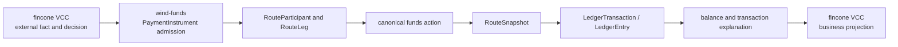

# VCC 场景资金能力边界

## 文档状态与版本信息

| 项目 | 内容 |
| --- | --- |
| 文档状态 | Review |
| 业务能力 | VCC 场景资金承接 |
| 业务阶段 | P2 场景能力包 |
| 本仓库 owner | wallet、transaction、ledger、reconciliation |
| VCC 业务 owner | `fincone` VCC 发卡业务 |
| 最后更新 | 2026-07-20 |

本轮对齐评审结论：

- 触发原因：`wind-funds` 旧 VCC 分册同时设计了发卡业务对象、外部事件、主状态和卡账单，与 Fincone 发卡域职责重叠。
- 当前阶段：产品/系分边界 Review；评审对象是 VCC 场景与通用资金底座的跨项目契约，方案类型是职责拆分。
- 共识：Fincone 拥有 VCC 业务事实和展示语义；`wind-funds` 只拥有支付工具准入、资金责任、canonical 资金动作、路由、账本和资金对账证据，可进入公共契约签收。
- 分歧与取舍：备选方案是保留 wind-funds VCC capability pack，但会造成双主状态、双事件日志和双卡账单口径；本轮选择拆分到 Fincone，以资金公共契约集成。
- 必改与影响：删除旧 VCC 业务 PRD，修正产品、DSL、系分和 TDD 中的越界口径；不改变资金账户、信用账户、授权、清算、退款、账本或对账的公共能力。
- 待确认：双方 Request/DTO、错误码、稳定引用和幂等语义仍需 Fincone VCC owner 与 wallet/transaction owner 签收。
- 验证方式：检查职责关键词、跨仓文档链接、TDD 验收映射和 Markdown 差异；下一步去向是双方契约测试，不是在 wind-funds 新建 VCC 状态机或 facade。

## 1. 文档定位

本文档只定义 VCC 业务接入 `wind-funds` 时的资金主体、支付工具、资金责任、交易动作、原路由回放和账务验收边界。它不是 VCC 产品 PRD，不定义发卡业务对象、issuer 协议、主交易状态、外部事件状态或卡账单展示。

VCC 产品与系统设计的当前评审入口由 `fincone` 仓库维护。跨仓文件不使用依赖本地目录布局的相对链接，当前以以下源路径为准：

- `fincone/docs/生产交付/VCC发卡/README.md`
- `fincone/docs/生产交付/VCC发卡/卡交易处理/卡交易处理-产品设计.md`
- `fincone/docs/生产交付/VCC发卡/卡交易处理/卡交易处理-系分设计.md`
- `fincone/docs/生产交付/VCC发卡/VCC发卡-验收与准出清单.md`

上述材料尚处于 Product/System Review 或 Pending；`wind-funds` 只把已签收的公共契约作为实现输入，不替 VCC owner 提前定案。

## 2. 能力与所有权边界

| 能力 | `fincone` VCC 负责 | `wind-funds` 负责 |
| --- | --- | --- |
| 外部事实 | Webhook/Pull/报告采集、验签、归一、issuer 权威确认和敏感数据边界。 | 不解析 issuer 协议，只接收已成立的资金指令与安全引用。 |
| VCC 交易 | 维护 VCC 主交易、外部事件、应用状态、业务金额摘要和卡账单解释。 | 维护 FundsTransaction、RouteSnapshot、LedgerTransaction、LedgerEntry 和余额投影。 |
| 支付工具 | 维护 Card/Cardholder/Program 和卡生命周期。 | 保存脱敏 `PaymentInstrumentRef` 及绑定快照，执行工具能力准入。 |
| 资金路径 | 传入已确认的使用人、业务范围、规则证据和资金选择。 | 从绑定和账户能力解析唯一可记账子账户，以 route participant/leg 显式表达资金或额度路径；账户层级快照只记录直接父账户关系。 |
| 资金动作 | 决定何时授权、清算、释放、退款或进入人工处理。 | 校验主体、金额、币种、原始事实和幂等，执行单个 canonical 资金动作。 |
| 查询和对账 | 组合卡交易、issuer 事件、卡账单和运营处理视图。 | 提供资金交易解释、账务证据和对账证据引用，不反写 VCC 事实。 |

禁止在 `wind-funds` 新增 `VccTransaction`、`VccTransactionEvent`、issuer Webhook、VCC 主状态机、事件 `applicationState`、卡账单或发卡处理商协议实现。

## 3. 资金主体与账户模型

### 3.1 共同原则

- VCC、PAN、token、Cardholder、SpendControlScope 和 Spend Rule 都不是账务主体。
- 账务影响必须落到 `FUNDING_ACCOUNT`、`CREDIT_ACCOUNT` 或平台角色解析后的具体资金账户。
- 每张卡绑定独立子账户；多张卡可受同一父账户约束，不共用同一子账户。
- 卡只作为支付工具和归因维度，不持有资金或信用额度。

### 3.2 预付卡模式

- `PaymentInstrument -> child FundingAccount -> parent FundingAccount`。
- 子资金账户承载卡维度可用余额、授权占用、交易完成、退款和费用。
- 父资金账户表达上层资金归属或资金池约束；不根据卡对象自动生成账务分录。
- 如产品需要叠加非现金周期消费额度，由 Spend Rule 提供控制语义，资金账户周期账本承接已确认的资金事实。

### 3.3 共享卡模式

- `PaymentInstrument -> child CreditAccount -> parent FundingAccount`。
- 信用子账户用于统一授权记账、额度占用、已用额度和卡维度归因，不持有现金。
- 父资金账户是真实资金责任账户；授权阶段必须同时保护子账户额度与父账户可用资金，避免交易完成时父账户透支。
- 交易完成时子信用账户 `AUTHORIZATION -> OUTSTANDING`，父资金账户沿原授权路径承担一次真实资金责任。`OUTSTANDING` 表示已用额度，不是现金、交易状态或外部 Network Settlement 完成证明。
- 交易完成后子信用账户的已用额度不自动恢复；退款按原路径 `OUTSTANDING -> AVAILABLE`。
  VCC 当前没有还款流程，其他额度调整只能由受控业务事实驱动。
- 周期消费规则属于 Spend Rule；周期账本是资金/信用账户对已确认结果的承接，不把 Spend Rule 建成账务主体。

## 4. Canonical 资金动作契约

| 业务输入 | `wind-funds` 动作 | 成功资金结果 | 关键守卫 |
| --- | --- | --- | --- |
| 授权批准 | `FundsAuthorizationTransactionService#authorize` | 上游归一账户主体后建立 `AVAILABLE -> AUTHORIZATION` 占用，保存绑定、资金责任和 RouteSnapshot。 | 工具、账户、币种、唯一资金责任和余额/额度必须通过。 |
| 授权拒绝 | 授权准入拒绝 | 只返回拒绝结果和稳定原因。 | 不生成账务 RouteLeg、posting、LedgerTransaction 或 LedgerEntry；允许保存不含 legs、不可回放的 RouteSnapshot 作为解释证据。 |
| 授权交易完成 | `FundsAuthorizationTransactionService#complete` | 核销本次授权占用并生成实际资金事实；Provider 内部在存在 Spend Control 预留时同步记录 `CONSUMED`。 | issuer Clearing / Presentment 只是上游触发来源；资金内核使用原授权和原 RouteSnapshot，累计控制消费不得超过 `completedAmount`。 |
| 可信撤销/释放 | `FundsAuthorizationTransactionService#reversal` | 同主体 `AUTHORIZATION -> AVAILABLE`；Provider 内部在存在 Spend Control 预留时同步记录 `RELEASED`。 | 只处理未使用授权；超时、expired 或本地猜测不得触发。 |
| 原交易本金退款 | `refund` | 沿原 RouteSnapshot 回放，累计 `refundedAmount`。 | 本金币种与原完成交易一致，累计不超过 `completedAmount`，使用原交易汇率快照。 |
| 业务确认的无原路由贷记 | 适用的直接退款或转账入口 | 向明确账户追加独立资金事实。 | 业务方必须明确资金来源、到账账户、金额、币种、原因、操作人和审批；资金底座不推断原消费。 |

上述 canonical 语义统一由 `FundsAuthorizationTransactionService#authorize/complete/reversal/refund` 承接。VCC/issuer adapter 负责把支付工具、绑定和外部事件归一为账户主体型资金动作；Provider 内部可以从原授权恢复账务主体和可选控制预留，但该编排不形成 Public facade。所有后续动作必须锁定原授权事实、沿原 `RouteSnapshot` 回放，不读取当前 binding 重新选路。

每次动作使用稳定 `businessScene + businessSn` 幂等并返回资金交易流水号。`authorizationTransactionSn` 为空时，`refund` 表示无内部授权事实的退款，必须提供 `externalReferenceSn` 与 `refundReason`；非空时一律按授权链退款校验原授权事实。强制完成是独立高风险模式，必须携带已签收策略、限额、原因、外部事实和操作凭证。可信完成/撤销只在同进程、同数据源和同事务管理器下原子联动控制事实；VCC 事件状态更新及复合贷记进度不属于该公共契约。

### 4.1 完成金额与余额桶

- `completedAmount` 是授权交易聚合的累计金额，不是余额状态，不新增 `COMPLETED` 余额桶。
- `AVAILABLE`、`AUTHORIZATION`、`SETTLEMENT`、`OUTSTANDING` 表达 VCC 资金或额度所处的账本口径，不复制交易状态。
- VCC 授权完成统一使用 `COMPLETE` 交易动作；PREPAID 与 SHARED 分别按各自账户 profile 转入资金结算或已用额度账目，参与账户和真实资金责任由原 `RouteSnapshot` 决定。
- PREPAID 的 FundingAccount 执行 `AUTHORIZATION -> SETTLEMENT`；SHARED 的 CreditAccount 执行 `AUTHORIZATION -> OUTSTANDING`，同时父 FundingAccount 沿原路径只承担一次真实资金责任。
- issuer 的 Clearing / Presentment 可归一为 VCC `COMPLETE`，但内部已确认收款或平台 `SETTLEMENT` 账目不表示外部 Network Settlement 已完成；外部闭合仍依赖发卡行账户同步、回单和对账。

冻结 `AVAILABLE <-> FROZEN` 只表达同主体的资金控制，不参与 VCC 授权、完成或交易生命周期。

## 5. 退款与额外 Credit 边界

- `refund` 只承接原完成交易本金，不接收商家补偿、退货运费、FX 差额或其他额外 credit。
- 额外 credit 必须由上层业务确定责任方、出资账户、到账账户、账目、币种、规则、审批和上限，再分别提交单个 canonical 资金动作。
- `wind-funds` 不提供“超额退款”或跨组件复合事务公共入口，不维护上层组件进度。
- 每个资金动作使用独立稳定 `businessSn` 和请求摘要；相同业务键且摘要不同时必须冲突失败。
- 多组件的部分成功、重试、人工复核和业务主状态属于 `fincone` VCC 业务设计。

## 6. 接入流程

1. `fincone` 完成外部事件验真、归一、业务关联和金额拆分。
2. 调用方传入脱敏支付工具引用、稳定 `businessSn`、金额币种、原资金交易引用和必需的业务证据。
3. `wind-funds` 完成工具准入、唯一资金责任解析、原路由回放、资金交易和账务过账。
4. 调用成功返回资金交易、责任决策、RouteSnapshot 和账务证据引用；调用失败不留半截账务事实。
5. `fincone` 依据返回结果更新 VCC 业务事实和查询视图；`wind-funds` 不反向更新 VCC 状态。

当前只在同进程、同数据源、同事务管理器和本地 Bean 调用前提下允许共享本地短事务。前提不成立时必须重新评审跨库/远程一致性，本文档不预埋 MQ、Outbox 或 Saga。

## 7. 资金不变量

1. 授权拒绝不生成账务 RouteLeg、posting、LedgerTransaction、LedgerEntry 或余额变化；空 RouteSnapshot 只作拒绝解释证据，不得回放。
2. 授权只表达占用，不表示 Clearing/Presentment 或 Network Settlement 完成。
3. 超时和 expired 不是可信资金结果，不自动释放授权。
4. 完成、释放和本金退款必须基于原资金交易和原 RouteSnapshot，不按当前卡绑定或当前 Spend Rule 重选资金责任。
5. 原交易本金退款累计不得超过已完成本金；额外 credit 不写入 `refundedAmount`。
6. 任何资金动作都必须生成平衡 posting plan、不可变 LedgerEntry 和可回放的稳定引用。
7. 卡、PAN、CVC、token secret、SpendControlScope 和 Spend Rule 不得进入 LedgerEntry 主体或日志敏感上下文。

## 8. 验收场景

| 验收 ID | 场景 | `wind-funds` 必须证明 | 不属于本仓库的断言 |
| --- | --- | --- | --- |
| `VCC-AC-001` | 授权批准 | 资金责任唯一，`AVAILABLE -> AUTHORIZATION`，route/posting/entry 完整且幂等。 | VCC 主交易状态如何展示。 |
| `VCC-AC-002` | 授权拒绝 | 拒绝原因稳定，无账务副作用。 | issuer 拒绝码和卡账单文案。 |
| `VCC-AC-003` | 可信授权释放 | 释放不超过未使用授权；超时/expired 本身不产生余额和账务变化。 | issuer 事件状态和运营标签。 |
| `VCC-AC-004` | 授权 100，完成 40，释放 20，再完成 40 | `completedAmount=80`、`reversedAmount=20`、每个动作独立幂等，每步余额和账务平衡。 | `VccTransaction` 主状态和事件时间线。 |
| `VCC-AC-005` | 完成 80，退款 30 后再退 50 | `refundedAmount` 依次为 30/80，原汇率和原路由回放，累计不超额。 | 部分/全额退款的 VCC 主状态。 |
| `VCC-AC-006` | 争议裁决需要资金动作 | 只接收上层已确认的退款、追偿或其他明确资金指令；需退本金时复用原路由。无资金影响时不调用 wind-funds，不生成空交易或资金投影。 | dispute case 过程、证据期限和业务裁决。 |
| `VCC-AC-007` | 预付卡授权 | 卡绑定独立 FundingAccount 子账户，父账户和预付资金来源可追溯。 | 开卡、充值订单和退卡产品流程。 |
| `VCC-AC-008` | 共享卡授权 | 卡绑定独立 CreditAccount 子账户，父 FundingAccount 责任唯一，缺任一条件时无账务副作用。 | 共享卡用户、卡组和卡账单规则。 |
| `VCC-AC-009` | 多卡和换绑后续动作 | 每张卡绑定独立子账户；退款/释放继续使用原 binding snapshot、参与方账户层级快照和 RouteSnapshot。 | 是否允许换绑的 VCC 产品政策。 |
| `VCC-AC-010` | 外部输入证据 | 只接收已归一的稳定引用、金额币种、业务摘要和敏感数据阻断结果。 | Webhook 验签、issuer 权威查询和事件归一实现。 |
| `VCC-AC-011` | 资金对账引用 | FundsTransaction、RouteSnapshot、LedgerTransaction、LedgerEntry 和对账差错可通过稳定引用下钻，差异处理不改历史分录。 | SupplierBill、issuer report、AccountingVoucher 和 VCC 卡账单的生命周期。 |
| `VCC-RED-001` | 完整 PAN/CVC 进入资金底座 | 请求、上下文、日志、投影、导出和测试夹具必须失败或脱敏阻断。 | PCI 持卡人数据系统实现。 |

资金变化测试必须逐步断言账户余额桶、posting plan 平衡、LedgerTransaction/LedgerEntry 可追溯和幂等重放。

## 9. 待签收公共契约

| 契约 | 当前边界 | owner |
| --- | --- | --- |
| VCC 支付工具与子/父账户初始化 | 资金底座已有账户、绑定和准入能力；生产字段、事务边界和账户模式仍需契约测试签收。 | fincone VCC、wallet |
| 支付工具与授权生命周期 | VCC/issuer adapter 先归一账户主体与可信事件，再调用 `FundsAuthorizationTransactionService`；完成/撤销的原主体恢复和控制预留联动只在 Provider 内部执行，不提供支付工具交易 Public facade。当前仓库已验证支付工具改绑后退款仍沿原主体和原 RouteSnapshot，且不自动补偿周期控制额度；VCC 上游事件权威、补偿策略与目标部署事务拓扑仍待 Owner 签收。 | fincone VCC、wallet、transaction |
| 原主体和原路由回放 | 需确认 binding snapshot、RouteParticipant、参与方账户层级快照和 RouteSnapshot 对外稳定引用；回放不得查询当前层级关系。 | wallet、transaction |
| 资金解释查询 | 只返回 `wind-funds` 事实和不可用原因；不返回 VCC 事件应用状态或卡账单展示状态。 | transaction、fincone VCC |

## 10. 风险与停止条件

- issuer、processor、Program、Card、Cardholder、VCC 事件应用状态、业务主状态、卡账单和运营处置继续由 `fincone` 设计与验收。
- 卡组织、合规、税务、会计、PCI 和发卡处理商规则需对应专业 owner 确认，不由本文档宣告生产可用。
- 缺少唯一资金责任、原资金交易、原 RouteSnapshot、金额币种、稳定幂等键或敏感数据边界时，`wind-funds` 必须快速失败且无账务副作用。
- 本文档不构成 VCC 业务、外部规则或上线准出。
