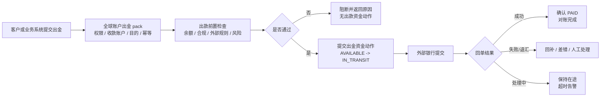

# 全球账户收付款资金底座 PRD

## 文档状态与版本信息

- 当前版本：v1.0
- 文档状态：Review
- owner：全球账户产品 owner、资金产品 owner、运营与财务 owner、合规 owner、测试 owner、架构 owner
- 发布日期：2026-07-17
- 评审结论摘要：本文定义全球账户入金、出金、在途、退汇、费用、FX 引用和多币种对账如何接入统一资金底座。
- 目标读者：全球账户产品、运营、财务、合规、测试、架构师和研发。
- 需要决策：确认多币种账户、外部轨道、在途状态、退汇和 FX 证据的产品边界与验收。
- 当前可信度：内部资金事实承接方式已确认；法域、资质、客户资金隔离、外汇、银行与清算网络规则仍待专业确认。

## PRD 模板追踪索引

| PRD 模板项 | 本文落点 | 裁剪说明 |
| --- | --- | --- |
| 需求概览、背景、目标与范围 | 1、3 | 不把完整全球账户产品放入资金底座。 |
| 核心名相、主体、角色和对象 | 2、5 | 多币种按账户和账本隔离。 |
| 场景、流程、状态和规则 | 6、7 | 覆盖入金、出金、在途、失败和人工兜底。 |
| 数据、运营、风险和外部规则 | 8、9 | 保留法域、资质、FX 和客户资金专业确认。 |
| 验收与产品到架构交接 | 10、11 | 只把归一资金事实交给统一内核。 |

## 1. 文档定位

### 1.1 一页摘要

本文是支付资金底座产品设计的全球账户收付款业务补充分册，用于说明全球账户、VA、本地银行账户、入金、出金、在途、退汇、费用、FX 引用、多币种账本和对账如何接入 `wind-funds`。

本文不把 `wind-funds` 定义为银行核心、全球账户开户系统、跨境汇款执行系统、外汇执行系统、SWIFT 或本地清算网络接入系统。全球账户产品生命周期、VA 分配、银行协议、外部报文、FX 执行、跨境合规材料和外部流水适配由上层业务系统、银行适配层或合规系统承担；`wind-funds` 负责承接适配后的资金动作、内部资金账户、账本账目、清结算对账和可解释投影。

| 项目 | 内容 |
| --- | --- |
| 产品名称 | 全球账户收付款资金底座能力 |
| 文档定位 | 业务补充分册 |
| 目标读者 | 产品、全球账户业务、运营、财务、风控、合规、研发、测试 |
| 主线关系 | 补充 01-05 的全球账户资金场景，不替代通用资金底座 PRD |
| 合并口径 | 入金、出金、在途、退汇、费用、FX 引用和多币种对账保留在本分册；钱包、账本、账目、路由、清结算、对账、归档和验收门禁回到 01-05。 |

### 1.2 多币种账户吸收边界

外部多币种账户方法论只作为产品设计参考。本分册吸收其中能落到资金底座的稳定口径：客户资金和机构资金隔离、多币种余额独立核算、账务日期与自然时间分离、外部账户只作证据引用、账实一致必须可证明。未被银行、合规、财务、税务或持牌机构确认的规则，不写成生产结论。

| 设计问题 | 产品口径 | 生产准入缺口 |
| --- | --- | --- |
| 客户账和机构财务账如何隔离 | 客户内部资金账户、平台责任账户、外部银行账户和备付/托管账户分层表达，通过对账关联，不混成同一个账本主体。 | 需确认法主体、资金归属、托管/备付账户映射、会计科目和外部回单来源。 |
| 多币种余额如何解释 | 每个主体、币种、账目和余额桶独立核算；跨币种动作必须引用 FX quote、执行结果和费用拆分。 | 需确认 FX 来源、锁汇窗口、报价失效、费用承担和汇差处理。 |
| 全球日切如何表达 | 产品展示、账本周期、会计日期、业务发生时间、外部回单时间和时区必须分开解释。 | 需确认法主体、账套、时区、cutoff、节假日日历和补偿流程。 |
| 外部账户是否入账 | VA、银行账户、通道账户和清算账户只做外部引用或对账证据；入账主体必须解析到内部资金账户或平台角色账户。 | 需确认外部账户脱敏、文件摘要、回单状态、挂账和差错处理。 |
| 账实一致如何证明 | 对账必须能把客户侧内部余额汇总到外部资金账户、回单、文件或资金证明。 | 需确认对账频率、差错等级、阻断规则、审计和专业复核责任。 |

### 1.3 背景和问题

全球账户收付款的复杂点不只是“多币种余额”，而是客户资金、外部银行流水、虚拟账户匹配、付款指令、外部受理、在途、退汇、费用、汇率和合规状态之间存在多层状态差异。外部银行或清算网络受理不等于资金到账，出金提交不等于付款成功，多币种入账不等于已经完成 FX 或财务确认。

| 问题 | 影响对象 | 风险说明 | 影响程度 | 证据来源 |
| --- | --- | --- | --- | --- |
| 外部受理被误当到账 | 用户、财务、账本 | 在途资金和可用资金混用 | 高 | 全球支付参考、监管基线 |
| 外部银行账户或 VA 被当成账本主体 | 账本、对账、合规 | 账务主体错误，资金归属不清 | 高 | 01 PRD 账务主体红线 |
| FX、费用和本金混成净额 | 财务、报表、用户解释 | 汇率差、银行费和平台费无法核对 | 高 | 全球支付五层分析 |
| 退汇和失败状态缺失 | 运营、客服、用户 | 长时间未达、银行退回和合规拦截无法闭环 | 高 | 全球账户场景分析 |

### 1.4 目标与非目标

| 类型 | 内容 | 验证方式 |
| --- | --- | --- |
| 业务目标 | 支撑全球账户入金、出金、退汇、费用、FX 引用和多币种对账进入统一资金内核。 | 单笔链路查询、账本、对账批次和客户账单。 |
| 用户目标 | 客户和运营能理解资金在途、到账、失败、退汇、费用和汇率导致的余额变化。 | 余额解释、交易投影、客户账单和失败原因。 |
| 运营目标 | 支持银行流水匹配、出款状态追踪、退汇处理、长时间未达、合规拦截和差错核销。 | 运营后台、差错单、出款状态机和审计。 |
| 数据目标 | 多币种账户、外部流水、资金动作、账本、对账、归档之间可追溯。 | route snapshot、ledger entry、recon batch、archive manifest。 |
| 非目标 | 不设计全球账户开户、VA 分配、银行协议、SWIFT、本地清算网络、FX 执行和跨境合规材料管理。 | 由全球账户业务、银行适配层、FX 系统和合规系统承接。 |

### 1.5 核心名相、定义与产品边界

| 核心名相 | 定义 | 不是什么 | 归属主体与 owner |
| --- | --- | --- | --- |
| 全球账户 | 面向客户暴露的统一账户产品入口，可聚合多个币种、收款端点和付款能力。 | 不是内部单一账本主体，也不是外部银行账户的镜像。 | 全球账户产品系统负责产品生命周期和客户展示。 |
| 内部资金账户 | 按资金归属、法主体和币种隔离的可记账主体。 | 不是 VA、IBAN、银行账号或通道端点。 | `wind-funds` 钱包与账本能力负责。 |
| 外部账户引用 | 对 VA、IBAN、银行账户或通道账户的脱敏标识、token 或摘要。 | 不是账本主体，不持有内部余额。 | 银行或通道适配层维护原始对象；资金底座只保存最小引用。 |
| 在途资金 | 已获得可信外部事实、但尚未满足最终可用或最终完成条件的内部资金状态。 | 不是仅凭 submitted、accepted 或 processing 推断的到账事实。 | 上层解释外部事实；资金底座按明确指令承接在途及后续转换。 |
| FX 引用 | 对本次交易实际使用汇率事实的稳定引用及必要摘要。 | 不是客户报价、加点策略、锁汇或 FX 执行能力。 | FX/treasury 或上层报价能力形成最终价格；资金底座保存应用事实。 |

## 2. 用户、主体和角色

| 类型 | 名称 | 说明 | 权益/责任 | 是否直接使用 wind-funds |
| --- | --- | --- | --- | --- |
| 客户 | 企业客户、平台客户或账户持有人 | 使用全球账户收款、付款和查询余额。 | 享有账户服务和资金解释权，承担资料和交易真实性责任。 | 否。 |
| 收款方/付款方 | 外部交易对手 | 入金付款人或出金收款人。 | 提供外部账户和交易背景。 | 否。 |
| 全球账户产品系统 | Global Account / VA 系统 | 管理账户产品、VA、付款申请和客户展示。 | 负责产品生命周期和客户交互。 | 否。 |
| 核心资金账务主体 | 内部资金账户、在途资金账户、差错资金账户 | `wind-funds` 内部资金和账务主体；平台角色必须先解析到具体平台资金账户。 | 承载余额、费用、退汇和差错；外部 VA、银行账户和通道账户只做引用。 | 是。 |
| 外部机构 | 银行、代理行、本地清算网络、FX 服务方 | 提供外部受理、到账、退汇、费用和汇率结果。 | 负责外部事实确认。 | 否，只保留引用。 |

| 角色 | 使用场景 | 可见数据 | 可执行动作 | 权限边界 | 审计要求 |
| --- | --- | --- | --- | --- | --- |
| 客户管理员 | 查看全球账户余额、入金、出金、费用和退汇。 | 脱敏账户、币种、余额、在途、交易状态。 | 查询、导出、提交付款或补资料。 | 不可查看内部清算账户和他人数据。 | 查询和导出留痕。 |
| 运营 | 匹配银行流水、处理退汇、合规补资料和长时间未达。 | 外部引用、状态、差错、账本和回单摘要。 | 补引用、挂账、发起差错、人工复核。 | 不可直接改余额或历史分录。 | 操作前后值和审批链。 |
| 财务 | 核对多币种余额、银行流水、费用、FX 和出款回单。 | 账本、分录、对账批次、费用和差异。 | 复核、核销、导出。 | 财务动作需审批。 | 导出、核销和调账审计。 |
| 风控/合规 | 审查付款、收款、名单筛查、AML 和跨境材料。 | 风险状态、规则版本、核验状态和证据摘要。 | 阻断、解除、要求补资料。 | 未确认规则不得默认放行。 | 规则和审批留痕。 |

## 3. 范围与边界

### 3.1 能力范围

本表中的 P0/P1 只表示全球账户分册内部能力优先级，不改变 01 总览中“全球账户收付款属于全局 P2 业务补充分册”的定位。任何全球账户能力进入工程落地前，都必须先证明复用统一钱包、账本、账目、清结算、对账和归档能力，并声明独立任务边界。

| 能力 | 说明 | 分册内优先级 | 交付形态 | 验收标准 |
| --- | --- | --- | --- | --- |
| 入金资金链 | 银行流水或 VA 匹配后，确认内部入账和可用状态。 | P0 | 全球账户入金 pack + 资金动作 | 外部受理、在途、到账、入账分层清楚。 |
| 出金资金链 | 出款申请、前置检查、外部提交、处理中、成功、失败和退汇。 | P0 | 出金 pack + 出款前置检查 | 提交不等于成功，回单和退汇可对账。 |
| 多币种账本 | 按主体、币种、账目和周期隔离余额和分录。 | P0 | 钱包、账本、投影复用 | 错币种失败，跨币种需 FX 引用。 |
| 费用和 FX 引用 | 平台费、银行费、中间行费、汇率引用和汇兑差待确认。 | P1 | 金额组件和外部引用 | 本金、费用、汇率不可混成净额。 |
| 全球账户对账 | 银行流水、外部状态、账本、出款回单和客户账单核对。 | P1 | 对账批次和差错单 | 平台单边、银行单边、金额差、状态差可处理。 |

### 3.2 不做范围

| 不做项 | 原因 | 处理归属 |
| --- | --- | --- |
| 全球账户开户、VA 分配和银行账户实名流程 | 属于账户产品和银行适配域。 | 全球账户产品系统负责。 |
| SWIFT、本地清算网络、代理行报文协议 | 外部网络规则差异大且时效性强。 | 银行适配层负责，资金底座只保存引用。 |
| FX 执行、锁汇和交易对手管理 | 属于 FX 或 treasury 能力。 | 资金底座只保存 quote/ref 和资金影响。 |
| 跨境合规材料收集与最终判断 | 需要专业确认和外部系统。 | 合规系统和专业方负责。 |
| 会计准则、税务和监管报送最终规则 | 不属于产品 PRD 确定结论。 | 财务、税务、合规确认。 |

### 3.3 上下游边界

| 上下游 | 交互内容 | 责任边界 | 失败处理 | 核验/一致性校验方式 |
| --- | --- | --- | --- | --- |
| 全球账户产品系统 | 客户账户、VA、付款申请、客户展示。 | 负责产品生命周期和客户交互。 | 信息不完整时不进入资金动作。 | 客户、账户、币种、权限和业务单。 |
| 银行/网络适配层 | 银行流水、回单、退汇、外部状态和费用。 | 负责协议解析和外部事实归一。 | 不可解释流水进入挂账或差错。 | 外部引用、文件摘要、回单状态。 |
| FX/treasury 系统 | quote、锁汇、执行结果、汇率和汇兑差。 | 负责汇率执行和市场风险。 | 无 quote 或 quote 过期时阻断跨币种资金动作。 | quoteRef、rate、有效期和执行结果。 |
| wind-funds | 内部账户、资金动作、账本、投影、清结算和对账。 | 负责统一资金内核和资金运营闭环。 | 失败无账务副作用。 | 分录、投影、对账和归档证据。 |

## 4. 能力地图

```mermaid
mindmap
  root((全球账户收付款资金底座 PRD))
    入金
      银行流水
      VA 匹配
      付款人识别
      在途
      到账确认
      内部入账
    出金
      付款申请
      出款前置检查
      外部提交
      处理中
      付款成功
      失败
      退汇
    多币种
      币种账户
      FX Quote Ref
      银行费
      中间行费
      汇兑差待确认
    账本对账
      资金账户
      IN_TRANSIT
      AVAILABLE
      EXCEPTION
      Ledger Entry
      Recon Batch
      差错核销
    运营合规
      合规拦截
      补资料
      长时间未达
      外部规则核验
      审计
```

## 5. 核心对象、字段口径和状态

| 对象 | 字段口径 | 生命周期 | 不变量 |
| --- | --- | --- | --- |
| Global Account | accountRef、customerRef、currency、country、status、providerRef。 | ACTIVE、SUSPENDED、CLOSED。 | 外部账户产品不是内部账本主体。 |
| Inbound Payment | inboundId、vaRef、payerRef、bankStatementRef、amount、currency、receivedAt。 | EXTERNAL_ACCEPTED、IN_TRANSIT、RECEIVED、MATCHED、POSTED、RETURNED、EXCEPTION。 | 外部受理不等于到账，到账不等于可用。 |
| Outbound Payment | payoutId、payeeRef、externalAccountRef、amount、currency、fee、purpose、complianceStatus。 | REQUESTED、PRECHECKED、SUBMITTED、PROCESSING、PAID、RETURNED、FAILED、RECONCILED。 | 外部提交不等于付款成功。 |
| FX Reference | quoteRef、fromCurrency、toCurrency、rate、validUntil、provider、executionRef。 | QUOTED、LOCKED、EXECUTED、EXPIRED、FAILED。 | 无有效 quote 不得隐式换汇。 |
| Recon Exception | reconBatch、externalRef、ledgerRef、differenceType、amount、currency、owner。 | OPEN、INVESTIGATING、ADJUSTING、WRITTEN_OFF、CLOSED。 | 差错不能直接改历史分录。 |

### 5.1 状态机

| 原状态 | 事件 | 守卫条件 | 动作 | 下一状态 | 非法流转/回滚 |
| --- | --- | --- | --- | --- | --- |
| EXTERNAL_ACCEPTED | 外部受理入金 | 有外部引用但未到账。 | 记录在途或待匹配。 | IN_TRANSIT | 不得增加 AVAILABLE。 |
| IN_TRANSIT | 银行流水到账 | 流水匹配 VA、主体、币种和金额。 | 生成入金资金动作。 | RECEIVED / MATCHED | 错币种或缺引用进入 EXCEPTION。 |
| MATCHED | 入账完成 | 合规和账务准入通过。 | ledger entry 增加对应账户。 | POSTED | 未过账不得展示可用。 |
| REQUESTED | 出款申请 | 权限、余额、合规资料完整。 | 进入前置检查。 | PRECHECKED | 资料缺失阻断。 |
| PRECHECKED | 外部提交 | 出款前置检查通过。 | 生成出款请求和在途状态。 | SUBMITTED / PROCESSING | 外部提交不等于 PAID。 |
| PROCESSING | 银行回单成功 | 回单和对账来源确认。 | 确认资金出款成功。 | PAID | 无回单不得终态成功。 |
| PROCESSING | 银行退汇 | 外部返回 return。 | 生成退汇资金动作或回补。 | RETURNED | 退汇不能当普通退款。 |

## 6. 业务流程

### 6.1 入金主流程

### 6.2 出金主流程

### 6.3 异常流程和人工兜底

| 场景 | 触发条件 | 处理逻辑 | 人工处理 | 审计和验收 |
| --- | --- | --- | --- | --- |
| 银行单边 | 银行流水存在，内部无匹配。 | 进入挂账或待匹配。 | 补 VA、主体、用途或退回。 | 不得自动入 AVAILABLE。 |
| 平台单边 | 内部出款成功，银行无回单。 | 进入资金在途和对账差错。 | 补拉、人工确认或回滚出款状态。 | 不能无回单展示 PAID。 |
| 错币种 | 入金或出金币种与账户不一致。 | 阻断或进入 FX 处理。 | 补 quote 或人工确认。 | 无有效 quote 不隐式换汇。 |
| 退汇 | 银行或网络返回。 | 回补、费用拆分、状态回退或差错。 | 补资料、通知客户、核销。 | 退汇资金动作和原出金关联。 |
| 合规拦截 | 名单、资料、用途或规则未通过。 | 阻断出金或冻结在途。 | 补资料、复核、解除或关闭。 | 审批和确认方完整。 |

## 7. 业务规则矩阵

| 规则编号 | 规则名称 | 适用对象 | 触发条件 | 判断逻辑 | 动作 | 优先级 | 规则治理 | 验收样例 |
| --- | --- | --- | --- | --- | --- | --- | --- | --- |
| GA-R001 | 外部受理不等于到账 | Inbound / Outbound | 外部返回 accepted。 | 无银行到账或终态回单。 | 记录在途，不增加可用。 | P0 | 随全球账户场景规则确认。 | accepted 后 AVAILABLE 不变。 |
| GA-R002 | 外部账户不入账 | VA / Bank Account | 生成账本分录。 | externalAccountRef 只做引用。 | 解析内部资金账户。 | P0 | 随全球账户场景规则确认。 | ledger entry 主体不出现银行账号。 |
| GA-R003 | 错币种阻断 | 多币种资金动作 | 交易币种与账户币种不同。 | 无有效 FX quote。 | 拒绝或进入待处理。 | P0 | 随全球账户场景规则确认。 | USD 账户不能静默入 EUR。 |
| GA-R004 | 费用拆分 | 入金、出金、退汇 | 存在平台费、银行费、中间行费。 | 金额组件必须结构化。 | 本金、费用、成本分别入账或待确认。 | P1 | 随全球账户场景规则确认。 | 客户账单能解释到账金额差。 |
| GA-R005 | 出款回单终态确认 | Outbound | 外部提交后。 | 回单成功并对账匹配。 | 标记 PAID。 | P0 | 随全球账户场景规则确认。 | 无回单保持 PROCESSING 或差错。 |

## 8. 运营后台、数据、报表和审计

| 能力 | 查询条件 | 结果字段 | 可执行动作 | 审计要求 |
| --- | --- | --- | --- | --- |
| 入金匹配台 | VA、客户、银行流水、金额、币种、日期。 | 匹配状态、挂账原因、ledgerRef、对账状态。 | 补匹配、挂账、退回、提交入账。 | 操作前后值和审批。 |
| 出金追踪台 | payoutId、客户、收款账户、外部引用、状态。 | 前置检查、外部提交、回单、退汇、费用。 | 补拉、重试、暂停、关闭、差错处理。 | 出款操作审计。 |
| 多币种余额解释 | 客户、账户、币种、账目、period。 | AVAILABLE、IN_TRANSIT、EXCEPTION、费用、汇率引用。 | 查询、导出、重放校验。 | 导出脱敏和权限。 |
| 对账差错台 | 银行流水、外部文件、ledgerRef、差异类型。 | 差异金额、责任方、处理状态、核销记录。 | 补账、冲正、挂账、核销、重新对账。 | 差错闭环审计。 |

| 指标 | 口径 | 数据源 | 负责人 |
| --- | --- | --- | --- |
| 入金匹配率 | 已匹配入金 / 收到入金流水。 | 入金 pack、银行流水、对账批次。 | 运营、财务。 |
| 出款成功率 | PAID 出款 / 提交出款。 | 出款状态机、外部回单。 | 运营、通道。 |
| 退汇率 | RETURNED 出款 / 提交出款。 | 银行回单、出款投影。 | 风控、运营。 |
| 对账差错处理时效 | 差错关闭时间 - 差错发现时间。 | 对账批次、差错单。 | 财务、运营。 |

## 9. 风险、依赖和待确认项

### 9.1 风险清单

| 风险 | 影响 | 处理原则 |
| --- | --- | --- |
| 法域和资质未确认 | 可能触发支付、汇款、外汇或银行业务边界。 | 进入编码前必须确认业务主体和合作模式。 |
| 客户资金和平台资金混用 | 资金安全和审计风险。 | 客户资金、平台自有、费用、保证金和在途分开表达。 |
| 隐式换汇 | 汇率、费用和损益不可解释。 | 无有效 quote 不做跨币种入账或扣款。 |
| 外部回单不稳定 | 用户误解到账或付款成功。 | 外部受理、处理中、成功、失败、退汇分层展示。 |
| 银行流水直接驱动余额 | 缺合规、主体和对账核验。 | 先匹配和准入，再生成资金动作。 |

### 9.2 外部规则核验状态

| 规则来源 | 版本或发布日期 | 适用法域或适用范围 | 核验日期 | 确认方 | 确认状态 |
| --- | --- | --- | --- | --- | --- |
| 银行协议、本地清算网络规则、SWIFT/代理行规则、外汇和跨境监管规则、数据跨境规则。 | 待确认。 | 全球账户收付款、目标国家/地区、币种、客户类型和支付轨道。 | 2026-05-24，仅完成本地文档字段完整性核验。 | 待法务、合规、财务、银行、通道、持牌机构和数据安全负责人确认。 | 未完成外部规则时效核验，不作为上线依据。 |

### 9.3 待确认项

| 待确认项 | 影响章节 | 风险等级 | 确认方 | 未确认前默认处理 |
| --- | --- | --- | --- | --- |
| 全球账户业务主体、法域和合作模式。 | 1、2、3、9 | 高 | 业务、法务、合规、银行 | 不承诺上线和资质边界。 |
| VA、银行账户和外部回单字段。 | 3、5、6、8 | 高 | 银行适配层、通道、运营 | 只保留抽象引用。 |
| FX quote、锁汇、汇兑损益和费用归属。 | 3、5、7、8 | 高 | 财务、treasury、合规 | 不做隐式换汇。 |
| 数据跨境、个人信息和金融数据留存。 | 8、9 | 高 | 法务、合规、安全 | 按最小必要和待确认处理。 |

## 10. 验收标准和测试场景

| 场景编号 | 场景名称 | 输入 | 预期结果 | 边界路径 | 异常路径 |
| --- | --- | --- | --- | --- | --- |
| GA-AC-001 | 入金流水匹配并入账 | 银行流水、VA、客户、金额、币种。 | 生成入金资金动作和 ledger entry。 | 多币种、费用。 | VA 不匹配进入挂账。 |
| GA-AC-002 | 外部受理保持在途 | 外部 accepted 状态。 | 进入 IN_TRANSIT，不增加 AVAILABLE。 | 长时间未达告警。 | 被误标可用即失败。 |
| GA-AC-003 | 出款前置检查通过后提交 | 出款申请、余额、收款账户、合规状态。 | AVAILABLE -> IN_TRANSIT，生成出款引用。 | 手续费、限额。 | 余额不足或规则未确认阻断。 |
| GA-AC-004 | 出款成功回单确认 | 银行成功回单。 | 状态 PAID，对账完成。 | 部分费用。 | 无回单不得成功。 |
| GA-AC-005 | 银行退汇回补 | 出款处理中收到 return。 | 生成退汇资金动作或回补，关联原出金。 | 退汇费。 | 重复 return 幂等处理。 |
| GA-RED-001 | 错币种无 quote 阻断 | USD 账户收到 EUR 入账请求。 | 拒绝或进入待 FX，不写 AVAILABLE。 | quote 过期。 | 静默换汇即失败。 |
| GA-RED-002 | 外部银行账户不得入账 | 资金动作携带 bankAccountRef。 | 仅作为 externalAccountRef。 | VA、Nostro/Vostro 引用。 | ledger entry 主体出现外部账号即失败。 |

## 11. 与资金底座主线的关系

本分册作为全球账户收付款业务的业务补充分册保留，不并入 01-05 的主线正文。这样可以避免 VA、外部银行账户、SWIFT、本地清算网络、FX 执行和跨境材料管理反向污染资金底座通用内核。01-05 只吸收本分册抽象出的共性要求：外部受理不等于到账、外部账户不入账、错币种阻断、费用拆分、出款回单才可确认终态。

| 原文档 | 补充方式 |
| --- | --- |
| 01-PRD总览 | 补充全球账户是独立账户型收付业务，不改变资金底座通用定位。 |
| 02-交易路由钱包账目与投影 | 补充外部受理、在途、到账、退汇、多币种和 FX 引用的资金语义。 |
| 03-清结算与对账 | 补充银行流水、出款回单、资金在途、退汇和多币种对账。 |
| 02/03/05 资金数据治理拆分承接 | 02 补充全球账户客户账单、在途解释和多币种投影重放；03 补充银行流水和多币种对账差异视图重放；05 补充治理门禁和指标只读边界。 |
| 05-产品验收与TDD用例矩阵 | 补充 GA-AC 和 GA-RED 用例矩阵。 |
