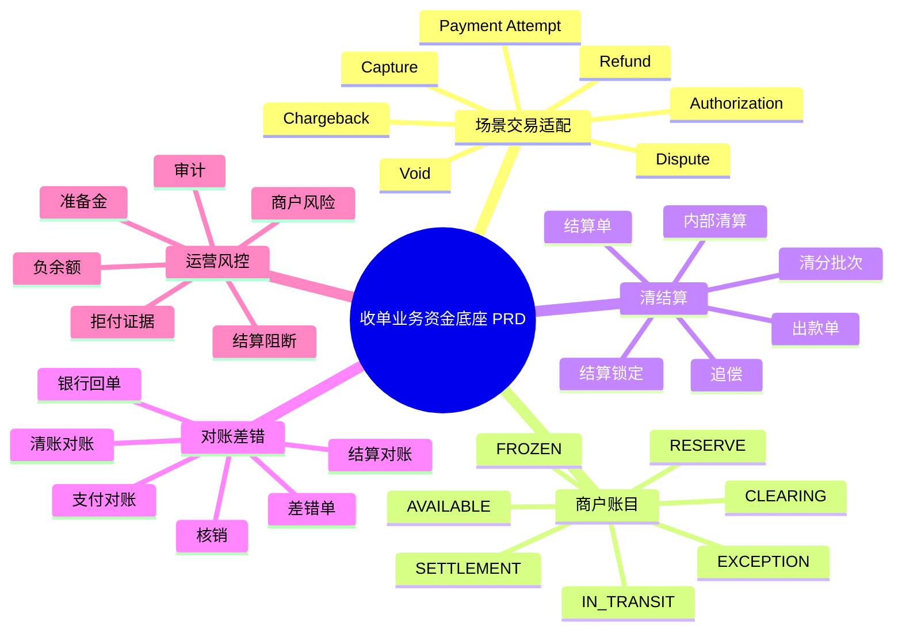

# 收单业务资金底座 PRD

## 1. 文档定位

### 1.1 一页摘要

本文是支付资金底座产品设计的收单业务补充分册，用于说明商户收款、payment attempt、authorization/capture、refund、dispute/chargeback、清分、内部清算、结算、出款、准备金和对账如何接入 `wind-funds`。

本文不把 `wind-funds` 定义为完整收单系统、商户入网系统、收银台、支付网关、PSP 协议系统或 PCI 敏感数据系统。商户入网、支付方式展示、通道协议、tokenization、通道商户号、原始支付报文和外部支付结果归一由收单产品、支付网关或通道适配层承担；`wind-funds` 负责承接适配后的资金动作、商户待清算和可结算账目、结算出款、对账差错、投影和归档。

| 项目 | 内容 |
| --- | --- |
| 产品名称 | 收单业务资金底座能力 |
| 文档定位 | 业务补充分册 |
| 目标读者 | 产品、收单业务、运营、财务、风控、合规、安全、研发、测试 |
| 主线关系 | 补充 01-05 的收单资金场景，不替代通用资金底座 PRD |
| 合并口径 | payment attempt、capture、refund、dispute、准备金和商户结算语义保留在本分册；钱包、账本、账目、清结算、对账、出款、归档和验收门禁回到 01-05。 |

### 1.2 背景和问题

收单业务的核心链路不是“支付成功”，而是用户付款、通道授权或扣款、商户待清算、内部清分、清算确认、商户可结算、出款提交、银行到账、退款、拒付、准备金和追偿之间的一整套资金运营闭环。

| 问题 | 影响对象 | 风险说明 | 影响程度 | 证据来源 |
| --- | --- | --- | --- | --- |
| 支付成功被误当商户可结算 | 商户、财务、运营 | 商户余额展示和出款风险失真 | 高 | 03 清结算与对账、卡支付参考 |
| 清算、结算、对账混用 | 财务、对账、研发 | 漏单、重复、手续费错误和到账差异无法定位 | 高 | 清结算参考 |
| refund 和 chargeback 混用 | 商户、风控、财务 | 重复退款、重复扣回、争议损失不可追踪 | 高 | 争议拒付参考 |
| PCI 和 tokenization 边界不清 | 安全、合规 | 敏感卡数据进入资金底座 | 高 | 卡支付参考、监管安全基线 |

### 1.3 目标与非目标

| 类型 | 内容 | 验证方式 |
| --- | --- | --- |
| 业务目标 | 支撑收单支付结果进入统一资金内核，并完成商户清分、内部清算、结算、出款、退款、拒付和对账。 | 商户账单、结算单、账本分录、对账批次和差错闭环。 |
| 用户目标 | 商户能理解支付成功、待清算、可结算、结算锁定、出款中、已出款、退款、拒付和准备金。 | 商户账单、运营时间线和状态解释。 |
| 运营目标 | 支持 payment/capture/refund/dispute 到资金动作、清结算、对账和人工处理闭环。 | 运营后台、差错单、结算阻断和审计。 |
| 数据目标 | 收单支付、资金账本、清结算批次、出款回单、对账差错和归档可追溯。 | route snapshot、ledger entry、settlement order、recon batch、archive manifest。 |
| 非目标 | 不设计商户入网、收银台、支付网关、支付方式展示、通道协议、PCI token vault 和通道路由策略。 | 由收单产品、支付网关、风控和通道系统承接。 |

## 2. 用户、主体和角色

| 类型 | 名称 | 说明 | 权益/责任 | 是否直接使用 wind-funds |
| --- | --- | --- | --- | --- |
| 商户 | Merchant | 收款、退款、结算和承担拒付风险的主体。 | 享有应收款和账单解释，承担退款、争议和风险责任。 | 否，通过商户后台使用。 |
| 消费者 | Buyer / Cardholder | 发起支付和可能申请退款或争议的人。 | 享有支付结果和售后权益。 | 否。 |
| 平台/收单方 | Platform / Acquirer Context | 提供收单服务和内部资金运营。 | 负责清分、结算、风控、对账和商户服务。 | 部分内部使用。 |
| 可记账主体 | 商户资金账户、平台账户、准备金账户、差错账户 | `wind-funds` 内部账务主体。 | 承载待清算、可结算、准备金、费用和差错。 | 是。 |
| 外部机构 | PSP、收单行、卡组织、本地支付网络、银行 | 提供支付结果、清算文件、争议和出款回单。 | 负责外部事实和规则。 | 否，只保留引用。 |

| 角色 | 使用场景 | 可见数据 | 可执行动作 | 权限边界 | 审计要求 |
| --- | --- | --- | --- | --- | --- |
| 商户运营人员 | 查看订单、清算、结算和出款。 | 商户订单、费用、待清算、可结算、退款、拒付。 | 查询、导出、申请复核。 | 仅限本商户数据。 | 查询和导出审计。 |
| 平台运营 | 处理支付异常、清分排除、结算阻断和出款失败。 | 全链路状态、差错、回单、账本引用。 | 复核、补证据、发起差错、人工处理。 | 不可直接改余额。 | 操作和审批留痕。 |
| 财务 | 核对清分、清算、结算、出款、费用和长短款。 | 批次、结算单、出款单、对账差异、账本分录。 | 复核、核销、导出。 | 高危动作职责分离。 | 导出、核销、调账审计。 |
| 风控 | 管理商户风险、准备金、结算暂停和追偿。 | 风险等级、争议、退款率、拒付率、准备金和负余额。 | 阻断结算、调整准备金、发起追偿。 | 规则变更需审批。 | 风控动作留痕。 |
| 合规/安全 | 审查商户、敏感数据、外部规则和审计。 | KYB 状态、PCI 边界、外部规则核验状态。 | 标记待确认、审计、阻断高危动作。 | 不替代专业最终结论。 | 规则、证据和访问留痕。 |

## 3. 范围与边界

### 3.1 能力范围

本表中的 P0/P1 只表示收单分册内部建设顺序，不改变 01 总览中“收单业务属于全局 P2 业务补充分册”的定位。任何收单能力进入编码前，都必须先证明复用统一钱包、账本、账目、清结算、对账和归档能力，并获得独立 Execution Grant。

| 能力 | 说明 | 分册内优先级 | 交付形态 | 验收标准 |
| --- | --- | --- | --- | --- |
| 收单支付资金链 | 支付成功、授权、capture、refund、dispute 适配为资金动作。 | P0 | 收单场景 pack + 资金动作 | 支付成功不等于可结算，refund 和 chargeback 分离。 |
| 商户账目 | 商户待清算、可结算、结算锁定、出款中、准备金、差错账目。 | P0 | 钱包账户和账目复用 | 每个余额 bucket 含义和来源可解释。 |
| 清分清算结算 | 按商户、币种、周期、费率、退款、争议和风险规则生成批次与结算单。 | P0 | 清结算对账统一实现 | 先清账，再结算；结算只认清账结果。 |
| 出款和回单 | 结算锁定、出款提交、银行到账、失败、退回和追偿。 | P1 | 出款单和对账批次 | 外部受理不等于到账，失败可回退或追偿。 |
| 通道和银行对账 | PSP/收单行/卡组织文件、银行回单、账本和商户账单核对。 | P1 | 对账批次、差错单、核销 | 平台单边、通道单边、金额差、手续费差可闭环。 |

### 3.2 不做范围

| 不做项 | 原因 | 处理归属 |
| --- | --- | --- |
| 商户入网、KYB 和商户资料生命周期 | 属于收单业务和风控合规域。 | 商户系统和合规系统负责。 |
| 收银台、支付方式展示和转化策略 | 属于支付接入产品域。 | 收银台或支付网关负责。 |
| PSP、收单行、卡组织原始协议和通道路由 | 外部协议与路由策略差异大。 | 通道适配层和支付网关负责。 |
| PAN/CVC、token vault、3DS 原始认证数据 | PCI 和敏感数据边界。 | 安全合规系统和 tokenization 服务负责。 |
| 税务、会计、外部清算和监管最终口径 | 需要专业确认。 | 财务、法务、合规和外部机构确认。 |

### 3.3 上下游边界

| 上下游 | 交互内容 | 责任边界 | 失败处理 | 核验/一致性校验方式 |
| --- | --- | --- | --- | --- |
| 收单产品系统 | Merchant、Payment Order、Payment Attempt、Capture、Refund、Dispute。 | 负责业务交易状态和商户交互。 | 状态不完整时不进入资金动作。 | 业务单、商户、支付尝试、幂等键。 |
| 支付网关/通道适配层 | PSP 通知、卡网络事件、token、清算文件、回单。 | 负责协议、敏感数据隔离和外部引用。 | 外部事件不可解释时隔离。 | 通道单号、ARN、文件摘要、回单。 |
| wind-funds | 商户账目、账本、清结算、对账、出款和投影。 | 负责统一资金内核和运营资金闭环。 | 失败无账务副作用，差错闭环处理。 | ledger entry、settlement order、recon batch。 |
| 风控/合规/财务 | 商户风险、准备金、拒付、费率、税务和外部规则。 | 负责专业确认和策略审批。 | 未确认时阻断高风险结算或出款。 | 规则版本、核验日期、审批和确认方。 |

## 4. 能力地图

## 5. 核心对象、字段口径和状态

| 对象 | 字段口径 | 生命周期 | 不变量 |
| --- | --- | --- | --- |
| Payment Attempt | paymentAttemptId、merchantRef、amount、currency、method、channelRef、riskRef。 | CREATED、AUTHORIZED、CAPTURED、FAILED、VOIDED、EXPIRED。 | 支付尝试不是账本交易。 |
| Capture Event | captureId、paymentAttemptId、amount、currency、externalRef、captureTime。 | RECEIVED、MATCHED、POSTED、EXCEPTION。 | capture 成功不等于商户可结算。 |
| Merchant Clearing Item | merchantRef、transactionRef、principal、fee、refund、dispute、currency、ruleVersion。 | SPLITTABLE、SPLIT_LOCKED、SPLIT_CONFIRMED、CLEARING_READY、CLEARING_CONFIRMED。 | 清分和清算不同阶段不能混用。 |
| Settlement Order | settlementId、merchantRef、currency、gross、deduction、reserve、net、period、status。 | DRAFT、REVIEWING、LOCKED、PAYOUT_SUBMITTED、PAID、FAILED、RETURNED、CLOSED。 | 结算单不等于银行到账。 |
| Dispute / Chargeback | disputeId、originalPaymentRef、reasonCode、amount、deadline、evidenceRef、result。 | OPEN、EVIDENCE_REQUIRED、SUBMITTED、WON、LOST、CLOSED。 | chargeback 不等于 refund。 |
| Reserve Account | merchantRef、currency、reserveType、amount、releaseRule。 | ACTIVE、HELD、RELEASING、RELEASED。 | 准备金和平台收入、商户可结算不得混用。 |

### 5.1 状态机

| 原状态 | 事件 | 守卫条件 | 动作 | 下一状态 | 非法流转/回滚 |
| --- | --- | --- | --- | --- | --- |
| CREATED | 授权成功 | 通道批准或支付成功。 | 记录支付成功事件，生成待清算资金动作。 | AUTHORIZED / CAPTURED | 不得直接进入商户可结算。 |
| CAPTURED | 账本过账 | 支付结果、主体、币种和金额通过。 | 商户 CLEARING 增加，平台费用入账。 | SPLITTABLE | 未过账不得清分。 |
| SPLITTABLE | 清分批次确认 | 清分规则、明细和对账通过。 | 固化清分批次。 | SPLIT_CONFIRMED | 清分确认不等于结算。 |
| SPLIT_CONFIRMED | 清算确认 | 风控、退款、争议、差错阻断均通过。 | CLEARING -> SETTLEMENT 或 AVAILABLE。 | CLEARING_CONFIRMED | 被争议或差错阻断不得清算。 |
| CLEARING_CONFIRMED | 结算锁定 | 结算单复核通过。 | 锁定可结算金额。 | LOCKED | 结算锁定后普通交易不得直接修改净额。 |
| LOCKED | 出款提交 | 出款前置检查通过。 | SETTLEMENT -> IN_TRANSIT。 | PAYOUT_SUBMITTED | 外部受理不等于 PAID。 |
| PAYOUT_SUBMITTED | 银行到账 | 回单和对账确认。 | 确认出款完成。 | PAID | 无回单不得终态成功。 |
| CAPTURED / PAID | 拒付 | 外部 chargeback。 | 生成扣回、准备金、追偿或负余额。 | DISPUTED | 不得作为普通退款处理。 |

## 6. 业务流程

### 6.1 收单资金主流程

```mermaid
flowchart LR
    A["收单产品\nPayment Order / Attempt"] --> B["支付网关和通道适配\n授权 / capture / 通知"]
    B --> C["收单 capability pack\n状态机 / 幂等 / 外部引用"]
    C --> D["提交收单资金动作"]
    D --> E["商户钱包账目\nCLEARING / FEE / RESERVE"]
    E --> F["route snapshot / posting plan"]
    F --> G["ledger entry"]
    G --> H["清分批次"]
    H --> I["内部清算"]
    I --> J["结算单"]
    J --> K["出款单"]
    K --> L["银行回单和对账"]
    L --> M["商户账单 / 归档重放"]
```

### 6.2 逆向和异常流程

| 场景 | 触发条件 | 处理逻辑 | 人工处理 | 审计和验收 |
| --- | --- | --- | --- | --- |
| refund | 商户或平台主动退款。 | 基于原交易和原 route snapshot 回放。 | 结算后退款可进入后续抵扣或负余额。 | 防重复退款。 |
| void / reversal | 授权未完成或未清算前取消。 | 释放占用或关闭支付尝试。 | 通道状态不明时人工查询。 | 不当成已清算退款。 |
| chargeback | 持卡人或网络发起拒付。 | 独立 dispute case，扣回、准备金、追偿或损失确认。 | 证据提交、期限提醒、商户追偿。 | 不与 refund 混用。 |
| 结算阻断 | 风险、争议、负余额、资料过期或外部规则未确认。 | 暂停结算或转入准备金。 | 风控和合规复核。 | 阻断原因可解释。 |
| 出款失败 | 银行退回、账户异常、通道失败。 | 回退 IN_TRANSIT 或进入差错。 | 补资料、重试、关闭、追偿。 | 无回单不标 PAID。 |
| 通道文件差异 | PSP/卡组织文件与内部记录不一致。 | 生成对账差错。 | 补单、冲正、挂账、核销。 | 差错不直接改历史分录。 |

## 7. 业务规则矩阵

| 规则编号 | 规则名称 | 适用对象 | 触发条件 | 判断逻辑 | 动作 | 优先级 | 规则治理 | 验收样例 |
| --- | --- | --- | --- | --- | --- | --- | --- | --- |
| ACQ-R001 | 支付成功不等于可结算 | Payment Attempt | capture 或支付成功。 | 未清分、清算、结算。 | 增加商户 CLEARING，不增加可出款。 | P0 | 随收单场景规则确认。 | 商户可见待清算，不可提现。 |
| ACQ-R002 | 结算只认清账结果 | Settlement Order | 生成结算单。 | 清分、退款、费用、争议、调账均已进入清账。 | 生成净额结算单。 | P0 | 随收单场景规则确认。 | 漏退款不得生成结算净额。 |
| ACQ-R003 | refund 和 chargeback 分离 | Refund / Dispute | 逆向事件进入。 | 事件类型和外部引用不同。 | 走不同状态机和账务动作。 | P0 | 随收单场景规则确认。 | 同一交易退款后拒付不重复损失。 |
| ACQ-R004 | 出款受理不等于到账 | Payout | 外部返回 submitted。 | 无银行成功回单。 | 保持 IN_TRANSIT。 | P0 | 随收单场景规则确认。 | submitted 后不展示已到账。 |
| ACQ-R005 | PCI 数据不入资金底座 | Card Data | 收单支付事件进入。 | PAN/CVC/token vault 信息属于外部。 | 仅保存脱敏工具引用和摘要。 | P0 | 随收单场景规则确认。 | 投影、日志、导出无完整 PAN/CVC。 |
| ACQ-R006 | 准备金优先于商户可出款 | Reserve | 商户风险规则命中。 | 计算 rolling reserve 或固定准备金。 | 转入 RESERVE 或阻断结算。 | P1 | 随收单场景规则确认。 | 准备金扣减可解释。 |

## 8. 运营后台、数据、报表和审计

| 能力 | 查询条件 | 结果字段 | 可执行动作 | 审计要求 |
| --- | --- | --- | --- | --- |
| 商户资金链路查询 | merchant、paymentId、attemptId、channelRef、amount、period。 | 支付、清分、清算、结算、出款、退款、拒付、账本引用。 | 查看、导出、发起复核。 | 查询和导出审计。 |
| 清分清算批次台 | merchant、currency、cycle、ruleVersion、status。 | 明细、费用、退款、争议、净额、阻断原因。 | 重跑、锁定、退回、确认。 | 批次操作审计。 |
| 结算和出款台 | settlementId、payoutId、merchant、bankRef、status。 | 结算净额、扣减、准备金、回单、失败原因。 | 复核、提交、暂停、重试、关闭。 | 出款审批和回单审计。 |
| 争议拒付台 | disputeId、merchant、paymentRef、reasonCode、deadline。 | 证据、资金影响、准备金、追偿、结果。 | 补证据、提交、追偿、关闭。 | 证据访问和提交审计。 |
| 对账差错台 | channelRef、bankRef、ledgerRef、differenceType。 | 平台单边、通道单边、金额差、手续费差、状态差。 | 补单、冲正、挂账、调账、核销。 | 差错闭环审计。 |

| 指标 | 口径 | 数据源 | 负责人 |
| --- | --- | --- | --- |
| 清分入批率 | 已入清分批次明细 / 可清分明细。 | 清分批次、ledger entry。 | 运营、财务。 |
| 结算准时率 | 按期生成并提交出款的结算单 / 应结算单。 | settlement order、payout order。 | 财务、运营。 |
| 拒付率 | chargeback 数或金额 / capture 数或金额。 | dispute case、收单投影。 | 风控、收单业务。 |
| 对账差错率 | 差错数或金额 / 对账总量。 | recon batch、exception case。 | 财务、运营。 |
| 出款失败率 | failed/returned payout / submitted payout。 | payout order、银行回单。 | 财务、通道。 |

## 9. 风险、依赖和待确认项

### 9.1 风险清单

| 风险 | 影响 | 处理原则 |
| --- | --- | --- |
| 收单模式未确认 | 自营、PSP 合作、收单行合作、marketplace 模式资金责任不同。 | 明确主体、合同和资金归属后再编码。 |
| 商户待结算资金和平台资金混用 | 资金安全、财务和合规风险。 | 商户待清算、可结算、准备金、平台手续费分开。 |
| 只对结算总额不对清账明细 | 漏单、重复、手续费错误无法定位。 | 先对清账，再对结算。 |
| 拒付和退款碰撞 | 重复退款或重复扣回。 | dispute case 和 refund 独立状态机并互相校验。 |
| PCI 边界不清 | 敏感数据泄露或合规越界。 | 资金底座只保留 token/ref 和脱敏摘要。 |

### 9.2 外部规则核验状态

| 规则来源 | 版本或发布日期 | 适用法域或适用范围 | 核验日期 | 确认方 | 确认状态 |
| --- | --- | --- | --- | --- | --- |
| PSP/收单行协议、卡组织规则、PCI DSS、本地支付方式规则、商户结算和拒付规则、银行出款协议。 | 待确认。 | 收单业务、目标国家/地区、支付方式、卡网络、商户类型和结算模式。 | 2026-05-24，仅完成本地文档字段完整性核验。 | 待法务、合规、安全、财务、PSP、收单行、卡组织或银行确认。 | 未完成外部规则时效核验，不作为上线依据。 |

### 9.3 待确认项

| 待确认项 | 影响章节 | 风险等级 | 确认方 | 未确认前默认处理 |
| --- | --- | --- | --- | --- |
| 收单业务模式、资金归属和商户结算责任。 | 1、2、3、9 | 高 | 业务、法务、合规、财务、PSP/收单行 | 不承诺具体结算责任。 |
| 商户入网、KYB、MCC、禁限售和商户风险规则。 | 2、3、7、8 | 高 | 风控、合规、商户运营 | 不内置到资金内核。 |
| PSP/卡组织 clearing、settlement、chargeback 文件和费用规则。 | 5、6、7、8 | 高 | 通道、财务、合规 | 只保留抽象外部引用。 |
| PCI、tokenization 和敏感字段边界。 | 3、7、8、9 | 高 | 安全、合规、PCI 负责人 | 不保存完整 PAN/CVC。 |

## 10. 验收标准和测试场景

| 场景编号 | 场景名称 | 输入 | 预期结果 | 边界路径 | 异常路径 |
| --- | --- | --- | --- | --- | --- |
| ACQ-AC-001 | 支付成功进入待清算 | capture 成功事件、商户、金额、币种。 | 商户 CLEARING 增加，生成 ledger entry。 | 平台手续费、通道成本。 | 重复通知幂等。 |
| ACQ-AC-002 | 清分批次确认 | 可清分明细、规则版本、周期。 | 生成清分批次，不释放可结算。 | 多商户、多币种。 | 明细缺账本引用阻断。 |
| ACQ-AC-003 | 清算确认进入可结算 | 清分确认且无阻断。 | CLEARING -> SETTLEMENT 或 AVAILABLE。 | 准备金扣减。 | 争议未闭环阻断。 |
| ACQ-AC-004 | 结算出款成功 | 结算单锁定、出款回单成功。 | IN_TRANSIT -> PAID，商户账单展示到账。 | 部分失败待确认。 | 无回单不得 PAID。 |
| ACQ-AC-005 | 退款沿原路径 | 已 capture 交易退款。 | 基于原 route snapshot 回放，更新清账和结算影响。 | 结算后退款。 | 超额退款失败。 |
| ACQ-AC-006 | chargeback 独立追偿 | 已结算交易发生拒付。 | 生成 dispute case、扣准备金、负余额或追偿。 | 争议费。 | 与 refund 碰撞防重复损失。 |
| ACQ-RED-001 | 支付成功不得展示可提现 | capture 后未清算。 | 商户只能看到待清算。 | T+N 账期。 | 直接可出款即失败。 |
| ACQ-RED-002 | 完整 PAN/CVC 不得进入资金底座 | 外部支付事件含敏感字段。 | 仅保存脱敏引用和摘要。 | 导出和日志。 | 明文出现即阻断。 |

## 11. 与资金底座主线的关系

本分册作为收单业务的业务补充分册保留，不并入 01-05 的主线正文。这样可以避免商户入网、收银台、PSP 协议、通道路由、tokenization、支付方式展示和商户风控策略反向污染资金底座通用内核。01-05 只吸收本分册抽象出的共性要求：支付成功不等于可结算、先清账再结算、refund 与 chargeback 分离、出款回单才可确认到账、PCI 敏感数据不入资金底座。

| 原文档 | 补充方式 |
| --- | --- |
| 01-PRD总览 | 补充收单是独立业务模式，不改变资金底座通用定位。 |
| 02-交易路由钱包账目与投影 | 补充 payment attempt、capture、refund、dispute 的场景交易适配边界。 |
| 03-清结算与对账 | 补充商户清分、内部清算、结算、出款、准备金、拒付追偿和通道/银行对账。 |
| 04-归档重放与指标治理 | 补充商户账单、结算单、对账差错和争议追偿的投影重放。 |
| 05-产品验收与TDD用例矩阵 | 补充 ACQ-AC 和 ACQ-RED 用例矩阵。 |
