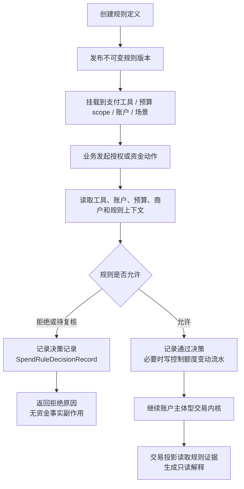

# Spend Rule 支出规则产品设计

## 文档状态与版本信息

- 当前版本：v1.0
- 文档状态：Review
- owner：wallet 支出控制产品 owner、资金产品 owner、架构 owner、测试 owner
- 发布日期：2026-06-23
- 评审结论摘要：本文作为 Spend Rule 支出规则的产品 PRD 主文档，保留当前有效产品结论、规则边界、验收和待确认项；过程性工程规划、历史争议和被拒方案不再作为当前交付材料保留。
- 目标读者：产品、业务、运营、风控、客服、财务、审计、测试、架构师和研发。
- 需要决策：确认 Spend Rule 的产品边界、产品能力、验收口径和是否允许进入后续单一编码 工程边界。
- 当前可信度：产品语义、模块归属、控制事实和资金红线已确认；完整规则引擎、运营后台、生产迁移、外部规则适用性仍为待确认。

## PRD 模板追踪索引

| PRD 模板项 | 本文落点 | 当前裁剪说明 |
| --- | --- | --- |
| 需求概览、目标读者、评审决策 | 文档状态与版本信息、1 文档定位、2 产品结论 | 保留评审决策和可信度，不保留完整修订流水。 |
| 背景、问题与证据 | 3.1 背景和问题证据 | 以资金底座历史设计和服务层现状为证据来源，不展开市场调研。 |
| 目标、范围与非目标 | 3.2、3.3、12 生产启用门禁 | 明确本期服务层和文档边界，不承诺完整规则引擎或运营后台。 |
| 用户、主体与场景 | 4 角色与使用场景 | 覆盖企业管理员、风控、客服、财务、审计、研发和测试。 |
| 需求链、能力与规则 | 3.4、6 能力地图、8 规则矩阵 | P0/P1 需求均回链到规则、验收和 forbidden facts。 |
| 核心概念、对象、流程、状态 | 5 核心对象、7 业务流程 | 使用产品术语 `SpendRuleDecisionRecord` / `SpendControlMovement`，最终交付名已同步到代码、表和字段。 |
| 数据、权限、风险和运营可用性 | 10 数据、审计与展示、13 交接、14 待确认项 | 运营后台不在本文实现，但展示、审计、脱敏和确认方已给出。 |
| 金融资金专项 | 10.1 支付资金四流和专业确认 | 只定义产品资金红线，不替代法务、合规、税务或会计确认。 |
| 验收与产品到架构交接 | 11 产品验收矩阵、13 产品到架构和 TDD 交接 | 验收种子、测试入口和后续工程边界可追踪。 |

## 1. 文档定位

本文是 Spend Rule 的独立产品设计分册，用于统一支出规则的产品语义、业务对象、能力边界、主流程、验收口径和生产启用门禁。交易、路由、钱包、账目与投影主链路继续在 [02-交易路由钱包账目与投影.md](02-交易路由钱包账目与投影.md) 中承接；本文只定义 Spend Rule 自身作为规则配置、准入决策、控制证据和只读解释来源的稳定产品口径。

一句话结论：Spend Rule 是授权前或资金动作前的支出控制规则，不是资金账户、信用账户、预算组、支付工具、资金来源、账本主体或交易事实源。

## 2. 产品结论

| 主题 | 当前产品口径 | 禁止误用 |
| --- | --- | --- |
| Spend Rule 定性 | 针对支付工具、预算 scope、账户、账户层级、使用主体或业务场景的支出规则配置和准入决策能力。 | 把 Spend Rule 当成资金池、信用额度、预算账户、支付工具或账本主体。 |
| Spend Controls 定性 | Spend Rule 在 VCC、企业卡、员工卡、钱包付款等实时授权场景中的能力包。 | 另造一套与 Spend Rule 平行的规则体系。 |
| 预算组关系 | 预算组回答“这组预算归谁管、覆盖哪些人、卡、项目或成本中心”。 | 预算组成为 LedgerEntry 主体、资金账户、信用账户或现金池。 |
| 预算型 Spend Rule | 回答“这笔支出在当前预算、限额、商户、MCC、国家、时间窗口和频控规则下能不能继续”。 | 直接扣款、直接生成 route、直接改变资金账户或信用账户余额。 |
| 决策结果 | 输出通过、拒绝、待复核、命中规则、规则版本、拒绝原因、请求摘要和审计证据。 | 规则通过等同于资金可用，或规则拒绝生成资金交易、route、posting、LedgerEntry。 |
| 历史解释 | 只读取当时固化的规则版本、挂载关系、决策记录和控制额度变动流水。 | 按当前规则定义、当前挂载关系或当前工具绑定重算历史。 |

### 2.1 业务目标、用户价值和成功指标

业务目标：让 VCC、企业卡、员工卡、预算组、项目费用和钱包付款等场景使用同一套支出规则语言，避免每个业务入口各自实现限额、商户、MCC、国家、时间窗口、频控和预算控制。

用户价值：企业管理员能统一配置和审计支出规则；风控运营能解释拒绝原因；客服能回答“为什么不能支付”；财务能统计预算控制口径；研发能在交易内核前消费规则证据并证明失败无资金副作用。

成功指标：

| 指标ID | 指标口径 | 目标 | 观察窗口 | owner |
| --- | --- | --- | --- | --- |
| SR-KPI-001 | 规则定义、不可变版本、挂载、决策记录、控制额度变动流水和预算控制视图的引用链完整率。 | 服务层目标测试覆盖 100% 主链路引用。 | 每个 Spend Rule 工程边界收口。 | wallet owner、测试 owner。 |
| SR-KPI-002 | 规则拒绝路径资金副作用数量。 | 0 个资金交易、route、posting、LedgerEntry 或账本余额投影副作用。 | 每次准入、授权或付款相关回归。 | 交易 owner、账本 owner。 |
| SR-KPI-003 | 历史交易解释回放来源。 | 100% 使用历史规则版本、挂载和决策流水，不按当前规则重算。 | 投影解释测试和上线抽检。 | transaction owner、审计 owner。 |
| SR-KPI-004 | 新支付工具或预算 scope 接入是否新增平行交易内核或平行账本主体。 | 0 个。 | 需求评审和架构 CR。 | 产品 owner、架构 owner。 |

### 2.2 产品归属与模块边界

Spend Rule 的产品归属是钱包支出控制域。它围绕支付工具、预算 scope、账户能力、资金责任和业务场景做授权前或资金动作前的准入判断，因此主能力归属于 `wallet`，不是 `transaction` 的交易内核能力。

| 能力 | 产品归属 | 说明 |
| --- | --- | --- |
| 规则定义、版本发布和规则挂载 | wallet | 管理支出控制规则事实，回答规则是什么、哪个版本、作用到哪个控制 scope。 |
| 规则准入和决策记录 | wallet | 在交易内核前判断是否允许继续，并固化决策流水、结果、摘要和拒绝原因。 |
| 控制额度变动流水和预算控制视图 | wallet | 记录额度调整、预留、消耗、释放、退款补偿等控制事实，派生预算控制只读视图。 |
| 账户主体交易、授权、退款和余额控制 | transaction | 只接受账户主体 canonical 入参，执行资金交易和交易事实生命周期。 |
| 历史交易投影解释 | transaction | 只读取当时已固化的 Spend Rule 决策快照和控制引用，生成只读解释。 |
| 账本、账目和余额投影 | ledger | 只从资金账户、信用账户或平台资金账户等可入账主体生成账务事实。 |

边界结论：

1. `wallet` 可以调用 `transaction` 账户主体型交易服务完成业务编排。
2. `transaction` 不直接依赖 `wallet` 的 Spend Rule application service、规则定义表、控制额度变动流水表或预算控制投影模型。
3. `transaction` 只消费 `spendRuleDecision` 这类已固化快照、route snapshot 或控制额度变动引用，不重新计算规则。
4. `ledger` 不识别 Spend Rule 为账本主体，也不从 Spend Rule 或预算控制视图派生账本余额。

## 3. 背景、问题、目标与非目标

### 3.1 背景和问题证据

问题卡 P-SR-001：

- 原始反馈 / 证据：VCC 共享卡、企业预算、支付工具授权准入、预算控制投影和交易投影解释已经存在多个服务层切片和设计入口，但 Spend Rule 曾分散在钱包、交易、预算控制和 TDD 任务中。
- 真实问题：如果不把 Spend Rule 统一为产品能力，业务方会把规则、预算组、支付工具或控制额度变动误当成资金账户、账本主体或交易事实源。
- 影响对象：企业管理员、风控运营、客服、财务、审计、钱包研发、交易研发、账本研发和测试。
- 证据强度：高，依据是当前 PRD、DSL、系分、TDD 和服务层测试已经多次验证“规则拒绝无资金事实副作用”“预算控制不入账”“交易投影只读解释”。
- 处理结论：进入正式 PRD 主文档，并作为后续 Spend Rule 编码 工程边界的产品输入。

### 3.2 目标

目标：

1. 为 VCC 授权、共享卡支出、企业预算、员工卡、项目费用、商户/MCC/国家限制、单笔限额、周期限额和频控提供统一的规则产品语义。
2. 让运营、风控、客服、财务和审计能追踪规则定义、不可变版本、挂载关系、决策结果、拒绝原因和请求摘要。
3. 让钱包 application facade 在交易内核前消费规则决策证据，失败停在 route、posting 和账本之前。
4. 让交易投影、预算控制视图和运营时间线能解释规则命中，而不把规则对象变成资金事实源。

### 3.3 非目标

非目标：

1. 不实现完整规则引擎、表达式语言、运营后台、审批流、风控模型或合规规则。
2. 不改变直接交易、授权交易、余额控制的账户主体 canonical 入参。
3. 不让 Spend Rule、预算组、支付工具、卡号、PAN、token、外部账户或业务订单成为可入账主体。
4. 不用 Spend Rule 取代资金账户、信用账户、账本、账目、清结算、对账或真实资金轨道。
5. 不在本文中定义生产 DDL、HTTP/RPC、Controller、事件消费、outbox 或上线迁移方案。

### 3.4 需求链卡片

| 需求ID | 来源 / 问题ID | 角色和场景 | 能力 / 功能 | 优先级 | 规则编号 / 验收种子 | 当前状态 |
| --- | --- | --- | --- | --- | --- | --- |
| REQ-SR-001 | P-SR-001 | 企业管理员配置卡、员工、项目或预算 scope 的支出限制。 | 规则定义、不可变版本发布和规则挂载。 | P0 | R-SR-001、AC-SR-001、AC-SR-002 | 已确认 |
| REQ-SR-002 | P-SR-001 | 支付工具授权或资金动作前判断是否允许继续。 | 决策记录、拒绝原因、请求摘要和审计证据。 | P0 | R-SR-002、AC-SR-003、AC-SR-004 | 已确认 |
| REQ-SR-003 | P-SR-001 | 企业预算或周期限额需要占用、消耗、释放和退款补偿。 | 控制额度变动流水和预算控制只读投影。 | P0 | R-SR-003、AC-SR-006 | 已确认 |
| REQ-SR-004 | P-SR-001 | 客服、运营和审计解释历史交易为什么通过、拒绝或占用额度。 | 交易投影只读解释规则版本、挂载、决策和控制引用。 | P1 | R-SR-004、AC-SR-005 | 已确认 |
| REQ-SR-005 | P-SR-001 | 风控、法务或合规需要确认外部规则适用性。 | 外部规则确认方、未确认前默认拒绝或复核。 | P1 | R-SR-005、Q-SR-004 | 待确认 |

## 4. 角色与使用场景

| 角色 | 关注问题 | 使用 Spend Rule 的方式 |
| --- | --- | --- |
| 企业管理员 | 员工、部门、项目、卡组或成本中心能花多少钱、在哪里花、什么时候花。 | 配置预算 scope、规则版本、挂载范围、单笔限额、周期限额、商户/MCC/国家限制。 |
| 风控运营 | 哪些请求应拒绝、复核、暂停或只记录风险。 | 使用规则决策记录解释拒绝原因，结合风控结论形成授权前准入证据。 |
| 客服 | 用户或商户询问交易为什么被拒。 | 查询交易投影中的规则版本、命中规则、拒绝原因和决策流水。 |
| 财务和审计 | 规则变更是否影响历史交易，预算占用和释放是否可追溯。 | 审计规则定义、版本发布、挂载变更、决策记录和控制额度变动流水。 |
| 研发和测试 | 规则如何接入钱包、交易和投影，失败是否无资金副作用。 | 在 application facade 前置消费决策证据，按 TDD 验证拒绝无 route、posting、LedgerEntry。 |

核心场景：

| 场景 | 产品说明 | 必须保留的证据 | 不做范围 |
| --- | --- | --- | --- |
| VCC 共享卡授权 | 卡、使用人、信用子账户、父账户、预算组和规则共同决定是否允许授权。 | 支付工具快照、绑定版本、预算 scope、规则版本、决策流水、资金责任决策。 | 不新增共享卡账本，不让规则直接占用额度。 |
| 企业预算支出 | 部门、项目或成本中心在周期窗口内限制累计支出。 | 预算组、规则窗口、控制额度变动流水、预算控制视图、交易引用。 | 预算组不入账，预算可用不等于账本 AVAILABLE。 |
| MCC/商户/国家限制 | 按请求属性判断是否允许支出。 | 条件规则、命中版本、拒绝原因、请求摘要。 | 不替代反洗钱、名单筛查、欺诈模型或人工复核。 |
| 单笔限额和周期限额 | 按金额、币种、次数和窗口做准入。 | 限额规则、窗口类型、累计依据、控制额度变动流水和投影视图。 | 窗口不是清算账期、报表周期或归档水位。 |
| 授权拒绝解释 | 交易内核前拒绝并保留原因。 | 决策记录、拒绝原因、规则版本、请求摘要。 | 不生成 route、posting、LedgerEntry、资金交易扣款或 chargeback 事实。 |

## 5. 核心对象

Spend Rule 的产品闭环由四类对象构成，控制额度变动流水和预算控制视图是执行结果和只读视图，不替代规则对象。

| 对象 | 产品含义 | 最小字段 | 生命周期 |
| --- | --- | --- | --- |
| SpendRuleDefinition | 规则定义，描述规则是什么、归谁管理、用于哪个规则域。 | ruleId、ruleCode、ruleName、ruleType、ruleDomain、ownerType、ownerId、status。 | DRAFT、ACTIVE、SUSPENDED、ARCHIVED。 |
| SpendRuleVersion | 不可变规则版本，描述规则规格 JSON、裁决动作和摘要。 | ruleId、ruleVersion、ruleSpec、ruleDigest；ruleSpec 可承载 display、matchSpec、counterSpec、limitSpec、decisionSpec、safetySpec。 | DRAFT、PUBLISHED、EXPIRED、RETIRED。 |
| SpendRuleAssignment | 规则挂载，描述某一版本应用到哪个 scope、优先级、冲突策略和生效窗口。 | assignmentSn、ruleId、ruleVersion、scopeType、scopeId、priority、conflictPolicy、effectiveFrom、effectiveTo、status。 | ACTIVE、SUSPENDED、EXPIRED、REMOVED。 |
| SpendRuleDecisionRecord | 规则决策记录，描述一次请求的规则版本、挂载、范围、结果和原因。 | decisionSn、assignmentSn、ruleId、ruleVersion、scopeType、scopeId、instrumentSn、action、amount、currency、businessScene、businessSn、decisionResult、rejectReason、decisionDigest。 | RECORDED；记录不可改写，只能追加更正或新决策。 |
| SpendControlMovement | 规则执行后的控制额度变动流水，例如额度调整、预留、消耗、释放或退款补偿。 | movementSn、movementType、targetSubjectRef、amount、currency、spendRuleId、spendRuleVersion、spendDecisionSn、budgetGroupSn、movementDigest。 | 作为既有控制事实能力保留，不作为规则定义表。 |
| BudgetControlProjection | 从控制额度变动流水派生的只读预算控制视图。 | reservedAmount、consumedAmount、releasedAmount、remainingControlAmount、availableControlAmount、lastMovementSn。 | 可重建、可重放、不可反写账本余额。 |

命名和兼容口径：

1. 产品语义优先使用 `SpendRuleDecisionRecord` 和 `SpendControlMovement`。
2. 当前代码、表结构和字段已使用 `SpendRuleDecisionRecord`、`RecordSpendRuleDecisionRecordRequest`、`SpendControlMovement`、`RecordSpendControlMovementRequest`、`movementSn`、`movementType`、`movementDigest` 等最终命名。
3. `ADMISSION_RECORDED`、`REJECTED_RECORDED` 是历史兼容控制额度变动类型，本质上更接近决策记录，不参与预算控制投影；新写入必须走 `SpendRuleDecisionRecord` / `recordDecision`，不得继续通过控制额度变动流水入口记录准入或拒绝决策。
4. `LIMIT_INCREASED`、`LIMIT_DECREASED`、`RESERVED`、`CONSUMED`、`REFUND_COMPENSATED`、`RELEASED`、`EXPIRED`、`REVERSED` 才属于控制额度变动流水。
5. `remainingControlAmount` 在当前 DTO 中表达“未终局释放的控制占用”，后续如改名为 `occupiedControlAmount` 需单独评估兼容。
6. `availableControlAmount = limitAmount - consumedAmount - remainingControlAmount`；其中 `consumedAmount` 为已消费减退款补偿后的净消耗。
7. `SpendControlMovementType` 统一承载“是否参与预算控制投影、是否为调额类、是否为释放类、是否为决策记录兼容类型”的分类口径；服务实现不得再各自硬编码一套类型解释。

命名口径：

1. ruleId 表示系统内稳定标识，用于幂等、引用和回放。
2. ruleCode 表示业务可读编码，面向运营配置和人工沟通。
3. `assignmentSn`、`decisionSn`、`movementSn` 是当前服务层稳定流水号，用于幂等、回放和审计；产品沟通中的 assignmentId / movementSn 只作语义别名，不代表当前代码字段。
4. 资金账户、信用账户、预算组和支付工具的既有 sn 不在本文中统一改名为 code；若后续需要命名迁移，必须单独评估兼容和数据库迁移。

当前代码对齐状态：

| 产品语义 | 当前代码载体 | 已具备的服务层证据 | 不代表 |
| --- | --- | --- | --- |
| 规则定义、版本和挂载 | `SpendRuleDefinitionService`、`SpendRuleVersionService`、`SpendRuleAssignmentService`。 | 支持创建规则、发布不可变 `ruleSpec / ruleDigest` 版本、挂载 scope、查询和解释挂载；已证明版本摘要冲突、挂载幂等、挂载只读解释和失败无资金副作用。 | 不代表完整规则表达式引擎、运营后台、生产迁移已完成；不再保留规则大 application facade 或旧式领域命名服务作为目标入口。 |
| 决策记录 | `SpendRuleDecisionRecord`、`RecordSpendRuleDecisionRecordRequest`、`SpendRuleDecisionRecordQuery`、`SpendRuleDecisionExplainQuery`、`SpendRuleDecisionRecordService`。 | 支持按单条 rule / assignment / scope 固化决策结果、拒绝原因和 `decisionDigest`，支持按决策流水、业务流水、规则、挂载、scope、支付工具和决策结果做服务层只读查询，并可输出拒绝原因和证据引用；已证明拒绝、查询和解释无资金事实副作用。 | 不代表 `evaluatedRules`、`decisionPolicy`、完整多规则裁决明细、批量运营时间线或规则引擎已落库。 |
| 控制额度变动流水 | `SpendControlMovement`、`RecordSpendControlMovementRequest`、`SpendControlMovementType`。 | 支持调额、预留、消耗、释放、退款补偿和预算控制投影，且历史准入类 activity 不再允许新写入。 | 不代表控制事实是资金交易、账本交易或账本余额。 |
| 预算控制投影 | `BudgetControlProjectionDTO`。 | 支持按控制流水重建 `limitAmount`、`consumedAmount`、`remainingControlAmount` 和 `availableControlAmount`。 | 不代表预算组、Spend Rule 或控制视图可以作为账务主体。 |

产品到工程分层口径：

1. 产品文档只定义 Spend Rule 的业务对象、能力、流程、验收和风险，不强制工程服务必须全部命名为 application service。
2. 规则定义、版本、挂载、决策记录、控制额度变动流水和预算控制投影是产品能力对象；工程上按标准基础服务和场景 application service 承接。
3. 当前规则定义、版本、挂载、挂载查询 / 解释以及决策记录写入 / 查询 / 解释已收敛到标准基础服务；后续新增能力优先落到对应基础服务，不再新增规则大 application facade 或旧式领域命名服务。
4. 支出控制准入由钱包侧提供支付工具、资金责任、账户能力和 Spend Rule 证据；交易结果消费和支付工具交易生命周期入口由交易层实现组合并写入资金交易事实。

## 6. 能力地图

| 能力 | 输入 | 输出 | 验收口径 |
| --- | --- | --- | --- |
| 规则定义管理 | 规则名称、类型、规则域、归属方和状态。 | 可被版本化和挂载的规则定义。 | 同一租户内 ruleId 唯一；停用规则不能新挂载。 |
| 规则版本发布 | 规则规格 JSON、版本摘要、操作者和审计引用。 | 不可变规则版本。 | 发布后不得覆盖正文；新版本不影响历史解释。 |
| 规则挂载 | scope、ruleId、version、priority、conflictPolicy、有效期。 | 可评估的挂载关系。 | 多规则冲突必须可解释；缺优先级或冲突策略不得生产启用。 |
| 挂载查询与解释 | tenant、assignmentSn、scope、ruleId、version、评估时间。 | 当前有效挂载列表、挂载可用性状态和证据引用。 | 只读查询；不重新执行规则，不写决策记录，不生成资金交易或账本事实。 |
| 决策记录 | 支付工具快照、账户主体、预算 scope、金额币种、商户、MCC、国家、时间和业务场景。 | 决策流水、结果、拒绝原因、摘要。 | 拒绝停在交易内核前；通过只代表允许继续准入。 |
| 决策记录查询与解释 | tenant、decisionSn、businessScene、businessSn、ruleId、version、assignmentSn、scope、instrumentSn、decisionResult。 | 决策记录列表、是否准入、拒绝原因和 evidenceRefs。 | 查询必须携带 tenantId 外的窄条件；解释只读读取历史决策，不重算规则、不调整额度、不写资金事实。 |
| 控制额度变动流水记录 | 决策结果、预算 scope、目标账户主体、金额币种、交易结果。 | 预留、消耗、释放、过期、退款补偿或调整流水。 | 不生成资金交易、账本交易、账本分录或余额投影。 |
| 规则时间线查询 | ruleId、ruleVersion、assignmentSn、decisionSn、业务流水、时间范围。 | 规则变更、挂载变更、决策记录和控制额度变动流水时间线。 | 查询只读，不修复状态，不重新评估历史。 |
| 交易投影解释 | 资金交易、route snapshot、支付工具快照、规则决策记录和控制额度变动流水。 | 用户、商户、运营、风控和客服可理解的规则命中解释。 | 投影不反写 route、posting、LedgerEntry 或 balance。 |

## 7. 业务流程、主流程和状态机

流程规则：

1. 规则定义先于规则版本，规则版本先于规则挂载，规则挂载先于准入决策。
2. 规则评估失败、证据不完整、版本过期、挂载停用或冲突策略不明时，默认不放行。
3. 决策通过后仍要继续做支付工具能力、账户能力、资金责任、余额或额度校验；规则通过不代表最终授权成功。
4. 决策拒绝时，不生成资金交易、route、posting plan、LedgerEntry、ledger transaction、账本余额投影或清结算对象。
5. 后续退款、撤销、过期、争议、对账或投影解释，必须按原决策证据和原 route snapshot 回放。

异常流程和人工兜底：

1. 规则版本摘要冲突、挂载 scope 不合法、冲突策略缺失或决策摘要冲突时 fail-fast，并记录可审计拒绝原因。
2. 外部风控、卡组织、银行、合规或财务确认缺失时，决策结果只能进入 REVIEW 或拒绝，不自动生成资金事实。
3. 人工复核通过后应产生新的决策证据或审批引用，不能直接修改历史决策记录。

## 8. 规则矩阵

| 规则编号 | 规则类型 | 适用对象 | 判断逻辑 | 结果 | 验收重点 |
| --- | --- | --- | --- | --- | --- |
| R-SR-001 | SINGLE_TRANSACTION_LIMIT | 支付工具、账户、预算 scope、业务场景。 | 单笔金额和币种是否超过规则版本额度。 | ALLOW、DECLINE、REVIEW。 | 超额拒绝无资金副作用。 |
| R-SR-002 | PERIOD_AMOUNT_LIMIT | 预算 scope、账户、账户层级、使用主体。 | 指定窗口内累计金额是否超过额度。 | ALLOW、DECLINE、REVIEW。 | 窗口、币种、预算 scope 和累计依据可解释。 |
| R-SR-003 | PERIOD_COUNT_LIMIT | 支付工具、使用主体或业务场景。 | 指定窗口内交易次数是否超过限制。 | ALLOW、DECLINE、REVIEW。 | 计数窗口不等同于账本周期或清算账期。 |
| R-SR-004 | MERCHANT_CATEGORY_CONTROL | MCC 或商户类别。 | 请求 MCC 是否在允许或拒绝集合内。 | ALLOW、DECLINE。 | 拒绝原因可展示，敏感商户原文不泄露。 |
| R-SR-005 | MERCHANT_CONTROL | 商户、收款方或对手方。 | 商户标识或摘要是否命中规则。 | ALLOW、DECLINE、REVIEW。 | 外部商户字段脱敏保存。 |
| R-SR-006 | COUNTRY_REGION_CONTROL | 国家、地区、入卡地区或收款地区。 | 请求地区是否满足允许或拒绝规则。 | ALLOW、DECLINE、REVIEW。 | 地区规则不替代合规最终结论。 |
| R-SR-007 | TIME_WINDOW_CONTROL | 使用时间、营业时间、节假日或自定义时间段。 | 请求时间是否落在允许窗口。 | ALLOW、DECLINE。 | 时区、日切和窗口版本明确。 |
| R-SR-008 | RISK_SIGNAL_GATE | 外部风控、协同授权或人工复核结论。 | 是否收到可信决策和摘要。 | ALLOW、DECLINE、REVIEW。 | 风控模型不沉入 Spend Rule；只消费结论和证据。 |

### 8.1 DSL v1.1 产品口径和可解释性

Spend Rule DSL v1.1 先锁定规则版本、规则挂载和决策证据三类契约，不在当前范围扩展完整规则引擎。产品侧使用下列字段分组解释规则能力：

| 字段分组 | 产品含义 | 典型问题 |
| --- | --- | --- |
| display | 规则名称、展示说明、用户或运营可读的原因文案。 | 这条规则叫什么，拒绝时怎么解释。 |
| matchSpec | 请求事实匹配条件，包括支付工具、预算 scope、账户层级、业务场景、金额币种、商户、MCC、国家地区和时间窗口。 | 这笔请求是否落在规则管辖范围内。 |
| counterSpec | 周期窗口、计数口径、累计依据、退款净额策略和时区。 | 日限额、月限额、次数限制到底怎么算。 |
| limitSpec | 单笔金额上限、周期金额上限、次数上限、允许集合或拒绝集合。 | 超过多少、命中哪些对象时拒绝。 |
| decisionSpec | 条件通过、违反、证据缺失时的裁决。 | 通过、拒绝还是待复核，缺证据是否默认放行。 |
| safetySpec | 未知字段、敏感字段、摘要和历史回放策略。 | 是否保存敏感原文，未来能否按历史证据解释。 |

目标态的决策证据必须能解释多规则裁决：一次请求可以评估多条规则，决策记录需要保留 `evaluatedRules`、`decisionPolicy` 和 `finalDecision`。例如单笔限额通过但 MCC 规则拒绝时，最终裁决应说明采用 `DENY_OVERRIDES` 或等价冲突策略，而不是只保存最后一条命中规则。当前服务层最小交付先固化单条 rule / assignment / scope 的决策结果和摘要；完整多规则明细落库、冲突合成器和规则执行器必须另起工程边界。

产品验收口径：

1. 规则版本必须有可读名称、版本摘要和不可变正文。
2. 规则挂载必须说明 scope、优先级和冲突策略；缺策略不得生产启用。
3. 决策证据必须能回答“评估了哪些规则、哪些通过、哪些拒绝、最终为什么拒绝或通过”。
4. 用户和客服可见文案不得泄露完整卡号、token、外部账户号、商户敏感原文或风控模型细节。
5. 历史解释只能读取当时固化的规则版本、挂载和决策证据，不按当前规则重算。

### 8.2 交易投影解释口径

交易投影解释只回答“这笔历史交易当时基于哪些 Spend Rule 证据被放行、拒绝或占用额度”，不承担规则计算职责。

最低解释信息包括：

1. 规则标识、规则版本、挂载流水和控制 scope。
2. 决策流水、决策记录引用、决策结果和决策摘要。
3. 预算组或预算控制范围引用。
4. 支付工具快照、绑定快照、资金交易流水、route snapshot 和账本交易引用。

禁止口径：

1. 不按当前规则定义、当前规则挂载、当前支付工具绑定或当前预算关系重算历史交易。
2. 不在投影解释阶段执行规则表达式、风控脚本或外部模型。
3. 不输出规则 DSL 原文、脚本正文、完整卡号、CVC、明文 token、完整外部账户号或超范围商户敏感原文。
4. 不用投影解释结果反写资金交易、route、posting、LedgerEntry、账本余额或预算控制事实。

## 9. 与其他对象的关系

| 对象 | 与 Spend Rule 的关系 | 边界 |
| --- | --- | --- |
| 资金账户 | 规则通过后可能成为最终入账或扣款主体。 | 资金账户余额由账本分录和余额投影证明，不由规则直接修改。 |
| 信用账户 | 规则通过后可能形成授权占用或额度责任。 | 信用账户 LIMIT、AVAILABLE、AUTHORIZATION 仍由账户和交易链路控制。 |
| 支付工具 | 规则可挂载到工具或读取工具快照。 | 工具不是资金主体；工具换绑不影响历史规则解释。 |
| 预算组 | 作为预算 scope、owner、展示维度和控制归属。 | 不初始化账本，不拥有账本余额，不生成 LedgerEntry。 |
| 资金责任解析 | 可读取规则上下文帮助选择最终责任主体。 | Spend Rule 不能作为资金责任目标主体。 |
| 交易投影 | 可按规则维度生成拒绝、命中、占用、消耗、释放解释。 | 投影只读，不反写资金事实。 |
| 清结算与对账 | 可校验规则证据和资金事实引用是否一致。 | 不把规则决策当作清算、结算或出款事实。 |

## 10. 数据、审计与展示

展示口径：

1. 用户侧可展示“因预算/规则限制暂不可用”“超过单笔限额”“商户类别不允许”等可理解原因。
2. 运营侧可展示规则定义、版本、挂载、命中规则、决策流水、拒绝原因、请求摘要和控制额度变动流水。
3. 财务侧可展示预算控制视图、控制额度变动流水和交易事实之间的引用关系，但不得展示为账本余额。
4. 审计侧可追踪规则变更、版本发布、挂载变更、决策记录、操作者、时间和摘要。

安全和合规口径：

1. 不保存完整 PAN、CVC、明文 token、完整外部账户号或超范围商户敏感原文。
2. 规则条件、请求摘要和决策摘要应脱敏保存。
3. 规则发布、挂载变更和决策查询需要权限、操作人和审计。
4. 涉及卡组织、ACH、本地清算网络、银行、跨境、税务、会计或监管规则时，本文只提供产品设计边界，不替代专业确认。

### 10.1 支付资金四流和专业确认

| 流 | Spend Rule 产品口径 | 资金底座对象 | 对账 / 审计方式 |
| --- | --- | --- | --- |
| 业务流 | 企业管理员、风控或业务系统定义支出控制规则，业务请求触发授权前或资金动作前准入。 | 规则定义、规则版本、规则挂载、业务流水、预算 scope。 | 规则版本、挂载流水、操作者、业务流水和审批 / 审计引用。 |
| 支付信息流 | 支付工具、商户、MCC、国家地区、金额、币种和风控结论作为请求事实进入规则判断。 | 支付工具快照、请求摘要、决策记录。 | 决策流水、决策摘要、拒绝原因和脱敏请求事实。 |
| 账户 / 账务流 | 规则通过后才允许继续账户主体型交易；规则拒绝不生成资金事实。 | 资金账户、信用账户、route snapshot、ledger entry、余额投影。 | 交易事实、账本交易、账目分录和余额投影证明资金影响。 |
| 真实资金流 | Spend Rule 不直接触达银行、卡组织、ACH、跨境或清算网络资金划拨。 | 外部资金事实、清结算、对账、出款或差错对象。 | 外部流水、清算 / 结算批次、对账差异和专业确认。 |

专业确认红线：

1. Spend Rule 只定义支出控制产品能力，不对卡组织、ACH、本地清算、跨境、税务、会计或监管规则给出最终合规结论。
2. 外部规则必须保留规则来源、版本或发布日期、生效日期、适用主体、适用法域、核验日期、确认方和确认状态。
3. 未完成专业确认前，对应生产规则只能走 REVIEW、拒绝、灰度验证或人工兜底，不能作为自动放行规则上线。

## 11. 产品验收矩阵

| AC ID | 场景 | Then | Forbidden Facts |
| --- | --- | --- | --- |
| AC-SR-001 | 创建规则定义并发布版本。 | 规则定义可引用，不可变版本和摘要可追溯。 | 已发布版本被原地覆盖。 |
| AC-SR-002 | 规则版本挂载到支付工具、预算 scope、账户或业务场景。 | 挂载 scope、优先级、冲突策略和生效窗口明确。 | 挂载关系输出资金责任主体。 |
| AC-SR-003 | 授权前规则拒绝。 | 返回拒绝原因、规则版本、决策流水和审计摘要。 | 生成 route、posting、LedgerEntry、资金交易扣款或余额投影。 |
| AC-SR-004 | 规则通过后继续交易准入。 | 交易链路继续校验支付工具、账户能力、资金责任和余额/额度。 | 把规则通过当作资金可用或授权成功。 |
| AC-SR-005 | 历史交易投影解释规则命中。 | 只读取当时版本、挂载和决策流水。 | 按当前规则或当前工具绑定重算历史。 |
| AC-SR-006 | 预算控制视图查询。 | 展示 reserved、consumed、released、remaining 等控制口径。 | 展示为账本 AVAILABLE、FROZEN、AUTHORIZATION 或 SETTLEMENT。 |

验收标准：

1. 正向测试场景必须覆盖规则定义、不可变版本发布、规则挂载、决策记录、控制额度变动流水和预算控制视图查询。
2. 边界路径必须覆盖同版本不同摘要、缺冲突策略、挂载未生效或已过期、支付工具 scope 与工具号不一致、同流水不同摘要和额度调减低于已占用金额。
3. 异常路径必须证明规则拒绝、证据缺失、摘要冲突和历史决策兼容类型误入控制额度变动入口时，不生成资金交易、route、posting、LedgerEntry、账本交易或余额投影。
4. 投影解释验收必须证明只能读取历史规则版本、挂载流水、决策流水、控制额度变动流水和 route snapshot，不按当前规则、当前挂载或当前工具绑定重算历史。

## 12. 生产启用门禁

Spend Rule 从设计可用进入生产启用前，至少需要满足：

1. 规则定义、不可变版本、规则挂载和决策记录具备持久化、幂等和审计。
2. 已发布版本不可原地覆盖，规则挂载有优先级、冲突策略、生效窗口和停用口径。
3. 授权或付款准入组合能证明规则拒绝无交易事实、route、posting、LedgerEntry 和余额副作用。
4. 控制额度变动流水和预算控制投影只作为控制事实和只读视图，不能反写账本余额。
5. 交易投影解释能按历史版本、历史挂载和历史决策流水展示规则命中。
6. 权限、审计、脱敏、告警、回滚、Runbook 和生产迁移策略经过独立工程边界确认。

当前不声明为生产完成：

1. 完整规则表达式引擎。
2. 运营后台和审批流。
3. 事件消费、outbox 和异步重放。
4. 控制额度变动流水生产迁移和历史数据回填。
5. VCC、ACH、全球账户或收单外部规则的生产适用性。

## 13. 产品到架构和 TDD 交接

业务驱动架构交接包：

| 交接项 | 已确认内容 | 架构 / TDD 承接 |
| --- | --- | --- |
| 产品目标 | 统一支出规则语言，保护规则拒绝无资金事实副作用，支持历史解释。 | 系分需落到 wallet application、transaction 只读消费和 ledger 主体护栏。 |
| 核心对象 | SpendRuleDefinition、SpendRuleVersion、SpendRuleAssignment、SpendRuleDecisionRecord、SpendControlMovement、BudgetControlProjection。 | 以最终交付命名标注，公共类名、表名和字段已完成迁移。 |
| 关键流程 | 创建定义、发布版本、挂载、授权前决策、控制额度变动、交易投影解释。 | TDD 必须覆盖正向、拒绝、幂等、摘要冲突、历史解释和 forbidden facts。 |
| 关键规则 | 规则版本不可变、挂载必须有 scope 和冲突策略、拒绝不入交易、历史解释不重算。 | 系分需给出接口、数据、状态、一致性和测试设计；TDD 需给出目标测试资产。 |
| 风险和待确认 | 完整规则引擎、运营后台、外部规则、生产迁移、权限模型。 | 只能作为未完成交付或后续单一工程变更边界，不得混入当前服务层闭环。 |

首批验收种子到测试资产映射：

| 验收种子 | 推荐测试资产 | 通过标准 |
| --- | --- | --- |
| AC-SR-001 / AC-SR-002 | SpendRuleDefinitionServiceTests、SpendRuleDefinitionServiceFlowTests | 标准基础服务和服务流测试证明规则定义、版本不可变、挂载 scope、冲突策略和有效期可追踪。 |
| AC-SR-003 / AC-SR-004 | SpendControlAdmissionApplicationServiceTests、AuthorizationAdmissionApplicationServiceTests | 拒绝停在交易内核前，通过后仍继续账户能力、资金责任和余额校验。 |
| AC-SR-005 | FundsTransactionProjectionExplainApplicationServiceTests | 投影只读读取历史规则版本、挂载、决策流水和控制引用，不输出敏感原文。 |
| AC-SR-006 | SpendControlMovementServiceFlowTests、BudgetControlLimitAdjustmentApplicationServiceTests、SpendControlTransactionConsumptionApplicationServiceTests | 控制额度变动流水可重建预算控制视图，不反写账本余额。 |

## 14. 待确认项

| 待确认项 | 影响 | 确认方 | 未确认前处理 |
| --- | --- | --- | --- |
| Q-SR-001 规则表达式格式 | 影响规则版本正文、摘要和兼容迁移。 | 产品、风控、架构、研发。 | 最小交付只保存结构化 JSON 或等价摘要，不承诺表达式引擎。 |
| Q-SR-002 冲突策略默认值 | 影响多规则命中裁决。 | 产品、风控、运营。 | 缺策略时 fail-fast，不默认放行。 |
| Q-SR-003 运营权限模型 | 影响规则创建、发布、挂载和查询。 | 产品、运营、安全。 | 先做服务层能力，不开放运营后台。 |
| Q-SR-004 外部规则适用性 | 影响 VCC、ACH、卡组织、跨境等场景上线。 | 法务、合规、通道、财务。 | 文档只作设计参考，不作为上线规则。 |
| Q-SR-005 生产迁移策略 | 影响规则表、历史控制额度变动流水和投影解释。 | 架构、DBA、研发、SRE。 | 独立工程边界明确 DDL、H2、迁移和回滚。 |
