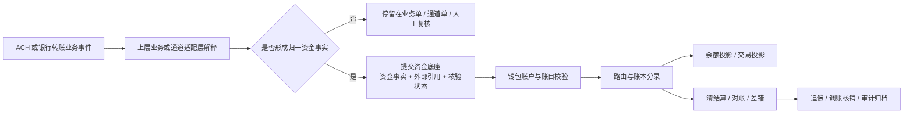

# ACH 与银行转账资金底座支持边界

## 1. 文档定位

本文是支付资金底座产品设计的外部银行转账轨道支持边界，不是 ACH 产品 PRD，也不是 06-08 同级的业务补充分册。

它用于回答一个问题：当上层业务后续使用 ACH 或银行转账时，`wind-funds` 作为资金底座应该支持什么、不能承接什么、怎样避免把 ACH 业务、Nacha/银行规则或通道协议做进统一资金内核。

### 1.1 目标、范围、非目标和成功指标

| 项目 | 内容 |
| --- | --- |
| 设计目标 | 明确 ACH 和银行转账作为外部轨道时，资金底座可复用的钱包、账本、清结算、对账、投影、归档和审计能力。 |
| 解决问题 | 防止后续把 ACH 指令、文件、批次、return code、NOC、Debit 授权、Nacha/ODFI/RDFI 规则或银行账户敏感信息沉入 `wind-funds`。 |
| 覆盖范围 | ACH Credit、ACH Debit、银行转账、出款、入金、return、NOC、reversal、银行流水和对账文件进入资金底座前后的产品边界。 |
| 非目标 | 不设计 ACH 产品体验、ACH 通道网关、Nacha 规则引擎、ODFI/RDFI 协议实现、文件生成提交、银行账户主数据规则或用户授权文本管理。 |
| 不覆盖范围 | ACH 产品体验、ACH 通道网关、ODFI/RDFI 协议、Nacha 规则引擎、文件生成和提交、账户验证规则、授权文本管理、retry 策略和合规最终结论。 |
| 成功指标 | ACH 或银行转账需求进入评审时，能明确归属上层业务或通道适配层，资金底座只承接已解释资金事实、外部引用、核验状态、账务、对账、差错和审计。 |
| 验收对象 | 产品、合规、银行通道、财务、研发和测试在评审 ACH/银行转账相关需求时可判断是否越界。 |

## 2. 顶层结论

ACH 不作为 `wind-funds` 的内建业务，不新增第四类业务能力包，不新增 `ach-*` 资金内核模块，不进入 `core` 成为统一 DSL 枚举全集。

ACH 和银行转账只作为 VCC、全球账户、收单、平台出款、企业付款、钱包充值或费用追偿等上层业务可能使用的外部银行转账轨道。上层业务或通道适配层必须先把 ACH 事件解释成明确的资金事实、外部引用、责任方、处理建议和规则核验状态；资金底座再承接记账、对账、差错、追偿、调账核销、投影和归档。

一句话定性：

```text
ACH 是外部轨道和上层业务能力；wind-funds 只提供资金底座支持。
```

## 3. 能力边界

| 层级 | 负责内容 | 不进入资金底座的内容 | 进入资金底座的内容 |
| --- | --- | --- | --- |
| ACH 业务或银行转账产品 | 用户场景、业务订单、收付款指令、Debit 授权、账户绑定、账户验证、通知、运营入口和业务单状态。 | 用户授权文本、账户验证规则、账户主数据更正、用户通知模板和业务状态机。 | 已解释的业务事实、业务流水、幂等键、外部引用和证据摘要。 |
| 通道或银行适配层 | Nacha/ODFI/RDFI 规则、SEC code、文件批次、entry、trace number、cut-off、return code、NOC、reversal、银行回单和敏感数据隔离。 | ACH 文件生成、批次提交、return code 解释、NOC 规则、reversal 规则、完整银行账户敏感信息。 | 外部状态映射、trace number 摘要、文件摘要、回单引用、核验状态和对账来源。 |
| wind-funds 资金底座 | 资金账户、账本账目、在途、可用、出款中、对账批次、差错单、调账核销、追偿、投影、归档和审计。 | ACH 产品、ACH 协议、Nacha 规则、ODFI/RDFI 责任判断、Debit 授权有效性判断和银行账户主数据规则。 | 归一资金事实、外部引用、对账差错、追偿事实、调账核销事实、审计证据和只读投影。 |

## 4. 可支持场景

| 场景 | 上层业务先决条件 | wind-funds 承接方式 | 不覆盖范围 |
| --- | --- | --- | --- |
| ACH Credit 出款或商户结算 | 业务或通道适配层已确认收款端点、提交结果、回单或对账状态。 | 生成出款单、IN_TRANSIT、成功、失败、退回、追偿或差错处理事实。 | 不生成 ACH 文件，不判断 cut-off，不解释银行返回码。 |
| ACH Debit 代扣或费用追偿 | 上层已取得授权、完成账户验证，并解释扣款结果、return 责任和重试策略。 | 承接扣款成功、失败、追偿、对账差错和调账核销事实。 | 不判断授权是否有效，不维护授权撤销规则，不执行重试规则。 |
| 钱包充值或企业资金归集 | 上层已完成 ACH/银行转账入金匹配和资金可用性判断。 | 生成入金确认、在途、AVAILABLE 转换、失败退回或差错。 | 不把外部 accepted 当到账，不保存完整银行账户信息。 |
| 全球账户本地收付款 | 全球账户业务已解释银行流水、退汇、费用和外部状态。 | 承接入金、出金、退汇、费用、FX 引用、对账和投影。 | 不处理开户、VA 生命周期、SWIFT/本地清算网络协议或跨境材料。 |
| 收单商户结算或追偿 | 收单业务已确认结算单、出款结果、退回或追偿责任。 | 复用清分、内部清算、结算、出款、差错和追偿。 | 不处理商户入网、PSP 协议、通道商户号或收银台体验。 |

## 5. 对象和状态映射

ACH 或银行转账对象进入资金底座前必须被折叠为稳定资金对象。资金底座保存引用和摘要，不保存协议对象全集。

| 外部对象 | 上层解释后进入资金底座的形式 | 边界 |
| --- | --- | --- |
| ACH instruction / payment order | 业务资金事实引用、业务流水、幂等键。 | 不是 `FundsTransaction` 的内部状态机。 |
| ACH file / batch / entry | 文件摘要、批次引用、entry 摘要、trace number 摘要。 | 不保存文件全集，不按 ACH 批次驱动账本周期。 |
| return code | 已解释的 return 处理对象、责任方、资金影响和证据引用。 | 资金底座不解释 return code。 |
| NOC | 后续主数据维护任务引用或运营任务引用。 | NOC 不改原交易资金事实，不在资金底座维护银行账户主数据规则。 |
| reversal | 已解释的冲正、撤销或错误纠正事实引用。 | 不等同普通退款，不直接进入授权 reversal 语义。 |
| bank account | `externalAccountRef`、脱敏展示、token 或摘要。 | 不是 ledger subject，不保存完整敏感号。 |
| settlement date / availability | 上层给出的资金可用性结论、外部规则核验状态和证据引用。 | 资金底座不判断 Nacha 或银行规则。 |

## 6. 资金和账务承接原则

1. 外部 accepted、submitted、message sent 或 processing 只表示外部受理或处理中，不等于到账成功。
2. ACH return 不是普通退款；必须先由上层业务或通道适配层解释，再生成差错、追偿、调账核销或资金处理事实。
3. NOC 不修改原交易资金事实；只能生成后续账户信息维护任务或运营处理引用。
4. reversal 不得被默认等同于退款、授权撤销或普通冲正；必须由上层解释业务原因、原事实引用和资金影响。
5. 完整银行账户敏感信息不得进入资金底座日志、快照、投影、导出或测试夹具。
6. ACH 文件批次、清算窗口、Same Day ACH、IAT、ODFI/RDFI 责任和银行协议规则不进入资金底座核心规则。
7. 每个自动入账、出款、追偿或调账动作必须保留外部规则核验状态、证据引用、幂等键和审计字段。

## 6.1 主流程



主流程只表达资金底座承接顺序，不表达 ACH 网络处理顺序。ACH 文件生成、提交、清算窗口、return code 解释、NOC 主数据维护和 Debit 授权判断必须在上层业务或通道适配层完成。

## 6.2 异常流程

| 异常 | 处理方式 | 资金底座禁止行为 |
| --- | --- | --- |
| 缺少上层解释 | 保持业务单或通道单待处理，进入人工复核或差错。 | 不自动入账，不补造资金事实。 |
| 外部受理但未到账 | 保持 IN_TRANSIT、出款待确认或外部处理中展示。 | 不提前释放 AVAILABLE，不展示到账成功。 |
| return code 未解释 | 阻断自动处理，等待 ACH 业务或通道适配层给出责任方和资金影响。 | 不映射成普通退款。 |
| NOC 未解释 | 生成待处理或忽略资金影响。 | 不修改原交易、不改账本、不维护银行账户主数据规则。 |
| 规则核验缺失 | 阻断、降级为 contract-only 或转人工。 | 不作为生产自动处理依据。 |
| 敏感信息越界 | 拒绝写入或脱敏后仅保存引用摘要。 | 不保存完整银行账户号、密钥或敏感原文。 |

## 7. 对现有产品能力的影响

| 资金底座能力 | 是否需要新增通用能力 | 说明 |
| --- | --- | --- |
| 钱包账户 | 不需要 | ACH 只影响外部账户引用和资金来源解释；内部入账主体仍是资金账户（含平台角色解析后的平台资金账户）或信用账户；支出控制范围和 Spend Rule 只作为控制上下文时出现。 |
| 账本账目 | 不需要 | 复用 AVAILABLE、IN_TRANSIT、CLEARING、SETTLEMENT、PAYOUT_IN_TRANSIT 等账目；是否新增账目必须由具体工程任务证明。 |
| 直接交易 | 可能需要场景事实扩展 | 只承接上层已解释的入金、出金、退回、追偿或调账事实。 |
| 清结算和对账 | 需要对账来源扩展 | 可增加外部文件摘要、银行流水引用、trace number 摘要和差错分类，不新增平行对账模块。 |
| 交易投影 | 需要展示语义保护 | 必须区分提交、受理、在途、成功、失败、退回、可用和已对账。 |
| 归档重放 | 需要证据引用扩展 | 归档引用外部文件摘要、trace number 摘要、核验状态和对账证据，不归档敏感原文。 |

## 8. 验收标准和测试场景

本节用于产品验收和后续测试场景设计，重点覆盖边界路径、异常路径和 must-fail 场景。验收目标不是证明 `wind-funds` 已支持 ACH 业务，而是证明资金底座不会越界承接 ACH 协议、通道规则、银行账户敏感信息或未解释的外部状态。

| 验收 ID | 场景 | 前置条件 | 期望结果 | 必须失败 |
| --- | --- | --- | --- | --- |
| ACH-BOUNDARY-001 | ACH 不作为内建业务 | 需求提出“支持 ACH”。 | 评审结论定位为外部轨道资金底座支持，不新增 06-08 同级业务分册。 | 直接新增 ACH 产品 PRD、ACH 通道模块或 ACH 交易主状态机。 |
| ACH-BOUNDARY-002 | ACH return 资金处理 | 上层已解释 return code、责任方、原事实引用和资金影响。 | 资金底座生成 return 处理对象、差错、追偿或调账核销事实。 | 缺上层解释时自动映射为普通退款。 |
| ACH-BOUNDARY-003 | ACH NOC 处理 | 上层已解释 NOC 对主数据的影响。 | 生成后续维护任务或运营任务引用。 | 修改原交易资金事实或原账本分录。 |
| ACH-BOUNDARY-004 | 外部受理状态 | 外部返回 submitted、accepted 或 processing。 | 展示为在途或待确认，等待成功回单、失败结果或对账确认。 | 展示为到账成功或提前释放可用余额。 |
| ACH-BOUNDARY-005 | 敏感数据最小化 | ACH 业务传入银行账户相关引用。 | 资金底座只保存 token、externalAccountRef、摘要或脱敏展示。 | 完整银行账户号进入日志、快照、投影、导出或测试夹具。 |
| ACH-BOUNDARY-006 | 外部规则未确认 | Nacha、ODFI/RDFI、银行协议或适用法域未确认。 | 阻断、降级为 contract-only 或转人工处理。 | 作为默认生产能力自动放行。 |

## 9. 工程落地约束

ACH 或银行转账相关能力进入编码前，工程任务必须额外说明：

| 字段 | 要求 |
| --- | --- |
| 上层业务归属 | 明确归属 VCC、全球账户、收单、平台出款、钱包充值、企业付款或费用追偿，不允许笼统写“支持 ACH”。 |
| 归一资金事实 | 明确上层已经解释出的入金、出金、在途、退回、追偿、差错或调账事实。 |
| 外部引用字段 | 明确允许进入资金底座的 externalAccountRef、trace number 摘要、文件摘要、回单引用和脱敏字段。 |
| 禁止字段 | 明确完整银行账户敏感信息、ACH 文件全集、return code 解释规则、NOC 规则和 Debit 授权规则不得进入资金底座。 |
| 规则核验状态 | 明确规则来源、版本或发布日期、生效日期、适用主体或适用范围、适用法域、核验日期、确认方和确认状态。 |
| 测试红线 | 至少覆盖 ACH return 非普通退款、NOC 不改原交易、外部受理不等于到账、敏感数据不落库和规则未确认 must-fail。 |

## 10. 待确认项

| 待确认项 | 确认方 | 未确认前默认处理 |
| --- | --- | --- |
| ACH 业务主体角色和责任边界 | 业务 owner、法务、合规、合作银行、ODFI/RDFI 或通道负责人 | 不声明 ACH 业务生产可用。 |
| Debit 授权、撤销和证据留存 | 业务、法务、合规、风控、银行或通道负责人 | 不自动处理 ACH Debit。 |
| return、NOC、reversal 和 retry 规则 | 通道负责人、银行、合规、运营、风控 | 不自动解释为资金事实。 |
| Same Day ACH、IAT、cut-off 和资金可用性 | 合作银行、ODFI/RDFI、合规、财务 | 不作为自动到账、自动可用或自动出款依据。 |
| 银行账户敏感信息处理 | 安全、合规、数据治理、业务 owner | 只保存 token、引用、摘要和脱敏展示。 |
