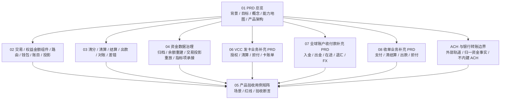

# 支付资金底座产品设计

## 目录定位

本目录是支付资金底座的稳定产品设计入口。完整设计包入口见 [../README.md](../README.md)。本目录只回答产品层面的核心问题：

1. 为什么需要这套资金底座。
2. 面向哪些使用者和运营角色。
3. 有哪些产品能力、业务对象和流程。
4. 每个概念的边界是什么。
5. 哪些规则、红线和验收标准必须成立。
6. 哪些外部规则、合规事项和待确认项需要持续确认。

本目录只保留稳定产品口径，不描述过程管理信息。

## 能力保障顺序

产品设计、系分设计、TDD 和后续编码任务拆解均按下列顺序保护资金底座能力，避免三类业务支持过早反向污染统一资金内核。

| 顺序 | 能力范围 | 设计要求 |
| --- | --- | --- |
| P0 | 钱包、账本、账目、余额投影、对账、清分、清算、结算、大数据归档、账本余额快照。 | 作为统一资金内核和运营账务闭环优先保障；所有业务都必须复用这些能力，不按 VCC、全球账户或收单分别实现一套。 |
| P1 | 直接交易、授权交易、余额控制、交易投影。 | 作为资金动作入口和使用者解释视图承接 P0 能力；不得绕过钱包、账本、账目和对账清算边界。 |
| P2 | VCC 发卡业务支持、全球账户收付款支持、收单业务支持。 | 作为业务补充分册和场景交易 capability pack 接入；只补充业务语义、外部引用、状态映射和验收红线，不改变 P0/P1 的统一实现边界。 |

若某项需求同时影响多层能力，以更靠前的能力层为准。例如收单结算需求优先按钱包、账本、清分、清算、对账和归档评审，再评审 payment attempt、capture、refund 或 dispute 的场景语义。

## 阅读顺序

| 顺序 | 文档 | 读者 | 作用 |
| --- | --- | --- | --- |
| 1 | [01-PRD总览.md](01-PRD总览.md) | 产品、运营、财务、风控、研发、测试 | 说明背景、目标、概念、能力保障优先级、能力地图、总体流程、产品架构、外部参考、风险边界和待确认项。 |
| 2 | [02-交易路由钱包账目与投影.md](02-交易路由钱包账目与投影.md) | 产品、研发、测试、运营 | 说明交易、权益金额组件、路由、钱包、账目、余额投影和交易投影的产品能力与边界。 |
| 3 | [03-清结算与对账.md](03-清结算与对账.md) | 运营、财务、风控、研发、测试 | 说明清分、清算、结算、出款、对账和差错闭环。 |
| 4 | [04-归档重放与指标治理.md](04-归档重放与指标治理.md) | 产品、数据、财务、研发、测试 | 说明资金数据治理下的归档、余额重建、交易投影重放和指标项承接边界。 |
| 5 | [05-产品验收与TDD用例矩阵.md](05-产品验收与TDD用例矩阵.md) | 产品、测试、研发、运营、财务 | 把 PRD 场景转为产品验收矩阵，用于指导 TDD 流程。 |
| 6 | [06-VCC发卡业务资金底座PRD.md](06-VCC发卡业务资金底座PRD.md) | VCC 产品、运营、财务、风控、研发、测试 | 说明 VCC 授权、清算、退款、拒付和卡账单如何作为业务补充接入资金底座。 |
| 7 | [07-全球账户收付款资金底座PRD.md](07-全球账户收付款资金底座PRD.md) | 全球账户产品、运营、财务、合规、研发、测试 | 说明全球账户入金、出金、在途、退汇、费用、FX 引用和多币种对账如何接入资金底座。 |
| 8 | [08-收单业务资金底座PRD.md](08-收单业务资金底座PRD.md) | 收单产品、运营、财务、风控、研发、测试 | 说明收单支付、清分、清算、结算、出款、退款、拒付和商户账单如何接入资金底座。 |
| 边界 | [ACH与银行转账资金底座支持边界.md](ACH与银行转账资金底座支持边界.md) | 产品、合规、银行通道、财务、研发、测试 | 说明 ACH 和银行转账只作为外部轨道或上层业务输入，资金底座只承接归一资金事实、对账差错、追偿、调账核销和审计；验收回挂 `ACH-BOUNDARY-001` 至 `ACH-BOUNDARY-006`、`AC-RAIL-002A` 至 `AC-RAIL-007`。 |

## 按角色阅读路径

| 角色 | 优先阅读 | 评审重点 |
| --- | --- | --- |
| 产品和业务负责人 | 01、02、03、05；涉及 VCC、全球账户或收单时补读 06、07、08；涉及 ACH 或银行转账时补读 ACH 边界文档 | 目标、范围、角色、业务对象、流程、非目标和验收边界。 |
| 研发和架构 | 01、02、03、04，再按业务补读 06、07、08；涉及 ACH 或银行转账时补读 ACH 边界文档，随后进入 DSL 和系分 | 概念边界、事实对象、状态、账务影响、只读投影和跨模块责任。 |
| 测试 | 05，再反查 02、03、04 和对应业务 PRD 06、07、08；涉及 ACH 或银行转账时补读 ACH 边界文档，以及 TDD 设计 | AC-*、RED-*、正常路径、异常路径、权限审计和必须失败用例。 |
| 运营和客服 | 01、03、05 | 差错、冻结、调账、追偿、审批、凭证、时间线和可解释失败原因。 |
| 财务 | 01、03、04、05 | 账本分录、清结算批次、对账差异、调账凭证、核销和报表口径。 |
| 风控、合规和安全 | 01、03、05 | 资金归属、外部规则待确认、权限、审批、敏感数据、导出和审计红线。 |

## 总分结构

01-05 是资金底座主线 PRD，06-08 是三类业务的业务补充分册。分册不是临时附录，也不替代主线；它们用于说明业务场景如何通过场景交易 capability pack 接入统一资金内核。能复用三类业务的能力回到 01-05，业务专属状态机、外部引用、规则待确认项和验收样例保留在 06-08。ACH 与银行转账边界文档不是业务分册，它只定义外部银行转账轨道如何被资金底座支持以及哪些能力不得沉入 `wind-funds`。

## 统一产品骨架

本目录所有文档按同一条产品架构主线组织：先说明目标和边界，再定义角色、对象、场景、流程、规则、数据、风险和验收。阅读或评审时不要只看某个功能点，而要检查它是否能被这条链路解释。

| 骨架项 | 要回答的问题 | 主要位置 |
| --- | --- | --- |
| 目标 | 为什么需要资金底座，成功标准是什么。 | 01 的背景、目标、成功指标。 |
| 角色 | 谁使用、谁运营、谁复核、谁承担风险。 | 01 的角色总表，03 的清结算角色，05 的验收角色。 |
| 对象 | 哪些是事实对象、处理单据、只读投影、外部引用。 | 01 的核心概念，02、03、04 的对象关系。 |
| 场景 | 正向、逆向、异常、人工处理如何闭环。 | 01 的场景总表，02、03、04 的流程图。 |
| 规则 | 状态、周期、清结算、对账、归档、权限和审计规则是什么。 | 各专题规则矩阵和红线。 |
| 数据 | 哪些数据是事实源，哪些只是投影、报表或观察日志。 | 01、02、04 的投影和指标章节。 |
| 风险 | 哪些行为必须禁止，哪些外部规则必须确认。 | 01 的产品红线和外部参考，05 的红线用例。 |
| 验收 | 如何证明状态、金额、账本、投影、权限和异常都正确。 | 05 产品验收用例矩阵。 |

## 图谱索引

| 图 | 位置 | 先看它能回答什么 |
| --- | --- | --- |
| 资金底座闭环图 | [01-PRD总览.md](01-PRD总览.md) | 一笔业务事实如何经过交易、钱包、路由、账本、投影和运营闭环。 |
| 产品能力地图 | [01-PRD总览.md](01-PRD总览.md) | 整个资金底座有哪些产品能力。 |
| 产品架构图 | [01-PRD总览.md](01-PRD总览.md) | 使用者、产品入口、资金事实、账户路由、账务事实、运营数据面如何分层。 |
| 交易、权益、路由、钱包和投影能力地图与流程图 | [02-交易路由钱包账目与投影.md](02-交易路由钱包账目与投影.md) | 交易、权益金额组件、路由、钱包、账本和投影之间的能力分层与职责分工。 |
| 清结算能力地图和流程图 | [03-清结算与对账.md](03-清结算与对账.md) | 清分、清算、结算、出款、对账和差错如何闭环。 |
| 资金数据治理与指标项承接能力地图和流程图 | [04-归档重放与指标治理.md](04-归档重放与指标治理.md) | 大数据量下如何归档、重建余额、重放交易投影，并向报表指标模块提供只读指标项输入。 |
| TDD 验收流程图 | [05-产品验收与TDD用例矩阵.md](05-产品验收与TDD用例矩阵.md) | 如何把产品场景转换为测试断言。 |
| VCC 业务能力地图和流程图 | [06-VCC发卡业务资金底座PRD.md](06-VCC发卡业务资金底座PRD.md) | VCC 授权、清算、退款、拒付和卡账单如何补充资金底座。 |
| 全球账户业务能力地图和流程图 | [07-全球账户收付款资金底座PRD.md](07-全球账户收付款资金底座PRD.md) | 全球账户入金、出金、在途、退汇、FX 引用和多币种对账如何补充资金底座。 |
| 收单业务能力地图和流程图 | [08-收单业务资金底座PRD.md](08-收单业务资金底座PRD.md) | 收单支付、清分、清算、结算、出款、退款和拒付如何补充资金底座。 |
| ACH 与银行转账边界 | [ACH与银行转账资金底座支持边界.md](ACH与银行转账资金底座支持边界.md) | ACH 和银行转账如何作为外部轨道输入被资金底座支持，以及哪些协议、规则和敏感数据不得进入资金内核；TDD 回挂 `TDD-RAIL-002` 至 `TDD-RAIL-007`、`TDD-RED-030` 和 `TDD-RED-034`。 |

## 使用原则

1. 先读总览，再按场景进入专题文档。
2. 产品评审关注使用者、商户、运营、财务、风控和合规待确认项。
3. 研发和测试关注对象边界、流程输入输出、状态变化、账务影响和验收断言。
4. 测试设计优先从 [05-产品验收与TDD用例矩阵.md](05-产品验收与TDD用例矩阵.md) 反推测试用例。
5. 涉及 VCC、全球账户收付款或收单业务时，先读 01-05 的资金底座通用设计，再读 06-08 的业务补充分册；业务 PRD 只补充场景语义，不改变钱包、账本、账目、清结算、对账和投影的统一实现边界。
6. 涉及 ACH 或银行转账时，先读 ACH 边界文档，并回挂 `ACH-BOUNDARY-001` 至 `ACH-BOUNDARY-006`、`AC-RAIL-002A` 至 `AC-RAIL-007`、`TDD-RAIL-002` 至 `TDD-RAIL-007`；除非另有独立业务 PRD 和 Execution Grant，否则不得把 ACH 指令、文件、return code、NOC、reversal、Debit 授权或 Nacha/ODFI/RDFI 规则实现放入资金底座。
7. 涉及真实资金、客户资金、跨境、外汇、备付金、持牌支付、风控和合规时，本目录只提供产品设计分析，不替代法务、税务、会计、合规或持牌机构最终确认。
8. 如果某个新增能力无法落到角色、对象、场景、规则、数据、风险和验收任一项，说明它还不是完整产品设计。

## 产品准入评估口径

产品设计进入 DSL、系分和 TDD 拆解前，必须先通过下列产品侧准入检查。完整跨文档门禁见 [../README.md#设计准入评估总控](../README.md#设计准入评估总控)。

| 评估维度 | 产品侧必须证明 | 未满足时的处理 |
| --- | --- | --- |
| 可用性 | 目标用户、运营角色、业务目标、非目标、主流程、逆向流程、异常流程和人工处理入口清楚。 | 回到 PRD 或专题产品文档补场景，不进入 DSL 或系分。 |
| 资金安全 | 资金归属、账户隔离、金额口径、手续费/补贴/成本拆分、冻结/授权/清算/结算边界可解释。 | 标记阻断；补账户、账目、资金路径和验收断言。 |
| 金融红线 | 法域、资质、客户资金、商户待结算资金、KYC/KYB/AML、敏感信息和外部规则均有规则来源、版本或发布日期、生效日期、适用主体或适用范围、适用法域、核验日期、确认方和确认状态，或明确标为待确认。 | 带条件通过或阻断；不得写成上线或合规结论。 |
| 易用性 | 用户、商户、运营、财务和风控能理解展示状态、失败原因、账单口径、审批和审计。 | 补用户可见口径、运营时间线和错误原因。 |
| 可理解性 | 产品术语与总入口统一术语映射一致，不混用授权完成、商户结算、账本周期、清算账期、报表周期和归档水位。 | 先修术语映射，再进入 DSL/系分。 |
| 可测试性 | 每个能力都能映射到 [05-产品验收与TDD用例矩阵.md](05-产品验收与TDD用例矩阵.md) 的 AC-* 或 RED-*。 | 补产品验收用例或说明不适用原因。 |

### 面向使用者的可用性检查

产品评审时，每个资金能力都要从使用者视角再过一遍，避免只完成后台流程、接口或账务模型，却让真实使用者看不懂、用不了或误操作。

| 使用者 | 必须能看懂或完成 | 不可接受表现 |
| --- | --- | --- |
| 用户 | 可用、冻结、授权、退款、失败原因和资金去向。 | 把授权占用展示成最终消费，把冻结展示成扣款，把退款失败展示成处理中。 |
| 商户或合作方 | 待清算、可结算、结算锁定、出款中、已出款、争议和追偿。 | 把待清算展示成可提现，把出款受理展示成到账成功。 |
| 运营和客服 | 交易时间线、route snapshot 摘要、失败阶段、人工处理入口、处理动作和处理后证据。 | 只能看到错误码，需要人工查库才能解释原因。 |
| 财务 | 账本分录、余额桶、清分/清算/结算批次、对账差异、调账凭证和核销结果。 | 只能看汇总报表，不能追溯到单笔事实和处理凭证。 |
| 风控、合规和安全 | 高危动作权限、审批、敏感数据脱敏、外部规则确认状态和审计链。 | 规则未确认仍默认放行，敏感信息进入普通日志或导出。 |

产品文档补充或变更能力时，至少要说明该能力面向哪些使用者；没有使用者、处理责任和展示口径的能力，只能作为技术内部能力，不应写成完整产品能力。

## 跨文档术语提醒

产品文档可以使用“授权结算”“授权部分结算”等业务表达，但进入 DSL、系分和 TDD 时统一映射为“授权完成”“授权部分完成”以及 AUTHORIZATION_TRANSACTION / SETTLE。商户结算链路中的“结算锁定”表示 AVAILABLE -> SETTLEMENT，不等同于授权链路的 SETTLE 事件。完整映射见 [../README.md#统一术语映射](../README.md#统一术语映射)。

## 设计结论

| 审验项 | 结论 |
| --- | --- |
| 目标 | 与支付资金底座定位一致，核心目标是让每一笔金额都能被解释、被核对、被重建。 |
| 概念 | 交易、路由、钱包、账目、账本、余额投影、交易投影、清分、清算、结算、出款、对账、差错、归档、重放和指标边界清楚。 |
| 流程 | 正向交易、逆向交易、授权、冻结、清算、结算、出款前准入、对账、归档和重放均有目标态流程图或状态图承接。 |
| 用例 | 已覆盖 TDD 可转化场景、必须失败红线、运营后台、权限和报表指标验收用例；生产 Done 仍以代码、DDL、测试和外部规则核验证据为准。 |
| 边界 | 明确外部账户不入账、钱包不承载交易命令、投影只读、冻结不表达消费、对账差异不直接改账。 |

### 生产交付口径

产品设计只证明“产品目标和验收边界可以被开发、测试和运营理解”，不证明代码、DDL、测试和外部规则已经生产完成。进入生产交付前，必须按设计域确认下列条件。

| 设计域 | 产品侧设计结论 | 生产交付前仍需证明 |
| --- | --- | --- |
| 02 交易、路由、钱包、账目与投影 | 主链路目标一致，是优先落地范围。 | 每个资金动作都有代码实现、TDD 断言、余额桶证明、失败无副作用、幂等和审计证据。 |
| 03 清结算与对账 | 对象、状态、阻断、差错、人工处理和出款前准入闭环已定义；出款前准入候选能力只能作为差距复核输入。 | 独立实现对象、服务契约、DDL/H2 schema、状态机、服务级测试、对账差错闭环、清结算重跑幂等和外部规则确认。 |
| 04 归档、重放与指标项边界 | 归档、重放、余额快照、业务流程、异常流程和指标只读边界已定义。 | Manifest、checkpoint、watermark、范围锁、差异报告、回滚/续跑、人工处理和指标模块接口边界验证。 |
| 06 VCC 发卡业务分册 | 作为业务补充分册，明确 VCC 通过场景交易 capability pack 接入，不改变统一资金内核。 | 发卡资金模式、Program/BIN/Processor/Card Network 规则、PCI 边界、授权控制规则、clearing 和 chargeback 证据必须专业确认。 |
| 07 全球账户收付款分册 | 作为业务补充分册，明确外部受理、在途、退汇、FX 和多币种对账如何补充主线。 | 法域、业务主体、银行协议、VA/回单字段、FX quote、跨境材料、数据跨境和资金归属必须专业确认。 |
| 08 收单业务分册 | 作为业务补充分册，明确支付成功不等于可结算、refund 和 chargeback 分离、商户结算通过主线清结算承接。 | 收单模式、商户入网/KYB、PSP/收单行协议、卡组织规则、准备金、拒付责任、PCI/tokenization 边界必须专业确认。 |
| ACH 与银行转账边界 | 作为外部轨道资金底座支持边界，明确 ACH 和银行转账不作为内建业务，不进入统一资金内核。 | ACH 业务主体、Debit 授权、账户验证、return、NOC、reversal、Same Day ACH、IAT、ODFI/RDFI、Nacha/银行规则和敏感数据处理必须专业确认。 |
| 可解释性和运营可用性 | 用户、商户、运营、财务、审计和 SRE 的解释入口已纳入验收矩阵。 | 页面、查询、导出、告警和 runbook 必须能说明金额来源、状态含义、失败原因、处理入口、不可操作原因和审计证据。 |
| 外部规则和合规事项 | 已列为待确认和不覆盖范围。 | 法务、合规、财务、税务、通道、卡组织、银行或数据安全负责人确认后才能进入生产启用。 |

## 产品红线

1. 不得把业务订单、外部账户、支付工具或报表当作内部账本主体。
2. 不得通过运营后台、交易投影、余额日志或报表修改余额、交易事实或历史分录。
3. 不得把清算候选、清算批次、结算单、出款单、对账批次、差错单和追偿单混成一个对象。
4. 不得把账本周期、清算账期、结算周期、报表周期、归档水位和 spend-rule window 混用。
5. 不得把公开外部文档当作正式启用规则；涉及卡组织、ACH、银行、PSP、跨境、外汇和持牌能力时必须二次核验。
6. 不得混同客户资金、商户待结算资金、平台自有资金、保证金、补贴资金和手续费收入；未确认资质、合同和资金归属前，不得把内部待结算口径称为客户备付金。
