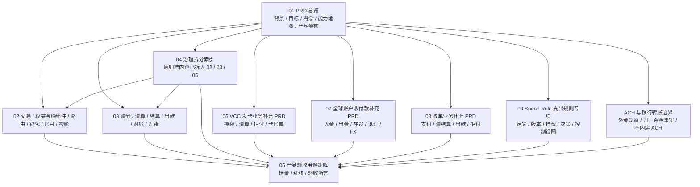

# 支付资金底座产品设计

## 目录定位

本目录是支付资金底座的稳定产品设计入口。完整设计包入口见 [../README.md](../README.md)。本目录只回答产品层面的核心问题：

1. 为什么需要这套资金底座。
2. 面向哪些使用者和运营角色。
3. 有哪些产品能力、业务对象和流程。
4. 每个概念的边界是什么。
5. 哪些规则、红线和验收标准必须成立。
6. 哪些外部规则、合规事项和待确认项需要持续确认。

本目录只保留稳定产品口径，不描述过程管理信息、历史评估材料或阶段性讨论结论。

业务接入方需要从使用者视角判断“能不能接、怎么接、接完如何验收”时，先读 [../用户接入指南/README.md](../用户接入指南/README.md)。用户接入指南只翻译接入流程和准入证据，不替代本目录的产品权威口径。

## MVP 产品约规

产品设计默认先定义最小可用 MVP，不提前追求完整资金平台或完整业务产品。MVP 必须选定一个真实使用场景，说明用户是谁、业务事实是什么、资金动作是什么、怎样证明成功、失败后是否无副作用，以及哪些扩展明确不做。

产品 PRD 中属于 MVP 的能力，必须能被验收矩阵验证；不能验证的能力不得写成默认范围。VCC、全球账户、ACH 或收单等业务补充只允许补 MVP 场景必须的业务语义、外部引用、状态映射和红线，不得把完整发卡、完整银行转账、完整收单、完整风控、完整运营后台或全量报表提前纳入资金底座 MVP。

## 能力保障顺序

产品设计、系分设计、TDD 和编码任务拆解均按下列顺序保护资金底座能力，避免三类业务支持过早反向污染统一资金内核。

| 顺序 | 能力范围 | 设计要求 |
| --- | --- | --- |
| P0 | 钱包、账本、账目、余额投影、对账、清分、清算、结算、账本余额快照和资金数据治理证据。 | 作为统一资金内核和运营账务闭环优先保障；所有业务都必须复用这些能力，不按 VCC、全球账户或收单分别实现一套。 |
| P1 | 直接交易、授权交易、余额控制、交易投影。 | 作为资金动作入口和使用者解释视图承接 P0 能力；不得绕过钱包、账本、账目和对账清算边界。 |
| P2 | VCC 发卡业务支持、全球账户收付款支持、收单业务支持。 | 作为业务补充分册和场景交易 capability pack 接入；只补充业务语义、外部引用、状态映射和验收红线，不改变 P0/P1 的统一实现边界。 |

若某项需求同时影响多层能力，以更靠前的能力层为准。例如收单结算需求优先按钱包、账本、清分、清算、对账和资金数据治理证据评审，再评审 payment attempt、capture、refund 或 dispute 的场景语义。

能力优先级只表达资金安全和产品依赖顺序，不表达当前工程成熟度或编码授权。P0 能力也必须按 MVP 场景、验收 ID、工程写入范围、数据落点和失败红线逐项确认后，才能进入具体开发任务。

| 成熟度口径 | 产品含义 | 交付动作 |
| --- | --- | --- |
| 产品已定义 | 目标、使用者、对象、流程、规则、红线和验收 ID 已闭合。 | 可以进入系分、DSL 或 TDD 对齐，不代表代码或数据库已完成。 |
| 可进入编码准入 | 已有 MVP 场景、写入范围、不做范围、失败红线、外部规则状态和验证命令。 | 可以申请单一工程任务。 |
| 生产可用 | 已有代码、DDL/H2、服务级测试、观测、Runbook、权限审计和外部规则确认。 | 才能声明生产交付或上线启用。 |

02 主链路是资金底座优先落地范围；03 清结算与对账提供目标态设计和 TDD 分析基础；原 04 归档重放与指标治理已拆入 02、03 和 05，04 仅保留兼容索引。涉及 Manifest、checkpoint、watermark、差异报告、指标水位或大数据消费边界时，应通过独立工程任务确认首切片、表结构、服务级测试和外部规则状态。

## 阅读顺序

| 顺序 | 文档 | 读者 | 作用 |
| --- | --- | --- | --- |
| 1 | [01-PRD总览.md](01-PRD总览.md) | 产品、运营、财务、风控、研发、测试 | 说明背景、目标、概念、能力保障优先级、能力地图、总体流程、产品架构、外部参考、风险边界和待确认项。 |
| 2 | [02-交易路由钱包账目与投影.md](02-交易路由钱包账目与投影.md) | 产品、研发、测试、运营 | 说明交易、权益金额组件、路由、钱包、账目、余额投影和交易投影的产品能力与边界。 |
| 3 | [03-清结算与对账.md](03-清结算与对账.md) | 运营、财务、风控、研发、测试 | 说明清分、清算、结算、出款、对账和差错闭环。 |
| 4 | [04-归档重放与指标治理.md](04-归档重放与指标治理.md) | 产品、数据、财务、研发、测试 | 兼容索引。说明原归档分册内容已拆入 02、03 和 05，不再作为独立产品能力分册。 |
| 5 | [05-产品验收与TDD用例矩阵.md](05-产品验收与TDD用例矩阵.md) | 产品、测试、研发、运营、财务 | 把 PRD 场景转为产品验收矩阵，用于指导 TDD 流程。 |
| 6 | [06-VCC发卡业务资金底座PRD.md](06-VCC发卡业务资金底座PRD.md) | VCC 产品、运营、财务、风控、研发、测试 | 说明 VCC 授权、清算、退款、拒付和卡账单如何作为业务补充接入资金底座。 |
| 7 | [07-全球账户收付款资金底座PRD.md](07-全球账户收付款资金底座PRD.md) | 全球账户产品、运营、财务、合规、研发、测试 | 说明全球账户入金、出金、在途、退汇、费用、FX 引用和多币种对账如何接入资金底座。 |
| 8 | [08-收单业务资金底座PRD.md](08-收单业务资金底座PRD.md) | 收单产品、运营、财务、风控、研发、测试 | 说明收单支付、清分、清算、结算、出款、退款、拒付和商户账单如何接入资金底座。 |
| 9 | [09-SpendRule支出规则产品设计.md](09-SpendRule支出规则产品设计.md) | 产品、运营、风控、财务、研发、测试 | 独立说明 Spend Rule 的产品定性、规则定义、不可变版本、规则挂载、决策日志、DSL v1.1 可解释性、控制活动、预算控制视图、生产启用门禁和验收口径。 |
| 边界 | [ACH与银行转账资金底座支持边界.md](ACH与银行转账资金底座支持边界.md) | 产品、合规、银行通道、财务、研发、测试 | 说明 ACH 和银行转账只作为外部轨道或上层业务输入，资金底座只承接归一资金事实、对账差错、追偿、调账核销和审计；验收回挂 `ACH-BOUNDARY-001` 至 `ACH-BOUNDARY-006`、`AC-RAIL-002A` 至 `AC-RAIL-007`。 |

产品分册只回答产品目标、使用者、业务对象、流程、规则、风险和验收。涉及完整借贷平衡、账户类型、`normalBalanceSide`、`PostingPlan`、`LedgerEntry` 和余额投影断言时，以 [../DSL设计/支付资金底座DSL承载层设计.md#51-资金场景借贷平衡与账务期望表](../DSL设计/支付资金底座DSL承载层设计.md#51-资金场景借贷平衡与账务期望表) 为唯一权威；产品分册只保留资金影响摘要和使用者解释。

## 按角色阅读路径

| 角色 | 优先阅读 | 评审重点 |
| --- | --- | --- |
| 产品和业务负责人 | 01、02、03、05；涉及 VCC、全球账户或收单时补读 06、07、08；涉及 ACH 或银行转账时补读 ACH 边界文档 | 目标、范围、角色、业务对象、流程、非目标和验收边界。 |
| 研发和架构 | 01、02、03、05，再按业务补读 06、07、08；涉及 ACH 或银行转账时补读 ACH 边界文档，随后进入 DSL 和系分 | 概念边界、事实对象、状态、账务影响、只读投影和跨模块责任；04 只作拆分索引。 |
| 测试 | 05，再反查 02、03 和对应业务 PRD 06、07、08；涉及 ACH 或银行转账时补读 ACH 边界文档，以及 TDD 设计 | AC-*、RED-*、正常路径、异常路径、权限审计和必须失败用例；04 只作历史引用兼容。 |
| 运营和客服 | 01、03、05 | 差错、冻结、调账、追偿、审批、凭证、时间线和可解释失败原因。 |
| 财务 | 01、03、05，必要时通过 04 查看拆分索引 | 账本分录、清结算批次、对账差异、调账凭证、核销和报表口径。 |
| 风控、合规和安全 | 01、03、05 | 资金归属、外部规则待确认、权限、审批、敏感数据、导出和审计红线。 |

## 总分结构

01-05 是资金底座主线 PRD，06-08 是三类资金业务的业务补充分册，09 是 Spend Rule 支出规则专项分册。06-08 不替代主线，用于说明业务场景如何通过场景交易 capability pack 接入统一资金内核。09 不替代交易、钱包或账本主链路，只定义规则配置、准入决策、控制证据、DSL v1.1 可解释性、预算控制视图和只读解释口径。能复用三类资金业务的能力回到 01-05，业务专属状态机、外部引用、规则待确认项和验收样例保留在 06-08；Spend Rule 的规则定义、版本、挂载、决策日志和生产启用门禁以 09 为准。商品订单交易体系属于上层业务系统，不进入本目录最终交付分册；订单、支付意图、履约、售后和退款申请应在上层业务项目承接，`wind-funds` 只提供资金底座能力。ACH 与银行转账边界文档不是业务分册，它只定义外部银行转账轨道如何被资金底座支持以及哪些能力不得沉入 `wind-funds`。

## 统一产品骨架

本目录所有文档按同一条产品架构主线组织：先说明目标和边界，再定义角色、对象、场景、流程、规则、数据、风险和验收。阅读或评审时不要只看某个功能点，而要检查它是否能被这条链路解释。

| 骨架项 | 要回答的问题 | 主要位置 |
| --- | --- | --- |
| 目标 | 为什么需要资金底座，成功标准是什么。 | 01 的背景、目标、成功指标。 |
| 角色 | 谁使用、谁运营、谁复核、谁承担风险。 | 01 的角色总表，03 的清结算角色，05 的验收角色。 |
| 对象 | 哪些是事实对象、处理单据、只读投影、外部引用。 | 01 的核心概念，02、03 的对象关系。 |
| 场景 | 正向、逆向、异常、人工处理如何闭环。 | 01 的场景总表，02、03 的流程图和 05 的验收矩阵。 |
| 规则 | 状态、周期、清结算、对账、治理、权限和审计规则是什么。 | 各专题规则矩阵和红线。 |
| 数据 | 哪些数据是事实源，哪些只是投影、报表或观察日志。 | 01、02、03 和 05 的投影、差异报告和指标边界章节。 |
| 风险 | 哪些行为必须禁止，哪些外部规则必须确认。 | 01 的产品红线和外部参考，05 的红线用例。 |
| 验收 | 如何证明状态、金额、账本、投影、权限和异常都正确。 | 05 产品验收用例矩阵。 |

## 图谱索引

| 图 | 位置 | 先看它能回答什么 |
| --- | --- | --- |
| 资金底座闭环图 | [01-PRD总览.md](01-PRD总览.md) | 一笔业务事实如何经过交易、钱包、路由、账本、投影和运营闭环。 |
| 产品能力地图 | [01-PRD总览.md](01-PRD总览.md) | 整个资金底座有哪些产品能力。 |
| 产品架构图 | [01-PRD总览.md](01-PRD总览.md) | 使用者、产品入口、资金事实、账户路由、账务事实、运营数据面如何分层。 |
| 交易、权益、路由、钱包和投影能力地图与流程图 | [02-交易路由钱包账目与投影.md](02-交易路由钱包账目与投影.md) | 交易、权益金额组件、路由、钱包、账本和投影之间的能力分层与职责分工。 |
| 清结算能力地图和流程图 | [03-清结算与对账.md](03-清结算与对账.md) | 清分、清算、结算、出款、对账和差错如何闭环。 |
| 资金数据治理拆分索引 | [04-归档重放与指标治理.md](04-归档重放与指标治理.md) | 原归档内容分别应去 02 看余额检查点和交易投影重放，去 03 看批次视图重放和差异报告，去 05 看工程门禁和指标边界。 |
| TDD 验收流程图 | [05-产品验收与TDD用例矩阵.md](05-产品验收与TDD用例矩阵.md) | 如何把产品场景转换为测试断言。 |
| VCC 业务能力地图和流程图 | [06-VCC发卡业务资金底座PRD.md](06-VCC发卡业务资金底座PRD.md) | VCC 授权、清算、退款、拒付和卡账单如何补充资金底座。 |
| 全球账户业务能力地图和流程图 | [07-全球账户收付款资金底座PRD.md](07-全球账户收付款资金底座PRD.md) | 全球账户入金、出金、在途、退汇、FX 引用和多币种对账如何补充资金底座。 |
| 收单业务能力地图和流程图 | [08-收单业务资金底座PRD.md](08-收单业务资金底座PRD.md) | 收单支付、清分、清算、结算、出款、退款和拒付如何补充资金底座。 |
| Spend Rule 支出规则专项 | [09-SpendRule支出规则产品设计.md](09-SpendRule支出规则产品设计.md) | Spend Rule 如何定义规则、发布不可变版本、挂载到 scope、记录决策日志、派生控制活动和预算控制视图，并保持不入账、不反写资金事实。 |
| ACH 与银行转账边界 | [ACH与银行转账资金底座支持边界.md](ACH与银行转账资金底座支持边界.md) | ACH 和银行转账如何作为外部轨道输入被资金底座支持，以及哪些协议、规则和敏感数据不得进入资金内核；TDD 回挂 `TDD-RAIL-002` 至 `TDD-RAIL-007`、`TDD-RED-030` 和 `TDD-RED-034`。 |

## 产品图形化产物

产品图形化产物用于宣讲、跨团队评审和产品侧快速定位，不替代 PRD 正文、验收矩阵、DSL 契约或系分设计。若图和正文存在差异，以 PRD 正文、验收矩阵和已纳入基线的设计为准，并在进入编码前修正图或正文。

| 类型 | 文件 | 正文承接 | 评审用途 |
| --- | --- | --- | --- |
| 产品架构 | [wind-funds-product-architecture.svg](产品架构图/wind-funds-product-architecture.svg) | 01 PRD 总览 | 说明业务场景、统一资金内核、运营治理和外部规则边界。 |
| 产品边界能力 | [vcc-global-ach-acquiring-boundary-capability-map.svg](产品边界能力图/vcc-global-ach-acquiring-boundary-capability-map.svg) | 01 PRD 总览、06、07、08、ACH 边界 | 核对 VCC、全球收付款、ACH 和收单业务由 wind-funds 支撑到什么程度。 |
| 产品流程 | [direct-transaction-flow.svg](产品流程图/direct-transaction-flow.svg) | 02 交易路由钱包账目与投影 | 核对直接交易从请求、路由、账务到投影的主链路和失败无副作用。 |
| 产品流程 | [authorization-transaction-flow.svg](产品流程图/authorization-transaction-flow.svg) | 02 交易路由钱包账目与投影 | 核对授权创建、拒绝、完成、撤销、过期、退款和拒付的生命周期边界。 |
| 产品流程 | [balance-control-flow.svg](产品流程图/balance-control-flow.svg) | 02 交易路由钱包账目与投影 | 核对冻结、解冻、调整、冻结后出款和同主体余额桶控制边界。 |
| 产品流程 | [transaction-route-flow.svg](产品流程图/transaction-route-flow.svg) | 02 交易路由钱包账目与投影 | 核对 route snapshot 如何固化参与方、账户、账目、规则版本和逆向回放路径。 |
| 产品流程 | [balance-projection-flow.svg](产品流程图/balance-projection-flow.svg) | 02 交易路由钱包账目与投影 | 核对余额投影只读派生、可重建和与账本事实的一致性关系。 |
| 产品流程 | [transaction-projection-flow.svg](产品流程图/transaction-projection-flow.svg) | 02 交易路由钱包账目与投影 | 核对用户账单、商户账单、运营时间线和交易投影的解释边界。 |
| 产品流程 | [reconciliation-flow.svg](产品流程图/reconciliation-flow.svg) | 03 清结算与对账 | 核对内部事实、外部文件、匹配规则、差异分类、差错处理和重跑审计。 |
| 产品流程 | [clearing-settlement-flow.svg](产品流程图/clearing-settlement-flow.svg) | 03 清结算与对账 | 核对清分、清算、结算、出款、追偿和出款前准入门禁。 |
| 产品流程 | [big-data-archive-replay-flow.svg](产品流程图/big-data-archive-replay-flow.svg) | 02 余额和交易投影、03 清结算与对账、05 验收矩阵；04 仅作兼容索引 | 作为历史图形化参考，核对 Manifest、checkpoint、watermark、重放、差异报告和指标只读边界拆入位置。 |

## 使用原则

1. 先读总览，再按场景进入专题文档。
2. 产品评审关注使用者、商户、运营、财务、风控和合规待确认项。
3. 研发和测试关注对象边界、流程输入输出、状态变化、账务影响和验收断言。
4. 测试设计优先从 [05-产品验收与TDD用例矩阵.md](05-产品验收与TDD用例矩阵.md) 反推测试用例。
5. 涉及 VCC、全球账户收付款或收单业务时，先读 01-05 的资金底座通用设计，再读 06-08 的业务补充分册；业务 PRD 只补充场景语义，不改变钱包、账本、账目、清结算、对账和投影的统一实现边界。
6. 涉及 Spend Rule、预算控制、支付工具限额、MCC、商户、频控、时段或规则决策日志时，先读 09 专项分册；02 只保留交易、路由、钱包和投影如何消费 Spend Rule 证据，不重复定义规则模型。
7. 涉及 ACH 或银行转账时，先读 ACH 边界文档，并回挂 `ACH-BOUNDARY-001` 至 `ACH-BOUNDARY-006`、`AC-RAIL-002A` 至 `AC-RAIL-007`、`TDD-RAIL-002` 至 `TDD-RAIL-007`；除非另有独立业务 PRD、系统边界和工程授权，否则不得把 ACH 指令、文件、return code、NOC、reversal、Debit 授权或 Nacha/ODFI/RDFI 规则实现放入资金底座。
8. 涉及真实资金、客户资金、跨境、外汇、备付金、持牌支付、风控和合规时，本目录只提供产品设计分析，不替代法务、税务、会计、合规或持牌机构最终确认。
9. 如果某个新增能力无法落到角色、对象、场景、规则、数据、风险和验收任一项，说明它还不是完整产品设计。

## 产品交付评估口径

产品设计进入 DSL、系分和 TDD 拆解前，必须先通过下列产品侧准入检查。完整跨文档门禁见 [../README.md#设计准入评估总控](../README.md#设计准入评估总控)。

| 评估维度 | 产品侧必须证明 | 未满足时的处理 |
| --- | --- | --- |
| 可用性 | 目标用户、运营角色、业务目标、非目标、主流程、逆向流程、异常流程和人工处理入口清楚。 | 回到 PRD 或专题产品文档补场景，不进入 DSL 或系分。 |
| 资金安全 | 资金归属、账户隔离、金额口径、费用/补贴/成本拆分、冻结/授权/清算/结算边界可解释。 | 标记阻断；补账户、账目、资金路径和验收断言。 |
| 金融红线 | 法域、资质、客户资金、商户待结算资金、KYC/KYB/AML、敏感信息和外部规则均有规则来源、版本或发布日期、生效日期、适用主体或适用范围、适用法域、核验日期、确认方和确认状态，或明确标为待确认。 | 带条件通过或阻断；不得写成上线或合规结论。 |
| 易用性 | 用户、商户、运营、财务和风控能理解展示状态、失败原因、账单口径、审批和审计。 | 补用户可见口径、运营时间线和错误原因。 |
| 可理解性 | 产品术语与总入口统一术语映射一致，不混用授权完成、商户结算、账本周期、清算账期、报表周期和归档水位。 | 先修术语映射，再进入 DSL 或系分。 |
| 可测试性 | 每个能力都能映射到 [05-产品验收与TDD用例矩阵.md](05-产品验收与TDD用例矩阵.md) 的 AC-* 或 RED-*。 | 补产品验收用例或说明不适用原因。 |

## 产品交接边界

产品文档只证明“应该做什么、为什么做、做到什么边界、如何验收”，不替代工程任务、代码变更、测试资产、DDL 或运行时配置。交给 DSL、系分和 TDD 时，产品侧只输出稳定业务事实、使用者解释、规则边界、验收 ID 和未覆盖范围。

| 产品能力 | 产品侧必须给出的交付材料 | 不应混入 |
| --- | --- | --- |
| 直接交易、授权交易、余额控制、交易投影 | 对应 `AC-*`、`RED-*`、资金动作、使用者解释、失败原因、退款/撤销/过期/冻结边界和未覆盖范围。 | 清结算、对账、生产治理模块、VCC/全球账户/收单特殊规则。 |
| 钱包、账本、账目和余额投影 | 核心资金账务主体、账目 bucket、账本周期、余额桶、可用/冻结/结算锁定展示口径和余额不可直接修改红线。 | 把支付工具、外部账户、业务订单、预算组、Spend Rule 或报表当内部账本主体。 |
| 支付工具和账户层级 | 支付工具能力、绑定快照、资金责任解析关系、卡到资金子账户或信用子账户的绑定规则、父账户约束和敏感数据边界。 | 因 VCC prepaid/shared 卡产品形态自动创建 `VCC_ACCOUNT`、卡号账户、预算组账本或支付工具余额。 |
| 清结算与对账 | 对账批次、差错单、清分、清算、结算、出款、追偿、运营补事实白名单、审批审计、外部规则确认、批次视图重放和 `CLS-GATE-*`。 | 交易主链路特殊规则；未确认外部规则前不得声明生产可出款。 |
| 资金数据治理 | 02 承接 checkpoint、watermark、余额快照和交易投影重放；03 承接批次视图重放和差异报告；05 承接 `GOV-GATE-*`、指标只读边界和大数据消费边界。 | 用指标快照替代账本余额确认，或让治理任务反写资金事实；04 不再新增独立能力内容。 |
| VCC、全球账户、ACH、收单 | 业务状态映射、外部引用、规则待确认、敏感数据边界、资金事实映射、P0/P1 回归和不新增平行内核承诺。 | 平行钱包、平行账本、平行清结算、平行对账、平行归档或外部协议全集。 |

## PRD、DSL、系分和 TDD 四层对齐口径

本节用于防止同一概念在 PRD、DSL、系分和 TDD 中被重复解释。改动如触碰可入账主体、工具绑定、预算控制、权益资金组件或交易投影，必须先按本表检查四层是否同时成立。

| 对齐主题 | PRD 口径 | DSL 口径 | 系分口径 | TDD 口径 |
| --- | --- | --- | --- | --- |
| 可入账主体 | 默认由资金账户、信用账户和平台角色解析后的平台资金账户承接资金或额度责任；VCC 发卡专项通过资金子账户或信用子账户承接卡账户余额、授权占用、清算、退款、拒付和费用。 | `SubjectRef` / 可入账 `FundsSubjectType` 只承载 `FUNDING_ACCOUNT`、`CREDIT_ACCOUNT` 和平台角色解析后的资金账户；VCC 关联子账户使用资金账户或信用账户类型，不新增 `VCC_ACCOUNT`。 | route participant、posting plan、ledger entry 和余额投影不得直接落到预算组、Spend Rule、支付工具、卡号、PAN、token 或外部账户。 | 红线测试必须覆盖预算组、Spend Rule、支付工具、卡号、外部账户、业务单据和 `VCC_ACCOUNT` 直接入账失败且无账务副作用，并覆盖卡绑定子账户、父子账户约束、账目 profile 和资金责任来源。 |
| 支付工具 | VCC、VA、外部电子钱包端点、银行卡和外部账户只暴露工具能力和外部引用；内部余额钱包、信用额度、返利钱包和商户钱包不归入支付工具。 | 外部工具使用 `PaymentInstrumentRef`、`ExternalAccountRef`、binding snapshot 和 route snapshot；内部入口解析为 `SubjectRef`、权益资金事实、历史摘要或资金责任决策。 | `PaymentInstrumentService` 管工具和绑定，route resolver 只消费快照并解析最终责任主体。 | 覆盖工具换绑、原路径回放、敏感信息脱敏、工具不得拥有余额或 ledger entry，以及内部入口不得被误建成 `PaymentInstrument`。 |
| 预算组和 Spend Rule | 预算组表达预算 scope、owner、展示和审计；Spend Rule 统一表达预算额度、MCC、商户、频控和时间窗口等授权前规则，专项产品口径见 [09-SpendRule支出规则产品设计.md](09-SpendRule支出规则产品设计.md)。 | 使用 BudgetGroup 上下文、Spend Rule 快照、规则决策日志和预算控制投影，不新增账本余额桶。 | `BudgetGroupService` 和 Spend Rule 控制视图只管理控制证据；资金责任解析关系解析到资金账户、信用账户、VCC 关联子账户或平台账户角色。 | 覆盖预算创建不初始化 ledger、规则拒绝不生成 route/entry、预算控制占用/释放只更新控制证据。 |
| 资金责任解析关系 | 产品上回答“本次支出最终由哪个内部资金或额度主体承担”，可由工具、卡绑定子账户、主账户、使用主体、预算组、Spend Rule 等上下文参与筛选。 | DSL 保留 `FundingAllocationDecision` 表达最终责任主体、账目、优先级、选择原因和规则版本；兼容名称“资金来源关系”不得扩展为预算资金池。 | `SpendSubjectFundingRelationService` 可保留现有命名，但输出必须是资金账户、信用账户、VCC 关联子账户或平台账户角色解析后的平台资金账户；预算组和 Spend Rule 只作为控制上下文。 | 覆盖缺失、不唯一、错币种、默认关系冲突、预算组或 Spend Rule 被当作资金来源时失败且无账务副作用。 |
| 交易投影 | 交易投影是统一只读读模型，不归属于支付工具子模块。 | 投影只消费资金事实、route snapshot、ledger entry、工具快照和控制日志，不生成新事实。 | 查询服务可按工具、资金账户、信用账户、预算组和 Spend Rule 建索引，但不得反写交易、账本或余额。 | 覆盖多维查询、投影重放只读、预算/规则视图不生成资金交易记录。 |
| 资金责任目标字段 | 生产可用性验收前必须在 `funding-account-only` 和 `targetSubjectType + targetSubjectId` 中二选一；前者只声明解析到资金账户，后者可声明信用账户、平台角色责任主体和 VCC 关联资金/信用子账户。 | DSL fixture、Spec 或公共字段变更前必须先选策略；目标主体迁移必须同步摘要、route snapshot 和回放断言，不新增 `VCC_ACCOUNT`。 | 若迁移目标字段，DTO、DDL/H2、Entity、Mapper、service 和审计必须同步。 | TDD 必须覆盖字段策略、缺失/不唯一/错币种/预算组或 Spend Rule 被当最终主体失败；不得在 `fundingAccountId` 仍是唯一字段时声明信用账户、平台角色或 VCC 关联子账户生产可用。 |
| 交易投影输入 | 交易投影只读消费交易事实、冻结单、route snapshot、支付工具快照、资金责任决策、Spend Rule 决策/活动、账本摘要、授权拒绝事实、清结算和对账差错。 | `TransactionView` 不生成 `ResolvedRoute`、`PostingPlan`、`LedgerEntry` 或余额事实。 | 系分 02 的交易投影输入矩阵是系统承接入口；B6/B8 只允许只读投影和有范围重放。 | 覆盖多维查询、拒绝事实解释、重放只读和不反写 route/posting/entry/balance；不得把交易投影通过写成生产 Done。 |
| 进入实现 | 产品定性只证明语义和验收边界成立。 | DSL caseId 必须能落到稳定字段、不变量和失败边界。 | 系分必须给出服务、状态、表、事务、幂等、审计和安全边界。 | 编码前必须明确工程任务、目标 Red、断言事实和验证命令。 |

## 跨文档术语提醒

产品文档可以使用“授权结算”“授权部分结算”等业务表达，但进入 DSL、系分和 TDD 时统一映射为“授权完成”“授权部分完成”以及 AUTHORIZATION_TRANSACTION / SETTLE。商户结算链路中的“结算锁定”表示 AVAILABLE -> SETTLEMENT，不等同于授权链路的 SETTLE 事件。完整映射见 [../README.md#统一术语映射](../README.md#统一术语映射)。

## 设计结论

| 审验项 | 结论 |
| --- | --- |
| 目标 | 与支付资金底座定位一致，核心目标是让每一笔金额都能被解释、被核对、被重建。 |
| 概念 | 交易、路由、钱包、账目、账本、余额投影、交易投影、清分、清算、结算、出款、对账、差错、归档、重放和指标边界清楚。 |
| 流程 | 正向交易、逆向交易、授权、冻结、清算、结算、出款前准入、对账、归档和重放均有目标态流程图或状态图承接。 |
| 用例 | 已覆盖 TDD 可转化场景、必须失败红线、运营后台、权限和报表指标验收用例；生产完成仍以代码、DDL、测试和外部规则核验证据为准。 |
| 边界 | 明确外部账户不入账、钱包不承载交易命令、投影只读、冻结不表达消费、对账差异不直接改账。 |

### 生产交付口径

产品设计只证明“产品目标和验收边界可以被开发、测试和运营理解”，不证明代码、DDL、测试和外部规则已经生产完成。进入生产交付前，必须按设计域确认下列条件。

| 设计域 | 产品侧设计结论 | 生产交付前仍需证明 |
| --- | --- | --- |
| 02 交易、路由、钱包、账目与投影 | 主链路目标一致，是优先落地范围。 | 每个资金动作都有代码实现、TDD 断言、余额桶证明、失败无副作用、幂等和审计证据。 |
| 03 清结算与对账 | 对象、状态、阻断、差错、人工处理和出款前准入闭环已定义；出款前准入设计只能作为差距复核输入。 | 独立实现对象、服务契约、DDL/H2 schema、状态机、服务级测试、对账差错闭环、清结算重跑幂等和外部规则确认。 |
| B8 资金数据治理边界 | 原 04 内容已拆入 02、03 和 05，04 仅保留兼容索引。 | Manifest、checkpoint、watermark、范围锁、差异报告、回滚/续跑、人工处理和指标模块接口边界验证。 |
| 06 VCC 发卡业务分册 | 作为业务补充分册，明确 VCC 通过场景交易 capability pack 接入，不改变统一资金内核；VCC 卡、虚拟卡和卡 token 只作为支付工具，预付卡是资金模式，共享卡是绑定/使用模式。 | 发卡资金模式、Program/BIN/Processor/Card Network 规则、PCI 边界、授权控制规则、预付资金责任、共享卡绑定规则、clearing 和 chargeback 证据必须专业确认。 |
| 07 全球账户收付款分册 | 作为业务补充分册，明确外部受理、在途、退汇、FX 和多币种对账如何补充主线。 | 法域、业务主体、银行协议、VA/回单字段、FX quote、跨境材料、数据跨境和资金归属必须专业确认。 |
| 08 收单业务分册 | 作为业务补充分册，明确支付成功不等于可结算、refund 和 chargeback 分离、商户结算通过主线清结算承接。 | 收单模式、商户入网/KYB、PSP/收单行协议、卡组织规则、准备金、拒付责任、PCI/tokenization 边界必须专业确认。 |
| ACH 与银行转账边界 | 作为外部轨道资金底座支持边界，明确 ACH 和银行转账不作为内建业务，不进入统一资金内核。 | ACH 业务主体、Debit 授权、账户验证、return、NOC、reversal、Same Day ACH、IAT、ODFI/RDFI、Nacha/银行规则和敏感数据处理必须专业确认。 |
| 可解释性和运营可用性 | 用户、商户、运营、财务、审计和 SRE 的解释入口已纳入验收矩阵。 | 页面、查询、导出、告警和 runbook 必须能说明金额来源、状态含义、失败原因、处理入口、不可操作原因和审计证据。 |
| 外部规则和合规事项 | 已列为待确认和不覆盖范围。 | 法务、合规、财务、税务、通道、卡组织、银行或数据安全负责人确认后才能进入生产启用。 |

### 产品生产签出检查

产品侧进入生产交付评审前，必须把“设计可理解”升级为“使用者和运营可验收”。缺少下列任一项时，产品结论只能写成带条件通过、设计输入态或 Not Done，不得声明生产可用。

| 签出项 | 产品侧必须确认 | 生产前证据 |
| --- | --- | --- |
| 使用者完成路径 | 用户、商户、运营、财务、风控、审计或 SRE 能看懂成功、失败、冻结、授权、清算、退款、争议和差错的下一步动作。 | 页面/接口查询口径、交易投影、运营时间线、错误原因、Runbook 触发和人工处理入口。 |
| 资金影响解释 | 每个资金动作能解释主体、金额、币种、账目、余额影响、费用/补贴/成本拆分和原路径回放。 | AC/RED、DSL caseId、账目矩阵、余额桶断言和资金证据包。 |
| VCC 账户层级边界 | VCC 不新增独立 `VCC_ACCOUNT`；Card Account / Financial Account / VCC Account 只作为外部别名，进入资金底座后映射为资金子账户或信用子账户。VCC 卡、PAN、token、shared card 和 prepaid virtual card 仍是工具或模式，不是账本主体。 | 卡绑定子账户 profile、主账户约束、资金责任来源、工具绑定快照、授权/清算/退款/拒付流程、PCI 和发卡规则确认状态。 |
| 支付工具和 Spend Rule | 支付工具只做入口、准入、绑定和归因；Spend Rule 只做授权前控制和预算控制证据。 | 资金责任目标字段策略、拒绝无账务副作用、规则版本和只读投影证据。 |
| 外部规则和专业确认 | 命中卡组织、银行、ACH、PSP、FX、跨境、税务、会计、合规、隐私或安全规则时，说明确认方、确认状态、适用范围和未确认前动作。 | 外部规则确认台账、确认方、核验日期、确认状态、脱敏证据引用和不覆盖范围。 |
| Not Done 清单 | 明确哪些业务包、外部协议、运营后台、报表、规则引擎、清结算深水区或生产治理能力不在交付范围内。 | 发布说明、任务计划和残余风险清单。 |

## 产品红线

1. 不得把业务订单、外部账户、支付工具或报表当作内部账本主体。
2. 不得通过运营后台、交易投影、余额日志或报表修改余额、交易事实或历史分录。
3. 不得把清算候选、清算批次、结算单、出款单、对账批次、差错单和追偿单混成一个对象。
4. 不得把账本周期、清算账期、结算周期、报表周期、归档水位和 spend-rule window 混用。
5. 不得把公开外部文档当作正式启用规则；涉及卡组织、ACH、银行、PSP、跨境、外汇和持牌能力时必须二次核验。
6. 不得混同客户资金、商户待结算资金、平台自有资金、保证金、补贴资金和手续费收入；未确认资质、合同和资金归属前，不得把内部待结算口径称为客户备付金。
