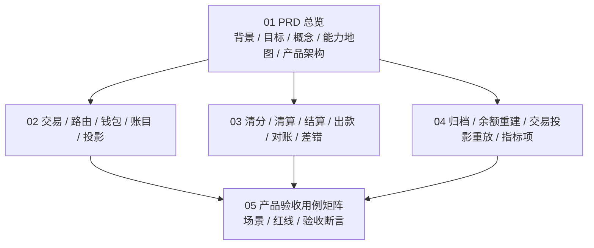

# 支付资金底座产品设计

## 目录定位

本目录是支付资金底座的最终版产品设计入口。完整设计包入口见 [../README.md](../README.md)。本目录只回答产品层面的核心问题：

1. 为什么需要这套资金底座。
2. 面向哪些使用者和运营角色。
3. 有哪些产品能力、业务对象和流程。
4. 每个概念的边界是什么。
5. 哪些规则、红线和验收标准必须成立。
6. 哪些外部规则、合规事项和未来方向需要持续确认。

本目录只保留稳定产品口径，不描述过程管理信息。

## 阅读顺序

| 顺序 | 文档 | 读者 | 作用 |
| --- | --- | --- | --- |
| 1 | [01-PRD总览.md](01-PRD总览.md) | 产品、运营、财务、风控、研发、测试 | 说明背景、目标、概念、能力地图、总体流程、产品架构、外部参考、风险边界和未来方向。 |
| 2 | [02-交易路由钱包账目与投影.md](02-交易路由钱包账目与投影.md) | 产品、研发、测试、运营 | 说明交易、路由、钱包、账目、余额投影和交易投影的产品能力与边界。 |
| 3 | [03-清结算与对账.md](03-清结算与对账.md) | 运营、财务、风控、研发、测试 | 说明清分、清算、结算、出款、对账和差错闭环。 |
| 4 | [04-归档重放与指标治理.md](04-归档重放与指标治理.md) | 产品、数据、财务、研发、测试 | 说明大数据量下的归档、余额投影重放、交易投影重放和指标项。 |
| 5 | [05-产品验收与TDD用例矩阵.md](05-产品验收与TDD用例矩阵.md) | 产品、测试、研发、运营、财务 | 把 PRD 场景转为产品验收矩阵，用于指导 TDD 流程。 |

## 总分结构

## 统一产品骨架

本目录所有文档按同一条产品架构主线组织：先说明目标和边界，再定义角色、对象、场景、流程、规则、数据、风险和验收。阅读或评审时不要只看某个功能点，而要检查它是否能被这条链路解释。

| 骨架项 | 要回答的问题 | 主要位置 |
| --- | --- | --- |
| 目标 | 为什么需要资金底座，成功标准是什么。 | `01` 的背景、目标、成功指标。 |
| 角色 | 谁使用、谁运营、谁复核、谁承担风险。 | `01` 的角色总表，`03` 的清结算角色，`05` 的验收角色。 |
| 对象 | 哪些是事实对象、处理单据、只读投影、外部引用。 | `01` 的核心概念，`02`、`03`、`04` 的对象关系。 |
| 场景 | 正向、逆向、异常、人工处理如何闭环。 | `01` 的场景总表，`02`、`03`、`04` 的流程图。 |
| 规则 | 状态、周期、清结算、对账、归档、权限和审计规则是什么。 | 各专题规则矩阵和红线。 |
| 数据 | 哪些数据是事实源，哪些只是投影、报表或观察日志。 | `01`、`02`、`04` 的投影和指标章节。 |
| 风险 | 哪些行为必须禁止，哪些外部规则必须确认。 | `01` 的产品红线和外部参考，`05` 的红线用例。 |
| 验收 | 如何证明状态、金额、账本、投影、权限和异常都正确。 | `05` 产品验收用例矩阵。 |

## 图谱索引

| 图 | 位置 | 先看它能回答什么 |
| --- | --- | --- |
| 资金底座闭环图 | [01-PRD总览.md](01-PRD总览.md) | 一笔业务事实如何经过交易、钱包、路由、账本、投影和运营闭环。 |
| 产品能力地图 | [01-PRD总览.md](01-PRD总览.md) | 整个资金底座有哪些产品能力。 |
| 产品架构图 | [01-PRD总览.md](01-PRD总览.md) | 使用者、产品入口、资金事实、账户路由、账务事实、运营数据面如何分层。 |
| 交易、路由、钱包和投影能力地图与流程图 | [02-交易路由钱包账目与投影.md](02-交易路由钱包账目与投影.md) | 交易、路由、钱包、账本和投影之间的能力分层与职责分工。 |
| 清结算能力地图和流程图 | [03-清结算与对账.md](03-清结算与对账.md) | 清分、清算、结算、出款、对账和差错如何闭环。 |
| 归档、重放与指标治理能力地图和流程图 | [04-归档重放与指标治理.md](04-归档重放与指标治理.md) | 大数据量下如何归档、重建余额、重放交易投影并沉淀指标项。 |
| TDD 验收流程图 | [05-产品验收与TDD用例矩阵.md](05-产品验收与TDD用例矩阵.md) | 如何把产品场景转换为测试断言。 |

## 使用原则

1. 先读总览，再按场景进入专题文档。
2. 产品评审关注使用者、商户、运营、财务、风控和合规待确认项。
3. 研发和测试关注对象边界、流程输入输出、状态变化、账务影响和验收断言。
4. 测试设计优先从 [05-产品验收与TDD用例矩阵.md](05-产品验收与TDD用例矩阵.md) 反推测试用例。
5. 涉及真实资金、客户资金、跨境、外汇、备付金、持牌支付、风控和合规时，本目录只提供产品设计分析，不替代法务、税务、会计、合规或持牌机构最终确认。
6. 如果某个新增能力无法落到角色、对象、场景、规则、数据、风险和验收任一项，说明它还不是完整产品设计。

## 跨文档术语提醒

产品文档可以使用“授权结算”“授权部分结算”等业务表达，但进入 DSL、系分和 TDD 时统一映射为“授权完成”“授权部分完成”以及 `AUTHORIZATION_TRANSACTION / SETTLE`。商户结算链路中的“结算锁定”表示 `AVAILABLE -> SETTLEMENT`，不等同于授权链路的 `SETTLE` 事件。完整映射见 [../README.md#统一术语映射](../README.md#统一术语映射)。

## 最终版设计结论

| 审验项 | 结论 |
| --- | --- |
| 目标 | 与支付资金底座定位一致，核心目标是让每一笔金额都能被解释、被核对、被重建。 |
| 概念 | 交易、路由、钱包、账目、账本、余额投影、交易投影、清分、清算、结算、出款、对账、差错、归档、重放和指标边界清楚。 |
| 流程 | 正向交易、逆向交易、授权、冻结、清算、结算、对账、归档和重放均有流程图或状态图承接。 |
| 用例 | 已覆盖 TDD 可转化场景、必须失败红线、运营后台、权限和报表指标验收用例。 |
| 边界 | 明确外部账户不入账、钱包不承载交易命令、投影只读、冻结不表达消费、对账差异不直接改账。 |

## 产品红线

1. 不得把业务订单、外部账户、支付工具或报表当作内部账本主体。
2. 不得通过运营后台、交易投影、余额日志或报表修改余额、交易事实或历史分录。
3. 不得把清算候选、清算批次、结算单、出款单、对账批次、差错单和追偿单混成一个对象。
4. 不得把账本周期、清算账期、结算周期、报表周期、归档水位和 spend-rule window 混用。
5. 不得把公开外部文档当作正式启用规则；涉及卡组织、ACH、银行、PSP、跨境、外汇和持牌能力时必须二次核验。
