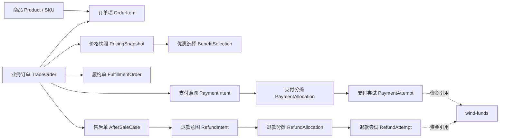
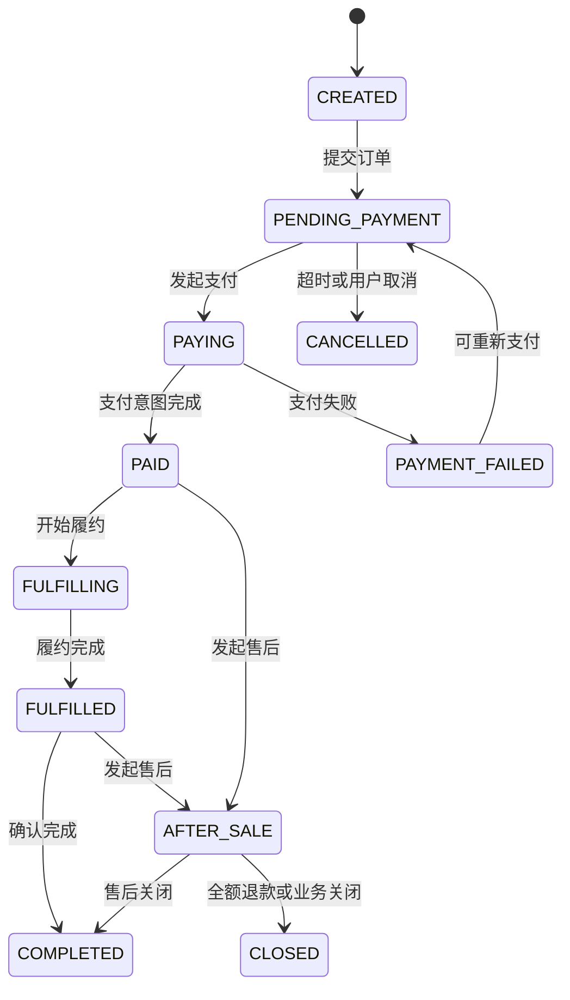
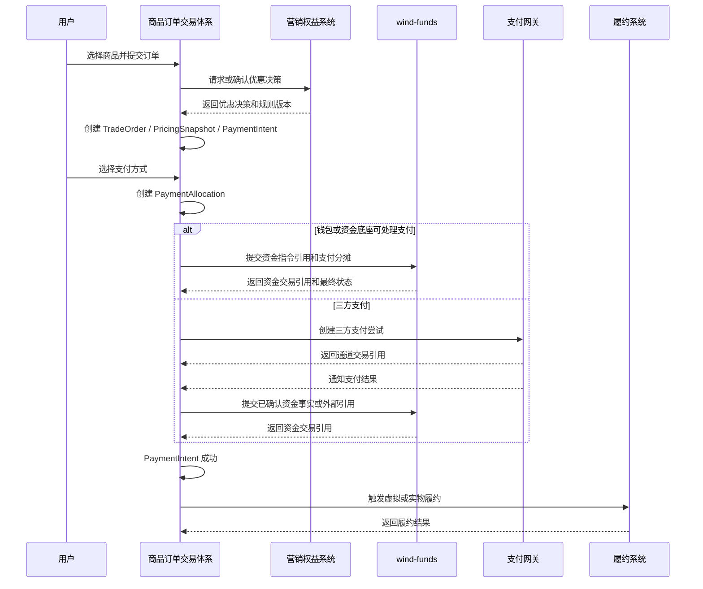
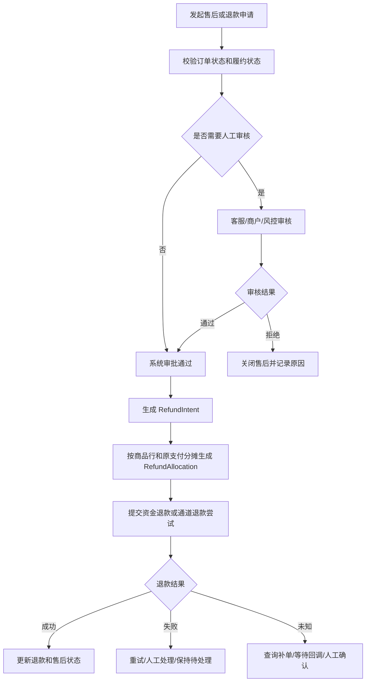

# 商品订单交易体系重构设计

## 1. 文档定位

### 1.1 需求背景与问题

本文用于重构原《订单、交易体系系分》设计，使其回到“商品订单交易业务”本身，并与 `wind-funds` 资金底座形成正交关系。

原设计面向虚拟商品、实物商品和站内运营交易能力，但同时承载了订单、支付单、交易流水、钱包、优惠券、三方支付、对账和平账语义。重构后的设计只保留商品订单域应负责的业务事实，把资金事实、账务事实、账户余额、对账清结算和资金投影交给 `wind-funds`。

本文不是 `wind-funds` 主线 PRD、DSL、系分或 TDD 的替代文档，而是上层商品订单交易系统的预研和重构设计。若后续进入编码，应在独立商品订单项目或上层业务系统中落地；`wind-funds` 只提供资金底座能力。

不做本次重构的风险是：订单系统继续把业务订单、支付尝试、账户流水和对账结果混成一个模型，后续一旦接入钱包、优惠券、三方支付或退款，研发会在订单侧重复实现资金语义，最终导致订单金额、资金交易、账本分录、余额投影和对账清结算互相覆盖。

## 2. 设计目标

### 2.1 目标

1. 支持虚拟商品和实物商品的下单、计价、支付意图、履约、售后和退款申请。
2. 将商品交易的业务事实与资金交易、账务分录、余额投影、对账清结算解耦。
3. 保证订单侧金额可解释、可追溯、可审计，但不在订单侧做资金平账。
4. 为钱包支付、优惠券抵扣、第三方支付、零实付、组合支付和部分退款提供统一业务模型。
5. 明确订单交易体系与 `wind-funds`、营销权益、库存履约、支付通道和运营后台的职责边界。

### 2.2 非目标

| 非目标 | 说明 |
| --- | --- |
| 不做资金流水 | 订单系统不证明账户资金变化，不生成账户明细，不替代 `FundsTransaction`、`LedgerEntry` 或余额投影。 |
| 不做账本和账务平衡 | 借贷平衡、账户类型、余额桶、posting plan 和账本交易归 `wind-funds`。 |
| 不做钱包余额维护 | 钱包、FundingAccount、CreditAccount、BudgetGroup 和支付工具绑定归 `wind-funds`。 |
| 不做对账清结算 | 对账任务、差错、清分、清算、结算、出款和核销归 `wind-funds` 或专门清结算系统。 |
| 不计算优惠券可用性 | 券是否可用、是否可退、是否恢复由营销权益系统、订单规则或运营审批决策；订单侧只保存决策快照和引用。 |
| 不直接实现三方支付通道协议 | 支付通道适配、回调验签、通道状态机和通道对账由支付网关或通道适配层负责。 |

### 2.3 业务目标、用户价值与成功指标

| 维度 | 内容 |
| --- | --- |
| 业务目标 | 建立虚拟商品和实物商品统一的订单交易能力，让订单、支付意图、履约、售后和退款申请可独立演进，并与资金底座保持清晰边界。 |
| 用户价值 | 用户能清楚理解买了什么、优惠如何抵扣、支付是否成功、商品是否履约、退款为什么成功或失败。 |
| 运营价值 | 运营能按订单、支付意图、履约单、售后单和退款意图定位问题，而不需要直接修改资金流水、账本或余额。 |
| 研发价值 | 研发能用稳定对象和接口对接 `wind-funds`、营销权益、支付网关和履约系统，避免重复建设资金能力。 |
| 成功指标 | 订单域不再保存资金流水和平账字段；支付明细拆分为支付分摊和支付尝试；退款明细拆分为退款分摊和退款尝试；所有资金侧结果仅以引用号、状态摘要和事件方式进入订单域。 |

## 3. 能力地图

| 能力域 | 前台能力 | 后台能力 | 数据能力 |
| --- | --- | --- | --- |
| 商品与计价 | 商品浏览、结算、优惠展示。 | 商品快照校验、价格调整审批。 | 商品行金额、价格快照、规则版本。 |
| 订单 | 下单、取消、查看订单。 | 订单查询、异常关闭、状态修复申请。 | 订单状态、订单事件、操作审计。 |
| 支付意图 | 选择支付方式、重新支付、查看支付结果。 | 支付尝试查询、未知状态补单、失败处理。 | PaymentIntent、PaymentAllocation、PaymentAttempt 和资金引用。 |
| 履约 | 查看虚拟权益发放或物流状态。 | 虚拟发放重试、实物发货异常处理。 | FulfillmentOrder、外部履约引用、履约事件。 |
| 售后退款 | 申请退款、退货、查看售后结果。 | 售后审核、退款分摊复核、人工处理。 | AfterSaleCase、RefundIntent、RefundAllocation、RefundAttempt。 |
| 集成协同 | 接收支付、履约、退款结果通知。 | 对接 `wind-funds`、营销权益、支付网关、库存物流。 | 外部引用、事件幂等、状态摘要和审计链路。 |

## 4. 产品定位

商品订单交易体系是商品购买业务的事实源。它回答：

- 用户买了什么。
- 商品价格、优惠和应付金额如何形成。
- 用户选择了哪些支付方式。
- 订单支付意图是否完成。
- 商品是否履约、交付、取消、退货或退款。
- 售后和退款申请为什么发生、由谁审批、按什么业务规则处理。

它不回答：

- 哪个资金账户实际扣减。
- 哪个账本科目增加或减少。
- 钱是否已经清算、结算或可提现。
- 对账差异如何核销。
- 平台补贴、储值权益、商户让利如何入账。

这些问题由 `wind-funds` 的资金指令、路由、账务、投影、对账和清结算能力回答。

## 5. 职责边界

### 5.1 系统边界

| 系统 | 负责 | 不负责 |
| --- | --- | --- |
| 商品订单交易体系 | 商品、订单、订单项、价格快照、支付意图、支付分摊、履约、售后、退款申请、订单侧审计。 | 资金账户、账本、资金流水、对账清结算、支付通道协议、营销券包生命周期。 |
| `wind-funds` | 资金指令、资金交易、路由快照、权益金额快照、账务计划、账本分录、余额投影、交易投影、对账、清结算。 | 判断订单是否成立、商品是否履约、券是否可用、售后是否通过。 |
| 营销权益系统 | 券包、活动、优惠资格、权益核销、退券策略、权益恢复或作废决策。 | 资金入账、账务平衡、商户应清算款。 |
| 支付网关或通道适配层 | 支付渠道、三方支付下单、回调验签、通道状态机、外部交易号和通道凭证。 | 商品订单状态、账本分录、清结算最终事实。 |
| 库存履约系统 | 库存锁定、出库、物流、签收、虚拟权益发放、履约回滚。 | 资金扣款、支付状态、清结算。 |
| 运营后台 | 人工审核、售后审批、异常处理、订单备注、客服操作和审计查看。 | 绕过规则直接改资金余额或历史资金事实。 |

### 5.2 四流边界

| 流 | 商品订单交易体系视角 | `wind-funds` 视角 |
| --- | --- | --- |
| 业务流 | 下单、支付意图、履约、售后、退款申请。 | 只引用业务事实，不判断业务订单是否成立。 |
| 支付信息流 | 支付选择、支付尝试、外部渠道引用、支付结果回执。 | 接收已确认或可授权的资金事实，保存资金交易和 route snapshot。 |
| 账户账务流 | 不表达账户余额和借贷方向。 | 解析资金主体、账户、账目、posting plan 和 LedgerEntry。 |
| 真实资金流 | 只展示业务可见结果和引用。 | 通过对账、清结算、结算和外部凭证证明资金闭环。 |

## 6. 核心对象

### 6.1 概要设计与核心方案

核心方案是把原来的“支付单 + 交易流水”拆成三层：

1. 订单层：`TradeOrder`、`OrderItem`、`PricingSnapshot` 和 `BenefitSelection`，回答商品交易是否成立、价格如何形成。
2. 支付意图层：`PaymentIntent`、`PaymentAllocation` 和 `PaymentAttempt`，回答用户准备如何支付、每次尝试结果如何、资金侧引用是什么。
3. 履约售后层：`FulfillmentOrder`、`AfterSaleCase`、`RefundIntent`、`RefundAllocation` 和 `RefundAttempt`，回答商品如何交付、售后如何审批、退款如何分摊。

关键依赖包括 `wind-funds`、营销权益系统、支付网关、库存履约系统和运营后台。同步调用优先用于创建订单、发起支付意图和提交明确请求；异步事件用于接收支付结果、资金结果、履约结果和退款结果，所有异步事件都必须按业务单号和事件号幂等消费。

### 6.2 对象总览



### 6.3 对象定义

| 对象 | 定性 | 关键职责 | 禁止承载 |
| --- | --- | --- | --- |
| Product / SKU | 可售卖对象。 | 商品标识、商品类型、价格配置、履约类型、售后策略引用。 | 资金账户、账务科目。 |
| TradeOrder | 商品交易业务事实源。 | 记录买方、卖方或服务方、商品项、价格快照、订单状态、业务幂等和审计。 | 账户流水、资金平账、对账结果。 |
| OrderItem | 商品行快照。 | 固化商品名称、数量、原价、成交价、履约方式、售后规则。 | 账务分录或资金路由。 |
| PricingSnapshot | 订单计价快照。 | 固化原价、调整、优惠、应付、币种、规则版本和尾差处理。 | 判断资金是否到账。 |
| BenefitSelection | 用户或系统已决策优惠。 | 保存券、积分、补贴、商户让利等业务选择和营销决策引用。 | 维护券包生命周期或资金入账。 |
| PaymentIntent | 支付意图。 | 表示订单需要完成的应付金额、币种、超时时间、幂等键和当前支付状态。 | 资金交易事实、账本交易。 |
| PaymentAllocation | 支付分摊。 | 表示应付金额在钱包、三方支付、优惠权益、储值权益等业务选择上的分配。 | 账户明细、借贷方向。 |
| PaymentAttempt | 支付尝试。 | 记录一次向资金底座、支付网关或外部通道发起的尝试、返回引用和最终业务结果。 | 资金账务事实。 |
| FulfillmentOrder | 履约单。 | 虚拟权益发放、实物出库物流、履约幂等和履约失败处理。 | 支付扣款。 |
| AfterSaleCase | 售后单。 | 退款、退货、换货、补发、人工审核和证据。 | 资金退款事实。 |
| RefundIntent | 退款意图。 | 表示业务侧批准或发起的退款诉求、退款金额、原因和审批结果。 | 账务冲正。 |
| RefundAllocation | 退款分摊。 | 表示本次退款如何在原支付分摊、商品行和权益组件之间分配。 | 资金侧退款 route。 |
| RefundAttempt | 退款尝试。 | 记录调用资金底座或通道执行退款的尝试和引用。 | 资金退款流水。 |

## 7. 金额模型

### 7.1 订单价格闭合

订单侧只负责价格解释，不负责资金平账。

```text
orderOriginalAmount
  - merchantDiscountAmount
  - platformDisplayDiscountAmount
  - userBenefitDiscountAmount
  + manualAdjustmentAmount
  = orderPayableAmount
```

其中：

- `orderOriginalAmount`：订单原始商品金额。
- `merchantDiscountAmount`：商户让利或商品折扣。
- `platformDisplayDiscountAmount`：只影响订单展示的活动优惠。
- `userBenefitDiscountAmount`：用户选择或系统决策的权益抵扣展示金额。
- `manualAdjustmentAmount`：业务审批后的订单调整金额，必须有审批和审计。
- `orderPayableAmount`：用户需要通过现金、钱包、储值权益或其他支付方式完成的应付金额。

### 7.2 支付分摊闭合

```text
sum(paymentAllocation.payAmount) = paymentIntent.payableAmount
```

支付分摊只解释用户如何完成支付，不表达资金借贷：

| 分摊类型 | 示例 | 订单侧语义 | 资金侧处理 |
| --- | --- | --- | --- |
| 钱包余额 | 用户钱包支付 80 | 用户选择用钱包完成支付。 | `wind-funds` 解析 FundingAccount 并入账。 |
| 三方支付 | 微信、支付宝、银行卡 | 用户选择外部支付渠道。 | 支付网关确认后向 `wind-funds` 提交资金事实或引用。 |
| 普通优惠券 | 商户券、平台展示券 | 解释订单价格抵扣。 | 是否有资金影响取决于权益快照和资金规则。 |
| 平台补贴 | 平台补足商户 | 订单侧保存补贴决策引用。 | `wind-funds` 拆分平台补贴成本和商户待清算。 |
| 储值权益 | 礼品卡、预付代金券 | 用户用预付权益支付。 | `wind-funds` 按负债释放或权益余额口径处理。 |
| 零实付 | 全额权益覆盖 | 订单可支付完成，但不是无资金影响。 | 资金侧按补贴、储值、商户让利等组件分别处理。 |

### 7.3 退款分摊闭合

```text
sum(refundAllocation.refundAmount) = refundIntent.approvedRefundAmount
```

退款分摊由订单、售后、营销权益或运营审批决策。`wind-funds` 只承接本次退款决策结果，不重新判断券能不能退。

| 退款策略 | 适用场景 | 订单侧责任 | 资金侧责任 |
| --- | --- | --- | --- |
| 原路退回 | 现金或钱包原支付路径可退。 | 决定可退金额和原支付分摊引用。 | 按原 route 或可解释替代 route 退款。 |
| 退回钱包 | 外部通道不可退或业务指定退钱包。 | 审批并记录用户确认或规则依据。 | 增加用户钱包可用或待处理余额。 |
| 退券 | 权益可恢复。 | 输出恢复券、作废、不可退或部分恢复决策。 | 只处理资金影响组件，不维护券包。 |
| 不退权益 | 使用后不可恢复、过期或规则禁止。 | 说明原因、展示给用户并审计。 | 保留原资金事实，不静默补平。 |
| 部分退款 | 商品行、数量或履约进度部分退。 | 按商品行和权益分摊快照计算。 | 按本次决策入资金退款。 |

## 8. 状态模型

### 8.1 TradeOrder 状态

订单状态只表达业务交易生命周期，不等于资金状态。



订单状态不直接表达清算、结算、到账、可提现或对账结果。若用户或商户需要查看这些状态，应通过资金侧投影或商户账单展示。

### 8.2 PaymentIntent 状态

| 状态 | 含义 | 允许动作 |
| --- | --- | --- |
| CREATED | 支付意图已创建，尚未发起支付。 | 追加或调整支付分摊、取消。 |
| PROCESSING | 已发起支付，等待资金底座或通道结果。 | 查询、关闭超时、接收回调。 |
| PARTIALLY_SUCCEEDED | 组合支付中部分分摊成功。 | 继续支付、取消未完成部分、发起补偿。 |
| SUCCEEDED | 支付意图完成。 | 触发履约、进入可售后状态。 |
| FAILED | 支付失败且未形成完成支付。 | 重新支付或取消订单。 |
| CANCELLED | 支付意图取消。 | 不可再次支付；需要重新创建支付意图。 |
| EXPIRED | 超时失效。 | 关闭订单或重新创建支付意图。 |

### 8.3 PaymentAttempt 状态

| 状态 | 含义 |
| --- | --- |
| CREATED | 尝试记录已创建，尚未提交。 |
| SUBMITTED | 已提交资金底座或支付通道。 |
| PENDING | 外部通道或资金处理未返回最终态。 |
| CONFIRMED | 外部或资金侧确认成功。 |
| REJECTED | 明确拒绝且无资金副作用。 |
| FAILED | 技术失败或可重试失败。 |
| CANCELLED | 已取消。 |
| UNKNOWN | 外部结果未知，需要查询、补单或人工处理。 |

### 8.4 Fulfillment 状态

| 状态 | 虚拟商品 | 实物商品 |
| --- | --- | --- |
| WAITING | 等待支付完成。 | 等待支付完成。 |
| READY | 可发放权益。 | 可出库。 |
| PROCESSING | 发放中。 | 拣货、打包、发货中。 |
| SUCCEEDED | 权益已发放。 | 已签收或确认交付。 |
| FAILED | 发放失败，可重试或人工处理。 | 发货失败、物流异常。 |
| REVOKED | 权益已撤回。 | 退货入库或撤销履约。 |

### 8.5 RefundIntent 状态

| 状态 | 含义 |
| --- | --- |
| REQUESTED | 用户、系统或运营发起退款申请。 |
| REVIEWING | 等待商户、客服、风控或系统审批。 |
| APPROVED | 已批准，形成退款分摊。 |
| PROCESSING | 已提交资金侧或通道执行。 |
| PARTIALLY_REFUNDED | 部分退款完成。 |
| REFUNDED | 退款完成。 |
| REJECTED | 退款申请拒绝。 |
| CANCELLED | 申请取消。 |
| MANUAL_REQUIRED | 需要人工处理或补证据。 |

## 9. 业务流程

### 9.1 正向下单支付流程



关键约束：

1. 订单侧在支付完成前不得触发不可逆履约，除非业务明确支持先履约后收款并有风控授权。
2. 三方支付回调不能直接改变资金余额，必须先变更支付尝试，再由确认事实进入 `wind-funds`。
3. 支付失败、拒绝、超时和未知状态不得生成订单侧“已支付”状态。
4. 资金侧失败无副作用时，订单侧只能停留在待支付、支付失败或人工处理中。

### 9.2 虚拟商品履约流程

| 步骤 | 说明 | 关键断言 |
| --- | --- | --- |
| 订单支付完成 | PaymentIntent 进入 `SUCCEEDED`。 | 必须有资金侧确认引用或业务允许的零实付闭合。 |
| 创建履约单 | 每个虚拟商品行生成履约任务。 | 任务幂等键为订单项 + 履约类型 + 商品快照版本。 |
| 发放权益 | 调用会员、套餐、开卡、额度或权益系统。 | 发放成功必须返回外部权益引用。 |
| 履约确认 | 更新履约状态和订单履约状态。 | 不改变资金事实。 |
| 履约失败 | 重试、人工处理或退款。 | 退款由 RefundIntent 发起，不直接调账。 |

### 9.3 实物商品履约流程

| 步骤 | 说明 | 关键断言 |
| --- | --- | --- |
| 下单锁库存 | 创建订单时锁定库存或校验可售。 | 未支付超时必须释放。 |
| 支付完成 | PaymentIntent 成功。 | 才能进入出库发货。 |
| 出库发货 | 创建物流单和发货记录。 | 物流单号和承运商可追踪。 |
| 签收确认 | 用户确认或物流签收。 | 可进入完成或售后期。 |
| 退货退款 | 售后审核、退货入库后触发退款。 | 退款资金动作由 `wind-funds` 承接。 |

### 9.4 退款与售后流程



关键约束：

1. 退款申请不等于资金退款成功。
2. 售后审批通过不等于资金可退成功。
3. 退款明细不得表达账务冲正，只表达本次退款业务分摊和执行尝试。
4. 券是否恢复、作废或不退由订单、营销或运营审批决策，并以引用方式传给资金侧。

## 10. 系统分层建议

### 10.1 详细设计总览

详细设计按模块、接口设计和数据设计三条线展开：

- 模块：订单、计价、支付意图、履约、售后退款、资金集成、通道集成和运营后台分层管理。
- 接口设计：订单域只暴露业务命令和查询；对 `wind-funds` 只发送资金请求和业务引用；对支付网关只发送支付尝试；对履约系统只发送发放、出库、撤销或退货请求。
- 数据设计：订单、支付、履约、售后和退款对象分别持久化；资金侧结果只保存引用号、状态摘要、失败原因和事件审计。

### 10.2 推荐模块

若后续单独落地商品订单交易系统，建议按以下模块拆分：

| 模块 | 职责 |
| --- | --- |
| `goods-catalog` | 商品、SKU、售卖规则、履约类型、售后策略引用。 |
| `trade-order-core` | 订单、订单项、价格快照、订单状态和业务不变量。 |
| `trade-pricing` | 计价、价格快照、手工调整、尾差和优惠选择承接。 |
| `trade-payment` | PaymentIntent、PaymentAllocation、PaymentAttempt 和支付结果编排。 |
| `trade-fulfillment` | 虚拟履约、实物履约、履约幂等和失败处理。 |
| `trade-aftersale` | 售后、退款申请、退款分摊、退货和人工审核。 |
| `trade-integration-funds` | 调用 `wind-funds`，保存资金侧引用和结果事件。 |
| `trade-integration-channel` | 对接支付网关或三方支付通道，不直接写资金事实。 |
| `trade-ops` | 运营后台、人工处理、审计、导出和告警。 |

### 10.3 与 `wind-funds` 的接口边界

商品订单交易体系调用资金底座时，输入应是业务已决策的资金请求，不应是账务分录。

| 接口语义 | 输入 | 输出 | 订单侧保存 |
| --- | --- | --- | --- |
| 提交订单收款资金事实 | 订单号、支付意图号、支付分摊号、付款方业务引用、收款方业务引用、金额、币种、权益快照引用、幂等键。 | 资金指令号、资金交易号、route snapshot、处理状态。 | 引用号、状态摘要、失败原因。 |
| 提交退款资金事实 | 原订单号、原支付意图号、退款意图号、退款分摊、原资金交易引用、本次退款决策引用。 | 退款资金交易号、route snapshot、处理状态。 | 引用号、状态摘要、失败原因。 |
| 查询资金投影 | 资金交易号、订单号、支付意图号或业务引用。 | 交易投影、余额投影、清结算状态摘要。 | 只读展示或运营诊断，不反写订单资金事实。 |
| 接收资金事件 | 幂等事件号、资金交易号、状态、失败原因、投影摘要。 | 订单侧幂等消费结果。 | PaymentAttempt / RefundAttempt 状态。 |

禁止订单侧向 `wind-funds` 传入：

- 账本分录。
- 借贷方向。
- 账户余额。
- 清算批次。
- 对账差错核销结果。
- 以用户、商户经营主体、订单号或外部账户作为可记账主体的请求。

## 11. 数据模型重构建议

### 11.1 表模型分组

| 分组 | 表或对象 | 说明 |
| --- | --- | --- |
| 商品 | `trade_product`、`trade_sku` | 可选；若已有商品中心，订单侧只保存快照。 |
| 订单 | `trade_order`、`trade_order_item` | 替代原 `t_order` 和 `t_order_goods_item`。 |
| 计价 | `trade_pricing_snapshot`、`trade_benefit_selection` | 固化价格、优惠、规则版本和权益决策引用。 |
| 支付意图 | `trade_payment_intent` | 替代原 `t_payment_order`。 |
| 支付分摊 | `trade_payment_allocation` | 替代原支付明细中的支付方式金额分摊部分。 |
| 支付尝试 | `trade_payment_attempt` | 替代原支付明细中的通道尝试和资金引用部分。 |
| 履约 | `trade_fulfillment_order`、`trade_fulfillment_item` | 支持虚拟和实物履约。 |
| 售后 | `trade_after_sale_case` | 退款、退货、换货、补发和人工审核入口。 |
| 退款 | `trade_refund_intent`、`trade_refund_allocation`、`trade_refund_attempt` | 替代原 `t_refund_order` 和 `t_refund_details`。 |
| 审计 | `trade_operation_log`、`trade_state_event` | 记录状态迁移、人工操作、规则版本和事件消费。 |

### 11.2 原模型处理建议

| 原设计字段或对象 | 处理建议 | 原因 |
| --- | --- | --- |
| `交易流水` | 删除资金流水定义，改为 `PaymentAttempt` 或 `RefundAttempt`。 | 避免与 `wind-funds` 资金交易和账本事实冲突。 |
| `t_payment_details` | 拆成支付分摊和支付尝试。 | 一个表达金额分配，一个表达执行尝试，职责不同。 |
| `t_refund_details` | 拆成退款分摊和退款尝试。 | 退款业务决策和资金执行不能混在一个表。 |
| `coupon_amount` | 迁移到价格快照或优惠选择。 | 订单只解释价格，不维护权益资金事实。 |
| `refund_coupon_amount` | 迁移到退款分摊或权益退款决策。 | 券恢复、作废、不退需要规则版本和决策来源。 |
| `used_amount` | 删除。 | “用于平账”属于资金账务语义，不应在订单表存在。 |
| `offset_amount` | 保留为业务手工调整金额，但必须有审批、原因和审计。 | 订单价格调整可以存在，但不能用于资金平账。 |
| `correct_amount` / `correct_type` | 改为退款业务调整或权益处置决策。 | 不应表达账务冲正。 |
| `check_state` / `check_result` | 删除或改为只读资金对账引用。 | 对账事实归资金侧。 |
| `payer_id` / `payee_id` | 改为业务参与方引用。 | 不得被解释成 ledger subject。 |
| `out_transaction_sn` / `out_refund_sn` | 移到 PaymentAttempt / RefundAttempt。 | 外部通道引用属于尝试结果，不是订单主事实。 |

## 12. 规则矩阵与业务不变量

### 12.1 规则矩阵

| 规则 | 触发条件 | 判断逻辑 | 优先级 | 版本与审计 |
| --- | --- | --- | --- | --- |
| 订单价格冻结 | 用户发起支付或支付意图创建。 | 原价格快照不可静默修改；改价必须取消原支付意图并生成新快照。 | P0 | 记录价格规则版本、操作者和原因。 |
| 组合支付闭合 | PaymentIntent 提交前。 | 所有 PaymentAllocation 金额之和必须等于应付金额；零实付必须有权益或补贴解释。 | P0 | 记录分摊版本和尾差处理。 |
| 支付成功准入 | 支付结果回调或资金事件到达。 | 只有资金侧或通道侧明确确认成功，PaymentIntent 才能进入成功态。 | P0 | 记录事件号、外部引用和资金引用。 |
| 履约触发 | PaymentIntent 成功。 | 虚拟和实物履约按商品行拆分；不可逆履约前必须确认支付成功或有明确授信规则。 | P0 | 记录履约策略版本和幂等键。 |
| 售后退款准入 | 用户或运营发起售后。 | 按订单状态、履约状态、商品行、使用快照和售后规则判断可退范围。 | P0 | 记录售后规则版本、审批人和证据。 |
| 退款分摊闭合 | RefundIntent 审批通过。 | 退款分摊金额之和等于批准退款金额，累计退款不得超过可退金额。 | P0 | 记录退款规则版本、原支付分摊引用和权益处置决策。 |
| 外部事件幂等 | 支付、资金、履约或退款事件到达。 | 同一事件号只能消费一次；乱序事件不得覆盖更高确定性的最终态。 | P0 | 记录事件源、事件时间和消费结果。 |
| 人工介入 | 支付未知、履约失败、退款失败、规则缺失或证据不足。 | 进入人工处理队列，高风险动作需要复核。 | P1 | 记录操作者、复核人、前后值和处理理由。 |

### 12.2 业务不变量

1. 订单原始金额、优惠抵扣、人工调整和应付金额必须通过价格快照解释。
2. 价格快照在支付发起后不可静默修改；如需修改，应取消原支付意图并创建新支付意图。
3. 支付意图成功前，不得把订单标记为已支付。
4. 支付意图成功不等于履约成功、清算成功、结算成功或商户可提现。
5. 支付尝试失败、拒绝、超时或未知不得产生订单侧资金事实。
6. 组合支付必须能解释每个分摊项的金额、状态、外部引用和幂等键。
7. 退款必须引用原订单、原支付意图、原支付分摊和原权益决策。
8. 多次部分退款的累计金额不得超过原可退金额。
9. 虚拟商品已使用、实物商品已发货或已签收时，退款必须经过售后规则判断。
10. 人工调整、退款审批、售后拒绝和异常关闭必须有操作者、原因、时间和审计日志。
11. 订单号、支付意图号、支付尝试号、退款意图号和退款尝试号必须分别幂等。
12. 订单侧不得把用户、商户、外部账户、支付工具或订单号直接当作资金账本主体。

## 13. 非功能与生产就绪要求

| 维度 | 要求 |
| --- | --- |
| 可用性 | 支付、履约、退款外部依赖失败时，订单主流程应进入可重试、可查询或人工处理状态，不丢失用户操作。 |
| 性能 | 订单创建、支付意图创建和状态查询应满足前台交互 SLA；履约、退款和补单可异步处理。 |
| 容量 | 支付回调、履约事件和退款事件按业务单号分片或队列化处理，避免热点订单阻塞全局队列。 |
| 兼容性 | 原订单号、支付单号和退款单号可作为迁移期外部引用保留，但不再作为资金流水。 |
| 安全 | 运营后台高危操作需要权限、复核、审计和敏感字段脱敏；不得展示三方支付凭证原文。 |
| 可观测性 | 订单、支付意图、支付尝试、履约、售后和退款均应有状态指标、失败原因、事件积压和人工处理告警。 |
| 生产就绪 | 上线前需完成状态机回放、历史数据映射、幂等验证、异常事件重放和运营 Runbook。 |

## 14. 测试设计与验收矩阵

测试设计按单元测试、集成测试、契约测试和回归测试分层：单元测试覆盖金额闭合、状态迁移和规则矩阵；集成测试覆盖订单、支付、履约和售后主流程；契约测试覆盖与 `wind-funds`、支付网关、营销权益和履约系统的接口；回归测试覆盖历史订单迁移、重复回调、乱序事件、部分退款和人工处理。

| 场景 | 验收点 | 风险覆盖 |
| --- | --- | --- |
| 虚拟商品钱包支付成功 | 订单支付成功、履约发放成功、保存资金交易引用。 | 支付和履约解耦；资金事实不在订单侧生成。 |
| 虚拟商品履约失败 | 支付成功但履约失败，进入重试或人工处理。 | 防止支付成功被误认为业务完成。 |
| 实物商品下单锁库存 | 未支付超时释放库存。 | 库存占用和支付状态一致。 |
| 实物商品支付后发货 | 支付成功后才允许发货。 | 避免未付款出库。 |
| 组合支付 | 钱包 + 三方支付 + 优惠分摊可解释。 | 避免支付方式混成资金流水。 |
| 零实付订单 | 订单支付完成但资金影响由权益快照解释。 | 防止把零实付误判为无资金影响。 |
| 部分退款 | 按商品行和支付分摊生成退款分摊。 | 防止累计退款超额。 |
| 已履约虚拟商品退款 | 根据使用快照判断可退、不可退或人工审核。 | 防止权益已使用后无规则退款。 |
| 实物退货退款 | 退货入库后触发退款执行。 | 防止未收货直接退款。 |
| 三方支付回调重复 | PaymentAttempt 幂等消费。 | 防重复支付成功。 |
| 三方支付先失败后成功回调 | 状态迁移受控，最终态需要补单或人工确认。 | 防乱序回调覆盖最终态。 |
| 资金底座拒绝 | PaymentAttempt 失败，订单保持待支付或失败。 | 资金失败无业务误完成。 |
| 对账差错展示 | 订单侧只展示资金侧差错引用。 | 防订单侧私自核销。 |
| 人工调整订单金额 | 必须审批、留痕、生成新价格快照。 | 防人工改价绕过审计。 |
| 售后拒绝 | 订单和退款意图保持业务拒绝结果。 | 防拒绝售后触发资金退款。 |

## 15. 运营后台能力

| 能力 | 说明 | 红线 |
| --- | --- | --- |
| 订单查询 | 按订单号、用户、商品、状态、时间、租户查询。 | 不展示或导出敏感支付凭证原文。 |
| 支付意图查看 | 查看支付分摊、支付尝试、外部引用和资金引用。 | 不允许手工改资金状态。 |
| 履约处理 | 虚拟发放重试、实物物流异常处理。 | 不允许绕过支付状态发放高风险权益。 |
| 售后审核 | 退款、退货、换货、补发审批。 | 审批通过不等于资金退款成功。 |
| 退款处理 | 查看退款意图、退款分摊、退款尝试和失败原因。 | 不允许直接改余额或账本。 |
| 异常工单 | 支付未知、履约失败、回调乱序、退款失败、人工补证据。 | 高风险操作必须复核。 |
| 审计日志 | 查看状态迁移、人工操作、规则版本和事件消费。 | 日志不可删除或静默覆盖。 |

## 16. 与 `wind-funds` 主线设计的对齐点

| 对齐点 | 商品订单交易体系要求 |
| --- | --- |
| 资金交易不等于业务订单 | 订单侧用 `PaymentIntent` 和 `PaymentAttempt`，不复用资金交易语义。 |
| 支付工具不是账务主体 | 支付方式只表达用户选择，资金侧解析为 FundingAccount、CreditAccount、BudgetGroup 或平台账户角色。 |
| 权益金额快照由资金侧承接 | 订单侧提供已决策权益、价格快照和退款决策引用。 |
| 商户订单款进入待清算 | 订单侧只知道订单支付成功；商户可清算、可结算由资金侧解释。 |
| 对账清结算不反写订单事实 | 订单侧展示资金侧结果，不用对账状态覆盖订单状态。 |
| 失败无副作用 | 资金失败、通道失败、履约失败必须各自停留在本域状态，不跨域静默补偿。 |

## 17. 待确认项

| 待确认项 | 影响 |
| --- | --- |
| 商品中心是否独立存在。 | 决定商品表是主数据还是订单快照。 |
| 是否存在商户、多商户、平台自营和供应商模式。 | 决定订单参与方、商户应收和履约责任。 |
| 虚拟商品类型范围。 | 决定履约适配器、可撤销规则和退款策略。 |
| 实物商品是否需要库存中心和物流中心。 | 决定库存锁定、发货、退货和售后流程边界。 |
| 优惠券、积分、储值权益由哪个系统管理。 | 决定 BenefitSelection 和退款决策来源。 |
| 三方支付通道是否由独立支付网关承接。 | 决定 PaymentAttempt 是否直接调用网关或只接收网关事件。 |
| 是否支持先履约后支付、授信支付或账期支付。 | 决定订单支付状态和风控边界。 |
| 是否需要商户结算视图。 | 应优先从 `wind-funds` 商户账单或清结算投影读取。 |

## 18. 研发计划与重构落地建议

### 18.1 研发计划

| 里程碑 | 负责人 | 交付物 | 验收方式 |
| --- | --- | --- | --- |
| M1 概念收敛 | 产品、架构、资金域负责人 | 术语表、边界表、对象模型和状态机。 | 产品、研发和资金团队共同评审通过。 |
| M2 PRD 和系分 | 产品、订单域研发、架构 | 商品订单 PRD、系分、接口契约和迁移方案。 | 通过产品交付物、架构交付物和接口契约评审。 |
| M3 TDD 和数据迁移方案 | 测试、研发、架构 | 测试矩阵、历史数据映射、回归用例和风险清单。 | 核心场景红线用例齐全，历史字段去向明确。 |
| M4 试点实现 | 订单域研发、资金域研发 | 新订单、支付意图、履约和退款链路试点。 | 虚拟商品、实物商品、组合支付和部分退款试点通过。 |
| M5 灰度上线 | 产品、研发、SRE、运营 | 灰度计划、回滚方案、监控告警和运营 Runbook。 | 灰度指标稳定，异常处理闭环。 |

### 18.2 重构落地建议

1. 将原《订单、交易体系系分》更名为商品订单交易体系设计，删除“账户资金交易事实”和“流水与账户明细一一对应”的定义。
2. 保留订单和订单项，但将平账、冲正、对账字段移出订单域。
3. 将支付单重构为 `PaymentIntent`，将支付明细拆成 `PaymentAllocation` 和 `PaymentAttempt`。
4. 将退款单重构为 `RefundIntent`，将退款明细拆成 `RefundAllocation` 和 `RefundAttempt`。
5. 补齐虚拟商品和实物商品的履约差异、售后差异和退款准入规则。
6. 所有资金侧字段改为引用号、状态摘要和失败原因，不复制资金流水、分录、余额或对账结果。
7. 后续如果进入研发，应先输出独立 PRD、系分、TDD 和与 `wind-funds` 的接口契约，再评估是否创建独立仓库或独立业务模块。
