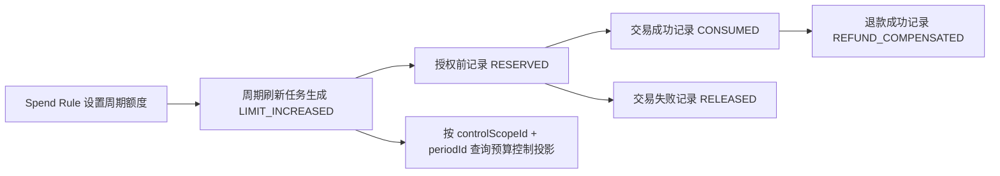

# wind-funds 用户接入指南

## 1. 定位

本文面向要接入 `ledger`、`wallet`、`transaction` 三个主链模块的业务系统和内部研发。它只说明当前代码中已有公共契约和测试证明过的接入方式，不承诺 VCC、全球账户、收单、清结算、对账、归档或治理的生产接入。

接入方只依赖 `core`、`ledger-face`、`wallet-face`、`transaction-face`。不要依赖 `*-impl`、Entity、Mapper、内部状态机或测试工具类。

## 2. 模块边界

| 模块 | 定位 | 接入方能做 | 接入方不能做 |
| --- | --- | --- | --- |
| `ledger` | 账本事实和余额投影。 | 查询账本、账本交易、分录和余额投影；在底层服务级测试中验证过账事实。 | 业务方不直接拼分录、不直接改余额、不把投影当事实源。 |
| `wallet` | 账户、支付工具、资金责任、支出控制和准入快照。 | 建模资金账户/信用账户，解析账户能力、支付工具能力、资金责任和 Spend Rule 决策。 | 不创建交易事实，不写 route、posting、ledger entry 或余额投影。 |
| `transaction` | 标准资金交易、授权交易、余额控制、让利出资记账和外部确认入金消费。 | 提交已经成立的资金事实，由交易层编排路由、账务和账本影响。 | 不接收页面动作、审批中、通道处理中或外部非终态。 |

依赖方向是 `transaction -> wallet -> ledger`。横向治理或对账能力只能通过 face/core 只读消费事实，不反写主链事实。

## 3. 接入顺序

1. 先确认业务事实已经成立，并能回答账务三问：谁的钱、多少钱、怎么变的；同时准备幂等键、来源引用和操作者。
2. 先走 `wallet` 建模或准入：账户能力、支付工具能力、资金责任、Spend Rule 决策。
3. 再走 `transaction` 产生资金事实：直接交易、授权交易、余额控制、让利出资、外部确认入金。
4. 最后用 `ledger` 和投影查询验收：账本交易、分录、余额桶、幂等和失败无副作用。

如果第 1 步说不清，不进入 wind-funds。

## 4. 能力矩阵

| 能力 | 公共入口 | 已验证场景 | 主要测试 |
| --- | --- | --- | --- |
| 账本基础 | `LedgerService`、`LedgerTransactionService` | 建账、过账、按 SN 查询交易/分录、余额投影。 | `LedgerServiceImplTests`、`LedgerTransactionServiceImplTests`、`DefaultLedgerPostingAssemblerTests`、`LedgerBalanceProjectionServiceImplTests` |
| 账户和余额查询 | `FundsAccountCapabilityApplicationService`、`FundsSubjectBalanceQueryService` | 账户能力准入、余额查询、账本 profile 初始化。 | `FundsAccountCapabilityApplicationServiceTests`、`FundsSubjectBalanceQueryServiceImplTests`、`LedgerProfileContractTests`、`ControlAccountLedgerInitializationTests` |
| 支付工具 | `PaymentInstrumentCapabilityApplicationService`、`PaymentInstrumentPreTransactionSnapshotApplicationService` | 支付工具能力、绑定快照、交易前快照。 | `PaymentInstrumentCapabilityApplicationServiceTests`、`PaymentInstrumentPreTransactionSnapshotApplicationServiceTests`、`PaymentInstrumentServiceImplTests` |
| 资金责任 | `FundingResponsibilityResolutionApplicationService` | 按关系解析默认资金责任主体。 | `FundingResponsibilityResolutionApplicationServiceTests`、`SpendSubjectFundingRelationServiceImplTests` |
| 支出控制 | `SpendControlAdmissionApplicationService`、`BudgetControlLimitAdjustmentApplicationService`、`SpendControlTransactionConsumptionApplicationService` | Spend Rule 准入、预算控制调整、交易消费记录。 | `SpendControlAdmissionApplicationServiceTests`、`BudgetControlLimitAdjustmentApplicationServiceTests`、`SpendControlTransactionConsumptionApplicationServiceTests`、`SpendRuleDefinitionServiceFlowTests` |
| 直接交易 | `FundsDirectTransactionService` | 充值、转账、付款、退款、提现、手续费、退费。 | `FundsDirectTransactionFlowTests`、`FundsTransactionFeeFlowTests`、`FundsTransferPayWithdrawChainFlowTests` |
| 授权交易 | `FundsAuthorizationTransactionService` | 授权、撤销、完成、完成后退款。 | `FundsAuthorizationTransactionFlowTests` |
| 余额控制 | `FundsBalanceControlService` | 冻结、解冻、受控调整；冻结不表达扣款。 | `FundsBalanceControlFailureFlowTests`、`FundsFrozenOrderServiceImplTests`、`FundsWithdrawalSuccessFlowTests`、`FundsWithdrawalAfterPartialUnfreezeFlowTests` |
| 让利出资记账 | `FundsBenefitContributionTransactionService` | 平台/商户/合作方已决策让利出资入账和按原交易冲回。 | `FundsBenefitContributionTransactionServiceContractTests`、`FundsBenefitContributionTransactionServiceFlowTests` |
| 外部确认入金 | `ExternalFundsEventApplicationService` | 已确认外部入金消费为标准充值，目标必须是资金账户。 | `ExternalFundsEventApplicationServiceTests` |

### 4.1 当前生产准出基线

本表是当前接入承诺的最小基线。新增公共契约、扩展业务能力或进入 P2 场景前，必须重新确认写入范围、验证命令和不接入范围。

| 能力域 | 准出结论 | 当前可交付内容 | 生产接入前仍需确认 |
| --- | --- | --- | --- |
| `ledger` 账本主链 | 可接入。 | 建账、过账、账本交易、分录查询和余额投影。 | 业务场景必须提供账务主体、账目、币种、幂等和 posting 平衡验收。 |
| `wallet` 账户和支付工具 | 可接入。 | 资金账户、信用账户、账户能力、支付工具能力、绑定快照和交易前快照。 | 支付工具只做引用和准入快照，不作为账本主体；敏感数据不得进入 request、日志和投影。 |
| `wallet` 资金责任 | 可接入。 | 按支出主体解析资金账户或信用账户责任主体。 | 多资金责任、错币种、停用账户和冲突优先级必须在准入前失败。 |
| `wallet` Spend Rule / 预算控制 | 受控试点可用。 | 单条规则只读评估、最终决策固化、周期额度流水、消费/释放/退款补偿和控制投影查询。 | 多规则组合裁决、强一致授权拦截、rolling amount、cooldown、外部协同授权和生产调度由上游或专项承接。 |
| `transaction` 直接交易 | 可接入。 | 充值、转账、付款、退款、提现、手续费和退费。 | 外部 pending、审批中或通道处理中不得进入交易事实。 |
| `transaction` 授权交易 | 可接入。 | 授权、撤销、完成和完成后退款，后继动作基于原路径。 | 授权拒绝不得生成 route、posting、ledger entry；清算、争议和强制完成需按专项边界确认。 |
| `transaction` 余额控制 | 可接入。 | 冻结、解冻、受控余额调整和失败无副作用。 | 冻结只表达同主体 `AVAILABLE <-> FROZEN`，不表达扣款、消费或跨主体转移。 |
| 让利出资记账 | 可接入。 | 上游已决策的平台、商户或合作方让利出资入账，以及按原交易冲回。 | 不计算券、不维护券生命周期、不保存营销归因；非入账权益不进本服务。 |
| 外部确认入金 | 可接入。 | `confirmed credit -> funding account` 转为标准充值。 | accepted、submitted、processing、message sent、VA 未匹配、错币种和外部账户入账均不得进入本入口。 |
| 清结算 / 对账 / 归档 / 治理 | 不作为本文生产接入承诺。 | 可只读消费主链事实；已存在局部服务和测试只能作为专项依据。 | 需要独立产品设计、系统设计、TDD、DDL/H2、服务级测试、Runbook 和 owner 确认。 |
| VCC / 全球账户 / ACH / 收单 / FX / 退汇 | P2 边界设计，不进入默认实现。 | 可复用主链事实和外部引用边界。 | 业务生命周期、外部规则、通道协议、合规、敏感数据和专项回归未确认前，不得声明生产可用。 |

## 5. 业务事实说明卡

每个接入场景先填这 10 项，填不满就不要拆研发任务。前三类信息必须先回答账务三问。

| 项 | 必填内容 |
| --- | --- |
| 业务动作 | topup、transfer、pay、refund、withdraw、fee、authorize、authorization reversal、settle、settleRefund、freeze、unfreeze、adjust、benefit settle/refund、external confirmed credit。 |
| 资金主体 | 回答“谁的钱”：成本承担方、资金流出方、资金流入方、授权主体或冻结主体。 |
| 账户类型 | FundingAccount、CreditAccount、平台账户角色解析结果；SpendControlScope、Spend Rule、PaymentInstrument 只能是控制或引用。 |
| 金额币种 | 回答“多少钱”：金额必须为正，币种和精度必须能和账户、账本 profile 对齐。 |
| 幂等 | 业务流水、请求摘要、重复提交和同键不同摘要处理。 |
| 来源引用 | 回答“怎么变的”：订单、提现单、授权单、外部事件、原交易 SN 或原冻结单 SN。 |
| 操作者 | 使用 `WindOperator`，不要塞进 request 字段。 |
| 准入快照 | 账户能力、支付工具能力、资金责任、Spend Rule 决策或原 route snapshot。 |
| 账务验收 | 交易状态、route、posting、ledger transaction、ledger entry、余额桶变化。 |
| 失败验收 | 准入失败、幂等冲突、余额不足、路由失败、外部非终态不得留下错误资金事实。 |

## 6. 常用接入路径

### 6.1 用户或商户入金

适用条件：外部资金已经确认到账，目标是内部资金账户。

推荐入口：

1. `FundsAccountCapabilityApplicationService.resolveFundsAccountCapability`
2. `FundsDirectTransactionService.topup`
3. 查询 `LedgerTransactionService` 或余额投影验收

如果来源是外部事件，可用 `ExternalFundsEventApplicationService.consume`，但当前只支持 confirmed credit -> funding account。

验证锚点：`FundsDirectTransactionFlowTests`、`ExternalFundsEventApplicationServiceTests`。

### 6.2 内部转账、付款、退款和提现

适用条件：资金事实已经成立，出入方都是可解析的内部账务主体，或者提现目标只是外部引用。

推荐入口：

| 场景 | 入口 |
| --- | --- |
| 内部转账 | `FundsDirectTransactionService.transfer` |
| 付款 | `FundsDirectTransactionService.pay` |
| 退款 | `FundsDirectTransactionService.refund` |
| 提现 | `FundsDirectTransactionService.withdraw` |
| 手续费 | `FundsDirectTransactionService.fee`、`refundFee` |

验证锚点：`FundsDirectTransactionFlowTests`、`FundsWithdrawalSuccessFlowTests`、`FundsWithdrawalRejectionFlowTests`、`FundsTransactionFeeFlowTests`。

### 6.3 授权交易

适用条件：先占用额度或余额，再按后续事件撤销、完成或退款。

推荐入口：

| 阶段 | 入口 | 说明 |
| --- | --- | --- |
| 授权 | `authorize` | 授权拒绝不得生成 route、posting 或 ledger entry。 |
| 撤销 | `reversal` | 释放原授权占用。 |
| 完成 | `settle` | 基于原授权路径完成，不按当前绑定重新选路。 |
| 完成后退款 | `settleRefund` | 引用原完成事实。 |

验证锚点：`FundsAuthorizationTransactionFlowTests`。

### 6.4 冻结、解冻和调整

适用条件：表达同一主体余额控制或有审批凭证的余额调整。

推荐入口：

| 场景 | 入口 | 禁止项 |
| --- | --- | --- |
| 冻结 | `FundsBalanceControlService.freeze` | 不能表达消费或跨主体转移。 |
| 解冻 | `FundsBalanceControlService.unfreeze` | 不能超过原冻结事实。 |
| 调整 | `FundsBalanceControlService.adjust` | 不能替代付款、退款或提现；同主体余额修正只能在差错单、审批、凭证、审计和重新对账闭环内承接，跨主体补偿不得通过本入口直接处理。 |

验证锚点：`FundsBalanceControlFailureFlowTests`、`FundsFrozenOrderServiceImplTests`。

### 6.5 支付工具和资金责任准入

适用条件：业务入口先拿到卡、外部账户、VA、PSP token 或支付工具引用，需要解析可用性和最终资金责任。

推荐入口：

1. `PaymentInstrumentCapabilityApplicationService.resolvePaymentInstrumentCapability`
2. `PaymentInstrumentPreTransactionSnapshotApplicationService`
3. `FundingResponsibilityResolutionApplicationService.resolveFundingResponsibility`
4. 交易层入口

支付工具不是账户。它只提供引用、绑定和路由输入。

验证锚点：`PaymentInstrumentCapabilityApplicationServiceTests`、`PaymentInstrumentPreTransactionSnapshotApplicationServiceTests`、`FundingResponsibilityResolutionApplicationServiceTests`。

### 6.6 Spend Rule 和预算控制

适用条件：需要在交易前固化支出控制决策，或记录交易消费对控制范围的影响。

当前接入口径：接入方先完成规则判断或外部风控判断，`wallet` 只固化 Spend Rule 决策证据、控制额度流水和只读投影；如接入方只需要单条已发布规则的轻量评估，可先调用 `SpendRuleEvaluationApplicationService.evaluate` 覆盖单笔金额、周期金额可用额度、周期次数、滚动窗口次数、MCC 黑白名单、商户国家黑白名单、卡数据输入能力黑白名单、卡交易处理类型黑白名单、商户标识黑白名单、PAN 录入方式黑白名单、POS 类别黑白名单、CVV 必填、AVS 邮编校验结果、币种黑白名单和本地授权时间窗口判断，再把最终决策证据交给准入服务固化。每个被 `evaluate` 的 `ruleSpec` 只允许一个可执行控制项；金额、MCC、币种、时间窗口等组合裁决需要拆成多条规则由上游合成最终结果。该 evaluator 只提供只读候选评估，不提供并发强一致授权拦截；本文不承诺 Highnote 式托管规则引擎、rolling amount、cooldown、生产调度或协同授权 webhook。

金额和事件口径：`EvaluateSpendRuleRequest.amount` 是调用方已归一后的本次评估金额。卡授权接入方如果区分 requested amount 和 authorized amount，必须先在上游确定进入支出控制的金额口径，再传入 evaluator；wallet 不从外部原始网络字段、退款、撤销或 Highnote 式延迟结果中推导累计授权金额。周期额度、周期次数和滚动窗口次数只读取本系统已有 `SpendControlMovement` 与预算控制投影；交易成功、失败、撤销、过期和退款对控制事实的影响，继续由交易消费控制活动记录。

Velocity 控制口径：Highnote 的 `PER_TRANSACTION` 在本项目只对应本次评估；`DAILY` / `WEEKLY` / `MONTHLY` / `QUARTERLY` / `YEARLY` 由接入方生成稳定 `periodId` 后查询控制投影；滚动次数只按 `ROLLING + windowSizeMinutes` 做只读候选评估；`NINETY_DAYS`、`COOLDOWN_MINUTE`、`COOLDOWN_HOUR`、rolling amount 和 Highnote 的 velocity control 数量上限当前不是 wallet 硬约束。Highnote velocity balance 查询只对应 `BudgetControlProjectionDTO` 的控制口径，不是资金账户余额或账本余额。

不承接规则类型：Highnote 文档中的 maximum amount variance on credit limit、maximum percent variance on credit limit、conditional rule、authorization hold configuration、deposit amount、deposit count、deposit processing network 和 street address 当前不进入 wallet Spend Rule evaluator。信用额度浮动类规则由授信 / 风控专项承接；authorization hold configuration 不改变本项目授权占用和释放语义；外部确认入金走 `transaction` 的外部资金事件入口；地址类控制只允许传入 AVS / 邮编校验结果事实，不接收或保存街道地址原文。

外部风控或协同授权的 approve / decline 只作为最终决策证据进入 `SpendControlAdmissionApplicationService.resolve`。`REJECTED` 会在交易内核前停止；`PASSED` 仍然必须继续通过支付工具绑定、账户能力和资金责任校验，不能被接入方理解为资金可用、授权成功或已经完成交易。

多规则裁决由上游负责合成。接入方如果同时评估单笔限额、MCC、商户标识、国家地区、卡数据输入能力、卡交易处理类型、PAN 录入方式、POS 类别、CVV 必填、AVS 邮编校验结果、币种、时间窗口、滚动窗口次数和外部风控，只把最终 `decisionSn`、`decisionResult`、`decisionDigest` 和 `rejectReason` 传入 wallet；`evaluatedRules`、`decisionPolicy`、`finalDecision` 等明细当前不进入公共契约，保留在上游证据系统中。

规则挂载范围按本系统稳定对象表达，不直接暴露外部产品名：Highnote payment card 映射 `SpendRuleScopeType.PAYMENT_INSTRUMENT`，`scopeId` 使用支付工具流水；financial account 映射 `FUNDING_ACCOUNT` 或 `CREDIT_ACCOUNT`，`scopeId` 使用资金账户或信用账户流水；authorized user、cardholder、员工或账户层级映射 `ACCOUNT_HIERARCHY`，`scopeId` 使用企业员工、持卡人或账户层级的系统内稳定引用；card product 可按产品侧稳定场景映射 `BUSINESS_SCENE`。这些范围只用于规则挂载、查询和解释，不是资金主体、资金责任主体或账本主体。

商户标识场景示例：企业采购卡只允许合作商户 `MID-CONTRACT-001`，接入方发布 `ruleSpec.limitSpec.merchantIdControl.allowedMerchantIds=["MID-CONTRACT-001"]`，授权前调用 `evaluate` 时传入 `merchantId`。命中白名单只得到 `PASSED` 评估结论；仍需继续走支付工具、账户能力和资金责任准入。若发布 `deniedMerchantIds=["MID-RISK-001"]` 且请求命中该 MID，则返回 `REJECTED` 且不产生交易或账本事实。

PAN 录入方式场景示例：企业卡禁止手工录入卡信息，接入方发布 `ruleSpec.limitSpec.panEntryModeControl.deniedPanEntryModes=["MANUAL"]`，授权前调用 `evaluate` 时传入 `panEntryMode=manual`。命中黑名单返回 `REJECTED`，且不保存 PAN 原文、不产生交易或账本事实。若只允许非接触式交易，可发布 `allowedPanEntryModes=["CONTACTLESS"]`，命中后仅得到 `PASSED` 评估结论，后续仍需继续准入和交易链路。

POS 类别场景示例：企业差旅卡禁止 ATM 终端交易，接入方发布 `ruleSpec.limitSpec.pointOfServiceCategoryControl.deniedPointOfServiceCategories=["AUTOMATED_TELLER_MACHINE"]`，授权前调用 `evaluate` 时传入 `pointOfServiceCategory=automated_teller_machine`。命中黑名单返回 `REJECTED`，不产生交易或账本事实。车队卡只允许自助加油终端时，可发布 `allowedPointOfServiceCategories=["AUTOMATED_FUEL_DISPENSER"]`，命中后仅得到 `PASSED` 评估结论。

卡交易处理类型场景示例：企业卡禁止 PIN 变更类卡事件，接入方发布 `ruleSpec.limitSpec.cardTransactionProcessingTypeControl.deniedCardTransactionProcessingTypes=["PIN_CHANGE"]`，授权或卡事件处理前调用 `evaluate` 时传入 `cardTransactionProcessingType=pin_change`。命中黑名单返回 `REJECTED`，拒绝原因为卡交易处理类型不允许，且不产生交易、控制流水或账本事实。若只允许取现类处理类型，可发布 `allowedCardTransactionProcessingTypes=["CASH"]`，请求 `cardTransactionProcessingType=cash` 时仅得到 `PASSED` 评估结论。

CVV 必填场景示例：电商卡要求交易时提供 CVV，接入方发布 `ruleSpec.limitSpec.cvvControl.required=true`，授权前调用 `evaluate` 时只传入 `cvvProvided=false` 或 `true`。未提供时返回 `REJECTED`，拒绝原因为未提供 CVV；已提供时返回 `PASSED`。本接口不得传入 CVV 原文，也不会保存 CVV、PAN 或其他卡敏感值。

AVS 邮编校验结果场景示例：电商卡要求账单邮编校验匹配，接入方发布 `ruleSpec.limitSpec.postalCodeVerificationControl.allowedVerificationResults=["MATCH"]`，授权前调用 `evaluate` 时只传入 `postalCodeVerificationResult=match` 或 `no_match`。`NO_MATCH` 命中拒绝时返回 `REJECTED`，拒绝原因为邮编校验结果不允许；`MATCH` 命中白名单时仅得到 `PASSED` 评估结论。接口只接收 AVS 校验结果，不接收或保存邮编、街道地址、PAN 或 CVV 原文。

币种控制场景示例：企业卡只允许美元授权，接入方发布 `ruleSpec.limitSpec.currencyControl.allowedCurrencies=["USD"]`，授权前调用 `evaluate` 时传入 `currency=USD` 或其他 ISO 币种。命中允许币种时仅得到 `PASSED` 评估结论；若发布 `deniedCurrencies=["EUR"]` 且请求币种为 `EUR`，返回 `REJECTED`，拒绝原因为币种不允许，且不产生交易、控制流水或账本事实。本接口只判断请求币种，不做外汇换算、币种精度换算或账户余额校验。

本地授权时间窗口场景示例：企业卡只允许工作时间授权，接入方发布 `ruleSpec.limitSpec.timeWindowControl.allowedWindows=[{"startTime":"09:00","endTime":"18:00"}]`，授权前按业务或规则时区把授权时间归一化后传入 `authorizationTime`。窗口按起点包含、终点不包含解释，`09:00` 返回 `PASSED`，`20:30` 返回 `REJECTED`，拒绝原因为时间窗口不允许。接口不做时区换算、节假日判断或生产调度刷新。

滚动窗口次数场景示例：企业卡限制最近 15 分钟最多 3 次授权，接入方发布 `ruleSpec.counterSpec.windowMode=ROLLING`、`ruleSpec.counterSpec.windowSizeMinutes=15`、`ruleSpec.limitSpec.countLimit.maxCount=3`，授权前传入同一 `controlScopeId`、目标账户、币种和已归一化的 `authorizationTime`。evaluator 会只读既有 `SpendControlMovement` 中同规则、同控制范围、同账户、同币种且创建时间落在窗口内的 RESERVED / CONSUMED 流水，并按原始占用流水去重计数。窗口内已有 3 笔时返回 `REJECTED`，拒绝原因为滚动窗口次数超限；历史流水都已滑出窗口时返回 `PASSED`。该能力不生成控制流水或资金事实，也不提供并发强一致频控拦截；若授权链路要求强一致阻断，必须由交易 / 准入编排在同一事务或锁定边界内完成评估、准入和 RESERVED 写入。该能力不支持 rolling amount、cooldown 或生产调度刷新。

生产试点接入前，接入方还必须补齐下列证据；否则只能作为内部受控能力使用，不能按生产 Spend Controls 平台对外承诺。

| 检查项 | 接入方需要准备 |
| --- | --- |
| 规则变更审计 | 规则创建、版本发布、挂载变更、停用 / 恢复、额度调整的操作者、原因、审批或审计引用、traceId、变更前后摘要和影响 scope。 |
| 最终决策证据 | 最终 `decisionSn`、`decisionResult`、`decisionDigest`、拒绝原因、上游外部决策引用和业务流水；多规则明细由上游证据系统保存。 |
| 历史窗口查询 | 当前和历史周期都能用 `controlScopeId + periodId` 查询控制额度；需要按账户隔离时必须带目标账户和币种。 |
| 告警和 Runbook | 摘要冲突、挂载冲突、拒绝率异常、控制投影缺证据、滚动窗口慢查询和迁移失败都要有发现方式、处理 owner、止血动作和恢复验收。 |
| 灰度和回滚 | 规则回滚通过新增版本、停用挂载或恢复旧挂载完成；不得覆盖已发布版本、删除历史决策或修改历史控制流水。 |

受控试点角色交接：

- 产品 owner 确认试点只包含单条规则评估、最终决策证据、控制流水、控制投影和交易消费 / 释放 / 退款补偿。
- 架构 owner 确认接入方只依赖 `wallet-face`、`transaction-face`、`ledger-face` 和 `core`，不依赖 `*-impl`、Entity、Mapper 或内部包。
- 测试 owner 回挂 evaluator、admission、movement、projection 和 transaction consumption 验证簇；进入发版前补 `just compile`，提交前补 `just pmd`。
- 发布 owner 确认灰度、回滚、告警、Runbook 和人工接管；确认不完整时停在联调、预发或受控试点。

SC-LOOP-06 准出交接卡：

| 交接项 | 结论 |
| --- | --- |
| 试点能力 | 单条规则只读评估、最终决策证据固化、控制流水、控制投影和交易消费 / 释放 / 退款补偿。 |
| 推荐入口 | `evaluate` -> `resolve` -> `adjustLimit` -> 交易层入口 -> `consume`。 |
| 生产前证据 | 规则变更审计、最终决策证据、历史窗口查询、告警 / Runbook、灰度 / 回滚。 |
| 不接入范围 | P2 VCC / 全球账户 / ACH / 收单 / FX、Highnote 托管规则引擎、rolling amount、cooldown、协同授权 webhook、完整生产启用或上线审批。 |

推荐入口：

1. `SpendRuleEvaluationApplicationService.evaluate` 可选只读评估单条已发布规则
2. `SpendControlAdmissionApplicationService.resolve` 固化最终支出控制决策
3. `BudgetControlLimitAdjustmentApplicationService.adjustLimit` 记录周期控制额度调增或调减
4. 交易层入口
5. `SpendControlTransactionConsumptionApplicationService` 记录消费、释放或退款补偿事实

SpendControlScope 是控制范围，不是账本主体。接入侧使用 `controlScopeId + periodId` 查询额度，并在准入 / 授权请求中传入 `controlScopeId`。

典型周期额度流程：



实际用例：2026-07 月度预算范围 `BG-SALES-2026` 刷新 10000 USD 控制额度，调度任务调用 `adjustLimit` 写入 `LIMIT_INCREASED`，请求携带 `controlScopeId=BG-SALES-2026`、`periodId=2026-07`。一笔企业卡授权通过后写入 `RESERVED 6000`；交易成功后 `consume` 写入 `CONSUMED 6000` 并继承原 `periodId`。查询 `BudgetControlProjectionQuery(controlScopeId=BG-SALES-2026, periodId=2026-07, currency=USD)` 返回该周期控制视图；历史周期查询只替换 `periodId`，例如查询 `periodId=2026-08` 不会混入 7 月流水，另一个 `controlScopeId` 的同周期流水也不会混入。

验证锚点：`SpendRuleEvaluationApplicationServiceTests`、`SpendControlAdmissionApplicationServiceTests`、`SpendControlMovementServiceFlowTests`、`SpendControlTransactionConsumptionApplicationServiceTests`。

### 6.7 让利出资记账

适用条件：上游已经决策完成平台、商户或合作方承担多少让利成本，本服务只记录出资方账目交易。

推荐入口：

| 场景 | 入口 |
| --- | --- |
| 记录出资 | `FundsBenefitContributionTransactionService.settle` |
| 冲回出资 | `FundsBenefitContributionTransactionService.refund` |

多方出资就多次调用 `settle`，不要批量 API，也不要把多个出资方合并到一个营销账户。

验证锚点：`FundsBenefitContributionTransactionServiceContractTests`、`FundsBenefitContributionTransactionServiceFlowTests`。

### 6.8 全球账户和跨境接入准入卡

全球账户、跨境收付款、ACH/银行转账和本地清算网络只作为上层业务能力包接入资金底座。接入方必须先完成产品生命周期、外部协议、合规材料、FX 决策、通道状态和对账来源解释，再把已经成立的资金事实交给 `wallet`、`transaction` 和 `ledger`。

| 外部事实或状态 | 能否进入资金底座 | 推荐入口 | 必须带上的证据 | 不能做 |
| --- | --- | --- | --- | --- |
| 外部已确认入金，且目标是内部资金账户。 | 可以。 | `ExternalFundsEventApplicationService.consume` 或 `InstrumentTransactionLifecycleApplicationService.receiveByInstrument`。 | 外部事件流水、confirmed credit 类型、目标资金账户、金额、币种、业务流水、外部 rail / provider 引用。 | 不把 VA、银行账户或外部账户建成 ledger subject。 |
| 外部入金只是 accepted、submitted、processing、message sent 或待匹配。 | 不可以。 | 停在上游入金单、在途、挂账、对账或人工复核。 | 外部引用、状态、文件摘要、匹配原因、待处理 owner。 | 不增加 `AVAILABLE`，不生成 `topup`。 |
| 外部出款已终态成功，且可以关闭内部冻结资金。 | 可以。 | `InstrumentTransactionLifecycleApplicationService.payOutByRail`。 | 原冻结流水、外部出款流水、终态成功状态、rail、收款端引用、金额、币种、业务流水。 | 不把外部 submitted / accepted / processing 当成功。 |
| 外部出款已提交、受理、处理中或 message sent。 | 不可以。 | 停在上游 payout order、在途、对账或差错链路。 | 出款单、外部状态、回单拉取计划、超时告警、处理 owner。 | 不关闭 `FROZEN`、`SETTLEMENT` 或 `IN_TRANSIT`，不生成 `withdraw`。 |
| 退汇、return、NOC、外部 rail reversal、金额不一致或费用不一致。 | 不可以直接进入默认交易入口。 | 进入对账差错、退汇专项或人工处理，明确责任后再生成资金事实。 | 原交易或原出款引用、外部原因、费用、责任方、审批或差错单。 | 不降级成普通 `refund`，不净额静默抵消。 |
| 涉及跨币种、FX、汇兑损益或错币种到账。 | 默认不可以。 | 先由 FX / treasury 或差错链路确认。 | quoteRef、原币、目标币、汇率、有效期、执行结果、审批引用。 | 不自动换汇，不按期望币种静默入账。 |

接入申请必须能回答四个问题：外部状态是否终态、内部账务主体是谁、金额币种是否可直接入账、失败或退回时由谁负责处理。回答不完整时，只能登记在途、差错或人工复核，不进入资金事实链路。

验证锚点：`ExternalFundsEventApplicationServiceTests`、`InstrumentTransactionLifecycleApplicationServiceTests`、`PayoutPreflightServiceTests`；完整退汇、FX、跨境合规和多币种对账仍需独立业务专项。

## 7. 禁止路径

| 禁止项 | 原因 |
| --- | --- |
| 业务方直接依赖 `ledger-impl`、`wallet-impl`、`transaction-impl`。 | 破坏模块边界，绕过公共契约。 |
| 业务方直接写 ledger entry 或改余额投影。 | 破坏账本事实源。 |
| 把支付工具、外部账户、VA、卡号、SpendControlScope、Spend Rule 当作 ledger subject。 | 它们只是引用或控制范围。 |
| 把冻结当消费、扣款或提现成功。 | 冻结只表达同主体 `AVAILABLE <-> FROZEN`。 |
| 授权拒绝后继续生成 route、posting 或 ledger entry。 | 拒绝不是资金事实。 |
| 用 `contextVariables` 承载核心金额、分摊、账户或规则事实。 | 核心事实必须是强字段或稳定引用。 |
| 外部 pending、审批中、通道处理中直接入账。 | 还没有成立资金事实。 |

## 8. 生产接入检查和发布 Runbook

接入生产前，业务 owner、研发 owner、QA owner 和发布 owner 必须共同确认下面清单。确认不完整时，只能停在联调、预发或受控试点，不得按生产能力对外承诺。

### 8.1 生产接入检查清单

| 检查项 | 准出要求 |
| --- | --- |
| 账务三问 | 每个入口都能回答“谁的钱、多少钱、怎么变的”，并能映射到资金主体、金额币种、交易类型和账本影响。 |
| 事实终态 | 外部事件必须是已确认入金或终态成功出款；pending、processing、审批中、通道处理中不得入账。 |
| 公共契约 | 接入方只依赖 `*-face` 和 `core`，不得依赖 `*-impl`、Entity、Mapper、测试工具或内部包。 |
| 幂等和重放 | 业务流水、请求摘要、原交易引用和重复提交行为已验证；同键不同摘要必须拒绝。 |
| 失败无副作用 | 准入失败、余额不足、规则拒绝、外部非终态和路由失败不得留下错误资金事实。 |
| 账务验收 | 已验证 transaction、route、posting、ledger transaction、ledger entry、余额桶和投影查询。 |
| 敏感数据 | 不在 request、contextVariables、日志或审计摘要中保存 PAN、CVV、密钥、证件号、手机号或外部账号原文。 |
| P2 边界 | VCC、全球账户、ACH、收单、FX、退汇、NOC、外部 rail reversal、多币种对账和通道协议未进入本轮交付承诺。 |

### 8.2 发布 Runbook

| 阶段 | 动作 | Owner |
| --- | --- | --- |
| 发布前 | 执行相关 `verify-slice`；高风险或发版收口执行 `just verify-cad`。 | QA owner |
| 灰度 | 先接入单一租户、单一业务场景或单一资金入口；观察幂等冲突、拒绝率、余额投影差异和异常日志。 | 发布 owner |
| 监控 | 关注交易失败率、账本不平衡、posting 失败、余额不足异常、Spend Rule 拒绝率、外部事件重复和对账差异。 | 发布 owner |
| 回滚 | 停止新流量；保留已生成资金事实；通过业务补偿、反向交易、原交易冲回或人工差错单处理，不直接改账。 | 研发 owner |
| 人工接管 | 无法判断资金责任、外部终态、汇兑差异、退汇责任或余额差异时，停止自动处理并转人工复核。 | 业务 owner |

## 9. 验证命令

接入文档或代码变更至少跑相关切片。只改本文档时可跑边界和相关场景测试，不必每次全量。

| 变更范围 | 推荐命令 |
| --- | --- |
| ledger 接入说明或账本事实 | `just verify-slice DefaultLedgerPostingAssemblerTests,LedgerServiceImplTests,LedgerTransactionServiceImplTests,LedgerBalanceProjectionServiceImplTests tests` |
| wallet 接入说明 | `just verify-slice FundsAccountCapabilityApplicationServiceTests,PaymentInstrumentCapabilityApplicationServiceTests,FundingResponsibilityResolutionApplicationServiceTests,SpendControlAdmissionApplicationServiceTests tests` |
| transaction 接入说明 | `just verify-slice FundsDirectTransactionFlowTests,FundsAuthorizationTransactionFlowTests,FundsTransactionFeeFlowTests,FundsBalanceControlFailureFlowTests tests` |
| 让利或外部入金说明 | `just verify-slice FundsBenefitContributionTransactionServiceContractTests,FundsBenefitContributionTransactionServiceFlowTests,ExternalFundsEventApplicationServiceTests tests` |
| 模块边界 | `just test-boundary` |
| 收口 | `just verify-cad` |

## 10. 接入申请最小模板

```text
业务动作：
使用入口：
业务流水/幂等键：
操作者：
资金主体：
账户类型：
金额/币种：
支付工具或外部引用：
准入快照：
原交易或原冻结引用：
预期余额桶变化：
预期账本交易/分录：
失败无副作用要求：
对应测试类：
验证命令：
不接入范围：
```

## 11. 当前不在本指南承诺范围

清结算、对账、归档、重放、指标治理、VCC 产品化、全球账户、ACH、收单和通道协议适配不在本文接入承诺范围内。它们可以消费本文三层主链事实，但需要单独的产品设计、系统设计、TDD 和工程变更边界。

全球账户或跨境出款接入时，`InstrumentTransactionLifecycleApplicationService.payOutByRail` 只能用于外部出款已终态成功、可关闭内部冻结资金的场景。外部 `submitted`、`accepted`、`processing`、`message sent` 等状态必须停在上游出款单、在途、对账或差错链路，不得调用该入口生成 `withdraw` 资金事实。
