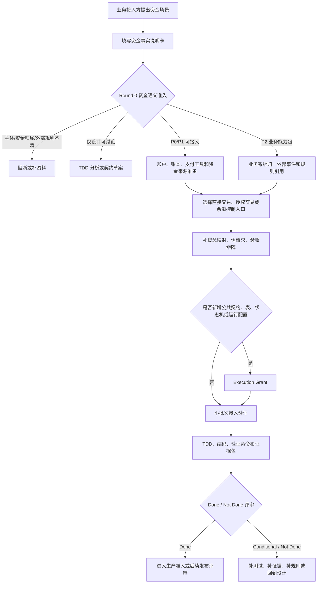

# wind-funds 用户接入指南

## 1. 文档定位

本文面向要接入 wind-funds 的上层业务系统和内部使用方，回答三个问题：

1. wind-funds 能为业务提供哪些资金底座能力。
2. 业务接入前必须准备哪些事实、主体、账户、账务和验收材料。
3. 当前设计和实现从可行性、可用性、易用性、扩展性、安全性和工程实践看，哪些能力可以接入，哪些只能进入专项准入或 TDD 分析。

本文不是 API 手册，也不是上线批准。API 入口以 `*-face`、`core` 契约和后续 Execution Grant 为准；生产启用还必须补齐代码、测试、DDL/H2、验证命令、权限、审计、外部规则确认和发布回滚证据。

### 1.1 快速结论

首次阅读时可以先按下表判断自己要做什么。只要结论不是“可进入接入准备”，就不要把需求直接拆成研发任务。

| 读者问题 | 快速结论 | 下一步 |
| --- | --- | --- |
| 业务只是有页面动作、审批中状态、通道处理中状态或外部 pending 状态。 | 暂不进入 wind-funds。 | 留在业务系统或通道适配层，等形成确定资金事实后再评审。 |
| 业务能说明谁的钱、因什么业务变化、金额币种、主体、账户类型、`normalBalanceSide`、幂等键和余额影响。 | 可进入接入准备。 | 填资金事实说明卡，进入 Round 0 资金语义准入。 |
| 业务需要直接交易、授权交易或余额控制。 | 优先按 P1 标准能力接入。 | 准备账户、支付工具、资金责任解析关系、伪请求和验收矩阵。 |
| 业务需要清结算、对账、出款、归档或重放。 | 只能进入专项准入。 | 先做 TDD 分析和 Execution Grant，不得默认生产可用。 |
| 业务属于 VCC、全球账户、ACH 或收单。 | 作为 P2 业务能力包接入。 | 上层业务先归一外部事件，wind-funds 只承接资金事实和底座能力。 |
| 业务要接入 VCC 预付卡、共享卡或企业卡工具。 | 先按支付工具接入，再解析内部责任主体。 | 注册 PaymentInstrument，建立绑定、预算或资金责任解析关系，授权时固化 FundingAllocationDecision 和原路径快照。 |
| 需要新增公共契约、枚举、状态机、表、H2 schema 或运行时配置。 | 必须进入 Execution Grant。 | 明确写入范围、只读范围、测试要求、验证命令和停止条件。 |

### 1.2 10 分钟接入导读

| 角色 | 先看章节 | 需要形成的判断 | 交付物 |
| --- | --- | --- | --- |
| 产品和业务负责人 | 1、2、3、7、11 | 业务是否应该接入、属于哪个能力层、哪些不是 wind-funds 职责。 | 接入目标、非目标、业务事实、能力成熟度结论。 |
| 研发和架构 | 3、5、6、8、9 | 是否有稳定公共契约、是否需要新增契约或表、是否具备编码准入条件。 | 服务入口清单、概念映射、Execution Grant 草案。 |
| 测试 | 4、6.8、9、接入样例 | 每个资金变化如何证明状态、金额、账户类型、`normalBalanceSide`、route、posting、entry、projection、借贷平衡、余额影响、幂等和审计。 | 验收矩阵、目标测试资产、必须失败用例。 |
| 运营、财务、风控、安全和合规 | 2.2、2.3、6.8、7.4、8.5、9 | 对账、差错、出款、外部规则、敏感数据、审批和 Runbook 是否闭合。 | 待确认项、阻断条件、人工处理入口和审计证据包。 |

## 2. 接入总原则

wind-funds 是支付资金底座，不是 VCC、全球账户、ACH、收单、发卡处理、通道网关、风控决策、KYC/KYB、报表平台或会计总账系统。

### 2.1 业务目标、对象和核心决策

本指南的业务目标是让上层业务接入方用统一语言完成资金接入准备：明确业务目标、用户价值、非目标、业务对象、对象模型、字段口径、生命周期、状态和验收方式。接入成功标准不是“能调通接口”，而是任一资金变化都能被业务事实、资金指令、route snapshot、posting plan、ledger entry、余额投影、交易投影、审计和测试共同解释。

| 维度 | 接入指南结论 |
| --- | --- |
| 业务目标 | 让 VCC、全球账户、ACH、收单和其他上层业务在不污染资金内核的前提下，复用统一钱包、账本、账目、投影、对账、清结算和归档能力。 |
| 用户价值 | 业务、研发、测试、运营、财务和风控能用同一份接入材料判断能不能接、怎么接、接完如何验收、哪些能力必须阻断。 |
| 非目标 | 不替代 PRD、DSL、系分、TDD、API 文档、合规结论、会计结论、通道协议或上线审批。 |
| 业务对象 | 业务事实、资金指令、FundingAccount、CreditAccount、平台账户角色、BudgetGroup、Spend Rule、PaymentInstrument、RouteSnapshot、LedgerEntry、TransactionView、Projection、ReconciliationBatch、SettlementOrder、ArchiveManifest。 |
| 对象模型 | 业务对象先归一为资金事实，资金事实再解析可记账主体、账目、路由、账务计划、分录和只读投影。 |
| 字段口径 | 金额、币种、主体、账目、周期、幂等键、原事实引用、规则版本、审批凭证、操作者和审计引用必须显式填写。 |
| 生命周期 | 接入准备、账户建模、工具绑定、资金动作、账务入账、投影解释、对账清结算、归档重放和异常处理分阶段推进。 |
| 状态 | 交易状态、授权状态、冻结状态、清算状态、结算状态、出款状态、对账差错状态和治理任务状态不得混用。 |

核心决策如下：

| 核心决策 | 取舍说明 |
| --- | --- |
| 业务接入优先通过 face/core 契约进入。 | 选择稳定公共契约，放弃业务方直接依赖 Entity、Mapper、impl 或内部状态机。 |
| P0/P1/P2 分层接入。 | P0/P1 可以进入小批次编码准入；P2 业务只通过 capability pack 接入，避免业务状态机反向污染资金内核。 |
| 清结算和治理能力按专项授权推进。 | 设计已对齐，但完整生产能力仍需 DDL/H2、服务契约、实现和测试闭合，不在接入指南中直接承诺可用。 |
| 外部规则未确认时默认阻断自动资金处理。 | 选择资金安全和合规审慎，放弃以“通道返回”或“业务已确认”替代规则核验。 |

### 2.2 角色和职责边界

接入指南不是单个团队的说明书。接入前必须明确谁提出业务事实、谁确认资金口径、谁承担异常处理、谁给出上线前确认。

| 角色 | 主要职责 | 不应承担 |
| --- | --- | --- |
| 业务接入方 | 说明业务场景、业务事实、单据状态、外部事件、幂等键和使用者展示需求。 | 不直接定义账本分录、内部账户科目或绕过 wind-funds 改余额。 |
| 产品负责人 | 确认目标、非目标、用户价值、能力边界、场景验收和运营体验。 | 不替代合规、财务、税务、通道或技术实现结论。 |
| 架构和研发 | 确认模块边界、公共契约、数据模型、事务边界、幂等、可观测和验证命令。 | 不在缺少 Execution Grant 时修改公共契约、表结构或资金状态机。 |
| 测试负责人 | 把接入场景转成 TDD 用例，覆盖正向、逆向、异常、并发、幂等和红线。 | 不只按接口成功与否验收资金场景。 |
| 运营和财务 | 确认清结算、对账、差错、调账、追偿、报表输入和人工处理口径。 | 不通过线下修数替代资金事实、账本分录和差错闭环。 |
| 风控、安全和合规 | 确认权限、敏感数据、KYC/KYB/AML、外部规则、证据脱敏和审计要求。 | 不把待确认规则写成可自动执行结论。 |

### 2.3 四流和接入边界视图

支付资金接入不能只看一个接口。接入评审必须把同一业务拆成业务流、支付信息流、账户/账务流和真实资金流，分别确认责任方和系统边界。

| 流 | 主要内容 | wind-funds 承接 | wind-funds 不承接 |
| --- | --- | --- | --- |
| 业务流 | 订单、授权、提现、退款、争议、结算申请、运营处理单和业务状态。 | 消费已经成立或已归一的资金事实，记录来源引用、幂等键、操作者和审计上下文。 | 不承接页面流程、营销策略、商户经营决策、KYC/KYB/AML 最终判断或业务审批状态机。 |
| 支付信息流 | 卡、VA、银行账户、ACH trace、PSP reference、通道单、银行流水、外部文件和规则引用。 | 保存脱敏引用、摘要、外部单号、规则核验状态和 route 输入。 | 不解析外部协议全集，不保存敏感原文，不把外部账户直接作为 ledger subject。 |
| 账户/账务流 | FundingAccount、CreditAccount、平台账户角色解析后的平台资金账户、BudgetGroup、Spend Rule、RouteSnapshot、PostingPlan、LedgerEntry、余额投影和交易投影。 | 资金账户、信用账户和平台资金账户承接账户建模、路由、账务计划、账本事实、只读投影和重放差异；BudgetGroup 和 Spend Rule 只承接支出控制视图、规则快照和审计解释。 | 不允许业务方直接写 ledger entry、改投影、改余额、把预算组或 Spend Rule 当账本主体，或绕过 route/posting 入账。 |
| 真实资金流 | 外部收付款、清算网络、银行/PSP/卡组织结果、出款、退汇、拒付和实际到账。 | 记录上层业务或外部适配层确认后的资金结果、差错、对账证据和清结算影响。 | 不直接替代银行、PSP、卡组织、ACH、清算机构或持牌机构执行外部资金轨道。 |

边界判定口径如下：

| 判定问题 | 接入结论 |
| --- | --- |
| 业务动作还没有形成确定资金事实。 | 不进入 wind-funds，留在业务系统或通道适配层。 |
| 只有外部单号或支付工具，没有内部可记账主体。 | 先补主体、账户、工具绑定和资金责任解析关系。 |
| 能形成资金事实，但涉及外部规则未确认。 | 可以做设计和 TDD 分析，不得驱动自动资金处理。 |
| 能形成资金事实，且 P0/P1 能力可覆盖。 | 进入标准接入流程和小批次 Execution Grant。 |
| 需要 VCC、全球账户、ACH 或收单业务专属语义。 | 作为 P2 capability pack 接入，不反向污染资金内核。 |

接入方必须按下列原则使用资金底座：

| 原则 | 接入要求 | 禁止行为 |
| --- | --- | --- |
| 业务事实先进交易层 | 业务系统提交已经成立或已归一的资金事实，再由 wind-funds 转成资金指令。 | 把页面流程、通道处理中、审批中或外部非终态直接当成资金入账事实。 |
| 账本是余额事实源 | 余额来自 ledger entry 和余额投影，余额查询只能解释事实。 | 业务侧直接改余额、改余额投影、改交易投影或用报表修余额。 |
| 支付工具不是账户 | 卡、VA、银行账户、外部账户、token、PSP 凭证只做引用或工具。 | 把支付工具、外部账户或业务主体直接作为 ledger subject 入账。 |
| 冻结不是扣款 | 冻结只表达同主体 `AVAILABLE <-> FROZEN`。 | 把冻结当消费、扣划、退款、授权完成或跨主体价值转移。 |
| 授权不等于入账完成 | 授权批准只表达占用；完成、撤销、过期、退款、拒付必须按原事实链路处理。 | 授权拒绝生成 route、posting、ledger entry 或展示成已消费。 |
| 投影只读可重建 | 余额投影、交易投影、用户账单、商户账单和运营时间线只从事实派生。 | 投影反写交易事实、账本事实或余额事实。 |
| 运营闭环走白名单 | 清结算、对账、出款、差错、冲正、调账、追偿必须有来源单据、审批、证据和审计。 | 把运营后台做成通用改账入口。 |

## 3. 能力成熟度和接入结论

接入前先看能力成熟度。成熟度不是产品愿景，而是当前设计、契约、代码入口和测试证据能支持到什么程度。

本节中的“可进入接入准备”只表示设计语义、公共入口或目标测试方向具备继续拆解条件，不表示生产可用。任何编码、DDL/H2、测试资源、公共契约、运行时配置或生产启用，都必须在具体 Execution Grant 中重新确认写入范围、目标测试资产、验证命令、权限审计、外部规则和回滚方案。

### 3.0 成熟度口径翻译

同一个成熟度结论，对产品、研发和测试的含义不同。评审时优先使用下表，避免把“能设计”“能编码”“能上线”混成一个结论。

| 成熟度结论 | 产品口径 | 研发口径 | 测试和生产口径 |
| --- | --- | --- | --- |
| 可进入接入准备 | 场景可以纳入 wind-funds 讨论，产品语义和能力边界基本成立。 | 可以做接口使用清单、概念映射和小批次 Execution Grant 草案。 | 只能准备验收矩阵和目标测试资产，不能声明已验证或生产可用。 |
| 专项 Execution Grant | 主链路可拆，但涉及清结算、对账、归档、出款、公共契约或表结构。 | 必须单独声明写入范围、只读范围、DDL/H2、状态机、验证命令和停止条件。 | 需要先补专项 TDD、失败无副作用、幂等、审计、Runbook 和回滚证据。 |
| 仅 TDD 分析 | 产品方向可以讨论，但契约、系统落点或外部规则尚不稳定。 | 只能写设计、契约草案、测试设计或 dry-run，不进入生产代码。 | 只能验证设计可测性，不得声明 Done。 |
| 阻断 | 主体、资金归属、外部规则、敏感数据或验收口径存在关键缺口。 | 不拆编码任务，不新增公共契约，不改表或配置。 | 回到 PRD、DSL、系分、TDD 或专业确认补齐。 |

| 能力域 | 当前接入结论 | 设计依据 | 实现依据 | 接入要求 |
| --- | --- | --- | --- | --- |
| 钱包账户、FundingAccount、CreditAccount、BudgetGroup、平台账户角色 | 可进入接入准备；编码仍需 Execution Grant、目标测试资产和验证命令闭合。 | PRD 01/02、系分 01/02、TDD 账户和钱包矩阵。 | `wallet-face` 已有 FundingAccount、CreditAccount、BudgetGroup、PlatformFundingAccount、SubjectLedgerInitializer、FundsSubjectBalanceQuery 等服务。 | 必须先完成主体、币种、账户类型、账本 Profile、平台账户角色和余额桶映射。 |
| 支付工具和资金责任解析关系 | 可进入接入准备；编码仍需 Execution Grant、目标测试资产和验证命令闭合。 | PRD 02 支付工具设计、DSL 支付工具和 route 承载、TDD WALLET/ROUTE 用例。 | `PaymentInstrumentService`、`SpendSubjectFundingRelationService` 已提供工具、绑定、绑定历史和资金责任解析关系入口。 | 支付工具只做引用和路由输入，不表达余额；敏感值必须脱敏或摘要化。 |
| 直接交易 | 可进入接入准备；编码仍需 Execution Grant、目标测试资产和验证命令闭合。 | PRD 02 直接交易、DSL DIRECT、系分 02、TDD DIR。 | `FundsDirectTransactionService` 已提供 topup、transfer、pay、refund、withdraw、fee、refundFee。 | 每个请求必须具备业务流水、幂等键、主体、金额、币种、操作者和来源引用；失败必须无 route、posting、entry 副作用。 |
| 授权交易 | 可进入接入准备；编码仍需 Execution Grant、目标测试资产和验证命令闭合。 | PRD 02 授权交易、DSL AUTH、系分 02、TDD AUTH。 | `FundsAuthorizationTransactionService` 已提供 authorize、reversal、settle、settleRefund、chargeback。 | 必须区分 authorize、settle、reversal、expire、refund、chargeback；后续事件必须引用原授权或原 route snapshot。 |
| 余额控制 | 可进入接入准备；编码仍需 Execution Grant、目标测试资产和验证命令闭合。 | PRD 02 余额控制、DSL BALANCE_CONTROL、系分 02、TDD CTRL。 | `FundsBalanceControlService` 已提供 freeze、unfreeze、adjust。 | 冻结和解冻只做同主体控制；adjust 必须有来源、审批、凭证、币种和周期约束，不承接跨主体价值转移。 |
| 账本过账、账本查询和余额投影 | 可作为接入验收事实源使用，生产写入仍通过交易编排进入。 | PRD 02 账本账目和余额投影、DSL Posting/Ledger、系分 02、TDD LEDGER/VIEW。 | `ledger-face` 和 `core` 已有 LedgerTransaction、LedgerEntry、LedgerPosting、LedgerBalanceProjection 相关契约和实现。 | 业务接入方不得直接提交 ledger entry；账本写入应由 route/posting 编排产生。历史 `update/delete` 类账本接口不作为业务接入入口。 |
| 权益金额组件和权益资金事实 | 可做契约接入和专项准入；资金流消费需要 Phase/Batch 授权。 | PRD 02 权益金额组件、DSL BENEFIT、TDD BEN。 | `FundsBenefitContributionTransactionService`、权益资金请求模型、旧 `benefitSnapshot` 字段拒绝测试和历史摘要兼容测试已存在。 | 必须说明 `fixtureLevel`、权益资金事实源、金额闭合、退款分摊、外部规则核验、审计证据包和使用者解释视图。 |
| 清分、清算、结算、出款、对账、差错 | 可进入 TDD 分析和专项 Execution Grant；不得默认生产接入完成。 | PRD 03、系分 03、TDD CLS/SETTLE/RECON。 | 当前主要是设计、TDD 目标和局部测试资产，完整 face/impl/DDL/H2 仍需专项落地。 | 进入编码前必须补清结算 OpenSpec、DDL/H2、Entity/Mapper、服务契约、状态机、对账任务、出款门禁和运营补事实白名单。 |
| 归档、余额快照、交易投影重放、大数据消费承接 | 可进入 TDD 分析和专项 Execution Grant；不得默认生产接入完成。 | PRD 04、系分 04、TDD GOV/ARCH/REPLAY/METRIC。 | 当前主要是设计和局部投影重放基线，完整 governance 物理落点仍需决策。 | 必须先明确治理模块落点、Manifest、checkpoint、watermark、差异报告、人工处理、指标水位隔离和只读边界。 |
| VCC、全球账户、ACH、收单业务支持 | 可作为 P2 业务能力包接入资金底座，不作为统一资金内核直接扩展。 | PRD 06/07/08、ACH 边界文档、三类业务顶层设计。 | 当前资金底座有 P0/P1 基础能力，业务 pack 仍需独立 OpenSpec 和专项实现。 | 业务系统先把外部状态归一为资金事实；VCC 卡、预付卡和共享卡先进入支付工具、绑定和资金来源决策；不得把卡组织、ACH、PSP、银行协议、KYC/KYB、风控模型沉入 wind-funds 内核。 |

### 3.1 接入决策树

接入方可以按下列顺序判断本次需求应如何进入 wind-funds。

| 判断问题 | 是 | 否 |
| --- | --- | --- |
| 业务动作是否已经形成明确资金事实。 | 继续判断主体、金额、币种和幂等。 | 留在业务系统或通道适配层，不进入资金底座。 |
| 是否能解析出内部可记账主体。 | 进入账户、路由和账本映射。 | 先补账户建模或支付工具绑定；外部账户不能直接入账。 |
| 是否属于直接交易、授权交易或余额控制。 | 优先复用 P1 标准入口。 | 判断是否属于清结算、对账、资金数据治理或 P2 业务能力包。 |
| 是否需要清结算、对账、出款或差错闭环。 | 进入专项 Execution Grant 和 TDD 分析。 | 保持在 P1 资金事实和查询投影范围。 |
| 是否涉及 VCC、全球账户、ACH 或收单外部规则。 | 作为 P2 capability pack 接入，先做外部规则和脱敏确认。 | 按 P0/P1 基础能力处理。 |
| 是否需要新增公共契约、枚举、状态机、表或 H2 schema。 | 必须进入 Execution Grant。 | 可以进入接入准备或小批次验证。 |

### 3.2 能力使用顺序

接入实现不得从交易 API 直接开写。推荐顺序如下：

1. 先明确内部责任主体和账本 Profile，说明本场景最终落到 FundingAccount、CreditAccount 还是平台账户角色解析后的平台资金账户；BudgetGroup 和 Spend Rule 只能作为支出控制上下文。
2. 再建或绑定支付工具、预算 scope、Spend Rule 和资金责任解析关系，明确工具只做 route 输入和外部引用；VCC 场景可以先登记卡工具，但交易前必须解析到唯一内部资金责任主体。
3. 然后选择直接交易、授权交易或余额控制入口，提交归一后的资金事实和资金来源决策。
4. 再验证账本交易、ledger entry、余额投影和交易投影。
5. 最后按需进入清结算、对账、出款、归档、重放或 P2 业务能力包专项。

### 3.2.1 内部能力选择

接入方不能从“卡产品叫什么”直接推导账户类型。内部能力选择必须先回答本次业务要表达的是钱、额度、预算还是工具。

| 使用者要解决的问题 | 选择的 wind-funds 能力 | 接入材料 | 必须失败 |
| --- | --- | --- | --- |
| 记录真实资金、商户待清算、平台责任、预收待付、手续费或差错责任。 | FundingAccount | owner、币种、账户能力、账本 Profile、余额桶、责任来源和审计引用。 | 把信用额度、预算控制、卡工具、VA、外部银行账户或钱包标识写成 FundingAccount。 |
| 管理授信额度、可用额度和授权占用。 | CreditAccount | 授信 owner、额度周期、LIMIT、AVAILABLE、AUTHORIZATION、调额来源和规则版本。 | 把 CreditAccount 当现金账户、商户待结算账户或共享卡本体。 |
| 限制部门、项目、员工卡或共享卡周期内能花多少。 | BudgetGroup + 预算型 Spend Rule | 预算 owner、scope、币种、规则窗口、控制额度、规则版本、优先级和审计。 | 把预算组当真实资金池、账本主体或在缺预算规则时兜底扣款。 |
| 接入 VCC、prepaid virtual card、shared card、VA、外部银行账户、钱包标识或 PSP token。 | PaymentInstrument + binding + FundingAllocationDecision + 账户层级快照 | 工具引用、脱敏展示、绑定版本、使用主体、资金责任解析关系、资金子账户或信用子账户、父账户约束、规则版本和原路径快照。 | 因 prepaid/shared/VCC 名称自动创建 `VCC_ACCOUNT`、卡号账户、预算组或账本主体，或未完成账户层级准入就声明 VCC 子账户生产可用。 |

### 3.3 跨文档追踪矩阵

接入指南不重新定义 PRD、DSL、系分和 TDD，而是把它们翻译成接入方能执行的检查项。接入任务进入编码前，必须能在下表中找到对应能力，并补齐本批次实际引用的章节、caseId、用例和验证命令。

| 接入能力 | 产品侧来源 | DSL 侧来源 | 系分侧来源 | TDD 侧来源 | 本批次必填 ID | 接入结论 |
| --- | --- | --- | --- | --- | --- | --- |
| 钱包账户、资金账户、信用账户、预算组、Spend Rule 和平台账户角色 | PRD 01/02 的账户、钱包、支出控制和账务主体设计。 | wallet、subject、ledger profile、balance bucket、Spend Rule 快照和控制视图相关 DSL。 | 系分 01/02 的 wallet-face、wallet-impl、显式建账、预算控制视图和余额查询边界。 | 账户建模、余额桶、显式建账、预算控制视图和边界测试。 | `AC-*`、`DSL-*`、`TDD-*`、`RED-*`、目标测试类和验证命令。 | 可进入接入准备；预算组和 Spend Rule 不作为账本主体，编码仍需 Execution Grant。 |
| 支付工具和资金责任解析关系 | PRD 02 的支付工具、外部账户和工具快照边界。 | payment instrument、external reference、route input 相关 DSL。 | 系分 02 的 PaymentInstrument、SpendSubjectFundingRelation 和脱敏边界。 | 工具绑定、换绑、原路径回放、敏感信息红线、`TDD-WALLET-015` 至 `TDD-WALLET-017`。 | `AC-*`、`DSL-*`、`TDD-*`、`RED-*`、目标测试类和验证命令。 | 可进入接入准备；支付工具只能做引用和 route 输入，不能按卡产品形态反推账户类型。 |
| 直接交易 | PRD 02 的直接交易产品服务契约。 | DIRECT instruction、route、posting、ledger case。 | 系分 02 的 FundsDirectTransactionService、指令转换和编排链路。 | TDD-DIR、TDD-ROUTE、TDD-LEDGER 和失败无副作用。 | 具体 `AC-DIR-*`、`DSL-DIRECT-*`、`TDD-DIR-*`、`TDD-RED-*`、目标测试类和验证命令。 | 可进入接入准备；业务事实必须已经成立。 |
| 授权交易 | PRD 02 的授权生命周期和授权后续事件。 | AUTH instruction、authorization event、原 route snapshot 回放。 | 系分 02 的 FundsAuthorizationTransactionService、AuthorizationGuard 和授权路由。 | TDD-AUTH、授权拒绝无副作用、累计金额上限和原路径回放。 | 具体 `AC-AUTH-*`、`DSL-AUTH-*`、`TDD-AUTH-*`、`TDD-RED-*`、目标测试类和验证命令。 | 可进入接入准备；授权拒绝不得生成 route、posting 或 ledger entry。 |
| 余额控制 | PRD 02 的冻结、解冻和受控调整。 | BALANCE_CONTROL、freeze、unfreeze、adjust case。 | 系分 02 的 FundsBalanceControlService、冻结单和余额调整动作。 | TDD-CTRL、冻结不扣款、解冻不超额和 adjust 审批红线。 | 具体 `AC-CTRL-*`、`DSL-BALANCE-CONTROL-*`、`TDD-CTRL-*`、`TDD-RED-*`、目标测试类和验证命令。 | 可进入接入准备；adjust 不承接跨主体价值转移。 |
| 权益金额组件 | PRD 02 的权益资金事实、金额组件和退款处置。 | BENEFIT funding fact、component、refund disposition case。 | 系分 01/02 的权益资金契约、历史摘要、route/posting 分阶段消费。 | TDD-BEN、权益金额闭合、退款分摊、解释视图和外部规则核验。 | 具体 `AC-BEN-*`、`DSL-BENEFIT-*`、`TDD-BEN-*`、`TDD-BEN-RED-*`、目标测试类和验证命令。 | 可做契约接入；进入资金流消费必须专项授权。 |
| 账本过账和余额投影 | PRD 01/02 的账本事实源和余额可重建原则。 | PostingPlan、LedgerTransaction、LedgerEntry、BalanceProjection case。 | 系分 01/02 的 ledger-face、ledger-impl、LedgerPosting 和余额投影。 | TDD-LEDGER、TDD-VIEW、分录平衡、投影重建和账本周期。 | 具体 `AC-LEDGER-*`、`DSL-LEDGER-*`、`TDD-LEDGER-*`、`TDD-VIEW-*`、目标测试类和验证命令。 | 可作为验收事实源；业务方不得直接写 ledger entry。 |
| 清分、清算、结算、出款和对账 | PRD 03 的运营资金闭环、批次对象和差错处理。 | clearing、settlement、reconciliation、adjustment fact case。 | 系分 03 的 reconciliation 模块、对象状态机、表设计和出款门禁。 | TDD-CLS、TDD-SETTLE、TDD-RECON 和清结算红线。 | 具体 `CLS-GATE-*`、`AC-CLS-*`、`DSL-CLS-*`、`TDD-CLS-*`、`TDD-RECON-*`、目标测试类和验证命令。 | 只能进入专项 Execution Grant；不得默认生产可用。 |
| 归档、余额快照、交易重放和指标项输入 | PRD 04 的归档重放、Manifest、水位和指标边界。 | governance、archive manifest、replay、difference case。 | 系分 04 的 governance 逻辑能力、checkpoint、watermark 和差异报告。 | TDD-GOV、TDD-ARCH、TDD-REPLAY、只读重放和水位红线。 | 具体 `AC-GOV-*`、`DSL-GOV-*`、`TDD-GOV-*`、`TDD-ARCH-*`、`TDD-REPLAY-*`、目标测试类和验证命令。 | 只能进入专项 Execution Grant；不得用重放生成资金事实。 |
| VCC、全球账户、ACH 和收单业务支持 | PRD 06/07/08 和 ACH 边界文档。 | P2 capability pack 外部引用、核验状态和归一资金事实；VCC 工具使用 `PaymentInstrumentRef`、binding snapshot 和 `FundingAllocationDecision`。 | 系分 01 的 P2 承接准入卡和业务 pack 边界。 | P2 专项测试、外部非终态、乱序重复、脱敏、P0/P1 回归、`TDD-P2-VCC-004`、`TDD-P2-VCC-005`、`TDD-WALLET-015` 至 `TDD-WALLET-017`。 | 对应业务 `AC-*`、`DSL-*`、`TDD-*`、`RED-*`、外部规则核验状态、P0/P1 回归命令。 | 作为业务能力包接入；不改变统一资金内核，不新增预付卡或共享卡账本主体。 |

跨文档对齐的最小闭环如下：

1. 产品侧先说明为什么要接、接什么、不接什么，以及用户和运营如何理解结果。
2. DSL 侧把产品语义落成可验证的资金事实、route、posting、entry、projection 或 governance case。
3. 系分侧说明服务入口、模块边界、事务边界、表结构、状态机、错误、观测和回滚。
4. TDD 侧把正向、逆向、失败、幂等、并发、重放和红线转成目标测试资产。
5. 代码侧只有在 Execution Grant 打开后，才允许对公共契约、实现、DDL/H2、测试资源和验证命令做差距复核。

机器契约和生产证据口径如下：

| 证据状态 | 可以声明 | 不能声明 |
| --- | --- | --- |
| 文档中有 `DSL-*` caseId 或 TDD 目标用例 | 设计语义已定义，可进入系分和 TDD 拆解。 | 机器契约已通过、生产路径已验证。 |
| DSL fixture 已落到测试资源并被测试读取 | DSL 契约具备可执行验收入口。 | 已覆盖所有 route、posting、余额、清结算、归档或重放路径。 |
| 目标测试类存在但未执行 | 具备测试资产入口。 | 验证已通过或生产 Done。 |
| 测试命令执行通过且交付说明列出覆盖范围 | 覆盖范围内具备当前执行证据。 | 未覆盖场景、外部规则、性能容量或生产回滚已自动通过。 |

## 4. 接入前置条件

业务接入前必须完成一张“资金事实说明卡”。如果填不满，不能进入编码，只能停留在设计补齐或 TDD 分析。

| 检查项 | 必须回答 |
| --- | --- |
| 业务事实 | 这是什么业务动作：入金、付款、转账、退款、提现、授权、撤销、完成、冻结、解冻、调账、清算确认、结算锁定、出款结果、对账差错还是归档重放。 |
| 主体和资金归属 | 谁的钱，当前属于谁，最终归属谁；客户资金、商户待结算资金、平台自有资金、补贴、手续费、保证金是否分开。 |
| 可记账主体 | 哪些对象会解析为 FundingAccount、CreditAccount 或平台账户角色解析后的平台资金账户；BudgetGroup、Spend Rule、支付工具和外部账户不得作为可记账主体。 |
| 内部能力选择 | 本场景到底使用 FundingAccount、CreditAccount、平台账户角色、BudgetGroup、Spend Rule 还是 PaymentInstrument，并说明哪些是资金账务主体、哪些只是控制或引用；VCC 预付卡、共享卡等产品形态不得反推账户类型。 |
| 只读引用 | 哪些对象只是业务单、支付工具、外部账户、银行流水、通道单、卡、VA、ACH trace、PSP reference 或证据引用。 |
| 金额和币种 | 金额是否为正，币种是否一致，是否涉及原始金额、汇率、费用、补贴、权益、税费或尾差。 |
| 幂等和摘要 | 业务流水、幂等键、请求摘要、重复提交和同键不同摘要冲突如何处理。 |
| 路由和回放 | 是否需要当前路由，还是必须引用原 route snapshot；缺原快照时是失败、人工处理还是补证据。 |
| 账本和余额桶 | 影响哪些账目和余额桶，例如 AVAILABLE、FROZEN、AUTHORIZATION、CLEARING、SETTLEMENT、IN_TRANSIT。 |
| 清结算和对账 | 是否进入可清分、清算候选、结算单、出款单、对账批次或差错单。 |
| 安全和规则 | 是否涉及敏感数据、外部规则、法域、资质、KYC/KYB/AML、卡组织、ACH、银行、PSP、跨境、外汇或会计税务确认。 |
| 验收证据 | 对应的 PRD AC/RED、DSL caseId、系分章节、TDD 用例、验证命令和失败停止条件是什么。 |

## 5. 核心概念映射

| 业务侧概念 | wind-funds 概念 | 接入说明 |
| --- | --- | --- |
| 业务订单、授权单、提现申请、结算申请、争议单 | `FundsInstructionReferenceSpec` 或业务 reference | 只作为来源引用，不直接入账。 |
| 用户、商户、企业、部门、平台角色 | 业务主体 / spend subject / platform role | 进入账本前必须解析为可记账主体。 |
| 真实资金余额账户 | `FundingAccount` | 承载真实资金或责任余额，不承载信用、预算或支付工具本身。 |
| 授信额度 | `CreditAccount` | 承载额度和授权占用，不等于现金。 |
| 预算控制 | `BudgetGroup` + 预算型 Spend Rule | BudgetGroup 承载预算 scope、owner、展示和审计；Spend Rule 承载控制额度、规则窗口、占用和释放证据；二者不等于真实资金池。 |
| 卡、VCC、prepaid virtual card、shared card、VA、银行账户、外部钱包、PSP token | `PaymentInstrumentRef` / `ExternalAccountRef` | 只做支付工具、外部账户或路由引用，不作为 ledger subject。 |
| VCC 预付卡和共享卡的内部责任 | `PaymentInstrumentRef` + binding snapshot + `FundingAllocationDecision` + 账户层级快照 | 预付卡交易前解析到资金子账户，共享卡交易前解析到信用子账户；父账户默认只做约束和汇总，不自动生成父账户分录；卡本体不创建 `VCC_ACCOUNT`、卡号账户、BudgetGroup 或独立账本主体。 |
| 已成立资金动作 | `FundsInstructionSpec` | 统一资金事实入口，承载 instructionType、eventType、transactionType、金额、币种和引用。 |
| 路由结果 | `RouteSnapshotSpec` | 固化本次资金路径，供退款、撤销、拒付、退费、解冻等后续事件回放。 |
| 账务计划 | `PostingPlan` / `LedgerTransactionSpec` | 由系统从 route 推导，业务方不能直接拼分录。 |
| 分录 | `LedgerEntry` | 余额事实源，不可用运营后台或投影直接修改。 |
| 当前余额、历史余额 | `BalanceProjection` | 只读派生，可重建。 |
| 用户账单、商户账单、运营时间线 | 交易投影 / 使用者解释视图 | 只从事实派生，必须避免把授权、冻结、待清算或外部非终态展示成完成。 |

### 5.0.1 接入准入卡：账务主体、控制上下文和工具引用

接入评审必须先把对象分成三类。分类不清时，不允许进入 route、posting 或 ledger entry 设计。

| 分类 | 可放入 | 可以做什么 | 不能做什么 |
| --- | --- | --- | --- |
| 资金账务主体 | FundingAccount、CreditAccount、平台账户角色解析后的平台资金账户。 | 进入 route leg、posting plan、LedgerEntry、余额投影和账务验收。 | 用卡、VA、钱包标识、业务订单、预算组或 Spend Rule 代替。 |
| 支出控制上下文 | BudgetGroup、Spend Rule、规则版本、控制窗口、预留和释放证据。 | 进入授权前控制、规则决策日志、预算控制视图、交易投影查询维度和审计解释。 | 作为资金来源、LedgerEntry 主体、清结算主体或现金流。 |
| 工具和外部引用 | PaymentInstrumentRef、ExternalAccountRef、卡、VA、外部钱包、银行账户、PSP token、ACH trace、通道 reference。 | 进入工具快照、绑定历史、route snapshot、对账线索和脱敏展示。 | 表达内部余额、账本周期、资金归属或可用资金。 |

### 5.1 服务入口能力映射

下表只列接入方可理解的能力入口，不代表所有实现类或内部端口。业务方应依赖 face/core 契约，不依赖 impl、Entity、Mapper 或内部状态机。

| 接入目标 | 推荐入口 | 适用范围 | 禁止用法 |
| --- | --- | --- | --- |
| 创建真实资金账户 | `FundingAccountService.createFundingAccount` | 真实资金账户、平台责任账户、商户资金账户、预收待付或经确认的责任余额。 | 用 FundingAccount 表达信用额度、预算组、支付工具、预付卡本体或外部银行账户。 |
| 创建信用账户 | `CreditAccountService` | 授信额度、授权占用和信用控制。 | 当作现金账户、商户待结算账户或共享卡本体。 |
| 创建预算组 | `BudgetGroupService` | 预算 scope、owner、展示维度、规则归属和审计边界。 | 当作真实资金池、平台资金账户、账本主体或共享卡本体。 |
| 初始化账本 | `SubjectLedgerInitializer`、`LedgerProfileService` | 显式建账、账本 Profile 和 required ledger 初始化。 | 在交易路由中隐式自动建账。 |
| 管理支付工具 | `PaymentInstrumentService` | 工具元数据、绑定、换绑和绑定历史；VCC、prepaid virtual card 和 shared card 都先进入工具体系。 | 把工具当余额账户、账本主体或保存敏感原文。 |
| 维护资金责任解析关系 | `SpendSubjectFundingRelationService` | 信用账户、预算组、Spend Rule、支付工具或使用主体到资金账户、信用账户或平台账户角色的解析关系。 | 用作交易状态机、Spend Rule 决策入口、扣款入口或账本修正入口。 |
| 直接交易 | `FundsDirectTransactionService` | topup、transfer、pay、refund、withdraw、fee、refundFee。 | 用于冻结、授权占用、清结算批次状态推进或归档重放。 |
| 授权交易 | `FundsAuthorizationTransactionService` | authorize、reversal、settle、settleRefund、chargeback。 | 授权拒绝后继续生成账务事实，或缺原事实时重新选路。 |
| 余额控制 | `FundsBalanceControlService` | freeze、unfreeze、adjust。 | 跨主体价值转移，或把冻结动作当扣款。 |
| 交易查询 | `FundsTransactionQueryService` | 交易、明细、已消费 replay leg 查询。 | 用查询结果反向修交易事实或账本事实。 |
| 账本查询和过账证据 | `LedgerTransactionService`、`LedgerBalanceProjectionService` | 查询账本交易、分录和余额投影，作为验收证据。 | 业务方直接构造 ledger entry 入账，或用 update/delete 接口修业务资金结果。 |

### 5.2 公共契约和版本治理

接入方只能依赖授权的 `core`、`*-face`、Request、Query、DTO、Spec 和枚举。新增或修改公共契约时，必须先说明兼容性和下游影响，不能把单个业务的临时字段直接塞进通用资金内核。

| 契约类型 | 接入要求 | 变更门禁 |
| --- | --- | --- |
| Request / Command | 必须携带业务流水、幂等键、金额、币种、主体、来源引用、操作者和请求摘要。 | 新增必填字段、改变字段含义、改变幂等语义或改变失败语义必须进入 Execution Grant。 |
| Query | 必须声明查询主体、时间范围、分页、排序、权限和可见字段。 | 不得新增无界查询、跨主体查询或绕过权限的运营查询。 |
| DTO / View | 只表达对外可解释事实和只读投影，不暴露 Entity、Mapper 字段或内部状态机细节。 | 改展示状态、金额口径、余额桶口径或错误原因时必须同步 PRD/TDD 验收。 |
| Spec / DSL | 承载资金事实、route snapshot、posting、entry、projection、settlement 或 governance 语义。 | 新增 instructionType、eventType、transactionType、ledger bucket 或 route 语义必须同步 DSL、系分和 TDD。 |
| Enum / Status | 必须说明状态含义、终态/非终态、可迁移路径、展示口径和失败重试关系。 | 不得复用旧枚举表达新业务含义；新增状态必须补状态机和测试。 |
| Error / Failure | 必须区分准入失败、幂等冲突、路由失败、账务失败、投影失败、外部非终态和对账差错。 | 不得把资金失败压成通用系统异常；新增错误必须能被运营、用户或业务系统解释。 |

版本治理原则如下：

1. 对外契约默认只做兼容性新增，破坏性变更必须有迁移计划、灰度、回滚和下游确认。
2. 公共契约字段必须能在 PRD、DSL、系分和 TDD 中找到来源或验收依据。
3. 单一业务专属字段优先放在业务 capability pack 或外部引用中，不进入通用账户、账本和交易内核。
4. 查询视图可以为了可理解性演进，但不得改变账本事实、交易事实或余额事实。
5. 错误码、错误原因和可操作状态必须服务于用户解释、运营处理和自动化重试，不能只服务于日志排查。

## 6. 标准接入流程

### 6.0 接入流程图

接入流程先确认资金事实和责任边界，再进入契约、TDD 和编码授权。流程图中的“阻断”表示不能进入自动资金处理，不表示业务不能继续补资料或回到设计。



| 流程节点 | 负责人 | 通过标准 | 阻断信号 |
| --- | --- | --- | --- |
| 资金事实说明卡 | 业务接入方、产品 | 业务动作已经成立，主体、账户类型、`normalBalanceSide`、金额、币种、幂等、借贷平衡、余额影响和来源引用清楚。 | 只有页面动作、审批中状态、外部非终态或口头规则。 |
| Round 0 资金语义准入 | 产品、架构、测试、运营、财务、风控 | 能判断 P0/P1、专项准入、P2 能力包、仅 TDD 分析或阻断。 | 主体不清、资金归属不清、外部规则未确认却要自动处理。 |
| 账户和工具准备 | 研发、架构、业务接入方 | FundingAccount、CreditAccount、BudgetGroup、PaymentInstrument 和账本 Profile 可解释。 | 把支付工具、外部账户、业务订单或经营主体直接入账。 |
| 接入验收矩阵 | 测试、研发、产品 | 状态、金额、账户类型、`normalBalanceSide`、route、posting、entry、projection、借贷平衡、余额影响、幂等、审计和 must-fail 用例闭合。 | 只验接口成功，不验账务平衡、余额桶和失败无副作用。 |
| Execution Grant | 架构、研发、测试、业务负责人 | 写入范围、只读范围、验证命令、停止条件和待确认边界明确。 | 要改公共契约、表或状态机，但没有授权范围和回滚口径。 |
| Done / Not Done 评审 | 产品、研发、测试、运营、财务、安全 | 证据包可追溯，未覆盖项和残余风险清楚。 | 未执行验证、未同步 H2 schema、外部规则待确认却声明生产 Done。 |

### 6.1 业务流程、状态机和规则矩阵

接入标准流程由一个主流程、三类异常流程和一张规则矩阵组成。任何接入任务都必须能把自己的业务流程填入下表。

| 流程类型 | 触发条件 | 判断逻辑 | 输出状态 | 人工兜底 |
| --- | --- | --- | --- | --- |
| 主流程 | 业务事实已经成立，主体、金额、币种、账户、规则和幂等键完整。 | 先做准入检查，再解析 route，再生成 posting，再写 ledger entry，最后派生投影。 | 成功、已入账、可解释、可查询。 | 不需要人工介入，但仍记录审计和 trace。 |
| 异常流程：准入失败 | 主体缺失、账户不可用、工具不可用、错币种、金额不合法、规则未确认或权限不足。 | 在生成 route、posting 和 entry 前失败。 | 拒绝、无资金副作用。 | 返回可解释原因，业务方补资料后重试。 |
| 异常流程：处理中失败 | route、posting、ledger、projection 或外部结果处理出现失败。 | 按事务边界和幂等键判断可重试、可补偿或必须阻断。 | 失败、待重试、待人工处理或差异报告。 | 通过处理单、审批、凭证和重新对账闭环。 |
| 异常流程：后续事件 | 退款、撤销、拒付、退回、出款失败、差错调账或归档重放。 | 优先引用原事实和原 route snapshot；缺证据不得重新选路兜底。 | 已回放、已冲正、已核销、已阻断或待人工处理。 | 人工补证据、缩小范围、关闭差异或发起白名单补事实命令。 |

接入规则矩阵如下：

| 规则对象 | 触发条件 | 判断逻辑 | 优先级 | 版本和审计 |
| --- | --- | --- | --- | --- |
| 幂等规则 | 同业务流水或同幂等键重复提交。 | 同键同摘要复用结果，同键不同摘要失败。 | P0 | 记录请求摘要、业务流水、操作者和 trace。 |
| 主体规则 | 业务主体、支付工具或外部账户参与资金动作。 | 必须解析为可记账主体；只读引用不得入账。 | P0 | 记录主体类型、账户号、绑定快照和规则版本。 |
| 金额规则 | 资金、额度、预算、权益、手续费或 FX 参与计算。 | 金额为正、币种一致、组件闭合、累计不超过剩余可处理金额。 | P0 | 记录金额组件、规则版本、尾差和确认方。 |
| 路由规则 | 当前交易、退款、撤销、拒付、出款或补事实需要资金路径。 | 正向可解析当前 route；逆向必须引用原 route snapshot。 | P0 | 记录 route snapshot、route code 和命中规则版本。 |
| 账务规则 | route 转换为 posting 和 ledger entry。 | posting plan 独立平衡，entry 主体、账目、周期、方向和金额正确。 | P0 | 记录 ledger transaction、entry、posting scope 和来源指令。 |
| 运营规则 | 对账差错、调账、追偿、出款失败或归档异常。 | 必须有处理单、审批、凭证、白名单命令或差异报告。 | P0 | 记录审批号、证据引用、操作者、处理动作和重新对账结果。 |
| 外部规则 | 涉及卡组织、ACH、银行、PSP、跨境、税务、会计或合规。 | 未记录规则来源、版本或发布日期、生效日期、适用范围、核验日期和确认方时阻断自动资金处理。 | P0 | 记录确认状态、证据摘要、有效期和撤销处理。 |

### 6.2 Round 0：资金语义准入

接入方先提交资金事实说明卡，产品、架构、研发、测试、运营、财务和风险方共同确认：

1. 业务是否应该进入 wind-funds。
2. 是 P0/P1 基础能力接入，还是 P2 业务能力包接入。
3. 是否存在外部规则、合规、税务、会计、通道或敏感数据待确认项。
4. 是否只能进入 TDD 分析，而不能进入编码。

Round 0 的输出不是代码任务，而是接入结论：通过、带条件通过或阻断。

### 6.3 账户和账本准备

接入方必须先完成账户域建模：

| 动作 | 说明 |
| --- | --- |
| 创建 FundingAccount | 用于真实资金账户、平台责任账户、商户待清分/待结算账户等真实资金或责任余额。 |
| 创建 CreditAccount | 用于授信额度、授权占用和信用控制。 |
| 创建 BudgetGroup | 用于预算 scope、owner、规则归属、展示维度和审计边界；预算额度、占用和释放由 Spend Rule 控制视图承接。 |
| 初始化 LedgerProfile | 确认账户需要哪些账本、账目、周期和余额桶。 |
| 配置平台账户角色 | 费用、补贴、待清算、待结算、准备金、预收待付等平台角色不得混用。 |

接入红线：交易路径中不得因为找不到账本而自动建账；建账是显式准备动作。

### 6.4 支付工具和资金来源准备

卡、VA、外部银行账户、收款端点、外部钱包或 PSP token 应通过支付工具或外部账户引用进入路由，不得直接作为账务主体。

接入方需要说明：

| 项 | 说明 |
| --- | --- |
| 工具类型 | 卡、VA、银行账户、外部收款标识、外部付款标识或业务侧 token。 |
| 使用方向 | 收款、付款、退款、出款、授权、对账引用或只读展示。 |
| 绑定主体 | 绑定到 FundingAccount、CreditAccount、平台账户角色，或绑定到 BudgetGroup / Spend Rule 作为支出控制上下文；最终入账主体仍必须解析为资金账户、信用账户或平台账户角色解析后的平台资金账户。 |
| 敏感数据处理 | 只保存脱敏值、摘要、外部 reference 或 token，不保存完整 PAN、CVV、完整银行账户敏感号、密钥或证件原文。 |
| 历史快照 | 工具换绑后，历史交易必须按原 route snapshot 回放。 |

### 6.5 资金交易接入

直接交易、授权交易和余额控制是三类不同入口。

| 入口 | 适用场景 | 关键断言 |
| --- | --- | --- |
| 直接交易 | topup、transfer、pay、refund、withdraw、fee、refundFee。 | 状态、金额、账户类型、`normalBalanceSide`、route、posting、entry、balance projection、借贷平衡、余额影响、幂等、审计和失败无副作用。 |
| 授权交易 | authorize、reversal、settle、settleRefund、chargeback。 | 授权批准占用，拒绝无副作用；后续事件引用原授权或原 route snapshot。 |
| 余额控制 | freeze、unfreeze、adjust。 | 冻结不改变归属；解冻不超过冻结剩余；adjust 不承接跨主体价值转移。 |

#### 6.5.1 充值、提现和转账快速判定

接入方填写交易类型或资金动作时，不能只按页面按钮、外部通道或业务习惯命名。资金底座优先按资金账户流动性等级和资金方向判定：从高流动性账户进入低流动性账户叫充值，从低流动性账户回到高流动性账户叫提现，同一流动性等级账户之间叫转账。

这里的流动性等级是资金账户的可使用范围和外部结算确定性，不是 `CreditAccount`。例如可按“央行账户或央行货币层级 > 商业银行账户 > 支付机构账户 > 金融科技公司内部账户”的方向理解。具体账户性质、资金归属和外部规则仍需财务、合规、通道或持牌机构确认。

| 接入判断 | 默认交易动作 | 接入材料 | 验收重点 |
| --- | --- | --- | --- |
| 银行账户、支付机构账户或平台主资金账户进入内部钱包、商户余额、VCC 资金子账户。 | 充值 / topup | 来源账户、目标账户、账户流动性等级、同名或同一实控主体证明、外部入金终态或内部划拨凭证。 | 外部非终态不展示到账；同名或实控关系缺失时阻断或转人工。 |
| 内部钱包、商户余额、VCC 资金子账户回到银行账户、支付机构账户或平台主资金账户。 | 提现 / withdraw | 来源账户、目标账户、账户流动性等级、同名或同一实控主体证明、提现申请、外部收款端点和出款结果。 | 提现申请不是提现成功；外部失败或退回必须释放、回补或进入差错。 |
| 同层钱包、同层平台账户、同层商户账户或同等级内部账户之间移动。 | 转账 / transfer | 转出方、转入方、同名或不同名关系、业务授权、幂等键、费用承担方和审计引用。 | 不同名转账必须有业务关系、权限、风控、合规和审计证据。 |

充值、提现通常要求同名、同主体或同一实控主体；转账可以同名也可以不同名。若业务上需要非同名充值或提现，必须在接入申请和 Execution Grant 中说明例外原因、规则确认方、风控措施、对账方式和人工兜底；未确认前不得作为自动资金处理进入生产 Done。

### 6.5.2 开发者最小伪请求样例

本节只说明接入方应准备哪些字段和证据，不代表已经冻结的 Java Request、DTO 或 JSON API。真实接口字段以 `*-face`、`core` 契约和具体 Execution Grant 为准。

直接交易伪请求：

```yaml
ability: DIRECT_PAY
businessSn: ORDER-20260526-0001
idempotencyKey: ORDER-20260526-0001-DIRECT-PAY
requestDigest: sha256-of-normalized-business-fact
operator: system:order-service
amount:
  currency: USD
  value: "100.00"
payer:
  subjectType: USER
  subjectId: user-10001
  fundingAccountRef: fa-user-usd-10001
payee:
  subjectType: MERCHANT
  subjectId: merchant-20001
  fundingAccountRef: fa-merchant-clearing-usd-20001
reference:
  businessType: MERCHANT_ORDER
  businessSn: ORDER-20260526-0001
  externalReference: psp-capture-0001
routeRequirement:
  useCurrentRoute: true
  paymentInstrumentRef: token-card-****-4242
acceptance:
  mustHave:
    - transaction
    - routeSnapshot
    - postingPlan
    - ledgerEntry
    - balanceProjection
    - transactionProjection
  mustFailWhen:
    - insufficientBalance
    - currencyMismatch
    - idempotencyDigestConflict
    - missingLedgerProfile
```

余额冻结后确认出款伪请求：

```yaml
ability: WITHDRAW_AFTER_FREEZE
freezeFact:
  businessSn: WD-20260526-0001-FREEZE
  idempotencyKey: WD-20260526-0001-FREEZE
  amount:
    currency: USD
    value: "80.00"
  subject:
    subjectType: MERCHANT
    subjectId: merchant-20001
    fundingAccountRef: fa-merchant-available-usd-20001
  bucketChange: AVAILABLE_TO_FROZEN
  acceptance:
    mustProve: freezeIsNotDebit
fundOutFact:
  businessSn: WD-20260526-0001-PAYOUT
  idempotencyKey: WD-20260526-0001-PAYOUT
  originalFrozenOrderSn: WD-20260526-0001-FREEZE
  externalPayoutReference: bank-payout-accepted-0001
  externalStatus: confirmed_success
  amount:
    currency: USD
    value: "80.00"
  acceptance:
    mustProve:
      - originalFreezeReferenced
      - frozenBalanceReleasedOrConsumedByIndependentFact
      - noDirectBalanceEdit
      - payoutAcceptedIsNotDisplayedAsSettledUntilTerminalResult
```

开发者接入时至少要同步给出以下信息：

| 信息 | 用途 |
| --- | --- |
| businessSn、idempotencyKey、requestDigest | 证明重复请求、摘要冲突和重试行为。 |
| amount、currency、subject、fundingAccountRef | 证明主体、金额、币种和资金归属。 |
| paymentInstrumentRef、externalReference | 只做路由和外部证据引用，不作为账本主体。 |
| routeRequirement、originalRouteSnapshot 或 originalFrozenOrderSn | 证明正向选路或逆向按原路径回放。 |
| acceptance.mustHave / mustFailWhen | 把接入方期望直接翻译成 TDD 和验收矩阵。 |

### 6.6 查询、投影和解释

接入方不能只关心写入成功，还必须提供使用者可理解的查询和解释：

| 使用者 | 需要解释 |
| --- | --- |
| 用户 | 当前余额、冻结金额、授权占用、交易状态、失败原因、下一步动作。 |
| 商户 | 待清分、待清算、可结算、结算中、已出款、差错阻断和追偿状态。 |
| 运营 | route snapshot、ledger entry、余额投影、处理单、审批、证据、审计和可操作状态。 |
| 财务 | 账本分录、清结算批次、对账来源、差错核销、手续费、补贴、税费和报表输入口径。 |
| 风控和安全 | 冻结、解冻、争议、拒付、敏感数据、规则版本、操作人和异常告警。 |

### 6.7 接入交付包

一个接入任务进入编码前，应形成以下交付包：

| 交付物 | 必须包含 | 缺失时的处理 |
| --- | --- | --- |
| [资金事实说明卡](资金事实说明卡模板.md) | 业务事实、主体、资金归属、账户类型、`normalBalanceSide`、金额、币种、幂等、引用、路由、账务、投影、借贷平衡、余额影响和异常。 | 回到产品设计或业务澄清，不能编码。 |
| 概念映射表 | 业务对象到 FundingAccount、CreditAccount、平台账户角色、BudgetGroup、Spend Rule、PaymentInstrument、RouteSnapshot、TransactionView 和 LedgerEntry 的映射，并标明哪些对象只是控制或查询维度。 | 不允许创建 route 或 posting。 |
| 接口使用清单 | 使用哪些 face/core 服务、Request、Query、DTO、Spec，是否新增公共契约。 | 缺少 Execution Grant 时只能做设计。 |
| 验收矩阵 | PRD AC/RED、DSL caseId、系分章节、TDD 用例、目标测试类、账户类型、`normalBalanceSide`、借贷平衡、余额影响和验证命令。 | 不能声明接入完成。 |
| 风险和待确认项 | 外部规则、合规、税务、会计、通道、敏感数据、运维和回滚风险。 | 未确认前默认阻断自动资金处理。 |
| 观测和 Runbook | trace、日志、指标、告警、排障上下文、人工处理入口和停止条件。 | 不进入生产启用。 |

### 6.8 Execution Grant 模板

接入方确认进入编码时，建议按以下字段给出 Execution Grant：

```text
abilityBatch:
  业务能力：
  PRD AC/RED：
  DSL caseId：
  系分章节：
  TDD 用例：

authorityBaseline:
  设计基线：
  OpenSpec / Harness：
  Git 提交点：
  当前未提交变更：

writeScope:
  允许修改模块：
  允许新增或修改公共契约：
  允许新增或修改表 / H2 schema：
  允许新增或修改测试资源：

noWriteScope:
  不允许触碰模块：
  不允许改变的资金语义：
  不覆盖的业务模式和外部规则：

moneyInvariant:
  DSL借贷表命中行：
  DSL借贷表不适用行：
  主体：
  账户类型：
  normalBalanceSide：
  金额：
  币种：
  账目：
  route：
  posting：
  entry：
  projection：
  借贷平衡：
  余额影响：
  幂等：
  审计：

verificationAndStop:
  必须执行命令：
  失败停止条件：
  未确认项默认处理：
```

### 6.9 失败分类和处理策略

接入方必须在 Execution Grant 中说明失败分类。资金系统不能只有“成功/失败”，还要说明失败发生在什么位置、是否已经产生资金事实、如何重试、是否需要人工处理。

| 失败类型 | 发生位置 | 资金副作用边界 | 处理策略 | 验收证据 |
| --- | --- | --- | --- | --- |
| 准入失败 | 主体、金额、币种、权限、外部规则或敏感数据检查。 | 不得产生 route、posting、ledger entry 或成功交易事实；可保留请求审计。 | 返回可解释原因，业务方补资料后用同一幂等规则重试。 | 失败原因、审计日志、余额不变、无 route/entry。 |
| 幂等冲突 | 幂等键、业务流水或请求摘要检查。 | 同键同摘要复用原结果；同键不同摘要不得产生新资金事实。 | 阻断并返回冲突原因，要求业务方修正请求或人工确认。 | 原结果、请求摘要、冲突日志、余额不变。 |
| 路由失败 | 支付工具、资金来源、账户、账本 Profile 或 route rule 解析。 | 不得生成 posting 或 ledger entry。 | 修正账户、工具绑定或路由配置后重试；逆向事件缺原快照时进入人工处理。 | route 失败原因、无 posting/entry、原事实引用。 |
| 账务失败 | posting plan、ledger transaction 或 ledger entry 写入。 | 事务内不得留下半成品资金事实；如存在失败记录，必须可解释且不可被当作成功。 | 回滚或标记失败，重新执行前必须验证幂等、账务平衡和余额约束。 | 事务结果、posting 平衡检查、余额不变或一致恢复证据。 |
| 投影失败 | 余额投影、交易投影或使用者解释视图派生。 | 账本事实已经成立时不得反写事实；投影只能重试、重建或输出差异报告。 | 通过投影重试、重放任务、差异报告和人工处理闭环。 | ledger entry 存在、projection lag、重放任务、差异报告。 |
| 外部非终态 | 通道 submitted、accepted、processing、pending、unknown。 | 不得展示为成功到账、已清算、已结算或已出款完成。 | 保持处理中或待确认，等待外部终态、对账或人工确认。 | 外部状态、更新时间、下一步动作、用户展示状态。 |
| 对账差错 | 内外部事实、账本、文件、银行流水或 PSP 结果不一致。 | 不得直接改历史分录或投影。 | 生成差错单，按补事实、冲正、调账、追偿或核销白名单处理。 | 差错单、审批、凭证、重新对账结果和审计。 |

## 7. 场景接入指南

### 7.1 直接交易

适用场景：充值、付款、转账、提现、退款、手续费、手续费退回、清算确认、结算锁定或经过白名单授权的调账事实。

接入要求：

| 项 | 要求 |
| --- | --- |
| 输入 | 业务流水、交易类型、金额、币种、付款方、收款方、操作者、幂等键和业务 reference。 |
| 路由 | 明确付款方和收款方的可记账主体、账目、平台账户角色、支付工具引用和账本周期。 |
| 账务 | posting plan 独立平衡，ledger entry 金额为正，币种一致。 |
| 失败 | 余额不足、错币种、缺账户、缺账本、幂等冲突、路由失败必须无账务副作用。 |
| 验收 | 覆盖 `TDD-DIR-*`、`TDD-ROUTE-*`、`TDD-LEDGER-*` 和对应产品 AC/RED。 |

### 7.2 授权交易

适用场景：卡授权、共享额度授权、预算授权、授权完成、撤销、过期、完成后退款和拒付。

接入要求：

| 项 | 要求 |
| --- | --- |
| 授权创建 | `authorize` 必须区分 approved 和 declined；declined 不得生成 route、posting 或 ledger entry。 |
| 授权占用 | 授权成功表达 `AVAILABLE -> AUTHORIZATION`，不等于商户已结算或资金已出款。 |
| 后续事件 | `reversal`、`settle`、`settleRefund`、`chargeback` 必须引用原授权或原 route snapshot。 |
| 金额边界 | 累计完成、撤销、退款或拒付不得超过原授权或已完成剩余额度。 |
| 展示 | 不得把授权占用展示为最终消费；必须有事实状态、展示状态和操作状态。 |

### 7.3 余额控制

适用场景：提现前冻结、风控冻结、争议冻结、运营解冻、到期释放、同主体资金账户余额调整、信用额度调整和预算调整。

接入要求：

| 项 | 要求 |
| --- | --- |
| 冻结 | 只在同主体内部做 `AVAILABLE -> FROZEN`，不表达扣款。 |
| 解冻 | 只释放冻结剩余金额，不得超过原冻结或重复解冻。 |
| 冻结后扣划 | 必须创建新的资金事实引用原冻结单，不得直接把冻结单改成消费。 |
| adjust | 必须有差错单、审批、凭证、原因、操作者、账本周期和审计；跨主体补偿走直接交易调账事实。 |
| 验收 | 每一步都断言余额桶、ledger entry、幂等和失败无副作用。 |

### 7.4 清结算、出款和对账

准入口径：设计已具备进入 TDD 分析和专项 Execution Grant 的条件，但不能声明完整生产接入完成。

接入方若要接入清结算，必须先补齐：

| 项 | 要求 |
| --- | --- |
| 对账来源 | 业务事实、交易事实、账本事实、外部文件、银行流水和 PSP 文件的来源、规则版本和范围。 |
| 清分规则 | 可清分明细、权益金额项、手续费、税费、补贴、商户应收和平台收入必须拆分。 |
| 清算候选 | 必须证明候选可追溯、可锁定、可重跑、可阻断。 |
| 结算单 | 结算净额、结算策略、准备金、负余额、争议、退款、追偿和出款准入门禁必须明确。 |
| 出款结果 | 外部 submitted、accepted、processing 不能展示为成功到账；成功、失败、退回和金额不一致必须分状态。 |
| 差错处理 | 补事实、冲正、调账、追偿和核销必须走白名单命令、审批、证据和审计。 |

### 7.5 归档、余额快照和交易重放

准入口径：设计已具备进入 TDD 分析和专项 Execution Grant 的条件，完整生产接入依赖 governance 物理落点、DDL/H2、服务契约和测试资产落地。

接入要求：

| 项 | 要求 |
| --- | --- |
| 归档 | 必须有归档范围、审批、dry-run、Manifest、覆盖证明、checkpoint、watermark 和回滚边界。 |
| 余额快照 | 只能从账本事实和 Manifest 覆盖证明确认，不得由普通指标快照替代。 |
| 交易投影重放 | 只能重建交易投影或输出差异报告，不得生成 route、posting 或 ledger entry。 |
| 大数据消费 | 报表数仓只能通过治理读取、导出快照、脱敏和审计边界读取，不能反写资金事实。 |

### 7.6 VCC、全球账户、ACH 和收单业务

这些业务应作为 P2 业务能力包接入 wind-funds，而不是反向改造统一资金内核。

| 业务 | wind-funds 支持方式 | 不支持方式 |
| --- | --- | --- |
| VCC | 承接归一后的授权、完成、撤销、退款、拒付、费用、清结算和对账资金事实。 | 不承接发卡处理商协议、完整 PAN/CVV、PCI 最终结论、Program 经营策略。 |
| 全球账户 | 承接入金确认、出款结果、在途、退汇、费用、FX 引用和外部账户引用。 | 不承接 VA 开户、SWIFT/本地清算网络协议全集、换汇执行和跨境合规最终判断。 |
| ACH | 承接上层解释后的入金确认、出款结果、return、追偿、NOC 影响边界、trace 摘要和对账差错。 | 不解析 ACH 文件、ODFI/RDFI 协议、Nacha 规则、SEC code、cut-off、return/NOC/reversal 规则。 |
| 收单 | 承接 payment attempt/capture/refund/dispute/chargeback 归一后的资金事实、商户清结算和对账差错。 | 不承接商户入网、PSP/收单行协议、收银台展示、通道风控模型和 PCI 最终结论。 |

### 7.7 场景样例

样例只表达接入思路，不替代正式 Request 字段和测试用例。

| 场景 | 接入路径 | 验收重点 |
| --- | --- | --- |
| 商户订单收款 | 业务订单确认收款事实 -> `pay` -> route 到用户 FundingAccount、商户待清分账户和平台手续费账户 -> ledger entry -> 余额投影和商户账单。 | 商户待清分不等于可结算；手续费和补贴不得净额混记；失败无账务副作用。 |
| 提现前冻结后确认出款 | 提现申请 -> `freeze` 锁定 AVAILABLE 到 FROZEN -> 出款结果确认后创建独立直接交易事实引用冻结单。 | 冻结不是扣款；出款受理不等于成功；失败或退回必须释放或进入差错。 |
| VCC 授权后完成 | VCC 业务归一授权事实 -> `authorize` -> 成功占用 AUTHORIZATION -> clearing/capture 归一后 `settle`。 | 卡和 token 只做工具引用；授权拒绝无账务；完成必须引用原授权。 |
| ACH return 处理 | ACH 业务或适配层解释 return -> 形成退回、追偿或差错事实 -> 按白名单命令进入资金底座。 | wind-funds 不解析 ACH return code；未确认规则时不得自动退款或调账。 |
| 收单 capture 到商户结算 | 收单业务归一 capture -> 进入待清分/待清算 -> 对账通过后进入清算候选和结算单。 | capture 成功不等于可提现；refund 和 chargeback 不得重复损失；外部非终态不能展示成功。 |

### 7.8 P2 业务能力包接入要求

P2 业务能力包的目标是让 VCC、全球账户、ACH 和收单复用资金底座，而不是把这些业务本身做进资金底座。每个能力包至少要提供下表中的材料。

| 业务能力包 | 必须归一的资金事实 | 必须保留的外部引用 | 禁止沉入 wind-funds 的内容 | 最低回归范围 |
| --- | --- | --- | --- | --- |
| VCC | authorize、settle、reversal、expire、refund、chargeback、fee、clearing、settlement。 | card reference、processor reference、network reference、authorization code、dispute reference。 | 完整 PAN、CVV、PCI 最终结论、发卡处理商协议全集、Program 经营策略。 | 授权拒绝无副作用、完成累计不超授权、退款/拒付引用原事实、费用和清结算可追溯。 |
| 全球账户 | inbound confirmed、outbound result、return、reject、fee、FX reference、reconciliation difference。 | VA reference、bank reference、rail reference、beneficiary reference、statement line reference。 | VA 开户流程、SWIFT/本地清算协议全集、换汇执行、跨境合规最终判断。 | 入金确认后入账、外部非终态不展示成功、退汇/退回引用原事实、费用和 FX 引用可解释。 |
| ACH | debit/credit confirmed、return、reversal、NOC impact、fee、recovery、reconciliation difference。 | ACH trace 摘要、ODFI/RDFI 引用摘要、file/batch reference、return/NOC reference。 | Nacha 规则解析、SEC code 决策、cut-off 计算、文件解析、ODFI/RDFI 协议职责。 | 未确认规则不自动处理、return 不重复扣款、reversal/追偿有审批和证据、对账差错闭环。 |
| 收单 | payment captured、refund、void、dispute、chargeback、representment、fee、merchant settlement。 | PSP reference、acquirer reference、scheme reference、merchant reference、dispute evidence reference。 | 商户入网、收银台、通道风控模型、PSP/收单行协议全集、PCI 最终结论。 | capture 不等于可提现、退款/拒付不重复损失、商户待清分/待结算分层、结算出款受门禁控制。 |

能力包进入编码前必须补齐三类清单：

| 清单 | 内容 |
| --- | --- |
| 产品清单 | 业务目标、非目标、角色、对象、状态、规则、展示口径、运营动作、外部规则待确认项。 |
| 系分清单 | 服务入口、Request/DTO/Spec、状态机、表或 H2 schema、幂等、事务边界、观测、权限和回滚。 |
| TDD 清单 | 正向链路、失败无副作用、幂等冲突、逆向事件、金额上限、外部非终态、对账差错和红线用例。 |

## 8. 现有设计和实现评估

### 8.1 可行性

结论：P0/P1 的核心路径具备可行性，P0 的清结算和治理类能力仍需要专项实现闭环。

| 观察 | 结论 |
| --- | --- |
| PRD、DSL、系分和 TDD 对“资金事实 -> 路由 -> 账本 -> 投影”的主链路一致。 | 设计可行，概念没有明显跑偏。 |
| `wallet-face`、`transaction-face`、`ledger-face` 和 `core` 已有服务契约和资金 DSL 对象。 | 账户、交易、账本、投影的首批编码具备工程入口。 |
| 清结算、对账和治理归档已有完整目标态和 TDD 分析入口。 | 可进入专项落地，但不能直接声称生产完成。 |
| P2 业务按 capability pack 接入，而不是扩展统一资金内核。 | 方向可行，能降低业务定制污染底座的风险。 |

### 8.2 可用性

结论：核心资金能力对研发可用，对业务方仍需要模板、示例和错误解释增强。

| 优点 | 待增强 |
| --- | --- |
| 服务入口按钱包、交易、账本分层，业务接入方能找到主要能力。 | 接入指南已补接入申请模板和失败分类；后续编码批次仍需补 API 级请求样例、错误码样例和接口契约说明。 |
| TDD 设计覆盖状态、金额、路由、账务、投影和红线。 | 对业务方来说测试编号较重，需要接入指南中的验收矩阵做翻译。 |
| 使用者解释视图已经进入设计。 | 需要在后续实现中补齐统一错误原因、可操作状态和 Runbook 映射。 |

### 8.3 易用性

结论：工程抽象清楚，但资金概念密度较高；接入方需要通过“事实说明卡”和“概念映射表”降低误用概率。

| 易错点 | 指南处理 |
| --- | --- |
| 把钱包、FundingAccount、支付工具和账本混用。 | 明确 FundingAccount 只是真实资金或责任余额账户，支付工具不表达余额，账本是事实源。 |
| 把授权、冻结、清算、结算和出款展示成同一种成功。 | 分别给出授权、冻结、结算锁定、出款结果和外部非终态的展示边界。 |
| 把对账差错当作直接改账入口。 | 要求差错单、审批、白名单命令、凭证和重新对账。 |

### 8.4 扩展性

结论：当前设计采用 core/face/impl 分层、DSL 承载和 P2 capability pack，扩展性方向是良好的。

扩展时必须遵守：

1. 新业务优先转成已有资金动作，不先新增业务专属资金内核。
2. 新增公共枚举、Request、DTO、状态机、表结构或 H2 schema 必须进入 Execution Grant。
3. VCC、全球账户、ACH、收单只扩展场景 pack、外部引用和规则核验字段，不反向污染 wallet、ledger、projection、reconciliation 的通用模型。
4. 报表和指标只消费资金事实和只读投影，不参与余额水位推进。

### 8.5 安全性

结论：设计层已经覆盖资金安全和金融红线，生产安全依赖权限、审计、脱敏、外部规则确认和测试资产落地。

| 安全面 | 当前要求 |
| --- | --- |
| 资金安全 | 幂等、route snapshot、posting plan、ledger entry、余额投影、失败无副作用和对账闭环必须同时证明。 |
| 权限安全 | 高危动作必须有操作者、角色、审批、来源单据和审计。 |
| 数据安全 | 完整 PAN、CVV、完整银行账户敏感号、密钥、证件原文和超范围个人信息不得进入资金底座。 |
| 外部规则 | 卡组织、ACH、银行、PSP、税务、会计、跨境、外汇规则未确认时，不得驱动自动资金处理。 |
| 运营安全 | 后台只允许处理单、审批、差异报告和白名单补事实命令，不得直接改账。 |

### 8.6 工程实践

结论：当前方向符合良好工程实践，但接入阶段要继续守住边界测试和批次授权。

| 维度 | 评价 |
| --- | --- |
| 模块边界 | `core` 承载 DSL 和值对象，`*-face` 暴露契约，`*-impl` 落实现，方向正确。 |
| 契约稳定 | 公共契约集中在 face/core，适合业务方接入；新增契约需严格授权。 |
| 测试策略 | TDD 设计强调真实链路、余额桶、posting、entry、projection 和失败无副作用，适合资金系统。 |
| 风险控制 | 通过 Execution Grant、AC/DSL/TDD/RED 映射和验证命令控制批次边界，是合理做法。 |
| 待治理点 | 清结算、对账、资金数据治理的物理模块、DDL/H2、服务实现和服务级测试尚需专项落地；账本历史 update/delete 类接口不应暴露为业务接入方式。 |

### 8.7 非功能和生产就绪评估

| 维度 | 当前评估 | 接入前补强 |
| --- | --- | --- |
| 可用性 | 设计已要求失败无副作用、幂等、人工兜底和差异报告。 | 每个接入批次必须给出失败分类、重试策略、补偿策略和人工入口。 |
| 性能和容量 | 文档已区分在线写入、投影、归档和重放。 | 接入批次必须声明峰值 TPS、批处理规模、查询范围、归档范围和重放窗口。 |
| 可观测性 | 系分 05 已定义 trace、日志、指标、告警和排障上下文。 | 接入方必须提供业务流水、外部引用、traceId、幂等键和操作者。 |
| 兼容性 | face/core 契约集中，适合做版本治理。 | 新增枚举、Request、DTO、Spec 或状态机必须说明兼容策略和下游影响。 |
| 回滚和恢复 | 设计强调追加事实、差异报告和人工处理。 | 生产启用前必须说明回滚是关闭入口、阻断新请求、补偿、重放还是人工核销。 |

### 8.8 可观测和运营闭环

接入方至少要提供下列排障上下文：

| 上下文 | 用途 |
| --- | --- |
| businessSn / externalReference | 定位业务事实和外部来源。 |
| idempotencyKey / requestDigest | 判断重复请求和摘要冲突。 |
| transactionSn / frozenOrderSn / routeSnapshotId | 串起交易、冻结和 route 回放。 |
| ledgerTransactionSn / entrySn | 证明账务事实和余额变化。 |
| reconciliationBatchSn / settlementOrderSn / payoutOrderSn | 串起清结算、出款和差错闭环。 |
| archiveManifestSn / replayTaskSn / differenceReportSn | 串起归档、重放、差异报告和人工处理。 |
| operator / approvalSn / evidenceRef | 串起权限、审批、证据和审计。 |

## 9. 接入验收矩阵

接入指南的验收标准是：产品能解释业务目标和非目标，研发能找到稳定服务入口和写入边界，测试能把正向、边界路径和异常路径落成 TDD 用例，运营、财务、风控和安全能确认审计、外部规则、人工处理和生产停止条件。任一维度缺失时，只能给带条件通过或 Not Done 结论。

验收样例如下：

| 验收标准 | 测试场景 | 边界路径 | 异常路径 |
| --- | --- | --- | --- |
| 内部能力选择可解释。 | FundingAccount、CreditAccount、平台账户角色、BudgetGroup、Spend Rule 和 PaymentInstrument 均能说明使用理由，并区分资金账务主体、支出控制对象和工具引用。 | VCC 预付卡和共享卡先作为 PaymentInstrument；交易前解析资金子账户或信用子账户、父账户约束、FundingAllocationDecision、BudgetGroup 上下文和 Spend Rule 控制快照。 | prepaid/shared 名称触发自动建 `VCC_ACCOUNT` 或卡号账户、缺子账户、缺父账户约束、缺资金责任主体、缺预算规则、多资金责任不唯一，或预算组/Spend Rule 被当作账本主体时失败无账务副作用。 |
| 资金事实和账务闭环可验证。 | 直接交易、授权、冻结、退款、清结算和对账差错都能回挂 PRD AC/RED、DSL caseId、系分章节和 TDD 用例。 | 金额组件、账户类型、`normalBalanceSide`、余额桶、route snapshot 和 posting plan 均可追踪。 | 准入失败、幂等冲突、路由失败、账务失败和投影失败不得留下错误 route、entry 或余额变化。 |
| 使用者解释和运营处理可闭环。 | 用户、商户、运营、财务、风控和安全能理解状态、失败原因和下一步动作。 | 授权、冻结、待清算、结算中、出款中、差错和归档重放状态不混用。 | 外部 pending、accepted、processing 或规则待确认不得展示为成功或驱动自动资金处理。 |

| 接入能力 | 最低验收 | 必须失败 |
| --- | --- | --- |
| 账户建模 | FundingAccount、CreditAccount、BudgetGroup、平台账户角色、账本 Profile 和余额桶均可解释。 | 外部账户、支付工具、业务订单、用户或商户经营主体直接入账。 |
| 支付工具 | 工具创建、绑定、换绑、绑定历史、脱敏展示和 route 输入可追溯。 | 工具换绑后退款按当前绑定重新路由；保存敏感原文。 |
| 直接交易 | 成功链路有 transaction、route snapshot、posting plan、ledger entry、balance projection 和幂等。 | 余额不足、错币种、缺账本、幂等冲突、路由失败仍产生账务副作用。 |
| 授权交易 | 授权占用、完成、撤销、退款和拒付均引用原事实并限制累计金额。 | 授权拒绝生成 route 或 entry；完成金额超过授权；缺原快照重新选路。 |
| 余额控制 | 冻结、解冻、调整均有来源、余额桶、审计和幂等。 | 冻结表达扣款；解冻超过剩余；无审批 adjust；跨主体 adjust。 |
| 清结算对账 | 对账任务、可清分明细、清算候选、结算单、出款单、差错单和追偿单状态独立。 | 外部非终态展示成功；对账差错直接改历史分录；无白名单补事实。 |
| 归档重放 | Manifest、checkpoint、watermark、差异报告、dry-run/apply 和只读边界可证明。 | 无范围重放、缺 Manifest 推进水位、重放任务生成资金事实。 |
| P2 业务 pack | 外部事件被上层业务解释成资金事实，并有脱敏引用、规则核验和 P0/P1 回归范围。 | 把 ACH、卡组织、PSP、银行协议字段全集沉入 core；未确认规则驱动自动资金处理。 |

### 9.1 验收证据包

验收不只看接口返回。每个接入批次至少要提交下列证据：

| 证据 | 最低要求 |
| --- | --- |
| 产品证据 | 对应 PRD 章节、AC/RED、非目标和待确认项。 |
| DSL 证据 | 对应 `FundsInstruction`、route、posting、benefit、settlement 或 governance caseId。 |
| 系分证据 | 对应服务入口、模块、表、状态机、事务边界和观测指标。 |
| 测试证据 | 目标测试类、正向用例、失败无副作用用例、幂等用例、并发或重放用例。 |
| 账务证据 | route snapshot、posting plan、ledger transaction、ledger entry、balance projection，以及 DSL 资金场景借贷平衡与账务期望表的命中行、不适用行、账户类型、`normalBalanceSide`、借贷平衡和余额影响。 |
| 运营证据 | 审批、凭证、操作者、处理单、差异报告、重新对账或人工处理记录。 |
| 安全证据 | 权限、脱敏、敏感数据禁止项、外部规则核验状态和审计日志。 |
| 验证结果 | 实际执行命令、通过/失败结果、未执行原因和残余风险。 |

机器契约证据必须单独说明。只有文档中的 `DSL-*` caseId、`AC-*` 或 `TDD-*` 目标用例时，只能声明设计语义已定义；只有测试夹具进入 `tests/src/test/resources`、测试代码读取并且验证命令通过后，才能声明对应机器契约或执行路径已经通过。未执行测试、未同步 H2 schema、未覆盖失败无副作用或未覆盖外部规则核验时，不得声明生产 Done。

### 9.2 接入评审清单

评审时建议按下列顺序逐项确认，避免只评接口字段而漏掉资金不变量。

| 评审项 | 通过口径 |
| --- | --- |
| 产品口径 | 目标、非目标、业务事实、用户展示、运营动作、外部规则和验收方明确。 |
| 资金口径 | 主体、资金归属、金额、币种、账户类型、`normalBalanceSide`、余额桶、平台账户角色和账目周期明确。 |
| DSL 口径 | instruction、route snapshot、posting、ledger entry、projection、caseId 和 DSL 借贷表命中行能串起来。 |
| 系分口径 | 服务入口、模块边界、事务边界、幂等、错误、审计、观测和回滚明确。 |
| TDD 口径 | 正向、逆向、失败、并发、幂等、重放、对账差错和金融红线均有用例映射。 |
| 安全口径 | 权限、敏感数据、脱敏、外部规则核验、审批和审计证据明确。 |
| 生产口径 | 容量、SLA、告警、Runbook、灰度、回滚、人工处理和停止条件明确。 |

### 9.3 Done / Not Done 判定

接入任务只有满足 Done 口径，才可以声明进入编码或生产启用；否则必须保留为 Not Done 或带条件通过。

| 维度 | Done | Not Done |
| --- | --- | --- |
| 业务事实 | 业务动作、状态、来源引用、幂等键和展示口径闭合。 | 只有接口诉求、页面动作、审批中状态或外部非终态。 |
| 资金不变量 | 主体、账户类型、`normalBalanceSide`、金额、币种、route、posting、entry、projection、幂等、审计、借贷平衡和余额影响可验证。 | 只能说明交易成功，不能证明余额和账务变化。 |
| 失败路径 | 准入失败、幂等冲突、路由失败、账务失败、投影失败和对账差错都有处理口径。 | 只定义成功路径，失败靠人工线下判断。 |
| 系统边界 | wind-funds、业务系统、通道适配层、运营后台、外部机构责任清楚。 | 把外部协议、风控、KYC/KYB/AML 或业务审批沉入资金内核。 |
| 测试证据 | TDD 用例、目标测试类、账户类型、`normalBalanceSide`、借贷平衡、余额影响、验证命令和残余风险清楚。 | 只有开发自测或接口联调通过。 |
| 生产准备 | 权限、审计、告警、Runbook、灰度、回滚和停止条件清楚。 | 没有人工兜底、没有告警、无法回滚或无法解释差异。 |

## 10. 接入申请模板

接入方提交接入申请时，建议使用 [接入申请模板.md](接入申请模板.md)。下列字段是最小必填骨架，正式提交时应以模板文件为准。

```text
业务名称：
接入方系统：
业务负责人：
研发负责人：
测试负责人：
运营/财务/风控确认方：

接入目标：
非目标：
业务事实：
资金归属：
涉及主体：
可记账主体：
只读引用：
交易类型：
金额和币种：
是否涉及权益/补贴/手续费/税费/FX：
是否涉及外部规则、法域、资质、KYC/KYB/AML、卡组织、ACH、银行、PSP、跨境或外汇：
是否涉及敏感数据：

使用的 wind-funds 能力：
对应 PRD 章节和 AC/RED：
对应 DSL caseId：
对应系分章节：
对应 TDD 用例：
需要新增或修改的公共契约：
需要新增或修改的表、H2 schema 或运行时配置：
验证命令：
失败停止条件：
待确认项和确认方：

生产准入补充：
容量和 SLA 假设：
峰值 TPS / 批处理规模 / 查询范围：
权限矩阵和职责分离：
审计字段和证据最小化：
外部规则核验状态：
敏感数据脱敏和导出边界：
告警指标和阈值：
Runbook 和人工处理入口：
灰度方案：
回滚或恢复方案：
未覆盖测试和残余风险：
```

## 11. 准入结论口径

接入评审只能给三种结论：

| 结论 | 含义 | 后续动作 |
| --- | --- | --- |
| 通过 | 本次范围内业务事实、主体、路由、账务、投影、审计和测试证据闭合。 | 进入 Execution Grant 和编码任务拆解。 |
| 带条件通过 | 主链路可接入，但存在不影响核心资金不变量的待确认项。 | 明确条件、负责人、补齐时间和不覆盖范围；编码不得越过条件边界。 |
| 阻断 | 存在主体不清、资金归属不清、账务路径不可追溯、外部规则未确认、敏感数据越界或验收不可测。 | 暂停接入，回到 PRD、DSL、系分、TDD 或专业确认补齐。 |

## 12. 本轮验证结论

本指南编写过程中同步检查了 PRD、DSL、系分、TDD 和主要 `*-face` / `core` 接口，结论如下：

1. 设计层主线一致：资金事实、路由快照、账本分录、余额投影和交易投影分层清楚。
2. P0/P1 基础能力具备明确工程入口：钱包账户、支付工具、直接交易、授权交易、余额控制、账本和余额投影均能找到 face/core 契约。
3. 清结算、对账、归档和治理能力设计较完整，但仍应标为专项准入能力，不能作为已生产完成能力对外承诺。
4. P2 业务支持方向合理：VCC、全球账户、ACH 和收单应通过业务能力包接入资金底座，而不是改造统一资金内核。
5. 接入可用性的主要风险不在概念本身，而在业务方误用：把外部非终态当成功、把支付工具当账户、把冻结当扣款、把对账差错当改账入口、把投影当事实源。本文已将这些误用写入接入红线和验收矩阵。
6. 接入生产可交付性取决于四类证据是否闭合：四流边界、公共契约版本治理、失败分类处理、Done / Not Done 验收判定。
7. 后续进入编码前，仍应按具体接入批次补齐 API 级请求样例、错误码样例、目标测试类、DDL/H2 差异和验证命令。
