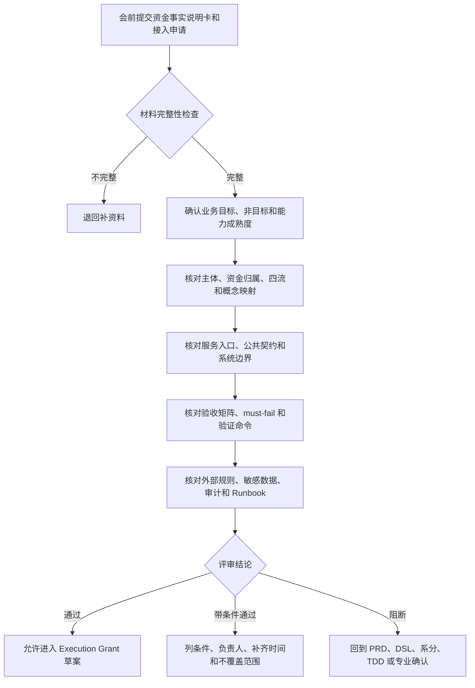

# wind-funds 接入评审清单

## 1. 文档定位

本文用于组织 wind-funds 接入评审会，帮助产品、业务、研发、测试、运营、财务、风控、安全和合规确认一个接入需求能否进入资金底座、进入哪类能力成熟度、是否允许进入 Execution Grant。

本文不是上线批准，也不是代码任务。评审会只能给出通过、带条件通过、阻断三类结论；是否编码、改公共契约、改表结构、改 H2 schema、改测试资源或启用生产能力，必须由后续 Execution Grant 再授权。

## 2. 会议目标和非目标

| 项 | 内容 |
| --- | --- |
| 业务目标 | 判断上层业务的资金动作是否可以被 wind-funds 承接，并明确接入边界、资金不变量、验收证据和阻断条件。 |
| 用户价值 | 接入方、产品、研发、测试、运营、财务、风控和安全用同一套口径决定能不能接、怎么接、谁确认、接完如何验收。 |
| 非目标 | 不在评审会上临时设计 API、不直接改公共契约、不承诺生产上线、不替代法务、合规、财务、税务、通道或持牌机构确认。 |
| 成功指标 | 评审后能形成接入结论、能力成熟度、补齐清单、负责人、补齐时间和是否允许进入 Execution Grant。 |

## 3. 会前输入

| 材料 | 责任方 | 通过标准 | 缺失处理 |
| --- | --- | --- | --- |
| 资金事实说明卡 | 业务接入方、产品 | 业务事实、主体、金额、币种、幂等、route、账务影响、失败处理和验收证据完整。 | 退回补资料，不进入评审结论。 |
| 接入申请 | 业务接入方、产品、研发 | 目标、非目标、能力成熟度、公共契约影响、表结构影响、外部规则和生产准入补充清楚。 | 只能做 Round 0 讨论。 |
| 概念映射表 | 产品、架构 | 业务对象能映射到 FundingAccount、CreditAccount、BudgetGroup、PaymentInstrument、RouteSnapshot、LedgerEntry 或只读引用。 | 阻断 route/posting 设计。 |
| 验收矩阵 | 测试、研发、产品 | 状态、金额、route、posting、entry、projection、幂等、审计和 must-fail 用例明确。 | 不能声明接入完成。 |
| 外部规则和敏感数据说明 | 风控、安全、合规、财务、通道 | 规则来源、版本或发布日期、生效日期、适用范围、核验日期、确认方、确认状态和脱敏边界明确。 | 未确认前不得驱动自动资金处理。 |

## 3.1 能力地图

| 能力域 | 前台能力 | 后台能力 | 数据能力 | 评审重点 |
| --- | --- | --- | --- | --- |
| 钱包账户和资金账户 | 账户开立、账户关系、余额查询和使用者解释。 | 显式建账、平台账户角色、账户状态处理。 | 账户、账本 Profile、余额桶和审计。 | FundingAccount、CreditAccount、BudgetGroup 和 PaymentInstrument 不混用。 |
| 交易和余额控制 | 直接交易、授权交易、冻结、解冻和调整。 | 幂等、route、posting、ledger entry、失败无副作用。 | transaction、route snapshot、ledger transaction、projection。 | 冻结不是扣款，授权不是最终消费。 |
| 对账、清结算和出款 | 对账结果、差错、结算状态和出款状态解释。 | 差错单、清算候选、结算单、出款单、追偿和 Runbook。 | reconciliation batch、settlement order、payout order、difference report。 | 外部非终态不得展示成功，差错不得直接改账。 |
| 归档、重放和治理 | 历史查询、差异解释和审计复核。 | Manifest、checkpoint、watermark、重放任务和人工处理。 | archive manifest、replay task、difference report、治理导出。 | 重放只能重建投影或输出差异，不得生成资金事实。 |

## 3.2 当前状态、接口契约和数据一致性

| 维度 | 评审问题 | 必须形成的结论 |
| --- | --- | --- |
| 当前状态 | 本能力是可进入接入准备、专项 Execution Grant、仅 TDD 分析还是阻断。 | 不能把设计已对齐说成生产已完成。 |
| 接口契约 | 是否只依赖 `core`、`*-face`、Request、Query、DTO、Spec 和枚举。 | 不依赖 `*-impl`、Entity、Mapper 或内部状态机。 |
| 数据和一致性 | 主体、金额、币种、route、posting、entry、projection、幂等和审计如何闭合。 | 不允许半截入账、重复入账、跨主体误转、投影反写或人工改账。 |
| 验证方案 | 对应的 PRD AC/RED、DSL caseId、系分章节、TDD 用例、目标测试类、测试命令和回归范围是什么。 | 未执行验证时只能声明设计语义，不得声明 Done。 |

## 3.3 业务流程、状态机和验证方案

| 项 | 评审要求 |
| --- | --- |
| 业务流程 | 业务接入方必须说明从业务触发到形成资金事实的流程，以及哪些动作仍留在业务系统或通道适配层。 |
| 主流程 | 主体、金额、币种、幂等、route、posting、ledger entry、projection 和审计全部闭合后，才能进入小批次验证。 |
| 异常流程 | 准入失败、幂等冲突、路由失败、账务失败、投影失败、外部非终态和对账差错必须有停止条件。 |
| 人工兜底 | 缺原 route snapshot、缺原冻结单、外部规则待确认、对账差错或出款状态不明时，必须转人工补证据或阻断。 |
| 状态机 | 业务状态、交易状态、展示状态、操作状态和外部状态不得混用。 |
| 测试 | 正向、逆向、失败、幂等、并发、重放和 must-fail 用例必须能映射到目标测试资产。 |
| 回归 | 接入新能力时必须声明 P0/P1 回归范围，避免业务能力包污染统一资金内核。 |

## 4. 参会角色和职责边界

| 角色 | 主要确认项 | 不应承担 |
| --- | --- | --- |
| 业务接入方 | 业务事实、业务状态、外部事件、使用者展示和运营诉求。 | 不直接定义账本分录或内部余额修正方式。 |
| 产品负责人 | 目标、非目标、能力成熟度、用户价值、接入结论和业务验收。 | 不替代合规、财务、通道或研发实现结论。 |
| 架构和研发 | 服务入口、公共契约、模块边界、数据模型、事务、幂等、观测和回滚。 | 不在缺少 Execution Grant 时承诺代码改动。 |
| 测试负责人 | 正向、逆向、异常、并发、幂等、重放、红线和验证命令。 | 不只按接口返回成功验收资金变化。 |
| 运营和财务 | 对账、差错、清结算、出款、调账、追偿、报表输入和人工处理。 | 不用线下修数替代资金事实和账本分录。 |
| 风控、安全和合规 | 权限、敏感数据、外部规则、KYC/KYB/AML、审计和证据最小化。 | 不把待确认项写成已确认结论。 |

## 5. 评审流程



## 6. 评审规则矩阵

| 规则对象 | 触发条件 | 判断逻辑 | 优先级 | 版本和审计 |
| --- | --- | --- | --- | --- |
| 业务事实规则 | 接入方提交资金动作。 | 必须是已成立或可被上层业务归一的资金事实；页面动作、审批中、通道处理中和外部非终态不得作为已入账事实。 | P0 | 记录业务流水、来源系统、触发时间和操作者。 |
| 主体规则 | 涉及用户、商户、平台、外部账户或支付工具。 | 必须区分可记账主体、只读引用、支付工具和外部账户；外部账户不得直接作为 ledger subject。 | P0 | 记录主体类型、账户引用、绑定快照和确认方。 |
| 金额规则 | 涉及资金、额度、预算、权益、手续费、税费、FX 或尾差。 | 金额为正、币种一致、组件闭合、累计金额不超过原事实剩余可处理金额。 | P0 | 记录金额组件、规则版本、尾差和确认方。 |
| 路由规则 | 发生正向交易、退款、撤销、拒付、出款或补事实。 | 正向可解析当前 route；逆向和后续事件必须引用原 route snapshot 或原冻结单。 | P0 | 记录 route snapshot、原事实引用和回放原因。 |
| 账务规则 | route 转 posting 和 ledger entry。 | posting plan 独立平衡，ledger entry 主体、账目、周期、方向和金额可验证。 | P0 | 记录 ledger transaction、entry、posting scope 和来源指令。 |
| 运营规则 | 对账差错、出款失败、调账、冲正、追偿、补事实或核销。 | 必须有处理单、审批、凭证、白名单命令、重新对账和审计。 | P0 | 记录审批号、证据引用、操作者和重新对账结果。 |
| 外部规则 | 涉及卡组织、ACH、银行、PSP、跨境、税务、会计或合规。 | 未记录规则来源、版本或发布日期、生效日期、适用范围、核验日期和确认方时，阻断自动资金处理。 | P0 | 记录确认状态、有效期、证据摘要和撤销处理。 |

## 7. 运营、数据和审计检查

| 维度 | 必须确认 | 阻断信号 |
| --- | --- | --- |
| 运营后台 | 是否能查询业务流水、交易、route snapshot、ledger entry、余额投影、差错单、审批和处理结论。 | 失败只能靠查库、线下问人或人工改账。 |
| 指标和报表 | 指标和报表只消费资金事实、只读投影或治理导出，不反写余额、交易或账本事实。 | 报表、日志或手工台账被当作余额事实源。 |
| 审计 | 操作者、来源系统、审批号、证据引用、请求摘要、处理原因和前后状态可追溯。 | 高危动作无操作者、无审批、无证据或无审计。 |
| Runbook | 哪些失败、积压、差异、外部非终态和告警需要暂停、重试、人工处理或回滚。 | 告警没有负责人、阈值、动作或停止条件。 |
| 数据安全 | 敏感数据只保存脱敏值、摘要、token 或外部 reference。 | 完整 PAN、CVV、密钥、证件、完整银行账户敏感号或超范围个人信息进入资金底座。 |

## 8. 结论判定

| 结论 | 判定条件 | 后续动作 |
| --- | --- | --- |
| 通过 | 业务事实、主体、资金归属、route、posting、entry、projection、幂等、审计、外部规则和验收证据在本次范围内闭合。 | 允许准备 Execution Grant，进入编码差距复核和 TDD 任务拆解。 |
| 带条件通过 | 主链路可接入，但存在不影响核心资金不变量的待确认项。 | 写清条件、负责人、补齐时间和不覆盖范围；编码不得越过条件边界。 |
| 阻断 | 主体不清、资金归属不清、账务路径不可追溯、外部规则未确认、敏感数据越界、验收不可测或需要绕过账本。 | 暂停接入，回到 PRD、DSL、系分、TDD 或专业确认补齐。 |

## 8.1 会后交付物

接入评审会结束后，必须形成可以被产品、研发、测试和运营共同复用的评审记录。没有会后交付物时，评审结论只算会议讨论，不应进入 Execution Grant。

| 交付物 | 必须包含 | 用途 |
| --- | --- | --- |
| 评审纪要 | 评审范围、非目标、能力成熟度、参会角色、结论、条件或阻断原因。 | 作为后续 Execution Grant、TDD 分析或补设计的输入。 |
| 资金事实说明卡 | 业务事实、主体、资金归属、金额、幂等、route、posting、entry、projection、异常处理。 | 证明接入方和 wind-funds 对同一笔资金动作有共同语义。 |
| 接入申请 | 公共契约影响、表结构/H2/运行时配置影响、外部规则、敏感数据、生产准入补充。 | 判断是否需要专项 Execution Grant 或只能停留在设计/TDD 分析。 |
| 验收矩阵 | PRD AC/RED、DSL caseId、系分章节、TDD 用例、目标测试类、验证命令和回归范围。 | 防止只按接口返回成功验收资金变化。 |
| 条件和阻断清单 | 负责人、补齐时点、不覆盖范围、未确认期间处理方式。 | 防止待确认项被默认放行。 |
| 下一步建议 | 进入 TDD 分析、准备 Execution Grant、补 PRD/DSL/系分/TDD、补外部规则确认或终止接入。 | 让评审结论可以转成任务，而不是停留在口头共识。 |

## 8.2 TDD 和 Execution Grant 准入转换

评审结论要进入研发协作时，必须先转换成 TDD 和 Execution Grant 可使用的准入材料。下表用于防止“评审通过”被误读为“可以直接编码”。

| 评审结论 | 可进入的下一步 | 必须补齐的准入材料 | 仍然禁止 |
| --- | --- | --- | --- |
| 通过 | 准备 TDD 分析和 Execution Grant 草案。 | PRD AC/RED、DSL caseId、系分章节、目标测试资产、首批 Red、验证命令、写入范围、只读范围和停止条件。 | 未授权前修改公共契约、表、H2 schema、实现、测试资源或运行时配置。 |
| 带条件通过 | 按条件边界准备 TDD 分析，Execution Grant 只能覆盖已闭合范围。 | 条件清单、负责人、补齐时点、不覆盖范围、未确认期间处理方式和必须失败用例。 | 把待确认外部规则、敏感数据、清结算、出款或治理能力默认放入编码范围。 |
| 阻断 | 回到 PRD、DSL、系分、TDD 或专业确认补齐。 | 阻断原因、补齐入口、确认方、重新评审条件和暂不接入说明。 | 创建编码任务、改接口、改表、补实现或用临时脚本绕过账本。 |

准入转换至少要回答下列问题：

| 问题 | 准入要求 |
| --- | --- |
| TDD 要先红在哪里 | 明确目标测试类、用例名称、必须失败行为、余额和账务断言、失败无副作用断言。 |
| 允许改哪里 | 明确模块、文件类型、公共契约、枚举、状态机、表、H2 schema、测试资源和配置是否在写入范围内。 |
| 不允许改哪里 | 明确只读范围、禁止依赖 `*-impl`、禁止修改 Entity/Mapper 或禁止触碰的业务能力包。 |
| 如何验证 | 明确最小验证命令、回归命令、无法执行时的替代证据和失败停止条件。 |
| 如何回退 | 明确灰度、回滚、补偿、重跑、人工处理和回到设计评审的触发条件。 |

## 9. 会议纪要模板

```text
会议名称：
业务名称：
接入方系统：
会议日期：
参会角色：

评审范围：
非目标：
能力成熟度：
使用的 wind-funds 能力：
是否涉及 P2 业务能力包：

业务事实结论：
主体和资金归属结论：
四流边界结论：
公共契约影响：
表结构 / H2 / 运行时配置影响：
外部规则和敏感数据结论：
验收矩阵结论：
Runbook 和生产准入结论：

评审结论：通过 / 带条件通过 / 阻断
条件或阻断原因：
负责人：
补齐时间：
是否允许进入 Execution Grant：否 / 是
未覆盖项和残余风险：
```

## 10. 发布和验收边界

评审通过只表示本次接入需求具备进入下一阶段的条件，不表示生产 Done。进入生产前仍需证明：公共契约、实现、DDL/H2、测试资源、验证命令、权限审计、外部规则、灰度、回滚和 Runbook 均已按 Execution Grant 闭合。
