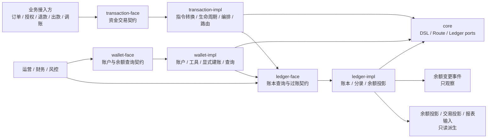
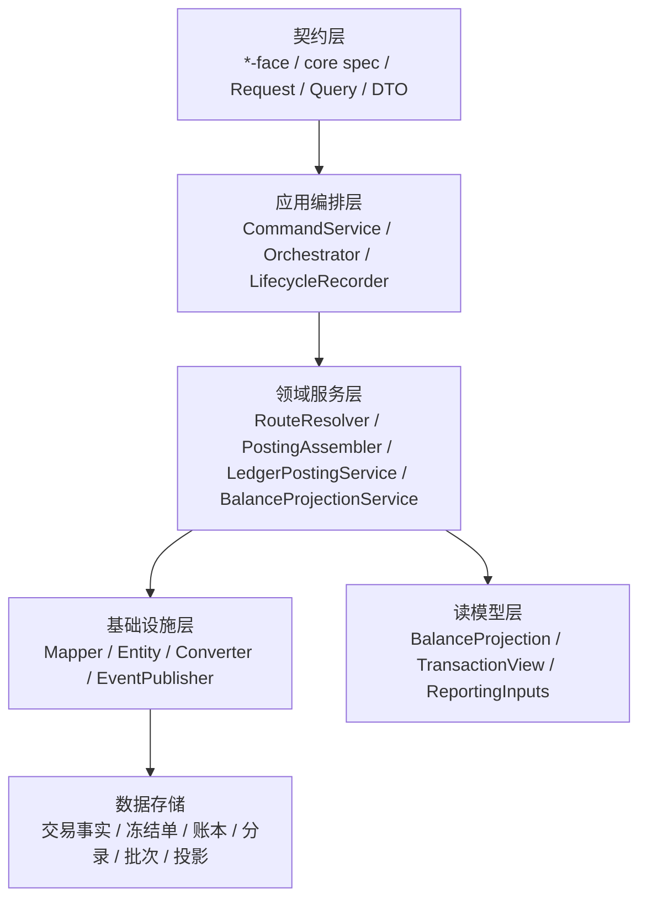
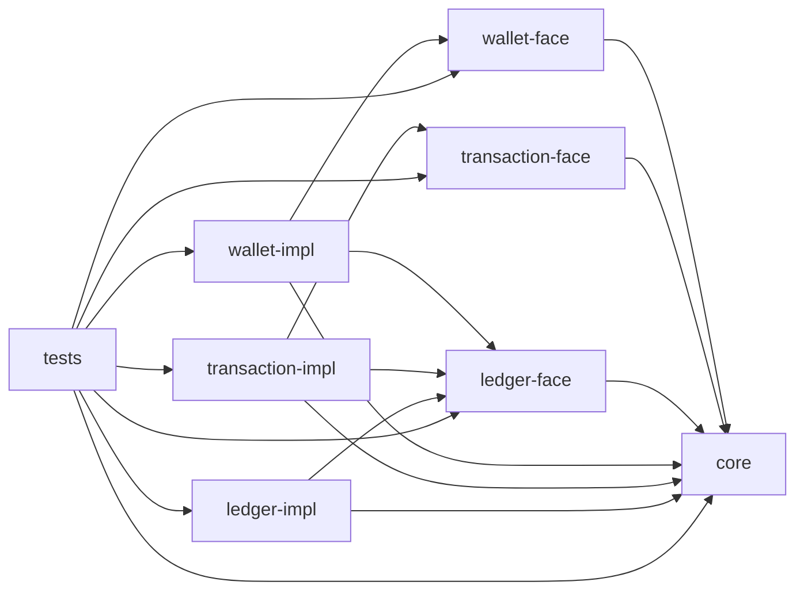
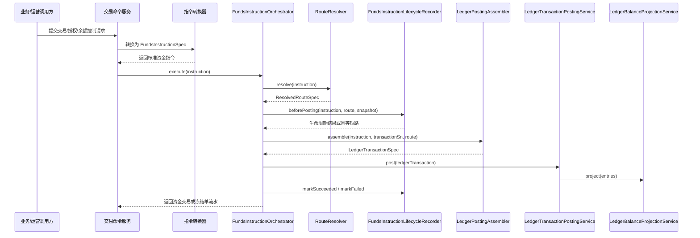
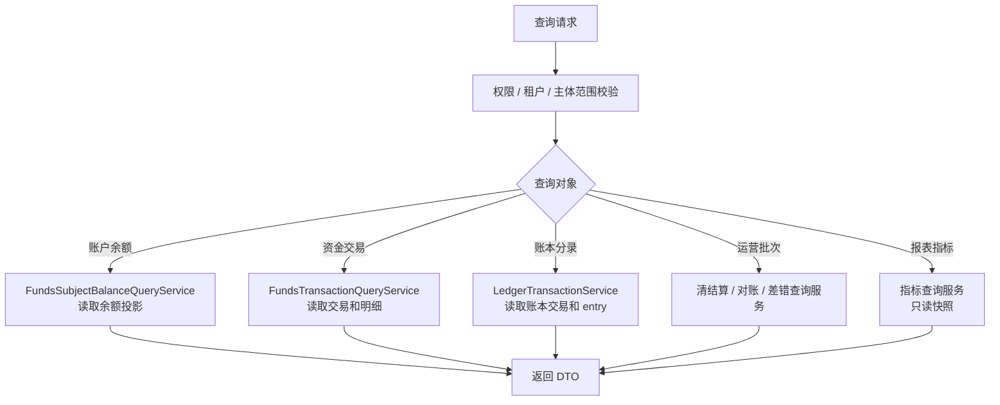
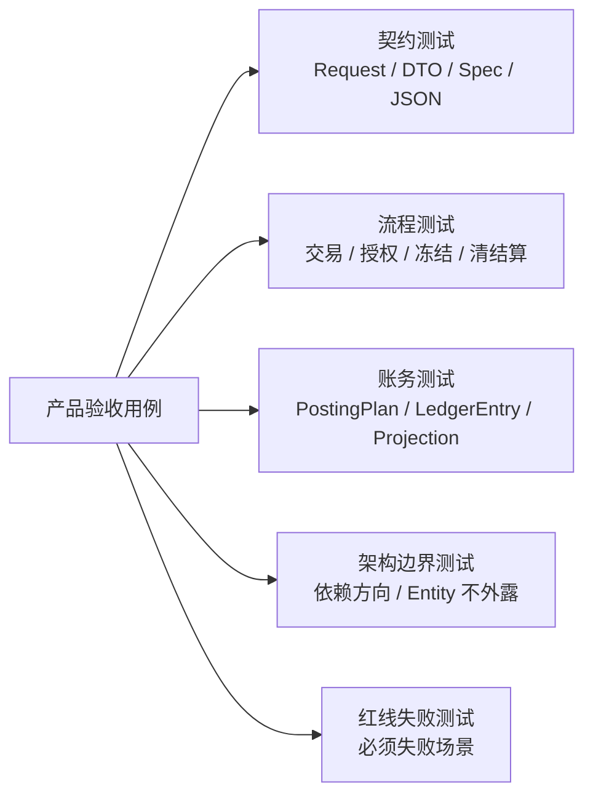

# 支付资金底座系统分析设计总览

## 文档定位

本文是支付资金底座系统分析设计的总览入口，负责说明整体目标、模块分工、架构分层、数据对象、一致性、测试、观测、安全和生产准入边界。各业务域的详细流程、状态机和表设计见 02、03、04，横切测试观测和金融红线见 05。

## 一、需求背景

支付资金底座需要把交易接入、钱包账户、资金路由、账本分录、余额投影、交易投影、清结算、对账、归档、重放和指标项边界收敛成一套可复用的资金系统。产品设计已经明确：每一笔金额都必须能被解释、被核对、被重建。

系统分析设计的任务，是把这个产品目标转成研发可以落地的模块边界、接口契约、状态机、数据约束、一致性方案、测试策略和可观测能力。

### 1.1 背景与问题

| 问题 | 不解决的风险 |
| --- | --- |
| 交易、路由、账本、投影和清结算对象容易混用。 | 余额无法解释，退款、争议、调账和对账闭环失真。 |
| 账本周期、清算账期、报表周期、归档水位和 spend-rule window 容易混用。 | 发生跨周期串账、余额查询不一致或规则误拒绝。 |
| 余额日志、交易投影和指标结果容易被误当事实源。 | 运营修复绕过账本，破坏审计和重建能力。 |
| 归档和重放任务缺少水位、检查点、清单和差异报告。 | 生产修复不可回滚，历史余额不可证明。 |

## 二、目标

### 2.1 业务目标

| 目标 | 系分落地要求 |
| --- | --- |
| 资金语义统一 | 交易、钱包、路由、账本、投影、清结算和对账使用同一套主体、账目、周期和事实口径。 |
| 写入链路可信 | 业务资金事实必须经过资金指令、路由快照、账务计划、账本分录和余额投影。 |
| 查询链路可解释 | 钱包余额、用户账单、商户账单、运营时间线和报表都能追溯到事实源。 |
| 异常闭环可审计 | 退款、撤销、冻结、调账、差错、出款失败和追偿必须追加事实，不直接改历史。 |
| 大数据量可治理 | 归档、余额重建和交易投影重放有独立水位、检查点、清单和差异报告；指标项只作为报表指标模块输入。 |
| 工程交付可验证 | 每个设计点都有测试类型、断言事实、观测指标和红线用例承接。 |

### 2.2 技术目标

1. 固化 `core`、`wallet`、`transaction`、`ledger`、清结算、对账、归档和报表指标模块输入之间的边界。
2. 固化资金交易、冻结单、账本交易、posting plan、ledger entry、余额投影、交易投影和运营单据的数据边界。
3. 固化幂等、状态机、事务边界、补偿、对账、归档、重放和审计的工程约束。
4. 固化测试驱动设计入口，让产品验收用例可以下钻到接口、表、状态和断言。

### 2.3 非目标

1. 不在系分文档中展开业务经营策略、合规最终结论、会计制度或外部机构协议。
2. 不把清算网络、支付机构、银行、卡组织或跨境外汇规则写成本系统默认能力。
3. 不描述交付过程管理内容。
4. 不要求运营后台绕过交易层、路由层或账本层直接修正资金结果。
5. 不在本目录修改代码；本文档只定义最终设计和编码约束。

## 三、概要设计

### 3.1 术语与范围

| 术语 | 系分定义 |
| --- | --- |
| 资金指令 | 交易层接收的标准资金事实输入，对应 `FundsInstructionSpec` 或由交易请求转换而来。 |
| 资金交易 | 直接交易和授权交易的生命周期事实，包含交易聚合、交易明细、请求摘要和 route snapshot。 |
| 冻结单 | 余额控制事实，用于表达同主体 `AVAILABLE <-> FROZEN`，不等同于资金交易。 |
| 钱包账户 | 资金账户、信用账户、预算组、平台账户角色、支付工具和主体余额查询的产品与契约层。 |
| 资金路由 | 把资金指令解析成参与方、账户、账目、账本周期和 route leg 的模块。 |
| 账本 | 承载账本、账本交易、记账计划和不可变分录的事实层。 |
| 余额投影 | 由账本分录派生的当前余额或历史余额读模型。 |
| 交易投影 | 由资金事实、账本事实和运营事实派生的用户账单、商户账单、运营时间线和财务视图。 |
| 账本周期 | `periodType + periodId`，用于隔离同主体、同币种、同账目下不同生命周期或预算周期的余额 bucket。 |

### 3.2 系统上下文

结论：`core` 是契约和 DSL 中心；`transaction` 是资金事实写入编排中心；`wallet` 是账户、工具和余额查询中心；`ledger` 是账务事实和余额投影中心；清结算、对账、归档和重放基于事实源扩展；指标项只作为报表指标模块输入，不反向污染主写入链路。

### 3.3 架构分层

| 层 | 设计要求 |
| --- | --- |
| 契约层 | 对外只暴露 Request、Query、DTO、Spec 和服务接口，不暴露 Entity、Mapper、内部状态机实现。 |
| 应用编排层 | 负责幂等、生命周期、路由、快照、账本提交和结果归纳，不直接拼分录。 |
| 领域服务层 | 负责路由、账务计划、账本写入、余额投影和规则校验，不承载 Web 或 DAL 细节。 |
| 基础设施层 | 负责 MyBatis Flex、MapStruct、事件发布和存储落地，不定义资金语义。 |
| 读模型层 | 只从事实派生，可重建、可重放、可校验，不能反写事实层。 |

### 3.4 模块依赖

依赖红线：

1. `*-face` 不依赖 `*-impl`。
2. `core` 不依赖 DAL、Web、消息、具体业务实现。
3. `wallet` 不直接写资金交易事实或账本分录。
4. `route` 不直接写交易事实、账本事实或余额投影。
5. `ledger` 不反向持有业务交易生命周期状态。
6. 生产模块不得依赖 `tests`。

## 四、详细设计总则

### 4.1 写入链路

写入链路约束：

1. 请求转换器只做入参到资金指令的结构化转换，不访问数据库。
2. `RouteResolver` 输出 `ResolvedRouteSpec`，不保存 route snapshot。
3. 生命周期记录器保存交易或冻结事实、请求摘要和 route snapshot，不生成分录。
4. `LedgerPostingAssembler` 基于 route 生成 `LedgerTransactionSpec` 和 `PostingPlan`，不重新路由。
5. `LedgerTransactionPostingService` 是账本写入口，必须校验独立平衡和幂等入账。
6. 余额投影由 `LedgerEntry` 派生，投影失败必须有差异报告或补偿策略。

### 4.2 查询链路

查询链路约束：

1. 查询不改变交易、冻结、账本、投影或批次状态。
2. 主体余额查询必须携带账本周期；`LIFETIME` 周期的 `periodId` 固定为 `LIFETIME`。
3. 交易投影、余额日志和报表指标只能辅助展示，不作为余额修复依据。
4. 敏感资金明细导出必须经过权限、审批、脱敏、水印和审计。

### 4.3 数据事实分层

| 数据层 | 代表对象 | 写入方式 | 是否可变 | 修正方式 |
| --- | --- | --- | --- | --- |
| 交易事实 | 资金交易、交易明细、冻结单 | 交易层生命周期记录 | 状态可按状态机流转 | 追加后续事件或失败原因 |
| 路由事实 | route snapshot | 生命周期记录器保存 | 不可变 | 后续事件回放原快照 |
| 账务事实 | 账本交易、记账计划、分录 | 账本写入口落地 | 分录不可变 | 追加冲正、补记或调账 |
| 余额投影 | 当前余额、历史余额、检查点 | 分录派生 | 可重建 | 按分录和水位重建 |
| 交易投影 | 用户账单、商户账单、运营时间线 | 事实派生 | 可重放 | 有界重放 |
| 运营单据 | 清算批次、结算单、出款单、差错单 | 对应运营服务写入 | 状态可流转 | 追加处理动作和审计 |
| 报表指标输入 | 指标项、使用者、业务问题、建议事实来源 | 产品和系分文档定义 | 非资金事实 | 报表指标模块独立承接，不反写事实 |

### 4.4 数据表分册总览

| 分册 | 表设计范围 |
| --- | --- |
| [02-交易路由钱包账目与投影系分设计.md](02-交易路由钱包账目与投影系分设计.md) | 资金账户、信用账户、预算组、支付工具、绑定关系、资金交易、交易明细、冻结单、账本、账本交易、posting plan、ledger entry、余额投影、余额变更日志、交易投影。 |
| [03-清结算与对账系分设计.md](03-清结算与对账系分设计.md) | 可清分明细、清分批次、清算候选、清算批次、清算批次明细、结算单、结算金额项、出款单、对账批次、对账匹配结果、差错单、追偿单、操作审计。 |
| [04-归档重放与指标治理系分设计.md](04-归档重放与指标治理系分设计.md) | 归档申请、ArchiveManifest、余额检查点、余额水位、交易投影重放任务、差异报告；指标只列产品和业务关心的指标项及承接边界。 |

数据表通用约束：

1. 金额字段使用最小货币单位。
2. 事实表必须保留租户、业务流水、状态、金额、币种、主体、时间和摘要。
3. 高危运营表必须保留操作者、审批、原因、凭证、traceId 和审计。
4. 投影表和日志表只读派生，不得反写事实层；指标实现由报表指标模块独立承接。
5. 所有可重跑任务表必须有范围、checkpoint、水位或差异报告。

## 五、一致性设计

### 5.1 本地事务边界

| 边界 | 必须在同一可靠边界内完成 | 不应放入同一事务 |
| --- | --- | --- |
| 交易生命周期写入 | 幂等记录、交易聚合、交易明细、route snapshot。 | 外部系统调用、报表计算、运营通知。 |
| 账本过账 | 账本交易、posting plan、ledger entry、余额投影基础更新。 | 外部出款、第三方回调、长耗时对账。 |
| 清算确认 | 清算批次状态、批次明细、清算确认资金事实或账务动作引用。 | 外部付款提交。 |
| 出款回单 | 出款单状态、外部回单、失败回退资金事实引用。 | 无界重试、人工审批。 |

### 5.2 幂等与重复处理

| 场景 | 幂等键 | 重复处理策略 |
| --- | --- | --- |
| 直接交易 | `tenantId + businessScene + businessSn` 和请求摘要 | 相同摘要返回原结果，不同摘要拒绝。 |
| 授权后续事件 | 原授权交易号、事件类型、业务流水 | 不超过剩余授权、剩余可结算或剩余可退金额。 |
| 冻结和解冻 | 冻结业务流水、冻结单号、释放流水 | 超额释放失败，重复释放返回原结果。 |
| 清算批次 | 主体、币种、账期、规则版本、候选明细集合摘要 | 已确认不重复触发清算账务动作。 |
| 出款回单 | 出款单号、外部 reference、回单类型 | 成功和失败不能双终态，失败回退只执行一次。 |
| 重放任务 | 重放范围、视图域、模式、原因、发起人 | 同范围重复任务返回已有任务或产生可解释差异。 |

### 5.3 失败路径

| 失败阶段 | 处理策略 |
| --- | --- |
| 入参校验失败 | 不生成 route、posting plan、ledger entry，返回明确错误码和失败原因。 |
| 路由失败 | 生命周期记录为失败或拒绝，保留失败原因，不写账本。 |
| 生命周期幂等冲突 | 同业务键不同摘要拒绝，不复用原交易。 |
| 账务计划不平衡 | 拒绝过账，记录失败阶段和问题摘要。 |
| 账本过账失败 | 生命周期标记失败，禁止展示交易成功。 |
| 余额投影事件发布失败 | 不回滚已完成分录和余额投影，进入事件补偿和告警。 |
| 投影重放失败 | 保留任务状态、失败样本、差异报告和续跑位置。 |

## 六、非功能设计

### 6.1 安全

1. 所有查询、导出、调账、冻结、解冻、出款重试和敏感操作必须校验租户、主体、角色、数据范围和操作权限。
2. 服务间调用必须使用可信身份，不能依赖客户端传入的操作者文本作为权限来源。
3. 资金明细、外部账户、支付工具、卡号、手机号、邮箱、证件、密钥、token 和凭证不得明文输出到日志。
4. 高危操作必须有操作者、审批人、原因、前后值、凭证、来源 IP、traceId 和结果审计。

### 6.2 可观测

| 观测对象 | 指标 |
| --- | --- |
| 交易写入 | 请求量、成功率、失败率、幂等命中数、摘要冲突数、各阶段耗时。 |
| 路由 | 路由失败数、缺平台账户数、缺账本周期数、缺快照回放数。 |
| 账本 | posting plan 不平衡数、入账成功率、分录写入量、余额约束失败数。 |
| 投影 | 投影耗时、投影失败数、余额变更事件发布失败数、补偿积压量。 |
| 清结算对账 | 候选数量、排除数量、批次状态、差错数量、核销耗时。 |
| 归档重放 | 水位延迟、检查点失败、Manifest 差异、重放差异数。 |

### 6.3 性能与容量

1. 写入链路优先保护账本事实一致性，不用异步补账换取表面成功。
2. 查询链路通过余额投影、交易投影、索引、分页和归档索引控制响应时间。
3. 归档和重放必须分批处理，有最大窗口、最大记录数和断点续跑。
4. 大批量导出使用异步任务和审计记录，不在接口同步返回全量敏感明细。

## 七、实施切片与准入门禁

本章只定义最终设计进入编码前的工程门禁。

| 切片 | 设计输入 | 编码准入门禁 |
| --- | --- | --- |
| 主链路 | 交易、路由、钱包、账目、余额投影、交易投影。 | 表设计、接口契约、状态机、幂等键、余额断言和红线测试齐备。 |
| 清结算对账 | 可清分明细、清分批次、清算候选、清算批次、结算单、出款单、对账批次、差错单、追偿单。 | 对象独立、状态独立、前置对账和放行矩阵清楚、账务动作引用交易层、差错闭环和审计测试齐备。 |
| 归档重放与指标项边界 | 归档、Manifest、Checkpoint、Watermark、ReplayTask、DifferenceReport、指标项输入。 | 范围、审批、水位、差异报告、只读边界和指标不反写测试齐备。 |
| 横切专项 | 测试、观测、安全、金融红线。 | 每个模块都能映射到测试矩阵、指标告警、权限审计和上线前检查清单。 |

进入编码前统一检查：

1. 需求能映射到产品验收 ID、DSL 场景、系分模块和数据表。
2. 每个写入对象有状态机、唯一键、幂等键、非法流转和失败副作用说明。
3. 每个余额变化场景有 route、posting plan、ledger entry、余额投影和账本周期断言。
4. 每个生产高危任务有范围、审批、checkpoint、差异报告、告警和人工兜底。
5. 每个敏感查询和导出有权限、脱敏、水印、审计和过期控制。

## 八、测试设计总纲

| 测试类型 | 保护对象 |
| --- | --- |
| 单元测试 | 金额、币种、周期、状态、路由规则、账务计划组装。 |
| 契约测试 | `*-face` 接口、Request、Query、DTO、Spec、DSL JSON 样例。 |
| 流程测试 | 直接交易、授权、冻结、清算确认、结算锁定、出款回退、对账差错。 |
| 数据库测试 | 唯一约束、事务回滚、幂等写入、分录查询、周期 bucket 查询。 |
| 投影测试 | 余额投影、余额变更事件、交易投影、重放和差异报告。 |
| 架构测试 | 模块依赖、包边界、生产模块不依赖 tests、face 不依赖 impl。 |
| 红线测试 | 外部账户入账、直接改余额、缺快照逆向、周期串账、无范围重放等必须失败。 |

## 九、设计红线

1. 不得绕过交易层、路由层和账本层直接修改余额。
2. 不得在授权拒绝、路由失败、余额不足或账本失败时生成 ledger entry。
3. 不得把支付工具、外部账户、业务订单、报表或运营备注作为内部账本主体。
4. 不得把清算账期、结算周期、报表周期、归档水位或 spend-rule window 当作账本周期。
5. 不得用余额日志、交易投影或指标结果修复余额事实。
6. 不得直接修改历史分录；错账只能追加补记、冲正、调账和核销事实。
7. 不得在缺检查点、缺 Manifest、缺差异报告或无范围的情况下执行生产重放或归档。

## 十、参考资料

- [docs/产品设计/README.md](../产品设计/README.md)
- [docs/产品设计/01-PRD总览.md](../产品设计/01-PRD总览.md)
- [docs/产品设计/05-产品验收与TDD用例矩阵.md](../产品设计/05-产品验收与TDD用例矩阵.md)
- [docs/DSL设计/README.md](../DSL设计/README.md)
- [docs/DSL设计/支付资金底座DSL承载层设计.md](../DSL设计/支付资金底座DSL承载层设计.md)
- [tests/src/test/resources/jdbc-schema.sql](../../tests/src/test/resources/jdbc-schema.sql)
