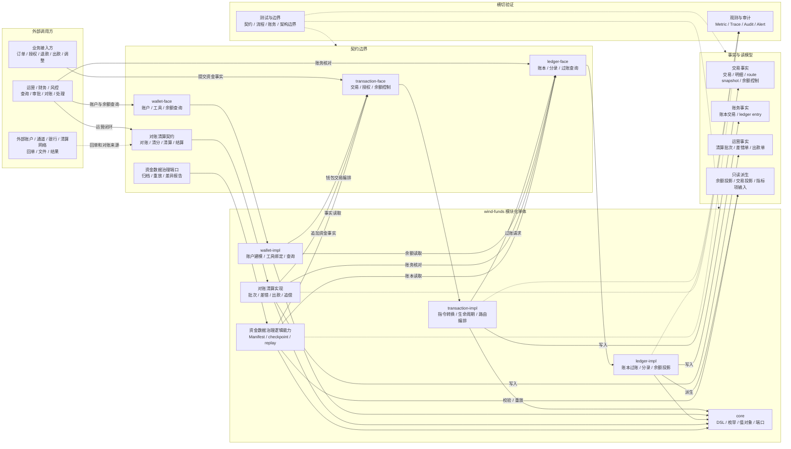
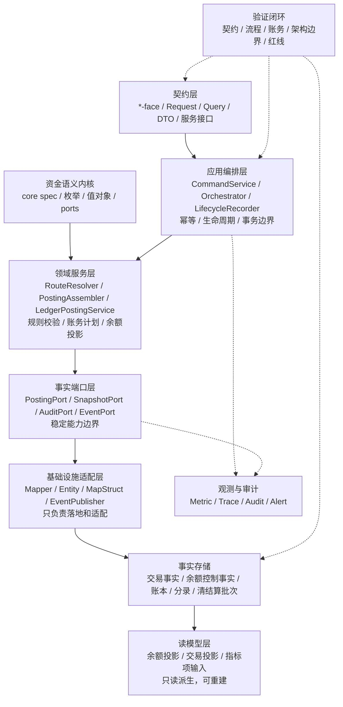
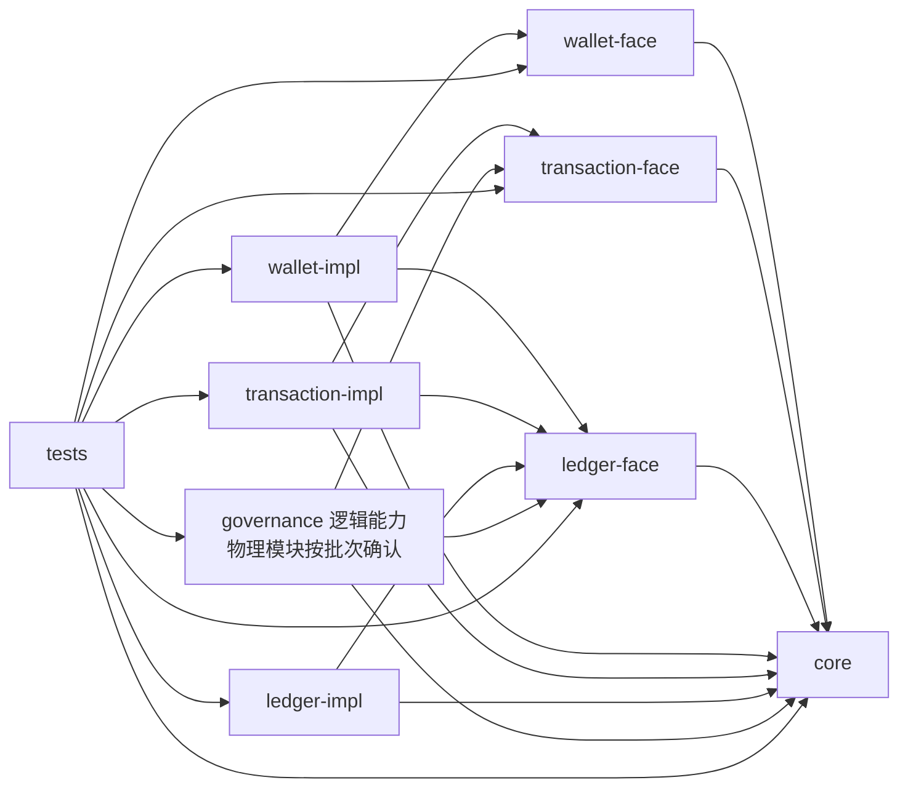
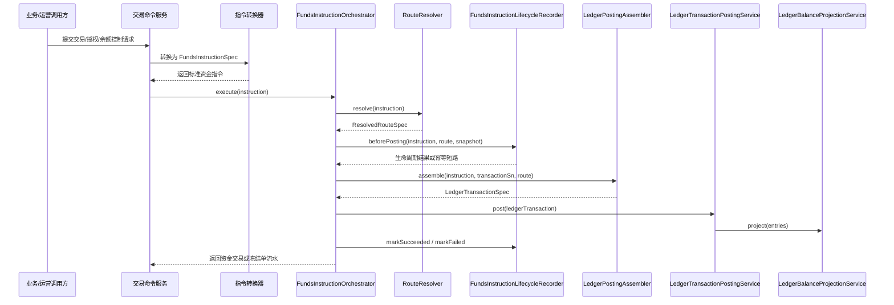
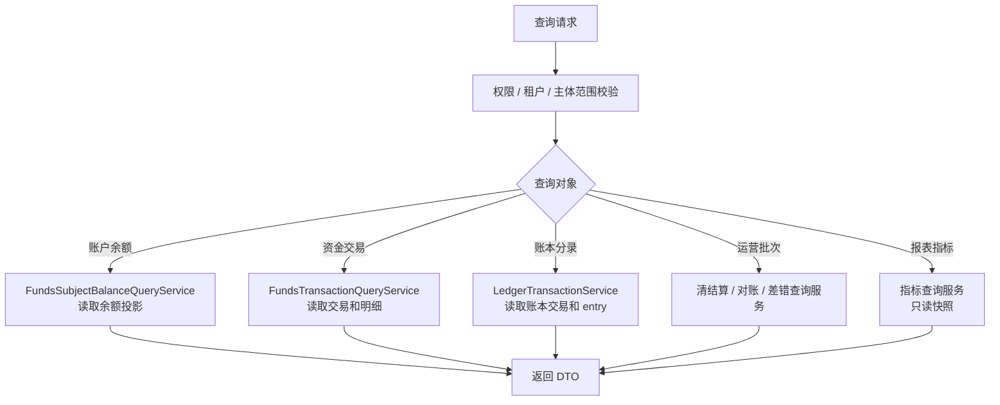
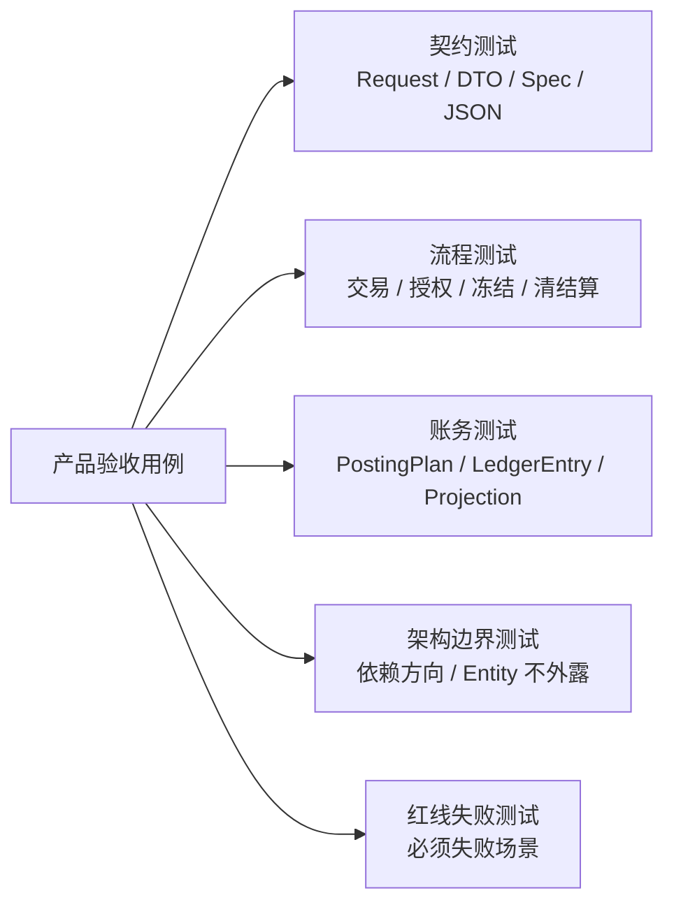

# 支付资金底座系统分析设计总览

## 文档定位

本文是支付资金底座系统分析设计的总览入口，负责说明整体目标、模块分工、架构分层、数据对象、一致性、测试、观测、安全和生产准入边界。各业务域的详细流程、状态机和表设计见 02、03、04，横切测试观测和金融红线见 05。

## 一、需求背景

支付资金底座需要把交易接入、钱包账户、资金路由、账本分录、余额投影、交易投影、对账清算模块、资金数据治理能力和指标项边界收敛成一套可复用的资金系统。产品设计已经明确：每一笔金额都必须能被解释、被核对、被重建。

系统分析设计的任务，是把这个产品目标转成研发可以落地的模块边界、接口契约、状态机、数据约束、一致性方案、测试策略和可观测能力。

### 1.1 背景与问题

| 问题 | 不解决的风险 |
| --- | --- |
| 交易、路由、账本、投影和对账清算运营对象容易混用。 | 余额无法解释，退款、争议、调账和对账闭环失真。 |
| 账本周期、清算账期、报表周期、归档水位和 spend-rule window 容易混用。 | 发生跨周期串账、余额查询不一致或规则误拒绝。 |
| 余额日志、交易投影和指标结果容易被误当事实源。 | 运营修复绕过账本，破坏审计和重建能力。 |
| 归档和重放任务缺少水位、检查点、清单和差异报告。 | 生产修复不可回滚，历史余额不可证明。 |

## 二、目标

### 2.1 业务目标

| 目标 | 系分落地要求 |
| --- | --- |
| 资金语义统一 | 交易、钱包、路由、账本、投影和对账清算模块使用同一套主体、账目、周期和事实口径。 |
| 写入链路可信 | 业务资金事实必须经过资金指令、路由快照、账务计划、账本分录和余额投影。 |
| 查询链路可解释 | 钱包余额、用户账单、商户账单、运营时间线和报表都能追溯到事实源。 |
| 异常闭环可审计 | 退款、撤销、冻结、调账、差错、出款失败和追偿必须追加事实，不直接改历史。 |
| 大数据量可治理 | 资金数据治理逻辑能力 governance 负责归档、余额重建编排和交易投影重放，拥有独立水位、检查点引用、清单和差异报告；指标项只作为报表指标模块的可信输入，不承接指标计算和报表实现。 |
| 工程交付可验证 | 每个设计点都有测试类型、断言事实、观测指标和红线用例承接。 |

### 2.2 技术目标

1. 固化 core、wallet、transaction、ledger、对账清算模块、资金数据治理逻辑能力和报表指标模块输入之间的边界；指标计算、报表看板、导出订阅和 OLAP 宽表不属于 wind-funds。
2. 固化资金交易、冻结单、账本交易、posting plan、ledger entry、余额投影、交易投影和运营单据的数据边界。
3. 固化幂等、状态机、事务边界、补偿、对账、归档、重放和审计的工程约束。
4. 固化测试驱动设计入口，让产品验收用例可以下钻到接口、表、状态和断言。

### 2.2.1 架构设计目标

| 架构目标 | 系分落点 | 验证方式 |
| --- | --- | --- |
| 可解释 | 资金交易、余额控制事实、route snapshot、posting plan、账本交易、ledger entry 和投影证据链。 | 单笔链路查询、流程测试、账务断言。 |
| 可核对 | 对账清算对象独立建模，差错、审批、调账、核销和重新对账闭环。 | 对账清算 TDD、差错 must-fail、重跑审计。 |
| 可重建 | 余额投影、交易投影、Manifest、checkpoint、watermark 和差异报告边界清楚。 | 归档重放 TDD、投影重放、差异报告校验。 |
| 可演进 | 以 face/core 契约隔离外部调用，以 Execution Grant 控制公共契约、枚举、状态机和表结构变更。 | 契约测试、架构边界测试、OpenSpec 批次授权。 |
| 可用性 | 失败无副作用、幂等可重试、补偿可追踪、告警可定位、人工兜底可审计。 | 失败分类、观测指标、Runbook 检查、红线测试。 |

### 2.3 非目标

1. 不在系分文档中展开业务经营策略、合规最终结论、会计制度或外部机构协议。
2. 不把清算网络、支付机构、银行、卡组织或跨境外汇规则写成本系统默认能力。
3. 不描述交付过程管理内容。
4. 不要求运营后台绕过交易层、路由层或账本层直接修正资金结果。
5. 不在本目录修改代码；本文档只定义最终设计和编码约束。

## 三、概要设计

### 3.1 术语与范围

| 术语 | 系分定义 |
| --- | --- |
| 资金指令 | 交易层接收的标准资金事实输入，对应 FundsInstructionSpec 或由交易请求转换而来。 |
| 资金交易 | 直接交易和授权交易的生命周期事实，包含交易聚合、交易明细、请求摘要和 route snapshot。 |
| 冻结单 | 余额控制事实，用于表达同主体 AVAILABLE <-> FROZEN，不等同于资金交易。 |
| 余额调整动作 | 余额控制事实，用于表达同主体资金账户余额调整、信用账户额度调整和预算组额度调整；对账差错可引用该动作修正同主体余额，但跨主体价值转移必须走资金交易调账事实。 |
| 钱包账户 | 资金账户、信用账户、预算组、平台账户角色、支付工具和主体余额查询的产品与契约层。 |
| 资金路由 | 把资金指令解析成参与方、账户、账目、账本周期和 route leg 的模块。 |
| 账本 | 承载账本、账本交易、记账计划和不可变分录的事实层。 |
| 余额投影 | 由账本分录派生的当前余额或历史余额读模型。 |
| 交易投影 | 由资金事实、账本事实和运营事实派生的用户账单、商户账单、运营时间线和财务视图。 |
| 账本周期 | periodType + periodId，用于隔离同主体、同币种、同账目下不同生命周期或预算周期的余额 bucket。 |
| 对账清算模块 | 承载对账、清分、清算、结算、出款、差错、调账核销、追偿和操作审计的运营资金闭环。它只能通过交易层或账本层引用资金事实，不直接写分录、不直接改余额，也不替代持牌清算网络或外部机构规则。 |

### 3.2 系统上下文

结论：core 是契约和 DSL 中心；transaction 是资金事实写入编排中心；wallet 是账户、工具和余额查询中心；ledger 是账务事实和余额投影中心；对账清算模块负责运营资金闭环；资金数据治理逻辑能力 governance 负责归档控制面、Manifest 证据面、余额重建编排和交易投影重放；指标项只作为报表指标模块输入，不反向污染主写入链路。

### 3.3 架构分层

| 层 | 设计要求 |
| --- | --- |
| 契约层 | 对外只暴露 Request、Query、DTO、Spec 和服务接口，不暴露 Entity、Mapper、内部状态机实现。 |
| 应用编排层 | 负责幂等、生命周期、路由、快照、账本提交和结果归纳，不直接拼分录。 |
| 领域服务层 | 负责路由、账务计划、账本写入、余额投影和规则校验，不承载 Web 或 DAL 细节。 |
| 事实端口层 | 抽象账本过账、快照保存、审计写入、事件发布和外部结果回写等稳定端口，隔离领域能力与 Mapper、MQ、第三方 SDK。 |
| 基础设施层 | 负责 MyBatis Flex、MapStruct、事件发布和存储落地，不定义资金语义。 |
| 读模型层 | 只从事实派生，可重建、可重放、可校验，不能反写事实层。 |

### 3.3.1 能力域边界

| 能力域 | 主要模块 | 归属事实 | 不变量 |
| --- | --- | --- | --- |
| 资金语义内核 | core | DSL、枚举、值对象、端口契约。 | 不依赖 DAL、Web、MQ、impl 或 tests。 |
| 交易编排域 | transaction-face、transaction-impl | 资金交易、交易明细、余额控制事实、route snapshot。 | 负责生命周期、幂等、路由编排和事实记录，不直接修改余额投影。 |
| 钱包账户域 | wallet-face、wallet-impl | 资金账户、信用账户、预算组、支付工具、绑定关系。 | 只管理账户、工具、显式建账和查询，不写交易事实或账本事实。 |
| 账本事实域 | ledger-face、ledger-impl | 账本、账本交易、posting plan、ledger entry、余额投影。 | ledger entry 是余额事实源；投影只派生，不持有业务交易生命周期。 |
| 对账清算域 | reconciliation-face、reconciliation-impl 或后续确认模块 | 对账批次、匹配结果、差错单、清分、清算、结算、出款和追偿对象。 | 对账任务、匹配结果和差错闭环是清分、清算、结算和出款的基础准入能力。 |
| 资金治理域 | governance-face、governance-impl 或后续确认模块 | 归档申请、Manifest、重放任务、差异报告。 | 只做事实治理、归档、重放和差异报告，不改变事实身份，不实现指标计算。 |
| 横切治理域 | tests、观测、安全、审计规范 | 权限、指标、trace、审计、红线测试和架构边界测试。 | 每个高危写入、查询、导出、重放和批处理都必须可审计、可观测、可测试。 |

### 3.3.2 能力域到系统架构和职责边界矩阵

本矩阵用于逐项检查产品能力是否已经落到系统模块、事实对象、职责边界、准入条件和测试守卫。任何能力进入编码前，都必须能说明“谁拥有事实、谁只消费事实、谁不能写事实”。

| 能力域 | 责任模块 | 拥有的事实或模型 | 只消费的事实 | 不允许的职责 | 编码准入和测试守卫 |
| --- | --- | --- | --- | --- | --- |
| 交易接入 | `transaction-face`、`transaction-impl` | 资金交易、交易明细、请求摘要、交易生命周期、余额控制事实和 route snapshot 引用。 | 钱包账户、账本过账结果、外部归一后的资金事实。 | 不保存完整业务订单状态，不直接拼账本分录，不绕过 route 和 ledger 改余额。 | command/converter/orchestrator 测试；幂等摘要、失败无副作用、route/posting/entry/projection 断言。 |
| 权益语义 | `core` 定义契约，`transaction-impl` 保存或摘要化，route/ledger/reconciliation/projection 分阶段消费。 | `FundsBenefitSnapshotSpec`、组件、引用、退款策略、稳定摘要或等价不可变存储。 | 订单、业务系统或营销权益系统给出的已决策结果。 | 不计算券可用性，不维护券包生命周期，不在退款、撤销或清结算中按当前规则重算；不把 `CONTRACT_ONLY` 夹具、请求态快照或 `contextVariables` 当作生产事实源。 | Phase 1 契约测试；Phase 2 route/posting/replay 测试；Phase 3 清结算和对账拆分测试；进入 Phase 2/3 前必须完成权益准入证明。 |
| 钱包账户 | `wallet-face`、`wallet-impl` | 资金账户、信用账户、预算组、平台账户角色、支付工具、绑定历史和资金来源关系。 | 交易结果、账本余额和投影。 | 不写资金交易事实，不写 ledger entry，不把支付工具当余额账户。 | 账户服务、工具绑定、资金来源唯一性、平台角色解析和 wallet 边界测试。 |
| 资金路由 | `transaction-impl` route resolver / route snapshot 组件 | resolved route、route snapshot、route participant、route leg、routing decision。 | 指令、账户、支付工具、平台账户角色、权益组件和原 route snapshot。 | 不写交易事实，不写账本分录，不在缺快照时重新选路兜底。 | RouteResolver、RouteReplay、PaymentInstrumentRoute DSL 和缺快照失败测试。 |
| 账本账目 | `ledger-face`、`ledger-impl` | 账本、账本交易、posting plan、ledger entry、余额投影。 | route leg、posting command、账本周期和来源引用。 | 不反向持有交易生命周期，不按交易投影或报表修余额，不自动建账。 | PostingLedger、LedgerBalanceProjection、账本周期、平衡校验和架构边界测试。 |
| 投影视图 | transaction projection、balance projection、reporting input boundary | 余额投影、交易投影、余额日志观察事件、指标项输入引用。 | 交易事实、route snapshot、ledger entry、清结算和对账结果。 | 不反写交易事实、账本分录、余额事实、Manifest 或指标水位。 | 投影 afterCommit、投影重放、只读边界、指标水位隔离测试。 |
| 清结算与对账 | `reconciliation-face`、`reconciliation-impl` 或后续确认模块 | 对账任务、匹配结果、可清分明细、清分批次、清算候选、清算批次、结算单、出款单、差错单、追偿单和操作审计。 | 交易事实、账本分录、权益快照、外部文件和回单。 | 不直接写 ledger entry，不直接改历史分录或余额，不把候选、批次、结算、出款合成一个对象。 | 03 分册 DDL、状态机、并发锁、前置对账、差错闭环和 H2 服务测试齐备后编码。 |
| 归档重放与治理 | `governance-face`、`governance-impl` 或后续确认模块 | 归档申请、Manifest、checkpoint、watermark、重放任务、差异报告、余额快照确认。 | 交易事实、账本事实、投影、清结算差错和审计。 | 不改变事实身份，不推进无证据水位，不实现报表指标计算，不替代交易投影主链路。 | 范围、审批、dry-run/apply、Manifest 覆盖、checkpoint、水位和差异报告测试。 |
| 运营审计和安全 | 横切审计、权限、观测、导出和红线测试 | 审计记录、权限判定、操作凭证、告警事件和导出任务记录。 | 所有高危资金事实、运营单据和外部规则确认。 | 不替代业务审批，不作为改账通道，不输出敏感原文。 | 操作权限、脱敏导出、审批链、审计失败处理、金融红线和架构边界测试。 |

### 3.4 模块依赖

依赖红线：

1. face 模块不依赖 impl 模块。
2. core 不依赖 DAL、Web、消息、具体业务实现。
3. wallet 不直接写资金交易事实或账本分录。
4. route 不直接写交易事实、账本事实或余额投影。
5. ledger 不反向持有业务交易生命周期状态。
6. governance 不直接修改交易事实、账本分录、余额投影事实、清结算对象或报表指标结果。
7. 生产模块不得依赖 tests。

### 3.5 架构决策记录

本节记录已接受的高层架构决策。若后续编码批次需要改变这些结论，必须在 Execution Grant 中列为人工确认点，并同步补充 ADR 或系分变更。

| ADR | 状态 | 决策 | 选择理由 | 复审触发 |
| --- | --- | --- | --- | --- |
| ADR-001 | 已接受 | 保持模块化单体，不拆微服务。 | 当前主要风险是资金语义和模块边界，拆服务会提前引入分布式一致性、部署和运维复杂度。 | 清结算、对账、归档或通道能力出现独立团队、独立数据归属、独立发布和明确故障隔离需求。 |
| ADR-002 | 已接受 | core 作为资金语义内核，只承载 DSL、枚举、值对象和端口契约。 | 保护资金语义稳定，避免核心规则依赖 DAL、Web、MQ 或具体实现。 | core 出现 Mapper、Entity、Spring Bean 实现、外部 SDK 或 tests 依赖。 |
| ADR-003 | 已接受 | ledger entry 是余额事实源，余额投影、余额日志、交易投影和指标结果均为派生视图。 | 保障余额可解释、可核对、可重建，避免运营和报表反写事实。 | 出现通过投影、日志、报表或导出修复余额的需求或实现。 |
| ADR-004 | 已接受 | 余额控制 adjust 和对账差错调账分层承接。 | 同主体余额、额度、预算控制与跨主体价值转移必须隔离，避免 adjust 被误用成万能调账。 | 需要跨主体补偿、外部差错核销或批次授权调账时。 |
| ADR-005 | 已接受 | 对账清算域独立建模，不混入交易主链路。 | 对账、清分、清算、结算、出款、差错和追偿具有独立状态和审计，混入交易会破坏闭环。 | 批次 7 进入数据库级落地或外部出款接入。 |
| ADR-006 | 已接受 | governance 是逻辑治理面，物理模块落点由 Execution Grant 决定。 | 归档、重放、差异报告属于跨事实治理能力，当前不为未知未来强行拆分或固化物理形态。 | 批次 8 进入归档 Manifest、余额快照、交易投影重放或指标边界落地。 |

## 四、详细设计总则

### 4.1 写入链路

写入链路约束：

1. 请求转换器只做入参到资金指令的结构化转换，不访问数据库。
2. RouteResolver 输出 ResolvedRouteSpec，不保存 route snapshot。
3. 生命周期记录器保存交易或冻结事实、请求摘要和 route snapshot，不生成分录。
4. LedgerPostingAssembler 基于 route 生成 LedgerTransactionSpec 和 PostingPlan，不重新路由。
5. LedgerTransactionPostingService 是账本写入口，必须校验独立平衡和幂等入账。
6. 余额投影由 LedgerEntry 派生，投影失败必须有差异报告或补偿策略。

### 4.2 查询链路

查询链路约束：

1. 查询不改变交易、冻结、账本、投影或批次状态。
2. 主体余额查询必须携带账本周期；LIFETIME 周期的 periodId 固定为 LIFETIME。
3. 交易投影、余额日志和报表指标只能辅助展示，不作为余额修复依据。
4. 敏感资金明细导出必须经过权限、审批、脱敏、水印和审计。

### 4.3 数据事实分层

| 数据层 | 代表对象 | 写入方式 | 是否可变 | 修正方式 |
| --- | --- | --- | --- | --- |
| 交易事实 | 资金交易、交易明细 | 交易层生命周期记录 | 状态可按状态机流转 | 追加后续事件或失败原因 |
| 余额控制事实 | 冻结单、冻结动作、余额调整动作 | 余额控制服务记录 | 状态或动作按控制状态机推进；动作追加写入 | 追加释放、关闭、失败或调整动作，不覆盖历史 |
| 路由事实 | route snapshot | 生命周期记录器保存 | 不可变 | 后续事件回放原快照 |
| 账务事实 | 账本交易、记账计划、分录 | 账本写入口落地 | 分录不可变 | 追加冲正、补记或调账 |
| 余额投影 | 当前余额、历史余额、检查点 | 分录派生 | 可重建 | 按分录和水位重建 |
| 交易投影 | 用户账单、商户账单、运营时间线 | 事实派生 | 可重放 | 有界重放 |
| 对账清算运营单据 | 对账批次、对账匹配结果、差错单、可清分明细、清分批次、清算批次、结算单、出款单 | 对账清算模块写入 | 状态可流转 | 追加处理动作、重新对账和审计 |
| 资金数据治理对象 | 归档申请、资金归档 Manifest、重放任务、差异报告 | 资金数据治理逻辑能力写入；物理落点必须保持独立逻辑边界和 face/port 依赖 | 状态可流转 | 重跑、续跑、差异复核和审计 |
| 报表指标输入 | 指标项、使用者、业务问题、建议事实来源 | 产品和系分文档定义 | 非资金事实 | 报表指标模块独立承接，不反写事实，不复用归档 Manifest、水位或重放 checkpoint |

### 4.3.1 关键对象状态联动

| 触发对象 | 可推进对象 | 不应直接推进 | 必须保留的证据 |
| --- | --- | --- | --- |
| 资金交易成功 | route snapshot、posting plan、账本交易、ledger entry、余额投影、交易投影。 | 清算批次、结算单、出款单、归档水位。 | 资金交易号、交易明细号、路由快照、记账计划、账本交易号、分录号。 |
| 授权完成、撤销、过期或退款 | 原授权交易状态、后续资金交易或授权占用账目、交易投影。 | 原授权快照、历史分录、当前路由重选。 | 原授权号、后续事件流水、剩余额度、原 route snapshot。 |
| 冻结释放或关闭 | 冻结单状态、冻结动作、账本 AVAILABLE / FROZEN 账目。 | 资金交易归属、清结算批次金额。 | 冻结单号、释放动作号、原因、操作者、审批和账本分录引用。 |
| 余额调整动作 | 同主体资金账户目标账目，或信用账户/预算组 LIMIT、AVAILABLE。 | 跨主体资金归属、历史分录、交易投影事实源。 | 调整动作号、来源类型、审批、凭证、前后值、账本交易和分录引用。 |
| 对账差错处理 | 差错单、处理动作、重新对账结果；必要时引用余额调整动作或批次授权调账交易。 | 历史分录、余额投影、清算批次已确认事实。 | 差错单号、匹配结果、审批、凭证、处理动作、重新对账批次。 |
| 归档或重放任务 | Manifest、checkpoint、watermark、交易投影重放任务、差异报告。 | 资金交易、账本分录、余额事实、清结算对象。 | 范围摘要、任务号、操作者、审批、dry-run/apply 模式、差异报告。 |

### 4.4 数据表分册总览

| 分册 | 表设计范围 |
| --- | --- |
| [02-交易路由钱包账目与投影系分设计.md](02-交易路由钱包账目与投影系分设计.md) | 资金账户、信用账户、预算组、支付工具、绑定关系、资金交易、交易明细、冻结单、冻结动作、余额调整动作、账本、账本交易、posting plan、ledger entry、余额投影、余额变更日志、交易投影。 |
| [03-清结算与对账系分设计.md](03-清结算与对账系分设计.md) | 对账清算模块表设计：对账批次、对账匹配结果、差错单、操作审计；并承载可清分明细、清分批次、清算候选、清算批次、清算批次明细、结算单、结算金额项、出款单、追偿单。 |
| [04-归档重放与指标治理系分设计.md](04-归档重放与指标治理系分设计.md) | 资金数据治理逻辑能力 governance 表设计：资金归档申请、资金归档 Manifest、交易投影重放任务、差异报告；余额检查点和余额水位归属账本模块，04 只定义引用要求；指标只列产品和业务关心的指标项、建议事实来源及承接边界，不设计报表指标模块内部实现。 |

数据表通用约束：

1. 金额字段使用最小货币单位。
2. 事实表必须保留租户、业务流水、状态、金额、币种、主体、时间和摘要。
3. 高危运营表必须保留操作者、审批、原因、凭证、traceId 和审计。
4. 投影表和日志表只读派生，不得反写事实层；指标实现由报表指标模块独立承接。
5. 所有可重跑任务表必须有范围、checkpoint、水位或差异报告。

## 五、一致性设计

### 5.1 本地事务边界

| 边界 | 必须在同一可靠边界内完成 | 不应放入同一事务 |
| --- | --- | --- |
| 交易生命周期写入 | 幂等记录、交易聚合、交易明细、route snapshot。 | 外部系统调用、报表计算、运营通知。 |
| 账本过账 | 账本交易、posting plan、ledger entry、余额投影基础更新。 | 外部出款、第三方回调、长耗时对账。 |
| 清算确认 | 清算批次状态、批次明细、清算确认资金事实或账务动作引用。 | 外部付款提交。 |
| 出款回单 | 出款单状态、外部回单、失败回退资金事实引用。 | 无界重试、人工审批、外部查询或通知回调。 |

### 5.2 幂等与重复处理

| 场景 | 幂等键 | 重复处理策略 |
| --- | --- | --- |
| 直接交易 | tenantId + businessScene + businessSn 和请求摘要 | 相同摘要返回原结果，不同摘要拒绝。 |
| 授权后续事件 | 原授权交易号、事件类型、业务流水 | 不超过剩余授权、剩余可结算或剩余可退金额。 |
| 冻结和解冻 | 冻结业务流水、冻结单号、释放流水 | 超额释放失败，重复释放返回原结果。 |
| 清算批次 | 主体、币种、账期、规则版本、候选明细集合摘要 | 已确认不重复触发清算账务动作。 |
| 出款回单 | 出款单号、外部 reference、回单类型、回单摘要 | 相同摘要幂等；摘要冲突、金额不一致、币种不一致或成功/失败双终态进入差错或人工复核，失败回退只执行一次。 |
| 重放任务 | 重放范围、视图域、模式、原因、发起人 | 同范围重复任务返回已有任务或产生可解释差异。 |
| 归档申请和 Manifest | 归档申请号、Manifest 号、范围摘要和请求摘要 | 申请幂等不代表 Manifest 完成；Manifest 摘要不一致必须失败。 |

### 5.3 失败路径

| 失败阶段 | 处理策略 |
| --- | --- |
| 入参校验失败 | 不生成 route、posting plan、ledger entry，返回明确错误码和失败原因。 |
| 路由失败 | 生命周期记录为失败或拒绝，保留失败原因，不写账本。 |
| 生命周期幂等冲突 | 同业务键不同摘要拒绝，不复用原交易。 |
| 账务计划不平衡 | 拒绝过账，记录失败阶段和问题摘要。 |
| 账本过账失败 | 生命周期标记失败，禁止展示交易成功。 |
| 余额投影事件发布失败 | 不回滚已完成分录和余额投影，进入事件补偿和告警。 |
| 投影重放失败 | 保留任务状态、失败样本、差异报告和续跑位置。 |

### 5.4 统一失败分类

| 失败类型 | 典型场景 | 系统行为 | 验收断言 |
| --- | --- | --- | --- |
| 入参和权限失败 | 参数缺失、错币种、主体越权、无操作权限、无审批或无凭证。 | 拒绝请求，不生成 route、posting plan、ledger entry 或余额控制动作。 | 返回明确原因；无资金副作用；记录必要审计或拒绝日志。 |
| 路由和账务计划失败 | 缺平台账户角色、缺账本周期、账户能力不匹配、posting plan 不平衡。 | 生命周期进入失败或拒绝，不写账本分录。 | 失败原因可查询；不得展示交易成功；重复请求按幂等策略处理。 |
| 余额控制失败 | 可用余额不足、冻结超额释放、余额调整跨主体、错周期、破坏负余额策略。 | 拒绝余额控制动作，不改余额投影和历史分录。 | 余额桶无变化；失败动作或拒绝原因可审计。 |
| 对账清算阻断 | 基础对账未通过、重大差错、候选重复入批、出款回单冲突。 | 阻断后续清分、清算、结算、出款或核销，进入差错或人工复核。 | 阻断原因、责任方、账龄、审批和重新对账路径明确。 |
| 归档和重放失败 | 缺范围、缺 Manifest、checkpoint 不一致、重放差异超阈值。 | 任务失败或暂停，不改变事实身份，不推进水位。 | 保留失败样本、差异报告、续跑位置和审批记录。 |
| 派生和观测失败 | 交易投影、余额日志、报表输入、事件发布或告警失败。 | 不反写事实；进入补偿、重放或告警处理。 | 分录和余额事实不回滚；补偿任务和告警可追踪。 |

### 5.5 架构可用性门禁

| 可用性场景 | 架构策略 | 编码准入要求 |
| --- | --- | --- |
| 入参、权限、路由失败 | fail fast，不产生资金副作用。 | 测试必须证明不生成 route、posting plan、ledger entry、余额控制动作或错误投影。 |
| 账务计划不平衡 | 拒绝过账，保留失败阶段和问题摘要。 | LedgerPosting 入口必须有平衡校验、错误码和失败审计。 |
| 账本成功、派生失败 | 账本事实不回滚，投影、日志、事件进入补偿或告警。 | 必须有补偿任务、告警指标或重放入口，不能让派生失败伪造成交易失败。 |
| 对账差错和清算阻断 | 阻断后续清分、清算、结算、出款或核销，进入差错闭环。 | 必须有差错单、责任方、处理动作、审批、凭证和重新对账路径。 |
| 归档和重放失败 | 不推进水位，不改变事实身份，保留差异和续跑位置。 | 必须有 dry-run/apply 模式、范围摘要、差异报告和人工确认点。 |
| 敏感查询和导出失败 | 拒绝导出或查询，不返回敏感明细。 | 必须校验权限、审批、脱敏、水印、下载审计和过期控制。 |
| 外部依赖或回调失败 | 业务事实与外部结果分离，按幂等键回查、补偿或人工复核。 | 不把外部受理当最终成功；必须保留外部 reference、回单摘要和冲突处理策略。 |

## 六、非功能设计

### 6.1 安全

1. 所有查询、导出、调账、冻结、解冻、出款重试和敏感操作必须校验租户、主体、角色、数据范围和操作权限。
2. 服务间调用必须使用可信身份，不能依赖客户端传入的操作者文本作为权限来源。
3. 资金明细、外部账户、支付工具、卡号、手机号、邮箱、证件、密钥、token 和凭证不得明文输出到日志。
4. 高危操作必须有操作者、审批人、原因、前后值、凭证、来源 IP、traceId 和结果审计。

高危操作进入编码前必须补操作矩阵，不能只写“需要权限”。最小矩阵如下：

| 操作 | 角色和数据范围 | 是否四眼复核 | 必填审计字段 | 禁止动作 |
| --- | --- | --- | --- | --- |
| 出款提交、重试和回单修正 | 财务运营、出款管理员；限定租户、主体、币种和结算单范围。 | 是。 | 操作者、审批人、原因、凭证、外部 reference、traceId、前后状态。 | 把外部受理改成成功、绕过结算锁定或重复出款。 |
| 差错放行、调账、核销 | 对账运营、财务复核；限定差错单和责任主体。 | 是。 | 差错单、责任方、处理动作、审批、凭证、重新对账号。 | 直接修改历史分录、余额投影或外部流水。 |
| 敏感明细查询和导出 | 授权运营、安全或审计角色；限定查询目的、时间窗口和主体范围。 | 按敏感等级决定。 | 查询原因、审批单、脱敏策略、水印、下载人、过期时间。 | 导出明文 PAN、CVV、token secret、证件或银行账户敏感号。 |
| 归档、重放和 apply | 数据治理管理员、财务或技术负责人；限定 Manifest、范围和模式。 | 是。 | 范围摘要、dry-run/apply、checkpoint、差异报告、审批和回滚说明。 | 无范围重放、dry-run 推进水位、缺 Manifest 标记完成。 |
| 条件放行 | 风控、财务、业务负责人按阈值授权。 | 是。 | 放行原因、阈值、到期重查时间、责任人和风险接受记录。 | 金额不平、错主体、错币种或余额公式不成立时放行。 |

### 6.2 可观测

| 观测对象 | 指标 |
| --- | --- |
| 交易写入 | 请求量、成功率、失败率、幂等命中数、摘要冲突数、各阶段耗时。 |
| 路由 | 路由失败数、缺平台账户数、缺账本周期数、缺快照回放数。 |
| 账本 | posting plan 不平衡数、入账成功率、分录写入量、余额约束失败数。 |
| 投影 | 投影耗时、投影失败数、余额变更事件发布失败数、补偿积压量。 |
| 对账清算模块 | 对账任务数量、匹配率、差错数量、阻断数量、重新对账次数、候选数量、批次状态、核销耗时。 |
| 资金数据治理能力 | 水位延迟、检查点失败、资金归档 Manifest 差异、重放差异数、无范围重放拦截数、审批拒绝数。 |

每个进入生产行为的批次必须把指标名扩展为告警规则和 Runbook：

| 观测项 | P0/P1 触发示例 | Runbook 要求 |
| --- | --- | --- |
| 交易和账本写入 | posting plan 不平衡、重复入账、余额约束失败、账本成功但投影持续失败。 | 立即阻断相关批次或入口，定位幂等键、账本交易、分录和投影补偿任务。 |
| 清结算和对账 | 重大差错未阻断、重复出款风险、出款成功/失败双终态、清算候选重复入批。 | 暂停资金释放，锁定批次，生成差错或人工复核任务，保留审批和恢复步骤。 |
| 归档和重放 | 缺 Manifest 推进水位、范围锁冲突、差异报告超阈值、dry-run 写入事实。 | 暂停 apply，回到上一个 checkpoint，输出差异样本和人工确认点。 |
| 敏感导出 | 未审批导出、下载过期仍可访问、脱敏策略失败。 | 立即撤销链接，通知安全和数据治理，记录访问审计并评估泄露范围。 |

### 6.3 性能与容量

1. 写入链路优先保护账本事实一致性，不用异步补账换取表面成功。
2. 查询链路通过余额投影、交易投影、索引、分页和归档索引控制响应时间。
3. 归档和重放必须分批处理，有最大窗口、最大记录数和断点续跑。
4. 大批量导出使用异步任务和审计记录，不在接口同步返回全量敏感明细。

进入生产编码的 Execution Grant 必须补齐下列 NFR 参数，未知时不得写“默认”或留空，只能写待确认并说明是否阻断：

| 参数 | 必填口径 |
| --- | --- |
| 写入吞吐 | 峰值 TPS、平均 TPS、幂等键保留期、重复请求比例假设。 |
| 批处理容量 | 清分、清算、对账、归档、重放的最大窗口、最大记录数、单批超时时间和拆批策略。 |
| 并发和锁 | 锁粒度、状态版本、唯一键、冲突重试次数、失败方无副作用断言。 |
| 外部回调 | 回调乱序、重复、成功失败双终态、金额不一致和超时回查策略。 |
| 数据保留 | 热区保留期、冷区可查范围、审计留存期、敏感导出过期时间。 |
| 回滚和补偿 | 是否可回滚、只能补偿的事实、补偿入口、人工确认和差异报告要求。 |

## 七、实施切片与准入门禁

本章只定义最终设计进入编码前的工程门禁。

| 切片 | 设计输入 | 编码准入门禁 |
| --- | --- | --- |
| 主链路 | 交易、路由、钱包、账目、余额投影、交易投影。 | 表设计、接口契约、状态机、幂等键、余额断言和红线测试齐备；触碰持久化时同步更新 H2 schema；触碰模块依赖或职责边界时同步补架构边界测试。 |
| 对账清算模块 | 对账批次、对账匹配结果、差错单、重新对账、操作审计；并承接可清分明细、清分批次、清算候选、清算批次、结算单、出款单、追偿单。 | 对账任务、匹配结果、差错闭环和审计是清分、清算、结算、出款和追偿的基础准入能力；各对象独立、状态独立、前置对账和放行矩阵清楚，账务动作引用交易层，追偿和审计测试齐备；未同步 DDL 与 jdbc-schema.sql 前不得宣称数据库级落地完成。 |
| 资金数据治理能力 | governance、资金归档申请、资金归档 Manifest、Checkpoint、Watermark、ReplayTask、DifferenceReport、指标项输入。 | 逻辑边界、核心 API、Request/Query/DTO、范围、审批、水位、差异报告、只读边界、物理落点和指标不反写测试齐备；物理落点和 H2 schema 在 Execution Grant 中明确后才能编码。 |
| 横切专项 | 测试、观测、安全、金融红线。 | 每个模块都能映射到测试矩阵、指标告警、权限审计和上线前检查清单。 |

进入编码前统一检查：

1. 需求能映射到产品验收 ID、DSL 场景、系分模块和数据表。
2. 每个写入对象有状态机、唯一键、幂等键、非法流转和失败副作用说明。
3. 每个余额变化场景有 route、posting plan、ledger entry、余额投影和账本周期断言。
4. 每个生产高危任务有范围、审批、checkpoint、差异报告、告警和人工兜底。
5. 每个敏感查询和导出有权限、脱敏、水印、审计和过期控制。
6. 每个跨模块实现有架构边界测试或静态检查证据；缺少 LayerBoundaryTests 时，该批次不得宣称模块边界已自动防护。

## 八、测试设计总纲

| 测试类型 | 保护对象 |
| --- | --- |
| 单元测试 | 金额、币种、周期、状态、路由规则、账务计划组装。 |
| 契约测试 | face 接口、Request、Query、DTO、Spec、DSL JSON 样例。 |
| 流程测试 | 直接交易、授权、冻结、清算确认、结算锁定、出款回退、对账差错。 |
| 数据库测试 | 唯一约束、事务回滚、幂等写入、分录查询、周期 bucket 查询。 |
| 投影测试 | 余额投影、余额变更事件、交易投影、重放和差异报告。 |
| 架构测试 | 模块依赖、包边界、生产模块不依赖 tests、face 不依赖 impl。 |
| 红线测试 | 外部账户入账、直接改余额、缺快照逆向、周期串账、无范围重放等必须失败。 |

## 九、设计红线

1. 不得绕过交易层、路由层和账本层直接修改余额。
2. 不得在授权拒绝、路由失败、余额不足或账本失败时生成 ledger entry。
3. 不得把支付工具、外部账户、业务订单、报表或运营备注作为内部账本主体。
4. 不得把清算账期、结算周期、报表周期、归档水位或 spend-rule window 当作账本周期。
5. 不得用余额日志、交易投影或指标结果修复余额事实。
6. 不得直接修改历史分录；错账只能追加补记、冲正、调账和核销事实。
7. 不得在缺检查点、缺资金归档 Manifest、缺差异报告或无范围的情况下执行生产重放或归档。

## 十、参考资料

- [docs/产品设计/README.md](../产品设计/README.md)
- [docs/产品设计/01-PRD总览.md](../产品设计/01-PRD总览.md)
- [docs/产品设计/05-产品验收与TDD用例矩阵.md](../产品设计/05-产品验收与TDD用例矩阵.md)
- [docs/DSL设计/README.md](../DSL设计/README.md)
- [docs/DSL设计/支付资金底座DSL承载层设计.md](../DSL设计/支付资金底座DSL承载层设计.md)
- [tests/src/test/resources/jdbc-schema.sql](../../tests/src/test/resources/jdbc-schema.sql)
