# 交易、路由、钱包、账目与投影系统分析设计

## 文档定位

本文是交易、路由、钱包、账目、余额投影和交易投影的系统分析设计分册，负责把产品与 DSL 中的资金主写入链路、授权链路、余额控制、账本周期、余额日志和只读投影落到模块边界、服务契约、状态机、数据表、测试、观测和准入门禁。

## 一、需求背景

交易、路由、钱包、账目和投影是支付资金底座的资金事实与查询链路。产品设计要求一笔资金事实必须能回答：谁发起、影响哪个主体、进入哪个余额桶、使用哪条 route snapshot、生成哪些账本分录、余额如何变化、用户和运营看到什么结果。

本分册的系统落地顺序按资金不变量优先：P0 先保障钱包账户、账本账目、账本周期、ledger entry 和余额投影；P1 再保障直接交易、授权交易、余额控制、资金路由和交易投影；P2 的 VCC、全球账户和收单业务只通过业务场景 pack 消费 P0/P1 能力，不在本分册新增平行资金内核。

本设计把产品语义落到现有模块边界：

| 优先级 | 产品能力 | 系统模块 | 核心契约 |
| --- | --- | --- | --- |
| P0 | 钱包账户域 | wallet-face、wallet-impl | FundingAccountService、CreditAccountService、SpendControlScopeService、PlatformFundingAccountService、PaymentInstrumentService、SpendSubjectFundingRelationService、FundsSubjectBalanceQueryService。 |
| P0 | 主体余额查询 | wallet-face、wallet-impl | FundsSubjectBalanceQueryService。 |
| P0 | 账务计划 | core、ledger-impl | LedgerPostingAssembler、DefaultLedgerPostingAssembler。 |
| P0 | 账本过账 | core、ledger-face、ledger-impl | LedgerTransactionPostingService、LedgerTransactionService。 |
| P0 | 余额投影 | core、ledger-impl | LedgerBalanceProjectionService、LedgerBalanceChangedEvent。 |
| P1 | 直接交易 | transaction-face、transaction-impl | FundsDirectTransactionService、直接交易 Request 契约、指令转换器。 |
| P1 | 授权交易 | transaction-face、transaction-impl | FundsAuthorizationTransactionService、授权交易 Request 契约、授权路由解析器。 |
| P1 | 余额控制 | transaction-face、transaction-impl | FundsBalanceControlService、冻结单、余额控制路由解析器。 |
| P1 | 路由 | core、transaction-impl | RouteResolver、RouteSnapshotFactory、DefaultRouteReplayService。 |

支出控制范围（SpendControlScope）和 Spend Rule 的控制额度、预占、消耗、释放和退款补偿属于钱包 Spend Control 控制视图，不属于资金账户或信用账户的账本余额。预算额度调整统一通过 wallet application / spend application 记录控制活动并派生预算控制投影；交易层 `FundsBalanceControlService` 不再接受 `SPEND_CONTROL_SCOPE` 作为调额入账主体，ledger posting 也不允许任何 `SPEND_CONTROL_SCOPE` LedgerEntry 主体落库。

## 二、目标

### 2.1 业务目标

1. 让充值、付款、转账、退款、提现、授权、冻结、解冻和调账都有统一、可解释的资金事实链路。
2. 让用户、商户、运营和财务看到的余额、账单、时间线都能追溯到交易事实和账本分录。
3. 让钱包账户域、真实资金账户、支付工具、支出控制范围、信用账户和发卡授权控制扩展各自边界清楚，避免把余额、额度、预算、工具引用、规则窗口和清结算账期混用。

### 2.2 技术目标

1. 统一直接交易、授权交易和余额控制的资金指令编排模型。
2. 保证交易生命周期、route snapshot、账本交易、posting plan、ledger entry 和余额投影一致。
3. 让钱包账户域、信用账户、支出控制范围和支付工具只承担账户、控制和绑定职责，不越界处理交易写入，也不把 `FundingAccount` 泛化成所有账户的统一表。
4. 让账本周期成为账户账本 bucket 的精确隔离键，避免月度预算、合同周期、清算账期和报表周期混用。
5. 让余额投影、余额变更日志和交易投影成为只读派生能力，可重建、可补偿、可审计。

### 2.3 非目标

1. 不在交易链路中实现清算批次、结算单、出款单和对账差错完整对象。
2. 不在钱包服务中直接创建资金交易、route snapshot 或 ledger entry。
3. 不在路由解析器中保存交易事实、账本事实或投影。
4. 不在余额投影或余额日志中反向修改历史分录。
5. 不把 spend-controls 作为默认核心能力；它只作为发卡授权控制扩展。

### 2.4 系分完整性索引

本分册进入工程落地前按下表确认结构完整性，避免把目标态设计误读成单个工程任务授权。

| 完整性项 | 本分册落点 | 准入要求 |
| --- | --- | --- |
| 需求背景和问题 | 第 1 节说明交易、路由、钱包、账目和投影要回答的资金事实问题。 | 工程任务必须映射产品验收 ID、DSL caseId、系分章节和 TDD 用例。 |
| 目标、非目标和边界 | 第 2.1 至 2.3 节定义业务目标、技术目标和非目标；第 3.2 节定义模块职责边界。 | 未确认的公共契约、表结构、状态机和模块边界不得在工程任务中顺手修改。 |
| 概要设计和关键依赖 | 第 3.1 节主链路架构、第 3.2 节模块职责、第 4 节各能力详细设计。 | 交易编排、路由、账务、钱包、投影和查询依赖方向必须符合仓库模块边界。 |
| 详细设计、接口设计和数据设计 | 第 4 节服务契约、状态机、表设计、投影和审计章节。 | 触碰 Request、DTO、枚举、状态机或 H2 schema 时必须在工程任务中显式说明。 |
| 主流程、异常流程、补偿流程和人工介入 | 第 4.1 至 4.11 节分别覆盖直接交易、授权、余额控制、支付工具、账本、投影、权益和异常处理。 | 失败路径必须证明无账务 route leg、无 posting、无 entry 或无余额副作用；人工处理不能直接改账。 |
| 非功能、可用性和生产就绪 | 第 4.12、5、6 节覆盖观测、安全、权限、外部规则、红线和准入门禁。 | 涉及生产行为、并发、外部规则、清结算、归档或投影重放时必须补容量、告警、回滚和人工确认点。 |
| 测试设计和回归测试 | 第 5 节测试矩阵和第 6 节实施切片承接 TDD 设计。 | 代码落地前先明确目标测试资产、真实链路、替身边界和验证命令。 |
| 工程任务边界 | 第 6 节实施切片与准入门禁。 | 本分册只给能力切片和验收门禁，具体负责人、交付范围和验收方式以独立工程边界为准。 |

## 三、概要设计

### 3.1 主链路架构

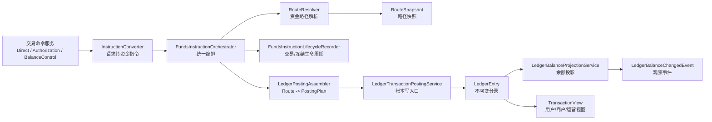

### 3.2 模块职责

| 模块 | 职责 | 禁止 |
| --- | --- | --- |
| transaction-face | 暴露直接交易、授权交易、余额控制、交易查询和生命周期契约。 | 暴露 Entity、Mapper、route 实现或账本 DAL。 |
| transaction-impl | 请求转换、指令编排、路由解析、route snapshot 保存、生命周期记录。 | 直接写余额投影；绕过账本写分录；授权拒绝生成账务路径。 |
| wallet-face | 暴露真实资金账户、信用账户、支出控制范围、平台账户角色、支付工具、支出主体资金责任解析关系、支付工具生命周期 facade 和余额查询契约。 | 承载 canonical 交易命令、交易内核实现或账本过账命令；把 `FundingAccount` 暴露成信用、预算和支付工具的通用父类。 |
| wallet-impl | 创建账户和工具，显式初始化账本，查询主体余额。 | 实现支付工具生命周期 facade、交易执行路径自动建账、直接修改 ledger entry；把信用账户、支出控制范围、钱包标识或支付工具写入 `t_funding_account` 来统一处理。 |
| ledger-face | 暴露账本、账本交易、分录查询和入账契约。 | 保存业务订单或交易生命周期。 |
| ledger-impl | 落地账本、posting plan、ledger entry、余额投影和余额变更事件。 | 重新路由或把交易投影视为事实源。 |
| core | 承载资金 DSL、route、ledger、wallet 枚举和值对象。 | 依赖任何具体实现。 |

## 四、详细设计

### 4.1 直接交易设计

#### 4.1.1 服务契约

本节承接 PRD 02 的“直接交易产品服务契约”。直接交易服务只承接已确认发生的资金事实，服务入口必须能说明输入事实、金额组件、route snapshot、账本引用、幂等边界和查询追踪口径。

| 产品能力 | 系统契约 | 入参 | 出参 | 幂等 | 验收承接 |
| --- | --- | --- | --- | --- | --- |
| 直接交易提交 / 充值 | FundsDirectTransactionService.topup | FundsTransactionTopupRequest | 资金交易流水号 | 业务场景 + 业务流水 + 请求摘要 | 外部账户只做引用；用户 AVAILABLE 增加；账本分录平衡。 |
| 资金转账 | transfer | FundsTransactionTransferRequest | 资金交易流水号 | 业务场景 + 业务流水 + 请求摘要 | 转出方减少、转入方增加；双方主体、币种和账目明确。 |
| 支付 / 收款 | pay | FundsTransactionPayRequest | 资金交易流水号 | 业务场景 + 业务流水 + 请求摘要 | 普通支付和商户订单收款按场景选路；本金、费用和补贴拆分。 |
| 原交易退款 | refund | FundsTransactionRefundRequest | 资金交易流水号 | 原交易引用 + 退款业务流水 + 请求摘要 | 基于原 route snapshot 回放；累计退款不超过可退金额。 |
| 提现确认 / 出金成功 | withdraw | FundsTransactionWithdrawRequest | 资金交易流水号 | 提现业务流水 + 外部引用 + 请求摘要 | 外部受理不等于出款成功；若引用冻结来源，必须关闭对应冻结金额。 |
| 费用收取 | fee | FundsTransactionFeeRequest | 资金交易流水号 | 原交易引用 + 费用类型 + 请求摘要 | 费用 leg 独立平衡；平台费用账户、费率或规则版本可追溯。 |
| 手续费退回 | refundFee | FundsTransactionFeeRefundRequest | 资金交易流水号 | 原费用引用 + 退费业务流水 + 请求摘要 | 退费不超过原手续费；不混入普通退款。 |
| 差错调账入口 | 对账差错链路触发 FundsBalanceControlService.adjust 或直接交易调账事实，具体公共契约由工程任务边界确认 | FundsBalanceAdjustRequest 或工程任务确认的调账 Request | 调整流水号或调账资金交易流水号 | 差错单或调整来源 + 调整业务流水 + 请求摘要 | 必须有审批、凭证、责任主体、原因和审计；不得绕过差错闭环或直接改余额。 |
| 直接交易查询 | FundsTransactionQueryService.queryFundsTransaction / queryFundsTransactionDetails | FundsTransactionQuery / FundsTransactionDetailQuery / transactionSn | FundsTransactionDTO / FundsTransactionDetailDTO | 查询不写账，不占用命令幂等键 | 查询结果必须能追溯交易事实、明细、route snapshot、账本交易、余额变化和审计时间线。 |

直接交易共同契约：

1. 命令入口必须携带租户、业务场景、业务流水、金额、币种、操作者、请求摘要和审计上下文。
2. 涉及原交易、原费用、冻结来源、外部回单或差错来源的入口，必须携带可追溯引用；缺引用时失败或进入差错，不能按当前账户绑定重新选路。
3. 资金账户余额调整、信用账户额度调整和预算控制额度 / 窗口调整由余额控制服务的 adjust 承接；预算控制调整只更新预算控制视图、Spend Rule 快照和审计证据，不生成 ledger entry；对账差错调账必须先经过差错单、审批、凭证和审计闭环，再触发余额控制 adjust 或批次授权的直接交易调账事实。
4. 查询服务只能返回只读 DTO，不修复状态、不补账、不重算余额；需要修正时必须通过补事实、冲正、调账、释放、核销或重放进入新动作。

交易请求扩展上下文契约：

1. `com.wind.funds.transaction.model.request` 下的直接交易、授权交易和余额控制 Request 只以 `ReadonlyContextVariables` 承载 `contextVariables`，表达请求创建时调用方提供的补充上下文读取视图。
2. Request 层不再定义专用 `FundsRequestContextVariables` 快照工具，也不把 `WritableContextVariables` 作为字段类型；需要构造上下文的调用方可在边界外组装后传入只读对象。
3. `contextVariables` 可为空，空值语义表示“无额外上下文”，不得在 Request setter 中隐式补空 Map、重算业务事实或写入默认资金字段。
4. 指令转换层必须在合并上下文前校验敏感字段和敏感值；支付工具、外部账户、卡号、密钥、完整银行账户和权益核心资金事实不得通过 `contextVariables` 进入 route、ledger、投影、日志或审计普通链路。
5. 若扩展 Request/DTO 的核心资金语义，应新增一等字段或不可变事实快照，并在工程任务中明确公共契约范围；不得恢复 request 专属上下文封装来规避公共契约边界。

直接交易权益入口对齐：

1. 含优惠券、代金券或补贴的直接支付仍由 `FundsDirectTransactionService.pay` 承接，不新增 benefitPay、couponPay 或 voucherPay 等权益专用服务方法。
2. 含权益退款仍由 `FundsDirectTransactionService.refund` 承接，不新增 benefitRefund。退款必须基于原交易、原 route snapshot、原权益资金交易、历史摘要或经审批补充事实回放；不得由退款请求携带当前营销规则重新计算后的权益结果作为资金事实来源。
3. 后续如需落地含权益直接交易，应在独立工程边界中明确扩展 `FundsTransactionPayRequest`、`FundsTransactionRefundRequest`、指令转换和 route replay 所需字段；仅声明契约承载时不得修改直接交易服务入口和 Request/DTO。
4. 权益让利资金影响优先通过 `FundsBenefitContributionTransactionService` 形成独立权益资金交易或等价不可变事实，再由主交易、route snapshot、posting context 或投影引用；不要求 `FundsTransactionPayRequest` 承载旧重型权益快照。
5. `FundsTransactionRefundRequest` 更适合承载原交易、原 route snapshot、原权益资金交易或 replay 策略引用，而不是承载一份新的权益计算结果；若缺原权益资金事实，应失败或进入人工处理。
6. 幂等摘要必须纳入权益让利资金事实摘要；同一业务流水、不同权益结果不能复用同一直接交易结果。
7. 券能不能退由业务层、订单层、营销权益系统或运营审批链路决策；直接退款请求若涉及权益处置，应承载业务层给出的本次退款决策引用、决策来源、规则版本和审计上下文。资金底座只校验原权益资金事实、历史摘要、剩余可处理金额和资金侧处置，不判断券可退性。

直接交易原交易回放契约：

1. `FundsTransactionRefundRequest.referenceTransactionSn` 是直接退款的内部原资金交易引用；指令转换层必须把它转换为 `FundsInstructionReferenceSpec(ORIGINAL_TRANSACTION)`，并优先于外部通道流水参与 route replay。
2. `channelTransactionSn` 只表示外部通道交易、退款流水或对账引用；它可以转换为 `EXTERNAL_TRANSACTION` 或进入外部引用上下文，但不能替代内部原交易引用。
3. 携带 `referenceTransactionSn` 的直接退款必须按原交易 `routeSnapshot` 回放，生成独立退款资金交易、交易明细、账本交易和分录，同时更新原交易累计已退摘要。
4. 缺原交易、缺原 `routeSnapshot`、错币种、累计退款超额或原 leg 不允许部分回放时，必须在账务入账前失败；失败不得生成 route、posting、LedgerEntry、余额投影或交易投影副作用。
5. route resolver 中直接付款本金 leg 和费用 leg 需要显式声明可部分回放，确保部分退款、退费和后续 replay 共享同一不可变路径；仍不得按当前支付工具绑定、当前资金责任、当前支出控制范围或当前 Spend Rule 重新选路。

#### 4.1.2 交易应用入口分层

交易服务需要区分“业务入口形态”和“资金事实内核”。`transaction-face` 中直接交易、授权交易和余额控制的内核请求以已解析账户主体为准；VCC 场景必须先解析为资金子账户或信用子账户，外部支付工具、外部钱包端点、通道 token、内部钱包入口、外部账户和预算控制上下文属于 route 准入、快照和应用编排输入。

| 分层 | 面向对象 | 可接收输入 | 输出 | 设计约束 |
| --- | --- | --- | --- | --- |
| 业务应用入口 | 上层业务、通道适配、VCC/共享卡/钱包产品。 | `PaymentInstrumentRef`、`SubjectRef`、`BenefitSnapshot`、外部授权引用、商户/MCC/国家、使用主体、支出控制范围、Spend Rule、金额和业务流水。 | 通过、拒绝或解析后的资金事实请求。 | 负责校验工具、绑定、规则、资金责任、内部入口解析和权限，并固化工具/绑定/规则/入口快照；不得写账本事实。 |
| 交易内核入口 | 资金交易编排。 | 资金账户、信用账户、VCC 资金/信用子账户或平台账户角色解析结果、金额、币种、幂等键、原事实引用和审计上下文。 | 资金交易流水、授权流水、冻结/调整流水。 | 负责幂等、生命周期、route、posting、entry、projection；不得重新解释当前工具绑定来覆盖历史路径。 |
| 回放和逆向入口 | 退款、撤销、过期、拒付、退费和解冻。 | 原交易、原授权、原完成、原 route snapshot 或冻结来源。 | 逆向资金事实或失败原因。 | 优先使用原快照，不能按当前支付工具绑定或当前资金责任关系重新选路。 |

授权交易是双层入口的首要适用场景：上层业务自然持有卡、VA、外部钱包端点、共享卡、内部钱包入口和外部授权引用。外部工具入口必须先校验工具状态、方向、币种、绑定版本、使用人、支出控制范围、Spend Rule、卡绑定子账户、父账户、资金责任唯一性和账户能力；内部钱包、信用额度或权益入口必须先解析为主体或快照。只有授权批准时，内核才基于解析后的资金子账户、信用子账户、资金账户、信用账户或平台账户角色生成 `AVAILABLE -> AUTHORIZATION` 路径。授权拒绝、支付工具不可用、入口解析失败、规则拒绝、子账户缺失、父账户缺失、资金责任缺失或不唯一时，只记录拒绝事实和原因，不生成账务 route leg、posting 或 ledger entry；如保存不含 legs 的 route snapshot，只能作为拒绝解释证据。

`FundsAuthorizationTransactionService.authorize(FundsAuthorizationTransactionAuthorizeRequest)` 属于账户主体型内核入口；如要开放支付工具型授权入口，应新增或调整应用层契约，并在工程任务中明确公共契约、Request/DTO、幂等摘要、敏感上下文、路由快照和回归测试范围，不得直接替换现有内核请求字段。

wallet application 调用面选择：

| 调用目的 | 推荐入口 | 调用方 | 不适用 |
| --- | --- | --- | --- |
| VCC/卡授权、共享卡授权、支付工具授权。 | `InstrumentTransactionLifecycleApplicationService.authorizeByInstrument` | 上层业务、发卡业务、通道适配。 | 不直接调用交易内核替换 canonical 入参；不绕过授权准入专项服务。 |
| VA 收款、外部钱包入金、ACH/银行已确认入金。 | `InstrumentTransactionLifecycleApplicationService.receiveByInstrument` 或 `ExternalFundsEventApplicationService.consume` | 业务包已持有支付工具引用时用生命周期入口；只有外部事件事实时用外部事件入口。 | 不给 VA、外部账户或支付工具建账；不把外部 accepted 当内部成功。 |
| 全球账户出款、SWIFT/local/ACH payout。 | `InstrumentTransactionLifecycleApplicationService.payOutByRail` | 全球账户或出款业务包。 | 当前只作为服务层契约和前置 guard；真实出款、在途、费用、清结算和对账需独立工程边界。 |
| 只读解析支付工具、绑定、资金责任、账户能力和准入快照。 | `PaymentInstrumentCapabilityApplicationService`、`FundingResponsibilityResolutionApplicationService`、`FundsAccountCapabilityApplicationService`、`PaymentInstrumentPreTransactionSnapshotApplicationService` | 生命周期入口内部组合、风控预检、运营解释。 | 不创建交易事实、route、posting、账本交易、分录或余额投影。 |
| 授权前 Spend Rule 准入。 | `SpendControlAdmissionApplicationService` | 支付工具授权生命周期入口或需要规则证据的上层业务。 | 不执行完整规则引擎，不替代资金交易。 |
| 交易成功、退款补偿后的控制额度变动。 | `SpendControlTransactionConsumptionApplicationService` | 已有资金交易事实后的控制事实消费方。 | 不创建或修改资金交易、ledger posting、支付工具资金流向或 canonical 入参。 |
| 预算控制额度调整。 | `BudgetControlLimitAdjustmentApplicationService` | 预算控制运营或规则配置业务。 | 不表达资金价值转移，不让支出控制范围进入核心账本。 |

调用原则：新业务入口优先从生命周期或外部事件入口进入；专项 application service 只做内部组合、只读解析或交易后控制消费。除非出现无法用现有入口表达的真实业务场景，否则不新增更窄 facade。

#### 4.1.3 流程

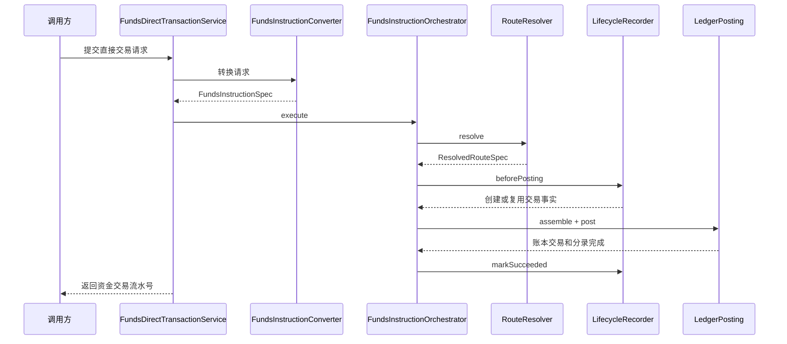

直接交易不变量：

1. 同一业务键和同一请求摘要重复提交，不重复生成交易、明细、route snapshot、账本交易和分录。
2. 同一业务键但请求摘要不同，必须拒绝。
3. 交易成功必须以账本过账成功为前提；账本失败不得展示交易成功。
4. 本金、手续费、成本、补贴、追偿和调账必须拆分不同 route leg 或明确 phase。
5. 原交易退款和手续费退回必须基于原 route snapshot 或原费用路径回放。
6. 差错调账必须有差错单、审批、凭证、责任主体和审计上下文；不得由余额控制绕过交易层、对账差错链路或账本事实。

### 4.2 授权交易设计

#### 4.2.1 服务契约

| 能力 | 接口 | 入参 | 出参 | 前置条件 | 幂等键 | 失败副作用 |
| --- | --- | --- | --- | --- | --- | --- |
| 授权 | FundsAuthorizationTransactionService.authorize | FundsAuthorizationTransactionAuthorizeRequest | canonical 服务返回授权交易流水号；授权状态、拒绝原因、规则版本或 route snapshot 引用由查询 / 投影解释读取 | 支付工具、资金责任、账户能力、币种、账本周期和授权前策略已通过或已明确拒绝 | 业务场景 + 业务流水 + 请求摘要 | 授权拒绝只记录拒绝事实和原因；不得生成账务 route leg、posting、entry；可保留空 route snapshot 作为拒绝证据。 |
| 撤销 | reversal | FundsAuthorizationTransactionReversalRequest | 授权交易流水号、撤销明细流水号、剩余授权金额 | 原授权存在且仍有剩余授权金额；撤销金额不超过剩余授权 | 原授权流水 + 撤销业务流水 + 请求摘要 | 校验失败不释放余额，不改变授权累计。 |
| 过期 | 不提供交易服务入口 | 无 | 无 | 到期、超时或通道未返回不是可信资金事实 | 无 | 不生成资金交易、route、posting、LedgerEntry 或余额变化；如需释放剩余占用，必须通过可信撤销/冲正、清算剩余释放或人工差错补事实进入 `reversal`、调账或差错链路。 |
| 完成 | settle | FundsAuthorizationTransactionSettleRequest | 授权交易流水号、完成明细流水号、累计完成金额和剩余授权金额 | 普通完成必须引用原授权；强制完成必须显式 FORCE 模式、受信策略或审批快照、上限、原因、外部原事实引用、凭证和审计，初始 FORCE 模式不得依赖原授权流水 | 普通完成使用原授权流水 + 完成业务流水 + 请求摘要；强制完成使用外部原事实引用 + 受信策略/审批快照 + 完成业务流水 + 请求摘要 | 完成超过剩余授权失败；强制完成缺策略、超上限、缺外部原事实、缺凭证或缺审计失败。 |
| 结算后退款 | settleRefund | FundsAuthorizationTransactionRefundRequest | 普通授权链退款返回授权交易流水号、退款明细流水号、累计退款金额；无授权退款返回退款资金事实和外部引用审计摘要 | 普通退款引用原完成；无授权退款以空原授权流水进入 no-auth 语义，并携带 `externalReferenceSn`、退款原因、操作者和审计 | 普通退款使用原完成引用 + 退款业务流水 + 请求摘要；无授权退款使用外部引用 + 退款业务流水 + 请求摘要 | 累计退款超过已完成金额失败；无授权退款缺外部引用、缺原因或缺审计失败；不得补造授权占用，不得携带或查询内部授权流水。 |
| 争议裁决资金结果 | settleRefund | FundsAuthorizationTransactionRefundRequest 携带争议原因、凭证、外部案件引用、裁决结果和审计上下文 | 授权交易流水号、争议退款明细流水号、争议展示标识 | 仅用于已结算授权 dispute / chargeback 案件裁决后的退款结果；用户败诉或无需资金处理时不调用资金交易入口 | 原完成引用 + 争议案件业务流水 + 裁决结果 + 请求摘要 | 不要求落到独立 chargeback 方法；不得把授权拒绝写成拒付；不得把案件过程压缩成资金交易；用户败诉不得生成 route、posting、LedgerEntry 或余额变化；平台、商户或外部机构之间的追偿、准备金抵扣或后续结算扣减由清结算、对账或争议专项承接。 |

退款预处理、退款结束、授权业务取消、事件时间调度、事件顺序编排、到期提醒和争议案件受理 / 举证 / representment / 裁决过程属于上层业务、通道适配、运营或清结算争议域职责，不进入支付资金底座默认服务契约。资金底座只接收上层归一后的授权、可信撤销/冲正、完成、退款、争议裁决资金结果或强制完成事实，并在服务内校验金额、快照、幂等和审计红线。

授权交易服务共同契约：

1. 所有入口必须携带租户、业务场景、业务流水、金额、币种、主体引用、操作者、请求摘要和审计上下文。
2. 涉及原授权、原完成、原退款或外部原消费的入口，必须携带可追溯引用；缺引用时只能失败或进入差错，不能按当前绑定重新选路。
3. settle 同时承接普通完成和强制完成；普通完成继续要求原授权交易流水，强制完成必须显式声明 FORCE 模式、受信策略或审批快照、上限、原因、外部原事实引用、凭证和操作者；初始 FORCE 模式不得携带或依赖内部原授权流水，不得构造 `AUTHORIZATION` reference 或查询原授权账本交易。
4. settleRefund 同时承接普通授权链退款、无授权直接退款和争议裁决后的退款结果；普通授权链退款继续要求原完成引用，无授权退款以空原授权流水进入 no-auth 语义，携带 `externalReferenceSn`、退款原因、操作者和审计，且不得携带或查询内部授权流水；争议裁决结果必须携带案件引用、裁决结果、原因、凭证和审计；资金路径可以复用退款路径，但原因、外部引用和投影展示语义必须保留。用户败诉或无需资金处理时，不生成资金交易事实。
5. 服务返回值只表达资金底座已经接受并处理的资金事实，不承诺通道、卡组织或上层业务事件最终状态。

争议语义应先在 dispute case 层得出裁决，再由 `settleRefund / AUTH_REFUND` 的查询、投影、审计和幂等摘要承接退款结果；裁决无资金影响时只保留案件、审计和投影解释，不进入交易内核。2026-06-26 已裁决独立 `FundsAuthorizationTransactionService#chargeback` 公共方法、请求模型、事件枚举和 replay 分支退出目标态，与 `expire` 一起移除；需要完整争议运营、representment、清结算追偿、VCC processor、外部卡组织规则、跨仓库兼容或历史数据只读解释时，必须另起专项工程任务，不恢复交易内核 `chargeback` 主入口。

#### 4.2.2 授权创建流程

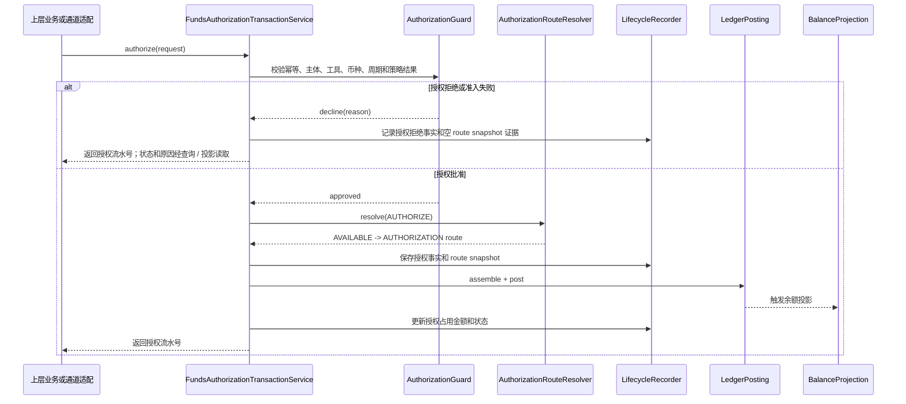

授权创建的关键判断是“批准后才进入账务 route leg 和账本”。授权拒绝、支付工具准入失败、spend controls 拒绝、余额不足、额度不足和预算不足，都只能形成可解释的拒绝事实，不能生成账务路径；空 route snapshot 只能作为拒绝证据，不作为 replay 路径。

#### 4.2.3 授权后续事件流程

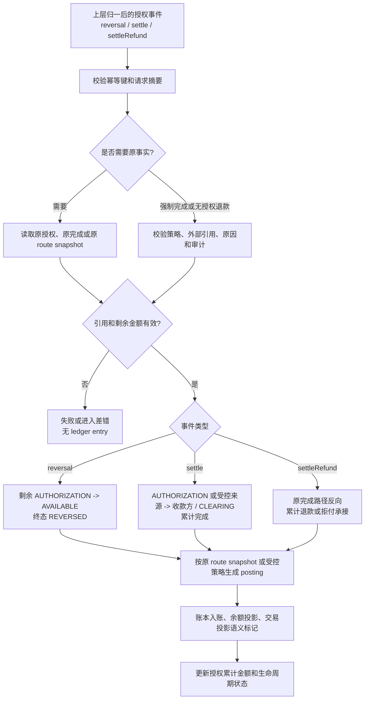

授权后续事件必须先判定原事实、剩余可处理金额和幂等摘要，再生成账务计划。完成后的到期提示、撤销后的完成、重复完成、重复退款等异常组合必须由生命周期累计金额和请求摘要共同拦截；到期、超时或通道未返回不是可信资金事实，不生成 route、posting、LedgerEntry 或余额变化。

#### 4.2.4 状态机

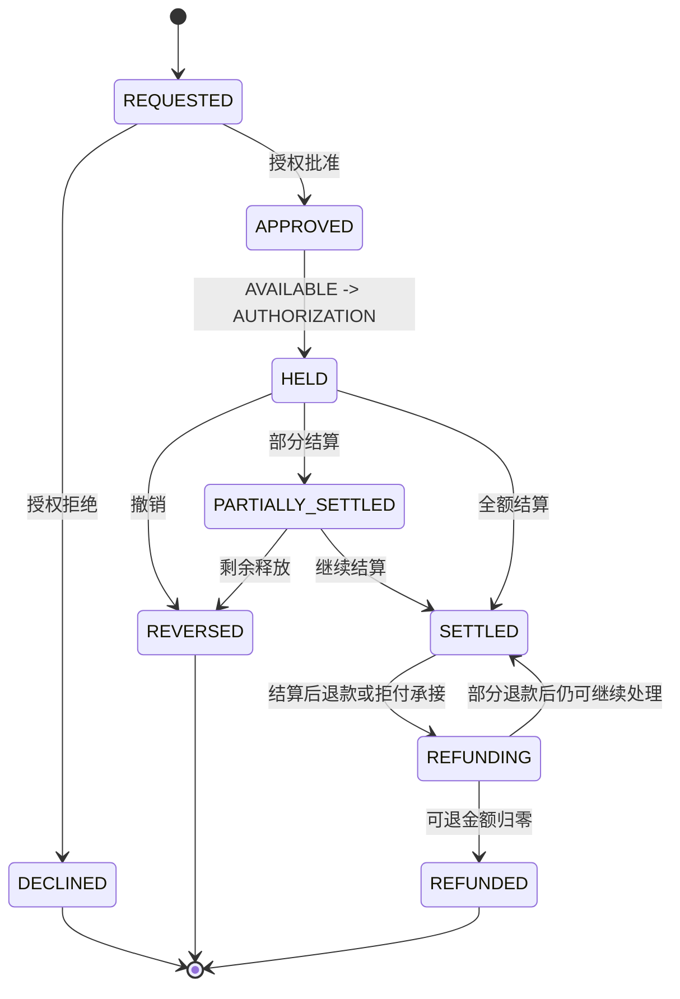

状态收口规则：授权交易不提供 close 服务入口，也不把 CLOSED 作为默认授权事件或编码目标。若运营查询需要展示“业务关闭”或“授权已到期”，只能作为查询归纳态、运营标签或差错候选；资金处理终态仍以 SETTLED、REVERSED、REFUNDED 和 DECLINED 等明确资金事实状态为准。REFUNDING 只表达已完成授权正在发生部分退款、争议类退款或扣回处理，不是关闭态；只有可退金额归零或业务确认无需继续退款时，才可收口到 REFUNDED 或保持 SETTLED 的可解释状态。

授权红线：

1. 授权拒绝不得生成 RouteLeg、PostingPlan、LedgerEntry、declinedAmount 或 chargeback 事件。
2. 授权成功不是最终消费；用户账单和商户账单要区分占用和结算。
3. 授权完成不新增 CONSUMED 账目，不触碰 LIMIT。
4. reversal 和普通 settle 必须引用原授权事实；普通 settleRefund 必须引用原完成事实；settleRefund 无授权退款模式以空原授权流水进入 no-auth 语义，引用 `externalReferenceSn`、退款原因、操作者和审计，不得补造内部授权占用，不得携带或查询内部授权流水；拒付通过 settleRefund 携带原因、凭证和审计上下文承接；settle 强制完成模式必须有受信策略或审批快照、上限、原因、外部原事实引用、凭证和审计，不能把普通完成的原授权流水当作强制完成凭证。
5. 授权过期不再作为交易终态；系统到期、超时或通道未返回不得释放已完成金额或剩余占用，后续释放必须有可信撤销/冲正、清算剩余释放或人工差错补事实。
6. 拒付承接可复用退款资金路径和终态，但不得丢失拒付原因、外部引用、凭证、审计上下文和投影视图区分能力。

授权交易权益入口对齐：

1. 含权益授权仍由 `FundsAuthorizationTransactionService.authorize` 承接，不新增 authorizeWithBenefit、couponAuthorize 或 voucherAuthorize 等权益专用服务方法。
2. `FundsAuthorizationTransactionAuthorizeRequest` 后续若需要表达授权占券，应新增权益占用引用、原权益资金事实引用或等价一等字段，不恢复 `benefitSnapshot` 旧 DSL；授权拒绝、支付工具准入失败或余额不足时，不核销权益，不生成账务 route leg、posting 或 entry。
3. `reversal`、`settle` 和 `settleRefund` 原则上读取原授权事实、原 route snapshot、原权益资金事实或历史摘要，不接收当前重新计算的权益结果；完成核销、可信撤销释放和退款冲回必须沿原事实处理。
4. `expire` 已从授权交易目标态移除；权益设计不得借过期释放恢复公共契约。授权占券到期只能由权益系统或运营侧形成控制释放、差错候选或可信撤销/补事实后再进入资金链路。
5. `settle` 强制完成、`settleRefund` 无授权退款和拒付承接属于授权目标态的独立对齐问题；权益设计只要求这些路径能引用原权益资金事实或历史摘要并保留原因、凭证和审计，不要求新增权益专用方法。
6. 授权后续事件中的释放、核销、返券、不返券或补贴冲回决策来自业务层或营销权益系统；资金底座只消费决策结果和原授权权益资金事实，不在 reversal、settle 或 settleRefund 内重新判断券是否可退。

### 4.3 余额控制设计

#### 4.3.1 服务契约

| 能力 | 接口 | 入参 | 出参 | 前置条件 | 幂等键 | 失败副作用 |
| --- | --- | --- | --- | --- | --- | --- |
| 冻结 | FundsBalanceControlService.freeze | FundsBalanceFreezeRequest | 冻结单流水号、冻结状态、剩余冻结金额 | 主体、账目、币种、周期和可用余额有效；原因和操作者明确 | 业务场景 + 冻结业务流水 + 请求摘要 | 余额不足、错币种或账目不支持时不生成 route、posting、entry。 |
| 解冻 | unfreeze | FundsBalanceUnfreezeRequest | 冻结单流水号、解冻明细流水号、剩余冻结金额 | 原冻结单存在且仍有剩余冻结金额；解冻金额不超过剩余冻结 | 原冻结单流水 + 解冻业务流水 + 请求摘要 | 超额解冻失败或幂等返回；不得把已被后续资金事实关闭的冻结金额再释放回可用。 |
| 资金账户余额调整 / 信用账户额度调整 / 预算控制额度调整 | adjust | FundsBalanceAdjustRequest；编码落地时可按资金账户、信用账户、支出控制范围补充专用字段或专用 Request | 调整流水号、调整后目标账目余额摘要、LIMIT / AVAILABLE 摘要或预算控制视图摘要 | 具备调整对象、审批、凭证或规则版本、原因、目标账目或控制窗口和操作者；资金账户余额调整必须有差错、运营修正或财务调整来源 | 调整业务流水 + 请求摘要 | 缺审批、缺来源、错币种、破坏已授权或已使用约束、账本未开放负余额能力或缺少本次运行时策略事实时不生成分录；预算控制调整不得生成支出控制范围分录。 |

余额控制服务共同契约：

1. 冻结和解冻只做同一记账主体、同一币种、同一账本周期内的余额桶控制，不表达跨主体价值转移。
2. 冻结单是余额控制事实载体，必须记录冻结原因、业务引用、有效期、操作者、累计解冻金额、后续资金事实关闭金额和剩余冻结金额。
3. 冻结后提现、追偿或扣划必须由直接交易或其他明确资金事实引用并关闭冻结来源，不能用解冻代替扣款。
4. adjust 支持资金账户余额调整、信用账户额度调整和预算控制额度 / 窗口调整；资金账户余额调整必须是同主体、同币种、同账本周期内的受控余额修正，并有差错、运营修正或财务调整来源。预算控制调整只更新 SpendControlScope / Spend Rule 控制视图、规则快照和审计证据，不进入 route、posting 或 ledger entry。
5. 对账差错入账、跨主体补偿和真实资金转移必须先进入清结算或对账差错闭环，再由受控调整或直接交易事实承接；不得把 adjust 当成绕过审批、差错单、凭证、重新对账或资金路径的直接改账入口。
6. 余额控制请求不得隐式换汇；币种不一致时失败或交由已确认的外汇域方案承接。
7. 冻结、解冻、过期释放和后续资金事实关闭冻结来源都必须落动作明细；冻结单主表只保存聚合金额和当前状态，不作为审计明细或并发互斥的唯一证据。
8. 如工程任务沿用现有通用 adjust 命名，任务说明必须写明其产品语义限制和准入来源；不得把 AC-ADJ-001 简化成无差错、无审批、无凭证、无重新对账的余额直接修改。
9. 外部钱包、VCC 发卡行、发卡处理商或第三方余额系统出现“上游不支持透支但外部终局余额已为负数”等异常时，资金底座只承接已终局或经差错单确认的余额纠偏事实。`FundsBalanceControlService.adjust` 可以把同主体目标账目调整到受控负可用，但必须携带外部终局事件、外部余额快照、差错单或审批、凭证、责任方、操作者和重新对账引用；纠偏后的负余额是风险、追偿、抵扣或人工处理状态，不是可继续消费额度。

#### 4.3.2 通用流程

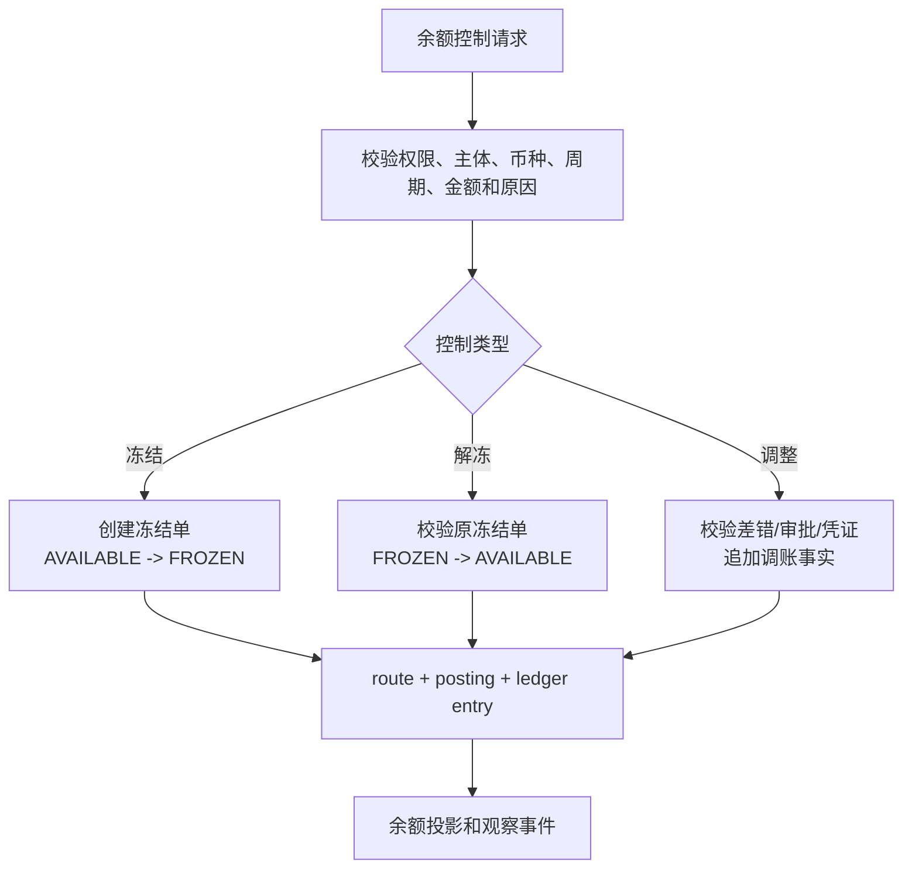

#### 4.3.3 外部余额异常纠偏流程

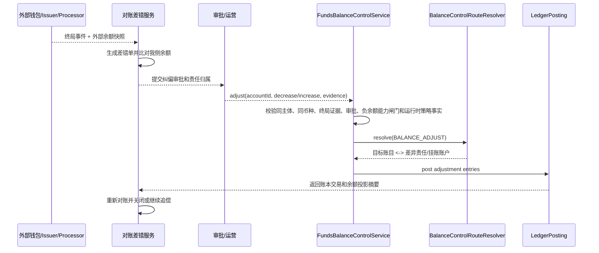

系统约束：

1. 外部 `pending`、`accepted`、`processing`、人工备注或可疑口径只能生成差异报告、待处理任务或待核验差错，不得调用余额调整入账。
2. 纠偏只调整同一内部账务主体的目标账目；若需要把损失转移到另一客户、商户、平台、合作方或外部机构，必须走清结算对账差错闭环、追偿或直接交易调账事实，不得把跨主体转移塞入余额控制。
3. 纠偏后若 `AVAILABLE < 0`，后续支付、授权、冻结、提现、出款、清算放行和报表展示必须读取运行时负余额策略事实、风险状态或出款门禁，不能把负可用解释为可继续使用额度。
4. 系统实现应把外部事件、外部余额快照、差错单、审批、凭证、责任方和重新对账引用纳入调整动作、账本交易、交易投影或审计证据；敏感原文只保存脱敏引用。

#### 4.3.4 冻结后提现流程

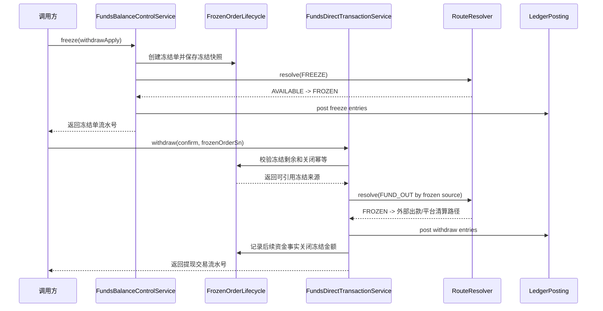

提现申请阶段只冻结可用性；提现确认阶段才创建出款资金事实并引用、关闭冻结来源。提现拒绝、撤销或超时不应生成出款交易，应调用解冻释放剩余冻结。

余额控制红线：

1. 冻结不创建标准资金交易，不表达消费、扣划或付款完成。
2. 冻结后扣划、追偿或调账必须创建独立资金事实并引用冻结单。
3. 解冻不得超过剩余冻结金额。
4. 调账必须有原因、差错引用、审批、凭证和审计。

### 4.4 钱包账户设计

钱包账户是能力域，不是单一实体。系统层以 `FundingAccount`、`CreditAccount`、父子账户层级、支出控制范围 `SpendControlScope`、`PlatformFundingAccountRole`、`PaymentInstrument`、`SpendSubjectFundingRelation` 和余额查询服务共同承接钱包产品能力；其中 `FundingAccount` 只表示真实资金账户、平台责任资金账户或经明确 profile 标识的资金子账户，`CreditAccount` 可承接信用子账户，`SpendControlScope` 只表示 Spend Rule 可引用的支出控制 scope。统一路由和入账时使用 `FundsSubjectType` / `SubjectRef`；外部支付工具和工具快照使用 `PaymentInstrumentRef`，内部余额钱包、信用额度、返利钱包或商户钱包等业务入口先解析为 `SubjectRef`、`BenefitSnapshot`、`FundingAllocationDecision` 或等价不可变快照，不得用普通 `FundingAccount` 兼容所有主体，也不得把所有业务入口强行包装成 `PaymentInstrument`。

钱包模块对外应按 DDD 应用服务暴露用例级能力，资源型服务只作为应用服务内部协作或管理后台能力。现有 `FundingAccountService`、`CreditAccountService`、`SpendControlScopeService`、`PaymentInstrumentService`、`SpendSubjectFundingRelationService` 可以作为局部基线继续承接当前资源管理能力；跨模块交易、路由和业务产品不应直接拼装这些服务来完成授权准入或资金责任解析。

应用层可以通过 Request 字段承接内部余额钱包、信用额度、返利钱包、商户钱包、VCC 卡、银行卡、VA、外部账户和通道 token 等业务入口参数。但该参数只属于 application/use-case facade，不是交易内核主体，也不要求内部账户都包装成 `PaymentInstrument`。facade 的职责是把入口解析为 `SubjectRef`、`PaymentInstrumentRef`、`BenefitSnapshot`、`FundingAllocationDecision` 或等价不可变快照，再委派交易、路由和账务内核。

当前 wallet 服务分层完成度按“基础服务承接单对象事实，application service 承接跨对象用例”判断。基础服务可以访问 Mapper / Repository，并负责创建、读取、查询、幂等、状态守卫和只读解释；application service 只组合基础服务、交易内核和外部事实，不直接持有 Mapper，不新增浅 facade。

| 层次 | 当前服务 | 完成度 | 继续扩展原则 |
| --- | --- | --- | --- |
| 基础服务 | `FundingAccountService`、`CreditAccountService`、`SpendControlScopeService`、`PlatformFundingAccountService`、`PaymentInstrumentService`、`PaymentInstrumentBindingService`、`PaymentInstrumentBindingHistoryService`、`SpendSubjectFundingRelationService`、`AccountHierarchyBindingService`、`AccountHierarchyService`、`FundsSubjectBalanceQueryService`、`LedgerProfileService`、`SubjectLedgerInitializer`、`SpendRuleDefinitionService`、`SpendRuleVersionService`、`SpendRuleBindingService`、`SpendRuleDecisionRecordService`、`SpendControlMovementService`。 | 条件可用：wallet 实体和控制事实均已有基础服务或明确组合服务承接，Mapper 访问收敛在 `wallet-impl/services/impl`；支出控制范围创建不建账，Spend Rule 控制事实不入 ledger。 | 新增单对象能力优先并入基础服务；不得新增旧式 `DomainService` / `DomainQueryService`、兼容 facade 或只做委派的浅服务。 |
| 场景 application service | `FundingResponsibilityResolutionApplicationService`、`FundsAccountCapabilityApplicationService`、`PaymentInstrumentCapabilityApplicationService`、`PaymentInstrumentPreTransactionSnapshotApplicationService`、`AuthorizationAdmissionApplicationService`、`InstrumentTransactionLifecycleApplicationService`、`ExternalFundsEventApplicationService`、`SpendControlAdmissionApplicationService`、`SpendControlTransactionConsumptionApplicationService`、`BudgetControlLimitAdjustmentApplicationService`。 | 条件可用：已覆盖授权准入、预交易快照、支付工具收款最小入口、外部确认入金、交易后控制消费和预算额度调额；失败路径要求停在资金交易、route、posting 和账本事实前。 | 只有组合支付工具、账户能力、资金责任、Spend Rule、交易事实或外部资金事件时才扩展 application service。 |
| 未完成能力 | `payOutByRail` 真实出款、外部扣账、return/NOC/reversal、信用账户还款或调额、VCC 预付 / 共享卡专项 facade、事件消费 / outbox、运营后台和生产迁移。 | 未完成交付：当前仅有服务层最小契约、guard 或部分 confirmed credit 消费证据。 | 必须另起单一工程边界，明确交易事实、清结算、对账、在途、费用、逆向和审计边界。 |

下表是钱包应用层能力候选和边界说明，不表示所有候选均已编码落地。是否已落地以本节完成度矩阵、源码接口和 验证证据 证据矩阵为准。

| 应用层服务候选 | 职责 | 依赖 | 对外契约边界 |
| --- | --- | --- | --- |
| WalletAccountApplicationService | 统一开户、账户能力查询、余额能力聚合和账户状态解释。 | FundingAccountService、CreditAccountService、SpendControlScopeService、FundsSubjectBalanceQueryService。 | 暴露 DTO、Request、Query；不暴露 Entity、Mapper 或账本内部实现。 |
| AccountHierarchyApplicationService | 创建、查询、暂停、关闭和解释父子账户关系，输出子账户 profile、父账户、层级版本、账目 profile、状态、币种、背后资金责任来源和绑定工具摘要。 | 账户服务、支付工具服务、资金责任解析服务、账本初始化器、余额查询服务。 | 承接 VCC 关联子账户和通用父子账户能力，不承接卡生命周期、PAN/CVC、issuer 原始协议。 |
| PaymentInstrumentCapabilityApplicationService | 读取支付工具，并在请求指定绑定角色时读取绑定，生成工具能力和可选绑定快照；校验工具状态、方向、动作能力、有效期、币种，以及可选绑定版本和敏感字段边界。 | PaymentInstrumentService、绑定历史、敏感字段校验器。 | 不注册工具，不变更绑定，不返回完整敏感凭证；不表达内部余额；未指定绑定角色时只证明工具当前动作能力，不证明账户能力、资金责任或绑定关系。 |
| FundingResponsibilityResolutionApplicationService | 将工具、子账户、父账户、使用主体、支出控制范围、Spend Rule 和平台角色解析成唯一资金或额度责任来源。 | SpendSubjectFundingRelationService、PlatformFundingAccountService、账户服务、AccountHierarchyApplicationService。 | 输出 `FundingAllocationDecision` 或等价不可变决策；支出控制范围和 Spend Rule 不得成为最终责任主体。 |
| AuthorizationAdmissionApplicationService | 支付工具授权准入专项服务；统一外部入口由 `InstrumentTransactionLifecycleApplicationService#authorizeByInstrument` 承接并委派到本服务，本服务只保留 `authorizeByInstrument` 作为内部协作入口。 | 支付工具预交易快照应用服务、Spend Control admission、账户层级应用服务、资金责任解析应用服务、账户能力应用服务。 | 先解析工具能力、绑定、资金责任和账户能力；携带 Spend Rule 决策证据时消费支出控制准入；批准后委派账户主体型授权交易内核，拒绝停在交易内核前且无账务 route leg/posting/entry。 |
| SpendControlAdmissionApplicationService | 面向支付工具交易入口消费外部 Spend Rule 决策证据，并组合支付工具预交易快照形成支出控制准入结论。 | PaymentInstrumentPreTransactionSnapshotApplicationService、外部规则或业务决策方提供的规则版本、决策流水、决策摘要和拒绝原因。 | 不计算规则；会校验证据完整性并固化 Spend Rule 决策记录，输出准入快照；不写 Spend Control Activity、不更新预算控制投影，不创建资金交易、route、posting、LedgerEntry、ledger transaction 或账本余额投影。 |
| SpendControlMovementService | 记录和查询 Spend Rule 控制额度变动流水，并从控制流水派生预算控制投影。 | SpendControlAdmissionApplicationService 输出的准入结论、外部规则证据、预算 scope、目标资金或信用账户主体、控制活动存储。 | 只写控制活动和控制投影自身；写入 `REFUND_COMPENSATED` 时保证补偿不超过周期净消费且补偿后可用控制额度不超过周期额度；不创建资金交易、route、posting、LedgerEntry、ledger transaction、账本余额投影或交易事实。 |
| SpendControlTransactionConsumptionApplicationService | 交易成功、授权完成、退款或争议退款后，将交易结果翻译为 Spend Rule 控制活动的消耗或补偿活动；失败或拒绝通过同一资金事务回滚控制预留，不写释放补偿；超时不写控制流水。 | SpendControlMovementService、资金交易事实查询、route snapshot、原控制活动、支付工具快照和预算 scope。 | 只桥接交易结果和控制活动；不创建资金交易，不改交易 canonical 入参，不写 route、posting、LedgerEntry、ledger transaction 或账本余额投影。 |

新增 application facade 的 Java 落点必须遵循 `transaction -> wallet -> ledger` 的依赖方向。wallet-face 可以定义面向调用方的支付工具和支出控制用例契约；外部资金事件一旦消费为交易事实，公共契约归属 transaction-face；wallet-impl 只实现钱包资源、准入、控制事实和账本事实只读聚合；凡需要创建、查询或消费交易事实的 wallet-face 用例，由 transaction-impl 实现，避免 wallet-impl 反向依赖 transaction-face。

| 接口 | face 包 | impl 包 | Request/DTO 包 | 说明 |
| --- | --- | --- | --- | --- |
| `PaymentInstrumentCapabilityApplicationService` | `wallet/wallet-face/src/main/java/com/wind/funds/wallet/application/instrument` | `wallet/wallet-impl/src/main/java/com/wind/funds/wallet/application/instrument/impl` | `com.wind.funds.wallet.model.request`、`com.wind.funds.wallet.model.dto`，必要时加 `instrument` 子包。 | 支付工具能力准入、绑定版本和敏感字段边界。 |
| `AccountHierarchyApplicationService` | `wallet/wallet-face/src/main/java/com/wind/funds/wallet/application/account` | `wallet/wallet-impl/src/main/java/com/wind/funds/wallet/application/account/impl` | `com.wind.funds.wallet.model.request`、`com.wind.funds.wallet.model.dto`，必要时加 `account` 子包。 | 父子账户建立、子账户 profile、父账户约束、账目 profile、状态、资金来源和绑定摘要；B2-ACCOUNT-HIERARCHY 独立切片。 |
| `FundingResponsibilityResolutionApplicationService` | `wallet/wallet-face/src/main/java/com/wind/funds/wallet/application/funding` | `wallet/wallet-impl/src/main/java/com/wind/funds/wallet/application/funding/impl` | `com.wind.funds.wallet.model.request`、`com.wind.funds.wallet.model.dto`，必要时加 `funding` 子包。 | 解析最终资金或额度责任主体；B2-FR 必须先裁决字段策略。 |
| `AuthorizationAdmissionApplicationService` | `wallet/wallet-face/src/main/java/com/wind/funds/wallet/application/instrument` | `transaction/transaction-impl/src/main/java/com/wind/funds/transaction/application/instrument/impl` | `com.wind.funds.wallet.model.request`、`com.wind.funds.wallet.model.dto`。 | 支付工具授权入口实现；先消费钱包准入、预交易快照和 Spend Control 准入，再委派账户主体型授权交易内核。 |
| `SpendControlAdmissionApplicationService` | `wallet/wallet-face/src/main/java/com/wind/funds/wallet/application/spend` | `wallet/wallet-impl/src/main/java/com/wind/funds/wallet/application/spend/impl` | `com.wind.funds.wallet.model.request`、`com.wind.funds.wallet.model.dto`。 | 消费外部 Spend Rule 决策证据，组合支付工具预交易快照，输出授权前支出控制准入结论；不拥有规则引擎或预算投影。 |
| `SpendControlMovementService` | `wallet/wallet-face/src/main/java/com/wind/funds/wallet/service` | `wallet/wallet-impl/src/main/java/com/wind/funds/wallet/services/impl` | `com.wind.funds.wallet.model.request`、`com.wind.funds.wallet.model.query`、`com.wind.funds.wallet.model.dto`。 | 记录 `RESERVED`、`CONSUMED`、`REFUND_COMPENSATED`、`RELEASED` 和调额类控制活动，按活动聚合只读预算控制投影；准入和拒绝证据进入决策记录，交易失败或拒绝依赖同一资金事务回滚，超时不写控制流水。 |
| `SpendControlTransactionConsumptionApplicationService` | `wallet/wallet-face/src/main/java/com/wind/funds/wallet/application/spend` | `transaction/transaction-impl/src/main/java/com/wind/funds/transaction/application/spend/impl` | `com.wind.funds.wallet.model.request`、`com.wind.funds.wallet.model.dto`。 | 交易后消费或退款补偿控制活动；实现需要查询交易事实并写钱包控制活动，因此归属 transaction-impl 交易事实消费边界。 |
| `InstrumentTransactionLifecycleApplicationService` | `wallet/wallet-face/src/main/java/com/wind/funds/wallet/application/instrument` | `transaction/transaction-impl/src/main/java/com/wind/funds/transaction/application/instrument/impl` | `com.wind.funds.wallet.model.request`、`com.wind.funds.wallet.model.dto`。 | 支付工具交易生命周期统一外层入口；实现先调用钱包预交易快照和授权准入，再委派交易内核创建资金事实。 |
| `ExternalFundsEventApplicationService` | `transaction/transaction-face/src/main/java/com/wind/funds/transaction/application` | `transaction/transaction-impl/src/main/java/com/wind/funds/transaction/application/external/impl` | `com.wind.funds.transaction.model.request`。 | ACH、银行文件、渠道回调或第三方钱包回调的外部资金事件消费入口；当前只消费已确认外部入金事件并委派账户主体型 `topup`，因此公共契约和实现均归属交易层。外部扣账、return/NOC/reversal、信用账户还款或调额、差异单、补事实和事件消费者需另起工程边界。 |
| `VccPrepaidFundingApplicationService` | `wallet/wallet-face/src/main/java/com/wind/funds/wallet/application/vcc` | `wallet/wallet-impl/src/main/java/com/wind/funds/wallet/application/vcc/impl` | `com.wind.funds.wallet.model.request`、`com.wind.funds.wallet.model.dto`，必要时加 `vcc` 子包。 | 预付卡入金确认、系统内充值和退回；写入卡绑定资金子账户，不写卡号账本或 `VCC_ACCOUNT`。 |
| `VccSharedCardTransactionApplicationService` | `wallet/wallet-face/src/main/java/com/wind/funds/wallet/application/vcc` | `wallet/wallet-impl/src/main/java/com/wind/funds/wallet/application/vcc/impl` | `com.wind.funds.wallet.model.request`、`com.wind.funds.wallet.model.dto`，必要时加 `vcc` 子包。 | 共享卡授权、清算和逆向的 VCC 场景编排；使用卡绑定信用子账户作为账务主体，父账户提供约束和汇总，卡维度来自投影。 |

不新增顶层 `com.wind.funds.instrument` 包。支付工具入口的公共契约保留在 wallet-face，钱包资源和准入能力由 wallet-impl 提供；需要创建资金事实的实现落在 transaction-impl，通过 wallet-face 应用契约消费工具、绑定、资金责任、账户能力和 Spend Rule 控制上下文，不能直接依赖 wallet-impl、钱包 DAL 或 Mapper。

`InstrumentTransactionLifecycleApplicationService#authorizeByInstrument`、`receiveByInstrument` 和其他支付工具型 application facade 的接口位于 wallet-face，实现位于 transaction-impl：先解析业务入口参数、工具能力、绑定、预算控制、资金责任和账户能力，再委派账户主体型交易内核。`receiveByInstrument` 只把 VA、ACH 或外部钱包端点等收款入口解析为目标资金账户和外部入金引用，`channelCode` 允许表达钱包层业务 rail / channel 别名，由交易实现归一为稳定渠道后最终委派 `FundsDirectTransactionService#topup`，并把脱敏支付工具引用和外部账户 providerCode 固化到 route snapshot；请求必须携带 `expectedBindingVersion`，缺失或未知 rail 时在交易内核前失败且不得生成资金交易、route、posting 或账本事实。不得把 `FundsAuthorizationTransactionAuthorizeRequest`、`FundsTransactionPayRequest`、`FundsTransactionTopupRequest` 或余额控制请求整体替换成支付工具引用入参，也不得让交易内核只感知 `PaymentInstrument` 而丢失最终资金账务主体。

授权交易入口采用两层系统边界：

1. canonical 授权内核：`FundsAuthorizationTransactionService.authorize(FundsAuthorizationTransactionAuthorizeRequest)` 继续接收账户主体型请求，负责授权状态、route、posting、ledger 和余额桶变化。
2. 支付工具授权应用入口：wallet-face 的 `authorizeByInstrument` 或等价 application facade 接收 `PaymentInstrumentRef` 和业务上下文，由 transaction-impl 实现消费钱包准入结果，完成工具准入、绑定快照、资金责任解析、Spend Rule 决策和账户能力校验后，构造 canonical 授权请求并委派授权内核。

系统设计不得新增统一的 `InstrumentTransactionService` 族来覆盖直接交易、授权交易和余额控制。支付工具相关公共能力只沉淀为准入、解析、快照和审计；VCC、VA、全球账户、ACH 或收单差异由 P2 业务能力包解释后映射到底座资金事实。

交易层需要继续完善账户主体型能力，而不是新增支付工具型交易内核。后续 B3/B4/B5/B6 可以在 `transaction/transaction-face/src/main/java/com/wind/funds/transaction/application` 下扩展或完善 canonical 服务、请求、事件和状态机；但这些契约的主体仍必须是已解析的资金账户、信用账户、VCC 资金/信用子账户或平台账户角色解析后的平台资金账户。

| 交易层能力 | 允许完善的包 | 必须保持的边界 | 对支付工具场景的承接方式 |
| --- | --- | --- | --- |
| 授权过期 | 不作为交易层公共入口。 | 到期、超时或通道未返回不是可信资金事实，不生成资金交易、route、posting、LedgerEntry 或余额变化。 | `InstrumentTransactionLifecycleApplicationService` 不触发 expire；如需释放占用，必须由可信 reversal、清算剩余释放、余额调整或对账差错补事实承接。 |
| 强制完成 | 同上。 | 必须有 FORCE 模式、受信策略或审批快照、原因、上限、外部原事实引用、凭证和审计；初始不得依赖原授权流水，不得伪造授权占用。 | VCC clearing forced post 或差错完成先解释业务事实，再委派 settle；带原授权的 overcapture 或 late clearing 需要另行扩展切片。 |
| 无授权直接退款 | 同上，必要时扩展 refund 请求。 | 以空原授权流水进入 no-auth 语义，有 `externalReferenceSn`、退款原因、操作者和审计；不得补造内部授权，不得携带或查询内部授权流水。 | 支付工具引用只用于定位外部引用和投影归因。 |
| 拒付和争议扣回 | 同上。 | 必须与授权拒绝、普通退款可区分；不得重复损失。 | 支付工具 facade 可使用 `DisputeInstrumentRefund` 等候选命名表达争议退款，底层默认委派 `settleRefund` 并回放原交易路径；独立 chargeback 公共入口需另行工程任务。 |
| 余额控制调账 | `FundsBalanceControlService`、余额控制请求和实现。 | 调整主体是账户或控制视图；必须有审批、差错单、凭证和审计。 | 共享卡调额多数落绑定、预算或 Spend Rule；只有资金子账户、信用子账户、真实资金或额度变化才委派余额控制。 |
| 原路径回放和查询解释 | route replay、transaction projection、查询 DTO。 | 重放只读；缺快照进入差错或人工处理。 | 卡账单、使用人账单和预付资金历史由子账户 + 父账户 + 支付工具引用过滤投影生成。 |

| P2 场景能力包 | 适配层职责 | 委派的 P1/P0 能力 | 不进入资金底座内核的内容 |
| --- | --- | --- | --- |
| VCC 预付卡 | 解释卡授权、外部充值、预付资金模式、资金子账户、父账户和清算结果；输出工具快照、外部引用和资金责任来源。 | 资金子账户、授权交易、直接交易、清结算、对账、归档。 | 卡组织协议、PAN/CVC、处理商账户状态、卡号余额。 |
| VCC 共享卡 | 解释共享卡绑定、成员/卡组权限、信用子账户、父账户和调额控制。 | 信用子账户、父账户控制、支付工具绑定、资金责任解析、Spend Rule、必要时授权准入。 | 共享卡号账本、持卡人账本、调额即入账。 |
| VA 收款 | 解释 VA 与银行流水、PSP 通知或 statement line 的匹配结果。 | 直接交易入金、外部引用、对账和投影。 | VA 内部余额、银行账户账本主体、外部 accepted 即到账。 |
| 全球账户付款 | 解释 payout 指令、SWIFT/local rail、费用、FX quote、在途和退汇。 | 提现/出款、IN_TRANSIT、费用、FX 引用、对账和归档。 | SWIFT/local 协议实现、无 quote 换汇、外部受理即成功。 |
| ACH 或银行转账 | 解释外部 credit/debit、return、NOC、reversal 或收单清算事实。 | 归一资金事实、对账差错、追偿、调账核销和审计。 | Nacha/ODFI/RDFI 规则、ACH 文件批次实现、完整银行账户敏感数据。 |

特殊业务入口的系统分层裁决如下：

| 层级 | 职责 | 接口契约口径 | 事务边界 |
| --- | --- | --- | --- |
| `core/fx-impl` | 对外提供来源价格快照契约、显式来源选价和确定性金额换算。 | `FxRateProvider` 由接入方实现并注入，wind-funds 不提供默认实现；`getRateSnapshot` 只按币种对返回含 `snapshotId`、`observedAt` 和 `MID/BID/ASK` 的当前可用来源快照。`FxAmountConversionService` 接收源金额和目标币种：跨币种可传入最终 `FxAppliedRate`，也可指定 `FxPriceType` 由实现查询 provider、校验快照币种对并选择 `MID/BID/ASK`；两种模式互斥且不默认选价，同币种按 `1` 处理。来源价格模式以 `snapshotId` 形成 `FxAppliedRate.rateId`，换算结果可直接构造只承载目标金额、原币金额和最终汇率的 `TransactionAmount`。源币种、目标币种及汇率事实均禁止 `UNKNOWN`；以 `CurrencyIsoCode.getPrecision()` 为唯一币种精度来源，目标金额使用精确最小单位转换，并在舍入为零或超出 `long` 上限时失败。 | provider 查询只发生在调用方显式请求的来源价格模式；无事务；不创建客户加点、quote、费用、有效期、锁汇、历史行情、换汇执行、资金交易、route、posting 或账本事实。 |
| `wallet.application` | 承接支付工具、VA、VCC、全球账户、ACH 等业务入口，完成准入、绑定、账户能力、Spend Rule、外部引用和预交易快照组合。 | 已有 `authorizeByInstrument`、`receiveByInstrument` 和 `payOutByRail` 最小入口；`receiveByInstrument` 已完成业务 rail 到交易渠道的归一；外部事件事实本身消费为交易事实时走 `transaction.application.ExternalFundsEventApplicationService#consume`。入参必须包含业务流水、场景、金额、币种、工具 / rail / 外部引用和可解析账户主体，收款工具和出款 rail 入口必须携带调用方期望的绑定版本。 | 失败应停在交易事实前；通过后委派 transaction canonical service；收款工具入口应在 route snapshot 固化脱敏 `PaymentInstrumentRef`、外部账户 providerCode 和外部流水引用；出款 rail 扩展必须另行证明提现/出款、在途、费用、扣账、退款、撤销、调账、清结算和对账边界。 |
| `transaction.application` | 接收已解析资金账户或信用账户主体，生成直接交易、授权交易、退款、撤销、余额控制、权益让利和外部确认资金事件消费等 canonical 资金事实。 | 不把支付工具引用改成主入参；工具、绑定和规则只作为 route snapshot、business context 或审计快照。直接充值可以携带可选 `PaymentInstrumentRef` 用于 route snapshot 追溯，但入账主体仍是 `accountId`。有关联原支付路径的退款、授权退款和费用退款必须按原 route snapshot 回放；部分退款传入本次退款金额及其对应原币金额，汇率必须等于原支付 leg 快照汇率，不能查询当前 provider。外部资金事件消费当前仅支持 confirmed credit 到资金账户的标准 `topup`。 | 负责交易事实、route、posting plan 和 ledger posting 的内部一致性。 |
| `ledger.application` | 记录账本交易、账目分录和余额投影，提供事实查询和投影校验。 | 只接受账户主体、账目、金额、币种和业务引用；不接受支付工具、支出控制范围、Spend Rule 作为 posting 主体。 | 账本分录不可变；错账通过冲正、调账、追偿或补事实追加修正。 |
| `clearing/reconciliation` | 匹配内部事实和外部证据，形成差异、白名单补事实、人工处理、结算锁定和出款结果。 | 接收内部交易引用、账本交易引用、外部事件引用、规则版本和差异指纹。 | 外部 accepted 与内部 posting 不在同一事务，通过对账、补偿和人工处理闭合。 |

工程裁决：

1. 不新增顶层 `com.wind.funds.instrument` 交易内核包；若需要支付工具类特殊业务入口，优先放在 `wallet.application.instrument`、`wallet.application.vcc` 等应用层包下；会直接生成资金交易事实的外部资金事件消费入口归属 `transaction.application`。
2. 不新增 `InstrumentTransactionService` 或 `PaymentInstrumentTransaction` 作为资金事实；支付工具交易视图应由交易事实、route snapshot、工具快照和账本事实投影生成。
3. VCC 预付卡充值、提现、共享卡授权、VA 收款、全球账户付款和 ACH 事件消费可以分别拆成小服务层切片；每个切片必须先有 TDD Red 证明失败无 route/posting/entry 副作用。
4. 发布、灰度、回滚、权限、安全、审计、告警和 Runbook 必须在具体服务层切片进入生产前补齐；本节只提供系统边界和接口候选。

#### 4.4.0.1 支付工具与 Spend Rule 生产可用性差距

资源管理和契约基线不能直接声明支付工具交易准入或 Spend Rule 控制生产可用。系统层必须把“资源服务存在”和“应用用例闭环”分开裁决。

| 系统面 | 设计输入 | 目标态要求 | 工程影响 |
| --- | --- | --- | --- |
| 账户层级与 VCC 关联子账户 | 账户类型、账本初始化、父账户/根账户、层级版本、账目 profile、`AccountHierarchySnapshot` 和 `PostingRole`。 | VCC 预付卡必须绑定资金子账户，共享卡必须绑定信用子账户；父账户默认只做约束和汇总，只有显式 `PARENT_CONTROL` 或真实父子划拨才写父账户分录；卡、工具、支出控制范围和 Spend Rule 不得入账。 | 账户层级是支付工具、VCC prepaid funding 和 lifecycle 的前置能力；未完成前不得声明 VCC 子账户、父账户快照或父子账户账务生产可用。 |
| 支付工具资源服务 | 已有 `PaymentInstrumentService`、支付工具表、绑定表、绑定历史和服务级测试。 | 继续作为管理后台和内部协作能力。 | 可作为 B2 局部基线，不等于交易准入完成。 |
| 支付工具能力准入 | 目标态需要 `PaymentInstrumentCapabilityApplicationService` 或等价 application facade。 | 一次性校验状态、方向、动作能力、币种、有效期、绑定版本和敏感字段，输出不可变准入快照。 | 首批 Red 必须证明失败无 route/posting/entry。 |
| 资金责任解析 | 已选择 `targetSubjectType + targetSubjectId`，关系号由服务内部生成，按主体、币种和关系类型保持唯一当前关系。 | 解析结果必须是资金账户、信用账户、VCC 关联资金/信用子账户或平台资金账户；支出控制范围和 Spend Rule 不能成为结果主体。 | 当前只闭合资源关系目标主体表达和服务层校验，application facade、完整 route snapshot 决策和回放仍由后续工程边界承接。 |
| Spend Rule 控制 | 目标态需要独立 Spend Rule 定义、不可变版本、规则挂载、优先级 / 冲突策略、决策日志、控制证据和预算控制投影；初始已形成 `SpendControlAdmissionApplicationService` 消费外部决策证据，既有控制活动能力保留为控制事实证据。 | 规则定义、规则版本、挂载对象、决策结果、拒绝原因、规则变更审计和历史回放依据必须可追溯；准入快照只证明外部决策证据可被交易前链路消费，控制活动只证明控制事实可记录和查询。 | 完整规则定义、版本管理、挂载管理、决策日志持久化、优先级冲突处理和生产运营闭环仍需独立工程边界承接；`SpendControlMovement` 当前不作为默认扩展点。 |
| 授权准入组合 | 已形成 `AuthorizationAdmissionApplicationService` 与支付工具 route snapshot 回链初始服务流，并已补齐预交易快照和 Spend Control admission 组合。 | 组合工具准入、绑定快照、Spend Rule 决策证据、资金责任和账户能力后委派账户主体型授权内核；Spend Rule 拒绝必须在交易事实、route、posting 和账本事实前失败。 | 后续仍需 VCC facade、Spend Rule 定义 / 版本 / 挂载 / 决策日志闭环、完整业务策略准入和事件消费闭环；不得替换 canonical 授权请求。 |
| 投影与回放 | 交易投影已有只读方向，预算和规则投影仍缺完整控制事实来源。 | 支付工具流水、预算控制视图、规则命中时间线和重放必须只读、幂等、有范围。 | B6/B8 独立授权。 |

资金责任解析字段策略：

| 裁决项 | `funding-account-only` 切片 | `targetSubjectType + targetSubjectId` 目标切片 |
| --- | --- | --- |
| 适用条件 | 只验证支出主体与资金账户关系，不声明信用账户、平台资金账户或组合资金责任已经生产可用。 | 需要正式支持信用账户、平台角色解析后的平台资金账户，或未来多资金主体责任分配。 |
| 写入范围 | 已废弃。 | 稳定资金主体引用只包含 `target_subject_type`、`target_subject_id`。 |
| 兼容要求 | 不保留兼容字段。 | 禁止恢复旧资金账户镜像字段。 |
| 验收边界 | 证明支付工具到资金账户的解析、Spend Rule 决策和交易快照闭环。 | 证明资金账户、信用账户、平台角色解析后的平台资金账户均可被解析、快照、审计和回放。 |

术语裁决：

| 术语 | 产品定性 | 系统边界 |
| --- | --- | --- |
| `Spend Rule` | 通用支出规则，用于表达主体、工具、商户、币种、时间、金额、频率、场景等维度的准入、限额、预留和拒绝策略。 | 产出规则决策、审计日志和控制活动，不直接记账，不成为账务主体。 |
| `Spend Controls` | `Spend Rule` 在支付工具和授权场景中的能力包，尤其覆盖 VCC、卡交易、钱包付款等实时准入控制。 | 可复用 Spend Rule 引擎，不另造一套独立规则语义。 |
| 预算控制视图 | 面向运营和用户的额度、预算占用、剩余额度和规则执行视图。 | 由 Spend Rule 决策、控制活动、交易事实和账本投影派生，不承载资金余额。 |
| `Spend Control Activity` | Spend Rule 执行过程中的命中、拒绝、预留、交易成功消耗、释放、调整等活动事实。 | 可作为交易投影输入和审计证据，不替代资金交易或账本交易。 |

B5 服务层最小目标态：

| 对象 | 最小字段或事实 | 系统边界 |
| --- | --- | --- |
| 控制活动 | 租户、活动流水、活动类型、业务场景、业务流水、目标账户主体、金额、币种、规则 ID、规则版本、决策流水、决策摘要、预算 scope、活动摘要和创建时间。 | `tenantId + movementSn` 幂等；同流水同摘要返回既有记录，同流水不同摘要拒绝。 |
| 控制活动查询 | 按活动流水、业务流水、支付工具、目标账户、预算 scope、规则 ID、规则版本、活动类型和时间窗口查询。 | 只读查询，不修复状态，不推进交易，不生成投影以外的新事实。 |
| 预算控制投影 | 从控制活动聚合控制口径的 reservedAmount、consumedAmount、releasedAmount、remainingControlAmount、limitIncreasedAmount、limitDecreasedAmount、limitAmount、availableControlAmount、lastMovementSn 和 lastMovementAt。 | 不包含 ledger balance、available balance、frozen balance 或 authorization balance；不得反写账本余额；额度调增 / 调减只写控制活动和控制投影，不写资金交易、账本交易或账本分录。 |

建议的工程承接顺序：

1. 先补账户层级和 VCC 关联子账户准入：确认子账户 profile、父账户 / 根账户快照、层级版本、账目 profile、`PostingRole` 和父账户聚合不入账 Red。
2. 再补支付工具能力准入 facade 契约和失败无副作用 Red，不写 route、posting 或 entry。
3. 再补资金责任解析的目标主体裁决，明确是否迁移为 `targetSubjectType + targetSubjectId`。
4. 再补 Spend Rule 规则闭环：规则定义、不可变版本、规则挂载、优先级 / 冲突策略、决策日志和规则变更审计，确保授权前规则判断可以被回放和解释。
5. 控制活动和交易消费控制活动保持为既有控制事实能力，当前不作为默认扩展点；后续若需要补事件消费、预算占用重算或运营后台，必须另起单一工程边界，不在 transaction 内核新增支付工具或 Spend Rule 专用入口。
6. 最后补授权准入组合 facade：从支付工具引用进入，批准后委派账户主体型授权内核，拒绝时只留下可审计拒绝事实。

本节仅确立系统分层和能力方向，不授权新增 Java 接口、包名、表字段或测试代码。实际落地时应由独立工程边界指定是否新增 application 包、是否保留现有 service 命名、是否新增 Request/DTO 和是否调整交易模块依赖方向。

#### 4.4.1 账户服务边界

| 服务 | 职责 | 系统要求 |
| --- | --- | --- |
| FundingAccountService | 创建和查询真实资金账户。 | 创建时显式初始化必需账本；交易路径不得自动建账；不得承载信用额度、预算控制、支付工具或钱包标识。 |
| CreditAccountService | 创建和查询信用账户。 | 只表达额度控制，不保存真实资金。 |
| AccountHierarchyApplicationService | 创建和查询父子账户关系和 VCC 关联子账户。 | 只表达账户层级、子账户 profile、父账户约束和账目初始化；不得承载 PAN/CVC、issuer 原始协议或卡生命周期；不得新增 `VCC_ACCOUNT` 主体。 |
| SpendControlScopeService | 创建和查询支出控制范围、预算 scope 和展示维度。 | 预算不是资金池，不初始化 ledger bucket，不作为 `LedgerEntry` 主体；预算周期只用于 Spend Rule 控制窗口和预算控制视图。 |
| PlatformFundingAccountService | 按租户、币种、平台角色解析平台账户。 | 未配置或不唯一必须失败。 |
| PaymentInstrumentService | 管理支付工具和绑定关系。 | 工具不表达余额，只作为路由输入和快照引用。 |
| SpendSubjectFundingRelationService | 维护信用账户、支出控制范围、Spend Rule、工具或使用主体到资金账户、信用账户或平台账户角色的解析关系。 | 不执行 Spend Rule 决策、不执行扣款、不写分录；规则决策由授权控制链路记录快照和命中结果。 |
| SubjectLedgerInitializer | 按 LedgerProfile 显式创建 required ledger。 | 只在主体初始化流程使用，交易执行路径不得调用它自动建账。 |
| FundsSubjectBalanceQueryService | 查询当前余额。 | 只读取 ledger 当前余额投影，不初始化账本、不修复余额、不承载历史回放。 |

内部账户能力边界：

| 能力 | 系统职责 | 服务入口 | 关键校验 | 使用者接入方式 |
| --- | --- | --- | --- | --- |
| 资金账户 | 管理真实资金、待清算、平台责任、手续费、预收待付或差错责任主体。 | `FundingAccountService`、`FundsSubjectBalanceQueryService`、交易/清结算服务。 | owner、币种、账户能力、账本 profile、余额桶、负余额能力闸门和审计来源。 | 先创建资金账户并初始化账本；交易、清结算或调账通过 route/posting 使用该主体。 |
| 信用账户 | 管理授信额度、可用额度和授权占用。 | `CreditAccountService`、授权交易、余额控制服务。 | LIMIT、AVAILABLE、AUTHORIZATION、额度周期、调额来源、授信责任和规则版本。 | 先创建信用账户并设置额度；VCC 或授权交易通过资金责任决策引用它，不把卡工具写入信用账户。 |
| VCC 关联子账户 | 管理发卡场景下单卡余额、授权占用、清算、退款、拒付、费用和卡账单解释。 | `AccountHierarchyApplicationService`、`FundsSubjectBalanceQueryService`、交易/清结算服务。 | owner、币种、账目 profile、状态、绑定工具、父账户、背后资金责任来源、敏感字段边界和审计来源。 | 先创建资金子账户或信用子账户并初始化账本；卡工具绑定到该子账户；交易、清结算或调账通过 route/posting 使用该子账户。实现可复用 ledger initializer、账目 profile 和余额桶模型，不新增 `VCC_ACCOUNT`。 |
| 支出控制范围 / SpendControlScope | 管理预算归属范围、预算 scope 和展示维度；统一使用 SpendControlScope 命名。 | `SpendControlScopeService`、Spend Rule 控制视图、授权交易控制快照。 | 预算 owner、scope、规则版本、规则窗口、控制额度、预留/释放证据和审计来源。 | 先创建支出控制范围和预算型 Spend Rule；共享卡、员工卡或项目费用通过绑定关系引用它，但 route/posting/entry 不使用支出控制范围作为主体。 |
| 支付工具 | 管理卡、VA、外部钱包端点、通道 token、虚拟卡和共享卡工具快照。 | `PaymentInstrumentService`、PaymentInstrumentCapabilityApplicationService、route resolver。 | 状态、方向、动作能力、币种、有效期、绑定版本、脱敏引用、敏感字段和资金责任唯一性。 | 外部工具先注册为支付工具，再绑定到使用主体或内部责任主体；内部余额钱包、返利钱包和商户钱包先解析为主体、权益资金事实或历史摘要，不注册成工具。交易发生时固化 `PaymentInstrumentRef` 或入口解析快照。 |
| 支出主体资金责任解析关系 | 连接子账户、父账户、信用账户、支出控制范围、Spend Rule、工具或使用主体与最终资金责任来源；兼容现有服务名时仍对应 `SpendSubjectFundingRelationService`。 | `SpendSubjectFundingRelationService`、route resolver。 | 关系类型、优先级、默认标识、币种、有效期、规则版本和多命中冲突。 | 配置某个子账户、父账户、使用主体或工具如何解析到资金账户、信用账户或平台账户角色；支出控制范围和 Spend Rule 只参与控制和解释，不承担资金责任。 |

VCC 场景中，调用方不能直接要求“创建卡号账本”“创建支出控制范围账本”或“多张卡共用同一子账户”。正确顺序是：确认卡产品资金模式和账户层级策略，创建或引用资金子账户/信用子账户，注册卡工具，建立工具到子账户、父账户、预算 scope、Spend Rule 和资金责任解析关系，必要时创建资金账户或信用账户作为背后责任来源，再由授权交易解析出唯一 `FundingAllocationDecision`。

Highnote 模式对本系统的工程映射如下：`FinancialAccount`、Card Account 或 VCC Account 等外部别名进入 wind-funds 后不新增独立主体，而是映射为资金子账户或信用子账户；背后 source funding、product funding 或主账户约束对应父级资金账户、父级信用账户或平台角色解析后的平台资金账户；`Ledger` 和 `LedgerEntry` 对应具体账户节点的账本 bucket 和不可变分录；`PaymentCard` 对应 `PaymentInstrumentRef` 和支付工具绑定；`FinancialAccountActivity` / transaction feed 对应交易投影和使用者账单。该映射只确认分层，不引入 Highnote 对象名或外部 SDK 依赖。共享卡、多卡共享账户和 authorized user 场景在 wind-funds 中通过“一卡一子账户 + 同一主账户约束 + 多个工具绑定 + 控制快照 + 交易投影过滤”表达。

#### 4.4.2 账户初始化流程

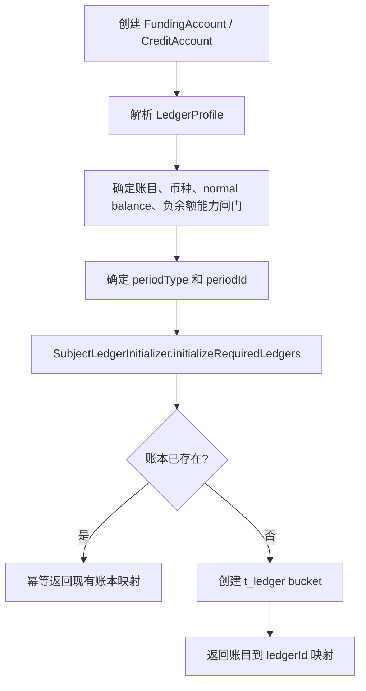

账户初始化约束：

1. 资金账户默认 LIFETIME/LIFETIME。
2. 信用账户和额度类账务主体可以使用 MONTHLY、WEEKLY、YEARLY 或 CUSTOM_CYCLE。
3. 非 LIFETIME 周期必须有明确 periodId 或可审计的 periodPolicy，不能在写入时静默猜测。
4. t_ledger 唯一键必须包含租户、主体、账目、币种、periodType、periodId。
5. `t_funding_account` 和信用账户表可以共享 ledger 初始化机制，但不得共享同一实体语义；主体类型必须在 `SubjectRef`、route leg、posting plan 和 ledger entry 中保持可区分。
6. 支出控制范围不得调用 `SubjectLedgerInitializer`，不得初始化 ledger bucket；预算周期、可用、预留和释放只进入预算型 Spend Rule 控制视图、规则决策日志和审计证据。

#### 4.4.2.1 多级账户账本与分录落点

账户父子结构只表达层级、归属、共享池约束和汇总查询，不自动改变账本事实模型。账本事实必须遵循“具体账户节点入账、父账户显式入账、聚合视图不反写”的原则。

| 系统对象 | 多级账户记录要求 | 不能做什么 |
| --- | --- | --- |
| `t_ledger` | 归属于具体账户节点；唯一键包含 tenant、subjectType、subjectId、ledgerSubjectCode、currency、periodType、periodId。父账户和子账户必须拥有不同 ledger bucket。 | 不能用同一个 ledger bucket 同时表达父账户和子账户余额。 |
| `LedgerTransaction` | 表示一次资金事实或控制事实的完整过账单元；可同时包含子账户明细分录、父账户控制分录或父子真实划拨分录。必须保存 route snapshot、posting plan digest、account hierarchy digest 和幂等摘要。 | 不能由余额投影或父账户聚合结果补造新的账本交易。 |
| `LedgerEntry` | 主体必须是具体资金账户或信用账户节点；建议固化 `parentAccountRef`、`rootAccountRef`、`accountPath`、`accountLevel`、`postingRole` 和 `sourceInstrumentRef` 的脱敏引用。 | 不能把父账户聚合视图、支付工具、支出控制范围、Spend Rule、卡号、PAN、token 或 `VCC_ACCOUNT` 写成分录主体。 |
| `BalanceProjection` | 按具体 ledger bucket 投影账户余额；父账户汇总余额由查询层或 projection view 按子账户投影聚合。 | 不能把父账户聚合余额写回子账户或父账户 ledger bucket。 |

父账户是否写分录必须由 posting plan 明确声明：

| postingRole | 适用场景 | 分录含义 | 聚合规则 |
| --- | --- | --- | --- |
| `DETAIL` | 子账户真实余额、授权占用、清算、退款、费用。 | 账户节点自身余额或额度发生变化。 | 可作为单卡、单使用人、单子账户账单来源。 |
| `PARENT_CONTROL` | 主信用账户共享额度池、主资金账户共享池预留或释放。 | 父账户控制额度或资金池约束发生变化。 | 报表应按控制口径单独展示，不能与子账户明细简单相加。 |
| `TRANSFER_OUT` / `TRANSFER_IN` | 父子账户真实划拨、预付充值、退卡转出。 | 父账户与子账户之间发生真实价值转移。 | 必须借贷平衡，可参与双方余额。 |
| `AGGREGATE_VIEW` | 仅查询或投影聚合。 | 不生成 LedgerEntry。 | 只能读子账户投影生成父账户视图。 |

实现约束：

1. route snapshot 必须固化原始 `accountRef`、`parentAccountRef`、`rootAccountRef`、`accountPath` 和 `postingRole`，用于退款、撤销、拒付和重放。
2. 父子账户关系变更只影响新交易解析；历史 LedgerTransaction 和 LedgerEntry 不重写、不迁移、不按当前层级重新聚合。
3. VCC 预付卡默认写卡绑定资金子账户；共享卡默认写卡绑定信用子账户。父账户是否同步写 `PARENT_CONTROL` 分录，取决于共享额度池或资金池控制策略是否在 posting plan 中显式启用。
4. 清结算、对账和报表消费父子账户数据时，必须明确选择 detail、parent-control、transfer 或 aggregate 口径，防止父子账户余额双算。

#### 4.4.3 支付工具状态与路由准入

支付工具只提供路由输入、绑定关系和审计快照，不表达内部余额。交易、授权、提现、入金识别和退款进入路由前，必须先完成工具状态、方向、动作能力、有效期、币种、绑定和资金责任校验。内部钱包标识不是支付工具，也不是钱包账户域本身；使用钱包余额、平台钱包、商户钱包或返利钱包等入口时，application facade 必须先解析出内部 `SubjectRef`、`BenefitSnapshot` 或等价不可变快照。只有第三方钱包端点、通道 token 等外部可交互端点才作为 `PaymentInstrumentRef` 或 `ExternalAccountRef`。

VCC 卡、虚拟卡、卡 token、预付虚拟卡和共享卡在系统层都先进入 `PaymentInstrument` 体系，而不是把卡凭证直接建成账户或账本主体。预付余额、共享余额、授权占用、清算、退款、拒付和费用落到卡绑定资金子账户或信用子账户；卡凭证只改变工具准入、绑定、使用人、支出控制范围、归因和资金责任快照，不新增“共享卡号账户”“卡号账本主体”或 `VCC_ACCOUNT`。

VCC 交易服务协作流程：

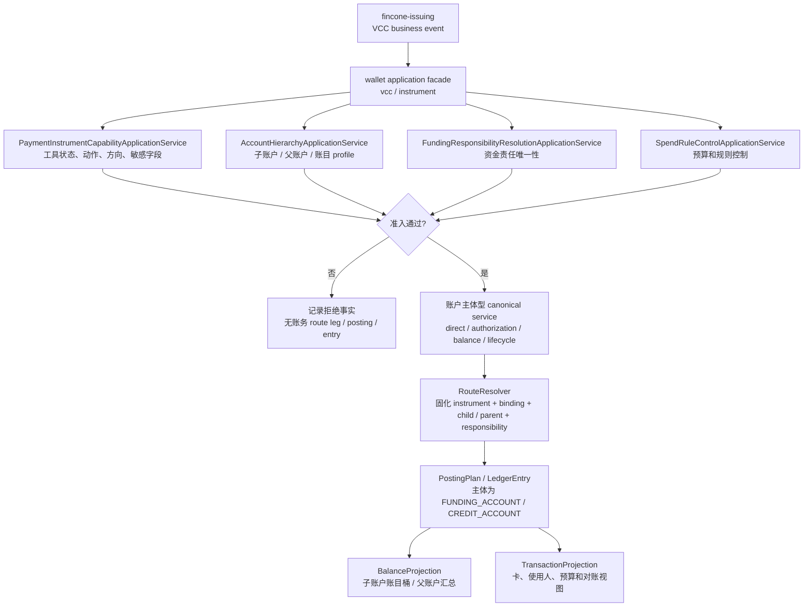

系统约束：

1. `transaction-face` 的 canonical 请求继续使用已解析的账户主体，VCC application facade 只负责从支付工具和发卡事件解析出主体、规则和快照。
2. `FUNDING_ACCOUNT`、`CREDIT_ACCOUNT` 可以进入 route leg、posting plan、LedgerEntry 和余额投影；VCC 关联子账户使用这两类主体承接，`VCC_ACCOUNT`、卡号、PAN、token、支出控制范围和 Spend Rule 只能进入快照、控制证据和交易投影。
3. 预付卡充值、共享卡授权、清算、退款、拒付和退卡提现都要经过同一套 route snapshot 与 posting plan，不允许为卡工具单独实现一套资金交易内核。

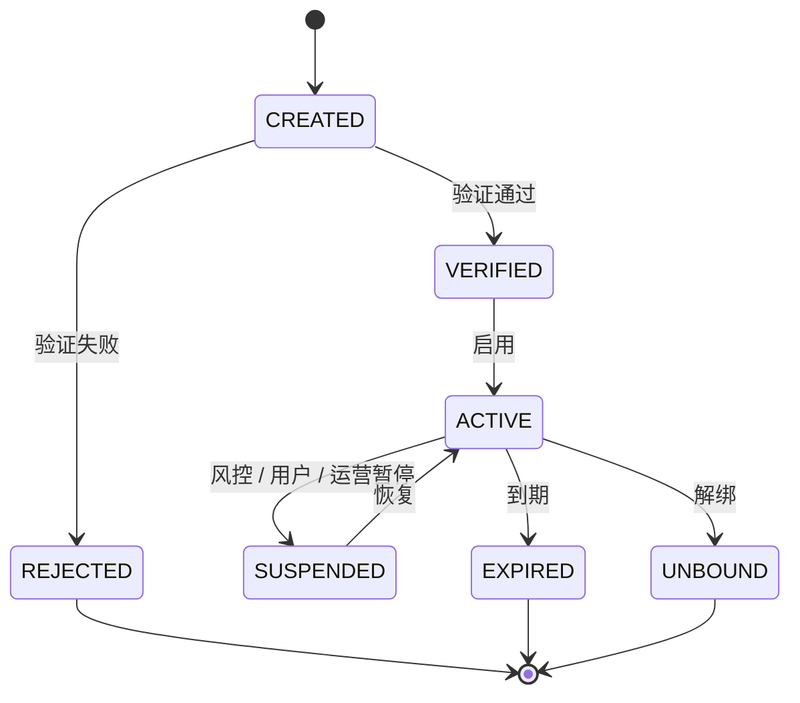

| 状态 | 付款 / 授权 | 收款 / 入金识别 | 提现 / 出款 | 退款 / 撤销 / 退费 / 拒付回放 | 系统要求 |
| --- | --- | --- | --- | --- | --- |
| CREATED | 禁止 | 禁止 | 禁止 | 只能作为历史快照解释，不作为当前候选。 | 未验证工具不得进入 route。 |
| VERIFIED | 禁止，需先启用。 | 禁止，需先启用。 | 禁止，需先启用。 | 只能作为历史快照解释。 | 验证通过不等于可交易。 |
| ACTIVE | 资金流向匹配且资金责任唯一时允许。 | 资金流向匹配且收款关系明确时允许。 | 资金流向匹配且账户具备提现能力时允许。 | 新交易用当前校验；逆向事件优先使用原快照。 | 必须固化工具、绑定、外部账户和资金责任快照。 |
| SUSPENDED | 禁止或授权拒绝。 | 禁止或人工处理。 | 禁止或人工处理。 | 已发生交易的逆向事件仍可按原快照回放，但不得按当前暂停工具新建路径。 | 失败不得生成账务 route leg、posting、entry。 |
| EXPIRED | 禁止或授权拒绝。 | 禁止或人工处理。 | 禁止或人工处理。 | 已发生交易的逆向事件仍可按原快照回放。 | 过期不影响历史证据。 |
| UNBOUND | 禁止。 | 禁止。 | 禁止。 | 必须使用原 route snapshot，不读取当前绑定。 | 换绑、解绑不能改变历史退款路径。 |
| REJECTED | 禁止。 | 禁止。 | 禁止。 | 不作为当前候选。 | 验证失败原因必须可审计。 |

路由准入守卫：

1. 工具资金流向必须匹配当前动作，OUTBOUND 不承接收款，INBOUND 不承接扣款，BIDIRECTIONAL 才允许双向使用。
2. 工具动作能力必须覆盖当前业务动作：RECEIVE 承接入金/收款，PAY 承接主动付款，AUTHORIZE 承接授权，REFUND 承接逆向回放，WITHDRAW 承接提现/出款端点。
3. 工具币种、外部账户币种和最终内部账务主体币种必须一致；跨币种场景只能由已完成专项确认的 FX 设计承接。
4. 资金责任解析关系必须解析为唯一的资金账户、信用账户或平台账户角色；支出控制范围和 Spend Rule 只提供控制条件、规则版本和审计证据，不能作为最终资金责任主体；缺失、不唯一、优先级冲突或默认关系冲突时失败。
5. 最终内部账户必须具备当前动作能力，例如 PAY、RECEIVE、WITHDRAW；支付工具能力不得绕过账户能力。
6. PaymentInstrumentRef、ExternalAccountRef、RoutingDecision 和 FundingAllocationDecision 必须进入 route snapshot；LedgerEntry 主体不得出现工具、卡、VA、外部账户、外部钱包端点或通道 token。
7. 完整 PAN、CVV、密钥、token secret、银行账户敏感号和身份凭证不得进入普通快照、日志、导出或报表。
8. 支付工具状态、绑定、方向、动作能力、优先级和资金责任解析关系变更必须记录操作者、时间、原因、版本和前后值。
9. 如果入口是内部钱包标识，route leg 必须使用解析后的资金账户、信用账户或平台账户角色；如果入口是外部钱包端点或 token，`PaymentInstrumentRef` 只保存外部工具快照。两类场景都不得把钱包标识、工具号、token、支出控制范围或 Spend Rule 作为 ledger subject。

工具动作能力设计：

| 能力 | 系统校验点 | 通过后输出 | 失败处理 |
| --- | --- | --- | --- |
| RECEIVE | 工具状态、方向、币种、外部引用和入金目标绑定。 | 可审计的工具准入快照，继续解析收款或入金目标主体。 | 入金或收款准入失败，不生成 route/posting/entry。 |
| PAY | 工具状态、方向、币种、付款绑定和敏感字段边界。 | 可审计的工具准入快照，继续解析付款责任主体。 | 付款失败无账务副作用。 |
| AUTHORIZE | 工具状态、方向、币种、使用主体、绑定版本和规则上下文。 | 授权准入输入快照，继续进入 Spend Rule、资金责任和账户能力校验。 | 授权拒绝或失败事实可记录，但无账务 route leg/posting/entry。 |
| REFUND | 原工具快照、原 route snapshot、原资金责任决策和逆向原因。 | 原路径回放输入，不按当前绑定重新选路。 | 缺原快照进入异常或人工处理。 |
| WITHDRAW | 外部出款端点、工具状态、方向、币种、提现绑定和外部账户引用。 | 出款门禁输入，继续校验内部账户提现能力和锁定规则。 | 出款门禁失败，不生成出款资金事实。 |

绑定数据采用“当前态表 + 追加历史表”模式：t_payment_instrument_binding 只表达当前有效关系和新交易候选，历史解释、争议证据、对账追溯和回放证明由 t_payment_instrument_binding_history 追加记录承接。当前态可以随换绑、解绑、暂停、默认关系调整而更新；历史表不得物理覆盖或按当前态重算。

VCC 场景补充：

| 场景 | 系统承接 | route snapshot 必须固化 | 禁止事项 |
| --- | --- | --- | --- |
| VCC 普通授权 | `PaymentInstrumentRef` + `SubjectRef(FUNDING_ACCOUNT/CREDIT_ACCOUNT)` + `AccountHierarchySnapshot` + `FundingAllocationDecision`。 | 卡工具、脱敏展示号、绑定版本、资金/信用子账户、父账户、资金账户/信用账户或平台账户角色来源、支出控制范围上下文、Spend Rule 快照、规则版本和外部授权引用。 | 卡、PAN、token、持卡人、支出控制范围、Spend Rule、`VCC_ACCOUNT` 或外部卡凭证成为 `LedgerEntry.subject`。 |
| prepaid virtual card | 工具仍在 `PaymentInstrument`；预付余额落卡绑定资金子账户；预付资金来源由 `SpendSubjectFundingRelationService` 或等价应用服务解析到内部责任来源。 | 资金子账户、父账户、预付资金来源、责任账户、财务确认引用、退款处置和规则版本。 | 把预付卡号写成内部余额账户，或把储值券、礼品卡和预付代金券混入 VCC 工具模型。 |
| shared card | 每张工具绑定一个信用子账户，多张卡可受同一主账户约束，并绑定使用人、部门、项目、支出控制范围和兜底资金责任来源。 | 信用子账户、父账户、使用人、绑定角色、绑定版本、支出控制范围、资金责任解析关系、优先级、默认标识和规则版本。 | 新增共享卡号账本、多张卡绑定同一子账户，或在逆向事件中按当前绑定重新解释历史授权。 |

VCC 支付工具准入顺序：

| 步骤 | 系统判断 | 通过结果 | 失败结果 |
| --- | --- | --- | --- |
| 1. 工具合法性 | 工具存在、状态可用、资金流向匹配、动作能力覆盖当前动作、币种匹配、脱敏引用合法。 | 进入绑定解析。 | 授权拒绝或工具准入失败；无账务 route leg、posting、entry。 |
| 2. 业务模式识别 | 普通 VCC、prepaid virtual card、shared card、credit/charge/debit 模式可被唯一识别。 | 选择对应资金责任解析策略。 | 进入待确认或 contract-only；不得猜测资金责任主体。 |
| 3. 绑定快照 | 找到唯一有效绑定、绑定版本、使用人上下文和预算约束。 | 固化到 route snapshot。 | 多绑定、缺版本或已失效时失败无账务副作用。 |
| 4. 资金责任解析关系 | 解析到唯一资金账户、信用账户或平台账户角色；支出控制范围和 Spend Rule 只作为控制上下文。 | 生成 `FundingAllocationDecision`。 | 多责任主体、缺预付资金确认或责任主体不明确时失败无账务副作用。 |
| 5. 账户能力与余额 | 内部主体具备动作能力、账本周期、余额/额度满足，且预算规则控制通过。 | 进入授权 route 和 posting。 | 余额不足、额度不足、预算规则拒绝、周期缺失或能力不匹配时拒绝，无账务路径。 |
| 6. 快照回放 | 后续撤销、过期、清算、退款或拒付引用原 route snapshot。 | 按原路径处理。 | 缺快照不得按当前绑定重选路，进入异常或人工处理。 |

#### 4.4.3.1 预付卡、共享卡交易服务详细设计

预付卡和共享卡交易服务是支付工具 application facade，不是新的交易内核。它位于发卡业务和账户主体型交易服务之间，负责把 VCC 卡、共享卡、预付卡、使用人、支出控制范围、Spend Rule、外部事件和 issuer/processor 摘要解析成资金底座可执行的账户主体型命令。

模块边界：

| 模块 | 责任 | 禁止事项 |
| --- | --- | --- |
| wallet application facade | 工具准入、绑定快照、资金责任解析、Spend Rule/预算控制上下文聚合、账户能力校验。 | 直接写资金交易、账本交易、LedgerEntry 或余额投影。 |
| transaction application | 承接已解析账户主体型直接交易、授权交易、余额控制、退款、清算和争议裁决资金结果命令。 | 接收未解析的卡号、卡 token、支出控制范围或 Spend Rule 作为账务主体。 |
| route resolver | 固化 `PaymentInstrumentRef`、binding snapshot、`FundingAllocationDecision`、规则版本和外部引用。 | 在逆向交易中按当前绑定重新选路。 |
| ledger | 只记录账户主体型分录和余额桶变化。 | 创建卡账本、支出控制范围账本、Spend Rule 账本或 issuer 账户账本。 |
| transaction projection | 生成卡账单、使用人账单、预付资金历史、规则命中时间线和拒绝解释。 | 反写交易事实、route snapshot、posting 或余额。 |

建议的 application service 语义：

| 服务语义 | 推荐命名 | 入参核心 | 委派对象 | 输出 |
| --- | --- | --- | --- | --- |
| 支付工具能力准入 | `PaymentInstrumentCapabilityApplicationService` | instrumentRef、action、amount、currency、actor、externalEventRef、requestDigest。 | `PaymentInstrumentService`、绑定查询、敏感字段校验。 | 工具准入快照或准入失败。 |
| 资金责任解析 | `FundingResponsibilityResolutionApplicationService` | instrumentRef、spendSubject、spendControlScopeRef、spendRuleContext、prepaidResponsibilityContext、servicePlanSnapshot。 | `SpendSubjectFundingRelationService`、平台账户角色解析、账户能力查询。 | `FundingAllocationDecision` 或不唯一/缺失失败。 |
| VCC 授权准入 | `InstrumentAuthorizationApplicationService` | VCC 授权命令、工具准入快照、规则决策、资金责任决策。 | `FundsAuthorizationTransactionService.authorize`。 | 授权交易号或拒绝事实。 |
| VCC 清算/逆向 | `InstrumentTransactionLifecycleApplicationService` | clearing、reversal、refund、dispute refund 命令和原授权引用。 | 授权交易 settle/reversal/settleRefund 服务；独立 chargeback 仅在后续专项确认后作为适配资产。 | 后续交易号、差错单或人工处理任务。 |
| 预付资金处理 | `PrepaidFundingApplicationService` | funding/unload 命令、确认引用、责任主体、审批和幂等摘要。 | 直接交易、内部转账、提现或退款服务。 | 入金、转账、提现、退款交易号或阻断事实。 |

以上命名是系统语义，不冻结 Java 包名或 DTO。进入编码前必须在工程任务中确认包、接口、Request/DTO、错误码和依赖方向。

VCC 命令语义：

| 命令 | 适用对象 | 必填事实 | 成功副作用 | 失败副作用 |
| --- | --- | --- | --- | --- |
| `AuthorizeByInstrument` | 普通 VCC、共享卡、预付卡。 | instrumentRef、authorizationRef、amount、currency、merchant、MCC、actor、bindingVersion、requestDigest。 | 委派账户主体型授权内核，生成 AUTHORIZATION 占用、route snapshot、交易事实和投影输入。 | 仅可记录拒绝事实、规则原因或准入失败；无账务 route leg、posting、entry。 |
| `SettleInstrumentAuthorization` | 已批准授权。 | authorizationTransactionSn、clearingRef、settleAmount、originalRouteSnapshotRef、requestDigest。 | 核销授权占用，生成清算或费用分录。 | 缺原授权、超额越界、币种不匹配或快照缺失时进入差错。 |
| `ReleaseInstrumentAuthorization` | 可信 reversal、void、部分清算剩余释放或差错补事实。 | authorizationTransactionSn、releaseAmount、reason、requestDigest。 | 同主体释放 `AUTHORIZATION -> AVAILABLE`。 | 到期或超时不得调用；不生成消费或跨主体价值转移。 |
| `RefundInstrumentTransaction` | 已清算交易。 | originalTransactionSn、refundRef、refundAmount、reason、requestDigest。 | 按原 route snapshot 回补原责任主体。 | 缺原快照或重复退款风险时进入差错。 |
| `DisputeInstrumentOutcome`（候选命名） | 争议案件裁决结果：用户胜诉、用户败诉、部分胜诉或无需资金处理。 | originalTransactionSn、disputeRef、outcome、outcomeAmount、reason、voucherRef、requestDigest。 | 用户胜诉或需要退款时默认委派 `settleRefund`；用户败诉或无需资金处理时只写案件、审计和投影解释，不委派交易内核；商户追偿、准备金抵扣或后续结算扣减由清结算/争议专项承接。 | 不与普通 refund 混成不可区分结果，不允许重复损失；不把案件过程或 B4 初始语义反推为独立 chargeback 公共入口。 |
| `PostPrepaidFunding` | 预付卡外部入金、系统内充值、平台责任确认。 | fundingRef、fundingSource、targetResponsibility、amount、currency、confirmationRef、requestDigest。 | 目标责任主体 AVAILABLE 增加或内部转账完成。 | 未确认入金、责任不唯一或摘要冲突时无余额变化。 |
| `UnloadPrepaidFunding` | 退卡、提现、余额退回、转出。 | unloadRef、sourceResponsibility、targetRef、amount、currency、approvalRef、externalConfirmationRef、requestDigest。 | 原责任主体转出、提现或退款。 | issuer 余额摘要不一致、审批缺失或可退余额不足时阻断。 |

幂等和摘要规则：

| 维度 | 摘要字段 | 冲突处理 |
| --- | --- | --- |
| 外部事件 | providerCode、externalEventType、externalEventId、authorizationRef、clearingRef、refundRef、disputeRef。 | 同键同摘要返回原结果；同键不同摘要进入冲突差错。 |
| 金额币种 | amount、currency、minorUnit、settlementAmount、feeAmount、fxContextRef。 | 金额或币种变化必须作为新事件或冲突处理，不得覆盖原事实。 |
| 工具快照 | instrumentRef、instrumentVersion、bindingVersion、maskedInstrumentDigest、actionCapability。 | 逆向事件只比对原快照，不读取当前绑定重算。 |
| 资金责任 | decisionId、targetSubjectType、targetSubjectId、targetRole、ruleVersion、spendControlScopeRef、spendRuleVersion。 | 决策缺失或不一致时阻断，不允许兜底当前默认关系。 |
| 控制结论 | riskDecisionRef、spendRuleDecisionRef、budgetControlRef、manualApprovalRef。 | 控制结论变化不能改写已批准授权，只能形成后续事件或人工处理。 |

交易状态机：

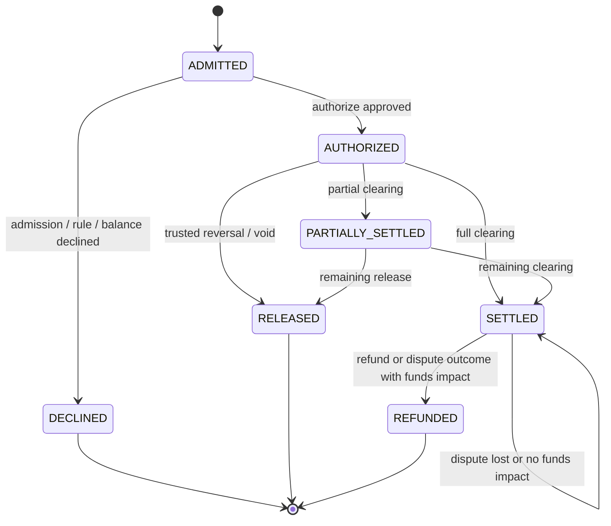

交易状态约束：

| 状态 | 共享卡口径 | 预付卡口径 | 账务要求 |
| --- | --- | --- | --- |
| ADMITTED | 工具、绑定、使用人、支出控制范围、信用子账户、父账户和规则上下文已固化。 | 工具、资金子账户、父账户、预付来源、确认引用和责任来源已固化。 | 无账务副作用，可进入授权内核。 |
| DECLINED | 拒绝原因可按卡、使用人、支出控制范围和规则版本解释。 | 拒绝原因可按余额不足、未确认入金或责任缺失解释。 | 不生成账务 route leg、posting、LedgerEntry。 |
| AUTHORIZED | 各共享卡信用子账户分别占用；父账户可作为共享额度/资金池约束。 | 资金子账户或信用子账户 AUTHORIZATION 占用。 | 只做授权占用，不代表清算消费。 |
| SETTLED | 按原绑定快照归因，不按当前绑定更新。 | 按原资金/信用子账户消费。 | 核销授权占用，生成实际消费和费用。 |
| RELEASED | 原资金/信用子账户释放剩余占用。 | 原资金子账户释放剩余占用。 | 同主体释放，不跨主体转移。 |
| REFUNDED | 原路径回补，当前卡状态只影响展示。 | 原资金/信用子账户回补。 | 必须引用原 route snapshot。 |
| 争议无资金影响 | 用户败诉、案件关闭或裁决无需资金处理时，交易保持 SETTLED。 | 原资金/信用子账户不变化。 | 只更新 dispute case、审计和投影解释，不生成 route、posting 或 LedgerEntry。 |

dispute case 过程状态由业务或清结算争议域维护，不进入授权交易内核状态机。建议过程态为 `OPENED -> EVIDENCE_REQUIRED -> REPRESENTMENT -> WON / LOST / PARTIAL_WON / CLOSED`；只有 `WON`、`PARTIAL_WON` 或外部扣回、追偿裁决需要资金处理时，才生成资金事实。`LOST` 或 `CLOSED_NO_FUNDS_IMPACT` 只影响案件视图、运营审计和投影解释。

账务矩阵：

| 业务动作 | 借方/贷方语义 | 余额桶变化 | 分录主体 | 投影维度 |
| --- | --- | --- | --- | --- |
| 共享卡授权批准 | 卡绑定信用子账户授权占用，必要时父账户同步控制占用。 | `AVAILABLE -> AUTHORIZATION`。 | 信用子账户；父账户仅在 `PARENT_CONTROL` 策略下写控制分录。 | cardRef、cardholderRef、departmentRef、spendControlScopeRef、spendRuleRef、childAccountRef、parentAccountRef、fundingSourceRef。 |
| 共享卡授权拒绝 | 无资金事实。 | 无。 | 无。 | 拒绝原因、规则版本、工具快照。 |
| 共享卡清算 | 授权占用核销为消费、待清算或费用。 | `AUTHORIZATION -> CLEARING/SETTLEMENT/FEE`。 | 原信用子账户。 | 原工具、原子账户、原父账户和绑定快照。 |
| 共享卡退款 | 原路径回补。 | 按原交易语义回补 AVAILABLE 或冲减应收。 | 原信用子账户。 | 原卡、原使用人、当前展示提示。 |
| 预付入金确认 | 外部确认或内部转账增加资金子账户可用余额。 | 目标 `AVAILABLE` 增加。 | 资金子账户。 | fundingRef、source、confirmationRef、childAccountRef、parentAccountRef。 |
| 预付卡授权批准 | 资金子账户授权占用。 | `AVAILABLE -> AUTHORIZATION`。 | 资金子账户。 | cardRef、childAccountRef、parentAccountRef、prepaidSourceRef。 |
| 预付卡清算 | 资金子账户消费。 | `AUTHORIZATION -> CLEARING/SETTLEMENT/FEE`。 | 原资金子账户。 | clearingRef、merchant、fee。 |
| 预付资金退回 | 资金子账户转出或提现。 | `AVAILABLE` 减少，目标账户增加或出款在途。 | 原资金子账户和目标主体。 | unloadRef、approvalRef、externalConfirmationRef。 |

异常与人工处理：

| 异常 | 自动处理 | 人工处理入口 |
| --- | --- | --- |
| 工具不可用、资金流向不匹配、缺动作能力 | 授权或资金动作拒绝，无账务副作用。 | 工具状态修正、重新绑定或重新发起。 |
| 资金责任缺失或多命中 | 阻断，不兜底当前默认账户。 | 资金责任配置复核，补充绑定版本后重新提交。 |
| 预付入金未确认 | 阻断授权或充值入账。 | 对账文件、银行回执或 issuer 确认补证。 |
| 原 route snapshot 缺失 | 逆向交易进入差错。 | 按治理流程补充事实或人工差错处理，不自动重选路。 |
| 清算金额超过授权容差 | 差错候选，不自动入账。 | 清算规则、外部文件和商户证据复核。 |
| refund 与 dispute outcome 重复 | 冻结后续自动处理，标记重复损失风险。 | 争议运营和财务确认；若需要追偿或后续结算扣减，转清结算/争议专项。 |

#### 4.4.4 支付工具参与路由流程

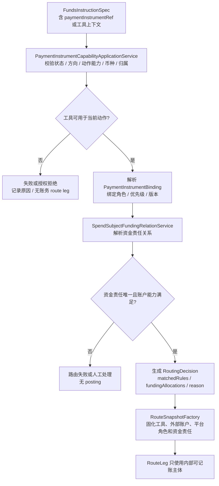

并发与历史回放约束：

1. 正向交易使用提交时校验通过并固化的工具快照；工具状态或绑定变更与交易并发时，必须通过版本、时间或锁定策略保证结果可解释。
2. 逆向交易必须优先读取原 route snapshot 和原工具快照；不得因当前工具换绑、暂停、过期、解绑或资金责任关系变化而重新选路。
3. 同一工具绑定的默认关系、优先级和资金责任解析关系更新必须有版本；route snapshot 保存版本，便于审计和重放。

### 4.5 路由设计

路由层在系统分层中是确定性路径解析器和快照生成器，不是清结算对象服务、对账服务、账本写入器或交易生命周期管理器。交易编排层可以保存 route snapshot 并把它交给账务计划装配；`RouteResolver` 本身只消费 `FundsInstructionSpec`、原 route snapshot 和已固化的规则、支付工具、权益资金事实摘要或历史摘要。

| 协作对象 | 路由层读取 | 路由层输出 | 禁止行为 |
| --- | --- | --- | --- |
| 交易层 | 资金指令、交易场景、原交易引用、幂等摘要和生命周期上下文。 | `ResolvedRouteSpec`、route snapshot 候选和可回放路径摘要。 | 写交易事实、推进交易状态、把失败准入包装成成功路由。 |
| 清算模块 | 已确认的清算确认资金事实、原交易 route snapshot 和清算批次引用。 | `CLEARING -> AVAILABLE` 的确定性 route leg。 | 生成清算候选、判断可清算、修改清算批次状态。 |
| 结算模块 | 已确认的结算锁定资金事实、结算单引用和可结算账户信息。 | `AVAILABLE -> SETTLEMENT` 的确定性 route leg。 | 计算结算净额、审批结算单、声明外部出款成功。 |
| 出款模块 | 已确认的出款成功、失败、退回或差额资金事实。 | 关闭锁定、回退可用、转在途或差额处理的资金路径。 | 把外部受理态当成功态、直接写外部回单或出款单。 |
| 对账差错模块 | 已审批的补事实、冲正、调账、追偿事实和原证据引用。 | 受控调整或追偿路径。 | 根据投影差异直接改余额，或绕过审批生成调整路径。 |

#### 4.5.1 RouteResolver 责任

| 责任 | 说明 |
| --- | --- |
| 支持性判断 | supports(instruction) 只判断是否可处理，不查询数据库、不变更状态。 |
| 路径解析 | resolve(instruction) 输出 ResolvedRouteSpec。 |
| 主体解析 | 将用户、商户、平台角色、信用账户、支付工具绑定和预算控制上下文解析成可入账主体；支出控制范围和 Spend Rule 只参与控制、规则快照和查询维度，不作为 route leg、posting 或 ledger entry 主体。 |
| 账目定位 | 选择 AVAILABLE、FROZEN、AUTHORIZATION、CLEARING、SETTLEMENT、IN_TRANSIT、FEE、ADJUSTMENT 等账目。 |
| 周期定位 | 确定每条 RouteLeg 的 periodType 和 periodId。 |
| 权益资金事实消费 | 读取权益让利资金交易、route context 或等价不可变事实中已决策的权益结果；`settle` 入口只消费需要入账的出资事实，并按 `fundingNature`、成本承担主体和让利承接账务主体生成权益 route leg。 |

路由禁止：

1. 不生成 LedgerEntry。
2. 不写交易流水、冻结单或生命周期状态。
3. 不更新余额。
4. 不在缺原快照的逆向场景中按当前绑定重新选路。
5. 不调用营销权益系统重新计算优惠券、代金券或补贴。
6. 不把 `NO_LEDGER` 的商户让利、展示优惠或普通不入账权益生成 route leg。
7. 不创建、确认或修改清分批次、清算候选、清算批次、结算单、出款单、对账批次或差错单。
8. 不把外部出款 accepted、processing、submitted 状态当作到账成功路径。

#### 4.5.2 路由到快照

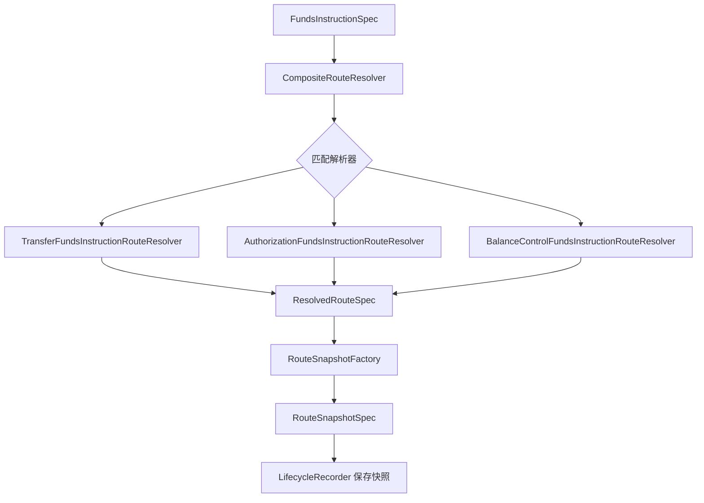

快照要求：

1. 保存参与方、路径、账目、平台账户、支付工具、外部引用、规则版本和周期。
2. 后续退款、撤销、结算、拒付、退费、解冻优先使用原快照。
3. 快照缺失时进入失败或人工处理，不允许静默重新选路。
4. 含权益交易目标态应保存让利出资交易引用或等价摘要；如果第一阶段暂不改 `RouteSnapshotSpec`，必须至少能在交易事实、指令快照或 route context 中追溯让利出资交易流水号、资金性质和退款处置。券、活动、规则来源归因由上游保留，不作为资金底座公共契约字段。

#### 4.5.3 让利出资记账交易能力落点

让利出资记账交易属于交易事实输入，不属于路由自有模型。路由只消费它，不拥有营销规则。

| 能力层 | 工程落点 | 允许做什么 | 不做什么 |
| --- | --- | --- | --- |
| 契约承载 | `transaction-face` 的 `FundsBenefitContributionTransactionService`、让利出资记账交易请求和权益资金性质枚举；契约测试。 | 让资金底座可接收 `settle/refund` 让利出资记账交易命令；验证成本承担主体、让利承接账务主体、金额、资金性质、原订单或原交易引用等最小资金事实。 | 不要求 RouteResolver、PostingAssembler、交易表或 route snapshot 立即完整消费；不把专业确认、确认凭证、摘要、营销来源归因、账务效果或券规则作为公共请求字段。 |
| 路由账务消费 | `FundsBenefitContributionTransactionServiceImpl` 委派 `FundsDirectTransactionService`，复用既有 `RouteResolver`、`RouteSnapshotFactory`、`LedgerPostingAssembler`、`DefaultRouteReplayService`。 | 平台补贴、商户承担和合作方补贴按资金性质生成独立资金影响；退款、业务取消、人工纠错或反向冲销读取原权益资金交易 route snapshot 后回放。 | 不把营销规则、券可用性判断或券生命周期推进放进资金底座；无资金转移解释事实、`HOLD_ONLY`、`RELEASE_ONLY`、`REVERSAL_REQUIRED` 在未确认独立事实或伴随指令策略前不生成资金交易。 |
| 清结算对账投影 | 清分明细、清算候选、对账差错、交易投影、运营时间线、财务核对视图和指标项输入。 | 展示和核对商户让利、平台补贴、代金券核销、补贴冲回、不退券和权益差异。 | 不用清结算、指标结果或报表模块输出反写交易事实、账本分录或营销权益状态。 |

能力门禁：

1. 契约承载只表示 public API 可接收权益让利资金交易命令，不得宣称含权益交易、退款、授权后续事件、清结算或对账已具备生产能力。
2. 路由账务消费落地前，必须确定权益资金事实持久化位置：route snapshot、交易事实快照、独立权益事实表或等价不可变存储，至少一个作为 replay 和对账的事实来源。
3. 路由账务消费的幂等摘要必须由实现侧基于让利出资记账事实稳定计算；摘要至少覆盖业务流水、成本承担主体、让利承接账务主体、金额、`fundingNature` 和退款处置。
4. 路由账务消费不得只在 `contextVariables` 写入权益摘要；生产长期回放必须依赖 route snapshot、交易事实快照、独立权益事实表或等价不可变存储。
5. 清结算对账投影不能从交易投影、清结算汇总或报表反推权益组件；缺原权益资金事实时只能失败、跳过或进入人工处理。

工程落地决策卡：

| 决策项 | 必须选择的内容 | 影响模块 | 未选择时默认处理 |
| --- | --- | --- | --- |
| 能力消费范围 | contract-only、route/posting/replay、或 replay/清结算/对账/投影/归档/冷热读取/治理重放消费，并绑定目标测试资产。 | DSL、TDD、目标测试资产。 | 不得把契约承载当作后续生产消费完成。 |
| JSON 夹具级别 | `CONTRACT_ONLY` 或资金流夹具；资金流夹具必须声明 route、posting、余额或失败无副作用断言；治理或清结算夹具还必须按范围声明 replay、projection、settlement、reconciliation 或 archive 断言。 | DSL JSON verifier、TDD 契约测试、服务级测试、清结算/对账/归档专项测试。 | 只能声明字段和 validation 可解析，不声明生产资金流。 |
| 权益资金事实源 | `FundsBenefitContributionTransactionService` 生成的权益资金交易、交易事实快照、route snapshot 摘要、独立权益事实表或等价不可变存储之一。 | `transaction-impl`、`ledger-impl`、归档重放、清结算、对账。 | 只能停留在 contract-only，不进入 route/posting 生产消费。 |
| 营销账户承接 | 平台营销成本账户、商户营销让利账户、权益负债账户、合作方补贴账户和营销留置账户是否纳入本期，以及它们对应的资金账户、平台责任账户或账户 profile。 | 钱包账户、route resolver、posting assembler、清结算、对账和交易投影。 | 未选择时只能保留让利出资记账交易契约，不得让平台补贴、储值负债释放、合作方补贴或营销留置进入生产资金流。 |
| 零实付表达 | 允许零金额主指令，或拆分伴随权益指令。 | `core`、`transaction-impl`、`wallet-impl`、测试夹具、交易投影。 | 零实付权益交易作为目标场景保留，不声明可生产。 |
| 平台补贴表达 | 同一指令额外 leg，或独立伴随指令；选择独立伴随指令时必须声明主交易和伴随指令的事务边界、业务组幂等键、失败补偿、冲正、投影合并和部分成功处理。 | `RouteResolver`、`RouteSnapshotFactory`、`PostingAssembler`、幂等摘要、交易投影、审计。 | 不把平台补贴与用户本金净额混记；缺资金责任主体、专业确认状态或伴随指令原子性策略时失败或人工处理。 |
| 独立伴随指令原子性 | 同事务、同业务组幂等加补偿或 Saga 补偿；必须声明 `companionGroupSn`、主从角色、补偿策略、投影合并键和部分成功处理。 | `RouteResolver`、交易编排、幂等服务、补偿任务、交易投影、差错单和审计查询。 | 未选择时不得声明伴随指令生产可用，部分成功必须阻断或进入差错处理。 |
| 储值/预付/礼品卡口径 | 是否纳入本期，若纳入需明确负债、预收待付、退款和过期沉淀口径。 | 账户模型、账本分录、清结算、对账、财务投影。 | 不进入默认主链路，不按普通平台券处理。 |
| 退款分摊粒度 | 商品行、比例、现金优先、权益优先或不可退权益优先，并定义尾差。 | 退款编排、posting、清分、对账差错、投影。 | 仅允许已决策策略；不根据当前营销规则重算。 |
| 历史无权益资金事实处理 | 失败、人工处理、迁移补录或只读差错，并记录触发人、处理依据、补录来源、复核人、影响范围、是否可撤销和重放校验。 | 逆向交易、归档重放、对账差错、运营后台、审计查询。 | 默认失败或人工处理。 |
| 补充权益事实模型 | 是否允许追加 supplemental benefit fact；必须声明载体、补录来源、审批、复核、digest、版本、适用范围、撤销关系和最终写入前校验。 | 逆向交易、归档读取、治理重放、对账差错、运营后台和审计查询。 | 未确认时不得补录，只能失败、跳过或人工处理；补充事实不得覆盖原始事实。 |
| 专业确认状态 | 财务、税务、会计、合规、法务或业务确认状态；必须记录确认方、确认时间、结论版本、适用范围、有效期、证据引用、撤销或变更处理；未确认时必须写明降级处理。 | 平台补贴、储值/预付、礼品卡、负债释放、转损益、退款、清结算和审计证据包。 | 只能停留在契约或设计验证，不得自动入账、退款或结算。 |
| 审计证据包 | 确认记录、有效期、适用范围、脱敏证据引用、审计责任人和撤销/变更处理必须齐备；证据引用不得保存敏感原文。 | 工程任务、运营后台、审计查询、清结算/对账/归档和生产验收。 | 缺失、过期、范围不匹配或含敏感原文时阻断或降级为 contract-only。 |
| 使用者解释视图 | 用户账单、商户账单、运营时间线、财务对账视图和审计导出需要表达的金额来源、状态含义、不可操作原因、后续处理动作和证据引用。 | 交易投影、运营查询、清结算/对账工作台、审计导出和 Runbook。 | 未声明时不得把含权益视图作为生产解释证据；不得把授权占用、冻结、待清算或出款受理展示为已完成资金结果。 |
| 证据最小化 | 证据包、导出、日志和告警允许保存的脱敏摘要、文件编号或外部 reference，以及禁止保存的敏感原文。 | 审计查询、导出、日志、告警、安全扫描和权限边界测试。 | 未确认脱敏边界时不得导出或落日志；完整卡号、CVV、密钥、证件影像和超范围个人信息必须阻断。 |
| 外部规则核验状态 | 税务、会计、合同、卡组织、银行、通道、KYC/KYB/AML、客户资金、跨境或外汇口径的规则来源、版本或发布日期、生效日期、适用主体或适用范围、适用法域、核验日期、确认方和确认状态。 | 工程任务、自动入账、退款、清结算、出款、归档、治理重放和审计放行。 | 未核验时只能降级、阻断或转人工，不得作为自动资金处理依据。 |

任一能力消费范围进入编码时，工程任务必须同时写明以上决策项、允许修改的公共契约、表结构或快照结构、目标测试清单和禁止越界项。没有决策卡的任务只能做 contract-only 或文档准备。

权益组件路由规则：

| 权益组件 | 路由行为 | 账务边界 |
| --- | --- | --- |
| 商户优惠券、商户让利 | 不新增权益 route leg。 | 只影响商户应收、清分展示和对账，不生成 LedgerEntry。 |
| 平台补贴券补足商户 | 生成平台补贴来源到商户 CLEARING 或目标主体的独立 leg，或由业务编排生成独立伴随指令。 | 平台补贴不得与用户本金净额混记；需要平台成本或补贴账户角色。 |
| 平台券不补足商户 | 不生成平台补贴 leg。 | 商户按优惠后金额结算；不得误记平台成本。 |
| 储值、预付或礼品卡代金券 | 需要解析预付负债、预收待付或用户权益余额来源。 | 未确认负债、客户资金或合同口径前不得进入默认主链路。 |
| 授权占券 | 授权阶段只固化 `HOLD_ONLY` 占用引用。 | 授权拒绝不核销；完成核销，可信撤销释放；到期进入权益或运营异常处理。 |
| 补贴冲回 | 沿原补贴组件回放。 | 不能按当前补贴规则重算，不能超过原补贴可冲回金额。 |

伴随权益指令系统边界：

| 系统对象 | 职责 | 不得做 |
| --- | --- | --- |
| companion instruction group | 记录 `companionGroupSn`、主从角色、主交易引用、伴随指令引用、原子性模式和投影合并键。 | 替代原资金交易或原 route snapshot。 |
| idempotency group | 保证主交易和伴随指令重复提交时命中同一业务组结果，摘要冲突时拒绝复用。 | 只按单笔交易幂等，导致主从事实错配。 |
| compensation handler | 处理主成功伴随失败、伴随成功主失败、超时未知和补偿失败，生成冲正、重试、差错或人工处理证据。 | 部分成功后静默展示普通成功、清结算完成 或归档正式执行完成。 |
| projection merger | 用 `projectionMergeKey` 合并用户账单、商户账单、运营时间线、清分明细、对账差错和归档重放解释。 | 让伴随指令在投影、清分、对账或归档中成为孤立交易。 |

补充权益事实系统边界：

| 系统对象 | 职责 | 不得做 |
| --- | --- | --- |
| supplemental benefit fact | 对历史缺快照交易追加补录来源、审批、复核、digest、版本、适用范围、关联原交易和撤销关系。 | 覆盖原交易、原 route snapshot、原账本事实、余额投影或原清结算事实。 |
| supplemental fact verifier | 在退款、差错、对账、归档读取或治理重放正式执行前校验证据、digest、范围和撤销状态。 | 把补充事实当成当前营销规则结果，或在证据失效时继续自动处理。 |
| audit evidence package | 保存确认方、确认时间、结论版本、有效期、适用范围、脱敏证据引用、撤销/变更处理和责任人。 | 保存敏感原文，或只用工单备注代替最终校验。 |

营销账户系统边界：

| 系统对象 | 职责 | 不得做 |
| --- | --- | --- |
| marketing account profile | 描述平台营销成本、商户让利归因、权益负债、合作方补贴和营销留置等账户 profile，并指向可入账资金账户或平台责任账户。 | 作为支付工具、券实例、活动对象或营销规则配置。 |
| benefit contribution accounting transaction | 根据上游已经决策完成的成本承担账务主体、让利承接账务主体、金额和资金性质生成标准资金交易。 | 计算优惠金额、判断券是否可用、读取当前券包状态、保存券、活动或规则来源归因。 |
| marketing account guard | 在 route/posting 前校验有资金影响组件是否具备账户引用、账户 profile 和可回放摘要；专业确认由生产准入或审计证据链校验。 | 缺账户、缺证据或无资金转移解释事实时静默放行。 |
| marketing account projection | 面向平台、商户、财务和运营展示补贴成本、商户让利、权益负债释放、合作方补贴和留置状态。 | 反写交易事实、route、posting、ledger entry 或余额投影。 |

营销账户接口边界：

| 接口或组件 | 建议落点 | 职责 | 禁止行为 |
| --- | --- | --- | --- |
| `FundsBenefitContributionTransactionService` | 让利出资记账交易服务，落在 `transaction-face` 的 application 边界。 | 提供 `settle`、`refund` 两类命令；接收业务侧已决策让利出资结果，校验成本承担账务主体、让利承接账务主体、金额和资金性质后，委派标准交易路由、交易事实和账本链路。 | 不新增 `FundsMarketingTransactionService`，不计算优惠金额，不判断券是否可用，不维护券包生命周期，不保存券、活动或规则来源归因，不拥有独立营销交易状态机，不直接写 route、posting、LedgerEntry 或余额投影，不要求调用方传入专业确认状态或事实摘要。 |
| `MarketingAccountGuard` | route/posting 前置 guard。 | 校验成本承担账务主体、账户 profile、核销或占用引用、原权益资金事实和可回放摘要；需要专业确认的场景从生产准入或审计证据读取确认结论。 | 不把 `NO_LEDGER` 组件转成资金分录，不在缺账户主体、缺证据时继续入账，不替代清结算或对账差错处理。 |

`FundsMarketingTransactionService` 不作为目标态接口。权益交易授权、权益交易结算、权益交易退款在工程上分别映射到授权生命周期、直接交易/授权完成和退款型逆向回放，不允许形成一套平行的 marketing transaction lifecycle。若确有独立权益资金事实需要伴随指令承接，必须以 `companion instruction group`、原子性模式、补偿策略、投影合并键和失败无副作用测试证明它没有替代原交易生命周期。

权益资金事实目标态风险：

1. 资金指令主金额要求正数；零实付订单不能在未明确调整金额语义前直接作为用户付款主指令表达，需拆为补贴或代金券资金事实，或由独立工程边界明确零金额规则。
2. `ImmutableFundsInstructionSpec` 若增加 record 字段，会影响直接构造、序列化和测试夹具；实现前必须评估调用点兼容性。
3. 只在请求或 `contextVariables` 上保留权益信息不足以支撑长期 replay；目标态应进入权益资金交易、route snapshot、交易事实快照或等价不可变存储。
4. 幂等摘要必须包含让利出资记账交易核心字段；同一业务流水、不同出资方、承接主体、金额或资金性质不能被当作同一请求复用。
5. 储值券、礼品卡、预付券可能涉及负债、预收待付、客户资金、沉淀收益或合同口径，进入生产资金处理前必须有财务、会计、合规或业务确认。
6. `contextVariables` 只能作为兼容迁移通道，且只能放轻量关联引用或摘要；核心金额、出资分摊、券、活动、规则来源、账务效果和当前营销规则不得作为长期回放依据。
7. 历史权益事实迁移补录只能生成追加型 supplemental benefit fact 或等价补充事实，必须记录补录来源、审批、复核、digest、版本、关联原交易和撤销关系；不得覆盖原资金交易、原 route snapshot 或原账本事实；参与退款或业务取消前必须重新校验证据状态。
8. 专业确认状态必须在最终写入、退款、清结算确认、归档正式执行或治理重放正式执行前重新校验；预检通过后确认过期、撤销或范围变更时必须阻断或转人工，不得沿用旧预检结果。

### 4.6 账务计划与账本设计

#### 4.6.0 Ledger 模块职责边界

Ledger 模块的系统定位是账务事实层和余额投影事实源。跨模块生产写入口使用标准 `LedgerTransactionPostingService` 过账网关；跨模块只读账务证据查询按需收敛到既有基础服务：账本交易和账目分录事实由 `LedgerTransactionService` 按租户和稳定流水号读取，账本 bucket 与余额信息由 `LedgerService`、`LedgerBalanceProjectionService` 承接，不再为透传调用强行增加 application facade 或独立 fact query 服务。`getLedgerTransactionBySn`、`getLedgerEntryBySn` 属于强存在查询，查不到必须抛业务异常；分页查询仍可按条件返回空页。`ledger-impl` 负责落地账务事实、维护余额投影和发布余额观察事件。Ledger 模块不承接业务交易入口、路由决策、支付工具解析、Spend Rule 决策、清结算批次状态机或对账差错生命周期。

| 能力 | 入口或组件 | 系统职责 | 禁止事项 |
| --- | --- | --- | --- |
| 账本 bucket 管理 | `LedgerService`、账户初始化编排 | 创建和查询可唯一命中的主体、账目、币种和周期 bucket；缺 bucket 时阻断入账。 | 交易路径中自动建账；把支出控制范围、Spend Rule、支付工具、外部账户或 `VCC_ACCOUNT` 建成 ledger bucket。 |
| 统一过账 | `LedgerTransactionPostingService`、`LedgerTransactionService.postLedgerTransaction` | 校验 `LedgerTransactionSpec`、`PostingPlan`、`LedgerEntry` 和幂等摘要，原子写入账本交易、posting plan、不可变分录和余额投影；跨模块写入只走标准过账网关。 | 重新解析 route、重选工具绑定、解释业务订单生命周期、接收业务方直接指定的借贷方向。 |
| 账务证据查询 | `LedgerTransactionService`、`LedgerTransactionQuery`、`LedgerEntryQuery` | 按租户、稳定账本交易流水、账目分录流水、主体、账目、币种、周期、业务引用、清结算标记和对账标记查询账务证据；`getLedgerTransactionBySn` 和 `getLedgerEntryBySn` 是强存在查询，查不到抛异常；分页查询允许返回空页。跨模块查询禁止省略租户边界，禁止以数据库 ID 作为事实引用。 | 查询时修复状态、补写分录、重算余额、跨租户兜底查询或推进清结算和对账状态机。 |
| 余额投影 | `LedgerService`、`LedgerBalanceProjectionService` | 从 `LedgerEntry` 派生余额，支持当前余额、周期余额、检查点和重建输入；按账务主体、账目、币种和周期 bucket 查询，不为透传读取另设 application facade。 | 从交易投影、余额日志、报表或人工汇总反写账本事实。 |
| 兼容治理 | `updateLedgerBalance`、`updateLedgerTransaction`、`delete*` 等历史管理型接口 | 仅作为兼容治理、迁移清理、测试夹具或后台受控维护候选；进入生产资金流前必须有独立工程变更边界、权限、审批、审计和验证。 | 作为普通业务修账、余额修复、交易补偿或清结算差错处理的主路径。 |

目标态公共语义是：生产资金流只有追加型账务事实能改变余额。历史 CRUD 风格接口即使暂时存在，也不能被 PRD、DSL、系分、TDD 或工程任务声明为资金修正主能力；错账、冲正、补记、调账、追偿和差错核销必须形成新的资金事实或控制事实，并重新经过 route、posting 和 ledger 链路。

#### 4.6.1 LedgerPostingAssembler

LedgerPostingAssembler 把 ResolvedRouteSpec 翻译为 LedgerTransactionSpec，并生成 posting plan 和 ledger entry 定义。它不重新路由、不改变交易生命周期、不执行账本写入。

| 输入 | 输出 | 必须校验 |
| --- | --- | --- |
| FundsInstructionSpec | LedgerTransactionSpec | 指令类型、事件类型、业务引用、金额、币种。 |
| fundsTransactionSn | PostingPlan | 每个 plan 独立借贷平衡。 |
| ResolvedRouteSpec | LedgerEntrySpec | 主体、账目、周期、借贷方向、金额为正。 |

权益组件进入账务计划时，PostingAssembler 只消费 route leg 和已决策资金影响，不解释营销规则：

1. 非入账权益解释事实不得生成 posting，也不得调用让利出资记账交易服务。
2. 通过 `FundsBenefitContributionTransactionService#settle` 进入的真实入账让利出资必须形成独立 posting plan 或独立 posting phase。
3. 平台补贴、储值券核销、合作方补贴、本金、手续费和通道成本不得合成一个净额。
4. `benefitSnapshotId`、`componentSn`、`benefitType`、`componentType` 和 `refundDisposition` 应进入 posting 或 entry 上下文，供对账、清结算和审计追溯。
5. 不退券只说明用户侧权益处置，不自动推出补贴是否冲回；资金侧必须读取 `REVERSE_SUBSIDY`、`RETAIN_SUBSIDY`、`RESTORE_PREPAID_LIABILITY` 等处置。
6. 有资金影响的营销账户组件必须在 posting context 中保留营销账户引用、账户 profile、专业确认状态、核销或占用引用和权益组件摘要；缺失时不得写入 `LedgerEntry`。

#### 4.6.1.1 借贷平衡表承接

`LedgerPostingAssembler` 和账本写入实现必须承接 DSL 的 [资金场景借贷平衡与账务期望表](../DSL设计/支付资金底座DSL承载层设计.md#51-资金场景借贷平衡与账务期望表)。系分不复制维护完整借贷表，只说明系统如何实现该表的参与方账户示例、账户类型、`normalBalanceSide`、借贷平衡公式、余额影响和场景红线；实现侧仍以 `LedgerProfile`、账目配置、表字段约束和服务级测试作为可执行依据。

| 承接项 | 系分要求 |
| --- | --- |
| 参与方和账户类型 | route leg 解析后必须能落到可入账主体、账目和账户类型；外部账户、支付工具、用户 ID、商户 ID 只能作为引用或归属信息。 |
| 借贷方向 | 根据 route leg、资金移动方向和账目 `normalBalanceSide` 推导 `EntrySide`，不得由业务请求直接指定借贷方向。 |
| 余额增减 | 余额投影按 `EntrySide + normalBalanceSide` 计算 delta；测试断言不能只看借方或贷方数量。 |
| 账务平衡 | 每个 `PostingPlan` 同币种借贷平衡，`LedgerTransaction` 借方合计等于贷方合计；不平衡不得写入 `LedgerEntry`。 |
| 场景边界 | 冻结、授权、清算、结算锁定、出款、对账差错、权益补贴和治理重放必须按 DSL 表中的红线分别处理，不得用通用转账路径吞掉差异。 |
| 失败无副作用 | 授权拒绝、余额不足、错币种、缺原快照、外部规则未确认、重复冲突和治理 apply 阻断时，不得生成账务 route leg、posting、entry、外部出款或反写投影；授权拒绝的空 route snapshot 只作解释证据。 |

#### 4.6.2 账本写入

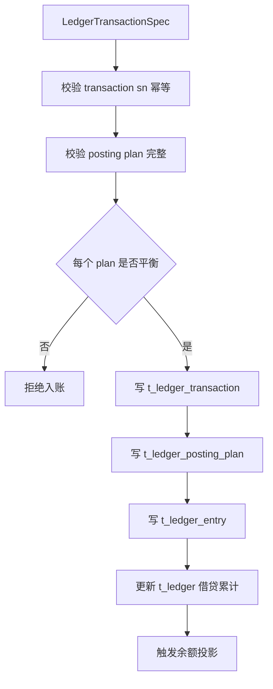

账本不变量：

1. LedgerEntry 不可变，修正只能追加冲正、补记或调账。
2. LedgerTransaction、PostingPlan、LedgerEntry 都要保留业务引用和资金交易引用。
3. sha256 或等价摘要用于防篡改和归档校验。
4. 分录必须带 ledger_id、主体、账目、币种、周期和业务时间。
5. settlement_status、settlement_period、reconcile_status、reconciliation_batch 只用于对账清算模块状态标记，不替代对账清算模块对象。

### 4.7 账本周期设计

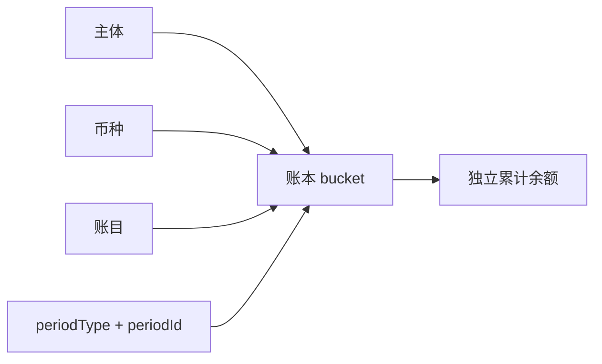

| 周期类型 | 系统处理 |
| --- | --- |
| LIFETIME | periodId 固定为 LIFETIME。 |
| DAYS / HOURLY / WEEKLY / MONTHLY / QUARTERLY / YEARLY | 必须由账户初始化、业务规则或显式请求确定周期 ID 和时区口径。 |
| CUSTOM_CYCLE | 必须有 periodPolicy、周期 ID、起止规则和规则版本。 |

周期红线：

1. 非 LIFETIME 缺 periodId 的入账和余额查询必须失败。
2. 同主体、同币种、同账目、不同周期不能互相消费、冻结、授权、释放或出款。
3. 清算账期、结算周期、报表周期、归档水位和 spend-rule window 不得替代账本周期。
4. 余额查询不带周期汇总时只能作为报表聚合，不得作为可用余额。

### 4.8 余额投影与余额变更日志

#### 4.8.1 余额投影流程

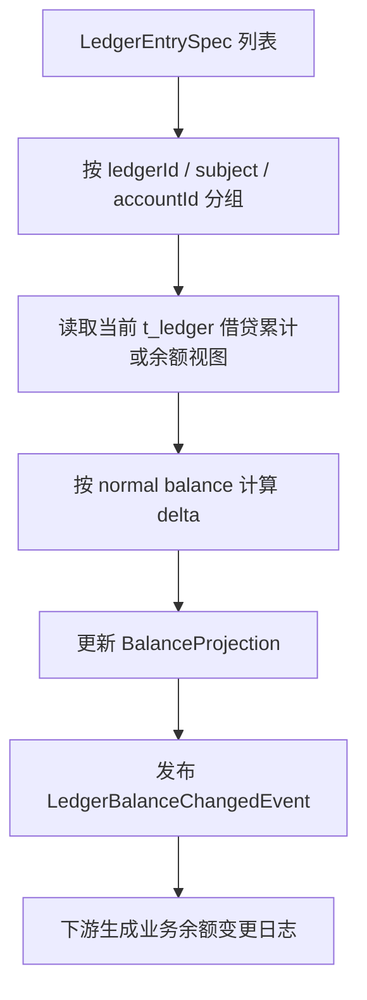

余额投影约束：

1. 投影来源只能是 ledger entry 和账本累计，不读取用户账单或报表。
2. 投影必须保留变更前余额、变更后余额、变更额、账本交易、分录引用或分录摘要。
3. LedgerBalanceChangedEvent 是观察事件，不是余额事实源。
4. 事件发布失败不得回滚已完成账本过账和余额投影；必须进入补偿、重试和告警。

#### 4.8.2 余额日志边界

| 对象 | 系统定位 | 禁止 |
| --- | --- | --- |
| LedgerBalanceChangedEvent | 余额投影成功后的观察信号。 | 作为余额修复依据。 |
| 业务余额变更日志 | 下游消费事件形成的查询日志。 | 反向修改 ledger entry 或 balance projection。 |
| 余额日志补偿任务 | 按分录范围补发观察结果。 | 重新入账或改变余额。 |

#### 4.8.3 投影任务状态承接

产品设计中的“余额投影任务”和“交易投影任务”在系统设计中拆成三类对象，避免把正常构建、观察事件和修复重放混在一起。

| 产品对象 | 系统承接 | 状态口径 | 边界 |
| --- | --- | --- | --- |
| 余额投影任务 | LedgerBalanceProjectionService 的一次处理上下文，可由实现记录为任务或处理日志。 | WAITING -> CALCULATING -> VERIFYING -> APPLIED；失败为 FAILED 或 NEEDS_REBUILD。 | 只从 ledger entry 和账本累计派生余额，不读取交易投影或报表。 |
| 余额变更观察事件 | LedgerBalanceChangedEvent 和 t_ledger_balance_change_log。 | GENERATED -> PUBLISHING -> PUBLISHED；失败为 FAILED_RETRYING 或 FAILED_NOTIFIED。 | 事件失败不回滚过账和余额投影；只能补发观察结果。 |
| 余额重建任务 | t_balance_checkpoint、t_balance_projection_watermark 和差异报告。 | 见归档重放系分的余额重建设计。 | 只用于校验、重算或重建余额投影，不改变历史分录。 |

### 4.9 交易投影设计

交易投影生成用户账单、商户账单、运营时间线、财务核对视图和指标项输入。它不是现有写入链路的事实源，应由资金交易、冻结单、路由快照、支付工具准入快照、资金责任决策、Spend Rule 决策与控制活动、账本分录、对账清算模块对象和对账差错派生。

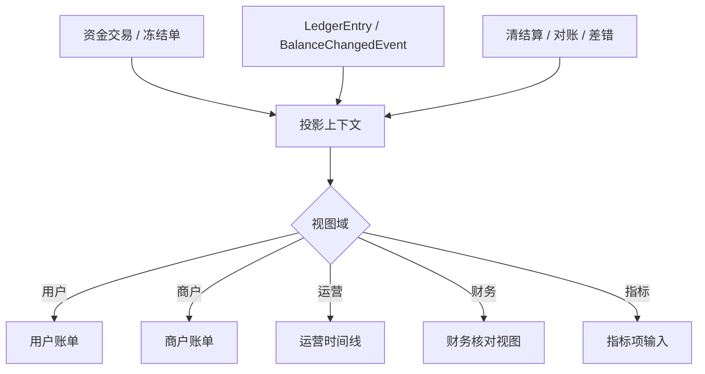

交易投影输入矩阵：

| 输入事实或快照 | 投影可解释内容 | 投影禁止行为 |
| --- | --- | --- |
| 资金交易 / 冻结单 | 交易类型、业务状态、金额、币种、主体、幂等键、冻结/授权/退款/撤销语义。 | 补写交易事实、改写交易状态、把冻结或授权占用展示为已完成资金结果。 |
| RouteSnapshot / `paymentInstrumentRef` | 支付工具类型、脱敏引用、绑定号、绑定版本、绑定角色、绑定主体、准入决策、路由版本和交易发生时的入口解释。 | 按当前支付工具状态重新选路、读取完整敏感字段、把支付工具当作账务主体。 |
| `FundingAllocationDecision` | 最终资金责任主体、资金来源解释、平台角色解析结果和决策版本。 | 把支出控制范围、Spend Rule 或支付工具输出为最终资金责任主体。 |
| `SpendRuleDecisionRecord` / `SpendControlMovement` | 规则命中、拒绝原因、预留、占用、释放、调整和控制窗口。 | 直接扣款、直接记账、修改余额桶或替代账本交易。 |
| LedgerEntry / BalanceChangedEvent | 账本分录、余额桶变化、账务平衡和余额投影引用。 | 修改分录、补写余额投影或反向驱动交易生命周期。 |
| 授权拒绝事实 | 拒绝时间线、拒绝原因、规则版本和请求摘要。 | 生成账务 route leg、posting plan、ledger entry 或 `declinedAmount` 类型的扣款事实。 |
| 清结算 / 对账 / 差错 | 清算批次、对账结果、差错状态、退汇、拒付和追偿展示语义。 | 执行清结算确认、会计确认、监管报送或正式财务报表计算。 |

交易投影红线：

1. 投影不得补写资金交易明细。
2. 投影不得修改账本分录或余额投影。
3. 投影重放必须有单笔、主体、时间窗口、视图域或批次范围。
4. 冻结、授权拒绝、退款、退汇、争议拒付必须保留不同展示语义。
5. 交易投影只提供财务核对视图和指标项输入，不实现正式报表计算、会计确认、监管报送或 OLAP 宽表。
6. 支付工具维度解释必须消费持久化 route snapshot 中的 `paymentInstrumentRef`，不得重新查询当前绑定关系覆盖历史工具快照，也不得输出外部 token、完整 PAN、CVC 或敏感原文。

交易投影任务承接：

| 产品对象 | 系统承接 | 状态口径 | 边界 |
| --- | --- | --- | --- |
| 正常交易投影任务 | t_funds_transaction_projection 的构建或更新上下文。 | WAITING -> BUILDING -> VERIFYING -> PUBLISHED；失败为 FAILED 或 NEEDS_REPLAY。 | 正常构建只消费事实源，不重新入账，不补写交易明细。 |
| 交易投影重放任务 | 由 04 governance 的 t_projection_replay_task 承载；02 只定义正常交易投影生成、只读投影端口和触发边界。 | CREATED -> RUNNING -> PAUSED/COMPLETED/FAILED/CANCELLED。 | 只用于校验、影子重建或应用只读投影，必须有范围和差异报告；不得把重放任务表落入交易主链路表。 |

### 4.10 Spend Rule 证据消费落点

Spend Controls 是 Spend Rule 在支付工具实时授权场景中的能力包，落点在授权前策略层，不属于路由、账本、清结算或投影核心。Spend Rule 的规则定义、不可变版本、规则挂载、决策日志、控制活动、预算控制投影、应用服务、表职责、状态机和测试门禁，统一以 [06-SpendRule支出规则系分设计.md](06-SpendRule支出规则系分设计.md) 为权威入口。

本主链路系分只保留工程消费关系：

1. wallet application facade 可在授权、付款或收款准入前消费 Spend Rule 决策证据。
2. route resolver 只能消费规则快照和控制证据，不得把 Spend Rule 作为 route leg participant。
3. transaction application 只接收已解析账户主体型 canonical 请求，不接收 Spend Rule 作为账务主体。
4. ledger posting 只接受资金账户、信用账户或平台角色解析后的平台资金账户，不接受 Spend Rule、支出控制范围、支付工具、卡号、PAN、token 或外部账户。
5. transaction projection 可以只读消费规则定义摘要、规则版本、规则挂载、决策日志和控制活动，生成规则命中时间线、拒绝原因和预算控制解释。
6. 任何新增 Spend Rule 表、Request、DTO、状态、错误码、H2 schema 或测试资产，必须通过独立工程变更边界指向 06 专项分册和 TDD 任务卡。

### 4.11 数据表设计

本节按架构师系分模板描述交易、路由、钱包账目和投影相关表结构。已经进入测试 DDL 的表应与 tests/src/test/resources/jdbc-schema.sql 保持一致；尚未进入 DDL 的投影表按目标态约束设计，编码落表前必须补齐迁移脚本和 H2 表结构。

#### 4.11.1 钱包账户、支付工具和资金责任表

##### 资金账户表

表名：t_funding_account

业务用途：承载资金账户、平台账户、商户或用户资金账户主数据，交易执行只能引用已存在且可用的账户。

数据归属：tenant_id + owner_type + owner_id；平台账户额外受 account_role_code 约束。

字段清单：

| 字段名称 | 字段类型 | 是否必填 | 字段说明 | 值示例 |
| --- | --- | --- | --- | --- |
| sn | varchar(64) | [X] | 资金账户号，全局唯一 | FA100001 |
| tenant_id | bigint(20) | [X] | 归属租户 | 1 |
| owner_id | varchar(30) | [X] | 账户归属主体 ID | M1001 |
| owner_type | varchar(50) | [X] | 账户归属主体类型 | MERCHANT |
| account_type | varchar(50) | [X] | 资金账户类型 | CASH |
| is_platform | tinyint(1) | [X] | 是否平台账户，0 否，1 是 | 0 |
| account_role_code | varchar(50) | [ ] | 平台账户角色；非平台账户为空 | PLATFORM_FEE |
| currency | varchar(10) | [X] | 账户币种 | CNY |
| ledger_profile_code | varchar(50) | [X] | 账本 profile 编码快照 | MERCHANT_CASH |
| ledger_profile_version | int(11) | [X] | 账本 profile 版本 | 1 |
| status | varchar(50) | [X] | 账户状态，见状态说明 | ACTIVE |
| version | int(11) | [X] | 乐观锁版本 | 0 |

状态说明：

- ACTIVE：可按账户规则入账和出账。
- FROZEN：可按规则入账，不允许普通出账。
- SUSPENDED：风控或合规暂停，人工确认前不得出账。
- CLOSED：终态，只允许查询和审计，不允许新交易引用。

唯一索引：

| 索引名称 | 索引字段 | 索引用途 |
| --- | --- | --- |
| uk_funding_account_sn | sn | 资金账户号唯一 |
| uk_funding_account_platform_role | tenant_id, currency, account_role_code | 平台账户同租户、币种、角色唯一 |

普通索引：

| 索引名称 | 索引字段 | 索引用途 |
| --- | --- | --- |
| idx_funding_account_owner | owner_type, owner_id | 按主体查询账户 |
| idx_funding_account_status | status | 运营筛选账户状态 |

数据约束与目标态校验：

- 新增必填字段必须给默认值或先允许为空；平台角色唯一键仅允许平台账户使用，普通账户不得伪造平台角色。
- 不使用数据库外键关联主体；主体存在性由账户开通用例和测试保证。
- 关闭账户不物理删除；历史交易和账本引用继续可追溯。

##### 信用账户表

表名：t_credit_account

业务用途：承载信用账户、额度账户或发卡授权控制主体，不表达真实现金池。

数据归属：tenant_id + owner_type + owner_id。

字段清单：

| 字段名称 | 字段类型 | 是否必填 | 字段说明 | 值示例 |
| --- | --- | --- | --- | --- |
| sn | varchar(64) | [X] | 信用账户号，全局唯一 | CA100001 |
| tenant_id | bigint(20) | [X] | 归属租户 | 1 |
| owner_id | varchar(30) | [X] | 归属主体 ID | U1001 |
| owner_type | varchar(50) | [X] | 归属主体类型 | USER |
| account_type | varchar(50) | [X] | 信用账户类型 | CREDIT_LINE |
| currency | varchar(10) | [X] | 币种 | CNY |
| period_type | varchar(20) | [X] | 账本周期类型 | LIFETIME |
| period_id | varchar(30) | [X] | 账本周期 ID；LIFETIME 固定为 LIFETIME，非 LIFETIME 由业务请求或周期策略明确给出 | LIFETIME |
| ledger_profile_code | varchar(50) | [X] | 账本 profile 编码快照 | CREDIT |
| ledger_profile_version | int(11) | [X] | 账本 profile 版本 | 1 |
| status | varchar(50) | [X] | 信用账户状态 | ACTIVE |
| version | int(11) | [X] | 乐观锁版本 | 0 |

状态说明：

- ACTIVE：可参与授权或额度控制。
- FROZEN、SUSPENDED：不得新增授权，可允许还款或释放。
- CLOSED：终态，只保留查询和审计。

唯一索引：

| 索引名称 | 索引字段 | 索引用途 |
| --- | --- | --- |
| uk_credit_account_sn | sn | 信用账户号唯一 |

普通索引：

| 索引名称 | 索引字段 | 索引用途 |
| --- | --- | --- |
| idx_credit_account_owner | owner_type, owner_id | 按归属主体查询 |
| idx_credit_account_status | status | 状态运营查询 |

数据约束与目标态校验：

- 非 LIFETIME 周期必须能由业务时间解析 period_id；不能用清算账期或报表周期替代账本周期。
- 信用账户状态不允许表达现金余额是否充足；现金事实仍以账本分录和余额投影为准。
- 不物理删除；额度模型调整通过 profile 版本、目标态测试和迁移说明演进。

##### 支出控制范围表

表名：t_spend_control_scope

业务用途：承载支出控制范围、owner 和额度分组，用于授权前预算控制、Spend Rule scope、控制投影和审计解释；不作为 route leg、余额控制入账主体或账本主体。

数据归属：tenant_id + owner_type + owner_id。

字段清单：

| 字段名称 | 字段类型 | 是否必填 | 字段说明 | 值示例 |
| --- | --- | --- | --- | --- |
| sn | varchar(64) | [X] | 支出控制范围号，全局唯一 | BG100001 |
| tenant_id | bigint(20) | [X] | 归属租户 | 1 |
| owner_id | varchar(30) | [X] | 归属主体 ID | M1001 |
| owner_type | varchar(50) | [X] | 归属主体类型 | MERCHANT |
| scope_type | varchar(50) | [X] | 控制范围类型 | MONTHLY_LIMIT |
| currency | varchar(10) | [X] | 币种 | CNY |
| period_type | varchar(20) | [X] | 预算周期类型 | MONTHLY |
| period_id | varchar(30) | [X] | 预算控制周期 ID；用于精确定位预算控制窗口和投影视图 | 2026-05 |
| period_policy | varchar(50) | [ ] | 周期策略 | NATURAL_MONTH |
| status | varchar(50) | [X] | 支出控制范围状态 | ACTIVE |
| version | int(11) | [X] | 乐观锁版本 | 0 |

状态说明：

- ACTIVE：可被路由和预算控制引用。
- FROZEN、SUSPENDED：不得被新交易选用。
- CLOSED：终态，只允许查询和审计。

唯一索引：

| 索引名称 | 索引字段 | 索引用途 |
| --- | --- | --- |
| uk_spend_control_scope_sn | sn | 支出控制范围号唯一 |

普通索引：

| 索引名称 | 索引字段 | 索引用途 |
| --- | --- | --- |
| idx_spend_control_scope_owner | owner_type, owner_id | 按主体查询支出控制范围 |
| idx_spend_control_scope_status | status | 状态运营查询 |

数据约束与目标态校验：

- 预算周期不等于清算账期、报表周期或 spend-rule window。
- 支出控制范围不直接写交易事实、route leg、账本事实或余额投影；只提供控制输入、控制投影和审计解释。
- 预算规则变更通过 Spend Rule 版本、控制规则版本或控制活动事实演进，避免覆盖历史交易解释依据。

##### 支付工具表

表名：t_payment_instrument

业务用途：承载银行卡、外部账户、虚拟卡、VA、外部钱包端点、通道 token 等外部路由输入；内部钱包标识不写入本表。

VCC 口径：虚拟卡、VCC、卡 token 和 prepaid virtual card 均作为支付工具类型承接；共享卡不是新的工具种类，而是工具绑定和使用模式。表结构只保存脱敏展示、外部工具引用和状态，不保存完整 PAN、CVV 或预付余额。

数据归属：tenant_id + owner_type + owner_id；外部工具受 channel_code + external_instrument_id 约束。

字段清单：

| 字段名称 | 字段类型 | 是否必填 | 字段说明 | 值示例 |
| --- | --- | --- | --- | --- |
| sn | varchar(64) | [X] | 支付工具号，全局唯一 | PI100001 |
| tenant_id | bigint(20) | [X] | 归属租户 | 1 |
| owner_id | varchar(30) | [X] | 工具归属主体 ID | U1001 |
| owner_type | varchar(50) | [X] | 工具归属主体类型 | USER |
| instrument_type | varchar(50) | [X] | 工具类型 | BANK_CARD |
| instrument_direction | varchar(50) | [X] | 工具资金流向 | OUTBOUND |
| instrument_no | varchar(128) | [X] | 展示号、掩码号、别名号或稳定识别号 | 6222xxxx1234 |
| channel_code | varchar(50) | [ ] | 通道编码 | UNIONPAY |
| external_instrument_id | varchar(128) | [ ] | 外部工具 ID | ext_pi_1001 |
| currency | varchar(10) | [X] | 币种 | CNY |
| status | varchar(50) | [X] | 工具状态 | ACTIVE |
| valid_from | datetime(3) | [ ] | 生效时间 | 2026-05-20 00:00:00.000 |
| valid_to | datetime(3) | [ ] | 失效时间 | 2027-05-20 00:00:00.000 |

状态说明：

- ACTIVE：可用于路由候选。
- FROZEN、SUSPENDED：不得作为新交易路由候选。
- CLOSED：终态；历史 route snapshot 仍可展示。

唯一索引：

| 索引名称 | 索引字段 | 索引用途 |
| --- | --- | --- |
| uk_payment_instrument_sn | sn | 工具号唯一 |
| uk_payment_instrument_external | tenant_id, channel_code, external_instrument_id | 外部工具幂等接入 |

普通索引：

| 索引名称 | 索引字段 | 索引用途 |
| --- | --- | --- |
| idx_payment_instrument_owner | owner_type, owner_id | 查询主体工具 |
| idx_payment_instrument_status | status | 状态筛选 |
| idx_payment_instrument_no | instrument_no | 掩码号或别名检索 |

数据约束与目标态校验：

- 只保存掩码、别名、token 或外部稳定 ID；不得保存完整卡号、完整外部账户、CVV、密码或密钥。
- 外部工具 ID 为空时不得依赖外部唯一键判重，必须使用业务请求幂等。
- 工具失效不影响历史交易解释；历史交易以 route snapshot 为准。
- prepaid virtual card 的预付资金余额不存放在本表，必须通过资金责任解析关系解析到经确认的内部资金责任主体。
- 共享卡不要求新增工具表字段；使用人、部门、项目、支出控制范围和资金责任通过绑定、资金责任解析关系和 route snapshot 表达。

##### 支付工具绑定表

表名：t_payment_instrument_binding

业务用途：承载支付工具和内部主体的当前绑定关系，供路由选择当前候选工具。

数据归属：tenant_id + instrument_sn + binding_role + subject_type + subject_id + currency。

字段清单：

| 字段名称 | 字段类型 | 是否必填 | 字段说明 | 值示例 |
| --- | --- | --- | --- | --- |
| sn | varchar(64) | [X] | 绑定号，由 `TemporalSequenceFactory` 在服务内部生成，全局唯一 | PIB100001 |
| tenant_id | bigint(20) | [X] | 归属租户 | 1 |
| instrument_sn | varchar(64) | [X] | 支付工具号 | PI100001 |
| binding_role | varchar(50) | [X] | 绑定角色 | DEFAULT_PAYMENT |
| subject_id | varchar(64) | [X] | 内部主体 ID；与资金账户、信用账户、支出控制范围业务号长度保持一致。 | U1001 |
| subject_type | varchar(50) | [X] | 内部主体类型 | USER |
| currency | varchar(10) | [X] | 币种 | CNY |
| priority | int(11) | [X] | 路由优先级，数字越小优先级越高 | 10 |
| is_default | tinyint(1) | [X] | 是否默认绑定 | 1 |
| state | varchar(50) | [X] | 绑定生命周期状态 | ACTIVE |
| version | int(11) | [X] | 绑定版本和乐观锁 | 1 |
| valid_from | datetime(3) | [ ] | 生效时间 | 2026-05-20 00:00:00.000 |
| valid_to | datetime(3) | [ ] | 失效时间 | 2027-05-20 00:00:00.000 |

生命周期状态说明：

- ACTIVE：可被路由候选使用。
- SUSPENDED：当前关系保留，但暂不可作为新交易候选。
- 生效、失效由 `valid_from/valid_to` 表达，不扩充生命周期状态；解绑删除当前关系并追加 `UNBIND` 历史，不保留 `CLOSED` 伪当前态。

唯一索引：

| 索引名称 | 索引字段 | 索引用途 |
| --- | --- | --- |
| uk_payment_instrument_binding_sn | sn | 绑定号唯一 |
| uk_payment_instrument_binding_subject | tenant_id, instrument_sn, binding_role, subject_type, subject_id, currency | 同租户、工具、角色、主体、币种只允许一条当前绑定，也是创建幂等业务键 |

普通索引：

| 索引名称 | 索引字段 | 索引用途 |
| --- | --- | --- |
| idx_payment_instrument_binding_instrument | instrument_sn | 查询工具绑定 |
| idx_payment_instrument_binding_subject | subject_type, subject_id | 查询主体绑定 |
| idx_payment_instrument_binding_state | state | 生命周期状态筛选 |

数据约束与目标态校验：

- 当前态变更按当前 version 更新，并同步追加绑定历史；版本不匹配时失败并由调用方重试。
- 创建请求不接收外部绑定号或 `requestSn`；当前态存续期间，同一业务联合键且内容相同返回既有绑定，内容不同拒绝并要求调用变更入口；解绑后再次创建视为新绑定并生成新绑定号。
- 变更按目标态幂等；目标内容与当前态一致时直接返回既有绑定 ID，不增加 version，也不追加历史；调用方负责保证变更命令顺序。
- 解绑删除当前关系并追加 `UNBIND` 历史；重复解绑通过既有 `UNBIND` 证据幂等成功，不恢复或伪造当前态。
- 变更和解绑即时修改当前态；`effective_at` 记录已经发生的变更事实生效时间，不支持未来预约，未来候选窗口使用 `valid_from/valid_to` 表达。
- ACTIVE 默认绑定在同一 tenant_id、instrument_sn、binding_role、currency 和有效时间窗口内必须唯一；当前阶段由服务层校验重叠窗口，不建设专用并发锁或保护表。
- route snapshot 已固化后不得因绑定变更重新选路。
- 共享卡绑定必须能表达工具、使用主体、支出控制范围、信用子账户、父账户、资金账户或信用账户之间的关系；多关系命中时必须由资金责任解析关系和优先级决策出唯一结果。
- prepaid virtual card 绑定不得以卡工具自身作为资金责任主体；必须关联资金子账户、父账户和背后资金来源，或待专业确认后阻断。

##### 支付工具绑定历史表

表名：t_payment_instrument_binding_history

业务用途：记录绑定创建、当前关系变更和解绑证据。

数据归属：tenant_id + binding_sn；历史记录只追加。

字段清单：

| 字段名称 | 字段类型 | 是否必填 | 字段说明 | 值示例 |
| --- | --- | --- | --- | --- |
| sn | varchar(64) | [X] | 审计号，全局唯一 | PIBH100001 |
| tenant_id | bigint(20) | [X] | 归属租户 | 1 |
| binding_sn | varchar(64) | [X] | 绑定号 | PIB100001 |
| instrument_sn | varchar(64) | [X] | 支付工具号 | PI100001 |
| change_type | varchar(50) | [X] | 变更类型 | CREATE |
| version | int(11) | [X] | 绑定版本 | 2 |
| before_snapshot | text | [ ] | 变更前脱敏快照；CREATE 时为空 | {"state":"ACTIVE"} |
| after_snapshot | text | [ ] | 变更后脱敏快照；UNBIND 时为空 | {"state":"SUSPENDED"} |
| operator_id | varchar(64) | [X] | 操作者或系统来源 | admin |
| change_reason | varchar(256) | [X] | 变更原因 | user_unbind |
| effective_at | datetime(3) | [ ] | 变更事实生效时间，不支持未来预约 | 2026-05-20 10:00:00.000 |

状态说明：

- `change_type` 只表达 `CREATE`、`UPDATE`、`UNBIND`；具体字段变化由前后快照解释，历史表不复制生命周期状态机。

唯一索引：

| 索引名称 | 索引字段 | 索引用途 |
| --- | --- | --- |
| uk_payment_instrument_binding_history_sn | sn | 审计号唯一 |
| uk_payment_instrument_binding_history_version | binding_sn, version | 同一绑定版本唯一 |

普通索引：

| 索引名称 | 索引字段 | 索引用途 |
| --- | --- | --- |
| idx_payment_instrument_binding_history_binding | binding_sn | 按绑定查询历史 |
| idx_payment_instrument_binding_history_instrument | instrument_sn | 按工具查询历史 |

数据约束与目标态校验：

- 历史记录只追加，不作为新交易候选来源。
- 快照必须脱敏；如快照结构升级，采用版本化 JSON，并同步 fixture、解析器和回放测试。
- 历史唯一性由 `binding_sn + version` 保证；创建幂等依赖当前表业务联合键，变更幂等依赖目标态比较，均不依赖外部请求号。

##### 支出主体资金关系表

表名：t_spend_subject_funding_rel

业务用途：承载信用账户、支出控制范围、Spend Rule、工具或使用主体到资金账户或信用账户的资金责任解析关系；历史曾称“资金来源关系”，当前口径统一按资金责任解析理解。该表仅作为资金责任主体候选和 `FundingAllocationDecision` 输入，不执行 Spend Rule 决策、不扣款、不写分录，也不得把支出控制范围或 Spend Rule 输出为最终资金责任主体。

工程裁决：已采用 `targetSubjectType + targetSubjectId` 的 `ddl-backed` 切片。`sn` 由服务内部生成；不保留旧资金账户镜像字段、优先级、默认关系、状态或有效期字段。同一租户、支出主体、币种和关系类型只能有一条当前资金责任关系。

裁决切片：

| 裁决切片 | 字段口径 | 服务口径 | 验收口径 |
| --- | --- | --- | --- |
| `targetSubjectType + targetSubjectId` | 只写 `target_subject_type`、`target_subject_id`。 | 解析结果可以是资金账户或信用账户，且必须写入不可变决策快照。 | 验资金账户、信用账户均可查询、冲突检测、快照和回放。 |

数据归属：tenant_id + spend_subject_type + spend_subject_id。

字段清单：

| 字段名称 | 字段类型 | 是否必填 | 字段说明 | 值示例 |
| --- | --- | --- | --- | --- |
| sn | varchar(64) | [X] | 关系号，全局唯一 | SSFR100001 |
| tenant_id | bigint(20) | [X] | 归属租户 | 1 |
| spend_subject_id | varchar(64) | [X] | 支出上下文或控制范围 ID；可以是支出控制范围、工具、使用主体或信用账户上下文，不等于最终入账主体。 | BG100001 |
| spend_subject_type | varchar(50) | [X] | 支出上下文或控制范围类型；支出控制范围和 Spend Rule 类型只能参与控制和解析。 | SPEND_CONTROL_SCOPE |
| target_subject_type | varchar(50) | [X] | 资金责任目标主体类型；初始支持 `FUNDING_ACCOUNT`、`CREDIT_ACCOUNT`，拒绝支出控制范围、Spend Rule、支付工具、卡和父账户聚合成为最终责任主体。 | CREDIT_ACCOUNT |
| target_subject_id | varchar(64) | [X] | 资金责任目标主体 ID。 | CA100001 |
| currency | varchar(10) | [X] | 币种 | CNY |
| relation_type | varchar(50) | [X] | 关系类型 | FUNDING_SOURCE |

唯一索引：

| 索引名称 | 索引字段 | 索引用途 |
| --- | --- | --- |
| uk_spend_subject_funding_rel_sn | sn | 关系号唯一 |
| uk_spend_subject_funding_rel_scope | tenant_id, spend_subject_type, spend_subject_id, currency, relation_type | 同租户、主体、币种、关系类型唯一。 |

普通索引：

| 索引名称 | 索引字段 | 索引用途 |
| --- | --- | --- |
| idx_spend_subject_funding_rel_spend_subject | spend_subject_type, spend_subject_id | 查询主体资金责任解析关系 |
| idx_spend_subject_funding_rel_target | target_subject_type, target_subject_id | 查询资金责任目标主体被引用关系。 |

数据约束与目标态校验：

- 只解析资金责任主体，不执行 Spend Rule 决策、不扣款、不写分录。
- 支出控制范围、Spend Rule 和支付工具只能作为支出上下文、控制 scope 或入口快照，不能作为该表的最终资金责任主体。
- `target_subject_type + target_subject_id` 是目标主体写入事实；不得恢复旧资金账户镜像字段承载信用账户、平台角色、支出控制范围、Spend Rule、支付工具或卡。
- 当前关系唯一性由 `uk_spend_subject_funding_rel_scope` 保证。

#### 4.11.2 交易和余额控制事实表

##### 资金交易表

表名：t_funds_transaction

业务用途：承载直接交易、授权交易和余额控制关联交易的聚合事实。

数据归属：tenant_id + business_scene + business_sn；交易归属主体由 route snapshot、交易明细和账本分录解释。

字段清单：

| 字段名称 | 字段类型 | 是否必填 | 字段说明 | 值示例 |
| --- | --- | --- | --- | --- |
| sn | varchar(64) | [X] | 资金交易号，全局唯一 | FT100001 |
| tenant_id | bigint(20) | [X] | 归属租户 | 1 |
| transaction_mode | varchar(50) | [X] | 交易模式 | DIRECT |
| transaction_type | varchar(50) | [X] | 交易类型 | PAY |
| business_scene | varchar(50) | [X] | 业务场景 | WALLET_PAY |
| business_sn | varchar(64) | [X] | 业务流水号 | ORDER100001 |
| reference_transaction_sn | varchar(64) | [ ] | 引用原交易号 | FT000001 |
| status | varchar(50) | [X] | 聚合状态 | PROCESSING |
| amount | bigint(20) | [X] | 原始交易金额，最小货币单位，非负 | 1000 |
| currency | varchar(10) | [X] | 币种 | CNY |
| authorized_amount | bigint(20) | [X] | 累计授权金额，非负 | 1000 |
| reversed_amount | bigint(20) | [X] | 累计撤销金额，非负 | 0 |
| settled_amount | bigint(20) | [X] | 累计结算或完成金额，非负 | 1000 |
| refunded_amount | bigint(20) | [X] | 累计退款金额，非负 | 0 |
| declined_amount | bigint(20) | [X] | 累计拒付或拒绝金额，非负 | 0 |
| fee_amount | bigint(20) | [X] | 累计手续费金额，非负 | 10 |
| route_snapshot | text | [ ] | 脱敏 route snapshot JSON | {"routeId":"R1"} |
| version | int(11) | [X] | 乐观锁版本 | 0 |

状态说明：

- PROCESSING：交易处理中，可继续补生命周期。
- OPEN：处理中但生命周期未关闭，可继续处理后续事件。
- CLOSED：终态，成功闭合。
- FAILED：终态，失败闭合。
- REJECTED：终态，拒绝；不得生成账务 route leg、posting 和 ledger entry。

唯一索引：

| 索引名称 | 索引字段 | 索引用途 |
| --- | --- | --- |
| uk_funds_transaction_sn | sn | 资金交易号唯一 |
| uk_funds_transaction_business | tenant_id, business_scene, business_sn | 业务幂等 |

普通索引：

| 索引名称 | 索引字段 | 索引用途 |
| --- | --- | --- |
| idx_funds_transaction_tenant | tenant_id | 租户范围查询 |
| idx_funds_transaction_reference | reference_transaction_sn | 逆向交易追溯 |
| idx_funds_transaction_status | status | 状态运营查询 |
| idx_funds_transaction_gmt_create | gmt_create | 时间分页查询 |

数据约束与目标态校验：

- 金额字段均为最小货币单位且非负；扣减方向由交易类型、记账计划和分录借贷方向表达。
- route_snapshot 必须脱敏保存；字段结构升级必须同步版本、fixture、解析器和 replay 测试。
- 交易事实不物理删除；错单通过失败、拒绝、冲正或补记表达。

##### 资金交易明细表

表名：t_funds_transaction_detail

业务用途：记录交易生命周期事件、参与方资金影响和请求摘要，是重放、对账和投影来源事实。

数据归属：tenant_id + transaction_sn；主体归属由 subject_type + subject_id 表达。

字段清单：

| 字段名称 | 字段类型 | 是否必填 | 字段说明 | 值示例 |
| --- | --- | --- | --- | --- |
| sn | varchar(64) | [X] | 明细号，全局唯一 | FTD100001 |
| tenant_id | bigint(20) | [X] | 归属租户 | 1 |
| transaction_sn | varchar(64) | [X] | 资金交易号 | FT100001 |
| business_scene | varchar(50) | [X] | 本次业务动作场景 | WALLET_PAY |
| business_sn | varchar(64) | [X] | 本次业务动作号 | ORDER100001 |
| transaction_type | varchar(50) | [X] | 交易类型 | PAY |
| event_type | varchar(50) | [X] | 生命周期事件 | CONFIRM |
| subject_id | varchar(64) | [X] | 影响主体 ID | U1001 |
| subject_type | varchar(50) | [X] | 影响主体类型 | USER |
| participant_role | varchar(50) | [X] | 参与方角色 | PAYER |
| request_hash | varchar(64) | [X] | 请求参数一致性摘要 | sha256:abc |
| funds_effect_type | varchar(50) | [X] | 资金业务效果 | DEBIT |
| ledger_transaction_sn | varchar(64) | [ ] | 账本交易号 | LT100001 |
| reference_detail_sn | varchar(64) | [ ] | 引用明细号 | FTD000001 |
| reference_ledger_transaction_sn | varchar(64) | [ ] | 引用账本交易号 | LT000001 |
| amount | bigint(20) | [X] | 本次动作金额，最小货币单位，非负 | 1000 |
| currency | varchar(10) | [X] | 币种 | CNY |
| status | varchar(50) | [X] | 明细状态 | SUCCEEDED |
| error_code | varchar(64) | [ ] | 错误码 | INSUFFICIENT_BALANCE |
| error_message | varchar(512) | [ ] | 脱敏错误消息 | balance not enough |

状态说明：

- PROCESSING：处理中。
- SUCCEEDED：终态，成功。
- FAILED：终态，失败。
- REJECTED：终态，业务拒绝；不得补写账本分录。

唯一索引：

| 索引名称 | 索引字段 | 索引用途 |
| --- | --- | --- |
| uk_funds_transaction_detail_sn | sn | 明细号唯一 |
| uk_funds_transaction_detail_event_subject | tenant_id, transaction_sn, business_scene, business_sn, event_type, subject_type, subject_id, participant_role, funds_effect_type | 同交易同动作同主体幂等 |

普通索引：

| 索引名称 | 索引字段 | 索引用途 |
| --- | --- | --- |
| idx_funds_transaction_detail_business_event | tenant_id, business_scene, business_sn, transaction_type, event_type | 按业务动作追溯 |
| idx_funds_transaction_detail_transaction | transaction_sn | 查询交易明细 |
| idx_funds_transaction_detail_subject | subject_type, subject_id, participant_role | 主体视角查询 |
| idx_funds_transaction_detail_ledger | ledger_transaction_sn | 账本追溯 |
| idx_funds_transaction_detail_reference | reference_detail_sn | 逆向明细追溯 |
| idx_funds_transaction_detail_status | status | 状态查询 |

数据约束与目标态校验：

- request_hash 必须覆盖影响幂等结果的关键请求字段，重复请求参数不一致必须拒绝。
- 明细作为事实来源不得覆盖金额、主体、事件和账本引用。
- 错误消息必须脱敏；敏感外部回包只允许保存摘要或证据引用。

##### 资金冻结订单表

表名：t_funds_frozen_order

业务用途：记录冻结单聚合事实，表达同主体 AVAILABLE 与 FROZEN 之间的余额控制。

数据归属：tenant_id + subject_type + subject_id。

字段清单：

| 字段名称 | 字段类型 | 是否必填 | 字段说明 | 值示例 |
| --- | --- | --- | --- | --- |
| sn | varchar(64) | [X] | 冻结单号，全局唯一 | FO100001 |
| tenant_id | bigint(20) | [X] | 归属租户 | 1 |
| subject_id | varchar(64) | [X] | 被冻结主体 ID | U1001 |
| subject_type | varchar(50) | [X] | 被冻结主体类型 | USER |
| freeze_type | varchar(50) | [X] | 冻结类型 | WITHDRAW_HOLD |
| business_scene | varchar(50) | [X] | 业务场景 | WALLET_WITHDRAW |
| business_sn | varchar(64) | [X] | 外部业务号 | WD100001 |
| transaction_sn | varchar(64) | [ ] | 关联资金交易号 | FT100001 |
| freeze_detail_sn | varchar(64) | [ ] | 冻结动作明细号 | FTD100001 |
| freeze_ledger_transaction_sn | varchar(64) | [ ] | 冻结账本交易号 | LT100001 |
| amount | bigint(20) | [X] | 原冻结金额，最小货币单位，非负 | 1000 |
| released_amount | bigint(20) | [X] | 已释放金额，非负 | 0 |
| currency | varchar(10) | [X] | 币种 | CNY |
| status | varchar(50) | [X] | 冻结单状态 | FROZEN |
| expire_time | datetime(3) | [ ] | 过期时间 | 2026-05-21 00:00:00.000 |
| release_time | datetime(3) | [ ] | 完全释放时间 | 2026-05-20 12:00:00.000 |
| version | int(11) | [X] | 乐观锁版本 | 0 |

状态说明：

- CREATED：已创建，尚未冻结成功。
- FROZEN：已冻结。
- PARTIALLY_RELEASED：部分释放。
- RELEASED：终态，已全部释放。
- EXPIRED：终态，已过期释放或人工关闭。
- CLOSED：终态，关闭。

唯一索引：

| 索引名称 | 索引字段 | 索引用途 |
| --- | --- | --- |
| uk_funds_frozen_order_sn | sn | 冻结单号唯一 |
| uk_funds_frozen_order_business | tenant_id, business_scene, business_sn, freeze_type | 冻结业务幂等 |

普通索引：

| 索引名称 | 索引字段 | 索引用途 |
| --- | --- | --- |
| idx_funds_frozen_order_subject | subject_type, subject_id | 主体冻结查询 |
| idx_funds_frozen_order_transaction | transaction_sn | 交易追溯 |
| idx_funds_frozen_order_status | status | 状态查询 |
| idx_funds_frozen_order_expire | expire_time, status | 到期释放扫描 |
| idx_funds_frozen_order_business | business_scene, business_sn | 业务查询 |

数据约束与目标态校验：

- 冻结只表达同主体 AVAILABLE 与 FROZEN 控制，不表达消费、扣划或跨主体价值转移。
- released_amount 不得大于 amount；并发释放必须通过 version 和账本分录共同校验。

##### 资金冻结动作明细表

表名：t_funds_frozen_action_detail

业务用途：目标态表，记录冻结、部分解冻、到期释放、关闭或撤销动作。现有测试 DDL 尚未落表，编码实现前必须补充 DDL、Entity、Mapper 和服务层测试。

数据归属：tenant_id + frozen_order_sn；动作影响主体继承冻结单主体。

字段清单：

| 字段名称 | 字段类型 | 是否必填 | 字段说明 | 值示例 |
| --- | --- | --- | --- | --- |
| id | bigint(20) | [X] | 自增主键，仅模块内部持久化使用 | 10001 |
| gmt_create | datetime(3) | [X] | 创建时间 | 2026-05-20 10:00:00.000 |
| gmt_modified | datetime(3) | [X] | 最后更新时间 | 2026-05-20 10:00:01.000 |
| sn | varchar(64) | [X] | 冻结动作号，全局唯一 | FAD100001 |
| tenant_id | bigint(20) | [X] | 归属租户 | 1 |
| frozen_order_sn | varchar(64) | [X] | 冻结单号 | FO100001 |
| action_type | varchar(50) | [X] | 动作类型 | RELEASE |
| business_scene | varchar(50) | [X] | 业务场景 | WALLET_WITHDRAW |
| business_sn | varchar(64) | [X] | 业务流水号 | WD100001 |
| request_hash | varchar(64) | [X] | 请求参数一致性摘要 | sha256:req |
| amount | bigint(20) | [X] | 动作金额，最小货币单位，非负 | 500 |
| currency | varchar(10) | [X] | 币种 | CNY |
| funds_transaction_sn | varchar(64) | [ ] | 关联资金交易号 | FT100001 |
| ledger_transaction_sn | varchar(64) | [ ] | 关联账本交易号 | LT100001 |
| reference_action_sn | varchar(64) | [ ] | 引用原动作号 | FAD000001 |
| status | varchar(50) | [X] | 动作状态 | SUCCEEDED |
| operator_id | varchar(64) | [ ] | 操作者或系统来源 | system |
| error_code | varchar(64) | [ ] | 错误码 | OVER_RELEASE |
| error_message | varchar(512) | [ ] | 脱敏错误消息 | release amount exceeds remaining |
| context_variables | text | [ ] | 脱敏 JSON 上下文 | {"traceId":"T1"} |

状态说明：

- PROCESSING：处理中。
- SUCCEEDED：终态，动作成功。
- FAILED：终态，动作失败。
- REJECTED：终态，业务拒绝。

唯一索引：

| 索引名称 | 索引字段 | 索引用途 |
| --- | --- | --- |
| uk_funds_frozen_action_detail_sn | sn | 冻结动作号唯一 |
| uk_funds_frozen_action_detail_action | tenant_id, frozen_order_sn, action_type, business_scene, business_sn, request_hash | 同冻结单同业务动作幂等 |

普通索引：

| 索引名称 | 索引字段 | 索引用途 |
| --- | --- | --- |
| idx_funds_frozen_action_detail_order | frozen_order_sn | 查询冻结单动作 |
| idx_funds_frozen_action_detail_transaction | funds_transaction_sn | 资金交易追溯 |
| idx_funds_frozen_action_detail_ledger | ledger_transaction_sn | 账本交易追溯 |
| idx_funds_frozen_action_detail_status | status | 动作状态扫描 |

数据约束与目标态校验：

- 动作明细只追加，不覆盖历史动作；重试必须命中幂等键。
- 超额解冻、跨主体解冻或错币种动作必须失败，不得写账本分录。
- 新逻辑不得用动作明细表达消费扣划，消费或扣划必须由独立资金交易和账本事实表达。

##### 资金余额与控制调整动作表

表名：t_funds_balance_adjust_action

业务用途：目标态表，记录 FundsBalanceControlService.adjust 产生的资金账户余额调整、信用账户额度调整和预算控制规则调整动作。它是调整流水号、来源、审批、凭证、规则版本、审计和事实引用的载体；资金账户和信用账户调整可以关联账本引用，预算控制调整只能关联预算控制视图和规则证据，不作为账本事实。现有测试 DDL 尚未落表，编码实现前必须补充 DDL、Entity、Mapper 和服务层测试。

数据归属：tenant_id + adjust_object_type + subject_type + subject_id；差错类资金账户余额调整还必须关联 source_type + source_sn。

字段清单：

| 字段名称 | 字段类型 | 是否必填 | 字段说明 | 值示例 |
| --- | --- | --- | --- | --- |
| id | bigint(20) | [X] | 自增主键，仅模块内部持久化使用 | 10001 |
| gmt_create | datetime(3) | [X] | 创建时间 | 2026-05-20 10:00:00.000 |
| gmt_modified | datetime(3) | [X] | 最后更新时间 | 2026-05-20 10:00:01.000 |
| sn | varchar(64) | [X] | 调整动作号，全局唯一 | BAA100001 |
| tenant_id | bigint(20) | [X] | 归属租户 | 1 |
| adjust_object_type | varchar(50) | [X] | 调整对象类型 | FUNDING_ACCOUNT |
| adjust_type | varchar(50) | [X] | 调整类型 | FUNDING_BALANCE |
| subject_type | varchar(50) | [X] | 被调整主体类型 | USER |
| subject_id | varchar(64) | [X] | 被调整主体 ID | U1001 |
| account_sn | varchar(64) | [ ] | 控制对象编号；资金账户和信用账户按账户编号解释，支出控制范围或 Spend Rule 仅按控制视图对象编号解释，不作为账本主体、账目 bucket 或余额投影主体 | FA100001 |
| ledger_subject_code | varchar(50) | [ ] | 资金账户目标账目或信用额度账目；预算控制调整不填写账本账目 | AVAILABLE |
| ledger_period_type | varchar(30) | [ ] | 账本周期类型 | LIFETIME |
| ledger_period_id | varchar(64) | [ ] | 账本周期 ID | 2026-05 |
| direction | varchar(30) | [X] | 调整方向 | INCREASE |
| amount | bigint(20) | [X] | 调整金额，最小货币单位，非负 | 1000 |
| before_amount | bigint(20) | [ ] | 调整前目标账目余额、额度或预算可用值 | 5000 |
| after_amount | bigint(20) | [ ] | 调整后目标账目余额、额度或预算可用值 | 6000 |
| currency | varchar(10) | [X] | 币种 | CNY |
| business_scene | varchar(50) | [X] | 业务场景 | RECONCILIATION_ADJUST |
| business_sn | varchar(64) | [X] | 业务流水号 | RC100001 |
| request_hash | varchar(64) | [X] | 请求参数一致性摘要 | sha256:req |
| source_type | varchar(50) | [X] | 调整来源类型 | RECONCILIATION |
| source_sn | varchar(64) | [X] | 调整来源单号 | EXC100001 |
| external_institution_ref | varchar(128) | [ ] | 外部机构、钱包、Issuer 或 Processor 引用；仅外部余额异常纠偏填写，需脱敏 | ISSUER_A |
| external_account_ref | varchar(128) | [ ] | 外部账户、支付工具或通道端点引用；仅保存脱敏引用 | card_token_ref_001 |
| external_final_event_ref | varchar(128) | [ ] | 外部终局事件、回单或文件摘要引用 | EVT100001 |
| external_balance_snapshot_ref | varchar(128) | [ ] | 外部余额快照引用 | SNAP100001 |
| reconciliation_exception_ref | varchar(64) | [ ] | 对账差错单或重新对账引用 | EXC100001 |
| approval_sn | varchar(64) | [ ] | 审批单号 | APR100001 |
| evidence_refs | text | [ ] | 脱敏凭证引用 JSON | ["oss://proof"] |
| responsibility_ref | varchar(128) | [ ] | 差异责任、挂账、追偿或成本归属引用 | RESP100001 |
| reason_code | varchar(64) | [X] | 调整原因码 | RECON_SHORTAGE |
| rule_version | varchar(64) | [ ] | 额度、预算或系统规则版本 | BUDGET_RULE_V3 |
| operator_id | varchar(64) | [ ] | 操作者或系统来源 | system |
| funds_transaction_sn | varchar(64) | [ ] | 关联直接交易调账资金事实；同主体余额调整和预算控制调整可为空 | FT100001 |
| ledger_transaction_sn | varchar(64) | [ ] | 关联账本交易号；预算控制调整不得填写 | LT100001 |
| status | varchar(50) | [X] | 动作状态 | SUCCEEDED |
| error_code | varchar(64) | [ ] | 错误码 | APPROVAL_REQUIRED |
| error_message | varchar(512) | [ ] | 脱敏错误消息 | approval is required |
| context_variables | text | [ ] | 脱敏 JSON 上下文 | {"traceId":"T1"} |

枚举说明：

- adjust_object_type：FUNDING_ACCOUNT、CREDIT_ACCOUNT、BUDGET_CONTROL。支出控制额度调整统一通过 BUDGET_CONTROL 视图处理，不使用 SPEND_CONTROL_SCOPE 作为调账对象类型，也不得解释为 ledger subject。
- adjust_type：FUNDING_BALANCE、CREDIT_LIMIT、BUDGET_RULE_LIMIT。
- direction：INCREASE、DECREASE。
- source_type：RECONCILIATION、EXTERNAL_BALANCE_ANOMALY、OPERATION、FINANCE、RISK、SYSTEM_RULE。
- status：PROCESSING、SUCCEEDED、FAILED、REJECTED。

唯一索引：

| 索引名称 | 索引字段 | 索引用途 |
| --- | --- | --- |
| uk_funds_balance_adjust_action_sn | sn | 调整动作号唯一 |
| uk_funds_balance_adjust_action_business | tenant_id, business_scene, business_sn, adjust_type, request_hash | 调整业务幂等 |

普通索引：

| 索引名称 | 索引字段 | 索引用途 |
| --- | --- | --- |
| idx_funds_balance_adjust_action_subject | adjust_object_type, subject_type, subject_id | 主体调整查询 |
| idx_funds_balance_adjust_action_source | source_type, source_sn | 来源单据追溯 |
| idx_funds_balance_adjust_action_ledger | ledger_transaction_sn | 账本交易追溯 |
| idx_funds_balance_adjust_action_status | status | 动作状态扫描 |

数据约束与目标态校验：

- 资金账户余额调整必须是同主体、同币种、同账本周期内的目标账目受控调整，不表达跨主体价值转移。
- 信用账户额度调整只影响信用账户 LIMIT / AVAILABLE 控制口径；预算控制调整只影响 SpendControlScope / Spend Rule 控制视图、规则窗口、占用或释放证据，不表达现金流、外部通道、清结算结果或 ledger bucket。
- 差错类资金账户余额调整必须有 source_type、source_sn、approval_sn、evidence_refs、reason_code 和重新对账引用；审批或凭证缺失时不得生成账本分录。
- 外部余额异常纠偏必须使用 source_type = EXTERNAL_BALANCE_ANOMALY 或经 B7 差错闭环确认的 RECONCILIATION 来源；external_final_event_ref、external_balance_snapshot_ref、reconciliation_exception_ref、approval_sn、evidence_refs、responsibility_ref 和 reason_code 必填。外部状态为 pending、accepted、processing、人工备注或可疑口径时不得生成账本分录。
- 外部余额异常纠偏允许把同主体 AVAILABLE 调整为负数，但必须同步本次运行时负余额策略事实、风险状态、追偿或人工处理引用；后续支付、授权、冻结、提现、出款或清算放行不得绕过该负余额状态。
- 跨主体补偿、挂账、平台责任转移或真实资金路径变化必须由差错闭环触发批次授权 DIRECT_TRANSACTION / ADJUSTMENT 或清结算事实承接，不能塞入同主体 adjust。
- 动作明细只追加，不覆盖历史动作；重试必须命中幂等键，失败动作不得更新余额投影。

#### 4.11.3 账本事实表

##### 账户账本表

表名：t_ledger

业务用途：承载主体、账目、币种和账本周期组成的余额 bucket。

数据归属：tenant_id + subject_type + subject_id + ledger_subject_code + currency + period_type + period_id。

字段清单：

| 字段名称 | 字段类型 | 是否必填 | 字段说明 | 值示例 |
| --- | --- | --- | --- | --- |
| tenant_id | bigint(20) | [X] | 归属租户 | 1 |
| subject_id | varchar(64) | [X] | 账务主体 ID | FA100001 |
| subject_type | varchar(50) | [X] | 账务主体类型 | FUNDING_ACCOUNT |
| ledger_profile_code | varchar(50) | [X] | profile 编码快照 | MERCHANT_CASH |
| ledger_profile_version | int(11) | [X] | profile 版本快照 | 1 |
| ledger_subject_code | varchar(50) | [X] | 账本科目编码 | AVAILABLE |
| ledger_subject_category | varchar(50) | [X] | 科目分类快照 | ASSET |
| normal_balance_side | varchar(10) | [X] | 正常余额方向 | DEBIT |
| is_allow_negative | tinyint(1) | [X] | 是否允许负余额 | 0 |
| currency | varchar(10) | [X] | 币种 | CNY |
| period_type | varchar(20) | [X] | 周期类型 | LIFETIME |
| period_id | varchar(30) | [X] | 周期 ID | LIFETIME |
| settlement_policy | varchar(50) | [X] | 结算策略 | RT |
| cut_off_time | time | [X] | 日切时间 | 00:00:00 |
| debit_amount | bigint(20) | [X] | 借方累计金额，最小货币单位，非负 | 1000 |
| credit_amount | bigint(20) | [X] | 贷方累计金额，最小货币单位，非负 | 0 |
| status | varchar(20) | [X] | 账本状态 | ACTIVE |
| version | int(11) | [X] | 乐观锁版本 | 0 |

状态说明：

- ACTIVE：可入账。
- FROZEN、SUSPENDED：不得新增普通出账，是否允许入账由账户规则控制。
- CLOSED：终态，只允许查询和审计。

唯一索引：

| 索引名称 | 索引字段 | 索引用途 |
| --- | --- | --- |
| uk_ledger_subject_bucket | tenant_id, subject_type, subject_id, ledger_subject_code, currency, period_type, period_id | 账本 bucket 唯一 |

普通索引：

| 索引名称 | 索引字段 | 索引用途 |
| --- | --- | --- |
| idx_ledger_subject | subject_type, subject_id | 主体账本查询 |
| idx_ledger_profile | ledger_profile_code, ledger_profile_version | profile 版本排查 |
| idx_ledger_period | period_type, period_id | 周期账本查询 |
| idx_ledger_status | status | 状态查询 |

数据约束与目标态校验：

- 非 LIFETIME 必须显式 period_id；清算账期、报表周期和归档水位不得替代账本周期。
- debit_amount、credit_amount 是累计额，不直接等于可用余额；余额由 normal_balance_side 计算。
- 不允许物理删除账本 bucket；科目迁移必须保留旧 bucket 查询能力。

##### 账户账本交易表

表名：t_ledger_transaction

业务用途：承载一次可审计、可平衡的账本交易。

数据归属：tenant_id + sn；业务归属通过 funds_transaction_sn、business_scene 和 business_sn 追溯。

字段清单：

| 字段名称 | 字段类型 | 是否必填 | 字段说明 | 值示例 |
| --- | --- | --- | --- | --- |
| sn | varchar(64) | [X] | 账本交易号，全局唯一 | LT100001 |
| tenant_id | bigint(20) | [X] | 归属租户 | 1 |
| funds_transaction_sn | varchar(64) | [ ] | 资金交易号 | FT100001 |
| reference_ledger_transaction_sn | varchar(64) | [ ] | 引用原账本交易号 | LT000001 |
| instruction_type | varchar(50) | [X] | 指令类型 | DIRECT |
| event_type | varchar(50) | [X] | 事件类型 | CONFIRM |
| transaction_type | varchar(50) | [X] | 交易类型 | PAY |
| business_scene | varchar(50) | [X] | 业务场景 | WALLET_PAY |
| business_sn | varchar(64) | [X] | 业务号 | ORDER100001 |
| amount | bigint(20) | [X] | 本次交易金额，最小货币单位，非负 | 1000 |
| currency | varchar(10) | [X] | 本次交易币种 | CNY |
| original_amount | bigint(20) | [X] | 原始金额，最小货币单位 | 1000 |
| original_currency | varchar(10) | [X] | 原始币种 | CNY |
| exchange_rate | decimal(18,8) | [X] | 汇率，默认 1.00000000 | 1.00000000 |
| debit_amount | bigint(20) | [X] | 本交易借方合计 | 1000 |
| credit_amount | bigint(20) | [X] | 本交易贷方合计 | 1000 |
| is_balanced | tinyint(1) | [X] | 是否借贷平衡 | 1 |
| status | varchar(20) | [X] | 账本交易状态 | POSTED |
| transaction_time | datetime(3) | [X] | 交易发生时间 | 2026-05-20 10:00:00.000 |
| sha256 | varchar(128) | [X] | 防篡改摘要 | sha256:abc |

状态说明：

- PENDING：待处理，不应产生已确认余额影响。
- POSTED：终态语义，已记账。
- SETTLED：已结算标记，不改变原始分录。
- REVERSED：已取消或冲正，必须引用原账本交易。
- FAILED：终态，处理失败。

唯一索引：

| 索引名称 | 索引字段 | 索引用途 |
| --- | --- | --- |
| uk_ledger_transaction_sn | sn | 账本交易号唯一 |

普通索引：

| 索引名称 | 索引字段 | 索引用途 |
| --- | --- | --- |
| idx_ledger_transaction_funds_transaction | funds_transaction_sn | 资金交易追溯 |
| idx_ledger_transaction_reference | reference_ledger_transaction_sn | 逆向交易追溯 |
| idx_ledger_transaction_business | business_scene, business_sn | 业务查询 |
| idx_ledger_transaction_event | event_type | 事件类型排查 |
| idx_ledger_transaction_time | transaction_time | 时间分页 |

数据约束与目标态校验：

- debit_amount 必须等于 credit_amount，且币种一致；不平衡不得入账。
- 已 POSTED 的账本交易不得覆盖金额和业务引用；错账通过追加冲正或调账交易处理。
- sha256 参与防篡改校验；摘要算法升级必须显式记录版本并同步目标态校验夹具。

##### 账户账本记账计划表

表名：t_ledger_posting_plan

业务用途：承载 route leg 翻译出的记账计划，用于解释本金、费用、冻结、结算和调账。

数据归属：tenant_id + ledger_transaction_sn。

字段清单：

| 字段名称 | 字段类型 | 是否必填 | 字段说明 | 值示例 |
| --- | --- | --- | --- | --- |
| sn | varchar(64) | [X] | 记账计划号，全局唯一 | LPP100001 |
| tenant_id | bigint(20) | [X] | 归属租户 | 1 |
| ledger_transaction_sn | varchar(64) | [X] | 账本交易号 | LT100001 |
| funds_transaction_sn | varchar(64) | [ ] | 资金交易号 | FT100001 |
| route_leg_id | varchar(64) | [ ] | 来源 route leg | leg-1 |
| intent | varchar(50) | [X] | 记账意图 | PRINCIPAL |
| posting_scope | varchar(50) | [X] | 记账范围 | MERCHANT_CASH |
| balance_effect_type | varchar(50) | [X] | 余额影响语义 | DEBIT_AVAILABLE |
| phase_code | varchar(50) | [X] | 记账阶段 | CONFIRM |
| amount | bigint(20) | [X] | 计划金额，最小货币单位，非负 | 1000 |
| currency | varchar(10) | [X] | 币种 | CNY |
| debit_amount | bigint(20) | [X] | 借方合计 | 1000 |
| credit_amount | bigint(20) | [X] | 贷方合计 | 1000 |
| is_balanced | tinyint(1) | [X] | 是否平衡 | 1 |
| sha256 | varchar(128) | [X] | 防篡改摘要 | sha256:abc |

状态说明：

- 记账计划没有独立生命周期状态；有效性由所属账本交易状态和摘要校验决定。

唯一索引：

| 索引名称 | 索引字段 | 索引用途 |
| --- | --- | --- |
| uk_ledger_posting_plan_sn | sn | 记账计划号唯一 |

普通索引：

| 索引名称 | 索引字段 | 索引用途 |
| --- | --- | --- |
| idx_ledger_posting_plan_transaction | ledger_transaction_sn | 查询账本交易计划 |
| idx_ledger_posting_plan_funds_transaction | funds_transaction_sn | 资金交易追溯 |
| idx_ledger_posting_plan_route_leg | route_leg_id | 路由腿追溯 |
| idx_ledger_posting_plan_phase | phase_code | 阶段排查 |
| idx_ledger_posting_plan_intent | intent | 账务解释 |

数据约束与目标态校验：

- 每个 plan 必须独立借贷平衡；金额、币种和方向不得由下游分录自行推断。
- route_leg_id 为空只允许非路由来源的系统计划；编码落地需要测试覆盖。
- plan 只解释如何入账，不承担账户状态、清算状态或对账状态。

##### 账户账本条目表

表名：t_ledger_entry

业务用途：承载不可变账本分录，是余额、对账、清结算、归档和余额快照的根事实。

数据归属：tenant_id + ledger_id + subject_type + subject_id。

字段清单：

| 字段名称 | 字段类型 | 是否必填 | 字段说明 | 值示例 |
| --- | --- | --- | --- | --- |
| sn | varchar(64) | [X] | 分录号，全局唯一 | LE100001 |
| tenant_id | bigint(20) | [X] | 归属租户 | 1 |
| ledger_transaction_sn | varchar(64) | [X] | 账本交易号 | LT100001 |
| posting_plan_sn | varchar(64) | [X] | 记账计划号 | LPP100001 |
| funds_transaction_sn | varchar(64) | [ ] | 资金交易号 | FT100001 |
| ledger_id | bigint(20) | [X] | 对应账本 bucket ID | 10001 |
| subject_id | varchar(64) | [X] | 账务主体 ID | FA100001 |
| subject_type | varchar(50) | [X] | 账务主体类型 | FUNDING_ACCOUNT |
| ledger_subject_code | varchar(50) | [X] | 账本科目编码 | AVAILABLE |
| ledger_subject_category | varchar(50) | [X] | 科目分类快照 | ASSET |
| entry_side | varchar(10) | [X] | 借贷方向 | DEBIT |
| balance_constraint_type | varchar(50) | [X] | 本分录余额约束 | NON_NEGATIVE |
| intent | varchar(50) | [X] | 记账意图 | PRINCIPAL |
| posting_scope | varchar(50) | [X] | 记账范围 | MERCHANT_CASH |
| balance_effect_type | varchar(50) | [X] | 余额影响语义 | INCREASE_AVAILABLE |
| phase_code | varchar(50) | [X] | 记账阶段 | CONFIRM |
| business_scene | varchar(50) | [X] | 业务场景 | WALLET_PAY |
| business_sn | varchar(64) | [ ] | 业务号 | ORDER100001 |
| amount | bigint(20) | [X] | 分录金额，最小货币单位，非负 | 1000 |
| currency | varchar(10) | [X] | 币种 | CNY |
| original_amount | bigint(20) | [X] | 原始金额 | 1000 |
| original_currency | varchar(10) | [X] | 原始币种 | CNY |
| exchange_rate | decimal(18,8) | [X] | 汇率 | 1.00000000 |
| transaction_time | datetime(3) | [X] | 交易发生时间 | 2026-05-20 10:00:00.000 |
| settlement_status | varchar(20) | [X] | 清结算状态 | PENDING |
| settlement_period | varchar(30) | [ ] | 清结算账期，不是账本周期 | 2026-05 |
| settlement_completed_time | datetime(3) | [ ] | 清结算完成时间 | 2026-05-21 10:00:00.000 |
| reconcile_status | varchar(20) | [X] | 对账状态 | PENDING |
| reconciliation_batch | varchar(64) | [ ] | 对账批次号 | RB100001 |
| reconciliation_completed_time | datetime(3) | [ ] | 对账完成时间 | 2026-05-21 11:00:00.000 |
| reconcile_remark | varchar(512) | [ ] | 脱敏对账备注 | matched |
| sha256 | varchar(128) | [X] | 防篡改摘要 | sha256:abc |

状态说明：

- settlement_status：PENDING 待清算；SETTLED 已清算；FAILED 清算失败。清结算状态不得反向改写金额。
- reconcile_status：PENDING 待对账；MATCHED 已匹配；DIFFERENCE 有差异；FAILED 对账失败；SETTLED 已闭环。差异处理不得直接覆盖分录。

唯一索引：

| 索引名称 | 索引字段 | 索引用途 |
| --- | --- | --- |
| uk_ledger_entry_sn | sn | 分录号唯一 |

普通索引：

| 索引名称 | 索引字段 | 索引用途 |
| --- | --- | --- |
| idx_ledger_entry_transaction | ledger_transaction_sn | 查询账本交易分录 |
| idx_ledger_entry_posting_plan | posting_plan_sn | 查询计划分录 |
| idx_ledger_entry_ledger | ledger_id | 余额投影和快照 |
| idx_ledger_entry_subject | subject_type, subject_id | 主体账本查询 |
| idx_ledger_entry_funds_transaction | funds_transaction_sn | 资金交易追溯 |
| idx_ledger_entry_business | business_scene, business_sn | 业务查询 |
| idx_ledger_entry_settlement | settlement_status, settlement_period | 清结算候选扫描 |
| idx_ledger_entry_reconcile | reconcile_status, reconciliation_batch | 对账扫描 |
| idx_ledger_entry_transaction_time | transaction_time | 时间范围扫描 |

数据约束与目标态校验：

- 已过账分录不得更新金额、主体、账目、周期、借贷方向和业务引用；错账只能追加补记、冲正或调账事实。
- 分录金额永远非负；借贷方向、normal balance 和 balance_effect_type 决定余额增减。
- 余额快照只能从分录、账本交易、记账计划摘要和 normal balance 计算，不得从普通指标或交易投影反推。

#### 4.11.4 投影和观察表

##### 账本余额投影表

表名：t_ledger_balance_projection

业务用途：承载由 ledger entry 派生的当前余额读模型，服务余额查询。

数据归属：tenant_id + ledger_id 或 tenant_id + subject_type + subject_id + ledger_subject_code + currency + period_type + period_id。

字段清单：

| 字段名称 | 字段类型 | 是否必填 | 字段说明 | 值示例 |
| --- | --- | --- | --- | --- |
| sn | varchar(64) | [X] | 投影号，全局唯一 | LBP100001 |
| tenant_id | bigint(20) | [X] | 归属租户 | 1 |
| ledger_id | bigint(20) | [X] | 账本 bucket ID | 10001 |
| subject_id | varchar(64) | [X] | 账务主体 ID | FA100001 |
| subject_type | varchar(50) | [X] | 账务主体类型 | FUNDING_ACCOUNT |
| ledger_subject_code | varchar(50) | [X] | 账本科目编码 | AVAILABLE |
| currency | varchar(10) | [X] | 币种 | CNY |
| period_type | varchar(20) | [X] | 账本周期类型 | LIFETIME |
| period_id | varchar(30) | [X] | 账本周期 ID | LIFETIME |
| debit_amount | bigint(20) | [X] | 借方累计金额 | 1000 |
| credit_amount | bigint(20) | [X] | 贷方累计金额 | 0 |
| balance_amount | bigint(20) | [X] | 当前余额，按 normal balance 计算 | 1000 |
| last_entry_sn | varchar(64) | [X] | 已投影的最后分录号 | LE100001 |
| last_transaction_time | datetime(3) | [X] | 最后交易发生时间 | 2026-05-20 10:00:00.000 |
| status | varchar(50) | [X] | 投影状态 | ACTIVE |
| version | int(11) | [X] | 乐观锁版本 | 1 |

状态说明：

- ACTIVE：可查询。
- REBUILDING：重建中，只允许治理任务更新。
- SUSPENDED：不可作为对外余额结果。

唯一索引：

| 索引名称 | 索引字段 | 索引用途 |
| --- | --- | --- |
| uk_ledger_balance_projection_bucket | tenant_id, ledger_id | 账本 bucket 当前余额唯一 |
| uk_ledger_balance_projection_subject | tenant_id, subject_type, subject_id, ledger_subject_code, currency, period_type, period_id | 主体账目周期余额唯一 |

普通索引：

| 索引名称 | 索引字段 | 索引用途 |
| --- | --- | --- |
| idx_ledger_balance_projection_subject | subject_type, subject_id | 主体余额查询 |
| idx_ledger_balance_projection_last_entry | last_entry_sn | 投影水位排查 |
| idx_ledger_balance_projection_status | status | 重建和异常扫描 |

数据约束与目标态校验：

- 本表不是余额事实源；只从 ledger entry 派生，不允许交易投影、普通指标或人工修正直接写余额。
- balance_amount 可为负仅限 is_allow_negative 的账本 bucket，必须由账本约束校验。
- 重建时先写影子或校验结果，确认无差异后再推进正式投影。

##### 余额变更观察日志表

表名：t_ledger_balance_change_log

业务用途：记录余额投影成功后的观察日志或事件投递日志。

数据归属：tenant_id + ledger_id + ledger_entry_sn。

字段清单：

| 字段名称 | 字段类型 | 是否必填 | 字段说明 | 值示例 |
| --- | --- | --- | --- | --- |
| sn | varchar(64) | [X] | 事件号，全局唯一 | LBCL100001 |
| tenant_id | bigint(20) | [X] | 归属租户 | 1 |
| ledger_id | bigint(20) | [X] | 账本 bucket ID | 10001 |
| ledger_entry_sn | varchar(64) | [X] | 来源分录号 | LE100001 |
| ledger_transaction_sn | varchar(64) | [X] | 来源账本交易号 | LT100001 |
| subject_id | varchar(64) | [X] | 账务主体 ID | FA100001 |
| subject_type | varchar(50) | [X] | 账务主体类型 | FUNDING_ACCOUNT |
| ledger_subject_code | varchar(50) | [X] | 账本科目编码 | AVAILABLE |
| currency | varchar(10) | [X] | 币种 | CNY |
| period_type | varchar(20) | [X] | 账本周期类型 | LIFETIME |
| period_id | varchar(30) | [X] | 账本周期 ID | LIFETIME |
| before_balance_amount | bigint(20) | [X] | 变更前余额 | 0 |
| after_balance_amount | bigint(20) | [X] | 变更后余额 | 1000 |
| balance_delta_amount | bigint(20) | [X] | 余额变化额，可正可负 | 1000 |
| publish_status | varchar(50) | [X] | 投递状态 | PUBLISHED |
| error_code | varchar(64) | [ ] | 投递错误码 | MQ_TIMEOUT |
| error_message | varchar(512) | [ ] | 脱敏错误消息 | publish timeout |
| trace_id | varchar(128) | [ ] | 链路追踪号 | T100001 |

状态说明：

- GENERATED：已生成事件。
- PUBLISHING：投递中。
- PUBLISHED：终态，已投递。
- FAILED_RETRYING：可重试失败。
- FAILED_NOTIFIED：终态或人工兜底，已告警。

唯一索引：

| 索引名称 | 索引字段 | 索引用途 |
| --- | --- | --- |
| uk_ledger_balance_change_log_sn | sn | 事件号唯一 |
| uk_ledger_balance_change_log_entry | tenant_id, ledger_entry_sn | 同一分录只生成一条余额观察事件 |

普通索引：

| 索引名称 | 索引字段 | 索引用途 |
| --- | --- | --- |
| idx_ledger_balance_change_log_ledger | ledger_id | 账本事件查询 |
| idx_ledger_balance_change_log_status | publish_status | 失败重试扫描 |
| idx_ledger_balance_change_log_trace | trace_id | 链路排查 |

数据约束与目标态校验：

- 本表不得作为余额修复依据；事件失败不回滚已完成入账和余额投影。
- error_message 必须脱敏；外部投递回包只保存摘要。
- 事件补发只能更新投递状态和错误信息，不得改余额变化数据。

##### 资金交易投影表

表名：t_funds_transaction_projection

业务用途：承载用户账单、商户账单、运营时间线、财务核对视图和指标项输入的只读投影；不承载正式财务报表、监管报送或会计总账报表。

数据归属：tenant_id + view_domain + owner_type + owner_id。

字段清单：

| 字段名称 | 字段类型 | 是否必填 | 字段说明 | 值示例 |
| --- | --- | --- | --- | --- |
| sn | varchar(64) | [X] | 投影号，全局唯一 | FTP100001 |
| tenant_id | bigint(20) | [X] | 归属租户 | 1 |
| view_domain | varchar(50) | [X] | 视图域 | USER_BILL |
| owner_id | varchar(30) | [X] | 视图归属主体 ID | U1001 |
| owner_type | varchar(50) | [X] | 视图归属主体类型 | USER |
| source_type | varchar(50) | [X] | 来源对象类型 | FUNDS_TRANSACTION |
| source_sn | varchar(64) | [X] | 来源对象号 | FT100001 |
| funds_transaction_sn | varchar(64) | [X] | 资金交易号 | FT100001 |
| ledger_transaction_sn | varchar(64) | [ ] | 账本交易号 | LT100001 |
| ledger_entry_sn | varchar(64) | [ ] | 分录号 | LE100001 |
| display_type | varchar(50) | [X] | 展示类型 | PAYMENT |
| display_status | varchar(50) | [X] | 展示状态 | SUCCEEDED |
| amount | bigint(20) | [X] | 展示金额，最小货币单位，可正可负由视图域定义 | -1000 |
| currency | varchar(10) | [X] | 币种 | CNY |
| occurred_time | datetime(3) | [X] | 业务发生时间 | 2026-05-20 10:00:00.000 |
| replay_task_sn | varchar(64) | [ ] | 最近一次重放任务号 | PRT100001 |
| projection_digest | varchar(128) | [X] | 投影摘要 | sha256:abc |
| status | varchar(50) | [X] | 投影状态 | PUBLISHED |
| version | int(11) | [X] | 乐观锁版本 | 1 |

状态说明：

- WAITING：待构建。
- BUILDING：构建中。
- VERIFYING：校验中。
- PUBLISHED：可读终态。
- FAILED：构建失败。
- NEEDS_REPLAY：需要重放修复。

唯一索引：

| 索引名称 | 索引字段 | 索引用途 |
| --- | --- | --- |
| uk_funds_transaction_projection_sn | sn | 投影号唯一 |
| uk_funds_transaction_projection_source | tenant_id, view_domain, source_type, source_sn, owner_type, owner_id | 同来源同视图同归属唯一 |

普通索引：

| 索引名称 | 索引字段 | 索引用途 |
| --- | --- | --- |
| idx_funds_transaction_projection_owner | view_domain, owner_type, owner_id, occurred_time | 用户或商户账单分页 |
| idx_funds_transaction_projection_transaction | funds_transaction_sn | 交易追溯 |
| idx_funds_transaction_projection_replay | replay_task_sn | 重放结果排查 |
| idx_funds_transaction_projection_status | status | 异常投影扫描 |

数据约束与目标态校验：

- 投影只读、可重放，不得补写交易事实、账本交易或账本分录。
- 金额正负由 view_domain 定义，仅用于展示，不作为余额事实。
- projection_digest 字段结构变更必须显式记录版本并同步目标态重放校验，避免误判重放差异。

#### 4.11.5 建表和迁移准入

1. 表字段必须覆盖唯一流水、租户、主体、金额币种、周期、状态、幂等、来源引用、trace 和审计摘要。
2. 所有资金事实表必须有业务唯一键或幂等键；重放和重复通知不得重复入账。
3. 分录、历史、审计和差异报告只追加；状态表允许流转但不得覆盖资金事实。
4. 主体、币种、周期、清结算状态、对账状态和任务状态必须具备查询索引；索引字段顺序必须匹配查询前缀。
5. 实现 DDL 若增加字段，必须能回到本节字段清单和红线；若突破红线，需要先更新系分、DSL 和 TDD。

### 4.12 一致性、异常与补偿设计

| 异常 | 系统行为 |
| --- | --- |
| 账户不存在 | 路由失败；不得自动建账。 |
| 平台账户缺失或不唯一 | 路由失败；返回明确错误。 |
| 账本 bucket 缺失 | 过账前失败；提示主体需初始化账本。 |
| 非生命周期周期缺 periodId | 请求或路由失败。 |
| posting plan 不平衡 | 拒绝入账并标记交易失败。 |
| 余额不足且账本未开放负余额能力或本次缺少运行时策略事实 | 路由或账务校验失败，不写分录。 |
| route snapshot 缺失 | 逆向交易失败或进入人工处理。 |
| 余额变更事件失败 | 入账不回滚，事件补偿任务告警。 |
| 含权益交易缺稳定权益资金事实 | 正向生产准入失败；逆向、清结算、对账或投影重放只能失败、跳过或进入人工处理，不按当前营销规则补算。 |
| 权益历史摘要与业务幂等记录不一致 | 拒绝复用原交易结果，返回摘要冲突或进入差错；不得覆盖原交易事实。 |
| 退款处置累计超过原权益组件剩余金额 | 本次退款失败或进入人工处理；不得生成 route、posting 或 ledger entry。 |
| 零实付选型未确认 | 含零实付权益交易不得进入生产主链路；只能保留 DSL 契约样例或走人工确认后的伴随资金事实方案。 |
| 独立伴随指令缺原子性策略 | 含平台补贴、储值或预付权益的伴随资金事实不得生产入账；只能阻断、降级为设计验证或进入人工处理。 |
| 伴随指令部分成功 | 必须生成冲正、补偿、差错单或人工处理证据；不得展示普通成功，不得进入清结算完成 或归档正式执行完成。 |
| 补充权益事实缺证据或已撤销 | 退款、对账、归档读取或治理重放必须失败、跳过或进入人工处理；不得覆盖原事实或继续 settle/refund。 |
| 审计证据包失效 | 最终入账、退款、清结算确认、归档正式执行或治理重放正式执行前阻断或降级；dry-run 不能替代正式执行证据。 |
| 使用者视图误导资金状态 | 视图生成失败或进入待人工修正；不得展示为成功、到账、可提现或完成。 |
| 证据包或导出包含敏感原文 | 写入、导出或提交动作必须失败并记录安全审计；只允许保存脱敏摘要、文件编号或外部 reference。 |
| 外部规则未核验 | 依赖该规则的自动入账、退款、清结算、出款、归档或审计放行必须阻断、降级为 contract-only 或转人工确认。 |

### 4.13 测试设计

| 测试范围 | 必测场景 |
| --- | --- |
| 直接交易 | 充值、付款、转账、退款、提现、手续费、退费、差错调账、直接交易查询、幂等、摘要冲突。 |
| 授权交易 | 授权批准、授权拒绝、撤销、过期、普通完成、settle 强制完成、结算后退款、争议裁决资金结果承接。 |
| 余额控制 | 冻结、部分解冻、全量解冻、超额解冻、冻结后追偿、资金账户余额调整、信用账户额度调整、预算控制额度调整、adjust 绕过差错闭环红线。 |
| 路由 | 平台账户解析、支付工具绑定、支出主体资金关系、原路径回放、缺快照失败。 |
| 权益金额组件 | 无权益空值语义、商户券 no-ledger、平台补贴 posting-required、平台券不补足商户、储值券资金性质、授权占券、不退券但冲补贴、部分退款分摊、独立伴随指令原子性、补充权益事实、审计证据包 TOCTOU、缺原权益资金事实失败或人工处理。 |
| 营销账户 | 平台补贴补足商户、营销账户缺失阻断、商户让利 no-ledger、权益负债释放专业确认、合作方补贴对账来源、营销留置不展示为结算完成、退款补贴冲回回放原账户。 |
| 支付工具 | 工具状态和方向准入、敏感信息脱敏、绑定版本、资金责任唯一性、账户能力匹配、工具换绑后原路径回放。 |
| 账本 | posting plan 独立平衡、ledger entry 不可变、周期 bucket 命中、错币种失败。 |
| 余额投影 | 分录派生余额、周期查询、事件发布失败不回滚、余额日志不反写。 |
| 投影 | 用户账单、商户账单、运营时间线、只读重放、无范围重放失败。 |
| 发卡扩展 | spend-rule 拒绝无账务、规则版本审计、窗口和账本周期隔离。 |

## 五、非功能设计

### 5.1 性能与容量

| 链路 | 设计要求 |
| --- | --- |
| 交易写入 | 以账本事实一致性优先，不用异步补账制造表面成功；幂等查询走业务唯一键和交易号索引。 |
| 余额查询 | 优先读取 t_ledger_balance_projection 或等价投影，禁止运行时扫描全量分录计算当前余额。 |
| 交易查询 | 用户、商户和运营账单读取交易投影；审计查询可回溯交易事实和账本分录。 |
| 批量重放 | 必须按主体、时间窗口、视图域或批次拆分，有最大窗口、最大记录数和断点续跑。 |

### 5.2 可用性与生产就绪

1. 交易写入、账本过账和余额投影必须有明确失败阶段和错误码。
2. route snapshot、posting plan、ledger entry 和投影写入失败都要能通过业务流水和 traceId 定位。
3. 余额变更事件投递失败不得回滚已完成过账，但必须进入重试、补偿和告警。
4. 交易投影重放必须先支持 VERIFY_ONLY 或影子重建，再允许应用到正式只读投影。

### 5.3 可观测性

| 链路 | 指标 |
| --- | --- |
| 交易命令 | 请求量、成功率、失败率、幂等命中、摘要冲突、余额不足、账户缺失。 |
| 路由 | 路由失败数、缺平台账户、缺工具绑定、缺原快照、周期缺失。 |
| 支付工具 | 工具准入失败数、资金流向不匹配、状态不可用、资金责任不唯一、账户能力不足、敏感信息拦截。 |
| 账本 | posting 不平衡、入账耗时、分录数量、重复入账拒绝、负余额能力闸门和运行时策略命中。 |
| 投影 | 投影耗时、事件发布失败、投影差异、补偿任务积压。 |
| 扩展控制 | spend-rule 拒绝数、规则缺版本、窗口超限、协同授权超时。 |

### 5.4 安全与金融红线

1. 任何余额变化必须能追溯到 LedgerEntry。
2. 外部账户、支付工具、卡和 VA 不得成为内部账本主体。
3. 授权拒绝、余额不足、路由失败和账本失败不得写账。
4. 运营后台、交易投影、余额日志和指标报表不得直接修改余额或分录。
5. 敏感字段、外部账户、支付工具、卡号和凭证不得明文日志输出。
6. 高危动作必须有权限、审批、原因、凭证和审计。
7. 用户账单、商户账单、运营时间线、财务对账视图和审计导出不得把授权占用、冻结、待清算、出款受理、补充事实或专业确认状态展示为已完成资金结果。
8. 审计证据包、补充材料、导出文件、日志和告警只允许保存最小必要信息；完整卡号、CVV、密钥、token secret、证件影像、完整银行账户敏感号、无关聊天记录和超范围个人信息必须阻断。
9. 税务、会计、合同、卡组织、银行、通道、KYC/KYB/AML、客户资金、跨境和外汇规则未记录规则来源、版本或发布日期、生效日期、适用主体或适用范围、适用法域、核验日期、确认方和确认状态前，不得作为自动资金处理依据。

## 六、实施切片与准入门禁

本章只定义编码落地顺序和验收门禁。

| 优先级 | 切片 | 交付内容 | 准入门禁 |
| --- | --- | --- | --- |
| P0 | 可记账主体与账本初始化 | 资金账户、信用账户、平台角色解析后的平台资金账户、账本 bucket。 | 资金账户和信用账户显式建账；平台角色必须先解析为平台资金账户；支出控制范围、Spend Rule 和支付工具不得初始化 ledger bucket；表结构、唯一键、周期红线和账户查询测试通过。 |
| P0 | 预算与规则控制视图初始化 | 支出控制范围、预算 scope、Spend Rule、规则版本、控制活动、预算控制视图和审计证据。 | 只初始化控制视图、规则快照和审计证据，不创建资金余额、不写 ledger entry、不作为 route/posting/entry 主体；规则窗口与账本周期隔离测试通过。 |
| P0 | 账务与余额投影 | posting plan、ledger transaction、ledger entry、余额投影、余额日志。 | 独立平衡、分录不可变、余额投影一致、日志失败不回滚测试通过；余额投影可从分录重建。 |
| P0 | 支付工具与资金责任解析 | 支付工具、绑定关系、外部账户引用、支出主体资金责任解析关系、工具准入守卫和快照。 | 工具状态/方向/币种/账户能力/资金责任唯一性测试通过；敏感信息不得入普通快照、日志、导出或报表；工具换绑后原路径回放测试通过。 |
| P1 | 资金交易主链路 | 直接交易、授权交易、余额控制、route snapshot、交易明细。 | 幂等、摘要冲突、授权拒绝无账务、冻结不表达消费测试通过；必须回归 P0 账户、账本、账目和余额投影断言。 |
| P1 | 让利出资记账交易契约 | `FundsBenefitContributionTransactionService`、让利出资记账交易请求、通用请求摘要和 DSL 契约样例。 | `AC-BEN-*`、`RED-050` 至 `RED-057`、`DSL-BENEFIT-*` 和 `TDD-BEN-*` 已映射；旧 `FundsInstructionSpec.benefitSnapshot`、权益 Spec、不可变模型和枚举已移出目标契约；不要求本切片完成完整 route/posting 消费；交付结论只能写“让利出资记账交易契约承载完成”，不得写“含权益生产链路完成”。 |
| P1 | 权益路由账务消费 | 商户券不入账、平台补贴独立 leg、营销账户承接、储值券负债口径、授权占券、退款补贴冲回、posting context。 | route snapshot、交易事实快照、独立权益事实表或等价不可变存储至少一个可用于 replay；幂等摘要覆盖权益资金事实稳定摘要；posting plan 独立平衡；不退券和不冲补贴分开；零实付、储值券、平台补贴账户角色和营销账户 profile 的待确认项已关闭或明确不在工程任务范围。 |
| P1 | 交易投影 | 用户账单、商户账单、运营时间线、财务核对视图和指标项输入。 | 投影只读、来源可追溯、无范围重放失败测试通过；不得生成正式财务报表、监管报送或会计总账报表。 |
| P2 | 发卡控制扩展 | spend controls 授权前策略接口、规则版本、拒绝记录。 | 拒绝无账务 route leg/entry、窗口和账本周期隔离、规则审计测试通过；不得进入路由、账本、清结算或投影核心。 |

进入编码前检查：

1. 每个写入接口都有幂等键、请求摘要、错误码和异常路径。
2. 每张事实表都有唯一键、查询索引、金额单位、币种、租户、主体和审计字段。
3. 每个余额变化场景都能写出 route、posting plan、ledger entry 和余额投影断言。
4. 每个红线场景都有失败测试，且失败后不产生副作用事实。
5. 含权益生产链路必须能证明原权益资金事实或历史摘要可长期回放，不能只依赖请求对象内存态、当前营销系统或投影汇总。

## 七、参考资料

- [docs/产品设计/02-交易路由钱包账目与投影.md](../产品设计/02-交易路由钱包账目与投影.md)
- [docs/产品设计/05-产品验收与TDD用例矩阵.md](../产品设计/05-产品验收与TDD用例矩阵.md)
- [docs/DSL设计/支付资金底座DSL承载层设计.md](../DSL设计/支付资金底座DSL承载层设计.md)
- [tests/src/test/resources/jdbc-schema.sql](../../tests/src/test/resources/jdbc-schema.sql)
