# 交易、路由、钱包、账目与投影系统分析设计

## 文档定位

本文是交易、路由、钱包、账目、余额投影和交易投影的系统分析设计分册，负责把产品与 DSL 中的资金主写入链路、授权链路、余额控制、账本周期、余额日志和只读投影落到模块边界、服务契约、状态机、数据表、测试、观测和准入门禁。

## 一、需求背景

交易、路由、钱包、账目和投影是支付资金底座的核心写入与查询链路。产品设计要求一笔资金事实必须能回答：谁发起、影响哪个主体、进入哪个余额桶、使用哪条 route snapshot、生成哪些账本分录、余额如何变化、用户和运营看到什么结果。

本设计把产品语义落到现有模块边界：

| 产品能力 | 系统模块 | 核心契约 |
| --- | --- | --- |
| 直接交易 | `transaction-face`、`transaction-impl` | `FundsDirectTransactionService`、交易请求模型、指令转换器。 |
| 授权交易 | `transaction-face`、`transaction-impl` | `FundsAuthorizationTransactionService`、授权请求模型、授权路由解析器。 |
| 余额控制 | `transaction-face`、`transaction-impl` | `FundsBalanceControlService`、冻结单、余额控制路由解析器。 |
| 钱包账户 | `wallet-face`、`wallet-impl` | `FundingAccountService`、`CreditAccountService`、`BudgetGroupService`、`PaymentInstrumentService`。 |
| 主体余额查询 | `wallet-face`、`wallet-impl` | `FundsSubjectBalanceQueryService`。 |
| 路由 | `core`、`transaction-impl` | `RouteResolver`、`RouteSnapshotFactory`、`DefaultRouteReplayService`。 |
| 账务计划 | `core`、`transaction-impl` | `LedgerPostingAssembler`、`DefaultLedgerPostingAssembler`。 |
| 账本过账 | `core`、`ledger-face`、`ledger-impl` | `LedgerTransactionPostingService`、`LedgerTransactionService`。 |
| 余额投影 | `core`、`ledger-impl` | `LedgerBalanceProjectionService`、`LedgerBalanceChangedEvent`。 |

## 二、目标

### 2.1 业务目标

1. 让充值、付款、转账、退款、提现、授权、冻结、解冻和调账都有统一、可解释的资金事实链路。
2. 让用户、商户、运营和财务看到的余额、账单、时间线都能追溯到交易事实和账本分录。
3. 让账户、支付工具、预算组、信用账户和发卡授权控制扩展各自边界清楚，避免把余额、额度、规则窗口和清结算账期混用。

### 2.2 技术目标

1. 统一直接交易、授权交易和余额控制的资金指令编排模型。
2. 保证交易生命周期、route snapshot、账本交易、posting plan、ledger entry 和余额投影一致。
3. 让钱包账户、信用账户、预算组和支付工具只承担账户与绑定职责，不越界处理交易写入。
4. 让账本周期成为账户账本 bucket 的精确隔离键，避免月度预算、合同周期、清算账期和报表周期混用。
5. 让余额投影、余额变更日志和交易投影成为只读派生能力，可重建、可补偿、可审计。

### 2.3 非目标

1. 不在交易链路中实现清算批次、结算单、出款单和对账差错完整对象。
2. 不在钱包服务中直接创建资金交易、route snapshot 或 ledger entry。
3. 不在路由解析器中保存交易事实、账本事实或投影。
4. 不在余额投影或余额日志中反向修改历史分录。
5. 不把 spend-controls 作为默认核心能力；它只作为发卡授权控制扩展。

## 三、概要设计

### 3.1 主链路架构

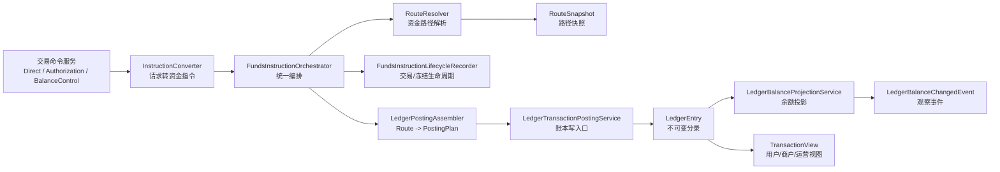

### 3.2 模块职责

| 模块 | 职责 | 禁止 |
| --- | --- | --- |
| `transaction-face` | 暴露直接交易、授权交易、余额控制、交易查询和生命周期契约。 | 暴露 Entity、Mapper、route 实现或账本 DAL。 |
| `transaction-impl` | 请求转换、指令编排、路由解析、route snapshot 保存、生命周期记录。 | 直接写余额投影；绕过账本写分录；授权拒绝生成账务路径。 |
| `wallet-face` | 暴露账户、信用、预算、支付工具、支出主体关系和余额查询契约。 | 承载交易命令或账本过账命令。 |
| `wallet-impl` | 创建账户和工具，显式初始化账本，查询主体余额。 | 交易执行路径自动建账；直接修改 ledger entry。 |
| `ledger-face` | 暴露账本、账本交易、分录查询和入账契约。 | 保存业务订单或交易生命周期。 |
| `ledger-impl` | 落地账本、posting plan、ledger entry、余额投影和余额变更事件。 | 重新路由或把交易投影视为事实源。 |
| `core` | 承载资金 DSL、route、ledger、wallet 枚举和值对象。 | 依赖任何具体实现。 |

## 四、详细设计

### 4.1 直接交易设计

#### 4.1.1 服务契约

| 能力 | 接口 | 入参 | 出参 | 幂等 |
| --- | --- | --- | --- | --- |
| 充值 | `FundsDirectTransactionService.topup` | `FundsTransactionTopupRequest` | 资金交易流水号 | 业务场景 + 业务流水 + 请求摘要 |
| 转账 | `transfer` | `FundsTransactionTransferRequest` | 资金交易流水号 | 同上 |
| 付款 | `pay` | `FundsTransactionPayRequest` | 资金交易流水号 | 同上 |
| 退款 | `refund` | `FundsTransactionRefundRequest` | 资金交易流水号 | 原交易引用 + 退款业务流水 |
| 提现 | `withdraw` | `FundsTransactionWithdrawRequest` | 资金交易流水号 | 提现业务流水 + 外部引用 |
| 手续费 | `fee` | `FundsTransactionFeeRequest` | 资金交易流水号 | 原交易引用 + 费用类型 |
| 退费 | `refundFee` | `FundsTransactionFeeRefundRequest` | 资金交易流水号 | 原费用引用 + 退费业务流水 |

#### 4.1.2 流程

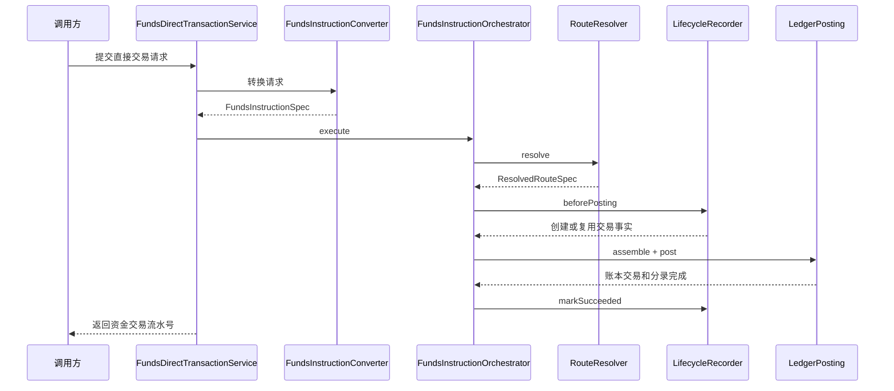

直接交易不变量：

1. 同一业务键和同一请求摘要重复提交，不重复生成交易、明细、route snapshot、账本交易和分录。
2. 同一业务键但请求摘要不同，必须拒绝。
3. 交易成功必须以账本过账成功为前提；账本失败不得展示交易成功。
4. 本金、手续费、成本、补贴、追偿和调账必须拆分不同 route leg 或明确 phase。
5. 原交易退款和手续费退回必须基于原 route snapshot 或原费用路径回放。

### 4.2 授权交易设计

#### 4.2.1 服务契约

| 能力 | 接口 | 入参 | 系统行为 |
| --- | --- | --- | --- |
| 授权 | `FundsAuthorizationTransactionService.authorize` | `FundsAuthorizationTransactionAuthorizeRequest` | 批准则生成授权占用路径；拒绝只记录原因，不写账。 |
| 撤销 | `reversal` | `FundsAuthorizationTransactionReversalRequest` | 基于原授权快照释放剩余授权。 |
| 过期 | `expire` | `FundsAuthorizationTransactionExpireRequest` | 系统到期释放剩余授权，账务路径可复用释放路径，但状态和审计必须保留 `EXPIRE` 语义。 |
| 完成 | `settle` | `FundsAuthorizationTransactionSettleRequest` | 基于原授权快照把占用转入目标账目；无前置授权的强制完成也使用 `settle` 的强制完成模式承接。 |
| 结算后退款 | `settleRefund` | `FundsAuthorizationTransactionRefundRequest` | 基于已结算路径退款，不超过已结算金额；无前置授权但存在外部原消费、原完成或差错凭证时，也通过 `settleRefund` 的无授权退款模式承接，不补造授权占用。 |
| 结算后拒付承接 | `settleRefund` | `FundsAuthorizationTransactionRefundRequest` 携带拒付原因、凭证和审计上下文 | 仅用于已结算授权争议或扣回，不用于授权拒绝；不要求落到 `FundsAuthorizationTransactionService#chargeback`；查询、投影和审计必须能区分普通退款与拒付承接。 |

退款预处理、退款结束、授权业务取消、事件时间调度和事件顺序编排属于上层业务或通道适配层职责，不进入支付资金底座默认服务契约。资金底座只接收上层归一后的授权、撤销、过期、完成、退款、拒付承接或强制完成事实，并在服务内校验金额、快照、幂等和审计红线。

#### 4.2.2 状态机

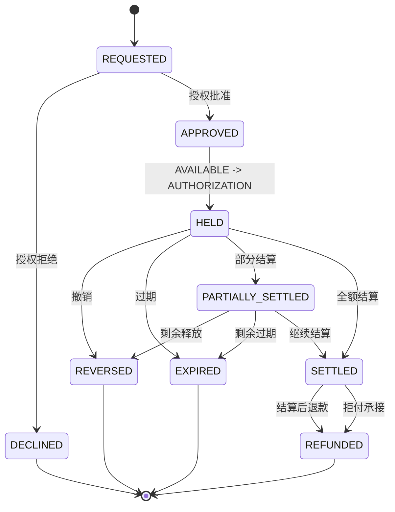

授权红线：

1. 授权拒绝不得生成 `RouteLeg`、`PostingPlan`、`LedgerEntry` 或 `chargebackAmount`。
2. 授权成功不是最终消费；用户账单和商户账单要区分占用和结算。
3. 授权完成不新增 `CONSUMED` 账目，不触碰 `LIMIT`。
4. `reversal`、`expire` 和普通 `settle` 必须引用原授权事实；普通 `settleRefund` 必须引用原完成事实；`settleRefund` 无授权退款模式必须引用外部原消费、外部原完成或差错凭证，不得补造内部授权占用；拒付通过 `settleRefund` 携带原因、凭证和审计上下文承接；`settle` 强制完成模式必须有策略、上限、原因和审计。
5. 授权过期与外部撤销必须是可区分终态；完成后过期不得释放已完成金额。
6. 拒付承接可复用退款资金路径和终态，但不得丢失拒付原因、外部引用、凭证、审计上下文和投影视图区分能力。

### 4.3 余额控制设计

| 能力 | 接口 | 事实载体 | 账务口径 |
| --- | --- | --- | --- |
| 冻结 | `FundsBalanceControlService.freeze` | 冻结单 | 同主体 `AVAILABLE -> FROZEN` |
| 解冻 | `unfreeze` | 冻结单释放记录 | 同主体 `FROZEN -> AVAILABLE` |
| 调整 | `adjust` | 调整事实 | 按原因进入 `ADJUSTMENT` 或目标账目 |

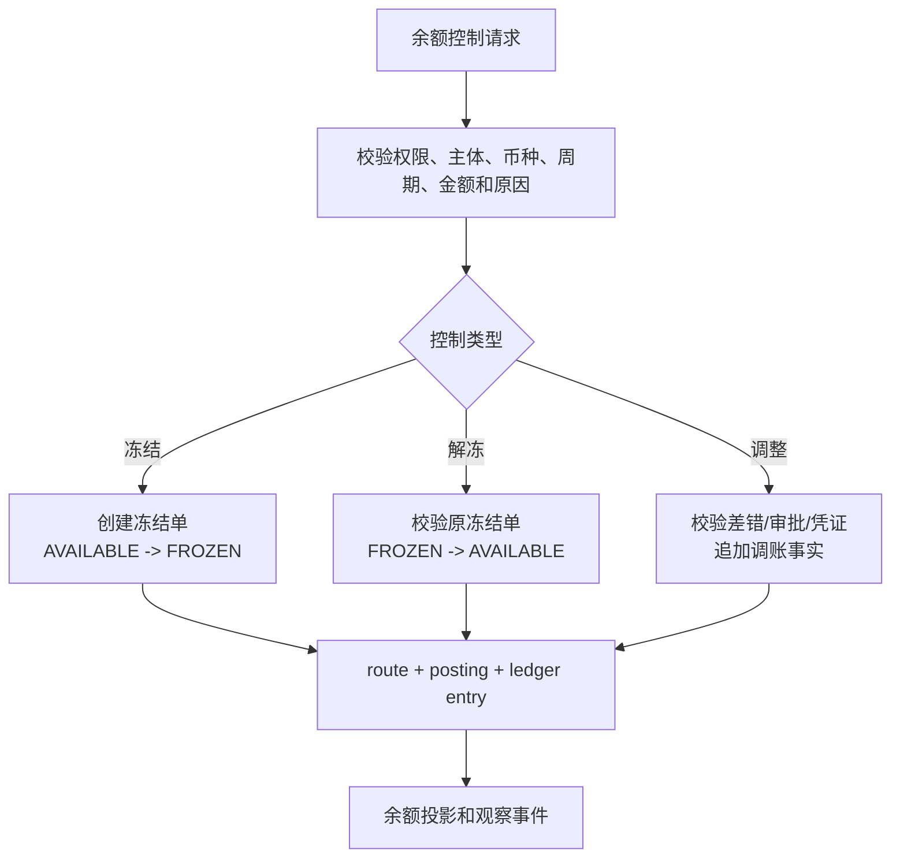

余额控制红线：

1. 冻结不创建标准资金交易，不表达消费、扣划或付款完成。
2. 冻结后扣划、追偿或调账必须创建独立资金事实并引用冻结单。
3. 解冻不得超过剩余冻结金额。
4. 调账必须有原因、差错引用、审批、凭证和审计。

### 4.4 钱包账户设计

#### 4.4.1 账户服务边界

| 服务 | 职责 | 系统要求 |
| --- | --- | --- |
| `FundingAccountService` | 创建和查询真实资金账户。 | 创建时显式初始化必需账本；交易路径不得自动建账。 |
| `CreditAccountService` | 创建和查询信用账户。 | 只表达额度控制，不保存真实资金。 |
| `BudgetGroupService` | 创建和查询预算组。 | 预算不是资金池；默认可按月度或自定义周期隔离。 |
| `PlatformFundingAccountService` | 按租户、币种、平台角色解析平台账户。 | 未配置或不唯一必须失败。 |
| `PaymentInstrumentService` | 管理支付工具和绑定关系。 | 工具不表达余额，只作为路由输入和快照引用。 |
| `SpendSubjectFundingRelationService` | 维护信用账户、预算组、工具到真实资金账户的资金来源关系。 | 不计算 spend rules，不执行扣款，不写分录。 |
| `SubjectLedgerInitializer` | 按 LedgerProfile 显式创建 required ledger。 | 只在主体初始化流程使用，交易执行路径不得调用它自动建账。 |
| `FundsSubjectBalanceQueryService` | 查询当前余额。 | 只读取 ledger 当前余额投影，不初始化账本、不修复余额、不承载历史回放。 |

#### 4.4.2 账户初始化流程

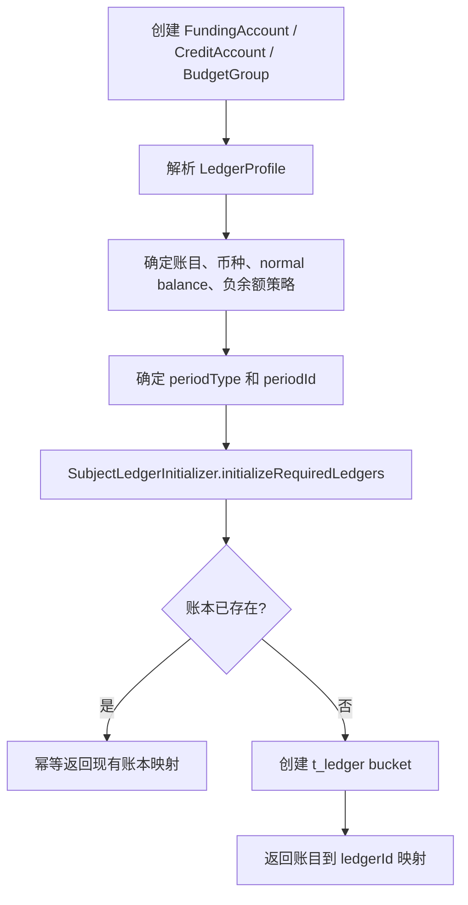

账户初始化约束：

1. 资金账户默认 `LIFETIME/LIFETIME`。
2. 信用账户、预算组和额度类主体可以使用 `MONTHLY`、`WEEKLY`、`YEARLY` 或 `CUSTOM_CYCLE`。
3. 非 `LIFETIME` 周期必须有明确 `periodId` 或可审计的 `periodPolicy`，不能在写入时静默猜测。
4. `t_ledger` 唯一键必须包含租户、主体、账目、币种、`periodType`、`periodId`。

#### 4.4.3 支付工具状态与路由准入

支付工具只提供路由输入、绑定关系和审计快照，不表达内部余额。交易、授权、提现、入金识别和退款进入路由前，必须先完成工具状态、方向、币种、绑定和资金来源校验。

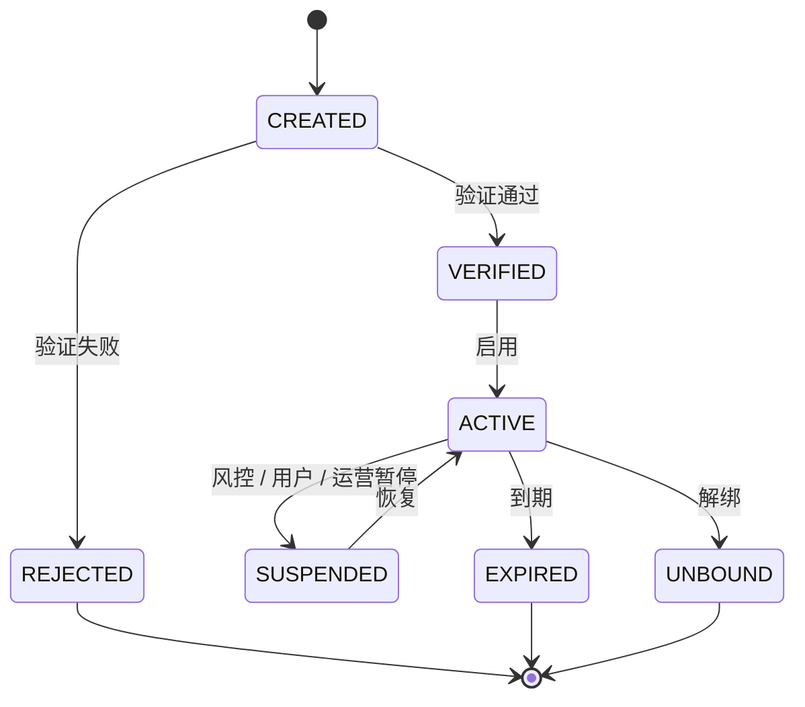

| 状态 | 付款 / 授权 | 收款 / 入金识别 | 提现 / 出款 | 退款 / 撤销 / 退费 / 拒付回放 | 系统要求 |
| --- | --- | --- | --- | --- | --- |
| `CREATED` | 禁止 | 禁止 | 禁止 | 只能作为历史快照解释，不作为当前候选。 | 未验证工具不得进入 route。 |
| `VERIFIED` | 禁止，需先启用。 | 禁止，需先启用。 | 禁止，需先启用。 | 只能作为历史快照解释。 | 验证通过不等于可交易。 |
| `ACTIVE` | 方向匹配且资金来源唯一时允许。 | 方向匹配且收款关系明确时允许。 | 方向匹配且账户具备提现能力时允许。 | 新交易用当前校验；逆向事件优先使用原快照。 | 必须固化工具、绑定、外部账户和资金来源快照。 |
| `SUSPENDED` | 禁止或授权拒绝。 | 禁止或人工处理。 | 禁止或人工处理。 | 已发生交易的逆向事件仍可按原快照回放，但不得按当前暂停工具新建路径。 | 失败不得生成 route、posting、entry。 |
| `EXPIRED` | 禁止或授权拒绝。 | 禁止或人工处理。 | 禁止或人工处理。 | 已发生交易的逆向事件仍可按原快照回放。 | 过期不影响历史证据。 |
| `UNBOUND` | 禁止。 | 禁止。 | 禁止。 | 必须使用原 route snapshot，不读取当前绑定。 | 换绑、解绑不能改变历史退款路径。 |
| `REJECTED` | 禁止。 | 禁止。 | 禁止。 | 不作为当前候选。 | 验证失败原因必须可审计。 |

路由准入守卫：

1. 工具方向必须匹配当前动作，`PAYMENT` 不承接收款，`RECEIVE` 不承接扣款，`BOTH` 才允许双向使用。
2. 工具币种、外部账户币种和最终内部账务主体币种必须一致；跨币种场景只能由已完成专项确认的 FX 设计承接。
3. 资金来源关系必须解析为唯一的资金账户、信用账户、预算组或平台账户角色；缺失、不唯一、优先级冲突或默认关系冲突时失败。
4. 最终内部账户必须具备当前动作能力，例如 `PAY`、`RECEIVE`、`WITHDRAW`；支付工具能力不得绕过账户能力。
5. `PaymentInstrumentRef`、`ExternalAccountRef`、`RoutingDecision` 和 `FundingAllocationDecision` 必须进入 route snapshot；LedgerEntry 主体不得出现工具、卡、VA、外部账户或通道 token。
6. 完整 PAN、CVV、密钥、token secret、银行账户敏感号和身份凭证不得进入普通快照、日志、导出或报表。
7. 支付工具状态、绑定、方向、优先级和资金来源关系变更必须记录操作者、时间、原因、版本和前后值。

绑定数据采用“当前态表 + 追加历史表”模式：`t_payment_instrument_binding` 只表达当前有效关系和新交易候选，历史解释、争议证据、对账追溯和回放证明由 `t_payment_instrument_binding_history` 追加记录承接。当前态可以随换绑、解绑、暂停、默认关系调整而更新；历史表不得物理覆盖或按当前态重算。

#### 4.4.4 支付工具参与路由流程

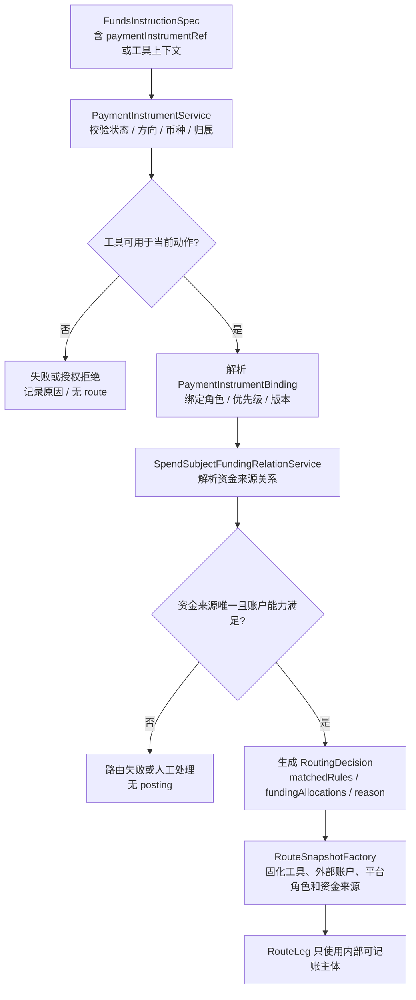

并发与历史回放约束：

1. 正向交易使用提交时校验通过并固化的工具快照；工具状态或绑定变更与交易并发时，必须通过版本、时间或锁定策略保证结果可解释。
2. 逆向交易必须优先读取原 route snapshot 和原工具快照；不得因当前工具换绑、暂停、过期、解绑或默认资金来源变化而重新选路。
3. 同一工具绑定的默认关系、优先级和资金来源关系更新必须有版本；route snapshot 保存版本，便于审计和重放。

### 4.5 路由设计

#### 4.5.1 RouteResolver 责任

| 责任 | 说明 |
| --- | --- |
| 支持性判断 | `supports(instruction)` 只判断是否可处理，不查询数据库、不变更状态。 |
| 路径解析 | `resolve(instruction)` 输出 `ResolvedRouteSpec`。 |
| 主体解析 | 将用户、商户、平台角色、信用账户、预算组、支付工具绑定解析成可入账主体。 |
| 账目定位 | 选择 `AVAILABLE`、`FROZEN`、`AUTHORIZATION`、`CLEARING`、`SETTLEMENT`、`FEE`、`ADJUSTMENT` 等账目。 |
| 周期定位 | 确定每条 `RouteLeg` 的 `periodType` 和 `periodId`。 |

路由禁止：

1. 不生成 `LedgerEntry`。
2. 不写交易流水、冻结单或生命周期状态。
3. 不更新余额。
4. 不在缺原快照的逆向场景中按当前绑定重新选路。

#### 4.5.2 路由到快照

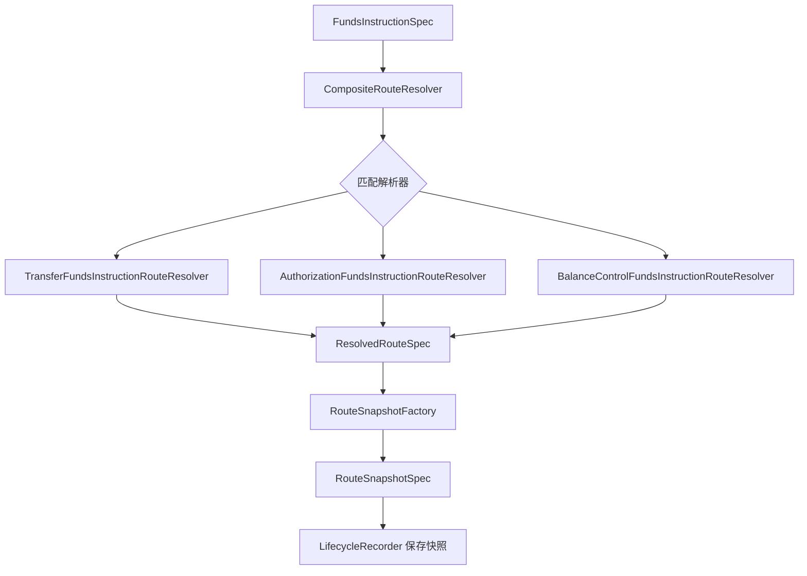

快照要求：

1. 保存参与方、路径、账目、平台账户、支付工具、外部引用、规则版本和周期。
2. 后续退款、撤销、结算、拒付、退费、解冻优先使用原快照。
3. 快照缺失时进入失败或人工处理，不允许静默重新选路。

### 4.6 账务计划与账本设计

#### 4.6.1 LedgerPostingAssembler

`LedgerPostingAssembler` 把 `ResolvedRouteSpec` 翻译为 `LedgerTransactionSpec`，并生成 posting plan 和 ledger entry 定义。它不重新路由、不改变交易生命周期、不执行账本写入。

| 输入 | 输出 | 必须校验 |
| --- | --- | --- |
| `FundsInstructionSpec` | `LedgerTransactionSpec` | 指令类型、事件类型、业务引用、金额、币种。 |
| `fundsTransactionSn` | `PostingPlan` | 每个 plan 独立借贷平衡。 |
| `ResolvedRouteSpec` | `LedgerEntrySpec` | 主体、账目、周期、借贷方向、金额为正。 |

#### 4.6.2 账本写入

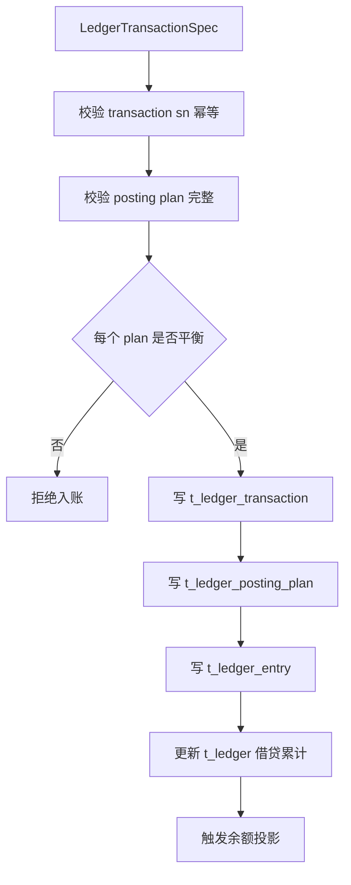

账本不变量：

1. `LedgerEntry` 不可变，修正只能追加冲正、补记或调账。
2. `LedgerTransaction`、`PostingPlan`、`LedgerEntry` 都要保留业务引用和资金交易引用。
3. `sha256` 或等价摘要用于防篡改和归档校验。
4. 分录必须带 `ledger_id`、主体、账目、币种、周期和业务时间。
5. `settlement_status`、`settlement_period`、`reconcile_status`、`reconciliation_batch` 只用于清结算和对账状态标记，不替代清结算对象。

### 4.7 账本周期设计

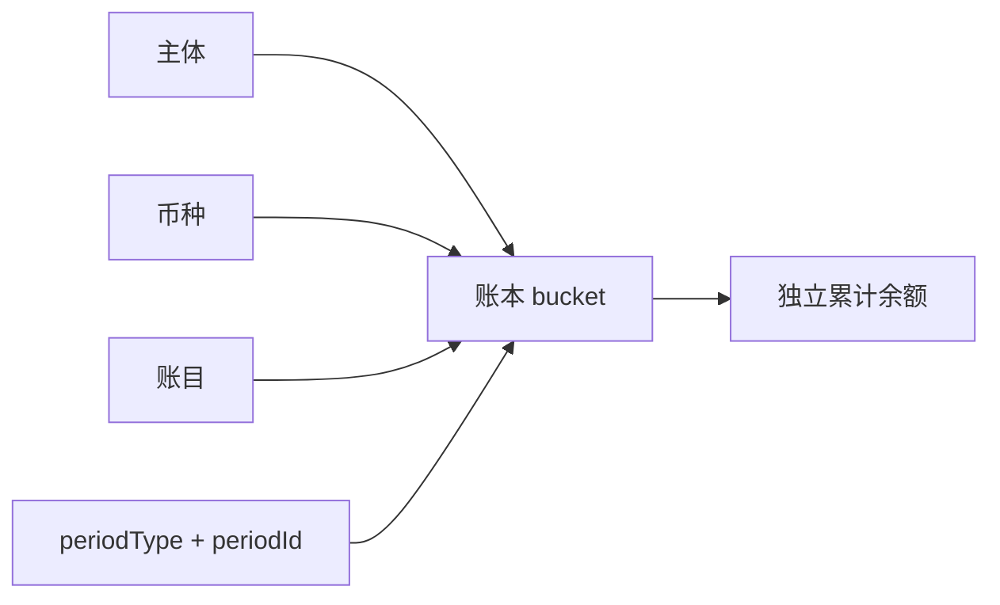

| 周期类型 | 系统处理 |
| --- | --- |
| `LIFETIME` | `periodId` 固定为 `LIFETIME`。 |
| `DAYS` / `HOURLY` / `WEEKLY` / `MONTHLY` / `QUARTERLY` / `YEARLY` | 必须由账户初始化、业务规则或显式请求确定周期 ID 和时区口径。 |
| `CUSTOM_CYCLE` | 必须有 `periodPolicy`、周期 ID、起止规则和规则版本。 |

周期红线：

1. 非 `LIFETIME` 缺 `periodId` 的入账和余额查询必须失败。
2. 同主体、同币种、同账目、不同周期不能互相消费、冻结、授权、释放或出款。
3. 清算账期、结算周期、报表周期、归档水位和 spend-rule window 不得替代账本周期。
4. 余额查询不带周期汇总时只能作为报表聚合，不得作为可用余额。

### 4.8 余额投影与余额变更日志

#### 4.8.1 余额投影流程

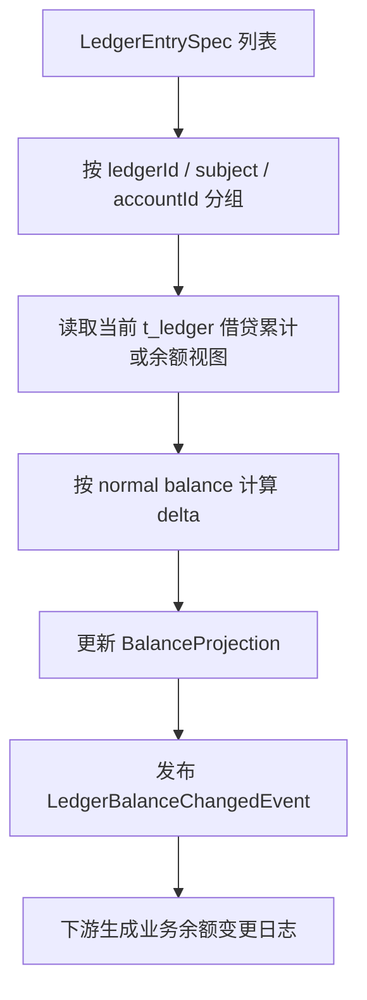

余额投影约束：

1. 投影来源只能是 ledger entry 和账本累计，不读取用户账单或报表。
2. 投影必须保留变更前余额、变更后余额、变更额、账本交易、分录引用或分录摘要。
3. `LedgerBalanceChangedEvent` 是观察事件，不是余额事实源。
4. 事件发布失败不得回滚已完成账本过账和余额投影；必须进入补偿、重试和告警。

#### 4.8.2 余额日志边界

| 对象 | 系统定位 | 禁止 |
| --- | --- | --- |
| `LedgerBalanceChangedEvent` | 余额投影成功后的观察信号。 | 作为余额修复依据。 |
| 业务余额变更日志 | 下游消费事件形成的查询日志。 | 反向修改 ledger entry 或 balance projection。 |
| 余额日志补偿任务 | 按分录范围补发观察结果。 | 重新入账或改变余额。 |

#### 4.8.3 投影任务状态承接

产品设计中的“余额投影任务”和“交易投影任务”在系统设计中拆成三类对象，避免把正常构建、观察事件和修复重放混在一起。

| 产品对象 | 系统承接 | 状态口径 | 边界 |
| --- | --- | --- | --- |
| 余额投影任务 | `LedgerBalanceProjectionService` 的一次处理上下文，可由实现记录为任务或处理日志。 | `WAITING -> CALCULATING -> VERIFYING -> APPLIED`；失败为 `FAILED` 或 `NEEDS_REBUILD`。 | 只从 ledger entry 和账本累计派生余额，不读取交易投影或报表。 |
| 余额变更观察事件 | `LedgerBalanceChangedEvent` 和 `t_ledger_balance_change_log`。 | `GENERATED -> PUBLISHING -> PUBLISHED`；失败为 `FAILED_RETRYING` 或 `FAILED_NOTIFIED`。 | 事件失败不回滚过账和余额投影；只能补发观察结果。 |
| 余额重建任务 | `t_balance_checkpoint`、`t_balance_projection_watermark` 和差异报告。 | 见归档重放系分的余额重建设计。 | 只用于校验、重算或重建余额投影，不改变历史分录。 |

### 4.9 交易投影设计

交易投影生成用户账单、商户账单、运营时间线和财务视图。它不是现有写入链路的事实源，应由资金交易、冻结单、账本分录、清结算对象和对账差错派生。

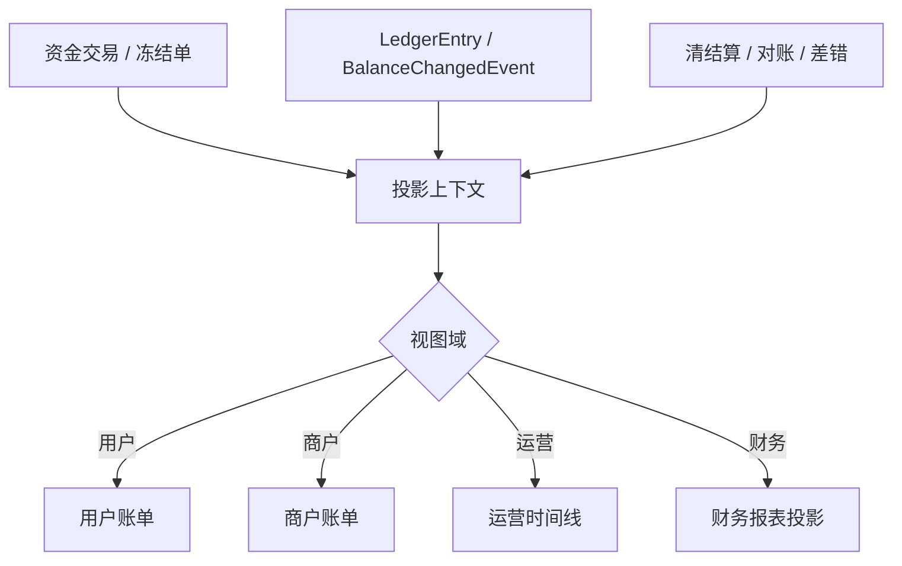

交易投影红线：

1. 投影不得补写资金交易明细。
2. 投影不得修改账本分录或余额投影。
3. 投影重放必须有单笔、主体、时间窗口、视图域或批次范围。
4. 冻结、授权拒绝、退款、退汇、争议拒付必须保留不同展示语义。

交易投影任务承接：

| 产品对象 | 系统承接 | 状态口径 | 边界 |
| --- | --- | --- | --- |
| 正常交易投影任务 | `t_funds_transaction_projection` 的构建或更新上下文。 | `WAITING -> BUILDING -> VERIFYING -> PUBLISHED`；失败为 `FAILED` 或 `NEEDS_REPLAY`。 | 正常构建只消费事实源，不重新入账，不补写交易明细。 |
| 交易投影重放任务 | `t_projection_replay_task`。 | `CREATED -> RUNNING -> PAUSED/COMPLETED/FAILED/CANCELLED`。 | 只用于校验、影子重建或应用只读投影，必须有范围和差异报告。 |

### 4.10 Spend Controls 扩展落点

Spend Controls 是发卡授权控制扩展，落点在授权前策略层，不属于路由、账本、清结算或投影核心。

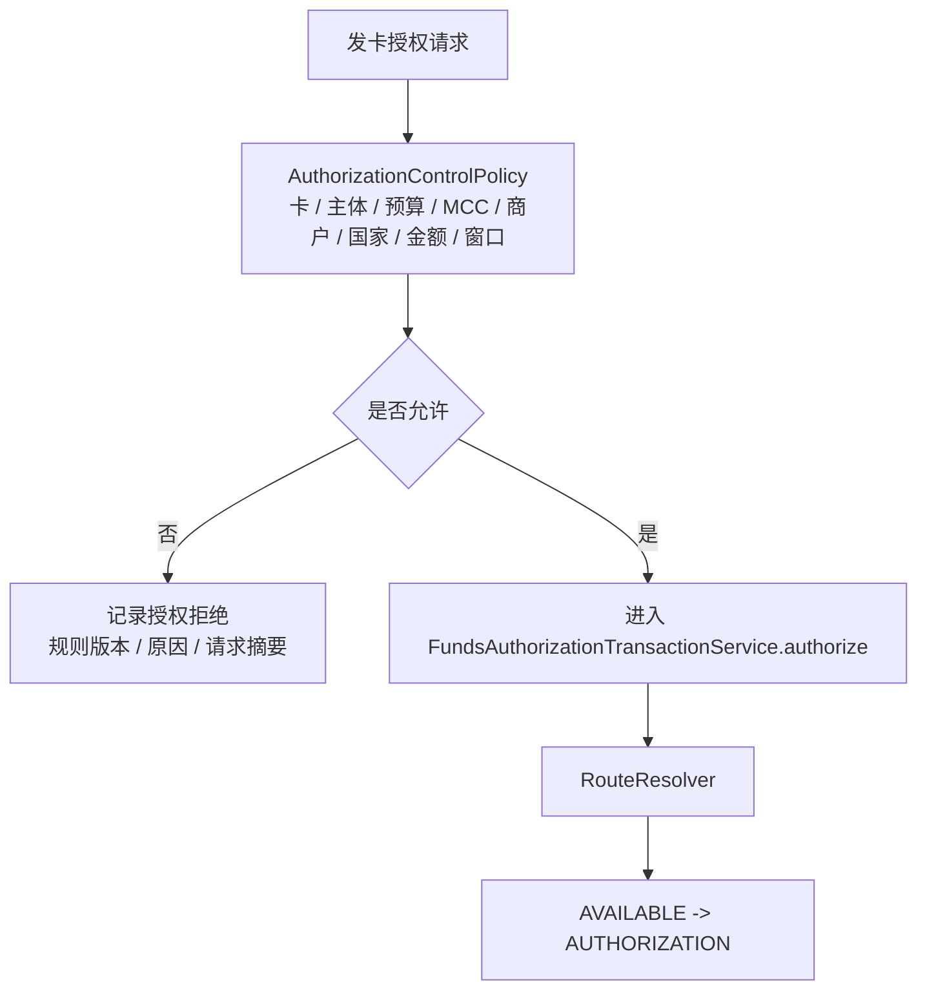

扩展接口建议：

| 能力 | 设计要求 |
| --- | --- |
| 策略评估 | 在授权路由前完成，输出允许、拒绝原因、命中规则和规则版本。 |
| 规则版本 | 规则必须有作用域、优先级、生效时间、失效时间和审计。 |
| 窗口累计 | spend-rule window 独立于账本周期，可读取账本或投影作为输入，但不直接写账。 |
| 拒绝记录 | 拒绝只写授权拒绝事实，不生成 route、posting plan 或 ledger entry。 |

### 4.11 数据表设计

本节按最终系统设计定义主链路事实表、钱包账户表、账本表和投影表。金额统一使用最小货币单位，字段类型中的 `amount` 类字段均为 `BIGINT(20)`；币种使用 ISO 4217 或内部等价币种编码；涉及主体的表必须保留 `tenant_id`、主体类型、主体 ID、状态、创建时间、更新时间和审计线索。

#### 4.11.1 资金账户表

物理表名：`t_funding_account`

业务用途：承载真实资金账户、平台资金账户和商户/用户资金账户的账户主数据。账户创建后必须显式初始化 required ledger，交易执行路径不得自动建账。

| 字段名称 | 字段类型 | 是否必填 | 字段说明 | 值示例 |
| --- | --- | --- | --- | --- |
| `id` | BIGINT(20) | 是 | 主键 | `10001` |
| `gmt_create` | DATETIME | 是 | 创建时间 | `2026-05-18 10:00:00` |
| `gmt_modified` | DATETIME | 是 | 最后更新时间 | `2026-05-18 10:00:00` |
| `sn` | VARCHAR(64) | 是 | 资金账户号，全局唯一 | `FA202605180001` |
| `tenant_id` | BIGINT(20) | 是 | 租户 ID | `1` |
| `owner_id` | VARCHAR(30) | 是 | 账户归属主体 ID | `U1001` |
| `owner_type` | VARCHAR(50) | 是 | 账户归属主体类型 | `USER` |
| `account_type` | VARCHAR(50) | 是 | 资金账户类型 | `WALLET` |
| `is_platform` | TINYINT(1) | 是 | 是否平台账户 | `0` |
| `account_role_code` | VARCHAR(50) | 否 | 平台账户角色 | `MERCHANT_CLEARING` |
| `currency` | VARCHAR(10) | 是 | 币种 | `USD` |
| `ledger_profile_code` | VARCHAR(50) | 是 | 账本 profile 编码快照 | `DEFAULT_WALLET` |
| `ledger_profile_version` | INT(11) | 是 | 账本 profile 版本快照 | `1` |
| `status` | VARCHAR(50) | 是 | 账户状态 | `ACTIVE` |
| `description` | VARCHAR(512) | 否 | 描述 | `用户资金账户` |
| `context_variables` | TEXT | 否 | 扩展上下文 JSON | `{}` |
| `version` | INT(11) | 是 | 乐观锁版本 | `0` |

状态说明：`ACTIVE` 可用，`FROZEN` 受限，`CLOSED` 关闭。关闭账户不得发起新交易，只允许查询和审计。

唯一索引：`uk_funding_account_sn(sn)`；`uk_funding_account_platform_role(tenant_id, currency, account_role_code)`。

普通索引：`idx_funding_account_owner(owner_type, owner_id)`；`idx_funding_account_status(status)`。

#### 4.11.2 信用账户表

物理表名：`t_credit_account`

业务用途：承载信用账户、额度账户或发卡授权控制中使用的信用主体。信用账户不是现金资金池，只表达额度或授信控制边界。

| 字段名称 | 字段类型 | 是否必填 | 字段说明 | 值示例 |
| --- | --- | --- | --- | --- |
| `id` / `gmt_create` / `gmt_modified` | 通用字段 | 是 | 主键和时间字段 | - |
| `sn` | VARCHAR(64) | 是 | 信用账户号，全局唯一 | `CA202605180001` |
| `tenant_id` | BIGINT(20) | 是 | 租户 ID | `1` |
| `owner_id` / `owner_type` | VARCHAR | 是 | 归属主体 | `EMP001` / `EMPLOYEE` |
| `account_type` | VARCHAR(50) | 是 | 信用账户类型 | `CORPORATE_CARD_LIMIT` |
| `currency` | VARCHAR(10) | 是 | 币种 | `USD` |
| `period_type` | VARCHAR(20) | 是 | 默认账本周期类型 | `MONTHLY` |
| `ledger_profile_code` / `ledger_profile_version` | VARCHAR / INT | 是 | 账本 profile 快照 | `CREDIT_PROFILE` / `1` |
| `status` | VARCHAR(50) | 是 | 状态 | `ACTIVE` |
| `description` / `context_variables` / `version` | 通用字段 | 否/是 | 描述、扩展上下文、版本 | - |

唯一索引：`uk_credit_account_sn(sn)`。

普通索引：`idx_credit_account_owner(owner_type, owner_id)`；`idx_credit_account_status(status)`。

周期约束：非 `LIFETIME` 账户必须能通过账户策略、请求上下文或路由规则解析出 `period_id`。

#### 4.11.3 预算组表

物理表名：`t_budget_group`

业务用途：承载预算组、预算控制主体和额度分组。预算组可以映射到账本周期，但预算周期不等同于清算账期、报表周期或 spend-rule window。

| 字段名称 | 字段类型 | 是否必填 | 字段说明 | 值示例 |
| --- | --- | --- | --- | --- |
| `id` / `gmt_create` / `gmt_modified` | 通用字段 | 是 | 主键和时间字段 | - |
| `sn` | VARCHAR(64) | 是 | 预算组号，全局唯一 | `BG202605180001` |
| `tenant_id` | BIGINT(20) | 是 | 租户 ID | `1` |
| `owner_id` / `owner_type` | VARCHAR | 是 | 归属主体 | `DEPT001` / `DEPARTMENT` |
| `budget_type` | VARCHAR(50) | 是 | 预算类型 | `MONTHLY_SPEND` |
| `currency` | VARCHAR(10) | 是 | 币种 | `USD` |
| `period_type` | VARCHAR(20) | 是 | 周期类型 | `MONTHLY` |
| `period_policy` | VARCHAR(50) | 否 | 周期策略 | `UTC_MONTH` |
| `ledger_profile_code` / `ledger_profile_version` | VARCHAR / INT | 是 | 账本 profile 快照 | `BUDGET_PROFILE` / `1` |
| `status` | VARCHAR(50) | 是 | 状态 | `ACTIVE` |
| `description` / `context_variables` / `version` | 通用字段 | 否/是 | 描述、扩展上下文、版本 | - |

唯一索引：`uk_budget_group_sn(sn)`。

普通索引：`idx_budget_group_owner(owner_type, owner_id)`；`idx_budget_group_status(status)`。

#### 4.11.4 支付工具表

物理表名：`t_payment_instrument`

业务用途：承载银行卡、外部账户、虚拟卡、VA、钱包标识等支付工具。支付工具只作为路由输入和快照引用，不表达内部余额。

| 字段名称 | 字段类型 | 是否必填 | 字段说明 | 值示例 |
| --- | --- | --- | --- | --- |
| `id` / `gmt_create` / `gmt_modified` | 通用字段 | 是 | 主键和时间字段 | - |
| `sn` | VARCHAR(64) | 是 | 工具号，全局唯一 | `PI202605180001` |
| `tenant_id` | BIGINT(20) | 是 | 租户 ID | `1` |
| `owner_id` / `owner_type` | VARCHAR | 是 | 工具归属主体 | `U1001` / `USER` |
| `instrument_type` | VARCHAR(50) | 是 | 工具类型 | `BANK_CARD` |
| `instrument_direction` | VARCHAR(50) | 是 | 工具方向 | `PAYMENT` |
| `instrument_no` | VARCHAR(128) | 是 | 掩码号、别名号或稳定识别号 | `****1234` |
| `channel_code` | VARCHAR(50) | 否 | 通道编码 | `STRIPE` |
| `external_instrument_id` | VARCHAR(128) | 否 | 外部工具 ID | `pm_xxx` |
| `currency` | VARCHAR(10) | 是 | 币种 | `USD` |
| `status` | VARCHAR(50) | 是 | 状态 | `ACTIVE` |
| `valid_from` / `valid_to` | DATETIME | 否 | 生效和失效时间 | - |
| `description` / `context_variables` | 通用字段 | 否 | 描述和扩展上下文 | - |

唯一索引：`uk_payment_instrument_sn(sn)`；`uk_payment_instrument_external(tenant_id, channel_code, external_instrument_id)`。

普通索引：`idx_payment_instrument_owner(owner_type, owner_id)`；`idx_payment_instrument_status(status)`；`idx_payment_instrument_no(instrument_no)`。

安全约束：`instrument_no` 只能保存掩码号、别名号或 token，不得保存完整卡号、完整外部账户或敏感凭证。

#### 4.11.5 支付工具绑定表

物理表名：`t_payment_instrument_binding`

业务用途：表达支付工具和内部主体之间的绑定关系，用于路由候选选择和快照生成。

| 字段名称 | 字段类型 | 是否必填 | 字段说明 | 值示例 |
| --- | --- | --- | --- | --- |
| `id` / `gmt_create` / `gmt_modified` | 通用字段 | 是 | 主键和时间字段 | - |
| `sn` | VARCHAR(64) | 是 | 绑定号，全局唯一 | `PIB202605180001` |
| `tenant_id` | BIGINT(20) | 是 | 租户 ID | `1` |
| `instrument_sn` | VARCHAR(64) | 是 | 支付工具号 | `PI202605180001` |
| `binding_role` | VARCHAR(50) | 是 | 绑定角色 | `DEFAULT_PAYMENT` |
| `subject_id` / `subject_type` | VARCHAR | 是 | 内部主体 | `U1001` / `USER` |
| `currency` | VARCHAR(10) | 是 | 币种 | `USD` |
| `direction` | VARCHAR(50) | 是 | 使用方向 | `PAYMENT` |
| `priority` | INT(11) | 是 | 路由优先级 | `100` |
| `is_default` | TINYINT(1) | 是 | 是否默认绑定 | `1` |
| `status` | VARCHAR(50) | 是 | 状态 | `ACTIVE` |
| `valid_from` / `valid_to` | DATETIME | 否 | 生效和失效时间 | - |
| `description` / `context_variables` / `version` | 通用字段 | 否/是 | 描述、扩展上下文和乐观锁版本 | - |

唯一索引：`uk_payment_instrument_binding_sn(sn)`；`uk_payment_instrument_binding_subject(instrument_sn, binding_role, subject_type, subject_id, currency, direction)`。

普通索引：`idx_payment_instrument_binding_instrument(instrument_sn)`；`idx_payment_instrument_binding_subject(subject_type, subject_id)`；`idx_payment_instrument_binding_status(status)`。

数据约束：

1. 本表只保存当前态，用于新交易路由候选和当前查询展示；历史变更由 `t_payment_instrument_binding_history` 追加保存。
2. 绑定、解绑、暂停、恢复、默认关系调整、优先级调整、方向调整和资金来源关系切换必须在同一业务事务内更新当前态并追加历史。
3. 默认绑定唯一性必须按租户、主体、币种、绑定角色、方向和状态约束；同一范围内不得出现多个 `ACTIVE + is_default = 1` 候选。物理实现可通过条件唯一索引、应用层锁或等价约束实现，但必须有红线测试覆盖。
4. 当前态变更必须使用乐观锁或等价并发控制；并发变更失败不得静默覆盖。

#### 4.11.6 支付工具绑定历史表

物理表名：`t_payment_instrument_binding_history`

业务用途：追加记录支付工具绑定和资金来源关系的变更证据，用于审计、争议、客服查询、对账和 route replay 证明。该表不是新交易候选来源，不参与当前路由选择。

| 字段名称 | 字段类型 | 是否必填 | 字段说明 | 值示例 |
| --- | --- | --- | --- | --- |
| `id` / `gmt_create` / `gmt_modified` | 通用字段 | 是 | 主键和时间字段 | - |
| `tenant_id` | BIGINT(20) | 是 | 租户 ID | `1` |
| `binding_sn` | VARCHAR(64) | 是 | 绑定号 | `PIB202605180001` |
| `instrument_sn` | VARCHAR(64) | 是 | 支付工具号 | `PI202605180001` |
| `change_type` | VARCHAR(50) | 是 | 变更类型 | `BIND` / `UNBIND` / `SUSPEND` / `DEFAULT_CHANGED` |
| `before_snapshot` / `after_snapshot` | JSON | 否/是 | 变更前后绑定快照 | - |
| `operator_id` / `operator_type` | VARCHAR | 是 | 操作者 | `ops_001` / `OPERATOR` |
| `reason_code` / `reason_desc` | VARCHAR | 是/否 | 变更原因 | `USER_REQUEST` |
| `effective_at` | DATETIME | 是 | 生效时间 | `2026-05-18 00:00:00` |
| `request_id` / `audit_sn` | VARCHAR | 是 | 幂等请求和审计号 | `REQ-PIB-001` / `AUD-001` |

唯一索引：`uk_payment_instrument_binding_history_audit(audit_sn)`；`uk_payment_instrument_binding_history_request(tenant_id, request_id)`。

普通索引：`idx_payment_instrument_binding_history_binding(binding_sn, gmt_create)`；`idx_payment_instrument_binding_history_instrument(instrument_sn, gmt_create)`。

数据约束：历史表只追加，不承接物理覆盖；敏感原文不得进入 `before_snapshot` 或 `after_snapshot`；route snapshot 已固化的历史交易不得因历史表补录而重新选路。

#### 4.11.7 支出主体资金关系表

物理表名：`t_spend_subject_funding_rel`

业务用途：维护信用账户、预算组、工具或发卡主体到真实资金账户之间的资金来源关系。它只解析资金来源，不执行 spend rules、不扣款、不写分录。

| 字段名称 | 字段类型 | 是否必填 | 字段说明 | 值示例 |
| --- | --- | --- | --- | --- |
| `id` / `gmt_create` / `gmt_modified` | 通用字段 | 是 | 主键和时间字段 | - |
| `sn` | VARCHAR(64) | 是 | 关系号，全局唯一 | `SFR202605180001` |
| `tenant_id` | BIGINT(20) | 是 | 租户 ID | `1` |
| `spend_subject_id` / `spend_subject_type` | VARCHAR | 是 | 支出控制主体 | `BG001` / `BUDGET_GROUP` |
| `funding_account_id` | VARCHAR(30) | 是 | 真实资金账户 ID | `FA202605180001` |
| `currency` | VARCHAR(10) | 是 | 币种 | `USD` |
| `relation_type` | VARCHAR(50) | 是 | 关系类型 | `PRIMARY_FUNDING` |
| `priority` | INT(11) | 是 | 路由优先级 | `100` |
| `is_default` | TINYINT(1) | 是 | 是否默认关系 | `1` |
| `status` | VARCHAR(50) | 是 | 状态 | `ACTIVE` |
| `valid_from` / `valid_to` | DATETIME | 否 | 生效和失效时间 | - |
| `description` / `context_variables` | 通用字段 | 否 | 描述和扩展上下文 | - |

唯一索引：`uk_spend_subject_funding_rel_sn(sn)`；`uk_spend_subject_funding_rel_subject(spend_subject_type, spend_subject_id, funding_account_id, currency, relation_type)`。

普通索引：`idx_spend_subject_funding_rel_spend_subject(spend_subject_type, spend_subject_id)`；`idx_spend_subject_funding_rel_funding(funding_account_id)`；`idx_spend_subject_funding_rel_status(status)`。

#### 4.11.8 资金交易表

物理表名：`t_funds_transaction`

业务用途：承载直接交易、授权交易和余额控制关联交易的聚合事实。该表保存业务幂等键、生命周期状态、金额累计和 route snapshot。

| 字段名称 | 字段类型 | 是否必填 | 字段说明 | 值示例 |
| --- | --- | --- | --- | --- |
| `id` / `gmt_create` / `gmt_modified` | 通用字段 | 是 | 主键和时间字段 | - |
| `sn` | VARCHAR(64) | 是 | 交易号，全局唯一 | `FT202605180001` |
| `tenant_id` | BIGINT(20) | 是 | 租户 ID | `1` |
| `transaction_mode` | VARCHAR(50) | 是 | 交易模式 | `DIRECT` |
| `transaction_type` | VARCHAR(50) | 是 | 交易类型 | `PAY` |
| `business_scene` | VARCHAR(50) | 是 | 业务场景 | `ORDER_PAY` |
| `business_sn` | VARCHAR(64) | 是 | 业务流水 | `ORDER1001` |
| `reference_transaction_sn` | VARCHAR(64) | 否 | 引用原交易号 | `FT202605170001` |
| `status` | VARCHAR(50) | 是 | 交易状态 | `SUCCEEDED` |
| `amount` | BIGINT(20) | 是 | 交易原始金额 | `10000` |
| `currency` | VARCHAR(10) | 是 | 币种 | `USD` |
| `authorized_amount` / `reversed_amount` | BIGINT(20) | 是 | 授权和撤销累计金额 | `0` |
| `settled_amount` / `refunded_amount` | BIGINT(20) | 是 | 结算和退款累计金额 | `0` |
| `declined_amount` / `fee_amount` | BIGINT(20) | 是 | 拒绝和手续费累计金额 | `0` |
| `route_snapshot` | TEXT | 否 | RouteSnapshot JSON | `{}` |
| `description` / `context_variables` / `version` | 通用字段 | 否/是 | 描述、上下文、版本 | - |

状态说明：`CREATED` 已创建，`PROCESSING` 处理中，`SUCCEEDED` 成功，`FAILED` 失败，`DECLINED` 拒绝，`CANCELLED` 取消。

唯一索引：`uk_funds_transaction_sn(sn)`；`uk_funds_transaction_business(tenant_id, business_scene, business_sn)`。

普通索引：`idx_funds_transaction_tenant(tenant_id)`；`idx_funds_transaction_reference(reference_transaction_sn)`；`idx_funds_transaction_status(status)`；`idx_funds_transaction_gmt_create(gmt_create)`。

#### 4.11.9 资金交易明细表

物理表名：`t_funds_transaction_detail`

业务用途：承载交易生命周期事件、参与方维度资金影响和请求摘要，是交易幂等、重放、对账和投影的来源事实之一。

| 字段名称 | 字段类型 | 是否必填 | 字段说明 | 值示例 |
| --- | --- | --- | --- | --- |
| `id` / `gmt_create` / `gmt_modified` | 通用字段 | 是 | 主键和时间字段 | - |
| `sn` | VARCHAR(64) | 是 | 明细号，全局唯一 | `FTD202605180001` |
| `tenant_id` | BIGINT(20) | 是 | 租户 ID | `1` |
| `transaction_sn` | VARCHAR(64) | 是 | 资金交易号 | `FT202605180001` |
| `business_scene` / `business_sn` | VARCHAR | 是 | 本次业务动作引用 | `ORDER_PAY` / `ORDER1001` |
| `transaction_type` / `event_type` | VARCHAR | 是 | 交易类型和生命周期事件 | `PAY` / `POSTED` |
| `subject_id` / `subject_type` | VARCHAR | 是 | 影响主体 | `M1001` / `MERCHANT` |
| `participant_role` | VARCHAR(50) | 是 | 参与方角色 | `PAYEE` |
| `request_hash` | VARCHAR(64) | 是 | 请求参数一致性摘要 | `sha256...` |
| `funds_effect_type` | VARCHAR(50) | 是 | 资金业务效果 | `INCREASE_CLEARING` |
| `ledger_transaction_sn` | VARCHAR(64) | 否 | 账本交易号 | `LT202605180001` |
| `reference_detail_sn` | VARCHAR(64) | 否 | 引用明细号 | `FTD202605170001` |
| `reference_ledger_transaction_sn` | VARCHAR(64) | 否 | 引用账本交易号 | `LT202605170001` |
| `amount` | BIGINT(20) | 是 | 本次动作金额 | `9800` |
| `currency` | VARCHAR(10) | 是 | 币种 | `USD` |
| `status` | VARCHAR(50) | 是 | 明细状态 | `SUCCEEDED` |
| `error_code` / `error_message` | VARCHAR | 否 | 失败错误码和消息 | `BALANCE_NOT_ENOUGH` |
| `description` / `context_variables` | 通用字段 | 否 | 描述和扩展上下文 | - |

唯一索引：`uk_funds_transaction_detail_sn(sn)`；`uk_funds_transaction_detail_event_subject(tenant_id, transaction_sn, business_scene, business_sn, event_type, subject_type, subject_id, participant_role, funds_effect_type)`。

普通索引：`idx_funds_transaction_detail_business_event(tenant_id, business_scene, business_sn, transaction_type, event_type)`；`idx_funds_transaction_detail_transaction(transaction_sn)`；`idx_funds_transaction_detail_subject(subject_type, subject_id, participant_role)`；`idx_funds_transaction_detail_ledger(ledger_transaction_sn)`；`idx_funds_transaction_detail_reference(reference_detail_sn)`；`idx_funds_transaction_detail_status(status)`。

#### 4.11.10 资金冻结订单表

物理表名：`t_funds_frozen_order`

业务用途：承载冻结、解冻、消费冻结和过期释放事实。冻结只表达同主体可用性控制，不表达付款成功或跨主体价值转移。

| 字段名称 | 字段类型 | 是否必填 | 字段说明 | 值示例 |
| --- | --- | --- | --- | --- |
| `id` / `gmt_create` / `gmt_modified` | 通用字段 | 是 | 主键和时间字段 | - |
| `sn` | VARCHAR(64) | 是 | 冻结单号，全局唯一 | `FO202605180001` |
| `tenant_id` | BIGINT(20) | 是 | 租户 ID | `1` |
| `subject_id` / `subject_type` | VARCHAR | 是 | 被冻结主体 | `U1001` / `USER` |
| `freeze_type` | VARCHAR(50) | 是 | 冻结类型 | `RISK_HOLD` |
| `business_scene` / `business_sn` | VARCHAR | 是 | 外部业务引用 | `RISK_CASE` / `RC1001` |
| `transaction_sn` | VARCHAR(64) | 否 | 关联资金交易号 | `FT202605180001` |
| `freeze_detail_sn` | VARCHAR(64) | 否 | 冻结动作明细号 | `FTD202605180001` |
| `freeze_ledger_transaction_sn` | VARCHAR(64) | 否 | 冻结账本交易号 | `LT202605180001` |
| `amount` | BIGINT(20) | 是 | 原冻结金额 | `10000` |
| `released_amount` | BIGINT(20) | 是 | 已释放金额 | `5000` |
| `consumed_amount` | BIGINT(20) | 是 | 已消耗金额 | `0` |
| `currency` | VARCHAR(10) | 是 | 币种 | `USD` |
| `status` | VARCHAR(50) | 是 | 冻结状态 | `PARTIALLY_RELEASED` |
| `expire_time` / `release_time` / `consume_time` | DATETIME | 否 | 过期、释放和消耗时间 | - |
| `description` / `context_variables` / `version` | 通用字段 | 否/是 | 描述、上下文、版本 | - |

唯一索引：`uk_funds_frozen_order_sn(sn)`；`uk_funds_frozen_order_business(tenant_id, business_scene, business_sn, freeze_type)`。

普通索引：`idx_funds_frozen_order_subject(subject_type, subject_id)`；`idx_funds_frozen_order_transaction(transaction_sn)`；`idx_funds_frozen_order_status(status)`；`idx_funds_frozen_order_expire(expire_time, status)`。

状态说明：`CREATED` 已创建，`FROZEN` 已冻结，`PARTIALLY_RELEASED` 部分释放，`RELEASED` 已释放，`CONSUMED` 已消耗，`EXPIRED` 已过期。

#### 4.11.11 账户账本表

物理表名：`t_ledger`

业务用途：承载主体、账目、币种和账本周期组合成的账本 bucket，是余额隔离的核心表。

| 字段名称 | 字段类型 | 是否必填 | 字段说明 | 值示例 |
| --- | --- | --- | --- | --- |
| `id` / `gmt_create` / `gmt_modified` | 通用字段 | 是 | 主键和时间字段 | - |
| `tenant_id` | BIGINT(20) | 是 | 租户 ID | `1` |
| `subject_id` / `subject_type` | VARCHAR | 是 | 账务主体 | `M1001` / `MERCHANT` |
| `ledger_profile_code` / `ledger_profile_version` | VARCHAR / INT | 是 | profile 快照 | `MERCHANT_PROFILE` / `1` |
| `ledger_subject_code` | VARCHAR(50) | 是 | 账目编码 | `CLEARING` |
| `ledger_subject_category` | VARCHAR(50) | 是 | 科目分类快照 | `LIABILITY` |
| `normal_balance_side` | VARCHAR(10) | 是 | 正常余额方向 | `CREDIT` |
| `is_allow_negative` | TINYINT(1) | 是 | 是否允许负余额 | `0` |
| `currency` | VARCHAR(10) | 是 | 币种 | `USD` |
| `period_type` | VARCHAR(20) | 是 | 账本周期类型 | `LIFETIME` |
| `period_id` | VARCHAR(30) | 是 | 账本周期 ID | `LIFETIME` |
| `settlement_policy` | VARCHAR(50) | 是 | 结算策略 | `T_PLUS_1` |
| `cut_off_time` | TIME | 是 | 日切时间 | `00:00:00` |
| `debit_amount` / `credit_amount` | BIGINT(20) | 是 | 借贷累计金额 | `10000` |
| `status` | VARCHAR(20) | 是 | 状态 | `ACTIVE` |
| `version` | INT(11) | 是 | 乐观锁版本 | `0` |

唯一索引：`uk_ledger_subject_bucket(tenant_id, subject_type, subject_id, ledger_subject_code, currency, period_type, period_id)`。

普通索引：`idx_ledger_subject(subject_type, subject_id)`；`idx_ledger_profile(ledger_profile_code, ledger_profile_version)`；`idx_ledger_period(period_type, period_id)`；`idx_ledger_status(status)`。

余额约束：余额按 `normal_balance_side` 从借贷累计推导；非 `LIFETIME` 缺 `period_id` 时不得创建账本或入账。

#### 4.11.12 账户账本交易表

物理表名：`t_ledger_transaction`

业务用途：承载一次可审计、可平衡的账本交易。账本交易是若干 posting plan 和 ledger entry 的父事实。

| 字段名称 | 字段类型 | 是否必填 | 字段说明 | 值示例 |
| --- | --- | --- | --- | --- |
| `id` / `gmt_create` / `gmt_modified` | 通用字段 | 是 | 主键和时间字段 | - |
| `sn` | VARCHAR(64) | 是 | 账本交易号，全局唯一 | `LT202605180001` |
| `tenant_id` | BIGINT(20) | 是 | 租户 ID | `1` |
| `funds_transaction_sn` | VARCHAR(64) | 否 | 资金交易号 | `FT202605180001` |
| `reference_ledger_transaction_sn` | VARCHAR(64) | 否 | 引用账本交易号 | `LT202605170001` |
| `instruction_type` / `event_type` / `transaction_type` | VARCHAR | 是 | 指令、事件和交易类型 | `DIRECT` / `POSTED` / `PAY` |
| `business_scene` / `business_sn` | VARCHAR | 是 | 业务引用 | `ORDER_PAY` / `ORDER1001` |
| `amount` / `currency` | BIGINT / VARCHAR | 是 | 交易金额和币种 | `10000` / `USD` |
| `original_amount` / `original_currency` / `exchange_rate` | BIGINT / VARCHAR / DECIMAL | 是 | 原始金额、原始币种和汇率快照 | `10000` / `USD` / `1.00000000` |
| `debit_amount` / `credit_amount` | BIGINT(20) | 是 | 借贷合计 | `10000` |
| `is_balanced` | TINYINT(1) | 是 | 是否借贷平衡 | `1` |
| `status` | VARCHAR(20) | 是 | 账本交易状态 | `POSTED` |
| `transaction_time` | DATETIME | 是 | 交易发生时间 | `2026-05-18 10:00:00` |
| `description` / `context_variables` / `sha256` | 通用字段 | 否/是 | 描述、上下文、防篡改摘要 | - |

唯一索引：`uk_ledger_transaction_sn(sn)`。

普通索引：`idx_ledger_transaction_funds_transaction(funds_transaction_sn)`；`idx_ledger_transaction_reference(reference_ledger_transaction_sn)`；`idx_ledger_transaction_business(business_scene, business_sn)`；`idx_ledger_transaction_event(event_type)`；`idx_ledger_transaction_time(transaction_time)`。

#### 4.11.13 账户账本记账计划表

物理表名：`t_ledger_posting_plan`

业务用途：承载从 route leg 翻译而来的记账计划。每个 plan 必须独立平衡，便于解释本金、手续费、冻结、结算、调账等阶段。

| 字段名称 | 字段类型 | 是否必填 | 字段说明 | 值示例 |
| --- | --- | --- | --- | --- |
| `id` / `gmt_create` / `gmt_modified` | 通用字段 | 是 | 主键和时间字段 | - |
| `sn` | VARCHAR(64) | 是 | 记账计划号，全局唯一 | `PP202605180001` |
| `tenant_id` | BIGINT(20) | 是 | 租户 ID | `1` |
| `ledger_transaction_sn` | VARCHAR(64) | 是 | 账本交易号 | `LT202605180001` |
| `funds_transaction_sn` | VARCHAR(64) | 否 | 资金交易号 | `FT202605180001` |
| `route_leg_id` | VARCHAR(64) | 否 | 来源 route leg | `leg-1` |
| `intent` | VARCHAR(50) | 是 | 记账意图 | `MERCHANT_RECEIVE` |
| `posting_scope` | VARCHAR(50) | 是 | 记账范围 | `PRINCIPAL` |
| `balance_effect_type` | VARCHAR(50) | 是 | 余额影响语义 | `INCREASE` |
| `phase_code` | VARCHAR(50) | 是 | 记账阶段 | `PAYMENT` |
| `amount` / `currency` | BIGINT / VARCHAR | 是 | 计划金额和币种 | `9800` / `USD` |
| `debit_amount` / `credit_amount` | BIGINT(20) | 是 | 借贷合计 | `9800` |
| `is_balanced` | TINYINT(1) | 是 | 是否平衡 | `1` |
| `description` / `context_variables` / `sha256` | 通用字段 | 否/是 | 描述、上下文、防篡改摘要 | - |

唯一索引：`uk_ledger_posting_plan_sn(sn)`。

普通索引：`idx_ledger_posting_plan_transaction(ledger_transaction_sn)`；`idx_ledger_posting_plan_funds_transaction(funds_transaction_sn)`；`idx_ledger_posting_plan_route_leg(route_leg_id)`；`idx_ledger_posting_plan_phase(phase_code)`；`idx_ledger_posting_plan_intent(intent)`。

#### 4.11.14 账户账本条目表

物理表名：`t_ledger_entry`

业务用途：承载不可变账本分录，是余额事实源、清结算来源、对账来源、归档重放来源和审计依据。

| 字段名称 | 字段类型 | 是否必填 | 字段说明 | 值示例 |
| --- | --- | --- | --- | --- |
| `id` / `gmt_create` / `gmt_modified` | 通用字段 | 是 | 主键和时间字段 | - |
| `sn` | VARCHAR(64) | 是 | 分录号，全局唯一 | `LE202605180001` |
| `tenant_id` | BIGINT(20) | 是 | 租户 ID | `1` |
| `ledger_transaction_sn` | VARCHAR(64) | 是 | 账本交易号 | `LT202605180001` |
| `posting_plan_sn` | VARCHAR(64) | 是 | 记账计划号 | `PP202605180001` |
| `funds_transaction_sn` | VARCHAR(64) | 否 | 资金交易号 | `FT202605180001` |
| `ledger_id` | BIGINT(20) | 是 | 账本 bucket ID | `9001` |
| `subject_id` / `subject_type` | VARCHAR | 是 | 账务主体 | `M1001` / `MERCHANT` |
| `ledger_subject_code` / `ledger_subject_category` | VARCHAR | 是 | 账目编码和科目分类快照 | `CLEARING` / `LIABILITY` |
| `entry_side` | VARCHAR(10) | 是 | 借贷方向 | `CREDIT` |
| `balance_constraint_type` | VARCHAR(50) | 是 | 余额约束 | `NO_NEGATIVE` |
| `intent` / `posting_scope` / `balance_effect_type` / `phase_code` | VARCHAR | 是 | 记账意图、范围、影响和阶段 | `MERCHANT_RECEIVE` |
| `business_scene` / `business_sn` | VARCHAR | 是/否 | 业务引用 | `ORDER_PAY` / `ORDER1001` |
| `amount` / `currency` | BIGINT / VARCHAR | 是 | 分录金额和币种 | `9800` / `USD` |
| `original_amount` / `original_currency` / `exchange_rate` | BIGINT / VARCHAR / DECIMAL | 是 | 原始金额、币种、汇率快照 | `9800` / `USD` / `1.00000000` |
| `transaction_time` | DATETIME | 是 | 交易发生时间 | `2026-05-18 10:00:00` |
| `settlement_status` / `settlement_period` / `settlement_completed_time` | VARCHAR / VARCHAR / DATETIME | 是/否 | 清结算状态、账期和完成时间 | `PENDING` |
| `reconcile_status` / `reconciliation_batch` / `reconciliation_completed_time` | VARCHAR / VARCHAR / DATETIME | 是/否 | 对账状态、批次和完成时间 | `PENDING` |
| `reconcile_remark` / `description` / `context_variables` / `sha256` | 通用字段 | 否/是 | 对账备注、描述、上下文、防篡改摘要 | - |

唯一索引：`uk_ledger_entry_sn(sn)`。

普通索引：`idx_ledger_entry_transaction(ledger_transaction_sn)`；`idx_ledger_entry_posting_plan(posting_plan_sn)`；`idx_ledger_entry_ledger(ledger_id)`；`idx_ledger_entry_subject(subject_type, subject_id)`；`idx_ledger_entry_funds_transaction(funds_transaction_sn)`；`idx_ledger_entry_business(business_scene, business_sn)`；`idx_ledger_entry_settlement(settlement_status, settlement_period)`；`idx_ledger_entry_reconcile(reconcile_status, reconciliation_batch)`；`idx_ledger_entry_transaction_time(transaction_time)`。

不可变约束：已过账分录不得更新金额、主体、账目、周期、借贷方向和业务引用；错账必须追加补记、冲正或调账事实。

#### 4.11.15 余额投影表

物理表名：`t_ledger_balance_projection`

业务用途：承载由 `t_ledger_entry` 和 `t_ledger` 借贷累计派生的当前余额读模型。它提升查询性能，但不是余额事实源。

| 字段名称 | 字段类型 | 是否必填 | 字段说明 | 值示例 |
| --- | --- | --- | --- | --- |
| `id` / `gmt_create` / `gmt_modified` | 通用字段 | 是 | 主键和时间字段 | - |
| `projection_sn` | VARCHAR(64) | 是 | 投影流水号 | `BP202605180001` |
| `tenant_id` | BIGINT(20) | 是 | 租户 ID | `1` |
| `ledger_id` | BIGINT(20) | 是 | 账本 bucket ID | `9001` |
| `subject_id` / `subject_type` | VARCHAR | 是 | 主体 | `M1001` / `MERCHANT` |
| `ledger_subject_code` / `ledger_subject_category` | VARCHAR | 是 | 账目编码和分类 | `CLEARING` / `LIABILITY` |
| `currency` | VARCHAR(10) | 是 | 币种 | `USD` |
| `period_type` / `period_id` | VARCHAR | 是 | 账本周期 | `LIFETIME` / `LIFETIME` |
| `debit_amount` / `credit_amount` | BIGINT(20) | 是 | 借贷累计快照 | `10000` |
| `balance_amount` | BIGINT(20) | 是 | 按正常余额方向计算的余额 | `10000` |
| `last_entry_sn` | VARCHAR(64) | 否 | 最后处理分录 | `LE202605180001` |
| `last_ledger_transaction_sn` | VARCHAR(64) | 否 | 最后处理账本交易 | `LT202605180001` |
| `last_transaction_time` | DATETIME | 否 | 最后交易发生时间 | `2026-05-18 10:00:00` |
| `projection_status` | VARCHAR(20) | 是 | 投影状态 | `ACTIVE` |
| `version` | INT(11) | 是 | 乐观锁版本 | `0` |

唯一索引：`uk_balance_projection_bucket(tenant_id, ledger_id)`；或在无稳定 ledger ID 场景使用 `uk_balance_projection_subject(tenant_id, subject_type, subject_id, ledger_subject_code, currency, period_type, period_id)`。

普通索引：`idx_balance_projection_subject(subject_type, subject_id)`；`idx_balance_projection_period(period_type, period_id)`；`idx_balance_projection_status(projection_status)`。

#### 4.11.16 余额变更日志表

物理表名：`t_ledger_balance_change_log`

业务用途：承载余额投影成功后的观察日志或事件投递日志，用于通知、审计辅助、运营查询和补偿。它不得作为余额修复依据。

| 字段名称 | 字段类型 | 是否必填 | 字段说明 | 值示例 |
| --- | --- | --- | --- | --- |
| `id` / `gmt_create` / `gmt_modified` | 通用字段 | 是 | 主键和时间字段 | - |
| `event_sn` | VARCHAR(64) | 是 | 余额变更事件号 | `BCE202605180001` |
| `tenant_id` | BIGINT(20) | 是 | 租户 ID | `1` |
| `ledger_id` / `ledger_entry_sn` / `ledger_transaction_sn` | BIGINT / VARCHAR | 是 | 来源账本、分录、账本交易 | - |
| `subject_id` / `subject_type` | VARCHAR | 是 | 主体 | `M1001` / `MERCHANT` |
| `ledger_subject_code` | VARCHAR(50) | 是 | 账目编码 | `CLEARING` |
| `currency` | VARCHAR(10) | 是 | 币种 | `USD` |
| `period_type` / `period_id` | VARCHAR | 是 | 账本周期 | `LIFETIME` / `LIFETIME` |
| `before_balance` / `after_balance` / `delta_amount` | BIGINT(20) | 是 | 变更前、变更后和变更额 | `0` / `9800` / `9800` |
| `business_scene` / `business_sn` | VARCHAR | 否 | 业务引用 | `ORDER_PAY` / `ORDER1001` |
| `delivery_status` | VARCHAR(20) | 是 | 事件投递状态 | `PUBLISHED` |
| `retry_count` | INT(11) | 是 | 重试次数 | `0` |
| `error_code` / `error_message` | VARCHAR | 否 | 失败原因 | - |
| `trace_id` | VARCHAR(64) | 否 | 链路追踪 | `trace-001` |

唯一索引：`uk_balance_change_event(event_sn)`；`uk_balance_change_source(tenant_id, ledger_entry_sn)`。

普通索引：`idx_balance_change_subject(subject_type, subject_id, ledger_subject_code)`；`idx_balance_change_delivery(delivery_status, retry_count)`。

#### 4.11.17 交易投影表

物理表名：`t_funds_transaction_projection`

业务用途：承载用户账单、商户账单、运营时间线和财务视图。交易投影只读，可重放，不得补写交易事实或账本分录。

| 字段名称 | 字段类型 | 是否必填 | 字段说明 | 值示例 |
| --- | --- | --- | --- | --- |
| `id` / `gmt_create` / `gmt_modified` | 通用字段 | 是 | 主键和时间字段 | - |
| `projection_sn` | VARCHAR(64) | 是 | 投影流水号 | `TP202605180001` |
| `tenant_id` | BIGINT(20) | 是 | 租户 ID | `1` |
| `view_domain` | VARCHAR(50) | 是 | 视图域 | `MERCHANT_BILL` |
| `owner_id` / `owner_type` | VARCHAR | 是 | 视图归属主体 | `M1001` / `MERCHANT` |
| `source_type` / `source_sn` | VARCHAR | 是 | 来源对象 | `FUNDS_TRANSACTION` / `FT202605180001` |
| `funds_transaction_sn` | VARCHAR(64) | 否 | 资金交易号 | `FT202605180001` |
| `ledger_transaction_sn` / `ledger_entry_sn` | VARCHAR | 否 | 账本引用 | `LT202605180001` |
| `business_scene` / `business_sn` | VARCHAR | 否 | 业务引用 | `ORDER_PAY` / `ORDER1001` |
| `display_type` / `display_status` | VARCHAR | 是 | 展示类型和展示状态 | `PAYMENT` / `PENDING_CLEARING` |
| `amount` / `currency` | BIGINT / VARCHAR | 是 | 展示金额和币种 | `9800` / `USD` |
| `occurred_time` | DATETIME | 是 | 业务发生时间 | `2026-05-18 10:00:00` |
| `projection_status` | VARCHAR(20) | 是 | 投影状态 | `ACTIVE` |
| `replay_task_sn` | VARCHAR(64) | 否 | 最近重放任务号 | `RPT202605180001` |
| `payload` | TEXT | 否 | 展示扩展 JSON | `{}` |

唯一索引：`uk_transaction_projection_source(tenant_id, view_domain, owner_type, owner_id, source_type, source_sn)`。

普通索引：`idx_transaction_projection_owner(owner_type, owner_id, occurred_time)`；`idx_transaction_projection_funds_transaction(funds_transaction_sn)`；`idx_transaction_projection_business(business_scene, business_sn)`；`idx_transaction_projection_status(projection_status)`。

### 4.12 一致性、异常与补偿设计

| 异常 | 系统行为 |
| --- | --- |
| 账户不存在 | 路由失败；不得自动建账。 |
| 平台账户缺失或不唯一 | 路由失败；返回明确错误。 |
| 账本 bucket 缺失 | 过账前失败；提示主体需初始化账本。 |
| 非生命周期周期缺 `periodId` | 请求或路由失败。 |
| posting plan 不平衡 | 拒绝入账并标记交易失败。 |
| 余额不足且无负余额策略 | 路由或账务校验失败，不写分录。 |
| route snapshot 缺失 | 逆向交易失败或进入人工处理。 |
| 余额变更事件失败 | 入账不回滚，事件补偿任务告警。 |

### 4.13 测试设计

| 测试范围 | 必测场景 |
| --- | --- |
| 直接交易 | 充值、付款、转账、退款、提现、手续费、退费、幂等、摘要冲突。 |
| 授权交易 | 授权批准、授权拒绝、撤销、过期、普通完成、`settle` 强制完成、结算后退款、拒付承接口径。 |
| 余额控制 | 冻结、部分解冻、全量解冻、超额解冻、冻结后追偿、调账审批。 |
| 路由 | 平台账户解析、支付工具绑定、支出主体资金关系、原路径回放、缺快照失败。 |
| 支付工具 | 工具状态和方向准入、敏感信息脱敏、绑定版本、资金来源唯一性、账户能力匹配、工具换绑后原路径回放。 |
| 账本 | posting plan 独立平衡、ledger entry 不可变、周期 bucket 命中、错币种失败。 |
| 余额投影 | 分录派生余额、周期查询、事件发布失败不回滚、余额日志不反写。 |
| 投影 | 用户账单、商户账单、运营时间线、只读重放、无范围重放失败。 |
| 发卡扩展 | spend-rule 拒绝无账务、规则版本审计、窗口和账本周期隔离。 |

## 五、非功能设计

### 5.1 性能与容量

| 链路 | 设计要求 |
| --- | --- |
| 交易写入 | 以账本事实一致性优先，不用异步补账制造表面成功；幂等查询走业务唯一键和交易号索引。 |
| 余额查询 | 优先读取 `t_ledger_balance_projection` 或等价投影，禁止运行时扫描全量分录计算当前余额。 |
| 交易查询 | 用户、商户和运营账单读取交易投影；审计查询可回溯交易事实和账本分录。 |
| 批量重放 | 必须按主体、时间窗口、视图域或批次拆分，有最大窗口、最大记录数和断点续跑。 |

### 5.2 可用性与生产就绪

1. 交易写入、账本过账和余额投影必须有明确失败阶段和错误码。
2. route snapshot、posting plan、ledger entry 和投影写入失败都要能通过业务流水和 traceId 定位。
3. 余额变更事件投递失败不得回滚已完成过账，但必须进入重试、补偿和告警。
4. 交易投影重放必须先支持 `VERIFY_ONLY` 或影子重建，再允许应用到正式只读投影。

### 5.3 可观测性

| 链路 | 指标 |
| --- | --- |
| 交易命令 | 请求量、成功率、失败率、幂等命中、摘要冲突、余额不足、账户缺失。 |
| 路由 | 路由失败数、缺平台账户、缺工具绑定、缺原快照、周期缺失。 |
| 支付工具 | 工具准入失败数、方向不匹配、状态不可用、资金来源不唯一、账户能力不足、敏感信息拦截。 |
| 账本 | posting 不平衡、入账耗时、分录数量、重复入账拒绝、负余额策略命中。 |
| 投影 | 投影耗时、事件发布失败、投影差异、补偿任务积压。 |
| 扩展控制 | spend-rule 拒绝数、规则缺版本、窗口超限、协同授权超时。 |

### 5.4 安全与金融红线

1. 任何余额变化必须能追溯到 `LedgerEntry`。
2. 外部账户、支付工具、卡和 VA 不得成为内部账本主体。
3. 授权拒绝、余额不足、路由失败和账本失败不得写账。
4. 运营后台、交易投影、余额日志和指标报表不得直接修改余额或分录。
5. 敏感字段、外部账户、支付工具、卡号和凭证不得明文日志输出。
6. 高危动作必须有权限、审批、原因、凭证和审计。

## 六、实施切片与准入门禁

本章只定义编码落地顺序和验收门禁。

| 切片 | 交付内容 | 准入门禁 |
| --- | --- | --- |
| 账户与账本初始化 | 资金账户、信用账户、预算组、支付工具、绑定关系、账本 bucket。 | 表结构、唯一键、显式建账、周期红线和账户查询测试通过。 |
| 支付工具与资金来源 | 支付工具、绑定关系、外部账户引用、支出主体资金来源关系、工具准入守卫和快照。 | 工具状态/方向/币种/账户能力/资金来源唯一性测试通过；敏感信息不得入普通快照、日志、导出或报表；工具换绑后原路径回放测试通过。 |
| 资金交易主链路 | 直接交易、授权交易、余额控制、route snapshot、交易明细。 | 幂等、摘要冲突、授权拒绝无账务、冻结不表达消费测试通过。 |
| 账务与投影 | posting plan、ledger transaction、ledger entry、余额投影、余额日志。 | 独立平衡、分录不可变、余额投影一致、日志失败不回滚测试通过。 |
| 交易投影 | 用户账单、商户账单、运营时间线和财务视图。 | 投影只读、来源可追溯、无范围重放失败测试通过。 |
| 发卡控制扩展 | spend controls 授权前策略接口、规则版本、拒绝记录。 | 拒绝无 route/entry、窗口和账本周期隔离、规则审计测试通过。 |

进入编码前检查：

1. 每个写入接口都有幂等键、请求摘要、错误码和异常路径。
2. 每张事实表都有唯一键、查询索引、金额单位、币种、租户、主体和审计字段。
3. 每个余额变化场景都能写出 route、posting plan、ledger entry 和余额投影断言。
4. 每个红线场景都有失败测试，且失败后不产生副作用事实。

## 七、参考资料

- [docs/产品设计/02-交易路由钱包账目与投影.md](../产品设计/02-交易路由钱包账目与投影.md)
- [docs/产品设计/05-产品验收与TDD用例矩阵.md](../产品设计/05-产品验收与TDD用例矩阵.md)
- [docs/DSL设计/支付资金底座DSL承载层设计.md](../DSL设计/支付资金底座DSL承载层设计.md)
- [tests/src/test/resources/jdbc-schema.sql](../../tests/src/test/resources/jdbc-schema.sql)
