# 清分、清算、结算、出款与对账系统分析设计

## 文档定位

本文是清分、清算、结算、出款与对账的系统分析设计分册，负责把可清分明细、清分批次、清算候选、清算批次、结算单、出款单、对账批次、差错单和追偿单落到对象边界、状态机、数据表、账务影响、重跑策略、运营审计和准入门禁。

## 一、需求背景

交易成功后，商户订单款、平台费用、退款、拒付、出款、外部流水和账本分录仍需要持续清分、清算、结算、对账和差错处理。产品设计要求这些对象必须分别建模，不能用一个批次或一个状态机表达所有运营动作。

本设计聚焦系统落地边界：清结算对象只消费交易事实、账本事实和外部对账来源；涉及资金变化时，必须回到交易层或账本层追加标准资金事实，不直接改历史分录或余额投影。

## 二、目标

### 2.1 业务目标

1. 让商户订单款、平台费用、退款、争议、准备金、追偿和出款都有清晰的运营对象和责任边界。
2. 让清算、结算、出款和对账从“汇总结果”变成可追溯、可复核、可审计的闭环。
3. 让差错处理通过补事实、冲正、调账、挂账、追偿和核销闭环解决，不破坏历史账务事实。

### 2.2 技术目标

| 目标 | 系统设计要求 |
| --- | --- |
| 清分可追溯 | 可清分明细必须来自已成功、已过账、可追溯的交易明细和商户 `CLEARING` 分录。 |
| 清分不入账 | 清分批次只确认明细归类、规则快照和金额摘要，不触发 `CLEARING -> AVAILABLE`。 |
| 清算可幂等 | 清算批次确认只触发一次 `CLEARING -> AVAILABLE`，重复执行不重复入账。 |
| 结算可复核 | 结算单必须拆分本金、费用、退款、争议、准备金、追偿、汇差和调账项。 |
| 退款可分阶段处理 | 清分前、清分后、清算后、结算锁定后和出款后退款必须有不同处理路径，不回滚历史批次。 |
| 出款可对账 | 出款单必须区分提交、处理中、成功、失败、退回和金额不一致。 |
| 差错可闭环 | 对账差异必须形成差错单、处理动作、审批、凭证、重新对账和核销。 |
| 对账可放行可阻断 | 对账任务必须有生命周期、四类一致性目标、差异放行矩阵、阻断等级和重跑记录。 |
| 余额桶可校验 | `CLEARING`、`AVAILABLE`、`SETTLEMENT`、`IN_TRANSIT`、`FROZEN` 等余额桶必须分别满足期初、本期入出和期末公式。 |
| 操作可审计 | 清算、结算、出款、调账、核销和敏感导出必须保留完整审计。 |

### 2.3 非目标

1. 不在可清分明细、清分批次或清算候选阶段入账。
2. 不把可清分明细、清分批次、清算候选、清算批次、结算单、出款单、对账批次、差错单和追偿单合并成一个对象。
3. 不在对账或差错处理里直接修改历史分录、余额投影、交易投影或外部流水。
4. 不用清算账期、结算周期或对账周期替代账本周期。
5. 不把有解释差异等同于对账通过；低风险差异只能进入有条件放行，重大差错必须阻断。

## 三、概要设计

### 3.1 对象关系

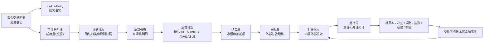

### 3.2 模块边界

| 能力 | 建议契约层 | 写入边界 | 只读依赖 |
| --- | --- | --- | --- |
| 可清分明细 | 清结算契约 | 写可清分结果和排除原因，不写账。 | 资金交易明细、ledger entry、route snapshot、商户账户、规则快照。 |
| 清分批次 | 清结算契约 | 写明细归类、规则快照和复核状态，不写账。 | 可清分明细、清分周期、规则版本、审批。 |
| 清算账期解析 | 清结算契约 | 写清算账期快照和可清算判定，不写账。 | 清分批次、商户策略、合同账期、日切、节假日和风控状态。 |
| 清算候选 | 清结算契约 | 写候选、阻断原因和锁定状态，不写账。 | 已确认清分批次、清算账期、退款、争议、对账和风控状态。 |
| 清算批次 | 清结算契约 | 批次确认时通过交易层生成清算确认事实。 | 候选、清算账期、规则版本、审批。 |
| 结算单 | 清结算契约 | 锁定时通过交易层生成结算锁定事实。 | 商户余额、清算批次、费用、扣减项、准备金。 |
| 出款单 | 清结算契约 | 成功、失败、退回时生成出款结果事实或差错。 | 结算单、外部回单、银行流水。 |
| 对账批次 | 对账契约 | 写匹配结果和差异，不直接改账。 | 内部交易、账本、外部文件、银行流水、投影。 |
| 差错单 | 对账契约 | 写责任、处理动作、审批、核销状态。 | 对账批次、账本、外部凭证、运营证据。 |
| 调账与追偿 | 交易契约 + 清结算契约 | 通过 `FundsBalanceControlService.adjust` 或直接交易追加事实。 | 差错单、追偿单、审批、凭证。 |

清结算域可以采用内部子域或独立模块承载这些对象；无论采用哪种代码组织，对象边界和写入规则必须保持不变。

### 3.3 产品、DSL、TDD 对齐矩阵

| 产品验收项 | 系分落点 | DSL 承接 | TDD 承接 |
| --- | --- | --- | --- |
| 清分前基础对账 | 可清分识别守卫、对账任务 `BASIC_BEFORE_SPLIT`。 | 不进入资金 DSL；只作为生成可清分明细的准入上下文。 | `TDD-CLS-001`、`TDD-RECON-003`。 |
| 清分批次不入账 | 清分批次状态机和 `t_clearing_split_batch`。 | 不生成 `LedgerEntry`，不出现 route leg。 | `TDD-CLS-003`、`TDD-RED-020`。 |
| 清算前置对账 | 可清算候选生成守卫、对账任务 `BEFORE_CLEARING_CONFIRM`。 | 清算确认事实进入 DSL 前的准入上下文。 | `TDD-CLS-004`、`TDD-RECON-004`。 |
| 清算确认入账 | 清算批次确认调用交易层生成 `CLEARING_CONFIRM`。 | `DIRECT_TRANSACTION / CLEARING_CONFIRM`，`CLEARING -> AVAILABLE`。 | `TDD-CLS-006`。 |
| 对账放行矩阵 | 对账批次状态、匹配结果、差错等级和风险接受记录。 | 有条件放行不直接生成账务事实；调账必须用 `ADJUST` 且带审批。 | `TDD-RECON-005`、`TDD-RED-021`。 |
| 账实/账账/单账/余额一致 | 对账规则、匹配结果、余额桶校验摘要。 | DSL 只承接对账后的资金事实或调账事实，不承接对账报表本身。 | `TDD-RECON-003`、`TDD-RECON-004`、`TDD-RECON-006`。 |
| 对账任务生命周期 | `t_reconciliation_batch` 状态和运行记录。 | 不进入 DSL。 | `TDD-RECON-007`、`TDD-RED-022`。 |

## 四、详细设计

### 4.1 可清分明细与清分批次

#### 4.1.1 可清分识别流程

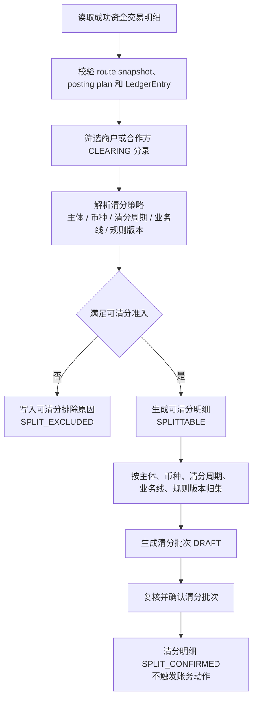

可清分准入守卫：

| 守卫 | 系统检查 |
| --- | --- |
| 交易成功 | 资金交易和交易明细必须是最终成功状态；失败、拒绝、撤销、过期不得进入清分。 |
| 已过账 | 必须存在账本交易、分录和余额投影可校验引用。 |
| 待清算账目 | 来源分录必须命中商户或合作方 `CLEARING`，不得从 `AVAILABLE` 或报表反推。 |
| 快照完整 | route snapshot、posting plan、业务引用、规则版本、币种和账务主体必须完整。 |
| 金额拆解 | 本金、手续费、通道成本、补贴、税费、退款预留等金额项必须可拆解。 |
| 周期可解析 | 清分周期必须由策略解析得到，并固化规则编码、版本、时区和 cutoff。 |
| 未硬阻断 | 退款完成、退款中、争议中、重大差错、风控冻结、重复入批必须排除。 |

#### 4.1.2 清分批次状态机

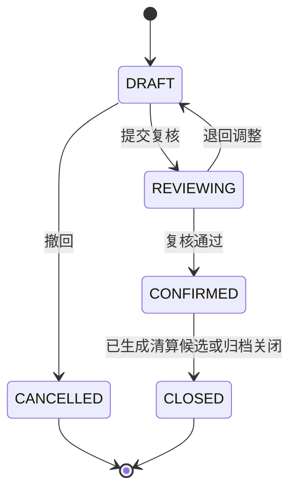

清分批次约束：

1. 清分批次确认只改变清分对象状态，不调用交易层或账本层。
2. 清分批次确认后才允许执行可清算判定。
3. 同一可清分明细只能进入一个未取消清分批次。
4. 清分批次发现错分时，不删除历史批次；通过撤回、排除、补差或差错单处理。

#### 4.1.3 清分数据

| 字段 | 说明 |
| --- | --- |
| `splittableSn` | 可清分明细流水号。 |
| `tenantId` | 租户。 |
| `merchantSubjectRef` | 商户资金主体。 |
| `currency` | 币种。 |
| `businessScene/businessSn` | 来源业务引用。 |
| `fundsTransactionSn/detailSn` | 资金交易和交易明细引用。 |
| `ledgerTransactionSn/ledgerEntrySn` | 账本交易和分录引用。 |
| `amount` | 可清分金额。 |
| `splitPeriod` | 清分周期，不是账本周期。 |
| `ruleVersion` | 清分规则版本。 |
| `status` | `SPLITTABLE`、`SPLIT_EXCLUDED`、`SPLIT_LOCKED`、`SPLIT_CONFIRMED`。 |
| `excludeReason` | 不可清分或排除原因。 |

清分红线：

1. 可清分明细不入账。
2. 清分批次确认不入账。
3. 清分不能从余额、报表或人工汇总反推，必须来自交易明细和商户 `CLEARING` 分录。

### 4.2 清算候选与清算账期

#### 4.2.1 清算账期确认规则

清算账期是清算批次分组和到期判断的业务周期，不是账本周期。它由清算策略解析并固化在清算候选和清算批次中，后续重跑必须复用同一规则版本或显式生成新版本差异。

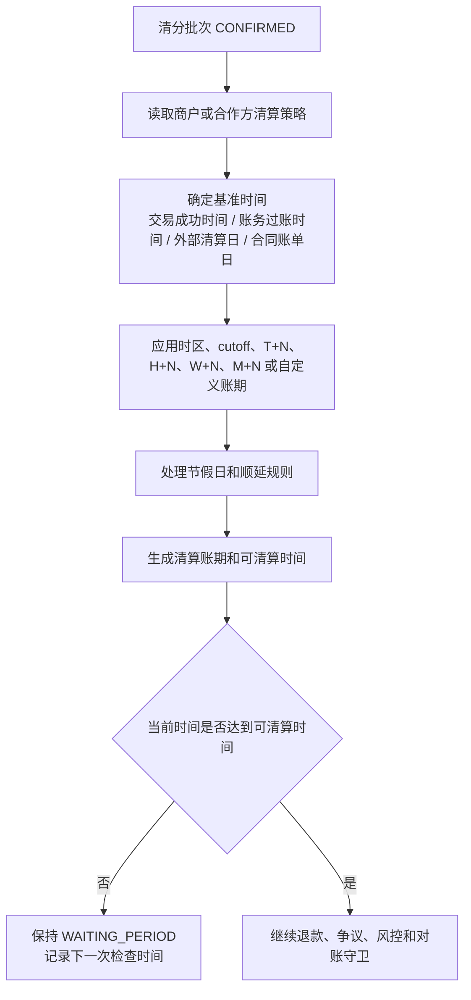

| 输入 | 说明 |
| --- | --- |
| `ruleCode/ruleVersion` | 清算策略编码和版本，必须固化。 |
| `baseTimeType` | 基准时间来源，例如交易成功时间、账务过账时间、外部清算日或合同账单日。 |
| `timezone/cutoffTime` | 用于日切和跨时区归属。 |
| `cycleType/cycleValue` | 实时、T+N、H+N、W+N、M+N 或自定义账期。 |
| `holidayCalendar` | 节假日和工作日顺延规则。 |
| `clearingPeriod` | 解析后的清算账期，例如 `2026-05-18`、`2026-W21`、`CONTRACT-2026-05-A`。 |
| `clearingAvailableTime` | 候选可进入清算批次的最早时间。 |

账期确认红线：

1. 策略缺失、版本缺失、时区缺失、cutoff 解析失败时不得默认实时清算。
2. 清算账期不得写入账本 `periodId`，账本周期仍由账本 Profile 决定。
3. 同一清分明细在同一清算策略版本下只能有一个清算账期快照。

#### 4.2.2 可清算候选生成流程

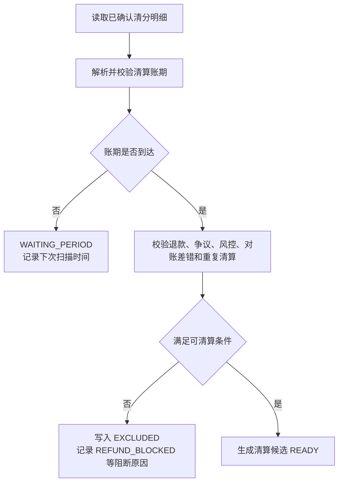

退款守卫按退款发生时点处理：

| 退款时点 | 系统处理 | 清分/清算状态 |
| --- | --- | --- |
| 付款成功后、清分前退款 | 不生成可清分明细，或将已有 `SPLITTABLE` 标记为 `SPLIT_EXCLUDED`。 | 不进入清分批次；退款事实按原 route snapshot 回补。 |
| 清分批次确认后、清算批次确认前退款 | 清分结果保留审计，清算候选状态标记为 `EXCLUDED`，排除原因记录为 `REFUND_BLOCKED`；若部分退款，按剩余可清算金额重新生成候选或差额候选。 | 退款金额不触发 `CLEARING -> AVAILABLE`；只有剩余可清算金额允许进入清算批次。 |
| 清算批次确认后、结算锁定前退款 | 不回滚清算批次；追加退款事实，从商户 `AVAILABLE` 或约定责任账户扣减，结算单净额加入退款扣减项。 | 清算批次保持 `CONFIRMED`；结算净额减少。 |
| 结算锁定后、出款成功前退款 | 不直接回退用户；优先生成结算差错或释放/重算结算锁定，必要时 `SETTLEMENT -> AVAILABLE` 后再追加退款扣减。 | 已锁定金额不得被自动退款绕过。 |
| 出款成功后退款 | 不回滚历史出款；生成追偿单，进入准备金抵扣、后续结算抵扣、负余额或人工收款。 | 追偿闭环承接，不改历史出款。 |

#### 4.2.3 候选数据

| 字段 | 说明 |
| --- | --- |
| `candidateSn` | 候选流水号。 |
| `tenantId` | 租户。 |
| `merchantSubjectRef` | 商户资金主体。 |
| `currency` | 币种。 |
| `splitBatchSn/splittableSn` | 来源清分批次和可清分明细引用。 |
| `fundsTransactionSn/detailSn` | 资金交易和交易明细引用。 |
| `ledgerTransactionSn/ledgerEntrySn` | 账本交易和分录引用。 |
| `amount` | 可清算金额。 |
| `clearingPeriod` | 清算账期，不是账本周期。 |
| `clearingAvailableTime` | 最早可清算时间。 |
| `ruleVersion` | 清算规则版本。 |
| `status` | `WAITING_PERIOD`、`EXCLUDED`、`READY`、`LOCKED`、`CLEARED`。 |
| `excludeReason` | 排除或阻断原因。 |

候选红线：

1. 候选不入账。
2. 候选不能来自 `AVAILABLE` 反推，必须来自已确认清分批次、商户 `CLEARING` 交易明细和分录。
3. 候选进入候选池不代表已清算。

### 4.3 清算批次

#### 4.3.1 状态机

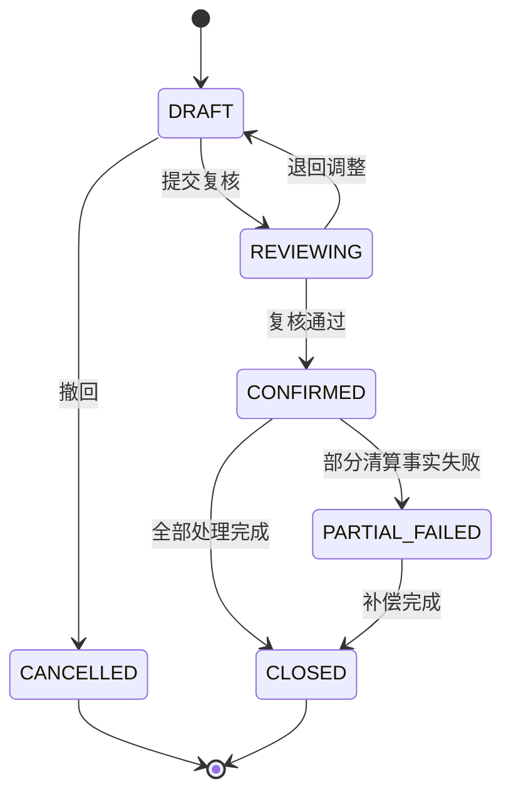

#### 4.3.2 清算确认流程

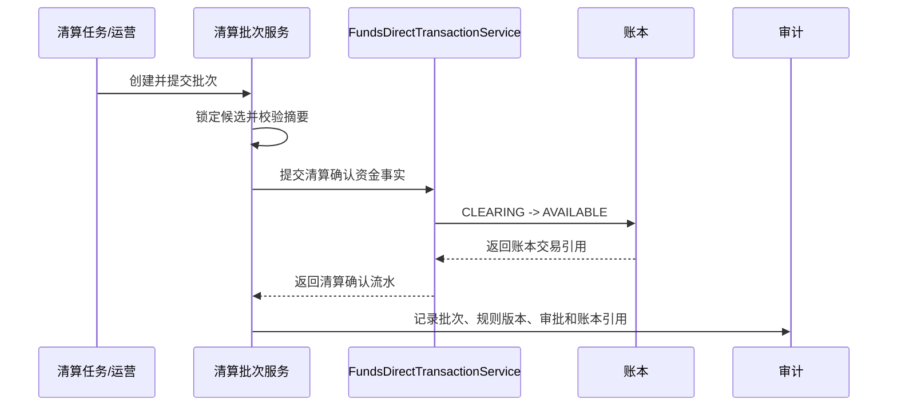

清算批次约束：

1. 批次维度包含租户、商户、币种、清算账期、业务线、规则版本和候选集合摘要。
2. 确认前必须锁定候选，避免同一明细进入多个批次。
3. 已确认批次不能重跑生成重复清算事实；修正走补差或冲正。
4. 批次确认的账务动作必须引用批次和候选明细摘要。
5. 清算确认前收到退款事件时，必须重新校验候选状态；已退款或部分退款金额不得进入确认金额。

### 4.4 退款时序与逆向处理

#### 4.4.1 付款成功、清分完成后退款

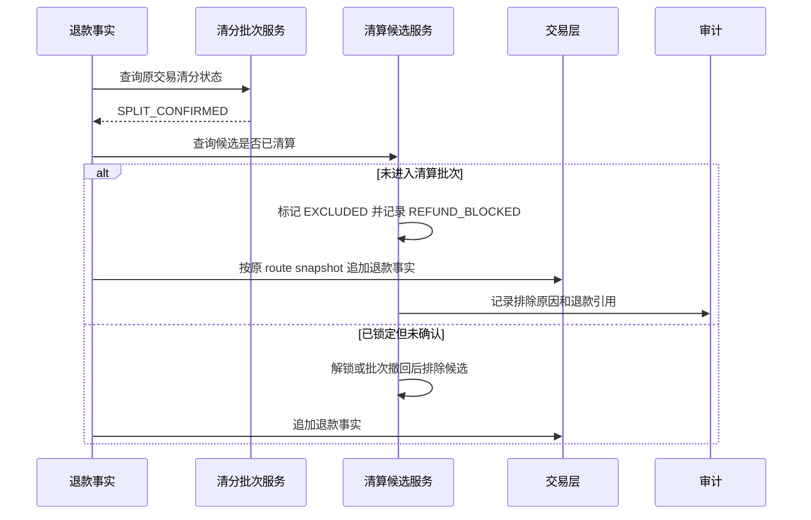

处理约束：

1. 清分批次不回滚，保留原始归类和规则快照。
2. 清算候选未确认前，退款优先阻断候选进入清算批次。
3. 部分退款时，系统可保留原候选并生成剩余金额候选，或把原候选排除后生成差额候选；两种方式都必须通过唯一键和摘要避免重复清算。
4. 退款资金事实必须基于原交易 route snapshot，不按当前账户绑定重新选路。

#### 4.4.2 清算确认后退款

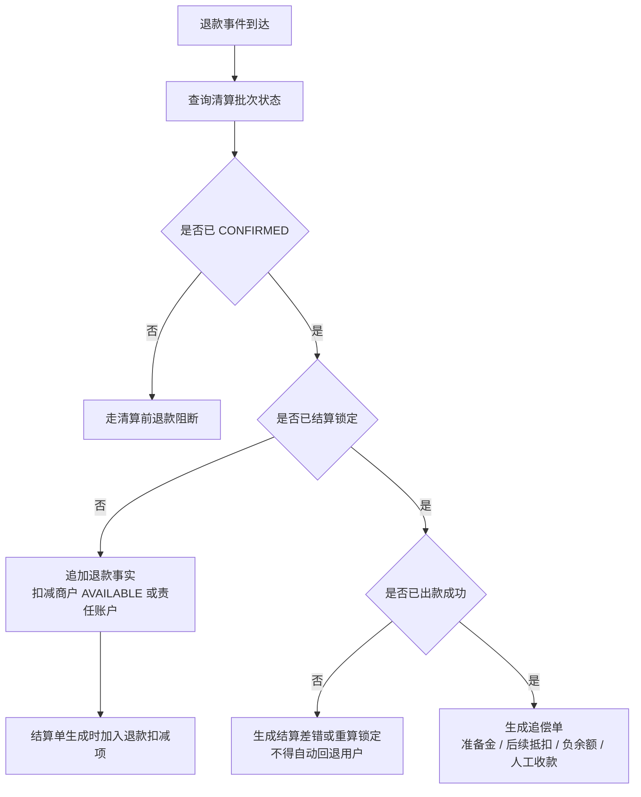

处理约束：

1. 已确认清算批次不可因退款而删除、回滚或重复确认。
2. 清算后、结算前退款通过追加退款事实影响商户 `AVAILABLE` 和结算净额。
3. 结算锁定后退款不得绕过结算单和出款单直接扣出款中资金。
4. 出款成功后退款由追偿闭环承接，不能回滚历史出款。

### 4.5 结算单

#### 4.5.1 结算净额

```text
结算净额
= 清算确认金额
+ 经审批加项
+ 追偿回补
+ 汇差调增
- 退款扣减
- 争议扣回
- 手续费
- 通道成本
- 准备金
- 负余额抵扣
- 风控扣留
- 未处理差错扣减
- 汇差调减
```

每个金额项必须有来源明细、规则版本、审批单或差错单引用，不能只保存汇总值。

#### 4.5.2 状态机

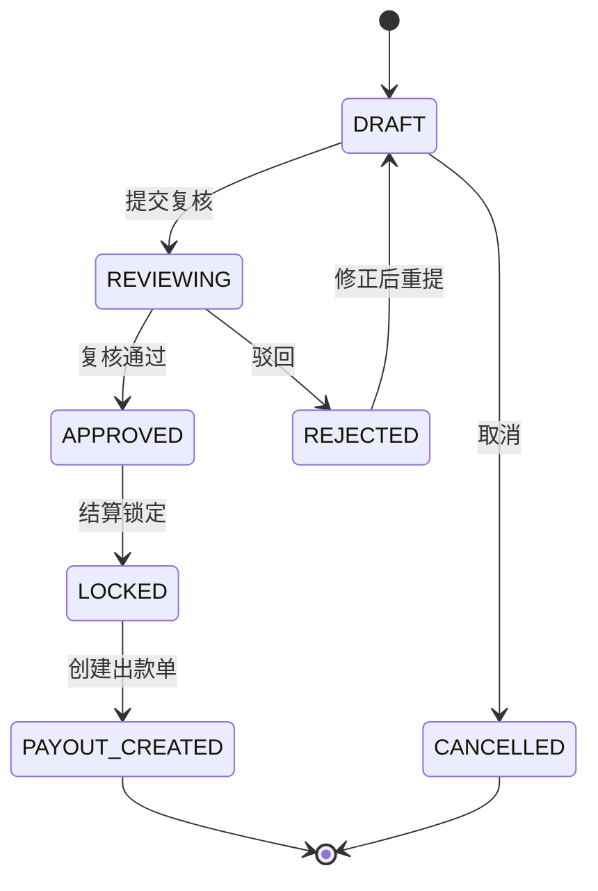

结算单约束：

1. 结算单是净额确认和出款前锁定对象，不代表外部出款成功。
2. 锁定时通过交易层生成 `AVAILABLE -> SETTLEMENT`。
3. 出款中金额不能再次进入结算。
4. 结算策略解析失败不得静默按实时策略处理。

### 4.6 出款单

#### 4.6.1 出款流程

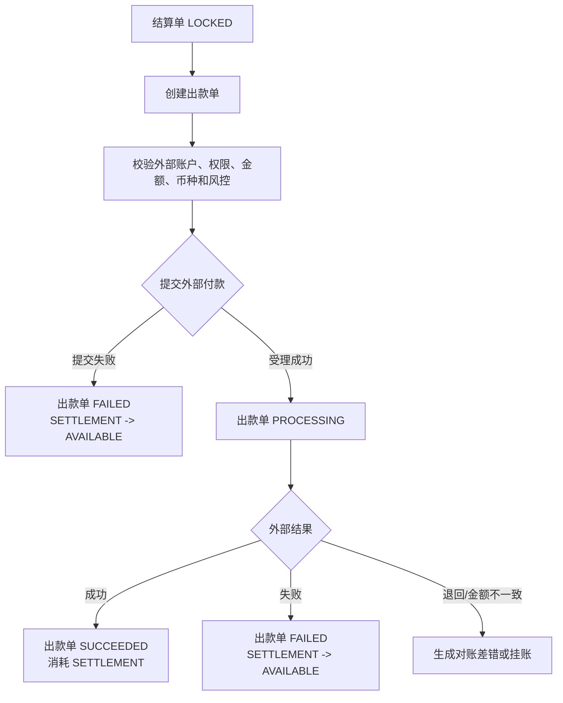

出款约束：

1. 外部受理成功不等于到账成功。
2. 出款失败回退只执行一次。
3. 出款成功后发生退款、拒付或费用，不回滚历史出款，进入追偿、准备金、负余额或后续抵扣。
4. 外部回单、失败原因、重试次数和人工确认必须审计。

### 4.7 对账批次

#### 4.7.1 对账类型

| 类型 | 内部来源 | 外部来源 | 目标 |
| --- | --- | --- | --- |
| 交易对账 | 资金交易、交易明细 | 通道文件、业务单、外部流水 | 状态、金额、币种、reference 一致。 |
| 资金到账对账 | 平台现金映射、出款单 | 银行流水、回单 | 证明外部钱是否到或出。 |
| 账务一致性 | 资金交易、账本交易、分录、余额投影 | 不适用或巡检快照 | 证明交易和账务一致。 |
| 清结算对账 | 清分批次、清算批次、结算单、出款单 | 商户账单、外部回单 | 证明批次、净额和出款一致。 |
| 报表核对 | 交易投影、报表指标查询结果 | 报表文件或财务口径 | 证明报表来源可信。 |

#### 4.7.2 对账目标和规则

| 对账目标 | 系统规则 | 阻断条件 |
| --- | --- | --- |
| 账实一致 | 内部账本账户、账目和余额桶必须能映射到银行流水、通道文件、托管户流水、外部回单或外部文件。 | 错主体、错币种、金额不平、外部失败内部成功、重复外部 reference。 |
| 账账一致 | 业务账、支付账、账户账、商户账、总账、明细账、交易投影和余额投影必须基于同一业务事实。 | 汇总不等于明细、状态不可解释、方向不一致。 |
| 单账一致 | 业务单、支付单、退款单、清分批次、清算批次、结算单、出款单和调账单必须能追溯到资金交易和账本交易。 | 有单无账、有账无单、重复单据。 |
| 余额一致 | 按主体、账目、币种和账本周期分别校验期初、本期入、本期出、期末；按余额桶分别校验。 | 余额公式不成立、`FROZEN` 总额不守恒、`SETTLEMENT` 外部受理误记成功。 |

余额桶校验落地：

| 余额桶 | 系统校验 | 失败动作 |
| --- | --- | --- |
| `CLEARING` | 期初待清算 + 本期成功入账 - 本期退款/冲正/清算确认/扣减 = 期末待清算。 | 阻断清分或清算候选。 |
| `AVAILABLE` | 期初可用 + 本期清算确认/释放 - 本期结算锁定/退款/费用/调账 = 期末可用。 | 阻断结算单生成或锁定。 |
| `SETTLEMENT` | 期初出款中 + 本期结算锁定 - 本期出款成功/失败回退/退回差错 = 期末出款中。 | 阻断重复出款，生成出款差错。 |
| `IN_TRANSIT` | 期初在途 + 本期外部提交或处理中 - 本期成功确认/失败/退回/核销 = 期末在途。 | 进入在途账龄、到期重查和差错处理。 |
| `FROZEN` | 期初冻结 + 本期冻结 - 本期解冻/释放/消耗 = 期末冻结。 | 阻断解冻、出款或报表发布。 |

#### 4.7.3 对账流程

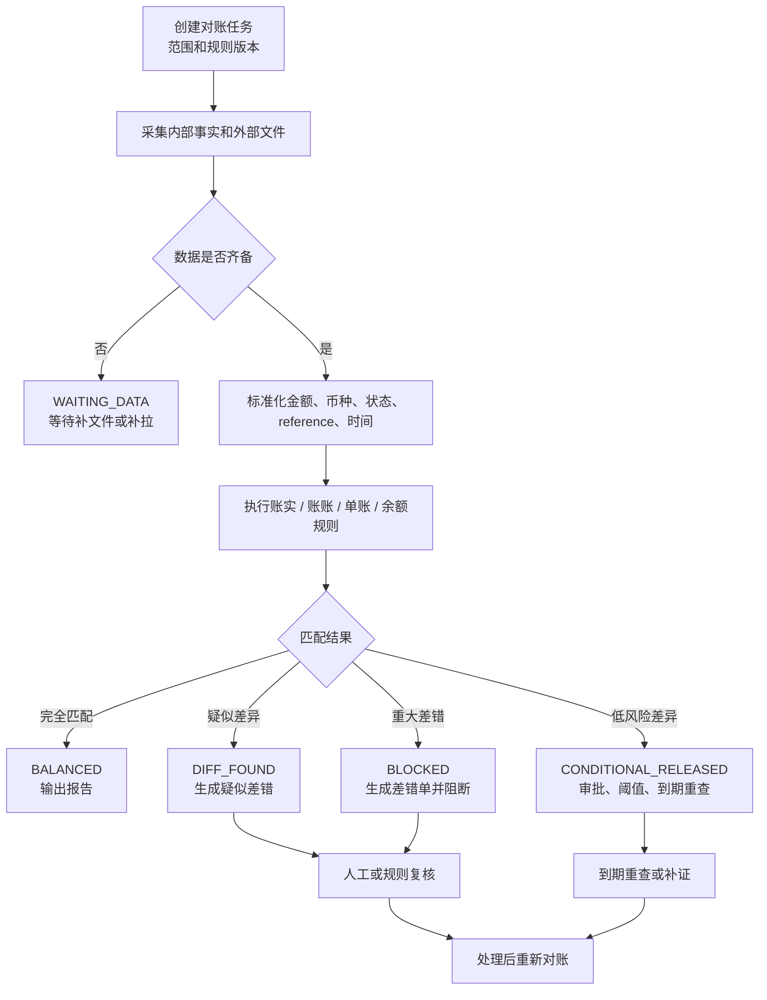

对账批次约束：

1. 对账批次不直接改账。
2. 匹配规则、字段映射、金额精度、时区和文件版本必须留痕。
3. 批次必须输出总数、匹配数、差异数、金额摘要和失败样本。
4. 批次关闭前，重大差异必须有关联差错单、阻断记录和重新对账结果。
5. 有条件放行必须有关联审批、阈值、账龄、责任方、风险承接和到期重查，不得覆盖旧运行记录。

#### 4.7.4 对账任务状态机

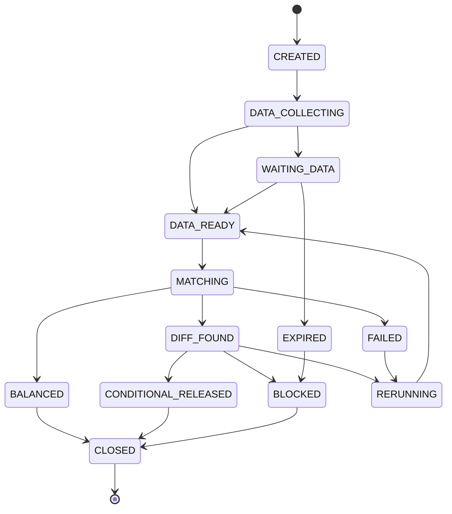

状态说明：`CREATED` 已创建，`DATA_COLLECTING` 收数中，`WAITING_DATA` 等待外部文件或流水，`DATA_READY` 数据齐备，`MATCHING` 匹配中，`DIFF_FOUND` 发现差异，`CONDITIONAL_RELEASED` 有条件放行，`BLOCKED` 阻断，`BALANCED` 对平，`FAILED` 任务失败，`EXPIRED` 等待超时，`RERUNNING` 重跑中，`CLOSED` 已关闭。

### 4.8 差错单

#### 4.8.1 差错状态机

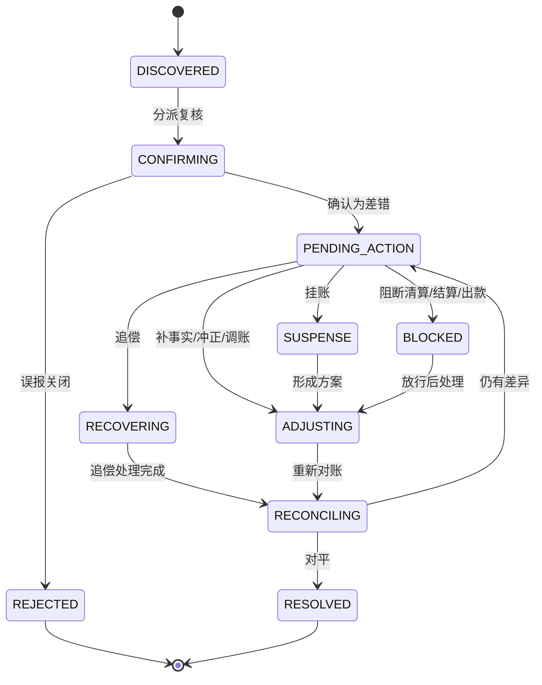

#### 4.8.2 差错处理动作

| 动作 | 系统行为 | 账务影响 |
| --- | --- | --- |
| 补事实 | 通过交易层补入缺失资金事实。 | 追加标准交易和分录。 |
| 冲正 | 对错误账务追加反向事实。 | 追加冲正分录。 |
| 调账 | 审批后执行调整。 | 追加调账分录。 |
| 挂账 | 暂存无法归属差异。 | 可进入 `ADJUSTMENT` 或挂账口径。 |
| 追偿 | 对已出款后退款、拒付、费用或差错发起追回。 | 进入准备金、后续抵扣、负余额或人工收款。 |
| 核销 | 经证据确认关闭差错。 | 不等同于改账，必须关联重新对账或凭证。 |

#### 4.8.3 差错等级和放行矩阵

| 等级 | 判断口径 | 默认系统动作 | 示例 |
| --- | --- | --- | --- |
| `S0` | 可能造成重复出款、错主体入账、错币种入账、余额不平或资金损失。 | 立即阻断相关清分、清算、结算、出款和报表发布。 | 重复出款、缺分录仍清算、余额公式不成立。 |
| `S1` | 影响清结算、出款或关账，但已有责任方和处理路径。 | 阻断相关批次，生成差错单和 SLA。 | 外部失败内部成功、金额差超阈值。 |
| `S2` | 可解释且在策略阈值内。 | 暂缓、挂账或有条件放行，到期重查。 | 手续费尾差、跨日归属、文件延迟。 |
| `S3` | 不影响资金、账本、余额和单据一致性。 | 阻断报表或展示，不阻断资金流程。 | 展示字段、运营标签、报表维度缺失。 |

| 差异类型 | 默认动作 | 是否可放行 | 落地要求 |
| --- | --- | --- | --- |
| 错主体、错币种、金额不平、余额公式不成立 | 阻断。 | 否。 | 必须补事实、冲正、调账或重建投影后重新对账。 |
| 重复外部 reference、重复入账、重复出款 | 阻断。 | 否。 | 通过唯一事实确认、重复拒绝或冲正关闭。 |
| 缺账本分录、有单无账、有账无单 | 阻断。 | 否。 | 通过交易层补入事实或差错闭环后重跑。 |
| 文件延迟、银行未达账、通道处理中 | 暂缓或进入在途。 | 有条件。 | 必须有责任方、账龄阈值、到期重查和风险承接。 |
| 手续费、汇率、舍入尾差 | 复核差额。 | 有条件。 | 必须在容差内，有财务确认、费用调整或挂账路径。 |
| 非资金展示差异 | 报表修复。 | 有条件。 | 不影响资金、账本、余额和单据一致性。 |

差错红线：

1. 差错处理不能直接修改历史分录、余额投影、交易投影或外部流水。
2. 调账必须引用差错、审批、凭证和账本交易。
3. 差错关闭必须有重新对账结果、凭证或责任确认。
4. 未核销重大差错必须能阻断清算、结算、出款或报表发布。
5. `S0` / `S1` 重大差错不得带原因放行；`S2` 放行必须写入风险接受和到期重查。

### 4.9 追偿单

追偿单用于承载已出款后发生退款、拒付、费用、差错或负余额需要追回的责任闭环。

| 字段 | 说明 |
| --- | --- |
| `recoverySn` | 追偿单号。 |
| `sourceType/sourceSn` | 来源退款、拒付、差错、费用或负余额。 |
| `responsibleSubject` | 责任主体。 |
| `amount/currency` | 追偿金额。 |
| `recoveryMode` | 准备金抵扣、后续结算抵扣、转负余额、人工收款。 |
| `status` | `CREATED`、`OFFSETTING`、`COLLECTING`、`PARTIAL_RECOVERED`、`CLOSED`。 |
| `ledgerRefs` | 关联资金事实和账本交易。 |

### 4.10 数据表设计

本节定义清分、清算、结算、出款、对账、差错和追偿的最终设计表。所有金额字段使用最小货币单位，所有表必须具备 `tenant_id`、业务流水号、状态、创建时间、更新时间、操作者、审批或原因引用、traceId 和审计摘要。清结算表只保存运营对象和事实引用；发生余额变化时必须调用交易层或账本层追加标准资金事实。

#### 4.10.1 可清分明细表

物理表名：`t_clearing_splittable_detail`

业务用途：承载从成功交易明细、route snapshot 和商户 `CLEARING` 分录识别出的可清分结果。可清分明细只表达“这笔成功交易具备进入清分的证据”，不入账，不代表已清算。

| 字段名称 | 字段类型 | 是否必填 | 字段说明 | 值示例 |
| --- | --- | --- | --- | --- |
| `id` | BIGINT(20) | 是 | 主键 | `10001` |
| `gmt_create` / `gmt_modified` | DATETIME | 是 | 创建和更新时间 | - |
| `splittable_sn` | VARCHAR(64) | 是 | 可清分明细流水号 | `CSD202605180001` |
| `tenant_id` | BIGINT(20) | 是 | 租户 ID | `1` |
| `merchant_id` / `merchant_type` | VARCHAR | 是 | 商户或合作主体 | `M1001` / `MERCHANT` |
| `currency` | VARCHAR(10) | 是 | 币种 | `USD` |
| `business_scene` / `business_sn` | VARCHAR | 是 | 来源业务引用 | `ORDER_PAY` / `ORDER1001` |
| `funds_transaction_sn` / `funds_transaction_detail_sn` | VARCHAR(64) | 是 | 来源资金交易和明细 | `FT...` / `FTD...` |
| `ledger_transaction_sn` / `ledger_entry_sn` | VARCHAR(64) | 是 | 来源账本交易和商户 `CLEARING` 分录 | `LT...` / `LE...` |
| `route_snapshot_sn` / `route_snapshot_digest` | VARCHAR | 是 | 路由快照和摘要 | `RS...` / `sha256...` |
| `amount` | BIGINT(20) | 是 | 可清分金额 | `9800` |
| `split_period` | VARCHAR(30) | 是 | 清分周期，不是账本周期 | `2026-05-18` |
| `split_rule_code` / `split_rule_version` | VARCHAR | 是 | 清分规则和版本 | `MERCHANT_SPLIT` / `1` |
| `split_batch_sn` | VARCHAR(64) | 否 | 所属清分批次 | `SB202605180001` |
| `status` | VARCHAR(30) | 是 | 明细状态 | `SPLITTABLE` |
| `exclude_reason` | VARCHAR(128) | 否 | 排除原因 | `MISSING_ROUTE_SNAPSHOT` |
| `refunded_amount` / `disputed_amount` | BIGINT(20) | 是 | 已退款和争议金额快照 | `0` / `0` |
| `snapshot_digest` | VARCHAR(128) | 是 | 来源证据摘要 | `sha256...` |
| `operator_id` / `trace_id` | VARCHAR | 否 | 操作人和链路追踪 | - |

状态说明：`SPLITTABLE` 可清分，`SPLIT_EXCLUDED` 已排除，`SPLIT_LOCKED` 已入清分批次待确认，`SPLIT_CONFIRMED` 清分已确认。

唯一索引：`uk_clearing_splittable_source(tenant_id, funds_transaction_detail_sn, ledger_entry_sn, split_period, split_rule_version)`。

普通索引：`idx_clearing_splittable_merchant(merchant_type, merchant_id, currency, split_period)`；`idx_clearing_splittable_status(status, split_period)`；`idx_clearing_splittable_batch(split_batch_sn)`。

#### 4.10.2 清分批次表

物理表名：`t_clearing_split_batch`

业务用途：承载一组可清分明细的归类、复核和确认结果。清分批次确认只固化分类、规则版本、金额摘要和来源证据，不触发 `CLEARING -> AVAILABLE`。

| 字段名称 | 字段类型 | 是否必填 | 字段说明 | 值示例 |
| --- | --- | --- | --- | --- |
| `id` / `gmt_create` / `gmt_modified` | 通用字段 | 是 | 主键和时间字段 | - |
| `split_batch_sn` | VARCHAR(64) | 是 | 清分批次号 | `SB202605180001` |
| `tenant_id` | BIGINT(20) | 是 | 租户 ID | `1` |
| `merchant_id` / `merchant_type` | VARCHAR | 是 | 商户或合作主体 | `M1001` / `MERCHANT` |
| `currency` | VARCHAR(10) | 是 | 币种 | `USD` |
| `split_period` | VARCHAR(30) | 是 | 清分周期 | `2026-05-18` |
| `business_line` | VARCHAR(50) | 否 | 业务线 | `ECOMMERCE` |
| `split_rule_code` / `split_rule_version` | VARCHAR | 是 | 清分规则和版本 | `MERCHANT_SPLIT` / `1` |
| `detail_count` / `excluded_count` | INT(11) | 是 | 明细笔数和排除笔数 | `100` / `2` |
| `total_amount` | BIGINT(20) | 是 | 清分金额汇总 | `980000` |
| `status` | VARCHAR(30) | 是 | 批次状态 | `CONFIRMED` |
| `approval_sn` | VARCHAR(64) | 否 | 审批引用 | `AP202605180001` |
| `digest` | VARCHAR(128) | 是 | 明细集合摘要 | `sha256...` |
| `operator_id` / `trace_id` | VARCHAR | 否 | 操作人和链路追踪 | - |

状态说明：`DRAFT` 草稿，`REVIEWING` 复核中，`CONFIRMED` 已确认，`CANCELLED` 已取消，`CLOSED` 已关闭。

唯一索引：`uk_clearing_split_batch_sn(split_batch_sn)`；`uk_clearing_split_batch_scope(tenant_id, merchant_type, merchant_id, currency, split_period, split_rule_version, digest)`。

普通索引：`idx_clearing_split_batch_status(status, split_period)`；`idx_clearing_split_batch_merchant(merchant_type, merchant_id, currency)`。

#### 4.10.3 清算候选表

物理表名：`t_clearing_candidate`

业务用途：承载由已确认清分明细进入清算账期后的候选结果。候选必须来自已确认清分批次和商户 `CLEARING` 分录，不入账，不代表已清算。

| 字段名称 | 字段类型 | 是否必填 | 字段说明 | 值示例 |
| --- | --- | --- | --- | --- |
| `id` | BIGINT(20) | 是 | 主键 | `10001` |
| `gmt_create` / `gmt_modified` | DATETIME | 是 | 创建和更新时间 | - |
| `candidate_sn` | VARCHAR(64) | 是 | 候选流水号 | `CC202605180001` |
| `tenant_id` | BIGINT(20) | 是 | 租户 ID | `1` |
| `merchant_id` / `merchant_type` | VARCHAR | 是 | 商户主体 | `M1001` / `MERCHANT` |
| `currency` | VARCHAR(10) | 是 | 币种 | `USD` |
| `split_batch_sn` / `splittable_sn` | VARCHAR(64) | 是 | 来源清分批次和明细 | `SB...` / `CSD...` |
| `business_scene` / `business_sn` | VARCHAR | 是 | 来源业务引用 | `ORDER_PAY` / `ORDER1001` |
| `funds_transaction_sn` / `funds_transaction_detail_sn` | VARCHAR(64) | 是 | 来源交易和明细 | `FT...` / `FTD...` |
| `ledger_transaction_sn` / `ledger_entry_sn` | VARCHAR(64) | 是 | 来源账本交易和分录 | `LT...` / `LE...` |
| `amount` | BIGINT(20) | 是 | 候选金额 | `9800` |
| `clearing_period` | VARCHAR(30) | 是 | 清算账期，不是账本周期 | `2026-05-18` |
| `clearing_available_time` | DATETIME | 是 | 可进入清算批次的时间 | `2026-05-19 00:00:00` |
| `rule_code` / `rule_version` | VARCHAR | 是 | 清算账期规则和版本 | `MERCHANT_T1` / `1` |
| `status` | VARCHAR(30) | 是 | 候选状态 | `READY` |
| `exclude_reason` | VARCHAR(128) | 否 | 排除原因 | `REFUND_OR_DISPUTE_BLOCKED` |
| `refund_blocked_amount` / `dispute_blocked_amount` | BIGINT(20) | 是 | 退款和争议阻断金额 | `0` / `0` |
| `batch_sn` | VARCHAR(64) | 否 | 所属清算批次 | `CB202605180001` |
| `snapshot_digest` | VARCHAR(128) | 是 | 来源摘要 | `sha256...` |
| `operator_id` / `trace_id` | VARCHAR | 否 | 操作人和链路追踪 | - |

状态说明：`WAITING_PERIOD` 账期未到，`EXCLUDED` 已排除，`READY` 可入批，`LOCKED` 已锁定，`CLEARED` 已清算确认。

唯一索引：`uk_clearing_candidate_source(tenant_id, splittable_sn, clearing_period, rule_version)`。

普通索引：`idx_clearing_candidate_merchant(merchant_type, merchant_id, currency, clearing_period)`；`idx_clearing_candidate_status(status, clearing_period)`；`idx_clearing_candidate_batch(batch_sn)`。

#### 4.10.4 清算批次表

物理表名：`t_clearing_batch`

业务用途：承载一组清算候选的复核和确认结果。批次确认才触发 `CLEARING -> AVAILABLE` 资金事实。

| 字段名称 | 字段类型 | 是否必填 | 字段说明 | 值示例 |
| --- | --- | --- | --- | --- |
| `id` / `gmt_create` / `gmt_modified` | 通用字段 | 是 | 主键和时间字段 | - |
| `batch_sn` | VARCHAR(64) | 是 | 清算批次号 | `CB202605180001` |
| `tenant_id` | BIGINT(20) | 是 | 租户 ID | `1` |
| `merchant_id` / `merchant_type` | VARCHAR | 是 | 商户主体 | `M1001` / `MERCHANT` |
| `currency` | VARCHAR(10) | 是 | 币种 | `USD` |
| `clearing_period` | VARCHAR(30) | 是 | 清算账期 | `2026-05-18` |
| `business_line` | VARCHAR(50) | 否 | 业务线 | `ECOMMERCE` |
| `rule_code` / `rule_version` | VARCHAR | 是 | 清算规则和版本 | `MERCHANT_T1` / `1` |
| `candidate_count` | INT(11) | 是 | 候选笔数 | `100` |
| `total_amount` | BIGINT(20) | 是 | 清算金额 | `980000` |
| `refund_deduction_amount` | BIGINT(20) | 是 | 清算确认前已阻断的退款金额摘要 | `0` |
| `status` | VARCHAR(30) | 是 | 批次状态 | `CONFIRMED` |
| `approval_sn` | VARCHAR(64) | 否 | 审批引用 | `AP202605180001` |
| `clearing_transaction_sn` | VARCHAR(64) | 否 | 清算确认资金交易 | `FT202605180099` |
| `digest` | VARCHAR(128) | 是 | 候选集合摘要 | `sha256...` |
| `operator_id` / `trace_id` | VARCHAR | 否 | 操作人和链路追踪 | - |

状态说明：`DRAFT` 草稿，`REVIEWING` 复核中，`CONFIRMED` 已确认，`PARTIAL_FAILED` 部分失败，`CLOSED` 已关闭，`CANCELLED` 已取消。

唯一索引：`uk_clearing_batch_sn(batch_sn)`；`uk_clearing_batch_scope(tenant_id, merchant_type, merchant_id, currency, clearing_period, rule_version, digest)`。

普通索引：`idx_clearing_batch_status(status, clearing_period)`；`idx_clearing_batch_merchant(merchant_type, merchant_id, currency)`。

#### 4.10.5 清算批次明细表

物理表名：`t_clearing_batch_detail`

业务用途：记录清算批次和候选明细的绑定关系、金额摘要和处理结果。

| 字段名称 | 字段类型 | 是否必填 | 字段说明 | 值示例 |
| --- | --- | --- | --- | --- |
| `id` / `gmt_create` / `gmt_modified` | 通用字段 | 是 | 主键和时间字段 | - |
| `detail_sn` | VARCHAR(64) | 是 | 批次明细号 | `CBD202605180001` |
| `tenant_id` | BIGINT(20) | 是 | 租户 ID | `1` |
| `batch_sn` | VARCHAR(64) | 是 | 清算批次号 | `CB202605180001` |
| `candidate_sn` | VARCHAR(64) | 是 | 候选流水号 | `CC202605180001` |
| `split_batch_sn` / `splittable_sn` | VARCHAR(64) | 是 | 来源清分批次和明细 | `SB...` / `CSD...` |
| `funds_transaction_detail_sn` / `ledger_entry_sn` | VARCHAR | 是 | 来源明细和分录 | - |
| `amount` / `currency` | BIGINT / VARCHAR | 是 | 金额和币种 | `9800` / `USD` |
| `status` | VARCHAR(30) | 是 | 明细状态 | `CLEARED` |
| `failure_reason` | VARCHAR(256) | 否 | 失败原因 | - |

唯一索引：`uk_clearing_batch_detail(batch_sn, candidate_sn)`。

普通索引：`idx_clearing_batch_detail_source(funds_transaction_detail_sn, ledger_entry_sn)`；`idx_clearing_batch_detail_status(status)`。

#### 4.10.6 结算单表

物理表名：`t_settlement_order`

业务用途：承载商户、合作方或企业的结算净额确认对象。结算单锁定时触发 `AVAILABLE -> SETTLEMENT`，但不代表外部出款成功。

| 字段名称 | 字段类型 | 是否必填 | 字段说明 | 值示例 |
| --- | --- | --- | --- | --- |
| `id` / `gmt_create` / `gmt_modified` | 通用字段 | 是 | 主键和时间字段 | - |
| `settlement_sn` | VARCHAR(64) | 是 | 结算单号 | `SO202605180001` |
| `tenant_id` | BIGINT(20) | 是 | 租户 ID | `1` |
| `settlement_subject_id` / `settlement_subject_type` | VARCHAR | 是 | 结算主体 | `M1001` / `MERCHANT` |
| `currency` | VARCHAR(10) | 是 | 币种 | `USD` |
| `settlement_period` | VARCHAR(30) | 是 | 结算周期，不是账本周期 | `2026-W21` |
| `gross_amount` | BIGINT(20) | 是 | 清算确认总额 | `980000` |
| `addition_amount` / `deduction_amount` | BIGINT(20) | 是 | 加项和扣减汇总 | `0` / `30000` |
| `reserve_amount` | BIGINT(20) | 是 | 准备金 | `10000` |
| `net_amount` | BIGINT(20) | 是 | 应结净额 | `940000` |
| `status` | VARCHAR(30) | 是 | 结算状态 | `LOCKED` |
| `approval_sn` | VARCHAR(64) | 否 | 审批引用 | `AP...` |
| `lock_transaction_sn` | VARCHAR(64) | 否 | 锁定资金交易 | `FT...` |
| `rule_code` / `rule_version` | VARCHAR | 是 | 结算规则和版本 | `SETTLE_T1` / `1` |
| `digest` | VARCHAR(128) | 是 | 明细摘要 | `sha256...` |
| `operator_id` / `trace_id` | VARCHAR | 否 | 操作人和链路追踪 | - |

状态说明：`DRAFT` 草稿，`REVIEWING` 复核中，`APPROVED` 审批通过，`LOCKED` 已锁定，`PAYOUT_CREATED` 已生成出款单，`REJECTED` 已驳回，`CANCELLED` 已取消。

唯一索引：`uk_settlement_order_sn(settlement_sn)`；`uk_settlement_order_scope(tenant_id, settlement_subject_type, settlement_subject_id, currency, settlement_period, rule_version)`。

普通索引：`idx_settlement_order_subject(settlement_subject_type, settlement_subject_id, currency)`；`idx_settlement_order_status(status, settlement_period)`。

#### 4.10.7 结算金额项表

物理表名：`t_settlement_order_item`

业务用途：拆分结算净额中的本金、手续费、通道成本、退款扣减、争议扣回、准备金、追偿、汇差和调账项。

| 字段名称 | 字段类型 | 是否必填 | 字段说明 | 值示例 |
| --- | --- | --- | --- | --- |
| `id` / `gmt_create` / `gmt_modified` | 通用字段 | 是 | 主键和时间字段 | - |
| `item_sn` | VARCHAR(64) | 是 | 金额项号 | `SOI202605180001` |
| `tenant_id` | BIGINT(20) | 是 | 租户 ID | `1` |
| `settlement_sn` | VARCHAR(64) | 是 | 结算单号 | `SO202605180001` |
| `item_type` | VARCHAR(50) | 是 | 金额项类型 | `FEE_DEDUCTION` |
| `direction` | VARCHAR(10) | 是 | 加项或减项 | `DEBIT` |
| `amount` / `currency` | BIGINT / VARCHAR | 是 | 金额和币种 | `2000` / `USD` |
| `source_type` / `source_sn` | VARCHAR | 是 | 来源单据 | `CLEARING_BATCH` / `CB...` |
| `rule_code` / `rule_version` | VARCHAR | 否 | 规则和版本 | `FEE_RULE` / `1` |
| `approval_sn` | VARCHAR(64) | 否 | 审批引用 | - |
| `description` | VARCHAR(512) | 否 | 描述 | - |

唯一索引：`uk_settlement_order_item_source(settlement_sn, item_type, source_type, source_sn)`。

普通索引：`idx_settlement_order_item_type(item_type)`；`idx_settlement_order_item_source(source_type, source_sn)`。

#### 4.10.8 出款单表

物理表名：`t_payout_order`

业务用途：承载结算单发起外部付款后的执行状态、外部回单、失败回退和对账差错入口。外部受理成功不等于到账成功。

| 字段名称 | 字段类型 | 是否必填 | 字段说明 | 值示例 |
| --- | --- | --- | --- | --- |
| `id` / `gmt_create` / `gmt_modified` | 通用字段 | 是 | 主键和时间字段 | - |
| `payout_sn` | VARCHAR(64) | 是 | 出款单号 | `PO202605180001` |
| `tenant_id` | BIGINT(20) | 是 | 租户 ID | `1` |
| `settlement_sn` | VARCHAR(64) | 是 | 结算单号 | `SO202605180001` |
| `payee_id` / `payee_type` | VARCHAR | 是 | 收款主体 | `M1001` / `MERCHANT` |
| `amount` / `currency` | BIGINT / VARCHAR | 是 | 出款金额和币种 | `940000` / `USD` |
| `external_account_ref` | VARCHAR(128) | 是 | 脱敏外部账户引用 | `bank_token_xxx` |
| `channel_code` | VARCHAR(50) | 是 | 出款通道 | `BANK` |
| `external_reference` | VARCHAR(128) | 否 | 外部 reference | `bank_ref_001` |
| `status` | VARCHAR(30) | 是 | 出款状态 | `PROCESSING` |
| `submit_time` / `completed_time` | DATETIME | 否 | 提交和完成时间 | - |
| `failure_code` / `failure_reason` | VARCHAR | 否 | 失败原因 | - |
| `payout_transaction_sn` / `rollback_transaction_sn` | VARCHAR(64) | 否 | 出款和失败回退资金交易 | - |
| `receipt_digest` | VARCHAR(128) | 否 | 回单摘要 | `sha256...` |
| `operator_id` / `trace_id` | VARCHAR | 否 | 操作人和链路追踪 | - |

状态说明：`CREATED` 已创建，`SUBMITTED` 已提交，`PROCESSING` 处理中，`SUCCEEDED` 成功，`FAILED` 失败，`RETURNED` 退回，`MISMATCHED` 金额不一致。

唯一索引：`uk_payout_order_sn(payout_sn)`。

普通索引：`idx_payout_order_settlement(settlement_sn)`；`idx_payout_order_external(channel_code, external_reference)`；`idx_payout_order_status(status, gmt_modified)`。

#### 4.10.9 对账批次表

物理表名：`t_reconciliation_batch`

业务用途：承载一次对账任务的范围、规则、文件、匹配摘要和关闭结果。对账批次只写匹配结果和差异，不直接改账。

| 字段名称 | 字段类型 | 是否必填 | 字段说明 | 值示例 |
| --- | --- | --- | --- | --- |
| `id` / `gmt_create` / `gmt_modified` | 通用字段 | 是 | 主键和时间字段 | - |
| `reconciliation_sn` | VARCHAR(64) | 是 | 对账批次号 | `RB202605180001` |
| `tenant_id` | BIGINT(20) | 是 | 租户 ID | `1` |
| `reconciliation_type` | VARCHAR(50) | 是 | 对账类型 | `PAYOUT` |
| `subject_id` / `subject_type` | VARCHAR | 否 | 对账主体 | `M1001` / `MERCHANT` |
| `currency` | VARCHAR(10) | 否 | 币种 | `USD` |
| `window_start` / `window_end` | DATETIME | 是 | 对账窗口 | - |
| `rule_code` / `rule_version` | VARCHAR | 是 | 匹配规则和版本 | `PAYOUT_MATCH` / `1` |
| `file_sn` / `file_digest` | VARCHAR | 否 | 外部文件引用和摘要 | - |
| `consistency_scope` | VARCHAR(100) | 是 | 对账目标范围 | `REAL,BOOK,DOCUMENT,BALANCE` |
| `release_policy_code` / `release_policy_version` | VARCHAR | 否 | 放行策略和版本 | `RECON_RELEASE` / `1` |
| `total_count` / `matched_count` / `difference_count` | INT | 是 | 总数、匹配数、差异数 | `1000` / `998` / `2` |
| `total_amount` / `difference_amount` | BIGINT(20) | 是 | 总金额和差异金额 | `1000000` / `2000` |
| `blocked_count` / `conditional_release_count` | INT | 是 | 阻断数量和有条件放行数量 | `1` / `1` |
| `waiting_reason` | VARCHAR(100) | 否 | 等待数据原因 | `BANK_FILE_DELAYED` |
| `next_check_time` | DATETIME | 否 | 下一次重查时间 | - |
| `previous_run_sn` | VARCHAR(64) | 否 | 上一次运行记录 | `RB202605180001` |
| `status` | VARCHAR(30) | 是 | 批次状态 | `COMPLETED` |
| `operator_id` / `trace_id` | VARCHAR | 否 | 操作人和链路追踪 | - |

状态说明：`CREATED` 已创建，`DATA_COLLECTING` 收数中，`WAITING_DATA` 等待数据，`DATA_READY` 数据齐备，`MATCHING` 匹配中，`DIFF_FOUND` 发现差异，`CONDITIONAL_RELEASED` 有条件放行，`BLOCKED` 阻断，`BALANCED` 对平，`FAILED` 失败，`EXPIRED` 等待超时，`RERUNNING` 重跑中，`CLOSED` 已关闭。

唯一索引：`uk_reconciliation_batch_sn(reconciliation_sn)`。

普通索引：`idx_reconciliation_batch_type(reconciliation_type, window_start, window_end)`；`idx_reconciliation_batch_subject(subject_type, subject_id)`；`idx_reconciliation_batch_status(status)`。

#### 4.10.10 对账匹配结果表

物理表名：`t_reconciliation_match_result`

业务用途：记录内部事实和外部流水的匹配结果，作为差错单来源。

| 字段名称 | 字段类型 | 是否必填 | 字段说明 | 值示例 |
| --- | --- | --- | --- | --- |
| `id` / `gmt_create` / `gmt_modified` | 通用字段 | 是 | 主键和时间字段 | - |
| `result_sn` | VARCHAR(64) | 是 | 匹配结果号 | `RMR202605180001` |
| `tenant_id` | BIGINT(20) | 是 | 租户 ID | `1` |
| `reconciliation_sn` | VARCHAR(64) | 是 | 对账批次号 | `RB202605180001` |
| `internal_source_type` / `internal_source_sn` | VARCHAR | 否 | 内部来源 | `PAYOUT_ORDER` / `PO...` |
| `external_source_type` / `external_source_sn` | VARCHAR | 否 | 外部来源 | `BANK_STATEMENT` / `BK...` |
| `match_status` | VARCHAR(30) | 是 | 匹配状态 | `AMOUNT_MISMATCH` |
| `difference_type` | VARCHAR(50) | 否 | 差异类型 | `AMOUNT` |
| `consistency_target` | VARCHAR(30) | 否 | 一致性目标 | `BALANCE` |
| `severity` | VARCHAR(20) | 否 | 差错等级 | `S1` |
| `release_decision` | VARCHAR(30) | 否 | 放行判断 | `BLOCKED` |
| `release_reason` | VARCHAR(200) | 否 | 放行或阻断原因 | `AMOUNT_OVER_THRESHOLD` |
| `internal_amount` / `external_amount` | BIGINT(20) | 否 | 内外部金额 | `940000` / `939000` |
| `currency` | VARCHAR(10) | 否 | 币种 | `USD` |
| `difference_digest` | VARCHAR(128) | 是 | 差异指纹 | `sha256...` |
| `exception_sn` | VARCHAR(64) | 否 | 关联差错单 | `EC202605180001` |

唯一索引：`uk_reconciliation_match_result(result_sn)`；`uk_reconciliation_difference(reconciliation_sn, difference_digest)`。

普通索引：`idx_reconciliation_result_batch(reconciliation_sn, match_status)`；`idx_reconciliation_result_internal(internal_source_type, internal_source_sn)`；`idx_reconciliation_result_external(external_source_type, external_source_sn)`。

#### 4.10.11 差错单表

物理表名：`t_exception_case`

业务用途：承载对账差异、清结算异常、出款异常、账务一致性异常和报表差异的责任、处理动作、审批、凭证、重新对账和核销闭环。

| 字段名称 | 字段类型 | 是否必填 | 字段说明 | 值示例 |
| --- | --- | --- | --- | --- |
| `id` / `gmt_create` / `gmt_modified` | 通用字段 | 是 | 主键和时间字段 | - |
| `exception_sn` | VARCHAR(64) | 是 | 差错单号 | `EC202605180001` |
| `tenant_id` | BIGINT(20) | 是 | 租户 ID | `1` |
| `source_type` / `source_sn` | VARCHAR | 是 | 来源对象 | `RECONCILIATION_RESULT` / `RMR...` |
| `exception_type` | VARCHAR(50) | 是 | 差错类型 | `AMOUNT_MISMATCH` |
| `responsible_subject_id` / `responsible_subject_type` | VARCHAR | 否 | 责任主体 | `M1001` / `MERCHANT` |
| `amount` / `currency` | BIGINT / VARCHAR | 否 | 差错金额和币种 | `1000` / `USD` |
| `status` | VARCHAR(30) | 是 | 差错状态 | `PENDING_ACTION` |
| `severity` | VARCHAR(20) | 是 | 风险等级 | `S1` |
| `blocking_scope` | VARCHAR(200) | 否 | 阻断范围 | `CLEARING_CONFIRM,SETTLEMENT,PAYOUT` |
| `release_decision_sn` | VARCHAR(64) | 否 | 有条件放行记录 | `RD202605180001` |
| `action_type` | VARCHAR(50) | 否 | 处理动作 | `ADJUST` |
| `approval_sn` | VARCHAR(64) | 否 | 审批引用 | `AP...` |
| `evidence_refs` | TEXT | 否 | 凭证引用 JSON | `[]` |
| `adjustment_transaction_sn` | VARCHAR(64) | 否 | 调账或冲正资金交易 | `FT...` |
| `recheck_reconciliation_sn` | VARCHAR(64) | 否 | 重新对账批次 | `RB...` |
| `closed_time` | DATETIME | 否 | 关闭时间 | - |
| `operator_id` / `trace_id` | VARCHAR | 否 | 操作人和链路追踪 | - |

状态说明：`DISCOVERED` 已发现，`CONFIRMING` 复核中，`REJECTED` 误报关闭，`PENDING_ACTION` 待处理，`ADJUSTING` 调账中，`SUSPENSE` 挂账中，`BLOCKED` 阻断中，`RECOVERING` 追偿中，`RECONCILING` 重新对账中，`RESOLVED` 已解决。

唯一索引：`uk_exception_case_sn(exception_sn)`；`uk_exception_case_source(tenant_id, source_type, source_sn, exception_type)`。

普通索引：`idx_exception_case_status(status, severity)`；`idx_exception_case_responsible(responsible_subject_type, responsible_subject_id)`；`idx_exception_case_age(gmt_create, status)`。

#### 4.10.12 追偿单表

物理表名：`t_recovery_order`

业务用途：承载已出款后发生退款、拒付、费用、差错或负余额时的追回责任、抵扣方式和关闭结果。

| 字段名称 | 字段类型 | 是否必填 | 字段说明 | 值示例 |
| --- | --- | --- | --- | --- |
| `id` / `gmt_create` / `gmt_modified` | 通用字段 | 是 | 主键和时间字段 | - |
| `recovery_sn` | VARCHAR(64) | 是 | 追偿单号 | `RO202605180001` |
| `tenant_id` | BIGINT(20) | 是 | 租户 ID | `1` |
| `source_type` / `source_sn` | VARCHAR | 是 | 来源对象 | `CHARGEBACK` / `FT...` |
| `responsible_subject_id` / `responsible_subject_type` | VARCHAR | 是 | 责任主体 | `M1001` / `MERCHANT` |
| `amount` / `recovered_amount` | BIGINT(20) | 是 | 应追和已追金额 | `10000` / `2000` |
| `currency` | VARCHAR(10) | 是 | 币种 | `USD` |
| `recovery_mode` | VARCHAR(50) | 是 | 追偿方式 | `FUTURE_SETTLEMENT_OFFSET` |
| `status` | VARCHAR(30) | 是 | 追偿状态 | `PARTIAL_RECOVERED` |
| `ledger_transaction_refs` | TEXT | 否 | 关联账本交易 JSON | `[]` |
| `approval_sn` / `evidence_refs` | VARCHAR / TEXT | 否 | 审批和凭证 | - |
| `operator_id` / `trace_id` | VARCHAR | 否 | 操作人和链路追踪 | - |

状态说明：`CREATED` 已创建，`OFFSETTING` 抵扣中，`COLLECTING` 催收中，`PARTIAL_RECOVERED` 部分追回，`CLOSED` 已关闭，`WRITTEN_OFF` 已核销。

唯一索引：`uk_recovery_order_sn(recovery_sn)`；`uk_recovery_order_source(tenant_id, source_type, source_sn, responsible_subject_type, responsible_subject_id)`。

普通索引：`idx_recovery_order_responsible(responsible_subject_type, responsible_subject_id)`；`idx_recovery_order_status(status, gmt_create)`。

#### 4.10.13 操作审计表

物理表名：`t_funds_operation_audit`

业务用途：承载清算、结算、出款、对账、调账、核销、敏感导出和高危查询的审计记录。

| 字段名称 | 字段类型 | 是否必填 | 字段说明 | 值示例 |
| --- | --- | --- | --- | --- |
| `id` / `gmt_create` | 通用字段 | 是 | 主键和创建时间 | - |
| `audit_sn` | VARCHAR(64) | 是 | 审计流水 | `AU202605180001` |
| `tenant_id` | BIGINT(20) | 是 | 租户 ID | `1` |
| `operator_id` / `operator_type` | VARCHAR | 是 | 操作者 | `op001` / `USER` |
| `operation_type` | VARCHAR(50) | 是 | 操作类型 | `SETTLEMENT_APPROVE` |
| `resource_type` / `resource_sn` | VARCHAR | 是 | 操作对象 | `SETTLEMENT_ORDER` / `SO...` |
| `before_value` / `after_value` | TEXT | 否 | 前后值摘要 | `{}` |
| `reason` | VARCHAR(512) | 否 | 操作原因 | `manual review` |
| `approval_sn` | VARCHAR(64) | 否 | 审批引用 | `AP...` |
| `evidence_refs` | TEXT | 否 | 凭证引用 | `[]` |
| `trace_id` | VARCHAR(64) | 否 | 链路追踪 | `trace-001` |
| `result` | VARCHAR(20) | 是 | 操作结果 | `SUCCESS` |

唯一索引：`uk_funds_operation_audit_sn(audit_sn)`。

普通索引：`idx_funds_operation_audit_operator(operator_id, operation_type)`；`idx_funds_operation_audit_resource(resource_type, resource_sn)`；`idx_funds_operation_audit_time(gmt_create)`。

### 4.11 一致性与补偿设计

| 场景 | 一致性策略 |
| --- | --- |
| 可清分识别 | 可重复扫描，通过交易明细、商户 `CLEARING` 分录、清分周期和规则版本唯一键去重；来源证据不完整只生成排除原因，不反推金额。 |
| 清分批次确认 | 清分批次和明细集合摘要绑定；确认只固化分类结果，不入账；已确认批次不得重写来源明细。 |
| 清算账期解析 | 清算账期按策略版本、时区、cutoff、节假日和基准时间固化快照；策略变更生成新版本差异，不覆盖旧候选。 |
| 清算候选生成 | 可重复扫描，通过可清分明细、清算账期和规则版本唯一键去重；退款、争议、风控、对账异常可阻断候选。 |
| 清算确认 | 批次确认和清算资金事实用幂等键绑定；已确认批次不得重复入账。 |
| 退款时序 | 清算前退款阻断候选或扣减剩余候选；清算后退款追加退款事实和结算扣减；出款后退款进入追偿或后续抵扣。 |
| 结算锁定 | 结算单锁定和 `AVAILABLE -> SETTLEMENT` 必须绑定同一幂等业务流水。 |
| 出款提交 | 出款提交和外部回单分离；受理不等于成功。 |
| 出款失败回退 | 回退资金事实幂等，只允许一次。 |
| 对账差错 | 对账任务可重跑；差错单按差异指纹去重。 |
| 调账核销 | 调账事实写入后必须重新对账；核销不直接改账。 |

### 4.12 运营后台设计

| 工作台 | 查询条件 | 允许动作 | 禁止 |
| --- | --- | --- | --- |
| 清分明细池 | 商户、币种、清分周期、来源交易、明细状态、排除原因、规则版本 | 查询、排除、恢复、提交清分批次 | 改交易金额、从余额或报表反推明细。 |
| 清分批次台 | 批次号、商户、币种、清分周期、状态、金额摘要 | 创建、复核、确认、撤回、关闭 | 清分确认时入账、直接删除已确认批次。 |
| 清算候选池 | 商户、币种、候选状态、排除原因、清算账期、可清算时间、规则版本 | 查询、排除、恢复候选、提交批次 | 改交易金额、跳过账期规则。 |
| 清算批次台 | 批次号、商户、币种、状态、金额摘要 | 创建、复核、确认、撤回、关闭 | 已确认批次直接删除。 |
| 结算单工作台 | 商户、净额、扣减项、准备金、状态 | 复核、驳回、锁定、触发出款 | 绕过审批直接出款。 |
| 出款处理台 | 出款单、外部 reference、状态、失败原因 | 重试、退回、补凭证、确认回单 | 把已提交展示为已到账。 |
| 对账差错台 | 差错类型、责任方、账龄、金额、批次 | 分派、确认、挂账、调账申请、核销、升级 | 直接修改历史分录。 |
| 追偿工作台 | 责任方、追偿金额、账龄、抵扣状态 | 发起抵扣、转负余额、人工收款、关闭 | 用负余额替代追偿原因。 |

### 4.13 测试设计

| 测试对象 | 场景 |
| --- | --- |
| 可清分明细 | 付款成功且商户 `CLEARING` 分录完整时生成可清分明细；失败交易、缺路由快照、缺账本分录、非商户清算分录进入排除；重复扫描幂等。 |
| 清分批次 | 创建、复核、确认、撤回；确认只固化分类结果，不触发 `CLEARING -> AVAILABLE`；已确认批次不可删除或重写。 |
| 清算账期 | T+N、按小时、周、月、自定义合同周期、cutoff、时区、节假日顺延；缺策略、缺版本、缺时区时失败；证明清算账期不是账本周期。 |
| 清算候选 | 已确认清分明细到达账期后入池；账期未到保持等待；退款、争议、冻结、差错排除；重复扫描幂等。 |
| 清算批次 | 创建、复核、确认、撤回；确认触发 `CLEARING -> AVAILABLE`；重复确认不重复入账。 |
| 退款时序 | 清分前退款不生成可清分明细或生成排除；清分后清算前退款阻断候选；清算后结算锁定前退款进入结算扣减；结算锁定后退款生成结算差错或重算；出款后退款进入追偿。 |
| 结算单 | 净额计算、金额项来源、起结金额、准备金、负余额抵扣、策略解析失败。 |
| 出款单 | 提交、受理、成功、失败回退、退回差错、重复回单幂等。 |
| 对账批次 | 完全匹配、内部有外部无、外部有内部无、金额不一致、状态不一致。 |
| 差错单 | 误报关闭、挂账、补事实、冲正、调账、追偿、重新对账、核销。 |
| 后台权限 | 未授权查询、跨租户、无审批调账、敏感导出无审批必须失败。 |

## 五、非功能设计

### 5.1 性能与容量

| 链路 | 设计要求 |
| --- | --- |
| 可清分扫描 | 按租户、商户、币种、清分周期、交易完成时间和游标分片扫描，避免全表锁定。 |
| 清算账期扫描 | 按租户、商户、币种、清算账期、可清算时间、规则版本和状态分片扫描，避免实时策略解析拖慢批次。 |
| 批次确认 | 批次明细按摘要锁定，确认过程可重试但不得重复入账。 |
| 对账匹配 | 大文件先标准化落地，再按规则和索引匹配；差异样本可分页复核。 |
| 差错处理 | 差错单按账龄、责任主体和严重等级索引，支持 SLA 监控。 |

### 5.2 可用性与生产就绪

1. 外部出款提交、回单处理和失败回退必须拆开，不能把受理成功当到账成功。
2. 清算、结算、出款、对账任务必须支持断点、重试、幂等和人工兜底。
3. 对账文件解析失败、金额不一致、重复外部 reference 和缺内部流水必须可追踪、可复核。
4. 敏感导出必须异步化、审批、脱敏、水印、过期和下载审计。

### 5.3 可观测性

| 对象 | 指标和日志 |
| --- | --- |
| 可清分明细 | 扫描数量、生成数量、排除数量、排除原因、来源证据缺失数量、扫描耗时。 |
| 清分批次 | 批次数、确认金额、确认明细数、撤回数、重复确认拦截数。 |
| 清算账期 | 账期解析数量、账期未到数量、策略解析失败数量、cutoff 命中数量、节假日顺延数量。 |
| 清算候选 | 扫描数量、入池数量、账期等待数量、排除数量、退款阻断数量、排除原因、扫描耗时。 |
| 清算批次 | 批次数、确认金额、失败明细数、重复确认拦截数。 |
| 结算单 | 净额、扣减项、准备金、锁定金额、审批耗时。 |
| 出款单 | 提交量、成功率、失败率、退回量、重复回单、外部耗时。 |
| 对账批次 | 匹配率、差错数、差错金额、文件解析失败、规则失败。 |
| 差错单 | 新增数、挂账金额、平均处理时长、超 SLA 数、核销率。 |
| 追偿单 | 追偿金额、已追回、未追回、账龄、负余额抵扣。 |

### 5.4 安全与金融红线

1. 可清分明细、清分批次和清算候选不入账，清算批次确认才触发清算资金事实。
2. 结算单不等于出款单，外部受理不等于到账成功。
3. 对账批次不直接改账，差错单不直接改历史分录。
4. 已出款后逆向不回滚历史出款，进入追偿、准备金、负余额或后续抵扣。
5. 清算账期、结算周期、清分周期和报表周期不得替代账本周期。
6. 清算确认后发生退款不得删除或回滚已确认清算批次，只能追加退款事实、结算扣减、差错或追偿。
7. 敏感导出必须权限、审批、脱敏、水印和审计。
8. 任何调账、冲正、核销必须有差错引用、审批、凭证和重新对账依据。

## 六、实施切片与准入门禁

本章只定义编码落地顺序和验收门禁。

| 切片 | 交付内容 | 准入门禁 |
| --- | --- | --- |
| 可清分明细 | 可清分扫描、来源证据校验、排除、恢复和明细查询。 | 明细只来自付款成功、route snapshot、账本交易和商户 `CLEARING` 分录；重复扫描幂等。 |
| 清分批次 | 清分批次创建、复核、确认、撤回和关闭。 | 清分确认不入账；已确认批次不可删除或重写来源明细。 |
| 清算账期与候选 | 账期策略解析、可清算时间确认、候选生成、排除、恢复、锁定和候选查询。 | 账期策略缺失或版本缺失必须失败；候选只来自已确认清分明细；账期快照可追溯。 |
| 清算批次 | 批次创建、复核、确认、关闭和清算资金事实引用。 | 批次确认只入账一次；已确认批次不能删除或重复确认。 |
| 退款时序 | 清分前、清分后清算前、清算后结算前、结算锁定后、出款后退款处理。 | 不回滚已确认清分和清算批次；按阶段进入阻断、扣减、差错或追偿。 |
| 结算单 | 净额计算、金额项拆分、复核、锁定和结算资金事实引用。 | 每个金额项有来源；策略解析失败不得静默实时。 |
| 出款单 | 出款提交、回单、失败回退、退回差错和外部 reference 管理。 | 受理不等于成功；失败回退幂等；回单可审计。 |
| 对账差错 | 对账批次、匹配结果、差错单、调账、重新对账和核销。 | 差错不直接改账；调账必须审批和重新对账。 |
| 追偿闭环 | 追偿单、抵扣、负余额、人工收款和核销。 | 已出款后逆向不回滚历史出款；追偿原因可追踪。 |

进入编码前检查：

1. 清结算对象分别建模，状态机和唯一键互不混用。
2. 每个资金变化动作都有交易层或账本层事实引用。
3. 对账差异、调账、核销和追偿都有审批、凭证、审计和重新对账依据。
4. 清算账期、结算周期、对账周期和账本周期在字段和测试中明确隔离。
5. 付款成功、清分完成、清算确认、结算锁定、出款成功后的退款路径分别有状态守卫、金额口径和补偿策略。

## 七、参考资料

- [docs/产品设计/03-清结算与对账.md](../产品设计/03-清结算与对账.md)
- [docs/产品设计/05-产品验收与TDD用例矩阵.md](../产品设计/05-产品验收与TDD用例矩阵.md)
- [docs/DSL设计/支付资金底座DSL承载层设计.md](../DSL设计/支付资金底座DSL承载层设计.md)
- [docs/系分设计/02-交易路由钱包账目与投影系分设计.md](02-交易路由钱包账目与投影系分设计.md)
