# 对账清算模块系统分析设计

## 文档定位

本文是对账清算模块的系统分析设计分册。对账清算模块统一承载清分、清算、结算、出款、对账、差错和追偿等运营资金对象，负责把可清分明细、清分批次、清算候选、清算批次、结算单、出款单、对账批次、差错单和追偿单落到模块边界、状态机、数据表、账务影响、重跑策略、运营审计和准入门禁。

当前阶段的工作重点是先完成对账相关能力，包括对账任务、对账数据采集、对账规则、匹配结果、差异分级、放行/阻断、差错闭环、重新对账和审计。清分、清算、结算和出款在本分册中先完成模块边界和数据对象设计，编码落地时必须以对账能力作为前置基础逐步推进。

## 一、需求背景

交易成功后，商户订单款、平台费用、退款、拒付、出款、外部流水和账本分录仍需要持续对账、清分、清算、结算和差错处理。产品设计要求这些对象必须分别建模，不能用一个批次或一个状态机表达所有运营动作。

本设计聚焦系统落地边界：对账清算模块只消费交易事实、账本事实、运营单据和外部对账来源；涉及资金变化时，必须回到交易层或账本层追加标准资金事实，不直接改历史分录或余额投影。

## 二、目标

### 2.1 业务目标

1. 让商户订单款、平台费用、退款、争议、准备金、追偿和出款都有清晰的运营对象和责任边界。
2. 让清算、结算、出款和对账从“汇总结果”变成可追溯、可复核、可审计的闭环。
3. 让差错处理通过补事实、冲正、调账、挂账、追偿和核销闭环解决，不破坏历史账务事实。

### 2.2 技术目标

| 目标 | 系统设计要求 |
| --- | --- |
| 清分可追溯 | 可清分明细必须来自已成功、已过账、可追溯的交易明细和商户 `CLEARING` 分录。 |
| 清分不入账 | 清分批次只确认明细归类、规则快照和金额摘要，不触发 `CLEARING -> AVAILABLE`。 |
| 清算可幂等 | 清算批次确认只触发一次 `CLEARING -> AVAILABLE`，重复执行不重复入账。 |
| 结算可复核 | 结算单必须拆分本金、费用、退款、争议、准备金、追偿、汇差和调账项。 |
| 退款可分阶段处理 | 清分前、清分后、清算后、结算锁定后和出款后退款必须有不同处理路径，不回滚历史批次。 |
| 出款可对账 | 出款单必须区分提交、处理中、成功、失败、退回和金额不一致。 |
| 差错可闭环 | 对账差异必须形成差错单、处理动作、审批、凭证、重新对账和核销。 |
| 对账可放行可阻断 | 对账任务必须有生命周期、四类一致性目标、差异放行矩阵、阻断等级和重跑记录。 |
| 余额桶可校验 | `CLEARING`、`AVAILABLE`、`SETTLEMENT`、`IN_TRANSIT`、`FROZEN` 等余额桶必须分别满足期初、本期入出和期末公式。 |
| 操作可审计 | 清算、结算、出款、调账、核销和敏感导出必须保留完整审计。 |

### 2.3 非目标

1. 不在可清分明细、清分批次或清算候选阶段入账。
2. 不把可清分明细、清分批次、清算候选、清算批次、结算单、出款单、对账批次、差错单和追偿单合并成一个对象。
3. 不在对账或差错处理里直接修改历史分录、余额投影、交易投影或外部流水。
4. 不用清算账期、结算周期或对账周期替代账本周期。
5. 不把有解释差异等同于对账通过；低风险差异只能进入有条件放行，重大差错必须阻断。
6. 当前阶段不以一次性完成清分、清算、结算和出款全链路为目标；这些能力必须在对账基础能力可用后按模块推进。

## 三、概要设计

### 3.1 模块名称与定位

| 项目 | 内容 |
| --- | --- |
| 模块中文名 | 对账清算模块 |
| 模块名 | `reconciliation`，如采用 face/impl 拆分则为 `reconciliation/reconciliation-face` 和 `reconciliation/reconciliation-impl`。 |
| 模块定位 | 支付资金底座的运营资金闭环模块，统一承载对账、清分、清算、结算、出款、差错、调账和追偿。 |
| 当前阶段优先级 | P0 优先完成对账任务、对账匹配、对账差错、重新对账和操作审计。 |
| 资金事实边界 | 本模块不直接修改交易事实、账本分录、余额投影或交易投影；所有资金变化必须通过交易层或账本层追加标准资金事实。 |
| 运营对象边界 | 本模块只维护运营对象、任务对象、批次对象、差错对象、追偿对象、审批和审计，不替代交易、路由、账本和投影模块。 |

模块一句话定义：

对账清算模块负责把内部资金事实、账本事实、运营单据和外部资金证据放到同一套可核对、可阻断、可补偿、可审计的闭环里；当前编码阶段先把对账能力做实，再用对账结果作为清分、清算、结算和出款的准入条件。

### 3.2 与其他模块的依赖关系

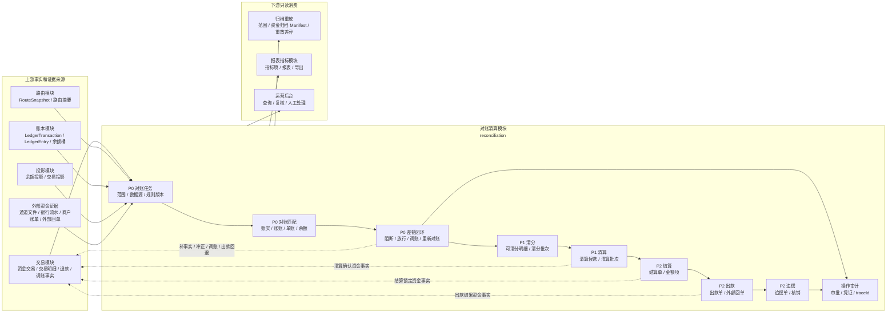

依赖边界：

| 依赖对象 | 本模块读取 | 本模块可触发 | 禁止 |
| --- | --- | --- | --- |
| 交易模块 | 资金交易、交易明细、退款、调账、出款结果等资金事实。 | 清算确认、结算锁定、出款结果、调账、冲正、补事实等标准资金动作。 | 直接改交易状态、直接插入交易明细、绕过交易层补账。 |
| 路由模块 | 原交易 route snapshot、路由摘要、参与方和账目路径。 | 不触发重新路由。 | 逆向、退款、差错处理按当前关系重新选路。 |
| 账本模块 | 账本交易、posting plan、ledger entry、余额桶和账本周期。 | 通过交易层或账本端口追加标准账务事实。 | 直接修改历史分录、余额投影或账本周期。 |
| 投影模块 | 余额投影、交易投影和查询视图，用于对账校验与运营展示。 | 差错处理后触发投影补偿或重放任务。 | 把投影当事实源、用投影反推入账。 |
| 外部资金证据 | 通道文件、银行流水、托管户流水、商户账单、外部回单。 | 创建对账任务、匹配结果、差错单和阻断/放行记录。 | 直接用外部文件改账或覆盖内部事实。 |
| 归档重放 | 已完成对账清算对象、差错和审计引用。 | 为归档、重放提供范围和证据引用。 | 归档或重放反向推进对账清算状态。 |
| 报表指标模块 | 对账清算对象和差错结果的只读事实输入。 | 提供指标项来源和业务口径。 | 指标结果反写清算、结算、出款或差错状态。 |

### 3.3 对象关系

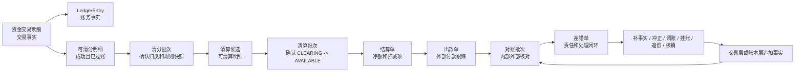

### 3.4 对账清算模块划分

对账清算模块是一个统一业务模块，内部按对象和职责拆分子模块。模块内部可以共享批处理、规则版本、审计和权限能力，但每个子模块的数据对象、状态机、幂等键和账务影响必须独立。

| 子模块 | 主要对象 | 职责 | 当前阶段落地优先级 |
| --- | --- | --- | --- |
| 对账任务模块 | 对账批次、对账数据源、对账窗口、规则版本 | 采集内部事实和外部流水，创建对账任务，管理任务生命周期、重跑和关闭。 | P0，优先完成。 |
| 对账匹配模块 | 对账匹配结果、差异指纹、匹配规则 | 完成账实、账账、单账、余额一致性匹配，输出匹配结果和差异样本。 | P0，优先完成。 |
| 对账差错模块 | 差错单、放行/阻断记录、调账引用、重新对账引用 | 承接差异分级、责任归属、条件放行、阻断、审批、调账、核销和重新对账。 | P0，优先完成。 |
| 清分模块 | 可清分明细、清分批次 | 从已成功、已过账、可对账的交易事实中识别可清分明细，确认清分归类和规则快照。 | P1，依赖基础对账准入。 |
| 清算模块 | 清算账期、清算候选、清算批次、清算批次明细 | 在清分确认后解析清算账期，生成候选并在确认时触发 `CLEARING -> AVAILABLE` 资金事实。 | P1，依赖清算前置对账。 |
| 结算模块 | 结算单、结算金额项 | 基于可结算余额、扣减项、准备金和追偿项生成净额，锁定时触发结算锁定资金事实。 | P2，依赖对账和清算结果。 |
| 出款模块 | 出款单、外部回单、失败回退引用 | 跟踪外部付款提交、处理中、成功、失败、退回和金额不一致，承接出款对账和失败回退。 | P2，依赖出款对账能力。 |
| 追偿与审计模块 | 追偿单、操作审计、凭证引用 | 承接已出款后的退款、拒付、费用、差错和负余额追偿，并保留高危操作审计。 | P2，依赖差错闭环。 |

当前阶段编码准备只应把 P0 对账任务、对账匹配和对账差错模块作为首要范围。P1/P2 子模块在本分册中保留完整设计，用于保证目标模型一致，但不应抢在对账基础能力之前整体落地。

### 3.5 子模块边界

| 子模块 | 建议契约层 | 写入边界 | 只读依赖 |
| --- | --- | --- | --- |
| 对账任务模块 | 对账契约 | 写对账任务、运行状态、数据源摘要和重跑记录，不直接改账。 | 内部交易、账本、外部文件、银行流水、投影和运营单据。 |
| 对账匹配模块 | 对账契约 | 写匹配结果、差异指纹、差异等级和匹配摘要，不直接改账。 | 对账任务、匹配规则、内部事实、外部流水和余额桶摘要。 |
| 对账差错模块 | 对账契约 | 写差错单、责任、处理动作、审批、核销和重新对账引用。 | 对账批次、匹配结果、账本、外部凭证、运营证据。 |
| 清分模块 | 清结算契约 | 写可清分结果、排除原因、清分批次和复核状态，不写账。 | 资金交易明细、ledger entry、route snapshot、基础对账结果、商户账户和规则快照。 |
| 清算模块 | 清结算契约 | 写清算账期快照、候选、阻断原因和批次状态；批次确认时通过交易层生成清算确认事实。 | 已确认清分批次、清算前置对账结果、退款、争议、风控状态、规则版本和审批。 |
| 结算模块 | 清结算契约 | 写结算单、金额项和锁定状态；锁定时通过交易层生成结算锁定事实。 | 商户余额、清算批次、费用、扣减项、准备金、追偿和对账结果。 |
| 出款模块 | 清结算契约 | 写出款单、外部回单、失败原因和回退引用；成功、失败、退回时生成出款结果事实或差错。 | 结算单、外部回单、银行流水和出款对账结果。 |
| 追偿与审计模块 | 交易契约 + 清结算契约 | 通过 `FundsBalanceControlService.adjust` 或直接交易追加事实，并写追偿状态和审计记录。 | 差错单、追偿单、审批、凭证和重新对账结果。 |

### 3.6 当前阶段优先级

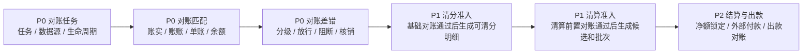

阶段准入要求：

1. P0 必须先完成对账批次、对账匹配结果、差错单和操作审计的数据对象、状态机、幂等与重跑策略。
2. 清分准入依赖基础对账结果；未完成基础对账或存在重大差错时，不得生成可清分明细。
3. 清算准入依赖清分确认和清算前置对账结果；重大对账差异不得进入清算批次确认。
4. 结算和出款依赖清算确认、余额桶校验和出款对账能力；外部受理不得被视为到账成功。

### 3.7 产品、DSL、TDD 对齐矩阵

| 产品验收项 | 系分落点 | DSL 承接 | TDD 承接 |
| --- | --- | --- | --- |
| 对账任务生命周期 | 对账任务模块、对账批次状态和运行记录。 | 不进入 DSL。 | `TDD-RECON-007`、`TDD-RED-022`。 |
| 账实/账账/单账/余额一致 | 对账匹配模块、匹配结果、余额桶校验摘要。 | DSL 只承接对账后的资金事实或调账事实，不承接对账报表本身。 | `TDD-RECON-003`、`TDD-RECON-004`、`TDD-RECON-006`。 |
| 对账放行矩阵 | 对账差错模块、差错等级、放行/阻断和风险接受记录。 | 有条件放行不直接生成账务事实；调账必须用 `ADJUST` 且带审批。 | `TDD-RECON-005`、`TDD-RED-021`。 |
| 清分前基础对账 | 清分模块准入守卫、对账任务 `BASIC_BEFORE_SPLIT`。 | 不进入资金 DSL；只作为生成可清分明细的准入上下文。 | `TDD-CLS-001`、`TDD-RECON-003`。 |
| 清分批次不入账 | 清分批次状态机和 `t_clearing_split_batch`。 | 不生成 `LedgerEntry`，不出现 route leg。 | `TDD-CLS-003`、`TDD-RED-020`。 |
| 清算前置对账 | 清算模块候选生成守卫、对账任务 `BEFORE_CLEARING_CONFIRM`。 | 清算确认事实进入 DSL 前的准入上下文。 | `TDD-CLS-004`、`TDD-RECON-004`。 |
| 清算确认入账 | 清算批次确认调用交易层生成 `CLEARING_CONFIRM`。 | `DIRECT_TRANSACTION / CLEARING_CONFIRM`，`CLEARING -> AVAILABLE`。 | `TDD-CLS-006`。 |

## 四、详细设计

本章按当前落地优先级排版：先说明 P0 对账任务、对账匹配和对账差错，再说明 P1 清分/清算，最后说明 P2 结算、出款、追偿以及表设计、补偿、运营和测试。

### 4.1 对账任务与对账批次

对账任务是对账清算模块当前阶段的优先落点，负责把内部事实、外部证据、匹配规则和差异处理放到同一个可重跑、可审计的任务上下文中。对账批次只承载范围、规则、数据源、匹配摘要和关闭结果，不直接改账。

#### 4.1.1 对账任务类型

| 类型 | 内部来源 | 外部来源 | 目标 |
| --- | --- | --- | --- |
| 交易对账 | 资金交易、交易明细 | 通道文件、业务单、外部流水 | 状态、金额、币种、reference 一致。 |
| 资金到账对账 | 平台现金映射、出款单 | 银行流水、回单 | 证明外部钱是否到或出。 |
| 账务一致性 | 资金交易、账本交易、分录、余额投影 | 不适用或巡检快照 | 证明交易和账务一致。 |
| 对账清算运营对象对账 | 清分批次、清算批次、结算单、出款单 | 商户账单、外部回单 | 证明批次、净额和出款一致。 |
| 报表核对 | 交易投影、报表指标查询结果 | 报表文件或财务口径 | 证明报表来源可信。 |

#### 4.1.2 对账流程

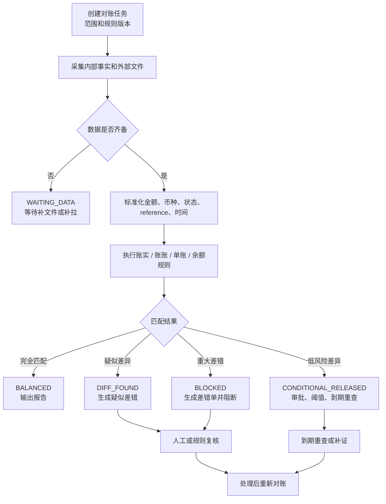

对账批次约束：

1. 对账批次不直接改账。
2. 匹配规则、字段映射、金额精度、时区和文件版本必须留痕。
3. 批次必须输出总数、匹配数、差异数、金额摘要和失败样本。
4. 批次关闭前，重大差异必须有关联差错单、阻断记录和重新对账结果。
5. 有条件放行必须有关联审批、阈值、账龄、责任方、风险承接和到期重查，不得覆盖旧运行记录。

#### 4.1.3 对账任务状态机

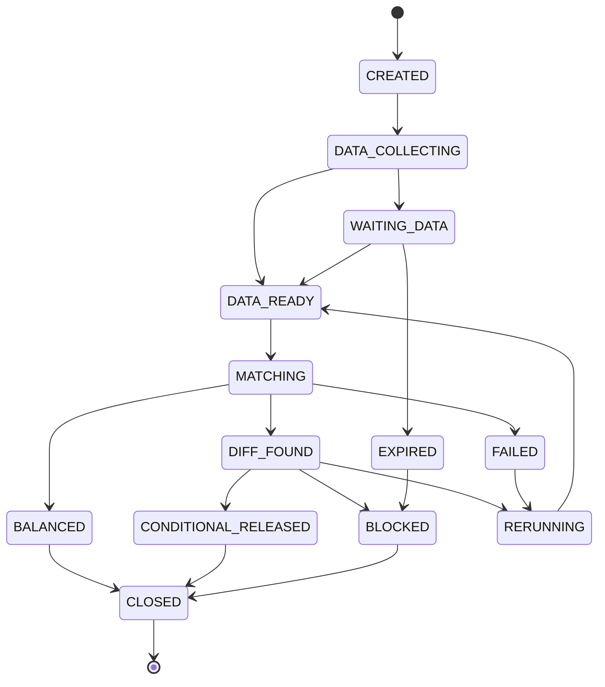

状态说明：`CREATED` 已创建，`DATA_COLLECTING` 收数中，`WAITING_DATA` 等待外部文件或流水，`DATA_READY` 数据齐备，`MATCHING` 匹配中，`DIFF_FOUND` 发现差异，`CONDITIONAL_RELEASED` 有条件放行，`BLOCKED` 阻断，`BALANCED` 对平，`FAILED` 任务失败，`EXPIRED` 等待超时，`RERUNNING` 重跑中，`CLOSED` 已关闭。

### 4.2 对账匹配与一致性规则

对账匹配模块负责输出账实一致、账账一致、单账一致和余额一致的系统结论。匹配结果只作为差错、阻断、放行和重新对账的依据，不作为直接改账入口。

#### 4.2.1 对账目标和规则

| 对账目标 | 系统规则 | 阻断条件 |
| --- | --- | --- |
| 账实一致 | 内部账本账户、账目和余额桶必须能映射到银行流水、通道文件、托管户流水、外部回单或外部文件。 | 错主体、错币种、金额不平、外部失败内部成功、重复外部 reference。 |
| 账账一致 | 业务账、支付账、账户账、商户账、总账、明细账、交易投影和余额投影必须基于同一业务事实。 | 汇总不等于明细、状态不可解释、方向不一致。 |
| 单账一致 | 业务单、支付单、退款单、清分批次、清算批次、结算单、出款单和调账单必须能追溯到资金交易和账本交易。 | 有单无账、有账无单、重复单据。 |
| 余额一致 | 按主体、账目、币种和账本周期分别校验期初、本期入、本期出、期末；按余额桶分别校验。 | 余额公式不成立、`FROZEN` 总额不守恒、`SETTLEMENT` 外部受理误记成功。 |

#### 4.2.2 余额桶校验落地


| 余额桶 | 系统校验 | 失败动作 |
| --- | --- | --- |
| `CLEARING` | 期初待清算 + 本期成功入账 - 本期退款/冲正/清算确认/扣减 = 期末待清算。 | 阻断清分或清算候选。 |
| `AVAILABLE` | 期初可用 + 本期清算确认/释放 - 本期结算锁定/退款/费用/调账 = 期末可用。 | 阻断结算单生成或锁定。 |
| `SETTLEMENT` | 期初出款中 + 本期结算锁定 - 本期出款成功/失败回退/退回差错 = 期末出款中。 | 阻断重复出款，生成出款差错。 |
| `IN_TRANSIT` | 期初在途 + 本期外部提交或处理中 - 本期成功确认/失败/退回/核销 = 期末在途。 | 进入在途账龄、到期重查和差错处理。 |
| `FROZEN` | 期初冻结 + 本期冻结 - 本期解冻/释放/后续资金事实关闭 = 期末冻结。 | 公式不成立时阻断解冻、出款或报表发布；关闭必须引用后续资金事实。 |

### 4.3 对账差错与重新对账

#### 4.3.1 差错状态机

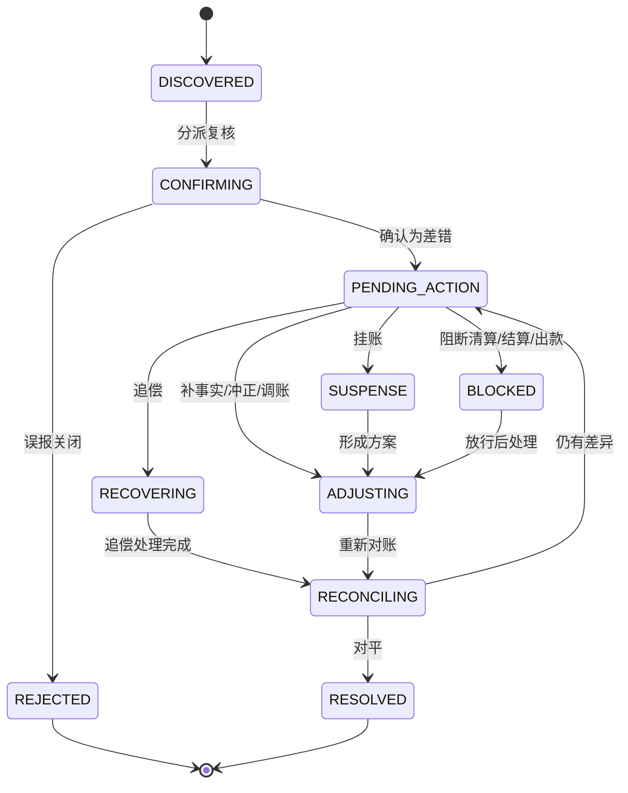

#### 4.3.2 差错处理动作

| 动作 | 系统行为 | 账务影响 |
| --- | --- | --- |
| 补事实 | 通过交易层补入缺失资金事实。 | 追加标准交易和分录。 |
| 冲正 | 对错误账务追加反向事实。 | 追加冲正分录。 |
| 调账 | 审批后执行调整。 | 追加调账分录。 |
| 挂账 | 暂存无法归属差异。 | 可进入 `ADJUSTMENT` 或挂账口径。 |
| 追偿 | 对已出款后退款、拒付、费用或差错发起追回。 | 进入准备金、后续抵扣、负余额或人工收款。 |
| 核销 | 经证据确认关闭差错。 | 不等同于改账，必须关联重新对账或凭证。 |

#### 4.3.3 差错等级和放行矩阵

| 等级 | 判断口径 | 默认系统动作 | 示例 |
| --- | --- | --- | --- |
| `S0` | 可能造成重复出款、错主体入账、错币种入账、余额不平或资金损失。 | 立即阻断相关清分、清算、结算、出款和报表发布。 | 重复出款、缺分录仍清算、余额公式不成立。 |
| `S1` | 影响清结算、出款或关账，但已有责任方和处理路径。 | 阻断相关批次，生成差错单和 SLA。 | 外部失败内部成功、金额差超阈值。 |
| `S2` | 可解释且在策略阈值内。 | 暂缓、挂账或有条件放行，到期重查。 | 手续费尾差、跨日归属、文件延迟。 |
| `S3` | 不影响资金、账本、余额和单据一致性。 | 阻断报表或展示，不阻断资金流程。 | 展示字段、运营标签、报表维度缺失。 |

| 差异类型 | 默认动作 | 是否可放行 | 落地要求 |
| --- | --- | --- | --- |
| 错主体、错币种、金额不平、余额公式不成立 | 阻断。 | 否。 | 必须补事实、冲正、调账或重建投影后重新对账。 |
| 重复外部 reference、重复入账、重复出款 | 阻断。 | 否。 | 通过唯一事实确认、重复拒绝或冲正关闭。 |
| 缺账本分录、有单无账、有账无单 | 阻断。 | 否。 | 通过交易层补入事实或差错闭环后重跑。 |
| 文件延迟、银行未达账、通道处理中 | 暂缓或进入在途。 | 有条件。 | 必须有责任方、账龄阈值、到期重查和风险承接。 |
| 手续费、汇率、舍入尾差 | 复核差额。 | 有条件。 | 必须在容差内，有财务确认、费用调整或挂账路径。 |
| 非资金展示差异 | 报表修复。 | 有条件。 | 不影响资金、账本、余额和单据一致性。 |

差错红线：

1. 差错处理不能直接修改历史分录、余额投影、交易投影或外部流水。
2. 调账必须引用差错、审批、凭证和账本交易。
3. 差错关闭必须有重新对账结果、凭证或责任确认。
4. 未核销重大差错必须能阻断清算、结算、出款或报表发布。
5. `S0` / `S1` 重大差错不得带原因放行；`S2` 放行必须写入风险接受和到期重查。

### 4.4 可清分明细与清分批次

#### 4.4.1 可清分识别流程

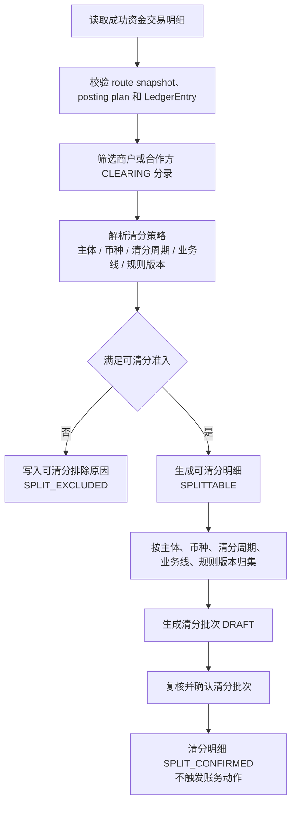

可清分准入守卫：

| 守卫 | 系统检查 |
| --- | --- |
| 交易成功 | 资金交易和交易明细必须是最终成功状态；失败、拒绝、撤销、过期不得进入清分。 |
| 已过账 | 必须存在账本交易、分录和余额投影可校验引用。 |
| 待清算账目 | 来源分录必须命中商户或合作方 `CLEARING`，不得从 `AVAILABLE` 或报表反推。 |
| 快照完整 | route snapshot、posting plan、业务引用、规则版本、币种和账务主体必须完整。 |
| 金额拆解 | 本金、手续费、通道成本、补贴、税费、退款预留等金额项必须可拆解。 |
| 周期可解析 | 清分周期必须由策略解析得到，并固化规则编码、版本、时区和 cutoff。 |
| 未硬阻断 | 退款完成、退款中、争议中、重大差错、风控冻结、重复入批必须排除。 |

#### 4.4.2 清分批次状态机

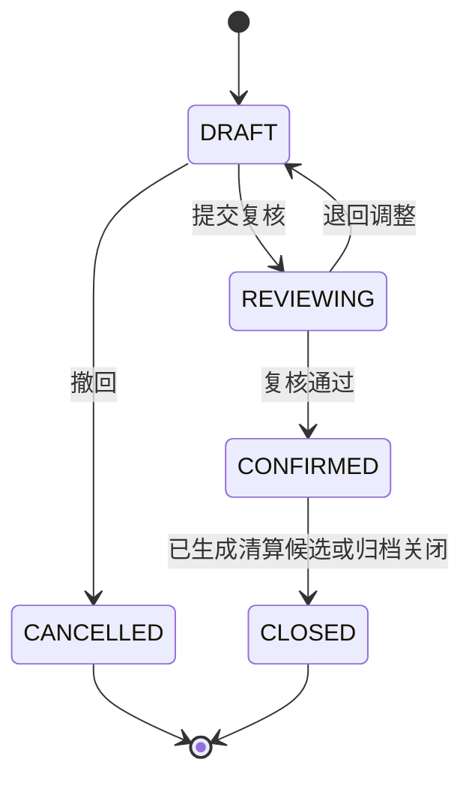

清分批次约束：

1. 清分批次确认只改变清分对象状态，不调用交易层或账本层。
2. 清分批次确认后才允许执行可清算判定。
3. 同一可清分明细只能进入一个未取消清分批次。
4. 清分批次发现错分时，不删除历史批次；通过撤回、排除、补差或差错单处理。

#### 4.4.3 清分数据

| 字段 | 说明 |
| --- | --- |
| `splittableSn` | 可清分明细流水号。 |
| `tenantId` | 租户。 |
| `merchantSubjectRef` | 商户资金主体。 |
| `currency` | 币种。 |
| `businessScene/businessSn` | 来源业务引用。 |
| `fundsTransactionSn/detailSn` | 资金交易和交易明细引用。 |
| `ledgerTransactionSn/ledgerEntrySn` | 账本交易和分录引用。 |
| `amount` | 可清分金额。 |
| `splitPeriod` | 清分周期，不是账本周期。 |
| `ruleVersion` | 清分规则版本。 |
| `status` | `SPLITTABLE`、`SPLIT_EXCLUDED`、`SPLIT_LOCKED`、`SPLIT_CONFIRMED`。 |
| `excludeReason` | 不可清分或排除原因。 |

清分红线：

1. 可清分明细不入账。
2. 清分批次确认不入账。
3. 清分不能从余额、报表或人工汇总反推，必须来自交易明细和商户 `CLEARING` 分录。

### 4.5 清算候选与清算账期

#### 4.5.1 清算账期确认规则

清算账期是清算批次分组和到期判断的业务周期，不是账本周期。它由清算策略解析并固化在清算候选和清算批次中，后续重跑必须复用同一规则版本或显式生成新版本差异。

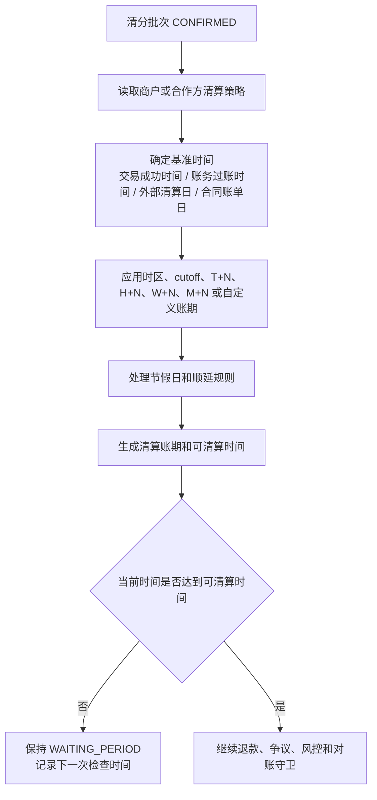

| 输入 | 说明 |
| --- | --- |
| `ruleCode/ruleVersion` | 清算策略编码和版本，必须固化。 |
| `baseTimeType` | 基准时间来源，例如交易成功时间、账务过账时间、外部清算日或合同账单日。 |
| `timezone/cutoffTime` | 用于日切和跨时区归属。 |
| `cycleType/cycleValue` | 实时、T+N、H+N、W+N、M+N 或自定义账期。 |
| `holidayCalendar` | 节假日和工作日顺延规则。 |
| `clearingPeriod` | 解析后的清算账期，例如 2026-05-18、`2026-W21`、`CONTRACT-2026-05-A`。 |
| `clearingAvailableTime` | 候选可进入清算批次的最早时间。 |

账期确认红线：

1. 策略缺失、版本缺失、时区缺失、cutoff 解析失败时不得默认实时清算。
2. 清算账期不得写入账本 `periodId`，账本周期仍由账本 Profile 决定。
3. 同一清分明细在同一清算策略版本下只能有一个清算账期快照。

#### 4.5.2 可清算候选生成流程

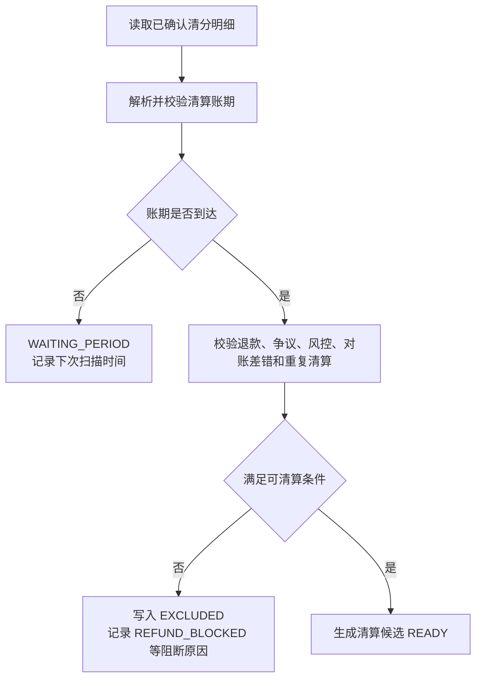

退款守卫按退款发生时点处理：

| 退款时点 | 系统处理 | 清分/清算状态 |
| --- | --- | --- |
| 付款成功后、清分前退款 | 不生成可清分明细，或将已有 `SPLITTABLE` 标记为 `SPLIT_EXCLUDED`。 | 不进入清分批次；退款事实按原 route snapshot 回补。 |
| 清分批次确认后、清算批次确认前退款 | 清分结果保留审计，清算候选状态标记为 `EXCLUDED`，排除原因记录为 `REFUND_BLOCKED`；若部分退款，按剩余可清算金额重新生成候选或差额候选。 | 退款金额不触发 `CLEARING -> AVAILABLE`；只有剩余可清算金额允许进入清算批次。 |
| 清算批次确认后、结算锁定前退款 | 不回滚清算批次；追加退款事实，从商户 `AVAILABLE` 或约定责任账户扣减，结算单净额加入退款扣减项。 | 清算批次保持 `CONFIRMED`；结算净额减少。 |
| 结算锁定后、出款成功前退款 | 不直接回退用户；优先生成结算差错或释放/重算结算锁定，必要时 `SETTLEMENT -> AVAILABLE` 后再追加退款扣减。 | 已锁定金额不得被自动退款绕过。 |
| 出款成功后退款 | 不回滚历史出款；生成追偿单，进入准备金抵扣、后续结算抵扣、负余额或人工收款。 | 追偿闭环承接，不改历史出款。 |

#### 4.5.3 候选数据

| 字段 | 说明 |
| --- | --- |
| `candidateSn` | 候选流水号。 |
| `tenantId` | 租户。 |
| `merchantSubjectRef` | 商户资金主体。 |
| `currency` | 币种。 |
| `splitBatchSn/splittableSn` | 来源清分批次和可清分明细引用。 |
| `fundsTransactionSn/detailSn` | 资金交易和交易明细引用。 |
| `ledgerTransactionSn/ledgerEntrySn` | 账本交易和分录引用。 |
| `amount` | 可清算金额。 |
| `clearingPeriod` | 清算账期，不是账本周期。 |
| `clearingAvailableTime` | 最早可清算时间。 |
| `ruleVersion` | 清算规则版本。 |
| `status` | `WAITING_PERIOD`、`EXCLUDED`、`READY`、`LOCKED`、`CLEARED`。 |
| `excludeReason` | 排除或阻断原因。 |

候选红线：

1. 候选不入账。
2. 候选不能来自 `AVAILABLE` 反推，必须来自已确认清分批次、商户 `CLEARING` 交易明细和分录。
3. 候选进入候选池不代表已清算。

### 4.6 清算批次

#### 4.6.1 状态机

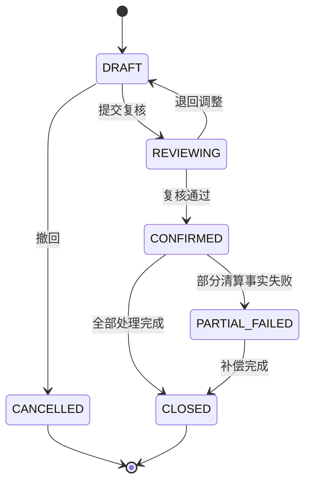

#### 4.6.2 清算确认流程

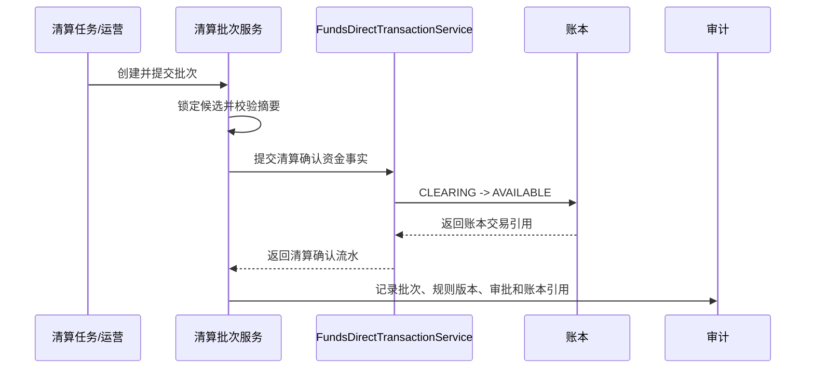

清算批次约束：

1. 批次维度包含租户、商户、币种、清算账期、业务线、规则版本和候选集合摘要。
2. 确认前必须锁定候选，避免同一明细进入多个批次。
3. 已确认批次不能重跑生成重复清算事实；修正走补差或冲正。
4. 批次确认的账务动作必须引用批次和候选明细摘要。
5. 清算确认前收到退款事件时，必须重新校验候选状态；已退款或部分退款金额不得进入确认金额。

### 4.7 退款时序与逆向处理

#### 4.7.1 付款成功、清分完成后退款

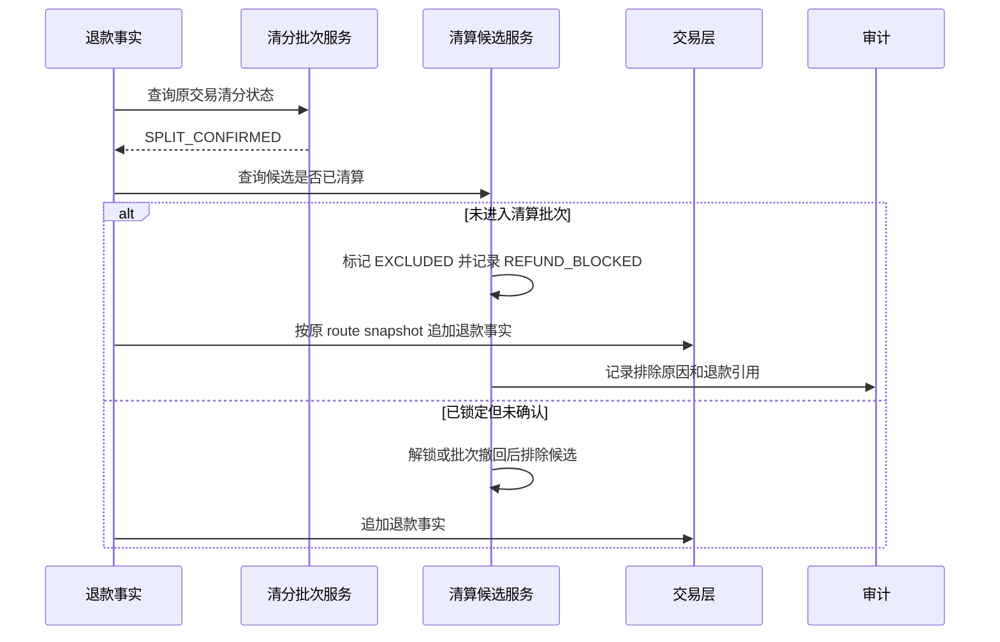

处理约束：

1. 清分批次不回滚，保留原始归类和规则快照。
2. 清算候选未确认前，退款优先阻断候选进入清算批次。
3. 部分退款时，系统可保留原候选并生成剩余金额候选，或把原候选排除后生成差额候选；两种方式都必须通过唯一键和摘要避免重复清算。
4. 退款资金事实必须基于原交易 route snapshot，不按当前账户绑定重新选路。

#### 4.7.2 清算确认后退款

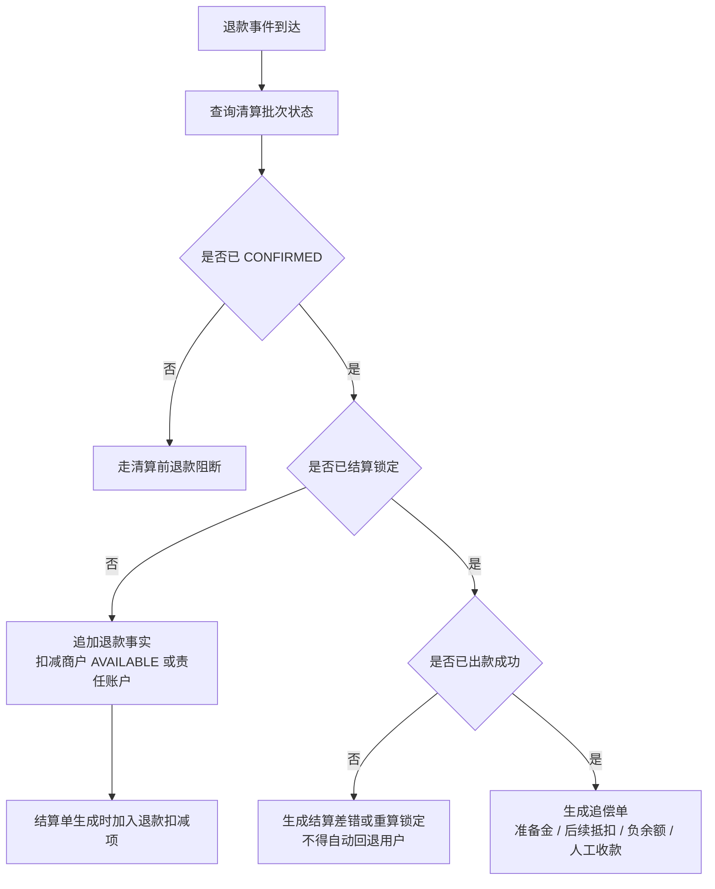

处理约束：

1. 已确认清算批次不可因退款而删除、回滚或重复确认。
2. 清算后、结算前退款通过追加退款事实影响商户 `AVAILABLE` 和结算净额。
3. 结算锁定后退款不得绕过结算单和出款单直接扣出款中资金。
4. 出款成功后退款由追偿闭环承接，不能回滚历史出款。

### 4.8 结算单

#### 4.8.1 结算净额

```text
结算净额
= 清算确认金额
+ 经审批加项
+ 追偿回补
+ 汇差调增
- 退款扣减
- 争议扣回
- 手续费
- 通道成本
- 准备金
- 负余额抵扣
- 风控扣留
- 未处理差错扣减
- 汇差调减
```

每个金额项必须有来源明细、规则版本、审批单或差错单引用，不能只保存汇总值。

#### 4.8.2 状态机

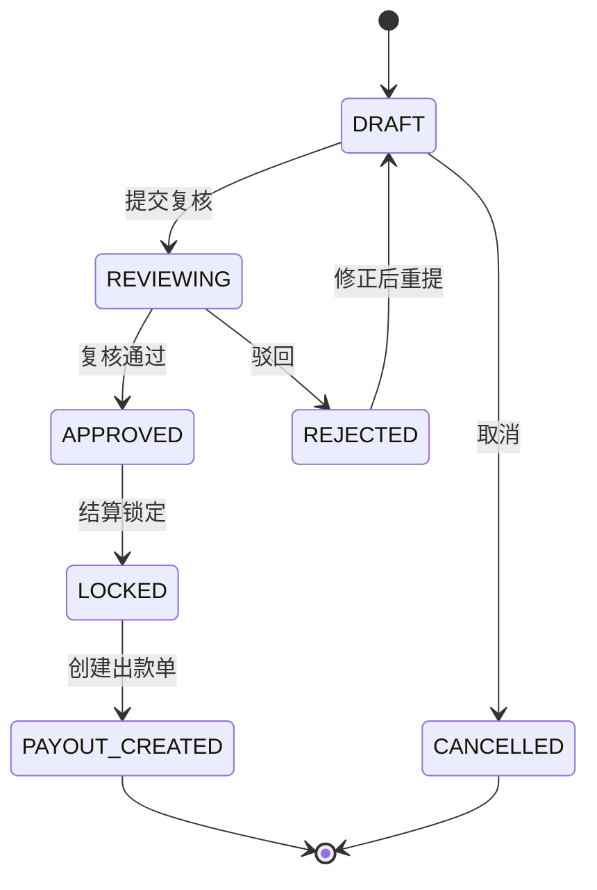

结算单约束：

1. 结算单是净额确认和出款前锁定对象，不代表外部出款成功。
2. 锁定时通过交易层生成 `AVAILABLE -> SETTLEMENT`。
3. 当前基线默认一张结算单只允许生成一张出款单；如需拆分出款，必须先补出款拆分明细、拆分金额汇总、回单归并和幂等唯一键。
4. 出款中金额不能再次进入结算。
5. 结算策略解析失败不得静默按实时策略处理。

### 4.9 出款单

#### 4.9.1 出款流程

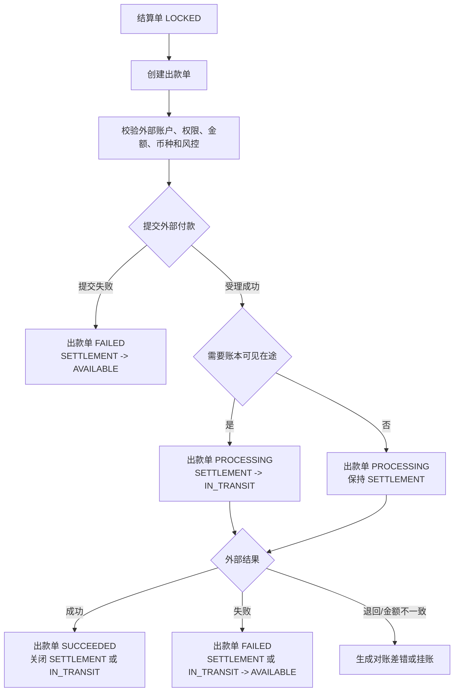

出款约束：

1. 外部受理成功不等于到账成功。
2. 需要账本可见在途时，外部受理后进入 `IN_TRANSIT`；未启用在途桶时只保持出款单 `PROCESSING`。
3. 同一结算单重复创建出款单必须命中原出款单或失败；不得生成第二张有效出款单。
4. 同一通道外部 reference 的回单只能处理一次；摘要不同的重复回单必须进入对账差错或人工复核。
5. 出款失败回退只执行一次。
6. 出款成功后发生退款、拒付或费用，不回滚历史出款，进入追偿、准备金、负余额或后续抵扣。
7. 外部回单、失败原因、重试次数和人工确认必须审计。

### 4.10 追偿单

追偿单用于承载已出款后发生退款、拒付、费用、差错或负余额需要追回的责任闭环。

| 字段 | 说明 |
| --- | --- |
| `recoverySn` | 追偿单号。 |
| `sourceType/sourceSn` | 来源退款、拒付、差错、费用或负余额。 |
| `responsibleSubject` | 责任主体。 |
| `amount/currency` | 追偿金额。 |
| `recoveryMode` | 准备金抵扣、后续结算抵扣、转负余额、人工收款。 |
| `status` | `CREATED`、`OFFSETTING`、`COLLECTING`、`PARTIAL_RECOVERED`、`CLOSED`。 |
| `ledgerRefs` | 关联资金事实和账本交易。 |

### 4.11 Java 模型、接口与服务 API 设计

本节定义对账清算模块进入编码前的 Java 契约设计。目标不是提前写实现，而是把 face/impl 模块、包结构、枚举、Request、Query、DTO、服务接口和实现层职责先设计清楚，让后续编码可以按 TDD 批次直接落地。

#### 4.11.1 模块与包结构

对账清算模块建议按仓库既有模块风格新增独立模块：

```text
reconciliation/
  reconciliation-face/
  reconciliation-impl/
```

契约层包名建议：

```text
com.capte.funds.reconciliation
  enums
  model.request
  model.query
  model.dto
  services
```

实现层包名建议：

```text
com.capte.funds.reconciliation
  impl
  dal.entities
  dal.mapper
  mapstruct
  domain
  matching
  scheduler
```

模块职责边界：

| 模块 | 职责 | 禁止 |
| --- | --- | --- |
| reconciliation-face | 暴露对账清算模块的公共 Java 契约，包括枚举、Request、Query、DTO 和 Service API。 | 暴露 Entity、Mapper、实现类或数据库细节。 |
| reconciliation-impl | 实现对账任务、对账匹配、差错闭环、清分、清算、结算、出款、追偿和审计。 | 让 Controller、任务调度或外部适配层直接写 Mapper。 |
| transaction-face | 对账清算模块触发清算确认、结算锁定、出款结果、调账、退款、追偿等资金事实的唯一交易契约入口。 | 让对账清算模块直接改交易事实。 |
| ledger-face | 对账清算模块查询账本交易、分录、余额桶和账务投影的契约入口。 | 让对账清算模块直接改历史分录或余额投影。 |

设计约束：

1. 对外服务只接收 `Request`、`Query`、`WindOperator`，只返回业务流水号、`DTO`、分页结果或操作结果。
2. `Request` 用于命令写入，`Query` 用于查询过滤，`DTO` 用于返回只读视图，`Entity` 只存在于 `reconciliation-impl`。
3. 金额字段统一使用最小货币单位 `Long`；币种沿用 `CurrencyIsoCode`。
4. 时间字段统一使用 `LocalDateTime`；跨时区和 cutoff 语义在规则快照字段中固化。
5. 所有命令 API 必须携带 `WindOperator`，用于权限、审计、审批和 trace 串联。
6. P0 编码只落对账任务、对账匹配、对账差错和操作审计；P1/P2 API 可先作为设计契约，不抢先实现。

#### 4.11.2 枚举模型

枚举放在 `com.capte.funds.reconciliation.enums`。枚举值应与表状态、流程图和 TDD 用例保持一致，禁止一个枚举同时表达不同对象的生命周期。

| 枚举 | 适用对象 | 建议值 |
| --- | --- | --- |
| ReconciliationType | 对账任务类型 | `TRANSACTION`、`FUNDS_RECEIPT`、`LEDGER_CONSISTENCY`、`OPERATION_OBJECT`、`REPORT_CHECK` |
| ConsistencyTarget | 对账一致性目标 | `REAL`、`BOOK`、`DOCUMENT`、`BALANCE` |
| ReconciliationBatchStatus | 对账批次状态 | `CREATED`、`DATA_COLLECTING`、`WAITING_DATA`、`DATA_READY`、`MATCHING`、`DIFF_FOUND`、`CONDITIONAL_RELEASED`、`BLOCKED`、`BALANCED`、`FAILED`、`EXPIRED`、`RERUNNING`、`CLOSED` |
| MatchStatus | 对账匹配状态 | `MATCHED`、`INTERNAL_ONLY`、`EXTERNAL_ONLY`、`AMOUNT_MISMATCH`、`STATUS_MISMATCH`、`CURRENCY_MISMATCH`、`SUBJECT_MISMATCH`、`DUPLICATED` |
| DifferenceType | 差异类型 | `AMOUNT`、`STATUS`、`SUBJECT`、`CURRENCY`、`DUPLICATE_REFERENCE`、`MISSING_INTERNAL`、`MISSING_EXTERNAL`、`BALANCE_FORMULA`、`DOCUMENT_MISSING` |
| ExceptionSeverity | 差错等级 | `S0`、`S1`、`S2`、`S3` |
| ReleaseDecision | 放行判断 | `BLOCKED`、`CONDITIONAL_RELEASED`、`REJECTED_AS_FALSE_POSITIVE`、`NO_RELEASE_REQUIRED` |
| ExceptionCaseStatus | 差错单状态 | `DISCOVERED`、`CONFIRMING`、`REJECTED`、`PENDING_ACTION`、`ADJUSTING`、`SUSPENSE`、`BLOCKED`、`RECOVERING`、`RECONCILING`、`RESOLVED` |
| ExceptionActionType | 差错处理动作 | `SUPPLEMENT_FACT`、`REVERSE`、`ADJUST`、`SUSPENSE`、`RECOVER`、`WRITE_OFF`、`RECHECK` |
| ClearingSplittableStatus | 可清分明细状态 | `SPLITTABLE`、`SPLIT_EXCLUDED`、`SPLIT_LOCKED`、`SPLIT_CONFIRMED` |
| ClearingSplitBatchStatus | 清分批次状态 | `DRAFT`、`REVIEWING`、`CONFIRMED`、`CANCELLED`、`CLOSED` |
| ClearingCandidateStatus | 清算候选状态 | `WAITING_PERIOD`、`EXCLUDED`、`READY`、`LOCKED`、`CLEARED` |
| ClearingBatchStatus | 清算批次状态 | `DRAFT`、`REVIEWING`、`CONFIRMED`、`PARTIAL_FAILED`、`CLOSED`、`CANCELLED` |
| SettlementOrderStatus | 结算单状态 | `DRAFT`、`REVIEWING`、`APPROVED`、`LOCKED`、`PAYOUT_CREATED`、`REJECTED`、`CANCELLED` |
| PayoutOrderStatus | 出款单状态 | `CREATED`、`SUBMITTED`、`PROCESSING`、`SUCCEEDED`、`FAILED`、`RETURNED`、`MISMATCHED` |
| RecoveryOrderStatus | 追偿单状态 | `CREATED`、`OFFSETTING`、`COLLECTING`、`PARTIAL_RECOVERED`、`CLOSED`、`WRITTEN_OFF` |

枚举红线：

1. `CLEARING`、`SETTLEMENT`、`AVAILABLE` 等余额桶不是对账清算对象状态，不得混进批次状态枚举。
2. 清分批次状态和清算批次状态必须分离，不能用一个 `BatchStatus` 表达。
3. 对账差异等级和放行结果必须分离，`S2` 不天然等于可放行。

#### 4.11.3 通用值对象

通用值对象放在 `model.dto` 或 `model.request` 中，按使用方向区分；不建议为当前阶段引入复杂继承。

| 模型 | 字段 | 用途 |
| --- | --- | --- |
| ReconciliationWindow | `windowStart`、`windowEnd`、`timezone` | 表达对账窗口和归属时区。 |
| ReconciliationRuleRef | `ruleCode`、`ruleVersion` | 固化匹配、放行、清分、清算、结算等规则版本。 |
| FundsSubjectRefDTO | `subjectType`、`subjectId` | 表达商户、合作方、平台、账户等可核对主体。 |
| SourceObjectRefDTO | `sourceType`、`sourceSn` | 表达内部事实、外部流水、运营单据或差错来源。 |
| EvidenceRefDTO | `evidenceType`、`evidenceSn`、`digest`、`uri` | 表达文件、凭证、回单、截图、审批等证据引用。 |
| AmountSummaryDTO | `amount`、`currency`、`count` | 表达批次、匹配、差错和金额项摘要。 |
| BalanceBucketCheckDTO | `bucket`、`openingAmount`、`debitAmount`、`creditAmount`、`closingAmount`、`matched` | 表达余额桶公式校验结果。 |
| OperationTraceDTO | `operatorId`、`traceId`、`approvalSn`、`reason` | 表达操作人、审批、原因和链路。 |

命令请求通用字段：

| 字段 | 说明 | TDD 断言 |
| --- | --- | --- |
| requestSn | 本次命令请求流水号；由调用方或任务编排方生成。 | 同一 `requestSn` 重复提交时必须幂等。 |
| requestDigest | 本次请求关键字段摘要；用于识别同键同摘要复用、同键不同摘要冲突。 | 同一 `requestSn` + 同一 `requestDigest` 返回同一结果；同一 `requestSn` + 不同 `requestDigest` 必须失败且无副作用。 |
| reason | 操作原因；关闭、放行、核销、人工排除、出款回单确认等高危动作必填。 | 高危动作缺原因必须失败。 |
| evidenceRefs | 证据引用；文件、回单、审批、截图或外部流水摘要。 | 需要凭证的动作缺证据必须失败。 |

通用字段约束：

1. P0 对账任务、匹配、差错和审计命令必须显式设计 `requestSn` 和 `requestDigest`，避免只能按数据库自然键猜幂等。
2. P1/P2 的批次确认、结算锁定、出款回单和追偿动作也必须沿用同一幂等口径。
3. 查询 `Query` 不携带 `requestSn`，但分页、排序和范围必须明确，默认返回空集合而不是 `null`。

#### 4.11.4 P0 对账任务模型

核心 Request：

| Request | 关键字段 | 说明 |
| --- | --- | --- |
| CreateReconciliationBatchRequest | `requestSn`、`requestDigest`、`tenantId`、`reconciliationType`、`subjectRef`、`currency`、`window`、`ruleRef`、`consistencyTargets`、`releasePolicyRef`、`description` | 创建对账批次，只确定范围、规则和目标，不立即改账。 |
| CollectReconciliationDataRequest | `requestSn`、`requestDigest`、`reconciliationSn`、`internalSources`、`externalSources`、`fileSn`、`fileDigest`、`receivedTime` | 记录本次收数来源、文件摘要和外部证据。 |
| RunReconciliationMatchingRequest | `requestSn`、`requestDigest`、`reconciliationSn`、`runMode`、`expectedDigest` | 执行匹配，`runMode` 可区分首次匹配和重跑。 |
| RerunReconciliationBatchRequest | `requestSn`、`requestDigest`、`reconciliationSn`、`reason`、`previousRunSn`、`ruleRef` | 重新对账，必须引用上一次运行和原因。 |
| CloseReconciliationBatchRequest | `requestSn`、`requestDigest`、`reconciliationSn`、`closeReason`、`evidenceRefs` | 关闭对账批次，重大差错未闭环时必须失败。 |

核心 Query / DTO：

| 模型 | 用途 |
| --- | --- |
| ReconciliationBatchQuery | 按租户、对账类型、主体、币种、窗口、状态、规则版本查询批次。 |
| ReconciliationBatchDTO | 返回批次范围、规则版本、状态、匹配摘要、差异摘要、关闭信息。 |
| ReconciliationRunDTO | 返回一次运行的收数、匹配、规则、耗时、失败原因和运行摘要。 |
| ReconciliationReportDTO | 返回账实、账账、单账、余额一致性结论和差异样本入口。 |

服务 API：

```java
public interface ReconciliationBatchService {

    String createReconciliationBatch(CreateReconciliationBatchRequest request, WindOperator operator);

    String collectReconciliationData(CollectReconciliationDataRequest request, WindOperator operator);

    String runReconciliationMatching(RunReconciliationMatchingRequest request, WindOperator operator);

    String rerunReconciliationBatch(RerunReconciliationBatchRequest request, WindOperator operator);

    void closeReconciliationBatch(CloseReconciliationBatchRequest request, WindOperator operator);

    ReconciliationBatchDTO getReconciliationBatchBySn(String reconciliationSn);

    ReconciliationReportDTO getReconciliationReport(String reconciliationSn);

    WindPagination<ReconciliationBatchDTO> queryReconciliationBatches(
            ReconciliationBatchQuery query,
            WindQuery<? extends QueryOrderField> options);
}
```

API 约束：

1. `createReconciliationBatch` 必须按 `requestSn + requestDigest` 做命令幂等，并按范围、规则版本和窗口做业务唯一性保护。
2. `collectReconciliationData` 只登记来源和摘要，不负责匹配，不改账。
3. `runReconciliationMatching` 输出匹配结果、差异指纹和批次摘要；发现重大差异时进入阻断状态。
4. `rerunReconciliationBatch` 不覆盖旧运行结果，必须生成新的运行记录并保留上一轮引用。
5. `closeReconciliationBatch` 必须校验重大差错已经处理、阻断已经释放或风险已被审批承接。

#### 4.11.5 P0 对账匹配模型

核心 Request：

| Request | 关键字段 | 说明 |
| --- | --- | --- |
| RecordReconciliationMatchResultRequest | `requestSn`、`requestDigest`、`reconciliationSn`、`internalSource`、`externalSource`、`matchStatus`、`differenceType`、`consistencyTarget`、`severity`、`amounts`、`differenceDigest` | 写入单条匹配结果，通常由匹配引擎内部调用。 |
| CreateExceptionFromMatchRequest | `requestSn`、`requestDigest`、`resultSn`、`severity`、`blockingScope`、`reason` | 将匹配差异升级为差错单。 |

核心 Query / DTO：

| 模型 | 用途 |
| --- | --- |
| ReconciliationMatchResultQuery | 按批次、内部来源、外部来源、差异类型、匹配状态、等级查询。 |
| ReconciliationMatchResultDTO | 返回单条匹配结果、差异原因、金额差异和差错引用。 |
| ReconciliationMatchSummaryDTO | 返回批次匹配率、差异数、差异金额、差异类型分布。 |

服务 API：

```java
public interface ReconciliationMatchResultService {

    String recordMatchResult(RecordReconciliationMatchResultRequest request, WindOperator operator);

    String createExceptionFromMatch(CreateExceptionFromMatchRequest request, WindOperator operator);

    ReconciliationMatchResultDTO getMatchResultBySn(String resultSn);

    ReconciliationMatchSummaryDTO getMatchSummary(String reconciliationSn);

    WindPagination<ReconciliationMatchResultDTO> queryMatchResults(
            ReconciliationMatchResultQuery query,
            WindQuery<? extends QueryOrderField> options);
}
```

API 约束：

1. 匹配结果唯一键为 `reconciliationSn + differenceDigest`，重复重跑不得重复生成差错。
2. 匹配结果只引用内部事实和外部证据，不承载调账结果。
3. `createExceptionFromMatch` 必须继承匹配结果的差异指纹和阻断等级，避免人工改写差异来源。

#### 4.11.6 P0 对账差错模型

核心 Request：

| Request | 关键字段 | 说明 |
| --- | --- | --- |
| CreateExceptionCaseRequest | `requestSn`、`requestDigest`、`sourceRef`、`exceptionType`、`responsibleSubject`、`amount`、`currency`、`severity`、`blockingScope`、`evidenceRefs` | 创建差错单，可来自匹配结果、出款回单、清算异常或人工复核。 |
| ConfirmExceptionCaseRequest | `requestSn`、`requestDigest`、`exceptionSn`、`confirmed`、`reason`、`evidenceRefs` | 复核差错；误报进入 `REJECTED`，真实差错进入 `PENDING_ACTION`。 |
| ApplyExceptionActionRequest | `requestSn`、`requestDigest`、`actionSn`、`exceptionSn`、`actionType`、`approvalSn`、`evidenceRefs`、`fundsTransactionSn`、`description` | 登记补事实、冲正、调账、挂账、追偿、核销等动作。 |
| ConditionalReleaseRequest | `requestSn`、`requestDigest`、`releaseSn`、`exceptionSn`、`releaseScope`、`expireTime`、`riskOwner`、`approvalSn`、`reason` | 对 S2/S3 差异做有条件放行。 |
| StartExceptionRecheckRequest | `requestSn`、`requestDigest`、`exceptionSn`、`recheckReconciliationSn`、`reason` | 关联重新对账批次。 |
| ResolveExceptionCaseRequest | `requestSn`、`requestDigest`、`exceptionSn`、`resolution`、`recheckReconciliationSn`、`evidenceRefs` | 关闭差错单，必须有重新对账、凭证或责任确认。 |

核心 Query / DTO：

| 模型 | 用途 |
| --- | --- |
| ExceptionCaseQuery | 按来源、责任主体、等级、状态、阻断范围、账龄和金额查询差错。 |
| ExceptionCaseDTO | 返回差错来源、责任、金额、等级、阻断、动作、审批、凭证、重新对账和关闭结果。 |
| ExceptionActionDTO | 返回差错处理动作历史。 |
| ReleaseDecisionDTO | 返回放行范围、审批、到期重查和风险承接。 |

服务 API：

```java
public interface ExceptionCaseService {

    String createExceptionCase(CreateExceptionCaseRequest request, WindOperator operator);

    void confirmExceptionCase(ConfirmExceptionCaseRequest request, WindOperator operator);

    void applyExceptionAction(ApplyExceptionActionRequest request, WindOperator operator);

    void conditionalRelease(ConditionalReleaseRequest request, WindOperator operator);

    void startRecheck(StartExceptionRecheckRequest request, WindOperator operator);

    void resolveExceptionCase(ResolveExceptionCaseRequest request, WindOperator operator);

    ExceptionCaseDTO getExceptionCaseBySn(String exceptionSn);

    WindPagination<ExceptionCaseDTO> queryExceptionCases(
            ExceptionCaseQuery query,
            WindQuery<? extends QueryOrderField> options);
}
```

API 约束：

1. 差错单不得直接改账；涉及资金变化时，`ApplyExceptionActionRequest` 只能记录交易层或账本层返回的事实引用。
2. `conditionalRelease` 只允许 S2/S3 且必须有审批、到期时间、责任人和重查策略。
3. `resolveExceptionCase` 必须校验重新对账结果、凭证或责任确认，不能只凭备注关闭。
4. 同一来源、同一差异类型、同一责任主体只能存在一个未关闭差错单。
5. `actionSn` 和 `releaseSn` 必须用于动作级幂等，避免重复调账、重复放行或重复核销。

#### 4.11.7 P0 操作审计模型

核心 Request：

| Request | 关键字段 | 说明 |
| --- | --- | --- |
| RecordFundsOperationAuditRequest | `tenantId`、`operationType`、`resourceType`、`resourceSn`、`beforeValue`、`afterValue`、`reason`、`approvalSn`、`evidenceRefs`、`traceId`、`result` | 记录高危操作、审批动作、敏感导出和人工复核。 |

核心 Query / DTO：

| 模型 | 用途 |
| --- | --- |
| FundsOperationAuditQuery | 按操作者、操作类型、对象类型、对象流水、时间范围查询审计。 |
| FundsOperationAuditDTO | 返回审计流水、操作者、对象、前后摘要、审批、凭证、结果和 trace。 |

服务 API：

```java
public interface FundsOperationAuditService {

    String recordAudit(RecordFundsOperationAuditRequest request, WindOperator operator);

    WindPagination<FundsOperationAuditDTO> queryAudits(
            FundsOperationAuditQuery query,
            WindQuery<? extends QueryOrderField> options);
}
```

API 约束：

1. 对账关闭、差错核销、调账申请、清算确认、结算锁定、出款确认、敏感导出必须写审计。
2. 审计失败不得静默吞掉；高危资金动作应失败或进入待补审计状态。

#### 4.11.8 P1 清分模型与服务 API

清分相关契约在 P0 对账能力可用后落地，当前先作为编码设计边界。

核心模型：

| 类型 | 模型 |
| --- | --- |
| Request | `ScanClearingSplittableDetailRequest`、`ExcludeClearingSplittableDetailRequest`、`RestoreClearingSplittableDetailRequest`、`CreateClearingSplitBatchRequest`、`SubmitClearingSplitBatchRequest`、`ConfirmClearingSplitBatchRequest`、`CancelClearingSplitBatchRequest` |
| Query | `ClearingSplittableDetailQuery`、`ClearingSplitBatchQuery` |
| DTO | `ClearingSplittableDetailDTO`、`ClearingSplitBatchDTO`、`ClearingSplitSummaryDTO` |

服务 API：

```java
public interface ClearingSplitService {

    String scanSplittableDetails(ScanClearingSplittableDetailRequest request, WindOperator operator);

    void excludeSplittableDetail(ExcludeClearingSplittableDetailRequest request, WindOperator operator);

    void restoreSplittableDetail(RestoreClearingSplittableDetailRequest request, WindOperator operator);

    String createSplitBatch(CreateClearingSplitBatchRequest request, WindOperator operator);

    void submitSplitBatch(SubmitClearingSplitBatchRequest request, WindOperator operator);

    void confirmSplitBatch(ConfirmClearingSplitBatchRequest request, WindOperator operator);

    void cancelSplitBatch(CancelClearingSplitBatchRequest request, WindOperator operator);

    WindPagination<ClearingSplittableDetailDTO> querySplittableDetails(
            ClearingSplittableDetailQuery query,
            WindQuery<? extends QueryOrderField> options);

    WindPagination<ClearingSplitBatchDTO> querySplitBatches(
            ClearingSplitBatchQuery query,
            WindQuery<? extends QueryOrderField> options);
}
```

API 约束：

1. `scanSplittableDetails` 必须依赖基础对账通过结论、付款成功事实、route snapshot、账本交易和商户 `CLEARING` 分录。
2. `confirmSplitBatch` 只确认清分，不触发交易层或账本层资金动作。
3. 已确认清分批次不得删除；错分通过撤回、排除、补差或差错单处理。

#### 4.11.9 P1 清算模型与服务 API

核心模型：

| 类型 | 模型 |
| --- | --- |
| Request | `ScanClearingCandidateRequest`、`ExcludeClearingCandidateRequest`、`RestoreClearingCandidateRequest`、`CreateClearingBatchRequest`、`SubmitClearingBatchRequest`、`ConfirmClearingBatchRequest`、`CancelClearingBatchRequest`、`CloseClearingBatchRequest` |
| Query | `ClearingCandidateQuery`、`ClearingBatchQuery` |
| DTO | `ClearingCandidateDTO`、`ClearingBatchDTO`、`ClearingBatchDetailDTO`、`ClearingPeriodDTO` |

服务 API：

```java
public interface ClearingCandidateService {

    String scanClearingCandidates(ScanClearingCandidateRequest request, WindOperator operator);

    void excludeClearingCandidate(ExcludeClearingCandidateRequest request, WindOperator operator);

    void restoreClearingCandidate(RestoreClearingCandidateRequest request, WindOperator operator);

    WindPagination<ClearingCandidateDTO> queryClearingCandidates(
            ClearingCandidateQuery query,
            WindQuery<? extends QueryOrderField> options);
}

public interface ClearingBatchService {

    String createClearingBatch(CreateClearingBatchRequest request, WindOperator operator);

    void submitClearingBatch(SubmitClearingBatchRequest request, WindOperator operator);

    String confirmClearingBatch(ConfirmClearingBatchRequest request, WindOperator operator);

    void cancelClearingBatch(CancelClearingBatchRequest request, WindOperator operator);

    void closeClearingBatch(CloseClearingBatchRequest request, WindOperator operator);

    ClearingBatchDTO getClearingBatchBySn(String batchSn);

    WindPagination<ClearingBatchDTO> queryClearingBatches(
            ClearingBatchQuery query,
            WindQuery<? extends QueryOrderField> options);
}
```

API 约束：

1. `scanClearingCandidates` 必须依赖清分确认、清算前置对账通过、账期到达和退款/争议/风控守卫。
2. `confirmClearingBatch` 是清算阶段唯一会触发资金事实的 API，返回清算确认资金交易流水号。
3. 已确认清算批次不得重复确认；补差、冲正或退款通过新资金事实处理。

#### 4.11.10 P2 结算、出款与追偿服务 API

P2 契约当前只作为目标设计，不进入 P0 对账编码范围。

```java
public interface SettlementOrderService {

    String createSettlementOrder(CreateSettlementOrderRequest request, WindOperator operator);

    void submitSettlementOrder(SubmitSettlementOrderRequest request, WindOperator operator);

    void approveSettlementOrder(ApproveSettlementOrderRequest request, WindOperator operator);

    String lockSettlementOrder(LockSettlementOrderRequest request, WindOperator operator);

    SettlementOrderDTO getSettlementOrderBySn(String settlementSn);

    WindPagination<SettlementOrderDTO> querySettlementOrders(
            SettlementOrderQuery query,
            WindQuery<? extends QueryOrderField> options);
}

public interface PayoutOrderService {

    String createPayoutOrder(CreatePayoutOrderRequest request, WindOperator operator);

    void submitPayoutOrder(SubmitPayoutOrderRequest request, WindOperator operator);

    void handlePayoutReceipt(HandlePayoutReceiptRequest request, WindOperator operator);

    PayoutOrderDTO getPayoutOrderBySn(String payoutSn);

    WindPagination<PayoutOrderDTO> queryPayoutOrders(
            PayoutOrderQuery query,
            WindQuery<? extends QueryOrderField> options);
}

public interface RecoveryOrderService {

    String createRecoveryOrder(CreateRecoveryOrderRequest request, WindOperator operator);

    void applyRecoveryAction(ApplyRecoveryActionRequest request, WindOperator operator);

    void closeRecoveryOrder(CloseRecoveryOrderRequest request, WindOperator operator);

    RecoveryOrderDTO getRecoveryOrderBySn(String recoverySn);

    WindPagination<RecoveryOrderDTO> queryRecoveryOrders(
            RecoveryOrderQuery query,
            WindQuery<? extends QueryOrderField> options);
}
```

API 约束：

1. `lockSettlementOrder` 触发 `AVAILABLE -> SETTLEMENT`，返回锁定资金交易流水号。
2. `handlePayoutReceipt` 必须区分外部受理、成功、失败、退回和金额不一致；受理不等于成功。
3. 出款成功后退款、拒付、费用或差错不得回滚历史出款，必须进入 `RecoveryOrderService`。

#### 4.11.11 实现层服务划分

`reconciliation-impl` 应按用例服务和领域服务拆分，不让一个 Service 承包所有状态机。

| 实现类或组件 | 职责 | 依赖 |
| --- | --- | --- |
| ReconciliationBatchServiceImpl | 实现对账批次创建、收数、匹配触发、重跑和关闭。 | Mapper、匹配引擎、审计服务。 |
| ReconciliationMatchingEngine | 按规则执行账实、账账、单账、余额匹配，输出匹配结果和摘要。 | 交易查询、账本查询、外部文件标准化结果。 |
| ReconciliationReleasePolicy | 判断差异等级、阻断范围和可放行条件。 | 规则快照、差异类型、金额阈值、账龄。 |
| ExceptionCaseServiceImpl | 实现差错创建、复核、动作登记、放行、重查和关闭。 | 匹配结果、交易层、账本层、审计服务。 |
| ClearingSplitServiceImpl | 识别可清分明细，管理清分批次。 | 交易查询、账本查询、基础对账结论。 |
| ClearingPeriodResolver | 解析清算账期、cutoff、节假日和可清算时间。 | 清算策略快照。 |
| ClearingCandidateServiceImpl | 生成和管理清算候选。 | 清分批次、对账结论、退款/争议/风控状态。 |
| ClearingBatchServiceImpl | 管理清算批次，确认时触发交易层清算资金事实。 | 交易层、审计服务、候选锁定。 |
| SettlementOrderServiceImpl | 计算结算净额、金额项、锁定状态。 | 清算批次、差错、追偿、余额查询。 |
| PayoutOrderServiceImpl | 管理出款提交、回单、失败回退和差错。 | 外部出款适配端口、交易层、对账差错。 |
| RecoveryOrderServiceImpl | 管理追偿、抵扣、负余额、人工收款和核销。 | 差错单、交易层、账本层。 |
| ReconciliationConverter | Entity、DTO、Request 的 MapStruct 转换。 | 不承载业务规则。 |

事务边界：

1. 单个命令服务方法是最小事务边界；外部文件解析、外部通道调用和大批量扫描不得放在长事务中。
2. 批量扫描使用游标和分片；每个分片独立提交，失败可从游标重试。
3. 清算确认、结算锁定、出款失败回退等资金动作必须以交易层返回的资金交易流水号作为本模块状态推进依据。
4. 调用交易层成功、本模块更新失败时，必须通过幂等键恢复本模块状态，不得再次发起资金动作。

#### 4.11.12 P0 内部端口接口设计

P0 实现层需要把“从哪里取数”“如何标准化”“如何匹配”“是否阻断”从应用服务中拆出来，避免 `ReconciliationBatchServiceImpl` 变成巨型流程类。

```java
public interface ReconciliationInternalSourceReader {

    ReconciliationInternalSourceData readInternalSource(ReadInternalSourceRequest request);
}

public interface ReconciliationExternalSourceReader {

    ReconciliationExternalSourceData readExternalSource(ReadExternalSourceRequest request);
}

public interface ReconciliationSourceNormalizer {

    ReconciliationNormalizedRecord normalize(ReconciliationRawRecord record);
}

public interface ReconciliationMatchingRule {

    ReconciliationMatchDecision match(ReconciliationNormalizedRecord internalRecord,
                                      ReconciliationNormalizedRecord externalRecord,
                                      ReconciliationRuleRef ruleRef);
}

public interface ReconciliationBlockingGuard {

    void assertNoBlockingException(ReconciliationBlockingCheckRequest request);
}
```

端口职责：

| 端口 | 职责 | 禁止 |
| --- | --- | --- |
| ReconciliationInternalSourceReader | 读取交易、账本、投影、清分、清算、结算、出款等内部事实。 | 在读取过程中修改交易、账本或投影。 |
| ReconciliationExternalSourceReader | 读取外部通道文件、银行流水、商户账单和回单。 | 把外部记录直接写成资金事实。 |
| ReconciliationSourceNormalizer | 统一金额、币种、状态、reference、时间和主体口径。 | 在标准化阶段做放行或调账决策。 |
| ReconciliationMatchingRule | 根据规则版本输出匹配结论和差异指纹。 | 直接生成差错单或推进批次状态。 |
| ReconciliationBlockingGuard | 在清分、清算、结算、出款前检查是否存在阻断差错。 | 自动忽略重大差错或静默放行。 |

端口模型：

| 模型 | 关键字段 | 用途 |
| --- | --- | --- |
| ReadInternalSourceRequest | `tenantId`、`sourceType`、`window`、`subjectRef`、`currency`、`checkpoint` | 内部事实读取入参。 |
| ReadExternalSourceRequest | `tenantId`、`sourceType`、`fileSn`、`fileDigest`、`window`、`channelCode`、`checkpoint` | 外部证据读取入参。 |
| ReconciliationRawRecord | `sourceType`、`sourceSn`、`rawPayload`、`digest` | 原始记录，不参与直接匹配。 |
| ReconciliationNormalizedRecord | `sourceType`、`sourceSn`、`subjectRef`、`amount`、`currency`、`status`、`reference`、`occurredTime`、`digest` | 标准化后的可匹配记录。 |
| ReconciliationMatchDecision | `matchStatus`、`differenceType`、`severity`、`differenceDigest`、`releaseDecision`、`reason` | 匹配规则输出。 |
| ReconciliationBlockingCheckRequest | `tenantId`、`blockingScope`、`sourceRefs`、`subjectRef`、`currency` | 清分、清算、结算和出款前的阻断检查。 |

实现约束：

1. 端口接口放在 `reconciliation-impl` 的 `domain` 或 `matching` 包内；如果后续需要跨模块复用，再迁移到 `reconciliation-face`。
2. 内部事实读取优先通过 `transaction-face`、`ledger-face` 和投影查询服务，不直接依赖其他模块 Mapper。
3. 外部证据读取可以使用适配器接入文件、银行流水或通道回单，但进入匹配前必须标准化并保留原始摘要。
4. 阻断守卫必须被清分扫描、清算候选生成、清算批次确认、结算锁定和出款提交复用。

#### 4.11.13 Java 契约测试落点

| 测试对象 | 关键断言 |
| --- | --- |
| Request 校验 | 必填范围、规则版本、窗口、币种、金额、来源引用缺失时失败。 |
| Service 幂等 | 相同范围和摘要重复创建批次不重复；重复匹配不重复差错；重复确认不重复资金事实。 |
| 状态机 | 非法流转失败；关闭、核销、确认必须满足守卫。 |
| 边界依赖 | P0 对账服务不直接依赖交易实现、账本实现、Mapper 以外的外部细节。 |
| MapStruct 转换 | Entity 到 DTO 不丢失状态、金额、规则版本、trace 和证据引用。 |
| 资金红线 | 清分确认不调用交易层；清算确认才调用交易层；对账差错不直接改历史分录。 |
| 端口隔离 | 内部读取、外部读取、标准化、匹配和阻断守卫可分别测试，不需要启动完整批处理链路。 |

#### 4.11.14 TDD API 模拟验证矩阵

本矩阵用来从测试用例倒推 API 是否可用。若某一行无法写出 Given/When/Then，说明 API 设计需要回炉。

| TDD 用例 | 触发 API | Given | When | Then |
| --- | --- | --- | --- | --- |
| TDD-RECON-007 对账任务生命周期 | `createReconciliationBatch`、`collectReconciliationData`、`runReconciliationMatching`、`rerunReconciliationBatch`、`closeReconciliationBatch` | 存在租户、对账窗口、规则版本和外部文件摘要。 | 创建、收数、匹配、发现差异、重跑、关闭。 | 状态按 `CREATED -> DATA_READY -> MATCHING -> DIFF_FOUND/BALANCED -> RERUNNING -> CLOSED` 推进；运行记录不覆盖旧记录；报告可追溯。 |
| TDD-RECON-003 清分前基础对账 | `createReconciliationBatch`、`runReconciliationMatching`、`ReconciliationBlockingGuard#assertNoBlockingException` | 交易、单据、账本分录、余额桶和 route snapshot 均存在。 | 执行基础对账并在可清分扫描前调用阻断守卫。 | 完全一致或低风险已放行时允许扫描；重大差异时阻断可清分明细生成。 |
| TDD-RECON-004 清算前置对账 | `runReconciliationMatching`、`createExceptionFromMatch`、`assertNoBlockingException` | 清分批次已确认，存在清算候选输入。 | 执行清算前置对账并生成差异。 | 错主体、错币种、金额不平、余额公式不成立时生成差错并阻断候选或批次确认。 |
| TDD-RECON-005 有条件放行 | `createExceptionCase`、`conditionalRelease`、`startRecheck` | 存在 S2 文件延迟、手续费尾差或跨日归属差异。 | 审批有条件放行并设置到期重查。 | 只允许 S2/S3；必须有审批、阈值、责任人、到期时间和重查批次；S0/S1 放行失败。 |
| TDD-RECON-006 余额桶一致 | `runReconciliationMatching`、`recordMatchResult`、`createExceptionFromMatch` | 提供 `CLEARING`、`AVAILABLE`、`SETTLEMENT`、`IN_TRANSIT`、`FROZEN` 期初、本期入出和期末。 | 执行余额一致性规则。 | 公式不成立时生成 `BALANCE_FORMULA` 差异和 S0/S1 差错；不能关闭为对平。 |
| TDD-RECON-001 对账差错单 | `createExceptionFromMatch`、`applyExceptionAction`、`startRecheck`、`resolveExceptionCase` | 匹配结果存在金额不一致。 | 升级差错、登记调账或冲正资金事实、发起重新对账并关闭。 | 差错单有来源、责任、审批、凭证、资金事实引用和重新对账结果；不得直接修改历史分录或余额。 |
| TDD-RECON-002 差错核销 | `confirmExceptionCase`、`applyExceptionAction`、`resolveExceptionCase` | 差错已确认，存在核销审批和凭证。 | 登记核销动作并关闭差错。 | 无重新对账、凭证或责任确认时关闭失败；核销不等同于改账。 |
| TDD-RED-021 重大差错仍放行 | `conditionalRelease`、`closeReconciliationBatch`、`assertNoBlockingException` | 存在 S0/S1 错主体、错币种、金额不平、重复出款、缺分录或余额公式不成立。 | 尝试放行、关闭批次或进入清分/清算。 | API 必须失败；状态保持阻断；无清分、清算、结算、出款推进。 |
| TDD-RED-022 重跑覆盖旧记录 | `rerunReconciliationBatch`、`getReconciliationReport` | 已有一轮对账运行、差异报告和审批证据。 | 发起重跑。 | 生成新运行记录；旧报告、审批、凭证和差错动作仍可查询。 |
| TDD-RACE-007 对账重跑与差错核销并发 | `rerunReconciliationBatch`、`resolveExceptionCase` | 同一差错正在核销，同时对账批次被重跑。 | 并发执行重跑和核销。 | 不覆盖审批和核销结果；已关闭差错不得无新证据自动重开；重跑报告独立。 |
| TDD-CLS-001 交易进入可清分 | `ClearingSplitService#scanSplittableDetails`、`assertNoBlockingException` | 成功交易、商户 `CLEARING` 分录、route snapshot、基础对账通过。 | 扫描可清分明细。 | 生成可清分明细且不改变余额；缺对账通过结论时失败或排除。 |
| TDD-CLS-003 清分批次确认 | `createSplitBatch`、`submitSplitBatch`、`confirmSplitBatch` | 存在可清分明细。 | 创建并确认清分批次。 | 只改变清分对象状态；不调用交易层；不生成 `CLEARING -> AVAILABLE`。 |
| TDD-CLS-004 进入可清算候选 | `scanClearingCandidates`、`assertNoBlockingException` | 清分批次已确认，清算账期到达，清算前置对账通过。 | 扫描清算候选。 | 生成候选且不入账；重大差错或账期未到时不生成 READY 候选。 |
| TDD-CLS-006 清算批次确认 | `createClearingBatch`、`submitClearingBatch`、`confirmClearingBatch` | 存在 READY 候选并已锁定。 | 确认清算批次。 | 只触发一次清算资金事实；重复确认返回同一结果或幂等失败；不得重复入账。 |
| TDD-OPS-001 高危操作审批 | `recordAudit`、各确认/放行/核销 API | 存在清算确认、结算锁定、差错核销或敏感导出动作。 | 缺审批或缺原因执行高危动作。 | API 必须失败或进入待补审批；成功动作必须写审计。 |
| TDD-OPS-006 后台直接改账红线 | 所有对账清算 API | 运营后台发起差错处理、排除、恢复、核销。 | 尝试直接修改历史分录、余额投影、交易投影或清结算金额。 | 没有任何 API 暴露直接改账入口；修正只能记录差错动作和资金事实引用。 |

模拟结论：

1. P0 对账任务、对账匹配、差错闭环和操作审计 API 可以推导出可执行 TDD 用例。
2. P0 API 必须补 `requestSn/requestDigest` 后才能稳定验证幂等和并发；本节已纳入。
3. P1/P2 API 可以承接清分、清算、结算、出款和追偿场景，但编码阶段应先用阻断守卫和红线测试证明不会绕过 P0 对账。
4. 如果后续编码时发现某个用例需要直接调用 Mapper 才能断言，则说明 API 或查询 DTO 设计不足，应先补契约再写实现。

### 4.12 数据表设计

本节定义对账清算模块中清分、清算、结算、出款、对账、差错和追偿的最终设计表。所有金额字段使用最小货币单位，所有表必须具备 `tenant_id`、业务流水号、状态、创建时间、更新时间、操作者、审批或原因引用、traceId 和审计摘要。对账清算模块的表只保存运营对象和事实引用；发生余额变化时必须调用交易层或账本层追加标准资金事实。

#### 4.12.1 对账批次表

表名：t_reconciliation_batch

业务用途：承载一次对账任务的范围、规则、文件、匹配摘要和关闭结果。对账批次只写匹配结果和差异，不直接改账。

| 字段名称 | 字段类型 | 是否必填 | 字段说明 | 值示例 |
| --- | --- | --- | --- | --- |
| id | BIGINT(20) | 是 | 主键 | - |
| gmt_create | DATETIME | 是 | 创建时间 | - |
| gmt_modified | DATETIME | 是 | 最后更新时间 | - |
| reconciliation_sn | VARCHAR(64) | 是 | 对账批次号 | RB202605180001 |
| tenant_id | BIGINT(20) | 是 | 租户 ID | 1 |
| reconciliation_type | VARCHAR(50) | 是 | 对账类型 | PAYOUT |
| subject_id | VARCHAR(64) | 否 | 主体 ID | M1001 |
| subject_type | VARCHAR(50) | 否 | 主体类型 | MERCHANT |
| currency | VARCHAR(10) | 否 | 币种 | USD |
| window_start | DATETIME | 是 | 对账窗口 | - |
| window_end | DATETIME | 是 | 对账窗口 | - |
| rule_code | VARCHAR(50) | 是 | 匹配规则和版本 | PAYOUT_MATCH |
| rule_version | INT(11) | 是 | 匹配规则和版本 | 1 |
| file_sn | VARCHAR(64) | 否 | 外部文件引用和摘要 | - |
| file_digest | VARCHAR(128) | 否 | 外部文件引用和摘要 | - |
| consistency_scope | VARCHAR(100) | 是 | 对账目标范围 | REAL,BOOK,DOCUMENT,BALANCE |
| release_policy_code | VARCHAR(50) | 否 | 放行策略和版本 | RECON_RELEASE |
| release_policy_version | INT(11) | 否 | 放行策略和版本 | 1 |
| total_count | INT(11) | 是 | 总数、匹配数、差异数 | 1000 |
| matched_count | INT(11) | 是 | 总数、匹配数、差异数 | 998 |
| difference_count | BIGINT(20) | 是 | 总数、匹配数、差异数 | 2 |
| total_amount | BIGINT(20) | 是 | 总金额和差异金额 | 1000000 |
| difference_amount | BIGINT(20) | 是 | 总金额和差异金额 | 2000 |
| blocked_count | INT(11) | 是 | 阻断数量和有条件放行数量 | 1 |
| conditional_release_count | INT(11) | 是 | 阻断数量和有条件放行数量 | 1 |
| waiting_reason | VARCHAR(100) | 否 | 等待数据原因 | BANK_FILE_DELAYED |
| next_check_time | DATETIME | 否 | 下一次重查时间 | - |
| previous_run_sn | VARCHAR(64) | 否 | 上一次运行记录 | RB202605180001 |
| status | VARCHAR(30) | 是 | 状态 | COMPLETED |
| operator_id | VARCHAR(64) | 否 | 操作者 ID | - |
| trace_id | VARCHAR(64) | 否 | 链路追踪 ID | - |

状态说明：`CREATED` 已创建，`DATA_COLLECTING` 收数中，`WAITING_DATA` 等待数据，`DATA_READY` 数据齐备，`MATCHING` 匹配中，`DIFF_FOUND` 发现差异，`CONDITIONAL_RELEASED` 有条件放行，`BLOCKED` 阻断，`BALANCED` 对平，`FAILED` 失败，`EXPIRED` 等待超时，`RERUNNING` 重跑中，`CLOSED` 已关闭。

唯一索引：

- 名称：uk_reconciliation_batch_sn；字段：reconciliation_sn

普通索引：

- 名称：idx_reconciliation_batch_type；字段：reconciliation_type, window_start, window_end
- 名称：idx_reconciliation_batch_subject；字段：subject_type, subject_id
- 名称：idx_reconciliation_batch_status；字段：status

#### 4.12.2 对账匹配结果表

表名：t_reconciliation_match_result

业务用途：记录内部事实和外部流水的匹配结果，作为差错单来源。

| 字段名称 | 字段类型 | 是否必填 | 字段说明 | 值示例 |
| --- | --- | --- | --- | --- |
| id | BIGINT(20) | 是 | 主键 | - |
| gmt_create | DATETIME | 是 | 创建时间 | - |
| gmt_modified | DATETIME | 是 | 最后更新时间 | - |
| result_sn | VARCHAR(64) | 是 | 匹配结果号 | RMR202605180001 |
| tenant_id | BIGINT(20) | 是 | 租户 ID | 1 |
| reconciliation_sn | VARCHAR(64) | 是 | 对账批次号 | RB202605180001 |
| internal_source_type | VARCHAR(50) | 否 | 内部来源 | PAYOUT_ORDER |
| internal_source_sn | VARCHAR(128) | 否 | 内部来源 | PO... |
| external_source_type | VARCHAR(50) | 否 | 外部来源 | BANK_STATEMENT |
| external_source_sn | VARCHAR(128) | 否 | 外部来源 | BK... |
| match_status | VARCHAR(30) | 是 | 匹配状态 | AMOUNT_MISMATCH |
| difference_type | VARCHAR(50) | 否 | 差异类型 | AMOUNT |
| consistency_target | VARCHAR(30) | 否 | 一致性目标 | BALANCE |
| severity | VARCHAR(20) | 否 | 差错等级 | S1 |
| release_decision | VARCHAR(30) | 否 | 放行判断 | BLOCKED |
| release_reason | VARCHAR(200) | 否 | 放行或阻断原因 | AMOUNT_OVER_THRESHOLD |
| internal_amount | BIGINT(20) | 否 | 内外部金额 | 940000 |
| external_amount | BIGINT(20) | 否 | 内外部金额 | 939000 |
| currency | VARCHAR(10) | 否 | 币种 | USD |
| difference_digest | VARCHAR(128) | 是 | 差异指纹 | sha256... |
| exception_sn | VARCHAR(64) | 否 | 关联差错单 | EC202605180001 |

唯一索引：

- 名称：uk_reconciliation_match_result；字段：result_sn
- 名称：uk_reconciliation_difference；字段：reconciliation_sn, difference_digest

普通索引：

- 名称：idx_reconciliation_result_batch；字段：reconciliation_sn, match_status
- 名称：idx_reconciliation_result_internal；字段：internal_source_type, internal_source_sn
- 名称：idx_reconciliation_result_external；字段：external_source_type, external_source_sn

#### 4.12.3 差错单表

表名：t_exception_case

业务用途：承载对账差异、清结算异常、出款异常、账务一致性异常和报表差异的责任、处理动作、审批、凭证、重新对账和核销闭环。

| 字段名称 | 字段类型 | 是否必填 | 字段说明 | 值示例 |
| --- | --- | --- | --- | --- |
| id | BIGINT(20) | 是 | 主键 | - |
| gmt_create | DATETIME | 是 | 创建时间 | - |
| gmt_modified | DATETIME | 是 | 最后更新时间 | - |
| exception_sn | VARCHAR(64) | 是 | 差错单号 | EC202605180001 |
| tenant_id | BIGINT(20) | 是 | 租户 ID | 1 |
| source_type | VARCHAR(50) | 是 | 来源对象 | RECONCILIATION_RESULT |
| source_sn | VARCHAR(64) | 是 | 来源对象 | RMR... |
| exception_type | VARCHAR(50) | 是 | 差错类型 | AMOUNT_MISMATCH |
| responsible_subject_id | VARCHAR(64) | 否 | 责任主体 ID | M1001 |
| responsible_subject_type | VARCHAR(50) | 否 | 责任主体类型 | MERCHANT |
| amount | BIGINT(20) | 否 | 差错金额和币种 | 1000 |
| currency | VARCHAR(10) | 否 | 差错金额和币种 | USD |
| status | VARCHAR(30) | 是 | 状态 | PENDING_ACTION |
| severity | VARCHAR(20) | 是 | 风险等级 | S1 |
| blocking_scope | VARCHAR(200) | 否 | 阻断范围 | CLEARING_CONFIRM,SETTLEMENT,PAYOUT |
| release_decision_sn | VARCHAR(64) | 否 | 有条件放行记录 | RD202605180001 |
| action_type | VARCHAR(50) | 否 | 处理动作 | ADJUST |
| approval_sn | VARCHAR(64) | 否 | 审批引用 | AP... |
| evidence_refs | TEXT | 否 | 凭证引用 JSON | [] |
| adjustment_transaction_sn | VARCHAR(64) | 否 | 调账或冲正资金交易 | FT... |
| recheck_reconciliation_sn | VARCHAR(64) | 否 | 重新对账批次 | RB... |
| closed_time | DATETIME | 否 | 关闭时间 | - |
| operator_id | VARCHAR(64) | 否 | 操作者 ID | - |
| trace_id | VARCHAR(64) | 否 | 链路追踪 ID | - |

状态说明：`DISCOVERED` 已发现，`CONFIRMING` 复核中，`REJECTED` 误报关闭，`PENDING_ACTION` 待处理，`ADJUSTING` 调账中，`SUSPENSE` 挂账中，`BLOCKED` 阻断中，`RECOVERING` 追偿中，`RECONCILING` 重新对账中，`RESOLVED` 已解决。

唯一索引：

- 名称：uk_exception_case_sn；字段：exception_sn
- 名称：uk_exception_case_source；字段：tenant_id, source_type, source_sn, exception_type

普通索引：

- 名称：idx_exception_case_status；字段：status, severity
- 名称：idx_exception_case_responsible；字段：responsible_subject_type, responsible_subject_id
- 名称：idx_exception_case_age；字段：gmt_create, status

#### 4.12.4 操作审计表

表名：t_funds_operation_audit

业务用途：承载清算、结算、出款、对账、调账、核销、敏感导出和高危查询的审计记录。

| 字段名称 | 字段类型 | 是否必填 | 字段说明 | 值示例 |
| --- | --- | --- | --- | --- |
| id | BIGINT(20) | 是 | 主键 | - |
| gmt_create | DATETIME | 是 | 创建时间 | - |
| audit_sn | VARCHAR(64) | 是 | 审计流水 | AU202605180001 |
| tenant_id | BIGINT(20) | 是 | 租户 ID | 1 |
| operator_id | VARCHAR(64) | 是 | 操作者 ID | op001 |
| operator_type | VARCHAR(50) | 是 | 操作者类型 | USER |
| operation_type | VARCHAR(50) | 是 | 操作类型 | SETTLEMENT_APPROVE |
| resource_type | VARCHAR(50) | 是 | 操作对象 | SETTLEMENT_ORDER |
| resource_sn | VARCHAR(64) | 是 | 操作对象 | SO... |
| before_value | TEXT | 否 | 前后值摘要 | {} |
| after_value | TEXT | 否 | 前后值摘要 | {} |
| reason | VARCHAR(512) | 否 | 操作原因 | manual review |
| approval_sn | VARCHAR(64) | 否 | 审批引用 | AP... |
| evidence_refs | TEXT | 否 | 凭证引用 | [] |
| trace_id | VARCHAR(64) | 否 | 链路追踪 ID | trace-001 |
| result | VARCHAR(20) | 是 | 操作结果 | SUCCESS |

唯一索引：

- 名称：uk_funds_operation_audit_sn；字段：audit_sn

普通索引：

- 名称：idx_funds_operation_audit_operator；字段：operator_id, operation_type
- 名称：idx_funds_operation_audit_resource；字段：resource_type, resource_sn
- 名称：idx_funds_operation_audit_time；字段：gmt_create

#### 4.12.5 可清分明细表

表名：t_clearing_splittable_detail

业务用途：承载从成功交易明细、route snapshot 和商户 `CLEARING` 分录识别出的可清分结果。可清分明细只表达“这笔成功交易具备进入清分的证据”，不入账，不代表已清算。

| 字段名称 | 字段类型 | 是否必填 | 字段说明 | 值示例 |
| --- | --- | --- | --- | --- |
| id | BIGINT(20) | 是 | 主键 | 10001 |
| gmt_create | DATETIME | 是 | 创建时间 | - |
| gmt_modified | DATETIME | 是 | 最后更新时间 | - |
| splittable_sn | VARCHAR(64) | 是 | 可清分明细流水号 | CSD202605180001 |
| tenant_id | BIGINT(20) | 是 | 租户 ID | 1 |
| merchant_id | VARCHAR(64) | 是 | 商户或合作主体 ID | M1001 |
| merchant_type | VARCHAR(50) | 是 | 商户或合作主体类型 | MERCHANT |
| currency | VARCHAR(10) | 是 | 币种 | USD |
| business_scene | VARCHAR(50) | 是 | 来源业务引用 | ORDER_PAY |
| business_sn | VARCHAR(64) | 否 | 来源业务引用 | ORDER1001 |
| funds_transaction_sn | VARCHAR(64) | 是 | 来源资金交易和明细 | FT... |
| funds_transaction_detail_sn | VARCHAR(64) | 是 | 来源资金交易和明细 | FTD... |
| ledger_transaction_sn | VARCHAR(64) | 是 | 来源账本交易和商户 CLEARING 分录 | LT... |
| ledger_entry_sn | VARCHAR(64) | 是 | 来源账本交易和商户 CLEARING 分录 | LE... |
| route_snapshot_sn | VARCHAR(64) | 是 | 路由快照和摘要 | RS... |
| route_snapshot_digest | VARCHAR(128) | 是 | 路由快照和摘要 | sha256... |
| amount | BIGINT(20) | 是 | 可清分金额 | 9800 |
| split_period | VARCHAR(30) | 是 | 清分周期，不是账本周期 | 2026-05-18 |
| split_rule_code | VARCHAR(50) | 是 | 清分规则和版本 | MERCHANT_SPLIT |
| split_rule_version | INT(11) | 是 | 清分规则和版本 | 1 |
| split_batch_sn | VARCHAR(64) | 否 | 所属清分批次 | SB202605180001 |
| status | VARCHAR(30) | 是 | 状态 | SPLITTABLE |
| exclude_reason | VARCHAR(128) | 否 | 排除原因 | MISSING_ROUTE_SNAPSHOT |
| refunded_amount | BIGINT(20) | 是 | 已退款和争议金额快照 | 0 |
| disputed_amount | BIGINT(20) | 是 | 已退款和争议金额快照 | 0 |
| snapshot_digest | VARCHAR(128) | 是 | 来源证据摘要 | sha256... |
| operator_id | VARCHAR(64) | 否 | 操作者 ID | - |
| trace_id | VARCHAR(64) | 否 | 链路追踪 ID | - |

状态说明：`SPLITTABLE` 可清分，`SPLIT_EXCLUDED` 已排除，`SPLIT_LOCKED` 已入清分批次待确认，`SPLIT_CONFIRMED` 清分已确认。

唯一索引：

- 名称：uk_clearing_splittable_source；字段：tenant_id, funds_transaction_detail_sn, ledger_entry_sn, split_period, split_rule_version

普通索引：

- 名称：idx_clearing_splittable_merchant；字段：merchant_type, merchant_id, currency, split_period
- 名称：idx_clearing_splittable_status；字段：status, split_period
- 名称：idx_clearing_splittable_batch；字段：split_batch_sn

#### 4.12.6 清分批次表

表名：t_clearing_split_batch

业务用途：承载一组可清分明细的归类、复核和确认结果。清分批次确认只固化分类、规则版本、金额摘要和来源证据，不触发 `CLEARING -> AVAILABLE`。

| 字段名称 | 字段类型 | 是否必填 | 字段说明 | 值示例 |
| --- | --- | --- | --- | --- |
| id | BIGINT(20) | 是 | 主键 | - |
| gmt_create | DATETIME | 是 | 创建时间 | - |
| gmt_modified | DATETIME | 是 | 最后更新时间 | - |
| split_batch_sn | VARCHAR(64) | 是 | 清分批次号 | SB202605180001 |
| tenant_id | BIGINT(20) | 是 | 租户 ID | 1 |
| merchant_id | VARCHAR(64) | 是 | 商户或合作主体 ID | M1001 |
| merchant_type | VARCHAR(50) | 是 | 商户或合作主体类型 | MERCHANT |
| currency | VARCHAR(10) | 是 | 币种 | USD |
| split_period | VARCHAR(30) | 是 | 清分周期 | 2026-05-18 |
| business_line | VARCHAR(50) | 否 | 业务线 | ECOMMERCE |
| split_rule_code | VARCHAR(50) | 是 | 清分规则和版本 | MERCHANT_SPLIT |
| split_rule_version | INT(11) | 是 | 清分规则和版本 | 1 |
| detail_count | INT(11) | 是 | 明细笔数和排除笔数 | 100 |
| excluded_count | INT(11) | 是 | 明细笔数和排除笔数 | 2 |
| total_amount | BIGINT(20) | 是 | 清分金额汇总 | 980000 |
| status | VARCHAR(30) | 是 | 状态 | CONFIRMED |
| approval_sn | VARCHAR(64) | 否 | 审批引用 | AP202605180001 |
| digest | VARCHAR(128) | 是 | 明细集合摘要 | sha256... |
| operator_id | VARCHAR(64) | 否 | 操作者 ID | - |
| trace_id | VARCHAR(64) | 否 | 链路追踪 ID | - |

状态说明：`DRAFT` 草稿，`REVIEWING` 复核中，`CONFIRMED` 已确认，`CANCELLED` 已取消，`CLOSED` 已关闭。

唯一索引：

- 名称：uk_clearing_split_batch_sn；字段：split_batch_sn
- 名称：uk_clearing_split_batch_scope；字段：tenant_id, merchant_type, merchant_id, currency, split_period, split_rule_version, digest

普通索引：

- 名称：idx_clearing_split_batch_status；字段：status, split_period
- 名称：idx_clearing_split_batch_merchant；字段：merchant_type, merchant_id, currency

#### 4.12.7 清算候选表

表名：t_clearing_candidate

业务用途：承载由已确认清分明细进入清算账期后的候选结果。候选必须来自已确认清分批次和商户 `CLEARING` 分录，不入账，不代表已清算。

| 字段名称 | 字段类型 | 是否必填 | 字段说明 | 值示例 |
| --- | --- | --- | --- | --- |
| id | BIGINT(20) | 是 | 主键 | 10001 |
| gmt_create | DATETIME | 是 | 创建时间 | - |
| gmt_modified | DATETIME | 是 | 最后更新时间 | - |
| candidate_sn | VARCHAR(64) | 是 | 候选流水号 | CC202605180001 |
| tenant_id | BIGINT(20) | 是 | 租户 ID | 1 |
| merchant_id | VARCHAR(64) | 是 | 商户或合作主体 ID | M1001 |
| merchant_type | VARCHAR(50) | 是 | 商户或合作主体类型 | MERCHANT |
| currency | VARCHAR(10) | 是 | 币种 | USD |
| split_batch_sn | VARCHAR(64) | 是 | 来源清分批次和明细 | SB... |
| splittable_sn | VARCHAR(64) | 是 | 来源清分批次和明细 | CSD... |
| business_scene | VARCHAR(50) | 是 | 来源业务引用 | ORDER_PAY |
| business_sn | VARCHAR(64) | 否 | 来源业务引用 | ORDER1001 |
| funds_transaction_sn | VARCHAR(64) | 是 | 来源交易和明细 | FT... |
| funds_transaction_detail_sn | VARCHAR(64) | 是 | 来源交易和明细 | FTD... |
| ledger_transaction_sn | VARCHAR(64) | 是 | 来源账本交易和分录 | LT... |
| ledger_entry_sn | VARCHAR(64) | 是 | 来源账本交易和分录 | LE... |
| amount | BIGINT(20) | 是 | 候选金额 | 9800 |
| clearing_period | VARCHAR(30) | 是 | 清算账期，不是账本周期 | 2026-05-18 |
| clearing_available_time | DATETIME | 是 | 可进入清算批次的时间 | 2026-05-19 00:00:00 |
| rule_code | VARCHAR(50) | 是 | 清算账期规则和版本 | MERCHANT_T1 |
| rule_version | INT(11) | 是 | 清算账期规则和版本 | 1 |
| status | VARCHAR(30) | 是 | 状态 | READY |
| exclude_reason | VARCHAR(128) | 否 | 排除原因 | REFUND_OR_DISPUTE_BLOCKED |
| refund_blocked_amount | BIGINT(20) | 是 | 退款和争议阻断金额 | 0 |
| dispute_blocked_amount | BIGINT(20) | 是 | 退款和争议阻断金额 | 0 |
| batch_sn | VARCHAR(64) | 否 | 所属清算批次 | CB202605180001 |
| snapshot_digest | VARCHAR(128) | 是 | 来源摘要 | sha256... |
| operator_id | VARCHAR(64) | 否 | 操作者 ID | - |
| trace_id | VARCHAR(64) | 否 | 链路追踪 ID | - |

状态说明：`WAITING_PERIOD` 账期未到，`EXCLUDED` 已排除，`READY` 可入批，`LOCKED` 已锁定，`CLEARED` 已清算确认。

唯一索引：

- 名称：uk_clearing_candidate_source；字段：tenant_id, splittable_sn, clearing_period, rule_version

普通索引：

- 名称：idx_clearing_candidate_merchant；字段：merchant_type, merchant_id, currency, clearing_period
- 名称：idx_clearing_candidate_status；字段：status, clearing_period
- 名称：idx_clearing_candidate_batch；字段：batch_sn

#### 4.12.8 清算批次表

表名：t_clearing_batch

业务用途：承载一组清算候选的复核和确认结果。批次确认才触发 `CLEARING -> AVAILABLE` 资金事实。

| 字段名称 | 字段类型 | 是否必填 | 字段说明 | 值示例 |
| --- | --- | --- | --- | --- |
| id | BIGINT(20) | 是 | 主键 | - |
| gmt_create | DATETIME | 是 | 创建时间 | - |
| gmt_modified | DATETIME | 是 | 最后更新时间 | - |
| batch_sn | VARCHAR(64) | 是 | 清算批次号 | CB202605180001 |
| tenant_id | BIGINT(20) | 是 | 租户 ID | 1 |
| merchant_id | VARCHAR(64) | 是 | 商户或合作主体 ID | M1001 |
| merchant_type | VARCHAR(50) | 是 | 商户或合作主体类型 | MERCHANT |
| currency | VARCHAR(10) | 是 | 币种 | USD |
| clearing_period | VARCHAR(30) | 是 | 清算账期 | 2026-05-18 |
| business_line | VARCHAR(50) | 否 | 业务线 | ECOMMERCE |
| rule_code | VARCHAR(50) | 是 | 清算规则和版本 | MERCHANT_T1 |
| rule_version | INT(11) | 是 | 清算规则和版本 | 1 |
| candidate_count | INT(11) | 是 | 候选笔数 | 100 |
| total_amount | BIGINT(20) | 是 | 清算金额 | 980000 |
| refund_deduction_amount | BIGINT(20) | 是 | 清算确认前已阻断的退款金额摘要 | 0 |
| status | VARCHAR(30) | 是 | 状态 | CONFIRMED |
| approval_sn | VARCHAR(64) | 否 | 审批引用 | AP202605180001 |
| clearing_transaction_sn | VARCHAR(64) | 否 | 清算确认资金交易 | FT202605180099 |
| digest | VARCHAR(128) | 是 | 候选集合摘要 | sha256... |
| operator_id | VARCHAR(64) | 否 | 操作者 ID | - |
| trace_id | VARCHAR(64) | 否 | 链路追踪 ID | - |

状态说明：`DRAFT` 草稿，`REVIEWING` 复核中，`CONFIRMED` 已确认，`PARTIAL_FAILED` 部分失败，`CLOSED` 已关闭，`CANCELLED` 已取消。

唯一索引：

- 名称：uk_clearing_batch_sn；字段：batch_sn
- 名称：uk_clearing_batch_scope；字段：tenant_id, merchant_type, merchant_id, currency, clearing_period, rule_version, digest

普通索引：

- 名称：idx_clearing_batch_status；字段：status, clearing_period
- 名称：idx_clearing_batch_merchant；字段：merchant_type, merchant_id, currency

#### 4.12.9 清算批次明细表

表名：t_clearing_batch_detail

业务用途：记录清算批次和候选明细的绑定关系、金额摘要和处理结果。

| 字段名称 | 字段类型 | 是否必填 | 字段说明 | 值示例 |
| --- | --- | --- | --- | --- |
| id | BIGINT(20) | 是 | 主键 | - |
| gmt_create | DATETIME | 是 | 创建时间 | - |
| gmt_modified | DATETIME | 是 | 最后更新时间 | - |
| detail_sn | VARCHAR(64) | 是 | 批次明细号 | CBD202605180001 |
| tenant_id | BIGINT(20) | 是 | 租户 ID | 1 |
| batch_sn | VARCHAR(64) | 是 | 清算批次号 | CB202605180001 |
| candidate_sn | VARCHAR(64) | 是 | 候选流水号 | CC202605180001 |
| split_batch_sn | VARCHAR(64) | 是 | 来源清分批次和明细 | SB... |
| splittable_sn | VARCHAR(64) | 是 | 来源清分批次和明细 | CSD... |
| funds_transaction_detail_sn | VARCHAR(64) | 是 | 来源明细和分录 | - |
| ledger_entry_sn | VARCHAR(64) | 是 | 来源明细和分录 | - |
| amount | BIGINT(20) | 是 | 金额和币种 | 9800 |
| currency | VARCHAR(10) | 是 | 金额和币种 | USD |
| status | VARCHAR(30) | 是 | 状态 | CLEARED |
| failure_reason | VARCHAR(256) | 否 | 失败原因 | - |

唯一索引：

- 名称：uk_clearing_batch_detail；字段：batch_sn, candidate_sn

普通索引：

- 名称：idx_clearing_batch_detail_source；字段：funds_transaction_detail_sn, ledger_entry_sn
- 名称：idx_clearing_batch_detail_status；字段：status

#### 4.12.10 结算单表

表名：t_settlement_order

业务用途：承载商户、合作方或企业的结算净额确认对象。结算单锁定时触发 `AVAILABLE -> SETTLEMENT`，但不代表外部出款成功。

| 字段名称 | 字段类型 | 是否必填 | 字段说明 | 值示例 |
| --- | --- | --- | --- | --- |
| id | BIGINT(20) | 是 | 主键 | - |
| gmt_create | DATETIME | 是 | 创建时间 | - |
| gmt_modified | DATETIME | 是 | 最后更新时间 | - |
| settlement_sn | VARCHAR(64) | 是 | 结算单号 | SO202605180001 |
| tenant_id | BIGINT(20) | 是 | 租户 ID | 1 |
| settlement_subject_id | VARCHAR(64) | 是 | 结算主体 ID | M1001 |
| settlement_subject_type | VARCHAR(50) | 是 | 结算主体类型 | MERCHANT |
| currency | VARCHAR(10) | 是 | 币种 | USD |
| settlement_period | VARCHAR(30) | 否 | 结算周期，不是账本周期 | 2026-W21 |
| gross_amount | BIGINT(20) | 是 | 清算确认总额 | 980000 |
| addition_amount | BIGINT(20) | 是 | 加项和扣减汇总 | 0 |
| deduction_amount | BIGINT(20) | 是 | 加项和扣减汇总 | 30000 |
| reserve_amount | BIGINT(20) | 是 | 准备金 | 10000 |
| net_amount | BIGINT(20) | 是 | 应结净额 | 940000 |
| status | VARCHAR(30) | 是 | 状态 | LOCKED |
| approval_sn | VARCHAR(64) | 否 | 审批引用 | AP... |
| lock_transaction_sn | VARCHAR(64) | 否 | 锁定资金交易 | FT... |
| rule_code | VARCHAR(50) | 是 | 结算规则和版本 | SETTLE_T1 |
| rule_version | INT(11) | 是 | 结算规则和版本 | 1 |
| digest | VARCHAR(128) | 是 | 明细摘要 | sha256... |
| operator_id | VARCHAR(64) | 否 | 操作者 ID | - |
| trace_id | VARCHAR(64) | 否 | 链路追踪 ID | - |

状态说明：`DRAFT` 草稿，`REVIEWING` 复核中，`APPROVED` 审批通过，`LOCKED` 已锁定，`PAYOUT_CREATED` 已生成出款单，`REJECTED` 已驳回，`CANCELLED` 已取消。

唯一索引：

- 名称：uk_settlement_order_sn；字段：settlement_sn
- 名称：uk_settlement_order_scope；字段：tenant_id, settlement_subject_type, settlement_subject_id, currency, settlement_period, rule_version

普通索引：

- 名称：idx_settlement_order_subject；字段：settlement_subject_type, settlement_subject_id, currency
- 名称：idx_settlement_order_status；字段：status, settlement_period

#### 4.12.11 结算金额项表

表名：t_settlement_order_item

业务用途：拆分结算净额中的本金、手续费、通道成本、退款扣减、争议扣回、准备金、追偿、汇差和调账项。

| 字段名称 | 字段类型 | 是否必填 | 字段说明 | 值示例 |
| --- | --- | --- | --- | --- |
| id | BIGINT(20) | 是 | 主键 | - |
| gmt_create | DATETIME | 是 | 创建时间 | - |
| gmt_modified | DATETIME | 是 | 最后更新时间 | - |
| item_sn | VARCHAR(64) | 是 | 金额项号 | SOI202605180001 |
| tenant_id | BIGINT(20) | 是 | 租户 ID | 1 |
| settlement_sn | VARCHAR(64) | 是 | 结算单号 | SO202605180001 |
| item_type | VARCHAR(50) | 是 | 金额项类型 | FEE_DEDUCTION |
| direction | VARCHAR(10) | 是 | 加项或减项 | DEBIT |
| amount | BIGINT(20) | 是 | 金额和币种 | 2000 |
| currency | VARCHAR(10) | 是 | 金额和币种 | USD |
| source_type | VARCHAR(50) | 是 | 来源单据 | CLEARING_BATCH |
| source_sn | VARCHAR(64) | 是 | 来源单据 | CB... |
| rule_code | VARCHAR(50) | 否 | 规则和版本 | FEE_RULE |
| rule_version | INT(11) | 否 | 规则和版本 | 1 |
| approval_sn | VARCHAR(64) | 否 | 审批引用 | - |
| description | VARCHAR(512) | 否 | 描述 | - |

唯一索引：

- 名称：uk_settlement_order_item_source；字段：settlement_sn, item_type, source_type, source_sn

普通索引：

- 名称：idx_settlement_order_item_type；字段：item_type
- 名称：idx_settlement_order_item_source；字段：source_type, source_sn

#### 4.12.12 出款单表

表名：t_payout_order

业务用途：承载结算单发起外部付款后的执行状态、外部回单、失败回退和对账差错入口。外部受理成功不等于到账成功。

| 字段名称 | 字段类型 | 是否必填 | 字段说明 | 值示例 |
| --- | --- | --- | --- | --- |
| id | BIGINT(20) | 是 | 主键 | - |
| gmt_create | DATETIME | 是 | 创建时间 | - |
| gmt_modified | DATETIME | 是 | 最后更新时间 | - |
| payout_sn | VARCHAR(64) | 是 | 出款单号 | PO202605180001 |
| tenant_id | BIGINT(20) | 是 | 租户 ID | 1 |
| settlement_sn | VARCHAR(64) | 是 | 结算单号 | SO202605180001 |
| payee_id | VARCHAR(64) | 是 | 收款主体 ID | M1001 |
| payee_type | VARCHAR(50) | 是 | 收款主体类型 | MERCHANT |
| amount | BIGINT(20) | 是 | 出款金额和币种 | 940000 |
| currency | VARCHAR(10) | 是 | 出款金额和币种 | USD |
| external_account_ref | VARCHAR(128) | 是 | 脱敏外部账户引用 | bank_token_xxx |
| channel_code | VARCHAR(50) | 是 | 出款通道 | BANK |
| external_reference | VARCHAR(128) | 否 | 外部 reference | bank_ref_001 |
| status | VARCHAR(30) | 是 | 状态 | PROCESSING |
| submit_time | DATETIME | 否 | 提交和完成时间 | - |
| accepted_time | DATETIME | 否 | 外部受理时间 | - |
| completed_time | DATETIME | 否 | 提交和完成时间 | - |
| ledger_visible_in_transit | TINYINT(1) | 是 | 是否使用账本可见在途桶 | 1 |
| in_transit_transaction_sn | VARCHAR(64) | 否 | `SETTLEMENT -> IN_TRANSIT` 资金交易 | FT... |
| in_transit_start_time | DATETIME | 否 | 进入在途时间 | - |
| recheck_due_time | DATETIME | 否 | 在途到期重查时间 | - |
| responsible_party | VARCHAR(64) | 否 | 在途责任方 | CHANNEL |
| failure_code | VARCHAR(64) | 否 | 失败原因 | - |
| failure_reason | VARCHAR(256) | 否 | 失败原因 | - |
| payout_transaction_sn | VARCHAR(64) | 否 | 出款和失败回退资金交易 | - |
| rollback_transaction_sn | VARCHAR(64) | 否 | 出款和失败回退资金交易 | - |
| receipt_digest | VARCHAR(128) | 否 | 回单摘要 | sha256... |
| operator_id | VARCHAR(64) | 否 | 操作者 ID | - |
| trace_id | VARCHAR(64) | 否 | 链路追踪 ID | - |

状态说明：`CREATED` 已创建，`SUBMITTED` 已提交，`PROCESSING` 处理中，`SUCCEEDED` 成功，`FAILED` 失败，`RETURNED` 退回，`MISMATCHED` 金额不一致。

唯一索引：

- 名称：uk_payout_order_sn；字段：payout_sn
- 名称：uk_payout_order_settlement；字段：tenant_id, settlement_sn
- 名称：uk_payout_order_external_reference；字段：tenant_id, channel_code, external_reference

普通索引：

- 名称：idx_payout_order_settlement；字段：settlement_sn
- 名称：idx_payout_order_external；字段：channel_code, external_reference
- 名称：idx_payout_order_status；字段：status, gmt_modified
- 名称：idx_payout_order_recheck；字段：ledger_visible_in_transit, recheck_due_time, status

在途与回单约束：

1. `ledger_visible_in_transit = 1` 时，外部受理必须有 `accepted_time`、`in_transit_transaction_sn`、`in_transit_start_time`、`recheck_due_time` 和 `responsible_party`；否则不得展示为到账成功。
2. `external_reference` 为空时只能处于提交前或提交失败状态；一旦通道返回 reference，必须按 `tenant_id + channel_code + external_reference` 去重。
3. 出款成功必须关闭 `SETTLEMENT` 或 `IN_TRANSIT`；出款失败必须按当前所在桶回退到 `AVAILABLE`；退回或金额不一致进入对账差错，不得自动成功。
4. 当前基线默认一张结算单只允许一张出款单。若产品确认需要拆分出款，应新增出款明细表并把唯一约束调整为 `settlement_sn + payout_split_no`，不得复用当前一对一模型隐式拆分。

#### 4.12.13 追偿单表

表名：t_recovery_order

业务用途：承载已出款后发生退款、拒付、费用、差错或负余额时的追回责任、抵扣方式和关闭结果。

| 字段名称 | 字段类型 | 是否必填 | 字段说明 | 值示例 |
| --- | --- | --- | --- | --- |
| id | BIGINT(20) | 是 | 主键 | - |
| gmt_create | DATETIME | 是 | 创建时间 | - |
| gmt_modified | DATETIME | 是 | 最后更新时间 | - |
| recovery_sn | VARCHAR(64) | 是 | 追偿单号 | RO202605180001 |
| tenant_id | BIGINT(20) | 是 | 租户 ID | 1 |
| source_type | VARCHAR(50) | 是 | 来源对象 | CHARGEBACK |
| source_sn | VARCHAR(64) | 是 | 来源对象 | FT... |
| responsible_subject_id | VARCHAR(64) | 是 | 责任主体 ID | M1001 |
| responsible_subject_type | VARCHAR(50) | 是 | 责任主体类型 | MERCHANT |
| amount | BIGINT(20) | 是 | 应追和已追金额 | 10000 |
| recovered_amount | BIGINT(20) | 是 | 应追和已追金额 | 2000 |
| currency | VARCHAR(10) | 是 | 币种 | USD |
| recovery_mode | VARCHAR(50) | 是 | 追偿方式 | FUTURE_SETTLEMENT_OFFSET |
| status | VARCHAR(30) | 是 | 状态 | PARTIAL_RECOVERED |
| ledger_transaction_refs | TEXT | 否 | 关联账本交易 JSON | [] |
| approval_sn | VARCHAR(64) | 否 | 审批和凭证 | - |
| evidence_refs | TEXT | 否 | 审批和凭证 | - |
| operator_id | VARCHAR(64) | 否 | 操作者 ID | - |
| trace_id | VARCHAR(64) | 否 | 链路追踪 ID | - |

状态说明：`CREATED` 已创建，`OFFSETTING` 抵扣中，`COLLECTING` 催收中，`PARTIAL_RECOVERED` 部分追回，`CLOSED` 已关闭，`WRITTEN_OFF` 已核销。

唯一索引：

- 名称：uk_recovery_order_sn；字段：recovery_sn
- 名称：uk_recovery_order_source；字段：tenant_id, source_type, source_sn, responsible_subject_type, responsible_subject_id

普通索引：

- 名称：idx_recovery_order_responsible；字段：responsible_subject_type, responsible_subject_id
- 名称：idx_recovery_order_status；字段：status, gmt_create

### 4.13 一致性与补偿设计

| 场景 | 一致性策略 |
| --- | --- |
| 对账任务与匹配 | 对账任务可重跑；匹配规则、外部文件摘要、金额精度、时区和运行批次必须留痕。 |
| 对账差错 | 差错单按差异指纹去重；重大差错可阻断清分、清算、结算、出款和报表发布。 |
| 调账核销 | 调账事实写入后必须重新对账；核销不直接改账。 |
| 可清分识别 | 可重复扫描，通过交易明细、商户 `CLEARING` 分录、清分周期和规则版本唯一键去重；来源证据不完整只生成排除原因，不反推金额。 |
| 清分批次确认 | 清分批次和明细集合摘要绑定；确认只固化分类结果，不入账；已确认批次不得重写来源明细。 |
| 清算账期解析 | 清算账期按策略版本、时区、cutoff、节假日和基准时间固化快照；策略变更生成新版本差异，不覆盖旧候选。 |
| 清算候选生成 | 可重复扫描，通过可清分明细、清算账期和规则版本唯一键去重；退款、争议、风控、对账异常可阻断候选。 |
| 清算确认 | 批次确认和清算资金事实用幂等键绑定；已确认批次不得重复入账。 |
| 退款时序 | 清算前退款阻断候选或扣减剩余候选；清算后退款追加退款事实和结算扣减；出款后退款进入追偿或后续抵扣。 |
| 结算锁定 | 结算单锁定和 `AVAILABLE -> SETTLEMENT` 必须绑定同一幂等业务流水。 |
| 出款提交 | 出款提交和外部回单分离；受理不等于成功。 |
| 出款失败回退 | 回退资金事实幂等，只允许一次。 |

### 4.14 运营后台设计

| 工作台 | 查询条件 | 允许动作 | 禁止 |
| --- | --- | --- | --- |
| 对账任务台 | 对账类型、范围、规则版本、状态、数据源、差异数量 | 创建、重跑、关闭、查看报告、导出样本 | 直接修改历史分录或覆盖外部流水。 |
| 对账差错台 | 差错类型、责任方、账龄、金额、批次 | 分派、确认、挂账、调账申请、核销、升级 | 直接修改历史分录。 |
| 清分明细池 | 商户、币种、清分周期、来源交易、明细状态、排除原因、规则版本 | 查询、排除、恢复、提交清分批次 | 改交易金额、从余额或报表反推明细。 |
| 清分批次台 | 批次号、商户、币种、清分周期、状态、金额摘要 | 创建、复核、确认、撤回、关闭 | 清分确认时入账、直接删除已确认批次。 |
| 清算候选池 | 商户、币种、候选状态、排除原因、清算账期、可清算时间、规则版本 | 查询、排除、恢复候选、提交批次 | 改交易金额、跳过账期规则。 |
| 清算批次台 | 批次号、商户、币种、状态、金额摘要 | 创建、复核、确认、撤回、关闭 | 已确认批次直接删除。 |
| 结算单工作台 | 商户、净额、扣减项、准备金、状态 | 复核、驳回、锁定、触发出款 | 绕过审批直接出款。 |
| 出款处理台 | 出款单、外部 reference、状态、失败原因 | 重试、退回、补凭证、确认回单 | 把已提交展示为已到账。 |
| 追偿工作台 | 责任方、追偿金额、账龄、抵扣状态 | 发起抵扣、转负余额、人工收款、关闭 | 用负余额替代追偿原因。 |

### 4.15 测试设计

| 测试对象 | 场景 |
| --- | --- |
| 对账批次 | 完全匹配、内部有外部无、外部有内部无、金额不一致、状态不一致、等待外部文件、重跑幂等。 |
| 对账匹配 | 账实、账账、单账和余额一致性规则分别命中；余额桶公式不成立必须阻断。 |
| 差错单 | 误报关闭、挂账、补事实、冲正、调账、追偿、重新对账、核销。 |
| 可清分明细 | 付款成功且商户 `CLEARING` 分录完整时生成可清分明细；失败交易、缺路由快照、缺账本分录、非商户清算分录进入排除；重复扫描幂等。 |
| 清分批次 | 创建、复核、确认、撤回；确认只固化分类结果，不触发 `CLEARING -> AVAILABLE`；已确认批次不可删除或重写。 |
| 清算账期 | T+N、按小时、周、月、自定义合同周期、cutoff、时区、节假日顺延；缺策略、缺版本、缺时区时失败；证明清算账期不是账本周期。 |
| 清算候选 | 已确认清分明细到达账期后入池；账期未到保持等待；退款、争议、冻结、差错排除；重复扫描幂等。 |
| 清算批次 | 创建、复核、确认、撤回；确认触发 `CLEARING -> AVAILABLE`；重复确认不重复入账。 |
| 退款时序 | 清分前退款不生成可清分明细或生成排除；清分后清算前退款阻断候选；清算后结算锁定前退款进入结算扣减；结算锁定后退款生成结算差错或重算；出款后退款进入追偿。 |
| 结算单 | 净额计算、金额项来源、起结金额、准备金、负余额抵扣、策略解析失败。 |
| 出款单 | 提交、受理、成功、失败回退、退回差错、重复回单幂等。 |
| 后台权限 | 未授权查询、跨租户、无审批调账、敏感导出无审批必须失败。 |

## 五、非功能设计

### 5.1 性能与容量

| 链路 | 设计要求 |
| --- | --- |
| 可清分扫描 | 按租户、商户、币种、清分周期、交易完成时间和游标分片扫描，避免全表锁定。 |
| 清算账期扫描 | 按租户、商户、币种、清算账期、可清算时间、规则版本和状态分片扫描，避免实时策略解析拖慢批次。 |
| 批次确认 | 批次明细按摘要锁定，确认过程可重试但不得重复入账。 |
| 对账匹配 | 大文件先标准化落地，再按规则和索引匹配；差异样本可分页复核。 |
| 差错处理 | 差错单按账龄、责任主体和严重等级索引，支持 SLA 监控。 |

### 5.2 可用性与生产就绪

1. 外部出款提交、回单处理和失败回退必须拆开，不能把受理成功当到账成功。
2. 清算、结算、出款、对账任务必须支持断点、重试、幂等和人工兜底。
3. 对账文件解析失败、金额不一致、重复外部 reference 和缺内部流水必须可追踪、可复核。
4. 敏感导出必须异步化、审批、脱敏、水印、过期和下载审计。

### 5.3 可观测性

| 对象 | 指标和日志 |
| --- | --- |
| 可清分明细 | 扫描数量、生成数量、排除数量、排除原因、来源证据缺失数量、扫描耗时。 |
| 清分批次 | 批次数、确认金额、确认明细数、撤回数、重复确认拦截数。 |
| 清算账期 | 账期解析数量、账期未到数量、策略解析失败数量、cutoff 命中数量、节假日顺延数量。 |
| 清算候选 | 扫描数量、入池数量、账期等待数量、排除数量、退款阻断数量、排除原因、扫描耗时。 |
| 清算批次 | 批次数、确认金额、失败明细数、重复确认拦截数。 |
| 结算单 | 净额、扣减项、准备金、锁定金额、审批耗时。 |
| 出款单 | 提交量、成功率、失败率、退回量、重复回单、外部耗时。 |
| 对账批次 | 匹配率、差错数、差错金额、文件解析失败、规则失败。 |
| 差错单 | 新增数、挂账金额、平均处理时长、超 SLA 数、核销率。 |
| 追偿单 | 追偿金额、已追回、未追回、账龄、负余额抵扣。 |

### 5.4 安全与金融红线

1. 可清分明细、清分批次和清算候选不入账，清算批次确认才触发清算资金事实。
2. 结算单不等于出款单，外部受理不等于到账成功。
3. 对账批次不直接改账，差错单不直接改历史分录。
4. 已出款后逆向不回滚历史出款，进入追偿、准备金、负余额或后续抵扣。
5. 清算账期、结算周期、清分周期和报表周期不得替代账本周期。
6. 清算确认后发生退款不得删除或回滚已确认清算批次，只能追加退款事实、结算扣减、差错或追偿。
7. 敏感导出必须权限、审批、脱敏、水印和审计。
8. 任何调账、冲正、核销必须有差错引用、审批、凭证和重新对账依据。

## 六、实施切片与准入门禁

本章只定义编码落地顺序和验收门禁。

当前阶段的编码切片以对账相关能力为主：

1. P0 先完成对账任务、对账匹配、对账差错、重新对账和操作审计，确保账实、账账、单账和余额一致性可以被系统化验证。
2. P1 在 P0 可用后推进清分和清算，清分准入依赖基础对账结论，清算准入依赖清分确认和清算前置对账。
3. P2 再推进结算、出款和追偿，外部出款受理不得替代到账确认，出款后差异进入差错、追偿或后续扣减闭环。

| 切片 | 交付内容 | 准入门禁 |
| --- | --- | --- |
| P0 对账任务 | 对账批次、数据源采集、对账窗口、规则版本、解析失败和任务重跑。 | 任务有范围、规则版本、来源文件或外部流水引用；失败可重试，不推进清分或清算放行。 |
| P0 对账匹配 | 标准化明细、匹配结果、差异指纹、账实/账账/单账/余额一致性校验。 | 匹配结果可追溯到内部事实和外部证据；重复匹配幂等；重大差异必须阻断后续清分或清算。 |
| P0 对账差错 | 差错单、放行/阻断、调账引用、重新对账、核销和审计。 | 差错不直接改账；调账必须审批、凭证、账务动作引用和重新对账。 |
| P1 可清分明细 | 可清分扫描、来源证据校验、排除、恢复和明细查询。 | 明细只来自付款成功、route snapshot、账本交易、商户 CLEARING 分录和基础对账通过结论；重复扫描幂等。 |
| P1 清分批次 | 清分批次创建、复核、确认、撤回和关闭。 | 清分确认不入账；已确认批次不可删除或重写来源明细。 |
| P1 清算账期与候选 | 账期策略解析、可清算时间确认、候选生成、排除、恢复、锁定和候选查询。 | 账期策略缺失或版本缺失必须失败；候选只来自已确认清分明细和清算前置对账通过结论；账期快照可追溯。 |
| P1 清算批次 | 批次创建、复核、确认、关闭和清算资金事实引用。 | 批次确认只入账一次；已确认批次不能删除或重复确认。 |
| P1 退款时序 | 清分前、清分后清算前、清算后结算前、结算锁定后、出款后退款处理。 | 不回滚已确认清分和清算批次；按阶段进入阻断、扣减、差错或追偿。 |
| P2 结算单 | 净额计算、金额项拆分、复核、锁定和结算资金事实引用。 | 每个金额项有来源；策略解析失败不得静默实时。 |
| P2 出款单 | 出款提交、回单、失败回退、退回差错和外部 reference 管理。 | 受理不等于成功；失败回退幂等；回单可审计。 |
| P2 追偿闭环 | 追偿单、抵扣、负余额、人工收款和核销。 | 已出款后逆向不回滚历史出款；追偿原因可追踪。 |

进入编码前检查：

1. 对账清算模块内的对象分别建模，状态机和唯一键互不混用。
2. 每个资金变化动作都有交易层或账本层事实引用。
3. 对账差异、调账、核销和追偿都有审批、凭证、审计和重新对账依据。
4. 清算账期、结算周期、对账周期和账本周期在字段和测试中明确隔离。
5. 付款成功、清分完成、清算确认、结算锁定、出款成功后的退款路径分别有状态守卫、金额口径和补偿策略。

## 七、参考资料

- [docs/产品设计/03-清结算与对账.md](../产品设计/03-清结算与对账.md)
- [docs/产品设计/05-产品验收与TDD用例矩阵.md](../产品设计/05-产品验收与TDD用例矩阵.md)
- [docs/DSL设计/支付资金底座DSL承载层设计.md](../DSL设计/支付资金底座DSL承载层设计.md)
- [docs/系分设计/02-交易路由钱包账目与投影系分设计.md](02-交易路由钱包账目与投影系分设计.md)
