# 对账清算模块系统分析设计

## 文档状态与版本信息

- 当前版本：v1.0
- 文档状态：Review
- owner：reconciliation owner、transaction owner、ledger owner、架构 owner、测试 owner、运营 owner
- 更新日期：2026-07-17
- 变更摘要：按最新系统分析设计模板补齐产品语义、运行时规则、数据模板约束和规则落地结构。
- 目标读者：产品、架构、研发、测试、运营、财务、SRE 和安全。
- 决策状态：目标态对象与资金边界已确认；完整数据库和服务落地仍按实施切片推进。
- 置信度：中高；外部规则、容量和完整运营闭环仍需生产准入确认。

## 系分模板追踪索引

| 系分模板项 | 本文落点 | 裁剪说明 |
| --- | --- | --- |
| 产品语义输入 | 1.1 | 承接清结算与对账 PRD、验收和质量属性。 |
| 概要设计与追踪 | 第三节 | 覆盖依赖、对象关系、模块划分和产品/DSL/TDD 对齐。 |
| 运行时与详细设计 | 4.1-4.16 | 覆盖状态机、流程、接口、数据、一致性、运营和异常。 |
| 规则落地 | 4.17 | 汇总对账准入、资金追加事实和出款门禁。 |
| Engineering Handoff | 第六节 | 首切片和目标态切片分别准入。 |

## 文档定位

本文是对账清算模块的系统分析设计分册。对账清算模块统一承载清分、清算、结算、出款、对账、差错和追偿等运营资金对象，负责把可清分明细、清分批次、清分结果快照、清算候选、清算批次、结算单、出款单、对账批次、差错单和追偿单落到模块边界、状态机、数据表、账务影响、重跑策略、运营审计和准入门禁。

对账任务、对账数据采集、对账规则、匹配结果、差异分级、放行/阻断、差错闭环、重新对账和审计是清分、清算、结算、出款和追偿的基础准入能力。清分、清算、结算和出款在本分册中具备完整模块边界和数据对象设计，任何落地都必须以前置对账结论作为准入依据。

本分册按 P0 资金内核优先级落地。对账、清分、内部清算、结算前门禁、差错闭环和追偿必须先作为统一运营资金闭环建模；直接交易、授权交易、余额控制和交易投影只向本模块提供来源事实、引用和只读视图；VCC、全球账户和收单业务只能通过业务场景 pack 扩展外部引用、轨道文件、争议和结算口径，不新增平行对账清算模块。

## 一、需求背景

交易成功后，商户订单款、平台费用、退款、拒付、出款、外部流水和账本分录仍需要持续对账、清分、清算、结算和差错处理。产品设计要求这些对象必须分别建模，不能用一个批次或一个状态机表达所有运营动作。

本设计聚焦系统落地边界：对账清算模块只消费交易事实、账本事实、运营单据和外部对账来源；涉及资金变化时，必须回到交易层或账本层追加标准资金事实，不直接改历史分录或余额投影。

### 1.1 产品语义输入

| 追踪 ID | 输入类型 | 产品语义 | 来源 | 系分承接 |
| --- | --- | --- | --- | --- |
| REQ-REC-001 | 核心名相 | 对账、清分、清算、结算和出款是不同运营对象，状态与责任不能合并。 | 产品 03 | 3.3-3.6 对象关系和 4.1-4.10 详细设计。 |
| SCN-REC-001 | 业务场景 | 对账通过后清分、清算、结算、出款；差错、退款、退回和追偿按阶段处理。 | 产品 03、05 | 2.5、4.1-4.10、4.13。 |
| AC-REC-001 | 验收种子 | 重大差错阻断，清算只入账一次，外部受理不等于到账，差错不直接改账。 | 产品 05 | 4.2、4.3、4.6、4.9、4.15。 |
| QA-REC-001 | 质量属性种子 | 批次幂等、职责分离、敏感证据最小化、重跑可审计、失败可人工闭环。 | 产品 03、05 | 4.13、4.14、第五、六节。 |

## 二、目标

### 2.1 业务目标

1. 让商户订单款、平台费用、退款、争议、准备金、追偿和出款都有清晰的运营对象和责任边界。
2. 让清算、结算、出款和对账从“汇总结果”变成可追溯、可复核、可审计的闭环。
3. 让差错处理通过补事实、冲正、调账、挂账、追偿和核销闭环解决，不破坏历史账务事实。

### 2.2 技术目标

| 目标 | 系统设计要求 |
| --- | --- |
| 清分可追溯 | 可清分明细必须来自支付成功或授权完成、已过账、可追溯的交易明细，以及 `CLEARING + CREDIT + INCREASE + DETAIL` 正向待清分分录。 |
| 清分不入账 | 清分批次只确认明细归类、规则快照和金额摘要，不触发 CLEARING -> AVAILABLE。 |
| 清分结果可快照 | 清分批次确认后必须固化参与方、金额项、来源事实、规则版本和对账准入结论，供清算候选和对账解释引用。 |
| 清算可幂等 | 清算批次确认只触发一次 CLEARING -> AVAILABLE，重复执行不重复入账。 |
| 结算可复核 | 结算单必须拆分本金、费用、退款、争议、准备金、追偿、汇差和调账项。 |
| 退款可分阶段处理 | 清分前、清分后、清算后、结算锁定后和出款后退款必须有不同处理路径，不回滚历史批次。 |
| 出款可对账 | 出款单必须区分提交、处理中、成功、失败、退回和金额不一致。 |
| 差错可闭环 | 对账差异必须形成差错单、处理动作、审批、凭证、重新对账和核销。 |
| 对账可放行可阻断 | 对账任务必须有生命周期、四类一致性目标、差异放行矩阵、阻断等级和重跑记录。 |
| 余额桶可校验 | CLEARING、AVAILABLE、SETTLEMENT、IN_TRANSIT、FROZEN 等余额桶必须分别满足期初、本期入出和期末公式。 |
| 操作可审计 | 清算、结算、出款、调账、核销和敏感导出必须保留完整审计。 |

### 2.3 非目标

1. 不在可清分明细、清分批次、清分结果快照或清算候选阶段入账。
2. 不把可清分明细、清分批次、清分结果快照、清算候选、清算批次、结算单、出款单、对账批次、差错单和追偿单合并成一个对象。
3. 不在对账或差错处理里直接修改历史分录、余额投影、交易投影或外部流水。
4. 不用清算账期、结算周期或对账周期替代账本周期。
5. 不把有解释差异等同于对账通过；低风险差异只能进入有条件放行，重大差错必须阻断。
6. 清分、清算、结算和出款不得绕过对账任务、匹配结果、差错闭环和审计准入。

### 2.4 系统边界、数据边界和安全边界

| 边界 | 设计约束 | 越界风险 |
| --- | --- | --- |
| 系统边界 | 对账清算模块只维护对账、清分、清算、结算、出款、差错、追偿和审计对象；资金变化必须经交易层或账本层追加标准资金事实。 | 对账清算模块直接写账、改交易或绕过路由，导致资金事实不可解释。 |
| 数据边界 | 本模块保存运营对象、批次、差错、回单摘要、审批和审计引用；不保存完整外部账户、敏感凭证、密钥或原始敏感文件。 | 敏感信息泄露，或以运营数据反推、覆盖账本事实。 |
| 安全边界 | 清算确认、结算锁定、出款提交、回单确认、差错核销和敏感导出必须校验租户、主体、权限、审批、幂等和审计。 | 越权出款、重复出款、无审批放行或事后无法追责。 |

外部规则核验引用必须保存规则来源、版本或发布日期、生效日期、适用主体或适用范围、适用法域、核验日期、确认方和确认状态。系统只校验字段完整性和确认状态，不判断外部规则真实性或最新性；正式生产准入仍由法务、合规、财务、通道或持牌机构确认。

### 2.4.1 全球多币种账务系统边界

| 系统问题 | 设计承接 | 工程准入 |
| --- | --- | --- |
| 业务单据和账务事实分层 | 对账清算模块维护运营单据、批次、差错和审批；资金变化仍通过交易层或账本层追加标准资金事实。 | 不允许外部回单、清分结果或运营确认直接写 LedgerEntry、余额投影或交易投影。 |
| 客户账和机构财务账隔离 | 系统保存客户内部资金账户、平台责任账户、外部账户引用和对账证据的映射，不把真实银行账户建成 ledger subject。 | 全球账户落地前需补法主体、账套、外部账户引用、资金归属和脱敏证据字段。 |
| 多币种独立核算 | 对账范围、清分批次、清算候选、结算单、出款单和余额校验按主体、币种、账目、周期和规则版本分组。 | 错币种、缺 FX quote、缺费用拆分、跨币种混批必须阻断或转人工。 |
| 会计日期与系统时间分离 | 结算策略、对账任务和日切任务必须保存业务时间、账务日期、时区、cutoff、节假日和规则版本。 | 全球账户生产切片需补法主体/账套日切、重跑补偿和历史周期追溯测试。 |
| 账实一致证明 | 对账任务必须能核对内部账本余额桶、客户余额汇总、外部流水、回单、托管/备付账户或文件摘要。 | 只靠报表、日志、人工说明或单边汇总不能准出。 |
| 代码设计准入 | 先用现有交易、钱包、账本和对账门禁证明 accepted、错币种、退汇、日切对账四类 Red。 | 缺真实来源表、H2 schema、服务测试和专业确认时，不新增全球账户生产 service、DTO 或 Mapper。 |

### 2.4.2 能力落地优先级

| 优先级 | 系统能力 | 编码准入判断 |
| --- | --- | --- |
| P0 | 对账任务、对账匹配、差错单、清分明细、清分批次、清分结果快照、清算候选、清算批次、结算前门禁和追偿。 | 必须先证明来源事实完整、批次对象独立、快照不可变、状态机独立、差错可阻断、资金影响只能追加事实。 |
| P1 | 直接交易、授权交易、余额控制和交易投影对本模块的输入与展示。 | 只能消费 transaction、route、ledger、balance projection 和 transaction projection 引用，不反写这些事实。 |
| P2 | VCC、全球账户和收单业务对本模块的业务扩展。 | 业务外部规则、卡组织/银行/通道文件、多币种和争议原因作为待确认或业务 pack 输入，不改变 P0 对账清算对象。 |

### 2.5 主流程、异常流程、补偿流程和人工介入总览

| 流程 | 系统落点 | 验收方式 |
| --- | --- | --- |
| 主流程 | 对账通过后生成可清分明细，清分批次确认，固化清分结果快照，清算候选锁定，清算批次确认，结算单锁定，出款前门禁通过后提交出款，最终按外部回单推进成功、失败或在途。 | 对应 TDD-CLS、TDD-SETTLE 和 TDD-RECON 用例能证明对象状态、资金事实和审计引用一致。 |
| 异常流程 | 交易来源不完整、账期未到、重大差错、外部账户异常、通道额度不足、名单筛查失败、外部规则未核验或回单冲突时进入阻断、差错或待补资料。 | API 保持阻断状态，不生成清算、结算、出款或调账资金事实。 |
| 补偿流程 | 差错经审批后通过补事实、冲正、调账、挂账、追偿或重新对账闭环解决，不覆盖原运行记录和历史分录。 | 重跑生成新运行记录，核销前后有审批、凭证、差异报告和资金事实引用。 |
| 人工介入 | 运营、财务、风控或合规只能在授权工作台处理排除、复核、审批、补证据、核销和回单引用。 | 后台无直接改账入口，高危动作必须有操作者、复核人、原因、凭证和前后值。 |

### 2.6 系分交付状态与工程落地门禁

本分册从系统分析视角已具备交付评审状态：模块定位、依赖关系、对象关系、子模块边界、接口入口、状态机、表设计、运营后台、测试对象和金融红线已经承接产品分册。该状态只能说明“系分可交付评审”，不能替代工程任务边界、代码实现、数据库落地或生产上线批准。

| 门禁 | 准入结论 | 系分要求 |
| --- | --- | --- |
| 系分交付 | 通过 | 可作为工程工程拆解、接口设计、TDD 分析和研发估算输入。 |
| PRD/TDD 门禁映射 | 通过 | 必须绑定产品 05 第 5.6.1 节的 `CLS-GATE-001` 至 `CLS-GATE-008`，以及 TDD 第 13.0.1、13.0.2 节的 `TDD-B7-RED-001` 至 `TDD-B7-RED-009`。 |
| TDD 分析 | 可进入 | 可以输出 Red 顺序、DDL/H2 范围、服务级 H2 流程、并发重跑、权限审计、使用者解释、外部规则和未覆盖范围矩阵。 |
| 工程边界 | 待工程边界确认 | 必须由独立工程边界逐项确认 `CLS-GATE-*`、写入范围、禁止范围、验证命令和停止条件。 |
| 数据库级落地 | 对账证据、差错、可清分明细、清分批次和清分结果快照已具备最小落点，整域仍待实现 | 已有对账批次、来源快照、来源明细、运行结果、匹配结果、差错、可清分明细、清分批次、批次成员和清分结果快照的 Entity/Mapper、唯一键、MySQL DDL 与 H2 schema；清算、结算和出款仍需继续补齐。 |
| 服务级落地 | 冻结来源到清分结果快照已局部闭环，整域仍待实现 | 已有批次创建、两侧来源冻结、完整覆盖校验、逐笔结果与批次完成原子绑定、重跑引用、对账差错登记/调账回链、fail-closed reconciliation gate、可清分单笔准入、单一账务主体清分批次、不可变结果快照、clearing/settlement gate consumer 和 payout preflight 的真实 H2 服务流程测试；任务调度、外部收数与解析、业务归一化、匹配规则执行、清分策略调度与扩展金额项、清算、结算、出款生命周期、宿主权限审计和退款时序仍需继续补齐。 |
| 生产准入 | 待确认 | 需补 NFR、容量、观测告警、Runbook、灰度回滚、外部规则核验、专业确认状态、使用者解释字段、职责分离和证据最小化。 |

工程任务至少需要确认：是否复用 `reconciliation-face`、`reconciliation-impl`；是否扩展出款前准入设计；表命名和状态机；`TDD-B7-RED-001` 至 `TDD-B7-RED-009` Red 顺序；上层业务决策与处理事实引用边界；出款回单、金额不一致、差错核销、追偿和敏感导出的审计字段；事实状态、展示状态、操作状态、不可操作原因、后续处理动作、责任方、到期重查和脱敏证据引用；高危动作职责分离；NFR 假设；以及财务、合规、法务、通道或持牌机构的确认状态。缺少任一 `CLS-GATE-*` 时，本分册只能继续做 TDD 分析、契约草案或实现差距复核，不得进入生产代码、测试代码、DDL/H2 schema 或运行时配置写入。

### 2.7 责任角色与验收方式

本节只定义最终交付所需的责任角色和验收方式，不包含排期或版本安排。实际工程任务可以引用本表确定评审参与方和证据清单。

| 责任域 | 负责人 | 验收方式 | 不通过处理 |
| --- | --- | --- | --- |
| 产品和运营口径 | 产品负责人、运营负责人。 | 复核清分、清算、结算、出款、对账、差错和追偿的对象边界、状态含义、使用者解释和运营入口。 | 回到产品分册补齐业务口径或人工处理路径。 |
| 资金账务口径 | 资金域研发负责人、账务负责人。 | 复核 route、posting、ledger entry、余额桶、账本周期、调账、冲正、追偿和失败无副作用断言。 | 回到 DSL 或系分补齐账务矩阵、状态机和上层受控资金动作边界。 |
| 数据和服务落地 | 系统负责人、数据库负责人、测试负责人。 | 复核 DDL/H2、Entity、Mapper、DTO、Converter、服务流程、幂等键、唯一约束和表结构测试。 | 不得声明数据库级或服务级完成。 |
| 安全审计和外部规则 | 安全负责人、风控负责人、合规或通道确认方。 | 复核权限、审批、职责分离、脱敏、导出审计、外部规则核验字段和确认状态。 | 未确认项默认阻断、降级、转人工或保留为待确认。 |
| 生产可用性 | SRE 负责人、研发负责人、测试负责人。 | 复核容量假设、批处理窗口、重跑策略、告警、Runbook、灰度回滚和恢复验收。 | 不得进入生产准入或自动放行口径。 |

系统落地时，清结算、对账和出款相关查询接口不得只返回技术状态码。任何面向运营、财务、商户、审计或告警的视图，都必须服务端生成解释摘要；客户端不能自行把外部状态、差错等级或账本桶推导成“已完成”“可放行”或“可出款”。

## 三、概要设计

### 3.1 模块名称与定位

| 项目 | 内容 |
| --- | --- |
| 模块中文名 | 对账清算模块 |
| 模块名 | reconciliation，如采用 face/impl 拆分则为 reconciliation/face 和 reconciliation/impl。 |
| 模块定位 | 支付资金底座的运营资金闭环模块，统一承载对账、清分、清算、结算、出款、差错、调账和追偿。 |
| 基础准入能力 | 对账任务、对账匹配、对账差错、重新对账和操作审计。 |
| 资金事实边界 | 本模块不直接修改交易事实、账本分录、余额投影或交易投影；所有资金变化必须通过交易层或账本层追加标准资金事实。 |
| 运营对象边界 | 本模块只维护运营对象、任务对象、批次对象、差错对象、追偿对象、审批和审计，不替代交易、路由、账本和投影模块。 |

模块一句话定义：

对账清算模块负责把内部资金事实、账本事实、运营单据和外部资金证据放到同一套可核对、可阻断、可补偿、可审计的闭环里；对账结果是清分、清算、结算和出款的准入条件。

### 3.2 与其他模块的依赖关系

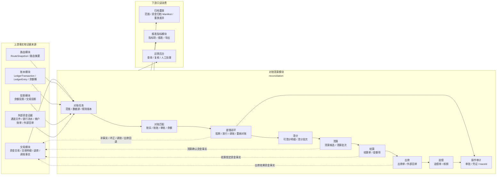

依赖边界：

| 依赖对象 | 本模块读取 | 本模块可触发 | 禁止 |
| --- | --- | --- | --- |
| 交易模块 | 资金交易、交易明细、退款、调账、出款结果等资金事实。 | 上层业务确认后通过现有明确资金服务追加清算确认、结算锁定、出款结果、调账、冲正或补事实。 | 对账模块直接改交易状态、直接插入交易明细、绕过交易层补账，或用泛化 actionType 生成资金事实。 |
| 路由模块 | 原交易 route snapshot、路由摘要、参与方和账目路径。 | 不触发重新路由。 | 逆向、退款、差错处理按当前关系重新选路。 |
| 账本模块 | 账本交易、posting plan、ledger entry、余额桶和账本周期。 | 通过交易层或账本端口追加标准账务事实。 | 直接修改历史分录、余额投影或账本周期。 |
| 投影模块 | 余额投影、交易投影和查询视图，用于对账校验与运营展示。 | 差错处理后触发投影补偿或重放任务。 | 把投影当事实源、用投影反推入账。 |
| 外部资金证据 | 通道文件、银行流水、托管户流水、商户账单、外部回单。 | 创建对账任务、匹配结果、差错单和阻断/放行记录。 | 直接用外部文件改账或覆盖内部事实。 |
| 归档重放 | 已完成对账清算对象、差错和审计引用。 | 为归档、重放提供范围和证据引用。 | 归档或重放反向推进对账清算状态。 |
| 报表指标模块 | 对账清算对象和差错结果的只读事实输入。 | 提供指标项来源和业务口径。 | 指标结果反写清算、结算、出款或差错状态。 |

### 3.2.1 与路由层的协作边界

清结算与对账模块拥有批次、单据、候选、审批、阻断、外部证据和差错闭环；路由层拥有资金路径解析和路径快照。系统实现上不得让清结算模块直接写账，也不得让路由层反向决定清算或结算对象是否成立。

| 清结算对象 | 可调用交易/路由的时点 | 传入事实 | 期望路径 | 禁止 |
| --- | --- | --- | --- | --- |
| 清分批次 | 不调用入账路由。 | 无资金事实。 | 无余额变化。 | 清分确认直接 `CLEARING -> AVAILABLE`。 |
| 清算批次 | 批次已确认、候选已锁定、对账和阻断检查通过。 | `CLEARING_CONFIRM`、清算批次号、候选明细引用、原交易/route 引用。 | 商户 `CLEARING -> AVAILABLE`，费用、准备金或扣减按批次金额项拆分。 | 候选未确认、差错未闭环、重复入批或无幂等键时入账。 |
| 结算单 | 结算单已审批并需要锁定出款金额。 | `SETTLEMENT_LOCK`、结算单号、金额项、扣减项和账户引用。 | 商户 `AVAILABLE -> SETTLEMENT`。 | 用结算单生成替代结算锁定事实，或跳过可用余额校验。 |
| 出款单 | 外部结果达到可记账终态，或明确失败/退回需要回退。 | `PAYOUT_SUCCESS`、`PAYOUT_FAILED`、`PAYOUT_RETURNED` 或差额处理事实。 | 成功关闭结算责任，失败/退回沿原锁定路径回退。 | 把 accepted、processing、submitted 当成功；无回单冲突处理。 |
| 对账差错 | 差错审批通过并确定补事实、冲正、调账、挂账或追偿动作。 | 标准调整、冲正、追偿或挂账事实，携带差错单和审批引用。 | 生成受控资金路径并保留审计。 | 根据投影、报表或人工备注直接改历史分录和余额。 |

### 3.3 对象关系

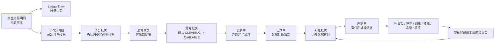

### 3.4 对账清算模块划分

对账清算模块是一个统一业务模块，内部按对象和职责拆分子模块。模块内部可以共享批处理、规则版本、审计和权限能力，但每个子模块的数据对象、状态机、幂等键和账务影响必须独立。

| 子模块 | 主要对象 | 职责 | 准入关系 |
| --- | --- | --- | --- |
| 对账任务模块 | 对账批次、对账数据源、对账窗口、规则版本 | 采集内部事实和外部流水，创建对账任务，管理任务生命周期、重跑和关闭。 | 基础准入。 |
| 对账匹配模块 | 对账匹配结果、差异指纹、匹配规则 | 完成账实、账账、单账、余额一致性匹配，输出匹配结果和差异样本。 | 基础准入。 |
| 对账差错模块 | 差错单、放行/阻断记录、调账引用、重新对账引用 | 承接差异分级、责任归属、条件放行、阻断、审批、调账、核销和重新对账。 | 基础准入。 |
| 清分模块 | 可清分明细、收益应得项、清分批次 | 从已成功、已过账、可对账的交易事实或已审批收益应得项中识别可清分明细，确认清分归类和规则快照。 | 依赖基础对账准入。 |
| 清算模块 | 清算账期、清算候选、清算批次、清算批次明细 | 在清分确认后解析清算账期，生成候选；只有清算批次确认时才触发 CLEARING -> AVAILABLE 或收益参与方可用口径的资金事实。 | 依赖清算前置对账。 |
| 结算模块 | 结算单、结算金额项、收益结算金额项 | 基于可结算余额、扣减项、准备金、追偿项和收益金额项生成净额，锁定时触发结算锁定资金事实。 | 依赖对账和清算结果。 |
| 出款模块 | 出款单、外部回单、失败回退引用 | 跟踪外部付款提交、处理中、成功、失败、退回和金额不一致，承接出款对账和失败回退。 | 依赖出款对账能力。 |
| 追偿模块 | 追偿单、凭证引用、宿主审计引用 | 承接已出款后的退款、拒付、费用、差错和负余额追偿；高危操作审计由 Web/宿主统一记录。 | 依赖差错闭环。 |

清分、清算、结算、出款和追偿必须在对账基础能力满足准入后落地；不得抢在对账任务、对账匹配和对账差错闭环之前整体落地。

### 3.5 子模块边界

| 子模块 | 建议契约层 | 写入边界 | 只读依赖 |
| --- | --- | --- | --- |
| 对账任务模块 | 对账契约 | 写对账任务、运行状态、数据源摘要和重跑记录，不直接改账。 | 内部交易、账本、外部文件、银行流水、投影和运营单据。 |
| 对账匹配模块 | 对账契约 | 写匹配结果、差异指纹、差异等级和匹配摘要，不直接改账。 | 对账任务、匹配规则、内部事实、外部流水和余额桶摘要。 |
| 对账差错模块 | 对账契约 | 写差错单、责任、处理动作、审批、核销和重新对账引用。 | 对账批次、匹配结果、账本、外部凭证、运营证据。 |
| 清分模块 | 清结算契约 | 写可清分结果、收益应得项准入结果、排除原因、清分批次和复核状态，不写账。 | 资金交易明细、ledger entry、route snapshot、基础对账结果、商户账户、收益参与方账户解析结果和规则快照。 |
| 清算模块 | 清结算契约 | 写清算账期快照、候选、收益候选、阻断原因和批次状态；批次确认时通过交易层生成清算确认事实。 | 已确认清分批次、清算前置对账结果、退款、争议、风控状态、收益归因快照、规则版本和审批。 |
| 结算模块 | 清结算契约 | 写结算单、金额项、收益结算金额项和锁定状态；锁定时通过交易层生成结算锁定事实。 | 商户余额、收益参与方可结算余额、清算批次、费用、扣减项、准备金、追偿和对账结果。 |
| 出款模块 | 清结算契约 | 写出款单、外部回单、失败原因和回退引用；成功、失败、退回时生成出款结果事实或差错。 | 结算单、外部回单、银行流水和出款对账结果。 |
| 追偿模块 | 交易契约 + 清结算契约 | 上层业务决策后调用受控资金能力追加事实，并写追偿状态及稳定宿主审计引用；reconciliation 不建设审计服务或审计表。 | 差错单、追偿单、审批、凭证和重新对账结果。 |

### 3.6 能力依赖顺序

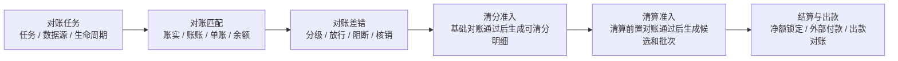

能力准入要求：

1. 对账批次、对账匹配结果、差错单和操作审计必须具备数据对象、状态机、幂等与重跑策略。
2. 清分准入依赖基础对账结果；未完成基础对账或存在重大差错时，不得生成可清分明细。
3. 清算准入依赖清分确认和清算前置对账结果；重大对账差异不得进入清算批次确认。
4. 结算和出款依赖清算确认、余额桶校验和出款对账能力；外部受理不得被视为到账成功。

### 3.6.1 收益分润与激励结算验收对象

收益分润与激励结算用于验证清结算、结算和对账层的可用性。代理关系、GMV 阶梯、利润口径、员工 KPI 和审批流由上层业务系统或运营系统产生；资金底座只消费已经固化的收益应得项、归因快照、规则版本和审批引用。

| 对象 | 所属边界 | 关键字段或约束 | 不变量 |
| --- | --- | --- | --- |
| 收益参与方 | 清结算读取对象 | participantType、participantId、resolvedFundsSubjectRef、accountProfile、currency、tenantId。 | 必须解析到账务主体后才能进入清算或结算；用户代理、员工档案和邀请关系不能直接成为 LedgerEntry 主体。 |
| 收益应得项 | 清分模块写入对象 | entitlementSn、sourceTransactionRef、profitBasis、gmvTierSnapshot、amountItemType、grossAmount、deductionAmount、netAmount、ruleSnapshot、approvalRef。 | 未入清算批次确认前不改变余额；同一来源交易、规则版本和归因链重复生成必须幂等。 |
| 收益归因快照 | 清分和对账读取对象 | invitedUserRef、userAgentRef、platformEmployeeRef、lineageLevel、effectivePeriod、antiFraudStatus。 | 最小交付只接受平台员工到用户代理再到被邀请用户消费的两级链路；超两级或归因缺失必须阻断。 |
| 收益规则快照 | 清分和清算读取对象 | ruleCode、ruleVersion、commissionBasis、gmvTier、employeeOverrideRate、capAmount、kpiApprovalRef、taxAccountingStatus。 | 资金底座不重新计算规则；规则缺失、过期、审批缺失或专业确认缺失时不得清算确认。 |
| 收益结算金额项 | 结算模块写入对象 | participantRef、amountItemType、settlementPeriod、clearBatchSn、settlementOrderSn、holdReason、deductionReason。 | 必须区分用户代理净佣金、平台员工二级分润、KPI 激励、留置、扣减和追偿，不得混成一笔总额。 |

验收流程：

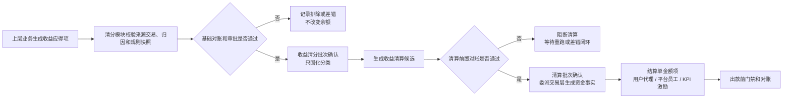

禁止范围：

1. 不在资金底座实现代理关系图谱、GMV 统计、利润计算、KPI 计算、薪税计算或营销规则引擎。
2. 不支持无限级、多层级或无法解释真实业务贡献的代理链路。
3. 不允许收益应得项、清分明细或清算候选直接增加 AVAILABLE。
4. 不允许清算后退款、争议或规则撤销直接修改历史分录；必须走扣减、追偿、冲正、调账或后续结算抵扣。

### 3.7 产品、DSL、TDD 对齐矩阵

| 产品验收项 | 系分落点 | DSL 承接 | TDD 承接 |
| --- | --- | --- | --- |
| 对账任务生命周期 | 对账任务模块、对账批次状态和运行记录。 | 不进入 DSL。 | TDD-RECON-007、TDD-RED-022。 |
| 账实/账账/单账/余额一致 | 对账匹配模块、匹配结果、余额桶校验摘要。 | DSL 只承接对账后的资金事实或调账事实，不承接对账报表本身。 | TDD-RECON-003、TDD-RECON-004、TDD-RECON-006。 |
| 对账放行矩阵 | 对账差错模块、差错等级、放行/阻断和风险接受记录。 | 有条件放行不直接生成账务事实；调账必须经过差错闭环，资金变化由 BALANCE_CONTROL / BALANCE_ADJUST 或批次授权 DIRECT_TRANSACTION / ADJUSTMENT 承接，并带审批。 | TDD-RECON-005、TDD-RED-021。 |
| 清分前基础对账 | 清分模块准入守卫、对账任务 BASIC_BEFORE_SPLIT。 | 不进入资金 DSL；只作为生成可清分明细的准入上下文。 | TDD-CLS-001、TDD-RECON-003。 |
| 清分批次不入账 | 清分批次状态机和 t_clearing_split_batch。 | 不生成 LedgerEntry，不出现 route leg。 | TDD-CLS-003、TDD-RED-020。 |
| 清算前置对账 | 清算模块候选生成守卫、对账任务 BEFORE_CLEARING_CONFIRM。 | 清算确认事实进入 DSL 前的准入上下文。 | TDD-CLS-004、TDD-RECON-004。 |
| 清算确认入账 | 清算批次确认调用交易层生成 CLEARING_CONFIRM。 | DSL-SETTLEMENT-CLEARING-CONFIRM-001、DIRECT_TRANSACTION / CLEARING_CONFIRM，CLEARING -> AVAILABLE。 | TDD-CLS-006。 |
| 收益分润清分与清算 | 收益应得项、收益参与方、收益归因快照、收益规则快照和收益结算金额项。 | 清分确认和收益候选不进入 DSL；收益清算确认使用 DIRECT_TRANSACTION / CLEARING_CONFIRM 或后续工程边界命名的收益清算确认事件，按清算批次确认生成标准账务事实。 | TDD-B7-REVSHARE-001 至 TDD-B7-REVSHARE-003。 |
| 结算锁定 | 结算单复核后调用交易层生成 SETTLEMENT_LOCK。 | DSL-SETTLEMENT-LOCK-001，AVAILABLE -> SETTLEMENT。 | TDD-SETTLE-001、TDD-RACE-005、TDD-RED-020。 |
| 出款前准入门禁 | 当前 `PayoutPreflightService.checkPayoutPreflight` 只做证据预检和对象级 Gate；目标态 `PayoutOrderService.submitPayoutOrder` 才读取结算锁定、账户、端点、通道、余额、幂等等权威事实并最终复核。 | DSL-SETTLEMENT-PAYOUT-RESULT-001 的出款提交前准入；任一最终门禁缺失、失败或未知时不生成 FUND_OUT / IN_TRANSIT。 | TDD-SETTLE-004、TDD-RED-023、TDD-OPS-001。 |
| 出款结果处理 | 出款单、外部回单、失败回退和金额不一致差错。 | DSL-SETTLEMENT-PAYOUT-RESULT-001，成功关闭，失败回退，金额不一致进入差错或挂账。 | TDD-SETTLE-002、TDD-SETTLE-003、TDD-RACE-006。 |
| 出款解释状态 | getPayoutOrderBySn、queryPayoutOrders、商户账单和审计导出统一返回服务端生成的事实状态、展示状态和操作状态。 | DSL-SETTLEMENT-PAYOUT-RESULT-001 的解释状态；非终态、门禁待补、规则待确认和金额不一致不得展示为到账成功或可自动放行。 | TDD-SETTLE-005、TDD-BEN-RED-028、PayoutExplainabilityTests、FundsOperationExplainabilityTests。 |
| 对账差错调账 | 差错单、审批、凭证、调账事实和重新对账。 | DSL-SETTLEMENT-RECONCILIATION-ADJUST-001、BALANCE_CONTROL / BALANCE_ADJUST 或批次授权 DIRECT_TRANSACTION / ADJUSTMENT。 | TDD-RECON-001、TDD-RECON-002、TDD-CTRL-ERR-005、TDD-OPS-001。 |
| 结算策略边界 | 清算周期、cutoff、时区、节假日和策略解析守卫。 | DSL-SETTLEMENT-POLICY-001、SettlementPolicySpec。 | TDD-CLS-002、TDD-CLS-004、TDD-RED-031。 |
| 结算模式快照 | 结算单或结算策略快照记录 settlementMode、settlementDestination、triggerMode。 | 账单模式不生成 SETTLEMENT 锁定；冻结模式和中间户模式由上层调用对应明确资金能力推进。 | TDD-SETTLE-006、TDD-B7-RED-008。 |
| 对账数据分段 | 对账批次、匹配结果和差错单记录数据分段和对账类型。 | 数据分段不进入资金 DSL；只有补事实、冲正、调账或追偿才进入资金事实。 | TDD-RECON-008、TDD-B7-RED-009。 |

## 四、详细设计

本章按能力依赖顺序排版：先说明对账任务、对账匹配和对账差错，再说明清分/清算，最后说明结算、出款、追偿以及表设计、补偿、运营和测试。

### 4.1 对账任务与对账批次

对账任务是对账清算模块的基础准入能力，负责把内部事实、外部证据、匹配规则和差异处理放到同一个可重跑、可审计的任务上下文中。对账批次只承载范围、规则、数据源、匹配摘要和关闭结果，不直接改账。

#### 4.1.1 对账任务类型

| 类型 | 内部来源 | 外部来源 | 目标 |
| --- | --- | --- | --- |
| 交易对账 | 资金交易、交易明细 | 通道文件、业务单、外部流水 | 状态、金额、币种、reference 一致。 |
| 资金到账对账 | 平台现金映射、出款单 | 银行流水、回单 | 证明外部钱是否到或出。 |
| 账务一致性 | 资金交易、账本交易、分录、余额投影 | 不适用或巡检快照 | 证明交易和账务一致。 |
| 对账清算运营对象对账 | 清分批次、清算批次、结算单、出款单 | 商户账单、外部回单 | 证明批次、净额和出款一致。 |
| 报表核对 | 交易投影、报表指标查询结果 | 报表文件或财务口径 | 证明报表来源可信。 |

#### 4.1.2 对账流程

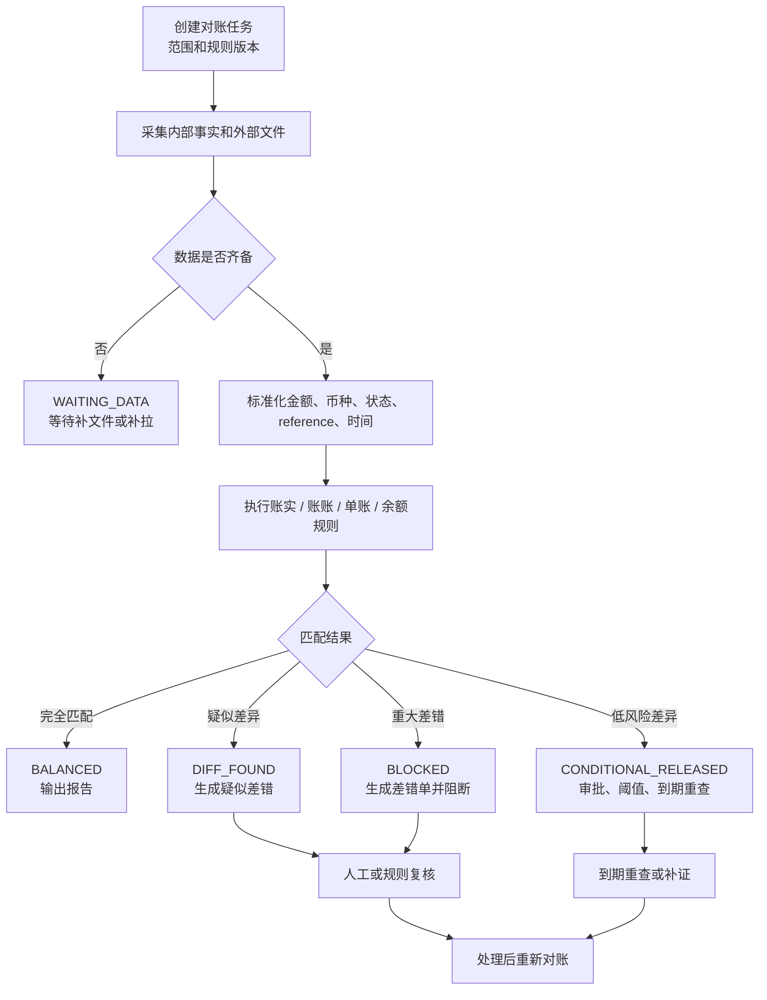

对账批次约束：

1. 对账批次不直接改账。
2. 匹配规则、字段映射、金额精度、时区和文件版本必须留痕。
3. 批次必须输出总数、匹配数、差异数、金额摘要和失败样本。
4. 批次关闭前，重大差异必须有关联差错单、阻断记录和重新对账结果。
5. 有条件放行必须有关联审批、阈值、账龄、责任方、风险承接和到期重查，不得覆盖旧运行记录。

#### 4.1.2.1 当前正向运行结果切片

当前实现使用 `t_reconciliation_batch` 冻结业务对账范围和可选准入对象，使用两张来源表冻结 `REFERENCE/COMPARISON` 成员集合，再由不可变 `t_reconciliation_run_result` 和 `t_reconciliation_match_result` 承接完成态结论，避免 gate 把“差错表为空”、局部匹配或调用方自报摘要误判为对账通过。

```text
CreateReconciliationBatchRequest
  -> 创建批次并冻结 reconciliationScopeRef、可选准入对象、规则版本、窗口和时区
RecordReconciliationSourceSnapshotRequest x REFERENCE / COMPARISON
  -> 冻结来源成员、来源摘要和证据引用
RecordReconciliationRunResultRequest
  -> 从批次和快照读取范围、规则、摘要和证据
  -> 校验逐笔结果完整覆盖两侧来源且没有越界引用
  -> 同一事务固化运行结果、逐笔结果和批次 COMPLETED 绑定
  -> CheckReconciliationGateRequest.reconciliationRunResultSn
  -> 校验批次绑定 + 对象 + BALANCED + 差错闭环
  -> 清分 / 结算 / 出款准入结果
AbortReconciliationBatchRequest
  -> 终止当前未完成且不再继续执行的批次，并固化操作人、时间和原因
ReplaceReconciliationBatchRequest
  -> 替代来源、解析或匹配证据已确认无效的 COMPLETED 当前批次
  -> 原子创建后继批次、推进 Gate 血缘并使原批次锚定差错进入 INVALIDATED
```

实现约束：

1. 批次、来源快照、来源成员、运行结果和逐笔结果 `sn`，以及批次、来源、匹配和结果 digest 均由服务内部生成；公共请求不依赖外部 `requestSn`，幂等由业务唯一键与内部稳定摘要共同保证。
2. `REFERENCE/COMPARISON` 是本次核对角色，不是内部/外部来源分类。交易对账可用资金交易作基准、处理商报表作核对；账账对账也可让 LedgerEntry 作基准、LedgerTransaction 作核对。
3. 每个批次必须各有一个 `REFERENCE` 和 `COMPARISON` 快照；允许一侧成员集合为空以表达缺失差错，但两侧不能同时为空。快照一旦冻结只允许相同事实幂等重放，不允许覆盖。
4. 当前逐笔匹配只表达一对一：每一侧稳定引用最多参与一个匹配结果；所有冻结来源引用必须被完整覆盖，且任何引用都必须属于对应快照。缺失、越界或单侧重复均不得生成运行结果。一对多或多对一需后续引入显式聚合匹配组及金额守恒约束，不得用重复引用隐式表达。
5. `EXACT_MATCH` 和 `RULE_MATCH` 只有在来源已验证且两侧引用均存在时才计入匹配；其他匹配强度计入差异，`REFERENCE_MISSING`、`COMPARISON_MISSING` 只允许对应一侧引用为空。
6. 运行结果与逐笔结果在同一事务写入，并以 `run_result_sn` 将批次从 `DATA_READY` 原子推进到 `COMPLETED`；写入任一步失败必须完整回滚。
7. 当前同步原子接口限定单侧 `sourceItems <= 1000`、单次 `matchResults <= 2000`。Bean Validation 与服务层必须使用同一上限，并在批次查询、加锁、流水号生成和写库前校验；超限不得截断、分页后多次调用同一快照接口或留下部分事实。
8. 绑定 Gate 的同一租户、`reconciliationScopeRef` 和准入对象由 `ReconciliationBatchLineage` 唯一记录当前批次头。根批次创建抢占唯一血缘；正常重跑引用已完成当前头，未完成作业终止后的重新执行引用已终止当前头，完成态证据纠错必须走 `replaceBatch`。正常重跑前，差错以 `COALESCE(lastRerunBatchSn, reconciliationBatchSn)` 表达当前批次锚点，当前头运行差异必须全部物化，且每项未关闭差错都已进入 `ADJUSTING` 并存在对应动作事实。显式替代不要求错误差异先完成处置，而是在同一事务把原批次锚定差错置为 `INVALIDATED`。后继批次范围、准入对象和窗口必须一致，允许使用新的规则版本，不覆盖旧来源和旧结果。Gate 只接受当前头绑定的 `COMPLETED` 运行结果；当前头为 `ABORTED`、缺失、漂移、差错动作未完成或重跑未完成时均失败关闭。纯对账批次不创建 Gate 血缘头。
9. 只有与 `COMPLETED` 批次正确绑定且派生为 `BALANCED` 的结果可继续差错检查；记录缺失、绑定不一致、对象不匹配或任何非 `BALANCED` 结果全部失败关闭。
10. 该切片不采集或解析外部文件、不执行来源业务归一化或匹配规则、不自动创建差错，也不创建清分、结算、出款或账本事实；宿主应用负责调用权限和证据访问控制。

#### 4.1.3 状态分层

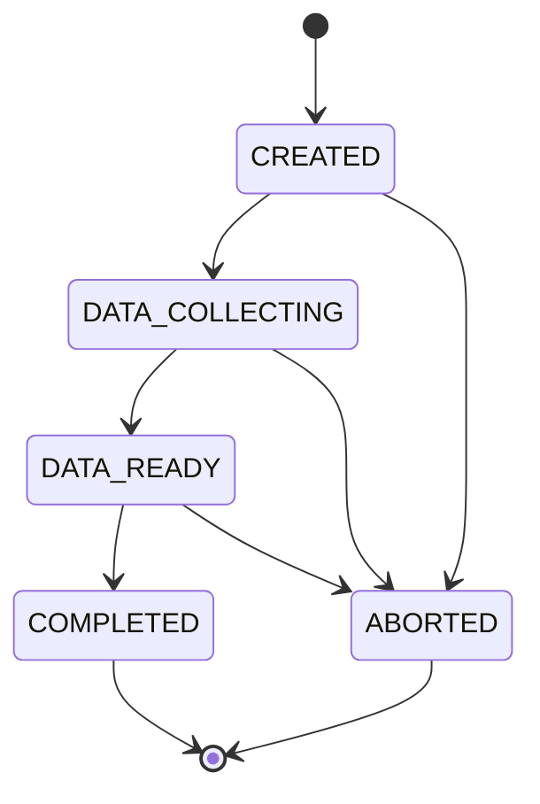

`ReconciliationBatchStatus` 只描述已落地批次的工程进度：`CREATED` 已创建，`DATA_COLLECTING` 已冻结一侧来源，`DATA_READY` 两侧来源已冻结，`COMPLETED` 已绑定不可变运行结果，`ABORTED` 表示操作人停止一个尚未完成的当前作业。`ABORTED` 不是解析失败或任务重试状态，不删除已冻结来源；`COMPLETED` 不允许进入 `ABORTED`。完成态来源、解析或匹配证据被确认无效时，`replaceBatch` 创建携带 `replacementReason/replacementEvidenceRef` 的新 `CREATED` 批次，原批次继续保持 `COMPLETED`，原子推进 Gate 血缘并使原批次锚定差错进入 `INVALIDATED`。`BALANCED/DIFFERENCE_FOUND` 属于 `ReconciliationRunResultStatus`；当前 `PASSED/BLOCKED` 属于 gate 决策。上层任务编排可另行表达 `WAITING_DATA`、解析失败、匹配执行失败和重试，但不得把这些任务态混入当前批次、运行结论或准入决策。`CONDITIONALLY_PASSED` 只有在审批、阈值、责任人、风险承接和到期重查契约落地后才能引入。

### 4.2 对账匹配与一致性规则

对账匹配模块负责输出账实一致、账账一致、单账一致和余额一致的系统结论。匹配结果只作为差错、阻断、放行和重新对账的依据，不作为直接改账入口。

#### 4.2.1 对账目标和规则

| 对账目标 | 系统规则 | 阻断条件 |
| --- | --- | --- |
| 账实一致 | 内部账本账户、账目和余额桶必须能映射到银行流水、通道文件、托管户流水、外部回单或外部文件。 | 错主体、错币种、金额不平、外部失败内部成功、重复外部 reference。 |
| 账账一致 | 业务账、支付账、账户账、商户账、总账、明细账、交易投影和余额投影必须基于同一业务事实。 | 汇总不等于明细、状态不可解释、方向不一致。 |
| 单账一致 | 业务单、支付单、退款单、清分批次、清算批次、结算单、出款单和调账单必须能追溯到资金交易和账本交易。 | 有单无账、有账无单、重复单据。 |
| 余额一致 | 按主体、账目、币种和账本周期分别校验期初、本期入、本期出、期末；按余额桶分别校验。 | 余额公式不成立、FROZEN 总额不守恒、SETTLEMENT 外部受理误记成功。 |

#### 4.2.1.1 账实一致匹配模型

账实一致不能只比较总金额。系统必须把内部账本事实和外部真实资金证据按主体、币种、金额、方向、时间窗口、外部引用和状态终局性逐项匹配，输出可阻断、可放行或可重跑的结果。

| 匹配维度 | 内部侧来源 | 外部侧来源 | 失败处理 |
| --- | --- | --- | --- |
| 主体 | SubjectRef、FundingAccount、PlatformFundingAccountRole、merchantRef。 | ExternalAccountRef、托管户/备付金户引用、PSP 账户引用、银行账户引用。 | 错主体生成 S0/S1 差错，阻断清算、结算或出款。 |
| 账户性质 | AVAILABLE、CLEARING、SETTLEMENT、IN_TRANSIT、FEE、PREPAYMENT 等账目。 | 外部流水类型、清算文件金额项、回单状态、费用项。 | 账户性质不匹配时进入差错复核，不得用净额静默抵消。 |
| 金额和币种 | LedgerEntry、清分明细、清算候选、结算金额项。 | 银行流水、通道文件、卡组织文件、ACH 或银行转账文件引用。 | 金额不平或错币种必须阻断，除非有明确容差规则和审批。 |
| 方向 | 借贷方向、入金/出金、退款/拒付/追偿。 | 外部 debit/credit、settlement/refund/chargeback/return 类型。 | 方向不一致进入重大差错，不得自动核销。 |
| 时间窗口 | 交易时间、过账时间、清分周期、清算账期、出款提交时间。 | 外部账务日、文件批次、回单时间、清算场次。 | 超窗口进入等待数据、重跑或账龄治理，不得默认对平。 |
| 外部引用 | route snapshot 中的 externalRef、paymentInstrumentRef、fileRef、trace/reference 摘要。 | 外部流水号、批次号、回单号、trace number、file id。 | 重复引用、缺引用或引用冲突必须进入差错。 |
| 状态终局性 | 内部交易、清算批次、结算单、出款单状态。 | 外部 accepted、processing、success、failed、returned、reversed 等状态。 | 非终局状态只能进入 IN_TRANSIT、等待数据或人工复核，不得展示为到账成功。 |

账实一致的输出只允许四类：对平、等待外部证据、差错阻断、带条件放行。带条件放行必须记录阈值、责任人、到期复查时间、风险接受原因和重新对账任务；金额不平、错主体、错币种、重复外部引用或余额公式不成立时不得条件放行。

#### 4.2.1.2 VCC 对账来源对象落地口径

VCC 对账来源对象不新增独立 VCC 对账内核。系统把发卡处理商、卡组织、供应商账单、funding statement、内部账本和财务凭证等来源统一纳入对账任务、匹配结果、差错单、操作审计和清结算对象，并通过 evidenceRef、externalRef、routeSnapshotRef、ledgerTransactionRef 和 paymentInstrumentRef 建立链路。

| 来源对象 | 系统承接落点 | 写入边界 | 匹配键或摘要 | 红线 |
| --- | --- | --- | --- | --- |
| SupplierBill | 对账来源记录、对账批次附件、差错单 evidenceRef。 | 只保存账单号、供应商、账单周期、金额摘要、文件摘要和附件引用。 | supplierBillRef、billPeriod、amountSummary、currency、checksum。 | 不实现供应商账单、合同计费、发票或税务计算。 |
| AuthorizationEvent | 资金授权交易、route snapshot、对账来源记录和匹配结果。 | 承接授权批准、拒绝、撤销、过期和占用释放摘要。 | authorizationRef、requestDigest、paymentInstrumentRef、childAccountRef、routeSnapshotRef。 | 拒绝事件不得生成 route、posting 或 LedgerEntry；不得保存完整卡报文。 |
| ClearingRecord | 对账来源记录、可清分明细、清算候选和匹配结果。 | 承接 presentment、clearing、refund、chargeback、reversal 的外部清算摘要。 | clearingRef、fileRef、networkRef、authorizationRef、amount、currency、clearingDate。 | 文件导入成功不得直接推进内部入账或结算放行。 |
| FeeRecord | 结算金额项、差错金额项、对账来源记录。 | 只承接已确认费用金额组件和来源引用。 | feeType、feeRef、sourceRef、amount、currency、ruleVersion。 | 不在本模块重算外部费率、税费、FX markup 或会计科目。 |
| FundingStatement | 对账来源记录、账实一致匹配输入和差错证据。 | 只保存外部资金账户引用、流水摘要、方向、金额、币种、状态和文件摘要。 | fundingStatementRef、externalAccountRef、direction、amount、currency、bookDate。 | 外部 funding account 不得成为 ledger subject。 |
| LedgerEntry | 通过 ledger-face 只读查询进入匹配输入。 | 本模块不写 LedgerEntry，只保存 ledgerTransactionRef、entryRef 或匹配引用。 | ledgerTransactionRef、entryRef、subjectRef、accountSubjectCode、amount、currency。 | 对账、清算或差错不得直接修改历史分录。 |
| AccountingVoucher | 对账附件、差错证据和财务确认引用。 | 只保存 voucherRef、period、currency、amountSummary、financeConfirmStatus。 | voucherRef、accountingPeriod、financeConfirmStatus。 | 不生成总账凭证，不实现财务报表。 |
| ReconciliationCase | 对账任务、对账批次和差错集合。 | 由本模块持有任务、批次、状态、来源范围和处理结论。 | reconciliationTaskId、batchId、caseType、sourceSetDigest。 | 不作为改账入口，不替代业务订单或资金交易状态。 |
| MatchResult | 对账匹配结果表。 | 记录匹配类型、匹配强度、匹配依据、阻断或放行结论。 | matchResultId、matchedRefs、matchStrength、ruleVersion。 | 匹配成功不直接改余额；匹配失败不自动调账。 |
| DifferenceItem | 差错单、差错金额项和处理建议。 | 记录差异类型、责任方、金额、币种、原因、处理建议和 SLA。 | differenceType、ownerRole、amount、currency、reasonCode、evidenceRef。 | 不允许用净额抵消隐藏本金、费用、FX 或税费细项差异。 |
| AdjustmentAction | 上层补事实、调账/冲正/挂账/核销/追偿动作和审批链。 | 上层业务完成权限、审批、幂等与资金执行后，对账追加动作结果引用。 | adjustmentActionRef、commandType、approvalRef、idempotencyKey。 | 对账模块不判断业务准入、不直接写账，也不能仅登记动作就关闭差错。 |
| AuditTrail | Web/宿主统一审计记录和附件引用。 | 记录操作者、时间、前后状态、依据、附件、审批和复核，并关联对账对象。 | auditId、operatorRef、operationType、beforeAfterDigest、attachmentRef。 | reconciliation 不建重复审计表，不保存敏感原文，不用审计备注替代事实证据。 |

#### 4.2.2 余额桶校验落地


| 余额桶 | 系统校验 | 失败动作 |
| --- | --- | --- |
| CLEARING | 期初待清算 + 本期成功入账 - 本期退款/冲正/清算确认/扣减 = 期末待清算。 | 阻断清分或清算候选。 |
| AVAILABLE | 期初可用 + 本期清算确认/释放 - 本期结算锁定/退款/费用/调账 = 期末可用。 | 阻断结算单生成或锁定。 |
| SETTLEMENT | 期初出款中 + 本期结算锁定 - 本期出款成功/失败回退/退回差错 = 期末出款中。 | 阻断重复出款，生成出款差错。 |
| IN_TRANSIT | 期初在途 + 本期外部提交或处理中 - 本期成功确认/失败/退回/核销 = 期末在途。 | 进入在途账龄、到期重查和差错处理。 |
| FROZEN | 期初冻结 + 本期冻结 - 本期解冻/释放/后续资金事实关闭 = 期末冻结。 | 公式不成立时阻断解冻、出款或报表发布；关闭必须引用后续资金事实。 |

### 4.3 对账差错与重新对账

#### 4.3.1 差错状态机

以下复杂状态机是未来运营工单目标，不是当前 `ReconciliationDifferenceStatus`。它需要独立的工单、分派、误报、条件放行和到期重查能力后才能启用，不得由调用方把这些状态直接写入当前差错表。

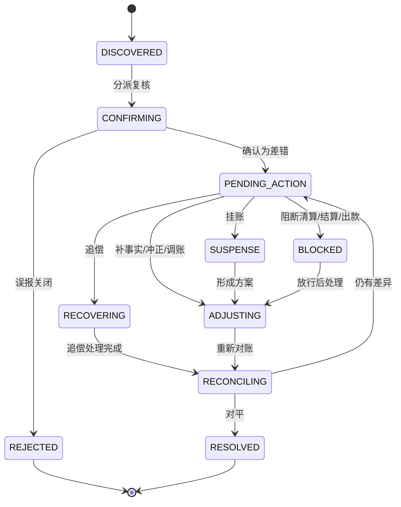

#### 4.3.2 差错处理动作

| 动作 | 系统行为 | 账务影响 |
| --- | --- | --- |
| 补事实 | 通过交易层补入缺失资金事实。 | 追加标准交易和分录。 |
| 冲正 | 对错误账务追加反向事实。 | 追加冲正分录。 |
| 调账 | 审批后执行受控余额调整或批次授权直接交易调账事实。 | 追加余额调整或调账分录，并关联差错、审批、凭证和重新对账。 |
| 挂账 | 暂存无法归属差异。 | 默认不生成资金事实；若上层业务决定执行调账，必须通过既有资金能力并携带审批、凭证和原事实引用。 |
| 追偿 | 对已出款后退款、拒付、费用或差错发起追回。 | 进入准备金、后续抵扣、负余额或人工收款。 |
| 核销 | 经证据确认关闭差错。 | 不等同于改账，必须关联重新对账或凭证。 |

#### 4.3.2.1 上层受控资金动作边界

`actionType` 只表达对账动作分类，不是生成资金事实的授权字段。涉及资金变化时，由上层业务依据自身单据、权限和规则调用既有资金能力；reconciliation 无法感知也不判断其业务准入条件。对账入口只接受已经完成的动作结果引用，并校验审批、证据、幂等键、原事实引用和状态前置条件。

| 上层动作类型示例 | 触发场景 | 上层可调用的资金能力 | 对账登记所需证据 | 禁止和测试口径 |
| --- | --- | --- | --- | --- |
| `CLEARING_CONFIRM` | 清算批次已通过前置对账并确认。 | 通过交易层追加清算确认事实，驱动商户 `CLEARING -> AVAILABLE`。 | `sourceBatchSn`、`reconciliationSn`、`approvalSn`、`evidenceRefs`、`idempotencyKey`、`operatorRef`、`reason`。 | 清算候选、清分批次或人工确认直接入账必须失败；覆盖 `TDD-CLS-006`、`TDD-RED-020`、`TDD-RED-023`。 |
| `SETTLEMENT_LOCK` | 结算单净额复核通过并锁定。 | 追加结算锁定事实，驱动商户 `AVAILABLE -> SETTLEMENT`。 | `settlementSn`、`amountItemsDigest`、`approvalSn`、`evidenceRefs`、`idempotencyKey`、`operatorRef`、`reason`。 | 锁定不得展示为出款成功，不得复用人工调账口径；覆盖 `TDD-SETTLE-001`、`TDD-SETTLE-005`。 |
| `PAYOUT_RESULT` | 外部出款回单到达，且终态可确认。 | 成功关闭 `SETTLEMENT` 或 `IN_TRANSIT`，失败按一次性回退事实或差错闭环处理。 | `payoutSn`、`externalReceiptRef`、`receiptStatus`、`amount/currency`、`approvalSn` 或自动回单证据、`idempotencyKey`、`operatorRef`。 | `accepted`、`submitted`、`processing` 不得当成功；金额不一致进入差错或挂账；覆盖 `TDD-SETTLE-002` 至 `TDD-SETTLE-005`。 |
| `RECONCILIATION_ADJUSTMENT` | 差错已确认，调账方案已审批且需要资金修正。 | 追加受控余额调整、批次授权直接交易调账事实或等价冲回事实。 | `exceptionSn`、`adjustPlanSn`、`approvalSn`、`evidenceRefs`、`originalFactRef`、`recheckReconciliationSn`、`idempotencyKey`、`operatorRef`、`reason`。 | 不得绕过差错单直接 adjust；不得跳过重新对账关闭；覆盖 `TDD-RECON-001`、`TDD-RECON-002`、`TDD-RED-021`、`TDD-RED-024`。 |
| `REVERSAL` | 原资金事实方向错误、重复入账或重复出款已确认。 | 追加反向事实或冲正分录，不删除原事实。 | `exceptionSn`、`originalFactRef`、`approvalSn`、`evidenceRefs`、`idempotencyKey`、`operatorRef`、`reason`。 | 不得覆盖原交易、原账本分录或原外部流水；覆盖 `TDD-RECON-001`、`TDD-RED-033`。 |
| `SUPPLEMENTAL_FACT` | 有单无账或缺失资金事实经复核确认。 | 通过交易层追加缺失标准资金事实，并关联原业务单据。 | `sourceRef`、`exceptionSn`、`approvalSn`、`evidenceRefs`、`originalFactRef` 或缺失说明、`idempotencyKey`、`operatorRef`、`reason`。 | 不得从报表、余额日志或投影反推补造明细；覆盖 `TDD-RED-014`、`TDD-RED-028`。 |
| `RECOVERY_OFFSET` | 已出款后退款、拒付、费用或负余额需要追偿抵扣。 | 追加追偿抵扣、负余额或人工收款确认事实。 | `recoverySn`、`responsibleSubject`、`approvalSn`、`evidenceRefs`、`idempotencyKey`、`operatorRef`、`reason`。 | 不得回滚历史出款，不得用负余额替代追偿原因；覆盖 `TDD-CLS-FLOW-005`、`TDD-RED-025`。 |
| `EARLY_AVAILABILITY_RELEASE` | 外部真实资金未终局但业务要求秒结、预结算或提前可用。 | 在专项授权范围内追加提前释放或风险责任事实，可驱动受控 `CLEARING -> AVAILABLE` 或等价责任账户变化。 | `earlyReleasePolicySn`、`riskOwnerSubject`、`reserveOrCreditRef`、`reconciliationSn`、`approvalSn`、`evidenceRefs`、`expiryOrReviewAt`、`idempotencyKey`、`operatorRef`、`reason`。 | 未配置责任方、准备金/额度、追偿路径、到期复核或对账阻断时必须失败；外部 accepted 不得直接当成功；覆盖新增早释专项 TDD 和 `TDD-RED-020`、`TDD-RED-023`。 |

上层受控动作落地约束：

1. `actionType + adjustmentSn + idempotencyKey + originalFactRef` 必须绑定同一动作事实；完全相同重放返回当前差错，不同事实复用动作号或幂等键失败。
2. reconciliation 只登记 `adjustmentTransactionSn` 等结果引用，不生成 `FundsInstruction`、route、posting plan 或 ledger entry；资金执行失败时不得登记成功动作。
3. 上层动作必须显式声明可撤销边界；撤销只能由上层追加 `REVERSAL` 或新的资金事实，对账再登记新动作，不能物理删除或覆盖历史事实。
4. 工程 Red 必须证明缺审批、证据、原事实引用或幂等键时动作登记失败，且差错动作不会修改历史交易、LedgerEntry 或余额投影。
5. `EARLY_AVAILABILITY_RELEASE` 不属于默认生产能力。只有业务 PRD、系分、TDD、外部规则确认和工程任务边界同时明确风险承担、准备金或授信、追偿、额度冻结、到期复核、对账阻断和回滚策略时，才允许进入编码。

#### 4.3.3 差错等级和放行矩阵

| 等级 | 判断口径 | 默认系统动作 | 示例 |
| --- | --- | --- | --- |
| S0 | 可能造成重复出款、错主体入账、错币种入账、余额不平或资金损失。 | 立即阻断相关清分、清算、结算、出款和报表发布。 | 重复出款、缺分录仍清算、余额公式不成立。 |
| S1 | 影响清结算、出款或关账，但已有责任方和处理路径。 | 阻断相关批次，生成差错单和 SLA。 | 外部失败内部成功、金额差超阈值。 |
| S2 | 可解释且在策略阈值内。 | 暂缓、挂账或有条件放行，到期重查。 | 手续费尾差、跨日归属、文件延迟。 |
| S3 | 不影响资金、账本、余额和单据一致性。 | 阻断报表或展示，不阻断资金流程。 | 展示字段、运营标签、报表维度缺失。 |

| 差异类型 | 默认动作 | 是否可放行 | 落地要求 |
| --- | --- | --- | --- |
| 错主体、错币种、金额不平、余额公式不成立 | 阻断。 | 否。 | 必须补事实、冲正、调账或重建投影后重新对账。 |
| 重复外部 reference、重复入账、重复出款 | 阻断。 | 否。 | 通过唯一事实确认、重复拒绝或冲正关闭。 |
| 缺账本分录、有单无账、有账无单 | 阻断。 | 否。 | 通过交易层补入事实或差错闭环后重跑。 |
| 文件延迟、银行未达账、通道处理中 | 暂缓或进入在途。 | 有条件。 | 必须有责任方、账龄阈值、到期重查和风险承接。 |
| 手续费、汇率、舍入尾差 | 复核差额。 | 有条件。 | 必须在容差内，有财务确认、费用调整或挂账路径。 |
| 非资金展示差异 | 报表修复。 | 有条件。 | 不影响资金、账本、余额和单据一致性。 |

差错红线：

1. 差错处理不能直接修改历史分录、余额投影、交易投影或外部流水。
2. 调账必须引用差错、审批、凭证和账本交易。
3. 差错关闭必须有重新对账结果、凭证或责任确认。
4. 未核销重大差错必须能阻断清算、结算、出款或报表发布。
5. S0 / S1 重大差错不得带原因放行；S2 放行必须写入风险接受和到期重查。

### 4.4 可清分明细与清分批次

#### 4.4.1 可清分识别流程

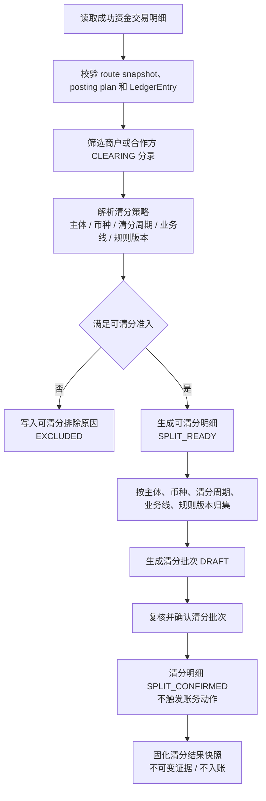

可清分准入守卫：

| 守卫 | 系统检查 |
| --- | --- |
| 交易成功 | 资金交易和交易明细必须是最终成功状态；失败、拒绝、撤销、过期不得进入清分。 |
| 已过账 | 必须存在账本交易、分录和余额投影可校验引用。 |
| 待清算账目 | 来源分录必须命中商户或合作方 CLEARING，不得从 AVAILABLE 或报表反推。 |
| 快照完整 | route snapshot、posting plan、业务引用、规则版本、币种和账务主体必须完整。 |
| 金额拆解 | 本金、手续费、通道成本、补贴、税费、退款预留等金额项必须可拆解。 |
| 周期可解析 | 清分周期必须由策略解析得到，并固化规则编码、版本、时区和 cutoff。 |
| 未硬阻断 | 退款完成、退款中、争议中、重大差错、风控冻结、重复入批必须排除。 |

`RECONCILIATION_BLOCKED` 是可恢复的时点阻断，不物化 `t_clearing_splittable_detail`，返回结果不分配候选流水号，也不占用 `tenant_id + ledger_entry_sn` 唯一键。退款、来源不完整、方向错误等稳定排除仍按 `EXCLUDED` 落库；对账阻断解除后，同一账本分录可以重新识别并生成 `SPLIT_READY`。

#### 4.4.2 清分批次状态机

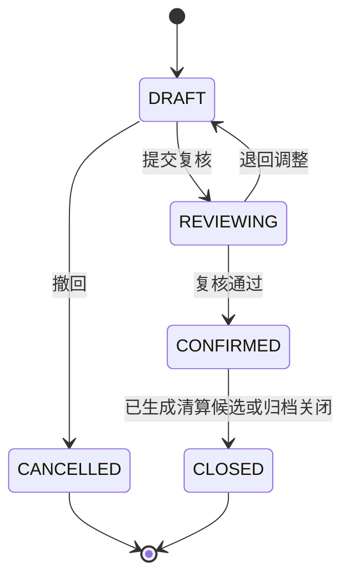

清分批次约束：

1. 清分批次确认只改变清分对象状态，不调用交易层或账本层。
2. 清分批次确认后才允许执行可清算判定。
3. 同一可清分明细只能进入一个未取消清分批次。
4. 清分批次发现错分时，不删除历史批次；通过撤回、排除、补差或差错单处理。

#### 4.4.3 清分数据

| 字段 | 说明 |
| --- | --- |
| splittableSn | 可清分明细流水号。 |
| tenantId | 租户。 |
| subjectRef | 账务主体。 |
| currency | 币种。 |
| businessScene/businessSn | 来源业务引用。 |
| fundsTransactionSn/detailSn | 资金交易和交易明细引用。 |
| ledgerTransactionSn/ledgerEntrySn | 账本交易和分录引用。 |
| amount | 可清分金额。 |
| splitPeriod | 清分周期，不是账本周期。 |
| ruleVersion | 清分规则版本。 |
| status | 当前切片为 SPLIT_READY、EXCLUDED；锁定和确认状态由后续清分批次切片定义。 |
| excludeReason | 不可清分或排除原因。 |

清分红线：

1. 可清分明细不入账。
2. 清分批次确认不入账。
3. 清分不能从余额、报表或人工汇总反推，必须来自交易明细和账务主体 CLEARING 分录。

#### 4.4.4 清分结果快照

清分结果快照由清分批次确认后固化，承接“已确认清分结果”的不可变证据。它不是清算候选、不是资金交易、不是账本事实；后续清算候选只能消费快照、清算账期和阻断守卫，不得重新从余额或报表反推。

| 字段 | 说明 |
| --- | --- |
| splitResultSn | 清分结果快照流水号。 |
| splitBatchSn/splittableSn | 来源清分批次和可清分明细。 |
| subjectRef | 商户、合作方或收益参与方等可记账主体引用。 |
| currency | 币种。 |
| amount | 来源正向 `CLEARING` 分录的金额，使用最小货币单位。业务用途由来源交易、route 和分录引用解释。 |
| fundsTransactionSn/detailSn | 来源资金交易和交易明细引用。 |
| ledgerTransactionSn/ledgerEntrySn | 来源账本交易和分录引用。 |
| routeSnapshotDigest | 来源 route snapshot 或等价摘要。 |
| splitRuleCode/splitRuleVersion | 清分规则编码和版本。 |
| reconciliationSn/admissionStatus | 清分前基础对账引用和准入结论。 |
| snapshotDigest | 账务主体、来源事实、金额、清分规则快照和对账结论的 sha256 摘要。 |

系统约束：

1. 生成快照不得调用交易层、账本过账或余额投影写入能力。
2. 快照摘要必须覆盖来源事实、金额、清分规则版本和对账准入结论，用于幂等和重跑解释。
3. 快照错误只能通过补差、差错单、新快照或候选排除承接，不覆盖已确认快照。

### 4.5 清算候选与清算账期

#### 4.5.1 清算账期确认规则

清算账期是清算批次分组和到期判断的业务周期，不是账本周期。它由清算策略解析并固化在清算候选和清算批次中，后续重跑必须复用同一规则版本或显式生成新版本差异。

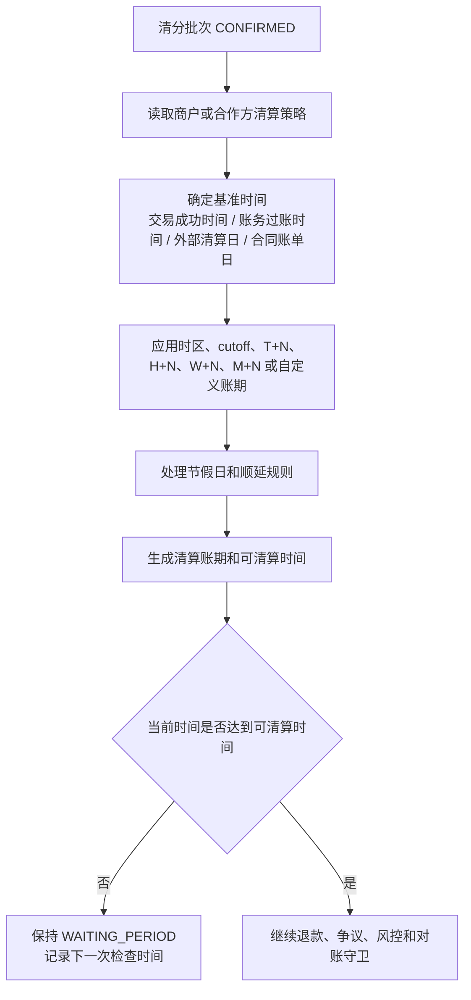

| 输入 | 说明 |
| --- | --- |
| clearingRuleCode/clearingRuleVersion | 清算策略编码和版本，必须固化。 |
| baseTimeType | 基准时间来源，例如交易成功时间、账务过账时间、外部清算日或合同账单日。 |
| timezone/cutoffTime | 用于日切和跨时区归属。 |
| cycleType/cycleValue | 实时、T+N、H+N、W+N、M+N 或自定义账期。 |
| holidayCalendar | 节假日和工作日顺延规则。 |
| clearingPeriod | 解析后的清算账期，例如 2026-05-18、2026-W21、CONTRACT-2026-05-A。 |
| clearingAvailableTime | 候选可进入清算批次的最早时间。 |

账期确认红线：

1. 策略缺失、版本缺失、时区缺失、cutoff 解析失败时不得默认实时清算。
2. 清算账期不得写入账本 periodId，账本周期仍由账本 Profile 决定。
3. 同一清分明细在同一清算策略版本下只能有一个清算账期快照。

#### 4.5.2 可清算候选生成流程

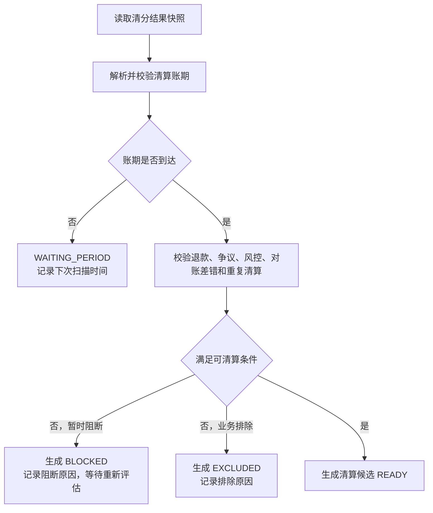

退款守卫按退款发生时点处理：

| 退款时点 | 系统处理 | 清分/清算状态 |
| --- | --- | --- |
| 付款成功后、清分前退款 | 不生成 SPLIT_READY 明细，或将扫描结果记录为 EXCLUDED。 | 不进入清分批次；退款事实按原 route snapshot 回补。 |
| 清分批次确认后、清算批次确认前退款 | 清分结果保留审计，清算候选状态标记为 EXCLUDED，排除原因记录为 REFUND_BLOCKED；若部分退款，按剩余可清算金额重新生成候选或差额候选。 | 退款金额不触发 CLEARING -> AVAILABLE；只有剩余可清算金额允许进入清算批次。 |
| 清算批次确认后、结算锁定前退款 | 不回滚清算批次；追加退款事实，从商户 AVAILABLE 或约定责任账户扣减，结算单净额加入退款扣减项。 | 清算批次保持 CONFIRMED；结算净额减少。 |
| 结算锁定后、出款成功前退款 | 不直接回退用户；优先生成结算差错或释放/重算结算锁定，必要时 SETTLEMENT -> AVAILABLE 后再追加退款扣减。 | 已锁定金额不得被自动退款绕过。 |
| 出款成功后退款 | 不回滚历史出款；生成追偿单，进入准备金抵扣、后续结算抵扣、负余额或人工收款。 | 追偿闭环承接，不改历史出款。 |

#### 4.5.3 候选数据

| 字段 | 说明 |
| --- | --- |
| candidateSn | 候选流水号。 |
| tenantId | 租户。 |
| subjectRef | 账务主体。 |
| currency | 币种。 |
| splitResultSn | 来源清分结果快照。 |
| splitBatchSn/splittableSn | 来源清分批次和可清分明细引用。 |
| fundsTransactionSn/detailSn | 资金交易和交易明细引用。 |
| ledgerTransactionSn/ledgerEntrySn | 账本交易和分录引用。 |
| clearingPeriod | 清算账期，不是账本周期。 |
| clearingAvailableTime | 最早可清算时间。 |
| clearingRuleCode/clearingRuleVersion | 清算规则编码和版本；与来源清分规则相互独立。 |
| amount | 从清分结果快照继承的正数候选金额，使用最小货币单位。 |
| candidateDigest | 快照摘要、清算账期、金额和清算规则版本组成的 SHA-256 幂等摘要。 |
| status | WAITING_PERIOD、BLOCKED、READY、LOCKED、CLEARED、EXCLUDED。 |
| blockReason/exclusionReason | 当前阻断或业务排除原因，二者不混用。 |
| lockedClearingBatchSn | 锁定候选的清算批次引用；锁定不代表已形成清算资金事实。 |

候选红线：

1. 候选不入账。
2. 候选不能来自 AVAILABLE 反推，必须来自已确认清分批次、商户 CLEARING 交易明细和分录。
3. 候选进入候选池不代表已清算。

当前工程切片提供 `ClearingCandidateApplicationService`：从已确认 `ClearingSplitResultSnapshot` 生成候选，清分周期/规则和清算账期/规则分别固化，不相互继承。候选按账期进入 `WAITING_PERIOD`，按只读对账 Gate 进入 `READY` 或 `BLOCKED`，支持排除、重新评估、锁定和由所属批次确定性撤回后的锁定释放。锁定释放只允许 `LOCKED -> READY`，要求批次号匹配且调用方已确认没有形成清算资金事实；未知结果不调用释放方法，继续保持 `LOCKED`。当前 `READY` 只证明账期和对象级对账 Gate，不证明退款、争议、风控和最终命令事务内复核；该切片不调用交易或账本写入。

### 4.6 清算批次

#### 4.6.1 状态机

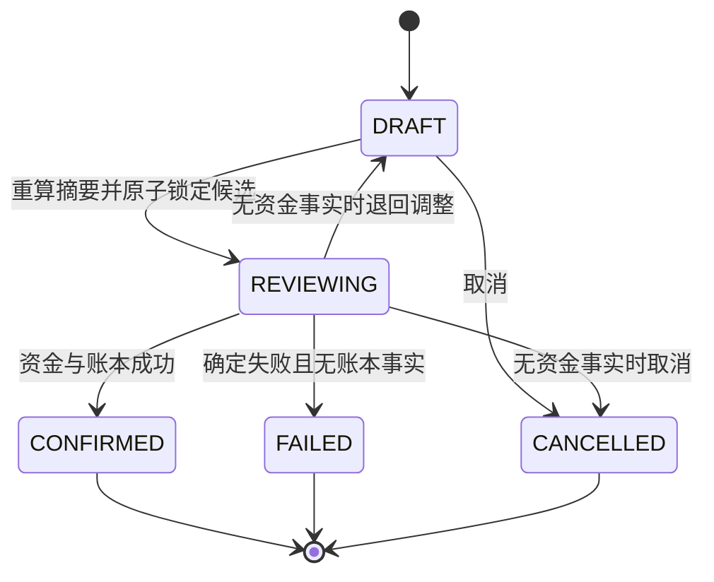

#### 4.6.2 清算确认流程

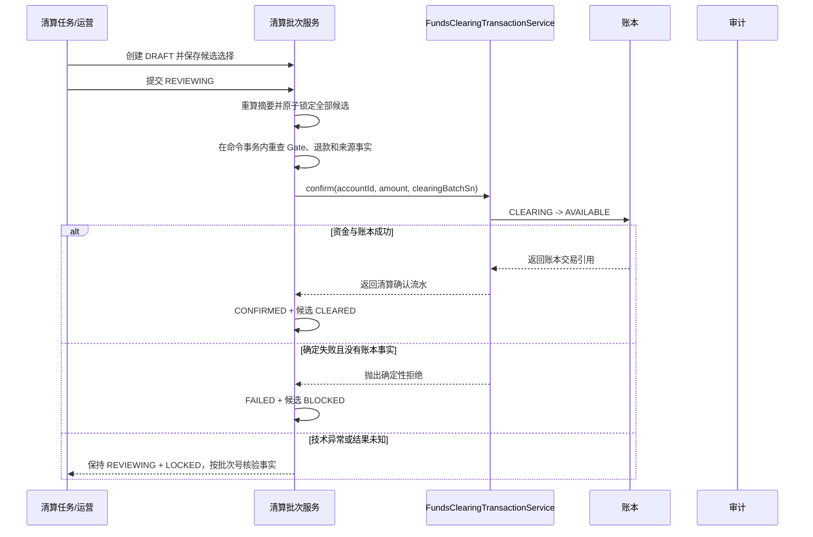

清算批次约束：

1. 批次维度包含租户、账务主体、币种、清算账期、业务线、规则版本和候选集合摘要。
2. `DRAFT` 只保存候选选择，不锁定候选；提交时重算成员和金额摘要，并在同一事务内将全部候选 `READY -> LOCKED`。任一条件更新失败则整个提交回滚。
3. `REVIEWING` 的成员、金额、币种和摘要不可修改；确认只接受仍由本批次锁定的全部候选。
4. 最终 Gate、退款或金额摘要校验失败时不调用资金服务并保持 `REVIEWING + LOCKED`。证据变化但经济摘要未变时允许原批次重试。
5. 退款等事实导致经济范围变化时，先证明没有清算资金事实，再将批次退回 `DRAFT`、释放候选并替换成员；来源版本变化本身不触发重建，以经济摘要是否变化为准。
6. 资金服务形成明确 `FAILED` 且无账本事实时，批次进入 `FAILED`，候选解除锁定并进入 `BLOCKED`；重试必须创建新批次。技术异常或结果未知时保持 `REVIEWING + LOCKED`，不得自动释放。
7. 成功确认必须在同一本地事务内完成资金交易、账本事实、批次 `CONFIRMED` 和候选 `CLEARED`；已确认批次不能重跑生成重复清算事实。
8. 批次确认的账务动作必须引用批次和候选明细摘要；无法解释的成员或摘要变化进入差错处理，不得自动覆盖。

`FundsClearingTransactionService` 是交易层的受控资金原语，不是面向运营或业务前台的清算编排服务。它固定使用 `DIRECT_TRANSACTION / CLEARING_CONFIRM`、`FundsTransactionMode.DIRECT`、交易类型 `CLEARING`、`SETTLEMENT + WITHIN_SUBJECT + RELEASE + NON_REPLAYABLE`，并只允许同一资金账户 `CLEARING -> AVAILABLE`。调用方不能选择 route、账目或资金方向；清算批次编排由 `reconciliation-impl` 依赖 `transaction-face`，交易层不得反向依赖清算模块。

当前已实现 `ClearingBatchApplicationServiceImpl`、清算批次表写入和候选 `CLEARED/BLOCKED/LOCKED` 推进。资金底座只复核当前交易、退款累计、route snapshot 摘要、候选经济摘要和对象级 Gate；争议/风控权威判断、按原资金分配处理部分退款及生产环境工程证据仍未完成，因此不能据此声明清算生产可用。

### 4.7 退款时序与逆向处理

#### 4.7.1 付款成功、清分完成后退款

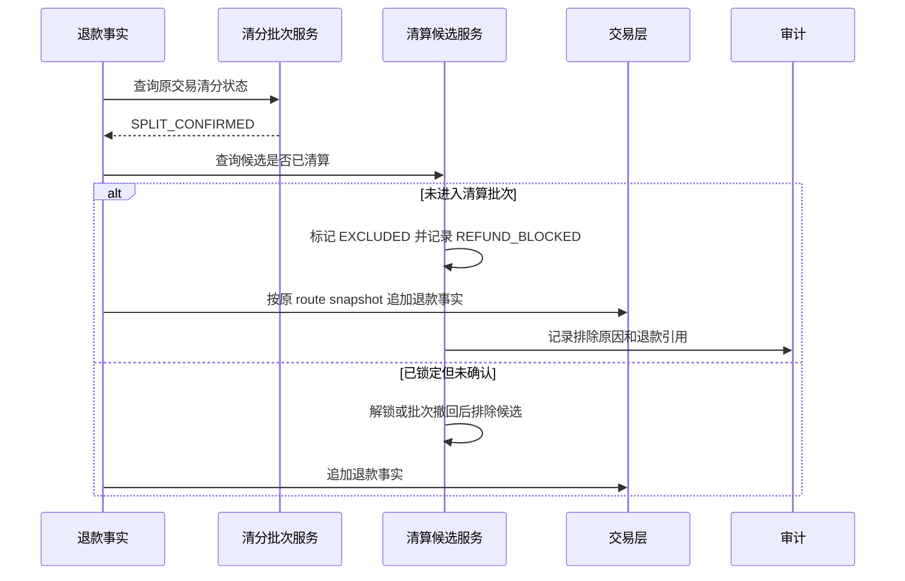

处理约束：

1. 清分批次不回滚，保留原始归类和规则快照。
2. 清算候选未确认前，退款优先阻断候选进入清算批次。
3. 部分退款时，系统可保留原候选并生成剩余金额候选，或把原候选排除后生成差额候选；两种方式都必须通过唯一键和摘要避免重复清算。
4. 退款资金事实必须基于原交易 route snapshot，不按当前账户绑定重新选路。

#### 4.7.2 清算确认后退款

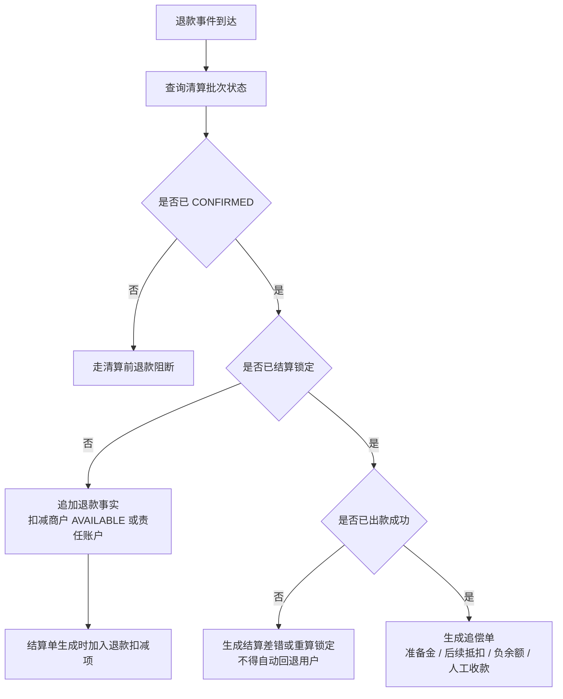

处理约束：

1. 已确认清算批次不可因退款而删除、回滚或重复确认。
2. 清算后、结算前退款通过追加退款事实影响商户 AVAILABLE 和结算净额。
3. 结算锁定后退款不得绕过结算单和出款单直接扣出款中资金。
4. 出款成功后退款由追偿闭环承接，不能回滚历史出款。

### 4.8 结算单

#### 4.8.1 结算净额

```text
结算净额
= 清算确认金额
+ 经审批加项
+ 追偿回补
+ 汇差调增
- 退款扣减
- 争议扣回
- 手续费
- 通道成本
- 准备金
- 负余额抵扣
- 风控扣留
- 未处理差错扣减
- 汇差调减
```

每个金额项必须有来源明细、规则版本、审批单或差错单引用，不能只保存汇总值。

#### 4.8.2 状态机

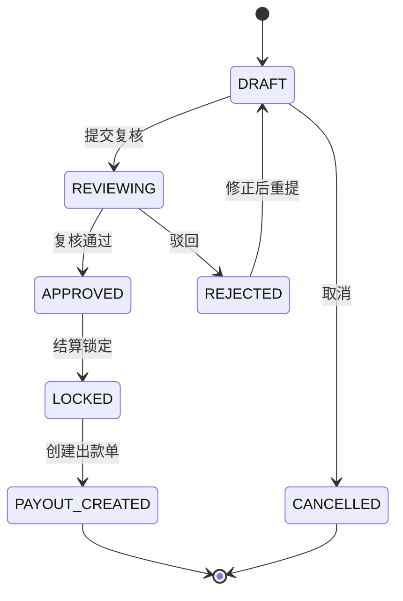

结算单约束：

1. 结算单是净额确认和出款前锁定对象，不代表外部出款成功。
2. 锁定时通过交易层生成 AVAILABLE -> SETTLEMENT。
3. 默认模型是一张结算单只允许生成一张出款单；如需拆分出款，必须具备出款拆分明细、拆分金额汇总、回单归并和幂等唯一键。
4. 出款中金额不能再次进入结算。
5. 结算策略解析失败不得静默按实时策略处理。

### 4.9 出款单

#### 4.9.1 出款流程

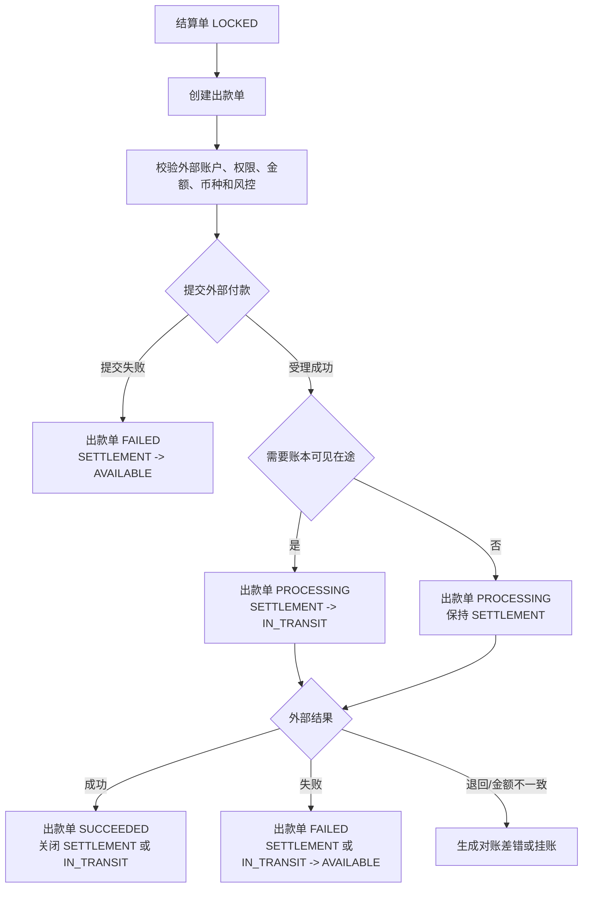

出款约束：

1. 外部受理成功不等于到账成功。
2. 需要账本可见在途时，外部受理后进入 IN_TRANSIT；未启用在途桶时只保持出款单 PROCESSING。
3. 同一结算单重复创建出款单必须命中原出款单或失败；不得生成第二张有效出款单。
4. 同一通道外部 reference 的回单只能处理一次；相同摘要重复回单幂等返回，摘要不同、金额不同、币种不同或成功/失败双终态冲突的重复回单必须进入对账差错或人工复核。
5. 出款失败回退只执行一次。
6. 出款成功后发生退款、拒付或费用，不回滚历史出款，进入追偿、准备金、负余额或后续抵扣。
7. 外部回单、失败原因、重试次数和人工确认必须审计。
8. 回单金额、币种、手续费或净额不一致时，出款单进入 MISMATCHED 并生成差错单或挂账；不得关闭为成功，也不得按普通失败路径重复回退。

### 4.10 追偿单

追偿单用于承载已出款后发生退款、拒付、费用、差错或负余额需要追回的责任闭环。

| 字段 | 说明 |
| --- | --- |
| recoverySn | 追偿单号。 |
| sourceType/sourceSn | 来源退款、拒付、差错、费用或负余额。 |
| responsibleSubject | 责任主体。 |
| amount/currency | 追偿金额。 |
| recoveryMode | 准备金抵扣、后续结算抵扣、转负余额、人工收款。 |
| status | CREATED、OFFSETTING、COLLECTING、PARTIAL_RECOVERED、CLOSED。 |
| ledgerRefs | 关联资金事实和账本交易。 |

### 4.11 Java 模型、接口与服务 API 设计

本节定义对账清算模块的 Java 契约设计，明确 face/impl 模块、包结构、枚举、Request、Query、DTO、服务接口和实现层职责。

#### 4.11.1 模块与包结构

对账清算模块建议按仓库既有模块风格新增独立模块：

```text
reconciliation/
  reconciliation-face/
  reconciliation-impl/
```

契约层包名建议：

```text
com.wind.funds.reconciliation
  enums
  model.request
  model.query
  model.dto
  services
```

实现层包名建议：

```text
com.wind.funds.reconciliation
  impl
  dal.entities
  dal.mapper
  mapstruct
  domain
  matching
  scheduler
```

模块职责边界：

| 模块 | 职责 | 禁止 |
| --- | --- | --- |
| reconciliation-face | 暴露对账清算模块的公共 Java 契约，包括枚举、Request、Query、DTO 和 Service API。 | 暴露 Entity、Mapper、实现类或数据库细节。 |
| reconciliation-impl | 实现对账任务、对账匹配、差错闭环以及清分、清算、结算、出款和追偿的资金底座能力；业务操作审计由 Web/宿主统一提供。 | 让 Controller、任务调度或外部适配层直接写 Mapper，或在模块内重复建设操作审计服务。 |
| transaction-face | 对账清算模块触发清算确认、结算锁定、出款结果、调账、退款、追偿等资金事实的唯一交易契约入口。 | 让对账清算模块直接改交易事实。 |
| ledger-face | 对账清算模块查询账本交易、分录、余额桶和账务投影的契约入口。 | 让对账清算模块直接改历史分录或余额投影。 |

设计约束：

1. 对外服务只接收 Request、Query、WindOperator，只返回业务流水号、DTO、分页结果或操作结果。
2. Request 用于命令写入，Query 用于查询过滤，DTO 用于返回只读视图，Entity 只存在于 reconciliation-impl。
3. 金额字段统一使用最小货币单位 Long；币种沿用 CurrencyIsoCode。
4. 时间字段统一使用 LocalDateTime；跨时区和 cutoff 语义在规则快照字段中固化。
5. 所有命令 API 必须携带 WindOperator，用于事实归属和 trace 串联；权限校验、访问审计和操作审计由 Web/宿主层完成。
6. 对账任务、对账匹配和对账差错是资金底座基础对账契约；宿主操作审计是生产接入门禁，不在 reconciliation 内重复建模。

#### 4.11.2 枚举模型

枚举放在 com.wind.funds.reconciliation.enums。枚举值应与表状态、流程图和 TDD 用例保持一致，禁止一个枚举同时表达不同对象的生命周期。

| 枚举 | 适用对象 | 建议值 |
| --- | --- | --- |
| ReconciliationType | 对账任务类型 | TRANSACTION、FUNDS_RECEIPT、LEDGER_CONSISTENCY、OPERATION_OBJECT、REPORT_CHECK |
| ConsistencyTarget | 对账一致性目标 | REAL、BOOK、DOCUMENT、BALANCE |
| ReconciliationBatchStatus | 对账批次执行进度 | CREATED、DATA_COLLECTING、DATA_READY、COMPLETED、ABORTED |
| ReconciliationSourceRole | 对账来源角色 | REFERENCE、COMPARISON |
| ReconciliationSourceType | 对账来源事实类型 | TRANSACTION、LEDGER、BALANCE、EXTERNAL_STATEMENT、SETTLEMENT_REPORT |
| ReconciliationRunResultStatus | 完成态运行结论 | BALANCED、DIFFERENCE_FOUND |
| ReconciliationMatchStrength | 对账匹配强度 | EXACT_MATCH、RULE_MATCH、CANDIDATE_MATCH、MANUAL_CONFIRMED、UNMATCHED |
| ReconciliationDifferenceType | 差异类型 | AMOUNT_MISMATCH、STATUS_MISMATCH、REFERENCE_MISSING、COMPARISON_MISSING、DUPLICATE、SUBJECT_MISMATCH、SOURCE_UNVERIFIED |
| ExceptionSeverity | 差错等级 | S0、S1、S2、S3 |
| ReconciliationDifferenceStatus | 当前对象级 Gate 差错状态 | BLOCKED、ADJUSTING、RECONCILING、RESOLVED、INVALIDATED |
| ReconciliationDifferenceActionType | 当前已完成处理结果分类 | SUPPLEMENT_FACT、REVERSE、ADJUST、SUSPENSE、RECOVER、WRITE_OFF |
| ReleaseDecision | 未来条件放行目标，不在当前代码 | BLOCKED、CONDITIONAL_RELEASED、REJECTED_AS_FALSE_POSITIVE、NO_RELEASE_REQUIRED |
| ExceptionCaseStatus | 未来运营工单目标，不在当前代码 | DISCOVERED、CONFIRMING、REJECTED、PENDING_ACTION、ADJUSTING、SUSPENSE、BLOCKED、RECOVERING、RECONCILING、RESOLVED |
| ClearingSplittableDetailStatus | 可清分明细准入状态 | 当前为 SPLIT_READY、EXCLUDED；不表达已清分、已清算或已结算 |
| ClearingSplitBatchStatus | 清分批次状态 | DRAFT、REVIEWING、CONFIRMED、CANCELLED |
| ClearingCandidateStatus | 清算候选状态 | WAITING_PERIOD、BLOCKED、READY、LOCKED、CLEARED、EXCLUDED |
| ClearingBatchStatus | 清算批次状态 | DRAFT、REVIEWING、CONFIRMED、CANCELLED、FAILED；不允许部分成功 |
| SettlementOrderStatus | 结算单状态 | DRAFT、REVIEWING、APPROVED、LOCKED、PAYOUT_CREATED、REJECTED、CANCELLED |
| PayoutOrderStatus | 出款单状态 | CREATED、SUBMITTED、ACCEPTED、PROCESSING、SUCCEEDED、FAILED、RETURNED、MISMATCHED |
| RecoveryOrderStatus | 追偿单状态 | CREATED、OFFSETTING、COLLECTING、PARTIAL_RECOVERED、CLOSED、WRITTEN_OFF |

枚举红线：

1. CLEARING、SETTLEMENT、AVAILABLE 等余额桶不是对账清算对象状态，不得混进批次状态枚举。
2. 清分批次状态和清算批次状态必须分离，不能用一个 BatchStatus 表达。
3. 对账差异等级和放行结果必须分离，S2 不天然等于可放行。

#### 4.11.3 通用值对象

通用值对象放在 model.dto 或 model.request 中，按使用方向区分；不建议引入复杂继承。

| 模型 | 字段 | 用途 |
| --- | --- | --- |
| ReconciliationWindow | windowStart、windowEnd、timezone | 表达对账窗口和归属时区。 |
| ReconciliationRuleRef | ruleCode、ruleVersion | 固化匹配、放行、清分、清算、结算等规则版本。 |
| FundsSubjectRefDTO | subjectType、subjectId | 表达商户、合作方、平台、账户等可核对主体。 |
| SourceObjectRefDTO | sourceType、sourceSn | 表达内部事实、外部流水、运营单据或差错来源。 |
| EvidenceRefDTO | evidenceType、evidenceSn、digest、uri | 表达文件、凭证、回单、截图、审批等证据引用。 |
| AmountSummaryDTO | amount、currency、count | 表达批次、匹配、差错和金额项摘要。 |
| BalanceBucketCheckDTO | bucket、openingAmount、debitAmount、creditAmount、closingAmount、matched | 表达余额桶公式校验结果。 |
| OperationTraceDTO | operatorId、traceId、approvalSn、reason | 表达操作人、审批、原因和链路。 |

命令请求通用字段：

| 字段 | 说明 | TDD 断言 |
| --- | --- | --- |
| reason | 操作原因；关闭、放行、核销、人工排除、出款回单确认等高危动作必填。 | 高危动作缺原因必须失败。 |
| evidenceRefs | 证据引用；文件、回单、审批、截图或外部流水摘要。 | 需要凭证的动作缺证据必须失败。 |

通用字段约束：

1. 公共资金服务不依赖调用方提供 `requestSn`；对象流水号和稳定 digest 由服务内部生成，幂等由业务联合唯一键、不可变事实摘要和状态前置条件共同保证。
2. 外部协议自身携带的消息号、文件号或回单号可作为来源事实引用，但不能替代资金底座内部流水号，也不能授权覆盖既有事实。
3. 查询 Query 不要求必填字段；服务按实际查询逻辑校验可组合条件，分页、排序和范围必须明确，默认返回空集合而不是 null。

#### 4.11.4 基础对账任务模型

当前已落地的最小写入契约：

| 契约 | 关键字段 | 说明 |
| --- | --- | --- |
| `CreateReconciliationBatchRequest` | tenantId、reconciliationScopeRef、可选 gateObjectType/gateObjectSn、ruleVersion、windowStart、windowEnd、timezoneId、previousBatchSn | 创建批次并冻结业务对账范围；Gate 两字段同时存在或同时为空。 |
| `RecordReconciliationSourceSnapshotRequest` | tenantId、reconciliationBatchSn、sourceRole、sourceType、sourceItems（sourceItemRef + contentDigest，最多 1000 项）、evidenceRefs（最多 100 项） | 为 `REFERENCE` 或 `COMPARISON` 原子冻结不可变来源成员集合；`sourceItemRef` 最长 128 字符，证据引用最长 256 字符；`contentDigest` 由来源适配器基于规范化不可变事实生成，集合摘要由资金底座生成；不是分段上传接口。 |
| `RecordReconciliationRunResultRequest` | tenantId、reconciliationBatchSn、matchResults（最多 2000 项） | 原子提交已完成的逐笔匹配结论；范围、可选准入对象、规则、来源摘要和来源证据全部从冻结批次读取；不是逐页追加接口。 |
| `ReconciliationBatchDTO` | sn、reconciliationScopeRef、可选准入对象、规则、窗口、previousBatchSn、status、runResultSn、batchDigest、创建信息 | 返回批次范围、执行进度和完成态结果绑定。 |
| `ReconciliationSourceSnapshotDTO` | sn、批次、角色、类型、sourceDigest、recordCount、sourceItemRefs、evidenceRefs、创建信息 | 返回一侧冻结来源事实及内部摘要。 |
| `ReconciliationRunResultDTO` | sn、批次、reconciliationScopeRef、可选准入对象、status、ruleVersion、两侧摘要、组合摘要、结果摘要、匹配计数、证据引用 | 表达不可变对账结论；仅绑定准入对象的结果可供 gate 消费。 |
| `ReconciliationMatchResultDTO` | sn、运行结果、批次、两侧来源引用、来源质量、匹配强度、差错事实、证据、摘要、创建信息 | 表达不可变逐笔匹配结论；只允许通过运行结果服务分页读取，不提供独立写入、更新或删除入口。 |

服务 API：

```java
public interface ReconciliationBatchApplicationService {

    ReconciliationBatchDTO createBatch(CreateReconciliationBatchRequest request, WindOperator operator);

    ReconciliationSourceSnapshotDTO recordSourceSnapshot(
            RecordReconciliationSourceSnapshotRequest request,
            WindOperator operator);
}

public interface ReconciliationRunResultApplicationService {

    ReconciliationRunResultDTO recordRunResult(
            RecordReconciliationRunResultRequest request,
            WindOperator operator);

    ReconciliationRunResultDTO getRunResult(Long tenantId, String runResultSn);

    WindPagination<ReconciliationMatchResultDTO> queryMatchResults(
            Long tenantId,
            String runResultSn,
            AbstractPageQuery<? extends QueryOrderField> options);
}
```

API 约束：

上述 `PayoutOrderService` 代码块是完整出款生命周期的目标态接口。当前源码只有独立的 `PayoutPreflightService.checkPayoutPreflight`，其定位是调用方证据预检，不读取结算、账户、通道、额度、cutoff、名单、余额、准备金或幂等权威事实；预检通过不得直接解释为可提交。以下完整门禁约束只在未来真实 `submitPayoutOrder` 命令落地后构成生产准出能力。

1. `createBatch` 按内部 `batchDigest` 与业务唯一键幂等；正常重跑引用已完成批次，未完成作业终止后的重新执行引用已终止批次，均生成新批次且不覆盖历史。`abortBatch` 只允许终止未完成的当前血缘头，固化 `abortedBy/abortedTime/abortReason`；相同事实重放幂等，不同终止事实冲突。`replaceBatch` 只允许替代已完成的当前血缘头，继承范围、Gate 对象、窗口和时区，固化修正原因及证据引用，并在同一事务推进血缘和失效旧差错。服务锁定上一批次后以 `FOR UPDATE` current read 读取唯一子批次并比较替代事实；`tenantId + previousBatchSn` 唯一键并发兜底，禁止正常重跑与替代操作形成同父分叉。门禁通过 `previousBatchSn` 反向检查结果是否已被替代，旧结果只能审计追溯。绑定 Gate 且运行结果存在差异时，必须先证明当前未关闭差异均已物化且当前动作事实完整，才允许创建正常重跑批次；完成态证据替代和纯对账批次不套用该门禁。
2. `recordSourceSnapshot` 只登记已归一来源的稳定引用、类型和证据，不下载文件、不解析内容、不执行匹配；同一批次同一角色事实不可变。
3. `recordRunResult` 必须验证两侧快照、摘要、成员数、引用归属和集合完整覆盖，再派生计数与 `BALANCED/DIFFERENCE_FOUND`。
4. 批次、来源、结果和逐笔明细的持久化只形成对账证据，不修改交易、账本或余额；运行失败时结果和批次完成绑定必须一并回滚。
5. 当前不提供对账批次列表查询、调度服务或匹配引擎接口；运行结果服务提供按流水号读取结果和按运行结果分页读取逐笔结论，供纯对账财务证明、差错定位和运营编排使用，不重算匹配规则。
6. `getRunResult` 和 `queryMatchResults` 必须按当前租户隔离；逐笔结果只接受页码分页，固定按内部主键升序，不接受游标或自定义排序；查询前先验证父运行结果存在，避免把不存在与空结果混为一谈。

#### 4.11.5 基础对账匹配模型

逐笔匹配作为 `RecordReconciliationRunResultRequest.matchResults` 的内嵌事实一次性固化，不提供可独立写入、更新或删除的碎片化公共服务。

| 模型 | 关键字段 | 说明 |
| --- | --- | --- |
| `ReconciliationMatchResultItem` | referenceSourceRef、comparisonSourceRef、sourceQuality、matchStrength、differenceType、severity、currency、differenceAmount、evidenceRef | 表达一项匹配结论；至少有一侧引用。来源引用最长 128 字符，证据引用最长 256 字符。 |
| 自动对平项 | 两侧引用、VERIFIED、EXACT_MATCH 或 RULE_MATCH | 不允许差错类型、等级、币种或差异金额。 |
| 缺失差错项 | 单侧引用、REFERENCE_MISSING 或 COMPARISON_MISSING | 差错类型必须与缺失侧一致；仍须覆盖存在侧的冻结来源。 |
| 其他差错项 | 两侧或单侧引用、非自动匹配强度、差错类型和等级 | 金额差异必须携带币种和大于 0 的差异金额；状态、主体、重复或来源质量等非金额差异不伪造币种和零金额。 |

API 约束：

1. `matchIdentityDigest` 只绑定规范化后的基准侧/核对侧引用，防止仅更换证据重复计数；`matchDigest` 绑定完整匹配事实。
2. 同一运行结果内来源对身份必须唯一；引用必须属于对应冻结快照，且两侧冻结来源都必须被完整覆盖。
3. 匹配结果只引用来源证据，不承载调账、冲正、释放或差错单处理状态；差错登记仍由独立差错应用服务承接。

#### 4.11.6 基础对账差错模型

核心 Request：

| Request | 关键字段 | 说明 |
| --- | --- | --- |
| CreateReconciliationDifferenceRequest | tenantId、reconciliationMatchResultSn、responsiblePartyRef、description | 按已持久化逐笔匹配结果登记绑定明确 Gate 对象的差错。差错号由服务内部生成；批次、差异事实、规则、证据和 Gate 对象均沿 MatchResult -> RunResult -> Batch 事实链派生。只允许对当前血缘头批次物化新差错；旧批次已存在的同一匹配差错可幂等回读，不存在则拒绝迟到物化。`reconciliationMatchResultSn` 最长 64，`responsiblePartyRef` 最长 128，`description` 最长 512。 |
| LinkReconciliationDifferenceAdjustmentRequest | tenantId、differenceSn、actionType、adjustmentSn、idempotencyKey、originalFactRef、adjustmentTransactionSn、approvalRef、evidenceRef、reason | 回链上层已经完成的处理动作、审批和资金事实引用；reconciliation 不决定业务是否应执行该动作。流水号最长 64，幂等键和业务/审批引用最长 128，证据引用最长 256，原因最长 512；Bean Validation 与服务层直调校验一致。 |
| RecordReconciliationDifferenceRerunRequest | tenantId、differenceSn、reconciliationRunResultSn | 将差错绑定到已固化的重跑运行结果；调用方不得自报对平结论、批次、规则版本、摘要或证据。 |

重跑结果绑定约束：

1. 服务必须从 `ReconciliationRunResult` 读取对平结论、批次、规则版本和结果摘要，并校验关联批次已经 `COMPLETED`、反向绑定同一运行结果，且批次与运行结果的准入对象一致。
2. 候选运行结果必须位于差错当前锚点的可达后继血缘且对应批次是当前末端；当前锚点为差错原始批次或最后一次已绑定重跑批次。被后继批次替代的运行结果只能追溯，不能再用于推进差错。
3. 对象级差错的 `blockingObjectType + blockingObjectSn` 必须与运行结果的 gate 对象一致。只有真实结果为 `BALANCED` 且已经回链处理动作时，差错才能进入 `RESOLVED`；`DIFFERENCE_FOUND` 只能进入 `RECONCILING`。
4. `DIFFERENCE_FOUND` 重跑只有包含原差错相同 `matchIdentityDigest` 且该匹配项仍为差异时，才可回链旧差错；另一来源对必须物化为独立差错。整批 `BALANCED` 仍可关闭已处理的历史差错。
5. `blockingObjectType + blockingObjectSn` 是唯一 Gate 定位键，不再提供逗号分隔的 `blockingScope`；类型与流水号必须同时精确命中，禁止类型级或空对象通配。
6. `tenantId + reconciliationMatchResultSn` 是差错物化业务唯一键；重复请求只能复用同一差错，责任方或说明漂移必须失败。Gate 批次创建直接重跑前，当前未关闭差错数必须等于上一运行结果的 `differenceCount`，已 `RESOLVED` 的历史差错不参与当前批次物化与动作就绪计数。
7. `lastRerunSn` 和 `lastRerunEvidenceRef` 均保存 `ReconciliationRunResult.sn`，其余最后重跑字段是运行结果事实快照，不接受调用方覆盖。

恢复场景：原始批次 A 产生差错，重跑 B 仍未对平，但 B 尚未回写差错时又完成重跑 C。只要血缘为唯一线性链 A -> B -> C 且 C 是末端，差错可以直接绑定 C；这避免编排回写中断造成永久卡单，同时仍拒绝跨链、分叉和旧结果。

当前 Query / DTO：

| 模型 | 用途 |
| --- | --- |
| ReconciliationDifferenceDTO | 命令返回的差错当前事实快照。 |
| GetReconciliationDifferenceReportRequest | 按 tenantId + differenceSn 查询单笔解释报告；可选携带当前运行结果查看 Gate 决策。 |
| ReconciliationDifferenceActionDTO | 返回按发生顺序排列的 append-only 业务处理动作事实；不替代 Web/宿主操作审计。 |
| ReconciliationDifferenceReportDTO | 返回差错来源、责任、金额、等级、阻断、最新动作快照、完整动作历史、重新对账、报告完整性和 Gate 摘要。 |

当前已实现服务 API：

```java
public interface ReconciliationDifferenceApplicationService {

    ReconciliationDifferenceDTO createDifference(
            CreateReconciliationDifferenceRequest request,
            WindOperator operator);

    ReconciliationDifferenceDTO linkAdjustmentResult(
            LinkReconciliationDifferenceAdjustmentRequest request,
            WindOperator operator);

    ReconciliationDifferenceDTO recordRerunResult(
            RecordReconciliationDifferenceRerunRequest request,
            WindOperator operator);
}
```

API 约束：

1. 差错不得直接改账；涉及资金变化时，动作登记只能记录由上层业务通过既有资金能力完成后返回的事实引用。
2. 当前状态只包含 `BLOCKED`、`ADJUSTING`、`RECONCILING`、`RESOLVED`；创建即阻断，不提供不可达的 `DISCOVERED`。回链动作进入 `ADJUSTING`；重跑未对平进入或保持 `RECONCILING`；从 `ADJUSTING/RECONCILING` 消费真实 `BALANCED` 后直接进入 `RESOLVED`。
3. `recordRerunResult` 必须读取已固化运行结果，并校验后继血缘、完成批次、Gate 对象、规则版本和结果摘要；不能只凭备注关闭。
4. 动作号和 `idempotencyKey` 分别具有数据库唯一约束；重复事实只能幂等返回，语义漂移必须失败。
5. 缺原事实、审批、证据、上层动作号或原因时，动作登记必须失败；本服务不得生成 `FundsInstruction`、route、posting plan 或 ledger entry。

目标态的条件放行、到期重查、批量运营查询和工单分派尚未实现，也不属于当前 API。若后续进入范围，必须单独定义状态机、审批和到期重查门禁；当前版本所有未闭环差错一律阻断。

#### 4.11.7 宿主统一操作审计契约

wind-funds 不提供 `FundsOperationAuditService`、审计 Request/Query/DTO 或审计表。Web/宿主统一审计能力必须在入口层记录 `tenantId`、操作类型、对象类型与流水号、操作者、审批引用、原因、证据引用、traceId 和结果，并能按 reconciliation 对象回查。对账关闭、差错动作、清算确认、结算锁定、出款确认、敏感证据查看和导出均属于宿主审计门禁；该门禁未接入或不可回查时，生产准出失败。`t_reconciliation_difference_action` 只证明业务动作事实，不替代访问与操作审计。

#### 4.11.8 清分模型与服务 API

清分相关契约必须依赖基础对账能力和清分准入结论。

核心模型：

| 类型 | 模型 |
| --- | --- |
| Request | ScanClearingSplittableDetailRequest、ExcludeClearingSplittableDetailRequest、RestoreClearingSplittableDetailRequest、CreateClearingSplitBatchRequest、SubmitClearingSplitBatchRequest、ConfirmClearingSplitBatchRequest、CancelClearingSplitBatchRequest |
| Query | ClearingSplittableDetailQuery、ClearingSplitBatchQuery |
| DTO | ClearingSplittableDetailDTO、ClearingSplitBatchDTO、ClearingSplitResultSnapshotDTO、ClearingSplitSummaryDTO |

服务 API：

```java
public interface ClearingSplitService {

    String scanSplittableDetails(ScanClearingSplittableDetailRequest request, WindOperator operator);

    void excludeSplittableDetail(ExcludeClearingSplittableDetailRequest request, WindOperator operator);

    void restoreSplittableDetail(RestoreClearingSplittableDetailRequest request, WindOperator operator);

    String createSplitBatch(CreateClearingSplitBatchRequest request, WindOperator operator);

    void submitSplitBatch(SubmitClearingSplitBatchRequest request, WindOperator operator);

    void confirmSplitBatch(ConfirmClearingSplitBatchRequest request, WindOperator operator);

    void cancelSplitBatch(CancelClearingSplitBatchRequest request, WindOperator operator);

    WindPagination<ClearingSplittableDetailDTO> querySplittableDetails(
            ClearingSplittableDetailQuery query,
            WindQuery<? extends QueryOrderField> options);

    WindPagination<ClearingSplitBatchDTO> querySplitBatches(
            ClearingSplitBatchQuery query,
            WindQuery<? extends QueryOrderField> options);
}
```

API 约束：

1. scanSplittableDetails 必须依赖基础对账通过结论、付款成功事实、route snapshot、账本交易和商户 CLEARING 分录。
2. confirmSplitBatch 只确认清分，不触发交易层或账本层资金动作。
3. confirmSplitBatch 必须在目标态固化清分结果快照，快照只作为清算候选、对账和审计输入。
4. 已确认清分批次不得删除；错分通过撤回、排除、补差或差错单处理。

#### 4.11.9 清算模型与服务 API

核心模型：

| 类型 | 模型 |
| --- | --- |
| Request | CreateClearingCandidateRequest、ExcludeClearingCandidateRequest、RestoreClearingCandidateRequest、LockClearingCandidateRequest、ReleaseClearingCandidateLockRequest、CreateClearingBatchRequest、ReplaceClearingBatchCandidatesRequest、SubmitClearingBatchRequest、ReturnClearingBatchToDraftRequest、ConfirmClearingBatchRequest、CancelClearingBatchRequest |
| DTO | ClearingCandidateDTO、ClearingBatchDTO |

服务 API：

```java
public interface ClearingBatchApplicationService {

    ClearingBatchDTO createBatch(CreateClearingBatchRequest request, WindOperator operator);

    ClearingBatchDTO replaceDraftCandidates(ReplaceClearingBatchCandidatesRequest request, WindOperator operator);

    ClearingBatchDTO submitBatch(SubmitClearingBatchRequest request, WindOperator operator);

    ClearingBatchDTO returnToDraft(ReturnClearingBatchToDraftRequest request, WindOperator operator);

    ClearingBatchDTO confirmBatch(ConfirmClearingBatchRequest request, WindOperator operator);

    ClearingBatchDTO cancelBatch(CancelClearingBatchRequest request, WindOperator operator);

    ClearingBatchDTO getBatch(Long tenantId, String clearingBatchSn);
}
```

API 约束：

1. 候选创建必须依赖清分确认、清算前置对账通过和账期到达；退款、争议和风控权威决策不由候选服务推断。
2. confirmBatch 是清算阶段唯一会触发资金事实的 API，返回包含清算确认资金交易流水号的批次结果。
3. 已确认清算批次不得重复确认；补差、冲正或退款通过新资金事实处理。

#### 4.11.10 结算、出款与追偿服务 API

结算、出款与追偿契约必须依赖清算确认、余额桶校验和出款对账证据。

```java
public interface SettlementOrderService {

    String createSettlementOrder(CreateSettlementOrderRequest request, WindOperator operator);

    void submitSettlementOrder(SubmitSettlementOrderRequest request, WindOperator operator);

    void approveSettlementOrder(ApproveSettlementOrderRequest request, WindOperator operator);

    String lockSettlementOrder(LockSettlementOrderRequest request, WindOperator operator);

    SettlementOrderDTO getSettlementOrderBySn(String settlementSn);

    WindPagination<SettlementOrderDTO> querySettlementOrders(
            SettlementOrderQuery query,
            WindQuery<? extends QueryOrderField> options);
}

public interface PayoutOrderService {

    String createPayoutOrder(CreatePayoutOrderRequest request, WindOperator operator);

    PayoutPreflightResultDTO checkPayoutPreflight(CheckPayoutPreflightRequest request, WindOperator operator);

    void submitPayoutOrder(SubmitPayoutOrderRequest request, WindOperator operator);

    void handlePayoutReceipt(HandlePayoutReceiptRequest request, WindOperator operator);

    PayoutOrderDTO getPayoutOrderBySn(String payoutSn);

    WindPagination<PayoutOrderDTO> queryPayoutOrders(
            PayoutOrderQuery query,
            WindQuery<? extends QueryOrderField> options);
}

public interface RecoveryOrderService {

    String createRecoveryOrder(CreateRecoveryOrderRequest request, WindOperator operator);

    void applyRecoveryAction(ApplyRecoveryActionRequest request, WindOperator operator);

    void closeRecoveryOrder(CloseRecoveryOrderRequest request, WindOperator operator);

    RecoveryOrderDTO getRecoveryOrderBySn(String recoverySn);

    WindPagination<RecoveryOrderDTO> queryRecoveryOrders(
            RecoveryOrderQuery query,
            WindQuery<? extends QueryOrderField> options);
}
```

API 约束：

1. lockSettlementOrder 触发 AVAILABLE -> SETTLEMENT，返回锁定资金交易流水号。
2. checkPayoutPreflight 和 submitPayoutOrder 必须复用同一组出款前准入门禁：结算锁定、出款账户、收款端点、通道额度、cutoff、名单筛查、外部规则核验、负余额、准备金、对账差错、幂等和审批。任一门禁缺失、失败或未知时，submitPayoutOrder 不得提交外部出款，不得生成 FUND_OUT 或 IN_TRANSIT 资金事实。
3. handlePayoutReceipt 必须区分外部受理、成功、失败、退回和金额不一致；受理不等于成功，金额不一致进入 MISMATCHED 和差错/挂账闭环，不关闭为成功、不按普通失败重复回退。
4. getPayoutOrderBySn 和 queryPayoutOrders 必须返回服务端生成的事实状态、展示状态和操作状态；前端、运营台、商户账单和审计导出不得自行按 status 推断可操作性。
5. 出款成功后退款、拒付、费用或差错不得回滚历史出款，必须进入 RecoveryOrderService。

出款前准入模型：

| 模型 | 字段 | 说明 |
| --- | --- | --- |
| CheckPayoutPreflightRequest | tenantId、settlementSn、payoutSn、payoutAccountRef、payeeEndpointRef、channelRef、ruleEvidenceRef、externalRuleVerificationEvidence、approvalRef | 当前仅承载出款提交前的调用方证据预检；允许创建前只传 settlementSn，也允许带 payoutSn。引用非空不证明账户、端点或通道有效，结构化外部规则证据也仍需宿主保证来源可信。金额、币种和幂等键不在本预检中伪校验。 |
| PayoutPreflightResultDTO | passed、blockingLevel、blockingReasons、manualReviewRequired、factStatus、displayStatus、operationStatus、externalRuleVerificationStatus、checkedAt、checkedBy、expiresAt、evidenceRefs | 当前结果只说明证据预检是否通过；通过时 `displayStatus=PREFLIGHT_PASSED`、`operationStatus=SUBMISSION_REVALIDATION_REQUIRED`，不得作为出款提交授权。 |
| PayoutPreflightBlockingReasonDTO | code、message、guardName、severity、recoverable、evidenceRef、confirmationOwner、responsiblePartyRef、relatedDifferenceSn | 单个门禁失败或未知原因；`confirmationOwner` 表示平台内部确认处理角色，`responsiblePartyRef` 表示外部差错责任方，两者不得混用。对账阻断逐条保留差错号、责任方和证据引用，不得保存完整外部账户、敏感凭证或原始文件。 |
| SettlementPolicySnapshotDTO | policyCode、policyVersion、cycleExpression、settlementMode、settlementDestination、triggerMode、timezone、baseTimeType、cutoffRule、holidayRule、reserveRule、approvalRef | 结算策略快照；settlementMode 区分中间户、冻结和账单模式，triggerMode 区分自动、自助和人工触发。 |
| PayoutOrderDTO | payoutSn、settlementSn、status、factStatus、displayStatus、operationStatus、settlementMode、settlementDestination、triggerMode、amount、currency、externalReference、blockingReasons、manualReviewRequired、externalRuleVerificationStatus、evidenceRefs | 出款查询、商户账单和审计导出的统一解释模型；不得只返回技术 status。 |
| PayoutOrderQuery | tenantId、settlementSn、payoutSn、status、factStatus、displayStatus、operationStatus、manualReviewRequired、externalRuleVerificationStatus、payeeSubjectRef、channelRef、amountRange、createdRange | 出款处理台查询条件；必须支持按解释状态筛出待补证据、待人工处理、待外部结果、金额不一致和规则未确认单据。 |

目标态 blockingReasons 至少覆盖 SETTLEMENT_NOT_LOCKED、PAYOUT_ACCOUNT_INVALID、PAYEE_ENDPOINT_INVALID、CHANNEL_UNAVAILABLE、CHANNEL_LIMIT_EXCEEDED、CUTOFF_CLOSED、WATCHLIST_BLOCKED、EXTERNAL_RULE_UNVERIFIED、NEGATIVE_BALANCE_BLOCKED、RESERVE_INSUFFICIENT、RECONCILIATION_BLOCKED、IDEMPOTENCY_CONFLICT、APPROVAL_REQUIRED。当前切片只生成 `PAYOUT_ACCOUNT_REF_MISSING`、`PAYEE_ENDPOINT_REF_MISSING`、`CHANNEL_REF_MISSING` 等引用缺失原因，并根据外部规则证据结构、审批引用和对象级对账 Gate 阻断；无 payoutSn 时以 `SETTLEMENT + settlementSn` 检查 Gate，有 payoutSn 时以 `PAYOUT + payoutSn` 检查。预检只调用不加锁的 `inspectGate`；命中对账差错时展示 `RECONCILIATION_REQUIRED`，并仅在阻断原因需要平台运营确认时设置 `manualReviewRequired=true`。通过时仍固定要求 `SUBMISSION_REVALIDATION_REQUIRED`。未来 submitPayoutOrder 必须在自己的事务中调用 `checkGate` 并重新执行完整权威门禁，不能只信任预检结果。

PayoutOrderDTO 的 factStatus、displayStatus 和 operationStatus 必须与出款单状态、前置门禁、外部回单、金额一致性、规则核验和差错状态共同推导。外部 accepted、submitted、message sent、processing、IN_TRANSIT、MISMATCHED、EXTERNAL_RULE_UNVERIFIED 或 MANUAL_REVIEW_REQUIRED 都不得映射为到账成功、可出款完成或可自动放行。

#### 4.11.11 实现层服务划分

reconciliation-impl 应按用例服务和领域服务拆分，不让一个 Service 承包所有状态机。

| 实现类或组件 | 职责 | 依赖 |
| --- | --- | --- |
| ReconciliationBatchApplicationServiceImpl | 创建批次并冻结 `REFERENCE/COMPARISON` 来源快照，内部生成流水号和摘要；Gate 批次创建或重跑时原子维护唯一当前血缘头；当前已落地。 | 批次血缘、批次、来源快照和来源成员 Mapper。 |
| ReconciliationRunResultApplicationServiceImpl | 校验冻结来源完整覆盖，固化完成态运行结果和逐笔结果，并原子完成批次；当前已落地。 | 批次、来源、运行结果和逐笔结果 Mapper。 |
| ReconciliationGateApplicationServiceImpl | `checkGate` 以 `Propagation.MANDATORY` 强制加入最终资金命令的既有事务，并对当前对象血缘头、当前批次和命中的阻断差错执行 `FOR UPDATE` current read；事务外调用直接失败，不得自行创建检查后立即释放锁的短事务。`inspectGate` 使用相同判定但不加锁，只返回报表/运营时点解释，不能作为授权凭证。单次最多遍历 100 层血缘并读取 2000 条对象级差错，超限失败或返回阻断，不允许截断后放行。 | 批次血缘、批次、运行结果和差错 Mapper。 |
| ClearingSettlementGateConsumerServiceImpl | `inspectGate` 为清算、结算编排与运营侧提供只读时点解释；不暴露操作授权状态，不能替代最终资金命令事务内的权威 `checkGate`。 | 对账 gate 应用服务。 |
| 上层对账任务 / 匹配引擎 | 采集与解析来源、执行业务归一化和匹配规则，再调用当前应用服务固化证据；当前不在 wind-funds 实现。 | 交易查询、账本查询、外部来源适配器和规则配置。 |
| ReconciliationDifferenceApplicationServiceImpl | 登记对象级差错、追加上层处理结果引用、绑定后继运行结果并按真实对平结论关闭；新增处理动作按 `BatchLineage -> 当前 Batch -> Difference -> Action` 加锁，且必须先于后继重跑批次创建；当前已落地。 | 匹配结果、运行结果、批次血缘、差错与动作 Mapper。 |
| ReconciliationDifferenceReportApplicationServiceImpl | 在只读事务中输出单笔差错安全解释视图和可选 Gate 时点摘要，不持有 Gate 写锁；当前已落地。 | 差错 Mapper、`inspectGate`。 |
| ClearingSplittableDetailApplicationServiceImpl | 按资金交易、交易明细和 LedgerEntry 稳定引用执行单笔可清分准入并幂等记录结果；稳定排除落库，对账 Gate 临时阻断只返回无流水号结果、不占用候选唯一键；当前已落地。 | 交易 face 查询、账本 face 查询、对账 gate。 |
| ClearingSplitBatchApplicationServiceImpl | 创建单一账务主体清分批次，提交复核、确认或取消；确认前重新核对来源事实、金额和摘要，并固化不可变清分结果快照；当前已落地。 | 可清分明细、交易 face 查询、账本 face 查询、对账 gate、清分批次及快照 Mapper。 |
| ClearingPeriodResolver | 解析清算账期、cutoff、节假日和可清算时间。 | 清算策略快照。 |
| ClearingCandidateApplicationServiceImpl | 从清分结果快照生成和管理清算候选；账期未到等待、Gate 不通过阻断，支持排除、重新评估和批次锁定；不执行清算资金动作。 | 清分结果快照、对账 Gate consumer。 |
| ClearingBatchApplicationServiceImpl | 管理清算批次；提交时原子锁定候选，确认时复核候选锁、当前交易、退款累计、route snapshot 摘要和当前 Gate，再调用 `FundsClearingTransactionService`；成功后保存资金交易引用并推进候选。当前不推断争议/风控业务事实。 | 候选 Mapper、对账 Gate、交易 face 查询和清算资金服务。 |
| SettlementOrderServiceImpl | 计算结算净额、金额项、锁定状态。 | 清算批次、差错、追偿、余额查询。 |
| PayoutPreflightServiceImpl | 当前只检查调用方提供的出款证据和对象级对账 Gate，返回非授权性质的预检结果；不管理提交、回单、失败回退或差错。完整出款生命周期仍是目标态。 | 当前仅依赖对账 Gate；目标态出款命令再依赖结算、账户、通道和外部出款端口。 |
| RecoveryOrderServiceImpl | 管理追偿、抵扣、负余额、人工收款和核销。 | 差错单、交易层、账本层。 |
| ReconciliationConverter | Entity、DTO、Request 的 MapStruct 转换。 | 不承载业务规则。 |

事务边界：

1. 单个命令服务方法是最小事务边界；外部文件解析、外部通道调用和大批量扫描不得放在长事务中。
2. 批量扫描使用游标和分片；每个分片独立提交，失败可从游标重试。
3. 清算确认、结算锁定、出款失败回退等资金动作必须以交易层返回的资金交易流水号作为本模块状态推进依据。
4. 调用交易层成功、本模块更新失败时，必须通过幂等键恢复本模块状态，不得再次发起资金动作。
5. `reconciliation-impl` 可以依赖 `transaction-face` 完成清算编排；`transaction` 不得依赖 reconciliation，也不得自行判断候选、账期、退款、争议或清算规则。

#### 4.11.12 基础对账内部端口接口设计

来源读取、文件解析、业务归一化和匹配执行属于上层任务或适配层，不塞入 `ReconciliationBatchApplicationServiceImpl`。以下端口仅表示未来上层协作边界，不是当前 wind-funds 已落地接口，也不应为了预留而提前创建空实现。

```java
public interface ReconciliationInternalSourceReader {

    ReconciliationInternalSourceData readInternalSource(ReadInternalSourceRequest request);
}

public interface ReconciliationExternalSourceReader {

    ReconciliationExternalSourceData readExternalSource(ReadExternalSourceRequest request);
}

public interface ReconciliationSourceNormalizer {

    ReconciliationNormalizedRecord normalize(ReconciliationRawRecord record);
}

public interface ReconciliationMatchingRule {

    ReconciliationMatchDecision match(ReconciliationNormalizedRecord internalRecord,
                                      ReconciliationNormalizedRecord externalRecord,
                                      ReconciliationRuleRef ruleRef);
}

public interface ReconciliationBlockingGuard {

    void assertNoBlockingException(ReconciliationBlockingCheckRequest request);
}
```

端口职责：

| 端口 | 职责 | 禁止 |
| --- | --- | --- |
| ReconciliationInternalSourceReader | 读取交易、账本、投影、清分、清算、结算、出款等内部事实。 | 在读取过程中修改交易、账本或投影。 |
| ReconciliationExternalSourceReader | 读取外部通道文件、银行流水、商户账单和回单。 | 把外部记录直接写成资金事实。 |
| ReconciliationSourceNormalizer | 统一金额、币种、状态、reference、时间和主体口径。 | 在标准化阶段做放行或调账决策。 |
| ReconciliationMatchingRule | 根据规则版本输出匹配结论和差异指纹。 | 直接生成差错单或推进批次状态。 |
| ReconciliationBlockingGuard | 在清分、清算、结算、出款前检查是否存在阻断差错。 | 自动忽略重大差错或静默放行。 |

端口模型：

| 模型 | 关键字段 | 用途 |
| --- | --- | --- |
| ReadInternalSourceRequest | tenantId、sourceType、window、subjectRef、currency、checkpoint | 内部事实读取入参。 |
| ReadExternalSourceRequest | tenantId、sourceType、fileSn、fileDigest、window、channelCode、checkpoint | 外部证据读取入参。 |
| ReconciliationRawRecord | sourceType、sourceSn、rawPayload、digest | 原始记录，不参与直接匹配。 |
| ReconciliationNormalizedRecord | sourceType、sourceSn、subjectRef、amount、currency、status、reference、occurredTime、digest | 标准化后的可匹配记录。 |
| ReconciliationMatchDecision | matchStatus、differenceType、severity、differenceDigest、releaseDecision、reason | 匹配规则输出。 |
| ReconciliationBlockingCheckRequest | tenantId、gateObjectType、gateObjectSn、reconciliationRunResultSn | 对明确的清算候选、结算单或出款单执行对象级准入检查。 |

实现约束：

1. 端口接口按依赖范围放置：模块内部端口放在 reconciliation-impl 的 domain 或 matching 包内，跨模块契约放在 reconciliation-face。
2. 内部事实读取优先通过 transaction-face、ledger-face 和投影查询服务，不直接依赖其他模块 Mapper。
3. 外部证据读取可以使用适配器接入文件、银行流水或通道回单，但进入匹配前必须标准化并保留原始摘要。
4. 阻断守卫必须被清分扫描、清算候选生成、清算批次确认、结算锁定和出款提交复用。

#### 4.11.13 Java 契约测试落点

| 测试对象 | 关键断言 |
| --- | --- |
| Request 校验 | 必填范围、规则版本、窗口、币种、金额、来源引用缺失时失败。 |
| Service 幂等 | 相同范围和摘要重复创建批次不重复；重复匹配不重复差错；重复确认不重复资金事实。 |
| 状态机 | 非法流转失败；关闭、核销、确认必须满足守卫。 |
| 边界依赖 | 基础对账服务不直接依赖交易实现、账本实现、Mapper 以外的外部细节。 |
| MapStruct 转换 | Entity 到 DTO 不丢失状态、金额、规则版本、trace 和证据引用。 |
| 资金红线 | 清分确认不调用交易层；清算确认才调用交易层；对账差错不直接改历史分录。 |
| 端口隔离 | 内部读取、外部读取、标准化、匹配和阻断守卫可分别测试，不需要启动完整批处理链路。 |

#### 4.11.14 TDD API 模拟验证矩阵

本矩阵用来从测试用例倒推 API 是否可用。若某一行无法写出 Given/When/Then，说明 API 设计需要回炉。本轮对账批次、来源快照、运行结果、差错和门禁切片使用当前已实现接口；该切片尚未交付的目标态能力必须显式标注“目标态，未落地”，不得与现行契约混用。清分、清算、结算和出款等后续切片仍按各自章节的目标态设计管理。

| TDD 用例 | 触发 API | Given | When | Then |
| --- | --- | --- | --- | --- |
| TDD-RECON-007 对账批次生命周期 | createBatch、recordSourceSnapshot、recordRunResult、abortBatch、replaceBatch、checkGate | 存在租户、准入对象、对账窗口、规则版本和来源证据引用。 | 创建批次、依次冻结两侧来源、提交完整匹配结果并检查准入；未完成作业可受控终止，完成态证据失效必须显式替代。 | 正向状态按 CREATED -> DATA_COLLECTING -> DATA_READY -> COMPLETED 推进；ABORTED 只关闭未完成作业并固化操作人、时间和原因；完成批次保持不可变，替代批次显式引用旧批次并失效旧差错；运行结论和门禁决策独立表达，同一 Gate 对象只允许一个当前血缘头。 |
| TDD-RECON-003 清分前基础对账 | createBatch、recordSourceSnapshot、recordRunResult、checkGate、ClearingSplittableDetailApplicationService#identifySplittableDetail | 交易、单据、账本分录、余额桶和 route snapshot 均存在。 | 上层完成来源采集和匹配，资金底座冻结来源、登记结果，并在可清分识别前检查准入。 | 完全一致时允许识别；存在阻断差异时只返回无流水号的临时排除结论，不写可清分明细、不占用来源分录唯一键，阻断解除后可重试。 |
| TDD-RECON-004 清算前置对账 | recordRunResult、createDifference、checkGate | 清分结果快照已固化，存在清算候选输入。 | 上层完成匹配，资金底座登记运行结果和差错，并检查清算准入。 | 错主体、错币种、金额不平、余额公式不成立时生成差错并阻断候选或批次确认。 |
| TDD-RECON-005 有条件放行 | 目标态，未落地：conditionalRelease、startRecheck | 存在 S2 文件延迟、手续费尾差或跨日归属差异。 | 审批有条件放行并设置到期重查。 | 只允许 S2/S3；必须有审批、阈值、责任人、到期时间和重查批次；S0/S1 放行失败。当前版本一律按差错阻断，不提供条件放行。 |
| TDD-RECON-006 余额桶一致 | recordRunResult、createDifference | 提供 CLEARING、AVAILABLE、SETTLEMENT、IN_TRANSIT、FROZEN 期初、本期入出和期末。 | 上层执行余额一致性规则，资金底座登记完整匹配结果和差错。 | 公式不成立时生成 BALANCE_FORMULA 差异和 S0/S1 差错；不能登记为对平。 |
| TDD-RECON-001 对账差错单 | createDifference、linkAdjustmentResult、createBatch(previousBatchSn)、recordRerunResult | 匹配结果存在金额不一致。 | 登记差错、先回链上层已完成的处理事实，再创建重跑批次并登记重新对账结果。 | 差错单有来源、责任、审批、凭证、资金事实引用和重新对账结果；已有后继重跑批次时拒绝补挂处理动作，不得用动作之前生成的结果关闭差错，也不得直接修改历史分录或余额。 |
| TDD-RECON-002 差错核销 | linkAdjustmentResult、recordRerunResult | 差错已确认，存在核销审批和凭证。 | 回链上层已完成的核销动作并登记重新对账结果。 | 无重新对账、凭证或责任确认时关闭失败；核销不等同于改账。 |
| TDD-RED-021 重大差错仍放行 | checkGate、清分/清算/结算/出款准入消费接口 | 存在 S0/S1 错主体、错币种、金额不平、重复出款、缺分录或余额公式不成立。 | 尝试进入清分、清算、结算或出款。 | API 必须失败；状态保持阻断；无清分、清算、结算、出款推进。 |
| TDD-RED-022 重跑覆盖旧记录 | createBatch(previousBatchSn)、checkGate | 已有一轮对账运行、差异报告和审批证据。 | 创建引用旧批次的重跑批次，并尝试继续消费旧运行结果。 | 生成新批次且不覆盖旧事实；旧报告、审批、凭证和差错动作仍可查询，但旧结果立即失去门禁资格。 |
| TDD-RACE-007 对账重跑与差错核销并发 | createBatch(previousBatchSn)、createDifference、recordRerunResult | 同一 Gate 对象正在推进重跑，同时旧批次差错迟到物化或核销。 | 并发执行重跑、差错物化和核销。 | 创建重跑批次、差错物化和新增处理动作均先锁 `BatchLineage`，再锁当前 `Batch`；需要修改差错时最后锁 `Difference`。重跑结果回链消费不可变完成批次，按 `Batch -> Difference` 加锁且不反向申请血缘锁。血缘头推进后，旧批次不得新增差错或补挂动作；相同匹配差错与当前动作重放仍幂等，已关闭差错不得被新结果自动重开。H2 双事务用例验证锁等待后拒绝迟到物化；生产交付还必须在真实 MySQL `REPEATABLE READ` 下复核锁等待和 current-read 语义。 |
| TDD-CLS-001 交易进入可清分 | ClearingSplittableDetailApplicationService#identifySplittableDetail | 成功或仍 OPEN 但当前明细已成功的 `PAY` 交易，事件为 `PAY/COMPLETE`，并存在 `CLEARING + CREDIT + INCREASE + DETAIL` 分录、可解析 route snapshot、posting plan、账本交易和对账 gate。 | 识别单笔可清分明细。 | 生成 SPLIT_READY 且不改变 route、posting、ledger transaction、entry 或余额；退款、冲正、借方或减少方向排除；同一 LedgerEntry 重跑幂等。当前由 `ClearingSplittableDetailApplicationServiceTests` 承接。 |
| TDD-CLS-003 清分批次确认 | createSplitBatch、submitSplitBatch、confirmSplitBatch | 存在可清分明细。 | 创建并确认清分批次。 | 只改变清分对象状态；不调用交易层；不生成 CLEARING -> AVAILABLE。 |
| TDD-CLS-007 清分结果快照 | confirmSplitBatch、querySplitBatches | 清分批次已确认，来源交易、账本分录、规则版本和基础对账结论完整。 | 重复确认或查询清分结果快照。 | 快照固化参与方、金额项、来源事实、route snapshot 摘要、规则版本和对账准入结论；重复确认幂等；不生成 route、posting 或 entry。 |
| TDD-CLS-004 进入可清算候选 | scanClearingCandidates、assertNoBlockingException | 清分结果快照已固化，清算账期到达，清算前置对账通过。 | 扫描清算候选。 | 生成候选且不入账；重大差错或账期未到时不生成 READY 候选。 |
| TDD-CLS-006 清算批次确认 | createBatch、submitBatch、confirmBatch | 存在 READY 候选并已锁定。 | 确认清算批次。 | 只触发一次清算资金事实；重复确认返回同一结果；不得重复入账。 |
| TDD-SETTLE-001 结算锁定 | createSettlementOrder、submitSettlementOrder、approveSettlementOrder、lockSettlementOrder | 清算批次已确认，结算金额项、扣减项、审批和规则版本完整。 | 复核并锁定结算单。 | 生成一次 AVAILABLE -> SETTLEMENT 资金事实；锁定不等于出款成功；出款中金额不可再次结算。 |
| TDD-SETTLE-002 出款成功和失败回退 | createPayoutOrder、submitPayoutOrder、handlePayoutReceipt | 结算单已锁定，存在出款单和外部 reference。 | 处理外部受理、成功、失败或退回回单。 | 外部受理不关闭成功；成功关闭 SETTLEMENT/IN_TRANSIT；失败或退回只回退一次并保留回单摘要。 |
| TDD-SETTLE-003 出款金额不一致 | handlePayoutReceipt、createExceptionCase、applyExceptionAction、startRecheck | 外部成功回单金额、币种、手续费或净额与出款单不一致。 | 处理金额不一致回单并进入差错闭环。 | 出款单进入 MISMATCHED；生成差错单或挂账；不得关闭为成功，不按普通失败重复回退；差额处理必须可重新对账。 |
| TDD-SETTLE-004 出款前准入门禁 | checkPayoutPreflight、submitPayoutOrder、assertNoBlockingException | 结算单已锁定，但出款账户、收款端点、通道额度、cutoff、名单筛查、外部规则核验、负余额、准备金、对账差错、幂等或审批任一缺失、失败或未知。 | 尝试提交出款。 | API 必须失败或保持待补资料；不提交外部出款；不生成 FUND_OUT/IN_TRANSIT 资金事实；阻断原因和审计可查询。 |
| TDD-SETTLE-005 出款解释状态防误导 | checkPayoutPreflight、submitPayoutOrder、handlePayoutReceipt、queryPayoutOrder | 出款处于门禁待补、外部受理、处理中、在途、金额不一致或规则待确认。 | 查询出款处理台、商户账单或审计导出。 | 必须返回事实状态、展示状态和操作状态；accepted/submitted/processing/IN_TRANSIT 不得展示为到账成功；规则待确认或金额不一致不得展示为可自动放行。 |
| TDD-SETTLE-006 结算模式快照 | createSettlementOrder、lockSettlementOrder、checkPayoutPreflight | 结算策略选择中间户、冻结或账单模式。 | 生成结算单、尝试锁定或出款前检查。 | 账单模式不得生成 SETTLEMENT 锁定；冻结模式必须引用冻结来源；中间户模式必须能解释 SETTLEMENT 余额桶。 |
| TDD-RECON-008 对账数据分段 | createBatch、recordSourceSnapshot、recordRunResult | 批次来源分别为交易、账本、余额、外部流水或清结算报表。 | 来源适配器对规范化不可变事实生成内容摘要，资金底座冻结来源并生成匹配结果。 | 来源快照必须保留 `sourceType`、成员稳定引用、内容摘要和证据；同一引用内容变化不得复用旧快照，差错不得只用自由文本说明来源。 |
| TDD-B7-RED-008 账单模式误入 SETTLEMENT | createSettlementOrder、lockSettlementOrder | settlementMode 为账单模式。 | 尝试锁定 SETTLEMENT 或生成出款成功状态。 | 必须失败或保持账单待处理；不得生成 AVAILABLE -> SETTLEMENT 或出款完成事实。 |
| TDD-B7-RED-009 对账数据分段缺失仍关闭差错 | resolveExceptionCase | 差错缺数据分段、对账类型或来源记录。 | 尝试关闭差错。 | 必须失败；不能仅凭备注、审批意见或人工确认关闭。 |
| TDD-OPS-001 高危操作审批 | recordAudit、各确认/放行/核销 API | 存在清算确认、结算锁定、差错核销或敏感导出动作。 | 缺审批或缺原因执行高危动作。 | API 必须失败或进入待补审批；成功动作必须写审计。 |
| TDD-OPS-006 后台直接改账红线 | 所有对账清算 API | 运营后台发起差错处理、排除、恢复、核销。 | 尝试直接修改历史分录、余额投影、交易投影或清结算金额。 | 没有任何 API 暴露直接改账入口；修正只能记录差错动作和资金事实引用。 |

模拟结论：

1. 对账任务、对账匹配、差错闭环和操作审计 API 可以推导出可执行 TDD 用例。
2. 基础对账 API 不依赖外部 `requestSn/requestDigest`；必须用服务端流水号、业务唯一键、稳定摘要和状态前置条件验证幂等与并发。创建重跑批次、差错物化、新增处理动作和权威 Gate 检查按 `BatchLineage -> Batch -> Difference` 的共同前缀拿锁；动作事实最后加锁或追加。重跑结果回链只消费完成批次，按 `Batch -> Difference` 加锁且不反向申请血缘锁；不得持有差错锁后再申请批次或血缘锁。
3. 清分、清算、结算、出款和追偿 API 必须通过阻断守卫和红线测试证明不会绕过基础对账准入。
4. 如果实现时发现某个用例需要直接调用 Mapper 才能断言，则说明 API 或查询 DTO 设计不足，应先补契约再写实现。

### 4.12 数据表设计

本节按架构师系分模板描述清结算与对账表结构。对账批次、Gate 批次血缘头、来源快照/成员、运行结果、逐笔匹配、差错、可清分明细、清分批次、清算候选和清算批次已落地 H2 测试 schema、Entity、Mapper、服务层测试和 MySQL 首次建表基线；宿主迁移登记、生产同版本演练与验收尚未完成。结算、出款和追偿仍是目标态。字段命名若在实现时调整，需要回到本节和 TDD 同步校准。

#### 数据表模板统一约束

本节所有表设计共同继承以下模板要求；各表章节只描述自身字段和差异：

1. 字段清单统一包含字段名称、字段类型与精度、是否必填、默认值、变更类型、字段说明、业务约束和值示例。
2. 业务唯一性必须说明唯一索引、索引字段及其保护的业务规则，尤其是批次、候选、出款回单和重跑幂等。
3. 普通索引必须说明索引字段和查询/排序场景，覆盖批次状态扫描、主体币种查询、差错账龄和回单定位。
4. 数据约束与兼容必须说明历史数据迁移、兼容发布、数据校验与回滚、删除与归档；未落库目标态表必须标记为新建并受工程准入控制。

#### 4.12.1 对账和差错表

##### 当前对账运行结果表

表名：`t_reconciliation_run_result`

业务用途：追加保存一次已完成对账运行的范围、规则、来源摘要、派生匹配摘要和证据引用；绑定准入对象时可供清分、结算和出款显式消费。

| 字段名称 | 字段类型 | 是否必填 | 字段说明 |
| --- | --- | --- | --- |
| sn | varchar(64) | [X] | 内部生成的运行结果流水号。 |
| tenant_id | bigint(20) | [X] | 租户 ID。 |
| reconciliation_batch_sn | varchar(64) | [X] | 对账批次流水号；重跑使用新值。 |
| reconciliation_scope_ref | varchar(128) | [X] | 本次对账作业范围的稳定业务引用。 |
| gate_object_type / gate_object_sn | varchar | [ ] | 本次结果适用的准入对象；必须同时为空或同时存在。 |
| status | varchar(50) | [X] | 当前完成态记录由逐笔结果派生 `BALANCED` 或 `DIFFERENCE_FOUND`；任务等待和失败不由该记录入口创建。 |
| rule_version | varchar(64) | [X] | 匹配或对账规则版本。 |
| reference_source_digest / comparison_source_digest / source_digest | varchar(64) | [X] | 基准侧、核对侧来源成员集合摘要和内部生成的组合摘要。 |
| result_digest | varchar(64) | [X] | 绑定批次、对象、来源、规则、排序后逐笔摘要和证据引用的结果摘要。 |
| total_count / matched_count / difference_count | int | [X] | 从逐笔匹配结果派生的计数摘要。 |
| evidence_refs | mediumtext | [X] | 来源文件、报表或匹配报告引用 JSON；不得截断。 |
| created_by / gmt_create | varchar / datetime | [X] | 记录人和记录时间。 |

唯一键：`tenant_id + sn`，以及 `tenant_id + reconciliation_batch_sn`。范围、可选准入对象和规则由批次继承，调用方不能用同一批次写入另一范围、对象或规则；该表只追加，不提供更新或删除业务接口。

##### 当前对账匹配结果明细表

表名：`t_reconciliation_match_result`

业务用途：追加保存一次完成态运行的一对一逐笔匹配事实。每项保存基准侧/核对侧稳定引用、来源质量、匹配强度、可选差错字段、证据引用、来源对 `match_identity_digest` 和完整结果 `match_digest`；当前任一侧稳定引用最多参与一项。一对多或多对一需要独立聚合匹配组设计，当前不支持。

唯一键：`tenant_id + sn`，以及 `tenant_id + reconciliation_run_result_sn + match_identity_digest`。`match_identity_digest` 不含证据引用，防止同一来源对仅更换 `evidenceRef` 后重复计数；`match_digest` 继续绑定完整逐笔事实。逐笔明细与运行结果在同一事务写入；该表不负责执行匹配规则，也不自动创建、关闭或处理差错单。

##### 对账批次表

表名：`t_reconciliation_batch`

业务用途：冻结一次对账的业务范围、可选准入对象、规则版本、时间窗口、时区和重跑关系，并在完成时绑定唯一运行结果。

| 字段名称 | 字段类型 | 是否必填 | 字段说明 |
| --- | --- | --- | --- |
| sn / tenant_id | varchar(64) / bigint(20) | [X] | 内部生成的批次流水号和租户。 |
| reconciliation_scope_ref | varchar(128) | [X] | 本次对账作业范围的稳定业务引用。 |
| gate_object_type / gate_object_sn | varchar | [ ] | 本批次结果可被消费的准入对象；纯对账时同时为空。 |
| rule_version | varchar(64) | [X] | 匹配或对账规则版本。 |
| window_start / window_end / timezone_id | datetime / varchar | [X] | 左闭右开对账窗口及 IANA 时区。 |
| previous_batch_sn | varchar(64) | [ ] | 重跑、终止后重新执行或完成态替代引用的上一批次；同一租户内非空值唯一，禁止同父分叉。 |
| status | varchar(50) | [X] | CREATED、DATA_COLLECTING、DATA_READY、COMPLETED、ABORTED。 |
| run_result_sn | varchar(64) | [ ] | COMPLETED 时绑定的唯一运行结果。 |
| aborted_by / aborted_time / abort_reason | varchar / datetime / varchar(512) | [ ] | ABORTED 时成组记录终止操作人、时间和原因。 |
| replacement_reason / replacement_evidence_ref | varchar(512) / varchar(256) | [ ] | 替代已完成批次时成组记录修正原因和安全证据引用。 |
| batch_digest | varchar(64) | [X] | 对账范围、可选准入对象、规则、窗口、重跑关系和替代事实的 SHA-256。 |
| created_by / gmt_create / gmt_modified | varchar / datetime | [X] | 创建人和时间。 |

唯一键：`tenant_id + sn`、`tenant_id + batch_digest`、`tenant_id + previous_batch_sn`。状态推进采用当前态条件更新；运行结果写入与 `DATA_READY -> COMPLETED` 绑定在同一事务完成。

##### 对账来源快照表

表名：`t_reconciliation_source_snapshot`

业务用途：为一个批次和来源角色冻结来源类型、成员集合摘要、成员数和证据引用。`REFERENCE/COMPARISON` 表示核对角色，不表达来源归属。

| 字段名称 | 字段类型 | 是否必填 | 字段说明 |
| --- | --- | --- | --- |
| sn / tenant_id / reconciliation_batch_sn | varchar / bigint | [X] | 内部快照号、租户和所属批次。 |
| source_role / source_type | varchar(50) | [X] | REFERENCE 或 COMPARISON，以及事实类型。 |
| source_digest / record_count | varchar(64) / int | [X] | 规范化成员集合 SHA-256 和成员数。 |
| evidence_refs | mediumtext | [X] | 文件、报表或采集结果的稳定证据引用 JSON；不得截断。 |
| created_by / gmt_create | varchar / datetime | [X] | 记录人和时间。 |

唯一键：`tenant_id + sn`、`tenant_id + reconciliation_batch_sn + source_role`。相同角色只能冻结一次；相同事实重放返回原快照，不同事实拒绝覆盖。

##### 对账来源成员表

表名：`t_reconciliation_source_item`

业务用途：保存来源快照中每个不可变事实的稳定引用和内容摘要，供运行结果验证引用归属、内容身份与完整覆盖。

唯一键：`tenant_id + sn`、`tenant_id + source_snapshot_sn + source_item_ref`。`content_digest` 是可信来源适配器对规范化不可变业务事实生成的 64 位小写 SHA-256；来源快照摘要同时覆盖来源角色、类型、成员引用和内容摘要，读取时从持久化成员重新聚合校验。成员引用允许指向交易、账本、余额、外部流水或报表的稳定事实标识，但本表不复制业务原文。摘要只能证明内容身份与重放一致性，不能替代验签、来源授权和原文真实性校验；生产宿主必须用 IAM 限制写入口仅对可信适配器开放。

五张表共同形成 `batch -> source snapshot/item -> run result -> match result` 证据链。批次及其来源只描述核对范围和输入，运行结果只描述完成态结论，逐笔结果只描述匹配事实；任何一层都不得直接修改交易、账本或余额。聚合证据 JSON 按来源单侧最多 100 个引用、运行结果合并两侧、Gate 最多读取 2000 条当前阻断差错且每条最多聚合 3 个证据引用估算容量，使用 `MEDIUMTEXT` 承接最坏转义结果，不允许静默截断。Gate 通过时只返回当前运行证据和已闭环历史差错数量；历史差错详情及其证据通过差错查询追溯，不得把无界历史聚合进准入响应。

##### 当前对账差错主表

表名：`t_reconciliation_difference`

业务用途：把已持久化逐笔差异物化为对象级 Gate 差错，保存来源、责任方、最新处理动作快照和最后重跑结论。该主表不是完整动作历史。

核心字段：`difference_sn`、`tenant_id`、`reconciliation_batch_sn`、`reconciliation_match_result_sn`、`source_quality`、`match_strength`、`difference_type`、`severity`、`status`、可选 `currency/difference_amount`、`responsible_party_ref`、`blocking_object_type/blocking_object_sn`、`rule_version`、`evidence_ref`、最新动作快照、最后重跑快照、`rerun_count`、操作者时间和 `version`。

状态说明：`BLOCKED` 表示待处理；`ADJUSTING` 表示已登记一项处理动作且必须先重跑；`RECONCILING` 表示最近一次重跑仍未对平，可以登记下一项动作；`RESOLVED` 只允许由后继线性批次的 `BALANCED` 运行结果关闭；`INVALIDATED` 表示依赖的完成态批次证据已被显式替代，不再阻断 Gate，也不允许继续追加动作或重跑结果，但历史差错和动作事实仍保留。

唯一索引：

| 索引名称 | 索引字段 | 索引用途 |
| --- | --- | --- |
| uk_reconciliation_difference_sn | tenant_id, difference_sn | 差错流水号唯一 |
| uk_reconciliation_difference_match_result | tenant_id, reconciliation_match_result_sn | 一个逐笔差异只能物化一个差错 |

普通索引：

| 索引名称 | 索引字段 | 索引用途 |
| --- | --- | --- |
| idx_reconciliation_difference_batch | tenant_id, reconciliation_batch_sn | 批次来源追溯 |
| idx_reconciliation_difference_status | tenant_id, status | 差错队列 |
| idx_reconciliation_difference_blocking_object | tenant_id, blocking_object_type, blocking_object_sn, status | Gate 精确阻断查询 |

数据约束与目标态校验：

- 差错不得直接改账；补事实、冲正、调账、挂账、追偿或核销由上层业务调用合法资金能力完成，对账只登记动作结果引用。
- 金额差异必须有币种和差额；状态、主体、重复或来源质量等非金额差异不得伪造零金额。
- 凭证字段只保存摘要或引用，不保存敏感原文。

##### 当前对账差错处理动作事实表

表名：`t_reconciliation_difference_action`

业务用途：为同一差错追加保存每一项已经由上层业务确认并完成的处理动作，避免主表最新快照覆盖历史。字段包括内部生成 `sn`、差错号、动作类型、上层动作号 `adjustment_sn`、幂等键、原事实引用、可选资金交易号、审批、证据、原因、操作者和创建时间。

唯一键：`tenant_id + sn`、`tenant_id + adjustment_sn`、`tenant_id + idempotency_key`；索引 `tenant_id + difference_sn + id` 用于按写入顺序重建动作链。完全相同动作重放返回当前差错；同一幂等键或动作号承载不同事实必须失败。当前不新增碎片化动作查询服务，而是在 `ReconciliationDifferenceReportDTO.actionHistory` 中按 `id` 升序返回完整业务动作链；差错主表字段继续只表达最新动作快照。

##### 宿主统一操作审计边界

reconciliation 不建设 `t_funds_operation_audit` 或模块内审计服务。人工处理、审批、敏感证据查看、导出、结算锁定和出款操作由 Web/宿主统一审计能力记录，并通过对象类型、对象流水号、操作者、审批引用、原因、证据引用和 traceId 关联本模块事实。对账差错动作表只承担业务动作事实链，不替代访问审计、查看审计或导出审计；生产验收必须验证宿主审计可回查。

#### 4.12.2 清分和清算表

##### 可清分明细池表

表名：t_clearing_splittable_detail

业务用途：承载可进入清分的交易明细和 ledger entry 候选。

数据归属：tenant_id + subject_type + subject_id。

字段清单：

| 字段名称 | 字段类型 | 是否必填 | 字段说明 | 值示例 |
| --- | --- | --- | --- | --- |
| sn | varchar(64) | [X] | 可清分明细号，全局唯一 | CSD100001 |
| tenant_id | bigint(20) | [X] | 归属租户 | 1 |
| funds_transaction_sn | varchar(64) | [X] | 来源资金交易号 | FT100001 |
| funds_transaction_detail_sn | varchar(64) | [X] | 来源交易明细号 | FTD100001 |
| ledger_transaction_sn | varchar(64) | [X] | 来源账本交易号 | LT100001 |
| posting_plan_sn | varchar(64) | [X] | 来源记账计划号 | LPP100001 |
| ledger_entry_sn | varchar(64) | [X] | 来源账本分录号 | LE100001 |
| subject_type/subject_id | varchar(50)/varchar(64) | [X] | 已解析账务主体 | FUNDING_ACCOUNT/M1001 |
| currency/amount | varchar(10)/bigint(20) | [X] | 币种与来源 `CLEARING` 入账金额 | USD/1000 |
| refund_amount | bigint(20) | [X] | 清分前已退款金额；争议只有形成退款资金事实后才在此体现 | 0 |
| business_line | varchar(64) | [X] | 上层清分策略确认的业务线 | ACQUIRING |
| split_period | varchar(30) | [X] | 上层策略已解析的清分周期 | 2026-05-20 |
| split_rule_code/split_rule_version | varchar(64) | [X] | 清分规则编码与版本 | MERCHANT_SPLIT/1 |
| status | varchar(50) | [X] | 当前准入状态 | SPLIT_READY |
| exclusion_reason | varchar(64) | [ ] | 稳定排除原因枚举 | SOURCE_FACT_INCOMPLETE |
| reconciliation_decision_status | varchar(50) | [X] | 清分前对账 gate 结论 | PASSED |
| reconciliation_run_result_sn/reconciliation_result_digest | varchar(64)/varchar(64) | [X]/[ ] | 对账运行结果引用及摘要；结果缺失并被排除时摘要可为空 | RRR100001/64 位 hex |
| reconciliation_evidence_refs | mediumtext | [X] | 对账证据引用 JSON，不保存完整外部报文且不得截断 | [] |
| route_snapshot_digest | varchar(64) | [ ] | RouteSnapshot SHA-256；来源不完整并被排除时可为空 | 64 位 hex |
| source_digest | varchar(64) | [X] | 来源事实和规则快照 SHA-256 | 64 位 hex |
| created_by | varchar(64) | [X] | 创建操作人 | 10001 |

状态说明：

- SPLIT_READY：来源事实与清分前准入通过，可以作为后续清分批次候选；不是清分执行授权。
- EXCLUDED：当前来源事实被稳定原因排除；不表示资金交易或账本事实失败。
- 可清分明细保持准入事实状态，不因进入或确认清分批次而改写为批次生命周期状态；批次状态由 `t_clearing_split_batch` 独立承载。
- 当前切片把同一 `tenant_id + ledger_entry_sn` 的首次准入结果视为不可变事实：相同摘要重放返回原结果，来源或规则变化时拒绝覆盖。对账差错解除后是否生成新的准入尝试，必须在清分扫描/批次切片中先定义尝试标识、历史保留和唯一键，不在本切片静默重开 `EXCLUDED`。

唯一索引：

| 索引名称 | 索引字段 | 索引用途 |
| --- | --- | --- |
| uk_clearing_splittable_detail_sn | sn | 明细号唯一 |
| uk_clearing_splittable_detail_entry | tenant_id, ledger_entry_sn | 同一分录只进入一次可清分池 |

普通索引：

| 索引名称 | 索引字段 | 索引用途 |
| --- | --- | --- |
| idx_clearing_splittable_detail_source | tenant_id, funds_transaction_sn, funds_transaction_detail_sn | 来源交易明细查询 |
| idx_clearing_splittable_detail_subject | tenant_id, subject_type, subject_id, split_period | 主体周期扫描 |
| idx_clearing_splittable_detail_status | tenant_id, status | 待清分扫描 |

数据约束与目标态校验：

- 交易、交易明细或账本分录等根引用不存在时快速失败；只有根引用可读取但 route snapshot、posting plan 等关联事实不完整时，才记录 EXCLUDED 和稳定原因。
- 只有资金交易、交易明细和账本交易类型一致为 `PAY`，明细与账本事件一致为 `PAY/COMPLETE`，且来源分录为 `CLEARING + CLEARING category + CREDIT + INCREASE + DETAIL` 时才是正向待清分事实；退款、冲正、借方或减少分录记录 `LEDGER_ENTRY_NOT_CLEARING_INFLOW`。
- 当前切片固化正向 `CLEARING` 分录金额和清分前退款累计；费用、税费、补贴、权益、准备金或分润若需要独立清算，必须先由上层形成独立资金事实和对应 `CLEARING` 分录，再生成各自可清分明细，不能在快照阶段临时拆项。
- 同一明细只能进入一个未取消批次，由批次成员表 `active_splittable_detail_sn` 的数据库唯一键兜底；取消批次时仅释放有效占用，历史成员关系保留。
- 清分确认命令在同一事务内重新核对不可变交易明细和账本引用、退款累计、RouteSnapshot 摘要、批次成员摘要和当前对象级 Gate；资金交易聚合的乐观锁版本不属于清分事实。任一受控事实变化都失败并回滚，不生成部分结果快照。

##### 清分批次表

表名：t_clearing_split_batch

业务用途：承载单账务主体清分批次及其不可变边界摘要。多参与方分配先拆成各账务主体的可清分明细，再分别入批；跨主体聚合仅用于报表。

数据归属：tenant_id + subject_type + subject_id + currency + business_line + split_period。

字段清单：

| 字段名称 | 字段类型 | 是否必填 | 字段说明 | 值示例 |
| --- | --- | --- | --- | --- |
| sn | varchar(64) | [X] | 清分批次号，全局唯一 | CSB100001 |
| tenant_id | bigint(20) | [X] | 归属租户 | 1 |
| subject_type/subject_id | varchar(50)/varchar(64) | [X] | 唯一账务主体 | FUNDING_ACCOUNT/FA100001 |
| currency | varchar(10) | [X] | 币种 | USD |
| business_line | varchar(64) | [X] | 业务线 | ACQUIRING |
| split_period | varchar(30) | [X] | 清分周期 | 2026-05-20 |
| split_rule_code | varchar(64) | [X] | 清分规则编码 | MERCHANT_SPLIT |
| split_rule_version | varchar(64) | [X] | 清分规则版本 | 1 |
| detail_count | int(11) | [X] | 明细数量 | 20 |
| total_amount | bigint(20) | [X] | 批次金额合计 | 20000 |
| member_digest | varchar(64) | [X] | 排序后的成员来源摘要集合 SHA-256 | 64 位 hex |
| batch_digest | varchar(64) | [X] | 批次边界、金额和成员事实 SHA-256 | 64 位 hex |
| active_batch_digest | varchar(64) | [ ] | 有效批次幂等键；取消后置空，历史摘要保持不变 | 64 位 hex |
| status | varchar(50) | [X] | 清分批次状态 | REVIEWING |
| created_by | varchar(64) | [X] | 创建人 | 10001 |
| submitted_by/submitted_time | varchar(64)/datetime | [ ] | 提交复核人和时间 | 10001/2026-05-20 22:00:00 |
| confirmed_by/confirmed_time | varchar(64)/datetime | [ ] | 确认人和时间 | 10002/2026-05-20 23:00:00 |
| cancelled_by/cancelled_time/cancel_reason | varchar(64)/datetime/varchar(512) | [ ] | 取消审计字段 | 10001/.../来源需重选 |

状态说明：

- DRAFT：草稿；REVIEWING：待复核；CONFIRMED：已确认；CANCELLED：已取消。
- 只允许 `DRAFT -> REVIEWING -> CONFIRMED`、`DRAFT/REVIEWING -> CANCELLED`；`CONFIRMED` 是清分批次成功终态，后续清算候选和清算批次拥有独立生命周期。

唯一索引：

| 索引名称 | 索引字段 | 索引用途 |
| --- | --- | --- |
| uk_clearing_split_batch_sn | tenant_id, sn | 租户内清分批次号唯一 |
| uk_clearing_split_batch_active_digest | tenant_id, active_batch_digest | 有效批次内同边界、同规则和同成员集合创建幂等；取消后允许原集合重建 |

普通索引：

| 索引名称 | 索引字段 | 索引用途 |
| --- | --- | --- |
| idx_clearing_split_batch_scope | tenant_id, subject_type, subject_id, currency, business_line, split_period, status | 单主体批次查询 |

数据约束与目标态校验：

- 清分确认只固化分类结果，不触发 CLEARING 到 AVAILABLE 的资金事实。
- 已确认批次不得删除或重写；调整通过新批次或差错动作表达。
- `batch_digest` 必须覆盖单主体边界、金额汇总和成员集合；明细输入顺序不影响摘要。
- 取消只释放 `active_batch_digest` 和成员有效占用键；历史 `batch_digest` 与成员关系不得改写。

##### 清分批次成员关系表

表名：t_clearing_split_batch_detail

业务用途：冻结批次与可清分明细的历史关系，并通过有效占用键防止同一明细同时进入多个未取消批次。

| 字段名称 | 字段类型 | 是否必填 | 字段说明 | 值示例 |
| --- | --- | --- | --- | --- |
| sn | varchar(64) | [X] | 批次成员流水号 | CBD100001 |
| tenant_id | bigint(20) | [X] | 归属租户 | 1 |
| split_batch_sn | varchar(64) | [X] | 清分批次号 | CSB100001 |
| splittable_detail_sn | varchar(64) | [X] | 可清分明细号 | CSD100001 |
| active_splittable_detail_sn | varchar(64) | [ ] | 有效占用键；批次取消后置空 | CSD100001 |
| created_by | varchar(64) | [X] | 创建人 | 10001 |

唯一键分别约束租户内成员流水号、批次内明细和有效明细占用。取消批次只将 `active_splittable_detail_sn` 置空，不删除历史关系。

##### 清分结果快照表

表名：t_clearing_split_result_snapshot

业务用途：承载清分批次确认后的不可变清分结果证据，为清算候选、对账解释和审计导出提供稳定来源。

数据归属：tenant_id + subject_type + subject_id + currency + business_line + split_period。

字段清单：

| 字段名称 | 字段类型 | 是否必填 | 字段说明 | 值示例 |
| --- | --- | --- | --- | --- |
| sn | varchar(64) | [X] | 清分结果快照号，全局唯一 | CSR100001 |
| tenant_id | bigint(20) | [X] | 归属租户 | 1 |
| split_batch_sn | varchar(64) | [X] | 来源清分批次号 | CSB100001 |
| splittable_detail_sn | varchar(64) | [X] | 来源可清分明细号 | CSD100001 |
| subject_type/subject_id | varchar(50)/varchar(64) | [X] | 已解析账务主体 | FUNDING_ACCOUNT/FA100001 |
| currency | varchar(10) | [X] | 币种 | USD |
| business_line | varchar(64) | [X] | 业务线 | ACQUIRING |
| split_period | varchar(30) | [X] | 清分周期 | 2026-05-20 |
| amount | bigint(20) | [X] | 来源正向 `CLEARING` 分录金额，最小货币单位 | 1000 |
| funds_transaction_sn | varchar(64) | [X] | 来源资金交易号 | FT100001 |
| funds_transaction_detail_sn | varchar(64) | [X] | 来源资金交易明细号 | FTD100001 |
| ledger_transaction_sn | varchar(64) | [X] | 来源账本交易号 | LT100001 |
| posting_plan_sn | varchar(64) | [X] | 来源记账计划号 | LPP100001 |
| ledger_entry_sn | varchar(64) | [X] | 来源账本分录号 | LE100001 |
| route_snapshot_digest | varchar(64) | [X] | RouteSnapshot SHA-256 | 64 位 hex |
| split_rule_code | varchar(64) | [X] | 清分规则编码 | MERCHANT_SPLIT |
| split_rule_version | varchar(64) | [X] | 清分规则版本 | 1 |
| reconciliation_run_result_sn | varchar(64) | [X] | 确认时消费的对账运行结果号 | RRR100001 |
| reconciliation_result_digest | varchar(64) | [X] | 对账运行结果 SHA-256 | 64 位 hex |
| reconciliation_evidence_refs | mediumtext | [X] | 对账证据引用 JSON | [] |
| source_digest | varchar(64) | [X] | 可清分来源事实 SHA-256 | 64 位 hex |
| snapshot_digest | varchar(64) | [X] | 清分结果事实 SHA-256 | 64 位 hex |
| created_by | varchar(64) | [X] | 确认人 | 10002 |

唯一索引：

| 索引名称 | 索引字段 | 索引用途 |
| --- | --- | --- |
| uk_clearing_split_result_snapshot_sn | tenant_id, sn | 租户内快照号唯一 |
| uk_clearing_split_result_snapshot_detail | tenant_id, split_batch_sn, splittable_detail_sn | 同一批次明细只生成一个快照 |
| uk_clearing_split_result_snapshot_digest | tenant_id, snapshot_digest | 同一快照事实唯一 |

普通索引：

| 索引名称 | 索引字段 | 索引用途 |
| --- | --- | --- |
| idx_clearing_split_result_snapshot_subject | tenant_id, subject_type, subject_id, currency, split_period | 主体周期查询 |

数据约束与目标态校验：

- 快照无独立状态；生成后不得覆盖。错分、漏项或补差通过新批次、差错单或后续候选排除承接。
- snapshot_digest 使用 sha256，必须覆盖账务主体、金额、来源事实、清分规则快照和对账准入结论。
- 生成快照不得调用交易层、账本过账或余额投影写入能力。

##### 清算候选池表

表名：t_clearing_candidate

业务用途：承载满足清分确认、前置对账、账期到达和守卫规则后的清算候选。

数据归属：tenant_id + subject_type + subject_id。

字段清单：

| 字段名称 | 字段类型 | 是否必填 | 字段说明 | 值示例 |
| --- | --- | --- | --- | --- |
| sn | varchar(64) | [X] | 候选号，全局唯一 | CC100001 |
| tenant_id | bigint(20) | [X] | 归属租户 | 1 |
| split_result_sn | varchar(64) | [X] | 来源清分结果快照号 | CSR100001 |
| split_batch_sn | varchar(64) | [X] | 来源清分批次号 | CSB100001 |
| splittable_detail_sn | varchar(64) | [X] | 来源可清分明细号 | CSD100001 |
| subject_type | varchar(50) | [X] | 账务主体类型 | MERCHANT |
| subject_id | varchar(64) | [X] | 账务主体 ID | M1001 |
| currency | varchar(10) | [X] | 币种 | CNY |
| business_line | varchar(64) | [X] | 业务线 | ACQUIRING |
| clearing_period | varchar(30) | [X] | 清算账期 | 2026-05-21 |
| clearing_available_time | datetime(3) | [X] | 可清算时间 | 2026-05-21 00:00:00.000 |
| amount | bigint(20) | [X] | 当前候选可进入清算的正数金额，最小货币单位 | 1000 |
| funds_transaction_sn | varchar(64) | [X] | 来源资金交易流水号 | FT100001 |
| funds_transaction_detail_sn | varchar(64) | [X] | 来源资金交易明细流水号 | FTD100001 |
| ledger_transaction_sn | varchar(64) | [X] | 来源账本交易流水号 | LT100001 |
| posting_plan_sn | varchar(64) | [X] | 来源记账计划流水号 | PP100001 |
| ledger_entry_sn | varchar(64) | [X] | 来源账本分录流水号 | LE100001 |
| route_snapshot_digest | varchar(64) | [X] | 来源 RouteSnapshot 摘要 | sha256... |
| clearing_rule_code | varchar(64) | [X] | 清算规则编码 | MERCHANT_CLEARING |
| clearing_rule_version | varchar(64) | [X] | 清算规则版本 | v1 |
| reconciliation_run_result_sn | varchar(64) | [ ] | 前置对账运行结果号 | RRR100001 |
| reconciliation_result_digest | varchar(64) | [ ] | 前置对账结果摘要 | sha256... |
| reconciliation_evidence_refs | mediumtext | [ ] | 前置对账证据引用 JSON | ["RG100001"] |
| source_digest | varchar(64) | [X] | 来源事实摘要 | sha256... |
| candidate_digest | varchar(64) | [X] | 候选准入事实摘要，幂等键 | sha256... |
| active_splittable_detail_sn | varchar(64) | [ ] | 当前仍占用来源明细的候选号键 | CSD100001 |
| status | varchar(50) | [X] | 候选状态 | READY |
| block_reason | varchar(256) | [ ] | 阻断原因 | pending dispute |
| exclusion_reason | varchar(256) | [ ] | 排除原因 | business excluded |
| locked_clearing_batch_sn | varchar(64) | [ ] | 锁定的清算批次号 | CB100001 |
| created_by | varchar(64) | [ ] | 创建操作人 | operator |
| updated_by | varchar(64) | [ ] | 最近更新操作人 | operator |
| status_changed_time | datetime(3) | [X] | 状态变更时间 | 2026-05-21 00:00:00.000 |

状态说明：

- WAITING_PERIOD：清算账期未到；BLOCKED：账期已到但前置对账或其他准入守卫阻断；READY：可进入清算批次；LOCKED：已被清算批次锁定；CLEARED：后续清算批次已确认并形成清算资金事实；EXCLUDED：当前候选尝试被业务排除。候选服务当前只负责生成、排除、恢复和锁定，`CLEARED` 由后续清算确认服务推进。

唯一索引：

| 索引名称 | 索引字段 | 索引用途 |
| --- | --- | --- |
| uk_clearing_candidate_sn | sn | 候选号唯一 |
| uk_clearing_candidate_digest | tenant_id, candidate_digest | 同一候选准入事实只生成一个候选 |
| uk_clearing_candidate_active_detail | tenant_id, active_splittable_detail_sn | 同一来源明细同时只允许一个有效候选 |

普通索引：

| 索引名称 | 索引字段 | 索引用途 |
| --- | --- | --- |
| idx_clearing_candidate_source | tenant_id, split_result_sn, splittable_detail_sn | 按清分结果和来源明细追溯 |
| idx_clearing_candidate_subject | tenant_id, subject_type, subject_id, currency, clearing_period | 主体、币种和账期候选扫描 |
| idx_clearing_candidate_status | tenant_id, status | 按状态扫描候选 |

数据约束与目标态校验：

- 目标态候选入池必须满足清分确认、前置对账、账期、退款/争议/风控守卫；当前实现仅覆盖清分确认、账期和对象级对账 Gate，不能把 `READY` 直接当作生产清算授权。
- BLOCKED 不得被清算批次引用；解除阻断需要重新评估守卫。
- 候选金额不得反向改写来源分录金额。
- 候选由 `ClearingCandidateApplicationService` 显式生成；当前实现只读取清分结果快照和对账 Gate，不执行退款、争议、风控策略解析，也不写交易、路由、posting、账本或余额。
- 候选摘要只对已冻结来源事实做幂等和追溯证明；部分退款等来源变化必须保留旧快照，并以新的剩余金额快照生成新的候选。

##### 清算批次表

表名：t_clearing_batch

业务用途：承载清算批次、候选摘要、金额摘要和清算资金交易引用。

交付状态：已落地 MySQL/H2 DDL、Entity、Mapper、应用服务和 H2 组合测试。

数据归属：tenant_id + subject_type + subject_id + currency + clearing_period。

字段清单：

| 字段名称 | 字段类型 | 是否必填 | 字段说明 | 值示例 |
| --- | --- | --- | --- | --- |
| sn | varchar(64) | [X] | 清算批次号，全局唯一 | CB100001 |
| tenant_id | bigint(20) | [X] | 归属租户 | 1 |
| subject_type | varchar(50) | [X] | 账务主体类型 | MERCHANT |
| subject_id | varchar(64) | [X] | 账务主体 ID | M1001 |
| currency | varchar(10) | [X] | 币种 | CNY |
| business_line | varchar(64) | [X] | 业务线 | ACQUIRING |
| clearing_period | varchar(30) | [X] | 清算账期 | 2026-05-21 |
| clearing_rule_code | varchar(64) | [X] | 清算规则编码 | MERCHANT_CLEARING |
| clearing_rule_version | varchar(64) | [X] | 清算规则版本 | V1 |
| candidate_count | int(11) | [X] | 候选数量 | 20 |
| total_amount | bigint(20) | [X] | 清算总金额 | 20000 |
| amount_digest | varchar(64) | [X] | 候选经济范围 SHA-256 | 64 位十六进制摘要 |
| active_amount_digest | varchar(64) | [ ] | `REVIEWING` 经济范围唯一占用键；离开复核态时清空 | 64 位十六进制摘要 |
| funds_transaction_sn | varchar(64) | [ ] | 清算资金交易号 | FT200001 |
| status | varchar(50) | [X] | 清算批次状态 | CONFIRMED |
| created_by | varchar(64) | [X] | 创建人 | system |
| submitted_by / submitted_time | varchar(64) / datetime | [ ] | 提交复核人和时间 | operator / 2026-05-21 09:00:00 |
| confirmed_by / confirmed_time | varchar(64) / datetime | [ ] | 确认人和时间 | operator / 2026-05-21 10:00:00 |
| returned_by / returned_time / return_reason | varchar(64) / datetime / varchar(512) | [ ] | 退回草稿事实 | operator / 2026-05-21 09:30:00 / EVIDENCE_CHANGED |
| cancelled_by / cancelled_time / cancel_reason | varchar(64) / datetime / varchar(512) | [ ] | 取消事实 | operator / 2026-05-21 09:30:00 / MANUAL_CANCEL |
| failed_by / failed_time / failure_reason | varchar(64) / datetime / varchar(512) | [ ] | 确定性资金失败事实 | system / 2026-05-21 10:00:00 / INSUFFICIENT_BALANCE |

状态说明：

- DRAFT：草稿；REVIEWING：待复核；CONFIRMED：已确认成功；CANCELLED：已取消；FAILED：资金明确失败且没有账本事实。`CONFIRMED` 是成功终态，不设计 `CLOSED` 或 `PARTIAL_FAILED`。

唯一索引：

| 索引名称 | 索引字段 | 索引用途 |
| --- | --- | --- |
| uk_clearing_batch_sn | tenant_id, sn | 租户内清算批次号唯一 |
| uk_clearing_batch_active_digest | tenant_id, active_amount_digest | 同一经济范围只能存在一个复核中批次；终态和草稿不占用 |

普通索引：

| 索引名称 | 索引字段 | 索引用途 |
| --- | --- | --- |
| idx_clearing_batch_scope | tenant_id, subject_type, subject_id, currency, business_line, clearing_period, status | 主体范围和状态查询 |
| idx_clearing_batch_funds_transaction | tenant_id, funds_transaction_sn | 清算交易追溯 |

数据约束与目标态校验：

- confirmBatch 是清算阶段唯一触发资金事实的动作；重复确认不得重复入账。
- 单个清算批次最多包含 1000 个候选；请求校验和应用服务都必须在读取候选前拒绝超限输入，当前实现仍是有界逐笔复核，后续只有在容量证据不足时再改批量查询。
- 确认批次必须把去重、排序后的来源资金交易号传给交易层。交易层按固定顺序对来源交易执行 `FOR UPDATE`，在锁内复核来源状态、币种和 `refundedAmount=0` 后才允许 `CLEARING -> AVAILABLE`；关联原交易的退款使用同一行锁，因此并发时只能由先获得锁的一方成立，后获得锁的一方必须按最新事实重新裁决。
- funds_transaction_sn 保存成功或明确失败的资金交易引用；技术异常或结果未知时不得伪造引用。
- total_amount 必须可由候选金额重算验证。
- 确认前必须在同一命令事务内重新核对候选锁、当前 Gate、当前交易、退款累计、route snapshot 摘要、经济摘要和 `CLEARING` 余额；争议/风控由上层形成权威阻断后再调用。任一失败都不得推进部分明细。

##### 清算批次明细表

表名：t_clearing_batch_detail

业务用途：承载清算批次和候选明细绑定关系，保证批次可追溯到原交易和分录。

交付状态：已落地 MySQL/H2 DDL、Entity、Mapper、应用服务和 H2 组合测试。

数据归属：tenant_id + clearing_batch_sn。

字段清单：

| 字段名称 | 字段类型 | 是否必填 | 字段说明 | 值示例 |
| --- | --- | --- | --- | --- |
| sn | varchar(64) | [X] | 批次明细号，全局唯一 | CBD100001 |
| tenant_id | bigint(20) | [X] | 归属租户 | 1 |
| clearing_batch_sn | varchar(64) | [X] | 清算批次号 | CB100001 |
| candidate_sn | varchar(64) | [X] | 清算候选号 | CC100001 |
| split_batch_sn | varchar(64) | [X] | 清分批次号 | CSB100001 |
| splittable_detail_sn | varchar(64) | [X] | 可清分明细号 | CSD100001 |
| funds_transaction_detail_sn | varchar(64) | [X] | 交易明细号 | FTD100001 |
| ledger_entry_sn | varchar(64) | [X] | 账本分录号 | LE100001 |
| amount | bigint(20) | [X] | 明细清算金额 | 1000 |
| currency | varchar(10) | [X] | 币种 | CNY |
| created_by | varchar(64) | [X] | 明细创建人 | system |

唯一索引：

| 索引名称 | 索引字段 | 索引用途 |
| --- | --- | --- |
| uk_clearing_batch_detail_sn | tenant_id, sn | 租户内明细号唯一 |
| uk_clearing_batch_detail_candidate | tenant_id, clearing_batch_sn, candidate_sn | 同批次同候选唯一 |

普通索引：

| 索引名称 | 索引字段 | 索引用途 |
| --- | --- | --- |
| idx_clearing_batch_detail_batch | tenant_id, clearing_batch_sn | 查询批次明细 |
| idx_clearing_batch_detail_entry | tenant_id, ledger_entry_sn | 原分录追溯 |

数据约束与目标态校验：

- 明细必须能回溯到原交易明细和原 ledger entry。
- 明细只表达成员绑定和提交时金额快照，不承载独立生命周期状态；批次和候选状态共同表达处理结果。
- `DRAFT` 可替换当前成员；进入 `REVIEWING` 后明细不可增删改，退回 `DRAFT` 后才能重新选择。
- 金额不得超过候选可清算金额。

#### 4.12.3 结算、出款和追偿表

##### 结算单表

表名：t_settlement_order

业务用途：承载结算净额确认对象，锁定可出款金额。

数据归属：tenant_id + settlement_subject_type + settlement_subject_id + currency + settlement_period。

字段清单：

| 字段名称 | 字段类型 | 是否必填 | 字段说明 | 值示例 |
| --- | --- | --- | --- | --- |
| sn | varchar(64) | [X] | 结算单号，全局唯一 | SO100001 |
| tenant_id | bigint(20) | [X] | 归属租户 | 1 |
| settlement_subject_type | varchar(50) | [X] | 结算主体类型 | MERCHANT |
| settlement_subject_id | varchar(30) | [X] | 结算主体 ID | M1001 |
| currency | varchar(10) | [X] | 币种 | CNY |
| settlement_period | varchar(30) | [X] | 结算周期 | 2026-05 |
| total_amount | bigint(20) | [X] | 总额 | 20000 |
| add_amount | bigint(20) | [X] | 加项金额 | 1000 |
| deduct_amount | bigint(20) | [X] | 扣减金额 | 500 |
| reserve_amount | bigint(20) | [X] | 准备金金额 | 100 |
| net_amount | bigint(20) | [X] | 净结算金额 | 20400 |
| status | varchar(50) | [X] | 结算单状态 | LOCKED |
| approval_sn | varchar(64) | [ ] | 审批号 | AP100001 |
| lock_funds_transaction_sn | varchar(64) | [ ] | 锁定资金交易号 | FT300001 |
| rule_code | varchar(64) | [X] | 结算规则编码 | MERCHANT_SETTLEMENT |
| rule_version | int(11) | [X] | 结算规则版本 | 1 |
| amount_digest | varchar(128) | [X] | 金额项摘要 | sha256:amount |
| version | int(11) | [X] | 乐观锁版本 | 1 |

状态说明：

- DRAFT：草稿；APPROVED：已审批；LOCKED：资金已锁定；PAYOUTING：出款中；PAID：终态已出款成功；FAILED：终态失败；CANCELLED：终态取消。

唯一索引：

| 索引名称 | 索引字段 | 索引用途 |
| --- | --- | --- |
| uk_settlement_order_sn | sn | 结算单号唯一 |
| uk_settlement_order_scope | tenant_id, settlement_subject_type, settlement_subject_id, currency, settlement_period, rule_code, rule_version, amount_digest | 同范围同规则同金额项摘要幂等 |

普通索引：

| 索引名称 | 索引字段 | 索引用途 |
| --- | --- | --- |
| idx_settlement_order_subject | settlement_subject_type, settlement_subject_id, settlement_period | 主体结算查询 |
| idx_settlement_order_status | status | 结算状态扫描 |
| idx_settlement_order_lock_transaction | lock_funds_transaction_sn | 锁定交易追溯 |

数据约束与目标态校验：

- 锁定时触发 AVAILABLE 到 SETTLEMENT 的资金控制；结算单不代表外部出款成功。
- net_amount 必须能由结算金额项重算验证。
- 锁定后不得覆盖金额项；更正必须追加调整项或生成新结算单。

##### 结算金额项表

表名：t_settlement_order_item

业务用途：承载结算金额项拆分，解释结算净额来源。

数据归属：tenant_id + settlement_order_sn。

字段清单：

| 字段名称 | 字段类型 | 是否必填 | 字段说明 | 值示例 |
| --- | --- | --- | --- | --- |
| sn | varchar(64) | [X] | 金额项号，全局唯一 | SOI100001 |
| tenant_id | bigint(20) | [X] | 归属租户 | 1 |
| settlement_order_sn | varchar(64) | [X] | 结算单号 | SO100001 |
| item_type | varchar(50) | [X] | 金额项类型 | PRINCIPAL |
| direction | varchar(20) | [X] | 加减方向 | ADD |
| amount | bigint(20) | [X] | 金额，最小货币单位，非负 | 1000 |
| currency | varchar(10) | [X] | 币种 | CNY |
| source_type | varchar(50) | [X] | 来源类型 | CLEARING_BATCH |
| source_sn | varchar(64) | [X] | 来源流水 | CB100001 |
| rule_version | int(11) | [X] | 规则版本 | 1 |
| approval_sn | varchar(64) | [ ] | 审批号 | AP100001 |
| description | varchar(512) | [ ] | 脱敏说明 | principal settlement |

状态说明：

- direction 使用 ADD、DEDUCT；金额保持非负，净额方向由 direction 表达。

唯一索引：

| 索引名称 | 索引字段 | 索引用途 |
| --- | --- | --- |
| uk_settlement_order_item_sn | sn | 金额项号唯一 |
| uk_settlement_order_item_source | tenant_id, settlement_order_sn, item_type, source_type, source_sn | 同结算单同来源同金额类型唯一 |

普通索引：

| 索引名称 | 索引字段 | 索引用途 |
| --- | --- | --- |
| idx_settlement_order_item_order | settlement_order_sn | 查询结算单金额项 |
| idx_settlement_order_item_source | source_type, source_sn | 来源追溯 |

数据约束与目标态校验：

- 结算净额必须可拆解到本金、费用、退款、争议、准备金、追偿、汇差或调账项。
- 金额项只解释净额，不直接触发出款或账本分录。
- 历史金额项不更新；修正通过追加调整项表达。

##### 出款单表

表名：t_payout_order

业务用途：承载出款执行状态、外部回单和失败回退入口。

数据归属：tenant_id + payee_subject_type + payee_subject_id。

字段清单：

| 字段名称 | 字段类型 | 是否必填 | 字段说明 | 值示例 |
| --- | --- | --- | --- | --- |
| sn | varchar(64) | [X] | 出款单号，全局唯一 | PO100001 |
| tenant_id | bigint(20) | [X] | 归属租户 | 1 |
| settlement_order_sn | varchar(64) | [X] | 结算单号 | SO100001 |
| payee_subject_type | varchar(50) | [X] | 收款主体类型 | MERCHANT |
| payee_subject_id | varchar(30) | [X] | 收款主体 ID | M1001 |
| amount | bigint(20) | [X] | 出款金额，最小货币单位，非负 | 20400 |
| currency | varchar(10) | [X] | 币种 | CNY |
| external_account_mask | varchar(128) | [X] | 脱敏外部收款账户 | 6222xxxx1234 |
| channel_code | varchar(50) | [X] | 出款通道 | BANK |
| external_reference | varchar(128) | [ ] | 外部 reference | ext_po_1001 |
| status | varchar(50) | [X] | 出款状态 | ACCEPTED |
| fact_status | varchar(50) | [X] | 事实状态，来自出款单、账本事实、外部回单或差错单 | EXTERNAL_ACCEPTED |
| display_status | varchar(50) | [X] | 使用者展示状态，不得把受理、处理中或规则待确认展示为成功 | PROCESSING |
| operation_status | varchar(50) | [X] | 当前操作状态，说明可操作、不可操作、待补证据、待重查或待人工处理 | WAITING_EXTERNAL_RESULT |
| accepted_time | datetime(3) | [ ] | 外部受理时间 | 2026-05-22 10:00:00.000 |
| completed_time | datetime(3) | [ ] | 完成时间 | 2026-05-22 10:10:00.000 |
| in_transit_funds_transaction_sn | varchar(64) | [ ] | 在途资金交易号 | FT400001 |
| fail_code | varchar(64) | [ ] | 失败码 | BANK_REJECT |
| fail_reason | varchar(512) | [ ] | 脱敏失败原因 | account invalid |
| receipt_digest | varchar(128) | [ ] | 回单摘要 | sha256:receipt |
| version | int(11) | [X] | 乐观锁版本 | 1 |

状态说明：

- CREATED：已创建；SUBMITTED：已提交；ACCEPTED：外部已受理；PROCESSING：外部处理中；SUCCEEDED：终态成功；FAILED：终态失败；RETURNED：终态退回；MISMATCHED：终态金额不一致或待差错处理。

唯一索引：

| 索引名称 | 索引字段 | 索引用途 |
| --- | --- | --- |
| uk_payout_order_sn | sn | 出款单号唯一 |
| uk_payout_order_external | tenant_id, channel_code, external_reference | 外部出款幂等 |

普通索引：

| 索引名称 | 索引字段 | 索引用途 |
| --- | --- | --- |
| idx_payout_order_settlement | settlement_order_sn | 结算单出款查询 |
| idx_payout_order_payee | payee_subject_type, payee_subject_id | 收款主体查询 |
| idx_payout_order_status | status | 出款状态扫描 |
| idx_payout_order_explain_status | fact_status, display_status, operation_status | 出款解释状态筛选 |

数据约束与目标态校验：

- 外部受理不等于到账成功；成功、失败、退回、金额不一致必须分开。
- fact_status、display_status 和 operation_status 必须由服务端生成，缺任一字段时不得进入商户账单、运营台、审计导出或自动放行判断。
- external_account_mask 只能保存脱敏账户；完整账号、密钥或凭证不得入库。
- 失败回退必须通过交易层资金事实或差错追偿闭环，不得直接改账。

##### 追偿单表

表名：t_recovery_order

业务用途：承载已出款后退款、拒付、费用、差错或负余额产生的追偿责任。

数据归属：tenant_id + responsible_subject_type + responsible_subject_id。

字段清单：

| 字段名称 | 字段类型 | 是否必填 | 字段说明 | 值示例 |
| --- | --- | --- | --- | --- |
| sn | varchar(64) | [X] | 追偿单号，全局唯一 | RO100001 |
| tenant_id | bigint(20) | [X] | 归属租户 | 1 |
| source_type | varchar(50) | [X] | 来源类型 | PAYOUT_RETURN |
| source_sn | varchar(64) | [X] | 来源流水 | PO100001 |
| responsible_subject_type | varchar(50) | [X] | 责任主体类型 | MERCHANT |
| responsible_subject_id | varchar(30) | [X] | 责任主体 ID | M1001 |
| expected_amount | bigint(20) | [X] | 应追金额，最小货币单位，非负 | 1000 |
| recovered_amount | bigint(20) | [X] | 已追金额，最小货币单位，非负 | 200 |
| currency | varchar(10) | [X] | 币种 | CNY |
| recovery_mode | varchar(50) | [X] | 追偿方式 | OFFSET_NEXT_SETTLEMENT |
| status | varchar(50) | [X] | 追偿状态 | PARTIALLY_RECOVERED |
| ledger_transaction_sn | varchar(64) | [ ] | 追偿账本交易号 | LT500001 |
| approval_sn | varchar(64) | [ ] | 审批号 | AP100001 |
| evidence_digest | varchar(128) | [ ] | 凭证摘要 | sha256:evidence |
| version | int(11) | [X] | 乐观锁版本 | 1 |

状态说明：

- CREATED：已创建；CONFIRMED：已确认；RECOVERING：追偿中；PARTIALLY_RECOVERED：部分追回；RECOVERED：终态追回；WRITTEN_OFF：终态核销；CANCELLED：终态取消。

唯一索引：

| 索引名称 | 索引字段 | 索引用途 |
| --- | --- | --- |
| uk_recovery_order_sn | sn | 追偿单号唯一 |
| uk_recovery_order_source | tenant_id, source_type, source_sn, responsible_subject_type, responsible_subject_id | 同来源同责任主体只生成一个追偿责任 |

普通索引：

| 索引名称 | 索引字段 | 索引用途 |
| --- | --- | --- |
| idx_recovery_order_responsible | responsible_subject_type, responsible_subject_id | 责任主体追偿查询 |
| idx_recovery_order_status | status | 追偿状态扫描 |
| idx_recovery_order_ledger_transaction | ledger_transaction_sn | 账本交易追溯 |

数据约束与目标态校验：

- 出款后发生损失不得回滚历史出款；必须进入追偿、后续抵扣、负余额、人工收款或核销。
- recovered_amount 不得大于 expected_amount；并发追回必须通过 version 控制。
- 核销必须有审批和凭证摘要。

#### 4.12.4 建表和迁移准入

1. 可扫描池、候选池和批次表必须有范围摘要、规则版本和明细集合摘要，避免重复入批。
2. 批次确认和资金动作必须通过交易层返回的资金交易流水推进本模块状态。
3. 清算账期、结算周期和账本周期必须分字段表达，不得互相替代。
4. 出款单必须区分提交、受理、成功、失败、退回和金额不一致。
5. 差错、审计、追偿和核销只能追加动作，不得覆盖历史分录或外部证据。
6. 字段新增、删除、改名或改类型必须先同步目标态表结构、Entity、Mapper、DTO、fixture、H2 schema 和迁移说明，不保留双写双读逻辑。
7. 本章节落到代码时，测试必须覆盖同范围重复扫描、重复确认、外部回单重复通知、差错误报、差错闭环和出款失败回退。

### 4.13 一致性与补偿设计

| 场景 | 一致性策略 |
| --- | --- |
| 对账任务与匹配 | 对账任务可重跑；匹配规则、外部文件摘要、金额精度、时区和运行批次必须留痕。 |
| 对账差错 | 差错单按差异指纹去重；重大差错可阻断清分、清算、结算、出款和报表发布。 |
| 调账核销 | 调账事实写入后必须重新对账；核销不直接改账。 |
| 可清分识别 | 当前以 `tenant_id + ledger_entry_sn` 唯一标识一次准入事实；相同来源摘要重放返回原结果，来源或规则变化时拒绝覆盖。可读取的来源证据不完整时记录排除原因，不反推金额；后续重新准入必须引入独立尝试标识和历史唯一键。 |
| 清分批次确认 | 清分批次和明细集合摘要绑定；确认只固化分类结果，不入账；已确认批次不得重写来源明细。 |
| 清算账期解析 | 清算账期按策略版本、时区、cutoff、节假日和基准时间固化快照；策略变更生成新版本差异，不覆盖旧候选。 |
| 清算候选生成 | 可重复扫描，通过可清分明细、清算账期和规则版本唯一键去重；退款、争议、风控、对账异常可阻断候选。 |
| 清算确认 | 批次确认和清算资金事实用幂等键绑定；已确认批次不得重复入账。 |
| 退款时序 | 清算前退款阻断候选或扣减剩余候选；清算后退款追加退款事实和结算扣减；出款后退款进入追偿或后续抵扣。 |
| 结算锁定 | 结算单锁定和 AVAILABLE -> SETTLEMENT 必须绑定同一幂等业务流水。 |
| 出款提交 | 出款提交和外部回单分离；受理不等于成功。 |
| 出款失败回退 | 回退资金事实幂等，只允许一次。 |

### 4.14 运营后台设计

| 工作台 | 查询条件 | 允许动作 | 禁止 |
| --- | --- | --- | --- |
| 对账任务台 | 对账类型、范围、规则版本、状态、数据源、差异数量 | 创建、重跑、关闭、查看报告、导出样本 | 直接修改历史分录或覆盖外部流水。 |
| 对账差错台 | 差错类型、责任方、账龄、金额、批次 | 分派、确认、挂账、调账申请、核销、升级 | 直接修改历史分录。 |
| 清分明细池 | 商户、币种、清分周期、来源交易、明细状态、排除原因、规则版本 | 查询、排除、恢复、提交清分批次 | 改交易金额、从余额或报表反推明细。 |
| 清分批次台 | 批次号、商户、币种、清分周期、状态、金额摘要 | 创建、复核、确认、撤回、关闭 | 把清分确认当作入账动作、直接删除已确认批次。 |
| 清算候选池 | 商户、币种、候选状态、排除原因、清算账期、可清算时间、规则版本 | 查询、排除、恢复候选、提交批次 | 改交易金额、跳过账期规则。 |
| 清算批次台 | 批次号、商户、币种、状态、金额摘要 | 创建草稿、替换草稿成员、提交复核、退回草稿、确认、取消 | 已确认批次直接删除或重复确认。 |
| 结算单工作台 | 商户、净额、扣减项、准备金、状态 | 复核、驳回、锁定、触发出款 | 绕过审批直接出款。 |
| 出款处理台 | 出款单、外部 reference、状态、失败原因 | 重试、退回、补凭证、确认回单 | 把已提交展示为已到账。 |
| 追偿工作台 | 责任方、追偿金额、账龄、抵扣状态 | 发起抵扣、转负余额、人工收款、关闭 | 用负余额替代追偿原因。 |

### 4.15 测试设计

| 测试对象 | 场景 |
| --- | --- |
| 对账批次 | 完全匹配、内部有外部无、外部有内部无、金额不一致、状态不一致、等待外部文件、重跑幂等。 |
| 对账匹配 | 账实、账账、单账和余额一致性规则分别命中；余额桶公式不成立必须阻断。 |
| 差错单 | 误报关闭、挂账、补事实、冲正、调账、追偿、重新对账、核销。 |
| 可清分明细 | 付款成功且商户 CLEARING 分录完整时生成可清分明细；失败交易、缺路由快照、缺账本分录、非商户清算分录进入排除；重复扫描幂等。 |
| 清分批次 | 创建、复核、确认、撤回；确认只固化分类结果，不触发 CLEARING -> AVAILABLE；已确认批次不可删除或重写。 |
| 清算账期 | T+N、按小时、周、月、自定义合同周期、cutoff、时区、节假日顺延；缺策略、缺版本、缺时区时失败；证明清算账期不是账本周期。 |
| 清算候选 | 已确认清分明细到达账期后入池；账期未到保持等待；退款、争议、冻结、差错排除；重复扫描幂等。 |
| 清算批次 | 创建、复核、确认、撤回；确认触发 CLEARING -> AVAILABLE；重复确认不重复入账。 |
| 退款时序 | 清分前退款不生成可清分明细或生成排除；清分后清算前退款阻断候选；清算后结算锁定前退款进入结算扣减；结算锁定后退款生成结算差错或重算；出款后退款进入追偿。 |
| 结算单 | 净额计算、金额项来源、起结金额、准备金、负余额抵扣、策略解析失败。 |
| 出款单 | 提交、受理、成功、失败回退、退回差错、重复回单幂等。 |
| 后台权限 | 未授权查询、跨租户、无审批调账、敏感导出无审批必须失败。 |

### 4.16 运行时场景与状态工程规则

| 运行时场景 | 业务入口 | 状态与工程规则 | 守卫条件 | 失败处理 |
| --- | --- | --- | --- | --- |
| 对账运行 | 创建或重跑对账任务。 | 每次运行独立记录范围、规则版本、来源摘要和结果；重跑不覆盖原运行。 | 租户、主体、币种、窗口、来源和规则版本完整。 | 摘要冲突或来源不完整时失败并生成差错，不放行后续对象。 |
| 清分与清算 | 生成可清分明细、确认清分批次、锁定清算候选、确认清算批次。 | 清分只固化归类；清算确认才追加 CLEARING 到 AVAILABLE 的资金事实且只执行一次。 | 来源已过账、前置对账可放行、候选未重复入批、规则快照完整。 | 保持原状态并记录阻断原因，不生成清算资金事实。 |
| 结算与出款 | 锁定结算单、提交出款、接收外部回单。 | submitted/accepted 只进入处理中；成功、失败、退回按可信回单推进且终态冲突转差错。 | 净额可追溯、权限审批通过、外部端点有效、幂等摘要一致。 | 不提前展示到账；失败回退只执行一次，冲突转人工复核。 |
| 差错与追偿 | 登记差错、审批处理、重新对账、发起追偿。 | 通过补事实、调账核销或追偿追加事实，历史分录和原批次不变。 | 差错引用、责任方、原因、审批和凭证完整。 | 禁止直接改账；证据不足时保持待处理并限制后续放行。 |

### 4.17 规则落地表

| 规则 ID | 业务表达 | 工程承接 | 验证证据 |
| --- | --- | --- | --- |
| REC-R-001 | 对账结论是清分、清算、结算和出款的前置准入，不是账务事实本身。 | reconciliation gate、clearing/settlement consumer、payout preflight。 | gate 服务测试、重大差错阻断和无资金副作用断言。 |
| REC-R-002 | 清分不入账，清算确认只追加一次资金事实。 | clearing batch、settlement candidate、transaction/ledger 标准写入口。 | 批次幂等、CLEARING/AVAILABLE 余额和 ledger transaction 断言。 |
| REC-R-003 | 外部受理不是到账完成，回单冲突不得自动选边。 | payout 状态机、external receipt 摘要、difference service。 | submitted/accepted、成功/失败双终态和金额不一致测试。 |
| REC-R-004 | 差错、退款、退回和追偿不得覆盖历史批次或分录。 | difference、recovery、adjustment reference、reconciliation rerun。 | 历史事实不变、追加事实可追溯、重新对账闭环测试。 |

## 五、非功能设计

### 5.1 性能与容量

| 链路 | 设计要求 |
| --- | --- |
| 可清分扫描 | 按租户、商户、币种、清分周期、交易完成时间和游标分片扫描，避免全表锁定。 |
| 清算账期扫描 | 按租户、商户、币种、清算账期、可清算时间、规则版本和状态分片扫描，避免实时策略解析拖慢批次。 |
| 待处理对象发现 | 当前应用服务支持按状态和时间上界分页查询清分批次、清算候选与清算批次，固定返回只读 DTO；生产宿主应固定本轮时间上界后按小页扫描，并保存自己的执行检查点，不得把查询结果当作确认或释放授权。 |
| 批次确认 | 批次明细按摘要锁定，确认过程可重试但不得重复入账。 |
| 当前来源与结果封版 | 单侧来源最多 1000 项、单次匹配结果最多 2000 项；超限在批次查询和加锁前失败。该保护边界必须通过生产同版本数据库压测验证，不能解释为已证明吞吐容量。 |
| 对账匹配 | 大文件先在上层标准化、分区和匹配；当前同步原子接口不能承接超限文件。后续若需要同一批次内分段导入，必须增加分段身份、完整性计数/摘要、幂等、断点续传和最终原子封版协议，不能复用当前接口静默分页。差异样本可分页复核。 |
| 差错处理 | 当前按租户、状态、阻断对象和批次索引；账龄、SLA 扫描索引与自动升级属于宿主任务目标态，当前未实现。 |

### 5.2 可用性与生产就绪

1. 外部出款提交、回单处理和失败回退必须拆开，不能把受理成功当到账成功。
2. 清算、结算、出款、对账任务必须支持断点、重试、幂等和人工兜底。
3. 对账文件解析失败、金额不一致、重复外部 reference 和缺内部流水必须可追踪、可复核。
4. 敏感导出必须异步化、审批、脱敏、水印、过期和下载审计。

当前生产准出结论为 `NO-GO`，直到以下准出门禁全部提供可复核证据：

| 门禁 | 当前状态 | 生产验收证据 |
| --- | --- | --- |
| 生产 DDL 迁移 | 仓内执行门禁已提供，环境证据与宿主验收未完成 | `database/mysql/reconciliation` 已提供 MySQL 8.0+ 首次建表和部署回读资产，`ReconciliationMysqlMigrationIntegrationTests` 与 `just test-mysql-reconciliation` 会在专用一次性库执行该资产、校验目标版本和 `REPEATABLE-READ`，再运行对账回归；当前未配置真实 MySQL，因此仍缺执行报告。宿主还须纳入自身迁移体系，完成 checksum、历史数据判断、同版本预发演练、备份恢复和失败前向修复。 |
| 数据库并发 | 未完成 | 在生产同版本 MySQL 与隔离级别下验证批次血缘、差错动作、Gate 和最终清分复核的并发竞争。 |
| 可信来源接入 | 未完成 | 来源验签、归一化版本、适配器 IAM、证据存储与回放一致性演练；`contentDigest` 不能替代这些证明。 |
| 最终命令复核 | 部分完成 | 清分和清算确认已在自身事务内复核当前 Gate、来源交易与退款事实；争议/风控端口、结算和出款最终命令仍待实现。 |
| 观测和恢复 | 发现接口已完成，宿主未验收 | 已提供清分批次、清算候选和清算批次的状态/时间分页发现入口；宿主仍须落地指标、告警、Runbook、执行检查点与重启、数据库故障、备份恢复、容量压测和慢查询计划。 |
| 数据治理 | 未完成 | 证据保留期、归档、删除/法务保全、敏感数据访问与宿主 Web 审计回查。 |

### 5.3 可观测性

| 对象 | 指标和日志 |
| --- | --- |
| 可清分明细 | 扫描数量、生成数量、排除数量、排除原因、来源证据缺失数量、扫描耗时。 |
| 清分批次 | 批次数、确认金额、确认明细数、撤回数、重复确认拦截数。 |
| 清算账期 | 账期解析数量、账期未到数量、策略解析失败数量、cutoff 命中数量、节假日顺延数量。 |
| 清算候选 | 扫描数量、入池数量、账期等待数量、排除数量、退款阻断数量、排除原因、扫描耗时。 |
| 清算批次 | 批次数、确认金额、失败明细数、重复确认拦截数。 |
| 结算单 | 净额、扣减项、准备金、锁定金额、审批耗时。 |
| 出款单 | 提交量、成功率、失败率、退回量、重复回单、外部耗时。 |
| 对账批次 | 匹配率、差错数、差错金额、文件解析失败、规则失败。 |
| 差错单 | 新增数、挂账金额、平均处理时长、超 SLA 数、核销率。 |
| 追偿单 | 追偿金额、已追回、未追回、账龄、负余额抵扣。 |

#### 5.3.1 生产宿主运行契约

| 信号 | 宿主发现方式 | 允许动作 | 禁止动作 | 恢复验收 |
| --- | --- | --- | --- | --- |
| 账期已到候选 | `queryCandidates(WAITING_PERIOD, clearingAvailableTimeMax=now)` | 重新执行候选恢复/准入，由服务重验账期和 Gate。 | 直接改为 READY 或绕过 Gate 入批。 | 状态进入 READY/BLOCKED/EXCLUDED，且无资金和账本副作用。 |
| 长时间复核中的清分批次 | `queryBatches(REVIEWING, gmtModifiedMax=cutoff)` | 核对成员、退款、RouteSnapshot 和 Gate 后重试确认，或按运营决定取消。 | 直接写结果快照或改成员摘要。 | 确认为 CONFIRMED，或取消后历史成员仍可追溯。 |
| 长时间复核中的清算批次 | `queryBatches(REVIEWING, gmtModifiedMax=cutoff)` | 先按 `clearingBatchSn` 查询资金交易、账本交易和分录事实，再决定幂等重试或人工挂起。 | 结果未知时退回、取消或释放候选。 | 成功事实完整时批次 CONFIRMED 且候选 CLEARED；明确失败且无账本事实时 FAILED/BLOCKED；否则继续 REVIEWING/LOCKED。 |
| 长时间锁定候选 | `queryCandidates(LOCKED, statusChangedTimeMax=cutoff)`，可用 `lockedClearingBatchSn` 收敛范围 | 回查所属清算批次和资金事实；只有所属批次确定撤回且无资金事实时调用受控释放。 | 按超时自动释放。 | 候选与批次状态一致，不出现重复清算或资金事实悬空。 |
| BLOCKED/FAILED | 按状态分页统计并关联差错、原因和证据引用 | 进入宿主运营台、告警和人工处置。 | 自动改账、覆盖历史状态或静默重试。 | 新的业务决策或后继批次形成，原事实保持可追溯。 |

宿主必须输出各状态数量、最老账龄、单次扫描量/耗时/失败数、清算结果未知数和重复命令拦截数；阈值由部署环境的账期、SLA 和容量基线配置，不写死在资金底座。告警必须绑定 Owner、处置入口和本表恢复验收。来源适配器负责验签、授权、去重、归一化版本和原文证据保管；reconciliation 只接收稳定引用与摘要。Web/宿主统一记录操作审计，本模块不重复建设审计日志。

### 5.4 安全与金融红线

1. 可清分明细、清分批次、清分结果快照和清算候选不入账，清算批次确认才触发清算资金事实。
2. 结算单不等于出款单，外部受理不等于到账成功。
3. 对账批次不直接改账，差错单不直接改历史分录。
4. 已出款后逆向不回滚历史出款，进入追偿、准备金、负余额或后续抵扣。
5. 清算账期、结算周期、清分周期和报表周期不得替代账本周期。
6. 清算确认后发生退款不得删除或回滚已确认清算批次，只能追加退款事实、结算扣减、差错或追偿。
7. 敏感导出必须权限、审批、脱敏、水印和审计。
8. 任何调账、冲正、核销必须有差错引用、审批、凭证和重新对账依据。

## 六、交付切片与准入门禁

本章只定义能力依赖顺序和验收门禁。

### 6.1 最小交付首切片

目标态表结构覆盖对账、清分、清算、结算、出款和追偿。工程切片不得一次性铺开全部对象；当前先用不可变运行结果补齐正向证据，再由差错闭环证明差异阻断、处理和重跑。

| 首切片 | 最小数据落点 | 必须证明 | 暂不承接 |
| --- | --- | --- | --- |
| 对账完成态结果 | `t_reconciliation_run_result` + `t_reconciliation_match_result`；当前已落地。 | 逐笔结果只追加、摘要绑定明细、状态和计数内部派生、业务幂等、准入显式引用和无结果失败关闭。 | 不采集来源、不执行归一化或匹配规则、不替代完整对账任务生命周期。 |
| 对账批次 | `t_reconciliation_batch`、`t_reconciliation_batch_lineage`、来源快照和成员表；当前已落地 H2 工程切片。 | 范围、来源、规则版本、状态、单 Gate 对象线性重跑和失败关闭。 | 不生成清分批次、清算批次、结算单或出款单。 |
| 匹配规则执行 | 规则、字段映射和任务执行服务；当前未落地。 | 从可信归一化来源生成逐笔匹配事实，保留规则版本、阈值和失败样本。 | 不直接改交易状态、ledger entry 或余额投影，不与已落地的结果固化服务混为一体。 |
| 差错单 | `t_reconciliation_difference` + `t_reconciliation_difference_action`；当前已落地 H2 工程切片。 | 差错来源、责任方、对象级阻断、append-only 动作、审批/凭证引用、线性重跑和关闭条件。 | 不执行调账、核销、追偿或出款后逆向资金动作。 |
| 清分识别、确认、清算候选与清算批次 | `t_clearing_splittable_detail`、`t_clearing_split_batch`、`t_clearing_split_batch_detail`、`t_clearing_split_result_snapshot`、`t_clearing_candidate`、`t_clearing_batch`、`t_clearing_batch_detail`；当前已落地 H2 工程切片。 | 单主体边界、清分/清算周期和规则独立、不可变标量金额快照、候选等待/阻断/排除/锁定、批次提交原子锁定、成功/确定失败/技术异常分流，以及 `CLEARING -> AVAILABLE` 后候选 `CLEARED`。 | 不执行策略调度、争议/风控权威决策、按原资金分配处理部分退款、生产 MySQL 并发/迁移、结算出款或跨主体报表聚合。 |
| 操作审计 | Web/宿主统一审计；不在 reconciliation 建表。 | 操作者、审批号、原因、证据查看、导出和告警可通过对象引用回查。 | 不重复建设模块审计服务。 |

后续按原分配退款、争议/风控准入端口、结算单、出款单和追偿闭环逐步扩展。每个扩展切片都必须重新声明新增表、唯一键、幂等键、状态迁移、H2 schema、目标 Red 和回归范围。

### 6.2 目标态切片

交付切片按能力依赖组织：

1. 对账任务、对账匹配、对账差错、重新对账和操作审计必须能系统化验证账实、账账、单账和余额一致性。
2. 清分和清算依赖基础对账结论；清算准入依赖清分确认和清算前置对账。
3. 结算、出款和追偿依赖清算结果和出款对账证据；外部出款受理不得替代到账确认，出款后差异进入差错、追偿或后续扣减闭环。

| 切片 | 交付内容 | 准入门禁 |
| --- | --- | --- |
| 对账任务 | 对账批次、数据源采集、对账窗口、规则版本、解析失败和任务重跑。 | 任务有范围、规则版本、来源文件或外部流水引用；失败可重试，不推进清分或清算放行。 |
| 对账匹配 | 标准化明细、匹配结果、差异指纹、账实/账账/单账/余额一致性校验。 | 匹配结果可追溯到内部事实和外部证据；重复匹配幂等；重大差异必须阻断后续清分或清算。 |
| 对账差错 | 差错单、放行/阻断、调账引用、重新对账、核销和审计。 | 差错不直接改账；调账必须审批、凭证、账务动作引用和重新对账。 |
| 可清分明细 | 可清分扫描、来源证据校验、排除、恢复和明细查询。 | 明细只来自付款成功、route snapshot、账本交易、商户 CLEARING 分录和基础对账通过结论；重复扫描幂等。 |
| 清分批次 | 清分批次创建、复核、确认、撤回和关闭。 | 清分确认不入账；已确认批次不可删除或重写来源明细。 |
| 清算账期与候选 | 账期策略解析、可清算时间确认、候选生成、排除、恢复、锁定和候选查询。 | 账期策略缺失或版本缺失必须失败；候选只来自已确认清分明细和清算前置对账通过结论；账期快照可追溯。 |
| 清算批次 | 批次创建、草稿成员替换、提交复核、退回草稿、确认、取消和清算资金事实引用。 | 批次确认只入账一次；已确认批次不能删除、关闭或重复确认。 |
| 退款时序 | 清分前、清分后清算前、清算后结算前、结算锁定后、出款后退款处理。 | 不回滚已确认清分和清算批次；按阶段进入阻断、扣减、差错或追偿。 |
| 结算单 | 净额计算、金额项拆分、复核、锁定和结算资金事实引用。 | 每个金额项有来源；策略解析失败不得静默实时。 |
| 出款单 | 出款提交、回单、失败回退、退回差错和外部 reference 管理。 | 受理不等于成功；失败回退幂等；回单可审计。 |
| 追偿闭环 | 追偿单、抵扣、负余额、人工收款和核销。 | 已出款后逆向不回滚历史出款；追偿原因可追踪。 |

进入编码实现前检查：

1. 对账清算模块内的对象分别建模，状态机和唯一键互不混用。
2. 每个资金变化动作都有交易层或账本层事实引用。
3. 对账差异、调账、核销和追偿都有审批、凭证、审计和重新对账依据。
4. 清算账期、结算周期、对账周期和账本周期在字段和测试中明确隔离。
5. 付款成功、清分完成、清算确认、结算锁定、出款成功后的退款路径分别有状态守卫、金额口径和补偿策略。

## 七、参考资料

- [docs/产品设计/03-清结算与对账.md](../产品设计/03-清结算与对账.md)
- [docs/产品设计/05-产品验收与TDD用例矩阵.md](../产品设计/05-产品验收与TDD用例矩阵.md)
- [docs/DSL设计/支付资金底座DSL承载层设计.md](../DSL设计/支付资金底座DSL承载层设计.md)
- [docs/系分设计/02-交易路由钱包账目与投影系分设计.md](02-交易路由钱包账目与投影系分设计.md)
